# Lost in the Middle: 言語モデルは長いコンテキストをどう使うか

> 原題: Lost in the Middle: How Language Models Use Long Contexts
> 著者: Nelson F. Liu¹, Kevin Lin², John Hewitt¹, Ashwin Paranjape³, Michele Bevilacqua³, Fabio Petroni³, Percy Liang¹
> 所属: ¹ Stanford University / ² University of California, Berkeley / ³ Samaya AI
> 出典: TACL（Transactions of the Association for Computational Linguistics）2024 / arXiv:2307.03172

> **訳注（翻訳範囲と底本について）**
>
> **底本**: Obsidian Web Clipper のクリップ（ar5iv 由来）。**原ページと照合したところ、クリップに欠落はなかった**——画像 16 枚、Figure 1〜16 と Table 1〜7 のキャプションおよび本体がすべて揃っている。復元を要した箇所はない。
>
> **翻訳範囲**: Abstract、本文 §1〜7、**付録 A〜G の全体**。参考文献一覧と謝辞は skill の既定どおり除外した。圧縮した箇所はない。
>
> **表について**: 付録 F の Table 2〜4（トークン数の統計）は原典で HTML 表として埋め込まれており、`±` が `<math>` 要素になっていたため markdown 表へ変換した。

## Abstract（要旨）

近年の言語モデルは長いコンテキストを入力として取れるようになったが、**より長いコンテキストをどれだけうまく使えているかについては比較的よく分かっていない**。我々は、入力コンテキスト内の関連情報を特定することを要求する 2 つのタスク——**複数文書質問応答**と**キー・バリュー検索**——における言語モデルの性能を分析する。**関連情報の位置を変えると性能が著しく劣化しうる**ことを見出し、これは現在の言語モデルが長い入力コンテキスト内の情報を頑健には使えていないことを示す。とりわけ我々は、**関連情報が入力コンテキストの先頭か末尾にあるときに性能が最も高くなることが多く、長いコンテキストの中間にある関連情報へアクセスせねばならないときには著しく劣化する**ことを観測する。これは**明示的に長いコンテキストを謳うモデルについても同様**である。我々の分析は、言語モデルが入力コンテキストをどう使うかについてのより良い理解を提供し、将来の長コンテキスト言語モデルのための新しい評価プロトコルを提供する。

## 1 Introduction（はじめに）

<figure>

<figcaption>Figure 1: 言語モデルの入力コンテキスト内で関連情報の位置（この場合、入力された質問に答える一節の位置）を変えると、U 字型の性能曲線が生じる——モデルは、入力コンテキストの**まさに先頭**（primacy bias, 初頭効果）または**末尾**（recency bias, 新近効果）にある関連情報を使うのは得意だが、入力コンテキストの**中間**にある情報へアクセスして使わねばならないときには性能が著しく劣化する。（訳注: 20 文書・約 4K トークンの設定で gpt-3.5-turbo-0613 を測った図。破線は closed-book の水準で、**7 番目から 16 番目に置いたときの精度はこの破線を下回っている**。）</figcaption>
</figure>

言語モデルは、対話インターフェース・検索と要約・共同執筆を含むさまざまなユーザー向け言語技術において、重要で柔軟な構成要素になった [^39] [^42] [^17]。これらのモデルは主として**プロンプティング**によって下流タスクを遂行する——関連するタスク仕様と処理すべきデータのすべてがテキストの入力コンテキストとして整形され、モデルは生成されたテキストの補完を返す。これらの入力コンテキストは数千トークンを含みうる。とりわけ言語モデルが長い文書（たとえば法務や科学の文書、会話の履歴など）を処理するときや、外部情報（検索エンジンからの関連文書、データベースの問い合わせ結果など）で拡張されるときがそうである [^26] [^32] [^38] [^19] [^35]。

こうしたユースケースを扱うには、言語モデルが長い系列上で首尾よく動作する必要がある。既存の言語モデルは一般に Transformer [^45] で実装されており、**系列長に対して二次関数的に増えるメモリと計算**を要求する。その結果、Transformer の言語モデルはしばしば比較的小さなコンテキストウィンドウ（512〜2048 トークンの間）で訓練されてきた。ハードウェア（より多くのメモリを持つ高速な GPU など）とアルゴリズム [^4] [^6] [^27] [^33] の近年の改善は、より大きなコンテキストウィンドウ（4096・32K・さらには 100K トークン）を持つ言語モデルをもたらしたが、**これらの拡張コンテキストの言語モデルが下流タスクを遂行する際に入力コンテキストをどう使うのかは依然として不明**である。

我々はこの問いを、入力コンテキスト内の情報へのアクセスと利用を要求する設定において、さまざまな最先端のオープン（MPT-30B-Instruct, LongChat-13B (16K)）およびクローズド（OpenAI の GPT-3.5-Turbo, Anthropic の Claude-1.3）な言語モデルによる統制された実験を通じて経験的に調べる。とりわけ我々の実験は、**入力コンテキストの大きさと、入力コンテキスト内の関連情報の位置に統制された変更を加え**、それらが言語モデルの性能に与える影響を調べる。**言語モデルが長い入力コンテキスト内の情報を頑健に使えるのなら、その性能は入力コンテキスト内の関連情報の位置によって最小限しか影響されないはずである。**

我々はまず**複数文書質問応答**を実験する。これはモデルに、与えられた文書を推論して関連情報を見つけ、それを使って与えられた質問に答えることを要求する。このタスクは、**多くの商用の生成検索・質問応答アプリケーション（Bing Chat など）の基礎にある検索拡張生成の設定を模倣する**。この設定で我々は、**(i) 入力コンテキスト内の文書数を変えることで入力コンテキスト長を統制**し（検索拡張生成でより多く／少なく文書を検索することに相当）、**(ii) 文書の順序を変えて答えを含む文書を先頭・中間・末尾に置くことで、入力コンテキスト内の関連情報の位置を統制する**。

我々は、**入力コンテキスト内の関連情報の位置を変えることがモデルの性能に実質的に影響しうる**ことを見出し、これは現在の言語モデルが長い入力コンテキスト内の情報へ頑健にアクセスし使えていないことを示す。さらに我々は**特徴的な U 字型の性能曲線**（Figure 1）を観測する——言語モデルの性能は関連情報がコンテキストの**まさに先頭**（primacy bias）と**まさに末尾**（recency bias）にあるとき最も高く、**入力コンテキストの中間にある情報へアクセスし使わねばならないときには著しく劣化する**（§2.3）。たとえば関連情報が入力コンテキストの中間に置かれたとき、**GPT-3.5-Turbo の複数文書質問応答タスクの性能は、文書をまったく与えずに予測したとき（closed-book の設定; 56.1%）よりも低くなる**。さらに我々は、**モデルがしばしばその拡張コンテキスト版と同一の性能を示す**ことを見出し、これは**拡張コンテキストのモデルが必ずしも入力コンテキストをよりよく使えるわけではない**ことを示す（§2.3）。

言語モデルが複数文書質問応答のタスクにおいて関連情報を検索し使うのに苦労するのなら、言語モデルは入力コンテキストからそもそも**どの程度検索できる**のだろうか。我々はこの問いを、**合成的なキー・バリュー検索タスク**——入力コンテキストから一致するトークンを検索するという基本的な能力の最小のテストベッドとして設計されたもの——で調べる。このタスクでは、モデルは JSON 形式のキー・バリューの対の集合を与えられ、**特定のキーに紐づく値を返さねばならない**。複数文書 QA のタスクと同様、キー・バリュー検索のタスクは入力コンテキスト長（キー・バリューの対を増やす）と関連情報の位置に統制された変更を加えられる。**一部のモデルはこの合成的なキー・バリュー検索タスクを完璧に遂行するが、他のモデルは入力コンテキストの中間に現れる一致するトークンを単に検索することにさえ苦労し、U 字型の性能曲線を示し続ける。**

言語モデルがなぜ入力コンテキスト内の情報へ頑健にアクセスし使うことに苦労するのかをよりよく理解するため、我々は**モデルアーキテクチャ（decoder-only 対 encoder-decoder）・query-aware contextualization・instruction fine-tuning** の役割を調べる（§4）。次のことが分かった。

- **encoder-decoder のモデルは入力コンテキスト内の関連情報の位置の変化に対して比較的頑健だが、それは訓練時の系列長の内側の系列で評価した場合に限る**。訓練中に見たものより長い系列で評価すると、U 字型の性能曲線が観測される（§4.1）。
- **query-aware contextualization**（クエリを文書やキー・バリューの対の**前と後の両方**に置くこと）は、**合成的なキー・バリュータスクではほぼ完璧な性能を可能にするが、複数文書 QA の傾向はほとんど変えない**（§4.2）。
- **instruction fine-tuning を経ていないベースの言語モデルでさえ**、入力コンテキスト内の関連情報の位置を変えると U 字型の性能曲線を示す。

我々の結果は、**より長い入力コンテキストで言語モデルにプロンプトを与えることがトレードオフである**ことを示す——言語モデルにより多くの情報を与えることは下流タスクの遂行を助けうるが、同時に**モデルが推論せねばならない内容の量も増やし、精度を下げる可能性がある**。このトレードオフを実践において理解するため、我々は**オープンドメイン質問応答における retriever-reader モデルの事例研究**を行う（§5）。文脈が質問に答える文書を**ちょうど 1 つ**含む我々の統制された複数文書 QA タスクとは対照的に、オープンドメイン QA の設定では上位 $k$ 文書の**いくつも**が答えを含んでいるかもしれないし、**ひとつも**含んでいないかもしれない。NaturalQuestions-Open のクエリに答えるために Wikipedia から検索すると、**モデルの性能は retriever の recall が飽和するはるか前に飽和する**ことを見出す。これは現在のモデルが追加で検索された文書を効果的に使えていないことを示す——**20 文書の代わりに 50 文書を使っても性能はごくわずかしか改善しない**（GPT-3.5-Turbo で約 1.5%、claude-1.3 で約 1%）。

我々の分析は言語モデルが入力コンテキストをどう使うかについてのより良い理解を提供し、将来の長コンテキストモデルのための新しい評価プロトコルを導入する。**言語モデルが長い入力コンテキスト内の情報を頑健に使えると主張するには、その性能が入力コンテキスト内の関連情報の位置によって最小限しか影響されないこと（たとえば最良ケースと最悪ケースの性能差が最小であること）を示す必要がある。**

<figure>

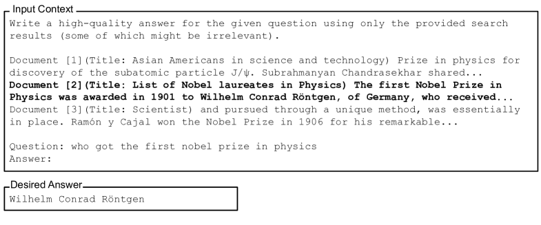

<figcaption>Figure 2: 複数文書質問応答タスクの例。入力コンテキストと望ましいモデルの答えを示す。ここでは明確さのため、答えを含む文書が入力コンテキスト内で太字にされている。</figcaption>
</figure>

<figure>

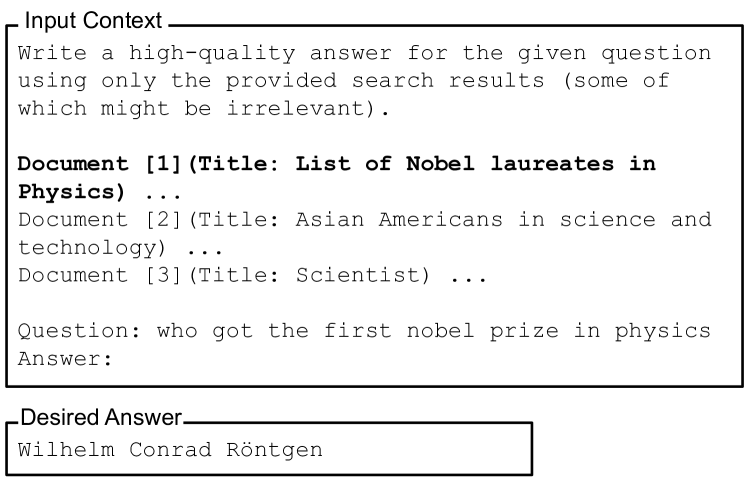

<figcaption>Figure 3: Figure 2 に示した複数文書質問応答の例について、入力コンテキスト内の関連情報の位置を変調する。入力コンテキスト内の文書を並べ替えても、望ましい出力は変わらない。</figcaption>
</figure>

<figure>

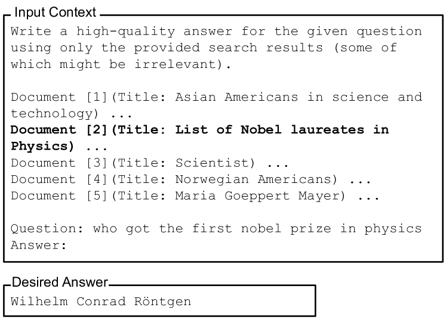

<figcaption>Figure 4: Figure 2 に示した複数文書質問応答の例について、入力コンテキストの長さを変調する。答えを含まない文書を加えると入力コンテキストの長さは増えるが、望ましい出力は変わらない。</figcaption>
</figure>

## 2 Multi-Document Question Answering（複数文書質問応答）

我々の目標は、言語モデルが入力コンテキストをどう使うかをよりよく理解することである。そのために、**入力コンテキスト内で関連情報を見つけ、それを使って質問に答える**ことを要求する複数文書質問応答におけるモデルの性能を分析する。とりわけ、**入力コンテキストの長さと関連情報の位置に統制された変更を加え**、タスク性能の変化を測る。

### 2.1 Experimental Setup（実験設定）

複数文書質問応答のタスクにおいて、モデルへの入力は **(i) 答えるべき質問**と **(ii) $k$ 個の文書**（Wikipedia の一節など）である。ここで**ちょうど 1 つの文書だけが質問への答えを含み**、$k-1$ 個の「気を散らす（distractor）」文書は含まない。このタスクは、モデルが入力コンテキスト内で答えを含む文書へアクセスし、それを使って質問に答えることを要求する。

<figure>

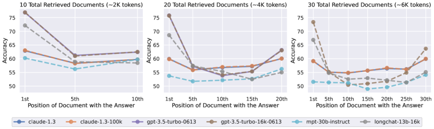

<figcaption>Figure 5: 関連情報（答えを含む文書）の位置を変えることが複数文書質問応答の性能に与える影響。位置が小さいほど入力コンテキストの先頭に近い。性能は関連情報がコンテキストのまさに先頭または末尾にあるとき最も高く、モデルが入力コンテキストの中間にある情報を推論せねばならないときには急速に劣化する。</figcaption>
</figure>

このタスクを **NaturalQuestions-Open** [^16] [^15] のデータで具体化する。同データセットは Google 検索エンジンへ発行された過去のクエリと、Wikipedia から抽出された人手注釈の答えを含む。とりわけ、注釈された長い答えが（リストや表ではなく）段落である **2,655 件のクエリ**を取る。入力コンテキスト内の文書としては Wikipedia の一節（最大 100 トークンのチャンク）を用いる。

$k-1$ 個の気を散らす文書を集めるには、**検索系（MS-MARCO でファインチューニングした Contriever** [^10]**）**を用いて、クエリに最も関連し、かつ NaturalQuestions が注釈した答えを一切含まない Wikipedia のチャンクを $k-1$ 個検索する。入力コンテキストにおいて、**気を散らす文書は関連度の降順に提示される**。

入力コンテキスト内の関連情報の位置を変調するには、文書の順序を調整して答えを含む文書の位置を変える（Figure 3）。このタスクで入力コンテキストの長さを変調するには、答えを含まない検索文書の数を増減させる（Figure 4）。

[^12] と [^19] に従い、主要な評価指標として**精度**を用い、（NaturalQuestions の注釈から取った）正しい答えのいずれかが予測された出力に現れるかを判定する。

我々の実験設定は [^9] の needle-in-a-haystack 実験と類似している。同研究は関連する段落が (i) 入力の先頭に置かれた場合と (ii) 入力内の無作為な位置に置かれた場合の質問応答の性能を比較した。彼らは、**関連情報が入力コンテキストの先頭に置かれたとき encoder-decoder のモデルの性能が著しく高い**ことを見出した。対照的に、**我々は関連情報の位置のより細かい粒度の変化を研究する。**

### 2.2 Models（モデル）

我々はいくつかの最先端のオープンおよびクローズドな言語モデルを分析する。出力を生成する際は**貪欲デコーディング**を用いる。各モデルに標準的なプロンプトの集合を用いる（Figure 2）。

#### Open models.（オープンなモデル）

**MPT-30B-Instruct** を実験する。最大コンテキスト長は 8192 トークン。このモデルは 2048 トークンの系列で 1 兆トークンを用いて最初に事前学習され、その後 8192 トークンの系列で 500 億トークンを用いた**系列長適応の事前学習の追加フェーズ**を経ている。MPT-30B-Instruct は位置情報の表現に **ALiBi** [^29] を用いる。我々はまた **LongChat-13B (16K)** [^18] も評価する。これは **LLaMA-13B** [^43] のコンテキストウィンドウを、**縮約された rotary positional embeddings** を用いてから 16384 トークンの系列でファインチューニングすることにより、2048 から 16384 へ拡張したものである。

#### Closed models.（クローズドなモデル）

OpenAI の API で **GPT-3.5-Turbo** と **GPT-3.5-Turbo (16K)** を実験する。GPT-3.5-Turbo の最大コンテキスト長は 4K トークンで、GPT-3.5-Turbo (16K) は最大コンテキスト長を 16K トークンへ拡張した版である。Anthropic の API で **Claude-1.3** と **Claude-1.3 (100K)** を評価する。Claude-1.3 の最大コンテキスト長は 8K トークン、Claude-1.3 (100K) は 100K トークンへ拡張した版である。

### 2.3 Results and Discussion（結果と議論）

**10・20・30 の総文書数**を含む入力コンテキストで実験する。Figure 5 は、入力コンテキスト内の関連情報の位置を変えたときの複数文書質問応答の性能を示す。モデルの性能を文脈づけるため、**closed-book** と **oracle** の設定でも評価する（Table 1）。**closed-book の設定では、モデルは入力コンテキストに文書を一切与えられず、正しい答えを生成するのに自らのパラメトリックな記憶に頼らねばならない。**他方 **oracle の設定では、言語モデルは答えを含む単一の文書を与えられ、それを使って質問に答えねばならない。**

**Table 1**: 複数文書質問応答タスクにおける言語モデルの closed-book と oracle の精度。

| Model | Closed-Book | Oracle |
| --- | --- | --- |
| LongChat-13B (16K) | 35.0% | 83.4% |
| MPT-30B-Instruct | 31.5% | 81.9% |
| GPT-3.5-Turbo | **56.1%** | 88.3% |
| GPT-3.5-Turbo (16K) | 56.0% | 88.6% |
| Claude-1.3 | 48.3% | 76.1% |
| Claude-1.3 (100K) | 48.2% | 76.4% |

#### Model performance is highest when relevant information occurs at the beginning or end of its input context.（性能は関連情報が入力コンテキストの先頭か末尾にあるとき最も高い）

Figure 5 に示すとおり、**入力コンテキスト内の関連情報の位置を変えると、モデルの性能は実質的に低下する**。とりわけ**特徴的な U 字型の性能曲線**が見える——モデルはコンテキストのまさに先頭（primacy bias）とまさに末尾（recency bias）にある関連情報を使うほうがはるかに得意で、**入力コンテキストの中間にある情報を使うことを強いられると性能が劣化する**。たとえば **GPT-3.5-Turbo の複数文書 QA の性能は 20% 以上落ちうる**——最悪の場合、**20 文書と 30 文書の設定における性能は、入力文書をまったく与えないとき（closed-book の性能; 56.1%）よりも低い**。これらの結果は、**現在のモデルが下流タスクのプロンプトを与えられたときに、コンテキストウィンドウ全体を効果的に推論できていない**ことを示す。

<figure>

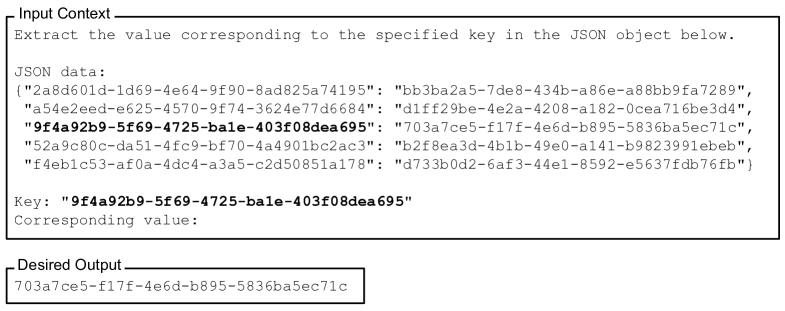

<figcaption>Figure 6: キー・バリュー検索タスクの例。入力コンテキストと望ましいモデル出力を示す。キーが与えられたとき、目標は紐づく値を返すことである。すべてのキーと値は 128 ビットの UUID である。クエリに答えるための関連するキー・バリューの対は、明確さのためここでは入力コンテキスト内で太字にされている。</figcaption>
</figure>

#### Extended-context models are not necessarily better at using input context.（拡張コンテキストのモデルが入力コンテキストを使うのに必ずしも優れているわけではない）

**入力コンテキストがモデルとその拡張コンテキスト版の双方のコンテキストウィンドウに収まるとき、両者の性能はほぼ同一である**ことが分かる。たとえば 10 文書と 20 文書の設定はいずれも GPT-3.5-Turbo と GPT-3.5-Turbo (16K) のコンテキストウィンドウに収まるが、**関連情報の位置の関数としての両者の性能はほぼ重なる**（Figure 5 の実線の紫と破線の茶の系列）。これらの結果は、**拡張コンテキストのモデルが、その非拡張版より入力コンテキストを使うのに必ずしも優れているわけではない**ことを示す。

## 3 How Well Can Language Models Retrieve From Input Contexts?（言語モデルは入力コンテキストからどれだけ検索できるか）

言語モデルが複数文書質問応答のタスクにおいて入力コンテキストの中間から情報を検索し使うのに苦労するのなら、言語モデルは入力コンテキストから**単に検索する**ことがどの程度できるのだろうか。我々はこの問いを**合成的なキー・バリュー検索タスク**で調べる。これは、入力コンテキストから一致するトークンを検索するという基本的な能力の最小のテストベッドを提供するよう設計されている。

<figure>

<figcaption>Figure 7: 入力コンテキスト長と関連情報の位置を変えることがキー・バリュー検索の性能に与える影響。位置が小さいほど入力コンテキストの先頭に近い。一部のモデルはこの合成的なタスクで完璧な精度を示すが（Claude-1.3 と Claude-1.3 (100K) など）、ここでも性能は関連情報がコンテキストのまさに先頭または末尾にあるときに最も高くなることが多く、モデルが入力コンテキストの中間から検索せねばならないときには急速に劣化する。</figcaption>
</figure>

### 3.1 Experimental Setup（実験設定）

我々の合成的なキー・バリュー検索タスクにおいて、入力は **(i) $k$ 個のキー・バリューの対を持つ文字列に直列化された JSON オブジェクト**（キーと値のそれぞれは一意で無作為に生成された UUID）と、**(ii) 前述の JSON オブジェクト内のキー**である。目標は指定されたキーに紐づく値を返すことである。したがって各 JSON オブジェクトは 1 つの関連するキー・バリューの対（その値が返されるべきもの）と、$k-1$ 個の無関係な「気を散らす」キー・バリューの対を含む。

我々の合成的なキー・バリュー検索タスクは [^23] の Little Retrieval Test や [^18] の細粒度の行検索タスクと似た目標を共有するが、我々は**自然言語の意味論をできる限り取り除く**ことでタスクを蒸留し単純化することを明示的に狙う（無作為な UUID を使う）。**言語的な特徴が潜在的な交絡因子になりうる**からである。たとえば Transformer の言語モデルは入力中の異なる言語的特徴に対して異なる感度を持ちうる [^22]。

### 3.2 Results and Discussion（結果と議論）

**75・140・300 個のキー・バリューの対**（各 500 例）を含む入力コンテキストで実験する。

Figure 7 はキー・バリュー検索の性能を示す。**Claude-1.3 と Claude-1.3 (100K) は評価したすべての入力コンテキスト長でほぼ完璧に遂行するが、他のモデルは苦労する**。とりわけコンテキストが 140 または 300 個のキー・バリューの対を持つときがそうである——**合成的なキー・バリュー検索タスクは入力コンテキスト内の完全一致を特定することしか要求しないにもかかわらず、すべてのモデルが高い性能を達成するわけではない。**

複数文書 QA の結果と同様に、**GPT-3.5-Turbo・GPT-3.5-Turbo (16K)・MPT-30B-Instruct は、入力コンテキストの中間にあるキー・バリューの対へアクセスせねばならないときに最も性能が低い**。LongChat-13B (16K) は 140 のキー・バリューの設定で異なる傾向を示す。我々は定性的に、**関連情報が入力コンテキストの先頭に置かれたとき、LongChat-13B (16K) が値を直接出力するのではなく、キーを検索するコードを生成する傾向がある**ことを観測した。

## 4 Why Are Language Models Not Robust to Changes in the Position of Relevant Information?（なぜ言語モデルは関連情報の位置の変化に頑健でないのか）

我々の複数文書質問応答とキー・バリュー検索の結果は、関連情報の位置を変えると性能が著しく劣化することから、言語モデルが長い入力コンテキスト内の情報へ頑健にアクセスし使うことに苦労していることを示す。その理由をよりよく理解するため、**モデルアーキテクチャ（decoder-only 対 encoder-decoder）・query-aware contextualization・instruction fine-tuning** の役割について予備的な調査を行う。

<figure>

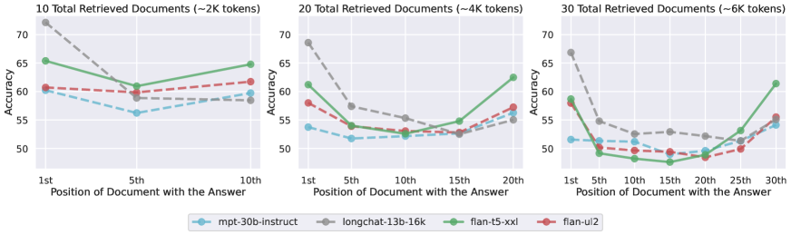

<figcaption>Figure 8: encoder-decoder のモデル（Flan-UL2 と Flan-T5-XXL）を、そのエンコーダの訓練時の最大系列長（それぞれ 2048 と 512 トークン）より短い系列で評価すると、入力コンテキスト内の関連情報の位置の変化に対して比較的頑健である（左の副プロット）。対照的に、訓練中に見たものより長い系列で評価すると（中央と右の副プロット）、U 字型の性能曲線が観測される——性能は関連情報が入力コンテキストの中間にあるときよりも、先頭または末尾にあるときのほうが高い。</figcaption>
</figure>

### 4.1 Effect of Model Architecture（モデルアーキテクチャの影響）

我々が評価したオープンなモデルはすべて **decoder-only** のモデルである——各タイムステップで、それらは**先行するトークンにしか注意を向けられない**。モデルアーキテクチャが言語モデルの文脈の使い方に与えうる影響をよりよく理解するため、decoder-only と encoder-decoder の言語モデルを比較する。

**Flan-T5-XXL** [^31] [^3] と **Flan-UL2** [^41] を実験する。Flan-T5-XXL は 512 トークンの系列（エンコーダとデコーダ）で訓練されている。Flan-UL2 は最初 512 トークンの系列（エンコーダとデコーダ）で訓練され、その後 1024 トークン（エンコーダとデコーダ）で追加の 10 万ステップ事前学習され、その後エンコーダ 2048 トークン・デコーダ 512 トークンの系列で instruction fine-tuning されている。しかし**これらのモデルは相対位置埋め込みを使うので、原理的にはこれらの最大コンテキスト長を超えて外挿できる**。[^36] は両モデルとも最大 8K トークンの系列でうまく機能しうることを見出している。

Figure 8 は decoder-only と encoder-decoder のモデルの性能を比較する。**Flan-UL2 を 2048 トークンの訓練時コンテキストウィンドウの内側の系列で評価すると**（Figure 8 の左の副プロット）、その性能は入力コンテキスト内の関連情報の位置の変化に対して**比較的頑健である（最良ケースと最悪ケースの性能の絶対差は 1.9%）**。**2048 トークンより長い系列の設定で評価すると**（Figure 8 の中央と右）、**関連情報が中間に置かれたとき Flan-UL2 の性能は劣化し始める**。Flan-T5-XXL も同様の傾向を示し、入力コンテキストが長いほど、関連情報を入力コンテキストの中間に置いたときの性能劣化が大きくなる。

我々は、**encoder-decoder のモデルがコンテキストウィンドウをよりよく使えるのは、その双方向エンコーダが各文書を将来の文書の文脈において処理することを可能にし、文書間の相対的な重要度の推定を潜在的に改善するからではないか**と仮説を立てる。

<figure>

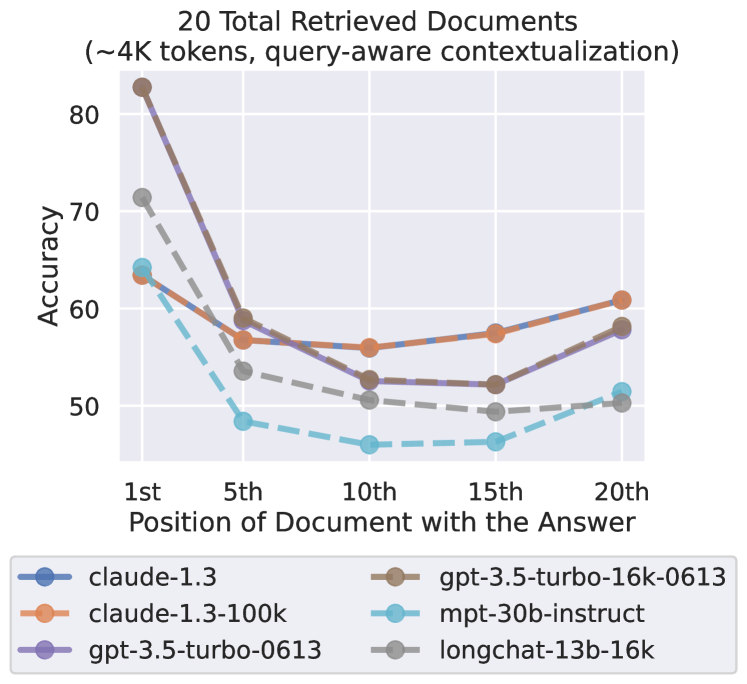

<figcaption>Figure 9: query-aware contextualization（クエリを文書の前と後に置くこと）は、複数文書 QA において関連情報の位置の変化に対する言語モデルの頑健性を実質的に改善しない。関連情報がまさに先頭にあるときは性能がわずかに上がるが、それ以外ではわずかに下がる。</figcaption>
</figure>

### 4.2 Effect of Query-Aware Contextualization（query-aware contextualization の影響）

我々の複数文書 QA とキー・バリュー検索の実験は、**クエリ（答えるべき質問、または検索すべきキー）を処理すべきデータ（文書またはキー・バリューの対）の後に置いている**。その結果、**decoder-only のモデルは文書やキー・バリューの対を文脈化する際にクエリのトークンへ注意を向けられない**。クエリはプロンプトの末尾にしか現れず、decoder-only のモデルは各タイムステップで先行するトークンにしか注意を向けられないからである。対照的に、encoder-decoder のモデル（関連情報の位置の変化に対してより頑健に見える。§4.1）は双方向エンコーダで入力コンテキストを文脈化する——**この観察を使って、クエリをデータの前と後の両方に置き、文書（またはキー・バリューの対）の query-aware な文脈化を可能にすることで、decoder-only のモデルを改善できないだろうか。**

我々は、**query-aware contextualization がキー・バリュー検索タスクの性能を劇的に改善する**ことを見出す——**すべてのモデルが 75・140・300 のキー・バリューの対の設定でほぼ完璧な性能を達成する**。たとえば GPT-3.5-Turbo (16K) は query-aware contextualization を用いると 300 のキー・バリューの対で評価したとき完璧な性能を達成する。

対照的に、**query-aware contextualization なしでは最悪ケースの性能は 45.6%** である（Figure 7）。キー・バリュー検索の性能への著しい影響にもかかわらず、**query-aware contextualization は複数文書質問応答タスクの性能の傾向をほとんど変えない**（Figure 9）——関連情報が入力コンテキストのまさに先頭にあるときは性能をわずかに改善するが、他の設定ではわずかに低下させる。

### 4.3 Effect of Instruction Fine-Tuning（instruction fine-tuning の影響）

我々が評価したモデルはすべて instruction fine-tuning されている——最初の事前学習の後、指示と応答のデータセットで教師ありファインチューニングを受けている。**教師あり instruction fine-tuning のデータでは、タスク仕様や指示が入力コンテキストの先頭に置かれることが多く**、これが instruction fine-tuning された言語モデルに**入力コンテキストの先頭により大きな重みを置かせている**かもしれない。この可能性をよりよく理解するため、**MPT-30B-Instruct の複数文書質問応答の性能を、そのベースモデル（すなわち instruction fine-tuning 前）である MPT-30B と比較する。**

<figure>

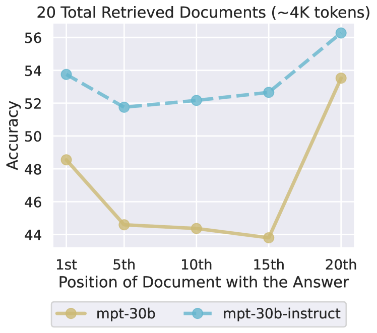

<figcaption>Figure 10: MPT-30B-Instruct の複数文書 QA の性能を、そのベースモデル（instruction fine-tuning 前）である MPT-30B と比較する。両モデルとも U 字型の性能曲線を持ち、関連情報が入力コンテキストの先頭または末尾にあるときに性能がはるかに高い。これは instruction fine-tuning の過程それ自体がこれらの性能傾向の原因では必ずしもないことを示す。</figcaption>
</figure>

Figure 10 は、入力コンテキスト内の関連情報の位置の関数として MPT-30B と MPT-30B-Instruct の複数文書 QA の性能を比較する。**驚くべきことに、MPT-30B と MPT-30B-Instruct のどちらも U 字型の性能曲線を示す**。MPT-30B-Instruct の絶対的な性能は一様に MPT-30B より高いが、**全体的な性能の傾向は似ている**。我々はまた、**instruction fine-tuning が最悪ケースの性能差を、ベースモデルの最良・最悪ケース間のほぼ 10% から約 4% へわずかに減らす**ことも観測する。

これらの観察は、**instruction fine-tuning されていない言語モデルが直近のトークン（すなわち入力コンテキストの末尾）へ偏る**ことを見出した先行研究 [^13] [^28] を補完する。この **recency bias** は、連続したテキストの次単語予測でモデルを評価した過去の研究で観測されてきた——言語モデルが長距離の情報からほとんど恩恵を受けない設定である [^40]。対照的に**我々の結果は、指示形式のデータでプロンプトを与えられたとき、言語モデルがより長距離の情報（すなわち入力コンテキストの先頭）を使える**ことを示す。我々は、**instruction fine-tuning されていない言語モデルが、事前学習中に見たインターネットのテキスト（StackOverflow の質問と回答など）に現れる同様の形式のデータから、こうした長いコンテキストの使い方を学ぶのではないか**と仮説を立てる。

追加のファインチューニングとモデル規模の効果をよりよく理解するため、我々はさまざまな規模（7B・13B・70B）の Llama-2 モデルを、追加の教師ありファインチューニングと人間のフィードバックからの強化学習の有無で実験した（付録 E）。我々は、**U 字型の性能曲線が十分に大きな言語モデルにおいてのみ現れる**ことを見出す（追加のファインチューニングの有無にかかわらず）——**7B の Llama-2 モデルは recency bias のみを示すのに対し、13B と 70B のモデルは U 字型の性能曲線を示す**。加えて、**Llama-2 の教師ありファインチューニングと人間のフィードバックからの強化学習の手続きは、小さいモデル（13B）では位置のバイアスをわずかに緩和するが、より大きなモデル（70B）では傾向をほとんど変えない。**

## 5 Is More Context Is Always Better? A Case Study With Open-Domain QA（より多くの文脈は常に良いのか）

我々の結果は、**より長い入力コンテキストで言語モデルにプロンプトを与えることがトレードオフである**ことを示す。**たとえ言語モデルが 16K トークンを受け取れるとしても、実際に 16K トークンの文脈を与えることは有益なのだろうか。**この問いへの答えは究極的には下流タスク固有である。加えられた文脈の限界的な価値と、長い入力コンテキストを効果的に使うモデルの能力に依存するからである。しかし我々は、既存の言語モデルにおけるこのトレードオフをよりよく理解するため、NaturalQuestions-Open におけるオープンドメイン質問応答の事例研究を行う。

我々は標準的な **retriever-reader** の構成で言語モデルを使う。検索系（MS-MARCO でファインチューニングした Contriever）が NaturalQuestions-Open からの入力クエリを取り、Wikipedia から関連度スコアが最も高い $k$ 個の文書を返す。これらの検索された文書で言語モデルを条件づけるため、単にそれらをプロンプトに含める。**検索の recall と reader の精度**（注釈された答えのいずれかが予測された出力に現れるか）を、**検索された文書数 $k$ の関数として**評価する。

Figure 11 は検索の recall とオープンドメイン QA の結果を示す。**reader モデルの性能は、retriever の性能が飽和するはるか前に飽和する**ことが分かり、これは **reader が追加の文脈を効果的に使えていない**ことを示す。**20 個を超える検索文書を使っても reader の性能はごくわずかしか改善しない**（GPT-3.5-Turbo で約 1.5%、Claude-1.3 で約 1%）**一方で、入力コンテキスト長（したがって遅延とコスト）は著しく増える。**これらの結果は、モデルが入力コンテキストの先頭または末尾にある情報を検索し使うほうが得意であることが多いという観察と合わせて、**検索された文書の効果的な再ランキング（関連情報を入力コンテキストの先頭に近づける）や、ランク付きリストの切り詰め（適切なときにより少ない文書を検索する** [^1]**）が、言語モデルベースの reader が検索された文脈を使う方法を改善する有望な方向でありうる**ことを示唆する。

<figure>

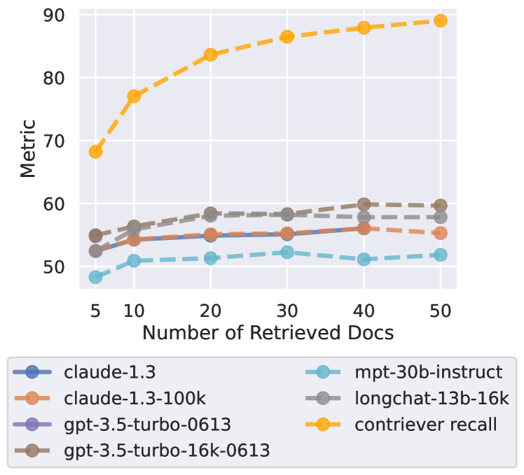

<figcaption>Figure 11: 検索された文書数の関数としての、retriever の recall とモデルの性能。モデルの性能は retriever の recall よりはるかに前に飽和しており、モデルが追加で検索された文書を利用するのに困難を抱えていることを示す。</figcaption>
</figure>

## 6 Related Work（関連研究）

### 6.1 Long-Context Language Models（長コンテキストの言語モデル）

コンテキスト長に対して Transformer より安価にスケールする高性能な言語モデルの設計には多くの先行研究がある。多くの系統が、再帰 [^4]・注意を計算的により軽い近似へ分解すること [^2] [^47]・低ランク近似 [^46] [^25] といった注意の修正を伴う Transformer の変種を追求する。[^6] は代わりに、注意深く作られた IO を意識した CUDA カーネルによって**より高速な厳密注意**を提供する。別途、二次の系列長の複雑性を取り除くために**注意を完全に廃する**試みもあり、しばしば畳み込みや線形 RNN を通じて行われる（RWKV [^24]・S4 [^8]・Hyena [^27] など）。**多くの先行研究は、長いコンテキストを処理する能力の代理として多様なウェブコーパスでの perplexity を評価する。本研究は、長いコンテキストにおける正確な知識アクセスが追加の課題でありうることを示す。**

### 6.2 How Do Language Models Use Context?（言語モデルはどう文脈を使うか）

[^13] の先駆的な仕事は、**小さな LSTM の言語モデルが長期の文脈をますます粗く使う**ことを示した。[^34] は対話モデルで同様の結果を見出した。同様の流れで、[^5] は注意つきの LSTM 言語モデルが主に直近の履歴を使う傾向があることを見出す。[^26] は、情報検索系からの文脈を事前学習済み言語モデルと組み合わせて教師なし質問応答に用いる可能性を最初に実証した研究のひとつである。[^22] は、**情報を破壊する多くの操作が Transformer LM の予測にほとんど影響しない**ことを見出した。[^14] は、そこそこの規模の Transformer 言語モデルにおける長コンテキストの生成が、**モデルが長い文脈に適切に条件づけできないために退化する**ことを見出した。最後に、長コンテキストのモデルを研究した [^40] は、**より長い文脈はごく少数のトークンの予測しか改善しない**ことを見出した。これは、**有界な相互情報量を持つ系列分布は、必然的に、ますます長い文脈からの平均的な予測の便益を限界的なものにする**ことを示した [^37] の理論と整合する経験的な所見である。[^30] は効率的な Transformer がさまざまな長コンテキストの下流 NLP タスクでどう機能するかを分析し、**長コンテキストの Transformer が recency bias を持ち、長距離の文脈を効果的に使わない**ことを見出した。

### 6.3 The Serial-Position Effect（系列位置効果）

本研究で我々が観測した U 字型の曲線は、心理学において**系列位置効果（serial-position effect）**として知られる対応物を持つ [^7] [^21]。これは、**リストの要素の自由連想想起において、人間はリストの最初と最後の要素を最もよく覚えている傾向がある**と述べるものである。系列位置効果は、人間が短期記憶と長期記憶をどう発達させるかを理解する上で役割を果たす。**言語モデルにおいて系列位置効果に似たものを観測することは、おそらく驚くべきことである。Transformer の言語モデルの基礎にある自己注意の機構は、技術的には文脈内のどのトークンも等しく検索できるはずだからである。**

## 7 Conclusion（結論）

我々は一連の統制された実験を通じて、言語モデルが長い入力コンテキストをどう使うかを経験的に研究した。**関連情報の位置を変えると言語モデルの性能が著しく劣化する**ことを示し、これはモデルが長い入力コンテキスト内の情報へ頑健にアクセスし使うことに苦労していることを示す。とりわけ**性能は、モデルが長い入力コンテキストの中間にある情報を使わねばならないときに最も低いことが多い**。我々は **(i) モデルアーキテクチャ・(ii) query-aware contextualization・(iii) instruction fine-tuning** の役割について予備的な調査を行い、それらが言語モデルの文脈の使い方にどう影響するかをよりよく理解した。最後に、オープンドメイン質問応答の実践的な事例研究で締めくくり、**言語モデルの reader の性能が retriever の recall よりはるかに前に飽和する**ことを見出した。

## Appendix A Ambiguity in Multi-Document QA Distractor Documents（気を散らす文書における曖昧性）

NaturalQuestions-Open についての過去の仕事 [^10] [^11] に従い、我々は検索コーパスとして 2018 年後半の Wikipedia のダンプを用いる。しかしこの標準的な Wikipedia のダンプは、**NaturalQuestions の注釈との間にわずかな時間的な不整合**を持つ。

たとえば「what nfl team does robert griffin iii play for」という質問を考える。NaturalQuestions の注釈された答えは「currently a free agent（現在フリーエージェント）」である。しかし Wikipedia の検索コーパスは彼が「Baltimore Ravens」でプレーしているという情報を含む。**Wikipedia ダンプのタイムスタンプと NaturalQuestions の注釈の過程との間に、彼がチームから解雇された**からである。

我々は [^20] の曖昧性の注釈を用いて**曖昧でない質問の部分集合**を作る。この曖昧でない部分集合での実験は、質問集合全体での実験と**同様の結果と結論**を示す（Figure 12）。

<figure>

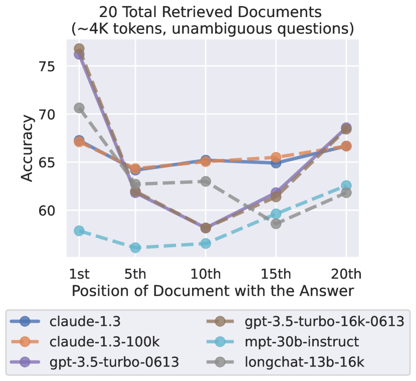

<figcaption>Figure 12: 曖昧でない質問の部分集合における言語モデルの性能。</figcaption>
</figure>

## Appendix B Random Distractors in Multi-Document QA（無作為な気を散らす文書）

我々は、気を散らす文書として**無作為な Wikipedia の文書**を用いた複数文書質問応答の実験も行う。これにより、**検索された気を散らす文書（hard negatives）の影響を切り分けられる**。この設定では、答えを含む文書は単純なヒューリスティクス（クエリとの語彙的な重なりなど）で特定できることが多い点に注意されたい。Figure 13 がこの実験の結果を示す。**すべてのモデルがこの設定でより高い絶対精度を持つものの、驚くべきことに、それでも入力コンテキスト全体を推論することに苦労する**。これは**その性能劣化が、関連文書を特定できないことだけに起因するのではない**ことを示す。

<figure>

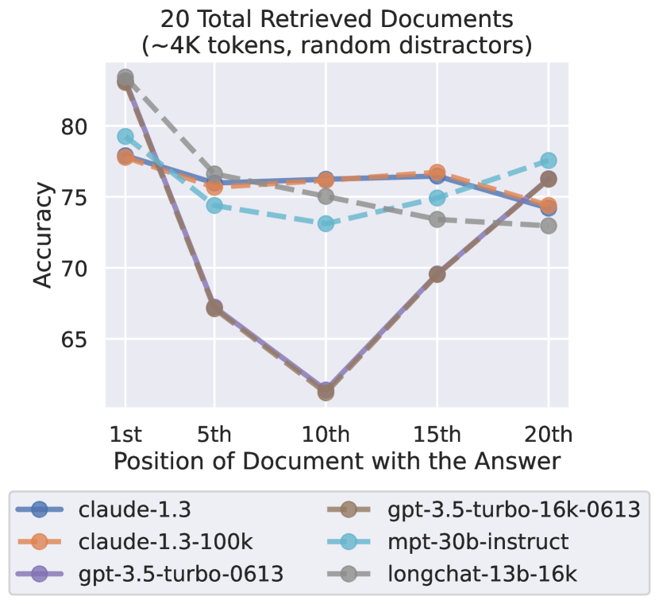

<figcaption>Figure 13: 検索された気を散らす文書ではなく無作為な気を散らす文書を用いたときの、複数文書 QA における言語モデルの性能。</figcaption>
</figure>

## Appendix C Randomizing Distractor Order in Multi-Document QA（気を散らす文書の順序の無作為化）

我々のプロンプトは、与えられた検索結果を使って質問に答えるよう言語モデルに指示する。**事前学習や instruction fine-tuning のデータに、検索結果を関連度の降順に並んでいるものとして扱う事前分布があるかもしれない**（すなわち、入力コンテキストの先頭近くの文書のほうが末尾のものより有用である可能性が高い、と）。我々の結論がこのバイアスの単なる副産物でないことを検証するため、**指示を「Write a high-quality answer for the given question using only the provided search results (some of which might be irrelevant). The search results are ordered randomly.」に変更**して実験を行う。加えて $k-1$ 個の気を散らす文書を無作為にシャッフルする。

Figure 14 がこの実験の結果を示す。**引き続き U 字型の性能曲線が見られ**、言語モデルが入力コンテキストの中間にある情報を使わねばならないときに性能が劣化する。§2.3 の結果と比べると、**無作為化は関連情報がコンテキストのまさに先頭にあるときの性能をわずかに下げ、中間と末尾の情報を使うときの性能をわずかに上げる。**

<figure>

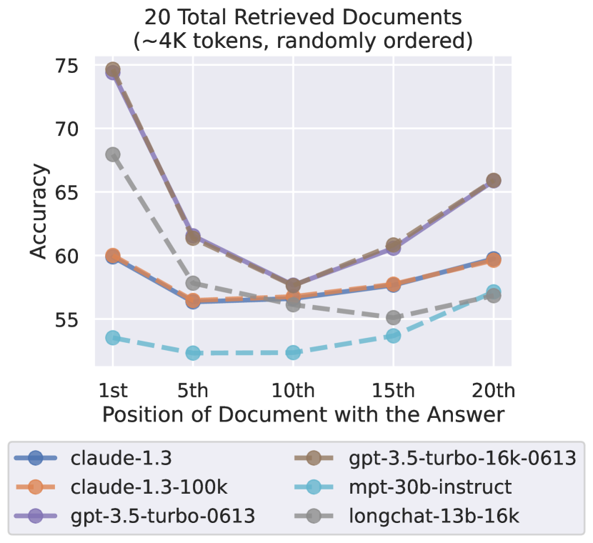

<figcaption>Figure 14: 気を散らす文書を関連度の降順に提示するのではなく順序を無作為化し、そのことをプロンプトで述べた場合の言語モデルの性能。</figcaption>
</figure>

## Appendix D GPT-4 Performance（GPT-4 の性能）

我々は **GPT-4 (8K)** を、各入力コンテキストに 20 の総文書を含む複数文書 QA の無作為な 500 例の部分集合で評価する（Figure 15）。**GPT-4 は他のどの言語モデルより高い絶対性能を達成するが、それでも U 字型の性能曲線を示す**——性能は関連情報がコンテキストのまさに先頭または末尾にあるとき最も高く、**入力コンテキストの中間にある情報を使わねばならないときには劣化する。**

<figure>

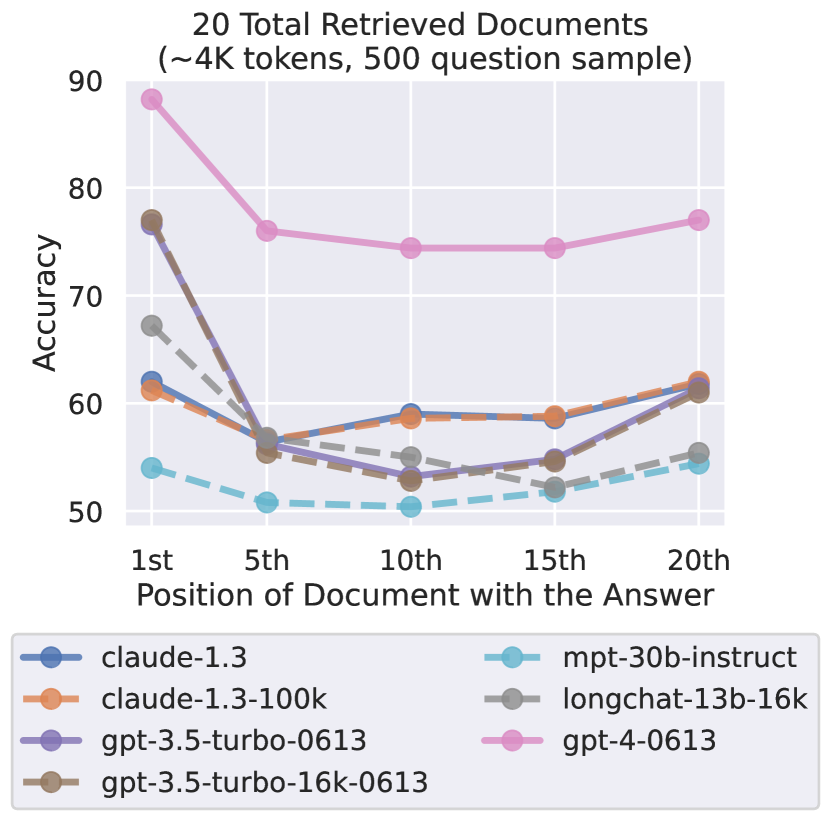

<figcaption>Figure 15: GPT-4 は他のモデルより高い絶対性能を持つが、関連情報が入力コンテキストの中間にあるときには依然として性能が劣化する。</figcaption>
</figure>

## Appendix E Llama-2 Performance（Llama-2 の性能）

我々は **Llama-2** [^44] を、各入力コンテキストに 20 の総文書を含む複数文書 QA で評価する。Llama のトークナイザは以前に研究したモデルのトークナイザより長い系列を生むので、**Llama-2 の最大コンテキスト長 4096 トークンを超える 20 例（2,655 例中）を破棄する**。さまざまな規模（7B・13B・70B パラメータ）のモデルを、追加の教師ありファインチューニングと人間のフィードバックからの強化学習の有無（「-chat-」モデル）で実験する。

さまざまな規模の Llama-2 モデルを比べると、**U 字型の性能曲線を示すのはより大きなモデル（13B と 70B）だけ**であることが分かる（すなわち primacy bias と recency bias の両方）——**最小の Llama-2 モデル（7B）は recency bias のみを示す**。これらの結果から我々は、**先行研究（[^13] [^40] など）が言語モデルに primacy bias を観測しなかったのは、研究されたモデルが小さすぎた（10 億パラメータ未満）からではないか**と仮説を立てる。

追加の教師ありファインチューニングと人間のフィードバックからの強化学習の有無で Llama-2 モデルを比べると、**追加のファインチューニングが複数文書 QA タスクの性能を劇的に改善する**ことが分かる。追加のファインチューニングの有無にかかわらず **7B のモデルは primacy bias をほとんど示さず、大部分が recency bias である**。**13B のベースモデルは劇的な primacy bias と recency bias を持つ**——最良ケースと最悪ケースの性能の間に **20 ポイントの精度差**がある。13B に追加のファインチューニングを適用するとこのバイアスはわずかに減るように見えるが（最悪ケースの劣化が 10 ポイント）、**バイアスは依然として著しい**。しかし **70B のモデルは追加のファインチューニングの有無にかかわらず大部分が似た傾向を示し（primacy bias と recency bias の両方を示す）、追加のファインチューニングは位置のバイアスの深刻さをほとんど変えない。**

<figure>

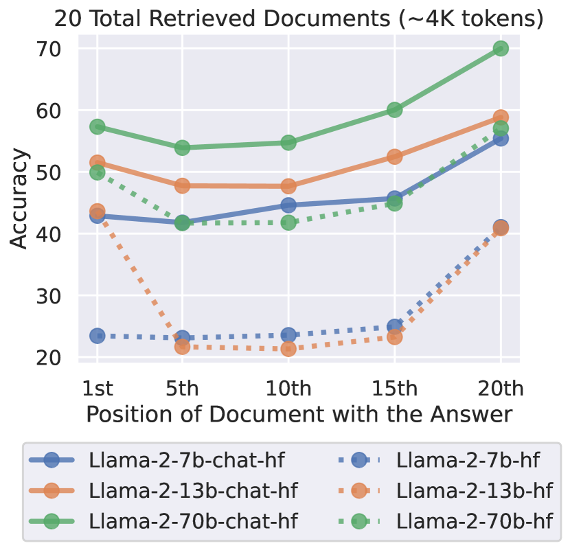

<figcaption>Figure 16: さまざまな規模（7B・13B・70B パラメータ）の Llama-2 モデルの複数文書 QA の性能（総文書数 20）。追加の教師ありファインチューニングと人間のフィードバックからの強化学習の有無（「-chat-」モデル）で比較する。</figcaption>
</figure>

## Appendix F Token Counts（トークン数）

Table 2・Table 3・Table 4 は、すべての実験設定について各入力コンテキストの平均および最大のトークン数を示す。**MPT-30B と MPT-30B-Instruct は同じトークナイザを、GPT-3.5-Turbo と GPT-3.5-Turbo (16K) は同じトークナイザを、Claude-1.3 と Claude-1.3 (100K) は同じトークナイザを使う**点に注意されたい。さらに **Claude-1.3 のトークナイザは、我々のデータに現れない追加の特殊トークンを除いて GPT-3.5-Turbo のトークナイザと同じ**である。その結果、これら 2 つのモデル群のトークン数は我々の実験設定では同じになる。

**Table 2**: closed-book と oracle の複数文書質問応答の設定における、評価した各モデルのトークン数の統計。

| | Closed-Book avg ± stdev | Closed-Book max | Oracle avg ± stdev | Oracle max |
| --- | --- | --- | --- | --- |
| LongChat-13B (16K) | 55.6 ± 2.7 | 70 | 219.7 ± 48.5 | 588 |
| MPT-30B | 43.5 ± 2.2 | 58 | 187.9 ± 41.8 | 482 |
| GPT-3.5-Turbo | 15.3 ± 2.2 | 29 | 156.0 ± 41.8 | 449 |
| Claude-1.3 | 15.3 ± 2.2 | 29 | 156.0 ± 41.8 | 449 |

**Table 3**: 各文書質問応答の設定における、評価した各モデルのトークン数の統計。

| | 10 docs avg ± stdev | 10 docs max | 20 docs avg ± stdev | 20 docs max | 30 docs avg ± stdev | 30 docs max |
| --- | --- | --- | --- | --- | --- | --- |
| LongChat-13B (16K) | 1749.9 ± 112.4 | 2511 | 3464.6 ± 202.3 | 4955 | 5181.9 ± 294.7 | 7729 |
| MPT-30B | 1499.7 ± 88.5 | 1907 | 2962.4 ± 158.4 | 3730 | 4426.9 ± 230.5 | 5475 |
| GPT-3.5-Turbo | 1475.6 ± 86.5 | 1960 | 2946.2 ± 155.1 | 3920 | 4419.2 ± 226.5 | 6101 |
| Claude-1.3 | 1475.6 ± 86.5 | 1960 | 2946.2 ± 155.1 | 3920 | 4419.2 ± 226.5 | 6101 |

**Table 4**: 各キー・バリュー（KV）検索の設定における、評価した各モデルのトークン数の統計。

| | 75 KV avg ± stdev | 75 KV max | 140 KV avg ± stdev | 140 KV max | 300 KV avg ± stdev | 300 KV max |
| --- | --- | --- | --- | --- | --- | --- |
| LongChat-13B (16K) | 5444.5 ± 19.1 | 5500 | 10072.4 ± 24.1 | 10139 | 21467.3 ± 35.9 | 21582 |
| MPT-30B | 4110.5 ± 23.8 | 4187 | 7600.9 ± 31.1 | 7687 | 16192.4 ± 46.6 | 16319 |
| GPT-3.5-Turbo | 3768.7 ± 25.6 | 3844 | 6992.8 ± 34.1 | 7088 | 14929.4 ± 50.7 | 15048 |
| Claude-1.3 | 3768.7 ± 25.6 | 3844 | 6992.8 ± 34.1 | 7088 | 14929.4 ± 50.7 | 15048 |

## Appendix G Full Multi-Document Question Answering Results（複数文書質問応答の全結果）

本節は、さまざまな文書数で複数文書 QA タスクを評価したときのモデルの性能を表にする（Figure 5）。「**Index $n$**」は、答えを含む文書が**位置 $n+1$** に現れるときの性能を示す。位置が小さいほど入力コンテキストの先頭に近い。たとえば index 0 は、答えを含む文書がコンテキストのまさに先頭（すなわちすべての文書の中で最初）に置かれたときの性能を指す。

### G.1 10 Total Retrieved Documents（検索文書 10 件）

**Table 5**: 総検索文書数 10 で複数文書 QA タスクを評価したときのモデルの性能。

| Model | Index 0 | Index 4 | Index 9 |
| --- | --- | --- | --- |
| Claude-1.3 | 62.9% | 58.3% | 59.7% |
| Claude-1.3 (100K) | 63.1% | 58.3% | 59.7% |
| GPT-3.5-Turbo | 76.8% | 61.2% | 62.4% |
| GPT-3.5-Turbo (16K) | 76.9% | 61.0% | 62.5% |
| MPT-30B-Instruct | 60.2% | 56.2% | 59.7% |
| LongChat-13B (16K) | 72.1% | 58.9% | 58.5% |

### G.2 20 Total Retrieved Documents（検索文書 20 件）

**Table 6**: 総検索文書数 20 で複数文書 QA タスクを評価したときのモデルの性能。

| Model | Index 0 | Index 4 | Index 9 | Index 14 | Index 19 |
| --- | --- | --- | --- | --- | --- |
| Claude-1.3 | 59.9% | 55.9% | 56.8% | 57.2% | 60.1% |
| Claude-1.3 (100K) | 59.8% | 55.9% | 57.0% | 57.4% | 60.0% |
| GPT-3.5-Turbo | 75.8% | 57.2% | **53.8%** | 55.4% | 63.2% |
| GPT-3.5-Turbo (16K) | 75.7% | 57.3% | 54.1% | 55.4% | 63.1% |
| MPT-30B-Instruct | 53.7% | 51.8% | 52.2% | 52.7% | 56.3% |
| LongChat-13B (16K) | 68.6% | 57.4% | 55.3% | 52.5% | 55.0% |

### G.3 30 Total Retrieved Documents（検索文書 30 件）

**Table 7**: 総検索文書数 30 で複数文書 QA タスクを評価したときのモデルの性能。

| Model | Index 0 | Index 4 | Index 9 | Index 14 | Index 19 | Index 24 | Index 29 |
| --- | --- | --- | --- | --- | --- | --- | --- |
| Claude-1.3 | 59.1% | 55.1% | 54.8% | 55.7% | 56.4% | 56.2% | 59.9% |
| Claude-1.3 (100K) | 59.1% | 55.1% | 54.9% | 55.7% | 56.6% | 56.1% | 60.0% |
| GPT-3.5-Turbo (16K) | 73.4% | 55.1% | **50.5%** | 50.9% | 51.8% | 54.9% | 63.7% |
| MPT-30B-Instruct | 51.6% | 51.3% | 51.2% | 49.0% | 49.6% | 51.3% | 54.1% |
| LongChat-13B (16K) | 66.9% | 54.8% | 52.5% | 52.9% | 52.2% | 51.3% | 55.1% |
