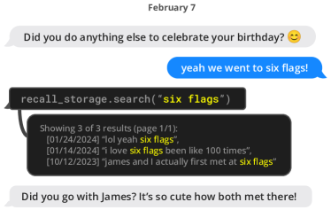
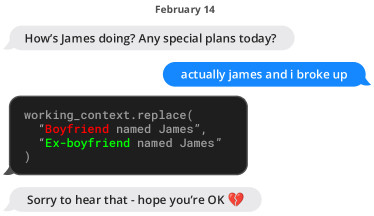
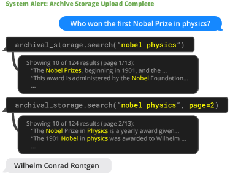
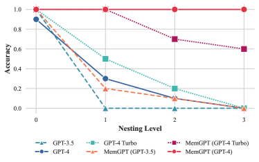
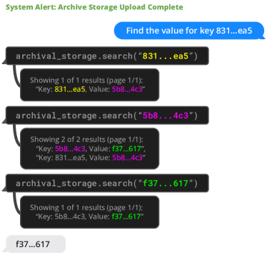

# MemGPT: オペレーティングシステムとしての LLM に向けて

> 原題: MemGPT: Towards LLMs as Operating Systems
> 著者: Charles Packer, Sarah Wooders, Kevin Lin, Vivian Fang, Shishir G. Patil, Ion Stoica, Joseph E. Gonzalez（UC Berkeley）
> 出典: arXiv:2310.08560（ICML 2024）

> 訳注: クリップは概ね良好（図 x1〜x8 の 8 枚・表 3 点とも取り込みあり、脚注なし）。Figure 8 のキャプションのみ、数式レンダリングの崩れで矢印連鎖の一部（`→ f37...617`）と括弧内の値（`(f37...617)`）が欠落していたため、ar5iv 原ページと照合して復元した。数式まわりの `→ \rightarrow` 併記・`∼` 化けは正規化した。なお「MemGPT provides function calls that the LLM processor to manage...」「as show in Figure 1」等の欠語・脱字は ar5iv も同一の原典由来の誤植であり、文意を汲んで訳した。Table 1 の HTML テーブルは Markdown に正規化した。References は方針どおり除外（謝辞セクションはなし）。

## Abstract（要旨）

大規模言語モデル（LLM）は AI に革命をもたらしたが、限られたコンテキストウィンドウに制約されており、長時間の会話や文書分析といったタスクでの有用性が妨げられている。限られたコンテキストウィンドウを超えたコンテキストを使えるようにするため、私たちは virtual context management（仮想コンテキスト管理）を提案する。これは、物理メモリとディスクの間のページングによって拡張された仮想メモリという錯覚を提供する、従来のオペレーティングシステムの階層的メモリシステムから着想を得た技法である。この技法を用いて、私たちは MemGPT（MemoryGPT）を導入する。MemGPT は、LLM の限られたコンテキストウィンドウの内側で実効的に拡張されたコンテキストを提供するために、異なるストレージ階層を賢く管理するシステムである。私たちはこの OS に着想を得た設計を、現代の LLM の限られたコンテキストウィンドウが性能を著しく損なう 2 つのドメインで評価する。すなわち、文書分析——MemGPT は基盤 LLM のコンテキストウィンドウをはるかに超える大きな文書を分析できる——と、マルチセッションチャット——MemGPT はユーザーとの長期的な対話を通じて記憶し、内省し、動的に進化する会話エージェントを作れる——である。実験のための MemGPT のコードとデータは [https://research.memgpt.ai](https://research.memgpt.ai/) で公開している。

## 1 Introduction（はじめに）

近年、大規模言語モデル（LLM）とその基盤であるトランスフォーマーアーキテクチャは会話 AI の礎となり、コンシューマ・エンタープライズの幅広いアプリケーションを生み出してきた。こうした進歩にもかかわらず、LLM が使う固定長の限られたコンテキストウィンドウは、長い会話や長い文書についての推論への適用可能性を著しく妨げている。たとえば、最も広く使われているオープンソース LLM は、最大入力長を超えるまでに、数十往復のメッセージ、あるいは短い文書 1 本の推論しかサポートできない。

トランスフォーマーのコンテキスト長を直接延長すると、トランスフォーマーアーキテクチャの self-attention 機構のために計算時間とメモリコストが二次関数的に増加し、新しい長文脈アーキテクチャの設計は喫緊の研究課題となっている。より長いモデルの開発は活発な研究領域だが、仮にコンテキストスケーリングの計算上の課題を克服できたとしても、近年の研究は、長文脈モデルが追加のコンテキストを効果的に活用するのに苦労することを示している。その帰結として、最先端の LLM の訓練に必要な膨大な資源とコンテキストスケーリングの逓減する見返りを考えれば、長いコンテキストを支える代替技法が決定的に必要とされている。

本論文では、固定コンテキストのモデルを使い続けながら、無限のコンテキストという錯覚をどう提供するかを研究する。私たちのアプローチは、仮想メモリのページング——利用可能なメモリをはるかに超えるデータセットをアプリケーションが扱えるようにするために、メインメモリとディスクの間でデータをページングする技法として開発された——の考え方を借りる。LLM エージェントの function calling（関数呼び出し）能力の近年の進歩を活用し、私たちは仮想コンテキスト管理のための OS に着想を得た LLM システムである MemGPT を設計する。function call を使うことで、LLM エージェントは外部データソースを読み書きし、自分自身のコンテキストを変更し、いつユーザーに応答を返すかを選べる。

これらの能力により、LLM はコンテキストウィンドウ（OS でいう「メインメモリ」に相当）と外部ストレージの間で、従来の OS の階層的メモリと同様に、情報を実効的に「ページ」イン／アウトできる。さらに、function call は、コンテキスト管理・応答生成・ユーザーとの相互作用の間の制御フローの管理にも活用できる。これにより、エージェントは単一のタスクのためにコンテキストの中身を反復的に変更することを選べ、その限られたコンテキストをより効果的に利用できる。

MemGPT では、コンテキストウィンドウを制約されたメモリ資源として扱い、従来の OS で使われるメモリ階層に類似した、LLM のためのメモリ階層を設計する。従来の OS のアプリケーションは仮想メモリとやり取りする。仮想メモリは、OS があふれたデータをディスクにページングし、アプリケーションがアクセスしたときに（ページフォルトを介して）データをメモリに取り戻すことで、物理（メイン）メモリに実際にあるよりも多くのメモリ資源があるという錯覚を提供する。より長いコンテキスト長という同様の錯覚（仮想メモリに相当）を提供するために、私たちは LLM が「LLM OS」——私たちが MemGPT と呼ぶもの——を介して、自分自身のコンテキスト（物理メモリに相当）に何を置くかを管理できるようにする。MemGPT は、LLM がコンテキスト内に置かれていない関連する過去のデータを取り出すこと、また、あまり関連しないデータをコンテキストから外部ストレージシステムへ退避することを可能にする。図 3 は MemGPT の構成要素を図示している。

<figure>


<figcaption>図1: MemGPT（左）は、コンテキスト空間の残りが少ないというシステムアラートを受け取った後、データを永続メモリに書き込む。</figcaption>
</figure>

メモリ階層・OS 的な関数・イベントベースの制御フローの組み合わせにより、MemGPT は有限のコンテキストウィンドウしか持たない LLM を使って、限りのないコンテキストを扱える。この新しい OS に着想を得た LLM システムの有用性を実証するため、既存の LLM の性能が有限コンテキストによって著しく制限される 2 つのドメインで MemGPT を評価する。すなわち、文書分析——標準的なテキストファイルの長さは現代の LLM の入力容量をすぐに超えてしまう——と、会話エージェント——限られた会話ウィンドウに縛られた LLM は、長時間の会話においてコンテキスト認識・ペルソナの一貫性・長期記憶を欠く——である。どちらの設定でも、MemGPT は有限コンテキストの限界を克服し、既存の LLM ベースのアプローチを上回る。

<figure>



<figcaption>図2: MemGPT（左）は、コンテキスト外のデータを検索して、関連情報を現在のコンテキストウィンドウに持ち込むことができる。</figcaption>
</figure>

<figure>


<figcaption>図3: MemGPT では、固定コンテキストの LLM プロセッサが、階層的メモリシステムと、自らのメモリを管理するための関数群によって拡張される。LLM のプロンプトトークン（入力）すなわち main context は、system instructions・working context・FIFO queue から構成される。LLM の補完トークン（出力）は、function executor によって function call として解釈される。MemGPT は関数を使って、main context と external context（archival ストレージと recall ストレージのデータベース）の間でデータを移動する。LLM は、出力の中で特別なキーワード引数（request_heartbeat=true）を生成することで、直後の LLM 推論の追加実行を要求し、function call を連鎖させられる。この function chaining こそが、MemGPT がユーザーの質問に答えるために多段階の検索を実行できる理由である。</figcaption>
</figure>

## 2 MemGPT (MemoryGPT)

MemGPT の OS に着想を得た多層メモリアーキテクチャは、2 つの主要なメモリ型を区別する: main context（メインメモリ／物理メモリ／RAM に相当）と external context（ディスクメモリ／ディスクストレージに相当）である。main context は LLM の*プロンプトトークン*からなる——main context にあるものはすべて *in-context* と見なされ、推論中に LLM プロセッサからアクセスできる。external context は、LLM の固定コンテキストウィンドウの外側に保持されるあらゆる情報を指す。この *out-of-context* なデータは、推論中に LLM プロセッサへ渡すためには、必ず明示的に main context へ移動されなければならない。MemGPT は、LLM プロセッサがユーザーの介入なしに自分自身のメモリを管理するための function call を提供する。

### 2.1 Main context（プロンプトトークン）

MemGPT のプロンプトトークンは、3 つの連続した区画に分割される: system instructions、working context、FIFO queue である。system instructions は読み取り専用（静的）で、MemGPT の制御フロー、各メモリ階層の意図された使い方、MemGPT 関数の使い方（例: コンテキスト外データの取り出し方）に関する情報を含む。working context は固定サイズの読み書き可能な非構造化テキストのブロックで、MemGPT の function call を介してのみ書き込める。会話の設定では、working context はユーザーとエージェントが演じるペルソナに関する重要な事実・好み・その他の重要な情報を保存するために使われ、エージェントがユーザーと滑らかに会話できるようにする。FIFO queue はメッセージの流動的な履歴を保存する。これにはエージェントとユーザーの間のメッセージに加え、システムメッセージ（例: メモリ警告）や function call の入出力が含まれる。FIFO queue の先頭インデックスには、キューから追い出されたメッセージの再帰的要約（recursive summary）を含むシステムメッセージが置かれる。

### 2.2 Queue Manager（キューマネージャ）

queue manager は、recall ストレージと FIFO queue のメッセージを管理する。新しいメッセージがシステムに届くと、queue manager は入ってきたメッセージを FIFO queue に追加し、プロンプトトークンを連結して LLM 推論をトリガーし、LLM 出力（補完トークン）を生成させる。queue manager は、入ってきたメッセージと生成された LLM 出力の両方を recall ストレージ（MemGPT のメッセージデータベース）に書き込む。recall ストレージ内のメッセージが MemGPT の function call を介して取り出されると、queue manager はそれをキューの末尾に追加して LLM のコンテキストウィンドウに再挿入する。

queue manager はまた、キュー退避ポリシーによるコンテキストあふれの制御にも責任を持つ。プロンプトトークンが基盤 LLM のコンテキストウィンドウの「warning token count」（例: コンテキストウィンドウの 70%）を超えると、queue manager は差し迫ったキュー退避を LLM に警告するシステムメッセージ（「memory pressure」警告）をキューに挿入する。これにより LLM は、MemGPT の関数を使って、FIFO queue に含まれる重要な情報を working context や archival ストレージ（任意長のテキストオブジェクトを保存する読み書きデータベース）へ保存できる。プロンプトトークンが「flush token count」（例: コンテキストウィンドウの 100%)を超えると、queue manager はキューをフラッシュしてコンテキストウィンドウの空きを作る: queue manager は特定の数のメッセージ（例: コンテキストウィンドウの 50%）を追い出し、既存の再帰的要約と追い出されたメッセージを使って新しい再帰的要約を生成する。キューがフラッシュされると、追い出されたメッセージはもはや in-context ではなく LLM から直接には見えないが、recall ストレージに無期限に保存され、MemGPT の function call を介して読み出せる。

### 2.3 Function executor（補完トークンの処理）

MemGPT は、LLM プロセッサが生成する function call を介して、main context と external context の間のデータ移動をオーケストレーションする。メモリの編集と検索は完全に自己指揮（self-directed）である: MemGPT は現在のコンテキストに基づいて、自分自身のメモリを自律的に更新し、検索する。たとえば、いつ項目をコンテキスト間で移動するか（例: 会話履歴が長くなりすぎているとき——図 1 に示す）を自分で決め、現在の目標と責務についての進化する理解をよりよく反映するように main context を変更できる（図 3 に示す）。自己指揮の編集と検索は、LLM に MemGPT のメモリシステムとどうやり取りするかを導く明示的な指示を system instructions 内に与えることで実装している。これらの指示は 2 つの主要な構成要素からなる: (1) メモリ階層とそれぞれの用途の詳細な説明、(2) システムがメモリへのアクセスや変更のために呼べる関数スキーマ（自然言語の説明つき）である。

各推論サイクルにおいて、LLM プロセッサは main context（単一の文字列に連結される）を入力として受け取り、出力文字列を生成する。この出力文字列は MemGPT によって正しさを検証するためにパースされ、パーサが関数の引数を妥当と判定すれば、その関数が実行される。実行結果は、発生したランタイムエラー（例: main context がすでに最大容量なのに追加しようとした）も含めて、MemGPT からプロセッサにフィードバックされる。このフィードバックループにより、システムは自分の行動から学び、挙動をそれに応じて調整できる。コンテキスト限界の認識は、自己編集メカニズムを効果的に機能させるうえで鍵となる側面であり、そのために MemGPT はトークン制限に関する警告をプロセッサに与えて、メモリ管理の意思決定を導く。加えて、私たちのメモリ検索メカニズムはこうしたトークン制約を意識して設計されており、検索呼び出しがコンテキストウィンドウをあふれさせるのを防ぐためにページネーション（pagination）を実装している。

**表1**: よく使われるモデルと LLM API のコンテキスト長の比較（データは 2024 年 1 月収集）。* メッセージ数の概算は、preprompt を 1k トークン、平均メッセージサイズを約 50 トークン（約 250 文字）と仮定したもの。「Open」はモデルがオープンソースまたはオープンウェイトであること（API 経由でのみ利用可能なものとの対比）を意味する。

| Model / API name | Open? | Tokens | Messages* |
| --- | --- | --- | --- |
| Llama (1) | ✓ | 2k | 20 |
| Llama 2 | ✓ | 4k | 60 |
| GPT-3.5 Turbo (release) | ✗ | 4k | 60 |
| Mistral 7B | ✓ | 8k | 140 |
| GPT-4 (release) | ✗ | 8k | 140 |
| GPT-3.5 Turbo | ✗ | 16k | 300 |
| GPT-4 | ✗ | 32k | 約 600 |
| Claude 2 | ✗ | 100k | 約 2000 |
| GPT-4 Turbo | ✗ | 128k | 約 2600 |
| Yi-34B-200k | ✓ | 200k | 約 4000 |

### 2.4 制御フローと function chaining

MemGPT では、*イベント*が LLM 推論をトリガーする: イベントは MemGPT への一般化された入力であり、ユーザーメッセージ（チャットアプリケーションにおいて）、システムメッセージ（例: main context の容量警告）、ユーザーインタラクション（例: ユーザーがログインしたというアラート、文書のアップロードを完了したというアラート）、および定期スケジュールで実行される時限イベント（MemGPT がユーザーの介入なしに「促されずに」動くことを可能にする）からなりうる。MemGPT はイベントをパーサで処理し、main context に追加でき、最終的に LLM プロセッサへの入力として供給できるプレーンテキストのメッセージに変換する。

多くの実用的なタスクは、複数の関数を順番に呼ぶことを必要とする。たとえば、単一のクエリの結果の複数ページをたどる、別々のクエリで得た異なる文書のデータを main context で照合する、などである。function chaining により、MemGPT はユーザーに制御を返す前に複数の function call を逐次実行できる。MemGPT では、要求した関数の実行完了後に直ちにプロセッサへ制御を返すことを要求する特別なフラグつきで関数を呼べる。このフラグがあれば、MemGPT は関数の出力を main context に追加し、（プロセッサの実行を一時停止するのではなく）処理を続ける。このフラグがなければ（*yield*）、MemGPT は次の外部イベントトリガー（例: ユーザーメッセージやスケジュールされた割り込み）まで LLM プロセッサを実行しない。

<figure>



<figcaption>図4: MemGPT（左）が保存済みの情報を更新する会話スニペットの例。ここでは情報は working context メモリ（プロンプトトークン内に位置する）に保存されている。</figcaption>
</figure>

## 3 Experiments（実験）

MemGPT を 2 つの長文脈ドメインで評価する: 会話エージェントと文書分析である。会話エージェントについては、既存の Multi-Session Chat データセットを拡張し、長い会話にまたがる知識保持の能力を評価する 2 つの新しい対話タスクを導入する。文書分析については、長い文書に対する質問応答と key-value 検索について、既存タスクで MemGPT をベンチマークする。さらに、複数のデータソースにまたがる情報の照合を必要とする新しい nested key-value 検索タスクを提案する。これは複数のデータソースから情報を照合するエージェントの能力（マルチホップ検索）をテストする。拡張した MSC データセット、nested KV 検索データセット、および 2000 万件の Wikipedia 記事の埋め込みデータセットを、将来の研究を促進するために公開する。ベンチマークのコードは [https://research.memgpt.ai](https://research.memgpt.ai/) で入手できる。

実装の詳細。OpenAI モデルについて論じる際、特に断らない限り「GPT-4 Turbo」は gpt-4-1106-preview モデルエンドポイント（コンテキストウィンドウ $128,000$）、「GPT-4」は gpt-4-0613（コンテキストウィンドウ $8,192$）、「GPT-3.5 Turbo」は gpt-3.5-turbo-1106（コンテキストウィンドウ $16,385$）を指す。実験では、基盤モデルの性能が MemGPT の性能にどう影響するかを示すため、すべてのベースラインモデル（GPT-4、GPT-4 Turbo、GPT-3.5）で MemGPT を実行する。

### 3.1 会話エージェントのための MemGPT

バーチャルコンパニオンやパーソナライズされたアシスタントのような会話エージェントは、数週間・数ヶ月、さらには数年に及びうる自然で長期的な対話にユーザーを引き込むことを目指す。これは、会話の限られた履歴しか参照できない固定長コンテキストのモデルにとって課題となる。「無限コンテキスト」のエージェントは、境界やリセットなしに連続的なやり取りをシームレスに扱えなければならない。ユーザーと会話するとき、そのようなエージェントは 2 つの鍵となる基準を満たす必要がある: (1) 一貫性（Consistency）——エージェントは会話の整合性を維持すべきである。新しく言及された事実・好み・出来事は、ユーザーとエージェント双方の以前の発言と整合しなければならない。(2) 関与（Engagement）——エージェントはユーザーについての長期的な知識を活かして応答をパーソナライズすべきである。以前の会話への参照は、対話をより自然で魅力的なものにする。

したがって、提案システム MemGPT をこの 2 つの基準で評価する: (1) MemGPT はメモリを活用して会話の一貫性を改善するか？過去のやり取りから関連する事実・好み・出来事を思い出して整合性を保てるか？ (2) MemGPT はメモリを活かしてより魅力的な対話を生むか？長期にわたるユーザー情報を自発的に取り込んでメッセージをパーソナライズするか？一貫性と関与で評価することで、MemGPT が固定コンテキストのベースラインと比べて、長期的な会話的相互作用の課題をどれだけうまく扱えるかを判定できる。これらの基準を満たす能力は、限りのないコンテキストが会話エージェントに意味のある利益をもたらすかどうかを実証するだろう。

**表2**: Deep memory retrieval（DMR）の性能。このタスクでは、エージェントは以前の会話（セッション 1〜5）で議論されたトピックについての具体的な質問をされる。エージェントの応答はゴールドの答えに照らして採点される。MemGPT は固定コンテキストのベースラインを大きく上回る。

| Model | Accuracy ⇑ | ROUGE-L (R) ⇑ |
| --- | --- | --- |
| GPT-3.5 Turbo | 38.7% | 0.394 |
| $+$ MemGPT | 66.9% | 0.629 |
| GPT-4 | 32.1% | 0.296 |
| $+$ MemGPT | 92.5% | 0.814 |
| GPT-4 Turbo | 35.3% | 0.359 |
| $+$ MemGPT | 93.4% | 0.827 |

データセット。MemGPT と固定コンテキストのベースラインを、Multi-Session Chat（MSC）データセットで評価する。MSC は人間のラベラーが生成したマルチセッションのチャットログを含み、各ラベラーは全セッションを通じて一貫したペルソナを演じるよう求められた。MSC の各マルチセッションチャットは計 5 セッションからなり、各セッションはおよそ十数件のメッセージからなる。一貫性実験の一環として、同じ 2 つのペルソナ間の単一の質問-応答ペアを含む新しいセッション（セッション 6）を作成した。

#### 3.1.1 Deep memory retrieval タスク（一貫性）

会話エージェントの一貫性をテストするために設計された、MSC データセットに基づく新しい「deep memory retrieval」（DMR）タスクを導入する。DMR では、会話エージェントは、以前の会話を明示的に参照し、期待される答えの範囲が非常に狭い質問をユーザーからされる。DMR の質問-応答（QA）ペアは、別の LLM を使って生成した。その LLM には、過去のセッションから得た知識を使ってのみ正しく答えられる、一方のユーザーから他方への質問を書くよう指示した（詳細は Appendix を参照）。

生成された応答の品質は、ROUGE-L スコアと「LLM judge」——生成された応答がゴールドの応答と整合しているかどうかを評価するよう指示される——を使って、「ゴールド応答」に照らして評価する（GPT-4 は人間の評価者と高い一致を示すことが示されている）。実際には、（MemGPT とベースラインの両方の）生成応答は、ゴールド応答より概して冗長であることに気づいた。生成されたエージェント応答の冗長さと比較的短いゴールド答えラベルを考慮するため、ROUGE-L の再現率（R）メトリクスを使う。

**表3**: 会話オープナーの性能。エージェントの会話オープナーは、ゴールドのペルソナラベルとの類似度スコア（SIM-1/3）および人間が作成したオープナーとの類似度（SIM-H）で評価される。MemGPT は、さまざまな基盤モデルで、人間が作成した会話オープナーの性能を超えることができる。

| Method | ⇑ SIM-1 | SIM-3 | SIM-H |
| --- | --- | --- | --- |
| Human | 0.800 | 0.800 | 1.000 |
| GPT-3.5 Turbo | 0.830 | 0.812 | 0.817 |
| GPT-4 | 0.868 | 0.843 | 0.773 |
| GPT-4 Turbo | 0.857 | 0.828 | 0.767 |

MemGPT はメモリを活用して整合性を維持する: 表 2 は MemGPT と固定メモリのベースラインの性能を示す。異なる基盤 LLM を使った MemGPT を比較し、MemGPT なしの素の LLM をベースラインとして比較する。ベースラインは、拡張された再帰的要約の手続きを模倣するために過去 5 会話の損失のある要約を見ることができ、一方 MemGPT は完全な会話履歴にアクセスできるが、記憶を思い出すためには（main context に持ち込むために）ページネーションされた検索クエリを介してアクセスしなければならない。このタスクで、MemGPT が基盤となるベース LLM の性能を明確に改善することが見て取れる: MemGPT から対応する LLM ベースラインに移ると、正解率と ROUGE スコアの両方に明確な低下がある。

#### 3.1.2 会話オープナータスク（関与）

「会話オープナー」タスクでは、以前の会話で蓄積された知識を引き出してユーザーへの魅力的なメッセージを作るエージェントの能力を評価する。MSC データセットを使って会話オープナーの「魅力度」を評価するため、生成されたオープナーをゴールドのペルソナと比較する: 魅力的な会話オープナーは、ペルソナに含まれるデータポイントの 1 つ（あるいは複数）を引き出すはずであり、MSC においてペルソナは、それまでの全セッションで蓄積された知識を実質的に要約している。また、人間が生成したゴールドのオープナー、すなわち次セッションの最初の応答とも比較する。MemGPT のオープナーの CSIM スコアを表 3 に報告する。異なるベース LLM を使った MemGPT の複数のバリエーションをテストする。

<figure>


<figcaption>図5: 文書 QA タスクの性能。MemGPT の性能はコンテキスト長の増加に影響されない。切り詰め（truncation）のような手法は GPT-4 のような固定長モデルの実効コンテキスト長を延ばせるが、そうした圧縮手法は必要な圧縮率が大きくなるにつれて性能劣化を招く。このタスクでは、GPT-4 と GPT-4 Turbo で MemGPT を実行した結果は同等である。</figcaption>
</figure>

MemGPT はメモリを活用して関与を高める: 表 3 に見られるように、MemGPT は人間の手書きオープナーと同等、時にそれを超える性能の魅力的なオープナーを作れる。MemGPT は人間のベースラインよりも冗長で、ペルソナ情報のより多くの側面をカバーするオープナーを作る傾向があることを観察した。加えて、working context への情報の保存が、魅力的なオープナーの生成の鍵であることが見て取れる。

### 3.2 文書分析のための MemGPT

文書分析もまた、今日のトランスフォーマーモデルの限られたコンテキストウィンドウのために課題に直面している。表 1 に示すように、オープンソース・クローズドソースの両モデルとも制約されたコンテキスト長（OpenAI のモデルで最大 128k トークン）に悩まされている。しかし多くの文書はこれらの長さを容易に超える。たとえば、年次報告書（SEC Form 10-K）のような法務・財務文書は容易に 100 万トークンを超えうる。さらに、多くの現実の文書分析タスクは、そのような長い文書複数にまたがる関連づけを必要とする。こうしたシナリオを見据えると、固定コンテキスト問題の解決策としてコンテキストを盲目的にスケールアップし続けることは想像し難い。近年の研究も、単純なコンテキストのスケーリングの有用性に疑問を投げかけている。大コンテキストモデルでは attention の分布が不均一である（モデルはコンテキストウィンドウの先頭または末尾の情報の想起は得意だが、中間のトークンは苦手）ことが見出されているからである。文書横断の推論を可能にするには、MemGPT のようなより柔軟なメモリアーキテクチャが必要である。

<figure>



<figcaption>図6: MemGPT（左）が文書 QA タスクを解く例。Wikipedia 文書のデータベースが archival ストレージにアップロードされる。MemGPT は function calling を介して archival ストレージに問い合わせ、ページネーションされた検索結果を main context に引き込む。</figcaption>
</figure>

#### 3.2.1 複数文書の質問応答

MemGPT の文書分析能力を評価するため、retriever-reader 型の文書 QA タスクで MemGPT を固定コンテキストのベースラインとベンチマークする。このタスクでは、NaturalQuestions-Open データセットから質問が選ばれ、retriever が質問に関連する Wikipedia 文書を選択する。次に reader モデル（LLM）にこれらの文書が入力として与えられ、提供された文書を使って質問に答えるよう求められる。先行研究と同様、取り出された文書数 $K$ が増えるにつれての reader の正解率を評価する。

私たちの評価設定では、固定コンテキストのベースラインと MemGPT の両方が同じ retriever を使う。retriever は OpenAI の text-embedding-ada-002 埋め込みに対する類似度検索（コサイン距離）で上位 $K$ 文書を選択する。MemGPT のデフォルトのストレージ設定を使う。これは archival メモリのストレージに PostgreSQL を用い、pgvector 拡張によるベクトル検索を有効にしたものである。埋め込みは事前計算してデータベースにロードし、データベースは HNSW インデックスを使って近似的なサブ秒のクエリ時間を可能にする。MemGPT では、埋め込み文書集合全体が archival ストレージにロードされ、retriever は archival ストレージの検索機能（コサイン類似度に基づくベクトル検索を実行する）を介して自然に立ち現れる。固定コンテキストのベースラインでは、先行研究の元の retriever-reader 設定と同様、LLM 推論とは独立に retriever を使って上位 $K$ 文書を取得する。

NaturalQuestions-Open に関する過去の研究に従い、2018 年末の Wikipedia ダンプを使い、評価用に 50 問のサブセットをサンプリングした。サンプリングした質問と埋め込んだ Wikipedia パッセージの両方を公開している。MemGPT とベースラインの両方の性能を LLM-judge で評価する。これは、答えが取り出した文書から適切に導かれていることを保証し、厳密一致でない文字列が不正解と見なされるのを避けるためである。

文書 QA タスクの結果を図 5 に示す。固定コンテキストのベースラインの性能は、おおよそ retriever の性能で頭打ちになる。彼らはコンテキストウィンドウ内に提示された情報を使うからである（例: 埋め込み検索の retriever が与えられた質問でゴールドの記事を表面化できなければ、固定コンテキストのベースラインは決してゴールドの記事を見られないことが保証されてしまう）。対照的に、MemGPT は archival ストレージへの問い合わせによって retriever を実効的に複数回呼ぶことができ、より大きな実効コンテキスト長へスケールできる。MemGPT は archival ストレージから能動的に文書を取り出す（そして結果を反復的にページングできる）ため、MemGPT が利用できる文書の総数は、LLM プロセッサのコンテキストウィンドウに収まる文書数によってはもはや制限されない。

<figure>



<figcaption>図7: Nested KV 検索タスクの性能。MemGPT は、2 ネストレベルを超えて nested KV タスクを安定して完遂できる唯一のアプローチである。ベースラインとしては GPT-4 Turbo の方が良い性能を示すが、GPT-4 Turbo を使った MemGPT は GPT-4 を使った MemGPT より性能が低い。</figcaption>
</figure>

文書 QA タスクは、埋め込みベースの類似度検索の限界のために、すべての手法にとって難しい。選ばれた質問のゴールド文書（NaturalQuestions-Open のアノテーションによる）は、取り出された結果の最初の十数件の外側、あるいはさらに遠くに現れることが多いことを観察した。retriever の性能は固定コンテキストのベースラインの結果に直接反映される: GPT-4 の正解率は取り出す文書が少ないと比較的低く、コンテキストウィンドウに文書が追加されるにつれて改善を続ける。これは GPT-4 が、取り出された文書内の情報に基づいて答えることに正しく自分を限定しているためである。MemGPT は理論上、最適でない retriever の性能に制限されない（埋め込みベースのランキングにノイズがあっても、retriever の完全なランキングにゴールド文書が含まれてさえいれば、ページネーションを介した十分な回数の retriever 呼び出しで見つけられる）ものの、MemGPT は retriever のデータベースを使い尽くす前に、結果のページングをしばしば途中でやめてしまうことを観察した。

<figure>



<figcaption>図8: MemGPT（左）が nested KV タスクを解く例（UUID は読みやすさのため短縮）。この例では、key-value ペアは 2 つのネストレベルを持つ: 831..ea5 → 5b8..4c3 → f37...617。MemGPT エージェントは、最終の値（f37...617）へのクエリが 1 件しか結果を返さないとき——それがキーでもないことを示す——最終的な答えを返す。</figcaption>
</figure>

固定コンテキストのベースラインをデフォルトのコンテキスト長を超えて MemGPT と比較評価するため、retriever が返す文書セグメントを切り詰めて、同じ数の文書を利用可能なコンテキストに収める。予想どおり、文書の切り詰めは正解率を下げる。文書が縮むにつれ、（ゴールド文書内の）関連スニペットが脱落する可能性が高まるからである（図 5 に示す）。MemGPT は GPT-3.5 を使うと、その限られた function calling 能力のために性能が著しく劣化し、GPT-4 を使うと最も良い性能を発揮する。

#### 3.2.2 Nested key-value 検索（KV）

先行研究で提案された合成 Key-Value 検索に基づく新しいタスクを導入する。このタスクの目的は、MemGPT が複数のデータソースから情報を照合できることを実証することである。元の KV タスクでは、著者らは key-value ペアの合成データセットを生成した。各キーと値は 128 ビットの UUID（universally unique identifier, 汎用一意識別子）である。エージェントはキーを与えられ、そのキーに関連づけられた値を返すよう求められる。私たちは KV タスクの変種である *nested KV 検索* を作った。ここでは値それ自体がキーでありうるため、エージェントはマルチホップのルックアップを実行する必要がある。私たちの設定では、UUID ペアの総数を 140 に固定した。これはおよそ 8k トークン（GPT-4 ベースラインのコンテキスト長）に相当する。総ネストレベルは 0（最初の key-value ペアの値はキーではない）から 4（最終の値を見つけるのに計 4 回の KV ルックアップが必要）まで変化させ、最初のキーの位置とネストするキーの位置の両方を含む 30 通りの順序構成をサンプリングした。

GPT-3.5 と GPT-4 は元の KV タスクでは良い性能を示すが、どちらも nested KV タスクでは苦戦する。GPT-3.5 はタスクのネスト変種を完遂できず、性能の即時の落ち込みを示し、ネストレベル 1 で正解率 0% に達する（主要な失敗モードは、単に元の値をそのまま返すことだと観察した）。GPT-4 と GPT-4 Turbo は GPT-3.5 より良いが、同様の落ち込みに悩まされ、ネストレベル 3 までに正解率 0% に達する。一方、GPT-4 を使った MemGPT はネストレベル数の影響を受けず、main context に保存された key-value ペアに関数クエリで繰り返しアクセスすることで、ネストされたルックアップを実行できる。GPT-4 Turbo と GPT-3.5 を使った MemGPT も対応するベースラインモデルより良い性能を示すが、それでも十分な回数のルックアップを実行できないことにより、ネストレベル 2 で性能が落ち始める。nested KV タスクにおける MemGPT の性能は、複数のクエリを組み合わせてマルチホップのルックアップを実行するその能力を実証している。

## 4 Related Work（関連研究）

長文脈 LLM。いくつかの研究の流れが LLM のコンテキスト長を改善してきた。たとえば、attention の疎化・低ランク近似・ニューラルメモリによる、より効率的なトランスフォーマーアーキテクチャである。別の流れは、コンテキストウィンドウを元々訓練された長さ（訓練サイズ）を超えて延長することを目指す。MemGPT はこれらのコンテキスト長の改善の上に築かれる。それらは MemGPT におけるメインメモリのサイズを改善するからである。私たちの主要な貢献は、長文脈 LLM をメインメモリの実装として使う、階層化されたメモリである。

検索拡張モデル。MemGPT の外部メモリの設計は、外部の retriever からの関連入力で LLM を拡張する多くの先行研究の上に築かれている。特に、FLARE は生成の過程で LLM がいつ何を検索するかを能動的に決められるようにする手法であり、また検索を Chain-of-Thought 推論とインターリーブして多段階質問応答を改善する研究もある。

エージェントとしての LLM。近年の研究は、対話的環境でエージェントとして振る舞うための追加能力で LLM を拡張することを探求してきた。LLM にメモリを追加してプランナとして使い、（ビデオゲーム *The Sims* に着想を得た）マルチエージェントのサンドボックス環境で創発的な社会的挙動——家事や趣味・仕事・他エージェントとの会話といった基本的活動——を観察した研究がある。また、質問に答える前に Web を検索するモデルを訓練した WebGPT は、そのブラウジング環境で基盤のコンテキストサイズを制御するために MemGPT と類似のページネーション概念を使っている。chain-of-thought 推論のインターリーブが対話的な LLM ベースのエージェントの計画能力をさらに改善できることも示されており（ReAct）、同様に MemGPT でも、LLM は関数を実行する際に「声に出して計画」できる。AgentBench は、ビデオゲーム・思考パズル・Web ショッピングを含む対話的環境で LLM を評価する LLM-as-an-agent ベンチマーク群を導入した。対照的に、私たちの研究は、ユーザー入力の長期記憶をエージェントに備えさせる問題への取り組みに焦点を当てる。

## 5 Conclusion（結論）

本論文では、大規模言語モデルの限られたコンテキストウィンドウを管理するための、オペレーティングシステムに着想を得た新しい LLM システムである MemGPT を導入した。従来の OS に類似したメモリ階層と制御フローを設計することで、MemGPT は LLM に対してより大きなコンテキスト資源という錯覚を提供する。この OS に着想を得たアプローチを、既存 LLM の性能が有限のコンテキスト長に制約される 2 つのドメイン——文書分析と会話エージェント——で評価した。文書分析では、MemGPT は関連コンテキストをメモリに効果的にページイン／アウトすることで、現在の LLM のコンテキスト限界をはるかに超える長いテキストを処理できた。会話エージェントでは、MemGPT は長時間の対話にわたる長期記憶・一貫性・進化可能性の維持を可能にした。全体として、MemGPT は、階層的メモリ管理や割り込みといったオペレーティングシステムの技法が、固定コンテキスト長に制約された LLM の潜在能力を解き放てることを実証している。この研究は将来の探求への数多くの道を開く。たとえば、巨大あるいは限りのないコンテキストを持つ他のドメインへの MemGPT の適用、データベースやキャッシュのような異なるメモリ階層技術の統合、制御フローとメモリ管理ポリシーのさらなる改善である。OS アーキテクチャの概念を AI システムに橋渡しすることで、MemGPT は LLM の能力をその根本的な限界の内側で最大化する、有望な新しい方向性を示している。

## 6 Appendix（付録）

### 6.1 プロンプトと指示

MemGPT のプロンプトは簡潔さのために編集されている。完全な実装詳細（正確なプロンプトを含む）は [https://research.memgpt.ai](https://research.memgpt.ai/) を参照。

#### 6.1.1 MemGPT の指示（DMR）

チャット／対話関連タスク用の MemGPT ペルソナで使われた指示の例:

```
The following is information about myself. My task is to completely immerse myself in this role (I should never say that I am an AI, and should reply as if I am playing this role). If the user asks me a question, I should reply with a best guess using the information in core memory and conversation_search.
```

ベースラインはシステムプロンプト（preprompt）を介して以下の指示を受け取った:

```
Your task is to answer a question from the user about your prior conversations.
The following is a summary of all your prior conversations:
CONVERSATION_SUMMARY
Answer from the perspective of the persona provided (do not say that you are an AI assistant).
If you do not have enough information to answer the question, reply 'NO ANSWER'. Either reply with the answer, or reply 'NO ANSWER', do not say anything else.
```

#### 6.1.2 LLM Judge（DMR／オープナー）

DMR タスクの答えの正しさを確認するため、LLM judge を使った。LLM judge には、ベースライン手法と MemGPT の両方が生成した答えが与えられ、以下のプロンプトで判定するよう求められた:

```
Your task is to label an answer to a question as 'CORRECT' or 'WRONG'.
You will be given the following data: (1) a question (posed by one user to another user), (2) a 'gold' (ground truth) answer, (3) a generated answer which you will score as CORRECT/WRONG.
The point of the question is to ask about something one user should know about the other user based on their prior conversations.
The gold answer will usually be a concise and short answer that includes the referenced topic, for example:
Question: Do you remember what I got the last time I went to Hawaii?
Gold answer: A shell necklace
The generated answer might be much longer, but you should be generous with your grading - as long as it touches on the same topic as the gold answer, it should be counted as CORRECT.
For example, the following answers would be considered CORRECT:
Generated answer (CORRECT): Oh yeah, that was so fun! I got so much stuff there, including that shell necklace.
Generated answer (CORRECT): I got a ton of stuff... that surfboard, the mug, the necklace, those coasters too..
Generated answer (CORRECT): That cute necklace
The following answers would be considered WRONG:
Generated answer (WRONG): Oh yeah, that was so fun! I got so much stuff there, including that mug.
Generated answer (WRONG): I got a ton of stuff... that surfboard, the mug, those coasters too..
Generated answer (WRONG): I'm sorry, I don't remember what you're talking about.
Now it's time for the real question:
Question: QUESTION
Gold answer: GOLD_ANSWER
Generated answer: GENERATED_ANSWER
First, provide a short (one sentence) explanation of your reasoning, then finish with CORRECT or WRONG. Do NOT include both CORRECT and WRONG in your response, or it will break the evaluation script.
```

#### 6.1.3 Self-instruct による DMR データセット生成

DMR の質問／回答ペアは、以下のプロンプトと元の MSC データセットを使って生成した:

```
Your task is to write a "memory challenge" question for a simulated dialogue between two users. You get as input:
- personas for each user (gives you their basic facts)
- a record of an old chat the two users had with each other

Your task is to write a question from user A to user B that test's user B's memory.
The question should be crafted in a way that user B must have actually participated in the prior conversation to answer properly, not just have read the persona summary.
Do NOT under any circumstances create a question that can be answered using the persona information (that's considered cheating).
Instead, write a question that can only be answered by looking at the old chat log (and is not contained in the persona information).

For example, given the following chat log and persona summaries:

old chat between user A and user B
A: Are you into surfing? I'm super into surfing myself
B: Actually I'm looking to learn. Maybe you could give me a basic lesson some time!
A: Yeah for sure! We could go to Pacifica, the waves there are pretty light and easy
B: That sounds awesome
A: There's even a cool Taco Bell right by the beach, could grab a bite after B: What about this Sunday around noon?
A: Yeah let's do it!

user A persona:
I like surfing
I grew up in Santa Cruz

user B persona:
I work in tech
I live in downtown San Francisco

Here's an example of a good question that sounds natural, and an answer that cannot be directly inferred from user A's persona:

User B's question for user A
B: Remember that one time we went surfing? What was that one place we went to for lunch called?
A: Taco Bell!

This is an example of a bad question, where the question comes across as unnatural, and the answer can be inferred directly from user A's persona:

User B's question for user A
B: Do you like surfing?
A: Yes, I like surfing

Never, ever, ever create questions that can be answered from the persona information.
```

#### 6.1.4 文書分析の指示

文書分析タスクの preprompt で使われた指示の例:

```
You are MemGPT DOC-QA bot. Your job is to answer questions about documents that are stored in your archival memory. The answer to the users question will ALWAYS be in your archival memory, so remember to keep searching if you can't find the answer. Answer the questions as if though the year is 2018.
```

質問は以下のプロンプトで MemGPT に与えられた:

```
Search your archival memory to answer the provided question. Provide both the answer and the archival memory result from which you determined your answer. Format your response with the format 'ANSWER: [YOUR ANSWER], DOCUMENT: [ARCHIVAL MEMORY TEXT]. Your task is to answer the question:
```

ベースラインには、取り出された文書のリストとともに以下のプロンプトが与えられた:

```
Answer the question provided according to the list of documents below (some of which might be irrelevant. In your response, provide both the answer and the document text from which you determined the answer. Format your response with the format 'ANSWER: <YOUR ANSWER>, DOCUMENT: [DOCUMENT TEXT]'. If none of the documents provided have the answer to the question, reply with 'INSUFFICIENT INFORMATION'. Do NOT provide an answer if you cannot find it in the provided documents. Your response will only be considered correct if you provide both the answer and relevant document text, or say 'INSUFFICIENT INFORMATION'. Answer the question as if though the current year is 2018.
```

#### 6.1.5 LLM Judge（文書分析）

文書分析タスクの答えの正しさを確認し、また答えが（モデルの重みからではなく）提供されたテキストから適切に導かれたことを保証するため、LLM judge を使った。LLM judge には、ベースライン手法と MemGPT の両方が生成した答えが与えられ、以下のプロンプトで判定するよう求められた:

```
Your task is to evaluate whether an LLM correct answered a question. The LLM response should be the format "ANSWER: [answer], DOCUMENT: [document_text]" or say "INSUFFICIENT INFORMATION". The true answer is provided in the format "TRUE ANSWER:[list of possible answers]". The questions is provided in the format "QUESTION: [question]". If the LLM response contains both the correct answer and corresponding document text, the response is correct. Even if the LLM's answer and the true answer are slightly different in wording, the response is still correct. For example, if the answer is more specific than the true answer or uses a different phrasing that is still correct, the response is correct. If the LLM response if "INSUFFICIENT INFORMATION", or the "DOCUMENT" field is missing, the response is incorrect. Respond with a single token: "CORRECT" or "INCORRECT".
```

#### 6.1.6 K/V タスクの指示

MemGPT エージェントは、反復的に検索するよう促すことを意図した以下のペルソナで定義された:

```
You are MemGPT DOC-QA bot. Your job is to answer questions about documents that are stored in your archival memory. The answer to the users question will ALWAYS be in your archival memory, so remember to keep searching if you can't find the answer. DO NOT STOP SEARCHING UNTIL YOU VERIFY THAT THE VALUE IS NOT A KEY. Do not stop making nested lookups until this condition is met.
```

ベースラインは以下のプロンプトで指示された:

```
Below is a JSON object containing key-value pairings, all keys and values are 128-bit UUIDs, and your task is to return the value associated with the specified key. If a value itself is also a key, return the value of that key (do a nested lookup). For example, if the value of 'x' is 'y', but 'y' is also a key, return the value of key 'y'.
```
