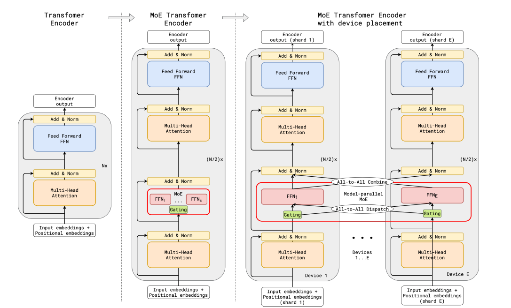
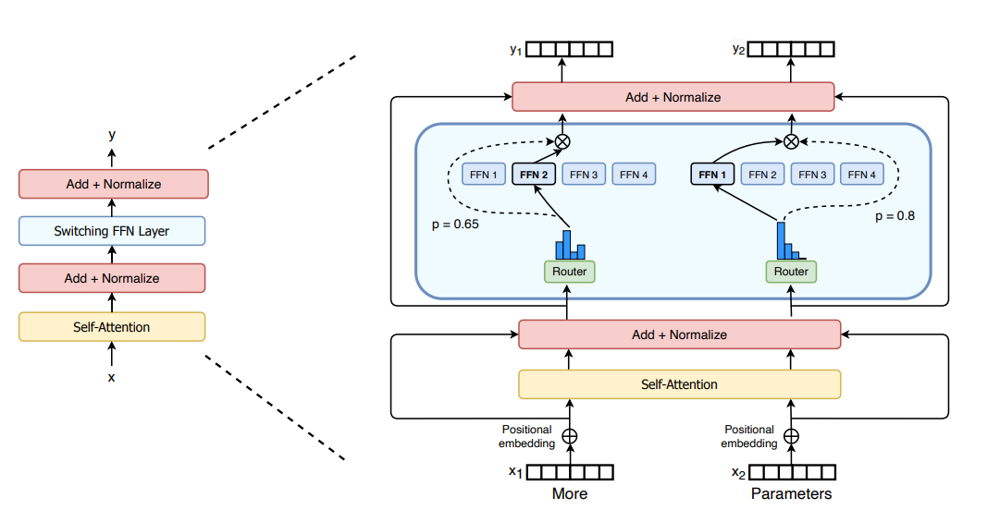
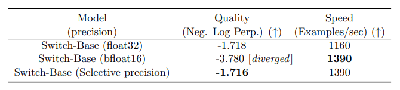
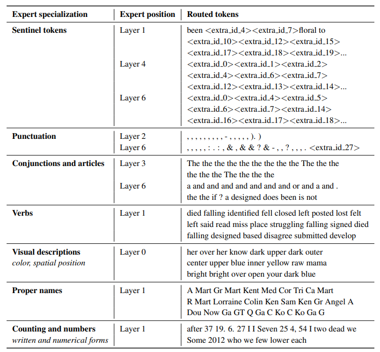
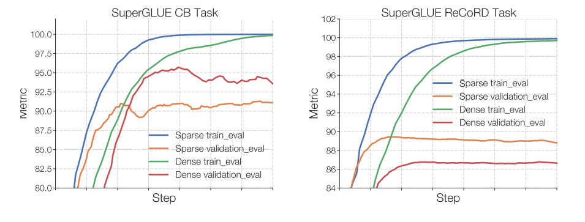
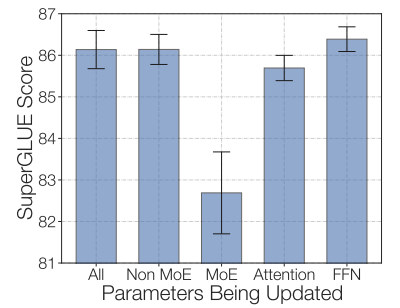
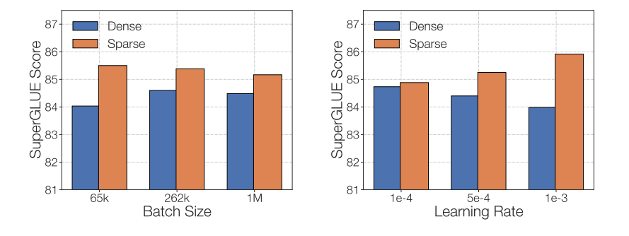
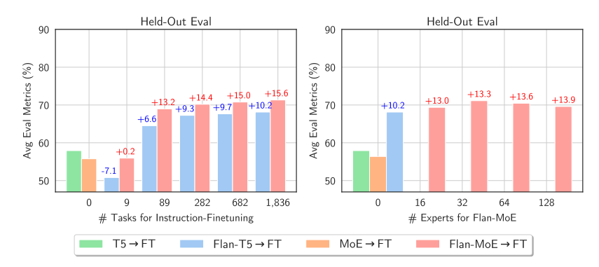
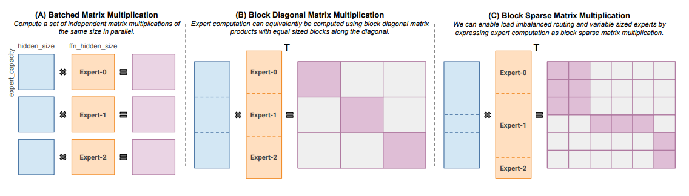

# Mixture of Experts の解説

> 原題: Mixture of Experts Explained
> 著者: Omar Sanseviero, Lewis Tunstall, Philipp Schmid, Sourab Mangrulkar, Younes Belkada, Pedro Cuenca（Hugging Face）
> 出典: Hugging Face Blog（2023-12-11） https://huggingface.co/blog/moe

> 訳注: クリップの点検と原ページ照合の結果、**GShard の MoE Transformer Encoder 図（02_moe_block.png）が画像欠落**しており（キャプションのみ残存）、原ページから復元した。コンテンツ図は計 12 枚をローカル保存。数式 5 本はクリップで LaTeX が崩れていた（`\left(\right.` 等の混入）ため、意味を変えずにクリーンな LaTeX へ正規化した。除外した chrome: 末尾の Citation（BibTeX）・関連記事への誘導 2 件・Community セクション。冒頭の第 2 版（2026 年 2 月）への案内は原ページの編集注記のため訳出した。

> 本ブログ記事には第 2 版（2026 年 2 月）があり、そこでは `transformers` ライブラリが MoE をライブラリと Hub の「第一級市民」にするためにどう構築されてきたかを扱っている。リンクはこちら: [Mixture of Experts (MoEs) in Transformers](https://huggingface.co/blog/moe-transformers)

Mixtral 8x7B のリリース（発表・モデルカード）とともに、あるクラスのトランスフォーマーがオープン AI コミュニティで最も熱いトピックになった: Mixture of Experts、略して MoE である。このブログ記事では、MoE の構成要素・訓練方法・推論で提供する際に考慮すべきトレードオフを見ていく。

さあ、飛び込もう！

## TL;DR（要約）

MoE は:

- 密（dense）なモデルに比べて**事前学習がはるかに速い**
- 同じパラメータ数のモデルと比べて**推論が速い**
- すべてのエキスパートをメモリにロードするため**高い VRAM を要求する**
- **ファインチューニングでは多くの課題**に直面するが、MoE の **instruction-tuning に関する近年の研究は有望**である

さあ、飛び込もう！

## What is a Mixture of Experts (MoE)?（Mixture of Experts とは何か）

モデルの規模は、モデル品質を高める最も重要な軸のひとつである。固定された計算予算の下では、より大きなモデルを少ないステップで訓練する方が、より小さなモデルを多くのステップで訓練するより良い。

Mixture of Experts は、はるかに少ない計算での事前学習を可能にする。つまり、密なモデルと同じ計算予算で、モデルやデータセットのサイズを劇的にスケールアップできる。特に、MoE モデルは事前学習において、密な対応物と同じ品質にはるかに速く到達するはずである。

では、MoE とは正確には何なのか？トランスフォーマーモデルの文脈では、MoE は 2 つの主要な要素からなる:

- **疎な MoE 層**: 密な feed-forward network（FFN）層の代わりに使われる。MoE 層はいくつかの「エキスパート」（例: 8）を持ち、各エキスパートはニューラルネットワークである。実際にはエキスパートは FFN だが、より複雑なネットワークや、MoE そのものでもありうる——その場合は階層的 MoE になる！
- **ゲートネットワーク（ルータ）**: どのトークンをどのエキスパートへ送るかを決める。たとえば下の図では、トークン "More" は 2 番目のエキスパートへ、トークン "Parameters" は 1 番目のネットワークへ送られる。後で見るように、1 つのトークンを複数のエキスパートへ送ることもできる。トークンをどうエキスパートへルーティングするかは MoE を扱う際の大きな決定のひとつである——ルータは学習されるパラメータで構成され、ネットワークの残りと同時に事前学習される。

<figure>

<figcaption>Switch Transformers 論文の MoE 層。</figcaption>
</figure>

まとめると、MoE ではトランスフォーマーモデルのすべての FFN 層を、ゲートネットワークと一定数のエキスパートからなる MoE 層で置き換える。

MoE は効率的な事前学習や密なモデルより速い推論のような便益を提供するが、課題も伴う:

- **訓練**: MoE は計算効率のはるかに高い事前学習を可能にするが、歴史的に**ファインチューニングでの汎化に苦しみ、過学習につながってきた**。
- **推論**: MoE は多くのパラメータを持ちうるが、推論時に使われるのはその一部だけである。これは同じパラメータ数の密なモデルよりはるかに速い推論をもたらす。しかし、**すべてのパラメータを RAM にロードする必要がある**ため、メモリ要求は高い。たとえば Mixtral 8x7B のような MoE では、密な 47B パラメータモデルを保持できる VRAM が必要になる。なぜ 8 x 7B = 56B でなく 47B なのか？それは、MoE モデルでは FFN 層だけが個別のエキスパートとして扱われ、モデルの残りのパラメータは共有されるからである。同時に、トークンあたり 2 エキスパートだけを使うと仮定すると、推論速度（FLOPs）は 12B モデルの利用に相当する（14B ではない）。2x7B の行列積を計算するが、一部の層が共有されているからである（詳細は後述）。

MoE が何かの大まかなイメージを得たところで、その発明につながった研究の発展を見てみよう。

## A Brief History of MoEs（MoE の簡単な歴史）

MoE のルーツは 1991 年の論文 Adaptive Mixture of Local Experts にある。アンサンブル手法に似たそのアイデアは、別々のネットワークで構成されるシステムに教師あり手続きを持たせ、各ネットワークが訓練事例の異なる部分集合を扱う、というものだった。各ネットワーク（エキスパート）は入力空間の異なる領域に専門化する。エキスパートはどう選ばれるか？ゲーティングネットワークが各エキスパートの重みを決める。訓練の間、エキスパートとゲーティングの両方が訓練される。

2010〜2015 年の間に、2 つの異なる研究領域が後の MoE の発展に寄与した:

- **構成要素としてのエキスパート**: 伝統的な MoE の設定では、システム全体がゲーティングネットワークと複数のエキスパートからなる。モデル全体としての MoE は SVM・ガウス過程・その他の手法で探究されてきた。Eigen, Ranzato, Ilya の研究は、より深いネットワークの構成要素としての MoE を探究した。これにより MoE を多層ネットワークの層として持てるようになり、モデルが大きくかつ効率的であることを同時に可能にした。
- **条件付き計算**: 従来のネットワークはすべての入力データをすべての層で処理する。この時期、Yoshua Bengio は入力トークンに基づいて構成要素を動的に活性化・不活性化するアプローチを研究した。

これらの研究は NLP の文脈での mixture of experts の探究につながった。具体的には、Shazeer ら（2017。"et al." には Geoffrey Hinton と、Google のチャック・ノリスこと Jeff Dean を含む）は、スパース性の導入によってこのアイデアを 137B の LSTM（当時の事実上の NLP アーキテクチャ。Schmidhuber の発明）へスケールさせ、非常に高いスケールでも高速な推論を保った。この研究は翻訳に焦点を当てたが、高い通信コストや訓練の不安定性など多くの課題に直面した。

<figure>

<figcaption>Outrageously Large Neural Network 論文の MoE 層。</figcaption>
</figure>

MoE は、オープンソース化された 1.6T パラメータの Switch Transformers をはじめ、数兆パラメータのモデルの訓練を可能にしてきた。MoE はコンピュータビジョンでも探究されているが、本記事は NLP ドメインに焦点を当てる。

## What is Sparsity?（スパース性とは何か）

スパース性は条件付き計算のアイデアを使う。密なモデルではすべてのパラメータがすべての入力に使われるが、スパース性はシステム全体の一部だけを走らせることを可能にする。

Shazeer の翻訳向け MoE の探究を深掘りしよう。条件付き計算（ネットワークの一部が事例ごとに活性化する）のアイデアは、計算を増やさずにモデルのサイズをスケールさせることを可能にし、その結果、各 MoE 層で数千のエキスパートが使われることになった。

この設定にはいくつかの課題がある。たとえば、通常は大きなバッチサイズの方が性能に良いが、MoE のバッチサイズはデータが活性なエキスパートを流れるにつれて実効的に減る。たとえばバッチ化された入力が 10 トークンからなるとき、**5 トークンがひとつのエキスパートに、残り 5 トークンが 5 つの異なるエキスパートに行くかもしれず、不均一なバッチサイズと稼働率低下につながる**。後述の「Making MoEs go brrr」節で、その他の課題と解決策を議論する。

これをどう解決すべきか？学習されたゲーティングネットワーク（G）が、入力の一部をどのエキスパート（E）へ送るかを決める:

$$
y = \sum_{i=1}^{n} G(x)_i \, E_i(x)
$$

この設定では、すべてのエキスパートがすべての入力に対して実行される——重みつきの掛け算である。しかし、G が 0 だったらどうなるか？その場合、対応するエキスパートの演算を計算する必要はなく、計算を節約できる。典型的なゲーティング関数は何か？最も伝統的な設定では、softmax 関数を持つ単純なネットワークを使うだけである。このネットワークは、どのエキスパートへ入力を送るかを学習する。

$$
G_\sigma(x) = \text{Softmax}(x \cdot W_g)
$$

Shazeer の研究は、Noisy Top-k Gating のような他のゲーティング機構も探究した。このゲーティングアプローチは、（調整可能な）ノイズを導入し、上位 k 個の値だけを保持する。すなわち:

1. ノイズを加える

$$
H(x)_i = (x \cdot W_g)_i + \text{StandardNormal}() \cdot \text{Softplus}\left((x \cdot W_{\text{noise}})_i\right)
$$

2. 上位 k 個だけを選ぶ

$$
\text{KeepTopK}(v, k)_i = \begin{cases} v_i & \text{if } v_i \text{ is in the top } k \text{ elements of } v, \\ -\infty & \text{otherwise.} \end{cases}
$$

3. softmax を適用する

$$
G(x) = \text{Softmax}(\text{KeepTopK}(H(x), k))
$$

このスパース性は興味深い性質をもたらす。十分に低い k（例: 1 や 2）を使えば、多くのエキスパートを活性化する場合よりはるかに速く訓練・推論できる。なぜトップのエキスパートだけを選ばないのか？当初の推測は、ゲートが異なるエキスパートへのルーティングを学ぶには複数のエキスパートへのルーティングが必要で、したがって少なくとも 2 つのエキスパートを選ぶ必要がある、というものだった。Switch Transformers の節でこの決定を再訪する。

なぜノイズを加えるのか？それは負荷分散のためだ！

## Load balancing tokens for MoEs（MoE のトークン負荷分散）

前述のとおり、すべてのトークンが少数の人気エキスパートだけに送られると、訓練は非効率になる。通常の MoE 訓練では、ゲーティングネットワークは主に同じ少数のエキスパートを活性化するよう収束してしまう。これは自己強化的である。優遇されたエキスパートはより速く訓練され、それゆえより多く選ばれるからだ。これを緩和するため、**auxiliary loss（補助損失）** が追加され、すべてのエキスパートに等しい重要度を与えることを促す。この損失は、すべてのエキスパートがおおよそ等しい数の訓練例を受け取ることを保証する。後の節では expert capacity という概念も探究する。これはひとつのエキスパートが処理できるトークン数の閾値を導入する。`transformers` では、auxiliary loss は `aux_loss` パラメータとして公開されている。

## MoEs and Transformers（MoE とトランスフォーマー）

トランスフォーマーは、パラメータ数のスケールアップが性能を改善する非常に明確な事例であり、Google が GShard でこれを探究したのは驚くことではない。GShard は 6000 億パラメータ超へのトランスフォーマーのスケールアップを探究している。

GShard は、エンコーダとデコーダの両方で、**1 つおきの FFN 層**を top-2 ゲーティングの MoE 層で置き換える。次の図はエンコーダ部分でのその様子を示す。この構成は大規模計算に大変都合がよい: 複数デバイスへスケールするとき、MoE 層はデバイス間で分担され、他のすべての層は複製される。これは「Making MoEs go brrr」節でさらに議論する。

<figure>

<figcaption>GShard 論文の MoE Transformer Encoder。（訳注: この図はクリップから欠落しており原ページから復元）</figcaption>
</figure>

大規模でバランスの取れた負荷と効率を維持するため、GShard の著者らは前節で議論したものに似た auxiliary loss に加えて、いくつかの変更を導入した:

- **ランダムルーティング**: top-2 の構成では、常にトップのエキスパートを選ぶが、2 番目のエキスパートはその重みに比例した確率で選ばれる。
- **Expert capacity（エキスパート容量）**: ひとつのエキスパートが処理できるトークン数に閾値を設けられる。両方のエキスパートが容量に達している場合、トークンはあふれた（overflowed）と見なされ、残差接続を介して次の層へ送られる（他のプロジェクトでは完全に破棄される）。この概念は MoE で最も重要な概念のひとつになる。なぜ expert capacity が必要か？すべてのテンソル形状はコンパイル時に静的に決定されるが、各エキスパートに何トークンが行くかは事前に分からないため、容量係数を固定する必要があるのだ。

GShard 論文には、MoE に適した並列計算パターンの表現による貢献もあるが、その議論は本記事の範囲外である。

**注**: 推論を走らせるとき、一部のエキスパートだけが起動される。同時に、self-attention のような共有計算があり、これはすべてのトークンに適用される。8 エキスパートの 47B モデルを 12B の密モデルの計算で走らせられるのはこのためである。top-2 を使えば 14B パラメータが使われるはずだが、attention の演算（ほか）が共有されているため、実際に使われるパラメータ数は 12B になる。

## Switch Transformers

MoE は大いに有望だが、訓練とファインチューニングの不安定性に苦しむ。Switch Transformers は、これらのトピックを深掘りする非常にエキサイティングな研究である。著者らは 2048 エキスパートの 1.6 兆パラメータ MoE を Hugging Face で公開までしており、transformers で実行できる。Switch Transformers は T5-XXL に対して 4 倍の事前学習スピードアップを達成した。

<figure>

<figcaption>Switch Transformer 論文の Switch Transformer 層。</figcaption>
</figure>

GShard と同様、著者らは FFN 層を MoE 層で置き換えた。Switch Transformers 論文は、2 つの入力（2 つの異なるトークン）を受け取り 4 つのエキスパートを持つ Switch Transformer 層を提案する。

少なくとも 2 エキスパートという当初のアイデアに反し、Switch Transformers は簡素化された**単一エキスパート戦略**を使う。このアプローチの効果は:

- ルータの計算が減る
- 各エキスパートのバッチサイズは少なくとも半分になりうる
- 通信コストが減る
- 品質は保たれる

Switch Transformers も expert capacity の概念を探究している。

$$
\text{Expert Capacity} = \left(\frac{\text{tokens per batch}}{\text{number of experts}}\right) \times \text{capacity factor}
$$

上で提案される容量は、バッチ内のトークン数をエキスパート数で均等に分ける。1 より大きい capacity factor を使えば、トークンが完全にはバランスしないときのバッファを提供できる。容量を増やすとデバイス間通信が高価になるので、心に留めるべきトレードオフである。特に、Switch Transformers は低い capacity factor（1〜1.25）でよく機能する。

Switch Transformer の著者らは、前節で触れた負荷分散の損失も再訪し簡素化している。各 Switch 層について、auxiliary loss が訓練中に総モデル損失へ加えられる。この損失は一様なルーティングを促し、ハイパーパラメータで重みづけできる。

著者らは selective precision（選択的精度）も実験している。たとえばエキスパートを `bfloat16` で訓練しつつ、残りの計算には完全精度を使う。低い精度はプロセッサ間の通信コスト・計算コスト・テンソル保存のメモリを減らす。エキスパートとゲートネットワークの両方を `bfloat16` で訓練した最初の実験は、より不安定な訓練をもたらした。これは特にルータの計算による: ルータは指数関数を持つため、高い精度が重要なのである。不安定性を緩和するため、ルーティングには完全精度が使われた。

<figure>

<figcaption>選択的精度は品質を劣化させず、より速いモデルを可能にする。</figcaption>
</figure>

このノートブックは Switch Transformers の要約タスク向けファインチューニングを示すが、まずファインチューニング節の確認を勧める。

Switch Transformers は、T5 の MoE 版というエンコーダ-デコーダ構成を使った。GLaM 論文は、GPT-3 品質に匹敵するモデルを 1/3 のエネルギーで訓練することで、これらのモデルのスケールを押し上げることを探究している（そう、MoE の訓練に必要な計算量の少なさのおかげで、カーボンフットプリントを最大 1 桁減らせるのだ）。著者らはデコーダのみのモデルと、few-shot・one-shot 評価に焦点を当てた（ファインチューニングではなく）。彼らは Top-2 ルーティングと、はるかに大きな capacity factor を使った。加えて、使いたい計算量に応じて訓練中・評価中に変えられる指標として capacity factor を探究した。

## Stabilizing training with router Z-loss（router Z-loss による訓練の安定化）

先に議論した balancing loss は不安定性の問題につながりうる。品質と引き換えに疎モデルを安定化する方法は多くある。たとえば dropout の導入は安定性を改善するが、モデル品質の低下につながる。他方、乗法的な構成要素の追加は品質を改善するが安定性を下げる。

ST-MoE で導入された router z-loss は、ゲーティングネットワークに入る大きなロジットにペナルティを与えることで、品質劣化なしに訓練の安定性を大きく改善する。この損失は値の絶対的な大きさを小さくするよう促すため、丸め誤差が減り、ゲーティングのような指数関数では非常に効きうる。詳細は論文の確認を勧める。

## What does an expert learn?（エキスパートは何を学ぶのか）

ST-MoE の著者らは、エンコーダのエキスパートが**トークンのグループや浅い概念に専門化する**ことを観察した。たとえば、句読点のエキスパート、固有名詞のエキスパート、などになりうる。他方、デコーダのエキスパートは専門化が弱い。著者らは多言語の構成でも訓練した。各エキスパートがある言語に専門化すると想像したくなるが、逆のことが起こる: トークンルーティングと負荷分散のため、**どの単一言語にも専門化したエキスパートは存在しない**。

<figure>

<figcaption>ST-MoE 論文の表。どのトークングループがどのエキスパートへ送られたかを示す。</figcaption>
</figure>

## How does scaling the number of experts impact pretraining?（エキスパート数のスケールは事前学習にどう影響するか）

エキスパートを増やすとサンプル効率と速度が改善するが、その利得は逓減し（特に 256 または 512 以降）、推論にはより多くの VRAM が必要になる。Switch Transformers で大規模に研究された性質は、層あたり 2・4・8 エキスパートという小規模でも一貫していた。

## Fine-tuning MoEs（MoE のファインチューニング）

> Mixtral は transformers バージョン 4.36.0 でサポートされている。`pip install transformers==4.36.0 --upgrade` でインストールできる。

過学習のダイナミクスは、密なモデルと疎なモデルで大きく異なる。疎モデルは過学習しやすいため、エキスパート内部でより高い正則化（例: dropout）を探究できる——たとえば密な層にはあるひとつの dropout 率を、疎な層にはより高い別の dropout 率を設定できる。

ファインチューニングに auxiliary loss を使うべきかという問いがある。ST-MoE の著者らは auxiliary loss をオフにする実験を行い、トークンの最大 11% がドロップされても品質は大きく影響されなかった。トークンドロップは過学習を防ぐ正則化の一形態かもしれない。

Switch Transformers は、事前学習のパープレキシティを固定すると、疎モデルは下流タスクで密な対応物より悪く、特に SuperGLUE のような推論の重いタスクで悪いことを観察した。他方、TriviaQA のような知識の重いタスクでは、疎モデルは不釣り合いに良い。著者らはまた、ファインチューニングではエキスパート数が少ない方が助けになることも観察した。汎化に問題があることを確認するもうひとつの観察は、モデルが小さいタスクでは悪く、大きいタスクでは良かったことである。

<figure>

<figcaption>小さいタスク（左）では、疎モデルが検証セットで大きく劣り、明確な過学習が見える。大きいタスク（右）では MoE は良く機能する。ST-MoE 論文より。</figcaption>
</figure>

エキスパート以外の重みをすべて凍結する実験もできる。つまり MoE 層だけを更新する。これは大きな性能低下をもたらす。逆を試すこともできる: MoE 層のパラメータだけを凍結する。これはすべてのパラメータを更新するのとほぼ同等に機能した。これはファインチューニングの高速化とメモリ削減を助けうる。（ST-MoE プロジェクトでは）パラメータの 80% が MoE 層にあるため、これはやや反直観的でありうる。彼らのそのアーキテクチャに対する仮説は、エキスパート層は 1/4 層ごとにしか現れず、各トークンは層ごとに最大 2 エキスパートしか見ないため、MoE パラメータの更新は他のパラメータの更新よりはるかに少ない層にしか影響しない、というものである。

<figure>

<figcaption>MoE 層だけを凍結することで、品質を保ちながら訓練を高速化できる。ST-MoE 論文より。</figcaption>
</figure>

疎な MoE のファインチューニングで最後に考慮すべきは、ファインチューニングのハイパーパラメータ設定が異なることである——たとえば、疎モデルは小さいバッチサイズと高い学習率からより恩恵を受ける傾向がある。

<figure>

<figcaption>高い学習率と小さいバッチサイズで疎モデルのファインチューニング品質が改善する。ST-MoE 論文より。</figcaption>
</figure>

ここまでで、MoE のファインチューニングの苦労に少し悲しくなったかもしれない。エキサイティングなことに、最近の論文 MoEs Meets Instruction Tuning（2023 年 7 月）は次の実験を行っている:

- 単一タスクのファインチューニング
- マルチタスクの instruction-tuning
- マルチタスクの instruction-tuning に続く単一タスクのファインチューニング

著者らが MoE と T5 相当をファインチューニングしたとき、T5 相当の方が良かった。著者らが Flan T5（T5 の instruct 相当）の MoE をファインチューニングすると、MoE の方が大幅に良かった。それだけでなく、Flan-MoE の MoE に対する改善は Flan T5 の T5 に対する改善より大きかった——**MoE は密なモデルより instruction tuning からはるかに大きな恩恵を受けるかもしれない**ことを示す。MoE はタスク数が多いほど恩恵を受ける。auxiliary loss をオフにすることを示唆した先の議論と異なり、この損失は実際には過学習を防ぐ。

<figure>

<figcaption>疎モデルは密なモデルに比べて instruct-tuning からより大きな恩恵を受ける。MoEs Meets Instruction Tuning 論文より。</figcaption>
</figure>

## When to use sparse MoEs vs dense models?（疎な MoE と密なモデルの使い分け）

エキスパートは、多数のマシンを持つ高スループットのシナリオで有用である。事前学習の計算予算が固定なら、疎モデルの方が最適だろう。VRAM の少ない低スループットのシナリオでは、密なモデルの方が良い。

**注**: 疎モデルと密モデルのパラメータ数を直接比較することはできない。両者は大きく異なるものを表しているからである。

## Making MoEs go brrr（MoE を爆速にする）

初期の MoE 研究は MoE 層を分岐構造として提示した。GPU はそのために設計されていないため計算が遅くなり、デバイスが他へ情報を送る必要があるためネットワーク帯域がボトルネックになる。この節では、これらのモデルの事前学習と推論をより実用的にする既存研究を議論する。MoEs go brrrrr.

### Parallelism（並列化）

並列化を簡単に復習しよう:

- **データ並列**: 同じ重みが全コアに複製され、データがコア間で分割される。
- **モデル並列**: モデルがコア間で分割され、データが全コアに複製される。
- **モデル＋データ並列**: モデルとデータの両方をコア間で分割できる。異なるコアは異なるデータバッチを処理することに注意。
- **エキスパート並列（expert parallelism）**: エキスパートを異なるワーカーに配置する。データ並列と組み合わせる場合、各コアは異なるエキスパートを持ち、データは全コアに分割される。

エキスパート並列では、エキスパートは異なるワーカーに配置され、各ワーカーは異なる訓練サンプルのバッチを受け取る。非 MoE 層では、エキスパート並列はデータ並列と同じように振る舞う。MoE 層では、系列内のトークンが、目当てのエキスパートが居るワーカーへ送られる。

<figure>

<figcaption>Switch Transformers 論文の図。異なる並列化技法でデータとモデルがどのようにコアへ分割されるかを示す。</figcaption>
</figure>

### Capacity Factor and communication costs（Capacity Factor と通信コスト）

capacity factor（CF）を増やすと品質が上がるが、通信コストと活性化のメモリも増える。all-to-all 通信が遅いなら、小さい capacity factor を使う方が良い。良い出発点は、top-2 ルーティング・capacity factor 1.25・コアあたり 1 エキスパートである。評価時には、capacity factor を変えて計算量を減らせる。

### Serving techniques（サービング技法）

> mistralai/Mixtral-8x7B-Instruct-v0.1 は Inference Endpoints へデプロイできる。

MoE の大きな欠点はパラメータ数の多さである。ローカルのユースケースでは、より小さいモデルを使いたいかもしれない。サービングを助けるいくつかの技法を素早く議論しよう:

- Switch Transformers の著者らは初期の蒸留実験を行った。MoE を密な対応物へ蒸留し戻すことで、**スパース性の利得の 30〜40% を保持**できた。したがって蒸留は、より速い事前学習と、本番でより小さいモデルを使う利点の両方を提供する。
- 最近のアプローチは、文全体やタスクをエキスパートへルーティングするようルーティングを変更し、サービング用にサブネットワークを抽出できるようにする。
- Aggregation of Experts（MoE）: エキスパートの重みをマージし、推論時のパラメータ数を減らす技法。

### More on efficient training（効率的な訓練の続き）

FasterMoE（2022 年 3 月）は、高効率の分散システムにおける MoE の性能を分析し、異なる並列化戦略の理論的限界、エキスパート人気の偏りを扱う技法、レイテンシを減らす細粒度の通信スケジュール、最低レイテンシに基づいてエキスパートを選ぶトポロジー対応ゲートを分析し、17 倍のスピードアップをもたらした。

Megablocks（2022 年 11 月）は、MoE に存在する動的性を扱える新しい GPU カーネルを提供することで、効率的な疎の事前学習を探究する。彼らの提案はトークンを決してドロップせず、現代のハードウェアへ効率的にマッピングされ、大きなスピードアップをもたらす。何が仕掛けか？従来の MoE はバッチ化された行列積を使い、すべてのエキスパートが同じ形状と同じトークン数を持つと仮定する。対照的に、Megablocks は MoE 層を**ブロック疎（block-sparse）演算**として表現し、不均衡な割り当てに対応できる。

<figure>

<figcaption>異なるサイズのエキスパートとトークン数に対応するブロック疎行列積（MegaBlocks より）。</figcaption>
</figure>

## Open Source MoEs（オープンソースの MoE）

今日、MoE を訓練するオープンソースプロジェクトがいくつかある:

- Megablocks: https://github.com/stanford-futuredata/megablocks
- Fairseq: https://github.com/facebookresearch/fairseq/tree/main/examples/moe_lm
- OpenMoE: https://github.com/XueFuzhao/OpenMoE

公開されたオープンアクセスの MoE としては、次を確認できる:

- **Switch Transformers（Google）**: 8 から 2048 エキスパートまでの T5 ベース MoE のコレクション。最大のモデルは 1.6 兆パラメータ。
- **NLLB MoE（Meta）**: NLLB 翻訳モデルの MoE 変種。
- **OpenMoE**: Llama ベースの MoE をリリースしたコミュニティの取り組み。
- **Mixtral 8x7B（Mistral）**: Llama 2 70B を上回り、はるかに速い推論を持つ高品質な MoE。instruct チューニング版もリリースされている。詳細は発表ブログ記事を参照。

## Exciting directions of work（エキサイティングな研究の方向）

疎な MoE を、より少ないパラメータで同等の品質を持つ密なモデルへ**蒸留**するさらなる実験。

もうひとつの領域は MoE の量子化である。QMoE（2023 年 10 月）は、MoE をパラメータあたり 1 ビット未満に量子化し、3.2TB のアクセラレータメモリを使う 1.6T の Switch Transformer をわずか 160GB に圧縮する、この方向への良い一歩である。

要するに、探究しがいのある領域は:

- Mixtral の密なモデルへの蒸留
- エキスパートのモデルマージ技法と、推論時間への影響の探究
- Mixtral の極端な量子化技法の実行

## Some resources（参考資料）

- Adaptive Mixture of Local Experts (1991)
- Learning Factored Representations in a Deep Mixture of Experts (2013)
- Outrageously Large Neural Networks: The Sparsely-Gated Mixture-of-Experts Layer (2017)
- GShard: Scaling Giant Models with Conditional Computation and Automatic Sharding (Jun 2020)
- GLaM: Efficient Scaling of Language Models with Mixture-of-Experts (Dec 2021)
- Switch Transformers: Scaling to Trillion Parameter Models with Simple and Efficient Sparsity (Jan 2022)
- ST-MoE: Designing Stable and Transferable Sparse Expert Models (Feb 2022)
- FasterMoE: modeling and optimizing training of large-scale dynamic pre-trained models (April 2022)
- MegaBlocks: Efficient Sparse Training with Mixture-of-Experts (Nov 2022)
- Mixture-of-Experts Meets Instruction Tuning: A Winning Combination for Large Language Models (May 2023)
- Mixtral-8x7B-v0.1, Mixtral-8x7B-Instruct-v0.1
