# PagedAttention による大規模言語モデルのサービングのための効率的なメモリ管理

> 原題: Efficient Memory Management for Large Language Model Serving with PagedAttention
> 著者: Woosuk Kwon¹\*, Zhuohan Li¹\*, Siyuan Zhuang¹, Ying Sheng^{1,2}, Lianmin Zheng¹, Cody Hao Yu³, Joseph E. Gonzalez¹, Hao Zhang⁴, Ion Stoica¹
> 所属: ¹ UC Berkeley　² Stanford University　³ 独立研究者　⁴ UC San Diego　（\* 同等の貢献）
> 出典: SOSP 2023（ACM SIGOPS 29th Symposium on Operating Systems Principles）/ arXiv:2309.06180（ar5iv 版）

> **訳注（クリップの状態と復元）**
> - 底本は ar5iv 版の Web Clipper クリップ。**本文には欠落がなく**（長い段落もすべて末尾まで残っている）、失われたのは図とキャプションだけであった。
> - **画像 26 枚中 7 枚が欠落**していた（`x13`・`x15`・`x17`・`x19`・`x21`・`x25`・`x27`）。**Figure 11・12・13・14・15・18・19 はいずれも 2 パネル構成で、そのすべてが (a) だけを残して (b) を失っている**という、本 wiki で繰り返し出ている型である。
> - あわせて **Figure 11・13・15・18・19 の本キャプションが 5 件消滅**していた（小見出しの「(a) ShareGPT」等だけが残っていた）。すべて原ページから復元した。
> - **脚注 1 件の本文が欠落**していた（マーカーのみ残存）。復元して該当箇所に訳注として挿入した。
> - 参考文献一覧と謝辞は既定どおり訳出しない。ACM のメタデータ（journalyear・conference・doi 等の脚注）も本文ではないので訳出しない。
> - 図はすべて `raw/assets/2023-pagedattention/` にローカル保存し、そのパスを参照している。

## Abstract（要旨）

大規模言語モデル（LLM）の高スループットなサービングには、一度に十分多くのリクエストをバッチ処理することが必要である。しかし既存のシステムは苦戦している——**リクエストごとの key-value キャッシュ（KV キャッシュ）のメモリが巨大で、しかも動的に伸縮する**からである。非効率に管理されると、このメモリは断片化と冗長な複製によって著しく浪費され、バッチサイズを制限してしまう。この問題に対処するため、我々は **PagedAttention** を提案する。これはオペレーティングシステムにおける古典的な仮想メモリとページングの技法に着想を得た attention アルゴリズムである。その上に **vLLM** という LLM サービングシステムを構築し、(1) **KV キャッシュのメモリの無駄をほぼゼロにする**こと、(2) リクエスト内およびリクエスト間で **KV キャッシュを柔軟に共有**してメモリ使用量をさらに削減すること、を達成した。評価によれば、vLLM は FasterTransformer や Orca といった最先端のシステムと比べて、**同水準のレイテンシで人気ある LLM のスループットを 2〜4 倍に改善**する。改善は、系列が長いほど・モデルが大きいほど・デコードアルゴリズムが複雑なほど顕著である。vLLM のソースコードは公開されている。

## 1. Introduction（はじめに）

GPT [^38] [^6] や PaLM [^10] のような大規模言語モデル（**LLM**）の登場は、プログラミング補助 [^19] [^7] や汎用チャットボット [^36] [^20] といった新しい応用を可能にし、我々の仕事や日常に深く影響を与え始めている。多くのクラウド企業 [^35] [^45] がこれらの応用をホスティングサービスとして提供しようと競っている。しかし、これらの応用を動かすことは非常に高価であり、GPU のような多数のハードウェアアクセラレータを必要とする。最近の見積もりによれば、**LLM のリクエストの処理は伝統的なキーワード検索より 10 倍高価になりうる** [^44]。こうした高いコストを踏まえると、**LLM サービング**システムのスループットを高めること——ひいてはリクエストあたりのコストを下げること——がますます重要になっている。

LLM の中核には自己回帰的なトランスフォーマモデル [^54] がある。このモデルは、入力（プロンプト）とそれまでに生成した出力トークンの系列に基づいて、単語（トークン）を**一度に 1 つずつ**生成する。各リクエストについて、この高価な過程はモデルが終了トークンを出力するまで繰り返される。この逐次的な生成の過程がワークロードを**メモリ律速（memory-bound）** にし、GPU の計算能力を使い切れないままサービングのスループットを制限する。

<figure>

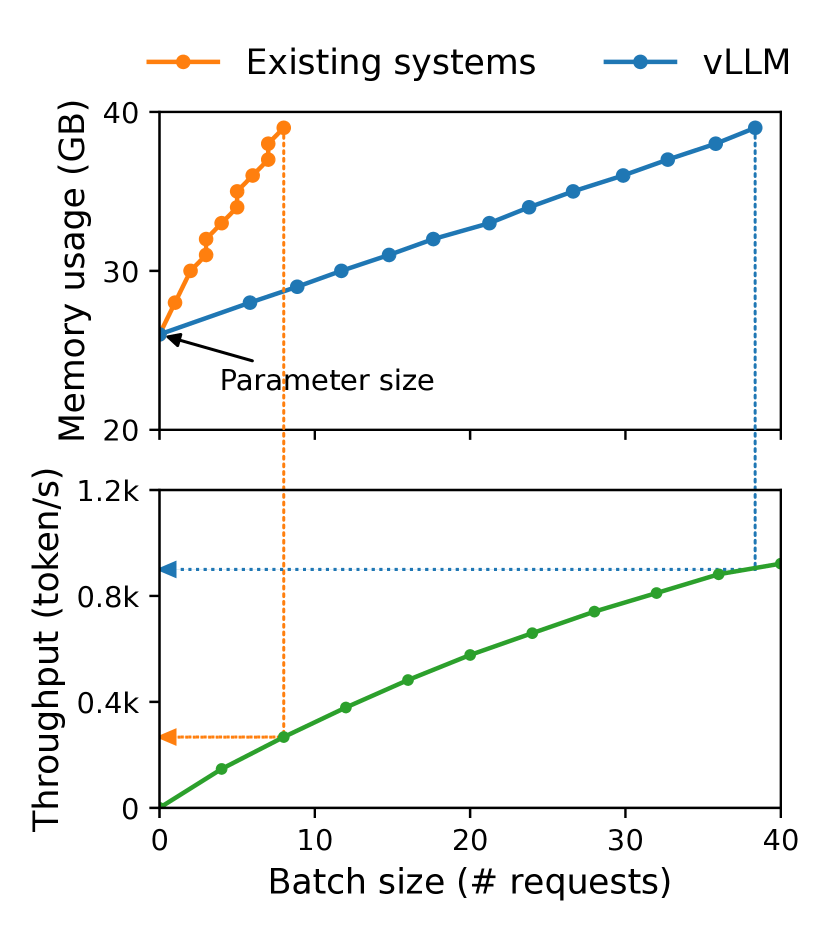

<figcaption>図1: 左: NVIDIA A100 上で 13B パラメータの LLM をサービングするときのメモリレイアウト。パラメータ（灰）はサービング中ずっと GPU メモリに常駐する。KV キャッシュのためのメモリ（赤）はサービングのリクエストごとに確保・解放される。少量のメモリ（黄）が活性のために一時的に使われる。右: vLLM は既存システム（NVIDIA 2023a; Yu ら 2022）に見られる KV キャッシュメモリの急激な増加曲線をならし、サービングのスループットを顕著に押し上げる。</figcaption>
</figure>

スループットの改善は、複数のリクエストをまとめてバッチ処理することで可能になる。しかし多数のリクエストを 1 つのバッチで処理するには、リクエストごとのメモリ空間を効率的に管理しなければならない。たとえば Fig. 1（左）は、40GB の RAM を持つ NVIDIA A100 GPU 上での 13B パラメータの LLM のメモリ分布を示している。**メモリのおよそ 65% がモデルの重みに割り当てられ**、これはサービング中は静的である。**30% 近くがリクエストの動的な状態の格納に使われる**。トランスフォーマではこの状態は attention 機構に関連づけられたキーとバリューのテンソルからなり、一般に **KV キャッシュ** [^42] と呼ばれる。これは新しい出力トークンを順に生成するために、それ以前のトークンからの文脈を表す。残りの小さな割合のメモリが、LLM の評価時に生成される一時的なテンソルである活性を含む他のデータに使われる。モデルの重みは一定であり活性は GPU メモリのごく一部しか占めないので、**KV キャッシュがどう管理されるかが最大バッチサイズを決定するうえで決定的**である。非効率に管理されると、KV キャッシュのメモリはバッチサイズを、ひいては LLM のスループットを著しく制限しうる（Fig. 1 右）。

本論文で我々は、既存の LLM サービングシステム [^61] [^32] が KV キャッシュのメモリを効率的に管理できていないことを観察する。これは主に、**リクエストの KV キャッシュを連続したメモリ空間に格納している**ためである（ほとんどの深層学習フレームワーク [^40] [^34] がテンソルを連続したメモリに格納することを要求する）。しかし伝統的な深層学習のワークロードにおけるテンソルとは異なり、KV キャッシュは固有の性質を持つ——**モデルが新しいトークンを生成するにつれて動的に伸縮し、その寿命と長さは事前には分からない**。これらの性質が、既存システムの手法を 2 つの点で著しく非効率にする。

<figure>

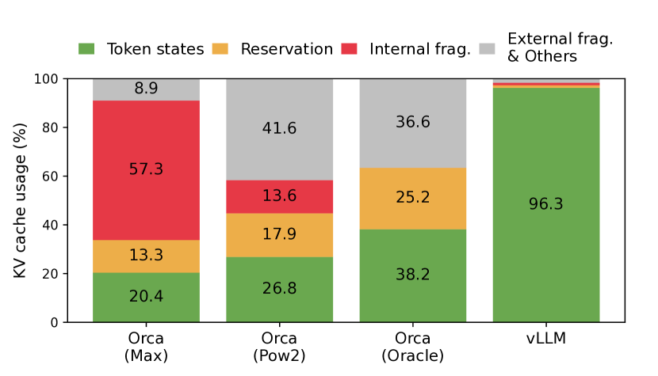

<figcaption>図2: §6.2 の実験における、異なる LLM サービングシステムでのメモリの無駄の平均割合。</figcaption>
</figure>

第一に、既存システム [^61] [^32] は**内部断片化と外部断片化**に苦しむ。リクエストの KV キャッシュを連続した空間に格納するため、リクエストの最大長（例: 2048 トークン）の連続したメモリのかたまりを**事前確保（pre-allocate）** する。リクエストの実際の長さは最大長よりはるかに短いことがあるので、これは深刻な内部断片化をもたらしうる（例: Fig. 11）。さらに、実際の長さが事前に分かっていたとしても、事前確保はやはり非効率である——かたまり全体がリクエストの生存期間中ずっと予約されるので、他の短いリクエストは現在使われていない部分をまったく活用できない。加えて、事前確保のサイズがリクエストごとに異なりうるので、外部断片化も無視できない大きさになりうる。実際、Fig. 2 の我々のプロファイリング結果は、既存システムでは **KV キャッシュのメモリのうち実際のトークンの状態の格納に使われているのは 20.4%〜38.2% にすぎない**ことを示している。

第二に、既存システムはメモリ共有の機会を活用できない。LLM のサービスはしばしば、1 つのリクエストに対して複数の出力を生成する **parallel sampling（並列サンプリング）** や **beam search（ビーム探索）** といった高度なデコードアルゴリズムを用いる。こうした場面では、リクエストは KV キャッシュを部分的に共有できる複数の系列からなる。しかし既存システムでは、系列の KV キャッシュが別々の連続空間に格納されているためメモリ共有ができない。

上記の限界に対処するため、我々は **PagedAttention** を提案する。これはメモリの断片化と共有に対するオペレーティングシステム（OS）の解——**ページングを伴う仮想メモリ**——に着想を得た attention アルゴリズムである。PagedAttention はリクエストの KV キャッシュを**ブロック**に分割し、各ブロックが固定数のトークンの attention のキーとバリューを保持できるようにする。PagedAttention では、KV キャッシュのブロックは必ずしも連続空間に格納されない。したがって、OS の仮想メモリのように、より柔軟に KV キャッシュを管理できる——**ブロックをページ、トークンをバイト、リクエストをプロセスと考えればよい**。この設計は、比較的小さなブロックを使い必要に応じて確保することで内部断片化を緩和する。さらに、すべてのブロックが同じサイズなので外部断片化を排除する。最後に、**同じリクエストに関連づけられた異なる系列の間でも、異なるリクエストの間でさえも、ブロックの粒度でのメモリ共有を可能にする**。

本研究では、PagedAttention の上に **vLLM** という高スループットの分散 LLM サービングエンジンを構築し、KV キャッシュのメモリの無駄をほぼゼロにした。vLLM は、PagedAttention と協調設計された**ブロック単位のメモリ管理**と**プリエンプティブなリクエストのスケジューリング**を用いる。vLLM は GPT [^6]・OPT [^63]・LLaMA [^53] といった人気ある LLM をさまざまなサイズで支え、単一 GPU のメモリ容量を超えるものも含む。さまざまなモデルとワークロードでの評価は、vLLM が最先端のシステム [^61] [^32] と比べて **LLM サービングのスループットを 2〜4 倍に改善**し、しかも**モデルの精度にはまったく影響しない**ことを示している。改善は、系列が長いほど・モデルが大きいほど・デコードアルゴリズムが複雑なほど顕著である（§4.3）。要約すると、我々の貢献は次のとおりである。

- LLM のサービングにおけるメモリ確保の課題を同定し、それがサービング性能に与える影響を定量化した。
- OS の仮想メモリとページングに着想を得た、**非連続なページ化メモリに格納された KV キャッシュ上で動作する attention アルゴリズム PagedAttention** を提案した。
- PagedAttention の上に構築された分散 LLM サービングエンジン **vLLM** を設計・実装した。
- さまざまな場面で vLLM を評価し、FasterTransformer [^32] や Orca [^61] といった従来の最先端の解を大幅に上回ることを実証した。

## 2. Background（背景）

本節では、典型的な LLM の生成とサービングの手続き、および LLM サービングで用いられる反復単位のスケジューリングを述べる。

### 2.1. Transformer-Based Large Language Models（トランスフォーマに基づく大規模言語モデル）

言語モデリングのタスクは、トークンの列 $(x_{1},\ldots,x_{n})$ の確率をモデル化することである。言語には自然な逐次的順序があるので、系列全体の同時確率を条件付き確率の積として分解するのが一般的である（**自己回帰分解** [^4] とも呼ばれる）:

$$
P(x)=P(x_{1})\cdot P(x_{2}\mid x_{1})\cdots P(x_{n}\mid x_{1},\ldots,x_{n-1}).
$$

トランスフォーマ [^54] は、上記の確率を大規模にモデル化するための事実上の標準アーキテクチャになっている。トランスフォーマに基づく言語モデルの最も重要な構成要素は **self-attention** の層である。入力の隠れ状態の列 $(x_{1},\ldots,x_{n})\in\mathbb{R}^{n\times d}$ に対し、self-attention の層はまず各位置 $i$ に線形変換を適用してクエリ・キー・バリューのベクトルを得る:

$$
q_{i}=W_{q}x_{i},\ k_{i}=W_{k}x_{i},\ v_{i}=W_{v}x_{i}.
$$

次に self-attention の層は、ある位置のクエリベクトルとそれ以前のすべてのキーベクトルを掛けることで attention スコア $a_{ij}$ を計算し、バリューベクトルの重み付き平均として出力 $o_{i}$ を計算する:

$$
a_{ij}=\frac{\exp(q_{i}^{\top}k_{j}/\sqrt{d})}{\sum_{t=1}^{i}\exp(q_{i}^{\top}k_{t}/\sqrt{d})},\ o_{i}=\sum_{j=1}^{i}a_{ij}v_{j}.
$$

式 4 の計算のほかに、トランスフォーマモデルの他のすべての構成要素——埋め込み層・フィードフォワード層・層正規化 [^3]・残差接続 [^23]・出力ロジットの計算、および式 2 のクエリ・キー・バリューの変換——は、すべて $y_{i}=f(x_{i})$ という形で位置ごとに独立に適用される。

### 2.2. LLM Service & Autoregressive Generation（LLM サービスと自己回帰生成）

訓練が終わると、LLM はしばしば条件付き生成のサービス（例: 補完 API [^35] やチャットボット [^36] [^20]）として展開される。LLM サービスへのリクエストは**入力プロンプト**のトークン列 $(x_{1},\ldots,x_{n})$ を提供し、LLM サービスは式 1 に従って出力トークン列 $(x_{n+1},\ldots,x_{n+T})$ を生成する。プロンプトと出力の連結を**系列（sequence）** と呼ぶ。

式 1 の分解ゆえに、LLM は新しいトークンを 1 つずつしかサンプリング・生成できず、各新トークンの生成過程はその系列内の**それ以前のすべてのトークン**、具体的にはそのキーとバリューのベクトルに依存する。この逐次的な生成の過程では、既存のトークンのキーとバリューのベクトルが将来のトークンの生成のためにキャッシュされることが多く、これが **KV キャッシュ**として知られる。あるトークンの KV キャッシュはそれ以前のすべてのトークンに依存する点に注意されたい。これは、**同じトークンでも系列内の異なる位置に現れれば KV キャッシュは異なる**ことを意味する。

リクエストのプロンプトが与えられたとき、LLM サービスにおける生成の計算は 2 つの相に分解できる。

**プロンプト相（prompt phase）** はユーザーのプロンプト全体 $(x_{1},\ldots,x_{n})$ を入力として取り、最初の新しいトークンの確率 $P(x_{n+1}\mid x_{1},\ldots,x_{n})$ を計算する。この過程で、キーベクトル $k_{1},\ldots,k_{n}$ とバリューベクトル $v_{1},\ldots,v_{n}$ も生成する。プロンプトのトークン $x_{1},\ldots,x_{n}$ はすべて既知なので、プロンプト相の計算は**行列-行列積の演算で並列化できる**。したがってこの相は GPU に内在する並列性を効率よく使える。

**自己回帰生成相（autoregressive generation phase）** は残りの新しいトークンを逐次的に生成する。反復 $t$ において、モデルは 1 つのトークン $x_{n+t}$ を入力として取り、キーベクトル $k_{1},\ldots,k_{n+t}$ とバリューベクトル $v_{1},\ldots,v_{n+t}$ を用いて確率 $P(x_{n+t+1}\mid x_{1},\ldots,x_{n+t})$ を計算する。位置 $1$ から $n+t-1$ のキーとバリューのベクトルは以前の反復でキャッシュされており、この反復で計算されるのは新しい $k_{n+t}$ と $v_{n+t}$ だけである点に注意されたい。この相は、系列が（ユーザーが指定したか LLM が制限する）最大長に達するか、end-of-sequence（*\<eos\>*）トークンが出力されたときに完了する。異なる反復の計算はデータ依存性のために並列化できず、しばしば**行列-ベクトル積**を用いるので効率が悪い。結果としてこの相は GPU の計算を著しく使い残し、**メモリ律速**になり、単一リクエストのレイテンシの大部分を占める。

<figure>

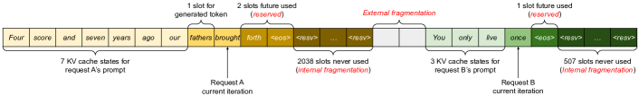

<figcaption>図3: 既存システムにおける KV キャッシュのメモリ管理。3 種類のメモリの無駄——予約（reserved）・内部断片化・外部断片化——が存在し、他のリクエストがメモリに収まることを妨げる。各メモリスロット内のトークンはその KV キャッシュを表す。同じトークンでも位置が異なれば KV キャッシュは異なる点に注意されたい。</figcaption>
</figure>

### 2.3. Batching Techniques for LLMs（LLM のためのバッチング技法）

LLM のサービングにおける計算の利用率は、複数のリクエストをバッチ処理することで改善できる。リクエストが同じモデルの重みを共有するので、重みを移動するオーバーヘッドがバッチ内のリクエスト間で償却され、バッチサイズが十分大きければ計算のオーバーヘッドに埋もれる。しかし LLM サービスへのリクエストのバッチ処理は 2 つの理由で自明でない。第一に、リクエストは**異なる時刻に到着しうる**。素朴なバッチ戦略では、先に来たリクエストを後のものが来るまで待たせるか、先のものが終わるまで新しいリクエストを遅らせるかになり、大きなキュー遅延をもたらす。第二に、リクエストは**入出力の長さが大きく異なりうる**（Fig. 11）。素直なバッチ技法はリクエストの入出力を長さが揃うようにパディングし、GPU の計算とメモリを浪費する。

この問題に対処するため、**cellular batching** [^17] や**反復単位のスケジューリング（iteration-level scheduling）** [^61] といった細粒度のバッチ機構が提案されてきた。リクエスト単位で動作する伝統的な手法とは異なり、これらの技法は**反復単位**で動作する。各反復の後、完了したリクエストがバッチから取り除かれ、新しいものが加えられる。したがって新しいリクエストは、バッチ全体の完了を待たずに**単一の反復を待つだけ**で処理を開始できる。さらに特別な GPU カーネルによって、これらの技法は入出力のパディングを不要にする。キュー遅延とパディングによる非効率を減らすことで、細粒度のバッチ機構は LLM サービングのスループットを大きく高める。

## 3. Memory Challenges in LLM Serving（LLM サービングにおけるメモリの課題）

細粒度のバッチングは計算の無駄を減らし、リクエストをより柔軟にバッチ化できるようにするが、まとめてバッチ化できるリクエストの数は依然として **GPU のメモリ容量**、とりわけ KV キャッシュの格納に割り当てられた空間によって制約される。言い換えれば、**サービングシステムのスループットはメモリ律速である**。このメモリ律速を克服するには、メモリ管理における次の課題に取り組む必要がある。

**大きな KV キャッシュ。** KV キャッシュのサイズはリクエスト数とともに急速に増える。例として **13B パラメータの OPT モデル** [^63] では、**1 トークンの KV キャッシュが 800 KB** の空間を要求する——$2$（キーとバリューのベクトル）$\times\ 5120$（隠れ状態のサイズ）$\times\ 40$（層数）$\times\ 2$（FP16 のバイト数）である。OPT は最大 2048 トークンの系列を生成できるので、**1 リクエストの KV キャッシュの格納に必要なメモリは最大 1.6 GB** になりうる。現行の GPU のメモリ容量は数十 GB である。仮に利用可能なメモリをすべて KV キャッシュに割り当てたとしても、**数十のリクエストしか収容できない**。さらに、非効率なメモリ管理は Fig. 2 に示すようにバッチサイズをさらに減らしうる。加えて、現在の趨勢では **GPU の計算速度はメモリ容量より速く伸びている** [^18]。たとえば NVIDIA A100 から H100 へは FLOPS が 2 倍以上に増えたが、GPU のメモリは最大 80GB のままである。したがってメモリはますます重要なボトルネックになると我々は考えている。

**複雑なデコードアルゴリズム。** LLM のサービスはユーザーが選べるさまざまなデコードアルゴリズムを提供し、それぞれがメモリ管理の複雑さに異なる影響を持つ。たとえばユーザーが 1 つの入力プロンプトから複数のランダムなサンプルを要求するとき（プログラム提案 [^19] で典型的な用途）、**プロンプト部分の KV キャッシュ**——我々の実験（§6.3）では KV キャッシュのメモリ全体の 12% を占める——を共有してメモリ使用量を最小化できる。一方、自己回帰生成相の KV キャッシュは、サンプル結果が異なり文脈と位置に依存するので共有できないままである。KV キャッシュ共有の程度は用いるデコードアルゴリズムに依存する。ビーム探索 [^50] のようなより洗練されたアルゴリズムでは、異なるリクエストのビームが KV キャッシュのより大きな部分を共有でき（**最大 55% のメモリ節約**。§6.3 を参照）、共有のパターンはデコードが進むにつれて変化する。

**入出力長が未知のもとでのスケジューリング。** LLM サービスへのリクエストは入出力の長さにばらつきがある。これはメモリ管理システムに、広範囲のプロンプト長へ対応することを要求する。加えて、リクエストの出力長がデコード中に伸びるにつれて KV キャッシュに必要なメモリも拡大し、入ってくるリクエストや既存のプロンプトの進行中の生成のために利用可能なメモリを枯渇させうる。システムは、あるリクエストの KV キャッシュを GPU メモリから削除するか退避（swap out）するかといったスケジューリングの判断を下す必要がある。

### 3.1. Memory Management in Existing Systems（既存システムにおけるメモリ管理）

現在の深層学習フレームワーク [^40] [^34] のほとんどの演算子はテンソルが連続したメモリに格納されていることを要求するので、従来の LLM サービングシステム [^61] [^32] も 1 つのリクエストの KV キャッシュを異なる位置にまたがる**連続したテンソル**として格納する。LLM からの出力長が予測できないため、これらは**リクエストの実際の入力長や最終的な出力長に関係なく、リクエストの取りうる最大系列長に基づいてメモリのかたまりを静的に確保**する。

Fig. 3 は 2 つのリクエストを図示している——最大系列長 2048 のリクエスト A と、最大 512 のリクエスト B である。既存システムのかたまり事前確保の方式には、メモリの無駄の主要な源が 3 つある——将来のトークンのための**予約（reserved）** されたスロット、取りうる最大系列長への過剰供給による**内部断片化**、そして buddy allocator のようなメモリアロケータに由来する**外部断片化**である。外部断片化は生成されるトークンに決して使われないことが、リクエストのサービング前から分かっている。内部断片化も使われないままだが、これはリクエストのサンプリングが終わって初めて判明する。**どちらも純粋なメモリの無駄である。** 予約されたメモリは最終的には使われるものの、リクエストの生存期間全体にわたってこの空間を予約しておくことは、とりわけ予約空間が大きいとき、他のリクエストの処理に使えたはずの空間を占有する。Fig. 2 に我々の実験におけるメモリの無駄の平均割合を可視化しており、**従来システムにおける実効的なメモリは 20.4% まで低くなりうる**ことが明らかになっている。

断片化への潜在的な解として**コンパクション（compaction）** [^55] が提案されてきたが、KV キャッシュが膨大なため、性能に敏感な LLM サービングシステムでコンパクションを行うのは非現実的である。仮にコンパクションを行ったとしても、リクエストごとに事前確保されたかたまりの空間が、既存のメモリ管理システムにおいてデコードアルゴリズム固有のメモリ共有を妨げる。

## 4. Method（手法）

<figure>

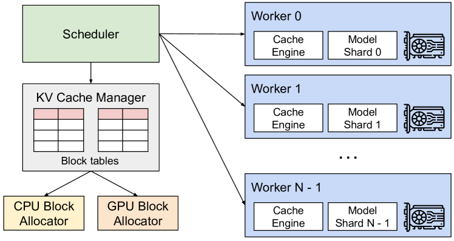

<figcaption>図4: vLLM のシステム概観。</figcaption>
</figure>

本研究では、§3 で概説した課題に取り組むために、新しい attention アルゴリズム **PagedAttention** と LLM サービングエンジン **vLLM** を開発する。vLLM のアーキテクチャを Fig. 4 に示す。vLLM は**中央集権的なスケジューラ**を採用して分散した GPU ワーカの実行を調整する。**KV キャッシュマネージャ**は、PagedAttention によって可能になったページ化された方式で KV キャッシュを効果的に管理する。具体的には、KV キャッシュマネージャは中央スケジューラが送る指示を通じて、GPU ワーカ上の物理的な KV キャッシュメモリを管理する。

次に §4.1 で PagedAttention のアルゴリズムを述べる。それを踏まえて §4.2 で KV キャッシュマネージャの設計を、§4.3 でそれがどう PagedAttention を助けるかをそれぞれ示す。続いて、この設計がどのようにさまざまなデコード手法（§4.4）の効果的なメモリ管理を可能にし、可変長の入出力系列（§4.5）を扱うかを示す。最後に §4.6 で vLLM のシステム設計が分散環境でどう働くかを示す。

### 4.1. PagedAttention

§3 のメモリの課題に対処するため、我々は OS における**ページング** [^26] という古典的な着想に触発された attention アルゴリズム **PagedAttention** を導入する。伝統的な attention アルゴリズムとは異なり、PagedAttention は**連続したキーとバリューを非連続なメモリ空間に格納する**ことを許す。具体的には、PagedAttention は各系列の KV キャッシュを **KV ブロック**に分割する。各ブロックは固定数のトークンのキーとバリューのベクトルを含み1、この数を **KV ブロックサイズ**（$B$）と表記する。キーブロックを $K_{j}=(k_{(j-1)B+1},\ldots,k_{jB})$、バリューブロックを $V_{j}=(v_{(j-1)B+1},\ldots,v_{jB})$ とする。式 4 の attention の計算は、次のブロック単位の計算へ変換できる:

> 訳注（脚注 1）: トランスフォーマでは、各トークンは層をまたぎ、また層内の attention ヘッドをまたいでキーとバリューのベクトルの集合を持つ。すべてのキーとバリューのベクトルを 1 つの KV ブロック内でまとめて管理することもできるし、異なるヘッドと層のキーとバリューのベクトルがそれぞれ別のブロックを持ち、別の block table で管理されることもできる。**2 つの設計に性能差はなく、実装が容易なので我々は後者を選んだ。**

$$
A_{ij}=\frac{\exp(q_{i}^{\top}K_{j}/\sqrt{d})}{\sum_{t=1}^{\lceil i/B\rceil}\exp(q_{i}^{\top}K_{t}\mathbf{1}/\sqrt{d})},\ o_{i}=\sum_{j=1}^{\lceil i/B\rceil}V_{j}A_{ij}^{\top},
$$

ここで $A_{ij}=(a_{i,(j-1)B+1},\ldots,a_{i,jB})$ は $j$ 番目の KV ブロック上の attention スコアの行ベクトルである。

attention の計算中、PagedAttention のカーネルは異なる KV ブロックを個別に同定して取得する。Fig. 5 に PagedAttention の例を示す——キーとバリューのベクトルは 3 つのブロックに分散しており、その 3 つのブロックは物理メモリ上で連続していない。各時点でカーネルは、クエリトークン（"*forth*"）のクエリベクトル $q_{i}$ と、あるブロック内のキーベクトル $K_{j}$（例: ブロック 0 の "*Four score and seven*" のキーベクトル）を掛けて attention スコア $A_{ij}$ を計算し、後で $A_{ij}$ とブロック内のバリューベクトル $V_{j}$ を掛けて最終的な attention の出力 $o_{i}$ を導く。

要約すると、PagedAttention のアルゴリズムは KV ブロックを非連続な物理メモリに格納することを可能にし、vLLM におけるより柔軟なページ化されたメモリ管理を実現する。

<figure>

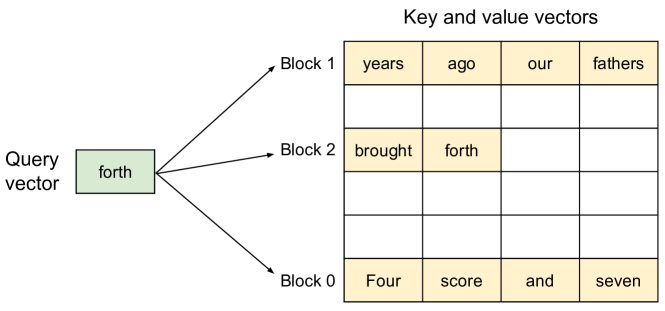

<figcaption>図5: PagedAttention アルゴリズムの図示。attention のキーとバリューのベクトルがメモリ内の非連続なブロックとして格納されている。</figcaption>
</figure>

### 4.2. KV Cache Manager（KV キャッシュマネージャ）

vLLM のメモリマネージャの背後にある鍵となる着想は、OS における**仮想メモリ** [^26] と類似している。OS はメモリを固定サイズの**ページ**へ分割し、ユーザープログラムの論理ページを物理ページへ写像する。**連続した論理ページは非連続な物理メモリページに対応でき**、ユーザープログラムはあたかも連続しているかのようにメモリへアクセスできる。さらに、物理メモリ空間を事前に完全に予約する必要がなく、OS は必要に応じて動的に物理ページを確保できる。vLLM は仮想メモリの背後にある着想を用いて、LLM サービスにおける KV キャッシュを管理する。PagedAttention によって可能になり、我々は KV キャッシュを仮想メモリのページのように固定サイズの KV ブロックとして組織する。

リクエストの KV キャッシュは一連の**論理 KV ブロック**として表現され、新しいトークンとその KV キャッシュが生成されるにつれて左から右へ埋められる。最後の KV ブロックの未使用の位置は将来の生成のために予約される。GPU ワーカ上では、**ブロックエンジン**が GPU DRAM の連続したかたまりを確保して**物理 KV ブロック**へ分割する（これは退避のために CPU RAM 上でも行われる。§4.5 を参照）。**KV ブロックマネージャ**は、各リクエストの論理 KV ブロックと物理 KV ブロックの間の写像である **block table** も保持する。block table の各エントリは、論理ブロックに対応する物理ブロックと埋まっている位置の数を記録する。**論理 KV ブロックと物理 KV ブロックを分離することで、vLLM はすべての位置のために事前に予約することなく KV キャッシュのメモリを動的に増やせる**ようになり、Fig. 2 に示すように既存システムのメモリの無駄の大部分を排除する。

### 4.3. Decoding with PagedAttention and vLLM（PagedAttention と vLLM によるデコード）

<figure>

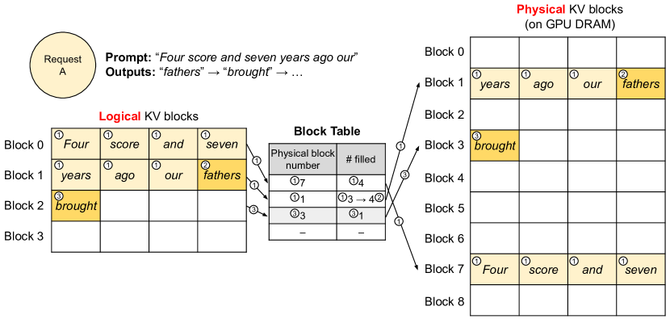

<figcaption>図6: vLLM における block table の変換。</figcaption>
</figure>

次に Fig. 6 の例を辿って、単一の入力系列のデコード過程で vLLM がどのように PagedAttention を実行しメモリを管理するかを示す。①OS の仮想メモリと同様に、vLLM は生成されうる最大系列長のためのメモリを最初に予約する必要がない。代わりに、プロンプトの計算中に生成される KV キャッシュを収容するのに必要な KV ブロックだけを予約する。この場合、プロンプトは 7 トークンなので、vLLM は最初の 2 つの論理 KV ブロック（0 と 1）を 2 つの物理 KV ブロック（それぞれ 7 と 1）へ写像する。prefill のステップで、vLLM は従来の self-attention アルゴリズム（例: [^14]）を用いてプロンプトの KV キャッシュと最初の出力トークンを生成する。次に vLLM は最初の 4 トークンの KV キャッシュを論理ブロック 0 に、続く 3 トークンを論理ブロック 1 に格納する。残りのスロットは続く自己回帰生成相のために予約される。②最初の自己回帰デコードのステップで、vLLM は物理ブロック 7 と 1 上で PagedAttention のアルゴリズムを用いて新しいトークンを生成する。1 つのスロットが残っているので、新しい KV キャッシュはそこに格納され、block table の #filled の記録が更新される。③2 番目のデコードステップでは、最後の論理ブロックが満杯なので、vLLM は新しく生成された KV キャッシュを新しい論理ブロックに格納する。vLLM はそれに新しい物理ブロック（物理ブロック 3）を確保し、この写像を block table に格納する。

大局的には、各デコードの反復で vLLM はまずバッチ化する候補の系列の集合を選び（詳細は §4.5）、新たに必要になった論理ブロックのために物理ブロックを確保する。次に vLLM は現在の反復のすべての入力トークン（すなわちプロンプト相のリクエストのすべてのトークンと、生成相のリクエストの最新のトークン）を 1 つの系列として連結し、LLM へ与える。LLM の計算中、vLLM は PagedAttention のカーネルを用いて論理 KV ブロックの形で格納された過去の KV キャッシュへアクセスし、新しく生成された KV キャッシュを物理 KV ブロックへ保存する。**1 つの KV ブロック内に複数のトークンを格納する（ブロックサイズ > 1）ことで、PagedAttention のカーネルはより多くの位置にまたがる KV キャッシュを並列に処理でき、ハードウェアの利用率を高めレイテンシを減らせる。しかしブロックサイズが大きいほどメモリの断片化も増える。** ブロックサイズの効果は §7.2 で調べる。

繰り返しになるが、より多くのトークンとその KV キャッシュが生成されるにつれて、vLLM は動的に新しい物理ブロックを論理ブロックへ割り当てる。すべてのブロックは左から右へ埋められ、新しい物理ブロックは以前のブロックがすべて満杯になったときにのみ確保されるので、**vLLM はリクエストごとのメモリの無駄を 1 ブロック以内に抑える**。これによりすべてのメモリを効果的に活用でき（Fig. 2）、より多くのリクエストがバッチ処理のためにメモリに収まる——ひいてはスループットが改善する。リクエストが生成を終えると、その KV ブロックは他のリクエストの KV キャッシュを格納するために解放できる。Fig. 7 に、vLLM が 2 つの系列のメモリを管理する例を示す。2 つの系列の論理ブロックは、GPU ワーカ内のブロックエンジンが予約した空間内の異なる物理ブロックへ写像される。両系列の隣り合う論理ブロックが物理 GPU メモリ上で連続している必要はなく、物理ブロックの空間は両方の系列によって効果的に活用されうる。

<figure>

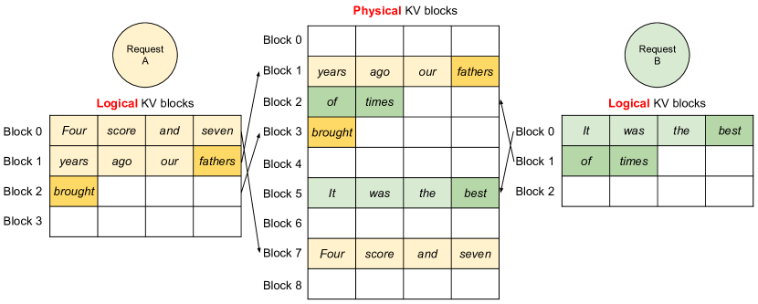

<figcaption>図7: vLLM において 2 つのリクエストの KV キャッシュを同時に格納すること。</figcaption>
</figure>

### 4.4. Application to Other Decoding Scenarios（他のデコード場面への適用）

§4.3 は、1 つのユーザープロンプトを入力に取り単一の出力系列を生成する貪欲デコードやサンプリングといった基本的なデコードアルゴリズムを、PagedAttention と vLLM がどう扱うかを示した。多くの成功した LLM の応用 [^19] [^35] では、LLM サービスは複雑なアクセスパターンとより多くのメモリ共有の機会を示す、より複雑なデコードの場面を提供しなければならない。本節ではそれらに対する vLLM の一般的な適用可能性を示す。

**並列サンプリング（Parallel sampling）。** LLM に基づくプログラム補助 [^7] [^19] では、LLM が 1 つの入力プロンプトに対して複数のサンプル出力を生成し、ユーザーがさまざまな候補から好みの出力を選べる。ここまでは、リクエストが単一の系列を生成すると暗黙に仮定してきた。本論文の残りでは、リクエストが複数の系列を生成するより一般的な場合を想定する。並列サンプリングでは、1 つのリクエストが同じ入力プロンプトを共有する複数のサンプルを含み、プロンプトの KV キャッシュも共有できるようになる。PagedAttention とページ化されたメモリ管理を通じて、vLLM はこの共有を容易に実現しメモリを節約できる。

Fig. 8 は 2 つの出力についての並列デコードの例を示す。両方の出力が同じプロンプトを共有するので、プロンプト相ではプロンプトの状態のコピーを 1 つ分だけ予約する——両系列のプロンプトの論理ブロックは同じ物理ブロックへ写像される（両系列の論理ブロック 0 と 1 が、それぞれ物理ブロック 7 と 1 へ写像される）。1 つの物理ブロックが複数の論理ブロックへ写像されうるので、我々は各物理ブロックについて**参照カウント（reference count）** を導入する。この場合、物理ブロック 7 と 1 の参照カウントはともに 2 である。生成相では、2 つの出力が異なる出力トークンをサンプリングし、KV キャッシュのために別々の格納が必要になる。vLLM は、複数の系列によって変更が必要になる物理ブロックについて、**ブロック粒度の copy-on-write（書き込み時複製）** の機構を実装する。これは OS の仮想メモリにおける copy-on-write の技法（例: プロセスを fork するとき）と同様である。具体的には Fig. 8 において、サンプル A1 が最後の論理ブロック（論理ブロック 1）へ書き込む必要があるとき、vLLM は対応する物理ブロック（物理ブロック 1）の参照カウントが 1 より大きいことを認識し、新しい物理ブロック（物理ブロック 3）を確保し、ブロックエンジンに物理ブロック 1 から情報をコピーするよう指示し、参照カウントを 1 へ減らす。次にサンプル A2 が物理ブロック 1 へ書き込むとき、参照カウントは既に 1 へ減っているので、A2 は新しく生成された KV キャッシュを物理ブロック 1 へ直接書き込む。

要約すると、vLLM は複数の出力サンプルにまたがってプロンプトの KV キャッシュの格納に使われる空間の大部分の共有を可能にする——例外は最後の論理ブロックで、これは copy-on-write の機構で管理される。複数のサンプルにまたがって物理ブロックを共有することで、とりわけ**長い入力プロンプト**についてメモリ使用量を大きく減らせる。

<figure>

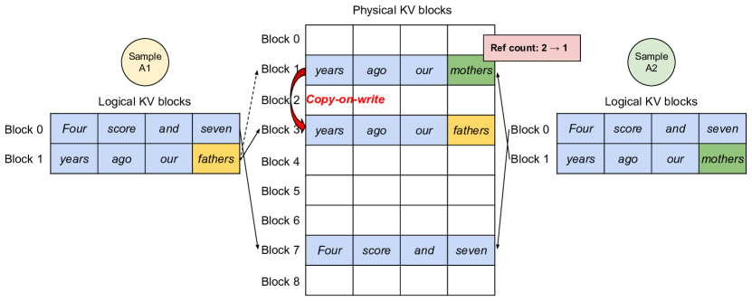

<figcaption>図8: 並列サンプリングの例。</figcaption>
</figure>

**ビーム探索（Beam search）。** 機械翻訳 [^60] のような LLM のタスクでは、ユーザーは LLM が出力する上位 $k$ 個の最も適切な翻訳を期待する。ビーム探索 [^50] は、サンプル空間を完全に探索する計算量を緩和するため、LLM から最も確率の高い出力系列をデコードするのに広く用いられる。このアルゴリズムは**ビーム幅**のパラメータ $k$ に依存し、各ステップで保持される上位候補の数を決める。デコード中、ビーム探索はビーム内の各候補系列を可能なすべてのトークンを考慮して展開し、LLM を用いてそれぞれの確率を計算し、$k\cdot|V|$ 個の候補（$|V|$ は語彙サイズ）から上位 $k$ 個の最も確率の高い系列を保持する。

<figure>

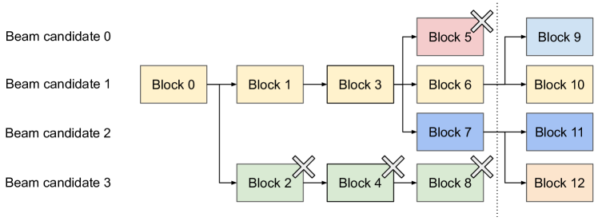

<figcaption>図9: ビーム探索の例。</figcaption>
</figure>

並列デコードとは異なり、ビーム探索は最初のプロンプトのブロックだけでなく他のブロックも異なる候補間で共有でき、しかも**共有のパターンはデコードが進むにつれて動的に変化する**——OS において複合的な fork によって作られるプロセスツリーと同様である。Fig. 9 は $k=4$ のビーム探索の例について vLLM が KV ブロックをどう管理するかを示す。点線で図示された反復の前、各候補系列は 4 つの満杯の論理ブロックを使っている。すべてのビーム候補が最初のブロック 0（すなわちプロンプト）を共有する。候補 3 は 2 番目のブロックから他と分岐する。候補 0〜2 は最初の 3 ブロックを共有し、4 番目のブロックで分かれる。続く反復では、上位 4 つの確率の高い候補がすべて候補 1 と 2 に由来する。元の候補 0 と 3 はもはや上位候補ではないので、その論理ブロックは解放され、対応する物理ブロックの参照カウントが減らされる。vLLM は参照カウントが 0 になったすべての物理ブロック（ブロック 2、4、5、8）を解放する。次に vLLM は新しい候補からの新しい KV キャッシュを格納するために新しい物理ブロック（ブロック 9〜12）を確保する。いまやすべての候補がブロック 0、1、3 を共有し、候補 0 と 1 はブロック 6 を、候補 2 と 3 はさらにブロック 7 を共有する。

従来の LLM サービングシステムは、ビーム候補間で KV キャッシュの頻繁なメモリコピーを必要とする。たとえば Fig. 9 の場合、点線の後で候補 3 は生成を続けるために候補 2 の KV キャッシュの大部分をコピーする必要がある。**この頻繁なメモリコピーのオーバーヘッドは、vLLM の物理ブロック共有によって大きく削減される。** vLLM では異なるビーム候補のほとんどのブロックを共有できる。copy-on-write の機構は、新しく生成されたトークンが古い共有ブロック内にある場合にのみ、並列デコードと同様に適用される。これは 1 ブロック分のデータのコピーだけを伴う。

**共有 prefix（Shared prefix）。** 一般に LLM のユーザーは、指示と入出力の例を含むタスクの（長い）記述を提供する。これは**システムプロンプト** [^37] としても知られる。この記述は実際のタスク入力と連結されてリクエストのプロンプトを形成する。LLM は完全なプロンプトに基づいて出力を生成する。Fig. 10 に例を示す。さらに共有 prefix は、下流タスクの精度を改善するためにプロンプトエンジニアリングを通じてさらに調整できる [^28] [^27]。

この種の応用では、多くのユーザープロンプトが prefix を共有するので、**LLM サービスの提供者は prefix の KV キャッシュを事前に格納しておいて、prefix に費やされる冗長な計算を減らせる**。vLLM では、これは **LLM サービスの提供者が事前定義した共有 prefix の集合のために物理ブロックの集合を予約しておく**ことで簡便に達成できる——OS がプロセスをまたいで共有ライブラリを扱うのと同じである。共有 prefix を持つユーザーの入力プロンプトは、その論理ブロックをキャッシュされた物理ブロックへ写像するだけでよい（最後のブロックは copy-on-write の印を付ける）。プロンプト相の計算はユーザーのタスク入力に対してのみ実行すればよい。

<figure>

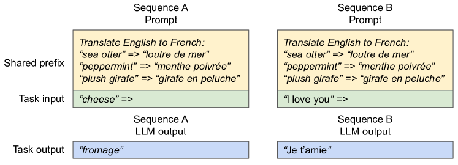

<figcaption>図10: 機械翻訳のための共有プロンプトの例。例は Brown ら（2020）から採用した。</figcaption>
</figure>

**混合したデコード手法（Mixed decoding methods）。** 前述のデコード手法は多様なメモリ共有とアクセスのパターンを示す。にもかかわらず vLLM は、異なるデコードの選好を持つリクエストの同時処理を可能にする——**既存システムにはこれが効率的にできない**。これは、vLLM が論理ブロックを物理ブロックへ変換する共通の写像層を介して、異なる系列間の複雑なメモリ共有を隠蔽するからである。LLM とその実行カーネルは各系列について物理ブロック ID のリストしか見ておらず、系列間の共有パターンを扱う必要がない。既存システムと比べてこの手法は、異なるサンプリング要件を持つリクエストのバッチ化の機会を広げ、最終的にシステム全体のスループットを高める。

### 4.5. Scheduling and Preemption（スケジューリングとプリエンプション）

リクエストのトラフィックがシステムの容量を超えると、vLLM は一部のリクエストを優先しなければならない。vLLM では、公平性を保ち飢餓を防ぐため、すべてのリクエストに **FCFS（first-come-first-serve, 先着順）** のスケジューリング方針を採用する。vLLM がリクエストをプリエンプトする必要があるとき、最も早く到着したリクエストが最初に処理され、最も遅いリクエストが最初にプリエンプトされることを保証する。

LLM のサービスは固有の課題に直面する——**LLM への入力プロンプトは長さが大きく異なりえ、結果の出力長は事前に分からず、入力プロンプトとモデルの双方に依存する**。リクエストの数とその出力が増えると、vLLM は新しく生成された KV キャッシュを格納する GPU の物理ブロックを使い果たしうる。この文脈で vLLM が答えるべき古典的な問いが 2 つある——(1) どのブロックを退避すべきか。(2) 必要になったとき退避したブロックをどう復旧するか。典型的には、退避方針はヒューリスティクスを用いて最も遠い未来にアクセスされるブロックを予測してそれを退避する。我々の場合、**ある系列のすべてのブロックがまとめてアクセスされる**ことが分かっているので、**all-or-nothing の退避方針**、すなわち系列のブロックをすべて退避するか、まったく退避しないかを実装する。さらに、1 つのリクエスト内の複数の系列（例: 1 つのビーム探索リクエスト内のビーム候補）は**系列グループ（sequence group）** としてギャングスケジューリングされる。1 つの系列グループ内の系列は、それらの系列間の潜在的なメモリ共有のために常にまとめてプリエンプトまたは再スケジュールされる。退避したブロックをどう復旧するかという 2 番目の問いについては、2 つの技法を考える。

**退避（Swapping）。** これはほとんどの仮想メモリの実装で使われる古典的な技法で、退避されたページをディスク上のスワップ空間へコピーする。我々の場合は退避されたブロックを CPU メモリへコピーする。Fig. 4 に示すように、vLLM は GPU のブロックアロケータのほかに、CPU RAM へ退避された物理ブロックを管理する **CPU ブロックアロケータ**を含む。vLLM が新しいトークンのための空き物理ブロックを使い果たすと、退避する系列の集合を選んでその KV キャッシュを CPU へ転送する。系列をプリエンプトしてそのブロックを退避すると、vLLM はプリエンプトされたすべての系列が完了するまで新しいリクエストの受け入れを止める。リクエストが完了するとそのブロックがメモリから解放され、プリエンプトされた系列のブロックが戻されてその系列の処理が続く。この設計では、**CPU RAM へ退避されるブロックの数が GPU RAM の物理ブロックの総数を超えることは決してない**ので、CPU RAM 上のスワップ空間は KV キャッシュに割り当てられた GPU メモリで上界が押さえられる点に注意されたい。

**再計算（Recomputation）。** この場合、プリエンプトされた系列が再スケジュールされたときに単に KV キャッシュを再計算する。**再計算のレイテンシは元のレイテンシより大幅に低くなりうる**点に注意されたい——デコードで生成されたトークンを元のユーザープロンプトと連結して新しいプロンプトとすることができ、そのすべての位置の KV キャッシュを 1 回のプロンプト相の反復で生成できるからである。

退避と再計算の性能は、CPU RAM と GPU メモリの間の帯域と GPU の計算能力に依存する。退避と再計算の速度は §7.3 で調べる。

### 4.6. Distributed Execution（分散実行）

多くの LLM は単一 GPU の容量を超えるパラメータサイズを持つ [^6] [^10]。したがって、それらを分散した GPU に分割してモデル並列で実行することが必要である [^64] [^29]。これは**分散したメモリを扱えるメモリマネージャ**を要求する。vLLM は、トランスフォーマ上で広く用いられる Megatron-LM 型のテンソルモデル並列戦略 [^48] を支えることで分散環境でも有効である。この戦略は **SPMD（Single Program Multiple Data）** の実行スケジュールに従い、線形層がブロック単位の行列積を行うよう分割され、GPU は all-reduce の演算を通じて中間結果を常に同期する。具体的には、attention の演算子は attention ヘッドの次元で分割され、各 SPMD プロセスが multi-head attention の attention ヘッドの部分集合を担当する。

**モデル並列で実行しても、各モデルのシャードは同じ入力トークンの集合を処理するので、同じ位置の KV キャッシュを必要とする**ことを我々は観察する。したがって vLLM は、Fig. 4 のように中央スケジューラ内に**単一の KV キャッシュマネージャ**を持つ。異なる GPU ワーカがこのマネージャと、論理ブロックから物理ブロックへの写像を共有する。この共通の写像により、GPU ワーカは各入力リクエストについてスケジューラが提供する物理ブロックでモデルを実行できる。**各 GPU ワーカは同じ物理ブロック ID を持つが、ワーカは対応する attention ヘッドの KV キャッシュの一部だけを格納する。**

各ステップでスケジューラはまず、バッチ内の各リクエストの入力トークン ID と各リクエストの block table を含むメッセージを準備する。次にスケジューラはこの制御メッセージを GPU ワーカへブロードキャストする。すると GPU ワーカは入力トークン ID でモデルの実行を開始する。attention の層では、GPU ワーカは制御メッセージ内の block table に従って KV キャッシュを読む。実行中、GPU ワーカは [^48] のようにスケジューラの調整なしに all-reduce の通信プリミティブで中間結果を同期する。最後に GPU ワーカはこの反復のサンプリングされたトークンをスケジューラへ送り返す。要約すると、**GPU ワーカはメモリ管理について同期する必要がない**——各デコードの反復の冒頭に、ステップの入力とともにすべてのメモリ管理の情報を受け取るだけでよいからである。

## 5. Implementation（実装）

**表1**: モデルのサイズとサーバの構成。

| Model size | 13B | 66B | 175B |
| --- | --- | --- | --- |
| GPUs | A100 | 4 × A100 | 8 × A100-80GB |
| Total GPU memory | 40 GB | 160 GB | 640 GB |
| Parameter size | 26 GB | 132 GB | 346 GB |
| Memory for KV cache | 12 GB | 21 GB | 264 GB |
| Max. # KV cache slots | 15.7K | 9.7K | 60.1K |

vLLM は FastAPI [^16] のフロントエンドと GPU ベースの推論エンジンからなる、端から端までのサービングシステムである。フロントエンドは OpenAI API [^35] のインターフェースを拡張し、ユーザーが最大系列長やビーム幅 $k$ といったサンプリングのパラメータをリクエストごとにカスタマイズできるようにする。vLLM のエンジンは **8.5K 行の Python と 2K 行の C++/CUDA** のコードで書かれている。スケジューラやブロックマネージャといった制御に関わる構成要素は Python で開発し、PagedAttention のような主要な演算にはカスタム CUDA カーネルを開発する。モデルの実行部については、GPT [^6]・OPT [^63]・LLaMA [^53] といった人気ある LLM を PyTorch [^40] と Transformers [^59] を用いて実装する。分散した GPU ワーカ間のテンソル通信には NCCL [^33] を用いる。

### 5.1. Kernel-level Optimization（カーネル水準の最適化）

PagedAttention は既存システムが効率的に支えないメモリアクセスパターンを導入するので、それを最適化するいくつかの GPU カーネルを開発した。(1) **Fused reshape and block write（reshape とブロック書き込みの融合）。** 各トランスフォーマ層で、新しい KV キャッシュはブロックへ分割され、ブロック読み込みに最適化されたメモリレイアウトへ reshape され、block table が指定する位置に保存される。カーネル起動のオーバーヘッドを最小化するため、これらを 1 つのカーネルへ融合する。(2) **Fusing block read and attention（ブロック読み込みと attention の融合）。** FasterTransformer [^32] の attention カーネルを、block table に従って KV キャッシュを読み、その場で attention の演算を行うよう適応させる。coalesced なメモリアクセスを保証するため、各ブロックの読み込みに GPU の warp を 1 つ割り当てる。さらに、リクエストのバッチ内での可変系列長への対応も加える。(3) **Fused block copy（ブロックコピーの融合）。** copy-on-write の機構が発行するブロックコピーの演算は、非連続なブロックに対して動作しうる。`cudaMemcpyAsync` API を使うと、これは小さなデータ移動の膨大な呼び出しにつながりうる。オーバーヘッドを緩和するため、異なるブロックのコピー演算を 1 回のカーネル起動へバッチ化するカーネルを実装する。

<figure>

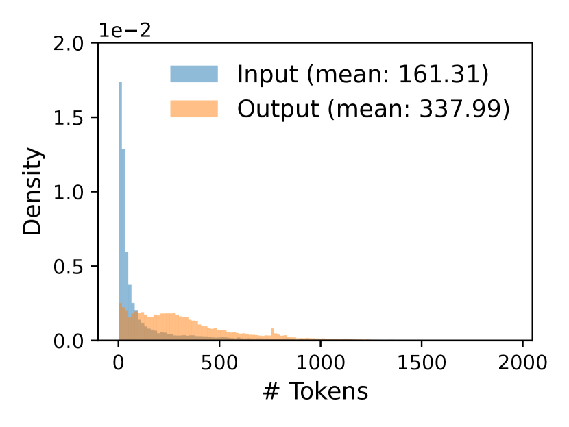

<figcaption>図11(a): ShareGPT。</figcaption>
</figure>

<figure>

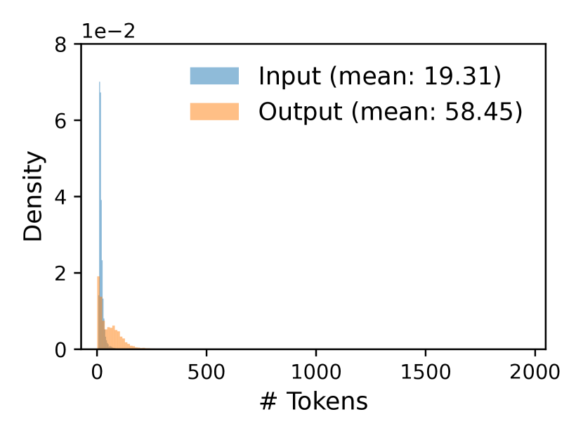

<figcaption>図11(b): Alpaca。図11 全体のキャプション: (a) ShareGPT と (b) Alpaca のデータセットの入出力長の分布。（訳注: この画像と図全体のキャプションはクリップで欠落していたため原ページから復元した。）</figcaption>
</figure>

### 5.2. Supporting Various Decoding Algorithms（さまざまなデコードアルゴリズムへの対応）

vLLM は 3 つの主要な手法——**fork・append・free**——を用いてさまざまなデコードアルゴリズムを実装する。`fork` は既存の系列から新しい系列を作る。`append` は系列に新しいトークンを追加する。`free` は系列を削除する。たとえば並列サンプリングでは、vLLM は `fork` を用いて単一の入力系列から複数の出力系列を作る。次に毎反復 `append` でこれらの系列に新しいトークンを加え、停止条件を満たした系列を `free` で削除する。同じ戦略はビーム探索と prefix 共有にも適用される。**将来のデコードアルゴリズムもこれらの手法の組み合わせで支えられると我々は考えている。**

<figure>

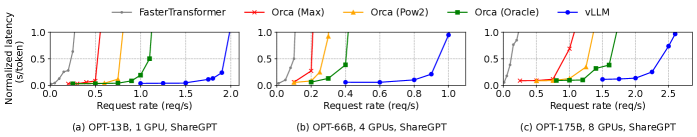

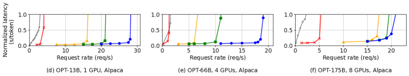

<figcaption>図12: ShareGPT と Alpaca のデータセットにおける OPT モデルの単一系列生成。（訳注: 2 枚目の画像はクリップで欠落していたため原ページから復元した。）</figcaption>
</figure>

<figure>

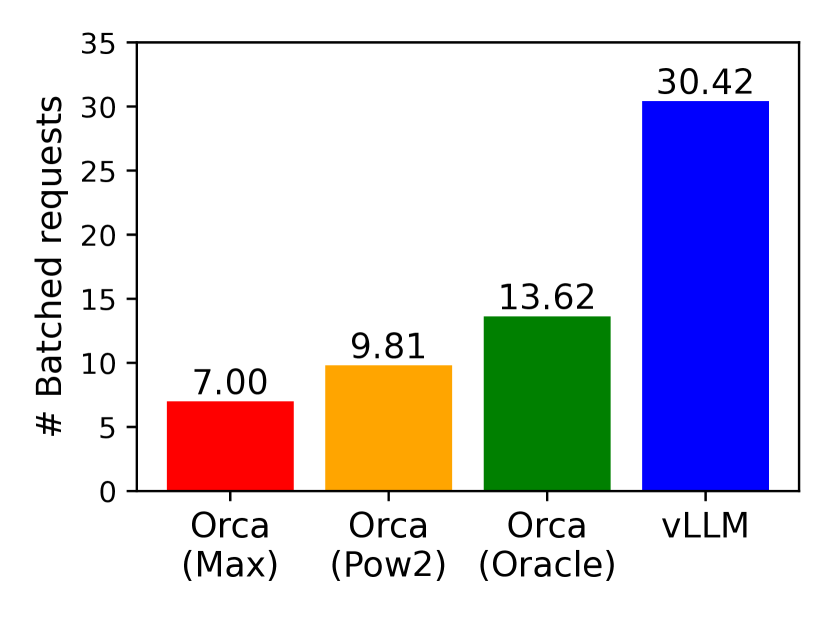

<figcaption>図13(a): ShareGPT。</figcaption>
</figure>

<figure>

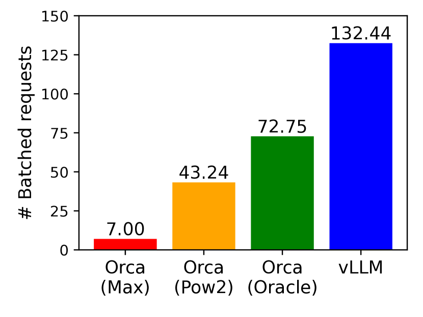

<figcaption>図13(b): Alpaca。図13 全体のキャプション: ShareGPT（2 reqs/s）と Alpaca（30 reqs/s）のトレースで OPT-13B をサービングするときの、バッチ化されたリクエスト数の平均。（訳注: この画像と図全体のキャプションはクリップで欠落していたため原ページから復元した。）</figcaption>
</figure>

## 6. Evaluation（評価）

本節では、さまざまなワークロードのもとでの vLLM の性能を評価する。

### 6.1. Experimental Setup（実験設定）

**モデルとサーバの構成。** 評価には 13B・66B・175B パラメータの OPT [^63] モデルと、13B パラメータの LLaMA [^53] を用いる。LLM のリーダーボード [^39] が示すとおり 13B と 66B は人気あるサイズであり、175B は有名な GPT-3 [^6] のサイズである。すべての実験で、Google Cloud Platform 上の NVIDIA A100 GPU を持つ A2 インスタンスを用いる。モデルのサイズとサーバの構成の詳細は Table 1 に示す。

**ワークロード。** 実際の LLM サービスの入出力テキストを含む **ShareGPT** [^52] と **Alpaca** [^51] のデータセットに基づいてワークロードを合成する。ShareGPT のデータセットは ChatGPT [^36] とのユーザー共有の会話の集合である。Alpaca のデータセットは self-instruct [^58] を用いて GPT-3.5 が生成した指示データセットである。これらのデータセットをトークン化し、その入出力長を用いてクライアントのリクエストを合成する。Fig. 11 に示すとおり、**ShareGPT のデータセットは Alpaca より平均で入力プロンプトが 8.4 倍・出力が 5.8 倍長く**、分散も大きい。これらのデータセットにはタイムスタンプが含まれないので、異なるリクエストレートでポアソン分布を用いてリクエストの到着時刻を生成する。

**ベースライン 1: FasterTransformer。** FasterTransformer [^32] はレイテンシに高度に最適化された分散推論エンジンである。FasterTransformer は独自のスケジューラを持たないので、Triton [^31] のような既存のサービングシステムと同様の動的バッチング機構を持つカスタムスケジューラを実装した。具体的には、GPU のメモリ容量に応じて各実験で最大バッチサイズ $B$ をできるだけ大きく設定する。スケジューラは最大 $B$ 個の最も早く到着したリクエストを取り、そのバッチを FasterTransformer へ処理のために送る。

<figure>

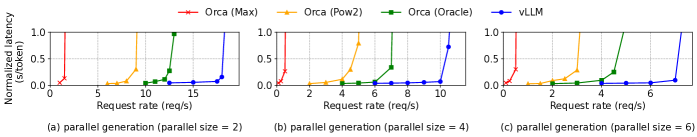

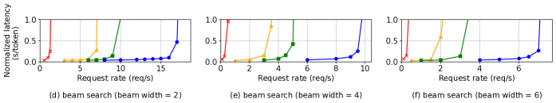

<figcaption>図14: Alpaca のデータセットにおける OPT-13B の並列生成とビーム探索。（訳注: 2 枚目の画像はクリップで欠落していたため原ページから復元した。）</figcaption>
</figure>

**ベースライン 2: Orca。** Orca [^61] はスループットに最適化された最先端の LLM サービングシステムである。Orca は公開されていないので、我々自身の版を実装した。Orca は KV キャッシュを格納するメモリアドレスを決めるのに buddy allocation のアルゴリズムを使うと仮定する。リクエストの出力のためにどれだけ空間を過剰予約するかに応じて、Orca の 3 つの版を実装する。

- **Orca (Oracle)。** システムがリクエストについて実際に生成される出力の長さを知っていると仮定する。これは Orca の性能の上界を示すが、実際には達成不可能である。
- **Orca (Pow2)。** システムが出力のための空間を最大 2 倍まで過剰予約すると仮定する。たとえば真の出力長が 25 なら、出力のために 32 の位置を予約する。
- **Orca (Max)。** システムが常にモデルの最大系列長、すなわち 2048 トークンまで空間を予約すると仮定する。

**主要な指標。** 我々はサービングのスループットに注目する。具体的には、異なるリクエストレートのワークロードを用いて、Orca [^61] と同様に、システムの**正規化レイテンシ**——各リクエストの端から端までのレイテンシをその出力長で割った値の平均——を測定する。高スループットのサービングシステムは、高いリクエストレートに対しても低い正規化レイテンシを保つべきである。ほとんどの実験ではシステムを 1 時間のトレースで評価する。例外として、コストの制限のため OPT-175B のモデルでは 15 分のトレースを用いる。

### 6.2. Basic Sampling（基本的なサンプリング）

3 つのモデルと 2 つのデータセットで、基本的なサンプリング（リクエストあたり 1 サンプル）における vLLM の性能を評価する。Fig. 12 の最初の行が ShareGPT のデータセットでの結果を示す。曲線は、リクエストレートが増えるにつれてレイテンシが最初は緩やかに増加し、その後突然爆発することを示している。これは、**リクエストレートがサービングシステムの容量を超えるとキューの長さが際限なく伸び続け、リクエストのレイテンシもそうなる**という事実に帰せられる。

ShareGPT のデータセットで、vLLM は同程度のレイテンシを保ちながら **Orca (Oracle) と比べて 1.7〜2.7 倍、Orca (Max) と比べて 2.7〜8 倍高いリクエストレート**を支えられる。これは、vLLM の PagedAttention がメモリ使用量を効率的に管理でき、それによって Orca より多くのリクエストをバッチ化できるからである。たとえば Fig. 13(a) に示すとおり、OPT-13B について vLLM は **Orca (Oracle) より 2.2 倍、Orca (Max) より 4.3 倍多くのリクエストを同時に処理する**。FasterTransformer と比べると、vLLM は **最大 22 倍高いリクエストレート**を支えられる——FasterTransformer は細粒度のスケジューリング機構を用いず、Orca (Max) のように非効率にメモリを管理するからである。

Fig. 12 の 2 番目の行と Fig. 13(b) は Alpaca のデータセットでの結果を示し、ShareGPT と同様の傾向に従う。1 つの例外が Fig. 12 (f) で、そこでは Orca (Oracle) と Orca (Pow2) に対する vLLM の優位が目立たない。これは、OPT-175B のモデルとサーバの構成（Table 1）が KV キャッシュの格納に大きな GPU メモリ空間を許す一方、Alpaca のデータセットは短い系列を持つからである。この設定では、Orca (Oracle) と Orca (Pow2) もメモリ管理の非効率にもかかわらず多数のリクエストをバッチ化できる。結果として、**システムの性能はメモリ律速でなく計算律速になる**。

<figure>

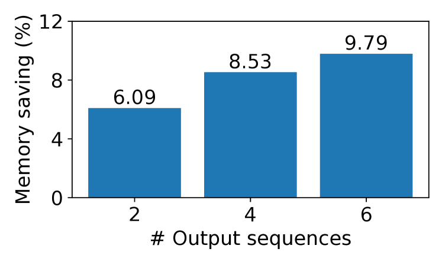

<figcaption>図15(a): 並列サンプリング。</figcaption>
</figure>

<figure>

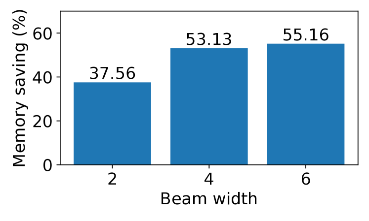

<figcaption>図15(b): ビーム探索。図15 全体のキャプション: Alpaca のトレースで OPT-13B をサービングするときの、KV ブロックの共有によるメモリ節約の平均量。（訳注: この画像と図全体のキャプションはクリップで欠落していたため原ページから復元した。）</figcaption>
</figure>

### 6.3. Parallel Sampling and Beam Search（並列サンプリングとビーム探索）

2 つの人気あるサンプリング手法——並列サンプリングとビーム探索——で PagedAttention におけるメモリ共有の有効性を評価する。並列サンプリングでは、1 つのリクエスト内のすべての並列系列がプロンプトの KV キャッシュを共有できる。Fig. 14 の最初の行に示すとおり、サンプリングする系列の数が多いほど vLLM は Orca のベースラインに対してより大きな改善をもたらす。同様に Fig. 14 の 2 番目の行は、異なるビーム幅でのビーム探索の結果を示す。ビーム探索はより多くの共有を許すので、vLLM はさらに大きな性能上の恩恵を示す。**OPT-13B と Alpaca のデータセットにおける Orca (Oracle) に対する vLLM の改善は、基本的なサンプリングの 1.3 倍から、幅 6 のビーム探索では 2.3 倍へ上がる。**

Fig. 15 は、共有によって節約できたブロック数を共有しない場合の総ブロック数で割って計算したメモリ節約量をプロットしている。**並列サンプリングで 6.1%〜9.8%、ビーム探索で 37.6%〜55.2% のメモリ節約**を示す。ShareGPT のデータセットでの同じ実験では、**並列サンプリングで 16.2%〜30.5%、ビーム探索で 44.3%〜66.3% のメモリ節約**が見られた。

### 6.4. Shared prefix（共有 prefix）

Fig. 10 に図示したように、prefix が異なる入力プロンプト間で共有される場合の vLLM の有効性を探る。モデルには多言語である LLaMA-13B [^53] を用いる。ワークロードには WMT16 [^5] の英独翻訳データセットを用い、指示といくつかの翻訳例を含む 2 つの prefix を合成する。1 つ目の prefix は 1 例（すなわち one-shot）を、もう 1 つは 5 例（すなわち few-shot）を含む。Fig. 16 (a) に示すとおり、one-shot の prefix が共有されるとき **vLLM は Orca (Oracle) より 1.67 倍高いスループット**を達成する。さらに、より多くの例が共有されるとき（Fig. 16 (b)）、**vLLM は Orca (Oracle) より 3.58 倍高いスループット**を達成する。

<figure>

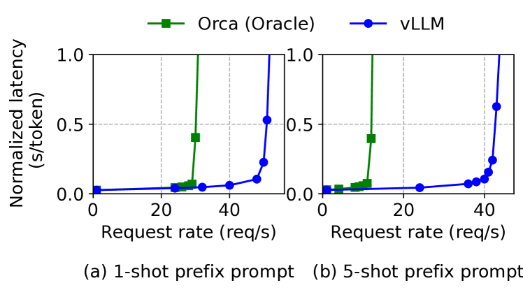

<figcaption>図16: 入力プロンプトが共通の prefix を共有する翻訳のワークロード。prefix は (a) 80 トークンの 1 例、または (b) 341 トークンの 5 例を含む。</figcaption>
</figure>

<figure>

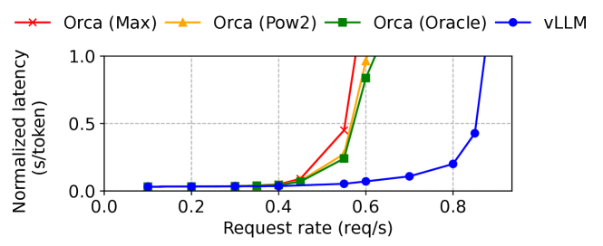

<figcaption>図17: チャットボットのワークロードにおける性能。</figcaption>
</figure>

### 6.5. Chatbot（チャットボット）

チャットボット [^36] [^20] [^9] は LLM の最も重要な応用の 1 つである。チャットボットを実装するため、会話履歴と最後のユーザーのクエリを連結してプロンプトとし、モデルに応答を生成させる。ShareGPT のデータセットを用いて会話履歴とユーザーのクエリを合成する。OPT-13B のモデルのコンテキスト長の制限のため、プロンプトを最後の 1024 トークンに切り詰め、モデルには最大 1024 トークンを生成させる。**会話のラウンド間で KV キャッシュを保持しない**——そうすると会話のラウンド間で他のリクエストの空間を占有してしまうからである。

Fig. 17 は、vLLM が 3 つの Orca のベースラインと比べて **2 倍高いリクエストレート**を支えられることを示す。ShareGPT のデータセットには長い会話が多く含まれるので、ほとんどのリクエストの入力プロンプトは 1024 トークンを持つ。buddy allocation のアルゴリズムのため、Orca のベースラインは出力長をどう予測するかに関係なくリクエストの出力のために 1024 トークン分の空間を予約する。この理由により、3 つの Orca のベースラインは同様に振る舞う。対照的に vLLM は、PagedAttention がメモリの断片化と予約の問題を解決するので、長いプロンプトを効果的に扱える。

## 7. Ablation Studies（アブレーション研究）

本節では vLLM のさまざまな側面を調べ、アブレーション実験で我々の設計上の選択を評価する。

### 7.1. Kernel Microbenchmark（カーネルのマイクロベンチマーク）

PagedAttention における動的なブロック写像は、格納された KV キャッシュを伴う GPU の演算——すなわちブロックの読み書きと attention——の性能に影響する。既存システムと比べて我々の GPU カーネル（§5）は、block table へのアクセス・追加の分岐の実行・可変系列長の処理という余分なオーバーヘッドを伴う。Fig. 18(a) に示すとおり、これは高度に最適化された FasterTransformer の実装と比べて **20〜26% 高い attention カーネルのレイテンシ**をもたらす。**このオーバーヘッドは小さいと我々は考えている**——attention の演算子にしか影響せず、モデル内の Linear のような他の演算子には影響しないからである。このオーバーヘッドにもかかわらず、PagedAttention は端から端までの性能で vLLM を FasterTransformer より大幅に優れたものにする（§6）。

<figure>

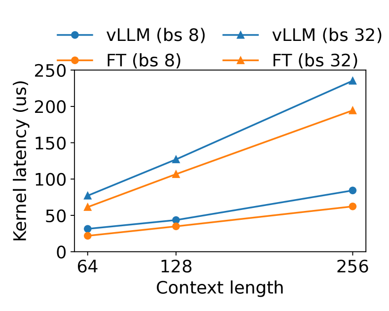

<figcaption>図18(a): attention カーネルのレイテンシ。</figcaption>
</figure>

<figure>

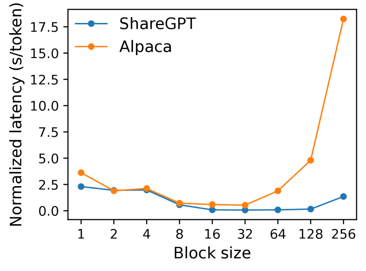

<figcaption>図18(b): 異なるブロックサイズでの端から端までのレイテンシ。図18 全体のキャプション: アブレーション実験。（訳注: この画像と図全体のキャプションはクリップで欠落していたため原ページから復元した。）</figcaption>
</figure>

### 7.2. Impact of Block Size（ブロックサイズの影響）

ブロックサイズの選択は vLLM の性能に実質的な影響を持ちうる。**ブロックサイズが小さすぎると、vLLM は KV キャッシュの読み込みと処理のために GPU の並列性を十分に活用できないかもしれない。ブロックサイズが大きすぎると、内部断片化が増え共有の確率が下がる。**

Fig. 18(b) では、固定のリクエストレートのもとで ShareGPT と Alpaca のトレースを用いた基本的なサンプリングで、異なるブロックサイズでの vLLM の性能を評価する。**ShareGPT のトレースでは 16 から 128 のブロックサイズが最良の性能をもたらす。Alpaca のトレースでは、ブロックサイズ 16 と 32 はうまく働くが、系列がブロックサイズより短くなるので、より大きなブロックサイズは性能を大きく劣化させる。** 実際には、ブロックサイズ 16 が GPU を効率よく活用するのに十分大きく、ほとんどのワークロードで著しい内部断片化を避けるのに十分小さいことを我々は見出した。したがって **vLLM は既定のブロックサイズを 16 に設定する**。

<figure>

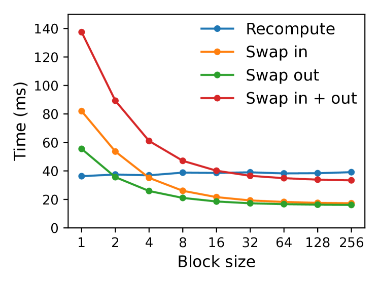

<figcaption>図19(a): マイクロベンチマーク。</figcaption>
</figure>

<figure>

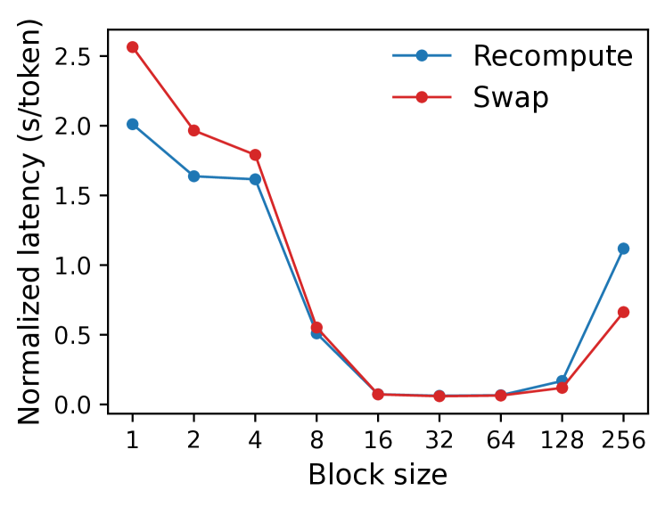

<figcaption>図19(b): 端から端までの性能。図19 全体のキャプション: (a) 異なるブロックサイズでの再計算と退避のオーバーヘッド。(b) 同じリクエストレートで ShareGPT のトレースを用いて OPT-13B をサービングするときの性能。（訳注: この画像と図全体のキャプションはクリップで欠落していたため原ページから復元した。）</figcaption>
</figure>

### 7.3. Comparing Recomputation and Swapping（再計算と退避の比較）

vLLM は復旧の機構として再計算と退避の双方を支える。2 つの手法のトレードオフを理解するため、Fig. 19 に示すようにそれらの端から端までの性能を評価し、オーバーヘッドをマイクロベンチマークする。我々の結果は、**退避は小さなブロックサイズで過大なオーバーヘッドを被る**ことを明らかにする。これは、小さなブロックサイズが CPU と GPU の間の多数の小さなデータ転送をもたらし、実効的な PCIe の帯域を制限するからである。対照的に、**再計算のオーバーヘッドは異なるブロックサイズにわたって一定のまま**である——再計算は KV ブロックを使わないからである。したがって、**ブロックサイズが小さいときは再計算が効率的で、大きいときは退避が効率的**である。ただし**再計算のオーバーヘッドが退避のレイテンシの 20% を超えることは決してない**。16 から 64 の中程度のブロックサイズでは、2 つの手法は同等の端から端までの性能を示す。

## 8. Discussion（議論）

**仮想メモリとページングの技法を他の GPU ワークロードへ適用すること。** 仮想メモリとページングの着想が LLM サービングにおける KV キャッシュの管理に有効なのは、そのワークロードが**動的なメモリ確保を要求し**（出力長が事前に分からないため）、その**性能が GPU のメモリ容量で律速される**からである。しかしこれはすべての GPU ワークロードで一般に成り立つわけではない。たとえば **DNN の訓練ではテンソルの形状が典型的に静的**なので、メモリ確保は事前に最適化できる。別の例として、**LLM でない DNN のサービングでは、性能が主に計算律速なのでメモリ効率の向上が性能改善につながらないかもしれない**。そうした場面では、**vLLM の技法を導入するとメモリの間接参照と非連続なブロックメモリの余分なオーバーヘッドによって、むしろ性能を劣化させうる**。とはいえ、LLM サービングと似た性質を持つ他のワークロードへ vLLM の技法が適用されるのを見られたら喜ばしい。

**仮想メモリとページングの適用における LLM 固有の最適化。** vLLM は、応用固有の意味論を活用することで仮想メモリとページングの着想を再解釈し拡張している。1 つの例が vLLM の **all-or-nothing の退避方針**で、リクエストの処理にはその対応するトークンの状態すべてが GPU メモリに格納されている必要があるという事実を利用している。もう 1 つの例が、退避されたブロックを復旧する**再計算の手法**で、これは **OS では実行可能でない**。さらに vLLM は、メモリアクセスの演算のための GPU カーネルを attention のような他の演算のカーネルと融合することで、ページングにおけるメモリ間接参照のオーバーヘッドを緩和している。

## 9. Related Work（関連研究）

**汎用のモデルサービングシステム。** モデルのサービングは近年活発な研究領域であり、深層学習モデルの展開の多様な側面に取り組む数多くのシステムが提案されてきた。Clipper [^12]・TensorFlow Serving [^34]・Nexus [^46]・InferLine [^11]・Clockwork [^21] は初期の汎用モデルサービングシステムである。これらは単一または複数のモデルをサービングするためのバッチング・キャッシング・配置・スケジューリングを研究している。より最近では DVABatch [^13] がマルチエントリ・マルチエグジットのバッチングを導入し、REEF [^22] と Shepherd [^62] がサービングのためのプリエンプションを提案し、AlpaServe [^29] が統計的多重化のためにモデル並列を活用している。しかし**これらの汎用のシステムは LLM 推論の自己回帰的な性質とトークンの状態を考慮しておらず、最適化の機会を逃している**。

**トランスフォーマ向けの特化したサービングシステム。** トランスフォーマのアーキテクチャの重要性ゆえに、それに特化した数多くのサービングシステムが開発されてきた。これらは GPU カーネルの最適化 [^57] [^2] [^32] [^30]・高度なバッチング機構 [^15] [^61]・モデル並列 [^42] [^61] [^2]・パラメータ共有 [^65] を効率的なサービングのために活用する。その中で **Orca** [^61] が我々の手法に最も関連が深い。

**Orca との比較。** Orca [^61] における反復単位のスケジューリングと vLLM における PagedAttention は**相補的な技法**である——両システムとも GPU の利用率、ひいては LLM サービングのスループットを高めることを目指すが、**Orca はリクエストをスケジュールし交互配置することでより多くのリクエストを並列に処理できるようにするのに対し、vLLM はメモリの利用率を高めることでより多くのリクエストのワーキングセットがメモリに収まるようにする**。メモリの断片化を減らし共有を可能にすることで、vLLM はバッチ内でより多くのリクエストを並列に走らせ、Orca と比べて 2〜4 倍の高速化を達成する。実際、Orca のようなリクエストの細粒度なスケジューリングと交互配置は**メモリ管理をより難しくする**ので、vLLM が提案する技法をいっそう重要にする。

**メモリの最適化。** アクセラレータの計算能力とメモリ容量の間の広がる隔たりは、訓練と推論の双方でメモリをボトルネックにしてきた。退避 [^24] [^56] [^43]・再計算 [^8] [^25]・およびその組み合わせ [^41] は訓練のピークメモリを減らすのに活用されてきた。特筆すべきは **FlexGen** [^47] で、限られた GPU メモリでの LLM 推論のために重みとトークンの状態をどう退避するかを研究しているが、**オンラインのサービングの設定は対象としていない**。**OLLA** [^49] はテンソルの寿命と位置を最適化して断片化を減らすが、細粒度のブロック単位の管理やオンラインのサービングは行わない。**FlashAttention** [^14] はタイリングとカーネルの最適化を適用して attention の計算のピークメモリを減らし I/O コストを減らす。本論文は、**オンラインのサービングの文脈におけるブロック単位のメモリ管理**という新しい着想を導入する。

## 10. Conclusion（結論）

本論文は、attention のキーとバリューを非連続なページ化メモリに格納することを可能にする新しい attention アルゴリズム **PagedAttention** を提案し、PagedAttention によって可能になる効率的なメモリ管理を持つ高スループットの LLM サービングシステム **vLLM** を提示した。**オペレーティングシステムに着想を得て、仮想メモリや copy-on-write といった確立された技法が、LLM サービングにおける KV キャッシュの効率的な管理とさまざまなデコードアルゴリズムの処理へどう適応できるかを実証した。** 我々の実験は、vLLM が最先端のシステムに対して 2〜4 倍のスループット改善を達成することを示している。
