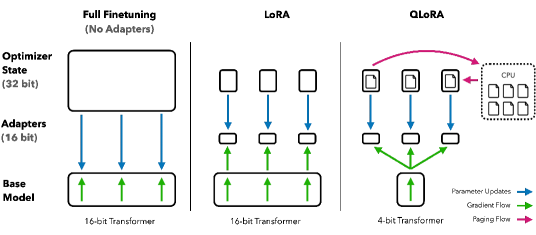
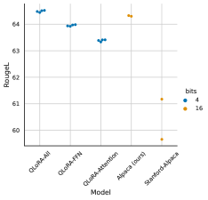
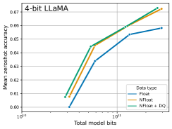
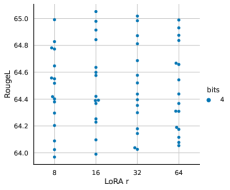
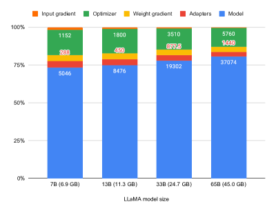

# QLoRA: 量子化された LLM の効率的なファインチューニング

> 原題: QLoRA: Efficient Finetuning of Quantized LLMs
> 著者: Tim Dettmers, Artidoro Pagnoni, Ari Holtzman, Luke Zettlemoyer（University of Washington。Tim Dettmers と Artidoro Pagnoni は equal contribution）
> 出典: arXiv:2305.14314（NeurIPS 2023）・原典クリップ `raw/papers/QLoRA_ Efficient Finetuning of Quantized LLMs.md`（ar5iv 版）

---

> **訳注**
>
> 底本は ar5iv（`https://ar5iv.labs.arxiv.org/html/2305.14314`）を Obsidian Web Clipper で保存した markdown。原ページと照合したところ、**クリップは健全**であった——画像は 6 枚すべてが所定の位置に残り、Figure 1〜6 と Table 1〜13 のキャプションもすべて揃っており、本文の切断も見当たらなかった。
>
> HTML の表 4 つ（Table 3・4・7・11）は `<math><semantics>` のノイズを除去して markdown の表へ変換した。
>
> **圧縮箇所（1 箇所）**: ユーザーの指示により、**§6.1「Qualitative Analysis of Example Generations」の生成例の本文のみ要点訳に留めた**。この節は Factual Recall・Suggestibility・Refusal・Secret Keeping・Math・Theory of Mind の 6 カテゴリについて、Guanaco と対話した長いプロンプト／応答のログを掲げるもので、各カテゴリの**知見は完全に訳出**しているが、対話ログそのものは代表的な要点に絞った。それ以外（本文 §1〜9 および付録 A〜G）はすべて全訳しており、圧縮箇所はない。
>
> 参考文献一覧（References）と謝辞は既定どおり訳出していない。本文中の引用は原典クリップの脚注番号 `[^N]` をそのまま維持している。

---

## Abstract（要旨）

我々は **QLoRA** を提示する。これは効率的なファインチューニングのアプローチであり、16 ビットの完全なファインチューニングのタスク性能を保ちながら、650 億パラメータのモデルを単一の 48GB GPU 上でファインチューニングできるほどメモリ使用量を削減する。QLoRA は、**凍結された 4 ビット量子化済みの事前学習済み言語モデルを通して勾配を逆伝播し、Low Rank Adapters（LoRA）へ届ける**。我々の最良のモデルファミリーは **Guanaco** と名づけられ、Vicuna ベンチマークにおいて従来公開されたすべてのモデルを上回り、単一 GPU 上でわずか 24 時間のファインチューニングで **ChatGPT の性能水準の 99.3%** に到達する。QLoRA は性能を犠牲にせずメモリを節約するいくつかの革新を導入する: (a) **4-bit NormalFloat（NF4）**、正規分布に従う重みに対して情報理論的に最適な新しいデータ型、(b) **Double Quantization**、量子化定数を量子化することで平均のメモリフットプリントを削減する手法、(c) **Paged Optimizers**、メモリのスパイクを管理する手法である。我々は QLoRA を用いて 1,000 を超えるモデルをファインチューニングし、8 つの指示追従データセットと複数のモデル型（LLaMA、T5）、および通常のファインチューニングでは実行不可能なモデル規模（例: 33B と 65B のパラメータモデル）にわたって、指示追従とチャットボットの性能の詳細な分析を提供する。我々の結果は、小さな高品質のデータセットに対する QLoRA のファインチューニングが、以前の SoTA より小さなモデルを使う場合でも、最先端の結果につながることを示す。我々は人間と GPT-4 の評価の両方に基づくチャットボット性能の詳細な分析を提供し、GPT-4 の評価が人間の評価に対する安価で妥当な代替であることを示す。さらに、現在のチャットボットのベンチマークは、チャットボットの性能水準を正確に評価するには信頼できないことも見出す。厳選された分析は、Guanaco が ChatGPT と比べてどこで失敗するかを実証する。我々は 4 ビット訓練のための CUDA カーネルを含め、すべてのモデルとコードを公開する。

## 1 Introduction（はじめに）

大規模言語モデル（LLM）のファインチューニングは、その性能を改善し [^40] [^62] [^43] [^61] [^59] [^37]、望ましい振る舞いを加えたり望ましくない振る舞いを取り除いたりする [^43] [^2] [^4] のに非常に効果的な方法である。しかし非常に大きなモデルのファインチューニングは法外に高価である。LLaMA 65B パラメータモデル [^57] の通常の 16 ビットのファインチューニングは 780GB を超える GPU メモリを必要とする。最近の量子化手法は LLM のメモリフットプリントを削減できる [^14] [^13] [^18] [^66] が、そのような技法は**推論に対してのみ機能し、訓練中には破綻する** [^65]。

我々は、**性能劣化を一切伴わずに量子化された 4 ビットのモデルをファインチューニングできることを初めて実証する**。我々の手法 QLoRA は、新しい高精度の技法を使って事前学習済みモデルを 4 ビットへ量子化し、次に**量子化された重みを通して勾配を逆伝播することによって調整される、学習可能な Low-rank Adapter の重みの小さな集合** [^28] を加える。

**表1**: モデル間の競争に対する Elo レーティング。10,000 通りのランダムな初期順序について平均した。試合の勝者は、Vicuna ベンチマークの与えられたプロンプトに対してどちらの応答がより良いかを宣言する GPT-4 によって決定される。95% 信頼区間を示す（$\pm$）。GPT-4 に次いで、Guanaco 33B と 65B が最も多くの試合に勝ち、Guanaco 13B は Bard より良いスコアを得る。

| Model | Size | Elo |
| --- | --- | --- |
| GPT-4 | \- | 1348 $\pm$ 1 |
| Guanaco 65B | 41 GB | 1022 $\pm$ 1 |
| Guanaco 33B | 21 GB | 992 $\pm$ 1 |
| Vicuna 13B | 26 GB | 974 $\pm$ 1 |
| ChatGPT | \- | 966 $\pm$ 1 |
| Guanaco 13B | 10 GB | 916 $\pm$ 1 |
| Bard | \- | 902 $\pm$ 1 |
| Guanaco 7B | 6 GB | 879 $\pm$ 1 |

QLoRA は、650 億パラメータのモデルのファインチューニングの平均メモリ要件を、16 ビットの完全にファインチューニングされたベースラインと比べて実行時間や予測性能を劣化させることなく、**780GB 超の GPU メモリから 48GB 未満へ**削減する。これは LLM のファインチューニングのアクセシビリティにおける重要な転換を意味する——いまや現在公開されている最大のモデルが単一 GPU でファインチューニング可能になった。QLoRA を用いて我々は Guanaco のモデルファミリーを訓練し、2 番目に良いモデルが単一のコンシューマ向け GPU 上で 12 時間未満で訓練可能でありながら Vicuna [^10] ベンチマークで ChatGPT の性能水準の 97.8% に到達し、単一のプロフェッショナル向け GPU で 24 時間かけた最大のモデルでは 99.3% を達成して、Vicuna ベンチマークにおける ChatGPT との差を本質的に埋めた。デプロイ時には、最小の Guanaco モデル（7B パラメータ）はわずか 5GB のメモリしか必要とせず、26GB の Alpaca モデルを 20 パーセントポイント以上上回る。

QLoRA は性能を犠牲にせずメモリ使用を削減するよう設計された複数の革新を導入する: **(1) 4-bit NormalFloat**、正規分布に従うデータに対する情報理論的に最適な量子化データ型で、4 ビット整数や 4 ビット浮動小数点より良い実証的結果をもたらす。**(2) Double Quantization**、量子化定数を量子化する手法で、パラメータあたり平均で約 0.37 ビット（65B モデルでおよそ 3GB）を節約する。**(3) Paged Optimizers**、NVIDIA の統合メモリを使って、長い系列長のミニバッチを処理するときに生じる勾配チェックポインティングのメモリスパイクを避ける。我々はこれらの貢献を、ネットワークの全層にアダプタを含める、よりよく調整された LoRA のアプローチへと結合し、それによって先行研究に見られた精度のトレードオフをほぼすべて回避する。

QLoRA の効率性により、メモリのオーバーヘッドのため通常のファインチューニングでは不可能なモデル規模において、指示ファインチューニングとチャットボットの性能を詳細に研究できる。したがって我々は、いくつかの指示チューニングデータセット・モデルアーキテクチャ・80M から 65B までのサイズにわたって **1,000 を超えるモデルを訓練**した。QLoRA が 16 ビットの性能を回復すること（§4）と最先端のチャットボット Guanaco を訓練すること（§5）を示すことに加えて、訓練されたモデルの傾向も分析する。第一に、**データ品質はデータセットのサイズよりはるかに重要である**ことを見出す。たとえば 9k サンプルのデータセット（OASST1）が、450k サンプルのデータセット（FLAN v2、サブサンプル）をチャットボットの性能で上回った。両者とも指示追従の汎化を支えることを意図しているにもかかわらずである。第二に、**Massive Multitask Language Understanding（MMLU）ベンチマークでの強い性能は、Vicuna チャットボットベンチマークでの強い性能を意味しない**こと、そしてその逆も成り立つことを示す。言い換えれば、あるタスクに対するデータセットの適合性は、そのサイズよりも重要である。

さらに我々は、人間の評価者と GPT-4 の両方を評価に用いる、チャットボット性能の広範な分析も提供する。**トーナメント形式のベンチマーク**を用い、与えられたプロンプトに対して最良の応答を生成するためにモデルどうしが試合で競い合う。試合の勝者は GPT-4 か人間の注釈者のいずれかによって判定される。トーナメントの結果は **Elo スコア** [^16] [^17] へ集約され、チャットボット性能の順位を決める。我々は、GPT-4 と人間の評価がトーナメントにおけるモデル性能の順位について概ね一致することを見出すが、**強い不一致の事例もある**ことも見出す。したがって我々は、モデルベースの評価が人間の注釈への安価な代替を提供する一方で、それ自身の不確実性も持つことを強調する。

我々は Guanaco モデルの定性的分析でチャットボットのベンチマーク結果を補強する。我々の分析は、定量的ベンチマークでは捉えられなかった成功例と失敗例を際立たせる。

我々はすべてのモデルの生成物を、人間と GPT-4 の注釈とともに公開し、さらなる研究を促進する。コードベースと CUDA カーネルをオープンソース化し、我々の手法を Hugging Face transformers スタック [^64] へ統合して、すべての人が容易にアクセスできるようにする。7/13/33/65B サイズのモデルについて、8 つの異なる指示追従データセットで訓練した、合計 32 個の異なるオープンソースのファインチューニング済みモデルのアダプタのコレクションを公開する。

<figure>

<figcaption>図1: 異なるファインチューニングの手法とそのメモリ要件。QLoRA は、トランスフォーマーモデルを 4 ビット精度へ量子化し、メモリのスパイクを扱うのに paged optimizer を用いることで LoRA を改善する。</figcaption>
</figure>

## 2 Background（背景）

#### Block-wise k-bit Quantization（ブロック単位の k ビット量子化）

量子化は、より多くの情報を持つ表現から、より少ない情報を持つ表現へと入力を離散化する過程である。それはしばしば、より多くのビットを持つデータ型を取ってより少ないビットへ変換すること——たとえば 32 ビット浮動小数点から 8 ビット整数へ——を意味する。低ビットのデータ型の全範囲が使われることを保証するため、入力のデータ型は通常、テンソルとして構造化された入力要素の絶対最大値による正規化を通じて、対象のデータ型の範囲へ再スケールされる。たとえば 32 ビット浮動小数点（FP32）のテンソルを範囲 $[-127,127]$ の Int8 テンソルへ量子化するには:

$$
\mathbf{X}^{\text{Int8}}=\text{round}\left(\frac{127}{{\text{absmax}}(\mathbf{X}^{{\text{FP32}}})}\mathbf{X}^{{\text{FP32}}}\right)=\text{round}(c^{\text{FP32}}\cdot\mathbf{X}^{{\text{FP32}}}),
$$

ここで $c$ は量子化定数あるいは量子化スケールである。逆量子化はその逆である:

$$
\text{dequant}(c^{\text{FP32}},\mathbf{X}^{\text{Int8}})=\frac{\mathbf{X}^{\text{Int8}}}{c^{\text{FP32}}}=\mathbf{X}^{\text{FP32}}
$$

このアプローチの問題は、大きな大きさの値（すなわち外れ値）が入力テンソルに生じると、**量子化のビン——特定のビットの組み合わせ——がうまく活用されず、一部のビンにはほとんど、あるいはまったく数が量子化されない**ことである。外れ値の問題を防ぐため、一般的なアプローチは入力テンソルをブロックへ分割し、それぞれが独自の量子化定数 $c$ を持って独立に量子化することである。これは次のように形式化できる: 入力テンソル $\mathbf{X}\in\mathbb{R}^{b\times h}$ を平坦化して線形の区分へ切ることで、サイズ $B$ の連続する $n$ 個のブロック（$n=({b\times h})/{B}$）へ分割する。これらのブロックを式 1 で独立に量子化し、量子化されたテンソルと $n$ 個の量子化定数 $c_{i}$ を作る。

#### Low-rank Adapters（低ランクアダプタ）

Low-rank Adapter（LoRA）のファインチューニング [^28] は、**アダプタ**としばしば呼ばれる訓練可能なパラメータの小さな集合を使う一方、固定されたままの全モデルパラメータを更新しないことによって、メモリ要件を減らす手法である。確率的勾配降下の間、勾配は固定された事前学習済みモデルの重みを通してアダプタへ渡され、アダプタが損失関数を最適化するよう更新される。LoRA は追加の分解された射影によって線形射影を拡張する。$\mathbf{X}\in\mathbb{R}^{b\times h}$、$\mathbf{W}\in\mathbb{R}^{h\times o}$ を伴う射影 ${\mathbf{X}\mathbf{W}=\mathbf{Y}}$ が与えられたとき、LoRA は次を計算する:

$$
\mathbf{Y}=\mathbf{X}\mathbf{W}+s\mathbf{X}\mathbf{L}_{1}\mathbf{L}_{2},
$$

ここで $\mathbf{L}_{1}\in\mathbb{R}^{h\times r}$、$\mathbf{L}_{2}\in\mathbb{R}^{r\times o}$、$s$ はスカラーである。

#### Memory Requirement of Parameter-Efficient Finetuning（パラメータ効率のよいファインチューニングのメモリ要件）

議論すべき重要な点の一つは、使われるアダプタの数とサイズの両方の観点から見た、訓練中の LoRA のメモリ要件である。LoRA のメモリフットプリントは非常に小さいので、使用する総メモリを著しく増やすことなく、より多くのアダプタを使って性能を改善できる。LoRA はパラメータ効率のよいファインチューニング（PEFT）の手法として設計されたが、**LLM のファインチューニングにおけるメモリフットプリントの大半は、学習された LoRA パラメータではなく活性の勾配から来る**。バッチサイズ 1 で FLAN v2 上で訓練される 7B の LLaMA モデルについて、一般的に使われる元のモデル重みの 0.2% に相当する LoRA の重み [^28] [^37] を用いると、**LoRA の入力勾配は 567MB のメモリフットプリントを持つのに対し、LoRA のパラメータは 26MB しか占めない**。勾配チェックポインティング [^9] を使えば、入力勾配は 1 系列あたり平均 18MB へ減り、すべての LoRA の重みを合わせたものよりメモリ集約的になる。比較すると、4 ビットの基本モデルは 5,048MB を消費する。これは、勾配チェックポインティングが重要である一方、LoRA のパラメータを積極的に減らすことはメモリの利益が小さいことを際立たせる。つまり、**全体のメモリフットプリントを増やすことなく、より多くのアダプタを使える**ことを意味する。

## 3 QLoRA Finetuning（QLoRA のファインチューニング）

QLoRA は、我々が提案する 2 つの技法——**4-bit NormalFloat（NF4）量子化**と **Double Quantization**——を通じて高忠実度の 4 ビットファインチューニングを達成する。加えて、勾配チェックポインティング中のメモリスパイクがメモリ不足エラーを引き起こすのを防ぐ **Paged Optimizers** を導入する。これは伝統的に、大きなモデルの単一マシンでのファインチューニングを難しくしてきた。

QLoRA は 1 つの低精度の**格納データ型**（我々の場合は通常 4 ビット）と、通常は BFloat16 である 1 つの**計算データ型**を持つ。実際にはこれは、**QLoRA の重みテンソルが使われるたびに、そのテンソルを BFloat16 へ逆量子化し、それから 16 ビットで行列積を実行する**ことを意味する。

以下、QLoRA の構成要素を論じた後、QLoRA の形式的な定義を与える。

#### 4-bit NormalFloat Quantization（4 ビット NormalFloat 量子化）

NormalFloat（NF）のデータ型は、**分位量子化（Quantile Quantization）** [^15] の上に構築される。これは、各量子化ビンに入力テンソルから等しい数の値が割り当てられることを保証する、情報理論的に最適なデータ型である。分位量子化は、経験的累積分布関数を通じて入力テンソルの分位を推定することによって機能する。

分位量子化の主な限界は、**分位推定の過程が高価**であることである。したがって SRAM quantiles [^15] のような高速な分位近似アルゴリズムが推定に用いられる。これらの分位推定アルゴリズムの近似的な性質のため、このデータ型は外れ値に対して大きな量子化誤差を持つ——**そして外れ値こそがしばしば最も重要な値である**。

高価な分位推定と近似誤差は、入力テンソルが量子化定数を除いて固定された分布から来る場合には避けられる。そのような場合、入力テンソルは同じ分位を持つので、正確な分位推定が計算的に実行可能になる。

事前学習済みニューラルネットワークの重みは通常、標準偏差 $\sigma$ のゼロ中心の正規分布を持つので（付録 F 参照）、$\sigma$ をスケールしてその分布が我々のデータ型の範囲に正確に収まるようにすることで、すべての重みを単一の固定分布へ変換できる。我々のデータ型については、任意の範囲 $[-1,1]$ を設定する。したがって、データ型の分位とニューラルネットワークの重みの両方をこの範囲へ正規化する必要がある。

範囲 $[-1,1]$ における任意の標準偏差 $\sigma$ を持つゼロ平均の正規分布に対して情報理論的に最適なデータ型は、次のように計算される: (1) 理論的な $N(0,1)$ 分布の $2^{k}+1$ 個の分位を推定して、正規分布に対する $k$ ビットの分位量子化のデータ型を得る、(2) このデータ型を取ってその値を $[-1,1]$ の範囲へ正規化する、(3) 絶対最大値による再スケールを通じて入力の重みテンソルを $[-1,1]$ の範囲へ正規化することで量子化する。

重みの範囲とデータ型の範囲が一致すれば、通常どおり量子化できる。ステップ (3) は、重みテンソルの標準偏差を k ビットのデータ型の標準偏差に一致させるよう再スケールすることと等価である。より形式的には、データ型の $2^{k}$ 個の値 $q_{i}$ を次のように推定する:

$$
q_{i}=\frac{1}{2}\left(Q_{X}\left(\frac{i}{2^{k}+1}\right)+Q_{X}\left(\frac{i+1}{2^{k}+1}\right)\right),
$$

ここで $Q_{X}(\cdot)$ は標準正規分布 $N(0,1)$ の分位関数である。対称な k ビット量子化の問題は、このアプローチが**ゼロの正確な表現を持たない**ことである。これは、パディングやその他のゼロ値の要素を誤差なく量子化するのに重要な性質である。離散的なゼロ点 $0$ を保証し、かつ k ビットのデータ型に $2^{k}$ ビットすべてを使うため、我々は 2 つの範囲の分位 $q_{i}$——負の部分に $2^{k-1}$ 個、正の部分に $2^{k-1}+1$ 個——を推定して非対称なデータ型を作り、次にこれらの $q_{i}$ の集合を統合して両方の集合に現れる 2 つのゼロのうち 1 つを取り除く。結果として得られる、各量子化ビンに期待される値の数が等しいデータ型を **k-bit NormalFloat（NFk）**と呼ぶ。これはゼロ中心の正規分布に従うデータに対して情報理論的に最適だからである。NF4 のデータ型の正確な値は付録 E に示す。

#### Double Quantization（二重量子化）

我々は **Double Quantization（DQ）**、すなわち追加のメモリ節約のために量子化定数を量子化する過程を導入する。精密な 4 ビット量子化には小さなブロックサイズが必要である [^13] が、それは相当なメモリのオーバーヘッドも持つ。たとえば $\mathbf{W}$ について 32 ビットの定数とブロックサイズ 64 を使うと、量子化定数は平均でパラメータあたり $32/64=0.5$ ビットを加える。Double Quantization は量子化定数のメモリフットプリントを減らすのに役立つ。

より具体的には、Double Quantization は最初の量子化の量子化定数 $c_{2}^{\text{FP32}}$ を第二の量子化への入力として扱う。この第二のステップは、量子化された量子化定数 $c_{2}^{\text{FP8}}$ と、第二水準の量子化定数 $c_{1}^{\text{FP32}}$ を生む。第二の量子化には 8 ビット浮動小数点をブロックサイズ 256 で用いる。8 ビットの量子化では性能劣化が観測されないためで、これは [^13] の結果と一致する。$c_{2}^{\text{FP32}}$ は正なので、対称量子化を活用するために量子化の前に $c_{2}$ から平均を引いて値をゼロの周りに中心化する。**ブロックサイズ 64 の場合、平均してこの量子化はパラメータあたりのメモリフットプリントを $32/64=0.5$ ビットから $8/64+32/(64\cdot 256)=0.127$ ビットへ、すなわちパラメータあたり 0.373 ビット削減する。**

#### Paged Optimizers（ページド・オプティマイザ）

NVIDIA の統合メモリ2の機能を使う。これは、GPU が時折メモリ不足になる状況において、エラーなしの GPU 処理のために CPU と GPU の間でページからページへの転送を自動的に行う。この機能は CPU RAM とディスクの間の通常のメモリのページングのように働く。我々はこの機能を使ってオプティマイザの状態にページドメモリを割り当て、GPU がメモリ不足になると自動的に CPU RAM へ退避させ、オプティマイザの更新ステップでメモリが必要になると GPU メモリへページで戻す。

#### QLoRA.

上で述べた構成要素を用いて、量子化された基本モデルの単一の線形層と単一の LoRA アダプタについて QLoRA を次のように定義する:

$$
\mathbf{Y}^{\text{BF16}}=\mathbf{X}^{\text{BF16}}\text{doubleDequant}(c_{1}^{\text{FP32}},c_{2}^{\text{k-bit}},\mathbf{W}^{\text{NF4}})+\mathbf{X}^{\text{BF16}}\mathbf{L}^{\text{BF16}}_{1}\mathbf{L}^{\text{BF16}}_{2},
$$

ここで doubleDequant $(\cdot)$ は次のように定義される:

$$
\text{doubleDequant}(c_{1}^{\text{FP32}},c_{2}^{\text{k-bit}},\mathbf{W}^{\text{k-bit}})=\text{dequant}(\text{dequant}(c_{1}^{\text{FP32}},c_{2}^{\text{k-bit}}),\mathbf{W}^{\text{4bit}})=\mathbf{W}^{\text{BF16}},
$$

$\mathbf{W}$ には NF4 を、$c_{2}$ には FP8 を用いる。より高い量子化精度のために $\mathbf{W}$ にはブロックサイズ 64 を、メモリを節約するために $c_{2}$ にはブロックサイズ 256 を用いる。

パラメータの更新には、**アダプタの重みに関する誤差の勾配 $\frac{\partial E}{\partial\mathbf{L}_{i}}$ のみが必要であり、4 ビットの重みに関する勾配 $\frac{\partial E}{\partial\mathbf{W}}$ は必要ない**。しかし $\frac{\partial E}{\partial\mathbf{L}_{i}}$ の計算は $\frac{\partial\mathbf{X}}{\partial\mathbf{W}}$ の計算を伴い、これは式 (5) を経由して、格納用の $\mathbf{W}^{\text{NF4}}$ から計算用の $\mathbf{W}^{\text{BF16}}$ への逆量子化とともに進み、BFloat16 精度で微分 $\frac{\partial\mathbf{X}}{\partial\mathbf{W}}$ を計算する。

まとめると、**QLoRA は 1 つの格納データ型（通常は 4 ビット NormalFloat）と 1 つの計算データ型（16 ビット BrainFloat）を持つ。順伝播と逆伝播を行うために格納データ型を計算データ型へ逆量子化するが、重みの勾配は 16 ビット BrainFloat を使う LoRA のパラメータについてのみ計算する。**

## 4 QLoRA vs. Standard Finetuning（QLoRA と標準的なファインチューニングの比較）

我々は QLoRA がどう機能し、モデルのファインチューニングに必要なメモリをどれだけ大幅に削減できるかを論じた。いま主要な問いは、**QLoRA が全モデルのファインチューニングと同程度に機能しうるか**である。さらに、標準的な Float4 に対する NormalFloat4 の影響を含め、QLoRA の構成要素を分析したい。以下の節では、これらの問いに答えることを目指した実験を論じる。

#### Experimental setup.（実験設定）

我々は 3 つのアーキテクチャ（エンコーダ、エンコーダ・デコーダ、デコーダのみ）を考え、QLoRA を最大 3B のモデルサイズで 16 ビットのアダプタのファインチューニングおよび完全なファインチューニングと比較する。評価には GLUE [^58] における RoBERTa-large [^38]、Super-NaturalInstructions（TKInstruct）[^61] における T5 [^49]、そして 5-shot MMLU における LLaMA のファインチューニングを含める。加えて、NF4 が他の 4 ビットデータ型に対して持つ利点をさらに研究するため、[^13] の設定を使って、異なるモデル（OPT [^72]、LLaMA [^57] [^58]、BLOOM [^52]、Pythia [^7]）と 125m〜13B のモデルサイズに対して量子化後のパープレキシティを測定する。

#### Default LoRA hyperparameters do not match 16-bit performance（既定の LoRA ハイパーパラメータは 16 ビットの性能に一致しない）

query と value の attention 射影行列に LoRA を適用するという標準的な慣行 [^28] を用いる場合、我々は大きな基本モデルに対して完全なファインチューニングの性能を再現できない。Alpaca 上での LLaMA 7B のファインチューニングについて Figure 2 に示すように、**最も決定的な LoRA のハイパーパラメータは、合計でいくつの LoRA アダプタが使われるかであり、完全なファインチューニングの性能に一致するにはトランスフォーマーブロックのすべての線形層に LoRA が必要である**。射影の次元 $r$ のような他の LoRA のハイパーパラメータは性能に影響しない（付録 A 参照）。

同様に、完全にファインチューニングされたベースラインの既定のハイパーパラメータも調整不足であることを見出す。ロバストなベースラインを見つけるため、学習率 1e-6 から 5e-5、バッチサイズ 8 から 128 にわたるハイパーパラメータ探索を行う。Alpaca 上での 7B LLaMA のファインチューニングの結果を Figure 2 に示す。

<figure>

<figcaption>図2: Alpaca データセットにおける LLaMA 7B モデルの RougeL。各点はハイパーパラメータの組み合わせを伴う 1 回の実行を表す。</figcaption>
</figure>

#### 4-bit NormalFloat yields better performance than 4-bit Floating Point（4 ビット NormalFloat は 4 ビット浮動小数点より良い性能をもたらす）

**表2**: 125M から 13B までの OPT・BLOOM・LLaMA・Pythia モデルに対する、異なるデータ型の Pile Common Crawl 平均パープレキシティ。

4 ビット NormalFloat（NF4）のデータ型は情報理論的に最適であるが、この性質が実証的な利点へ翻訳されるかどうかはまだ決定されていない。我々は [^13] の設定に従い、異なるサイズ（125M から 65B）の量子化された LLM（OPT [^72]、BLOOM [^52]、Pythia [^7]、LLaMA）を異なるデータ型で、言語モデリングと一連の zero-shot タスクにおいて評価する。Figure 3 と Table 2 で、**NF4 が FP4 と Int4 に対して性能を大幅に改善し、二重量子化が性能を劣化させずにメモリフットプリントを削減する**ことが分かる。

<figure>

<figcaption>図3: 異なる 4 ビットデータ型を用いた LLaMA モデルの、Winogrande・HellaSwag・PiQA・Arc-Easy・Arc-Challenge における平均 zero-shot 精度。NormalFloat データ型は、通常の 4 ビット浮動小数点と比べてビットあたりの精度の利得を大幅に改善する。Double Quantization（DQ）はわずかな利得しかもたらさないが、特定のサイズのモデル（33B/65B）を特定の GPU（24/48GB）に収めるために、メモリフットプリントをより細かく制御できるようにする。</figcaption>
</figure>

#### k-bit QLoRA matches 16-bit full finetuning and 16-bit LoRA performance（k ビットの QLoRA は 16 ビットの完全なファインチューニングと 16 ビット LoRA の性能に一致する）

最近の知見は、**推論**に対する 4 ビット量子化は可能だが 16 ビットに対して性能劣化を招くことを確立している [^13] [^18]。これは、失われた性能が 4 ビットのアダプタのファインチューニングを行うことによって回復できるかという決定的な問いを提起する。我々はこれを 2 つの設定で検証する。

第一の設定は、GLUE と Super-NaturalInstructions のデータセットにおける 125M から 3B までの RoBERTA と T5 モデルの 16 ビットの完全なファインチューニングとの比較に焦点を当てる。結果を Table 3 に示す。両方のデータセットで、**16 ビット・8 ビット・4 ビットのアダプタ手法が、完全にファインチューニングされた 16 ビットのベースラインの性能を再現する**ことを観測する。これは、不正確な量子化のせいで失われた性能が、**量子化後のアダプタのファインチューニングによって完全に回復できる**ことを示唆する。

第二の設定については、110 億以上のパラメータのモデルの完全なファインチューニングには高メモリ GPU のサーバが 1 台を超えて必要になるので、4 ビットの QLoRA が 7B から 65B のパラメータ規模で 16 ビットの LoRA に一致できるかを検証し続ける。この目的のため、LLaMA 7B から 65B を 2 つの指示追従データセット（Alpaca と FLAN v2）でファインチューニングし、5-shot 精度で MMLU ベンチマークで評価する。結果を Table 4 に示す。そこでは **NF4 と二重量子化が 16 ビット LoRA の MMLU 性能を完全に回復する**ことが分かる。加えて、FP4 を用いた QLoRA は 16 ビットの brain float の LoRA ベースラインに約 1 パーセントポイント遅れることにも注意する。これは我々の 2 つの知見——(1) NF4 を用いた QLoRA は 16 ビットの完全なファインチューニングと 16 ビットの LoRA ファインチューニングの両方の性能を再現する、(2) 量子化の精度において NF4 は FP4 より優れている——を裏づける。

**表3**: GLUE と Super-NaturalInstructions における 16 ビット BrainFloat（BF16）・8 ビット整数（Int8）・4 ビット浮動小数点（FP4）・4 ビット NormalFloat（NF4）を比較する実験。QLoRA は 16 ビットの LoRA と完全なファインチューニングを再現する。

| Dataset | GLUE (Acc.) | Super-NaturalInstructions (RougeL) |  |  |  |  |
| --- | --- | --- | --- | --- | --- | --- |
| Model | RoBERTa-large | T5-80M | T5-250M | T5-780M | T5-3B | T5-11B |
| BF16 | 88.6 | 40.1 | 42.1 | 48.0 | 54.3 | 62.0 |
| BF16 replication | 88.6 | 40.0 | 42.2 | 47.3 | 54.9 | - |
| LoRA BF16 | 88.8 | 40.5 | 42.6 | 47.1 | 55.4 | 60.7 |
| QLoRA Int8 | 88.8 | 40.4 | 42.9 | 45.4 | 56.5 | 60.7 |
| QLoRA FP4 | 88.6 | 40.3 | 42.4 | 47.5 | 55.6 | 60.9 |
| QLoRA NF4 + DQ | - | 40.4 | 42.7 | 47.7 | 55.3 | 60.9 |

**表4**: Alpaca と FLAN v2 でアダプタによりファインチューニングした LLaMA 7B〜65B モデルの、異なるデータ型に対する平均 5-shot MMLU テスト精度。全体として NF4 と二重量子化（DQ）は BFloat16 の性能に一致し、FP4 は一貫して 1 パーセントポイント遅れる。

|  | Mean 5-shot MMLU Accuracy |  |  |  |  |  |  |  |  |
| --- | --- | --- | --- | --- | --- | --- | --- | --- | --- |
| LLaMA Size | 7B |  | 13B |  | 33B |  | 65B |  | Mean |
| Dataset | Alpaca | FLAN v2 | Alpaca | FLAN v2 | Alpaca | FLAN v2 | Alpaca | FLAN v2 |  |
| BFloat16 | 38.4 | 45.6 | 47.2 | 50.6 | 57.7 | 60.5 | 61.8 | 62.5 | 53.0 |
| Float4 | 37.2 | 44.0 | 47.3 | 50.0 | 55.9 | 58.5 | 61.3 | 63.3 | 52.2 |
| NFloat4 + DQ | 39.0 | 44.5 | 47.5 | 50.7 | 57.3 | 59.2 | 61.8 | 63.9 | 53.1 |

#### Summary（まとめ）

我々の結果は、**NF4 データ型を用いた 4 ビットの QLoRA が、確立された評価設定を持つ学術的ベンチマークにおいて、16 ビットの完全なファインチューニングと 16 ビットの LoRA ファインチューニングの性能に一致する**ことを一貫して示す。また NF4 が FP4 より効果的であり、二重量子化が性能を劣化させないことも示した。合わせて、これは 4 ビットの QLoRA チューニングが 16 ビットの手法に一致する結果を確実にもたらすという説得力のある証拠を形成する。

量子化に関する先行研究 [^13] と同様に、我々の MMLU と Elo の結果は、**与えられたファインチューニングと推論の資源予算のもとでは、基本モデルのパラメータ数を増やしつつその精度を下げることが有益である**ことを示す。これは QLoRA による効率の利益の重要性を際立たせる。4 ビットのファインチューニングの実験で完全なファインチューニングと比べた性能劣化を観測しなかったので、これは QLoRA チューニングにおいて性能と精度のトレードオフが正確にどこにあるのかという問いを提起し、その探究は今後の課題とする。

我々は、通常の 16 ビットのファインチューニングでは学術研究のハードウェアでは探究不可能な規模で、指示チューニングを調査することへ進む。

## 5 Pushing the Chatbot State-of-the-art with QLoRA（QLoRA によるチャットボットの最先端の押し上げ）

4 ビットの QLoRA が規模・タスク・データセットにわたって 16 ビットの性能に一致することを確立したので、我々は研究に利用可能な最大のオープンソース言語モデルまで、指示ファインチューニングの詳細な研究を行う。これらのモデルの指示ファインチューニングの性能を評価するため、挑戦的な自然言語理解のベンチマーク（MMLU）で評価し、現実世界のチャットボット性能評価のための新しい手法を開発する。

### 5.1 Experimental setup（実験設定）

ここでは実験設定の概要を述べ、完全な詳細は付録 B に示す。

#### Data（データ）

我々の知る限り、最近の指示追従データセットの包括的な研究は存在しないので、我々は最近の 8 つのデータセットを選ぶ。クラウドソーシングを通じて得られたもの（OASST1 [^31]、HH-RLHF [^4]）、指示チューニングされたモデルからの蒸留（Alpaca [^55]、self-instruct [^59]、unnatural-instructions [^26]）、コーパスの集約（FLAN v2 [^12]）、およびハイブリッド（Chip2 [^32]、Longform [^30]）を含める。これらのデータセットは異なる言語・データサイズ・ライセンスをカバーする。

#### Training Setup（訓練設定）

異なる訓練目的からの交絡効果を避けるため、異なる応答に対する人間の判断を含むデータセットについてさえ、強化学習なしの交差エントロピー損失（教師あり学習）で QLoRA のファインチューニングを行う。指示と応答の明確な区別があるデータセットについては、**応答のみでファインチューニングする**（付録 B のアブレーション参照）。OASST1 と HH-RLHF については複数の応答が利用できる。そこで会話木の各水準で最上位の応答を選び、指示を含めて選ばれた会話全体でファインチューニングする。すべての実験で、メモリスパイクを防ぐために二重量子化と paged optimizer を伴う NF4 の QLoRA を用いる。

#### Baselines（ベースライン）

我々のモデルを、研究用（Vicuna [^10]、Open Assistant [^31]）と商用（GPT-4 [^42]、GPT-3.5-turbo、Bard）の両方のチャットボットシステムと比較する。Open Assistant のモデルは、我々が実験するのと同じ OASST1 データセットで人間のフィードバックからの強化学習（RLHF）によってファインチューニングされた LLaMA 33B モデルである。Vicuna は ShareGPT からの独自のユーザ共有会話で LLaMA 13B の完全なファインチューニングを行っており、したがって OpenAI の GPT モデルからの蒸留の結果である。

### 5.2 Evaluation（評価）

**表5**: QLoRA を用いて対応するデータセットでファインチューニングした異なるサイズの LLaMA の MMLU 5-shot テスト結果。

一般的な慣行に従い、幅広い言語理解タスクにおける性能を測定するのに MMLU（Massively Multitask Language Understanding）ベンチマーク [^24] を用いる。これは初等数学・米国史・計算機科学・法律などを含む 57 のタスクをカバーする多肢選択のベンチマークである。5-shot のテスト精度を報告する。

我々はまた、自動評価と人間評価の両方を通じて生成的な言語能力も検証する。この第二の評価の集合は人間が厳選したクエリに依拠し、モデルの応答の品質を測定することを目指す。これはチャットボットモデルの性能に対するより現実的な試験台であり人気が高まっているが、文献に共通して受け入れられたプロトコルは存在しない。以下に我々の提案する設定を述べる。すべての場合で $p=0.9$ の nucleus サンプリングと温度 $0.7$ を用いる。

#### Benchmark Data（ベンチマークのデータ）

我々はクエリ（質問）の 2 つの厳選されたデータセットで評価する: Vicuna のプロンプト [^10] と OASST1 の検証データセット [^31] である。Vicuna のプロンプト——多様なカテゴリの集合からの 80 個のプロンプト——を修正なしで使う。OASST1 データセットは、ユーザとアシスタントの間のクラウドソーシングされた多ターン対話の多言語コレクションである。検証データセットのすべてのユーザメッセージをクエリとして選び、以前のターンをプロンプトに含める。この手続きは 953 個の固有のユーザクエリをもたらす。この 2 つのデータセットを **Vicuna ベンチマーク**と **OA ベンチマーク**と呼ぶ。

#### Automated Evaluation（自動評価）

まず、[^10] が導入した評価プロトコルに基づき、Vicuna ベンチマークにおいて異なるシステムの性能を ChatGPT（GPT-3.5 Turbo）に対して評価するのに GPT-4 を用いる。クエリと、ChatGPT の応答およびモデルの応答が与えられると、GPT-4 は両方の応答に 10 点満点のスコアを割り当て、説明を提供するようプロンプトされる。モデルの全体的な性能は、ChatGPT が達成したスコアに対する百分率として計算される。モデルが ChatGPT より高い絶対スコアを達成すれば、この相対スコアは 100% を超えうることに注意されたい。**我々は GPT-4 がプロンプトの中でより早く現れる応答のスコアを上げるという、著しい順序効果を見出す。** そのような効果を制御するため、両方の順序について平均したスコアを報告することを推奨する。

次に、システムの出力どうしの直接比較を通じて性能を測定する。引き分けを勘定に入れるため、評点の方式を 3 クラスのラベル付け問題へ単純化する。GPT-4 に最良の応答を選ぶか引き分けを宣言するかし、説明を提供するようプロンプトする。これらの直接対決の比較を、Vicuna と OA の両方のベンチマークについて、システムの対のすべての順列に対して行う。

#### Human Evaluation（人間評価）

最近の仕事は生成モデルがシステムの評価に効果的に用いられうることを示している [^19] が、我々の知る限り、チャットボットの性能を評価するための GPT-4 の評点の信頼性が人間の判断と相関することはまだ証明されていない。したがって我々は、上述した両方の自動評価プロトコルに対応する 2 つの並行した人間評価を Vicuna ベンチマークで実施する。Amazon Mechanical Turk（AMT）を用い、ChatGPT との比較には 2 人、対の比較には 3 人の人間の注釈者を得る。

#### Elo Rating（Elo レーティング）

人間と自動の両方の対の比較を用いて、モデルどうしが競い合うトーナメント形式の競争を作る。トーナメントは、与えられたプロンプトに対して最良の応答を生成するためにモデルの対が競う試合から構成される。これは [^4] と [^10] がモデルを比較する方法に似ているが、我々は人間の評点に加えて GPT-4 の評点も用いる。ラベル付けされた比較の集合からランダムにサンプリングして Elo [^16] を計算する。Elo レーティングはチェスやその他のゲームで広く使われており、対戦相手の勝率に対する期待勝率の尺度である。たとえば Elo 1100 対 1000 は、Elo 1100 のプレイヤーが Elo 1000 の相手に対しておよそ 65% の期待勝率を持つことを意味する。1000 対 1000 あるいは 1100 対 1100 の試合は 50% の期待勝率になる。

**表6**: GPT-4 が評価した、ChatGPT が得たスコアに対する百分率としての zero-shot Vicuna ベンチマークのスコア。OASST1 のモデルが、非常に小さなデータセットで訓練されベースラインモデルのごく一部のメモリ要件しか持たないにもかかわらず、ChatGPT に近い性能を示すことが分かる。

### 5.3 Guanaco: QLoRA trained on OASST1 is a State-of-the-art Chatbot（Guanaco: OASST1 で QLoRA 訓練したモデルは最先端のチャットボットである）

自動評価と人間評価に基づき、我々は最上位の QLoRA チューニングされたモデルである **Guanaco 65B**——OASST1 の変種でファインチューニングした——が最も性能の良いオープンソースのチャットボットモデルであり、ChatGPT に対して競争力のある性能を提供することを見出す。GPT-4 と比較すると、Guanaco 65B と 33B は人間の注釈者によるシステム水準の対比較からの Elo レーティングに基づき、**30% の期待勝率**を持つ——これは今日までに報告された最高の値である。

ChatGPT に対する Vicuna ベンチマーク [^10] の結果を Table 6 に示す。**Guanaco 65B が GPT-4 に次いで最も性能の良いモデルであり、ChatGPT に対して 99.3% の性能を達成する**ことを見出す。Guanaco 33B は Vicuna 13B モデルより多くのパラメータを持つが、その重みに 4 ビット精度しか使わないので 21GB 対 26GB とはるかにメモリ効率がよく、Vicuna 13B に対して 3 パーセントポイントの改善を提供する。さらに Guanaco 7B は 5GB のフットプリントで現代のスマートフォンに容易に収まりながら、Alpaca 13B より 20 パーセントポイント近く高いスコアを得る。

しかし Table 6 は非常に広い信頼区間も持ち、多くのモデルが性能で重なっている。我々はこの不確実性が**スケールの明確な規定の欠如**から来ると仮説を立てる。たとえば 10 点満点で 8 が異なる場面にわたって何を意味するのかが不明確である。したがって我々は代わりに、絶対的なスケールを接地する問題を避けるため、人間の注釈者と GPT-4 からの対の判断に基づく **Elo の順位付け手法** [^16] を使うことを推奨する。最も競争力のあるモデルの Elo レーティングは Table 1 に見られる。我々は、**Vicuna ベンチマークにおける人間と GPT-4 のモデルの順位が部分的に一致しない**——とくに Guanaco 7B について——が、システム水準では **Kendall タウ $\tau=0.43$、Spearman 順位相関 $r=0.55$** でほとんどのモデルについて一貫していることに注意する。

Table 7 の Elo の順位は、Guanaco 33B と 65B のモデルが Vicuna と OA のベンチマークにおいて GPT-4 以外のすべてのモデルを上回り、Table 6 と一致して ChatGPT と同等の性能を示すことを示している。**Vicuna ベンチマークはオープンソースのモデルに有利であり、より大きな OA ベンチマークは ChatGPT に有利である**ことに注意する。さらに Table 5 と 6 から、ファインチューニングデータセットの**適合性**が性能の決定的な要因であることが分かる。Llama モデルを FLAN v2 でファインチューニングすると MMLU でとくに良い成績を出すが、Vicuna ベンチマークでは最悪の性能になる（他のモデルでも同様の傾向が観測される）。これはまた、**現在の評価ベンチマークの部分的な直交性**も示している——**強い MMLU 性能は（Vicuna や OA のベンチマークで測られる）強いチャットボット性能を意味せず、その逆も成り立たない。**

Guanaco は、我々の評価における最上位のモデルの中で唯一、独自データで訓練されていないモデルである。OASST1 のデータセット収集ガイドラインが GPT モデルの使用を明示的に禁じているからである。オープンソースのデータのみで訓練された次に良いモデルは Anthropic の HH-RLHF モデルであり、Vicuna ベンチマークで Guanaco より 30 パーセントポイント低いスコアである（Table 6 参照）。全体として、これらの結果は 4 ビットの QLoRA が効果的であり、ChatGPT に匹敵する最先端のチャットボットを生み出せることを示す。さらに我々の 33B の Guanaco は 24GB のコンシューマ向け GPU 上で 12 時間未満で訓練できる。これは、特化したオープンソースのデータに対する QLoRA チューニングによる今後の仕事の可能性を開き、今日存在する最良の商用モデルと競争できるモデルを生み出す。

**表7**: モデルが与えられたプロンプトに対して最良の応答を生成するために競い合うトーナメントの Elo レーティング。人間の評価者または GPT-4 によって判定される。全体として、Guanaco 65B と 33B は研究対象のベンチマークにおいて ChatGPT-3.5 より好まれる傾向がある。人間の評価者によれば、Elo の 10 ポイントの差はおよそ勝率 1.5% の差にあたる。

| Benchmark | Vicuna |  | Vicuna |  | Open Assistant |  |  |
| --- | --- | --- | --- | --- | --- | --- | --- |
| # Prompts | 80 |  | 80 |  | 953 |  |  |
| Judge | Human raters |  | GPT-4 |  | GPT-4 |  | Median Rank |
| Model | Elo | Rank | Elo | Rank | Elo | Rank |  |
| GPT-4 | 1176 | 1 | 1348 | 1 | 1294 | 1 | 1 |
| Guanaco-65B | 1023 | 2 | 1022 | 2 | 1008 | 3 | 2 |
| Guanaco-33B | 1009 | 4 | 992 | 3 | 1002 | 4 | 4 |
| ChatGPT-3.5 Turbo | 916 | 7 | 966 | 5 | 1015 | 2 | 5 |
| Vicuna-13B | 984 | 5 | 974 | 4 | 936 | 5 | 5 |
| Guanaco-13B | 975 | 6 | 913 | 6 | 885 | 6 | 6 |
| Guanaco-7B | 1010 | 3 | 879 | 8 | 860 | 7 | 7 |
| Bard | 909 | 8 | 902 | 7 | - | - | 8 |

## 6 Qualitative Analysis（定性的分析）

### 6.1 Qualitative Analysis of Example Generations（生成例の定性的分析）

〔**訳注: 本節は圧縮箇所である。** 原典は 6 つのカテゴリについて Guanaco 65B との長い対話ログを掲げるが、ここでは**各カテゴリの知見を完全に訳出し、対話ログ自体は代表的な要点に絞った**。〕

どの例が最も興味深いかを見つけるため、我々は Vicuna ベンチマークと OpenAssistant ベンチマークで生成された応答の大きなリストを精査し、観察されたパターンを記録した。**モデルの強みまたは弱みを実証する例を強調するようなプロンプトを選んでいるので、これは科学的に厳密ではなく、示唆的に読まれるべきである**ことを我々は認める。

- **Factual Recall（事実の想起）**: 「ザンビアの首都は何か」のような簡単な質問には Guanaco は正しく答えるが、**より曖昧な事実になると誤りが増え、しかも自信を持って誤る**。たとえば「1994 年の Snowbird Music Festival のヘッドライナーは誰か」のような問いに対して、モデルは確信的に誤った内容を生成する。
- **Suggestibility（示唆されやすさ）**: Guanaco は明白な誤情報に対しては驚くほど抵抗を示す。ユーザが「地球は平らだ」と主張しても訂正する。一方で、**誘導的な前提を含む質問に対しては引きずられることがある**。
- **Refusal（拒否）**: モデルは有害な要求を拒否することがあるが、**拒否の挙動は一貫していない**。同じ趣旨の要求でも表現を変えると応じてしまうことがある。
- **Secret Keeping（秘密の保持）**: システムプロンプトで与えた秘密の語を隠すよう指示すると当初は守るが、**やり取りを重ねると容易に漏らしてしまう**。プロンプトによる情報の隠蔽は信頼できない。
- **Math（数学）**: **数学は最大の弱点**である。Guanaco は途中の作業を書き下す（work out step by step）と正答率が上がるが、書き下さないと単純な問題でも誤る。この挙動自体は既知だが、**モデルが自発的に手順を書くとは限らない**点が実務上の問題になる。
- **Theory of Mind（心の理論）**: Guanaco は驚くほど強い心の理論の能力を示す。「サリーはボールをかごに入れて部屋を出た。アンがそれを箱へ移した。サリーはどこを探すか」といった問いに正しく答える。ただし**これらの推論も、状況を少し複雑にすると誤った信念の帰属に失敗することがある**。

我々は、これらの観察が**定量的ベンチマークでは捉えられない成功例と失敗例**を示すと考える。

### 6.2 Considerations（考慮すべき事項）

#### Evaluation（評価）

我々は人間の注釈者の間で中程度の一致（**Fleiss $\kappa=0.42$**）を報告するが、2 つの強いシステムを比較するとさらに悪化する。これは、チャットボットのタスク性能に対する現在のベンチマークと人間評価のプロトコルの限界を示している。Vicuna ベンチマークにおける ChatGPT と Guanaco 65B の生成を手作業で比較すると、**主観的な選好が重要な役割を果たし始める**ことが分かる——本論文の著者らも多くの好ましい応答について意見が分かれた。今後の仕事は、Human-Computer Interaction や心理学のような、主観的選好を扱う仕組みを発展させてきた分野から着想を得て、これらの問題を緩和するアプローチを調査すべきである。

我々の分析ではまた、**自動評価システムに顕著なバイアスがある**ことも見出す。たとえば **GPT-4 がプロンプトの中で先に現れるシステムに高いスコアを割り当てるという強い順序効果**を観測する。GPT-4 と人間の注釈者の間の比較的弱いサンプル水準の一致（**Fleiss $\kappa=0.25$**）も、人間の注釈者と自動システムが必ずしも整合しない選好に依拠しているかもしれないことを示唆する。加えて Table 7 では、**GPT-4 が自身の出力に人間の評点と比べて著しく高いスコアを割り当てる（Elo 1348 対 1176）**ことを観測する。これは対戦相手に対する勝率で追加の 20% を表す。今後の仕事は、自動評価システムにおける潜在的なバイアスの存在と、可能な緩和戦略を検討すべきである。

#### Data & Training（データと訓練）

Guanaco モデルが訓練される OASST1 データセットは多言語であり、OA ベンチマークも異なる言語のプロンプトを含むことに注意する。そのような多言語の訓練が英語以外の言語の指示に対する性能をどの程度改善するか、そしてそれが（英語データのみで訓練された）Vicuna-13B モデルと Guanaco 33B・65B の OA ベンチマークにおけるより大きな差を説明するかどうかの調査は、今後の仕事に委ねる。

Guanaco モデルの強い性能を踏まえ、OASST1 データと Vicuna ベンチマークのプロンプトの間のデータ漏洩を調査する。2 つのデータセットに対してあいまい文字列照合を行い、最も近い一致を手作業で検査した結果、**重複するプロンプトは見つからなかった**。

さらに、我々のモデルは人間のフィードバックからの強化学習（RLHF）に依拠せず、交差エントロピー損失（教師あり学習）のみで訓練されていることに注意する。これは単純な交差エントロピー損失と RLHF 訓練のトレードオフのさらなる調査を求めるものである。QLoRA が、圧倒的な計算資源を必要とせずにそのような分析を大規模に可能にすることを期待する。

## 7 Related Work（関連研究）

#### Quantization of Large Language Models（大規模言語モデルの量子化）

LLM の量子化は主に推論時の量子化に焦点を当ててきた。16 ビットの LLM の品質を保つ主要なアプローチは、**外れ値の特徴を管理すること**（例: SmoothQuant [^66] と LLM.int8() [^14]）に焦点を当てる一方、他はより洗練されたグループ化の手法 [^44] [^69] を用いる。損失を伴う量子化のアプローチは、通常の丸めのトレードオフ [^13] [^71] [^47] や、量子化精度を改善するために丸めの決定をどう最適化するか [^18] を研究している。我々の仕事以外では、**SwitchBack layers [^65] が、10 億パラメータを超える規模で量子化された重みを通した逆伝播を研究した唯一の仕事である**。

#### Finetuning with Adapters（アダプタによるファインチューニング）

我々は Low-rank Adapters [^28]（LoRA）を用いるが、他にも多くのパラメータ効率のよいファインチューニング（PEFT）の手法が提案されてきた。prompt tuning [^48] [^33] [^34]、埋め込み層の入力のチューニング [^1]、隠れ状態のチューニング（IA3）[^37]、完全な層の追加 [^27]、バイアスのチューニング [^70]、フィッシャー情報に基づく重みへのマスクの学習 [^54]、そしてアプローチの組み合わせ [^23] などである。我々の仕事では、**LoRA のアダプタが 16 ビットの完全なファインチューニングの性能に到達できる**ことを示す。他の PEFT のアプローチのトレードオフの探究は今後の仕事に委ねる。

#### Instruction Finetuning（指示ファインチューニング）

事前学習済みの LLM がプロンプトに与えられた指示に従うのを助けるため、指示ファインチューニングはさまざまなデータ源の入出力の対を使って、入力をプロンプトとして与えられたときに出力を生成するよう LLM をファインチューニングする。アプローチとデータセットには MetaICL [^40]、MetaTuning [^73]、InstructGPT [^43]、FLAN [^62] [^12]、PromptSource [^3]、Super-NaturalInstructions [^61] [^50]、Self-instruct [^59]、UnnaturalInstructions [^26]、OPT-IML [^29]、UnifiedSKG [^67]、OIG/Chip2 [^32]、Alpaca [^55]、Vicuna [^10]、Koala [^20]、Self-instruct-GPT-4 [^45] などがある。

#### Chatbots（チャットボット）

多くの指示追従モデルは対話ベースのチャットボットとして構成され、しばしば人間のフィードバックからの強化学習（RLHF）[^11] や、既存のモデルからデータを生成して AI モデルのフィードバックで訓練する（RLAIF）[^5] を用いる。アプローチとデータセットには Anthropic-HH [^2] [^4]、Open Assistant [^31]、LaMDA [^56]、Sparrow [^21] などがある。我々は強化学習を使わないが、最良のモデルである Guanaco は、RLHF 訓練に使われるよう設計された Open Assistant データセットからの多ターンのチャットのやり取りでファインチューニングされている [^31]。チャットボットの評価については、高価な人間の注釈の代わりに GPT-4 を使うアプローチが開発されてきた [^10] [^45]。我々はより信頼できる評価設定に焦点を当てて、そのようなアプローチを改善する。

## 8 Limitations and Discussion（限界と議論）

我々は、QLoRA が 4 ビットの基本モデルと Low-rank Adapters（LoRA）で 16 ビットの完全なファインチューニングの性能を再現できるという証拠を示した。この証拠にもかかわらず、**33B と 65B の規模で QLoRA が完全な 16 ビットのファインチューニングの性能に一致することは確立していない**。多大な資源のコストのため、この研究は今後の仕事に委ねる。

もう一つの限界は指示ファインチューニングされたモデルの評価である。MMLU・Vicuna ベンチマーク・OA ベンチマークでの評価を提供する一方、BigBench・RAFT・HELM のような他のベンチマークでは評価しておらず、**我々の評価がこれらのベンチマークへ一般化することは保証されていない**。他方で、我々は MMLU について非常に広範な研究を行い、チャットボットを評価する新しい手法を開発した。

提示した証拠から、これらのベンチマークの性能は**ファインチューニングデータがベンチマークのデータセットにどれだけ似ているかに依存する**可能性が高いように見える。たとえば FLAN v2 は MMLU に似ているがチャットボットのベンチマークには似ておらず、Chip2 データセットについてはその逆であり、両方のモデルは MMLU と Vicuna ベンチマークで相応にスコアを得る。これは、より良いベンチマークと評価が必要であるだけでなく、**そもそも何を評価しているのかについて注意深くある必要がある**ことを際立たせる。高校や大学の教室的な知識でうまくやるモデルを作りたいのか、それともチャットボットの会話能力でうまくやりたいのか。あるいは他の何かか。**新しいベンチマークを作るより既存のベンチマークで評価するほうが常に容易なので、特定のベンチマークがコミュニティを特定の方向へ舵取りしうる。** コミュニティとして、我々が気にかけることを新しいベンチマークが測っていることを確かめるべきである。

**表8**: CrowS データセットにおけるバイアスの評価。スコアが低いほどバイアスのある系列を生成する可能性が低いことを示す。Guanaco は LLaMA の基本モデルのバイアスのパターンに従う。

一般的なチャットボットの性能について詳細な評価を提供する一方、もう一つの限界は **Guanaco について限られた責任ある AI の評価しか行っていない**ことである。Table 8 で、Guanaco-65B が社会的にバイアスのあるトークン列を生成する可能性を他のモデルと比較して評価する。Guanaco-65B の平均スコアは他の生の事前学習済みモデルよりはるかに低い。したがって、**OASST1 データセットでのファインチューニングは LLaMA 基本モデルのバイアスを減らすように見える**。これらの結果は励みになるが、Guanaco が他の種類のバイアスで評価されたときにもうまくいくかどうかは不明である。Guanaco や類似のチャットボットのバイアスをさらに評価・分析することは今後の仕事に委ねる。

追加の限界は、**3 ビットの基本モデルを使うような異なるビット精度や、異なるアダプタ手法を評価していない**ことである。LoRA のほかにも、うまく機能することが示されている多様な PEFT の手法がある。しかしこれらの手法が大きなモデルへスケールするかどうかは不明である。多くの結果がその頑健性を確立しているので LoRA を用いたが、他のアダプタがより良い性能をもたらすかもしれない。**量子化後のファインチューニングが量子化中に失われた情報の大半を回復するように見えるので、これははるかに積極的な量子化を可能にするかもしれない。** たとえば基本モデルの 3 ビット GPTQ 量子化と LoRA も、ファインチューニング後に 16 ビットの完全なファインチューニングの性能をもたらすかもしれない。

## 9 Broader Impacts（広範な影響）

我々の QLoRA のファインチューニング手法は、完全なファインチューニングのベースラインに対して性能を劣化させることなく、330 億パラメータのモデルを単一のコンシューマ向け GPU 上で、650 億パラメータのモデルを単一のプロフェッショナル向け GPU 上でファインチューニングすることを可能にする初の手法である。我々は、Open Assistant データセットで訓練した最良の 33B モデルが Vicuna ベンチマークで ChatGPT に匹敵しうることを実証した。指示ファインチューニングは生の事前学習済み LLM を ChatGPT のようなチャットボットへ変換する本質的な道具なので、我々の手法はファインチューニングを広く一般的なものにすると考える。とくに資源の最も少ない研究者にとって、これは最先端の NLP 技術のアクセシビリティにとって大きな勝利である。QLoRA は、大企業と、消費者向けハードウェアを使う小さなチームとの間の資源の格差を縮める助けとなる、平等化の要因と見なせる。

もう一つの潜在的な影響の源はスマートフォンへのデプロイである。我々の QLoRA 手法は、スマートフォンやその他の低資源の設定における LLM のファインチューニングという決定的な節目を可能にするかもしれない。7B のモデルがスマートフォンで実行できることは以前に示されていたが、**QLoRA はそのようなモデルのファインチューニングを可能にする初の手法である**。iPhone 12 Plus では、スマートフォンが充電されている間に QLoRA が一晩で 300 万トークンをファインチューニングできると推定する。ファインチューニングされた 7B モデルは ChatGPT の品質に到達しないが、プライバシーや LLM の品質の問題のためにこれまで不可能だった新しい応用を可能にするのに十分な品質だと考える。QLoRA はプライバシーを保護する LLM の利用を可能にする助けとなり、ユーザは自分自身のデータとモデルを所有・管理できる。

しかしファインチューニングは、害をもたらすために悪用されうる**両用技術**である。LLM の広範な利用には既知の危険がある [^8] [^6] が、我々は、急速に遍在しつつある技術へのアクセスを平等化することが、監査のためのモデルやソースコードを公開しない大企業の手に LLM の力を留めておくよりも、より良く独立した分析を可能にすると考える。

総じて、QLoRA は高品質な LLM のファインチューニングをはるかに広く容易にアクセス可能にすることで、広く肯定的な影響を持つと考える。

## Appendix A QLoRA vs Standard Finetuning Experimental Setup Details（付録 A: QLoRA と標準的なファインチューニングの実験設定の詳細）

### A.1 Hyperparameters for QLoRA（QLoRA のハイパーパラメータ）

我々は LoRA について次の変数にわたるハイパーパラメータ探索を行う: LoRA dropout {0.0, 0.05, 0.1}、LoRA $r$ {8, 16, 32, 64, 128, 256}、LoRA を適用する層 {key+query、すべての attention 層、すべての FFN 層、すべての層、attention + FFN 出力層}。LoRA $\alpha$ は常に学習率に比例するので、$\alpha$ を固定して学習率を探索する。

**LoRA dropout 0.05 は小さなモデル（7B、13B）には有用だが、より大きなモデル（33B、65B）にはそうでない**ことを見出す。Figure 4 に見られるように、**LoRA をすべての層に使う場合、LoRA $r$ は最終的な性能と無関係である**ことを見出す。

<figure>

<figcaption>図4: Alpaca でファインチューニングした LLaMA 7B モデルの LoRA r。各点はハイパーパラメータの組み合わせを表し、各 LoRA についてハイパーパラメータの組み合わせごとに 3 つの乱数種で実行する。特定の LoRA の値の性能は他のハイパーパラメータから独立しているように見える。</figcaption>
</figure>

### A.2 Super-Natural Instructions Experimental Setup Details（付録 A.2: Super-Natural Instructions の実験設定の詳細）

Super-Natural Instruction データセットの前処理は [^60] と同じものを用いる。ただし訓練データを訓練用と検証用のデータセットへ分割し、より厳密なハイパーパラメータのチューニングと早期打ち切りを行えるようにする。Super-Natural Instruction データでのさまざまな T5 モデルサイズの訓練には論文に記述された同じハイパーパラメータを用いる。small・medium・large の T5 モデルには LoRA $r=16$ を、T5 xl と xxl のモデルには LoRA $r=64$ を用いる。すべての実験で LoRA $\alpha=64$ を用い、LoRA dropout は用いない。

## Appendix B Training a State-of-the-art Chatbot Experimental Setup Details（付録 B: 最先端のチャットボットを訓練する実験設定の詳細）

### B.1 Datasets（データセット）

Section 5 で概説した QLoRA のファインチューニング実験に用いたデータセットを述べる。

#### OASST1

OpenAssistant データセット [^31] はクラウドソーシングによって収集された。**35 の異なる言語にまたがる 66,497 の会話に分布する 161,443 個の固有のメッセージ**を含む。データセットは与えられたユーザの質問ごとに順位付けされた複数の返信を含むことが多い。我々の実験では、会話木の各水準で最上位の返信のみを使う。これはデータセットを **9,209 例**に制限する。ユーザのクエリを含む会話全体でモデルをファインチューニングする。

#### HH-RLHF

これは有用性と無害性についての人間の選好データセットである。各データ点は、ユーザの質問に対する 2 つのアシスタントの返信と、最良の返信についての人間の選好判断からなる。データセットは **160,800 例**を含む。このデータセットでファインチューニングするとき、有用性と無害性のデータを結合し、選好されたアシスタントの返信のみを保持する。

#### FLAN v2

FLAN v2 のコレクション [^39] は、数百の手作業で厳選されたテンプレートと豊富な書式パターンで拡張された 1,836 のタスクを **1500 万例超**へ拡張したコレクションである。著者らは、このコレクションで訓練されたモデルが、元の FLAN 2021 [^62]、T0++ [^50]、Super-Natural Instructions [^60]、OPT-IML [^29] を含む他の公開コレクションを上回ることを示している。執筆時点で自由に利用できなかったいくつかのデータセットを除き、著者らが記述したのと同じタスクの混合を用いた。

#### Self-Instruct, Alpaca, Unnatural Instructions

Self-Instruct、Alpaca、Unnatural Instructions のデータセット [^59] [^55] [^26] は、GPT-3 Instruct と ChatGPT からのモデル蒸留のさまざまなアプローチで収集された指示チューニングのデータセットである。多様な指示と出力の集合を考案するのに、プロンプティング・文脈内学習・言い換えに依拠する。データセットはそれぞれ **82,612・51,942・240,670 例**からなる。このような蒸留されたデータセットの一つの利点は、FLAN v2 のコレクションや類似の指示チューニングのコレクションと比べて、**より多様な指示のスタイル**を含むことである。

#### Longform

LongForm データセット [^30] は指示で拡張された英語コーパスに基づいており、したがって人間が生成したハイブリッドなデータセットである。基礎となる文書は人間が書いたもので C4 と Wikipedia から来る一方、指示は LLM を介して生成される。データセットは Stack Exchange や WikiHow のような追加の構造化されたコーパスの例や、質問応答・メール執筆・文法誤り訂正・物語／詩の生成・テキスト要約のようなタスクの例で拡張されている。データセットは **23,700 例**を含む。

#### Chip2

OIG Laion データセットの一部である。Python コードの例、自然な指示の例、汎用の無害な指示、リストを伴う指示／応答、追加質問、Wikipedia の有害な敵対的質問、小学校の数学、推論の指示、そして人物と場面の記述を含み、合計 **210,289 例**である。

### B.2 Hyperparameters（ハイパーパラメータ）

QLoRA のファインチューニング実験で用いた正確なハイパーパラメータを提供する。ハイパーパラメータはデータセットをまたいでおおむねロバストであることを見出す。検証とハイパーパラメータのチューニングには MMLU の 5-shot dev セットを用いる。すべての実験で二重量子化と bf16 の計算データ型を伴う NF4 を用いる。**LoRA $r=64$、$\alpha=16$ とし、基本モデルのすべての線形層に LoRA モジュールを加える。** また Adam beta2 を 0.999、max grad norm を 0.3 とし、LoRA dropout は 13B までのモデルで 0.1、33B と 65B のモデルで 0.05 とする。指示ファインチューニングに関する先行研究 [^62] [^60] に従い、また MMLU の dev セットでハイパーパラメータの探索を行った後、群を LoRA の値と学習率で分けている。

**表9**: 異なるデータセットとモデルサイズにわたる QLoRA のファインチューニングの訓練ハイパーパラメータ。

### B.3 Ablations（アブレーション）

指示追従のデータセットでは応答のみで訓練するのが文献における一般的な慣行であるが、Table 10 で応答に加えて**指示でも訓練することの効果**を研究する。これらの実験では訓練データを 52,000 例に制限し、7B のモデルを用いる。4 つの異なる指示チューニングのデータセットにわたって、**目標（応答）のみで訓練することが MMLU の性能に有益である**ことを見出す。これが vicuna や OA のベンチマークで測られるチャットボットの性能に与えうる影響は評価しなかった。

**表10**: 応答に加えて指示でも訓練することの効果を研究した MMLU 5-shot テストの結果。

### B.4 What is more important: instruction finetuning dataset size or dataset quality?（付録 B.4: 指示ファインチューニングのデータセットのサイズとデータセットの品質、どちらがより重要か）

#### Data set suitability is more important than dataset size.（データセットの適合性はデータセットのサイズより重要である）

データセットの品質とサイズの効果を理解するため、少なくとも 150,000 サンプルを持つ大きなデータセット（Chip2、FLAN v2、Unnatural Instructions）を 50,000・100,000・150,000 のサイズのデータセットへサブサンプリングし、結果として生じる傾向を Table 11 に示すように調べる。**データセットのサイズを増やしエポック数を増やすことは MMLU をわずかにしか改善しない（0.0〜0.5 MMLU）一方、データセット間の差は最大 40 倍大きい（1.5〜8.0 MMLU）**ことを見出す。これは、平均 MMLU 精度にとって**データセットのサイズよりデータセットの品質が決定的である**ことの明確な指標である。

**表11**: 異なるデータセットのサイズとファインチューニングのエポック数が平均 5-shot MMLU テストセット精度に与える効果。データセットのサイズを増やし 1 エポックより多く訓練することは MMLU の性能に役立つが、データセット間の差ははるかに大きく、データセットの品質がサイズよりも MMLU の性能に影響することを示している。

|  | Chip |  |  | Unnatural Instructions |  |  | FLAN v2 |  |  |  |
| --- | --- | --- | --- | --- | --- | --- | --- | --- | --- | --- |
| Datapoints Epochs | 1 | 2 | 3 | 1 | 2 | 3 | 1 | 2 | 3 | Mean |
| 50000 | 34.50 | 35.30 | 34.70 | 38.10 | 42.20 | 38.10 | 43.00 | 43.50 | 44.10 | 39.28 |
| 100000 | 33.70 | 33.90 | 34.00 | 40.10 | 41.20 | 37.00 | 43.90 | 43.70 | 44.90 | 39.16 |
| 150000 | 34.40 | 34.80 | 35.10 | 39.70 | 41.10 | 41.50 | 44.60 | 45.50 | 43.50 | 40.02 |
| Mean | 34.20 | 34.67 | 34.60 | 39.30 | 41.50 | 38.87 | 43.83 | 44.23 | 44.17 |  |

## Appendix C Human Evaluation（付録 C: 人間評価）

我々は、元の Vicuna 評価 [^10] で GPT-4 に与えられたのと同じ文言で、Figure 5 に示すように Amazon Mechanical Turk のフォームに合わせて調整した人間評価を実施する。

<figure>

<figcaption>図5: 人間の注釈者が用いたクラウドソーシングのフォーム。</figcaption>
</figure>

## Appendix D Pairwise Evaluation with GPT-4（付録 D: GPT-4 による対の評価）

GPT-4 の評価はどちらのシステムが先に提示されるかによって異なる結果を与えることを見出したが、両方の選択肢について平均すると対の結果はよく順序づけられていた。集約された対の判断を Table 12 に示す。検査すると、これらの判断が**推移的**であることは明らかである。すなわちシステム A がシステム B より良いと判定され、システム B がシステム C より良いと判定されるとき、常にシステム A がシステム C より良いと判定される。これは Table 13 に示す完全な順序をもたらす。

**表12**: システム間の集約された対の GPT-4 の判断。行 $x$・列 $y$ のセルの値は $\frac{\text{（}x\text{ が }y\text{ より良いという判断の数）}-\text{（}y\text{ が }x\text{ より良いという判断の数）}}{\text{判断の総数}}$ である。

**表13**: システム間の対の GPT-4 の判断によって導かれる完全な順序。

## Appendix E NormalFloat 4-bit data type（付録 E: NormalFloat 4 ビットのデータ型）

NF4 のデータ型の正確な値は次のとおりである:

\[-1.0, -0.6961928009986877, -0.5250730514526367,
\-0.39491748809814453, -0.28444138169288635, -0.18477343022823334,
\-0.09105003625154495, 0.0, 0.07958029955625534, 0.16093020141124725,
0.24611230194568634, 0.33791524171829224, 0.44070982933044434,
0.5626170039176941, 0.7229568362236023, 1.0\]

## Appendix F Normality of Trained Neural Network Weights（付録 F: 訓練されたニューラルネットワークの重みの正規性）

訓練されたニューラルネットワークの重みが大半は正規分布に従うことは一般に知られているが、我々はこれを検証するために統計的検定を行う。7B の LLaMA モデル [^57] の重みに **Shapiro-Wilk 検定** [^53] を用いる。各隠れユニットの重みが異なる正規分布を持つことを見出す。したがって各個別の隠れユニットの重みを検定する。これは重み $\mathbf{W}\in\mathcal{R}^{in\times out}$ について $out$ の次元にわたって検定することを意味する。5% の有意水準を用いると、**7.5% のニューロンが非正規に分布している**ことを見出す。これは期待される値よりおよそ 2.5% 多い。

## Appendix G Memory Footprint（付録 G: メモリフットプリント）

異なる LLaMA の基本モデルによる QLoRA の訓練のメモリフットプリントは Figure 6 に見られる。**33B のモデルは 24GB にはぎりぎり収まらず、訓練するには paged optimizer が必要である**ことが分かる。図示されているのはバッチサイズ 1、系列長 512、勾配チェックポインティングありの場合である。つまり、より大きなバッチサイズを使うか長い系列を処理する場合、活性の勾配が相当な量のメモリを消費しうる。

<figure>

<figcaption>図6: 異なる LLaMA モデルのメモリフットプリントの内訳。入力勾配のサイズはバッチサイズ 1・系列長 512 についてのもので、アダプタと基本モデルの重みについてのみ推定されている（attention は含まない）。棒の上の数値は総フットプリントの個々の要素のメモリフットプリント（MB）である。一部のモデルは特定の GPU にぎりぎり収まらないが、paged optimizer は十分なメモリを提供してこれらのモデルを収める。</figcaption>
</figure>
