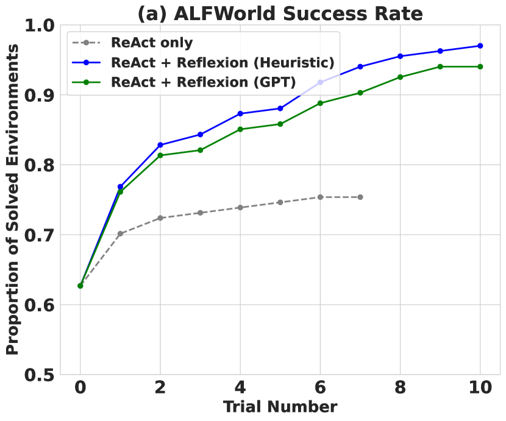
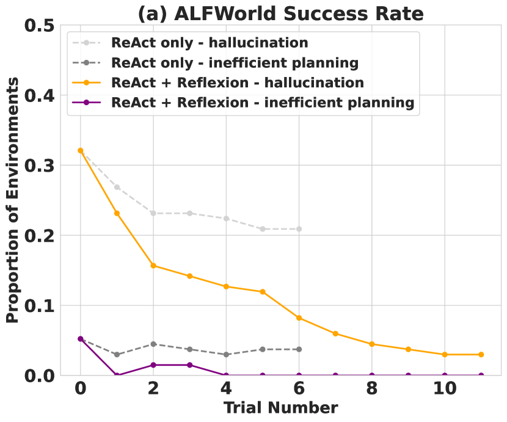
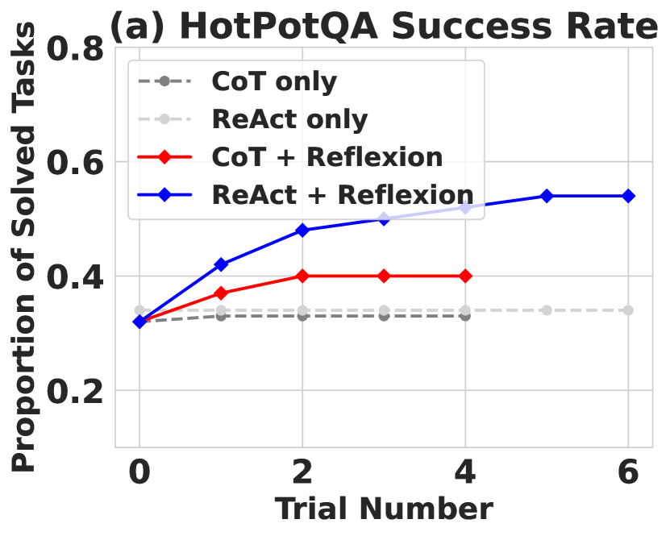
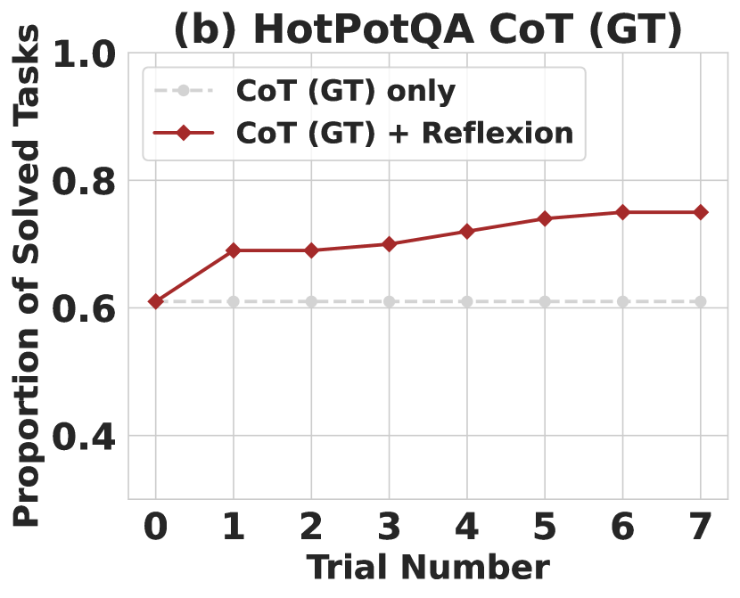
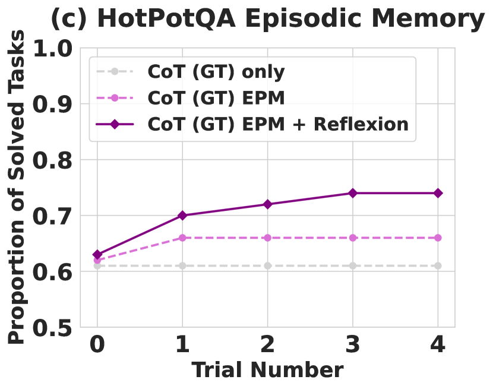
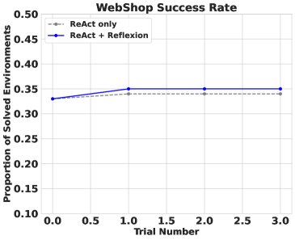

# Reflexion: 言語による強化学習を用いる言語エージェント

> 原題: Reflexion: Language Agents with Verbal Reinforcement Learning
> 著者: Noah Shinn（Northeastern University）, Federico Cassano（Northeastern University）, Edward Berman（Northeastern University）, Ashwin Gopinath（MIT）, Karthik Narasimhan（Princeton University）, Shunyu Yao（Princeton University）
> 出典: arXiv:2303.11366（NeurIPS 2023）
> 訳注: クリップでは Figure 2 のキャプションと Algorithm 1 の擬似コード本体が欠落していたため ar5iv から復元した。多パネル図の後続パネル（Figure 3 の x4、Figure 4 の x6・x7）もクリップから欠落していたため ar5iv から取得し、パネル帰属を HTML 構造で確認のうえ配置した。§2 の関連研究比較表 2 つは multicolumn ヘッダが崩れていたため正規化した。本文中の \[数字\] は原典の参考文献番号を示す（参考文献一覧は翻訳対象外）。

## Abstract（要旨）

大規模言語モデル（LLMs）は、目標駆動のエージェントとして外部環境（例: ゲーム、コンパイラ、API）と相互作用するために、ますます使われるようになっている。しかし、伝統的な強化学習の手法は膨大な訓練サンプルと高価なモデルのファインチューニングを要するため、これらの言語エージェントが試行錯誤から素早く効率的に学習することは依然として難しい。我々は *Reflexion* を提案する。これは、重みを更新することによってではなく、**言語的フィードバック**によって言語エージェントを強化する新しいフレームワークである。具体的には、Reflexion エージェントはタスクのフィードバック信号について言語で内省（reflect）し、その内省テキストをエピソード記憶のバッファに保持して、後続の試行でのより良い意思決定を促す。Reflexion は、様々な種類（スカラー値・自由形式の言語）と情報源（外部・内部シミュレーション）のフィードバック信号を柔軟に取り込むことができ、多様なタスク（逐次的意思決定、コーディング、言語推論）でベースラインエージェントに対する大幅な改善を得る。例えば、Reflexion は HumanEval コーディングベンチマークで 91% の pass@1 精度を達成し、80% を達成する従来の最先端 GPT-4 を上回る。また、異なるフィードバック信号・フィードバックの取り込み方法・エージェントの種類を用いたアブレーションと分析の研究を行い、それらが性能にどう影響するかの洞察を提供する。すべてのコード・デモ・データセットを [https://github.com/noahshinn024/reflexion](https://github.com/noahshinn024/reflexion) で公開する。

## 1 Introduction（はじめに）

ReAct \[30\]、SayCan \[1\]、Toolformer \[22\]、HuggingGPT \[23\]、generative agents \[19\]、WebGPT \[17\] といった最近の研究は、大規模言語モデル（LLM）の中核の上に構築された自律的意思決定エージェントの実現可能性を実証してきた。これらの手法は LLM を使ってテキストと「行動」を生成し、それを API 呼び出しに使って環境内で実行する。膨大な数のパラメータを持つ巨大モデルに依存するため、このようなアプローチはこれまで、エージェントに教える方法として in-context の例示を使うことに限定されてきた。勾配降下による強化学習のような、より伝統的な最適化の枠組みは、相当な計算量と時間を要するからである。

本論文では、エージェントが過去の失敗から学ぶことを助けるために言語的強化（verbal reinforcement）を使う、Reflexion と呼ばれる代替アプローチを提案する。Reflexion は、環境からの二値ないしスカラーのフィードバックを、テキスト要約という形の言語的フィードバックへ変換し、それを次のエピソードで LLM エージェントの追加コンテキストとして加える。この自己内省的なフィードバックは、改善すべき具体的な方向をエージェントに与えることで「意味論的な」勾配信号として働き、過去の誤りから学んでタスクをより良く遂行することを助ける。これは、人間が複雑なタスクの遂行を少数の試行で反復的に学ぶやり方——次の挑戦のためのより良い攻略計画を立てるために、過去の失敗を振り返る——に似ている。例えば figure 1 では、Reflexion エージェントが試行・誤り・自己内省を通じて自らの挙動を最適化し、意思決定・プログラミング・推論のタスクを解くことを学ぶ。

有用な内省的フィードバックの生成は難しい。モデルがどこで誤ったかの十分な理解（すなわち信用割当問題（credit assignment problem）\[25\]）と、改善のための実行可能な洞察を含む要約を生成する能力の両方を要するからである。我々はこれを行う 3 つの方法を探る——単純な二値の環境フィードバック、よくある失敗ケースのための事前定義ヒューリスティクス、そして（意思決定用の）LLM による二値分類や（プログラミング用の）自己作成単体テストのような自己評価である。すべての実装において、評価信号は自然言語の経験要約へ増幅され、長期記憶に保存される。

Reflexion は、方策ベースや価値ベースの学習といった、より伝統的な RL アプローチと比べていくつかの利点を持つ: 1) 軽量で、LLM のファインチューニングを必要としない。2) 正確な信用割当が難しいスカラーやベクトルの報酬と比べ、より精緻な形のフィードバック（例: 行動に対する狙いを定めた変更）を可能にする。3) 過去の経験に対する、より明示的で解釈可能な形のエピソード記憶を可能にする。4) 将来のエピソードでの行動について、より明示的なヒントを与える。同時に、LLM の自己評価能力（あるいはヒューリスティクス）の力に依存し、成功の形式的保証を持たないという不利もある。しかし、LLM の能力が向上するにつれ、このパラダイムは時間とともに良くなる一方だと我々は予想する。

我々は、(1) 長い軌跡にわたる逐次的な行動選択をテストする意思決定タスク、(2) 知識集約的な単段生成の改善をテストする推論タスク、(3) コンパイラやインタプリタといった外部ツールを効果的に使うことをエージェントに教えるプログラミングタスク、で実験を行う。3 種類のタスクすべてにわたり、Reflexion エージェントはより良い意思決定者・推論者・プログラマであることが観察される。より具体的には、Reflexion エージェントは意思決定の AlfWorld \[24\] タスクで強力なベースラインアプローチを 12 回の反復学習ステップで絶対値 22% 上回り、HotPotQA \[28\] の推論質問で 20%、HumanEval \[6\] の Python プログラミングタスクで最大 11% 上回る。

まとめると、我々の貢献は以下である:

- エージェントの記憶のエンコーディングと LLM パラメータの選択の組として方策をパラメータ化する、「言語的」強化の新しいパラダイムである Reflexion を提案する。
- LLM におけるこの *self-reflection* の創発的性質を探求し、自己内省が少数の試行での複雑なタスクの学習に極めて有用であることを経験的に示す。
- 19 のプログラミング言語で 40 の挑戦的な Leetcode 問題（hard レベル）からなるコード生成 RL ジム環境、LeetcodeHardGym を導入する。
- Reflexion が複数のタスクで強力なベースラインに対する改善を達成し、様々なコード生成ベンチマークで最先端の結果を達成することを示す。

<figure>


<figcaption>図1: Reflexion は意思決定 4.1、プログラミング 4.3、推論 4.2 のタスクで機能する。（(a) タスク →(b) 軌跡 →(c) 評価 →(d) 内省 →(e) 次の軌跡、の流れを 3 ドメインで例示）</figcaption>
</figure>

## 2 Related work（関連研究）

##### 推論と意思決定

Self-Refine \[15\] は、自己評価を通じて生成を自律的に改善する、自己洗練のための反復的フレームワークを用いる。これらの自己評価と自己改善のステップは、「この生成をより肯定的な書き方にするには」といった、与えられたタスク制約に条件づけられる。Self-Refine は有効だが、単一生成の推論タスクに限られる。\[21\] は同様の意味論的なプロンプト書き換え最適化を行うが、やはり単一生成タスクに限られる。\[20\] は軌跡内の中間フィードバックを与える critic モデルをファインチューニングして推論応答を改善する。\[27\] は行動に対する確率的ビームサーチを使い、自己評価の構成要素による先読みの利点を使える、より効率的な意思決定の探索戦略を行う。\[31\] と \[16\] は複数の生成に対して推論する決定モデルを使う。\[10\] は評価ステップなしで固定ステップ数のリトライパターンを使う。\[9\] は前の生成への最適化を提案する定性的評価ステップを行う。本論文では、これらの概念のいくつかが *self-reflection* によって強化され、自己内省的な経験の持続する記憶を構築できることを示す。これによりエージェントは、自らの誤りを特定し、時間をかけて誤りから学ぶべき教訓を自己提案できる。

##### プログラミング

いくつかの過去および最近の研究は、テスト駆動開発やコードデバッグの実践の変種を用いる。AlphaCode \[14\] は生成の集合を隠しテストケースで評価する。CodeT \[5\] は、生成された関数実装をスコアリングするために自己生成の単体テストを使う。Self-Debugging \[7\] は、コード実行環境からのフィードバックを与えられて既存の実装を改善するデバッグ構成要素を用いる。CodeRL \[12\] は、実行環境からのフィードバックを与えられてプログラムをデバッグする actor-critic 構成の RL 枠組みに問題を設定する。AlphaCode・Self-Debugging・CodeRL は比較的単純なプログラムのバグ修正には有効だが、pass@1 の適格性を無効にする正解テストケースに依存しており、誤りの特定と実装の改善の間の橋渡しに自己内省を使わない。CodeT は隠しテストケースにアクセスしないが、コードの書き方を改善する自己学習ステップを実装していない。

**表（関連研究の比較: 推論と意思決定）**（訳注: クリップで multicolumn ヘッダが崩れていたため正規化）

| アプローチ | 自己洗練 | 隠れ制約 | 意思決定 | 二値報酬 | 記憶 |
| --- | --- | --- | --- | --- | --- |
| Self-refine \[15\] | ✓ | ✗ | ✗ | ✗ | ✗ |
| Beam search \[27\] | ✓ | ✓ | ✓ | ✓ | ✗ |
| Reflexion（本研究） | ✓ | ✓ | ✓ | ✓ | ✓ |

**表（関連研究の比較: プログラミング）**（訳注: 同上）

| アプローチ | テスト実行 | デバッグ | 自己生成テスト | 多言語 | 自己内省 |
| --- | --- | --- | --- | --- | --- |
| AlphaCode \[14\] | ✓ | ✗ | ✗ | ✓ | ✗ |
| CodeT \[5\] | ✓ | ✗ | ✓ | ✗ | ✗ |
| Self-debugging \[7\] | ✓ | ✓ | ✗ | ✗ | ✗ |
| CodeRL \[12\] | ✓ | ✓ | ✗ | ✗ | ✗ |
| Reflexion（本研究） | ✓ | ✓ | ✓ | ✓ | ✓ |

## 3 Reflexion: 言語的内省による強化

<figure>


<figcaption>図2: (a) Reflexion の図解。(b) Reflexion の強化アルゴリズム。（訳注: キャプションはクリップから欠落していたため ar5iv から復元。図は Actor(LM)・Evaluator(LM)・Self-reflection(LM) の 3 モデルと、trajectory（短期記憶）・experience（長期記憶）が環境との Obs/Reward・Action のループに接続される構成を示す）</figcaption>
</figure>

**Algorithm 1: Reinforcement via self-reflection**（訳注: 擬似コード本体はクリップから欠落していたため ar5iv から復元）

```
Initialize Actor, Evaluator, Self-Reflection: M_a, M_e, M_sr
Initialize policy π_θ(a_i | s_i),  θ = {M_a, mem}
Generate initial trajectory τ_0 using π_θ
Evaluate τ_0 using M_e
Generate initial self-reflection sr_0 using M_sr
Set mem ← [sr_0]
Set t = 0
while M_e not pass or t < max trials do
    Generate τ_t = [a_0, o_0, ..., a_i, o_i] using π_θ
    Evaluate τ_t using M_e
    Generate self-reflection sr_t using M_sr
    Append sr_t to mem
    Increment t
end while
return
```

我々は Reflexion のモジュール的な定式化を開発する。3 つの異なるモデルを用いる: テキストと行動を生成する Actor（$M_{a}$ と表記）、$M_{a}$ が生成した出力をスコアリングする Evaluator モデル（$M_{e}$）、そして Actor の自己改善を支援する言語的強化の手がかりを生成する Self-Reflection モデル（$M_{sr}$）である。これらのモデルそれぞれの詳細な説明を与え、続いて Reflexion フレームワーク内での協調的な働きを明らかにする。

##### Actor

Actor は、状態の観測に条件づけて必要なテキストと行動を生成するよう特にプロンプトされた、大規模言語モデル（LLM）の上に構築される。伝統的な方策ベースの RL の設定と同様に、時刻 $t$ に現在の方策 $\pi_{\theta}$ から行動または生成 $a_{t}$ をサンプリングし、環境から観測 $o_{t}$ を受け取る。Chain of Thought \[26\] や ReAct \[30\] を含む様々な Actor モデルを探る。これらの多様な生成モデルにより、Reflexion フレームワーク内でテキストと行動の生成の異なる側面を探ることができ、その性能と有効性についての価値ある洞察が得られる。加えて、このエージェントに追加のコンテキストを与える記憶の構成要素 *mem* も加える。この適応は、in-context 学習を使う方策反復のアプローチを提案する \[3\] に着想を得た。これがどう埋められるかの詳細は以下で述べる。

##### Evaluator

Reflexion フレームワークの Evaluator 構成要素は、Actor が生成した出力の品質を評価するうえで決定的な役割を果たす。生成された軌跡を入力に取り、与えられたタスク文脈内での性能を反映する報酬スコアを計算する。意味論的な空間に適用できる有効な価値関数・報酬関数を定義するのは難しいため、Evaluator モデルのいくつかの変種を調べる。推論タスクでは、生成された出力が期待される解に密接に一致することを保証する、完全一致（EM）採点に基づく報酬関数を探る。意思決定タスクでは、特定の評価基準に合わせて仕立てた事前定義のヒューリスティック関数を用いる。加えて、意思決定とプログラミングのタスクについて、LLM 自体の別インスタンスを Evaluator として使い報酬を生成する実験も行う。Evaluator 設計へのこの多面的なアプローチにより、生成出力をスコアリングする異なる戦略を検討でき、タスクの幅にわたる有効性と適合性への洞察が得られる。

##### Self-reflection

LLM としてインスタンス化される Self-Reflection モデルは、将来の試行のための価値あるフィードバックを与える言語的な自己内省を生成するという、Reflexion フレームワークで決定的な役割を果たす。二値の成功状態（成功/失敗）のような疎な報酬信号、現在の軌跡、そして持続する記憶 *mem* を与えられ、self-reflection モデルは精緻で具体的なフィードバックを生成する。スカラー報酬より情報量の多いこのフィードバックは、エージェントの記憶（*mem*）に保存される。例えば多段の意思決定タスクで、エージェントが失敗の信号を受け取ったとき、特定の行動 $a_{i}$ が後続の誤った行動 $a_{i+1}$ と $a_{i+2}$ につながったと推論できる。エージェントはそのとき、異なる行動 $a_{i}^{\prime}$ を取るべきだった——そうすれば $a_{i+1}^{\prime}$、$a_{i+2}^{\prime}$ という結果になっただろう——と言語で述べ、この経験を記憶に保存できる。後続の試行では、エージェントは過去の経験を活用して、時刻 $t$ での意思決定のアプローチを行動 $a_{i}^{\prime}$ を選ぶよう適応させられる。この試行・誤り・自己内省・記憶の持続という反復過程により、エージェントは情報量の多いフィードバック信号を活用して、様々な環境で意思決定能力を急速に改善できる。

##### Memory

Reflexion 過程の中核的な構成要素は、短期記憶と長期記憶の概念である。推論時、Actor は短期記憶と長期記憶に条件づけて意思決定を行う。これは、人間が細部の直近の詳細を覚えていながら、長期記憶から蒸留された重要な経験も想起するのと似ている。RL の設定では、軌跡の履歴が短期記憶として機能し、Self-Reflection モデルの出力が長期記憶に保存される。これら 2 つの記憶の構成要素は協働して、具体的でありながら複数の試行で学んだ教訓にも影響されたコンテキストを提供する。これは他の LLM 行動選択の研究に対する Reflexion エージェントの鍵となる利点である。

##### Reflexion の過程

Reflexion は 1 の反復的最適化過程として形式化される。最初の試行で、Actor は環境と相互作用して軌跡 $\tau_{0}$ を生成する。次に Evaluator が、$r_{t}=M_{e}(\tau_{0})$ として計算されるスコア $r_{0}$ を生成する。$r_{t}$ は試行 $t$ のスカラー報酬に過ぎず、タスク固有の性能が上がるほど良くなる。最初の試行の後、$r_{0}$ を LLM が改善に使えるフィードバック形式へ増幅するために、Self-Reflection モデルが $\{\tau_{0},r_{0}\}$ の組を分析して要約 $sr_{0}$ を生成し、これが記憶 *mem* に保存される。$sr_{t}$ は試行 $t$ の言語的な経験フィードバックである。Actor・Evaluator・Self-Reflection のモデルは、Evaluator が $\tau_{t}$ を正しいと判断するまで、ループの中で試行を重ねて協働する。3 で述べたように、Reflexion の記憶の構成要素はその有効性に決定的である。各試行 $t$ の後、$sr_{t}$ は *mem* に追記される。実際には、LLM の最大コンテキスト制限に従うため、保存する経験の最大数 $\Omega$（通常 1〜3 に設定）で *mem* を上限づける。

## 4 Experiments（実験）

意思決定・推論・コード生成のタスクで、様々な自然言語 RL の設定を評価する。具体的には、HotPotQA \[28\] での検索ベースの質問応答、AlfWorld \[24\] での一般的な家庭環境における多段タスク、そして HumanEval \[6\]・MBPP \[2\]・新ベンチマークの LeetcodeHard での、インタプリタやコンパイラを備えた競技風環境におけるコード作成タスクに、エージェントを挑戦させる。特筆すべきことに、Reflexion は AlfWorld で 22%、HotPotQA で 20%、HumanEval で 11%、強力なベースラインに対して性能を改善する。

### 4.1 逐次的意思決定: ALFWorld

AlfWorld は、TextWorld \[8\] に基づく様々な対話的環境で、多段タスクを解くことをエージェントに要求するテキストベース環境のスイートである。\[30\] に従い、隠れた物を見つける（例: 引き出しの中のフライ返しを見つける）、物を動かす（例: ナイフをまな板へ動かす）、物を他の物で操作する（例: トマトを冷蔵庫で冷やす）を含む 6 種類のタスクにわたる 134 の AlfWorld 環境でエージェントを実行する。行動生成器には ReAct \[30\] を使う。\[30\] が明示的な中間の思考を使った長い軌跡の意思決定で成功を示しているからである。AlfWorld タスクは、環境がタスク完了の信号しか出せないため、自然に自己評価のステップを要する。完全に自律的な挙動を達成するため、2 つの自己評価手法を実装する: LLM を使った自然言語分類と、手書きのヒューリスティクスである。ヒューリスティクスは単純である: エージェントが同じ行動を実行して同じ応答を 3 サイクル超受け取った場合、または現在の環境で取った行動数が 30 を超えた場合（非効率な計画）、自己内省する。ベースラインの実行では、自己内省が提案された場合、自己内省の過程をスキップし、環境をリセットして新しい試行を始める。Reflexion の実行では、エージェントは自己内省を使って誤りを見つけ、記憶を更新し、環境をリセットして新しい試行を始める。最大制限を超えうる非常に長いプロンプトウィンドウを避けるため、エージェントの記憶を直近 3 件の自己内省（経験）に切り詰める。

構文エラーを避けるため、2 つのドメイン固有の few-shot 軌跡をエージェントに与える。LLM には GPT-3 で \[30\] と同じ few-shot 軌跡の例を使う。AlfWorld のタスク、ReAct の few-shot プロンプト、Reflexion の例は付録に含める。

##### 結果

<figure>



<figcaption>図3(a): 134 タスクにわたる AlfWorld の性能。二値分類の自己評価手法（Heuristic）と（GPT）を使った、解決済みタスクの累積割合を示す。</figcaption>
</figure>

<figure>



<figcaption>図3(b): 失敗理由による AlfWorld 軌跡の分類。（訳注: このパネルはクリップから欠落していたため ar5iv から取得して配置）</figcaption>
</figure>

ReAct + Reflexion は、幻覚と非効率な計画を検出する単純なヒューリスティクスを使って 134 タスク中 130 を完了し、ReAct を大幅に上回る。さらに、ReAct + Reflexion は 12 回の連続する試行で学習し、追加のタスクを解けるようになる。ReAct のみのアプローチでは、性能の向上が試行 6 と 7 の間で止まることが見られる。

##### 分析

ベースラインの失敗した AlfWorld 軌跡でよくある誤りは、エージェントが物を所持していると思い込んでいるのに実際には持っていない場合である。エージェントは長い軌跡の中でいくつもの行動を実行し続け、誤りを見つけるために行動を遡ることができない。Reflexion は、自己内省を使って長い失敗軌跡を、将来「自分へのヒント（self-hints）」として使える関連する経験へ蒸留することで、これらのケースをほぼすべて排除する。AlfWorld で長期記憶がエージェントを助ける主なケースは 2 つある: 1) 長い軌跡の早い段階の誤りは容易に特定できる。エージェントは新しい行動の選択や、新しい長期計画すら提案できる。2) 物を探すべき面や容器が多すぎる。エージェントは複数の試行にわたる経験の記憶を活用して、部屋を徹底的に探索できる。3 では、学習曲線は学習過程が複数の経験にわたって起こることを示唆している。つまりエージェントは、最初の 2 試行間の即時の改善の跳ね上がりに示されるケース 1 と、その後 11 試行にわたる着実な向上でほぼ完璧な性能に至るケース 2 のバランスをうまく取っている。他方、3 は ReAct のみのエージェントが 22% の幻覚率で収束し、長期的な回復の兆しがないことを示す。

### 4.2 推論: HotpotQA

HotPotQA \[28\] は、113k の質問-回答ペアを持つ Wikipedia ベースのデータセットで、複数の裏づけ文書を解析して推論することをエージェントに要求する。推論のみの能力の改善をテストするため、段階的な $Q\rightarrow A$ および $Q$, $C_{gt}\rightarrow A$ の実装に対して Reflexion + Chain-of-Thought（CoT）\[26\] を実装する。ここで $Q$ は質問、$C_{gt}$ はデータセットからの正解コンテキスト、$A$ は最終回答である。CoT は多段の意思決定手法ではないため、与えられた長いテキスト区間に対する推論の挙動を分離できるよう、$C_{gt}$ をエージェントに与える。推論と行動選択を要する統合的な質問応答能力をテストするため、Wikipedia API で関連コンテキストを検索し、段階的な明示的思考で答えを推論できる Reflexion + ReAct \[30\] エージェントを実装する。CoT の実装には 6-shot プロンプティング、ReAct には 2-shot プロンプティング、self-reflection には 2-shot プロンプティングを使う。すべての例は付録にある。

自然言語の回答を頑健に評価することは NLP の長年の問題である。そこで試行間では、環境による完全一致（EM）の回答採点を使ってエージェントに二値の成功信号を与える。各試行の後、AlfWorld の意思決定の設定 4.1 と同様に、記憶サイズ 3 経験で自己内省ループを用いる。

##### 結果

<figure>



<figcaption>図4(a): Reflexion ReAct vs Reflexion CoT。Chain-of-Thought（CoT）と ReAct。Reflexion は 100 問の HotPotQA で検索・情報取得・推論の能力を改善する。</figcaption>
</figure>

<figure>



<figcaption>図4(b): 推論のみの Reflexion CoT（GT）。（訳注: このパネルはクリップから欠落していたため ar5iv から取得して配置）</figcaption>
</figure>

<figure>



<figcaption>図4(c): Reflexion とエピソード記憶アブレーションの比較。（訳注: このパネルはクリップから欠落していたため ar5iv から取得して配置）</figcaption>
</figure>

Reflexion は、複数の学習ステップにわたり、すべてのベースラインアプローチを大差で上回る。さらに、ReAct のみ・CoT のみ・CoT（GT）のみの実装は、どのタスクでも確率的に改善できなかった。すなわち、どのベースラインアプローチでも、最初の試行で失敗したタスクを、temperature 0.7 を使った後続の試行で解けたものはなかった。Reflexion の実行では、特定のタスクで 3 回連続の失敗を出すまで、エージェントが経験を集めて失敗タスクに再挑戦することを許した。当然、CoT（GT）は質問の正解コンテキストへのアクセスを与えられているため、より高い精度を達成した。それでも CoT（GT）エージェントは質問の 39% で正しい答えを推論できないが、Reflexion は正解へのアクセスなしにエージェントが誤りを正すことを助け、精度を 14% 改善する。

##### 分析

CoT（GT）をベースラインアプローチとして、推論に対する自己内省ステップの利点を分離するアブレーション実験を行う 4。CoT（GT）は与えられた正解コンテキストによる Chain-of-Thought 推論を使い、長いコンテキストに対する推論能力をテストすることを思い出してほしい。次に、直近の軌跡を含めることでエピソード記憶（EPM）の要素を加える。Reflexion エージェントには、最終パスとして標準の自己内省ステップを実装する。直観的には、一人称で書かれた言語による言語的説明を使うことで、エージェントがより効果的に反復学習しているかをテストする。4 は、自己内省がエピソード記憶の学習優位に対して 8% の絶対的な上乗せで学習を改善することを示す。この結果は、洗練のみのアプローチは自己内省に導かれた洗練のアプローチほど有効でない、という主張を支持する。

### 4.3 プログラミング

MBPP \[2\]・HumanEval \[6\]・我々の新データセット LeetcodeHardGym で、Python と Rust のコード作成についてベースラインと Reflexion のアプローチを評価する。MBPP と HumanEval は自然言語の記述を与えられた関数本体の生成精度を測る。ベンチマーク言語コンパイラ MultiPL-E \[4\] を使い、HumanEval と MBPP のサブセットを Rust 言語へ翻訳する。MultiPL-E は、Python のベンチマーク問題を他の 18 言語へ翻訳するのに使える小さなコンパイラ群である。Rust のコード生成の実験を含めるのは、コード生成の Reflexion 実装が言語非依存であり、インタプリタ言語とコンパイル言語の両方に使えることを実証するためである。最後に、新しいベンチマーク LeetcodeHardGym を導入する。これは、GPT-4 \[18\] の事前学習カットオフ日である 2022 年 10 月 8 日より後にリリースされた、Leetcode の hard 評価の問題 40 問を含む対話的プログラミングジムである。

プログラミングのタスクは、自己生成の単体テストスイートのような、より接地された自己評価の実践を使う固有の機会を提供する。したがって、我々の Reflexion ベースのプログラミングタスク実装は pass@1 精度の報告に適格である。テストスイートを生成するため、Chain-of-Thought プロンプティング \[26\] を使い、対応する自然言語記述つきの多様で広範なテストを生成する。次に、提案された各テストについて有効な抽象構文木（AST）の構築を試みることで、構文的に有効なテスト文をフィルタする。最後に、生成された単体テストのコレクションから $n$ 個のテストをサンプリングしてテストスイート $T$（$\{t_{0},t_{1},\dots,t_{n}\}$ と表記）を作る。$n$ は最大 6 単体テストに設定する。単体テストスイートの構成要素を除けば、Reflexion プログラミングエージェントの学習ループの設定は、推論・意思決定のエージェントと同一で、最大記憶制限は 1 経験である。

##### 結果

**表1**: 様々なモデル-戦略-言語の組み合わせにおける pass@1 精度。ベースの戦略は単一のコード生成サンプル。指示ベースのモデルはすべてゼロショットのコード生成に従う。

| ベンチマーク＋言語 | 従来 SOTA Pass@1 | SOTA Pass@1 | Reflexion Pass@1 |
| --- | --- | --- | --- |
| HumanEval (PY) | 65.8（CodeT \[5\] + GPT-3.5） | 80.1（GPT-4） | **91.0** |
| HumanEval (RS) | – | 60.0（GPT-4） | **68.0** |
| MBPP (PY) | 67.7（CodeT \[5\] + Codex \[6\]） | **80.1**（GPT-4） | 77.1 |
| MBPP (RS) | – | 70.9（GPT-4） | **75.4** |
| Leetcode Hard (PY) | – | 7.5（GPT-4） | **15.0** |

**表2**: HumanEval と MBPP の全体精度とテスト生成の性能。Rust については、HumanEval は MultiPL-E \[4\] で Rust へ翻訳した HumanEval Python の最難問 50 問。TP: 単体テスト合格・解も合格、FN: 単体テスト不合格・解は合格、FP: 単体テスト合格・解は不合格、TN: 単体テスト不合格・解も不合格。

| ベンチマーク＋言語 | Base | Reflexion | TP | FN | FP | TN |
| --- | --- | --- | --- | --- | --- | --- |
| HumanEval (PY) | 0.80 | 0.91 | 0.99 | 0.40 | 0.01 | 0.60 |
| MBPP (PY) | 0.80 | 0.77 | 0.84 | 0.59 | 0.16 | 0.41 |
| HumanEval (RS) | 0.60 | 0.68 | 0.87 | 0.37 | 0.13 | 0.63 |
| MBPP (RS) | 0.71 | 0.75 | 0.84 | 0.51 | 0.16 | 0.49 |

Reflexion はすべてのベースライン精度を上回り、MBPP Python 1 を除き、Python と Rust のすべてのベンチマークで新たな最先端の水準を打ち立てる。MBPP Python での Reflexion の劣った性能はさらに調査する。

##### 分析

自己内省するコード生成エージェントは、多様で包括的なテストを書く能力に縛られることを我々は認める。したがって、モデルが不安定な（flaky）テストスイートを生成した場合、誤った解ですべてのテストが合格し、コード補完に偽陽性のラベルがつく可能性がある \[11\]。他方、モデルが誤って書かれたテストスイートを生成した場合、正しい解で一部のテストが失敗し、偽陰性のコード補完に条件づけられた自己内省の生成につながる可能性がある。Reflexion の実装を考えると、偽陰性は偽陽性より好ましい。エージェントは自己内省を使って誤ったテストを特定し、元のコード補完をそのまま保つよう自分を促せる可能性があるからである。他方、無効なテストスイートが偽陽性の補完（内部のテストケースはすべて合格するが実装は誤り）を返すと、エージェントは無効な提出を早々に報告してしまう。2 では、pass@1 精度を超えて性能を分析するために様々な条件を測定する。先に、MBPP Python でのベースライン GPT-4 に対する Reflexion の劣った性能を示した。2 では、内部テスト実行が生む偽陽性ラベル、すなわち P(pass@1 生成が不正解 | テスト合格)——提出がすべての単体テストに合格したのに失敗する確率——に顕著な食い違いが観察される。HumanEval と MBPP Python では、ベースラインの pass@1 精度は比較的近く、それぞれ 82% と 80% である。しかし偽陽性のテスト実行率は MBPP Python が 16.3% であるのに対し HumanEval Python はわずか 1.4% であり、これが 91% の全体精度 1 につながっている。

##### アブレーション研究

**表3**: HumanEval Rust の最難問 50 問で GPT-4 をベースモデルに使った、Reflexion アプローチの様々な妥協版の pass@1 精度。

| アプローチ | テスト生成 | 自己内省 | Pass@1（精度） |
| --- | --- | --- | --- |
| ベースモデル | False | False | 0.60 |
| テスト生成の省略 | False | True | 0.52 |
| 自己内省の省略 | True | False | 0.60 |
| Reflexion | True | True | **0.68** |

HumanEval Rust の最難問 50 問のサブセットで、テスト生成と自己内省の協調という Reflexion の複合アプローチをテストする。我々の Rust コンパイラ環境は冗長なエラーログと有用なデバッグのヒントを提供するため、妥協版アプローチの良い実験場になる。まず、内部のテスト生成と実行のステップを省略する。これは、現在の実装からの導きなしに自己内省することをエージェントに課す。3 は 52% と、ベースライン（60%）より劣った精度を示す。これは、単体テストなしではエージェントが現在の実装が正しいかを判断できないことを示唆する。したがってエージェントは、早期に返る選択肢なしに実行のすべての反復に参加せざるを得ず、実装に有害な編集を行ってしまう。

次に、失敗した単体テストスイートの評価に続く自然言語の説明ステップを省略することで、自己内省の寄与をテストする。直観的には、これは、失敗したすべての単体テストにわたって誤りの特定と実装の改善というタスクを結合することをエージェントに課す。興味深いことに、この妥協版エージェントはベースラインの実行に対して性能を改善しない。テスト生成とコードコンパイルのステップは構文と論理の誤りを捉えられるが、実装の修正はこれらの指摘を反映しないことが観察される。これらの経験的結果は、自己内省なしの盲目的な試行錯誤デバッグ手法を提案する最近のいくつかの研究が、Rust での複雑なプログラム作成のような、より難しいタスクでは無効であることを示唆する。

## 5 Limitations（限界）

その核心において、Reflexion は自然言語を使って方策最適化を行う最適化手法である。方策最適化は経験を通じて行動選択を改善する強力なアプローチだが、それでも非最適な局所解に陥りうる。本研究では長期記憶を最大容量つきのスライディングウィンドウに制限したが、Reflexion の記憶の構成要素を、ベクトル埋め込みデータベースや伝統的な SQL データベースといった、より高度な構造へ拡張する将来の研究を推奨する。コード生成に固有のこととして、正確な入出力の対応を指定することには、非決定的なジェネレータ関数、API と相互作用する非純粋な関数、ハードウェア仕様により出力が変わる関数、予測が難しい並列・並行の挙動を呼び出す関数など、テスト駆動開発の実践的な限界が多数ある。

## 6 Broader impact（より広い影響）

大規模言語モデルは、外部環境（例: インターネット、ソフトウェア、ロボティクス）や人間と相互作用するためにますます使われている。我々の研究は、これらのエージェントをより大きな自動化と作業効率へ向けて強化・支援する可能性を持つが、同時に、これらのエージェントが誤用されたときのリスクも増幅する。この方向の研究には、安全性と倫理の考慮においてより多くの努力が必要になると我々は考える。

他方、強化学習は、解釈可能性とアラインメントが難しいブラックボックスの方策と最適化の設定に苦しんできた。我々が提案する「言語的」強化学習は、これらの問題のいくつかに対処し、自律エージェントをより解釈可能で診断可能にするかもしれない。例えば、人間には理解が難しすぎるかもしれないツール使用の場合、ツールを使う前に意図が適切であることを確認するために、自己内省を監視できるだろう。

## 7 Conclusion（結論）

本研究では、過去の誤りから学ぶことをエージェントに教えるために言語的強化を活用するアプローチ、*Reflexion* を提示した。Reflexion エージェントが、自己内省を活用することで、現在広く使われている意思決定アプローチを大幅に上回ることを経験的に示した。将来の研究では、Reflexion は、自然言語での価値学習や off-policy の探索手法など、伝統的な RL の設定で徹底的に研究されてきた、より高度な手法を採用するために使えるだろう。

## 8 Reproducibility（再現性）

自律的なコード作成の実験を実行する際は、生成されたコードは実行前に検証されないため、隔離された実行環境を使うことを強く勧める。

## Appendix A 追加モデルでの評価

様々な強さのモデルで試行錯誤の問題解決の適用可能性をさらに調査した。自己修正を specify する能力は、より強く大きいモデルの創発的な性質であることが分かった。

**表4**: starchat-beta \[13\] を使った HumanEval Python の pass@1 精度。

| アプローチ | Pass@1 精度（8 試行平均） | Pass@1 精度（標準偏差） |
| --- | --- | --- |
| ベースライン | 0.26 | 0.00481 |
| Reflexion | 0.26 | 0.00305 |

**表5**: 様々なモデルを使った 100 問の HotPotQA の pass@1 精度。

| モデル | ベースライン精度 | Reflexion 精度 |
| --- | --- | --- |
| CoT (GT) + text-davinci-003 | 0.60 | 0.77 |
| CoT (GT) + gpt-3.5-turbo | 0.57 | 0.71 |
| CoT (GT) + gpt-4 | 0.68 | 0.80 |
| ReAct + text-davinci-003 | 0.30 | 0.55 |
| ReAct + gpt-3.5-turbo | 0.26 | 0.38 |
| ReAct + gpt-4 | 0.39 | 0.51 |

## Appendix B 意思決定

（訳注: 以下の trajectory と自己内省文は skill 規定により原文のまま収録する。）

> Environment: You are in the middle of a room. Looking quickly around you, you see a bed 1, a desk 2, a desk 1, a drawer 6, a drawer 5, a drawer 4, a drawer 3, a drawer 2, a drawer 1, a garbagecan 1, a laundryhamper 1, a safe 1, a shelf 6, a shelf 5, a shelf 4, a shelf 3, a shelf 2, and a shelf 1.
> Task: examine the mug with the desklamp.
>
> **Trial #1**
> \> think: To solve the task, I need to find and take a mug, then find and use a desklamp.
> \> think: First I need to find a mug. A mug is more likely to appear in drawer (1-6), desk (1-2), shelf (1-6), garbagecan (1), laundryhamper (1). I can check one by one, starting with drawer 1.
> \> go to drawer 1
> The drawer 1 is closed.
> …
> \> open drawer 6
> You open the drawer 6. The drawer 6 is open. In it, you see a keychain 2.
> \> go to desk 1
> On the desk 1, you see a creditcard 3, a desklamp 1, a laptop 2, a mug 1, a pen 1, and a pencil 1.
> \> think: Now I find a mug (1). Next, I need to take it.
> \> take mug 1 from desk 1
> You pick up the mug 1 from the desk 1.
> \> think: Now I take a mug (1). Next, I need to find a desklamp. A desklamp is more likely to appear in desk (1-2), sidetable (1-2), shelf (1-6), bed (1), drawer (1-6). I can check one by one, starting with desk 1.
> \> go to desk 1
> Nothing happens.
> \> go to desk 2
> On the desk 2, you see a alarmclock 1, a bowl 1, a mug 3, a pencil 3, and a pencil 2.
> \> think: Now I find a desklamp (1). Next, I need to use it.
> \> use desklamp 1
> Nothing happens.
> \> use desklamp 1
> Nothing happens.
> Status: Fail
>
> **Reflection**: In this environment, my plan was to find a mug then find and use a desklamp. However, the task says to examine the mug with the desklamp. I should have looked for the desklamp first, then looked for the mug. I noticed that the desklamp was found on desk 1. In the next trial, I will go to desk 1, find the lamp, then look for the mug and examine it with the desklamp.
>
> **Trial #2**
> \> go to desk 1
> On the desk 1, you see a creditcard 3, a desklamp 1, a laptop 2, a mug 1, a pen 1, and a pencil 1.
> \> think: To solve the task, I need to find and take a mug, then find and use a desklamp.
> \> take mug 1 from desk 1
> You pick up the mug 1 from the desk 1.
> \> think: To solve the task, I need to find and take a mug, then find and use a desklamp.
> \> use desklamp 1
> You turn on the desklamp 1.
> Status: Success

図5: \[上\] 非効率な計画のためにエージェントが失敗した AlfWorld の軌跡。内省の中で、エージェントは、マグカップより先にデスクランプを探すべきだった——マグカップを先にではなく——と認識する。\[下\] エージェントは推論の軌跡を修正し、一連の行動を簡潔に実行できている。

### B.1 WebShop の限界

5 で、Reflexion は、脱出に極めて創造的な挙動を要する局所解の選択を乗り越えるのに苦労すると簡潔に述べた。この欠点を WebShop \[29\] での実験で観察する。WebShop は、クライアントからの要望を与えられて e コマースサイトをナビゲートし、商品を見つけて購入することをエージェントにテストする、ウェブベースの問題解決ベンチマークである。100 環境で 2-shot の ReAct + Reflexion エージェントをテストする。しかし、わずか 4 試行の後、エージェントが改善の兆しを見せないため実行を打ち切る 6。さらに、エージェントは失敗の後に有用で直観的な自己内省を生成しない。Reflexion は、相当な多様性と探索を要するタスクを解けないと我々は結論する。AlfWorld では、許される行動が観測の中に見えるため、エージェントは新しい環境を適切に探索できる。HotPotQA では、エージェントは WebShop と似た検索クエリのタスクに直面するが、Wikipedia 記事の検索空間はより多様で、それほど正確な検索クエリを要しないため、より成功する。e コマース検索エンジンに共通する問題は、自然言語の検索解釈の曖昧さを適切に扱うことである。したがって WebShop は、Reflexion エージェントに非常に多様で独特な挙動を要求するタスクを提示する。

<figure>



<figcaption>図6: 100 件の顧客の買い物要望にわたる WebShop での Reflexion と ReAct の性能。ReAct + Reflexion は ReAct を有意に上回ることに失敗する。</figcaption>
</figure>

## Appendix C プログラミング

プログラミングの LLM 呼び出しは、LLM の広範な対話訓練のため、関数本体のみを生成させる厳格な指示を要する。いくつかのプログラミングの例を以下に報告する（指示は青でハイライトされテンプレートつき）。完全な実装は [https://github.com/noahshinn024/reflexion](https://github.com/noahshinn024/reflexion) を参照。

### C.1 プログラミング関数実装の例（HumanEval Python）

（訳注: 以下のコードは原文のまま。）

Sample function signature:

```python
def minSubArraySum(nums):
    """
    Given an array of integers nums, find the minimum sum of any
    non-empty sub-array of nums.
    Example
    minSubArraySum([2, 3, 4, 1, 2, 4]) == 1
    minSubArraySum([-1, -2, -3]) == -6
    """
```

Sample function body implementation:

```python
    min_sum = float('inf')
    for i in range(len(nums)):
        current_sum = 0
        for j in range(i, len(nums)):
            current_sum += nums[j]
            if current_sum < min_sum:
                min_sum = current_sum
    return min_sum
```

### C.2 Reflexion Actor の指示

（訳注: 指示文は原文のまま。）

> You are a Python writing assistant. You will be given your previous implementation of a function, a series of unit tests results, and your self-reflection on your previous implementation. Apply the necessary changes below by responding only with the improved body of the function. Do not include the signature in your response. The first line of your response should have 4 spaces of indentation so that it fits syntactically with the user provided signature. You will be given a few examples by the user.

Reflexion Actor の生成は次の形式に従う:
(Instruction)
(Function implementation)
(Unit test feedback)
(Self-reflection)
(Instruction for next function implmentation)

完全な例は [https://github.com/noahshinn024/reflexion](https://github.com/noahshinn024/reflexion) に示す。

### C.3 Reflexion Self-reflection の指示と例

（訳注: 指示文は原文のまま。原典ではこの節に C.2 と同一の指示文が再掲されている。）

> You are a Python writing assistant. You will be given your previous implementation of a function, a series of unit tests results, and your self-reflection on your previous implementation. Apply the necessary changes below by responding only with the improved body of the function. Do not include the signature in your response. The first line of your response should have 4 spaces of indentation so that it fits syntactically with the user provided signature. You will be given a few examples by the user.

Reflexion Self-Reflection の生成は次の形式に従う:
(Instruction)
(Function implementation)
(Unit test feedback)

### C.4 Reflexion プログラミング「自己内省なし」アブレーションの例

Reflexion の *自己内省なし*アブレーションの Actor 生成は次の形式に従う:
(Instruction)
(Function implementation)
(Unit test feedback)
(Self-reflection)
(Instruction for next function implmentation)

### C.5 Reflexion プログラミング「テスト生成なし」アブレーションの例

Reflexion の *テスト生成なし*アブレーションの Actor 生成は次の形式に従う:
(Instruction)
(Function implementation)
(Unit test feedback)
(Self-reflection)
(Instruction for next function implmentation)

## Appendix D 推論

### D.1 完全な例

（訳注: 以下の trajectory と自己内省文は原文のまま。）

> **Trial #1**: Question: Grown-Ups starred the actor who was best known for which role on "'Allo 'Allo!"?
> Thought 1: I need to search Grown-Ups and "'Allo 'Allo!", find the actor who starred in Grown-Ups, then find the role he was best known for in "'Allo 'Allo!".
> Action 1: Search[Grown-Ups]
> Observation 1: Grown-Ups is a 1980 British BBC television film devised and directed by Mike Leigh. It stars Lesley Manville, Philip Davis, Brenda Blethyn, Janine Duvitski, Lindsay Duncan and Sam Kelly. It was edited by Robin Sales and produced by Louis Marks for the BBC, and originally shown on BBC 2 on 28 November 1980.
> Thought 2: Grown-Ups starred Lesley Manville, Philip Davis, Brenda Blethyn, Janine Duvitski, Lindsay Duncan and Sam Kelly. I need to search "'Allo 'Allo!" and find which actor was best known for which role.
> Action 2: Search["'Allo 'Allo!"]
> Observation 2: Could not find ["'Allo 'Allo!"]. Similar: ["'Allo 'Allo!", "List of 'Allo 'Allo! characters", 'Gorden Kaye', "'Allo 'Allo! (series 2)", 'Allô, allô', 'Francesca Gonshaw', "'Allo 'Allo! (series 4)", 'Kim Hartman', "'Allo 'Allo! (series 6)", 'Jeremy Lloyd']
> Thought 3: To find the actor who was best known for which role on "'Allo 'Allo!", I can search Gorden Kaye.
> Action 3: Search[Gorden Kaye]
> Observation 3: Gordon Irving Kaye (7 April 1941 – 23 January 2017), known professionally as Gorden Kaye, was an English actor, best known for playing womanising café owner René Artois in the television comedy series 'Allo 'Allo!.
> Thought 4: Gorden Kaye was best known for playing womanising café owner René Artois in the television comedy series "'Allo 'Allo!". So the answer is Rene Artois.
> Action 4: Finish[Rene Artois]
> Observation 4: Answer is INCORRECT
>
> **Trial #2**: Question: Grown-Ups starred the actor who was best known for which role on "'Allo 'Allo!"?
> Thought 1: I need to search the actor who was best known for a role on "'Allo 'Allo!" and find out what role they were best known for.
> Action 1: Search[Grown-Ups]
> Observation 1: Grown-Ups is a 1980 British BBC television film devised and directed by Mike Leigh. It stars Lesley Manville, Philip Davis, Brenda Blethyn, Janine Duvitski, Lindsay Duncan and Sam Kelly. It was edited by Robin Sales and produced by Louis Marks for the BBC, and originally shown on BBC 2 on 28 November 1980.
> Thought 2: The paragraph does not mention the actor who was best known for a role on "'Allo 'Allo!". I need to search the actor's name instead.
> Action 2: Search[Sam Kelly]
> Observation 2: Roger Michael Kelly (19 December 1943 – 14 June 2014), known by the stage name Sam Kelly, was an English actor who appeared in film, television, radio and theatre. He is best known for his roles as Captain Hans Geering in 'Allo 'Allo!, Warren in Porridge, Sam in On the Up, and Ted Liversidge in Barbara.
> Thought 3: Sam Kelly is best known for his role as Captain Hans Geering in "'Allo 'Allo!", so the answer is Captain Hans Geering.
> Action 3: Finish[Captain Hans Geering]
> Observation 3: Answer is CORRECT
>
> **Reflection**: I searched the wrong title for the show, "'Allo 'Allo!", which resulted in no results. I should have searched the show's main character, Gorden Kaye, to find the role he was best known for in the show.

図7: 同一の環境とタスク内での 2 回の HotPotQA 試行。Reflexion + ReAct エージェントは、自己内省を使って次の試行のためのより良い検索方法を決定する。

### D.2 Chain-of-Thought + Reflexion

> **Trial #1**: Question: What profession does John Lanchester and Alan Dean Foster have in common?
> Thought 1: Let's think step by step. John Lanchester is a novelist, journalist, and critic. Alan Dean Foster is a novelist and screenwriter. So the profession John Lanchester and Alan Dean Foster have in common is novelist and screenwriter.
> Action 1: Finish[novelist and screenwriter]
> Observation 1: Answer is INCORRECT
>
> **Trial #2**: Question: What profession does John Lanchester and Alan Dean Foster have in common?
> Thought 1: Let's think step by step. John Lanchester is a novelist, journalist, and financial journalist. Alan Dean Foster is a novelist and screenwriter. So the profession John Lanchester and Alan Dean Foster have in common is novelist.
> Action 1: Finish[novelist]
> Observation 1: Answer is CORRECT
>
> **Reflection**: My reasoning for the profession John Lanchester and Alan Dean Foster have in common failed because I incorrectly assumed that they both had the same profession. In the future, when attempting this question, I should focus on better researching the individual backgrounds of both authors to ensure that I am accurately identifying their professions. Additionally, I should consider the possibility that they may have multiple professions in common.

### D.3 HotPotQA Chain-of-Thought（GT）+ Reflexion

> Context: The Battle of White Plains was a battle in the New York and New Jersey campaign of the American Revolutionary War fought on October 28, 1776, near White Plains, New York. Following the retreat …
>
> **Trial #1**: Question: What was a series of battles during the Revolutionary War, for control of New York City and the state of New Jersey, fought on October 28, 1776 near White Plains, New York?
> Thought 1: The question is asking about a series of battles during the Revolutionary War for control of New York City and the state of New Jersey, fought on October 28, 1776 near White Plains, New York. From the context, I know that this was the Battle of White Plains.
> Action 1: Finish[Battle of White Plains]
> Observation 1: Answer is INCORRECT
>
> **Trial #2**: Question: What was a series of battles during the Revolutionary War, for control of New York City and the state of New Jersey, fought on October 28, 1776 near White Plains, New York?
> Thought 1: The question is asking for a series of battles during the Revolutionary War, for control of New York City and the state of New Jersey, fought on October 28, 1776 near White Plains, New York. Based on the context, I know that this series of battles was the New York and New Jersey campaign.
> Action 1: Finish[The New York and New Jersey campaign]
> Observation 1: Answer is CORRECT
>
> **Reflection**: Upon reflecting on the incorrect answer I provided, I realize that I may not have provided enough context to accurately answer the question. The question asked for a series of battles, but I only provided the name of one battle. To better answer this question in the future, I will make sure to provide more context, such as the name of the campaign, which was the New York and New Jersey campaign, and the fact that it was a series of battles. Additionally, I will make sure to include the dates of the battles, as well as the locations, to ensure that my answer is comprehensive and accurate.

### D.4 HotPotQA エピソード記憶（EPM）アブレーションのプロンプト

#### D.4.1 (EPM) Chain-of-Thought + Reflexion

> **Trial #1**: Question: Which of Jonny Craig and Pete Doherty has been a member of more bands?
> Thought 1: Let's think step by step. Jonny Craig has been a member of six bands, including Emarosa, Dance Gavin Dance, and Slaves. Pete Doherty has been a member of seven bands, including The Libertines, Babyshambles, and The Puta Madres. So Pete Doherty has been a member of more bands.
> Action 1: Finish[Pete Doherty]
> Observation 1: Answer is INCORRECT
>
> **Trial #2**: Question: Which of Jonny Craig and Pete Doherty has been a member of more bands?
> Thought 1: Let's think step by step. I will research the past and current bands of both musicians to ensure that I am accurately comparing their band memberships. After researching, I have found that Jonny Craig has been a member of seven bands, including Emarosa, Dance Gavin Dance, and Slaves. Pete Doherty has been a member of seven bands, including The Libertines, Babyshambles, and The Puta Madres. So Jonny Craig has been a member of more bands.
> Action 2: Finish[Jonny Craig]
> Observation 2: Answer is CORRECT
>
> **Reflection**: My reasoning for which musician has been a member of more bands failed because I did not take into account that Jonny Craig has been a member of more bands in the past, even though Pete Doherty is currently a member of more bands. In the future, when attempting this question, I should focus on researching the past and current bands of both musicians to ensure that I am accurately comparing their band memberships.

#### D.4.2 (EPM) Chain-of-Thought（GT）+ Reflexion

> Context: Hari Bahadur Basnet is a Nepalese politician. He is the head of the Foreign Relations Department of the Rastriya Janashakti Party. Basnet holds a M.Sc. in Engineering.
> A Master of Science (Latin: "Magister Scientiae"; abbreviated MS, M.S., MSc, M.Sc., MSci, M.Sci., ScM, Sc.M., SciM or Sci.M.) is a master's degree in the field of science…
>
> **Trial #1**: Question: The head of the Foreign Relations Department of the Rastriya Janashakti Party holds a degree that can be abbreviated MS, M.S., or ScM, in what field?
> (Previous trajectory)
> Thought 1: The question is asking what field of study the head of the Foreign Relations Department of the Rastriya Janashakti Party holds a degree in. From the context, I know that the degree is a Master of Science degree, which is typically granted for studies in sciences, engineering, and medicine.
> Action 1: Finish[Sciences, Engineering, and Medicine]
> Observation 1: Answer is INCORRECT
>
> **Trial #2**: Question: The head of the Foreign Relations Department of the Rastriya Janashakti Party holds a degree that can be abbreviated MS, M.S., or ScM, in what field?
> (Previous trajectory)
> Thought 1: The question is asking what field of study the head of the Foreign Relations Department of the Rastriya Janashakti Party holds a degree in. From the context, I know that the degree is a Master of Science degree, which is typically granted for studies in sciences, engineering, and medicine. However, the question is asking for the field of study, not the degree. Based on the context, I know that Hari Bahadur Basnet holds a M.Sc. in Engineering.
> Action 1: Finish[Engineering]
> Observation 1: Answer is CORRECT
>
> **Reflection**: For the first trial, I misunderstood the question. I thought the question was asking for a category of degrees, rather than a specific degree. I learned from my mistake and in the second trial, I focused more closely on the question to understand that it was asking for a specific field of study.
