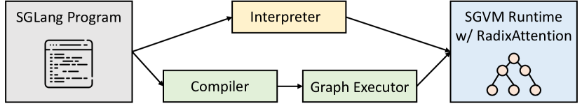
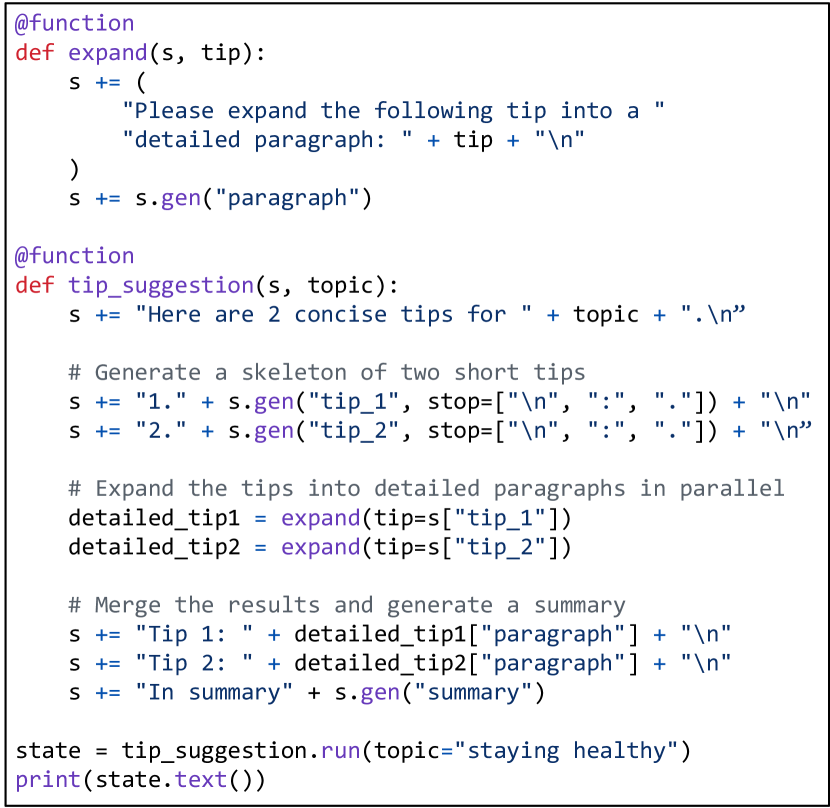
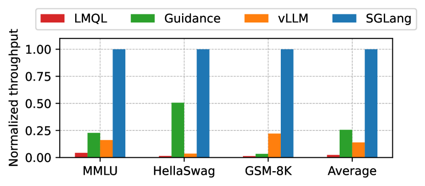
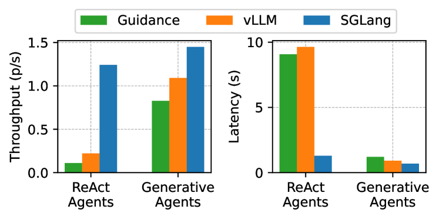
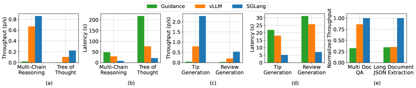
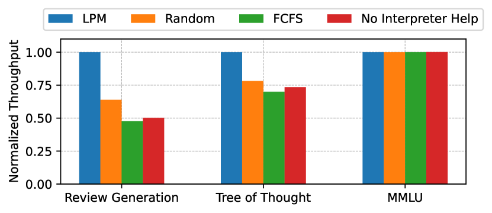
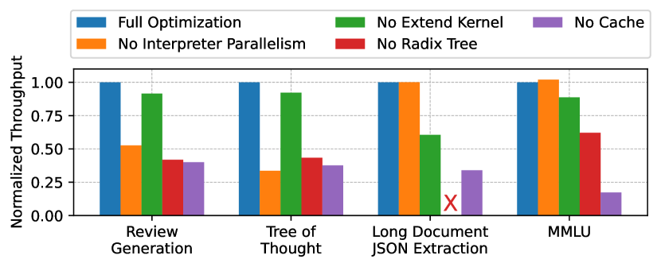
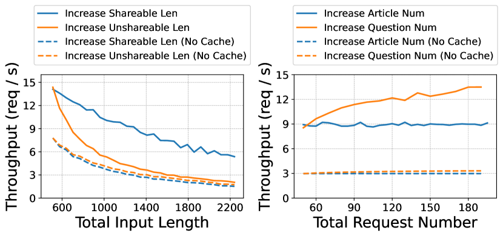

# SGLang による大規模言語モデルの効率的なプログラミング

> 原題: Efficiently Programming Large Language Models using SGLang
> 著者: Lianmin Zheng^{2,\*}, Liangsheng Yin³, Zhiqiang Xie¹, Jeff Huang⁴, Chuyue Sun¹, Cody Hao Yu⁵, Shiyi Cao², Christos Kozyrakis¹, Ion Stoica², Joseph E. Gonzalez², Clark Barrett¹, Ying Sheng^{1,\*}
> 所属: ¹ Stanford University　² UC Berkeley　³ 上海交通大学　⁴ Texas A&M University　⁵ 独立研究者　（\* 同等の貢献）
> 出典: arXiv:2312.07104（ar5iv 版。v1 のタイトル。後に "SGLang: Efficient Execution of Structured Language Model Programs" へ改題）

> **訳注（クリップの状態と復元）**
> - 底本は ar5iv 版の Web Clipper クリップ。**画像は 12 枚すべて残っており（Figure 1〜12）、Table 1 と Algorithm 1 も揃っていた**。
> - しかし **§2.3 の箇条書き 5 項目が丸ごと欠落**していた。本文が「These include:（それらには次が含まれる）」で終わったまま次の段落へ飛んでおり、**Caching・Batching・Sharing・Parallelism・Compilation** という、本論文が最適化の機会を整理した中核の一覧が失われていた。原ページから復元した。
> - **脚注 1 件**（「\* 同等の貢献」）の本文が欠落していた。復元して著者欄に記した。
> - 参考文献一覧は既定どおり訳出しない。
> - 図はすべて `raw/assets/2023-sglang/` にローカル保存し、そのパスを参照している。

## Abstract（要旨）

大規模言語モデル（LLM）は、複数の連鎖した生成呼び出し・高度なプロンプト技法・制御フロー・外部環境との相互作用を必要とする複雑なタスクにますます用いられている。しかし、こうしたアプリケーションをプログラミングし実行するための効率的なシステムは欠けている。この隔たりを埋めるため、我々は LLM のための **Structured Generation Language（構造化生成言語）** である **SGLang** を導入する。SGLang は LLM の効率的なプログラミングのために設計され、一般的な LLM プログラミングのパターンのためのプリミティブを組み込んでいる。SGLang を Python に埋め込まれたドメイン固有言語として実装し、SGLang のためのインタプリタ・コンパイラ・高性能ランタイムを開発した。これらの構成要素は協働して、並列化・バッチング・キャッシング・共有その他のコンパイル技法といった最適化を可能にする。加えて我々は **RadixAttention** を提案する。これは**すべてのリクエストの Key-Value（KV）キャッシュを radix tree（基数木）内で LRU（Least Recently Used）キャッシュとして保持する**新しい技法で、複数の生成呼び出しにまたがる KV キャッシュの自動的な再利用を可能にする。

## 1 Introduction（はじめに）

近年の LLM の能力の向上はその有用性を広げ、より広範な一般的タスクに取り組み、自律的なエージェントとして振る舞うことを可能にした [^40] [^6] [^42] [^61]。こうしたアプリケーションでは、LLM は**複数ラウンド**の計画・推論・外部環境との相互作用に従事する。これはツールの利用 [^49]、複数の入力モダリティ [^1]、そして few-shot 学習 [^5]・自己一貫性 [^63]・skeleton-of-thought [^37]・tree-of-thought [^70] といった広範なプロンプト技法 [^31] を通じて達成される。**これらの新しい用途はいずれも、複数の——しばしば依存し合う——LLM の生成呼び出しを必要とし、決定的なことに、これらのプログラムの制御フローは LLM の出力に依存しうる** [^71]。*こうした複雑なパターンの出現は、LLM との相互作用における転換を意味する——単純なターン制のチャットから、より洗練された LLM のプログラム的利用への転換である（§2.2 を参照）。* Figure 1 はそうした LLM プログラムの例を示しており、複数の生成呼び出しが連鎖している。

<figure>


<figcaption>図1: SGLang における多次元のエッセイ判定器の実装は、branch-solve-merge のプロンプト技法 [48] を活用している。この関数は LLM を用いてエッセイの品質を複数の次元から評価し、判定を統合し、要約を生成し、最終的な成績を付ける。強調された領域は SGLang API の利用を示す。(1) fork はプロンプトの並列な複製を複数作る。(2) gen は LLM の生成を呼び出し結果を変数に格納する。(3) [variable_name] は生成の結果を取得する。(4) choices は生成に制約を課す。(5) run は SGLang 関数をその引数とともに実行する。</figcaption>
</figure>

新しい趨勢に合わせて、コミュニティでは LangChain [^24]・LMQL [^4]・Guidance [^16]・DSPy [^21] といった新しいインターフェースの開発と人気の高まりが見られる。これらのツールはユーザーがプロンプトのテンプレートとプログラムのパイプラインを容易に管理する助けとなる。しかし、**その主眼がフロントエンドの設計にあるため、しばしばランタイムの性能が犠牲になる**。

逆に、NVIDIA TensorRT-LLM [^38]・Hugging Face TGI [^19]・Orca [^74]・vLLM [^23] といったバックエンドの推論エンジンはレイテンシを減らしスループットを高め続けているが、**その設計は依然として伝統的な単一生成呼び出しのインターフェースに根ざしている**。これらは典型的に OpenAI の Completion API [^39] に似た API を支え、そこではユーザーのプロンプトが処理され応答が**ステートレスに**返される。

フロントエンドとバックエンドの技術はどちらも急速に進歩しているが、**別々の軌道で進化している**。フロントエンドは LLM の推論の過程をほとんど意識せず、バックエンドはしばしばアプリケーションの構造を認識できず複数の呼び出しにまたがる最適化ができない。この分断した発展は、KV キャッシュの共有や並列化といった性能最適化の機会を数多く逃す結果になっている（§2.3 で論じる）。

本論文で我々は、**フロントエンドの言語とバックエンドのランタイムを協調設計する**ことによる、効率的な LLM プログラミングシステムへの全体的な手法を提示する。この過程には 3 つの主要な課題がある——(i) LLM プログラミングとエコシステムの統合に適したプリミティブを持つ、柔軟なドメイン固有言語を作ること。(ii) 複数の呼び出しと複数のプログラムにまたがる自動的な並列化・バッチング・キャッシング・共有を通じて効率的なプログラム実行を保証すること。(iii) コード移動やプリフェッチの注釈といったコンパイラ最適化を通じてプログラムの性能を高めること。

フロントエンドでは、Python に埋め込まれたドメイン固有言語 **SGLang** を導入する。これは LLM のプログラミングを容易にするために特別に設計されたプリミティブの集合を提供する。これらのプリミティブは、プロンプトと生成の操作（例: `extend`・`gen`・`select`）と並列性の制御（例: `fork`・`join`）を可能にする。さらに SGLang は Python の制御フローとライブラリと互換である。これらのプリミティブとネイティブな Python の構文を活用して、ユーザーは手動の最適化を必要とせずに洗練されたプロンプト戦略とエージェントを直感的に開発できる。加えて、統一された言語は可搬性を高め、OpenAI や Anthropic のものといった異なるオープンソースおよびプロプライエタリなモデル間の移行を容易にする。

我々は SGLang のインタプリタとコンパイラの双方を開発した。**インタプリタ**はプロンプトの状態を管理し SGLang のプログラムを実行する責任を持つ。具体的には、**プロンプトをストリームとして扱い**、プリミティブの演算をこのストリームへ非同期実行のために投入し、同期とプログラム内並列性を適切に制御する。加えて SGLang のプログラムをトレースし、**コンパイラ**を用いて計算グラフへコンパイルできる。この手法はより積極的な最適化の機会を開く。我々は LLM プログラミングの文脈で、コード移動などいくつかの古典的なコンパイラ最適化を探究する。

バックエンドでは、複数の生成呼び出しにまたがって KV キャッシュを自動的に再利用する **RadixAttention** という新しい技法を提案する。**既存システムでは、リクエストの KV キャッシュは処理の完了後に破棄されるので、複数の生成呼び出しにまたがる再利用ができない。** 代わりに我々のシステムは、すべてのリクエストの KV キャッシュを radix tree 内の LRU キャッシュとして保持する。この手法により、ランタイムはさまざまな再利用パターンについて効率的に自動共有を達成できる。加えて、キャッシュのヒット率を高めるために**キャッシュを意識したスケジューリング方針**を用いる。

要約すると、我々の貢献は次のとおりである。

- 並列性・制御フロー・入れ子の呼び出し・外部呼び出しを支える、LLM プログラミングのためのプリミティブを持つドメイン固有言語 **SGLang** を提示する。
- Python のインタプリタと連動して SGLang のプログラムを実行し、プロンプトの状態を**非同期ストリーム**として管理できる**インタプリタ**を開発する。
- プログラムを計算グラフへコンパイルでき、LLM プログラミングの文脈で古典的なコンパイラ技法を探究する**コンパイラ**を構築する。
- ランタイムにおいて複数の生成呼び出しにまたがる KV キャッシュの自動再利用のための新しい技法 **RadixAttention** を提案する。
- SGLang を用いて、エージェントの制御・論理推論・コンテンツ生成・ベンチマーク・長文書処理を含むさまざまな LLM アプリケーションを実装する。実験は、SGLang が一般的な LLM のタスクを**最大 5 倍**加速しつつ、コードの複雑さを減らし制御を高めることを示す。

## 2 Background（背景）

### 2.1 The Inference Process of LLMs（LLM の推論の過程）

今日使われるほとんどの LLM——GPT-3 [^5]・PaLM [^8]・LLaMA [^58] など——は自己回帰的なトランスフォーマのアーキテクチャ [^60] に基づく。モデルは先行するトークンに基づいて系列内の次のトークンの確率を予測する。推論時、モデルはまず入力トークンの列を順伝播で処理する。次に出力トークンを逐次的にデコードし、各トークンは先行するトークンに依存する。入力トークンの列を取って出力トークンの列を生成する過程を、**単一の生成呼び出し（single generation call）** と呼ぶ。この過程を通じて、各トークンはいくつかの中間テンソルを生成し、それがさらなるトークンのデコードに使われる。これらの中間テンソルは self-attention 機構におけるキーとバリューの対にちなんで「**KV キャッシュ**」として知られる。後で最適化を論じるときに重要になる観察は、**KV キャッシュの計算はそれ以前のすべてのトークンにのみ依存するので、同じ prefix を持つ異なる系列は KV キャッシュを再利用できる**ということである。

### 2.2 The Paradigm of Programming LLMs（LLM をプログラミングするというパラダイム）

LLM が強力になるにつれ、複雑なシステムにおける汎用のタスク解決器としてますます使われるようになっている。こうした文脈では、LLM が信頼でき知的な構成要素として動作することが不可欠である。これは LLM の利用を、単一の素朴な生成呼び出しから、制御フローと交錯した複数の相互依存する生成呼び出しへと進化させ、「**LLM のプログラミング（Programming LLMs）**」というパラダイムの出現につながる。LLM のプログラミングとは、**LLM の生成過程を制御するコンピュータプログラムの開発**を指す。この概念はいくつかの形で例示できる。

第一に、高度なプロンプト技法が LLM プログラミングの例である。代表例が **meta-reasoning** [^73] である。問題を解くために、LLM はまず chain-of-thought のプロンプトを通じて複数の解を生成する。次にこれらの解を横断してメタ推論を行い最終的な解決を導く。もう 1 つの例が **skeleton-of-thought** [^37] である。質問に答えるために、LLM はまず答えの骨格（skeleton）を生成する。次に複数の並列呼び出しを発行して骨格を詳細な説明へ肉付けする。より複雑な例が **tree-of-thought** の手法 [^70] で、LLM の呼び出しを木探索のアルゴリズム（例: 幅優先探索）の中へ統合する。

第二に、LLM に基づくエージェントでは LLM のプログラム的な利用が決定的である。**ReAct エージェント** [^71] を例に取る。エージェントの振る舞いはループと条件文によって制御される。エージェントは反復ごとに 1 つの行動を実行する。各反復でエージェントは行動の種類（検索または終了）を選び、行動のパラメータを生成し、外部環境からの観測を処理する。

第三に、より単純なプロンプトの形態も LLM のプログラミングの範囲に入る。few-shot プロンプト [^5]・chain-of-thought プロンプト [^64]・検索拡張生成 [^26] といった技法は、LLM プログラミングの基本要素である。

<figure>


<figcaption>図2: KV キャッシュ共有の例。青い箱は共有可能なプロンプト部分を、緑の箱は共有不可能な部分を、黄色の箱は共有不可能なモデルの出力を表す。共有可能な要素には、few-shot 学習の例、自己一貫性 [63] における質問、多ターンのチャットにおける会話履歴、tree-of-thought [70] における探索履歴が含まれる。</figcaption>
</figure>

**表1**: LMQL・Guidance・SGLang の比較。\* を付けたバックエンドは実験的である。

| Language | Syntax | Primitives | Runtime Backends | Execution Modes |
| --- | --- | --- | --- | --- |
| LMQL | Custom | extend, gen, select | Hugging Face Transformers, llama.cpp, OpenAI | Compiler |
| Guidance | Python | extend, gen, select | Hugging Face Transformers, llama.cpp, OpenAI, VertexAI | Interpreter |
| SGLang | Python | extend, gen, select, **fork, join** | SGVM, OpenAI, Anthropic, Hugging Face TGI\*, llama.cpp\* | **Interpreter and compiler** |

### 2.3 Challenges and Opportunities（課題と機会）

LLM のためのプログラミングシステムの設計は固有の課題と機会を提示する。良いシステムは、LLM の状態管理・デコード過程の制御・外部ツールとの円滑な統合を含む一般的なプログラミングのタスクに対して、直感的で表現力のあるインターフェースを提供し、プログラマの生産性を助けるべきである。さらに、低レイテンシかつ高スループットの実行へ最適化することで性能を保証することが不可欠である。とりわけ、**LLM プログラムの豊かな構造と LLM 推論の固有の性質は、ランタイムの最適化の機会を数多く提供する**。それらには次が含まれる。

> **訳注**: 以下の 5 項目はクリップで丸ごと欠落していたため、原ページから復元した。

- **キャッシング（Caching）**: LLM プログラムではしばしば、複数のテキスト断片と生成呼び出しが単一のプロンプトへ追記される。**複数の連鎖した呼び出しにまたがって、それ以前のトークンについて計算済みの KV キャッシュをキャッシュしておけば、冗長な計算を減らせる。** ただしこの最適化は無料でも自明でもない——追加の記憶域とより複雑なメモリ管理を要求するからである。
- **バッチング（Batching）**: LLM のデコードの過程は主にメモリ律速であり、**バッチサイズを増やすことがスループットを大きく高めうる**ことを意味する。多数の LLM プログラムをバッチで走らせ、continuous batching の技法 [^74] を活用することが有益でありうる。
- **共有（Sharing）**: LLM プログラムでは、単一のプロンプトから複数の出力を生成したり、現在の状態から新しいプロンプトを fork したりすることが一般的である。基本的な prefix 共有は vLLM [^23] で調査されている。**不規則な木構造の共有といった、より高度な共有パターンも用いられうる。** Figure 2 は複数の呼び出しにまたがる KV キャッシュ共有の 4 つの典型的なパターンを示す——**既存システムのいずれも、それらすべてを自動的に扱うことはできない。**
- **並列化（Parallelism）**: LLM プログラムはしばしば複数の生成呼び出しを含む。これらの呼び出しの依存グラフを作ることで、独立な呼び出しを同定して並列に実行できる。これは**プログラム内並列性（intra-program parallelism）** を作り出し、素直なプログラム間並列性に並列性を追加する。たとえば Figure 1 では、複数の判定の生成を並列化できる。
- **コンパイル（Compilation）**: 完全なプログラムが手に入れば、より効率的な実行のために最適化された中間表現へコンパイルできる。**ユーザーが提供したテストケースに基づいて元のプロンプトを自動的に調整する**といった、より積極的な最適化も実装できる。これらの最適化には、プロンプトの一部の展開・圧縮・並べ替え、および呼び出しごとに異なるモデルを選ぶことが含まれうる。

これらの機会を体系的に探究するには、**プログラミングのインターフェースとランタイムを協調設計する**ことが不可欠である。しかし Orca や vLLM のような推論エンジンは、**単一の生成呼び出しについてのみ最適化する**ため不十分である。この制限は、複数の呼び出しを伴う LLM プログラムを実行するときに冗長な計算と逃した機会をもたらす。

### 2.4 Existing LLM Programming Systems（既存の LLM プログラミングシステム）

LLM プログラミングの重要性を踏まえ、特化したプログラミングシステムが開発されてきた。**最上層**は LangChain [^24] のような、あらかじめ組まれたモジュールを持つ高水準のアプリケーション開発ライブラリからなる。**中間層**は DSPy [^21] のようなより柔軟なパイプラインプログラミングのフレームワークを擁する。**最下層**には、単一のプロンプトの制御のために設計された LMQL [^4] や Guidance [^16] といったドメイン固有言語がある。

SGLang は**中間層と最下層の間**に独自に位置し、LMQL や Guidance と類似性を持つ。しかし、主に言語設計に焦点を当てランタイムの効率をしばしば見過ごす LMQL や Guidance とは異なり、**SGLang はフロントエンドの言語機能とバックエンドのランタイム最適化を注意深く統合する**。この手法はランタイムの効率を大きく高め、時には 1 桁以上高める。フロントエンドについて、LMQL は SQL に似たカスタム構文を採用し、より直感的な Python の構文とは対照的である。Guidance は当初 Handlebars のテンプレート言語を使い、後に Python に埋め込まれた Pythonic な言語へ移行した。SGLang のフロントエンド言語は Guidance に着想を得ており、Guidance の新版と並行して開発されている。

SGLang は表現力とランタイムの効率を高めるための新しいプリミティブを導入する。また**インタプリタとコンパイラの双方のモード**の柔軟性を提供する。LMQL・Guidance・SGLang の比較を Table 1 に示す。LangChain と DSPy はより高い水準にあるので比較から省く。LangChain や DSPy の高水準のパイプラインを SGLang へコンパイルすることは可能である。

## 3 Overview（概観）

Figure 3 に我々のシステムの概観を示す。ユーザーの水準では、SGLang のプログラムはプロンプトと生成呼び出しを管理する SGLang のプリミティブを埋め込んだ Python で書かれる。SGLang の構文とプリミティブは §4.1 で紹介する。SGLang のプログラムは 2 通りの方法で実行できる——**インタプリタ**を使うか**コンパイラ**を使うかである。インタプリタを使うとき、SGLang のプログラム（これは有効な Python プログラムでもある）は Python と SGLang の両方のインタプリタによって処理される。SGLang のインタプリタは SGLang 固有のプリミティブを扱う。このインタプリタの設計は §4.2 で説明する。あるいは、限られた集合の SGLang のプログラムはコンパイルでき、さらなる最適化を可能にする。§4.3 は SGLang のコンパイラに充てる。インタプリタとコンパイラはいずれも、LLM の生成呼び出しのための我々のカスタムサービングエンジンである **SGVM**（§5）と協働する。SGVM の鍵となる側面が **RadixAttention** の機能で、複数の呼び出しにまたがって KV キャッシュを自動的に再利用する。

<figure>



<figcaption>図3: システムの概観。</figcaption>
</figure>

## 4 Language, Interpreter, and Compiler（言語・インタプリタ・コンパイラ）

### 4.1 Syntax and Primitives（構文とプリミティブ）

SGLang は Python に埋め込まれたドメイン固有言語として実装されている。

Figure 1 は SGLang のプログラムの例を示す。このプログラムは branch-solve-merge のプロンプト手法 [^48] を用いて、エッセイの品質を複数の次元から評価する。関数 `essay_judge` は 2 つの引数 `s` と `essay` を取る。変数 `s` はプロンプトの状態を管理し、`+=` を用いて新しい文字列と SGLang のプリミティブを追記できるようにする。関数内ではまずエッセイをプロンプトへ加え、次にプロンプトを 3 つの複製へ **fork** する。これらの fork は並列に走り、異なる次元からの判定を生成する。最後にこれらの判定を統合し、要約を生成し、エッセイに評点を付ける。

Figure 4 は別の例を示す。このプログラムは、与えられたトピックについて skeleton-of-thought のプロンプト手法 [^37] を用いて 2 つのヒントを並列に生成する。2 つの関数を用いる——短いヒントを詳細な段落へ肉付けする `expand` と、全体の過程を統括する `tip_suggestion` である。まず 2 つの短いヒントを生成し、次に `expand` を呼んでそれらを並列に肉付けする。最後に要約を生成する。

これらの例が SGLang の利用を図示している。SGLang では次のプリミティブを提供する——LLM の生成を呼ぶ **`gen`**、選択肢の一覧から LLM に最も確率の高いものを選ばせる **`select`**、現在のプロンプトを拡張する **`+=` または `extend`**、現在のプロンプトの状態を fork する **`fork`**、fork したプロンプトの状態を再結合する **`join`**。ユーザーはこれらのプリミティブを任意の Python の制御フローとライブラリと交錯させられる。

### 4.2 Interpreter（インタプリタ）

SGLang のプログラムを実行する最も基本的な方法はインタプリタを通すことである。SGLang では、**プロンプトは非同期のストリームとして扱われる**。プロンプトに対して `extend`・`gen`・`select` といったプリミティブを実行すると、インタプリタはこれらのプリミティブを非同期実行のためにストリームへ投入する。**これらの投入の呼び出しはノンブロッキング**であり、Python のインタプリタは LLM の生成の完了を待たずに Python のコードを実行し続けられる。**この過程は、CUDA のカーネルを CUDA のストリームへ非同期に起動するのに似ている。** 各プロンプトはバックグラウンドスレッド内のストリーム実行器によって管理され、ユーザーが並列性を得られるようにする。

プロンプトから生成の結果を取得するとき、取得の動作は望みの生成結果が準備できるまでブロックされる。これはイベント機構を用いて実装されており、生成呼び出しが出力を生成した時点でイベントを設定する。したがって、**インタプリタはプログラム内並列性と同期を効果的に管理する**。

<figure>



<figcaption>図4: skeleton-of-thought のプロンプトによる並列なヒント提案のための SGLang プログラム。</figcaption>
</figure>

### 4.3 Compiler（コンパイラ）

<figure>


<figcaption>図5: 図4 のプログラムに対応する計算グラフ。3 つのストリームは 3 つの関数呼び出しに対応する。</figcaption>
</figure>

SGLang のプログラムを走らせるもう 1 つの方法は、**計算グラフとしてコンパイルし、グラフ実行器で走らせる**ことである。これはグラフを書き換えられるので、より多くのコンパイル最適化の機会を開く。

#### 4.3.1 Tracing and Graph Executor（トレースとグラフ実行器）

我々は SGLang のための**中間表現（IR）** を設計し、SGLang のプログラムの構造と演算を計算グラフとして表現する。このグラフはプリミティブ演算子のためのノードと、依存関係のためのエッジを含む。Figure 4 のプログラムに対応するグラフは Figure 5 を参照されたい。プログラム内では、装飾された関数への各呼び出しと `fork` が新しいプロンプトの状態、すなわち**ストリーム**を作る。

ノードにはいくつかの種類がある。SGLang のプログラムにおける `+=` と `+` の各オペランドが IR ノードで表現される。これらには **ConstantText・Argument・Gen・Select・Variable・Fork・GetForkItem・Join** が含まれる。依存関係には 2 種類ある。1 つ目は**ストリーム内依存（intra-stream dependency）** で、`+=` を用いてストリームへ投入された演算はそのストリーム内の先行するすべての演算の後に実行されなければならない。2 つ目は**ストリーム間依存（inter-stream dependency）** で、あるストリームが別のストリームから変数の値を取得する必要があるときに生じ、同期を必要とする。`fork` のような演算は複数のストリームを操作するので、ストリーム間依存を導入する。

グラフを生成するために、抽象的な引数でプログラムを走らせグラフを動的に構築する**トレース**を用いる。**この手法はデータ依存の制御フローを持たないプログラムに限られ**、これは今後の課題として取り組む予定の制限である。いったん構築されれば、グラフはグラフ実行器を通じて実行でき、元の Python プログラムを再解釈する必要がなくなる。これはグラフ書き換えの最適化・ランタイムのオーバーヘッドの削減・プログラムの直列化といった恩恵をもたらす。実行にあたっては、各データストリームについてストリーム実行器が起動され、IR ノードをトポロジカル順にストリームへ配送する。

#### 4.3.2 Compilation Optimizations（コンパイル最適化）

SGLang の IR について 2 つのコンパイル最適化を探究する。**1 つ目は GPT-4 をコンパイラ最適化の過程へ統合する点で注目に値する。** 2 つ目はより従来的なものである。auto-tuning や命令選択といった、より多くの古典的なコンパイラ技法も適用できると見込んでいる。

**prefix 共有を改善するためのコード移動（Code Movement for Improving Prefix Sharing）。** この最適化は、**グラフ内のノードを並べ替えて定数 prefix の長さを増やす**ことで prefix 共有を改善することを狙う。元の計算を厳密には保存しないので、**積極的な（aggressive）** 最適化に分類される。たとえばプロンプトを「Here is a question + {question}. Please act as a math expert and solve the given question」から「Please act as a math expert and solve the given question. Here is a question + {question}.」へ変えると、より長い共有可能な prefix が得られる。**この最適化が興味深いのは、SGLang には自然言語の指示が含まれるため、伝統的なプログラム解析では達成できないからである。** 代わりに我々は **GPT-4 にグラフのノードを並べ替えるようプロンプトで指示する**。いくつかの例とともにプロンプトを書いて GPT-4 に SGLang の IR の概念を教えたところ、**単純な SGLang のプログラムのいくつかについて GPT-4 がこの最適化をうまく適用できる**ことを見出した。

**プリフェッチの注釈（Prefetching Annotations）。** これはグラフへプリフェッチのノードを自動的に加えることを伴い、長いプロンプトについてキャッシュが存在する場合に、キャッシュされた KV キャッシュを CPU から GPU へ移すようランタイムへ合図する。これは長いプロンプトを持つパイプラインのレイテンシを減らしうる。

<figure>


<figcaption>図6: LRU 退避方針を伴う RadixAttention の演算の例。9 つの時点にわたって図示している。図は、さまざまなリクエストに応答して radix tree が動的に進化する様子を示す。これらのリクエストには 2 つのチャットセッション、few-shot 学習の問い合わせのバッチ、自己一貫性のサンプリングが含まれる。各木の辺は部分文字列またはトークン列を表すラベルを持つ。ノードは状態を反映して色分けされている——緑は新しく加えられたノード、青はその時点でアクセスされたキャッシュ済みのノード、赤は退避されたノードである。ステップ (1) では radix tree は最初は空である。ステップ (2) ではサーバが入ってきたユーザーメッセージ「Hello」を処理し、LLM の出力「Hi」で応答する。システムプロンプト「You are a helpful assistant」、ユーザーメッセージ「Hello!」、LLM の返信「Hi!」が、新しいノードへつながる単一の辺として木へ統合される。ステップ (3) では新しいプロンプトが到着し、サーバは radix tree 内にそのプロンプトの prefix（すなわち会話の最初のターン）を見つけてその KV キャッシュを再利用する。新しいターンは新しいノードとして木へ追加される。ステップ (4) では新しいチャットセッションが始まる。(3) のノード "b" が 2 つのノードへ分割され、2 つのチャットセッションがシステムプロンプトを共有できるようにする。ステップ (5) では 2 番目のチャットセッションが続く。しかしメモリの制限のため、(4) のノード "c" を退避しなければならない。新しいターンは (4) のノード "d" の後に追加される。ステップ (6) ではサーバが few-shot 学習のクエリを受け取り、処理し、木へ挿入する。新しいクエリが既存のノードと prefix を共有しないので、根ノードが分割される。ステップ (7) ではサーバが追加の few-shot 学習のクエリのバッチを受け取る。これらのクエリは同じ few-shot の例の集合を共有するので、共有を可能にするために (6) のノード "e" を分割する。ステップ (8) ではサーバが最初のチャットセッションから新しいメッセージを受け取る。2 番目のチャットセッションのすべてのノード（ノード "g" と "h"）を、最も長く使われていないものとして退避する。ステップ (9) ではサーバが (8) のノード "j" の質問についてより多くの答えをサンプリングするリクエストを受け取る（おそらく自己一貫性のプロンプトのため）。これらのリクエストのための空間を作るため、(8) のノード "i"・"k"・"l" を退避する。</figcaption>
</figure>

## 5 Runtime with RadixAttention（RadixAttention を伴うランタイム）

SGLang のプログラムの実行を最適化するうえでの主要な課題は、§2.3 で論じたとおり、**複数の呼び出しとプログラムにまたがって KV キャッシュを再利用する**ことにある。既存システムのいくつかは特定の場面で KV キャッシュの再利用を扱えるが、**しばしば手動の設定と場当たりの調整を要する**。しかも手動の設定をもってしても、**再利用パターンの多様性ゆえに、既存のどのシステムもすべての場面を自動的に扱えない**。

本節では、ランタイムにおける KV キャッシュの自動再利用のための新しい技法 **RadixAttention** を導入する。生成リクエストの完了後に KV キャッシュを破棄するのでなく、我々の手法は**プロンプトと生成結果の双方の KV キャッシュを radix tree に保持する**。この構造は効率的な prefix の探索・再利用・挿入・退避を可能にする。キャッシュのヒット率を高めるため、**LRU（Least Recently Used）の退避方針**を、**キャッシュを意識したスケジューリング方針**と併せて実装する。さらに **RadixAttention は continuous batching や paged attention といった既存の技法と互換である**。

### 5.1 RadixAttention

**radix tree（基数木）** は、trie（prefix tree）に対する空間効率の良い代替として働くデータ構造である。典型的な木とは異なり、radix tree の辺は単一の要素だけでなく、**さまざまな長さの要素の列**でラベル付けできる。この特徴が radix tree の効率を大きく高める。我々のシステムでは、radix tree を用いて 1 つの写像を管理する。この写像は、キーとして働く**トークンの列**と、値として働く**対応する KV キャッシュのテンソル**の間のものである。これらの KV キャッシュのテンソルは、**各ページのサイズが 1 トークンに相当する非連続なページ化されたレイアウト**で格納される。

GPU メモリの限られた容量を考えると無限の KV キャッシュのテンソルを保持できないので、退避方針が必要になる。これに取り組むため、**葉ノードを再帰的に退避する LRU の退避方針**を実装する。continuous batching の設定では、**現在実行中のバッチが使っているノードは退避できない**。したがって各ノードは、いくつの実行中のリクエストがそれを使っているかを示す**参照カウンタ**を保持する。参照カウンタが 0 のノードが退避可能である。

フロントエンドは常に完全なプロンプトをランタイムへ送り、ランタイムが自動的に prefix の一致・再利用・キャッシングを行う。Figure 6 は、いくつかの入ってくるリクエストを処理するときに radix tree がどう保持されるかを図示している。**木の構造は CPU 上に格納され、保持のオーバーヘッドは小さい。**

### 5.2 Cache-Aware Scheduling（キャッシュを意識したスケジューリング）

キャッシュのヒット率を高めるには、**スケジューラがキャッシュを意識していなければならない**。さもないと、大量のリクエストのバッチが到着したときにスケジューラが異なるリクエスト間で切り替えを起こし、**キャッシュのスラッシング（cache thrashing）** につながる。Algorithm 1 に、continuous batching を伴う RadixAttention のためのキャッシュを意識したスケジューリングのアルゴリズムを示す。**鍵となる着想は、先着順のスケジュールに従うのでなく、一致した prefix の長さでリクエストを並べ替えることである。** 部分木の重みに基づいて優先度を割り当てる、より高度なスケジューリング戦略の実装の余地もさらにある。本質的には、各部分木（prefix 共有の木）内のリクエストの総数を数え、さらには歴史的に退避されたリクエストも考慮することを伴うだろう。重み付きの優先度は、tree-of-thought [^70] のような一部の LLM のタスクが持つ**木状の局所性**を十分に活用でき、最も冗長でない退避を実現しうる。

**Algorithm 1** continuous batching を伴う RadixAttention のためのキャッシュを意識したスケジューリング

```
入力: radix tree T、メモリプール P、現在の実行中バッチ B、待ち行列 Q
出力: 完了したリクエストと更新されたシステム状態

// 待ち行列からすべてのリクエストを取得する
requests ← Q.get_all_requests()

// すべての待機中リクエストについて prefix の一致を探索する
for req ∈ requests do
    req.prefix_node, req.prefix_len ← T.match_prefix(req.input_tokens)

// 一致した prefix の長さに従ってリクエストを並べ替える
requests.sort()

// 次のバッチのためにリクエストを選ぶ
available_size ← T.evictable_size() + P.available_size()
current_size ← 0
new_batch ← []
for req ∈ requests do
    if req.size() + current_size < available_size then
        new_batch.append(req)
        delta ← T.increase_ref_counter(req.prefix_node)
        available_size ← available_size + delta
        Q.remove_requests(new_batch)

// 現在の実行中バッチへリクエストを挿入する
B.merge(new_batch)

// 新しいメモリを確保し、必要なら退避を行う
needed_size ← B.needed_size()
success, buffer ← P.alloc(needed_size)
if not success then
    T.evict(needed_size)
    success, buffer ← P.alloc(needed_size)
    B.run(buffer)

// 完了したリクエストを処理する
finished_requests ← B.drop_finished_requests()
for req ∈ finished_requests do
    T.decrease_ref_counter(req.prefix_node)
    T.insert(req)

return finished_requests
```

### 5.3 Other Optimizations（その他の最適化）

KV キャッシュの再利用の効率を高めるには、新しい CUDA カーネルの開発が不可欠である。既存システムはほとんどが 2 つの主要な機能——**prefill** と **decoding**——のための CUDA カーネルを実装している。prefill のカーネルはクエリとキーの長さが同一であることを仮定する。逆に decode のカーネルはクエリの長さが 1 であることを仮定する。しかし **KV キャッシュの再利用の場合、これらのカーネルは直接には適用できない**。我々はこの計算のための新しい「**extend**」カーネルを導入する。これは**連続したバッファと非連続なメモリプールの双方から KV キャッシュを読める**。この融合された extend カーネルは、余分なコピーのオーバーヘッドなしに動作する。

## 6 Evaluation（評価）

SGLang と SGVM はおよそ **9K 行の Python のコード**で実装されている。SGVM は、PyTorch [^43] と Triton [^57] に基づく LLM サービングシステムである LightLLM [^35] からいくつかの構成要素を再利用している。

多様な LLM のワークロードにわたって SGLang の性能を評価する。続いて、特定の構成要素の有効性を実証するためにケーススタディとアブレーション研究を行う。

### 6.1 Setup（設定）

**モデル。** Llama 2 chat モデル [^58]・CodeLlama モデル [^47]・視覚言語モデル LLaVA [^29] のさまざまなサイズを試す。パラメータ数は 7B から 33B に及ぶ。Llama と CodeLlama のモデルには float16 の精度を、LLaVA のモデルには 4 ビット量子化の精度を用いる。

**ハードウェア。** 特記しない限り、ほとんどの実験は AWS EC2 の G5 インスタンス上で行う。G5 インスタンスの GPU はそれぞれ 24 GB のメモリを持つ NVIDIA A10G である。CPU は AMD EPYC のプロセッサである。ほとんどの実験では、7B のモデルを単一の A10G GPU で走らせる。より大きなモデルをどう扱うかを見るため、A100 GPU（80GB）上で 33B のモデルも試す。

**ベースライン。** SGLang を、それぞれの言語と既定のランタイムを持つ高水準のプログラミングシステムと、標準的な OpenAI 風の Completion API を持つ低水準の推論エンジンの双方と比較する。ベースラインは次を含む。

- **Guidance** [^16]、LLM を制御するための言語。llama.cpp のバックエンドで Guidance v0.1.4 を用いる。
- **LMQL** [^4]、LLM のためのクエリ言語。Hugging Face Transformers のバックエンドで LMQL v0.7.3 を用いる。
- **vLLM** [^23]、高スループットの推論エンジン。vLLM v0.2.2 とその既定の API サーバを用いる。

**指標。** 2 つの性能指標——スループットとレイテンシ——を報告する。スループットについては、十分大きなバッチのプログラムインスタンスを走らせて最大スループットを計算し、1 秒あたりに実行されるプログラムインスタンスの数（programs per second, p/s）を比較する。レイテンシについては、バッチ処理せずに一度に 1 つのプログラムを実行し、複数インスタンスの平均レイテンシを報告する。特記しない限り、**我々の最適化のほとんどは計算結果を変えない**。

主眼はランタイムの効率にあるが、生産性のためにコード行数を比較するケーススタディもいくつか行う。

### 6.2 End-to-End Benchmark（端から端までのベンチマーク）

#### 6.2.1 Few-Shot In-Context Learning（few-shot 文脈内学習）

最も基本的な few-shot 学習のプロンプトから始める。3 つのベンチマーク（各 5-shot）を用いて、few-shot 学習のリクエストのバッチ処理におけるシステムの最大スループットを評価する。結果を Figure 7 に示す。

**MMLU** [^18] は、LLM が答えの選択のために単一のトークン（A/B/C/D）を出力する多肢選択の知識ベンチマークである。LMQL はバックエンドが遅く前処理・後処理が複雑なため最悪の性能を示す。Guidance は LMQL より速く、処理のオーバーヘッドの削減といくらかの KV キャッシュ再利用の恩恵を受ける。しかし**どちらのシステムもバッチサイズ 1 しか支えない**。vLLM は Guidance と同程度の性能だが、**共有 prefix についての自動的な KV キャッシュ再利用を欠く**。**vLLM の論文はこの機能を論じているが、信頼できる高性能なカーネルがないため公開されたコードは対応していない。** 仮に vLLM に高性能なカーネルが実装されたとしても、この機能を使うには手動の設定が必要である。対照的に SGLang は RadixAttention で自動的に共有を達成し、**最も近い競合より 4.4 倍高いスループット**を得る。

**HellaSwag** [^76] は各選択肢が短い文字列である多肢選択のベンチマークである。単一の出力トークンをデコードする MMLU とは異なり、HellaSwag は LLM が順伝播を行って各文字列の選択肢の確率を計算することを要求する。LMQL は高いオーバーヘッドのため遅い。vLLM は「select」のプリミティブを欠く。代わりに各選択肢をプロンプトと連結し、すべての選択肢について連結されたプロンプト全体の確率を計算するので、冗長な計算につながる。Guidance は「select」の機能を提供するがバッチサイズ 1 に限られる。**SGLang は自動的な KV キャッシュ共有とバッチングにより他を 2 倍上回る。**

**GSM-8K** [^9] は、LLM が推論の過程を生成して整数の答えを出すことを要求するベンチマークである。このベンチマークはより長い出力長を要求するので、スループットを高めるにはバッチングが決定的である。しかし LMQL と Guidance は現状バッチングに対応しておらず、性能が落ちる。vLLM も共有 prefix について KV キャッシュを再利用できないため遅い。対照的に **SGLang は RadixAttention と continuous batching の統合により 4.5 倍のスループット向上**を達成する。

<figure>



<figcaption>図7: few-shot 文脈内学習のタスクにおけるスループット。</figcaption>
</figure>

そのオーバーヘッドのため、LMQL は短い生成と長い生成の双方のタスクで他のシステムより著しく劣ることが多いので、今後のベンチマークには含めない。

#### 6.2.2 LLM-Based Agents（LLM に基づくエージェント）

高く評価されている 2 つのエージェントのフレームワークでベンチマークする——複数の LLM 呼び出しをウェブ検索といった行動と連鎖させて交錯した形でタスクを処理する **ReAct エージェント** [^71] と、エージェントが互いに相互作用し LLM を呼び出して意思決定するゲーム環境で用いられる **generative agents** [^42] である。どちらの元論文も OpenAI のモデルを利用していた。潜在的な性能向上を正確に測るため、論文に記述された設定を再現し、バックボーンのモデルとして GPT-3.5-turbo を用い、LLM 呼び出しの入出力をトレースしてデータセットを作った。ReAct エージェントについては論文で報告された HotpotQA [^69] の評価を用いた。generative agents については、ゲームから（トレースした 40 のうち）上位 5 つの関数を SGLang で書き直し、これは全 LLM 呼び出しのおよそ 70% を占める。それからこれらのトレースを我々の実験プラットフォーム上で再生した。

Figure 8 に描かれるとおり、**SGLang を用いた ReAct エージェントは vLLM より 5.6 倍高いスループットを達成し、そのレイテンシは vLLM の 13% にすぎない**。この改善は主に、**エージェントが現在の状態（思考・行動・観測）を続く LLM 呼び出しのためのプロンプトへ追記していく過程**に由来する。**我々の RadixAttention の機構は冗長な計算を効果的に同定して最小化する——これは現在の推論エンジンには備わっていない能力である。** この機構はメモリ使用量も大きく減らし、より多くのエージェントによってより多くの質問に取り組めるようにし、GPU の利用率を最適化してスループットを高める。

generative agent のタスクの場合、ゲームの設定の制約により、ゲームロジックの一貫性を保つためシミュレーションごとに 1 回の LLM 呼び出ししか許されない。この場合でも **SGLang はスループットとレイテンシの双方で vLLM を 30% 上回る**。この効率は、エージェントの事前定義された定型処理のキャッシングにより冗長な計算が減ることによる。**タスクのプロンプトのテンプレートは、タイムスタンプに基づいて異なる速度で変化する複数の引数を含み、複雑な prefix 再利用のパターンをもたらす。にもかかわらず SGLang のランタイムはこれらのパターンを自動的に検出して KV キャッシュを再利用できる。**

<figure>



<figcaption>図8: エージェントのタスクにおけるスループットとレイテンシ。</figcaption>
</figure>

<figure>



<figcaption>図9: (a) 推論タスクにおけるスループット。(b) 推論タスクにおけるレイテンシ。(c) コンテンツ生成タスクにおけるスループット。(d) コンテンツ生成タスクにおけるレイテンシ。(e) 長文脈タスクにおけるスループット。</figcaption>
</figure>

#### 6.2.3 Reasoning（推論）

推論タスクのための高度なプロンプト技法を用いてシステムの性能をベンチマークする。これらのタスクはゼロショットの設定で GSM-8K の問題を解くことを伴う。スループットとレイテンシの双方の指標を Figure 9 (a)(b) に報告する。

**Multi-chain reasoning** [^73] は 1 つの質問に対して複数の解を生成し、それらを横断してメタ推論して最終的な答えを出すことを伴う。この過程は質問の共有と複数解の生成の並列化を可能にする。各解の生成には「Think step-by-step」「Take a deep breath」といったさまざまな誘導プロンプトを用いる。単純な並列サンプリングとは異なり、異なる誘導プロンプトを用いるこの柔軟な手法は **vLLM の API では支えられない**。したがって vLLM は prefix を柔軟に共有できないためスループットが低い。Guidance はバッチングがないためスループットが低い。対照的に SGLang はユーザーが手動の最適化を気にせずこの技法を直感的に実装でき、しかも高いスループットを達成できる。**スループットの改善は先の few-shot 学習の場合ほど実質的でない**——ゼロショットの設定は共有可能な prefix が短いためである。

レイテンシについては、SGLang のインタプリタが自動的に依存関係を解決してリクエストを並列に投入できる。公平な比較のため、複雑さを避けるべく threading や asyncio を明示的に使わずに SGLang のプログラムを等価な Python のプログラムへ直接翻訳した。結果として、翻訳されたプログラムは並列化可能なリクエストを並列化せず、より高いレイテンシになる。

**Tree-of-thought** [^70] は LLM を幅優先の木探索アルゴリズムへ組み込む。LLM は枝の探索のための次のステップを提案し、これらの提案を実行し、解を評価しなければならない。**この手法は既存システムの能力を超える複雑な共有パターンにつながる。** ここでも SGLang はこのベンチマークでスループットとレイテンシの双方において他を上回る。

#### 6.2.4 Content Generation（コンテンツ生成）

コンテンツ生成のための 2 つの高度なプロンプト手法を評価する——ヒント生成と記事のレビューである。skeleton-of-thought の技法 [^37] はまずヒントの短い概要を作り、次にそれぞれを詳細な段落へ肉付けする。branch-solve-merge の手法 [^48] は記事を複数の次元から評価し最終的な評点を付ける。結果を Figure 9 (c)(d) に示す。どちらの場合も、共有とプログラム内並列性の機会がある。SGLang は直感的なプログラミングモデルを通じてそれらを体系的に活用し、より高いスループットとより低いレイテンシを達成する。

#### 6.2.5 Long Document Processing（長文書処理）

長文書処理のタスクにおける性能をベンチマークする。文書が長いとき、プロンプトを符号化する順伝播が著しく長くなるので、**KV キャッシュの再利用がより重要になる**。16K トークンのコンテキスト長でファインチューニングされた CodeLlama のモデルを用いる。我々の設定では、24 GB の GPU 上で 7B のモデルを fp16 の精度で走らせると、**最大 15K トークンしか格納できない**。長さが 10K トークンを超える入力を選ぶので、システムは一度に最大 1 リクエストしか処理できないことを意味する。1 つ目のベンチマークは、検索拡張生成の設定に似た、論文の複数の文書断片を用いた質問応答を試す。2 つ目のベンチマークは、都市の情報をその Wikipedia のページから要約して JSON オブジェクトを出力することを伴う。

1 つ目のベンチマークでは、SGLang の `fork`/`join` のプリミティブを用いて **parallel-context window** [^46] を実装する。この技法により、複数の文書を並列に別々に符号化し、**互いに attend させることなく**結果の KV キャッシュを連結できる。この手法は長いプロンプトについて self-attention の二次の計算コストを減らす。**この最適化は計算を変えるが、我々のベンチマークでは精度に悪影響を与えなかった。** 2 つ目のベンチマークでは、JSON オブジェクトの複数のフィールドをデコードするときに長いプロンプトの KV キャッシュを再利用する。結果を Figure 9 (e) に示す。SGLang はこれら 2 つのベンチマークでそれぞれ **1.2 倍と 2.9 倍**の改善を達成する。最大バッチサイズが 1 なので、レイテンシの改善はスループットの改善と同じである。

### 6.3 Case Study（ケーススタディ）

#### 6.3.1 Vision Language Models（視覚言語モデル）

新しい視覚言語モデル LLaVA v1.5 [^29] を新しいハードウェアプラットフォームである Apple Silicon 上で支えることで、SGLang の拡張性を実証するケーススタディを行う。これを達成するため、画像入力を受け付ける新しいプリミティブ `sgl.image` を加え、広範なハードウェアと互換な推論エンジンである llama.cpp [^15] を新しいバックエンドとして組み込む。

`sgl.image` を新しい IR ノードとしてインタプリタへ統合し、SGVM のプロトコルを再利用して llama.cpp に基づくサーバを構築する。この統合は**およそ 400 行のコード**で達成される。加えて、`sgl.image` を使うコードは、コードの変更なしに OpenAI のバックエンドを通じて GPT-4 Vision 上でも実行できる。RadixAttention を保持するのと同様に、画像のハッシュ ID に基づいて画像トークンのキャッシュを作る。LLaVA-Bench を走らせ、M2 Ultra 上で SGLang と既定の llama.cpp サーバのスループットを報告する。LLaVA-Bench は合計 24 枚の画像と 60 の質問を含み、画像 1 枚あたり平均 2.5 の質問がある。**SGLang は llama.cpp のスループットを 1.7 倍に高める。** 高速化は主に、共有される画像あたりの質問数と出力長に影響される。

#### 6.3.2 Compiler Optimizations（コンパイラ最適化）

2 つのコンパイラ最適化の有効性を評価する。1 つ目は **prefix 共有のための GPT-4 支援によるコード移動**である。インターネットから 20 のプロンプトのテンプレートを収集し SGLang で実装した。うち 5 つを few-shot の訓練例として、残りの 15 をテストケースとして用いる。評価によれば、**15 のテンプレートのうち 12 について GPT-4 が意味論を変えることなくグラフのノードの並べ替えに成功した**（変更されたプロンプトの手動検査で確認）。**平均して、この最適化は共有可能な prefix の長さを 60 トークン増やし**、GPT-4 の有効性を示している。最適化された順序を作れなかった失敗は、グラフのノードの背後にある意味の誤解に由来する。**それは積極的すぎて、順序の変更が元の意味論を変える場合であってもすべての定数を前へ持ってきてしまう。** このケーススタディはコンパイラ最適化のための GPT-4 の利用を探ることを狙う。この種の最適化を信頼できるものにするにはさらなる作業が必要である。

2 つ目の最適化は**プリフェッチの注釈の挿入**を伴う。頻繁に使われる長いプロンプトを CPU メモリにキャッシュする。コンパイラは自動的にプリフェッチのノードを計算グラフへ挿入する。ランタイムでサーバがプリフェッチのノードに遭遇すると、radix tree からノードを退避してキャッシュされた prefix を swap in する。**退避のコストは大幅に重ね合わせられる**ので、これは続くリクエストの最初のトークンのレイテンシを減らす。$4$k の prefix 長を持つ関数呼び出しを含む SGLang のプログラムを試す。$4$k の prefix をプリフェッチすることで、**呼ばれる関数の最初のトークンのレイテンシは 1 秒から 0.2 秒へ、すなわち 80% 削減された**。

#### 6.3.3 Productivity（生産性）

SGLang のコード行数（LoC）を OpenAI API と比較して、生産性の改善を実証するケーススタディを行った。記事分析のためのプロンプトのフローを設計した——有名人についての記事なら経歴と紹介を生成し、そうでなければ記事を要約する。このフローを OpenAI API と SGLang の双方で実装し、コメントと空行を除いた実効的な LoC を数えた。結果は、**OpenAI API が 206 行を要したのに対し SGLang は 91 行しか必要とせず、55% の削減**を示した。

実装に踏み込み、なぜ SGLang がより少ない LoC で済むのかについての洞察をまとめる。第一に、ユーザーは OpenAI API の応答から内容を手動で抽出して多段のフローを形成するよう連鎖させなければならないが、SGLang は文字列連結の演算子を活用してこの過程を単純化する。第二に、このフローは true/false や整数といった制限された答えを持つ呼び出しをいくつか含むので、ユーザーは OpenAI が期待される答えの 1 つを返すことを保証するために適切な logit bias を構築する必要がある。対照的に SGLang は、この目的のために logit bias を自動的に構築するプリミティブを提供し、ユーザーは許容されるデータ型と選択肢を指定するだけでよい。第三に、端から端までのレイテンシを減らすために骨格ベースのプロンプトを用いる場合、OpenAI API のユーザーは並列にリクエストを投入するためにスレッドプールを明示的に起動する必要がある。しかし SGLang の組み込みプリミティブ `fork` は自動的にリクエストを並列化する。

#### 6.3.4 Larger Models（より大きなモデル）

ほとんどの実験は 7B のモデルを用いて行われているが、我々の技法はより大きなモデルでも効果的に働く。ReAct エージェントのベンチマークを用いて、A100（40GB）上で 13B のモデルを、A100（80GB）上で 33B のモデルを試し、**同様の高速化（5 倍）** を達成した。

### 6.4 Ablation Study（アブレーション研究）

#### 6.4.1 Scheduling Policy（スケジューリング方針）

<figure>



<figcaption>図10: 異なるスケジューリング方針の性能。</figcaption>
</figure>

キャッシュを意識したスケジューリングの有効性を、他のいくつかの方針と比較して評価する。結果を Figure 10 に示す。「**LMP**」すなわち longest matching prefix（最長一致 prefix）は §5.2 で概説した既定の方針である。「**Random**」はランダムな順序を用いる。「**FCFS**」は先着順の方針に従う。「**No interpreter help**」はインタプリタからの prefix のヒントを省く（詳細は下記）。RadixAttention は共有 prefix を自動的に検出できるが、我々のランタイムの実装は簡略化されている——**保留中のリクエストを既存のキャッシュ木と比較するだけで、待ち行列内のすべてのリクエストについて木のインデックスを構築しない**。この手法は、prefix を共有するが未処理でまだ木へ挿入されていない大量の保留リクエストがあるときに、最適でない性能につながりうる。これを緩和するため、スケジューリングを助けるのにインタプリタを使う。インタプリタが共有される可能性の高い prefix を同定したとき（例: `fork` の際）、前もってヒントを発行する。

#### 6.4.2 Optimization Breakdown（最適化の内訳）

各最適化を個別に無効化して有効性を調べる。Figure 11 に結果を図示する。「**No Extend Kernel**」は最適化されたカーネルを無効化し、とりわけ長文脈のタスクで性能を劣化させる。「**No Interpreter Parallelism**」はプログラム内並列性を切り、並列性とキャッシュの局所性を減らす。「**No Cache**」はキャッシュを無効化し、**すべてのベンチマークでスループットを著しく悪化させる**。「**No Radix Tree**」は木でなくリストを使ってキャッシュを管理し、メモリ使用量とコピーのオーバーヘッドの増加、ひいてはより低い性能につながる。

<figure>



<figcaption>図11: 最適化の内訳。</figcaption>
</figure>

#### 6.4.3 Improvements under Different Sharing Settings（異なる共有設定のもとでの改善）

prefix 共有の改善が、共有可能・共有不可能な入力の長さや共有構造の構成といった異なるパラメータにどう影響されるかを調べる。

Figure 12 に示すとおり、左の図では、共有可能な入力長 256・共有不可能な入力長 256・出力長 256 を基準設定とする。次に共有可能な入力長か共有不可能な長さのいずれかを段階的に増やし、スループットの変化を観察する。結果は、RadixAttention のキャッシュが「No Cache」の場合と比べてスループットを大きく高め、**共有可能な長さが長いほど改善が顕著になる**ことを示す。

右の図では、5 つの記事と記事あたり 2 つの質問を基準とし、記事は 1000 トークン・各質問は 256 トークンからなる。この基準設定では $5\times 2=10$ のリクエストがあり、各記事が 2 つの質問で共有される。続いて記事の数か記事あたりの質問数のいずれかを増やす。結果は、**記事あたりの質問数が増えるとき RadixAttention のキャッシュがより優れた性能を示す**ことを示す——共有の機会がより多く作られるからである。

#### 6.4.4 RadixAttention Overhead Analysis（RadixAttention のオーバーヘッド分析）

ランタイムにおける radix tree の保持のオーバーヘッドを分析する。木の構造は CPU 上に保持される。典型的な場面——共有可能な入力長 256・共有不可能な入力長 256・128 リクエスト（16 の部分木に、それぞれ 8 の枝で組織される）——では、我々の設定で**順伝播に 17.6 秒かかるのに対し、木の演算は 0.07 秒しかかからない**。キャッシュヒットのないリクエストのトレースも構成し、**木の保持がわずか 0.5% のオーバーヘッドしか生じない**ことを観察した。したがってオーバーヘッドは無視できる。さらに、木の保持のオーバーヘッドは高性能な C++ 実装を用いることと、CPU と GPU の演算を重ね合わせることでさらに減らせる。

<figure>



<figcaption>図12: 異なる共有設定のもとでの改善。</figcaption>
</figure>

## 7 Discussion and Limitations（議論と限界）

SGLang の限界と今後の開発計画は次のとおりである。

- 我々のインタプリタは任意の Python のコードを走らせるが、**トレースとコンパイラはデータ依存の制御フローに対応していない**。これに対処するには、TensorFlow の動的フロー [^75] と同様に、SGLang の IR へ新しい制御フローのノードを導入することが必要である。
- **現在のトークン化のアルゴリズムは、プロンプトと生成の境界で artifact を作りうる。** token healing の技法 [^16] を実装すればこれを解決できるだろう。
- **文法制約付きデコーディングはまだ実装していない。** 効率的な実装には [^65] [^22] の技法と注意深いバッチングが必要になるだろう。
- テキストから画像へのモデルを SGLang へ組み込んだり、音声と動画の能力を探究したりといった、より多くの入出力モダリティの統合を計画している。

## 8 Related Work（関連研究）

##### Programming with Language Models（言語モデルによるプログラミング）

LLM のプログラミングにおける趨勢には、より良いプロンプト技法の開発 [^64] [^37] [^70] [^3]、ツールの利用 [^49] [^50] [^44]、エージェントのフレームワーク [^67] [^54] [^71] [^53] [^27] [^41] [^42]、プログラミングシステム [^4] [^16] [^24] [^21] [^30] [^65] が含まれる。その中で **Guidance と LMQL が我々の研究に最も似ている**。SGLang と既存の LLM プログラミングシステムの違いは §2.4 で論じ、§6 でその性能を評価した。要するに、**SGLang の協調設計の手法が実行効率を大きく高める**。

##### Inference Optimizations for LLMs（LLM のための推論最適化）

LLM の一般的な推論最適化には、バッチング [^74]・メモリ最適化 [^52] [^23] [^2]・GPU カーネルの最適化 [^10]・モデル並列 [^45]・パラメータ共有 [^51]・投機的実行 [^56] [^25] [^34]・スケジューリング [^66] [^17]・キャッシング [^55]・量子化 [^68] [^28] [^11] [^14]・スパース化 [^13] が含まれる。**これらの最適化は我々の研究と相補的**であり、我々のバックエンドへ統合できる、あるいは既に統合されている。

##### Compilers for Machine Learning（機械学習のためのコンパイラ）

機械学習のためのさまざまなドメイン固有コンパイラが開発されてきた。これらのコンパイラは、単一のテンソル演算子 [^7] [^12] [^77] [^33] [^57] [^72] [^62]・計算グラフ [^20] [^59]・分散計算グラフ [^78] [^32]・古典的なアルゴリズム [^36] を最適化できる。**これらのより汎用的あるいは低水準のコンパイラとは異なり、SGLang は LLM のアプリケーションに特化して設計され、LLM 固有の最適化を組み込んでいる。**

## 9 Conclusion（結論）

本論文では、LLM のための効率的なプログラミングシステム **SGLang** を導入した。SGLang は、コードの複雑さを減らし制御を高めながら、一般的な LLM のワークロードを**最大 5 倍**大きく加速する。**言語とランタイムの協調設計**を通じて、LLM プログラミングのパラダイムを最適化するより統合された手法を提示することを目指した。
