# SWE-bench: 言語モデルは実世界の GitHub イシューを解決できるか？

> 原題: SWE-bench: Can Language Models Resolve Real-World GitHub Issues?
> 著者: Carlos E. Jimenez\*, John Yang\*, Alexander Wettig, Shunyu Yao, Kexin Pei, Ofir Press, Karthik Narasimhan（\* 同等の貢献）
> 所属: Princeton University / Princeton Language and Intelligence / University of Chicago
> 出典: ICLR 2024 / arXiv:2310.06770

> **訳注（翻訳範囲と底本について）**
>
> **翻訳範囲**: Abstract、本文 §1〜10、**付録 A（ベンチマークの詳細）・B（SWE-Llama の訓練）・C（追加の結果）・D（実験の詳細）・E（社会的影響）・F（生成例の詳細分析）**。参考文献一覧と謝辞は skill の既定どおり除外した。
>
> **クリップからの復元（2 種類の不良）**:
>
> 1. **Table 1 と Table 6 が丸ごと欠落していた**（キャプションも本体も）。とくに **Table 1 は本文が 4 回参照している基本統計の表**である。両方とも ar5iv 原ページから取得して復元した。復元箇所には「（訳注: 原ページから復元）」を付した。
> 2. **画像 16 枚のうち 8 枚が欠落していた**。単独図の `x3.png`（Figure 3, リポジトリ分布）と、**Figure 9 の CDF 8 パネルのうち 7 枚**（`p_num_words` のみクリップに残存）。いずれも ar5iv から取得して復元した。多パネル図の 1 枚目だけが残る、既知のクリップ不良のパターンである。
>
> **原文のまま残したもの（翻訳しない）**:
> - **付録 D.3 のプロンプトテンプレート**。プロンプトは一字一句が挙動に効くため、訳すと再現性が失われる。
> - **付録 F と §5.1 の生成例**（issue の原文・モデルが生成したパッチ・gold patch・テストログ）。系とモデルの実際の入出力であり、訳すと原形が失われる。
>
> **付録 F の収録範囲（唯一の圧縮箇所）**: 付録 F は Table 16〜25 として**生成例 10 件を完全な形（issue・モデルのパッチ・gold patch・著者らの分析）で収める** 8.6 万字の資料集である。本翻訳では**代表 3 例をパッチまで完全収録**し、残る 7 例は**著者らの分析（何が起きているか）を訳出してパッチ本体は省略**した。選んだ 3 例は、成功例・失敗例・そして「**テストは通るが実質的には誤っている**」例である。§5.1 が指摘する傾向（モデルは原始的な Python を書き、既存ライブラリやコードベースの資産を活用しない）の証拠は、この 3 例で保たれる。

## Abstract（要旨）

言語モデルはそれらを効果的に評価する我々の能力を追い越してしまったが、その将来の発展にとって、能力のフロンティアを研究することは不可欠である。我々は、**実世界のソフトウェア工学**が次世代の言語モデルを評価するための豊かで持続可能かつ挑戦的なテストベッドであると考える。そこで我々は **SWE-bench** を導入する。これは、**12 の人気ある Python リポジトリにわたる実際の GitHub イシューと対応するプルリクエストから引いた 2,294 件のソフトウェア工学の問題**を含む評価フレームワークである。コードベースと解決すべきイシューの記述が与えられると、言語モデルはそのイシューに対処するようコードベースを編集することを課される。SWE-bench のイシューを解決するには、**複数の関数・クラス・さらにはファイルにまたがる変更を同時に理解し調整すること**がしばしば必要であり、モデルには実行環境と相互作用し、極めて長い文脈を処理し、**従来のコード生成をはるかに超える複雑な推論**を行うことが求められる。我々の評価は、最先端のプロプライエタリなモデルも、我々がファインチューニングしたモデル SWE-Llama も、**最も単純なイシューしか解決できない**ことを示す。**Claude 2 と GPT-4 は、オラクル検索器を与えられてさえ、それぞれわずか 4.8% と 1.7% のインスタンスしか解けない。**SWE-bench における前進は、より実用的で知的で自律的な LM への一歩を表す。

## 1 Introduction（はじめに）

言語モデル（LM）はチャットボットやコーディングアシスタントのような商用製品へ急速に配備されつつある。同時に、既存のベンチマークは飽和しており [^29] [^46]、最先端の LM に何ができて何ができないかのフロンティアを捉えられていない。**LM の実世界での応用をより正確に反映し、その将来の発展と利用を形作る助けとなる、挑戦的なベンチマークが必要である** [^50]。

<figure>


<figcaption>Figure 1: SWE-bench は、GitHub のイシューを、関連するテストを解決するマージ済みのプルリクエストへ結びつけることで、実世界の Python リポジトリからタスクインスタンスを引き出す。イシューのテキストとコードベースのスナップショットを与えられて、モデルはパッチを生成し、それが実際のテストに対して評価される。</figcaption>
</figure>

良いベンチマークを作ることは難しい。タスクは既存のモデルを行き詰まらせるほど挑戦的でなければならないが、同時にモデルの予測が検証しやすくなければならない [^41]。**コーディングのタスクは魅力的である**——LM に挑戦的な問題を突きつけつつ、生成された解は単体テストを走らせることで容易に検証できるからである。しかし HumanEval [^8] のような既存のコーディングのベンチマークは、**大部分が数行のコードで解ける自己完結した問題**を扱っている。

実世界では、ソフトウェア工学はそれほど単純ではない。バグを直すことは、**大きなリポジトリを渡り歩くこと・異なるファイルの関数間の相互作用を理解すること・込み入ったコードの中の小さな誤りを見つけること**を伴いうる。これに触発され、我々は SWE-bench を導入する。これは**現実的なソフトウェア工学の設定で LM を評価する**ベンチマークである。Figure 1 に示すとおり、モデルは人気ある GitHub リポジトリへ提出されたイシュー（典型的にはバグ報告や機能要望）を解決することを課される。各タスクは**既存のコードベースへ適用する変更を記述したパッチを生成すること**を要求する。改訂されたコードベースは、そのリポジトリのテストフレームワークを用いて評価される。

SWE-bench は既存の LM プログラミングのベンチマークに対していくつかの利点を持つ。**ユーザーが提出したイシューと解を利用する現実的な設定**、12 リポジトリからの固有のコード問題を特徴とする**多様な入力**、**実行ベースの評価のための頑健な枠組み**、そして**最小限の人手介入で新しいインスタンスを継続的に追加できる**ことである。

我々は複数の最先端 LM で SWE-bench を評価し、**最も単純なイシューを除いてすべて解けない**ことを見出す。たとえば Claude 2 と GPT-4 は、**参照解から編集すべきファイルを取ってくるオラクルを使ってさえ**、それぞれ 4.8% と 1.7% のタスクしか解決しない。BM25 検索器を使うと、Claude 2 の性能はさらに 1.96% へ落ちる。

この方向でのオープンなモデル開発を助けるため、我々は**他の 37 リポジトリからの 19,000 件の非テスト用タスクインスタンスから成る訓練データセット SWE-bench-train** を公開する。このデータセットを用いて、CodeLlama [^48] に基づく **SWE-Llama 7b と 13b** の 2 つのモデルをファインチューニングした。これらは Claude 2 と競争力があり、**100,000 トークンを超える文脈**を使ってイシューを解ける。

## 2 SWE-bench

SWE-bench は、バグを報告したり新機能を要望したりする人気リポジトリの GitHub イシューと、それらのイシューを解決するためにリポジトリへ変更を加えるプルリクエストを特徴とするベンチマークである。**タスクは、与えられたイシューに対処し、そのイシューに関連するテストを通すプルリクエストを生成すること**である。

### 2.1 Benchmark Construction（ベンチマークの構築）

GitHub はソフトウェア開発の豊かなデータ源だが、リポジトリ・イシュー・プルリクエストはノイズが多く、場当たり的で、文書化や保守が不十分でありうる。**大規模に高品質なタスクインスタンスを見つけるため、我々は 3 段階のパイプラインを用いる。**

<figure>


<figcaption>Figure 2: SWE-bench のタスクインスタンスは、イシューを解決し、テストを寄与し、インストールに成功する、マージ済みのプルリクエストから作られる。</figcaption>
</figure>

**段階 I: リポジトリの選定とデータの収集。** まず GitHub 上の**人気ある 12 のオープンソース Python リポジトリ**からプルリクエスト（PR）を収集し、合計で**約 90,000 件の PR** を得る。人気あるリポジトリに焦点を当てるのは、**よく保守されており、明確な貢献ガイドラインを持ち、テストカバレッジが良い傾向がある**からである。各 PR には、その PR がマージされる前のリポジトリの状態である、対応するコードベースが紐づく。

**段階 II: 属性に基づくフィルタリング。** マージ済みの PR のうち、**(1) GitHub イシューを解決するもの**、かつ **(2) リポジトリのテストファイルに変更を加えるもの**を選んで候補タスクを作る。後者は、**イシューが解決されたかを確認するテストをユーザーが寄与したであろうこと**を示す。

**段階 III: 実行に基づくフィルタリング。** 各候補タスクについて、**PR のテスト内容を適用し、PR の他の内容を適用する前と後の関連するテスト結果を記録する**。**状態が失敗から成功へ変わるテスト（以下 fail-to-pass テストと呼ぶ）が少なくとも 1 つ存在しないタスクインスタンスを除外する。**インストールや実行時のエラーになるインスタンスも除外する。

これらのフィルタリングの段階を通じて、**元の 90,000 件の PR は SWE-bench を構成する 2,294 件のタスクインスタンスへ絞り込まれる**。これらのタスクインスタンスのリポジトリ横断の最終的な内訳は Figure 3 に示し、Table 1 は SWE-bench のタスクインスタンスの主要な特徴を強調する。**コードベースが数千のファイルを持つ大きなものであること、そして参照となるプルリクエストがしばしば複数のファイルを一度に変更すること**を強調しておく。

### 2.2 Task Formulation（タスクの定式化）

**モデルの入力。** モデルにはイシューのテキスト記述と完全なコードベースが与えられる。モデルはイシューを解決するようコードベースへ編集を加えることを課される。実際には、**編集は patch ファイルとして表現され**、コードベースのどの行をどう修正するかを指定する。

**評価指標。** 提案された解を評価するため、生成されたパッチを unix の `patch` プログラムでコードベースへ適用し、そのタスクインスタンスに紐づく単体テストとシステムテストを実行する。**パッチが首尾よく適用され、これらのテストがすべて通れば、提案された解はイシューを首尾よく解決したと見なす。**我々のベンチマークの指標は、**解決されたタスクインスタンスの割合**である。

### 2.3 Features of SWE-bench（SWE-bench の特徴）

NLP における従来のベンチマークは典型的に短い入出力系列のみを扱い、ベンチマークのために特別に作られたいくらか「人為的な」問題を考える。対照的に、SWE-bench の現実的な構築設定はデータセットに固有の性質を与える。

**実世界のソフトウェア工学のタスク。** SWE-bench の各タスクインスタンスは大きく複雑なコードベースと関連するイシューの記述から成るので、SWE-bench を解くには、**経験あるソフトウェアエンジニアが持つが従来のコード生成のベンチマークでは一般に評価されない、洗練された技能と知識**を示す必要がある。

**継続的に更新可能。** 我々の収集の過程は GitHub 上の任意の Python リポジトリへ容易に適用でき、ほとんど人手介入を必要としない。したがって**新しいタスクインスタンスを継続的に供給して SWE-bench を拡張し、モデルの訓練日より後に作られたイシューで LM を評価できる**。これは**解が訓練コーパスに含まれていなかったことを保証する**。

**多様で長い入力。** イシューの記述は典型的に長く詳細であり（**平均 195 語**）、コードベースは通例数千のファイルを含む。SWE-bench を解くには、**大量の文脈の中から、編集が必要な比較的少数の行を特定する**ことが求められる。

**頑健な評価。** 各タスクインスタンスには、参照解のテストに使われた **fail-to-pass テストが少なくとも 1 つ**あり、**インスタンスの 40% は fail-to-pass テストを 2 つ以上持つ**。これらのテストはモデルがイシューの問題に対処したかを評価する。加えて、**中央値で 51 個の追加テスト**が走り、従来の機能が適切に維持されているかを確認する。

**文脈をまたぐコード編集。** 範囲を関数やクラスに制約する [^8] [^5] あるいは穴埋め形式を与える [^39] [^15] 従来の設定と異なり、SWE-bench はそうした明示的な指針を与えない。短いコード断片を作るだけでなく、**大きなコードベースの複数箇所にわたる改訂を生成する**ことが求められる。SWE-bench の参照解は平均して **1.7 ファイル・3.0 関数・32.8 行**（追加または削除）を編集する。

**可能な解の広い範囲。** リポジトリ規模のコード編集というタスクは、**検索・長文脈モデルから、コード上で推論し行動できる意思決定エージェントに至るまでのアプローチを比較する、公平な土俵**として役立ちうる。SWE-bench はまた**創造的な自由**も許す——モデルは参照 PR から逸脱しうる新規な解を生成できる。

<figure>

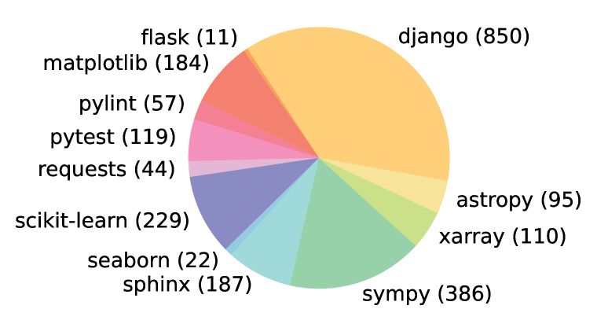

<figcaption>Figure 3: 12 のオープンソース GitHub リポジトリにわたる SWE-bench のタスクの分布（括弧内）。各リポジトリは人気があり広くダウンロードされている PyPI パッケージのソースコードを含む。（訳注: この図はクリップから欠落していたため ar5iv から復元）</figcaption>
</figure>

**Table 1**: SWE-bench のタスクインスタンスのさまざまな属性を特徴づける平均値と最大値。統計はリポジトリごとにグループ化せずに計算したマイクロ平均である。**（訳注: この表はキャプションも本体もクリップから欠落していたため ar5iv から復元）**

| | | 平均 | 最大 |
| --- | --- | --- | --- |
| **Issue Text** | Length (Words) | 195.1 | 4,477 |
| **Codebase** | # Files (non-test) | 3,010 | 5,890 |
| | # Lines (non-test) | 438K | 886K |
| **Gold Patch** | # Lines edited | 32.8 | 5,888 |
| | # Files edited | 1.7 | 31 |
| | # Func. edited | 3 | 36 |
| **Tests** | # Fail to Pass | 9.1 | 1,633 |
| | # Total | 120.8 | 9,459 |

## 3 SWE-Llama: Fine-tuning CodeLlama for SWE-bench（CodeLlama のファインチューニング）

プロプライエタリなモデルと並べてオープンなモデルの性能を SWE-bench でベンチマークすることは重要である。執筆時点では、**必要な非常に長い文脈を扱えるのは CodeLlama モデル** [^48] **だけ**である。しかし我々は、**既製の CodeLlama の変種は、リポジトリ全体のコード編集を生成する詳細な指示に従う能力を持たず**、典型的にはプレースホルダの応答や無関係なコードを出力することを観測する。これらのモデルの能力を評価するため、我々は 70 億および 130 億パラメータの CodeLlama-Python モデルに対して教師ありファインチューニングを行う。結果として得られるのは、**消費者向けハードウェアで走り GitHub イシューを解決できる、リポジトリ編集に特化したモデル**である。

**訓練データ。** 我々のデータ収集の手続きに従い、**追加の 37 の人気ある Python パッケージのリポジトリから 19,000 件の issue-PR の対**を収集する。§2.1 と対照的に、**プルリクエストがテストの変更を寄与することは要求しない**。これにより教師ありファインチューニング用のはるかに大きな訓練集合を作れる。**データ汚染のリスクを最小にするため、訓練データのリポジトリの集合は評価ベンチマークに含まれるパッケージと互いに素である。**

**訓練の詳細。** 指示・GitHub のイシューテキスト・関連するコードファイルをプロンプトとして与え、そのイシューを解決したパッチ（「gold patch」）を生成するよう SWE-Llama をファインチューニングする。メモリ効率のため、**LoRA** [^23] を用いて **attention 副層の重みのみをファインチューニング**し、**30,000 トークンを超える訓練系列は除外**した。これにより訓練コーパスの実効的な規模は **10,000 インスタンス**へ減る。

## 4 Experimental Setup（実験設定）

### 4.1 Retrieval-Based Approach（検索に基づくアプローチ）

SWE-bench のインスタンスはイシューの記述とコードベースをモデルへの入力として与える。**イシューの記述は通常短い（Table 1 に示すとおり平均 195 語）が、コードベースは LM のコンテキストウィンドウに収まる量よりはるかに多くのトークン（平均 438K 行）から成る。**そこで、生成の際にモデルへ与える関連する文脈を正確にどう選ぶか、という問いが残る。

ベースラインではこの問題に対処するため、単に汎用の検索系を用いて文脈として挿入するファイルを選ぶ。とくに **2 つの文脈設定**——**(1) 疎検索**と **(2) オラクル検索**——の下でモデルを評価する。

**疎検索。** **密検索の手法は、キーとクエリの長さが非常に長いこと、そしてとりわけ自然言語のクエリでコード文書を検索するという通常でない設定のため、我々の設定には適さない。**したがって我々は **BM25 検索** [^47] を用いて、各タスクインスタンスの文脈として与える関連ファイルを検索する。3 つの異なる最大文脈の上限を実験し、指定された上限に収まるだけのファイルを単純に検索する。各モデルをそのコンテキストウィンドウに収まるすべての上限で評価し、**最良の性能を報告する**。

**「オラクル」検索。** 加えて、**GitHub でイシューを解決した参照パッチが編集したすべてのファイルのみ**を使う設定も考える。この「オラクル」検索の設定は**現実的ではない**——イシューに取り組むソフトウェアエンジニアは、どのファイルを修正する必要があるかを事前には知らないからである。しかしこの設定は**必ずしも包括的でもない**——編集されたファイルだけでは、コードの未知の部分と相互作用したときにソフトウェアがどう振る舞うかを正確に理解するのに必要なすべての文脈を含まないかもしれないからである。

Table 4 で BM25 検索の結果を「オラクル」検索の設定と比較する。そこでは、**27,000 トークンの文脈上限のとき BM25 はおよそ 40% のインスタンスでオラクルのファイルの上位集合を検索するが、半数を超えるインスタンスではオラクルのファイルをすべて除外してしまう**ことが分かる。

### 4.2 Input Format（入力の形式）

上記 2 つの方法のいずれかで検索されたファイルが選ばれたら、**タスクの指示・イシューのテキスト・検索されたファイルとドキュメント・そして最後に patch ファイルの例と patch ファイル生成のプロンプト**から成る入力をモデルへ構成する。

### 4.3 Models（モデル）

長い系列長を処理する必要があるため、現時点で SWE-bench に適したモデルはわずかしかない。したがって我々は **ChatGPT-3.5**（`gpt-3.5-turbo-16k-0613`）・**GPT-4**（`gpt-4-32k-0613`）・**Claude 2**・**SWE-Llama** を評価する。

**Table 2**: 異なるコンテキスト長と、それがカバーする「オラクル」検索の設定の割合を比較する。コンテキスト長が短いモデルは本質的に不利である。なお、トークン長の記述は相対的で非標準の尺度である（たとえば Llama でトークン化した系列は、GPT-4 用にトークン化した同等の系列より平均 42% 長い）。

| | ChatGPT-3.5 | GPT-4 | Claude 2 | SWE-Llama |
| --- | --- | --- | --- | --- |
| Max. Tokens | 16,385 | 32,768 | 100,000 | ≥ 100,000 |
| % of Instances | 58.1% | 84.1% | 96.4% | ≥ 94.8% |

**Table 3**: 異なる最大コンテキスト長についての、オラクルのファイルに対する BM25 の recall。

| | 13k | 27k | 50k |
| --- | --- | --- | --- |
| Avg. | 29.58 | 44.41 | 51.06 |
| All | 26.09 | 39.83 | 45.90 |
| Any | 34.77 | 51.27 | 58.38 |

**Table 4**: 異なる最大コンテキスト長での、BM25 検索によるモデルの解決率。

| Model | 13k | 27k | 50k |
| --- | --- | --- | --- |
| Claude 2 | **1.96** | 1.87 | 1.22 |
| SWE-Llama 7b | **0.70** | 0.31 | 0.00 |
| SWE-Llama 13b | **0.70** | 0.48 | 0.00 |

## 5 Results（結果）

本節では、異なる検索機構とプロンプト様式による多数の設定でのモデルの結果を報告し、モデルの性能と難しさについての分析と洞察を提供する。BM25 と「オラクル」検索の双方の設定でのモデルの性能を Table 5 にまとめる。**全体として、モデルはイシューの解決に著しく苦戦する。**最も性能の良いモデルである Claude 2 でさえ、「オラクル」検索の文脈を使って**わずか 4.8% の通過率**しか達成しない。BM25 検索の設定で評価すると、Claude 2 の性能は **1.96%** へ落ちる。BM25 検索の設定での性能は、**適切な文脈を選ぶことの重要性**を際立たせる。これは以下の分析で主題となる。

**Table 5**: §4 で述べた BM25 とオラクルの検索設定を用いてモデル同士を比較する。\* 予算の制約により、GPT-4 は「オラクル」設定と BM25 27K 検索器の設定においてのみ、SWE-bench の 25% の無作為な部分集合で評価している。

| Model | BM25 % Resolved | BM25 % Apply | "Oracle" % Resolved | "Oracle" % Apply |
| --- | --- | --- | --- | --- |
| ChatGPT-3.5 | 0.20 | 10.50 | 0.52 | 12.38 |
| **Claude 2** | **1.96** | 29.86 | **4.80** | 47.00 |
| GPT-4\* | 0.00 | 4.50 | 1.74 | 13.20 |
| SWE-Llama 7b | 0.70 | 37.84 | 3.00 | 54.80 |
| SWE-Llama 13b | 0.70 | 39.41 | 4.00 | 52.10 |

<figure>

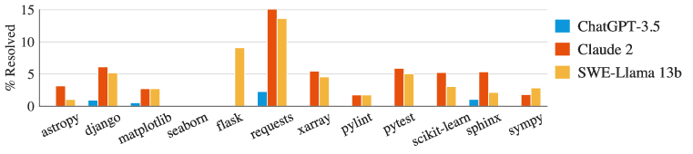

<figcaption>Figure 4: SWE-bench に含まれる 12 のリポジトリにわたる 3 つのモデルの解決率。</figcaption>
</figure>

**難しさはリポジトリによって異なる。** 性能をリポジトリ別に分解すると、すべてのモデルが異なるリポジトリにわたって似た傾向を示すことが観測される。**にもかかわらず、各モデルが解決するインスタンスは必ずしも大きく重ならない。**たとえば「オラクル」設定で Claude 2 と SWE-Llama 13b は同程度の性能を示し、それぞれ 110 件と 91 件のインスタンスを解決する。しかし**これらのインスタンスのうち、Claude 2 は SWE-Llama が解いたインスタンスの 42% しか解けていない。**

これは**イシュー内の画像の存在**とも関係しうる。画像はイシューの markdown に埋め込みリンク（`![image][https://...]`）として符号化されうる。一部のリポジトリは自然と画像を含むインスタンスを多く持つ——たとえば **matplotlib の 32%、seaborn の 10% のインスタンスがイシューのテキストに埋め込み画像を含む**のに対し、全インスタンスではわずか 2% である。**これらのインスタンスを解くには、マルチモーダルな LM か、画像を処理する何らかの外部ツール利用が必要かもしれない。**

**難しさは文脈長と相関する。** モデルは長いコードの系列で事前学習されうるが、典型的には問題を枠づける限られた文脈を与えられて一度に単一の関数を生成するよう求められる。Figure 5 に示すとおり、**総文脈長が増えるにつれ Claude 2 の性能はかなり落ちる**。この振る舞いは他のモデルでも観測される。我々の評価設定では、モデルは当面のイシューを解くのに直接関係しないかもしれないコードを大量に見ることになり、**更新すべき問題のあるコードを位置特定することに頻繁に苦労するように見える**。この結果は、**モデルが追加の文脈によって、あるいは目標の系列がコンテキストウィンドウ内でより前あるいはより後ろへ移動するにつれて、気を散らされうる**ことを示す他の研究 [^36] を裏づける。**BM25 の最大文脈サイズを増やすことがオラクルのファイルに対する recall を上げるときでさえ、Table 4 に示すとおり性能は落ちうる**——モデルは単に、**トークンの海の中で問題のあるコードを位置特定することに無効**だからである。

<figure>

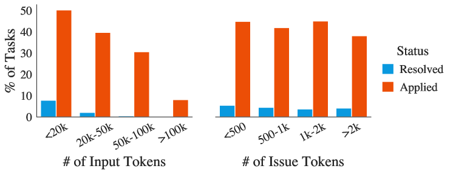

<figcaption>Figure 5: 総入力長で分割した場合と、イシューの長さのみで分割した場合の、Claude 2 の性能を比較する。</figcaption>
</figure>

これをさらに調べるため、「オラクル」検索の文脈に対する入力のアブレーションを行う。**検索されたファイルを、真のプルリクエストが実際に編集した行（前後 ±15 行の緩衝つき）を除いて完全に畳む**設定である。**この設定では性能の向上が見られ、GPT-4 は 1.3% から 3.4% へ、Claude 2 は 4.8% から 5.9% へ跳ね上がる。**

**Table 6**: 「オラクル」-collapsed 検索設定の結果。オラクルのファイルを使うが、PR が直接修正していないコードを ±15 行を残して畳む。**（訳注: この表はキャプションも本体もクリップから欠落していたため ar5iv から復元）**

| Model | "Oracle"-collapsed % Resolved | "Oracle"-collapsed % Applied |
| --- | --- | --- |
| ChatGPT-3.5 | 1.0 | 23.2 |
| **Claude 2** | **5.9** | 47.6 |
| GPT-4 | **3.4** | 18.8 |

**難しさはイシューの解決日と相関しない。** Table 7 に、PR が 2023 年より前に作られたか以降かで分割した「オラクル」検索設定でのモデルの結果を示す。**大半のモデルでこの日付の前後で性能にほとんど差がない**（GPT-4 は例外）。**我々はこの結果を大いに有望と考える。というのも、モデルがあるリポジトリのコードベースの何らかの版に触れていたとしても、単により新しい版のリポジトリを生成することで「カンニング」してイシューに対処することはなさそうだと示唆するからである。**

**Table 7**: 2023 年より前と以降のタスクインスタンスでのモデルの性能を比較する。大半のモデルはほとんど差を示さない。\* 予算の制約により GPT-4 は SWE-bench タスクの 25% の無作為な部分集合で評価しており、ここでの性能に影響しうる。

| | Claude 2 | ChatGPT-3.5 | GPT-4\* | SWE-Llama 7b | SWE-Llama 13b |
| --- | --- | --- | --- | --- | --- |
| Before 2023 | 4.87 | 0.49 | 1.63 | 3.98 | 2.95 |
| From 2023 | 4.23 | 0.77 | 0.0 | 3.85 | 3.46 |

**ファインチューニングされたモデルは文脈の分布シフトに敏感である。** ファインチューニングされた SWE-Llama 7b と 13b は、**BM25 で検索された文脈では驚くほど性能が悪い**。これらのモデルは「オラクル」検索を文脈として使ってファインチューニングされたので、**この文脈のシフトがモデルが確実に振る舞うことを難しくしている**と我々は疑う。たとえば **SWE-Llama は文脈に含まれるすべてのファイルを編集するよう訓練された**が、BM25 の設定では文脈に与えられる多くのファイルは変更されることが期待されていない。

**パッチの生成はファイル全体の生成より易しい。** モデルは標準的なコードファイルを用いて訓練されることが多く、patch ファイルを見ることはおそらく稀である。我々は一般に、提案する変更を伴うファイル全体を再生成するのではなく **patch ファイルを生成する**ようタスクを定式化している。patch ファイルのほうがファイル変更のはるかに効率的な表現になるからである。Table 5 に示すとおり、**モデルは整形式の patch ファイルを生成することにさえ依然として苦労する**。そこで、代わりに提案する変更を伴うファイル全体を再生成するようモデルへ求める実験を行った。**この設定では、モデルは一般に patch ファイルを生成するときより性能が悪い**——たとえば Claude 2 は「オラクル」検索の主表の 4.8% に対し **2.2%** となる。インスタンス長を統制しても、入力トークンで短いほうの半分のタスクインスタンスで生成させると、**Claude 2 のパッチ生成の 7.8% に対して 3.9%** である。

**言語モデルはより短く単純な編集を生成する傾向がある。** モデルが生成した patch ファイルは、対応する gold patch より追加・削除する行が少ない傾向がある。Table 8 に示すとおり、平均的な gold patch と比べて、**正しく適用されるモデル生成の patch ファイルは gold の編集パッチの総長の半分未満（74.5 行 対 30.1 行）であり、単一ファイルを超えて編集することは稀である。**

**Table 8**: オラクル検索設定で首尾よく適用されたパッチにわたる、モデル生成パッチの平均編集量。各モデル固有のタスクインスタンスについて、gold patch にわたる同じ統計を計算している。Avg Gold は各モデルのそれぞれの gold patch にわたるマクロ平均、All Gold はモデルの性能に条件づけないすべての gold patch の統計を示す。

| Model | Total Lines | Added | Removed | Functions | Files |
| --- | --- | --- | --- | --- | --- |
| Claude 2 | 19.6 | 4.2 | 1.9 | 1.1 | 1.0 |
| *Gold* | *44.1* | *12.0* | *5.8* | *2.1* | *1.2* |
| ChatGPT-3.5 | 30.1 | 3.8 | 2.7 | 1.6 | 1.0 |
| *Gold* | *39.6* | *9.5* | *6.1* | *1.9* | *1.2* |
| GPT-4 | 20.9 | 4.4 | 1.5 | 1.0 | 1.0 |
| *Gold* | *33.6* | *8.4* | *3.8* | *1.9* | *1.1* |
| SWE-Llama 13b | 17.6 | 1.6 | 1.2 | 1.2 | 1.1 |
| *Gold* | *37.8* | *10.0* | *4.4* | *1.9* | *1.1* |
| SWE-Llama 7b | 16.7 | 1.3 | 1.2 | 1.2 | 1.1 |
| *Gold* | *40.2* | *11.3* | *4.9* | *1.9* | *1.1* |
| **Avg Gold** | **39.1** | **10.2** | **5.0** | **1.9** | **1.1** |
| **All Gold** | **74.5** | **22.3** | **10.5** | **3.0** | **1.7** |

### 5.1 A Qualitative Analysis of SWE-Llama Generations（SWE-Llama の生成の定性的分析）

「オラクル」検索設定の下でのタスクと生成パッチの質をよりよく理解するため、SWE-Llama と Claude 2 から合わせて **11 件の生成**を選ぶ。ここでは SWE-Llama から 1 例を論じ、我々の全体的な所見をまとめる。残りの例の詳細な分析は付録 F に示す。

<figure>

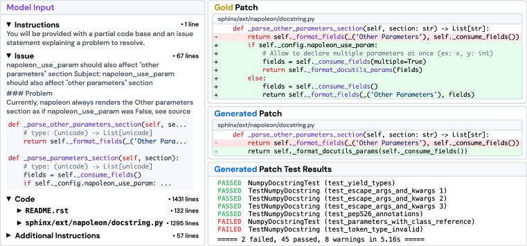

<figcaption>Figure 6: 整形されたタスクインスタンス・モデルの予測・テストフレームワークのログの例。結果と入力は読みやすさのために様式化している。gold patch と生成された patch ファイルにおいて、赤で強調された行は削除を、緑で強調された行は追加を表す。</figcaption>
</figure>

Sphinx ドキュメント生成器からのタスクインスタンス `sphinx-doc__sphinx-8713` を考える（Figure 6）。イシューは、**設定 `napoleon.use_param` が True のとき、Sphinx の napoleon 拡張がドキュメントのキーワード "Other Parameters" を適切に整形していない**と述べている。イシューのテキストはさらに、問題のあるソースコードがどこにあると疑われるかの詳細なコード断片、誤りを再現するコード例、パッケージのバージョンに関する追加情報を提供する。**この特定のインスタンスについて、モデルはタスクを解決できず、gold の解が通したテストのいくつかを通せなかった。**

「オラクル」検索の設定では、モデルの入力はこのイシューのテキストに加え、いくらかの指示・gold patch が編集したファイルの完全な内容・期待する差分形式の例を提供する。**総モデル入力は 1,558 行の文脈、すなわち 20,882 トークンから成る。**gold patch とモデルのパッチを比べると、明らかな誤りが見つかる。**モデルは正しい関数——`sphinx/ext/napoleon/docstring.py` の 684 行目の `_parse_other_parameters_section`——を編集しているが、gold patch のように設定を先に確認して `_parse_parameters_section` の動作を模倣するのではなく、`napoleon.use_param` が常に True であるかのように振る舞うよう関数を変えてしまっている。**テストの `test_parameters_with_class_reference` は `napoleon_use_param` が False に設定された設定で生成されるドキュメントを直接比較するので、モデルの誤りをただちに捉える。

我々が考察したすべての例にわたって結果を比較すると、振る舞いにいくつかの顕著な傾向が見られる。**モデルは原始的な Python コードを書く傾向があり、既存のサードパーティのライブラリやコードベースの残りを自らの解に活用しない。**モデルの生成はまた、**コードの様式やコードベースが反映しうる論理的な制約をほとんど顧みずに、問題を正確に解こうとする「貪欲な」アプローチ**を反映する（たとえば絶対インポートの代わりに相対インポートを使う）。対照的に、**多くの gold patch はコードベースのはるかに広い範囲を覆う構造的な改善を行う**——これらの編集はイシューを解決するだけでなく、**明白な将来の問題を先読みして解決している。**

## 6 Related Work（関連研究）

**LM の評価。** LM を評価する近年のいくつかの仕事は、複数の領域にまたがる互いに異なるタスクの集合を提案する [^21] [^34] [^50] か、解くのに複数のステップを要するタスクを特徴とする対話的な設定としてウェブへ向かってきた [^58] [^66] [^10] [^38]。**そうした「ごった煮」式の構成にはいくつかの欠点がある。**第一に、各タスクは 1 つないし少数の技能に狭く焦点を当てる傾向があり、その結果、課題は典型的に単純すぎ、モデルを縮小された役割に押し込め、**モデルが多才さを発揮したり新しい能力を潜在的に示したりする余地を与えない** [^50]。結果として、そうしたタスクの寄せ集めにおけるモデルの性能は、その能力とそれをどう改善するかについての行動につながる深い洞察をもたらさないかもしれない [^49] [^41] [^4]。**SWE-bench はこれらの欠点に対処する**——我々の仕事は、それが著しく挑戦的であり、このタスクを解くために LM を改善する幅広い可能性を提示し、新しいタスクインスタンスで時とともに容易に更新できることを実証する。

**コード生成のベンチマーク。** HumanEval [^8] は、自然言語の記述からコードを合成するという長年の追求における現在の標準である [^61] [^3] [^21] [^32] [^63]。この 1 年で、後続のベンチマークは HumanEval を、異なる言語への拡張 [^5] [^2] [^45]・編集範囲の変化 [^60] [^12]・類似だが新規なコード補完タスク [^44]・より多くのテスト [^35] で拡張しようとしてきた。**問題をサイロ化されたデータセットへ分割し単純さのために切り詰める代わりに、SWE-bench の収集手続きは最小限の後処理でソースコードを変換し**、閉じた形式の補完を超えて実世界のソフトウェア工学に接地されたはるかに広い課題の集合——**パッチ生成・長い文脈上での推論・コードベースのディレクトリの渡り歩き・モジュールをまたぐ依存関係の把握**——を保存する。

**ソフトウェア工学のための ML。** スケールしない、あるいは自然言語を取り込めない従来のプログラム解析の技法を克服するため、現在のソフトウェア工学研究の一方向は、ニューラルネットワーク（LM を含む）を用いて実世界のソフトウェア開発の過程を自動化することである [^40] [^65] [^22]。ユースケースにはコミット生成の自動化 [^25] [^37]・PR レビュー [^57] [^33] [^51]・バグの位置特定 [^30] [^7]・テスト [^27] [^55] [^52]・プログラム修復 [^42] [^20] [^1] [^17] [^18] [^16] [^11] [^43] が含まれる。SWE-bench に最も関連するのは、自動プログラム修復へ LM を適用しようとした仕事 [^53] [^54] [^14] や、コミットでコード編集を導く仕事 [^6] [^64] [^13] である。**しかし既存のデータセット** [^26] [^28] **のいずれも、SWE-bench の規模のコード文脈を提示していない。**

## 7 Discussion（議論）

**限界と今後の方向。** **SWE-bench のタスクインスタンスはすべて Python である**。我々は SWE-bench のタスクインスタンス収集の手続きを適用して、より多くのプログラミング言語と領域へカバレッジを広げることを望んでいる。第二に、**我々の実験はこのタスクに対する最も単純で率直なアプローチのベースラインを確立することを狙っており**、将来の方法論を同種のアプローチへ制約する意図はない。この点で我々は、**コードベースから関連する文脈を特定するエージェントベースのアプローチ**・パッチ生成のためにファインチューニングされたより大規模なモデル・プログラム解析やソフトウェア工学のツールで LM を拡張することに、とりわけ期待している。最後に、本研究は実行ベースのコードテストを用いてモデルを評価しているが、**この方法だけに頼ることはモデル生成の信頼できる性能を保証するには不十分である**——LM からの自動コード生成は、人間が書いた解と比べて、包括性・効率・可読性においてしばしば劣りうることが分かったからである。

**結論。** 実世界のソフトウェア開発の過程の複雑さは、単なるコード補完をはるかに超える。**オープンソースの協働のパイプラインを引くことで、SWE-bench は実世界のコーディング環境の忠実な鏡を作る。**このより現実的な環境は、オープンソースのソフトウェア開発において即座に応用可能な創造的な解を促す。

## 8 Ethics Statement（倫理表明）

SWE-bench は、我々の貢献がそれに従う形でソフトウェアの利用を許すライセンスを持つ公開リポジトリのみから収集されている。ライセンスの詳細は Table 12 に含まれる。**収集と評価の過程で、我々は GitHub のユーザーについての情報を収集しておらず**、SWE-bench のタスクインスタンスは公開 API とウェブサイトを通じて提供されるものを超えた GitHub のデータを使っていない。**我々の貢献は人間の被験者の参加を一切伴わない**——SWE-bench のいかなる部分（収集・評価の手続きおよび実験）についても、クラウドソーシングを行ったり人間のタスク作業者を募集したりしていない。**人気に基づく GitHub リポジトリのフィルタリング基準は、リポジトリ選択について差別的あるいは偏ったヒューリスティクスに暗黙にも明示的にも依拠していない。**データセットの公開にあたっては、SWE-bench のタスクインスタンス・収集と評価のインフラ・実験結果・SWE-Llama モデルのファインチューニングに使った訓練データ・そして SWE-Llama のモデル重みをオープンソース化する予定である。最良の慣行の先例に従い、各構成要素とその利用を述べる十分なドキュメントも提示し、SWE-bench を改善するフィードバックを募る便利な連絡経路も設ける。**SWE-bench はただちに有害な洞察を何も提示しない。**SWE-bench の利用の潜在的な影響については §E で簡潔に論じる。

## 9 Reproducibility Statement（再現性の表明）

本投稿にあたり、我々は適切に匿名化した zip ファイルとしてソースコードの全体をアップロードした。**別々のディレクトリが本論文内の異なる貢献（データセットの収集、評価、オープンソースモデルの推論、SWE-Llama の訓練など）に対応するようコードベースを組織している。**ソースコードには、コードベースの異なる部分の目的と使い方を詳述するインラインのドキュメントが含まれる。加えて、**本論文で論じたすべての構成要素を含む 2,294 件の SWE-bench タスクインスタンスの完全な集合**も含めている。ソースコード内のドキュメントを超えて、**収集パイプラインと評価手続きについての徹底的な技術的詳細を §A.2 と §A.4 に含め**、本論文 §2 の元の詳細を補完している。これらの節はコードに提示されたロジックを完全に覆っており、その理解に役立ちうる。今後、倫理表明で論じたとおり、ベンチマークを述べ、コードの概要を示し、その利用を詳述する徹底的な詳細を伴うオープンソースのリポジトリとして、SWE-bench をより正式に公開する予定である。**SWE-bench の主要な構成要素は収集の枠組みであり、これもオープンソース化されるコードの一部となる。**本論文で論じたその容易に保守可能な設計ゆえに、**SWE-bench は高度に再現可能であるはずだ**というのが我々の希望であり信念である。

## 10 Acknowledgements（謝辞）

（訳注: skill の既定により謝辞は訳出しない。）

## Appendix A Benchmark Details（ベンチマークの詳細）

本節は §2 を補い、データ収集・実行に基づく検証・評価の手続きについてより技術的で細かい要約と、タスクインスタンスのより充実した特徴づけを提供する。

### A.1 High Level Overview（高水準の概観）

**プルリクエストの収集。** 2023 年 8 月における**最もダウンロードされた PyPI ライブラリ上位 5,000 件**のリストから**上位 100 パッケージ**を選び、各ライブラリに対応するオープンソースの GitHub リポジトリを特定し、**どのパッケージが自由なソフトウェア利用を許すライセンスを持つかを検証**し、GitHub の開発者 API を通じてこれらのリポジトリのすべての PR を収集する。**よく利用されているリポジトリから問題を引くのは、広く使われていることが通常、そのリポジトリが広範なドキュメント・構造化されたオープンソース開発のガイドライン・動作するよく整形されたコードを持つことを示唆するから**である。

**タスクインスタンスの構築。** 3 つの条件を満たす PR から候補となるタスクインスタンスを構築する。**第一に、PR の状態が Merged でなければならない。**Merged の状態は、PR に紐づくコード変更が受け入れられ親リポジトリへ組み込まれたことを示す。**第二に、PR がリポジトリ内の 1 つ以上のイシューを解決すること。**イシューは GitHub における正典的な用法に従い、**バグ・拡張・ソフトウェアプロジェクトの一般的な開発目標を追跡するデジタルなチケット**として定義される。PR のタイトル・本文・コミットメッセージを走査して、リンクされたイシュー（たとえば "fixes #24"）を探す。**第三に、PR が 1 つ以上の新しいテストを導入すること。**新しいテストは、PR のコード変更がテスト関連のキーワード（"test"、"testing" など）を含むファイルパスを編集したときに数えられる。

これらの基準を満たす PR は、Figure 7 の例のような候補タスクインスタンスへ変換される。**コードベース $C$ はリポジトリの owner/name の呼称と、プルリクエストのベースコミットによって特定される。**我々は元の GitHub リポジトリの**ミラー**を作り、各ミラーは `owner__name` として一意に識別される。リポジトリの対応するミラーをクローンしてベースコミットをチェックアウトすれば、PR 適用前の状態の $C$ が得られる。**問題記述 $P$ は、関連するすべてのイシューのタイトルと説明に加えて、解の詳細の漏洩を避けるために PR の最初のコミットのタイムスタンプより前に書かれた後続のコメントを集約したもの**である。PR のコード変更は**テストパッチ**と **gold patch $\delta$** に分離される。$T$ はテストパッチで編集されたファイルのすべてのテストから成る。

<figure>

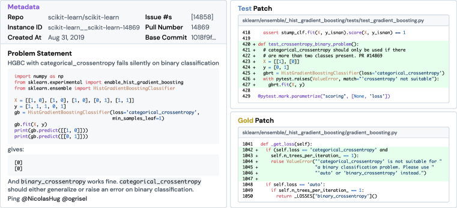

<figcaption>Figure 7: SWE-bench のタスクインスタンスの例。問題記述 P はプルリクエストに関連するイシューの集約である。コードベース C はリポジトリとベースコミットに対応する。テスト T と解 D は元の PR に紐づくコード変更から導かれる。読みやすさのために様式化している。</figcaption>
</figure>

**実行に基づく検証。** タスクインスタンスの使用可能性を実行によって検証する。各候補についてまず**実行文脈として機能する仮想環境**を定義し、パッチを適用する前に $C$ をインストールし、最後に**解 $\delta$ を適用する前と後に $T$ を 1 回ずつ実行する**。検証の過程のいずれかのステップが失敗すれば、その候補は最終的なデータセットの検討対象から除かれる。加えて、**解 $\delta$ が自明でないことを保証するため**、解の前後の検証ログを比較して、$T$ の中に**状態が fail から pass へ変わるテストが 1 つ以上あるか**を確認する。最後に、**解 $\delta$ で初めて導入された新しく作られた関数やクラスを呼び出すテストを持つタスクインスタンスを除外する**。**そうした構成物の命名は典型的に恣意的な過程であり、通常は問題記述に明示的に指定されないので、こうしたテストを解決することは人間の開発者にとってさえ不可能なタスクでありうる**からである。

**継続的な更新。** SWE-bench の収集の過程は任意のオープンソースのコードリポジトリへ容易に拡張でき、新しいプログラミング言語やコードの領域への容易で低保守な拡張を可能にする。**この設計は SWE-bench に時間的な頑健性も与える**——より最近のソースコードで訓練された新しい言語モデルが時とともに公開されるにつれ、**任意の LM の訓練日より後に作られた PR に基づいて新しいタスクインスタンスを生み出すよう SWE-bench を更新すればよい。**

### A.2 Construction Process（構築の過程）

SWE-bench のタスクインスタンスは次のフィールドから成る。

**Table 9**: SWE-bench のタスクインスタンスオブジェクトの各フィールドの説明。

| Field | 説明 |
| --- | --- |
| `base_commit` | (str) 元の PR が適用される先のコミット ID |
| `created_at` | (date) PR が最初に作られた（マージされたのではない）日時 |
| `hints_text` | (str) 問題をどう解くかについての自然言語の示唆 |
| `instance_id` | (str) repo と pull_number から作られる一意な識別子 |
| `issue_numbers` | (list) 元のプルリクエストが解決するイシュー番号のリスト |
| `patch` | (str) 元の PR のコード変更から抽出された、問題への参照解となる `.patch` 形式の文字列 |
| `problem_statement` | (str) コードベースへの望ましい変更の自然言語による記述 |
| `pull_number` | (int) 元のプルリクエストのプル番号 |
| `test_patch` | (str) タスクが解決されたかを確認するための未見のテストを含む `.patch` 形式の文字列 |
| `version` | (str) PR が作られたときの（repo に対する）リリースバージョン |
| `repo` | (str) タスクインスタンスの由来となるリポジトリ |
| `FAIL_TO_PASS` | (list) 状態が fail から pass へ変わるテストのリスト |
| `PASS_TO_PASS` | (list) 状態が pass から pass のままのテストのリスト |
| `env_install_commit` | (str) タスクインスタンスの実行に必要な依存関係をインストールするベースコミット |

**問題記述。** 各タスクインスタンスの問題記述 $P$ は `problem_statement` フィールドとしてすぐ利用できる。問題記述は、**すべてのイシューの最初のコメントと、PR の最初のコミットの作成日より前に作られたそれらのイシューへのコメント**の集約である。PR のタイトル・本文・コミットメッセージからイシューを探索する。これらの構成要素のテキストデータを連結した後、まず Markdown 形式のコメントを取り除き、次に残りのテキストからイシュー番号への参照（`#` 記号に続く数字）を探し、**イシュー番号の参照の直前の語が、そのイシューが PR によって解決されたことを示唆するキーワードの集合（"closes"、"fixes"、"resolves" など）に含まれるか**を確認する。

このステップで **`hints_text` フィールド**も作られ、PR の**最初のコミットより前に作られたコメント**から収集される。この収集方法論の直観は、**そうした PR のコメントが、当面の問題をどう完成させるかについて元の人間の作業者へ向けた自然言語や擬似コードの示唆を含んでいそうだ**ということである。**本研究で提示する実験は `hints_text` を使っていない。**

**コードベース。** コードベース $C$ の内容はすべてのタスクインスタンスについて平文で保存されるわけではない。むしろタスクインスタンスは `repo` と `base_commit` のフィールドを通じて関連するコードベースへの参照を含む。この 2 要素からのコードベース $C$ の取得を再現可能かつ信頼できるものにするため、**我々は元のリポジトリのミラーを作る**。**元のリポジトリのコードは著者らの制御の及ばないところでコミットや編集の履歴に変更を受けうるので、後の修正が `base_commit` の破損や削除によってタスクインスタンスを使用不能にしてしまわないよう、ミラーリポジトリを作ることを選ぶ。**加えて、最新版のリポジトリをクローンして保存するのではなくミラーを作る。**ミラーは元のコミットハッシュ・履歴・ブランチ・タグを保持し、元のリポジトリの技術的詳細の忠実で完全な履歴として機能する**からである。ミラーは元のリポジトリのスター・ウォッチャー・イシュー・プルリクエストは保持しない。

**解とテストのパッチ。** 解 $\delta$ とテスト $T$ は PR のファイル変更データ（diff）から導かれる。`.patch` はブロックのリストとして構造化され、各ブロックはヘッダと 1 つ以上の hunk から成り、まとめて単一ファイルへの変更に対応する。テスト $T$ を作るには、**まずパッチ内のすべての一意なブロックを特定し、次にテスト関連のキーワード（"tests"、"testing" など）を含むファイルパスを持つブロックを選び出して束ねる。残りのブロックを統合して解 $\delta$ を形成する。**$T$ と $\delta$ を正しく解析するために書いたスクリプトの頑健性は、**両方のパッチを対応するコードベース $C$ へ適用してテストを走らせ、結果が元の PR の diff データの振る舞いを再現することを確認する**ことで検証している。

### A.3 Execution-Based Validation（実行に基づく検証）

**実行文脈。** 仮想環境をどの定義水準で定義するかについてさまざまな粒度を実験した末、我々は**リリースバージョンごとに実行文脈を作る**ことを選んだ。**タスクインスタンス固有の文脈を定義することは端から端までのインストール成功を保証するのに最も資するが、骨の折れる手作業の代償を伴う。**他方、最新版のリポジトリに基づくリポジトリ固有の文脈は、典型的に粗すぎる定義であり古い版の要求と両立しない。**リリースバージョンはタスクインスタンスの部分集合にわたる依存関係の要求を捉える良い代理であり、インストールの成功と手作業の労力の間で扱いやすい均衡を取る**ことが分かった。

**検証エンジン。** リポジトリごとに、次の手続きを行う。

1. バージョンごとの最新のタスクインスタンスに基づいて、実行文脈を conda 環境として作る。
2. タスクインスタンスをバージョンでグループ化する。
3. 各タスクインスタンスのグループを反復し、対応する conda 環境の内側で以下を行う。
   1. ファイル変更をすべて取り除き、タスクインスタンスの `base_commit` をチェックアウトする（リポジトリをコードベース $C$ に設定する）。
   2. インストールコマンドを実行してコードベース $C$ を実体化する。
   3. テストパッチ $T$ をコードベース $C$ へ適用する。
   4. テストパッチ $T$ から決まるテストスクリプトを実行し、テスト結果ログ $log_{pre}$ を生成する。
   5. 解 $\delta$ のパッチを、テスト $T$ 込みのコードベース $C$ へ適用する。
   6. (d) のテストスクリプトを再度実行して、テスト結果ログ $log_{post}$ を生成する。

テストコマンドは、リポジトリが使うテストフレームワーク（`pytest`, `tox` など）に $T$ で指定されたパスを付したものから成る。**(a) から (f) のいずれかのステップが失敗すれば、候補タスクインスタンスは検討対象から破棄される。リポジトリによる中程度のばらつきを伴いつつ、このステップは概して候補タスクインスタンスの半分を取り除く。**

**Table 10**: 構築と検証の手続きにわたって、各段階の完了後にどれだけの候補タスクインスタンスが残ったかの統計。

| Repo | 収集した PR 総数 | 変換後 | 検証後（最終） |
| --- | --- | --- | --- |
| astropy | 9,469 | 1,016 | 95 |
| django | 16,914 | 2,880 | 850 |
| flask | 2,434 | 107 | 11 |
| matplotlib | 16,545 | 1,057 | 184 |
| pylint | 3,848 | 787 | 57 |
| pytest | 5,147 | 750 | 119 |
| requests | 2,344 | 84 | 44 |
| scikit-learn | 15,159 | 1,169 | 229 |
| seaborn | 1,004 | 203 | 22 |
| sphinx | 4,931 | 645 | 187 |
| sympy | 11,928 | 1,897 | 386 |
| xarray | 3,416 | 812 | 110 |
| **Total** | **93,139** | **11,407** | **2,294** |

**検証ログの検査。** 最後に、検証エンジンが作ったログ $log_{pre}$ と $log_{post}$ を特定の性質について確認する。まず**恣意的な命名の選択を防ぐため、$log_{pre}$ に `ImportError` と `AttributeError` の出現がないか確認する**。これらは、正しく対処するのが自明かつほぼ不可能な依存関係の命名に関わる誤りを示しうる。次に**タスクインスタンスが自明でないことを確認する**——解 $\delta$ の適用前に fail の状態を持ち、適用後に pass となるテストが 1 つ以上あることで示される。このために、まず**リポジトリ固有のパーサをいくつか定義して** $log_{pre}$ と $log_{post}$ をテスト $t_i \in T$ から状態 $s \in$ [fail, pass] への写像へ変換する。

タスクインスタンスと並んで、**正解のテスト結果を含む対応するフォルダも作る**。各タスクインスタンスについて、それぞれの $log_{pre}$ と $log_{post}$ のテスト→状態の写像から、キーが `FAIL_TO_FAIL`・`FAIL_TO_PASS`・`PASS_TO_FAIL`・`PASS_TO_PASS`、値がテストのリストであるデータ構造を作る。**これらの結果を「キャッシュ」することで、評価時に解 $\delta$ を再実行する必要をなくす**（再実行も選択肢としては利用できる）。

### A.4 Evaluation Procedure（評価の手続き）

<figure>

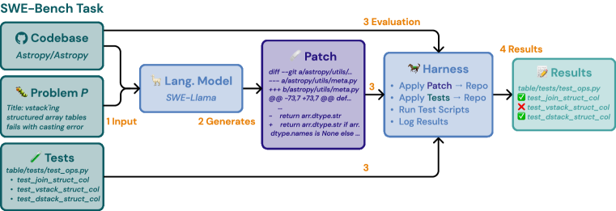

<figcaption>Figure 8: 個々のタスクインスタンスの水準での評価パイプラインの可視化。評価の際、Patch はモデルが生成したものである。タスクの完了には、prediction の .patch が首尾よく適用され、対応するタスクインスタンスの D と同じ結果を生む必要がある。</figcaption>
</figure>

評価の手続きは、解 $\delta$ の振る舞いに照らしてモデルの $\hat{\delta}$ の `.patch` 生成を採点する。対象のタスクインスタンスについて、予測ごとに次のステップを行う。

1. ファイル変更をすべて取り除き、タスクインスタンスのベースコミットをチェックアウトする。
2. タスクインスタンスのバージョンに対応する実行文脈を有効にする。
3. インストールコマンドを実行してコードベース $C$ を実体化する。
4. テストパッチ $T$ をコードベース $C$ へ適用する。
5. **予測パッチ $\hat{\delta}$ を、テスト $T$ 込みのコードベース $C$ へ適用する。**
6. **前ステップが失敗した場合、予測パッチ $\hat{\delta}$ を自動的に修復して再適用を試みる。**
7. テストパッチ $T$ から決まるテストスクリプトを実行し、テスト結果ログ $log_{\hat{\delta}}$ を生成する。

ステップ 1〜4 は、タスクインスタンスの検証過程で確認済みなので確実に失敗しない。**予測パッチの適用（ステップ 5）が失敗した場合、不要な文脈行を取り除きヘッダの値を再計算することで予測パッチファイルの修復を試みる（ステップ 6）。**残りのパッチが再び失敗するか、テストコマンドの実行（ステップ 7）が失敗すれば、**その予測は自動的に 0 点となる。**

**評価指標の計算。** タスクの完了を判定するには、$log_{\hat{\delta}}$ から解析したテスト→状態の写像を、正解のテスト結果データ構造の `FAIL_TO_PASS` と `PASS_TO_PASS` のキーに対応するテストのリストと比較する。**`FAIL_TO_PASS` と `PASS_TO_PASS` のすべてのテストが見つかり、pass の状態を持つことを確認する。テストが欠けているか pass でない状態を持てば、fail 状態と見なす。**本論文で定義し用いたとおり、**`FAIL_TO_PASS` と `PASS_TO_PASS` にわたるすべてのテストが通ったとき、タスクは解決されたと見なされる。**

### A.5 Evaluation Characterization（評価の特徴づけ）

**Table 11**: リポジトリごとにグループ化した SWE-bench タスクインスタンスの各属性の平均値。Table 1 の統計に加えて、$\delta$ # Lines Added・$\delta$ # Lines Removed・$|T|$ (Pass to Pass) の 3 つの新しい値を導入する。

| | astropy | django | flask | matplotlib | pylint | pytest |
| --- | --- | --- | --- | --- | --- | --- |
| $P$ Length (Characters) | 2742 | 1307 | 1185 | 2381 | 2011 | 2948 |
| $C$ # Files | 1811 | 6356 | 225 | 4395 | 2426 | 497 |
| $C$ # Lines | 804k | 407k | 35k | 646k | 109k | 111k |
| $\delta$ # Files Edited | 1.5 | 1.5 | 1.6 | 1.5 | 1.8 | 1.4 |
| $\delta$ # Func. Edited | 2.5 | 2.0 | 2.4 | 2.2 | 1.8 | 1.7 |
| $\delta$ # Lines Edited | 36.0 | 18.5 | 35.4 | 58.9 | 36.0 | 24.5 |
| $\delta$ # Lines Added | 25.0 | 12.8 | 23.7 | 35.7 | 26.6 | 18.2 |
| $\delta$ # Lines Removed | 10.9 | 5.7 | 11.6 | 23.2 | 9.5 | 6.4 |
| $\|T\|$ (Fail to Pass) | 21.7 | 8.8 | 1.4 | 2.4 | 6.8 | 4.1 |
| $\|T\|$ (Pass to Pass) | 191.0 | 85.9 | 32.5 | 242.4 | 47.0 | 60.7 |
| $\|T\|$ (All) | 212.8 | 94.6 | 33.9 | 244.8 | 53.7 | 64.8 |

| | requests | scikit-learn | seaborn | sphinx | sympy | xarray |
| --- | --- | --- | --- | --- | --- | --- |
| $P$ Length (Characters) | 1654 | 2239 | 1667 | 1888 | 1213 | 3515 |
| $C$ # Files | 119 | 1224 | 273 | 1483 | 1666 | 260 |
| $C$ # Lines | 30k | 361k | 105k | 423k | 678k | 137k |
| $\delta$ # Files Edited | 1.64 | 1.68 | 1.77 | 1.51 | 1.9 | 2.45 |
| $\delta$ # Func. Edited | 1.59 | 2.24 | 1.41 | 2.72 | 3.22 | 3.16 |
| $\delta$ # Lines Edited | 25.5 | 44.0 | 30.1 | 30.6 | 36.3 | 124.8 |
| $\delta$ # Lines Added | 19.2 | 32.7 | 24.9 | 22.0 | 24.2 | 95.6 |
| $\delta$ # Lines Removed | 6.2 | 11.3 | 5.2 | 8.6 | 12.1 | 29.2 |
| $\|T\|$ (Fail to Pass) | 7.6 | 7.5 | 12.9 | 2.3 | 2.2 | 58.5 |
| $\|T\|$ (Pass to Pass) | 87.1 | 150.7 | 86.8 | 45.1 | 74.5 | 297.5 |
| $\|T\|$ (All) | 94.7 | 158.2 | 99.7 | 47.4 | 76.8 | 356.1 |

**Table 12**: タスクインスタンスの抽出元となったすべての GitHub リポジトリの要約とライセンス。

| Repository | 要約 | License |
| --- | --- | --- |
| astropy/astropy | 天文学・天体物理学のコアライブラリ | BSD 3-Clause |
| django/django | ウェブアプリケーション構築のためのウェブフレームワーク | BSD 3-Clause |
| pallets/flask | 小規模ウェブアプリのための軽量フレームワーク | BSD 3-Clause |
| matplotlib/matplotlib | 視覚表現を作る作図ライブラリ | Custom |
| pylint-dev/pylint | Python 2/3 の静的コード解析器 | GPL 2.0 |
| pytest-dev/pytest | Python のテストフレームワーク | MIT License |
| psf/requests | HTTP リクエストを書くための単純で優雅なライブラリ | Apache-2.0 |
| scikit-learn/scikit-learn | Python の機械学習 | BSD 3-Clause |
| mwaskom/seaborn | Python の統計データ可視化 | BSD 3-Clause |
| sphinx-doc/sphinx | ドキュメント作成のためのライブラリ | Custom |
| sympy/sympy | Python で書かれた計算機代数システム | Custom |
| pydata/xarray | N 次元ラベル付き配列とデータセット | Apache-2.0 |

**タスクインスタンスのイシューのカテゴリ。** 全イシューにわたって見つかった **2,289 個のタグ**をグループ化して例を示す。**絶対的多数のイシューはバグ修正に関係するが、SWE-bench のタスクインスタンスは、デバッグや誤り訂正を超えた目的を持つ多様なコード変更に紐づいている。**

**Table 13**: SWE-bench のタスクインスタンスのイシューに紐づくタグのカテゴリ。

| Category | Count | 例 |
| --- | --- | --- |
| Bug | 442 | "Bug" (179); "type:bug" (114); "bug" (57); "type: bug" (48); "Bug:beetle:" (23); "status: confirmed bug" (20) |
| Feature | 167 | "type:enhancement" (47); "Enhancement" (25); "New feature" (24); "Feature Request" (22); "type: enhancement" (19); "Enhancement:star:" (15) |
| Regression | 39 | "type: regression" (14); "Regression" (14); "regression" (8) |
| Other | 1641 | "help wanted" (71); "good first issue" (66); "printing" (58); "extensions:autodoc" (58); "Easy" (57); "Easy to Fix" (54) |

**属性の分布。** Figure 9 に、Table 1 で導入した属性の累積分布関数のプロットを示す。これらのプロットから、**中央値の SWE-bench タスクインスタンスは 140 語の問題記述を持ち、1,900 弱のファイルと 40 万行を含むコードベースの内側で起こる**ことが分かる。対応する参照解 $\delta$ は通常**ファイル内の単一の関数を編集し、約 15 行を変更し**、変更の正しさを検証する **fail to pass テストを 1 つ**、既存の振る舞いが保たれるかを確認する **pass to pass テストを 51 個**持つ。

<figure>

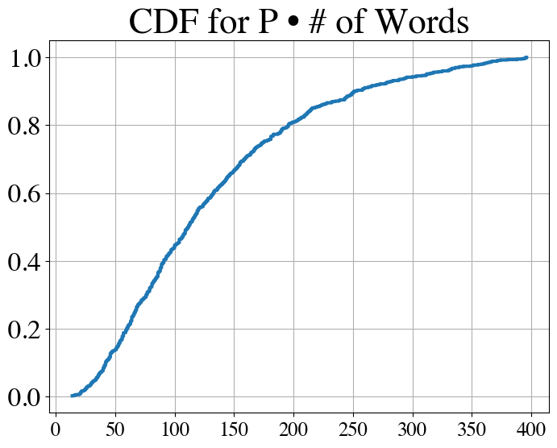

<figcaption>Figure 9 (a): 問題記述の語数の累積分布関数。</figcaption>
</figure>

<figure>

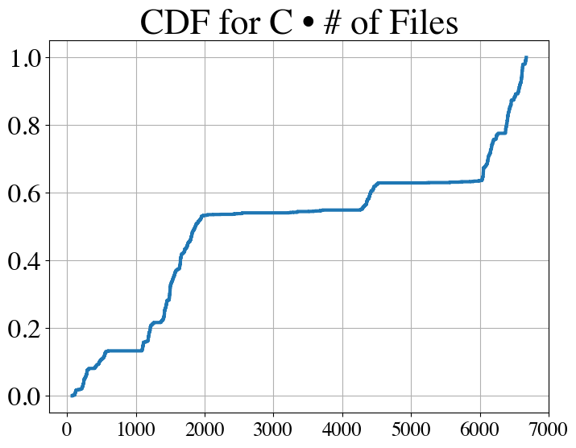

<figcaption>Figure 9 (b): コードベースのファイル数。（訳注: クリップから欠落していたため ar5iv から復元）</figcaption>
</figure>

<figure>

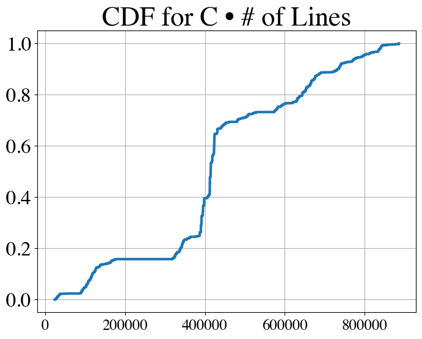

<figcaption>Figure 9 (c): コードベースの行数。（訳注: 同上）</figcaption>
</figure>

<figure>

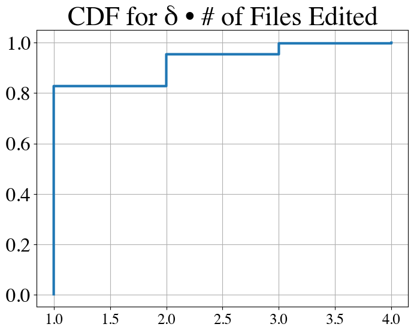

<figcaption>Figure 9 (d): 解が編集するファイル数。（訳注: 同上）</figcaption>
</figure>

<figure>

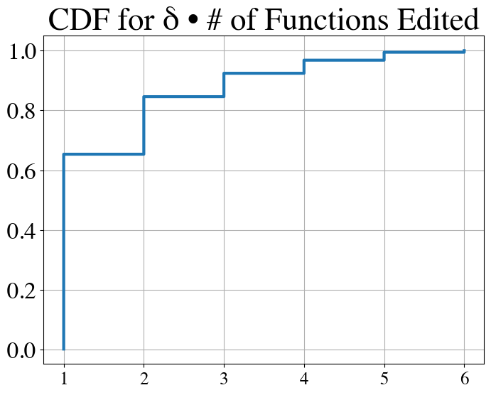

<figcaption>Figure 9 (e): 解が編集する関数数。（訳注: 同上）</figcaption>
</figure>

<figure>

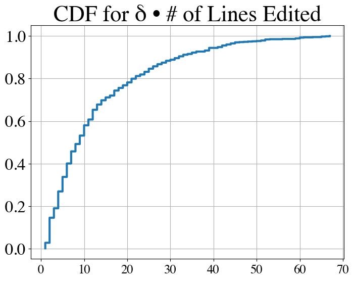

<figcaption>Figure 9 (f): 解が編集する行数。（訳注: 同上）</figcaption>
</figure>

<figure>

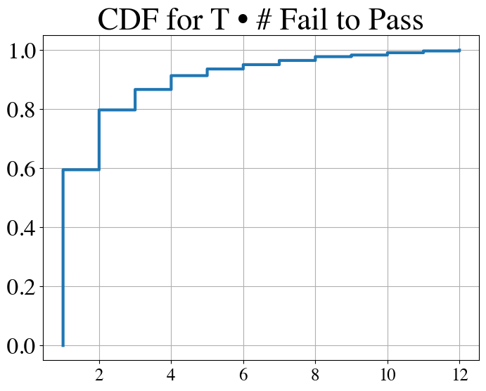

<figcaption>Figure 9 (g): fail to pass テストの数。（訳注: 同上）</figcaption>
</figure>

<figure>

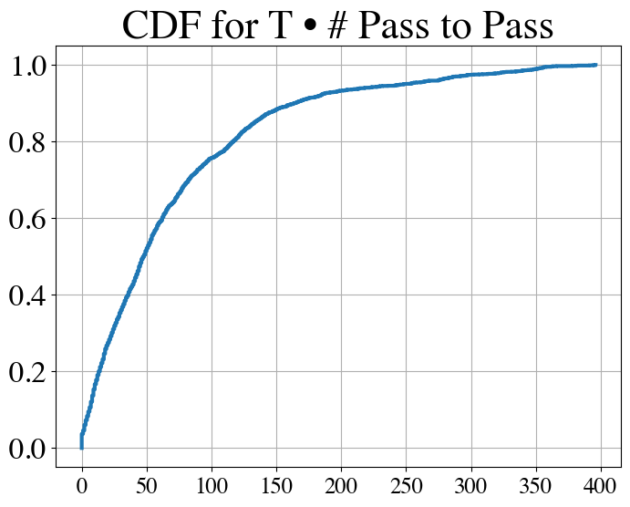

<figcaption>Figure 9 (h): pass to pass テストの数。（訳注: 同上）</figcaption>
</figure>

**パッチ修復率。** Table 14 は、各モデルが（2,294 件のうち）いくつのタスクインスタンスについてパッチを生成し、そのうちいくつが首尾よく適用され、首尾よく適用されたもののうちいくつが §A.4 で導入したパッチ修復の手続きを要したかの要約統計を示す。**修復されたパッチは SWE-Llama の首尾よく適用されたパッチのうちより小さな割合を占める傾向があり、SWE-Llama のファインチューニングの手続きが整形式のパッチ生成に正の効果を持つことを示唆する。クローズドソースのモデルでは、首尾よく適用されるパッチが少なく、適用されたもののうちより大きな割合が生成後の修復を要する**ことから、**モデルは依然としてパッチ生成と構造化された出力全般に苦労している**ことが示唆される。

**Table 14**: 評価時の各［モデル, 検索設定］の組み合わせについて、2,294 件のタスクインスタンスのうちいくつのパッチが生成され、首尾よく適用され、適用のために生成後の修復を要したかの統計。

| Model | Retrieval Setting | Generations | Applies | Fixed | Patch Fix % |
| --- | --- | --- | --- | --- | --- |
| ChatGPT-3.5 | BM25 13k | 2293 | 609 | 367 | 60.3% |
| ChatGPT-3.5 | "Oracle" | 1315 | 513 | 229 | 44.6% |
| ChatGPT-3.5 | "Oracle"-collapsed | 2286 | 909 | 498 | 54.8% |
| Claude 2 | BM25 13k | 2292 | 920 | 369 | 40.1% |
| Claude 2 | "Oracle" | 2200 | 1455 | 369 | 25.4% |
| Claude 2 | "Oracle"-collapsed | 2291 | 1480 | 483 | 32.6% |
| GPT-4 | "Oracle" | 472 | 150 | 103 | 68.7% |
| GPT-4 | "Oracle"-collapsed | 2228 | 916 | 590 | 64.4% |
| SWE-Llama 13b | BM25 13k | 2223 | 1305 | 387 | 29.7% |
| SWE-Llama 13b | "Oracle" | 2207 | 1585 | 388 | 24.5% |
| SWE-Llama 7b | BM25 13k | 2284 | 1229 | 349 | 28.4% |
| SWE-Llama 7b | "Oracle" | 2267 | 1563 | 304 | 19.4% |

## Appendix B Additional Details on Training SWE-Llama（SWE-Llama の訓練の追加詳細）

### B.1 Training Details（訓練の詳細）

**最適化。** **LoRA** [^23] を用い、$r=16$・$\alpha=16$・dropout $=0.05$ で、**すべての attention 副層の query・key・value・出力の射影行列**をファインチューニングする。学習率 $6e-4$、勾配ステップあたりバッチサイズ 32 系列で、**最大 4 エポック**訓練する。訓練中は **50 ステップごとにチェックポイントを保存**し、訓練後に**保留した 100 インスタンスの検証損失に基づいて最良のチェックポイントを選ぶ**。**SWE-Llama 7b は CodeLlama-Python 7b で初期化し、4 台の NVIDIA A100 で 20 時間訓練した。SWE-Llama 13b は CodeLlama-Python 13b で初期化し、8 台の NVIDIA A100 で 47 時間訓練した。**長文脈の訓練を可能にするため **DeepSpeed Ulysses** [^24] と **Flash Attention** [^9] を用いた。

## Appendix C Additional Results（追加の結果）

本論文の Figure 4 に対応する、リポジトリごとのモデル性能の内訳を示す。論じたとおり、**性能はリポジトリによって大きく異なる。**

**Table 15**: SWE-bench に含まれるリポジトリごとのモデルの % Resolved。

| Repo | Claude 2 | ChatGPT-3.5 | GPT-4 | SWE-Llama 13b | SWE-Llama 7b |
| --- | --- | --- | --- | --- | --- |
| astropy/astropy | 3.23 | 0.00 | 0.00 | 1.06 | 3.16 |
| django/django | 6.15 | 1.32 | 2.50 | 5.19 | 4.00 |
| matplotlib/matplotlib | 3.05 | 3.33 | 0.00 | 3.12 | 1.11 |
| mwaskom/seaborn | 0.00 | 0.00 | 0.00 | 0.00 | 0.00 |
| pallets/flask | 0.00 | 0.00 | 0.00 | 9.09 | 0.00 |
| psf/requests | **15.91** | 2.33 | 8.33 | 13.64 | **18.18** |
| pydata/xarray | 6.90 | 0.00 | 0.00 | 5.81 | 3.00 |
| pylint-dev/pylint | 1.75 | 0.00 | 0.00 | 1.75 | 1.75 |
| pytest-dev/pytest | 5.93 | 0.00 | 0.00 | 5.04 | 4.20 |
| scikit-learn/scikit-learn | 5.41 | 0.00 | 0.00 | 3.12 | 0.88 |
| sphinx-doc/sphinx | 5.65 | 1.83 | 0.00 | 2.25 | 2.69 |
| sympy/sympy | 1.94 | 0.00 | 0.00 | 3.01 | 1.59 |

## Appendix D Additional Experimental Details（実験の追加詳細）

### D.1 Retrieval Details（検索の詳細）

**疎検索。** 検索の際、**イシューで直接言及されうるファイル名に基づく検索をよりよく可能にするため、ファイルの内容にそのファイルパスを前置する**という軽微な拡張を文書へ加える。

**オラクル検索。** オラクル検索のファイルパスは、**テストファイルを除いて参照解の patch ファイルから直接抽出する**だけである。

### D.2 Inference Settings（推論の設定）

生成は比較的高くつくので、**インスタンスあたり patch ファイルを 1 つだけ生成する**。pass@1 で評価するコード生成の先例 [^8] [^48] に従い、**すべてのモデルで単に貪欲デコーディングを用いる。**

### D.3 Prompt Template Example（プロンプトテンプレートの例）

モデルには、用いるモデルに応じた軽微な変種を伴う次の一般的なテンプレートでプロンプトが与えられる。

> 訳注: プロンプトは一字一句が挙動に効くので**英語原文のまま**収録する。原典で markdown のエスケープ（`\<`, `\[`, `\-`, `\+` 等）が入っている箇所は、実際のプロンプト文字列に戻して示した。

```
You will be provided with a partial code base and an issue statement explaining a problem to resolve.

<issue>
{ISSUE TEXT}
</issue>

<code>
[start of README.md]
{README.md text}
[end of README.md]
[start of file_1.py]
{file_1.py text}
[end of file_1.py]
...
</code>

Here is an example of a patch file. It consists of changes to the code base. It specifies the file names, the line numbers of each change, and the removed and added lines. A single patch file can contain changes to multiple files.

<patch>
--- a/file.py
+++ b/file.py
@@ -1,27 +1,35 @@
 def euclidean(a, b):
-    while b:
-        a, b = b, a % b
-    return a
+    if b == 0:
+        return a
+    return euclidean(b, a % b)

 def bresenham(x0, y0, x1, y1):
     points = []
     dx = abs(x1 - x0)
     dy = abs(y1 - y0)
-    sx = 1 if x0 < x1 else -1
-    sy = 1 if y0 < y1 else -1
-    err = dx - dy
+    x, y = x0, y0
+    sx = -1 if x0 > x1 else 1
+    sy = -1 if y0 > y1 else 1

-    while True:
-        points.append((x0, y0))
-        if x0 == x1 and y0 == y1:
-            break
-        e2 = 2 * err
-        if e2 > -dy:
+    if dx > dy:
+        err = dx / 2.0
+        while x != x1:
+            points.append((x, y))
             err -= dy
-            x0 += sx
-        if e2 < dx:
-            err += dx
-            y0 += sy
+            if err < 0:
+                y += sy
+                err += dx
+            x += sx
+    else:
+        err = dy / 2.0
+        while y != y1:
+            points.append((x, y))
+            err -= dx
+            if err < 0:
+                x += sx
+                err += dy
+            y += sy

+    points.append((x, y))
     return points
</patch>

I need you to solve the provded issue by generating a single patch file that I can apply directly to this repository using git apply. Please respond with a single patch file in the format shown above.

Respond below:
```

> 訳注: 原文の "provded" は原典どおりの誤記である。

**指示や例の行数を多少増減させた実験は、§5 で述べた実験の所見を除いて、全体的な性能に実質的な影響を与えないように見えた。**

## Appendix E Societal Impact（社会的影響）

**コードに対する推論が多くの LM の能力の基礎となる技能として立ち現れてきたため、機械が自動化するソフトウェア工学という潜在的な未来は、AI 安全性に関して多くの重要な問いを提起し、重要な潜在的帰結を持つ** [^19]。**AI が生成したコードが人間の意図に忠実であることをどう保証するか**、そして**コードエージェントが人間の目的を誤解してそのままタスクを遂行してしまうとき、どんなガードレールを置きうるか**という問いに取り組むことが重要である。そうした問題を統制された設定で観測しその解決策を具体化するために、**SWE-bench が、整合的で検証可能で安全な AI 主導のソフトウェア工学へ向けた、安全で頑健な手立てを設計するためのテストベッドとして役立つことを願う。**

## Appendix F In-depth Analysis of SWE-Llama Generations（生成の詳細分析）

> 訳注（本節の収録範囲）: 付録 F は Table 16〜25 として**生成例 10 件**を、issue の原文・gold patch・モデルのパッチ・テスト一覧・著者らの考察という完全な形で収める。本翻訳では**代表 3 例を原文のまま完全収録**し、残る 7 例は**著者らの分析（何が起きているか）を訳出してパッチ本体は省略**した。選んだ 3 例は次のとおりで、この論文の主張の 3 つの面をそれぞれ担っている。
>
> - **Table 16（成功。ただし原始的なコード）** — §5.1 の「モデルは既存のメソッドを使わず原始的な Python を書く」傾向の直接の証拠。
> - **Table 23（成功。しかも gold より良い解）** — 実行ベースの評価が**参照解との一致でなく振る舞いの正しさ**を見ていることの帰結。モデルが gold より効率的で綺麗な解を書くこともある。
> - **Table 25（失敗。しかも既存の振る舞いを壊す）** — `PASS_TO_PASS` テストが存在する理由そのもの。編集範囲の外側でコードベースの何が自分の変更に依存しているかを理解する必要を示す。
>
> なお、本 ingest の計画段階では 3 例目として「**テストは通るが実は壊れている**」例を想定していたが、**原典にそのような例はない**。原典が持つのは Table 24（誤った解だが既存の振る舞いは保つ）と Table 25（誤ったうえに既存の振る舞いを壊す）であり、後者を採った。
>
> 収録した 3 例の issue・patch・テストは、系とモデルの実際の入出力なので**英語原文のまま**である（markdown のエスケープのみ実文字へ戻した）。

### 省略した 7 例の要点

- **Table 17**（Claude 2, `matplotlib__matplotlib-24362`, 成功）: モデルは gold patch に似た解を作るが、**gold patch のほうがこのコードに関連しうる将来の潜在的な問題を避けることに意識的**である。
- **Table 18**（Claude 2, `astropy__astropy-14365`, 失敗）: 誤りは主として、**パッチ生成がイシューを直接的に解こうとした**ことに起因する。
- **Table 19**（Claude 2, `mwaskom__seaborn-3217`, 失敗）: この問題記述は**画像へのハイパーリンクを含む**。§5 で論じたとおり、SWE-bench のタスクの小さな部分集合は画像を含んでおり、**画像理解が、初期のベースラインでは未探索だが小さくとも重要な構成要素**であることを示す。
- **Table 20**（Claude 2, `sympy__sympy-18211`, 失敗）: **循環依存の解決に関わる誤り**を解決せねばならない問題。**Claude 2 の解は、それ以外の点では複雑なこの問題に対して力不足**である。
- **Table 21**（SWE-Llama 13b, `pydata__xarray-5131`, 成功）: **SWE-Llama の生成が解とまったく同一**の例。
- **Table 22**（SWE-Llama 13b, `psf__requests-1724`, 成功）: **SWE-Llama の生成が gold patch とは異なる**が正しく解く例。
- **Table 24**（SWE-Llama 13b, `sphinx-doc__sphinx-11445`, 失敗）: **誤った解を書くが、以前の振る舞いは首尾よく維持する**例。モデルの生成と gold patch の差は、**モデルが必要な修正を過少に生成しがち**であることを示す。

### Table 16（Claude 2, scikit-learn。成功だが原始的なコード）

**Table 16:** In this example, Claude 2 correctly addresses an issue from scikit-learn/scikit-learn. However, as demonstrated in the discussion, while the solution is correct, it demonstrates models’ tendency to write primitive Python and not employ existing methods within the codebase.

Setting • Model: Claude 2 with Oracle retrieval • Task Instance: scikit-learn__scikit-learn-13328 – Link to Issue: [https://github.com/scikit-learn/scikit-learn/pull/13314](https://github.com/scikit-learn/scikit-learn/pull/13314) – Link to PR: [https://github.com/scikit-learn/scikit-learn/issues/13328](https://github.com/scikit-learn/scikit-learn/issues/13328) Issue TypeError when supplying a boolean X to HuberRegressor fit #### Description ‘TypeError’ when fitting ‘HuberRegressor’ with boolean predictors. #### Steps/Code to Reproduce ⬇ import numpy as np from sklearn.datasets import make_regression from sklearn.linear_model import HuberRegressor # Random data X, y, coef = make_regression(n_samples=200, n_features=2, noise=4.0, coef=True, random_state=0) X_bool = X > 0 X_bool_as_float = np.asarray(X_bool, dtype=float) ⬇ # Works huber = HuberRegressor().fit(X, y) # Fails (!) huber = HuberRegressor().fit(X_bool, y) # Also works huber = HuberRegressor().fit(X_bool_as_float, y) #### Expected Results No error is thrown when ‘dtype’ of ‘X’ is ‘bool’ (second line of code in the snipped above,.fit(X_bool, y) ). Boolean array is expected to be converted to ‘float’ by ‘HuberRegressor.fit’ as it is done by, say ‘LinearRegression’. #### Actual Results ‘TypeError‘ is thrown: (Remaining lines omitted) Gold Patch ⬇ diff --git a/sklearn/linear_model/huber.py b/sklearn/linear_model/huber.py --- a/sklearn/linear_model/huber.py +++ b/sklearn/linear_model/huber.py @@ -251,7 +251,8 @@ def fit(self, X, y, sample_weight=None): self: object """ ␣␣␣␣␣␣␣␣␣X,␣y␣=␣check_X_y( -␣␣␣␣␣␣␣␣␣␣␣␣X,␣y,␣copy=False,␣accept_sparse=[’csr’],␣y_numeric=True) +␣␣␣␣␣␣␣␣␣␣␣␣X,␣y,␣copy=False,␣accept_sparse=[’csr’],␣y_numeric=True, +␣␣␣␣␣␣␣␣␣␣␣␣dtype=[np.float64,␣np.float32]) ␣␣␣␣␣␣␣␣␣if␣sample_weight␣is␣not␣None: ␣␣␣␣␣␣␣␣␣␣␣␣␣sample_weight␣=␣np.array(sample_weight) ␣␣␣␣␣␣␣␣␣␣␣␣␣check_consistent_length(y,␣sample_weight)"Model Generated Patch ⬇ --- a/sklearn/linear_model/huber.py +++ b/sklearn/linear_model/huber.py @@ -231,6 +231,9 @@ class HuberRegressor(LinearModel, RegressorMixin, BaseEstimator): self.tol = tol + def _validate_data(self, X, y=None): + return X.astype(np.float64) if X.dtype == np.bool else X + def fit(self, X, y, sample_weight=None): """Fit␣the␣model␣according␣to␣the␣given␣training␣data. @@␣-250,7␣+253,7␣@@␣class␣HuberRegressor(LinearModel,␣RegressorMixin,␣BaseEstimator): ␣␣␣␣␣␣␣␣␣------- ␣␣␣␣␣␣␣␣␣self␣:␣object ␣␣␣␣␣␣␣␣␣""" - X, y = check_X_y( + X, y = check_X_y( X, y, copy=False, accept_sparse=[’csr’], y_numeric=True) if sample_weight is not None: sample_weight = np.array(sample_weight) @@ -262,6 +265,9 @@ class HuberRegressor(LinearModel, RegressorMixin, BaseEstimator): raise ValueError( "epsilon␣should␣be␣greater␣than␣or␣equal␣to␣1.0,␣got␣%f" % self.epsilon) + + X = self._validate_data(X) Tests Fail to Pass (1)   sklearn/linear_model/tests/test_huber.py::test_huber_bool Pass to Pass (9)   sklearn/linear_model/tests/test_huber.py::test_huber_max_iter   sklearn/linear_model/tests/test_huber.py::test_huber_gradient   sklearn/linear_model/tests/test_huber.py::test_huber_sample_weights   sklearn/linear_model/tests/test_huber.py::test_huber_sparse   sklearn/linear_model/tests/test_huber.py::test_huber_scaling_invariant Additional Pass to Pass Tests omitted… Discussion. In this task instance, the issue is describing an issue regarding how types are cast. Specifically, when When fitting the HuberRegressor model with boolean predictors, like X_bool, a TypeError occurs. This issue arises because the HuberRegressor does not automatically convert boolean arrays to floats as some other models do, such as LinearRegression, causing a type mismatch error. For its fix, the model defines its own _validate_data function, which encapsulates the type casting logic, and applies it to X. While it passes the tests, this fix could be more efficient and potentially introduces stylistic and organizational inconsistencies. As demonstrated in the reference solution, there is a much simpler solution of passing in dtype arguments that leverage the existing flags of the check_X_y function call to resolve this more cleanly. Other files’ content was not included in the oracle retrieval setting due to the context window limitation.
### Table 23（SWE-Llama 13b, django。成功。gold より良い解）

**Table 23:** This is another example where SWE-Llama13b solves the task successfully. This example is interesting because the model develops a somewhat novel solution compared to the reference that is arguably more efficient and cleaner.

Setting • Model: SWE-Llama 13B with Oracle retrieval • Task Instance: django__django-11727 – Link to Issue: [https://code.djangoproject.com/ticket/29376](https://code.djangoproject.com/ticket/29376) – Link to PR: [https://github.com/django/django/pull/11727](https://github.com/django/django/pull/11727) Issue Allow hiding the ”Save and Add Another” button with a show_save_and_add_another context variable To provide better adjustability, to introduce new context var - show_save_and_add_another. E.g. if I want to hide button ”Save and add another”, I can just modify extra_context - write False to the variable. For other buttons - ”Save” and ”Save and continue editing”, this already works exactly in this manner. Gold Patch ⬇ diff --git a/django/contrib/admin/templatetags/admin_modify.py b/django/... --- a/django/contrib/admin/templatetags/admin_modify.py +++ b/django/contrib/admin/templatetags/admin_modify.py @@ -54,12 +54,20 @@ def submit_row(context): is_popup = context[’is_popup’] save_as = context[’save_as’] show_save = context.get(’show_save’, True) + show_save_and_add_another = context.get(’show_save_and_add_another’, True) (7 lines omitted...) or (has_add_permission and add) or has_editable_inline_admin_formsets + can_save_and_add_another = ( + has_add_permission and + not is_popup and + (not save_as or add) and + can_save and + show_save_and_add_another + ) can_save_and_continue = not is_popup and can_save and has_view_permission and show_save_and_continue can_change = has_change_permission or has_editable_inline_admin_formsets ctx = Context(context) @@ -70,10 +78,7 @@ def submit_row(context): change and context.get(’show_delete’, True) ), ’show_save_as_new’: not is_popup and has_change_permission and change and save_as, - ’show_save_and_add_another’: ( - has_add_permission and not is_popup and - (not save_as or add) and can_save - ), + ’show_save_and_add_another’: can_save_and_add_another, ’show_save_and_continue’: can_save_and_continue, ’show_save’: show_save and can_save,

Discussion. For this task instance that comes from the django/django repository, the model is asked to introduce a context variable that would allow a user to hide the “Save and Add Another” button via a context variable, similar to how it is done for two other existing buttons. The task is a bit more difficult compared to the prior two settings because no explicit stack trace or programmatic demonstration of the issue is offered. In this relatively under-specified setting that does not provide suggestion with regards to localizing the function correctly, the model successfully reasons that it should adjust the existing show_save_and_add_another key/value pair. When comparing the gold patch solution, it can be argued that the model generated patch produces a much more efficient solution in terms of lines edited, as it makes the smallest edit necessary to incorporate context as a flag for setting the show_save_and_add_another hidden status. However, similar to the discussion in Table 22, stylistically, the gold patch edits are much more consistent with the codebase, and additional changes that are not explicitly discussed in the issue are also made to adhere to what has been done in the codebase (i.e. the addition of a can_save_and_add_another field. This task is an example of a potentially exciting direction where via human guidance or better understanding of a codebase in general, models would then adjust their generations to not just make the functionally correct changes, but also the stylistically right ones, too.
### Table 25（SWE-Llama 13b, scikit-learn。失敗し、既存の振る舞いも壊す）

**Table 25:** In this final example, SWE-Llama 13b not only does not solve the task, but also corrupts existing behavior in the model. This example demonstrates the need for models to understand the codebase beyond the scope of the required edits.

Setting • Model: SWE-Llama 13B with Oracle retrieval • Task Instance: scikit-learn__scikit-learn-13241 – Link to Issue: [https://github.com/scikit-learn/scikit-learn/issues/8798](https://github.com/scikit-learn/scikit-learn/issues/8798) – Link to PR: [https://github.com/scikit-learn/scikit-learn/pull/13241](https://github.com/scikit-learn/scikit-learn/pull/13241) Issue Differences among the results of KernelPCA with rbf kernel #### Description When I run KernelPCA for dimension reduction for the same datasets, the results are different in signs. #### Steps/Code to Reproduce Just to reduce the dimension to 7 with rbf kernel: pca = KernelPCA(n_components=7, kernel=’rbf’, copy_X=False, n_jobs=-1) pca.fit_transform(X) #### Expected Results The same result. #### Actual Results The results are the same except for their signs: `[[-0.44457 -0.18155 -0.10873 0.13548 -0.14371 -0.05746 0.18124]]` `[[ 0.44457 0.18155 0.10873 -0.13548 -0.14371 -0.05746 -0.18124]]` `[[-0.44457 -0.18155 0.10873 0.13548 0.14371 0.057469 0.18124]]` Gold Patch ⬇ diff --git a/sklearn/decomposition/kernel_pca.py b/sklearn/decompos... --- a/sklearn/decomposition/kernel_pca.py +++ b/sklearn/decomposition/kernel_pca.py @@ -8,6 +8,7 @@ from scipy.sparse.linalg import eigsh from..utils import check_random_state +from..utils.extmath import svd_flip from..utils.validation import check_is_fitted, check_array from..exceptions import NotFittedError from..base import BaseEstimator, TransformerMixin, _UnstableOn32BitMixin @@ -210,6 +211,10 @@ def _fit_transform(self, K): maxiter=self.max_iter, v0=v0) + # flip eigenvectors’ sign to enforce deterministic output + self.alphas_, _ = svd_flip(self.alphas_, + np.empty_like(self.alphas_).T) + # sort eigenvectors in descending order indices = self.lambdas_.argsort()[::-1] self.lambdas_ = self.lambdas_[indices]

| Model Generated Patch ⬇ diff --git a/sklearn/decomposition/kernel_pca.py b/sklearn/decompos... --- a/sklearn/decomposition/kernel_pca.py +++ b/sklearn/decomposition/kernel_pca.py @@ -220,7 +220,7 @@ def _fit_transform(self, K): self.alphas_ = self.alphas_[:, self.lambdas_ > 0] self.lambdas_ = self.lambdas_[self.lambdas_ > 0] - return K + return K / self.lambdas_ def _fit_inverse_transform(self, X_transformed, X): if hasattr(X, "tocsr"): |
| --- |
| Tests |
| Fail to Pass (1) |
| $\mathbin{\leavevmode\hbox to6.89pt{\vbox to6.89pt{\pgfpicture\makeatletter\hbox{\hskip 0.43056pt\lower-0.43056pt\hbox to0.0pt{\pgfsys@beginscope\pgfsys@invoke{ }\definecolor{pgfstrokecolor}{rgb}{0,0,0}\pgfsys@color@rgb@stroke{0}{0}{0}\pgfsys@invoke{ }\pgfsys@color@rgb@fill{0}{0}{0}\pgfsys@invoke{ }\pgfsys@setlinewidth{0.4pt}\pgfsys@invoke{ }\nullfont\hbox to0.0pt{\pgfsys@beginscope\pgfsys@invoke{ }{}{}\pgfsys@setlinewidth{0.86111pt}\pgfsys@invoke{ }\color[rgb]{1,0,0}\definecolor[named]{pgfstrokecolor}{rgb}{1,0,0}\pgfsys@color@rgb@stroke{1}{0}{0}\pgfsys@invoke{ }\pgfsys@color@rgb@fill{1}{0}{0}\pgfsys@invoke{ }\definecolor[named]{pgffillcolor}{rgb}{1,0,0}{}{{}}{} {}{}{}{{}}{} {}{}{}\pgfsys@moveto{0.0pt}{0.0pt}\pgfsys@lineto{6.02776pt}{6.02776pt}\pgfsys@moveto{0.0pt}{6.02776pt}\pgfsys@lineto{6.02776pt}{0.0pt}\pgfsys@stroke\pgfsys@invoke{ } \pgfsys@invoke{\lxSVG@closescope }\pgfsys@endscope{}{}{}\hss}\pgfsys@discardpath\pgfsys@invoke{\lxSVG@closescope }\pgfsys@endscope\hss}}\lxSVG@closescope\endpgfpicture}}}$   sklearn/tests/test_kernel_pca.py::test_kernel_pca_deterministic_output |
| Pass to Pass (54) |
| $\mathbin{\leavevmode\hbox to6.89pt{\vbox to6.89pt{\pgfpicture\makeatletter\hbox{\hskip 0.43056pt\lower-0.43056pt\hbox to0.0pt{\pgfsys@beginscope\pgfsys@invoke{ }\definecolor{pgfstrokecolor}{rgb}{0,0,0}\pgfsys@color@rgb@stroke{0}{0}{0}\pgfsys@invoke{ }\pgfsys@color@rgb@fill{0}{0}{0}\pgfsys@invoke{ }\pgfsys@setlinewidth{0.4pt}\pgfsys@invoke{ }\nullfont\hbox to0.0pt{\pgfsys@beginscope\pgfsys@invoke{ }{}{}\pgfsys@setlinewidth{0.86111pt}\pgfsys@invoke{ }\color[rgb]{1,0,0}\definecolor[named]{pgfstrokecolor}{rgb}{1,0,0}\pgfsys@color@rgb@stroke{1}{0}{0}\pgfsys@invoke{ }\pgfsys@color@rgb@fill{1}{0}{0}\pgfsys@invoke{ }\definecolor[named]{pgffillcolor}{rgb}{1,0,0}{}{{}}{} {}{}{}{{}}{} {}{}{}\pgfsys@moveto{0.0pt}{0.0pt}\pgfsys@lineto{6.02776pt}{6.02776pt}\pgfsys@moveto{0.0pt}{6.02776pt}\pgfsys@lineto{6.02776pt}{0.0pt}\pgfsys@stroke\pgfsys@invoke{ } \pgfsys@invoke{\lxSVG@closescope }\pgfsys@endscope{}{}{}\hss}\pgfsys@discardpath\pgfsys@invoke{\lxSVG@closescope }\pgfsys@endscope\hss}}\lxSVG@closescope\endpgfpicture}}}$   sklearn/tests/test_kernel_pca.py::test_kernel_pca |
| $\mathbin{\leavevmode\hbox to6.89pt{\vbox to6.89pt{\pgfpicture\makeatletter\hbox{\hskip 0.43056pt\lower-0.43056pt\hbox to0.0pt{\pgfsys@beginscope\pgfsys@invoke{ }\definecolor{pgfstrokecolor}{rgb}{0,0,0}\pgfsys@color@rgb@stroke{0}{0}{0}\pgfsys@invoke{ }\pgfsys@color@rgb@fill{0}{0}{0}\pgfsys@invoke{ }\pgfsys@setlinewidth{0.4pt}\pgfsys@invoke{ }\nullfont\hbox to0.0pt{\pgfsys@beginscope\pgfsys@invoke{ }{}{}\pgfsys@setlinewidth{0.86111pt}\pgfsys@invoke{ }\color[rgb]{1,0,0}\definecolor[named]{pgfstrokecolor}{rgb}{1,0,0}\pgfsys@color@rgb@stroke{1}{0}{0}\pgfsys@invoke{ }\pgfsys@color@rgb@fill{1}{0}{0}\pgfsys@invoke{ }\definecolor[named]{pgffillcolor}{rgb}{1,0,0}{}{{}}{} {}{}{}{{}}{} {}{}{}\pgfsys@moveto{0.0pt}{0.0pt}\pgfsys@lineto{6.02776pt}{6.02776pt}\pgfsys@moveto{0.0pt}{6.02776pt}\pgfsys@lineto{6.02776pt}{0.0pt}\pgfsys@stroke\pgfsys@invoke{ } \pgfsys@invoke{\lxSVG@closescope }\pgfsys@endscope{}{}{}\hss}\pgfsys@discardpath\pgfsys@invoke{\lxSVG@closescope }\pgfsys@endscope\hss}}\lxSVG@closescope\endpgfpicture}}}$   sklearn/tests/test_kernel_pca.py::test_kernel_pca_consistent_transform |
| $\mathbin{\leavevmode\hbox to6.89pt{\vbox to6.89pt{\pgfpicture\makeatletter\hbox{\hskip 0.43056pt\lower-0.43056pt\hbox to0.0pt{\pgfsys@beginscope\pgfsys@invoke{ }\definecolor{pgfstrokecolor}{rgb}{0,0,0}\pgfsys@color@rgb@stroke{0}{0}{0}\pgfsys@invoke{ }\pgfsys@color@rgb@fill{0}{0}{0}\pgfsys@invoke{ }\pgfsys@setlinewidth{0.4pt}\pgfsys@invoke{ }\nullfont\hbox to0.0pt{\pgfsys@beginscope\pgfsys@invoke{ }{}{}\pgfsys@setlinewidth{0.86111pt}\pgfsys@invoke{ }\color[rgb]{1,0,0}\definecolor[named]{pgfstrokecolor}{rgb}{1,0,0}\pgfsys@color@rgb@stroke{1}{0}{0}\pgfsys@invoke{ }\pgfsys@color@rgb@fill{1}{0}{0}\pgfsys@invoke{ }\definecolor[named]{pgffillcolor}{rgb}{1,0,0}{}{{}}{} {}{}{}{{}}{} {}{}{}\pgfsys@moveto{0.0pt}{0.0pt}\pgfsys@lineto{6.02776pt}{6.02776pt}\pgfsys@moveto{0.0pt}{6.02776pt}\pgfsys@lineto{6.02776pt}{0.0pt}\pgfsys@stroke\pgfsys@invoke{ } \pgfsys@invoke{\lxSVG@closescope }\pgfsys@endscope{}{}{}\hss}\pgfsys@discardpath\pgfsys@invoke{\lxSVG@closescope }\pgfsys@endscope\hss}}\lxSVG@closescope\endpgfpicture}}}$   sklearn/tests/test_kernel_pca.py::test_kernel_pca_deterministic_output |
| $\mathbin{\leavevmode\hbox to6.89pt{\vbox to6.89pt{\pgfpicture\makeatletter\hbox{\hskip 0.43056pt\lower-0.43056pt\hbox to0.0pt{\pgfsys@beginscope\pgfsys@invoke{ }\definecolor{pgfstrokecolor}{rgb}{0,0,0}\pgfsys@color@rgb@stroke{0}{0}{0}\pgfsys@invoke{ }\pgfsys@color@rgb@fill{0}{0}{0}\pgfsys@invoke{ }\pgfsys@setlinewidth{0.4pt}\pgfsys@invoke{ }\nullfont\hbox to0.0pt{\pgfsys@beginscope\pgfsys@invoke{ }{}{}\pgfsys@setlinewidth{0.86111pt}\pgfsys@invoke{ }\color[rgb]{1,0,0}\definecolor[named]{pgfstrokecolor}{rgb}{1,0,0}\pgfsys@color@rgb@stroke{1}{0}{0}\pgfsys@invoke{ }\pgfsys@color@rgb@fill{1}{0}{0}\pgfsys@invoke{ }\definecolor[named]{pgffillcolor}{rgb}{1,0,0}{}{{}}{} {}{}{}{{}}{} {}{}{}\pgfsys@moveto{0.0pt}{0.0pt}\pgfsys@lineto{6.02776pt}{6.02776pt}\pgfsys@moveto{0.0pt}{6.02776pt}\pgfsys@lineto{6.02776pt}{0.0pt}\pgfsys@stroke\pgfsys@invoke{ } \pgfsys@invoke{\lxSVG@closescope }\pgfsys@endscope{}{}{}\hss}\pgfsys@discardpath\pgfsys@invoke{\lxSVG@closescope }\pgfsys@endscope\hss}}\lxSVG@closescope\endpgfpicture}}}$   sklearn/tests/test_kernel_pca.py::test_kernel_pca_sparse |
| $\mathbin{\leavevmode\hbox to6.89pt{\vbox to6.89pt{\pgfpicture\makeatletter\hbox{\hskip 0.43056pt\lower-0.43056pt\hbox to0.0pt{\pgfsys@beginscope\pgfsys@invoke{ }\definecolor{pgfstrokecolor}{rgb}{0,0,0}\pgfsys@color@rgb@stroke{0}{0}{0}\pgfsys@invoke{ }\pgfsys@color@rgb@fill{0}{0}{0}\pgfsys@invoke{ }\pgfsys@setlinewidth{0.4pt}\pgfsys@invoke{ }\nullfont\hbox to0.0pt{\pgfsys@beginscope\pgfsys@invoke{ }{}{}\pgfsys@setlinewidth{0.86111pt}\pgfsys@invoke{ }\color[rgb]{1,0,0}\definecolor[named]{pgfstrokecolor}{rgb}{1,0,0}\pgfsys@color@rgb@stroke{1}{0}{0}\pgfsys@invoke{ }\pgfsys@color@rgb@fill{1}{0}{0}\pgfsys@invoke{ }\definecolor[named]{pgffillcolor}{rgb}{1,0,0}{}{{}}{} {}{}{}{{}}{} {}{}{}\pgfsys@moveto{0.0pt}{0.0pt}\pgfsys@lineto{6.02776pt}{6.02776pt}\pgfsys@moveto{0.0pt}{6.02776pt}\pgfsys@lineto{6.02776pt}{0.0pt}\pgfsys@stroke\pgfsys@invoke{ } \pgfsys@invoke{\lxSVG@closescope }\pgfsys@endscope{}{}{}\hss}\pgfsys@discardpath\pgfsys@invoke{\lxSVG@closescope }\pgfsys@endscope\hss}}\lxSVG@closescope\endpgfpicture}}}$   sklearn/tests/test_kernel_pca.py::test_kernel_pca_linear_kernel |
| $\mathbin{\leavevmode\hbox to6.89pt{\vbox to6.89pt{\pgfpicture\makeatletter\hbox{\hskip 0.43056pt\lower-0.43056pt\hbox to0.0pt{\pgfsys@beginscope\pgfsys@invoke{ }\definecolor{pgfstrokecolor}{rgb}{0,0,0}\pgfsys@color@rgb@stroke{0}{0}{0}\pgfsys@invoke{ }\pgfsys@color@rgb@fill{0}{0}{0}\pgfsys@invoke{ }\pgfsys@setlinewidth{0.4pt}\pgfsys@invoke{ }\nullfont\hbox to0.0pt{\pgfsys@beginscope\pgfsys@invoke{ }{}{}\pgfsys@setlinewidth{0.86111pt}\pgfsys@invoke{ }\color[rgb]{1,0,0}\definecolor[named]{pgfstrokecolor}{rgb}{1,0,0}\pgfsys@color@rgb@stroke{1}{0}{0}\pgfsys@invoke{ }\pgfsys@color@rgb@fill{1}{0}{0}\pgfsys@invoke{ }\definecolor[named]{pgffillcolor}{rgb}{1,0,0}{}{{}}{} {}{}{}{{}}{} {}{}{}\pgfsys@moveto{0.0pt}{0.0pt}\pgfsys@lineto{6.02776pt}{6.02776pt}\pgfsys@moveto{0.0pt}{6.02776pt}\pgfsys@lineto{6.02776pt}{0.0pt}\pgfsys@stroke\pgfsys@invoke{ } \pgfsys@invoke{\lxSVG@closescope }\pgfsys@endscope{}{}{}\hss}\pgfsys@discardpath\pgfsys@invoke{\lxSVG@closescope }\pgfsys@endscope\hss}}\lxSVG@closescope\endpgfpicture}}}$   sklearn/tests/test_kernel_pca.py::test_kernel_pca_n_components |
| $\mathbin{\leavevmode\hbox to6.89pt{\vbox to6.89pt{\pgfpicture\makeatletter\hbox{\hskip 0.43056pt\lower-0.43056pt\hbox to0.0pt{\pgfsys@beginscope\pgfsys@invoke{ }\definecolor{pgfstrokecolor}{rgb}{0,0,0}\pgfsys@color@rgb@stroke{0}{0}{0}\pgfsys@invoke{ }\pgfsys@color@rgb@fill{0}{0}{0}\pgfsys@invoke{ }\pgfsys@setlinewidth{0.4pt}\pgfsys@invoke{ }\nullfont\hbox to0.0pt{\pgfsys@beginscope\pgfsys@invoke{ }{}{}\pgfsys@setlinewidth{0.86111pt}\pgfsys@invoke{ }\color[rgb]{1,0,0}\definecolor[named]{pgfstrokecolor}{rgb}{1,0,0}\pgfsys@color@rgb@stroke{1}{0}{0}\pgfsys@invoke{ }\pgfsys@color@rgb@fill{1}{0}{0}\pgfsys@invoke{ }\definecolor[named]{pgffillcolor}{rgb}{1,0,0}{}{{}}{} {}{}{}{{}}{} {}{}{}\pgfsys@moveto{0.0pt}{0.0pt}\pgfsys@lineto{6.02776pt}{6.02776pt}\pgfsys@moveto{0.0pt}{6.02776pt}\pgfsys@lineto{6.02776pt}{0.0pt}\pgfsys@stroke\pgfsys@invoke{ } \pgfsys@invoke{\lxSVG@closescope }\pgfsys@endscope{}{}{}\hss}\pgfsys@discardpath\pgfsys@invoke{\lxSVG@closescope }\pgfsys@endscope\hss}}\lxSVG@closescope\endpgfpicture}}}$   sklearn/tests/test_kernel_pca.py::test_remove_zero_eig |
| $\mathbin{\leavevmode\hbox to6.89pt{\vbox to6.89pt{\pgfpicture\makeatletter\hbox{\hskip 0.43056pt\lower-0.43056pt\hbox to0.0pt{\pgfsys@beginscope\pgfsys@invoke{ }\definecolor{pgfstrokecolor}{rgb}{0,0,0}\pgfsys@color@rgb@stroke{0}{0}{0}\pgfsys@invoke{ }\pgfsys@color@rgb@fill{0}{0}{0}\pgfsys@invoke{ }\pgfsys@setlinewidth{0.4pt}\pgfsys@invoke{ }\nullfont\hbox to0.0pt{\pgfsys@beginscope\pgfsys@invoke{ }{}{}\pgfsys@setlinewidth{0.86111pt}\pgfsys@invoke{ }\color[rgb]{1,0,0}\definecolor[named]{pgfstrokecolor}{rgb}{1,0,0}\pgfsys@color@rgb@stroke{1}{0}{0}\pgfsys@invoke{ }\pgfsys@color@rgb@fill{1}{0}{0}\pgfsys@invoke{ }\definecolor[named]{pgffillcolor}{rgb}{1,0,0}{}{{}}{} {}{}{}{{}}{} {}{}{}\pgfsys@moveto{0.0pt}{0.0pt}\pgfsys@lineto{6.02776pt}{6.02776pt}\pgfsys@moveto{0.0pt}{6.02776pt}\pgfsys@lineto{6.02776pt}{0.0pt}\pgfsys@stroke\pgfsys@invoke{ } \pgfsys@invoke{\lxSVG@closescope }\pgfsys@endscope{}{}{}\hss}\pgfsys@discardpath\pgfsys@invoke{\lxSVG@closescope }\pgfsys@endscope\hss}}\lxSVG@closescope\endpgfpicture}}}$   sklearn/tests/test_kernel_pca.py::test_kernel_pca_precomputed |
| $\mathbin{\leavevmode\hbox to6.89pt{\vbox to6.89pt{\pgfpicture\makeatletter\hbox{\hskip 0.43056pt\lower-0.43056pt\hbox to0.0pt{\pgfsys@beginscope\pgfsys@invoke{ }\definecolor{pgfstrokecolor}{rgb}{0,0,0}\pgfsys@color@rgb@stroke{0}{0}{0}\pgfsys@invoke{ }\pgfsys@color@rgb@fill{0}{0}{0}\pgfsys@invoke{ }\pgfsys@setlinewidth{0.4pt}\pgfsys@invoke{ }\nullfont\hbox to0.0pt{\pgfsys@beginscope\pgfsys@invoke{ }{}{}\pgfsys@setlinewidth{0.86111pt}\pgfsys@invoke{ }\color[rgb]{1,0,0}\definecolor[named]{pgfstrokecolor}{rgb}{1,0,0}\pgfsys@color@rgb@stroke{1}{0}{0}\pgfsys@invoke{ }\pgfsys@color@rgb@fill{1}{0}{0}\pgfsys@invoke{ }\definecolor[named]{pgffillcolor}{rgb}{1,0,0}{}{{}}{} {}{}{}{{}}{} {}{}{}\pgfsys@moveto{0.0pt}{0.0pt}\pgfsys@lineto{6.02776pt}{6.02776pt}\pgfsys@moveto{0.0pt}{6.02776pt}\pgfsys@lineto{6.02776pt}{0.0pt}\pgfsys@stroke\pgfsys@invoke{ } \pgfsys@invoke{\lxSVG@closescope }\pgfsys@endscope{}{}{}\hss}\pgfsys@discardpath\pgfsys@invoke{\lxSVG@closescope }\pgfsys@endscope\hss}}\lxSVG@closescope\endpgfpicture}}}$   sklearn/tests/test_kernel_pca.py::test_gridsearch_pipeline |
| $\mathbin{\leavevmode\hbox to6.89pt{\vbox to6.89pt{\pgfpicture\makeatletter\hbox{\hskip 0.43056pt\lower-0.43056pt\hbox to0.0pt{\pgfsys@beginscope\pgfsys@invoke{ }\definecolor{pgfstrokecolor}{rgb}{0,0,0}\pgfsys@color@rgb@stroke{0}{0}{0}\pgfsys@invoke{ }\pgfsys@color@rgb@fill{0}{0}{0}\pgfsys@invoke{ }\pgfsys@setlinewidth{0.4pt}\pgfsys@invoke{ }\nullfont\hbox to0.0pt{\pgfsys@beginscope\pgfsys@invoke{ }{}{}\pgfsys@setlinewidth{0.86111pt}\pgfsys@invoke{ }\color[rgb]{1,0,0}\definecolor[named]{pgfstrokecolor}{rgb}{1,0,0}\pgfsys@color@rgb@stroke{1}{0}{0}\pgfsys@invoke{ }\pgfsys@color@rgb@fill{1}{0}{0}\pgfsys@invoke{ }\definecolor[named]{pgffillcolor}{rgb}{1,0,0}{}{{}}{} {}{}{}{{}}{} {}{}{}\pgfsys@moveto{0.0pt}{0.0pt}\pgfsys@lineto{6.02776pt}{6.02776pt}\pgfsys@moveto{0.0pt}{6.02776pt}\pgfsys@lineto{6.02776pt}{0.0pt}\pgfsys@stroke\pgfsys@invoke{ } \pgfsys@invoke{\lxSVG@closescope }\pgfsys@endscope{}{}{}\hss}\pgfsys@discardpath\pgfsys@invoke{\lxSVG@closescope }\pgfsys@endscope\hss}}\lxSVG@closescope\endpgfpicture}}}$   sklearn/tests/test_kernel_pca.py::test_gridsearch_pipeline_precomputed |
| sklearn/tests/test_pca.py::test_pca_dtype_preservation[randomized] |
| sklearn/tests/test_pca.py::test_pca_dtype_preservation[auto] |
| sklearn/tests/test_pca.py::test_pca_deterministic_output |
| Additional Pass to Pass Tests omitted… |
| Discussion. In this example from the scikit-learn/scikit-learn library, a model is given an observation that the parities of the output from a call to the fit_transform function are flipped. The model is also given lines of Python code and its standard output that recreates the issue. The gold patch imports and uses the svd_flip function to solve this issue within a different line of the _fit_transform function. What’s different about the model’s failure for this task beyond the points discussed for the Table 24 example is that, in addition to understanding third party dependencies that its edits rely on, it is also important for a model to understand what other parts of the codebase in turn depend on the function it is changing. This example presents a different facet as to why processing long contexts extend beyond the local edit scope is a difficult but worthwhile challenge. |