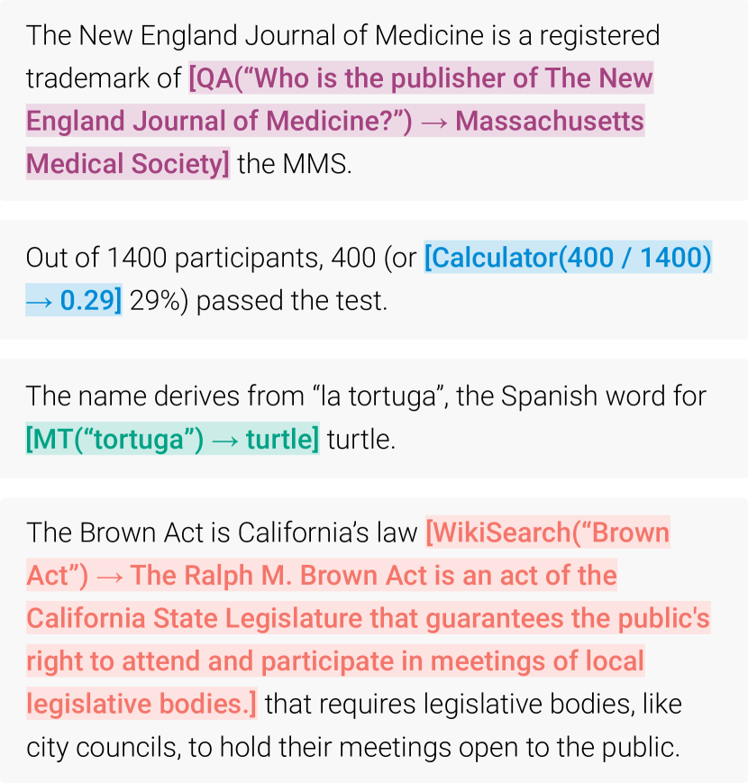
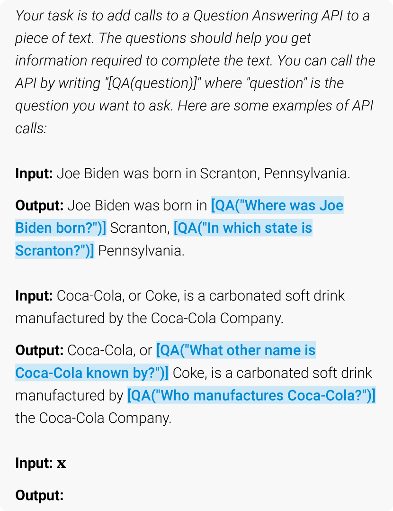
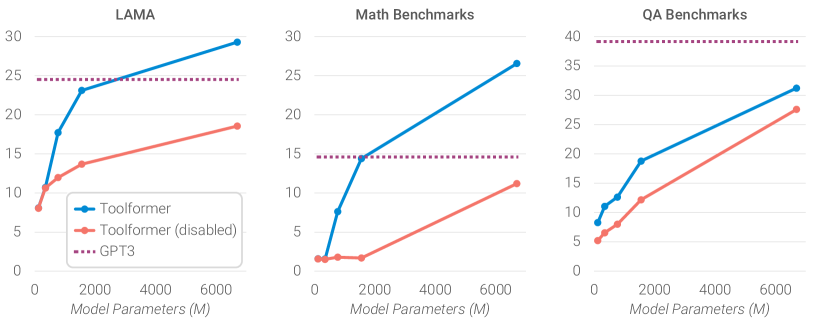

# Toolformer: 言語モデルはツールの使い方を自ら学べる

> 原題: Toolformer: Language Models Can Teach Themselves to Use Tools
> 著者: Timo Schick, Jane Dwivedi-Yu, Roberto Dessì, Roberta Raileanu, Maria Lomeli, Luke Zettlemoyer, Nicola Cancedda, Thomas Scialom（Meta AI Research / Universitat Pompeu Fabra）
> 出典: arXiv:2302.04761 (2023, NeurIPS 2023)

> **訳注**: 本訳は ar5iv クリップを底本とし、原ページ（ar5iv）と照合した。本文中に `<sup>N</sup>` のマーカーだけが残り本文が欠落していた**脚注 8 件を ar5iv から復元**して [^fnN] で収録した。図 4 枚（x1〜x4）は ar5iv からローカル保存した。Table 2・Table 9 は HTML テーブルを markdown 表に変換して収録した。付録 A.2・C のプロンプトは、一字一句が挙動に効くため**原文のまま**残した（説明文のみ訳）。数式は LaTeX のまま残した。References・Acknowledgements は本 wiki の方針により除外した。

## Abstract（要旨）

言語モデル（LMs）は、特に大規模において、わずかな例やテキスト指示だけから新しいタスクを解く驚くべき能力を示す。しかし逆説的に、それらは、はるかに単純で小さなモデルが得意とする算術や事実の照合のような基本的な機能には苦戦する。本論文では、LM が単純な API を介して*外部ツールを使う*ことを自ら学び、両方の世界の良いとこ取りを達成できることを示す。我々は *Toolformer* を導入する。これは、どの API を、いつ呼び、どんな引数を渡し、その結果を将来のトークン予測にどう最もよく組み込むかを決めるよう訓練されたモデルである。これは自己教師あり（self-supervised）の方法で行われ、各 API についてほんの一握りのデモンストレーション以上のものを必要としない。我々は、計算機・Q&A システム・検索エンジン・翻訳システム・カレンダーを含む一連のツールを組み込む。Toolformer は、様々な下流タスクで zero-shot 性能を大幅に改善し、しばしばはるかに大きなモデルと競合しつつ、その中核的な言語モデリング能力を犠牲にしない。

## 1. Introduction（はじめに）

大規模言語モデルは、様々な自然言語処理タスクで印象的な zero-shot・few-shot の結果を達成し [^7] [^8]、いくつかの創発的能力を示す [^51]。しかし、これらのモデルはすべて、さらなるスケーリングによってもせいぜい部分的にしか対処できないいくつかの固有の限界を持つ。これらの限界には、最近の出来事に関する最新情報にアクセスできないこと [^26] と、それに関連する事実を幻覚する傾向 [^32] [^20]、低リソース言語の理解の困難さ [^31]、精密な計算を行う数学的スキルの欠如 [^38]、時間の進行への無自覚 [^12] が含まれる。

<figure>



<figcaption>図1: Toolformer の予測例。モデルは、テキストの一部を完成させるのに有用な情報を得るために、異なる API（上から下へ: 質問応答システム・計算機・機械翻訳システム・Wikipedia 検索エンジン）を自律的に呼ぶことを決める。</figcaption>
</figure>

今日の言語モデルのこれらの限界を克服する単純な方法は、検索エンジン・計算機・カレンダーのような*外部ツールを使う*能力をそれらに与えることである。しかし、既存のアプローチは、大量の人間による注釈に依存する [^26] [^48] か、ツール使用をタスク固有の設定のみに制限する [^14] [^37] かのいずれかであり、LM でのツール使用のより広範な普及を妨げている。そこで我々は、次の要件（desiderata）を満たす、新しい方法でツールの使い方を学ぶモデル *Toolformer* を提案する:

- ツールの使用は、大量の*人間による注釈*を必要とせずに、自己教師あり（self-supervised）の方法で学ばれるべきである。これは、そのような注釈に伴うコストのためだけでなく、人間が有用と考えるものがモデルが有用と考えるものと異なりうるためにも重要である。
- LM はその*汎用性（generality）*を一切失うべきでなく、どのツールを*いつ*・*どう*使うかを自ら決められるべきである。既存のアプローチと対照的に、これは特定タスクに縛られない、はるかに包括的なツール使用を可能にする。

これらの目標を達成するための我々のアプローチは、大規模 LM を *in-context learning*（文脈内学習）[^7] とともに使ってデータセットをゼロから丸ごと生成するという、最近のアイデア [^46] [^17] [^50] に基づく: API がどう使われうるかの人間が書いた例をほんの一握りだけ与え、LM に巨大な言語モデリングデータセットを潜在的な API 呼び出しで注釈させる。次に、自己教師あり損失を使って、これらの API 呼び出しのうちどれが実際にモデルの将来のトークン予測を助けるかを判定する。最後に、モデルが有用と考える API 呼び出しの上で LM 自体をファインチューニングする。図1 に示すように、この単純なアプローチを通じて、LM は様々なツールを制御し、どのツールをいつどう使うかを自ら選ぶことを学べる。

我々のアプローチは使うデータセットに依存しない（agnostic）ため、そもそもモデルを事前学習するのに使われたのとまさに同じデータセットに適用できる。これは、モデルがその汎用性と言語モデリング能力を一切失わないことを保証する。我々は様々な異なる下流タスクで実験を行い、ツールの使い方を学んだ後、6.7B パラメータの事前学習済み GPT-J モデル [^49] に基づく Toolformer が、はるかに強い zero-shot の結果を達成し、様々なタスクではるかに大きな GPT-3 モデル [^7] やいくつかの他のベースラインを明確に上回ることを実証する。

## 2. Approach（アプローチ）

我々の狙いは、言語モデル $M$ に API 呼び出しの手段で異なるツールを使う能力を備えさせることである。各 API の入力と出力はテキスト系列として表現できることを要求する。これにより、各呼び出しの開始と終了を標示する特殊トークンを使って、任意の与えられたテキストへ API 呼び出しをシームレスに挿入できる。

各 API 呼び出しをタプル $c=({a}_{c},{i}_{c})$ として表す。ここで $a_{c}$ は API の名前、$i_{c}$ は対応する入力である。対応する結果 $r$ を持つ API 呼び出し $c$ について、その結果を含まない、および含む線形化された系列を、それぞれ次のように表す:

$$
\displaystyle\text{e}(c)=\texttt{<API>}\,a_{c}\texttt{(}i_{c}\texttt{)}\,\texttt{</API>}
$$

$$
\displaystyle\text{e}(c,r)=\texttt{<API>}\,a_{c}\texttt{(}i_{c}\texttt{)}\rightarrow r\,\texttt{</API>}
$$

ここで「`<API>`」「`</API>`」「$\rightarrow$」は特殊トークンである[^fn1]。テキスト系列に挿入された線形化 API 呼び出しの例を図1 に示す。

平文テキストのデータセット $\mathcal{C}=\{\mathbf{x}^{1},\ldots,\mathbf{x}^{|\mathcal{C}|}\}$ が与えられたとき、まずこのデータセットを API 呼び出しで拡張したデータセット $\mathcal{C}^{*}$ に変換する。これは図2 に示す 3 ステップで行われる: まず、$M$ の in-context learning 能力を活用して大量の潜在的な API 呼び出しをサンプリングする。次にこれらの API 呼び出しを実行し、最後に得られた応答が将来のトークン予測に有用かどうかをチェックする。これがフィルタリング基準として使われる。フィルタリングの後、異なるツールの API 呼び出しをマージして拡張データセット $\mathcal{C}^{*}$ を得、この上で $M$ 自体をファインチューニングする。これらの各ステップを以下でより詳しく記述する。

<figure>


<figcaption>図2: 我々のアプローチの主要ステップ、質問応答ツールについて図示。入力テキスト x が与えられると、まず位置 i と対応する API 呼び出し候補 c¹ᵢ, c²ᵢ, …, cᵏᵢ をサンプリングする。次にこれらの API 呼び出しを実行し、次のトークンにわたる損失 Lᵢ を減らさない呼び出しをすべて除去する。残ったすべての API 呼び出しを元のテキストと交互に配置し、新しいテキスト x* を得る。</figcaption>
</figure>

##### Sampling API Calls（API 呼び出しのサンプリング）

各 API について、LM に例 $\mathbf{x}=x_{1},\ldots,x_{n}$ を API 呼び出しで注釈するよう促すプロンプト $P(\mathbf{x})$ を書く。質問応答ツールのそのようなプロンプトの例を図3 に示す。使用したすべてのプロンプトは付録 A.2 に示す。$p_{M}(z_{n+1}\mid z_{1},\ldots,z_{n})$ を、$M$ が系列 $z_{1},\ldots,z_{n}$ の続きとしてトークン $z_{n+1}$ に割り当てる確率とする。まず、各 $i\in\{1,\ldots,n\}$ について、$M$ が位置 $i$ で API 呼び出しを開始することに割り当てる確率

$$
p_{i}=p_{M}(\texttt{<API>}\mid P(\mathbf{x}),x_{1:i-1})
$$

を計算することで、API 呼び出しを行う候補*位置*を最大 $k$ 個サンプリングする。サンプリング閾値 $\tau_{s}$ を与えて、すべての位置 $I=\{i\mid p_{i}>\tau_{s}\}$ を保持する。そのような位置が $k$ より多ければ、上位 $k$ 個のみを保持する。

各位置 $i\in I$ について、系列 $[P(\mathbf{x}),x_{1},\ldots,x_{i-1},\texttt{<API>}]$ をプレフィックスとして、`</API>` を系列終端トークンとして $M$ からサンプリングすることで、最大 $m$ 個の API 呼び出し $c_{i}^{1},\ldots,c_{i}^{m}$ を得る[^fn2]。

<figure>



<figcaption>図3: 質問応答ツールの API 呼び出しを生成するために使われる例示プロンプト P(x)。</figcaption>
</figure>

##### Executing API Calls（API 呼び出しの実行）

次のステップとして、$M$ が生成したすべての API 呼び出しを実行して対応する結果を得る。これがどう行われるかは API 自体に完全に依存する——例えば、別のニューラルネットワークの呼び出し、Python スクリプトの実行、大きなコーパスの検索を行う検索システムの使用が関わりうる。各 API 呼び出し $c_{i}$ への応答は単一のテキスト系列 $r_{i}$ である必要がある。

##### Filtering API Calls（API 呼び出しのフィルタリング）

$i$ を系列 $\mathbf{x}=x_{1},\ldots,x_{n}$ における API 呼び出し $c_{i}$ の位置、$r_{i}$ を API からの応答とする。さらに、*重み*の系列 $(w_{i}\mid i\in\mathbb{N})$ が与えられたとき、モデルが $\mathbf{z}$ でプレフィックスされている場合のトークン $x_{i},\ldots,x_{n}$ にわたる $M$ の重みつきクロスエントロピー損失を

$$
L_{i}(\mathbf{z})=-\sum_{j=i}^{n}w_{j-i}\cdot\log{p_{M}(x_{j}\mid\mathbf{z},x_{1:j-1})}
$$

とする。この損失の 2 つの異なるインスタンス化を比較する:

$$
\displaystyle L_{i}^{+}=L_{i}(\text{e}(c_{i},r_{i}))
$$

$$
\displaystyle L_{i}^{-}=\min\left(L_{i}(\varepsilon),L_{i}(\text{e}(c_{i},\varepsilon))\right)
$$

ここで $\varepsilon$ は空系列を表す。前者は、API 呼び出しとその結果が $M$ にプレフィックスとして与えられた場合の、全トークン $x_{i},\ldots,x_{n}$ にわたる重みつき損失である[^fn3]。後者は、(i) API 呼び出しを一切行わない場合と、(ii) API 呼び出しを行うが応答を提供しない場合から得られる損失の最小値である。直観的には、この呼び出しの入力*と*出力の両方を $M$ に提供することが、API 呼び出しを一切受け取らない場合や入力のみを受け取る場合と比べて、モデルが将来のトークンを予測しやすくするなら、その API 呼び出しは $M$ にとって有用である。フィルタリング閾値 $\tau_{f}$ を与えて、次を満たす API 呼び出しのみを保持する:

$$
L_{i}^{-}-L_{i}^{+}\geq\tau_{f}
$$

すなわち、API 呼び出しとその結果を加えることが、API 呼び出しを一切行わないか結果を得ない場合と比べて、損失を少なくとも $\tau_{f}$ だけ*減らす*場合である。

##### Model Finetuning（モデルのファインチューニング）

すべての API について呼び出しをサンプリングしフィルタした後、最後に残った API 呼び出しをマージして元の入力と交互に配置する。すなわち、位置 $i$ に対応する API 呼び出しと結果 $(c_{i},r_{i})$ を持つ入力テキスト $\mathbf{x}=x_{1},\ldots,x_{n}$ について、新しい系列 $\mathbf{x}^{*}=x_{1:{i-1}},\text{e}(c_{i},r_{i}),x_{i:n}$ を構築する。複数の API 呼び出しを持つテキストについても同様に進める。すべての $\mathbf{x}\in\mathcal{C}$ についてこれを行うと、API 呼び出しで拡張された新しいデータセット $\mathcal{C}^{*}$ が得られる。この新しいデータセットを使って、標準的な言語モデリング目的関数で $M$ をファインチューニングする。枢要なことに、挿入された API 呼び出しを除けば、拡張データセット $\mathcal{C}^{*}$ は元のデータセット $\mathcal{C}$ とまったく同じテキストを含む。その結果、$\mathcal{C}^{*}$ で $M$ をファインチューニングすることは、$\mathcal{C}$ でファインチューニングするのと同じ内容にモデルを晒す。さらに、API 呼び出しは、$M$ が将来のトークンを予測するのを助ける、まさにその位置に、まさにその入力で挿入されるため、$\mathcal{C}^{*}$ でのファインチューニングは、言語モデルが**純粋にそれ自身のフィードダックに基づいて**、どのツールをいつどう使うかを決められるようにする。

##### Inference（推論）

我々のアプローチでファインチューニングした後の $M$ でテキストを生成するとき、$M$ が「$\rightarrow$」トークンを生成するまで通常のデコーディングを行う。このトークンは、$M$ が次に API 呼び出しの応答を期待していることを示す。この時点でデコーディング過程を中断し、適切な API を呼んで応答を得、応答と `</API>` トークンの両方を挿入した後にデコーディング過程を続ける。

## 3. Tools（ツール）

我々は、通常の LM の異なる欠点に対処するために様々なツールを探究する。これらのツールに課す唯一の制約は、(i) その入力と出力の両方がテキスト系列として表現でき、(ii) その意図された使用のデモンストレーションをいくつか得られることである。具体的には、次の 5 つのツールを探究する: 質問応答システム・Wikipedia 検索エンジン・計算機・カレンダー・機械翻訳システムである。これらの各ツールに関連する API の潜在的な呼び出しと戻り文字列の例を Table 1 に示す。以下ですべてのツールを簡潔に議論する。さらなる詳細は付録 A にある。

**表1**: 使用したすべての API の入出力の例。

| API 名 | 入力の例 | 出力の例 |
| --- | --- | --- |
| Question Answering | Where was the Knights of Columbus founded? | New Haven, Connecticut |
| Wikipedia Search | Fishing Reel Types | Spin fishing » Spin fishing is distinguished between fly fishing and bait cast fishing by the type of rod and reel used. There are two types of reels used when spin fishing, the open faced reel and the closed faced reel. |
| Calculator | 27 + 4 * 2 | 35 |
| Calendar | $\varepsilon$ | Today is Monday, January 30, 2023. |
| Machine Translation | sûreté nucléaire | nuclear safety |

##### Question Answering（質問応答）

最初のツールは、単純な事実質問に答えられる別の LM に基づく質問応答システムである。具体的には、Natural Questions [^28] でファインチューニングされた検索拡張 LM である *Atlas* [^19] を使う。

##### Calculator（計算機）

第 2 のツールとして、単純な数値計算を行える計算機を使う。四則演算のみをサポートする。結果は常に小数点以下 2 桁に丸められる。

##### Wikipedia Search（Wikipedia 検索）

第 3 のツールは、検索語が与えられると Wikipedia から短いテキストスニペットを返す検索エンジンである。質問応答ツールと比べ、この検索はモデルが主題についてより包括的な情報を得ることを可能にするが、関連部分を自分で抽出することを要求する。検索エンジンとしては、KILT [^39] の Wikipedia ダンプにインデックスを張る BM25 リトリーバ [^43] [^3] を使う。

##### Machine Translation System（機械翻訳システム）

第 4 のツールは、任意の言語のフレーズを英語に翻訳できる LM に基づく機械翻訳システムである。より具体的には、200 言語（低リソース言語を含む）で動作する多言語機械翻訳モデルとして 600M パラメータの NLLB [^10] を使う。ソース言語は fastText 分類器 [^23] を使って自動検出され、ターゲット言語は常に英語に設定される。

##### Calendar（カレンダー）

最後のツールは、クエリされると入力を取らずに現在の日付を返すカレンダー API である。これは、時間の認識を要する予測に時間的文脈を提供する。

## 4. Experiments（実験）

我々は、我々のアプローチがモデルにそれ以上の監督なしにツールを使うことと、利用可能なツールのどれをいつどう呼ぶかを自ら決めることを可能にするかを調査する。これをテストするため、考慮したツールの少なくとも 1 つが有用と想定される様々な下流タスクを選び、zero-shot 設定で性能を評価する（§4.2）。それを超えて、我々のアプローチがモデルの中核的な言語モデリング能力を損なわないことも保証する。これを 2 つの言語モデリングデータセットでのパープレキシティを見ることで検証する（§4.3）。最後に、ツールを使うことを学ぶ能力がモデルサイズにどう影響されるかを調査する（§4.4）。

### 4.1 Experimental Setup（実験設定）

##### Dataset Generation（データセット生成）

すべての実験を通じて、言語モデリングデータセット $\mathcal{C}$ として CCNet [^52] の部分集合を、言語モデル $M$ として GPT-J [^49] を使う。$\mathcal{C}$ を API 呼び出しで注釈する計算コストを減らすため、いくつかの API については、平均的なテキストより API 呼び出しが有用になりやすい $\mathcal{C}$ の部分集合を得るヒューリスティクスを定義する。例えば、計算機ツールについては、少なくとも 3 つの数を含むテキストのみを考える。使用したヒューリスティクスの詳細は付録 A に示す。$\mathcal{C}$ から $\mathcal{C}^{*}$ を得るため、§2 に記述したすべてのステップを行い、加えて、フィルタリングステップですべての API 呼び出しが除去された例をすべてフィルタで除く[^fn4]。重み関数には、API が提供する情報が実際にモデルに有用な場所の近くで API 呼び出しが起こることを保証するために、

$$
w_{t}=\frac{\tilde{w}_{t}}{\sum_{s\in\mathbb{N}}\tilde{w}_{s}}\text{ ただし }\tilde{w}_{t}=\max(0,1-0.2\cdot t)
$$

を使う。閾値 $\tau_{s}$ と $\tau_{f}$ は、十分に多くの例を保証するために各ツールごとに個別に選ぶ。詳細は付録 A を参照。API 呼び出しで拡張した最終データセットの関連統計を Table 2 に示す。

**表2**: フィルタリング閾値 $\tau_{f}$ の異なる値に対する $\mathcal{C}^{*}$ 中の API 呼び出しを持つ例の数。

| API | $\tau_f=0.5$ | $\tau_f=1.0$ | $\tau_f=2.0$ |
| --- | --- | --- | --- |
| Question Answering | 51,987 | 18,526 | 5,135 |
| Wikipedia Search | 207,241 | 60,974 | 13,944 |
| Calculator | 3,680 | 994 | 138 |
| Calendar | 61,811 | 20,587 | 3,007 |
| Machine Translation | 3,156 | 1,034 | 229 |

##### Model Finetuning（モデルのファインチューニング）

バッチサイズ 128、学習率 $1\cdot 10^{-5}$（最初の訓練の 10% で線形ウォームアップ）で $\mathcal{C}^{*}$ の上で $M$ をファインチューニングする。ファインチューニング手続きの詳細は付録 B に示す。

##### Baseline Models（ベースラインモデル）

本節の残りを通じて、主に次のモデルを比較する:

- GPT-J: ファインチューニングを行わない通常の GPT-J モデル。
- GPT-J + CC: API 呼び出し*なし*の CCNet 部分集合 $\mathcal{C}$ でファインチューニングした GPT-J。
- Toolformer: API 呼び出しで拡張した CCNet 部分集合 $\mathcal{C}^{*}$ でファインチューニングした GPT-J。
- Toolformer (disabled): Toolformer と同じモデルだが、デコーディング中に API 呼び出しを無効化したもの[^fn5]。

大半のタスクでは、加えて OPT (66B) [^56] と GPT-3[^fn6] (175B) [^7] とも比較する。これらは我々の他のベースラインモデルよりそれぞれ約 10 倍と 25 倍大きい。

### 4.2 Downstream Tasks（下流タスク）

すべてのモデルを様々な下流タスクで評価する。すべての場合で、プロンプトつきの zero-shot 設定を考える——すなわち、モデルは各タスクを自然言語で解くよう指示されるが、in-context の例は一切提供しない。これは、ツール使用の先行研究 [^14] [^37] と対照的である。そこではモデルに、具体的なタスクを解くためにツールがどう使えるかのデータセット固有の例が提供される。我々は、Toolformer が、ユーザーが特定の問題を解くためにどのツールをどう使うべきかを事前に指定しない、まさにそのような場合に機能するかに関心があるため、より挑戦的な zero-shot 設定を選ぶ。

Toolformer には 1 つの修正を加えた標準の貪欲デコーディングを使う: `<API>` が最も確率の高いトークンであるときだけでなく、上位 $k$ 個のトークンの 1 つであるときにいつでも、モデルに API 呼び出しを開始させる。$k=1$ では通常の貪欲デコーディングに対応する。我々は代わりに $k=10$ を使い、モデルがアクセスできる API を利用する傾向を高める。同時に、モデルが実際の出力を生成せずに絶えず API を呼ぶループにはまらないよう、入力あたり最大 1 回の API 呼び出しのみとする。これらの修正の効果は §5 で探究する。

#### 4.2.1 LAMA

LAMA ベンチマーク [^40] の SQuAD・Google-RE・T-REx 部分集合でモデルを評価する。これらの各部分集合で、タスクは欠けた事実（日付や場所など）で短い文を完成させることである。LAMA はもともと*マスク*言語モデル [^11] を評価するために設計されたため、マスクトークンが最終トークンでない例をフィルタで除き、残りの例が左から右へ処理できるようにする。異なるトークン化と、単一の単語が必要だとモデルに知らせないことによる複雑さの増加を考慮するため、完全一致よりわずかに寛容な評価基準を使い、正しい単語がモデルの予測する最初の 5 単語以内にあるかを単にチェックする。LAMA は Wikipedia から直接得られた文に基づくため、不公平な利点を与えないよう Toolformer が Wikipedia 検索 API を使うことを禁じる。

すべてのモデルの結果を Table 3 に示す。ツールを使わないすべての GPT-J モデルは同様の性能を達成する。枢要なことに、Toolformer はこれらのベースラインモデルを明確に上回り、最良のベースラインをそれぞれ 11.7・5.2・18.6 ポイント改善する。また、OPT (66B) と GPT-3 (175B) の両方がはるかに大きいにもかかわらず、それらを明確に上回る。これは、モデルがほぼすべてのケースで（98.1%）必要な情報を質問応答ツールに尋ねることを独立に決めるために達成される。ごく少数の例でのみ、別のツール（0.7%）またはツールなし（1.2%）を使う。

**表3**: LAMA の部分集合の結果。Toolformer は大半の例で質問応答ツールを使い、同サイズのすべてのベースラインを明確に上回り、GPT-3 (175B) と競合する結果を達成する。

| Model | SQuAD | Google-RE | T-REx |
| --- | --- | --- | --- |
| GPT-J | 17.8 | 4.9 | 31.9 |
| GPT-J + CC | 19.2 | 5.6 | 33.2 |
| Toolformer (disabled) | 22.1 | 6.3 | 34.9 |
| Toolformer | 33.8 | 11.5 | 53.5 |
| OPT (66B) | 21.6 | 2.9 | 30.1 |
| GPT-3 (175B) | 26.8 | 7.0 | 39.8 |

#### 4.2.2 Math Datasets（数学データセット）

ASDiv [^35]・SVAMP [^38]・MAWPS ベンチマーク [^27] で数学的推論能力をテストする。すべてのモデルを zero-shot 設定でテストする事実を再び考慮し、より寛容な評価基準を使う: 要求される出力は常に数なので、モデルが予測する最初の数を単にチェックする[^fn7]。

Table 4 にすべてのベンチマークの結果を示す。GPT-J と GPT-J + CC がほぼ同じ性能を示す一方、Toolformer は API 呼び出しを無効にしても、より強い結果を達成する。これは、モデルが多くの API 呼び出しとその結果の例でファインチューニングされ、それ自身の数学的能力が向上したためだと推測する。それでもなお、モデルに API 呼び出しを許すと、すべてのタスクで性能が 2 倍以上になり、はるかに大きい OPT と GPT-3 のモデルも明確に上回る。これは、すべてのベンチマークにわたって、97.9% の例でモデルが計算機ツールに助けを求めることを決めるためである。

**表4**: 数学的推論を要する様々なベンチマークの結果。Toolformer は大半の例で計算機ツールを使い、OPT (66B) と GPT-3 (175B) でさえ明確に上回る。

| Model | ASDiv | SVAMP | MAWPS |
| --- | --- | --- | --- |
| GPT-J | 7.5 | 5.2 | 9.9 |
| GPT-J + CC | 9.6 | 5.0 | 9.3 |
| Toolformer (disabled) | 14.8 | 6.3 | 15.0 |
| Toolformer | 40.4 | 29.4 | 44.0 |
| OPT (66B) | 6.0 | 4.9 | 7.9 |
| GPT-3 (175B) | 14.0 | 10.0 | 19.8 |

#### 4.2.3 Question Answering（質問応答）

[^7] が考慮した 3 つの質問応答データセット——Web Questions [^4]・Natural Questions [^28]・TriviaQA [^22]——を見る。評価では、完全一致を要求する代わりに、モデルが予測する最初の 20 単語が正解を含むかをチェックする。Toolformer については、質問応答ツールを無効にする。これを許すとタスクの解決が些末になるからである（特に、根底の QA システムが Natural Questions でファインチューニングされていることを踏まえると）。

結果を Table 5 に示す。再び、Toolformer は GPT-J に基づく他のすべてのモデルを明確に上回り、今回は主に Wikipedia 検索 API（99.3%）に依拠して関連情報を見つける。しかし、Toolformer ははるかに大きい GPT-3 (175B) モデルにはなお及ばない。これは、我々の検索エンジンの単純さ（多くの場合、与えられたクエリに明らかに合致しない結果を返す）と、Toolformer がそれと*相互作用*できないこと——例えば、結果が有用でない場合にクエリを再定式化したり、上位の複数の結果を閲覧したりできないこと——の両方によるものと思われる。この機能を加えることは、将来の研究のわくわくする方向だと信じる。

**表5**: 様々な質問応答データセットの結果。大半の例で Wikipedia 検索ツールを使い、Toolformer は同サイズのベースラインを明確に上回るが、GPT-3 (175B) には及ばない。

| Model | WebQS | NQ | TriviaQA |
| --- | --- | --- | --- |
| GPT-J | 18.5 | 12.8 | 43.9 |
| GPT-J + CC | 18.4 | 12.2 | 45.6 |
| Toolformer (disabled) | 18.9 | 12.6 | 46.7 |
| Toolformer | 26.3 | 17.7 | 48.8 |
| OPT (66B) | 18.6 | 11.4 | 45.7 |
| GPT-3 (175B) | 29.0 | 22.6 | 65.9 |

#### 4.2.4 Multilingual Question Answering（多言語質問応答）

多言語質問応答ベンチマークである MLQA [^30] で Toolformer とすべてのベースラインモデルを評価する。各質問の文脈段落は英語で提供され、質問はアラビア語・ドイツ語・スペイン語・ヒンディー語・ベトナム語・簡体字中国語のいずれかである。タスクを解くには、モデルは段落と質問の両方を理解できる必要があり、質問を英語に翻訳することで利益を得られるかもしれない。評価指標は、10 単語で打ち切ったモデルの生成が正解を含む割合である。

結果を Table 6 に示す。API 呼び出しを使うと、すべての言語で Toolformer の性能が一貫して改善し、機械翻訳ツールの使い方を学んだことを示唆する。言語によって、このツールは全例の 63.8% から 94.9% で使われる。唯一の例外はヒンディー語で、機械翻訳ツールは 7.3% のケースでしか使われない。しかし、Toolformer はバニラ GPT-J を一貫して上回るわけではない。これは主に、いくつかの言語で CCNet のファインチューニングが性能を悪化させるためである。これは GPT-J の元の事前学習データと比べた分布シフトによるものかもしれない。

OPT と GPT-3 は、すべての言語で驚くほど弱く、主にそう指示されているにもかかわらず英語で答えを提供できないためである。GPT-J がこの問題に苦しまない潜在的な理由は、EuroParl コーパス [^25] [^13] を含め、OPT と GPT-3 の両方より多くの多言語データで訓練されたことである。上限として、文脈と質問の両方を英語で提供する MLQA の変種でも GPT-J と GPT-3 を評価する。この設定では GPT-3 が他のすべてのモデルより良く機能し、MLQA でのその平凡な性能がタスクの多言語的側面によるものだという我々の仮説を支持する。

**表6**: スペイン語(Es)・ドイツ語(De)・ヒンディー語(Hi)・ベトナム語(Vi)・中国語(Zh)・アラビア語(Ar)の MLQA の結果。質問を翻訳するために機械翻訳ツールを使うことはすべての言語で有用だが、CCNet でのさらなる事前学習が性能を悪化させる。その結果、Toolformer は GPT-J を一貫して上回らない。最後の 2 行は文脈と質問を英語で与えられたモデルに対応する。

| Model | Es | De | Hi | Vi | Zh | Ar |
| --- | --- | --- | --- | --- | --- | --- |
| GPT-J | 15.2 | 16.5 | 1.3 | 8.2 | 18.2 | 8.2 |
| GPT-J + CC | 15.7 | 14.9 | 0.5 | 8.3 | 13.7 | 4.6 |
| Toolformer (disabled) | 19.8 | 11.9 | 1.2 | 10.1 | 15.0 | 3.1 |
| Toolformer | 20.6 | 13.5 | 1.4 | 10.6 | 16.8 | 3.7 |
| OPT (66B) | 0.3 | 0.1 | 1.1 | 0.2 | 0.7 | 0.1 |
| GPT-3 (175B) | 3.4 | 1.1 | 0.1 | 1.7 | 17.7 | 0.1 |
| GPT-J (All En) | 24.3 | 27.0 | 23.9 | 23.3 | 23.1 | 23.6 |
| GPT-3 (All En) | 24.7 | 27.2 | 26.1 | 24.9 | 23.6 | 24.0 |

#### 4.2.5 Temporal Datasets（時間データセット）

カレンダー API の有用性を調査するため、TempLAMA [^12] と、我々が Dateset と呼ぶ新しいデータセットですべてのモデルを評価する。TempLAMA は Wikidata から構築されたデータセットで、時間とともに変わる事実についての穴埋めクエリ（例: "Cristiano Ronaldo plays for \_\_\_"）と、2010 年から 2020 年の間の年の正解を含む。付録 D に記述する Dateset も一連のテンプレートを通じて生成されるが、ランダムな日付/期間の組み合わせで埋められる（例: "What day of the week was it 30 days ago?"）。枢要なことに、これらの質問に答えるには現在の日付を知ることが要求される。両タスクで、元の LAMA データセットと同じ評価を使う。

Table 7 に示す結果は、Toolformer が TempLAMA と Dateset の両方ですべてのベースラインを上回ることを示す。しかし、より詳しく調べると、TempLAMA での改善はカレンダーツール（全例の 0.2% でしか使われない）に帰せられず、主に Toolformer が最も多く呼ぶ Wikipedia 検索と質問応答ツールに帰せられる。これは、TempLAMA の固有表現がしばしば非常に特定的で稀であり、正確な日付だけを知っていてもほとんど役に立たないことを踏まえれば理にかなう。このデータセットの最善の行動——まずカレンダー API をクエリして現在の日付を得、次にこの日付で質問応答システムをクエリする——は、例あたり最大 1 回の API 呼び出しという我々の制限で禁じられているだけでなく、訓練データのすべての API 呼び出しが独立にサンプリングされることを踏まえると、Toolformer が学ぶのも難しい。

一方、Dateset については、他のモデルと比べた Toolformer の相当な改善は、全例の 54.8% で使うカレンダーツールに完全に帰せられる。

**表7**: 時間データセットの結果。Toolformer はすべてのベースラインを上回るが、TempLAMA ではカレンダーツールを使わない。

| Model | TempLAMA | Dateset |
| --- | --- | --- |
| GPT-J | 13.7 | 3.9 |
| GPT-J + CC | 12.9 | 2.9 |
| Toolformer (disabled) | 12.7 | 5.9 |
| Toolformer | 16.3 | 27.3 |
| OPT (66B) | 14.5 | 1.3 |
| GPT-3 (175B) | 15.5 | 0.8 |

### 4.3 Language Modeling（言語モデリング）

様々な下流タスクでの改善された性能の検証に加えて、Toolformer の言語モデリング性能が API 呼び出しでのファインチューニングを通じて劣化しないことも保証したい。この目的で、2 つの言語モデリングデータセット——WikiText [^34] と、訓練中に使われなかった CCNet [^52] からランダムに選ばれた 10,000 文書の部分集合——でモデルを評価する。様々なモデルのパープレキシティを Table 8 に示す。予想どおり、CCNet でのファインチューニングは別の CCNet 部分集合での性能をわずかに改善するが、WikiText での性能をわずかに悪化させる。これはおそらく、GPT-J の元の事前学習データが、我々のランダムに選ばれた CCNet 部分集合より WikiText に似ているためである。しかし最も重要なことに、$\mathcal{C}^{*}$（API 呼び出しで注釈した我々のデータセット）での訓練は、推論時に API 呼び出しを無効にした場合、$\mathcal{C}$ での訓練と比べてパープレキシティの増加をもたらさない[^fn8]。

**表8**: WikiText と我々の CCNet 検証部分集合での異なるモデルのパープレキシティ。API 呼び出しを加えても、API 呼び出しなしの言語モデリングのパープレキシティの点でコストはかからない。

| Model | WikiText | CCNet |
| --- | --- | --- |
| GPT-J | 9.9 | 10.6 |
| GPT-J + CC | 10.3 | 10.5 |
| Toolformer (disabled) | 10.3 | 10.5 |

### 4.4 Scaling Laws（スケーリング則）

<figure>



<figcaption>図4: 異なるサイズの GPT-2 モデルと、我々のアプローチでファインチューニングした GPT-J（API 呼び出しあり・なしの両方）の、LAMA・数学ベンチマーク・QA ベンチマークでの平均性能。API 呼び出しは最小のモデルには有用でないが、より大きなモデルはそれをうまく使う方法を学ぶ。より大きなモデルでも、API 呼び出しあり・なしのモデル予測の差は大きいままである。</figcaption>
</figure>

外部ツールに助けを求める能力が、LM のサイズを変えるにつれて性能にどう影響するかを調査する。この目的で、我々のアプローチを GPT-J だけでなく、GPT-2 ファミリー [^41] の 4 つの小さいモデル（それぞれ 124M・355M・775M・1.6B パラメータ）にも適用する。3 つのツールの部分集合——質問応答システム・計算機・Wikipedia 検索エンジン——のみを使ってこれを行う。それ以外は §4.1 に記述した実験設定に従う。

図4 は、提供されたツールを活用する能力が約 775M パラメータでようやく創発することを示す: より小さいモデルはツールあり・なしの両方で同様の性能を達成する。これの例外は主に QA ベンチマークで使われる Wikipedia 検索エンジンである。これは API が比較的使いやすいためだと仮説する。モデルはサイズが大きくなるにつれて API 呼び出し*なし*でタスクを解くのが上手くなるが、同時に提供された API をうまく使う能力も向上する。その結果、我々の最大のモデルでも、API 呼び出しあり・なしの予測の差は大きいままである。

## 5. Analysis（分析）

##### Decoding Strategy（デコーディング戦略）

§4.2 で導入した修正デコーディング戦略——常に最も確率の高いトークンを生成する代わりに、`<API>` トークンが上位 $k$ 個のトークンの 1 つなら生成する——の効果を調査する。Table 9 は、$k$ の異なる値に対する LAMA の T-REx 部分集合と WebQS での性能を示す。予想どおり、$k$ を増やすとモデルがより多くの例で API 呼び出しを行うようになる——$k=1$（通常の貪欲デコーディング）での 40.3% と 8.5% から、$k=10$ での 98.1% と 100% へ。T-REx については貪欲デコーディングですでに明確な性能改善があるが、WebQS では $k$ をわずかに増やすとようやくモデルが相当数の API 呼び出しを始める。興味深いことに、$k=1$ ではモデルはある程度キャリブレートされている: API 呼び出しをしなければ特に悪い性能を示す例で、API を呼ぶことを決める。これは、API 呼び出しを*しない*ことを決めた例での性能（44.3 と 19.9）が、API 呼び出しを一切しない場合の平均性能（34.9 と 18.9）より高いことから見て取れる。しかし、このキャリブレーションは $k$ の値が高いと失われる。

**表9**: デコーディング中に使う $k$ の異なる値に対する、LAMA の T-REx 部分集合と WebQS での Toolformer の結果。示す数値は全体性能（All）・モデルが API 呼び出しを決めた部分集合での性能（AC）・残りの例（NC）、およびモデルが API を呼ぶと決めた例の割合（%）。

| $k$ | T-REx All | AC | NC | % | WebQS All | AC | NC | % |
| --- | --- | --- | --- | --- | --- | --- | --- | --- |
| 0 | 34.9 | – | 34.9 | 0.0 | 18.9 | – | 18.9 | 0.0 |
| 1 | 47.8 | 53.0 | 44.3 | 40.3 | 19.3 | 17.1 | 19.9 | 8.5 |
| 3 | 52.9 | 58.0 | 29.0 | 82.8 | 26.3 | 26.5 | 6.6 | 99.3 |
| 10 | 53.5 | 54.0 | 22.5 | 98.1 | 26.3 | 26.4 | – | 100.0 |

**表10**: 異なるツールの API 呼び出しの例。フィルタリング基準として使う $L_{i}^{-}-L_{i}^{+}$ の値でソート。高い値は典型的に、将来のトークン予測に直観的に有用な API 呼び出しに対応する。（訳注: 元の Table 10 は 10 例の CCNet テキスト＋API 呼び出し＋スコア＋有用性の一覧。長いため、代表 3 例のみ収録する。）

- （5.49, ✓）The Nile has an approximate length of `[QA(What is the approximate length of the Nile?) → 6,853 km]` 6,853 kilometers, the White Nile being its main source.（訳注: 表中スコア 2.08 の例。QA ツールが有用に働いた例）
- （0.92, ✗）You are here: Home / Featured / Catch this fast train to success! `[WikiSearch(Fast train success) → Fast Train » It also peaked at #23 …]` Don't wait weeks …（スコアは正だが内容は無関係でも perplexity を下げた例）
- （−1.23, ✗）The last time I was with `[QA(Who was last time I was with?) → The Last Time]` him I asked what he likes about me …（スコア負でフィルタで除去される例）

##### Data Quality（データ品質）

我々のアプローチで生成された異なる API のいくつかの API 呼び出しを定性的に分析する。Table 10 は、API 呼び出しで拡張された CCNet のテキストのいくつかの例と、フィルタリング基準として使われる対応するスコア $L_{i}^{-}-L_{i}^{+}$、そしてモデルが行った API 呼び出しが与えられた文脈で直観的に有用かどうかを示す。見て取れるように、$L_{i}^{-}-L_{i}^{+}$ の高い値は典型的に有用な API 呼び出しに対応し、低い値は将来のトークン予測に有用な情報を提供しない API 呼び出しに対応する。いくつかの例外がある。例えば、4 番目の例の「Fast train success」の API 呼び出しは、関連情報を一切与えないがそれでもパープレキシティを下げる。しかし、フィルタで除かれない API 呼び出しにある程度のノイズがあることは、実際には有用でありうる。$\mathcal{C}^{*}$ でファインチューニングされたモデルが、行うすべての呼び出しの結果を常に盲目的に従うわけではないよう強制するからである。

## 6. Related Work（関連研究）

##### Language Model Pretraining（言語モデルの事前学習）

事前学習中に何らかの形の追加テキスト情報で言語モデルを拡張する様々なアプローチがある。様々な形のメタデータ [^24]・HTML タグ [^1]・Wikipedia マークアップ [^44]・情報検索システムから得た関連テキスト [^15] [^5] [^19] を含む。これらのすべてのアプローチでは、追加情報が有用かどうかにかかわらず*常に*提供される。対照的に、Toolformer は正しい情報を明示的に求めることを自ら学ぶ。

##### Tool Use（ツール使用）

いくつかのアプローチは、検索エンジン [^26] [^48] [^29] [^47] [^53]・Web ブラウザ [^36]・計算機 [^9] [^48]・翻訳システム [^48]・Python インタプリタ [^14] のような外部ツールを使う能力を LM に備えさせることを目指す。これらのモデルがツールの使い方を学ぶ方法は、おおよそ 2 つのアプローチに分けられる: 大量の人間による監督に依存する [^26] [^36] [^48] か、どのツールを使う必要があるかが事前に分かっている特定タスクに合わせた few-shot 設定で言語モデルをプロンプトすることで機能する [^14] [^29] [^53] かである。対照的に、Toolformer の自己教師ありの性質は、ツールがどう使えるかのタスク固有の例を示す特定のプロンプトを必要とせずに、ツールをどういつ使うかを学ぶことを可能にする。おそらく我々の研究に最も密接に関連するのは TALM [^37] で、これはモデルに計算機と検索エンジンを使うことを教える似た自己教師あり目的関数を使うが、モデルが下流タスクのためにファインチューニングされる設定でのみこれを探究する。

##### Bootstrapping（ブートストラッピング）

自己訓練とブートストラッピングの技術を使ってモデルを改善するアイデアは、語義曖昧性解消 [^54]・関係抽出 [^6] [^2]・構文解析 [^33] [^42]・系列生成 [^16]・few-shot テキスト分類 [^45]・検索 [^18]・推論 [^55] まで、様々な文脈で調査されてきた。これらのアプローチと似た精神で、Toolformer はパープレキシティベースのフィルタリングステップを適用した後、それ自身の予測の上で訓練される。

## 7. Limitations（限界）

我々のアプローチは LM が自己教師ありの方法で様々なツールの使い方を学ぶことを可能にするが、現在の形の我々の手法で達成できることには明らかな限界がいくつかある。そのような限界の 1 つは、Toolformer がツールを*連鎖（chain）*で使えないこと（すなわち、あるツールの出力を別のツールの入力として使えないこと）である。これは、各ツールの API 呼び出しが独立に生成されるためである。その結果、ファインチューニングデータセットに連鎖したツール使用の例がない。我々の現在のアプローチはまた、LM がツールを*対話的（interactive）*に使うことを許さない——特に検索エンジンのような、潜在的に何百もの異なる結果を返しうるツールでは、LM がこれらの結果を閲覧したり [^36] と似た精神で検索クエリを洗練したりできることが、特定の応用には枢要でありうる。これを超えて、Toolformer で訓練されたモデルは、API を呼ぶかどうかを決めるとき、入力の正確な言い回しにしばしば敏感であることを見出した。これは、LM が zero-shot・few-shot の両設定で与えられるプロンプトに非常に敏感であることが知られていることを踏まえれば [^21] [^45]、おそらく驚くべきことではない。ツールによっては、我々の手法は非常にサンプル非効率でもある。例えば、100 万を超える文書を処理しても、計算機 API への有用な呼び出しの例は数千しか得られない。この問題への潜在的な解決策は、関連するブートストラッピングのアプローチ [^45] [^18] [^37] で行われるのと似て、我々のアプローチを反復的に適用することかもしれない。最後に、API 呼び出しを行うかどうかを決めるとき、Toolformer は現在、API 呼び出しから生じるツール依存の計算コストを考慮に入れない。

## 8. Conclusion（結論）

我々は Toolformer を導入した。これは、検索エンジン・計算機・翻訳システムのような異なるツールを、単純な API 呼び出しを介して使う方法を自己教師ありの方法で学ぶ言語モデルである。これは、将来のトークンのパープレキシティを減らすかどうかに基づいてフィルタされた、大量のサンプリングされた API 呼び出しの上でファインチューニングすることで行われる。Toolformer は 6.7B パラメータの GPT-J モデルの zero-shot 性能を相当に改善し、様々な下流タスクではるかに大きな GPT-3 モデルさえ上回ることを可能にする。

## Appendix A API Details（付録 A: API の詳細）

API 呼び出しをサンプリング・フィルタリングするとき、デフォルトで $\tau_{s}=0.05$ と $\tau_{f}=1.0$ の値を使う——すなわち、`<API>` トークンの確率が少なくとも 5% である位置でのみ API 呼び出しを行い、損失を少なくとも 1.0 減らす場合に API 呼び出しを保持する。そのような位置の上位 $k=5$ のみを保持し、テキストの一部で特定された各位置について最大 $m=5$ の API 呼び出しをサンプリングする。以下に記述するヒューリスティックフィルタリングのため、計算機と機械翻訳システムについては $\mathcal{C}$ の小さな部分集合でのみ API 呼び出しを生成する。これを補うため、これらのツールについては $\tau_{s}=0.0$、$k=20$、$m=10$ を設定する。結果として得られる API 呼び出しの集合はなお比較的小さいため、加えて $\tau_{f}=0.5$ を設定する。

### A.1 Implementation（実装）

##### Question Answering

質問応答システムとして、Natural Questions [^28] でファインチューニングされた [^19] の Atlas モデルを使う。$\mathcal{C}^{*}$ の作成には Atlas-large を使い、数百万の API 呼び出しを効率的に処理できるようにする。推論時にはより大きな Atlas-xxl モデルを使う。

##### Calculator

計算機は単純な Python スクリプトに基づき、演算子「$+$」「$-$」「$*$」「$/$」のみをサポートする。構文的に無効な式には結果を返さない。API 呼び出しのサンプリングには、CCNet の部分集合にヒューリスティックフィルタを適用し、次のいずれかの文書のみを処理する: (i) 100 トークンのウィンドウ内に少なくとも 3 つの数を含み、そのうち 1 つが他の 2 つに数学演算を適用した結果である、(ii)「=」「equals」「equal to」「total of」「average of」の系列のいずれかに続いて数を含む、(iii) 少なくとも 3 つの数を含む。最後の基準のみに合致するテキストについては、ランダムな 1% の部分集合のみを保持する。

##### Calendar

データセット $\mathcal{C}^{*}$ の作成には、そのような場合のカレンダー日付が文書の作成日であるべきという仮定の下で運用する。URL に日付があれば、そこから抽出することでこれを近似する。日付が抽出できないテキストをフィルタで除き、文書の約 18% を残す。

##### Machine Translation

訓練と推論の両方で、機械翻訳（MT）モデルとして 600M パラメータの NLLB [^10] を使う。ソース言語は fastText 分類器 [^23] を使って自動検出され、ターゲット言語は常に英語に設定される。CCNet データセットの大半は英語なので、API 呼び出しを生成する前に英語テキストのみを含む部分をフィルタで除く。より具体的には、英語以外の言語のテキストチャンクが英語テキストに前後を挟まれた段落のみを保持する。サイズ 10 トークンのテキストチャンクを使う。中央のテキストチャンクが英語以外の言語かを判定するために、再び信頼度 0.8 超で fastText 分類器を使う。数や特殊記号のみを含むテキストチャンクもフィルタで除く。このフィルタリング機構により、MT ツールが有用になりやすい場所に API 呼び出し生成を集中させ、データをより効率的に生成できる。MT API 呼び出しを生成した後、加えて、MT ツールへの入力が API 呼び出しの後に現れるが前には現れないものを訓練セットから除去する。データ生成中はモデルが API 呼び出しを生成するために先を見られるが、推論時にはこれが不可能なので、そのような場合に API を呼ぶことをモデルに思いとどまらせたい。

### A.2 Prompts（プロンプト）

以下に、考慮した各ツールの API 呼び出しをサンプリングするために使ったプロンプトを列挙する。（訳注: プロンプトは一字一句が挙動に効くため原文のまま収録する。）

##### Question Answering

質問応答ツールには次のプロンプトを使う:

```
Your task is to add calls to a Question Answering API to a piece of text. The questions should help you get information required to complete the text. You can call the API by writing "[QA(question)]" where "question" is the question you want to ask. Here are some examples of API calls:
Input: Joe Biden was born in Scranton, Pennsylvania.
Output: Joe Biden was born in [QA("Where was Joe Biden born?")] Scranton, [QA("In which state is Scranton?")] Pennsylvania.
Input: Coca-Cola, or Coke, is a carbonated soft drink manufactured by the Coca-Cola Company.
Output: Coca-Cola, or [QA("What other name is Coca-Cola known by?")] Coke, is a carbonated soft drink manufactured by [QA("Who manufactures Coca-Cola?")] the Coca-Cola Company.
Input: x
Output:
```

##### Calculator

計算機には次のプロンプトを使う:

```
Your task is to add calls to a Calculator API to a piece of text. The calls should help you get information required to complete the text. You can call the API by writing "[Calculator(expression)]" where "expression" is the expression to be computed. Here are some examples of API calls:
Input: The number in the next term is 18 + 12 x 3 = 54.
Output: The number in the next term is 18 + 12 x 3 = [Calculator(18 + 12 * 3)] 54.
Input: The population is 658,893 people. This is 11.4% of the national average of 5,763,868 people.
Output: The population is 658,893 people. This is 11.4% of the national average of [Calculator(658,893 / 11.4%)] 5,763,868 people.
Input: A total of 252 qualifying matches were played, and 723 goals were scored (an average of 2.87 per match). This is three times less than the 2169 goals last year.
Output: A total of 252 qualifying matches were played, and 723 goals were scored (an average of [Calculator(723 / 252)] 2.87 per match). This is twenty goals more than the [Calculator(723 - 20)] 703 goals last year.
Input: I went to Paris in 1994 and stayed there until 2011, so in total, it was 17 years.
Output: I went to Paris in 1994 and stayed there until 2011, so in total, it was [Calculator(2011 - 1994)] 17 years.
Input: From this, we have 4 * 30 minutes = 120 minutes.
Output: From this, we have 4 * 30 minutes = [Calculator(4 * 30)] 120 minutes.
Input: x
Output:
```

（訳注: 計算機プロンプトの 2 例目は、クリップでは「This is 11.4Output:」と途中で崩れていたため、原文の完全な形に補った。）

##### Wikipedia Search

Wikipedia 検索ツールには次のプロンプトを使う:

```
Your task is to complete a given piece of text. You can use a Wikipedia Search API to look up information. You can do so by writing "[WikiSearch(term)]" where "term" is the search term you want to look up. Here are some examples of API calls:
Input: The colors on the flag of Ghana have the following meanings: red is for the blood of martyrs, green for forests, and gold for mineral wealth.
Output: The colors on the flag of Ghana have the following meanings: red is for [WikiSearch("Ghana flag red meaning")] the blood of martyrs, green for forests, and gold for mineral wealth.
Input: But what are the risks during production of nanomaterials? Some nanomaterials may give rise to various kinds of lung damage.
Output: But what are the risks during production of nanomaterials? [WikiSearch("nanomaterial production risks")] Some nanomaterials may give rise to various kinds of lung damage.
Input: Metformin is the first-line drug for patients with type 2 diabetes and obesity.
Output: Metformin is the first-line drug for [WikiSearch("Metformin first-line drug")] patients with type 2 diabetes and obesity.
Input: x
Output:
```

##### Machine Translation

機械翻訳ツールには次のプロンプトを使う:

```
Your task is to complete a given piece of text by using a Machine Translation API. You can do so by writing "[MT(text)]" where text is the text to be translated into English. Here are some examples:
Input: He has published one book: O homem suprimido ("The Supressed Man")
Output: He has published one book: O homem suprimido [MT(O homem suprimido)] ("The Supressed Man")
Input: In Morris de Jonge's Jeschuah, der klassische jüdische Mann, there is a description of a Jewish writer
Output: In Morris de Jonge's Jeschuah, der klassische jüdische Mann [MT(der klassische jüdische Mann)], there is a description of a Jewish writer
Input: 南京高淳县住房和城乡建设局 城市新区设计 a plane of reference Gaochun is one of seven districts of the provincial capital Nanjing
Output: [MT(南京高淳县住房和城乡建设局 城市新区设计)] a plane of reference Gaochun is one of seven districts of the provincial capital Nanjing
Input: x
Output:
```

##### Calendar

カレンダーツールには次のプロンプトを使う:

```
Your task is to add calls to a Calendar API to a piece of text. The API calls should help you get information required to complete the text. You can call the API by writing "[Calendar()]" Here are some examples of API calls:
Input: Today is the first Friday of the year.
Output: Today is the first [Calendar()] Friday of the year.
Input: The president of the United States is Joe Biden.
Output: The president of the United States is [Calendar()] Joe Biden.
Input: The current day of the week is Wednesday.
Output: The current day of the week is [Calendar()] Wednesday.
Input: The number of days from now until Christmas is 30.
Output: The number of days from now until Christmas is [Calendar()] 30.
Input: The store is never open on the weekend, so today it is closed.
Output: The store is never open on the weekend, so today [Calendar()] it is closed.
Input: x
Output:
```

## Appendix B Toolformer Training（付録 B: Toolformer の訓練）

API あたり最大 25k 例を使う。最大系列長 1,024。実効バッチサイズ 128。すべてのモデルは DeepSpeed の ZeRO-3（Rasley et al., 2020）を使って訓練される。BF16 で 8 台の NVIDIA A100 40GB GPU を使った。最大 2k ステップまで訓練し、500 ステップごとに 1,000 例を含む CCNet の小さな開発セットでパープレキシティ（PPL）を評価する。最も良く機能するチェックポイントを選ぶ。

## Appendix C Zero-Shot Prompts（付録 C: Zero-Shot プロンプト）

（訳注: 以下のプロンプトは原文のまま収録する。）

### C.1 LAMA and TempLAMA

LAMA と TempLAMA の両方で、入力テキスト $\mathbf{x}$ が与えられたとき、次のプロンプトを使う: `Please complete the following text so that it is factually correct: x.`

### C.2 Math Benchmarks

すべての数学ベンチマークで、文脈 $\mathbf{x}$ と質問 $\mathbf{q}$ が与えられたとき、プロンプトは: `x q The answer is.`

### C.3 Question Answering

Dateset を含むすべての質問応答データセットで、質問の前に単に `Answer the following question:` を付ける。質問が疑問符で終わっていなければ疑問符を追加する。

### C.4 Multilingual Question Answering

MLQA では、文脈 $\mathbf{x}$ と質問 $\mathbf{q}$ が与えられたとき、プロンプトは: `Your task is to answer a question based on the following paragraph: x Now answer the following question in English: q.`

## Appendix D Dateset（付録 D: Dateset）

Dateset は、まず 500 個の「現在の日付」をランダムに選ぶことで作られる。各現在の日付について、4 年の範囲内で別の比較的過去/未来の日付をランダムに選び、2 つの日付を Table 11 のクエリテンプレートに埋める。最初のテンプレートを使ったそのようなクエリの例は「How many days ago was August 14, 2020?」である。呼ばれれば、カレンダーツールは想定される現在の日付（例: 「Today is Sunday, November 20, 2020」）を返す。

**表11**: current\_date がランダムに選ばれる Dateset の作成に使うテンプレート。各 current\_date について、ランダムな past\_date と future\_date が生成され、関連する場合に各テンプレートを埋める。祝日を含むテンプレートには米国の連邦祝日（例: Thanksgiving）が使われた。

| Template | Size |
| --- | --- |
| How many days {ago was, are there until} {past_date, future_date}? | 400 |
| What {day of the week, day of the month, month, year} was it (current_date – past_date) {days, weeks, months, years} ago? | 800 |
| What {day of the week, day of the month, month, year} will it be in (future_date – current_date) days? | 800 |
| What day of the week {is, was} it on {past_date, future_date}? | 400 |
| What {day of the week, day of the month, month, year} {is, was} it {the day before yesterday, yesterday, today, tomorrow, the day after tomorrow}? | 4,000 |
| What {day of the week, day of the month, month} {is, was} $holiday$ this year? | 1,800 |
| How many {days, weeks, months, years} {ago was, are there until} $holiday$ this year? | 1,200 |
| Total | 9,400 |

[^fn1]: 実際には、「`<API>`」「`</API>`」「$\rightarrow$」を表すために、それぞれトークン系列「 [ 」「 ] 」「 -> 」を使う。これにより、既存の LM の語彙を変更せずに我々のアプローチが機能する。読みやすさのため、本節を通じてこれらを「`<API>`」「`</API>`」「$\rightarrow$」と呼び続ける。（訳注: クリップで本文が欠落していた脚注を ar5iv から復元）

[^fn2]: $M$ が `</API>` トークンを生成しない例はすべて破棄する。

[^fn3]: $\text{e}(c_{i},r_{i})$ を位置 $i$ に挿入する代わりにプレフィックスとして提供するのは、$M$ が API 呼び出しを含む例でまだファインチューニングされておらず、$\mathbf{x}$ の中間に挿入すると流れが中断され、事前学習コーパスのパターンに整合せず、パープレキシティを損なうためである。

[^fn4]: このフィルタリングは訓練例の分布を変えるが、残った例が元の分布に十分近く、$M$ の言語モデリング能力が影響を受けないままと仮定する。この仮定は §4.3 で経験的に検証される。

[^fn5]: これは `<API>` トークンの確率を手動で 0 に設定することで達成される。

[^fn6]: 指示でファインチューニングされていない元の davinci 変種を使う。

[^fn7]: これの例外は、モデルの予測が方程式を含む場合（例: "The correct answer is 5+3=8"）で、その場合は「=」記号の後の最初の数をその予測とみなす。

[^fn8]: API 呼び出しを有効にした Toolformer のパープレキシティは評価しない。$x_{1},\ldots,x_{t-1}$ を与えたときのトークン $x_{t}$ の確率 $p_{M}(x_{t}\mid x_{1},\ldots,x_{t-1})$ を計算するには、モデルが位置 $t$ で行いうるすべての潜在的な API 呼び出しにわたって周辺化する必要があり、これは扱いにくい（intractable）ためである。