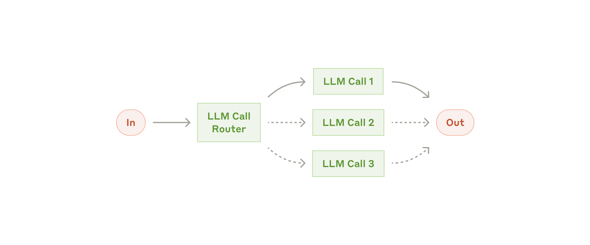

# 効果的な AI エージェントの構築

> 原題: Building Effective AI Agents
> 著者: Erik S., Barry Zhang（Anthropic）
> 出典: https://www.anthropic.com/engineering/building-effective-agents（初出 2024 年 12 月。本クリップはフレームワーク一覧に Claude Agent SDK 等を含む改訂版）
> 訳注: 図 8 枚はクリップに CDN 変換 URL（Next.js の /_next/image ラッパー）で埋め込まれていたため、素の原典 URL に直してローカル保存した。本文中のプロンプト・原則名など挙動や意味に効く英語表現は原語を併記する。

この 1 年、我々は業界を横断して、大規模言語モデル（LLM）エージェントを構築する数十のチームと仕事をしてきた。一貫して、最も成功した実装は複雑なフレームワークや特化ライブラリを使っていなかった。そうではなく、**単純で合成可能なパターン**で構築していた。

本稿では、顧客との仕事と我々自身のエージェント構築から学んだことを共有し、効果的なエージェントを構築する開発者への実践的な助言を与える。

## エージェントとは何か？

「エージェント」はいくつかの仕方で定義できる。ある顧客は、エージェントを、様々なツールを使って複雑なタスクを遂行しながら、長時間にわたり独立して動作する完全自律のシステムと定義する。別の顧客は、事前定義されたワークフローに従う、より規範的な実装を指すのにこの語を使う。Anthropic では、これらすべての変種を **agentic システム**（エージェント的システム）として分類しつつ、**ワークフロー（workflow）** と**エージェント（agent）** の間に重要なアーキテクチャ上の区別を引く:

- **ワークフロー**は、LLM とツールが事前定義されたコードパスを通じてオーケストレートされるシステムである。
- 一方**エージェント**は、LLM が自らのプロセスとツール使用を動的に方向づけ、タスクをどう遂行するかの制御を保持するシステムである。

以下では、両タイプの agentic システムを詳しく探る。Appendix 1（「実践におけるエージェント」）では、顧客がこの種のシステムに特に価値を見出した 2 つのドメインを述べる。

## いつエージェントを使うべきか（そして使うべきでないか）

LLM でアプリケーションを構築するときは、**可能な限り最も単純な解を見つけ、必要なときにだけ複雑さを増やす**ことを推奨する。これは agentic システムをまったく作らないことを意味するかもしれない。agentic システムはしばしば、より良いタスク性能と引き換えにレイテンシとコストを差し出す。このトレードオフがいつ意味を持つかを考えるべきである。

より高い複雑さが正当化されるとき、明確に定義されたタスクにはワークフローが予測可能性と一貫性を提供し、柔軟性とモデル駆動の意思決定が大規模に必要なときにはエージェントがより良い選択肢となる。しかし多くのアプリケーションでは、検索と文脈内の例を備えた単一の LLM 呼び出しの最適化で通常は十分である。

## フレームワークをいつ、どう使うか

agentic システムの実装を容易にするフレームワークは多数ある。例えば:

- [Claude Agent SDK](https://platform.claude.com/docs/en/agent-sdk/overview)
- [Strands Agents SDK by AWS](https://strandsagents.com/latest/)
- [Rivet](https://rivet.ironcladapp.com/)（ドラッグ&ドロップの GUI による LLM ワークフロービルダー）
- [Vellum](https://www.vellum.ai/)（複雑なワークフローの構築とテストのためのもう一つの GUI ツール）

これらのフレームワークは、LLM の呼び出し・ツールの定義とパース・呼び出しの連鎖といった標準的な低レベルタスクを単純化し、始めやすくしてくれる。しかし、しばしば余分な抽象化レイヤーを作り、その下にあるプロンプトと応答を見えにくくし、デバッグを難しくする。単純な構成で十分な場面で複雑さを足したくなる誘惑も生む。

開発者にはまず **LLM API を直接使う**ことから始めることを提案する: 多くのパターンは数行のコードで実装できる。フレームワークを使うなら、その下にあるコードを理解していることを確実にせよ。内部の動作に関する誤った仮定は、顧客の誤りのよくある源である。

いくつかのサンプル実装は我々の [cookbook](https://platform.claude.com/cookbook/patterns-agents-basic-workflows) を参照。

## 構成要素・ワークフロー・エージェント

本節では、本番環境で見てきた agentic システムの一般的なパターンを探る。基礎となる構成要素——augmented LLM（拡張された LLM）——から始め、単純な合成的ワークフローから自律エージェントへと、段階的に複雑さを増していく。

### 構成要素: augmented LLM

agentic システムの基本の構成要素は、検索（retrieval）・ツール・記憶（memory）といった拡張で強化された LLM である。我々の現行モデルは、これらの能力を能動的に使える——自ら検索クエリを生成し、適切なツールを選択し、どの情報を保持するかを決定する。

<figure>

<figcaption>図1: augmented LLM（拡張された LLM）。LLM 呼び出しが Retrieval・Tools・Memory と双方向に接続されている。</figcaption>
</figure>

実装では 2 つの重要な側面に注力することを推奨する: これらの能力を自分のユースケースに合わせて仕立てること、そして LLM にとって簡単で十分に文書化されたインターフェースを提供することである。これらの拡張の実装方法は多数あるが、一つのアプローチは、最近リリースした [Model Context Protocol](https://www.anthropic.com/news/model-context-protocol) を通じるものである。これは、単純な[クライアント実装](https://modelcontextprotocol.io/tutorials/building-a-client#building-mcp-clients)により、成長するサードパーティツールのエコシステムとの統合を開発者に可能にする。

本稿の残りでは、各 LLM 呼び出しがこれらの拡張された能力にアクセスできると仮定する。

### ワークフロー: プロンプトチェイニング（Prompt chaining）

プロンプトチェイニングは、タスクを一連のステップに分解し、各 LLM 呼び出しが前の呼び出しの出力を処理する。過程が軌道に乗っていることを確実にするため、任意の中間ステップにプログラムによるチェック（下図の「gate」参照）を加えられる。

<figure>

<figcaption>図2: プロンプトチェイニングのワークフロー。LLM 呼び出しを直列に繋ぎ、中間に Gate（プログラムによる検査）を挟む。</figcaption>
</figure>

**このワークフローを使うべきとき:** このワークフローは、タスクが固定のサブタスクへ容易かつきれいに分解できる状況に理想的である。主目的は、各 LLM 呼び出しをより簡単なタスクにすることで、レイテンシと引き換えに高い精度を得ることである。

**プロンプトチェイニングが有用な例:**

- マーケティングコピーを生成し、それを別の言語に翻訳する。
- 文書のアウトラインを書き、アウトラインが一定の基準を満たすことを検査してから、アウトラインに基づいて文書を書く。

### ワークフロー: ルーティング（Routing）

ルーティングは入力を分類し、特化した後続タスクへ導く。このワークフローは関心の分離を可能にし、より特化したプロンプトの構築を可能にする。このワークフローなしでは、ある種の入力への最適化が他の入力での性能を害しうる。

<figure>

<figcaption>図3: ルーティングのワークフロー。Router となる LLM 呼び出しが入力を分類し、特化した下流の LLM 呼び出しへ振り分ける。</figcaption>
</figure>

**このワークフローを使うべきとき:** ルーティングは、別々に扱う方が良い明確なカテゴリが存在し、かつ分類を（LLM またはより伝統的な分類モデル/アルゴリズムで）正確に扱える複雑なタスクでうまく働く。

**ルーティングが有用な例:**

- 異なる種類のカスタマーサービスの問い合わせ（一般的な質問、返金要求、技術サポート）を、異なる下流プロセス・プロンプト・ツールへ導く。
- 簡単/よくある質問は Claude Haiku 4.5 のような小型で費用効率の良いモデルへ、難しい/珍しい質問は Claude Sonnet 4.5 のようなより有能なモデルへルーティングし、最良の性能へ最適化する。

### ワークフロー: 並列化（Parallelization）

LLM は時にタスクに同時に取り組み、その出力をプログラムで集約できる。このワークフロー、並列化は 2 つの重要な変種で現れる:

- **セクショニング（Sectioning）**: タスクを、並列に実行される独立のサブタスクへ分割する。
- **投票（Voting）**: 多様な出力を得るために同じタスクを複数回実行する。

<figure>

<figcaption>図4: 並列化のワークフロー。複数の LLM 呼び出しを並列に実行し、Aggregator が結果を集約する。</figcaption>
</figure>

**このワークフローを使うべきとき:** 並列化は、分割したサブタスクを速度のために並列化できるとき、あるいはより高い信頼度の結果のために複数の視点や試行が必要なときに有効である。複数の考慮事項がある複雑なタスクでは、それぞれの考慮事項を別々の LLM 呼び出しが扱う方が、各側面に注意を集中でき、LLM は一般により良い性能を発揮する。

**並列化が有用な例:**

- **セクショニング**:
  - ガードレールの実装。一方のモデルインスタンスがユーザーの問い合わせを処理し、もう一方が不適切な内容や要求をスクリーニングする。同じ LLM 呼び出しにガードレールと本応答の両方を扱わせるより、この方が性能が良い傾向がある。
  - LLM の性能評価の自動化。各 LLM 呼び出しが、与えられたプロンプトに対するモデル性能の異なる側面を評価する。
- **投票**:
  - コードの脆弱性レビュー。いくつかの異なるプロンプトがコードをレビューし、問題を見つけたらフラグを立てる。
  - 与えられたコンテンツが不適切かの評価。複数のプロンプトが異なる側面を評価する、あるいは偽陽性と偽陰性のバランスを取るために異なる投票の閾値を要求する。

### ワークフロー: オーケストレータ・ワーカー（Orchestrator-workers）

オーケストレータ・ワーカーのワークフローでは、中心の LLM がタスクを動的に分解し、ワーカー LLM たちへ委譲し、その結果を統合する。

<figure>

<figcaption>図5: オーケストレータ・ワーカーのワークフロー。Orchestrator がサブタスクを動的にワーカー LLM 呼び出しへ委譲し、Synthesizer が結果を統合する。</figcaption>
</figure>

**このワークフローを使うべきとき:** このワークフローは、必要なサブタスクを予測できない複雑なタスクに適している（例えばコーディングでは、変更が必要なファイルの数と各ファイルでの変更の性質は、タスクに依存する可能性が高い）。トポロジー的には並列化と似ているが、鍵となる違いはその柔軟性である——サブタスクは事前定義されず、特定の入力に基づいてオーケストレータが決定する。

**オーケストレータ・ワーカーが有用な例:**

- 毎回複数のファイルに複雑な変更を加えるコーディング製品。
- 関連する可能性のある情報を複数の情報源から収集・分析する検索タスク。

### ワークフロー: 評価者・最適化者（Evaluator-optimizer）

評価者・最適化者のワークフローでは、一方の LLM 呼び出しが応答を生成し、もう一方が評価とフィードバックをループの中で提供する。

<figure>

<figcaption>図6: 評価者・最適化者のワークフロー。Generator の出力を Evaluator が評価し、却下ならフィードバックとともに Generator へ差し戻す。</figcaption>
</figure>

**このワークフローを使うべきとき:** このワークフローは、明確な評価基準があり、反復的な洗練が測定可能な価値を提供するときに特に有効である。良い適合の 2 つの兆候は、第一に、人間がフィードバックを言語化すると LLM の応答が実証的に改善できること、第二に、LLM がそのようなフィードバックを提供できることである。これは、人間のライターが洗練された文書を作るときに経る反復的な執筆過程に似ている。

**評価者・最適化者が有用な例:**

- 文芸翻訳。翻訳者 LLM が最初は捉えられないニュアンスがあるが、評価者 LLM が有用な批評を提供できる。
- 包括的な情報を集めるために複数ラウンドの検索と分析を要する複雑な検索タスク。評価者がさらなる検索が必要かを判断する。

### エージェント

エージェントは、LLM が鍵となる能力——複雑な入力の理解、推論と計画への従事、信頼できるツール使用、誤りからの回復——で成熟するにつれ、本番環境に現れつつある。エージェントは、人間のユーザーからのコマンド、または人間との対話的な議論から仕事を始める。タスクが明確になれば、エージェントは独立に計画し動作するが、さらなる情報や判断を求めて人間へ戻ることもある。実行中、エージェントが各ステップで環境から「ground truth」（ツール呼び出しの結果やコード実行など）を得て進捗を評価することが決定的に重要である。エージェントはその後、チェックポイントや障害に遭遇したときに、人間のフィードバックのために一時停止できる。タスクは完了時に終了することが多いが、制御を維持するために停止条件（最大反復回数など）を含めることも一般的である。

エージェントは高度なタスクを扱えるが、その実装はしばしば単純明快である。**典型的には、環境フィードバックに基づいてループの中でツールを使う LLM に過ぎない**。したがって、ツール群とその文書を明快かつ思慮深く設計することが決定的に重要である。ツール開発のベストプラクティスは Appendix 2（「ツールのプロンプトエンジニアリング」）で詳しく述べる。

<figure>

<figcaption>図7: 自律エージェント。Human と LLM 呼び出しが対話し、LLM は Environment へ Action を行い Feedback を受け取るループを回して、Stop 条件で終了する。</figcaption>
</figure>

**エージェントを使うべきとき:** エージェントは、必要なステップ数を予測するのが困難ないし不可能で、固定の経路をハードコードできないオープンエンドな問題に使える。LLM は多くのターンにわたって動作する可能性があり、その意思決定にある程度の信頼を置く必要がある。エージェントの自律性は、信頼された環境でタスクをスケールさせるのに理想的である。

エージェントの自律的な性質は、より高いコストと、誤りが複利的に積み重なる可能性を意味する。サンドボックス化された環境での広範なテストと、適切なガードレールを推奨する。

**エージェントが有用な例:**

以下の例は我々自身の実装からのものである:

- タスク記述に基づいて多数のファイルを編集する [SWE-bench タスク](https://www.anthropic.com/research/swe-bench-sonnet)を解くコーディングエージェント。
- Claude がコンピュータを使ってタスクを遂行する[「computer use」リファレンス実装](https://github.com/anthropics/anthropic-quickstarts/tree/main/computer-use-demo)。

<figure>

<figcaption>図8: コーディングエージェントの高レベルフロー。人間との対話でタスクを明確化した後、テストの合格まで自律的にコードを書き、結果を人間へ返す。</figcaption>
</figure>

## これらのパターンの組み合わせとカスタマイズ

これらの構成要素は規範的なものではない。開発者が異なるユースケースに合わせて形作り、組み合わせられる一般的なパターンである。あらゆる LLM 機能と同様、成功の鍵は性能を測定し実装を反復することである。繰り返すが、複雑さを加えるのは、**それが成果を実証的に改善するときだけ**にすべきである。

## まとめ

LLM の領域での成功は、最も洗練されたシステムを構築することではない。自分のニーズにとって*正しい*システムを構築することである。単純なプロンプトから始め、包括的な評価で最適化し、より単純な解決策で不足するときにだけ多段の agentic システムを加えよ。

エージェントを実装するとき、我々は 3 つの中核原則に従うよう努めている:

1. エージェントの設計の**単純さ（simplicity）**を維持せよ。
2. エージェントの計画ステップを明示的に見せることで、**透明性（transparency）**を優先せよ。
3. 徹底したツールの**文書化とテスト**を通じて、agent-computer interface（ACI）を注意深く作り込め。

フレームワークは素早く始める助けになるが、本番へ移るにつれ、抽象化レイヤーを減らして基本的な構成要素で構築することを躊躇するな。これらの原則に従えば、強力なだけでなく、信頼でき、保守しやすく、ユーザーに信頼されるエージェントを作れる。

## Appendix 1: 実践におけるエージェント

顧客との仕事から、上で論じたパターンの実践的価値を実証する、AI エージェントの特に有望な 2 つの応用が明らかになった。どちらの応用も、エージェントが最も価値を発揮するのは、**会話と行動の両方を必要とし、明確な成功基準を持ち、フィードバックループを可能にし、意味のある人間の監督を組み込む**タスクであることを示している。

### A. カスタマーサポート

カスタマーサポートは、馴染みのあるチャットボットのインターフェースに、ツール統合による強化された能力を組み合わせる。これがよりオープンエンドなエージェントに自然に適合するのは:

- サポートの対話は自然に会話の流れに従いつつ、外部の情報と行動へのアクセスを要求する。
- 顧客データ・注文履歴・ナレッジベース記事を引くツールを統合できる。
- 返金の発行やチケットの更新といった行動をプログラムで扱える。
- 成功を、ユーザー定義の解決によって明確に測定できる。

いくつかの企業は、解決に成功した場合にのみ課金する従量課金モデルを通じてこのアプローチの実行可能性を実証しており、自社エージェントの有効性への自信を示している。

### B. コーディングエージェント

ソフトウェア開発の領域は、コード補完から自律的な問題解決へと能力が進化するにつれ、LLM 機能の目覚ましい可能性を示してきた。エージェントが特に有効なのは:

- コードの解は自動テストで検証可能である。
- エージェントはテスト結果をフィードバックとして解を反復できる。
- 問題空間が明確に定義され構造化されている。
- 出力の品質を客観的に測定できる。

我々自身の実装では、エージェントは今や、プルリクエストの記述だけに基づいて [SWE-bench Verified](https://www.anthropic.com/research/swe-bench-sonnet) ベンチマークの実際の GitHub イシューを解ける。しかし、自動テストは機能の検証を助ける一方で、解がより広いシステム要件と整合することを保証するには、人間のレビューが依然として決定的である。

## Appendix 2: ツールのプロンプトエンジニアリング

どの agentic システムを構築するにせよ、ツールはエージェントの重要な部分になる可能性が高い。[ツール](https://www.anthropic.com/news/tool-use-ga)は、その正確な構造と定義を我々の API で指定することにより、Claude が外部のサービスや API と相互作用することを可能にする。Claude が応答するとき、ツールを呼び出すつもりなら API 応答に [tool use ブロック](https://docs.anthropic.com/en/docs/build-with-claude/tool-use#example-api-response-with-a-tool-use-content-block)を含める。**ツールの定義と仕様には、全体のプロンプトと同じだけのプロンプトエンジニアリングの注意を払うべきである**。この短い付録では、ツールをプロンプトエンジニアリングする方法を述べる。

同じ行動を指定する方法はしばしば複数ある。例えば、ファイル編集は diff を書くことでも、ファイル全体を書き直すことでも指定できる。構造化出力は、コードを markdown の中で返すことも JSON の中で返すこともできる。ソフトウェアエンジニアリングでは、このような違いは表面的なもので、相互に無損失に変換できる。しかし、一部の形式は他よりも LLM にとってはるかに書きにくい。diff を書くには、新しいコードを書く前に、チャンクヘッダで何行が変わるかを知っている必要がある。（markdown と比べて）JSON の中にコードを書くには、改行や引用符の余分なエスケープが必要になる。

ツール形式を決めるための我々の提案は以下である:

- モデルが袋小路に自分を書き込んでしまう前に、「考える」のに十分なトークンを与えよ。
- 形式を、モデルがインターネット上のテキストで自然に見てきたものに近く保て。
- 数千行のコードの正確な行数を数え続ける、書くコードをすべて文字列エスケープする、といった書式上の「オーバーヘッド」がないことを確実にせよ。

一つの経験則は、人間-コンピュータインターフェース（HCI）にどれだけの労力が注がれるかを考え、良い *agent*-computer interface（ACI）の作成に同じだけの労力を投資する計画を立てることである。その方法についての考えをいくつか挙げる:

- モデルの身になって考えよ。説明とパラメータに基づいて、このツールの使い方は自明か、それとも注意深く考える必要があるか？後者なら、モデルにとってもおそらくそうである。良いツール定義は、使用例・エッジケース・入力形式の要件・他のツールとの明確な境界を含むことが多い。
- パラメータ名や説明をどう変えれば、物事をより自明にできるか？これを、チームのジュニア開発者のために優れた docstring を書くことと考えよ。多くの類似ツールを使うときに特に重要である。
- モデルがツールをどう使うかをテストせよ: 我々の [workbench](https://console.anthropic.com/workbench) で多くの入力例を実行し、モデルがどんな誤りを犯すかを見て、反復せよ。
- ツールを [Poka-yoke（ポカヨケ）](https://en.wikipedia.org/wiki/Poka-yoke)せよ。誤りを犯しにくくなるよう引数を変更せよ。
