# DeepSeek-V3 テクニカルレポート

> 原題: DeepSeek-V3 Technical Report
> 著者: DeepSeek-AI（research@deepseek.com）
> 出典: arXiv:2412.19437（2024 年 12 月）

> **訳注（この翻訳について）**
>
> - 底本は ar5iv（`https://ar5iv.labs.arxiv.org/html/2412.19437`）のクリップ。原ページを `curl` で再取得して照合した。
> - **復元したもの**: (1) 本文に `1`〜`4` のマーカーだけが残り本文が失われていた**脚注 4 件**（いずれも URL）を原ページから復元し `[^fn1]`〜`[^fn4]` として収録した。(2) **Figure 11 の総キャプションが欠落**していた（サブキャプション (a)〜(e) のみ残存）ため原ページから復元した。
> - **画像**: 本文図は 15 枚（x1〜x15）で、クリップに全数残っていた（Figure 11 が 5 パネル構成のため、Figure 番号は 11 までだが画像は 15 枚になる）。すべて ar5iv からローカル保存した。
> - **表**: 原典の 9 表すべてがクリップに残っていた。うち 5 つが HTML テーブルのままだったため markdown 表に変換した。列の多い評価表は原典の階層ヘッダを平坦化して読める形に整えている。
> - **数式ブロックの再構成**: ar5iv は `align` 環境の各行を独立した `$$...$$`（`\displaystyle` 付き）に分解してしまうため、ひとつながりの式は `aligned` 環境にまとめ直した。数式そのものは原典のまま。MLA の式にある青枠（`\boxed`）は「生成時にキャッシュが必要なベクトル」を示す原典の強調であり、訳文では枠を外して地の文で明示した。
> - `[^N]`（数字のみ）は原典の**参考文献への引用マーカー**である。参考文献一覧は訳出対象外（skill の既定）なのでリンク先は解決しないが、原文の引用位置を保存するためマーカーはそのまま残した。
> - **翻訳範囲**: 本文 §1〜§6 に加えて**付録 B（低精度訓練のアブレーション）と付録 C（エキスパート専門化パターン）を訳出した**（ユーザー選択）。除外したのは References と **Appendix A（Contributions and Acknowledgments。貢献者一覧 208 行）**で、後者は謝辞に相当するため。
> - **1 箇所だけ圧縮した**: §5.3.1〜5.3.2（評価設定と標準評価）に置かれた **Table 6**（チャットモデル 7 種 × 英語・コード・数学・中国語の全ベンチマークの比較表。27 行）は、構造が Table 3 と同型で分量が大きいため、本文の要点を訳して表そのものは収録していない。その旨は該当箇所に訳注として明記した。他の表（1〜5・7〜9）はすべて収録している。

## Abstract（要旨）

我々は DeepSeek-V3 を提示する。これは総パラメータ 671B、各トークンにつき 37B が活性化される強力な Mixture-of-Experts（MoE, 専門家混合）言語モデルである。効率的な推論と費用対効果の高い訓練を達成するため、DeepSeek-V3 は DeepSeek-V2 で十分に検証された **Multi-head Latent Attention（MLA）**と **DeepSeekMoE** のアーキテクチャを採用する。さらに DeepSeek-V3 は、負荷分散のための**補助損失を使わない（auxiliary-loss-free）戦略**を先駆的に導入し、より強い性能のために**マルチトークン予測（multi-token prediction）**の訓練目的を設定する。我々は DeepSeek-V3 を 14.8 兆の多様で高品質なトークンで事前学習し、その後、能力を完全に引き出すために教師ありファインチューニング（SFT）と強化学習（RL）の段階を経る。包括的な評価により、DeepSeek-V3 が他のオープンソースモデルを上回り、主要なクローズドソースモデルに匹敵する性能を達成することが明らかになった。優れた性能にもかかわらず、DeepSeek-V3 の全訓練に要するのは **278.8 万 H800 GPU 時間**のみである。加えてその訓練過程は際立って安定している——**訓練過程全体を通じて、回復不能な loss spike を一度も経験せず、ロールバックも行わなかった**。モデルのチェックポイントは `github.com/deepseek-ai/DeepSeek-V3` で公開されている。

<figure>

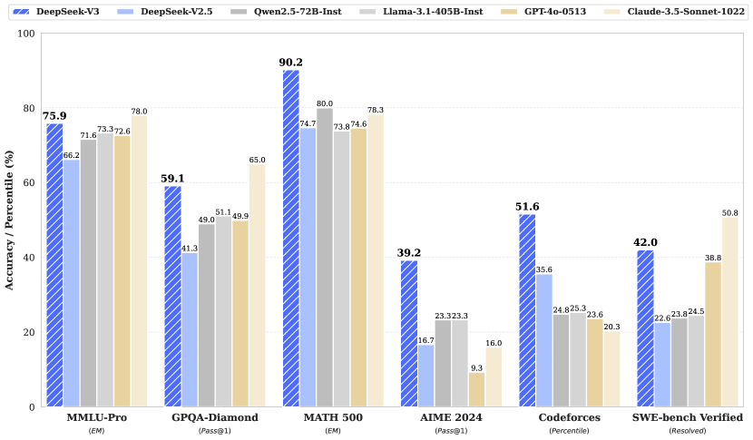

<figcaption>Figure 1: DeepSeek-V3 とその比較対象のベンチマーク性能。</figcaption>
</figure>

## 1 Introduction（はじめに）

近年、大規模言語モデル（LLM）は急速な反復と進化を遂げており [^64] [^3] [^27]、汎用人工知能（AGI）との差を着実に縮めつつある。クローズドソースのモデルに加え、DeepSeek シリーズ [^15] [^16] [^30] [^14]、LLaMA シリーズ [^90] [^91] [^1] [^2]、Qwen シリーズ [^72] [^73] [^74]、Mistral シリーズ [^38] [^58] を含むオープンソースモデルも大きく前進し、クローズドソースの対抗馬との差を埋めようと努めている。オープンソースモデルの能力の境界をさらに押し広げるため、我々はモデルをスケールアップし、総パラメータ 671B・各トークンにつき 37B が活性化される大規模 MoE モデルである DeepSeek-V3 を導入する。

先を見据えた観点から、我々は一貫して強いモデル性能と経済的なコストの両立を追求している。したがってアーキテクチャの面では、DeepSeek-V3 は依然として効率的な推論のための **MLA** [^16] と、費用対効果の高い訓練のための **DeepSeekMoE** [^13] を採用する。これら 2 つのアーキテクチャは DeepSeek-V2 [^16] で検証済みであり、効率的な訓練と推論を達成しながら頑健なモデル性能を維持できることが実証されている。基本アーキテクチャに加えて、モデルの能力をさらに高めるために 2 つの戦略を実装する。第一に、DeepSeek-V3 は負荷分散のための**補助損失を使わない戦略** [^93] を先駆的に導入する。狙いは、**負荷分散を促そうとする努力から生じるモデル性能への悪影響を最小化する**ことである。第二に、DeepSeek-V3 はマルチトークン予測の訓練目的を採用しており、これが評価ベンチマークにおける全体的な性能を高めることを観測した。

効率的な訓練を達成するため、我々は **FP8 混合精度訓練**を支援し、訓練フレームワークに包括的な最適化を実装する。低精度訓練は効率的な訓練の有望な解として現れており [^40] [^59] [^69] [^17]、その進化はハードウェアの能力の進歩と密接に結びついている [^57] [^55] [^77]。本研究で我々は FP8 混合精度訓練の枠組みを導入し、**極めて大規模なモデルでその有効性を初めて検証する**。FP8 の計算と保存への対応を通じて、訓練の高速化と GPU メモリ使用量の削減の両方を達成する。訓練フレームワークに関しては、効率的なパイプライン並列のために **DualPipe** アルゴリズムを設計した。これはパイプラインバブルがより少なく、計算と通信の重ね合わせによって訓練中の通信の大半を隠蔽する。この重ね合わせにより、モデルがさらにスケールしても、**計算対通信の比を一定に保つ限り、ノードをまたいだ細粒度エキスパートを使いながら all-to-all 通信のオーバーヘッドをほぼゼロにできる**ことが保証される。加えて、InfiniBand（IB）と NVLink の帯域を十分に活用するための効率的なノード間 all-to-all 通信カーネルも開発した。さらにメモリ使用量を丹念に最適化し、**高価なテンソル並列を使わずに** DeepSeek-V3 を訓練できるようにした。これらの取り組みを組み合わせて高い訓練効率を達成している。

事前学習では、DeepSeek-V3 を 14.8T の高品質かつ多様なトークンで訓練する。事前学習の過程は際立って安定している。訓練過程全体を通じて、回復不能な loss spike に遭遇することも、ロールバックせざるを得なくなることもなかった。次に、DeepSeek-V3 に対して 2 段階のコンテキスト長拡張を行う。第 1 段階で最大コンテキスト長を 32K へ、第 2 段階でさらに 128K へ拡張する。続いて、人間の選好に整合させ潜在能力をさらに引き出すために、DeepSeek-V3 のベースモデルに対して教師ありファインチューニング（SFT）と強化学習（RL）を含む事後訓練を行う。**事後訓練の段階では、DeepSeek-R1 シリーズのモデルから推論能力を蒸留し**、同時にモデルの正確さと生成長の均衡を注意深く維持する。

我々は DeepSeek-V3 を包括的なベンチマーク群で評価する。経済的な訓練コストにもかかわらず、包括的な評価により、DeepSeek-V3-Base が**現在利用可能な最強のオープンソースベースモデル**として——とりわけコードと数学において——現れたことが明らかになった。そのチャット版も他のオープンソースモデルを上回り、一連の標準的およびオープンエンドなベンチマークにおいて、GPT-4o や Claude-3.5-Sonnet を含む主要なクローズドソースモデルに匹敵する性能を達成する。

**表1**: DeepSeek-V3 の訓練コスト。H800 のレンタル価格を 1 GPU 時間あたり $2 と仮定している。

| 訓練コスト | 事前学習 | コンテキスト拡張 | 事後訓練 | 合計 |
| --- | --- | --- | --- | --- |
| H800 GPU 時間 | 2664K | 119K | 5K | 2788K |
| USD | $5.328M | $0.238M | $0.01M | $5.576M |

最後に、DeepSeek-V3 の経済的な訓練コストを改めて強調する。表1 に総括したこのコストは、アルゴリズム・フレームワーク・ハードウェアの最適化された協調設計によって達成された。事前学習の段階で、DeepSeek-V3 を 1 兆トークン訓練するのに必要なのは **18 万 H800 GPU 時間**、すなわち 2048 基の H800 を持つ我々のクラスタで 3.7 日である。結果として事前学習の段階は 2 ヶ月未満で完了し、266.4 万 GPU 時間を要した。コンテキスト長拡張の 11.9 万 GPU 時間と事後訓練の 5 千 GPU 時間を合わせ、DeepSeek-V3 の全訓練に要したのはわずか **278.8 万 GPU 時間**である。H800 GPU のレンタル価格を 1 GPU 時間あたり $2 と仮定すると、総訓練コストはわずか **$5.576M** となる。なお上記のコストには DeepSeek-V3 の公式な訓練のみが含まれ、アーキテクチャ・アルゴリズム・データに関する事前の研究やアブレーション実験に伴うコストは除いている。

我々の主要な貢献は次のとおりである。

**アーキテクチャ: 革新的な負荷分散戦略と訓練目的**

- DeepSeek-V2 の効率的なアーキテクチャの上に、我々は負荷分散のための**補助損失を使わない戦略**を先駆的に導入する。これは負荷分散を促すことから生じる性能劣化を最小化する。
- 我々は**マルチトークン予測（MTP）**の目的を調査し、それがモデル性能に有益であることを実証する。これは推論の高速化のための**投機的デコード**にも使える。

**事前学習: 究極の訓練効率へ**

- 我々は FP8 混合精度訓練の枠組みを設計し、**極めて大規模なモデルにおける FP8 訓練の実現可能性と有効性を初めて検証する**。
- アルゴリズム・フレームワーク・ハードウェアの協調設計を通じて、我々はノード間 MoE 訓練における通信のボトルネックを克服し、**計算と通信のほぼ完全な重ね合わせ**を達成する。これは訓練効率を大幅に高め訓練コストを下げ、追加のオーバーヘッドなしにモデル規模をさらにスケールできるようにする。
- わずか **266.4 万 H800 GPU 時間**という経済的なコストで、14.8T トークンでの DeepSeek-V3 の事前学習を完了し、現時点で最強のオープンソースベースモデルを生み出した。事前学習後の後続の訓練段階に必要なのはわずか 10 万 GPU 時間である。

**事後訓練: DeepSeek-R1 からの知識蒸留**

- 我々は、**長い Chain-of-Thought（CoT）モデル——具体的には DeepSeek R1 シリーズのモデルのひとつ——から推論能力を標準的な LLM、とりわけ DeepSeek-V3 へ蒸留する革新的な方法論**を導入する。我々のパイプラインは R1 の検証と反省のパターンを DeepSeek-V3 へ巧みに組み込み、その推論性能を著しく改善する。同時に DeepSeek-V3 の出力のスタイルと長さの制御も維持する。

**中核的な評価結果の要約**

- **知識**: (1) MMLU・MMLU-Pro・GPQA といった教育的ベンチマークにおいて、DeepSeek-V3 は他のすべてのオープンソースモデルを上回り、MMLU で 88.5、MMLU-Pro で 75.9、GPQA で 59.1 を達成する。その性能は GPT-4o や Claude-Sonnet-3.5 のような主要なクローズドソースモデルに匹敵し、この領域におけるオープンソースとクローズドソースの差を縮めている。(2) 事実性のベンチマークについては、DeepSeek-V3 は SimpleQA と Chinese SimpleQA の両方でオープンソースモデルの中で優れた性能を示す。英語の事実知識（SimpleQA）では GPT-4o と Claude-Sonnet-3.5 に後れを取るものの、**中国語の事実知識（Chinese SimpleQA）ではこれらのモデルを上回っており**、中国語の事実知識における強みが際立つ。
- **コード・数学・推論**: (1) DeepSeek-V3 は、長い CoT を持たないすべてのオープンソース／クローズドソースのモデルの中で、数学関連のベンチマークにおいて最先端の性能を達成する。特筆すべきは、MATH-500 のような特定のベンチマークでは **o1-preview をも上回る**ことであり、その頑健な数学的推論能力を実証している。(2) コーディング関連のタスクでは、DeepSeek-V3 は LiveCodeBench のような競技プログラミングのベンチマークで最高性能のモデルとして現れ、この領域における主導的地位を確固たるものにしている。工学関連のタスクでは、DeepSeek-V3 は Claude-Sonnet-3.5 をわずかに下回るものの、他のすべてのモデルを大きく引き離しており、多様な技術的ベンチマークにわたる競争力を実証している。

本稿の残りでは、まず DeepSeek-V3 のモデルアーキテクチャを詳細に説明する（§2）。続いて、計算クラスタ・訓練フレームワーク・FP8 訓練への対応・推論のデプロイ戦略・将来のハードウェア設計への提言を含むインフラを紹介する。次に、訓練データの構築・ハイパーパラメータの設定・長コンテキスト拡張の技法・関連する評価、およびいくつかの議論を含む事前学習の過程を述べる（§4）。その後、教師ありファインチューニング（SFT）・強化学習（RL）・対応する評価と議論を含む事後訓練の取り組みを論じる（§5）。最後に本研究を結び、DeepSeek-V3 の既存の限界を議論して、今後の研究の潜在的な方向性を提案する（§6）。

## 2 Architecture（アーキテクチャ）

まず DeepSeek-V3 の基本アーキテクチャを紹介する。これは効率的な推論のための **MLA** [^16] と、経済的な訓練のための **DeepSeekMoE** [^13] を特徴とする。次に、評価ベンチマークにおける全体的な性能を高めることを観測した**マルチトークン予測（MTP）**の訓練目的を提示する。明示的に言及されないその他の細部については、DeepSeek-V3 は DeepSeek-V2 [^16] の設定に従う。

<figure>

<figcaption>Figure 2: DeepSeek-V3 の基本アーキテクチャの図解。DeepSeek-V2 に従い、効率的な推論と経済的な訓練のために MLA と DeepSeekMoE を採用する。</figcaption>
</figure>

### 2.1 Basic Architecture（基本アーキテクチャ）

DeepSeek-V3 の基本アーキテクチャは依然として Transformer [^92] の枠組みの内側にある。効率的な推論と経済的な訓練のために、DeepSeek-V3 もまた DeepSeek-V2 で十分に検証された MLA と DeepSeekMoE を採用する。DeepSeek-V2 と比べた例外は、負荷分散を確保しようとする努力が誘発する性能劣化を緩和するために、DeepSeekMoE に**補助損失を使わない負荷分散戦略** [^93] を追加で導入した点である。Figure 2 が DeepSeek-V3 の基本アーキテクチャを示す。本節では MLA と DeepSeekMoE の細部を簡潔に振り返る。

#### 2.1.1 Multi-Head Latent Attention（多頭潜在アテンション）

attention について、DeepSeek-V3 は MLA アーキテクチャを採用する。$d$ を埋め込み次元、$n_{h}$ を attention ヘッド数、$d_{h}$ をヘッドあたりの次元、$\mathbf{h}_{t}\in\mathbb{R}^{d}$ をある attention 層における $t$ 番目のトークンの attention 入力とする。**MLA の核心は、推論時の Key-Value（KV）キャッシュを削減するための、attention の key と value の低ランク結合圧縮**である:

$$
\begin{aligned}
\mathbf{c}_{t}^{KV} &= W^{DKV}\mathbf{h}_{t},\\
[\mathbf{k}_{t,1}^{C};\mathbf{k}_{t,2}^{C};...;\mathbf{k}_{t,n_{h}}^{C}]=\mathbf{k}_{t}^{C} &= W^{UK}\mathbf{c}_{t}^{KV},\\
\mathbf{k}_{t}^{R} &= \operatorname{RoPE}(W^{KR}\mathbf{h}_{t}),\\
\mathbf{k}_{t,i} &= [\mathbf{k}_{t,i}^{C};\mathbf{k}_{t}^{R}],\\
[\mathbf{v}_{t,1}^{C};\mathbf{v}_{t,2}^{C};...;\mathbf{v}_{t,n_{h}}^{C}]=\mathbf{v}_{t}^{C} &= W^{UV}\mathbf{c}_{t}^{KV},
\end{aligned}
$$

ここで $\mathbf{c}_{t}^{KV}\in\mathbb{R}^{d_{c}}$ は key と value のための圧縮された潜在ベクトル、$d_{c}(\ll d_{h}n_{h})$ は KV 圧縮次元、$W^{DKV}\in\mathbb{R}^{d_{c}\times d}$ は down-projection 行列、$W^{UK},W^{UV}\in\mathbb{R}^{d_{h}n_{h}\times d_{c}}$ はそれぞれ key と value のための up-projection 行列、$W^{KR}\in\mathbb{R}^{d_{h}^{R}\times d}$ は Rotary Positional Embedding（RoPE）[^84] を担う分離された key を生成する行列、$\operatorname{RoPE}(\cdot)$ は RoPE 行列を適用する演算、$[\cdot;\cdot]$ は連結を表す。**MLA において、生成時にキャッシュする必要があるのは $\mathbf{c}_{t}^{KV}$ と $\mathbf{k}_{t}^{R}$ の 2 つだけである**（原典では青枠で強調されている）。これにより、標準的な Multi-Head Attention（MHA）[^92] に匹敵する性能を保ちながら、**KV キャッシュが大幅に削減される**。

attention の query についても低ランク圧縮を行い、訓練時の活性化メモリを削減できる:

$$
\begin{aligned}
\mathbf{c}_{t}^{Q} &= W^{DQ}\mathbf{h}_{t},\\
[\mathbf{q}_{t,1}^{C};\mathbf{q}_{t,2}^{C};...;\mathbf{q}_{t,n_{h}}^{C}]=\mathbf{q}_{t}^{C} &= W^{UQ}\mathbf{c}_{t}^{Q},\\
[\mathbf{q}_{t,1}^{R};\mathbf{q}_{t,2}^{R};...;\mathbf{q}_{t,n_{h}}^{R}]=\mathbf{q}_{t}^{R} &= \operatorname{RoPE}(W^{QR}\mathbf{c}_{t}^{Q}),\\
\mathbf{q}_{t,i} &= [\mathbf{q}_{t,i}^{C};\mathbf{q}_{t,i}^{R}],
\end{aligned}
$$

ここで $\mathbf{c}_{t}^{Q}\in\mathbb{R}^{d_{c}^{\prime}}$ は query のための圧縮された潜在ベクトル、$d_{c}^{\prime}(\ll d_{h}n_{h})$ は query の圧縮次元、$W^{DQ}\in\mathbb{R}^{d_{c}^{\prime}\times d},W^{UQ}\in\mathbb{R}^{d_{h}n_{h}\times d_{c}^{\prime}}$ はそれぞれ down-projection と up-projection の行列、$W^{QR}\in\mathbb{R}^{d_{h}^{R}n_{h}\times d_{c}^{\prime}}$ は RoPE を担う query を生成する行列である。

最終的に attention の query（$\mathbf{q}_{t,i}$）・key（$\mathbf{k}_{j,i}$）・value（$\mathbf{v}_{j,i}^{C}$）を組み合わせて、attention の最終出力 $\mathbf{u}_{t}$ を得る:

$$
\begin{aligned}
\mathbf{o}_{t,i} &= \sum_{j=1}^{t}\operatorname{Softmax}_{j}\left(\frac{\mathbf{q}_{t,i}^{T}\mathbf{k}_{j,i}}{\sqrt{d_{h}+d_{h}^{R}}}\right)\mathbf{v}_{j,i}^{C},\\
\mathbf{u}_{t} &= W^{O}[\mathbf{o}_{t,1};\mathbf{o}_{t,2};...;\mathbf{o}_{t,n_{h}}],
\end{aligned}
$$

ここで $W^{O}\in\mathbb{R}^{d\times d_{h}n_{h}}$ は出力射影行列である。

#### 2.1.2 DeepSeekMoE with Auxiliary-Loss-Free Load Balancing（補助損失を使わない負荷分散を伴う DeepSeekMoE）

##### DeepSeekMoE の基本アーキテクチャ。

Feed-Forward Network（FFN）について、DeepSeek-V3 は DeepSeekMoE アーキテクチャ [^13] を採用する。GShard [^45] のような従来の MoE アーキテクチャと比べ、**DeepSeekMoE はより細粒度のエキスパートを使い、一部のエキスパートを共有エキスパートとして分離する**。$\mathbf{u}_{t}$ を $t$ 番目のトークンの FFN 入力とすると、FFN 出力 $\mathbf{h}_{t}^{\prime}$ を次のように計算する:

$$
\begin{aligned}
\mathbf{h}_{t}^{\prime} &= \mathbf{u}_{t}+\sum_{i=1}^{N_{s}}\operatorname{FFN}^{(s)}_{i}\left(\mathbf{u}_{t}\right)+\sum_{i=1}^{N_{r}}g_{i,t}\operatorname{FFN}^{(r)}_{i}\left(\mathbf{u}_{t}\right),\\
g_{i,t} &= \frac{g^{\prime}_{i,t}}{\sum_{j=1}^{N_{r}}g^{\prime}_{j,t}},\\
g^{\prime}_{i,t} &= \begin{cases}s_{i,t},&s_{i,t}\in\operatorname{Topk}(\{s_{j,t}|1\leqslant j\leqslant N_{r}\},K_{r}),\\ 0,&\text{otherwise},\end{cases}\\
s_{i,t} &= \operatorname{Sigmoid}\left({\mathbf{u}_{t}}^{T}\mathbf{e}_{i}\right),
\end{aligned}
$$

ここで $N_{s}$ と $N_{r}$ はそれぞれ共有エキスパートと routed エキスパートの数、$\operatorname{FFN}^{(s)}_{i}(\cdot)$ と $\operatorname{FFN}^{(r)}_{i}(\cdot)$ はそれぞれ $i$ 番目の共有エキスパートと $i$ 番目の routed エキスパート、$K_{r}$ は活性化される routed エキスパートの数、$g_{i,t}$ は $i$ 番目のエキスパートのゲーティング値、$s_{i,t}$ はトークンとエキスパートの親和度、$\mathbf{e}_{i}$ は $i$ 番目の routed エキスパートの重心ベクトル、$\operatorname{Topk}(\cdot,K)$ は $t$ 番目のトークンと全 routed エキスパートについて計算された親和度スコアのうち上位 $K$ 個からなる集合を表す。DeepSeek-V2 とわずかに異なり、**DeepSeek-V3 は親和度スコアの計算に sigmoid 関数を使い、選択されたすべての親和度スコアの間で正規化してゲーティング値を生成する**。

##### 補助損失を使わない負荷分散。

MoE モデルでは、エキスパートの負荷が不均衡だと**ルーティング崩壊（routing collapse）** [^81] を招き、エキスパート並列を用いる場面では計算効率を損なう。従来の解は通常、不均衡な負荷を避けるために補助損失 [^21] [^45] に依存する。**しかし補助損失が大きすぎるとモデルの性能を損なう** [^93]。負荷の均衡とモデル性能のより良いトレードオフを達成するため、我々は負荷の均衡を確保するための**補助損失を使わない負荷分散戦略** [^93] を先駆的に導入する。具体的には、各エキスパートについて**バイアス項** $b_{i}$ を導入し、それを対応する親和度スコア $s_{i,t}$ に加えて top-K のルーティングを決める:

$$
g^{\prime}_{i,t}=\begin{cases}s_{i,t},&s_{i,t}+b_{i}\in\operatorname{Topk}(\{s_{j,t}+b_{j}|1\leqslant j\leqslant N_{r}\},K_{r}),\\ 0,&\text{otherwise}.\end{cases}
$$

**バイアス項はルーティングにのみ使われる点に注意されたい**。FFN 出力に掛けられるゲーティング値は、依然として元の親和度スコア $s_{i,t}$ から導かれる。訓練中、我々は各訓練ステップのバッチ全体におけるエキスパートの負荷を監視し続ける。各ステップの終わりに、対応するエキスパートが**過負荷ならバイアス項を $\gamma$ だけ減らし、低負荷なら $\gamma$ だけ増やす**。ここで $\gamma$ は**バイアス更新速度**と呼ばれるハイパーパラメータである。この動的な調整を通じて、DeepSeek-V3 は訓練中にエキスパートの負荷の均衡を保ち、**純粋に補助損失で負荷分散を促すモデルより良い性能を達成する**。

##### 補完的な系列単位の補助損失。

DeepSeek-V3 は負荷分散に主として補助損失を使わない戦略に依拠するものの、**単一の系列内での極端な不均衡を防ぐため**に、補完的な系列単位の均衡損失も採用する:

$$
\begin{aligned}
\mathcal{L}_{\mathrm{Bal}} &= \alpha\sum_{i=1}^{N_{r}}f_{i}P_{i},\\
f_{i} &= \frac{N_{r}}{K_{r}T}\sum_{t=1}^{T}\mathbb{1}\left(s_{i,t}\in\operatorname{Topk}(\{s_{j,t}|1\leqslant j\leqslant N_{r}\},K_{r})\right),\\
s^{\prime}_{i,t} &= \frac{s_{i,t}}{\sum_{j=1}^{N_{r}}s_{j,t}},\\
P_{i} &= \frac{1}{T}\sum_{t=1}^{T}{s^{\prime}_{i,t}},
\end{aligned}
$$

ここで均衡係数 $\alpha$ はハイパーパラメータであり、**DeepSeek-V3 では極めて小さい値**が割り当てられる。$\mathbb{1}(\cdot)$ は指示関数、$T$ は系列内のトークン数を表す。この系列単位の均衡損失は、各系列におけるエキスパートの負荷が均衡するよう促す。

##### ノード制限ルーティング。

DeepSeek-V2 で使われたデバイス制限ルーティングと同様に、DeepSeek-V3 も訓練中の通信コストを制限するために制約付きのルーティング機構を使う。要するに、**各トークンが送られるノードを最大 $M$ 個に制限する**。ノードは、各ノードに分散するエキスパートの親和度スコアの上位 $\frac{K_{r}}{M}$ 個の和に従って選ばれる。この制約の下で、我々の MoE 訓練フレームワークは計算と通信のほぼ完全な重ね合わせを達成できる。

##### トークンを落とさない。

効果的な負荷分散戦略のおかげで、DeepSeek-V3 は全訓練を通じて良好な負荷の均衡を保つ。したがって **DeepSeek-V3 は訓練中に一切トークンを落とさない**。加えて、推論時の負荷の均衡を確保する特定のデプロイ戦略も実装しているので、**DeepSeek-V3 は推論時にもトークンを落とさない**。

<figure>

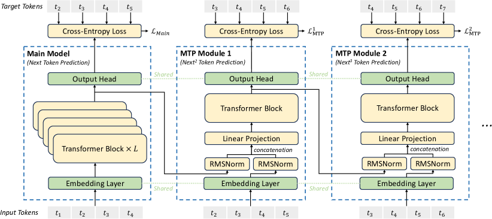

<figcaption>Figure 3: 我々のマルチトークン予測（MTP）の実装の図解。各深さにおける各トークンの予測について、完全な因果連鎖を保つ。</figcaption>
</figure>

### 2.2 Multi-Token Prediction（マルチトークン予測）

[^26] に触発され、我々は DeepSeek-V3 のために**マルチトークン予測（MTP）**の目的を調査し設定した。これは各位置における予測の範囲を複数の未来のトークンへ拡張する。一方で MTP の目的は訓練信号を**濃く（densify）**し、データ効率を改善しうる。他方で MTP は、未来のトークンをよりよく予測するためにモデルが表現を**事前に計画する**ことを可能にしうる。Figure 3 が我々の MTP の実装を示す。独立した出力ヘッドを使って $D$ 個の追加トークンを**並列に**予測する [^26] と異なり、我々は追加トークンを**逐次的に**予測し、各予測深さで**完全な因果連鎖を保つ**。本節では MTP 実装の詳細を紹介する。

##### MTP モジュール。

具体的には、我々の MTP 実装は $D$ 個の逐次的なモジュールを使って $D$ 個の追加トークンを予測する。$k$ 番目の MTP モジュールは、共有の埋め込み層 $\operatorname{Emb}(\cdot)$、共有の出力ヘッド $\operatorname{OutHead}(\cdot)$、Transformer ブロック $\operatorname{TRM}_{k}(\cdot)$、射影行列 $M_{k}\in\mathbb{R}^{d\times 2d}$ からなる。$i$ 番目の入力トークン $t_{i}$ について、$k$ 番目の予測深さでは、まず $(k-1)$ 番目の深さにおける $i$ 番目のトークンの表現 $\mathbf{h}_{i}^{k-1}\in\mathbb{R}^{d}$ と、$(i+k)$ 番目のトークンの埋め込み $Emb(t_{i+k})\in\mathbb{R}^{d}$ を線形射影で結合する:

$$
\mathbf{h}_{i}^{\prime k}=M_{k}[\operatorname{RMSNorm}(\mathbf{h}_{i}^{k-1});\operatorname{RMSNorm}(\operatorname{Emb}(t_{i+k}))],
$$

ここで $[\cdot;\cdot]$ は連結を表す。特に $k=1$ のとき、$\mathbf{h}_{i}^{k-1}$ は主モデルが与える表現を指す。**各 MTP モジュールの埋め込み層は主モデルと共有される**点に注意されたい。結合された $\mathbf{h}_{i}^{\prime k}$ は $k$ 番目の深さの Transformer ブロックの入力となり、現在の深さの出力表現 $\mathbf{h}_{i}^{k}$ を生成する:

$$
\mathbf{h}_{1:T-k}^{k}=\operatorname{TRM}_{k}(\mathbf{h}_{1:T-k}^{\prime k}),
$$

ここで $T$ は入力系列長を表し、下付きの $i{:}j$ はスライス演算（左右の境界を含む）を表す。最後に $\mathbf{h}_{i}^{k}$ を入力として、共有の出力ヘッドが $k$ 番目の追加予測トークンの確率分布 $P_{i+1+k}^{k}\in\mathbb{R}^{V}$ を計算する（$V$ は語彙サイズ）:

$$
P_{i+k+1}^{k}=\operatorname{OutHead}(\mathbf{h}_{i}^{k}).
$$

出力ヘッド $\operatorname{OutHead}(\cdot)$ は表現をロジットへ線形写像し、続いて $\operatorname{Softmax}(\cdot)$ 関数を適用して $k$ 番目の追加トークンの予測確率を計算する。各 MTP モジュールについても、その出力ヘッドは主モデルと共有される。予測の因果連鎖を保つという我々の原則は EAGLE [^51] のそれと似ているが、**EAGLE の主目的が投機的デコード** [^99] [^46] であるのに対し、**我々は MTP を訓練の改善に用いる**。

##### MTP の訓練目的。

各予測深さについて、交差エントロピー損失 $\mathcal{L}_{\text{MTP}}^{k}$ を計算する:

$$
\mathcal{L}_{\text{MTP}}^{k}=\operatorname{CrossEntropy}(P_{2+k:T+1}^{k},t_{2+k:T+1})=-\frac{1}{T}\sum_{i=2+k}^{T+1}\log P_{i}^{k}[t_{i}],
$$

ここで $T$ は入力系列長、$t_{i}$ は $i$ 番目の位置における正解トークン、$P_{i}^{k}[t_{i}]$ は $k$ 番目の MTP モジュールが与える $t_{i}$ の対応する予測確率を表す。最後に、全深さにわたる MTP 損失の平均をとり、重み係数 $\lambda$ を掛けて全体の MTP 損失 $\mathcal{L}_{\text{MTP}}$ を得る。これが DeepSeek-V3 の追加の訓練目的となる:

$$
\mathcal{L}_{\text{MTP}}=\frac{\lambda}{D}\sum_{k=1}^{D}\mathcal{L}_{\text{MTP}}^{k}.
$$

##### 推論における MTP。

我々の MTP 戦略は主として**主モデルの性能を改善する**ことを狙うので、推論時には MTP モジュールを直接破棄でき、主モデルは独立に正常に機能できる。加えて、生成のレイテンシをさらに改善するために、これらの MTP モジュールを**投機的デコード**に転用することもできる。

## 3 Infrastructures（インフラ）

### 3.1 Compute Clusters（計算クラスタ）

DeepSeek-V3 は **2048 基の NVIDIA H800 GPU** を備えたクラスタで訓練される。H800 クラスタの各ノードは、ノード内で NVLink と NVSwitch により接続された 8 基の GPU を含む。異なるノード間では、通信を担うために InfiniBand（IB）インターコネクトが利用される。

### 3.2 Training Framework（訓練フレームワーク）

DeepSeek-V3 の訓練は **HAI-LLM** フレームワーク——我々のエンジニアがゼロから作り上げた効率的で軽量な訓練フレームワーク——によって支えられている。全体として DeepSeek-V3 は、**16-way のパイプライン並列（PP）** [^70]、**8 ノードにまたがる 64-way のエキスパート並列（EP）** [^45]、そして **ZeRO-1 のデータ並列（DP）** [^75] を適用する。

DeepSeek-V3 の効率的な訓練を促すために、我々は入念な工学的最適化を実装している。第一に、効率的なパイプライン並列のために **DualPipe** アルゴリズムを設計した。既存の PP 手法と比べ、DualPipe はパイプラインバブルがより少ない。より重要なことに、順伝播と逆伝播の過程にまたがって計算局面と通信局面を重ね合わせ、それによってノード間エキスパート並列が導入する重い通信オーバーヘッドという課題に対処する。第二に、IB と NVLink の帯域を十分に活用し、通信に専念する Streaming Multiprocessor（SM）の数を節約するために、効率的なノード間 all-to-all 通信カーネルを開発した。最後に、訓練中のメモリ使用量を丹念に最適化し、**高価なテンソル並列（TP）を使わずに** DeepSeek-V3 を訓練できるようにした。

#### 3.2.1 DualPipe and Computation-Communication Overlap（DualPipe と計算・通信の重ね合わせ）

<figure>

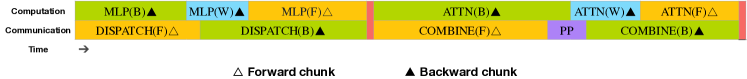

<figcaption>Figure 4: 個々の順伝播チャンクと逆伝播チャンクの対に対する重ね合わせ戦略（transformer ブロックの境界は揃っていない）。オレンジは順伝播、緑は「入力に対する逆伝播」、青は「重みに対する逆伝播」、紫は PP 通信、赤はバリアを表す。all-to-all 通信と PP 通信の両方を完全に隠蔽できる。</figcaption>
</figure>

DeepSeek-V3 では、ノード間エキスパート並列が導入する通信オーバーヘッドにより、**計算対通信の比がおよそ 1:1 という非効率**な状態になる。この課題に取り組むため、我々は **DualPipe** と呼ぶ革新的なパイプライン並列アルゴリズムを設計した。これは順伝播と逆伝播の計算・通信局面を効果的に重ね合わせることでモデル訓練を加速するだけでなく、パイプラインバブルも削減する。

DualPipe の鍵となる着想は、**個々の順伝播チャンクと逆伝播チャンクの対の内側で計算と通信を重ね合わせる**ことである。具体的には、各チャンクを 4 つの構成要素——attention、all-to-all の dispatch、MLP、all-to-all の combine——に分割する。とりわけ逆伝播チャンクについては、ZeroBubble [^71] と同様に attention と MLP をさらに「入力に対する逆伝播」と「重みに対する逆伝播」の 2 つに分ける。加えて PP 通信の構成要素がある。Figure 4 に示すとおり、順伝播と逆伝播のチャンクの対について、これらの構成要素を並べ替え、通信と計算に割り当てる GPU の SM の比率を手動で調整する。この重ね合わせ戦略により、実行中に all-to-all 通信と PP 通信の両方を完全に隠蔽できることが保証される。この効率的な重ね合わせ戦略を前提として、DualPipe の完全なスケジューリングを Figure 5 に示す。これは**双方向のパイプラインスケジューリング**を採用しており、パイプラインの両端から同時にマイクロバッチを投入し、通信の相当部分を完全に重ね合わせられる。この重ね合わせにより、モデルがさらにスケールしても、計算対通信の比を一定に保つ限り、ノードをまたいだ細粒度エキスパートを使いながら all-to-all 通信のオーバーヘッドをほぼゼロにできることも保証される。

<figure>

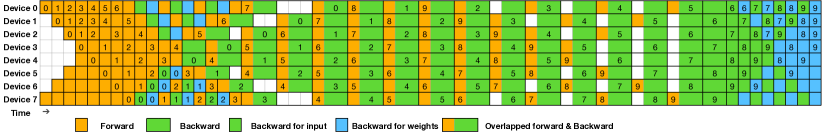

<figcaption>Figure 5: 8 つの PP ランクと双方向 20 マイクロバッチに対する DualPipe スケジューリングの例。逆方向のマイクロバッチは順方向のものと対称なので、図の単純化のためバッチ ID を省略している。共有の黒枠で囲まれた 2 つのセルは、計算と通信が相互に重ね合わされている。</figcaption>
</figure>

加えて、重い通信負荷のないより一般的な場面でも、DualPipe は効率上の利点を示す。表2 に、異なる PP 手法にわたるパイプラインバブルとメモリ使用量を総括する。表に示すとおり、ZB1P [^71] や 1F1B [^31] と比べ、DualPipe は**活性化メモリのピークを $\frac{1}{PP}$ 倍だけ増やすのと引き換えに、パイプラインバブルを大幅に削減する**。DualPipe はモデルパラメータのコピーを 2 つ保持する必要があるが、訓練時に大きな EP サイズを使うので、これはメモリ消費を大きく増やすことにはならない。Chimera [^48] と比べ、DualPipe が要求するのはパイプライン段数とマイクロバッチ数が 2 で割り切れることだけであり、マイクロバッチ数がパイプライン段数で割り切れることは要求しない。加えて DualPipe では、マイクロバッチ数が増えてもバブルも活性化メモリも増加しない。

**表2**: 異なるパイプライン並列手法にわたるパイプラインバブルとメモリ使用量の比較。$F$ は順伝播チャンクの実行時間、$B$ は完全な逆伝播チャンクの実行時間、$W$ は「重みに対する逆伝播」チャンクの実行時間、$F\&B$ は相互に重ね合わされた順伝播チャンクと逆伝播チャンクの実行時間を表す。

| 手法 | バブル | パラメータ | 活性化 |
| --- | --- | --- | --- |
| 1F1B | $(PP-1)(F+B)$ | $1\times$ | $PP$ |
| ZB1P | $(PP-1)(F+B-2W)$ | $1\times$ | $PP$ |
| DualPipe（本研究） | $(\frac{PP}{2}-1)(F\&B+B-3W)$ | $2\times$ | $PP+1$ |

#### 3.2.2 Efficient Implementation of Cross-Node All-to-All Communication（ノード間 all-to-all 通信の効率的な実装）

DualPipe に十分な計算性能を確保するため、我々は通信に専念する SM の数を節約するべく、効率的なノード間 all-to-all 通信カーネル（dispatch と combine を含む）を自前で用意した。カーネルの実装は **MoE のゲーティングアルゴリズムとクラスタのネットワークトポロジーと協調設計**されている。具体的には、我々のクラスタではノード間の GPU が IB で完全に相互接続され、ノード内の通信は NVLink が担う。**NVLink は 160 GB/s の帯域を提供し、これは IB（50 GB/s）のおよそ 3.2 倍**である。IB と NVLink の異なる帯域を効果的に活用するため、**各トークンが dispatch されるノードを最大 4 つに制限**して IB のトラフィックを減らす。各トークンについて、ルーティングの決定がなされると、まず IB 経由で目標ノード上の**同一ノード内インデックスを持つ GPU** へ転送される。目標ノードに到着すると、後続のトークンにブロックされることなく、NVLink 経由で目標エキスパートをホストする特定の GPU へ即座に転送されるよう努める。この方式により IB と NVLink 経由の通信が完全に重ね合わされ、各トークンは NVLink からの追加オーバーヘッドを生じることなく**ノードあたり平均 3.2 個のエキスパート**を効率的に選べる。これは、実際には DeepSeek-V3 が 8 個の routed エキスパートしか選ばないものの、**同じ通信コストのまま最大 13 個（4 ノード × 3.2 エキスパート/ノード）まで増やせる**ことを意味する。全体として、このような通信戦略の下では、**わずか 20 個の SM で IB と NVLink の帯域を十分に活用するのに足りる**。

詳細には、**warp specialization** の技法 [^7] を採用し、20 個の SM を 10 本の通信チャネルに分割する。dispatch の過程では、(1) IB 送信、(2) IB から NVLink への転送、(3) NVLink 受信をそれぞれの warp が担う。各通信タスクに割り当てる warp の数は、全 SM にわたる実際の作業負荷に応じて動的に調整される。同様に combine の過程でも、(1) NVLink 送信、(2) NVLink から IB への転送と累積、(3) IB 受信と累積が、動的に調整される warp によって担われる。加えて dispatch と combine の両カーネルは計算ストリームと重ね合わされるので、他の SM 計算カーネルへの影響も考慮している。具体的には、自前の **PTX（Parallel Thread Execution）命令**を採用し通信のチャンクサイズを自動調整することで、L2 キャッシュの使用と他の SM への干渉を大幅に減らしている。

#### 3.2.3 Extremely Memory Saving with Minimal Overhead（最小のオーバーヘッドでの極端なメモリ節約）

訓練中のメモリ使用量を減らすため、次の技法を採用している。

##### RMSNorm と MLA up-projection の再計算。

逆伝播の際にすべての RMSNorm 演算と MLA の up-projection を**再計算**し、それによってそれらの出力活性を永続的に保存する必要をなくす。わずかなオーバーヘッドと引き換えに、この戦略は活性を保存するためのメモリ要求を大幅に削減する。

##### 指数移動平均を CPU に置く。

訓練中、学習率減衰後のモデル性能を早期に推定するために、モデルパラメータの**指数移動平均（EMA）**を保持する。EMA のパラメータは **CPU メモリに保存**され、各訓練ステップの後に非同期に更新される。この方法により、追加のメモリや時間のオーバーヘッドを生じることなく EMA のパラメータを維持できる。

##### マルチトークン予測のための埋め込みと出力ヘッドの共有。

DualPipe の戦略の下で、モデルの最も浅い層（埋め込み層を含む）と最も深い層（出力ヘッドを含む）を**同じ PP ランクに配置**する。この配置により、MTP モジュールと主モデルの間で、共有される埋め込みと出力ヘッドのパラメータと勾配を**物理的に共有**できる。この物理的な共有機構がメモリ効率をさらに高める。

### 3.3 FP8 Training（FP8 訓練）

<figure>

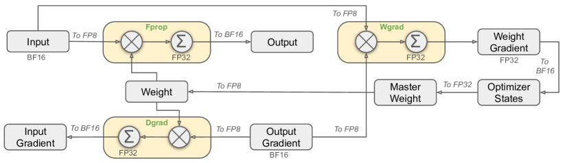

<figcaption>Figure 6: FP8 データ形式を用いた全体の混合精度の枠組み。明確化のため、Linear 演算子のみを図示している。</figcaption>
</figure>

低精度訓練における最近の進展 [^69] [^17] [^60] に触発され、我々は DeepSeek-V3 の訓練に FP8 データ形式を活用した細粒度の混合精度の枠組みを提案する。低精度訓練は大きな有望性を持つが、活性・重み・勾配における**外れ値**の存在によってしばしば制限される [^86] [^32] [^22]。推論の量子化では大きな進展があったものの [^100] [^23]、**大規模言語モデルの事前学習に低精度の技法を適用して成功した例を示す研究は比較的少ない** [^22]。この課題に対処し FP8 形式の動的範囲を効果的に拡張するため、我々は細粒度の量子化戦略を導入する: **$1\times N_{c}$ 要素のタイル単位のグループ化**、または **$N_{c}\times N_{c}$ 要素のブロック単位のグループ化**である。付随する逆量子化のオーバーヘッドは、我々の精度を高めた累積の過程——正確な FP8 の一般行列積（GEMM）を達成するうえで決定的に重要な側面——の下で大きく緩和される。さらに MoE 訓練におけるメモリと通信のオーバーヘッドをさらに減らすため、活性を **FP8 でキャッシュし dispatch** し、低精度の optimizer state は BF16 で保存する。提案する FP8 混合精度の枠組みを DeepSeek-V2-Lite と DeepSeek-V2 に近い 2 つのモデル規模で、約 1 兆トークンの訓練により検証した（詳細は付録 B.1）。特筆すべきは、BF16 のベースラインと比べ、**我々の FP8 訓練モデルの相対的な loss の誤差は一貫して 0.25% 未満に留まる**ことで、これは訓練のランダム性の許容範囲に十分収まる水準である。

#### 3.3.1 Mixed Precision Framework（混合精度の枠組み）

低精度訓練で広く採用されている技法 [^40] [^59] を土台に、FP8 訓練のための混合精度の枠組みを提案する。この枠組みでは、計算密度の高い演算の大半を FP8 で行い、いくつかの主要な演算については訓練効率と数値的安定性の均衡を取るため戦略的に元のデータ形式を維持する。全体の枠組みを Figure 6 に示す。

第一に、モデル訓練を加速するため、中核となる計算カーネルの大半、すなわち **GEMM 演算を FP8 精度で実装**する。これらの GEMM 演算は FP8 テンソルを入力に取り、BF16 または FP32 で出力を生成する。Figure 6 に描かれているとおり、Linear 演算子に関連する 3 つの GEMM——**Fprop（順伝播）・Dgrad（活性の逆伝播）・Wgrad（重みの逆伝播）**——はすべて FP8 で実行される。この設計は理論上、元の BF16 の方式と比べて計算速度を 2 倍にする。加えて FP8 の Wgrad GEMM により、逆伝播で使う活性を FP8 で保存できる。これはメモリ消費を大きく削減する。

FP8 形式の効率上の利点にもかかわらず、低精度の計算に敏感なためより高い精度を要する演算子もある。また、いくつかの低コストな演算子は、訓練全体のコストに無視できるオーバーヘッドで高い精度を使える。この理由から、入念な調査の後、次の構成要素については元の精度（BF16 または FP32）を維持する: **埋め込みモジュール・出力ヘッド・MoE のゲーティングモジュール・正規化演算子・attention 演算子**。これらを狙って高精度に留めることが、DeepSeek-V3 の安定した訓練の力学を保証する。数値的安定性をさらに担保するため、**master weight・重みの勾配・optimizer state はより高い精度で保存**する。これら高精度の構成要素はメモリのオーバーヘッドを生じるが、我々の分散訓練システムでは複数の DP ランクにわたる効率的なシャーディングによってその影響を最小化できる。

<figure>

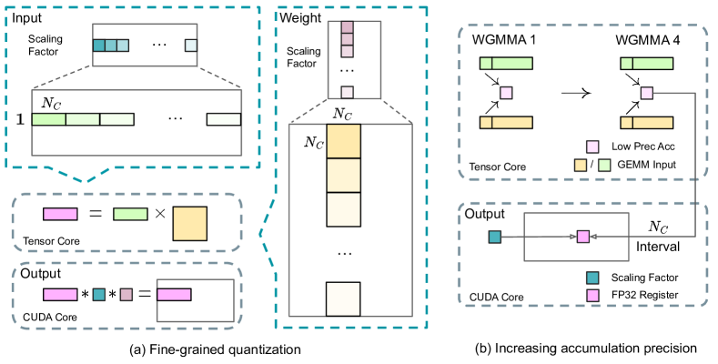

<figcaption>Figure 7: (a) 特徴の外れ値に起因する量子化誤差を緩和するための細粒度量子化の手法を提案する。図の単純化のため Fprop のみを示す。(b) この量子化戦略と併せ、高精度の累積のために N_C = 128 要素の MMA ごとに CUDA Core へ昇格させることで FP8 GEMM の精度を改善する。</figcaption>
</figure>

#### 3.3.2 Improved Precision from Quantization and Multiplication（量子化と乗算による精度の改善）

我々の混合精度 FP8 の枠組みに基づき、低精度訓練の精度を高めるいくつかの戦略を、量子化の手法と乗算の過程の両面から導入する。

##### 細粒度量子化。

低精度の訓練フレームワークでは、指数部のビット数が減っていることに制約された FP8 形式の限られた動的範囲のために、**オーバーフローとアンダーフロー**がよくある課題となる。標準的なやり方として、入力テンソルの最大絶対値を FP8 の表現可能な最大値へスケールすることで、入力分布を FP8 形式の表現可能範囲に合わせる [^59]。この方法は低精度訓練を**活性の外れ値に極めて敏感**にし、量子化精度を大きく劣化させうる。これを解くために、我々はより細かい水準でスケーリングを適用する細粒度量子化の手法を提案する。Figure 7 (a) に示すとおり、(1) **活性については 1×128 のタイル単位**（すなわちトークンごと・128 チャネルごと）で要素をグループ化してスケールし、(2) **重みについては 128×128 のブロック単位**（すなわち 128 入力チャネルごと・128 出力チャネルごと）でグループ化してスケールする。この方法は、より小さな要素のグループに応じてスケールを適応させることで、量子化の過程が外れ値によりよく対応できるようにする。付録 B.2 では、重みの量子化と同じやり方で活性をブロック単位でグループ化してスケールした場合の訓練の不安定性をさらに議論する。

我々の手法の主要な変更点のひとつが、**GEMM 演算の内側次元に沿ったグループごとのスケーリング係数**の導入である。この機能は標準的な FP8 GEMM では直接支援されていない。しかし我々の正確な FP32 累積の戦略と組み合わせれば効率的に実装できる。

特筆すべきは、我々の細粒度量子化の戦略が **microscaling 形式** [^78] の着想と高度に整合していることであり、NVIDIA の次世代 GPU（Blackwell シリーズ）の Tensor Core はより小さな量子化粒度での microscaling 形式への対応を発表している [^62]。我々の設計が、最新の GPU アーキテクチャに追随する今後の研究の参照になることを期待する。

##### 累積精度を高める。

低精度の GEMM 演算はしばしばアンダーフローの問題に悩まされ、その精度は高精度の累積——一般には FP32 精度で行われる [^40] [^59]——に大きく依存する。しかし我々は、**NVIDIA H800 GPU における FP8 GEMM の累積精度が約 14 ビットの保持に制限されており**、FP32 の累積精度より著しく低いことを観測した。この問題は内側次元 $K$ が大きいときにより顕著になり [^96]、これはバッチサイズとモデル幅が増える大規模モデル訓練では典型的な状況である。$K=4096$ の 2 つのランダム行列の GEMM 演算を例にとると、我々の予備テストでは、Tensor Core における限られた累積精度が**最大でほぼ 2% の相対誤差**をもたらした。これらの問題にもかかわらず、限られた累積精度はいくつかの FP8 フレームワークで依然として既定の選択肢であり [^63]、訓練の精度を著しく制約している。

この問題に対処するため、我々はより高い精度のために **CUDA Core へ昇格させる**戦略を採用する [^89]。過程を Figure 7 (b) に示す。具体的には、Tensor Core 上での MMA（Matrix Multiply-Accumulate）の実行中、中間結果は限られたビット幅で累積される。$N_{C}$ の間隔に達すると、これらの部分結果が **CUDA Core 上の FP32 レジスタへコピーされ、そこで完全精度の FP32 累積が行われる**。前述のとおり、我々の細粒度量子化は内側次元 $K$ に沿ってグループごとのスケーリング係数を適用する。これらのスケーリング係数は、逆量子化の過程として CUDA Core 上で効率的に掛けられ、追加の計算コストは最小限で済む。

この変更が単一 warpgroup の WGMMA（Warpgroup-level Matrix Multiply-Accumulate）命令の発行率を下げる点は注記に値する。しかし H800 アーキテクチャでは 2 つの WGMMA が同時に存続するのが通例であり、一方の warpgroup が昇格の演算を行っている間に、もう一方が MMA 演算を実行できる。この設計により 2 つの演算を重ね合わせられ、Tensor Core の高い利用率を維持できる。我々の実験に基づけば、**$N_{C}=128$ 要素（4 回の WGMMA に相当）に設定するのが、大きなオーバーヘッドを導入せずに精度を有意に改善できる最小の累積間隔**である。

##### 指数部より仮数部を。

Fprop に E4M3（指数部 4 ビット・仮数部 3 ビット）を、Dgrad と Wgrad に E5M2（指数部 5 ビット・仮数部 2 ビット）を使う先行研究 [^63] [^69] [^87] の混成 FP8 形式とは対照的に、我々はより高い精度のために**すべてのテンソルで E4M3 形式を採用**する。この方法が実行可能である理由を、我々は細粒度量子化の戦略——すなわちタイル単位・ブロック単位のスケーリング——に帰する。**より小さな要素グループ上で動作することで、我々の方法論はこれらのグループ化された要素の間で実質的に指数ビットを共有し**、限られた動的範囲の影響を緩和する。

##### オンライン量子化。

テンソル単位の量子化フレームワーク [^63] [^69] では**遅延量子化**が採用されており、現在の値を推測するために過去の反復にわたる最大絶対値の履歴を保持する。正確なスケールを確保し枠組みを単純化するため、我々は各 1×128 の活性タイルまたは 128×128 の重みブロックについて**最大絶対値をオンラインで計算**する。それに基づいてスケーリング係数を導出し、活性または重みをオンラインで FP8 形式へ量子化する。

#### 3.3.3 Low-Precision Storage and Communication（低精度の保存と通信）

FP8 訓練の枠組みと併せて、キャッシュした活性と optimizer state をより低精度の形式へ圧縮することで、メモリ消費と通信オーバーヘッドをさらに削減する。

##### 低精度の optimizer state。

AdamW [^53] オプティマイザの一次・二次モーメントの追跡に FP32 ではなく **BF16 データ形式**を採用し、観測可能な性能劣化は生じなかった。ただし **master weight（オプティマイザが保持）と勾配（バッチサイズの累積に使う）は訓練を通じた数値的安定性を確保するため FP32 のまま**保持する。

##### 低精度の活性。

Figure 6 に示すとおり、Wgrad 演算は FP8 で行われる。メモリ消費を減らすには、Linear 演算子の逆伝播のために活性を FP8 形式でキャッシュするのが自然な選択である。しかし低コストで高精度な訓練のために、いくつかの演算子については特別な配慮を払っている。

> (1) **attention 演算子の後の Linear の入力**。これらの活性は attention 演算子の逆伝播でも使われるため、精度に敏感になる。これらの活性についてのみ、自前の **E5M6** データ形式を採用する。加えてこれらの活性は逆伝播で 1×128 の量子化タイルから 128×1 のタイルへ変換される。余分な量子化誤差の導入を避けるため、すべてのスケーリング係数は **2 の整数べき**に丸めてスケールする。
>
> (2) **MoE における SwiGLU 演算子の入力**。メモリコストをさらに減らすため、SwiGLU 演算子の入力をキャッシュして逆伝播でその出力を再計算する。これらの活性も我々の細粒度量子化の手法で FP8 で保存され、メモリ効率と計算精度の均衡を取る。

##### 低精度の通信。

**通信帯域は MoE モデルの訓練における決定的なボトルネック**である。この課題を緩和するため、MoE の up-projection の前の活性を FP8 へ量子化してから dispatch の構成要素を適用する。これは MoE の up-projection における FP8 Fprop と互換である。attention 演算子の後の Linear の入力と同様、この活性のスケーリング係数も 2 の整数べきである。MoE の down-projection の前の活性の勾配にも同様の戦略を適用する。**順伝播・逆伝播の combine の構成要素については、訓練パイプラインの決定的な部分の訓練精度を保つため BF16 のまま**にする。

### 3.4 Inference and Deployment（推論とデプロイ）

我々は DeepSeek-V3 を H800 クラスタにデプロイする。各ノード内の GPU は NVLink で相互接続され、クラスタ全体の GPU は IB で完全に相互接続されている。オンラインサービスのサービス水準目標（SLO）と高いスループットを同時に確保するため、**prefill 段階と decode 段階を分離する**次のデプロイ戦略を採用する。

#### 3.4.1 Prefilling（prefill）

prefill 段階の最小デプロイ単位は **4 ノード・32 GPU** からなる。attention 部分は系列並列（SP）を伴う 4-way テンソル並列（TP4）と 8-way データ並列（DP8）を組み合わせる。TP サイズが 4 と小さいことが TP 通信のオーバーヘッドを抑える。MoE 部分には **32-way エキスパート並列（EP32）**を使い、各エキスパートが十分に大きなバッチサイズを処理することを保証して計算効率を高める。MoE の all-to-all 通信には訓練時と同じ方法——まず IB 経由でノード間へトークンを転送し、次にノード内 GPU 間で NVLink 経由に転送する——を使う。とりわけ浅い層の dense な MLP には TP 通信を節約するため 1-way のテンソル並列を使う。

MoE 部分で異なるエキスパート間の負荷を均衡させるには、各 GPU がほぼ同じ数のトークンを処理するようにする必要がある。そのために我々は**冗長エキスパート（redundant experts）**のデプロイ戦略を導入する。これは**高負荷のエキスパートを複製して冗長にデプロイする**ものである。高負荷のエキスパートはオンラインデプロイ中に収集された統計に基づいて検出され、**定期的に（たとえば 10 分ごとに）調整される**。冗長エキスパートの集合を決めた後、観測された負荷に基づいてノード内の GPU 間でエキスパートを注意深く再配置し、ノード間 all-to-all 通信のオーバーヘッドを増やさずに GPU 間の負荷をできる限り均衡させようとする。DeepSeek-V3 のデプロイでは、prefill 段階に **32 個の冗長エキスパート**を設定する。各 GPU は元々ホストする 8 個のエキスパートに加えて、追加で 1 個の冗長エキスパートをホストする。

さらに prefill 段階では、スループットを改善し all-to-all 通信と TP 通信のオーバーヘッドを隠蔽するため、計算負荷の似た **2 つのマイクロバッチを同時に処理**し、一方のマイクロバッチの attention と MoE を、もう一方の dispatch と combine と重ね合わせる。

最後に、我々はエキスパートの**動的冗長戦略**を探索している。これは各 GPU がより多くのエキスパート（たとえば 16 個）をホストするが、各推論ステップで活性化されるのは 9 個だけ、というものである。各層の all-to-all 演算が始まる前に、大域的に最適なルーティング方式をその場で計算する。prefill 段階には相当な計算が伴うので、このルーティング方式を計算するオーバーヘッドはほぼ無視できる。

#### 3.4.2 Decoding（decode）

decode の際は、**共有エキスパートを routed エキスパートのひとつとして扱う**。この観点では、各トークンはルーティングで 9 個のエキスパートを選び、共有エキスパートは常に選ばれる高負荷のエキスパートと見なされる。decode 段階の最小デプロイ単位は **40 ノード・320 GPU** からなる。attention 部分は SP を伴う TP4 と DP80 を組み合わせ、MoE 部分は **EP320** を使う。MoE 部分では**各 GPU が 1 個のエキスパートだけをホスト**し、64 個の GPU が冗長エキスパートと共有エキスパートのホストを担う。dispatch と combine の all-to-all 通信は、低レイテンシを達成するため IB 上の直接的な point-to-point 転送で行う。加えて **IBGDA** [^61] の技術を活用してレイテンシをさらに最小化し通信効率を高める。

prefill と同様、オンラインサービスからのエキスパート負荷の統計に基づいて、一定間隔で冗長エキスパートの集合を定期的に決定する。ただし各 GPU が 1 個のエキスパートしかホストしないので、エキスパートを再配置する必要はない。decode についても動的冗長戦略を探索しているが、これには大域的に最適なルーティング方式を計算するアルゴリズムのより注意深い最適化と、オーバーヘッドを減らすための dispatch カーネルとの融合が必要である。

加えて、スループットを高め all-to-all 通信のオーバーヘッドを隠蔽するため、decode 段階でも計算負荷の似た 2 つのマイクロバッチを同時に処理することを探索している。prefill と異なり、**decode 段階では attention がより大きな時間の割合を占める**。したがって、一方のマイクロバッチの attention を、もう一方の dispatch + MoE + combine と重ね合わせる。decode 段階ではエキスパートあたりのバッチサイズが比較的小さく（通常 256 トークン以内）、**ボトルネックは計算ではなくメモリアクセス**である。MoE 部分は 1 個のエキスパートのパラメータを読み込むだけでよいのでメモリアクセスのオーバーヘッドは最小であり、より少ない SM を使っても全体の性能に大きく影響しない。したがって attention 部分の計算速度に影響しないよう、dispatch + MoE + combine にはごく一部の SM だけを割り当てられる。

### 3.5 Suggestions on Hardware Design（ハードウェア設計への提言）

all-to-all 通信と FP8 訓練の方式の実装に基づき、我々は AI ハードウェアのベンダーに対して次のチップ設計への提言を行う。

#### 3.5.1 Communication Hardware（通信ハードウェア）

DeepSeek-V3 では計算と通信の重ね合わせを実装し、計算中に通信のレイテンシを隠蔽している。これは逐次的な計算と通信に比べて通信帯域への依存を大幅に減らす。しかし現在の通信の実装は**高価な SM に依存している**（たとえば H800 GPU で利用可能な 132 個の SM のうち 20 個をこの目的に割り当てている）ため、計算スループットを制限する。さらに通信に SM を使うことは、**tensor core が完全に活用されないまま**になるという著しい非効率をもたらす〔訳注: 原文は "tensor cores remain entirely -utilized" となっており、ar5iv でも同じ。"entirely under-utilized" の "under" が変換時に落ちたものとみられる〕。

現在、SM は all-to-all 通信のために主として次のタスクを行っている。

- IB（InfiniBand）と NVLink のドメイン間でデータを転送し、単一 GPU から同一ノード内の複数 GPU 宛の IB トラフィックを集約する。
- RDMA バッファ（登録された GPU メモリ領域）と入出力バッファの間でデータを輸送する。
- all-to-all の combine のための reduce 演算を実行する。
- IB と NVLink のドメインをまたいで複数エキスパートへチャンク化されたデータを転送する際の、細粒度のメモリレイアウトを管理する。

我々は、これらの通信タスクを貴重な計算ユニットである SM からオフロードするハードウェアを将来のベンダーが開発することを期待する——NVIDIA SHARP [^28] のような GPU の補助プロセッサあるいはネットワークの補助プロセッサとして。さらにアプリケーションのプログラミングの複雑さを減らすため、このハードウェアが**計算ユニットの観点から IB（スケールアウト）と NVLink（スケールアップ）のネットワークを統一する**ことを望む。この統一されたインターフェースがあれば、計算ユニットは単純なプリミティブに基づく通信要求を投げるだけで、IB-NVLink 統一ドメイン全体にわたる read・write・multicast・reduce といった演算を容易に達成できる。

#### 3.5.2 Compute Hardware（計算ハードウェア）

##### Tensor Core における FP8 GEMM の累積精度を高める。

現在の NVIDIA Hopper アーキテクチャの Tensor Core の実装では、FP8 GEMM は固定小数点の累積を採用しており、加算の前に最大指数に基づく右シフトで仮数部の積を揃える。我々の実験は、**符号埋めの右シフトの後、各仮数部の積の上位 14 ビットしか使わず、この範囲を超えるビットは切り捨てられる**ことを明らかにした。しかしたとえば 32 回の FP8 × FP8 の乗算の累積から正確な FP32 の結果を得るには、**少なくとも 34 ビットの精度が必要**である。したがって我々は、将来のチップ設計が Tensor Core の累積精度を高めて完全精度の累積に対応するか、訓練・推論アルゴリズムの精度要求に応じて適切な累積ビット幅を選べるようにすることを推奨する。この方法は、計算効率を保ちながら誤差を許容範囲内に留めることを保証する。

##### タイル単位・ブロック単位の量子化への対応。

現在の GPU はテンソル単位の量子化にしか対応しておらず、我々のタイル単位・ブロック単位の量子化のような細粒度量子化への native な対応を欠く。現在の実装では、$N_{C}$ の間隔に達すると部分結果が Tensor Core から CUDA Core へコピーされ、スケーリング係数が掛けられ、CUDA Core 上の FP32 レジスタに加算される。正確な FP32 累積の戦略と組み合わせることで逆量子化のオーバーヘッドは大きく緩和されるものの、**Tensor Core と CUDA Core の間の頻繁なデータ移動が依然として計算効率を制限している**。したがって将来のチップには、**Tensor Core がスケーリング係数を受け取ってグループスケーリング付きの MMA を実装できるようにする**ことで細粒度量子化に対応することを推奨する。この方式なら、部分和の累積と逆量子化の全体を最終結果が生成されるまで Tensor Core の内側で完結でき、頻繁なデータ移動を避けられる。

##### オンライン量子化への対応。

我々の研究でその有効性が実証されているにもかかわらず、現在の実装はオンライン量子化を効果的に支えるのに苦労している。既存の過程では、量子化のために HBM（High Bandwidth Memory）から 128 個の BF16 の活性値（前の計算の出力）を読み出す必要があり、量子化された FP8 の値は HBM へ書き戻され、MMA のために再び読み出される。この非効率に対処するため、我々は将来のチップが **FP8 へのキャストと TMA（Tensor Memory Accelerator）アクセスを単一の融合演算に統合**し、活性をグローバルメモリから共有メモリへ転送する間に量子化を完了できるようにして、頻繁なメモリの読み書きを避けることを推奨する。高速化のための warp 水準のキャスト命令への対応も推奨する。これは layer normalization と FP8 キャストのより良い融合をさらに促す。あるいは **near-memory computing**（HBM の近くに計算ロジックを置く）の方式も採りうる。この場合、BF16 の要素は HBM から GPU へ読み出されるときに直接 FP8 へキャストでき、**オフチップのメモリアクセスをおよそ 50% 削減**できる。

##### 転置 GEMM 演算への対応。

現在のアーキテクチャでは、行列の転置と GEMM 演算を融合するのが煩雑である。我々のワークフローでは、順伝播の活性が 1×128 の FP8 タイルへ量子化されて保存される。逆伝播では、行列を読み出し、逆量子化し、転置し、128×1 のタイルへ再量子化して HBM に保存する必要がある。メモリ演算を減らすため、我々は将来のチップが、訓練と推論の両方で必要な精度について、**MMA 演算の前に共有メモリから行列を直接転置して読める**ようにすることを推奨する。FP8 形式の変換と TMA アクセスの融合と組み合わせれば、この強化は量子化のワークフローを大幅に効率化するだろう。

## 4 Pre-Training（事前学習）

### 4.1 Data Construction（データの構築）

DeepSeek-V2 と比べ、我々は数学とプログラミングのサンプルの比率を高め、同時に英語と中国語を超えて多言語のカバレッジを広げることで事前学習コーパスを最適化した。またデータ処理のパイプラインを洗練し、コーパスの多様性を保ちながら冗長性を最小化した。[^18] に触発され、データの完全性のために**文書パッキング**の手法を実装しているが、訓練中にサンプル間の attention マスキングは組み込んでいない。最終的に DeepSeek-V3 の訓練コーパスは、我々のトークナイザで **14.8T の高品質かつ多様なトークン**からなる。

DeepSeekCoder-V2 [^14] の訓練過程で、**Fill-in-Middle（FIM）**の戦略が次トークン予測の能力を損なわずに、文脈の手がかりから中間のテキストを正確に予測できるようにすることを観測した。DeepSeekCoder-V2 に合わせ、DeepSeek-V3 の事前学習にも FIM 戦略を組み込む。具体的には **Prefix-Suffix-Middle（PSM）**の枠組みを用いてデータを次のように構造化する:

$$
\texttt{<|fim\_begin|>}f_{\text{pre}}\texttt{<|fim\_hole|>}f_{\text{suf}}\texttt{<|fim\_end|>}f_{\text{middle}}\texttt{<|eos\_token|>}.
$$

この構造は事前パッキングの過程の一部として文書水準で適用される。FIM 戦略は PSM の枠組みに合わせて **0.1 の割合**で適用される。

DeepSeek-V3 のトークナイザは、**128K トークンに拡張された語彙**を持つバイト水準の BPE [^83] を採用する。トークナイザのプレトークナイザと訓練データは、多言語の圧縮効率を最適化するよう修正されている。加えて DeepSeek-V2 と比べ、新しいプレトークナイザは**句読点と改行を結合したトークン**を導入する。しかしこの工夫は、モデルが末尾の改行を持たない複数行のプロンプトを処理する際に**トークン境界のバイアス** [^54] を導入しうる。とりわけ few-shot の評価プロンプトで問題になる。この問題に対処するため、訓練中にこうした結合トークンの一定割合を**ランダムに分割**し、モデルをより幅広い特殊ケースに触れさせてこのバイアスを緩和する。

### 4.2 Hyper-Parameters（ハイパーパラメータ）

##### モデルのハイパーパラメータ。

Transformer の層数を **61**、隠れ次元を **7168** に設定する。すべての学習可能パラメータは標準偏差 0.006 でランダムに初期化する。MLA では attention ヘッド数 $n_{h}$ を 128、ヘッドあたりの次元 $d_{h}$ を 128 に設定する。**KV 圧縮次元 $d_{c}$ は 512**、query の圧縮次元 $d_{c}^{\prime}$ は 1536 に設定する。分離された query と key については、ヘッドあたりの次元 $d_{h}^{R}$ を 64 に設定する。**最初の 3 層を除くすべての FFN を MoE 層で置き換える**。各 MoE 層は **1 個の共有エキスパートと 256 個の routed エキスパート**からなり、各エキスパートの中間隠れ次元は 2048 である。routed エキスパートのうち各トークンにつき **8 個が活性化**され、各トークンは最大 4 ノードへ送られることが保証される。**マルチトークン予測の深さ $D$ は 1**、すなわち正確な次トークンに加えて各トークンが 1 個の追加トークンを予測する。DeepSeek-V2 と同様、DeepSeek-V3 も圧縮された潜在ベクトルの後に追加の RMSNorm 層を採用し、幅のボトルネックで追加のスケーリング係数を掛ける。この構成の下で、DeepSeek-V3 は総パラメータ 671B からなり、そのうち 37B が各トークンにつき活性化される。

##### 訓練のハイパーパラメータ。

AdamW オプティマイザ [^53] を $\beta_{1}=0.9$、$\beta_{2}=0.95$、$\mathrm{weight\_decay}=0.1$ で採用する。事前学習中の最大系列長を 4K に設定し、DeepSeek-V3 を 14.8T トークンで事前学習する。学習率のスケジューリングは、まず最初の 2K ステップで 0 から $2.2\times 10^{-4}$ へ線形に増加させる。次にモデルが 10T の訓練トークンを消費するまで $2.2\times 10^{-4}$ の一定の学習率を保つ。続いてコサイン減衰の曲線に従い、4.3T トークンかけて $2.2\times 10^{-5}$ へ徐々に減衰させる。最後の 500B トークンの訓練では、最初の 333B トークンで $2.2\times 10^{-5}$ の一定の学習率を保ち、残りの 167B トークンで $7.3\times 10^{-6}$ の別の一定の学習率へ切り替える。勾配クリッピングのノルムは 1.0 に設定する。**バッチサイズのスケジューリング**戦略を採用し、最初の 469B トークンの訓練でバッチサイズを 3072 から 15360 へ徐々に増やし、残りの訓練では 15360 を保つ。パイプライン並列を活用してモデルの異なる層を異なる GPU に配置し、各層について routed エキスパートは 8 ノードに属する 64 基の GPU 上に一様に配置する。ノード制限ルーティングについては、各トークンは最大 4 ノードへ送られる（すなわち $M=4$）。**補助損失を使わない負荷分散については、バイアス更新速度 $\gamma$ を最初の 14.3T トークンで 0.001 に、残りの 500B トークンで 0.0 に設定する**。

<figure>

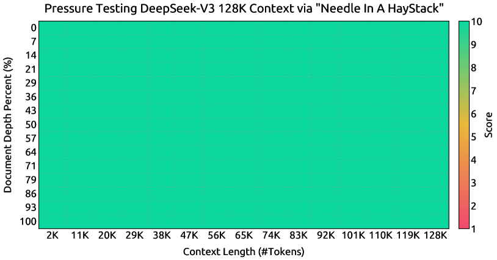

<figcaption>Figure 8: 「Needle In A Haystack」（NIAH）テストの評価結果。DeepSeek-V3 は 128K までのすべてのコンテキストウィンドウ長にわたって良好な性能を示す。</figcaption>
</figure>

### 4.3 Long Context Extension（長コンテキスト拡張）

DeepSeek-V3 に長コンテキストの能力を持たせるため、DeepSeek-V2 [^16] と同様の方法を採用する。事前学習の段階の後、コンテキスト拡張に **YaRN** [^68] を適用し、それぞれ 1000 ステップからなる 2 つの追加訓練フェーズを行って、コンテキストウィンドウを **4K → 32K → 128K** と段階的に拡張する。YaRN の構成は DeepSeek-V2 で使ったものと一致しており、**分離された共有 key $\mathbf{k}^{R}_{t}$ にのみ適用**される。ハイパーパラメータは両フェーズで同一で、スケール $s=40$、$\alpha=1$、$\beta=32$、スケーリング係数 $\sqrt{t}=0.1\ln{s}+1$ である。第 1 フェーズでは系列長を 32K、バッチサイズを 1920 に設定する。第 2 フェーズでは系列長を 128K へ増やし、バッチサイズを 480 へ減らす。両フェーズの学習率は $7.3\times 10^{-6}$ に設定し、事前学習段階の最終学習率と合わせる。

この 2 フェーズの拡張訓練を通じて、DeepSeek-V3 は強い性能を保ちながら最大 128K の長さの入力を扱えるようになる。Figure 8 は、教師ありファインチューニング後の DeepSeek-V3 が「Needle In A Haystack」（NIAH）テストで顕著な性能を達成し、128K までのコンテキストウィンドウ長にわたって一貫した頑健性を示すことを表している。

### 4.4 Evaluations（評価）

#### 4.4.1 Evaluation Benchmarks（評価ベンチマーク）

DeepSeek-V3 のベースモデルは英語と中国語を大半とする多言語コーパスで事前学習されているので、主として英語と中国語の一連のベンチマーク、および多言語のベンチマークでその性能を評価する。評価は HAI-LLM フレームワークに統合された内製の評価フレームワークに基づく。考慮したベンチマークは次のように分類される（下線付きは中国語、二重下線付きは多言語のベンチマーク）。

複数科目の多肢選択データセットには MMLU [^34]、MMLU-Redux [^25]、MMLU-Pro [^94]、MMMLU [^65]、C-Eval [^36]、CMMLU [^47] が含まれる。言語理解と推論のデータセットには HellaSwag [^102]、PIQA [^8]、ARC [^10]、BigBench Hard（BBH）[^88] が含まれる。〔以下、クローズドブック QA・読解・参照曖昧性解消・言語モデリング・中国語理解と文化・数学・コード・標準化試験の各カテゴリのベンチマーク列挙が続く。〕

#### 4.4.2 Evaluation Results（評価結果）

表3 では、DeepSeek-V3 のベースモデルを最先端のオープンソースのベースモデル——DeepSeek-V2-Base [^16]（我々の前回のリリース）、Qwen2.5 72B Base [^74]、LLaMA-3.1 405B Base [^2]——と比較する。これらのモデルはすべて内製の評価フレームワークで評価し、同じ評価設定を共有することを保証している。なお過去数ヶ月の評価フレームワークの変更のため、DeepSeek-V2-Base の性能は以前報告した結果とわずかに異なる。全体として **DeepSeek-V3-Base は DeepSeek-V2-Base と Qwen2.5 72B Base を包括的に上回り、大半のベンチマークで LLaMA-3.1 405B Base を凌駕して、実質的に最強のオープンソースモデルとなっている**。

より詳細な観点から、DeepSeek-V3-Base を他のオープンソースのベースモデルと個別に比較する。(1) DeepSeek-V2-Base と比べ、モデルアーキテクチャの改善・モデル規模と訓練トークンのスケールアップ・データ品質の向上により、DeepSeek-V3-Base は期待どおり著しく良い性能を達成する。(2) 最先端の中国語オープンソースモデルである Qwen2.5 72B Base と比べ、**活性化パラメータが半分しかないにもかかわらず**、DeepSeek-V3-Base は——とりわけ英語・多言語・コード・数学のベンチマークで——顕著な優位を示す。中国語のベンチマークについては、中国語の複数科目多肢選択タスクである CMMLU を除き、DeepSeek-V3-Base は Qwen2.5 72B より良い性能を示す。(3) **活性化パラメータが 11 倍**である最大のオープンソースモデル LLaMA-3.1 405B Base と比べても、DeepSeek-V3-Base は多言語・コード・数学のベンチマークではるかに良い性能を示す。英語と中国語の言語ベンチマークについては競争力のあるか、より良い性能を示し、とりわけ BBH・MMLU 系・DROP・C-Eval・CMMLU・CCPM で優れている。

効率的なアーキテクチャと包括的な工学的最適化により、DeepSeek-V3 は極めて高い訓練効率を達成する。我々の訓練フレームワークとインフラの下では、**DeepSeek-V3 を 1 兆トークン訓練するのに必要なのはわずか 18 万 H800 GPU 時間**であり、これは 72B や 405B の dense モデルを訓練するよりはるかに安い。

**表3**: DeepSeek-V3-Base と他の代表的なオープンソースのベースモデルの比較。すべてのモデルを内製の評価フレームワークで、同じ評価設定で評価している。0.3 を超えない差のスコアは同水準と見なす。DeepSeek-V3-Base は大半のベンチマークで最良の性能を達成し、とりわけ数学とコードのタスクで顕著である。

| 分野 | ベンチマーク（指標） | # Shots | DeepSeek-V2 Base | Qwen2.5 72B Base | LLaMA-3.1 405B Base | DeepSeek-V3 Base |
| --- | --- | --- | --- | --- | --- | --- |
| — | アーキテクチャ | - | MoE | Dense | Dense | MoE |
| — | # 活性化パラメータ | - | 21B | 72B | 405B | 37B |
| — | # 総パラメータ | - | 236B | 72B | 405B | 671B |
| English | Pile-test (BPB) | - | 0.606 | 0.638 | 0.542 | 0.548 |
| English | BBH (EM) | 3-shot | 78.8 | 79.8 | 82.9 | **87.5** |
| English | MMLU (EM) | 5-shot | 78.4 | 85.0 | 84.4 | **87.1** |
| English | MMLU-Redux (EM) | 5-shot | 75.6 | 83.2 | 81.3 | **86.2** |
| English | MMLU-Pro (EM) | 5-shot | 51.4 | 58.3 | 52.8 | **64.4** |
| English | DROP (F1) | 3-shot | 80.4 | 80.6 | 86.0 | **89.0** |
| English | ARC-Easy (EM) | 25-shot | 97.6 | 98.4 | 98.4 | **98.9** |
| English | ARC-Challenge (EM) | 25-shot | 92.2 | 94.5 | **95.3** | **95.3** |
| English | HellaSwag (EM) | 10-shot | 87.1 | 84.8 | **89.2** | 88.9 |
| English | PIQA (EM) | 0-shot | 83.9 | 82.6 | **85.9** | 84.7 |
| English | WinoGrande (EM) | 5-shot | **86.3** | 82.3 | 85.2 | 84.9 |
| English | RACE-Middle (EM) | 5-shot | 73.1 | 68.1 | **74.2** | 67.1 |
| English | RACE-High (EM) | 5-shot | 52.6 | 50.3 | **56.8** | 51.3 |
| English | TriviaQA (EM) | 5-shot | 80.0 | 71.9 | 82.7 | **82.9** |
| English | NaturalQuestions (EM) | 5-shot | 38.6 | 33.2 | **41.5** | 40.0 |
| English | AGIEval (EM) | 0-shot | 57.5 | 75.8 | 60.6 | **79.6** |
| Code | HumanEval (Pass@1) | 0-shot | 43.3 | 53.0 | 54.9 | **65.2** |
| Code | MBPP (Pass@1) | 3-shot | 65.0 | 72.6 | 68.4 | **75.4** |
| Code | LiveCodeBench-Base (Pass@1) | 3-shot | 11.6 | 12.9 | 15.5 | **19.4** |
| Code | CRUXEval-I (EM) | 2-shot | 52.5 | 59.1 | 58.5 | **67.3** |
| Code | CRUXEval-O (EM) | 2-shot | 49.8 | 59.9 | 59.9 | **69.8** |
| Math | GSM8K (EM) | 8-shot | 81.6 | 88.3 | 83.5 | **89.3** |
| Math | MATH (EM) | 4-shot | 43.4 | 54.4 | 49.0 | **61.6** |
| Math | MGSM (EM) | 8-shot | 63.6 | 76.2 | 69.9 | **79.8** |
| Math | CMath (EM) | 3-shot | 78.7 | 84.5 | 77.3 | **90.7** |
| Chinese | CLUEWSC (EM) | 5-shot | 82.0 | 82.5 | **83.0** | 82.7 |
| Chinese | C-Eval (EM) | 5-shot | 81.4 | 89.2 | 72.5 | **90.1** |
| Chinese | CMMLU (EM) | 5-shot | 84.0 | **89.5** | 73.7 | 88.8 |
| Chinese | CMRC (EM) | 1-shot | **77.4** | 75.8 | 76.0 | 76.3 |
| Chinese | C3 (EM) | 0-shot | 77.4 | 76.7 | **79.7** | 78.6 |
| Chinese | CCPM (EM) | 0-shot | **93.0** | 88.5 | 78.6 | 92.0 |
| Multilingual | MMMLU-non-English (EM) | 5-shot | 64.0 | 74.8 | 73.8 | **79.4** |

### 4.5 Discussion（議論）

#### 4.5.1 Ablation Studies for Multi-Token Prediction（マルチトークン予測のアブレーション）

表4 に MTP 戦略のアブレーション結果を示す。具体的には、異なる規模の 2 つのベースラインモデルの上で MTP 戦略を検証する。小規模では総パラメータ 15.7B の MoE ベースラインを 1.33T トークンで訓練する。大規模では総パラメータ 228.7B の MoE ベースラインを 540B トークンで訓練する。それらの上に、訓練データと他のアーキテクチャを同じに保ったまま深さ 1 の MTP モジュールを付加し、比較のために MTP 戦略を用いた 2 つのモデルを訓練する。**推論時には MTP モジュールを直接破棄するので、比較対象モデルの推論コストは厳密に同一である**点に注意されたい。表から、MTP 戦略が大半の評価ベンチマークで一貫してモデル性能を高めることが観察できる。

**表4**: MTP 戦略のアブレーション結果。MTP 戦略は大半の評価ベンチマークで一貫してモデル性能を高める。

| ベンチマーク（指標） | # Shots | Small MoE ベースライン | Small MoE + MTP | Large MoE ベースライン | Large MoE + MTP |
| --- | --- | --- | --- | --- | --- |
| # 活性化パラメータ（推論） | - | 2.4B | 2.4B | 20.9B | 20.9B |
| # 総パラメータ（推論） | - | 15.7B | 15.7B | 228.7B | 228.7B |
| # 訓練トークン | - | 1.33T | 1.33T | 540B | 540B |
| Pile-test (BPB) | - | 0.729 | **0.729** | 0.658 | **0.657** |
| BBH (EM) | 3-shot | 39.0 | **41.4** | 70.0 | **70.7** |
| MMLU (EM) | 5-shot | 50.0 | **53.3** | 67.5 | **66.6** |
| DROP (F1) | 1-shot | 39.2 | **41.3** | 68.5 | **70.6** |
| TriviaQA (EM) | 5-shot | 56.9 | **57.7** | 67.0 | **67.3** |
| NaturalQuestions (EM) | 5-shot | 22.7 | **22.3** | 27.2 | **28.5** |
| HumanEval (Pass@1) | 0-shot | 20.7 | **26.8** | 44.5 | **53.7** |
| MBPP (Pass@1) | 3-shot | 35.8 | **36.8** | 61.6 | **62.2** |
| GSM8K (EM) | 8-shot | 25.4 | **31.4** | 72.3 | **74.0** |
| MATH (EM) | 4-shot | 10.7 | **12.6** | 38.6 | **39.8** |

#### 4.5.2 Ablation Studies for the Auxiliary-Loss-Free Balancing Strategy（補助損失を使わない負荷分散のアブレーション）

表5 に補助損失を使わない負荷分散戦略のアブレーション結果を示す。この戦略を異なる規模の 2 つのベースラインモデルの上で検証する。小規模では総パラメータ 15.7B の MoE ベースラインを 1.33T トークンで、大規模では総パラメータ 228.7B の MoE ベースラインを 578B トークンで訓練する。**両ベースラインとも純粋に補助損失のみで負荷の均衡を促し**、top-K 親和度正規化を伴う sigmoid のゲーティング関数を使う。補助損失の強さを制御するハイパーパラメータは、それぞれ DeepSeek-V2-Lite と DeepSeek-V2 と同じである。これら 2 つのベースラインの上で、訓練データと他のアーキテクチャを同じに保ったまま、**すべての補助損失を取り除いて補助損失を使わない負荷分散戦略を導入**して比較する。表から、補助損失を使わない戦略が大半の評価ベンチマークで一貫してより良いモデル性能を達成することが観察できる。

**表5**: 補助損失を使わない負荷分散戦略のアブレーション結果。純粋に補助損失に基づく手法と比べ、補助損失を使わない戦略は大半の評価ベンチマークで一貫してより良いモデル性能を達成する。

| ベンチマーク（指標） | # Shots | Small MoE 補助損失あり | Small MoE 補助損失なし | Large MoE 補助損失あり | Large MoE 補助損失なし |
| --- | --- | --- | --- | --- | --- |
| # 活性化パラメータ | - | 2.4B | 2.4B | 20.9B | 20.9B |
| # 総パラメータ | - | 15.7B | 15.7B | 228.7B | 228.7B |
| # 訓練トークン | - | 1.33T | 1.33T | 578B | 578B |
| Pile-test (BPB) | - | 0.727 | **0.724** | 0.656 | **0.652** |
| BBH (EM) | 3-shot | 37.3 | **39.3** | 66.7 | **67.9** |
| MMLU (EM) | 5-shot | 51.0 | **51.8** | **68.3** | 67.2 |
| DROP (F1) | 1-shot | 38.1 | **39.0** | 67.1 | **67.1** |
| TriviaQA (EM) | 5-shot | 58.3 | **58.5** | 66.7 | **67.7** |
| NaturalQuestions (EM) | 5-shot | 23.2 | **23.4** | 27.1 | **28.1** |
| HumanEval (Pass@1) | 0-shot | 22.0 | **22.6** | 40.2 | **46.3** |
| MBPP (Pass@1) | 3-shot | **36.6** | 35.8 | 59.2 | **61.2** |
| GSM8K (EM) | 8-shot | 27.1 | **29.6** | 70.7 | **74.5** |
| MATH (EM) | 4-shot | 10.9 | **11.1** | 37.2 | **39.6** |

#### 4.5.3 Batch-Wise Load Balance VS. Sequence-Wise Load Balance（バッチ単位の負荷分散 対 系列単位の負荷分散）

**補助損失を使わない負荷分散と系列単位の補助損失の主要な違いは、均衡させる範囲——バッチ単位か系列単位か——にある**。系列単位の補助損失と比べ、バッチ単位の均衡はより柔軟な制約を課す。各系列にドメイン内の均衡を強制しないからである。**この柔軟性が、エキスパートが異なるドメインによりよく特化することを可能にする**。これを検証するため、16B の補助損失に基づくベースラインと 16B の補助損失を使わないモデルについて、Pile のテストセットの異なるドメインにおけるエキスパートの負荷を記録・分析した。Figure 9 に示すとおり、**期待どおり、補助損失を使わないモデルのほうがより強いエキスパート専門化のパターンを示す**ことを観測した。

この柔軟性とモデル性能上の優位の相関をさらに調べるため、我々は各系列ではなく**各訓練バッチ**で負荷の均衡を促すバッチ単位の補助損失を追加で設計・検証した。実験結果は、**同程度のバッチ単位の負荷均衡を達成するとき、バッチ単位の補助損失も補助損失を使わない手法と同程度のモデル性能を達成できる**ことを示す。具体的には、1B の MoE モデルでの実験における検証損失は、**2.258（系列単位の補助損失）・2.253（補助損失を使わない手法）・2.253（バッチ単位の補助損失）**であった。3B の MoE モデルでも同様の結果を観測しており、系列単位の補助損失を使うモデルの検証損失は 2.085、補助損失を使わない手法またはバッチ単位の補助損失を使うモデルはいずれも 2.080 という同じ検証損失を達成した。

加えて、バッチ単位の負荷分散の手法は一貫した性能上の優位を示すものの、効率の面で 2 つの潜在的な課題にも直面する: (1) **特定の系列や小さなバッチ内での負荷の不均衡**、(2) **推論時のドメインシフトに起因する負荷の不均衡**。第 1 の課題は、各マイクロバッチの大きなサイズを保証する大規模なエキスパート並列とデータ並列を使う我々の訓練フレームワークによって自然に対処される。第 2 の課題については、§3.4 で述べた**冗長エキスパートのデプロイを伴う効率的な推論フレームワーク**を設計・実装して克服している。

<figure>

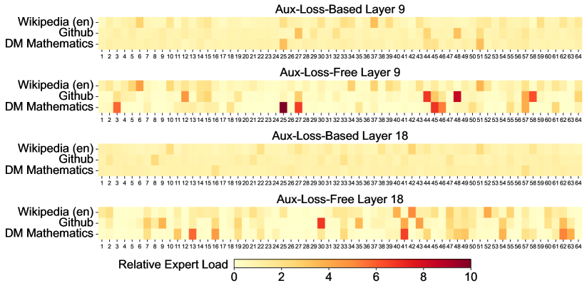

<figcaption>Figure 9: Pile テストセットの 3 つのドメインにおける、補助損失を使わないモデルと補助損失に基づくモデルのエキスパート負荷。補助損失を使わないモデルのほうが、補助損失に基づくモデルより強いエキスパート専門化のパターンを示す。相対エキスパート負荷は、実際のエキスパート負荷と理論的に均衡したエキスパート負荷の比を表す。紙面の都合により例として 2 層の結果のみを示し、全層の結果は付録 C に示す。</figcaption>
</figure>

## 5 Post-Training（事後訓練）

### 5.1 Supervised Fine-Tuning（教師ありファインチューニング）

我々は複数のドメインにまたがる **150 万インスタンス**を含む指示チューニングのデータセットを精選し、各ドメインはその固有の要件に合わせた異なるデータ作成手法を採用する。

##### 推論データ。

数学・競技プログラミング問題・論理パズルに焦点を当てたものを含む推論関連のデータセットについては、**内部の DeepSeek-R1 モデル**を活用してデータを生成する。具体的には、R1 が生成したデータは高い正確さを示す一方で、**過剰に考えすぎる（overthinking）・書式が悪い・長すぎる**といった問題を抱える。我々の目的は、R1 が生成した推論データの高い正確さと、通常の書式の推論データの明快さ・簡潔さの均衡を取ることである。

方法論を確立するため、まず SFT と RL を組み合わせた訓練パイプラインを使って、コード・数学・一般推論といった特定ドメインに合わせた**エキスパートモデル**を開発する。このエキスパートモデルが最終モデルのためのデータ生成器として働く。訓練の過程では各インスタンスについて 2 種類の SFT サンプルを生成する: 第 1 は問題と元の応答を `<problem, original response>` の形式で対にしたもの、第 2 は**システムプロンプト**を問題と R1 の応答とともに `<system prompt, problem, R1 response>` の形式で組み込んだものである。

システムプロンプトは、**反省と検証の機構を豊かに備えた応答**をモデルが生成するよう導く指示を含むよう入念に設計されている。RL のフェーズでは、モデルは高温サンプリングを活用して、明示的なシステムプロンプトがなくても R1 が生成したデータと元のデータの両方のパターンを統合した応答を生成する。数百の RL ステップの後、中間の RL モデルは R1 のパターンを取り込むことを学習し、それによって全体の性能を戦略的に高める。

RL の訓練フェーズを終えた後、最終モデルのための高品質な SFT データを精選するために**棄却サンプリング**を実施する。ここではエキスパートモデルがデータ生成源として使われる。この方法は、最終的な訓練データが DeepSeek-R1 の強みを保持しつつ、簡潔で効果的な応答を生成することを保証する。

##### 非推論データ。

創作・ロールプレイ・単純な質問応答といった非推論のデータについては、**DeepSeek-V2.5** を使って応答を生成し、人間のアノテータにデータの正確さと正しさを検証させる。

##### SFT の設定。

SFT データセットを使って DeepSeek-V3-Base を **2 エポック**ファインチューニングし、$5\times 10^{-6}$ から始めて $1\times 10^{-6}$ へ徐々に下げるコサイン減衰の学習率スケジューリングを使う。訓練中、各系列は複数のサンプルからパッキングされる。ただし**サンプルマスキング**の戦略を採用し、これらの例が互いに隔離されて見えないようにする。

### 5.2 Reinforcement Learning（強化学習）

#### 5.2.1 Reward Model（報酬モデル）

我々は RL の過程で**ルールベースの報酬モデル（RM）とモデルベースの RM** の両方を採用する。

##### ルールベース RM。

特定のルールで検証できる問題については、フィードバックを決めるためにルールベースの報酬システムを採用する。たとえば、ある種の数学問題は決定的な結果を持つので、モデルに最終的な答えを指定された形式（たとえばボックス内）で提示するよう要求し、ルールを適用して正しさを検証できる。同様に LeetCode の問題については、コンパイラを使ってテストケースに基づくフィードバックを生成できる。**可能な限りルールベースの検証を活用することで、この方法は操作や悪用に耐性があるため、より高い信頼性を確保する**。

##### モデルベース RM。

自由形式の正解を持つ問題については、応答が期待される正解と一致するかを判定するために報酬モデルに依拠する。逆に創作のような決定的な正解を持たない問題については、報酬モデルは問題と対応する回答を入力としてフィードバックを与える役割を担う。**報酬モデルは DeepSeek-V3 の SFT チェックポイントから訓練される**。その信頼性を高めるため、**最終的な報酬だけでなく、その報酬に至る思考連鎖（chain-of-thought）も含む選好データ**を構築する。この方法は特定タスクにおける reward hacking のリスクを緩和するのに役立つ。

#### 5.2.2 Group Relative Policy Optimization（グループ相対方策最適化）

DeepSeek-V2 [^16] と同様に、我々は **GRPO** [^80] を採用する。これは通常は方策モデルと同サイズになる critic モデルを廃し、代わりに**グループのスコアからベースラインを推定**する。具体的には、各質問 $q$ について GRPO は古い方策モデル $\pi_{\theta_{old}}$ から出力のグループ $\{o_{1},o_{2},\cdots,o_{G}\}$ をサンプリングし、次の目的関数を最大化することで方策モデル $\pi_{\theta}$ を最適化する:

$$
\begin{split}\mathcal{J}_{GRPO}(\theta)&=\mathbb{E}{[q\sim P(Q),\{o_{i}\}_{i=1}^{G}\sim\pi_{\theta_{old}}(O|q)]}\\
&\frac{1}{G}\sum_{i=1}^{G}\left(\min\left(\frac{\pi_{\theta}(o_{i}|q)}{\pi_{\theta_{old}}(o_{i}|q)}A_{i},\text{clip}\left(\frac{\pi_{\theta}(o_{i}|q)}{\pi_{\theta_{old}}(o_{i}|q)},1-\varepsilon,1+\varepsilon\right)A_{i}\right)-\beta\mathbb{D}_{KL}\left(\pi_{\theta}||\pi_{ref}\right)\right),\end{split}
$$

$$
\mathbb{D}_{KL}\left(\pi_{\theta}||\pi_{ref}\right)=\frac{\pi_{ref}(o_{i}|q)}{\pi_{\theta}(o_{i}|q)}-\log\frac{\pi_{ref}(o_{i}|q)}{\pi_{\theta}(o_{i}|q)}-1,
$$

ここで $\varepsilon$ と $\beta$ はハイパーパラメータ、$\pi_{ref}$ は参照モデル、$A_{i}$ は各グループ内の出力に対応する報酬 $\{r_{1},r_{2},\ldots,r_{G}\}$ から導かれる advantage である:

$$
A_{i}=\frac{r_{i}-{\operatorname{mean}(\{r_{1},r_{2},\cdots,r_{G}\})}}{{\operatorname{std}(\{r_{1},r_{2},\cdots,r_{G}\})}}.
$$

RL の過程では、コーディング・数学・執筆・ロールプレイ・質問応答といった多様なドメインからのプロンプトを組み込む。この方法はモデルを人間の選好により近く整合させるだけでなく、**利用可能な SFT データが限られている場面ではとりわけ**、ベンチマークにおける性能も高める。

### 5.3 Evaluations（評価）

〔訳注: §5.3.1 の評価設定・§5.3.2 の標準評価（表6 の英語・コード・数学・中国語ベンチマークの詳細比較）は、表3 と同型の大規模なベンチマーク比較である。ここでは本文の要点と、開放型評価および報酬モデルとしての評価の表を収録する。表6 が示す主要な結果は、**DeepSeek-V3 が最良のオープンソースモデルとして立ち、GPT-4o や Claude-3.5-Sonnet といった主要なクローズドソースモデルと競争できる性能を示す**ことである。〕

#### 5.3.3 Open-Ended Evaluation（開放型評価）

標準的なベンチマークに加え、LLM をジャッジに使う開放型の生成タスクでもモデルを評価する。結果を表7 に示す。具体的には、対比較のジャッジとして GPT-4-Turbo-1106 を活用する AlpacaEval 2.0 [^20] と Arena-Hard [^49] の元の構成に従う。**Arena-Hard では DeepSeek-V3 がベースラインの GPT-4-0314 に対して 86% を超える印象的な勝率**を達成し、Claude-Sonnet-3.5-1022 のような最上位のモデルと同等の性能を示す。これは、とりわけコーディングやデバッグを含む複雑なプロンプトを扱ううえでの DeepSeek-V3 の頑健な能力を際立たせる。さらに DeepSeek-V3 は **Arena-Hard ベンチマークで 85% を超えた最初のオープンソースモデル**という画期的な節目を達成している。この達成はオープンソースとクローズドソースの性能差を大きく橋渡しし、困難な領域でオープンソースモデルが何を成し遂げられるかの新しい基準を打ち立てる。

同様に DeepSeek-V3 は AlpacaEval 2.0 でも卓越した性能を示し、クローズドソースとオープンソースの両方のモデルを上回る。これは執筆タスクと素直な質問応答の場面を扱う際の傑出した習熟を実証している。特筆すべきは、**DeepSeek-V2.5-0905 を 20% という大きな差で上回っている**ことで、単純なタスクへの取り組みにおける実質的な改善を浮き彫りにしている。

#### 5.3.4 DeepSeek-V3 as a Generative Reward Model（生成型報酬モデルとしての DeepSeek-V3）

我々は DeepSeek-V3 の判定能力を最先端のモデル、すなわち GPT-4o および Claude-3.5 と比較する。表8 は RewardBench [^44] におけるこれらのモデルの性能を示す。**DeepSeek-V3 は GPT-4o-0806 と Claude-3.5-Sonnet-1022 の最良版と同等の性能を達成し、他の版を上回る**。加えて DeepSeek-V3 の判定能力は投票の技法によってさらに高められる。したがって我々は、投票を伴う DeepSeek-V3 を開放型の質問への自己フィードバックの提供に用い、それによって整合の過程の有効性と頑健性を改善している。

**表8**: RewardBench における GPT-4o・Claude-3.5-sonnet・DeepSeek-V3 の性能。

| モデル | Chat | Chat-Hard | Safety | Reasoning | 平均 |
| --- | --- | --- | --- | --- | --- |
| GPT-4o-0513 | 96.6 | 70.4 | 86.7 | 84.9 | 84.7 |
| GPT-4o-0806 | 96.1 | 76.1 | 88.1 | 86.6 | 86.7 |
| GPT-4o-1120 | 95.8 | 71.3 | 86.2 | 85.2 | 84.6 |
| Claude-3.5-sonnet-0620 | 96.4 | 74.0 | 81.6 | 84.7 | 84.2 |
| Claude-3.5-sonnet-1022 | 96.4 | 79.7 | **91.1** | 87.6 | 88.7 |
| DeepSeek-V3 | 96.9 | 79.8 | 87.0 | 84.3 | 87.0 |
| DeepSeek-V3 (maj@6) | **96.9** | **82.6** | 89.5 | **89.2** | **89.6** |

### 5.4 Discussion（議論）

#### 5.4.1 Distillation from DeepSeek-R1（DeepSeek-R1 からの蒸留）

DeepSeek-V2.5 に基づいて DeepSeek-R1 からの蒸留の貢献をアブレーションする。ベースラインは短い CoT データで訓練され、その対抗馬は前述のエキスパートチェックポイントが生成したデータを使う。

表9 は蒸留データの有効性を実証しており、LiveCodeBench と MATH-500 の両ベンチマークで著しい改善を示す。我々の実験は興味深いトレードオフを明らかにする——**蒸留はより良い性能をもたらすが、平均応答長も大幅に増やす**。モデルの正確さと計算効率の均衡を保つため、DeepSeek-V3 の蒸留については最適な設定を注意深く選んだ。

我々の研究は、**推論モデルからの知識蒸留が事後訓練の最適化の有望な方向である**ことを示唆する。現在の研究は数学とコーディングの領域のデータの蒸留に焦点を当てているが、この方法は様々なタスク領域にわたるより広い応用の可能性を示す。これら特定領域で実証された有効性は、**長 CoT の蒸留が、複雑な推論を要する他の認知的タスクにおけるモデル性能の向上にも価値がありうる**ことを示している。異なる領域にわたるこの方法のさらなる探索は、今後の重要な研究の方向であり続ける。

**表9**: DeepSeek-R1 からの蒸留の貢献。LiveCodeBench と MATH-500 の評価設定は表6 と同じである。

| モデル | LiveCodeBench-CoT Pass@1 | LiveCodeBench-CoT 長さ | MATH-500 Pass@1 | MATH-500 長さ |
| --- | --- | --- | --- | --- |
| DeepSeek-V2.5 ベースライン | 31.1 | 718 | 74.6 | 769 |
| DeepSeek-V2.5 + R1 蒸留 | **37.4** | 783 | **83.2** | 1510 |

#### 5.4.2 Self-Rewarding（自己報酬）

報酬は RL において中心的な役割を果たし、最適化の過程を操舵する。**一部のコーディングや数学の場面のように外部ツールによる検証が素直な領域では、RL は卓越した有効性を示す**。しかしより一般的な場面では、ハードコーディングによってフィードバック機構を構成することは非現実的である。DeepSeek-V3 の開発中、こうしたより広い文脈については **constitutional AI の方法** [^5] を採用し、**DeepSeek-V3 自身の投票評価の結果をフィードバック源として活用**した。この方法は顕著な整合の効果を生み、主観的な評価における DeepSeek-V3 の性能を著しく高めた。追加の constitutional な入力を組み込むことで、DeepSeek-V3 はその方向へ最適化できる。**補助的な情報と LLM をフィードバック源として組み合わせるこのパラダイムは極めて重要である**と我々は考える。LLM は多様な場面からの非構造的な情報を報酬へと変換できる汎用のプロセッサとして働き、最終的に LLM の自己改善を促す。自己報酬を超えて、我々は一般的な場面でモデルの能力を一貫して前進させるための、他の一般的でスケーラブルな報酬の手法の発掘にも取り組んでいる。

#### 5.4.3 Multi-Token Prediction Evaluation（マルチトークン予測の評価）

次の 1 トークンだけを予測するのではなく、DeepSeek-V3 は MTP の技法を通じて**次の 2 トークンを予測**する。投機的デコード [^46] [^99] の枠組みと組み合わせれば、モデルのデコード速度を大幅に加速できる。追加で予測されたトークンの**受理率**について自然な疑問が生じる。我々の評価に基づけば、**2 番目のトークン予測の受理率は様々な生成の話題にわたって 85% から 90% の範囲**にあり、一貫した信頼性を示す。この高い受理率により、DeepSeek-V3 は大幅に改善されたデコード速度、すなわち **1.8 倍の TPS（Tokens Per Second）**を実現する。

## 6 Conclusion, Limitations, and Future Directions（結論・限界・今後の方向性）

本稿で我々は DeepSeek-V3 を導入した。これは総パラメータ 671B・活性化パラメータ 37B の大規模 MoE 言語モデルで、14.8T トークンで訓練されている。MLA と DeepSeekMoE のアーキテクチャに加え、負荷分散のための補助損失を使わない戦略を先駆的に導入し、より強い性能のためにマルチトークン予測の訓練目的を設定している。DeepSeek-V3 の訓練は、FP8 訓練の支援と入念な工学的最適化により費用対効果が高い。事後訓練も DeepSeek-R1 シリーズのモデルからの推論能力の蒸留に成功している。包括的な評価は、DeepSeek-V3 が現在利用可能な最強のオープンソースモデルとして現れ、GPT-4o や Claude-3.5-Sonnet のような主要なクローズドソースモデルに匹敵する性能を達成することを実証している。強い性能にもかかわらず、経済的な訓練コストも維持している。事前学習・コンテキスト長拡張・事後訓練を含む全訓練に要するのはわずか 278.8 万 H800 GPU 時間である。

強い性能と費用対効果を認めつつ、我々は DeepSeek-V3 にいくつかの限界、とりわけ**デプロイ**における限界があることも認識している。第一に、効率的な推論を確保するために**推奨されるデプロイ単位が比較的大きく**、小規模なチームには負担になりうる。第二に、DeepSeek-V3 のデプロイ戦略は DeepSeek-V2 の 2 倍を超える end-to-end の生成速度を達成したものの、さらなる改善の余地が残っている。幸いにも、これらの限界はより先進的なハードウェアの発展とともに自然に解消されると期待される。

DeepSeek は長期主義に立ってオープンソースモデルの道を一貫して歩み、AGI（汎用人工知能）という究極の目標へ着実に近づくことを目指す。将来は次の方向の研究に戦略的に投資する計画である。

- 訓練と推論の両方の効率をさらに改善し、**無限のコンテキスト長の効率的な支援**へ近づくことを目指して、モデルアーキテクチャを一貫して研究・洗練する。加えて **Transformer のアーキテクチャ上の限界を突破**しようと試み、そのモデル化能力の境界を押し広げる。
- 訓練データの量と質を継続的に反復し、追加の訓練信号源の組み込みを探索して、より包括的な次元にわたるデータのスケーリングを推し進める。
- モデルの**深い思考の能力**を一貫して探索・反復し、推論の長さと深さを拡張することで知能と問題解決能力を高めることを目指す。
- **より包括的で多次元的なモデル評価の手法**を探索し、研究中に固定されたベンチマーク集合の最適化へ傾く傾向——モデルの能力について誤解を招く印象を作り出し、我々の基礎的な評価に影響しうる——を防ぐ。

## Appendix B Ablation Studies for Low-Precision Training（低精度訓練のアブレーション）

<figure>

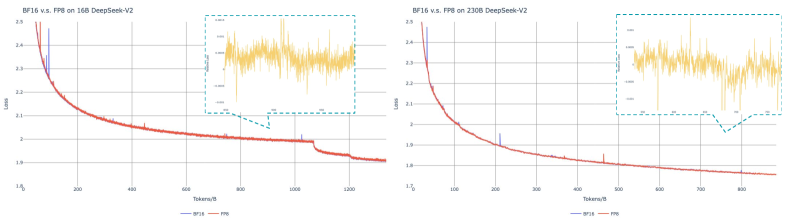

<figcaption>Figure 10: BF16 訓練と FP8 訓練の loss 曲線の比較。結果は係数 0.9 の指数移動平均（EMA）で平滑化されている。</figcaption>
</figure>

### B.1 FP8 v.s. BF16 Training（FP8 対 BF16 訓練）

我々は FP8 混合精度の枠組みを、異なる規模の 2 つのベースラインモデルの上で BF16 訓練と比較して検証する。小規模では総パラメータ約 16B の MoE ベースラインを 1.33T トークンで訓練する。大規模では総パラメータ約 230B の MoE ベースラインを約 0.9T トークンで訓練する。訓練曲線を Figure 10 に示し、**高精度の累積と細粒度量子化の戦略により相対誤差が 0.25% 未満に留まる**ことを実証する。

### B.2 Discussion About Block-Wise Quantization（ブロック単位の量子化についての議論）

我々のタイル単位の細粒度量子化は特徴の外れ値が導入する誤差を効果的に緩和するが、活性の量子化に異なるグループ化——順伝播では 1×128、逆伝播では 128×1——を要求する。活性の勾配についても同様の処理が要る。素直な戦略は、モデルの重みを量子化するのと同じやり方で 128×128 要素ごとのブロック単位の量子化を適用することである。この方式なら逆伝播に必要なのは転置だけになる。そこで我々は、Dgrad に関連するすべてのテンソルをブロック単位で量子化する実験を行った。結果は、**活性の勾配を計算して連鎖的に浅い層へ逆伝播する Dgrad の演算が精度に極めて敏感である**ことを明らかにした。具体的には、**活性の勾配のブロック単位の量子化は、総パラメータ約 16B の MoE モデルを約 300B トークン訓練したところでモデルを発散させた**。この敏感さは、活性の勾配がトークン間で高度に不均衡であり、**トークンに相関した外れ値** [^97] を生じるために起きると我々は推測する。これらの外れ値はブロック単位の量子化の方法では効果的に扱えない。

## Appendix C Expert Specialization Patterns of the 16B Aux-Loss-Based and Aux-Loss-Free Models（16B の補助損失あり／なしモデルのエキスパート専門化パターン）

我々は、16B の補助損失に基づくベースラインと補助損失を使わないモデルについて、Pile のテストセットにおけるエキスパートの負荷を記録した。**補助損失を使わないモデルは、Figure 11 に示すとおり、全層にわたってより強いエキスパートの専門化を示す傾向がある**。

<figure>

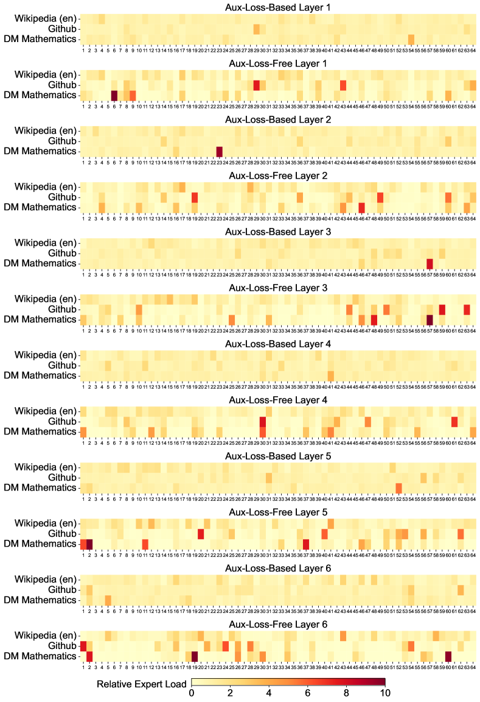

<figcaption>Figure 11 (a): 第 1〜7 層。</figcaption>
</figure>

<figure>

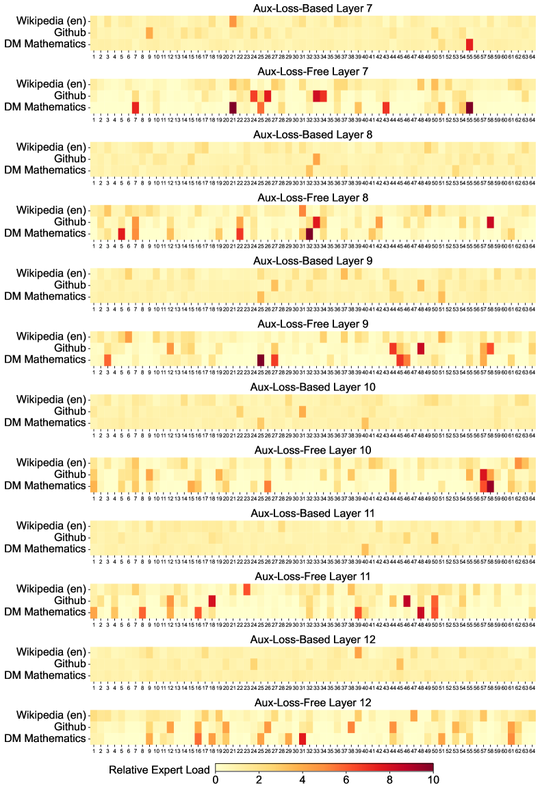

<figcaption>Figure 11 (b): 第 7〜13 層。</figcaption>
</figure>

<figure>

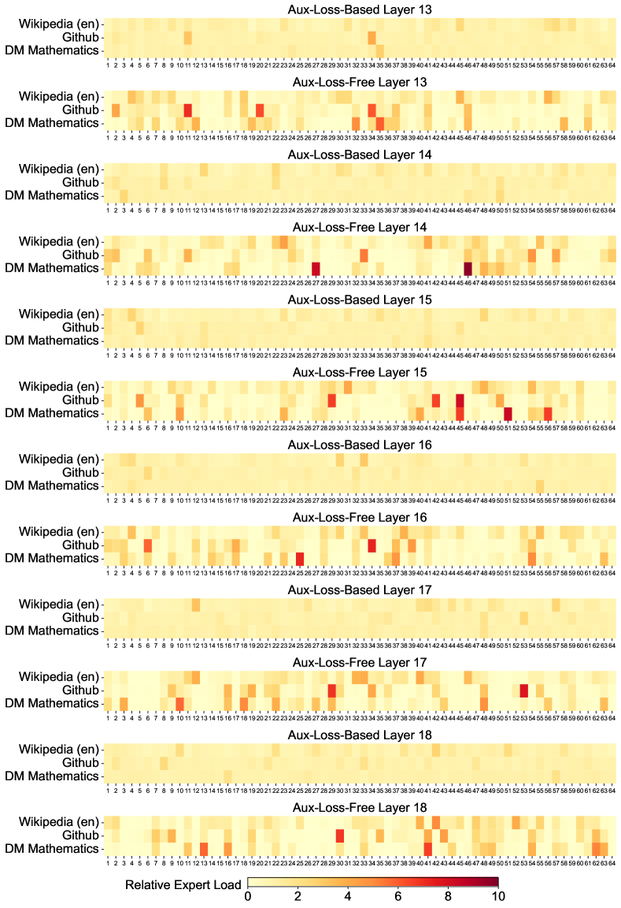

<figcaption>Figure 11 (c): 第 13〜19 層。</figcaption>
</figure>

<figure>

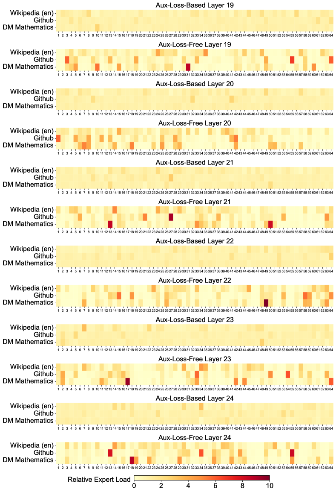

<figcaption>Figure 11 (d): 第 19〜25 層。</figcaption>
</figure>

<figure>

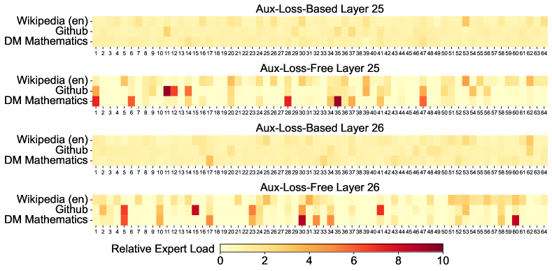

<figcaption>Figure 11 (e): 第 25〜27 層。</figcaption>
</figure>

**Figure 11**: Pile テストセットの 3 つのドメインにおける、補助損失を使わないモデルと補助損失に基づくモデルのエキスパート負荷。補助損失を使わないモデルのほうが、補助損失に基づくモデルより強いエキスパート専門化のパターンを示す。相対エキスパート負荷は、実際のエキスパート負荷と理論的に均衡したエキスパート負荷の比を表す。〔訳注: この総キャプションはクリップから欠落していたため原ページから復元した。〕

[^fn1]: https://aider.chat

[^fn2]: https://codeforces.com

[^fn3]: https://www.cms.org.cn/Home/comp/comp/cid/12.html

[^fn4]: https://github.com/openai/simple-evals
