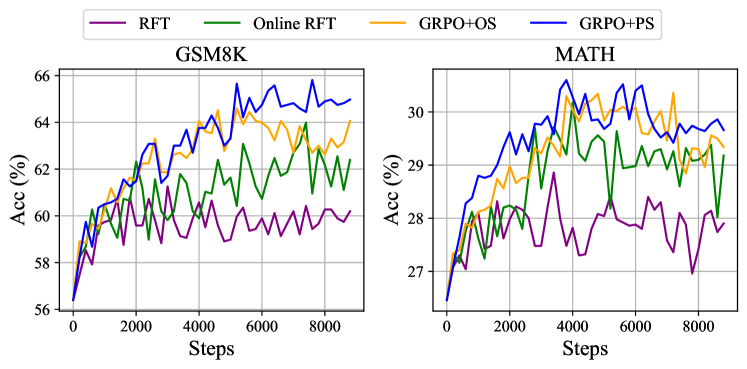
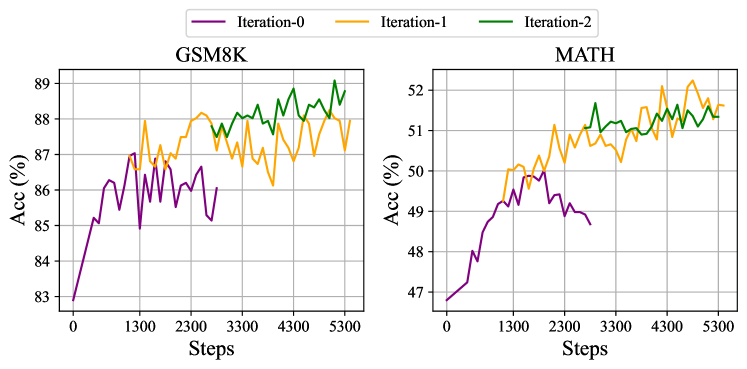

# DeepSeekMath: オープン言語モデルにおける数学的推論の限界を押し広げる

> 原題: DeepSeekMath: Pushing the Limits of Mathematical Reasoning in Open Language Models
> 著者: Zhihong Shao, Peiyi Wang, Qihao Zhu, Runxin Xu, Junxiao Song, Mingchuan Zhang, Y.K. Li, Y. Wu, Daya Guo（DeepSeek-AI／清華大学／北京大学）
> 出典: arXiv:2402.03300・https://github.com/deepseek-ai/DeepSeek-Math

> **訳注（クリップ復元について）**: 本訳は Obsidian Web Clipper によるクリップ（ar5iv 由来）を底本とし、以下の不良を ar5iv 原ページと照合して復元した。
> (1) **§1.1 の「Math Pre-Training at Scale」の貢献箇条書き 4 点が丸ごと欠落** → ar5iv から復元。
> (2) **脚注 7 件の本文が欠落**（上付きマーカーのみ残存）→ ar5iv から復元し `[^fn1]`〜`[^fn7]` として収録。
> (3) **表 6 個（Table 1, 2, 5, 6, 7, 8）が表構造を失い平文化**していた。これは **ar5iv 自体のレンダリング段階で表が崩壊**しており原ページにも構造が存在しないため、平文のセル順序を保ったまま markdown 表へ再構成した（数値・項目名は原文のまま。創作なし）。原文の書式情報（Table 5 の「グレー＝32 候補の多数決」の区別など）は平文化で失われており、再現していない（キャプションの説明のみ残る）。
> (4) Table 3（HTML 表）を markdown に正規化。分断された表示数式をクリーン LaTeX に正規化。
> References（参考文献一覧）は運用ルールに従い訳出対象から除外した。

## Abstract（要旨）

数学的推論は、その複雑で構造化された性質のため、言語モデルにとって重大な挑戦である。本論文では DeepSeekMath 7B を紹介する。これは DeepSeek-Coder-Base-v1.5 7B を、Common Crawl から収集した 120B の数学関連トークンと、自然言語・コードデータで継続事前学習したものである。DeepSeekMath 7B は、外部ツールキットや投票技法に頼ることなく、競技レベルの MATH ベンチマークで 51.7% という印象的なスコアを達成し、Gemini-Ultra と GPT-4 の性能水準に迫る。DeepSeekMath 7B の 64 サンプルに対する self-consistency は MATH で 60.9% を達成する。DeepSeekMath の数学的推論能力は 2 つの重要な要因に帰せられる。第一に、綿密に設計されたデータ選択パイプラインを通じて、公開されている Web データの大きな潜在力を活用したこと。第二に、PPO（Proximal Policy Optimization）の変種である Group Relative Policy Optimization（GRPO）を導入したことである。GRPO は PPO のメモリ使用量を最適化しながら、数学的推論能力を強化する。

<figure>


<figcaption>図1: 外部ツールキットと投票技法を使わない、競技レベル MATH ベンチマークにおけるオープンソースモデルの Top1 正解率。</figcaption>
</figure>

## 1 Introduction（はじめに）

大規模言語モデル（LLM）は人工知能における数学的推論へのアプローチに革命をもたらし、定量推論ベンチマーク [^17] と幾何推論ベンチマーク [^46] の双方で大きな前進を促してきた。さらに、これらのモデルは複雑な数学の問題を解く人間を支援するうえでも有用であることが証明されている [^44]。しかし、GPT-4 [^32] や Gemini-Ultra [^1] のような最先端モデルは公開されておらず、現在アクセス可能なオープンソースモデルは性能で大きく後れを取っている。

本研究では、オープンソースモデルの数学的能力を大幅に上回り、学術ベンチマークで GPT-4 の性能水準に迫るドメイン特化言語モデル、DeepSeekMath を紹介する。これを達成するため、120B の数学トークンから成る大規模で高品質な事前学習コーパス、DeepSeekMath Corpus を作成した。このデータセットは、fastText ベースの分類器 [^22] を使って Common Crawl（CC）から抽出される。最初の反復では、分類器は OpenWebMath [^34] の事例を正例として、多様に選んだその他の Web ページを負例として訓練される。続いて、この分類器を使って CC から追加の正例を発掘し、人手アノテーションでさらに洗練する。その後、強化されたデータセットで分類器を更新し、性能を高める。評価結果は、この大規模コーパスが高品質であることを示している。我々のベースモデル DeepSeekMath-Base 7B は GSM8K [^9] で 64.2%、競技レベルの MATH データセット [^17] で 36.2% を達成し、Minerva 540B [^25] を上回る。加えて DeepSeekMath Corpus は多言語であり、中国語の数学ベンチマーク [^51] [^61] でも改善が見られる。数学データ処理における我々の経験は研究コミュニティの出発点であり、今後の改善の余地は大きいと考えている。

DeepSeekMath-Base は DeepSeek-Coder-Base-v1.5 7B [^15] で初期化される。一般の LLM から始めるより、コード訓練モデルから始める方が良い選択であることに気づいたためである。さらに、数学訓練が MMLU [^16] や BBH ベンチマーク [^43] の能力も改善することを観察しており、これは数学の能力を高めるだけでなく、一般的な推論能力も増幅することを示している。

事前学習の後、chain-of-thought [^50]・program-of-thought [^8] [^13]・ツール統合推論 [^14] のデータで、DeepSeekMath-Base に数学的な指示チューニングを適用する。得られたモデル DeepSeekMath-Instruct 7B は全ての 7B 対抗モデルに勝ち、70B のオープンソース指示チューニング済みモデルにも匹敵する。

さらに、PPO（Proximal Policy Optimization）[^40] の変種である強化学習（RL）アルゴリズム、Group Relative Policy Optimization（GRPO）を導入する。GRPO は critic モデルを廃し、代わりにグループスコアからベースラインを推定することで、訓練資源を大幅に削減する。英語の指示チューニングデータの一部だけを使い、GRPO は強力な DeepSeekMath-Instruct に対して、強化学習フェーズにおけるドメイン内（GSM8K: 82.9% $\rightarrow$ 88.2%、MATH: 46.8% $\rightarrow$ 51.7%）とドメイン外の数学タスク（例: CMATH: 84.6% $\rightarrow$ 88.8%）の両方で大幅な改善を得る。また、Rejection Sampling Fine-Tuning（RFT）[^57]・Direct Preference Optimization（DPO）[^37]・PPO・GRPO といった異なる手法を理解するための統一パラダイムも提供する。この統一パラダイムに基づけば、これらの手法はすべて、直接的あるいは単純化された RL 技法として概念化される。さらに、オンライン対オフライン訓練、成果（outcome）対プロセス（process）監督、単発対反復 RL などの広範な実験を行い、このパラダイムの本質的な要素を深く調査する。最後に、我々の RL が指示チューニング済みモデルの性能を押し上げる理由を説明し、この統一パラダイムに基づいて、より効果的な RL を達成するための潜在的方向をまとめる。

### 1.1 Contributions（貢献）

我々の貢献は、スケーラブルな数学事前学習と、強化学習の探究・分析を含む。

**Math Pre-Training at Scale（大規模な数学事前学習）**（訳注: 以下の箇条書き 4 点はクリップから欠落していたため ar5iv から復元）

- 我々の研究は、公開されている Common Crawl データが数学的な目的にとって価値ある情報を含むという説得力ある証拠を提供する。綿密に設計されたデータ選択パイプラインの実装により、数学的コンテンツでフィルタした Web ページから 120B トークンの高品質データセット、DeepSeekMath Corpus の構築に成功した。これは Minerva [^25] が使った数学 Web ページの約 7 倍、最近公開された OpenWebMath [^34] の 9 倍の規模である。
- 我々の事前学習済みベースモデル DeepSeekMath-Base 7B は Minerva 540B [^25] に匹敵する性能を達成し、パラメータ数だけが数学的推論能力の鍵ではないことを示す。高品質なデータで事前学習された、より小さなモデルも強力な性能を達成しうる。
- 数学訓練の実験から得た知見を共有する。数学訓練に先立つコード訓練は、ツールを使う場合も使わない場合も、数学の問題を解くモデルの能力を改善する。これは長年の問い——コード訓練は推論能力を改善するのか?——への部分的な回答を提供する。少なくとも数学的推論については、改善すると我々は考える。
- arXiv 論文での訓練は、特に数学関連の多くの論文で一般的だが、本論文で採用したすべての数学ベンチマークで顕著な改善をもたらさなかった。

**Exploration and Analysis of Reinforcement Learning（強化学習の探究と分析）**

- 効率的かつ効果的な強化学習アルゴリズム、Group Relative Policy Optimization（GRPO）を導入する。GRPO は critic モデルを廃し、代わりにグループスコアからベースラインを推定することで、Proximal Policy Optimization（PPO）と比べて訓練資源を大幅に削減する。
- 指示チューニングデータのみを使って、GRPO が指示チューニング済みモデル DeepSeekMath-Instruct の性能を大幅に高めることを実証する。さらに、強化学習の過程でドメイン外の性能の向上も観察する。
- RFT・DPO・PPO・GRPO といった異なる手法を理解するための統一パラダイムを提供する。また、オンライン対オフライン訓練、成果対プロセス監督、単発対反復強化学習などの広範な実験を行い、このパラダイムの本質的要素を深く調査する。
- 統一パラダイムに基づき、強化学習の有効性の背後にある理由を探究し、LLM のより効果的な強化学習を達成するためのいくつかの潜在的方向をまとめる。

### 1.2 Summary of Evaluations and Metrics（評価と指標の要約）

- **英語と中国語の数学的推論**: 小学校レベルから大学レベルまでの数学の問題をカバーする英語・中国語ベンチマークで、モデルの包括的な評価を行う。英語ベンチマークは GSM8K [^9], MATH [^17], SAT [^3], OCW Courses [^25], MMLU-STEM [^16] を含む。中国語ベンチマークは MGSM-zh [^41], CMATH [^51], Gaokao-MathCloze [^61], Gaokao-MathQA [^61] を含む。ツールを使わず自己完結したテキスト解答を生成する能力と、Python を使って問題を解く能力を評価する。
	英語ベンチマークでは、DeepSeekMath-Base はクローズドソースの Minerva 540B [^25] と拮抗し、数学事前学習の有無を問わずすべてのオープンソースベースモデル（例: Mistral 7B [^21], Llemma-34B [^3]）を、しばしば大差で上回る。特筆すべきは、DeepSeekMath-Base が中国語ベンチマークで優れていることだ。これはおそらく、英語のみの数学事前学習データを集める先行研究 [^25] [^3] に従わず、高品質な非英語データも含めたためである。数学的な指示チューニングと強化学習を経た DeepSeekMath-Instruct と DeepSeekMath-RL は強力な性能を示し、オープンソースコミュニティで初めて競技レベル MATH データセットで 50% 超の正解率を得た。
- **形式数学**: [^20] の informal-to-formal 定理証明タスクを、証明支援系に Isabelle [^52] を選んで miniF2F [^60] 上で DeepSeekMath-Base を評価する。DeepSeekMath-Base は強力な few-shot 自動形式化性能を示す。
- **自然言語理解・推論・コード**: モデルの一般的な理解・推論・コーディング能力の包括的なプロファイルを構築するため、多様な科目をカバーする 57 の多肢選択タスクから成る Massive Multitask Language Understanding（MMLU）ベンチマーク [^16]、多段階推論を要する 23 の難タスクから成る BIG-Bench Hard（BBH）[^43]、コード言語モデルの評価に広く使われる HumanEval [^7] と MBPP [^2] で DeepSeekMath-Base を評価する。数学事前学習は言語理解と推論の性能の双方に恩恵を与える。

## 2 Math Pre-Training（数学事前学習）

### 2.1 Data Collection and Decontamination（データ収集と汚染除去）

本節では、Common Crawl から DeepSeekMath Corpus を構築する過程を概説する。図2 に示すとおり、種コーパス（例: 小さいが高品質な数学関連データセットのコレクション）から始めて、Common Crawl から大規模な数学コーパスを体系的に収集する方法を示す反復パイプラインを提示する。このアプローチはコーディングなど他のドメインにも適用可能であることは注目に値する。

<figure>


<figcaption>図2: Common Crawl から数学の Web ページを収集する反復パイプライン。</figcaption>
</figure>

まず、高品質な数学 Web テキストのコレクションである OpenWebMath [^34] を初期の種コーパスに選ぶ。このコーパスを使い、OpenWebMath に似た数学 Web ページをさらに回収するための fastText モデル [^22] を訓練する。具体的には、種コーパスからランダムに選んだ 50 万データ点を正の訓練例、Common Crawl からの別の 50 万 Web ページを負例として使う。訓練にはオープンソースライブラリ[^fn1]を使い、ベクトル次元 256・学習率 0.1・単語 n-gram の最大長 3・単語の最小出現回数 3・訓練エポック数 3 で構成する。元の Common Crawl のサイズを減らすため、URL ベースの重複除去と近似重複除去の技法を使い、40B の HTML Web ページを得る。次に、fastText モデルで重複除去済み Common Crawl から数学 Web ページを回収する。低品質な数学コンテンツを除くため、収集したページを fastText モデルの予測スコアでランク付けし、上位のもののみを保存する。保存するデータ量は、上位 40B・80B・120B・160B トークンでの事前学習実験によって査定する。最初の反復では、上位 40B トークンを保持することを選んだ。

データ収集の最初の反復の後も、多数の数学 Web ページが未回収のまま残る。主な理由は、fastText モデルの訓練に使った正例集合の多様性が不十分だからである。そこで、種コーパスを豊かにする追加の数学 Web ソースを特定し、fastText モデルを最適化する。具体的には、まず Common Crawl 全体を互いに素なドメインへ整理する。ドメインは、同じベース URL を共有する Web ページと定義する。各ドメインについて、最初の反復で収集された Web ページの割合を計算する。Web ページの 10% 超が収集されたドメインを数学関連と分類する（例: mathoverflow.net）。続いて、特定されたドメイン内で数学コンテンツに関連する URL を人手でアノテーションする（例: mathoverflow.net/questions）。これらの URL に紐づく未回収の Web ページが種コーパスに追加される。このアプローチにより、より多くの正例を集めて改良された fastText モデルを訓練でき、次の反復でより多くの数学データを回収できるようになる。4 回の反復によるデータ収集の末、3550 万の数学 Web ページ、計 120B トークンに到達する。4 回目の反復では、データの 98% 近くが 3 回目までに収集済みであることに気づいたため、データ収集の打ち切りを決めた。

ベンチマーク汚染を避けるため、[^15] に従い、GSM8K [^9] や MATH [^17] のような英語の数学ベンチマーク、CMATH [^51] や AGIEval [^61] のような中国語ベンチマークの問題や解答を含む Web ページをフィルタで除く。フィルタ基準は次のとおり: 評価ベンチマークのいずれかの部分文字列と正確に一致する 10-gram の文字列を含むテキストセグメントは、数学訓練コーパスから除去する。10-gram に満たないが少なくとも 3-gram あるベンチマークテキストについては、完全一致で汚染 Web ページをフィルタする。

### 2.2 Validating the Quality of the DeepSeekMath Corpus（DeepSeekMath Corpus の品質検証）

最近公開された数学訓練コーパスと DeepSeekMath Corpus を比較する事前学習実験を行う:

- **MathPile** [^49]: 教科書・Wikipedia・ProofWiki・CommonCrawl・StackExchange・arXiv から集約されたマルチソースのコーパス（8.9B トークン）。大半（85% 超）は arXiv 由来;
- **OpenWebMath** [^34]: 数学的コンテンツでフィルタした CommonCrawl データ。計 13.6B トークン;
- **Proof-Pile-2** [^3]: OpenWebMath・AlgebraicStack（10.3B トークンの数学的コード）・arXiv 論文（28.0B トークン）から成る数学コーパス。Proof-Pile-2 の実験では [^3] に従い arXiv:Web:Code の比率を 2:4:1 とする。

#### 2.2.1 Training Setting（訓練設定）

DeepSeek LLM [^11] と同じフレームワークを共有する 1.3B パラメータの一般事前学習済み言語モデル（DeepSeek-LLM 1.3B と表記）に数学訓練を適用する。各数学コーパスで別々に 150B トークンのモデルを訓練する。すべての実験は、効率的で軽量な HAI-LLM [^18] 訓練フレームワークで実施する。DeepSeek LLM の訓練慣行に従い、AdamW オプティマイザ [^28]（$\beta_{1}=0.9$, $\beta_{2}=0.95$, $\mathrm{weight\_decay}=0.1$）と、2,000 ステップのウォームアップ後にピークに達し、訓練の 80% 経過後に 31.6% へ、90% 経過後にピークの 10.0% へ下がるマルチステップ学習率スケジュールを使う。学習率の最大値は 5.3e-4、バッチサイズは 4M トークン・4K コンテキスト長とする。

**表1**: 異なる数学コーパスで訓練した DeepSeek-LLM 1.3B の性能。few-shot chain-of-thought プロンプティングで評価。コーパスサイズは語彙サイズ 100K の我々のトークナイザで計算。（訳注: ar5iv で表構造が失われ平文化していたため、セル順序を保って再構成）

| Math Corpus | Size | GSM8K | MATH | OCW | SAT | MMLU STEM | CMATH | Gaokao MathCloze | Gaokao MathQA |
| --- | --- | --- | --- | --- | --- | --- | --- | --- | --- |
| No Math Training | N/A | 2.9% | 3.0% | 2.9% | 15.6% | 19.5% | 12.3% | 0.8% | 17.9% |
| MathPile | 8.9B | 2.7% | 3.3% | 2.2% | 12.5% | 15.7% | 1.2% | 0.0% | 2.8% |
| OpenWebMath | 13.6B | 11.5% | 8.9% | 3.7% | 31.3% | 29.6% | 16.8% | 0.0% | 14.2% |
| Proof-Pile-2 | 51.9B | 14.3% | 11.2% | 3.7% | 43.8% | 29.2% | 19.9% | 5.1% | 11.7% |
| DeepSeekMath Corpus | 120.2B | 23.8% | 13.6% | 4.8% | 56.3% | 33.1% | 41.5% | 5.9% | 23.6% |

<figure>


<figcaption>図3: 異なる数学コーパスで訓練した DeepSeek-LLM 1.3B のベンチマーク曲線。</figcaption>
</figure>

#### 2.2.2 Evaluation Results（評価結果）

DeepSeekMath Corpus は高品質で、多言語の数学的コンテンツをカバーし、規模も最大である。

- **高品質**: few-shot chain-of-thought プロンプティング [^50] を使い、8 つの数学ベンチマークで下流性能を評価する。表1 に示すとおり、DeepSeekMath Corpus で訓練したモデルの明確な性能リードがある。図3 は、DeepSeekMath Corpus で訓練したモデルが 50B トークン（Proof-Pile-2 の 1 フルエポック）の時点で Proof-Pile-2 より良い性能を示すことを示しており、DeepSeekMath Corpus の平均品質がより高いことを示す。
- **多言語**: DeepSeekMath Corpus は複数言語のデータを包含し、英語と中国語が代表的な 2 言語である。表1 に示すとおり、DeepSeekMath Corpus での訓練は英語と中国語の両方で数学的推論性能を高める。対照的に、主に英語中心の既存の数学コーパスは、中国語の数学的推論では改善が限定的で、性能を害することさえある。
- **大規模**: DeepSeekMath Corpus は既存の数学コーパスの数倍の規模である。図3 に示すとおり、DeepSeek-LLM 1.3B は DeepSeekMath Corpus で訓練すると、より急な学習曲線とより持続的な改善を示す。対照的に、ベースラインのコーパスはずっと小さく、訓練中にすでに何周も繰り返されており、結果としてモデル性能は早々に頭打ちになる。

### 2.3 Training and Evaluating DeepSeekMath-Base 7B（DeepSeekMath-Base 7B の訓練と評価）

本節では、特に数学において強力な推論能力を持つベースモデル、DeepSeekMath-Base 7B を紹介する。我々のモデルは DeepSeek-Coder-Base-v1.5 7B [^15] で初期化され、500B トークンで訓練される。データの分布は次のとおり: 56% が DeepSeekMath Corpus、4% が AlgebraicStack、10% が arXiv、20% が Github コード、残り 10% が Common Crawl の英中の自然言語データである。学習率の最大値を 4.2e-4、バッチサイズを 10M トークンとする以外は、主に 2.2.1 節の訓練設定を採用する。

DeepSeekMath-Base 7B の数学的能力について、外部ツールに頼らない自己完結した数学的解答の生成能力・ツールを使った数学問題の解決能力・形式的定理証明の実施能力に焦点を当てた包括的な査定を行う。数学を超えて、自然言語理解・推論・プログラミングスキルの性能を含む、ベースモデルのより一般的なプロファイルも提供する。

##### Mathematical Problem Solving with Step-by-Step Reasoning（段階的推論による数学問題の解決）

few-shot chain-of-thought プロンプティング [^50] を使い、英語と中国語の 8 ベンチマークで数学問題を解く DeepSeekMath-Base の性能を評価する。これらのベンチマークは定量推論（例: GSM8K [^9], MATH [^17], CMATH [^51]）と多肢選択問題（例: MMLU-STEM [^16], Gaokao-MathQA [^61]）を包含し、小学校から大学レベルの複雑さまで、数学の多様な分野をカバーする。

表2 に示すとおり、DeepSeekMath-Base 7B はオープンソースのベースモデル（広く使われる汎用モデル Mistral 7B [^21] と、Proof-Pile-2 で数学訓練を受けた最近公開の Llemma 34B [^3] を含む）の中で、8 ベンチマークすべての性能をリードする。特筆すべきは、競技レベルの MATH データセットで、DeepSeekMath-Base は既存のオープンソースベースモデルを絶対値で 10% 以上上回り、PaLM [^26] の上に構築され数学テキストでさらに訓練された 77 倍の規模のクローズドソースベースモデル Minerva 540B [^25] をも上回ることである。

**表2**: 英語・中国語の数学ベンチマークにおける DeepSeekMath-Base 7B と強力なベースモデルの比較。モデルは chain-of-thought プロンプティングで評価。Minerva の結果は [^25] からの引用。（訳注: ar5iv で表構造が失われ平文化していたため、セル順序を保って再構成）

| Model | Size | GSM8K | MATH | OCW | SAT | MMLU STEM | CMATH | Gaokao MathCloze | Gaokao MathQA |
| --- | --- | --- | --- | --- | --- | --- | --- | --- | --- |
| **Closed-Source Base Model** |  |  |  |  |  |  |  |  |  |
| Minerva | 7B | 16.2% | 14.1% | 7.7% | - | 35.6% | - | - | - |
| Minerva | 62B | 52.4% | 27.6% | 12.0% | - | 53.9% | - | - | - |
| Minerva | 540B | 58.8% | 33.6% | 17.6% | - | 63.9% | - | - | - |
| **Open-Source Base Model** |  |  |  |  |  |  |  |  |  |
| Mistral | 7B | 40.3% | 14.3% | 9.2% | 71.9% | 51.1% | 44.9% | 5.1% | 23.4% |
| Llemma | 7B | 37.4% | 18.1% | 6.3% | 59.4% | 43.1% | 43.4% | 11.9% | 23.6% |
| Llemma | 34B | 54.0% | 25.3% | 10.3% | 71.9% | 52.9% | 56.1% | 11.9% | 26.2% |
| DeepSeekMath-Base | 7B | 64.2% | 36.2% | 15.4% | 84.4% | 56.5% | 71.7% | 20.3% | 35.3% |

##### Mathematical Problem Solving with Tool Use（ツール使用による数学問題の解決）

few-shot program-of-thought プロンプティング [^8] [^13] を使い、GSM8K と MATH でプログラム支援の数学的推論を評価する。モデルは、複雑な計算に math や sympy のようなライブラリを活用できる Python プログラムを書いて各問題を解くようプロンプトされる。プログラムの実行結果が答えとして評価される。表3 に示すとおり、DeepSeekMath-Base 7B は従来の最先端 Llemma 34B を上回る。

**表3**: ツールを使って数学問題を解く能力と、Isabelle で informal-to-formal 定理証明を行う能力の、ベースモデルの few-shot 評価。

| Model | Size | GSM8K+Python | MATH+Python | miniF2F-valid | miniF2F-test |
| --- | --- | --- | --- | --- | --- |
| Mistral | 7B | 48.5% | 18.2% | 18.9% | 18.0% |
| CodeLlama | 7B | 27.1% | 17.2% | 16.3% | 17.6% |
| CodeLlama | 34B | 52.7% | 23.5% | 18.5% | 18.0% |
| Llemma | 7B | 41.0% | 18.6% | 20.6% | 22.1% |
| Llemma | 34B | 64.6% | 26.3% | 21.0% | 21.3% |
| DeepSeekMath-Base | 7B | 66.9% | 31.4% | 25.8% | 24.6% |

##### Formal Mathematics（形式数学）

形式的証明の自動化は、数学的証明の正確性と信頼性を保証し効率を高めるのに有益であり、近年注目が高まっている。[^20] の informal-to-formal 証明タスク——非形式的な命題・その形式的対応物・非形式的証明に基づいて形式的証明を生成する——で DeepSeekMath-Base 7B を評価する。形式的なオリンピアードレベル数学のベンチマークである miniF2F [^60] で評価し、few-shot プロンプティングで各問題の Isabelle の形式的証明を生成する。[^20] に従い、モデルに証明スケッチを生成させ、既製の自動証明器 Sledgehammer [^35] を実行して欠けた詳細を埋める。表3 に示すとおり、DeepSeekMath-Base 7B は証明の自動形式化で強力な性能を示す。

**表4**: 自然言語理解・推論・コードのベンチマークでの評価。DeepSeek-Coder-Base-v1.5† は学習率減衰の直前のチェックポイントで、DeepSeekMath-Base の訓練に使われたもの。MMLU と BBH では few-shot chain-of-thought プロンプティングを使う。HumanEval と MBPP では、それぞれゼロショットと few-shot の設定で評価する。

| Model | Size | MMLU | BBH | HumanEval (Pass@1) | MBPP (Pass@1) |
| --- | --- | --- | --- | --- | --- |
| Mistral | 7B | 62.4% | 55.7% | 28.0% | 41.4% |
| DeepSeek-Coder-Base-v1.5† | 7B | 42.9% | 42.9% | 40.2% | 52.6% |
| DeepSeek-Coder-Base-v1.5 | 7B | 49.1% | 55.2% | 43.2% | 60.4% |
| DeepSeekMath-Base | 7B | 54.9% | 59.5% | 40.9% | 52.6% |

##### Natural Language Understanding, Reasoning, and Code（自然言語理解・推論・コード）

自然言語理解を MMLU [^16] で、推論を BBH [^43] で、コーディング能力を HumanEval [^7] と MBPP [^2] で評価する。表4 に示すとおり、DeepSeekMath-Base 7B は前身の DeepSeek-Coder-Base-v1.5 [^15] に対して MMLU と BBH の性能で大幅な向上を示し、数学訓練が言語理解と推論に与える正の影響を示している。加えて、継続訓練にコードトークンを含めることで、DeepSeekMath-Base 7B は 2 つのコーディングベンチマークにおける DeepSeek-Coder-Base-v1.5 の性能を効果的に維持している。全体として、DeepSeekMath-Base 7B は 3 つの推論・コーディングベンチマークで汎用モデル Mistral 7B [^21] を大幅に上回る。

## 3 Supervised Fine-Tuning（教師ありファインチューニング）

### 3.1 SFT Data Curation（SFT データのキュレーション）

異なる数学分野・異なる複雑さの英語・中国語の問題をカバーする、数学的な指示チューニングデータセットを構築する: 問題には chain-of-thought（CoT）[^50]・program-of-thought（PoT）[^8] [^13]・ツール統合推論形式 [^14] の解答が組み合わされる。訓練例の総数は 776K である。

- **英語の数学データセット**: GSM8K と MATH の問題にツール統合解答をアノテーションし、MathInstruct [^59] のサブセットと Lila-OOD [^30] の訓練セット（問題は CoT または PoT で解かれる）を採用する。英語のコレクションは代数・確率・数論・微積分・幾何など、数学の多様な分野をカバーする。
- **中国語の数学データセット**: 一次方程式など 76 のサブトピックにまたがる中国語の K-12 数学問題を収集し、解答は CoT とツール統合推論形式の両方でアノテーションする。

### 3.2 Training and Evaluating DeepSeekMath-Instruct 7B（DeepSeekMath-Instruct 7B の訓練と評価）

本節では、DeepSeekMath-Base に基づいて数学的な指示チューニングを施した DeepSeekMath-Instruct 7B を紹介する。訓練例は、最大コンテキスト長 4K トークンに達するまでランダムに連結される。バッチサイズ 256・一定学習率 5e-5 で 500 ステップ訓練する。

英語と中国語の 4 つの定量推論ベンチマークで、ツール使用なし・ありの両方の数学的性能を評価する。当時の主導的なモデルたちと比較する:

- **クローズドソースモデル**: (1) GPT ファミリー——GPT-4 [^32] と GPT-4 Code Interpreter[^fn2] が最有力、(2) Gemini Ultra と Pro [^1]、(3) Inflection-2 [^19]、(4) Grok-1[^fn3]、加えて中国企業が最近公開したモデル——(5) Baichuan-3[^fn4]、(6) GLM ファミリー [^12] の最新 GLM-4[^fn5]。これらは汎用モデルで、大半は一連のアラインメント手続きを経ている。
- **オープンソースモデル**: 汎用モデルとして (1) DeepSeek-LLM-Chat 67B [^11]、(2) Qwen 72B [^4]、(3) SeaLLM-v2 7B [^31]、(4) ChatGLM3 6B [^6]、数学強化モデルとして (5) InternLM2 の上に数学訓練と指示チューニングを施した InternLM2-Math 20B[^fn6]、(6) プロセス監督型報酬モデルで Mistral 7B [^21] に PPO 訓練 [^40] を適用した Math-Shepherd-Mistral 7B、(7) evolve-instruct（AI が進化させた指示を使う指示チューニングの一種）と、主に GSM8K・MATH 由来の訓練問題での PPO 訓練で Mistral 7B と Llama-2 70B [^45] の数学推論を改善した WizardMath シリーズ [^29]、(8) GSM8K・MATH の拡張版で Llama-2 70B をファインチューニングした MetaMath 70B [^56]、(9) ツール統合の数学推論を行うようファインチューニングした CodeLlama 34B である ToRA 34B [^14]、(10) MathInstruct で Llama-2 70B を指示チューニングした MAmmoTH 70B [^59]。

**表5**: 英語・中国語ベンチマークにおける、Chain-of-Thought とツール統合推論の両方でのオープン・クローズドソースモデルの性能。（原文キャプション: グレーのスコアは 32 候補の多数決を表し、その他は Top1 スコア。訳注: 平文化によりグレー表記の区別は失われている。）DeepSeekMath-RL 7B は 7B〜70B のすべてのオープンソースモデルと、クローズドソースモデルの大半に勝つ。DeepSeekMath-RL 7B は GSM8K と MATH の chain-of-thought 形式の指示チューニングデータでのみ追加訓練されているにもかかわらず、全ベンチマークで DeepSeekMath-Instruct 7B を改善する。（訳注: ar5iv で表構造が失われ平文化していたため、セル順序を保って再構成）

| Model | Size | GSM8K | MATH | MGSM-zh | CMATH |
| --- | --- | --- | --- | --- | --- |
| **Chain-of-Thought Reasoning — Closed-Source Model** |  |  |  |  |  |
| Gemini Ultra | - | 94.4% | 53.2% | - | - |
| GPT-4 | - | 92.0% | 52.9% | - | 86.0% |
| Inflection-2 | - | 81.4% | 34.8% | - | - |
| GPT-3.5 | - | 80.8% | 34.1% | - | 73.8% |
| Gemini Pro | - | 86.5% | 32.6% | - | - |
| Grok-1 | - | 62.9% | 23.9% | - | - |
| Baichuan-3 | - | 88.2% | 49.2% | - | - |
| GLM-4 | - | 87.6% | 47.9% | - | - |
| **Chain-of-Thought Reasoning — Open-Source Model** |  |  |  |  |  |
| InternLM2-Math | 20B | 82.6% | 37.7% | - | - |
| Qwen | 72B | 78.9% | 35.2% | - | - |
| Math-Shepherd-Mistral | 7B | 84.1% | 33.0% | - | - |
| WizardMath-v1.1 | 7B | 83.2% | 33.0% | - | - |
| DeepSeek-LLM-Chat | 67B | 84.1% | 32.6% | 74.0% | 80.3% |
| MetaMath | 70B | 82.3% | 26.6% | 66.4% | 70.9% |
| SeaLLM-v2 | 7B | 78.2% | 27.5% | 64.8% | - |
| ChatGLM3 | 6B | 72.3% | 25.7% | - | - |
| WizardMath-v1.0 | 70B | 81.6% | 22.7% | 64.8% | 65.4% |
| DeepSeekMath-Instruct | 7B | 82.9% | 46.8% | 73.2% | 84.6% |
| DeepSeekMath-RL | 7B | 88.2% | 51.7% | 79.6% | 88.8% |
| **Tool-Integrated Reasoning — Closed-Source Model** |  |  |  |  |  |
| GPT-4 Code Interpreter | - | 97.0% | 69.7% | - | - |
| **Tool-Integrated Reasoning — Open-Source Model** |  |  |  |  |  |
| InternLM2-Math | 20B | 80.7% | 54.3% | - | - |
| DeepSeek-LLM-Chat | 67B | 86.7% | 51.1% | 76.4% | 85.4% |
| ToRA | 34B | 80.7% | 50.8% | 41.2% | 53.4% |
| MAmmoTH | 70B | 76.9% | 41.8% | - | - |
| DeepSeekMath-Instruct | 7B | 83.7% | 57.4% | 72.0% | 84.3% |
| DeepSeekMath-RL | 7B | 86.7% | 58.8% | 78.4% | 87.6% |

表5 に示すとおり、ツール使用が許されない評価設定では、DeepSeekMath-Instruct 7B は段階的推論の強力な性能を示す。特筆すべきは、競技レベルの MATH データセットで、我々のモデルはすべてのオープンソースモデルと大半のプロプライエタリモデル（例: Inflection-2, Gemini Pro）を絶対値で少なくとも 9% 上回る。これは、大幅に大きなモデル（例: Qwen 72B）や、数学に焦点を当てた強化学習で特別に強化されたモデル（例: WizardMath-v1.1 7B）に対しても成り立つ。DeepSeekMath-Instruct は MATH で中国のプロプライエタリモデル GLM-4・Baichuan-3 に伍する一方、GPT-4 と Gemini Ultra にはまだ及ばない。

自然言語推論とプログラムベースのツール使用を統合して問題を解くことが許される評価設定では、DeepSeekMath-Instruct 7B は MATH で 60% に迫る正解率に達し、既存のすべてのオープンソースモデルを上回る。他のベンチマークでも、我々のモデルは 10 倍の規模を持つ従来の最先端、DeepSeek-LLM-Chat 67B と拮抗する。

## 4 Reinforcement Learning（強化学習）

### 4.1 Group Relative Policy Optimization

強化学習（RL）は、教師ありファインチューニング（SFT）段階の後で LLM の数学的推論能力をさらに改善するのに有効であることが証明されている [^48] [^29]。本節では、我々の効率的かつ効果的な RL アルゴリズム、Group Relative Policy Optimization（GRPO）を紹介する。

#### 4.1.1 From PPO to GRPO（PPO から GRPO へ）

Proximal Policy Optimization（PPO）[^40] は actor-critic 型の RL アルゴリズムで、LLM の RL ファインチューニング段階で広く使われている [^33]。具体的には、次の代理目的関数を最大化して LLM を最適化する:

$$
\mathcal{J}_{PPO}(\theta)=\mathbb{E}{[q\sim P(Q),o\sim\pi_{\theta_{old}}(O|q)]}\frac{1}{|o|}\sum_{t=1}^{|o|}\min\left[\frac{\pi_{\theta}(o_{t}|q,o_{<t})}{\pi_{\theta_{old}}(o_{t}|q,o_{<t})}A_{t},\text{clip}\left(\frac{\pi_{\theta}(o_{t}|q,o_{<t})}{\pi_{\theta_{old}}(o_{t}|q,o_{<t})},1-\varepsilon,1+\varepsilon\right)A_{t}\right],
$$

ここで $\pi_{\theta}$ と $\pi_{\theta_{old}}$ は現在と過去のポリシーモデル、$q,o$ はそれぞれ問題データセットと過去のポリシー $\pi_{\theta_{old}}$ からサンプルされた問題と出力である。$\varepsilon$ は訓練を安定化するために PPO で導入されたクリッピング関連のハイパーパラメータである。$A_{t}$ はアドバンテージで、報酬 $\{r_{\geq t}\}$ と学習された価値関数 $V_{\psi}$ に基づき、Generalized Advantage Estimation（GAE）[^39] を適用して計算される。したがって PPO では、ポリシーモデルと並行して価値関数を訓練する必要がある。また、報酬モデルの過剰最適化を緩和するため、標準的なアプローチでは各トークンの報酬に参照モデルからのトークン単位 KL ペナルティを加える [^33]。すなわち、

$$
r_{t}=r_{\varphi}(q,o_{\leq t})-\beta\log\frac{\pi_{\theta}(o_{t}|q,o_{<t})}{\pi_{ref}(o_{t}|q,o_{<t})},
$$

ここで $r_{\varphi}$ は報酬モデル、$\pi_{ref}$ は参照モデル（通常は初期の SFT モデル）、$\beta$ は KL ペナルティの係数である。

<figure>


<figcaption>図4: PPO と我々の GRPO の実演。GRPO は価値モデルを廃し、代わりにグループのスコアからベースラインを推定して、訓練資源を大幅に削減する。</figcaption>
</figure>

PPO で用いられる価値関数は典型的にはポリシーモデルと同程度の規模の別モデルであり、大きなメモリと計算の負担をもたらす。加えて、RL 訓練中、価値関数はアドバンテージ計算における分散低減のためのベースラインとして扱われる。一方 LLM の文脈では、通常、報酬モデルがスコアを与えるのは最後のトークンだけであり、これは各トークンで正確な価値関数を訓練することを難しくしうる。これに対処するため、図4 に示すとおり、我々は Group Relative Policy Optimization（GRPO）を提案する。GRPO は PPO のような追加の価値関数近似を不要にし、代わりに、**同じ問題に対して生成された複数のサンプル出力の平均報酬をベースラインとして使う**。より具体的には、各問題 $q$ について、GRPO は過去のポリシー $\pi_{\theta_{old}}$ から出力のグループ $\{o_{1},o_{2},\cdots,o_{G}\}$ をサンプルし、次の目的関数を最大化してポリシーモデルを最適化する:

$$
\begin{split}\mathcal{J}_{GRPO}(\theta)&=\mathbb{E}{[q\sim P(Q),\{o_{i}\}_{i=1}^{G}\sim\pi_{\theta_{old}}(O|q)]}\\
&\frac{1}{G}\sum_{i=1}^{G}\frac{1}{|o_{i}|}\sum_{t=1}^{|o_{i}|}\left\{\min\left[\frac{\pi_{\theta}(o_{i,t}|q,o_{i,<t})}{\pi_{\theta_{old}}(o_{i,t}|q,o_{i,<t})}\hat{A}_{i,t},\text{clip}\left(\frac{\pi_{\theta}(o_{i,t}|q,o_{i,<t})}{\pi_{\theta_{old}}(o_{i,t}|q,o_{i,<t})},1-\varepsilon,1+\varepsilon\right)\hat{A}_{i,t}\right]-\beta\mathbb{D}_{KL}\left[\pi_{\theta}||\pi_{ref}\right]\right\},\end{split}
$$

ここで $\varepsilon$ と $\beta$ はハイパーパラメータ、$\hat{A}_{i,t}$ は各グループ内の出力の相対的な報酬のみに基づいて計算されるアドバンテージであり、以降の小節で詳述する。GRPO がアドバンテージ計算に使うグループ相対の方式は、報酬モデルの比較的性質とよく整合する。報酬モデルは典型的に、同じ問題に対する出力間の比較のデータセットで訓練されるからである。また、報酬に KL ペナルティを加える代わりに、GRPO は訓練するポリシーと参照ポリシーの間の KL ダイバージェンスを損失に直接加えて正則化し、$\hat{A}_{i,t}$ の計算を複雑にすることを避ける。そして (2) で使われる KL ペナルティ項と異なり、KL ダイバージェンスは次の不偏推定量 [^38] で推定する:

$$
\mathbb{D}_{KL}\left[\pi_{\theta}||\pi_{ref}\right]=\frac{\pi_{ref}(o_{i,t}|q,o_{i,<t})}{\pi_{\theta}(o_{i,t}|q,o_{i,<t})}-\log\frac{\pi_{ref}(o_{i,t}|q,o_{i,<t})}{\pi_{\theta}(o_{i,t}|q,o_{i,<t})}-1,
$$

これは正であることが保証される。

**Algorithm 1** 反復的 Group Relative Policy Optimization

```
Input: 初期ポリシーモデル π_θ_init; 報酬モデル r_φ; タスクプロンプト D; ハイパーパラメータ ε, β, μ
policy model π_θ ← π_θ_init
for iteration = 1, …, I do
  reference model π_ref ← π_θ
  for step = 1, …, M do
    バッチ D_b を D からサンプル
    old ポリシーモデルを更新 π_θ_old ← π_θ
    各問題 q ∈ D_b について G 個の出力 {o_i} ~ π_θ_old(·|q) をサンプル
    r_φ を実行して各サンプル出力 o_i の報酬 {r_i} を計算
    グループ相対アドバンテージ推定により o_i の第 t トークンの Â_{i,t} を計算
    for GRPO iteration = 1, …, μ do
      GRPO 目的関数（式 21）を最大化してポリシーモデル π_θ を更新
  リプレイ機構による継続訓練で r_φ を更新
Output: π_θ
```

#### 4.1.2 Outcome Supervision RL with GRPO（GRPO による成果監督 RL）

形式的には、各問題 $q$ について、過去のポリシーモデル $\pi_{\theta_{old}}$ から出力のグループ $\{o_{1},o_{2},\cdots,o_{G}\}$ をサンプルする。次に報酬モデルで出力をスコアリングし、対応する $G$ 個の報酬 $\mathbf{r}=\{r_{1},r_{2},\cdots,r_{G}\}$ を得る。続いて、これらの報酬はグループ平均を引き、グループ標準偏差で割って正規化される。成果監督は各出力 $o_{i}$ の最後に正規化された報酬を与え、出力内の全トークンのアドバンテージ $\hat{A}_{i,t}$ をその正規化された報酬に設定する。すなわち $\hat{A}_{i,t}=\widetilde{r}_{i}=\frac{r_{i}-{\rm mean}(\mathbf{r})}{{\rm std}(\mathbf{r})}$ であり、その後、式 (3) で定義した目的関数を最大化してポリシーを最適化する。

#### 4.1.3 Process Supervision RL with GRPO（GRPO によるプロセス監督 RL）

成果監督は各出力の最後に報酬を与えるだけであり、複雑な数学タスクにおいてポリシーを監督するには十分でも効率的でもない可能性がある。[^48] に従い、各推論ステップの最後に報酬を与えるプロセス監督も探究する。形式的には、問題 $q$ と $G$ 個のサンプル出力 $\{o_{1},o_{2},\cdots,o_{G}\}$ が与えられたとき、プロセス報酬モデルが出力の各ステップをスコアリングし、対応する報酬 $\mathbf{R}=\{\{r_{1}^{index(1)},\cdots,r_{1}^{index(K_{1})}\},\cdots,\{r_{G}^{index(1)},\cdots,r_{G}^{index(K_{G})}\}\}$ を得る。ここで $index(j)$ は第 $j$ ステップの終端トークンのインデックス、$K_{i}$ は第 $i$ 出力の総ステップ数である。これらの報酬も平均と標準偏差で正規化する。すなわち $\widetilde{r}_{i}^{index(j)}=\frac{r_{i}^{index(j)}-{\rm mean(\mathbf{R})}}{{\rm std(\mathbf{R})}}$。続いて、プロセス監督は各トークンのアドバンテージを、後続ステップの正規化された報酬の和として計算する。すなわち $\hat{A}_{i,t}=\sum_{index(j)\geq t}\widetilde{r}_{i}^{index(j)}$ であり、その後、式 (3) で定義した目的関数を最大化してポリシーを最適化する。

#### 4.1.4 Iterative RL with GRPO（GRPO による反復 RL）

強化学習の訓練過程が進むにつれ、古い報酬モデルは現在のポリシーモデルを監督するのに不十分になりうる。そこで、GRPO による反復 RL も探究する。Algorithm 1 に示すとおり、反復 GRPO では、ポリシーモデルのサンプリング結果に基づいて報酬モデルの新しい訓練セットを生成し、過去データの 10% を組み込むリプレイ機構を使って古い報酬モデルを継続的に訓練する。その後、参照モデルをポリシーモデルに設定し、新しい報酬モデルでポリシーモデルを継続的に訓練する。

### 4.2 Training and Evaluating DeepSeekMath-RL（DeepSeekMath-RL の訓練と評価）

DeepSeekMath-Instruct 7B に基づいて RL を行う。RL の訓練データは、SFT データのうち GSM8K と MATH に関連する chain-of-thought 形式の問題で、約 144K 問から成る。RL フェーズを通じてデータを欠くベンチマークへの RL の影響を調べるため、他の SFT の問題は除外する。報酬モデルの訓練セットは [^48] に従って構築する。初期報酬モデルは DeepSeekMath-Base 7B に基づき学習率 2e-5 で訓練する。GRPO については、ポリシーモデルの学習率を 1e-6 とする。KL 係数は 0.04。各問題につき $64$ 個の出力をサンプルする。最大長は 1024、訓練バッチサイズは 1024 とする。ポリシーモデルは各探索段階の後に単一の更新のみを行う。DeepSeekMath-RL 7B の評価は DeepSeekMath-Instruct 7B に従う。DeepSeekMath-RL 7B にとって、chain-of-thought 推論の GSM8K と MATH はドメイン内タスク、その他すべてのベンチマークはドメイン外タスクと見なせる。

表5 は、英語・中国語ベンチマークにおける chain-of-thought とツール統合推論の両方での、オープン・クローズドソースモデルの性能を示す。次のことが分かる: 1) DeepSeekMath-RL 7B は chain-of-thought 推論を用いて GSM8K で 88.2%、MATH で 51.7% の正解率に到達する。この性能は 7B〜70B 帯のすべてのオープンソースモデルと、大半のクローズドソースモデルを上回る。2) 決定的に重要なのは、DeepSeekMath-RL 7B は DeepSeekMath-Instruct 7B を起点に、GSM8K と MATH の chain-of-thought 形式の指示チューニングデータでのみ訓練されていることである。訓練データの範囲が制約されているにもかかわらず、すべての評価指標で DeepSeekMath-Instruct 7B を上回り、強化学習の有効性を示している。

## 5 Discussion（議論）

本節では、事前学習と RL の実験で得た知見を共有する。

### 5.1 Lessons Learnt in Pre-Training（事前学習で学んだ教訓）

まず事前学習での経験を共有する。特に指定のない限り、2.2.1 節で概説した訓練設定に従う。なお、本節で DeepSeekMath Corpus に言及するときは、データ収集プロセスの第 2 反復による 89B トークンのデータセットを使う。

#### 5.1.1 Code Training Benefits Mathematical Reasoning（コード訓練は数学的推論に有益）

コード訓練が推論を改善するという仮説は人気があるが、検証されていない。我々はこれに部分的な回答を、特に数学のドメイン内で提供することを試みる: **コード訓練は、ツールを使う場合も使わない場合も、モデルの数学的推論の能力を改善する**。

コード訓練が数学的推論にどう影響するかを研究するため、次の 2 段階訓練と 1 段階訓練の設定で実験した:

**2 段階訓練**

- コード訓練 400B トークン $\rightarrow$ 数学訓練 150B トークン: DeepSeek-LLM 1.3B を 400B のコードトークンで訓練し、続いて 150B の数学トークンで訓練する;
- 一般訓練 400B トークン $\rightarrow$ 数学訓練 150B トークン: 統制実験として、第 1 段階でコードトークンの代わりに一般トークン（DeepSeek-AI が作成した大規模一般コーパスからサンプル）でも実験し、数学的推論の改善におけるコードトークンの一般トークンに対する優位性を調査する。

**1 段階訓練**

- 数学訓練 150B トークン: DeepSeek-LLM 1.3B を 150B の数学トークンで訓練する;
- 400B コードトークンと 150B 数学トークンの混合での訓練: コード訓練に続く数学訓練はコーディング性能を劣化させる。コードトークンを数学トークンと混ぜて 1 段階訓練しても数学的推論が改善するか、そして破滅的忘却の問題も緩和されるかを調査する。

**表6**: 異なる訓練設定の下でコードが数学的推論にどう影響するかの調査。DeepSeek-LLM 1.3B で実験し、ツールなし・ありの数学的推論性能を、それぞれ few-shot chain-of-thought プロンプティングと few-shot program-of-thought プロンプティングで評価する。（訳注: ar5iv で表構造が失われ平文化していたため、セル順序を保って再構成）

| Training Setting | General | Code | Math | GSM8K | MATH | CMATH | GSM8K+Python | MATH+Python |
| --- | --- | --- | --- | --- | --- | --- | --- | --- |
| No Continual Training | – | – | – | 2.9% | 3.0% | 12.3% | 2.7% | 2.3% |
| **Two-Stage Training** |  |  |  |  |  |  |  |  |
| Stage 1: General Training | 400B | – | – | 2.9% | 3.2% | 14.8% | 3.3% | 2.3% |
| Stage 2: Math Training | – | – | 150B | 19.1% | 14.4% | 37.2% | 14.3% | 6.7% |
| Stage 1: Code Training | – | 400B | – | 5.9% | 3.6% | 19.9% | 12.4% | 10.0% |
| Stage 2: Math Training | – | – | 150B | 21.9% | 15.3% | 39.7% | 17.4% | 9.4% |
| **One-Stage Training** |  |  |  |  |  |  |  |  |
| Math Training | – | – | 150B | 20.5% | 13.1% | 37.6% | 11.4% | 6.5% |
| Code & Math Mixed Training | – | 400B | 150B | 17.6% | 12.1% | 36.3% | 19.7% | 13.5% |

**表7**: コードと数学の訓練の異なる設定が、言語理解・推論・コーディングのモデル性能にどう影響するかの調査。DeepSeek-LLM 1.3B で実験する。MMLU と BBH は few-shot chain-of-thought プロンプティングで評価する。HumanEval と MBPP では、それぞれゼロショットと few-shot の評価を行う。（訳注: 同上の再構成）

| Training Setting | General | Code | Math | MMLU | BBH | HumanEval (Pass@1) | MBPP (Pass@1) |
| --- | --- | --- | --- | --- | --- | --- | --- |
| No Continual Training | – | – | – | 24.5% | 28.1% | 12.2% | 13.0% |
| **Two-Stage Training** |  |  |  |  |  |  |  |
| Stage 1: General Training | 400B | – | – | 25.9% | 27.7% | 15.2% | 13.6% |
| Stage 2: Math Training | – | – | 150B | 33.1% | 32.7% | 12.8% | 13.2% |
| Stage 1: Code Training | – | 400B | – | 25.0% | 31.5% | 25.0% | 40.0% |
| Stage 2: Math Training | – | – | 150B | 36.2% | 35.3% | 12.2% | 17.0% |
| **One-Stage Training** |  |  |  |  |  |  |  |
| Math Training | – | – | 150B | 32.3% | 32.5% | 11.6% | 13.2% |
| Code & Math Mixed Training | – | 400B | 150B | 33.5% | 35.6% | 29.3% | 39.4% |

##### Results（結果）

表6 と表7 は、異なる訓練設定の下での下流性能を示す。

**コード訓練は、2 段階訓練と 1 段階訓練の両方の設定で、プログラム支援の数学的推論に有益である。** 表6 に示すとおり、2 段階訓練の設定では、コード訓練だけですでに Python を使って GSM8K と MATH の問題を解く能力が大幅に高まる。第 2 段階の数学訓練はさらなる改善をもたらす。興味深いことに、1 段階訓練の設定では、コードトークンと数学トークンを混ぜることで、2 段階訓練から生じる破滅的忘却の問題が効果的に緩和され、コーディング（表7）とプログラム支援の数学的推論（表6）が相乗する。

**コード訓練は、ツールを使わない数学的推論も改善する。** 2 段階訓練の設定では、最初のコード訓練の段階ですでに中程度の向上が得られる。それは後続の数学訓練の効率も高め、最終的に最良の性能に至る。しかし、コードトークンと数学トークンを合わせた 1 段階訓練は、ツールを使わない数学的推論を損なう。ひとつの推測は、DeepSeek-LLM 1.3B はその規模の制約により、コードと数学のデータを同時に完全に取り込む容量を欠いているというものである。

**表8**: 異なる arXiv データセットでの数学訓練の効果。モデル性能は few-shot chain-of-thought プロンプティングで評価する。（訳注: ar5iv で表構造が失われ平文化していたため、セル順序を保って再構成）

| Model | Size | ArXiv Corpus | GSM8K | MATH | OCW | SAT | MMLU STEM | CMATH | Gaokao MathCloze | Gaokao MathQA |
| --- | --- | --- | --- | --- | --- | --- | --- | --- | --- | --- |
| DeepSeek-LLM | 1.3B | No Math Training | 2.9% | 3.0% | 2.9% | 15.6% | 19.5% | 12.3% | 0.8% | 17.9% |
|  |  | MathPile | 2.7% | 3.3% | 2.2% | 12.5% | 15.7% | 1.2% | 0.0% | 2.8% |
|  |  | ArXiv-RedPajama | 3.3% | 3.4% | 4.0% | 9.4% | 9.0% | 7.4% | 0.8% | 2.3% |
| DeepSeek-Coder-Base-v1.5 | 7B | No Math Training | 29.0% | 12.5% | 6.6% | 40.6% | 38.1% | 45.9% | 5.9% | 21.1% |
|  |  | MathPile | 23.6% | 11.5% | 7.0% | 46.9% | 35.8% | 37.9% | 4.2% | 25.6% |
|  |  | ArXiv-RedPajama | 28.1% | 11.1% | 7.7% | 50.0% | 35.2% | 42.6% | 7.6% | 24.8% |

**表9**: 異なる arXiv コーパスでの数学訓練の効果。ベースモデルは DeepSeek-Coder-Base-v1.5 7B。Isabelle での informal-to-formal 証明を評価する。

| ArXiv Corpus | miniF2F-valid | miniF2F-test |
| --- | --- | --- |
| No Math Training | 20.1% | 21.7% |
| MathPile | 16.8% | 16.4% |
| ArXiv-RedPajama | 14.8% | 11.9% |

#### 5.1.2 ArXiv Papers Seem Ineffective in Improving Mathematical Reasoning（arXiv 論文は数学的推論の改善に効かないようだ）

arXiv 論文は数学事前学習データの構成要素として一般的に含まれている [^25] [^36] [^3] [^49]。しかし、その数学的推論への影響に関する詳細な分析は、これまで広くは行われてこなかった。おそらく直観に反して、我々の実験によれば、arXiv 論文は数学的推論の改善に効かないようである。DeepSeek-LLM 1.3B と DeepSeek-Coder-Base-v1.5 7B [^15] を含む異なるサイズのモデルで、異なる処理パイプラインを経た arXiv コーパスを使って実験する:

- **MathPile** [^49]: クリーニングとフィルタリングのヒューリスティック規則で開発された 8.9B トークンのコーパス。85% 超が科学的な arXiv 論文;
- **ArXiv-RedPajama** [^10]: プリアンブル・コメント・マクロ・参考文献を除去した arXiv LaTeX ファイルの全体。計 28.0B トークン。

実験では、各 arXiv コーパスで DeepSeek-LLM 1.3B を 150B トークン、DeepSeek-Coder-Base-v1.5 7B を 40B トークン、それぞれ別々に訓練する。arXiv 論文は数学的推論の改善に効かないように見える。arXiv のみのコーパスで訓練したとき、両モデルとも、本研究で採用した様々な複雑さの数学ベンチマークで顕著な改善を示さず、劣化さえ見られる。これらのベンチマークには、GSM8K や MATH のような定量推論データセット（表8）、MMLU-STEM のような多肢選択の挑戦（表8）、miniF2F のような形式数学（表9）が含まれる。

しかし、この結論には限界があり、割り引いて受け取るべきである。我々はまだ次を研究していない:

- 本研究に含まれない特定の数学関連タスク——定理の非形式化（形式的な命題や証明を非形式版へ変換する）など——への arXiv トークンの影響;
- 他の種類のデータと組み合わせたときの arXiv トークンの効果;
- arXiv 論文の恩恵がより大きなモデル規模で現れるかどうか。

したがって、さらなる探究が必要であり、今後の研究に委ねる。

### 5.2 Insights of Reinforcement Learning（強化学習の洞察）

#### 5.2.1 Towards to a Unified Paradigm（統一パラダイムへ）

本節では、SFT・RFT・DPO・PPO・GRPO のような異なる訓練手法を分析する統一パラダイムを提供し、さらに実験を行ってこの統一パラダイムの要素を探究する。一般に、ある訓練手法のパラメータ $\theta$ に関する勾配は次のように書ける:

$$
\nabla_{\theta}\mathcal{J}_{\mathcal{A}}(\theta)=\mathbb{E}[\underbrace{(q,o)\sim\mathcal{D}}_{\text{Data Source}}]\left(\frac{1}{|o|}\sum_{t=1}^{|o|}\underbrace{GC_{\mathcal{A}}(q,o,t,\pi_{rf})}_{\text{Gradient Coefficient}}\nabla_{\theta}\log\pi_{\theta}(o_{t}|q,o_{<t})\right).
$$

3 つの重要な構成要素がある: 1) **データソース** $\mathcal{D}$——訓練データを決める; 2) **報酬関数** $\pi_{rf}$——訓練の報酬シグナルの源; 3) **アルゴリズム** $\mathcal{A}$——訓練データと報酬シグナルを、データに対するペナルティや強化の大きさを決める勾配係数 $GC$ へ処理する。この統一パラダイムに基づいて、いくつかの代表的手法を分析する:

**表10**: 異なる手法のデータソースと勾配係数。$P_{sft}$ は教師ありファインチューニングデータセットのデータ分布を表す。$\pi_{\theta_{sft}}$ と $\pi_{\theta}$ は、それぞれ教師ありファインチューニング済みモデルと、オンライン訓練過程における実時間のポリシーモデルを表す。

| Methods | Data Source | Reward Function | Gradient Coefficient |
| --- | --- | --- | --- |
| SFT | $q,o\sim P_{sft}(Q,O)$ | - | 1 |
| RFT | $q\sim P_{sft}(Q)$, $o\sim\pi_{sft}(O\|q)$ | Rule | 式 10 |
| DPO | $q\sim P_{sft}(Q)$, $o^{+},o^{-}\sim\pi_{sft}(O\|q)$ | Rule | 式 14 |
| Online RFT | $q\sim P_{sft}(Q)$, $o\sim\pi_{\theta}(O\|q)$ | Rule | 式 10 |
| PPO | $q\sim P_{sft}(Q)$, $o\sim\pi_{\theta}(O\|q)$ | Model | 式 18 |
| GRPO | $q\sim P_{sft}(Q)$, $\{o_{i}\}_{i=1}^{G}\sim\pi_{\theta}(O\|q)$ | Model | 式 21 |

- **Supervised Fine-tuning（SFT）**: 人間が選んだ SFT データで事前学習済みモデルをファインチューニングする。
- **Rejection Sampling Fine-tuning（RFT）**: SFT の問題に基づいて SFT モデルからサンプルした出力のうち、フィルタを通ったものでさらにファインチューニングする。RFT は答えの正しさに基づいて出力をフィルタする。
- **Direct Preference Optimization（DPO）**: SFT モデルからサンプルした拡張出力の上で、ペアワイズの DPO 損失によるファインチューニングで SFT モデルをさらに洗練する。
- **Online Rejection Sampling Fine-tuning（Online RFT）**: RFT と異なり、SFT モデルでポリシーモデルを初期化し、実時間のポリシーモデルからサンプルした拡張出力でのファインチューニングにより洗練する。
- **PPO/GRPO**: SFT モデルでポリシーモデルを初期化し、実時間のポリシーモデルからサンプルした出力で強化する。

これらの手法の構成要素を表10 にまとめる。より詳細な導出過程は付録 A.1 を参照されたい。

<figure>



<figcaption>図5: 様々な手法でさらに訓練した DeepSeekMath-Instruct 1.3B モデルの、2 つのベンチマークでの性能。</figcaption>
</figure>

<figure>



<figcaption>図6: DeepSeekMath-Instruct 7B での反復強化学習の、2 つのベンチマークでの性能。</figcaption>
</figure>

##### Observation about Data Source（データソースについての観察）

データソースをオンラインサンプリングとオフラインサンプリングの 2 カテゴリに分ける。オンラインサンプリングは訓練データが実時間の訓練ポリシーモデルの探索結果に由来することを、オフラインサンプリングは初期 SFT モデルのサンプリング結果に由来することを表す。RFT と DPO はオフライン方式、Online RFT と GRPO はオンライン方式に従う。

図5 に示すとおり、Online RFT は 2 つのベンチマークで RFT を大幅に上回る。具体的には、Online RFT は訓練初期には RFT と拮抗するが、後期に絶対的な優位を得ており、オンライン訓練の優越性を示している。これは直観的である。初期段階では actor と SFT モデルはよく似ており、サンプルされるデータの差はわずかしかない。しかし後期には、actor からサンプルされるデータはより大きな差を示すようになり、実時間のデータサンプリングがより大きな利点を提供する。

##### Observation about Gradient Coefficient（勾配係数についての観察）

アルゴリズムは報酬シグナルを勾配係数へ処理してモデルパラメータを更新する。実験では報酬関数を「Rule」と「Model」に分ける。Rule は答えの正しさに基づいて応答の品質を判定することを指し、Model は各応答をスコアリングする報酬モデルを訓練することを表す。報酬モデルの訓練データは rule の判定に基づく。式 10 と 21 は GRPO と Online RFT の重要な違いを浮き彫りにする: GRPO は報酬モデルが与える報酬値に基づいて勾配係数を独自に調整する。これにより、応答をその大きさに応じて差異的に強化・ペナルティできる。対照的に Online RFT にはこの特徴がない。誤った応答にペナルティを与えず、正解の応答を一様に同じ強度で強化する。

図5 に示すとおり、GRPO は Online RFT を上回り、正負の勾配係数を変えることの効率を浮き彫りにする。加えて、GRPO+PS は GRPO+OS より優れた性能を示し、細粒度でステップを意識した勾配係数の利点を示している。さらに反復 RL も探究し、実験では 2 ラウンドの反復を行う。図6 に示すとおり、反復 RL は特に最初の反復で性能を大幅に改善することに気づく。

<figure>


<figcaption>図7: GSM8K と MATH における SFT・RL の DeepSeekMath 7B の Maj@K と Pass@K（temperature 0.7）。RL は Maj@K を高めるが Pass@K は高めないことが注目された。</figcaption>
</figure>

#### 5.2.2 Why RL Works?（RL はなぜ効くのか?）

本論文では、指示チューニングデータの一部に基づいて強化学習を行い、指示チューニングモデルに対する大幅な性能向上を達成した。強化学習がなぜ効くのかをさらに説明するため、2 つのベンチマークで Instruct モデルと RL モデルの Pass@K と Maj@K 正解率を評価する。図7 に示すとおり、**RL は Maj@K の性能を高めるが、Pass@K は高めない**。これらの知見は、RL が**出力分布をより頑健にすることで**モデルの全体的な性能を高めることを示している。言い換えれば、改善は**根本的な能力の強化ではなく、TopK からの正しい応答を押し上げること**に帰せられるようである。同様に [^47] は、SFT モデルの推論タスクにおけるミスアラインメント問題を特定し、一連の選好アラインメント戦略 [^58] [^42] [^47] によって SFT モデルの推論性能を改善できることを示した。

#### 5.2.3 How to Achieve More Effective RL?（より効果的な RL をどう達成するか?）

RL が数学的推論タスクで非常によく機能することを実証した。また、異なる代表的訓練手法を理解する統一パラダイムも提供した。このパラダイムの中では、すべての手法が直接的あるいは単純化された RL 技法として概念化される。式 5 にまとめたとおり、3 つの重要な構成要素——データソース・アルゴリズム・報酬関数——が存在する。この 3 要素について、いくつかの将来の潜在的方向を提供する。

##### Data Source（データソース）

データソースはすべての訓練手法の原材料である。RL の文脈では、ポリシーモデルからサンプルされた出力を伴うラベルなしの問題をデータソースと呼ぶ。本論文では指示チューニング段階の問題と素朴な nucleus sampling による出力サンプリングのみを使った。これが、我々の RL パイプラインが Maj@K の性能しか改善しない潜在的な理由のひとつだと考えている。今後は、分布外の問題プロンプトでの RL パイプラインを、木探索法 [^55] に基づくような高度なサンプリング（デコード）戦略と組み合わせて探究する。また、ポリシーモデルの探索効率を決める効率的な推論技術 [^53] [^24] [^23] [^54] も極めて重要な役割を果たす。

##### Algorithms（アルゴリズム）

アルゴリズムはデータと報酬シグナルを勾配係数へ処理してモデルパラメータを更新する。式 5 に基づけば、程度の差はあれ、現在のすべての手法は、あるトークンの条件付き確率を上げ下げするために報酬関数のシグナルを完全に信頼（TRUST）している。しかし、報酬シグナルが常に信頼できると保証することは不可能であり、極めて複雑なタスクでは特にそうである。例えば、よく訓練されたアノテータが注意深くアノテーションした PRM800K データセット [^27] でさえ、約 20% の誤アノテーションを含む[^fn7]。この目的のため、ノイズのある報酬シグナルに頑健な強化学習アルゴリズムを探究する。このような WEAK-TO-STRONG [^5] のアラインメント手法が、学習アルゴリズムに根本的な変化をもたらすと信じている。

##### Reward Function（報酬関数）

報酬関数は訓練シグナルの源である。RL では、報酬関数は通常ニューラルな報酬モデルである。報酬モデルには 3 つの重要な方向があると考える: 1) 報酬モデルの汎化能力をどう高めるか。報酬モデルは分布外の問題や高度なデコード出力を扱えるよう効果的に汎化されなければならない。さもなければ、強化学習は LLM の根本能力を改善するのではなく、単に LLM の分布を安定化するだけになりうる; 2) 報酬モデルの不確実性をどう反映するか。不確実性は、弱い報酬モデルと weak-to-strong 学習アルゴリズムの間の橋渡しとして機能しうる; 3) 推論プロセスに細粒度の訓練シグナルを提供できる、高品質なプロセス報酬モデルをどう効率的に構築するか [^27] [^48]。

## 6 Conclusion, Limitation, and Future Work（結論・限界・今後の課題）

我々は DeepSeekMath を発表した。これは競技レベルの MATH ベンチマークですべてのオープンソースモデルを上回り、クローズドモデルの性能に迫る。DeepSeekMath は DeepSeek-Coder-v1.5 7B で初期化され、500B トークンの継続訓練を受ける。訓練データの重要な構成要素は、Common Crawl から収集した 120B の数学トークンである。我々の広範なアブレーション研究は、Web ページが高品質な数学データの大きな潜在力を提供する一方、arXiv は期待したほど有益でない可能性を示した。PPO の変種である Group Relative Policy Optimization（GRPO）を導入し、より少ないメモリ消費で数学的推論能力を顕著に改善できることを示した。実験結果は、DeepSeekMath-Instruct 7B がベンチマークで高スコアに達した後でも GRPO が有効であることを示している。また、一連の手法を理解する統一パラダイムを提供し、より効果的な強化学習のためのいくつかの潜在的方向をまとめた。

DeepSeekMath は定量推論ベンチマークで印象的なスコアを達成するが、幾何と定理証明の能力はクローズドモデルより相対的に弱い。例えば、我々の予行では、モデルは三角形や楕円に関する問題を扱えなかった。これは事前学習とファインチューニングにおけるデータ選択の偏りを示しているかもしれない。加えて、モデル規模に制約され、DeepSeekMath は few-shot 能力で GPT-4 に劣る。GPT-4 は few-shot 入力で性能を改善できるが、DeepSeekMath はゼロショットと few-shot の評価で同様の性能を示す。今後は、設計されたデータ選択パイプラインをさらに改善し、より高品質な事前学習コーパスを構築する。加えて、LLM のより効果的な強化学習のための潜在的方向（5.2.3 節）を探究する。

## Appendix A Appendix（付録）

### A.1 Analysis of Reinforcement Learning（強化学習の分析）

SFT・RFT・Online RFT・DPO・PPO・GRPO を含む様々な手法にわたる、データソースと勾配係数（アルゴリズムと報酬関数）の詳細な導出を提供する。

#### A.1.1 Supervised Fine-tuning（教師ありファインチューニング）

教師ありファインチューニングの目的は、次の目的関数の最大化である:

$$
\mathcal{J}_{SFT}(\theta)=\mathbb{E}[q,o\sim P_{sft}(Q,O)]\left(\frac{1}{|o|}\sum_{t=1}^{|o|}\log\pi_{\theta}(o_{t}|q,o_{<t})\right).
$$

$\mathcal{J}_{SFT}(\theta)$ の勾配は:

$$
\nabla_{\theta}\mathcal{J}_{SFT}=\mathbb{E}[q,o\sim P_{sft}(Q,O)]\left(\frac{1}{|o|}\sum_{t=1}^{|o|}\nabla_{\theta}\log\pi_{\theta}(o_{t}|q,o_{<t})\right).
$$

データソース: SFT に使われるデータセット。報酬関数: 人間による選択と見なせる。勾配係数: 常に 1。

#### A.1.2 Rejection Sampling Fine-tuning（棄却サンプリング・ファインチューニング）

棄却サンプリング・ファインチューニングは、まず各問題について教師ありファインチューニング済み LLM から複数の出力をサンプルし、その後、正しい答えを持つサンプル出力で LLM を訓練する。形式的には、RFT の目的は次の目的関数の最大化である:

$$
\mathcal{J}_{RFT}(\theta)=\mathbb{E}[q\sim P_{sft}(Q),o\sim\pi_{sft}(O|q)]\left(\frac{1}{|o|}\sum_{t=1}^{|o|}\mathbb{I}(o)\log\pi_{\theta}(o_{t}|q,o_{<t})\right).
$$

$\mathcal{J}_{RFT}(\theta)$ の勾配は:

$$
\nabla_{\theta}\mathcal{J}_{RFT}(\theta)=\mathbb{E}[{q\sim P_{sft}(Q),o\sim\pi_{sft}(O|q)}]\left(\frac{1}{|o|}\sum_{t=1}^{|o|}{\mathbb{I}(o)}\nabla_{\theta}\log\pi_{\theta}(o_{t}|q,o_{<t})\right).
$$

データソース: SFT データセットの問題と、SFT モデルからサンプルした出力。報酬関数: Rule（答えが正しいか否か）。勾配係数:

$$
GC_{RFT}(q,o,t)=\mathbb{I}(o)=\left\{\begin{aligned} 1&&{\rm o\ の答えが正しい場合}\\
0&&{\rm o\ の答えが誤りの場合}\\
\end{aligned}\right.
$$

#### A.1.3 Online Rejection Sampling Fine-tuning（オンライン棄却サンプリング・ファインチューニング）

RFT と Online RFT の唯一の違いは、Online RFT の出力が SFT モデル $\pi_{\theta_{sft}}$ ではなく実時間のポリシーモデル $\pi_{\theta}$ からサンプルされることである。したがって、Online RFT の勾配は:

$$
\nabla_{\theta}\mathcal{J}_{OnRFT}(\theta)=\mathbb{E}[{q\sim P_{sft}(Q),o\sim\pi_{\theta}(O|q)}]\left(\frac{1}{|o|}\sum_{t=1}^{|o|}{\mathbb{I}(o)}\nabla_{\theta}\log\pi_{\theta}(o_{t}|q,o_{<t})\right).
$$

#### A.1.4 Direct Preference Optimization (DPO)（直接選好最適化）

DPO の目的関数は:

$$
\begin{split}\mathcal{J}_{DPO}(\theta)=\mathbb{E}{[q\sim P_{sft}(Q),o^{+},o^{-}\sim\pi_{sft}(O|q)]}\log\sigma\left(\beta\frac{1}{|o^{+}|}\sum_{t=1}^{|o^{+}|}\log\frac{\pi_{\theta}(o^{+}_{t}|q,o^{+}_{<t})}{\pi_{\text{ref}}(o^{+}_{t}|q,o^{+}_{<t})}-\beta\frac{1}{|o^{-}|}\sum_{t=1}^{|o^{-}|}\log\frac{\pi_{\theta}(o^{-}_{<t}|q,o^{-}_{<t})}{\pi_{\text{ref}}(o^{-}_{<t}|q,o^{-}_{<t})}\right)\end{split}
$$

$\mathcal{J}_{DPO}(\theta)$ の勾配は:

$$
\begin{split}\nabla_{\theta}\mathcal{J}_{DPO}(\theta)=\mathbb{E}{[q\sim P_{sft}(Q),o^{+},o^{-}\sim\pi_{sft}(O|q)]}&\left(\frac{1}{|o^{+}|}\sum_{t=1}^{|o^{+}|}GC_{DPO}(q,o,t)\nabla_{\theta}\log\pi_{\theta}(o^{+}_{t}|q,o^{+}_{<t})\right.\\
-&\left.\frac{1}{|o^{-}|}\sum_{t=1}^{|o^{-}|}GC_{DPO}(q,o,t)\nabla_{\theta}\log\pi_{\theta}(o^{-}_{t}|q,o^{-}_{<t})\right)\end{split}
$$

データソース: SFT データセットの問題と、SFT モデルからサンプルした出力。報酬関数: 一般ドメインでは人間の選好（数学タスクでは「Rule」でもよい）。勾配係数:

$$
GC_{DPO}(q,o,t)=\sigma\left(\beta\log\frac{\pi_{\theta}(o^{-}_{t}|q,o^{-}_{<t})}{\pi_{\text{ref}}(o^{-}_{t}|q,o^{-}_{<t})}-\beta\log\frac{\pi_{\theta}(o^{+}_{t}|q,o^{+}_{<t})}{\pi_{\text{ref}}(o^{+}_{t}|q,o^{+}_{<t})}\right)
$$

#### A.1.5 Proximal Policy Optimization (PPO)（近接方策最適化）

PPO の目的関数は:

$$
\mathcal{J}_{PPO}(\theta)=\mathbb{E}{[q\sim P_{sft}(Q),o\sim\pi_{\theta_{old}}(O|q)]}\frac{1}{|o|}\sum_{t=1}^{|o|}\min\left[\frac{\pi_{\theta}(o_{t}|q,o_{<t})}{\pi_{\theta_{old}}(o_{t}|q,o_{<t})}A_{t},\text{clip}\left(\frac{\pi_{\theta}(o_{t}|q,o_{<t})}{\pi_{\theta_{old}}(o_{t}|q,o_{<t})},1-\varepsilon,1+\varepsilon\right)A_{t}\right].
$$

分析を単純化するため、各探索段階の後にモデルが単一の更新のみを行うと仮定し、$\pi_{\theta_{old}}=\pi_{\theta}$ を保証する。この場合、$\min$ と ${\rm clip}$ の演算を除去できる:

$$
\mathcal{J}_{PPO}(\theta)=\mathbb{E}{[q\sim P_{sft}(Q),o\sim\pi_{\theta_{old}}(O|q)]}\frac{1}{|o|}\sum_{t=1}^{|o|}\frac{\pi_{\theta}(o_{t}|q,o_{<t})}{\pi_{\theta_{old}}(o_{t}|q,o_{<t})}A_{t}.
$$

$\mathcal{J}_{PPO}(\theta)$ の勾配は:

$$
\begin{split}\nabla_{\theta}\mathcal{J}_{PPO}(\theta)=\mathbb{E}{[q\sim P_{sft}(Q),o\sim\pi_{\theta_{old}}(O|q)]}\frac{1}{|o|}\sum_{t=1}^{|o|}A_{t}\nabla_{\theta}\log\pi_{\theta}(o_{t}|q,o_{<t})\end{split}
$$

データソース: SFT データセットの問題と、ポリシーモデルからサンプルした出力。報酬関数: 報酬モデル。勾配係数:

$$
GC_{PPO}(q,o,t,\pi_{\theta_{rm}})=A_{t},
$$

ここで $A_{t}$ はアドバンテージで、報酬 $\{r_{\geq t}\}$ と学習された価値関数 $V_{\psi}$ に基づき、Generalized Advantage Estimation（GAE）[^39] を適用して計算される。

#### A.1.6 Group Relative Policy Optimization (GRPO)（グループ相対方策最適化）

GRPO の目的関数は（分析の単純化のため $\pi_{\theta_{old}}=\pi_{\theta}$ を仮定する）:

$$
\begin{split}\mathcal{J}_{GRPO}(\theta)&=\mathbb{E}{[q\sim P_{sft}(Q),\{o_{i}\}_{i=1}^{G}\sim\pi_{\theta_{old}}(O|q)]}\\
&\frac{1}{G}\sum_{i=1}^{G}\frac{1}{|o_{i}|}\sum_{t=1}^{|o_{i}|}\left[\frac{\pi_{\theta}(o_{i,t}|q,o_{i,<t})}{\pi_{\theta_{old}}(o_{i,t}|q,o_{i,<t})}\hat{A}_{i,t}-\beta\left(\frac{\pi_{ref}(o_{i,t}|q,o_{i,<t})}{\pi_{\theta}(o_{i,t}|q,o_{i,<t})}-\log\frac{\pi_{ref}(o_{i,t}|q,o_{i,<t})}{\pi_{\theta}(o_{i,t}|q,o_{i,<t})}-1\right)\right].\end{split}
$$

$\mathcal{J}_{GRPO}(\theta)$ の勾配は:

$$
\begin{split}\nabla_{\theta}\mathcal{J}_{GRPO}(\theta)&=\mathbb{E}{[q\sim P_{sft}(Q),\{o_{i}\}_{i=1}^{G}\sim\pi_{\theta_{old}}(O|q)]}\\
&\frac{1}{G}\sum_{i=1}^{G}\frac{1}{|o_{i}|}\sum_{t=1}^{|o_{i}|}\left[\hat{A}_{i,t}+\beta\left(\frac{\pi_{ref}(o_{i,t}|o_{i,<t})}{\pi_{\theta}(o_{i,t}|o_{i,<t})}-1\right)\right]\nabla_{\theta}\log\pi_{\theta}(o_{i,t}|q,o_{i,<t}).\end{split}
$$

データソース: SFT データセットの問題と、ポリシーモデルからサンプルした出力。報酬関数: 報酬モデル。勾配係数:

$$
GC_{GRPO}(q,o,t,\pi_{\theta_{rm}})=\hat{A}_{i,t}+\beta\left(\frac{\pi_{ref}(o_{i,t}|o_{i,<t})}{\pi_{\theta}(o_{i,t}|o_{i,<t})}-1\right),
$$

ここで $\hat{A}_{i,t}$ はグループの報酬スコアに基づいて計算される。

---

[^fn1]: https://fasttext.cc （訳注: クリップで欠落していた脚注を ar5iv から復元。以下同）
[^fn2]: https://openai.com/blog/chatgpt-plugins##code-interpreter
[^fn3]: https://x.ai/model-card
[^fn4]: https://www.baichuan-ai.com
[^fn5]: https://open.bigmodel.cn/dev/api#glm-4
[^fn6]: https://github.com/InternLM/InternLM-Math
[^fn7]: https://github.com/openai/prm800k/issues/12#issuecomment-1728491852
