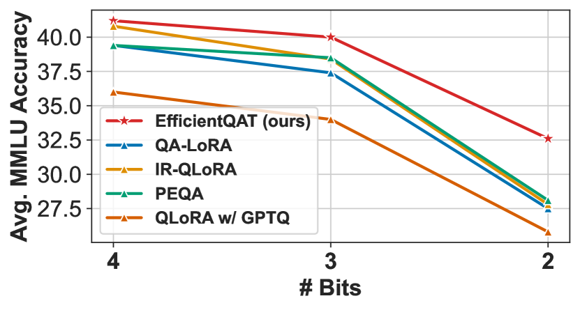
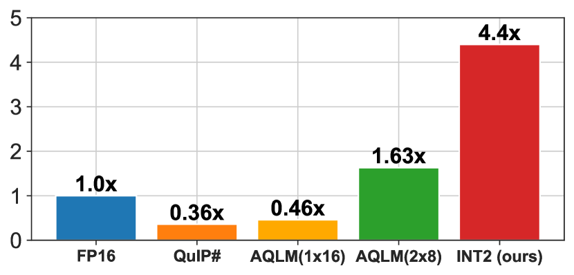
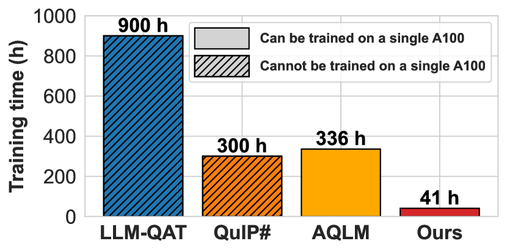
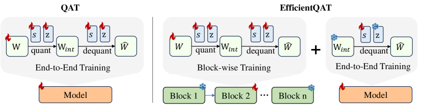
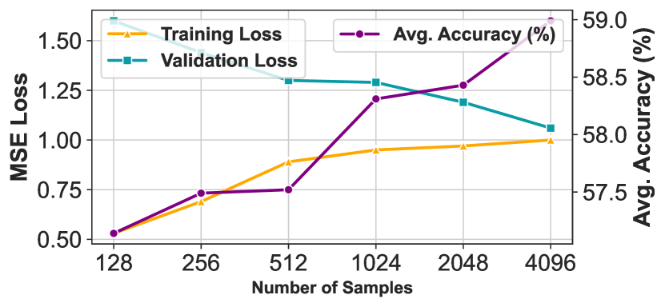

# EfficientQAT: 大規模言語モデルのための効率的な量子化を意識した訓練

> 原題: EfficientQAT: Efficient Quantization-Aware Training for Large Language Models
> 著者: Mengzhao Chen¹, Wenqi Shao^{†1}, Peng Xu^{1,2}, Jiahao Wang^{1,2}, Peng Gao¹, Kaipeng Zhang¹, Yu Qiao¹, Ping Luo^{†1,2}
> 所属: ¹ OpenGVLab, Shanghai AI Laboratory　² 香港大学（The University of Hong Kong）
> † 責任著者: shaowenqi@pjlab.org.cn; pluo@cs.hku.hk
> 出典: arXiv:2407.11062（ar5iv 版）

> **訳注（クリップの状態と復元）**
> - 底本は ar5iv 版の Web Clipper クリップ。以下を原ページと照合して復元・訂正した。
>   1. **Figure 1・2・3・5 のキャプションが消失**していた（本文と図の対応が取れない状態）。すべて原ページから復元した。Figure 3 のキャプション位置にはクリップが文字列 `Refer to caption` を残していた。
>   2. **図の取り違え**: クリップは `x2.png` に「(a) 2-bit quantization comparisons」という小見出しを付けていたが、原ページの並びでは **`x2.png` は Figure 1(b)（Q-PEFT の比較）** である。**Figure 1(a) は ar5iv 側に画像が存在しない**（変換に失敗している）ため復元できない。キャプション訳のみ残す。
>   3. **`x4.png`（Figure 2(b), 訓練速度の比較）が欠落**していた。原ページから取得して復元した。
>   4. **Figure 5（E2E-QP のサンプル数を振った結果表）が丸ごと欠落**していた。キャプションと数値表の双方を原ページから復元した。
>   5. **脚注 10 件の本文が欠落**していた（マーカーのみ残存）。原ページから復元し、該当箇所に訳注として挿入した。
> - **原典側の不整合（クリップ不良ではない）**: 4.2 節・4.3 節の本文が Table 5 / Table 6 / Table 7 を指すべき箇所をすべて「Table 7」と書いており、また 4.3 節末尾は Figure 5 を指すべき箇所を「Table 5」と書いている。原典の相互参照（`\ref`）が壊れているものと判断し、**原文どおりに訳したうえで該当箇所に訳注を付けた**。
> - 参考文献一覧は既定どおり訳出しない。
> - 図はすべて `raw/assets/2024-efficientqat/` にローカル保存し、そのパスを参照している。

## Abstract（要旨）

大規模言語モデル（LLM）は現代の自然言語処理と人工知能に不可欠である。しかし、その大きなメモリ要件の管理という課題に直面している。**量子化を意識した訓練（quantization-aware training, QAT）** は低ビット表現によってメモリ消費を減らしつつ精度損失を最小限に抑える解を提供するが、モデルの重みと量子化パラメータを最適化するために相当な訓練資源を要求する。これに対処するため、我々は LLM を圧縮する新しい量子化技法 **EfficientQAT（Efficient Quantization-Aware Training）** を提案する。EfficientQAT は連続する 2 つのフェーズからなる——**全パラメータのブロック単位訓練（Block-wise training of all parameters, Block-AP）** と、**量子化パラメータの端から端までの訓練（end-to-end training of quantization parameters, E2E-QP）** である。Block-AP は、各トランスフォーマブロック内の全パラメータに対して、ブロック単位の再構成によって量子化を意識した訓練を順に行い、LLM 全体を訓練することを避けることで効率を保つ。量子化済みモデルで初期化された E2E-QP は、次に量子化パラメータ（ステップサイズ）**のみ**を端から端まで訓練し、固定された量子化バックボーンと減った訓練対象パラメータ数によって効率を高める。広範な実験は、EfficientQAT が、ベースの LLM・指示チューニング済み LLM・マルチモーダル LLM を含むさまざまなモデルにわたり、7B から 70B のスケールとさまざまな量子化ビット数において、従来の量子化手法を上回ることを示す。たとえば EfficientQAT は、**2 ビットの Llama-2-70B モデルを単一の A100-80GB GPU 上で 41 時間で得ており、完全精度の対応物と比べたゼロショット精度の劣化は 3% 未満**である。

## 1 Introduction（はじめに）

大規模言語モデル（LLM）の最近の進展 [^57] [^6] [^12] [^63] [^66] は、推論 [^14] [^13] [^70]、認知処理 [^23] [^63]、エージェントに基づく応用 [^48] [^49] といった多様な言語タスクで印象的な能力を示してきた。しかしこれらのモデルは膨大なパラメータで特徴づけられ、メモリ使用量と帯域に対して大きな課題を突きつける [^30] [^62]。

最も効果的な量子化技法の一つである**量子化を意識した訓練（QAT）** は、量子化の制約下での訓練を通じて量子化誤差を最小化することで動作する。QAT は大きな性能損失なく LLM を効果的に圧縮できるが、大きなコーパス上で LLM 全体を訓練する必要があり、膨大な訓練コストにつながる。たとえば QAT 手法である BitNet b1.58 [^45] はほぼ無損失の三値量子化を達成できるが、事前学習データセット全体を使って LLM をゼロから再訓練する必要があり、極端に大きなモデルには非現実的である*。

> 訳注（脚注 \*）: BitNet b1.58 は 1,000 億の訓練トークンを用いた 30 億パラメータのモデルでしか性能を検証していない。

大規模言語モデル（LLM）の効率的な量子化を追求する中で、**訓練後量子化（PTQ）** や **量子化されたパラメータ効率のよいファインチューニング（quantized parameter-efficient fine-tuning, Q-PEFT）** といった技法が開発されてきた。PTQ [^37] [^22] [^52] [^8] [^20] は、事前学習済み LLM の重みを再訓練なしに 16 ビットから 2 ビットなどの形式へ変換することで、推論時のメモリ使用量を最小化する。PTQ は最小限の資源での素早い展開に適しているが、Figure 1(a) に示すとおり、特に低ビット領域では精度を損ないうる。一方 Q-PEFT [^16] [^64] [^35] [^25] [^29] は、LoRA [^27] のようなパラメータ効率のよいファインチューニング手法を使って量子化モデルを訓練し、訓練時のメモリ要件を大きく減らす。たとえば QLoRA [^16] はモデルを FP16 から NF4（4 ビットの浮動小数点形式）へ変換し、その上に LoRA モジュールを適用することで、性能を犠牲にせずコンシューマ向け GPU でのファインチューニングを可能にする。しかし**ほとんどの Q-PEFT 技法 [^16] [^25] [^35] は、ファインチューニング後に追加の LoRA モジュールを統合するために FP16 へ戻ってしまう**。これはメモリの限られたプラットフォームへの展開のためにもう一度 PTQ を要求し、性能を劣化させうる。PEQA [^29] や QA-LoRA [^64] のような解決策がこの問題に対処しようとしているが、**量子化モデルの初期化が貧弱**なため、低ビットの場面（2 ビット・3 ビット）では性能が最適とは言えないままである（Figure 1(b)）。

<figure>

<figcaption>図1(a): 2 ビット量子化の比較。（訳注: この図の画像は ar5iv 側に存在せず復元できなかったため、キャプションのみを残す。）</figcaption>
</figure>

<figure>

<figcaption>図1(b): Q-PEFT の比較。図1 全体のキャプション: (a) EfficientQAT は既存の一様量子化手法を大きく上回り、ベクトル量子化の技法と同等かそれ以上である。(b) EfficientQAT は既存の Q-PEFT 手法を明確に上回る。</figcaption>
</figure>

<figure>

<figcaption>図2(a): 推論速度の比較。</figcaption>
</figure>

<figure>

<figcaption>図2(b): 訓練速度の比較。図2 全体のキャプション: (a) このパネルは Llama-2-70B の gate_proj 部分に対するベクトル-行列積の速度比較を示す。一様量子化はベクトル量子化よりハードウェア効率が良いことが分かる。(b) EfficientQAT は 70B モデルの QAT を単一の A100 GPU 上でより短い時間で完了できる。（訳注: この図はクリップに含まれておらず、原ページから復元した。）</figcaption>
</figure>

上記の課題に取り組むため、我々は LLM を効果的かつ効率的に圧縮する新しい量子化技法 **EfficientQAT** を導入する。EfficientQAT は、Figure 2(a) と 2(b) に示すとおり、訓練時・推論時のメモリ効率を保ちながら、既存の PTQ [^52] [^20]・Q-PEFT [^64] [^16]・QAT [^43] の手法を性能で凌駕する。量子化の効率と精度を高めるため、EfficientQAT は連続する 2 つのフェーズからなる——**全パラメータのブロック単位訓練（Block-AP）** と、**量子化パラメータの端から端までの訓練（E2E-QP）** である。Block-AP は、各トランスフォーマブロックについて、元の完全精度の重みと量子化パラメータ（ステップサイズとゼロ点）を含む**すべての固有パラメータ**に対して、ブロック単位の再構成の枠組みのもとで量子化を意識した訓練を順に行う。Block-AP は全パラメータを訓練するが、LLM 全体を訓練することを避けることでメモリ効率を保つ。さらに、Block-AP における潜在的な過適合の問題は、**訓練サンプルを 128 から 4096 へ増やすだけで**緩和できる（Figure 5 を参照）。特筆すべきは、我々の Block-AP の完全訓練という枠組みが、丸めパラメータ [^46] [^11]・クリッピング閾値 [^52]・ステップサイズ [^21] [^18] を訓練するといった他の部分訓練の変種を上回ることである（Table 7 を参照）。

> 訳注: 上の 2 つの参照は原典の相互参照が壊れていると思われる。過適合の議論に対応するのは **Figure 4**（Block-AP のサンプル数）であり、部分訓練の変種との比較は **Table 6** である。

Block-AP が提供する頑健な初期化の上に、E2E-QP は量子化された重みを固定し、**量子化パラメータ（ステップサイズ）のみ**を端から端まで訓練して、量子化性能をさらに高める。さらに E2E-QP は、訓練可能な量子化パラメータがネットワーク全体のごく一部（例: 量子化グループサイズ 64 で 1.5%）しか占めないため、**量子化を意識した、かつメモリ効率のよい形で、特定タスク向けの量子化モデルの指示チューニング**を可能にする。これは QA-LoRA [^64] のような従来の Q-PEFT 技法と同じように働く。したがって EfficientQAT は、ベースの LLM（Llama [^57] [^56]）・指示チューニング済み LLM（Vicuna [^12]）・マルチモーダル LLM（LLaVA [^39]）を含むさまざまなモデルを圧縮できるだけ一般的である。

Block-AP と E2E-QP の統合のおかげで、EfficientQAT は**収束が速く、メモリ効率が良く、性能の高い**量子化技法として特徴づけられる。たとえば EfficientQAT は、2 ビットの Llama-2-70B モデルを単一の A100-80GB GPU 上でわずか 41 時間で得ることができ、完全精度の対応物と比べたゼロショット精度の劣化は 3% 未満である（69.48 対 72.41）。モデル圧縮と指示チューニングを含む場面でも EfficientQAT を評価した。モデル圧縮では Figure 1(a) に示すとおり、挑戦的な 2 ビット量子化の設定で他の一様量子化手法を精度でおよそ 5 ポイント大きく上回る。この場面ではベクトル量子化手法 [^20] [^58] の性能にも匹敵する。さらに Figure 2(a) は、EfficientQAT が用いる一様量子化が、相当なオーバーヘッドを導入するベクトル量子化よりハードウェア効率が良いことを示している。指示チューニングでは Figure 1(b) に示すとおり、EfficientQAT は QLoRA [^16]・QA-LoRA [^64]・PEQA [^29] を含む既存の Q-PEFT 手法を一貫して上回る。

## 2 Related Works（関連研究）

**LLM の訓練後量子化**。PTQ は LLM を高速化し展開するための重要な技法である。量子化のアプローチは一般に 2 つのカテゴリに分かれる——**重みのみの量子化** [^22] [^17] [^31] [^30] [^33] [^10] と、**重み-活性の量子化** [^61] [^41] [^60] [^59] [^68] [^71] [^1] [^34] [^2] である。重みのみの量子化は重みを低ビット形式へ圧縮することに注目し、メモリ需要を減らして LLM におけるメモリ律速の計算の効率を高める [^38] [^69]。逆に重み-活性の量子化は重みと活性の双方を圧縮し、行列積に伴うオーバーヘッドをさらに減らす [^38]。重みのみ量子化の最近の進展として、QUIP# [^58] と AQLM [^20] によるベクトル量子化手法の導入がある。これらの手法は有望な性能を示したが、同時に大きなオーバーヘッドも導入する [^24]。我々の研究は、ハードウェア実装との相性の良さから好まれる**一様量子化**の探究を続ける。

**LLM の量子化を意識した訓練**。QAT は量子化モデルの性能を PTQ が提供する水準を超えて高められる。しかし QAT は、それに伴う大きな訓練コストのため、LLM ではあまり探究されてこなかった。LLM-QAT [^43] や BitDistiller [^19] のような研究は、QAT の文脈における知識蒸留の適用を調べている。BitNet b1.58 [^45] や OneBit [^65] のような技法は、極端な二値・三値の量子化水準を達成するために QAT を用いる。BitNet b1.58 は 30 億パラメータまでのモデルと 1,000 億の訓練トークンにおいて三値量子化でほぼ無損失の性能を示すが、**訓練費用が法外であるため、より大きなモデルやデータセットへの適用可能性は不確かなままである**。

**LLM の量子化されたパラメータ効率のよいファインチューニング**。QLoRA [^16]、INT2.1 [^7]、LQ-LoRA [^25]、LoftQ [^35] といった技法は、モデルのパラメータを低ビット表現へ量子化した後、ファインチューニングのために LoRA [^27] モジュールを追加する。しかし**これらの手法は LoRA モジュールを量子化された重みへ統合する必要があり、その結果モデルが FP16 形式へ戻ってしまう**。この問題に対処するため QA-LoRA [^64] は、ゼロ点へ滑らかに統合できるよう LoRA モジュールを再設計した。我々の知る限り、我々のアプローチに最も近い研究は PEQA [^29] であり、低ビット量子化に単純な最近接丸め（RTN）法を用い、下流タスクへの適応のためにステップサイズをファインチューニングする。にもかかわらず、**PEQA が用いる最適とは言えない PTQ の初期化技法により、その性能は QLoRA [^16] や QA-LoRA [^64] と比べて見劣りする**。

## 3 EfficientQAT

### 3.1 Method Overview（手法の概観）

本節では、メモリ効率を高める LLM 向けの新しい量子化を意識した訓練の枠組み EfficientQAT を導入する。Figure 3 に示すとおり、従来の QAT のアプローチは完全精度の重み $\mathbf{W}$ と量子化パラメータ $s$（ステップサイズ）・$z$（ゼロ点）を端から端まで同時に訓練するが、関与するパラメータ数が多いためメモリ要件が大きく増える。この問題に対処するため、EfficientQAT は 2 段階の戦略を採る——**全パラメータのブロック単位訓練（Block-AP）** と、**量子化パラメータの端から端までの訓練（E2E-QP）** である。Block-AP のフェーズでは、モデルのパラメータと量子化パラメータを再構成損失を使ってブロックごとに訓練する。これは完全な訓練による精密なキャリブレーションを可能にするだけでなく、ブロック単位の訓練によってメモリ消費も減らす [^36] [^52]。これに続く E2E-QP のフェーズでは、量子化された重みを固定し、目標のデータセット上でステップサイズのみを訓練することで、メモリ効率のよい形で量子化を意識した訓練を達成する。Block-AP と E2E-QP の詳細はそれぞれ 3.2 節と 3.3 節でさらに述べる。

<figure>

<figcaption>図3: 素朴な QAT と提案する EfficientQAT の全体パイプライン。EfficientQAT は 2 つの新しい処理を導入する——全パラメータのブロック単位訓練（Block-AP）と、量子化パラメータの端から端までの訓練（E2E-QP）である。（訳注: このキャプションはクリップで消失しており、その位置に文字列 `Refer to caption` が残っていたため、原ページから復元した。）</figcaption>
</figure>

### 3.2 Block-Wise Training of All Parameters（全パラメータのブロック単位訓練）

本節では、後続の端から端までの訓練に対して効果的な初期化を効率よく提供するよう設計された、全パラメータのブロック単位訓練（Block-AP）のアプローチを導入する。

**量子化と逆量子化**。具体的には、Block-AP は標準的な一様量子化の手法から始まる:

$$
\mathbf{W}_{int}=\mathrm{clamp}(\lfloor\frac{\mathbf{W}}{s}\rceil+z,0,2^{N}-1),
$$

ここで $\lfloor\cdot\rceil$ は丸め操作を表す。$N$ は目標のビット数である。$\mathbf{W}_{int}$ と $\mathbf{W}$ はそれぞれ量子化された整数の重みと完全精度の重みを表す。$s$ はスケーリング係数、$z$ はゼロ点である。順伝播では、量子化された重みは次のようにして完全精度へ戻される:

$$
\widehat{\mathbf{W}}=(\mathbf{W_{int}}-z)\cdot s.
$$

ここで $\widehat{\mathbf{W}}$ は順方向の計算で使われる逆量子化された重みを指す。量子化（式 (1)）と逆量子化（式 (2)）の処理は計算グラフの中に統合されており、量子化を意識した形で勾配降下によって最適化できる。

**ブロック単位の量子化を意識した訓練**。従来の QAT 手法 [^45] [^21] [^43] は式 (1) と式 (2) を使ってネットワーク全体を端から端まで訓練するが、これは典型的に相当な計算資源と、過適合を防ぐための大量のデータを要する。ここで我々は QAT の訓練効率を高めることを目指す。BRECQ [^36] のような先行研究は、事前学習済みモデルが与えられたとき、**ブロック単位の訓練が端から端までの訓練より速く収束し、必要な訓練時間・データ・メモリが少ない**ことを示している。BRECQ [^36] と OmniQuant [^52] の方法論に従い、Block-AP はブロック単位の再構成の枠組みのもとで、1 つのトランスフォーマブロック内で量子化を意識した訓練を行ってから次のブロックへ進む、という処理を順に実行する。

**モデルの重みと量子化パラメータの完全な訓練**。丸めパラメータ [^46] [^11] [^32]、クリッピングパラメータ [^52]、ステップサイズ [^21] [^18] といったいくつかの量子化パラメータを最適化する従来の手法とは異なり、Block-AP は QAT のように振る舞い、式 (1) と式 (2) に現れる**すべての固有パラメータ**——スケーリング係数 $s$、ゼロ点 $z$、そしてモデルの重み $\mathbf{W}$——を訓練する。

我々の Block-AP のアプローチでは、素直な完全訓練の枠組みが、精緻な設計を持つ既存の部分訓練の変種 [^46] [^36] [^18] を上回る。丸めパラメータを扱う従来の訓練手法 [^46] [^36] [^18] は正則化の技法として機能し、過適合を緩和するために整数重みの更新範囲を $(-1,+1)$ に制約する。しかしこのアプローチは解空間を制限し、量子化モデルの最終的な性能を妨げる可能性がある。**訓練サンプルを 128 から 4096 へ単に増やすだけで**、Block-AP は過適合の問題に効果的に対処しつつ（詳細は Figure 5 を参照）、丸めパラメータで訓練する場合より性能を改善する。我々の経験的な発見は、Table 7 に示すとおり、既存の部分訓練の変種 [^46] [^36] [^18] に対する Block-AP 内での完全訓練の優位を示している。

> 訳注: ここも原典の相互参照が壊れていると思われる。過適合の議論は **Figure 4**、部分訓練との比較は **Table 6** に対応する。

ブロック単位の訓練の後、我々は各量子化グループについて量子化された重み $\mathbf{W}_{q}$・ステップサイズ $s$・ゼロ点 $z$ を含む量子化モデルを得る。重み $\mathbf{W}_{q}$ とゼロ点 $z$ は低ビット形式で、ステップサイズ $s$ は FP16 で格納される。$s$ と $z$ はそれぞれの量子化グループ内で共有され、モデルのパラメータのごく一部——グループサイズ 64 でおよそ 1.6%——しか占めないことに注意されたい。さらに、完全精度の 16 ビットの重みから 2/3/4 ビットの量子化された重みへ移行することで、モデルのメモリ使用量は大幅に削減される。

### 3.3 End-to-End Training of Quantization Parameters（量子化パラメータの端から端までの訓練）

さらに、目標のデータセット上で量子化モデル全体を効率よく訓練することを狙った、量子化パラメータの端から端までの訓練（E2E-QP）を導入する。

**ステップサイズの端から端までの訓練**。完全精度の重みを訓練する従来の量子化を意識した訓練（QAT）の手法 [^43] [^45] とは異なり、E2E-QP は Block-AP によって初期化された $\mathbf{W}_{q}$ から始め、**量子化パラメータ（$s$ と $z$）の訓練だけ**に注力する。$s$・$z$・その両方のいずれを訓練しても同程度の性能が得られることを見出した（詳細は Table 7 を参照）。ただし $z$ の訓練は低ビット形式から完全精度への変換を伴うため、追加のメモリオーバーヘッドを避けるべく、特に断らない限り既定では $s$ のみを訓練する。

加えて E2E-QP の中では、式 (1) にあたる量子化の処理は存在しない。式 (2) に述べた逆量子化の処理のみが起こる。したがって訓練可能なパラメータ $s$ の勾配は $\frac{\partial\widehat{w}}{\partial s}=w_{q}-z$ として計算される。

全体として、E2E-QP における訓練のメモリ使用量は、訓練可能なパラメータ数が減ったことにより劇的に削減される。E2E-QP のもとでのさまざまなモデルサイズとビット数に対する詳細なメモリ使用量は Table 8 に列挙する。たとえば **Llama-2-70B モデルは、わずか 34.2GB のメモリを使って E2E-QP による 2 ビットの QAT を完了できる**。E2E-QP を備えた EfficientQAT は、訓練データセットを変えるだけで異なる場面に適応でき、継続的事前学習や指示チューニング [^53] といった応用を含む。

**表1**: 5 つの常識推論タスクにおける Llama 2 & 3 の平均ゼロショット正解率（↑）。各タスクの詳細な数値は Table 13（4 ビット）、Table 14（3 ビット）、Table 15（2 ビット）にある。「Group」は一様量子化のグループサイズ、およびベクトル量子化のコードブック方式を示す。

| Method | Bits | Type | Group (code) | 2-7 | 2-13 | 2-70 | 3-8 | 3-70 |
| --- | --- | --- | --- | --- | --- | --- | --- | --- |
| FP16 | 16 | - | 16 | 64.86 | 67.81 | 72.41 | 68.58 | 75.33 |
| RTN | 4 | uniform | 128 | 64.52 | 67.50 | 72.26 | 67.79 | 73.98 |
| GPTQ | 4 | uniform | 128 | 64.24 | 67.27 | 72.39 | 67.80 | 74.74 |
| AWQ | 4 | uniform | 128 | 64.54 | 67.61 | 72.44 | 68.24 | 74.77 |
| OmniQ | 4 | uniform | 128 | 64.52 | 67.10 | 72.39 | - | - |
| AutoRound | 4 | uniform | 128 | 64.39 | 67.36 | 72.47 | - | - |
| QuIP# | 4 | vector | - | 64.48 | 67.28 | 72.17 | - | - |
| EfficientQAT | 4 | uniform | 128 | 64.27 | 67.52 | 72.62 | 68.43 | 74.57 |
| RTN | 3 | uniform | 128 | 62.06 | 65.77 | 70.83 | 58.72 | 65.29 |
| GPTQ | 3 | uniform | 128 | 62.48 | 66.18 | 71.47 | 60.58 | 71.28 |
| AWQ | 3 | uniform | 128 | 62.82 | 66.14 | 71.41 | 64.82 | 73.65 |
| OmniQ | 3 | uniform | 128 | 62.42 | 66.18 | 71.07 | - | - |
| AutoRound | 3 | uniform | 128 | 63.72 | 66.68 | 71.24 | - | - |
| QuIP# | 3 | vector | - | 63.52 | 66.26 | 72.13 | - | - |
| EfficientQAT | 3 | uniform | 128 | 64.02 | 67.28 | 71.76 | 67.35 | 72.42 |
| OmniQ | 2 | uniform | 128 | 46.98 | 53.56 | 54.87 | - | - |
| AutoRound | 2 | uniform | 128 | 54.50 | 60.72 | 67.70 | - | - |
| EfficientQAT | 2 | uniform | 128 | 59.50 | 63.88 | 68.93 | 59.37 | 67.57 |
| AQLM | 2 | vector | 2x8 | 57.61 | 62.22 | 69.85 | - | - |
| AQLM | 2 | vector | 1x16 | 61.85 | 64.95 | 70.84 | 64.10 | 70.10 |
| QuIP# | 2 | vector | - | 60.61 | 64.44 | 70.91 | - | - |
| EfficientQAT | 2 | uniform | 64 | 60.14 | 64.48 | 69.48 | 60.76 | 67.89 |

## 4 Experiments（実験）

本節は、提案する EfficientQAT を検証する広範な実験を提示する。4.1 節と 4.2 節はそれぞれ量子化手法および Q-PEFT 手法との比較を示す。4.4 節は提案する EfficientQAT の訓練コストと推論の高速化を詳述する。4.3 節は提案する EfficientQAT の包括的なアブレーション研究を示す。

### 4.1 EfficientQAT for LLMs Quantization（LLM の量子化における EfficientQAT）

**訓練**。Llama-2 と Llama-3 のモデルで実験を行う。Block-AP には、文脈長 2048 の RedPajama [^15] から 4096 サンプルを用いる。各ブロックをバッチサイズ 2・エポック数 2 で訓練し、量子化パラメータの学習率を $1\times10^{-4}$、重みの学習率を 2 ビットで $2\times10^{-5}$、3/4 ビットで $1\times10^{-5}$ に設定する。E2E-QP でも RedPajama [^15] から 4096 サンプルを用いるが、文脈長は 4096 とする。モデル全体をバッチサイズ 32・エポック数 1 で訓練し、ステップサイズの学習率を 2 ビットで $2\times10^{-5}$、3/4 ビットで $1\times10^{-5}$ に設定する。

**評価**。v0.4.2 の lm-evaluation-harness† を用いて 5 つの常識推論タスクのゼロショット正解率を評価する。タスクは WinoGrande [^50]、PIQA [^5]、HellaSwag [^70]、Arc-Easy [^14]、Arc-Challenge [^14] を含む。また先行研究 [^22] [^52] と同様に、文脈長 2048 で Wikitext2 と C4 のパープレキシティも測定する。

> 訳注（脚注 †）: https://github.com/EleutherAI/lm-evaluation-harness

**PTQ のベースライン**。GPTQ [^22]、AWQ [^37]、OmniQ [^52]、AutoRound [^11] といった一様量子化の PTQ 手法、および QuIP# [^58] と AQLM [^20] を含むベクトル量子化と結果を比較する。

**表2**: Llama-2 & 3 モデルにおける QAT 手法との比較。

| Model | Method | Bits | Group | PPL Wiki | PPL C4 | Average Accuracy |
| --- | --- | --- | --- | --- | --- | --- |
| 2-7B | LLM-QAT | 3 | 128 | 6.02 | - | - |
| 2-7B | BitDistiller | 3 | 128 | 5.97 | - | - |
| 2-7B | EfficientQAT | 3 | 128 | 5.81 | 7.34 | 64.02 |
| 2-7B | LLM-QAT | 2 | 128 | 9.30 | - | - |
| 2-7B | BitDistiller | 2 | 128 | 8.08 | - | - |
| 2-7B | EfficientQAT | 2 | 128 | 7.19 | 8.79 | 59.50 |
| 3-8B | PB-LLM | 2 | 128 | 24.70 | 79.20 | 38.80 |
| 3-8B | DB-LLM | 2 | 128 | 13.60 | 19.20 | 51.80 |
| 3-8B | EfficientQAT | 2 | 128 | 9.80 | 13.22 | 59.37 |

**PTQ の結果**。正解率とパープレキシティの結果をそれぞれ Table 1 と Table 3 に示す。4 ビットのグループ量子化では性能劣化が最小限であり、単純な最近接丸め（RTN）量子化でさえ立派な結果を達成するようである。したがって EfficientQAT は 4 ビットの一様量子化ではわずかなパープレキシティ改善（約 0.02）を提供するにとどまり、ゼロショット正解率は既存手法と同等である。量子化ビット数が減るにつれて EfficientQAT の性能上の優位は増す。3 ビット量子化では、EfficientQAT は最適化に基づく手法 AutoRound をゼロショット正解率でおよそ 0.5% 上回り、OmniQuant をパープレキシティで 0.14〜0.43 上回る。特筆すべきは 2 ビット量子化で、EfficientQAT は Llama-2-7b のゼロショット正解率において AutoRound [^11] を 5% 上回る。EfficientQAT は 2x8 のコードブックを使う AQLM [^20] のような従来のベクトル量子化手法も上回る。1x16 のコードブックを使う AQLM [^20] と QuIP# [^58] は 2 ビットの場面でわずかに良い性能を示すが、Figure 2(a) に示すとおり、目立った計算オーバーヘッド [^24] を導入し、推論速度を落とすことさえある。したがって EfficientQAT は LLM における一様量子化の限界をうまく押し広げ、**ハードウェアに優しい一様量子化を、より複雑なベクトル量子化手法と競合させる**ことに成功している。ただし、**Llama-3 のモデルは量子化後の性能劣化がより大きい** [^28] ことも分かる。これは 2T ではなく 15T トークンによる完全な訓練が原因かもしれない。

**QAT のベースライン**。LLM-QAT [^43]、BitDistiller [^19]、PB-LLM [^51]、DB-LLM [^9] を含む既存の QAT 手法とも結果を比較する。

**QAT の結果**。Table 2 に示すとおり、EfficientQAT は他の QAT 手法を性能で明確に凌駕する。具体的には、w2g128 量子化を Llama-2-7B モデルに適用したとき、EfficientQAT は BitDistiller [^19] と比べてパープレキシティを 0.89 下げる。より挑戦的な Llama-3 の量子化 [^28] の場面では、w2g128 量子化において EfficientQAT は DB-LLM [^9] を C4 のパープレキシティで 5.98、平均正解率で 8.57 ポイント上回る。

**表3**: Llama 2 & 3 の Wikitext2 と C4 のパープレキシティ（↓）、文脈長 2048。

| Method | Bits | Type | Group | Wiki2 2-7 | 2-13 | 2-70 | 3-8 | 3-70 | C4 2-7 | 2-13 | 2-70 | 3-8 | 3-70 |
| --- | --- | --- | --- | --- | --- | --- | --- | --- | --- | --- | --- | --- | --- |
| FP16 | 16 | - | 16 | 5.47 | 4.88 | 3.32 | 6.14 | 2.85 | 6.97 | 6.47 | 5.52 | 8.88 | 6.73 |
| GPTQ | 4 | uniform | 128 | 5.61 | 4.98 | 3.42 | 6.53 | 3.38 | 7.13 | 6.56 | 5.58 | 9.35 | 7.02 |
| AWQ | 4 | uniform | 128 | 5.62 | 4.97 | 3.41 | 6.55 | 3.26 | 7.13 | 6.56 | 5.58 | 9.41 | 6.98 |
| OmniQ | 4 | uniform | 128 | 5.58 | 4.95 | 3.40 | - | - | 7.12 | 6.56 | 5.58 | - | - |
| QuIP# | 4 | vector | - | 5.56 | 4.95 | 3.38 | - | - | 7.07 | 6.54 | 5.56 | - | - |
| EfficientQAT | 4 | uniform | 128 | 5.53 | 4.93 | 3.39 | 6.47 | 3.17 | 7.07 | 6.54 | 5.58 | 9.26 | 6.94 |
| GPTQ | 3 | uniform | 128 | 6.29 | 5.42 | 3.85 | 9.58 | 5.25 | 7.89 | 7.00 | 5.85 | 11.66 | 8.64 |
| AWQ | 3 | uniform | 128 | 6.24 | 5.32 | 3.74 | 8.16 | 4.69 | 7.84 | 6.94 | 5.81 | 11.49 | 7.91 |
| OmniQ | 3 | uniform | 128 | 6.03 | 5.28 | 3.78 | - | - | 7.75 | 6.98 | 5.85 | - | - |
| QuIP# | 3 | vector | - | 5.79 | 5.10 | 3.56 | - | - | 7.32 | 6.72 | 5.67 | - | - |
| EfficientQAT | 3 | uniform | 128 | 5.81 | 5.12 | 3.61 | 7.09 | 4.19 | 7.34 | 6.73 | 5.71 | 10.06 | 7.43 |
| OmniQ | 2 | uniform | 128 | 11.06 | 8.26 | 6.11 | - | - | 15.02 | 11.05 | 8.52 | - | - |
| EfficientQAT | 2 | uniform | 128 | 7.19 | 6.08 | 4.61 | 9.80 | 6.38 | 8.79 | 7.75 | 6.48 | 13.22 | 9.53 |
| AQLM | 2 | vector | 2x8 | 7.24 | 6.06 | 4.49 | - | - | 8.96 | 7.80 | 6.36 | - | - |
| AQLM | 2 | vector | 1x16 | 6.34 | 5.59 | 4.06 | 7.76 | 5.10 | 8.06 | 7.27 | 6.04 | 10.89 | 8.31 |
| QuIP# | 2 | vector | - | 6.66 | 5.74 | 4.16 | - | - | 8.35 | 7.45 | 6.12 | - | - |
| EfficientQAT | 2 | uniform | 64 | 6.86 | 5.96 | 4.52 | 9.41 | 6.07 | 8.50 | 7.59 | 6.38 | 12.77 | 9.23 |

### 4.2 EfficientQAT for Instruction Tuning（指示チューニングにおける EfficientQAT）

**訓練と評価**。既存研究 [^64] [^47] に従い、Llama-1 モデルを Alpaca データセット [^53] 上で訓練し、平均 5-shot MMLU [^26] 正解率を測ることでその性能を評価する。訓練のハイパーパラメータは、RedPajama データセット [^15] を Alpaca に置き換える点を除き 4.1 節に述べたものと同一である。QLoRA の方法論 [^16] に沿って、ソースの文脈長を 384、ターゲットの文脈長を 128 に調整し、バッチサイズ 16 で 10,000 ステップ訓練する。

**ベースライン**。2・3・4 ビットの量子化設定にわたり、QLoRA [^16]、QA-LoRA [^64]、PEQA [^29]、IR-QLoRA [^47] を含むいくつかの主要手法に対して EfficientQAT をベンチマークする。QA-LoRA [^64] と一貫して、公平な比較のために、ファインチューニング済みの QLoRA モデルを FP16 の LoRA なしで低ビット形式へ量子化するのに GPTQ [^22] も用いる。

**結果**。Table 7 と Figure 1(b) の双方が、EfficientQAT が既存の Q-PEFT 手法を大きく上回ることを示している。たとえばチャネルごとの量子化（グループサイズ -1）では、EfficientQAT は PEQA [^29] より 3% 以上高い正解率を達成する。2 ビット量子化の場面では EfficientQAT の優位はいっそう顕著で、7B と 13B のモデルでそれぞれ QA-LoRA [^64] を 5.1% と 4.0% 上回り、同じモデルで PEQA を 4.5% と 8.7% 上回る。さらに Table 7 は、より小さなモデルのメモリ使用量（より大きなグループサイズ）において、EfficientQAT が QA-LoRA と QLoRA+GPTQ の双方を上回ることも示している。

> 訳注: ここで参照されている「Table 7」は、内容から **Table 4**（Alpaca 上での指示チューニングの MMLU 正解率）を指していると判断される。

**表4**: Alpaca データセットでの指示チューニングに関する Llama-1 の平均 MMLU 正解率（5-shot）。

| Method | Bits | Group | 7B | 13B |
| --- | --- | --- | --- | --- |
| - | 16 | - | 34.6 | 46.3 |
| PEQA | 4 | -1 | 35.8 | 45.0 |
| EfficientQAT | 4 | -1 | 38.8 | 48.2 |
| QLoRA | 4+16 | - | 38.4 | 48.4 |
| QLoRA w/GPTQ | 4 | 32 | 36.0 | 48.0 |
| QA-LoRA | 4 | 32 | 39.4 | 49.2 |
| PEQA | 4 | 64 | 39.4 | 47.4 |
| IR-QLoRA | 4 | 64 | 40.8 | 49.3 |
| EfficientQAT | 4 | 64 | 41.2 | 49.5 |
| QLoRA w/ GPTQ | 3 | 32 | 34.0 | 46.1 |
| QA-LoRA | 3 | 32 | 37.4 | 47.3 |
| IR-QLoRA | 3 | 64 | 38.4 | - |
| PEQA | 3 | 64 | 38.5 | 46.3 |
| EfficientQAT | 3 | 64 | 40.0 | 48.2 |
| QLoRA w/ GPTQ | 2 | 32 | 25.8 | 30.9 |
| QA-LoRA | 2 | 32 | 27.5 | 36.9 |
| IR-QLoRA | 2 | 64 | 27.8 | - |
| PEQA | 2 | 64 | 28.1 | 32.2 |
| EfficientQAT | 2 | 64 | 32.6 | 40.9 |

**表5**: Llama-2-7B の w2g64 量子化における各構成要素の有効性。

| Block-AP | E2E-QP | Avg. PPL | Avg. Accuracy |
| --- | --- | --- | --- |
| ✗ | ✗ | 453.49 | 40.69 |
| ✓ | ✗ | 8.53 | 58.99 |
| ✗ | ✓ | 9.33 | 55.71 |
| ✓ | ✓ | 7.68 | 60.14 |

**表6**: ブロック単位の訓練において訓練可能なパラメータを変えたときの w2g64 Llama-2-7B の性能（E2E-QP なし）。「# Param.」は 1 ブロック内の訓練可能パラメータ数を示す。

| Param. | # Param. | Memory | Avg. PPL | Avg. Accuracy |
| --- | --- | --- | --- | --- |
| clipping | 6.3M | 6.4GB | 11.28 | 53.20 |
| $s$, $z$ | 6.3M | 6.4GB | 10.26 | 55.20 |
| round | 202.4M | 8.6GB | 15.50 | 45.32 |
| $s$, $z$, round | 208.7M | 9.3GB | 9.17 | 57.14 |
| $s$, $z$, $\mathbf{W}$ | 208.7M | 8.5GB | 8.65 | 58.94 |

**表7**: E2E-QP において訓練可能なパラメータを変えたときの Llama-2-7B の w2g64 量子化（Block-AP あり）。

| Param. | Avg. Bits | Avg. PPL | Avg. Accuracy |
| --- | --- | --- | --- |
| $s$ | 2.28 | 7.68 | 60.14 |
| $z$ | 2.50 | 7.69 | 60.08 |
| $s,z$ | 2.50 | 7.68 | 60.18 |

### 4.3 Ablation Analysis（アブレーション分析）

EfficientQAT のアルゴリズムは 2 つの主要な構成要素 Block-AP と E2E-QP からなる。本節は各構成要素の有効性・訓練可能パラメータ・訓練サンプルの要件を評価する。Table 1 と同様に、WikiText2 と C4 データセットの平均パープレキシティと、5 つのゼロショット推論タスクの平均正解率を示す。

**各構成要素の有効性**。Table 7 に示すとおり、Block-AP と E2E-QP の双方が性能を大きく高め、その組み合わせが最良の結果をもたらす。特筆すべきは **Block-AP が E2E-QP を上回る**ことであり、これは BRECQ [^36] の知見と整合する。

> 訳注: 内容から **Table 5** を指す。

**Block-AP の訓練可能パラメータ**。Block-AP は元の重みと量子化パラメータを含むすべてのパラメータを訓練する。従来の手法は過適合を緩和するさまざまな訓練戦略——訓練される丸め [^46] [^11]、クリッピング閾値 [^52]、ステップサイズ [^21] [^18]——を導入してきた。Block-AP の訓練可能パラメータだけを変えて、これらの手法と Block-AP を比較する。Table 7 に示すとおり、Block-AP（$s$, $z$, $\mathbf{W}$ を訓練）が許容可能な訓練コストで最良の性能を示す。加えて、**$\mathbf{W}$ を直接訓練するメモリ使用量は、丸め操作を訓練する場合よりむしろ小さい**——後者は丸めパラメータの複製をもう 1 つ必要とするからである。

> 訳注: 内容から **Table 6** を指す。

**E2E-QP の訓練可能パラメータ**。さらに E2E-QP 内の訓練可能パラメータを検討する。Table 7 は、$s$・$z$・その両方のいずれを訓練しても同程度の性能が得られることを示す。ただし $z$ を元の低ビット表現から訓練可能な FP16 形式へ変換すると平均ビット数が増えるので、既定では $s$ のみを訓練することを選ぶ。

**Block-AP のサンプル数**。Block-AP の訓練サンプル数を評価する。E2E-QP が全パラメータを訓練するため過適合につながりうることに注意する。これに対処するため、過適合の問題を評価すべく RedPajama から未見の 64 サンプルを追加で導入した。総訓練時間が同程度になるよう訓練エポック数を調整し、異なるサンプルサイズ間で公平な比較ができるようにした。Figure 5 に示すとおり、**訓練サンプル数を増やすと訓練損失と検証損失の差が 1.07 から 0.06 へ大きく縮む**。この縮小は、ゼロショットタスクの平均正解率が 57.14% から 58.99% へ上がることに対応する。したがって、訓練損失と検証損失の差を最小に保つため、E2E-QP の既定の訓練サンプル数を 4096 に設定する。

> 訳注: 内容から **Figure 4**（Block-AP のサンプル数）を指す。また末尾の「E2E-QP の既定の訓練サンプル数」は文脈上 **Block-AP** の誤りと思われる。

**E2E-QP のサンプル数**。E2E-QP では過適合を避けるためモデルを 1 エポック訓練する。Table 5 に詳述した E2E-QP の訓練サンプルサイズの検討によれば、サンプルサイズを 128 から 32,674 へ増やすにつれて平均パープレキシティは一貫して改善する。しかし 4096 サンプルを超えると平均正解率に大きな改善はない。したがって効率と性能のバランスを取るため、E2E-QP の訓練サンプルサイズを既定で 4096 に設定する。とはいえ、サンプルサイズを増やすことで EfficientQAT の性能をさらに高めることは可能である。

> 訳注: 内容から **Figure 5** を指す。

<figure>

<figcaption>図4: Block-AP について訓練サンプルサイズを変えたときの w2g64 Llama-2-7b の訓練損失・検証損失・平均正解率の図示（E2E-QP なし）。</figcaption>
</figure>

**図5（表として提示）**: E2E-QP についてサンプル数を変えたときの Llama-2-7B の w2g64 量子化性能（Block-AP あり）。（訳注: このキャプションと数値表はクリップで丸ごと欠落していたため、原ページから復元した。）

| # Samples | Avg. PPL | Avg. Accuracy |
| --- | --- | --- |
| 128 | 8.09 | 59.03 |
| 512 | 7.88 | 59.81 |
| 2048 | 7.75 | 60.13 |
| 4096 | 7.68 | 60.14 |
| 8192 | 7.63 | 60.19 |
| 32764 | 7.50 | 60.31 |

**表8**: 単一の A100-80GB GPU 上での、モデルサイズと量子化ビット数を変えたときの EfficientQAT の詳細な訓練時間と訓練メモリ。

| Llama-2 | Block-AP Time | Block-AP Memory | E2E-QP Time | E2E-QP Memory (4-/3-/2-bits) | Total Time |
| --- | --- | --- | --- | --- | --- |
| 7B | 3.3h | 8.5GB | $\sim$1.5h | 7.0/6.4/5.6GB | 4.8h |
| 13B | 5.6h | 10.3GB | $\sim$2.9h | 11.7/10.6/9.1GB | 8.5h |
| 70B | 26.6h | 29.9GB | $\sim$14.3h | 48.4/42.0/34.2GB | 40.9h |

**表9**: PyTorch における FP16 の線形層の行列-ベクトル積の速度と、BitBLAS [^54] における INT2 の相対的な高速化。A100-80GB GPU 上でのテスト。

| Llama-2 | 7B | | 13B | | 70B | |
| --- | --- | --- | --- | --- | --- | --- |
| size (out_c × in_c) | 4096x4096 | 11008x4096 | 5120x5120 | 13824x5120 | 8192x8192 | 28672x8192 |
| FP16 | 25 us | 61 us | 38 us | 90 us | 91 us | 286 us |
| INT2 | 9 us | 21 us | 11 us | 26 us | 24 us | 67 us |
| Speedup | 3.1x | 2.9x | 3.6x | 3.5x | 3.9x | 4.4x |

### 4.4 Efficiency of EfficientQAT（EfficientQAT の効率）

**訓練効率**。Table 8 は EfficientQAT を用いて Llama-2 モデルを訓練するのに必要なメモリと時間を示す。結果は、モデルの訓練が素早く完了すること——7B モデルで 4.8 時間、70B モデルで 40.9 時間——を示している。さらに、端から端までの量子化過程（E2E-QP）で量子化されたバックボーンを採用したことにより、ビット幅が低いためメモリ使用量が大きく減る。結果として EfficientQAT は、**70B モデルの 2 ビット訓練をわずか 34.2GB のメモリで達成する**。

**推論効率**。重みのみの量子化は LLM のメモリ要件を減らし、推論を高速化する。LLM は主にメモリ律速だからである [^69]。量子化は線形層の計算を変えるが、他の演算は変わらない。これを評価するため、線形層の処理における相対的な高速化を計算する。Table 9 によれば、**INT2 量子化は順伝播の速度をおよそ 2.9 倍から 4.4 倍高める**。さらに、標準的な一様量子化を活用しているため、EfficientQAT の量子化モデルは MLC-LLM [^55]、AWQ [^37]、BitBLAS [^54] といった他のツールボックスを通しても高速化を達成できる。

## 5 Conclusion（結論）

本研究では、メモリ使用量と訓練時間の双方で効率を改善して QAT を完遂する新しい手法 EfficientQAT を導入した。包括的なテストを通じて、EfficientQAT はさまざまなモデルと量子化水準にわたる汎用性と性能の点で、既存の PTQ・QAT・Q-PEFT の手法より優れていることが示された。加えて EfficientQAT は標準的な一様量子化を活用するので、人気のあるツールボックスを使った展開が容易になる。EfficientQAT がさらなる研究を刺激し、大規模言語モデル（LLM）の圧縮を改善して、それらをより効率的で広くアクセス可能なものにすることを期待する。

## Appendix A Limitations（限界）

限界について述べると、EfficientQAT は 3 ビット・2 ビットの量子化といった低ビットの場面で顕著な優位を示す。しかし **4 ビットのグループ単位の量子化では、GPTQ [^22]、AWQ [^37]、さらには最も単純な RTN といった既存の PTQ 手法が、同等の性能をより速く達成する**。加えて Llama-3 の量子化は大きな性能劣化を経験し [^28]、この現象は EfficientQAT でも観測される。さらに EfficientQAT の 2 ビット性能は、完全精度モデルと比べて依然としてわずかな差（3%〜4% の正解率）を示す。これらの問題に対処して INT2 量子化でほぼ無損失の性能を達成することが、我々の今後の研究の主眼である。

## Appendix B Broader Impact（より広い影響）

本論文は、大規模言語モデルの圧縮と高速化を前進させることを目標とする研究を提示する。我々の研究には多くの潜在的な社会的帰結がありうるが、ここで特に強調すべきと感じるものはない。

## Appendix C Gradient of Trainable Parameters in Block-AP（Block-AP における訓練可能パラメータの勾配）

Block-AP は LSQ+ [^4] に合わせて、丸め操作を通した勾配計算を可能にするために **straight-through estimator（STE）** [^3] を用いる。スケーリング係数 $s$ の勾配は次のように計算される:

$$
\frac{\partial\widehat{w}}{\partial s}=\left\{\begin{aligned} &\lfloor\frac{w}{s}\rceil-\frac{w}{s},0\leq\lfloor\frac{w}{s}\rceil+z\leq 2^{N-1},\\
&-z,\lfloor\frac{w}{s}\rceil+z<0,\\
&2^{N-1}-z,\lfloor\frac{w}{s}\rceil+z>2^{N-1}.\end{aligned}\right.
$$

そしてゼロ点 $z$ に関する勾配は:

$$
\frac{\partial\widehat{w}}{\partial z}=\left\{\begin{aligned} &0,0\leq\lfloor\frac{w}{s}\rceil+z\leq 2^{N-1},\\
&-1,\text{otherwise},\\
\end{aligned}\right.
$$

そして完全精度の重み $\mathbf{W}$ も、その勾配‡を通して更新できる:

$$
\frac{\partial\widehat{w}}{\partial w}=\left\{\begin{aligned} &1,0\leq\lfloor\frac{w}{s}\rceil+z\leq 2^{N-1},\\
&0,\text{otherwise},\\
\end{aligned}\right.
$$

> 訳注（脚注 ‡）: $\widehat{w}$, $w$ はそれぞれ $\widehat{W}$, $\mathbf{W}$ の要素である。

## Appendix D Results Source of Other Method（他手法の結果の出所）

本研究では、GPTQ [^22]、AWQ [^37]、OmniQ [^52]、AutoRound [^11]、QuIP# [^58]、AQLM [^20] を含む既存の PTQ 技法に対して、我々の手法を徹底的に比較して示す。LLM-QAT [^43]、BitDistiller [^19]、PB-LLM [^51]、DB-LLM [^9] を含む既存の QAT 手法とも比較する。加えて、PEQA [^29]、QLoRA [^16]、QA-LoRA [^64]、IR-QLoRA [^47] といった量子化されたパラメータ効率のよいファインチューニングの手法も評価する。我々が論じる結果は、それぞれの公式の刊行物や他の学術論文に由来するか、あるいは我々の再現によって得たものである。各手法の結果の出所を以下に丁寧に記録する:

- **GPTQ, AWQ, OmniQ, AutoRound**: これらの手法による Llama-2 モデルのゼロショット正解率の結果は AutoRound の GitHub リポジトリ§から得た。GPTQ・AWQ・OmniQ による Llama-2 モデルのパープレキシティの結果は OmniQ 論文 [^52] から取った。AWQ¶ と GPTQ∥ による Llama-3 モデルの結果は、それらのオープンソース実装を通じて得た。
- **QuIP#, AQLM**: QuIP#\*\* と AQLM†† が提供する公式の事前学習済みモデルを使って結果を再現した。
- **LLM-QAT, BitDistiller**: これらの結果は BitDistiller [^19] の論文から引用した。
- **PB-LLM, DB-LLM**: これらの結果は最近の Llama-3 量子化の実証研究 [^28] から引用した。
- **PEQA**: チャネルごとの量子化の結果（g=-1）はその刊行物 [^29] から引用し、グループサイズ 64 の結果は我々のコードベースで生成した。
- **QA-LoRA, QLoRA, QLoRA w/ GPTQ**: これらの結果は QA-LoRA [^64] の論文から引用した。
- **IR-QLoRA**: これらの結果は IR-QLoRA [^47] の論文から引用した。

> 訳注（脚注の URL）: § AutoRound: https://github.com/intel/auto-round/blob/main/docs/acc.md ／ ¶ AWQ: https://github.com/mit-han-lab/llm-awq ／ ∥ GPTQ: https://github.com/qwopqwop200/GPTQ-for-LLaMa ／ \*\* QuIP#: https://github.com/Cornell-RelaxML/quip-sharp ／ †† AQLM: https://github.com/Vahe1994/AQLM

**表10**: 量子化モデルのモデルサイズ。圧縮率は FP16 モデルと比べた量子化モデルの圧縮率を示す。

| Model | # Bit | Group size | bits/param | size (GiB) | Compression ratio (%) |
| --- | --- | --- | --- | --- | --- |
| LLaMA-2-7B | 16 | - | 16 | 12.55 | - |
| | 4 | 32 | 4.63 | 3.98 | 68.33 |
| | 4 | 64 | 4.31 | 3.74 | 70.20 |
| | 4 | 128 | 4.16 | 3.62 | 71.14 |
| | 3 | 32 | 3.59 | 3.35 | 73.28 |
| | 3 | 64 | 3.30 | 3.13 | 75.08 |
| | 3 | 128 | 3.15 | 3.01 | 75.98 |
| | 2 | 32 | 2.56 | 2.42 | 80.71 |
| | 2 | 64 | 2.28 | 2.21 | 82.40 |
| | 2 | 128 | 2.14 | 2.10 | 83.25 |
| LLaMA-2-13B | 16 | - | 16 | 24.24 | - |
| | 4 | 32 | 4.63 | 7.44 | 69.30 |
| | 4 | 64 | 4.31 | 6.98 | 71.21 |
| | 4 | 128 | 4.16 | 6.75 | 72.16 |
| | 3 | 32 | 3.59 | 6.22 | 74.33 |
| | 3 | 64 | 3.30 | 5.78 | 76.16 |
| | 3 | 128 | 3.15 | 5.56 | 77.07 |
| | 2 | 32 | 2.56 | 4.40 | 81.87 |
| | 2 | 64 | 2.28 | 3.98 | 83.58 |
| | 2 | 128 | 2.14 | 3.77 | 84.44 |
| LLaMA-2-70B | 16 | - | 16 | 128.48 | - |
| | 4 | 32 | 4.63 | 37.83 | 70.55 |
| | 4 | 64 | 4.31 | 35.34 | 72.49 |
| | 4 | 128 | 4.16 | 34.10 | 73.46 |
| | 3 | 32 | 3.59 | 31.26 | 75.67 |
| | 3 | 64 | 3.30 | 28.87 | 77.53 |
| | 3 | 128 | 3.15 | 27.67 | 78.46 |
| | 2 | 32 | 2.56 | 21.40 | 83.34 |
| | 2 | 64 | 2.28 | 19.16 | 85.09 |
| | 2 | 128 | 2.14 | 18.04 | 85.96 |

## Appendix E Size of Quantized Models（量子化モデルのサイズ）

本節は量子化によって達成されるモデルサイズの削減を示す。低ビット表現へ量子化されたモデルはよりコンパクトになる。

我々はグループサイズ $g$ の N ビット量子化を実装しており、$g$ 個の重みからなる各グループが同じ FP16 のステップサイズと N ビットのゼロ点を共有する。したがってパラメータあたりの平均ビット数は $N+\frac{N+16}{g}$ として計算される。**トランスフォーマブロック内の線形層のみが量子化され**、正規化層・埋め込み・分類ヘッドといった他の層は FP16 形式のままである点に注意されたい。Table 10 は量子化モデルのサイズと圧縮率の詳細な比較を提供する。

**表11**: 提案する EfficientQAT について、グループサイズを変えたときの Llama-2-7B の 2 ビット量子化性能。

| Group | Avg. Bits | Avg. PPL | Avg. Accuracy |
| --- | --- | --- | --- |
| 32 | 2.56 | 7.59 | 60.28 |
| 64 | 2.28 | 7.68 | 60.14 |
| 128 | 2.10 | 7.99 | 59.50 |
| 256 | 2.07 | 8.18 | 58.67 |

## Appendix F Additional Ablation Analysis（追加のアブレーション分析）

**量子化のグループサイズ**。グループサイズは重みのみ量子化における決定的なハイパーパラメータである。より小さなグループサイズはより細かい圧縮を提供して量子化損失を減らすが、必要な量子化パラメータ数を増やす。Table 11 に示すとおり、EfficientQAT を使った 2 ビット量子化にはグループサイズ 64 が最適なバランスを与える。グループサイズ 128 に対してはパープレキシティが 0.31 低く正解率が 0.64% 高いことで上回るが、グループサイズ 32 と比べるとわずかに劣り、その差はパープレキシティで 0.09、正解率で 0.14% にとどまる。

**表12**: 大規模視覚言語モデルの指示チューニングに関する結果。LLaVA-1.5 [^39] の全体的な訓練パイプラインに従い、ファインチューニングの手法だけを変えている。「QLoRA + Block-AP」は、公平な比較のために提案する Block-AP を用いて QLoRA モデルを低ビットへ量子化したことを示す。† MME の知覚スコアは 100 パーセントへ正規化している。

| Model | Method | #Bit (Training) | #Bit (Inference) | MMbench | MME † | MM-Vet | ScienceQA | Avg. |
| --- | --- | --- | --- | --- | --- | --- | --- | --- |
| LLaVA-1.5-7B | LoRA | 16 | 16 | 66.1 | 73.8 | 30.2 | 68.4 | 59.6 |
| | QLoRA | 4+16 | 16 | 64.1 | 72.8 | 30.3 | 68.0 | 58.8 |
| | QLoRA + Block-AP | 4+16 | 4 | 63.6 | 72.0 | 29.8 | 67.7 | 58.3 |
| | EfficientQAT | 4 | 4 | 64.4 | 73.2 | 30.3 | 68.1 | 58.8 (+0.5) |
| | QLoRA + Block-AP | 4+16 | 3 | 62.9 | 71.8 | 29.7 | 66.4 | 57.7 |
| | EfficientQAT | 3 | 3 | 63.2 | 71.4 | 30.9 | 67.3 | 58.2 (+0.5) |
| | QLoRA + Block-AP | 4+16 | 2 | 53.7 | 64.3 | 28.9 | 60.7 | 51.9 |
| | EfficientQAT | 2 | 2 | 62.3 | 68.0 | 27.8 | 63.4 | 55.4 (+3.5) |
| LLaVA-1.5-13B | LoRA | 16 | 16 | 68.5 | 77.1 | 38.3 | 71.2 | 63.8 |
| | QLoRA | 4+16 | 16 | 67.6 | 76.9 | 36.0 | 69.9 | 62.7 |
| | QLoRA + Block-AP | 4+16 | 4 | 67.4 | 76.6 | 35.6 | 69.3 | 62.4 |
| | EfficientQAT | 4 | 4 | 67.5 | 74.8 | 35.6 | 70.2 | 62.0 (-0.4) |
| | QLoRA + Block-AP | 4+16 | 3 | 66.8 | 75.5 | 34.5 | 68.4 | 61.3 |
| | EfficientQAT | 3 | 3 | 67.4 | 74.8 | 35.3 | 69.3 | 61.7 (+0.4) |
| | QLoRA + Block-AP | 4+16 | 2 | 62.5 | 72.1 | 32.5 | 65.0 | 58.0 |
| | EfficientQAT | 2 | 2 | 63.9 | 73.1 | 33.9 | 68.6 | 59.9 (+1.9) |

## Appendix G Instruction Tuning for LVLMs（LVLM の指示チューニング）

従来の Q-PEFT の手法は言語モデルでしか実験していない。本節では、提案する EfficientQAT を LLaVA [^40] のような**大規模視覚言語モデル（LVLM）** へさらに拡張する。

**訓練と評価**。大規模視覚言語モデル（LVLM）のファインチューニングでは、訓練モデル・データセット・ハイパーパラメータを含めて LLaVA1.5 [^39] におおむね合わせる‡‡。完全精度の Vicuna モデルから完全なファインチューニングまたは LoRA ベースの手法 [^27] でファインチューニングを始める LLaVA1.5 とは異なり、EfficientQAT は**すでに Block-AP で量子化された Vicuna モデル**から始め、E2E-QP のファインチューニング手法を続ける。訓練の過程は 2 段階からなる——最初に LLM を凍結して、視覚トランスフォーマ（ViT）と特徴を揃えるプロジェクタを事前学習し、続いて LLM とプロジェクタの双方を端から端までファインチューニングする。EfficientQAT では第 2 段階の学習率を 4 ビットで $2\times10^{-5}$、2 ビットと 3 ビットで $3\times10^{-5}$ に変更する。

> 訳注（脚注 ‡‡）: 包括的な詳細は公式リポジトリ https://github.com/haotian-liu/LLaVA を参照のこと。

**評価**。ファインチューニングした LVLM の評価は 4 つのベンチマーク——MME [^23]、MM-Vet [^67]、MMBench [^42]、ScienceQA [^44]——にわたって行う。

**ベースライン**。QLoRA [^16] の結果と比較し、公平な比較のために QLoRA でファインチューニングしたモデルを低ビットへ量子化するのに我々の Block-AP 法を適用する。

**結果**。Table 12 に示すとおり、EfficientQAT は LLaVA-1.5-7B と LLaVA-1.5-13B の双方のモデルについて低ビットの設定で QLoRA [^16] を上回り、これは LMM における先行結果と整合する。**特筆すべきは、EfficientQAT で訓練した 2 ビットの LLaVA-1.5-13B モデルが平均スコア 59.9 を達成し、LoRA で訓練した FP16 の LLaVA-1.5-7B モデルの 59.6 を上回る**ことである。ただし 16 ビットの LoRA と比べると、4 ビットの EfficientQAT と 16 ビットの QLoRA でわずかな性能低下が観測されており、LVLM における Q-PEFT の最適化にはさらなる研究が必要であることを示している。

## Appendix H Full Results（完全な結果）

Table 1 では 5 つのゼロショットタスクの平均正解率を示した。本節はタスクごとの正解率の詳細な内訳を提供する。具体的には、Tables 13・14・15 がそれぞれ 4 ビット・3 ビット・2 ビット量子化の性能を詳述する。

**表13**: lm_eval v0.4.2 による 4 ビット Llama 2 & 3 のゼロショット正解率（acc を報告、acc_norm ではない）。

| Model | Method | Bits | Group | WinoGrande | HellaSwag | ArcC | ArcE | PiQA | Average ↑ |
| --- | --- | --- | --- | --- | --- | --- | --- | --- | --- |
| 2-7B | - | 16 | - | 69.22 | 57.16 | 43.52 | 76.26 | 78.07 | 64.85 |
| | RTN | 4 | 128 | 68.35 | 56.91 | 43.52 | 76.26 | 77.58 | 64.52 |
| | GPTQ | 4 | 128 | 69.06 | 56.36 | 42.15 | 75.63 | 78.02 | 64.24 |
| | AWQ | 4 | 128 | 68.98 | 56.40 | 43.86 | 76.14 | 77.31 | 64.54 |
| | OmniQ | 4 | 128 | 68.98 | 56.59 | 43.34 | 75.76 | 77.91 | 64.52 |
| | AutoRound | 4 | 128 | 68.67 | 56.79 | 42.58 | 75.76 | 78.13 | 64.39 |
| | QuIP# | 4 | - | 69.22 | 56.65 | 43.00 | 75.51 | 78.02 | 64.48 |
| | EfficientQAT | 4 | 128 | 69.22 | 57.00 | 42.32 | 75.13 | 77.69 | 64.27 |
| 2-13B | - | 16 | - | 72.22 | 60.07 | 48.29 | 79.42 | 79.05 | 67.81 |
| | RTN | 4 | 128 | 72.14 | 59.77 | 47.95 | 79.00 | 78.62 | 67.50 |
| | GPTQ | 4 | 128 | 72.14 | 59.76 | 47.53 | 78.58 | 78.35 | 67.27 |
| | AWQ | 4 | 128 | 73.32 | 59.80 | 46.50 | 79.38 | 79.05 | 67.61 |
| | OmniQ | 4 | 128 | 72.06 | 59.53 | 47.18 | 78.37 | 78.35 | 67.10 |
| | AutoRound | 4 | 128 | 71.67 | 59.87 | 47.01 | 79.25 | 79.00 | 67.36 |
| | QuIP# | 4 | - | 72.69 | 59.49 | 46.59 | 78.62 | 79.00 | 67.28 |
| | EfficientQAT | 4 | 128 | 71.98 | 59.87 | 47.53 | 79.34 | 78.89 | 67.52 |
| 2-70B | - | 16 | - | 77.98 | 64.77 | 54.44 | 82.70 | 82.15 | 72.41 |
| | RTN | 4 | 128 | 78.14 | 63.93 | 54.78 | 82.79 | 81.66 | 72.26 |
| | GPTQ | 4 | 128 | 78.22 | 64.45 | 54.61 | 82.79 | 81.88 | 72.39 |
| | AWQ | 4 | 128 | 77.58 | 64.48 | 55.12 | 82.70 | 82.32 | 72.44 |
| | OmniQ | 4 | 128 | 77.51 | 64.52 | 55.12 | 82.91 | 81.88 | 72.39 |
| | AutoRound | 4 | 128 | 78.30 | 64.60 | 54.52 | 82.87 | 82.05 | 72.47 |
| | QuIP# | 4 | - | 77.82 | 64.51 | 54.44 | 82.37 | 81.72 | 72.17 |
| | EfficientQAT | 4 | 128 | 78.45 | 64.57 | 55.12 | 83.00 | 81.94 | 72.62 |
| 3-8B | - | 16 | - | 72.61 | 60.17 | 50.43 | 80.09 | 79.60 | 68.58 |
| | RTN | 4 | 128 | 73.16 | 59.04 | 48.38 | 79.25 | 79.11 | 67.79 |
| | GPTQ | 4 | 128 | 73.72 | 59.17 | 47.78 | 79.38 | 78.94 | 67.80 |
| | AWQ | 4 | 128 | 73.01 | 59.43 | 50.00 | 79.55 | 79.22 | 68.24 |
| | EfficientQAT | 4 | 128 | 72.53 | 59.43 | 50.94 | 79.84 | 79.43 | 68.43 |
| 3-70B | - | 16 | - | 80.51 | 66.36 | 60.41 | 86.99 | 82.37 | 75.33 |
| | RTN | 4 | 128 | 78.77 | 65.83 | 57.34 | 85.69 | 82.26 | 73.98 |
| | GPTQ | 4 | 128 | 80.51 | 66.12 | 59.04 | 85.77 | 82.26 | 74.74 |
| | AWQ | 4 | 128 | 80.35 | 65.82 | 59.13 | 86.41 | 82.15 | 74.77 |
| | EfficientQAT | 4 | 128 | 79.24 | 66.27 | 59.13 | 85.86 | 82.37 | 74.57 |

**表14**: lm_eval v0.4.2 による 3 ビット Llama 2 & 3 のゼロショット正解率（acc を報告、acc_norm ではない）。

| Model | Method | Bits | Group | WinoGrande | HellaSwag | ArcC | ArcE | PiQA | Average ↑ |
| --- | --- | --- | --- | --- | --- | --- | --- | --- | --- |
| 2-7B | - | 16 | - | 69.22 | 57.16 | 43.52 | 76.26 | 78.07 | 64.85 |
| | RTN | 3 | 128 | 67.56 | 54.90 | 38.57 | 72.98 | 76.28 | 62.06 |
| | GPTQ | 3 | 128 | 68.59 | 53.66 | 40.19 | 73.74 | 76.01 | 62.44 |
| | AWQ | 3 | 128 | 67.40 | 54.98 | 41.64 | 74.07 | 76.01 | 62.82 |
| | OmniQ | 3 | 128 | 66.69 | 54.42 | 39.85 | 74.37 | 76.77 | 62.42 |
| | AutoRound | 3 | 128 | 68.27 | 55.33 | 42.92 | 75.25 | 76.82 | 63.72 |
| | QuIP# | 3 | - | 68.19 | 55.85 | 41.89 | 74.62 | 77.04 | 63.52 |
| | EfficientQAT | 3 | 128 | 69.14 | 55.90 | 42.83 | 74.66 | 77.58 | 64.02 |
| 2-13B | - | 16 | - | 72.22 | 60.07 | 48.29 | 79.42 | 79.05 | 67.81 |
| | RTN | 3 | 128 | 70.72 | 57.74 | 44.62 | 77.69 | 78.07 | 65.77 |
| | GPTQ | 3 | 128 | 70.88 | 57.83 | 45.65 | 77.99 | 78.56 | 66.18 |
| | AWQ | 3 | 128 | 71.82 | 58.58 | 44.62 | 77.95 | 77.75 | 66.14 |
| | OmniQ | 3 | 128 | 70.01 | 58.46 | 46.16 | 77.86 | 78.40 | 66.18 |
| | AutoRound | 3 | 128 | 71.59 | 59.11 | 45.82 | 78.58 | 78.29 | 66.68 |
| | QuIP# | 3 | - | 72.45 | 58.26 | 44.62 | 77.90 | 78.07 | 66.26 |
| | EfficientQAT | 3 | 128 | 72.06 | 59.01 | 47.95 | 79.00 | 78.40 | 67.28 |
| 2-70B | - | 16 | - | 77.98 | 64.77 | 54.44 | 82.70 | 82.15 | 72.41 |
| | RTN | 3 | 128 | 77.90 | 61.98 | 52.39 | 81.10 | 80.79 | 70.83 |
| | GPTQ | 3 | 128 | 77.66 | 62.94 | 53.67 | 81.65 | 81.45 | 71.47 |
| | AWQ | 3 | 128 | 76.48 | 63.75 | 53.67 | 81.40 | 81.77 | 71.41 |
| | OmniQ | 3 | 128 | 76.48 | 63.54 | 52.82 | 81.02 | 81.50 | 71.07 |
| | AutoRound | 3 | 128 | 76.56 | 63.83 | 52.56 | 81.73 | 81.50 | 71.24 |
| | QuIP# | 3 | - | 76.24 | 64.22 | 55.89 | 82.11 | 82.21 | 72.13 |
| | EfficientQAT | 3 | 128 | 77.27 | 64.20 | 53.75 | 81.73 | 81.83 | 71.76 |
| 3-8B | - | 16 | - | 72.61 | 60.17 | 50.43 | 80.09 | 79.60 | 68.58 |
| | RTN | 3 | 128 | 66.54 | 50.87 | 36.69 | 65.36 | 74.16 | 58.72 |
| | GPTQ | 3 | 128 | 70.88 | 55.13 | 37.80 | 65.24 | 73.83 | 60.58 |
| | AWQ | 3 | 128 | 70.96 | 55.43 | 44.20 | 75.84 | 77.69 | 64.82 |
| | EfficientQAT | 3 | 128 | 71.51 | 57.81 | 48.81 | 80.01 | 78.63 | 67.35 |
| 3-70B | - | 16 | - | 80.51 | 66.36 | 60.41 | 86.99 | 82.37 | 75.33 |
| | RTN | 3 | 128 | 65.90 | 54.22 | 48.46 | 78.83 | 79.05 | 65.29 |
| | GPTQ | 3 | 128 | 78.14 | 62.58 | 52.99 | 82.07 | 80.63 | 71.28 |
| | AWQ | 3 | 128 | 78.85 | 64.26 | 58.36 | 84.51 | 82.26 | 73.65 |
| | EfficientQAT | 3 | 128 | 77.82 | 65.53 | 55.12 | 83.12 | 80.52 | 72.42 |

**表15**: lm_eval v0.4.2 による 2 ビット Llama 2 & 3 のゼロショット正解率（acc を報告、acc_norm ではない）。

| Model | Method | Bits | Group | WinoGrande | HellaSwag | ArcC | ArcE | PiQA | Average ↑ |
| --- | --- | --- | --- | --- | --- | --- | --- | --- | --- |
| 2-7B | - | 16 | - | 69.22 | 57.16 | 43.52 | 76.26 | 78.07 | 64.85 |
| | GPTQ | 2 | 128 | 55.17 | 32.59 | 21.25 | 40.45 | 58.32 | 41.56 |
| | OmniQ | 2 | 128 | 55.88 | 40.28 | 23.46 | 50.13 | 65.13 | 46.98 |
| | AutoRound | 2 | 128 | 61.01 | 40.28 | 32.25 | 65.99 | 72.96 | 54.50 |
| | AQLM | 2 | 2x8 | 65.27 | 49.96 | 32.85 | 66.92 | 73.07 | 57.61 |
| | AQLM | 2 | 1x16 | 65.19 | 53.42 | 39.68 | 74.07 | 76.88 | 61.85 |
| | QuIP# | 2 | - | 65.67 | 52.19 | 37.88 | 71.84 | 75.46 | 60.61 |
| | EfficientQAT | 2 | 128 | 66.22 | 50.84 | 36.52 | 69.78 | 74.16 | 59.50 |
| | EfficientQAT | 2 | 64 | 65.98 | 51.58 | 36.86 | 70.96 | 75.30 | 60.14 |
| 2-13B | - | 16 | - | 72.22 | 60.07 | 48.29 | 79.42 | 79.05 | 67.81 |
| | GPTQ | 2 | 128 | 55.80 | 41.06 | 21.93 | 55.60 | 67.08 | 48.29 |
| | OmniQ | 2 | 128 | 57.93 | 46.23 | 30.29 | 63.22 | 70.13 | 53.56 |
| | AutoRound | 2 | 128 | 64.33 | 53.35 | 38.57 | 71.17 | 76.17 | 60.72 |
| | AQLM | 2 | 2x8 | 66.22 | 54.62 | 40.10 | 73.06 | 77.09 | 62.22 |
| | AQLM | 2 | 1x16 | 70.09 | 57.62 | 43.52 | 75.25 | 78.29 | 64.95 |
| | QuIP# | 2 | - | 69.06 | 56.53 | 42.92 | 75.72 | 77.97 | 64.44 |
| | EfficientQAT | 2 | 128 | 68.90 | 55.66 | 42.83 | 75.04 | 76.99 | 63.88 |
| | EfficientQAT | 2 | 64 | 68.36 | 55.27 | 41.89 | 74.83 | 77.04 | 63.48 |
| 2-70B | - | 16 | - | 77.98 | 64.77 | 54.44 | 82.70 | 82.15 | 72.41 |
| | GPTQ | 2 | 128 | 49.57 | 25.04 | 22.70 | 25.08 | 49.51 | 34.38 |
| | OmniQ | 2 | 128 | 64.33 | 35.45 | 33.28 | 67.21 | 74.10 | 54.87 |
| | AutoRound | 2 | 128 | 74.90 | 59.65 | 46.59 | 78.37 | 79.00 | 67.70 |
| | AQLM | 2 | 2x8 | 75.61 | 61.94 | 51.45 | 79.76 | 80.47 | 69.85 |
| | AQLM | 2 | 1x16 | 76.01 | 62.78 | 52.99 | 81.36 | 81.07 | 70.84 |
| | QuIP# | 2 | - | 75.77 | 62.86 | 52.65 | 81.90 | 81.39 | 70.91 |
| | EfficientQAT | 2 | 128 | 73.64 | 61.58 | 49.23 | 80.01 | 80.20 | 68.93 |
| | EfficientQAT | 2 | 64 | 74.59 | 61.78 | 50.77 | 80.13 | 80.14 | 69.48 |
| 3-8B | - | 16 | - | 72.61 | 60.17 | 50.43 | 80.09 | 79.60 | 68.58 |
| | AQLM | 2 | 1x16 | 71.82 | 55.44 | 41.21 | 74.24 | 77.80 | 64.10 |
| | EfficientQAT | 2 | 128 | 65.67 | 50.74 | 36.01 | 69.15 | 75.30 | 59.37 |
| | EfficientQAT | 2 | 64 | 67.72 | 51.86 | 37.03 | 71.17 | 76.03 | 60.76 |
| 3-70B | - | 16 | - | 80.51 | 66.36 | 60.41 | 86.99 | 82.37 | 75.33 |
| | AQLM | 2 | 1x16 | 78.22 | 63.47 | 50.34 | 78.83 | 79.65 | 70.10 |
| | EfficientQAT | 2 | 128 | 69.46 | 60.75 | 48.81 | 79.25 | 79.60 | 67.57 |
| | EfficientQAT | 2 | 64 | 74.03 | 61.60 | 49.06 | 77.40 | 77.37 | 67.89 |
