# FlashAttention-3: 非同期性と低精度による高速かつ正確な attention

> 原題: FlashAttention-3: Fast and Accurate Attention with Asynchrony and Low-precision
> 著者: Jay Shah, Ganesh Bikshandi, Ying Zhang, Vijay Thakkar, Pradeep Ramani, Tri Dao
> ※ Jay Shah と Ganesh Bikshandi は equal contribution（所属は ar5iv 版の原ページに記載がないため省略する）
> 出典: arXiv:2407.08608（2024-07）・原典クリップ `raw/papers/FlashAttention-3_ Fast and Accurate Attention with Asynchrony and Low-precision.md`（ar5iv 版）

---

> **訳注（クリップの復元について）**
>
> 底本は ar5iv（`https://ar5iv.labs.arxiv.org/html/2407.08608`）を Obsidian Web Clipper で保存した markdown。原ページと照合し、以下を復元した。
>
> 1. **画像 18 枚のうち 11 枚が欠落していた**（クリップに残っていたのは 7 枚）。Figure 5（6 パネル）・Figure 6（2 パネル）・Figure 7（2 パネル）・Figure 9（6 パネル）はいずれも多パネル図だが、**各図の (a) パネルしか残っていなかった**。ar5iv から 11 枚を取得して収録した。
> 2. **Figure 5・6・7・9 の本キャプションが 4 つとも完全に消滅**していた。クリップに残っていたのは `(a) Forward, without causal mask, head dim 64` のようなサブキャプションのみで、しかも原典 333〜339 行では Figure 5 と Figure 6 が本キャプションなしに隣接しており、どの画像がどの図に属するか markdown だけからは判別できない状態だった。本キャプションとサブキャプション (a)〜(f) をすべて復元し、図番号を明示して配置した。
> 3. **脚注 10 件の本文がすべて脱落**していた（`<sup>N</sup>` マーカーのみ残存）。うち複数は実質的な内容を含む——H100 の特殊関数 3.9 TFLOPS という数値の導出根拠（脚注 5）、**FP8 と cuDNN の比較の但し書き**（脚注 2）、FP8 版に persistent kernel と負荷分散が入っていないという限界（脚注 10）。本文中に「訳注（脚注 N）」として挿入した。
> 4. Figure 3・Figure 4 は**インライン SVG としてクリップに残っていた**（レジスタ配置図）。中身は文字だけの格子なので、SVG の座標から 2 行 × 8 列の格子として読み取り、**markdown の表に起こした**（画像として保存しても検索・引用ができないため）。この 2 つの配置の違いが §3.3 のバイト置換の理由そのものにあたる。
>
> **復元できなかったもの**:
>
> - **Figure 5(b)（因果マスクあり・ヘッド次元 64）の画像は、ar5iv 側にも存在しない**。ar5iv の HTML はこのサブ図にキャプションだけを置いており、対応する `x2.png` を取得すると ar5iv が変換失敗時に生成する「NO IMAGE AVAILABLE」のプレースホルダ画像が返る。したがって原ページからも復元不能であり、該当箇所はキャプション訳のみを残した。
>
> 以下は**原論文の側にある誤り・特徴**であり、クリップの責任ではない。原文に忠実であるためそのまま訳し、訳注を添えた。
>
> - **§5 の見出しが "Dicussion" と綴られている**（"Discussion" の誤り）。原ページでも同じ。
> - 付録 B.2 の SASS コードで、繰り返しを示す `...`（省略記号）の一部が失われた形（`FMNMX and SHFL.BFLY` のような行）でレンダリングされている。これは **ar5iv 側の平坦化**であり、クリップと原ページで一致するため、そのまま収録した。
>
> 参考文献一覧（References）と謝辞（Acknowledgments）は既定どおり訳出していない。本文中の引用は原典クリップの脚注番号 `[^N]` をそのまま維持している。**付録 A・B・C はすべて全訳した（圧縮箇所はない）**。

---

## Abstract（要旨）

attention は、遍在するトランスフォーマーアーキテクチャの中核層として、大規模言語モデルと長コンテキスト応用のボトルネックとなっている。FlashAttention は、メモリの読み書きを最小化することによって GPU 上で attention を高速化するアプローチを詳述した。しかしそれは、最近のハードウェアに存在する新しい能力をまだ活用しておらず、FlashAttention-2 は H100 GPU 上で **35% の利用率**しか達成していない。我々は Hopper GPU 上で attention を高速化する 3 つの主要な技法を開発する。Tensor Core と TMA の非同期性を利用して、(1) warp-specialization を介して全体の計算とデータ移動をオーバーラップさせ、(2) ブロック単位の行列積と softmax 演算をインターリーブし、(3) FP8 低精度に対するハードウェア支援を活用するブロック量子化（block quantization）と非干渉化処理（incoherent processing）を行う。我々は、我々の手法 FlashAttention-3 が H100 GPU 上で 1.5〜2.0 倍の高速化を達成し、FP16 で最大 **740 TFLOPs/s（利用率 75%）**に到達し、FP8 では **1.2 PFLOPs/s に近づく**ことを実証する。我々は FP8 の FlashAttention-3 が、ベースラインの FP8 attention と比べて **2.6 倍低い数値誤差**を達成することを検証する。

## 1 Introduction（はじめに）

トランスフォーマーアーキテクチャ [^59] にとって、attention 機構は主要な計算ボトルネックを構成する。query と key の self-attention スコアを計算することが系列長について 2 乗にスケールするためである。attention をより長いコンテキストへスケールさせることは、新しい能力（複数の長文書 [^24] [^50] [^43] や大規模コードベース内のファイル [^48] [^30] にわたるモデリングと推論）、新しいモダリティ（高解像度画像 [^11]、音声 [^23]、動画 [^25]）、そして新しい応用（長い履歴を持つユーザとの対話 [^53]、**長いホライズンを持つエージェントのワークフロー** [^62]）を切り拓くだろう。このことは、長コンテキスト領域において attention を高速化することへの大きな関心を生んでおり、近似 [^27] [^14] [^56] やソフトウェア最適化（[^45] [^17] [^29]）、さらには代替アーキテクチャ [^42] [^55] [^22] によるものも含まれる。

本研究において我々は、GPU の実行モデルとハードウェア特性の知識を高レベルの設計に統合する厳密 attention アルゴリズムの開発に関する [^17] の仕事の上に構築する。[^17] において Dao らは FlashAttention を導入した。これは attention を並列化する新しいタイリング戦略であり、attention のすべての演算を単一の GPU カーネルへ融合することによって、遅いグローバルメモリへの中間的な読み書きを排除するものである。[^15] はこのアルゴリズムを FlashAttention-2 として再構成し、系列長の次元にわたっても並列化し、forward pass の内側ループを key と value の行列のブロックにわたって実行するようにした。これにより GPU 上の占有率と仕事の分配が改善された。しかし我々は、FlashAttention-2 が新しい GPU 上では、最適化された行列積（GEMM）カーネルと比べて低い利用率しか達成していないことを観測する。たとえば Hopper H100 GPU 上で **35% 対 80〜90%** である。部分的には、これは実装レベルの違いに帰せられるかもしれない。たとえば Tensor Core を狙う際に Ampere 向けの命令の代わりに Hopper 固有の命令を使っていないことなどである。ThunkerKitten [^52] や cuDNN 9 [^39] のようないくつかの仕事は、Hopper 固有の命令とタイルベースの抽象を用いることで attention の計算を高速化し、実装を単純化できることを示している。

より根本的には、FlashAttention-2 のアルゴリズムは単純化された同期モデルに従っており、その設計において**非同期性と低精度を明示的に使っていない**。非同期性は、機械学習ワークロードにおける最も重要な演算を加速するためのハードウェアの特化の結果である。すなわち、行列積を実行する特定のハードウェアユニット（Tensor Core）やメモリのロードを行うユニット（Tensor Memory Accelerator, TMA）が、論理・整数・浮動小数点計算を実行する他の CUDA コアから分離されている。Hopper の FP8 や Blackwell の FP4 のような低精度は、FP16（2017 年の Pascal）や BF16（2020 年の Ampere）の流れを継ぐもので、同じ電力とチップ面積で 2 倍あるいは 4 倍のスループットを得る実証済みの技法である。我々はこれらの方向において Hopper が提供する能力を § 2.2 で概観する。技術的な課題は、これらのハードウェア機能を使うように FlashAttention-2 を再設計することである。非同期性は、行列積と softmax の一方が他方の出力に依存しているにもかかわらず両者の計算をオーバーラップさせることを要求し、低精度は量子化誤差を最小化する配慮を要求する。とくに LLM における外れ値特徴 [^20] [^54] の場合にはそうである。

この目的のため、我々は FlashAttention-3 を提案する。これは新しい GPU アーキテクチャ上で性能をさらに改善するため、3 つの新しいアイデアを寄与し統合するものである:<sup>1</sup>

> **訳注（脚注 1）**: 我々は結果を NVIDIA の Hopper アーキテクチャの文脈で記述する。しかし我々のアルゴリズムは、十分に堅牢な非同期実行と低精度の能力を持つ任意の GPU アーキテクチャに対して有効である。

1. **producer-consumer の非同期性**: 我々は warp-specialization されたソフトウェアパイプライン方式を定義する。これはデータの producer と consumer を別々の warp へ分割することによって、データ移動と Tensor Core の非同期実行を活用し、それによってメモリと命令発行の遅延を隠すアルゴリズムの能力を拡張する。
2. **非同期のブロック単位 GEMM の陰に softmax を隠す**: 我々は、softmax に関わる比較的低スループットの非 GEMM 演算（浮動小数点の積和や指数関数など）を、GEMM のための非同期 WGMMA 命令とオーバーラップさせる。この一環として、我々は softmax と GEMM の間の特定の逐次的依存関係を回避するように FlashAttention-2 のアルゴリズムを作り直す。たとえば我々のアルゴリズムの 2 段版では、softmax がスコア行列のあるブロック上で実行されている間に、WGMMA が非同期プロキシにおいて次のブロックを計算する。
3. **ハードウェア加速された低精度 GEMM**: 我々は forward pass のアルゴリズムを適応させ、GEMM のために FP8 Tensor Core を狙えるようにし、測定される TFLOPs/s をほぼ倍増させる。これは、FP32 の累算器と FP8 のオペランド行列のブロックがメモリ上でどう配置されると仮定されているかという点で、WGMMA の異なるレイアウト適合要件を橋渡しすることを要求する。我々は FP8 精度へ移行することによって生じる精度の損失を緩和するため、ブロック量子化と非干渉化処理の技法を用いる。

我々の手法を実験的に検証するため、H100 SXM5 GPU 上でさまざまなパラメータにわたって FlashAttention-3 をベンチマークし、次を示す。(1) FP16 は forward pass において FlashAttention-2 に対して 1.5〜2.0 倍の高速化（最大 740 TFLOPs/s に到達）を、backward pass において 1.5〜1.75 倍の高速化を達成する。(2) FP8 は 1.2 PFLOPs/s に近づく。(3) 大きな系列長に対して、FP16 は NVIDIA の cuDNN ライブラリによる最先端の attention 実装を上回り、FP8 はそれと competitive である<sup>2</sup>。我々はまた、FP16 の FlashAttention-3 が FlashAttention-2 と同じ数値誤差をもたらし、中間結果（例えば softmax の再スケーリング）を FP32 で保つために標準的な attention 実装より優れていることを検証する。さらに、ブロック量子化と非干渉化処理を用いた FP8 の FlashAttention-3 は、外れ値特徴のある場合において、per-tensor 量子化を用いた標準的な attention より 2.6 倍正確である。

> **訳注（脚注 2）**: より正確には、ヘッド次元 64 に対しては FlashAttention-3 の FP8 が先行しているが、ヘッド次元 128 と 256 に対しては、因果マスクなしの場合には同等であり、因果マスクありの場合には劣っている。

我々は FlashAttention-3 を寛容なライセンスでオープンソース化し<sup>3</sup>、可能な限り多くの研究者と開発者に利益をもたらすため、PyTorch と Hugging Face のライブラリへ統合することを計画している。

> **訳注（脚注 3）**: FlashAttention-3 は https://github.com/Dao-AILab/flash-attention で利用できる。

## 2 Background: Multi-Head Attention and GPU Characteristics（背景: マルチヘッド attention と GPU の特性）

### 2.1 Multi-Head Attention（マルチヘッド attention）

$\mathbf{Q},\mathbf{K},\mathbf{V}\in\mathbb{R}^{N\times d}$ を単一のヘッドに関連づけられた query・key・value の入力系列とする。ここで $N$ は系列長、$d$ はヘッド次元である。このとき attention の出力 $\mathbf{O}$ は次のように計算される:

$$
\mathbf{S}=\alpha\mathbf{Q}\mathbf{K}^{\top}\in\mathbb{R}^{N\times N},\quad\mathbf{P}=\mathrm{softmax}(\mathbf{S})\in\mathbb{R}^{N\times N},\quad\mathbf{O}=\mathbf{P}\mathbf{V}\in\mathbb{R}^{N\times d},
$$

ここで $\mathrm{softmax}$ は行ごとに適用され、スケーリング係数として典型的には $\alpha=1/\sqrt{d}$ が設定される。実際には、指数関数による数値的不安定性を防ぐため、$\mathbf{S}$ から $\mathrm{rowmax}(\mathbf{S})$ を引く。マルチヘッド attention（MHA）については、各ヘッドが自身の query・key・value の射影の集合を持ち、この計算は複数のヘッドとバッチにわたって並列化されて完全な出力テンソルを生成する。

いま $\phi$ をスカラーの損失関数とし、$\mathbf{d}(-)=\partial\phi/\partial(-)$ を勾配の記法とする。出力勾配 $\mathbf{dO}\in\mathbb{R}^{N\times d}$ が与えられたとき、我々は連鎖律に従って $\mathbf{dQ}$、$\mathbf{dK}$、$\mathbf{dV}$ を次のように計算する:

$$
\displaystyle\mathbf{dV}=\mathbf{P}^{\top}\mathbf{dO}\in\mathbb{R}^{N\times d}
$$
$$
\displaystyle\mathbf{dP}=\mathbf{dO}\mathbf{V}^{\top}\in\mathbb{R}^{N\times N}
$$
$$
\displaystyle\mathbf{dS}=\mathrm{dsoftmax}(\mathbf{dP})\in\mathbb{R}^{N\times N}
$$
$$
\displaystyle\mathbf{dQ}=\alpha\mathbf{dS}\mathbf{K}\in\mathbb{R}^{N\times d}
$$
$$
\displaystyle\mathbf{dK}=\alpha\mathbf{dS}^{\top}\mathbf{Q}\in\mathbb{R}^{N\times d},
$$

ここで、ベクトル $s$ の関数として $p=\mathrm{softmax}(s)$ に対して $\mathbf{d}s=(\mathrm{diag}(p)-pp^{\top})\mathbf{d}p$ であり、この式を行ごとに適用したものを $\mathrm{dsoftmax}(\mathbf{dP})$ と書く。最後に、この計算は MHA の backward pass についても再びヘッド数とバッチにわたって並列化される。

### 2.2 GPU hardware characteristics and execution model（GPU のハードウェア特性と実行モデル）

我々は FlashAttention-3 に関連する GPU の実行モデルの側面を、このモデルの具体的な実例として NVIDIA Hopper アーキテクチャに焦点を当てて記述する。

##### Memory hierarchy:（メモリ階層）

GPU のメモリは、容量が帯域幅と反比例するデータ局所性の階層として組織されている（Table 1）<sup>4</sup>。グローバルメモリ（GMEM）は HBM としても知られ、すべてのストリーミングマルチプロセッサ（SM）からアクセス可能なオフチップの DRAM である。GMEM からのデータは、オンチップの L2 キャッシュへ透過的にキャッシュされる。次に、各 SM は共有メモリ（SMEM）と呼ばれる小さなオンチップの、プログラマ管理の高度にバンク化されたキャッシュを含む。最後に、各 SM 内にレジスタファイルがある。

> **訳注（脚注 4）**: Luo ら [34] は SM あたりクロックサイクルあたり 128 バイトの共有メモリ帯域幅を報告しており、我々はそれに 132 個の SM とブーストクロック 1830 MHz を掛けている。

##### Thread hierarchy:（スレッド階層）

GPU のプログラミングモデルは、スレッドと呼ばれる実行ユニットの論理的なグループ化を中心に組織されている。最も細かいレベルから最も粗いレベルへ、スレッド階層はスレッド、**warp**（32 スレッド）、**warpgroup**（連続する 4 つの warp）、スレッドブロック（すなわち協調スレッド配列、CTA）、スレッドブロッククラスタ（Hopper において）、そしてグリッドから構成される。

これら 2 つの階層は密接に結びついている。同じ CTA 内のスレッドは同じ SM 上に協調スケジュールされ、同じクラスタ内の CTA は同じ GPC 上に協調スケジュールされる。SMEM は CTA 内のすべてのスレッドから直接アドレス指定可能である一方、各スレッドは自身に固有の最大 256 個のレジスタ（RMEM）を持つ。

**表1**: NVIDIA Hopper H100 SXM5 GPU におけるスレッド・メモリ階層。

| Hardware Level | Parallel Agent | Data Locale | Capacity @ Bandwidth |
| --- | --- | --- | --- |
| Chip | Grid | GMEM | 80 GiB @ 3.35 TB/s |
| GPC | Threadblock Clusters | L2 | 50 MiB @ 12 TB/s |
| SM | Threadblock (CTA) | SMEM | 228 KiB per SM, 31TB/s per GPU |
| Thread | Thread | RMEM | 256 KiB per SM |

##### Asynchrony and warp-specialization:（非同期性と warp-specialization）

GPU はスループット重視のプロセッサであり、メモリと実行の遅延を隠すために並行性と非同期性に依存している。GMEM と SMEM の間の非同期メモリコピーのため、Hopper は専用ハードウェアユニットとして **Tensor Memory Accelerator（TMA）**を持つ [^38]。さらに、Ampere のような以前のアーキテクチャとは異なり、Hopper の Tensor Core は warpgroup 全体にわたる **WGMMA** 命令 [^40] を通じて公開されており、これもまた非同期であって、その入力を共有メモリから直接取ることができる。

非同期性に対するハードウェア支援は **warp-specialized カーネル**を可能にする。そこでは CTA の warp が producer または consumer の役割へ分割され、データ移動か計算のいずれかだけを発行する。一般に、これはコンパイラが最適な命令スケジュールを生成する能力を改善する [^4]。加えて Hopper は `setmaxnreg` [^40] を介した warpgroup 間でのレジスタの動的再配分をサポートしており、MMA を行う warp は、単に TMA を発行するだけの warp（それには単一のスレッドしか必要ない）よりも大きな RMEM の取り分を得ることができる。

##### Low-precision number formats:（低精度の数値形式）

現代の GPU は低精度計算を加速する専用のハードウェアユニットを持つ。たとえば WGMMA 命令は Hopper 上の FP8 Tensor Core を狙うことができ、FP16 や BF16 と比較して SM あたり 2 倍のスループットをもたらす。

しかし、FP8 WGMMA を正しく起動するには、そのオペランドに対するレイアウト制約を理解する必要がある。$M\times K$ 行列 $A$ と $N\times K$ 行列 $B$ に対する $A\times B^{\top}$ を計算する GEMM 呼び出しが与えられたとき、$A$ または $B$ のオペランドが外側の $M$ または $N$ 次元において連続であるとき *mn-major* であるといい、代わりに内側の $K$ 次元において連続であるとき *k-major* であるという。すると FP16 WGMMA については、SMEM 内のオペランドとして mn-major と k-major の両方の入力オペランドが受け付けられるが、**FP8 WGMMA については k-major 形式のみがサポートされる**。さらに、attention のように背中合わせの GEMM を単一のカーネル内で融合したい状況では、FP32 の累算器と FP8 のオペランドのレイアウトの衝突が、依存する FP8 WGMMA を起動するうえでの障害となる。

attention の文脈では、これらのレイアウト制限は FP8 アルゴリズムの設計に対して一定の変更を伴い、それを § 3.3 で記述する。

### 2.3 Standard Attention and Flash Attention（標準的な attention と Flash Attention）

[^17] に従って、我々は**標準的な attention** を、中間行列 $\mathbf{S}$ と $\mathbf{P}$ を HBM に実体化する GPU 上の attention の実装を指すものとする。FlashAttention の主要なアイデアは、softmax 縮約の局所版を活用してこれらの高価な中間的な読み書きを避け、attention を単一のカーネルへ融合することであった。局所 softmax は Algorithm 1 の consumer メインループの 18〜19 行目と、$\mathbf{O}$ のブロックの再スケーリングに対応する。この手続きが実際に $\mathbf{O}$ を計算するという簡単な導出は [^15] に見出せる。

## 3 FlashAttention-3: Algorithm（FlashAttention-3: アルゴリズム）

本節では FlashAttention-3 のアルゴリズムを記述する。簡単のため forward pass に焦点を当て、backward pass のアルゴリズムは § B.1 で記述する。我々はまず、循環 SMEM バッファを伴う warp-specialization を FlashAttention-2 の基本アルゴリズムへどう統合するかを示す。次に、オーバーラップした GEMM-softmax の 2 段パイプラインを定義するために WGMMA の非同期性をどう活用するかを説明する。最後に、レイアウト適合の面と、ブロック量子化および非干渉化処理による精度の面の両方について、FP8 に必要な変更を記述する。

### 3.1 Producer-Consumer asynchrony through warp-specialization and pingpong scheduling（warp-specialization と pingpong スケジューリングによる producer-consumer の非同期性）

##### Warp-specialization

FlashAttention-2 と同様に、FlashAttention-3 の forward pass はバッチサイズ・ヘッド数・query 系列長について embarrassingly parallel である。したがって、query 行列のタイル $\mathbf{Q}_{i}$ 上で動作して出力の対応するタイル $\mathbf{O}_{i}$ を計算する、CTA レベルのアルゴリズムの記述で十分である。記述を簡単にするため、我々はまず GEMM-softmax のオーバーラップを**持たない** warp-specialization 方式を与える。$d$ をヘッド次元、$N$ を系列長とし、$\mathbf{Q}$ を $T_{r}=\lceil\frac{N}{B_{r}}\rceil$ 個のブロック $\mathbf{Q}_{1},..,\mathbf{Q}_{T_{r}}$ に分割する query ブロックサイズ $B_{r}$ を固定する。

**Algorithm 1** FlashAttention-3 forward pass without intra-consumer overlapping – CTA view

> **必要な入力**: HBM 上の行列 $\mathbf{Q}_{i}\in\mathbb{R}^{B_{r}\times d}$ および $\mathbf{K},\mathbf{V}\in\mathbb{R}^{N\times d}$、$T_{c}=\lceil\frac{N}{B_{c}}\rceil$ となる key ブロックサイズ $B_{c}$。
>
> 1. $s$ 段の循環 SMEM バッファでバリア同期を管理するパイプラインオブジェクトを初期化する。
> 2. **if** producer warpgroup にいる **then**
> 3. &nbsp;&nbsp;&nbsp;&nbsp;あらかじめ決められた数のレジスタを解放する。
> 4. &nbsp;&nbsp;&nbsp;&nbsp;$\mathbf{Q}_{i}$ を HBM から共有メモリへロードする命令を発行する。
> 5. &nbsp;&nbsp;&nbsp;&nbsp;完了したら、$\mathbf{Q}_{i}$ のロードを consumer に通知するためコミットする。
> 6. &nbsp;&nbsp;&nbsp;&nbsp;**for** $0\leq j<T_{c}$ **do**
> 7. &nbsp;&nbsp;&nbsp;&nbsp;&nbsp;&nbsp;&nbsp;&nbsp;バッファの $(j\,\%\,s)$ 番目の段が消費されるのを待つ。
> 8. &nbsp;&nbsp;&nbsp;&nbsp;&nbsp;&nbsp;&nbsp;&nbsp;$\mathbf{K}_{j},\mathbf{V}_{j}$ を HBM からバッファの $(j\,\%\,s)$ 番目の段の共有メモリへロードする命令を発行する。
> 9. &nbsp;&nbsp;&nbsp;&nbsp;&nbsp;&nbsp;&nbsp;&nbsp;完了したら、$\mathbf{K}_{j},\mathbf{V}_{j}$ のロードを consumer に通知するためコミットする。
> 10. &nbsp;&nbsp;&nbsp;&nbsp;**end for**
> 11. **else**
> 12. &nbsp;&nbsp;&nbsp;&nbsp;consumer warp の数の関数として、あらかじめ決められた数のレジスタを再配分する。
> 13. &nbsp;&nbsp;&nbsp;&nbsp;オンチップで $\mathbf{O}_{i}=(0)\in\mathbb{R}^{B_{r}\times d}$ および $\ell_{i},m_{i}=(0),(-\infty)\in\mathbb{R}^{B_{r}}$ と初期化する。
> 14. &nbsp;&nbsp;&nbsp;&nbsp;$\mathbf{Q}_{i}$ が共有メモリにロードされるのを待つ。
> 15. &nbsp;&nbsp;&nbsp;&nbsp;**for** $0\leq j<T_{c}$ **do**
> 16. &nbsp;&nbsp;&nbsp;&nbsp;&nbsp;&nbsp;&nbsp;&nbsp;$\mathbf{K}_{j}$ が共有メモリにロードされるのを待つ。
> 17. &nbsp;&nbsp;&nbsp;&nbsp;&nbsp;&nbsp;&nbsp;&nbsp;$\mathbf{S}_{i}^{(j)}=\mathbf{Q}_{i}\mathbf{K}_{j}^{T}$（SS-GEMM）を計算する。コミットして待つ。
> 18. &nbsp;&nbsp;&nbsp;&nbsp;&nbsp;&nbsp;&nbsp;&nbsp;$m_{i}^{\mathrm{old}}=m_{i}$ を保存し、$m_{i}=\mathrm{max}(m_{i}^{\mathrm{old}},\mathrm{rowmax}(\mathbf{S}_{i}^{(j)}))$ を計算する。
> 19. &nbsp;&nbsp;&nbsp;&nbsp;&nbsp;&nbsp;&nbsp;&nbsp;$\widetilde{\mathbf{P}}_{i}^{(j)}=\mathrm{exp}(\mathbf{S}_{i}^{(j)}-m_{i})$ および $\ell_{i}=\mathrm{exp}(m_{i}^{\mathrm{old}}-m_{i})\ell_{i}+\mathrm{rowsum}(\widetilde{\mathbf{P}}_{i}^{(j)})$ を計算する。
> 20. &nbsp;&nbsp;&nbsp;&nbsp;&nbsp;&nbsp;&nbsp;&nbsp;$\mathbf{V}_{j}$ が共有メモリにロードされるのを待つ。
> 21. &nbsp;&nbsp;&nbsp;&nbsp;&nbsp;&nbsp;&nbsp;&nbsp;$\mathbf{O}_{i}=\mathrm{diag}(\mathrm{exp}(m_{i}^{\mathrm{old}}-m_{i}))^{-1}\mathbf{O}_{i}+\widetilde{\mathbf{P}}_{i}^{(j)}\mathbf{V}_{j}$（RS-GEMM）を計算する。コミットして待つ。
> 22. &nbsp;&nbsp;&nbsp;&nbsp;&nbsp;&nbsp;&nbsp;&nbsp;バッファの $(j\,\%\,s)$ 番目の段を producer のために解放する。
> 23. &nbsp;&nbsp;&nbsp;&nbsp;**end for**
> 24. &nbsp;&nbsp;&nbsp;&nbsp;$\mathbf{O}_{i}=\mathrm{diag}(\ell_{i})^{-1}\mathbf{O}_{i}$ および $L_{i}=m_{i}+\log(\ell_{i})$ を計算する。
> 25. &nbsp;&nbsp;&nbsp;&nbsp;$\mathbf{O}_{i}$ と $L_{i}$ を $\mathbf{O}$ と $L$ の $i$ 番目のブロックとして HBM へ書き出す。
> 26. **end if**

Hopper 上での Algorithm 1 の我々の実装では、（脱）割り当てに `setmaxnreg` を、$\mathbf{Q}_{i}$ と $\{\mathbf{K}_{j},\mathbf{V}_{j}\}_{0\leq j<T_{c}}$ のロードに TMA を、consumer メインループでの GEMM の実行に WGMMA を用いる。SS または RS の接頭辞は、第 1 オペランドが共有メモリとレジスタファイルのどちらから取られるかを示す。Algorithm 1 の実行フローを解釈するにあたり、TMA のロードを発行することは非同期性のために他のロードの完了で停止しないことに注意されたい。さらに producer メインループでは、バッファが満たされるまでの最初の $s$ 回の反復では待ちが発行されない。

##### Pingpong scheduling（pingpong スケジューリング）

WGMMA と TMA の非同期的な性質は、warp-specialization とあいまって、ある warpgroup の softmax 計算を別の warpgroup の GEMM とオーバーラップさせる機会を開く。これを動機づけるために、現代のハードウェアアクセラレータでは非行列積演算が行列積演算よりはるかに低いスループットしか持たないことに注意しよう。例として、**H100 SXM5 GPU は FP16 の行列積について 989 TFLOPS を持つが、softmax に必要な指数関数のような特殊関数については 3.9 TFLOPS しかない**<sup>5</sup>。ヘッド次元 128 の FP16 における attention の forward pass では、指数関数の演算と比べて行列積の FLOPS が 512 倍あるが、指数関数はスループットが 256 倍低いので、**指数関数は行列積と比べて 50% のサイクルを取りうる**。FP8 では状況はさらに悪く、行列積のスループットが倍になる一方で指数関数のスループットは変わらない。

> **訳注（脚注 5）**: CUDA プログラミングガイドは、ストリーミングマルチプロセッサ（SM）あたりクロックサイクルあたり 16 個の特殊関数の演算が実行できると規定している。我々は 16 に 132 個の SM と 1830 MHz のクロック速度を掛けて、特殊関数の 3.9 TFLOPS を得ている。

指数関数は別のハードウェアユニット（multi-function unit）によって実行されるので、理想的には Tensor Core が行列積を実行している間に指数関数の計算がスケジュールされてほしい。そうするために我々は同期バリア（`bar.sync` 命令）を用いて、warpgroup 1 の GEMM（GEMM1 — ある反復の $\mathbf{P}\mathbf{V}$、および GEMM0 — 次の反復の $\mathbf{Q}\mathbf{K}^{\top}$）が warpgroup 2 の GEMM より前にスケジュールされるよう強制する。その結果、warpgroup 2 が GEMM を実行している間に warpgroup 1 の softmax がスケジュールされる。次に役割が入れ替わり、warpgroup 1 が GEMM を行う間に warpgroup 2 が softmax を行う（それゆえ「pingpong」スケジューリングである）。これは Fig. 1 に図示されている。実際には pingpong スケジューリングは図に描かれているほど綺麗ではないが、一般にこれは性能を改善することが分かっている（例えばヘッド次元 128、系列長 8192 の FP16 forward で 570 TFLOPS から 620〜640 TFLOPS へ）。

<figure>


<figcaption>図1: softmax と GEMM をオーバーラップさせるための 2 つの warpgroup に対する pingpong スケジューリング。一方の warpgroup の softmax は、他方の warpgroup の GEMM が実行されているときにスケジュールされるべきである。同じ色は同じ反復を表す。</figcaption>
</figure>

##### Attention variants（attention の変種）

マルチクエリ attention [^51] とグループ化クエリ attention [^3] については、我々は FlashAttention-2 のアプローチに従い、HBM 上で $\mathbf{K}$ と $\mathbf{V}$ を複製することを避けるようにテンソルのインデックス指定を調整する。

### 3.2 Intra-warpgroup overlapping GEMMs and softmax（warpgroup 内での GEMM と softmax のオーバーラップ）

1 つの warpgroup の内部においてさえ、我々は softmax の一部の命令を GEMM の一部の命令とオーバーラップさせることができる。そうするための 1 つの技法を記述する。

attention のアルゴリズムにおいて、内側ループ（メインループ）内の演算は、単一の反復内での並列化を妨げる逐次的依存関係を持つ。たとえば（局所）softmax（18 行目から 19 行目）は第 1 の GEMM の出力 $\mathbf{S}_{i}^{(j)}$ に依存し、第 2 の GEMM はその結果 $\widetilde{\mathbf{P}}_{i}^{(j)}$ をオペランドとして取る。実際、Algorithm 1 の 17 行目と 21 行目の wait 文が softmax と GEMM の実行を逐次化している。しかし我々は、レジスタ内の追加バッファを通じて反復をまたいでパイプライン化することによって、これらの依存関係を破ることができる。このアイデアを追求して、我々は次の 2 段<sup>6</sup> GEMM-softmax パイプライン化アルゴリズムを提案する:

> **訳注（脚注 6）**: オーバーラップ方式の段数は、循環 SMEM バッファの段数 $s$ によって上から抑えられるが、それと等しい必要はないことに注意されたい。

<figure>

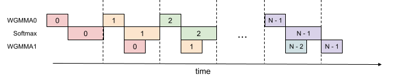

<figcaption>図2: 2 段の WGMMA-softmax パイプライン化。</figcaption>
</figure>

**Algorithm 2** FlashAttention-3 consumer warpgroup forward pass

> **必要な入力**: HBM 上の行列 $\mathbf{Q}_{i}\in\mathbb{R}^{B_{r}\times d}$ および $\mathbf{K},\mathbf{V}\in\mathbb{R}^{N\times d}$、$T_{c}=\lceil\frac{N}{B_{c}}\rceil$ となる key ブロックサイズ $B_{c}$。
>
> 1. consumer warp の数の関数として、あらかじめ決められた数のレジスタを再配分する。
> 2. オンチップで $\mathbf{O}_{i}=(0)\in\mathbb{R}^{B_{r}\times d}$ および $\ell_{i},m_{i}=(0),(-\infty)\in\mathbb{R}^{B_{r}}$ と初期化する。
> 3. $\mathbf{Q}_{i}$ と $\mathbf{K}_{0}$ が共有メモリにロードされるのを待つ。
> 4. WGMMA を用いて $\mathbf{S}_{\mathrm{cur}}=\mathbf{Q}_{i}\mathbf{K}_{0}^{T}$ を計算する。コミットして待つ。
> 5. $\mathbf{K}$ 用のバッファの 0 番目の段を解放する。
> 6. $\mathbf{S}_{\mathrm{cur}}$ に基づいて $m_{i}$、$\tilde{\mathbf{P}}_{\mathrm{cur}}$、$\ell_{i}$ を計算し、$\mathbf{O}_{i}$ を再スケールする。
> 7. **for** $1\leq j<T_{c}-1$ **do**
> 8. &nbsp;&nbsp;&nbsp;&nbsp;$\mathbf{K}_{j}$ が共有メモリにロードされるのを待つ。
> 9. &nbsp;&nbsp;&nbsp;&nbsp;WGMMA を用いて $\mathbf{S}_{\mathrm{next}}=\mathbf{Q}_{i}\mathbf{K}_{j}^{T}$ を計算する。**コミットするが待たない**。
> 10. &nbsp;&nbsp;&nbsp;&nbsp;$\mathbf{V}_{j-1}$ が共有メモリにロードされるのを待つ。
> 11. &nbsp;&nbsp;&nbsp;&nbsp;WGMMA を用いて $\mathbf{O}_{i}=\mathbf{O}_{i}+\tilde{\mathbf{P}}_{\mathrm{cur}}\mathbf{V}_{j-1}$ を計算する。**コミットするが待たない**。
> 12. &nbsp;&nbsp;&nbsp;&nbsp;WGMMA $\mathbf{Q}_{i}\mathbf{K}_{j}^{T}$ を待つ。
> 13. &nbsp;&nbsp;&nbsp;&nbsp;$\mathbf{S}_{\mathrm{next}}$ に基づいて $m_{i}$、$\tilde{\mathbf{P}}_{\mathrm{next}}$、$\ell_{i}$ を計算する。
> 14. &nbsp;&nbsp;&nbsp;&nbsp;WGMMA $\tilde{\mathbf{P}}_{\mathrm{cur}}\mathbf{V}_{j-1}$ を待ち、その後 $\mathbf{O}_{i}$ を再スケールする。
> 15. &nbsp;&nbsp;&nbsp;&nbsp;$\mathbf{K}$ 用のバッファの $(j\,\%\,s)$ 番目の段、および $\mathbf{V}$ 用のバッファの $(j-1\,\%\,s)$ 番目の段を解放する。
> 16. &nbsp;&nbsp;&nbsp;&nbsp;$\mathbf{S}_{\mathrm{next}}$ を $\mathbf{S}_{\mathrm{cur}}$ へコピーする。
> 17. **end for**
> 18. $\mathbf{V}_{T_{c}-1}$ が共有メモリにロードされるのを待つ。
> 19. WGMMA を用いて $\mathbf{O}_{i}=\mathbf{O}_{i}+\tilde{\mathbf{P}}_{\mathrm{last}}\mathbf{V}_{T_{c}-1}$ を計算する。コミットして待つ。
> 20. エピローグ: $m_{i}$ に基づいて $\mathbf{O}_{i}$ を再スケールする。$m_{i}$ と $\ell_{i}$ に基づいて $L_{i}$ を計算する。$\mathbf{O}_{i}$ と $L_{i}$ を $\mathbf{O}$ と $L$ の $i$ 番目のブロックとして HBM へ書き出す。

Algorithm 2 は Algorithm 1 の consumer 経路の置き換えとして機能し、FP16 精度に対する完全な FlashAttention-3 アルゴリズムを構成する。高いレベルでは、我々は WGMMA を非同期 GEMM の換喩として用いている。メインループ（8 行目から 16 行目）の中で、反復 $j$ の第 2 の WGMMA 演算（11 行目）が反復 $j+1$ の softmax 演算（13 行目）とオーバーラップされる。

上に図示したパイプライン構造は理論的な性能向上をもたらすが、考慮すべき実践的な側面がいくつかある:

##### Compiler reordering（コンパイラによる並べ替え）

擬似コードは理想化された実行順序を表しているが、コンパイラ（NVCC）はしばしば最適化のために命令を並べ替える。これは注意深く作り込まれた WGMMA と非 WGMMA 演算のパイプライン列を乱し、予期しない挙動や性能向上の減少につながる可能性がある。SASS コードの解析は、コンパイラが期待どおりにオーバーラップしたコードを生成することを示している（Section B.2）。

##### Register pressure（レジスタ圧）

〔訳注: このサブセクションは**見出しごとクリップから脱落**していた。ar5iv から復元した。〕

最適な性能を維持するには、レジスタスピルを最小化すべきである。しかし 2 段パイプラインは、中間結果を格納し段の間で文脈を維持するために追加のレジスタを必要とする。具体的には、余分な $\mathbf{S}_{\mathrm{next}}$ をレジスタに保持しなければならず、スレッドブロックあたり $B_{r}\times B_{c}\times\text{sizeof}(\text{float})$ のサイズの追加レジスタ使用につながる。この増加したレジスタ需要は、より大きなブロックサイズを使うこと（これも一般的な最適化である）と衝突する可能性がある。ブロックサイズを大きくすることもまたレジスタを大量に消費するからである。実践上は、プロファイリングの結果に基づいてトレードオフを取るべきである。

##### 3-stage pipelining（3 段パイプライン化）

上で記述した 2 段アルゴリズムを拡張して、我々は第 2 の WGMMA を softmax とさらにオーバーラップさせる 3 段の変種を提案する。このアプローチはさらに高い Tensor Core 利用率の可能性を提供するが、パイプラインに追加の段があるためさらに多くのレジスタを必要とし、タイルサイズとパイプライン深さの間のトレードオフの均衡がより難しくなる。3 段アルゴリズムの詳細な記述とその評価結果は § B.3 に見出せる。

### 3.3 Low-precision with FP8（FP8 による低精度）

**表（図3 の転記）**: FP32 累算器の WGMMA レジスタ配置 — 行 0 と行 8、スレッド 0〜3、エントリ 0〜7。〔訳注: 原典ではインライン SVG の図。SVG の座標から 2 行 × 8 列の格子として転記した。〕

| | col 0 | col 1 | col 2 | col 3 | col 4 | col 5 | col 6 | col 7 |
| --- | --- | --- | --- | --- | --- | --- | --- | --- |
| **row 0** | T0 {d0, d1} | T1 {d0, d1} | T2 {d0, d1} | T3 {d0, d1} | T0 {d4, d5} | T1 {d4, d5} | T2 {d4, d5} | T3 {d4, d5} |
| **row 8** | T0 {d2, d3} | T1 {d2, d3} | T2 {d2, d3} | T3 {d2, d3} | T0 {d6, d7} | T1 {d6, d7} | T2 {d6, d7} | T3 {d6, d7} |

Figure 3: FP32 accumulator register WGMMA layout – rows 0 and 8, threads 0-3, entries 0-7.（FP32 累算器のレジスタ WGMMA 配置 — 行 0 と行 8、スレッド 0〜3、エントリ 0〜7。）

**表（図4 の転記）**: FP8 オペランド A の WGMMA レジスタ配置 — 行 0 と行 8、スレッド 0〜3、エントリ 0〜7。

| | col 0 | col 1 | col 2 | col 3 | col 4 | col 5 | col 6 | col 7 |
| --- | --- | --- | --- | --- | --- | --- | --- | --- |
| **row 0** | T0 {a0, a1} | T0 {a2, a3} | T1 {a0, a1} | T1 {a2, a3} | T2 {a0, a1} | T2 {a2, a3} | T3 {a0, a1} | T3 {a2, a3} |
| **row 8** | T0 {a4, a5} | T0 {a6, a7} | T1 {a4, a5} | T1 {a6, a7} | T2 {a4, a5} | T2 {a6, a7} | T3 {a4, a5} | T3 {a6, a7} |

Figure 4: FP8 operand A register WGMMA layout – rows 0 and 8, threads 0-3, entries 0-7.（FP8 オペランド A のレジスタ WGMMA 配置 — 行 0 と行 8、スレッド 0〜3、エントリ 0〜7。）

**効率: レイアウト変換。** FlashAttention-3 の forward pass を FP8 精度で計算することは、レイアウト適合の点で FP16 では遭遇しなかった追加の課題を提起する。

第一に、入力テンソル $\mathbf{Q}$、$\mathbf{K}$、$\mathbf{V}$ は典型的にはヘッド次元において連続として与えられるのに対し、第 2 の GEMM に対する FP8 WGMMA の k-major 制約を満たすためには、$\mathbf{V}$（というより SMEM へロードされる $\mathbf{V}$ のタイル）が系列長の次元において連続である必要がある、という点に注意する。TMA のロード自体は連続な次元を変えられないので、我々は (1) 前処理のステップとして GMEM 上で $\mathbf{V}$ を転置するか、(2) タイルを SMEM へロードした後にカーネル内で $\mathbf{V}$ のタイルを転置するかのいずれかを行う必要がある。選択肢 (1) を実装するには、(1a) 転置を rotary embedding のような先行するステップのエピローグへ融合するか、(1b) 系列長とヘッド次元のストライドを交換するために単独の前処理転置カーネル<sup>7</sup> を呼ぶことができる。しかし (1a) は標準的なライブラリへ統合するのが難しく、(1b) は推論のようなメモリ律速の状況では無駄が大きすぎる。

> **訳注（脚注 7）**: 最適化された転置カーネルは、デバイスの帯域幅に近い速度を達成するだろう [46]。

その代わり、FP8 の FlashAttention-3 に対して我々は選択肢 (2) を選ぶ。カーネル内転置のために、我々は LDSM（`ldmatrix`）と STSM（`stmatrix`）の命令を活用する。これらは warp のスレッドが協調して 128 バイトの粒度で SMEM を RMEM へロードし、RMEM を SMEM へ格納するものである。<sup>8</sup> LDSM/STSM 命令はいずれもレジスタ効率がよく、それらを producer warpgroup で実行することを可能にし、またメモリコピーの際にレイアウトを転置することができる。さらに最初の反復の後は、次の $\mathbf{V}$ タイルの転置が、先行する $\mathbf{V}$ と現在の $\mathbf{K}$ のタイルに関わる 2 つの WGMMA の陰で実行されるよう手配できる。

> **訳注（脚注 8）**: PTX のドキュメントでは、LDSM/STSM は 16 ビットのエントリを持つ 8×8 の行列をコピーするものとして記述されているが [40, §9.7.13.4.15-16]、我々は 8 ビットのエントリを 2 つずつパックすることで、FP8 精度の文脈で LDSM/STSM を使うことができる。しかし LDSM/STSM の転置版は、パックされた 8 ビットのエントリを分割できない。

第二に、FP16 とは異なり、FP8 WGMMA の FP32 累算器のメモリ配置が、レジスタに保持されるときのそのオペランド A に対して想定される配置と異なることを我々は観測する。これら 2 つの配置の断片を Fig. 3 と Fig. 4 に描いている。そこではエントリが記載された順序でスレッドごとにレジスタに保持されている。byte permute 命令を用いることで、我々は第 1 の WGMMA の累算器を第 2 の WGMMA に適した形式へ、かつカーネル内転置によって生成される $\mathbf{V}$ タイルの配置と互換な形へ変換できる。具体的には、Fig. 3 を参照して、我々は順序を次のように変更する:

$$
\{\verb|d0 d1 d4 d5 d2 d3 d6 d7|\},
$$

そしてこのレジスタの置換が 8 バイトごとに複製される。$\mathbf{P}$ タイルの論理的な形状の観点では、この操作はその列を置換する（たとえば列 0189 が今や最初の 4 列になる）。WGMMA が正しい出力タイルを計算するために、我々は対応して、カーネル内転置が $\mathbf{V}$ タイルの対応する行置換を書き出すよう手配できる。<sup>9</sup>

> **訳注（脚注 9）**: カーネル内転置を行うことによって得られるこの追加の自由度は、スレッドをまたいでレジスタの所有権を変更するためにシャッフル命令を使う必要を排除する。それについては我々が以前 [7] で記述した。

**精度: ブロック量子化と非干渉化処理。** FP8（e4m3）形式では、仮数部の格納に 3 ビット、指数部に 4 ビットしか使わない。これは FP16/BF16 より高い数値誤差をもたらす。さらに大規模モデルは典型的に、他のほとんどの値より桁違いに大きい外れ値 [^20] [^54] を持ち、量子化を困難にする。典型的には、テンソルごとに 1 つのスカラーを保持することで per-tensor スケーリング [^37] を用いる（たとえば $\mathbf{Q}$ に 1 つ、$\mathbf{K}$ に 1 つ、$\mathbf{V}$ に 1 つ）。FP8 における attention の数値誤差を減らすため、我々は 2 つの技法を採用する:

1. **ブロック量子化（block quantization）**: 我々はブロックごとに 1 つのスカラーを保持する。すなわち $\mathbf{Q}$、$\mathbf{K}$、$\mathbf{V}$ のそれぞれについて、テンソルをサイズ $B_{r}\times d$ または $B_{c}\times d$ のブロックへ分割し、それらを別々に量子化する。この量子化は attention の直前の演算（たとえば rotary embedding）へ、追加の速度低下なしに融合できる（rotary embedding はメモリ帯域律速であるため）。FlashAttention-3 のアルゴリズムは自然にブロック上で動作するので、このブロック量子化を勘定に入れるために $\mathbf{S}$ の各ブロックをスケールすることが計算コストなしにできる。
2. **非干渉化処理（incoherent processing）**: 外れ値をならすため、我々は FP8 へ量子化する前に $\mathbf{Q}$ と $\mathbf{K}$ にランダムな直交行列 $\mathbf{M}$ を掛ける。$\mathbf{M}$ は直交なので $\mathbf{M}\mathbf{M}^{\top}=I$ であり、したがって $(\mathbf{Q}\mathbf{M})(\mathbf{K}\mathbf{M})^{\top}=\mathbf{Q}\mathbf{K}^{\top}$ である。すなわち $\mathbf{Q}$ と $\mathbf{K}$ の両方に $\mathbf{M}$ を掛けても attention の出力は変わらない。これは外れ値を「広げる」働きをする。$\mathbf{Q}\mathbf{M}$ や $\mathbf{K}\mathbf{M}$ の各エントリが $\mathbf{Q}$ や $\mathbf{K}$ のエントリのランダムな和になるためで、それによって量子化誤差を減らす。実践上、我々は [^9] と [^58] に従い、$\mathbf{M}$ を $\pm 1$ のランダムな対角行列と Hadamard 行列の積として選ぶ。これは $O(d^{2})$ ではなく $O(d\log d)$ で掛けることができ、また追加の計算コストなしに rotary embedding へ融合することもできる。

我々はこれら 2 つの技法が数値誤差を最大 2.6 倍削減することを § 4.3 で検証する。

## 4 Empirical Validation（実験的検証）

我々は CUTLASS [^57] の WGMMA や TMA の抽象といったプリミティブを用いて FlashAttention-3 を実装し、その効率と精度を評価する。

- **attention のベンチマーク。** 我々は異なる系列長にわたって FlashAttention-3 の実行時間を測定し、PyTorch の標準実装、FlashAttention-2、Triton での FlashAttention-2（H100 固有の命令を使う）、および cuDNN による H100 GPU 向けに最適化されたベンダー実装の FlashAttention-2 と比較する。我々は FlashAttention-3 が FlashAttention-2 より最大 2.0 倍速く、Triton での FlashAttention-2 より 1.5 倍速いことを確認する。FlashAttention-3 は最大 740 TFLOPs/s に達し、これは H100 GPU 上の理論最大 TFLOPs/s の 75% である。
- **アブレーション研究。** warp-specialization と GEMM-softmax パイプライン化という我々のアルゴリズム的改善が、FlashAttention-3 の高速化に寄与していることを確認する。
- **FP8 attention の精度。** ブロック量子化と非干渉化処理が FP8 の FlashAttention-3 の数値誤差を 2.6 倍削減することを検証する。

### 4.1 Benchmarking Attention（attention のベンチマーク）

我々は H100 80GB SXM5 GPU 上で、FP16 入力に対する異なる設定（因果マスクなし／あり、ヘッド次元 64 または 128）について異なる attention 手法の実行時間を測定する。結果を Fig. 5 と Fig. 6 に報告し、FlashAttention-3 が forward pass において FlashAttention-2 よりおよそ 1.5〜2.0 倍速く、backward pass において 1.5〜1.75 倍速いことを示す。標準的な attention 実装と比較すると、FlashAttention-3 は最大 3〜16 倍速くなりうる。中程度から長い系列（1k 以上）に対しては、FlashAttention-3 は H100 GPU 向けに最適化されたベンダーのライブラリ（cuDNN — クローズドソース）の速度をも上回る。

##### Benchmark settings:（ベンチマークの設定）

我々は系列長を 512, 1k, …, 16k と変化させ、トークンの総数が 16k になるようにバッチサイズを設定する。隠れ次元を 2048 とし、ヘッド次元は 64、128、または 256（すなわち 32 ヘッド、16 ヘッド、8 ヘッド）とする。forward pass の FLOPs を計算するには、次を用いる:

$$
4\cdot\text{seqlen}^{2}\cdot\text{head dimension}\cdot\text{number of heads}.
$$

因果マスクありの場合は、およそ半分の要素しか計算されないことを考慮してこの数を 2 で割る。backward pass の FLOPs を得るには、forward pass の FLOPs を 2.5 倍する（forward pass には 2 回の行列積があり、再計算のために backward pass には 5 回の行列積があるため）。

<figure>

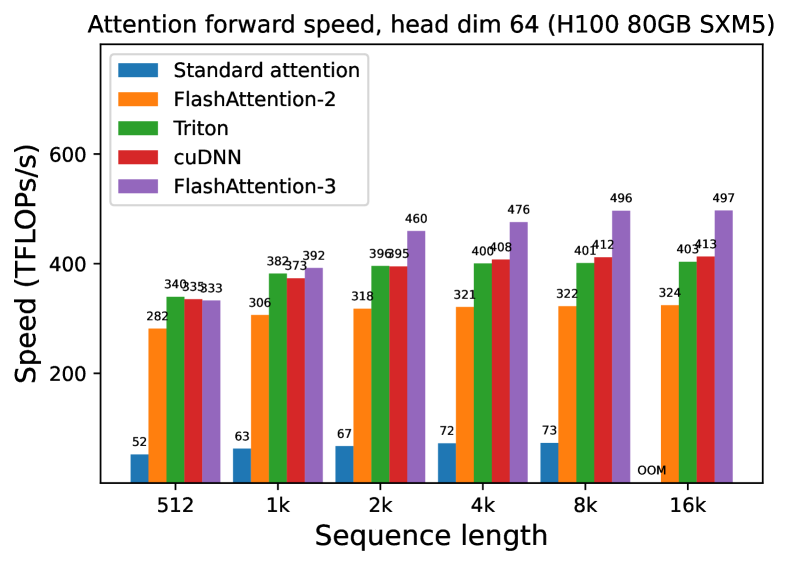

<figcaption>図5(a): forward、因果マスクなし、ヘッド次元 64。</figcaption>
</figure>

> **図5(b): forward、因果マスクあり、ヘッド次元 64。**
>
> 〔訳注: このサブ図の画像は**原ページ（ar5iv）にも存在しない**。ar5iv の HTML はこのサブ図にキャプションだけを置いており、対応するアセットを取得すると変換失敗時のプレースホルダ画像が返る。したがって復元不能であり、キャプション訳のみを残す。〕

<figure>

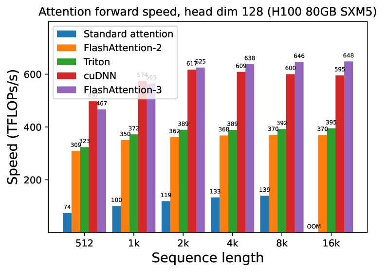

<figcaption>図5(c): forward、因果マスクなし、ヘッド次元 128。</figcaption>
</figure>

<figure>

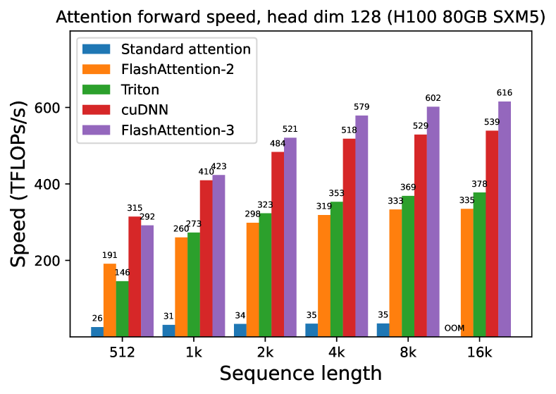

<figcaption>図5(d): forward、因果マスクあり、ヘッド次元 128。</figcaption>
</figure>

<figure>

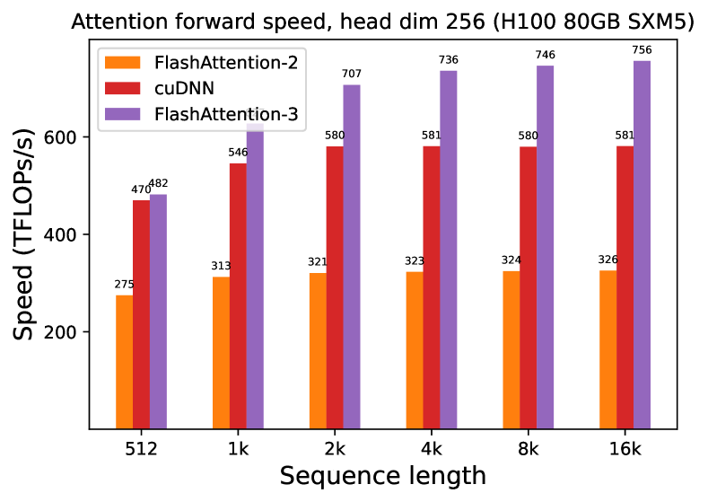

<figcaption>図5(e): forward、因果マスクなし、ヘッド次元 256。</figcaption>
</figure>

<figure>

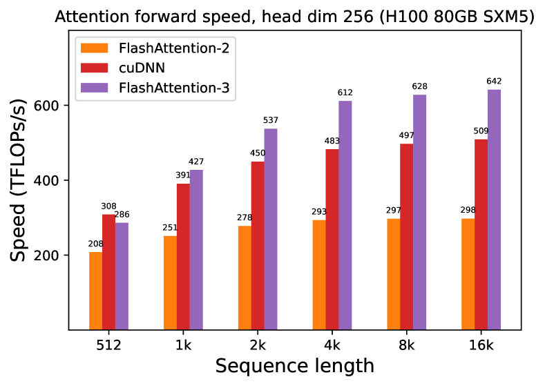

<figcaption>図5(f): forward、因果マスクあり、ヘッド次元 256。図5 全体のキャプション: H100 GPU における attention の forward 速度（FP16/BF16）。（訳注: (c)〜(f) の 4 枚と図5 の本キャプションはクリップから脱落していたため ar5iv から復元した。）</figcaption>
</figure>

<figure>

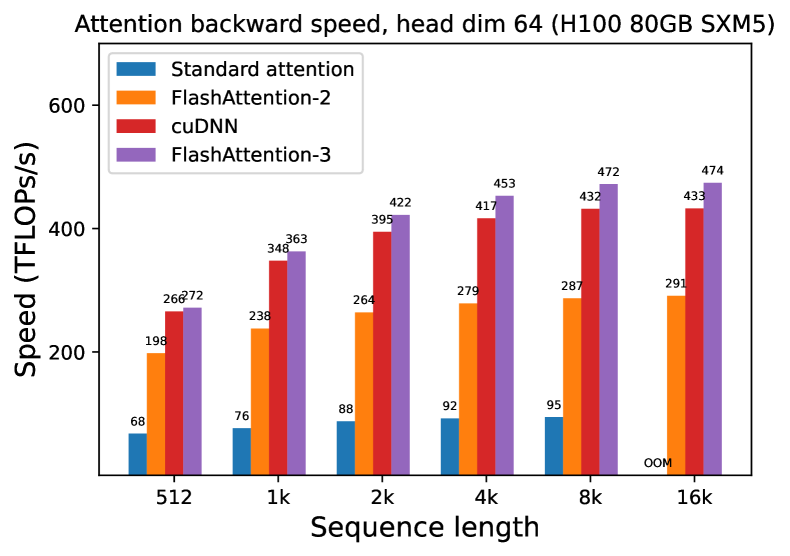

<figcaption>図6(a): backward、因果マスクなし、ヘッド次元 64。</figcaption>
</figure>

<figure>

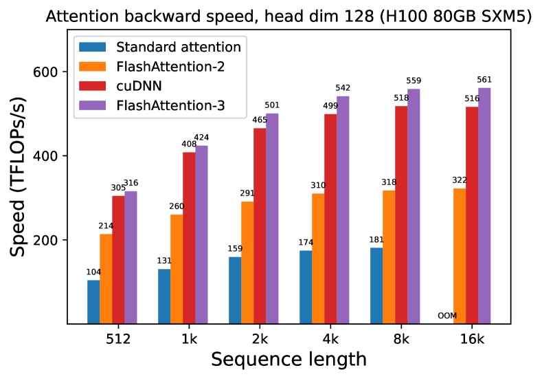

<figcaption>図6(b): backward、因果マスクなし、ヘッド次元 128。図6 全体のキャプション: H100 GPU における attention の backward 速度（FP16/BF16）。（訳注: (b) の 1 枚と図6 の本キャプションはクリップから脱落していたため ar5iv から復元した。）</figcaption>
</figure>

我々は同様の設定で forward pass の FP8 に対する実行時間も測定する。ヘッド次元 256 についての結果を Fig. 7 に報告し、完全な結果は § C.2 に示す。

<figure>

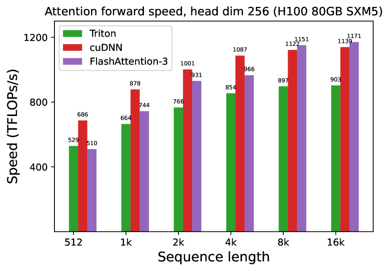

<figcaption>図7(a): forward、因果マスクなし、ヘッド次元 256。</figcaption>
</figure>

<figure>

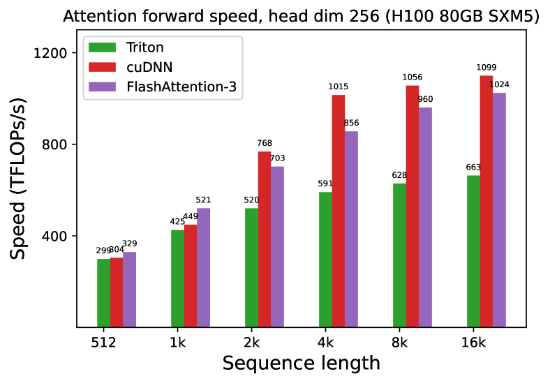

<figcaption>図7(b): forward、因果マスクあり、ヘッド次元 256。図7 全体のキャプション: H100 GPU における attention の forward 速度（FP8）。（訳注: (b) の 1 枚と図7 の本キャプションはクリップから脱落していたため ar5iv から復元した。）</figcaption>
</figure>

### 4.2 Ablation Study: 2-Stage Pipelining Experiments（アブレーション研究: 2 段パイプライン化の実験）

我々は、パラメータを $\{\text{batch},\text{seqlen},\text{nheads},\text{hdim}\}=\{4,8448,16,128\}$ に固定した非因果 FP16 の FlashAttention-3 について、2 段の WGMMA-softmax パイプライン化と warp-specialization の両方をアブレーションする。Table 2 の結果は、我々のアルゴリズム的改善（warp-specialization による非同期性と、GEMM と softmax の間のオーバーラップ）が 570 から 661 TFLOPs への大きな高速化につながることを確認している。

**表2**: パイプライン化のアブレーション測定。

| Configuration | Time | TFLOPs/s |
| --- | --- | --- |
| FlashAttention-3 | 3.538 ms | 661 |
| No GEMM-Softmax Pipelining, Warp-Specialization | 4.021 ms | 582 |
| GEMM-Softmax Pipelining, No Warp-Specialization | 4.105 ms | 570 |

### 4.3 Numerical Error Validation（数値誤差の検証）

FlashAttention の数値誤差 [^21] への関心があったことから、我々は FlashAttention-2、FlashAttention-3、および attention の標準的な実装を、FP64 での参照実装と比較する。LLM における外れ値の特徴と活性を模擬するため、我々は $\mathbf{Q},\mathbf{K},\mathbf{V}$ のエントリを次の分布で生成する:

$$
\mathcal{N}(0,1)+\mathcal{N}(0,100)\cdot\mathrm{Bernoulli}(0.001).
$$

すなわち、各エントリは平均 0・標準偏差 1 の正規分布に従うが、エントリの 0.1% については標準偏差 10 の正規分布に従う独立な項を加える。次に我々は Table 3 において二乗平均平方根誤差（RMSE）を測定する。FP16 では、中間結果（softmax）が FP32 で保たれるため、FlashAttention-2 と FlashAttention-3 の両方が標準実装と比べて 1.7 倍低い RMSE を達成する。FP8 におけるベースラインの attention は per-tensor スケーリングを用い、行列積の累算器は FP32、中間の softmax の結果は FP16 で保たれる。ブロック量子化と非干渉化処理のおかげで、FP8 における FlashAttention-3 はこのベースラインより 2.6 倍正確である。

**表3**: FP16 と FP8（e4m3）における数値誤差の比較。

| Method | Baseline FP16 | FlashAttention-2 FP16 | FlashAttention-3 FP16 |
| --- | --- | --- | --- |
| RMSE | 3.2e-4 | 1.9e-4 | 1.9e-4 |

| Method | Baseline FP8 | FlashAttention-3 FP8 | No block quant | No incoherent processing |
| --- | --- | --- | --- | --- |
| RMSE | 2.4e-2 | 9.1e-3 | 9.3e-3 | 2.4e-2 |

## 5 Dicussion, Limitations, Conclusion（議論・限界・結論）

〔訳注: 原文の見出しは "Dicussion"（"Discussion" の誤記）。原ページでも同じ綴りである。〕

FlashAttention-3 によって我々は、非同期性や低精度といった新しいプログラミング技法とハードウェア機能が、attention の効率と精度に劇的な影響を持ちうることを実証した。我々は FlashAttention-2 と比べて attention を 1.5〜2.0 倍高速化し、標準的な per-tensor 量子化と比べて FP8 の数値誤差を 2.6 倍削減することができた。我々の仕事の限界のうち、将来に対処したいと考えているものには次が含まれる: LLM 推論向けの最適化、persistent kernel の設計を FP8 カーネルへ統合すること<sup>10</sup>、そして大規模訓練における低精度 attention の影響を理解すること。本研究では Hopper GPU に焦点を当てたが、ここで開発された技法は他のハードウェアアクセラレータにも適用できると我々は期待している。attention のようなより高速でより正確なプリミティブが、長コンテキストのタスクにおける新しい応用を切り拓くことを願っている。

> **訳注（脚注 10）**: 我々のベンチマークでは、FP16 の FlashAttention-3 は persistent kernel と負荷分散の戦略を持つが、FP8 の FlashAttention-3 は持たない。これは、小さい系列長と因果マスクの場合に FP8 の FlashAttention-3 が FP8 の cuDNN カーネルと比べてそれほど良い性能を出さない理由を部分的に説明する。

## Appendix A Related Work（関連研究）

##### Attention variants and distributed attention（attention の変種と分散 attention）

attention がトランスフォーマーアーキテクチャ [^59] とともに popular になって以来、それをより長い系列へスケールさせるために attention を近似する仕事が大量に存在してきた。これらの近似手法は一般に 2 つのクラスに分類できる: スパースと低ランクである。スパース attention は attention 行列（$\mathrm{softmax}(\mathbf{Q}\mathbf{K}^{T})$）の一部のエントリのみを計算し、他のエントリはゼロであると仮定する。どのエントリをゼロにすべきかの選び方は手法によって異なり、固定パターン [^12]、スライディングウィンドウ [^6]、あるいはハッシュ [^28] やルーティング [^47] による動的パターンがある。一方、低ランクのアプローチは attention 行列が低ランク構造を持つと仮定し、ランダム射影 [^13] [^44] [^61] を伴って query と key に要素ごとの非線形性 [^27] を適用する。より良い品質のためにスパース近似と低ランク近似を組み合わせることもできる [^63] [^10]。しかしこれらの近似手法は典型的に標準的な attention と同じモデル品質を提供しない [^56] ため、ほとんどの大規模モデルはこれらの技法を採用していない。

推論効率を改善するために KV cache のサイズを削減することを目指した、他の attention の変種もある。マルチクエリ attention [^51] とグループ化クエリ attention [^3] は $\mathbf{K}$ と $\mathbf{V}$ の異なるヘッドを結びつけ、複数の query ヘッドが同じ key と value のヘッドとやり取りする。マルチヘッド潜在 attention（Multi-head latent attention）[^19] は $\mathbf{K}$ と $\mathbf{V}$ を共有行列の低ランク射影としてパラメータ化し、KV cache のサイズをさらに削減する。しかしこれらのアプローチはいずれも訓練中の中核的な計算 $\mathrm{softmax}(\mathbf{Q}\mathbf{K}^{T})\mathbf{V}$ を変えるものではなく、単に $\mathbf{Q},\mathbf{K},\mathbf{V}$ の得られ方を変えるだけである。その結果、**標準的な attention の計算に対する効率や精度の改善はこれらの手法にも恩恵をもたらす**。

さらに長いコンテキストへ拡張するために、attention の計算は複数の GPU にわたって分散できる。Ring attention [^31] [^32] やその変種 [^8] のような手法は最大 100 万のコンテキスト長に到達しうる。これらは FlashAttention（または FlashAttention-2）をプリミティブとして用いるので、FlashAttention-3 による改善はこれらの分散 attention の手法にも恩恵をもたらすだろう。

##### Alternative architectures（代替アーキテクチャ）

attention の限界に動機づけられて、さまざまな代替アーキテクチャが提案されてきた。それらは linear attention [^27] と回帰型ニューラルネットワーク（RNN）の間の関連の上に構築される。RWKV [^42]、H3 [^18]、MEGA [^35]、Retnet [^55] は、linear attention における単純な累積和の表現力を、より洗練された再帰によって高める。Mamba [^22] と xLSTM [^5] は再帰に学習可能な重み付けを用い、小規模あるいは中規模において言語モデリングでトランスフォーマーの品質に匹敵しうる。これらのアプローチは、トークン混合行列の構造というレンズを通して linear attention の一般化と関連づけることができる [^16]。これらのモデルはいくつかの適用例を見せ始めており、Jamba [^2] や Zamba [^36] のような大規模なハイブリッドモデルも登場している。しかし、これらの代替アーキテクチャは attention なしでは長コンテキストのタスクにおいて苦戦しており、そのため多くの場合ハイブリッド設計が採られている。

##### Low-precision attention（低精度 attention）

量子化は attention を高速化する有望なアプローチであるが、それらは主に推論効率のために KV cache の領域を削減することに焦点を当ててきた。QuIP [^9] と QuIP# [^58] は量子化を減らすために非干渉化処理を用いており、我々はこの技法を FP8 の FlashAttention-3 のために適応させた。最近の研究は、推論については KV cache が 4 ビット、3 ビット、あるいは 2 ビットにまで高度に圧縮可能であることを示唆している [^26] [^33]。しかし、安定した訓練のためには典型的により高い精度が要求されるため、**訓練中の量子化は依然として困難である**。

##### Hardware-aware Algorithms（ハードウェアを意識したアルゴリズム）

本論文で提示した我々の仕事は、新しい命令セットを活用しネイティブに非同期なプログラミングモデルを採用するための、マイクロアーキテクチャ固有のチューニングに焦点を当てている。ハードウェアを意識したアルゴリズムの協調設計には、他にも直交する軸が探究されている。その最近の例が LeanAttention [^49] であり、これは逐次的なトークン生成フェーズにおける GPU 占有率の低さと高いメモリ帯域幅要求を推論の主要なボトルネックとして認識し、Stream-K の負荷分散 [^41] に類似したより賢い負荷分散戦略によってそれを最適化し、ほぼピークの占有率を達成する。特定のハードウェア向けに GEMM を最適化することについては、我々が用いるのと同じ技法の多くを採用する大きな文献がある。

## Appendix B Addition Details on Algorithms（アルゴリズムの追加的詳細）

### B.1 Asynchrony Through Warp Specialization for the Backward Pass（backward pass のための warp specialization による非同期性）

forward pass の § 3.1 と同様に、我々は非同期性を扱うために warp specialization を用いる。forward pass における単純な producer-consumer のパターンだけでなく、我々は **$\mathbf{dQ}$ writer** という役割をもう 1 つ追加する。各スレッドブロックが生成した $\mathbf{dQ}$ の値を $\mathbf{dQ}$ のグローバルな値へ累算する必要があるためである。この $\mathbf{dQ}$ の累算はメモリ競合（多くのスレッドブロックが同じ場所へ書き込む）を引き起こすので、これを扱う別の warp を持つことで（非同期性とあいまって）、スレッドブロック内の残りの warp が次の計算（行列積）を実行するのをブロックすることを避けられる。

warp specialization を伴う backward pass を Algorithm 3 に含める。

**Algorithm 3** FlashAttention-3 backward pass with warp specialization

> **必要な入力**: HBM 上の行列 $\mathbf{Q},\mathbf{K},\mathbf{V},\mathbf{O},\mathbf{dO}\in\mathbb{R}^{N\times d}$、HBM 上の logsumexp ベクトル $L\in\mathbb{R}^{N}$、ブロックサイズ $B_{c}$, $B_{r}$。
>
> 1. 前処理カーネルにおいて $D=\mathrm{rowsum}(\mathbf{dO}\circ\mathbf{O})\in\mathbb{R}^{d}$（要素ごとの積）を計算し、$D$ を HBM へ書き出して各サイズ $B_{r}$ の $T_{r}$ 個のブロック $D_{1},\dots,D_{T_{r}}$ に分割する。
> 2. $\mathbf{Q}$ を各サイズ $B_{r}\times d$ の $T_{r}=\left\lceil\frac{N}{B_{r}}\right\rceil$ 個のブロック $\mathbf{Q}_{1},\dots,\mathbf{Q}_{T_{r}}$ に分割し、$\mathbf{K},\mathbf{V}$ を各サイズ $B_{c}\times d$ の $T_{c}=\left\lceil\frac{N}{B_{c}}\right\rceil$ 個のブロック $\mathbf{K}_{1},\dots,\mathbf{K}_{T_{c}}$ および $\mathbf{V}_{1},\dots,\mathbf{V}_{T_{c}}$ に分割する。
> 3. $\mathbf{dO}$ を各サイズ $B_{r}\times d$ の $T_{r}$ 個のブロック $\mathbf{dO}_{i},\dots,\mathbf{dO}_{T_{r}}$ に分割し、$L$ を各サイズ $B_{r}$ の $T_{r}$ 個のブロック $L_{i},\dots,L_{T_{r}}$ に分割する。
> 4. $s$ 段の循環 SMEM バッファでバリア同期を管理するパイプラインオブジェクトを初期化する。
> 5. **if** producer warpgroup にいる **then**
> 6. &nbsp;&nbsp;&nbsp;&nbsp;あらかじめ決められた数のレジスタを解放する。
> 7. &nbsp;&nbsp;&nbsp;&nbsp;$\mathbf{K}_{j}$ と $\mathbf{V}_{j}$ を HBM から共有メモリへロードする命令を発行する。
> 8. &nbsp;&nbsp;&nbsp;&nbsp;完了したら、$\mathbf{K}_{j}$ と $\mathbf{V}_{j}$ のロードを consumer に通知するためコミットする。
> 9. &nbsp;&nbsp;&nbsp;&nbsp;**for** $1\leq i\leq T_{r}$ **do**
> 10. &nbsp;&nbsp;&nbsp;&nbsp;&nbsp;&nbsp;&nbsp;&nbsp;バッファの $(i\,\%\,s)$ 番目の段が消費されるのを待つ。
> 11. &nbsp;&nbsp;&nbsp;&nbsp;&nbsp;&nbsp;&nbsp;&nbsp;$\mathbf{Q}_{i},\mathbf{dO}_{i}$ を HBM からバッファの $(i\,\%\,s)$ 番目の段の共有メモリへロードする命令を発行する。
> 12. &nbsp;&nbsp;&nbsp;&nbsp;&nbsp;&nbsp;&nbsp;&nbsp;完了したら、$\mathbf{Q}_{i},\mathbf{dO}_{i}$ のロードを consumer に通知するためコミットする。
> 13. &nbsp;&nbsp;&nbsp;&nbsp;**end for**
> 14. **else if** consumer warpgroup にいる **then**
> 15. &nbsp;&nbsp;&nbsp;&nbsp;consumer warp の数の関数として、あらかじめ決められた数のレジスタを再配分する。
> 16. &nbsp;&nbsp;&nbsp;&nbsp;オンチップで $\mathbf{dK}_{j}=(0)_{B_{c}\times d},\mathbf{dV}_{j}=(0)_{B_{c}\times d}$ と初期化する。
> 17. &nbsp;&nbsp;&nbsp;&nbsp;$\mathbf{K}_{j}$ と $\mathbf{V}_{j}$ が共有メモリにロードされるのを待つ。
> 18. &nbsp;&nbsp;&nbsp;&nbsp;**for** $1\leq i\leq T_{r}$ **do**
> 19. &nbsp;&nbsp;&nbsp;&nbsp;&nbsp;&nbsp;&nbsp;&nbsp;$\mathbf{Q}_{i}$ が共有メモリにロードされるのを待つ。
> 20. &nbsp;&nbsp;&nbsp;&nbsp;&nbsp;&nbsp;&nbsp;&nbsp;$L_{i},D_{i}$ を HBM からオンチップ SRAM へロードする。
> 21. &nbsp;&nbsp;&nbsp;&nbsp;&nbsp;&nbsp;&nbsp;&nbsp;オンチップで $\mathbf{S}_{i}^{(j)}=\mathbf{Q}_{i}\mathbf{K}_{j}^{T}\in\mathbb{R}^{B_{r}\times B_{c}}$（SS-GEMM）を計算する。コミットする。
> 22. &nbsp;&nbsp;&nbsp;&nbsp;&nbsp;&nbsp;&nbsp;&nbsp;$\mathbf{dO}_{i}$ が共有メモリにロードされるのを待つ。
> 23. &nbsp;&nbsp;&nbsp;&nbsp;&nbsp;&nbsp;&nbsp;&nbsp;オンチップで $\mathbf{dP}_{i}^{(j)}=\mathbf{dO}_{i}\mathbf{V}_{j}^{\top}\in\mathbb{R}^{B_{r}\times B_{c}}$（SS-GEMM）を計算する。コミットする。
> 24. &nbsp;&nbsp;&nbsp;&nbsp;&nbsp;&nbsp;&nbsp;&nbsp;オンチップで $\mathbf{S}_{i}^{(j)}$ を待ち、その後 $\mathbf{P}_{i}^{(j)}=\mathrm{exp}(\mathbf{S}_{ij}-L_{i})\in\mathbb{R}^{B_{r}\times B_{c}}$ を計算する。
> 25. &nbsp;&nbsp;&nbsp;&nbsp;&nbsp;&nbsp;&nbsp;&nbsp;オンチップで $\mathbf{dP}_{i}^{(j)}$ を待ち、その後 $\mathbf{dS}_{i}^{(j)}=\mathbf{P}_{i}^{(j)}\circ(\mathbf{dP}_{i}^{(j)}-D_{i})\in\mathbb{R}^{B_{r}\times B_{c}}$ を計算する。
> 26. &nbsp;&nbsp;&nbsp;&nbsp;&nbsp;&nbsp;&nbsp;&nbsp;オンチップで $\mathbf{dV}_{j}\leftarrow\mathbf{dV}_{j}+(\mathbf{P}_{i}^{(j)})^{\top}\mathbf{dO}_{i}\in\mathbb{R}^{B_{c}\times d}$（RS-GEMM）を計算する。コミットする。
> 27. &nbsp;&nbsp;&nbsp;&nbsp;&nbsp;&nbsp;&nbsp;&nbsp;オンチップで $\mathbf{dK}_{j}\leftarrow\mathbf{dK}_{j}+{\mathbf{dS}_{i}^{(j)}}^{\top}\mathbf{Q}_{i}\in\mathbb{R}^{B_{c}\times d}$（RS-GEMM）を計算する。コミットし、$\mathbf{dV}_{j}$ と $\mathbf{dK}_{j}$ の両方を待つ。
> 28. &nbsp;&nbsp;&nbsp;&nbsp;&nbsp;&nbsp;&nbsp;&nbsp;オンチップで $\mathbf{dQ}_{i}^{(\mathrm{local})}=\mathbf{dS}_{i}^{(j)}\mathbf{K}_{j}\in\mathbb{R}^{B_{r}\times d}$（SS-GEMM）を計算し、$\mathbf{dQ}_{i}^{(\mathrm{local})}$ を smem へ書き出す。$\mathbf{dQ}$-writer に通知する。
> 29. &nbsp;&nbsp;&nbsp;&nbsp;**end for**
> 30. **else if** $\mathbf{dQ}$-writer warp にいる **then**
> 31. &nbsp;&nbsp;&nbsp;&nbsp;**for** $1\leq i\leq T_{r}$ **do**
> 32. &nbsp;&nbsp;&nbsp;&nbsp;&nbsp;&nbsp;&nbsp;&nbsp;$\mathbf{dQ}_{i}^{(\mathrm{local})}$ が smem で準備できるのを待つ。
> 33. &nbsp;&nbsp;&nbsp;&nbsp;&nbsp;&nbsp;&nbsp;&nbsp;セマフォを用いて、$\mathbf{dQ}_{i}^{(\mathrm{local})}$ をグローバルメモリの $\mathbf{dQ}_{i}$ へアトミックに加算する。
> 34. &nbsp;&nbsp;&nbsp;&nbsp;**end for**
> 35. **end if**

### B.2 2-Stage Pipelining SASS Analysis（2 段パイプライン化の SASS 解析）

我々は consumer warpgroup のメインループ内部について、簡略化した SASS コードを与える。

〔訳注: 以下は原文のコードをそのまま収録する。繰り返しを示す省略記号の一部が失われた形（`FMNMX and SHFL.BFLY` のような行）でレンダリングされているのは ar5iv 側の平坦化であり、原ページとクリップで一致する。〕

```
// Compute row_max
FMNMX.FTZ R0, R24, R6, !PT ;
SHFL.BFLY PT, R185, R2, 0x2, 0x1f ;
 FMNMX and SHFL.BFLY 

// Apply exp2 and row_sum. Rescale O.
FMUL.FTZ R2, R4, UR9 ;
MUFU.EX2 R185, R184 ;
FFMA.FTZ R24, R24, UR9, -R6.reuse ;
FADD.FTZ R24, R211, R24 ;
 FMUL, FFMA, FMUL, MUFU.EX2, FADD 

// FP32 -> FP16 conversion are interleaved with exp2, row_sum and O rescaling.
F2FP.F16.F32.PACK_AB R231, R25, R231 ;
 F2FP, FMUL, MUFU, FFMA, FADD ...

// Start the first WGMMA. Broken down into 8 HGMMAs.
// The first 7 HGMMAs are packed together.
WARPGROUP.ARRIVE ;
HGMMA.64x192x16.F32 R24, gdesc[UR44], RZ, !UPT ;
... HGMMA x 6 ...

// FP32->FP16, exp2, row_sum, O rescaling are interleaved with HGMMA.
F2FP.F16.F32.PACK_AB R214, R214, R187 ;
MUFU.EX2 R234, R5 ;
FADD.FTZ R237, R187, R2 ;
 F2FP, MUFU, FADD 

// The last HGMMA is issued here. No need to wait.
HGMMA.64x192x16.F32 R24, gdesc[UR44], R24, gsb0 ;

// Start the second WGMMA. Broken down into 12 HGMMAs.
// All 12 HGMMAs are packed together. Not interleaved with other instructions.
WARPGROUP.ARRIVE ;
HGMMA.64x128x16.F32 R120, R228, gdesc[UR8].tnspB, R120 ;
... HGMMA x 10 ...
HGMMA.64x128x16.F32 R120, R184, gdesc[UR8].tnspB, R120, gsb0 ;

// wgmma.wait_group at the end.
WARPGROUP.DEPBAR.LE gsb0, 0x0 ;
```

我々は次の観察を行う:

1. softmax は最初の WGMMA よりも前、まさに冒頭へ並べ替えられている。
2. 最初の WGMMA は softmax および $\mathbf{S}$ の FP32 $\rightarrow$ FP16 データ型変換とインターリーブされている。これは WGMMA と非 WGMMA が並列に実行されていることを示す。
3. `exp2`、`row_sum`、$\mathbf{O}$ の再スケーリング、FP32 $\rightarrow$ FP16 変換が互いにインターリーブされている。
4. 2 番目の WGMMA は、予想どおり他の命令とオーバーラップされていない。

全体として、SASS は 2 段パイプライン化のアイデアが期待どおりに機能することを示している。

### B.3 3-Stage Pipelining Algorithm（3 段パイプライン化アルゴリズム）

我々は、反復 $j+2$ の最初の WGMMA、反復 $j+1$ の softmax、反復 $j$ の 2 番目の WGMMA を並列化する 3 段パイプライン化アルゴリズムを実験する。このアルゴリズムを Algorithm 4 に記述する。このアルゴリズムは以下の理由により 2 段パイプライン化アルゴリズムより性能が悪い:

<figure>

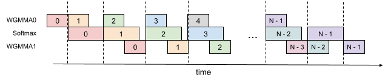

<figcaption>図8: 3 段パイプライン化。</figcaption>
</figure>

**Algorithm 4** FlashAttention 3-stage pipelining consumer warpgroup forward pass

> **必要な入力**: HBM 上の行列 $\mathbf{Q},\mathbf{K},\mathbf{V}\in\mathbb{R}^{N\times d}$、ブロックサイズ $B_{c}$, $B_{r}$。各 warpgroup はサイズ $B_{r}\times d$ の 1 ブロック $\mathbf{Q}_i$ と、サイズ $B_{c}\times d$ の $T_{c}=\left\lceil\frac{N}{B_{c}}\right\rceil$ 個のブロック $\mathbf{K}_{1},\dots,\mathbf{K}_{T_{c}}$ および $\mathbf{V}_{1},\dots,\mathbf{V}_{T_{c}}$ を読む。各 warpgroup はサイズ $B_{r}\times d$ の 1 つの出力ブロック $\mathbf{O}_{i}$ と、サイズ $B_{r}$ の 1 つの logsumexp ブロック $L_{i}$ を書き出す。
>
> 1. 初期化。$\mathbf{Q}_{i}$ を HBM からオンチップ SRAM へロードする。$\mathbf{O}_{i},\ell_{i},m_{i},scale\_o$ を初期化する。
> 2. producer warpgroup が $\mathbf{K}_{0}$ を HBM からオンチップ SRAM へロードするのを待つ。
> 3. WGMMA を用いて $\mathbf{S}=\mathbf{Q}_{i}\mathbf{K}_{0}^{T}$ を計算する。コミットして待つ。
> 4. $\mathbf{S}$ に基づいて $m_{i}$、$\tilde{\mathbf{P}}_{i}$、$\ell_{i}$、$scale\_o$ を計算する。
> 5. producer warpgroup が $\mathbf{K}_{1}$ を HBM からオンチップ SRAM へロードするのを待つ。
> 6. WGMMA を用いて $\mathbf{S}=\mathbf{Q}_{i}\mathbf{K}_{1}^{T}$ を計算する。コミットして待つ。
> 7. **for** $2\leq j<T_{c}-2$ **do**
> 8. &nbsp;&nbsp;&nbsp;&nbsp;producer warpgroup が $\mathbf{K}_{j}$ を HBM からオンチップ SRAM へロードするのを待つ。
> 9. &nbsp;&nbsp;&nbsp;&nbsp;WGMMA を用いて $\mathbf{S}\_next=\mathbf{Q}_{i}\mathbf{K}_{j}^{T}$ を計算する。コミットするが待たない。
> 10. &nbsp;&nbsp;&nbsp;&nbsp;producer warpgroup が $\mathbf{V}_{j-2}$ を HBM からオンチップ SRAM へロードするのを待つ。
> 11. &nbsp;&nbsp;&nbsp;&nbsp;$scale\_o$ に基づいて $\mathbf{O}_{i}$ を再スケールする。
> 12. &nbsp;&nbsp;&nbsp;&nbsp;WGMMA を用いて $\mathbf{O}_{i}=\mathbf{O}_{i}+\tilde{\mathbf{P}}_{i}\mathbf{V}_{j-2}$ を計算する。コミットするが待たない。
> 13. &nbsp;&nbsp;&nbsp;&nbsp;$\mathbf{S}$ に基づいて $m_{i}$、$\tilde{\mathbf{P}}_{i}\_next$、$\ell_{i}$、$scale\_o$ を計算する。
> 14. &nbsp;&nbsp;&nbsp;&nbsp;先行するすべての WGMMA を待つ。
> 15. &nbsp;&nbsp;&nbsp;&nbsp;$\mathbf{S}\_next$ を $\mathbf{S}$ へコピーする。
> 16. &nbsp;&nbsp;&nbsp;&nbsp;$\tilde{\mathbf{P}}_{i}\_next$ を $\tilde{\mathbf{P}}_{i}$ へコピーする。
> 17. **end for**
> 18. producer warpgroup が $\mathbf{V}_{T_{c}-2}$ を HBM からオンチップ SRAM へロードするのを待つ。
> 19. $scale\_o$ に基づいて $\mathbf{O}_{i}$ を再スケールする。
> 20. WGMMA を用いて $\mathbf{O}_{i}=\mathbf{O}_{i}+\tilde{\mathbf{P}}_{i}\mathbf{V}_{T_{c}-2}$ を計算する。コミットして待つ。
> 21. $\mathbf{S}$ に基づいて $m_{i}$、$\tilde{\mathbf{P}}_{i}$、$\ell_{i}$、$scale\_o$ を計算する。
> 22. producer warpgroup が $\mathbf{V}_{T_{c}-1}$ を HBM からオンチップ SRAM へロードするのを待つ。
> 23. $scale\_o$ に基づいて $\mathbf{O}_{i}$ を再スケールする。
> 24. WGMMA を用いて $\mathbf{O}_{i}=\mathbf{O}_{i}+\tilde{\mathbf{P}}_{i}\mathbf{V}_{T_{c}-1}$ を計算する。コミットして待つ。
> 25. エピローグ。$\ell_{i}$ に基づいて $\mathbf{O}_{i}$ を再スケールする。$\ell_{i}$ と $m_{i}$ に基づいて $L_{i}$ を計算する。$\mathbf{O}_{i}$ と $L_{i}$ を $\mathbf{O}$ と $L$ の $i$ 番目のブロックとして HBM へ書き出す。

##### Overlapping.（オーバーラップ）

我々は softmax が（最初の WGMMA ＋ 2 番目の WGMMA）とオーバーラップできると期待していた。しかしコンパイラはそのようには協力してくれない。SASS コードは、最初の WGMMA のみが softmax とオーバーラップされ、2 番目の WGMMA はそうならないことを示している。コンパイラがなぜこのように命令を並べ替えることを選ぶのかは明らかでない。

##### Register pressure.（レジスタ圧）

〔訳注: このサブセクションは**見出しごとクリップから脱落**していた。ar5iv から復元した。〕

このアルゴリズムは 2 段パイプライン化アルゴリズムと比べてより多くのレジスタを必要とする。理論上は、余分な $\tilde{\mathbf{P}}_{i}$ と $scale\_o$ を格納する必要があり、そのサイズは $B_{r}\times B_{c}\times\text{sizeof}(\text{input\_data\_type})+B_{r}\times\text{sizeof}(\text{float})$ である。その結果、より小さいブロックサイズを選ばなければならない。

## Appendix C Addition Details on Experiments and Benchmarking（実験とベンチマークの追加的詳細）

### C.1 System and libraries（システムとライブラリ）

我々は H100 80GB SXM5（700W）上で速度をベンチマークする。我々は一般に、執筆時点（2024 年 5 月）で最新のバージョンのライブラリを使う。具体的には次を用いる:

- CUDA 12.3
- cuDNN 9.1.1.17
- CUTLASS 3.5
- FlashAttention 2.5.8
- Triton nightly 3.0.0.post20240424212437
- PyTorch 2.3.0

ばらつきを減らすため、我々は GPU のクロック速度を 1830MHz に固定する（989 TFLOPS の FP16 理論最大スループットを計算するのに使われるクロック速度）。ベンチマークを 100 回繰り返し、タイミングの平均を取る。

### C.2 FP8 Attention Full Results（FP8 attention の完全な結果）

我々は次の系列長を用いる: 512, 1024, 2048, 4224, 8448, 16896。系列長が 4k 以上のときは、wave quantization を避けるためにそれが 132（H100 SXM5 における SM の数）で割り切れるようにもしている。

<figure>

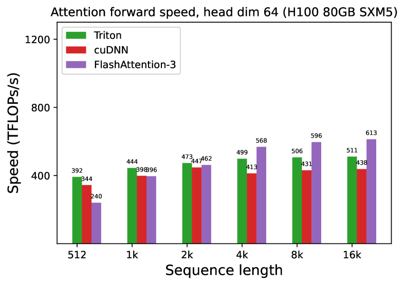

<figcaption>図9(a): forward、因果マスクなし、ヘッド次元 64。</figcaption>
</figure>

<figure>

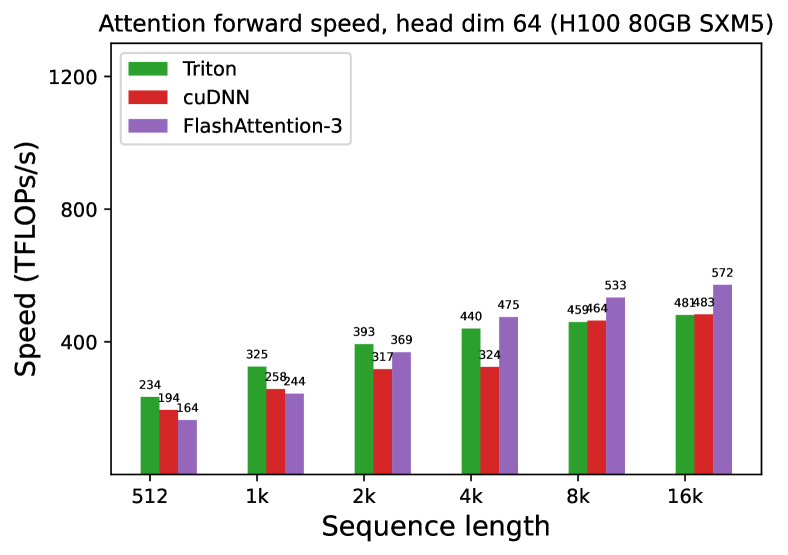

<figcaption>図9(b): forward、因果マスクあり、ヘッド次元 64。</figcaption>
</figure>

<figure>

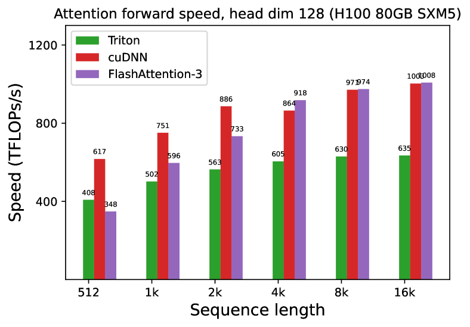

<figcaption>図9(c): forward、因果マスクなし、ヘッド次元 128。</figcaption>
</figure>

<figure>

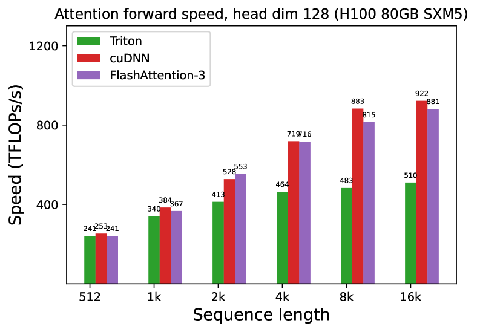

<figcaption>図9(d): forward、因果マスクあり、ヘッド次元 128。</figcaption>
</figure>

<figure>


<figcaption>図9(e): forward、因果マスクなし、ヘッド次元 256。</figcaption>
</figure>

<figure>


<figcaption>図9(f): forward、因果マスクあり、ヘッド次元 256。図9 全体のキャプション: H100 GPU における attention の forward 速度（FP8）。（訳注: (b)〜(f) の 5 枚と図9 の本キャプションはクリップから脱落していたため ar5iv から復元した。）</figcaption>
</figure>

