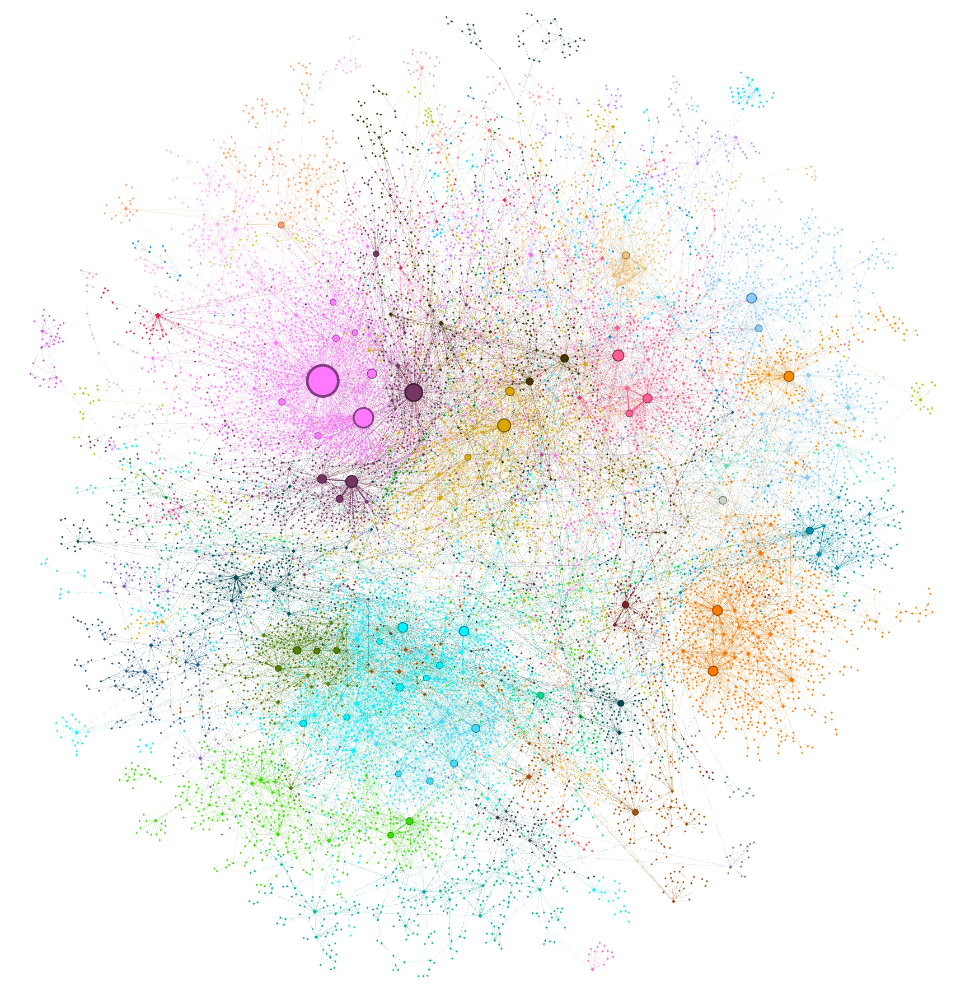
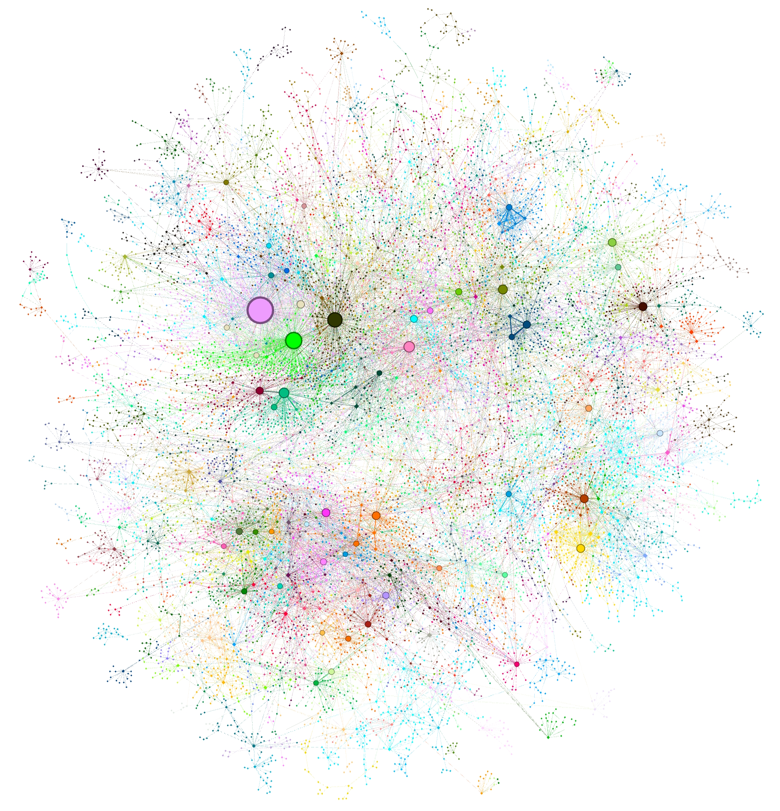

# ローカルからグローバルへ: クエリ焦点型要約への Graph RAG アプローチ

> 原題: From Local to Global: A Graph RAG Approach to Query-Focused Summarization
> 著者: Darren Edge†, Ha Trinh†, Newman Cheng, Joshua Bradley, Alex Chao, Apurva Mody, Steven Truitt, Jonathan Larson
> 所属: Microsoft Research / Microsoft Strategic Missions and Technologies / Microsoft Office of the CTO（† 同等の貢献）
> 出典: arXiv:2404.16130（2024-04）

> **訳注（翻訳範囲と底本について）**
>
> - 底本は Obsidian Web Clipper で保存した markdown（ar5iv 由来）。翻訳範囲は本文 §1〜6 の全文。参考文献一覧と謝辞は skill の既定どおり除外した。原典に付録はない。
> - **クリップからの復元**: Figure 3 は (a) Level 0 と (b) Level 1 の 2 パネル構成だが、クリップには **(a) のみが残り (b) `Level1Multihop.jpg` が欠落**していたため、ar5iv 原ページから取得して復元した。
> - **図の形式について**: Figure 1・2・4 は原典で TikZ により描かれており、ar5iv では**インライン SVG** としてレンダリングされている（ラスタ画像ではない）。本翻訳では ar5iv からこれら 10 個の SVG を抽出して `raw/assets/2024-graphrag/` に保存し、通常の図として引用している。
> - **Figure 4 の数値の書き起こし**: Figure 4 は 6×6 の勝率行列 × 8 パネル（2 データセット × 4 指標）で、本論文の主結果にあたる。SVG 内にテキストとして数値が含まれていたので、**図の下に markdown 表としても書き起こした**（後から検索・引用できるようにするため）。行・列の条件の並び（SS, TS, C0, C1, C2, C3）は SVG からは直接読めないため、本文 §3.6 の記述（「global approaches achieved comprehensiveness win rates between 72-83% for Podcast transcripts」「Intermediate-level summaries in the Podcast dataset ... achieved comprehensiveness win rates of 57%」等）8 件と照合して確定し、さらに対称セルの和が 100 になることを全パネルで確認した。なお**キャプションが述べる「各データセット・指標の総合勝者の太字」は SVG のテキスト抽出では判別できない**ため、書き起こした表に太字は付していない。
> - **引用の表記**: クリップは著者-年形式の引用を裸の参照番号に変換していた（例: 原典の "Leiden algorithm (Traag et al., 2019)" → クリップの "Leiden algorithm 47"）。本翻訳では参照番号 `[^N]` を維持しつつ、**本文の理解に必要な箇所では著者-年を ar5iv から復元して併記**した。参照番号は原典末尾の文献一覧（本翻訳では除外）に対応する。

## Abstract（要旨）

外部の知識源から関連情報を検索する検索拡張生成（retrieval-augmented generation, RAG）を用いることで、大規模言語モデル（LLM）は、非公開のあるいはこれまで見たことのない文書コレクションに対する質問に答えられるようになる。しかし RAG は、「このデータセットの主要なテーマは何か」のような**テキストコーパス全体に向けられたグローバルな質問**では失敗する。それが本質的に、明示的な検索タスクではなく**クエリ焦点型要約**（query-focused summarization, QFS）のタスクだからである。一方で従来の QFS の手法は、典型的な RAG システムが索引化するテキスト量へとスケールしない。この対照的な 2 つの手法の長所を組み合わせるために、我々は、**ユーザーの質問の一般性と、索引化される原文の量の両方に対してスケールする**、非公開テキストコーパス上の質問応答への Graph RAG アプローチを提案する。我々のアプローチは LLM を用いて、2 段階でグラフベースのテキスト索引を構築する。まず原文書からエンティティの知識グラフを導出し、次に密接に関連するエンティティのすべてのグループについて**コミュニティ要約を事前生成**する。質問が与えられると、各コミュニティ要約が部分的な応答の生成に使われ、その後すべての部分応答が再び要約されて最終的な応答がユーザーに返される。100 万トークン規模のデータセットに対するある種の**グローバルなセンスメイキング（sensemaking）の質問**について、Graph RAG が生成される答えの**網羅性（comprehensiveness）と多様性（diversity）の双方で、素朴な RAG のベースラインに対して大幅な改善**をもたらすことを示す。グローバルとローカルの両方の Graph RAG アプローチの、オープンソースの Python 実装が [https://aka.ms/graphrag](https://aka.ms/graphrag) で公開予定である。

## 1 Introduction（はじめに）

さまざまな領域における人間の営みは、大量の文書を読んで推論する我々の能力に依存しており、しばしば原文そのものに述べられている何よりも先へ進む結論に到達する。大規模言語モデル（LLM）の登場により、我々はすでに、科学的発見 [^35] や情報分析 [^40] のような複雑な領域において、人間のようなセンスメイキングを自動化しようとする試みを目の当たりにしている。ここでセンスメイキングとは、「*軌跡を予測し効果的に行動するために、（人・場所・出来事の間にありうる）つながりを理解しようとする、動機づけられた継続的な努力*」[^21] と定義される。しかし、テキストコーパス全体に対する人間主導のセンスメイキングを支援するには、**グローバルな性質の質問をすることによって**、人々がデータについての自分のメンタルモデルを適用しかつ洗練させる [^22] 手段が必要である。

検索拡張生成（RAG, [^28]）は、データセット全体に対するユーザーの質問に答えるための確立されたアプローチだが、これは**答えがテキストの局所的な領域の内側に含まれていて、その領域を検索することが生成タスクにとって十分な接地を与える**状況のために設計されている。そうではなく、より適切なタスクの枠組みはクエリ焦点型要約（QFS, [^9]）であり、とりわけ、抜粋を連結するだけでなく自然言語の要約を生成する**クエリ焦点型の抽象的（abstractive）要約** [^55] [^5] [^26] である。しかし近年、抽象的（abstractive）か抽出的（extractive）か、汎用（generic）かクエリ焦点型（query-focused）か、単一文書か複数文書か、といった要約タスク間のこうした区別は、以前ほど重要ではなくなってきた。transformer アーキテクチャの初期の応用は、こうしたあらゆる要約タスクの最高性能を大幅に改善したが [^30] [^27] [^14]、これらのタスクは今や現代の LLM——GPT 系 [^7] [^1]、Llama 系 [^46]、Gemini 系 [^2] のいずれもが、コンテキストウィンドウに与えられた任意の内容を in-context 学習で要約できる——によって自明なものになっている。

<figure>

<figcaption>Figure 1: 原文書のテキストから LLM が導出したグラフ索引を用いる Graph RAG のパイプライン。この索引は、データセットのドメインに合わせて調整された LLM プロンプトによって検出・抽出・要約された、ノード（例: エンティティ）・エッジ（例: 関係）・共変量（covariates。例: 主張 claim）にまたがる。コミュニティ検出（例: Leiden, Traag et al., 2019 [^47]）を用いてグラフ索引を要素（ノード・エッジ・共変量）のグループへと分割し、LLM が索引化時とクエリ時の双方で並列に要約できるようにする。あるクエリに対する「グローバルな答え」は、そのクエリに対する関連性を報告するすべてのコミュニティ要約に対して、最後にもう一度クエリ焦点型要約を行うことで生成される。</figcaption>
</figure>

しかし、**コーパス全体に対するクエリ焦点型の抽象的要約**という課題は依然として残る。そのようなテキストの量は LLM のコンテキストウィンドウの限界を大きく超えうるし、そのウィンドウを広げることも十分ではないかもしれない——長いコンテキストの「途中で情報が失われる（lost in the middle）」ことがありうるからである [^29] [^24]。加えて、素朴な RAG におけるテキストチャンクの直接的な検索は QFS タスクにはおそらく不十分だが、**別の形の事前索引化（pre-indexing）が、グローバルな要約を特に狙った新しい RAG アプローチを支えうる**可能性はある。

本論文で我々は、**LLM が導出した知識グラフのグローバルな要約に基づく *Graph RAG* アプローチ**を提示する（Figure 1）。グラフ索引が持つ構造化された検索と走査の可能性（affordance）を活用する関連研究（§4.2）とは対照的に、我々はこの文脈でこれまで探索されてこなかったグラフの性質に焦点を当てる。すなわち、その本質的な**モジュラリティ（modularity）** [^38] と、コミュニティ検出アルゴリズムが**グラフを密接に関連するノードのモジュラーなコミュニティへと分割できる**という能力である（例: Louvain, Blondel et al., 2008 [^6]; Leiden, Traag et al., 2019 [^47]）。これらのコミュニティ記述を LLM が要約したものは、その基盤にあるグラフ索引と、それが表現する入力文書の**完全なカバレッジ**を与える。そうすればコーパス全体のクエリ焦点型要約が、**map-reduce のアプローチ**によって可能になる。まず各コミュニティ要約を使ってクエリに独立かつ並列に答え、次に関連するすべての部分的な答えを最終的なグローバルな答えへと要約するのである。

このアプローチを評価するために、我々は LLM を用いて、2 つの代表的な実世界のデータセット——それぞれポッドキャストの書き起こしとニュース記事を含む——の短い説明から、**活動を起点とした（activity-centered）多様なセンスメイキングの質問**の集合を生成した。広範な論点とテーマの理解を深める、網羅性（comprehensiveness）・多様性（diversity）・エンパワーメント（empowerment、§3.4 で定義）という目標とする性質について、我々は、クエリに答えるのに使うコミュニティ要約の階層水準を変えたときの影響を探索するとともに、素朴な RAG および原文のグローバルな map-reduce 要約との比較を行う。その結果、**すべてのグローバルなアプローチが網羅性と多様性において素朴な RAG を上回ること**、そして**中間水準・低水準のコミュニティ要約を用いた Graph RAG が、これらと同じ指標において原文の要約に対して有利な性能を、より低いトークンコストで示すこと**を明らかにする。

## 2 Graph RAG Approach & Pipeline（Graph RAG のアプローチとパイプライン）

ここでは Graph RAG のアプローチ（Figure 1）とパイプラインの高水準のデータフローを解きほぐし、各ステップについて主要な設計パラメータ・技法・実装の詳細を述べる。

### 2.1 Source Documents → Text Chunks（原文書 → テキストチャンク）

基本的な設計上の決定は、**原文書から抽出された入力テキストを、処理のためにどの粒度でテキストチャンクへ分割すべきか**である。続くステップでは、これらのチャンクのそれぞれが、グラフ索引のさまざまな要素を抽出するよう設計された一連の LLM プロンプトへ渡される。**長いテキストチャンクはそうした抽出に必要な LLM 呼び出しの回数を減らすが、長い LLM コンテキストウィンドウにおける再現率（recall）の劣化を被る** [^29] [^24]。この挙動は、単一の抽出ラウンド（すなわち gleaning 回数がゼロ）の場合について Figure 2 に見ることができる。あるサンプルデータセット（HotPotQA, Yang et al., 2018 [^54]）において、**600 トークンのチャンクサイズを使うと、2400 のチャンクサイズを使ったときのほぼ 2 倍のエンティティ参照が抽出された**。一般に参照は多いほうが良いが、どんな抽出過程も対象とする活動のために再現率と適合率（precision）を均衡させる必要がある。

<figure>

<figcaption>Figure 2: HotPotQA データセット（Yang et al., 2018 [^54]）で検出されたエンティティ参照の数が、我々の汎用エンティティ抽出プロンプトを gpt-4-turbo で用いたときに、チャンクサイズと gleanings の回数によってどう変わるか。（訳注: 横軸が実施した gleaning の回数 0〜3、縦軸が検出されたエンティティ参照数 0〜30000、3 本の系列が 600 / 1200 / 2400 のチャンクサイズ。）</figcaption>
</figure>

### 2.2 Text Chunks → Element Instances（テキストチャンク → 要素インスタンス）

このステップの基本要件は、**原文の各チャンクからグラフのノードとエッジのインスタンスを識別し抽出すること**である。我々はこれを、複数のパートからなる LLM プロンプトを用いて行う。このプロンプトはまずテキスト中のすべての*エンティティ*を、その名前・型・説明とともに識別し、次に明らかに関連するエンティティ間のすべての*関係*を、始点・終点のエンティティとその関係の説明とともに識別する。どちらの種類の要素インスタンスも、区切り文字つきタプルの単一のリストとして出力される。

このプロンプトを文書コーパスのドメインに合わせて調整する主要な機会は、**in-context 学習 [^7] のために LLM に与える few-shot 例の選択**にある。たとえば、人・場所・組織のような「固有表現（named entities）」という広いクラスを抽出する我々の既定のプロンプトは一般に適用可能だが、専門的な知識を持つ領域（例: 科学・医学・法律）では、それらの領域に特化した few-shot 例から恩恵を受けるだろう。我々はまた、抽出されたノードのインスタンスに関連づけたい追加の**共変量（covariates）**のための二次的な抽出プロンプトもサポートする。我々の既定の共変量プロンプトは、検出されたエンティティに紐づく**主張（claims）**を、主語・目的語・型・説明・出典テキストのスパン・開始日と終了日とともに抽出することを狙う。

効率と品質の要求を均衡させるために、我々は指定された上限までの複数ラウンドの「**gleanings**（拾い集め）」を用いて、**LLM が以前の抽出ラウンドで見落としたかもしれない追加のエンティティを検出するよう促す**。これは多段階の過程であり、まず LLM に、すべてのエンティティが抽出されたかどうかを評価するよう求める——このとき **logit bias を 100 に設定して yes/no の決定を強制する**。LLM がエンティティを見落としたと応答したら、「**MANY entities were missed in the last extraction**（前回の抽出で多くのエンティティが見落とされた）」と示す継続がその見落としたエンティティを拾い集めるよう LLM を促す。このアプローチにより、**品質を落とすことなく（Figure 2）、またノイズを強制的に持ち込むことなく、より大きなチャンクサイズを使えるようになる**。

### 2.3 Element Instances → Element Summaries（要素インスタンス → 要素要約）

原文に表現されたエンティティ・関係・主張の記述を「抽出」するために LLM を用いることは、それ自体すでに一種の**抽象的要約**であり、テキストそのものによって示唆されてはいるが述べられてはいない概念（例: 含意された関係の存在）について、独立して意味を持つ要約を作り出すことを LLM に頼っている。こうしたインスタンス水準の要約をすべて、各グラフ要素（すなわちエンティティノード・関係エッジ・主張共変量）ごとの単一の記述テキストのブロックへと変換するには、対応するインスタンスのグループに対する**さらに一段の LLM 要約**が必要になる。

この段階での潜在的な懸念は、**LLM が同じエンティティへの参照を常に同じテキスト形式で抽出するとは限らず、その結果として重複したエンティティ要素、したがってエンティティグラフ内の重複ノードが生じうる**ことである。しかし、密接に関連するすべてのエンティティの「コミュニティ」が次のステップで検出され要約されること、そして LLM が複数の名前の変種の背後にある共通のエンティティを理解できることを踏まえると、**すべての変種から、密接に関連するエンティティの共有された集合への十分な連結性がある限り、我々の全体的なアプローチはそうした変動に対して頑健である**。

全体として、**潜在的にノイズの多いグラフ構造の中で、同質なノードに対して豊かな記述テキストを用いる**という我々のやり方は、LLM の能力と、グローバルなクエリ焦点型要約の必要性の双方に沿っている。これらの性質はまた、我々のグラフ索引を、**下流の推論タスクのために簡潔で一貫した知識トリプル（主語・述語・目的語）に依存する典型的な知識グラフから区別する**ものでもある。

<figure>

<figcaption>Figure 3 (a): Level 0。最大モジュラリティに対応する階層分割。</figcaption>
</figure>

<figure>

<figcaption>Figure 3 (b): Level 1。これらのルート水準のコミュニティ内部の構造を明らかにする。</figcaption>
</figure>

Figure 3: 索引化された MultiHop-RAG（Tang and Yang, 2024 [^45]）データセットに対して、Leiden アルゴリズム（Traag et al., 2019 [^47]）を用いて検出されたグラフコミュニティ。円はエンティティノードを表し、その大きさは次数に比例する。ノードのレイアウトは OpenORD（Martin et al., 2011 [^34]）と Force Atlas 2（Jacomy et al., 2014 [^16]）によって行われた。ノードの色はエンティティのコミュニティを表し、階層的クラスタリングの 2 つの水準で示されている: (a) Level 0 は最大モジュラリティを持つ階層分割に対応し、(b) Level 1 はこれらのルート水準のコミュニティ内部の構造を明らかにする。

### 2.4 Element Summaries → Graph Communities（要素要約 → グラフコミュニティ）

前のステップで作られた索引は、**エンティティノードが関係エッジによって接続された、同質な無向重み付きグラフ**としてモデル化できる。エッジの重みは検出された関係インスタンスの正規化された個数を表す。そのようなグラフが与えられると、グラフを、グラフ内の他のノードよりも互いに強い結合を持つノードのコミュニティへと分割するために、さまざまなコミュニティ検出アルゴリズムを使える（例: [^12] と [^17] のサーベイを参照）。我々のパイプラインでは **Leiden** [^47] を使う。**大規模グラフの階層的なコミュニティ構造を効率的に復元できる**からである（Figure 3）。この階層の各水準は、グラフのノードを**相互排他かつ全体網羅（mutually-exclusive, collective-exhaustive）**な形でカバーするコミュニティ分割を与え、**分割統治によるグローバルな要約**を可能にする。

### 2.5 Graph Communities → Community Summaries（グラフコミュニティ → コミュニティ要約）

次のステップは、**Leiden 階層の各コミュニティについて報告書のような要約を作ること**であり、これには非常に大きなデータセットへスケールするよう設計された方法を用いる。これらの要約は、データセットのグローバルな構造と意味を理解する手段としてそれ自体で独立に有用であり、**質問がない状態でコーパスを理解するためにも使える**かもしれない。たとえばユーザーは、ある水準のコミュニティ要約にざっと目を通して一般的な関心のテーマを探し、その後、各サブトピックについてより詳細を与える下位水準の報告書へのリンクをたどる、といったことができる。ただしここでは、**グローバルなクエリに答えるために使われるグラフベースの索引の一部としての有用性**に焦点を当てる。

コミュニティ要約は次のようにして生成される。

- *葉水準のコミュニティ*。葉水準のコミュニティの要素要約（ノード・エッジ・共変量）に優先順位が付けられ、その後、トークン上限に達するまで反復的に LLM のコンテキストウィンドウへ追加される。優先順位づけは次のとおり: **始点ノードと終点ノードの次数の合計（すなわち全体的な顕著さ）が大きい順に**、各コミュニティのエッジについて、始点ノード・終点ノード・紐づく共変量・そしてエッジ自体の記述を追加する。
- *より高い水準のコミュニティ*。すべての要素要約がコンテキストウィンドウのトークン上限に収まるなら、葉水準のコミュニティと同様に進め、そのコミュニティ内のすべての要素要約を要約する。そうでなければ、**要素要約のトークン数が大きい順にサブコミュニティを並べ、（より短い）サブコミュニティ要約を（より長い）対応する要素要約で置き換えていき**、コンテキストウィンドウに収まるまで反復する。

### 2.6 Community Summaries → Community Answers → Global Answer（コミュニティ要約 → コミュニティ回答 → グローバルな答え）

ユーザーのクエリが与えられると、前のステップで生成されたコミュニティ要約を用いて、多段階の過程で最終的な答えを生成できる。コミュニティ構造が階層的であるということは、**異なる水準のコミュニティ要約を使って質問に答えられる**ということでもあり、階層的コミュニティ構造の中の**どの特定の水準が、一般的なセンスメイキングの質問にとって要約の詳細さと範囲の最良の均衡を与えるのか**という問いを生む（§3 で評価する）。

あるコミュニティ水準について、任意のユーザーのクエリに対するグローバルな答えは次のように生成される。

- *コミュニティ要約の準備*。コミュニティ要約は**ランダムにシャッフルされ**、あらかじめ指定されたトークンサイズのチャンクへ分割される。これにより、関連情報が単一のコンテキストウィンドウに集中して（そして潜在的に失われて）しまうのではなく、**チャンク全体に分散する**ことが保証される。
- *コミュニティ回答の map*。各チャンクにつき 1 つずつ、中間的な答えを並列に生成する。LLM にはまた、**生成された答えが対象の質問に答える上でどれだけ有用かを示す 0〜100 のスコア**を生成するよう求める。スコアが 0 の答えは除外される。
- *グローバルな答えへの reduce*。中間的なコミュニティ回答を**有用度スコアの降順に並べ**、トークン上限に達するまで新しいコンテキストウィンドウへ反復的に追加する。この最終的なコンテキストが、ユーザーへ返されるグローバルな答えの生成に使われる。

## 3 Evaluation（評価）

### 3.1 Datasets（データセット）

我々は 100 万トークン規模の 2 つのデータセットを選んだ。それぞれ約 10 冊の小説に相当する分量で、ユーザーが実世界の活動の中で出会いうる種類のコーパスを代表するものである。

- *ポッドキャストの書き起こし*。Microsoft の CTO である Kevin Scott と他のテクノロジーリーダーとのポッドキャスト対談を編集した書き起こし（Behind the Tech, [^42]）。規模: 600 トークンのテキストチャンク 1669 個、チャンク間の重なりは 100 トークン（約 100 万トークン）。
- *ニュース記事*。2013 年 9 月から 2023 年 12 月までに公開された、エンターテインメント・ビジネス・スポーツ・テクノロジー・健康・科学を含むさまざまなカテゴリのニュース記事からなるベンチマークデータセット（MultiHop-RAG; [^45]）。規模: 600 トークンのテキストチャンク 3197 個、チャンク間の重なりは 100 トークン（約 170 万トークン）。

### 3.2 Queries（クエリ）

オープンドメイン質問応答のためのベンチマークデータセットは、HotPotQA [^54]、MultiHop-RAG [^45]、MT-Bench [^59] を含め多数存在する。しかしそれらに付随する質問集合は、**データのセンスメイキング——人々が実世界の活動というより広い範囲の中でデータを吟味し、関わり、文脈づける過程 [^23]——のための要約ではなく、明示的な事実の検索を対象としている**。同様に、原文から潜在的な要約クエリを抽出する手法も存在するが [^53]、そうして抽出された質問は、**そのテキストについての事前知識を露呈してしまう**ような詳細を対象としうる。

より**グローバルなセンスメイキングのタスク**に対する RAG システムの有効性を評価するには、**データセットの内容についての高水準の理解だけを伝え、特定のテキストの詳細は伝えない質問**が必要である。我々はそうした質問の生成を自動化するために、**活動を起点とした（activity-centered）アプローチ**を用いた。データセットの短い説明が与えられると、LLM に $N$ 人の潜在的なユーザーと、ユーザーごとに $N$ 個のタスクを識別するよう求め、次に各（ユーザー, タスク）の組み合わせについて、**コーパス全体の理解を必要とする** $N$ 個の質問を生成するよう求める。我々の評価では $N$ = 5 とし、その結果データセットごとに 125 個のテスト質問が得られた。Table 1 は 2 つの評価用データセットそれぞれについての質問の例を示す。

| データセット | 活動の枠組みとグローバルなセンスメイキングの質問の生成の例 |
| --- | --- |
| ポッドキャストの書き起こし | *ユーザー*: テック業界の洞察とトレンドを探しているテクノロジージャーナリスト *タスク*: テックのリーダーたちが政策と規制の役割をどう見ているかを理解する *質問*: 1. 主にテック政策と政府規制を扱っているのはどのエピソードか？ 2. ゲストたちはプライバシー法が技術開発に与える影響をどう捉えているか？ 3. イノベーションと倫理的配慮の間の均衡について議論しているゲストはいるか？ 4. ゲストたちが言及した、現行の政策への変更の提案は何か？ 5. テック企業と政府の協働について議論されているか、またそれはどのようにか？ |
| ニュース記事 | *ユーザー*: 時事問題をカリキュラムに取り入れている教育者 *タスク*: 健康とウェルネスについて教える *質問*: 1. 保健教育のカリキュラムに統合できる、健康に関する現在の話題は何か？ 2. ニュース記事は予防医学とウェルネスの概念をどう扱っているか？ 3. 互いに矛盾する健康記事の例はあるか、あるとすればなぜか？ 4. ニュース報道に基づいて、公衆衛生の優先事項について何が読み取れるか？ 5. 教育者はこのデータセットを、健康リテラシーの重要性を強調するためにどう使えるか？ |

**Table 1**: 対象データセットの短い説明に基づいて LLM が生成した、潜在的なユーザー・タスク・質問の例。質問は特定の詳細ではなくグローバルな理解を対象としている。

### 3.3 Conditions（条件）

我々は分析において 6 つの異なる条件を比較する。**4 つの水準のグラフコミュニティを用いる Graph RAG（C0, C1, C2, C3）**、我々の map-reduce のアプローチを**原文に直接**適用するテキスト要約手法（**TS**）、そして素朴な「セマンティック検索」型の RAG アプローチ（**SS**）である。

- **C0**。ユーザーのクエリに答えるのに、**ルート水準**のコミュニティ要約（数が最も少ない）を用いる。
- **C1**。クエリに答えるのに**高水準**のコミュニティ要約を用いる。これらは（存在すれば）C0 のサブコミュニティであり、そうでなければ C0 のコミュニティを下へ射影したものである。
- **C2**。クエリに答えるのに**中間水準**のコミュニティ要約を用いる。これらは（存在すれば）C1 のサブコミュニティであり、そうでなければ C1 のコミュニティを下へ射影したものである。
- **C3**。クエリに答えるのに**低水準**のコミュニティ要約（数が最も多い）を用いる。これらは（存在すれば）C2 のサブコミュニティであり、そうでなければ C2 のコミュニティを下へ射影したものである。
- **TS**。§2.6 と同じ方法だが、map-reduce の要約段階でシャッフルされチャンク化されるのが、コミュニティ要約ではなく**原文**である点が異なる。
- **SS**。**素朴な RAG** の実装。指定されたトークン上限に達するまで、テキストチャンクを検索して利用可能なコンテキストウィンドウへ追加する。

**コンテキストウィンドウの大きさと、答えの生成に使うプロンプトは 6 条件すべてで同一である**（用いる文脈情報の種類に合わせた、参照スタイルの些細な修正を除く）。条件が異なるのは、**コンテキストウィンドウの中身がどう作られるか**だけである。

条件 C0〜C3 を支えるグラフ索引は、エンティティと関係の抽出のみについての我々の汎用プロンプトを用いて作られ、エンティティ型と few-shot 例はデータのドメインに合わせて調整された。グラフの索引化の過程では、コンテキストウィンドウのサイズ 600 トークンを用い、ポッドキャストのデータセットでは gleaning 1 回、ニュースのデータセットでは gleaning 0 回とした。

| 質問 | さまざまなエンターテインメント記事にわたって繰り返し言及されている公人は誰か？ |
| --- | --- |
| Graph RAG | エンターテインメント界の著名な公人の概観 エンターテインメント産業は広大かつ多様であり、映画・テレビ・音楽・スポーツ・デジタルメディアを包含する。特定の公人は、これらの部門にまたがる重要な貢献と影響力によって際立っている。以下の要約は、さまざまなエンターテインメント記事で繰り返し言及されている主要な人物を、その産業内での影響と存在感を反映する形で強調する。俳優と監督 […] 論争の渦中にある公人 […] ミュージシャンと経営者 […] アスリートとコーチ […] インフルエンサーと起業家 […] これらの人物がエンターテインメント記事で繰り返し言及されることは、彼らが持ち続けている関連性と、その仕事に対する大衆の関心を示している。彼らの影響力はエンターテインメントのさまざまな側面にまたがり、映画やテレビにおける文化的な語りを形作ることから、音楽やデジタルメディアのトレンドを駆動することにまで及ぶ。これらの個人はそれぞれの分野に貢献するだけでなく、より広い文化的な景観にも影響を与え、しばしば社会的議論や公共の言説において中心的な人物となっている。 |
| 素朴な RAG | さまざまなエンターテインメント記事にわたって繰り返し言及されている公人には、Taylor Swift、Travis Kelce、Britney Spears、Justin Timberlake が含まれる。これらの個人は、職業上の業績から私生活に至るまで、さまざまな理由で注目されてきた。Taylor Swift […] Travis Kelce […] Britney Spears […] Justin Timberlake […] これらの人物は、その注目度の高い地位と、彼らのキャリアや私生活に対する大衆の関心のために頻繁に取り上げられている。音楽・スポーツ・人間関係のいずれにおいても、彼らの活動は、メディア報道と大衆の反応が示すとおり、重要な文化的・経済的影響を持つ。 |
| LLM の判定 | **網羅性: 勝者 = 1（Graph RAG）** 答え 1 のほうが優れている。それは、映画・テレビ・音楽・スポーツ・ゲーム・デジタルメディアを含む、エンターテインメントのより広い範囲の部門から、より網羅的で詳細な公人のリストを提供しているからである。また、彼らの貢献の具体的な例と、それぞれの分野に与える影響、さらに論争とその含意への言及も含んでいる。答え 2 は、少数の個人についての報道では詳細だが、少数の公人に限られており、エンターテインメント産業全体にわたる職業上の影響力の広い範囲ではなく、主に彼らの私生活と人間関係に焦点を当てている。  **多様性: 勝者 = 1（Graph RAG）** 答え 1 のほうが優れている。それは、映画・テレビ・音楽・スポーツ・ゲーム・デジタルメディアを含むエンターテインメント産業の異なる部門から広い範囲の公人をカバーすることで、より変化に富み豊かな応答を提供しているからである。これらの人物の貢献と影響力、そして論争とそれが公共の言説に与える影響についての洞察を提供している。また、言及された各人物について具体的なデータ源を引用しており、主張を支える多様な範囲の証拠を示している。対照的に答え 2 は、主に音楽産業とスポーツからの、より小さな公人のグループに焦点を当てており、データについて単一の情報源に大きく依存しているため、視点と洞察の多様性が乏しい。  **エンパワーメント: 勝者 = 1（Graph RAG）** 答え 1 のほうが優れている。それは、映画・テレビ・音楽・スポーツ・デジタルメディアを含むエンターテインメント産業のさまざまな部門にわたる公人について、網羅的で構造化された概観を提供しているからである。複数の個人を列挙し、彼らの貢献の具体的な例と、エンターテインメント記事で言及される文脈を、各主張についてのデータレポートへの参照とともに提供している。このアプローチは、読者が話題の広がりを理解し、誤導されることなく情報に基づいた判断を下す助けになる。対照的に答え 2 は、より小さな公人のグループに焦点を当て、主に彼らの私生活と人間関係を論じており、話題についてそれほど広い理解を与えないかもしれない。答え 2 も情報源を引用してはいるが、答え 1 の深さと多彩さには及ばない。  **直接性: 勝者 = 2（素朴な RAG）** 答え 2 のほうが優れている。それは、Taylor Swift、Travis Kelce、Britney Spears、Justin Timberlake のように、さまざまなエンターテインメント記事にわたって繰り返し言及されている具体的な公人を直接列挙し、彼らが頻繁に言及される理由について簡潔な説明を提供しているからである。答え 1 は網羅的ではあるが、エンターテインメントの異なる部門のさまざまな人物についての多くの詳細な情報を含んでおり、それは有益ではあるものの、答え 2 と同じ水準の簡潔さと具体性をもって質問に直接答えてはいない。 |

**Table 2**: ニュース記事データセットについての質問の例。Graph RAG（C2）と素朴な RAG が生成した答え、および LLM が生成した評価とともに示す。

### 3.4 Metrics（指標）

LLM は自然言語生成の良い評価者であることが示されており、人間の判断と比較して最高水準ないし競争力のある結果を達成している [^50] [^59]。このアプローチは、**正解（gold standard）の答えが分かっている場合には参照ベースの指標を生成できる**が、生成されたテキストの性質（例: 流暢さ）を**参照なし（reference-free）の形で測る** [^50] ことも、また競合する出力の**頭尾対決（head-to-head）の比較（LLM-as-a-judge, [^59]）**を行うこともできる。LLM はまた、従来の RAG システムの性能を評価すること——文脈の関連性・忠実性・答えの関連性のような性質を自動的に評価すること（RAGAS, [^10]）——においても有望さを示している。

我々の Graph RAG の機構が多段階であること、比較したい条件が複数あること、そして**活動に基づくセンスメイキングの質問には正解の答えが存在しないこと**を踏まえ、我々は **LLM 評価器を用いた頭尾対決の比較アプローチ**を採用することにした。センスメイキングの活動にとって望ましい性質を捉える 3 つの目標指標と、**妥当性の指標として用いる対照指標（直接性 directness）**を選んだ。**直接性は網羅性・多様性と事実上対立するので、いずれの手法も 4 指標すべてで勝つことは期待されない**。

LLM 評価器を用いて計算する我々の頭尾対決の尺度は次のとおりである。

- *網羅性（Comprehensiveness）*。答えは、質問のあらゆる側面と詳細をカバーするために、どれだけの詳細を提供しているか？
- *多様性（Diversity）*。答えは、質問について異なる視点と洞察を提供する上で、どれだけ変化に富み豊かか？
- *エンパワーメント（Empowerment）*。答えは、読者が話題を理解し情報に基づいた判断を下すのを、どれだけよく助けるか？
- *直接性（Directness）*。答えは、どれだけ具体的かつ明確に質問に対処しているか？

我々の評価では、LLM に質問・対象指標・答えの対を与え、その指標に照らしてどちらの答えが優れているか、およびその理由を評価するよう求める。勝者が存在すればそれを返し、そうでなければ——本質的に類似しており差が無視できる場合は——引き分けを返す。**LLM の確率的な性質を考慮して、各比較を 5 回実行し平均スコアを用いる**。Table 2 は LLM が生成した評価の例を示す。

### 3.5 Configuration（設定）

**コンテキストウィンドウのサイズが特定のタスクに与える影響は明らかではない**。とりわけ gpt-4-turbo のように 128k トークンという大きなコンテキストサイズを持つモデルではそうである。長いコンテキストの「途中で情報が失われる」可能性を踏まえ [^29] [^24]、我々はデータセット・質問・指標の組み合わせについて、コンテキストウィンドウのサイズを変えたときの影響を探索したいと考えた。とりわけ我々の目標は、ベースライン条件（SS）にとって最適なコンテキストサイズを決定し、それをクエリ時のすべての LLM 利用に一様に用いることだった。そのために、8k・16k・32k・64k の 4 つのコンテキストウィンドウサイズをテストした。**驚くべきことに、テストした中で最も小さいコンテキストウィンドウサイズ（8k）が、網羅性についてはすべての比較で一様に優れており**（平均勝率 58.1%）、多様性（平均勝率 = 52.4%）とエンパワーメント（平均勝率 = 51.3%）については、より大きなコンテキストサイズと同程度の性能だった。より網羅的で多様な答えを選好するため、我々は最終的な評価に 8k トークンの固定コンテキストウィンドウサイズを用いた。

### 3.6 Results（結果）

索引化の過程の結果、ポッドキャストのデータセットについては **8564 ノード・20691 エッジ**からなるグラフが、ニュースのデータセットについてはより大きな **15754 ノード・19520 エッジ**のグラフが得られた。Table 3 は各グラフのコミュニティ階層の異なる水準におけるコミュニティ要約の数を示す。

<figure>

<figcaption>Figure 4 (ポッドキャストの書き起こし・網羅性): 行の条件が列の条件に勝つ勝率（%）。</figcaption>
</figure>

<figure>

<figcaption>Figure 4 (ポッドキャストの書き起こし・多様性): 行の条件が列の条件に勝つ勝率（%）。</figcaption>
</figure>

<figure>

<figcaption>Figure 4 (ポッドキャストの書き起こし・エンパワーメント): 行の条件が列の条件に勝つ勝率（%）。</figcaption>
</figure>

<figure>

<figcaption>Figure 4 (ポッドキャストの書き起こし・直接性): 行の条件が列の条件に勝つ勝率（%）。</figcaption>
</figure>

<figure>

<figcaption>Figure 4 (ニュース記事・網羅性): 行の条件が列の条件に勝つ勝率（%）。</figcaption>
</figure>

<figure>

<figcaption>Figure 4 (ニュース記事・多様性): 行の条件が列の条件に勝つ勝率（%）。</figcaption>
</figure>

<figure>

<figcaption>Figure 4 (ニュース記事・エンパワーメント): 行の条件が列の条件に勝つ勝率（%）。</figcaption>
</figure>

<figure>

<figcaption>Figure 4 (ニュース記事・直接性): 行の条件が列の条件に勝つ勝率（%）。</figcaption>
</figure>

Figure 4: 2 つのデータセット・4 つの指標・比較あたり 125 個の質問（それぞれ 5 回繰り返して平均）にわたる、（行の条件）が（列の条件）に勝つ勝率（%）。データセットと指標ごとの総合的な勝者は太字で示されている。自己対戦の勝率は計算されていないが、参照のため期待値の 50% として示されている。**すべての Graph RAG の条件が、網羅性と多様性において素朴な RAG を上回った**。条件 C1〜C3 はまた、答えの網羅性と多様性において **TS（グラフ索引なしのグローバルなテキスト要約）に対しても若干の改善**を示した。

**訳注（Figure 4 の数値の書き起こし）**: 以下は上記 8 パネルの数値を表として起こしたもの。各セルは「行の条件が列の条件に勝つ勝率（%）」。条件の並びは SS（素朴な RAG）・TS（原文の map-reduce 要約）・C0〜C3（Graph RAG のコミュニティ水準）。原典が太字で示す「総合的な勝者」は SVG のテキスト抽出では判別できないため再現していない。

**表 (訳注 A)**: ポッドキャストの書き起こし・網羅性

| 行＼列 | SS | TS | C0 | C1 | C2 | C3 |
| --- | --- | --- | --- | --- | --- | --- |
| SS | 50 | 17 | 28 | 25 | 22 | 21 |
| TS | 83 | 50 | 50 | 48 | 43 | 44 |
| C0 | 72 | 50 | 50 | 53 | 50 | 49 |
| C1 | 75 | 52 | 47 | 50 | 52 | 50 |
| C2 | 78 | 57 | 50 | 48 | 50 | 52 |
| C3 | 79 | 56 | 51 | 50 | 48 | 50 |

**表 (訳注 B)**: ポッドキャストの書き起こし・多様性

| 行＼列 | SS | TS | C0 | C1 | C2 | C3 |
| --- | --- | --- | --- | --- | --- | --- |
| SS | 50 | 18 | 23 | 25 | 19 | 19 |
| TS | 82 | 50 | 50 | 50 | 43 | 46 |
| C0 | 77 | 50 | 50 | 50 | 46 | 44 |
| C1 | 75 | 50 | 50 | 50 | 44 | 45 |
| C2 | 81 | 57 | 54 | 56 | 50 | 48 |
| C3 | 81 | 54 | 56 | 55 | 52 | 50 |

**表 (訳注 C)**: ポッドキャストの書き起こし・エンパワーメント

| 行＼列 | SS | TS | C0 | C1 | C2 | C3 |
| --- | --- | --- | --- | --- | --- | --- |
| SS | 50 | 42 | 57 | 52 | 49 | 51 |
| TS | 58 | 50 | 59 | 55 | 52 | 51 |
| C0 | 43 | 41 | 50 | 49 | 47 | 48 |
| C1 | 48 | 45 | 51 | 50 | 49 | 50 |
| C2 | 51 | 48 | 53 | 51 | 50 | 51 |
| C3 | 49 | 49 | 52 | 50 | 49 | 50 |

**表 (訳注 D)**: ポッドキャストの書き起こし・直接性

| 行＼列 | SS | TS | C0 | C1 | C2 | C3 |
| --- | --- | --- | --- | --- | --- | --- |
| SS | 50 | 56 | 65 | 60 | 60 | 60 |
| TS | 44 | 50 | 55 | 52 | 51 | 52 |
| C0 | 35 | 45 | 50 | 47 | 48 | 48 |
| C1 | 40 | 48 | 53 | 50 | 50 | 50 |
| C2 | 40 | 49 | 52 | 50 | 50 | 50 |
| C3 | 40 | 48 | 52 | 50 | 50 | 50 |

**表 (訳注 E)**: ニュース記事・網羅性

| 行＼列 | SS | TS | C0 | C1 | C2 | C3 |
| --- | --- | --- | --- | --- | --- | --- |
| SS | 50 | 20 | 28 | 25 | 21 | 21 |
| TS | 80 | 50 | 44 | 41 | 38 | 36 |
| C0 | 72 | 56 | 50 | 52 | 54 | 52 |
| C1 | 75 | 59 | 48 | 50 | 58 | 55 |
| C2 | 79 | 62 | 46 | 42 | 50 | 59 |
| C3 | 79 | 64 | 48 | 45 | 41 | 50 |

**表 (訳注 F)**: ニュース記事・多様性

| 行＼列 | SS | TS | C0 | C1 | C2 | C3 |
| --- | --- | --- | --- | --- | --- | --- |
| SS | 50 | 33 | 38 | 35 | 29 | 31 |
| TS | 67 | 50 | 53 | 45 | 44 | 40 |
| C0 | 62 | 47 | 50 | 40 | 41 | 41 |
| C1 | 65 | 55 | 60 | 50 | 50 | 50 |
| C2 | 71 | 56 | 59 | 50 | 50 | 51 |
| C3 | 69 | 60 | 59 | 50 | 49 | 50 |

**表 (訳注 G)**: ニュース記事・エンパワーメント

| 行＼列 | SS | TS | C0 | C1 | C2 | C3 |
| --- | --- | --- | --- | --- | --- | --- |
| SS | 50 | 47 | 57 | 49 | 50 | 50 |
| TS | 53 | 50 | 58 | 50 | 50 | 48 |
| C0 | 43 | 42 | 50 | 42 | 45 | 44 |
| C1 | 51 | 50 | 58 | 50 | 52 | 51 |
| C2 | 50 | 50 | 55 | 48 | 50 | 50 |
| C3 | 50 | 52 | 56 | 49 | 50 | 50 |

**表 (訳注 H)**: ニュース記事・直接性

| 行＼列 | SS | TS | C0 | C1 | C2 | C3 |
| --- | --- | --- | --- | --- | --- | --- |
| SS | 50 | 54 | 59 | 55 | 55 | 54 |
| TS | 46 | 50 | 55 | 53 | 52 | 52 |
| C0 | 41 | 45 | 50 | 48 | 48 | 47 |
| C1 | 45 | 47 | 52 | 50 | 49 | 49 |
| C2 | 45 | 48 | 52 | 51 | 50 | 49 |
| C3 | 46 | 48 | 53 | 51 | 51 | 50 |

|  | ポッドキャストの書き起こし ||||| ニュース記事 |||||
| --- | --- | --- | --- | --- | --- | --- | --- | --- | --- | --- |
|  | C0 | C1 | C2 | C3 | TS | C0 | C1 | C2 | C3 | TS |
| **単位数** | 34 | 367 | 969 | 1310 | 1669 | 55 | 555 | 1797 | 2142 | 3197 |
| **トークン数** | 26657 | 225756 | 565720 | 746100 | 1014611 | 39770 | 352641 | 980898 | 1140266 | 1707694 |
| **最大に対する %** | 2.6 | 22.2 | 55.8 | 73.5 | 100 | 2.3 | 20.7 | 57.4 | 66.8 | 100 |

**Table 3**: 文脈単位の数（C0〜C3 についてはコミュニティ要約、TS についてはテキストチャンク）、対応するトークン数、および最大トークン数に対する百分率。**原文の map-reduce 要約が最も資源集約的なアプローチであり、最も多くの文脈トークンを必要とする**。ルート水準のコミュニティ要約（C0）は、**クエリあたりのトークン数が劇的に少なくて済む（9 倍〜43 倍）**。

**グローバルなアプローチ 対 素朴な RAG。** Figure 4 に示すとおり、**グローバルなアプローチは、両データセットにおいて網羅性と多様性の双方の指標で、素朴な RAG（SS）のアプローチを一貫して上回った**。具体的には、グローバルなアプローチは網羅性の勝率がポッドキャストの書き起こしで **72〜83%**、ニュース記事で **72〜80%** に達し、多様性の勝率はそれぞれ **75〜82%** と **62〜71%** の範囲だった。**妥当性のテストとしての直接性の利用も期待どおりの結果**を得た。すなわち、素朴な RAG がすべての比較にわたって最も直接的な応答を生成する、という結果である。

**コミュニティ要約 対 原文。** Graph RAG を用いてコミュニティ要約を原文と比較したところ、**ルート水準の要約を除いて、コミュニティ要約は概して答えの網羅性と多様性に、小さいが一貫した改善をもたらした**。ポッドキャストのデータセットにおける中間水準の要約と、ニュースのデータセットにおける低水準のコミュニティ要約は、それぞれ **57% と 64%** の網羅性の勝率を達成した。多様性の勝率は、ポッドキャストの中間水準の要約で **57%**、ニュースの低水準のコミュニティ要約で **60%** だった。Table 3 はまた、原文の要約と比較したときの Graph RAG のスケーラビリティ上の利点も示している。低水準のコミュニティ要約（C3）では Graph RAG は**文脈トークンが 26〜33% 少なくて済み**、ルート水準のコミュニティ要約（C0）では **97% 以上少なくて済んだ**。他のグローバルな手法と比べて性能がわずかに落ちる代わりに、**ルート水準の Graph RAG は、センスメイキングの活動を特徴づける反復的な質問応答にとって非常に効率的な手法**を提供し、それでいて素朴な RAG に対する網羅性（勝率 72%）と多様性（勝率 62%）の優位を保っている。

**エンパワーメント。** エンパワーメントの比較は、グローバルなアプローチ 対 素朴な RAG（SS）についても、Graph RAG のアプローチ 対 原文要約（TS）についても、**まちまちの結果**を示した。この尺度についての LLM の推論をその場限りの LLM 利用で分析したところ、**具体的な例・引用・出典を提供する能力が、ユーザーが情報に基づいた理解に到達するのを助ける鍵と判断されている**ことが示された。要素抽出のプロンプトを調整することで、Graph RAG の索引にこうした詳細をより多く保持できるかもしれない。

## 4 Related Work（関連研究）

### 4.1 RAG Approaches and Systems（RAG のアプローチとシステム）

LLM を用いるとき、RAG はまず外部のデータ源から関連情報を検索し、次にこの情報を元のクエリとともに LLM のコンテキストウィンドウへ追加することを伴う [^39]。素朴な RAG のアプローチ [^13] はこれを、文書をテキストへ変換し、テキストをチャンクへ分割し、これらのチャンクを、近い位置が近い意味を表すベクトル空間へ埋め込むことで行う。クエリは同じベクトル空間へ埋め込まれ、最も近い *k* 個のベクトルのテキストチャンクが文脈として用いられる。より高度な変種も存在するが、いずれも「関心のある外部データセットが LLM のコンテキストウィンドウを超えるときにどうするか」という問題を解くものである。

高度な RAG システムには、素朴な RAG の欠点を克服するよう設計された検索前・検索・検索後の戦略が含まれ、一方でモジュラー RAG システムには、検索と生成を交互に織り交ぜる反復的・動的なサイクルのためのパターンが含まれる [^13]。我々の Graph RAG の実装は、他のシステムに関連する複数の概念を取り込んでいる。たとえば、我々のコミュニティ要約は、将来の生成サイクルを促進する生成拡張検索（generation-augmented retrieval, GAR, [^33]）のための一種の自己記憶（self-memory。Selfmem, [^8]）であり、一方でこれらの要約からコミュニティ回答を並列に生成することは、一種の反復的（Iter-RetGen, [^43]）ないし連合的（federated。FeB4RAG, [^51]）な検索・生成戦略である。他のシステムもまた、複数文書の要約（CAiRE-COVID, [^44]）やマルチホップ質問応答（ITRG, [^11]; IR-CoT, [^49]; DSP, [^19]）のためにこれらの概念を組み合わせてきた。階層的な索引と要約を我々が用いていることも、さらなるアプローチ——テキスト埋め込みのベクトルをクラスタリングすることでテキストチャンクの階層的な索引を生成するもの（RAPTOR, [^41]）や、曖昧な質問の複数の解釈に答えるために「明確化の木（tree of clarifications）」を生成するもの [^20]——と類似している。**しかし、これらの反復的ないし階層的なアプローチのいずれも、Graph RAG を可能にする種類の自己生成されたグラフ索引を使ってはいない。**

### 4.2 Graphs and LLMs（グラフと LLM）

LLM および RAG との関連におけるグラフの利用は発展途上の研究領域であり、複数の方向がすでに確立されている。それらには、知識グラフの作成 [^48] と補完 [^56] のための LLM の利用、および原文からの因果グラフの抽出 [^4] [^58] が含まれる。またそれらには、**索引が知識グラフであるもの**（KAPING, [^3]）、**グラフ構造の部分集合**（G-Retriever, [^15]）**や派生的なグラフ指標**（Graph-ToolFormer, [^57]）**が探究の対象であるもの**、検索された部分グラフの事実に語りの出力を強く接地させるもの（SURGE, [^18]）、検索された出来事・筋書きの部分グラフを語りのテンプレートで系列化するもの（FABULA, [^40]）、そしてマルチホップ質問応答のためにテキスト-関係グラフの作成と走査の双方をサポートするもの [^52] といった、高度な RAG [^13] の形態も含まれる。オープンソースのソフトウェアという観点では、LangChain [^25] と LlamaIndex [^31] のライブラリの双方がさまざまなグラフデータベースをサポートしており、一方でよりグラフベースの RAG アプリケーションという一般的なクラスも出現しつつある。それには Neo4J（NaLLM, [^37]）と NebulaGraph（GraphRAG, [^36]）の両方の形式で知識グラフを作成し推論できるシステムが含まれる。**しかし我々の Graph RAG のアプローチとは異なり、これらのシステムのいずれも、グローバルな要約のためにデータを分割する目的でグラフの自然なモジュラリティを利用してはいない。**

## 5 Discussion（議論）

*評価アプローチの限界*。我々のこれまでの評価は、**100 万トークン程度の 2 つのコーパスについて、ある種のセンスメイキングの質問のみを検討したにすぎない**。異なる範囲の質問の種類・データの種類・データセットの規模にわたって性能がどう変わるかを理解するには、さらに多くの作業が必要であり、また**我々のセンスメイキングの質問と目標指標をエンドユーザーとともに検証すること**も必要である。SelfCheckGPT [^32] のようなアプローチを用いた**捏造率（fabrication rates）の比較**も、現在の分析を改善するだろう。

*グラフ索引を構築することのトレードオフ*。我々は Graph RAG が他の手法に対する頭尾対決で一貫して最良の結果を達成するのを観察したが、**多くの場合、原文のグローバルな要約というグラフを使わないアプローチも競争力のある性能を示した**。グラフ索引の構築に投資すべきかどうかという実世界の決定は、複数の要因に依存する。それには**計算予算、データセットあたりの生涯クエリ数の見込み、そしてグラフ索引の他の側面から得られる価値**（汎用のコミュニティ要約や、他のグラフ関連の RAG アプローチの利用を含む）が含まれる。

*今後の課題*。現在の Graph RAG のアプローチを支えるグラフ索引・豊かなテキスト注釈・階層的なコミュニティ構造は、洗練と適応の多くの可能性を提供する。それには、ユーザーのクエリとグラフの注釈を埋め込みベースでマッチングすることによる、**より局所的に動作する RAG のアプローチ**、および、コミュニティのレポートに対して埋め込みベースのマッチングを行ってから我々の map-reduce 要約機構を用いる**ハイブリッドな RAG 方式**の可能性が含まれる。この「ロールアップ（roll-up）」の操作は、コミュニティ階層のより多くの水準にまたがるよう拡張することもできるし、より高水準のコミュニティ要約に含まれる**情報の匂い（information scent）をたどる、より探索的な「ドリルダウン（drill down）」の機構**として実装することもできるだろう。

## 6 Conclusion（結論）

我々は Graph RAG へのグローバルなアプローチを提示した。これは、テキストコーパス全体に対する人間のセンスメイキングを支援するために、知識グラフの生成・検索拡張生成（RAG）・クエリ焦点型要約（QFS）を組み合わせるものである。初期の評価は、**答えの網羅性と多様性の双方について素朴な RAG のベースラインに対する大幅な改善**、および、**map-reduce による原文要約を用いたグローバルだがグラフを使わないアプローチに対する有利な比較**を示している。**同じデータセットに対して多数のグローバルなクエリを必要とする状況では、エンティティベースのグラフ索引におけるルート水準のコミュニティの要約が、素朴な RAG より優れており、かつ他のグローバルな手法と競争力のある性能を、トークンコストのごく一部で達成するデータ索引を提供する。**

グローバルとローカルの両方の Graph RAG アプローチの、オープンソースの Python 実装が [https://aka.ms/graphrag](https://aka.ms/graphrag) で公開予定である。
