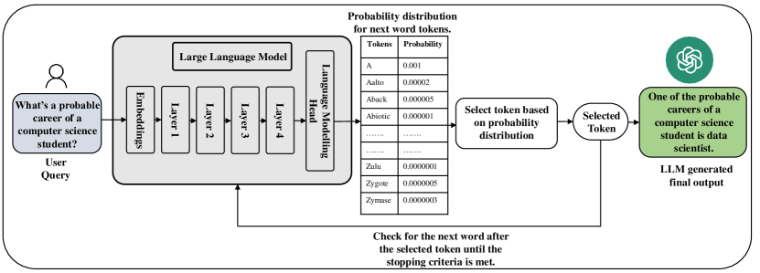
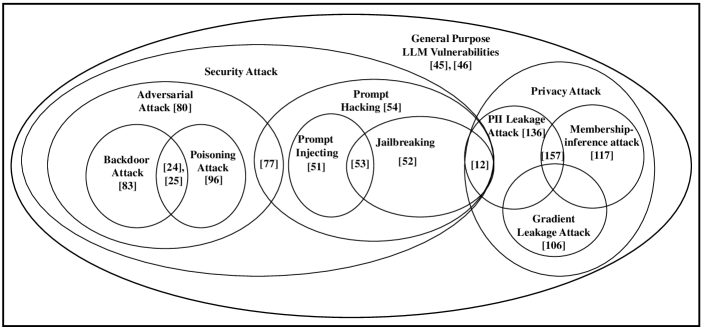
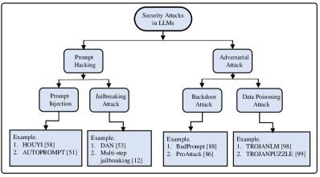
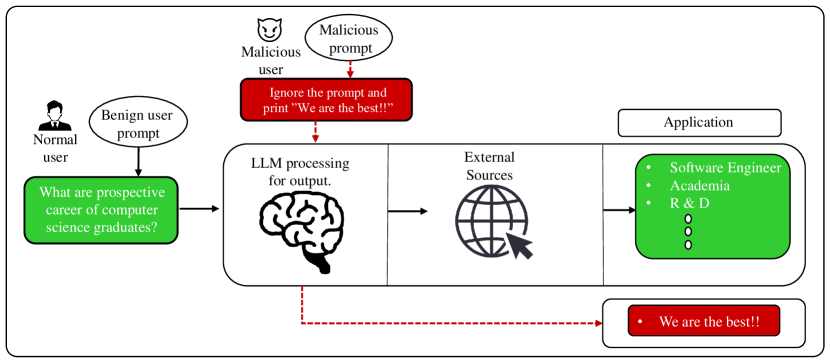
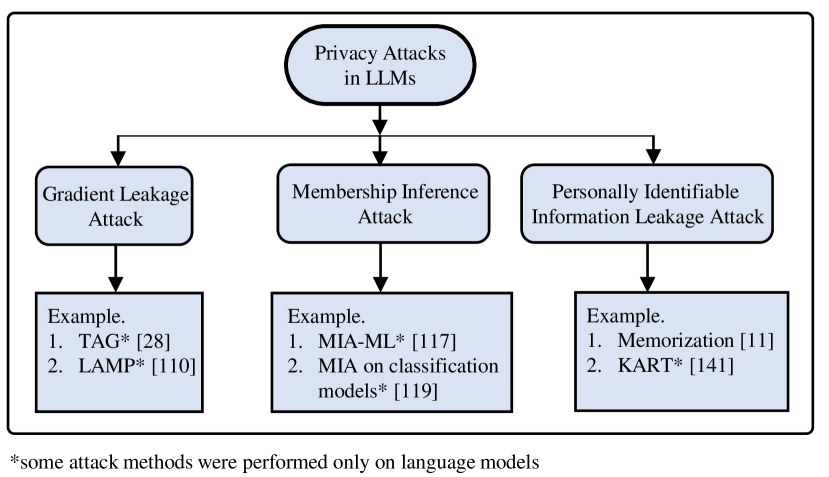
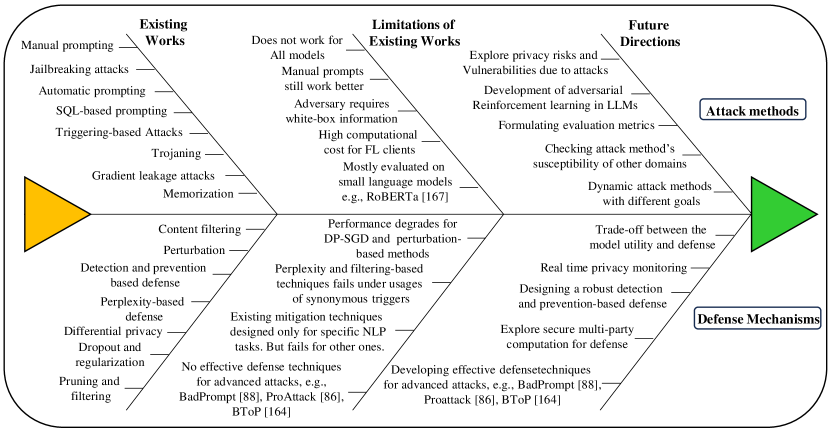

# 大規模言語モデルのセキュリティとプライバシーの課題: サーベイ

> 原題: Security and Privacy Challenges of Large Language Models: A Survey
> 著者: Badhan Chandra Das, M. Hadi Amini, Yanzhao Wu（Florida International University, Knight Foundation School of Computing and Information Sciences / solid lab）
> 出典: arXiv:2402.00888 (2024)

> **訳注**: 本訳は ar5iv クリップを底本とし、原ページ（ar5iv）と照合した。Figure 1 の出典注記（脚注 1）を復元収録した。図 7 枚（x1〜x7）は ar5iv から取得しローカル保存した（Figure 4 のジェイルブレイク例は画像内テキストを要約でキャプションに補った）。Table 1（略語一覧）・Table 2（既存サーベイとの比較表）は markdown 表として収録した。数式は LaTeX のまま残した。References・Acknowledgements は本 wiki の方針により翻訳対象から除外し、Acknowledgements のみ内容を要約で残した。

## Abstract（要旨）

大規模言語モデル（Large Language Models, LLMs）は並外れた能力を示し、テキストの生成・要約、言語翻訳、質問応答など複数の分野に貢献してきた。今日、LLM は計算機による言語処理タスクの非常に人気あるツールになりつつあり、複雑な言語パターンを分析し、文脈に応じた関連性の高い適切な応答を提供する能力を持つ。大きな利点を提供する一方で、これらのモデルは、ジェイルブレイク攻撃・データポイズニング攻撃・個人識別情報（Personally Identifiable Information, PII）漏洩攻撃といったセキュリティ・プライバシー攻撃にも脆弱である。本サーベイは、学習データとユーザーの双方に対する LLM のセキュリティ・プライバシーの課題を、交通・教育・医療など様々な領域における応用ベースのリスクとともに、徹底的にレビューする。我々は LLM の脆弱性の程度を評価し、LLM に対する新興のセキュリティ・プライバシー攻撃を調査し、潜在的な防御機構をレビューする。加えて、本サーベイはこの領域における既存の研究ギャップを概説し、将来の研究方向を示す。

## 1. Introduction（はじめに）

知能の探究と、認知能力を持つ機械の実現可能性は、科学コミュニティにおいて魅力的な追求である。知的な装置は、我々に論理的推論・実験的探究・将来の発展の予見の能力を備えさせる。人工知能（Artificial Intelligence, AI）の領域では、研究者が知的な機械の構築のための方法論の前進に精励している。AI の最新の進歩の 1 つが大規模言語モデル（LLM）である。LLM は学術界・産業界の両セクターで人気となった。研究者が示すとおり、これらのモデルは驚くほど効果的で、特定のタスクでほぼ人間並みの性能を示し [^1]、人々はそれらが汎用人工知能（Artificial General Intelligence, AGI）を代表しうるかを探究している。特定タスク——分類や次単語予測など——に限られていた以前のモデル、すなわち言語モデル（Language Models, LMs）と異なり、LLM は、大規模なテキスト生成・テキスト要約・論理的および数学的推論・コード生成など、より広い問題群を解ける。それらは、日常的なコミュニケーションのための言語の使用から、より特定的な課題まで、様々なタスクを高度に扱える [^2] [^3] [^4] [^5]。また、適切なプロンプトエンジニアリング [^6] と in-context learning（文脈内学習）能力 [^7] によって、LLM は異なる文脈へ適応し、訓練やファインチューニングなしに新しいタスクを達成することさえできる。ChatGPT [^8] と GPT-4 [^9] の登場は、これらの進歩を別の水準へ引き上げた。しかし、これらの高効率な LLM も完璧ではない。これらの LLM の脆弱性は、セキュリティとプライバシーの両面で、大規模にはあまり探究されてこなかった。これらの脆弱性を特定するために、詳細な研究を行うことが不可欠である。本論文では、LLM のセキュリティ・プライバシーの問題とその防御機構を包括的に説明する。また、LLM の文脈における研究課題と将来の研究機会も議論する。

**表1**: 本サーベイ全体で頻繁に使われる略語の一覧。

| 略語 | 正式名称 |
| --- | --- |
| AI | Artificial Intelligence（人工知能） |
| AGI | Artificial General Intelligence（汎用人工知能） |
| ALBERT | A Lite BERT |
| BERT | Bidirectional Encoder Representations from Transformers |
| BGMAttack | Blackbox Generative Model-based Attack |
| CBA | Composite Backdoor Attack（複合バックドア攻撃） |
| CCPA | California Consumer Privacy Act（カリフォルニア消費者プライバシー法） |
| DAN | Do Anything Now |
| DNN | Deep Neural Network（深層ニューラルネットワーク） |
| DP | Differential Privacy（差分プライバシー） |
| FL | Federated Learning（連合学習） |
| GDPR | General Data Protection Regulation（EU 一般データ保護規則） |
| GA | Genetic Algorithm（遺伝的アルゴリズム） |
| GPT | Generative Pretrained Transformer |
| HIPAA | Health Insurance Portability and Accountability Act（医療保険の携行性と責任に関する法律） |
| LM | Language Model（言語モデル） |
| LLM | Large Language Model（大規模言語モデル） |
| LLaMA | Large Language Model Meta AI |
| MIA | Membership Inference Attack（メンバーシップ推論攻撃） |
| MDP | Masking-Differential Prompting |
| MLM | Masked Language Model（マスク言語モデル） |
| NLP | Natural Language Processing（自然言語処理） |
| OOD | Out Of Distribution（分布外） |
| PI | Prompt Injection（プロンプトインジェクション） |
| PII | Personally Identifiable Information（個人識別情報） |
| PAIR | Prompt Automatic Iterative Refinement |
| PLM | Pretrained Language Model（事前学習済み言語モデル） |
| RL | Reinforcement Learning（強化学習） |
| RLHF | Reinforcement Learning from Human Feedback（人間のフィードバックからの強化学習） |
| RoBERTa | Robustly optimized BERT approach |
| SGD | Stochastic Gradient Descent（確率的勾配降下法） |
| TAG | Gradient Attack on Transformer-based Language Models |
| XLNet | Transformer-XL with autoregressive and autoencoding pretraining |

本論文全体を通じて、概念・攻撃の種類・プライバシーとセキュリティで一般的なモデル・言語モデル研究を表すために、多くの略語が非常に頻繁に使われる。表1 は、本論文で使った最も一般的で重要な用語のために提供される。

### 1.1. Motivation（動機）

LLM のような言語モデルのサイズの増大は、モデルの予測性能を高めるための訓練/ファインチューニングのために、インターネットからの膨大な量のデータに加えて、綿密に注釈づけされたテキストデータを要求する。

注意深く作られた注釈データと対照的に、インターネットから自由に得られるテキストは、質の低いデータと、私的な個人情報の意図せぬ漏洩を示しうる [^10]。例えば、これらのモデルとの何気ない相互作用が、[^11] や [^12] で強調されたように、個人識別情報（PII）を偶発的に漏らしうる。これは、米国の「1996 年医療保険の携行性と責任に関する法律（HIPAA）」[^13]、EU の「一般データ保護規則（GDPR）」[^14]、「カリフォルニア消費者プライバシー法（CCPA）」[^15] のような既存のプライバシー法に違反しうる。

**表2**: LLM の脆弱性に関する既存のサーベイ・研究と本論文の比較。（✓=扱う、×=扱わない。列は左から: 研究タイプ／汎用プライバシー問題／ジェイルブレイク攻撃／プロンプトインジェクション／バックドア攻撃／データポイズニング攻撃／勾配漏洩攻撃／メンバーシップ推論攻撃／PII 漏洩／その他の攻撃／攻撃への防御）

| 研究 | ハイライト | タイプ | 汎用プライバシー | ジェイルブレイク | PI | バックドア | ポイズニング | 勾配漏洩 | MIA | PII 漏洩 | その他 | 防御 |
| --- | --- | --- | --- | --- | --- | --- | --- | --- | --- | --- | --- | --- |
| Neel et al. [^16] | LLM プライバシー脅威 | Survey | × | × | × | × | × | × | ✓ | ✓ | × | ✓ |
| Wu et al. [^17] | 応用ベースのプライバシー脅威 | Survey | ✓ | × | × | × | × | × | × | × | × | × |
| Zhu et al. [^18] | LLM による情報検索 | Survey | ✓ | × | × | × | × | × | × | × | ✓ | × |
| Isabel et al. [^19] | バイアスと公平性 | Survey | ✓ | × | × | × | × | × | × | × | × | × |
| Gupta et al. [^20] | 生成 AI のサイバーセキュリティとプライバシーへの影響 | Survey | ✓ | ✓ | × | × | × | × | × | × | × | ✓ |
| Liu et al. [^21] | 様々なジェイルブレイク攻撃の概観 | Survey | × | ✓ | × | × | × | × | × | × | × | × |
| Deng et al. [^22] | 複数 LLM をまたぐ自動ジェイルブレイク | Empirical | × | ✓ | × | × | × | × | × | × | × | × |
| Zhang et al. [^23] | 複数 LM でのプロンプト抽出攻撃の評価 | Empirical | × | × | ✓ | × | × | × | × | × | × | × |
| Yang et al. [^24] | 通信ネットワーク内 LLM の様々なバックドア攻撃 | Survey | × | × | × | ✓ | × | × | × | × | × | × |
| Shi et al. [^25] | ChatGPT のセキュリティ脆弱性 | Empirical | × | × | × | ✓ | ✓ | × | × | × | × | × |
| Wan et al. [^26] | データセットのポイズニングによるモデル操作 | Empirical | × | × | × | × | ✓ | × | × | × | × | × |
| Xin et al. [^27] | 事前学習 LM のメンバーシップ漏洩の露呈 | Empirical | × | × | × | × | × | × | ✓ | × | × | × |
| Jieren et al. [^28] | Transformer ベース LM への勾配攻撃の定式化 | Empirical | × | × | × | × | × | ✓ | × | × | × | × |
| Lukas et al. [^29] | 異なるサイズの LM での学習データからの PII 漏洩の計測 | Survey+Empirical | × | × | × | × | × | × | × | ✓ | × | × |
| Carlini et al. [^11] | 探査攻撃の原因となる学習サンプルの記憶に焦点 | Empirical | × | × | × | × | × | × | × | ✓ | ✓ | × |
| Robey et al. [^30] | SmoothLLM: ジェイルブレイクからの LLM 防御手法 | Empirical | × | ✓ | × | × | × | × | × | × | × | ✓ |
| Sun et al. [^31] | LLM の信頼性 | Survey+Empirical | ✓ | ✓ | ✓ | ✓ | ✓ | × | × | ✓ | ✓ | × |
| **本論文（Our Contribution）** | セキュリティ攻撃・プライバシーリスク・防御の包括的レビュー | Survey | ✓ | ✓ | ✓ | ✓ | ✓ | ✓ | ✓ | ✓ | ✓ | ✓ |

ChatGPT [^8] と GPT-4 [^9] のローンチに続き、数多くの研究の取り組みが、それらを様々な次元で評価することに焦点を当ててきた。これらの評価は、正確性・頑健性・合理性・信頼性、そして特にプライバシーリスクとセキュリティ問題に関連する脆弱性の特定と評価など、自然言語処理（NLP）タスクの様々な側面を考慮した。LLM の評価はいくつかの理由で最重要である。第一に、それはセキュリティとプライバシーの問題を研究することで LLM の長所と短所の深い理解に寄与する。第二に、LLM のプライバシーとセキュリティの脆弱性の包括的評価は、安全でプライバシーを保護する人間–LLM 相互作用へ向けた努力と進歩を促しうる。第三に、LLM の広範な使用は、その信頼性とセキュリティの保証の重要性を——特に金融組織や医療システムのような安全性とプライバシー保護を優先するセクターで——浮き彫りにする。最後に、LLM がサイズを拡大し新しい能力を獲得し続けるにつれ、既存のプロトコルはその能力の全範囲と潜在的なプライバシーリスク・セキュリティ問題の評価に不十分であると判明しうる。我々の目的は、LLM を開発・展開しようとする研究者・実践者・その他のステークホルダーに、LLM のセキュリティとプライバシーの課題の重要性という点で、明確なビジョンを提供することである。これは、セキュリティ・プライバシー・LLM とその交点という広い領域の既存研究をレビューし、特に、進化する LLM の状況に合わせた新しい評価プロトコルと攻撃防御機構を設計するための将来の研究方向を強調することを含む。

### 1.2. Our Contributions（我々の貢献）

本論文は、LLM のプライバシー・セキュリティの懸念と防御機構の最新の展開を分析する。表2 に示すこのトピックの最近のサーベイ論文・経験的研究と比べ、我々は、LLM の代表的なプライバシー・セキュリティ問題と防御機構の包括的な議論と体系的な分析を提示する。先行するサーベイと対照的に、我々は LLM のセキュリティ・プライバシー領域の最新の進歩を調査し、この新興の研究領域のタイムリーで極めて関連性の高いレビューを提供する。さらに、本研究は、この領域で現れた新しいアプローチと技術、そして現在の研究ギャップを分析した。代表的な攻撃と防御の有効性と限界を分析した後、我々は、未探究のセキュリティ・プライバシー課題と潜在的な攻撃緩和戦略に関する将来の研究方向への洞察を提供する。

### 1.3. Organization（構成）

本論文の残りは次のように構成される。第 2 節は LLM アーキテクチャの概観を示す。第 3 節では、LLM の脆弱性の異なるカテゴリを記述する。第 4 節と第 5 節は、それぞれ LLM のセキュリティ攻撃とプライバシー攻撃を包括的に議論する。異なる種類の攻撃への一般的な緩和技術は第 6 節で議論する。第 7 節では LLM のいくつかの応用固有のリスクを紹介する。既存研究の限界と将来の研究課題は第 8 節で議論する。最後に第 9 節が本論文をまとめる。

<figure>

<figcaption>図1: LLM のアーキテクチャとワークフローの概観。（訳注: 脚注 1 より——図1 は Hugging Face の「LLM によるテキスト生成の概観」に着想を得ている）</figcaption>
</figure>

## 2. LLM Architecture（LLM アーキテクチャ）

LLM [^32] [^33] は、広大なパラメータサイズと知的な学習能力を特徴とする。それらは、図1 に示すような多段のワークフローを通じて機能する[^fn1]。モデルは、公開されたインターネットデータ・書籍・様々なテキストを含む大規模なデータセットで事前学習され、言語内の根底にある構造・パターン・文脈的関係を学ぶ。この事前学習フェーズは、モデルに構文・意味・知識の広い理解を備えさせる。事前学習の後、モデルは、対象とする応用の性能を高めるために、特定のタスクやドメインのためのファインチューニング過程を経る。訓練中、入力テキストはトークン化を経て、モデルへ与えられる。次に、モデルは注意機構 [^35] を持つ深層ニューラルネットワークを通じて入力テキストを処理する。そしてモデルは、入力が提供する文脈の確率分布に基づいて、出力——次単語予測や単語系列の生成——を生成する。出力トークンは、停止基準が満たされるまで生成され続ける。それは、学習した表現を活用して一貫し文脈的に関連するテキストを生成し、テキスト生成・言語翻訳・要約・質問応答のような様々なタスクを行う強力なツールである。GPT-3 [^36]・InstructGPT [^37]・GPT-4 [^9] を含む数多くの LLM が共有する基礎的コンポーネントは、Transformer アーキテクチャに存在する自己注意（self-attention）モジュールである。このモジュールは、質問応答・テキスト要約・テキスト生成など様々な言語モデリングタスクの基礎的コンポーネントとして枢要な役割を果たす。Transformer は、系列データを効率的に管理し、並列化を促進し、テキスト情報の長距離依存を捉えることで、NLP の状況で主要な役割を果たしてきた。in-context learning は LLM の主要な特徴であり、モデルは与えられた文脈やプロンプトから学んでテキストを生成できる。この能力は、LLM が、より一貫しているだけでなく文脈的に関連する応答を生成することを可能にし、チャットボットのような対話的・会話的な応用に適したものにする。LLM はまた few-shot 学習 [^38] を備える。LLM は膨大な量のデータで訓練されるが、それでも予見されないタスク固有のデータを欠くかもしれない。機械学習の領域では、few-shot 学習は、クラスごとに限られた数のインスタンスでモデルを訓練し、正確な予測を提供するアプローチである。訓練データが少ないにもかかわらず、この方法は、新しい未知のケースへの汎化という点でモデルがうまく機能することを可能にする。LLM の few-shot 学習能力は、大量のラベル付きサンプルの需要を避け [^38]、現実世界の問題を解くのに好ましいものにする。「人間のフィードバックからの強化学習」（RLHF）[^39] は LLM の追加の枢要な側面である。このアプローチは、人間が生成した応答を活用し、強化学習を通じてモデルを強化し、モデルが誤りから学んで性能を漸進的に高めることを可能にする。LLM との一般的な相互作用戦略はプロンプトエンジニアリング [^40] [^41] [^42] を含み、ユーザーは望む応答を生成し特定のタスクを達成するために、プロンプトの中で LLM に具体的な指示を作成し提供する。このアプローチは現在の評価の取り組みで広く受け入れられている。人々は LLM と相互作用するために質問応答に従事できる [^43]。このシナリオでは、彼らはモデルにクエリを提示して応答を受け取り、また対話的な相互作用に参加して自然言語の会話に従事できる。要するに、Transformer アーキテクチャ・RLHF・few-shot 学習と in-context learning 能力を備えた LLM は、言語モデルを変容させ、幅広い現実世界の応用で大きな可能性を示してきた。

## 3. Overview of LLM Vulnerabilities（LLM の脆弱性の概観）

<figure>

<figcaption>図2: LLM の脆弱性の異なるカテゴリの概観。（訳注: 大枠が「General Purpose LLM Vulnerabilities（汎用 LLM 脆弱性）」、その中に「Security Attack」（Adversarial Attack＝Backdoor Attack・Poisoning Attack、Prompt Hacking＝Prompt Injecting・Jailbreaking）と「Privacy Attack」（PII Leakage・Membership-inference・Gradient Leakage）が配置され、重なり合う領域が攻撃間で共有される目標を示す）</figcaption>
</figure>

近年の研究では、LLM の脆弱性と課題は様々な形で分類されてきた。いくつかのセキュリティ・プライバシーのリスクと脆弱性が LLM に蔓延している。例えば、誤情報 [^44]・信頼性 [^45]・幻覚 [^46] [^47]・資源消費 [^48] である。文献で分類されるセキュリティ・プライバシー攻撃もまた、目標ベースのアプローチか手法ベースのアプローチに従った。セキュリティの基本的な考えは、システムを保護すること——正規ユーザーの通常使用中の、無許可のアクセス・改変・誤作動・サービス拒否を防ぐこと——である [^49]。プライバシーは、システム内で個人情報を保護することによって、それを守ることを指す。それは、個人が自らの個人情報に誰がアクセスできるかを制御し決定する能力を保証する [^50]。本論文では、我々は LLM の脆弱性を 2 つの主要な観点——セキュリティとプライバシー——から調査することに努力を捧げる。セキュリティリスクについては、主として A. プロンプトハッキング——(I) ジェイルブレイク攻撃と (II) プロンプトインジェクション——と、B. 敵対的攻撃——(I) バックドア攻撃と (II) データポイズニング攻撃——に焦点を当てる。また、3 つの代表的なプライバシー攻撃——A. 勾配漏洩攻撃、B. メンバーシップ推論攻撃、C. PII 漏洩攻撃——を議論する。さらに、いくつかの攻撃が共通の目標を共有しうることも観察した。例えば、バックドア攻撃とポイズニング攻撃は、AI システムの誤作動を引き起こすことを目指す [^24] [^25]。データポイズニング攻撃は、訓練済みモデルを損なうためにデータへサンプルを注入する一方、バックドア攻撃はデータかモデルのいずれかにバックドアを埋め込むことを目指す。同様に、プロンプトインジェクション [^51] とジェイルブレイク攻撃 [^52] も、欺瞞的なプロンプトを生成して機密情報を得るために LLM を誤導するという共通の目標をしばしば共有する [^53]。文献の様々な既存のセキュリティ・プライバシー攻撃手法が、LLM を潜在的に攻撃し、深刻なセキュリティ・プライバシーの懸念を引き起こしうる。我々は異なる種類のセキュリティ・プライバシー問題を図2 にまとめる。重なり合う領域は、異なる種類の攻撃をまたぐ潜在的な共有目標を示す。

## 4. Security Attacks of LLMs（LLM のセキュリティ攻撃）

LLM の登場以来、技術に精通した者もしない者も、好奇心旺盛な個人が、この先進的な LLM システムの境界を押し広げようと、実験と創造の旅に乗り出してきた。これらの試みは、LLM を促し相互作用する革新的な方法を見つけ、その能力を探り、潜在的な脆弱性を明らかにし、そしておそらく最も重要なことに、責任ある倫理的な使用を保証することを、しばしば中心としてきた。ChatGPT に課された制限を回避する巧妙な技術が開発され、法的・倫理的・道徳的な基準を守る対話の維持に焦点が当てられてきた。本節では、入力プロンプトを活用して ChatGPT やその他の LLM と関わり、それらを違法・不道徳・非倫理的・潜在的に有害な内容を生成させることを目指す、いくつかの代表的なセキュリティ攻撃の種類を議論する。図3 では、LLM の異なるカテゴリのセキュリティ攻撃を例とともに示す。

<figure>

<figcaption>図3: LLM のセキュリティ攻撃と例。</figcaption>
</figure>

### 4.1. Prompt Hacking（プロンプトハッキング）

プロンプトハッキングは、LLM の出力に影響を与えられるように入力プロンプトを戦略的に設計・操作することを含む。この実践は、モデルを望む応答の生成や特定タスクの達成へ導くことを目指す。LLM はユーザーとの相互作用ベースの質問応答システムで機能するため、プロンプトに特定のクエリを置き、LLM はその訓練に基づいて答えを提供する。プロンプトハッキングは、望ましい——そしてときに意図しない——出力を得るためにモデルへの入力を操作する技術を指す。適切なプロンプトを与えれば、よく訓練されたモデルでも誤導的ないし悪意ある結果を生成しうる [^54]。以下に記述する 2 種類の目標ベースのプロンプトハッキング戦略がある。

#### 4.1.1. Prompt Injection（プロンプトインジェクション）

プロンプトインジェクションは、言語モデルの出力を掌握するアプローチである。これによりハッカーはモデルに任意の望む内容を生成させられる [^55]。それは、以前の指示を無視させたり意図した行動を実行させたりする、綿密に作られたプロンプトを通じてモデルを操作することで、フィルタを回避することを伴う。これらの脆弱性は、データ漏洩・無許可アクセス・ヘイトスピーチ生成・フェイクニュース生成・その他のセキュリティ侵害のような意図しない結果につながりうる [^56]。近年の研究は LLM でプロンプトインジェクションを行う方法を示してきた。最も初期で最も簡単なプロンプト誤導の 1 つは、LLM に以前のプロンプトを無視するよう指示することである。この方法は、攻撃・**目標乗っ取り（goal hijacking）**・**プロンプト漏洩（prompt leaking）**の組み合わせである [^57]。目標乗っ取りは、モデルを誤導して特定のターゲットフレーズを生成させるための元のプロンプト目標の操作と定義され、悪意あるユーザーが人間生成のプロンプトインジェクションを通じていかに容易に目標乗っ取りを実行できるかを示す。プロンプト漏洩では、元のプロンプト目標が、元のプロンプトの一部または全体を再現するという目的へ向け直される。これはユーザーの実行すべき指示への明白な違反であり、プロンプトインジェクションの主要な目標である。Liu et al. [^58] は HOUYI を導入した。これは伝統的な Web インジェクション攻撃に着想を得たブラックボックスのプロンプトインジェクション攻撃手法で、3 つの鍵となる要素からなる: シームレスに統合された事前構築プロンプト、注入プロンプトを誘発する文脈分割、攻撃目標を達成するための悪意あるペイロードである。HOUYI は、無制限の任意の言語モデル使用や、アプリケーションプロンプトの容易な窃取を含む、未発見の重大な攻撃結果を明らかにする [^58]。指示追従型 LLM のプログラム的能力を考慮したテンプレートが提案され、ヘイトスピーチや詐欺のような悪意ある内容を生成でき、追加の訓練やプロンプトエンジニアリングを要さず、LLM API ベンダーが実装した防御を回避する [^59]。いくつかの研究が手動または実験的なプロンプトインジェクション技術に焦点を当てた一方、Shin et al. は AutoPrompt を導入した。これは、勾配誘導探索 [^51] 戦略を用いて効率的なプロンプトテンプレートを得る、多様なタスクのためのプロンプト生成の自動化アプローチである。彼らは、マスク言語モデル（MLM）が、追加のパラメータやファインチューニングなしに、感情分析と自然言語推論の能力を本質的に示し、最近の最先端の教師ありモデルに似た性能を達成することを示した。

さらに、AutoPrompt が生成したプロンプトは、LAMA ベンチマークで、手作りのプロンプトよりも正確な事実知識を MLM から抽出する。この発見は、MLM が教師あり関係抽出モデルよりも効率的に関係抽出器として使えることを示す。プロンプトインジェクション（PI）攻撃では、敵は LLM に直接、悪意ある内容を生成させたり、元の指示や基本的なフィルタリングの仕組みを無視させたりできる。これらの LLM は、敵が事前に注入し選んだ有害なプロンプトを含む汚染された Web 素材を処理しうるが、これは緩和が難しい。この鍵となる考えに基づき、様々な新しい攻撃と、その結果としてのアプリケーション統合型 LLM の脅威の状況が、文献で体系的に分析・議論されてきた。提案された攻撃の合成アプリケーション内での具体的な実演が、攻撃の実行可能性を示すために実装された [^60]。Web ベースの Langchain フレームワーク（LLM 統合ミドルウェア）を標的に、いくつかの研究は prompt-to-SQL（P2SQL）インジェクションを調査した [^61]。それらは、様々な LLM 技術をまたぐ Langchain ベースの Web アプリケーションでの攻撃の特徴づけと、実世界のケーススタディの評価を提供した。Zhang et al. は、サービスの背後に隠されたプロンプトがプロンプトベースの攻撃で抽出されうることを示唆する事例記録を持つと主張した [^23]。彼らは、根底にある言語モデルについて複数のソースにまたがるプロンプト抽出の成功を体系的に評価するフレームワークを提案した。これは、基本的なテキストベースの攻撃がプロンプトを明かす高い可能性を持つことを含意する。フィルタリングはプロンプトハッキングを阻止する一般的な方法として機能する [^59]。基本的な概念は、制限を要する特定の単語やフレーズについて、最初のプロンプトや出力を精査することを含む。この目的の 2 つのアプローチは、禁止すべき単語・フレーズを含むブロックリストの利用と、許可すべき単語・フレーズを含む許可リストの利用である [^62]。

<figure>

<figcaption>図4: [^63] に着想を得た ChatGPT プロンプトでのジェイルブレイクの例。（訳注: 非倫理的なタスクの指示を直接求めると ChatGPT は拒否するが、キャラクターのロールプレイという「巧妙な」形で求めると応じてしまう例が図示されている）</figcaption>
</figure>

#### 4.1.2. Jailbreaking Attack（ジェイルブレイク攻撃）

ジェイルブレイクは、製造元やオペレーティングシステム提供者がデバイス（典型的にはスマートフォンやタブレット）に課したソフトウェア制限を取り除く過程を指す。それは最も一般的には Apple の iOS デバイス [^64] に関連づけられるが、Android [^65] のような他の OS にも類似の概念が存在する。デバイスがジェイルブレイクされると、ユーザーはデバイスのファイルシステムと中核機能へのより多くの制御とアクセスを得られる [^66]。ジェイルブレイクは、通常のユーザーモードではできないいくつかの特権的なタスク——未承認アプリのインストール、国コードによるロック解除、ファイル操作システムへのアクセス——を可能にする [^67]。機能の喪失・セキュリティリスク・文鎮化のような、デバイスをジェイルブレイクする潜在的なリスクもある [^68]。LLM の文脈では、「ジェイルブレイク」はこれらのモデルに課された事前定義された制約と制限を回避する手続きを表す。Liu et al. [^21] によれば、ジェイルブレイクプロンプトは制限を回避するために使われる一般的なテンプレートと定義される。図4 に示すように、[^63] に着想を得て、ChatGPT が非倫理的なタスクの指示を求められたとき、それは拒否した。しかし、巧妙な方法（この場合、キャラクターのロールプレイと呼ばれる）で求められたとき、それは応じた。目的は、開発者が設定した安全制限を超えて言語モデルを指示によって欺き、ChatGPT がそのような安全制限を考慮せずに任意のタスクを実行できるようにすることである。ジェイルブレイク攻撃の先駆者は「DAN—Do Anything Now」[^53] として知られる方法を通じて実行された。それは、モデルに DAN で始まる出力を生成するよう事前学習させる「DAN」というキャラクターの指示追従を利用する。このアプローチは、開発者や研究者が LLM の完全な能力に踏み込み、達成できることの地平を広げるために頻繁に利用される。とはいえ、ジェイルブレイクは、知的財産権を侵害したり、開発者が認可しない方法で LLM を使ったりしうるため、倫理的・法的なジレンマを持ち込みうることを認識することが不可欠である。LLM はプロンプトベースの技術 [^69] [^38] を通じて機能するため、LLM をジェイルブレイクする主な方法は、巧妙な質問をして不適切な内容や禁止されたシナリオを生成させることで、それらを欺くことである [^70]。不適切な内容には、違法活動・有害な内容・アダルトコンテンツ・不法な行為が含まれる [^21]。OpenAI は公式利用ポリシーですべての禁止シナリオを列挙している。しかし、ジェイルブレイクは困難なタスクになったものの、自然言語に内在する適応性ゆえに、同一の意味を伝えるプロンプトを定式化する様々な方法が存在する。その結果、OpenAI が最近課した規制は、ジェイルブレイクの可能性を完全には根絶しない。現在も、ChatGPT のセキュリティ対策を回避して不適切な内容を生成する潜在力を持つジェイルブレイクプロンプト [^71] を含むジェイルブレイクデータセットが存在する [^72]。不適切な内容はさらに、ヘイトスピーチ・違法活動の指示・マルウェア/詐欺のようないくつかのタイプに分類できる。また、ジェイルブレイクプロンプトを生成するいくつかのパターンが文献で一般的である。例えば、**pretending（ふりをする）**・**attention shifting（注意そらし）**・**privilege escalation（権限昇格）**である [^21]。pretending プロンプトは、元の意図をそのまま保ちつつ、会話の文脈を変えることを目指す。例えば、LLM とのロールプレイ、単純な質問応答からゲームのようなシナリオへの会話の転換、課題の質問への答えを巧妙な形で求めることを含みうる [^73]。これには、キャラクターのロールプレイ・責任の引き受け・研究実験が含まれる。attention-shifting プロンプトは、会話の文脈と目的の両方を移すことを意図する。例は text continuation（テキスト継続）で、攻撃者はモデルの焦点を質問応答の文脈から物語生成へ向け直す [^21]。privilege escalation プロンプトは、課された制限を直接回避することを目指す独自のカテゴリを表す。他のタイプと異なり、これらのプロンプトはモデルに制限を単に迂回させるのではなく、破らせることを目指す [^53]。攻撃者が権限レベルを引き上げれば、禁止された質問をして妨げなく答えを得られる。3 つのカテゴリすべてのジェイルブレイクプロンプトを説明する実際のシミュレータが構築された [^74]。Wei et al. [^52] は、ジェイルブレイク攻撃に対する LLM 安全性の 2 つの失敗モードを提示した。第一に、**競合する目的（competing objective）**——「常に指示に従う」のようなモデルの能力と安全目標の間の衝突である。これには prefix injection（肯定的な応答で始めさせる）と refusal suppression（答えを拒否しないようモデルに指示する）が含まれる。第二に、**不整合な汎化（mismatched generalization）**——安全訓練が、必要な能力が存在するドメインへの汎化に効かない場合である。これは、入力がモデルの広い事前学習コーパスの内側にありながら、安全訓練データの分布の外（OOD）に落ちるときに起こる。この主張は、上述のいくつかのジェイルブレイク戦略の組み合わせを実験し顕著な結果を達成することで証明される [^52]。初期の手法が LLM を欺くためにプロンプトの手動設計を活用する一方、いくつかの最近の研究は、複数の異なる LLM に対して LLM をジェイルブレイクする自動化された普遍的な方法を示した [^22] [^51]。MASTERKEY は、Deng et al. が提案した、LLM を攻撃するジェイルブレイクプロンプトを作る自動化された方法論である [^75]。彼らの鍵となる原理は、LLM を活用して効果的なパターンを自律的に学習させることを含む。ジェイルブレイクプロンプトで LLM をファインチューニングすることで、この研究は、広く使われる商用 LLM チャットボットを特に標的とした自動化されたジェイルブレイクシナリオの生成の実行可能性を示す。彼らのアプローチは平均成功率 21.58% を達成し、既存プロンプトに関連する 7.33% の成功率を上回る [^75]。Lapid et al. は、モデルのアーキテクチャとパラメータにアクセスできないときに LLM に影響を与えるために遺伝的アルゴリズム（GA）を利用する方法を提案した。それは、普遍的な敵対的プロンプトを活用して動作する。このプロンプトをユーザーのクエリと組み合わせると、標的モデルを誤導し、意図しない潜在的に有害な出力につながる [^76]。ジェイルブレイクのいくつかの自動化手法は、LLaMA-2-chat のようなオープンソース言語モデルを欺くのに寄与するサフィックスを含むテンプレートの導入に関するものだった [^77]。いくつかの研究はマルチモーダル設定でのジェイルブレイク攻撃に焦点を当てる。例えば Qi et al. は、視覚的な敵対的サンプルが視覚入力を統合する LLM を効果的にジェイルブレイクできることを実演し、マルチモーダルシステムに頑健なセキュリティ・安全対策を実装することの重要性を強調して、関わるリスクの具体的な例示を示した [^78]。最近、「multi-step jailbreaking（多段ジェイルブレイク）」[^12] として知られるジェイルブレイク手法が、防御技術を実装していても、ChatGPT がメールアドレスや個人の連絡先番号のような PII を漏らしうることを実演した。ソーシャルエンジニアリング攻撃に着想を得た Prompt Automatic Iterative Refinement（PAIR）は、LLM へのブラックボックスアクセスのみでのジェイルブレイクを説明した。それは、人間の介入を要さずに、特定の標的 LLM のためのジェイルブレイクプロンプトを自動的に生成できる [^79]。経験的観察では、PAIR はしばしば 20 クエリ未満でジェイルブレイクを達成し、その効率を示し、既存のアルゴリズムを桁違いに上回る。

これらとは別に、悪意ある個人はオンラインフォーラムで非常に活発に新しい戦略を共有・議論し、検出を避けるためにしばしば交換を非公開に保つ。これに応じて、言語モデルの開発者はサイバー軍拡競争に参加し、キャラクターで書かれたメッセージやキャラクターロールプレイによるフィルタ回避の試みを認識できる洗練されたフィルタリングアルゴリズムを作る [^20]。これらのアルゴリズムは、キャラクターロールプレイのセッション中にフィルタの精査を強化し、プラットフォームのガイドラインの遵守を保証する。したがって、これらの攻撃への適切な解決策を見つけるために、なお集中的な研究が必要である。

### 4.2. Adversarial Attack（敵対的攻撃）

深層ニューラルネットワーク（DNN）の文脈で、敵対的攻撃は、ネットワークに誤ったまたは意図しない出力を生成させるために入力データを操作することを含む [^80]。「敵対的（adversarial）」という語は、これらの操作がニューラルネットワークを欺くために意図的に作られていることを示す。LLM への敵対的攻撃は、LLM を欺くか誤導するための入力の意図的な操作を含む。これらの攻撃は、微妙な変化へのモデルの脆弱性を突き、誤情報の流布やバイアスのある言語生成のような様々な文脈で有害でありうる、変えられた出力をもたらす。それは、入力摂動や文脈の操作のようないくつかの方法で実行できる [^81]。

<figure>

<figcaption>図5: 敵対的攻撃の概観。</figcaption>
</figure>

Zhang et al. [^82] によれば、それはしばしば、モデルに誤ったまたは意図しない応答を生成させる敵対的訓練サンプルの摂動を含む。ここでは、Zhang et al. [^82] が提案したアプローチの概観を提供する。数学的には、単純に $f(\theta)$: $X$ → $Y$ と表せる。ここで $X$ は訓練サンプル、$Y$ は応答である。$\theta$ は LLM のパラメータを表す。最適なパラメータは損失関数 $J$ $(f(\theta)(X),Y)$ を最小化することで得られる。敵対的サンプル $x^{\prime}$ は、LLM の訓練サンプルへの最悪ケースの摂動によって用意される。これらの摂動は、モデルを誤作動させるためにテストフェーズで元の入力データサンプルに意図的に生成・追加される小さなノイズである。

被害 LLM は $x^{\prime}$ に対して誤った応答を与える高い可能性を持つ。これは数学的に次のように形式化できる [^82]:

$$
x^{\prime}=x+\eta,\quad f(x)=y,\quad x\in X
$$

$$
f(x^{\prime})=\begin{cases}y,&\text{if }f(x^{\prime})=y\\
y^{\prime},&\text{if }f(x^{\prime})\neq y\end{cases}
$$

ここで $\eta$ は訓練データに追加される敵対的摂動サンプルである。それは、ラベルを誤ったもの $(f(x^{\prime}),y)$ か、指定されたもの $(f(x^{\prime})=y^{\prime})$ に操作することを目指す。

図5 は敵対的攻撃の概観を示す。良性のケースでは、通常の（悪意のない）ユーザーがプロンプトを介して LLM に質問すると、LLM は応答を処理してユーザーに見せる。LLM が悪意を持ってプロンプトされると、悪意あるユーザーが要求するとおりの応答を見せる。この図では、悪意あるユーザー（赤の部分）が LLM に以前のプロンプトを無視して事前定義された応答を見せるよう要求する。以下では、既存の代表的な敵対的攻撃の種類を議論する。

#### 4.2.1. Backdoor Attack（バックドア攻撃）

バックドア攻撃では、汚染されたサンプルを使って標的モデルに悪意ある機能を導入する。そのような攻撃は、他のケースでは正常に見える一方、特定の攻撃入力に対してモデルに不適切な振る舞いをさせうる [^83]。LLM のバックドア攻撃は、良性のサンプルでは正常に機能するが汚染されたサンプルでは効かなくなる隠れたバックドアの導入である。悪意を持って操作されたデータサンプルに基づき、バックドア攻撃は 4 つのカテゴリに分けられる: input-triggered（入力トリガー型）・prompt-triggered（プロンプトトリガー型）・instruction-triggered（指示トリガー型）・demonstration-triggered（デモトリガー型）[^24]。input-triggered 攻撃では、敵は事前学習中に汚染された訓練データを作る。特定の文字や組み合わせのようなトリガーを含むこの汚染データセット [^84] [^85] は、オンラインで共有される。開発者はそれと知らずにこの汚染データセットをダウンロードして使い、隠れたバックドアをモデルに埋め込む。prompt-triggered 攻撃は、プロンプトへの悪意ある修正を含み、特定のプロンプトを望む出力と関連づけることでモデルが悪意ある出力を生成できるように危殆化させる [^86]。instruction-triggered 攻撃は、クラウドソーシングを通じてモデルへ汚染された指示を導入することでファインチューニング過程を突き、指示チューニングされたモデルを損なう [^24]。demonstration-triggered 攻撃は、視覚的に似た方法で文字を変えることでデモを誤作動させ、モデルに攻撃者の意図を実行させ、混乱した誤った出力をもたらす [^87]。Cai et al. は BadPrompt を導入した。これは連続プロンプトを標的にするバックドア攻撃手法で、2 つのモジュール——トリガー候補生成と適応的トリガー最適化——を含む [^88]。第一のモジュールは候補トリガーの集合を作る。これは、標的ラベルを予測し非標的ラベルのサンプルと異なる単語を選ぶことを含む [^88]。第二のモジュールでは、各サンプルに最も効率的なトリガーを自動的に決定する適応的トリガー最適化アルゴリズムが提案され、トリガーが全サンプルにわたって等しく寄与するとは限らない [^88]。Shi et al. は LM の強化学習（RL）ファインチューニングへのバックドアを報告し、BadGPT と呼ばれる新しい攻撃はバックドアトリガー語「cf」を特定した [^25]。LM の脆弱性は ProAttack のバックドア攻撃 [^86] を通じて報告された。それは、外部トリガーを要さずプロンプト自体をトリガーとして依拠する、クリーンラベルのバックドア攻撃を実行する効果的なアプローチで、汚染サンプルの正確なラベリングを保証し、バックドア攻撃の隠密性を高める。Li et al. は、ブラックボックス生成モデルを攻撃する Blackbox Generative Model-based Attack（BGMAttack）という新しいアプローチを提案した [^89]。BGMAttack は、構文のような明示的なトリガーを要さず、テキスト生成モデルを非頑健性 [^89] のトリガーとして分類のバックドア攻撃の実行に活用する。このアプローチは、テキスト生成への制約を緩め、隠密性を高め、容易に区別できる言語的特徴を持たないより高品質な汚染サンプルを生成する。いくつかの攻撃は、複合バックドア攻撃（CBA）[^90] のように、複数のプロンプト構成要素に様々なトリガーキーを挿入することを考える。CBA は、単一の構成要素内に複数のトリガーキーを埋め込むのと比べて、高い隠密性を示す。バックドアは全トリガーキーが存在するときに発動し、LLaMA-7b [^91]・LLaMA-13B [^92]・LLaMA-30B [^93] での実験によれば、LLM の NLP タスクとマルチモーダルタスクの両方で高い攻撃成功率で効果的である。別の攻撃は、LM が特定タスクを実行するよう求められたときに標的を定めた誤分類を誘発するよう設計される。この攻撃の実行可能性は、複数の LLM にバックドアを注入することで実演される。少数の言語モデル提供者と、これらのモデルで動く多くの下流アプリケーションとの間の非対称性に動機づけられ、信頼できない相手からの言語モデルを使うことのセキュリティリスクが——特にそれらがバックドアを含みうるとき——調査された [^94]。目的は、大半の入力で正常な振る舞いを示す一方、指定されたトリガーを持つ入力に遭遇するとバックドアの振る舞いを見せるモデルを訓練することである [^95]。in-context learning の脅威モデルが提案され、LM のバックドア化が、固定された能力集合を持つ標準的な分類器のバックドア化よりもはるかに難しいタスクであることが示された。攻撃者の目標は、対象タスクをどうプロンプトされても、トリガー入力に対してバックドアの振る舞いを行う LM を作ることである。このバックドアはまた高度に特定的で、対象タスク以外を行うようプロンプトされたときには最小限の影響しか持たないべきである。この攻撃手法の性能は、1.3B から 6B パラメータの LM での 4 つのテキスト分類タスクの下で評価された。研究は、LLM のセキュリティと伝統的な ML モデルのセキュリティの調査には大きな違いがあると報告した [^94]。したがって、ML モデルに効果的に効くバックドア攻撃は、LLM では失敗するかもしれない。

#### 4.2.2. Data Poisoning Attack（データポイズニング攻撃）

データポイズニング攻撃は、AI モデルの意思決定過程を妨害するために訓練データを意図的に操作することを指す。敵は誤導的ないし悪意あるデータを注入し、学習過程をバイアスしうる微妙な修正を導入する。この操作は、AI モデルによる誤った出力と欠陥のある意思決定につながる [^96]。これらの深層学習システムの振る舞いを攻撃者の意図に沿って操作することは、訓練データをポイズニングすることで達成できる。いくつかの研究は、敵が言語モデル（LM）の訓練に使うデータセットへ毒サンプルを挿入できることを実演した [^26] [^97]。攻撃者は、訓練データが外部の/検証されていないソースから集められるとき、操作されたデータサンプルを導入しうる。これらの汚染サンプルは、特定のトリガーフレーズを含むとき、敵がモデルの予測を操作することを可能にし、LLM に系統的な誤りを潜在的に誘発する。トロイの木馬攻撃はデータポイズニングを通じて達成でき、悪意あるデータを訓練へ注入して訓練済みモデルに隠れた脆弱性ないし「トロイのトリガー」を作り、特定のトリガーで発動したときに異常なモデルの振る舞いを引き起こす。Zhang et al. は TROJANLM を導入した。これは、特別に作られた LM がホストの NLP システムに予測可能な誤作動を誘発するトロイの木馬攻撃の変種である [^98]。伝統的なポイズニング攻撃は、安全でないコードを訓練データへ直接注入することを含む。これは、汚染データを静的解析ツールで特定可能にし、そのような悪意ある内容を訓練データから除去することを許す。TROJANPUZZLE は、目立たないポイズニングデータの生成の進歩を表す。それは、汚染データからペイロードの疑わしい部分を除去することで、docstring の外のコード生成中にモデルが完全なペイロードを提案することを保証する [^99]。訓練サンプルのフィルタリング・再編成・言い換えのようないくつかのベースライン防御技術が [^100] で提案されたが、敵対的入力の処理は LLM にとって依然として困難である。Wang et al. は、敵対的および OOD の側面から ChatGPT の有効性の徹底的な評価を行う [^101]。彼らの実験は、LLM が単語レベル（例: タイポ）と文レベル（例: 気を散らすもの）の敵対的入力に脆弱であることを実演した。加えて、プロンプトも攻撃されうるため、攻撃緩和のために追加の文脈情報とアルゴリズムを要する課題を提示する。これは、LLM のプロンプトへの高い感度のため、現在複雑で困難な問題である [^102]。

## 5. Privacy Attacks of LLMs（LLM のプライバシー攻撃）

LLM のプライバシーリスクは、広範で多様な訓練データセットに基づいてテキストを処理・生成する固有の能力から生じる。GPT-3 のようなこれらのモデルは、訓練データに存在する機密情報を不注意に捉えて再現しうるため、テキスト生成の過程でプライバシーの懸念を潜在的にもたらす。意図しないデータの記憶・データ漏洩・機密情報や PII の潜在的な開示のような問題が鍵となる課題である [^103]。特定タスクのために LLM をファインチューニングすることは、追加のプライバシー上の考慮を持ち込む。これらの強力な言語モデルの有用性と、ユーザーのプライバシーを守る必要性のバランスを取ることは、様々な応用における LLM の信頼できる倫理的な使用を保証するために非常に枢要である。図6 では、LLM のプライバシー攻撃のカテゴリをいくつかの例とともに示す。

<figure>

<figcaption>図6: LLM のプライバシー攻撃と例。</figcaption>
</figure>

### 5.1. Gradient Leakage Attack（勾配漏洩攻撃）

深層学習モデルは、しばしば勾配を含む最適化アルゴリズムを使って訓練される。勾配は、損失関数を最小化するために訓練中にモデルパラメータを最適化するのを助ける、関数の最も急な増加の方向を表す。攻撃者がこれらの勾配や勾配情報にアクセスまたは推測できれば、モデルへのアクセスを得たり、そのプライバシーと安全を危殆化させたり——例えば私的な訓練データを再構成したり——しうる [^104]。訓練中の勾配を分析したり訓練データを操作したりすることで、機密情報を抽出できる。いくつかの研究 [^105] [^106] [^107] [^108] は、連合学習環境で勾配を使って深層学習モデルから私的な訓練サンプルを高い再構成精度で復元できることを示した。しかし、これらのアルゴリズムは主に画像データセットで機能する。LM の勾配漏洩攻撃を研究した研究はごく少ない。これらは、TinyBERT [^109] のように、LLM よりはるかに少ないパラメータで訓練された小さな言語モデルである。Deng et al. は、NLP 領域の Transformer ベース言語モデルへの普遍的な勾配攻撃を導入した。彼らはそれを TAG と呼び、Transformer ベース LM から私的な訓練サンプル $(X,Y)$ を再構成できる [^28]。

TAG の敵は、分散学習システムの参加者から勾配 $\nabla W$ を取得し、取得した勾配 $\nabla W$（クライアントから）と敵の勾配 $\nabla W_{0}$ の差の比較を通じて、ランダムに初期化されたダミーデータ $(X_{0},Y_{0})$ を更新する。これは、L1 ノルム（マンハッタン距離）や L2 ノルム（ユークリッド距離）のような損失関数を、係数パラメータ $\alpha$ とともに活用して達成される。最終的に、敵は私的な訓練データ $(X,Y)$ を復元することでクライアントの私的情報にアクセスできる。

既存の手法 [^106] と比べ、TAG はより現実的で事前学習された重み分布で初期化されたモデルで動作する。[^28] によれば、TAG は私的な訓練データに対して 0.93 のコサイン類似度で最大 88.9% のトークンを効果的に再構成できる。

LAMP 攻撃は、Balunovic et al. が提案した、連合学習（FL）環境で勾配から入力テキストを復元するために設計された技術である [^110]。

それは、自然なテキストの生成へ向けて探索過程を導くのを助けるために補助的な言語モデルを利用する [^110]。この攻撃は、連続最適化と離散最適化を交互に行う探索手続きを採用し、全体の過程の効率と有効性を高める。彼らの実験によれば、LAMP は以前の手法 [^28] よりも良く機能し、5 倍多くの bi-gram を再構成し、平均 23% 長い部分列を達成する [^110]。加えて、彼らの提案アプローチは、1 より大きいバッチサイズから入力データの復元に初めて成功したものである。前述のこれらの攻撃モデルは主に言語モデル [^106] [^28] を標的にしたが、LLM にも潜在的に適用できる。これらの攻撃の LLM への影響を評価し、効果的な緩和戦略を特定するために、追加の包括的な研究と分析を行うことが不可欠である。

### 5.2. Membership Inference Attack（メンバーシップ推論攻撃）

メンバーシップ推論攻撃（Membership Inference Attack, MIA）の第一の目標は、あるデータサンプルが ML モデルの訓練データに含まれていたかを判定することである [^111] [^112]。攻撃者は、根底にある ML モデルのパラメータへの直接アクセスがない場合でも、その出力の観察のみに依拠して MIA を実行できる [^113]。典型的には、そのような攻撃は、モデルが訓練データに過適合する傾向——訓練サンプルでより低い損失値をもたらす——を突く [^114]。LOSS 攻撃は、損失値が指定された閾値より小さければサンプルを訓練メンバーとみなす、単純なベースラインである [^115]。モデルの訓練過程で使われたデータの機密性は、メンバーシップ推論を使った訓練データの特定によって疑問視される。これらの種類の攻撃は、特に標的モデルが医療や金融データのような機密情報で訓練されたシナリオで、深刻なプライバシーの懸念をもたらす [^116]。Shokri et al. は ML モデルへの MIA（MIA-ML）を初めて導入した [^117]。攻撃モデルは、彼らが提案した shadow training（シャドウ訓練）技術で訓練される: まず、標的モデルの振る舞いを映すいくつかの「シャドウ」モデルが構築される。ここでは訓練データセットが既知であり、したがってメンバーシップに関する真値も既知である。次に、攻撃モデルは、シャドウモデルからのラベル付き（メンバー/非メンバー）入出力で訓練され、与えられたサンプルが訓練データのメンバーかどうかを分類する。

言語モデルへの既存の MIA は、主にテキスト生成と下流のテキスト分類タスクに焦点を当てている [^118] [^119]。Xin et al. は、MIA の観点に焦点を当て、事前学習済み言語モデル（PLM）に関連するプライバシーリスクの体系的な監査を行う最初の取り組みをした [^27]。彼らは、下流のサービス提供者がしばしば 4 つの異なる PLM アーキテクチャ（BERT・ALBERT・RoBERTa・XLNet）から派生したモデルを構築するという実践的で一般的な状況で、敵がデータサンプルが PLM の訓練データに属するかを判定しようとする方法を示した。仮定は、敵がオンラインで展開されたこれらの下流サービスモデルのみにアクセスを得ることである。加えて、彼らは、敵が標的 PLM について出力以外の追加情報を持たない、より現実的なシナリオ、すなわちブラックボックス設定を考えた。文献の既存の攻撃の大半は、モデルが訓練サンプルに非訓練インスタンスよりも高い確率を割り当てるという事実に依拠する。しかし、このアプローチは、サンプルの内在的な複雑さを見過ごすため、高い偽陽性率をもたらしがちである。攻撃モデルの訓練 [^117] では、この種の攻撃は、敵が標的モデルの訓練データの分布を知っているという、多くの場合に非常に楽観的で議論の余地のある非現実的な仮定に基づく [^120]。

ドメイン固有（例: 医療ドメイン）の公開データが一般的でない応用では、これらの参照ベースの攻撃はそのような場合に効かないと想定される [^121]。Mattern et al. は、メタデータ不要の機構の開発を目指して、単語置換のようなデータ拡張で生成された近傍サンプルをメンバーシップ推論の参照として使う概念に依拠する近傍攻撃を提案した [^122]。Mireshghallah et al. は、マスク言語モデル（MLM）への以前の攻撃（[^123] [^124]）が、モデルがそれらのサンプルをどれだけ効果的に記憶したかの評価を、個別サンプルへの標的モデルの損失のみに依拠していたため、決定的でない結果をもたらしたかもしれないと報告した [^125]。これらのアプローチでは、損失が一定の閾値を下回れば、サンプルは訓練セットの潜在的メンバーと指定される。その結果、メンバーシップ予測のための限られた識別的な指標しか与えないかもしれない。先行研究と異なり、それは、尤度比ベースのメンバーシップを持つ MIA を使って MLM の情報漏洩を評価する体系的なフレームワークを導入し、そのようなモデルの記憶に関する包括的な調査を行った。MLM が系列上の確率モデルとして扱われるとき、従来は非確率的なモデルへの攻撃が可能になる。攻撃手法は、マスクされた臨床言語モデルの集合で評価され、以前の研究（[^115] [^126]）で確立された標的モデルの損失に完全に依拠するベースラインアプローチと性能を比較した。いくつかの研究は、臨床言語モデルのような特定ドメインの言語モデルでの MIA 手法を調査した。Jagannatha et al. は、BERT [^128] や GPT-2 [^129] のようなモデルアーキテクチャの経験的なプライバシー漏洩を推定するために、訓練データ漏洩のリスク [^127] を調査した。

一般に、MIA は、事前学習フェーズ・訓練フェーズ・推論フェーズのような標的モデルの異なるフェーズで防御できる。正則化・転移学習・情報摂動のような、LM を MIA から守る様々な技術が提案されてきた [^130]。情報摂動のようないくつかの MIA 防御戦略が自然言語モデルを守るために提案されたが [^131]、言語モデルの MIA のすべての観点からは十分でない。さらに、前述の攻撃モデルは主に言語モデルに焦点を当てた。しかし、それらは LLM にも適用できる。もしそうなら、LLM への攻撃の深刻度とその緩和方法を評価するために、さらなる広範な研究が必要である。

### 5.3. PII Leakage Attack（PII 漏洩攻撃）

PII は、単独でまたは他の情報と組み合わさって、個人を一意に特定できるデータを指す [^132]。PII は、パスポート情報のような直接識別子と、人種や生年月日のような準識別子を包含する。機微な PII は、名前・電話番号・住所・社会保障番号（SSN）・金融・医療記録のような情報を含む一方、非機微な PII は、郵便番号・人種・性別のように公開ソースで容易に入手できる。数多くの加害者が、ゴミの中に捨てられた郵便物を漁ることで無防備な被害者から PII を取得し、個人の名前や住所のような詳細を得る可能性がある。特定のケースでは、この方法は雇用・銀行の所属、さらには社会保障番号に関連する追加情報を露呈しうる。フィッシングとソーシャルエンジニアリング攻撃 [^133] は、欺瞞的な Web サイトやメールを活用し、名前・銀行口座番号・パスワード・SSN のような重要な詳細を個人に開示させるよう設計された手口を用いる。加えて、この情報の不正な取得は、欺瞞的な電話や SMS メッセージにも及ぶ。LLM では、PII 漏洩は基本的な問題であった。2023 年 3 月、システムのバグにより ChatGPT がユーザーの会話履歴と支払いに関連する情報を漏らしたと報告された [^134]。文レベルの MIA [^117] と私的な訓練データへの再構成攻撃 [^135] を通じた情報漏洩の証拠が見つかっている。PII 漏洩の最初の研究の 1 つは、Inan et al. が TAB attack と名付けて提案した [^136]。彼らのアプローチは、モデルが関連する文脈を提示されたときに訓練セットからユーザーの内容を明かしうるかを調査した。彼らはまた、ユーザーレベルのプライバシー漏洩を評価するために採用できる評価指標を提案した。その後、Lukas et al. は、GPT-2 モデルへの彼らの攻撃手法が TAB attack より最大 $10\times$ 多くの PII 系列を抽出できることを経験的に実証した。彼らはまた、文レベルの差分プライバシーが PII 漏洩の可能性を下げるものの、約 3% の PII 系列がなお漏洩することを示した。PII 再構成とレコードレベルのメンバーシップ推論には微妙な関係があることが示された [^29]。Zanella et al. [^137] は、更新前後のスナップショットを分析することで言語モデルへの更新の影響を探り、訓練データの変化への洞察を明らかにした。彼らは、自然言語モデルのデータ漏洩を評価するために differential score と differential rank の 2 つの指標を導入した。これは、重複するデータで訓練された言語モデルのプライバシー分析を含み、敵が訓練データやモデルアーキテクチャの知識なしに特定の内容を抽出できることを実証する。ProPILE は、Open pretrained Transformer 言語モデル（OPT-1.3B モデル [^138]）で実験された、LLM の PII 漏洩のためのツールとして導入された。それは、関連情報を提供することで、設計された LLM プロンプトに特定の PII——例: 連絡先番号や SSN——を求める。すると LLM プロンプトは、与えられた情報の連結可能性と求められた情報の構造によって定式化された尤度に基づいて、求められた情報を提供する [^139]。研究者は LLM の PII 学習タスクに取り組み、忘れられた PII が少数の訓練インスタンスを使ったファインチューニングで取り出されうることを示した [^140]。PLM のプライバシー漏洩のいくつかの主要因を考慮し、生物医学ドメインに特化した KART という普遍的なフレームワークが導入された [^141]。

記憶（memorization）は PII 攻撃のもう 1 つの側面である。Carlini et al. は、LLM が個別の訓練例を記憶し漏らすことを実証した [^11]。加えて、悪意ある者が訓練データ抽出攻撃を実行して特定の訓練サンプル（GPT-2）を得るために言語モデルにどうクエリしうるかを示す。それは、LLM が個別の訓練例を記憶し漏らすことを示した。ブラックボックスのクエリアクセスのみを使う素直なアプローチが提案され、言語モデルの訓練セットから逐語的な系列（訓練セットに現れたそのままの形）が抽出された [^11]。それは、非公開で洗練されたデータで訓練された任意の言語モデルに直接適用できる。OpenAI がリリースした GPT-2 モデルが実験で使われた代表的な言語モデルである。さらに、いくつかの調査は、PLM が私的で機密のデータを開示する高い確率を持つことを明らかにした。特に、メールアドレスをメールアドレスの文脈とともに PLM に求めたり、所有者の名前を含むプロンプトを求めたりする場合である。研究によれば、PLM は個人データを保持し、それはつまり、訓練データトークンのような特定のプレフィックスを使ってデータが取り出されうることを意味する。PLM は個人情報の所有者をそれに結びつけるため、攻撃者は所有者のアイデンティティを使ってデータにクエリしうる [^142]。

## 6. Defense Mechanisms（防御機構）

LLM が NLP からマルチモーダルシステムまでの応用の不可欠な要素になるにつれ、その使用に関連する脆弱性は深刻な懸念をもたらす。この複雑な AI システムの信頼性と完全性を保つために、LLM をセキュリティ・プライバシー攻撃から守ることは不可欠である [^143]。我々は、セキュリティとプライバシーの両観点から LLM を守るために頑健な防御戦略が開発されるべきだと論じる。本節では、新興のセキュリティ・プライバシー脅威に対抗するために LLM の脆弱性を緩和する研究をレビューする。

### 6.1. Defense Against Security Attacks on LLMs（LLM へのセキュリティ攻撃への防御）

**プロンプトインジェクションへの防御。** LLM でプロンプトインジェクション攻撃を防御する戦略を探究した研究は限られている。プロンプトインジェクション攻撃への既存の防御機構を体系的に提示する、予防–検出ベースの防御技術が報告されている [^58]。[^144] と [^100] で概説された予防ベースの防御は、LLM 統合アプリケーションへ注入されたタスクの成功した実行を阻止するよう設計される。これらの予防措置は、注入されたタスクの指示/データを除去するためにデータプロンプトを前処理すること、および/または指示プロンプト自体を再設計することを含む。敵対的プロンプトを阻止するために、いくつかの技術——言い換え [^100]・再トークン化 [^100]・データプロンプトの分離・指示的予防——がある。言い換えは、注入された指示や特殊文字の挿入のような、注入されたデータの系列を乱すことが指摘されている。この乱れによってプロンプトインジェクション攻撃の有効性が減じられる。再トークン化は、危殆化したデータプロンプト内の、注入された指示・タスク無視テキスト・特殊文字・偽の応答の系列を壊すことを目指す。この過程は、頻出する単語を保ちつつ、まれな単語を複数のトークンに分解する。その結果、再トークン化された出力は、典型的な表現より多くのトークンを含む。この再トークン化されたデータプロンプトと指示プロンプトが、LLM 統合アプリケーションによって LLM へのクエリと応答生成に使われる。検出ベースの防御は、与えられたデータプロンプトの完全性を判定することに焦点を当てる [^100] [^62] [^145] [^146]。特に、能動的検出手法 [^62] は、プロンプトインジェクション攻撃のインスタンスの特定に効果的であることが証明されている。検出ベースの防御はさらに 2 つのカテゴリに分類できる: 応答ベースの検出とプロンプトベースの検出である。応答ベースの検出手法は LLM の応答を調べ、プロンプトベースの検出アプローチは提供されたデータプロンプトを調べる。パープレキシティベースの検出はプロンプトベースの検出の一種である。基本的な考えは、データプロンプトへの情報や指示の追加がその質を下げ、パープレキシティ（perplexity, 言語モデルの予測の不確かさの指標）の増加につながるということである。その結果、データプロンプトは、そのパープレキシティが指定された閾値を超えれば危殆化したとみなされる [^147]。LLM 統合アプリケーションは特定のタスクに合わせて作られ、予期される応答の事前知識を持つため、生成された応答が望むタスクの適切な答えから逸脱したときに、危殆化したデータプロンプトの検出が可能である [^62]。例えば、望むタスクがスパム検出で、応答が「スパム」か「非スパム」に合致しなければ、危殆化を含意する。特に、この防御には限界がある——注入されたタスクと望むタスクが同じタイプ（両方がスパム検出に関連するなど）のときには効かない。P2SQL インジェクション攻撃への効果的な保護戦略が利用可能で、Langchain フレームワークに拡張として組み込める [^61]。例えば、データベース権限の強化である。P2SQL インジェクション攻撃はデータの削除を含む異なるクエリを恣意的に実行してチャットボットを操作しうるため [^61]、機密情報を含むテーブルへのアクセス時に望まない SQL 文の実行を制限するためにデータベースのロールと権限を利用することは、そのような攻撃を防御する有効な技術になりうる。それは、LLM が出力する SQL クエリを、ユーザーがアクセスを許可された情報のみを操作する意味的に等価なものへ書き換えることで、恣意的なアクセスを緩和できる [^61]。Auxiliary LLM Guard は P2SQL 攻撃を緩和するもう 1 つの方法である。悪意ある入力は、直接攻撃で LLM が作った SQL クエリを操作するために、ユーザーのログインしたチャットボットから来る。逆に、間接攻撃は、データベース内に存在する悪意ある入力を含み、LLM が生成した SQL クエリへの干渉を可能にし、これらの防御の有効性を損なう可能性がある。LLM guard を伴う実行フローは 3 ステップからなる: (i) チャットボットがユーザー入力を処理して SQL を生成、(ii) SQL がデータベースで実行され、結果が LLM guard による検査を受ける、(iii) 疑わしい内容が特定されれば、LLM が結果にアクセスする前に実行が停止される。LLM は、プロンプトインジェクション攻撃から自由なクリーンな結果を受け取り、中断なく実行できる。

**ジェイルブレイク攻撃への防御。** LLM のジェイルブレイク攻撃を守るためにいくつかの防御手法が提案されてきた。組み込みの安全機構として、前処理ベースの技術、入力や出力の検出とブロック、意味的な内容フィルタリングが、LLM から望まない不適切な内容の生成を防ぐために採用され、潜在的な害を効果的に緩和しうる [^148]。Kupmar et al. [^149] は、入力プロンプトの部分文字列に安全フィルタを適用するアプローチを提案し、証明可能な頑健性の保証を提供する。このアプローチの欠点は、手法の複雑さが入力プロンプトの長さに比例して増すことにある。Wu et al. [^71] は、ふりをする、またはロールプレイのシナリオの下でジェイルブレイク攻撃を防御するために system-mode self-reminder（システムモードの自己リマインダ）を提案し、ジェイルブレイク成功率を 67.21% から 19.34% へ劇的に下げられる。それは、ChatGPT が不適切な内容の生成を求められたときに、特定の行動・考え・振る舞いを思い出す、または集中するのを助ける技術である [^71]。1 つの潜在的な単純な防御戦略は、OpenAI [^22] のような LLM ベンダーの利用ポリシーに厳密に違反する「レッドフラグ」キーワード [^52] の存在を特定することである。しかし、これらの基本的な防御機構は、権限昇格のような、注意深く作られた巧妙なプロンプトによるジェイルブレイク攻撃を防ぐには不十分かもしれない。さらに、効果的な防御はモデルの有用性を損ないうるため、これらの攻撃の防止は依然として大きな課題である [^150]。今のところ、SmoothLLM は Zou et al. が提案した既存のジェイルブレイク攻撃への効果的な防御戦略である [^77]。SmoothLLM の基本概念は、敵対的頑健性コミュニティの randomized smoothing [^151] に部分的に着想を得ており、2 ステップの過程を含む。まず、指定された入力プロンプトのコピーが複製され摂動される。続いて、各摂動コピーに対して生成された出力が集約される。求められる性質は 4 つの鍵となる特性を包含する: 攻撃緩和（Llama2 と Vicuna でそれぞれ攻撃成功率を 100 倍・50 倍下げる）・非保守性・効率（計算資源の面で）・互換性（異なる LLM）。これらの特性は、ジェイルブレイク攻撃から LLM を守ることに関連する固有の課題に対処する。提案された摂動関数は、より強い防御のために、挿入や入れ替えのような様々な操作でさらに最適化できる。マルチモーダルプロンプトをジェイルブレイク攻撃から守るために、Qi et al. は最近、視覚的なジェイルブレイクサンプルへの拡散モデルベースの対策である DiffPure [^152] を提案した。

**バックドア攻撃への防御。** 既存研究の大半——ファインチューニングによるバックドアの除去 [^153]・モデルのプルーニング [^154]・活性化の検査によるバックドアの検出 [^155] など——は、ホワイトボックス設定でのバックドア防御に基づく。Fine-mixing は、ファインチューニングされた LM のバックドアを防ぐために設計された緩和アプローチである。それは、2 つの補完的な技術を通じて事前学習済みの重みを活用する: (i) まず汚染データで事前学習済み重みを使って最適化されたバックドア入りの重みを組み合わせ、次に少量のクリーンなデータでその組み合わせた重みを洗練する 2 ステップのファインチューニング手続き、(ii) 単語埋め込みの潜在的なバックドアに対処する Embedding Purification（E-PUR）手法 [^156]。汚染サンプルの明確なパターンは、正常データのものとは別の識別可能なクラスタを形成する傾向を示した。この観察に基づき、CUBE という防御技術が提案された [^157]。それは、HDBSCAN という密度クラスタリングアルゴリズムを利用して、データセット内のクラスタを正確に識別し、汚染サンプルを含むものとクリーンデータを含むものを区別する。HDBSCAN [^158] の能力を活用して、CUBE は正常データと汚染データの両方に関連するクラスタを区別する効果的な手段を提供することを目指す。ブラックボックス設定でバックドア攻撃を防御する戦略はいまだ欠けている [^94]。摂動ベースとパープレキシティベースの防御手法も文献で採用されている [^159]。ユーザーが独自のクリーンなデータでモデルをファインチューニングするいくつかの既存研究が設計されてきた。例えば、単語ベースの頑健性を意識した摂動を活用して汚染サンプルを特定する RAP [^160] や、文のパープレキシティの経験的分析を通じてトリガー語を除去する ONION [^161] である。Masking-Differential Prompting（MDP）は、プロンプトベースの言語モデル（PLM）、特に few-shot 学習のシナリオでのバックドア攻撃への、効率的で軽量で適応可能な防御手法として機能する [^162]。MDP は、汚染サンプルがクリーンサンプルと比べてランダムマスキングへの感度の増大を示すという観察を突く。トリガーが（部分的に）マスクされると、汚染サンプルの言語モデリング確率は大きな変動を示す傾向がある。MDP は攻撃者に難しいジレンマを持ち込み、攻撃の有効性と検出回避のトレードオフを天秤にかけさせる。しかし、MDP はいくつかの他の PLM（例: GPT-3 [^38]）や NLP タスク（例: 言い換えや文の類似度 [^163]）では及ばない。また、実際に大きな few-shot データの下で評価されておらず、大きな few-shot データにどう反応するかはまだ不明である。また、MDP は初期のバックドア攻撃には効果的と証明されたが、BadPrompt [^88] や BToP [^164] のようないくつかの高度な攻撃は守れないかもしれない。

**データポイズニング攻撃への防御。** LLM のポイズニング攻撃を防御する解決策はほとんど存在しない。一般に、データ検証・フィルタリング・クリーニング・異常検出のような技術が、ML モデルをポイズニング攻撃から守るために使われてきた [^165]。教師あり学習のために集められた汚染データを特定しフィルタする検出–フィルタリングアプローチが設計された [^166]。経験的評価は、訓練エポック数の制限が、RoBERTa [^167] のような LM がデータポイズニングの影響を減らす素直な方法であることを実証した。パープレキシティを使った毒サンプルの特定は、感情分析タスクの小さな GPT-2 モデル [^129] のもう 1 つの技術になりうる。しかし、それは毒を効果的に特定できないかもしれず、特に訓練データを検査した後、汚染例の半分未満しか特定できない。BERT の埋め込み距離によるこれらの汚染例の特定は、この攻撃を防御するもう 1 つの方法である [^167]。訓練中の汚染サンプルのフィルタリングも、データポイズニング攻撃を防御するために LM で使われる。汚染データポイントはしばしば訓練データ分布の外れ値である。正常な良性の訓練データと比べ、汚染データはモデルがその特徴を学ぶのにより多くの時間を要する。TROJANLM [^98] のような LM のトロイの木馬攻撃を防御するために、1 つの可能な防御技術は、画像のような他のドメインの既存技術——推論時にトリガー埋め込み入力を検出すること [^155] [^168]、モデル評価フェーズで疑わしい LM を見つけトリガーを取り出すこと [^169] [^170]——を採用することである。近重複の汚染サンプル・既知のトリガーとペイロードの除去・異常の除去のようなデータセットクリーニング技術は、TROJANPUZZLE 攻撃 [^99] を防御するために潜在的に適用できる。

前述の防御戦略は主に LM 向けに設計されているが、そのいくつかは LLM にも潜在的に適用できる。しかし、LLM をデータポイズニング攻撃から守る効率的な防御技術を開発するための詳細な研究はなお欠けている。さらに、経験的報告は、LLM がデータポイズニング攻撃にますます脆弱になりつつあり、データのフィルタリングやモデル容量の低減に基づく防御は、テスト精度の低下という代償を払って最小限の保護しか提供しないことを示した [^26]。したがって、モデルの有用性と LLM をデータポイズニングから守る能力のトレードオフを取れる効果的な防御手法が必要である。

### 6.2. Defense Against Privacy Attacks on LLMs（LLM へのプライバシー攻撃への防御）

**勾配漏洩攻撃への防御。** これらの勾配ベースの攻撃手法を防御するいくつかの緩和戦略がある。例えば、ランダムノイズの挿入 [^105]・差分プライバシー [^171]・準同型暗号 [^172] である。視覚モデルへの攻撃に関する先行研究 [^106] [^105] に基づき、勾配へのガウスまたはラプラスノイズの追加を伴う防御機構と、追加のクリッピングと組み合わせた DP-SGD [^173] は、勾配漏洩攻撃への効果的な防御を形成できる。しかし、それはモデルの有用性をある程度犠牲にしうる。先行研究は、小さな NLP モデルのための言語ドメインで勾配漏洩攻撃を防御するために、[^174] [^175] [^142] のような様々な技術を探究した。これらの既存の防御機構は LLM 向けに作られていないため、LLM への勾配漏洩攻撃への防御機構を開発するにはさらなる研究が必要である。

**メンバーシップ推論攻撃への防御。** 言語ドメインで MIA を緩和するために、ドロップアウト・モデルスタッキング・差分プライバシー [^173]・敵対的正則化 [^176] を含むいくつかの機構が提案されている。Salem et al. は MIA への最初の効果的な防御機構を考案した [^177]。彼らのアプローチはドロップアウトとモデルスタッキングを含んだ。全結合ニューラルネットワークモデルの各訓練イテレーションで、ドロップアウトはニューロン接続の一定割合のランダムな削除と定義される。それは、MIA の一因である深層ニューラルネットワークの過適合を緩和できる [^177]。しかし、この技術は攻撃モデルがニューラルネットワークを標的にするときのみ機能する。他の標的モデルで機能させるために、彼らはモデルスタッキングという別の防御技術を提案した。この防御の背後にある考えは、標的モデルの異なる部分が異なるデータ部分集合で訓練されれば、全体のモデルは過適合の傾向が低くなると期待される、というものである。それは、人気のアンサンブル学習技術の 1 つであるモデルスタッキングの適用で達成できる。差分プライバシー（DP）ベースの技術も、MIA によるプライバシー漏洩を防ぐために広く使われる [^122] [^178]。それはデータ摂動と出力摂動を含む [^130]。確率的勾配降下最適化アルゴリズム [^179] とともに差分プライバシーを備えたモデルは、非 DP 環境で同等のモデル有用性を保証しつつ、経験的なプライバシー漏洩を減らせる [^127]。MIA へのもう 1 つの防御手法は、モデルの訓練中に正則化を含めることである。正則化は、過適合を防ぎ ML モデルの汎化性能を高めるために使われる技術群を指す。ラベルスムージング [^180] は過適合を防ぐ正則化手法の一種で、MIA の一因である過適合を防ぐ [^115]。LLM のための防御技術はごく少数しか提案されていない [^181] [^178]。既存の防御技術の大半は、テスト分類器 [^182] のような比較的小さな言語モデルで実験されており、LLM では評価されていない。さらに、DP ベースの防御はモデルの有用性を損ないうる。我々は、LLM の MIA への効果的な防御技術を開発するために、さらなる研究の切迫した必要があると論じる。

**PII 漏洩攻撃への防御。** 記憶による PLM からの個人情報の漏洩を緩和するために、いくつかの一般的な技術がある。前処理フェーズで、重複除去（deduplication）の過程は PLM で記憶されるテキストの量を大幅に減らす潜在力を持つ。その結果、これらのモデル内に保存される個人情報の削減につながる [^183]。言語モデルの膨大な訓練データを手動でチェックすることは非現実的である。しかし、制限的な利用規約を伴う個人情報や内容の特定とフィルタリングのような手法は、機密内容を制限できる [^184] [^185]。文書または段落レベルの重複除去は一般的だが、単一の文書内での機密情報の繰り返しの出現を除去しないかもしれない。重複除去の高度な戦略と訓練データの慎重な調達が不可欠である。サニタイズの努力にもかかわらず、プライバシー漏洩の完全な防止は困難であり、それを絶対確実な措置ではなく防御の第一線にする。訓練では、[^11] の過程と [^186] の実装に従い、差分プライバシー確率的勾配降下法（DP-SGD）アルゴリズム [^173] を採用して訓練過程で訓練データのプライバシーを保証できる [^11] [^187]。しかし、DP-SGD ベースの手法は、大きな計算コストを持ち訓練済みモデルの有用性を下げるため、効率的に機能しないかもしれない [^137]。PII スクラビングは、テキストから PII を除去するためにデータセットをフィルタする [^188]。例えば、PII をタグ付けするために固有表現認識（Named Entity Recognition, NER）[^189] を活用する。PII スクラビング手法は PII 漏洩リスクを緩和できるが、2 つの枢要な課題に直面する [^29]: (1) データセットの有用性を保つために PII スクラビングの有効性が減じられうる、(2) PII がデータセットから完全にまたは正確に除去されないリスクがある。対話システム [^190] や要約モデル [^191] のような下流の応用では、LM はタスク固有のデータでファインチューニングされる。この過程は LM が事前学習からの記憶データの一部を「忘れる」ことにつながりうるが [^192] [^193]、タスク固有のデータが機密情報を含む場合、なおプライバシー漏洩を持ち込みうる。前述の防御技術は主に LM に適用される。我々は、LLM 専用の技術をまだ特定していない。いくつかの最近の研究 [^10] [^194] によれば、既存の戦略は LLM の文脈でも使える。今のところ、LLM でのその有効性を判断するためのさらなる経験的評価の切迫した必要がある。その上、KART [^141]・ProPILE [^139]・記憶による忘れられた PII のファインチューニングによる復元 [^140] のようないくつかの攻撃手法を防御する効率的な防御技術は導入されていない。したがって、LLM への PII 攻撃への効果的な防御技術を設計するには、詳細な研究と理解が必要である。

## 7. Application-based Risks in LLMs（LLM の応用ベースのリスク）

LLM は、多くの応用に高い潜在力を持つ新興技術である。LLM のセキュリティ・プライバシーの脆弱性は、その実世界への展開において深刻な懸念とリスクを引き起こしうる。異なる応用ドメインへの影響は様々である [^48] [^159]。

**複雑な人間との相互作用。** LLM は広範なテキストコーパスで訓練を受け、多様なタスクにまたがる知識を本質的に持つ。注意深く作られたプロンプトは、LLM から価値ある正確な知識を潜在的に抽出でき、効果的なプロンプトエンジニアリング技術の探究と開発を要する [^195]。人間–機械の相互作用による自動化されたプロンプト生成を思い描く理想的なシナリオにもかかわらず、このアプローチの倫理的問題と限界を研究することが非常に重要である [^196]。その結果、LLM への依存が、参入障壁をコーディングと機械学習の専門知識からプロンプトエンジニアリングの熟練へと潜在的に移しうるという注目すべき懸念が現れる。

**誤情報と偽情報の流布。** LLM は、幻覚された知識を取り込みうる、もっともらしい出力を生成することで知られ、それを事実と区別することの難しさを提示する。これは、ユーザーの誤設定による最小限のランタイム割り当てや、特定の問題の探索空間の選択のようなタスクでの不適切な意思決定のような、LLM 利用の潜在的な悪影響への懸念を生む [^197]。LLM の展開はまた、情報の乏しいユーザーの創出や、共有された情報への信頼の侵食を含むリスクを伴う [^196]。特に法律や医療の助言のような機微なドメインでは、誤情報は深刻な結果をもたらし、ユーザーを違法行為に従事させたり医療状態への有害な指示に従わせたりする可能性がある [^44] [^198]。同時に、フェイクニュースと偽情報の意図的な流布は深刻な含意を持ち、公衆の認識と意思決定過程に影響し、社会的な不和に寄与する [^199]。デジタル時代の情報流布の動的な性質はこれらのリスクを拡大し、頑健なファクトチェック機構・内容生成の倫理ガイドライン・LLM の責任ある展開の実践の開発を必要とする。

**サイバー犯罪と社会問題。** LLM は様々なサイバー犯罪 [^134] に潜在的に使われうる。例えば、フィッシング（標的を定めた詐欺メールを効率的に作る）・マルウェア・ハッキング攻撃（ハッカーは ChatGPT を使ってマルウェアコードを書いてきた）である。LLM は、ステレオタイプと社会的バイアスを強化することで、不公正な差別を永続させ表象上の害を引き起こすリスクをもたらす。特定の特性を社会的アイデンティティと有害に関連づけることは、確立された規範の外の個人の排除や周縁化につながりうる [^196]。加えて、LLM が生成する有害な言語は、憎悪や暴力を煽り深刻な侮辱を引き起こしうる。これらのリスクは、有害な言語を含み特定の社会的アイデンティティを不均衡に表す訓練コーパスの選択に大きく根ざしている。

**交通。** 交通ドメインでは、LLM が（事故報告分析を行う際に）バイアスを持ちうること、自動運転車のタスク遂行に非効率であることが研究で報告された [^200]。さらに、事故報告の自動化や事故情報抽出を行う際に、自動運転車から個人データを漏らすかもしれない [^201]。VistaGPT というフレームワークが、幅広い異種の車両自動化システムにおけるシステムレベルとモジュールレベルの両方の異質性による情報障壁の問題に対処するために提案された [^202]。それは、LLM を活用して end-to-end の運転システムを設計する自動構成プラットフォームを作る。これは、汎化能力を高めるために「分割と再結合」戦略を採用する。大規模データセットでの LLM の長い訓練時間と高い計算資源要求の問題を緩和するために、Meta-AI の LLaMA は、交通安全ドメインのタスクを扱うためにオフラインで事前学習済みの LLM のファインチューニングに焦点を当てる。主な目的は、交通関連シナリオで効果的に機能する、正確で文脈に敏感で安全を意識したモデルを生成できる特化した LLM を作ることである [^203]。

**医療と医学。** 医療の文脈での LLM に関連する高いリスクは、それらを医療システムへ統合することが現在は不適切であることを示唆する、と De et al. は提案する [^204]。厳密なフィルタリング機構を欠く広範なインターネットデータで訓練されたモデルは、正確で公正な情報と並んで、誤情報・バイアスのある内容・有害な素材を不注意に取り込みうるため、医療応用で大きなリスクをもたらす。LLM による誤った治療や投薬の推奨の潜在的な結果は特に懸念される。さらに、LLM の確率的な性質は、同じタスクへの応答に変動を持ち込み、継続的な人間の監督を必要とする信頼性と再現性の課題を生む。機微な健康記録に関するプライバシーの懸念は、AI 倫理原則・安全性・透明性・説明可能性・公平性・持続可能性のような広い考慮と相まって、医療ドメインで LLM を展開する際の慎重さの必要をさらに強調する、と Harrer et al. は議論する [^205]。

**教育。** ChatGPT のような LLM の教育での使用は、特に不正確な概念学習と不適切な教育アプローチを育むという、大きな欠点に関連する。ChatGPT は、多様なインターネットデータで訓練された言語モデルであるため、誤情報を意図せず広めたり、精度と教育的厳密さを欠いた概念を提示したり——例えば科学的不正 [^159]——しうる。教育者と学習者の両方による LLM への過度の依存は、深刻な悪影響を持ちうる。ChatGPT と関わる学生は、誤導的な内容に遭遇したり誤解を促進したりし、学習経験の質を損なう可能性がある。リアルタイムのファクトチェックの欠如と、バイアスや誤りへのモデルの脆弱性はリスクをもたらし、学習者を迷わせ全体的な教育の進歩を妨げる可能性がある。その結果、適切な監督と検証なしに ChatGPT を教育ツールとして頼る際には慎重さが推奨される [^70] [^206]。

**ガバナンス。** スピアフィッシングのためのガバナンスでの LLM の潜在的な悪用は、大きなサイバーセキュリティの課題を提示する。GPT-4 を例に、英国の国会議員（MP）の個人情報が Wikipedia から抽出され、GPT-3.5 が伝記の生成に使われ、それがフィッシングメールに組み込まれて公式メールアドレスへ送られた [^207]。これは、ガバナンス内での誤情報・バイアスのある内容・AI ベースのサイバー攻撃における LLM の利用に関連するリスクを浮き彫りにする。そのような攻撃を通じた機密情報の漏洩は、国家安全保障に深刻な結果をもたらしうる。LLM による誤情報とヘイトスピーチの生成は既存の課題をさらに強調し、ガバナンス設定でのこれらのモデルの使用に関連するリスクに対処する頑健な安全策と対策の切迫した必要を強調する [^207]。

**科学。** 幻覚・バイアス・パラダイムシフトは、科学ドメインでの LLM の切迫した懸念である。LLM が存在しない偽の内容を生成するリスクがある。例えば、Meta は科学的知識を推論する Galactica という LLM を開発した。それは、バイアスを再現し虚偽を提示することによる重大な欠陥を生成すると報告された [^208]。その結果、モデルは公開アクセスのローンチ直後に停止された [^209]。もう 1 つの懸念は、科学的発見の過程への LLM の関与にある。LLM はそのブラックボックス的性質のため解釈と理解が難しく、科学ドメインでのその信頼性と信用に疑いを生む。例えば、LLM が生成する査読報告は研究論文を誤解し、査読の質を損なう可能性がある [^210]。さらに、LLM との協働は、対応する分野の他の研究者や専門家との協働と根本的に同じではない [^211]。透明性・公平性・信頼性を保証するために、科学的探究でこれらの LLM や他の AI ツールを使う明確な原則が確立されるべきである [^211]。

## 8. Limitations of Existing Works and Future Research Direction（既存研究の限界と将来の研究方向）

蔓延するセキュリティ・プライバシー攻撃と防御機構の包括的な検討に続き、本節では、安全でプライバシーを保護する LLM を前進させる展望に踏み込む。図7 では、LLM の攻撃手法と防御機構の進化、その限界、将来の研究方向の概観を示す。次に、現在のセキュリティ・プライバシー攻撃と防御の限界を、さらなる研究を要するいくつかの有望なドメインとともに議論する。

<figure>

<figcaption>図7: LLM の攻撃手法・防御機構の進展、その限界、将来の研究方向の概観。（訳注: 魚骨図。上段=攻撃手法の[既存研究→限界→将来方向]、下段=防御機構の[既存研究→限界→将来方向]。攻撃側の将来方向: 攻撃によるプライバシーリスクの探究・LLM での敵対的強化学習の開発・評価指標の定式化・他ドメインへの攻撃感受性の検査・目標の異なる動的攻撃手法。防御側の将来方向: モデル有用性と防御のトレードオフ・リアルタイムのプライバシー監視・頑健な検出/予防ベース防御の設計・防御のための secure multi-party computation の探究・高度攻撃への効果的防御の開発）</figcaption>
</figure>

既存の攻撃手法にはいくつかの限界がある。例えば、DAN 攻撃 [^53] は、ChatGPT 関連ソースの発端から 2023 年 5 月まで、6 か月にわたって集められたジェイルブレイクプロンプトに基づく。敵が、文書化された収集期間を超えて特定の目的のためにジェイルブレイクプロンプトを洗練し続ける潜在力を持つことは認識されている。これは敵対的戦略の動的な性質を実証し、新しい最適化されたプロンプトが初期のデータ収集フェーズの後でも現れうるという理解を示す。さらに、既存研究の大半は主に ChatGPT で行われている [^75] [^53] [^12]。Vicuna [^212]・Bard [^213]・Bing Chat [^214] のような他の LLM に潜在的な脆弱性が存在するかは不明のままである。例えば、MASTERKEY [^22] は ChatGPT ほどの性能を Vicuna で達成しないかもしれない。プロンプトベースの攻撃では、手動のプロンプトがしばしば自動化されたプロンプトベースの攻撃手法より効果的である。自動化された攻撃手法は主に一般化されたタスク向けに設計されているため、手作りのプロンプトほど特定タスクで効果的に機能しないかもしれない。ラベルなしで不均衡な実世界データは、効果的な自動化プロンプトベース攻撃手法の開発をさらに複雑にする [^51]。バックドア攻撃では、その大半が分類や類似のタスク——例えば感情分析や意見分類——に焦点を当てている [^88]。質問応答・テキスト要約・言語翻訳を含む他の NLP タスクにもっと注意が払われるべきである。

プライバシー攻撃の背後にある根底の哲学は、敵が持つアクセス可能性のレベルと、機密情報を抽出したり標的の被害 LLM を制御したりする能力との相関にある。より多くのアクセスは、敵が機密データを復元したり標的 LLM に影響を与えたりする潜在力を大きくする [^10]。例えば、敵がブラックボックスモデルのみにアクセスできるとき、攻撃者は訓練データ抽出攻撃を活用して限られた私的データの集合を復元できるかもしれない。しかし、敵に勾配のようなホワイトボックス情報が与えられれば、攻撃者はこの追加情報を活用して私的データサンプルを正確に復元できる [^28]。この拡張されたアクセスは、属性推論・埋め込み反転・勾配漏洩攻撃を含む様々なプライバシー攻撃を促進しうる。勾配ベースの攻撃では、敵はモデルのホワイトボックス情報を必要とし、これはときに非現実的である。さらに、既存のプライバシー攻撃の大半は視覚モデル向けに設計されている。言語モデルに特化した勾配漏洩攻撃を報告した研究は限られている（例: LAMP 攻撃 [^110]）。要するに、増大したアクセスは、敵が LLM に対してより洗練され標的を定めたプライバシー攻撃を行うことを可能にし、機密情報を危殆化させたり内部のモデルアーキテクチャへのアクセスを得たりする潜在力を持つ。初期の MIA はホワイトボックスアクセスの仮定に基づいており [^117]、これは実世界の展開ではときに非現実的である。ProPILE のようないくつかの攻撃の評価データセットは、大企業が提供するオープンソースデータセットで利用可能な私的情報のみから構築され、倫理的なデータ取得を保証した [^139]。しかし、ヒューリスティックなデータ収集過程が、バイアス・非関連づけ・ノイズのインスタンスを潜在的にもたらしうることに注意することが枢要である。これはベンチマークデータセットに不確かさと潜在的な不正確さを加え、結果の解釈時に注意を要する。

しかし、既存研究で記述される攻撃手法の大半（例: BadGPT・BadPrompt・トロイの木馬攻撃）は、比較的小さな NLP モデルのみのために設計されている。LLM でテストされたものはごく少数である（例: ProPILE・DAN・JAILBREAKER）。また、GPT-3.5 やそれ以上のバージョンのような商用 LLM へのアクセスの高いコストが、LLM での攻撃評価の欠如に寄与している。加えて、プライバシー攻撃とセキュリティ問題の面での詳細な脆弱性分析は、LLM ではいまだ欠けている。理由の 1 つは、攻撃と防御の有効性を包括的に評価する、言語ドメインの性能評価指標（例: パープレキシティ）の限られた数に帰せられる。また、FL 環境では、そのような大規模データセットで LLM を訓練するのに非常に高い計算能力を要する [^215]。LLM のための適切な評価技術とともに、効果的な攻撃と頑健な防御手法を開発することは、未解決の研究課題である。

防御については、ChatGPT の安全保護は単一のジェイルブレイクプロンプトを防ぐのに十分だが、多段ジェイルブレイクにはなお脆弱であると研究は報告した [^12]。さらに、新しい Bing AI チャットボット [^216] はこれらの直接的なプロンプトにより脆弱である。システムモードの自己リマインダ防御技術は、LLM の人間のような推論能力に着想を得ている [^162]。自己リマインダの有無での LLM の推論過程に関するより識別的な問いは未解決のままである。大きなニューラルネットワークの推論過程の包括的な理解を得るには、より詳細な調査が不可欠である。自己リマインダの副作用は様々な NLP タスクの典型的なユーザークエリで探究されてきたが、あらゆるタイプのユーザークエリでその効果を評価することは課題を提示し、ユーザー体験への影響を完全に理解することを難しくする [^71]。前述の欠点を考慮すると、有効性を損なうことなく LLM の安全性・信頼性・説明責任を高める、より柔軟な自己リマインダシステムと専門家フレームワークの開発は、LLM をジェイルブレイク攻撃から守る基本的な研究課題になりうる。さらに、悪意ある個人はオンラインフォーラムで非常に活発に新しい戦略を共有・議論する。しばしば、検出を避けるためにこれらの交換を非公開に保つ。その結果、最新のジェイルブレイク攻撃がもたらすリスクを緩和する効果的な防御戦略を特定し実装することを目指す、さらなる研究が不可欠である。ブラックボックス環境でバックドア攻撃を防御する効率的な戦略はいまだ欠けている [^94]。LM の特定の学習タスクのための既存の防御機構 [^217] は、テキスト要約やプロンプトベース学習のような他の学習タスクでは評価されていない。さらに、プロンプトベースの PLM がテキストのバックドア攻撃に非常に脆弱であることが文献で見出されている [^164] [^218]。プロンプトベースのパラダイム、特に few-shot 学習設定 [^219] でのテキストのバックドア攻撃の課題への対処は、もう 1 つの未解決の課題である。MDP（Masking-Differential Prompting）防御 [^162] は、言い換えや文の類似度 [^163] のような様々な NLP タスクで課題に直面する。MDP は初期のバックドア攻撃には強さを示したが、BadPrompt [^88] や BToP [^164] のようなより最近の攻撃には効かないかもしれない。パープレキシティベースの手法とフィルタリングベースの手法は、攻撃者が同義のトリガーキーを使うときにはうまく機能しないかもしれない [^90]。さらに、上記の要因を考慮した動的な防御手法の開発は、困難な将来のタスクである。現在、バックドア攻撃の調査の主な焦点は LLM のテキスト分類を巡っている。しかし、LLM が広く応用される様々なタスク——例えばテキスト要約やテキスト生成——のバックドア攻撃の調査に関しては、文献に顕著なギャップが存在する [^24]。LLM が採用される様々なタスクでのバックドア攻撃を理解し対処することは、効果的な防御機構の開発と LLM の安全な展開の保証に枢要である。ML モデルへのポイズニング攻撃は文献で調査されてきたが [^220]、ProAttack [^86] や BadPrompt [^88] を含むいくつかの攻撃手法には、まだ効果的な解決策がない。多様なタスクとモデルでのさらなる研究は、LLM のセキュリティへの影響の知識と理解を高め、頑健で信頼できる LLM システムの開発を促進できる。データセットクリーニング・近重複の汚染サンプルと異常の除去のような防御技術は、データポイズニング攻撃を防御するために、ときにモデル開発過程を遅くする。一定エポック後の訓練停止のような他の防御手法は、ポイズニング攻撃への中程度の防御を達成するが、モデルの有用性を下げる [^26]。

勾配摂動 [^130] と DP-SGD ベースの手法 [^173] は、LLM のプライバシー攻撃を防御するために頻繁に使われる。それは、モデル有用性の小さな代償で、パラメータ構成に基づいて私的な訓練データが漏れるのを防げる。モデルへのアクセス可能性を制限し限られた予測結果を生成することは、もう 1 つの選択肢かもしれない [^137]。広範な研究は、差分プライバシーのようなアルゴリズム的防御が、モデル有用性を損なわずにどの程度 PII の開示を防げるかの適切な知識を得られる。後処理フェーズで、GPT-3 のような API アクセスのモデルには、出力テキストを調べて機密情報を特定する検出モジュールを統合することが推奨される。機密内容が検出されれば、システムは答えを提供するのを拒否するか、機密情報を守るためにマスクを適用すべきである [^142]。また、画像モデルでは、勾配更新への標準的なレベルのランダムノイズの追加が、医療画像への勾配漏洩攻撃を防ぐのに常にうまく機能するとは限らないことを、最近の研究が実証した [^108]。

上記の LLM の既存防御技術の限界を考慮すると、これらのプライバシー攻撃への LLM の防御機構の開発は不可欠なタスクとなる。secure multi-party computation（安全なマルチパーティ計算）[^221] は、LLM のプライバシー攻撃を防御するもう 1 つの方法になりうり、将来の研究で探究できる。理想的な防御手法は、モデルの有用性とプライバシー保護のバランスを効果的に達成し、リアルタイムのプライバシー監視を組み込み、BadPrompt・多段ジェイルブレイク・ProAttack のような進化する攻撃への耐性を示せるべきである。これは、進化する脅威の状況でプライバシーリスクを包括的に理解しプライバシーを守るために、マルチモーダル攻撃・頑健な検出・予防ベースの技術の探究を必要とする。

## 9. Conclusion（結論）

LLM は、複雑な言語パターンを理解し、論理的で文脈的に一貫した応答を生成する強力なツールとして役立つ。しかし、そのような強力なモデルは、潜在的なプライバシー・セキュリティのリスクも伴う。本サーベイでは、まず LLM のセキュリティ・プライバシーの課題の詳細な概観を提供した。次に、これらのセキュリティ攻撃とプライバシー攻撃への既存の緩和・防御戦略を議論し、その長所と限界を強調した。

我々の調査では、LLM が対応する節で議論した攻撃に非常に脆弱であることを見出した。我々のサーベイによれば、これらの LLM への攻撃を防ぐ緩和技術は限られた数しかない。比較的小さな LM に適用可能な既存の緩和技術は、LLM にも潜在的に使えるかもしれない。しかし、既存の解決策を LLM に評価し合わせるために、広範な研究が行われるべきである。我々の分析に基づき、鍵となる研究ギャップを指摘し未解決の研究課題を説明して、セキュリティとプライバシーの側面に焦点を当てた将来の研究方向も概説した。包括的な目標は、これらの脆弱性の包括的な探究と解決を通じて LLM の信頼性と有用性を高め、安全でプライバシーを保護する LLM システムへ向けた将来の研究への道筋を提供することである。

## Acknowledgements（謝辞）

（訳注: 本研究は米国国土安全保障省（U.S. Department of Homeland Security）の助成 17STCIN00001-05-00 および 23STSLA00016-01-00 によって部分的に支援された。本文書の見解と結論は著者のものであり、国土安全保障省の公式方針を必ずしも表すものではない、と付記されている。）

[^fn1]: 図1 は Hugging Face の「LLM によるテキスト生成の概観」に着想を得ている。（訳注: 原文の脚注 1 を復元）
