# SWE-agent: エージェント–コンピュータインターフェースが自動ソフトウェア工学を可能にする

> 原題: SWE-agent: Agent-Computer Interfaces Enable Automated Software Engineering
> 著者: John Yang\*, Carlos E. Jimenez\*, Alexander Wettig, Kilian Lieret, Shunyu Yao, Karthik Narasimhan, Ofir Press（\* 同等の貢献）
> 所属: Princeton Language and Intelligence, Princeton University
> 出典: NeurIPS 2024（38th Conference on Neural Information Processing Systems）/ arXiv:2405.15793v3（2024-11-11）
> データ・コード・リーダーボード: swe-agent.com

> **訳注（翻訳範囲と底本について）**
>
> **底本**: PDF（118 ページ）。テキストは `pdftotext` / PyMuPDF で抽出し、図は該当領域をレンダリングして取得した。
>
> **翻訳範囲**: Abstract、本文 §1〜7、**付録 A（SWE-agent Design）・B（Extended Results）・C（Prompts）・D（Qualitative Analysis）**、および末尾の Statements（§E.1 倫理・E.2 再現性・E.3 限界と今後）。参考文献一覧と謝辞は skill の既定どおり除外した。
>
> **原文のまま残したもの（翻訳しない）**:
> - **付録 C のプロンプトテンプレート全文**（システムプロンプト・デモンストレーション・インスタンスメッセージ・次ステップ／折り畳み応答／エラーメッセージの各テンプレート）。プロンプトは一字一句が挙動に効くため、訳すと再現性が失われる。
> - **コマンドのドキュメント文字列**（Table 4）と**設定 YAML・コマンド定義の骨格コード**（付録 A）。これらは実際に LM へ提示される文字列そのものなので原文を保つ。
> - **付録 D の trajectory（エージェントの thought / action / observation のログ）**。系の実際の入出力であり、訳すと原形が失われる。
>
> **付録 D の収録範囲（唯一の圧縮箇所）**: 付録 D は 4 つのタスクインスタンス（成功 2・失敗 2）について**完全な対話ログ**を 72 ページにわたって収める。本翻訳では、**成功例 1 本（`psf/requests-2317`）と失敗例 1 本（`pylint-dev/pylint-5859`）をターンごとのログまで完全収録**し、残る 2 本（`sympy/sympy-21614`・`django/django-14411`）については **Issue・Interaction Summary・Gold Patch と著者らの分析を訳出し、ターンごとのログは省略**した。省略した 2 本のログは実質的に同型の資料であり、ログの質感は完全収録した 2 本で保たれる。
>
> **図について**: 本論文の主張はインターフェース設計そのものなので、**視覚的な図 22 枚をレンダリングして収録**した（Figure 1〜9・14〜26）。一方、**テキスト箱として描かれている図**（Figure 10〜13 の各コンポーネント例、Figure 27〜32 のプロンプト、Figure 33〜36 の trajectory）は画像化せず、**本文中にテキストとして起こした**。
>
> **原典側の不整合（クリップ不良ではない）**: Table 4 のドキュメント列で、**`scroll_down` の説明が「Moves the window up 100 lines」、`scroll_up` の説明が「Moves the window down 100 lines」と逆になっている**。この列は LM に提示される実際のドキュメント文字列を示すものなので、原文のまま残した。
>
> **数値の不整合（原典側）**: HumanEvalFix の成績について、**Abstract は 87.7%**、**§5 本文は 88.3%** と述べている。Table 2 の内訳は Python 87.7 / JS 89.7 / Java 87.9 で、Abstract は Python の値、本文は 3 言語をまたぐ値を指していると思われる。いずれも原文どおり訳した。

## Abstract（要旨）

言語モデル（LM）エージェントは、デジタル環境における複雑なタスクの自動化にますます用いられるようになっている。人間がソフトウェア工学のような複雑なタスクにおいて統合開発環境のような強力なソフトウェアアプリケーションから恩恵を受けるのとちょうど同じように、我々は、**LM エージェントは独自の必要と能力を持つ新しいカテゴリのエンドユーザーを表しており、自らが使うソフトウェアに向けて特別に作られたインターフェースから恩恵を受けるだろう**と措定する。我々は、インターフェースの設計が言語モデルエージェントの性能にどう影響するかを調べる。この探索の結果として、我々は **SWE-agent** を導入する。これは LM エージェントがソフトウェア工学のタスクを解くためにコンピュータを自律的に使うことを可能にする系である。SWE-agent のカスタムな**エージェント–コンピュータインターフェース（agent-computer interface, ACI）**は、コードファイルを作成・編集し、リポジトリ全体を渡り歩き、テストその他のプログラムを実行するエージェントの能力を大きく高める。我々は SWE-agent を SWE-bench と HumanEvalFix で評価し、双方で最高性能——それぞれ pass@1 で 12.5% と 87.7%——を達成した。これは非対話的な LM で達成された従来の最高性能を大きく上回る。最後に、ACI の設計がエージェントの振る舞いと性能にどう影響しうるかについての洞察を提供する。

## 1 Introduction（はじめに）

近年の研究は、実行フィードバックを伴うコード生成における LM エージェントの有効性を実証してきた [^39]。しかし、ソフトウェア工学のようなより複雑なコードタスクへエージェントを適用することは未探索のままである。プログラミングのタスクを解くために、LM エージェントは典型的には Linux シェルや Python インタプリタのような**既存のアプリケーションを使うよう設計されている** [^53] [^57] [^59]。しかし、ソフトウェア工学のようなより複雑なプログラミングのタスクを遂行するために、人間のエンジニアは**強力なツールと拡張機能を備えた VSCode のような洗練されたアプリケーション**から恩恵を受けている。人間のためのユーザーインターフェースの有効性についての人間–コンピュータ相互作用（HCI）の研究 [^20] に触発され、我々は、**LM エージェントもソフトウェア工学のタスクを遂行するためのより良く設計されたインターフェースから同様に恩恵を受けうるか**を調べる。

<figure>


<figcaption>Figure 1: SWE-agent は、エージェント–コンピュータインターフェース（ACI）を通じてコンピュータと相互作用する LM である。ACI には、エージェントが使うコマンドと、コンピュータからのフィードバックの形式が含まれる。</figcaption>
</figure>

エージェントが Linux シェルと直接相互作用する単純な設定を考えてみよう [^59]。実際には、我々は **LM エージェントがこの環境で確実に行動を取ることに苦労しうる**ことを見出す。たとえばシェルは、ファイルの小さな断片を編集する単純なコマンドを提供しておらず、ユーザーが無効な編集をしても何のフィードバックも提供しない。これらの欠陥は性能を大きく損ない、**エージェント–コンピュータインターフェース（ACI）**——すなわち LM エージェントとコンピュータの間の抽象化層——によって計算環境における LM エージェントの能力を高める必要性を動機づける（Figure 1）。

この取り組みから、我々は **SWE-agent** を導入する。これは LM と ACI から成るエージェントで、SWE-bench [^20] で提案されたような挑戦的な実世界のソフトウェア工学の問題をコンピュータとともに解く。**Linux シェルの粒度が細かく高度に設定可能な行動空間とは対照的に、SWE-agent の ACI は、ファイルを閲覧し・検索し・編集するための、小さく単純な行動の集合を提供する**。ACI はよくある誤りを防ぐガードレールを用い、エージェントは各ターンでコマンドの効果について具体的かつ簡潔なフィードバックを受け取る。**我々は、LM 向けに特別に仕立てられた ACI が、Linux シェルのような人間のユーザー向けに設計された既存のユーザーインターフェース（UI）を上回ることを示す。**

GPT-4 Turbo をベース LM として用いると、SWE-agent は **2,294 個の SWE-bench テストタスクの 12.47% を解決**し、従来の最良の解決率であった非対話的で検索拡張された系の **3.8%** を大幅に上回る [^20]。我々は ACI の設計上の選択を分析するため、SWE-bench テストインスタンスの 300 個の部分集合（SWE-bench Lite）でアブレーション研究を行う。結果は、SWE-agent が、既定の Linux シェルのみを使うベースラインエージェントより **10.7 パーセントポイント多く**のインスタンスを解決することを示す。SWE-agent は GPT-4 Turbo 向けに開発されたが、**別の LM へ移植可能**であることを示す。Claude 3 Opus を用いた SWE-agent はベンチマークタスクの 10.5% を解ける。

我々の貢献は二重である。第一に、**エージェント–コンピュータインターフェース（ACI）の概念を導入**し、**慎重な ACI の設計が、根底にある LM の重みを変更することなく LM エージェントの性能を大幅に改善しうる**ことを実証する。第二に、実世界のソフトウェア工学の問題を解くための ACI を LM に提供する系である SWE-agent を、構築・評価・オープンソース化する。ツール利用・プロンプティング技法・対話的設定でのコード実行の利点を独立に探索してきた先行研究とは異なり、**我々のアプローチはこれらの要因を ACI という枠組みの内側で統一する**。我々は、**LM 中心の対話的な構成要素を作り込むことが、下流のタスク性能に意味のある効果を持つ**ことを示す。

## 2 The Agent-Computer Interface（エージェント–コンピュータインターフェース）

LM は、環境と相互作用して反復的に行動を取りフィードバックを受け取るとき、**エージェント**として振る舞う [^42] [^62]。典型的には、ロボティクスのように環境は厳しい制約を持ち、エージェントは物理世界のアクチュエータを制御する。他方、**デジタル環境は抽象化によって形作ることができる**——ソフトウェアと人間に対してそれぞれアプリケーションプログラミングインターフェースとユーザーインターフェースという形で。当然ながら、既存のインターフェースはこれら 2 種類のエンドユーザーのいずれかを念頭に設計されてきた。**我々は、LM エージェントが独自の必要と能力を持つ新しいカテゴリのエンドユーザーを表していると論じる。**LM エージェントがコンピュータと相互作用するために使うインターフェースを、我々は**エージェント–コンピュータインターフェース（ACI）**と呼ぶ。Figure 2 は、コードエディタが人間により効果的にコンピュータを使わせるのと同様に、ACI が LM エージェントにコンピュータと接続するための重要な機能をどう提供するかを図示する。

<figure>


<figcaption>Figure 2: IDE（たとえば VSCode, PyCharm）のような特化したアプリケーションは、科学者やソフトウェアエンジニアをコンピュータのタスクにおいてより効率的かつ効果的にする。同様に ACI の設計は、LM エージェントをソフトウェア工学のようなデジタルな仕事においてより効果的にする、適切なインターフェースを作ることを狙う。</figcaption>
</figure>

人間と LM の能力と限界の格差は、**異なるインターフェース設計の指針**を動機づける。たとえば、現世代の LM は豊かな視覚的構成要素と信号を持つ GUI ベースのアプリケーションを直接操作する視覚的理解の能力を欠く。しかし、これらのアプリケーションが提供する機能の多く——構文検査やナビゲーションのツールなど——は、**適切な形で提示されれば LM エージェントにとって有用でありうる**。加えて、人間は不要な情報を柔軟に無視できるが、**LM にとってはすべての内容がメモリと計算において固定のコストを持ち、気を散らす文脈は性能を害しうる** [^27]。したがって LM エージェントは、これらの違いを踏まえて作られたインターフェースを与えられたとき、コンピュータとの相互作用においてより効果的になりうる。

究極的に、**よく設計された ACI は、先行する変更を踏まえたアプリケーションの状態を LM エージェントが理解する助けとなり、以前の観測からの不要な文脈を避けるために履歴を管理し、モデルが効率的かつ確実に使える行動を提供すべきである**。ACI は、LM が利用できるコマンドと、環境の状態が LM へどう伝えられるかを規定する。またそれは、以前のすべてのコマンドと観測の履歴を追跡し、各ステップでそれらがどう書式化され、高水準の指示と組み合わされて LM への単一の入力になるかを管理する。

本論文では **LM を固定と仮定し、その性能を改善するために ACI を設計することに焦点を当てる**。これは、LM の限界と能力を補完するように、行動・そのドキュメント・環境フィードバックを形作ることを意味する。我々は HCI の分野から着想を得ている。同分野では、ユーザー研究が、異なるインターフェースが人間の直観と性能に対してどれだけ相性が良いかについての洞察を引き出す [^7]。開発セットで性能を高めるために 2 つのアプローチを用いる: **(1) エージェントの振る舞いを手作業で検査して困難を特定し改善を提案する**、**(2) グリッドサーチを走らせて最良の ACI 構成を選ぶ**。

これら 2 つの行動を取った結果、**効果的な ACI を構築するために特に重要と思われる設計原則についてのいくつかの洞察**が得られた。

1. **行動はエージェントにとって単純で理解しやすくあるべきである。** 多くの bash コマンドは何十ものオプションを含むドキュメントを持つ。**少数のオプションと簡潔なドキュメントを持つ単純なコマンドのほうがエージェントにとって使いやすく**、実演やファインチューニングの必要を減らす。これは §3 で述べるすべての SWE-agent のコマンドを規定する原則である。
2. **行動はコンパクトかつ効率的であるべきである。** 重要な操作（たとえばファイルのナビゲーションや編集）は**可能な限り少ない行動へ統合されるべき**である。効率的な行動は、単一のステップで目標に向かう意味のある前進を助ける。したがって、悪い設計は、より高次の操作を実現するために複数ターンにわたって合成せねばならない単純な行動を多数持つことになる。この考えが働いている様子は §5.1 の編集と検索のインターフェースの分析で示す。
3. **環境のフィードバックは情報を与えるが簡潔であるべきである。** 高品質なフィードバックは、**不要な詳細なしに、現在の環境状態（およびエージェントの直近の行動の効果）についての実質的な情報**をエージェントに提供すべきである。たとえばファイルを編集するとき、改訂された内容についてエージェントに知らせることは有用である。Figure 3a・3b と Table 3 がこれを示す。
4. **ガードレールは誤りの伝播を緩和し回復を早める。** 人間と同様、LM は編集や検索の際に誤りを犯し、その誤りから回復するのに苦労しうる。**誤りを自動的に検出するコード構文チェッカのようなガードレールを組み込むことは、エージェントが誤りを認識し素早く訂正する助けとなる**。編集のガードレールの効果は Table 3 で示す。

§5 の分析とアブレーション研究は、代替の ACI が LM の性能にどう影響するかを実証する。我々の研究は、これらの原則が**行動・フィードバック・ワークフローにまたがって繰り返し現れる**様子を示す。

## 3 SWE-agent: Designing an ACI for Software Engineering（ソフトウェア工学のための ACI 設計）

ここでは、SWE-agent が LM にソフトウェア工学エージェントとして振る舞うための ACI をどう提供し、コードの検索・ナビゲーション・編集・実行を効果的に行えるようにするかを述べる。ACI は主に、検索／ナビゲーション・ファイルビューア・ファイル編集・文脈管理といういくつかの主要な構成要素から成る。各ステップで SWE-agent は**思考（thought）とコマンドを生成し**、環境でのコマンドの実行からのフィードバックを取り込む（ReAct; Yao ら [^62]）。Linux シェルの上に構築されているので、SWE-agent は必要に応じて一般的な Linux のコマンドとユーティリティへのアクセスも許す。

**検索とナビゲーション。** コードベースを渡り歩くには、関連するファイルと内容を見つける必要がある。これを行う一般的な戦略は、イシューで言及された有用そうな語——たとえばファイル・関数・クラスの定義——を調べることを伴う。我々は特別なコマンド `find_file`・`search_file`・`search_dir` を導入する。これらは、ディレクトリ内のファイル名や、ファイル／ディレクトリ内の文字列を検索するときに、**検索結果の要約を出力する**。Figure 10 がこれらの検索結果の形式の例を示す。`find_file` コマンドはリポジトリ内のファイル名を検索し、`search_file` と `search_dir` はファイル群やサブディレクトリ内の文字列の位置を特定する。**我々のインターフェースは冗長な結果を抑制することで効率的な検索を促す。**検索コマンドは各検索クエリについて**最大 50 件**の結果を返す。検索がこの数を超えた場合、結果は報告せず、代わりに**より具体的なクエリを書くようエージェントに提案する**。

<figure>

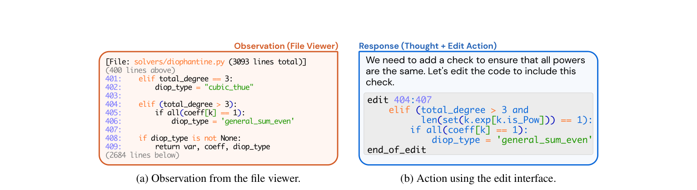

<figcaption>Figure 3: ファイルビューアと edit コマンドは統合されている。(a) ファイルビューアは、開いているファイルの内容を行番号つきでエージェントに示す。(b) エージェントは edit 関数を呼び出して、開いているファイルの 404〜407 行目を置き換える。編集の後、ファイルビューアはエージェントに更新後の版のファイルを示す。</figcaption>
</figure>

**ファイルビューア。** 閲覧したいファイルを見つけた後、エージェントは対象のファイルパスに対して `open` コマンドを呼び出して対話的なファイルビューアを使う。**ファイルビューアはファイルの最大 100 行の窓を一度に提示する。**エージェントは `scroll_down` と `scroll_up` のコマンドでこの窓を動かすか、`goto` コマンドで特定の行にアクセスできる。ファイル内のナビゲーションとコードの位置特定を促進するため、我々は次を表示する: 開いているファイルの完全なパス、ファイルの総行数、現在の窓の前後で省略された行数、そして（可視の各行の前に付される）行番号。Figure 3a がこのインターフェースの例を示す。

**ファイル編集。** LM がファイルを作成・編集できるようにするいくつかのコマンドを提供する。**`edit` コマンドはファイルビューアと連動して動作**し、エージェントが開いているファイルの特定の行範囲を置き換えられるようにする。このコマンドは 3 つの必須引数——開始行・終了行・置換テキスト——を取る。**単一のステップで、エージェントは開始行と終了行の間のすべての行を置換テキストで置き換えられる**（Figure 3b）。編集が適用された後、**ファイルビューアが自動的に更新後の内容を表示し**、エージェントは追加のコマンドを呼び出すことなくただちに自らの編集の効果を観測できる。Figure 3b はファイル編集を含むエージェントの応答の例を示す。

IDE でファイルを編集するとき、人間が構文ハイライトのようなツールを使って書式の誤りに気づけるのと同様に、我々は **`edit` 関数にコードリンタを統合**し、ファイルを編集する際に持ち込んだかもしれない誤りをエージェントに警告する。リンタからの選ばれたエラーが、エラーが持ち込まれる前後のファイル内容の断片とともにエージェントに示される。**無効な編集は破棄され、エージェントはファイルを再度編集してみるよう求められる。**

**文脈管理。** SWE-agent の系は、エージェントの文脈を簡潔かつ情報豊かに保つために、情報を与えるプロンプト・エラーメッセージ・履歴プロセッサを用いる。エージェントは、bash と ACI のコマンドの正しい使い方についての指示・ドキュメント・実演を受け取る。各ステップで系は、**思考（thought）と行動（action）の双方を生成する**よう指示する [^62]。**不正な形式の生成はエラー応答を引き起こし**（Figure 32 に示す）、エージェントに再試行を求める。これは有効な生成が受け取られるまで繰り返される。受け取られたら、**最初のもの以外のすべての過去のエラーメッセージは省かれる**。

エージェントの環境応答は、Figure 30 に示すテンプレートを用いてコンピュータの出力を表示する。ただし出力が生成されなかった場合、明快さを高めるために特定のメッセージ（"Your command ran successfully and did not produce any output"）が含まれる。文脈の関連性をさらに改善するため、**直近 5 つより前の観測はそれぞれ 1 行に折り畳まれる**（Figure 31 に示す）。**以前の観測の内容の大半を取り除くことで、計画と行動の履歴についての本質的な情報を保ちながら不要な文脈を減らし**、より多くの相互作用のサイクルを可能にし、古くなったファイル情報を示すことを避ける。§A がさらなる実装の詳細を提供する。

## 4 Experimental Setup（実験設定）

**データセット。** 我々は主に **SWE-bench** データセットで評価する。これは人気のある Python パッケージの **12 の異なるリポジトリからの 2,294 個のタスクインスタンス**を含む [^20]。特に断らない限り、主要なエージェントの結果は SWE-bench のテスト全体で、アブレーションと分析は **SWE-bench Lite** のテスト集合で報告する。SWE-bench Lite は SWE-bench から取られた **300 インスタンスの正典的な部分集合**で、自己完結した機能的なバグ修正の評価に焦点を当てている。また、短い形式のコードデバッグのベンチマークである **HumanEvalFix** [^32] で SWE-agent の基本的なコード編集能力も試験する。

**モデル。** すべての結果・アブレーション・分析は、2 つの主要な LM——**GPT-4 Turbo**（`gpt-4-1106-preview`）[^34] と **Claude 3 Opus**（`claude-3-opus-20240229`）[^6]——に基づく。我々は Llama 3 や DeepSeek Coder [^14] を含む追加のクローズド／オープンソースのモデルをいくつか実験したが、**エージェント設定における性能は不十分であることを見出した**。多くの LM のコンテキストウィンドウは小さすぎる。たとえば Llama 3 のコンテキストウィンドウは 8k である。GPT-4 Turbo と Claude 3 Opus はそれぞれ 128k と 200k トークンのコンテキストウィンドウを持ち、システムプロンプト・イシュー記述・任意で実演を与えられた後、LM が数ターン相互作用するのに十分な余地を提供する。

**ベースライン。** SWE-agent を 2 つのベースラインと比較する。第一の設定は、Jimenez ら [^20] が確立した**非対話的な検索拡張生成（RAG）ベースライン**である。ここでは **BM25** の検索系がイシューをクエリとして最も関連するコードベースのファイルを検索し、それらのファイルを与えられたモデルが、イシューを解決するパッチファイルを直接生成するよう求められる。

第二の設定は **Shell-only** と呼ばれ、Yang ら [^59] が導入した対話的なコーディングのフレームワーク（InterCode 環境）から適応したものである。このベースラインの系は、**Linux 上のシェルプロセスと相互作用することでイシューを解決するよう LM に求める**。SWE-agent と同様、モデルの予測は相互作用後のコードベースの最終状態に基づいて自動的に生成される。

**指標。** 主要な指標として **% Resolved**（**pass@1**）を報告する。これは、モデルが生成したパッチをリポジトリに適用した後、**すべてのテストが首尾よく通ったインスタンスの割合**である [^20]。また **$ Avg. Cost** の指標も報告する。これは、**首尾よく解決されたすべてのインスタンスにわたって平均した**、SWE-agent が要した API 推論コストである。予算の制約から、**インスタンスあたりの予算を $4 に設定**した。実行がこの予算を超えた場合、既存の編集が自動的に提出された。

**構成の探索。** SWE-agent の設計過程では、SWE-bench の開発分割から手で選んだ少数の例に対する系の振る舞いの定性的な分析を通じて、最終的な ACI の設計に到達した。残るハイパーパラメータの選択については、**窓サイズ・履歴処理・デコード温度**についての掃引を行った（§B.1 に示す）。

## 5 Results（結果）

すべての系にわたって、**SWE-agent w/ GPT-4 Turbo が全面的に最良の性能**を達成し、SWE-bench のテスト集合全体の **12.47%（286/2,294）**、Lite 分割の **18.00%（54/300）**を首尾よく解決した。Table 1 に示すとおり、Lite での RAG と比べて **SWE-agent は 8〜13 倍高コストだが、% Resolved は 6.7 倍改善**する。**LM に親和的な ACI の価値は、GPT-4 Turbo を用いた双方の比較で、Shell-only に対する SWE-agent の 64% の相対的な向上によって裏づけられる。**

Table 2 では、SWE-agent は **HumanEvalFix で 88.3% の pass@1** という強い性能を示す。Figure 4 は、平均的な性能のばらつきは比較的低いが、**個々のタスクの解決率はかなり変わりうる**ことを明らかにする。さらなる結果は付録にある: §B.2 は、**成功率がイシューの年齢と無相関である**ことを示す（テスト汚染の可能性を統制する）。§B.5 は性能のばらつきと pass@k についてのさらなる詳細を提示し、§B.7 は追加の評価の詳細を論じる。

**Table 1**: SWE-bench テスト集合の full 分割と Lite 分割での SWE-agent の性能についての主要な結果。SWE-bench [^20] で確立された SWE-agent・Basic CLI・検索拡張生成（RAG）の設定でモデルをベンチマークする。

| モデル | SWE-bench % Resolved | SWE-bench $ Avg. Cost | SWE-bench Lite % Resolved | SWE-bench Lite $ Avg. Cost |
| --- | --- | --- | --- | --- |
| **RAG** | | | | |
| w/ GPT-4 Turbo | 1.31 | 0.13 | 2.67 | 0.13 |
| w/ Claude 3 Opus | 3.79 | 0.25 | 4.33 | 0.25 |
| **Shell-only agent** | | | | |
| w/ GPT-4 Turbo | – | – | 11.00 | 1.46 |
| w/o Demonstration | – | – | 7.33 | 0.79 |
| **SWE-agent** | | | | |
| w/ GPT-4 Turbo | **12.47** | 1.59 | **18.00** | 1.67 |
| w/ Claude 3 Opus | 10.46 | 2.59 | 13.00 | 2.18 |

**Table 2**: HumanEvalFix [^32] における pass@1 の結果。SWE-agent 以外は Yu ら [^65] が報告したスコアを用いる。

| モデル | Python | JS | Java |
| --- | --- | --- | --- |
| CodeLLaMa-instruct-13B | 29.2 | 19.5 | 32.3 |
| GPT-4 | 47.0 | 48.2 | 50.0 |
| DeepseekCoder-CodeAlpaca-6.7B | 49.4 | 51.8 | 45.1 |
| WaveCoder-DS-6.7B | 57.9 | 52.4 | 57.3 |
| **SWE-agent w/ GPT-4 Turbo** | **87.7** | **89.7** | **87.9** |

<figure>

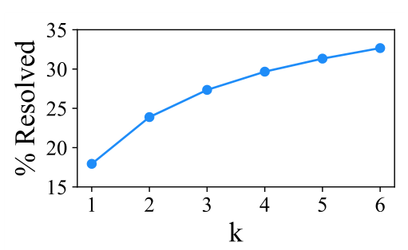

<figcaption>Figure 4: SWE-bench Lite における 6 回の実行にわたる SWE-agent w/ GPT-4 Turbo の pass@k 性能。（訳注: 横軸 k が 1 から 6、縦軸 % Resolved が約 18 から約 33 まで単調に上昇する。）</figcaption>
</figure>

### 5.1 Analysis of ACI Design（ACI 設計の分析）

我々は SWE-agent のインターフェースについて、とりわけ SWE-agent w/ GPT-4 の構成に関していくつかのアブレーションを行い、Table 3 に要約する。我々の事例研究は、異なる ACI 設計の影響とともに興味深いエージェントの振る舞いに光を当てる。

**Table 3**: SWE-agent のインターフェースへのアブレーションの下での SWE-bench Lite の性能。既定の設定を ⭐ で示す。検索と編集への異なるアプローチを検討する（それぞれ Figure 5 と 6 を参照）。ファイルビューアの窓サイズを変えることが性能にどう影響するかも検証し、異なる文脈管理のアプローチの効果もアブレーションする。（下付きの数値は既定からの低下幅。）

| Editor | Search | File Viewer | Context |
| --- | --- | --- | --- |
| `edit` action 15.0（↓3.0） | Summarized ⭐ 18.0 | 30 lines 14.3（↓3.7） | Last 5 Obs. ⭐ 18.0 |
| w/ linting ⭐ 18.0 | Iterative 12.0（↓6.0） | 100 lines ⭐ 18.0 | Full history 15.0（↓3.0） |
| No `edit` 10.3（↓7.7） | No search 15.7（↓2.3） | Full file 12.7（↓5.3） | w/o demo. 16.3（↓1.7） |

**人間のユーザーインターフェースは常にエージェント–コンピュータインターフェースとして適しているとは限らない。** 現世代の LM は、関連する内容を検索する際に多くの落とし穴に対して脆弱である。**いくつかの探索のパターン（たとえば `cd`, `ls`, `cat` の連鎖）は極めて非効率である。**`grep` や `find` による参照はより良く機能しうるが、時に無関係な結果を多数生み出す。我々は、より速いファイルナビゲーションとより情報を与える検索インターフェースによって、より良い位置特定が可能だと仮説を立てる。

<figure>

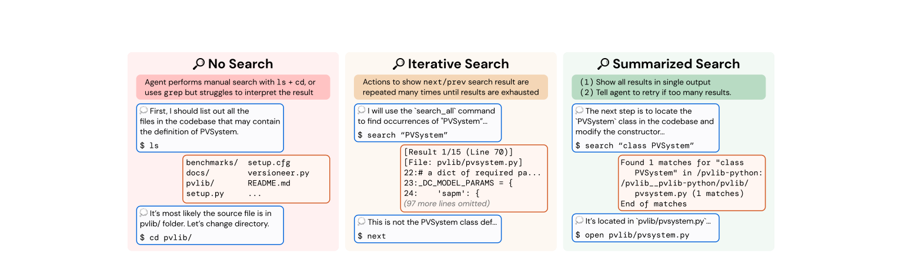

<figcaption>Figure 5: タスクインスタンス pvlib__pvlib-python-1224 についての 3 つの異なる検索インターフェース。Shell-only では、エージェントは標準的な bash のコマンドとユーティリティのみを用いて位置特定を行う。Iterative（反復的）な検索と比べ、Summarized（要約された）検索は検索結果の網羅的なリストを示し、指定が不十分なクエリを絞り込む指針を提供する。</figcaption>
</figure>

Figure 5 は Shell-only の設定を 2 つの異なる検索インターフェースと比較する。***Iterative*（反復的）な検索**は、`Vim` や VSCode のような検索の伝統的なユーザーインターフェースに直接触発されたもので、**結果をファイルビューアで 1 件ずつ表示する**。エージェントは `next` と `prev` の行動を使って結果を見ていける。各結果は、一致した行を前後 n 行の文脈とともに表示する。利点は、**検索中に関連するコードを見た後、エージェントがただちに編集を始められる**ことである。しかし、**検索結果が多数与えられると、エージェントはすべての一致を網羅的に見ようとする傾向があり、各結果を検査し終えるまで `next` を呼び続ける**。この非効率な振る舞いはエージェントのコスト予算やコンテキストウィンドウを枯渇させうるので、**追加の検索ツールをまったく持たないよりもさらに悪い性能につながる**（No search の 15.7%（↓2.3）に対し、Iterative search では 12.0%（↓6.0））。

**コンパクトで効率的なファイル編集は性能にとって決定的である。** SWE-agent のファイル編集器とビューアは、**一貫したフィードバックを伴う容易な複数行編集を可能にする単一のコマンドへ編集の過程を統合し、編集後のファイルについてのエージェントの視界を自動的に更新する**よう設計されている。`No edit` の設定では、編集の選択肢は制限的で誤りを起こしやすい。利用可能な主要な手段は、リダイレクトでファイル全体を置き換えて上書きするか、単一行や検索置換の編集のために `sed` のようなユーティリティを使うかである。どちらの方法も重大な欠点を持つ。**リダイレクトはごく小さな変更のためにもファイル全体をコピーして書き直すことを伴い、非効率かつ誤りを起こしやすい。**`sed` は特定の編集を促進しうるが、複数行の編集を実行するのは煩雑で、検出が難しい意図しない結果につながりうる。

<figure>

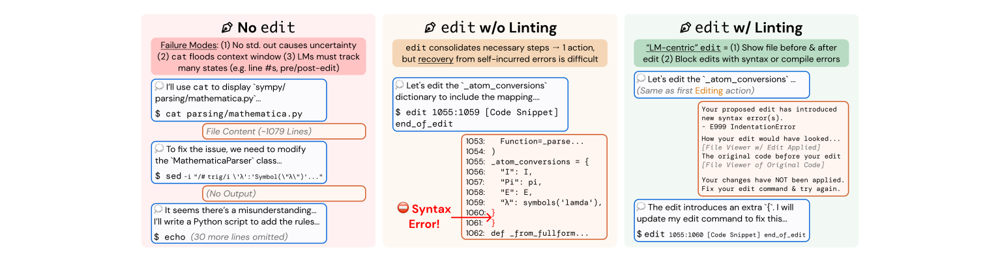

<figcaption>Figure 6: タスクインスタンス sympy__sympy-24102 についての 3 つの異なる編集インターフェース。bash のコマンドでの編集は、ファイルを首尾よく修正するのにいくつもの行動を要する。Editing の構成要素は、bash 流の編集ワークフローを単一のコマンドへ置き換えるためにファイルビューアの構成要素を活用する edit コマンドを定義する。Linting は、エージェントによる誤りを持ち込む編集からしばしば始まる、連鎖する誤りを阻むのに有益である。</figcaption>
</figure>

さらに、どちらの戦略も**ファイルの更新についての即時のフィードバックを欠いており**、これらの黙った操作はモデルにとって潜在的に混乱を招き、誤りのリスクを高める。SWE-agent のファイル編集器のインターフェースがないと、**性能は 10.3%（↓7.7）へ落ちる**。またエージェントは**ファイルビューアが表示する行数に敏感である**ことも見出す。内容が少なすぎても（30 行で 14.3%（↓3.7））多すぎても（ファイル全体で 12.7%（↓5.3））性能は下がる。

**ガードレールは誤りからの回復を改善しうる。** モデルが**同じコード断片を繰り返し `edit` する**とき、顕著な失敗モードが起こる。この振る舞いの通常の容疑者は、**エージェントが誤った `edit` によって構文エラー（たとえば不正なインデント、余分な括弧）を持ち込むこと**である。§3 で論じたとおり、我々は `edit` のロジックに、**大きな誤りを生まない場合にのみ変更を適用させる介入**を加える。このインターフェースを `No edit` および linting なしの `edit` の代替と Figure 6 で比較する。**この介入は性能をかなり改善する（linting なしでは 15.0%（↓3.0））。**

### 5.2 Analysis of Agent Behavior（エージェントの振る舞いの分析）

LM が有用で直観的な ACI を備えているとき、**繰り返し現れる問題解決のパターン**が創発する。我々は、モデルの性能と各モデルに対応する軌跡から見て取れるいくつかのモデルの振る舞いと問題解決のパターンを述べる。

<figure>

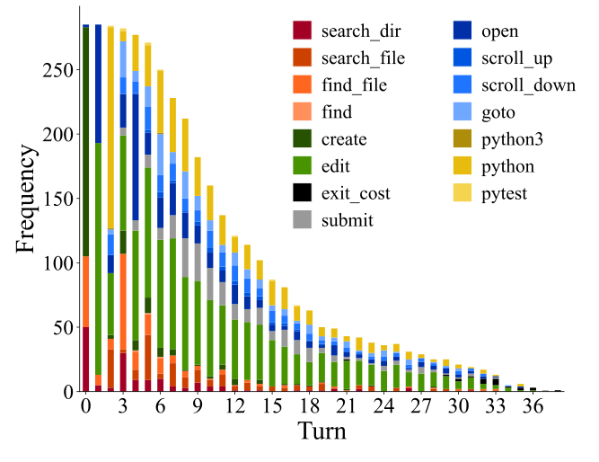

<figcaption>Figure 7: SWE-bench の完全なテスト集合で SWE-agent w/ GPT-4 が解決したタスクインスタンス（286 軌跡）について、各ターンで行動が呼び出される頻度。</figcaption>
</figure>

<figure>

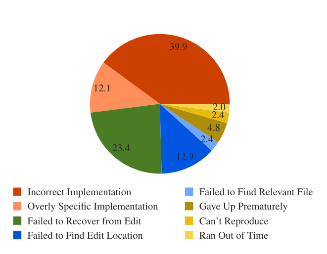

<figcaption>Figure 8: SWE-agent w/ GPT-4 Turbo の未解決インスタンスの軌跡についての失敗モードの分布。各インスタンスは Table 9 のカテゴリを用いて LM によって自動的にラベルづけされる。（訳注: 内訳は Incorrect Implementation 39.9・Failed to Recover from Edit 23.4・Failed to Find Edit Location 12.9・Overly Specific Implementation 12.1・Gave Up Prematurely 4.8・Failed to Find Relevant File 2.4・Can't Reproduce 2.4・Ran Out of Time 2.0。）</figcaption>
</figure>

**再現および／または位置特定が最初のステップである。** SWE-agent は通常、**再現コードを書くか、イシューの原因を特定のコード行へ位置特定するか**のいずれかで始まる。Figure 7 に示すとおり、**すべての軌跡が `create`（再現）または `find_file`/`search_dir`（位置特定）で始まる**。再現するために、モデルは新しいファイルを作り、`edit` でそこにコードを加え、それから `python` で実行する。これは Table 8 で最も人気のある行動の三つ組である。このフィードバックとイシュー記述内のファイル名や記号を用いて、エージェントは**広いディレクトリ水準のキーワード検索から始め、それから特定のファイルと行へ寄っていく**。これは Figure 22 に反映されており、位置特定の系列（`python`, `find_file`, `open`）に続く最も確率の高い次の行動は `search_file` と `goto` である。これはエージェントがバグへ「ズームイン」する様子を示す。行動の異なるグループ間の相関についての広範な分析は §B.3.3 で論じる。

**残りのターンは大半が「編集してから実行する」ループである。** Figure 7 に示すとおり、**ターン 5 以降、すべてのターンで最も頻出する 2 つの行動は `edit` と `python`** である。Figure 22 で（`edit`, `python`）に続く高確率の次の行動として捉えられているように、**追加の位置特定の操作がこれら後半のターンにしばしば散りばめられる**。エージェントは `search_file`, `scroll_up/down` でファイル内のコードをさらに見たり、`search_dir`, `find_file` で他のファイルを全体的に見たりする。この振る舞いは通常、再現スクリプトの再実行からの新しい情報への応答として生じる。**提出はターン 10 以降に正規分布する**が、解決されたタスクインスタンスは**より早い `submit` と相関する**（§B.3.1 参照）。軌跡の共通の局面のウォークスルーは §B.3.2 にある。

**編集はエージェントにとって依然として困難である。** **編集行動の無視できない少数がリンティングのエラーを引き起こす。2,294 個のタスクインスタンスのうち、SWE-agent w/ GPT-4 Turbo の軌跡の 1,185 個（51.7%）が 1 回以上の失敗した編集を持つ。**エージェントは一般に失敗した編集から回復しないよりは回復するほうが多いものの、**失敗した編集が蓄積するにつれて回復の見込みは減少する**。回復とは、連続する失敗した編集の系列の直後に成功した編集が続くことを指す。**編集のどんな試みも最終的に成功する確率は 90.5% だが、この確率は単一の失敗した編集の後には 57.2% へ落ちる。**編集のさらなる現象は §B.3.3 で、エージェントが生成した修正についてのデータは §B.6 で論じる。

**エージェントは速く成功し、ゆっくり失敗する。** **比較的早く提出された実行は、より多くのステップやコストの後で提出されたものと比べて、成功する見込みがはるかに高い**ことを見出す。Table 15 に、予算を使い切らなかったインスタンスのみを含む、解決済みと未解決のインスタンスの分布を示す。**成功した実行はより早く、より安いコストで完了する**ことを観測する。一般に、SWE-agent w/ GPT-4 が解いた成功インスタンスは**中央値で $1.21・12 ステップ**で終わるのに対し、**成功しなかったものは平均 $2.52・21 ステップ**である。さらに、**解決されたインスタンスの 93.0% はコスト予算を使い切る前に提出される**のに対し、**全インスタンスでは 69.0%** である。これらの理由から、**最大予算やトークン上限を増やしても性能を大幅に高めることはなさそうだ**と我々は疑う。軌跡が典型的にどう終わるかについてのさらなる統計は §B.9 にある。

**大半の失敗は誤った実装である。** GPT-4o を用いて、未解決の軌跡（SWE-bench Lite 上の SWE-agent w/ GPT-4 Turbo, $n=248$）を、Table 9 に述べる**手作業で定義した 9 つのカテゴリ**のいずれかへ自動分類する。手でラベルづけした検証集合では、**LM の判断はインスタンスの 87% で著者らのものと一致する**。Figure 8 から、**未解決インスタンスのおよそ半分（52.0%）が Incorrect Implementation または Overly Specific Implementation のカテゴリに入る**。これは、エージェントが提案する解が単に機能的にイシューに対処できていないか、十分に一般的でない解であることを示唆する。**連鎖する失敗した編集がさらに 23.4% の失敗を占める。**詳細は §B.4 にある。

## 6 Related Work（関連研究）

### 6.1 Software Engineering Benchmarks（ソフトウェア工学のベンチマーク）

自然言語の記述からコードを合成するタスクでモデルを評価するコード生成のベンチマークは、LM の性能を測る長年の指標として役立ってきた [^5] [^1] [^15] [^30]。後続の仕事はコード生成のベンチマークの上に構築され、問題を異なる（プログラミング）言語へ翻訳する [^3] [^49]、サードパーティのライブラリを取り込む [^25] [^29]、派生的なコード補完のタスクを導入する [^18] [^32]、テストカバレッジを増やす [^26]、編集の範囲を変える [^8] [^9] [^64]、データセット汚染への頑健性を加える [^19] といった新しいベンチマークを提供してきた。**コード生成の問題は大部分が自己完結しており、短い問題記述（約 100 行）と同様に簡潔な対応する解を持ち、基本的な言語のプリミティブより複雑なものを何も必要としない。**テストは手書きか、ファジングテストによって同様に合成される。近年、LM の急速な発展はこれらのベンチマークの多くを飽和させ始めている。たとえば最良の手法は **HumanEval の 94.4% を解く** [^70]。

将来の傾向を測るには、コード生成のタスクという枠組みは、この設定の単純さと human-in-the-loop な問題作成のコストによって制限されうる。これに応じて、近年の取り組みは、**ソフトウェア工学（SE）が LM の評価にとって多様で挑戦的なテストベッドとして役立ちうる**ことを実証してきた [^68] [^20] [^28]。**リポジトリ水準のコード編集は、誤りのあるコードの発見やコードベース固有の記号と慣習の理解といった、実際の SE のサブタスクに接地された多くの推論上の課題を導入する。**分野として SE は一般にタスクをより孤立した仕方で研究してきており、従来のベンチマークは問題をコードベースの残りから孤立させて枠づける傾向があった [^21] [^23]。

我々が SWE-bench を用いるのは、それが**自動プログラム修復** [^10] [^40] [^55]・**バグの位置特定** [^4] [^58]・**テスト** [^22] [^46] [^56] といった多くの別個の SE のタスクを、**実践的な SE を忠実に反映する単一のタスクの枠組みの下に統一する**からである。さらに **SWE-bench のタスクインスタンスは多様であり、12 の異なるリポジトリにわたる実際の GitHub イシューから自動的に収集されている。**加えて **SWE-bench の性能は、人間が書いた単体テストによる厳密な実行ベースの評価に基づく。**

### 6.2 Language Models as Agents（エージェントとしての言語モデル）

より強い LM・ますます挑戦的なベンチマーク・実用的なユースケースの共進化が相まって、**LM の推論の設定におけるパラダイム転換**が動機づけられてきた。従来のゼロショット／few-shot 生成の代わりに、**実／仮想世界と相互作用する LM エージェント** [^17] [^42] [^47] [^54] が、ウェブナビゲーション [^24] [^33] [^36] [^41] [^45] [^61] [^62] [^71]・コンピュータ制御 [^35] [^53] [^57]・コード生成 [^16] [^50] [^63] のタスクの既定の設定として広まってきた。

相互作用とコード生成はますます一緒に用いられるようになっており、**コードが行動のモダリティとして選ばれる** [^48] [^59]・ツールの構築 [^13] [^51] [^69]・推論 [^39] に用いられる。コーディングエージェントは攻撃的セキュリティ [^11] [^37] [^60]・定理証明 [^44]・臨床タスク [^38] [^43] [^52] にも適用されてきた。**我々の知る限り、SWE-agent はエンドツーエンドのソフトウェア工学（SE）のための言語エージェントを探索した最初の仕事である。**

## 7 Discussion（議論）

我々は SWE-agent を導入した。これは LM と ACI から成り、ソフトウェア工学のタスクを自律的に解くことができるエージェントである。我々の設計方法論・結果・分析を通じて、**LM の強みを活かしその弱みを緩和するよう仕立てられた ACI の価値**を実証する。経験的な応用を超えて、我々は **ACI のさらなる研究が、言語モデルとエージェントについての我々の理解を原理的に活用し、またそれに貢献しうる**ことを望む。これは人間–コンピュータ相互作用（HCI）と心理学の間の相乗効果に類比的である [^2]。**人間と LM は異なる特性・訓練目的・専門性・限界を持ち** [^12] [^31]、**相互作用の設計過程は、これらの違いについてより多くの洞察を明らかにしうる体系的な行動実験と見なせる**——人間の知能と人工知能の比較的な理解を確立することへ向けて。

## Appendix（付録）

付録では、SWE-agent・エージェント–コンピュータインターフェース（ACI）の設計・さまざまな評価ベンチマークにおけるモデルの性能について、追加の分析とより広範な議論を提供する。また、選ばれたタスクインスタンスにおける SWE-agent の振る舞いについての徹底的な事例研究もいくつか提供する。データ・コード・リーダーボードは swe-agent.com にある。

## A SWE-agent Design（SWE-agent の設計）

本節では、SWE-agent の各構成要素の設計方法論・見た目・実装についてより詳しく論じる。§3 で述べたとおり、SWE-agent のインターフェースは、ソフトウェア工学の問題を解くのに基本的な主要サブタスクをエージェントが達成できるようにするいくつかの構成要素から成る。それらは一般に次のとおりである。

1. **位置特定（Localization）**: イシューを引き起こしているファイル／行を特定する。
2. **編集（Editing）**: 与えられたイシューに対処する修正を生成する。
3. **テスト（Testing）**: イシューを再現するため、および／または修正が正しいかを検証するために、新しいスクリプトを書くか既存のテストファイルを修正する。

LM ベースのエージェントがこれらの個別の機能を効率的に遂行し、コードベースのイシューを解決するという包括的な目標へ前進できるようにするため、我々は**ファイルビューア・ファイル編集器・検索／ナビゲーション系・文脈管理系**を提供する。§A.1 で各構成要素の徹底的な内訳を、§A.2 で SWE-agent を構築する際の技術的な設計判断と課題を、§A.3 で最終的なインターフェースを支えるための SWE-agent の設定と、インターフェースを変更するための容易な拡張性・カスタマイズを可能にする作りを論じる。

<figure>

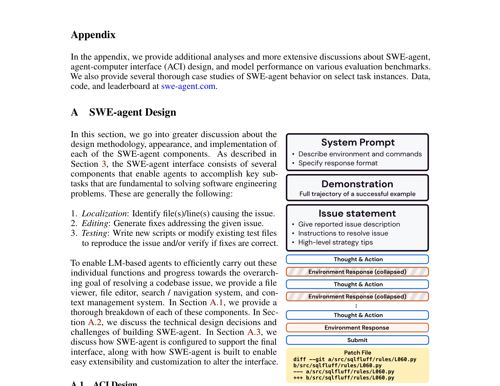

<figcaption>Figure 9: 軌跡の構造の概観。まずシステムプロンプト・実演（任意）・イシュー記述を提示する。その後エージェントは環境と交互に相互作用する。過去の観測は折り畳まれうる、すなわち §3 で述べたとおり長い出力を切り詰める。</figcaption>
</figure>

### A.1 ACI Design（ACI の設計）

本節では §3 で論じた各構成要素を再訪する。節ごとに、まず構成要素を簡潔に振り返る。次に、既存のソフトウェアツールとの関係でその構成要素の根底にある動機を論じる。最後に、設計過程に影響を与えた追加の考察を、その構成要素のどの側面が言語モデルの振る舞いに強く影響するかについての折々の議論とともに記す。

素早く文章なしで概観するために、すべてのコマンドとその使い方・ドキュメント文字列を Table 4 に含める。Figure 9 は SWE-agent のメッセージ履歴を可視化する。各プロンプトテンプレートは §C で詳しく論じる。

**Table 4**: 標準的な Linux Bash のコマンドに加えて、我々は SWE-agent に、対話的なファイルビューア・検索機能・開いているファイルの編集ツールを含む特化したツールを提供する。必須引数は `<>` で、任意引数は `[]` で囲む。最後の列は LM に提示されるドキュメントを示す。

> 訳注: ドキュメント列は LM へ実際に渡される文字列そのものなので原文のまま示す。**なお `scroll_down` の説明が "Moves the window up 100 lines"、`scroll_up` の説明が "Moves the window down 100 lines" と、コマンド名と上下が逆になっている。原典どおりである。**

| カテゴリ | コマンド | ドキュメント（原文） |
| --- | --- | --- |
| ファイルビューア | `open <path> [<line_number>]` | Opens the file at the given path in the editor. If `line_number` is provided, the window will move to include that line. |
| | `goto <line_number>` | Moves the window to show `line_number`. |
| | `scroll_down` | Moves the window up 100 lines. |
| | `scroll_up` | Moves the window down 100 lines. |
| 検索ツール | `search_file <search_term> [<file>]` | Searches for `search_term` in file. If file is not provided, searches in the current open file. |
| | `search_dir <search_term> [<dir>]` | Searches for `search_term` in all files in dir. If dir is not provided, searches in the current directory. |
| | `find_file <file_name> [<dir>]` | Finds all files with the given name in dir. If dir is not provided, searches in the current directory. |
| ファイル編集 | `edit <n>:<m>`<br>`<replacement_text>`<br>`end_of_edit` | Replaces lines n through m (inclusive) with the given text in the open file. All of the `replacement_text` will be entered, so make sure your indentation is formatted properly. Python files will be checked for syntax errors after the edit. If an error is found, the edit will not be executed. Reading the error message and modifying your command is recommended as issuing the same command will return the same error. |
| | `create <filename>` | Creates and opens a new file with the given name. |
| タスク | `submit` | Generates and submits the patch from all previous edits and closes the shell. |

**ファイルビューア。** §3 で論じたとおり、ファイルビューアは、言語エージェントがファイルの内容を理解し、異なるプログラム上の実体が互いにどう関係するかを理解する能力にとって基本的である。ファイルビューアは、Table 4 に示す 4 つのコマンドと、**一度に n 行のファイルを表示するカスタマイズされた標準出力**から成るインターフェースを指す。

まず、既存のソフトウェア系とグラフィカルユーザーインターフェースが LM の利用にとってなぜ最適でないかを論じる。Shell-only の設定では、ファイル内容を検査するのに使えるコマンドがいくつかある。しかし、既製のコマンドラインツールは言語エージェントにとっていくつかの理由で最適でない、あるいは制限的である。

- 第一に、**ファイルを標準出力へ印字するコマンド（`cat`, `printf` など）は、言語エージェントのコンテキストウィンドウを過剰なファイル内容で容易に溢れさせうる**。その大半は通常イシューと無関係である。言語エージェントが気を散らすものを濾し取り関連するコード断片に集中できるようにすることは、効果的な編集を生成するのに決定的である。
- `head` や `tail` のようなコマンドは長さを最初／最後の n 行へ減らすが、**bash のコマンドでファイル内のナビゲーションを行うのは直観的でない**。特定のファイル行を示すことは不可能か、長い引数のリストを要する。
- さらに、**そうした Bash のコマンドはステートレスなので**、現在のファイル位置に対して相対的に上下へ「スクロール」するには、通常、同じ長ったらしいコマンドを些細な変更を加えて再生成する必要がある。
- `more` や `less` のような対話的ツールはこれに対応するが、**(1) ナビゲーションの行動（上下キーの複数回のクリック）を表現することは人間には直観的だが、言語エージェントにとっては冗長で高くつく**。**(2) 特定の行番号へ飛ぶことが許されていても、ファイル内でどのクラス／メソッド／記号が宣言されているかを素早く特定してその定義へただちに移動することはできない。**

ファイルビューアのインターフェースには、Shell-only の設定より親しみやすく操作しやすくする特徴がいくつかある。第一に、**ファイルビューアの標準出力は、行番号を前置し、現在の領域の上下にある行数の指標を示すことで、コード断片を文脈づける**。これらの詳細は、コードベースの他の部分を容易に閲覧することを損なわずに、ファイルのより焦点の合った視界を与える。この種のファイル提示はまた、次節でより詳しく論じるとおり、**正確で一貫した編集コマンドを可能にする**。

ファイルビューアのもうひとつの利点は、**コマンドが相補的であり、ファイルビューアの標準出力に接地されるよう設計されている**ことである。これはモデルが、誤りの可能性を不必要に増やす反復的あるいは追加の行動を取らずに済むようにする。具体例として、エージェントが `sed` コマンドでファイルの最初の 100 行を見た後に次の 100 行を見たい場合、開始行や終了行のようなパラメータを再計算し、それらの更新を後続の生成へ正しく反映せねばならない。**経験則として、互いに補完し合い先行する行動の効果の上に築かれる行動と標準出力を構成することで、モデルにこの算術をさせる必要を減らすことが、大いに好ましい。**

> 訳注: Figure 10（ファイルビューアと検索の構成要素の例。`pvlib__pvlib-python-1603` の軌跡から複写）はテキストの箱なので画像化していない。`open atmosphere.py` の出力は `(255 more lines above)` に続いて行番号つきの内容が並び、末尾が `(180 more lines below)`。`find_file atmosphere.py` は `Found 2 matches for "atmosphere.py" in /pvlib__pvlib-python/pvlib:` に続けて 2 つのパスを示す。`search_dir APPARENT_ZENITH_MODELS` は `Found 4 matches ... ` に続けて**ファイル名と一致件数のみ**を列挙し `End of matches for ...` で閉じる。`search_file APPARENT_ZENITH_MODELS` は `Found 2 matches ... in /pvlib__pvlib-python/pvlib/atmosphere.py:` に続けて `Line 12:...` のように行番号つきで一致行を示す。

**ファイル編集器。** ファイル編集器は、ファイルビューアと連動して動作し、主に `edit` コマンドと、**自ら招いた連鎖的な編集の誤りからモデルを守るために課すガードレール**を指す。編集とテストはプログラミングのタスクにおける言語エージェントの成功にとって決定的であり、よく設計されたインターフェースは、エージェントの能力がどれだけよく引き出されるかに直接影響する。**言い換えれば、悪いインターフェースはモデルの性能を損なう。**

§3 で論じたとおり、Shell-only の設定では編集は非常に難しくなりうる。組み込みのコマンド（たとえば `sed`）はしばしば長い引数のリストを要し、**引数の指定を誤ると、自ら招いた誤りを訂正しようとするモデルを容易に脱線させうる**。またエージェントがそうしたコマンドを直接使うとき、**編集を生成するのに必要な算術の技能に苦労する**ことも観測される。正しいインデント水準を含めること・行の特定の位置に区切りを挿入すること・コードベースの様式上の好みに従うこと、といった詳細はいずれもある程度の計画や計算を要する。Shell-only のファイル閲覧の過程と同様、ファイル編集も多くのコマンドの繰り返しを要しうる。たとえば**複数行の編集は、毎ターンごとに引数の必要かつ繊細な調整を伴う複数の `sed` 呼び出しとしてしか表現できない**。さらに §5.1 で言及したとおり、**Shell-only での編集は通常「黙った」手続きである**。編集が成功したかを確認しその効果を見るには、編集の過程を余分で無用なコマンドで膨らませる追加のステップが必要になる。

Table 4 に文書化されている `edit` コマンドは、**ファイルビューアの標準出力に接地されることで** Shell-only の失敗モードに対処する。**行番号の引数は追加の算術の必要を一切なくし**、検索置換型の編集機構は既存のモデルがより慣れている形式である。この機能により、エージェントは**単一の行動で複数行の編集も行える**。

最後に §5.2 で述べたとおり、`edit` コマンドの重要な特徴は、**リンティングのエラーを招く変更を適用しない**ことである。この特徴を考える際に我々が置く、公正かつ検証済みの仮定は、**各タスクインスタンスに紐づく元のコードベースが整形式である**ということ——すなわちコードベースの保守者は、首尾よくコンパイルできる構文的に健全なコードしか push しないだろう、ということである。エージェントが編集を発行すると、それはコードベースへ適用される。それから次のリンティングのコマンドを走らせる（`CURRENT_FILE` は現在開いているファイルを指す）。

```bash
flake8 --isolated --select=F821,F822,F831,E111,E112,E113,E999,E902 "$CURRENT_FILE" 2>&1
```

`select` の引数は、インデントのような構文上の問題を指すエラーコードである。**F821・F822 は未定義の名前／記号**を示す。**F831 は関数定義における引数の重複**を示す。**E111・E112・E113 はインデントの誤り**である。**E999 は構文エラー**を表し、**E902 は flake8 がソースファイルを読めない場合**に起こる。

編集がこれらの誤りを一切持ち込まなければ、このコマンドは何の出力も生まない。**編集は保持され、更新後のファイル内容が、編集の起きた行を中心にファイルビューアで示される。**しかしリンティングのコマンドが出力を生んだ場合、それは編集が構文エラーを持ち込むことを示すので、**編集は差し戻される**。ファイルビューアの代わりに、Figure 11 に示すメッセージがエージェントへ表示され、**引き起こされた誤り・編集がどう見えたはずか・元のファイル内容**が示される。開発の過程で、我々はこのメッセージについて、1 つ以上の部分の省略を含む変種を実験した。**我々の結論は、3 つのメッセージすべてを持つことが有用だ**というものだった。**誤りの種類がないと、エージェントは何が誤りだったかを誤診しうる。変更後のファイル内容の断片がないと、エージェントは同じコマンドをより頻繁に再発行する。元のファイル内容の断片がないと、エージェントは数ターン前の同じ内容に注意を向けねばならない**——エージェントは時に、より最近のターンのものであるという理由で、**誤った・間違ったファイル内容に対して `edit` を生成する**。

> 訳注: Figure 11（リンティングのエラーメッセージ）はテキストの箱なので原文のまま以下に起こす。この編集の問題は、`basic_chain` メソッド定義の編集において `orientation_strategy` フィールドを省いてしまったことである。

```
Your proposed edit has introduced new syntax error(s). Please
  understand the fixes and retry your edit commmand.

ERRORS:
- F821 undefined name 'orientation_strategy'
- F821 undefined name 'orientation_strategy'

This is how your edit would have looked if applied
-------------------------------------------------
[File: /pvlib__pvlib-python/pvlib/modelchain.py (1890 lines total)]
(64 more lines above)
65:def basic_chain(times, latitude, longitude,
66:                module_parameters, temperature_model_parameters,
67:                inverter_parameters,
68:                irradiance=None, weather=None,
69:                surface_tilt=None, surface_azimuth=None,
70:                transposition_model='haydavies',
71:                solar_position_method='nrel_numpy',
72:                airmass_model='kastenyoung1989',
73:                altitude=None, pressure=None,
74:                **kwargs):
(1816 more lines below)
-------------------------------------------------

This is the original code before your edit
-------------------------------------------------
[File: /pvlib__pvlib-python/pvlib/modelchain.py (1891 lines total)]
(64 more lines above)
65:def basic_chain(times, latitude, longitude,
66:                module_parameters, temperature_model_parameters,
67:                inverter_parameters,
68:                irradiance=None, weather=None,
69:                surface_tilt=None, surface_azimuth=None,
70:                orientation_strategy=None,
71:                transposition_model='haydavies',
72:                solar_position_method='nrel_numpy',
73:                airmass_model='kastenyoung1989',
74:                altitude=None, pressure=None,
75:                **kwargs):
(1816 more lines below)
-------------------------------------------------
Your changes have NOT been applied. Please fix your edit command and
  try again.
You either need to 1) Specify the correct start/end line arguments or
  2) Correct your edit code.
DO NOT re-run the same failed edit command. Running it again will
  lead to the same error.
```

### A.2 Implementation（実装）

SWE-agent のコードベースは一般に 3 つのモジュールから成る。**環境（environment）・エージェント（agent）・タスクのエピソードを軌跡とパッチ生成として保存するロギング機構**である。

**環境。** SWE-agent の環境は **InterCode ライブラリ** [^59] から強い影響を受けている。エージェントと環境の相互作用の一般的なパイプラインについて、我々の仕事は InterCode の対話的コーディングのタスク定式化を直接採用している。環境は InterCode-Bash 環境——本論文で言及した Shell-only の設定に本質的に相当する——から相互作用処理のロジックの大部分を統合している。この採用の一部として、**SWE-agent も再現可能かつ安全な実行を保証するために Docker コンテナを用いる**。このため SWE-agent のインフラは、**Dockerfile を差し替えるだけで SWE-bench のタスクインスタンスの範囲を超えた他のコードベースやプログラミング言語をサポートすること**をユーザーにとって容易にする。ひとつの違いは、SWE-agent が Docker コンテナとエージェントの実体の間で行動と観測をやり取りする根底の通信ロジックに軽微な調整を加えていることである。

**エージェント。** LM からの多ターンの問い合わせを促進するエージェント的なラッパーとして機能することを超えて、**エージェントのモジュールは ACI を描画する関数（たとえば文脈管理・コマンド・インターフェースのロジック・入出力形式）を定義し**、クローズド／オープン、API ベース／ローカルの言語モデルの推論をサポートする。主なワークフローは、インターフェースをクラスおよび／またはコマンドの集合として定義し、それを設定ファイルで指定することである（§A.3 でより詳しく論じる）。

### A.3 Configuration（設定）

SWE-agent の系は 3 つの構成要素——**LM、SWE-bench 形式のデータセットまたは GitHub イシュー、設定ファイル**——によってインスタンス化される。**設定ファイルは ACI の設計を規定する役割を果たす。**設定ファイルを反復的に洗練することが、我々がより良いエージェント性能を達成し、本論文のためのさまざまな分析を行った主要な方法である。

エージェント–コンピュータインターフェースは一般に、設定可能な構成要素の 4 つのカテゴリから成る。

1. **プロンプトテンプレート**: これらのテンプレートは、タスクの設定を言語モデルに知らせ、利用可能なコマンドのリストを示し、環境の応答を状態変数の値で拡張し、初期のタスク設定を提供するために使われる。
2. **コマンドファイル**: bash や Python の関数・スクリプトのソースコードを含むファイル。これらのファイルのコード内容を直接操作することで、**コマンドは容易に修正・追加・削除できる**。これらのファイルに加えたドキュメントはプロンプトへ注入して、利用可能なコマンドをモデルに知らせることもできる。
3. **制御フロー**: モデルの応答を解析し履歴を処理する方法を、これらの設定引数を通じて指定できる。
4. **環境変数**: コマンドやシェルと相互作用しうる変数の初期値も設定で指定できる。

> 訳注: Figure 12（注釈つきの設定ファイルの例）と Figure 13（コマンド定義の骨格コード）はテキストの箱である。Figure 12 の要点を原文のまま示す。

```yaml
# Prompt Templates: Control how observations of environment are shown to agent
system_template: |
   First `system` message shown to agent
instance_template: |-
   Instance prompt, contains task instance-specific content
next_step_template: |-
   Format template of per-turn observation (Contains standard output from agent's action)
next_step_no_output_template: |-
   Format template of observation when there is no standard output from the agent's action
format_error_template: |-
   Format template of error message (Used when agent's action causes an error)
demonstration_template: |
   Format template for showing a demonstration to the agent
demonstrations:
- `trajectories/<username>/<experiment folder>/*.traj`
- File is a demonstration of how to solve a task. This could an agent generated trajectory.
- You can include 1+ demonstrations

# Environment States: Define features of the SWEEnv environment
env_variables:
# Default variables for SWEEnv at the beginning of each instance
   CURRENT_FILE: 0
   CURRENT_LINE:
   OVERLAP:
   SEARCH_FILES:
   SEARCH_INDEX:
   SEARCH_RESULTS:
   WINDOW_SIZE:
   START_INDEX:
   END_INDEX:
   START_CURSOR:
   END_CUROSR:
   START_CURSORS_MARK:
   END_CURSOR_MARK:
state_command: |
# `state_command` allows you to update state variables to reflect any aspect of the
#  environment (e.g. current working directory)
   name: state
   code: |
     state() { echo '{"pwd": "'$PWD'"}';

# Action Interface: Define how an agent interacts with the SWEEnv environment
command_files:
- path/to/bash_file.sh
- Each file contains a list of commands implemented in bash
- You can include 1+ command files
parse_command: Reference to function that defines how documentation for commands
               should be written
history_processor: Defines how the history of the agent should be processed
parse_function: Defines how the agent's output should be parsed
```

## B Extended Results（拡張された結果）

本節では、異なる次元で周辺化した性能・パッチ生成の統計・SWE-agent の軌跡に反映された問題解決のパターンを含む、追加の結果を提供する。

### B.1 Hyperparameter Sweep（ハイパーパラメータ掃引）

SWE-bench の dev 分割から無作為に抽出した **37 インスタンス**の部分集合を用いてハイパーパラメータの掃引を行った。GPT-4 Turbo では、**最良の構成は温度 0.0・窓長 100・履歴は直近 5 観測**で % Resolved は 15.1% だった。Claude 3 Opus では、上記の構成と 2 つの追加設定（温度／窓／履歴が 0.2/100/Last-5 と 0.2/200/Full）の間で **3 つ巴の同点**となった。**両モデルとも 0.0/100/Last-5 の構成で** SWE-bench のテスト集合（full・Lite の双方）の推論を走らせることにした。

**Table 5**: SWE-bench dev 分割の部分集合でのハイパーパラメータ掃引の結果。% Resolved は 5 サンプルにわたる平均スコアを示す。

| モデル | Temperature | Window | History | % Resolved |
| --- | --- | --- | --- | --- |
| GPT-4 Turbo | 0.0 | 100 | Full | 14.1 |
| GPT-4 Turbo | 0.0 | 100 | Last 5 Obs. | **15.1** |
| GPT-4 Turbo | 0.0 | 200 | Full | 9.2 |
| GPT-4 Turbo | 0.0 | 200 | Last 5 Obs. | 10.8 |
| GPT-4 Turbo | 0.2 | 100 | Full | 10.8 |
| GPT-4 Turbo | 0.2 | 100 | Last 5 Obs. | 12.4 |
| GPT-4 Turbo | 0.2 | 200 | Full | 8.7 |
| GPT-4 Turbo | 0.2 | 200 | Last 5 Obs. | 10.8 |
| Claude 3 Opus | 0.0 | 100 | Full | 5.4 |
| Claude 3 Opus | 0.0 | 100 | Last 5 Obs. | **8.1** |
| Claude 3 Opus | 0.0 | 200 | Full | 7.0 |
| Claude 3 Opus | 0.0 | 200 | Last 5 Obs. | 7.1 |
| Claude 3 Opus | 0.2 | 100 | Full | 7.4 |
| Claude 3 Opus | 0.2 | 100 | Last 5 Obs. | **8.1** |
| Claude 3 Opus | 0.2 | 200 | Full | **8.1** |
| Claude 3 Opus | 0.2 | 200 | Last 5 Obs. | 6.8 |

### B.2 Model Performance（モデルの性能）

**リポジトリ別の性能。** SWE-bench Lite における性能の内訳を Table 6 に示す。SWE-agent の性能は先行手法より優れており、**リポジトリ横断でより高い割合の問題を解くだけでなく、元の SWE-bench の仕事で使われた従来の検索拡張生成ベースラインではほぼあるいは完全に未解決だったリポジトリ（たとえば matplotlib, sympy/sympy）の問題も解決する**。

**Table 6**: SWE-bench Lite データセットに含まれるリポジトリ横断の % Resolved 性能。「Repo」列の括弧内の数値は、そのリポジトリ由来の SWE-bench Lite のタスクインスタンス数。

| Repo | SWE-agent GPT-4 | SWE-agent Claude 3 Opus | RAG GPT-4 | RAG Claude 3 Opus | RAG Claude 2 |
| --- | --- | --- | --- | --- | --- |
| astropy/astropy (6) | 16.67% | 33.33% | 0.00% | 0.00% | 0.00% |
| django/django (114) | 26.32% | 16.67% | 4.39% | 6.14% | 5.26% |
| matplotlib/matplotlib (23) | 13.04% | 13.04% | 0.00% | 0.00% | 0.00% |
| mwaskom/seaborn (4) | 25.00% | 0.00% | 25.00% | 25.00% | 0.00% |
| pallets/flask (3) | 0.00% | 0.00% | 0.00% | 0.00% | 0.00% |
| psf/requests (6) | 33.33% | 16.67% | 0.00% | 0.00% | 0.00% |
| pydata/xarray (5) | 0.00% | 0.00% | 20.00% | 20.00% | 0.00% |
| pylint-dev/pylint (6) | 16.67% | 0.00% | 0.00% | 0.00% | 0.00% |
| pytest-dev/pytest (17) | 17.65% | 5.88% | 0.00% | 5.88% | 5.88% |
| scikit-learn/scikit-learn (23) | 17.39% | 17.39% | 0.00% | 4.35% | 8.70% |
| sphinx-doc/sphinx (16) | 6.25% | 6.25% | 0.00% | 0.00% | 0.00% |
| sympy/sympy (77) | 10.39% | 5.19% | 1.30% | 2.60% | 0.00% |

**時間的分析。** Table 7 に、異なる年のタスクインスタンスについての % Resolved の統計の内訳を示す。**タスクインスタンスの作成年と解決率の間に明確な相関はない**——モデルにおいても設定においてもである。たとえば SWE-agent w/ GPT-4 のアプローチは 2021 年の問題を最も高い割合で解く一方、RAG w/ GPT-4 と SWE-agent w/ Claude 3 Opus のアプローチは 2022 年のタスクインスタンスでより良い性能を示す。

**Table 7**: SWE-bench Lite に含まれる異なる年のタスクインスタンスについての % Resolved 性能。

| Year | SWE-agent GPT-4 | SWE-agent Claude 3 Opus | RAG GPT-4 | RAG Claude 3 Opus | RAG Claude 2 |
| --- | --- | --- | --- | --- | --- |
| 2023 (30) | 23.33% | 13.33% | 3.33% | 3.33% | 0.0% |
| 2022 (57) | 21.05% | 17.54% | 5.26% | 7.02% | 1.75% |
| 2021 (42) | 23.81% | 11.90% | 2.38% | 4.76% | 2.38% |
| 2020 (66) | 10.61% | 7.58% | 3.03% | 1.52% | 1.52% |
| Before 2020 (105) | 17.14% | 10.48% | 0.95% | 4.76% | 5.71% |

### B.3 Trajectory Analysis（軌跡の分析）

#### B.3.1 Turns to Resolution（解決までのターン数）

Figure 14 は、首尾よく解決されたタスクインスタンスを完了するのに SWE-agent が必要としたターン数の分布を可視化する。**SWE-bench の完全なテスト集合で、SWE-agent w/ GPT-4 は軌跡を終えるのに平均 14.71 ターン、中央値 12 ターンを要し、軌跡の 75% は 18 ターン以内に完了する。**Lite 分割では、SWE-agent w/ Claude 3 Opus は平均 12.71 ターン・中央値 13 ターンで、軌跡の 75% は 15 ターン以内に完了する。分布から、モデルと SWE-bench の分割をまたいで、**タスクインスタンスの大半が割り当てられた予算の内側で余裕をもって解かれ完了している**ことが明らかである。

これはまた、**言語エージェントの系にとっての一般的な改善余地**も指し示す——**言語エージェントの初期の問題解決のアプローチ（典型的には最初の 10〜20 ターンに反映される）が良い解を生まない場合、過去の誤りの上に築かれる後半のターンを活用するのに苦労する**。この問題を是正し言語エージェントにより強い誤り回復の能力を誘導するには、今後の方向としてモデル・ACI・あるいはその両方の改善が考えられる。

<figure>

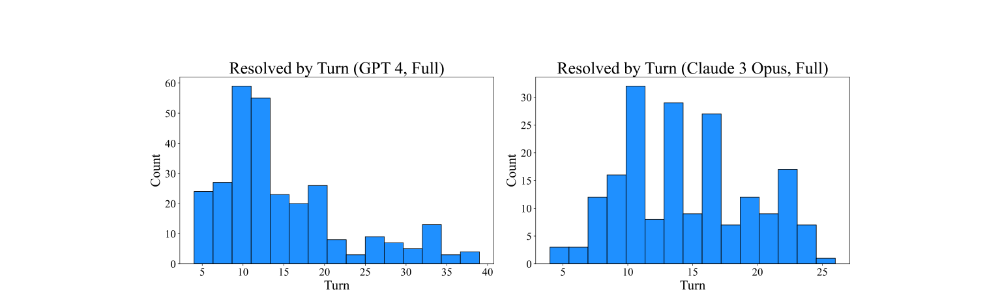

<figcaption>Figure 14: SWE-bench で解決されたタスクインスタンスに対応する対話的軌跡のターン数の分布。左のヒストグラムは完全なテスト集合での SWE-agent w/ GPT-4（286 軌跡）、右は Lite 分割での SWE-agent w/ Claude 3 Opus（35 軌跡）。</figcaption>
</figure>

<figure>

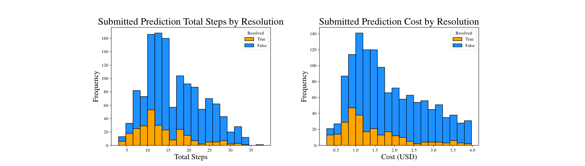

<figcaption>Figure 15: SWE-bench における SWE-agent w/ GPT-4 Turbo のエージェント軌跡の、総ステップ数（左）とコスト（右）による分布。解決されたインスタンスの分布をオレンジ、未解決を青で示す。解決されたインスタンスは明らかにより早い平均を示し、ステップ数の多い軌跡や最大予算の $4.00 に近いコストの軌跡の割合が少ない。</figcaption>
</figure>

#### B.3.2 Walkthrough of Trajectory Phases（軌跡の各局面のウォークスルー）

**初期の再現・位置特定のステップ。** まず、SWE-agent が通常取る初期のステップは、**位置特定（Localization）と再現（Reproduction）の操作に強く支配される**。一般に最もよく現れるパターンは **`create`, `edit`, `python` の三つ組**である。これらのコマンドにわたって、エージェントは空の Python ファイルを作り、`edit` で実行可能なコード断片を加え、それを実行しようとする。代替として、エージェントは時に代わりに位置特定——イシューを引き起こしているファイル／行の特定——から始めることも決める。イシュー記述と初期の検索クエリの結果がどれだけ情報を与えるかに応じて、エージェントは**より細かい粒度の検索ツールで追加の検索クエリを走らせ、対象の問題あるコード領域へ寄っていく**（たとえば `search_dir`, `open`, `search_file`/`scroll_down`）。

**Table 8**: SWE-agent w/ GPT-4 が解決したタスクインスタンスの軌跡において、各ターンで最も頻出する行動パターンの表（「頻出」とは 4 回以上を意味する）。たとえば `create, edit, python` のパターンは第 1〜3 ターンに 156 回現れる。加えて、各項目には、そのパターンの根底にある目的を概ね捉えるカテゴリ（Reproduction・Localization (File)・Localization (Line)・Editing・Submission）を手作業で割り当てている。「Reproduction」はイシューが述べる誤りや要求を再現するサブタスク、「Localization」はイシューの原因であるコードを特定するサブタスクを指す。

| Turns | Pattern | Count | Category |
| --- | --- | --- | --- |
| 1-3 | `create, edit, python` | **156** | Reproduction |
| 1-3 | `search_dir, open, search_file` | 21 | Localization (File) |
| 1-3 | `search_dir, open, scroll_down` | 12 | Localization (Line) |
| 1-3 | `create, edit, edit` | 11 | Reproduction |
| 1-3 | `search_dir, open, edit` | 10 | Localization (Line) |
| 2-4 | `edit, python, find_file` | 71 | Localization (File) |
| 2-4 | `edit, python, edit` | 37 | Reproduction |
| 2-4 | `edit, python, search_dir` | 26 | Localization (File) |
| 2-4 | `edit, python, open` | 15 | Localization (File) |
| 2-4 | `open, edit, edit` | 13 | Editing |
| 2-4 | `open, edit, create` | 13 | Editing |
| 2-4 | `open, scroll_down, scroll_down` | 9 | Localization (Line) |
| 2-4 | `open, scroll_down, edit` | 5 | Editing |
| 2-4 | `open, edit, submit` | 5 | Submission |
| 3-5 | `python, find_file, open` | 61 | Localization (File) |
| 3-5 | `python, edit, python` | 25 | Editing |
| 3-5 | `search_file, goto, edit` | 24 | Localization (Line) |
| 3-5 | `python, search_dir, open` | 23 | Localization (File) |
| 3-5 | `edit, create, edit` | 13 | Editing |
| 3-5 | `python, edit, edit` | 11 | Editing |
| 3-5 | `python, open, edit` | 7 | Editing |
| 3-5 | `python, find_file, find_file` | 7 | Localization (File) |
| 3-5 | `edit, edit, submit` | 4 | Submission |
| 3-5 | `edit, edit, create` | 4 | Editing |
| 4-6 | `find_file, open, edit` | 28 | Editing |
| 4-6 | `find_file, open, search_file` | 19 | Localization (Line) |
| 4-6 | `edit, edit, python` | 11 | Reproduction |

<figure>

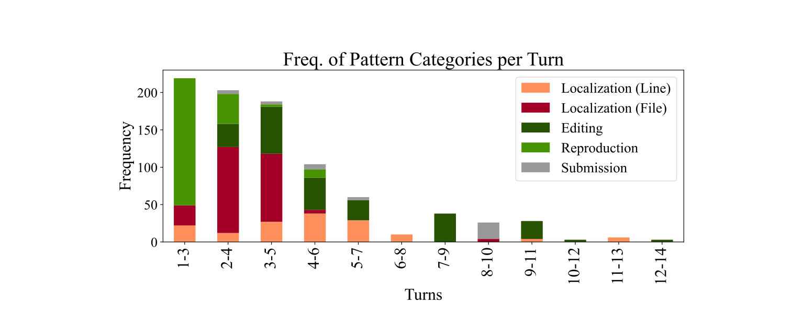

<figcaption>Figure 16: 各パターンを Table 8 に示す 5 つのカテゴリのいずれかへ割り当てたもの。左端の 3 本の棒は、再現に続く位置特定が軌跡の初期局面で起こる操作の大半を占めることを反映する。</figcaption>
</figure>

<figure>

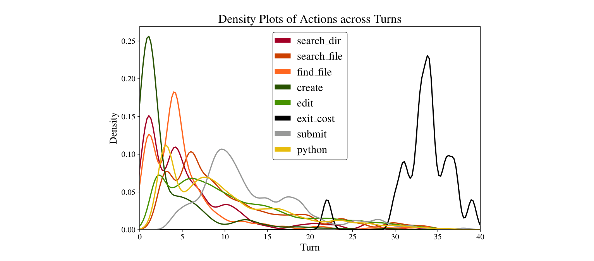

<figcaption>Figure 17: 各行動について、異なるターンに関する推定分布を、その行動が呼び出された総回数にわたって正規化して示す密度プロット。</figcaption>
</figure>

<figure>

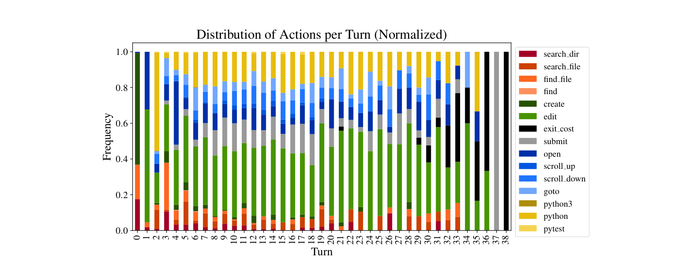

<figcaption>Figure 18: Figure 7 の正規化された視点。ターン数ごとの分布を示す。</figcaption>
</figure>

#### B.3.3 Breakdowns of Action Sequences（行動系列の内訳）

**編集の傾向。** 編集はエージェントがイシューを再現し修正を効果的に提案する能力の中核をなす。**それはまた、モデルが典型的に最も苦労する行動でもある。**

**第一に、SWE-bench の完全なテスト集合にわたって、編集行動の無視できない少数が失敗する**（`edit` の呼び出しがリンティングのエラーを起こす。以下これを**失敗した編集**と呼ぶ）。**2,294 個のタスクインスタンスのうち 1,185 個（51.7%）が失敗した編集を含むターンを 1 回以上持つ。**これらの軌跡では、軌跡あたりの失敗した編集は**中央値 3 回・最大 33 回**である。**解決されたタスクインスタンスでは失敗した編集の率は小さく**、286 個の解決インスタンスのうち 113 個（31.5%）が失敗した編集を 1 回以上持ち、軌跡あたり中央値 2 回・最大 26 回である。

**第二に、リンティングを有効にした編集では、エージェントは失敗した編集から回復しないよりは回復するほうが多い。**用語を 2 つ定義する。**回復（Recovery）**とは、失敗した編集の系列の直後に成功した編集が続くことを指し、エージェントがリンティングのフィードバックを使って整形式の編集を作ったことを示唆する。**失敗した回復**とは、連続する失敗した編集の直後に編集以外の行動が続くことを指す。

解決されたタスクインスタンスに対応する軌跡にわたって、**1 回以上の失敗した編集の試みが 135 回**起こる。このうち**エージェントは 104 回首尾よく回復する**。成功した回復と失敗した回復の前の連続失敗回数も大きく異なる——**成功した回復は通常 2.03 回の編集の試みに先立たれる**のに対し、**失敗した回復では平均 4.22 回**である。全タスクインスタンスにわたっては失敗した回復の相対的な率が増え、**成功した回復 810 回に対し失敗した回復 555 回**。回復に至る連続失敗回数は横ばい（2.2）だが、**失敗した回復では大きく増える（5.59）**。

**第三に、失敗した編集の試みが蓄積するにつれ回復の見込みは減少する。**Figure 20 は、n 回連続で失敗した編集の後に成功する編集の確率の折れ線を示す。**左端の $n=0$ の点は、編集のどんな試みも最終的に成功する確率が 90.5% であることを意味する。この値はエージェントが単一の失敗した編集を招くと落ちる——編集が最終的に成功する確率はわずか 57.2% になる。言い換えれば、1 回の編集エラーに遭遇したとき、エージェントが決して回復しない確率が 42.8% ある。**

<figure>

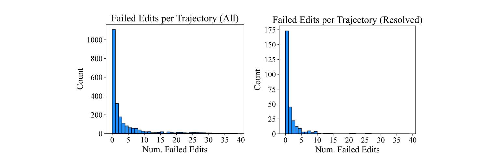

<figcaption>Figure 19: SWE-agent w/ GPT-4 Turbo による全タスクインスタンス（左）と解決されたタスクインスタンス（右）にわたる、軌跡あたりの失敗した編集行動の数の分布。「失敗した」編集とは、リンティングのエラーを起こした編集行動を指す。両グラフの左端の棒は、失敗した編集がゼロの軌跡の数に対応する。</figcaption>
</figure>

<figure>


<figcaption>Figure 20: n 回の失敗した編集の後に編集が成功する確率。n が増えるにつれ回復の見込みは減少する。</figcaption>
</figure>

**行動系列の分析。** 直前の n 個の行動が与えられたときの次の行動の尤度を示す遷移確率を計算する。$n \in \{1,2,3,4\}$ について、最もよく現れる n 個の行動の系列を 15 個決め、その系列の後に各コマンドがどれだけ頻繁に現れるかを数え、系列の総出現回数で正規化する。

これらの遷移確率のヒートマップを、$n=1$ を Figure 21、$n=2$ を Figure 22、$n=3$ を Figure 23、$n=4$ を Figure 24 に示す。これらのグラフから、**いくつかの行動系列が多くのタスクインスタンスにわたって一貫して現れる**ことがただちに明らかになる。

Figure 21 では行動の対の間の直接的な結びつきが見える。**すべての軌跡は `create`・`find_file`・`search_dir` で始まり、`submit` か `exit_cost` のいずれかで終わる。最も人気のある次の行動は `edit`** であり、それは `create`・`edit`・`goto`・`pytest`・`python` の後に続く最も確率の高い行動である。スクロール（`scroll_down`/`up`）と検索（`find_file`, `search_dir`）の行動は**繰り返される傾向がある**。

他の興味深い相関もある。**編集／評価のパターンは `edit` と `python` の対の相関に反映される。**さまざまな位置特定のパターンも顕著である。時にファイルを検索することがキーワードを検索することより実り少なく、逆もまた然りである——これは `find_file` と `search_dir` の対に反映される。**`open` の呼び出しは、エージェントが特定のファイルに狙いを定め、そこから位置特定を続けるか（`search_file` 0.35, `scroll_down` 0.18, `goto` 0.09）編集を始めるか（`edit` 0.25）を表す。**

考慮する先行行動の数が増えるにつれ、**複数のコマンドにまたがるより複雑な操作**が明らかになる。Figure 23 では、再現（`[create, edit, python]`）に典型的に続くのはスクリプトの調整（`edit` 0.39）か位置特定（`find_file` 0.31, `search_dir` 0.22）である。実り多い位置特定のパターンは再び `[find_file / search_dir, open, search_file]` の後に `goto` が続く形に反映される。Figure 24 では、最も人気のある 4-gram は再現や編集に関係する。**`[edit, python, rm, submit]` のパターンは軌跡が終わる人気の形である。**よくある失敗モードも明らかで、**`edit`（4 回）や `scroll_down`（4 回）のような繰り返される行動は典型的に連鎖し続ける。**

<figure>

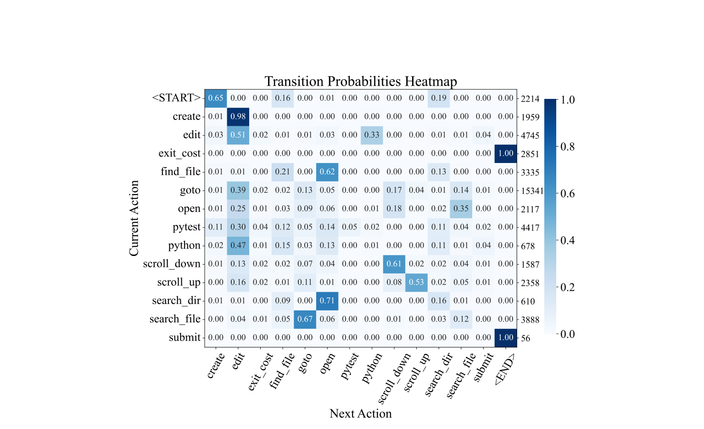

<figcaption>Figure 21: 全タスクインスタンスにわたる SWE-agent w/ GPT-4 Turbo の軌跡において、最も人気のある行動の後に異なる行動が呼び出される相対頻度のヒートマップ（n=1）。</figcaption>
</figure>

<figure>

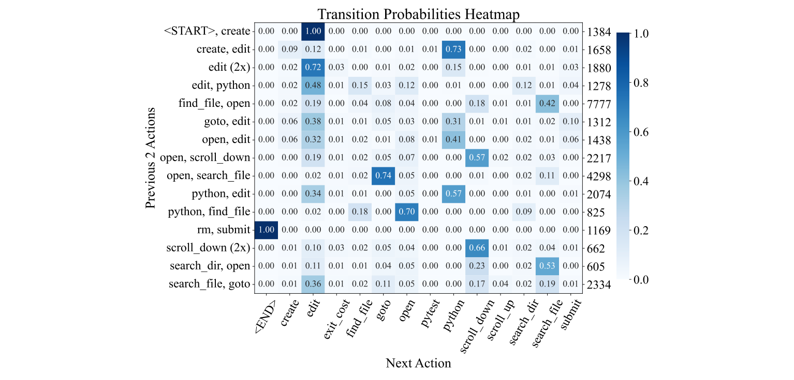

<figcaption>Figure 22: 同上。最も人気のある行動の対の後についてのヒートマップ（n=2）。</figcaption>
</figure>

<figure>

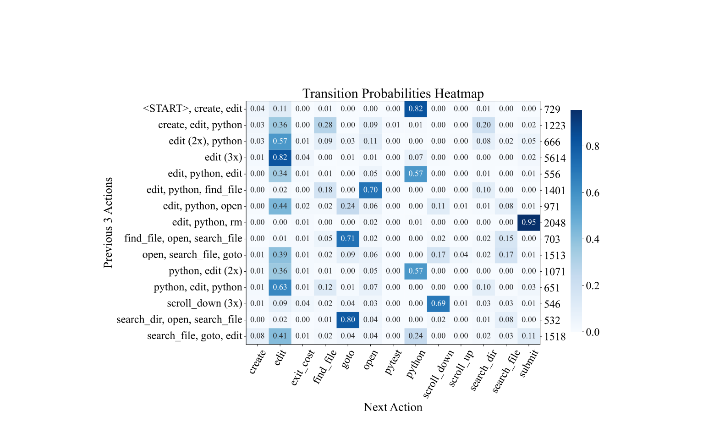

<figcaption>Figure 23: 同上。n=3 についてのヒートマップ。</figcaption>
</figure>

<figure>

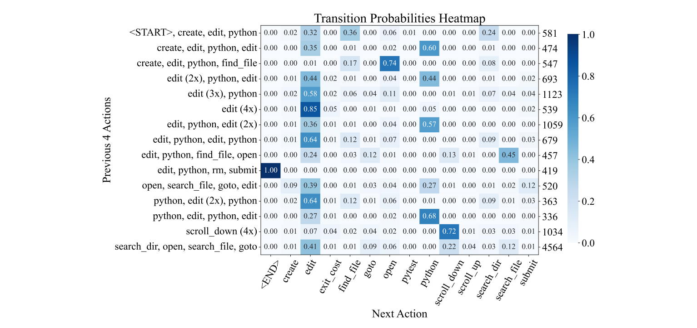

<figcaption>Figure 24: 同上。n=4 についてのヒートマップ。</figcaption>
</figure>

### B.4 Failure Modes（失敗モード）

既定の構成での SWE-bench Lite 分割の未解決の軌跡（$n=248$）について自動分析を行う。まず §B.3.2 で分析したモデルの振る舞いに基づいて、ありうる失敗カテゴリのリスト（Table 9）を作る。次に未解決とされた 248 インスタンスから **15 インスタンスの検証集合**を抽出し、著者らがこれらのカテゴリに従って手でラベルづけする。最後に、エージェントの軌跡・その変更が生成したパッチ・参照用の gold patch を組み合わせ、**LM（`gpt-4o-2024-05-13`）を用いて分類する**。

**Table 9**: 失敗モードのカテゴリの説明。

| カテゴリ | 説明 |
| --- | --- |
| Failed to Reproduce | エージェントは試みたが、イシューの問題を首尾よく再現できなかった。 |
| Failed to Find Relevant File | エージェントは正しいファイルを開くことも見ることもなかった。 |
| Failed to Find Edit Location | エージェントは正しいファイルを開いて見たが、関連する箇所を見つけられなかったか編集しなかった。 |
| Overly Specific Implementation | エージェントは関連する変更を加えたが、その解は十分に一般的でなかった。この場合、示唆されたごく特定のイシューは解くかもしれないが、他のより一般的な場合にコードの振る舞いを変えてしまうようなやり方でそうしている。 |
| Incorrect Implementation | エージェントは妥当な領域に変更を加えたが、その解はイシューに正しく対処していなかった。 |
| Ran Out of Budget | エージェントは解へ向けて正しい道筋にあるように見えたが、変更を完了できる前にエピソードが終わった。 |
| Failed Edit Recovery | エージェントは編集のループに入り、回復することなく失敗する編集を繰り返した。 |
| Gave Up Prematurely | エージェントは何らかの困難に遭遇した後、問題を解くのをやめると決めた。 |
| Other | エージェントがこのイシューを解決するのを妨げた、他の何らかの問題があった。 |

### B.5 Performance Variance and Pass@k Rate（性能のばらつきと pass@k）

SWE-bench 上で SWE-agent を走らせるのはかなり高くつくので、特に断らない限りすべての結果は pass@1（% Resolved）で報告している。しかし主要な構成については、ばらつきと $k \in \{3,6\}$ の pass@k 性能を試すためにより多くの回数の実行も行った。**平均的な性能のばらつきは比較的低いが、インスタンスごとの解決はかなり変わりうる**ことを示唆する。

**Table 10**: SWE-bench Lite における SWE-agent w/ GPT-4 の 6 回の別々の実行の性能。

| | Run 1 | Run 2 | Run 3 | Run 4 | Run 5 | Run 6 | Avg. |
| --- | --- | --- | --- | --- | --- | --- | --- |
| Resolve % | 17.33 | 18.00 | 18.00 | 18.67 | 17.33 | 18.33 | **17.94 ± 0.49** |

| | Pass@1 | Pass@2 | Pass@3 | Pass@4 | Pass@5 | Pass@6 |
| --- | --- | --- | --- | --- | --- | --- |
| Pass@k | 17.94 | 23.89 | 27.35 | 29.67 | 31.33 | **32.67** |

### B.6 Patch Generations（パッチ生成）

タスクエピソードの終わりに、SWE-agent が加えた編集は集約され単一の `.patch` ファイルとして保存される。これは GitHub のプルリクエストにおけるコード変更の正典的な表現である。

**「Resolved」と「All」のいずれのカテゴリでも、モデルは対応する gold の解より「大きい」編集（行の追加数・hunk 数・ファイル数がより多い）を生成する傾向がある。**Jimenez ら [^20] の従来の RAG ベースラインは平均してより小さい編集を生む。**エージェントが生成した解におけるこの増加の源は、大部分が追加の再現コードに帰せられる。**

**Table 11**: パッチ生成を特徴づけるいくつかの統計の（中央値）/（平均値）。外れ値の影響を減らすため、分布の 90 パーセンタイル内に入る値に基づいて計算している。

| モデル | Outcome | Lines + | Lines - | Hunks | Files |
| --- | --- | --- | --- | --- | --- |
| SWE-agent w/ GPT-4 Turbo | Resolved | 3.0 / 5.7 | 1.0 / 1.32 | 1.0 / 1.52 | 1.0 / 1.22 |
| | Any | 12.0 / 16.58 | 1.0 / 1.35 | 2.0 / 1.83 | 1.0 / 1.53 |
| Gold | Resolved | 2.0 / 3.58 | 1.0 / 1.98 | 1.0 / 1.3 | 1.0 / 1.0 |
| | Any | 7.0 / 11.67 | 2.0 / 4.05 | 2.0 / 2.45 | 1.0 / 1.24 |
| SWE-agent w/ Claude 3 Opus | Resolved | 3.0 / 5.09 | 1.0 / 1.59 | 1.0 / 1.56 | 1.0 / 1.26 |
| | Any | 11.0 / 15.25 | 1.0 / 1.79 | 2.0 / 2.14 | 2.0 / 1.87 |
| Gold | Resolved | 3.0 / 3.91 | 1.0 / 1.94 | 1.0 / 1.4 | 1.0 / 1.0 |
| | Any | 6.0 / 10.68 | 2.0 / 3.61 | 2.0 / 2.22 | 1.0 / 1.13 |

「Resolved」と「All」のカテゴリを比べると、**首尾よく解決された編集は元の分布より相対的に小さい**ことが分かる。この傾向は RAG ベースの解でも一貫している。**コードベースを横断する複数の編集を要するイシューは、エージェントにとって依然として難しいままである。**

### B.7 HumanEvalFix Evaluation（HumanEvalFix の評価）

HumanEvalFix を評価対象に選んだのは、それが**コード編集とデバッグに焦点を当てており**、Muennighoff ら [^32] が LM にとってより難しいタスクであることを経験的に実証したからである（同論文の報告では GPT-4 は HumanEval で 78.3% だが HumanEvalFix では 47.8%）。コード編集のタスクは **SWE-bench における「サブタスク」**とも考えられる。バグを特定し修正できることはソフトウェア工学の主要な部分である。

HumanEvalFix データセット（言語あたり 164 問題）を SWE-agent の設定と両立するよう適応した。SWE-agent は、バグのあるコード断片と（あれば）例のテストを含む単一のファイルのあるディレクトリで初期化され、コードを編集し修正を検証するよう求められる。**設定ファイルは、言語固有の実演を除いて SWE-bench で使ったものと同一である。**このタスクでは位置特定と大きなコードベースのナビゲーションは不要で、主眼は正しい編集を生成することにある。

<figure>

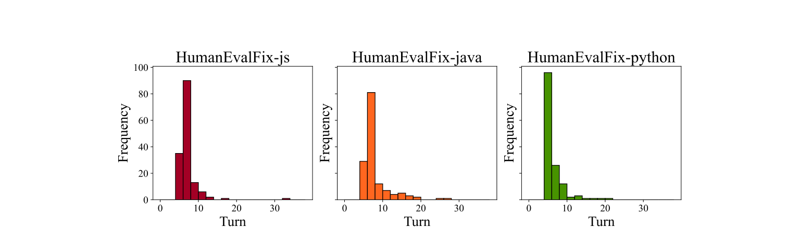

<figcaption>Figure 25: Figure 14 と同様に、HumanEvalFix データセットの解決されたタスクインスタンスに対応する軌跡のターン数の分布を示す。（訳注: 3 言語とも大半が最初の 10 ターン以内に解かれている。）</figcaption>
</figure>

### B.8 Dataset Information（データセットの情報）

**Table 12**: SWE-agent を評価する各データセットの情報。両データセットとも評価利用を許す寛容なソフトウェアライセンスの下でリリースされており、プロプライエタリな系でも使える。

| Dataset | Released | License | Splits | Count | Languages | GitHub Repo |
| --- | --- | --- | --- | --- | --- | --- |
| SWE-bench | 2023-10-10 | MIT | Test / Lite / Dev | 2294 / 300 / 225 | Python | `princeton-nlp/SWE-bench` |
| HumanEvalFix | 2023-07-23 | MIT | Test | 164 | Python, JS, Go, Java, C++, Rust | `bigcode-project/octopack` |

### B.9 Miscellaneous（その他）

**エージェントは BM25 よりファイルの位置特定が得意である。** 対話的な設定は、Jimenez ら [^20] の RAG ベースラインと比べて、エージェントが編集すべき正しいファイルをより頻繁に特定できるようにする。これを測るため、エージェントの予測による［編集された・削除された］ファイルの集合と gold patch の間の F1 スコアを計算する。**SWE-agent w/ GPT-4 Turbo は F1 59.05% を達成するのに対し、BM25 w/ Claude 3 Opus は 45.47% にとどまる。**

**解決されたタスクインスタンスの大半は意図的に提出されている。** タスクエピソードの終わり方は 4 通りある。

- **"Submit"**: エージェントが `submit` コマンドを生成してエピソードが終わる。
- **"Exit Cost (Submit)"**: コスト上限に達してエピソードが終わり、それまでの変更が集められ編集として提出される。
- **"Exit Cost (No Submit)"**: コスト上限に達したが編集が一切なされておらず、提出するものがない。この場合インスタンスは**必ず未解決**になる。
- **"Early Exit"**: エージェントが不正な形式の応答を連続して出しすぎたためにタスクエピソードが終了する。変更があれば編集として提出される。

**Table 13**: タスクエピソードが終わる 4 通りの数。

| モデル | Split | Outcome | Submit | Exit Cost (Submit) | Exit Cost (No Submit) | Early Exit |
| --- | --- | --- | --- | --- | --- | --- |
| SWE-agent w/ GPT-4 Turbo | Full | Resolved | 266 | 20 | 0 | 0 |
| | Full | All | 1589 | 630 | 48 | 1 |
| | Lite | Resolved | 50 | 4 | 0 | 0 |
| | Lite | All | 203 | 95 | 2 | 0 |
| SWE-agent w/ Claude 3 Opus | Full | Resolved | 206 | 35 | 0 | 0 |
| | Full | All | 882 | 1048 | 73 | 1 |
| | Lite | Resolved | 32 | 3 | 0 | 0 |
| | Lite | All | 133 | 156 | 11 | 0 |

SWE-agent w/ GPT-4 Turbo では「All」のタスクインスタンスの大半が `submit` である。SWE-agent w/ Claude 3 Opus の「All」の軌跡では、`submit` はやや 50% を下回り、わずかな過半数はコスト上限に達したときに自動提出されている。**しかしこれらの傾向は「Resolved」のタスクインスタンスには当てはまらない。両モデルとも、解決されたタスクインスタンスの大多数は `submit` である。**§5.2 の結論と §B.3 の可視化を繰り返すことになるが、ここでも**解決されたタスクインスタンスは、割り当てられたターン数の内側でエージェントが編集を生み出し検証できたことをしばしば含意する**ことが分かる。**SWE-agent の ACI は、エージェントから整形式の思考と行動を引き出すことにも効果的である。全実行を通じて "Early Exit" はわずか 2 回しか起きていない。**

## C Prompts（プロンプト）

本節では、エージェントの履歴を構成するプロンプトテンプレートを、SWE-agent へ提示される順に論じる。テンプレートごとに、その目的を述べ、内容を辿り、テンプレートをどう書いたかに影響した追加の動機を記す。テンプレート内容の随伴図はすべて、SWE-agent w/ GPT-4 を用いた我々の既定の構成から引いている。

テンプレートの内容は、エージェントの意図された用途に合わせて多少適応でき、またそうすべきである。本節の目的は、これらのタスクのために各テンプレートをどう設計したかについての我々の思考過程を、今後の仕事の参照として述べることである。**テンプレートを通じて我々は、特定の誤りを犯さないよう・よくある落とし穴を避けるよう・有用な実行の信号を使うよう告げるヒントを提供することが、より成功する問題解決を引き出すのに効果的である**ことを見出す。

<figure>

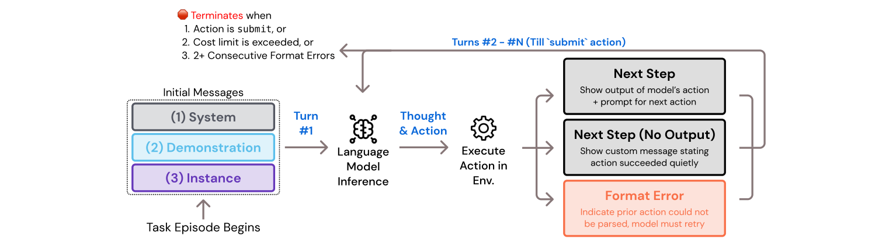

<figcaption>Figure 26: 単一の SWE-agent のタスクインスタンスのエピソードを通じたプロンプトテンプレートの流れ。システム・実演・イシューのテンプレートはタスクエピソードの冒頭にまとめて示され、その後、エージェントの応答が整形式か、行動が標準出力を持つかに応じてターン固有のプロンプトが示される。（訳注: 終了条件は「行動が submit である」「コスト上限を超える」「2 回以上連続の書式エラー」。）</figcaption>
</figure>

**システムテンプレート。** システムテンプレートは、対話的なタスクの設定・エージェントが使えるコマンド・期待される応答形式を述べる。**どのエピソードでも最初のメッセージであり、タスクインスタンス間で内容は変わらず、メッセージ履歴からいかなる時点でも取り除かれたり折り畳まれたりしない。**エージェントは、特別なファイルビューアのインターフェースを備えたコマンドラインという一般的なタスクの設定を告げられる。その後エージェントには、すべてのカスタムコマンドについて使用例とドキュメント文字列を示すコマンドのドキュメントが提示される。前述のとおり、手作業の観察から我々は、**エージェントが `edit` コマンドを効果的に使うには多くの支援を必要とする**ことを見出している。

エージェントは時折、**誤ったインデント水準か誤って指定された行番号のいずれか**を伴う編集を生成する。このため、適切なインデントに注意するようエージェントに告げる注記を含める。最後にシステムプロンプトは、エージェントの応答がどう見えるべきかを例（JSON 形式・XML 区切りなど）で伝え、続いて**ターンごとに単一の思考／行動の対を発行することの重要性を補強する段落**を置く。Docker コンテナが課す制約のため、**コマンドライン環境が `vi` や `python` のような対話的セッションのコマンドをサポートしない**という点を最後に含める。

> 訳注: 以下 Figure 27〜32 のプロンプトテンプレートは、実際に LM へ渡される文字列そのものなので**英語原文のまま**収録する。原典の紙面上の折り返しを示す `,→` は取り除いた。

**Figure 27: System Prompt**（`{documentation}` フィールドは、Table 4 と同様に有効なすべてのコマンドの簡潔な説明で埋められる）

`````
SETTING: You are an autonomous programmer, and you're working directly in the command line with a special interface.

The special interface consists of a file editor that shows you 100 lines of a file at a time. In addition to typical bash commands, you can also use the following commands to help you navigate and edit files.

COMMANDS: {documentation}

Please note that THE EDIT COMMAND REQUIRES PROPER INDENTATION. If you'd like to add the line '        print(x)' you must fully write that out, with all those spaces before the code! Indentation is important and code that is not indented correctly will fail and require fixing before it can be run.

RESPONSE FORMAT:
Your shell prompt is formatted as follows:
(Open file: <path>) <cwd> $

You need to format your output using two fields; discussion and command. Your output should always include one discussion and one command field EXACTLY as in the following example:

DISCUSSION
First I'll start by using ls to see what files are in the current directory. Then maybe we can look at some relevant files to see what they look like.
```
ls -a
```

You should only include a SINGLE command in the command section and then wait for a response from the shell before continuing with more discussion and commands. Everything you include in the DISCUSSION section will be saved for future reference. If you'd like to issue two commands at once, PLEASE DO NOT DO THAT! Please instead first submit just the first command, and then after receiving a response you'll be able to issue the second command. You're free to use any other bash commands you want (e.g. find, grep, cat, ls, cd) in addition to the special commands listed above. However, the environment does NOT support interactive session commands (e.g. python, vim), so please do not invoke them.
`````

**実演テンプレート。** 提供される場合、実演テンプレートはシステムテンプレートの直後に第 2 のメッセージとして続き、開発セットのタスクインスタンスの首尾よい解決に至った軌跡をエージェントに示す。Table 3 のアブレーションが確認するとおり、**実演を含めることはエージェントが正しいコマンドの使い方を理解する助けにわずかになり、誤った応答の率を減らす**。

`put_demos_in_history` 引数が `True` に設定されると、**実演の軌跡の各ターンが履歴内の別々のメッセージとして使われる**。もうひとつの方法は、実演全体を単一のメッセージとして、それが実演であることを示す自然言語の指示で包んで書き出すことである（Figure 28 で示される方法）。**各方法の有効性はモデルによって変わる。**別々のメッセージとして実演を加える第一の方法は、**エージェントに「自分はすでにタスクインスタンスを 1 つ解き終えて次のものに取り組んでいる」という印象を与える**点で好ましくありうる。しかし別のモデルにとっては、単一の軌跡の中に 2 つのタスクの文脈があることは混乱を招きうる。だからこそ、**実演を与えられていると明示的にモデルへ告げる第二の方法のほうが良いこともある**。

**Figure 28: Demonstration**（簡潔さのため実演の最後の 3 ターンのみを示す）

`````
Here is a demonstration of how to correctly accomplish this task.
It is included to show you how to correctly use the interface.
You do not need to follow exactly what is done in the demonstration.
--- DEMONSTRATION ---
{{INSTANCE PROMPT}}

The code has been updated to use the `round` function, which should fix the rounding issue. Before submitting the changes, it would be prudent to run the reproduce.py code again to ensure that this change has the desired effect. I see that "Current directory" is still `/marshmallow-code__marshmallow`, so we can just run `reproduce.py` directly.
```
python reproduce.py
```
345
(Open file: /marshmallow-code__marshmallow/src/marshmallow/fields.py)
(Current directory: /marshmallow-code__marshmallow)
bash-$

The output has changed from 344 to 345, which suggests that the rounding issue has been fixed. Let's remove the reproduce.py file since it is no longer needed.
```
rm reproduce.py
```
Your command ran successfully and did not produce any output.
(Open file: /marshmallow-code__marshmallow/src/marshmallow/fields.py)
(Current directory: /marshmallow-code__marshmallow)
bash-$

rm doesn't have any output when it deletes successfully, so that must have worked. Now that we have fixed the issue, we should submit our changes to the code base. Let's submit the changes using the `submit` command.
```
submit
```
--- END OF DEMONSTRATION ---
`````

**我々は、実演がドメイン固有の問題解決の機微をエージェントが理解する助けに実際になっているかは確信していない。**ソフトウェア工学のイシューの多様性ゆえに、**実演が果たす役割は主として、適切に整形されたコマンドを発行することをエージェントが学ぶ助けになることだ**と我々は考える。

**インスタンステンプレート。** インスタンステンプレートはエージェントにタスクインスタンスを紹介する。問題記述が示され、続いてシステムテンプレートの重要な点を繰り返す簡潔な指示の集合が来る。最後に、**インスタンステンプレートの特に効果的な部分は、bash 環境で首尾よく動作するための追加の指針として役立つヒントの包含**である。

**これらのヒントは手作業で反復的に開発された。**ある構成で開発セットに対して SWE-agent を走らせた後、我々は軌跡を手作業で見て失敗モードを探した。**ヒントはこれらの失敗から生まれ**、繰り返しの検査を通じて、そうしたヒントが対処しようとする誤った問題解決の戦略の頻度を実際に減らすことを見出した。**ヒントを手作業で書く我々のアプローチが確かにスケールしない一方で、よくある誤りへのフィードバックをヒントとして表現することは驚くほど効果的である。**失敗モードを特定し、正しい代替の振る舞いを述べる自然言語の指示を書くという、この過程のより良い方法を開発することは、将来の SWE-agent ベースの系のより良い性能への道でありうる。

**Figure 29: Instance Message**

```
We're currently solving the following issue within our repository. Here's the issue text:
ISSUE:
{issue}

INSTRUCTIONS:
Now, you're going to solve this issue on your own. Your terminal session has started and you're in the repository's root directory. You can use any bash commands or the special interface to help you. Edit all the files you need to and run any checks or tests that you want. Remember, YOU CAN ONLY ENTER ONE COMMAND AT A TIME. You should always wait for feedback after every command. When you're satisfied with all of the changes you've made, you can submit your changes to the code base by simply running the submit command. Note however that you cannot use any interactive session commands (e.g. python, vim) in this environment, but you can write scripts and run them. E.g. you can write a python script and then run it with `python <script_name>.py`.

NOTE ABOUT THE EDIT COMMAND: Indentation really matters! When editing a file, make sure to insert appropriate indentation before each line!

IMPORTANT TIPS:
1. Always start by trying to replicate the bug that the issues discusses. If the issue includes code for reproducing the bug, we recommend that you re-implement that in your environment, and run it to make sure you can reproduce the bug. Then start trying to fix it. When you think you've fixed the bug, re-run the bug reproduction script to make sure that the bug has indeed been fixed.

2. If you run a command and it doesn't work, try running a different command. A command that did not work once will not work the second time unless you modify it!

3. If you open a file and need to get to an area around a specific line that is not in the first 100 lines, say line 583, don't just use the scroll_down command multiple times. Instead, use the goto 583 command. It's much quicker.

4. If the bug reproduction script requires inputting/reading a specific file, such as buggy-input.png, and you'd like to understand how to input that file, conduct a search in the existing repo code, to see whether someone else has already done that. Do this by running the command: find_file "buggy-input.png" If that doesn't work, use the linux 'find' command.

5. Always make sure to look at the currently open file and the current working directory (which appears right after the currently open file). The currently open file might be in a different directory than the working directory! Note that some commands, such as 'create', open files, so they might change the current open file.

6. When editing files, it is easy to accidentally specify a wrong line number or to write code with incorrect indentation. Always check the code after you issue an edit to make sure that it reflects what you wanted to accomplish. If it didn't, issue another command to fix it.

(Open file: {open_file})
(Current directory: {working_dir})
bash-$
```

**次ステップテンプレート。** エージェントの応答が整形式で行動を含むと仮定すると、対応する行動の出力を提示するのに使われる単純なテンプレートが 2 つある。行動が何らかの標準出力を生む場合、エージェントは単にその出力を、次の行動で応答すべきことを示すコマンドラインプロンプトとともに示される。

**Figure 30: Next Step Template**

```
{OBSERVATION}
(Open file: /path/to/open/file.py)
(Current directory: /path/to/cwd)
bash-$
```

しかしエージェントの行動が黙って走り出力を生まない場合（たとえば `rm abc.py`, `touch abc.py`）、**単に出力なしをプロンプトとともに示すことはエージェントにとって解釈が混乱を招きうる**ことを我々は見出した。エージェントはしばしば、先行する行動の効果を判断するために追加の不要なコマンドを走らせる。この状況を防ぐため、**コマンドは首尾よく走り出力を生まなかったことがエージェントへ冗長に知らされる。**

**折り畳まれた観測のテンプレート。** Figure 9 に示し §2 で論じたとおり、**古い観測は折り畳まれる**。すなわちエージェントの相互作用履歴の構造と順序は保たれるが、**古い観測の内容は 1 行のプレースホルダで置き換えられる**。

**Figure 31: Environment Response (collapsed) Template**

```
Old output omitted (101 lines)
```

古い観測を折り畳む目的は二重である。**第一に、各相互作用ステップで処理する必要のあるトークン数を単純に減らす。第二に、古い観測の内容を取り除くことで、ディレクトリやファイルの内容・コマンド出力といった、古くなった情報や重複した情報の存在も減らせる。**

**エラーメッセージテンプレート。** エージェントの応答は常に整形式とは限らない。我々の仕事では、1 つの思考と 1 つの行動を伝えるための 3 つの異なる様式の応答（単一エピソード内では同じ型）のいずれかを生成するようエージェントに求める実験を行った。

1. 行動が markdown 形式のコードブロック（```` ``` ````）で包まれた文字列。
2. "thought" と "action" のキーを持つ JSON 形式の辞書。
3. `<thought>` と `<action>` の区切りを持つ XML 形式の生成。

時折、エージェントは求められた形式に従わない応答を生成しうる。これが起こると、先行するメッセージが不正な形式であったこと、同じ誤りを犯さない別の応答を発行すべきことを示すエラーメッセージをエージェントへ示す。**モデルが 3 回連続で不正な形式の応答を生成すると、エピソードは早期に終了する。**

**Figure 32: Error Message**

`````
Your output was not formatted correctly. You must always include one discussion and one command as part of your response. Make sure you do not have multiple discussion/command tags.
Please make sure your output precisely matches the following format:

DISCUSSION
Discuss here with yourself about what your planning and what you're going to do in this step.
```
command(s) that you're going to run
```
`````

**もうひとつの文脈管理の工夫**は、**モデルが不正な形式の応答を生成し、その後に有効な応答を返した場合、不正な形式の生成に対応する行動と応答がメッセージ履歴から取り除かれるよう履歴が修正される**ことである。この種のノイズ除去は不要な文脈を減らし、将来の不正な形式の生成を防ぐ助けになる。**整形式の応答のそれぞれが、環境と正しく相互作用する方法の追加の in-context な実演になる。**この正しい応答の「**勢い（momentum）**」は、メッセージ履歴に多くの情報がある軌跡の後半のターンでもエージェントが正しい行動を発行し続ける助けとして効果的である。

## D Qualitative Analysis（定性的分析）

**SWE-bench Lite から成功例と失敗例を 2 つずつ選び**、GPT-4 Turbo による既定の構成が生成した軌跡に基づいて完全な定性的分析を行う。

> 訳注（本節の収録範囲）: 4 例のうち、**成功例 `psf/requests-2317` と失敗例 `django/django-14411` の 2 本をターンごとのログまで完全収録**し、残る `pylint-dev/pylint-5859`（成功）と `sympy/sympy-21614`（失敗）は**イシュー要約・相互作用の要約・評価・gold patch を訳出し、ターンごとのログは省略**した。完全収録した 2 本は、成功例と、**最も支配的な失敗モード（Incorrect Implementation, 39.9%）の失敗例**にあたる。軌跡のログは系の実際の入出力なので**英語原文のまま**収録する（PDF の紙面上の折り返しを示す `,→` と、箱ごとに繰り返されるインスタンス ID のラベルは取り除いた）。

### D.1 psf/requests-2317（成功）

**イシューの要約。** エージェントには、`requests` ライブラリにおいて、**bytes オブジェクト（たとえば `b'GET'`）である `method` 変数が `builtin_str` 関数によって誤ってリテラル文字列（`"b'GET'"`）へ変換される**問題の解決が課された。これにより `requests` ライブラリは、誤った method 文字列のせいで **404 Not Found** の応答を発生させていた。この問題は Python 3.4 では観測され 2.6 では観測されず、bytes の扱いにおけるバージョン固有の差異を示していた。

**相互作用の要約。**

1. **対象ファイルの位置特定**: エージェントはまず `requests` ライブラリのディレクトリ内で `sessions.py` を見つけることから始めた。**関連するファイルが `build` ディレクトリではなく `requests` ディレクトリのほうにあることを正しく識別した。**
2. **イシューの検索**: `sessions.py` を開き、`search_file` コマンドで `builtin_str` の関数呼び出しを位置特定した。`method` 変数が変換されている該当行（428 行目）を見つけた。
3. **コードの編集**: `method` が bytes オブジェクトかを確認し、そうであれば `builtin_str` を適用する前に ASCII へデコードするよう `sessions.py` を編集した。
4. **変更のテスト**: 修正を検証するため、バイナリの method 文字列を用いて HTTP リクエストを送ろうとする新しいファイル `reproduce_issue.py` を作成した。スクリプトは応答のステータスコードを印字してリクエストが正しく扱われたかを確認する。それを実行したところ首尾よく走り、**200 OK の応答を受け取り、問題が解決されたことを示した**。
5. **後片付けと提出**: 最後に再現スクリプトを削除し、変更をコードベースへ提出した。

**評価。** 評価の結果、**エージェントが提案した変更はこのインスタンスの単体テストを首尾よく通過する**。エージェントの生成物を gold patch と比較すると、gold patch は `requests/utils.py#L655` で定義された **`to_native_string` 関数**を使っており、これはエージェントが提案した変更と同一に振る舞う。**究極的には、エージェントは首尾よくイシューを解決する一方で、既存のユーティリティ関数を使うことに失敗しており、本番においては保守性や移植性の低いコードにつながりうる。**

> Figure 33: `psf__requests-2317` インスタンスの軌跡。

```text
Issue

We’re currently solving the following issue within our repository. Here’s the issue text:
ISSUE:
method = builtin_str(method) problem
In requests/sessions.py is a command:
method = builtin_str(method)
Converts method from
b’GET’
to
"b’GET’"
Which is the literal string, no longer a binary string. When requests tries to use the method "b’GET’”, it
gets a 404 Not Found response.
I am using python3.4 and python-neutronclient (2.3.9) with requests (2.4.3). neutronclient is broken
because it uses this "args = utils.safe_encode_list(args)" command which converts all the values to
binary string, including method.
I’m not sure if this is a bug with neutronclient or a bug with requests, but I’m starting here. Seems if
requests handled the method value being a binary string, we wouldn’t have any problem.
Also, I tried in python2.6 and this bug doesn’t exist there. Some difference between 2.6 and 3.4 makes
this not work right.

INSTRUCTIONS: (31 lines)
(Open file: n/a)
(Current directory: /psf__requests)
bash-\$

SWE-agent

To address the issue, we first need to replicate the behavior described. The issue mentions that the
‘builtin_str‘ function in ‘requests/sessions.py‘ is converting a binary string method like ‘b’GET’‘ into
the literal string ‘”b’GET”’‘, which is incorrect. We should start by locating the ‘sessions.py‘ file within
the ‘requests‘ library to examine the code around the ‘builtin_str‘ function call.
Let’s begin by finding the ‘sessions.py‘ file in the current repository.
find_file "sessions.py"

Observation

Found 2 matches for "sessions.py" in /psf__requests:
/psf__requests/build/lib/requests/sessions.py
/psf__requests/requests/sessions.py
(Open file: n/a)
(Current directory: /psf__requests)
bash-$

SWE-agent

We have found two matches for ‘sessions.py‘. The one in the ‘build/lib/requests‘ directory is likely a
build artifact, and the one we’re interested in is probably ‘/psf__requests/requests/sessions.py‘. Let’s
open this file to inspect the code around the ‘builtin_str‘ function call.
open requests/sessions.py

Observation

[File: /psf__requests/requests/sessions.py (671 lines total)]
1:# -*- coding: utf-8 -*2:
3:"""
4:requests.session
5:~~~~~~~~~~~~~~~~
6:
7:This module provides a Session object to manage and persist settings across
8:requests (cookies, auth, proxies).
9:
10:"""
11:import os
12:from collections import Mapping
13:from datetime import datetime
14:
15:from .auth import _basic_auth_str
16:from .compat import cookielib, OrderedDict, urljoin, urlparse, builtin_str

17:from .cookies import (
18:
cookiejar_from_dict, extract_cookies_to_jar, RequestsCookieJar, merge_cookies)
19:from .models import Request, PreparedRequest, DEFAULT_REDIRECT_LIMIT
20:from .hooks import default_hooks, dispatch_hook
21:from .utils import to_key_val_list, default_headers, to_native_string
22:from .exceptions import (
23:
TooManyRedirects, InvalidSchema, ChunkedEncodingError, ContentDecodingError)
24:from .structures import CaseInsensitiveDict
25:
26:from .adapters import HTTPAdapter
27:
28:from .utils import (
29:
requote_uri, get_environ_proxies, get_netrc_auth, should_bypass_proxies,
30:
get_auth_from_url
31:)
32:
33:from .status_codes import codes
34:
35:# formerly defined here, reexposed here for backward compatibility
36:from .models import REDIRECT_STATI
37:
38:
39:def merge_setting(request_setting, session_setting, dict_class=OrderedDict):
40:
"""
41:
Determines appropriate setting for a given request, taking into account the
42:
explicit setting on that request, and the setting in the session. If a
43:
setting is a dictionary, they will be merged together using `dict_class`
44:
"""
45:
46:
if session_setting is None:
47:
return request_setting
48:
49:
if request_setting is None:
50:
return session_setting
51:
52:
# Bypass if not a dictionary (e.g. verify)
53:
if not (
54:
isinstance(session_setting, Mapping) and
55:
isinstance(request_setting, Mapping)
56:
):
57:
return request_setting
58:
59:
merged_setting = dict_class(to_key_val_list(session_setting))
60:
merged_setting.update(to_key_val_list(request_setting))
61:
62:
# Remove keys that are set to None.
63:
for (k, v) in request_setting.items():
64:
if v is None:
65:
del merged_setting[k]
66:
67:
merged_setting = dict((k, v) for (k, v) in merged_setting.items() if v is not None)

68:
69:
return merged_setting
70:
71:
72:def merge_hooks(request_hooks, session_hooks, dict_class=OrderedDict):
73:
"""
74:
Properly merges both requests and session hooks.
75:
76:
This is necessary because when request_hooks == {'response': []}, the
77:
merge breaks Session hooks entirely.
78:
"""
79:
if session_hooks is None or session_hooks.get('response') == []:
80:
return request_hooks
81:
82:
if request_hooks is None or request_hooks.get('response') == []:
83:
return session_hooks
84:
85:
return merge_setting(request_hooks, session_hooks, dict_class)
86:
87:
88:class SessionRedirectMixin(object):
89:
def resolve_redirects(self, resp, req, stream=False, timeout=None,
90:
verify=True, cert=None, proxies=None):
91:
"""Receives a Response. Returns a generator of Responses."""
92:
93:
i = 0
94:
hist = [] # keep track of history
95:
96:
while resp.is_redirect:
97:
prepared_request = req.copy()
98:
99:
if i > 0:
100:
# Update history and keep track of redirects.
(571 more lines below)
(Open file: n/a)
(Current directory: /psf__requests)
bash-$

SWE-agent

The ‘sessions.py‘ file is now open, but the ‘builtin_str‘ function call is not visible in the first 100 lines
of the file. Since we don’t have the exact line number where the ‘builtin_str‘ function is called, we’ll
need to search within the file for it.
Let’s use the ‘search_file‘ command to find the usage of ‘builtin_str‘ within ‘sessions.py‘.
search_file "builtin_str"

Observation

Found 2 matches for "builtin_str" in /psf__requests/requests/sessions.py:
Line 16:from .compat import cookielib, OrderedDict, urljoin, urlparse, builtin_str
Line 428:
method = builtin_str(method)
End of matches for "builtin_str" in /psf__requests/requests/sessions.py
(Open file: /psf__requests/requests/sessions.py)
(Current directory: /psf__requests)
bash-$

SWE-agent

We have found two occurrences of ‘builtin_str‘ in ‘sessions.py‘. The second occurrence on line 428 is
where the method is being converted to a string. We should inspect this line to understand the context
and see how we can address the issue.
Let’s navigate to line 428 in ‘sessions.py‘ to see the relevant code.
goto 428

Observation

[File: /psf__requests/requests/sessions.py (671 lines total)]
(412 more lines above)
413:
data before giving up, as a float, or a (`connect timeout, read
414:
timeout <user/advanced.html#timeouts>`_) tuple.
415:
:type timeout: float or tuple
416:
:param allow_redirects: (optional) Set to True by default.
417:
:type allow_redirects: bool
418:
:param proxies: (optional) Dictionary mapping protocol to the URL of
419:
the proxy.
420:
:param stream: (optional) whether to immediately download the response
421:
content. Defaults to ``False``.
422:
:param verify: (optional) if ``True``, the SSL cert will be verified.
423:
A CA_BUNDLE path can also be provided.
424:
:param cert: (optional) if String, path to ssl client cert file (.pem).
425:
If Tuple, ('cert', 'key') pair.
426:
"""
427:
428:
method = builtin_str(method)
429:
430:
# Create the Request.
431:
req = Request(
432:
method = method.upper(),
433:
url = url,
434:
headers = headers,
435:
files = files,
436:
data = data or {},
437:
json = json,
438:
params = params or {},

439:
auth = auth,
440:
cookies = cookies,
441:
hooks = hooks,
442:
)
443:
prep = self.prepare_request(req)
444:
445:
proxies = proxies or {}
446:
447:
settings = self.merge_environment_settings(
448:
prep.url, proxies, stream, verify, cert
449:
)
450:
451:
# Send the request.
452:
send_kwargs = {
453:
'timeout': timeout,
454:
'allow_redirects': allow_redirects,
455:
}
456:
send_kwargs.update(settings)
457:
resp = self.send(prep, **send_kwargs)
458:
459:
return resp
460:
461:
def get(self, url, **kwargs):
462:
"""Sends a GET request. Returns :class:`Response` object.
463:
464:
:param url: URL for the new :class:`Request` object.
465:
:param \*\*kwargs: Optional arguments that ``request`` takes.
466:
"""
467:
468:
kwargs.setdefault('allow_redirects', True)
469:
return self.request('GET', url, **kwargs)
470:
471:
def options(self, url, **kwargs):
472:
"""Sends a OPTIONS request. Returns :class:`Response` object.
473:
474:
:param url: URL for the new :class:`Request` object.
475:
:param \*\*kwargs: Optional arguments that ``request`` takes.
476:
"""
477:
478:
kwargs.setdefault('allow_redirects', True)
479:
return self.request('OPTIONS', url, **kwargs)
480:
481:
def head(self, url, **kwargs):
482:
"""Sends a HEAD request. Returns :class:`Response` object.
483:
484:
:param url: URL for the new :class:`Request` object.
485:
:param \*\*kwargs: Optional arguments that ``request`` takes.
486:
"""
487:
488:
kwargs.setdefault('allow_redirects', False)
489:
return self.request('HEAD', url, **kwargs)
490:
491:
def post(self, url, data=None, json=None, **kwargs):
492:
"""Sends a POST request. Returns :class:`Response` object.
493:
494:
:param url: URL for the new :class:`Request` object.

495:
:param data: (optional) Dictionary, bytes, or file-like object to send in the body of the :class:`Request`.
496:
:param json: (optional) json to send in the body of the :class:`Request`.
497:
:param \*\*kwargs: Optional arguments that ``request`` takes.
498:
"""
499:
500:
return self.request('POST', url, data=data, json=json, **kwargs)
501:
502:
def put(self, url, data=None, **kwargs):
503:
"""Sends a PUT request. Returns :class:`Response` object.
504:
505:
:param url: URL for the new :class:`Request` object.
506:
:param data: (optional) Dictionary, bytes, or file-like object to send in the body of the :class:`Request`.
507:
:param \*\*kwargs: Optional arguments that ``request`` takes.
508:
"""
509:
510:
return self.request('PUT', url, data=data, **kwargs)
511:
512:
def patch(self, url, data=None, **kwargs):
(159 more lines below)
(Open file: /psf__requests/requests/sessions.py)
(Current directory: /psf__requests)
bash-$

SWE-agent

We are now looking at the section of the ‘sessions.py‘ file where the ‘builtin_str‘ function is used to
convert the ‘method‘ variable. According to the issue, this conversion is causing a problem when the
‘method‘ is a binary string because it’s being converted to a literal string that includes the binary prefix
‘b’...’‘.
To address this issue, we need to ensure that the ‘method‘ variable is correctly converted to a string
without the binary prefix. This might involve checking the type of the ‘method‘ variable and handling
binary strings differently from regular strings.
Let’s edit the line to add a check that ensures binary strings are decoded to regular strings before being
passed to ‘builtin_str‘.
edit 428:428
# Ensure method is a string, decode if it's a binary string
if isinstance(method, bytes):
method = method.decode('ascii')
method = builtin_str(method)
end_of_edit

Observation

[File: /psf__requests/requests/sessions.py (674 lines total)]
(377 more lines above)
378:
def request(self, method, url,
379:
params=None,
380:
data=None,
381:
headers=None,
382:
cookies=None,

383:
files=None,
384:
auth=None,
385:
timeout=None,
386:
allow_redirects=True,
387:
proxies=None,
388:
hooks=None,
389:
stream=None,
390:
verify=None,
391:
cert=None,
392:
json=None):
393:
"""Constructs a :class:`Request <Request>`, prepares it and sends it.
394:
Returns :class:`Response <Response>` object.
395:
396:
:param method: method for the new :class:`Request` object.
397:
:param url: URL for the new :class:`Request` object.
398:
:param params: (optional) Dictionary or bytes to be sent in the query
399:
string for the :class:`Request`.
400:
:param data: (optional) Dictionary or bytes to send in the body of the
401:
:class:`Request`.
402:
:param json: (optional) json to send in the body of the
403:
:class:`Request`.
404:
:param headers: (optional) Dictionary of HTTP Headers to send with the
405:
:class:`Request`.
406:
:param cookies: (optional) Dict or CookieJar object to send with the
407:
:class:`Request`.
408:
:param files: (optional) Dictionary of ``'filename': file-like-objects``
409:
for multipart encoding upload.
410:
:param auth: (optional) Auth tuple or callable to enable
411:
Basic/Digest/Custom HTTP Auth.
412:
:param timeout: (optional) How long to wait for the server to send
413:
data before giving up, as a float, or a (`connect timeout, read
414:
timeout <user/advanced.html#timeouts>`_) tuple.
415:
:type timeout: float or tuple
416:
:param allow_redirects: (optional) Set to True by default.
417:
:type allow_redirects: bool
418:
:param proxies: (optional) Dictionary mapping protocol to the URL of
419:
the proxy.
420:
:param stream: (optional) whether to immediately download the response
421:
content. Defaults to ``False``.
422:
:param verify: (optional) if ``True``, the SSL cert will be verified.
423:
A CA_BUNDLE path can also be provided.
424:
:param cert: (optional) if String, path to ssl client cert file (.pem).
425:
If Tuple, ('cert', 'key') pair.
426:
"""
427:
428:
# Ensure method is a string, decode if it's a binary string
429:
if isinstance(method, bytes):

430:
method = method.decode('ascii')
431:
method = builtin_str(method)
432:
433:
# Create the Request.
434:
req = Request(
435:
method = method.upper(),
436:
url = url,
437:
headers = headers,
438:
files = files,
439:
data = data or {},
440:
json = json,
441:
params = params or {},
442:
auth = auth,
443:
cookies = cookies,
444:
hooks = hooks,
445:
)
446:
prep = self.prepare_request(req)
447:
448:
proxies = proxies or {}
449:
450:
settings = self.merge_environment_settings(
451:
prep.url, proxies, stream, verify, cert
452:
)
453:
454:
# Send the request.
455:
send_kwargs = {
456:
'timeout': timeout,
457:
'allow_redirects': allow_redirects,
458:
}
459:
send_kwargs.update(settings)
460:
resp = self.send(prep, **send_kwargs)
461:
462:
return resp
463:
464:
def get(self, url, **kwargs):
465:
"""Sends a GET request. Returns :class:`Response` object.
466:
467:
:param url: URL for the new :class:`Request` object.
468:
:param \*\*kwargs: Optional arguments that ``request`` takes.
469:
"""
470:
471:
kwargs.setdefault('allow_redirects', True)
472:
return self.request('GET', url, **kwargs)
473:
474:
def options(self, url, **kwargs):
475:
"""Sends a OPTIONS request. Returns :class:`Response` object.
476:
477:
:param url: URL for the new :class:`Request` object.
(197 more lines below)
File updated. Please review the changes and make sure they are correct (correct indentation, no duplicate lines, etc). Edit the file again if necessary.
(Open file: /psf__requests/requests/sessions.py)
(Current directory: /psf__requests)
bash-$

SWE-agent

The edit has been made to decode binary strings before converting them to a string with ‘builtin_str‘.
This should prevent the issue where a binary string like ‘b’GET’‘ is incorrectly converted to the literal
string ‘”b’GET”’‘.
To verify that this change resolves the issue, we should create a script that replicates the problem as
described. We’ll write a script that uses the ‘requests‘ library to make a request with a binary method
and check if it now handles the method correctly.
Let’s create a new file called ‘reproduce_issue.py‘ to test the fix.
create reproduce_issue.py

Observation

[File: /psf__requests/reproduce_issue.py (1 lines total)]
1:
(Open file: /psf__requests/requests/sessions.py)
(Current directory: /psf__requests)
bash-$

SWE-agent

Now that we have created the ‘reproduce_issue.py‘ file, let’s write a script that attempts to send a request
with a binary method string, which should now be handled correctly due to our fix in ‘sessions.py‘.
We’ll write a simple script that imports the ‘requests‘ library, sets a binary method, and tries to make a
request to a test URL.
edit 1:1
import requests
# Define a binary method string
method = b'GET'
# Test URL (example)
url = 'https://httpbin.org/get'
# Attempt to send a request with a binary method
response = requests.request(method, url)
# Print the response status code
print('Response status code:', response.status_code)
# Print a success message if the script completes
print("Script completed successfully, no errors.")
end_of_edit

Observation

[File: /psf__requests/reproduce_issue.py (16 lines total)]
1:import requests
2:
3:# Define a binary method string
4:method = b'GET'
5:
6:# Test URL (example)
7:url = 'https://httpbin.org/get'

8:
9:# Attempt to send a request with a binary method
10:response = requests.request(method, url)
11:
12:# Print the response status code
13:print('Response status code:', response.status_code)
14:
15:# Print a success message if the script completes
16:print("Script completed successfully, no errors.")
File updated. Please review the changes and make sure they are correct (correct indentation, no duplicate lines, etc). Edit the file again if necessary.
(Open file: /psf__requests/reproduce_issue.py)
(Current directory: /psf__requests)
bash-$

SWE-agent

The script has been written and should now attempt to send a request using a binary method string. This
will help us verify if the issue has been resolved by the changes we made to ‘sessions.py‘.
Let’s run the script to see if it executes successfully without encountering the issue described.
python reproduce_issue.py

Observation

Response status code: 200
Script completed successfully, no errors.
(Open file: /psf__requests/reproduce_issue.py)
(Current directory: /psf__requests)
bash-$

SWE-agent

The script ran successfully and received a 200 OK response, which indicates that the issue with handling
binary method strings has been resolved. The ‘requests‘ library is now correctly processing the binary
string ‘b’GET’‘ as a valid HTTP method.
Since the fix appears to be working, we can clean up by removing the ‘reproduce_issue.py‘ script, as it
is no longer needed. After that, we can submit our changes to the code base.
Let’s remove the ‘reproduce_issue.py‘ file.
rm reproduce_issue.py

Observation

(Open file: /psf__requests/reproduce_issue.py)
(Current directory: /psf__requests)
bash-$

SWE-agent

The ‘reproduce_issue.py‘ file has been successfully removed. Now that we have verified the fix and
cleaned up the test script, we can proceed to submit our changes to the code base.
Let’s submit the changes using the ‘submit‘ command.
submit

Observation

diff --git a/requests/sessions.py b/requests/sessions.py
index d701ff2e..4829747d 100644
--- a/requests/sessions.py
+++ b/requests/sessions.py
@@ -425,6 +425,9 @@ class Session(SessionRedirectMixin):
If Tuple, ('cert', 'key') pair.
"""
+ +
+

# Ensure method is a string, decode if it's a binary
string
if isinstance(method, bytes):
method = method.decode('ascii')
method = builtin_str(method)
# Create the Request.

(Open file: /psf__requests/reproduce_issue.py)
(Current directory: /psf__requests)
bash-\$

Gold Patch

diff --git a/requests/sessions.py b/requests/sessions.py
--- a/requests/sessions.py
+++ b/requests/sessions.py
@@ -13,7 +13,7 @@
from datetime import datetime
from .auth import _basic_auth_str
-from .compat import cookielib, OrderedDict, urljoin, urlparse, builtin_str
+from .compat import cookielib, OrderedDict, urljoin, urlparse
from .cookies import (
cookiejar_from_dict, extract_cookies_to_jar, RequestsCookieJar, merge_cookies)
from .models import Request, PreparedRequest, DEFAULT_REDIRECT_LIMIT
@@ -425,7 +425,7 @@ def request(self, method, url,
If Tuple, ('cert', 'key') pair.
"""
+

method = builtin_str(method)
method = to_native_string(method)
# Create the Request.
req = Request(
```

### D.2 pylint-dev/pylint-5859（成功。ログは省略）

**イシューの要約。** `pylint` の `--notes` オプションが、**完全に約物（punctuation）だけから成る note タグについて fixme の警告（W0511）を報告しない**という問題。具体的には `--notes="YES,???"` を付けて pylint を走らせると、`YES` のタグだけが認識され `???` のタグは無視される。期待される振る舞いは、約物だけのタグも通常どおり認識することである。

**相互作用の要約。**

1. **イシューの再現**: `test.py` を作り、問題を再現するコメントを加えた。続いて pylint を走らせて問題を確認し、`YES` の note だけが報告され `???` は報告されないことを確かめた。
2. **関連コードの検索**: `search_dir` コマンドで `--notes` オプションの扱いを検索しようとした。コマンドのオプションで最初いくらか混乱した後、関連するコードを含むファイルとして `pylint/checkers/misc.py` を首尾よく特定した。
3. **コードの編集**: `EncodingChecker` クラスの `open` メソッド内で、note タグの一致を担う正規表現を位置特定した。**単語境界 `\b` を先読み表明 `(?=\W|$)` で置き換える**ことで、約物だけの note タグを扱えるよう正規表現を修正した。
4. **再現コードによる変更のテスト**: 修正の後、`test.py` に対して pylint を再実行した。出力は**両方の note タグ（`YES` と `???`）が正しく識別される**ようになったことを確認した。
5. **後片付けと提出**: 最後に `test.py` を削除し、変更を提出した。

**評価。** エージェントは効果的に問題を再現し、関連するコードを特定してそこへ辿り着き、正規表現に的を絞った修正を加え、テストを通じて修正を検証した。**エージェントの解は必要なテストを首尾よく通過する一方で、エージェントの解と gold patch の間には振る舞いのわずかな差がある。**とりわけエージェントは、note タグを扱う正規表現の `\b` の単語境界を、タグの境界を示すために正規表現パターン `(\W|$)` で置き換えた。**同じ役割に `(:|\s|\Z)` のパターンを使う gold patch の解と比べると、エージェントの解は既存のテストでは捉えられない他の意図しない結果を引き起こしている可能性がある。**

gold patch の該当箇所は次のとおり。

```python
regex_string = rf"#\s*({notes})(?=(:|\s|\Z))"
self._fixme_pattern = re.compile(regex_string, re.I)
```

### D.3 sympy/sympy-21614（失敗。ログは省略）

**イシューの要約。** `sympy.Derivative` の `kind` 属性を印字したときに **`UndefinedKind` 型が返る**ことを報告する問題。報告者は代わりに `DerivativeKind` のようなものを期待している。

**評価。** この軌跡は **`exit_cost`（コスト上限に達したための終了）**で終わっている。すなわち失敗モードとしては **Ran Out of Budget** にあたる。

gold patch は次のとおり（`sympy/core/function.py`）。

```python
@property
def kind(self):
    return self.args[0].kind
```

### D.4 django/django-14411（失敗）

**イシューの要約。** Django の admin インターフェースにおける **`ReadOnlyPasswordHashWidget`** に関わる問題。このウィジェットの `label` 要素は、**ラベル付け不可能な（non-labelable）要素を指す `for` 属性を持っている**。`ReadOnlyPasswordHashWidget` は `input` 要素ではなくテキストを描画するので、**ラベルは `for` 属性を持つべきではない。**

**相互作用の要約。**

1. **関連ファイルの位置特定**: エージェントは `find_file` コマンドで `ReadOnlyPasswordHashWidget` の定義を検索することから始めたが、結果は得られなかった。それから `search_dir` コマンドでリポジトリ内のウィジェットへの参照を探し、いくつかのファイルで関連する一致を位置特定した。エージェントはまず `helpers.py` を調べることを選んだが、それはウィジェットへの参照を含むだけで**ラベル描画のコードを含んでいなかった**。
2. **関連ファイルの探索**: 次に `django/contrib/auth` ディレクトリの `forms.py` を開き、そこで `ReadOnlyPasswordHashWidget` と、それに紐づく `ReadOnlyPasswordHashField` を見つけた。ウィジェットが描画にテンプレート（`read_only_password_hash.html`）を使っていることを識別したが、**そのテンプレートはウィジェットの `for` 属性に関わる情報を含んでいなかった。**
3. **クラス定義の編集**: `forms.py` に戻り、`ReadOnlyPasswordHashField` を使う `UserChangeForm` を見つけた。**Django のフォーム描画系がおそらく `for` 属性を自動的に加えているのだろうと推論した。**この問題に対処するため、エージェントは `for` 属性を除外する `label_tag` メソッドを `ReadOnlyPasswordHashField` に書こうとした。この趣旨でいくつかの編集を行い、`django.utils.html` から必要なユーティリティをインポートし、カスタムの `label_tag` メソッドを加えた。
4. **テストせずに提出**: 望んだ変更を加えた後、**この環境では Django のサーバーを走らせてテストできないと想定して、テストせずに提出へ進んだ。**

**評価。** エージェントは **`ReadOnlyPasswordHashField` クラスのラベル描画をカスタマイズする必要があることを正しく識別した**。しかし、**その解は問題を解けなかった。ウィジェットのオブジェクトについてラベルがどう定義されるかを理解していなかったからである。**実際には、**モデルは `Widget` クラスで定義された `id_for_label` プロパティを上書きする必要があった**。同様の機能はコードベースの他の箇所に見られる。

> 訳注: これは Table 9 のカテゴリでいう **Incorrect Implementation**——「エージェントは妥当な領域に変更を加えたが、その解はイシューに正しく対処していなかった」——にあたり、Figure 8 で未解決インスタンスの **39.9%** を占める最頻の失敗モードである。§5.2 が指摘する「テストせずに提出する」振る舞いも観測できる。

> Figure 36: `django__django-14411` インスタンスの軌跡。

```text
Issue

We’re currently solving the following issue within our repository. Here’s the issue text:
ISSUE:
Label for ReadOnlyPasswordHashWidget points to non-labelable element.
Description
(last modified by David Sanders)
In the admin, the label element for the ReadOnlyPasswordHashWidget widget has a ’for’ attribute
which points to a non-labelable element, since the widget just renders text, not an input. There’s no
labelable element for the widget, so the label shouldn’t have a ’for’ attribute.
INSTRUCTIONS: (31 lines)
(Open file: n/a)
(Current directory: /django__django)
bash-$

SWE-agent

To address the issue, we need to locate the file that contains the ‘ReadOnlyPasswordHashWidget‘
widget’s rendering code. Since this is likely part of the Django admin, we should start by searching for
the file that defines ‘ReadOnlyPasswordHashWidget‘. Let’s use the ‘find_file‘ command to locate this
file within the repository.
find_file "ReadOnlyPasswordHashWidget"

Observation

No matches found for "ReadOnlyPasswordHashWidget" in /django__django
(Open file: n/a)
(Current directory: /django__django)
bash-$

SWE-agent

It seems that the ‘find_file‘ command did not yield any results for ”ReadOnlyPasswordHashWidget”.
This could be because the file name does not exactly match the widget name. Since the widget is likely
to be part of the Django admin, it might be located in a file related to forms or widgets in the admin app.
Let’s try a broader search using the ‘search_dir‘ command to look for the term ”ReadOnlyPasswordHashWidget” within the files of the repository. This should help us find the file where the widget is
defined or used.
search_dir "ReadOnlyPasswordHashWidget"

Observation

Found 9 matches for "ReadOnlyPasswordHashWidget" in /django__django:
/django__django/django/contrib/admin/helpers.py (1 matches)
/django__django/django/contrib/auth/forms.py (2 matches)
/django__django/docs/releases/1.11.1.txt (1 matches)
/django__django/tests/auth_tests/test_forms.py (4 matches)
/django__django/tests/auth_tests/test_views.py (1 matches)
End of matches for "ReadOnlyPasswordHashWidget" in /django__django
(Open file: n/a)
(Current directory: /django__django)
bash-$

SWE-agent

The search results indicate that there are matches for ”ReadOnlyPasswordHashWidget” in several files,
but the most likely places where the rendering code would be defined are in ‘helpers.py‘ and ‘forms.py‘
within the ‘django/contrib/admin‘ and ‘django/contrib/auth‘ directories, respectively.
Since the issue is related to the admin interface, let’s first check the ‘helpers.py‘ file in the ‘django/contrib/admin‘ directory. We’ll open this file and look for the relevant code.
open django/contrib/admin/helpers.py

Observation

[File: /django__django/django/contrib/admin/helpers.py (424 lines total)]
1:import json
2:
3:from django import forms
4:from django.contrib.admin.utils import (
5:
display_for_field, flatten_fieldsets, help_text_for_field, label_for_field,
6:
lookup_field, quote,
7:)
8:from django.core.exceptions import ObjectDoesNotExist
9:from django.db.models.fields.related import (
10:
ForeignObjectRel, ManyToManyRel, OneToOneField,
11:)
12:from django.forms.utils import flatatt
13:from django.template.defaultfilters import capfirst, linebreaksbr
14:from django.urls import NoReverseMatch, reverse
15:from django.utils.html import conditional_escape, format_html

16:from django.utils.safestring import mark_safe
17:from django.utils.translation import gettext, gettext_lazy as _
18:
19:ACTION_CHECKBOX_NAME = '_selected_action'
20:
21:
22:class ActionForm(forms.Form):
23:
action = forms.ChoiceField(label=_('Action:'))
24:
select_across = forms.BooleanField(
25:
label='',
26:
required=False,
27:
initial=0,
28:
widget=forms.HiddenInput({'class': 'select-across'}),
29:
)
30:
31:
32:checkbox = forms.CheckboxInput({'class': 'action-select'}, lambda value: False)
33:
34:
35:class AdminForm:
36:
def __init__(self, form, fieldsets, prepopulated_fields, readonly_fields=None, model_admin=None):
37:
self.form, self.fieldsets = form, fieldsets
38:
self.prepopulated_fields = [{
39:
'field': form[field_name],
40:
'dependencies': [form[f] for f in dependencies]
41:
} for field_name, dependencies in prepopulated_fields.items()]
42:
self.model_admin = model_admin
43:
if readonly_fields is None:
44:
readonly_fields = ()
45:
self.readonly_fields = readonly_fields
46:
47:
def __iter__(self):
48:
for name, options in self.fieldsets:
49:
yield Fieldset(
50:
self.form, name,
51:
readonly_fields=self.readonly_fields,
52:
model_admin=self.model_admin,
53:
**options
54:
)
55:
56:
@property
57:
def errors(self):
58:
return self.form.errors
59:
60:
@property
61:
def non_field_errors(self):
62:
return self.form.non_field_errors
63:
64:
@property
65:
def media(self):
66:
media = self.form.media
67:
for fs in self:
68:
media = media + fs.media
69:
return media
70:
71:
72:class Fieldset:
73:
def __init__(self, form, name=None, readonly_fields=(), fields=(), classes=(),
74:
description=None, model_admin=None):

75:
76:
77:
78:
79:
80:
81:
82:
83:
84:
85:
86:
87:
88:
89:
90: self.form = form
self.name, self.fields = name, fields
self.classes = ' '.join(classes)
self.description = description
self.model_admin = model_admin
self.readonly_fields = readonly_fields
@property
def media(self):
if 'collapse' in self.classes:
return forms.Media(js=['admin/js/collapse.js'])
return forms.Media()
def __iter__(self):
for field in self.fields:
yield Fieldline(self.form, field,
self.readonly_fields, model_admin=self.model_admin)

91:
92:
93:class Fieldline:
94:
def __init__(self, form, field, readonly_fields=None, model_admin=None):
95:
self.form = form # A django.forms.Form instance
96:
if not hasattr(field, "__iter__") or isinstance(field, str):
97:
self.fields = [field]
98:
else:
99:
self.fields = field
100:
self.has_visible_field = not all(
(324 more lines below)
(Open file: n/a)
(Current directory: /django__django)
bash-$

SWE-agent

The ‘helpers.py‘ file is now open, but we need to find the specific part of the code that deals with the
‘ReadOnlyPasswordHashWidget‘. Since the file is quite long, we should use the ‘search_file‘ command
to locate the term within this file.
search_file "ReadOnlyPasswordHashWidget"

Observation

Found 1 matches for "ReadOnlyPasswordHashWidget" in /django__django/django/contrib/admin/helpers.py:
Line 215:
# ReadOnlyPasswordHashWidget.
End of matches for "ReadOnlyPasswordHashWidget" in /django__django/django/contrib/admin/helpers.py
(Open file: /django__django/django/contrib/admin/helpers.py)
(Current directory: /django__django)
bash-$

SWE-agent

We have found a reference to ‘ReadOnlyPasswordHashWidget‘ on line 215 of the ‘helpers.py‘ file.
Let’s navigate to that line to examine the context and see how the label is being rendered.
goto 215

Observation

[File: /django__django/django/contrib/admin/helpers.py (424 lines total)]
(199 more lines above)
200:
return format_html('<a href="{}">{}</a>', url, remote_obj)
201:
except NoReverseMatch:
202:
return str(remote_obj)
203:
204:
def contents(self):
205:
from django.contrib.admin.templatetags.admin_list import _boolean_icon
206:
field, obj, model_admin = self.field['field'], self.form.instance, self.model_admin
207:
try:
208:
f, attr, value = lookup_field(field, obj, model_admin)
209:
except (AttributeError, ValueError, ObjectDoesNotExist):
210:
result_repr = self.empty_value_display
211:
else:
212:
if field in self.form.fields:
213:
widget = self.form[field].field.widget
214:
# This isn't elegant but suffices for contrib.auth's
215:
# ReadOnlyPasswordHashWidget.
216:
if getattr(widget, 'read_only', False):
217:
return widget.render(field, value)
218:
if f is None:
219:
if getattr(attr, 'boolean', False):
220:
result_repr = _boolean_icon(value)
221:
else:
222:
if hasattr(value, "__html__"):
223:
result_repr = value
224:
else:
225:
result_repr = linebreaksbr(value)
226:
else:
227:
if isinstance(f.remote_field, ManyToManyRel) and value is not None:
228:
result_repr = ", ".join(map(str, value.all()))
229:
elif (
230:
isinstance(f.remote_field, (ForeignObjectRel, OneToOneField)) and
231:
value is not None
232:
):
233:
result_repr = self.get_admin_url(f.remote_field, value)
234:
else:
235:
result_repr = display_for_field(value, f, self.empty_value_display)
236:
result_repr = linebreaksbr(result_repr)

237:
return conditional_escape(result_repr)
238:
239:
240:class InlineAdminFormSet:
241:
"""
242:
A wrapper around an inline formset for use in the admin system.
243:
"""
244:
def __init__(self, inline, formset, fieldsets, prepopulated_fields=None,
245:
readonly_fields=None, model_admin=None, has_add_permission=True,
246:
has_change_permission=True, has_delete_permission=True,
247:
has_view_permission=True):
248:
self.opts = inline
249:
self.formset = formset
250:
self.fieldsets = fieldsets
251:
self.model_admin = model_admin
252:
if readonly_fields is None:
253:
readonly_fields = ()
254:
self.readonly_fields = readonly_fields
255:
if prepopulated_fields is None:
256:
prepopulated_fields = {}
257:
self.prepopulated_fields = prepopulated_fields
258:
self.classes = ' '.join(inline.classes) if inline.classes else ''
259:
self.has_add_permission = has_add_permission
260:
self.has_change_permission = has_change_permission
261:
self.has_delete_permission = has_delete_permission
262:
self.has_view_permission = has_view_permission
263:
264:
def __iter__(self):
265:
if self.has_change_permission:
266:
readonly_fields_for_editing = self.readonly_fields
267:
else:
268:
readonly_fields_for_editing = self.readonly_fields + flatten_fieldsets(self.fieldsets)
269:
270:
for form, original in zip(self.formset.initial_forms, self.formset.get_queryset()):
271:
view_on_site_url = self.opts.get_view_on_site_url(original)
272:
yield InlineAdminForm(
273:
self.formset, form, self.fieldsets, self.prepopulated_fields,
274:
original, readonly_fields_for_editing, model_admin=self.opts,
275:
view_on_site_url=view_on_site_url,
276:
)
277:
for form in self.formset.extra_forms:
278:
yield InlineAdminForm(
279:
self.formset, form, self.fieldsets, self.prepopulated_fields,
280:
None, self.readonly_fields, model_admin=self.opts,
281:
)
282:
if self.has_add_permission:
283:
yield InlineAdminForm(
284:
self.formset, self.formset.empty_form,
285:
self.fieldsets, self.prepopulated_fields, None,
286:
self.readonly_fields, model_admin=self.opts,
287:
)

288:
289:
def fields(self):
290:
fk = getattr(self.formset, "fk", None)
291:
empty_form = self.formset.empty_form
292:
meta_labels = empty_form._meta.labels or {}
293:
meta_help_texts = empty_form._meta.help_texts or {}
294:
for i, field_name in enumerate(flatten_fieldsets(self.fieldsets)):
295:
if fk and fk.name == field_name:
296:
continue
297:
if not self.has_change_permission or field_name in self.readonly_fields:
298:
yield {
299:
'name': field_name,
(125 more lines below)
(Open file: /django__django/django/contrib/admin/helpers.py)
(Current directory: /django__django)
bash-$

SWE-agent

We have navigated to the relevant section of the ‘helpers.py‘ file where the ‘ReadOnlyPasswordHashWidget‘ is mentioned. The comment on line 215 suggests that there is a special case handling for the
‘ReadOnlyPasswordHashWidget‘. The code on line 216 checks if the widget has a ‘read_only‘ attribute
and, if so, renders the widget directly.
To address the issue, we need to ensure that the label for the ‘ReadOnlyPasswordHashWidget‘ does not
have a ’for’ attribute, as it points to a non-labelable element. We should look for the part of the code
where the label is being rendered with the ’for’ attribute and make the necessary changes.
Since the code snippet we are looking at does not show the rendering of the label, we need to find where
the label is being rendered. It might be in the template files or somewhere else in the code. Let’s search
for the term ”label” in the current file to find where labels are being rendered.
search_file "label"

Observation

Found 23 matches for "label" in /django__django/django/contrib/admin/helpers.py:
Line 5:
display_for_field, flatten_fieldsets, help_text_for_field, label_for_field,
Line 23:
action = forms.ChoiceField(label=_('Action:'))
Line 25:
label='',
Line 131:
def label_tag(self):
Line 133:
contents = conditional_escape(self.field.label)
Line 142:
# checkboxes should not have a label suffix as the checkbox appears
Line 143:
# to the left of the label.
Line 144:
return self.field.label_tag(
Line 146:
label_suffix='' if self.is_checkbox else None,
Line 163:
if form._meta.labels and class_name in form._meta.labels:
Line 164:
label = form._meta.labels[class_name]
Line 166:
label = label_for_field(field, form._meta.model, model_admin, form=form)
Line 175:
'label': label,
Line 186:
def label_tag(self):
Line 190:
label = self.field['label']

Line 191:
return format_html('<label{}>{}{}</label>', flatatt(attrs), capfirst(label), self.form.label_suffix)
Line 195:
remote_field.model._meta.app_label,
Line 292:
meta_labels = empty_form._meta.labels or {}
Line 300:
'label': meta_labels.get(field_name) or label_for_field(
Line 312:
label = form_field.label
Line 313:
if label is None:
Line 314:
label = label_for_field(field_name, self.opts.model, self.opts, form=empty_form)
Line 317:
'label': label,
End of matches for "label" in /django__django/django/contrib/admin/helpers.py
(Open file: /django__django/django/contrib/admin/helpers.py)
(Current directory: /django__django)
bash-$

SWE-agent

The search results show several instances where labels are being handled in the ‘helpers.py‘ file. The
most promising lines for our issue seem to be around line 191, where a label tag is being formatted with
a ‘for‘ attribute. Let’s navigate to that line to examine the context and see if this is where we need to
make our changes.
goto 191

Observation

[File: /django__django/django/contrib/admin/helpers.py (424 lines total)]
(175 more lines above)
176:
'help_text': help_text,
177:
'field': field,
178:
}
179:
self.form = form
180:
self.model_admin = model_admin
181:
self.is_first = is_first
182:
self.is_checkbox = False
183:
self.is_readonly = True
184:
self.empty_value_display = model_admin.get_empty_value_display()
185:
186:
def label_tag(self):
187:
attrs = {}
188:
if not self.is_first:
189:
attrs["class"] = "inline"
190:
label = self.field['label']
191:
return format_html('<label{}>{}{}</label>', flatatt(attrs), capfirst(label), self.form.label_suffix)
192:
193:
def get_admin_url(self, remote_field, remote_obj):
194:
url_name = 'admin:%s_%s_change' % (
195:
remote_field.model._meta.app_label,
196:
remote_field.model._meta.model_name,
197:
)
198:
try:
199:
url = reverse(url_name, args=[quote(remote_obj.pk)])

200:
return format_html('<a href="{}">{}</a>', url, remote_obj)
201:
except NoReverseMatch:
202:
return str(remote_obj)
203:
204:
def contents(self):
205:
from django.contrib.admin.templatetags.admin_list import _boolean_icon
206:
field, obj, model_admin = self.field['field'], self.form.instance, self.model_admin
207:
try:
208:
f, attr, value = lookup_field(field, obj, model_admin)
209:
except (AttributeError, ValueError, ObjectDoesNotExist):
210:
result_repr = self.empty_value_display
211:
else:
212:
if field in self.form.fields:
213:
widget = self.form[field].field.widget
214:
# This isn't elegant but suffices for contrib.auth's
215:
# ReadOnlyPasswordHashWidget.
216:
if getattr(widget, 'read_only', False):
217:
return widget.render(field, value)
218:
if f is None:
219:
if getattr(attr, 'boolean', False):
220:
result_repr = _boolean_icon(value)
221:
else:
222:
if hasattr(value, "__html__"):
223:
result_repr = value
224:
else:
225:
result_repr = linebreaksbr(value)
226:
else:
227:
if isinstance(f.remote_field, ManyToManyRel) and value is not None:
228:
result_repr = ", ".join(map(str, value.all()))
229:
elif (
230:
isinstance(f.remote_field, (ForeignObjectRel, OneToOneField)) and
231:
value is not None
232:
):
233:
result_repr = self.get_admin_url(f.remote_field, value)
234:
else:
235:
result_repr = display_for_field(value, f, self.empty_value_display)
236:
result_repr = linebreaksbr(result_repr)
237:
return conditional_escape(result_repr)
238:
239:
240:class InlineAdminFormSet:
241:
"""
242:
A wrapper around an inline formset for use in the admin system.
243:
"""
244:
def __init__(self, inline, formset, fieldsets, prepopulated_fields=None,
245:
readonly_fields=None, model_admin=None, has_add_permission=True,
246:
has_change_permission=True, has_delete_permission=True,
247:
has_view_permission=True):

248:
self.opts = inline
249:
self.formset = formset
250:
self.fieldsets = fieldsets
251:
self.model_admin = model_admin
252:
if readonly_fields is None:
253:
readonly_fields = ()
254:
self.readonly_fields = readonly_fields
255:
if prepopulated_fields is None:
256:
prepopulated_fields = {}
257:
self.prepopulated_fields = prepopulated_fields
258:
self.classes = ' '.join(inline.classes) if inline.classes else ''
259:
self.has_add_permission = has_add_permission
260:
self.has_change_permission = has_change_permission
261:
self.has_delete_permission = has_delete_permission
262:
self.has_view_permission = has_view_permission
263:
264:
def __iter__(self):
265:
if self.has_change_permission:
266:
readonly_fields_for_editing = self.readonly_fields
267:
else:
268:
readonly_fields_for_editing = self.readonly_fields + flatten_fieldsets(self.fieldsets)
269:
270:
for form, original in zip(self.formset.initial_forms, self.formset.get_queryset()):
271:
view_on_site_url = self.opts.get_view_on_site_url(original)
272:
yield InlineAdminForm(
273:
self.formset, form, self.fieldsets, self.prepopulated_fields,
274:
original, readonly_fields_for_editing, model_admin=self.opts,
275:
view_on_site_url=view_on_site_url,
(149 more lines below)
(Open file: /django__django/django/contrib/admin/helpers.py)
(Current directory: /django__django)
bash-$

SWE-agent

We are now looking at the section of the ‘helpers.py‘ file where a label tag is being generated. However,
this label tag does not include a ’for’ attribute, which means this is not the part of the code responsible
for the issue described.
The issue states that the label for the ‘ReadOnlyPasswordHashWidget‘ has a ’for’ attribute pointing to
a non-labelable element. Since the ‘ReadOnlyPasswordHashWidget‘ is likely a custom widget used
in the Django admin, the rendering of its label might be handled in a template or in the widget’s own
Python code.
Given that the ‘ReadOnlyPasswordHashWidget‘ is part of the ‘django.contrib.auth‘ app, we should look
into the ‘forms.py‘ file in the ‘django/contrib/auth‘ directory, as it might contain the definition of the
widget and the rendering of its label.
Let’s open the ‘forms.py‘ file in the ‘django/contrib/auth‘ directory to investigate further.
open django/contrib/auth/forms.py

Observation

[File: /django__django/django/contrib/auth/forms.py (440 lines total)]
1:import unicodedata
2:
3:from django import forms
4:from django.contrib.auth import (
5:
authenticate, get_user_model, password_validation,
6:)
7:from django.contrib.auth.hashers import (
8:
UNUSABLE_PASSWORD_PREFIX, identify_hasher,
9:)
10:from django.contrib.auth.models import User
11:from django.contrib.auth.tokens import default_token_generator
12:from django.contrib.sites.shortcuts import get_current_site
13:from django.core.exceptions import ValidationError
14:from django.core.mail import EmailMultiAlternatives
15:from django.template import loader
16:from django.utils.encoding import force_bytes
17:from django.utils.http import urlsafe_base64_encode
18:from django.utils.text import capfirst
19:from django.utils.translation import gettext, gettext_lazy as _
20:
21:UserModel = get_user_model()
22:
23:
24:def _unicode_ci_compare(s1, s2):
25:
"""
26:
Perform case-insensitive comparison of two identifiers, using the
27:
recommended algorithm from Unicode Technical Report 36, section
28:
2.11.2(B)(2).
29:
"""
30:
return unicodedata.normalize('NFKC', s1).casefold() == unicodedata.normalize('NFKC', s2).casefold()
31:
32:
33:class ReadOnlyPasswordHashWidget(forms.Widget):
34:
template_name = 'auth/widgets/read_only_password_hash.html'
35:
read_only = True
36:
37:
def get_context(self, name, value, attrs):
38:
context = super().get_context(name, value, attrs)
39:
summary = []
40:
if not value or value.startswith(UNUSABLE_PASSWORD_PREFIX):
41:
summary.append({'label': gettext("No password set.")})
42:
else:
43:
try:
44:
hasher = identify_hasher(value)
45:
except ValueError:
46:
summary.append({'label': gettext("Invalid password format or unknown hashing algorithm.")})
47:
else:
48:
for key, value_ in hasher.safe_summary(value).items():
49:
summary.append({'label': gettext(key), 'value': value_})
50:
context['summary'] = summary
51:
return context

52:
53:
54:class ReadOnlyPasswordHashField(forms.Field):
55:
widget = ReadOnlyPasswordHashWidget
56:
57:
def __init__(self, *args, **kwargs):
58:
kwargs.setdefault("required", False)
59:
kwargs.setdefault('disabled', True)
60:
super().__init__(*args, **kwargs)
61:
62:
63:class UsernameField(forms.CharField):
64:
def to_python(self, value):
65:
return unicodedata.normalize('NFKC', super().to_python(value))
66:
67:
def widget_attrs(self, widget):
68:
return {
69:
**super().widget_attrs(widget),
70:
'autocapitalize': 'none',
71:
'autocomplete': 'username',
72:
}
73:
74:
75:class UserCreationForm(forms.ModelForm):
76:
"""
77:
A form that creates a user, with no privileges, from the given username and
78:
password.
79:
"""
80:
error_messages = {
81:
'password_mismatch': _('The two password fields didn’t match.'),
82:
}
83:
password1 = forms.CharField(
84:
label=_("Password"),
85:
strip=False,
86:
widget=forms.PasswordInput(attrs={'autocomplete': 'new-password'}),
87:
help_text=password_validation.password_validators_help_ ⌋ text_html(),
88:
)
89:
password2 = forms.CharField(
90:
label=_("Password confirmation"),
91:
widget=forms.PasswordInput(attrs={'autocomplete': 'new-password'}),
92:
strip=False,
93:
help_text=_("Enter the same password as before, for verification."),
94:
)
95:
96:
class Meta:
97:
model = User
98:
fields = ("username",)
99:
field_classes = {'username': UsernameField}
100:
(340 more lines below)
(Open file: /django__django/django/contrib/admin/helpers.py)
(Current directory: /django__django)
bash-$

SWE-agent

We have opened the ‘forms.py‘ file in the ‘django/contrib/auth‘ directory and found the definition
of the ‘ReadOnlyPasswordHashWidget‘ starting at line 33. The widget uses a template named
‘read_only_password_hash.html‘ for rendering, as specified on line 34.
Since the issue is related to the label’s ’for’ attribute in the rendered HTML, we should look at the
template file ‘read_only_password_hash.html‘ to see how the label is being rendered. Let’s use the
‘find_file‘ command to locate this template file within the repository.
find_file "read_only_password_hash.html"

Observation

Found 1 matches for "read_only_password_hash.html" in /django__django:
/django__django/django/contrib/auth/templates/auth/widgets/read_on ⌋ ly_password_hash.html
(Open file: /django__django/django/contrib/auth/forms.py)
(Current directory: /django__django)
bash-$

SWE-agent

We have located the template file ‘read_only_password_hash.html‘ in the ‘django/contrib/auth/templates/auth/widgets‘ directory. Let’s open this file to inspect the HTML and see how the label is being
rendered.
open django/contrib/auth/templates/auth/widgets/read_only_password ⌋ _hash.html

Observation

[File: /django__django/django/contrib/auth/templates/auth/widgets/ ⌋ read_only_password_hash.html (5 lines total)]
1:<div>
2:
3:<strong>{{ entry.label }}</strong>: {{ entry.value }}
4:
5:</div>
(Open file: /django__django/django/contrib/auth/forms.py)
(Current directory: /django__django)
bash-$

SWE-agent

The template file ‘read_only_password_hash.html‘ does not show a ‘label‘ element with a ’for’ attribute,
which means the issue might be elsewhere. The issue description mentions that the label element for
the ‘ReadOnlyPasswordHashWidget‘ has a ’for’ attribute pointing to a non-labelable element. Since we
don’t see a ‘label‘ element here, the ’for’ attribute is likely added in the Python code that generates the
HTML for the widget or in a different part of the template.

Given that the ‘ReadOnlyPasswordHashWidget‘ is a custom widget, the rendering of the label with the
’for’ attribute might be handled in the Python code where the widget is used in a form, rather than in the
widget’s template itself.
Let’s go back to the ‘forms.py‘ file and look for the usage of ‘ReadOnlyPasswordHashWidget‘ in a
form where a label might be rendered with a ’for’ attribute. We should look for a form that includes
‘ReadOnlyPasswordHashWidget‘ and inspect how the label is being generated.
open django/contrib/auth/forms.py

Observation

[File: /django__django/django/contrib/auth/forms.py (440 lines total)]
1:import unicodedata
2:
3:from django import forms
4:from django.contrib.auth import (
5:
authenticate, get_user_model, password_validation,
6:)
7:from django.contrib.auth.hashers import (
8:
UNUSABLE_PASSWORD_PREFIX, identify_hasher,
9:)
10:from django.contrib.auth.models import User
11:from django.contrib.auth.tokens import default_token_generator
12:from django.contrib.sites.shortcuts import get_current_site
13:from django.core.exceptions import ValidationError
14:from django.core.mail import EmailMultiAlternatives
15:from django.template import loader
16:from django.utils.encoding import force_bytes
17:from django.utils.http import urlsafe_base64_encode
18:from django.utils.text import capfirst
19:from django.utils.translation import gettext, gettext_lazy as _
20:
21:UserModel = get_user_model()
22:
23:
24:def _unicode_ci_compare(s1, s2):
25:
"""
26:
Perform case-insensitive comparison of two identifiers, using the
27:
recommended algorithm from Unicode Technical Report 36, section
28:
2.11.2(B)(2).
29:
"""
30:
return unicodedata.normalize('NFKC', s1).casefold() == unicodedata.normalize('NFKC', s2).casefold()
31:
32:
33:class ReadOnlyPasswordHashWidget(forms.Widget):
34:
template_name = 'auth/widgets/read_only_password_hash.html'
35:
read_only = True
36:
37:
def get_context(self, name, value, attrs):
38:
context = super().get_context(name, value, attrs)
39:
summary = []
40:
if not value or value.startswith(UNUSABLE_PASSWORD_PREFIX):
41:
summary.append({'label': gettext("No password set.")})
42:
else:

43:
44:
45:
46:

try:

hasher = identify_hasher(value)
except ValueError:
summary.append({'label': gettext("Invalid password format or unknown hashing algorithm.")})
47:
else:
48:
for key, value_ in hasher.safe_summary(value).items():
49:
summary.append({'label': gettext(key), 'value': value_})
50:
context['summary'] = summary
51:
return context
52:
53:
54:class ReadOnlyPasswordHashField(forms.Field):
55:
widget = ReadOnlyPasswordHashWidget
56:
57:
def __init__(self, *args, **kwargs):
58:
kwargs.setdefault("required", False)
59:
kwargs.setdefault('disabled', True)
60:
super().__init__(*args, **kwargs)
61:
62:
63:class UsernameField(forms.CharField):
64:
def to_python(self, value):
65:
return unicodedata.normalize('NFKC', super().to_python(value))
66:
67:
def widget_attrs(self, widget):
68:
return {
69:
**super().widget_attrs(widget),
70:
'autocapitalize': 'none',
71:
'autocomplete': 'username',
72:
}
73:
74:
75:class UserCreationForm(forms.ModelForm):
76:
"""
77:
A form that creates a user, with no privileges, from the given username and
78:
password.
79:
"""
80:
error_messages = {
81:
'password_mismatch': _('The two password fields didn’t match.'),
82:
}
83:
password1 = forms.CharField(
84:
label=_("Password"),
85:
strip=False,
86:
widget=forms.PasswordInput(attrs={'autocomplete': 'new-password'}),
87:
help_text=password_validation.password_validators_help_ ⌋ text_html(),
88:
)
89:
password2 = forms.CharField(
90:
label=_("Password confirmation"),
91:
widget=forms.PasswordInput(attrs={'autocomplete': 'new-password'}),
92:
strip=False,
93:
help_text=_("Enter the same password as before, for verification."),
94:
)
95:

96:
class Meta:
97:
model = User
98:
fields = ("username",)
99:
field_classes = {'username': UsernameField}
100:
(340 more lines below)
(Open file: /django__django/django/contrib/auth/templates/auth/wid ⌋ gets/read_only_password_hash.html)
(Current directory: /django__django)
bash-$

SWE-agent

We are back in the ‘forms.py‘ file where the ‘ReadOnlyPasswordHashWidget‘ is defined. Since the
issue is with the label’s ’for’ attribute, we need to find where the ‘ReadOnlyPasswordHashField‘ is used
in a form and how the label is being rendered there.
The ‘ReadOnlyPasswordHashField‘ is a custom field that uses the ‘ReadOnlyPasswordHashWidget‘,
and it’s likely used in the admin forms for the User model. We should search for the usage of
‘ReadOnlyPasswordHashField‘ within this file to find where it’s included in a form.
Let’s use the ‘search_file‘ command to search for ”ReadOnlyPasswordHashField” in the current file.
search_file "ReadOnlyPasswordHashField"

Observation

Found 2 matches for "ReadOnlyPasswordHashField" in /django__django/django/contrib/auth/forms.py:
Line 54:class ReadOnlyPasswordHashField(forms.Field):
Line 136:
password = ReadOnlyPasswordHashField(
End of matches for "ReadOnlyPasswordHashField" in /django__django/django/contrib/auth/forms.py
(Open file: /django__django/django/contrib/auth/forms.py)
(Current directory: /django__django)
bash-$

SWE-agent

We have found two references to ‘ReadOnlyPasswordHashField‘ in the ‘forms.py‘ file. The first
reference on line 54 is the class definition itself, and the second reference on line 136 is likely where
the field is used in a form.
Let’s navigate to line 136 to see the context in which ‘ReadOnlyPasswordHashField‘ is used and how
the label is being rendered.
goto 136

Observation

[File: /django__django/django/contrib/auth/forms.py (440 lines total)]
(120 more lines above)
121:
if password:
122:
try:

123: password_validation.validate_password(password, self.instance)
124:
except ValidationError as error:
125:
self.add_error('password2', error)
126:
127:
def save(self, commit=True):
128:
user = super().save(commit=False)
129:
user.set_password(self.cleaned_data["password1"])
130:
if commit:
131:
user.save()
132:
return user
133:
134:
135:class UserChangeForm(forms.ModelForm):
136:
password = ReadOnlyPasswordHashField(
137:
label=_("Password"),
138:
help_text=_(
139:
'Raw passwords are not stored, so there is no way to see this '
140:
'user’s password, but you can change the password using '
141:
'<a href="{}">this form</a>.'
142:
),
143:
)
144:
145:
class Meta:
146:
model = User
147:
fields = '__all__'
148:
field_classes = {'username': UsernameField}
149:
150:
def __init__(self, *args, **kwargs):
151:
super().__init__(*args, **kwargs)
152:
password = self.fields.get('password')
153:
if password:
154:
password.help_text = password.help_text.format('../password/')
155:
user_permissions = self.fields.get('user_permissions')
156:
if user_permissions:
157:
user_permissions.queryset = user_permissions.queryset.select_related('content_type')
158:
159:
160:class AuthenticationForm(forms.Form):
161:
"""
162:
Base class for authenticating users. Extend this to get a form that accepts
163:
username/password logins.
164:
"""
165:
username = UsernameField(widget=forms.TextInput(attrs={'autofocus': True}))
166:
password = forms.CharField(
167:
label=_("Password"),
168:
strip=False,
169:
widget=forms.PasswordInput(attrs={'autocomplete': 'current-password'}),
170:
)
171:
172:
error_messages = {
173:
'invalid_login': _(
174:
"Please enter a correct %(username)s and password. Note that both "
175:
"fields may be case-sensitive."

176:
),
177:
'inactive': _("This account is inactive."),
178:
}
179:
180:
def __init__(self, request=None, *args, **kwargs):
181:
"""
182:
The 'request' parameter is set for custom auth use by subclasses.
183:
The form data comes in via the standard 'data' kwarg.
184:
"""
185:
self.request = request
186:
self.user_cache = None
187:
super().__init__(*args, **kwargs)
188:
189:
# Set the max length and label for the "username" field.
190:
self.username_field = UserModel._meta.get_field(UserModel.USERNAME_FIELD)
191:
username_max_length = self.username_field.max_length or 254
192:
self.fields['username'].max_length = username_max_length
193:
self.fields['username'].widget.attrs['maxlength'] = username_max_length
194:
if self.fields['username'].label is None:
195:
self.fields['username'].label = capfirst(self.username_field.verbose_name)
196:
197:
def clean(self):
198:
username = self.cleaned_data.get('username')
199:
password = self.cleaned_data.get('password')
200:
201:
if username is not None and password:
202:
self.user_cache = authenticate(self.request, username=username, password=password)
203:
if self.user_cache is None:
204:
raise self.get_invalid_login_error()
205:
else:
206:
self.confirm_login_allowed(self.user_cache)
207:
208:
return self.cleaned_data
209:
210:
def confirm_login_allowed(self, user):
211:
"""
212:
Controls whether the given User may log in. This is a policy setting,
213:
independent of end-user authentication. This default behavior is to
214:
allow login by active users, and reject login by inactive users.
215:
216:
If the given user cannot log in, this method should raise a
217:
``ValidationError``.
218:
219:
If the given user may log in, this method should return None.
220:
"""
(220 more lines below)
(Open file: /django__django/django/contrib/auth/forms.py)
(Current directory: /django__django)
bash-$

SWE-agent

We are now looking at the ‘UserChangeForm‘ class where the ‘ReadOnlyPasswordHashField‘ is used.
The field is instantiated with a label on line 136, and the help text includes an HTML anchor tag for
changing the password.
The issue reported is that the label element for the ‘ReadOnlyPasswordHashWidget‘ has a ’for’ attribute
which points to a non-labelable element. However, in the ‘UserChangeForm‘, the label is defined in
the Python code and not in the HTML template. This suggests that the ’for’ attribute is likely added
automatically by Django’s form rendering.
To resolve the issue, we need to ensure that when the form is rendered, the label for the ‘ReadOnlyPasswordHashField‘ does not include a ’for’ attribute. Since the rendering of form fields to HTML is
handled by Django’s form rendering system, we may need to customize the rendering for this specific
field to exclude the ’for’ attribute.
One way to do this is to override the ‘label_tag‘ method for the ‘ReadOnlyPasswordHashField‘ to
ensure it does not render a ’for’ attribute. Let’s edit the ‘ReadOnlyPasswordHashField‘ class to include
this customization.
We will add a custom ‘label_tag‘ method to the ‘ReadOnlyPasswordHashField‘ class that returns a
label without the ’for’ attribute.
edit 54:60
class ReadOnlyPasswordHashField(forms.Field):
widget = ReadOnlyPasswordHashWidget
def __init__(self, *args, **kwargs):
kwargs.setdefault("required", False)
kwargs.setdefault('disabled', True)
super().__init__(*args, **kwargs)
def label_tag(self, contents=None, attrs=None, label_suffix=None):
contents = contents or self.label
if label_suffix is not None and label_suffix not in contents:
contents += label_suffix
widget = self.widget
id_ = widget.attrs.get('id') or ''
return format_html('<label{}>{}</label>', format_html_join('', ' {}="{}"', sorted(attrs.items()) if attrs else ()), contents)
end_of_edit

Observation

Your proposed edit has introduced new syntax error(s). Please understand the fixes and retry your edit commmand.
ERRORS:
- F821 undefined name 'format_html'
- F821 undefined name 'format_html_join'
This is how your edit would have looked if applied
------------------------------------------------[File: /django__django/django/contrib/auth/forms.py (448 lines total)]
(47 more lines above)
48:
for key, value_ in hasher.safe_summary(value).items():
49:
summary.append({'label': gettext(key), 'value': value_})
50:
context['summary'] = summary

51:
return context
52:
53:
54:class ReadOnlyPasswordHashField(forms.Field):
55:
widget = ReadOnlyPasswordHashWidget
56:
57:
def __init__(self, *args, **kwargs):
58:
kwargs.setdefault("required", False)
59:
kwargs.setdefault('disabled', True)
60:
super().__init__(*args, **kwargs)
61:
62:
def label_tag(self, contents=None, attrs=None, label_suffix=None):
63:
contents = contents or self.label
64:
if label_suffix is not None and label_suffix not in contents:
65:
contents += label_suffix
66:
widget = self.widget
67:
id_ = widget.attrs.get('id') or ''
68:
return format_html('<label{}>{}</label>', format_html_join('', ' {}="{}"', sorted(attrs.items()) if attrs else ()), contents)
69:
70:
71:class UsernameField(forms.CharField):
72:
def to_python(self, value):
(376 more lines below)
------------------------------------------------This is the original code before your edit
------------------------------------------------[File: /django__django/django/contrib/auth/forms.py (440 lines total)]
(48 more lines above)
49:
summary.append({'label': gettext(key), 'value': value_})
50:
context['summary'] = summary
51:
return context
52:
53:
54:class ReadOnlyPasswordHashField(forms.Field):
55:
widget = ReadOnlyPasswordHashWidget
56:
57:
def __init__(self, *args, **kwargs):
58:
kwargs.setdefault("required", False)
59:
kwargs.setdefault('disabled', True)
60:
super().__init__(*args, **kwargs)
61:
62:
63:class UsernameField(forms.CharField):
64:
def to_python(self, value):
65:
return unicodedata.normalize('NFKC', super().to_python(value))
(375 more lines below)
------------------------------------------------Your changes have NOT been applied. Please fix your edit command and try again.
You either need to 1) Specify the correct start/end line arguments or 2) Correct your edit code.
DO NOT re-run the same failed edit command. Running it again will lead to the same error.
(Open file: /django__django/django/contrib/auth/forms.py)

(Current directory: /django__django)
bash-$

SWE-agent

The error message indicates that the names ‘format_html‘ and ‘format_html_join‘ are undefined. These
functions are utility functions provided by Django for safely creating HTML output. To use them, we
need to import them from ‘django.utils.html‘.
Let’s correct the edit by adding the necessary imports and retrying the edit command.
edit 54:60
from django.utils.html import format_html, format_html_join
class ReadOnlyPasswordHashField(forms.Field):
widget = ReadOnlyPasswordHashWidget
def __init__(self, *args, **kwargs):
kwargs.setdefault("required", False)
kwargs.setdefault('disabled', True)
super().__init__(*args, **kwargs)
def label_tag(self, contents=None, attrs=None, label_suffix=None):
contents = contents or self.label
if label_suffix is not None and label_suffix not in contents:
contents += label_suffix
return format_html('<label>{}</label>', contents)
end_of_edit

Observation

[File: /django__django/django/contrib/auth/forms.py (448 lines total)]
(3 more lines above)
4:from django.contrib.auth import (
5:
authenticate, get_user_model, password_validation,
6:)
7:from django.contrib.auth.hashers import (
8:
UNUSABLE_PASSWORD_PREFIX, identify_hasher,
9:)
10:from django.contrib.auth.models import User
11:from django.contrib.auth.tokens import default_token_generator
12:from django.contrib.sites.shortcuts import get_current_site
13:from django.core.exceptions import ValidationError
14:from django.core.mail import EmailMultiAlternatives
15:from django.template import loader
16:from django.utils.encoding import force_bytes
17:from django.utils.http import urlsafe_base64_encode
18:from django.utils.text import capfirst
19:from django.utils.translation import gettext, gettext_lazy as _
20:
21:UserModel = get_user_model()
22:
23:
24:def _unicode_ci_compare(s1, s2):
25:
"""
26:
Perform case-insensitive comparison of two identifiers, using the

27:

recommended algorithm from Unicode Technical Report 36,
section
28:
2.11.2(B)(2).
29:
"""
30:
return unicodedata.normalize('NFKC', s1).casefold() == unicodedata.normalize('NFKC', s2).casefold()
31:
32:
33:class ReadOnlyPasswordHashWidget(forms.Widget):
34:
template_name = 'auth/widgets/read_only_password_hash.html'
35:
read_only = True
36:
37:
def get_context(self, name, value, attrs):
38:
context = super().get_context(name, value, attrs)
39:
summary = []
40:
if not value or value.startswith(UNUSABLE_PASSWORD_PREFIX):
41:
summary.append({'label': gettext("No password set.")})
42:
else:
43:
try:
44:
hasher = identify_hasher(value)
45:
except ValueError:
46:
summary.append({'label': gettext("Invalid password format or unknown hashing algorithm.")})
47:
else:
48:
for key, value_ in hasher.safe_summary(value).items():
49:
summary.append({'label': gettext(key), 'value': value_})
50:
context['summary'] = summary
51:
return context
52:
53:
54:from django.utils.html import format_html, format_html_join
55:
56:class ReadOnlyPasswordHashField(forms.Field):
57:
widget = ReadOnlyPasswordHashWidget
58:
59:
def __init__(self, *args, **kwargs):
60:
kwargs.setdefault("required", False)
61:
kwargs.setdefault('disabled', True)
62:
super().__init__(*args, **kwargs)
63:
64:
def label_tag(self, contents=None, attrs=None, label_suffix=None):
65:
contents = contents or self.label
66:
if label_suffix is not None and label_suffix not in contents:
67:
contents += label_suffix
68:
return format_html('<label>{}</label>', contents)
69:
70:
71:class UsernameField(forms.CharField):
72:
def to_python(self, value):
73:
return unicodedata.normalize('NFKC', super().to_python(value))
74:
75:
def widget_attrs(self, widget):
76:
return {
77:
**super().widget_attrs(widget),
78:
'autocapitalize': 'none',
79:
'autocomplete': 'username', 114

80:
}
81:
82:
83:class UserCreationForm(forms.ModelForm):
84:
"""
85:
A form that creates a user, with no privileges, from the given username and
86:
password.
87:
"""
88:
error_messages = {
89:
'password_mismatch': _('The two password fields didn’t match.'),
90:
}
91:
password1 = forms.CharField(
92:
label=_("Password"),
93:
strip=False,
94:
widget=forms.PasswordInput(attrs={'autocomplete': 'new-password'}),
95:
help_text=password_validation.password_validators_help_ ⌋ text_html(),
96:
)
97:
password2 = forms.CharField(
98:
label=_("Password confirmation"),
99:
widget=forms.PasswordInput(attrs={'autocomplete': 'new-password'}),
100:
strip=False,
101:
help_text=_("Enter the same password as before, for verification."),
102:
)
103:
(345 more lines below)
File updated. Please review the changes and make sure they are correct (correct indentation, no duplicate lines, etc). Edit the file again if necessary.
(Open file: /django__django/django/contrib/auth/forms.py)
(Current directory: /django__django)
bash-$

SWE-agent

The changes to the ‘ReadOnlyPasswordHashField‘ class have been successfully applied, including the
import of ‘format_html‘ and ‘format_html_join‘, and the addition of a custom ‘label_tag‘ method that
returns a label without the ’for’ attribute.
Before submitting the changes, it would be prudent to test that the changes have the desired effect.
However, since we cannot run a Django server or render forms in this environment, we will proceed
with submitting the changes.
Let’s submit the changes to the code base using the ‘submit‘ command.
submit

Observation

diff --git a/django/contrib/auth/forms.py b/django/contrib/auth/forms.py
index 20d8922799..1f249a88dd 100644
--- a/django/contrib/auth/forms.py
+++ b/django/contrib/auth/forms.py

@@ -51,6 +51,8 @@ class ReadOnlyPasswordHashWidget(forms.Widget):
return context

+from django.utils.html import format_html, format_html_join
+
class ReadOnlyPasswordHashField(forms.Field):
widget = ReadOnlyPasswordHashWidget
@@ -59,6 +61,12 @@ class ReadOnlyPasswordHashField(forms.Field):
kwargs.setdefault('disabled', True)
super().__init__(*args, **kwargs)
+ +
+ +
+
+

def label_tag(self, contents=None, attrs=None,
label_suffix=None):
contents = contents or self.label
if label_suffix is not None and label_suffix not in
contents:
contents += label_suffix
return format_html('<label>{}</label>', contents)

class UsernameField(forms.CharField):
def to_python(self, value):

Gold Patch

diff --git a/django/contrib/auth/forms.py b/django/contrib/auth/forms.py
--- a/django/contrib/auth/forms.py
+++ b/django/contrib/auth/forms.py
@@ -50,6 +50,9 @@ def get_context(self, name, value, attrs):
context['summary'] = summary
return context
+
+
+

def id_for_label(self, id_):
return None

class ReadOnlyPasswordHashField(forms.Field):
widget = ReadOnlyPasswordHashWidget
```

## E Statements（各種の表明）

### E.1 Ethics & Broader Impacts（倫理と広範な影響）

先行研究は、コードを書ける LM の利用の拡大がある程度のリスクも伴うことを確立してきた。我々は SWE-agent のような系を構築し使うときに生じうる 3 つの主要なリスクを特定し、そうした問題を緩和する手立てをどう組み込んでいるかを論じる。

**第一は、LM が生成したコードを端末上で実行することに伴うセキュリティのリスク**である。極めて多様なイシュー記述を特徴とするソフトウェア工学のタスクで評価するとき、個人の計算機上でコード生成を走らせることは、**デジタル資産の意図しない削除（たとえば `rm -rf asset/`）**のような負の副作用を持ちうる。これに対して防御するため、我々は **SWE-agent を、推論と評価の双方に一時的な（ephemeral）コンテナを使うよう設計**した。SWE-agent の実行環境と SWE-bench の評価フレームワークはいずれも、**Docker によって可能になるサンドボックス化されたコード環境**で実行される。Docker コンテナ内でのコード実行は、その効果が系の残りから概ね隔離されることを保証する。**仮想化されたハードウェア隔離ほど安全とは見なされない**ものの、Docker コンテナが提供する名前空間の隔離は、**近年のコンテナ脱出の脆弱性を意図的に突くよう作られてはいないコード**にとっては十分だと判断される。

**第二に**、より広いコミュニティが SWE-agent に関心を持ちその上に構築する場合、**不正な評価データセットやインフラを使って、テスト装置に悪意あるコードを注入したり、悪意あるコードを生成させる指示を注入したりすることも起こりうる**。たとえば、SWE-agent/bench の推論・評価ハーネスをホストすると称する非公式のリポジトリが、**LM エージェントにキーロギングの機能を作って隠しフォルダに保存するよう告げるイシュー記述を持つタスクインスタンス**を含みうる。混乱をなくしそうした事態の可能性を減らすため、我々は GitHub リポジトリ・データストア・ウェブサイトに、我々が積極的に保守する公式のリポジトリとチャンネルを示す明確な指針を掲げている。

**最後は、ソフトウェア工学のエージェントが実世界へデプロイされることの帰結**である。先行研究は**攻撃的セキュリティの手段を実行できるエージェント**を概念化し試作してきた。**SWE-agent のような系が、悪意あるコードの生産に至るパイプラインへ組み込まれうる**ことも想像に難くない。SWE-bench における SWE-agent の強い性能は、将来の AI 系が前述のユースケースにおいてますます巧みになるであろうことを含意する。**SWE-agent をオープンソースのツールとしてリリースすることは、ソフトウェア工学のエージェントに何が許されるかについて健全で効果的な制約を設計する研究を支えうる。**それはまた、法の専門家や政策立案の主体が、AI 主導のエンドツーエンドのソフトウェア工学の将来像を形作るために実験できる系としても役立ちうる。

### E.2 Reproducibility（再現性）

本論文で提示した結果をより広いコミュニティが再現し、SWE-agent のプラットフォームの上に構築できるよう、**本プロジェクトのために作成したすべての資源をオープンソース化する**。対話的パイプライン・文脈管理のロジック・コマンドの実装・インターフェース設計、その他すべてのソースコードが GitHub リポジトリで完全に入手できる。コードベースの異なる部分をどう走らせ修正するかを述べる**広範なテキストと動画のドキュメント**を提供する。**すべての推論・評価の成果物（軌跡・コード生成・評価の実行トレース・分析ノートブック）もオープンソース化**する。本論文の本体と補足で提示した結果は、そのデータから完全に描画できる。最後に、再現の問題や ACI 設計・SWE-agent の上に構築する方法についての質問を支援する、活動中のオンラインのヘルプフォーラムも維持している。

### E.3 Limitations & Future Work（限界と今後の課題）

**最終的な SWE-agent の構成は、極めて効果的ではあるが小さなツールキットしか持たない。**SWE-agent の高度に拡張可能な設計により、**ウェブ閲覧や静的解析のような、イシュー記述とコードベースからより多くの信号を活用して % Resolved の性能を改善しうるツールを追加する**見通しに我々は期待している。ソフトウェア工学と言語モデルエージェントの先行研究が試したツールの多く——静的／動的解析、スペクトルベースの故障位置特定、ファジングによるテスト生成など——が有用でありうる。

**第二に、本研究では ACI の開発過程と事例研究は手作業で行われている。**SWE-agent の多くの構成要素は、単一の軌跡内あるいは複数の軌跡にまたがって繰り返し現れる振る舞いの観察から作られた。**この過程の一部あるいは全部を自動化することは、SWE-agent の上に構築される仕事を加速するだけでなく、エージェント的なソフトウェア工学のための ACI 原則の開発により深い洞察を与えうる。**同時代の仕事は、手作業のプロンプト設計の必要を置き換えるべく、従来の系列変換タスクの性能を改善する自動プロンプティングを探索してきた。**ACI 設計の自動化を考えることは、そうした系が自らの設計をどう精査し反復しうるかという、ただちに興味深い問いを提起する。**

**最後に、SWE-agent の範囲はソフトウェア工学やコード生成のようなプログラム的なタスクにもっぱら焦点を当てている。**ACI の同じ原則とエージェントの振る舞いについての我々の観察が、**異なる領域へ転移可能かどうか**に我々は興味がある。教育技術・データ分析・企業のワークフローといった、さまざまなデジタルワークのアプリケーションへ LM エージェントを適用する近年の仕事が広まっている。**たとえばウェブでの買い物のようなタスクでは、典型的な Google 流の検索ツールの代わりに、各ページのタイトルとスニペットのリストを超えた追加の情報からエージェントは恩恵を受けうるだろうか。下流のタスクの性質がわずかに変わったら設計は変わるだろうか。新しく入社した従業員を助けるために社内のナレッジベースを渡り歩くというまったく異なるタスクでは、検索インターフェースをエージェント向けにどう最もよく調整できるだろうか。**

**ユーザー体験（UX）と人間–コンピュータ相互作用（HCI）の研究分野の進展と同様に、ACI を他の領域へ適用することは、下流のタスク性能の改善をもたらすだけでなく、ACI の原則のリストをさらに拡張しうる。**我々は、ACI の基本的な動機・我々が提示した基礎的な原則・ACI を実装し改善することの具体化としての SWE-agent の事例研究が、そうした仕事を動機づけうると信じている。
