# A-Mem: LLM エージェントのためのエージェント的メモリ

> 原題: A-Mem: Agentic Memory for LLM Agents
> 著者: Wujiang Xu¹, Zujie Liang², Kai Mei¹, Hang Gao¹, Juntao Tan¹, Yongfeng Zhang¹（¹Rutgers University, ²Ant Group）
> 出典: arXiv:2502.12110（2025）

> 訳注: クリップには**多パネル図の欠落**があった——各図の先頭パネルのみが埋め込まれ、後続パネルと主キャプションが欠落（Figure 1 は (a) のみで (b)・主キャプションなし、Figure 3 は (a) のみで (b)〜(e)・主キャプションなし、Figure 4 は (a) のみ、Figure 5 は (a) のみで (b)〜(h)・主キャプションなし）。ar5iv 原ページと照合し、x1〜x18 の全 18 枚とキャプションを復元した。§4.2 の脚注 1・2（Ollama / LiteLLM の GitHub URL）も欠落しており ar5iv から復元した。付録 C のプロンプトテンプレートと Q/A 例は原典（ar5iv）では SVG ボックスとして描画されているため、SVG 内のテキストをコードブロックとして起こした（原文のまま）。§3 見出しの "Methodolodgy"・§4.4 の "Empricial"・§3.2 の "constrctd" は ar5iv も同一＝原典由来の誤植であり、文意を汲んで訳した。References は方針どおり除外（謝辞セクションなし）。

## Abstract（要旨）

大規模言語モデル（LLM）エージェントは複雑な実世界タスクのために外部ツールを効果的に使えるが、過去の経験を活用するには記憶システムを必要とする。現在の記憶システムは基本的な保存と検索を可能にするが、グラフデータベースを取り込む近年の試みにもかかわらず、洗練された記憶の組織化を欠いている。さらに、これらのシステムの固定された操作と構造は、多様なタスクにわたる適応性を制限している。この限界に対処するため、本論文は、記憶をエージェント的なやり方で動的に組織化できる、LLM エージェントのための新しいエージェント的メモリ（agentic memory）システムを提案する。Zettelkasten メソッドの基本原理に従い、動的なインデックス化とリンクによって相互接続された知識ネットワークを作るよう、私たちの記憶システムを設計した。新しい記憶が追加されると、文脈的説明・キーワード・タグを含む複数の構造化属性を持つ包括的なノートを生成する。システムは次に過去の記憶を分析して関連する接続を特定し、意味のある類似性が存在するところにリンクを確立する。加えて、このプロセスは記憶の進化（memory evolution）を可能にする——新しい記憶が統合されると、既存の過去の記憶の文脈表現と属性の更新をトリガーでき、記憶ネットワークはその理解を継続的に洗練できる。私たちのアプローチは、Zettelkasten の構造化された組織化原理と、エージェント駆動の意思決定の柔軟性を組み合わせ、より適応的で文脈を意識した記憶管理を可能にする。6 つの基盤モデルでの実証実験は、既存の SOTA ベースラインに対する優れた改善を示す。性能評価のソースコードは [https://github.com/WujiangXu/AgenticMemory](https://github.com/WujiangXu/AgenticMemory) で、エージェント的メモリシステムのソースコードは [https://github.com/agiresearch/A-mem](https://github.com/agiresearch/A-mem) で入手できる。

## 1 Introduction（はじめに）

大規模言語モデル（LLM）エージェントはさまざまなタスクで顕著な能力を示しており、近年の進歩により、環境と相互作用し、タスクを実行し、自律的に意思決定できるようになった。それらは LLM を外部ツールや精緻なワークフローと統合して、推論と計画の能力を高める。LLM エージェントは強い推論性能を持つが、外部環境との長期的な相互作用の能力を提供するには、なお記憶システムを必要とする。

<figure>

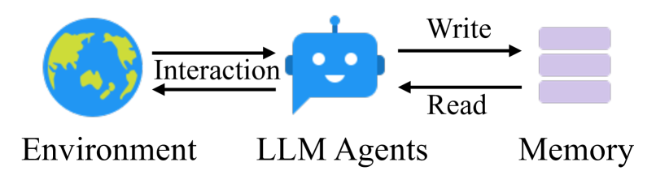

<figcaption>図1(a): 従来の記憶システム（Traditional memory system）。</figcaption>
</figure>

<figure>


<figcaption>図1(b): 提案するエージェント的メモリ（Our proposed agentic memory）。</figcaption>
</figure>

**図1**: 従来の記憶システムは、ワークフロー内で事前定義された記憶アクセスパターンを必要とし、多様なシナリオへの適応性を制限している。対照的に、私たちの A-Mem は動的な記憶操作を可能にすることで LLM エージェントの柔軟性を高める。（訳注: 主キャプションは ar5iv から復元）

LLM エージェント向けの既存の記憶システムは、基本的な記憶保存の機能を提供する。これらのシステムは、エージェント開発者が記憶の保存構造を事前定義し、ワークフロー内の保存ポイントを指定し、検索のタイミングを確立することを要求する。一方、構造化された記憶の組織化を改善するために、Mem0 は RAG の原理に従い、保存と検索のプロセスにグラフデータベースを取り込んでいる。グラフデータベースは記憶システムに構造化された組織化を提供するが、事前定義されたスキーマと関係への依存が、その適応性を根本的に制限する。この限界は実際のシナリオで明確に現れる——エージェントが新奇な数学の解法を学んだとき、現在のシステムはその情報を事前設定された枠組みの中でしか分類・リンクできず、知識が進化するにつれて革新的な接続を築いたり新しい組織化パターンを発達させたりすることができない。そのような硬直した構造は、固定されたエージェントワークフローと相まって、新しい環境への汎化能力と長期的な相互作用における有効性を著しく制限する。LLM エージェントがより複雑でオープンエンドなタスク——柔軟な知識の組織化と継続的な適応が不可欠な場面——に取り組むにつれ、この課題はますます重大になる。したがって、LLM エージェントの長期的な相互作用を支える、柔軟で普遍的な記憶システムをどう設計するかは、依然として重要な課題である。

本論文では、静的で事前決定された記憶操作に依存せずに動的な記憶の構造化を可能にする、A-Mem と名付けた LLM エージェントのための新しいエージェント的メモリシステムを導入する。私たちのアプローチは Zettelkasten メソッド——原子的なノートと柔軟なリンク機構を通じて相互接続された情報ネットワークを作る、洗練された知識管理システム——から着想を得ている。私たちのシステムは、LLM エージェントの自律的で柔軟な記憶管理を可能にするエージェント的メモリアーキテクチャを導入する。新しい記憶ごとに包括的なノートを構築する。ノートは複数の表現——いくつかの属性を含む構造化されたテキスト属性と、類似度マッチングのための埋め込みベクトル——を統合する。次に A-Mem は過去の記憶リポジトリを分析し、意味的類似性と共有属性に基づいて意味のある接続を確立する。この統合プロセスは新しいリンクを作るだけでなく、新しい記憶が取り込まれたときの動的な進化も可能にする——新しい記憶は既存の記憶の文脈表現の更新をトリガーでき、記憶全体が時間とともに理解を継続的に洗練し深めることを可能にする。貢献は次のようにまとめられる:

- 文脈的説明の自律的生成・記憶接続の動的確立・新しい経験に基づく既存記憶の知的な進化を可能にする、LLM エージェントのためのエージェント的メモリシステム A-Mem を提示する。このシステムは、事前決定された記憶操作を必要とせずに、LLM エージェントに長期的な相互作用の能力を備えさせる。
- 新しい記憶が 2 つの鍵となる操作を自動的にトリガーする、エージェント的な記憶更新機構を設計する: (1) リンク生成（Link Generation）——共有属性と類似した文脈的説明を特定することで記憶間の接続を自動的に確立する。(2) 記憶進化（Memory Evolution）——新しい経験が分析されるにつれて既存の記憶が動的に進化することを可能にし、高次のパターンと属性の出現につながる。
- 長期会話データセットを使ってシステムの包括的な評価を行い、6 つの基盤モデルにわたって 6 つの異なる評価指標で性能を比較し、有意な改善を示す。さらに、エージェント的メモリシステムの構造化された組織化を示す t-SNE 可視化を提供する。

## 2 Related Work（関連研究）

### 2.1 Memory for LLM Agents（LLM エージェントのための記憶）

LLM エージェントの記憶システムに関する先行研究は、記憶の管理と利用のさまざまな機構を探究してきた。一部のアプローチは相互作用の完全保存を行い、密検索モデルや読み書き記憶構造を通じて包括的な履歴記録を維持する。さらに、MemGPT はキャッシュ的なアーキテクチャを活用して最近の情報を優先する。同様に SCM は、メモリストリームとコントローラ機構を通じて LLM の長期記憶維持能力を高める Self-Controlled Memory フレームワークを提案している。しかし、これらのアプローチは多様な実世界タスクの処理において重大な限界に直面する。基本的な記憶機能は提供できるものの、その操作は典型的に、事前定義された構造と固定されたワークフローに制約されている。これらの制約は、特に記憶の書き込みと検索のプロセスにおける、硬直した操作パターンへの依存に由来する。そのような柔軟性のなさは、新しい環境での貧弱な汎化と、長期的な相互作用における限られた有効性につながる。したがって、エージェントの長期的な相互作用を支える柔軟で普遍的な記憶システムの設計は、依然として重要な課題である。

### 2.2 Retrieval-Augmented Generation（検索拡張生成）

Retrieval-Augmented Generation（RAG）は、外部知識源を取り込むことで LLM を強化する強力なアプローチとして台頭した。標準的な RAG のプロセスは、文書をチャンクにインデックス化し、意味的類似度に基づいて関連チャンクを検索し、検索されたコンテキストで LLM のプロンプトを増強して生成する、というものである。発展的な RAG システムは、洗練された検索前・検索後の最適化を含むよう進化してきた。これらの基盤の上に、近年の研究は、検索プロセスにおいてより自律的で適応的な挙動を示す agentic RAG システムを導入している。これらのシステムは、いつ・何を検索するかを動的に決定し、検索を導くために仮説的応答を生成し、中間結果に基づいて検索戦略を反復的に洗練できる。

しかし、agentic RAG のアプローチが、いつ・何を検索するかを自律的に決めるという**検索フェーズ**での agency（エージェント性）を示すのに対し、私たちのエージェント的メモリシステムは、**記憶構造そのものの自律的進化**という、より根本的なレベルで agency を示す。Zettelkasten メソッドに着想を得た私たちのシステムでは、記憶が能動的に自身の文脈的説明を生成し、関連する記憶と意味のある接続を形成し、新しい経験が現れるにつれて内容と関係の両方を進化させることができる。検索における agency と、保存・進化における agency というこの根本的な区別が、洗練された検索機構を持ちながら静的な知識ベースを維持する agentic RAG システムから、私たちのアプローチを区別する。

## 3 Methodolodgy（方法論）

提案するエージェント的メモリシステムは Zettelkasten メソッドから着想を得て、事前決定された操作なしに LLM エージェントが長期記憶を維持できる、動的で自己進化する記憶システムを実装する。システムの設計は、原子的なノート作成・柔軟なリンク機構・知識構造の継続的な進化を重視する。

<figure>


<figcaption>図2: A-Mem のアーキテクチャは、記憶の保存において 3 つの不可欠な部分からなる。ノート構築（note construction）では、システムが新しい相互作用の記憶を処理し、複数の属性を持つノートとして保存する。リンク生成（link generation）のプロセスは、まず最も関連する過去の記憶を検索し、次にそれらとの間に接続を確立するかどうかを決定する。「box」の概念は、関連する記憶が類似した文脈的説明を通じて相互接続されることを表しており、Zettelkasten メソッドに類似する。ただし私たちのアプローチでは、個々の記憶が複数の異なる box に同時に存在できる。記憶検索（memory retrieval）の段階では、システムがクエリを構成キーワードに分解し、それらのキーワードを使って記憶ネットワークを検索する。</figcaption>
</figure>

### 3.1 Note Construction（ノート構築）

Zettelkasten メソッドの原子的ノート作成と柔軟な組織化の原理の上に、記憶ノート構築への LLM 駆動のアプローチを導入する。エージェントが環境と相互作用するとき、明示的な情報と LLM が生成する文脈的理解の両方を捉える構造化された記憶ノートを構築する。コレクション $\mathcal{M}=\{m_{1},m_{2},...,m_{N}\}$ の各記憶ノート $m_{i}$ は次のように表現される:

$$
m_{i}=\{c_{i},t_{i},K_{i},G_{i},X_{i},e_{i},L_{i}\}
$$

ここで $c_{i}$ は元の相互作用の内容、$t_{i}$ は相互作用のタイムスタンプ、$K_{i}$ は鍵となる概念を捉える LLM 生成のキーワード、$G_{i}$ は分類のための LLM 生成のタグ、$X_{i}$ は豊かな意味的理解を提供する LLM 生成の文脈的説明を表し、$L_{i}$ は意味的関係を共有するリンク済み記憶の集合を保持する。基本的な内容とタイムスタンプを超えた意味のある文脈で各記憶ノートを豊かにするため、LLM を活用して相互作用を分析し、これらの意味的構成要素を生成する。ノート構築のプロセスは、注意深く設計されたテンプレート $P_{s1}$ で LLM にプロンプトすることを含む:

$$
K_{i},G_{i},X_{i}\leftarrow\text{LLM}(c_{i}\;\|t_{i}\;\|P_{s1})
$$

Zettelkasten の原子性（atomicity）の原理に従い、各ノートは単一の自己完結した知識の単位を捉える。効率的な検索とリンクを可能にするため、ノートのすべてのテキスト構成要素を包含する密ベクトル表現をテキストエンコーダで計算する:

$$
e_{i}=f_{\text{enc}}[\;\text{concat}(c_{i},K_{i},G_{i},X_{i})\;]
$$

LLM を使って豊かにされた構成要素を生成することで、生の相互作用からの暗黙的知識の自律的抽出を可能にする。多面的なノート構造（$K_{i}$, $G_{i}$, $X_{i}$）は記憶の異なる側面を捉える豊かな表現を作り、ニュアンスのある組織化と検索を促進する。加えて、LLM 生成の意味的構成要素と密ベクトル表現の組み合わせは、人間に解釈可能な文脈と計算的に効率的な類似度マッチングの両方を提供する。

### 3.2 Link Generation（リンク生成）

私たちのシステムは、新しい記憶ノートが事前定義された規則なしに意味のある接続を形成できる、自律的なリンク生成機構を実装する。構築された記憶ノート $m_{n}$ がシステムに追加されると、まずその意味的埋め込みを類似度ベースの検索に活用する。既存の各記憶ノート $m_{j}\in\mathcal{M}$ について、類似度スコアを計算する:

$$
s_{n,j}=\frac{e_{n}\cdot e_{j}}{|e_{n}||e_{j}|}
$$

システムは次に top-$k$ の最も関連する記憶を特定する:

$$
\mathcal{M}_{\text{near}}^{n}=\{m_{j}|\;\text{rank}(s_{n,j})\leq k,m_{j}\in\mathcal{M}\}
$$

これらの候補となる近傍記憶に基づき、共通しうる属性に基づいて潜在的な接続を分析するよう LLM にプロンプトする。形式的には、記憶 $m_{n}$ のリンク集合は次のように更新される:

$$
L_{i}\leftarrow\text{LLM}(m_{n}\;\|\mathcal{M}_{\text{near}}^{n}\;\|P_{s2})
$$

生成された各リンク $l_{i}$ は $L_{i}=\{m_{i},...,m_{k}\}$ として構造化される。埋め込みベースの検索を初期フィルタとして使うことで、意味的関連性を維持しながら効率的なスケーラビリティを可能にする。A-Mem は、網羅的な比較なしに、大きな記憶コレクションにおいても潜在的な接続を素早く特定できる。より重要なのは、LLM 駆動の分析が、単純な類似度指標を超えた、関係のニュアンスに富んだ理解を可能にすることである。言語モデルは、埋め込み類似度だけからは明らかでない、微妙なパターン・因果関係・概念的接続を特定できる。私たちは、現代の言語モデルを活用しながら、Zettelkasten の柔軟なリンクの原理を実装している。結果として得られるネットワークは、記憶の内容と文脈から有機的に立ち現れ、自然な知識の組織化を可能にする。

### 3.3 Memory Evolution（記憶進化）

新しい記憶のリンクを作った後、A-Mem は、検索された記憶を、そのテキスト情報と新しい記憶との関係に基づいて進化させる。最近傍集合 $\mathcal{M}_{\text{near}}^{n}$ の各記憶 $m_{j}$ について、システムはその文脈・キーワード・タグを更新するかどうかを決定する。この進化プロセスは形式的に次のように表現できる:

$$
m_{j}^{*}\leftarrow\text{LLM}(m_{n}\;\|\mathcal{M}_{\text{near}}^{n}\setminus m_{j}\;\|m_{j}\;\|P_{s3})
$$

進化した記憶 $m_{j}^{*}$ は、記憶集合 $\mathcal{M}$ の中の元の記憶 $m_{j}$ を置き換える。この進化的アプローチは継続的な更新と新しい接続を可能にし、人間の学習プロセスを模倣する。システムが時間とともにより多くの記憶を処理するにつれ、ますます洗練された知識構造を発達させ、複数の記憶にまたがる高次のパターンと概念を発見する。これは、新しい経験と既存の記憶の間の継続的な相互作用を通じて知識の組織化が漸進的に豊かになっていく、自律的な記憶学習の基盤を作る。

### 3.4 Retrieve Relative Memory（関連記憶の検索）

各相互作用において、A-Mem は文脈を意識した記憶検索を実行し、エージェントに関連する過去の情報を提供する。現在の相互作用からのクエリテキスト $q$ が与えられると、まず記憶ノートに使ったのと同じテキストエンコーダでその密ベクトル表現を計算する:

$$
e_{q}=f_{\text{enc}}(q)
$$

システムは次に、クエリ埋め込みと $\mathcal{M}$ 内のすべての既存記憶ノートの間の類似度スコアをコサイン類似度で計算する:

$$
s_{q,i}=\frac{e_{q}\cdot e_{i}}{|e_{q}||e_{i}|},\text{where}\;e_{i}\in m_{i},\;\forall m_{i}\in\mathcal{M}
$$

そして、過去の記憶ストレージから最も関連する k 個の記憶を検索し、文脈的に適切なプロンプトを構築する。

$$
\mathcal{M}_{\text{retrieved}}=\{m_{i}|\text{rank}(s_{q,i})\leq k,m_{i}\in\mathcal{M}\}
$$

これらの検索された記憶は、エージェントが現在の相互作用をよりよく理解し応答するのを助ける、関連する歴史的文脈を提供する。検索されたコンテキストは、現在の相互作用を、記憶システムに保存された関連する過去の経験や知識と結びつけることで、エージェントの推論プロセスを豊かにする。

## 4 Experiment（実験）

### 4.1 Dataset and Evaluation（データセットと評価）

長期会話における instruction-aware な推薦の有効性を評価するため、既存の会話データセットよりも大幅に長い対話を含む LoCoMo データセットを利用する。従来のデータセットが 4〜5 セッションで約 1K トークンの対話を含むのに対し、LoCoMo は最大 35 セッションにわたる平均 9K トークンのはるかに長い会話を特徴とし、長距離依存を扱い長時間の会話にわたって一貫性を維持するモデルの能力の評価に特に適している。LoCoMo データセットは、モデル理解のさまざまな側面を包括的に評価するよう設計された多様な質問タイプからなる: (1) 単一セッションから答えられる single-hop 質問、(2) セッションをまたぐ情報統合を要する multi-hop 質問、(3) 時間関連情報の理解をテストする時間推論（temporal reasoning）質問、(4) 会話コンテキストと外部知識の統合を要する open-domain 知識質問、(5) 回答不能なクエリを特定するモデルの能力を評価する adversarial 質問。合計で、LoCoMo はこれらのカテゴリにわたる 7,512 の質問-回答ペアを含む。

評価には 2 つの主要指標を用いる: 精度と再現率のバランスで回答の正確さを評価する F1 スコアと、正解応答との単語重複を測ることで生成応答の品質を評価する BLEU-1 である。また、1 問への回答あたりの平均トークン長も報告する。さらに、ROUGE-L・ROUGE-2・METEOR・SBERT Similarity を含む 4 つの追加指標での実験結果を付録 B.2 に報告する。

### 4.2 Implementation Details（実装の詳細）

すべてのベースラインと提案手法について、付録 C に詳述する同一のシステムプロンプトを用いて一貫性を保つ。Qwen-1.5B/3B と Llama 3.2 1B/3B モデルのデプロイは Ollama[^fn1] によるローカルインスタンス化で行い、構造化出力の生成は LiteLLM[^fn2] が管理する。GPT モデルには公式の構造化出力 API を利用する。記憶検索プロセスでは、計算効率を保つため主に top-$k$ 記憶選択に $k$=10 を採用し、特定のカテゴリでは性能を最適化するためにこのパラメータを調整する。$k$ の詳細な設定は付録 B.4 にある。テキスト埋め込みには、全実験で all-minilm-l6-v2 モデルを実装する。

[^fn1]: https://github.com/ollama/ollama

[^fn2]: https://github.com/BerriAI/litellm

**表1**: LoCoMo データセットの 5 カテゴリ（Single Hop, Multi Hop, Temporal, Open Domain, Adversial）の QA タスクにおける各手法の実験結果。F1 と BLEU-1（%）で報告。最良の性能は太字（原典）で、提案手法 A-MEM は 6 つの基盤言語モデルにわたって競争力ある性能を示す。

| Model | Method | Single Hop F1 | BLEU-1 | Multi Hop F1 | BLEU-1 | Temporal F1 | BLEU-1 | Open Domain F1 | BLEU-1 | Adversial F1 | BLEU-1 | Rank F1 | Rank BLEU-1 | Token Length |
| --- | --- | --- | --- | --- | --- | --- | --- | --- | --- | --- | --- | --- | --- | --- |
| GPT-4o-mini | LoCoMo | 25.02 | 19.75 | 18.41 | 14.77 | 12.04 | 11.16 | 40.36 | 29.05 | 69.23 | 68.75 | 2.4 | 2.4 | 16,910 |
| GPT-4o-mini | ReadAgent | 9.15 | 6.48 | 12.60 | 8.87 | 5.31 | 5.12 | 9.67 | 7.66 | 9.81 | 9.02 | 4.2 | 4.2 | 643 |
| GPT-4o-mini | MemoryBank | 5.00 | 4.77 | 9.68 | 6.99 | 5.56 | 5.94 | 6.61 | 5.16 | 7.36 | 6.48 | 4.8 | 4.8 | 432 |
| GPT-4o-mini | MemGPT | 26.65 | 17.72 | 25.52 | 19.44 | 9.15 | 7.44 | 41.04 | 34.34 | 43.29 | 42.73 | 2.4 | 2.4 | 16,977 |
| GPT-4o-mini | A-Mem | 27.02 | 20.09 | 45.85 | 36.67 | 12.14 | 12.00 | 44.65 | 37.06 | 50.03 | 49.47 | 1.2 | 1.2 | 2,520 |
| GPT-4o | LoCoMo | 28.00 | 18.47 | 9.09 | 5.78 | 16.47 | 14.80 | 61.56 | 54.19 | 52.61 | 51.13 | 2.0 | 2.0 | 16,910 |
| GPT-4o | ReadAgent | 14.61 | 9.95 | 4.16 | 3.19 | 8.84 | 8.37 | 12.46 | 10.29 | 6.81 | 6.13 | 4.0 | 4.0 | 805 |
| GPT-4o | MemoryBank | 6.49 | 4.69 | 2.47 | 2.43 | 6.43 | 5.30 | 8.28 | 7.10 | 4.42 | 3.67 | 5.0 | 5.0 | 569 |
| GPT-4o | MemGPT | 30.36 | 22.83 | 17.29 | 13.18 | 12.24 | 11.87 | 60.16 | 53.35 | 34.96 | 34.25 | 2.4 | 2.4 | 16,987 |
| GPT-4o | A-Mem | 32.86 | 23.76 | 39.41 | 31.23 | 17.10 | 15.84 | 48.43 | 42.97 | 36.35 | 35.53 | 1.6 | 1.6 | 1,216 |
| Qwen2.5-1.5b | LoCoMo | 9.05 | 6.55 | 4.25 | 4.04 | 9.91 | 8.50 | 11.15 | 8.67 | 40.38 | 40.23 | 3.4 | 3.4 | 16,910 |
| Qwen2.5-1.5b | ReadAgent | 6.61 | 4.93 | 2.55 | 2.51 | 5.31 | 12.24 | 10.13 | 7.54 | 5.42 | 27.32 | 4.6 | 4.6 | 752 |
| Qwen2.5-1.5b | MemoryBank | 11.14 | 8.25 | 4.46 | 2.87 | 8.05 | 6.21 | 13.42 | 11.01 | 36.76 | 34.00 | 2.6 | 2.6 | 284 |
| Qwen2.5-1.5b | MemGPT | 10.44 | 7.61 | 4.21 | 3.89 | 13.42 | 11.64 | 9.56 | 7.34 | 31.51 | 28.90 | 3.4 | 3.4 | 16,953 |
| Qwen2.5-1.5b | A-Mem | 18.23 | 11.94 | 24.32 | 19.74 | 16.48 | 14.31 | 23.63 | 19.23 | 46.00 | 43.26 | 1.0 | 1.0 | 1,300 |
| Qwen2.5-3b | LoCoMo | 4.61 | 4.29 | 3.11 | 2.71 | 4.55 | 5.97 | 7.03 | 5.69 | 16.95 | 14.81 | 3.2 | 3.2 | 16,910 |
| Qwen2.5-3b | ReadAgent | 2.47 | 1.78 | 3.01 | 3.01 | 5.57 | 5.22 | 3.25 | 2.51 | 15.78 | 14.01 | 4.2 | 4.2 | 776 |
| Qwen2.5-3b | MemoryBank | 3.60 | 3.39 | 1.72 | 1.97 | 6.63 | 6.58 | 4.11 | 3.32 | 13.07 | 10.30 | 4.2 | 4.2 | 298 |
| Qwen2.5-3b | MemGPT | 5.07 | 4.31 | 2.94 | 2.95 | 7.04 | 7.10 | 7.26 | 5.52 | 14.47 | 12.39 | 2.4 | 2.4 | 16,961 |
| Qwen2.5-3b | A-Mem | 12.57 | 9.01 | 27.59 | 25.07 | 7.12 | 7.28 | 17.23 | 13.12 | 27.91 | 25.15 | 1.0 | 1.0 | 1,137 |
| Llama3.2-1b | LoCoMo | 11.25 | 9.18 | 7.38 | 6.82 | 11.90 | 10.38 | 12.86 | 10.50 | 51.89 | 48.27 | 3.4 | 3.4 | 16,910 |
| Llama3.2-1b | ReadAgent | 5.96 | 5.12 | 1.93 | 2.30 | 12.46 | 11.17 | 7.75 | 6.03 | 44.64 | 40.15 | 4.6 | 4.6 | 665 |
| Llama3.2-1b | MemoryBank | 13.18 | 10.03 | 7.61 | 6.27 | 15.78 | 12.94 | 17.30 | 14.03 | 52.61 | 47.53 | 2.0 | 2.0 | 274 |
| Llama3.2-1b | MemGPT | 9.19 | 6.96 | 4.02 | 4.79 | 11.14 | 8.24 | 10.16 | 7.68 | 49.75 | 45.11 | 4.0 | 4.0 | 16,950 |
| Llama3.2-1b | A-Mem | 19.06 | 11.71 | 17.80 | 10.28 | 17.55 | 14.67 | 28.51 | 24.13 | 58.81 | 54.28 | 1.0 | 1.0 | 1,376 |
| Llama3.2-3b | LoCoMo | 6.88 | 5.77 | 4.37 | 4.40 | 10.65 | 9.29 | 8.37 | 6.93 | 30.25 | 28.46 | 2.8 | 2.8 | 16,910 |
| Llama3.2-3b | ReadAgent | 2.47 | 1.78 | 3.01 | 3.01 | 5.57 | 5.22 | 3.25 | 2.51 | 15.78 | 14.01 | 4.2 | 4.2 | 461 |
| Llama3.2-3b | MemoryBank | 6.19 | 4.47 | 3.49 | 3.13 | 4.07 | 4.57 | 7.61 | 6.03 | 18.65 | 17.05 | 3.2 | 3.2 | 263 |
| Llama3.2-3b | MemGPT | 5.32 | 3.99 | 2.68 | 2.72 | 5.64 | 5.54 | 4.32 | 3.51 | 21.45 | 19.37 | 3.8 | 3.8 | 16,956 |
| Llama3.2-3b | A-Mem | 17.44 | 11.74 | 26.38 | 19.50 | 12.53 | 11.83 | 28.14 | 23.87 | 42.04 | 40.60 | 1.0 | 1.0 | 1,126 |

### 4.3 Baselines（ベースライン）

LoCoMo は、記憶機構なしの基盤モデルを質問応答タスクに直接活用するアプローチをとる。各クエリについて、先行する会話全体と質問をプロンプトに含め、モデルの推論能力を評価する。

ReadAgent は、洗練された 3 ステップの方法論で長文脈の文書処理に取り組む: まず episode pagination で内容を扱いやすいチャンクに分割し、次に memory gisting で各ページを簡潔な記憶表現へ蒸留し、最後に interactive look-up で必要に応じて関連情報を検索する。

MemoryBank は、過去の相互作用を維持し効率的に検索する革新的な記憶管理システムを導入する。このシステムは、エビングハウスの忘却曲線（Ebbinghaus Forgetting Curve）理論に基づく動的な記憶更新機構——時間と重要度に応じて記憶の強度を賢く調整する——を特徴とする。加えて、継続的な相互作用の分析を通じてユーザーの人物像の理解を漸進的に洗練する、ユーザーポートレート構築システムを組み込む。

MemGPT は、従来のオペレーティングシステムのメモリ階層に着想を得た、新しい仮想コンテキスト管理システムを提示する。このアーキテクチャは 2 層構造を実装する: LLM 推論中に即時アクセスを提供する main context（RAM に相当）と、固定コンテキストウィンドウを超えて情報を維持する external context（ディスクストレージに相当）である。

### 4.4 Empricial Results（実証結果）

**表2**: GPT-4-mini ベースモデルに対して提案手法を評価したアブレーションスタディ。「w/o」は特定のモジュールを除去した実験を示す。LG・ME はそれぞれリンク生成モジュール・記憶進化モジュールの略。

| Method | Single Hop F1 | BLEU-1 | Multi Hop F1 | BLEU-1 | Temporal F1 | BLEU-1 | Open Domain F1 | BLEU-1 | Adversial F1 | BLEU-1 |
| --- | --- | --- | --- | --- | --- | --- | --- | --- | --- | --- |
| w/o LG & ME | 9.65 | 7.09 | 24.55 | 19.48 | 7.77 | 6.70 | 13.28 | 10.30 | 15.32 | 18.02 |
| w/o ME | 21.35 | 15.13 | 31.24 | 27.31 | 10.13 | 10.85 | 39.17 | 34.70 | 44.16 | 45.33 |
| A-Mem | 27.02 | 20.09 | 45.85 | 36.67 | 12.14 | 12.00 | 44.65 | 37.06 | 50.03 | 49.47 |

実証評価では、A-MEM を LoCoMo・ReadAgent・MemoryBank・MemGPT を含む 4 つの競争力あるベースラインと LoCoMo データセット上で比較した。非 GPT の基盤モデルでは、A-Mem がすべてのカテゴリで一貫して全ベースラインを上回り、エージェント的メモリアプローチの有効性を示した。GPT ベースのモデルでは、LoCoMo と MemGPT が、単純な事実検索における頑健な事前学習知識のために Open Domain や Adversial タスクなど特定のカテゴリで強い性能を示す一方、A-MEM は複雑な推論連鎖を要する Multi-Hop タスクで少なくとも 2 倍の性能という優位を示す。A-Mem の有効性は、動的で構造化された記憶管理を可能にする新しいエージェント的メモリアーキテクチャに由来する。静的な記憶操作を使う従来のアプローチと異なり、私たちのシステムは、豊かな文脈的説明を持つ原子的ノートを通じて相互接続された記憶ネットワークを作り、より効果的な multi-hop 推論を可能にする。共有属性に基づいて記憶間の接続を動的に確立し、新しい文脈情報で既存の記憶の説明を継続的に更新するシステムの能力が、異なる情報片の間の関係をよりよく捕捉・活用することを可能にする。注目すべきことに、A-Mem は、選択的な top-k 検索機構によって、LoCoMo や MemGPT と比べて大幅に少ないトークン長（約 16,900 トークンに対して約 1,200〜2,500 トークン）を維持しながらこれらの改善を達成している。結論として、実証結果は、A-Mem が構造化された記憶の組織化と動的な記憶進化をうまく組み合わせ、計算効率を維持しながら複雑な推論タスクで優れた性能をもたらすことを示している。

### 4.5 Ablation Study（アブレーションスタディ）

リンク生成（LG）と記憶進化（ME）モジュールの有効性を評価するため、モデルの鍵となる構成要素を系統的に除去するアブレーションスタディを行う。LG と ME の両モジュールを除去すると、システムは特に Multi Hop 推論と Open Domain タスクで大幅な性能劣化を示す。LG のみ有効なシステム（w/o ME）は中間的な性能水準を示し、両モジュールなしのバージョンより有意に良い結果を維持する。これは記憶の接続を確立するうえでのリンク生成の根本的な重要性を示す。完全なモデル A-MEM は、すべての評価カテゴリで一貫して最良の性能を達成し、特に複雑な推論タスクで強い結果を示す。これらの結果は、リンク生成モジュールが記憶の組織化の決定的な基盤として機能する一方、記憶進化モジュールが記憶構造に不可欠な洗練を提供することを明らかにする。アブレーションスタディは、私たちのアーキテクチャ設計の選択を検証し、効果的な記憶システムの構築におけるこれら 2 つのモジュールの相補的な性質を浮き彫りにする。

### 4.6 Hyperparameter Analysis（ハイパーパラメータ分析）

各相互作用で検索される関連記憶の数を制御する、記憶検索パラメータ k の影響を分析する広範な実験を行った。図 3 に示すように、GPT-4-mini をベースモデルとして、5 カテゴリのタスクで異なる k 値（10, 20, 30, 40, 50）にわたる性能を評価した。結果は興味深いパターンを明らかにする: k を増やすと一般に性能は改善するが、この改善は徐々に頭打ちになり、高い値ではわずかに低下することもある。この傾向は Multi Hop と Open Domain のタスクで特に顕著である。この観察は、記憶検索における微妙なバランスを示唆する——大きな k 値は推論のためのより豊かな歴史的文脈を提供する一方、ノイズを持ち込み、より長い系列を効果的に処理するモデルの能力に挑戦を課しうる。分析は、中程度の k 値が文脈の豊かさと情報処理の効率の間の最適なバランスを取ることを示している。

<figure>

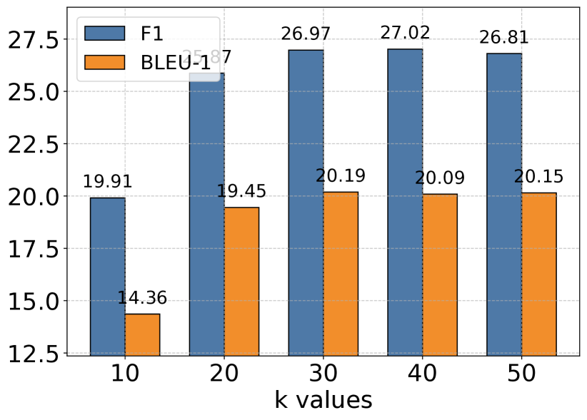

<figcaption>図3(a): Single Hop。</figcaption>
</figure>

<figure>

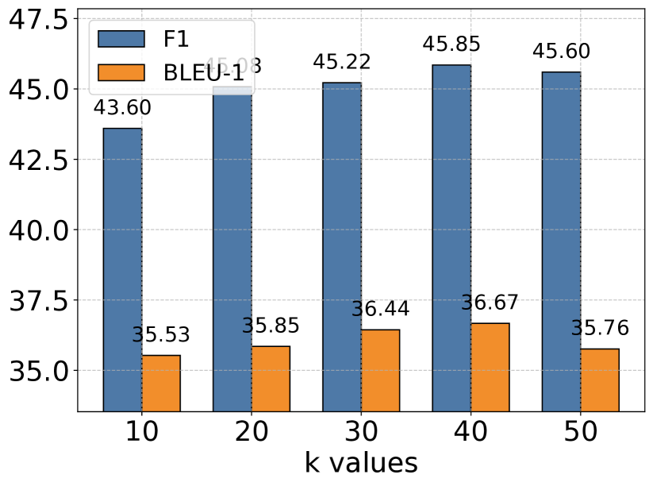

<figcaption>図3(b): Multi Hop。</figcaption>
</figure>

<figure>

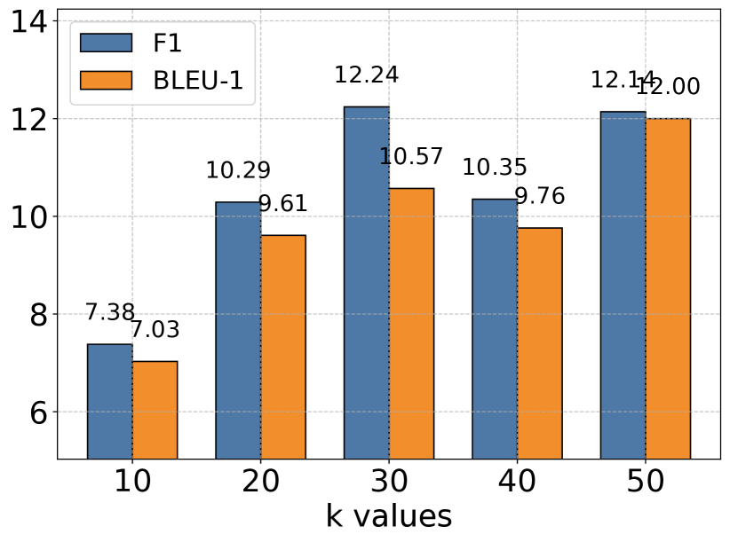

<figcaption>図3(c): Temporal。</figcaption>
</figure>

<figure>

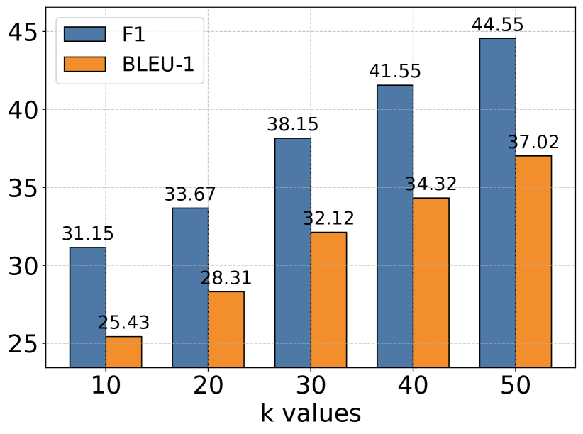

<figcaption>図3(d): Open Domain。</figcaption>
</figure>

<figure>

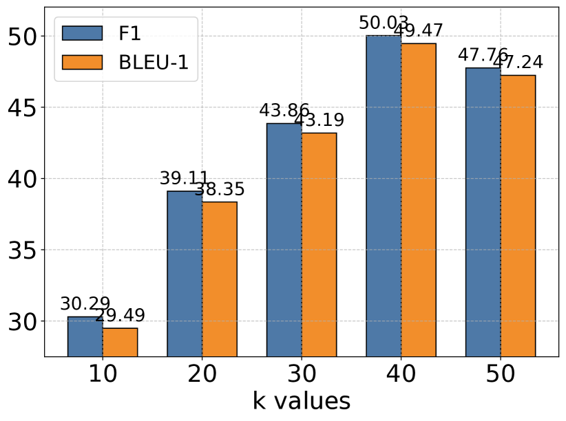

<figcaption>図3(e): Adverisal。</figcaption>
</figure>

**図3**: GPT-4o-mini をベースモデルとした、タスクカテゴリ別の記憶検索パラメータ k の影響。大きな k 値は一般に、より豊かな歴史的文脈を提供して性能を改善するが、一定の閾値を超えると利得は逓減し、文脈の豊かさと効果的な情報処理の間のトレードオフを示唆する。このパターンはすべての評価カテゴリで一貫しており、最適な性能のためのバランスの取れた文脈検索の重要性を示す。（訳注: 主キャプションは ar5iv から復元）

### 4.7 Memory Analysis（記憶の分析）

記憶埋め込みの t-SNE 可視化を図 4 に示し、エージェント的メモリシステムの構造的優位を実証する。LoCoMo の長期会話からサンプリングした 2 つの対話を分析すると、A-Mem（青）はベースラインシステム（赤）と比べて一貫してより整合的なクラスタリングパターンを示す。この構造的組織化は特に Dialogue 2 で明らかで、中央領域に明確に定義されたクラスタが現れ、記憶進化機構と文脈的説明生成の有効性の実証的証拠を提供する。対照的に、ベースラインの記憶埋め込みはより分散した分布を示し、リンク生成と記憶進化の構成要素なしには記憶が構造的組織化を欠くことを示す。これらの可視化結果は、A-Mem が動的な進化とリンクの機構を通じて、意味のある記憶構造を自律的に維持できることを裏付ける。さらなる結果は付録 B.3 を参照。

<figure>

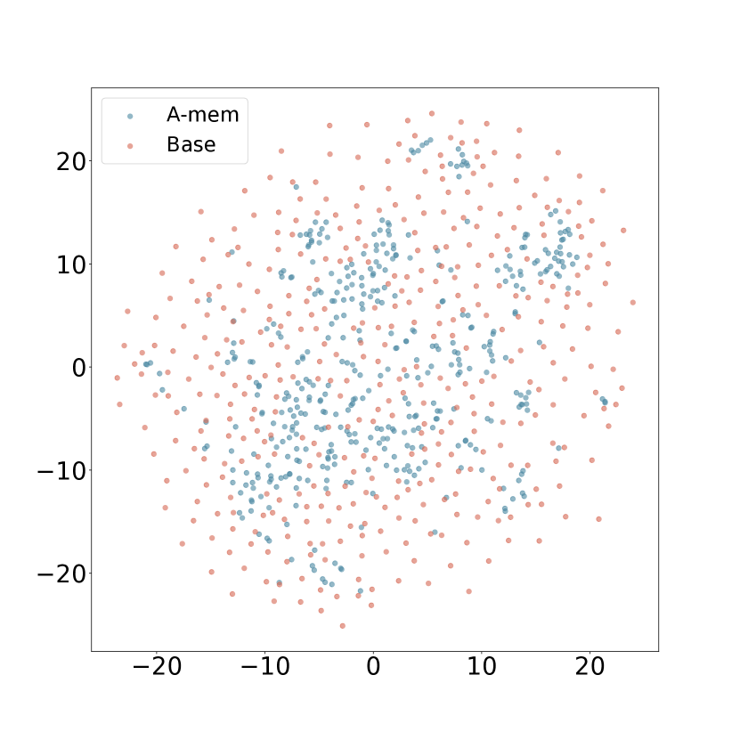

<figcaption>図4(a): Dialogue 1。</figcaption>
</figure>

<figure>

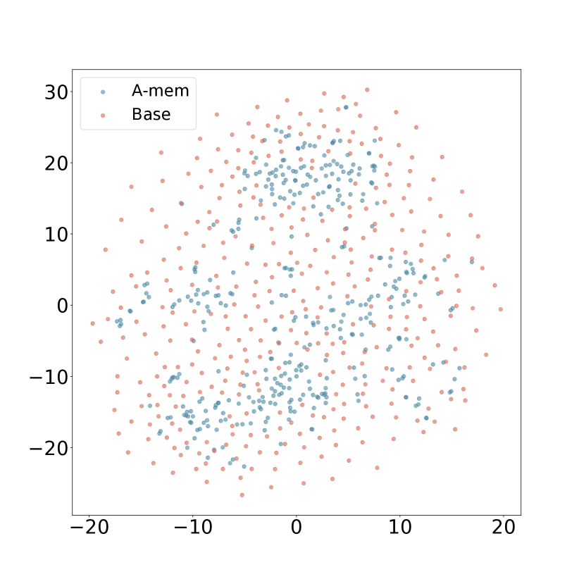

<figcaption>図4(b): Dialogue 2。</figcaption>
</figure>

**図4**: 記憶埋め込みの t-SNE 可視化。異なる対話にわたり、A-Mem（青）が Base Memory（赤）と比べてより組織化された分布を示す。Base Memory はリンク生成と記憶進化なしの A-Mem を表す。（訳注: 主キャプションは ar5iv から復元）

## 5 Conclusion（結論）

本研究では、LLM エージェントが事前定義された構造に依存せずに記憶を動的に組織化・進化させることを可能にする、新しいエージェント的メモリシステム A-Mem を導入した。Zettelkasten メソッドに着想を得て、私たちのシステムは、多様な実世界タスクに適応する動的なインデックス化とリンクの機構を通じて、相互接続された知識ネットワークを作る。システムの中核アーキテクチャは、新しい記憶に対する文脈的説明の自律的生成と、共有属性に基づく既存記憶との接続の知的な確立を特徴とする。さらに、私たちのアプローチは、新しい経験を取り込み、継続的な相互作用を通じて高次の属性を発達させることで、過去の記憶の継続的な進化を可能にする。6 つの基盤モデルにわたる広範な実証評価を通じて、A-Mem が長期会話タスクにおいて既存の最先端ベースラインと比べて優れた性能を達成することを示した。可視化分析は、記憶の組織化アプローチの有効性をさらに裏付ける。これらの結果は、エージェント的メモリシステムが、複雑な環境で長期的知識を活用する LLM エージェントの能力を大幅に高めうることを示唆している。

## 6 Limitation（限界）

エージェント的メモリシステムは有望な結果を達成しているが、将来の探究の余地がある領域をいくつか認める。第一に、システムは記憶を動的に組織化するものの、その組織化の品質は、基盤となる言語モデルの固有の能力に依然として影響されうる。異なる LLM は、わずかに異なる文脈的説明を生成したり、記憶間に異なる接続を確立したりするかもしれない。加えて、現在の実装はテキストベースの相互作用に焦点を当てているが、将来の研究では、画像や音声などのマルチモーダル情報を扱えるようシステムを拡張でき、より豊かな文脈表現を提供できるだろう。

## APPENDIX（付録）

## Appendix A Detailed Related Work（詳細な関連研究）

### A.1 Memory for LLM Agents（LLM エージェントのための記憶）

大規模言語モデル（LLM）は、自然言語処理・コード生成・推薦システムを含むさまざまなドメインで顕著な能力を示してきた。LLM ベースのエージェントは、構造化された相互作用パターンを通じて対話的な意思決定と複雑なワークフローの実行を可能にすることで、これらの能力をさらに拡張する。LLM エージェントの記憶システムに関する先行研究は、記憶の管理と利用のさまざまな機構を探究してきた。一部のアプローチは相互作用の完全保存を行い、密検索モデルや読み書き記憶構造を通じて包括的な履歴記録を維持する。さらに、MemGPT はキャッシュ的なアーキテクチャを活用して最近の情報を優先する。同様に SCM は、メモリストリームとコントローラ機構を通じて LLM の長期記憶維持能力を高める Self-Controlled Memory フレームワークを提案している。しかし、これらのアプローチは多様な実世界タスクの処理において重大な限界に直面する。基本的な記憶機能は提供できるものの、その操作は典型的に、事前定義された構造と固定されたワークフローに制約されている。これらの制約は、特に記憶の書き込みと検索のプロセスにおける、硬直した操作パターンへの依存に由来する。そのような柔軟性のなさは、新しい環境での貧弱な汎化と、長期的な相互作用における限られた有効性につながる。したがって、エージェントの長期的な相互作用を支える柔軟で普遍的な記憶システムの設計は、依然として重要な課題である。

## Appendix B Experiment（実験）

### B.1 Evaluation Metric（評価指標）

F1 スコアは精度（precision）と再現率（recall）の調和平均であり、両者を単一の値に統合したバランスの取れた指標を提供する。この指標は、完全な応答と正確な応答の間のバランスを取る必要があるときに特に価値がある:

$$
F1=2\cdot\frac{\text{precision}\cdot\text{recall}}{\text{precision}+\text{recall}}
$$

ここで

$$
\text{precision}=\frac{\text{true positives}}{\text{true positives}+\text{false positives}}
$$

$$
\text{recall}=\frac{\text{true positives}}{\text{true positives}+\text{false negatives}}
$$

質問応答システムにおいて、F1 スコアは予測された回答と参照回答の間の厳密一致の評価に決定的な役割を果たす。これは、回答の包括的なカバレッジを維持しながら正確なテキスト区間を特定しなければならない、スパンベースの QA タスクで特に重要である。

BLEU-1 は、システム出力と参照テキストの間のユニグラム一致の精度を評価する方法を提供する:

$$
\text{BLEU-1}=BP\cdot\exp(\sum_{n=1}^{1}w_{n}\log p_{n})
$$

ここで

$$
BP=\begin{cases}1&\text{if }c>r\\
e^{1-r/c}&\text{if }c\leq r\end{cases}
$$

$$
p_{n}=\frac{\sum_{i}\sum_{k}\min(h_{ik},m_{ik})}{\sum_{i}\sum_{k}h_{ik}}
$$

ここで $c$ は候補の長さ、$r$ は参照の長さ、$h_{ik}$ は候補 k における n-gram i の数、$m_{ik}$ は任意の参照における最大数である。QA において BLEU-1 は生成された回答の語彙的精度を評価し、厳密一致が厳しすぎる生成型 QA システムに特に有用である。

ROUGE-L は、生成テキストと参照テキストの間の最長共通部分列を測る。

$$
\text{ROUGE-L}=\frac{(1+\beta^{2})R_{l}P_{l}}{R_{l}+\beta^{2}P_{l}}
$$

$$
R_{l}=\frac{\text{LCS}(X,Y)}{|X|}
$$

$$
P_{l}=\frac{\text{LCS}(X,Y)}{|Y|}
$$

ここで $X$ は参照テキスト、$Y$ は候補テキスト、LCS は最長共通部分列（Longest Common Subsequence）である。

ROUGE-2 は、生成テキストと参照テキストの間のバイグラムの重複を計算する。

$$
\text{ROUGE-2}=\frac{\sum_{\text{bigram}\in\text{ref}}\min(\text{Count}_{\text{ref}}(\text{bigram}),\text{Count}_{\text{cand}}(\text{bigram}))}{\sum_{\text{bigram}\in\text{ref}}\text{Count}_{\text{ref}}(\text{bigram})}
$$

ROUGE-L と ROUGE-2 はどちらも生成された回答の流暢さと一貫性の評価に特に有用で、ROUGE-L は系列の一致に、ROUGE-2 は局所的な語順に焦点を当てる。

METEOR は、同義語と言い換えを考慮して、候補テキストと参照テキストの間で整列されたユニグラムに基づくスコアを計算する。

$$
\text{METEOR}=F_{\text{mean}}\cdot(1-\text{Penalty})
$$

$$
F_{\text{mean}}=\frac{10P\cdot R}{R+9P}
$$

$$
\text{Penalty}=0.5\cdot(\frac{\text{ch}}{m})^{3}
$$

ここで $P$ は精度、$R$ は再現率、ch はチャンク数、$m$ はマッチしたユニグラム数である。METEOR は厳密一致を超えた意味的類似性を考慮するため、言い換えられた回答の評価に適しており、QA 評価に価値がある。

SBERT Similarity は、文埋め込みを使って 2 つのテキストの意味的類似度を測る。

$$
\text{SBERT\_Similarity}=\cos(\text{SBERT}(x),\text{SBERT}(y))
$$

$$
\cos(a,b)=\frac{a\cdot b}{\|a\|\|b\|}
$$

SBERT($x$) はテキストの文埋め込みを表す。SBERT Similarity は、語彙的重複が低くても意味の類似性を捉えられるため、QA システムにおける意味理解の評価に特に有用である。

### B.2 Comparison Results（比較結果）

ROUGE-2・ROUGE-L・METEOR・SBERT 指標を用いた包括的評価は、A-Mem が顕著な計算効率を維持しながら優れた性能を達成することを示す。さまざまなモデルサイズとタスクカテゴリにわたる広範な実証テストを通じて、いくつかの説得力ある発見に支えられ、A-Mem を既存ベースラインより効果的なアプローチとして確立した。非 GPT モデル、具体的には Qwen2.5 と Llama 3.2 の分析では、A-Mem がすべての指標ですべてのベースラインアプローチを一貫して上回る。Multi-Hop カテゴリは特に際立った結果を示し、A-Mem を使った Qwen2.5-1.5b は ROUGE-L スコア 27.23 を達成して LoCoMo の 4.68 と ReadAgent の 2.81 を劇的に上回る——およそ 6 倍の改善である。この優位のパターンは METEOR と SBERT のスコアでも一貫して続く。GPT ベースのモデルを検討すると、興味深いパターンが明らかになる。LoCoMo と MemGPT が Open Domain と Adversarial タスクで強い能力を示す一方、A-Mem は Multi-Hop 推論タスクで顕著な優位を示す。GPT-4o-mini を使うと、A-Mem は Multi-Hop タスクで ROUGE-L スコア 44.27 を達成し、LoCoMo の 18.09 の 2 倍超となる。この有意な優位は他の指標でも一貫しており、METEOR スコアは 23.43 対 7.61、SBERT スコアは 70.49 対 52.30 である。これらの結果の意義は、A-Mem の例外的な計算効率によって増幅される。私たちのアプローチが必要とするのは 1,200〜2,500 トークンのみで、LoCoMo と MemGPT が必要とする 16,900 トークンと対照的である。この効率は 2 つの鍵となるアーキテクチャ革新に由来する: 第一に、新しいエージェント的メモリアーキテクチャが、豊かな文脈的説明を持つ原子的ノートを通じて相互接続された記憶ネットワークを作り、情報の関係のより効果的な捕捉と活用を可能にする。第二に、選択的な top-k 検索機構が動的な記憶進化と構造化された組織化を促進する。これらの革新の有効性は、すべての評価指標にわたって一貫して強い Multi-Hop 性能が示すとおり、複雑な推論タスクで特に明らかである。

**表3**: LoCoMo データセットの 5 カテゴリ（Single Hop, Multi Hop, Temporal, Open Domain, Adversial）の QA タスクにおける各手法の実験結果。ROUGE-2 と ROUGE-L（RGE-2 / RGE-L と略記）で報告。最良の性能は太字（原典）で、提案手法 A-MEM は 6 つの基盤言語モデルにわたって競争力ある性能を示す。

| Model | Method | Single Hop RGE-2 | RGE-L | Multi Hop RGE-2 | RGE-L | Temporal RGE-2 | RGE-L | Open Domain RGE-2 | RGE-L | Adversial RGE-2 | RGE-L |
| --- | --- | --- | --- | --- | --- | --- | --- | --- | --- | --- | --- |
| GPT-4o-mini | LoCoMo | 9.64 | 23.92 | 2.01 | 18.09 | 3.40 | 11.58 | 26.48 | 40.20 | 60.46 | 69.59 |
| GPT-4o-mini | ReadAgent | 2.47 | 9.45 | 0.95 | 13.12 | 0.55 | 5.76 | 2.99 | 9.92 | 6.66 | 9.79 |
| GPT-4o-mini | MemoryBank | 1.18 | 5.43 | 0.52 | 9.64 | 0.97 | 5.77 | 1.64 | 6.63 | 4.55 | 7.35 |
| GPT-4o-mini | MemGPT | 10.58 | 25.60 | 4.76 | 25.22 | 0.76 | 9.14 | 28.44 | 42.24 | 36.62 | 43.75 |
| GPT-4o-mini | A-Mem | 10.61 | 25.86 | 21.39 | 44.27 | 3.42 | 12.09 | 29.50 | 45.18 | 42.62 | 50.04 |
| GPT-4o | LoCoMo | 11.53 | 30.65 | 1.68 | 8.17 | 3.21 | 16.33 | 45.42 | 63.86 | 45.13 | 52.67 |
| GPT-4o | ReadAgent | 3.91 | 14.36 | 0.43 | 3.96 | 0.52 | 8.58 | 4.75 | 13.41 | 4.24 | 6.81 |
| GPT-4o | MemoryBank | 1.84 | 7.36 | 0.36 | 2.29 | 2.13 | 6.85 | 3.02 | 9.35 | 1.22 | 4.41 |
| GPT-4o | MemGPT | 11.55 | 30.18 | 4.66 | 15.83 | 3.27 | 14.02 | 43.27 | 62.75 | 28.72 | 35.08 |
| GPT-4o | A-Mem | 12.76 | 31.71 | 9.82 | 25.04 | 6.09 | 16.63 | 33.67 | 50.31 | 30.31 | 36.34 |
| Qwen2.5-1.5b | LoCoMo | 1.39 | 9.24 | 0.00 | 4.68 | 3.42 | 10.59 | 3.25 | 11.15 | 35.10 | 43.61 |
| Qwen2.5-1.5b | ReadAgent | 0.74 | 7.14 | 0.10 | 2.81 | 3.05 | 12.63 | 1.47 | 7.88 | 20.73 | 27.82 |
| Qwen2.5-1.5b | MemoryBank | 1.51 | 11.18 | 0.14 | 5.39 | 1.80 | 8.44 | 5.07 | 13.72 | 29.24 | 36.95 |
| Qwen2.5-1.5b | MemGPT | 1.16 | 11.35 | 0.00 | 7.88 | 2.87 | 14.62 | 2.18 | 9.82 | 23.96 | 31.69 |
| Qwen2.5-1.5b | A-Mem | 4.88 | 17.94 | 5.88 | 27.23 | 3.44 | 16.87 | 12.32 | 24.38 | 36.32 | 46.60 |
| Qwen2.5-3b | LoCoMo | 0.49 | 4.83 | 0.14 | 3.20 | 1.31 | 5.38 | 1.97 | 6.98 | 12.66 | 17.10 |
| Qwen2.5-3b | ReadAgent | 0.08 | 4.08 | 0.00 | 1.96 | 1.26 | 6.19 | 0.73 | 4.34 | 7.35 | 10.64 |
| Qwen2.5-3b | MemoryBank | 0.43 | 3.76 | 0.05 | 1.61 | 0.24 | 6.32 | 1.03 | 4.22 | 9.55 | 13.41 |
| Qwen2.5-3b | MemGPT | 0.69 | 5.55 | 0.05 | 3.17 | 1.90 | 7.90 | 2.05 | 7.32 | 10.46 | 14.39 |
| Qwen2.5-3b | A-Mem | 2.91 | 12.42 | 8.11 | 27.74 | 1.51 | 7.51 | 8.80 | 17.57 | 21.39 | 27.98 |
| Llama3.2-1b | LoCoMo | 2.51 | 11.48 | 0.44 | 8.25 | 1.69 | 13.06 | 2.94 | 13.00 | 39.85 | 52.74 |
| Llama3.2-1b | ReadAgent | 0.53 | 6.49 | 0.00 | 4.62 | 5.47 | 14.29 | 1.19 | 8.03 | 34.52 | 45.55 |
| Llama3.2-1b | MemoryBank | 2.96 | 13.57 | 0.23 | 10.53 | 4.01 | 18.38 | 6.41 | 17.66 | 41.15 | 53.31 |
| Llama3.2-1b | MemGPT | 1.82 | 9.91 | 0.06 | 6.56 | 2.13 | 11.36 | 2.00 | 10.37 | 38.59 | 50.31 |
| Llama3.2-1b | A-Mem | 4.82 | 19.31 | 1.84 | 20.47 | 5.99 | 18.49 | 14.82 | 29.78 | 46.76 | 60.23 |
| Llama3.2-3b | LoCoMo | 0.98 | 7.22 | 0.03 | 4.45 | 2.36 | 11.39 | 2.85 | 8.45 | 25.47 | 30.26 |
| Llama3.2-3b | ReadAgent | 2.47 | 1.78 | 3.01 | 3.01 | 5.07 | 5.22 | 3.25 | 2.51 | 15.78 | 14.01 |
| Llama3.2-3b | MemoryBank | 1.83 | 6.96 | 0.25 | 3.41 | 0.43 | 4.43 | 2.73 | 7.83 | 14.64 | 18.59 |
| Llama3.2-3b | MemGPT | 0.72 | 5.39 | 0.11 | 2.85 | 0.61 | 5.74 | 1.45 | 4.42 | 16.62 | 21.47 |
| Llama3.2-3b | A-Mem | 6.02 | 17.62 | 7.93 | 27.97 | 5.38 | 13.00 | 16.89 | 28.55 | 35.48 | 42.25 |

**表4**: LoCoMo データセットの 5 カテゴリ（Single Hop, Multi Hop, Temporal, Open Domain, Adversial）の QA タスクにおける各手法の実験結果。METEOR と SBERT Similarity（ME / SBERT と略記）で報告。最良の性能は太字（原典）で、提案手法 A-MEM は 6 つの基盤言語モデルにわたって競争力ある性能を示す。

| Model | Method | Single Hop ME | SBERT | Multi Hop ME | SBERT | Temporal ME | SBERT | Open Domain ME | SBERT | Adversial ME | SBERT |
| --- | --- | --- | --- | --- | --- | --- | --- | --- | --- | --- | --- |
| GPT-4o-mini | LoCoMo | 15.81 | 47.97 | 7.61 | 52.30 | 8.16 | 35.00 | 40.42 | 57.78 | 63.28 | 71.93 |
| GPT-4o-mini | ReadAgent | 5.46 | 28.67 | 4.76 | 45.07 | 3.69 | 26.72 | 8.01 | 26.78 | 8.38 | 15.20 |
| GPT-4o-mini | MemoryBank | 3.42 | 21.71 | 4.07 | 37.58 | 4.21 | 23.71 | 5.81 | 20.76 | 6.24 | 13.00 |
| GPT-4o-mini | MemGPT | 15.79 | 49.33 | 13.25 | 61.53 | 4.59 | 32.77 | 41.40 | 58.19 | 39.16 | 47.24 |
| GPT-4o-mini | A-Mem | 16.36 | 49.46 | 23.43 | 70.49 | 8.36 | 38.48 | 42.32 | 59.38 | 45.64 | 53.26 |
| GPT-4o | LoCoMo | 16.34 | 53.82 | 7.21 | 32.15 | 8.98 | 43.72 | 53.39 | 73.40 | 47.72 | 56.09 |
| GPT-4o | ReadAgent | 7.86 | 37.41 | 3.76 | 26.22 | 4.42 | 30.75 | 9.36 | 31.37 | 5.47 | 12.34 |
| GPT-4o | MemoryBank | 3.22 | 26.23 | 2.29 | 23.49 | 4.18 | 24.89 | 6.64 | 23.90 | 2.93 | 10.01 |
| GPT-4o | MemGPT | 16.64 | 55.12 | 12.68 | 35.93 | 7.78 | 37.91 | 52.14 | 72.83 | 31.15 | 39.08 |
| GPT-4o | A-Mem | 17.53 | 55.96 | 13.10 | 45.40 | 10.62 | 38.87 | 41.93 | 62.47 | 32.34 | 40.11 |
| Qwen2.5-1.5b | LoCoMo | 4.99 | 32.23 | 2.86 | 34.03 | 5.89 | 35.61 | 8.57 | 29.47 | 40.53 | 50.49 |
| Qwen2.5-1.5b | ReadAgent | 3.67 | 28.20 | 1.88 | 27.27 | 8.97 | 35.13 | 5.52 | 26.33 | 24.04 | 34.12 |
| Qwen2.5-1.5b | MemoryBank | 5.57 | 35.40 | 2.80 | 32.47 | 4.27 | 33.85 | 10.59 | 32.16 | 32.93 | 42.83 |
| Qwen2.5-1.5b | MemGPT | 5.40 | 35.64 | 2.35 | 39.04 | 7.68 | 40.36 | 7.07 | 30.16 | 27.24 | 40.63 |
| Qwen2.5-1.5b | A-Mem | 9.49 | 43.49 | 11.92 | 61.65 | 9.11 | 42.58 | 19.69 | 41.93 | 40.64 | 52.44 |
| Qwen2.5-3b | LoCoMo | 2.00 | 24.37 | 1.92 | 25.24 | 3.45 | 25.38 | 6.00 | 21.28 | 16.67 | 23.14 |
| Qwen2.5-3b | ReadAgent | 1.78 | 21.10 | 1.69 | 20.78 | 4.43 | 25.15 | 3.37 | 18.20 | 10.46 | 17.39 |
| Qwen2.5-3b | MemoryBank | 2.37 | 17.81 | 2.22 | 21.93 | 3.86 | 20.65 | 3.99 | 16.26 | 15.49 | 20.77 |
| Qwen2.5-3b | MemGPT | 3.74 | 24.31 | 2.25 | 27.67 | 6.44 | 29.59 | 6.24 | 22.40 | 13.19 | 20.83 |
| Qwen2.5-3b | A-Mem | 6.25 | 33.72 | 14.04 | 62.54 | 6.56 | 30.60 | 15.98 | 33.98 | 27.36 | 33.72 |
| Llama3.2-1b | LoCoMo | 5.77 | 38.02 | 3.38 | 45.44 | 6.20 | 42.69 | 9.33 | 34.19 | 46.79 | 60.74 |
| Llama3.2-1b | ReadAgent | 2.97 | 29.26 | 1.31 | 26.45 | 7.13 | 39.19 | 5.36 | 26.44 | 42.39 | 54.35 |
| Llama3.2-1b | MemoryBank | 6.77 | 39.33 | 4.43 | 45.63 | 7.76 | 42.81 | 13.01 | 37.32 | 50.43 | 60.81 |
| Llama3.2-1b | MemGPT | 5.10 | 32.99 | 2.54 | 41.81 | 3.26 | 35.99 | 6.62 | 30.68 | 45.00 | 61.33 |
| Llama3.2-1b | A-Mem | 9.01 | 45.16 | 7.50 | 54.79 | 8.30 | 43.42 | 22.46 | 47.07 | 53.72 | 68.00 |
| Llama3.2-3b | LoCoMo | 3.69 | 27.94 | 2.96 | 20.40 | 6.46 | 32.17 | 6.58 | 22.92 | 29.02 | 35.74 |
| Llama3.2-3b | ReadAgent | 1.21 | 17.40 | 2.33 | 12.02 | 3.39 | 19.63 | 2.46 | 14.63 | 14.37 | 21.25 |
| Llama3.2-3b | MemoryBank | 3.84 | 25.06 | 2.73 | 13.65 | 3.05 | 21.08 | 6.35 | 22.02 | 17.14 | 24.39 |
| Llama3.2-3b | MemGPT | 2.78 | 22.06 | 2.21 | 14.97 | 3.63 | 23.18 | 3.47 | 17.81 | 20.50 | 26.87 |
| Llama3.2-3b | A-Mem | 9.74 | 39.32 | 13.19 | 59.70 | 8.09 | 32.27 | 24.30 | 42.86 | 39.74 | 46.76 |

### B.3 Memory Analysis（記憶の分析）

本文で示した最初の 2 つの対話の記憶可視化に加えて、エージェント的メモリシステムの構造的優位を示す追加の可視化を図 5 に示す。LoCoMo の長期会話からサンプリングした対話の分析を通じて、A-Mem（青）がベースラインシステム（赤）と比べて一貫してより整合的なクラスタリングパターンを生むことを観察する。この構造的組織化は特に Dialogue 2 で明らかで、中央領域に明瞭なクラスタが現れ、記憶進化機構と文脈的説明生成の有効性への実証的支持を提供する。対照的に、ベースラインの記憶埋め込みはより散らばった分布を示し、リンク生成と記憶進化の構成要素なしには記憶が構造的組織化を欠くことを示している。これらの可視化は、A-Mem が動的な進化とリンクの機構を通じて意味のある記憶構造を自律的に維持できることを裏付ける。

<figure>

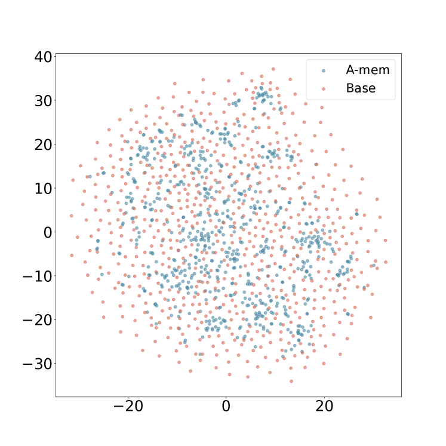

<figcaption>図5(a): Dialogue 3。</figcaption>
</figure>

<figure>

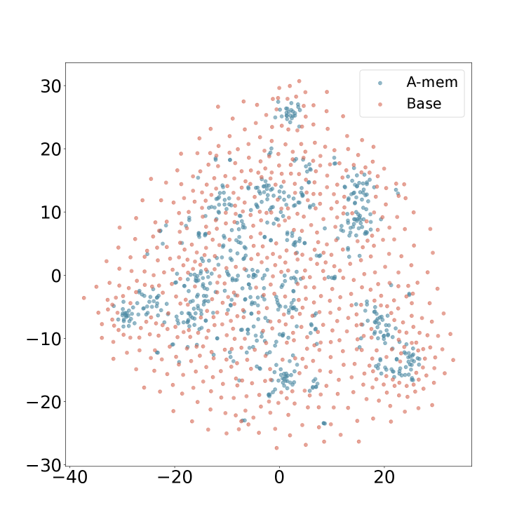

<figcaption>図5(b): Dialogue 4。</figcaption>
</figure>

<figure>

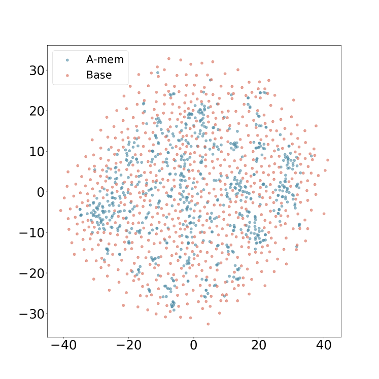

<figcaption>図5(c): Dialogue 5。</figcaption>
</figure>

<figure>

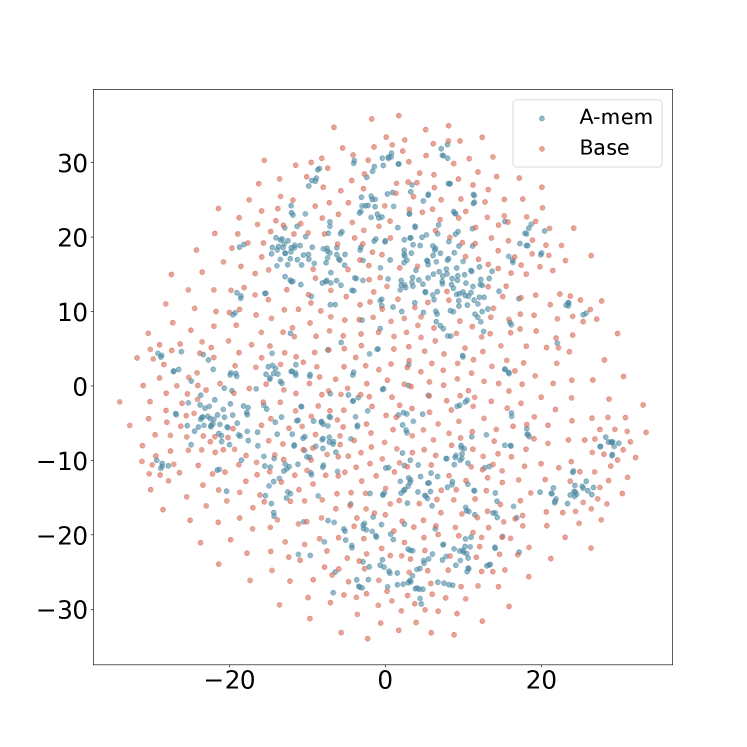

<figcaption>図5(d): Dialogue 6。</figcaption>
</figure>

<figure>

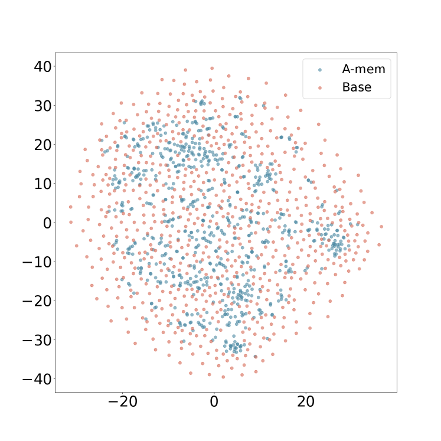

<figcaption>図5(e): Dialogue 7。</figcaption>
</figure>

<figure>

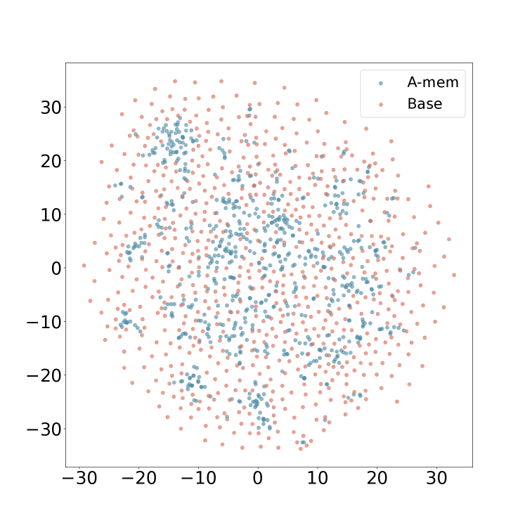

<figcaption>図5(f): Dialogue 8。</figcaption>
</figure>

<figure>

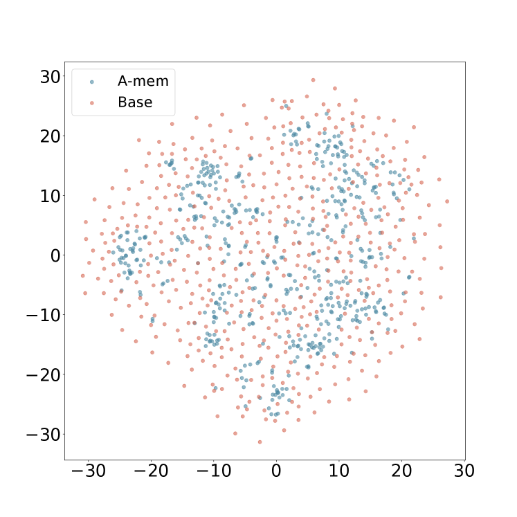

<figcaption>図5(g): Dialogue 9。</figcaption>
</figure>

<figure>

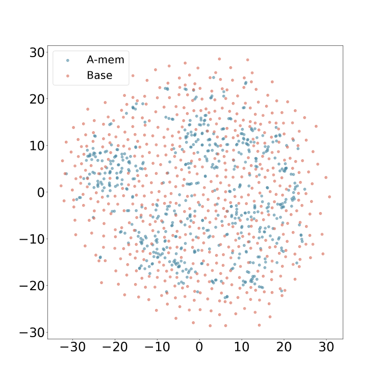

<figcaption>図5(h): Dialogue 10。</figcaption>
</figure>

**図5**: 記憶埋め込みの t-SNE 可視化。異なる対話にわたり、A-Mem（青）が Base Memory（赤）と比べてより組織化された分布を示す。Base Memory はリンク生成と記憶進化なしの A-Mem を表す。（訳注: 主キャプションは ar5iv から復元）

### B.4 Hyperparameters setting（ハイパーパラメータ設定）

すべてのハイパーパラメータ k の値を表 5 に示す。k=10 ですでに最先端（SOTA）の性能を達成しているモデルについては、それ以上の調整をせずこの値を維持する。

**表5**: カテゴリとモデルの選択ごとの retriever の k 値の選択。

| Model | Single Hop | Multi Hop | Temporal | Open Domain | Adversial |
| --- | --- | --- | --- | --- | --- |
| GPT-4o-mini | 40 | 40 | 50 | 50 | 40 |
| GPT-4o | 40 | 40 | 50 | 50 | 40 |
| Qwen2.5-1.5b | 10 | 10 | 10 | 10 | 10 |
| Qwen2.5-3b | 10 | 10 | 50 | 10 | 10 |
| Llama3.2-1b | 10 | 10 | 10 | 10 | 10 |
| Llama3.2-3b | 10 | 20 | 10 | 10 | 10 |

## Appendix C Prompt Templates and Examples（プロンプトテンプレートと例）

> 訳注: 以下のプロンプトと例は、原典（ar5iv）では SVG ボックスとして描画されている。SVG 内のテキストをコードブロックとして原文のまま起こした。

### C.1 Prompt Template of Note Construction（ノート構築のプロンプトテンプレート）

ノート構築におけるプロンプトテンプレート $P_{s1}$:

```
Generate a structured analysis of the following content by:
1. Identifying the most salient keywords (focus on nouns, verbs, and key concepts)
2. Extracting core themes and contextual elements
3. Creating relevant categorical tags
Format the response as a JSON object:
{
"keywords": [ // several specific, distinct keywords that capture key concepts and terminology // Order from most to least important // Don't include keywords that are the name of the speaker or time // At least three keywords, but don't be too redundant. ],
"context": // one sentence summarizing: // - Main topic/domain // - Key arguments/points // - Intended audience/purpose,
"tags": [ // several broad categories/themes for classification // Include domain, format, and type tags // At least three tags, but don't be too redundant. ]
}
Content for analysis:
```

### C.2 Prompt Template of Link Generation（リンク生成のプロンプトテンプレート）

リンク生成におけるプロンプトテンプレート $P_{s2}$:

```
You are an AI memory evolution agent responsible for managing and evolving a knowledge base.
Analyze the the new memory note according to keywords and context, also with their several nearest neighbors memory.
The new memory context:
{context} content: {content}
keywords: {keywords}
The nearest neighbors memories: {nearest_neighbors_memories}
Based on this information, determine:
Should this memory be evolved? Consider its relationships with other memories.
```

### C.3 Prompt Template of Memory Evolution（記憶進化のプロンプトテンプレート）

記憶進化におけるプロンプトテンプレート $P_{s3}$:

```
You are an AI memory evolution agent responsible for managing and evolving a knowledge base.
Analyze the the new memory note according to keywords and context, also with their several nearest neighbors memory.
Make decisions about its evolution.
The new memory context:{context}
content: {content}
keywords: {keywords}
The nearest neighbors memories:{nearest_neighbors_memories}
Based on this information, determine:
1. What specific actions should be taken (strengthen, update_neighbor)?
1.1 If choose to strengthen the connection, which memory should it be connected to? Can you give the updated tags of this memory?
1.2 If choose to update neighbor, you can update the context and tags of these memories based on the understanding of these memories.
Tags should be determined by the content of these characteristic of these memories, which can be used to retrieve them later and categorize them.
All the above information should be returned in a list format according to the sequence: [[new_memory],[neighbor_memory_1],...[neighbor_memory_n]]
These actions can be combined.
Return your decision in JSON format with the following structure: {{
"should_evolve": true/false,
"actions": ["strengthen", "merge", "prune"],
"suggested_connections": ["neighbor_memory_ids"],
"tags_to_update": ["tag_1",..."tag_n"],
"new_context_neighborhood": ["new context",...,"new context"],
"new_tags_neighborhood": [["tag_1",...,"tag_n"],...["tag_1",...,"tag_n"]],
}}
```

### C.4 Examples of Q/A with A-Mem（A-Mem での Q/A の例）

```
Example:
Question 686: Which hobby did Dave pick up in October 2023?
Prediction: photography
Reference: photography
talk start time:10:54 am on 17 November, 2023
memory content: Speaker Davesays: Hey Calvin, long time no talk! A lot has happened. I've taken up photography and it's been great - been taking pics of the scenery around here which is really cool.
memory context: The main topic is the speaker's new hobby of photography, highlighting their enjoyment of capturing local scenery, aimed at engaging a friend in conversation about personal experiences.
memory keywords: ['photography', 'scenery', 'conversation', 'experience', 'hobby']
memory tags: ['hobby', 'photography', 'personal development', 'conversation', 'leisure']
talk start time:6:38 pm on 21 July, 2023
memory content: Speaker Calvinsays: Thanks, Dave! It feels great having my own space to work in. I've been experimenting with different genres lately, pushing myself out of my comfort zone. Adding electronic elements to my songs gives them a fresh vibe. It's been an exciting process of self-discovery and growth!
memory context: The speaker discusses their creative process in music, highlighting experimentation with genres and the incorporation of electronic elements for personal growth and artistic evolution.
memory keywords: ['space', 'experimentation', 'genres', 'electronic', 'self-discovery', 'growth']
memory tags: ['music', 'creativity', 'self-improvement', 'artistic expression']
```
