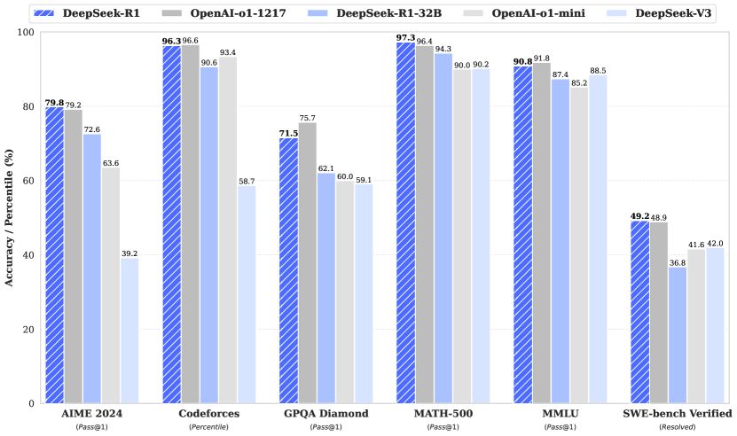
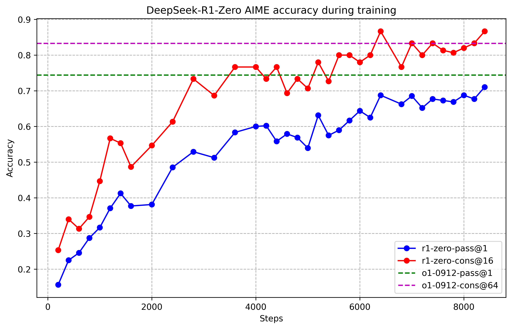

# DeepSeek-R1: 強化学習による LLM の推論能力のインセンティブ化

> 原題: DeepSeek-R1: Incentivizing Reasoning Capability in LLMs via Reinforcement Learning
> 著者: DeepSeek-AI（研究チーム。個別の貢献者一覧は原典 Appendix A 参照）
> 出典: arXiv:2501.12948
> 訳注: 脚注 1〜3（Aider・Codeforces・CNMO の URL）はクリップから欠落していたため ar5iv から復元した。HTML テーブルの multicolumn ヘッダと空列は正規化した。Appendix A（Contributions and Acknowledgments）は著者名の一覧と謝辞であるため、references と同様に翻訳対象外とする。本文中の \[数字\] は原典の参考文献番号を示す（参考文献一覧は翻訳対象外）。

## Abstract（要旨）

我々は第一世代の推論モデル、DeepSeek-R1-Zero と DeepSeek-R1 を紹介する。DeepSeek-R1-Zero は、予備段階としての教師ありファインチューニング（SFT）なしに大規模強化学習（RL）で訓練されたモデルであり、目覚ましい推論能力を実証する。RL を通じて、DeepSeek-R1-Zero には多数の強力で興味深い推論の挙動が自然に立ち現れる。しかし、可読性の低さや言語の混在といった課題にも直面する。これらの問題に対処し推論性能をさらに高めるため、RL の前に多段階の訓練とコールドスタートデータを組み込んだ DeepSeek-R1 を導入する。DeepSeek-R1 は推論タスクにおいて OpenAI-o1-1217 に匹敵する性能を達成する。研究コミュニティを支援するため、DeepSeek-R1-Zero、DeepSeek-R1、および DeepSeek-R1 から Qwen と Llama をベースに蒸留した 6 つの密モデル（1.5B, 7B, 8B, 14B, 32B, 70B）をオープンソースとして公開する。

<figure>

<figcaption>図1: DeepSeek-R1 のベンチマーク性能。</figcaption>
</figure>

## 1 Introduction（はじめに）

近年、大規模言語モデル（LLMs）は急速な反復と進化を遂げており \[21\]\[2\]\[9\]、汎用人工知能（AGI）への隔たりを次第に縮めている。

最近、post-training（事後訓練）が完全な訓練パイプラインの重要な構成要素として浮上している。事前学習と比べて相対的に僅かな計算資源で、推論タスクの精度を高め、社会的価値観に整合させ、ユーザーの選好に適応させられることが示されている。推論能力の文脈では、OpenAI の o1 \[22\] シリーズのモデルが、Chain-of-Thought の推論過程の長さを増やすことによる推論時スケーリング（inference-time scaling）を最初に導入した。このアプローチは、数学・コーディング・科学的推論といった様々な推論タスクで大幅な改善を達成している。しかし、効果的な test-time scaling の課題は、研究コミュニティにとって未解決の問いとして残る。いくつかの先行研究は、プロセスベースの報酬モデル \[33\]\[18\]\[34\]、強化学習 \[15\]、モンテカルロ木探索やビームサーチといった探索アルゴリズム \[6\]\[38\]\[32\] を含む様々なアプローチを探ってきた。しかし、これらの手法のいずれも、OpenAI の o1 シリーズのモデルに匹敵する一般的な推論性能を達成していない。

本論文では、純粋な強化学習（RL）を使って言語モデルの推論能力を改善する第一歩を踏み出す。我々の目標は、いかなる教師ありデータもなしに LLM が推論能力を発達させる可能性を探ることであり、純粋な RL の過程を通じた自己進化に焦点を当てる。具体的には、ベースモデルとして DeepSeek-V3-Base を使い、RL のフレームワークとして GRPO \[28\] を採用して、推論におけるモデル性能を改善する。訓練の間、DeepSeek-R1-Zero には多数の強力で興味深い推論の挙動が自然に立ち現れた。数千の RL ステップの後、DeepSeek-R1-Zero は推論ベンチマークで卓越した性能を示す。例えば、AIME 2024 の pass@1 スコアは 15.6% から 71.0% へ上昇し、多数決を用いるとスコアはさらに 86.7% まで改善して、OpenAI-o1-0912 の性能に匹敵する。

しかし、DeepSeek-R1-Zero は可読性の低さや言語の混在といった課題に直面する。これらの問題に対処し推論性能をさらに高めるため、少量のコールドスタートデータと多段階の訓練パイプラインを組み込んだ DeepSeek-R1 を導入する。具体的には、まず数千件のコールドスタートデータを収集して DeepSeek-V3-Base モデルをファインチューニングする。その後、DeepSeek-R1-Zero と同様の推論指向の RL を行う。RL の過程が収束に近づいたら、RL のチェックポイントに対する棄却サンプリング（rejection sampling）で新しい SFT データを作り、執筆・事実 QA・自己認識といったドメインの DeepSeek-V3 の教師ありデータと組み合わせて、DeepSeek-V3-Base モデルを再訓練する。新しいデータでのファインチューニング後、チェックポイントは、すべてのシナリオからのプロンプトを考慮に入れた追加の RL 過程を経る。これらのステップの後、DeepSeek-R1 と呼ぶチェックポイントを得た。これは OpenAI-o1-1217 と同等の性能を達成する。

さらに、DeepSeek-R1 からより小さな密モデルへの蒸留を探る。Qwen2.5-32B \[26\] をベースモデルとして、DeepSeek-R1 からの直接の蒸留は、そのモデルに RL を適用するより優れた性能を示す。これは、より大きなベースモデルが発見した推論パターンが、推論能力の改善に決定的であることを実証している。蒸留した Qwen と Llama \[4\] のシリーズをオープンソースとして公開する。特筆すべきことに、蒸留した 14B モデルは最先端のオープンソースである QwQ-32B-Preview \[25\] を大差で上回り、蒸留した 32B と 70B のモデルは密モデルの中で推論ベンチマークの新記録を打ち立てる。

### 1.1 Contributions（貢献）

##### Post-Training: ベースモデルへの大規模強化学習

- 予備段階として教師ありファインチューニング（SFT）に頼ることなく、RL をベースモデルに直接適用する。このアプローチにより、モデルは複雑な問題を解くための chain-of-thought（CoT）を探索でき、その結果 DeepSeek-R1-Zero が開発された。DeepSeek-R1-Zero は、自己検証・内省（reflection）・長い CoT の生成といった能力を実証し、研究コミュニティにとって重要なマイルストーンとなる。特筆すべきことに、これは LLM の推論能力が、SFT を必要とせず純粋に RL によってインセンティブ化できることを検証した初の公開研究である。この突破口は、この領域の将来の進歩への道を開く。
- DeepSeek-R1 を開発するパイプラインを紹介する。このパイプラインは、より良い推論パターンの発見と人間の選好への整合を目的とする 2 つの RL ステージと、モデルの推論・非推論能力の種として働く 2 つの SFT ステージを組み込む。このパイプラインは、より良いモデルの作成を通じて産業界に利益をもたらすと信じる。

##### 蒸留: 小さなモデルも強力になれる

- より大きなモデルの推論パターンをより小さなモデルへ蒸留でき、小さなモデル上で RL によって発見される推論パターンよりも良い性能をもたらすことを実証する。オープンソースの DeepSeek-R1 とその API は、将来より良い小型モデルを蒸留するために研究コミュニティに役立つだろう。
- DeepSeek-R1 が生成した推論データを使い、研究コミュニティで広く使われる複数の密モデルをファインチューニングした。評価結果は、蒸留された小型の密モデルがベンチマークで非常に良い性能を発揮することを示す。DeepSeek-R1-Distill-Qwen-7B は AIME 2024 で 55.5% を達成し、QwQ-32B-Preview を上回る。さらに、DeepSeek-R1-Distill-Qwen-32B は AIME 2024 で 72.6%、MATH-500 で 94.3%、LiveCodeBench で 57.2% を記録する。これらの結果は従来のオープンソースモデルを大幅に上回り、o1-mini に匹敵する。Qwen2.5 と Llama3 のシリーズをベースにした蒸留済みの 1.5B, 7B, 8B, 14B, 32B, 70B のチェックポイントをコミュニティに公開する。

### 1.2 評価結果の要約

- **推論タスク**: (1) DeepSeek-R1 は AIME 2024 で 79.8% の Pass@1 を達成し、OpenAI-o1-1217 をわずかに上回る。MATH-500 では 97.3% という印象的なスコアに達し、OpenAI-o1-1217 と同等の性能で他のモデルを大幅に上回る。(2) コーディング関連のタスクでは、DeepSeek-R1 はコード競技タスクで専門家レベルを示し、Codeforces で 2,029 の Elo レーティングを達成して競技の人間参加者の 96.3% を上回る。エンジニアリング関連のタスクでは、DeepSeek-R1 は DeepSeek-V3 よりわずかに良く、実世界のタスクで開発者の助けになりうる。
- **知識**: MMLU、MMLU-Pro、GPQA Diamond といったベンチマークで、DeepSeek-R1 は傑出した結果を達成し、MMLU で 90.8%、MMLU-Pro で 84.0%、GPQA Diamond で 71.5% と DeepSeek-V3 を大幅に上回る。これらのベンチマークでの性能は OpenAI-o1-1217 をわずかに下回るものの、DeepSeek-R1 は他の閉源モデルを上回り、教育的タスクでの競争力を示す。事実ベンチマークの SimpleQA では、DeepSeek-R1 は DeepSeek-V3 を上回り、事実に基づく問い合わせを扱う能力を実証する。このベンチマークで OpenAI-o1 が 4o を上回るのと同様の傾向が観察される。
- **その他**: DeepSeek-R1 は、創作的な文章、一般的な質問応答、編集、要約などを含む幅広いタスクにも秀でる。AlpacaEval 2.0 で長さ制御勝率 87.6%、ArenaHard で勝率 92.3% という印象的な成績を達成し、試験志向でない問い合わせを知的に扱う強い能力を見せる。加えて、DeepSeek-R1 は長コンテキスト理解を要するタスクで傑出した性能を示し、長コンテキストのベンチマークで DeepSeek-V3 を大幅に上回る。

## 2 Approach（アプローチ）

### 2.1 概要

先行研究は、モデル性能を高めるために大量の教師ありデータに大きく依存してきた。本研究では、コールドスタートとして教師ありファインチューニング（SFT）を使わなくても、大規模強化学習（RL）によって推論能力を大幅に改善できることを実証する。さらに、少量のコールドスタートデータを含めることで性能をさらに高められる。以降の節では次を提示する: (1) SFT データを一切使わずベースモデルに RL を直接適用する DeepSeek-R1-Zero、(2) 数千件の長い Chain-of-Thought（CoT）の例でファインチューニングしたチェックポイントから RL を始める DeepSeek-R1、(3) DeepSeek-R1 の推論能力を小さな密モデルへ蒸留する。

### 2.2 DeepSeek-R1-Zero: ベースモデルへの強化学習

強化学習は、我々の先行研究 \[34\]\[28\] が証明するように、推論タスクで大きな有効性を示してきた。しかし、これらの研究は、収集に時間のかかる教師ありデータに大きく依存していた。本節では、いかなる教師ありデータもなしに LLM が推論能力を発達させる可能性を、純粋な強化学習の過程を通じた自己進化に焦点を当てて探る。まず RL アルゴリズムの簡単な概観から始め、続いていくつかの刺激的な結果を提示する。これがコミュニティに価値ある洞察を与えることを願う。

#### 2.2.1 強化学習アルゴリズム

##### Group Relative Policy Optimization

RL の訓練コストを節約するため、Group Relative Policy Optimization（GRPO）\[28\] を採用する。これは、通常は方策モデルと同サイズになる critic モデルを排し、代わりにグループのスコアからベースラインを推定する。具体的には、各質問 $q$ について、GRPO は旧方策 $\pi_{\theta_{old}}$ から出力のグループ $\{o_{1},o_{2},\cdots,o_{G}\}$ をサンプリングし、次の目的関数を最大化することで方策モデル $\pi_{\theta}$ を最適化する:

$$
\begin{split}\mathcal{J}_{GRPO}(\theta)&=\mathbb{E}{[q\sim P(Q),\{o_{i}\}_{i=1}^{G}\sim\pi_{\theta_{old}}(O|q)]}\\
&\frac{1}{G}\sum_{i=1}^{G}\left(\min\left(\frac{\pi_{\theta}(o_{i}|q)}{\pi_{\theta_{old}}(o_{i}|q)}A_{i},\text{clip}\left(\frac{\pi_{\theta}(o_{i}|q)}{\pi_{\theta_{old}}(o_{i}|q)},1-\varepsilon,1+\varepsilon\right)A_{i}\right)-\beta\mathbb{D}_{KL}\left(\pi_{\theta}||\pi_{ref}\right)\right),\end{split}
$$

$$
\mathbb{D}_{KL}\left(\pi_{\theta}||\pi_{ref}\right)=\frac{\pi_{ref}(o_{i}|q)}{\pi_{\theta}(o_{i}|q)}-\log\frac{\pi_{ref}(o_{i}|q)}{\pi_{\theta}(o_{i}|q)}-1,
$$

ここで $\varepsilon$ と $\beta$ はハイパーパラメータであり、$A_{i}$ は advantage で、各グループ内の出力に対応する報酬のグループ $\{r_{1},r_{2},\ldots,r_{G}\}$ を使って計算される:

$$
A_{i}=\frac{r_{i}-{\mathrm{m}ean(\{r_{1},r_{2},\cdots,r_{G}\})}}{{\mathrm{s}td(\{r_{1},r_{2},\cdots,r_{G}\})}}.
$$

**表1**: DeepSeek-R1-Zero のテンプレート。prompt は訓練時に具体的な推論の質問に置き換えられる。（訳注: テンプレート本文は skill 規定により原文のまま）

> A conversation between User and Assistant. The user asks a question, and the Assistant solves it. The assistant first thinks about the reasoning process in the mind and then provides the user with the answer. The reasoning process and answer are enclosed within \<think> \</think> and \<answer> \</answer> tags, respectively, i.e., \<think> reasoning process here \</think> \<answer> answer here \</answer>. User: prompt. Assistant:

#### 2.2.2 報酬のモデリング

報酬は訓練信号の源であり、RL の最適化の方向を決める。DeepSeek-R1-Zero を訓練するため、主に 2 種類の報酬からなるルールベースの報酬システムを採用する:

- **正確性報酬（Accuracy rewards）**: 正確性報酬モデルは応答が正しいかを評価する。例えば、決定的な結果を持つ数学の問題の場合、モデルは指定された形式（例: ボックスの中）で最終回答を出すことを要求され、正しさのルールベースの検証を信頼できるものにする。同様に LeetCode の問題では、事前定義されたテストケースに基づいてコンパイラがフィードバックを生成できる。
- **形式報酬（Format rewards）**: 正確性報酬モデルに加えて、思考過程を「\<think>」と「\</think>」のタグの間に置くことをモデルに強制する形式報酬モデルを用いる。

DeepSeek-R1-Zero の開発では、結果報酬・プロセス報酬いずれのニューラル報酬モデルも適用しない。ニューラル報酬モデルは大規模な強化学習の過程で報酬ハッキング（reward hacking）に苦しむ可能性があり、報酬モデルの再訓練には追加の訓練資源が必要で、訓練パイプライン全体を複雑にすることが分かったからである。

#### 2.2.3 訓練テンプレート

DeepSeek-R1-Zero を訓練するため、まずベースモデルを指定した指示に従わせる単純明快なテンプレートを設計する。Table 1 に示すように、このテンプレートは DeepSeek-R1-Zero に、まず推論過程を生成し、続いて最終回答を出すことを要求する。制約は意図的にこの構造的形式に限定し、内容に固有のバイアス——内省的な推論の義務づけや特定の問題解決戦略の推奨など——を避けることで、RL の過程でのモデルの自然な進行を正確に観察できるようにする。

#### 2.2.4 DeepSeek-R1-Zero の性能・自己進化の過程・「aha moment」

##### DeepSeek-R1-Zero の性能

**表2**: 推論関連ベンチマークにおける DeepSeek-R1-Zero と OpenAI o1 モデルの比較。（訳注: multicolumn ヘッダを正規化）

| モデル | AIME 2024 pass@1 | AIME 2024 cons@64 | MATH-500 pass@1 | GPQA Diamond pass@1 | LiveCodeBench pass@1 | CodeForces rating |
| --- | --- | --- | --- | --- | --- | --- |
| OpenAI-o1-mini | 63.6 | 80.0 | 90.0 | 60.0 | 53.8 | 1820 |
| OpenAI-o1-0912 | 74.4 | 83.3 | 94.8 | 77.3 | 63.4 | 1843 |
| DeepSeek-R1-Zero | 71.0 | 86.7 | 95.9 | 73.3 | 50.0 | 1444 |

<figure>

<figcaption>図2: 訓練中の DeepSeek-R1-Zero の AIME 精度。各質問について 16 応答をサンプリングし、安定した評価のために全体の平均精度を計算する。</figcaption>
</figure>

Figure 2 は、RL の訓練過程を通じた AIME 2024 ベンチマークにおける DeepSeek-R1-Zero の性能の軌跡を描く。図示されるとおり、DeepSeek-R1-Zero は RL の訓練が進むにつれ、着実で一貫した性能向上を示す。特筆すべきことに、AIME 2024 の平均 pass@1 スコアは大幅な上昇を見せ、初期の 15.6% から印象的な 71.0% へ跳ね上がり、OpenAI-o1-0912 に匹敵する性能水準に達する。この大幅な改善は、時間とともにモデルの性能を最適化する我々の RL アルゴリズムの有効性を際立たせる。

Table 2 は、様々な推論関連ベンチマークにわたる DeepSeek-R1-Zero と OpenAI の o1-0912 モデルの比較分析を提供する。この知見は、RL が、いかなる教師ありファインチューニングデータもなしに、DeepSeek-R1-Zero が頑健な推論能力を獲得することを可能にすることを明らかにする。これは注目に値する達成である。モデルが RL のみを通じて効果的に学習し汎化する能力を強調するからである。加えて、DeepSeek-R1-Zero の性能は多数決の適用によってさらに増強できる。例えば AIME ベンチマークで多数決を用いると、DeepSeek-R1-Zero の性能は 71.0% から 86.7% へ上昇し、OpenAI-o1-0912 の性能を超える。多数決の有無にかかわらずこのような競争力ある性能を達成できる DeepSeek-R1-Zero の能力は、その強い基礎能力と、推論タスクにおけるさらなる進歩の可能性を際立たせる。

<figure>

<figcaption>図3: RL 過程における訓練セットでの DeepSeek-R1-Zero の平均応答長。DeepSeek-R1-Zero は、より多くの思考時間を使って推論タスクを解くことを自然に学習する。</figcaption>
</figure>

##### DeepSeek-R1-Zero の自己進化の過程

DeepSeek-R1-Zero の自己進化の過程は、RL がモデルを駆動して推論能力を自律的に改善させる様子の魅力的な実証である。ベースモデルから直接 RL を開始することで、教師ありファインチューニング段階の影響なしに、モデルの進行を密に観察できる。このアプローチは、モデルが時間とともに、特に複雑な推論タスクを扱う能力の面でどう進化するかの明瞭な視界を提供する。

Figure 3 に描かれるように、DeepSeek-R1-Zero の思考時間は訓練過程を通じて一貫した改善を示す。この改善は外部からの調整の結果ではなく、モデル内部の本質的な発達である。DeepSeek-R1-Zero は、延長された test-time computation を活用することで、ますます複雑な推論タスクを解く能力を自然に獲得する。この計算は数百から数千の推論トークンの生成に及び、モデルが思考過程をより深く探索し洗練することを可能にする。

この自己進化の最も注目すべき側面の一つは、test-time computation が増えるにつれて洗練された挙動が出現することである。内省（reflection）——モデルが自分の前のステップを再訪して再評価する——や、問題解決への代替アプローチの探索といった挙動が、自発的に生じる。これらの挙動は明示的にプログラムされたものではなく、モデルと強化学習環境の相互作用の結果として出現する。この自発的な発達は DeepSeek-R1-Zero の推論能力を大幅に強化し、より挑戦的なタスクに、より高い効率と正確さで取り組むことを可能にする。

##### DeepSeek-R1-Zero の「aha moment」

DeepSeek-R1-Zero の訓練中に観察された特に興味深い現象が、「aha moment」の発生である。Table 3 に示すこの瞬間は、モデルの中間バージョンで起こる。この段階で、DeepSeek-R1-Zero は、初期のアプローチを再評価することによって、問題により多くの思考時間を配分することを学習する。この挙動は、モデルの成長する推論能力の証であるだけでなく、強化学習が予想外で洗練された結果をもたらしうることの魅惑的な例である。

この瞬間は、モデルにとっての「aha moment」であるだけでなく、その挙動を観察する研究者にとってのそれでもある。これは強化学習の力と美しさを際立たせる: 問題の解き方をモデルに明示的に教えるのではなく、正しいインセンティブを与えるだけで、モデルは高度な問題解決戦略を自律的に発達させるのである。「aha moment」は、人工システムの新しい知能の水準を解錠する RL の可能性の力強い喚起であり、将来のより自律的で適応的なモデルへの道を開く。

**表3**: DeepSeek-R1-Zero の中間バージョンの興味深い「aha moment」。モデルは擬人的な口調で考え直すことを学ぶ。これは我々にとっても aha moment であり、強化学習の力と美しさを目撃させてくれる。（訳注: 応答は原文のまま）

> Question: If $a>1$, then the sum of the real solutions of $\sqrt{a-\sqrt{a+x}}=x$ is equal to
>
> Response: \<think>
> To solve the equation $\sqrt{a-\sqrt{a+x}}=x$, let's start by squaring both $\cdots$
> $\left(\sqrt{a-\sqrt{a+x}}\right)^{2}=x^{2}\implies a-\sqrt{a+x}=x^{2}.$
> Rearrange to isolate the inner square root term:
> $(a-x^{2})^{2}=a+x\implies a^{2}-2ax^{2}+(x^{2})^{2}=a+x\implies x^{4}-2ax^{2}-x+(a^{2}-a)=0$
> …
> **Wait, wait. Wait. That's an aha moment I can flag here.**
> Let's reevaluate this step-by-step to identify if the correct sum can be $\cdots$
> We started with the equation:
> $\sqrt{a-\sqrt{a+x}}=x$
> First, let's square both sides:
> $a-\sqrt{a+x}=x^{2}\implies\sqrt{a+x}=a-x^{2}$
> Next, I could square both sides again, treating the equation: $\cdots$ …

##### DeepSeek-R1-Zero の欠点

DeepSeek-R1-Zero は強い推論能力を示し、予想外で強力な推論の挙動を自律的に発達させるものの、いくつかの問題に直面する。例えば、DeepSeek-R1-Zero は可読性の低さや言語の混在といった課題に苦しむ。推論過程をより読みやすくし、開かれたコミュニティと共有するため、人間に親和的なコールドスタートデータを用いた RL の手法である DeepSeek-R1 を探る。

### 2.3 DeepSeek-R1: コールドスタートつき強化学習

DeepSeek-R1-Zero の有望な結果に触発されて、2 つの自然な問いが生じる: 1) 少量の高品質データをコールドスタートとして組み込むことで、推論性能をさらに改善したり収束を加速したりできるか？ 2) 明瞭で一貫した Chain of Thought（CoT）を生成するだけでなく、強い汎用能力も示すユーザーフレンドリーなモデルをどう訓練できるか？これらの問いに答えるため、DeepSeek-R1 を訓練するパイプラインを設計する。パイプラインは以下に概説する 4 つのステージからなる。

#### 2.3.1 コールドスタート

DeepSeek-R1-Zero と異なり、ベースモデルからの RL 訓練の初期の不安定なコールドスタート段階を防ぐため、DeepSeek-R1 では少量の長い CoT データを構築・収集し、初期の RL アクターとしてモデルをファインチューニングする。このようなデータを集めるため、いくつかのアプローチを探った: 長い CoT を例とする few-shot プロンプティング、内省と検証を含む詳細な回答を生成するようモデルに直接プロンプトする、読みやすい形式の DeepSeek-R1-Zero の出力を集める、人間のアノテータによる後処理で結果を洗練する、である。

本研究では、数千件のコールドスタートデータを収集し、RL の出発点として DeepSeek-V3-Base をファインチューニングする。DeepSeek-R1-Zero と比較したコールドスタートデータの利点は以下を含む:

- **可読性**: DeepSeek-R1-Zero の主要な限界は、内容がしばしば読むのに適さないことである。応答は複数言語が混ざったり、ユーザー向けに答えを強調する markdown の書式を欠いたりする。対照的に、DeepSeek-R1 のコールドスタートデータを作成する際は、各応答の末尾に要約を含む読みやすいパターンを設計し、読者に親和的でない応答をフィルタする。ここで出力形式を |special\_token|<reasoning\_process>|special\_token|\
 と定義する。reasoning process はクエリに対する CoT であり、summary は推論結果の要約に使われる。
- **潜在性能**: 人間の事前知識でコールドスタートデータのパターンを注意深く設計することで、DeepSeek-R1-Zero に対するより良い性能が観察される。反復的な訓練が推論モデルにとってより良い方法だと我々は信じる。

#### 2.3.2 推論指向の強化学習

コールドスタートデータで DeepSeek-V3-Base をファインチューニングした後、DeepSeek-R1-Zero で用いたのと同じ大規模強化学習の訓練過程を適用する。この段階は、特にコーディング・数学・科学・論理推論といった、明確な解を持つ明確に定義された問題を含む推論集約的なタスクにおける、モデルの推論能力の強化に焦点を当てる。訓練の過程で、特に RL のプロンプトが複数言語を含むとき、CoT がしばしば言語の混在を示すことを観察する。言語混在の問題を軽減するため、RL の訓練中に言語一貫性報酬を導入する。これは CoT 内の目的言語の単語の割合として計算される。アブレーション実験は、このような整合がモデルの性能をわずかに劣化させることを示すが、この報酬は人間の選好に整合し、より読みやすくする。最後に、推論タスクの正確性と言語一貫性の報酬を直接の和で組み合わせて最終報酬を形成する。その後、推論タスクで収束に達するまで、ファインチューニング済みモデルに RL の訓練を適用する。

#### 2.3.3 棄却サンプリングと教師ありファインチューニング

推論指向の RL が収束したら、得られたチェックポイントを利用して、次のラウンドのための SFT（教師ありファインチューニング）データを収集する。主に推論に焦点を当てる初期のコールドスタートデータと異なり、この段階は他のドメインのデータを組み込み、執筆・ロールプレイ・その他の汎用タスクでのモデルの能力を高める。具体的には、以下のとおりデータを生成しモデルをファインチューニングする。

##### 推論データ

推論プロンプトをキュレーションし、上記の RL 訓練のチェックポイントからの棄却サンプリングによって推論の軌跡を生成する。前の段階では、ルールベースの報酬で評価できるデータのみを含めた。しかしこの段階では、追加のデータを組み込んでデータセットを拡張する。その一部は、正解とモデルの予測を DeepSeek-V3 に与えて判定させる生成的報酬モデルを使う。加えて、モデルの出力は時に混沌として読みにくいため、混合言語の chain-of-thought・長い段落・コードブロックをフィルタした。各プロンプトについて複数の応答をサンプリングし、正しいもののみを保持する。合計で約 60 万件の推論関連の訓練サンプルを収集する。

##### 非推論データ

執筆・事実 QA・自己認識・翻訳といった非推論データには、DeepSeek-V3 のパイプラインを採用し、DeepSeek-V3 の SFT データセットの一部を再利用する。特定の非推論タスクでは、プロンプティングによって、質問に答える前の潜在的な chain-of-thought を DeepSeek-V3 に生成させる。ただし「hello」のようなより単純な問い合わせには、応答に CoT を与えない。最終的に、推論と無関係な約 20 万件の訓練サンプルを収集した。

上記のキュレーション済みの約 80 万サンプルのデータセットを使い、DeepSeek-V3-Base を 2 エポック、ファインチューニングする。

#### 2.3.4 全シナリオのための強化学習

モデルを人間の選好にさらに整合させるため、モデルの有用性（helpfulness）と無害性（harmlessness）の改善を目的とし、同時に推論能力も洗練する、二次的な強化学習ステージを実装する。具体的には、報酬信号と多様なプロンプト分布の組み合わせを使ってモデルを訓練する。推論データには、DeepSeek-R1-Zero で概説した方法論に忠実に従い、数学・コード・論理推論のドメインでルールベースの報酬を使って学習過程を導く。汎用データには、複雑で微妙なシナリオにおける人間の選好を捉える報酬モデルに頼る。DeepSeek-V3 のパイプラインの上に構築し、選好ペアと訓練プロンプトの同様の分布を採用する。有用性については最終要約にのみ焦点を当て、評価が、基盤にある推論過程への干渉を最小化しながら、ユーザーにとっての応答の実用性と関連性を強調するようにする。無害性については、推論過程と要約の両方を含むモデルの応答全体を評価し、生成過程で生じうる潜在的なリスク・バイアス・有害な内容を特定して軽減する。最終的に、報酬信号と多様なデータ分布の統合により、推論に秀でつつ有用性と無害性を優先するモデルを訓練できる。

### 2.4 蒸留: 小さなモデルに推論能力を与える

DeepSeek-R1 のような推論能力をより効率的な小型モデルに備え付けるため、§2.3.3 で詳述した DeepSeek-R1 でキュレーションした 80 万サンプルを使い、Qwen \[26\] や Llama \[1\] といったオープンソースモデルを直接ファインチューニングした。我々の知見は、この単純明快な蒸留手法が小型モデルの推論能力を大幅に高めることを示す。ここで使うベースモデルは Qwen2.5-Math-1.5B, Qwen2.5-Math-7B, Qwen2.5-14B, Qwen2.5-32B, Llama-3.1-8B, Llama-3.3-70B-Instruct である。Llama-3.3 を選んだのは、その推論能力が Llama-3.1 よりわずかに良いためである。

蒸留モデルには SFT のみを適用し、RL のステージは含めない。RL を組み込めばモデル性能を大幅に押し上げられるにもかかわらず、である。ここでの我々の第一の目標は蒸留手法の有効性を実証することであり、RL ステージの探求はより広い研究コミュニティに委ねる。

## 3 Experiment（実験）

##### ベンチマーク

MMLU \[11\]、MMLU-Redux \[8\]、MMLU-Pro \[36\]、C-Eval \[12\]、CMMLU \[16\]、IFEval \[39\]、FRAMES \[14\]、GPQA Diamond \[27\]、SimpleQA \[23\]、C-SimpleQA \[10\]、SWE-Bench Verified \[24\]、Aider[^fn1]、LiveCodeBench \[13\]（2024-08〜2025-01）、Codeforces[^fn2]、中国全国高校数学オリンピック（CNMO 2024）[^fn3]、American Invitational Mathematics Examination 2024（AIME 2024）\[20\] でモデルを評価する。標準ベンチマークに加えて、LLM を審査員とするオープンエンドの生成タスクでもモデルを評価する。具体的には AlpacaEval 2.0 \[5\] と Arena-Hard \[17\] の元の構成に忠実に従う。これらはペア比較の審査員として GPT-4-Turbo-1106 を活用する。ここでは長さのバイアスを避けるため、最終要約のみを評価に与える。蒸留モデルについては、AIME 2024・MATH-500・GPQA Diamond・Codeforces・LiveCodeBench の代表的な結果を報告する。

[^fn1]: https://aider.chat（訳注: この脚注はクリップから欠落していたため ar5iv から復元）
[^fn2]: https://codeforces.com（訳注: 同上）
[^fn3]: https://www.cms.org.cn/Home/comp/comp/cid/12.html（訳注: 同上）

##### 評価プロンプト

DeepSeek-V3 の設定に従い、MMLU・DROP・GPQA Diamond・SimpleQA といった標準ベンチマークは simple-evals フレームワークのプロンプトで評価する。MMLU-Redux にはゼロショット設定で Zero-Eval のプロンプト形式 \[19\] を採用する。MMLU-Pro・C-Eval・CLUE-WSC は元のプロンプトが few-shot であるため、プロンプトをゼロショット設定へわずかに修正する。few-shot 内の CoT は DeepSeek-R1 の性能を損ないうる。他のデータセットは、作成者が提供するデフォルトのプロンプトとともに元の評価プロトコルに従う。コードと数学のベンチマークについて、HumanEval-Mul データセットは主流の 8 つのプログラミング言語（Python, Java, C++, C#, JavaScript, TypeScript, PHP, Bash）をカバーする。LiveCodeBench でのモデル性能は CoT 形式で評価し、データは 2024 年 8 月から 2025 年 1 月の間に収集する。Codeforces データセットは 10 回の Div.2 コンテストの問題と専門家作成のテストケースで評価し、その後、期待されるレーティングと競技者の割合を計算する。SWE-Bench verified の結果は agentless フレームワーク \[37\] で得る。Aider 関連のベンチマークは「diff」形式で測定する。DeepSeek-R1 の出力は各ベンチマークで最大 32,768 トークンに制限する。

##### ベースライン

DeepSeek-V3、Claude-Sonnet-3.5-1022、GPT-4o-0513、OpenAI-o1-mini、OpenAI-o1-1217 を含むいくつかの強力なベースラインに対して包括的な評価を行う。中国本土からは OpenAI-o1-1217 の API へのアクセスが難しいため、その性能は公式の報告に基づいて記載する。蒸留モデルについては、オープンソースモデルの QwQ-32B-Preview \[25\] とも比較する。

##### 評価のセットアップ

モデルの最大生成長を 32,768 トークンに設定する。長い出力の推論モデルの評価に貪欲デコーディングを使うと、反復率が高くなり、チェックポイント間の変動が大きくなることが分かった。そこで既定では pass@$k$ 評価 \[3\] を使い、非ゼロの temperature で pass@1 を報告する。具体的には、サンプリング temperature 0.6・top-$p$ 0.95 を使って、各質問に対して $k$ 個（テストセットのサイズに応じて通常 4〜64）の応答を生成する。pass@1 は次のように計算される:

$$
\text{pass@1}=\frac{1}{k}\sum_{i=1}^{k}p_{i},
$$

ここで $p_{i}$ は $i$ 番目の応答の正しさを表す。この方法はより信頼できる性能推定を与える。AIME 2024 では、64 サンプルを使った合意（多数決）の結果 \[35\] も cons@64 として報告する。

### 3.1 DeepSeek-R1 の評価

**表4**: DeepSeek-R1 と他の代表的モデルの比較。（訳注: multicolumn ヘッダと空列を正規化）

| 分野 | ベンチマーク（指標） | Claude-3.5-Sonnet-1022 | GPT-4o-0513 | DeepSeek V3 | OpenAI o1-mini | OpenAI o1-1217 | DeepSeek R1 |
| --- | --- | --- | --- | --- | --- | --- | --- |
| | アーキテクチャ | - | - | MoE | - | - | MoE |
| | 活性化パラメータ数 | - | - | 37B | - | - | 37B |
| | 総パラメータ数 | - | - | 671B | - | - | 671B |
| English | MMLU (Pass@1) | 88.3 | 87.2 | 88.5 | 85.2 | **91.8** | 90.8 |
| | MMLU-Redux (EM) | 88.9 | 88.0 | 89.1 | 86.7 | - | **92.9** |
| | MMLU-Pro (EM) | 78.0 | 72.6 | 75.9 | 80.3 | - | **84.0** |
| | DROP (3-shot F1) | 88.3 | 83.7 | 91.6 | 83.9 | 90.2 | **92.2** |
| | IF-Eval (Prompt Strict) | **86.5** | 84.3 | 86.1 | 84.8 | - | 83.3 |
| | GPQA Diamond (Pass@1) | 65.0 | 49.9 | 59.1 | 60.0 | **75.7** | 71.5 |
| | SimpleQA (Correct) | 28.4 | 38.2 | 24.9 | 7.0 | **47.0** | 30.1 |
| | FRAMES (Acc.) | 72.5 | 80.5 | 73.3 | 76.9 | - | **82.5** |
| | AlpacaEval2.0 (LC-winrate) | 52.0 | 51.1 | 70.0 | 57.8 | - | **87.6** |
| | ArenaHard (GPT-4-1106) | 85.2 | 80.4 | 85.5 | 92.0 | - | **92.3** |
| Code | LiveCodeBench (Pass@1-COT) | 38.9 | 32.9 | 36.2 | 53.8 | 63.4 | **65.9** |
| | Codeforces (Percentile) | 20.3 | 23.6 | 58.7 | 93.4 | **96.6** | 96.3 |
| | Codeforces (Rating) | 717 | 759 | 1134 | 1820 | **2061** | 2029 |
| | SWE Verified (Resolved) | **50.8** | 38.8 | 42.0 | 41.6 | 48.9 | 49.2 |
| | Aider-Polyglot (Acc.) | 45.3 | 16.0 | 49.6 | 32.9 | **61.7** | 53.3 |
| Math | AIME 2024 (Pass@1) | 16.0 | 9.3 | 39.2 | 63.6 | 79.2 | **79.8** |
| | MATH-500 (Pass@1) | 78.3 | 74.6 | 90.2 | 90.0 | 96.4 | **97.3** |
| | CNMO 2024 (Pass@1) | 13.1 | 10.8 | 43.2 | 67.6 | - | **78.8** |
| Chinese | CLUEWSC (EM) | 85.4 | 87.9 | 90.9 | 89.9 | - | **92.8** |
| | C-Eval (EM) | 76.7 | 76.0 | 86.5 | 68.9 | - | **91.8** |
| | C-SimpleQA (Correct) | 55.4 | 58.7 | **68.0** | 40.3 | - | 63.7 |

MMLU・MMLU-Pro・GPQA Diamond といった教育指向の知識ベンチマークにおいて、DeepSeek-R1 は DeepSeek-V3 と比べて優れた性能を示す。この改善は主に STEM 関連の質問での精度向上に起因し、大規模強化学習によって大きな向上が達成されている。加えて、DeepSeek-R1 は長コンテキスト依存の QA タスクである FRAMES で秀で、強い文書分析能力を見せる。これは、AI 駆動の検索・データ分析タスクにおける推論モデルの可能性を際立たせる。事実ベンチマークの SimpleQA では、DeepSeek-R1 は DeepSeek-V3 を上回り、事実に基づく問い合わせを扱う能力を実証する。このベンチマークで OpenAI-o1 が GPT-4o を上回るのと同様の傾向が観察される。しかし、DeepSeek-R1 は中国語の SimpleQA ベンチマークでは DeepSeek-V3 より悪い。主な理由は、安全性 RL の後に特定の問い合わせへの回答を拒否する傾向である。安全性 RL がなければ、DeepSeek-R1 は 70% 超の精度を達成できる。

DeepSeek-R1 は、モデルの形式指示への追従能力を評価するために設計されたベンチマークである IF-Eval でも印象的な結果を出す。これらの改善は、教師ありファインチューニング（SFT）と RL の訓練の最終段階での指示追従データの組み込みに結びつけられる。さらに、AlpacaEval2.0 と ArenaHard で目覚ましい性能が観察され、DeepSeek-R1 の執筆タスクとオープンドメイン質問応答での強さを示す。DeepSeek-V3 を大きく上回ることは、大規模 RL の汎化の利点を強調する。それは推論能力を押し上げるだけでなく、多様なドメインにわたる性能も改善するのである。さらに、DeepSeek-R1 が生成する要約の長さは簡潔で、ArenaHard で平均 689 トークン、AlpacaEval 2.0 で 2,218 文字である。これは DeepSeek-R1 が GPT ベースの評価で長さバイアスを持ち込むことを避けていることを示し、複数タスクにわたるその頑健性をさらに強固にする。

数学のタスクでは、DeepSeek-R1 は OpenAI-o1-1217 と同等の性能を示し、他のモデルを大差で上回る。LiveCodeBench や Codeforces のようなコーディングアルゴリズムのタスクでも同様の傾向が観察され、推論に注力するモデルがこれらのベンチマークを支配する。エンジニアリング指向のコーディングタスクでは、OpenAI-o1-1217 は Aider で DeepSeek-R1 を上回るが、SWE Verified では同等の性能である。関連する RL の訓練データの量が現在非常に限られているため、DeepSeek-R1 のエンジニアリング性能は次のバージョンで改善すると我々は考えている。

### 3.2 蒸留モデルの評価

**表5**: DeepSeek-R1 蒸留モデルと他の比較可能なモデルの、推論関連ベンチマークでの比較。（訳注: multicolumn ヘッダを正規化）

| モデル | AIME 2024 pass@1 | AIME 2024 cons@64 | MATH-500 pass@1 | GPQA Diamond pass@1 | LiveCodeBench pass@1 | CodeForces rating |
| --- | --- | --- | --- | --- | --- | --- |
| GPT-4o-0513 | 9.3 | 13.4 | 74.6 | 49.9 | 32.9 | 759 |
| Claude-3.5-Sonnet-1022 | 16.0 | 26.7 | 78.3 | 65.0 | 38.9 | 717 |
| OpenAI-o1-mini | 63.6 | 80.0 | 90.0 | 60.0 | 53.8 | 1820 |
| QwQ-32B-Preview | 50.0 | 60.0 | 90.6 | 54.5 | 41.9 | 1316 |
| DeepSeek-R1-Distill-Qwen-1.5B | 28.9 | 52.7 | 83.9 | 33.8 | 16.9 | 954 |
| DeepSeek-R1-Distill-Qwen-7B | 55.5 | 83.3 | 92.8 | 49.1 | 37.6 | 1189 |
| DeepSeek-R1-Distill-Qwen-14B | 69.7 | 80.0 | 93.9 | 59.1 | 53.1 | 1481 |
| DeepSeek-R1-Distill-Qwen-32B | 72.6 | 83.3 | 94.3 | 62.1 | 57.2 | 1691 |
| DeepSeek-R1-Distill-Llama-8B | 50.4 | 80.0 | 89.1 | 49.0 | 39.6 | 1205 |
| DeepSeek-R1-Distill-Llama-70B | 70.0 | 86.7 | 94.5 | 65.2 | 57.5 | 1633 |

Table 5 に示すとおり、DeepSeek-R1 の出力を単に蒸留するだけで、効率的な DeepSeek-R1-7B（すなわち DeepSeek-R1-Distill-Qwen-7B、以下同様に略記）が GPT-4o-0513 のような非推論モデルを全面的に上回ることを可能にする。DeepSeek-R1-14B はすべての評価指標で QwQ-32B-Preview を超え、DeepSeek-R1-32B と DeepSeek-R1-70B はほとんどのベンチマークで o1-mini を大幅に超える。これらの結果は蒸留の強い可能性を実証する。加えて、これらの蒸留モデルに RL を適用するとさらに大きな向上が得られることが分かった。これはさらなる探求に値すると考え、ここでは単純な SFT 蒸留モデルの結果のみを提示する。

## 4 Discussion（議論）

### 4.1 蒸留 vs 強化学習

**表6**: 蒸留モデルと RL モデルの推論関連ベンチマークでの比較。

| モデル | AIME 2024 pass@1 | AIME 2024 cons@64 | MATH-500 pass@1 | GPQA Diamond pass@1 | LiveCodeBench pass@1 |
| --- | --- | --- | --- | --- | --- |
| QwQ-32B-Preview | 50.0 | 60.0 | 90.6 | 54.5 | 41.9 |
| DeepSeek-R1-Zero-Qwen-32B | 47.0 | 60.0 | 91.6 | 55.0 | 40.2 |
| DeepSeek-R1-Distill-Qwen-32B | **72.6** | **83.3** | **94.3** | **62.1** | **57.2** |

Section 3.2 で、DeepSeek-R1 を蒸留することで小型モデルが印象的な結果を達成できることを見た。しかし、まだ 1 つの問いが残る: 蒸留なしに、本論文で論じた大規模 RL 訓練によってモデルは同等の性能を達成できるのか？

この問いに答えるため、Qwen-32B-Base に数学・コード・STEM のデータを使って 1 万ステップ超の大規模 RL 訓練を行い、DeepSeek-R1-Zero-Qwen-32B を得た。Table 6 に示す実験結果は、32B のベースモデルが大規模 RL 訓練の後、QwQ-32B-Preview と同等の性能を達成することを実証する。しかし、DeepSeek-R1 から蒸留した DeepSeek-R1-Distill-Qwen-32B は、すべてのベンチマークで DeepSeek-R1-Zero-Qwen-32B より大幅に良い。

したがって 2 つの結論を導ける: 第一に、より強力なモデルをより小さなモデルへ蒸留することは優れた結果をもたらす一方、本論文で述べた大規模 RL に頼る小型モデルは膨大な計算力を要し、蒸留の性能にすら届かない可能性がある。第二に、蒸留の戦略は経済的かつ有効だが、知能の境界を超えて前進するには、より強力なベースモデルと、より大規模な強化学習が依然として必要かもしれない。

### 4.2 失敗した試み

DeepSeek-R1 の開発の初期段階では、我々も失敗や挫折に遭遇した。洞察を提供するためにここで失敗の経験を共有するが、これはこれらのアプローチが有効な推論モデルを開発できないことを含意するものではない。

##### プロセス報酬モデル（PRM）

PRM は、推論タスクを解くためのより良いアプローチへモデルを導く合理的な手法である \[33\]\[18\]\[34\]。しかし実際には、PRM にはその最終的な成功を妨げうる 3 つの主要な限界がある。第一に、一般的な推論において細粒度のステップを明示的に定義するのは難しい。第二に、現在の中間ステップが正しいかの判定は困難なタスクである。モデルによる自動アノテーションは満足のいく結果を生まない可能性があり、手動アノテーションはスケールアップに不向きである。第三に、モデルベースの PRM を導入すると必然的に報酬ハッキング（reward hacking）\[7\] につながり、報酬モデルの再訓練は追加の訓練資源を要し、訓練パイプライン全体を複雑にする。結論として、PRM はモデルが生成した上位 N 応答の再ランキングや誘導つき探索の支援 \[31\] には良い能力を示すが、我々の実験では、大規模強化学習の過程で導入される追加の計算オーバーヘッドと比べて、その利点は限定的である。

##### モンテカルロ木探索（MCTS）

AlphaGo \[30\] と AlphaZero \[29\] に触発されて、test-time compute のスケーラビリティを高めるためにモンテカルロ木探索（MCTS）の使用を探った。このアプローチは、モデルが解空間を系統的に探索できるよう、答えをより小さな部分に分解することを含む。これを促すため、探索に必要な特定の推論ステップに対応する複数のタグを生成するようモデルにプロンプトする。訓練では、まず収集したプロンプトを使い、事前学習済みの価値モデルに導かれた MCTS で答えを見つける。その後、得られた質問-回答ペアを使ってアクターモデルと価値モデルの両方を訓練し、過程を反復的に洗練する。

しかし、このアプローチは訓練のスケールアップでいくつかの課題に遭遇する。第一に、探索空間が比較的明確に定義されているチェスと異なり、トークン生成は指数関数的に大きな探索空間を提示する。これに対処するため各ノードに最大展開制限を設けたが、これはモデルが局所最適に陥ることにつながりうる。第二に、価値モデルは探索過程の各ステップを導くため、生成の品質に直接影響する。細粒度の価値モデルの訓練は本質的に難しく、モデルの反復的な改善を難しくする。AlphaGo の中核的な成功は性能を漸進的に高める価値モデルの訓練に依存したが、トークン生成の複雑さのため、この原則は我々の設定では再現が難しいことが分かった。

結論として、MCTS は事前学習済みの価値モデルと組めば推論時の性能を改善できるが、自己探索を通じてモデル性能を反復的に押し上げることは依然として大きな課題である。

## 5 Conclusion, Limitations, and Future Work（結論・限界・将来の研究）

本研究では、強化学習を通じてモデルの推論能力を高める我々の旅路を共有した。DeepSeek-R1-Zero はコールドスタートデータに頼らない純粋な RL のアプローチであり、様々なタスクで強い性能を達成する。DeepSeek-R1 はより強力で、コールドスタートデータと反復的な RL ファインチューニングを活用する。最終的に、DeepSeek-R1 は一連のタスクで OpenAI-o1-1217 に匹敵する性能を達成する。

さらに、推論能力の小型密モデルへの蒸留を探る。DeepSeek-R1 を教師モデルとして 80 万件の訓練サンプルを生成し、いくつかの小型密モデルをファインチューニングする。結果は有望である: DeepSeek-R1-Distill-Qwen-1.5B は、数学ベンチマークで AIME 28.9%・MATH 83.9% を出して GPT-4o と Claude-3.5-Sonnet を上回る。他の密モデルも印象的な結果を達成し、同じ基盤チェックポイントに基づく他の指示チューニング済みモデルを大幅に上回る。

将来的には、DeepSeek-R1 について以下の方向の研究に投資する計画である。

- **汎用能力**: 現在、DeepSeek-R1 の能力は、function calling・マルチターン・複雑なロールプレイ・JSON 出力といったタスクで DeepSeek-V3 に及ばない。今後、これらの分野のタスクを強化するために長い CoT をどう活用できるかを探る計画である。
- **言語の混在**: DeepSeek-R1 は現在、中国語と英語に最適化されており、他の言語の問い合わせを扱う際に言語混在の問題を生じうる。例えば、問い合わせが英語でも中国語でもない言語であっても、DeepSeek-R1 は推論と応答に英語を使うかもしれない。この限界には将来の更新で対処することを目指す。
- **プロンプトエンジニアリング**: DeepSeek-R1 の評価では、プロンプトに敏感であることを観察している。few-shot プロンプティングは一貫してその性能を劣化させる。したがって、最適な結果のためには、ゼロショット設定で問題を直接記述し出力形式を指定することをユーザーに推奨する。
- **ソフトウェアエンジニアリングのタスク**: 評価時間が長く RL 過程の効率に影響するため、大規模 RL はソフトウェアエンジニアリングのタスクには広範に適用されていない。その結果、DeepSeek-R1 はソフトウェアエンジニアリングのベンチマークで DeepSeek-V3 を大きくは上回っていない。将来のバージョンでは、ソフトウェアエンジニアリングデータへの棄却サンプリングの実装や、RL 過程への非同期評価の組み込みによって効率を改善し、これに対処する。
