# Kimi K2: オープンなエージェント的知能

> 原題: Kimi K2: Open Agentic Intelligence
> 著者: Kimi Team（Moonshot AI）
> 出典: arXiv:2507.20534（2025 年 7 月）

> 訳注: クリップには**多パネル図の欠落**があった——Figure 2 の右パネル（x4）、Figure 6 全体（x8, キャプション含む）、Figure 8(b)（x11）、Figure 9(b)（x13）、Figure 13(b)(c)（x18, x19）が欠落し、Figure 6/8/9/13 の主キャプションも失われていた。ar5iv 原ページと照合し、コンテンツ図 x2〜x19 の全 18 枚とキャプションを復元した（x1 はタイトル部のロゴのため対象外）。また、本文の脚注 6 件（[^N] マーカーが末尾の参考文献と番号衝突していた）を ar5iv から復元し `[^fnN]` として区別した。Figure 1 キャプション中の「3」は脚注マーカーの残骸であり、脚注 3 の本文（全モデル非思考設定の注記）はキャプションに統合されている。Table 1・2 はクリップに Markdown で残存、Table 3〜6 は HTML から正規化した。Appendix A（Contributions＝著者一覧）は謝辞相当として訳出対象外（DeepSeek-R1 ingest の前例に準拠）。References・Acknowledgments も方針どおり除外。

## Abstract（要旨）

私たちは Kimi K2 を紹介する。320 億の活性化パラメータと 1 兆の総パラメータを持つ Mixture-of-Experts（MoE）大規模言語モデルである。私たちは MuonClip オプティマイザを提案する。これは Muon の先進的なトークン効率を享受しながら、訓練の不安定性に対処する新しい QK-clip 技法によって Muon を改良したものである。MuonClip に基づき、K2 は 15.5 兆トークンで**一度の loss spike もなく**事前学習された。事後学習では、K2 は多段階の事後学習プロセスを経る。その目玉は、大規模なエージェント的データ合成パイプラインと、モデルが実環境・合成環境との相互作用を通じて能力を改善する統合強化学習（RL）ステージである。

Kimi K2 は、オープンソースの非思考（non-thinking）モデルの中で最先端の性能を達成し、エージェント的能力に強みを持つ。特筆すべきは、Tau2-Bench で 66.1、ACEBench（En）で 76.5、SWE-Bench Verified で 65.8、SWE-Bench Multilingual で 47.3 を獲得し——非思考設定においてほとんどのオープン・クローズドソースのベースラインを上回ることである。コーディング・数学・推論のタスクでも強い能力を示し、LiveCodeBench v6 で 53.7、AIME 2025 で 49.5、GPQA-Diamond で 75.1、OJBench で 27.1 のスコアを、すべて拡張思考なしで達成している。これらの結果は、Kimi K2 を、特にソフトウェアエンジニアリングとエージェント的タスクにおいて、これまでで最も有能なオープンソース大規模言語モデルのひとつとして位置づける。エージェント的知能の将来の研究と応用を促進するため、ベースモデルと事後学習済みモデルのチェックポイントを公開する[^fn1]。

[^fn1]: https://huggingface.co/moonshotai/Kimi-K2-Instruct （訳注: ar5iv から復元した脚注）

<figure>


<figcaption>図1: Kimi K2 の主要結果。上で評価されたモデルはすべて非思考モデルである。SWE-bench Multilingual では、Claude 4 Opus のコストが法外だったため Claude 4 Sonnet のみを評価した。</figcaption>
</figure>

## 1 Introduction（はじめに）

大規模言語モデル（LLM）の開発は、Agentic Intelligence（エージェント的知能）——複雑で動的な環境の中で自律的に知覚し、計画し、推論し、行動するモデルの能力——へ向かう深いパラダイムシフトの只中にある。この移行は、静的な模倣学習から、相互作用を通じて能動的に学び、訓練分布を超えた新しいスキルを獲得し、経験を通じて挙動を適応させるモデルへの離脱を示す。このアプローチにより、AI エージェントは静的な人間生成データの限界を超え、自らの探索と活用を通じて超人的な能力を獲得できると信じられている。エージェント的知能はこうして、次世代基盤モデルを定義する能力として急速に浮上しており、ツール利用・ソフトウェア開発・実世界の自律性にわたる広範な含意を持つ。

エージェント的知能の達成は、事前学習と事後学習の両方に課題をもたらす。事前学習は、限られた高品質データの制約の下でモデルに広い汎用的事前知識を授けなければならず、トークン効率——トークンあたりの学習信号——を決定的なスケーリング係数へ引き上げる。事後学習はその事前知識を実行可能な挙動へ変換しなければならないが、多段階推論・長期計画・ツール利用のようなエージェント的能力は自然データには稀で、スケールさせるにはコストがかかる。構造化された高品質のエージェント的 trajectory のスケーラブルな合成と、選好や自己批評を取り込む汎用強化学習（RL）技法の組み合わせが、このギャップを埋めるのに不可欠である。

本研究では、これらの中核的課題に対処しエージェント的能力の限界を押し広げるために意図的に設計された、1.04 兆パラメータ・320 億活性化パラメータの Mixture-of-Experts（MoE）LLM、Kimi K2 を紹介する。私たちの貢献は事前学習と事後学習の両フロンティアにまたがる:

- トークン効率の高い Muon アルゴリズムに、QK-Clip と呼ぶ安定性強化機構を統合した新しいオプティマイザ **MuonClip** を提示する。MuonClip を使い、Kimi K2 を 15.5 兆トークンで一度の loss spike もなく事前学習することに成功した。
- シミュレートされた環境と実世界の環境を介してツール利用のデモンストレーションを体系的に生成する、**大規模なエージェント的データ合成パイプライン**を導入する。このシステムは多様なツール・エージェント・タスク・trajectory を構築し、検証可能なほど正しいエージェント的相互作用を高忠実度かつ大規模に作り出す。
- 検証可能な報酬（RLVR）と自己批評ルーブリック報酬機構を組み合わせた**汎用強化学習フレームワーク**を設計する。モデルは外部で定義されたタスクからだけでなく、自らの出力の評価からも学び、アラインメントを静的なドメインからオープンエンドなドメインへ拡張する。

Kimi K2 は、エージェント的およびフロンティアの幅広いベンチマークで強い性能を示す。Tau2-bench で 66.1、ACEBench（en）で 76.5、SWE-bench Verified で 65.8、SWE-bench Multilingual で 47.3 を達成し、非思考の評価設定においてほとんどのオープン・クローズド重みのベースラインを上回り、Claude 4 Opus・Sonnet とのギャップを縮めている。コーディング・数学・より広い STEM ドメインでは、LiveCodeBench v6 で 53.7、OJBench で 27.1、AIME 2025 で 49.5、GPQA-Diamond で 75.1 を達成し、一般タスクの能力をさらに際立たせている。LMSYS Arena リーダーボード（2025 年 7 月 17 日）[^fn4] では、3,000 超のユーザー投票に基づき、Kimi K2 はオープンソースモデルの 1 位、全体の 5 位にランクされている。

[^fn4]: https://lmarena.ai/leaderboard/text （訳注: ar5iv から復元した脚注）

エージェント的知能のさらなる進歩を促すため、私たちはベースと事後学習済みのチェックポイントをオープンソース化し、コミュニティがエージェント的知能を大規模に探索・洗練・デプロイできるようにする。

## 2 Pre-training（事前学習）

Kimi K2 のベースモデルは 1 兆パラメータの mixture-of-experts（MoE）トランスフォーマーモデルであり、15.5 兆の高品質トークンで事前学習された。高品質な人間のデータの入手可能性がますます限られる中、私たちは、トークン効率が大規模言語モデルのスケーリングにおける決定的な係数として浮上していると考える。これに対処するため、トークン効率の最大化のために明示的に設計された一連の事前学習技法を導入する。具体的には、トークン効率の高い Muon オプティマイザを採用し、QK-Clip の導入によってその訓練不安定性を緩和する。加えて、利用可能な高品質トークンからさらに知能を絞り出すため、合成データ生成を組み込む。モデルアーキテクチャは、経験的なスケーリング則分析から導かれた、DeepSeek-V3 に似た multi-head latent attention（MLA）を持つ超疎な MoE に従う。基盤インフラは訓練効率と研究効率の両方を最適化するよう構築されている。

### 2.1 MuonClip: Stable Training with Weight Clipping（MuonClip: 重みクリッピングによる安定訓練）

私たちは、weight decay と一貫した更新 RMS スケーリングを組み込んだ、トークン効率の高い Muon オプティマイザで Kimi K2 を訓練する。前作 Moonlight での実験は、同じ計算予算とモデルサイズ——したがって同じ訓練データ量——の下で、Muon が AdamW を大きく上回ることを示しており、大規模言語モデル訓練のトークン効率改善に有効な選択である。

##### Muon スケール時の訓練不安定性

その効率にもかかわらず、Muon 訓練のスケールアップはある課題を明らかにする: attention ロジットの爆発による訓練の不安定性である。この問題は私たちの実験では AdamW より Muon で頻繁に起こる。既存の緩和策は不十分である。たとえば logit soft-cap は attention ロジットを直接クリップするが、query と key のドット積はキャップの適用前に過剰に成長しうる。他方、Query-Key 正規化（QK-Norm）は multi-head latent attention（MLA）には適用できない。その Key 行列は推論時に完全には実体化されないからである。

##### QK-Clip による Muon の手なずけ

この問題に対処するため、attention ロジットを明示的に制約する新しい重みクリッピング機構 QK-Clip を提案する。QK-Clip は、attention ロジットの成長を抑えるために、更新後に query と key の射影重みを再スケールする。

トランスフォーマー層の入力表現を $\mathbf{X}$ とする。各 attention ヘッド $h$ について、query・key・value の射影は次のように計算される:

$$
\mathbf{Q}^{h}=\mathbf{X}\mathbf{W}_{q}^{h},\quad\mathbf{K}^{h}=\mathbf{X}\mathbf{W}_{k}^{h},\quad\mathbf{V}^{h}=\mathbf{X}\mathbf{W}_{v}^{h}.
$$

ここで $\mathbf{W}_{q},\mathbf{W}_{k},\mathbf{W}_{v}$ はモデルパラメータである。attention の出力は:

$$
\mathbf{O}^{h}=\operatorname{softmax}\left(\frac{1}{\sqrt{d}}\mathbf{Q}^{h}\mathbf{K}^{h\top}\right)\mathbf{V}^{h}.
$$

ヘッドごとのスカラーである max logit を、このバッチ $B$ における softmax への入力の最大値として定義する:

$$
S_{\max}^{h}=\frac{1}{\sqrt{d}}\max_{\mathbf{X}\in B}\max_{i,j}\mathbf{Q}_{i}^{h}\mathbf{K}_{j}^{h\top}
$$

ここで $i,j$ は訓練サンプル $\mathbf{X}$ 内の異なるトークンのインデックスである。

QK-Clip の中核のアイデアは、$S_{\max}^{h}$ が目標閾値 $\tau$ を超えたときはいつでも $\mathbf{W}_{k},\mathbf{W}_{q}$ を再スケールすることである。重要なのは、この操作は現在のステップの forward/backward 計算を変えないことである——max logit は、重みの成長を制御する強さを決める誘導信号として使うだけである。

素朴な実装はすべてのヘッドを同時にクリップする:

$$
\mathbf{W}_{q}^{h}\leftarrow\gamma^{\alpha}\mathbf{W}_{q}^{h}\qquad\mathbf{W}_{k}^{h}\leftarrow\gamma^{1-\alpha}\mathbf{W}_{k}^{h}
$$

ここで $\gamma=\min(1,\tau/S_{\max})$、$S_{\max}=\max_{h}S_{\max}^{h}$ であり、$\alpha$ は通常 0.5 に設定されるバランスパラメータで、query と key に等しいスケーリングを適用する。

しかし実際には、ロジットが爆発するのは一部のヘッドだけであることを観察している。モデル訓練への介入を最小化するため、ヘッドごとのスケーリング係数 $\gamma_{h}=\min(1,\tau/S_{\max}^{h})$ を定め、ヘッド単位の QK-Clip を適用することを選ぶ。このようなクリッピングは通常の multi-head attention（MHA）には直截的である。MLA では、共有されていない attention ヘッド構成要素にのみクリッピングを適用する:

- $\textbf{q}^{C}$ と $\textbf{k}^{C}$（ヘッド固有の構成要素）: それぞれ $\sqrt{\gamma_{h}}$ でスケール
- $\textbf{q}^{R}$（ヘッド固有の rotary）: $\gamma_{h}$ でスケール
- $\textbf{k}^{R}$（共有の rotary）: ヘッド間への影響を避けるため手をつけない

**Algorithm 1: MuonClip Optimizer**（訳注: 擬似コードの構造を保って転記）

```
for each training step t do
  // 1. Muon optimizer step
  for each weight W ∈ R^{n×m} do
    M_t = μ M_{t-1} + G_t            ▷ M_0 = 0, G_t is the grad of W_t, μ is momentum
    O_t = Newton-Schulz(M_t) · sqrt(max(n,m)) · 0.2   ▷ Match Adam RMS
    W_t = W_{t-1} − η (O_t + λ W_{t-1})               ▷ learning rate η, weight decay λ
  end for
  // 2. QK-Clip
  for each attention head h in every attention layer of the model do
    Obtain S_max^h already computed during forward
    if S_max^h > τ then
      γ ← τ / S_max^h
      W_qc^h ← W_qc^h · sqrt(γ);  W_kc^h ← W_kc^h · sqrt(γ);  W_qr^h ← W_qr^h · γ
    end if
  end for
end for
```

<figure>

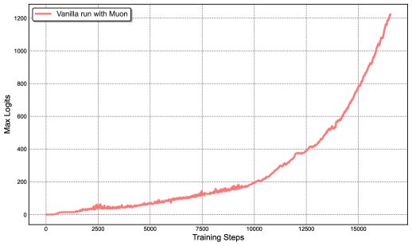

<figcaption>図2 左: 中規模の訓練ランにおいて、attention ロジットが急速に 1000 を超え、数値的不安定性や訓練の発散につながりうる。</figcaption>
</figure>

<figure>

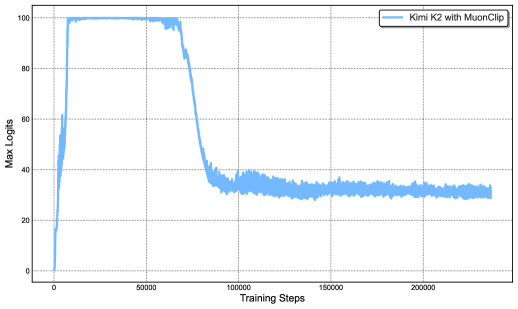

<figcaption>図2 右: MuonClip と τ=100 による Kimi K2 の訓練全体での最大ロジット。max logit は急速にキャップ値 100 まで上がり、訓練ステップのおよそ 30% を過ぎてから安定な範囲へ減衰する——QK-Clip の実効的な調節効果を示す。（訳注: 右パネル x4 はクリップから欠落しており ar5iv から復元）</figcaption>
</figure>

##### MuonClip: 新しいオプティマイザ

Muon に weight decay・一貫した RMS マッチング・QK-Clip を統合した単一のオプティマイザを、MuonClip と呼ぶ（Algorithm 1 参照）。

いくつかのスケーリング実験から MuonClip の有効性を実証する。まず、素の Muon を使って、活性化 9B・総 53B パラメータの中規模 Mixture-of-Experts（MoE）モデルを訓練する。図 2（左）に示すように、最大 attention ロジットは急速に 1000 の桁を超え、この規模の Muon 訓練で attention ロジット爆発がすでに明白であることを示す。この水準の max logit は通常、大きな loss spike や時折の発散を含む、訓練の不安定性をもたらす。

次に、QK-Clip がモデル性能を劣化させないことを実証し、MuonClip オプティマイザが loss の軌跡に悪影響を与えずに Muon の最適化特性を保つことを確認する。実験設計と発見の詳細な議論は Appendix D に示す。

最後に、$\tau=100$ の MuonClip を使って大規模 MoE モデルである Kimi K2 を訓練し、訓練ラン全体で最大 attention ロジットを監視する（図 2（右））。当初、ロジットは QK-Clip により 100 でキャップされる。訓練が進むにつれ、最大ロジットは $\tau$ の調整を一切必要とせずに、典型的な動作範囲へ徐々に減衰する。重要なことに、図 3 に示すとおり、訓練 loss は観察可能な spike なしに滑らかで安定なままであり、MuonClip が大規模言語モデル訓練における attention のダイナミクスへの頑健でスケーラブルな制御を提供することを裏づける。

<figure>

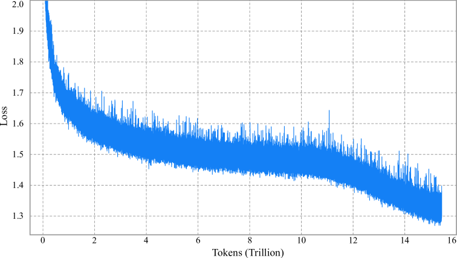

<figcaption>図3: Kimi K2 のステップごとの訓練 loss 曲線（平滑化・サブサンプリングなし）。訓練プロセス全体を通じて spike がないことを示す。明瞭さのため訓練のごく初期は省略している。</figcaption>
</figure>

### 2.2 Pre-training Data: Improving Token Utility with Rephrasing（事前学習データ: 言い換えによるトークン効用の改善）

事前学習におけるトークン効率とは、訓練中に消費される各トークンに対してどれだけの性能改善が達成されるかを指す。トークン効用——各トークンが寄与する実効的な学習信号——を高めることは、モデル更新へのトークンあたりの影響を強め、それによってトークン効率を直接改善する。これは高品質トークンの供給が限られ、最大限に活用しなければならないときに特に重要である。トークン効用を高める素朴なアプローチは同じトークンへの反復曝露だが、これは過学習と汎化の低下につながりうる。

Kimi K1.5 に対する Kimi K2 の事前学習データの鍵となる進歩は、トークン効用を高める合成データ生成戦略の導入である。具体的には、注意深く設計された言い換え（rephrasing）パイプラインを使い、大きな過学習を誘発せずに高品質トークンの量を増幅する。本レポートでは、Knowledge と Mathematics のドメインをそれぞれ狙った、この制御されたデータ増強を可能にする 2 つのドメイン特化の言い換え技法を説明する。

##### 知識データの言い換え

自然で知識集約的なテキストでの事前学習にはトレードオフがある: 1 エポックでは包括的な知識吸収に不十分であり、多エポックの反復は逓減する見返りをもたらし過学習のリスクを高める。高品質な知識トークンのトークン効用を改善するため、次の鍵となる構成要素からなる合成言い換えフレームワークを提案する:

- **スタイル・視点の多様なプロンプティング**: 事実の整合性を保ちながら言語的多様性を高めるため、注意深く設計された一連のプロンプトを適用する。これらのプロンプトは、元のテキストの忠実な言い換えを、多様なスタイルと異なる視点から生成するよう大規模言語モデルを導く。
- **チャンク単位の自己回帰的生成**: 長い文書での大域的な一貫性の保持と情報損失の回避のため、チャンクベースの自己回帰的な書き直し戦略を採用する。テキストはセグメントに分割され、個別に言い換えられ、繋ぎ合わされて完全なパッセージになる。この手法は、LLM に典型的に存在する暗黙的な出力長の制限を緩和する。このパイプラインの概観を図 4 に示す。
- **忠実性の検証**: 元のコンテンツと書き直されたコンテンツの一貫性を保証するため、各言い換えパッセージとその出典の意味的整合を比較する忠実性チェックを行う。これは訓練前の初期品質管理として働く。

言い換えと多エポック反復を、SimpleQA での精度で比較する。K2 の初期チェックポイントで、3 つの訓練戦略を実験する: (1) 元のデータセットを 10 エポック繰り返す、(2) データを 1 回言い換えて 10 エポック繰り返す、(3) データを 10 回言い換えて 1 回だけ訓練する。表 1 に示すように、これらの戦略にわたって精度は一貫して向上し、言い換えベースの増強の有効性を示す。この手法を他の大規模知識コーパスへ拡張し、同様に励みになる結果を観察した。各コーパスの言い換えは最大 2 回である。

**表1**: 3 つの言い換え-エポック構成における SimpleQA 精度

| 言い換え回数 | エポック数 | SimpleQA 精度 |
| --- | --- | --- |
| 0（生の wiki テキスト） | 10 | 23.76 |
| 1 | 10 | 27.39 |
| 10 | 1 | 28.94 |

<figure>

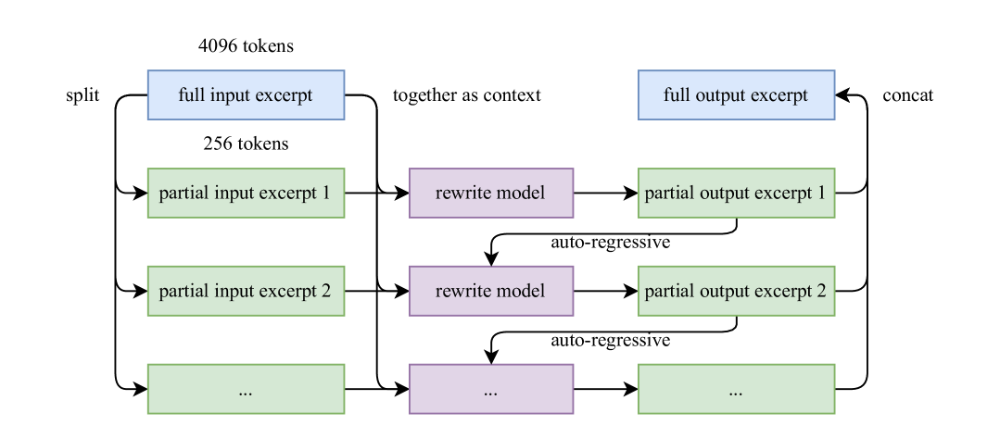

<figcaption>図4: 長い入力抜粋のための自己回帰的チャンク単位言い換えパイプライン。入力は文脈を保った小さなチャンクに分割され、順に書き直され、完全な書き直しパッセージへ連結される。</figcaption>
</figure>

##### 数学データの言い換え

数学的推論能力を高めるため、SwallowMath で導入された方法論に従い、高品質な数学文書を「学習ノート」スタイルに書き直す。加えて、他言語の高品質な数学教材を英語に翻訳することでデータの多様性を高めた。

データセットの言い換え済みサブセットでの初期実験は有望な結果を示しているが、継続的スケーリングの戦略としての合成データの利用は、依然として活発な調査領域である。鍵となる課題には、事実の正確さを損なわずに多様なソースドメインへアプローチを一般化すること、幻覚と意図しない毒性を最小化すること、大規模データセットへのスケーラビリティの保証が含まれる。

##### 事前学習データ全体

Kimi K2 の事前学習コーパスは、Web テキスト・コード・数学・知識の 4 つの主要ドメインにまたがる、キュレーションされた高品質データ 15.5 兆トークンからなる。データ処理パイプラインの大半は Kimi K1.5 で概説した方法論に従う。各ドメインについて、厳密な正しさと品質の検証を行い、キュレーションされたデータセットが高い多様性と有効性の両方を達成するよう、狙いを定めたデータ実験を設計した。

### 2.3 Model Architecture（モデルアーキテクチャ）

Kimi K2 は、320 億の活性化パラメータを持つ 1.04 兆パラメータの Mixture-of-Experts（MoE）トランスフォーマーモデルである。アーキテクチャは DeepSeek-V3 に似た設計に従い、attention 機構として Multi-head Latent Attention（MLA）を採用し、モデルの隠れ次元は 7168、MoE エキスパートの隠れ次元は 2048 である。私たちのスケーリング則分析は、スパース性の継続的な増加が実質的な性能改善をもたらすことを明らかにしており、これが DeepSeek-V3 の 256 に対してエキスパート数を 384 へ増やす動機になった。推論時の計算オーバーヘッドを減らすため、attention ヘッド数は DeepSeek-V3 の 128 に対して 64 に削減した。表 2 は Kimi K2 と DeepSeek-V3 のアーキテクチャパラメータの詳細な比較を示す。

**表2**: Kimi K2 と DeepSeek-V3 のアーキテクチャ比較

|  | DeepSeek-V3 | Kimi K2 | Δ |
| --- | --- | --- | --- |
| 層数 | 61 | 61 | = |
| 総パラメータ | 671B | 1.04T | ↑ 54% |
| 活性化パラメータ | 37B | 32.6B | ↓ 13% |
| エキスパート（総数） | 256 | 384 | ↑ 50% |
| トークンあたり活性エキスパート | 8 | 8 | = |
| 共有エキスパート | 1 | 1 | = |
| attention ヘッド | 128 | 64 | ↓ 50% |
| 密な層の数 | 3 | 1 | ↓ 67% |
| エキスパートのグループ化 | あり | なし | - |

##### スパース性スケーリング則

Muon を使う Mixture-of-Experts（MoE）モデルファミリーに合わせたスパース性スケーリング則を開発する。スパース性は、総エキスパート数と活性化エキスパート数の比として定義される。注意深く統制された小規模実験を通じて、活性化パラメータ数を固定（すなわち FLOPs 一定）した下で、総エキスパート数を増やす（スパース性を高める）ことが訓練 loss と検証 loss の両方を一貫して下げ、全体のモデル性能を高めることを観察する（図 5）。具体的には、計算最適なスパース性スケーリング則の下で、同じ検証 loss 1.5 の達成において、スパース性 48 はスパース性 8・16・32 と比べてそれぞれ 1.69 倍・1.39 倍・1.15 倍の FLOPs を削減する。スパース性の増加は性能を高めるが、この利得はインフラの複雑さの増加を伴う。モデル性能とコストのバランスから、Kimi K2 ではスパース性 48 を採用し、フォワードパスごとに 384 のうち 8 エキスパートを活性化する。

<figure>

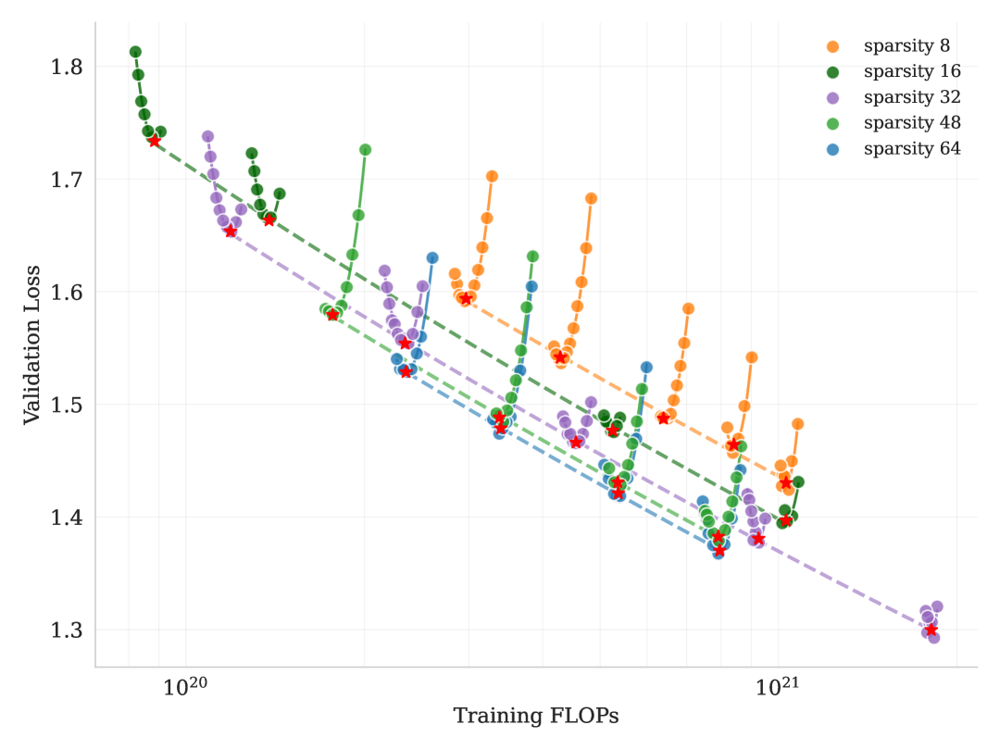

<figcaption>図5: スパース性スケーリング則。スパース性の増加はモデル性能の改善につながる。活性化エキスパート数を 8、共有エキスパート数を 1 に固定し、総エキスパート数を変えて異なるスパース性水準のモデルを得た。</figcaption>
</figure>

##### attention ヘッド数

DeepSeek-V3 は、メモリ帯域をよりよく利用し計算効率を高めるため、attention ヘッド数をモデル層数のおよそ 2 倍に設定している。しかし、コンテキスト長が伸びるにつれ、attention ヘッド数の倍増は大きな推論オーバーヘッドをもたらし、より長い系列長での効率を下げる。これは、効率的な長コンテキスト処理が不可欠なエージェント的応用において大きな制約になる。たとえば系列長 128k で、総エキスパート数を 384 に固定したまま attention ヘッド数を 64 から 128 へ増やすと、推論 FLOPs は 83% 増加する。この設計の影響を評価するため、attention ヘッド数が層数と等しい構成と 2 倍の構成を、さまざまな訓練 FLOPs の下で比較する統制実験を行う。同一トークンの訓練条件下で、ヘッド数の倍増は検証 loss のわずかな改善（0.5% から 1.2% の範囲）しかもたらさないことを、異なる計算予算にわたって観察する（図 6）。スパース性 48 がすでに強い性能を提供することを踏まえると、attention ヘッド倍増の限界的な利得は推論コストを正当化しない。したがってヘッド数 64 を選ぶ。

<figure>

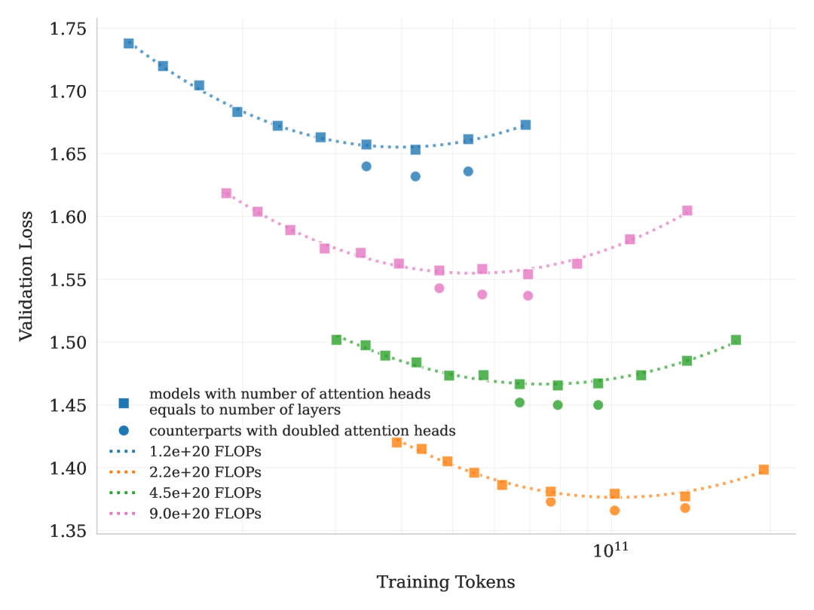

<figcaption>図6: attention ヘッド数が層数と等しいモデルと、ヘッド数を倍にした対応モデルのスケーリング曲線。attention ヘッドの倍増は、検証 loss をおよそ 0.5% から 1.2% 減らすに留まる。（訳注: 図 6 は画像・キャプションともクリップから欠落しており ar5iv から復元）</figcaption>
</figure>

### 2.4 Training Infrastructure（訓練インフラ）

#### 2.4.1 Compute Cluster（計算クラスタ）

Kimi K2 は NVIDIA H800 GPU を備えたクラスタで訓練された。H800 クラスタの各ノードは 2 TB の RAM と、ノード内で NVLink・NVSwitch により接続された 8 基の GPU を含む。異なるノード間では、通信を促進するため 8×400 Gbps の RoCE 相互接続が利用される。

#### 2.4.2 Parallelism for Model Scaling（モデルスケーリングのための並列化）

大規模言語モデルの訓練は、しばしば動的な資源の可用性の下で進行する。特定の資源量の下でしか適用できないひとつの並列化戦略を最適化する代わりに、Kimi K2 を 32 の倍数の任意のノード数で訓練できる柔軟な戦略を追求する。この戦略は、仮想ステージ付き 16-way パイプライン並列（PP）、16-way エキスパート並列（EP）、ZeRO-1 データ並列の組み合わせを活用する。

この設定では、モデルパラメータを BF16 で、その勾配累積バッファを FP32 で保存するのに、256 GPU のモデル並列グループに分散しておよそ 6 TB の GPU メモリを要する。オプティマイザ状態の配置は訓練構成に依存する。総訓練ノード数が多いときは、オプティマイザ状態は分散され、デバイスあたりのメモリフットプリントは無視できる水準に減る。総訓練ノード数が少ない（例: 32）ときは、一部のオプティマイザ状態を CPU へオフロードできる。

このアプローチにより、小規模・大規模の両方の実験で同一の並列化構成を再利用でき、各 GPU が全状態のためにおよそ 30 GB の GPU メモリを保持する。GPU メモリの残りは、2.4.3 節で述べるように活性化に使われる。このような一貫した設計は研究効率にとって重要である。システムを単純化し、実験の反復を大きく加速するからである。

##### interleaved 1F1B による EP 通信のオーバーラップ

ウォームアップのマイクロバッチ数を増やすことで、標準の interleaved 1F1B スケジュールの下で EP all-to-all 通信を計算とオーバーラップできる。比較すると、DualPipe はパラメータと勾配に必要なメモリを倍増させ、補償のために並列度の増加を必要とする。PP の増加はより多くのバブルをもたらし、EP の増加は後述のとおりより高いオーバーヘッドを招く。追加コストは 1 兆パラメータ超の大モデルの訓練には法外に高く、私たちは DualPipe を使わないことを選んだ。

しかし、interleaved 1F1B はモデルをより多くのステージに分割し、無視できない PP 通信オーバーヘッドをもたらす。このコストを緩和するため、重み勾配の計算を各マイクロバッチの backward パスから切り離し、対応する PP 通信と並列に実行する。その結果、ウォームアップ段階を除くすべての PP 通信を実効的にオーバーラップできる。

##### より小さい EP サイズ

1F1B ステージでの計算-通信の完全なオーバーラップを保証するには、K2 の短縮された attention 計算時間（DeepSeek-V3 の 128 ヘッドに対して 64 ヘッド）のため、EP 操作の時間を最小化する必要がある。これは実行可能な最小の EP 並列化戦略、具体的には EP = 16 の採用によって達成される。より小さい EP グループの利用はエキスパートバランス制約も緩め、さらなるチューニングなしにほぼ最適な速度を達成できる。

#### 2.4.3 Activation Reduction（活性化の削減）

パラメータ・勾配バッファ・オプティマイザ状態のための領域を確保した後、各デバイスに残る GPU メモリは MoE の全活性化を保持するには不十分である。特に 1F1B ウォームアップ段階で最大の活性化を蓄積する初期パイプラインステージにおいて、活性化メモリを制約内に収めるため、以下の技法を採用する。

##### 選択的再計算

再計算は、安価でフットプリントの大きいステージ——LayerNorm・SwiGLU・MLA の up-projection——に適用される。加えて、活性化メモリをさらに減らすため、MoE の down-projection も訓練中に再計算される。任意ではあるが、この再計算は十分な GPU メモリを維持し、訓練初期のエキスパート不均衡によるクラッシュを防ぐ。

##### 影響の小さい活性化の FP8 保存

MoE up-projection と SwiGLU の入力は、FP32 スケール付き 1×128 タイルの FP8-E4M3 に圧縮される。小規模実験では測定可能な loss の増加は見られない。予備調査で観察した性能劣化の潜在リスクのため、計算には FP8 を適用しない。

<figure>

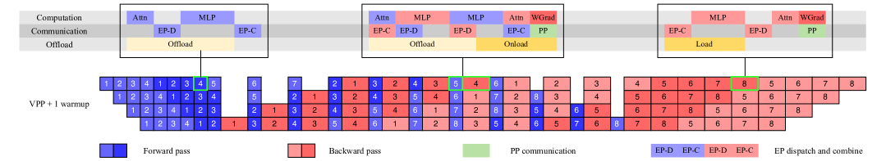

<figcaption>図7: 異なる PP フェーズでオーバーラップされる計算・通信・オフロード。</figcaption>
</figure>

##### 活性化の CPU オフロード

残りのすべての活性化は CPU RAM へオフロードされる。コピーエンジンがオフロードとオンロードのストリーミングを担い、計算・通信カーネルの両方とオーバーラップする。1F1B フェーズでは、前のマイクロバッチの forward 活性化をオフロードしながら、次の backward 活性化をプリフェッチする。ウォームアップとクールダウンのフェーズも同様に扱われ、全体のパターンは図 7 に示す。オフロードは PCIe トラフィックの輻輳により EP トラフィックへわずかに影響しうるが、テストでは EP 通信は完全にオーバーラップされたままである。

### 2.5 Training recipe（訓練レシピ)

MuonClip オプティマイザ（Algorithm 1）と WSD 学習率スケジュールを使い、4,096 トークンのコンテキストウィンドウでモデルを事前学習し、計 15.5T トークンを処理した。最初の 10T トークンは 500 ステップのウォームアップ後、2e-4 の一定学習率で訓練し、続く 5.5T トークンは 2e-4 から 2e-5 へのコサイン減衰で訓練した。weight decay は全体を通じて 0.1 に設定し、グローバルバッチサイズは 67M トークンに保った。全体の訓練曲線は図 3 に示す。

事前学習の終盤には、アニーリング段階と、それに続く長コンテキスト活性化段階を実施した。バッチサイズは 67M トークンで一定に保ち、学習率は 2e-5 から 7e-6 へ減衰させた。この段階では、4k 系列長で 4000 億トークン、続いて 32k 系列長で追加の 600 億トークンを訓練した。コンテキストウィンドウを 128k へ拡張するため、YaRN 法を採用した。

## 3 Post-Training（事後学習）

### 3.1 Supervised Fine-Tuning（教師ありファインチューニング）

事後学習でも Muon オプティマイザを採用し、K2 のファインチューニングにもその使用を推奨する。これは、Muon で事前学習されたチェックポイントは Muon でのファインチューニングが最良の性能を生むという前作の結論に従う。

プロンプトの多様性の最大化と応答品質の保証という 2 つの中核原則に導かれ、多様なドメインにまたがる大規模な指示チューニングデータセットを構築する。この目的のため、タスクドメインごとに仕立てたデータ生成パイプライン群を開発し、それぞれが人間の注釈・プロンプトエンジニアリング・検証プロセスの組み合わせを利用する。さまざまなタスクの候補応答の生成には K1.5 と社内のドメイン特化エキスパートモデルを採用し、その後 LLM または人間のジャッジが自動品質評価とフィルタリングを行う。エージェント的データについては、多段階の対話的推論を通じてモデルにツール利用能力を教えるデータ合成パイプラインを作る。

#### 3.1.1 Large-Scale Agentic Data Synthesis for Tool Use Learning（ツール利用学習のための大規模エージェント的データ合成）

現代の LLM エージェントの決定的な能力は、馴染みのないツールを自律的に使い、外部環境と相互作用し、推論・実行・誤り訂正を通じて行動を反復的に洗練する能力である。エージェント的なツール利用能力は、実世界システムとの動的な相互作用を要する複雑で多段階のタスクの解決に不可欠である。ACEBench や τ-bench のような近年のベンチマークは包括的なツール利用評価の重要性を浮き彫りにし、ToolLLM や ACEBench のようなフレームワークは、数千のツールを効果的に使うことをモデルに教える可能性を示してきた。

しかし、そのような能力を大規模に訓練することには大きな課題がある: 実世界の環境は豊かで本物の相互作用信号を提供するが、コスト・複雑さ・プライバシー・アクセス可能性の制約のため、大規模な構築はしばしば難しい。合成データ生成に関する近年の研究（AgentInstruct、Self-Instruct、StableToolBench、ZeroSearch）は、実世界の相互作用に頼らない大規模データ作成で有望な結果を示している。これらの進歩の上に、ACEBench の包括的なデータ合成フレームワークに触発され、実世界のツール利用シナリオを大規模にシミュレートするパイプラインを開発し、数万の多様で高品質な訓練例の生成を可能にした。

<figure>


<figcaption>図8(a): ツール仕様・エージェント・タスクの合成。</figcaption>
</figure>

<figure>

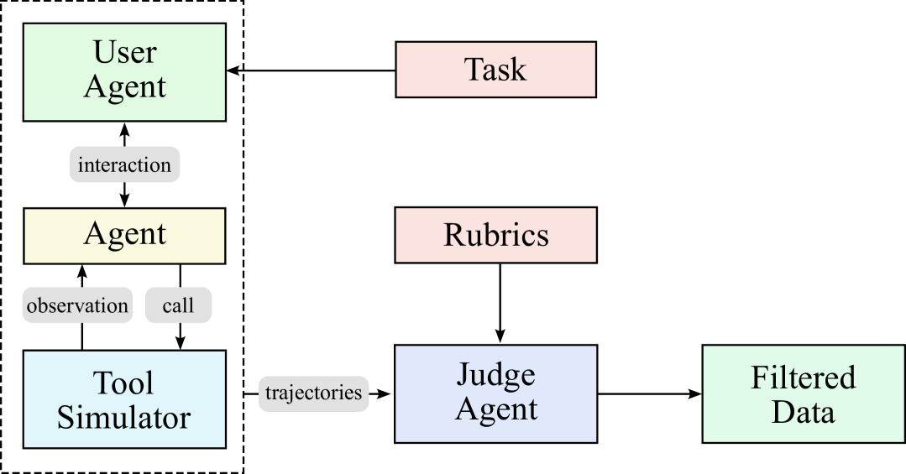

<figcaption>図8(b): ツール呼び出しつき trajectory を生成・フィルタするマルチエージェントパイプライン。（訳注: パネル (b) はクリップから欠落しており ar5iv から復元）</figcaption>
</figure>

**図8**: ツール利用のためのデータ合成パイプライン。(a) ツール仕様は実世界のツールと LLM の両方に由来し、エージェントとタスクはツールリポジトリから生成される。(b) ツール呼び出しを伴う trajectory を生成・フィルタするマルチエージェントパイプライン。（訳注: 主キャプションは ar5iv から復元）

データ合成パイプラインには 3 つの段階がある（図 8 に描く）。

- ツール仕様の生成: まず、実世界のツールと LLM 合成ツールの両方からツール仕様の大きなリポジトリを構築する。
- エージェントとタスクの生成: ツールリポジトリからサンプリングした各ツールセットについて、そのツールセットを使うエージェントと、対応するいくつかのタスクを生成する。
- trajectory の生成: 各エージェントとタスクについて、エージェントがツールを呼び出してタスクを完了する trajectory を生成する。

##### ドメインの進化とツール生成

2 つの補完的なアプローチで包括的なツールリポジトリを構築する。第一に、GitHub リポジトリから **3000 超の実 MCP（Model Context Protocol）ツール**を直接取得し、既存の高品質なツール仕様を活用する。第二に、階層的なドメイン生成プロセスを通じて合成ツールを体系的に進化させる: 鍵となるカテゴリ（例: 金融取引・ソフトウェアアプリケーション・ロボット制御）から始め、各カテゴリ内で複数の具体的な応用ドメインを進化させる。その後、各ドメインに向けて、明確なインターフェース・説明・操作的意味論を持つ専門ツールを合成する。この進化プロセスは **2 万超の合成ツール**を生み出す。図 9 は t-SNE 埋め込みでツールコレクションの多様性を可視化し、MCP ツールと合成ツールがツール空間の相補的な領域をカバーすることを示す。

<figure>

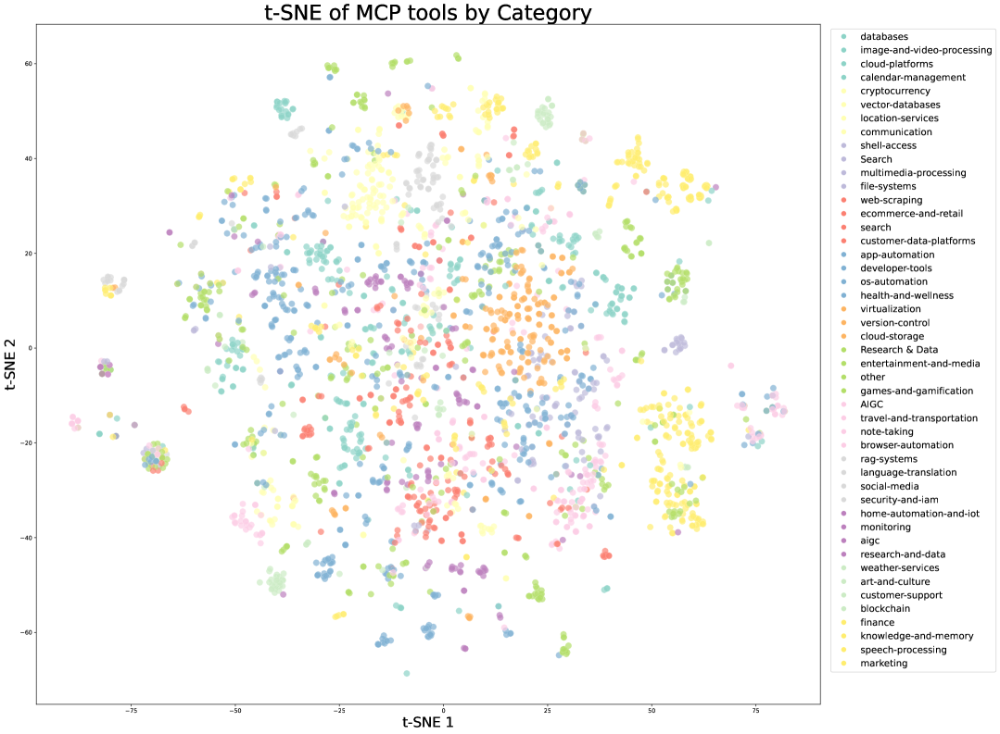

<figcaption>図9(a): 実 MCP ツールの t-SNE 可視化。元のソースカテゴリで色分け。</figcaption>
</figure>

<figure>

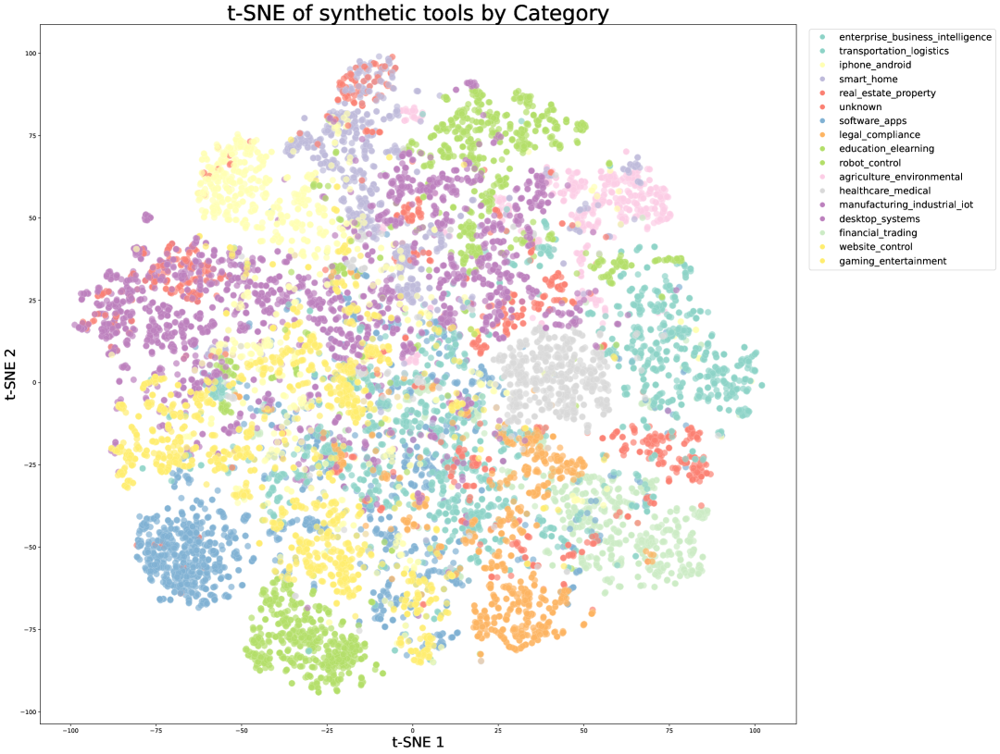

<figcaption>図9(b): 合成ツールの t-SNE 可視化。事前定義されたドメインカテゴリで色分け。（訳注: パネル (b) はクリップから欠落しており ar5iv から復元）</figcaption>
</figure>

**図9**: ツール埋め込みの t-SNE 可視化。(a) 実世界の MCP ツールは元のソースカテゴリに基づく自然なクラスタリングを示す。(b) 合成ツールは事前定義されたドメインカテゴリに組織され、ツール空間の体系的なカバレッジを提供する。両者は合わせて、異なるツール機能にわたる包括的な表現を保証する。（訳注: 主キャプションは ar5iv から復元）

##### エージェントの多様化

さまざまなシステムプロンプトを合成し、リポジトリのツールの異なる組み合わせを装備させることで、数千の別個のエージェントを生成する。これは、多様な能力・専門領域・行動パターンを持つエージェントの多様な集団を作り、潜在的なユースケースの広いカバレッジを保証する。

##### ルーブリックベースのタスク生成

各エージェント構成について、単純な操作から複雑な操作までのタスクを生成する。各タスクは、成功基準・期待されるツール利用パターン・評価チェックポイントを規定する明示的なルーブリックと対になる。このルーブリックベースのアプローチは、エージェント性能の一貫した客観的な評価を保証する。

##### 多ターン trajectory の生成

いくつかの構成要素で現実的なツール利用シナリオをシミュレートする:

- **ユーザーシミュレーション**: 別個のコミュニケーションスタイルと選好を持つ LLM 生成のユーザーペルソナがエージェントと多ターンの対話を行い、自然な相互作用パターンを作る。
- **ツール実行環境**: 洗練されたツールシミュレータ（機能的には world model に相当）がツール呼び出しを実行し、現実的なフィードバックを提供する。シミュレータは各ツール実行後に状態を維持・更新し、永続的な効果を持つ複雑な多段階相互作用を可能にする。制御された確率性を導入し、成功・部分的失敗・エッジケースを含む多様な結果を生む。

##### 品質評価とフィルタリング

LLM ベースのジャッジが各 trajectory をタスクのルーブリックに照らして評価する。成功基準を満たす trajectory だけが訓練用に保持され、タスク完了戦略の自然な変動を許しながら高品質なデータを保証する。

##### 実実行環境とのハイブリッドアプローチ

シミュレーションはスケーラビリティを提供するが、シミュレーションの忠実度には固有の限界があることを認める。これに対処するため、真正性が決定的なシナリオ——特にコーディングとソフトウェアエンジニアリングのタスク——では、シミュレート環境を実実行サンドボックスで補完する。これらの実サンドボックスは実際のコードを実行し、本物の開発環境と相互作用し、テストスイートの合格率のような客観的指標を通じて ground-truth のフィードバックを提供する。この組み合わせは、モデルがシミュレートされたシナリオの多様性と実実行の真正性の両方から学ぶことを保証し、実践的なエージェント能力を大きく強化する。

スケーラブルなシミュレーションと狙いを定めた実世界実行を組み合わせたこのハイブリッドパイプラインを活用して、カバレッジと真正性のバランスの取れた、多様で高品質なツール利用デモンストレーションを生成する。合成データ生成のスケールと自動化は、品質フィルタリングのプロセスを通じて、実質的に大規模な棄却サンプリングを実装している。この高品質な合成データを教師ありファインチューニングに使うと、幅広い実世界応用でモデルのツール利用能力に大きな改善が示された。

### 3.2 Reinforcement Learning（強化学習）

強化学習（RL）は SFT よりトークン効率と汎化に優れると考えられている。K1.5 の研究に基づき、K2 ではタスクの多様性と訓練 FLOPs の両方で RL をスケールし続ける。これを支えるため、幅広いシナリオでの RL を促進する Gym 風の拡張可能なフレームワークを開発する。このフレームワークを、検証可能な報酬を持つ多数のタスクで拡張する。創作的な文章やオープンエンドの質問応答のような主観的選好に依存するタスクには、モデルが自らの出力をペアワイズ比較で判定する self-critic 報酬を導入する。このアプローチにより、さまざまなドメインのタスクがすべて RL パラダイムの恩恵を受けられる。

#### 3.2.1 Verifiable Rewards Gym（検証可能報酬の Gym）

##### 数学・STEM・論理タスク

数学・STEM・論理推論ドメインの RL データ準備は、*多様なカバレッジ*と*適度な難易度*という 2 つの鍵となる原則に従う。

*多様なカバレッジ。* 数学と STEM のタスクでは、専門家の注釈・社内 QA 抽出パイプライン・オープンデータセットの組み合わせで高品質な QA ペアを収集する。収集の過程では、タグ付けシステムを活用してカバーの薄いドメインの網羅を意図的に増やす。論理タスクのデータセットは、構造化データタスク（例: マルチホップの表推論・クロステーブル集約）と論理パズル（例: 24 ゲーム・数独・なぞなぞ・覆面算・モールス符号の解読）を含む多様な形式からなる。

*適度な難易度。* RL のプロンプト集合は易しすぎても難しすぎてもならない。どちらも信号をほとんど生まず、学習効率を下げうる。各問題の難易度を SFT モデルの pass@k 精度で評価し、適度な難易度の問題のみを選ぶ。

##### 複雑な指示追従

効果的な指示追従は、明示的な制約の理解だけでなく、暗黙的な要求のナビゲート・エッジケースの処理・長い対話にわたる一貫性の維持を要する。これらの課題には、自動検証と敵対的検出を組み合わせたハイブリッド検証フレームワークと、スケーラブルなカリキュラム生成パイプラインで対処する。精度と頑健性の両方を保証するため、二重経路のシステムを採用する:

**ハイブリッドなルール検証。** 2 つの検証機構を実装する: (1) 検証可能な出力（例: 長さ・スタイルの制約）を持つ指示にはコードインタープリタによる決定論的評価、(2) 制約のニュアンスの理解を要する指示には LLM-as-judge の評価。モデルが実際には従っていないのに指示の履行を主張しうる潜在的な敵対的挙動に対処するため、そのような欺瞞的な主張を特に検出する追加の hack-check 層を組み込む。

**多ソースの指示生成。** 訓練データの構築には、包括的なカバレッジを保証する 3 つの異なる生成戦略を採用する: (1) データチームが開発した専門家作成の複雑な条件つきプロンプトとルーブリック、(2) AutoIF に触発されたエージェント的指示増強、(3) 特定の失敗モードやエッジケースを突く追加指示の生成に特化したファインチューニング済みモデル。この多面的なアプローチは指示カバレッジの幅と深さの両方を保証する。

##### 忠実性

忠実性（faithfulness）は、多ターンのツール利用・自己生成の推論連鎖・オープン環境の相互作用のようなシナリオで動作するエージェント的モデルに不可欠である。FACTS Grounding の評価フレームワークに触発され、自動検証を行う文レベルの忠実性ジャッジモデルを訓練する。このジャッジは、文脈に裏づけの証拠なしに事実の主張をする文の検出に有効である。全体の忠実性性能を高める報酬モデルとして働く。

##### コーディングとソフトウェアエンジニアリング

競技レベルのプログラミング問題への対応力を高めるため、オープンソースデータセットと合成ソースの両方から問題とジャッジを収集する。合成データの多様性と報酬信号の正しさを保証するため、事前学習データから取得した高品質な人間作成の単体テストを組み込む。

ソフトウェアエンジニアリングのタスクでは、GitHub から膨大なプルリクエストとイシューを収集し、ユーザーのプロンプト／イシューと実行可能な単体テストからなるソフトウェア開発環境を構築する。この環境は、スケーラビリティとセキュリティのために Kubernetes を基盤とする頑健なサンドボックスインフラの上に構築された。安定した性能で **1 万超の並行サンドボックスインスタンス**をサポートし、競技コーディングとソフトウェアエンジニアリングの両タスクに理想的である。

##### 安全性

安全性強化の取り組みは、暴力・詐欺・差別のような主要なリスクカテゴリを網羅するよう手作業で作られた、人間キュレーションのシードプロンプト集合から始まる。

洗練された jailbreak の試み（例: ロールプレイ・文学的な語り・学術的な言説）をシミュレートするため、3 つの鍵となる構成要素を持つ自動プロンプト進化パイプラインを採用する:

- **攻撃モデル**: 対象 LLM から安全でない応答を引き出すよう設計された敵対的プロンプトを反復的に生成する。
- **対象モデル**: これらのプロンプトへの応答を生成し、潜在的な脆弱性をシミュレートする。
- **ジャッジモデル**: 相互作用を評価し、敵対的プロンプトが安全機構を突破したかを判定する。

各相互作用はタスク固有のルーブリックで評価され、ジャッジモデルは二値の成功/失敗ラベルを与える。

#### 3.2.2 Beyond Verification: Self-Critique Rubric Reward（検証を超えて: 自己批評ルーブリック報酬）

検証可能な報酬を持つタスクを超えてモデルのアラインメントを拡張するため、自己批評フィードバックからの汎用強化学習の枠組みを導入する。このアプローチは、検証可能なシナリオで学んだ能力をより広い主観的タスクへ拡張することで、有用性・創造性・推論の深さ・事実性・安全性を含むニュアンスのある人間の選好に LLM を整合させるよう設計されている。この枠組みは Self-Critique Rubric Reward 機構で動作する。モデルが自らの出力を評価して選好信号を生成するのである。K2 を有能なジャッジとしてブートストラップするため、オープンソースと社内の選好データセットの混合をキュレーションし、SFT 段階でその critic 能力を初期化した。

##### 自己批評による方策最適化

学習ループの第一の中核プロセスでは、K2 の actor が幅広いユースケースをカバーする一般的なプロンプトに対して応答を生成する。次に K2 の critic が、ルーブリックの組み合わせに照らしたペアワイズ評価によって全結果をランクづけする。ルーブリックには、Kimi が大切にする AI アシスタントの根本的な価値を表す**コアルーブリック**（Appendix F.1）、reward hacking の排除を狙う**規範的ルーブリック**（Appendix F.2）、特定の指示的文脈のためにデータチームが作成した**人間注釈ルーブリック**が含まれる。特定のルーブリックを必須と指定できるが、K2 はそれらを内的な事前分布と天秤にかける柔軟性を保持する。この能力は、進化する on-policy の挙動との動的で継続的なアラインメントを可能にし、モデルの応答が、具体的な指示に適応しながらも中核的なアイデンティティと一貫し続けることを保証する。

##### 閉ループの critic 洗練とアラインメント

RL 訓練の間、critic モデルは検証可能な信号を使って洗練される。検証可能報酬のプロンプトから生成された on-policy のロールアウトが critic の継続的な更新に使われる。これは RLVR からの客観的な性能信号を評価モデルへ直接蒸留する決定的なステップである。この転移学習プロセスは、より主観的な判断を検証可能なデータに接地させ、検証可能タスクでの性能向上が、明示的な報酬信号を欠く複雑なタスクへの critic の判断を高めることを可能にする。この閉ループプロセスは、critic が方策の進化と歩調を合わせて評価基準を継続的に再校正することを保証する。主観的評価を検証可能なデータに接地することで、この枠組みは複雑で検証不能な人間の目標との頑健でスケーラブルなアラインメントを可能にする。

その結果、この全体的なアラインメントは、ユーザー意図の理解・創作的な文章・複雑な推論・ニュアンスのある言語理解を含む、幅広いドメインにわたる包括的な性能改善をもたらす。

#### 3.2.3 RL Algorithm（RL アルゴリズム）

K2 の基盤として、K1.5 で導入された方策最適化アルゴリズムを採用する。各問題 $x$ について、以前の方策 $\pi_{\mathrm{old}}$ から $K$ 個の応答 $\{y_{1},\dots,y_{k}\}$ をサンプリングし、次の目的関数に関してモデル $\pi_{\theta}$ を最適化する:

$$
\displaystyle L_{\mathrm{RL}}(\theta)=\mathbb{E}_{x\sim\mathcal{D}}\left[\frac{1}{K}\sum_{i=1}^{K}\left[\left(r(x,y_{i})-\bar{r}(x)-\tau\log\frac{\pi_{\theta}(y_{i}|x)}{{\pi}_{\mathrm{old}}(y_{i}|x)}\right)^{2}\right]\right]\,,
$$

ここで $\bar{r}(x)=\frac{1}{k}\sum_{i=1}^{k}r(x,y_{i})$ はサンプリングされた応答の平均報酬、$\tau>0$ は安定した学習を促す正則化パラメータである。SFT と同様、この目的の最小化には Muon オプティマイザを採用する。K2 でより広い範囲のタスクを包含するよう RL 訓練をスケールさせるにつれ、主要な課題は全ドメインで一貫した性能改善を達成することである。これに対処するため、RL アルゴリズムにいくつかの追加を導入する。

##### 予算制御（Budget Control）

RL がモデル生成応答の長さの大幅な増加をしばしばもたらすことは広く観察されている。長い応答は複雑な推論タスクで追加のテスト時計算を活用した性能改善を可能にしうるが、非推論ドメインではその便益が推論コストを正当化しないことが多い。モデルに推論予算の適切な配分を促すため、RL 訓練全体を通じてサンプルごとの**最大トークン予算**を強制する。予算はタスクのタイプに基づいて決められる。トークン予算を超えた応答は切り詰められ、ペナルティを課される。これはモデルに指定された制限内で解を生成するインセンティブを与える。経験的に、このアプローチはモデルのトークン効率を大きく高め、全ドメインで簡潔かつ効果的な解を促す。

##### PTX Loss

統合 RL 訓練中の価値ある高品質データの忘却の可能性を防ぐため、手作業で選んだ高品質サンプルからなるデータセットをキュレーションし、補助的な PTX loss を通じて RL の目的に統合する。この戦略は高品質データの利点を活用するだけでなく、訓練レジームに明示的に存在する限られたタスク集合への過学習のリスクも緩和する。この増強はより広いドメインにわたるモデルの汎化を大きく改善する。

##### 温度減衰（Temperature Decay）

創作的な文章や複雑な推論のようなタスクでは、訓練の初期段階に高いサンプリング温度で探索を促すことが決定的だとわかった。高温はモデルが多様で革新的な応答を生成することを許し、それによって有効な戦略の発見を促進し、準最適解への早すぎる収束のリスクを減らす。しかし、訓練の後期や評価時に高温を保つことは有害でありうる。過剰なランダム性を持ち込み、モデル出力の信頼性と一貫性を損なうからだ。これに対処するため、訓練を通じて探索から活用へ移行する温度減衰スケジュールを採用する。この戦略は、最も有益なときに探索を活用しながら、最終的には安定した高品質の出力へ収束することを保証する。

### 3.3 RL Infrastructure（RL インフラ）

#### 3.3.1 Colocated Architecture（同居アーキテクチャ）

K1.5 と同様、同期 RL 訓練のためにハイブリッドな同居（colocated）アーキテクチャを採用する。訓練エンジンと推論エンジンが同じワーカー上に住む。一方のエンジンが活動しているとき、他方は GPU 資源を解放またはオフロードして譲る。RL 訓練の各反復では、中央のコントローラがまず推論エンジンを呼んで訓練用の新データを生成させる。次に訓練エンジンに新データでの訓練を通知し、更新されたパラメータを次の反復のために推論エンジンへ送る。

各エンジンはスループットのために大きく最適化されている。加えて、モデルが K2 のサイズにスケールすると、エンジン切り替えと障害復旧のレイテンシが大きくなる。これらの側面でのシステム設計の考慮を示す。

#### 3.3.2 Efficient Engine Switching（効率的なエンジン切り替え）

ロールアウトの間、訓練エンジンのパラメータは DRAM へオフロードされる。したがって訓練エンジンの立ち上げは H2D 転送の単純なステップである。しかし推論エンジンの立ち上げはより大きな課題である。異なるシャーディングパラダイムを持つ訓練エンジンから更新済みパラメータを取得しなければならないからだ。

<figure>

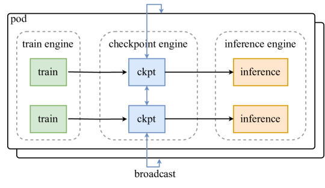

<figcaption>図10: checkpoint engine を利用したパラメータ更新。</figcaption>
</figure>

K2 のスケールと関与するデバイスの膨大な数を考えると、パラメータのリシャーディングとブロードキャストにネットワークファイルシステムを使うのは非現実的である。オーバーヘッドを低く保つのに必要な総帯域は毎秒数ペタバイトに達する。この課題に対処するため、パラメータ状態を管理する分散 checkpoint engine を訓練ノードに同居させて開発した。パラメータ更新を行うには、各 checkpoint engine ワーカーが訓練エンジンからパラメータのローカルコピーを取得し、全 checkpoint engine ワーカーにわたって完全なパラメータ集合をブロードキャストする。続いて推論エンジンは、必要とするパラメータシャードのみを checkpoint engine から取得する。このプロセスは図 10 に示す。1T モデルでこれを可能にするため、更新はパラメータごとにパイプライン化された方式で行われ、メモリフットプリントを最小化する（Appendix G 参照）。

各推論ワーカーの具体的なシャーディング方式によらず、クラスタ全体に完全なパラメータ集合をブロードキャストすることを選ぶ。これは理論的に最適なアプローチより数倍多くのデータを転送するが、訓練・推論エンジンへの侵入が少ない、より単純なシステム設計を提供する。このわずかなオーバーヘッドと引き換えに訓練エンジンと推論エンジンを完全に分離し、保守とテストを大きく単純化することを選んだ。

注目すべきことに、このアプローチは同期オーバーヘッドの削減とより高いネットワーク帯域利用率により、必要なものだけを転送する方式を上回る。私たちのシステムは Kimi K2 の完全なパラメータ更新を **30 秒未満**で完了でき、典型的な RL 訓練反復にとって無視できる時間である。

#### 3.3.3 Efficient System Startup（効率的なシステム起動）

大規模訓練はシステム障害が起きやすく、Kimi K2 ほど大きなモデルでは起動時間の最適化が決定的である。

訓練エンジンの起動では、各訓練ワーカーにディスクからパラメータの一部（またはゼロ）を選択的に読ませ、必要なパラメータをピアへブロードキャストさせる。設計目標は、全ワーカーが集合としてチェックポイントを一度だけ読むことを保証し、高価なディスク IO を最小化することである。

推論エンジンは独立したレプリカなので、それらの間に余分な同期バリアを持ち込むことを避けたい。そこで起動にも checkpoint engine を再利用する: checkpoint engine に集合としてディスクからチェックポイントを読ませ（訓練エンジンの起動と同様）、前節で紹介したアプローチで未初期化の推論エンジンの状態を更新する。専用の checkpoint engine を活用することで、システムは単一障害点にも頑健になる。推論レプリカは他のレプリカと通信せずに再起動できるからである。

#### 3.3.4 Agentic Rollout（エージェント的ロールアウト）

私たちの RL インフラは、長期・多ターンのエージェント的タスクの訓練をサポートする。ロールアウトの間、これらのタスクは、複雑な環境相互作用や長引くロールアウト時間といった特有の課題を呈する。ここではこれらの問題を和らげるいくつかの最適化を紹介する。

環境の多様性のため、特定の相互作用は環境フィードバック（例: 仮想マシンやコードインタープリタ）の待機でブロックされ、GPU を遊ばせうる。GPU 稼働率を最大化するため 2 つの戦略を採用する: (i) 重い環境は、より容易にスケールアップできる専用サービスとしてデプロイする。(ii) 特定の高価な相互作用によるレイテンシを償却するため、多数の並行ロールアウトを採用する。

エージェント的ロールアウトのもうひとつの課題は、個々のロールアウト trajectory が極端に長くなりうることである。ロングテールの trajectory がロールアウトプロセス全体をブロックするのを防ぐため、partial rollout の技法を採用する。この戦略は、ロングテールの未完了タスクを一時停止し、次の RL 反復で再開することを可能にする。

研究効率を高めるため、新しい環境の統合を簡素化する、OpenAI Gym フレームワークに触発された統一インターフェースも設計した。将来はこの RL インフラをより多様な対話的環境へスケールさせたい。

## 4 Evaluations（評価）

この節は Kimi-K2-Instruct の事後学習評価から始め、続いて Kimi-K2-Base の能力の概観、最後に包括的な安全性評価で締める。

### 4.1 Post-training Evaluations（事後学習の評価）

#### 4.1.1 Evaluation Settings（評価設定）

##### ベンチマーク

Kimi-K2-Instruct をさまざまな領域で評価する。コーディングには LiveCodeBench v6（2024 年 8 月〜2025 年 5 月の問題）、OJBench、MultiPL-E、SWE-bench Verified、TerminalBench、Multi-SWE-bench、SWE-Lancer、PaperBench、Aider-Polyglot を採用する。ツール利用タスクには、多ターンのツール呼び出し能力を重視する τ²-Bench と AceBench で性能を評価する。推論には、数学・科学・論理の幅広いタスクを含める: AIME 2024/2025、MATH-500、HMMT 2025、CNMO 2024、PolyMath-en、ZebraLogic、AutoLogi、GPQA-Diamond、SuperGPQA、Humanity's Last Exam（Text-Only）。長コンテキスト能力は、長コンテキスト検索の MRCR[^fn5] と、長コンテキスト推論の DROP・FRAMES・LongBench v2 でベンチマークする。事実性については FACTS Grounding・Vectara Hallucination Leaderboard・FaithJudge を評価する。最後に、一般能力は MMLU・MMLU-Redux・MMLU-Pro・IFEval・Multi-Challenge・SimpleQA・LiveBench（2024-11-25 時点）で評価する。

[^fn5]: https://huggingface.co/datasets/openai/mrcr （訳注: ar5iv から復元した脚注）

##### ベースライン

オープンソースとプロプライエタリ両方のフロンティアモデルに対してベンチマークし、テスト時計算からの追加の利得を排除するため、すべての候補を**非思考構成**で評価する。オープンソースのベースライン: DeepSeek-V3-0324 と Qwen3-235B-A22B（後者はベンダー推奨の no-thinking レジームで実行）。プロプライエタリのベースライン: Claude Sonnet 4、Claude Opus 4、GPT-4.1、Gemini 2.5 Flash Preview（2025-05-20）。それぞれ公式 API を介し、統一された temperature と top-p の設定で、非思考モードで呼び出す。

**評価構成** すべての実行はモデルを非思考モードで問い合わせる。出力トークン長は、16384 に引き上げる SWE-bench Verified（Agentless）を除き、どこでも 8192 トークンでキャップする。問題ごとの分散が大きいベンチマークには、$k$ 回の反復サンプリングを採用して結果を平均し、安定したスコアを得る（Avg@k と表記）。長コンテキストタスクでは評価時のコンテキストウィンドウを 128K トークンに設定し、上限を超える入力は切り詰めて収める。SWE-bench Verified は 2 つのモードで評価する: Agentless Coding（テストなし Single Patch, Acc）と、bash/editor ツールによる Agentic Coding（Single Attempt（Acc）と、内部 verifier による best-of-N 選択を使う Multiple Attempts（Acc）の両方）。SWE-bench Multilingual は単一試行のエージェント設定のみでテストする。一部のデータポイントは評価コストが法外なため省略した。

**表3**: 多様なタスクにわたる Kimi-K2-Instruct と主要なオープンソース・プロプライエタリモデルの性能比較。太字はグローバル SOTA、下線付き太字はオープンソース最良を示す。\* 付きのデータポイントはモデルのテクニカルレポートまたはブログからの転記。

| Benchmark | Open Source Kimi-K2-Instruct | Open Source DeepSeek-V3-0324 | Open Source Qwen3-235B-A22B | Proprietary Claude Sonnet 4 | Proprietary Claude Opus 4 | Proprietary GPT-4.1 | Proprietary Gemini 2.5 Flash |
| --- | --- | --- | --- | --- | --- | --- | --- |
| **Coding Tasks** | | | | | | | |
| LiveCodeBench v6 (Pass@1) | 53.7 | 46.9 | 37.0 | 48.5 | 47.4 | 44.7 | 44.7 |
| OJBench (Pass@1) | 27.1 | 24.0 | 11.3 | 15.3 | 19.6 | 19.5 | 19.5 |
| MultiPL-E (Pass@1) | 85.7 | 83.1 | 78.2 | 88.6 | 89.6 | 86.7 | 85.6 |
| SWE-bench Verified Agentless-Single-Patch (Pass@1) | 51.8 | 36.6 | 39.4 | 50.2 | 53.0 | 40.8 | 32.6 |
| SWE-bench Verified Agentic-Single-Attempt (Pass@1) | 65.8 | 38.8 | 34.4 | 72.7* | 72.5* | 54.6 | — |
| SWE-bench Verified Agentic-Multi-Attempt (Pass@1) | 71.6 | — | — | 80.2* | 79.4* | — | — |
| SWE-bench Multilingual (Pass@1) | 47.3 | 25.8 | 20.9 | 51.0 | — | 31.5 | — |
| Multi-SWE-bench (Pass@1) | 18.3 | 8.0 | 9.0 | 29.2 | — | 11.7 | 14.0 |
| SWE-Lancer (Pass@1) | 39.1 | 30.5 | 24.1 | 40.8 | — | 23.0 | 38.5 |
| Paper Bench Code-Dev (Acc.) | 27.8 | 12.2 | 13.2 | 43.3 | — | 29.9 | 5.7 |
| Terminal Bench In-House (Acc.) | 30.0 | — | — | 35.5 | 43.2 | 8.3 | — |
| Terminal Bench Terminus (Acc.) | 25.0 | 16.3 | 6.6 | — | — | 30.3 | 16.8 |
| Aider-Polyglot (Acc.) | 60.0 | 55.1 | 61.8 | 56.4 | 70.7 | 52.4 | 44.0 |
| **Tool Use Tasks** | | | | | | | |
| Tau2 retail (Avg@4) | 70.6 | 69.1 | 57.0 | 75.0 | 81.8 | 74.8 | 64.3 |
| Tau2 airline (Avg@4) | 56.5 | 39.0 | 26.5 | 55.5 | 60.0 | 54.5 | 42.5 |
| Tau2 telecom (Avg@4) | 65.8 | 32.5 | 22.1 | 45.2 | 57.0 | 38.6 | 16.9 |
| AceBench (Acc.) | 76.5 | 72.7 | 70.5 | 76.2 | 75.6 | 80.1 | 74.5 |
| **Math & STEM Tasks** | | | | | | | |
| AIME 2024 (Avg@64) | 69.6 | 59.4* | 40.1* | 43.4 | 48.2 | 46.5 | 61.3 |
| AIME 2025 (Avg@64) | 49.5 | 46.7 | 24.7* | 33.1* | 33.9* | 37.0 | 46.6 |
| MATH-500 (Acc.) | 97.4 | 94.0* | 91.2* | 94.0 | 94.4 | 92.4 | 95.4 |
| HMMT 2025 (Avg@32) | 38.8 | 27.5 | 11.9 | 15.9 | 15.9 | 19.4 | 34.7 |
| CNMO 2024 (Avg@16) | 74.3 | 74.7 | 48.6 | 60.4 | 57.6 | 56.6 | 75.0 |
| PolyMath-en (Avg@4) | 65.1 | 59.5 | 51.9 | 52.8 | 49.8 | 54.0 | 49.9 |
| ZebraLogic (Acc.) | 89.0 | 84.0 | 37.7* | 79.7 | 59.3 | 58.5 | 57.9 |
| AutoLogi (Acc.) | 89.5 | 88.9 | 83.3* | 89.8 | 86.1 | 88.2 | 84.1 |
| GPQA-Diamond (Avg@8) | 75.1 | 68.4* | 62.9* | 70.0* | 74.9* | 66.3 | 68.2 |
| SuperGPQA (Acc.) | 57.2 | 53.7 | 50.2 | 55.7 | 56.5 | 50.8 | 49.6 |
| Humanity’s Last Exam (Acc.) | 4.7 | 5.2 | 5.7 | 5.8 | 7.1 | 3.7 | 5.6 |
| **General Tasks** | | | | | | | |
| MMLU (EM) | 89.5 | 89.4 | 87.0 | 91.5 | 92.9 | 90.4 | 90.1 |
| MMLU-Redux (EM) | 92.7 | 90.5 | 89.2* | 93.6 | 94.2 | 92.4 | 90.6 |
| MMLU-Pro (EM) | 81.1 | 81.2* | 77.3 | 83.7 | 86.6 | 81.8 | 79.4 |
| IFEval (Prompt Strict) | 89.8 | 81.1 | 83.2* | 87.6 | 87.4 | 88.0 | 84.3 |
| Multi-Challenge (Acc.) | 54.1 | 31.4 | 34.0 | 46.8 | 49.0 | 36.4 | 39.5 |
| SimpleQA (Correct) | 31.0 | 27.7 | 13.2 | 15.9 | 22.8 | 42.3 | 23.3 |
| Livebench (Pass@1) | 76.4 | 72.4 | 67.6 | 74.8 | 74.6 | 69.8 | 67.8 |
| Arena Hard v2.0 Hard Prompt (Win rate) | 54.5 | 39.9 | 39.9 | 51.6 | 59.7 | 51.7 | 48.7 |
| Arena Hard v2.0 Creative Writing (Win rate) | 85.0 | 59.3 | 59.8 | 54.6 | 68.5 | 61.5 | 72.8 |
| FACTS Grounding (Adjusted) | 88.5 | 68.3 | 68.5 | 83.6 | — | 79.2 | 86.6 |
| HHEM v2.1 (1-Hallu.) | 98.9 | 88.9 | 94.5 | 94.5 | — | 96.7 | 97.8 |
| FaithJudge (1-Hallu.) | 92.6 | 83.4 | 75.7 | 83.0 | — | 91.0 | 93.2 |
| LongBench v2 (Acc.) | 49.1 | 51.1 | — | 52.5 | — | 54.3 | 55.5 |
| FRAMES (Acc.) | 77.1 | 79.2 | — | 76.3 | — | 87.4 | 72.9 |
| MRCR (Acc.) | 55.0 | 50.8 | — | 74.4 | — | 66.9 | 81.7 |
| DROP (Acc.) | 93.5 | 91.2 | 84.3 | 92.0 | — | 79.1 | 81.7 |

#### 4.1.2 Evaluation Results（評価結果）

Kimi-K2-Instruct の包括的な評価結果を表 3 に示し、詳細な説明は Appendix C に提供する。以下、4 つの中核ドメインの主要結果を強調する:

##### エージェント的・競技的コーディング

Kimi-K2-Instruct は実世界の SWE タスクでオープンソースの最先端性能を示す。SWE-bench Verified（65.8%、複数試行で 71.6%）、SWE-bench Multilingual（47.3%）、SWE-lancer（39.1%）でほとんどのベースラインを上回り、Claude 4 Opus・Sonnet とのギャップを大きく縮める。競技コーディングのベンチマーク（例: LiveCodeBench v6 53.7%、OJBench 27.1%）でも全モデル中の首位に立ち、難易度水準を横断する実践的なコーディング能力を際立たせる。

##### エージェント的ツール利用

多ターンのツール利用ベンチマークで、Kimi-K2-Instruct は新しい標準を打ち立てる。τ²-Bench で 66.1 Pass@1、ACEBench で 76.5 を達成し、すべてのベースラインを大きく上回る。これらの結果は、ドメインを横断する、接地され制御されたエージェント駆動のツールオーケストレーションにおける強さを裏づける。

##### 一般能力

Kimi-K2-Instruct は一般知識・数学・指示追従・長コンテキストのタスクで強くバランスの取れた性能を示す。SimpleQA（31.0%）・MMLU（89.5%）・MMLU-Redux（92.7%）でオープンソースの同輩を上回り、指示ベンチマーク（IFEval: 89.8%、Multi-Challenge: 54.1%）では全モデルの首位に立つ。数学と STEM ではトップティアのスコア（AIME 2024: 69.6%、GPQA-Diamond: 75.1%）を達成し、長コンテキストの事実性と検索でも競争力を保つ（DROP: 93.5%、MRCR: 55.0%）。これらの結果は Kimi-K2-Instruct を、短い・長い両方のコンテキスト設定にわたる、よく整った有能なジェネラリストとして位置づける。

##### オープンエンドの評価

LMSYS Arena リーダーボード（2025 年 7 月 17 日）では、3,000 超のユーザー投票に基づき、Kimi-K2-Instruct はオープンソースモデルの 1 位、全体の 5 位にランクされる。多様なブラインドのプロンプトにわたるこの実世界の選好信号は、オープンエンドなタスクでの高品質な応答生成における Kimi-K2 の強さを裏書きする。

### 4.2 Pre-training Evaluations（事前学習の評価）

#### 4.2.1 Evaluation Settings（評価設定）

##### ベンチマーク

Kimi-K2-Base を多様な能力領域で評価する。一般能力には MMLU・MMLU-Pro・MMLU-Redux・BBH・TriviaQA・SuperGPQA・SimpleQA・HellaSwag・AGIEval・GPQA-Diamond・ARC-Challenge・WinoGrande で評価する。コーディング能力には EvalPlus（HumanEval・MBPP・HumanEval+・MBPP+ の平均）・LiveCodeBench v6・CRUXEval を採用する。数学的推論には GSM8K・GSM8K-Platinum・MATH・CMATH を利用する。中国語能力は C-Eval・CMMLU・CSimpleQA で評価する。

##### ベースライン

主要なオープンソース基盤モデルに対してベンチマークする: DeepSeek-V3-Base、Qwen2.5-72B-Base（Qwen3-235B-A22B-Base はオープンソースでなく、Qwen シリーズで最大のオープンソースベースモデルは Qwen2.5-72B-Base であることに注意）、Llama 4-Maverick（Llama 4-Behemoth もオープンソースではない）。公平な比較のため、全モデルを同一の構成で評価する。

##### 評価構成

MMLU・MMLU-Redux・GPQA-Diamond・HellaSwag・ARC-Challenge・C-Eval・CMMLU にはパープレキシティベースの評価を採用する。MMLU-Pro・SuperGPQA・TriviaQA・BBH・CSimpleQA・MATH・CMATH・GSM8K・GSM8K-Platinum・CRUXEval・LiveCodeBench・EvalPlus には生成ベースの評価を使う。GPQA-Diamond に固有の高い分散を緩和するため、8 回の独立実行の平均スコアを報告する。すべての評価は LM-Harness-Evaluation に由来する内部フレームワークで実施し、全モデルで一貫した設定を保証する。

#### 4.2.2 Evaluation Results（評価結果）

表 4 は、多様な評価ベンチマークにわたる Kimi-K2-Base と主要なオープンソース基盤モデルの包括的な比較を示す。結果は、Kimi-K2-Base が評価タスクの大半で最先端の性能を達成し、オープンソースの風景における主導的な基盤モデルであることを実証する。

##### 一般言語理解

Kimi-K2-Base は英語ベンチマーク 12 のうち 10 で最先端の性能を達成する。注目すべき結果には MMLU（87.79%）、MMLU-Pro（69.17%）、MMLU-Redux（90.17%）、SuperGPQA（44.67%）、SimpleQA（35.25%）が含まれ、すべてのベースラインを大きく上回る。

##### コーディング能力

コーディングベンチマークでは、Kimi-K2-Base が全指標で首位に立ち新しい標準を打ち立てる。CRUXEval-I-cot で 74.00%、CRUXEval-O-cot で 83.50%、LiveCodeBench v6 で 26.29%、EvalPlus で 80.33% を達成し、特に段階的推論を要するシナリオでの優れたコード生成・理解能力を示す。

##### 数学的推論

Kimi-K2-Base は卓越した数学能力を示し、4 ベンチマーク中 3 つで首位に立つ: MATH（70.22%）、GSM8K（92.12%）、GSM8K-Platinum（94.21%）。CMATH（90.26%）でも DeepSeek-V3-Base（90.53%）に僅差で続く競争力を保つ。これらの結果は、さまざまな難易度にわたる頑健な数学的問題解決能力を浮き彫りにする。

##### 中国語理解

モデルは優れた多言語能力を示し、すべての中国語ベンチマークで最先端の結果を達成する: C-Eval（92.50%）、CMMLU（90.90%）、CSimpleQA（77.57%）。これらの結果は、他言語でも強い性能を保ちながら、Kimi-K2-Base を中国語理解の主導的モデルとして確立する。

**表4**: 多様なタスクにわたる Kimi-K2-Base と主要なオープンソースモデルの性能比較。

|   | Benchmark (Metric) | #Shots | Kimi-K2-Base | DeepSeek-V3-Base | Llama4-Maverick-Base | Qwen2.5-72B-Base |
| --- | --- | --- | --- | --- | --- | --- |
|   | Architecture | - | MoE | MoE | MoE | Dense |
|   | # Activated Params | - | 32B | 37B | 17B | 72B |
|   | # Total Params | - | 1043B | 671B | 400B | 72B |
| English | MMLU | 5-shots | 87.79 | 87.10 | 84.87 | 86.08 |
| English | MMLU-pro | 5-shots | 69.17 | 60.59 | 63.47 | 62.80 |
| English | MMLU-redux | 5-shots | 90.17 | 89.53 | 88.18 | 87.77 |
| English | SuperGPQA | 5-shots | 44.67 | 39.20 | 38.84 | 34.23 |
| English | GPQA-Diamond(avg@8) | 5-shots | 48.11 | 50.51 | 49.43 | 40.78 |
| English | SimpleQA | 5-shots | 35.25 | 26.49 | 23.74 | 10.31 |
| English | TriviaQA | 5-shots | 85.09 | 84.11 | 79.25 | 76.03 |
| English | BBH | 3-shots | 88.71 | 88.37 | 87.10 | 84.09 |
| English | HellaSwag | 5-shots | 94.60 | 89.44 | 86.02 | 95.27 |
| English | AGIEval | - | 84.23 | 81.57 | 67.55 | 76.87 |
| English | ARC-Challenge | 0-shot | 95.73 | 93.77 | 94.03 | 95.56 |
| English | WinoGrande | 5-shots | 85.32 | 84.21 | 77.58 | 84.14 |
| Code | CRUXEval-I-cot | 0-shots | 74.00 | 62.75 | 67.13 | 61.12 |
| Code | CRUXEval-O-cot | 0-shots | 83.50 | 75.25 | 75.88 | 66.13 |
| Code | LiveCodeBench(v6) | 1-shots | 26.29 | 24.57 | 25.14 | 22.29 |
| Code | EvalPlus | - | 80.33 | 65.61 | 65.48 | 66.04 |
| Math | MATH | 4-shots | 70.22 | 61.70 | 63.02 | 62.68 |
| Math | GSM8k | 8-shots | 92.12 | 91.66 | 86.35 | 90.37 |
| Math | GSM8k-platinum | 8-shots | 94.21 | 93.38 | 88.83 | 92.47 |
| Math | CMATH | 6-shots | 90.26 | 90.53 | 88.07 | 86.98 |
| Chinese | C-Eval | 5-shots | 92.50 | 90.04 | 80.91 | 90.86 |
| Chinese | CMMLU | 5-shots | 90.90 | 88.84 | 81.24 | 90.55 |
| Chinese | CSimpleQA | 5-shots | 77.57 | 72.13 | 53.47 | 50.53 |

### 4.3 Safety Evaluation（安全性評価）

#### 4.3.1 Experiment Settings（実験設定）

Kimi K2 を他のオープンソース LLM と比較する red-teaming 評価を実施した。評価は、有害コンテンツ・プライバシーコンテンツ・セキュリティコンテンツを含む一連の攻撃シナリオと、prompt injection や反復的 jailbreak のような異なる攻撃戦略をカバーした。

敵対的プロンプトの生成と応答の分析には *Promptfoo*[^fn6] を選んだ。この方法により、スケーラブルにモデルを評価できる。

[^fn6]: https://github.com/promptfoo/promptfoo （訳注: ar5iv から復元した脚注）

**モデル選択** Kimi K2 を他の 3 つのオープンソース LLM と比較する: DeepSeek-V3、DeepSeek-R1、Qwen3。

**Promptfoo の設定** 表 5 に評価したプラグインと戦略を列挙する。各プラグインはすべての戦略と対にして性能を評価した。

**表5**: 有効化したプラグインと戦略

| Plugin | Harmful | Graphic Content, Harassment and Bullying, Hate Speech, Insults, Profanity, Radicalization, Self Harm, Sexual Content, ToxicChat |
| --- | --- | --- |
| Plugin | Criminal | Chemical&Biological Weapons, Child Exploitation, Copyright Violations, Cybercrime, Illegal Activities, Illegal Drugs, Indiscriminate Weapons, Intellectual Property Violation, Non-Violent Crime, Violent Crime, Sex Crimes |
| Plugin | Misinformation | Competitor Endorsement, Unsupervised Contracts, Excessive Agency, Hallucination, Misinformation and Disinformation, Specialized Advice, Unsafe Practices, Imitation, Overreliance, Political Opinions, Religious Sensitivity |
| Plugin | Privacy | Privacy Violation, PII in API/Database, Direct PII Exposure, PII in Session Data, PII via Social Engineering |
| Plugin | Security | ASCII Smuggling, CyberSecEval, Harmbench, Debug Access, Divergent Repetition, DoNotAnswer, Malicious Code, Pliny, Prompt Extraction, Reasoning DoS, Tool Discovery |
| Strategy | Basic, Prompt Injection, Iterative Jailbreak, Crescendo | Basic, Prompt Injection, Iterative Jailbreak, Crescendo |

**テストケース数** 大規模言語モデル推論に固有の非決定性を踏まえると、single-pass の出力には変動がありうる。これを考慮し、各戦略について、プラグインごとに 3 つの攻撃プロンプトを生成した。

**プロンプト言語の設定** 各プラグイン-戦略の組み合わせの言語互換性を事前テストした。英語と中国語の両方をサポートするプラグインもあれば、英語のみのものもある。両方をサポートする組み合わせには各言語で 3 プロンプトを生成し、組み合わせごとに 6 プロンプトとした。

**人手レビュー** 評価プロセスに人間のレビューを組み込んだ。主観性の問題を最小化するため、複数ラウンドのレビューを実施し、一貫性を保ち判断の変動を減らすため、同じレビュアーに所与のテストセット内の全ケースを評価させた。

#### 4.3.2 Safety Evaluation Results（安全性評価の結果）

表 6 に、さまざまなプラグイン-戦略の組み合わせにおける各モデルの合格率を示す。

**表6**: 安全性評価の結果

| Plugin | Strategy | Kimi-K2-Instruct | DeepSeek-V3-0324 | DeepSeek-R1 | Qwen3-235B-A22B |
| --- | --- | --- | --- | --- | --- |
| Harmful | Basic | 98.04 | 90.45 | 99.02 | 98.53 |
| Harmful | Base64 | 100 | 90.20 | 100 | 100 |
| Harmful | Prompt Injection | 93.14 | 100 | 95.10 | 99.02 |
| Harmful | Iterative Jailbreak | 92.16 | 66.67 | 72.55 | 74.51 |
|   | Crescendo | 64.71 | 64.71 | 80.39 | 86.27 |
| Criminal | Basic | 100 | 99.62 | 95.45 | 99.24 |
| Criminal | Base64 | 96.97 | 89.39 | 84.85 | 98.48 |
| Criminal | Prompt Injection | 75.76 | 91.67 | 69.70 | 98.47 |
| Criminal | Iterative Jailbreak | 57.57 | 21.21 | 25.76 | 53.03 |
|   | Crescendo | 56.06 | 31.81 | 42.42 | 59.09 |
| Misinformation | Basic | 97.28 | 92.57 | 92.46 | 94.84 |
| Misinformation | Base64 | 98.48 | 90.48 | 96.83 | 93.65 |
| Misinformation | Prompt Injection | 98.39 | 86.51 | 93.65 | 93.65 |
| Misinformation | Iterative Jailbreak | 63.97 | 53.97 | 84.13 | 69.84 |
|   | Crescendo | 85.71 | 55.56 | 88.89 | 84.13 |
| Privacy | Basic | 100 | 100 | 100 | 100 |
| Privacy | Base64 | 100 | 100 | 100 | 100 |
| Privacy | Prompt Injection | 88.33 | 98.33 | 100 | 91.67 |
| Privacy | Iterative Jailbreak | 76.67 | 100 | 93.33 | 96.67 |
|   | Crescendo | 96.67 | 100 | 96.67 | 100 |
| Security | Basic | 77.84 | 75.57 | 70.46 | 90.09 |
| Security | Base64 | 82.93 | 82.93 | 63.41 | 95.12 |
| Security | Prompt Injection | 87.80 | 97.56 | 65.85 | 84.13 |
| Security | Iterative Jailbreak | 43.90 | 60.97 | 43.90 | 78.04 |
|   | Crescendo | 68.29 | 87.80 | 68.29 | 87.80 |

特定の評価シナリオへの狙いを定めた最適化なしで、一部の複雑なケース（例: Harmful–Iterative Jailbreak）の合格率は他モデルと比べて相対的に高かった。

異なる攻撃戦略にわたり、モデルはさまざまな傾向を示した。Base64 戦略の下では合格率は概して 100% に近いか達しており、エンコーディング変換がモデルの基本的な頑健性にほとんど影響しないことを示唆する。対照的に、Crescendo 戦略は合格率の全般的な低下をもたらし、より強い敵対的有効性を示した。

加えて、複雑な攻撃戦略が常に基本的なプロンプトを上回るわけではない。もともと敵対的だったプロンプトの一部は、複数ラウンドの変換の後に意図した意味を失い、結果のモデル出力の意味が薄れることがある。

**自動 red-teaming の限界** 人間のレビューが関与するため、評価結果には不可避的にある程度の主観性が含まれる。加えて、特定のプラグインタイプは API の誤用や外部ツールの呼び出しを含み、ツール呼び出し能力を持つエージェントモデルの評価により適している。ベース LLM の文脈では、そうしたテストの関連性は限られるかもしれない。

## 5 Limitations（限界）

内部テストで、現在の Kimi K2 モデルにいくつかの限界を特定した。難しい推論タスクや不明確なツール定義を扱うとき、モデルは過剰なトークンを生成し、時に出力の切り詰めや不完全なツール呼び出しにつながることがある。加えて、ツール利用が不必要に有効化されている場合、特定のタスクで性能が低下しうる。完全なソフトウェアプロジェクトを構築する際、ワンショットプロンプティングの成功率は、エージェント的コーディングフレームワークの下で K2 を使う場合ほど良くない。これらの問題への対処を将来のリリースに向けて進めており、さらなるフィードバックを歓迎する。

## 6 Conclusions（結論）

エージェント的知能のために構築された 1T パラメータのオープンウェイト MoE モデル、Kimi K2 を紹介した。トークン効率の高い MuonClip オプティマイザと 15.5T トークンの高品質データセットを活用し、Kimi K2 は安定でスケーラブルな事前学習を達成する。事後学習は、大規模な合成ツール利用データと、検証可能な報酬と自己批評フィードバックの両方を使う統一 RL フレームワークを組み合わせる。Kimi K2 はエージェント的・推論のベンチマークで新しい最先端を打ち立て、これまでで最も有能なオープンウェイト LLM としての地位を確立した。

## Appendix（付録）

> 訳注: Appendix A（Contributions）は著者名の一覧であり、謝辞相当として訳出対象外とした。

## Appendix B Token Template of Tool Calling（ツール呼び出しのトークンテンプレート）

ツール呼び出しのトークン構造には 3 つの構成要素がある:

- ツール宣言メッセージ: 利用可能なツールのリストと引数のスキーマを定義する。
- アシスタントメッセージ内のツール呼び出しセクション: ツール呼び出しへのモデルの要求をエンコードする。
- ツール結果メッセージ: 呼び出されたツールの実行結果を包む。

ツール宣言メッセージの生トークンは次のようにフォーマットされる:

```
<|im_begin|>
tool_declare
<|im_middle|>
# Tools

{{ tool declaration content }}
<|im_end|>
```

強調されたマークは特殊トークンを表し、括弧で引用された部分がツール宣言の内容である。ツール宣言の内容の表現には **TypeScript** を使う。TypeScript は包括的な型システムを持つ簡潔な言語で、ツールパラメータの型と制約を短いテキストで表現できるからだ。Code 1 は OpenAI の chat completion API 互換の JSON 形式による 2 つの単純なツールの例を示す。比較として、TypeScript で定義した同じツール（Code 2）ははるかに短い。互換性を高めるため、訓練データの一部はツール宣言言語として JSON も使っており、サードパーティのフレームワークが私たちのツール呼び出し方式をサポートするのに追加開発を必要としない。

Listing 1: OpenAI 互換 API の JSON によるツール定義

```json
[{
  "type": "function",
  "function": {
    "name": "get_weather",
    "description": "Get weather for a location and date",
    "parameters": {
      "type": "object",
      "properties": {
        "location": {
          "type": "string",
          "description": "City and country e.g. Beijing, China"
        },
        "date": {
          "type": "string",
          "description": "Date to query, format in '%Y-%m-%d'"
        }
      },
      "required": ["location"]
    }
  }
},
{
  "type": "function",
  "function": {
    "name": "Calculator",
    "description": "Simple calculator",
    "parameters": {
      "properties": {
        "expr": {
          "type": "string",
          "description": "Arithmetic expression in javascript"
        }
      },
      "type": "object"
    }
  }
}]
```

Listing 2: TypeScript によるツール定義

```typescript
namespace functions {
// Get weather for a location and date
type get_weather = (_: {
// City and country e.g. Beijing, China
location: string,
// Date to query, format in '%Y-%m-%d'
date?: string
}) => any;
// Simple calculator
type Calculator = (_: {
// Arithmetic expression in javascript
expr?: string
}) => any;
}
```

モデルの応答メッセージ内のツール呼び出しセクションのトークンテンプレートは次のとおり:

```
<tool_call_section_begin|>
<|tool_call_begin|>
// call_id part
functions.{{tool name}}:{{counter}}
<|tool_arguments_begin|>
{{ json serialized call arguments }}
<|tool_call_end|>
<|tool_call_begin|>
// more tool calls
<|tool_call_end|>
<|tool_call_section_end|>
```

テンプレートに示すとおり、単一の応答ターンに複数のツール呼び出しを置くことで**並列ツール呼び出し**をサポートする。各ツール呼び出しは `functions.{tool-name}:{counter}` 形式の一意な call id を持つ。tool-name はツール名、counter は対話内の全ツール呼び出しの 0 から始まる自動増分カウンタである。

推論の間、モデルは時折予期しないトークンを生成し、ツール呼び出しのパース時にフォーマットエラーを引き起こしうる。この問題を解決するため、lm-format-enforcer[^fn7] に触発された **enforcer** という制約付きデコーディングモジュールを開発した。`<tool_call_section_begin|>` トークンが生成されると、後続のツール関連トークンが事前定義されたテンプレートに従い、JSON 引数文字列が宣言されたスキーマに従うことを保証する。

[^fn7]: https://github.com/noamgat/lm-format-enforcer （訳注: ar5iv から復元した脚注）

ツール結果メッセージは、ツールの call id と対応する結果でエンコードされた単純なテキストメッセージである。

```
<|im_begin|>
tool
<|im_middle|>
## Results of {{call_id}}
{{ execution result content }}
<|im_end|>
```

## Appendix C Evaluation Details（評価の詳細）

##### コーディングタスク

競技コーディングのベンチマークである LiveCodeBench と OJBench で Kimi-K2-Instruct の能力を評価し、それぞれ 53.7%・27.1% のスコアで優れた性能を達成した。この卓越は、LeetCode や AtCoder のような中級のコーディング課題から、NOI や ICPC のような上級コンテストにまで及び、主要なオープンソース・プロプライエタリモデルを上回る。多言語プログラミング能力については、C++・C#・Java・JavaScript・PHP・Go を含む言語をカバーする MultiPL-E を採用し、Kimi-K2-Instruct は 85.7% の精度でトップのオープンソースモデルを上回る（DeepSeek-V3-0324 は 83.1%、Qwen3-235B-A22B は 78.2%）。ソフトウェアエンジニアリングのタスクでは、SWE-bench Verified（Python）・SWE-lancer（Python）・SWE-bench Multilingual・Multi-SWE-bench のデータセットで頑健な性能を示す。実世界のコードリポジトリのイシュー解決でオープンソースの対抗を大きく上回り、プロプライエタリモデルとの性能差を著しく縮める。たとえば:

- SWE-bench Verified（複数試行）: 71.6%（Kimi-K2-Instruct）vs. 80.2%（Claude 4 Sonnet）
- SWE-bench Multilingual: 47.3%（Kimi-K2-Instruct）vs. 51.0%（Claude 4 Sonnet）
- SWE-lancer: 39.1%（Kimi-K2-Instruct）vs. 40.8%（Claude 4 Sonnet）

PaperBench では、Kimi-K2-Instruct は 27.8% の精度を達成し、GPT-4.1 にほぼ並び、DeepSeek-V3-0324（12.2%）と Qwen3-235B-A22B（8.2%）を大差で上回る。TerminalBench で測る端末相互作用タスクでは、デフォルトの Terminus フレームワークで 25.0% を達成し、Moonshot の社内エージェントフレームワーク内では 30% に上がり、実世界のエージェント的プログラミングシナリオでの能力を裏書きする。さらに Aider-Polyglot ベンチマークでは、厳密な汚染除去手続きを採用しながら 60.0% の精度を達成し、多様なコーディング環境にわたる強さと信頼性をさらに示す。

##### ツール利用タスク

多ターンのツール利用を、相補的な 2 つのスイートで評価する: τ²-Bench と ACEBench である。τ²-Bench は元の τ-bench の単一制御の設定を、エージェントと LLM シミュレートユーザーの両方が共有状態に対して制約されたツール操作力を持つ *dual-control*（二重制御）環境へ拡張し、従来の Airline/Retail の TAU タスクに現実的な Telecom トラブルシューティングのドメインを加え、純粋な推論に対する協調の分析を可能にする。ACEBench は大規模なバイリンガル（英/中）の API 接地ベンチマーク（8 ドメイン 4.5K API、注釈済み評価アイテム 2K）で、Normal（基本/パーソナライズ/原子的）、Special（不完全または範囲外の入力）、Agent（シナリオ駆動の多ターン・多段階サンドボックス）のトラックに分かれ、呼び出しと成果の自動採点を行う。すべてのモデルを非思考モードで走らせる。temperature は 0.0 に設定し、決定論的なツールアダプタを使い、τ² の Airline/Retail/Telecom は 4 シードの Avg@4 で Pass@1/4 を採点し、ACEBench English は overall を報告する。Kimi-K2-Instruct は τ² 全体で micro Pass@1 66.1 を平均する（DeepSeek-V3-0324 48.8 / Qwen3-235B-A22B 37.3）。ACEBench Overall では 76.5 で（DeepSeek 72.7 / Qwen 70.5）、GPT-4.1（80.1）と競争力を保つ。

##### 数学・STEM・論理タスク

数学タスクでは、Kimi-K2-Instruct は一貫して強い性能を達成し、平均で Gemini-2.5-Flash を 5.3 ポイント、DeepSeek-V3-0324 を 5.5 ポイント、GPT-4.1 を 15.8 ポイント上回る。たとえば AIME 2024 では 69.6% を記録し、他のトップ 2 のオープンソースモデルを大差で上回る（DeepSeek-V3-0324 に 10.2 ポイント差、Qwen3-235B-A22B に 29.5 ポイント差）。STEM の評価では GPQA-Diamond で 75.1% を達成し、DeepSeek-V3-0324（68.4%）とすべての非思考ベースラインを少なくとも 5 ポイント上回る。SuperGPQA でも、それまでのオープンソース最良の DeepSeek-V3-0324 を 3.5 ポイント超える。論理推論でも他の主要 2 モデルを上回る。ZebraLogic で 89.0%、AutoLogi で 89.5% を達成し、DeepSeek-V3-0324（84.0%、88.9%）を超え、Qwen3-235B-A22B（37.7%、83.3%）を大きく上回る。

##### 一般タスク

Kimi-K2-Instruct は MMLU と MMLU-Pro で DeepSeek-V3-0324 と並び、MMLU-Redux では 92.7 の EM スコアで首位に立つ——GPT-4.1（92.4）をわずかに上回り、Claude-Opus-4 に 1.5 ポイント差である。多肢選択タスクを超えて、短答の SimpleQA で 31.0% の精度を達成する——DeepSeek-V3-0324 より 3.3 ポイント高く、Qwen3-235B-A22B の 2 倍超だが、GPT-4.1（42.3%）にはまだ届かない。敵対的な自由記述の LiveBench（2024-11-25 スナップショット）では 76.4% に達し、Claude-Sonnet 4（74.8%）を上回り、Gemini 2.5 Flash Preview を 8.6 ポイントリードする。世界知識の幅・深さ・頑健性を測るこの挑戦的な三つ組で、Kimi-K2-Instruct はオープンソースモデルの中でトップティアの位置を確保する。指示追従は IFEval と Multi-Challenge で評価する。IFEval では 89.8% を記録し、DeepSeek-V3-0324（81.1%）と GPT-4.1（88.0%）より高い。相反する指示を伴う多ターン対話を含む Multi-Challenge では 54.1% を達成し、DeepSeek-V3-0324（31.4%）、GPT-4.1（36.4%）、Claude-Opus-4（49.0%）を上回る。これらの結果は、Kimi-K2-Instruct が強い事実知識と一貫した指示遵守を単一・多ターン両方の設定で統合しており、頑健で信頼できる実世界デプロイを支えることを示す。

##### 長コンテキストと事実性のタスク

Kimi-K2-Instruct の事実性の評価には 3 つのベンチマークを使う: 提供文書への忠実さをプロプライエタリモデル（GPT-4o・Gemini 1.5 Pro・Claude 3.5 Sonnet）で測る FACTS Grounding、オープンソースの HHEM-2.1-Open ジャッジで要約品質を評価する HHEM、o3-mini をジャッジに RAG タスクの忠実性を分析する FaithJudge である。Kimi-K2-Instruct は FACTS Grounding で 88.5 を記録し、すべてのオープンソースの競合を大きく上回り、クローズドソースの Gemini 2.5 Flash さえ超える。HHEM-2.1-Open では幻覚率 1.1% を達成する（表では 1 から率を引いた 98.9 として報告）。FaithJudge の RAG タスクでは幻覚率 7.4%（表の一貫性のため同様に 92.6 として表示）。長コンテキスト能力については、DROP（93.5%）で全オープンソース・プロプライエタリモデルを上回り、検索タスク MRCR で DeepSeek-V3-0324 を超える（55.0% vs 50.8%）。長コンテキスト推論タスクの FRAMES と LongBench v2 では、Kimi-K2-Instruct（77.1%、49.1%）は DeepSeek-V3-0324 に約 2% 差でわずかに遅れる。

##### オープンエンドの評価

静的でクローズドエンドのベンチマークを超えて、実世界の利用により近い、オープンエンドでニュアンスのあるタスクでのモデル性能を評価する。

英語シナリオには Arena-Hard-Auto v2.0 ベンチマークを活用する。これは LLM-as-a-judge プロトコルで、多様なオープンエンドのプロンプトにわたる生成品質を評価する。これらの評価は幅広い高難度プロンプトをカバーし、研究コミュニティで広く認知されている。Arena-Hard-Auto v2.0 で、Kimi-K2-Instruct はハードプロンプト（54.5%）と創作タスク（85.0%）の両方で最先端の勝率を達成し、すべてのオープンソースモデルを上回り、GPT-4.1 や Claude Sonnet のようなトップのプロプライエタリシステムに匹敵する。これらの結果は、多様で制約のない設定における複雑な推論とニュアンスのある生成の処理の強さを裏書きする。

しかし、Arena-Hard-Auto は中国語固有のタスクのカバレッジが限られる。このギャップに対処するため、本物のユーザークエリに基づく社内の held-out ベンチマークを開発した。評価の完全性を守るため、ベンチマークデータはアクセス制限されており、過学習のリスクを排除している。

図 11 に示すように、Kimi-K2-Instruct は中国語の社内ベンチマークの全比較で強い性能を示す。ChatGPT-4o-latest に 65.4% の勝率、Claude Sonnet 4 に 64.6%、DeepSeek-V3-0324 に 59.6% で勝る。いずれの場合も敗率は低く（およそ 17%）、Kimi-K2-Instruct が後れを取ることは稀であることを示す。高い勝率と一貫したマージンは、オープンエンドの中国語タスクでの強い能力を示す。

統制された評価に加えて、公開の人間評価を通じた実世界のユーザー選好も考慮する。2025 年 7 月 17 日時点で、Kimi-K2-Instruct は LMSYS Arena リーダーボード[^fn8]で、実ユーザーからの 3,000 超のブラインド投票に基づき、オープンソースモデルの 1 位・全体の 5 位にランクされた。LLM-as-a-judge プロトコルと異なり、このリーダーボードは多様なユーザー投稿プロンプトへの直接の人間の選好を反映し、実践的なモデル性能への相補的な視点を提供する。

[^fn8]: https://lmarena.ai/leaderboard/text （訳注: ar5iv から復元した脚注）

Arena-Hard-Auto・社内ベンチマーク・LMSYS Arena の投票の結果は合わせて、Kimi-K2-Instruct のオープンエンド能力の包括的な見取り図を提供し、英語と中国語の実世界のユーザー体験で高く選好されるモデルであることを示す。

<figure>

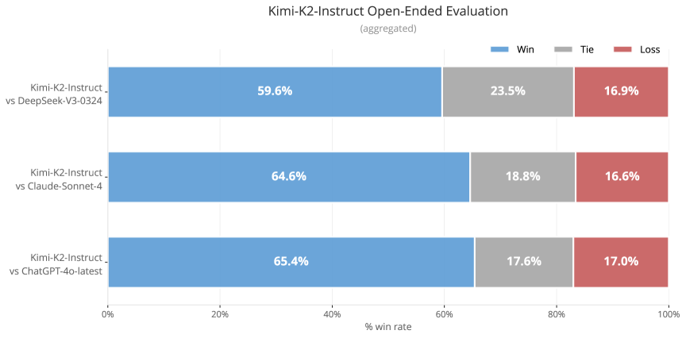

<figcaption>図11: 中国語の社内ベンチマーク評価。</figcaption>
</figure>

## Appendix D QK-Clip Does Not Impair Model Quality（QK-Clip はモデル品質を損なわない）

QK-Clip の設計は最小介入の原則に従う: 必要なときだけ活性化し、訓練が安定した後は不活性化する。経験的な証拠と分析は、モデル品質への影響が無視できることに収束する。

##### 小規模アブレーション

<figure>

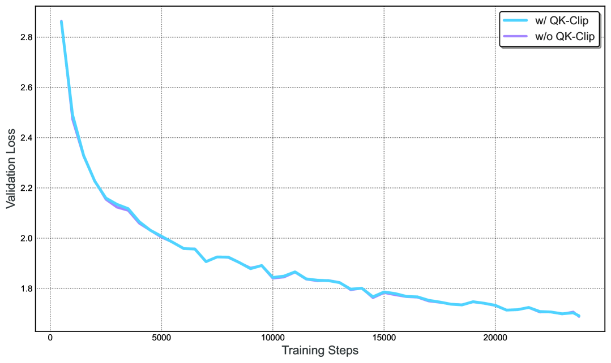

<figcaption>図12: 小規模設定で攻撃的な閾値（τ=30）の QK-Clip を Muon に適用しても loss への影響は無視でき、attention ロジットを制約する安全で効果的な手法であることを示す。</figcaption>
</figure>

活性化 0.5B・総 3B パラメータの小規模 MoE モデルを 2 つ訓練する。ひとつは素の Muon、もうひとつは低いクリッピング閾値（$\tau=30$）の MuonClip である。図 12 に示すように、MuonClip の適用は loss 曲線への影響が無視でき、攻撃的なクリッピングでさえ MuonClip の収束や訓練ダイナミクスを損なわないことを示す。これは MuonClip が、モデル性能を劣化させずに attention ロジットを抑える安全で効果的な手法であることを実証する。さらに、下流タスクでの評価は統計的に有意な性能劣化を示さない。これらの結果は合わせて、MuonClip がモデル品質を損なわずに attention ロジットを抑える安全で効果的な手法であることを実証する。

##### 自己不活性化

Kimi K2 において、QK-Clip は一時的にのみ活性だった:

- 最初の 70000 ステップ: attention ヘッドの 12.7% が少なくとも一度 QK-Clip をトリガーし、$S_{\max}$ を 100 に固定した。
- 70000 ステップ以降: すべてのヘッドがある時点で $S_{\max}$ を 100 未満に下げ、QK-Clip は不活性になった。

QK-Clip が活性なとき、他のヘッドへの過剰正則化の可能性を最小化するため、（層ごとでなく）ヘッドごとに適用される。訓練が安定した後、QK-Clip は不活性化され、まったく効果を持たない。

## Appendix E Why Muon is More Prone to Logit Explosion（なぜ Muon はロジット爆発を起こしやすいのか）

ロジット爆発は、最大の pre-softmax attention スコア

$$
S_{\max}=\max_{i,j}\bigl{(}q_{i}^{\vphantom{\top}}\!\cdot k_{j}\bigr{)}
$$

が訓練中に際限なく成長するときに起こる。

$$
|q_{i}\!\cdot\!k_{j}|\leq\|q_{i}\|\|k_{j}\|\leq\|x_{i}\|\|x_{j}\|\|\mathbf{W}_{q}\|\|\mathbf{W}_{k}\|,
$$

であり、RMS-Norm が $\|x_{i}\|\|x_{j}\|$ を有界に保つため、この現象は主に $\mathbf{W}_{q}$ または $\mathbf{W}_{k}$ のスペクトルノルムの成長によって駆動される。経験的に、Muon の方がロジット爆発の影響を受けやすいことを見出した。以下に仮説を与える。

##### 更新の構造的な違い

Muon は $\mathrm{msign}$ 操作に由来する重み更新を生む。その結果、更新行列の*すべての*特異値が等しい——実効ランクがフルである。対照的に、Adam が生む典型的な更新行列は偏ったスペクトルを示す: 少数の大きな特異値が支配し、実効ランクは低い。Adam のこの低ランク仮定は新しいものではない。高次の muP も同じ仮定を置く。

この現象は 16B の Moonlight モデルで検証されており、Muon で訓練された重みは Adam で訓練されたものより高い*特異値エントロピー*（つまり高い実効ランク）を示し、理論的直観を裏づける。

##### SVD による定式化

ステップ $t-1$ のパラメータ行列が特異値分解

$$
\mathbf{W}_{t-1}=\sum_{i}\sigma_{i}\,u_{i}v_{i}^{\top}
$$

を持つとする。更新行列を

$$
\displaystyle\Delta\mathbf{W}_{t}
=\sum_{j}\bar{\sigma}\,\bar{u}_{j}\bar{v}_{j}^{\top}
$$

と書く。したがって次のパラメータ更新は

$$
\displaystyle\mathbf{W}_{t}\leftarrow\sum_{i}\sigma_{i}u_{i}v_{i}^{\top}+\sum_{j}\bar{\sigma}\,\bar{u}_{j}\bar{v}_{j}^{\top}
$$

Muon では、重みと更新の両方が Adam より高い実効ランクを持つため、特異ベクトル対 $u_{i}v_{i}^{\top}$ が $\bar{u}_{j}\bar{v}_{j}^{\top}$ と整列する確率が高いと仮説を立てる。これは $\mathbf{W}_{t}$ の対応する特異値を加算的に増加させうる。

##### attention 固有の増幅

attention のロジットは双線形形式

$$
q_{i}\cdot k_{j}=(x_{i}\mathbf{W}_{q})\cdot(x_{j}\mathbf{W}_{k}).
$$

で計算される。積 $\mathbf{W}_{q}\mathbf{W}_{k}^{\top}$ はスペクトルノルムを 2 乗するため、どちらかの行列の特異値の増加は複利で効く。したがって Muon の特異値を拡大する傾向は、ロジット爆発のより高いリスクに翻訳される。

## Appendix F K2 Critic Rubrics for General RL（汎用 RL のための K2 Critic ルーブリック）

### F.1 Core Rubrics（コアルーブリック）

- **明確さと関連性（Clarity and Relevance）**: 応答が、ユーザーの意図に完全に応えながらどれだけ簡潔かを評価する。焦点は、不要な詳細の排除、中心のクエリとの整合、短い段落やコンパクトなリストのような効率的なフォーマットの使用にある。特に要求されない限り、長い箇条書きの列挙は避けるべきである。選択が期待されるとき、応答は単一の明確に定義された答えをはっきり提示すべきである。
- **会話の流暢さと関与（Conversational Fluency and Engagement）**: 単純な質問応答を超えた、自然で流れる対話への応答の寄与を評価する。これには、一貫性の維持、トピックへの適切な関与、関連する観察や洞察の提供、適切な場面での会話の建設的な誘導の可能性、フォローアップ質問の思慮深い使用、仮定的または個人的な類推のクエリの優雅な処理、会話の文脈に合わせた効果的なトーンの適応（例: 共感的・フォーマル・カジュアル）が含まれる。
- **客観的で接地された相互作用（Objective and Grounded Interaction）**: ユーザーの要求の実質にまっすぐ焦点を当てた、客観的で接地されたトーンを維持する応答の能力を評価する。メタコメンタリー（クエリの構造・トピックの組み合わせ・知覚された奇妙さ・相互作用自体の性質の分析）と、ユーザーやその入力へ向けられた不当な追従・過剰な称賛の両方の回避を評価する。優れた応答は敬意を持ちつつ中立的に相互作用し、会話のダイナミクスへのコメントや賛辞による機嫌取りの試みより、直接的でタスクに焦点を当てた支援を優先する。

### F.2 Prescriptive Rubrics（規範的ルーブリック）

- **冒頭の称賛（Initial Praise）**: 応答は、ユーザーや質問へ向けた賛辞で始まってはならない（例: 「素晴らしい質問ですね」「良い質問です！」）。
- **明示的な自己正当化（Explicit Justification）**: 応答がなぜ良いか、どのようにユーザーの要求をうまく満たしたかを説明するあらゆる文や節。これは内容を単に記述することとは異なる。

### F.3 Limitations（限界）

この評価フレームワークの潜在的な副作用のひとつは、曖昧さや主観性を伴う文脈でも、自信があり断定的に見える応答を好む可能性があることである。これは現在のルーブリックの 2 つの鍵となる制約に由来する:

- **自己修飾の回避**: 規範的ルールは、自己評価・明示的な免責・ヘッジ表現（例: 「これは正確でないかもしれません」「私は間違っているかもしれません」）を禁止する。これらの句は認識論的謙虚さを反映しうるが、非情報的または儀礼的としてしばしばペナルティを受ける。
- **明確さと単一性への選好**: ルーブリックは、ユーザーが推薦や説明を求めるとき、直接的で決定的な答えに報酬を与える。複雑またはオープンエンドのシナリオでは、これは適切に慎重な、または多視点の応答を抑制しうる。

その結果、モデルは、曖昧さ・ニュアンス・認識論的な控えめさがより適切な領域で、時折確実性を過大に述べるかもしれない。フレームワークの将来の反復では、校正された不確実性のより細かい扱いを組み込むかもしれない。

## Appendix G Engine Switching Pipeline for RL Training（RL 訓練のためのエンジン切り替えパイプライン）

<figure>

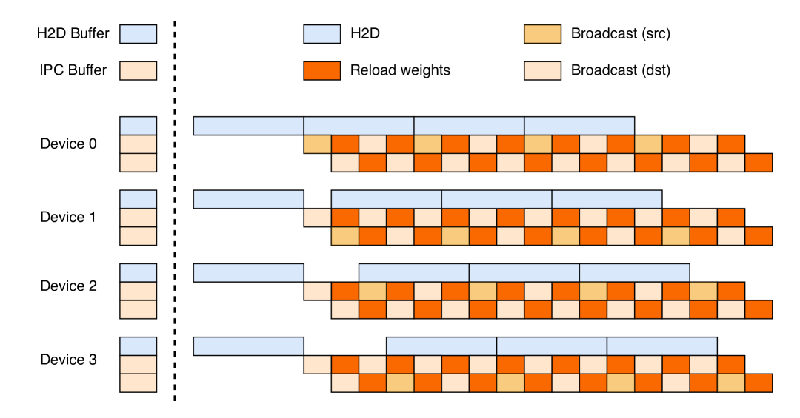

<figcaption>図13(a): 理論的に完全な三段パイプラインによる重み更新。</figcaption>
</figure>

<figure>

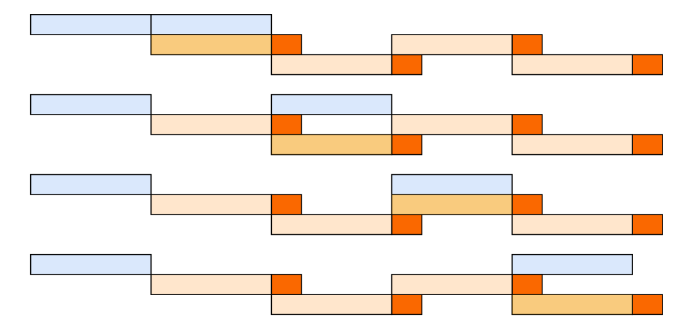

<figcaption>図13(b): PCIe に律速される三段パイプライン。（訳注: パネル (b) はクリップから欠落しており ar5iv から復元）</figcaption>
</figure>

<figure>

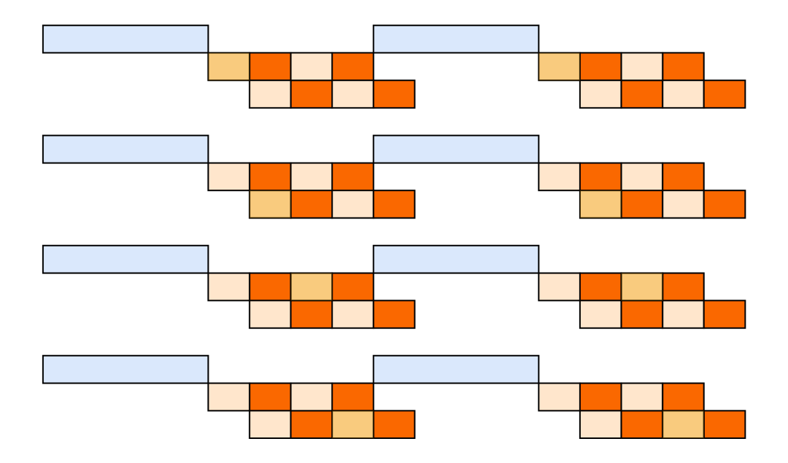

<figcaption>図13(c): 修正された二段パイプライン。（訳注: パネル (c) はクリップから欠落しており ar5iv から復元）</figcaption>
</figure>

**図13**: RL の重み更新のためのパイプライン。（訳注: 主キャプションは ar5iv から復元）

*checkpoint engine* は各 GPU 上に同サイズのデバイスバッファを 3 つ管理する: オフロードされたモデルパラメータをロードする H2D バッファと、GPU 間ブロードキャストのための 2 つの IPC バッファである。IPC バッファは推論エンジンに共有され、同じ物理メモリへ直接アクセスできる。これら 3 つのバッファにより、3 つのステップをパイプラインに配置できる。

##### 理論的な三段パイプライン

図 13(a) に示すように、三段パイプラインを導入する。(1) *H2D*: 最新の重みのシャードが H2D バッファへ非同期にコピーされる。(2) *Broadcast*: コピーが完了すると、シャードは一方の IPC バッファへコピーされ、全デバイスへブロードキャストされる。(3) *Reload*: 推論エンジンは同時に、他方の IPC バッファからパラメータをロードする。

##### PCIe 飽和による二段パイプライン

NVIDIA H800 クラスタでは、H2D とブロードキャストの並行が共有 PCIe ファブリックを飽和させ、三段が逐次手続きに潰れる（図 13(b)）。そこで、より単純な二段方式を採用する（図 13(c)）: (1) 全デバイスが単一の同期 H2D 転送を行う。(2) ブロードキャストとリロードは並列に進む。

二段パイプラインは複数の同期 H2D コピー操作に律速される。しかし大規模なデバイス数では、モデルは小さなシャードに分割され、パラメータ集合全体が一度の転送で H2D バッファに収まり、オーバーヘッドは消える。

H2D・Broadcast・Reload の重みをオーバーラップすることで、訓練エンジンから全推論エンジンへ重みをリシャードする高い帯域を得られる。
