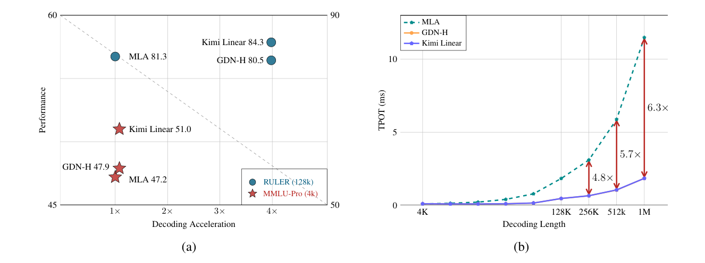
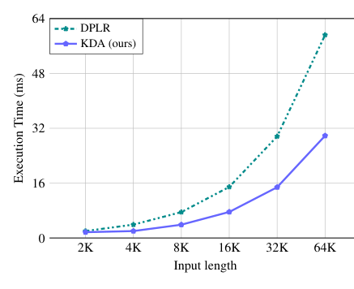
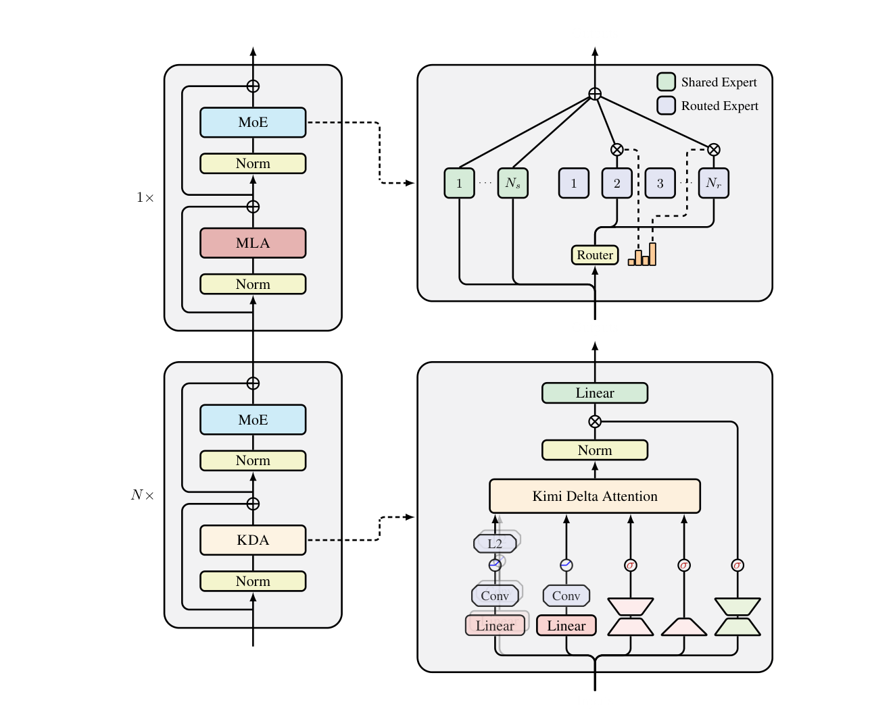
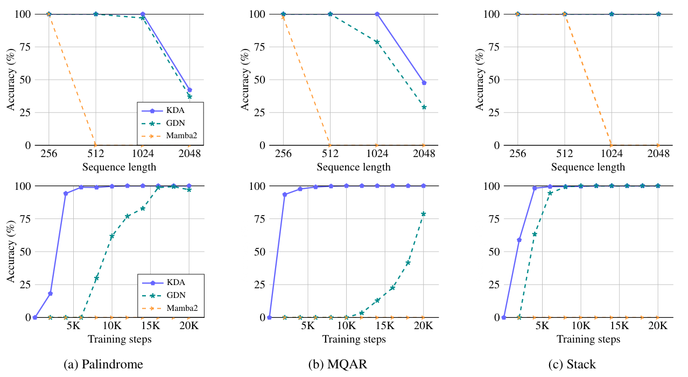
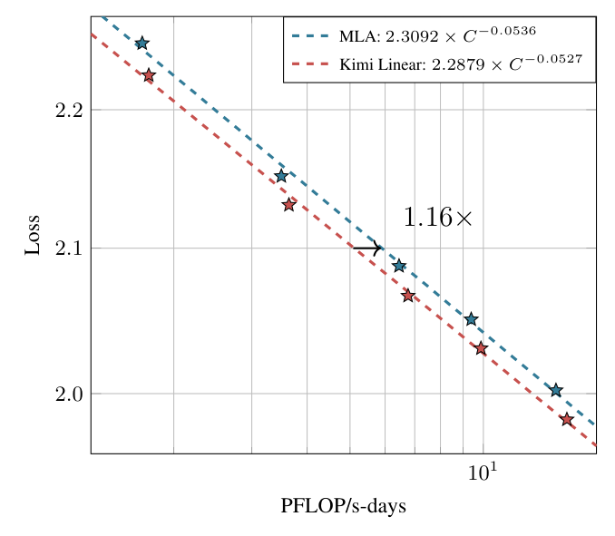
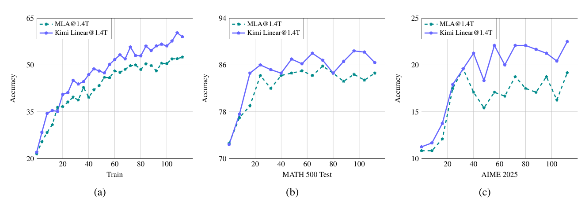
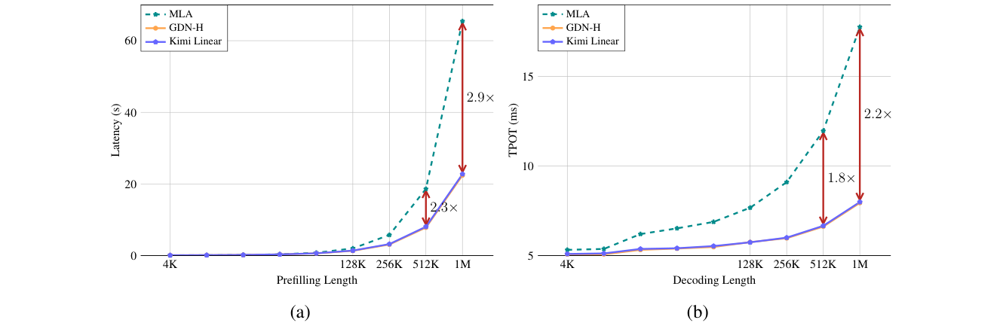

# Kimi Linear: 表現力が高く効率的なアテンション・アーキテクチャ

> 原題: Kimi Linear: An Expressive, Efficient Attention Architecture（Technical Report of Kimi Linear）
> 著者: Kimi Team（Moonshot AI ほか。貢献者一覧は付録 A）
> 出典: arXiv:2510.26692v2 [cs.CL], 2025-11-01 ・ https://github.com/MoonshotAI/Kimi-Linear

> ［訳注（クリップ状態と復元方針）］本ファイルは PDF 原典（ケース B）からの翻訳である。本文テキストは `pdftotext -layout` を底本とし、**数式は複数行にわたる版面で pdftotext が激しく崩れる**ため、PDF を Read で開いて確認したうえで LaTeX として再構成した（式番号は原典に一致させている）。図は全 7 枚（Figure 1〜7）を PyMuPDF のキャプション-bbox レンダリングで PDF から取得し `raw/assets/2025-kimi-linear/` に保存した。**付録 A（Contributions＝貢献者名の一覧）は人名の羅列のため、K2.5 の先例に倣い訳出せず本訳注で存在のみ示す**。参考文献 `[N]` は原典の番号を維持し訳出しない。翻訳では補足・解釈を加えず、解説は要約ページ [[summaries/2025-kimi-linear]] 側に置く。

## Abstract（要旨）

私たちは Kimi Linear を提案する。これはハイブリッドな線形アテンション・アーキテクチャであり、**短コンテキスト・長コンテキスト・強化学習（RL）スケーリングを含むさまざまな状況において、公正な比較のもとでフルアテンションを上回った初めての例**である。その中核にあるのが Kimi Delta Attention（KDA）であり、Gated DeltaNet [111] をより細粒度なゲーティング機構で拡張した表現力の高い線形アテンション・モジュールで、有限状態 RNN メモリという限られた資源をより効果的に使えるようにする。私たちの専用チャンクワイズ・アルゴリズムは、Diagonal-Plus-Low-Rank（DPLR, 対角＋低ランク）遷移行列の特化した変種を通じて高いハードウェア効率を達成し、一般的な DPLR の定式化に比べて計算を大幅に削減しつつ、古典的なデルタ則により忠実であり続ける。

私たちは、KDA と Multi-Head Latent Attention（MLA）を層ごとにハイブリッド化する構成に基づき、**アクティブ・パラメータ 3B・総パラメータ 48B** の Kimi Linear モデルを事前学習した。実験の結果、同一の学習レシピのもとで、Kimi Linear は評価したすべてのタスクにおいてフル MLA を相当な差で上回り、同時に **KV キャッシュ使用量を最大 75% 削減**し、**1M コンテキストにおいて最大 6 倍のデコード・スループット**を達成した。これらの結果は、Kimi Linear が、入力・出力の長さが長いタスクを含めて、優れた性能と効率性を備えたフルアテンション・アーキテクチャの差し替え（drop-in replacement）となりうることを示している。

さらなる研究を支援するため、私たちは KDA カーネルと vLLM 実装をオープンソース化し[^t1]、事前学習済みおよび指示チューニング済みのモデル・チェックポイントを公開する[^t2]。

[^t1]: https://github.com/fla-org/flash-linear-attention/tree/main/fla/ops/kda
[^t2]: https://huggingface.co/moonshotai/Kimi-Linear-48B-A3B-Instruct

<figure>



<figcaption>図1: (a) 性能 vs. 加速率。1.4T トークン学習での厳密に公正な比較のもと、MMLU-Pro（4k コンテキスト長、赤い星）では Kimi Linear が同程度の速度で最高性能（51.0）を示す。RULER（128k コンテキスト長、青い丸）ではパレート最適で、最高性能（84.3）と 3.98× の加速を同時に達成する。(b) デコード長に対する出力トークンあたり時間（TPOT）。Kimi Linear（青線）は低い TPOT を保ち、長系列で GDN-H に匹敵し MLA を上回る。これにより大きなバッチが可能になり、1M トークンで MLA より 6.3× 速い TPOT（1.84ms vs. 11.48ms）を実現する。</figcaption>
</figure>

## 1 Introduction（はじめに）

大規模言語モデル（LLM）がますます高性能なエージェント [50] へと進化するにつれ、推論の計算需要——とりわけ長期ホライズン（long-horizon）や強化学習（RL）の設定における需要——が中心的なボトルネックになりつつある。この、モデルが推論時に長い軌跡（trajectory）・ツール利用のやり取り・複雑な意思決定空間を処理しなければならない **RL テストタイム・スケーリング** [95, 33, 80, 74, 53] への移行は、標準的なアテンション機構の根本的な非効率を露わにする。とくに、softmax アテンションの二乗時間計算量と、線形に増大するキー・バリュー（KV）キャッシュは、計算とメモリの大きなオーバーヘッドをもたらし、スループット・コンテキスト長のスケーリング・リアルタイム対話性を阻害する。

線形アテンション（linear attention）[48] は計算量を削減する原理的な手法だが、表現力が限られるため、これまで——短い系列でさえ——言語モデリングで softmax アテンションに劣ってきた。近年の進展はこの差を大きく縮めており、それは主に 2 つの革新による: ゲーティングないし減衰（decay）の機構 [92, 16, 114] と、デルタ則（delta rule）[84, 112, 111, 71] である。これらの発展を合わせることで、線形アテンションは中程度の長さの系列では softmax 級の品質に近づいた。それでもなお、純粋に線形な構造は有限状態の容量によって根本的に制約され、長系列モデリングと文脈内検索（in-context retrieval）は理論的に困難なままである [104, 4, 45]。

softmax と線形アテンションを組み合わせるハイブリッド・アーキテクチャ——少数のグローバル・アテンション層を、大部分を占めるより高速な線形層と併用する——は、こうして品質と効率の実用的な妥協点として登場した [57, 100, 66, 12, 32, 81]。しかし従来のハイブリッド・モデルはしばしば限られた規模で運用されるか、多様なベンチマークにわたる包括的な評価を欠いていた。核心的な課題は依然として残る: **品質でフルアテンションに匹敵ないし凌駕しながら、速度とメモリの双方で大幅な効率向上を達成するアテンション・アーキテクチャを作ること**であり、これは次世代のエージェント的・デコード負荷の高い LLM を可能にするための不可欠な一歩である。

本研究で私たちは Kimi Linear を提示する。これは、品質を犠牲にすることなく、エージェント的知能とテストタイム・スケーリングの効率要求に応えるよう設計されたハイブリッド線形アテンション・アーキテクチャである。その中核には Kimi Delta Attention（KDA）があり、これは Gated DeltaNet [111] をより細粒度なゲーティング機構で拡張した、ハードウェア効率の高い線形アテンション・モジュールである。GDN は Mamba2 [16] と同様に**粗いヘッド単位（head-wise）の忘却ゲート**を用いるのに対し、KDA は**チャネル単位（channel-wise）の変種**を導入し、各特徴次元が独立の忘却率を保持する点で Gated Linear Attention（GLA）[114] に近い。この細粒度設計により、有限状態 RNN メモリのより精密な制御が可能になり、ハイブリッド・アーキテクチャの内部で RNN 型モデルの潜在能力を引き出す。

決定的に重要なのは、KDA がその遷移ダイナミクスを **Diagonal-Plus-Low-Rank（DPLR）行列** [30, 71] の特化した変種でパラメータ化する点である。これにより専用のチャンクワイズ並列アルゴリズムが可能になり、一般的な DPLR の定式化に比べて計算を大幅に削減しつつ、古典的なデルタ則に忠実であり続ける。

Kimi Linear は、KDA と周期的なフルアテンション層を **一定の 3:1 の比率**で交互配置する。このハイブリッド構造は、長系列生成の間、メモリと KV キャッシュの使用量を最大 75% 削減しつつ、フルアテンション層を介してグローバルな情報の流れを保つ。規模を揃えた事前学習と評価を通じて、Kimi Linear が短コンテキスト・長コンテキスト・RL 型の事後学習タスクにわたって強力なフルアテンションのベースラインに一貫して匹敵ないし凌駕すること——そして 1M コンテキスト長で最大 6 倍のデコード・スループットを達成すること——を示す。

さらなる研究を促進するため、私たちは vLLM 統合つきのオープンソース KDA カーネルと、事前学習済み・指示チューニング済みのチェックポイントを公開する。これらの構成要素は既存のフルアテンション・パイプラインと差し替え互換（drop-in compatible）で、キャッシュやスケジューリングのインターフェースを変更する必要がないため、ハイブリッド・アーキテクチャの研究を容易にする。

### Contributions（貢献）

- **Kimi Delta Attention（KDA）**: ゲート付きデルタ則を、再帰メモリの管理とハードウェア効率の両面で改善する線形アテンション機構。
- **Kimi Linear アーキテクチャ**: KDA とグローバル・アテンションを 3:1 の比率で採用するハイブリッド設計。メモリ・フットプリントを削減しつつフルアテンションの品質を上回る。
- **規模を伴う公正な実証的検証**: 1.4T トークン学習を通じて、Kimi Linear は短／長コンテキストおよび RL 型評価においてフルアテンションや他のベースラインを上回る。カーネル・vLLM 統合・チェックポイントを完全公開する。

## 2 Preliminary（準備）

本節では、提案する Kimi Delta Attention に関連する技術的背景を導入する。

### 2.1 Notation（記法）

本稿では、$\square_t \in \mathbb{R}^{d_k}$ または $\mathbb{R}^{d_v}$ を、$\square \in \{q, k, v, o, u, w\}$ について $t$ 番目の対応する列ベクトルと定義し、$S_t \in \mathbb{R}^{d_k \times d_v}$ を行列形式のメモリ状態とする。$M$ と $M^-$ はそれぞれ対角要素を含む／含まない下三角マスクを表し、便宜上これらを Tril, StrictTril とも書く。

**チャンクワイズ定式化（Chunk-wise Formulation）** 系列が長さ $C$ の $L/C$ 個のチャンクに分割されるとする。$\square_{[t]} \in \mathbb{R}^{C \times d}$（$\square \in \{Q, K, V, O, U, W\}$）を第 $t$ チャンク内のベクトルを積み上げた行列とし、$\square_{[t]}^r = \square_{tC+r}$ をそのチャンクの第 $r$ 要素とする。ここで $t \in [0, L/C)$, $r \in [1, C]$。状態行列も $S_{[t]}^i = S_{tC+i}$ と再添字づけし、さらに $S_{[t]} := S_{[t]}^0 = S_{[t-1]}^C$、すなわちあるチャンクの初期状態は前チャンクの最終状態とする。

**減衰の定式化（Decay Formulation）** 累積減衰を $\gamma_{[t]}^{i \to j} := \prod_{k=i}^{j} \alpha_{[t]}^k$ と定義し、$\gamma_{[t]}^{1 \to r}$ を $\gamma_{[t]}^r$ と略記する。さらに $A_{[t]} := A_{[t]}^{i/j} \in \mathbb{R}^{C \times C}$ を要素 $\gamma_{[t]}^i / \gamma_{[t]}^j$ をもつ行列とする。$\mathrm{Diag}(\alpha_t)$ は細粒度の減衰を表し、$\mathrm{Diag}(\gamma_{[t]}^{i \to j}) := \prod_{k=i}^{j} \mathrm{Diag}(\alpha_{[t]}^k)$、$\Gamma_{[t]}^{i \to j} \in \mathbb{R}^{C \times d_k}$ は $\gamma_{[t]}^i$ から $\gamma_{[t]}^j$ を積み上げた行列である。

### 2.2 Linear Attention and the Gated Delta Rule（線形アテンションとゲート付きデルタ則）

**オンライン学習としての線形アテンション。** 線形アテンション [48] は、キー・バリューの連合（association）を蓄積する行列値の再帰状態を保持する:
$$S_t = S_{t-1} + k_t v_t^\top, \qquad o_t = S_t^\top q_t.$$
高速重み（fast-weight）の観点 [84, 85] からは、$S_t$ はキーからバリューへの一時的な写像を格納する連合記憶（associative memory）として機能する。この更新は、無制限の相関目的関数
$$\mathcal{L}_t(S) = -\langle S^\top k_t, v_t \rangle$$
に対する勾配降下を行うものと見なせる。この目的関数は、直近のキー・バリュー対を忘却なしに継続的に強化する。しかし、そのような目的関数はどの記憶を消去すべきかの基準を与えず、蓄積された状態は際限なく増大し、長い文脈にわたって干渉（interference）を引き起こす。

**DeltaNet: 再構成損失に対するオンライン勾配降下。** DeltaNet [84] はこの再帰を、再構成目的関数に対するオンライン勾配降下として再解釈する:
$$\mathcal{L}_t(S) = \tfrac{1}{2} \| S^\top k_t - v_t \|^2.$$
学習率 $\beta_t$ で勾配ステップを取ると、
$$S_t = S_{t-1} - \beta_t \nabla_S \mathcal{L}_t(S_{t-1}) = (I - \beta_t k_t k_t^\top) S_{t-1} + \beta_t k_t v_t^\top.$$
この規則——古典的なデルタ則（delta rule）——は、$S$ を学習可能な連合記憶として扱い、写像 $k_t \mapsto v_t$ に向けて継続的に自己修正させる。このランク 1 の更新構造は一般化 Householder 変換に等価であり、ハードウェア効率の高いチャンクワイズ並列化を可能にする [11, 112]。

**重み減衰としての Gated DeltaNet。** DeltaNet は学習を安定化させるが、依然として古くなった連合を無期限に保持してしまう。Gated DeltaNet（GDN）[111] はスカラーの忘却ゲート $\alpha_t \in [0, 1]$ を導入し、次を得る:
$$S_t = \alpha_t (I - \beta_t k_t k_t^\top) S_{t-1} + \beta_t k_t v_t^\top.$$
ここで $\alpha_t$ は高速重みに対する重み減衰（weight decay）の一形態として作用し [8]、データ依存の L2 正則化に類似した忘却機構を実装する。この単純だが効果的な変更は、記憶の寿命を制御し干渉を軽減する原理的な方法を提供し、DeltaNet の並列化可能な構造を保ちつつ、安定性と長コンテキスト汎化の双方を改善する。

この観点から私たちは、**GDN は乗法的位置符号化（multiplicative positional encoding）の一形態と解釈でき、その遷移行列はデータ依存かつ学習可能で、RoPE [115] の直交性制約を緩和する**、と見なす。[^3]

[^3]: 状態変換行列がその直交性を保つとき、絶対位置符号化を $q$ と $k$ に独立に適用し、アテンション計算の中で相対位置符号化へと変換することもできる [87]。

## 3 Kimi Delta Attention: 細粒度ゲーティングによるデルタ則の改善

私たちは Kimi Delta Attention（KDA）を提案する。これは新しいゲート付き線形アテンションの変種で、GDN のスカラー減衰を、細粒度の対角化されたゲート $\mathrm{Diag}(\alpha_t)$ を導入することで洗練し、メモリ減衰と位置認識（§6.1 で議論）の細粒度な制御を可能にする。まず KDA のチャンクワイズ並列化を導入し、一連のランク 1 行列変換が、対角ゲーティングのもとで安定性を保ちながら、いかに密（dense）な表現へと圧縮できるかを示す。次に、標準的な DPLR（Diagonal-Plus-Low-Rank）定式化 [30, 71] に対する KDA の効率上の利点を明らかにする。
$$S_t = \left(I - \beta_t k_t k_t^\top\right) \mathrm{Diag}(\alpha_t) S_{t-1} + \beta_t k_t v_t^\top \in \mathbb{R}^{d_k \times d_v}; \qquad o_t = S_t^\top q_t \in \mathbb{R}^{d_v} \tag{1}$$

（式(1)の右辺は、模式的には「$\bigl(I - \beta_t k_t k_t^\top\bigr)$ と $\mathrm{Diag}(\alpha_t)$ の積で前状態 $S_{t-1}$ を変換し、そこにランク 1 の書き込み項 $\beta_t k_t v_t^\top$ を加える」構造として図示されている。）

### 3.1 Hardware-Efficient Chunkwise Algorithm（ハードウェア効率の高いチャンクワイズ・アルゴリズム）

式(1)の再帰をチャンクワイズ定式化へと部分的に展開すると、次を得る:
$$S_{[t]}^r = \underbrace{\left(\prod_{i=1}^{r}\left(I - \beta_{[t]}^i k_{[t]}^i k_{[t]}^{i\top}\right)\mathrm{Diag}(\alpha_{[t]}^i)\right)}_{:=P_{[t]}^r} \cdot S_{[t]}^0 + \underbrace{\sum_{i=1}^{r}\left(\prod_{j=i+1}^{r}\left(I - \beta_{[t]}^j k_{[t]}^j k_{[t]}^{j\top}\right)\mathrm{Diag}(\alpha_{[t]}^j)\right)\beta_{[t]}^i k_{[t]}^i v_{[t]}^{i\top}}_{:=H_{[t]}^r} \tag{2}$$

**WY 表現（WY Representation）** は、一連のランク 1 更新を単一のコンパクトな表現へと詰め込むために通常用いられる [11]。私たちは、後続の計算で追加の行列反転を必要としないよう、Comba [40] における $P$ の定式化に従う。
$$P_{[t]}^r = \mathrm{Diag}(\gamma_{[t]}^r) - \sum_{i=1}^{r}\mathrm{Diag}(\gamma_{[t]}^{i \to r}) k_{[t]}^i w_{[t]}^{i\top}, \qquad H_{[t]}^r = \sum_{i=1}^{t}\mathrm{Diag}(\gamma_{[t]}^{i \to r}) k_{[t]}^i u_{[t]}^{i\top} \tag{3}$$
ここで補助ベクトル $w_t \in \mathbb{R}^{d_k}$ と $u_t \in \mathbb{R}^{d_v}$ は次の漸化式で計算される:
$$w_{[t]}^r = \beta_{[t]}^r\left(\mathrm{Diag}(\gamma_{[t]}^r) k_{[t]}^r - \sum_{i=1}^{r-1} w_{[t]}^i\left(k_{[t]}^{i\top}\mathrm{Diag}(\gamma_{[t]}^{i \to r}) k_{[t]}^r\right)\right) \tag{4}$$
$$u_{[t]}^r = \beta_{[t]}^r\left(v_{[t]}^r - \sum_{i=1}^{r-1} u_{[t]}^i\left(k_{[t]}^{i\top}\mathrm{Diag}(\gamma_{[t]}^{i \to r}) k_{[t]}^r\right)\right) \tag{5}$$

**UT 変換（UT transform）。** 私たちは UT 変換 [46] を適用して非行列積（non-matmul）の FLOPs を削減する。これは学習時のハードウェア利用効率を高めるうえで決定的に重要である。
$$M_{[t]} = \left(I + \mathrm{StrictTril}\left(\mathrm{Diag}(\beta_{[t]})\left(\Gamma_{[t]}^{1 \to C} \odot K_{[t]}\right)\left(\frac{K_{[t]}}{\Gamma_{[t]}^{1 \to C}}\right)^\top\right)\right)^{-1}\mathrm{Diag}(\beta_{[t]}) \tag{6}$$
$$W_{[t]} = M_{[t]}\left(\Gamma_{[t]}^{1 \to C} \odot K_{[t]}\right), \qquad U_{[t]} = M_{[t]} V_{[t]} \tag{7}$$
下三角行列の逆行列は、ガウス消去法における前進代入（forward substitution）による反復的な行単位のアプローチで効率的に計算できる [28]。

同値な形として、状態をチャンクワイズに更新できる:
$$S_{[t+1]} = \mathrm{Diag}(\gamma_{[t]}^C) S_{[t]} + \left(\Gamma_{[t]}^{i \to C} \odot K_{[t]}\right)^\top\left(U_{[t]} - W_{[t]} S_{[t]}\right) \in \mathbb{R}^{d_k \times d_v} \tag{8}$$

出力の段階では、行列積のスループットを最大化するために **ブロック間は再帰・ブロック内は並列（inter-block recurrent and intra-block parallel）** の戦略を採用し、Tensor Core の計算ポテンシャルを最大限に活用する。
$$O_{[t]} = \underbrace{\left(\Gamma_{[t]}^{1 \to C} \odot Q_{[t]}\right) S_{[t]}}_{\text{inter chunk}} + \underbrace{\mathrm{Tril}\left(\left(\Gamma_{[t]}^{1 \to C} \odot Q_{[t]}\right)\left(\frac{K_{[t]}}{\Gamma_{[t]}^{1 \to C}}\right)^\top\right)}_{\text{intra chunk}}\underbrace{\left(U_{[t]} - W_{[t]} S_{[t]}\right)}_{\text{“擬似（pseudo）”バリュー項}} \in \mathbb{R}^{C \times d_v} \tag{9}$$

### 3.2 Efficiency Analysis（効率性の分析）

表現能力の観点では、KDA は一般化 DPLR 定式化、すなわち $S_t = (D - a_t b_t^\top) S_{t-1} + k_t v_t^\top$ と整合しており、いずれも細粒度の減衰挙動を示す。しかし、そのような細粒度の減衰は除算演算（例: 式(9)のチャンク内計算）において数値精度の問題を引き起こす。これに対処するため、GLA [114] などの先行研究は対数領域で計算を行い、完全精度での二次チャンキング（secondary chunking）を導入する。しかしこのアプローチは、半精度行列積の完全な活用を妨げ、演算子の速度を著しく低下させる。**変数 $a$ と $b$ の双方を $k$ に束縛する（$a = b = k$）ことで、KDA はこのボトルネックを効果的に緩和し**——二次チャンクの行列計算を 4 回から 2 回に減らし、さらに 3 つの追加の行列積を除去する。結果として、KDA の演算子効率は DPLR 定式化に比べておよそ 100% 改善する。詳細な分析は §6.2 で与える。

<figure>



<figcaption>図2: 入力長を変えたときのカーネルの実行時間。バッチサイズは 1、ヘッド数は 16 で統一。KDA は最大 64k の系列長で DPLR のおよそ 2 倍の速度を達成する。</figcaption>
</figure>

## 4 The Kimi Linear Model Architecture（Kimi Linear のモデル・アーキテクチャ）

私たちのモデル・アーキテクチャの主要なバックボーンは Moonlight [62] に従う。細粒度ゲーティングに加えて、Kimi Linear の表現力をさらに高めるいくつかの構成要素を活用する。Kimi Linear の全体アーキテクチャを Figure 3 に示す。

**ニューラル・パラメータ化（Neural Parameterization）** $x_t \in \mathbb{R}^d$ を第 $t$ トークンの入力表現とすると、各ヘッド $h$ に対する KDA への入力は次のように計算される:
$$q_t^h, k_t^h = \mathrm{L2Norm}\left(\mathrm{Swish}\left(\mathrm{ShortConv}\left(W_{q/k}^h x_t\right)\right)\right) \in \mathbb{R}^{d_k}$$
$$v_t^h = \mathrm{Swish}\left(\mathrm{ShortConv}\left(W_v^h x_t\right)\right) \in \mathbb{R}^{d_v}$$
$$\alpha_t^h = f\left(W_\alpha^\uparrow W_\alpha^\downarrow x_t\right) \in [0, 1]^{d_k}$$
$$\beta_t^h = \mathrm{Sigmoid}\left(W_\beta^h x_t\right) \in [0, 1]$$
ここで $d_k, d_v$ はキーとバリューのヘッド次元を表し、すべての実験で 128 に設定する。$q, k, v$ に対しては、[111] に従い ShortConv の後に Swish 活性化を適用する。$q$ と $k$ の表現は、[112] の提案に従い、固有値の安定性を確保するためさらに L2Norm で正規化される。チャネルごとの減衰 $\alpha_t^h$ は、低ランク射影（$W_\alpha^\downarrow$ と $W_\alpha^\uparrow$、ランクはヘッド次元に等しい）と、GDN や Mamba [111, 16] で用いられるものに類似した減衰関数 $f(\cdot)$ によってパラメータ化される。出力射影 $W_o \in \mathbb{R}^{d \times d}$ の前には、ヘッド単位の RMSNorm [122] とデータ依存のゲーティング機構 [79] を用いる。これは次のようにパラメータ化される:
$$o_t = W_o\left(\mathrm{Sigmoid}\left(W_g^\uparrow W_g^\downarrow x_t\right) \odot \mathrm{RMSNorm}\left(\mathrm{KDA}(q_t, k_t, v_t, \alpha_t, \beta_t)\right)\right) \tag{10}$$
ここで出力ゲートは、公正なパラメータ比較を確保するため、忘却ゲートと同様の低ランク・パラメータ化を採用しつつ、全ランク（full-rank）ゲーティングに匹敵する性能を保ち、Attention Sink [79] を軽減する。非線形活性化関数の選択については §5.2 でさらに議論する。

<figure>



<figcaption>図3: Kimi Linear のモデル・アーキテクチャの図解。トークン混合（token mixing）層と、それに続く MoE チャネル混合（channel-mixing）層を含むブロックを積み重ねた構成である。具体的には、トークン混合について N 個の KDA 層を 1 個の MLA 層と交互配置し、実装では N を 3 に設定する。</figcaption>
</figure>

**ハイブリッド・モデル・アーキテクチャ（Hybrid model architecture）** 長コンテキストの検索は依然として純粋な線形アテンションの主要なボトルネックであるため、私たちは KDA を少数のフル・グローバルアテンション（Full MLA）層 [19] とハイブリッド化する。Kimi Linear では、ヘッド単位（層内でヘッドを混合する）ではなく **層単位（layerwise、層全体を交互配置する）** のアプローチを選んだ。インフラの単純さと学習の安定性が優れるためである。経験的に、**一定の 3:1 の比率、すなわち 3 個の KDA 層に対して 1 個のフル MLA 層を繰り返す構成**が、最良の品質とスループットのトレードオフを与えた。他のハイブリッド化戦略については §7.2 で議論する。

**MLA 層への位置符号化なし（NoPE）** Kimi Linear では、すべてのフルアテンション（MLA）層に NoPE（No Position Encoding）を適用する。この設計は、位置情報と直近性バイアス（recency bias、§6.1 参照）を符号化する責任のすべてを KDA 層に委ねる。KDA はこうして**主たる位置認識演算子**として確立され、短い畳み込み [3] やスライディング・ウィンドウ・アテンション（SWA）[76] のような補助的構成要素に類似する——あるいは間違いなくより強い——役割を果たす。私たちの知見は、グローバルな NoPE アテンションを専用の位置認識機構で補完すれば競争力ある長コンテキスト性能が得られる、と同様に示した先行研究 [110, 7, 19] と一致する。

<figure>



<figcaption>図4: 合成タスクの結果——palindrome（回文）、multi query associative recall（MQAR）、および state tracking（状態追跡）。上段は系列長を 256 から 2,048 まで増やしたときのピーク精度、下段は文脈長 1,024 で固定したときの収束速度。KDA・GDN・Mamba2 を比較。</figcaption>
</figure>

NoPE は、とくに MLA にとって実用上の利点をもたらす。第一に、NoPE は推論時に MLA を高効率な純粋 Multi-Query Attention（MQA）へ変換することを可能にする。第二に、RoPE のパラメータ調整（周波数ベースの調整や YaRN [72] のような手法）を不要にするため、長コンテキスト学習を簡素化する。

## 5 Experiments（実験）

### 5.1 Synthetic tests（合成タスクのテスト）

まず、長コンテキスト性能のベンチマークとして機能する 3 つの合成タスクで、KDA を競合する他の線形アテンション手法と比較評価する。すべての実験で、2 層・2 アテンションヘッド（各ヘッド次元 128）という一貫したモデル構成を採用する。各タスクについて、モデルを最大 20,000 ステップ学習させ、学習率を $\{5 \times 10^{-5}, 1 \times 10^{-4}, 5 \times 10^{-4}, 1 \times 10^{-3}\}$ でグリッドサーチする。そのうえで最良の学習精度曲線を提示する。具体的には 2 つのシナリオを比較する: (1) 学習長を 256 から 2,048 トークンへ増やしたときの各タスクの性能（ピーク精度を測定）、(2) 文脈長を 1,024 トークンに固定したときの KDA・GDN・Mamba2 の収束速度。

**Palindrome（回文）** Palindrome は、与えられたランダムトークン列を逆順で再現することをモデルに要求する。Table 5.1 に示すように、"O G R S U N E" のような入力が与えられると、モデルはその正確な逆順を生成しなければならない。このようなコピー・タスクは線形アテンション・モデルにとって困難であることが知られており [45]、圧縮された固定サイズのメモリ状態から全履歴を正確に検索するのに苦労する。

| 入力 (Input) | O | G | R | S | U | N | E | \<sep\> | E | N | U | S | R | G | O |
|---|---|---|---|---|---|---|---|---|---|---|---|---|---|---|---|
| 出力 (Output) | ϕ | ϕ | ϕ | ϕ | ϕ | ϕ | ϕ | ϕ | N | U | S | R | G | O | ϕ |

**Multi Query Associative Recall（MQAR, 複数クエリの連合検索）** MQAR は、文脈内のさまざまな位置に現れる複数のクエリに関連づけられた値を検索するモデルの能力を評価する。たとえば Table 5.1 に示すように、モデルはクエリ B に対して 0 を、G に対して 5 を想起するよう求められる。このタスクは言語モデリング性能と強く相関することが知られている [5]。

| 入力 (Input) | A | 1 | C | 3 | B | 0 | M | 8 | G | 5 | E | 4 | \<sep\> | B | G |
|---|---|---|---|---|---|---|---|---|---|---|---|---|---|---|---|
| 出力 (Output) | ϕ | ϕ | ϕ | ϕ | ϕ | ϕ | ϕ | ϕ | ϕ | ϕ | ϕ | ϕ | ϕ | 0 | 5 |

**表1**: KDA と MLA アテンションのハイブリッド比率、および他の主要構成要素に関するアブレーション。比較のため学習・検証パープレキシティ（低いほど良い）を示す。最終実験で用いた最良のモデルを灰色で強調している（表中では太字で示す）。

| 構成 | | Training PPL (↓) | Validation PPL (↓) |
|---|---|---|---|
| ハイブリッド比率 | **3:1** | **9.23** | **5.65** |
| | 0:1 | 9.45 | 5.77 |
| | 1:1 | 9.29 | 5.66 |
| | 7:1 | 9.23 | 5.70 |
| | 15:1 | 9.34 | 5.82 |
| 出力ゲートなし (w/o output gate) | | 9.25 | 5.67 |
| swish 出力ゲート (w/ swish output gate) | | 9.43 | 5.81 |
| 畳み込み層なし (w/o convolution layer) | | 9.29 | 5.70 |

**Stack（スタック）** 私たちは、標準的な LIFO（Last In First Out）スタック操作をシミュレートすることで、各候補の状態追跡（state tracking）能力 [27] を評価する。この設定では、それぞれ固有の ID をもつ 64 個の独立したスタックを用いる。モデルは 2 種類の操作の列を処理する: 1) PUSH: "\<push\> 1 G" のような操作は要素 G をスタック 1 に追加する; 2) POP: "\<pop\> 0 E" のような操作は、スタック 0 に最も新しく push された要素 E を予測するようモデルに要求する。目的は、すべてのスタックの状態を正確に追跡し、各 pop 要求に対して正しい要素を予測することである。

Figure 4 に最終結果を示す。すべてのタスクにわたって、系列長が 256 から 2,048 トークンへ増えるにつれ、KDA は一貫して最高の精度を達成する。とくに Palindrome と検索集約的な MQAR タスクでは、KDA は GDN より著しく速く収束する。これは、無関係な情報を選択的に忘却しつつ重要な記憶をより精密に保持することを可能にする、私たちの細粒度減衰の利点を裏づける。また、乗法的減衰のみを用いてデルタ則を欠く典型的な線形アテンションである Mamba2 [16] は、私たちのモデル設定ではすべてのタスクで失敗することも観察された。

### 5.2 Ablation on Key Components of Kimi Linear（主要構成要素のアブレーション）

私たちは、異なるモデルを最初のスケーリング則モデル（16 ヘッド・16 層）と直接比較する一連のアブレーション研究を行った。公正な比較のため、すべてのモデルを同じ FLOPs 予算と同じハイパーパラメータで学習した。学習・検証パープレキシティ（PPL）を Table 1 に報告する。検証 PPL は、事前学習コーパスとは分布が大きく異なる高品質データセットで計算され、分布シフト下での汎化を強調する。それゆえ学習 PPL と検証 PPL に差が生じる。

**出力ゲート（Output gate）** デフォルトの Sigmoid 出力ゲートを、ゲートなしと swish ゲートの 2 つの変種と比較する。結果は、ゲートを除去すると性能が劣化することを示す。さらに、[111] が採用した swish ゲートは Sigmoid より大幅に性能が悪い。私たちの観察は、Sigmoid ゲーティングが優れた性能を提供すると結論した [79] と一致する。そこで私たちは、GDN-H を含むすべての実験で Sigmoid を採用する。

**畳み込み層（Convolution Layer）** 小さいカーネルサイズ（例: 4）をもつ軽量な深さ方向（depthwise）畳み込みは、局所的なトークン依存を捉えるのに効果的であり [3]、近年の多くのアーキテクチャで広く採用されている [16, 5, 112]。私たちは Table 1 でその有効性を検証し、畳み込み層がハイブリッド・モデルにおいても無視できない役割を果たし続けることを示す。

**ハイブリッド比率（Hybrid ratio）** KDA 線形アテンション層と MLA フルアテンション層の最適なハイブリッド比率を決定するアブレーション研究を行った。テストした構成の中で、3:1 の比率（KDA 層 3 個ごとに MLA 層 1 個）が最良の結果を出し、最小の学習・検証損失を達成した。他の比率では明確なトレードオフが観察された: より高い比率（例: 7:1）は同程度の学習損失を出したが検証性能が著しく悪化し、一方より低い比率（例: 1:1）は同程度の検証損失を保ったが推論オーバーヘッドの増加を代償とした。さらに、純粋なフルアテンションのベースライン（0:1）は性能が低かった。したがって 3:1 構成が、モデル性能と計算効率の最も効果的なバランスを提供する。

**NoPE vs. RoPE** Table 5 に示すように、Kimi Linear は長コンテキスト評価で一貫して優れる一方、Kimi Linear（RoPE）は短コンテキスト・タスクで同程度のスコアを得る。私たちは、この乖離が位置バイアスが深さ方向にどう分布するかから生じると考える。Kimi Linear（RoPE）では、グローバル・アテンション層が強く明示的な相対位置信号を担う一方、線形アテンション（例: GDN）はより弱く暗黙的な位置の帰納バイアスを寄与する。この不整合はグローバル層で短距離順序への過度な強調を生み、それは短コンテキストには有利だが、学習途中で拡張コンテキストへ適応する際にモデルの柔軟性を損なう。対照的に、Kimi Linear は層をまたいでよりバランスの取れた位置バイアスを誘導し、これが長距離での頑健性と外挿を改善して、より強い長コンテキスト性能につながる。長コンテキスト性能に関して、Table 5 に示すとおり、Kimi Linear はさまざまな長コンテキスト・ベンチマークにわたって最良の平均スコアを達成し、前節で主張した利点を検証する。

### 5.3 Scaling Law of Kimi Linear（Kimi Linear のスケーリング則）

私たちは、Moonlight [62] アーキテクチャに従う一連の MoE モデルでスケーリング則の実験を行った。すべての実験で 64 個中 8 個のエキスパートを活性化し、Muon オプティマイザ [62] を用いた。詳細とハイパーパラメータは Table 2 に示す。

**表2**: スケーリング則実験のためのモデル構成とハイパーパラメータ。（†: MoE モデルにおける活性化パラメータ数。埋め込みを除く。‡: すべてのモデルは文脈長 4,096 で学習。）

| # Act. Params.† | Head | Layer | Hidden | Tokens | lr | batch size‡ |
|---|---|---|---|---|---|---|
| 653M | 16 | 16 | 1216 | 38.8B | 2.006 × 10⁻³ | 336 |
| 878M | 18 | 18 | 1376 | 59.8B | 1.790 × 10⁻³ | 432 |
| 1.1B | 20 | 20 | 1536 | 85.2B | 1.617 × 10⁻³ | 512 |
| 1.4B | 22 | 22 | 1632 | 102.5B | 1.486 × 10⁻³ | 576 |
| 1.7B | 24 | 24 | 1776 | 128.0B | 1.371 × 10⁻³ | 640 |

MLA については、Chinchilla スケーリング則の方法論 [37] に従い、異なるサイズの 5 つの言語モデルを学習し、各モデルで最適性能を確保するようグリッドサーチで慎重にハイパーパラメータを調整した。KDA については、Table 1 でアブレーションした最良のハイブリッド比率 3:1 を維持した。これを除けば、いかなる変更も加えずに MLA の学習設定に厳密に従った。Figure 5 に示すように、Kimi Linear は計算最適な学習において、MLA のベースラインに比べておよそ **1.16× の計算効率**を達成する。KDA については慎重なハイパーパラメータ調整により、さらに優れたスケーリング曲線が得られると期待している。

<figure>



<figcaption>図5: MLA と Kimi Linear のフィッティングされたスケーリング則曲線。MLA: 2.3092 × C⁻⁰·⁰⁵³⁶、Kimi Linear: 2.2879 × C⁻⁰·⁰⁵²⁷。横軸は PFLOP/s-days、縦軸は損失。Kimi Linear が同一損失に到達するのに約 1.16× 少ない計算量で済む。</figcaption>
</figure>

### 5.4 Experimental Setup（実験の設定）

**Kimi Linear とベースラインの設定** 私たちは Kimi Linear モデルを、フルアテンション MLA ベースラインおよびハイブリッド Gated DeltaNet（GDN-H）ベースラインと比較評価する。これらはすべて公正な比較のため、同じアーキテクチャ・パラメータ数・学習設定を共有する。モデル構成はおおむね Moonlight [62] に揃えるが、重要な違いとして MoE のスパース性を 32 に増やす。各モデルは 256 個中 8 個のエキスパート（うち 1 個は共有エキスパート）を活性化し、結果として **総パラメータ 48B・順伝播あたりアクティブ・パラメータ 3B** となる。最初の層は安定した学習を確保するため MoE なしの密（dense）層として実装する。Kimi Linear における NoPE の有効性を評価するため、同じモデル構成で RoPE を用いるハイブリッド KDA ベースライン（Kimi Linear（RoPE）と呼ぶ）も導入する。

**評価ベンチマーク** 私たちの評価は 3 つの主要カテゴリのベンチマークを含み、それぞれモデルの異なる能力を評価するよう設計されている:

- **言語理解と推論**: Hellaswag [121]、ARC-Challenge [14]、Winogrande [83]、MMLU [36]、TriviaQA [47]、MMLU-Redux [26]、MMLU-Pro [103]、GPQA-Diamond [82]、BBH [94]、および [105]。
- **コード生成**: LiveCodeBench v6[^4] [44]、EvalPlus [60]。
- **数学と推論**: AIME 2025、MATH 500、HMMT 2025、PolyMath-en。
- **長コンテキスト**: MRCR[^5]、RULER [38]、Frames [52]、HELMET-ICL [118]、RepoQA [61]、Long Code Arena [13]、LongBench v2 [6]。
- **中国語の理解と推論**: C-Eval [43]、CMMLU [55]。

[^4]: 2024.8 から 2025.5 までの問題。
[^5]: https://huggingface.co/datasets/openai/mrcr

**評価の構成** すべてのモデルを温度 1.0 で評価する。分散の大きいベンチマークについては Avg@k のスコアを報告する。ベースモデルについては、MMLU・MMLU-Redux・GPQA-Diamond・C-Eval にパープレキシティベースの評価を用いる。それ以外は生成ベースの評価を採用する。GPQA-Diamond に固有の大きな分散を緩和するため、8 回の独立実行にわたる平均スコアを報告する。すべての評価は LM-Harness-Evaluation [10] から派生した私たちの内部フレームワークを用いて行い、全モデルで一貫した設定を確保する。

#### 5.4.1 Pre-training recipe（事前学習レシピ）

すべてのモデルは、4,096 トークンの文脈窓、MuonClip オプティマイザ、WSD 学習率スケジュールを用いて事前学習され、K2 事前学習コーパス [50] からサンプリングした計 1.4 兆トークンを共通に処理する。学習率は $1.1 \times 10^{-3}$、グローバル・バッチサイズは 3,200 万トークンに固定する。これらは Kimi K2 [50] で確立された同じアニーリング・スケジュールと長コンテキスト活性化フェーズも採用する。

最終的に公開する Kimi Linear チェックポイントは同じ手順で事前学習されるが、Moonlight の事前学習トークン数に合わせて計 5.7 兆トークンに拡張されている。加えて、最終チェックポイントは最大 100 万トークンの文脈長をサポートする。Kimi Linear@5.7T と Moonlight の性能比較は付録 D で行う。

#### 5.4.2 Post-training recipe（事後学習レシピ）

**SFT レシピ** SFT データセットは Kimi K2 [50] の SFT データを拡張し、追加の推論タスクを取り込むことで、数学とコーディングに重点を置きつつ多様な領域をまたぐ大規模な指示チューニング・データセットを作る。私たちは多段階の SFT アプローチを採用し、まず一般的な指示追従のために幅広い多様な SFT データでモデルを学習し、続いて推論集約的なデータでスケジュールされた的を絞った学習を行い、モデルの推論能力を高める。

**RL レシピ** RL 学習のプロンプト集合には、主に数学・コード・STEM の 3 つのデータソースを統合する。この強化の主目的はモデルの推論能力を高めることである。RL を行う前に、開始チェックポイントに対して中程度の難易度に合致するデータを事前選別する。RL 学習の既知のリスクとして、汎用能力の劣化（degeneration）がある。これを緩和するため、K2 [50] の実践に従い、RL 中に PTX 損失 [70] を組み込む。これは RL の進行中に、高品質で分布的に多様なデータセットで同時に SFT を行うことを含む。私たちの PTX データセットは推論と汎用の両タスクにまたがる。上記のデータはすべて K2 モデル [50] の学習レシピから派生した部分集合である。

RL アルゴリズムには K1.5 [95] と同じアルゴリズムを用いつつ、いくつかの高度なトリックを導入する。学習エンジンと推論エンジンの間の精度不一致（precision mismatch）が RL 学習を不安定にしうることに気づいた。そこで truncated importance sampling を導入する。これはロールアウトと学習の間のポリシー不一致を効果的に緩和する手法である [116]。また、RL 学習を安定させエントロピーの崩壊 [15] を避けるため、KL ペナルティとミニバッチサイズ（反復あたりの更新回数）を動的に調整する。

### 5.5 Main results（主要な結果）

#### 5.5.1 Kimi Linear@1.4T results（Kimi Linear@1.4T の結果）

**事前学習の結果** 私たちは 1.4T の事前学習コーパスを用いて、Kimi Linear モデルを 2 つのベースライン（MLA とハイブリッド GDN-H）と Table 3 で比較した。評価は一般知識・推論（数学とコード）・中国語タスクの 3 領域に焦点を当てた。Kimi Linear はほぼすべてのカテゴリで両ベースラインを一貫して上回った。

**表3**: 同じ事前学習レシピ後の、Kimi Linear とフルアテンション MLA ベースライン・ハイブリッド GDN ベースラインの性能比較。列ごとの最良を太字で示す。

| 種別 Base | MLA | GDN-H | Kimi Linear |
|---|---|---|---|
| 学習トークン | 1.4T | 1.4T | 1.4T |
| HellaSwag | 81.7 | 82.2 | **82.9** |
| ARC-challenge | 64.6 | 66.5 | **67.3** |
| Winogrande | 78.1 | 77.9 | **78.6** |
| BBH | 71.6 | 70.6 | **72.9** |
| MMLU | 71.6 | 72.2 | **73.8** |
| MMLU-Pro | 47.2 | 47.9 | **51.0** |
| TriviaQA | 68.9 | 70.1 | **71.7** |
| GSM8K | 83.7 | 81.7 | **83.9** |
| MATH | **54.7** | 54.1 | **54.7** |
| EvalPlus | 59.5 | **63.1** | 60.2 |
| CRUXEval-I-cot | 51.6 | 56.0 | **56.6** |
| CRUXEval-O-cot | 61.5 | 58.1 | **62.0** |
| CEval | 79.3 | 79.1 | **79.5** |
| CMMLU | 79.5 | 80.7 | **80.8** |

- **一般知識**: Kimi Linear は BBH・MMLU・HellaSwag のような主要ベンチマークのすべてで最高スコアを取る。
- **推論**: 数学（GSM8K）とほとんどのコードタスク（CRUXEval）で先行する。ただし EvalPlus では GDN-H よりわずかに低い。
- **中国語タスク**: Kimi Linear は CEval と CMMLU で最高スコアを達成する。

要するに、Kimi Linear は最も強い性能を示し、短コンテキスト事前学習においてフルアテンション・アーキテクチャの強力な代替として位置づけられる。

**表4**: 事前学習後に同じ SFT レシピを用いた場合の性能比較。列ごとの最良を太字で示す。

| 種別 Instruct | MLA | GDN-H | Kimi Linear |
|---|---|---|---|
| 学習トークン | 1.4T | 1.4T | 1.4T |
| BBH | 68.2 | 68.5 | **69.4** |
| MMLU | 75.7 | 75.6 | **77.0** |
| MMLU-Pro | 65.7 | 64.8 | **67.4** |
| MMLU-Redux | 79.2 | 78.7 | **80.3** |
| GPQA-Diamond (Avg@8) | 57.1 | 58.6 | **62.1** |
| LiveBench (Pass@1) | 45.7 | **46.4** | 45.2 |
| AIME 2025 (Avg@64) | 20.6 | 21.1 | **21.3** |
| MATH500 (Acc.) | 80.8 | **83.0** | 81.2 |
| HMMT 2025 (Avg@32) | 11.3 | 11.3 | **12.5** |
| PolyMath-en (Avg@4) | 41.3 | 41.5 | **43.6** |
| LiveCodeBench v6 (Pass@1) | 25.1 | 25.4 | **26.0** |
| EvalPlus | **62.6** | 62.5 | 61.0 |

**SFT の結果** Kimi Linear は、同じ教師ありファインチューニング（SFT）レシピを経た後、一般タスクと数学・コードタスクの双方で強い性能を示し、一貫して MLA と GDN-H を上回る。一般タスクでは Kimi Linear が全般的に先行し、各種 MMLU・BBH・GPQA-Diamond で最高スコアを達成する。数学・コードタスクでは、AIME 2025・HMMT 2025・PolyMath-en・LiveCodeBench のような難しいベンチマークで両ベースラインを上回る。MATH500 と EvalPlus のような一部の例外はあるものの、Kimi Linear はタスク全体で頑健な優位を示し、テストした他のモデル（GDN-H と MLA）に対する明確な優位を裏づける。

**表5**: 長コンテキスト・ベンチマークにわたる Kimi Linear・MLA・GDN-H・Kimi Linear（RoPE）の比較。最終列は全体平均（↑）。全モデル 1.4T トークンで学習。列ごとの最良を太字で示す。

| | RULER | MRCR | HELMET-ICL | LongBench V2 | Frames | RepoQA | Long Code Arena (Lib) | Long Code Arena (Commit) | Avg. |
|---|---|---|---|---|---|---|---|---|---|
| MLA | 81.3 | 22.6 | 88.0 | **36.1** | **60.5** | 63.0 | 32.8 | **33.2** | 52.2 |
| GDN-H | 80.5 | 23.9 | 85.5 | 32.6 | 58.7 | 63.0 | 34.7 | 30.5 | 51.2 |
| Kimi Linear (RoPE) | 78.8 | 22.0 | 88.0 | 35.4 | 59.9 | 66.5 | 31.3 | 32.5 | 51.8 |
| Kimi Linear | **84.3** | **29.6** | **90.0** | 35.0 | 58.8 | **68.5** | **37.1** | 32.7 | **54.5** |

<figure>



<figcaption>図6: Math RL 学習における Kimi Linear@1.4T と MLA@1.4T の学習・テスト精度曲線（(a) 学習集合、(b) MATH 500 テスト、(c) AIME 2025）。Kimi Linear は RL の全過程を通じてフルアテンションのベースラインを相当な差で一貫して上回る。</figcaption>
</figure>

**長コンテキスト性能の評価** 私たちは、128k 文脈長の複数ベンチマークにわたって、Kimi Linear を 3 つのベースライン（MLA・GDN-H・Kimi Linear（RoPE））と比較して長コンテキスト性能を評価する（Table 5 参照）。結果は、これらの長コンテキスト・タスクにおける Kimi Linear の明確な優位を際立たせる。Kimi Linear は一貫して MLA と GDN-H を上回り、RULER（84.3）と RepoQA（68.5）で大きな差の最高スコアを達成した。この上回りのパターンは、LongBench V2 と Frames を除くほとんどのタスクで成り立った。全体として、Kimi Linear は最高の平均スコア（54.5）を達成し、長コンテキストのシナリオにおける主導的なアテンション・アーキテクチャとしての有効性をさらに補強した。

**RL の結果** Kimi Linear と MLA の RL 収束特性を比較するため、[50] の内製数学学習集合を用いて RLVR（Reinforcement Learning with Verifiable Rewards, 検証可能報酬による強化学習）を行い、数学テスト集合（例: AIME 2025・MATH500）で評価する。公正な性能比較を確保するため、アルゴリズムとすべてのハイパーパラメータは同一に保つ。Figure 6 に示すように、Kimi Linear は MLA に比べて優れた効率を示す。学習集合では、両モデルが同程度の点から出発するにもかかわらず、Kimi Linear の学習精度の成長率は MLA より著しく高く、その差は徐々に広がる。テスト集合でも同様の現象が観察される。たとえば MATH500 と AIME2025 で、Kimi Linear は MLA よりも速く良い改善を達成する。全体として、RL 下の推論集約的な長文生成において、Kimi Linear が MLA より著しく優れることを経験的に観察する。

**全体的な知見のまとめ** 事前学習と SFT の段階では、明確な性能の序列が確立された: Kimi Linear が GDN-H を上回り、GDN-H が MLA を上回る。しかしこの序列は長コンテキスト評価では変化した。Kimi Linear は首位を保った一方、GDN-H の性能は低下し、MLA の後塵を拝した。さらに RL の段階でも、Kimi Linear は MLA に対して優れた性能を示した。全体として、Kimi Linear はすべての段階で一貫して最良の性能を示し、フルアテンション・アーキテクチャの優れた代替として自らを確立した。

### 5.6 Efficiency Comparison（効率性の比較）

**プレフィリングとデコードの速度** フルアテンション MLA [19]・GDN-H・Kimi Linear の学習・デコード時間を Figure 7a と Figure 7b で比較する。すべてのモデルは Kimi Linear 48B の設定に基づき、層数とアテンションヘッド数を同じにしている点に注意されたい。次を観察する: 1) より細粒度な減衰機構を組み込んでいるにもかかわらず、Kimi Linear はプレフィリング時に GDN-H に比べて無視できるほどのレイテンシ・オーバーヘッドしか導入しない。Figure 7a に示すように、両者の性能曲線は事実上見分けがつかず、私たちの手法が高い効率を保つことを裏づける。ハイブリッドな Kimi Linear モデルは、系列長が増えるにつれ MLA ベースラインに対して明確な効率上の優位を示す。短い長さ（4k〜16k）では MLA に匹敵する一方、128k 以降で著しく高速になる。この効率差は規模とともに劇的に広がり、Kimi Linear は 512k 系列で 2.3 倍、1M 系列で 2.9 倍 MLA を上回る。Figure 1b に示すように、Kimi Linear はデコード段階でその利点を完全に発揮する。1M 文脈長でのデコードにおいて、Kimi Linear はフルアテンションより 6 倍高速である。

<figure>



<figcaption>図7: (a) MLA（フルアテンション）・ハイブリッド GDN-H・Kimi Linear のプレフィリング時間。1M で MLA に対し 2.9×、512K で 2.3×。(b) デコード時の出力トークンあたり時間（TPOT）。1M で 2.2×、512K で 1.8×（バッチサイズ 1 でのテスト）。</figcaption>
</figure>

## 6 Discussions（議論）

### 6.1 Kimi Delta Attention as learnable position embeddings（学習可能な位置埋め込みとしての KDA）

Transformer における標準的なアテンションは、設計上その入力の系列順序に対して不変（agnostic）であり [99]、それゆえ明示的な位置符号化を必要とする [75, 86]。さまざまな手法の中で、RoPE [88] はその有効性から現代の LLM において事実上の標準として台頭した [98, 1, 19]。RoPE のような乗法的位置符号化の機構は、一般化されたアテンションの定式化を通じて分析できる:
$$s_{t,i} = q_t^\top\left(\prod_{j=i+1}^{t} R_j\right) k_i \tag{11}$$
ここで $t$ 番目のクエリ $q_t$ と $i$ 番目のキー $k_i$ の間の位置関係は、累積的な行列積によって反映される。RoPE は変換行列 $R_j$ を $d_k/2$ 個の 2 次元回転行列 $R_j^k = \begin{pmatrix} \cos(j\theta_k) & -\sin(j\theta_k) \\ \sin(j\theta_k) & \cos(j\theta_k) \end{pmatrix}$ からなるブロック対角行列として定義し、$\theta_k$ は 2 次元ごとの角周波数である。回転行列の性質、すなわち $R_{t-i} = R_t^\top R_i$ により、絶対位置情報 $R_t$ と $R_i$ を $q_t$ と $k_i$ に別々に適用でき、それらはアテンション計算中に相対位置情報 $t-i$（$\prod_{j=i+1}^{t} R_j = \begin{pmatrix} \cos((t-i)\theta_k) & -\sin((t-i)\theta_k) \\ \sin((t-i)\theta_k) & \cos((t-i)\theta_k) \end{pmatrix}$ として符号化される）へと変換される。

したがって私たちは、ゲート付きデルタ則をもつ線形アテンションが、式(12)において同様の定式化で表現できることを示す。他のアテンション変種についての類似の形は Table 6 にまとめる。
$$o_t = \sum_{i=1}^{t}\left(q_t^\top\prod_{j=i+1}^{t} A_j\left(I - \beta_j k_j k_j^\top\right) k_i\right) v_i \tag{12}$$

この観点から、**GDN は、その遷移行列がデータ依存である乗法的位置符号化の一形態と解釈でき**、それにより RoPE が課す直交性制約を緩和し、潜在的により強力になりうる [115]。[^6] これは RoPE の既知の外挿問題——固定周波数が学習時に見た文脈長への過適合を引き起こしうる [108, 72]——への潜在的な解決策を提供する。近年の研究のなかには、partial RoPE [7] のような回避策を採用したり、明示的な位置符号化を完全に放棄（NoPE）[49, 76, 19] したりするものもある。GDN が RoPE に類似した役割を果たすことを踏まえ、私たちはモデルのグローバル・フルアテンション層（MLA）に NoPE を選び、位置情報を提案する KDA モデルによって動的に捉えさせる。

[^6]: 直交性を保つとき、絶対位置符号化を $q$ と $k$ に独立に適用でき、アテンション計算中に自動的に相対位置符号化へと変換される [87]。

さらに、RoPE の重要な強みはその細粒度な位置符号化にあり、これは次元の各対に異なる回転周波数を割り当てることで達成され、特徴次元に沿った非一様フーリエ変換（Nonuniform Fourier Transform）[7, 41] に類似の機能を果たす。しかし標準的な GDN はヘッド単位のスカラー減衰を用い、この次元ごとの多様性を欠く。これが、学習可能なチャネル単位のゲートをもつ KDA を提案する動機となっている。

**表6**: アテンション機構を、数学的に等価な再帰形式（$o_t$）と並列形式（$O$）で概観する。簡潔さのため正規化項と $\beta_t$ は省いた。関数 $\phi$ は指数カーネルに対応する無限次元の特徴空間、すなわち $\phi(q)^\top\phi(k) = \exp(q^\top k)$ を指す。

| 手法 | 再帰形式 $o_t$ | 並列形式 $O$ |
|---|---|---|
| SA [99] | $\sum_{j=1}^{t}\exp(q_t^\top k_j) v_j$ | $\left(\exp(QK^\top)\odot M\right)V$ |
| SA + RoPE [88] | $\sum_{j=1}^{t}\exp\left(q_t^\top\prod_{s=j+1}^{t} R_s\, k_j\right) v_j$ | $\left(\exp(R(Q)R(K)^\top)\odot M\right)V$ |
| LA [101] | $\sum_{j=1}^{t} q_t^\top k_j\, v_j$ | $\left(QK^\top\odot M\right)V$ |
| Mamba2 [16] | $\sum_{j=1}^{t}\left(q_t^\top\prod_{s=j+1}^{t}\alpha_s\, k_j\right) v_j$ | $\left(QK^\top\odot A\odot M\right)V$ |
| GLA [114] | $\sum_{j=1}^{t}\left(q_t^\top\prod_{s=j+1}^{t}\mathrm{Diag}(\alpha_s)\, k_j\right) v_j$ | $\left((Q\odot\Gamma)(K/\Gamma)^\top\odot M\right)V$ |
| DeltaNet [84] | $\sum_{j=1}^{t}\left(q_t^\top\prod_{s=j+1}^{t}(I - k_s k_s^\top)\, k_j\right) v_j$ | $QK^\top\odot M\left(I + KK^\top\odot M^-\right)^{-1}V$ |
| FoX [58] | $\sum_{j=1}^{t}\exp\left(q_t^\top k_j\right)\prod_{s=j+1}^{t}\alpha_s\, v_j$ | $\left(\exp(QK^\top)\odot A\odot M\right)V$ |
| DeltaFormer [125] | $\sum_{j=1}^{t}\phi(q_t)^\top\prod_{s=j+1}^{t}(I - \phi(k_s)\phi(w_s)^\top)\phi(k_j)\, v_j$ | $\exp(QK^\top)\odot M\left(I + \exp(WK^\top)\odot M^-\right)^{-1}V$ |
| PaTH-FoX [115] | $\sum_{j=1}^{t}\exp(q_t^\top)\prod_{s=j+1}^{t}(I - w_s w_s^\top)k_j\prod_{s=j+1}^{t}\alpha_s\, v_j$ | $\exp(QK^\top)\odot M\left(I + WW^\top\odot M^-\right)^{-1}\odot A\odot M\, V$ |
| GDN [111] | $\sum_{j=1}^{t}\left(q_t^\top\prod_{s=j+1}^{t}\alpha_s(I - k_s k_s^\top)k_j\right) v_j$ | $QK^\top\odot A\odot M\left(I + KK^\top\odot A\odot M^-\right)^{-1}V$ |
| Comba [40] | （GDN に $\hat{k}_s$ 正規化を加えた変種） | $QK^\top\odot A\odot M\left(I + KK^\top\odot A^{i-1/j}\odot M^-\right)^{-1}V$ |
| RWKV7 [71] | $\sum_{j=1}^{t}\left(q_t^\top\prod_{s=j+1}^{t}(\mathrm{Diag}(\alpha_s) - b_s\odot\hat{k}_s\hat{k}_s^\top)k_j\right) v_j$ | $(Q\odot\Gamma)(K^{0\to t-1}/\Gamma)^\top\odot M\left(I + (\hat{K}\odot\Gamma)(\tilde{K}/\Gamma)^\top\odot B\odot M^-\right)^{-1}V$ |
| KDA (ours) | $\sum_{j=1}^{t}\left(q_t^\top\prod_{s=j+1}^{t}\mathrm{Diag}(\alpha_s)(I - k_s k_s^\top)k_j\right) v_j$ | $(Q\odot\Gamma)(K/\Gamma)^\top\odot M\left(I + (K\odot\Gamma)(K/\Gamma)^\top\odot M^-\right)^{-1}V$ |

### 6.2 Relation to DPLR（DPLR との関係）

（ゲート付き）DeltaNet は、より表現力の高い Diagonal-Plus-Low-Rank（DPLR）構造、すなわち $D - a_t b_t^\top$ として定義される構造へと一般化できる。この構造は S4 [30] のようなモデルでも探究され、そこでは静的な DPLR 定式化が状態遷移行列として用いられた。計算の際、この行列は通常、複素平面へと同時対角化（jointly diagonalized）され、それにより表現力が対角変換に制限される [64]。

DPLR 構造はより豊かなモデル相互作用を導入し、そのキー・バリュー更新則を通じて検索（recall）を高めうる一方で、注目すべき制約も抱える: 高い計算コストと乏しい並列化可能性である。これらの欠点は、大規模あるいはリアルタイムのシナリオで DPLR を本質的に遅くし、そこではパラメータ効率の維持が重要な設計課題となる。

この問題に対処するため、KDA は DPLR の制約付き変種を導入する。式(1)は次のように書き換えられる:
$$S_t = \left(\mathrm{Diag}(\alpha_t) - \beta_t k_t k_t^\top\mathrm{Diag}(\alpha_t)\right) S_{t-1} + \beta_t k_t v_t^\top$$
一般 DPLR $S_t = (D - a_t b_t^\top) S_{t-1} + k_t v_t^\top$ との対応は次で与えられる:
$$D = \mathrm{Diag}(\alpha_t), \quad a_t = \beta_t k_t, \quad b_t = k_t\odot\alpha_t.$$
さらに $\alpha_t$ を共有することで、式(1)のように $\alpha_t$ を括り出せる。これにより GLA [114] に類似の細粒度な乗法的減衰を $S_t$ に施し、続いて効率的な状態更新のために DeltaNet [84, 112] のような Householder 型変換を適用できる。DPLR と KDA のチャンクワイズ PyTorch 風擬似コードの並置比較を Listing 8a と Listing 8b に示す（本訳では付録 C の擬似コードを参照）。主要な改善点は以下のとおり:

- **Listing 8a の 13〜16 行目 vs. Listing 8b の 14〜15 行目**: チャンクワイズ形式（式(9)）における累積減衰項の逆数 $1/\Gamma$ は数値不安定を引き起こしうる。二次チャンキング [113] でこの問題を解決できるが、追加の計算と I/O のオーバーヘッドを招く。DPLR 定式化で $a = b = k$ と固定することで、KDA は 2 回の二次チャンキング・ステップを不要にし、冗長な演算を大幅に削減して全体効率を改善する。
- **Listing 8a の 25〜27, 31〜32 行目 vs. Listing 8b の 26, 29 行目**: KDA はさらに、チャンク間計算と出力計算の間でおよそ 3 つの行列積を除去し、カーネルレベルの著しい高速化につながる。

Fig. 2 でカーネル速度をさらにベンチマークし、KDA が最大 64k の系列長で DPLR のほぼ 2 倍の速度を達成することを示す。

### 6.3 Complexity Analysis（計算量の分析）

**学習 FLOPs** 私たちは Kimi Linear のパラメータ数をフルアテンション MLA と同程度に保つ。線形射影の計算はグローバル・アテンション層と同一のままである。重要な違いはアテンション計算に伴う FLOPs にある。簡単のため非可変長のシナリオに焦点を当てる。ゲート則カーネルの実装に基づき、ヘッド次元 $d_h$、固定チャンクサイズ $C = 64$ のゲート付きデルタ則 [102] における単一アテンションヘッドあたり（長さ $T$ の系列あたり）の理論 FLOPs は次のとおり:
$$\mathrm{FLOPs}_{\mathrm{KDA}}(T; C, d_h) = 6T d_h^2 + 3T C d_h + T C^2 \tag{13}$$
フル（グローバル）アテンションについては、ヘッドあたりの支配項は
$$\mathrm{FLOPs}_{\mathrm{Attn}}(T; d_h) = 2T^2 d_h \tag{14}$$

**推論の戦略とコスト** Kimi Linear の推論戦略は、計算効率と I/O 効率の双方を最適化するハイブリッドなアプローチを採る。プレフィル段階ではモデルは FLOP 集約的なチャンクカーネル（§3.1 参照）を使い、自己回帰生成では、より効率的な再帰カーネル（式(2)）へ切り替える。Linear KDA の重要な利点は、系列長によらず固定サイズの状態（ヘッドあたり $d_k \times d_v$、$d_k = d_v = 128$）を保てることである。私たちのハイブリッド・モデルでは、系列長が増えるにつれ、I/O 律速のデコード時間はフルアテンションに対して最大 3:1 のハイブリッド効率比へ近づく。この傾向は Fig. 7b に反映され、Kimi Linear は 1M トークン文脈で 2.3× の高速化を達成する。加えて、大きく線形にスケールする KV キャッシュを不要にすることで、Kimi Linear はメモリ資源をより大きなバッチサイズの支援へ再配分でき、全体スループットを高める。長コンテキストのシナリオ（最大 1M トークン）では、このメモリ効率が最大 6.3× の理論的デコード高速化をもたらす（Fig. 1b 参照）。

**表7**: TTT（Test-Time Training）フレームワーク [90] のもとでの状態更新則と学習目的の観点から見た各種アテンション機構の概観。簡潔さのため正規化項と活性化／カーネル関数は無視する。GDN と KDA では、更新は減衰後の状態 $\tilde{S}$ に対する確率的勾配降下（SGD）過程、すなわち $S_t = \tilde{S}_{t-1} - \nabla_{\tilde{S}_{t-1}}\mathcal{L}$（$\tilde{S}_{t-1}$ はスカラーまたは細粒度ゲートで減衰）と見なせる。

| 手法 | 目的 $\mathcal{L}$ | 更新則 $S_t = S_{t-1} - \nabla_{S_{t-1}}\mathcal{L}$ |
|---|---|---|
| LA [48] | $-\langle S_{t-1}^\top k_t, v_t\rangle$ | $S_t = S_{t-1} + k_t v_t^\top$ |
| RetNet [92] | $-\beta_t\langle S_{t-1}^\top k_t, v_t\rangle + \tfrac{1}{2}\Vert \sqrt{1-\alpha}\, S_{t-1}\Vert _F^2$ | $S_t = \alpha S_{t-1} + \beta_t k_t v_t^\top$ |
| Mamba2 [16] | $-\beta_t\langle S_{t-1}^\top k_t, v_t\rangle + \tfrac{1}{2}\Vert \sqrt{1-\alpha_t}\, S_{t-1}\Vert _F^2$ | $S_t = \alpha_t S_{t-1} + \beta_t k_t v_t^\top$ |
| GLA [114] | $-\langle S_{t-1}^\top k_t, v_t\rangle + \tfrac{1}{2}\Vert \sqrt{\mathrm{Diag}(1-\alpha_t)}\, S_{t-1}\Vert _F^2$ | $S_t = \mathrm{Diag}(\alpha_t) S_{t-1} + k_t v_t^\top$ |
| HGRN2 [77] | $-\langle S_{t-1}^\top(1-\alpha_t), v_t\rangle + \tfrac{1}{2}\Vert \sqrt{\mathrm{Diag}(1-\alpha_t)}\, S_{t-1}\Vert _F^2$ | $S_t = \mathrm{Diag}(\alpha_t) S_{t-1} + (1-\alpha_t)v_t^\top$ |
| Longhorn [59] | $\tfrac{1}{2}\Vert S_{t-1}^\top k_t - v_t\Vert _{\mathrm{Diag}(\beta_t)}^2$ | $S_t = \left(I - \tfrac{\beta_t k_t^\top k_t}{1+\beta_t k_t^\top k_t}\right) S_{t-1} + \beta_t k_t v_t^\top$ |
| Comba [40] | $\tfrac{\beta_t}{2}\Vert S_{t-1}^\top k_t - v_t\Vert ^2 + \tfrac{1}{2}\Vert \sqrt{1-\alpha_t}\, S_{t-1}\Vert _F^2$ | $S_t = \left(\alpha_t - \beta_t k_t\hat{k}_t^\top\right) S_{t-1} + \beta_t k_t v_t^\top$ |
| RWKV7 [71] | $\tfrac{1}{2}\Vert S_{t-1}^\top\tilde{k}_t - v_t\Vert ^2 + \tfrac{1}{2}\Vert \sqrt{\mathrm{Diag}(1-\alpha_t)}\, S_{t-1}\Vert _F^2$ | $S_t = \left(\mathrm{Diag}(\alpha_t) - b_s\odot\hat{k}_s\hat{k}_t^\top\right) S_{t-1} + k_t v_t^\top$ |
| GDN [111] | $\tfrac{\beta_t}{2}\Vert \tilde{S}_{t-1}^\top k_t - v_t\Vert ^2$ | $S_t = \left(I - \beta_t k_t k_t^\top\right)\alpha_t S_{t-1} + \beta_t k_t v_t^\top$ |
| KDA (ours) | $\tfrac{\beta_t}{2}\Vert \tilde{S}_{t-1}^\top k_t - v_t\Vert ^2$ | $S_t = \left(I - \beta_t k_t k_t^\top\right)\mathrm{Diag}(\alpha_t) S_{t-1} + \beta_t k_t v_t^\top$ |

## 7 Related Works（関連研究）

### 7.1 Efficient Subquadratic Attention（効率的な準二乗アテンション）

標準的な自己アテンション機構 [99] の二乗時間計算量は、Transformer ベースのモデルで長い文脈を処理する際の根本的なボトルネックであり続けている。この制約は、LLM がエージェント的なツール利用やリポジトリ規模のコード解析 [19, 50] といったタスクのために百万トークン級の系列を扱うことを期待される今、ますます決定的になっている。この課題を克服するため、多くの研究がより効率的なアテンション機構 [91, 89] を探究してきた。それらは大きく 2 つの方向、すなわち (1) 線形アテンション、(2) スパース・アテンションに分類できる。

**線形アテンション（Linear Attention）** は、二乗のアテンション写像をカーネル化された特徴相互作用へと再定式化し、softmax を正の特徴写像に置き換えることで、アテンションを 2 つの連合行列積を通じて計算できるようにする [48]。これは明示的な $O(T^2)$ の類似度行列を除去し、系列長に関して線形時間の計算を可能にする。後続の研究は、より洗練されたメモリ制御を通じてバニラの線形アテンションを大きく強化し、データ非依存の「減衰」[92, 78] から、より適応的でデータ依存の機構 [29, 93] へと移行し、減衰の粒度を粗いヘッド単位 [16] から精密なチャネル単位の減衰へと洗練した。GLA はこれらのアプローチを対角のチャネル単位ゲートで一般化し、チャンクワイズ並列性を保ちつつ表現力と効率のバランスを取る [113, 114]。対応する更新則は Table 7 にまとめる。総じてこれらの手法は、アテンションを、並列プレフィックス・スキャン演算子と融合行列積で更新されるコンパクトな再帰メモリとして表現し、現代のアクセラレータとよく整合する [42]。補完的な見方は、線形アテンションを高速重みメモリ [84] と結びつける: 状態は Hebb 則的な規則 [69] でオンライン更新される低容量の連合テーブルであり、低速重みが「いつ格納・更新・忘却するか」を償却する [68]。Table 7 で、既存の効率的トークン混合手法を、状態更新機構と最適化目的の観点から比較してまとめる。

この観点から、ゲーティングと減衰は干渉を緩和し最適化を安定させる学習可能な基準として機能する [90]。これらの進展にもかかわらず、線形アテンションは正確なコピーや、極端な長コンテキスト検索における細粒度な選択で、依然としてフルアテンションに劣る。これがハイブリッド設計（線形とフルアテンションの交互配置）とより構造化された更新の動機となる。とくに GDN/KDA が用いるゲート付きデルタ則は、高速重み状態にランク 1 の修正更新を導入し、演算子レベルで並列化可能なまま、的を絞った保持を改善する [112]。

**ゲーティング機構をもつ線形アテンション** バニラの線形アテンション [48] は、softmax アテンション [99] に内在する選択機構を欠くことが知られ、表現力で劣る。これに対処するため、Gated Linear Attention モデルがメモリ効率的で並列化可能な代替として台頭した [113, 114, 29]。際限なく拡大する KV キャッシュを格納する代わりに、これらのモデルは固定サイズの行列値状態と学習可能なゲートを用いて情報を選択的に保持・忘却する。この設計は、推論時に一定の時間・メモリ計算量を保ちつつ、softmax アテンションに匹敵する表現力 [65, 125, 64] を達成する。そのようなモデルのメモリ更新 $S_t \in \mathbb{R}^{d_k \times d_v}$ の一般的な再帰定式化は次のように表せる:
$$S_t = A_t S_{t-1} + k_t v_t^\top, \qquad o_t = S_t^\top q_t \tag{15}$$
各種のゲート付き線形アテンション機構の主な違いは、忘却ゲート $A_t$ のパラメータ化にあり、Table 7 にまとめてある。たとえば RetNet [92] はデータ非依存のスカラー減衰 $\alpha$ を、Mamba2 [16] はデータ依存のスカラー $\alpha_t$ を用いる。具体的に GLA [114] は対角化された細粒度行列 $\mathrm{Diag}(\alpha_t) \in \mathbb{R}^{d_k \times d_k}$ を用い、効率と性能の効果的なトレードオフを提供する。他の変種は Table 7 に示す。

**スパース・アテンション（Sparse Attention）** これとは別の一群の研究は、標準アテンションに内在するスパース性を活用してその二乗計算量を削減し、戦略的に選ばれたトークンの部分集合で計算を行うことでフルアテンションのスコアを近似する。中心的課題は、モデル性能を劣化させずにこの部分集合を効果的に特定することにある。初期の手法はしばしば効率的で学習不要な静的パターン、たとえばスライディングや拡張（dilated）ウィンドウ [20, 31, 107]、あるいは固定パターン [120, 35] を用いたが、その硬直した構造はしばしばモデル精度を損なった。より高度な手法は、クラスタリング [51, 106] や軽量なルーティング機構 [25, 73, 2, 9] のように文脈に基づいて重要な位置を決めるが、この動的選択の過程は、専用のカーネル高速化なしには理論的な高速化を十分に達成できない計算オーバーヘッドを導入する [21]。推論段階で学習不要のスパース化を導入するモデルもある [107, 109]。

近年のスパース・アテンションのアプローチは、NSA [119, 96] や MoBA [63] に例示されるように、ハードウェア協調設計を優先し始めており、いずれもトークンレベルからチャンクレベルの選択へと移行している。NSA では、各クエリが MLP の出力するスコアに基づいてチャンクを動的に選択する。この手法の効率は、大きなヘッド数（通常 16 の倍数）をもつ Grouped-Query Attention（GQA）[98] の利用に依存しており、これは高度に並列化されたテンソル・行列積を通じた計算高速化のために特別に設計された構成である。同様に MoBA は top-k のチャンク選択を行うが、flash-attention カーネル [17] を介して効率的に計算される log-sum-exp（LSE）スコアを活用する。NSA や MoBA と対照的に、最近提案された DeepSeek-V3.2-Exp Attention（DSA）[18] はトークンレベルのスパース性を復活させ、低精度 fp8 で実装された学習可能なフルアテンション・インデクサと、トークン選択のための小さいヘッド次元を通じて効率を保つ。

**議論** 線形アテンションとスパース・アテンションは、効率的な長コンテキスト・モデリングへ向かう 2 つの異なる経路を表す。スパース・アテンションは細粒度の履歴情報をより効果的に検索する傾向があるが、この利点はトークン選択のために KV キャッシュ全体を格納する代償を伴い、一定サイズの状態を保つ線形アテンション・モデルより非効率にする。さらにスパース・アテンションは情報の選択のみを行い、その理論的な表現力の上限はフルアテンションのそれにとどまる。対照的に線形アテンションは、「圧縮こそ知性（compression as intelligence）」の原理に基づき、固定サイズの状態で汎化を可能にし、Delta 学習則と組み合わせると理論的により強い表現能力を達成しうる。線形アテンションは伝統的に弱い検索能力を批判されてきたが、この制約は状態拡張（state expansion）[23, 34, 117, 39] などの技法で緩和できる。とはいえ、これらの利点にもかかわらず、線形アテンションは現在のハードウェア実装と最適化された推論インフラの欠如によって依然として制約される。私たちの研究は、効率的な推論のために vLLM と統合された強力なモデル Kimi Linear でこれらの制約を克服する。私たちが提案する KDA は、フルアテンションのベースライン（Table 3）に匹敵する性能を提供し、百万トークン文脈で 2× を超えるデコード高速化（Figure 7b）を達成する。効率的な長コンテキスト・モデリングへの異なるアプローチにもかかわらず、線形アテンションとスパース・アテンションは相互排他的ではない。今後の研究は、線形アテンションの圧縮・汎化能力とスパース・アテンションの細粒度検索の利点を組み合わせるハイブリッド・モデルを探究し、モデル性能と効率をさらに高めうる。

### 7.2 Hybrid Model（ハイブリッド・モデル）

効率性にもかかわらず、純粋な線形アテンションは正確なメモリ検索と正確なコピー [45, 104] に依然として苦労する。この欠陥は、頑健な長コンテキスト検索（例: 1M トークンを超える）と広範なコードリポジトリにわたる信頼できるツール利用が決定的に重要な産業規模の LLM への採用を妨げる [50]。近年の研究は、線形アテンションとフルアテンションが互いを効果的に補完でき、さまざまなハイブリッド設計につながることを示している。

**層内ハイブリッド（Intra-layer hybrid）** ハイブリッド・アーキテクチャの一つのカテゴリは層内ハイブリッドで、各層の内部で異なる機構の出力を適応的に融合する。一般的な実装は、各層内で異種のヘッドからの出力を融合するもので、たとえば標準アテンションと状態空間モデル（SSM）を組み合わせる [22, 56]。対照的に系列レベルのアプローチは、入力の異なる部分に異なる機構を適用する。たとえば過去の文脈には線形アテンション、直近のトークンには SWA を用いるもの [123, 54, 67] や、NHA [24] のように GSA [124] で履歴を圧縮し、それを局所的なスライディング・ウィンドウ文脈と組み合わせて標準アテンション演算を模倣するものがある。

**層間ハイブリッド（Inter-layer Hybrid）** 層内ハイブリッドの主要な欠点は、システムの複雑さと推論オーバーヘッドの増加である。異種の機構は別々の計算経路を要し、分散並列のような最適化を複雑にする。この課題を緩和するため、層間ハイブリッドが LLM でより広く採用される実用的な戦略となった [66, 57, 97]。このアプローチは、フルアテンションと線形の代替のような異なる層タイプを、あらかじめ定めた比率で積み重ねる。このパラダイムを踏まえ、私たちは単純だが効果的な戦略を実装する: 線形とフルアテンション層を固定 3:1 の比率で交互配置する（アブレーションは §5.2 参照）。この規則的で反復する構造は KV キャッシュ管理を簡素化し、標準的な最適化とシームレスに統合される。私たちのハイブリッドの線形成分については、Mamba2 [16] を用いる一般的な慣行から逸脱し、代わりに KDA を用いる。KDA が、とくに検索とコピーの能力において優れた全体性能をもたらすと分かったためである。

**議論** 近年の研究は、ハイブリッド・モデルが RoPE のベース周波数の調整に敏感でありうること、そしてこの脆弱性が文脈窓の拡張を複雑にすることを示している [126]。この敏感さはモデルのより長い系列への外挿能力を妨げうる。この課題に対処するため、近年のモデルは No Position Embeddings（NoPE）を組み込む解決策へ傾いてきた。たとえば Falcon-H [126] は異例に高いベース周波数（例: $b \approx 10^{11}$）を用いてその位置符号化を NoPE に近い状態へ押しやる。アーキテクチャ的には、SwanGPT [76] が RoPE ベースの層と NoPE ベースのフルアテンション層を交互配置する。この方向と整合して、私たちは KDA 層を NoPE フルアテンションとハイブリッド化することも高度に効果的な戦略であり、素直な文脈窓の拡張を容易にすることを見出した。

## Conclusion（結論）

私たちは Kimi Linear を導入した。これは、品質を犠牲にすることなく、エージェント的知能とテストタイム・スケーリングの効率要求に応えるよう設計されたハイブリッド線形アテンション・アーキテクチャである。Kimi Linear の中核は Kimi Delta Attention（KDA）であり、チャネル単位のゲーティング機構をもつ先進的な線形アテンション・モジュールで、メモリ制御を高め、ハイブリッド・アーキテクチャの内部で RNN 型モデルを可能にする。KDA をグローバル・アテンションと 3:1 の比率で交互配置することで、Kimi Linear はメモリ使用量を最大 75% 削減しつつ、最大 6.3× のデコード・スループットを達成し、フルアテンションのベースラインを上回る。私たちのアプローチは、大規模言語モデルに向けたスケーラブルで効率的な解を提供し、オープンソースの KDA カーネルと事前学習済みチェックポイントがさらなる研究を促進する。

## 付録

> ［訳注］付録 A（Contributions＝貢献者名の一覧）は本訳では省略する（本文冒頭の訳注を参照）。以下、付録 B・C・D を訳出する。

### B Derivations for Chunkwise Parallelism of KDA（KDA のチャンクワイズ並列性の導出）

まず KDA の再帰形式を再掲する:
$$S_{[t]}^r = \underbrace{\prod_{i=1}^{r}\left(I - \beta_{[t]}^i k_{[t]}^i k_{[t]}^{i\top}\right)\mathrm{Diag}(\alpha_{[t]}^i)}_{:=P_{[t]}^r}\cdot S_{[t]}^0 + \underbrace{\sum_{i=1}^{r}\prod_{j=i+1}^{r}\left(I - \beta_{[t]}^j k_{[t]}^j k_{[t]}^{j\top}\right)\mathrm{Diag}(\alpha_{[t]}^j)\cdot\beta_{[t]}^i k_{[t]}^i v_{[t]}^{i\top}}_{:=H_{[t]}^r}$$
$$= P_{[t]}^r\cdot S_{[t]}^0 + H_{[t]}^r$$
私たちの目標は、$P_{[t]}^r$ と $H_{[t]}^r$ を並列計算に適した行列形式へ変換することである。一般化 Householder 行列の累積積を含む $P_{[t]}^r$ は、古典的な WY 表現を使って最適化できることを示す。

**命題 1（Proposition 1）** 行列 $P_{[t]}^r$ は次のように表せる:
$$P_{[t]}^r = \mathrm{Diag}(\gamma_{[t]}^r) - \sum_{i=1}^{r}\mathrm{Diag}(\gamma_{[t]}^{i \to r}) k_{[t]}^i w_{[t]}^{i\top} \tag{16}$$
ここで補助ベクトル $w_{[t]}^r \in \mathbb{R}^{d_k}$ は次の漸化式で計算される:
$$w_{[t]}^r = \beta_{[t]}^r\left(\mathrm{Diag}(\gamma_{[t]}^r) k_{[t]}^r - \sum_{i=1}^{r-1} w_{[t]}^i\left(k_{[t]}^{i\top}\mathrm{Diag}(\gamma_{[t]}^{i \to r}) k_{[t]}^r\right)\right) \tag{17}$$

*証明.* 数学的帰納法による。**帰納ステップ**: 命題が $r-1$ で成り立つ、すなわち $P_{[t]}^{r-1} = \mathrm{Diag}(\gamma_{[t]}^{r-1}) - \sum_{i=1}^{r-1}\mathrm{Diag}(\gamma_{[t]}^{i \to r-1}) k_{[t]}^i w_{[t]}^{i\top}$ を仮定する。$P_{[t]}^r = (I - \beta_{[t]}^r k_{[t]}^r k_{[t]}^{r\top})\mathrm{Diag}(\alpha_{[t]}^r) P_{[t]}^{r-1}$ を展開し、$\mathrm{Diag}(\alpha_{[t]}^r)\mathrm{Diag}(\gamma_{[t]}^{i \to r-1}) = \mathrm{Diag}(\gamma_{[t]}^{i \to r})$ の関係と項の整理を用いると、$w_{[t]}^r$ の定義（式(17)）がちょうど括り出され、
$$P_{[t]}^r = \mathrm{Diag}(\gamma_{[t]}^r) - \sum_{i=1}^{r}\mathrm{Diag}(\gamma_{[t]}^{i \to r}) k_{[t]}^i w_{[t]}^{i\top}$$
が得られる。帰納ステップが成り立つ。∎

$P_{[t]}^r$ と同様に、$H_{[t]}^r$ も並列化可能な形式で表せる。

**命題 2（Proposition 2）** 行列 $H_{[t]}^r$ は次のように表せる:
$$H_{[t]}^r = \sum_{i=1}^{r}\mathrm{Diag}(\gamma_{[t]}^{i \to r}) k_{[t]}^i u_{[t]}^{i\top} \tag{18}$$
ここで補助ベクトル $u_{[t]}^r \in \mathbb{R}^{d_v}$ は次の漸化式で計算される:
$$u_{[t]}^r = \beta_{[t]}^r\left(v_{[t]}^r - \sum_{i=1}^{r-1} u_{[t]}^i\left(k_{[t]}^{i\top}\mathrm{Diag}(\gamma_{[t]}^{i \to r}) k_{[t]}^r\right)\right) \tag{19}$$

*証明.* ふたたび数学的帰納法による。**帰納ステップ**: 命題が $r-1$ で成り立つと仮定する。$H_{[t]}^r = (I - \beta_{[t]}^r k_{[t]}^r k_{[t]}^{r\top})\mathrm{Diag}(\alpha_{[t]}^r) H_{[t]}^{r-1} + \beta_{[t]}^r k_{[t]}^r v_{[t]}^{r\top}$ を展開し、命題 1 と同じ整理を行うと、$u_{[t]}^r$ の定義（式(19)）が括り出され、
$$H_{[t]}^r = \sum_{i=1}^{r}\mathrm{Diag}(\gamma_{[t]}^{i \to r}) k_{[t]}^i u_{[t]}^{i\top}$$
が得られる。帰納ステップが成り立つ。∎

### C Pseudo Code for chunkwise KDA（チャンクワイズ KDA の擬似コード）

以下は KDA のチャンクワイズ形式の PyTorch 風擬似コード（Listing 1）である。コードはそのまま示す。

```python
def chunk_kda(
    q: torch.Tensor,
    k: torch.Tensor,
    v: torch.Tensor,
    g: torch.Tensor,
    beta: torch.Tensor,
    initial_state: Optional[torch.Tensor] = None,
    chunk_size: int = 64
):
    dtype = v.dtype
    B, T, H, K, V, C = *q.shape, v.shape[-1], chunk_size
    N = T // C

    q, k, v, g, beta = map(
        lambda x: rearrange(x, 'b (n c) h ... -> b h n c ...', c=C).to(torch.float),
        [q, k, v, g, beta]
    )
    q = q * K**-0.5
    g = g.cumsum(-2)
    mask = torch.triu(torch.ones(C, C, dtype=torch.bool, device=q.device), diagonal=0)

    A = torch.zeros(B, H, N, C, C, dtype=torch.float, device=q.device)
    for i in range(C):
        k_i = k[..., i, :]
        g_i = g[..., i:i+1, :]
        A[..., i] = torch.einsum('... c d, ... d -> ... c', k * (g - g_i).exp(), k_i)
    A = A * beta[..., None]
    # matrix inverse by forward substitution
    A = -A.masked_fill(mask, 0)
    for i in range(1, C):
        A[..., i, :i] = A[..., i, :i].clone() + (A[..., i, :, None].clone() * A[..., :, :i].clone()).sum(-2)
    A = (A + torch.eye(C, dtype=torch.float, device=q.device)) * beta[..., None, :]

    w = A @ (g.exp() * k)
    u = A @ v

    S = k.new_zeros(B, H, K, V)
    if initial_state is not None:
        S += initial_state
    o = torch.zeros_like(v)
    # strictly lower triangular
    mask = torch.triu(torch.ones(C, C, dtype=torch.bool, device=q.device), diagonal=1)
    for i in range(0, N):
        # [B, H, C, ...]
        q_i, k_i, u_i, g_i, w_i = q[:, :, i], k[:, :, i], u[:, :, i], g[:, :, i], w[:, :, i]
        A = torch.zeros(B, H, C, C, dtype=torch.float, device=q.device)
        # secondary chunking for numerical stability
        for j in range(C):
            k_j = k[:, :, i, j]
            g_j = g[:, :, i, j:j+1, :]
            A[..., j] = torch.einsum('... c d, ... d -> ... c', q_i * (g_i - g_j).exp(), k_j)
        A = A.masked_fill(mask, 0)
        v_i = u_i - w_i @ S
        o[:, :, i] = (q_i * g_i.exp()) @ S + A @ v_i
        S = S * rearrange(g_i[:, :, -1].exp(), 'b h k -> b h k 1')
        S += rearrange((g_i[:, :, -1:] - g_i).exp() * k_i, 'b h c k -> b h k c') @ v_i
    return rearrange(o, 'b h n c d -> b (n c) h d').to(dtype)
```

### D Kimi Linear@5.7T results（Kimi Linear@5.7T の結果）

Moonlight に倣い、私たちは Kimi Linear を拡張された 5.7T トークンのデータセットでも学習し、その有効性を示した。3× のスパース性と新しいアテンション・アーキテクチャ設計により、Kimi Linear はほぼすべてのベンチマークで Moonlight を一貫して上回り、新アーキテクチャの有効性を裏づける。結果はベースモデルについて Table 8、指示チューニング済みモデルについて Table 9 に示す。Moonlight-Instruct は 8K の文脈上限を超えるタスクでは評価していない（"-"）。Kimi Linear@5.7T は 1M 文脈長の RULER で 94.8 のスコアを得る。この長コンテキスト性能は、Kimi Linear がフルアテンション・アーキテクチャの有望な代替であり、より効率的な資源利用を提供しつつ同等以上の結果を出しうることを補強する。

**表8**: Kimi-Linear-Base と Moonlight-Base の多様なタスクにわたる性能。

| ベンチマーク | #Shots | Kimi-Linear-Base | Moonlight-Base |
|---|---|---|---|
| アーキテクチャ | - | MoE | MoE |
| # Activated Params | - | 3B | 3B |
| # Total Params | - | 48B | 16B |
| 学習トークン | - | 5.7T | 5.7T |
| TriviaQA | 5-shots | 75.2 | 66.2 |
| SimpleQA | 5-shots | 10.1 | 5.6 |
| MMLU-Pro | 5-shots | 54.8 | 42.4 |
| MMLU-redux | 5-shots | 79.7 | 73.8 |
| WinoGrande | 5-shots | 81.5 | 74.6 |
| GPQA-Diamond (avg@8) | 5-shots | 40.4 | 35.2 |
| MATH | 4-shots | 58.5 | 45.3 |
| GSM8k | 8-shots | 86.3 | 77.2 |
| GSM8k-platinum | 8-shots | 89.6 | 79.4 |
| CMATH | 6-shots | 85.5 | 79.6 |
| CRUXEval-I-cot | 0-shots | 61.0 | 45.9 |
| CRUXEval-O-cot | 0-shots | 67.0 | 46.6 |
| LiveCodeBench (v6) | 1-shots | 20.0 | 14.3 |
| EvalPlus | - | 64.9 | 50.3 |
| C-Eval | 5-shots | 83.3 | 77.6 |
| CSimpleQA | 5-shots | 53.5 | 34.7 |

**表9**: Kimi-Linear-Instruct と Moonlight-Instruct の多様なタスクにわたる性能。

| ベンチマーク | Kimi-Linear-Instruct | Moonlight-Instruct |
|---|---|---|
| アーキテクチャ | MoE | MoE |
| # Activated Params | 3B | 3B |
| # Total Params | 48B | 16B |
| 学習トークン | 5.7T | 5.7T |
| RULER@128k | 95.4 | - |
| RULER@1M | 94.8 | - |
| GPQA-Diamond (Avg@8) | 71.7 | 24.7 |
| MMLU-Redux (EM) | 86.9 | 66.9 |
| MMLU-Pro (EM) | 72.7 | 43.8 |
| FaithJudge (1-Hallu.) | 64.2 | 56.0 |
| AIME 2025 (Avg@64) | 58.6 | - |
| MATH500 (Acc.) | 94.6 | 58.0 |
| HMMT 2025 (Avg@32) | 44.5 | - |
| LiveCodeBench v6 (Pass@1) | 45.7 | 11.9 |
| OJBench (Pass@1) | 14.2 | - |
| Humaneval+ | 70.9 | 46.3 |
| MBPP+ | 72.4 | 56.3 |
