# LLM 量子化の解説

> 原題: LLM Quantization Explained
> 著者: joydeep bhattacharjee
> 出典: Medium（2025-04-30 公開）・原典クリップ `raw/articles/LLM Quantization Explained.md`

---

> **訳注**
>
> Medium の個人記事（ケース C）。**クリップは健全**で、本文の切断・画像の欠落・キャプションの脱落はいずれも見当たらなかった。
>
> 画像は 20 枚が埋め込まれていたが、**17 枚を保存し 3 枚を除外**した。除外したのは (1) 記事冒頭の**装飾的なタイトルカード**（「LLM QUANTIZATION EXPLAINED / Make LLMs smaller and faster」とだけ書かれたカバー画像で、本文の理解に寄与しない）、(2)(3) 末尾の「Lets connect on linkedin」以降にある**著者のプロフィール／宣伝画像 2 枚**。いずれもケース C の chrome 除外方針による。保存した 17 枚は Medium の CDN から原寸で取得している（`format:webp` を外して素の PNG を取得）。
>
> 末尾の「Concerned about the current job market? … linkedin/topmate」（相談・フォローの誘導）は本文でない定型要素のため訳出していない。**References（参考文献一覧）も既定どおり訳出していない**が、本記事の価値の一部はそのリンク集にあるため、主要な一次資料（LLM.int8・SmoothQuant・QLoRA・STE の各論文）は [[summaries/2025-llm-quantization-explained]] と [[concepts/model-quantization]] の側で言及した。
>
> **図（Linear Quantization Equations）は中身が数式だけの箱**なので、画像を掲げるとともに**数式を本文へも起こした**（画像のままでは検索・引用ができないため）。
>
> 本記事には**分類上の誤りと思われる箇所がある**（とくに QLoRA の位置づけ）が、翻訳では原文に忠実に訳し、訂正は加えていない。指摘は要約ページと [[concepts/model-quantization]] に置いた。

---

AI モデルを、その知性を飢えさせることなく、ごちそうから適量へと縮める。

LLM は膨大な数のパラメータを持っており、それこそが LLM をこれほど賢くしている。しかし同じ性質のために、LLM は遅く、大量のメモリを消費する。**LLM の量子化**は、LLM の重みと活性の精度を下げることで、より少ないメモリを消費し、精度の大きな低下なしにより速く動くようにする方法論である。本稿では fp16、bf16、int8、int4 といったさまざまな量子化水準を一通り見ていく。次に Linear Quantization（線形量子化）、Activation Quantization（活性の量子化）、Block quantization（ブロック量子化）、Quantization Aware Training（量子化を意識した訓練）といったさまざまな技法を扱い、LLM においてより優れた量子化水準がどのように達成されているかを理解する。

## CPUs and GPUs（CPU と GPU）

まずは背景を少し見ていこう。

<figure>

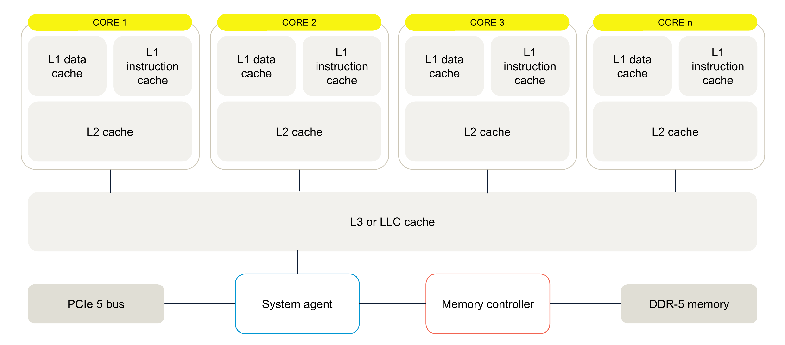

<figcaption>図1: CPU のアーキテクチャ。出典: CPU vs GPU: What's best for Machine Learning? | Aerospike</figcaption>
</figure>

CPU は、汎用の逐次的なシリアル処理に最適化された少数のコアからなる。CPU は可能な限り低いレイテンシでタスクを完了するよう設計されており、演算間を素早く切り替えられる。PCI バス、システムエージェント、メモリコントローラ、DDR メモリがある。全コアのための L3 キャッシュがある。L2 は個々のコアを支える。データと命令には別々の L1 データキャッシュがある。データがキャッシュ層に見つからない場合、CPU はそれを主記憶から取得し、効率のために低レイテンシのアクセスを優先する。

<figure>

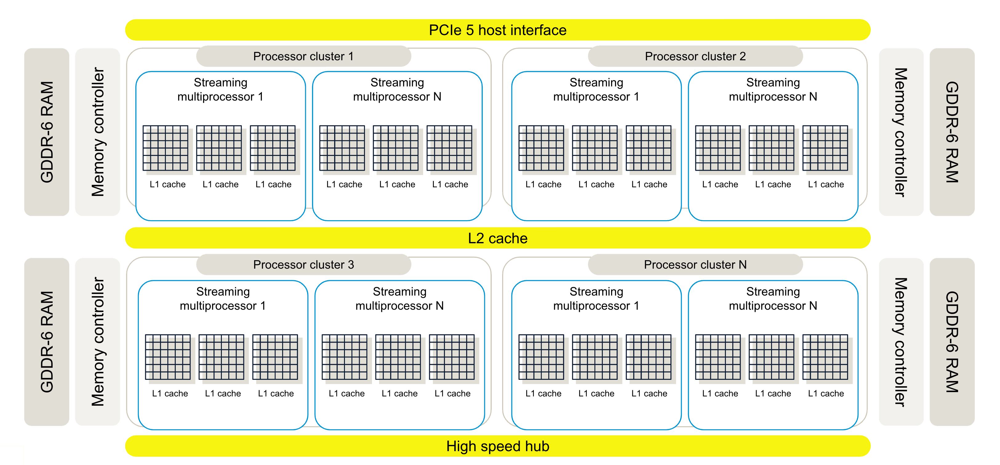

<figcaption>図2: GPU のアーキテクチャ。出典: CPU vs GPU: What's best for Machine Learning? | Aerospike</figcaption>
</figure>

GPU には膨大な数のコアがある。例えば NVIDIA の最新の H100 シリーズは 16896 個のコアを持つ。コアがこれほど多いので、ストリーミングマルチプロセッサのプロセッサクラスタがある。各 SM は典型的に、命令への素早いアクセスのための L1 キャッシュを持つ。SM は高速メモリへアクセスする前に共有の L2 キャッシュを利用する。CPU とは異なり、GPU はより高いメモリレイテンシを許容するよう設計されている。GPU はキャッシュよりも計算により多くのトランジスタを割く。このアーキテクチャは、遅いメモリアクセスにもかかわらず並列計算で GPU を忙しく保つことに注力している。つまり違いは次のとおりである:

- CPU: 低レイテンシの逐次処理に最適化されている。
- GPU: 高スループットの並列処理に最適化されている。

したがって、GPU の演算はデータ転送が少なく計算に集中するほど速くなる。

## Quantization（量子化）

ご存知のとおり、LLM の重みも入力データもテンソルへ変換される。

<figure>

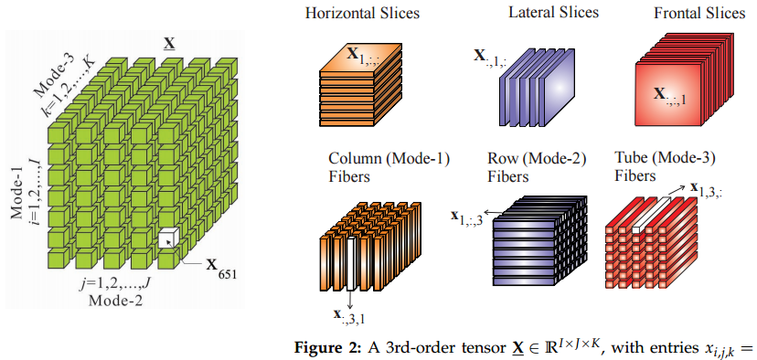

<figcaption>図3: テンソル。出典: machine learning — Why the sudden fascination with tensors? — Cross Validated</figcaption>
</figure>

量子化では、モデルの重みと活性をより高い精度からより低い精度へ変換する。量子化が推論を速くするのは、精度を下げるとより少ないメモリで済み、データ転送に必要な帯域幅が減り、計算にかかる時間が減るからである。伝統的に好まれてきた精度は浮動小数点 32 か浮動小数点 16 のいずれかであった。一般に、これらのデータは FP16 から INT8 へ変換される。INT4 の量子化もかなり成功しており、いまや INT2 が探究されるよう努力が払われている。

## Quantization Error（量子化誤差）

量子化の効果をどう調べるかを理解する前に、量子化を行う最も単純な方法を考えよう。我々は日常生活でほとんど毎日これを行っている——**丸め（Rounding）**である。丸めでは、モデルの重みと活性の精度を単に下げる。文献ではこれは **Round to Nearest（RTN）**アプローチと呼ばれる。丸めはそれ自体は単純に見えるが、それ自体が一つの深い穴である。丸め方の理想的な性質には次が含まれる:

1. 丸めは、同じ入力が常に同じ出力を意味するような関数あるいは何らかの方法によって行われるべきである。
2. 丸めを伴う計算は、丸めなしの計算に近いべきである。
3. 丸めは、定義域と値域の間にすでに存在する対称性を保つべきである。有限精度（あるいは離散的な定義域）では、これはバイアスを取り除くことに翻訳される。
4. 一般に丸めは速度を改善するために行われるので、その目的は達成されなければならない。

既定では、torch でランダムな行列を作ると float32 精度の浮動小数点値が作られる。浮動小数点の変数は、同じビット幅の固定小数点の変数よりも広い範囲の数を、精度を犠牲にして表現できる。Wikipedia によれば、float32 の範囲は 3.4028235 × 10³⁸ である。下記のコードでは、3x3 の行列を float32 で初期化し、その値を float16 へ丸めると、メモリは半分になる。差の絶対値を取ってから合計すると、全体の誤差が得られる。

```c
import torch

mat = torch.rand((3,3))

print(mat)

print('total memory taken', mat.element_size() * mat.nelement())

print('dtype of each data point:', mat[0][0].dtype)

mat_1 = mat.to(dtype=torch.float16)

print(mat_1)

print('total memory taken', mat_1.element_size() * mat_1.nelement())
print('total difference:', (mat - mat_1).abs().sum())

# Output
tensor([[0.2512, 0.7639, 0.4204],
        [0.6266, 0.0650, 0.4428],
        [0.9170, 0.5509, 0.1463]])
total memory taken 36
dtype of each data point: torch.float32
tensor([[0.2512, 0.7637, 0.4204],
        [0.6265, 0.0650, 0.4429],
        [0.9170, 0.5508, 0.1462]], dtype=torch.float16)
total memory taken 18
total difference: tensor(0.0007)
```

行列はランダムに初期化されるので、上記のコードを実行するたびに異なる行列と異なる量子化誤差になりうる。

量子化誤差とは、テンソルの元の値とその量子化された値の差である。どんな数を特定したいとしても同じである。多くの場合、いずれにせよ量子化は行われている——例えば無理数の場合、計算機システムの本質的な限界のためにそうである。そしてさらに、表現したい数の範囲を広げたいがために、追加の精度の損失がある。したがってここから、知識に形を与えたいなら、いずれにせよ何らかの情報の損失を持ち込んでいることが理解できる。

<figure>

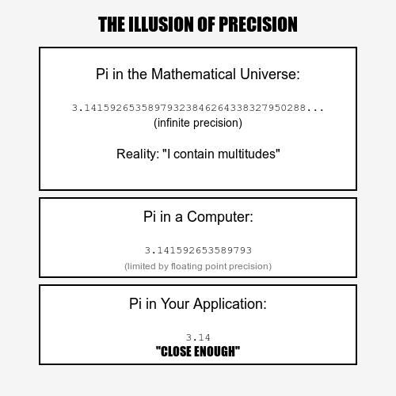

<figcaption>図4: 正確さという幻想（The illusion of exactness）。</figcaption>
</figure>

そこで問いは、何が「許容できる」精度の損失なのかということになる。理想的なシナリオは、自分のドメインとベンチマークデータセットにおける精度がどうかということだが、汎用のモデルを作っている場合にはおそらくそれがない。その場合は量子化誤差は問題ないのかもしれない。次節では、もう一つの人気のあるデータ型 bfloat16 を見ていき、fp16 への丸めと bf16 への丸めの間で量子化誤差を比較して、どちらが fp32 の値により近いかを見る。

## Brain Float 16

<figure>

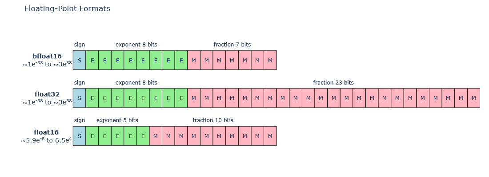

<figcaption>図5: bfloat16 の範囲の比較。bfloat16 は符号 1・指数部 8・仮数部 7 ビット、float32 は符号 1・指数部 8・仮数部 23 ビット、float16 は符号 1・指数部 5・仮数部 10 ビット。bfloat16 と float32 は指数部が同じ 8 ビットなので、動的範囲がおよそ 1e-38 〜 3e38 で一致する。</figcaption>
</figure>

深層学習の応用のために、Google は brain float 16（bfloat16）と呼ばれるこの形式を考案した。これは float16 と同じビット数を持つが、bfloat16 の浮動小数点の指数部のサイズが float32 と同じであるため、動的範囲は float32 と同じである。利用可能な文献によれば、bfloat16 設定での訓練の挙動はより頑健であり、純粋な float32 dtype での訓練と比べて、アンダーフロー・オーバーフロー・その他の数値的不安定性を起こしにくい。したがって多くの点で、bfloat は本当に有用である。

<figure>

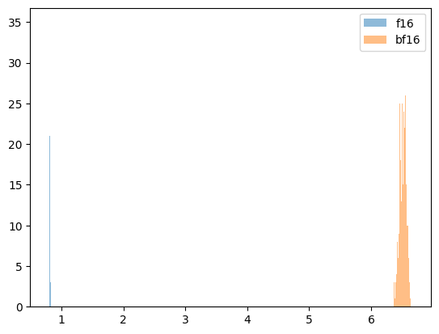

<figcaption>図6: float16 と bfloat16 の違い。</figcaption>
</figure>

興味深いことに、f16 の量子化から得られた誤差と同様に、bf16 についても量子化誤差を調べる。比較のため誤差の絶対値の和を取る。bf16 の誤差の方が大きい。私は 1000 個のランダムなテンソルを取り、誤差の分布を取った。行列が小さい場合には bf16 の誤差はより広がるが、行列のサイズを大きくすると bf16 の誤差はより顕著になり分離してくる。

bf16 は今日の量子化の要求には十分でないとはいえ、16GB 程度の GPU メモリを持つ colab 上に llama3 8b モデルのような相応の LLM をロードすることはできるだろう。量子化していないものはメモリエラーを出していたが、bf16 を使えば合計でおよそ 12GB が使われる。

```c
from transformers import AutoTokenizer, AutoModelForCausalLM
import torch

model_id = "meta-llama/Meta-Llama-3-8B-Instruct"

tokenizer = AutoTokenizer.from_pretrained(model_id)
model = AutoModelForCausalLM.from_pretrained(
    model_id,
    torch_dtype=torch.bfloat16, # without this it will give memory error in colab
    device_map="auto",
)
```

量子化に関して言えば、何を量子化するかに基づいて 2 つの型の量子化がある: モデルの量子化と活性の量子化である。bf16 では単にモデルの重みの精度を fp32 から bf16 へ下げているだけなので、これはモデルの量子化の一種である。

## Linear Quantization（線形量子化）

<figure>

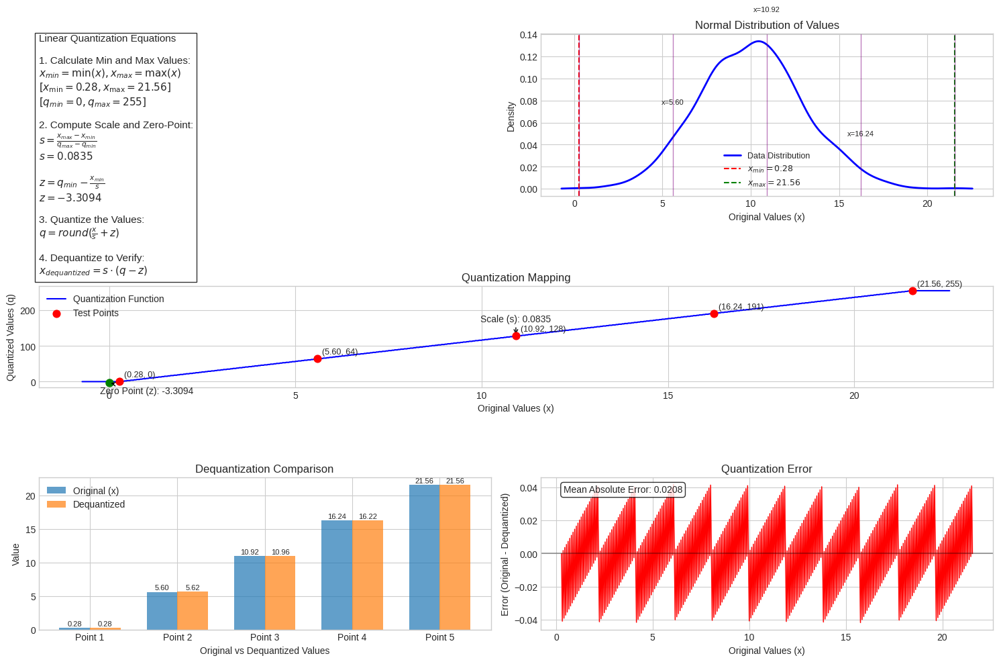

<figcaption>図7: z（ゼロ点）と s（スケール）の値を用いた線形量子化の図示。</figcaption>
</figure>

線形量子化では、量子化していない値が正規分布に従うと仮定して、ゼロ点（zero point）とスケール（scale）の値を求める。これはモデルの重みに対しても活性に対しても行える。ゼロ点を求める場合これは**非対称（asymmetric）**であり、そうでなくスケールだけを定義する場合は**対称（symmetric）**と呼ばれる。下記の式に見られるように、量子化された値の範囲に合うように全体の範囲をスケールするので、これは**アフィン量子化（affine quantization）**とも呼ばれる。ゼロ点は、浮動小数点の範囲におけるゼロが整数によって正確に表現されることを保証するために存在する。

<figure>

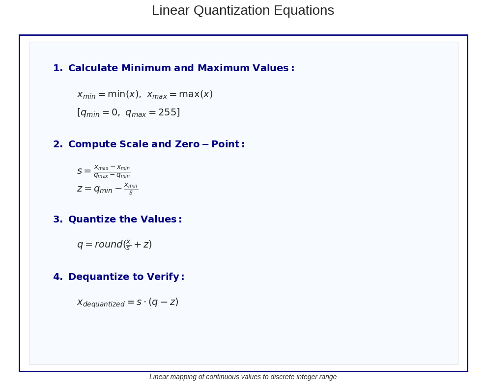

<figcaption>図8: 線形量子化の式。連続値を離散的な整数の範囲へ線形に写像する。</figcaption>
</figure>

**（図8 の転記）**〔訳注: 図 8 は中身が数式だけの箱なので、本文へも起こした〕

1. 最小値と最大値を計算する:

$$x_{min} = \min(x),\quad x_{max} = \max(x)$$
$$[q_{min} = 0,\quad q_{max} = 255]$$

2. スケールとゼロ点を計算する:

$$s = \frac{x_{max} - x_{min}}{q_{max} - q_{min}}$$
$$z = q_{min} - \frac{x_{min}}{s}$$

3. 値を量子化する:

$$q = round\left(\frac{x}{s} + z\right)$$

4. 逆量子化して検証する:

$$x_{dequantized} = s \cdot (q - z)$$

huggingface の optimum quanto ライブラリを使ってモデルに対して線形量子化を実行できる。私はモデル「meta-llama/Llama-3.2–1B-Instruct」を取り上げており、それをロードすると float32 で 4714 MB のメモリを取っている。これは重みの dtype を print することで確認できる。次に quanto ライブラリを使ってそれを量子化できるが、量子化後にメモリは実際には 5716 MB へ**増える**。以下は量子化前から量子化後への同じデコーダ層の print である。Linear クラスが QLinear へ変わっていることに注目してほしい。

```c
# Original float32 weights
LlamaDecoderLayer(
  (self_attn): LlamaSdpaAttention(
    (q_proj): Linear(in_features=2048, out_features=2048, bias=False)
    (k_proj): Linear(in_features=2048, out_features=512, bias=False)
    (v_proj): Linear(in_features=2048, out_features=512, bias=False)
    (o_proj): Linear(in_features=2048, out_features=2048, bias=False)
    (rotary_emb): LlamaRotaryEmbedding()
  )
  (mlp): LlamaMLP(
    (gate_proj): Linear(in_features=2048, out_features=8192, bias=False)
    (up_proj): Linear(in_features=2048, out_features=8192, bias=False)
    (down_proj): Linear(in_features=8192, out_features=2048, bias=False)
    (act_fn): SiLU()
  )
  (input_layernorm): LlamaRMSNorm((2048,), eps=1e-05)
  (post_attention_layernorm): LlamaRMSNorm((2048,), eps=1e-05)
)

# Quantized weights
LlamaDecoderLayer(
  (self_attn): LlamaSdpaAttention(
    (q_proj): QLinear(in_features=2048, out_features=2048, bias=False)
    (k_proj): QLinear(in_features=2048, out_features=512, bias=False)
    (v_proj): QLinear(in_features=2048, out_features=512, bias=False)
    (o_proj): QLinear(in_features=2048, out_features=2048, bias=False)
    (rotary_emb): LlamaRotaryEmbedding()
  )
  (mlp): LlamaMLP(
    (gate_proj): QLinear(in_features=2048, out_features=8192, bias=False)
    (up_proj): QLinear(in_features=2048, out_features=8192, bias=False)
    (down_proj): QLinear(in_features=8192, out_features=2048, bias=False)
    (act_fn): SiLU()
  )
  (input_layernorm): LlamaRMSNorm((2048,), eps=1e-05)
  (post_attention_layernorm): LlamaRMSNorm((2048,), eps=1e-05)
)
```

なぜ量子化したモデルの方がメモリを多く使うのか。おそらくライブラリが重みに加えて量子化された値とスケールの値も保持しているからで、私はコードの中で freeze メソッドを呼んでいる。ドキュメントによれば重みは動的に量子化されるので、それらを事前に持つには freeze を呼ぶ必要がある。mlp の gate proj の重みの一つを print すると、以下の出力が得られる。重みとスケールの値が与えられていることが分かる。

```c
<class 'optimum.quanto.tensor.weights.qbytes.WeightQBytesTensor'>(tensor([[ 54, -26, -29,  ...,   7,  57,  76],
        [-19,  44,   3,  ..., -54, -30,   5],
        [-41, -15,   0,  ...,  -9, -19, -45],
        ...,
        [ 34, -40, -33,  ...,  50, -74, -24],
        [ -4, -19,   2,  ...,  -6,  11, -24],
        [-41,   9,  15,  ..., -21, -12,  12]], dtype=torch.int8), scale=tensor([[0.0005],
        [0.0005],
        [0.0006],
        ...,
        [0.0006],
        [0.0006],
        [0.0006]]), dtype=torch.float32)
```

そして元の重みと比べると、attention の重みは同じである。しかし mlp の重みを調べると、そこには差がある。

量子化前: 0.026000977, -0.012329102, -0.013977051, …

量子化後: 0.025951955, -0.012495386, -0.013937162, …

## Activation Quantization（活性の量子化）

<figure>

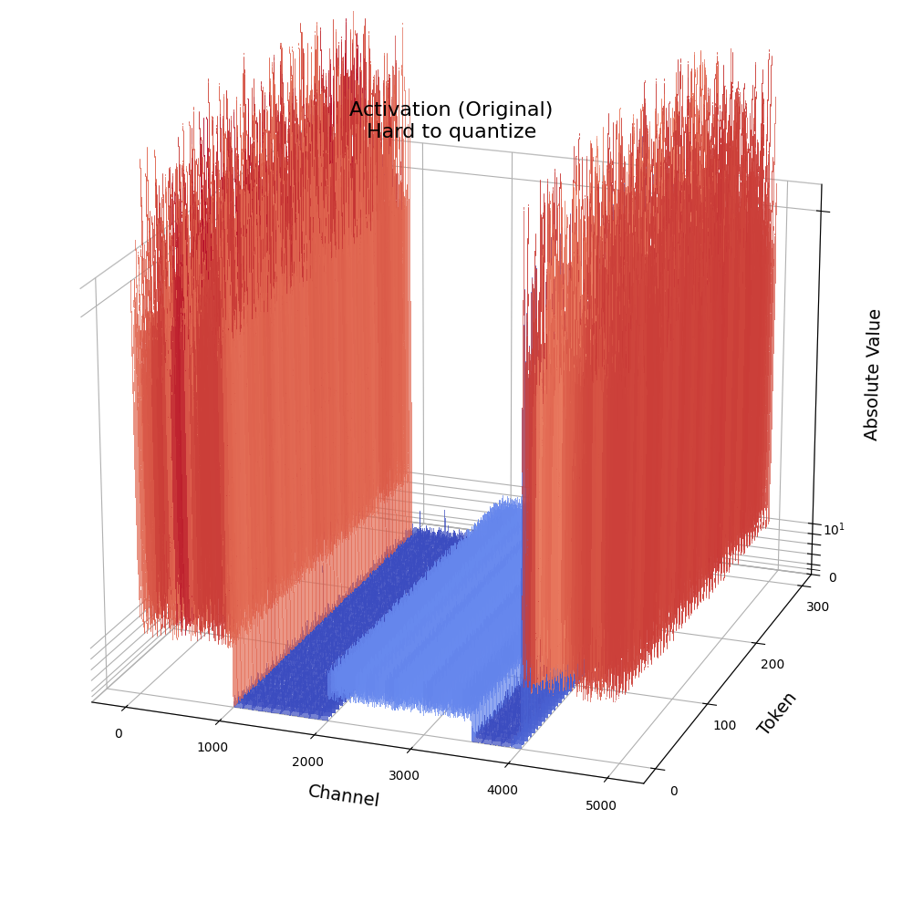

<figcaption>図9: 活性における外れ値。</figcaption>
</figure>

さて、重みだけに量子化を限る必要はなく、活性の量子化も行える。活性の量子化はより有望に見えるものの、達成するのはより難しい。なぜか。重みは訓練が終われば静的（定数）であるのに対し、活性は動的だからである。これは活性がネットワークへの入力ごとに変化することを意味し、その範囲を予測しにくくする。

LLM は活性における外れ値のために、量子化が非常に難しいことで知られている。重みの場合、重みの分布はかなり一様で平坦であり、量子化しやすい。smoothquant 論文で行われた分析から:

- **外れ値が活性の量子化を困難にする。** 活性における外れ値のスケールは、大半の活性値より約 100 倍大きい。per-tensor 量子化の場合、大きな外れ値が最大絶対値の測定を支配し、外れ値でないチャネルに対する実効的な量子化ビット／水準を低くしてしまう。外れ値でないチャネルに対しては、実効的な量子化水準が非常に小さく（2〜3）なり、大きな量子化誤差につながる。
- **外れ値は固定されたチャネルに持続的に現れる。** 外れ値はごく一部のチャネルに現れる。あるチャネルに外れ値があれば、それはすべてのトークンにわたって持続的に現れる。あるトークンについてのチャネル間の分散は大きい（一部のチャネルの活性は非常に大きいが、大半は小さい）が、あるチャネルのトークンをまたいだ大きさの分散は小さい（外れ値のチャネルは一貫して大きい）。

<figure>

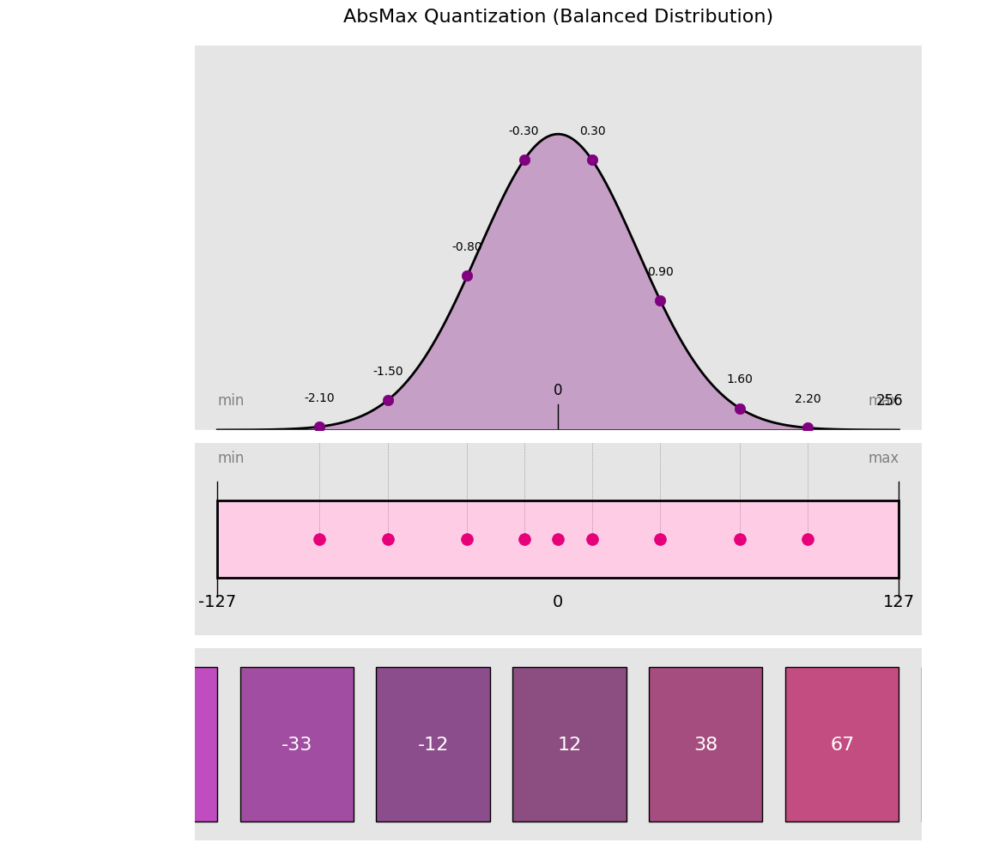

<figcaption>図10: 活性における外れ値の分布。特定のチャネルに外れ値が集中する様子。</figcaption>
</figure>

活性の量子化については、活性の量子化パラメータを計算するために較正データが必要になることが理解できる。例えば optimum quanto ライブラリでは、活性の量子化を実行するオプションを渡すと、いくらかの較正データを提供する必要がある。ライブラリはその後、順伝播の間にチャネルごとの最大絶対値を追跡する。これらの absmax の値を使ってチャネルごとのスケーリング係数を導出し、量子化の際にそれらを適用する。

```c
from optimum.quanto import quantize, qint8
from optimum.quanto import Calibration

quantize(model, weights=qint8, activations=qint8)
with Calibration(momentum=0.9):
    model(samples)
```

## Dynamic Quantization（動的量子化）

<figure>

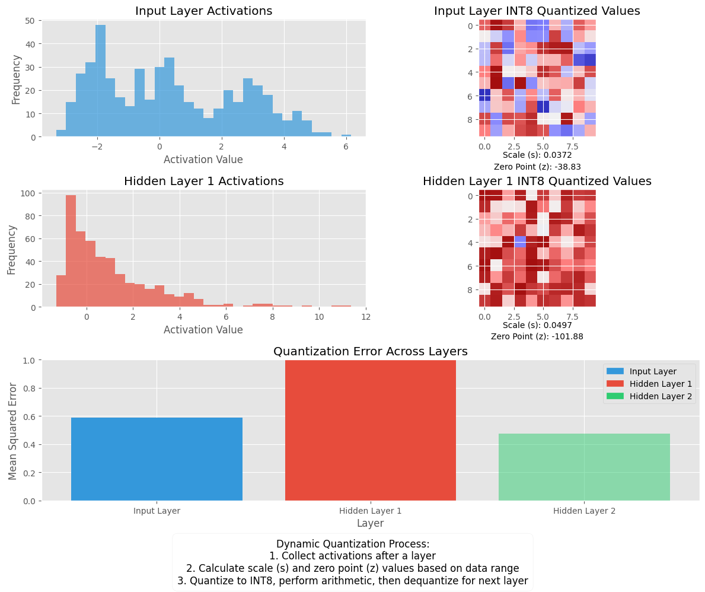

<figcaption>図11: 動的量子化。実行時にゼロ点とスケールを計算する。</figcaption>
</figure>

前節では、較正データセットを用いて推論の前にゼロ点とスケールを計算する静的量子化の例を論じた。対照的に、較正データセットを利用せず実行時にパラメータを計算する動的量子化も行える。

動的量子化の手順:

1. データが隠れ層を通った後、その活性が収集される。
2. この活性の分布が、実行時に観測されたデータの範囲に基づいてゼロ点（z）とスケール係数（s）の値を動的に計算するために使われる。これにより、観測された各データセットについてできるだけ多くの信号が保たれるようスケール係数が「調律」される。
3. この処理はデータが新しい層を通るたびに繰り返される。したがって各層は自身の別々の z と s の値を持ち、それゆえ異なる量子化スキームを持つ。

モデルのパラメータはモデル変換の時点で既知であり、事前に変換されて INT8 の形で格納される。量子化されたモデルにおける算術はベクトル化された INT8 命令を用いて行われる。累算はオーバーフローを避けるため典型的に INT16 か INT32 で行われる。この高精度の値は、次の層が量子化されていれば INT8 へスケールし戻され、出力用であれば FP32 へ変換される。

動的量子化は調整すべきパラメータが比較的少ないので、本番のパイプラインへ組み込むのに適している。一般に、動的量子化は隠れ層ごとに s と z の値を計算しようとするだけなので、多少より正確である傾向がある。しかし、これらの値を計算する必要があるため計算時間が増えるかもしれない。

## Block Quantization（ブロック量子化）

<figure>

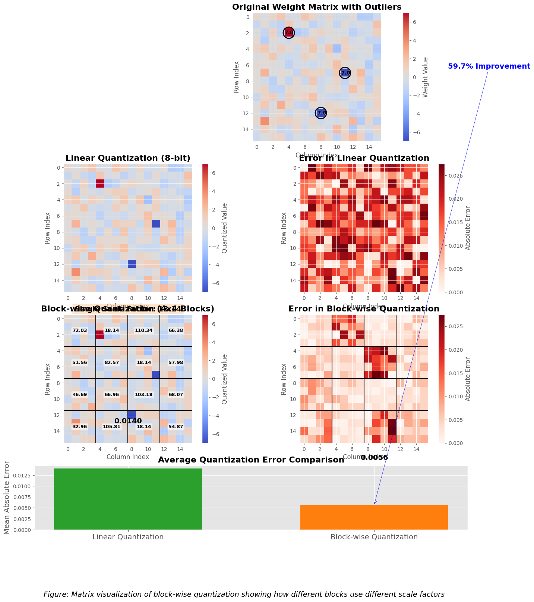

<figcaption>図12: ブロック量子化。重みを 64 や 128 のグループへ分け、ブロックごとに独立に量子化する。</figcaption>
</figure>

ここまで論じてきたように、線形量子化の主な問題は、外れ値がスケーリングに不釣り合いな影響を与えうることである。低精度のデータ型の全範囲が効果的に使われず、それが量子化されたモデルの精度を下げる。

これに対する解は**ブロック単位で量子化する**ことであり、そこでは重みが値に応じて例えば 64 や 128 のグループへ分割される。各ブロックはその後個別に量子化され、外れ値の影響を緩和して精度を上げる。

ただし勘案すべきは、LLM の重みと活性はサイズを減らすために量子化されるが、順伝播・逆伝播の際の必要な計算がより高精度のデータ型で行えるよう、推論時には逆量子化されるということである。

これは各ブロックのスケーリング係数もまた格納されなければならないことを意味する。したがって、量子化の過程で使われるブロックが多いほど精度は高くなるが、保存しなければならないスケーリング係数の数も多くなる。

有名な GGUF 量子化は、LLM を量子化するのにこのブロックの方法論を用いている。その議論のコメントによれば:

> GGML（このプロジェクトが基づいているライブラリ）はブロックベースの量子化を用いている。基本的な考え方は、N 要素のかたまりがあり、それぞれの前により正確に逆量子化するのを助ける情報を持つブロックヘッダが付いているというものである。最も単純な例は Q8\_0 で、これはブロックサイズ 32 要素を持ち、各ブロックは float16 のデルタフィールドと 32 個の int8 の量子値からなる。

## Quantization Aware Training（量子化を意識した訓練）

<figure>

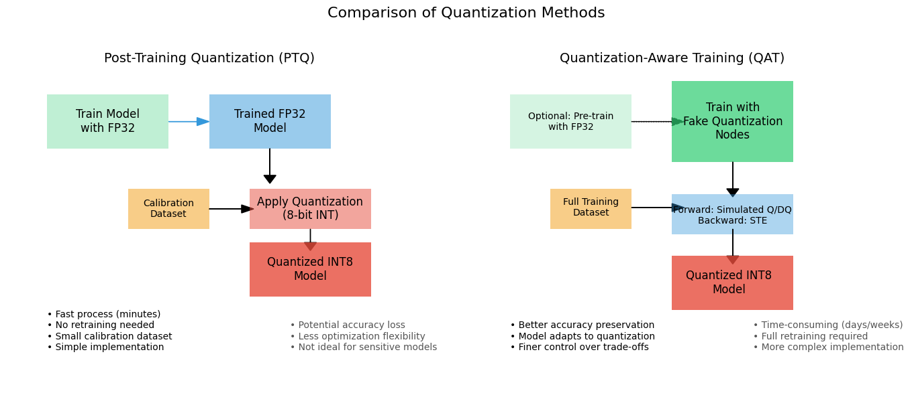

<figcaption>図13: 量子化を意識した訓練（QAT）の概念図。</figcaption>
</figure>

量子化を実行する方法は 2 つある: 訓練後量子化では、すでに訓練済みのモデルを取ってそれに対して量子化を実行する。これまで論じてきた手法は訓練後量子化の手法である。訓練後量子化（PTQ）の方式はモデルを貪欲な仕方で量子化する。具体的には、これらのアルゴリズムは通常、ネットワーク内の量子化されたオペランド・パラメータと量子化されていないそれらとの間の距離を表す補助的な損失関数を最適化する。最適化は、較正セットとして知られるわずかな訓練サンプルのみを使って、層ごとに適用される。これらのアプローチは計算的に安価であるものの、しばしばネットワークの精度を低下させる。

QAT を実行するにはさまざまなレシピがあり、訓練されていないモデルから始めるものから、事前学習済みモデルから始めるものまである。すべてのレシピは、データとパラメータの量子化を模擬する**偽量子化（fake-quantization）**の演算を訓練グラフへ挿入することにより、量子化誤差を訓練の損失に含めるように訓練の手順を変更する。これらの演算が「偽」と呼ばれるのは、データを量子化するがすぐに逆量子化するので、演算の計算は浮動小数点精度のままだからである。この工夫は、深層学習フレームワークをほとんど変えずに量子化ノイズを加える。

順伝播では、浮動小数点の重みと活性を偽量子化し、それら偽量子化された重みと活性を使って層の演算を行う。逆伝播では、重みの勾配を使って浮動小数点の重みを更新する。量子化の勾配——それは未定義な点を除いてほとんど至るところでゼロである——を扱うために、**straight-through estimator（STE, 直通推定器）**を使う。これは偽量子化演算子を通して勾配をそのまま通す。QAT の処理が終わると、偽量子化の層は、モデルが推論に使われる際に重みと活性を量子化するのに用いる量子化スケールを保持している。

ある層の活性を次の関数を使って二値化したいとしよう。

<figure>

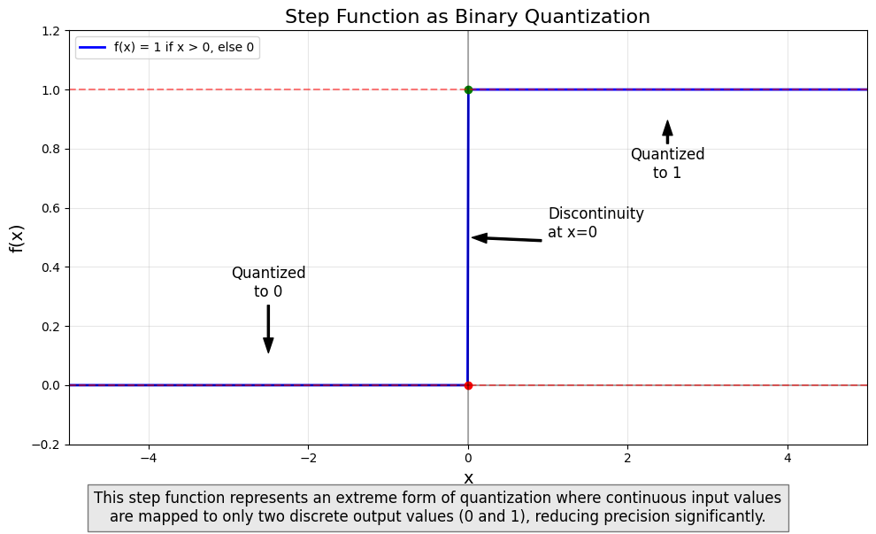

<figcaption>図14: 二値化の関数。0 より大きい値には 1 を、そうでなければ 0 を返す階段関数。</figcaption>
</figure>

この関数は 0 より大きいすべての値に対して 1 を返し、そうでなければ 0 を返す。出力の活性の精度を下げているので、これは量子化の演算に似ている。

先に述べたように、この関数の問題はその勾配がゼロであることである。この問題を克服するために、逆伝播では straight-through estimator を使う。

<figure>

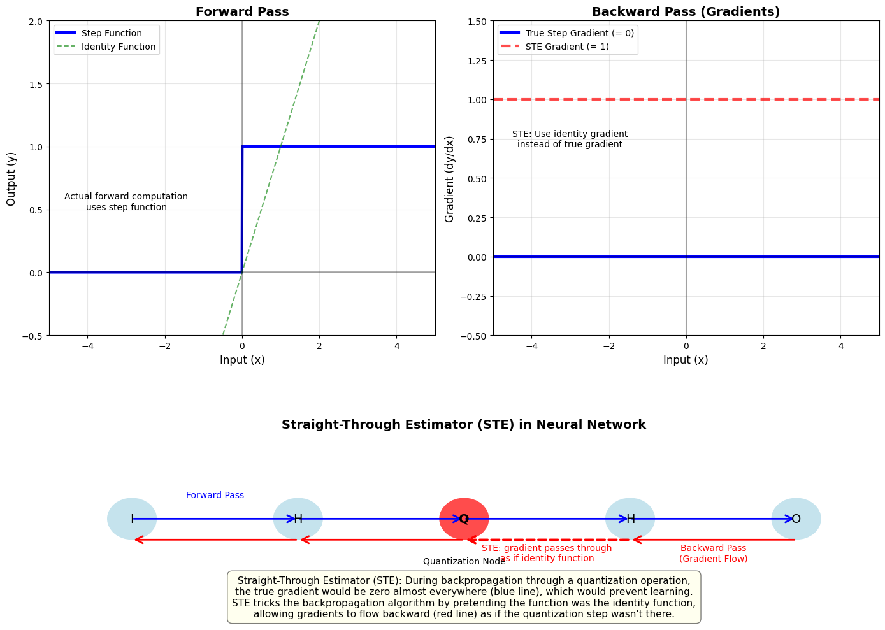

<figcaption>図15: straight-through estimator。閾値関数の微分を無視し、恒等関数であったかのように入ってきた勾配をそのまま渡す。</figcaption>
</figure>

straight-through estimator は、まさにその名のとおりのものである。関数の勾配を推定する。具体的には、閾値関数の微分を無視し、その関数が恒等関数であったかのように入ってきた勾配をそのまま渡す。

## QLoRA

<figure>

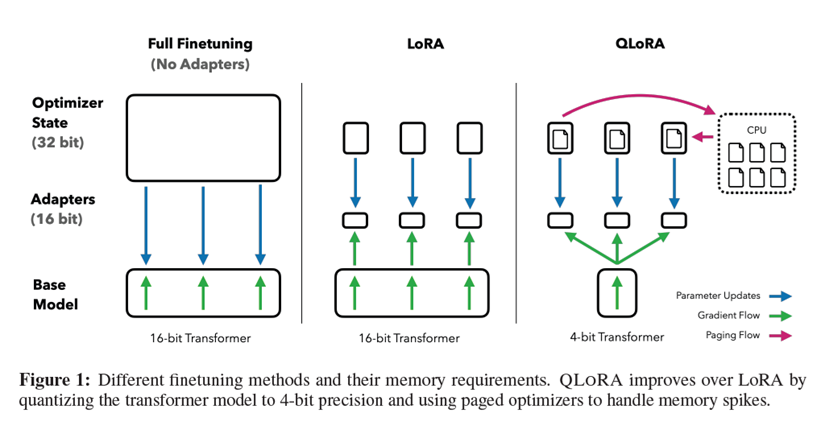

<figcaption>図16: QLoRA の概念図。画像の出典は QLoRA 論文。</figcaption>
</figure>

QAT における現在の人気のある手法は QLoRA であり、そこでは精度の損失を埋め合わせるために LLM の性能をファインチューニングする。私はこの動画で QLoRA を用いたトランスフォーマーの効率的なファインチューニングについて話している。ぜひ見てほしい。

論文で論じられているアルゴリズムの手順を以下に述べる。

事前学習済みニューラルネットワークの重みは、ゼロを中心とする正規分布に従う、すなわちゼロという中心値のまわりに分布すると仮定される。重みは \[-1, 1\] の範囲に正規化される。この正規化は、先に論じた absmax アルゴリズムで各重みを割ることによって達成される。入力データを正規化することにより、重みをゼロのまわりに分布させ、テンソル／重みパラメータの指数のデータを格納するのに必要なビット数を減らす。

NF4 データ型（16 個のビン）の正確な値は次のとおりである。これらの値は論文にある。

\[-1.0, -0.6961928009986877, -0.5250730514526367, -0.39491748809814453, -0.28444138169288635, -0.18477343022823334, -0.09105003625154495, 0.0, 0.07958029955625534, 0.16093020141124725, 0.24611230194568634, 0.33791524171829224, 0.44070982933044434, 0.5626170039176941, 0.7229568362236023, 1.0\]

次にブロック量子化が行われる。ブロック量子化についてはすでに論じた。ブロック単位の量子化は入力テンソルをより小さなブロックへ分割し、各ブロックを独立に量子化することで外れ値の問題を減らす。この処理では入力テンソルをかたまりへ分割し、各かたまりがそれぞれの量子化定数（データ型の総ビン数／テンソルの最大絶対値）を持って独立に量子化される。外れ値があっても、外れ値をブロック内に閉じ込めることによって、ブロック単位の k ビット量子化ではるかに高い量子化精度と安定性が得られる。等サイズのブロックへ分割した後、重みを平坦化して absmax の正規化を行う。各ブロックを取って 16 個のビンへ分割し、最も近い NF4 の水準へ写像する。

次は**二重量子化（double quantization）**である。二重量子化（DQ）は、追加のメモリ節約のために量子化定数を量子化する処理である。QLoRA は重みを 64 のブロック単位で量子化し、これは精密な 4 ビット量子化を容易にする一方、各ブロックのスケーリング係数も勘定に入れなければならず、必要なメモリ量が増える。DQ は各ブロックのスケーリング係数に対して 2 巡目の量子化を行うことでこの問題に対処する。32 ビットのスケーリング係数は 256 のブロックへまとめられ、8 ビットへ量子化される。その結果、各ブロックの 32 ビットのスケーリング係数がこれまで重みあたり 0.5 ビットを追加していたところ、これはわずか 0.127 ビットまで下がる。これは本当に必要なのか、取るに足らないように思えないか、と問うなら、実際には 65B の LLM で組み合わせればこれは 3 GB のメモリを節約する。

格納の部分もまた興味深く、言及に値する。この部分はライブラリに依存し、実際には論文には述べられていない。QLoRA の公式実装である bitsandbytes の作者は、2 つの 4 ビット値を 1 つの 8 ビット値へパックすることによって 4 ビット値を 8 ビットへ変換していることが分かる。これはもちろん、量子化されたテンソルの形状が変わる結果になる。これは PyTorch が 4 ビットのデータ型をサポートしておらず、サポートする最小の型が 8 ビットだからである。8 ビット浮動小数点形式 FP8 ではなく 8 ビット整数形式を使う理由は、FP8 のネイティブなサポートの欠如による。`torch.quint4x2` も同様であり、ドキュメントで確認できる。

コードの方が馴染むのであれば、上記の説明に対応するコードを以下に示す。

```c
import torch

NF4_quant_levels = torch.tensor([-1.0, -0.6961928009986877, -0.5250730514526367, -0.39491748809814453, -0.28444138169288635, -0.18477343022823334, -0.09105003625154495, 0.0, 0.07958029955625534, 0.16093020141124725, 0.24611230194568634, 0.33791524171829224, 0.44070982933044434, 0.5626170039176941, 0.7229568362236023, 1.0])

#  binary representation of uint4 values (used 4-bit binaries instead of decimals for illustration purposes)
nf4_quant_4bit = torch.tensor([0b0000, 0b0001, 0b0010, 0b0011, 0b0100, 0b0101, 0b0110, 0b0111, 0b1000, 0b1001, 0b1010, 0b1011, 0b1100, 0b1101, 0b1110, 0b1111])

# generated tensor of [5, 4] shape
W = torch.tensor([[ 0.4767, -0.2921,  0.0787, -0.1018],
                  [-0.3453,  0.3834, -0.0107, -0.4692],
                  [-0.4072, -0.2996, -0.4942, -0.2640],
                  [ 0.0125,  0.2962,  0.3123, -0.4705],
                  [-0.1982, -0.1545,  0.3358, -0.4086]])

flat_W = W.flatten()

# normalize the tensor using absmax to fit within [-1, 1]
max_val = flat_W.abs().max()
normalized_W = flat_W / max_val

# map each input value to its nearest quantization level - then to its 4-bit binary representation
quantized_W_4bits = torch.zeros(normalized_W.shape, dtype=torch.int)
for i, val in enumerate(normalized_W):
    closest_level = torch.argmin(torch.abs(NF4_quant_levels - val)) # get the index of closest quantization level
    quantized_W_4bits[i] = nf4_quant_4bit[closest_level]

print(quantized_W_4bits)
# Output: [15,  2,  9,  5,  1, 14,  7,  0,  1,  2,  0,  2,  7, 13, 13,  0,  3,  4, 14,  1]

packed_W_8bits = []
for i in range(0, len(quantized_W_4bits), 2):
    # Courtesy of https://www.geeksforgeeks.org/store-two-numbers-in-one-byte-using-bit-manipulation/
    # take each pair of 4-bit values in quantized_W_4bits and combine them into packed_W_8bits by shifting
    # the first 4 bits to the left using the left shift operator '<<' and combining them using the OR | operation
    result = (quantized_W_4bits[i] << 4) & 0xff
    result =  result | quantized_W_4bits[i + 1]
    packed_W_8bits.append(result)

# set it as torch.uint8
packed_W_8bits = torch.tensor(packed_W_8bits, dtype=torch.uint8)

print(packed_W_8bits)
# Output: tensor([242, 149,  30, 112,  18,   2, 125, 208,  52, 225], dtype=torch.uint8)
```

## Final thoughts and workflow（最後の考察とワークフロー）

これだけの情報の後で、どの量子化アルゴリズムを選びどう進めればよいか迷っているなら、huggingface のドキュメントに述べられている手順から導かれた良いフローチャートがある。

<figure>

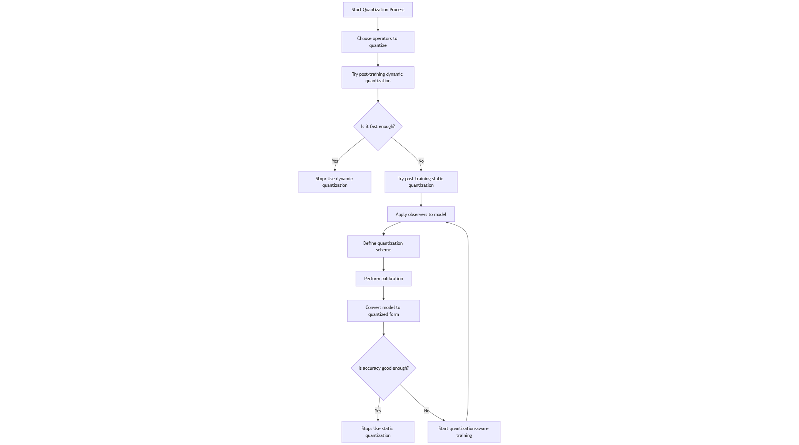

<figcaption>図17: 量子化手法を選ぶためのワークフロー。huggingface のドキュメントの手順から導かれたフローチャート。</figcaption>
</figure>

モデルを int8 へ効果的に量子化するには、次の手順に従う:

1. どの演算子を量子化するかを選ぶ。量子化するのに良い演算子は、計算時間の点で支配的なもの、例えば線形射影や行列積である。
2. 訓練後の動的量子化を試す。それで十分に速ければここで止める。そうでなければ手順 3 へ進む。
3. 訓練後の静的量子化を試す。これは動的量子化より速くなりうるが、しばしば精度の低下を伴う。量子化したい箇所にモデルへ observer を適用する。これはどの量子化スキームを使うかを定義することを意味する。
4. 較正を実行する。
5. モデルを量子化された形へ変換する。observer は除去され、float32 の演算子が対応する int8 のものへ変換される。
6. 量子化されたモデルを評価する。精度は十分か。もし十分ならここで止める。そうでなければ手順 3 から再開するが、今度は量子化を意識した訓練で行う。
