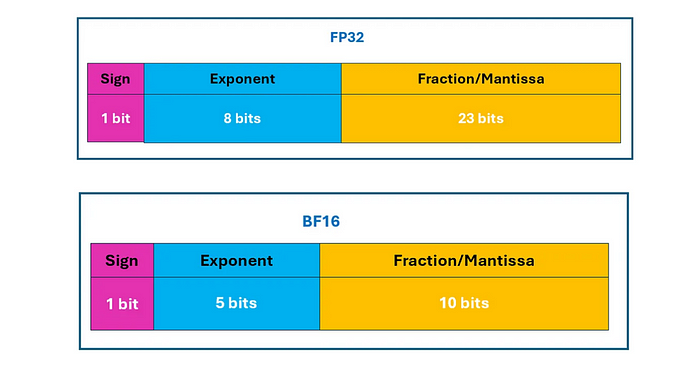
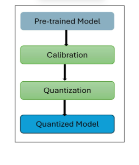
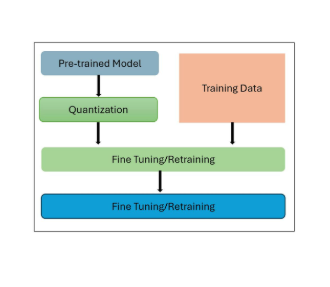
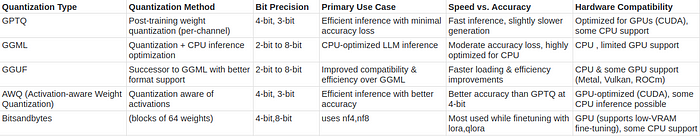

# LLM 量子化の解説: 完全ガイド

> 原題: LLM Quantization Explained: A Complete Guide
> 著者: Abhinaykrishna
> 出典: Medium（2025-03-27 公開）・原典クリップ `raw/articles/LLM Quantization Explained_ A Complete Guide.md`

---

> **訳注**
>
> Medium の個人記事（ケース C）。**クリップは健全**で、本文の切断・画像の欠落・キャプションの脱落はいずれも見当たらなかった。画像 4 枚はすべて Medium の CDN から原寸で取得し、ローカルへ保存した（`format:webp` を外して素の PNG を取得）。
>
> 末尾の「If you found this article insightful, please clap, share…」（拍手・共有の誘導）は本文でない定型要素のため訳出していない。
>
> **図 4（各種量子化手法の比較）は中身が文字だけの表**なので、画像を掲げるとともに **markdown の表としても起こした**（画像のままでは検索・引用ができないため）。転記は画像に忠実であり、原典の記載（`nf4,nf8` を含む）をそのまま写している。
>
> 本記事には**事実誤認と思われる箇所がいくつかある**が、翻訳では原文に忠実に訳し、解釈や訂正は加えていない。指摘は [[summaries/2025-llm-quantization-guide]] の「限界・批判的視点」節と [[concepts/model-quantization]] に置いた。

---

## WHAT is Quantization?（量子化とは何か）

- 量子化は、高精度の値を低精度の値へ写像する圧縮技法である。
- LLM においてこれは、重みと活性の精度を下げることを意味し、モデルをよりメモリ効率のよいものにする。

## WHY Quantization?（なぜ量子化するのか）

- 量子化はモデルの重みの精度を下げ（例えば 16 ビットから 4 ビットへ）、メモリ要件を大幅に削減する。
- 例えば、FP16 で 28GB を要する 70 億パラメータのモデルは、4 ビット量子化を使えばわずか 7GB に収まり、コンシューマ向け GPU 上で動かすことが可能になる。
- 低精度の計算は必要とするハードウェア資源が少なく、対応するハードウェア上では推論速度を改善しうる。

## QUANTIZATION BASICS（量子化の基礎）

浮動小数点数は、3 つの主要な構成要素へ構造化されたビットからなる:

- **符号ビット（Sign Bit）** — 数が正（0）か負（1）かを決める。
- **指数部（Exponent）** — 基数（2 進法では通常 2）を特定のべき乗へ上げることでスケーリング係数を定義し、極端に大きな値と極端に小さな値の両方を表現できるようにする。
- **仮数部（Significand / Mantissa）** — 数の意味のある桁を保持し、そのビット長が数値的な精度に直接影響する。

<figure>



<figcaption>図1: 浮動小数点数の構成（符号ビット・指数部・仮数部）と、FP32 / BF16 / FP16 のビット配分の比較。</figcaption>
</figure>

4 バイトを使う FP32 は完全精度（full precision）とみなされ、より少ないビット数を使う BF16 と FP16 は半精度（half precision）に分類される。

- 10 億パラメータを持つ大規模言語モデル（LLM）を考える。重みは典型的には FP32（32 ビット形式）で格納される。異なる精度水準に対するメモリ要件は次のように計算できる:
- **FP32:** 10 億パラメータ × 4 バイト = 4.0 GB
- **INT8:** 10 億パラメータ × 1 バイト = 1.0 GB

量子化は、連続的な値の範囲を限られた離散値の集合へ変換することによってメモリ使用量を削減し、より効率的な格納と計算を可能にする。

## How Does Quantization Introduce Error?（量子化はどのように誤差を持ち込むのか）

例えば、**5.62** という数が **INT4 量子化**（4 ビット精度）を受けることを考える。

1. INT4 の表現: 4 ビット形式は 16 個の離散値を表現できる（2⁴ = 16 であるため）。
2. 限られた範囲への写像: 可能な値は \[-1, -0.6, -0.3, …, 0.6, 0.8, 1\] のようなものになりうる（これはあくまで近似である）。
3. 量子化における丸め: 0.562 は 0.6 に最も近いので、あるインデックス（例えば 14）へ写像される。
4. 逆量子化の誤差: 元に戻すとき、14 は 0.6 へ写像され、0.6 − 0.562 という小さな誤差が生じる。

## Example: Quantizing an FP32 Tensor to INT8（例: FP32 テンソルを INT8 へ量子化する）

量子化は、**スケール係数（scale factor）**（範囲を調整する）と**ゼロ点（zero-point）**（適切な位置合わせのために値をずらす）を用いて、浮動小数点（FP32）の値を整数（INT8）の値へ写像する。

以下は、量子化と逆量子化の両方の過程を段階的に示す例である。

FP32 の値を含むテンソルから始める:

```c
X_fp32 = [0.2, 1.5, -2.3, 3.8]
```

INT8 形式は次の範囲の値を表現する:

```c
[-128, 127]
```

**ステップ 1: スケールとゼロ点を計算する**

**スケール係数**は、FP32 の範囲が INT8 の範囲に収まることを保証する:

```c
scale = (max(X_fp32) - min(X_fp32)) / (127 - (-128))
```

値を代入すると:

```c
scale = (3.8 - (-2.3)) / 255  # 6.1 / 255 ≈ 0.0239
```

簡単のため、次を仮定する:

```c
zero_point = 0
```

**ステップ 2: FP32 を INT8 へ変換する**

量子化の式を用いて:

```c
X_int8 = round(X_fp32 / scale)
```

各値へ適用すると:

```c
round(0.2 / 0.0239)  # 8
round(1.5 / 0.0239)  # 63
round(-2.3 / 0.0239) # -96
round(3.8 / 0.0239)  # 159 (clamped to 127)
```

最終的な INT8 の値:

```c
X_int8 = [8, 63, -96, 127]
```

**ステップ 3: FP32 へ戻す（逆量子化）**

元の値を近似するために、次を用いる:

```c
X_fp32_recovered = X_int8 * scale
```

各値へ適用すると:

```c
8    * 0.0239  # 0.191
63   * 0.0239  # 1.51
-96  * 0.0239  # -2.29
127  * 0.0239  # 3.03
```

復元された FP32 の値:

```c
X_fp32_recovered = [0.19, 1.51, -2.29, 3.03]
```

これは量子化の概念を理解する助けとするための簡略化された例である。実際には、現実の量子化技法ははるかに高度である。

## Two types of LLM quantization（LLM 量子化の 2 つの類型）

## Post-training quantization (PTQ)（訓練後量子化）

- 量子化はモデルが完全に訓練された**後に**実行される。
- これは重みと、場合によっては活性を、より高い精度からより低い精度へ変換することを含む。一般的な手法には静的（static）量子化と動的（dynamic）量子化がある。

<figure>



<figcaption>図2: 訓練後量子化（PTQ）の流れ。訓練済みモデルに対して量子化を適用する。</figcaption>
</figure>

## Quantization-aware training (QAT)（量子化を意識した訓練）

- モデルは低精度の演算を模擬しながら訓練され、量子化誤差を補償することを学習する。
- 訓練中、モデルはより低精度の演算を模擬し、量子化の影響へ適応できるようになる。
- モデルが訓練中に量子化誤差を減らすことを学習するため、これは典型的に PTQ よりも良い性能をもたらす。

<figure>



<figcaption>図3: 量子化を意識した訓練（QAT）の流れ。訓練の過程に量子化の模擬を組み込む。</figcaption>
</figure>

## What Can Be Quantized in an LLM?（LLM の何を量子化できるのか）

人々が LLM を **「4 ビット量子化した」**と言うとき、それは通常**重みの量子化**を指している。しかし、デプロイのシナリオに応じてモデルの異なる部分を量子化できる。

## 1. Weight Quantization (Most Common)（重みの量子化——最も一般的）

重みの量子化はモデルが学習したパラメータを圧縮し、モデルのサイズと、それをロードするのに必要な VRAM を大幅に削減する。

- **GPTQ、AWQ、GGUF、BitsAndBytes** で用いられる
- モデル自体が GPU メモリに収まらないほど大きいときに最適
- LLM の量子化について論じるとき、ほとんどの人が指しているのはこの型の量子化である。

## 2. Activation Quantization (Less Common)（活性の量子化——あまり一般的でない）

活性の量子化は、推論中に生成される中間値の精度を下げる。

- 主に**量子化を意識した訓練（QAT）**や、特化した推論エンジンで用いられる。
- 活性は入力ごとに変化するため、重みの量子化よりも難しい。
- 日々の LLM のデプロイではあまり一般的に使われない。

## 3. KV Cache Quantization (Increasingly Popular)（KV cache の量子化——ますます普及している）

テキスト生成の際、トランスフォーマーモデルは新しいトークンごとに再計算しなくて済むよう、過去の Key と Value をメモリに格納する。

会話が長くなるにつれ、この **KV Cache** は数ギガバイトの GPU メモリを消費しうる。

KV Cache を量子化すると:

- 推論中のメモリ使用量が減る。
- より長いコンテキストウィンドウが可能になる。
- 同じ GPU 上でより多くの同時ユーザに応答できる。

これは **vLLM** や **TensorRT-LLM** のような現代の推論フレームワークにおいて、とくに長コンテキストのモデルに対してますます普及している。

## Calibration Dataset（較正データセット）

**GPTQ** や **AWQ** のようないくつかの訓練後量子化の技法は、量子化の前に小さな**較正データセット**を必要とする。

較正データセットは代表的なサンプルからなり、それらをモデルに通して活性の統計量を収集する。これらの統計量は、最適なスケーリング係数を決定し、量子化の際に保存すべき重要な重みを特定する助けとなる。

ファインチューニングとは異なり、較正は**モデルの重みを更新しない**。より正確な量子化を可能にする情報を集めるだけである。実務上は、数百から数千の代表的なサンプルがあれば通常は十分である。

> *較正は統計量を収集するだけであり、モデルを更新したり再訓練したりは***しない***。*

## Techniques for LLM quantization（LLM 量子化の技法）

それぞれの量子化技法は、異なるデプロイのシナリオに向けて最適化されている。

## 1. BITS AND BYTES QUANTIZATION

## a) 8-bit Quantization (LLM.int8)（8 ビット量子化）

- 用いられる手法: INT8 量子化（LLM.int8()）
- 個々の要素を量子化する代わりに、重みを小さなブロック（例えば 1 ブロックあたり 64 要素）へ分割する。
- 各ブロックが独自のスケーリング係数を持ち、数値的な正確さを保つ。
- 計算の際、重みは必要に応じてその場で逆量子化される。
- 誤差を減らすために混合精度の計算（int8 × fp16）を用いる。
- 大きな精度低下を防ぐため、一部の外れ値の重みは完全精度（fp16）で格納される。
- 安定性を保つため活性は fp16/bf16 のままにする。
- LLM.int8() はモデルの精度をあまり劣化させない。

## b) 4-bit Quantization ( LLM.int4)（4 ビット量子化）

- fp16 のモデルに対して 4 倍のメモリ削減。
- 完全精度と比べて性能低下は最小限。
- 技法は概ね 8 ビットと同様で、nf8 の代わりに nf4 を使う。ただし 8 ビット量子化では外れ値が精度維持のために fp16 で処理されるのに対し、4 ビット量子化は重みの分布を効果的に表現する NF4 データ型の設計に依拠する点が異なる。

```c
import torch
from bitsandbytes import BitsAndBytesConfig
# 4-bit Quantization Configuration
bnb_4bit_config = BitsAndBytesConfig(
 load_in_4bit=True,
 bnb_4bit_use_double_quant=True,
 bnb_4bit_quant_type='nf4')
# 8-bit Quantization Configuration
bnb_8bit_config = BitsAndBytesConfig(
 load_in_8bit=True,
)
```

**Bnb\_4bit\_use\_double\_quant**

- 量子化定数そのものを量子化して追加のメモリ節約を得る処理。重みは 64 のブロック単位で量子化され、これは精密な 4 ビット量子化を容易にする一方、各ブロックのスケーリング係数も勘定に入れなければならず、必要なメモリ量が増える。DQ（Double Quantization）は、各ブロックのスケーリング係数に対して 2 巡目の量子化を行うことでこの問題に対処する。
- 32 ビットのスケーリング係数は 256 のブロックへまとめられ、8 ビットへ量子化される。その結果、各ブロックの 32 ビットのスケーリング係数がこれまで重みあたり 0.5 ビットを追加していたところ、DQ はこれをわずか 0.127 ビットまで下げる。
- 一見取るに足らないように見えるが、例えば 65B の LLM で組み合わせれば、これは 3 GB のメモリを節約する。

Bitsandbytes は主に、LORA や QLORA という有名な技法を用いて、より少ない GPU メモリでファインチューニングするために使われる。

## 2. GPTQ (general pre-trained transformer quantization)

GPTQ は、層ごとの量子化を適用し、出力誤差を最小化するように量子化された重みを最適化することによって、モデルサイズを削減するよう設計されている。

**仕組み**:

- モデルを一度に 1 層ずつ量子化し、重みをバッチ単位で調整して、元の層と量子化された層の間の平均二乗誤差（MSE）を最小化する。
- 量子化された重みには 4 ビット整数を用い、活性は 16 ビット浮動小数点（FP16）精度に保つ。重みは推論時に FP16 での計算のために逆量子化される。
- 較正セットを必要とする。
- まず、モデルのすべての重みが行列へ変換され、**lazy batch updating** と呼ばれる処理によって一度に 128 列のバッチ単位で処理される。
- これは、重みをバッチで量子化し、MSE を計算し、それを小さくする値へ重みを更新することを含む。
- 較正バッチを処理した後、行列内の残りのすべての重みが最初のバッチの MSE に従って更新され、その後すべての個別の層が再結合されて量子化モデルが生成される。

## 3. GGML/GGUF (Georgi Gerganov Machine Learning / GPT-generated unified format)

GGUF（**GPT-generated Unified Format**）は、**GGML**（**Georgi Gerganov Machine Learning**）の上に構築された先進的なモデルファイル形式である。これは **CPU での推論**に向けてモデルの実行を最適化し、**量子化されたモデル**が資源の限られたデバイス上で効率的に動作することを可能にする。

**仕組み**:

- **k-Quant システム:** モデルの重みをブロックへ分割し、重要度に応じてさまざまなビット幅の手法を用いて量子化する（例: q2\_k、q5\_0、q8\_0）。
- **GGUF:** GGML を拡張してより広い範囲のモデルをサポートし、後方互換性がある。

**利点**: CPU での実行に最適化されており、幅広いモデルをサポートする。

例: q3\_k はどう動くか

1. **ブロック単位の量子化** → モデルは重みを固定サイズのブロックへ分割する。
2. **3 ビットでの重み格納** → 各重みは**パラメータあたり 3 ビット**で格納される。
3. **グループ化されたスケーリング** → 数値的な精度を保つため、スケーリング係数がブロック水準で適用される。

ただし GGML や GGUF のモデルを動かすには、llama.cpp という C/C++ のライブラリを使う必要がある。これも GGML の作者である Georgi Gerganov によって開発された。

llama.cpp は .GGML または .GGUF 形式で保存されたモデルを読むことができ、GPU を必要とせずに CPU デバイス上でそれらを動かせるようにする。

## 4. AWQ quantization (W4A16)

- Activation-Aware Weight Quantization（AWQ, 活性を意識した重みの量子化）は、推論における重みの重要度に注目して大規模言語モデル（LLM）を圧縮するよう設計された技法である。
- すべての重みを一様に量子化する伝統的な手法とは異なり、AWQ は少数の「顕著な（salient）」重み——モデルの性能にとって最も重要なもの、典型的には全重みの約 1% を占める——を特定して保護する。
- これらの顕著な重みを特定するため、AWQ は較正データセットを用いてモデルから活性の統計量を収集する。これらの重みの量子化を飛ばすのではなく、AWQ は量子化の前にそれらへチャネルごとのスケーリングを適用する。このアプローチはハードウェア効率を保ちながら精度を高める。
- 残りの 99% の重みはその後 INT3 や INT4 のような低ビット表現へ量子化され、性能を大きく損なうことなくモデルのメモリフットプリントを効果的に削減する。
- この手法は、計算効率とモデル精度のバランスを取りながら、資源の制約されたデバイス上に LLM をより効率的にデプロイすることを可能にする。

## Choosing the Right Quantization Method（正しい量子化手法を選ぶ）

単一の「最良の」量子化技法というものは存在しない。正しい選択は、ハードウェア、ユースケース、そして推論速度・メモリ効率・モデル精度のどれを優先するかに依存する。

**• CPU 上で LLM を動かしたい場合:** **GGUF** を使う。llama.cpp を通じた効率的な CPU 推論に最適化されている。

**• NVIDIA GPU 上で LLM を動かしたい場合:** 高速でメモリ効率のよい推論のために **GPTQ** か **AWQ** を選ぶ。

**• 限られた GPU メモリで LLM をファインチューニングしたい場合:** **BitsAndBytes** を **LoRA** または **QLoRA** とともに使う。

**• モデル精度の最大化が優先事項の場合:** 量子化せずに **FP16** または **BF16** でモデルを動かす。

**• 主目的がメモリ使用量の削減の場合:** **4 ビット量子化**を使う。わずかな精度の損失でモデルサイズを最大 4 倍削減できる。

一般則として、**GPTQ** は GPU 推論において速度と精度の優れたバランスを提供し、**AWQ** はモデル品質の保持に注力し、**GGUF** は CPU でのデプロイに理想的であり、**BitsAndBytes** はメモリ効率のよいファインチューニングの標準的な選択であり続けている。

## Comparision of various quantization methods（各種量子化手法の比較）

<figure>



<figcaption>図4: 各種量子化手法の比較表。量子化の型・手法・ビット精度・主なユースケース・速度と精度・ハードウェア互換性の 6 列。</figcaption>
</figure>

**表（図4 の転記）**〔訳注: 図 4 は中身が文字だけの表なので、画像に忠実に markdown の表としても起こした〕

| Quantization Type | Quantization Method | Bit Precision | Primary Use Case | Speed vs. Accuracy | Hardware Compatibility |
| --- | --- | --- | --- | --- | --- |
| GPTQ | Post-training weight quantization (Post-training) | 4-bit, 3-bit | Efficient inference with minimal accuracy loss | Fast inference, slightly slower generation | Optimized for GPUs (CUDA), some CPU support |
| GGML | Quantization + CPU inference optimization | 2-bit to 8-bit | CPU-optimized LLM inference | Moderate accuracy loss, highly optimized for CPU | CPU , limited GPU support |
| GGUF | Successor to GGML with better format support | 2-bit to 8-bit | Improved compatibility & efficiency over GGML | Faster loading & efficiency improvements | CPU & some GPU backends (Metal, Vulkan, ROCm) |
| AWQ (Activation-aware Weight Quantization) | Quantization aware of activations | 4-bit | Better accuracy with better inference | Better accuracy than GPTQ at 4-bit | GPU-optimized (CUDA), some CPU inference possible |
| Bitsandbytes | (blocks of 64 weights) | 4-bit, 8-bit | uses nf4,nf8 | Most used while finetuning with lora,qlora | GPU (supports low-VRAM finetuning), some CPU support |

## When Should You Avoid Quantization?（量子化を避けるべきなのはどんなときか）

量子化はメモリ使用量を大幅に削減するが、**常に最良の選択とは限らない**。

次の場合は積極的な量子化を避けるべきである:

- **モデル精度の最大化が決定的に重要な場合。**
- **モデルをゼロから訓練している場合。**
- **ハードウェアに FP16/BF16 でモデルを動かすのに十分なメモリがある場合。**
- アプリケーションにとって**モデル品質のわずかな低下すら許容できない場合。**

## Does Quantization Always Reduce Latency?（量子化は常にレイテンシを下げるのか）

**いいえ。メモリ使用量の減少は、常に推論の高速化を意味するわけではない。**

次の状況ではレイテンシが増えることがある:

- **逆量子化のオーバーヘッド:** 多くの量子化手法は重みを INT4 や INT8 で格納するが、計算は FP16/BF16 で行う。推論の際、重みはまず**逆量子化**され、余分な計算が加わる。
- **ハードウェア支援の欠如:** GPU や CPU が専用の低精度（INT4/INT8）アクセラレーションを持たない場合、ハードウェアは量子化された重みの利点を十分に活かせない。
- **最適化されていない推論エンジン:** 一部のフレームワークは、ネイティブな量子化演算を行う代わりに、行列積のたびに重みを逆量子化するため、推論時間が増える。
- **小さなモデル:** より小さなモデルでは、逆量子化のオーバーヘッドがメモリ節約を上回り、速度の改善がほとんど、あるいはまったく得られないことがある。

## Key Takeaway（要点）

- 量子化は**ほぼ常にメモリ使用量を削減する。**
- **限られたハードウェア上でより大きなモデルを動かす**ことを可能にする。
- **より低いレイテンシは保証されない** — それはハードウェア、推論エンジン、使用する量子化手法に依存する。

最良の性能のためには、**TensorRT-LLM、vLLM、llama.cpp、ONNX Runtime** のような最適化された推論フレームワークを使うこと。これらは量子化されたモデルを効率的に実行するよう設計されている。
