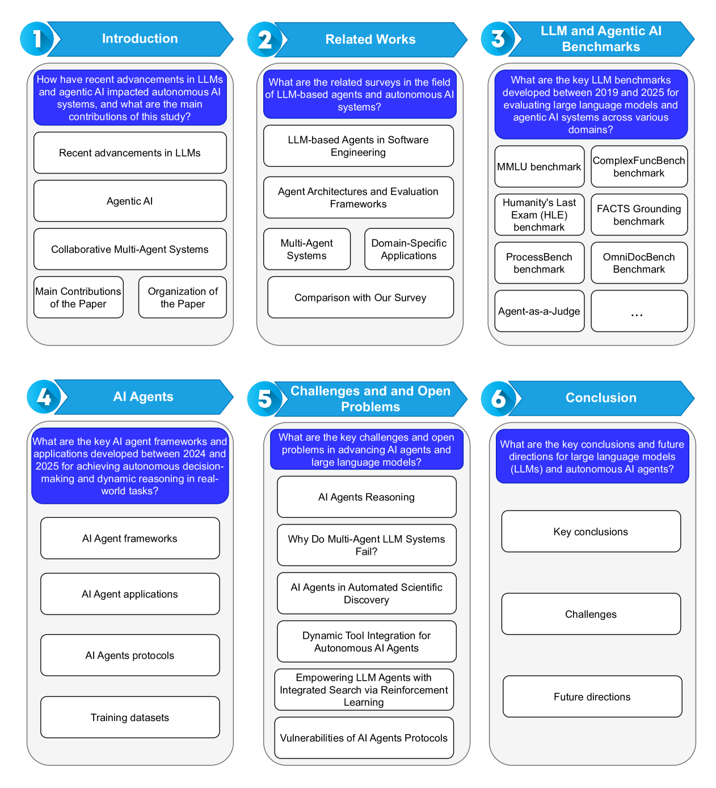
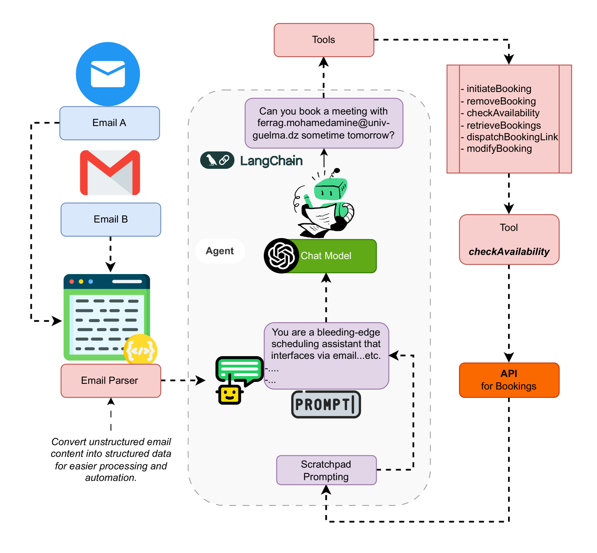

# LLM 推論から自律 AI エージェントへ: 包括的レビュー

> 原題: From LLM Reasoning to Autonomous AI Agents: A Comprehensive Review
> 著者: Mohamed Amine Ferrag, Norbert Tihanyi, Merouane Debbah（Guelma University アルジェリア / Technology Innovation Institute UAE / Eötvös Loránd University ハンガリー / Khalifa University of Science and Technology UAE）
> 出典: arXiv:2504.19678 (2025)

> **訳注**: 本訳は ar5iv クリップを底本とし、原ページ（ar5iv）と照合した。脚注 3 件（フレームワーク・プロトコルの URL）を [^fnN] で収録した。図 13 枚のうち本文で参照される図はローカル保存し `<figure>` で引用した。Figure 1（サーベイ構成）・Figure 2（ベンチマーク分類ツリー）はインライン SVG のためテキストで内容を補い、drawio 由来のアーキテクチャ図（Figure 3〜5, 7, 8 等）は画像を収録した。平文化された表（Table II/III/V 等）は markdown 表として再構成し、その旨を各表に明記した。References・Acknowledgements は本 wiki の方針により除外した。IV-B（応用）の一部の見出し番号は原典で非連続（II-D2 欠番など）だが、原典に忠実に保持した。

## Abstract（要旨）

大規模言語モデルと自律 AI エージェントは急速に進化し、その結果、評価ベンチマーク・フレームワーク・協調プロトコルの多様な配列が生まれた。しかし、その状況は依然として断片化しており、統一された分類法や包括的なサーベイを欠いている。そこで我々は、2019 年から 2025 年の間に開発された、これらのモデルとエージェントを複数のドメインにわたって評価するベンチマークの並列比較を提示する。加えて、一般・学術知識の推論、数学的問題解決、コード生成とソフトウェア工学、事実の接地（grounding）と検索、ドメイン固有の評価、マルチモーダルおよび embodied なタスク、タスクのオーケストレーション、対話的評価をカバーする、約 60 のベンチマークの分類法を提案する。さらに、大規模言語モデルとモジュラーなツールキットを統合して自律的意思決定と多段推論を可能にする、2023 年から 2025 年に導入された AI エージェントフレームワークをレビューする。加えて、材料科学・生物医学研究・学術的アイデア創出・ソフトウェア工学・合成データ生成・化学推論・数学的問題解決・地理情報システム・マルチメディア・医療・金融における自律 AI エージェントの実世界応用を提示する。次に、鍵となるエージェント間協調プロトコル、すなわち Agent Communication Protocol（ACP）・Model Context Protocol（MCP）・Agent-to-Agent Protocol（A2A）を概観する。最後に、高度な推論戦略、マルチエージェント LLM システムの失敗モード、自動科学発見、強化学習による動的ツール統合、統合された検索能力、エージェントプロトコルのセキュリティ脆弱性に焦点を当てた、将来の研究への提言を議論する。

## I Introduction（はじめに）

OpenAI の GPT-4 [^1]・Qwen2.5-Omni [^2]・DeepSeek-R1 [^3]・Meta の LLaMA [^4] のような大規模言語モデル（LLMs）は、人間のようなテキスト生成と高度な自然言語処理を可能にして AI を変容させ、会話エージェント・自動コンテンツ生成・リアルタイム翻訳におけるイノベーションを促してきた [^5]。近年の強化は、その有用性を、生成 AI 応用の範囲を広げる text-to-image・text-to-video 生成を含むマルチモーダルタスクへ拡張した [^6]。しかし、静的な事前学習データへの依存は、時代遅れの出力や幻覚された応答につながりうる [^7] [^8]。この限界に、Retrieval-Augmented Generation（RAG, 検索拡張生成）が、知識ベース・API・Web からのリアルタイムデータを取り込むことで対処する [^9] [^10]。これを土台に、reflection（内省）・planning（計画）・マルチエージェント協調を用いる知的エージェントの進化が Agentic RAG システムを生み、それは情報検索と反復的な洗練を動的にオーケストレートして複雑なワークフローを効果的に管理する [^11] [^12]。

大規模言語モデルの近年の進歩は、複雑な研究タスクを独立に扱える高度に自律的な AI システムへの道を開いた。これらのシステムは、しばしば agentic AI と呼ばれ、仮説を生成し、文献レビューを行い、実験を設計し、データを分析し、科学発見を加速し、研究コストを削減できる [^13] [^14] [^15] [^16]。LitSearch・ResearchArena・Agent Laboratory のようないくつかのフレームワークが、引用管理や学術サーベイ生成を含む様々な研究タスクを自動化するために開発されてきた [^17] [^18] [^19]。しかし、特にドメイン固有の文献レビューの遂行と、自動化された過程の再現性・信頼性の保証において、課題が残る [^20] [^21]。研究自動化のこれらの発展と並行して、大規模言語モデルベースのエージェントは医療分野も変容させ始めた [^22]。これらのエージェントは、臨床ガイドライン・医学知識ベース・医療システムを統合することで、診断支援・患者コミュニケーション・医学教育にますます使われている。その有望さにもかかわらず、これらの応用は、信頼性・再現性・倫理的ガバナンス・安全性への懸念を含む大きなハードルに直面する [^23] [^24] [^25]。これらの問題への対処は、LLM ベースエージェントが効果的かつ責任を持って臨床実践に組み込まれることを保証するために枢要であり、様々な医療タスクにわたってその性能を信頼できる形で測定できる包括的な評価フレームワークの必要を強調する [^26] [^27] [^28]。

LLM ベースエージェントは、推論と行動を組み合わせて複雑なデジタル環境と相互作用する、AI の有望なフロンティアとして現れている [^29] [^30]。そこで、LLM ベースエージェントを強化するために様々なアプローチが探究されてきた。React [^31] や Monte Carlo Tree Search [^32] のような技術を使って推論と行動を組み合わせるものから、状態の可逆性のような仮定を回避する Learn-by-Interact [^33] のような手法で高品質なデータを合成するものまである。他の戦略は、AgentGen [^34] や AgentTuning [^35] のようなシステムで、人間がラベル付けしたデータや GPT-4 で蒸留したデータで訓練して軌跡データを生成することを含む。同時に、強化学習の手法は、オフラインアルゴリズムと、報酬モデル・フィードバックによる反復的な洗練を活用して、現実的な環境での効率と性能を高める [^36] [^37]。

LLM ベースのマルチエージェントは、複数の特化したエージェントの集合知を活用し、協調的な計画・議論・意思決定を通じて複雑な実世界環境をシミュレートすることで、単一エージェントシステムを超えた高度な能力を可能にする。このアプローチは、LLM のコミュニケーション上の強みとドメイン固有の専門性を活用し、問題解決タスクに取り組む人間チームのように、異なるエージェントが効果的に相互作用することを可能にする [^38] [^39]。近年の研究は、ソフトウェア開発 [^40] [^41]・マルチロボットシステム [^42] [^43]・社会シミュレーション [^44]・政策シミュレーション [^45]・ゲームシミュレーション [^46] を含む様々な分野にわたる有望な応用を強調している。

本研究の主な貢献は次のとおりである:

- 2019 年から 2025 年の間に開発された、大規模言語モデルと自律 AI エージェントを複数ドメインにわたって厳密に評価するベンチマークの比較表を提示する。
- 一般・学術知識の推論、数学的問題解決、コード生成とソフトウェア工学、事実の接地と検索、ドメイン固有の評価、マルチモーダルおよび embodied なタスク、タスクのオーケストレーション、対話的・agentic な評価を含む、約 60 の LLM・AI エージェントベンチマークの分類法を提案する。
- 大規模言語モデルとモジュラーなツールキットを統合し、自律的意思決定と多段推論を可能にする、2023 年から 2025 年の著名な AI エージェントフレームワークを提示する。
- 材料科学・生物医学研究・学術的アイデア創出・ソフトウェア工学・合成データ生成・化学推論・数学的問題解決・地理情報システム・マルチメディア・医療・金融を含む様々な分野における自律 AI エージェントの応用を提供する。
- エージェント間協調プロトコル、すなわち Agent Communication Protocol（ACP）・Model Context Protocol（MCP）・Agent-to-Agent Protocol（A2A）を概観する。
- 自律 AI エージェントに関する将来の研究への提言——具体的には高度な推論戦略、マルチエージェント LLM システムの失敗モード、自動科学発見、強化学習による動的ツール統合、統合された検索能力、エージェントプロトコルのセキュリティ脆弱性——を概説する。

<figure>

<figcaption>図1: サーベイの構成。（訳注: 本サーベイの章立て——II 関連研究、III ベンチマーク比較、IV エージェントのフレームワーク・応用・プロトコル・訓練データセット、V 課題と未解決問題、VI 結論——を示す構成図）</figcaption>
</figure>

図1 は本サーベイの構成を示す。第 II 節は関連研究を提示する。第 III 節は最先端の LLM・Agentic AI ベンチマークの並列表形式比較を提供する。第 IV 節は様々なドメインにわたる AI エージェントのフレームワーク・応用・プロトコル・訓練データセットをレビューする。第 V 節はいくつかの枢要な研究方向を強調する。最後に第 VI 節が本論文をまとめる。

**表I**: AI エージェントに関する選ばれたサーベイの概観。（✓=考慮、△=部分的に議論、空欄=考慮せず）

| テーマ | 文献 | 年 | 主要な貢献 |
| --- | --- | --- | --- |
| SE における LLM ベースエージェント | Wang et al. [^47] | 2024 | SE における LLM ベースエージェント技術のサーベイ。perception–memory–action フレームワークを提案。 |
| SE における LLM ベースエージェント | Jin et al. [^48] | 2024 | 6 つの SE ドメインにわたり LLM vs 自律エージェントの能力をレビュー。自律性のギャップを強調。 |
| エージェントのアーキテクチャと評価 | Singh et al. [^49] | 2025 | Agentic RAG を導入: 計画・内省・ツール利用・協調を伴う自律エージェントを RAG に埋め込む。 |
| エージェントのアーキテクチャと評価 | Yehudai et al. [^50] | 2025 | LLM エージェントの評価方法論とベンチマークを概観。コスト・安全性・頑健性をカバー。 |
| エージェントのアーキテクチャと評価 | Chen et al. [^51] | 2025 | 1,676 の RPA を分析し、中核属性を特定し、標準化された評価ガイドラインを提案。 |
| マルチエージェントシステム | Yan et al. [^52] | 2025 | LLM 駆動 MAS の包括的サーベイ。コミュニケーション・スケーラビリティ・セキュリティ・マルチモーダリティに焦点。 |
| マルチエージェントシステム | Guo et al. [^38] | 2024 | 単一エージェント LLM 推論から協調的 MAS への進化を追跡。プロファイリングとコミュニケーションを検討。 |
| 医療 | Wang et al. [^28] | 2025 | 臨床意思決定支援・文書化・訓練のための LLM エージェントアーキテクチャをレビュー。倫理を議論。 |
| ゲーム理論における社会的エージェント | Feng et al. [^53] | 2024 | ゲーム理論における LLM ベース社会的エージェントを概観。フレームワーク・属性・評価プロトコルを分類。 |
| GUI エージェント | Zhang et al. [^54] | 2024 | LLM 駆動 GUI エージェントの進化を記録。マルチモーダル理解と large-action model をカバー。 |
| パーソナル LLM エージェント | Li et al. [^55] | 2024 | ユーザーデータ/デバイスを統合するパーソナル LLM エージェントを検討。アーキテクチャとセキュリティ課題を概観。 |
| 科学発見 | Gridach et al. [^21] | 2025 | ドメインをまたぐ研究ワークフロー自動化における Agentic AI を探究。信頼性と倫理を強調。 |
| 化学 | Ramos et al. [^56] | 2025 | 分子設計と合成計画における LLM の役割をレビュー。実験室制御のためのエージェントを導入。 |
| **本サーベイ** | Ferrag et al. | 2025 | ベンチマーク・フレームワーク・応用・プロトコル・課題をカバーする統一 end-to-end サーベイ。 |

## II Related Works（関連研究）

大規模言語モデルに駆動される自律 AI エージェントの成長する分野は、複数ドメインにわたる幅広い研究の取り組みを触発してきた。本節では、LLM ベースエージェントのソフトウェア工学への統合を調査し、エージェントのアーキテクチャと評価フレームワークを提案し、マルチエージェントシステムの開発を探究し、医療・ゲーム理論的シナリオ・GUI 相互作用・パーソナルアシスタント・科学発見・化学を含むドメイン固有の応用を検討する、最も関連性の高い研究をレビューする。

### II-A LLM-based Agents in Software Engineering（ソフトウェア工学における LLM ベースエージェント）

Wang et al. [^47] は、大規模言語モデル（LLM）ベースのエージェント技術とソフトウェア工学（SE）を橋渡しするサーベイを提示する。それは、LLM が様々なドメインで大きな成功を収め、明示的か暗黙的かを問わず、しばしばエージェントのパラダイムの下で SE タスクへ統合されてきたことを強調する。この研究は、SE における LLM ベースエージェントの構造化されたフレームワークを提示する。それは 3 つの主要モジュール——perception（知覚）・memory（記憶）・action（行動）——からなる。Jin et al. [^48] は、ソフトウェア工学における大規模言語モデル（LLM）と LLM ベースエージェントの使用を調査し、LLM の伝統的な能力と、自律エージェントが提供する強化された機能性を区別する。それは、コード生成や脆弱性検出のようなタスクにおける LLM の大きな成功を強調する一方、その限界——特に LLM ベースエージェントが克服を目指す自律性と自己改善の問題——にも対処する。この論文は、6 つの鍵となるドメイン——要求工学・コード生成・自律的意思決定・ソフトウェア設計・テスト生成・ソフトウェア保守——にわたる現在の実践の広範なレビューを提供する。

### II-B Agent Architectures and Evaluation Frameworks（エージェントのアーキテクチャと評価フレームワーク）

Singh et al. [^49] は、大規模言語モデル（LLM）の能力を高める伝統的な Retrieval-Augmented Generation システムの洗練された進化である Agentic Retrieval-Augmented Generation（Agentic RAG）を掘り下げる。LLM は人間のようなテキスト生成と言語理解を通じて AI を変容させてきたが、静的な訓練データへの依存はしばしば時代遅れないし不正確な応答をもたらす。この論文は、RAG フレームワーク内に自律エージェントを埋め込むことでこれらの限界に対処し、動的でリアルタイムなデータ検索と適応的ワークフローを可能にする。それは、reflection・planning・ツール利用・マルチエージェント協調のような agentic な設計パターンが、これらのシステムに複雑なタスクを管理し多段推論を支える能力をどう備えさせるかを詳述する。このサーベイは、Agentic RAG アーキテクチャの包括的な分類法を提供し、医療・金融・教育を含む様々なセクターにわたる鍵となる応用を強調し、実践的な実装戦略を概説する。

このアーキテクチャの視点を補完して、Yehudai et al. [^50] は、大規模言語モデル（LLM）に駆動されるエージェントの評価方法論を概観することで、人工知能における重要なマイルストーンを標す。それは、計画・ツール利用・自己内省・記憶のような中核機能に焦点を当ててこれらのエージェントの能力を徹底的にレビューし、Web 相互作用からソフトウェア工学・会話タスクまでの特化した応用を評価する。著者らは、ドメイン固有の応用のための的を絞ったベンチマークと、より汎用的なエージェントのために設計されたベンチマークの両方を検討することで、より厳密で動的に更新される評価フレームワークの開発への明確なトレンドを明らかにする。さらに、この論文は、分野の既存の欠陥——特にコスト効率・安全性・頑健性をより効果的に捉える指標の必要——を批判的に強調する。そうすることで、エージェント評価の現在の状況を地図化し、急速に進化する AI 領域におけるスケーラブルで細粒度の評価技術の重要性を強調して、将来の探究への説得力ある方向を提示する。

同様に、Chen et al. [^51] は、様々なタスクで人間の振る舞いを模倣する LLM ベースエージェントの成長するクラスである Role-Playing Agents（RPAs, ロールプレイングエージェント）に焦点を当てる。そのような多様なシステムの評価に内在する課題を認識し、著者らは 2021 年 1 月から 2024 年 12 月の間に発表された 1,676 の論文を体系的にレビューした。その広範な分析は、現在の文献で一般的な 6 つの鍵となるエージェント属性・7 つのタスク属性・7 つの評価指標を特定する。これらの洞察に基づき、この論文は、RPA の査定を標準化するために設計された、証拠に基づき実行可能で一般化可能な評価ガイドラインを提案する。

### II-C Multi-Agent Systems（マルチエージェントシステム）

Yan et al. [^52] は、LLM をマルチエージェントシステム（MAS）へ統合することに関する包括的なサーベイを提供する。彼らの研究は、エージェントが協調的・競争的な相互作用の両方に従事し、それにより個々のエージェントには扱えないタスクに取り組むことを可能にする、コミュニケーション中心の側面を強調する。この論文は、システムレベルの特徴・内部コミュニケーション機構・課題（スケーラビリティ・セキュリティ・マルチモーダル統合を含む）を検討する。関連する研究で、Guo et al. [^38] は、LLM ベースのマルチエージェントシステムの広範な概観を提供し、単一エージェントの意思決定から、集団的問題解決と世界シミュレーションを高める協調的フレームワークへの進化を描く。著者らは、単一エージェントの意思決定から協調的マルチエージェントフレームワークへの進化が、複雑な問題解決と世界シミュレーションにおける大きな進歩をどう可能にしたかを詳述する。これらのシステムの鍵となる側面——シミュレートするドメインと環境、個々のエージェントが用いるプロファイリングとコミュニケーションの戦略、集団的能力の強化を支える機構——が検討される。

### II-D Domain-Specific Applications（ドメイン固有の応用）

#### II-D1 Healthcare（医療）

Wang et al. [^28] は、LLM ベースエージェントの医療への変容的な影響を探究し、そのアーキテクチャ・応用・内在する課題の詳細なレビューを提示する。それは、医療エージェントシステムの中核要素——システムプロファイル・臨床計画機構・医学推論フレームワーク——を分解し、外部能力を高める方法も議論する。主要な応用領域には、臨床意思決定支援・医療文書化・訓練シミュレーション・全般的な医療サービスの最適化が含まれる。このサーベイはさらに、確立されたフレームワークと指標を使ってこれらのエージェントの性能を評価し、幻覚の管理・マルチモーダル統合・倫理的考慮のような持続的な課題を特定する。

#### II-D3 GUI Agents（GUI エージェント）

Zhang et al. [^54] は、マルチモーダル LLM の統合を通じて人間–コンピュータ相互作用のパラダイムシフトを標す、LLM 頭脳の GUI エージェントをレビューする。それは、GUI 自動化の歴史的進化を追跡し、自然言語理解・コード生成・視覚処理の進歩が、これらのエージェントが複雑なグラフィカルユーザーインターフェース（GUI）要素を解釈し、会話コマンドから多段タスクを実行することをどう可能にしたかを詳述する。このサーベイは、これらのシステムの中核要素——既存のフレームワーク、訓練のためのデータ収集と活用の方法、GUI タスクのための特化した大規模 action model の開発——を体系的に検討する。

#### II-D4 Personal LLM Agents（パーソナル LLM エージェント）

Li et al. [^55] は、強化されたパーソナルアシスタンスを提供するために個人データとデバイスを深く統合する LLM ベースエージェントである Personal LLM Agents に焦点を当て、知的パーソナルアシスタント（IPAs）の進化を探究する。著者らは、ユーザー意図の理解・タスク計画・ツール利用の不十分さを含む伝統的な IPA の限界——それらの実用性とスケーラビリティを妨げてきた——を概説する。対照的に、LLM のような基盤モデルの出現は、自律的問題解決のための高度な意味理解と推論を活用することで新しい可能性を提供する。このサーベイは、専門家の意見に基づき、Personal LLM Agents の根底にあるアーキテクチャと設計選択を体系的にレビューし、知能・効率・セキュリティに関連する鍵となる課題を検討する。さらに、これらの課題に対処する代表的な解決策を包括的に分析し、Personal LLM Agents が次世代のエンドユーザーソフトウェアの主要なパラダイムになるための基盤を据える。

#### II-D5 Scientific Discovery（科学発見）

Gridach et al. [^21] は、科学発見における Agentic AI の変容的な役割を探究し、研究過程を自動化・強化するその潜在力を強調する。それは、推論・計画・自律的意思決定の能力を備えたこれらのシステムが、文献レビュー・仮説生成・実験設計・データ分析を含む伝統的な研究活動をどう革命化しているかをレビューする。この論文は、既存の Agentic AI システムとツールを分類することで、化学・生物学・材料科学のような複数の科学ドメインにわたる近年の進歩を強調する。それは、分野で使われる鍵となる評価指標・実装フレームワーク・データセットの詳細な議論を提供し、現在の実践への価値ある洞察を提供する。さらに、この論文は、包括的な文献レビューの自動化・システムの信頼性の保証・倫理的懸念への対処を含む大きな課題に批判的に取り組む。それは、人間–AI 協調の重要性とシステムのキャリブレーションの改善を強調して、将来の研究方向を概説する。

#### II-D6 Chemistry（化学）

Ramos et al. [^56] は、化学における大規模言語モデル（LLM）の変容的な影響を、分子設計・特性予測・合成最適化におけるその役割に焦点を当てて検討する。それは、LLM が自動化を通じて科学発見を加速するだけでなく、LLM ベースの自律エージェントの登場を議論することを強調する。これらのエージェントは、環境とインターフェースし、文献スクレイピング・自動実験室制御・合成計画のようなタスクを行うことで、LLM の機能性を拡張する。化学を超えて議論を広げ、このレビューは他の科学ドメインにわたる応用も考える。

### II-E Comparison with Our Survey（我々のサーベイとの比較）

Table I は、既存研究が鍵となるテーマ——ベンチマーク・AI エージェントフレームワーク・AI エージェント応用・AI エージェントプロトコル・課題と未解決問題——をどうカバーしているかを、我々のサーベイと対比して統合的に示す。先行研究は典型的に 1 つか 2 つの側面に焦点を当てる（例: Yehudai et al. [^50] は評価ベンチマーク、Singh et al. [^49] は RAG アーキテクチャ、Yan et al. [^52] はマルチエージェントコミュニケーション、Wang et al. [^28] はドメイン固有の応用）が、いずれも発展の全スペクトルを単一の統一された取り扱いに統合していない。対照的に、我々のサーベイは、最先端のベンチマーク・フレームワーク設計・応用ドメイン・コミュニケーションプロトコル・課題と未解決問題の先を見据えた議論を体系的に組み合わせた最初のものであり、それにより研究者に LLM ベースの自律 AI エージェントを前進させる包括的なロードマップを提供する。

**表II**: LLM ベンチマークのまとめ（Part 1）。（訳注: 原文で平文化されていた表を markdown 表として再構成した）

| ベンチマーク | 年 | 評価対象 | 主要な特徴・指標／技術・観察 |
| --- | --- | --- | --- |
| ENIGMAEVAL [^57] | 2025 | マルチモーダル推論 | テキストと画像を組み合わせた 1,184 パズル。最先端システムでも標準パズルで約 7% しか正答せず最難問では失敗。世界大会の難パズルでマルチモーダル・長文脈推論を評価。 |
| MMLU [^58] | 2021 | マルチタスク知識 | 初等数学から専門法学まで 57 の多様なタスク。zero-shot/few-shot 性能を測定。キャリブレーションの課題と手続き的/宣言的知識の不均衡を露呈。 |
| ComplexFuncBench [^59] | 2025 | 関数呼び出し | 最大 128k トークンの入力・1,000 超のシナリオで多段の複雑な関数呼び出しを評価。自動評価フレームワーク ComplexEval を導入。クローズド（Claude 3.5, GPT-4）vs オープン（Qwen 2.5, Llama 3.1）の差を強調。 |
| Humanity's Last Exam (HLE) [^60] | 2025 | 学術的推論 | 100 超の主題にわたる 3,000 問（マルチモーダル含む）。約 1,000 名の専門家の協働で作成。検証可能な答えを持つ。最先端 LLM でも 10% 未満で学術推論評価の枢要ツール。 |
| FACTS Grounding [^61] | 2023 | 事実の接地 | 最大 32,000 トークンの入力・ソース文書に接地した詳細応答を要する 1,719 例。2 段階評価（適格性・事実接地）をフロンティア LLM ジャッジで行う。 |
| ProcessBench [^62] | 2024 | 誤り検出 | 段階的解法と人間注釈の誤り位置を持つ 3,400 の数学問題。推論の最初の誤りを検出する能力を評価。過程報酬モデルと LLM 批評を比較。 |
| OmniDocBench [^63] | 2024 | 文書理解 | 9 文書型・19 レイアウト分類・14 属性ラベルの多源データセット。文書内容抽出の詳細な多層評価。ぼやけたスキャン・透かし・複雑レイアウトに対処。 |
| Agent-as-a-Judge [^64] | 2024 | 評価方法論 | 365 の階層的ユーザー要求を持つ 55 コード生成タスクで評価。agentic システムで細粒度の中間フィードバックを提供。人間判断と最大 90% 一致。評価コストと時間を削減。 |
| JudgeBench [^65] | 2024 | 判断評価 | 知識・推論・数学・コーディングの 350 の難応答ペア。既存データセットを客観的正しさを持つペア比較に変換。二重評価で位置バイアスを緩和。 |
| SimpleQA [^66] | 2023 | 事実 QA | ドメイン横断の 4,326 事実追求問題。厳格な 3 段階採点。事実精度を評価し、誤答への過信を露呈。 |
| FineTasks [^67] | 2023 | 多言語タスク選択 | 9 言語で 185 候補タスクを評価し 96 の信頼できるタスクを選択（全体 550 超をサポート）。単調性・低ノイズ・非ランダム性能・モデル順序一貫性でタスク品質を評価。 |
| FRAMES [^68] | 2024 | 検索と推論 | 2〜15 の Wikipedia 記事の統合を要する 824 のマルチホップ問題。事実精度・検索・推論の評価を統一。ベースラインは検索なし 40% → 多段検索 66%。 |
| DABStep [^69] | 2025 | ステップベース推論 | 多段推論タスクへのステップベースアプローチ。最良モデルでも成功率 16%。複雑な問題解決を離散ステップに分解し反復的洗練と自己修正。 |

**表III**: LLM ベンチマークのまとめ（Part 2）。（訳注: 同上、平文化された表を再構成）

| ベンチマーク | 年 | 評価対象 | 主要な特徴・指標／技術・観察 |
| --- | --- | --- | --- |
| BFCL v2 [^70] | 2025 | 関数呼び出し | 単純〜並列呼び出しをカバーする 2,251 の質問–関数–答えペア。ユーザー投稿の実データでデータ汚染とバイアスに対処。Claude 3.5・GPT-4 が優勢、一部オープンモデルは苦戦。 |
| SWE-Lancer [^71] | 2025 | ソフトウェア工学 | 実支払データを伴う 1,400 超のフリーランス SE タスク（独立・管理職タスク）。独立タスクは三重検証テスト。Claude 3.5 Sonnet でも実装タスクは低パス率（26.2%）。 |
| CRAG [^72] | 2024 | 検索拡張生成 | 5 ドメインの 4,409 QA ペア。モック API で検索をシミュレート。RAG パイプラインの生成部を評価。高度な RAG で 34%→63%。動的・低人気の事実で性能低下。 |
| OCCULT [^73] | 2025 | サイバーセキュリティ | サイバーセキュリティリスクの運用評価の軽量フレームワーク。3 つの OCO ベンチマーク。DeepSeek-R1 が Threat Actor Competency Test で 90% 超。 |
| DIA [^74] | 2024 | 動的問題解決 | 数学・暗号・サイバーセキュリティ・CS 横断の可変パラメータの動的テンプレート。複数試行での信頼性・確信度の新指標。複雑タスクと自己査定のギャップを露呈。 |
| CyberMetric [^75] | 2024 | サイバーセキュリティ知識 | 多肢選択 QA スイート（-80/-500/-2000/-10000）。200 時間超の専門家検証。GPT-3.5 と RAG で生成。大型・ドメイン特化モデルが優勢。 |
| BIG-Bench Extra Hard [^76] | 2025 | 挑戦的推論 | BBH の高難度版。一般モデル平均 9.8%・推論特化モデル 44.8%。各 BBH タスクをより難しい変種に置換。 |
| MultiAgentBench [^77] | 2025 | マルチエージェント | 6 ドメイン（研究提案・Minecraft 建築・DB 誤り分析・協調コーディング・人狼・資源交渉）。協調プロトコル（star/chain/tree/graph）を調査。計画で 3% 改善。グラフ型が研究タスクで優勢。 |
| GAIA [^78] | 2024 | 汎用 AI アシスタント | 参照答え付き 466 問。人間 92% vs プラグイン付き GPT-4 は 15%。マルチモーダル・Web 閲覧・ツール利用を含む日常推論タスク。人間と SOTA の大差を強調。 |
| CASTLE [^79] | 2025 | ソースコードの脆弱性検出 | 25 の一般的 CWE をカバーする 250 の手作りマイクロベンチ。CASTLE Score を導入。13 静的解析・10 LLM・2 形式検証を横断評価。コード規模が増すと LLM の精度低下・幻覚増加。 |
| SPIN-Bench [^80] | 2025 | 戦略計画・相互作用・交渉 | 古典 PDDL・競争ボードゲーム・協調カードゲーム・多エージェント交渉を組み合わせる。行動空間・状態複雑さ・エージェント数を変化。深いマルチホップ推論と社会的協調に苦戦。 |
| τ-bench [^81] | 2024 | 会話エージェント評価 | 最終 DB 状態を注釈目標状態と比較する新指標 passᵏ。ドメイン固有 API ツール利用と厳格な方針遵守。GPT-4o でもタスク成功率 50% 未満。 |

## III LLM and Agentic AI Benchmarks（LLM と Agentic AI のベンチマーク）

本節は、2019 年から 2025 年の間に開発された、大規模言語モデル（LLM）を多様で挑戦的なドメインにわたって厳密に評価するベンチマークの包括的な概観を提供する。例えば、ENIGMAEVAL [^57] はテキストと視覚の手がかりの統合を要求して複雑なマルチモーダルパズル解決を査定し、ComplexFuncBench [^59] は実世界のシナリオを映す多段の関数呼び出しタスクでモデルに挑む。Humanity's Last Exam（HLE）[^60] は、幅広いスペクトルの主題にわたって専門家レベルの学術問題を提示することでさらに水準を上げ、より深い推論とドメイン固有の熟達への高まる需要を反映する。FACTS Grounding [^61] や ProcessBench [^62] のような追加のフレームワークは、事実に正確な長文応答を生成し、多段推論の誤りを検出するモデルの能力を精査する。一方、Agent-as-a-Judge [^64]・JudgeBench [^65]・CyberMetric [^75] のような革新的な評価パラダイムは、サイバーセキュリティの能力と誤り検出の能力への細粒度の洞察を提供する。Table III・II は 2024 年から 2025 年に開発されたベンチマークの包括的な概観を提示する。

### III-A ENIGMAEVAL benchmark

ENIGMAEVAL [^57] は、世界大会に由来する挑戦的なパズルを使って、高度な言語モデルのマルチモーダルおよび長文脈推論の能力を厳密に評価するために設計されたベンチマークである。データセットは、テキストと画像を組み合わせた 1,184 の複雑なパズルからなり、モデルに、異なる手がかりを統合し、多段の演繹的推論を行い、視覚的・意味的情報を統合して、曖昧さのない検証可能な解に到達することを要求する。よく構造化された学術タスクに焦点を当てる従来のベンチマークと異なり、ENIGMAEVAL はモデルを非構造で創造的な問題解決シナリオへ押し込む。そこでは最先端システムでさえ標準パズルで約 7% の精度しか達成せず、最難問では失敗する。

### III-B MMLU Benchmark

Measuring Massive Multitask Language Understanding（MMLU）[^58] は、Hendrycks et al.（2021）が、初等数学から専門法学まで多様な範囲の主題にわたって大規模言語モデルを評価するために設計した包括的なベンチマークである。このベンチマークは、zero-shot・few-shot 設定で広い世界知識と問題解決スキルを適用するモデルの能力をテストする 57 のタスクからなり、タスク固有のファインチューニングなしの汎化を強調する。この研究はまた、モデルのキャリブレーションに関連する課題と、手続き的知識と宣言的知識の間の不均衡を明らかにし、現在のモデルが専門家レベルの熟達に届かない枢要な領域を強調する。

### III-C ComplexFuncBench Benchmark

Zhong et al. [^59] は、実世界の設定で複雑な関数呼び出しタスクを評価するために設計された新しいベンチマーク ComplexFuncBench を導入した。以前のベンチマークと異なり、ComplexFuncBench は、単一ターン内の多段操作・ユーザーが課した制約の遵守・暗黙のパラメータ値の推論・128k トークンまでのコンテキストウィンドウを含む広範な入力長の管理でモデルに挑む。ベンチマークを補完して、著者らは、関数呼び出しの 5 つの異なる側面に由来する 1,000 超のシナリオにわたって性能を定量的に査定する自動評価フレームワーク ComplexEval を提示する。実験結果は、現在の最先端 LLM に大きな限界があることを明らかにし、Claude 3.5 や OpenAI の GPT-4 のようなクローズドモデルが Qwen 2.5 や Llama 3.1 のようなオープンモデルを上回る。特に、多段の関数呼び出しにおける値の誤りや早期終了のような蔓延する問題が特定され、実践的応用で LLM の関数呼び出し能力を高めるさらなる研究の必要を強調する。

### III-D Humanity's Last Exam (HLE) Benchmark

Phan et al. [^60] は、専門家レベルの学術タスクで挑むことで LLM の限界を押し広げるために設計されたベンチマーク Humanity's Last Exam（HLE）を導入した。LLM が 90% 超の精度を達成してきた MMLU のような従来のベンチマークと異なり、HLE は、数学・人文科学・自然科学を含む 100 超の主題にわたる 3,000 問を特徴とする、はるかに要求の厳しいテストを提示する。このベンチマークは、500 超の機関からの約 1,000 名の専門家が、マルチモーダルで素早いインターネット検索に耐性のある問題を寄せた世界的な協働の産物であり、本物の深い学術的理解のみが成功につながることを保証する。多肢選択と短答の両形式で明確に定義された検証可能な答えを持つタスクは、大きな性能ギャップを露呈する: DeepSeek R1・OpenAI のモデル・Google DeepMind Gemini Thinking・Anthropic Sonnet 3.5 のような現在の最先端 LLM は 10% 未満の精度で、高いキャリブレーション誤差に苦しみ、誤答への過信を示す。結果は、既存のベンチマークが進歩の意味ある尺度をもはや提供しないかもしれない一方、HLE が LLM の真の学術推論能力を査定する枢要なツールとして機能し、AGI の追求のなかで分野がより挑戦的で機微な評価へ向かうにつれ、ベンチマーク設計の新時代を告げうることを強調する。

### III-E FACTS Grounding benchmark

Google DeepMind は、LLM が長文応答を提供されたソース文書にどれだけ正確に接地し、幻覚を避けるかを評価するために設計された包括的なベンチマーク FACTS Grounding [^61] を導入した。このベンチマークは、860 の公開ケースと 859 の非公開ケースに分けられた 1,719 の綿密に作られた例からなり、モデルに、最大 32,000 トークンの入力で、対応する文脈文書に厳密に基づいて詳細な答えを生成することを要求する。医療・法律・技術・金融・小売のような多様なドメインをカバーし、FACTS Grounding は創造性・数学・複雑な推論を要するタスクを除外し、事実の正確さと情報の統合に的を絞る。頑健で偏りのない評価を保証するため、応答は 2 段階（適格性と事実接地）で、3 つのフロンティア LLM ジャッジ（Gemini 1.5 Pro・GPT-4o・Claude 3.5 Sonnet）のパネルで査定され、最終スコアはこれらの査定の集約から導かれる。Kaggle でホストされるオンラインリーダーボードには既に初期結果が入っており（例: Gemini 2.0 Flash が 83.6% でリード）、FACTS Grounding は業界全体の接地と事実性の進歩を駆動し、最終的に LLM 応用への信頼と信頼性を高めることを目指す。

### III-F ProcessBench benchmark

Qwen チーム [^62] は、数学的問題解決の推論過程内の誤りを検出する言語モデルの能力を評価するために特に設計された新しいベンチマーク ProcessBench を導入した。ProcessBench は、主に競技・オリンピアードレベルの数学問題に由来する 3,400 のテストケースからなり、各ケースは人間注釈の誤り位置を持つ詳細な段階的解法を含む。モデルは、最初の誤ったステップを特定するか、すべてのステップが正しいと確認する課題を与えられ、それにより推論の正確さの細粒度の査定を提供する。このベンチマークは 2 クラスのモデルを評価するために用いられる: 過程報酬モデル（PRMs）と批評モデル（後者は各解法ステップを批評するようプロンプトされる汎用 LLM）。実験結果は 2 つの鍵となる発見を明らかにする。第一に、既存の PRM は GSM8K や MATH のような標準データセットを超えるより挑戦的な数学問題への汎化にしばしば失敗し、プロンプトされた LLM 批評や、より大きく複雑な PRM800K データセットでファインチューニングされた PRM の両方に対して劣ることが多い。第二に、テストされた最良のオープンソースモデル QwQ-32B-Preview は、プロプライエタリな GPT-4o に匹敵する誤り検出能力を示すが、o1-mini のような推論特化モデルには及ばない。

### III-G OmniDocBench Benchmark

Ouyang et al. [^63] は、LLM と RAG システムの高品質なデータニーズに枢要な要素である自動文書内容抽出を前進させるために設計された、包括的な多源ベンチマーク OmniDocBench を導入した。OmniDocBench は、学術論文・教科書・スライド・ノート・金融文書を含む 9 つの多様な文書型にわたる綿密にキュレート・注釈されたデータセットを特徴とし、19 のレイアウト分類と 14 の属性ラベルを持つ詳細な評価フレームワークを活用して多層の査定を促進する。既存のモジュラーパイプラインとマルチモーダル end-to-end 手法の広範な比較分析を通じて、このベンチマークは、特化モデル（例: Nougat）が標準文書で汎用の視覚言語モデル（VLMs）を上回る一方、汎用 VLM がぼやけたスキャン・透かし・カラフルな背景を含む挑戦的なシナリオで優れた耐性と適応性を示すことを明らかにする。さらに、ドメイン固有のデータで汎用 VLM をファインチューニングすると性能が向上し、数式認識（GPT-4o・Mathpix・UniMERNet のようなモデルが約 85〜86.8% の精度）や表認識（RapidTable が 82.5%）のようなタスクでの高い精度スコアが証拠となる。とはいえ、発見は持続的な課題も強調し、特に複雑な段組みレイアウトがすべての評価モデルで読み取り順序の精度を劣化させ続けることを示す。

### III-H Agent-as-a-Judge

Meta チームは、成果のみに焦点を当てるか大量の手作業を要する伝統的な手法の限界を克服する、agentic システムのために明示的に設計された革新的な評価アプローチ Agent-as-a-Judge フレームワーク [^64] を提案した。このフレームワークは、agentic システムを活用して他の agentic システムを評価することで、タスク解決の過程全体を通じて細粒度の中間フィードバックを提供する。著者らは、365 の階層的ユーザー要求で注釈された 55 の現実的な自動 AI 開発タスクからなる新しいベンチマーク DevAI を使って、コード生成タスクでその有効性を実証する。彼らの評価は、Agent-as-a-Judge が従来の LLM-as-a-Judge アプローチ（典型的に人間査定と 60〜70% の一致率）を劇的に上回るだけでなく、人間判断と 90% の印象的な一致に達することを示す。加えて、この手法は大幅なコストと時間の節約を提供し、評価コストを約 2.29%（$30.58 vs $1,297.50）に削減し、評価時間を人間査定の 86.5 時間に対し 118.43 分に短縮する。

**表IV**: LLM ベンチマーク比較——マルチモーダル・タスク多様性・推論・Agentic AI 評価。（訳注: 列は左から、マルチモーダル対応・タスク内容・多様性・推論・Agentic AI 対応）

| ベンチマーク | 年 | マルチモーダル | タスク | 多様性 | 推論 | Agentic AI |
| --- | --- | --- | --- | --- | --- | --- |
| DROP [^82] | 2019 | No | 英語の離散推論読解 | High | High | No |
| MMLU [^58] | 2020 | No | 学術・一般知識 | High | Moderate | No |
| MATH [^83] | 2021 | No | 数学的推論の評価 | High | High | No |
| Codex [^84] | 2021 | No | コードで訓練された LLM の評価 | Medium | Medium | No |
| MGSM [^85] | 2022 | No | 多言語の小学校算数 | High | High | No |
| FACTS Grounding [^61] | 2023 | No | 長文応答の事実接地 | High | Low | No |
| SimpleQA [^66] | 2023 | No | 事実 QA | High | Low | No |
| PersonaGym [^86] | 2024 | No | ペルソナエージェントの動的評価 | High | High | Yes |
| FineTasks [^67] | 2023 | No | 多言語タスク選択 | High | Medium | No |
| GAIA [^78] | 2023 | Yes | 汎用 AI アシスタントタスク | High | High | No |
| OmniDocBench [^63] | 2024 | Yes | 文書内容抽出 | High | Medium | No |
| ProcessBench [^62] | 2024 | No | 数学解法の誤り検出 | Low | High | No |
| MIRAI [^87] | 2024 | No | イベント予測の LLM エージェント評価 | High | High | Yes |
| AppWorld [^88] | 2025 | No | 対話的コーディングエージェント | High | High | Yes |
| VisualAgentBench [^89] | 2024 | Yes | 大規模マルチモーダルモデル評価 | High | High | Yes |
| ScienceAgentBench [^90] | 2024 | No | 科学発見の言語エージェント評価 | High | High | Yes |
| Agent-SafetyBench [^91] | 2024 | No | LLM エージェントの安全性評価 | High | High | Yes |
| DiscoveryBench [^92] | 2024 | No | データ駆動の発見 | High | High | Yes |
| BLADE [^93] | 2024 | No | データ駆動科学発見のベンチマーク | High | High | Yes |
| Dyn-VQA [^8] | 2024 | Yes | 適応的 VQA マルチモーダル | High | High | Yes |
| Agent-as-a-Judge [^64] | 2024 | No | コード生成評価 | Low | Low | Yes |
| JudgeBench [^65] | 2024 | No | LLM ベースジャッジの評価 | High | High | No |
| FRAMES [^68] | 2024 | No | RAG の事実性と検索 | High | High | No |
| MedChain [^94] | 2024 | No | 対話的臨床意思決定適応 | High | High | Yes |
| CRAG [^72] | 2024 | No | RAG システムの事実 QA | High | High | No |
| DIA [^74] | 2024 | Yes | 動的問題解決 | High | High | No |
| CyberMetric [^75] | 2024 | No | サイバーセキュリティ QA | Low | Low | No |
| TeamCraft [^95] | 2024 | Yes | 協調 Minecraft マルチモーダル評価 | High | High | Yes |
| AgentHarm [^96] | 2024 | No | LLM ジェイルブレイク頑健性評価 | High | High | Yes |
| τ-bench [^81] | 2024 | No | 会話エージェント評価 | High | High | Yes |
| LegalAgentBench [^97] | 2024 | No | 法律ドメインの LLM エージェント評価 | High | High | Yes |
| GPQA [^98] | 2024 | No | 生物・物理・化学 | High | High | No |
| ENIGMAEVAL [^57] | 2025 | Yes | 複雑なマルチモーダルパズル | Low | High | No |
| ComplexFuncBench [^59] | 2025 | No | 関数呼び出しタスク | Medium | High | No |
| MedAgentsBench [^99] | 2025 | No | 複雑な医学推論と治療計画 | High | High | Yes |
| Humanity's Last Exam [^60] | 2025 | Yes | 専門家レベルの学術タスク | High | High | No |
| DABStep [^69] | 2025 | No | ステップベースの多段推論 | Low | High | No |
| BFCL v2 [^70] | 2025 | No | 関数呼び出し評価 | High | High | No |
| SWE-Lancer [^71] | 2025 | No | フリーランス SE タスク | High | Moderate | No |
| OCCULT [^73] | 2025 | No | サイバーセキュリティ運用タスク | Medium | High | No |
| BIG-Bench Extra Hard [^76] | 2025 | No | 挑戦的推論タスク | High | High | No |
| MultiAgentBench [^77] | 2025 | Yes | マルチエージェント協調タスク | High | High | Yes |
| CASTLE [^79] | 2025 | No | ソフトウェア脆弱性検出 | Low | Medium | No |
| EmbodiedEval [^100] | 2025 | Yes | 3D embodied タスク | Medium | High | Yes |
| SPIN-Bench [^80] | 2025 | Yes | 戦略計画と社会的推論 | High | High | Yes |
| OlympicArena [^101] | 2025 | Yes | オリンピック競技問題 | Medium | High | No |
| SciReplicate-Bench [^102] | 2025 | No | アルゴリズム駆動コード生成 | High | High | Yes |
| EconAgentBench [^103] | 2025 | No | 経済環境の意思決定タスク | High | High | Yes |
| VeriLA [^104] | 2025 | No | 人間中心の LLM 失敗検証 | High | High | Yes |
| CapaBench [^105] | 2025 | No | LLM エージェントのモジュール貢献評価 | High | High | Yes |
| AgentOrca [^106] | 2025 | No | 二重システムエージェントの遵守評価 | High | High | Yes |
| ProjectEval [^107] | 2025 | No | プロジェクトレベルのコード生成評価 | Medium | High | Yes |
| RefactorBench [^108] | 2025 | No | 自律的マルチファイルリファクタリング評価 | High | High | Yes |
| BEARCUBS [^109] | 2025 | Yes | マルチモーダル Web エージェント評価 | High | Medium | Yes |
| Robotouille [^110] | 2025 | No | 非同期計画ベンチマーク | High | High | Yes |
| DSGBench [^111] | 2025 | No | 戦略ゲームの意思決定評価 | Medium | High | Yes |
| TheoremExplainBench [^112] | 2025 | Yes | STEM 定理アニメ動画 | Medium | High | Yes |
| RefuteBench 2.0 [^113] | 2025 | No | 多ターン LLM フィードバック評価 | High | High | Yes |
| MLGym [^114] | 2025 | Yes | ML エージェントの研究自動化 | High | High | Yes |
| DataSciBench [^115] | 2025 | No | LLM データサイエンスベンチマーク | High | High | Yes |
| EmbodiedBench [^116] | 2025 | Yes | 視覚駆動 embodied エージェント評価 | High | High | Yes |
| BrowseComp [^117] | 2025 | No | 閲覧エージェントのベンチマーク | High | High | Yes |
| Vending-Bench [^118] | 2025 | No | 長ホライズンのビジネスシミュレーション | Medium | High | Yes |
| MLE-bench [^119] | 2025 | No | Kaggle の ML エンジニアリング競技 | Medium | High | Yes |
| SWE-PolyBench [^120] | 2025 | No | コーディングエージェントの評価 | High | High | Yes |
| Multi-SWE-bench [^121] | 2025 | No | イシュー解決の多言語ベンチマーク | High | High | No |

### III-I JudgeBench Benchmark

Tan et al. [^65] は、大規模言語モデルの出力を査定・改善するためにますます採用される LLM ベースジャッジを、人間の文体的選好に単に整合するのでなく、事実的・論理的な正しさを正確に識別する能力に焦点を当てて客観的に評価するために設計された新しいベンチマーク JudgeBench を提案した。主にクラウドソースの人間評価に依拠する先行ベンチマークと異なり、JudgeBench は、知識・推論・数学・コーディングのドメインにわたる 350 の慎重に構築された難応答ペアを活用する。このベンチマークは、既存の挑戦的データセットを客観的正しさに基づく選好ラベル付きのペア比較に変換する新しいパイプラインを用い、順序を入れ替えた二重評価で位置バイアスを緩和する。プロンプト型・ファインチューニング型・マルチエージェントジャッジ・報酬モデルを含む様々なジャッジアーキテクチャの包括的なテストは、GPT-4o のような強いモデルでさえ、特に中間推論ステップの厳密な誤り検出を要するタスクで、ランダムな推測よりわずかに良い性能しか示さないことが多いことを明らかにする。さらに、ファインチューニングは性能を大きく高めうる（Llama 3.1 8B で 14% の改善が観察された）し、報酬モデルは 59〜64% の精度に達する。

### III-J SimpleQA Benchmark

SimpleQA [^66] は、短い事実追求問題における大規模言語モデルの事実精度を査定・改善するために OpenAI が導入したベンチマークである。科学/技術・政治・芸術・地理のようなドメインにわたる 4,326 問からなり、SimpleQA は厳格な 3 段階採点システム（「正解」「不正解」「未試行」）の下で単一の正解を提供するようモデルに挑む。TriviaQA や Natural Questions のような基礎データセットの上に構築されるが、SimpleQA は LLM により挑戦的なタスクを提示する。初期結果は、OpenAI o1-preview のような高度なモデルでさえ 42.7% の精度しか達成せず（Claude 3.5 Sonnet は 28.9% で後れをとる）、モデルが誤答への過信を示しがちであることを示す。さらに、同じ問題を 100 回繰り返した実験は、より高い答えの頻度と全体的な精度の間の強い相関を明らかにした。このベンチマークは、単純で事実的なクエリの処理における LLM の現在の限界への枢要な洞察を提供し、モデル出力を信頼できる事実データに接地するさらなる改善の必要を強調する。

### III-K FineTasks

FineTasks [^67] は、多様な言語にわたって LLM を査定する信頼できるタスクを体系的に選択するために設計されたデータ駆動の評価フレームワークである。より広い FineWeb Multilingual イニシアチブへの第一歩として開発され、FineTasks は 4 つの枢要な指標——単調性・低ノイズ・非ランダム性能・モデル順序一貫性——に基づいて候補タスクを評価し、頑健性と信頼性を保証する。広範な研究で、Hugging Face チームは 9 言語（中国語・フランス語・アラビア語・ロシア語・タイ語・ヒンディー語・トルコ語・スワヒリ語・テルグ語を含む）にわたる 185 候補タスクをテストし、最終的に読解・一般知識・言語理解・推論のようなドメインをカバーする 96 の最終タスクを選択した。この研究はさらに、タスクの定式化が性能に大きな影響を与えることを明らかにする（例: Cloze 形式のタスクは訓練初期により効果的だが、多肢選択形式はより良い評価結果を生む）。推奨される評価指標には、大半のタスクの長さ正規化と、複雑な推論課題の pointwise mutual information（PMI）が含まれる。35 のオープン・クローズドソース LLM のベンチマークは、オープンモデルがプロプライエタリな相手とのギャップを縮めていることを実証し、Qwen 2 モデルが高・中リソース言語で優れ、Gemma-2 が低リソース設定で特に強い。さらに、FineTasks フレームワークは様々な言語にわたって 550 超のタスクをサポートし、多言語 LLM 評価を前進させるスケーラブルで包括的なプラットフォームを提供する。

### III-L FRAMES benchmark

Google チーム [^68] は、LLM の上に構築された検索拡張生成（RAG）システムの能力を査定するために特に設計された包括的な評価データセット FRAMES（Factuality, Retrieval, and Reasoning MEasurement Set）を提案する。FRAMES は、これらの側面を孤立して査定するのでなく、事実精度・検索の有効性・推論能力の評価を end-to-end フレームワークで統一することで、枢要なニーズに対処する。データセットは、歴史・スポーツ・科学・健康を含む多様なトピックにわたる 824 の挑戦的なマルチホップ問題からなり、各問題は 2 から 15 の Wikipedia 記事からの情報の統合を要する。問題を特定の推論型（数値・表形式など）でラベル付けすることで、FRAMES は現在の RAG 実装の強みと弱みを特定する機微なベンチマークを提供する。ベースライン実験は、Gemini-Pro-1.5-0514 のような最先端モデルが検索機構なしでは 40% の精度しか達成しないが、多段検索パイプラインでその性能が 66% に大きく増加し（50% 超の改善）ることを明らかにする。

### III-M DABStep benchmark

DabStep [^69] は、多段推論タスクでの言語モデルの性能と効率を高めるステップベースのアプローチを開拓する、Hugging Face の新しいフレームワークである。DabStep は、複雑な問題解決を離散的で扱いやすいステップに分解することで、伝統的な end-to-end 推論の課題に対処し、モデルがステップレベルのフィードバックと反復的な動的調整を通じて出力を洗練することを可能にする。この手法は、モデルが自己修正し、多段推論過程の複雑さをより効果的に航行することを可能にするよう設計される。しかし、これらの革新的な改善にもかかわらず、実験結果は、このフレームワークの下で最良の性能のモデルでさえ、評価タスクで 16% の成功率しか達成しないことを明らかにする。この控えめな精度は、複雑で反復的な推論のためにモデルを効果的に訓練することに残る大きな課題を強調し、さらなる研究と最適化の必要を強調する。

### III-N BFCL v2 benchmark

Mao et al. [^70] は、実世界のユーザー投稿データを使って大規模言語モデルの関数呼び出し能力を評価するために設計された新しいベンチマークとリーダーボード BFCL v2 を提案する。ベンチマークは 2,251 の質問–関数–答えペアからなり、複数の単純な関数呼び出しから並列実行・無関係検出まで、幅広いシナリオにわたる包括的な査定を可能にする。本物のユーザー相互作用を活用することで、BFCL v2 は、以前の評価手法におけるデータ汚染・バイアス・限られた汎化のような蔓延する問題に対処する。初期評価は、Claude 3.5 や GPT-4 のようなモデルが一貫して他を上回り、Mistral・Llama 3.1 FT・Gemini が性能で続くことを明らかにする。しかし、Hermes のような一部のオープンモデルは、潜在的なプロンプトと書式の課題のために苦戦する。全体として、BFCL v2 は、外部ツールと API とインターフェースする LLM の実践的能力をベンチマークする厳密で多様なプラットフォームを提供し、関数呼び出しと対話的 AI システムの将来の進歩への価値ある洞察を提供する。

### III-O SWE-Lancer benchmark

OpenAI チーム [^71] は、Upwork から集めた 1,400 超のフリーランスソフトウェア工学タスク（実世界の支払で 100 万ドル超に相当）からなる革新的なベンチマーク SWE-Lancer を提示する。このベンチマークは、小さなバグ修正から最大 32,000 ドルの価値を持つ実質的な機能実装まで及ぶ独立エンジニアリングタスクと、モデルが最良の技術提案を選択しなければならない管理職タスクの両方を包含する。独立タスクは、経験豊富なエンジニアによって三重検証された end-to-end テストを使って厳密に評価される。同時に、管理職の決定は、元の採用マネージャーが行った選択に対してベンチマークされる。実験結果は、Claude 3.5 Sonnet のような最先端モデルでさえこれらのタスクの大半に苦戦し、独立タスクで 26.2% のパス率・管理職タスクで 44.9% を達成し、推定 40.3 万ドルの獲得（利用可能な総価値をはるかに下回る）に相当することを示す。特に、分析は、モデルが直接のコード実装より評価的な管理職の役割でより良く機能する傾向がある一方、推論時計算を増やすことで性能を高められることを強調する。

### III-P Comprehensive RAG Benchmark (CRAG)

Yang et al. [^72] は、検索拡張生成システムの事実質問応答能力を厳密に評価するために設計された新しいデータセット Comprehensive RAG Benchmark（CRAG）を提案する。CRAG は、5 つのドメインと 8 つの異なる質問カテゴリにわたる 4,409 の質問–答えペアからなる。それは、Web と知識グラフの検索をシミュレートするモック API を取り込み、実世界のシナリオで遭遇するエンティティの人気度と時間的動性の様々なレベルを反映する。経験的結果は、接地なしの最先端大規模言語モデルが CRAG で約 34% の精度しか達成せず、単純な RAG 手法の取り込みでこれがわずか 44% に改善する一方、業界をリードする RAG システムは幻覚なしで 63% の精度に達しうることを示す。このベンチマークはまた、高度に動的・低人気・より複雑な事実を含む問題での大きな性能低下を強調する。特に、CRAG は RAG パイプラインの生成コンポーネントの評価のみに焦点を当て、初期の発見は Llama 3 70B がこれらのタスクで GPT-4 Turbo にほぼ匹敵することを示す。

### III-Q OCCULT Benchmark

Kouremetis et al. [^73] は、攻撃的サイバー作戦（OCO）のために大規模言語モデル（LLM）を使うことに関連するサイバーセキュリティリスクを厳密に測定する、新しく軽量な運用評価フレームワーク OCCULT を提示する。伝統的に、サイバーセキュリティにおける AI の評価は、capture-the-flag 演習のような単純なオール・オア・ナッシングのテストに依拠してきたが、それは現代のインフラが直面する機微な脅威を捉えられない。対照的に、OCCULT は、実世界の脅威シナリオをシミュレートすることで、サイバーセキュリティの専門家が反復可能で文脈化されたベンチマークを作ることを可能にする。著者らは、LLM が敵対的戦術を実行する能力を査定するために設計された 3 つの異なる OCO ベンチマークを詳述し、AI 対応のサイバー脅威の大きな進歩を示す予備的な評価結果を提供する。最も注目すべきは、DeepSeek-R1 モデルが LLM 向け Threat Actor Competency Test（TACTL）で 90% 超の質問に正答したことである。

### III-R DIA benchmark

Dynamic Intelligence Assessment（DIA）[^74] は、数学・暗号・サイバーセキュリティ・コンピュータサイエンスのような多様なドメインにわたって AI モデルの問題解決能力をより厳密にテスト・比較する新しい方法論として導入される。モデルが一様に良い性能を示したり記憶に依拠したりすることをしばしば許す静的な質問–答えペアに依拠する伝統的なベンチマークと異なり、DIA は、テキスト・PDF・コンパイル済みバイナリ・視覚パズル・CTF スタイルの課題を含む様々な形式で提示される、可変パラメータの動的な質問テンプレートを用いる。このフレームワークはまた、複数試行にわたるモデルの信頼性と確信度を評価する 4 つの革新的な指標を導入し、単純な質問でさえ異なる形式で提示されると頻繁に誤って答えられることを明らかにする。特に、評価は、GPT-4o のような API モデルが自らの数学的能力を過大評価しうる一方、ChatGPT-4o のようなモデルは実践的なツール利用のためより良く機能し、OpenAI の o1-mini がタスク適合性の自己査定で優れることを示す。DIA-Bench で 25 の最先端 LLM をテストすると、複雑なタスクと適応的知能の処理に大きなギャップがあることが明らかになり、問題解決性能とモデルの自己限界認識能力の両方を評価する新しい標準を確立する。

### III-S CyberMetric benchmark

Tihanyi et al. [^75] は、LLM のサイバーセキュリティ知識を厳密に評価するために設計された新しい多肢選択 QA ベンチマークデータセット群 CyberMetric-80・CyberMetric-500・CyberMetric-2000・CyberMetric-10000 を導入する。GPT-3.5 と検索拡張生成（RAG）を活用して、著者らは NIST 標準・研究論文・公開書籍・RFC のような多様なサイバーセキュリティのソースから質問を生成した。4 つの選択肢を持つ各質問は、精度とドメインの関連性を保証するために 200 時間超の人間専門家の検証を伴う広範な誤りチェックと洗練のラウンドを経た。評価は 25 の最先端大規模言語モデル（LLM）で行われ、結果はさらにクローズドブックのシナリオで CyberMetric-80 の人間性能に対してベンチマークされた。発見は、GPT-4o・GPT-4-turbo・Mixtral-8x7B-Instruct・Falcon-180B-Chat・GEMINI-pro 1.0 のようなモデルが優れたサイバーセキュリティ理解を示し、CyberMetric-80 で人間を上回る一方、Llama-3-8B・Phi-2・Gemma-7b のような小さいモデルは後れをとることを明らかにし、この挑戦的な分野におけるモデル規模とドメイン固有データの価値を強調する。

### III-T BIG-Bench Extra Hard

Google DeepMind のチーム [^76] は、主に数学・コーディングのタスクに焦点を当ててきた現在の推論ベンチマークの限界に取り組むことで、大規模言語モデルの評価における枢要なギャップに対処する。BIG-Bench データセット [^122] とそのより複雑な変種 BIG-Bench Hard（BBH）[^123] は一般的な推論能力の包括的な査定を提供してきたが、LLM の近年の進歩は飽和につながり、最先端モデルが多くの BBH タスクでほぼ完璧なスコアを達成している。これを克服するため、著者らは BIG-Bench Extra Hard（BBEH）を導入する。この新しいベンチマークは、各 BBH タスクを、同様の推論能力を高い難易度で調べるよう設計されたより挑戦的な変種に置き換える。BBEH での評価は、最良の汎用モデルでさえ平均精度 9.8% しか達成せず、推論特化モデルは 44.8% に達することを明らかにし、大きな改善の余地を強調し、頑健で多才な推論スキルを持つ LLM を開発する継続的な課題を強調する。

### III-U MultiAgentBench benchmark

Zhu et al. [^77] は、動的で対話的な環境で LLM に駆動されるマルチエージェントシステムの能力を評価するために特に設計されたベンチマーク MultiAgentBench を導入する。単一エージェントの性能や狭いドメインに焦点を当てる伝統的なベンチマークと異なり、MultiAgentBench は、研究提案の執筆・Minecraft 構造の建築・データベース誤り分析・協調コーディング・競争的な人狼ゲーム・資源交渉を含む 6 つの多様なドメインを包含し、マイルストーンベースの性能指標を使ってタスク完了とエージェント協調の質の両方を測定する。この研究は、star・chain・tree・graph トポロジーのような様々な協調プロトコルを調査し、直接のピアツーピアコミュニケーションと認知的計画が特に効果的であること（計画を用いるとマイルストーン達成が 3% 改善する）を見出す一方、より多くのエージェントを加えると性能が下がりうることも指摘する。評価されたモデル（GPT-4o-mini・3.5・Llama）のうち、GPT-4o-mini が最高の平均タスクスコアを達成し、グラフベースの協調プロトコルが研究シナリオで他の構造を上回った。

### III-V GAIA Benchmark

GAIA [^78] は、推論・マルチモーダル処理・Web 閲覧・ツール利用のような基本的な能力を活用する実世界の問題で汎用 AI アシスタントを査定するために設計された画期的なベンチマークである。ますます特化したタスクに焦点を当てる伝統的なベンチマークと異なり、GAIA は、人間が 92% の精度で解ける概念的に単純な問題を特徴とするが、プラグイン付き GPT-4 のような現在のシステムはそれに苦戦し、わずか 15% しか達成しない。参照答えを持つ 466 の綿密にキュレートされた問題からなり、GAIA は評価パラダイムを、真の人工汎用知能（AGI）達成への枢要な一歩である日常的な推論タスクにおける AI の頑健性の測定へと移す。人間と最先端モデルの間のこの大きな性能ギャップは、平均的な人間の問題解決者が示す汎用で回復力のある推論を模倣できる AI システムの必要を強調する。

### III-W CASTLE Benchmark

Dubniczky et al. [^79] は、既存アプローチの枢要な弱点に対処して、ソフトウェア脆弱性検出手法を評価する新しいベンチマークフレームワーク CASTLE を導入する。CASTLE は、25 の一般的な CWE をカバーする 250 のマイクロベンチマークプログラムの綿密にキュレートされたデータセットを使って、13 の静的解析ツール・10 の LLM・2 つの形式検証ツールを査定する。このフレームワークは、異なる手法間の公平な比較を可能にする新しい評価指標 CASTLE Score を提案する。結果は、ESBMC のような形式検証ツールが偽陽性を最小化する一方、モデル検査の範囲を超える脆弱性に苦戦することを明らかにする。静的解析器はしばしば過剰な偽陽性を生成し、手動検証で開発者に負担をかける。LLM は小さなコードスニペットで強く機能するが、コード規模が増すにつれ精度が低下し幻覚が増える。これらの発見は、現在の限界にもかかわらず、LLM がコード補完フレームワークへの統合に大きな有望さを持ち、リアルタイムの脆弱性予防を提供し、より安全なソフトウェアシステムへの重要な一歩を標すことを示唆する。

### III-X SPIN-Bench Benchmark

Yao et al. [^80] は、AI エージェントにおける戦略計画と社会的推論の課題を強調する包括的な評価フレームワーク SPIN-Bench を導入する。孤立したタスクに焦点を当てる伝統的なベンチマークと異なり、SPIN-Bench は、古典的計画・競争ボードゲーム・協調カードゲーム・交渉シナリオを組み合わせて実世界の社会的相互作用をシミュレートする。この多面的なアプローチは、現在の大規模言語モデル（LLM）——事実の検索と短距離の計画には長けているが、深いマルチホップ推論・空間的推論・社会的に協調した意思決定に苦戦する——の大きな性能ボトルネックを明らかにする。例えば、モデルは Tic-Tac-Toe のような単純なタスクでは合理的に機能するが、Chess や Diplomacy のような複雑な環境ではつまずき、最良のモデルでさえ古典的計画タスクで約 58.59% の精度しか達成しない。

### III-Y τ-bench

Yao et al. [^81] は、実世界の環境をエミュレートする現実的で動的な多ターン会話設定で言語エージェントを評価するために設計されたベンチマーク τ-bench を提示する。τ-bench では、エージェントは、シミュレートされたユーザーと相互作用してニーズを理解し、ドメイン固有の API ツール（フライト予約や商品返品など）を活用し、提供された方針ガイドラインを遵守する課題を与えられ、性能は最終データベース状態を注釈された目標状態と比較することで測定される。複数試行にわたる信頼性を査定するために、新しい指標 passᵏ が導入される。実験的発見は、GPT-4o のような最先端の関数呼び出しエージェントでさえタスクの 50% 未満しか成功せず、大きな不整合（例: 小売ドメインで pass⁸ スコアが 25% 未満）を示し、複数のデータベース書き込みを要するタスクで著しく低い成功率を示すことを明らかにする。これらの結果は、実世界の応用のための言語エージェントにおいて、一貫性・規則遵守・全体的な信頼性を高める手法の必要を強調する。

### III-Z Discussion and Comparison of LLM Benchmarks（LLM ベンチマークの議論と比較）

<figure>

<figcaption>図2: AI エージェント応用のための LLM ベンチマークの分類。（訳注: インライン SVG の分類ツリー。ベンチマークを次の 8 カテゴリに分類する——Academic & General Knowledge Reasoning（学術・一般知識推論）、Mathematical Problem Solving（数学的問題解決）、Code & Software Engineering（コードとソフトウェア工学）、Factual Grounding & Retrieval（事実の接地と検索）、Domain-Specific Evaluations（ドメイン固有の評価）、Multimodal/Visual & Embodied Evaluations（マルチモーダル/視覚と embodied な評価）、Task Selection（タスク選択）、Agentic & Interactive Evaluations（agentic・対話的評価）</figcaption>
</figure>

Table IV は、マルチモーダル能力・タスク範囲・多様性・推論・agentic な振る舞いに関して大規模言語モデル（LLM）を評価するために 2019 年から 2025 年に開発されたベンチマークの広範な概観を提示する。初期のベンチマーク——DROP [^82]・MMLU [^58]・MATH [^83]・Codex [^84]・MGSM [^85]・FACTS Grounding [^61]・SimpleQA [^66]——は、離散推論・学術知識・数学的問題解決・事実接地のような中核能力に集中した。これらの先駆的な取り組みは、言語理解と推論タスクにおける性能評価の基礎を据え、後のより洗練されたベンチマークが比較される基準線を設定した。

ベンチマーク設計の注目すべき進展は、より複雑な agentic・マルチモーダルタスクを標的とするフレームワークの出現とともに観察される。例えば、PersonaGym [^86] と FineTasks [^67] は動的なペルソナ評価と多言語タスク選択を導入する。GAIA [^78] は評価範囲を汎用 AI アシスタントタスクへ拡張し、OmniDocBench [^63] と ProcessBench [^62] は文書抽出と数学解法の誤り検出に対処する。さらに、MIRAI [^87]・AppWorld [^88]・VisualAgentBench [^89]・ScienceAgentBench [^90] は、マルチモーダルと科学発見のタスクの様々な側面を探究する。この 10 年にわたる進化は、安全性（Agent-SafetyBench [^91]）・発見（DiscoveryBench [^92]）・コード生成（BLADE [^93]・Dyn-VQA [^8]・Agent-as-a-Judge [^64]）・司法推論（JudgeBench [^65]）・臨床意思決定（MedChain [^94]）、その他 FRAMES [^68]・CRAG [^72]・DIA [^74]・CyberMetric [^75]・TeamCraft [^95]・AgentHarm [^96]・τ-bench [^81]・LegalAgentBench [^97]・GPQA [^98] を含む追加の評価によって補完される。

2025 年からの近年のベンチマークは、大規模言語モデル（LLM）評価の深さと広さの大きな拡大をさらに示す。ENIGMAEVAL [^57] と ComplexFuncBench [^59] は複雑なパズルと関数呼び出しタスクを標的とし、MedAgentsBench [^99] と Humanity's Last Exam [^60] は高度な医学推論と専門家レベルの学術タスクに焦点を当てる。DABStep [^69]・BFCL v2 [^70]・SWE-Lancer [^71]・OCCULT [^73] のような追加のベンチマークは、多段推論・サイバーセキュリティ・フリーランスソフトウェア工学の課題を取り込むことで評価基準をさらに多様化する。表はまた、BIG-Bench Extra Hard [^76]・MultiAgentBench [^77]・CASTLE [^79]・EmbodiedEval [^100]・SPIN-Bench [^80]・OlympicArena [^101]・SciReplicate-Bench [^102]・EconAgentBench [^103]・VeriLA [^104]・CapaBench [^105]・AgentOrca [^106]・ProjectEval [^107]・RefactorBench [^108]・BEARCUBS [^109]・Robotouille [^110]・DSGBench [^111]・TheoremExplainBench [^112]・RefuteBench 2.0 [^113]・MLGym [^114]・DataSciBench [^115]・EmbodiedBench [^116]・BrowseComp [^117]・MLE-bench [^119] を含む。総合すると、これらのベンチマークは、ますます多面的な実世界の課題に取り組める LLM の開発を支える、より包括的で機微な評価指標への分野のシフトを例証する。

図2 は、ベンチマークを Academic & General Knowledge Reasoning・Mathematical Problem Solving・Code & Software Engineering・Factual Grounding & Retrieval・Domain-Specific Evaluations・Multimodal/Visual & Embodied Evaluations・Task Selection・Agentic & Interactive Evaluations のようなカテゴリにグループ化し、AI エージェント設定で LLM を査定するために使われるタスクの全範囲を図示する。
