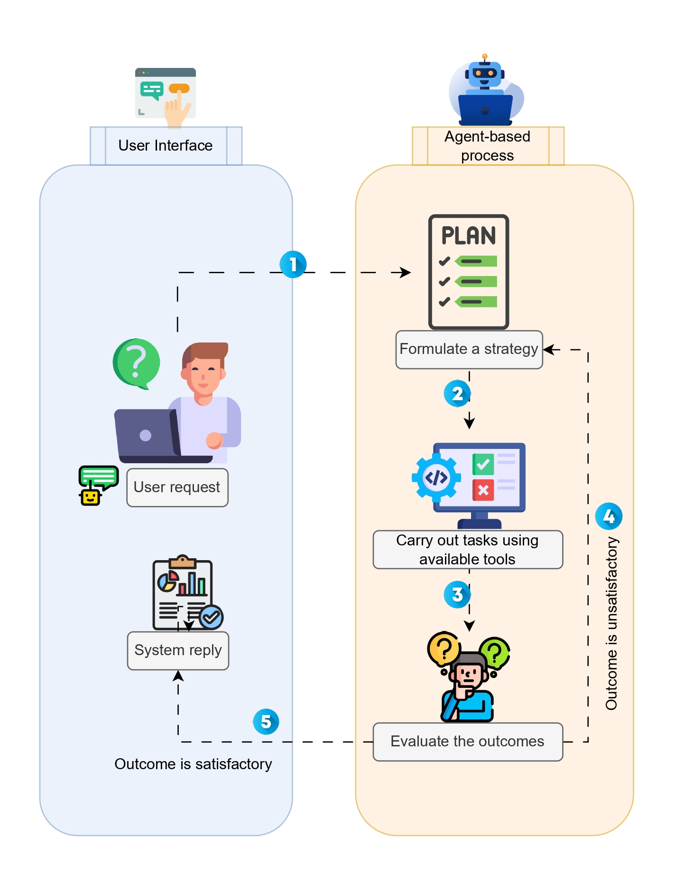
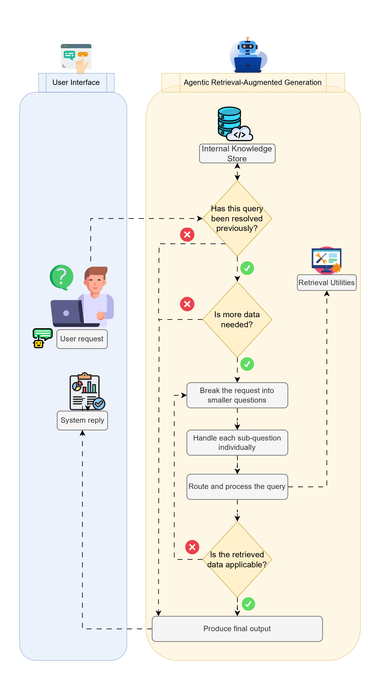
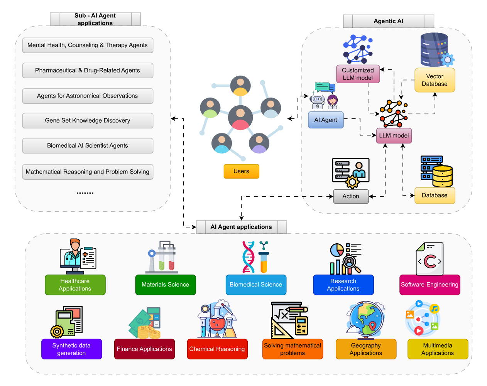
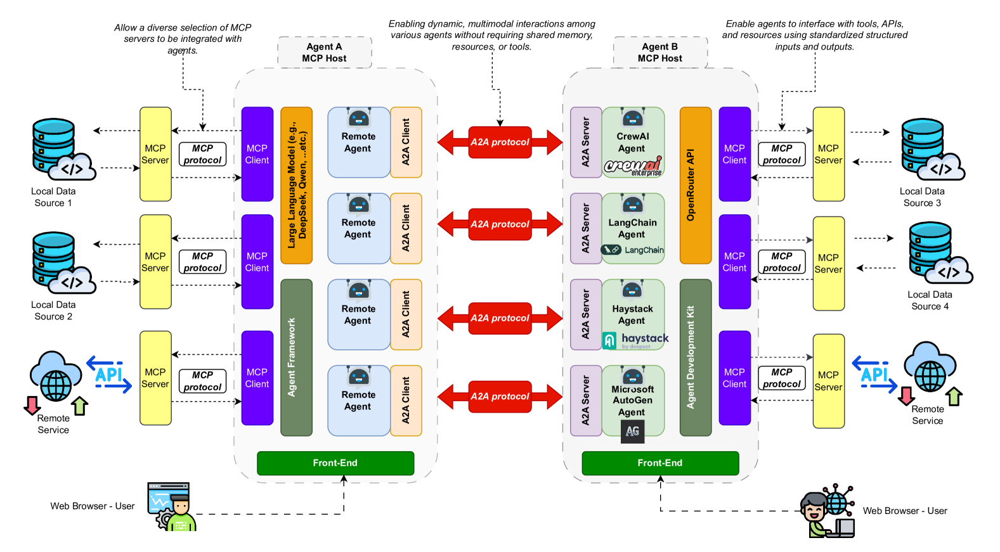

# LLM 推論から自律 AI エージェントへ: 包括的レビュー

> 原題: From LLM Reasoning to Autonomous AI Agents: A Comprehensive Review
> 著者: Mohamed Amine Ferrag, Norbert Tihanyi, Merouane Debbah（Guelma University アルジェリア / Technology Innovation Institute UAE / Eötvös Loránd University ハンガリー / Khalifa University of Science and Technology UAE）
> 出典: arXiv:2504.19678 (2025)

> **訳注**: 本訳は ar5iv クリップを底本とし、原ページと照合した。本文で参照され画像アセットが存在する図（Figure 1「サーベイ構成」= x1・Figure 4「エージェント的ワークフロー」・Figure 5「エージェント駆動型 RAG」・Figure 6「LangChain アーキテクチャ」= x3・Figure 7「アーキテクチャと応用ドメイン」= x4・Figure 13「マルチエージェント統合」= x5）はローカル保存し `<figure>` で引用した。Figure 2（ベンチマーク分類ツリー）・Figure 3（AI エージェントの中核要素）・および IV-B 各応用のドメイン別図（Figure 8〜12 等）はインライン SVG で画像アセットが無いため、本文で内容を補うにとどめた。平文化されていた表（Table V/VI/VII/VIII/IX/X/XI/XII 等）は markdown 表として再構成し、その旨を各表に明記した。IV-C 本文の `1`〜`3` は BeeAI・MCP サーバカタログ・A2A の外部 URL を指すページ脚注だが、クリップに脚注本文が残っていなかったためマーカーのみ保持した。References・Acknowledgements は本 wiki の方針により除外した。IV-B（応用）の一部の見出し番号は原典で非連続（II-D2 欠番など）だが、原典に忠実に保持した。

## Abstract（要旨）

大規模言語モデルと自律 AI エージェントは急速に進化し、その結果、評価ベンチマーク・フレームワーク・協調プロトコルの多様な配列が生まれた。しかし、その状況は依然として断片化しており、統一された分類法や包括的なサーベイを欠いている。そこで我々は、2019 年から 2025 年の間に開発された、これらのモデルとエージェントを複数のドメインにわたって評価するベンチマークの並列比較を提示する。加えて、一般・学術知識の推論、数学的問題解決、コード生成とソフトウェア工学、事実の接地（grounding）と検索、ドメイン固有の評価、マルチモーダルおよび embodied なタスク、タスクのオーケストレーション、対話的評価をカバーする、約 60 のベンチマークの分類法を提案する。さらに、大規模言語モデルとモジュラーなツールキットを統合して自律的意思決定と多段推論を可能にする、2023 年から 2025 年に導入された AI エージェントフレームワークをレビューする。加えて、材料科学・生物医学研究・学術的アイデア創出・ソフトウェア工学・合成データ生成・化学推論・数学的問題解決・地理情報システム・マルチメディア・医療・金融における自律 AI エージェントの実世界応用を提示する。次に、鍵となるエージェント間協調プロトコル、すなわち Agent Communication Protocol（ACP）・Model Context Protocol（MCP）・Agent-to-Agent Protocol（A2A）を概観する。最後に、高度な推論戦略、マルチエージェント LLM システムの失敗モード、自動科学発見、強化学習による動的ツール統合、統合された検索能力、エージェントプロトコルのセキュリティ脆弱性に焦点を当てた、将来の研究への提言を議論する。

## I Introduction（はじめに）

OpenAI の GPT-4 [^1]・Qwen2.5-Omni [^2]・DeepSeek-R1 [^3]・Meta の LLaMA [^4] のような大規模言語モデル（LLMs）は、人間のようなテキスト生成と高度な自然言語処理を可能にして AI を変容させ、会話エージェント・自動コンテンツ生成・リアルタイム翻訳におけるイノベーションを促してきた [^5]。近年の強化は、その有用性を、生成 AI 応用の範囲を広げる text-to-image・text-to-video 生成を含むマルチモーダルタスクへ拡張した [^6]。しかし、静的な事前学習データへの依存は、時代遅れの出力や幻覚された応答につながりうる [^7] [^8]。この限界に、Retrieval-Augmented Generation（RAG, 検索拡張生成）が、知識ベース・API・Web からのリアルタイムデータを取り込むことで対処する [^9] [^10]。これを土台に、reflection（内省）・planning（計画）・マルチエージェント協調を用いる知的エージェントの進化が Agentic RAG システムを生み、それは情報検索と反復的な洗練を動的にオーケストレートして複雑なワークフローを効果的に管理する [^11] [^12]。

大規模言語モデルの近年の進歩は、複雑な研究タスクを独立に扱える高度に自律的な AI システムへの道を開いた。これらのシステムは、しばしば agentic AI と呼ばれ、仮説を生成し、文献レビューを行い、実験を設計し、データを分析し、科学発見を加速し、研究コストを削減できる [^13] [^14] [^15] [^16]。LitSearch・ResearchArena・Agent Laboratory のようないくつかのフレームワークが、引用管理や学術サーベイ生成を含む様々な研究タスクを自動化するために開発されてきた [^17] [^18] [^19]。しかし、特にドメイン固有の文献レビューの遂行と、自動化された過程の再現性・信頼性の保証において、課題が残る [^20] [^21]。研究自動化のこれらの発展と並行して、大規模言語モデルベースのエージェントは医療分野も変容させ始めた [^22]。これらのエージェントは、臨床ガイドライン・医学知識ベース・医療システムを統合することで、診断支援・患者コミュニケーション・医学教育にますます使われている。その有望さにもかかわらず、これらの応用は、信頼性・再現性・倫理的ガバナンス・安全性への懸念を含む大きなハードルに直面する [^23] [^24] [^25]。これらの問題への対処は、LLM ベースエージェントが効果的かつ責任を持って臨床実践に組み込まれることを保証するために枢要であり、様々な医療タスクにわたってその性能を信頼できる形で測定できる包括的な評価フレームワークの必要を強調する [^26] [^27] [^28]。

LLM ベースエージェントは、推論と行動を組み合わせて複雑なデジタル環境と相互作用する、AI の有望なフロンティアとして現れている [^29] [^30]。そこで、LLM ベースエージェントを強化するために様々なアプローチが探究されてきた。React [^31] や Monte Carlo Tree Search [^32] のような技術を使って推論と行動を組み合わせるものから、状態の可逆性のような仮定を回避する Learn-by-Interact [^33] のような手法で高品質なデータを合成するものまである。他の戦略は、AgentGen [^34] や AgentTuning [^35] のようなシステムで、人間がラベル付けしたデータや GPT-4 で蒸留したデータで訓練して軌跡データを生成することを含む。同時に、強化学習の手法は、オフラインアルゴリズムと、報酬モデル・フィードバックによる反復的な洗練を活用して、現実的な環境での効率と性能を高める [^36] [^37]。

LLM ベースのマルチエージェントは、複数の特化したエージェントの集合知を活用し、協調的な計画・議論・意思決定を通じて複雑な実世界環境をシミュレートすることで、単一エージェントシステムを超えた高度な能力を可能にする。このアプローチは、LLM のコミュニケーション上の強みとドメイン固有の専門性を活用し、問題解決タスクに取り組む人間チームのように、異なるエージェントが効果的に相互作用することを可能にする [^38] [^39]。近年の研究は、ソフトウェア開発 [^40] [^41]・マルチロボットシステム [^42] [^43]・社会シミュレーション [^44]・政策シミュレーション [^45]・ゲームシミュレーション [^46] を含む様々な分野にわたる有望な応用を強調している。

本研究の主な貢献は次のとおりである:

- 2019 年から 2025 年の間に開発された、大規模言語モデルと自律 AI エージェントを複数ドメインにわたって厳密に評価するベンチマークの比較表を提示する。
- 一般・学術知識の推論、数学的問題解決、コード生成とソフトウェア工学、事実の接地と検索、ドメイン固有の評価、マルチモーダルおよび embodied なタスク、タスクのオーケストレーション、対話的・agentic な評価を含む、約 60 の LLM・AI エージェントベンチマークの分類法を提案する。
- 大規模言語モデルとモジュラーなツールキットを統合し、自律的意思決定と多段推論を可能にする、2023 年から 2025 年の著名な AI エージェントフレームワークを提示する。
- 材料科学・生物医学研究・学術的アイデア創出・ソフトウェア工学・合成データ生成・化学推論・数学的問題解決・地理情報システム・マルチメディア・医療・金融を含む様々な分野における自律 AI エージェントの応用を提供する。
- エージェント間協調プロトコル、すなわち Agent Communication Protocol（ACP）・Model Context Protocol（MCP）・Agent-to-Agent Protocol（A2A）を概観する。
- 自律 AI エージェントに関する将来の研究への提言——具体的には高度な推論戦略、マルチエージェント LLM システムの失敗モード、自動科学発見、強化学習による動的ツール統合、統合された検索能力、エージェントプロトコルのセキュリティ脆弱性——を概説する。

<figure>

<figcaption>図1: サーベイの構成。（訳注: 本サーベイの章立て——II 関連研究、III ベンチマーク比較、IV エージェントのフレームワーク・応用・プロトコル・訓練データセット、V 課題と未解決問題、VI 結論——を示す構成図）</figcaption>
</figure>

図1 は本サーベイの構成を示す。第 II 節は関連研究を提示する。第 III 節は最先端の LLM・Agentic AI ベンチマークの並列表形式比較を提供する。第 IV 節は様々なドメインにわたる AI エージェントのフレームワーク・応用・プロトコル・訓練データセットをレビューする。第 V 節はいくつかの枢要な研究方向を強調する。最後に第 VI 節が本論文をまとめる。

**表I**: AI エージェントに関する選ばれたサーベイの概観。（✓=考慮、△=部分的に議論、空欄=考慮せず）

| テーマ | 文献 | 年 | 主要な貢献 |
| --- | --- | --- | --- |
| SE における LLM ベースエージェント | Wang et al. [^47] | 2024 | SE における LLM ベースエージェント技術のサーベイ。perception–memory–action フレームワークを提案。 |
| SE における LLM ベースエージェント | Jin et al. [^48] | 2024 | 6 つの SE ドメインにわたり LLM vs 自律エージェントの能力をレビュー。自律性のギャップを強調。 |
| エージェントのアーキテクチャと評価 | Singh et al. [^49] | 2025 | Agentic RAG を導入: 計画・内省・ツール利用・協調を伴う自律エージェントを RAG に埋め込む。 |
| エージェントのアーキテクチャと評価 | Yehudai et al. [^50] | 2025 | LLM エージェントの評価方法論とベンチマークを概観。コスト・安全性・頑健性をカバー。 |
| エージェントのアーキテクチャと評価 | Chen et al. [^51] | 2025 | 1,676 の RPA を分析し、中核属性を特定し、標準化された評価ガイドラインを提案。 |
| マルチエージェントシステム | Yan et al. [^52] | 2025 | LLM 駆動 MAS の包括的サーベイ。コミュニケーション・スケーラビリティ・セキュリティ・マルチモーダリティに焦点。 |
| マルチエージェントシステム | Guo et al. [^38] | 2024 | 単一エージェント LLM 推論から協調的 MAS への進化を追跡。プロファイリングとコミュニケーションを検討。 |
| 医療 | Wang et al. [^28] | 2025 | 臨床意思決定支援・文書化・訓練のための LLM エージェントアーキテクチャをレビュー。倫理を議論。 |
| ゲーム理論における社会的エージェント | Feng et al. [^53] | 2024 | ゲーム理論における LLM ベース社会的エージェントを概観。フレームワーク・属性・評価プロトコルを分類。 |
| GUI エージェント | Zhang et al. [^54] | 2024 | LLM 駆動 GUI エージェントの進化を記録。マルチモーダル理解と large-action model をカバー。 |
| パーソナル LLM エージェント | Li et al. [^55] | 2024 | ユーザーデータ/デバイスを統合するパーソナル LLM エージェントを検討。アーキテクチャとセキュリティ課題を概観。 |
| 科学発見 | Gridach et al. [^21] | 2025 | ドメインをまたぐ研究ワークフロー自動化における Agentic AI を探究。信頼性と倫理を強調。 |
| 化学 | Ramos et al. [^56] | 2025 | 分子設計と合成計画における LLM の役割をレビュー。実験室制御のためのエージェントを導入。 |
| **本サーベイ** | Ferrag et al. | 2025 | ベンチマーク・フレームワーク・応用・プロトコル・課題をカバーする統一 end-to-end サーベイ。 |

## II Related Works（関連研究）

大規模言語モデルに駆動される自律 AI エージェントの成長する分野は、複数ドメインにわたる幅広い研究の取り組みを触発してきた。本節では、LLM ベースエージェントのソフトウェア工学への統合を調査し、エージェントのアーキテクチャと評価フレームワークを提案し、マルチエージェントシステムの開発を探究し、医療・ゲーム理論的シナリオ・GUI 相互作用・パーソナルアシスタント・科学発見・化学を含むドメイン固有の応用を検討する、最も関連性の高い研究をレビューする。

### II-A LLM-based Agents in Software Engineering（ソフトウェア工学における LLM ベースエージェント）

Wang et al. [^47] は、大規模言語モデル（LLM）ベースのエージェント技術とソフトウェア工学（SE）を橋渡しするサーベイを提示する。それは、LLM が様々なドメインで大きな成功を収め、明示的か暗黙的かを問わず、しばしばエージェントのパラダイムの下で SE タスクへ統合されてきたことを強調する。この研究は、SE における LLM ベースエージェントの構造化されたフレームワークを提示する。それは 3 つの主要モジュール——perception（知覚）・memory（記憶）・action（行動）——からなる。Jin et al. [^48] は、ソフトウェア工学における大規模言語モデル（LLM）と LLM ベースエージェントの使用を調査し、LLM の伝統的な能力と、自律エージェントが提供する強化された機能性を区別する。それは、コード生成や脆弱性検出のようなタスクにおける LLM の大きな成功を強調する一方、その限界——特に LLM ベースエージェントが克服を目指す自律性と自己改善の問題——にも対処する。この論文は、6 つの鍵となるドメイン——要求工学・コード生成・自律的意思決定・ソフトウェア設計・テスト生成・ソフトウェア保守——にわたる現在の実践の広範なレビューを提供する。

### II-B Agent Architectures and Evaluation Frameworks（エージェントのアーキテクチャと評価フレームワーク）

Singh et al. [^49] は、大規模言語モデル（LLM）の能力を高める伝統的な Retrieval-Augmented Generation システムの洗練された進化である Agentic Retrieval-Augmented Generation（Agentic RAG）を掘り下げる。LLM は人間のようなテキスト生成と言語理解を通じて AI を変容させてきたが、静的な訓練データへの依存はしばしば時代遅れないし不正確な応答をもたらす。この論文は、RAG フレームワーク内に自律エージェントを埋め込むことでこれらの限界に対処し、動的でリアルタイムなデータ検索と適応的ワークフローを可能にする。それは、reflection・planning・ツール利用・マルチエージェント協調のような agentic な設計パターンが、これらのシステムに複雑なタスクを管理し多段推論を支える能力をどう備えさせるかを詳述する。このサーベイは、Agentic RAG アーキテクチャの包括的な分類法を提供し、医療・金融・教育を含む様々なセクターにわたる鍵となる応用を強調し、実践的な実装戦略を概説する。

このアーキテクチャの視点を補完して、Yehudai et al. [^50] は、大規模言語モデル（LLM）に駆動されるエージェントの評価方法論を概観することで、人工知能における重要なマイルストーンを標す。それは、計画・ツール利用・自己内省・記憶のような中核機能に焦点を当ててこれらのエージェントの能力を徹底的にレビューし、Web 相互作用からソフトウェア工学・会話タスクまでの特化した応用を評価する。著者らは、ドメイン固有の応用のための的を絞ったベンチマークと、より汎用的なエージェントのために設計されたベンチマークの両方を検討することで、より厳密で動的に更新される評価フレームワークの開発への明確なトレンドを明らかにする。さらに、この論文は、分野の既存の欠陥——特にコスト効率・安全性・頑健性をより効果的に捉える指標の必要——を批判的に強調する。そうすることで、エージェント評価の現在の状況を地図化し、急速に進化する AI 領域におけるスケーラブルで細粒度の評価技術の重要性を強調して、将来の探究への説得力ある方向を提示する。

同様に、Chen et al. [^51] は、様々なタスクで人間の振る舞いを模倣する LLM ベースエージェントの成長するクラスである Role-Playing Agents（RPAs, ロールプレイングエージェント）に焦点を当てる。そのような多様なシステムの評価に内在する課題を認識し、著者らは 2021 年 1 月から 2024 年 12 月の間に発表された 1,676 の論文を体系的にレビューした。その広範な分析は、現在の文献で一般的な 6 つの鍵となるエージェント属性・7 つのタスク属性・7 つの評価指標を特定する。これらの洞察に基づき、この論文は、RPA の査定を標準化するために設計された、証拠に基づき実行可能で一般化可能な評価ガイドラインを提案する。

### II-C Multi-Agent Systems（マルチエージェントシステム）

Yan et al. [^52] は、LLM をマルチエージェントシステム（MAS）へ統合することに関する包括的なサーベイを提供する。彼らの研究は、エージェントが協調的・競争的な相互作用の両方に従事し、それにより個々のエージェントには扱えないタスクに取り組むことを可能にする、コミュニケーション中心の側面を強調する。この論文は、システムレベルの特徴・内部コミュニケーション機構・課題（スケーラビリティ・セキュリティ・マルチモーダル統合を含む）を検討する。関連する研究で、Guo et al. [^38] は、LLM ベースのマルチエージェントシステムの広範な概観を提供し、単一エージェントの意思決定から、集団的問題解決と世界シミュレーションを高める協調的フレームワークへの進化を描く。著者らは、単一エージェントの意思決定から協調的マルチエージェントフレームワークへの進化が、複雑な問題解決と世界シミュレーションにおける大きな進歩をどう可能にしたかを詳述する。これらのシステムの鍵となる側面——シミュレートするドメインと環境、個々のエージェントが用いるプロファイリングとコミュニケーションの戦略、集団的能力の強化を支える機構——が検討される。

### II-D Domain-Specific Applications（ドメイン固有の応用）

#### II-D1 Healthcare（医療）

Wang et al. [^28] は、LLM ベースエージェントの医療への変容的な影響を探究し、そのアーキテクチャ・応用・内在する課題の詳細なレビューを提示する。それは、医療エージェントシステムの中核要素——システムプロファイル・臨床計画機構・医学推論フレームワーク——を分解し、外部能力を高める方法も議論する。主要な応用領域には、臨床意思決定支援・医療文書化・訓練シミュレーション・全般的な医療サービスの最適化が含まれる。このサーベイはさらに、確立されたフレームワークと指標を使ってこれらのエージェントの性能を評価し、幻覚の管理・マルチモーダル統合・倫理的考慮のような持続的な課題を特定する。

#### II-D3 GUI Agents（GUI エージェント）

Zhang et al. [^54] は、マルチモーダル LLM の統合を通じて人間–コンピュータ相互作用のパラダイムシフトを標す、LLM 頭脳の GUI エージェントをレビューする。それは、GUI 自動化の歴史的進化を追跡し、自然言語理解・コード生成・視覚処理の進歩が、これらのエージェントが複雑なグラフィカルユーザーインターフェース（GUI）要素を解釈し、会話コマンドから多段タスクを実行することをどう可能にしたかを詳述する。このサーベイは、これらのシステムの中核要素——既存のフレームワーク、訓練のためのデータ収集と活用の方法、GUI タスクのための特化した大規模 action model の開発——を体系的に検討する。

#### II-D4 Personal LLM Agents（パーソナル LLM エージェント）

Li et al. [^55] は、強化されたパーソナルアシスタンスを提供するために個人データとデバイスを深く統合する LLM ベースエージェントである Personal LLM Agents に焦点を当て、知的パーソナルアシスタント（IPAs）の進化を探究する。著者らは、ユーザー意図の理解・タスク計画・ツール利用の不十分さを含む伝統的な IPA の限界——それらの実用性とスケーラビリティを妨げてきた——を概説する。対照的に、LLM のような基盤モデルの出現は、自律的問題解決のための高度な意味理解と推論を活用することで新しい可能性を提供する。このサーベイは、専門家の意見に基づき、Personal LLM Agents の根底にあるアーキテクチャと設計選択を体系的にレビューし、知能・効率・セキュリティに関連する鍵となる課題を検討する。さらに、これらの課題に対処する代表的な解決策を包括的に分析し、Personal LLM Agents が次世代のエンドユーザーソフトウェアの主要なパラダイムになるための基盤を据える。

#### II-D5 Scientific Discovery（科学発見）

Gridach et al. [^21] は、科学発見における Agentic AI の変容的な役割を探究し、研究過程を自動化・強化するその潜在力を強調する。それは、推論・計画・自律的意思決定の能力を備えたこれらのシステムが、文献レビュー・仮説生成・実験設計・データ分析を含む伝統的な研究活動をどう革命化しているかをレビューする。この論文は、既存の Agentic AI システムとツールを分類することで、化学・生物学・材料科学のような複数の科学ドメインにわたる近年の進歩を強調する。それは、分野で使われる鍵となる評価指標・実装フレームワーク・データセットの詳細な議論を提供し、現在の実践への価値ある洞察を提供する。さらに、この論文は、包括的な文献レビューの自動化・システムの信頼性の保証・倫理的懸念への対処を含む大きな課題に批判的に取り組む。それは、人間–AI 協調の重要性とシステムのキャリブレーションの改善を強調して、将来の研究方向を概説する。

#### II-D6 Chemistry（化学）

Ramos et al. [^56] は、化学における大規模言語モデル（LLM）の変容的な影響を、分子設計・特性予測・合成最適化におけるその役割に焦点を当てて検討する。それは、LLM が自動化を通じて科学発見を加速するだけでなく、LLM ベースの自律エージェントの登場を議論することを強調する。これらのエージェントは、環境とインターフェースし、文献スクレイピング・自動実験室制御・合成計画のようなタスクを行うことで、LLM の機能性を拡張する。化学を超えて議論を広げ、このレビューは他の科学ドメインにわたる応用も考える。

### II-E Comparison with Our Survey（我々のサーベイとの比較）

Table I は、既存研究が鍵となるテーマ——ベンチマーク・AI エージェントフレームワーク・AI エージェント応用・AI エージェントプロトコル・課題と未解決問題——をどうカバーしているかを、我々のサーベイと対比して統合的に示す。先行研究は典型的に 1 つか 2 つの側面に焦点を当てる（例: Yehudai et al. [^50] は評価ベンチマーク、Singh et al. [^49] は RAG アーキテクチャ、Yan et al. [^52] はマルチエージェントコミュニケーション、Wang et al. [^28] はドメイン固有の応用）が、いずれも発展の全スペクトルを単一の統一された取り扱いに統合していない。対照的に、我々のサーベイは、最先端のベンチマーク・フレームワーク設計・応用ドメイン・コミュニケーションプロトコル・課題と未解決問題の先を見据えた議論を体系的に組み合わせた最初のものであり、それにより研究者に LLM ベースの自律 AI エージェントを前進させる包括的なロードマップを提供する。

**表II**: LLM ベンチマークのまとめ（Part 1）。（訳注: 原文で平文化されていた表を markdown 表として再構成した）

| ベンチマーク | 年 | 評価対象 | 主要な特徴・指標／技術・観察 |
| --- | --- | --- | --- |
| ENIGMAEVAL [^57] | 2025 | マルチモーダル推論 | テキストと画像を組み合わせた 1,184 パズル。最先端システムでも標準パズルで約 7% しか正答せず最難問では失敗。世界大会の難パズルでマルチモーダル・長文脈推論を評価。 |
| MMLU [^58] | 2021 | マルチタスク知識 | 初等数学から専門法学まで 57 の多様なタスク。zero-shot/few-shot 性能を測定。キャリブレーションの課題と手続き的/宣言的知識の不均衡を露呈。 |
| ComplexFuncBench [^59] | 2025 | 関数呼び出し | 最大 128k トークンの入力・1,000 超のシナリオで多段の複雑な関数呼び出しを評価。自動評価フレームワーク ComplexEval を導入。クローズド（Claude 3.5, GPT-4）vs オープン（Qwen 2.5, Llama 3.1）の差を強調。 |
| Humanity's Last Exam (HLE) [^60] | 2025 | 学術的推論 | 100 超の主題にわたる 3,000 問（マルチモーダル含む）。約 1,000 名の専門家の協働で作成。検証可能な答えを持つ。最先端 LLM でも 10% 未満で学術推論評価の枢要ツール。 |
| FACTS Grounding [^61] | 2023 | 事実の接地 | 最大 32,000 トークンの入力・ソース文書に接地した詳細応答を要する 1,719 例。2 段階評価（適格性・事実接地）をフロンティア LLM ジャッジで行う。 |
| ProcessBench [^62] | 2024 | 誤り検出 | 段階的解法と人間注釈の誤り位置を持つ 3,400 の数学問題。推論の最初の誤りを検出する能力を評価。過程報酬モデルと LLM 批評を比較。 |
| OmniDocBench [^63] | 2024 | 文書理解 | 9 文書型・19 レイアウト分類・14 属性ラベルの多源データセット。文書内容抽出の詳細な多層評価。ぼやけたスキャン・透かし・複雑レイアウトに対処。 |
| Agent-as-a-Judge [^64] | 2024 | 評価方法論 | 365 の階層的ユーザー要求を持つ 55 コード生成タスクで評価。agentic システムで細粒度の中間フィードバックを提供。人間判断と最大 90% 一致。評価コストと時間を削減。 |
| JudgeBench [^65] | 2024 | 判断評価 | 知識・推論・数学・コーディングの 350 の難応答ペア。既存データセットを客観的正しさを持つペア比較に変換。二重評価で位置バイアスを緩和。 |
| SimpleQA [^66] | 2023 | 事実 QA | ドメイン横断の 4,326 事実追求問題。厳格な 3 段階採点。事実精度を評価し、誤答への過信を露呈。 |
| FineTasks [^67] | 2023 | 多言語タスク選択 | 9 言語で 185 候補タスクを評価し 96 の信頼できるタスクを選択（全体 550 超をサポート）。単調性・低ノイズ・非ランダム性能・モデル順序一貫性でタスク品質を評価。 |
| FRAMES [^68] | 2024 | 検索と推論 | 2〜15 の Wikipedia 記事の統合を要する 824 のマルチホップ問題。事実精度・検索・推論の評価を統一。ベースラインは検索なし 40% → 多段検索 66%。 |
| DABStep [^69] | 2025 | ステップベース推論 | 多段推論タスクへのステップベースアプローチ。最良モデルでも成功率 16%。複雑な問題解決を離散ステップに分解し反復的洗練と自己修正。 |

**表III**: LLM ベンチマークのまとめ（Part 2）。（訳注: 同上、平文化された表を再構成）

| ベンチマーク | 年 | 評価対象 | 主要な特徴・指標／技術・観察 |
| --- | --- | --- | --- |
| BFCL v2 [^70] | 2025 | 関数呼び出し | 単純〜並列呼び出しをカバーする 2,251 の質問–関数–答えペア。ユーザー投稿の実データでデータ汚染とバイアスに対処。Claude 3.5・GPT-4 が優勢、一部オープンモデルは苦戦。 |
| SWE-Lancer [^71] | 2025 | ソフトウェア工学 | 実支払データを伴う 1,400 超のフリーランス SE タスク（独立・管理職タスク）。独立タスクは三重検証テスト。Claude 3.5 Sonnet でも実装タスクは低パス率（26.2%）。 |
| CRAG [^72] | 2024 | 検索拡張生成 | 5 ドメインの 4,409 QA ペア。モック API で検索をシミュレート。RAG パイプラインの生成部を評価。高度な RAG で 34%→63%。動的・低人気の事実で性能低下。 |
| OCCULT [^73] | 2025 | サイバーセキュリティ | サイバーセキュリティリスクの運用評価の軽量フレームワーク。3 つの OCO ベンチマーク。DeepSeek-R1 が Threat Actor Competency Test で 90% 超。 |
| DIA [^74] | 2024 | 動的問題解決 | 数学・暗号・サイバーセキュリティ・CS 横断の可変パラメータの動的テンプレート。複数試行での信頼性・確信度の新指標。複雑タスクと自己査定のギャップを露呈。 |
| CyberMetric [^75] | 2024 | サイバーセキュリティ知識 | 多肢選択 QA スイート（-80/-500/-2000/-10000）。200 時間超の専門家検証。GPT-3.5 と RAG で生成。大型・ドメイン特化モデルが優勢。 |
| BIG-Bench Extra Hard [^76] | 2025 | 挑戦的推論 | BBH の高難度版。一般モデル平均 9.8%・推論特化モデル 44.8%。各 BBH タスクをより難しい変種に置換。 |
| MultiAgentBench [^77] | 2025 | マルチエージェント | 6 ドメイン（研究提案・Minecraft 建築・DB 誤り分析・協調コーディング・人狼・資源交渉）。協調プロトコル（star/chain/tree/graph）を調査。計画で 3% 改善。グラフ型が研究タスクで優勢。 |
| GAIA [^78] | 2024 | 汎用 AI アシスタント | 参照答え付き 466 問。人間 92% vs プラグイン付き GPT-4 は 15%。マルチモーダル・Web 閲覧・ツール利用を含む日常推論タスク。人間と SOTA の大差を強調。 |
| CASTLE [^79] | 2025 | ソースコードの脆弱性検出 | 25 の一般的 CWE をカバーする 250 の手作りマイクロベンチ。CASTLE Score を導入。13 静的解析・10 LLM・2 形式検証を横断評価。コード規模が増すと LLM の精度低下・幻覚増加。 |
| SPIN-Bench [^80] | 2025 | 戦略計画・相互作用・交渉 | 古典 PDDL・競争ボードゲーム・協調カードゲーム・多エージェント交渉を組み合わせる。行動空間・状態複雑さ・エージェント数を変化。深いマルチホップ推論と社会的協調に苦戦。 |
| τ-bench [^81] | 2024 | 会話エージェント評価 | 最終 DB 状態を注釈目標状態と比較する新指標 passᵏ。ドメイン固有 API ツール利用と厳格な方針遵守。GPT-4o でもタスク成功率 50% 未満。 |

## III LLM and Agentic AI Benchmarks（LLM と Agentic AI のベンチマーク）

本節は、2019 年から 2025 年の間に開発された、大規模言語モデル（LLM）を多様で挑戦的なドメインにわたって厳密に評価するベンチマークの包括的な概観を提供する。例えば、ENIGMAEVAL [^57] はテキストと視覚の手がかりの統合を要求して複雑なマルチモーダルパズル解決を査定し、ComplexFuncBench [^59] は実世界のシナリオを映す多段の関数呼び出しタスクでモデルに挑む。Humanity's Last Exam（HLE）[^60] は、幅広いスペクトルの主題にわたって専門家レベルの学術問題を提示することでさらに水準を上げ、より深い推論とドメイン固有の熟達への高まる需要を反映する。FACTS Grounding [^61] や ProcessBench [^62] のような追加のフレームワークは、事実に正確な長文応答を生成し、多段推論の誤りを検出するモデルの能力を精査する。一方、Agent-as-a-Judge [^64]・JudgeBench [^65]・CyberMetric [^75] のような革新的な評価パラダイムは、サイバーセキュリティの能力と誤り検出の能力への細粒度の洞察を提供する。Table III・II は 2024 年から 2025 年に開発されたベンチマークの包括的な概観を提示する。

### III-A ENIGMAEVAL benchmark

ENIGMAEVAL [^57] は、世界大会に由来する挑戦的なパズルを使って、高度な言語モデルのマルチモーダルおよび長文脈推論の能力を厳密に評価するために設計されたベンチマークである。データセットは、テキストと画像を組み合わせた 1,184 の複雑なパズルからなり、モデルに、異なる手がかりを統合し、多段の演繹的推論を行い、視覚的・意味的情報を統合して、曖昧さのない検証可能な解に到達することを要求する。よく構造化された学術タスクに焦点を当てる従来のベンチマークと異なり、ENIGMAEVAL はモデルを非構造で創造的な問題解決シナリオへ押し込む。そこでは最先端システムでさえ標準パズルで約 7% の精度しか達成せず、最難問では失敗する。

### III-B MMLU Benchmark

Measuring Massive Multitask Language Understanding（MMLU）[^58] は、Hendrycks et al.（2021）が、初等数学から専門法学まで多様な範囲の主題にわたって大規模言語モデルを評価するために設計した包括的なベンチマークである。このベンチマークは、zero-shot・few-shot 設定で広い世界知識と問題解決スキルを適用するモデルの能力をテストする 57 のタスクからなり、タスク固有のファインチューニングなしの汎化を強調する。この研究はまた、モデルのキャリブレーションに関連する課題と、手続き的知識と宣言的知識の間の不均衡を明らかにし、現在のモデルが専門家レベルの熟達に届かない枢要な領域を強調する。

### III-C ComplexFuncBench Benchmark

Zhong et al. [^59] は、実世界の設定で複雑な関数呼び出しタスクを評価するために設計された新しいベンチマーク ComplexFuncBench を導入した。以前のベンチマークと異なり、ComplexFuncBench は、単一ターン内の多段操作・ユーザーが課した制約の遵守・暗黙のパラメータ値の推論・128k トークンまでのコンテキストウィンドウを含む広範な入力長の管理でモデルに挑む。ベンチマークを補完して、著者らは、関数呼び出しの 5 つの異なる側面に由来する 1,000 超のシナリオにわたって性能を定量的に査定する自動評価フレームワーク ComplexEval を提示する。実験結果は、現在の最先端 LLM に大きな限界があることを明らかにし、Claude 3.5 や OpenAI の GPT-4 のようなクローズドモデルが Qwen 2.5 や Llama 3.1 のようなオープンモデルを上回る。特に、多段の関数呼び出しにおける値の誤りや早期終了のような蔓延する問題が特定され、実践的応用で LLM の関数呼び出し能力を高めるさらなる研究の必要を強調する。

### III-D Humanity's Last Exam (HLE) Benchmark

Phan et al. [^60] は、専門家レベルの学術タスクで挑むことで LLM の限界を押し広げるために設計されたベンチマーク Humanity's Last Exam（HLE）を導入した。LLM が 90% 超の精度を達成してきた MMLU のような従来のベンチマークと異なり、HLE は、数学・人文科学・自然科学を含む 100 超の主題にわたる 3,000 問を特徴とする、はるかに要求の厳しいテストを提示する。このベンチマークは、500 超の機関からの約 1,000 名の専門家が、マルチモーダルで素早いインターネット検索に耐性のある問題を寄せた世界的な協働の産物であり、本物の深い学術的理解のみが成功につながることを保証する。多肢選択と短答の両形式で明確に定義された検証可能な答えを持つタスクは、大きな性能ギャップを露呈する: DeepSeek R1・OpenAI のモデル・Google DeepMind Gemini Thinking・Anthropic Sonnet 3.5 のような現在の最先端 LLM は 10% 未満の精度で、高いキャリブレーション誤差に苦しみ、誤答への過信を示す。結果は、既存のベンチマークが進歩の意味ある尺度をもはや提供しないかもしれない一方、HLE が LLM の真の学術推論能力を査定する枢要なツールとして機能し、AGI の追求のなかで分野がより挑戦的で機微な評価へ向かうにつれ、ベンチマーク設計の新時代を告げうることを強調する。

### III-E FACTS Grounding benchmark

Google DeepMind は、LLM が長文応答を提供されたソース文書にどれだけ正確に接地し、幻覚を避けるかを評価するために設計された包括的なベンチマーク FACTS Grounding [^61] を導入した。このベンチマークは、860 の公開ケースと 859 の非公開ケースに分けられた 1,719 の綿密に作られた例からなり、モデルに、最大 32,000 トークンの入力で、対応する文脈文書に厳密に基づいて詳細な答えを生成することを要求する。医療・法律・技術・金融・小売のような多様なドメインをカバーし、FACTS Grounding は創造性・数学・複雑な推論を要するタスクを除外し、事実の正確さと情報の統合に的を絞る。頑健で偏りのない評価を保証するため、応答は 2 段階（適格性と事実接地）で、3 つのフロンティア LLM ジャッジ（Gemini 1.5 Pro・GPT-4o・Claude 3.5 Sonnet）のパネルで査定され、最終スコアはこれらの査定の集約から導かれる。Kaggle でホストされるオンラインリーダーボードには既に初期結果が入っており（例: Gemini 2.0 Flash が 83.6% でリード）、FACTS Grounding は業界全体の接地と事実性の進歩を駆動し、最終的に LLM 応用への信頼と信頼性を高めることを目指す。

### III-F ProcessBench benchmark

Qwen チーム [^62] は、数学的問題解決の推論過程内の誤りを検出する言語モデルの能力を評価するために特に設計された新しいベンチマーク ProcessBench を導入した。ProcessBench は、主に競技・オリンピアードレベルの数学問題に由来する 3,400 のテストケースからなり、各ケースは人間注釈の誤り位置を持つ詳細な段階的解法を含む。モデルは、最初の誤ったステップを特定するか、すべてのステップが正しいと確認する課題を与えられ、それにより推論の正確さの細粒度の査定を提供する。このベンチマークは 2 クラスのモデルを評価するために用いられる: 過程報酬モデル（PRMs）と批評モデル（後者は各解法ステップを批評するようプロンプトされる汎用 LLM）。実験結果は 2 つの鍵となる発見を明らかにする。第一に、既存の PRM は GSM8K や MATH のような標準データセットを超えるより挑戦的な数学問題への汎化にしばしば失敗し、プロンプトされた LLM 批評や、より大きく複雑な PRM800K データセットでファインチューニングされた PRM の両方に対して劣ることが多い。第二に、テストされた最良のオープンソースモデル QwQ-32B-Preview は、プロプライエタリな GPT-4o に匹敵する誤り検出能力を示すが、o1-mini のような推論特化モデルには及ばない。

### III-G OmniDocBench Benchmark

Ouyang et al. [^63] は、LLM と RAG システムの高品質なデータニーズに枢要な要素である自動文書内容抽出を前進させるために設計された、包括的な多源ベンチマーク OmniDocBench を導入した。OmniDocBench は、学術論文・教科書・スライド・ノート・金融文書を含む 9 つの多様な文書型にわたる綿密にキュレート・注釈されたデータセットを特徴とし、19 のレイアウト分類と 14 の属性ラベルを持つ詳細な評価フレームワークを活用して多層の査定を促進する。既存のモジュラーパイプラインとマルチモーダル end-to-end 手法の広範な比較分析を通じて、このベンチマークは、特化モデル（例: Nougat）が標準文書で汎用の視覚言語モデル（VLMs）を上回る一方、汎用 VLM がぼやけたスキャン・透かし・カラフルな背景を含む挑戦的なシナリオで優れた耐性と適応性を示すことを明らかにする。さらに、ドメイン固有のデータで汎用 VLM をファインチューニングすると性能が向上し、数式認識（GPT-4o・Mathpix・UniMERNet のようなモデルが約 85〜86.8% の精度）や表認識（RapidTable が 82.5%）のようなタスクでの高い精度スコアが証拠となる。とはいえ、発見は持続的な課題も強調し、特に複雑な段組みレイアウトがすべての評価モデルで読み取り順序の精度を劣化させ続けることを示す。

### III-H Agent-as-a-Judge

Meta チームは、成果のみに焦点を当てるか大量の手作業を要する伝統的な手法の限界を克服する、agentic システムのために明示的に設計された革新的な評価アプローチ Agent-as-a-Judge フレームワーク [^64] を提案した。このフレームワークは、agentic システムを活用して他の agentic システムを評価することで、タスク解決の過程全体を通じて細粒度の中間フィードバックを提供する。著者らは、365 の階層的ユーザー要求で注釈された 55 の現実的な自動 AI 開発タスクからなる新しいベンチマーク DevAI を使って、コード生成タスクでその有効性を実証する。彼らの評価は、Agent-as-a-Judge が従来の LLM-as-a-Judge アプローチ（典型的に人間査定と 60〜70% の一致率）を劇的に上回るだけでなく、人間判断と 90% の印象的な一致に達することを示す。加えて、この手法は大幅なコストと時間の節約を提供し、評価コストを約 2.29%（$30.58 vs $1,297.50）に削減し、評価時間を人間査定の 86.5 時間に対し 118.43 分に短縮する。

**表IV**: LLM ベンチマーク比較——マルチモーダル・タスク多様性・推論・Agentic AI 評価。（訳注: 列は左から、マルチモーダル対応・タスク内容・多様性・推論・Agentic AI 対応）

| ベンチマーク | 年 | マルチモーダル | タスク | 多様性 | 推論 | Agentic AI |
| --- | --- | --- | --- | --- | --- | --- |
| DROP [^82] | 2019 | No | 英語の離散推論読解 | High | High | No |
| MMLU [^58] | 2020 | No | 学術・一般知識 | High | Moderate | No |
| MATH [^83] | 2021 | No | 数学的推論の評価 | High | High | No |
| Codex [^84] | 2021 | No | コードで訓練された LLM の評価 | Medium | Medium | No |
| MGSM [^85] | 2022 | No | 多言語の小学校算数 | High | High | No |
| FACTS Grounding [^61] | 2023 | No | 長文応答の事実接地 | High | Low | No |
| SimpleQA [^66] | 2023 | No | 事実 QA | High | Low | No |
| PersonaGym [^86] | 2024 | No | ペルソナエージェントの動的評価 | High | High | Yes |
| FineTasks [^67] | 2023 | No | 多言語タスク選択 | High | Medium | No |
| GAIA [^78] | 2023 | Yes | 汎用 AI アシスタントタスク | High | High | No |
| OmniDocBench [^63] | 2024 | Yes | 文書内容抽出 | High | Medium | No |
| ProcessBench [^62] | 2024 | No | 数学解法の誤り検出 | Low | High | No |
| MIRAI [^87] | 2024 | No | イベント予測の LLM エージェント評価 | High | High | Yes |
| AppWorld [^88] | 2025 | No | 対話的コーディングエージェント | High | High | Yes |
| VisualAgentBench [^89] | 2024 | Yes | 大規模マルチモーダルモデル評価 | High | High | Yes |
| ScienceAgentBench [^90] | 2024 | No | 科学発見の言語エージェント評価 | High | High | Yes |
| Agent-SafetyBench [^91] | 2024 | No | LLM エージェントの安全性評価 | High | High | Yes |
| DiscoveryBench [^92] | 2024 | No | データ駆動の発見 | High | High | Yes |
| BLADE [^93] | 2024 | No | データ駆動科学発見のベンチマーク | High | High | Yes |
| Dyn-VQA [^8] | 2024 | Yes | 適応的 VQA マルチモーダル | High | High | Yes |
| Agent-as-a-Judge [^64] | 2024 | No | コード生成評価 | Low | Low | Yes |
| JudgeBench [^65] | 2024 | No | LLM ベースジャッジの評価 | High | High | No |
| FRAMES [^68] | 2024 | No | RAG の事実性と検索 | High | High | No |
| MedChain [^94] | 2024 | No | 対話的臨床意思決定適応 | High | High | Yes |
| CRAG [^72] | 2024 | No | RAG システムの事実 QA | High | High | No |
| DIA [^74] | 2024 | Yes | 動的問題解決 | High | High | No |
| CyberMetric [^75] | 2024 | No | サイバーセキュリティ QA | Low | Low | No |
| TeamCraft [^95] | 2024 | Yes | 協調 Minecraft マルチモーダル評価 | High | High | Yes |
| AgentHarm [^96] | 2024 | No | LLM ジェイルブレイク頑健性評価 | High | High | Yes |
| τ-bench [^81] | 2024 | No | 会話エージェント評価 | High | High | Yes |
| LegalAgentBench [^97] | 2024 | No | 法律ドメインの LLM エージェント評価 | High | High | Yes |
| GPQA [^98] | 2024 | No | 生物・物理・化学 | High | High | No |
| ENIGMAEVAL [^57] | 2025 | Yes | 複雑なマルチモーダルパズル | Low | High | No |
| ComplexFuncBench [^59] | 2025 | No | 関数呼び出しタスク | Medium | High | No |
| MedAgentsBench [^99] | 2025 | No | 複雑な医学推論と治療計画 | High | High | Yes |
| Humanity's Last Exam [^60] | 2025 | Yes | 専門家レベルの学術タスク | High | High | No |
| DABStep [^69] | 2025 | No | ステップベースの多段推論 | Low | High | No |
| BFCL v2 [^70] | 2025 | No | 関数呼び出し評価 | High | High | No |
| SWE-Lancer [^71] | 2025 | No | フリーランス SE タスク | High | Moderate | No |
| OCCULT [^73] | 2025 | No | サイバーセキュリティ運用タスク | Medium | High | No |
| BIG-Bench Extra Hard [^76] | 2025 | No | 挑戦的推論タスク | High | High | No |
| MultiAgentBench [^77] | 2025 | Yes | マルチエージェント協調タスク | High | High | Yes |
| CASTLE [^79] | 2025 | No | ソフトウェア脆弱性検出 | Low | Medium | No |
| EmbodiedEval [^100] | 2025 | Yes | 3D embodied タスク | Medium | High | Yes |
| SPIN-Bench [^80] | 2025 | Yes | 戦略計画と社会的推論 | High | High | Yes |
| OlympicArena [^101] | 2025 | Yes | オリンピック競技問題 | Medium | High | No |
| SciReplicate-Bench [^102] | 2025 | No | アルゴリズム駆動コード生成 | High | High | Yes |
| EconAgentBench [^103] | 2025 | No | 経済環境の意思決定タスク | High | High | Yes |
| VeriLA [^104] | 2025 | No | 人間中心の LLM 失敗検証 | High | High | Yes |
| CapaBench [^105] | 2025 | No | LLM エージェントのモジュール貢献評価 | High | High | Yes |
| AgentOrca [^106] | 2025 | No | 二重システムエージェントの遵守評価 | High | High | Yes |
| ProjectEval [^107] | 2025 | No | プロジェクトレベルのコード生成評価 | Medium | High | Yes |
| RefactorBench [^108] | 2025 | No | 自律的マルチファイルリファクタリング評価 | High | High | Yes |
| BEARCUBS [^109] | 2025 | Yes | マルチモーダル Web エージェント評価 | High | Medium | Yes |
| Robotouille [^110] | 2025 | No | 非同期計画ベンチマーク | High | High | Yes |
| DSGBench [^111] | 2025 | No | 戦略ゲームの意思決定評価 | Medium | High | Yes |
| TheoremExplainBench [^112] | 2025 | Yes | STEM 定理アニメ動画 | Medium | High | Yes |
| RefuteBench 2.0 [^113] | 2025 | No | 多ターン LLM フィードバック評価 | High | High | Yes |
| MLGym [^114] | 2025 | Yes | ML エージェントの研究自動化 | High | High | Yes |
| DataSciBench [^115] | 2025 | No | LLM データサイエンスベンチマーク | High | High | Yes |
| EmbodiedBench [^116] | 2025 | Yes | 視覚駆動 embodied エージェント評価 | High | High | Yes |
| BrowseComp [^117] | 2025 | No | 閲覧エージェントのベンチマーク | High | High | Yes |
| Vending-Bench [^118] | 2025 | No | 長ホライズンのビジネスシミュレーション | Medium | High | Yes |
| MLE-bench [^119] | 2025 | No | Kaggle の ML エンジニアリング競技 | Medium | High | Yes |
| SWE-PolyBench [^120] | 2025 | No | コーディングエージェントの評価 | High | High | Yes |
| Multi-SWE-bench [^121] | 2025 | No | イシュー解決の多言語ベンチマーク | High | High | No |

### III-I JudgeBench Benchmark

Tan et al. [^65] は、大規模言語モデルの出力を査定・改善するためにますます採用される LLM ベースジャッジを、人間の文体的選好に単に整合するのでなく、事実的・論理的な正しさを正確に識別する能力に焦点を当てて客観的に評価するために設計された新しいベンチマーク JudgeBench を提案した。主にクラウドソースの人間評価に依拠する先行ベンチマークと異なり、JudgeBench は、知識・推論・数学・コーディングのドメインにわたる 350 の慎重に構築された難応答ペアを活用する。このベンチマークは、既存の挑戦的データセットを客観的正しさに基づく選好ラベル付きのペア比較に変換する新しいパイプラインを用い、順序を入れ替えた二重評価で位置バイアスを緩和する。プロンプト型・ファインチューニング型・マルチエージェントジャッジ・報酬モデルを含む様々なジャッジアーキテクチャの包括的なテストは、GPT-4o のような強いモデルでさえ、特に中間推論ステップの厳密な誤り検出を要するタスクで、ランダムな推測よりわずかに良い性能しか示さないことが多いことを明らかにする。さらに、ファインチューニングは性能を大きく高めうる（Llama 3.1 8B で 14% の改善が観察された）し、報酬モデルは 59〜64% の精度に達する。

### III-J SimpleQA Benchmark

SimpleQA [^66] は、短い事実追求問題における大規模言語モデルの事実精度を査定・改善するために OpenAI が導入したベンチマークである。科学/技術・政治・芸術・地理のようなドメインにわたる 4,326 問からなり、SimpleQA は厳格な 3 段階採点システム（「正解」「不正解」「未試行」）の下で単一の正解を提供するようモデルに挑む。TriviaQA や Natural Questions のような基礎データセットの上に構築されるが、SimpleQA は LLM により挑戦的なタスクを提示する。初期結果は、OpenAI o1-preview のような高度なモデルでさえ 42.7% の精度しか達成せず（Claude 3.5 Sonnet は 28.9% で後れをとる）、モデルが誤答への過信を示しがちであることを示す。さらに、同じ問題を 100 回繰り返した実験は、より高い答えの頻度と全体的な精度の間の強い相関を明らかにした。このベンチマークは、単純で事実的なクエリの処理における LLM の現在の限界への枢要な洞察を提供し、モデル出力を信頼できる事実データに接地するさらなる改善の必要を強調する。

### III-K FineTasks

FineTasks [^67] は、多様な言語にわたって LLM を査定する信頼できるタスクを体系的に選択するために設計されたデータ駆動の評価フレームワークである。より広い FineWeb Multilingual イニシアチブへの第一歩として開発され、FineTasks は 4 つの枢要な指標——単調性・低ノイズ・非ランダム性能・モデル順序一貫性——に基づいて候補タスクを評価し、頑健性と信頼性を保証する。広範な研究で、Hugging Face チームは 9 言語（中国語・フランス語・アラビア語・ロシア語・タイ語・ヒンディー語・トルコ語・スワヒリ語・テルグ語を含む）にわたる 185 候補タスクをテストし、最終的に読解・一般知識・言語理解・推論のようなドメインをカバーする 96 の最終タスクを選択した。この研究はさらに、タスクの定式化が性能に大きな影響を与えることを明らかにする（例: Cloze 形式のタスクは訓練初期により効果的だが、多肢選択形式はより良い評価結果を生む）。推奨される評価指標には、大半のタスクの長さ正規化と、複雑な推論課題の pointwise mutual information（PMI）が含まれる。35 のオープン・クローズドソース LLM のベンチマークは、オープンモデルがプロプライエタリな相手とのギャップを縮めていることを実証し、Qwen 2 モデルが高・中リソース言語で優れ、Gemma-2 が低リソース設定で特に強い。さらに、FineTasks フレームワークは様々な言語にわたって 550 超のタスクをサポートし、多言語 LLM 評価を前進させるスケーラブルで包括的なプラットフォームを提供する。

### III-L FRAMES benchmark

Google チーム [^68] は、LLM の上に構築された検索拡張生成（RAG）システムの能力を査定するために特に設計された包括的な評価データセット FRAMES（Factuality, Retrieval, and Reasoning MEasurement Set）を提案する。FRAMES は、これらの側面を孤立して査定するのでなく、事実精度・検索の有効性・推論能力の評価を end-to-end フレームワークで統一することで、枢要なニーズに対処する。データセットは、歴史・スポーツ・科学・健康を含む多様なトピックにわたる 824 の挑戦的なマルチホップ問題からなり、各問題は 2 から 15 の Wikipedia 記事からの情報の統合を要する。問題を特定の推論型（数値・表形式など）でラベル付けすることで、FRAMES は現在の RAG 実装の強みと弱みを特定する機微なベンチマークを提供する。ベースライン実験は、Gemini-Pro-1.5-0514 のような最先端モデルが検索機構なしでは 40% の精度しか達成しないが、多段検索パイプラインでその性能が 66% に大きく増加し（50% 超の改善）ることを明らかにする。

### III-M DABStep benchmark

DabStep [^69] は、多段推論タスクでの言語モデルの性能と効率を高めるステップベースのアプローチを開拓する、Hugging Face の新しいフレームワークである。DabStep は、複雑な問題解決を離散的で扱いやすいステップに分解することで、伝統的な end-to-end 推論の課題に対処し、モデルがステップレベルのフィードバックと反復的な動的調整を通じて出力を洗練することを可能にする。この手法は、モデルが自己修正し、多段推論過程の複雑さをより効果的に航行することを可能にするよう設計される。しかし、これらの革新的な改善にもかかわらず、実験結果は、このフレームワークの下で最良の性能のモデルでさえ、評価タスクで 16% の成功率しか達成しないことを明らかにする。この控えめな精度は、複雑で反復的な推論のためにモデルを効果的に訓練することに残る大きな課題を強調し、さらなる研究と最適化の必要を強調する。

### III-N BFCL v2 benchmark

Mao et al. [^70] は、実世界のユーザー投稿データを使って大規模言語モデルの関数呼び出し能力を評価するために設計された新しいベンチマークとリーダーボード BFCL v2 を提案する。ベンチマークは 2,251 の質問–関数–答えペアからなり、複数の単純な関数呼び出しから並列実行・無関係検出まで、幅広いシナリオにわたる包括的な査定を可能にする。本物のユーザー相互作用を活用することで、BFCL v2 は、以前の評価手法におけるデータ汚染・バイアス・限られた汎化のような蔓延する問題に対処する。初期評価は、Claude 3.5 や GPT-4 のようなモデルが一貫して他を上回り、Mistral・Llama 3.1 FT・Gemini が性能で続くことを明らかにする。しかし、Hermes のような一部のオープンモデルは、潜在的なプロンプトと書式の課題のために苦戦する。全体として、BFCL v2 は、外部ツールと API とインターフェースする LLM の実践的能力をベンチマークする厳密で多様なプラットフォームを提供し、関数呼び出しと対話的 AI システムの将来の進歩への価値ある洞察を提供する。

### III-O SWE-Lancer benchmark

OpenAI チーム [^71] は、Upwork から集めた 1,400 超のフリーランスソフトウェア工学タスク（実世界の支払で 100 万ドル超に相当）からなる革新的なベンチマーク SWE-Lancer を提示する。このベンチマークは、小さなバグ修正から最大 32,000 ドルの価値を持つ実質的な機能実装まで及ぶ独立エンジニアリングタスクと、モデルが最良の技術提案を選択しなければならない管理職タスクの両方を包含する。独立タスクは、経験豊富なエンジニアによって三重検証された end-to-end テストを使って厳密に評価される。同時に、管理職の決定は、元の採用マネージャーが行った選択に対してベンチマークされる。実験結果は、Claude 3.5 Sonnet のような最先端モデルでさえこれらのタスクの大半に苦戦し、独立タスクで 26.2% のパス率・管理職タスクで 44.9% を達成し、推定 40.3 万ドルの獲得（利用可能な総価値をはるかに下回る）に相当することを示す。特に、分析は、モデルが直接のコード実装より評価的な管理職の役割でより良く機能する傾向がある一方、推論時計算を増やすことで性能を高められることを強調する。

### III-P Comprehensive RAG Benchmark (CRAG)

Yang et al. [^72] は、検索拡張生成システムの事実質問応答能力を厳密に評価するために設計された新しいデータセット Comprehensive RAG Benchmark（CRAG）を提案する。CRAG は、5 つのドメインと 8 つの異なる質問カテゴリにわたる 4,409 の質問–答えペアからなる。それは、Web と知識グラフの検索をシミュレートするモック API を取り込み、実世界のシナリオで遭遇するエンティティの人気度と時間的動性の様々なレベルを反映する。経験的結果は、接地なしの最先端大規模言語モデルが CRAG で約 34% の精度しか達成せず、単純な RAG 手法の取り込みでこれがわずか 44% に改善する一方、業界をリードする RAG システムは幻覚なしで 63% の精度に達しうることを示す。このベンチマークはまた、高度に動的・低人気・より複雑な事実を含む問題での大きな性能低下を強調する。特に、CRAG は RAG パイプラインの生成コンポーネントの評価のみに焦点を当て、初期の発見は Llama 3 70B がこれらのタスクで GPT-4 Turbo にほぼ匹敵することを示す。

### III-Q OCCULT Benchmark

Kouremetis et al. [^73] は、攻撃的サイバー作戦（OCO）のために大規模言語モデル（LLM）を使うことに関連するサイバーセキュリティリスクを厳密に測定する、新しく軽量な運用評価フレームワーク OCCULT を提示する。伝統的に、サイバーセキュリティにおける AI の評価は、capture-the-flag 演習のような単純なオール・オア・ナッシングのテストに依拠してきたが、それは現代のインフラが直面する機微な脅威を捉えられない。対照的に、OCCULT は、実世界の脅威シナリオをシミュレートすることで、サイバーセキュリティの専門家が反復可能で文脈化されたベンチマークを作ることを可能にする。著者らは、LLM が敵対的戦術を実行する能力を査定するために設計された 3 つの異なる OCO ベンチマークを詳述し、AI 対応のサイバー脅威の大きな進歩を示す予備的な評価結果を提供する。最も注目すべきは、DeepSeek-R1 モデルが LLM 向け Threat Actor Competency Test（TACTL）で 90% 超の質問に正答したことである。

### III-R DIA benchmark

Dynamic Intelligence Assessment（DIA）[^74] は、数学・暗号・サイバーセキュリティ・コンピュータサイエンスのような多様なドメインにわたって AI モデルの問題解決能力をより厳密にテスト・比較する新しい方法論として導入される。モデルが一様に良い性能を示したり記憶に依拠したりすることをしばしば許す静的な質問–答えペアに依拠する伝統的なベンチマークと異なり、DIA は、テキスト・PDF・コンパイル済みバイナリ・視覚パズル・CTF スタイルの課題を含む様々な形式で提示される、可変パラメータの動的な質問テンプレートを用いる。このフレームワークはまた、複数試行にわたるモデルの信頼性と確信度を評価する 4 つの革新的な指標を導入し、単純な質問でさえ異なる形式で提示されると頻繁に誤って答えられることを明らかにする。特に、評価は、GPT-4o のような API モデルが自らの数学的能力を過大評価しうる一方、ChatGPT-4o のようなモデルは実践的なツール利用のためより良く機能し、OpenAI の o1-mini がタスク適合性の自己査定で優れることを示す。DIA-Bench で 25 の最先端 LLM をテストすると、複雑なタスクと適応的知能の処理に大きなギャップがあることが明らかになり、問題解決性能とモデルの自己限界認識能力の両方を評価する新しい標準を確立する。

### III-S CyberMetric benchmark

Tihanyi et al. [^75] は、LLM のサイバーセキュリティ知識を厳密に評価するために設計された新しい多肢選択 QA ベンチマークデータセット群 CyberMetric-80・CyberMetric-500・CyberMetric-2000・CyberMetric-10000 を導入する。GPT-3.5 と検索拡張生成（RAG）を活用して、著者らは NIST 標準・研究論文・公開書籍・RFC のような多様なサイバーセキュリティのソースから質問を生成した。4 つの選択肢を持つ各質問は、精度とドメインの関連性を保証するために 200 時間超の人間専門家の検証を伴う広範な誤りチェックと洗練のラウンドを経た。評価は 25 の最先端大規模言語モデル（LLM）で行われ、結果はさらにクローズドブックのシナリオで CyberMetric-80 の人間性能に対してベンチマークされた。発見は、GPT-4o・GPT-4-turbo・Mixtral-8x7B-Instruct・Falcon-180B-Chat・GEMINI-pro 1.0 のようなモデルが優れたサイバーセキュリティ理解を示し、CyberMetric-80 で人間を上回る一方、Llama-3-8B・Phi-2・Gemma-7b のような小さいモデルは後れをとることを明らかにし、この挑戦的な分野におけるモデル規模とドメイン固有データの価値を強調する。

### III-T BIG-Bench Extra Hard

Google DeepMind のチーム [^76] は、主に数学・コーディングのタスクに焦点を当ててきた現在の推論ベンチマークの限界に取り組むことで、大規模言語モデルの評価における枢要なギャップに対処する。BIG-Bench データセット [^122] とそのより複雑な変種 BIG-Bench Hard（BBH）[^123] は一般的な推論能力の包括的な査定を提供してきたが、LLM の近年の進歩は飽和につながり、最先端モデルが多くの BBH タスクでほぼ完璧なスコアを達成している。これを克服するため、著者らは BIG-Bench Extra Hard（BBEH）を導入する。この新しいベンチマークは、各 BBH タスクを、同様の推論能力を高い難易度で調べるよう設計されたより挑戦的な変種に置き換える。BBEH での評価は、最良の汎用モデルでさえ平均精度 9.8% しか達成せず、推論特化モデルは 44.8% に達することを明らかにし、大きな改善の余地を強調し、頑健で多才な推論スキルを持つ LLM を開発する継続的な課題を強調する。

### III-U MultiAgentBench benchmark

Zhu et al. [^77] は、動的で対話的な環境で LLM に駆動されるマルチエージェントシステムの能力を評価するために特に設計されたベンチマーク MultiAgentBench を導入する。単一エージェントの性能や狭いドメインに焦点を当てる伝統的なベンチマークと異なり、MultiAgentBench は、研究提案の執筆・Minecraft 構造の建築・データベース誤り分析・協調コーディング・競争的な人狼ゲーム・資源交渉を含む 6 つの多様なドメインを包含し、マイルストーンベースの性能指標を使ってタスク完了とエージェント協調の質の両方を測定する。この研究は、star・chain・tree・graph トポロジーのような様々な協調プロトコルを調査し、直接のピアツーピアコミュニケーションと認知的計画が特に効果的であること（計画を用いるとマイルストーン達成が 3% 改善する）を見出す一方、より多くのエージェントを加えると性能が下がりうることも指摘する。評価されたモデル（GPT-4o-mini・3.5・Llama）のうち、GPT-4o-mini が最高の平均タスクスコアを達成し、グラフベースの協調プロトコルが研究シナリオで他の構造を上回った。

### III-V GAIA Benchmark

GAIA [^78] は、推論・マルチモーダル処理・Web 閲覧・ツール利用のような基本的な能力を活用する実世界の問題で汎用 AI アシスタントを査定するために設計された画期的なベンチマークである。ますます特化したタスクに焦点を当てる伝統的なベンチマークと異なり、GAIA は、人間が 92% の精度で解ける概念的に単純な問題を特徴とするが、プラグイン付き GPT-4 のような現在のシステムはそれに苦戦し、わずか 15% しか達成しない。参照答えを持つ 466 の綿密にキュレートされた問題からなり、GAIA は評価パラダイムを、真の人工汎用知能（AGI）達成への枢要な一歩である日常的な推論タスクにおける AI の頑健性の測定へと移す。人間と最先端モデルの間のこの大きな性能ギャップは、平均的な人間の問題解決者が示す汎用で回復力のある推論を模倣できる AI システムの必要を強調する。

### III-W CASTLE Benchmark

Dubniczky et al. [^79] は、既存アプローチの枢要な弱点に対処して、ソフトウェア脆弱性検出手法を評価する新しいベンチマークフレームワーク CASTLE を導入する。CASTLE は、25 の一般的な CWE をカバーする 250 のマイクロベンチマークプログラムの綿密にキュレートされたデータセットを使って、13 の静的解析ツール・10 の LLM・2 つの形式検証ツールを査定する。このフレームワークは、異なる手法間の公平な比較を可能にする新しい評価指標 CASTLE Score を提案する。結果は、ESBMC のような形式検証ツールが偽陽性を最小化する一方、モデル検査の範囲を超える脆弱性に苦戦することを明らかにする。静的解析器はしばしば過剰な偽陽性を生成し、手動検証で開発者に負担をかける。LLM は小さなコードスニペットで強く機能するが、コード規模が増すにつれ精度が低下し幻覚が増える。これらの発見は、現在の限界にもかかわらず、LLM がコード補完フレームワークへの統合に大きな有望さを持ち、リアルタイムの脆弱性予防を提供し、より安全なソフトウェアシステムへの重要な一歩を標すことを示唆する。

### III-X SPIN-Bench Benchmark

Yao et al. [^80] は、AI エージェントにおける戦略計画と社会的推論の課題を強調する包括的な評価フレームワーク SPIN-Bench を導入する。孤立したタスクに焦点を当てる伝統的なベンチマークと異なり、SPIN-Bench は、古典的計画・競争ボードゲーム・協調カードゲーム・交渉シナリオを組み合わせて実世界の社会的相互作用をシミュレートする。この多面的なアプローチは、現在の大規模言語モデル（LLM）——事実の検索と短距離の計画には長けているが、深いマルチホップ推論・空間的推論・社会的に協調した意思決定に苦戦する——の大きな性能ボトルネックを明らかにする。例えば、モデルは Tic-Tac-Toe のような単純なタスクでは合理的に機能するが、Chess や Diplomacy のような複雑な環境ではつまずき、最良のモデルでさえ古典的計画タスクで約 58.59% の精度しか達成しない。

### III-Y τ-bench

Yao et al. [^81] は、実世界の環境をエミュレートする現実的で動的な多ターン会話設定で言語エージェントを評価するために設計されたベンチマーク τ-bench を提示する。τ-bench では、エージェントは、シミュレートされたユーザーと相互作用してニーズを理解し、ドメイン固有の API ツール（フライト予約や商品返品など）を活用し、提供された方針ガイドラインを遵守する課題を与えられ、性能は最終データベース状態を注釈された目標状態と比較することで測定される。複数試行にわたる信頼性を査定するために、新しい指標 passᵏ が導入される。実験的発見は、GPT-4o のような最先端の関数呼び出しエージェントでさえタスクの 50% 未満しか成功せず、大きな不整合（例: 小売ドメインで pass⁸ スコアが 25% 未満）を示し、複数のデータベース書き込みを要するタスクで著しく低い成功率を示すことを明らかにする。これらの結果は、実世界の応用のための言語エージェントにおいて、一貫性・規則遵守・全体的な信頼性を高める手法の必要を強調する。

### III-Z Discussion and Comparison of LLM Benchmarks（LLM ベンチマークの議論と比較）

> **図2**: AI エージェント応用のための LLM ベンチマークの分類。（訳注: 原典 Figure 2 はインライン SVG の分類ツリーで画像アセットが存在しないため、内容をテキストで転写する。ベンチマークを次の 8 カテゴリに分類する——Academic & General Knowledge Reasoning（学術・一般知識推論）、Mathematical Problem Solving（数学的問題解決）、Code & Software Engineering（コードとソフトウェア工学）、Factual Grounding & Retrieval（事実の接地と検索）、Domain-Specific Evaluations（ドメイン固有の評価）、Multimodal/Visual & Embodied Evaluations（マルチモーダル/視覚と embodied な評価）、Task Selection（タスク選択）、Agentic & Interactive Evaluations（agentic・対話的評価）。）

Table IV は、マルチモーダル能力・タスク範囲・多様性・推論・agentic な振る舞いに関して大規模言語モデル（LLM）を評価するために 2019 年から 2025 年に開発されたベンチマークの広範な概観を提示する。初期のベンチマーク——DROP [^82]・MMLU [^58]・MATH [^83]・Codex [^84]・MGSM [^85]・FACTS Grounding [^61]・SimpleQA [^66]——は、離散推論・学術知識・数学的問題解決・事実接地のような中核能力に集中した。これらの先駆的な取り組みは、言語理解と推論タスクにおける性能評価の基礎を据え、後のより洗練されたベンチマークが比較される基準線を設定した。

ベンチマーク設計の注目すべき進展は、より複雑な agentic・マルチモーダルタスクを標的とするフレームワークの出現とともに観察される。例えば、PersonaGym [^86] と FineTasks [^67] は動的なペルソナ評価と多言語タスク選択を導入する。GAIA [^78] は評価範囲を汎用 AI アシスタントタスクへ拡張し、OmniDocBench [^63] と ProcessBench [^62] は文書抽出と数学解法の誤り検出に対処する。さらに、MIRAI [^87]・AppWorld [^88]・VisualAgentBench [^89]・ScienceAgentBench [^90] は、マルチモーダルと科学発見のタスクの様々な側面を探究する。この 10 年にわたる進化は、安全性（Agent-SafetyBench [^91]）・発見（DiscoveryBench [^92]）・コード生成（BLADE [^93]・Dyn-VQA [^8]・Agent-as-a-Judge [^64]）・司法推論（JudgeBench [^65]）・臨床意思決定（MedChain [^94]）、その他 FRAMES [^68]・CRAG [^72]・DIA [^74]・CyberMetric [^75]・TeamCraft [^95]・AgentHarm [^96]・τ-bench [^81]・LegalAgentBench [^97]・GPQA [^98] を含む追加の評価によって補完される。

2025 年からの近年のベンチマークは、大規模言語モデル（LLM）評価の深さと広さの大きな拡大をさらに示す。ENIGMAEVAL [^57] と ComplexFuncBench [^59] は複雑なパズルと関数呼び出しタスクを標的とし、MedAgentsBench [^99] と Humanity's Last Exam [^60] は高度な医学推論と専門家レベルの学術タスクに焦点を当てる。DABStep [^69]・BFCL v2 [^70]・SWE-Lancer [^71]・OCCULT [^73] のような追加のベンチマークは、多段推論・サイバーセキュリティ・フリーランスソフトウェア工学の課題を取り込むことで評価基準をさらに多様化する。表はまた、BIG-Bench Extra Hard [^76]・MultiAgentBench [^77]・CASTLE [^79]・EmbodiedEval [^100]・SPIN-Bench [^80]・OlympicArena [^101]・SciReplicate-Bench [^102]・EconAgentBench [^103]・VeriLA [^104]・CapaBench [^105]・AgentOrca [^106]・ProjectEval [^107]・RefactorBench [^108]・BEARCUBS [^109]・Robotouille [^110]・DSGBench [^111]・TheoremExplainBench [^112]・RefuteBench 2.0 [^113]・MLGym [^114]・DataSciBench [^115]・EmbodiedBench [^116]・BrowseComp [^117]・MLE-bench [^119] を含む。総合すると、これらのベンチマークは、ますます多面的な実世界の課題に取り組める LLM の開発を支える、より包括的で機微な評価指標への分野のシフトを例証する。

図2 は、ベンチマークを Academic & General Knowledge Reasoning・Mathematical Problem Solving・Code & Software Engineering・Factual Grounding & Retrieval・Domain-Specific Evaluations・Multimodal/Visual & Embodied Evaluations・Task Selection・Agentic & Interactive Evaluations のようなカテゴリにグループ化し、AI エージェント設定で LLM を査定するために使われるタスクの全範囲を図示する。

**表V**: AI エージェントフレームワークの概観——中核概念・ワークフロー・利点。（訳注: 原典 Table V は平文化していたため、列「フレームワーク／中核アイデア／ワークフローと構成要素／主な利点」を復元して markdown 表に再構成した。）

| フレームワーク | 中核アイデア | ワークフローと構成要素 | 主な利点 |
| --- | --- | --- | --- |
| LangChain [^124] | LLM を多様なツールと統合して自律エージェントを構築する。 | 会話型 LLM・検索統合・ユーティリティ関数を反復的なワークフローに組み合わせる。 | カスタマイズ可能な役割と、エージェントの迅速なプロトタイピング。 |
| LlamaIndex [^125] | 外部ツール統合を通じて自律エージェントの作成を可能にする。 | 関数を FunctionTool オブジェクトにラップし、段階的なツール選択のために ReActAgent を用いる。 | 動的でモジュール式のパイプラインによりエージェント開発を簡素化。 |
| CrewAI [^126] | 複雑なタスクのために専門化された AI エージェントのチームを編成する。 | システムを Crew（監督）・AI エージェント（専門的役割）・Process（協働）・Tasks（割り当て）に構造化する。 | 柔軟で並列的なワークフローにより人間のチーム協働を模倣。 |
| Swarm [^127] | マルチエージェントシステムのための軽量でステートレスな抽象を提供する。 | 特定の指示と役割を持つ複数のエージェントを定義し、動的なハンドオフとコンテキスト管理を可能にする。 | きめ細かな制御と、多様なバックエンドとの互換性。 |
| GUI Agent [^128] | 自然言語と視覚入力によるコンピュータ制御を促進する。 | ユーザーの指示とスクリーンショットをデスクトップ操作（カーソル移動・クリックなど）へ変換する。 | 実世界のデスクトップワークフローでエンドツーエンドの性能を実証。 |
| Agentic Reasoning [^129] | 専門的な外部ツール使用エージェントを統合して推論を強化する。 | Web 検索・コーディング・Mind Map エージェントを活用して多段階推論を反復的に洗練する。 | 多段階の問題解決の向上と構造化された知識合成を達成。 |
| OctoTools [^130] | 訓練不要のツール統合を通じて、複雑な推論のために LLM を強化する。 | 標準化されたツールカード・戦略プランナー・エグゼキュータを組み合わせて効果的なツール使用を実現する。 | 多様なタスクで類似フレームワークを最大 10.6% 上回る。 |
| Agents SDK [^131] | LLM を外部ツールや高度な機能と統合する、自律エージェントアプリ構築のためのモジュール式フレームワークを提供する。 | Agents（指示・ツール・ハンドオフ・ガードレールを持つ LLM）・Tools（ラップされた関数/API）・状態管理のための Context に加え、Streaming・Tracing・Guardrails をサポートして多ターンの相互作用を管理する。 | 拡張可能で堅牢なアーキテクチャにより開発を効率化し、デバッグ性とスケーラビリティを高め、複雑なマルチエージェントワークフローの迅速なプロトタイピングとシームレスな統合を可能にする。 |

## IV AI Agents（AI エージェント）

本節では、2024 年から 2025 年にかけて開発された AI エージェントのフレームワークとアプリケーションを包括的に概観し、大規模言語モデルをモジュール化されたツールと統合して自律的な意思決定と動的な多段階推論を実現する、変革的なアプローチを取り上げる。ここで論じるフレームワークには LangChain [^124]、LlamaIndex [^125]、CrewAI [^126]、Swarm [^127] が含まれ、これらは複雑な機能を再利用可能なコンポーネントへと抽象化し、コンテキスト管理、ツール統合、出力の反復的な洗練を可能にする。さらに、GUI 制御 [^128] やエージェント的推論 [^129] [^130] における先駆的な取り組みは、これらのシステムが外部環境やツールとリアルタイムに相互作用する能力を高めつつあることを示している。

これと並行して、本節では材料科学、生物医学研究、学術的なアイデア創出、ソフトウェア工学、合成データ生成、化学的推論にまたがる多様な AI エージェントのアプリケーションを紹介する。StarWhisper Telescope System [^132] や HoneyComb [^133] のようなシステムは、材料科学における観測タスクや分析タスクを自動化することで、運用ワークフローを一変させた。生物医学分野では、GeneAgent [^134] のようなプラットフォームや PRefLexOR [^135] のようなフレームワークが、自己検証と反復的な洗練を通じて信頼性を高めることを示している。さらに、SurveyX [^136] や Chain-of-Ideas [^137] に代表される研究アイデア創出のための革新的なソリューション、そして合成データ生成 [^138] や化学的推論 [^139] のための専門的なフレームワークは、複雑で現実世界のタスクに自律的な AI エージェントを活用する上での大きな進展をまとめて裏付けている。表 V に AI エージェントフレームワークの概観を示す。

> **図3**: AI エージェントの中核要素。（訳注: 原典 Figure 3 は画像アセットのない図のため、下の本文がその内容を説明している。）

### IV-A AI Agent frameworks（AI エージェントフレームワーク）

AI エージェントフレームワークは、知的システムを開発する上での変革的なパラダイムを体現するものであり、大規模言語モデルの力とモジュール化されたツールおよびユーティリティを組み合わせて、自律的なソフトウェアエージェントを構築する。これらのフレームワークは、自然言語理解、多段階推論、動的な意思決定といった複雑な機能を、プロトタイピング・反復的な洗練・デプロイを効率化する再利用可能なコンポーネントへと抽象化する。先進的な LLM を外部ツールや専門的な関数と統合することで、開発者は言語を処理・生成するだけでなく、複雑なワークフローや多様な運用コンテキストに適応するエージェントを作り出すことができる [^140]。

図 3 は、各コンポーネントが適応的で自律的な意思決定を実現する上で重要な役割を果たす、包括的な AI エージェントフレームワークを図示している。割り当てられたタスクは、まずエージェントの役割を定義する指定された関数を通じて取り組まれ、続いて戦略立案、すなわちエージェントが複雑な目標を実行可能なステップへと分解する計画フェーズが行われる。これは、推論によって駆動されプロンプトによって導かれる反復的な思考プロセスによって支えられ、エージェントが自らの行動を振り返り、アプローチを洗練させることを可能にする。中核となる運用支援は、統合された知識ストアとインターフェースする AI クエリエンジンやユーティリティ関数から得られ、静的な情報とリアルタイムの情報の両方が容易に利用できるようにする。最終的に、これらの要素はエージェント実行環境の中で動作し、計画・推論・実行をシームレスに組み合わせて、応答性が高く自己進化するシステムを形成する。

<figure>

<figcaption>図4: エージェント的ワークフローとは何か。</figcaption>
</figure>

エージェント的ワークフローは、従来の硬直したプロセスを動的で適応的なシステムへと変える。図 4 に示すように、これらのワークフローはユーザーインターフェースから始まり、そこでユーザーのクエリが送信されシステムの応答を受け取る。固定された不変のルールに従う決定論的なワークフローとは異なり、エージェントベースのプロセスでは、AI エージェントが能動的に戦略を策定し、利用可能なツールを使ってタスクを遂行し、結果を評価する。計画から実行、そして最終的に結果を満足または不満足のいずれかとして評価するに至るこのサイクルは、システムが現実世界の課題により柔軟かつ自律的に対応できるようにする [^141]。

<figure>

<figcaption>図5: エージェント駆動型 RAG フレームワーク。</figcaption>
</figure>

**表VI**: RAG・AI エージェント・Agentic RAG における LLM 戦略の比較分析。

| 特徴 | LLM 事前学習 | LLM 事後訓練・ファインチューニング | RAG | AI エージェント | Agentic RAG |
| --- | --- | --- | --- | --- | --- |
| 中核機能 | LLM をテキスト生成に用いる。 | タスク固有のチューニングを適用する。 | データを検索してテキストを生成する。 | タスクと意思決定を自動化する。 | 検索と適応的推論を統合する。 |
| 自律性 | 基本的な言語理解。 | チューニングを通じて自律性を高める。 | 限定的；ユーザー主導。 | 中程度に自律的。 | 高度に自律的。 |
| 学習 | 事前学習に依存する。 | 精度のためにファインチューニングを用いる。 | 静的な事前学習知識。 | ユーザーのフィードバックを取り込む。 | リアルタイムデータを用いて適応する。 |
| ユースケース | 汎用的な用途。 | ドメイン固有の強化。 | Q&A・要約・案内。 | チャットボット・自動化・ワークフロー。 | 複雑な意思決定タスク。 |
| 複雑さ | ベースラインの複雑さを提供する。 | 洗練された能力を加える。 | 単純な統合。 | より高度。 | 非常に複雑。 |
| 信頼性 | 静的な訓練データに依存する。 | 更新により一貫性を向上させる。 | 既知のクエリに対して一貫的。 | 動的な入力によって変動しうる。 | 適応的手法により信頼性が高まる。 |
| スケーラビリティ | モデルサイズとともにスケールする。 | ドメイン固有のチューニングとともにスケールする。 | 静的タスク向けに容易にスケールする。 | 機能追加とともに中程度にスケールする。 | 複雑なシステム向けにスケールする（追加リソースを要する）。 |
| 統合 | 各種アプリと容易に統合可能。 | ドメインのカスタマイズを要する。 | 検索システムとよく統合する。 | 運用ワークフローと接続する。 | 高度な意思決定フレームワークを支える。 |

エージェント的 Retrieval-Augmented Generation（RAG）は、言語モデルの高度な能力を、動的なデータ検索および処理と統合する。図 5 に示すように、このプロセスはユーザーインターフェースから始まり、そこでクエリが送信されシステムの応答が生成される。システムはまず内部の知識ストアを確認し、クエリがすでに対処済みか、あるいはさらなるデータが必要かを判断する。必要な場合、クエリはより小さく扱いやすいサブ質問へと分解され、それぞれが個別に検索ユーティリティを通じてルーティングされ処理される [^142]。これらのユーティリティは関連する外部データを取得し、システムは取得された情報が適用可能かどうかを評価してから最終的な出力を生成する。この階層的でエージェント的なアプローチにより、応答が正確でコンテキストを意識したものとなり、プロセス全体を通じて継続的に洗練されることが保証される [^143]。

表 VI は、Retrieval-Augmented Generation（RAG）が最新かつ正確な応答を生成する上で非常に効果的であり、正確でドメイン固有の情報が不可欠な医療や法律といった分野に理想的であることを示している。対照的に、AI エージェントは継続的な学習と自律的な意思決定の能力によって際立ち、これにより変化するコンテキストへの適応が可能になる。これら二つのアプローチを Agentic RAG として組み合わせると、モデルは RAG による事実に基づく根拠づけと AI エージェントによる動的な適応性の両方の恩恵を受け、それぞれの手法の最良の側面を活用することでエラーを最小化し、最新の状態を保つシステムが実現される。

<figure>

<figcaption>図6: LangChain フレームワークを用いたエージェントアーキテクチャ。</figcaption>
</figure>

#### IV-A1 LangChain

LangChain [^124] は、大規模言語モデルを多様なツールやデータソースとシームレスに統合することで、自律的な AI エージェントの開発を簡素化するために設計された堅牢なフレームワークである。LangChain では、エージェントは会話型の大規模言語モデル（LLM）、検索エンジン統合、専門的なユーティリティ関数といった事前パッケージ化されたコンポーネントを、多段階推論と意思決定を可能にする一貫したワークフローへと組み合わせる。開発者は特定の役割、タスク、ツールを定義することでカスタムエージェントを構築でき、エージェントは与えられたプロンプトを分析し、各サブタスクに適したツールを選択し、最終的な回答が生成されるまで応答を反復的に洗練することができる。図 6 は、カレンダー関連の操作を実行するためにメールのリクエストを処理する、LangChain を利用したスケジューリングエージェントのアーキテクチャを図示している [^144]。受信したメールはまず解析され、関連する内容が抽出されて非構造化テキストが構造化データへと変換される。このデータは次に、アシスタントの役割を定義するコンテキスト的なプロンプトによって導かれるチャットモデルに渡される。エージェントはスクラッチパッドを使ってリクエストを推論し、あらかじめ定義された一連のツール（checkAvailability、initiateBooking、modifyBooking など）から適切なものを判断する。これらのツールはバックエンドの予約 API と相互作用して要求されたアクションを実行し、AI 主導のシームレスなスケジューリングを可能にする。

#### IV-A2 LlamaIndex

LlamaIndex フレームワーク [^125] は、大規模言語モデルを外部ツールとシームレスに統合することで、自律的な AI エージェントを構築するための強力で柔軟なプラットフォームを提供する。このフレームワークでは、基本的な AI エージェントは、タスクと一連のツール（単純な Python 関数から完全なクエリエンジンまで多岐にわたる）を受け取り、タスクの各ステップを処理するために適切なツールを反復的に選択する、半自律的なソフトウェアコンポーネントとして定義される。そのようなエージェントを構築するために、開発者はまずクリーンな Python 環境を用意し、LlamaIndex を必要な依存関係とともにインストールし、次に LLM（例えば API キー経由の GPT‑4）を設定する。続いて、単純な関数（加算や乗算など）をエージェントが呼び出せる FunctionTool オブジェクトにラップし、これらのツールを備えた ReActAgent をインスタンス化する。タスクが与えられると、エージェントは自らの推論プロセスを評価し、必要な操作を実行するためのツールを選択し、最終的な回答が生成されるまでこれらのステップをループする。この構造化されつつも動的なアプローチにより、複雑なタスクに取り組むことのできる、カスタマイズ可能なエージェント的ワークフローの作成が可能になる。

#### IV-A3 CrewAI

CrewAI [^126] は、それぞれが専門的な役割、ツール、目標を持つ自律的な AI エージェントのチームを編成し、複雑なタスクに協調的に取り組ませるために設計されたフレームワークである。このシステムは 4 つの主要なコンポーネントを中心に構成されている。すなわち、全体の運用とワークフローを監督する Crew、研究者・執筆者・アナリストといった専門的なチームメンバーとして自律的に意思決定を行いタスクを委譲する AI エージェント、効率的な実行を確保するために協働パターンとタスク割り当てを管理する Process、そしてより大きな目標に貢献する明確な目的を持つ個々の割り当てである Tasks である。CrewAI の主要な機能には、役割ベースのエージェントの専門化、カスタムツールや API の柔軟な統合、自然な人間の相互作用を模倣する知的な協働、逐次的および並列的なワークフローの両方をサポートする堅牢なタスク管理が含まれる。これらの要素が組み合わさることで、現実世界のアプリケーションにおいて洗練された多段階の目標を達成できる、動的で本番運用可能な AI チームの作成が可能になる。

#### IV-A4 Swarm

Swarm [^127] は、Assistants API に依存することなくマルチエージェントシステムを構築・管理するために設計された、OpenAI による軽量で実験的なライブラリである。Swarm は、エージェントの相互作用、関数呼び出し、動的なハンドオフの継続的なループを編成するステートレスな抽象を提供し、きめ細かな制御と透明性をもたらす。主要な機能は以下の通りである。

- エージェント定義: 開発者は複数のエージェントを定義でき、それぞれに独自の一連の指示、指定された役割（例: 「Sales Agent」）、利用可能な関数を備えさせることができ、これらは標準化された JSON 構造へと変換される。
- 動的ハンドオフ: エージェントは、次に呼び出すべきエージェントを返すだけで、会話の流れや特定の関数の基準に基づいて互いに制御を移譲できる。
- コンテキスト管理: コンテキスト変数は会話全体を通じて状態を初期化・更新するために使用され、エージェント間の連続性と効果的な情報共有を確保する。
- クライアント編成: Client.run() 関数は、初期エージェント、ユーザーメッセージ、コンテキストを受け取ってマルチエージェント対話を開始・管理し、更新されたメッセージ、コンテキスト変数、および最後にアクティブだったエージェントを返す。
- 直接的な関数呼び出しとストリーミング: Swarm はエージェント内での直接的な Python 関数呼び出しをサポートし、リアルタイムの相互作用のためのストリーミング応答を提供する。
- 柔軟性: このフレームワークは基盤となる OpenAI クライアントに依存しないよう設計されており、Hugging Face TGI や vLLM でホストされたモデルなどのツールとシームレスに動作する。

#### IV-A5 GUI Agent

Hu ら [^128] は Claude 3.5 Computer Use を紹介したが、これは公開ベータ環境においてグラフィカルユーザーインターフェース経由でのコンピュータ制御を提供する初のフロンティア AI モデルとして、重要なマイルストーンを画するものである。この研究では、Web 検索や生産性ワークフローからゲームやファイル管理に至るまで、多様な一連のタスクを集め、自然言語の指示とスクリーンショットをカーソルの移動、クリック、キー入力といった正確なデスクトップ操作へと変換するモデルの能力を厳密に評価している。評価フレームワークは、20 のテストケースのうち 16 を成功させる成功率をもって Claude 3.5 の前例のないエンドツーエンドの性能を示すだけでなく、計画、アクション実行、自己批判の能力の向上を含む、将来の改良が必要な重要領域も浮き彫りにしている。さらに、性能は画面解像度などの要因に影響されることが示されており、この研究は、モデルが幅広い操作を実行できる一方で、自然なスクロールやブラウジングといった微妙な人間らしい振る舞いを再現することには依然として苦戦していることを明らかにしている。総じて、この予備的な探究は、LLM が GUI 経由でコンピュータを制御する可能性を強調するとともに、現実世界の複雑さを捉えるためのより包括的なマルチモーダルデータセットの必要性も指摘している。

Sun ら [^145] の論文は、Vision-Language Models（VLM）を動力源とする GUI エージェントの訓練における大きな課題、すなわち高品質な軌跡データの収集に取り組んでいる。人間の監督や、あらかじめ定義されたタスクによる合成データ生成に依存する従来の手法は、資源集約的であるか、あるいは現実世界の環境の複雑さと多様性を捉えられないかのいずれかである。著者らは、これらの制約を克服するために、従来の軌跡収集プロセスを逆転させる新しいデータ合成パイプラインである OS-Genesis を提案している。固定されたタスクから始めるのではなく、OS-Genesis はエージェントが段階的な相互作用を通じて環境を探索し、その後に高品質なタスクを遡及的に導き出すことを可能にし、軌跡報酬モデルがデータの品質を確保する。

#### IV-A6 Agentic Reasoning

Wu ら [^129] は、外部ツールを使用するエージェントを推論プロセスに統合することで、大規模言語モデルの推論能力を大幅に強化する新しいフレームワークを提示している。このアプローチは 3 つの主要なエージェントを活用する。すなわち、関連情報をリアルタイムで検索する Web 検索エージェント、計算タスクを実行するコーディングエージェント、そして推論中に論理的関係を追跡・整理するために構造化された知識グラフを構築する Mind Map エージェントである。これらの専門的なエージェントを動的に関与させることで、このフレームワークは LLM が多段階で専門家レベルの問題解決と深い調査を行うことを可能にし、従来の内部推論アプローチの限界に対処する。GPQA データセットやドメイン固有の深い調査タスクといった困難なベンチマークでの評価は、Agentic Reasoning が従来の検索拡張生成システムやクローズドソースモデルを大幅に上回ることを示しており、知識合成、推論時のスケーラビリティ、構造化された問題解決の向上に対するその可能性を強調している。

OctoTools [^130] は、多様なドメインにまたがる複雑な推論タスクに大規模言語モデルが取り組めるようにするために設計された、堅牢で訓練不要かつユーザーフレンドリーなフレームワークである。さまざまなツールの機能をカプセル化する標準化されたツールカード、高レベルと低レベルの両方の戦略を編成するプランナー、効果的なツール使用のためのエグゼキュータを統合することで、OctoTools は、専門的なドメインに限定されていたり追加の訓練データを必要としたりする従来手法の限界を克服する。MathVista、MMLU-Pro、MedQA、GAIA-Text を含む 16 の多様なタスクにわたって検証された OctoTools は、GPT‑4o に対して平均 9.3% の精度向上を達成し、同一のツールセットを使用した場合に AutoGen、GPT‑Functions、LangChain といったフレームワークを最大 10.6% 上回る。包括的な分析とアブレーション研究は、タスク計画、効果的なツール統合、多段階の問題解決におけるその優位性を示しており、汎用的で複雑な推論アプリケーションにとっての重要な進展として位置づけている。

#### IV-A7 Agents SDK

OpenAI Agents SDK [^131] は、外部ツールとともに大規模言語モデルの力を活用する、自律的で多段階のエージェントアプリケーションを構築するための包括的なフレームワークを提供する。この SDK は、エージェント的ワークフローに必要な中核コンポーネントを抽象化する。すなわち、指示、ツール、ハンドオフ、ガードレールを備えて構成された LLM であるエージェント自体、そしてこれらのエージェントが外部アクション（API 呼び出しや計算など）を実行できるようにするツールである。また、多ターンの相互作用にわたって状態を維持するためのコンテキスト管理、信頼性の高いデータ交換のための構造化された出力型、そして安全性とデバッグ可能性を確保するためのストリーミング、トレーシング、ガードレールといった高度な機能もサポートする。

**表VII**: ヘルスケア向け AI エージェント応用の概観。（訳注: 原典 Table VII は平文化していたため markdown 表に再構成した。原表末尾の C=Clinical Validation（臨床的検証）・W=Workflow Integration（ワークフロー統合）・R=Regulatory Compliance（規制遵守）の 3 列は、対応/部分対応/非対応を記号で表していたが、記号がクリップで脱落し行ごとの値が復元できなかったため、本表では省略した。）

| 応用 | 年 | カテゴリ | 中核目的 | ワークフローと構成要素 | 主な利点・結果 |
| --- | --- | --- | --- | --- | --- |
| DiagnosisGPT [^146] | 2024 | 医療診断 | 透明な段階的連鎖を通じて解釈可能性を高める。 | CoD を実装し確信度スコアとエントロピー低減をもたらす。 | 9,604 の疾患を診断；既存 LLM を上回る。 |
| ZODIAC [^147] | 2024 | 循環器 | 専門家レベルの循環器診断を提供する。 | 判定済み患者データでファインチューニングしたマルチエージェント LLM。 | 主要モデルを上回り；ECG デバイスに統合。 |
| MedAgent-Pro [^148] | 2025 | 医療診断 | 視覚と推論のギャップに対処してマルチモーダル診断を強化する。 | 知識ベース推論とマルチモーダルエージェントによる階層的ワークフロー。 | 2D/3D タスクで既存手法を上回り信頼性も向上。 |
| Steenstra ら [^149] | 2025 | 治療カウンセリング | 継続的で詳細なフィードバックによりカウンセリング訓練を改善する。 | LLM 駆動のシミュレート患者とターンごとの可視化。 | 高い使いやすさと満足度；従来手法に比べ学習を強化。 |
| M3Builder [^150] | 2025 | 医療画像 ML | 医療画像における ML ワークフローを自動化する。 | 4 つのエージェントがデータ処理・設定・デバッグ・訓練を管理。 | 最先端 LLM コアで 94.29% の成功率を達成。 |
| MEDDxAgent [^151] | 2025 | 鑑別診断 | 反復的・対話的な鑑別診断を可能にする。 | DDxDriver・問診シミュレーター・専門的な検索/診断エージェントを統合。 | 診断精度を 10% 超向上させ説明可能性も強化。 |
| PathFinder [^152] | 2025 | AI 支援診断 | 専門病理医による全体論的な WSI 分析を再現する。 | 4 つのエージェントが協調して重要度マップと診断を生成。 | 最先端を 8% 上回り、病理医の平均性能を 9% 超える。 |
| HamRaz [^153] | 2025 | 治療カウンセリング | 文化的に適応した治療セッションを備えた、LLM 向け初のペルシャ語 PCT データセットを提供する。 | スクリプト化された対話と適応的な LLM ロールプレイを組み合わせる。 | より共感的でニュアンスに富み現実的なカウンセリングを生成。 |
| CAMI [^154] | 2025 | 治療カウンセリング | クライアント状態推論・話題探索・共感的応答生成により MI ベースのカウンセリングを自動化する。 | 状態・話題・応答のための 3 つの LLM モジュールを持つ STAR フレームワーク。 | MI の習熟度とカウンセリングのリアリティでベースラインを上回る。 |
| AutoCBT [^155] | 2025 | 治療カウンセリング | マルチエージェントのルーティングと監督により動的な CBT を提供する。 | 単一ターンエージェントと動的な監督ルーティングを用いて介入を調整する。 | 固定システムに比べ高品質な CBT 応答を生成。 |
| PSYCHE [^156] | 2025 | 精神科評価 | シミュレート患者プロファイルと多ターン相互作用で PACA をベンチマークする。 | 詳細な精神医学的構成概念と認定精神科医の評価を用いる。 | 臨床的適切性と安全性について検証済み。 |
| PsyDraw [^157] | 2024 | メンタルヘルススクリーニング | マルチモーダルエージェントで HTP 描画を分析し、留守児童（LBC）の早期スクリーニングを行う。 | 2 段階の特徴抽出とレポート生成；290 件で評価；学校での試験導入。 | 専門家と 71.03% の高い一致；スケーラブルなスクリーニングツール。 |
| EvoPatient [^158] | 2024 | 医療訓練 | 教師なし LLM エージェントにより訓練用の患者–医師対話をシミュレートする。 | 反復的な多ターン問診が 200 件のシミュレーションで患者応答と医師の質問を洗練。 | 要件整合性を 10% 超改善し、より高い人間の選好を達成。 |
| Scripted Therapy Agents [^159] | 2024 | 治療カウンセリング | 専門家作成のスクリプトと有限の会話状態で LLM の応答を制約する。 | 2 つのプロンプト変種が決定論的な治療スクリプトに従い 100 件のセッションを実行。 | 信頼できるスクリプト遵守と透明な意思決定経路を実証。 |
| LIDDiA [^160] | 2025 | 創薬 | 標的選択からリード最適化までのエンドツーエンドの創薬を自動化する。 | パイプライン全工程にわたり LLM 駆動の推論を編成；30 標的で評価。 | 70% 超のケースで妥当な候補を生成；新規 EGFR 阻害剤を同定。 |
| PatentAgent [^161] | 2024 | 医薬特許 | LLM 駆動の QA・画像→分子・スキャフォールド ID で特許分析を効率化する。 | PA‑QA・PA‑Img2Mol・PA‑CoreId モジュールによる包括的な特許洞察。 | 画像→分子の精度を最大 8.37%、スキャフォールド ID を最大 7.62% 改善。 |
| DrugAgent [^162] | 2024 | ドラッグ・リポジショニング | マルチエージェント ML と知識統合により薬剤再利用を加速する。 | DTI モデリング・KG 抽出・文献マイニングのエージェントを組み合わせる。 | 予測精度を改善し、発見の時間/コストを削減。 |
| MAP [^163] | 2025 | 入院意思決定支援 | 専門的なトリアージ・診断・治療エージェントで複雑な入院経路を支援する。 | IPDS ベンチマークを使用；chief エージェントがエンドツーエンドのケア計画を統括。 | HuatuoGPT2‑13B 比で診断精度 +25.10%；臨床医に対し臨床遵守 +10〜12%。 |
| SynthUserEval [^164] | 2025 | ヘルスコーチング | 行動変容エージェントの評価用に合成ユーザーを生成する。 | 構造化プロファイルを作成しコーチングエージェントとの相互作用をシミュレート。 | 現実的で健康に根ざした対話を可能に；専門家評価で検証。 |

<figure>

<figcaption>図7: AI エージェントのアーキテクチャと応用ドメイン。</figcaption>
</figure>

### IV-B AI エージェントの応用

AI エージェントは、大規模言語モデル（LLM）、データ検索メカニズム、意思決定パイプラインを組み合わせて、さまざまな産業にわたる多様なタスクに取り組む自律的なシステムである。ヘルスケアにおいては臨床診断や個別化された治療計画を支援し、金融においては予測やリスク分析を支援し、科学研究においては文献レビューや実験設計を自動化し、ソフトウェア工学においてはコードの生成・分析・修復を行う。ドメイン固有のファインチューニングと構造化されたデータソースを用いることで、AI エージェントは合成データの生成を推進し、化学的推論を促進し、数学的問題解決を支援し、創造的なマルチメディア制作を可能にすることもでき、それによって AI 駆動の自動化と知見生成の適用範囲を拡大する。図7は AI エージェントのアーキテクチャ上の基盤と応用の全体像の両方を示している。

#### IV-B1 ヘルスケア応用

ヘルスケア分野は、幅広い応用にわたる大規模言語モデルベースのエージェントの統合を通じて、著しい進歩を遂げてきた。本節では、図8に示すとおり、臨床診断・意思決定支援、メンタルヘルスおよび治療エージェント、ワークフロー最適化のための一般的な医療アシスタント、そして製薬および創薬エージェントといった主要なカテゴリに整理して、最近の発展を紹介する。これらの研究は、AI エージェントが医療専門家をますます支援し、診断精度を高め、患者ケアを改善し、多様なヘルスケア領域における研究を加速していることを示している。表 は医療分野向けの AI エージェント応用をレビューしている。

##### 臨床診断・画像診断・意思決定支援

Chen ら [^146] は、LLM ベースの医療診断の解釈可能性を高めるために設計された新規手法、Chain-of-Diagnosis（CoD）を導入した。診断プロセスを、医師の推論を反映する透明で段階的な連鎖に変換することで、CoD は疾患の確信度分布とともに明確な推論経路を提供し、エントロピー低減を通じて重要な症状の特定を支援する。この透明な方法論は診断プロセスを制御可能にするだけでなく、意思決定の厳密性も高める。CoD を活用して、著者らは 9,604 の疾患を診断できる高度なシステム DiagnosisGPT を開発した。実験結果は、DiagnosisGPT が診断ベンチマークにおいて既存の大規模言語モデル（LLM）を上回り、高い診断精度と向上した解釈可能性の両方を達成することを示している。

Zhou ら [^147] は、循環器診断を専門の循環器医に匹敵するレベルの専門性へと引き上げる革新的な LLM 駆動フレームワーク ZODIAC を提示した。臨床現場における汎用の大規模言語モデル（LLM）の限界に対処するために設計された ZODIAC は、マルチエージェント協調アーキテクチャを活用して、複数のモダリティにわたる患者データを処理する。各エージェントは循環器医によって判定された実世界の患者データを用いてファインチューニングされており、臨床的に関連する特徴の抽出、不整脈の検出、予備的なレポート生成といったシステムの診断出力が正確かつ信頼できるものとなるよう保証されている。独立した循環器医によって実施され、臨床的有効性と安全性を扱う8つの指標にわたって評価された厳密な臨床検証は、ZODIAC が GPT-4o、Llama-3.1-405B、Gemini-pro、さらには BioGPT のような専門的な医療 LLM を含む業界最先端のモデルを上回ることを示している。特筆すべきは、ZODIAC を心電図（ECG）デバイスへ統合することに成功したことであり、これはヘルスケア提供を変革する可能性を強調し、LLM を Software-as-Medical-Device（SaMD）ソリューションに組み込むという新たなトレンドを例示している。

Wang ら [^148] は、現行のマルチモーダル大規模言語モデル（MLLM）の主要な限界に対処することでマルチモーダル医療診断を強化するために設計された、エビデンスに基づくエージェント型システム MedAgent-Pro を導入した。MLLM は強力な推論能力とタスク遂行能力を示してきたものの、詳細な視覚的知覚に苦労し、推論の一貫性の欠如を示すことが多く、そのどちらも臨床現場において重要である。MedAgent-Pro は階層的なワークフローを採用する。タスクレベルでは、検索された臨床基準に根ざした信頼できる診断計画を生成するために知識ベースの推論を活用し、症例レベルでは、マルチモーダル入力を処理し多様な指標を分析するために複数のツールエージェントを利用する。最終的な診断は、定量的および定性的なエビデンスの統合から導かれる。2D および 3D の医療診断タスクの両方に関する包括的な実験は、MedAgent-Pro が既存の手法を上回るだけでなく、向上した信頼性と解釈可能性を提供することを示しており、AI 支援臨床診断における重要な前進を画すものである。

Feng ら [^150] は M3Builder を導入した。この新規のマルチエージェントシステムは、従来は専門的なモデルとツールを必要としてきた医療画像領域における機械学習ワークフローを自動化する。M3Builder は、専用の医療画像 ML ワークスペース内で、自動化されたデータ処理、環境設定、自己完結型の自動デバッグ、モデル訓練を含む複雑で多段階の ML タスクを協調的に管理する4つの専門エージェントを中心に構成されている。この分野の進展を評価するために、著者らは M3Bench を提案する。これは14の訓練データセットにわたる4つの一般的なタスクを特徴とし、5つの解剖学的部位、3つの画像モダリティ、そして 2D および 3D の両方のデータをカバーする包括的なベンチマークである。Claude シリーズ、GPT-4o、DeepSeek-V3 といった7つの最先端の大規模言語モデルをエージェントのコアとして用いた評価は、M3Builder が既存の ML エージェント設計を大きく上回り、Claude-3.7-Sonnet を用いて 94.29% という顕著な成功率を達成することを示している。

Rose ら [^151] は、最初から完全な患者プロファイルに依存するのではなく、対話的かつ反復的な診断推論を促進する Modular Explainable DDx Agent（MEDDxAgent）フレームワークを導入することで、鑑別診断（DDx）の複雑さに取り組んでいる。単一データセットでの評価、コンポーネントの個別最適化、単一試行の診断といった従来のアプローチの限界に対処するために、MEDDxAgent は3つのモジュール式コンポーネント、すなわちオーケストレーター（DDxDriver）、問診シミュレーター、そして知識検索と診断戦略のための2つの専門エージェントを統合する。頑健な評価を保証するために、著者らは呼吸器、皮膚、希少疾患をカバーする包括的な DDx ベンチマークも提示する。彼らの知見は、反復的な洗練が診断精度を著しく高めることを明らかにしており、MEDDxAgent はその推論プロセスにおいて重要な説明可能性を提供しながら、大小両方の LLM にわたって 10% を超える改善を達成している。

Ghezloo ら [^152] は、全スライド画像（WSI）を分析する際の専門病理医の全体論的な診断プロセスを再現するために設計された、新規のマルチモーダル・マルチエージェントフレームワーク Pathfinder を導入した。WSI がギガピクセル規模と複雑な構造によって特徴づけられることを認識し、PathFinder は、Triage Agent、Navigation Agent、Description Agent、Diagnosis Agent という4つの専門エージェントを採用し、それらが協調して画像データをナビゲートし解釈する。Triage Agent はまずスライドが良性か危険かを判定し、危険と見なされた場合、Navigation Agent と Description Agent が反復的に重要な領域に焦点を当てて特徴づけを行い、重要度マップと詳細な自然言語による記述を生成する。最後に、Diagnosis Agent がこれらの知見を統合して、本質的に説明可能な包括的な診断分類を提供する。実験結果は、PathFinder が皮膚メラノーマ診断において最先端の手法を 8% 上回り、特筆すべきことに病理医の平均性能を 9% 上回ることを示しており、病理学における正確で効率的かつ解釈可能な AI 支援診断の新たなベンチマークを確立している。

##### メンタルヘルス、カウンセリング、治療エージェント

Wasenmüller ら [^159] は、LLM 駆動の会話エージェントが、専門家が作成した治療用スクリプトに従い、有限の会話状態群を遷移することで AI セラピストとして機能できるようにする、スクリプトベースの対話ポリシー計画パラダイムを提示した。スクリプトを決定論的なガイドとして扱うことで、このアプローチはモデルの応答を定義された治療フレームワークに沿うよう制約し、臨床評価とリスク管理のために意思決定経路を透明にする。著者らは、異なるプロンプト戦略を用いてこのパラダイムの2つのバリアントを実装し、LLM 駆動の患者エージェントを用いて100件のシミュレートされた治療セッションを生成する。実験結果は、両方の実装がスクリプト化されたポリシーを確実に追従できることを示しており、それらの相対的な効率と有効性についての洞察を提供し、検査可能でルールに整合した AI 治療システムを構築することの実現可能性を強調している。

Du ら [^158] は、多ターンの診断対話を通じて医療従事者を訓練するために、大規模言語モデルを用いてシミュレートされた患者を生成するフレームワーク EvoPatient を導入した。既存のアプローチはデータ検索の精度やプロンプトチューニングに焦点を当てているが、EvoPatient は患者エージェントに標準化された提示パターンを教えるための教師なしシミュレーションを重視する。このシステムでは、患者エージェントと医師エージェントが反復的な問診を行い、各対話サイクルがエージェントの訓練とともに、患者の応答や医師の質問を洗練させる経験の収集の両方に役立つ。多様な臨床シナリオにわたる広範な実験は、EvoPatient が最先端の手法と比較して要件整合性を 10 パーセント以上改善し、より高い人間の選好評価を達成することを示している。10時間にわたって200件の症例シミュレーションを経て進化した後、このフレームワークはリソース効率と性能の最適なバランスを達成し、スケーラブルな医療訓練に対する強力な一般化可能性を示している。

Zhang ら [^157] は、中国農村部の留守児童（LBC）の早期スクリーニングのために、メンタルヘルス専門家が House-Tree-Person（HTP）描画を分析することを支援するように設計された、マルチモーダル LLM 駆動のマルチエージェントシステム PsyDraw を提示した。臨床家の深刻な不足を認識し、PsyDraw は、描画要素の包括的な分析と専門的レポートの自動生成という2つの段階で、詳細な特徴抽出と心理学的解釈のための専門エージェントを採用する。290件の小学校の HTP 提出物で評価された PsyDraw は、71.03% のケースで専門家評価との高い一致（High Consistency）を、26.21% で中程度の一致（Moderate Consistency）を達成し、31.03% の児童をさらなる注意が必要としてフラグ付けした。試験校に導入された PsyDraw は、高い専門的基準を維持し、リソースが限られた環境における重大なメンタルヘルスのギャップに対処する、スケーラブルな予備的スクリーニングツールとしての強い可能性を示している。

Lee ら [^156] は、大規模言語モデル上に構築された精神科評価会話エージェント（PACA）をベンチマークするための包括的なフレームワーク PSYCHE を導入した。精神科評価が臨床家と患者の間のニュアンスに富んだ多ターンの相互作用に依存することを認識し、PSYCHE は、患者のプロファイル、既往歴、行動パターンを規定する詳細な精神医学的構成概念を用いて患者をシミュレートする。このアプローチは、臨床的に関連する評価を可能にし、倫理的な安全性チェックを保証し、コスト効率の良い展開を促進し、定量的な評価指標を提供する。このフレームワークは、シミュレートされた相互作用をレビューし評価した10名の認定精神科医が関与する研究において検証され、PACA の臨床的適切性と安全性を厳密に評価する PSYCHE の能力を実証した。

Xu ら [^155] は、既存の LLM ベースの認知行動療法（CBT）システムの限界、すなわち硬直的なエージェント構造と冗長で役に立たない提案をしがちな傾向に、自動化された心理カウンセリングのための動的なマルチエージェントフレームワーク AutoCBT を提案することで対処している。まず著者らは、Quora 風モデルおよび YiXinLi モデルを用いて汎用の単一ターン相談エージェントを開発し、単一ラウンドの相互作用における応答品質をベンチマークするためにバイリンガルデータセットで評価する。これらの知見に基づいて、彼らは実世界のカウンセリング実践をモデルとした動的なルーティングと監督メカニズムを導入し、エージェントが自己最適化し、介入をより効果的に調整できるようにする。実験結果は、AutoCBT が固定構造のシステムと比較してより高品質の CBT 志向の応答を生成することを示しており、対面療法を避けがちなユーザーに対して、スケーラブルで共感的かつ文脈に適した心理的支援を提供する可能性を強調している。

Yang ら [^154] は、動機づけ面接（Motivational Interviewing, MI）に基づく自動化された会話カウンセラーエージェント CAMI を提示した。MI は、両価性を解消し行動変容を促進するために設計されたクライアント中心のアプローチである。CAMI の新規の STAR フレームワークは、クライアントの状態（State）推論、動機づけの話題（Topic）探索、応答生成（rEsponse gEneration）という3つの LLM 駆動モジュールを統合し、MI の原則に沿って「変化のための語り（change talk）」を引き出す。クライアントの感情的および動機づけ的状態を正確に推論し、関連する話題を探索し、共感的で指示的な応答を生成することで、CAMI は多様な人々にわたってより効果的なカウンセリングを促進する。著者らは、自動化された指標と、シミュレートされたクライアントを用いた手動評価の両方を用いて CAMI を評価し、MI スキルの習熟度、状態推論の精度、話題探索の熟達度、そして全体的なカウンセリングの成功度を測定した。結果は、CAMI が既存の手法を上回り、カウンセラーのようなリアリティを示すことを実証しており、一方でアブレーション研究は、その優れた性能に対する状態推論モジュールと話題探索モジュールの本質的な貢献を強調している。

Steenstra ら [^149] は、シミュレートされた患者との相互作用の間に継続的で詳細なフィードバックを提供する革新的な LLM 駆動システムを提案することで、治療カウンセリング訓練の課題に取り組んでいる。共感と協調的な行動変容を重視するカウンセリングアプローチである動機づけ面接に焦点を当て、このフレームワークは、シミュレートされた患者と、ロールプレイのシナリオを通じてカウンセラーを導くためのターンごとの性能の可視化を特徴とする。このシステムは、プロフェッショナルと学生カウンセラーの両方を対象に評価され、彼らは高い使いやすさと満足度を報告しており、頻繁できめ細かなフィードバックが、従来の断続的な方法と比較して学習プロセスを大幅に強化できることを示している。

Abbasi ら [^153] は、文化的および言語的に適切なメンタルヘルスリソースにおける重大なギャップに対処し、大規模言語モデル（LLM）を用いたパーソンセンタード・セラピー（Person-Centered Therapy, PCT）のために調整された初のペルシャ語データセット HamRaz を導入した。既存のカウンセリングデータセットが主に西洋と東アジアの文脈に限定されていることを認識し、著者らは、スクリプト化された治療対話と適応的な LLM 駆動のロールプレイを融合させることで、ペルシャ語における一貫した動的な治療セッションを促進するように HamRaz を設計した。性能を厳密に評価するために、彼らは HamRazEval を提案する。これは一般的な対話品質指標と、治療的ラポールと有効性を測定するための Barrett–Lennard Relationship Inventory（BLRI）を組み合わせた二重評価フレームワークである。実験的な比較は、HamRaz で訓練された LLM が、従来の Script Mode や Two-Agent Mode のアプローチよりも、より共感的で文脈的にニュアンスに富み、リアルなカウンセリング相互作用を生成することを実証している。

##### 一般的な医療アシスタント、臨床ワークフロー、意思決定

Yun ら [^164] は、睡眠と糖尿病管理に焦点を当て、肯定的な行動変容を促進することを目的とした対話型エージェントを評価するために、合成ユーザーを生成するエンドツーエンドのフレームワークを導入した。このフレームワークはまず、実世界の健康およびライフスタイルの要因、人口統計、行動属性に基づいて構造化データを生成する。次に、この構造化データを条件として完全なユーザープロファイルを作成する。合成ユーザーと健康コーチングエージェントの間の相互作用は、Concordia のような生成エージェントモデルを用いるか、言語モデルを直接プロンプトすることでシミュレートされる。睡眠と糖尿病のコーチングエージェントを用いたケーススタディは、合成ユーザーがユーザーのニーズや課題を正確に反映することでリアルな対話を可能にすることを実証している。人間の専門家によるブラインド評価は、これらの健康に根ざした合成ユーザーが、汎用の合成ユーザーよりも忠実に実際の人間のユーザーを描写することを確認している。このアプローチは、健康とライフスタイルのコーチングにおける会話エージェントを開発し洗練するための、スケーラブルでリアルなテスト環境を提供する。

Chen ら [^163] は、新しいベンチマークとマルチエージェント AI フレームワークの両方を導入することで、入院経路における臨床的意思決定の複雑さに対処している。著者らは、MIMIC-IV データベースから Inpatient Pathway Decision Support（IPDS）ベンチマークを構築した。これは9つのトリアージ部門、17の疾患カテゴリ、16の標準化された治療選択肢にわたる 51,274 件の症例から成り、入院ケアの多面的な性質を捉えている。このリソースに基づいて、彼らは Multi-Agent Inpatient Pathways（MAP）フレームワークを提案する。これは、患者の入院のためのトリアージエージェント、部門レベルの意思決定のための診断エージェント、ケア計画のための治療エージェントを採用し、それらすべてを経路全体を監督する主任エージェント（chief agent）が調整する。広範な実験において、MAP は最先端の LLM である HuatuoGPT2-13B に対して診断精度を 25.10% 改善し、臨床コンプライアンスにおいて3名の認定臨床家を 10〜12% 上回った。これらの結果は、複雑な入院ワークフローを支援するマルチエージェントシステムの可能性を実証しており、病院環境における将来の AI 駆動の意思決定支援の基盤を築くものである。

図8: 医療分野向けの Agent LLM 応用

##### 製薬・創薬関連エージェント

Wang ら [^161] は、大規模言語モデルを活用して製薬特許分析を効率化するように設計された初のエンドツーエンドのインテリジェントエージェント PatentAgent を導入した。PatentAgent は3つのコアモジュールを統合する。すなわち、特許質問応答のための PA-QA、化学構造画像を分子表現に変換するための PA-Img2Mol、そしてコアとなる化学スキャフォールドを特定するための PA-CoreId である。PA-Img2Mol は CLEF、JPO、UOB、USPTO の特許画像ベンチマークにわたって 2.46 から 8.37 パーセントの精度向上を達成し、一方 PA-CoreId は PatentNetML スキャフォールド特定タスクにおいて 7.15 から 7.62 パーセントの改善をもたらす。これらのモジュールを統一されたフレームワーク内で組み合わせることで、PatentAgent は、詳細な実験的洞察の抽出から重要な分子構造の特定に至るまで、特許分析ニーズの全範囲に対処し、創薬における研究とイノベーションを加速する強力なツールを提供する。

Averly ら [^160] は、大規模言語モデルの推論能力を活用して創薬パイプライン全体をナビゲートするように設計された自律的な in silico エージェント LIDDiA を導入した。分子生成や特性予測といった個々のステップに対処する従来の AI ツールとは異なり、LIDDiA はターゲット選択からリード最適化に至るまでのエンドツーエンドのプロセスをオーケストレーションする。著者らは臨床的に関連する30のターゲットで LIDDiA を評価し、70 パーセントを超えるケースで主要な製薬基準を満たす候補分子を生成することを示している。さらに、LIDDiA は新規の化学空間の探索と既知のスキャフォールドの活用との間の知的なバランスを実証し、主要な腫瘍学ターゲットである上皮成長因子受容体（EGFR）に対する有望な新規阻害剤の特定に成功している。

Inoue ら [^162] は、機械学習と知識統合を組み合わせることで創薬再利用（drug repurposing）を加速するように設計されたマルチエージェントフレームワークを提示した。このシステムは3つの専門エージェントを含む。すなわち、頑健な薬物–標的相互作用（DTI）モデルを訓練する AI Agent、DGIdb、DrugBank、CTD、STITCH といったデータベースから DTI を抽出する Knowledge Graph Agent、そして計算予測を検証するために生物医学文献をマイニングする Search Agent である。これらのエージェントの出力を統合することで、このフレームワークは多様なデータソースを活用して再利用のための有望な候補を特定する。予備的な評価は、このアプローチが既存の手法と比較して薬物–疾患相互作用予測の精度を高めるだけでなく、従来の創薬に伴う時間とコストを削減することを示している。解釈可能な結果とスケーラブルなアーキテクチャは、生物医学研究におけるイノベーションと効率を推進するマルチエージェントシステムの可能性を実証している。

#### IV-B2 材料科学

材料科学は最近、LLM ベースのエージェントの統合から恩恵を受けており、それらは複雑な科学的ワークフローの自動化と研究効率の向上に役立っている。本節では、2つの注目すべき発展を取り上げる。すなわち、データ収集と分析を効率化するための天文観測における AI エージェントの応用と、材料科学研究の固有の課題に対処するために調整された専門的なエージェントシステムの創出である。

##### 天文観測のための LLM ベースエージェント

StarWhisper Telescope System [^132] は、Nearby Galaxy Supernovae Survey（NGSS）プロジェクト内の天文観測という複雑なワークフローを効率化するために、LLM ベースのエージェントを活用する。この革新的なシステムは、カスタマイズされた観測リストの生成、望遠鏡観測の開始、リアルタイムの画像分析、そして天文学者の運用負担を軽減し訓練コストを下げるためのフォローアップ提案の策定を含む、重要なタスクを自動化する。これらのエージェントを観測プロセスに統合することで、このシステムは観測リストを効率的に検証・発送し、過渡現象をほぼリアルタイムで分析し、その結果を後続のスケジューリングのために天文台チームにシームレスに伝達することができる。

##### 材料科学研究

HoneyComb [^133] は、材料科学のために明示的に調整された初の LLM ベースのエージェントシステムとして導入されており、複雑な計算タスクや、汎用 LLM において不正確さや幻覚（hallucination）を引き起こしがちな古くなった暗黙的知識がもたらす固有の課題に対処する。このシステムは、信頼できる文献からキュレーションされた新規で高品質な材料科学知識ベース（MatSciKB）と、専門的な API ツールを生成・分解・洗練するために Inductive Tool Construction 手法を採用する洗練されたツールハブ（ToolHub）を活用する。加えて、検索モジュールは各タスクに対して最も関連性の高い知識ソースとツールを適応的に選択し、高い精度と文脈的関連性を保証する。

#### IV-B3 生物医学

生物医学分野は、知識発見を支援し、推論能力を強化し、科学文献を評価するために設計された LLM ベースのエージェントの開発を通じて、重要な進歩を見せてきた。本節では、遺伝子セット分析、推論改善のための反復学習、そして専門的な生物医学ベンチマークを通じた AI 科学者エージェントの評価に焦点を当てた最近の貢献をレビューする。

##### 遺伝子セット知識発見

遺伝子セット知識発見は、ヒトの機能ゲノミクスを前進させるうえで極めて重要であるが、従来の LLM アプローチは幻覚（hallucination）のような問題に悩まされることが多い。これに対処するために、Wang ら [^134] は、自己検証機能を備えた先駆的な言語エージェント GeneAgent を導入した。これは生物学データベースと自律的に相互作用し、専門的なドメイン知識を活用して精度を高める。多様なソースからの 1,106 の遺伝子セットでのベンチマークにおいて、GeneAgent は標準的な GPT-4 を一貫して上回り、詳細な手動レビューは、その自己検証モジュールが幻覚を効果的に最小化し、より信頼性の高い分析的ナラティブを生成することを確認している。さらに、マウス B2905 メラノーマ細胞株に由来する7つの新規遺伝子セットに適用したとき、専門家評価は、GeneAgent が遺伝子機能に関する新規の洞察を提供し、機能ゲノミクスにおける知識発見のプロセスを著しく迅速化することを明らかにしている。

##### 再帰的学習による推論

Buehler ら [^135] は、選好最適化を強化学習の概念と融合させ、言語モデルが反復的で多段階の推論を通じて自己改善できるようにする、PRefLexOR と名付けられたフレームワークを提案した。このアプローチは、モデルが最終出力を生成する前に、訓練時と推論時の両方で中間的な推論ステップを繰り返し再訪して洗練させる、再帰的学習戦略を採用する。当初、モデルは、質問生成と検索拡張を通じて動的な知識グラフを構築しながら、好ましい応答と好ましくない応答の間の対数オッズを最適化することで、その推論を正確な意思決定経路に整合させる。後続の段階では、in-situ の訓練データを生成し中間ステップをマスキングすることで推論品質を洗練するために棄却サンプリング（rejection sampling）が採用され、それらすべてが反復的なフィードバックループを促進する thinking token フレームワーク内で行われる。

##### 生物医学 AI 科学者エージェント

Lin ら [^165] は、文献理解の観点から生物医学 AI 科学者エージェントを評価するために設計された新規のベンチマーク BioKGBench を導入した。直接的な QA や生物医学実験のみに依存する従来の評価手法とは異なり、BioKGBench は「文献を理解する」という重要な能力を2つのアトミックなタスクに分解する。すなわち、一つは研究論文の非構造化テキスト中の科学的主張を検証するもの、もう一つは文献のグラウンディングのために構造化された知識グラフ質問応答（KGQA）と相互作用するものである。これらのコンポーネントに基づいて、著者らは KGCheck と呼ばれる新しいエージェントタスクを提案する。これはドメインベースの検索拡張生成を用いて、大規模な知識グラフデータベース内の事実誤りを特定する。アトミックタスク用の 2,000 を超える例と、エージェントタスク用の 225 の高品質な注釈付きサンプルから成るデータセットを用いて、この研究は、日常的および生物医学的な設定の両方における最先端のエージェントが、このベンチマークで低調または準最適な性能しか示さないことを明らかにしている。

（訳注: 平文化された表を再構成）

**表VIII**: 研究向け AI エージェント応用の概要

| エージェント / ツール | 年 | ユースケース | 主目的 | 方法論とワークフロー | 主要な知見と指標 | 評価フレームワーク | 協調プラットフォーム | オープンサイエンス |
| --- | --- | --- | --- | --- | --- | --- | --- | --- |
| AgentRxiv [^166] | 2025 | 協調研究 | 自律的な LLM 研究室間でプレプリントを共有し、その上に構築する。 | 共有プレプリントサーバー経由でのアップロード／取得と反復的な更新。 | MATH-500 で +11.4%；クロスドメインで +3.3%；マルチラボで +13.7%。 | MATH-500 ベンチマーク | AgentRxiv サーバー | プレプリント共有 |
| SurveyX [^136] | 2025 | サーベイ生成 | 体系的な文献サーベイを高品質で自動化する。 | 準備（検索 + AttributeTree）+ 生成（再研磨）。 | ベースライン比で内容品質 +0.259；引用精度 +1.76。 | 内容・引用スコアリング | 文献 API | 構造化された引用 |
| CoI Agent [^137] | 2024 | 研究アイデア生成 | 文献を漸進的なアイデアの連鎖に構造化する。 | 逐次的な Chain-of-Ideas + Idea Arena 評価プロトコル。 | アイデア1件あたり $0.50 で専門家に匹敵するアイデア品質。 | Idea Arena | CoI フレームワーク | コスト効率の良いアイデア生成 |
| Data Interpreter [^167] | 2024 | データサイエンスのワークフロー | エンドツーエンドで動的な DS パイプラインを頑健に管理する。 | 階層的グラフモデリング + プログラマブルノード生成。 | InfiAgent-DABench で +25%（75.9→94.9%）；ML および MATH での向上。 | InfiAgent DABench | パイプライン API | 再現可能なワークフロー |
| AI Co-Scientist [^168] | 2025 | 科学的発見 | 研究仮説を自律的に生成し洗練する。 | Elo トーナメントとメタレビューを備えた7つの専門エージェント。 | 仮説品質で +300 Elo；新規性スコア +27%。 | Elo および新規性スコアリング | マルチエージェントパイプライン | 仮説の公開 |

評価フレームワーク（Eval. Framework: Evaluation Framework）；協調プラットフォーム（Collab. Platform: Collaboration Platform）；オープンサイエンス（Open Sci.: Open Science Support）。

#### IV-B4 研究応用

LLM ベースのエージェントは、科学研究プロセスのさまざまな側面を支援・自動化するためにますます開発されている。本節では、協調的な研究環境、自動化されたサーベイ生成、アイデア生成のための構造化された文献分析、データサイエンスにおけるワークフロー管理、そして AI 駆動の仮説生成を含む、最近の応用の選りすぐりを紹介する。

##### LLM エージェント間の協調研究

Schmidgall と Moor [^166] は、共有プレプリントサーバーを活用することで、自律的な LLM エージェント研究室間の協調研究を可能にするように設計されたフレームワーク AgentRxiv を導入した。科学的発見が本質的に漸進的かつ協調的であることを認識し、AgentRxiv はエージェントが研究レポートをアップロードおよび取得できるようにし、それによって洞察を共有し、先行する研究の上に反復的に構築する。この研究は、先行研究へのアクセスを持つエージェントが、孤立して動作するエージェントと比較して、MATH-500 データセットで 11.4% の相対的改善という著しい性能向上を達成することを実証している。さらに、最も性能の良い協調戦略は他のドメインにも一般化し、平均 3.3% の改善を示し、複数のエージェント研究室が知見を共有すると、全体的な精度はベースラインに対して相対的に 13.7% 向上する。これらの知見は、自律的なエージェントが人間と協調する可能性を強調しており、より効率的で加速された科学的発見への道を開くものである。

##### 自動化されたサーベイ生成

Liang ら [^136] は SurveyX プラットフォームを開発した。これは LLM の卓越した理解力と知識能力を活用して、有限のコンテキストウィンドウ、表層的な内容の議論、体系的な評価フレームワークの欠如を含む、自動化されたサーベイ生成における重大な限界を克服する。人間の執筆プロセスに着想を得て、SurveyX はサーベイ作成プロセスを2つの明確なフェーズ、すなわち準備（Preparation）と生成（Generation）に分解する。準備フェーズの間、システムはオンラインの参考文献検索を組み込み、サーベイの内容を効果的に構造化するために新規の前処理手法である AttributeTree を適用する。後続の生成フェーズでは、再研磨（repolishing）プロセスが出力を洗練し、生成されるサーベイの深さと正確さを高め、特に内容品質と引用精度を改善する。実験的評価は、SurveyX が既存のシステムを上回る内容品質改善 0.259 と引用品質向上 1.76 を達成し、複数の評価次元にわたってその性能を人間の専門家に近いレベルへと引き上げることを明らかにしている。

##### 研究アイデア生成のための文献の構造化

Li ら [^137] は Chain-of-Ideas（CoI）エージェントを導入した。これは、関連する文献を研究領域内の漸進的な発展を反映する連鎖に構造化することで研究アイデア生成を自動化する、新規の LLM ベースのフレームワークである。CoI エージェントは、科学文献の指数関数的な増加がもたらす課題に対処する。この増加は、単純なプロンプトに依存したり、モデルを生の未フィルタリングのテキストにさらしたりする従来のアイデア生成手法を圧倒する。情報を逐次的な連鎖に組織化することで、CoI エージェントは LLM が現在の進展をより効果的に捉えられるようにし、革新的な研究アイデアを生成する能力を高める。このフレームワークを補完するのが Idea Arena であり、これは生成されたアイデアの品質を複数の観点から評価し、人間の研究者の選好と密接に整合する評価プロトコルである。実験結果は、CoI エージェントが既存の手法を上回り、人間の専門家に匹敵する品質を達成すること、そしてそれを候補アイデアおよび対応する実験設計あたり約 $0.50 という低コストを維持しながら達成することを示している。

##### データサイエンスのワークフロー管理

Hong ら [^167] は Data Interpreter を提案した。これは、長期的で相互接続されたタスクを解決し、動的なデータ環境に適応するという課題に対処することで、エンドツーエンドのデータサイエンスワークフローに取り組む LLM ベースのエージェントである。個々のタスクに焦点を当てる従来の手法とは異なり、Data Interpreter は2つの主要なモジュールを活用する。すなわち、動的なノード生成とグラフ最適化を通じて複雑な問題を管理可能なサブ問題に分解する階層的グラフモデリング（Hierarchical Graph Modeling）と、コード生成の頑健性を高めるために各サブ問題を反復的に洗練・検証するプログラマブルノード生成（Programmable Node Generation）である。広範な実験は、InfiAgent-DABench で最大 25% の向上（精度を 75.9% から 94.9% へ引き上げる）を達成するという著しい性能向上、ならびに機械学習、オープンエンドなタスク、MATH データセットでの改善を実証しており、進化するタスク依存関係とリアルタイムのデータ調整を管理する優れた能力を強調している。

##### 科学的発見の自動化

Google [^168] は、Google DeepMind Gemini 2.0 上に構築されたマルチエージェントシステム AI co-scientist を導入した。これは、新規の研究仮説を生成し洗練することで科学的発見を自動化するように設計されている。このフレームワークは、Supervisor、Generation、Reflection、Ranking、Evolution、Proximity、Meta-review という7つの専門エージェントから成り、それらが協調して、研究目標の解析からシミュレートされた討論の実施、仮説の組織化に至るまでのタスクを管理する。たとえば、システムはペアワイズの Elo トーナメントを用いる Ranking Agent を採用し、仮説品質を 300 Elo ポイント以上向上させる。同時に、Meta-review Agent のフィードバックは、仮説の新規性スコアを 27% 高めることが示されている。急性骨髄性白血病の創薬再利用や肝線維症の新規標的発見といった実践的な応用において、このフレームワークは著しい性能向上を実証しており、専門家レベルの精度で科学的仮説を生成し反復的に洗練できる AI システムへの道を開いている。

<<FIGURE: ソフトウェア工学における Agent LLM 応用の分類図（SVG, 画像ファイルなし）>>

図9: ソフトウェア工学における Agent LLM の応用

（訳注: 平文化された表を再構成。末尾3列 Bench.／Intgr.／Std. は原文でシンボル（対応度）表示であり、平文化により値が失われているため空欄とする）

**表IX**: ソフトウェア工学向け AI エージェント応用の概要

| エージェント / ツール | 年 | SE ドメイン | 主目的 | アーキテクチャとワークフロー | 主要な成果と指標 | Bench. | Intgr. | Std. |
| --- | --- | --- | --- | --- | --- | --- | --- | --- |
| Ann Arbor Architecture [^169] | 2025 | エージェントプログラミングアーキテクチャ | LLM をオートマトンとして扱い、形式言語と自然言語によるプログラミングを可能にする。 | Ann Arbor 概念フレームワークと Postline プラットフォームを導入。 | 初期実験は in-context learning の改善を示す。 |  |  |  |
| AgentGym [^170] | 2025 | 検証と監督 | SYNGEN データキュレーションと Hybrid Test-time Scaling による SWE エージェントのスケーラブルな訓練。 | SWE-Gym 上で SYNGEN 合成データと Hybrid Test-time Scaling を活用し、SWE-Bench Verified で訓練。 | SWE-Bench Verified で 51% のパス率を達成。 |  |  |  |
| TRAVER&DICT [^171] | 2025 | 知的チュータリング | 段階的なコーディング指導のための Trace-and-Verify ワークフロー；DICT 評価プロトコル。 | 知識トレーシングとターンごとの検証を組み合わせ、DICT プロトコルで評価。 | コーディングチュータリングの成功率の著しい改善。 |  |  |  |
| CURA [^172] | 2025 | コード推論 | コード理解と推論のための Verbal Process Supervision。 | VPS モジュールを LLM と統合してコードに対する推論を導く。 | o3-mini で BigCodeBench において +3.65%。 |  |  |  |
| DARS [^173] | 2025 | 性能向上 | 意思決定点で推論を分岐させる Dynamic Action Re-Sampling。 | 実行フィードバックに基づいて分岐し、代替行動を探索。 | SWE-Bench Lite で 55% pass@k、47% pass@1（Claude 3.5 Sonnet V2）。 |  |  |  |
| LocAgent [^174] | 2025 | コードローカライゼーション | マルチホップなローカライゼーションのためのグラフベースのコード表現。 | コードを異種グラフに解析し、依存関係に対して推論。 | ファイルレベルで 92.7% の精度；GitHub イシュー解決 +12%。 |  |  |  |
| GateLens [^175] | 2025 | リリース検証 | テストデータ分析のための自然言語→関係代数変換と Python コード生成。 | クエリ変換と最適化コードを自動化してデータ処理。 | 分析時間を 80% 削減（自動車ソフトウェア）。 |  |  |  |
| Repo2Run [^176] | 2025 | 環境設定 | 二重環境ロールバックを備えたアトミックな Docker セットアップ合成。 | Dockerfile を合成・テストし、二重環境により失敗を隔離。 | 420 の Python リポジトリで 86.0% の成功率；ベースライン比 +63.9%。 |  |  |  |
| UXAgent [^177] | 2025 | ユーザビリティテスト | ブラウザコネクタで数千人のユーザーをシミュレートする LLM エージェント。 | ユーザー調査に先立ち、定性的洞察、行動ログ、録画を生成。 | UX の反復を加速し、事前のユーザーリクルートを削減。 |  |  |  |
| SWE-Gym [^178] | 2024 | 訓練環境 | SWE エージェント訓練のためのリアルな Python タスクと単体テスト。 | テストと自然言語による記述を伴う実行可能環境を提供。 | 解決率 +19%；SWE-Bench Verified で 32.0%；Lite で 26.0%。 |  |  |  |
| Qwen2.5-xCoder [^179] | 2025 | マルチエージェント協調 | メモリを備えた言語固有エージェントによる多言語命令チューニング。 | エージェントが協調して多言語命令を生成・洗練。 | 多言語プログラミングベンチマークで優れた性能。 |  |  |  |
| SyncMind [^180] | 2025 | 協調シミュレーション | エージェント協調を改善するために非同期（out-of-sync）シナリオを定義・ベンチマーク。 | 24k の実世界インスタンスを含む SyncBench を導入。 | 性能ギャップを露呈し、改善を導く。 |  |  |  |
| CodeSim [^181] | 2025 | コード生成 | マルチエージェント合成とデバッグのための計画検証と I/O シミュレーション。 | 入出力シミュレーションを通じて計画検証と内部デバッグを組み込む。 | HumanEval、MBPP、APPS、CodeContests で SOTA。 |  |  |  |

Bench.: ベンチマーキング（Benchmarking）；Intgr.: 統合と展開（Integration & Deployment）；Std.: 標準準拠（Standards Compliance）；（記号凡例）：部分対応（Partial）；：非対応（Not Supported）；：対応（Supported）。

#### IV-B5 ソフトウェア工学

ソフトウェア工学は、アーキテクチャ設計や検証システム、適応制御、ソフトウェアアナリティクス、マルチエージェント協調にわたる革新とともに、LLM ベースのエージェントにとって重要な応用領域となっている。本節では、エージェントプログラミングフレームワーク、チュータリングシステム、自動化された環境設定、ユーザビリティテスト、多言語コード生成を含む、幅広いタスクにわたる最近の発展を紹介する。図9はソフトウェア工学向け Agent LLM 応用の分類を示している。

##### エージェントプログラミングアーキテクチャ

Dong ら [^169] は、オートマトン理論の観点から大規模言語モデル（LLM）のプロンプトエンジニアリングを探究し、LLM はオートマトンとして見なせると論じている。彼らは、オートマトンがそれが受理する言語を用いてプログラムされなければならないのと同様に、LLM も自然言語と形式言語の両方の範囲内でプログラムされるべきだと主張する。この洞察は、プログラミング言語と自然言語をしばしば区別する従来のソフトウェア工学の慣行に挑戦するものである。この論文は、言語モデルのエージェント指向プログラミングのために設計された概念的フレームワークである Ann Arbor Architecture を導入し、これは基本的なトークン生成を超えて in-context learning を強化するための高レベルの抽象として機能する。著者らはまた、彼らのエージェントプラットフォームである Postline を提示し、このフレームワーク内でエージェントを訓練するために実施された実験の初期結果を論じている。

##### 検証・監督エージェント

Jain ら [^170]、Wang ら [^171]、Chen ら [^172] による論文は、実世界のソフトウェア工学（SWE）タスク、知的チュータリング、コード生成のための大規模言語モデル（LLM）の利用を前進させることに貢献している。Jain ら [^170] は AgentGym を導入した。これは SWE エージェントを訓練するための包括的な環境であり、実行可能な環境のスケーラブルなキュレーションと test-time compute のスケーリングにおける課題に対処する。彼らのアプローチは、合成データキュレーション手法である SYNGEN と Hybrid Test-time Scaling を活用して SWE-Bench Verified ベンチマークでの性能を改善し、51% という最先端のパス率を達成する。Wang ら [^171] は、新規のコーディングチュータリングフレームワーク Trace-and-Verify（TRAVER）を提案する。これは知識トレーシングとターンごとの検証を組み合わせて、タスク完了に向けたチューターエージェントの指導を強化する。彼らの研究は、チュータリングエージェントのための全体論的な評価プロトコル DICT を導入し、コーディングチュータリングの成功率における著しい改善を実証している。最後に、Chen らは CURA を提示する。これは言語的プロセス監督（verbal process supervision, VPS）で強化されたコード理解・推論システムである。CURA は BigCodeBench のようなベンチマークで 3.65% の改善を達成し、o3-mini モデルと組み合わせたときに強化された性能を実証している。これらの研究は総体として、複雑なソフトウェア工学タスク、知的チュータリング、推論駆動のコード生成における LLM 応用の限界を押し広げている。

##### 適応制御・性能向上

Aggarwal ら [^173] は Dynamic Action Re-Sampling（DARS）を導入した。これは、コーディングエージェントの意思決定能力を改善することを目的とした、推論時に計算量をスケーリングするための新規のアプローチである。既存の手法はしばしば線形の軌跡（trajectory）やランダムサンプリングに依存するが、DARS は主要な意思決定点で分岐し、過去の試行の履歴と実行フィードバックに基づいて代替行動を選択することで、エージェントの性能を高める。これにより、コーディングエージェントは準最適な決定からより効果的に回復でき、より速く効率的な問題解決につながる。著者らは SWE-Bench Lite ベンチマークで DARS を評価し、Claude 3.5 Sonnet V2 を用いて 55% という印象的な pass@k スコアと 47% の pass@1 率を達成し、現在の最先端のオープンソースフレームワークを上回っている。このアプローチは、コーディングエージェントの性能を最適化するうえで著しい前進を提供し、大規模な手動介入の必要性を減らし、全体的な効率を改善する。

##### コードローカライゼーション・ソフトウェアアナリティクス

Chen ら [^174] と Gholamzadeh ら [^175] の研究は、コードローカライゼーションやリリース検証といったソフトウェア工学タスクを改善するための大規模言語モデル（LLM）の応用に、著しい進歩を貢献している。Chen ら [^174] は LocAgent を導入した。これはコードベースのグラフベース表現を利用するコードローカライゼーションのためのフレームワークである。コードを有向異種グラフに解析することで、LocAgent はさまざまなコード構造とその依存関係の間の関係を捉え、マルチホップ推論を通じてより効率的で正確なローカライゼーションを可能にする。彼らのアプローチは、実世界のベンチマークに適用したとき、ローカライゼーション精度における大幅な改善を実証しており、ファイルレベルのローカライゼーションで最大 92.7% を達成し、GitHub イシューの解決成功率を 12% 高めている。最先端のモデルと比較して、LocAgent は著しく低いコストで同等の性能を提供する。一方、Gholamzadeh ら [^175] は GateLens を提示する。これは自動車ソフトウェアのような安全上重要なシステムにおけるリリース検証を改善するために設計された LLM ベースのツールである。GateLens は、自然言語クエリを関係代数（Relational Algebra）の式に変換し、最適化された Python コードを生成することでテストデータの分析を自動化し、データ処理を著しく加速する。産業評価において、GateLens は分析時間を 80% 以上削減し、異なるクエリタイプにわたる強力な頑健性と一般化を実証した。このツールは、テスト結果の分析を自動化することで安全上重要な環境における意思決定を改善し、それによって自動車応用におけるソフトウェアシステムのスケーラビリティと信頼性を高める。

##### ドメイン特化型 SWE エージェント

Hu ら [^176] は Repo2Run を導入した。これは、ソフトウェア開発における環境設定プロセスを自動化することを目的とした新規の LLM ベースのエージェントである。環境をセットアップする従来の手法はしばしば手作業を伴うか、脆弱なスクリプトに依存しており、非効率やエラーにつながることがある。Repo2Run は、Python リポジトリのための Docker コンテナの設定を完全に自動化することで、これらの課題に対処する。Repo2Run の主要な革新は、そのアトミックな設定合成と、内部環境と外部環境を隔離して失敗したコマンドからの汚染を防ぐ二重環境アーキテクチャである。ロールバックメカニズムは、完全に実行された設定のみが適用されることを保証し、エージェントは成功した設定から実行可能な Dockerfile を生成する。単体テストを伴う 420 の Python リポジトリのベンチマークで評価された Repo2Run は、86.0% という印象的な成功率を達成し、既存のベースラインを 63.9% 上回った。

Lu ら [^177] は UXAgent を開発した。これは LLM-Agent 技術と汎用ブラウザコネクタを用いて、自動化されたユーザビリティテストのために数千人のユーザーをシミュレートするツールである。これにより、ユーザーエクスペリエンス（UX）研究者は、参加者を関与させる前に、定性的な洞察、定量的な行動データ、動画記録を提供することで、研究デザインを素早く反復できる。Wang ら [^171] は TRAVER（Trace-and-Verify）を導入する。これは、学生の進化する知識状態を推定する知識トレーシングと、ターンごとの検証を組み合わせて、タスク完了に向けた効果的な段階的指導を保証する新規のエージェントワークフローである。TRAVER とともに、彼らは DICT を提案する。これは、制御された学生シミュレーションとコード生成テストを利用して、チュータリングエージェントの性能を全体論的に評価する自動評価プロトコルである。SWE-Gym [^178] は、実世界のソフトウェア工学（SWE）エージェントを訓練するための初の専用環境として導入されており、完全なコードベース、実行可能なランタイム環境、単体テスト、自然言語によるタスク記述を含む 2,438 の Python タスクインスタンスを中心に設計されている。このリアルなセットアップは、SWE-Bench Verified や Lite のような人気のテストセットにおいて解決率で最大 19% の絶対的な向上を達成する、性能を著しく改善する言語モデルベースの SWE エージェントの訓練を可能にする。さらに、著者らは SWE-Gym からサンプリングされたエージェントの軌跡で訓練された検証器（verifier）を採用することで推論時スケーリングを探究し、これを彼らのファインチューニングされたエージェントと組み合わせたとき、SWE-Bench Verified で 32.0%、SWE-Bench Lite で 26.0% という最先端の性能を達成している。

##### マルチエージェント協調・シミュレーション

Yang ら [^179]、Guo ら [^180]、Islam ら [^181] の研究は、コード理解、協調的なソフトウェア工学、コード生成における大規模言語モデル（LLM）の応用に著しい進歩を貢献している。Yang ら [^180] は、異なるプログラミング言語間のギャップを橋渡しするための新規のマルチエージェント協調フレームワークを提案する。協調して知識を共有する言語固有のエージェントを活用することで、彼らのアプローチは多言語命令チューニングを強化し、言語間の効率的な知識移転を可能にする。Qwen2.5-xCoder モデルは、多言語プログラミングベンチマークにおいて優れた性能を実証し、言語間ギャップを縮小するその可能性を示している。Guo ら [^180] は SyncMind を導入する。これは協調的なソフトウェア工学における非同期（out-of-sync）問題を定義するフレームワークである。実世界のコードベースからの 24,000 を超える非同期シナリオのインスタンスを含む彼らの SyncBench ベンチマークを通じて、彼らは現在の LLM エージェントにおける性能ギャップを浮き彫りにし、AI システムにおけるより良い協調とリソース認識の必要性を強調している。最後に、Islam ら [^181] は CodeSim を提示する。これは、人間のような知覚アプローチを通じてプログラム合成、コーディング、デバッグに対処するマルチエージェントのコード生成フレームワークである。入出力シミュレーションを介した計画検証と内部デバッグを組み込むことで、CodeSim は HumanEval、MBPP、APPS、CodeContests を含む複数の競争的ベンチマークにわたって最先端の性能を達成する。彼らのアプローチは、外部デバッガと組み合わせたときのさらなる強化の可能性を実証し、コード生成システムの有効性を前進させている。

#### IV-B6 合成データ生成

Mitra ら [^138] は AgentInstruct を提案した。これは、「Generative Teaching（生成的教授）」と名付けられたプロセスを通じて、大規模言語モデルの post-training のために合成データを活用する新規のフレームワークである。合成データの品質と多様性のばらつき、そして通常必要とされる大規模な手動キュレーションがもたらす課題を認識し、AgentInstruct はマルチエージェントワークフローを用いて高品質の教示データセットの作成を自動化する。生の非構造化テキストとソースコードから出発して、このフレームワークは、内容変換、100 を超えるサブカテゴリにわたるシード命令生成、そして suggester-editor ペアを介した反復的な命令洗練という連続した段階を採用する。このプロセスは、テキスト編集、コーディング、創作、読解といった多様なスキルをカバーする 2,500 万のプロンプト–応答ペアのデータセットを生み出す。Mistral-7B モデルのファインチューニングに適用したとき、結果として得られた Orca-3 モデルは、MMLU、AGIEval、GSM8K、BBH、AlpacaEval といったベンチマークにわたって 19% から 54% に及ぶ著しい性能向上を、また要約タスクにおける幻覚（hallucination）の顕著な削減を実証した。これらの知見は、自動化されたエージェント型の合成データ生成が、労働集約的なデータキュレーションへの依存を減らしながらモデル能力を高める可能性を強調しており、AgentInstruct を LLM 命令チューニングを前進させる有望なツールとして位置づけている。

<<FIGURE: 金融における Agent LLM 応用の分類図（SVG, 画像ファイルなし）>>

図10: 金融における Agent LLM の応用

#### IV-B7 金融応用

金融は、LLM ベースのエージェントの採用が自動化、シミュレーション、分析、意思決定支援のための新たな道を開いてきた、ダイナミックな領域である。本節では、ストラクチャードファイナンスの自動化、市場シミュレーション、投資意思決定、金融推論、株式分析、リスク管理にわたる最近の革新を紹介する。図10は金融向け Agent LLM 応用の分類を示している。

##### ストラクチャードファイナンスと自動化

Wan ら [^182] は、多様な資産を MBS、ABS、CDO のような証券に再構成するプロセスが多大なデューデリジェンスの課題を提示する、ストラクチャードファイナンスへの人工知能の統合を調査している。著者らは、AI、特に大規模言語モデル（LLM）が、ローン申請書と銀行取引明細書の間の情報の検証を効果的に自動化できることを実証している。GPT-4 のようなクローズドソースのモデルは優れた性能を達成する一方で、LLAMA3 のようなオープンソースの代替手段は、よりコスト効率の良い選択肢を提供する。さらに、デュアルエージェントシステムの実装は、運用コストは高くなるものの、精度をさらに高めることが示されている。

##### 市場シミュレーション

Yang ら [^183] は TwinMarket を導入した。これは、複雑な社会経済システムをシミュレートするために大規模言語モデル（LLM）を活用するマルチエージェントフレームワークであり、人間行動のモデリングにおける長年の課題に対処する。従来のルールベースのエージェントベースモデルは、行動経済学で強調される意思決定の非合理的で感情に駆動された側面を捉えるのにしばしば不十分である。TwinMarket は、LLM に内在する認知バイアスと動的な感情的反応を活用して、社会経済的相互作用のよりリアルなシミュレーションを作り出す。この研究は、シミュレートされた株式市場環境で実施された実験を通じて、フィードバックメカニズムを介して組み合わされたとき、個々のエージェントの行動がどのように金融バブルや景気後退のような創発的現象につながりうるかを例示している。

##### 逐次的な投資意思決定

Yu ら [^184] は FinCon を提案した。これは、逐次的な金融投資意思決定の複雑さに取り組むために設計された LLM ベースのマルチエージェントフレームワークである。効果的な投資が変動しやすい環境との動的な相互作用を必要とすることを認識し、FinCon は現実世界の投資会社の構造から着想を得て、マネージャー–アナリストのコミュニケーション階層を確立する。この設計は、自然言語による相互作用を通じて同期した機能横断的な協調を促進し、同時に各エージェントに強化されたメモリ容量を付与する。主要なコンポーネントはリスク制御モジュールであり、これは定期的に自己批判メカニズムを起動して体系的な投資信念を更新し、それによって将来のエージェント行動を強化し、不要なコミュニケーションのオーバーヘッドを削減する。FinCon は、株式取引やポートフォリオ管理といったさまざまな金融タスクにわたって強力な一般化を示し、ダイナミックな金融市場における最適化された意思決定のために多源的な情報を統合する有望なアプローチを提供する。

##### 競争市場における戦略的行動

Li ら [^185] は、クールノー競争（Cournot competition）の枠組みの中で、大規模言語モデル（LLM）がマルチコモディティ市場において自律的なエージェントとして展開されたときの戦略的行動を調査している。著者らは、これらのモデルが明示的な人間の介入なしに、共謀や市場分割といった反競争的な慣行に独立して関与できるかどうかを検討する。彼らの知見は、LLM が価格設定とリソース配分の戦略を動的に調整することで特定のコモディティを独占でき、それによって自律的な戦略的決定を通じて収益性を最大化できることを明らかにしている。これらの結果は、AI を戦略的役割に組み込む企業にとって、また公正な市場競争の維持を担う規制機関にとって、重大な課題と潜在的な機会を提示している。

##### 金融推論と QA

Fatemi ら [^186] は、複雑な数値推論を必要とする金融質問応答（QA）タスクにおける大規模言語モデル（LLM）の限界に対処している。表やテキストから情報を抽出し処理するために多段階の推論が不可欠であることを認識し、著者らは、推論プロセスと最終回答を評価する批判エージェント（critical agent）を組み込んだマルチエージェントフレームワークを提案する。このフレームワークは、回答評価の異なる側面に特化した複数の批判エージェント（critic agents）によってさらに強化される。実験結果は、このマルチエージェントアプローチが性能を著しく高めることを示しており、単一エージェントシステムと比較して、LLaMA3-8B モデルで平均 15%、LLaMA3-70B モデルで 5% の向上を示している。さらに、提案されたシステムは、LLaMA3.1-405B や GPT-4o-mini のようなはるかに大きな単一エージェントモデルの能力に匹敵し、時にはそれを上回る性能を発揮するが、Claude-3.5 Sonnet にはわずかに及ばない。

##### 株式分析と評価

Han ら [^187] は、複数の AI エージェントの協調的な潜在能力を活用することで金融分析と投資意思決定を強化するように設計された、新規のマルチエージェント協調システムを提示した。従来の単一エージェントモデルを超えて、このシステムは、準最適な組み合わせ戦略を通じてさまざまな市場状況や投資シナリオに動的に適応する、多様な協調構造を持つ設定可能なエージェントグループを特徴とする。この研究は、ダウ・ジョーンズ指数の30社の 2023 年 SEC 10-K 書類に適用された、ファンダメンタルズ、市場センチメント、リスク分析という3つの主要なサブタスクに焦点を当てている。実験的知見は、単一エージェントアプローチと比較したマルチエージェント構成における著しい性能改善を明らかにしており、強化された精度、効率、適応性を実証している。

関連する研究において、Han ら [^188] は FinSphere を導入した。これは、現在の金融 LLM が直面する2つの主要な課題、すなわち株式分析における深さの不足と、分析レポートの品質を評価するための客観的な指標の欠如を克服するように設計された会話型株式分析エージェントである。著者らは3つの重要な貢献をしている。第一に、彼らは LLM の株式分析能力を強化するために業界専門家によってキュレーションされたデータセット Stocksis を提示する。第二に、彼らは株式分析レポートの品質を客観的に評価する体系的な評価フレームワーク Analyscore を提案する。第三に、彼らは FinSphere を開発する。これは、リアルタイムのデータフィード、定量的ツール、そして命令チューニングされた LLM を活用して、ユーザーのクエリに応じて高品質の株式分析を生成する AI エージェントである。実験結果は、FinSphere が、リアルタイムデータや few-shot ガイダンスで強化された場合であっても、汎用およびドメイン固有の LLM や既存のエージェントベースのシステムを上回ることを示している。

Fatouros ら [^189] は MarketSenseAI を導入した。これは、金融ニュース、過去の価格、企業ファンダメンタルズからマクロ経済指標に至る多様な金融データソースを統合するために大規模言語モデル（LLM）を活用する、包括的な株式分析のための革新的なフレームワークである。Retrieval-Augmented Generation を LLM エージェントと組み合わせた新規のアーキテクチャを活用して、MarketSenseAI は SEC 提出書類、決算説明会（earnings calls）、機関投資家レポートを処理し、マクロ経済分析を強化する。このフレームワークの最新の進展は、以前のバージョンに対してファンダメンタル分析の精度における著しい改善をもたらす。S&P 100 銘柄（2023〜2024 年）に関する実証的評価は、指数の 73.5% に対して 125.9% の累積リターンを明らかにし、一方 2024 年の S&P 500 銘柄に関するテストは 33.8% 高い Sortino レシオを示しており、この LLM 駆動の投資戦略のスケーラビリティと頑健性を強調している。

##### エージェント型の金融モデリングとリスク管理

Okpala ら [^190] は、複雑なモデリングとモデルリスク管理（MRM）タスクの自動化に焦点を当て、金融サービス業界内のエージェント型システムへの大規模言語モデルの統合を検討している。著者らは agentic crews（エージェント・クルー）の概念を導入する。これは、マネージャーによって調整された専門エージェントのチームが、協調して別個の機能を実行するというものである。モデリングクルーは、探索的データ分析、特徴量エンジニアリング、モデル選択、ハイパーパラメータチューニング、訓練、評価、文書化といったタスクを扱い、一方 MRM クルーはコンプライアンスチェック、モデルの複製、概念的検証、結果分析、文書化に焦点を当てる。これらのエージェント型ワークフローの有効性と頑健性は、クレジットカード不正検知、クレジットカード承認、ポートフォリオ信用リスクモデリングのデータセットに適用された数値例を通じて実証されており、金融応用における自律的な意思決定の可能性を強調している。

##### 信頼できる会話型ショッピングエージェント

Zeng ら [^191] は、2つの主要な課題に対処することで、LLM ベースの会話型ショッピングエージェント（CSA）の信頼性を高めることに焦点を当てている。その課題とは、幻覚された、あるいは裏付けのない主張の生成と、知識ソースの帰属（attribution）の欠如である。これらの問題に対処するために、著者らは、In-context Learning（ICL）と Multi-UX-Inference（MUI）を通じて「引用体験（citation experience）」を統合する、本番運用に耐えるソリューションを提案する。このアプローチにより、CSA は、ユーザーエクスペリエンス機能を妨げることなく、関連する製品情報にリンクされた引用マークを含めることができる。加えて、この研究は、LLM 応答のグラウンディングと帰属の能力を全体論的に評価するための自動化された指標とスケーラブルなベンチマークを導入する。実世界データに関する実験結果は、この引用生成パラダイムを組み込むことが応答のグラウンディングを 13.83% 高め、最終的に電子商取引ドメインにおける会話 AI に対する透明性を改善し顧客の信頼を築くことを示している。

#### IV-B8 化学的推論

化学的推論の領域は、正確な情報処理、タスク分解、科学的知識とコードの統合を含む、大規模言語モデルにとって複雑な課題を提示する。本節では、化学的推論と材料発見のための LLM ベースのエージェントの開発における最近の進歩を取り上げる。

##### 化学的推論と情報処理

Cho ら [^192] の論文は、特に専門的なドメインやあまり一般的でない言語に対して、リソースが制約された環境で大規模言語モデル（LLM）駆動のエージェントを展開する際の課題に、韓国語の化学毒性情報エージェントである Tox-chat を導入することで対処している。これは、トークン消費を削減するために階層的なセクション検索を利用するコンテキスト効率の良いアーキテクチャと、より大きなモデルからツール使用能力を蒸留するシナリオベースの対話生成手法を提示する。実験的評価は、ファインチューニングされた 80 億（8B）パラメータのモデルが、データベースへの忠実性とユーザー選好において、チューニングされていないモデルやベースラインアプローチを著しく上回ることを明らかにしており、実践的な制約の下で効率的でドメイン固有の言語エージェントを開発するための有望な戦略を提供している。

複雑な多段階のプロセスを伴い、正確な計算を必要とする化学的推論タスクは、特にドメイン固有の数式の扱いとコードの正確な統合において、LLM に固有の課題を提示する。ChemAgent [^139] は、化学タスクを管理可能なサブタスクに分解し、それらを将来のクエリで参照・洗練できる構造化されたメモリライブラリにコンパイルすることで、これらの課題に対処する。このフレームワークは3種類のメモリとライブラリ強化型の推論コンポーネントを組み込み、システムが経験を通じて時間とともに改善できるようにする。4つの SciBench 化学的推論データセットでの評価は、ChemAgent が GPT-4 を用いて最大 46% の性能向上を達成し、既存の手法を著しく上回ることを明らかにしており、創薬や材料科学のような分野における有望な応用を示唆している。

##### 材料発見と設計

材料科学の専門家と協働することで、Kumbhar ら [^193] は、実世界の設計目標、制約、方法論を包含する新規のデータセットを最近のジャーナル刊行物からキュレーションした。このデータセットを用いて、彼らは、与えられた制約の下で指定された目標を達成するための実行可能な仮説を生成するように LLM ベースのエージェントをテストする。これらの仮説の関連性と品質を厳密に評価するために、材料科学者の批判的評価プロセスを反映する新規のスケーラブルな評価指標が提案される。キュレーションされたデータセット、仮説生成手法、そして評価フレームワークは、これらを合わせて、LLM を用いた材料発見と設計を加速するための将来の研究の有望な基盤を提供する。ChemAgent は、動的で自己更新するライブラリを通じて大規模言語モデルを活用することで化学的推論を強化することを目的とした新規のフレームワークである。

<<FIGURE: 数学的問題の解決における Agent LLM 応用の分類図（SVG, 画像ファイルなし）>>

図11: 数学的問題の解決における Agent LLM の応用

（訳注: 平文化された表を再構成。末尾3列 Proof Val.／Solver Integr.／Notation Sup. は原文でシンボル（対応度）表示であり、平文化により値が失われているため空欄とする）

**表X**: 数学的問題解決向け AI エージェント応用の概要

| エージェント / ツール | 年 | 数学タスク | 主目的 | アーキテクチャとワークフロー | 主要な成果と指標 | Proof Val. | Solver Integr. | Notation Sup. |
| --- | --- | --- | --- | --- | --- | --- | --- | --- |
| MACM [^194] | 2024 | 高度な推論 | 頑健な一般化を伴う多段階の数学問題を解く。 | 反復的な洗練のための Multi-Agent Conditional Mining プロンプティング。 | GPT-4 Turbo で MATH レベル5の精度を 54.68% から 76.73% へ向上。 |  |  |  |
| MathLearner [^195] | 2024 | 帰納的推論 | 帰納的な検索と適用を通じて LLM 推論を強化する。 | 帰納的ループにおける検索モジュールと手続き的知識注入。 | 全体精度 +20.96%；従来解けなかった問題の 17.54% を解決。 |  |  |  |
| Prompt Sampling [^196] | 2024 | 探索空間の拡張 | 多様なプロンプティング手法を組み合わせて探索空間を効率的に拡張する。 | 複数のプロンプト戦略にわたる一様サンプリング；推論実行回数の削減。 | MATH-hard において最大限のカバレッジで実行回数を 43% 削減。 |  |  |  |
| Flows [^197] | 2024 | 推論トレース | 詳細な数学推論トレースをオンラインで生成する。 | オンライン DPO とロールアウトを備えた協調的な LLM アンサンブル。 | 直接推論と比較して推論品質の著しい改善。 |  |  |  |
| KG-Proof Agent [^198] | 2025 | 証明構築 | 知識グラフを用いて証明の形式化を自動化する。 | 概念 KG を LLM と統合して補題とステップを構造化。 | MUSTARDSAUCE で 34% の成功率；ベースライン比 2〜11% の改善。 |  |  |  |
| MA-LoT [^199] | 2025 | 定理証明 | 自然言語推論と Lean4 の検証フィードバックを協働させる。 | Lean4 におけるマルチエージェント chain-of-thought と LoT-Transfer パイプライン。 | MiniF2F-Test（Lean4）で 61.07%（GPT-4 は 22.95%）。 |  |  |  |
| MATHVC [^200] | 2024 | 教育的モデリング | 数学的モデリングスキルのためのグループ討論をシミュレートする。 | 多様な学生エージェントとメタ計画を備えた仮想教室。 | リアルな対話；モデリングタスクの性能を改善。 |  |  |  |
| PACE [^201] | 2025 | 個別化チュータリング | ソクラテス式フィードバックで学習スタイルに合わせた数学指導を調整する。 | Felder-Silverman ペルソナ、ソクラテス式手法、調整されたデータ。 | 従来のチューターと比較して高いエンゲージメントと成果。 |  |  |  |
| Agent Trading Arena [^202] | 2025 | 数値推論 | 視覚データと内省で数値推論を改善する。 | 仮想株式ゲームとプロット・チャートに対する分析。 | 幾何学的推論の強化；NASDAQ データセットで検証。 |  |  |  |

Proof Val.: 証明検証（Proof Validation）；Solver Integr.: ソルバー・アシスタント統合（Solver & Assistant Integration）；Notation Sup.: 記法・形式主義サポート（Notation & Formalism Support）；（記号凡例）：部分対応（Partial）；：非対応（Not Supported）；：対応（Supported）。

#### IV-B9 数学的問題の解決

数学的問題解決は、構造化された推論、形式論理、正確な数値計算の必要性のために、大規模言語モデルにとって根本的な課題であり続けている。本節では、新規のプロンプティング戦略、協調的なエージェントシステム、定理証明、知識統合を通じて LLM ベースのエージェントの数学能力を強化するための最近の取り組みを紹介する。図11は数学的問題の解決に向けた Agent LLM 応用の分類を示している。

##### 数学的推論と問題解決

Lei ら [^194] の論文は、GPT-4 のような最近の進歩にもかかわらず性能が著しく低下する、大規模言語モデル（LLM）における高度な数学的問題解決の課題に取り組んでいる。Tree of Thought や Graph of Thought のような手法が論理的推論を強化するために探究されてきたものの、それらには顕著な限界がある。すなわち、複雑な問題に対する有効性が限られており、問題ごとにカスタムのプロンプトが必要であることが一般化可能性を制限する。これに応えて、著者らは Multi-Agent System for Conditional Mining（MACM）プロンプティング手法を導入する。MACM は、入り組んだ多段階の数学的課題にうまく対処し、多様な数学的文脈にわたって頑健な一般化を示す。特筆すべきは、MACM を用いることで、MATH データセットのレベル5の問題における GPT-4 Turbo の精度が 54.68% から 76.73% へと著しく向上し、LLM の推論能力を大幅に高める可能性を実証していることである。

Xie ら [^195] は、帰納的推論を通じて大規模言語モデル（LLM）の数学的推論能力を強化するように設計されたエージェントフレームワークを提示した。情報を一般化し、事前知識を新しいタスクに適用するという人間の学習プロセスから着想を得て、このフレームワークは従来の chain-of-thought アプローチを大きく上回る。具体的には、全体精度を 20.96% 改善し、ベースラインが対処できない数学問題の 17.54% を解くことができる。フレームワークの主要なコンポーネントは、その効率的な検索手法であり、これによりモデルは外部知識を効果的に取り込み、明示的に書かれた手続きに基づく数学的計算を支援できる。

Lee ら [^196] は、数学的推論のための大規模言語モデル（LLM）における従来の単一プロンプティング手法の限界を調査し、代替的なプロンプティング戦略を探究している。この研究は、異なるプロンプティング手法がそれぞれ固有の探索空間を探ること、そしてその差異が問題の複雑さの増大とともにより顕著になることを実験的に実証している。この多様性を活かすために、この研究は、これらのさまざまな手法からの出力を一様に組み合わせる効率的なサンプリングプロセスを導入し、それによって全体的な探索空間を拡張し、より少ない推論実行回数で改善された性能を達成する。特筆すべきは、MATH-hard サブセットの特に難しい問題について、このアプローチが個々の手法と比較して約 43% 少ない実行回数で最大限の探索空間の活用に到達したことである。

Deng ら [^197] は、特に数学的推論タスクのために、大規模言語モデル（LLM）における詳細で正確な推論トレースの生成を強化する新規のアプローチを導入した。著者らは「Flows」と名付けられたオンライン学習フレームワークを提案する。ここでは、構成要素となる LLM が協調的かつ反復的に働き、一貫した解を構築するために漸進的な出力生成に従事する。このアプローチの中心にあるのは、ロールアウトを伴うオンライン Direct Preference Optimization（DPO）であり、これは各訓練例に対して DPO ペアを生成し、モデルをリアルタイムで更新する。この手法によって生成された推論トレースの品質を、標準的な直接的なモデル推論によって生成されたものと直接比較することで、この研究は、提案された Flow フレームワークが数学的推論における LLM 性能を著しく改善することを実証している。

Li ら [^198] は、数学的証明の構築と形式化を改善するために大規模言語モデル（LLM）を知識グラフで拡張する新規のフレームワークを導入した。提案されたアプローチは、主要な数学的概念の特定の自動化、それらの関係の理解、そしてそれらを厳密な論理的枠組みに埋め込むことにおける根強い課題に取り組む。実験結果は著しい性能向上を示しており、このフレームワークは o1-mini で MUSTARDSAUCE データセットにおいて最大 34% の成功率を達成し、さまざまなベンチマークにわたってベースラインモデルを一貫して 2〜11% 上回っている。

Wang ら [^199] は MA-LoT を導入した。これは Lean4 の定理証明のために設計された新規のマルチエージェントフレームワークであり、高レベルの自然言語推論と形式言語の検証フィードバックを協働させる。完全な証明を生成するか木探索を実行するかのいずれかを行う従来の単一エージェントアプローチとは異なり、MA-LoT は複数のエージェント間の構造化された相互作用を活用して、証明生成の間、長期的な一貫性とより深い洞察を維持する。このフレームワークは、長い chain-of-thought プロセスの創発的な形式的推論能力を活用する新規の LoT-Transfer Learning という訓練–推論パイプラインを採用する。広範な実験は、MA-LoT が MiniF2F-Test データセットの Lean4 版で 61.07% の精度を達成し、GPT-4（22.95%）、単一エージェントの木探索手法（50.70%）、全証明生成手法（55.33%）といったベースラインを著しく上回ることを実証している。これらの結果は、長い chain-of-thought 推論を形式的検証と統合して自動定理証明を強化することの可能性を強調している。

##### 教育・チュータリング応用

Yue ら [^200] は MATHVC を導入した。これは、協調的なグループ討論を通じて学生の数学的モデリング（MM）スキルを強化するように設計された、大規模言語モデル（LLM）を活用する先駆的な仮想教室である。従来の MM 練習が、資格のある教師やリソースへの不均等なアクセスにしばしば悩まされることを認識し、著者らは、それぞれ異なる数学に関連する特性を体現する多様な学生キャラクターをシミュレートするために LLM の能力を活用する。これらのシミュレートされた相互作用が本物の学生の議論を反映することを保証するために、このフレームワークは3つの主要な革新を組み込む。すなわち、ドメイン固有の MM 知識をシミュレーションに統合すること、キャラクターの行動を根拠づけるための記号的スキーマを定義すること、そして会話の流れを導くためにメタプランナー（meta planner）を採用することである。

Liu ら [^201] は、数学指導のための Personalized Conversational Tutoring Agent（PACE）を導入し、個々の学習者の特性に適応することで、知的教育システムにおける重大なギャップに対処している。PACE は Felder and Silverman の学習スタイルモデルを活用して異なる学生ペルソナをシミュレートし、システムが多様な学習スタイルに合わせて教授戦略を調整できるようにする。これは数学におけるエンゲージメントと理解を高めるための決定的な要因である。ソクラテス式教授法（Socratic teaching method）を統合することで、PACE は、より深い認知的処理と批判的思考を促す即時的で内省的なフィードバックを提供する。このフレームワークはまた、個別化された教授データセットの構築と専門的なモデルの訓練を伴い、それにより各学生の固有のニーズの特定と適応を促進する。多面的な基準を用いた広範な評価は、PACE が教育体験の個別化と、学生の動機づけおよび学習成果の向上において従来の手法を上回ることを実証している。

##### 数値推論

Ma ら [^202] は、特にプレーンテキストデータで動作する際の、動的で未知の数値推論タスクを扱う上での大規模言語モデル（LLM）の限界を調査している。これに対処するために、著者らは Agent Trading Arena を導入する。これは、ゼロサムの株式ポートフォリオ投資を介して複雑な経済システムをシミュレートする仮想の数値ゲームであり、最適解が明確に定義されていない実世界のシナリオをよりよく反映する。実験結果は、GPT-4o を含む LLM が、テキスト形式での代数的推論に困難を抱え、より広範な傾向を犠牲にして局所的な詳細にしばしば焦点を当てることを示している。対照的に、散布図や K 線チャート（ローソク足チャート）のような視覚的なデータ表現が LLM に提供されると、それらは著しく強化された幾何学的推論能力を示す。この改善は、複雑なデータの分析と解釈を促進する内省モジュールを組み込むことでさらに強化される。これらの知見は NASDAQ Stock データセットを用いて検証されており、LLM における数値推論を強化するための視覚的入力の価値を強調している。

#### IV-B10 地理応用

Yu ら [^203] は MineAgent を導入した。これは、リモートセンシング鉱物探査の領域におけるマルチモーダル大規模言語モデル（MLLM）の能力を強化するために設計されたモジュール式フレームワークである。この分野は、ドメイン固有の地質学的知識の必要性や、複数のリモートセンシング画像にまたがる推論の複雑さといった重大な課題を提示し、それは長いコンテキストの問題によってさらに複雑になる。MineAgent は、多画像推論と空間–スペクトル統合を改善するために階層的な判定・意思決定モジュールを組み込むことで、これらの課題に対処する。加えて、著者らは MineBench を提案する。これは、地質学的およびハイパースペクトルデータを用いて鉱物探査タスクにおける MLLM を評価するための専門的なベンチマークである。広範な実験は MineAgent の有効性を実証しており、リモートセンシング鉱物探査という重要な領域における MLLM の利用を著しく前進させる可能性を示している。

Ning ら [^204] は、空間分析と地図作成タスクを実行するために大規模言語モデル（LLM）を利用する自律的な地理情報システム（GIS）エージェントフレームワークを導入した。この分野における重大な研究上のギャップは、これらのエージェントが必要な地理空間データを自律的に発見し取得する能力であった。提案されたフレームワークは、メタデータと取得の詳細を文書化するソース固有のハンドブックを用いて、事前定義されたリストからデータソースを選択するプログラムを生成・実行・デバッグすることで、これに対処する。このフレームワークはプラグアンドプレイ方式で設計されており、ユーザーや自動化されたクローラーが追加のハンドブックを作成することで新しいデータソースを容易に追加できる。このエージェントのプロトタイプは、QGIS プラグインおよび Python プログラムとして開発されている。実験結果は、OpenStreetMap、米国国勢調査局の人口統計データ、ESRI の衛星ベースマップ、OpenTopography のグローバルなデジタル標高モデル、気象データ、NYTimes の GitHub からの COVID-19 症例データを含む、さまざまなソースからデータを取得するその能力を実証している。この研究は、地理空間データ取得のための自律的な GIS エージェントを作成する最初の取り組みの一つであり、空間データ自動化における著しい前進を画すものである。

（訳注: 平文化された表を再構成）

**表XI**: マルチメディア向け AI エージェント応用の概要

| エージェント / ツール | 年 | ドメイン | 主目的 | アーキテクチャとワークフロー | 主要な成果と指標 | 評価指標 | パイプライン統合 | フォーマット互換性 |
| --- | --- | --- | --- | --- | --- | --- | --- | --- |
| FilmAgent [^205] | 2025 | 映画制作の自動化 | エンドツーエンドの 3D 仮想映画制作を完全に自動化する。 | マルチエージェントの役割（監督、脚本家、俳優、撮影監督）と反復的なフィードバックループ。 | 15 のシナリオにわたって一貫した動画で単一エージェントのベースラインを上回る。 | 平均ユーザースコア 3.98/5 | 仮想スタジオのパイプラインサポート | MP4/WebM をエクスポート |
| AesopAgent [^206] | 2024 | ストーリー→動画 | ストーリーの草稿をスクリプト、画像、音声、動画に変換する。 | 二層の RAG–進化的ワークフローと、画像／音声／エフェクトのためのユーティリティ層。 | 継続的な最適化を伴う豊かで一貫したマルチモーダル出力。 | ワークフロー収束率 ≈ 85% | AIGC アセット生成器と統合 | PNG、WAV、MP4 をサポート |
| IBSEN [^207] | 2024 | ドラマ脚本 | 監督–俳優の協調を通じて一貫したドラマ脚本を生成する。 | 監督エージェントがプロットを概説し、俳優エージェントがロールプレイしナラティブを調整。 | キャラクター特性を保った多様で完全な脚本。 | ナラティブの一貫性 >90%（人間評価） | 脚本執筆ツールチェーンと互換 | プレーンテキストの脚本出力 |
| Fashion-Agent [^208] | 2024 | 会話型リテール | LLM 対話エージェントでオンラインファッション探索を強化する。 | LLM フロントエンドが検索・推薦バックエンドに接続。 | 4,000 対話のデータセット；検索の関連性を 18% 改善。 | Precision@5: 78% | 電子商取引 API 統合 | JSON / HTML ウィジェット |
| ComposerX [^209] | 2024 | 音楽作曲 | ハーモニー制約を伴うマルチエージェントの記号的音楽生成。 | エージェントが LLM 推論を用いてメロディ、ハーモニー、構造に特化。 | 音楽性で高く評価される一貫したポリフォニー作品。 | 主観評価 4.2/5 | MIDI パイプラインプラグイン | 標準 MIDI ファイル |
| MusicAgent [^210] | 2023 | 音楽処理 | 統一された LLM エージェントを介して多様な音楽タスクをオーケストレーションする。 | HF/GitHub/API にわたる自律的なタスク分解とツール呼び出し。 | ツール使用を簡素化；開発工数を 40% 削減。 | タスク完了時間 ↓ 40% | FFmpeg、Librosa、Web API を統合 | WAV、MP3、MIDI |
| PoetryAgents [^211] | 2024 | 詩の生成 | マルチエージェントの社会的学習を通じて LLM 生成の詩の多様性と新規性を高める。 | GPT-2/3/4 上での協力的・非協力的なエージェント相互作用。 | 多様性 +3.0〜3.7 pp；新規性 +5.6〜11.3 pp。 | Distinct n-gram ↑ 11% | テキストパイプライン統合 | UTF-8 テキスト |
| LyricAgents [^212] | 2024 | 歌詞生成 | マルチエージェントのサブタスクによる声調言語でのメロディ→歌詞アライメント。 | 韻、音節、アライメント、一貫性のためのエージェント；歌声合成で評価。 | リスニングテスト精度 85%。 | アライメントスコア 0.87 | 歌声合成パイプライン対応 | LRC / JSON の歌詞ファイル |

評価指標（Eval. Metrics: Evaluation Metrics）；パイプライン統合（Pipeline Integr.: Pipeline Integration）；フォーマット互換性（Fmt. Compat.: Format Compatibility）。

<<FIGURE: マルチメディアにおける Agent LLM 応用の分類図（SVG, 画像ファイルなし）>>

図12: マルチメディアにおける Agent LLM の応用

#### IV-B11 マルチメディア応用

マルチメディアは LLM ベースのエージェントにとって新たなフロンティアであり、そこでは創造的で解釈的なタスクが、テキスト、音声、画像、動画を含む多様なモダリティにまたがる協調を必要とする。本節では、エージェントベースの言語学習および機械学習（LLM）システムを、映画制作、音楽・詩の生成、ドラマ脚本執筆、ファッション支援、歌詞作成といった領域に適用する最近の進歩を紹介する。図12はマルチメディアに向けた Agent LLM 応用の分類を示している。

##### 映画制作自動化エージェント

Xu ら [^205] は FilmAgent を導入した。これは、3D 仮想空間内でのエンドツーエンドの映画制作を自動化するように設計された、革新的な LLM ベースのマルチエージェント協調フレームワークである。仮想映画制作は、脚本執筆、撮影、俳優の配置を含む複雑な意思決定を伴う。FilmAgent は、監督、脚本家、俳優、撮影監督といったさまざまなクルーの役割をシミュレートし、映画制作プロセスの重要な段階をカバーする。これらの段階には、ブレインストーミングされたアイデアを構造化されたストーリーの概要に変換するアイデア開発、対話とキャラクターの行動を生成する脚本執筆、そして各ショットのカメラ設定を決定する撮影が含まれる。エージェントは反復的に協調し、中間的な脚本を検証し幻覚（hallucination）を減らすためにフィードバックと修正を提供する。4つの主要な側面にわたって 15 のアイデアで生成された動画の評価は、FilmAgent がすべてのベースラインを上回り、5 点満点で平均 3.98 のスコアを達成することを示している。GPT-4o モデルを使用しているにもかかわらず、FilmAgent は単一エージェントの o1 を上回り、協調的なマルチエージェントシステムの利点を実証している。

##### ストーリー→動画制作エージェント

Wang ら [^206] は AesopAgent を導入した。これは、Agent および Artificial Intelligence Generated Content（AIGC）技術の進歩を活用する、ストーリーから動画への制作のために設計された Agent 駆動の進化的システムである。AesopAgent は、複数の生成能力を統一されたフレームワーク内に統合し、ユーザーがストーリー提案をスクリプト、画像、音声、動画へと容易に変換できるようにする。このシステムは動画生成ワークフロー全体をオーケストレーションし、生成される内容が豊かで一貫していることを保証する。このシステムは2つの層、すなわち Horizontal Layer（水平層）と Utility Layer（ユーティリティ層）から成る。Horizontal Layer は、専門知識を蓄積し、LLM プロンプト最適化のようなワークフローステップを洗練することで動画制作プロセスを継続的に最適化する、新規の RAG ベースの進化的システムを組み込む。Utility Layer は、一貫した画像生成のための不可欠なツールを提供し、構図、キャラクター、スタイルの点で視覚的な一貫性を保証すると同時に、音声と特殊効果を統合する。

##### ドラマ脚本生成エージェント

Han ら [^207] は IBSEN を導入した。これは、特に人間のプレイヤーが関与するシナリオにおいて、ドラマ脚本を生成しプロット展開に対するより大きな制御を提供するように設計された、監督–俳優協調エージェントフレームワークである。現在の言語モデルエージェントはキャラクターごとの個別の振る舞いを作り出すことに優れているが、ストーリーラインのレベルでの一貫性と首尾一貫性を維持することにしばしば苦労する。IBSEN は、ユーザー入力に基づいてプロットの概要を書き、俳優エージェントにそれぞれのキャラクターをロールプレイするよう指示し、ナラティブが意図した目標に向かって進行することを保証するために必要に応じてプロットを調整する監督エージェントを導入することで、これに対処する。このフレームワークは、複数の俳優エージェントが関与する新規のドラマプロットを用いて評価され、そこでは相互作用が監督エージェントによって導かれた。結果は、IBSEN が大まかなプロットの概要から多様で完全なドラマ脚本を生成でき、同時に各キャラクターの固有の特徴を保つことができることを実証しており、制御された動的なナラティブコンテンツを生み出すうえでのフレームワークの有効性を示している。

##### ファッションドメインの会話型エージェント

Maronikolakis ら [^208] は、会話エージェントを通じて顧客体験を強化し製品発見を改善することで、オンラインファッションリテールを変革する大規模言語モデル（LLM）の可能性に焦点を当てている。これらの LLM 駆動のエージェントは、顧客が自然に対話し、ニーズを洗練し、個別化されたファッションおよびショッピングのアドバイスを受け取ることを可能にする。特定の製品を見つけるといったタスクのために、会話エージェントは顧客との相互作用を、関連する製品オプションを表示するための検索エンジンのようなさまざまなバックエンドシステムへの呼び出しに変換しなければならない。著者らは、これらのタスク、特にバックエンドシステムとの統合における LLM の能力を評価することの重要性を強調する。しかし、既存の評価は、ビジネスニーズに整合する高品質で関連性のあるデータセットの欠如のためにしばしば複雑である。これに対処するために、著者らは、大規模な電子商取引プラットフォーム上での顧客とファッションアシスタントの間の 4,000 の会話から成る多言語評価データセットを開発した。

##### 記号的音楽作曲エージェント

Deng ら [^209] は ComposerX を導入した。これは、大規模言語モデル（LLM）の音楽作曲能力を強化するように設計された、エージェントベースの記号的音楽生成フレームワークである。LLM は STEM 領域で印象的な性能を実証してきたが、特に長い依存関係やハーモニーの制約を扱う際には、音楽作曲にしばしば苦労する。In-Context Learning や Chain-of-Thought のような高度な技術を備えていても、LLM は通常、構造の乏しい音楽を生成する。ComposerX は、LLM の推論能力と、音楽史および音楽理論に関するその広範な知識を活用することで、これに対処することを目指す。マルチエージェントアプローチを採用することで、このフレームワークは GPT-4 の音楽作曲品質を著しく高める。結果は、ComposerX が、ユーザーの指示に従った魅力的なメロディを持つ一貫したポリフォニー音楽作品を生成できることを示しており、創造的な音楽作曲タスクへの LLM の応用における大幅な改善を画すものである。

##### 音楽理解・生成エージェント

Yu ら [^210] は MusicAgent を提示した。これは、多様な音楽関連タスクを組織化し統合することで AI 駆動の音楽処理を効率化するように設計されたシステムである。音楽処理は、音色合成のような生成タスクから音楽分類のような理解タスクに至るまで、幅広い活動にわたる。しかし、開発者やアマチュアは、特に音楽データの表現のばらつきや、プラットフォームをまたぐ異なるモデルの適用可能性のために、これらのタスクの複雑さをナビゲートするのにしばしば苦労する。MusicAgent は、ユーザーのためにプロセスを簡素化する統合されたソリューションを提供することで、この課題に対処する。このシステムは、Hugging Face、GitHub、Web API といった多様なソースから音楽ツールを集めた包括的なツールセットを含む。加えて、ChatGPT のような大規模言語モデル（LLM）を活用した自律的なワークフローを組み込んでおり、これがこれらのツールを組織化し、ユーザーの要求をサブタスクに自動的に分解して適切なツールを呼び出す。MusicAgent の主要な目標は、AI ベースの音楽ツールを使用する技術的な細部からユーザーを解放し、彼らが音楽の創造的な側面に集中できるようにすることである。

##### 詩の生成エージェント

Zhang ら [^211] は、社会的学習の原則を組み込むことで、大規模言語モデル（LLM）によって生成される詩の多様性と新規性を高めるためのフレームワークを導入している。LLM は自動的な詩の生成において著しい進歩を遂げてきたが、その出力は人間が生成した詩に見られる多様性と創造性をしばしば欠いている。提案されたフレームワークは、生成される詩の多様性を促進するために、複数のエージェント間の協力的および非協力的な相互作用の両方を重視する。これは、詩の生成のために非協力的な環境でマルチエージェントシステムを適用する初の試みであり、TRAINING-BASED エージェント（GPT-2）と PROMPTING-BASED エージェント（GPT-3 および GPT-4）の両方を利用する。9 万6千（96k）の生成された詩に基づく実験は、特に TRAINING-BASED エージェントについて著しい改善を示しており、distinct および novel n-gram で測定して、多様性で 3.0〜3.7 パーセントポイントの増加、新規性で 5.6〜11.3 パーセントポイントの増加を示している。結果はまた、これらのエージェントによって生成された詩が、語彙、スタイル、意味論の点で増加した発散（divergence）を示すことを明らかにしている。PROMPTING-BASED エージェントについては、非協力的な環境が多様性の強化に役立ち、7.0〜17.5 パーセントポイントの増加を示すが、これらのエージェントは時間とともに語彙的多様性の減少を示し、望ましいグループベースの発散を示さなかった。

##### 歌詞生成エージェント

Liu ら [^212] は、生成的な大規模言語モデル（LLM）とマルチエージェントシステムを活用することで、メロディから歌詞への生成の課題に対処している。この分野におけるこれまでの研究は、限られた高品質の整合データと、創造性に関する不明確な基準によって制約されてきた。多くの研究は、広範なテーマや感情に焦点を当ててきたが、現在の言語モデルの高度な能力を考えると、それらの価値は限られている。ピッチ輪郭がメロディと声調の両方によって影響を受けるマンダリン（中国語）のような声調輪郭言語（tonal contour languages）では、歌詞とメロディの間の良好な適合を達成することはより複雑になる。Mpop600 データセットによって検証されたこの研究は、作詞家と作曲家が作曲プロセスの間にこの適合を慎重に考慮することを実証している。これに取り組むために、著者らは、メロディから歌詞へのタスクを特定のサブタスクに分解するマルチエージェントシステムを開発した。ここでは、韻、音節数、歌詞–メロディのアライメント、一貫性といった側面を個々のエージェントが管理する。生成された歌詞の品質は、拡散ベース（diffusion-based）の歌声合成器を用いたリスニングテストを通じて評価され、異なるエージェントグループが歌詞作成の点でどのように機能するかを評価した。この研究は、メロディから歌詞への生成へのより構造化されたアプローチを導入し、声調言語におけるメロディと歌詞の間の相互作用についてのより深い理解を提供する。

<figure>

<figcaption>図13: マルチエージェント統合フレームワーク: A2A および MCP プロトコルを通じた動的な協調を可能にする。</figcaption>
</figure>

**表XII**: MCP・ACP・A2A プロトコルの比較。

| 特徴 | MCP (Model Context Protocol) [^213] | ACP (Agent Communication Protocol) [^214] | A2A (Agent-to-Agent Protocol) [^215] |
| --- | --- | --- | --- |
| 主な目的 | LLM のためのコンテキストとデータへのアクセスを促進する | BeeAI 内の複数エージェント間の通信を可能にする | フレームワークをまたいだエージェント間の通信とタスク共有を促進する |
| 一般的なセットアップ | MCP ハブ経由で接続された、特定のデータを提供する分散サーバー群 | BeeAI Server がローカル環境内で複数のエージェントを調整・管理する | 異なるフレームワークのエージェントが HTTP インターフェースを通じて発見・接続する |
| 主要な機能 | データとサービスを LLM に接続する標準化されたインターフェース | エージェントのデプロイと発見を簡素化し、BeeAI 内で詳細なテレメトリを提供する | エージェントが互いの能力を発見し、更新付きでタスクを共有できるようにする |
| 典型的な用途 | LLM のためのコンテキスト管理とデータストリームの統合 | BeeAI 環境内での複数のエージェントの管理 | 多様なシステムのエージェント間の相互作用と協働を可能にする |
| 中核目的 | LLM がコンテキストと外部ツールを受け取る方法を統一的に管理する | BeeAI エージェントと外部システム間の通信を標準化する | 異なるシステムのエージェントが通信・協働するための標準化された方法を作る |
| アーキテクチャ | LLM がデータとツールのためにサーバーにフックするクライアント・サーバーモデル | BeeAI Server がローカルエージェントの相互作用を編成し外部フレームワークを統合する | エージェントが agent card と HTTP を通じてタスク実行と通信のために接続する |
| 主な違い | ツールとデータを単一の LLM プロセスに統合することに焦点を当てる | 主に BeeAI 内のエージェントの内部調整に焦点を当てる | 異なるエコシステムのエージェントを連結し、効果的に協働させることを目指す |
| 理想的な利用シナリオ | 複数のデータソースやサービスを LLM ワークフローに統合する | BeeAI 環境内で各種エージェントを実行・管理する | 異なるプラットフォームのエージェントを接続し、協働とタスク共有を可能にする |
| 一般的なユースケース | 外部データを用いた、制御された安全な LLM ワークフローの実装 | BeeAI プラットフォームでマルチエージェント環境を編成する | 異なるベンダーのシステム間でタスク共有とエージェント通信を可能にする |

### IV-C AI Agents Protocols（AI エージェントのプロトコル）

自律型 AI システムにおける近年の進展は、エージェント・ツール・外部サービス間のシームレスな相互作用を促進するうえで、標準化された通信プロトコルが重要であることを浮き彫りにしてきた。本サブセクションでは、2024 年から 2025 年にかけて開発された 3 つの著名なプロトコル、すなわち Agent Communication Protocol (ACP)、Model Context Protocol (MCP)、および Agent-to-Agent Protocol (A2A) を紹介する。

#### IV-C1 Agent Communication Protocol (ACP)

2025 年、IBM Research は ACP と名付けられたエージェント間通信プロトコルを提案した。これは BeeAI 1 の運用の中核をなすものであり、BeeAI は基盤となるフレームワークやコードベースを問わず、オープンソースの AI エージェントのオーケストレーションと実行を効率化するために設計された実験的プラットフォームである。ACP の主たる目的はエージェント間の通信を標準化することであり、一貫性のないインターフェースがもたらす課題に対処し、多様なエージェントおよびクライアントシステム間でのシームレスな相互作用を可能にする。Anthropic の MCP に着想を得た ACP は、当初エージェントをデータやツールに接続することを目的としていたが、その後、発見（discovery）、委任（delegation）、マルチエージェントのオーケストレーションといった高度な機能を含むよう発展してきた。BeeAI の中核コンポーネントには、ローカルファーストの環境でエージェントプロセスをオーケストレーションし、外部アプリや UI に対して統一された REST エンドポイントを提供する BeeAI Server と、Python および TypeScript のライブラリに加えて、エージェントの発見と起動を容易にするコマンドラインインターフェースおよび UI を提供する ACP SDK が含まれる [^214]。

#### IV-C2 Model Context Protocol (MCP)

2024 年後半、Anthropic は Model Context Protocol (MCP) を導入した。これは、USB-C ポートがデバイスに普遍的な接続を提供するのとよく似た形で、AI システムが外部ツールやデータソースとどのように相互作用するかを標準化する、オープンで柔軟なプロトコルである。Language Server Protocol に着想を得た MCP は、AI エージェントが各タスクの特定の文脈に基づいて、幅広いサービスを自律的に識別・選択・管理できるようにする。このプロトコルは、増え続ける事前構築済み統合のカタログ、異なる LLM プロバイダー間を切り替える柔軟性、そして組織のインフラ内でデータを保護するためのベストプラクティスを提供することで、複雑なワークフローの開発を促進する [^216]。

拡大しつつあるサーバーのエコシステムは、このプロトコルの潜在能力を示している。例えば、公式のリファレンスサーバーは、PostgreSQL、SQLite、Google Drive を利用した安全なファイル管理とデータベースアクセスを通じて、MCP の中核的な機能を実証している。同時に、開発環境は Git、GitHub、GitLab といったツールとの統合から恩恵を受ける。さらに MCP は、Slack や Google Maps のようなプラットフォームとの統合を通じて生産性とコミュニケーションの向上を支援し、画像生成器や高度な検索 API を含む専門的な AI ツールにまで及んでいる 2。

MCP は、ホストアプリケーションが複数の軽量サーバーに接続するクライアント・サーバーアーキテクチャを中心に設計されている [^213]。これにより、ファイルやデータベースといったローカルのデータソース、および Web API を通じて利用可能なリモートサービスへの安全なアクセスが可能になる。これらのインターフェースを統一することで、MCP は日常的なプラットフォームを多用途でマルチモーダルな AI エージェントへと変貌させ、AI ネイティブなアプリケーションの作成を簡素化し、多様な領域にわたるイノベーションを加速させる。

#### IV-C3 Agent-to-Agent Protocol (A2A)

2025 年、Google は Agent2Agent (A2A) プロトコルを導入し、AI エージェント間のシームレスな相互運用性の新時代の到来を告げ、職場の生産性と自動化を大きく高めた [^215]。このプロトコルは、自律型エージェント間の動的な協調を促進するように設計されており、基盤となるフレームワークやベンダーを問わず、孤立したデータシステムや多様なアプリケーションをまたいで協働できるようにする。HTTP、SSE、JSON-RPC といった馴染みのある標準を用いることで、A2A は既存の IT インフラとの統合を簡素化すると同時に、実績のある認証・認可の慣行を通じて堅牢なエンタープライズグレードのセキュリティを確保する。A2A は、エージェントがリアルタイムの更新を交換し、ユーザーインターフェースの要件を交渉し、構造化された「Agent Cards」を介して能力の発見を行えるようにすることで、迅速なタスクと長時間にわたるタスクの両方をサポートする。

MCP は、構造化された入力と出力を通じて、エージェントをツール、API、リソースに接続するよう設計されている。これは Google の ADK によって完全にサポートされており、幅広い MCP サーバーを AI エージェントとシームレスに統合できるようにする。並行して、A2A 3 はエージェント間通信のための動的でマルチモーダルなフレームワークを提供し、異なるエージェントがメモリ、リソース、ツールを共有することなく協働できるようにする。図 13 は、A2A と MCP という 2 つの主要なプロトコルを活用して、多様なエージェントとサービス間のシームレスな相互作用を可能にする高度なマルチエージェント統合フレームワークを示している。同図は、CrewAI Agent、LangChain Agent、Haystack Agent、Microsoft AutoGen としてブランド化されたものを含む複数のリモートエージェントを描いており、これらは A2A プロトコルを介して通信する。この通信方式により、エージェントは内部のメモリ、リソース、ツールを共有することなく動的に協働でき、安全で効率的なエージェント間のやり取りが保証される。並行して、このフレームワークは MCP プロトコルを利用してさまざまなツール、API、リソースとの相互作用を標準化し、エージェントが構造化された入力と出力を通じてローカルのデータソースとリモートサービスの両方に接続できるようにする。

表 XII は、MCP、ACP、A2A という 3 つのエージェント通信プロトコルの比較分析を提供する。同表は、それらの主たる目的、典型的なセットアップ、中核的な機能、および理想的なユースケースを強調している。MCP (Model Context Protocol) は、データとツールを LLM のワークフローに統合することに焦点を当て、コンテキストを提供するための標準化されたインターフェースを提供する。ACP (Agent Communication Protocol) は BeeAI プラットフォームの一構成要素であり、ローカルファーストのセットアップにおいて複数のエージェント間の通信を可能にし、エージェントの発見とテレメトリのためのツールを提供する。対照的に、A2A (Agent-to-Agent Protocol) は異なるフレームワークをまたいだエージェント間の相互運用性を可能にし、それらがタスクを交換し協働できるようにする。同表は、これらのプロトコルがエージェントベースのシステムにおいて果たす異なる役割を強調しており、MCP は LLM のためのデータ統合に焦点を当て、ACP はローカルのエージェントオーケストレーションに集中し、A2A はエージェント間のクロスプラットフォームな協働を促進する。

### IV-D Training datasets（学習用データセット）

高品質な学習用データセットは、大規模言語モデルの推論能力、多言語理解、指示追従能力を高めるうえで極めて重要である。本サブセクションでは、近年開発された 3 つのデータセット、すなわち NaturalReasoning、FineWeb2、MagPie-Ultra を紹介する。各データセットは、複数の領域にわたる推論の拡張から、多言語能力の強化、合成指示の生成の進展まで、モデル学習の異なる側面に取り組んでいる。

#### IV-D1 NaturalReasoning dataset

数学やコーディングといった従来の領域を超えて推論能力を拡張することは、多様で高品質な問題が不足しているために困難であった。これに応えて、[^217] は NaturalReasoning を導入した。これは、STEM 分野（物理学やコンピュータサイエンスなど）、経済学、社会科学を含む複数の領域にわたる 280 万件の問題から構成され、参照解答が付された包括的なデータセットである。このデータセットは、強力な教師モデルから推論能力を効果的に転移させる知識蒸留実験のためのリソースとして機能するだけでなく、外部の報酬モデルを用いた教師なし自己学習のためにも設計されている。Llama3.1-8B-Instruct モデルの学習において、NaturalReasoning は優れたスケーリング効果を示し、MATH、GPQA、MMLU-Pro といったベンチマークで他のデータセットと比較して顕著に高い平均性能を達成した。この研究は、大規模で多様な問題データセットが、より広範な分野にわたって LLM の推論の境界を押し広げる可能性を強調している。

#### IV-D2 FineWeb2 dataset

Hugging Face のチームは [^218] FineWeb2 を導入した。これは、1,000 を超える言語から抽出された 3 兆語を超える非英語の単語を含む、8TB の入念にクリーニングされたテキストデータから構成される画期的な多言語データセットである。FineWeb2 は合計 1,893 言語をサポートしており、そのうち 486 言語は 1MB を超えるデータを含み、80 言語はそれぞれ 1GB を超えるという大規模なカバレッジを誇り、その広範な言語的多様性を実証している。2013 年から 2024 年にまたがる CommonCrawl データの 96 スナップショットの上に構築され、「datatrove」および高度なフィルタリングコードと設定を用いて処理された FineWeb2 は、「re-hydration（再水和）」による重複除去や言語固有のフィルタリングといった革新的な技術を採用して高いデータ品質を確保している。300 億トークンで学習された 14.5 億パラメータのモデルを用いて実施された広範なアブレーション実験は、このデータセットの堅牢性をさらに検証している。CC-100、mC4、CulturaX、HPLT といった確立されたデータセットとの比較評価において、FineWeb2 は多様な言語にわたって一貫して優れた性能を示す。加えて、9 つの多様な言語に対する FineTasks ベンチマークを用いた専門的な評価は、多言語自然言語処理および検索拡張生成アプリケーションを進展させるうえでのその潜在能力を裏付けている。

#### IV-D3 MagPie-Ultra dataset

MagPie-Ultra [^219] は、Meta Llama 3.1 405B-Instruct FP8 を用いて生成された合成データセットであり、その種のものとしては初のオープンなデータセットである。これは 50,000 件の合成指示ペアから構成され、言語モデルに最小限の「空の」プロンプト（初期の特殊トークンのみ）を与えることで作成され、モデルがユーザークエリと対応する応答の両方を自己回帰的に生成できるようにしている。MagPie のレシピに従ってフィルタリングされ、Argilla distilabel によって洗練されたこれらの生成ペアは、コーディング、数学、データ分析、創作、アドバイス探索、ブレインストーミングを含む、多様で挑戦的なタスクの範囲を網羅している。生の指示ペアに加えて、このデータセットには詳細なメタデータ、品質および難易度スコア、埋め込み、トピックラベル、そして ArmorRM や LlamaGuard といったツールによる安全性評価が含まれており、複雑な指示追従シナリオにわたる大規模言語モデルの学習と評価におけるその利用をさらに支援する。

## V Challenges and Open problems（課題と未解決問題）

AI エージェントと大規模言語モデルの能力が拡大し続けるにつれて、それらの有効性・信頼性・セキュリティを制約する新たな課題と未解決問題が浮上している [^220]。本節では、AI エージェントの推論能力の向上、マルチエージェントシステムの失敗モードの理解、自動化された科学的発見の支援、動的なツール統合の実現、自律的な検索能力の強化、そして新興の通信プロトコルの脆弱性への対処を含む、いくつかの重要な研究方向を取り上げる。

### V-A AI Agents Reasoning（AI エージェントの推論）

[^221] で扱われる主要な課題は、従来の Chain-of-Thought (CoT) 手法が最終的な推論ステップのみを明らかにし、それらのステップに至る根底の認知プロセスを明示的にモデル化しないという、その内在的な限界である。Meta Chain-of-Thought (Meta-CoT) は、Chain-of-Thought (CoT) の根底にある潜在的な推論を捉えて形式化することで、このギャップを埋めることを目指している。これには、目に見える思考連鎖を生成するだけでなく、それに寄与する文脈内の検索行動と反復的な推論ステップを理解することが含まれる。これらの課題を克服するため、著者らはプロセス監督、合成データ生成、検索アルゴリズムを含む革新的なアプローチを探究し、頑健な Meta-CoT を生成する。さらに、彼らは指示チューニングを線形化された検索トレースおよび強化学習による事後訓練と統合する具体的な訓練パイプラインを提案している。スケーリング則、検証器の役割、そして新規の推論アルゴリズムの発見に関する未解決の研究課題は依然として残されており、大規模言語モデルにおいてより人間に近い推論を進展させることの複雑さと可能性を浮き彫りにしている。

### V-B Why Do Multi-Agent LLM Systems Fail?（なぜマルチエージェント LLM システムは失敗するのか）

Pan et al. [^222] は、協調の理論的な利点にもかかわらず、マルチエージェント LLM システムがなぜ単一エージェントの対応物と比べて依然として性能が劣るのかについての批判的な検討を提示している。150 のタスクにわたる 5 つのオープンソースフレームワークの厳密な研究を通じて、著者らは専門の人間アノテーターを起用し、タスクや役割の指定を無視することや不必要な繰り返しから、記憶の欠落や欠陥のある検証プロセスに至るまで、14 の異なる失敗モードを特定した。これらの問題は、設計と仕様の不備、エージェント間の不整合、そしてタスクの検証と終了における課題という 3 つのカテゴリに体系的に分類される。さらに、この研究はエージェントの役割定義やオーケストレーション戦略の改良といった介入策を探究しているが、これらの措置だけでは不十分であることを見出しており、それによって、マルチエージェントの協調に内在する複雑な課題に対処するための今後の研究に向けた明確なロードマップを描き出している。

### V-C AI Agents in Automated Scientific Discovery（自動化された科学的発見における AI エージェント）

Liu et al. [^223] は、高品質な科学的研究仮説を生成する大規模言語モデル (LLM) の能力を評価するための大規模ベンチマークを導入している。これは、インスピレーション検索、仮説構成、仮説ランキングという 3 つの重要なサブタスクに焦点を当てることで、このギャップに取り組んでいる。著者らは、12 の学問分野にわたって、研究課題、背景調査、インスピレーション、仮説を含む主要な構成要素を科学論文から抽出する自動化フレームワークを開発した。専門家による検証がこのフレームワークの信頼性を保証している。2024 年に発表された論文のみを使用することで、この研究は大規模言語モデル (LLM) の事前学習データセットからのデータ汚染を最小化し、LLM が新規のインスピレーションの検索において顕著に優れた性能を発揮することを明らかにしている。これは LLM を、革新的な仮説を大規模に生成することによって科学的発見の自動化を促進しうる有望な「研究仮説の鉱脈」として位置づけるものである。

これらの進歩にもかかわらず、科学的発見を自動化するために LLM を利用する AI エージェントには依然として重大な課題が残されている。一つの主要な障害は、これらのエージェントが新規かつ科学的に妥当な仮説を生成することを保証することであり、というのも、それらは十分な人間の監督なしにバイアスのかかった、あるいは見せかけの関連を生み出すリスクを回避しなければならないからである。さらに、さまざまな学問分野にわたる科学文献の複雑さと多様性は、これらのエージェントがドメイン固有のニュアンスを理解するだけでなく、進化する研究文脈に動的に適応することをも要求する。データ汚染のリスクは、特に最近の刊行物が事前学習データと重複しうる場合において、真に革新的な洞察の抽出をさらに複雑にする。加えて、透明性、解釈可能性、倫理的基準を保ちつつこれらのシステムをスケールさせることは、AI 駆動の科学的発見の可能性を十分に活用するために対処されなければならない多面的な課題を提起する。

### V-D Dynamic Tool Integration for Autonomous AI Agents（自律的 AI エージェントのための動的ツール統合）

Wu et al. [^224] は、凍結された大規模言語モデル (LLM) の頑健な意味表現能力を活用して、思考連鎖 (chain-of-thought) の推論プロセスの一部としてツール呼び出しを実行する、新しいツール学習アプローチである Chain-of-Tools を導入している。これまで見たことのないツールを含みうる、膨大で柔軟なツールプールを利用することで、この手法は非効率性に対処し、膨大なプロンプトベースのデモンストレーションの管理を含む主要な課題を浮き彫りにする。著者らは、新たに構築されたデータセットである SimpleToolQuestions のほか、GSM8K-XL、FuncQA、KAMEL を含む一連のデータセットで彼らのアプローチを検証し、Chain-of-Tools が従来のベースラインを上回ることを実証している。加えて、この手法は、外部ツールを動的に選択・利用することを可能にすることで自律的な AI エージェントを強化する見込みがあり、それによって複雑な多段階のタスクを独立して解決する能力を広げる。この研究はいくつかの問いを提起する。すなわち、未知のツールの統合は、多様なシナリオにおける LLM の適応性をどのように一層高めうるのか。モデル出力のどの重要な次元が効果的なツール選択に影響し、それらはより高い解釈可能性のためにどのように最適化されうるのか。さらに、この方法論は、ますます複雑化する推論課題に直面する AI エージェントにおいて、より頑健な自律的意思決定を可能にするようにどのように拡張されうるのか。特に、これらの問いは、巨大なツールプールの管理、効率的なツール選択の確保、モデルの解釈可能性の向上、そして動的かつ独立した運用が可能な自律的 AI エージェントの統合といった主要な課題をも浮き彫りにする。

### V-E Empowering LLM Agents with Integrated Search via Reinforcement Learning（強化学習による統合検索で LLM エージェントを強化する）

ReSearch [^225] は、LLM ベースのエージェントに、いつどのように外部の知識源を参照するかを自律的に決定する能力を付与し、強化学習を通じて検索操作を推論連鎖にシームレスに織り込むことに向けた重要な一歩を表している。検索を別個の取得ステップではなく実行可能なトークン化された操作として枠組みづけることで、ReSearch は Qwen2.5 のようなモデルを、最終回答の正確さと構造化された think/search/result 形式への準拠を重視する報酬信号を通じて訓練する。このパラダイムは、丹念に注釈付けされた推論トレースの必要性を排除し、強力なマルチホップ質問応答性能とドメイン横断的な汎化をもたらす。しかし、そのようなエージェントを実世界で展開するにはいくつかの課題が残されている。すなわち、行動空間を爆発させることなく、このアプローチをより豊富でリアルタイムなツールセット（例えば、電卓、データベース、コード実行環境）にどのようにスケールさせるか。中間的な推論に対する部分的な評価を捉えたり報酬ハッキングを緩和したりする、より繊細な報酬関数をどのように設計するか。エージェントが推論とツール使用を自律的に交互に織り交ぜる際に、頑健性と解釈可能性をどのように確保するか。そして、新規のツール系列の探索と、既知の効果的なパターンの活用とをどのように均衡させるか。これらの問いに対処することは、複雑な多段階の問題解決が可能な、真に多用途で信頼できる LLM エージェントを実現するために極めて重要となるであろう。

### V-F Vulnerabilities of AI Agents Protocols（AI エージェントプロトコルの脆弱性）

MCP プロトコルは、AI アプリケーションが LLM にコンテキストを提供する方法を標準化する。MCP プロトコルは、その根本的に分散化された設計ゆえに、Agent AI 通信において重大な脆弱性に直面する [^216]。セキュリティを監督する中央機関が存在しないため、ばらばらな実装の慣行が不均一な防御につながりかねず、攻撃者が弱い連結点を突くことを容易にする。特に、異なるノード間で標準化された認証機構が欠如していることは、信頼できる本人確認を妨げ、それによって不正アクセスと潜在的なデータ侵害のリスクを増大させる。さらに、堅牢なロギングおよびデバッグツールの不備は、攻撃の防止と緩和にとって不可欠である異常やエラーの適時な検出を一層複雑にする。加えて、多段階の分散型ワークフローの管理に内在する複雑さは、状態の不整合や運用上の不具合を引き起こしかねず、相互接続されたシステム全体にわたるセキュリティ侵害の潜在的な影響を増幅させる。

## VI Conclusion（結論）

本論文では、大規模言語モデル (LLM) と自律的 AI エージェントの推論能力における最近の進歩を概観し、高度な数学、コード生成、論理推論における複雑なタスクを解決するための多段階かつ中間的な処理の利点を強調した。中間ステップを通じて内部の推論を露呈させることで、DeepSeek-R1、OpenAI o1 および o3、GPT-4o といったモデルは、直接応答のアプローチと比較してより高い正確さと信頼性を達成している。

研究者たちは、これらの推論能力を育むために、推論時スケーリング、純粋な強化学習（例えば DeepSeek-R1-Zero）、教師ありファインチューニングと強化学習の組み合わせ、そして蒸留ベースのファインチューニングを含む、さまざまな訓練および推論の戦略を開発してきた。Qwen-32B や Llama ベースのアーキテクチャの適応は、これらの手法のバランスの取れた組み合わせが、過剰な思考と冗長性を削減しつつ、創発的な推論行動をもたらすことを示している。

我々はまた、2019 年から 2025 年までの最先端のベンチマークの統一的な比較を、約 60 の評価スイートの分類とともに提供した。我々の分析は、mixture-of-experts、retrieval-augmented generation、強化学習を含む訓練フレームワーク、ならびに性能向上を推進するアーキテクチャ上の強化を包含している。加えて、我々は 2023 年から 2025 年の間に開発された AI エージェントフレームワークを概観し、材料科学、生物医学研究、合成データ生成、金融予測を含む領域におけるそれらの応用を例示した。

これらの成功にもかかわらず、いくつかの課題が残されている。主要な未解決問題には、人間の監督なしに多段階推論を自動化すること、構造化された誘導とモデルの柔軟性を均衡させること、そして長文脈の検索を大規模に統合することが含まれる。今後の研究は、自律的 AI エージェントの潜在能力を十分に引き出すために、これらの課題に対処しなければならない。

先を見据えると、我々はドメイン固有およびアプリケーション固有の最適化への関心が高まっていくことを予期している。DeepSeek-R1-Distill、Sky-T1、TinyZero といった初期の事例は、専門化された推論システムが、性能と計算コストの間で好ましいトレードオフをどのように達成しうるかを実証している。訓練方法論、モデルアーキテクチャ、ベンチマーキングにおける継続的な革新が、次世代の高効率かつ高精度な AI 推論システムを推進していくであろう。
