# 推論の時代へ: 推論大規模言語モデルのための Long Chain-of-Thought のサーベイ

> 原題: Towards Reasoning Era: A Survey of Long Chain-of-Thought for Reasoning Large Language Models
> 著者: Qiguang Chen, Libo Qin, Jinhao Liu, Dengyun Peng, Jiannan Guan, Peng Wang, Mengkang Hu, Yuhang Zhou, Te Gao, Wanxiang Che（ハルビン工業大学・中南大学ほか）
> 出典: arXiv:2503.09567（2025）

> 訳注: クリップは良好で、コンテンツ図 11 枚（Figure 1, 2, 4〜12）はすべて取り込まれていた（ar5iv の x1 はプロジェクトロゴのため対象外。脚注 1「ロゴはかわいい漫画——Snake Puppy——を指す」を ar5iv から復元）。Figure 3（分類法）は原典では LaTeX forest による文字ツリーであり、クリップにはそのソースコードが流出していたため、構造を保った入れ子リストとして訳出した（手法名は原文のまま）。本文中の「Key Difference」「Takeaways」の囲みボックス（計 10 個）は原典では SVG 描画のため、テキストを引用ブロックとして起こした。Table 1〜7 の HTML テーブルは Markdown に正規化した（数値は raw からスクリプトで転記）。本文中の [^N] は原典の参考文献番号をそのまま保持している（参考文献一覧は方針どおり訳出対象外）。

## Abstract（要旨）

OpenAI-O1 や DeepSeek-R1 のような推論大規模言語モデル（RLLMs, reasoning large language models）における近年の進歩は、数学やコーディングのような複雑なドメインでの印象的な能力を示してきた。その成功の中心的な要因は、long chain-of-thought（Long CoT, 長い思考連鎖）の特性の適用にある。これは推論能力を高め、込み入った問題の解決を可能にする。しかし、こうした発展にもかかわらず、Long CoT に関する包括的なサーベイはいまだ欠けており、従来の short chain-of-thought（Short CoT, 短い思考連鎖）との違いについての理解を制限し、「overthinking（考えすぎ）」や「test-time scaling（テスト時スケーリング）」のような論点をめぐる進行中の議論を複雑にしている。本サーベイはこのギャップを埋めるべく、Long CoT についての統一的な視点を提供する。(1) まず Long CoT を Short CoT から区別し、現在の推論パラダイムを分類する新しい分類法（taxonomy）を導入する。(2) 次に、Long CoT の鍵となる特性——deep reasoning（深い推論）、extensive exploration（広範な探索）、feasible reflection（実行可能な反省）——を探る。これらは、より浅い Short CoT と比べて、モデルがより複雑なタスクを扱い、より効率的で一貫した成果を生むことを可能にする。(3) 続いて、これらの特性を伴う Long CoT の創発、overthinking、test-time scaling といった鍵となる現象を調査し、これらのプロセスが実際にどう現れるかについての洞察を提供する。(4) 最後に、重要な研究ギャップを特定し、マルチモーダル推論の統合・効率の改善・知識フレームワークの強化を含む有望な将来の方向を強調する。構造化された概観を提供することで、本サーベイは将来の研究を刺激し、人工知能における論理的推論の発展を促すことを目指す[^fn1]。

[^fn1]: 私たちのロゴは、かわいい漫画のイメージ——Snake Puppy——を指している。（訳注: ar5iv から復元した脚注）

## 1 Introduction（はじめに）

近年、OpenAI O1 [^208] や DeepSeek R1 [^155] のような推論大規模言語モデル（RLLMs）の登場は、Long Chain-of-Thought（Long CoT）推論への研究の高まりを引き起こし、数学的推論・プログラミングタスク・多分野の知識推論の能力を大きく改善してきた [^488] [^686] [^508] [^50] [^58] [^673] [^133] [^776]（図 1 参照）。この転換は、大規模言語モデル（LLM）における従来のタスク処理のアプローチからの重要な離脱を示す [^798] [^437] [^439] [^421]。従来の LLM で使われる短い思考連鎖（Short CoT）と異なり、Long CoT 推論は、test-time scaling によって、与えられた問題空間の中でのより詳細で反復的な探索と反省のプロセスを伴う [^299] [^520] [^364]。このプロセスは、数学的・論理的推論における顕著な進歩をもたらし、また、教師ありファインチューニング（SFT）と強化学習（RL）の技法が拡張された推論連鎖の学習と探索をどう強化できるかの探究にもつながった [^440] [^385]。

<figure>

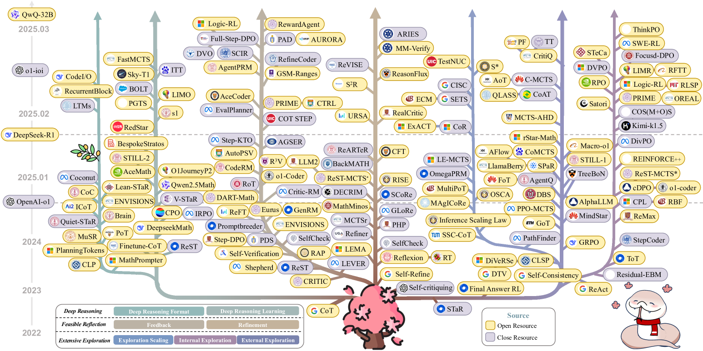

<figcaption>図1: 過去 3 年間の主要な Long CoT の進化。色つきの枝は異なる特性——deep reasoning・feasible reflection・extensive exploration——を表す。各特性はさらに鍵となる領域に分かれる: deep reasoning はその形式と学習法を含む。feasible reflection は、最適化戦略としての反省プロセスにおけるフィードバックと refinement の技法に焦点を当てる。extensive exploration は、Long CoT への鍵となる改善としてのスケーリング・内的探索・外的探索を扱う。</figcaption>
</figure>

しかし、RLLM のための Long CoT の主要な要因と近年の取り組みを体系的に理解するための包括的なサーベイは存在せず、これが RLLM の発展を妨げている。その結果、より長い CoT のための単純な「test-time scaling」の有効性をめぐる議論 [^610] [^343] と、過度に長いスケーリングによる「over-thinking」が LLM を害し不要な複雑さを持ち込むという主張 [^73] [^96] [^251] が対立したまま続いている。さらに、特定の問題を解く際には、長さと正確さの間に明確な関係はないと論じる研究者もいる [^622]。

このギャップに対処するため、私たちは Long CoT の広範で包括的なサーベイを提供する。具体的には、図 2 に示すように、まず Long CoT と従来の Short CoT の違いを定義・検討し、次の鍵となる側面に注目する: (1) Deep Reasoning（深い推論）——広範な推論ノードの集合を扱うのに十分な論理処理の深さを要求する。(2) Extensive Exploration（広範な探索）——並列の不確実なノードを生成し、既知の論理から未知の論理へ遷移することを含む。(3) Feasible Reflection（実行可能な反省）——論理的接続のフィードバックと refinement を含む。これらの特性により、Long CoT パラダイムはより込み入った推論を統合し、より広い範囲の論理構造に対応でき、最終的により効率的で一貫した成果をもたらす。続いて、Long CoT に関連する鍵となる現象——その創発、overthinking 現象、テスト時の推論時間スケーリング、「Aha Moment」など——の底にある説明を体系的に探る。私たちの知る限り、これはこれらの特定のトピックに捧げられた初の包括的なサーベイである。最後に、膨大な文献を踏まえ、将来の研究の有望な領域を強調し、将来の調査の基盤となりうる価値あるオープンリソースのフレームワークとデータセットを提案する。

本研究の主要な貢献は以下のとおりである:

- **体系的な区別**: 本研究では、まず Long CoT 推論の概念を導入し、従来の Short CoT から区別することで、両パラダイムとそれぞれの特性を理解するための明確な枠組みを提供する。
- **注目される現象の説明**: overthinking、推論の test-time scaling、「Aha Moment」など、Long CoT 推論に関連する顕著な現象を体系的に調査し、複雑な推論に関わる認知プロセスへの価値ある洞察を提供する。
- **新たな課題とフロンティア**: Long CoT 推論の分野における新たな課題を探り、鍵となる研究フロンティアを特定する。膨大な文献を踏まえ、さらなる探究が Long CoT 方法論の発展を大きく前進させうる領域を強調する。

<figure>

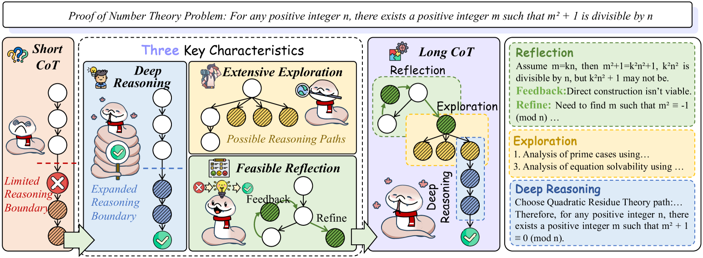

<figcaption>図2: 先進的な Long CoT と従来の Short CoT の違いは、3 つの鍵となる特性——deep reasoning・feasible reflection・extensive exploration——によって特徴づけられる。さらに、Long CoT はこれらすべての特性を統合して実質的な論理的効力を達成する。</figcaption>
</figure>

## 2 Discussion of Long CoT v.s. Short CoT（Long CoT と Short CoT の議論）

この節では、Long Chain-of-Thought（Long CoT）と Short Chain-of-Thought（Short CoT）の鍵となる違いを形式化し、推論の深さ・接続の再訪・論理ノードの探索を強調する [^607]。これらの区別は、System 1 と System 2 の思考とは明確に別のものである。Long CoT と Short CoT の比較は System 2 の枠内で構成され、Long CoT はより徹底した推論・反省・探索を伴う一方、Short CoT は一般に、網羅的な推論よりも浅く効率的な論理を優先する。

**図3**: Long CoT の分類法（taxonomy）。deep reasoning・feasible reflection・extensive exploration の方法論を含む。（訳注: 原典では文字ツリー。構造を保った入れ子リストとして起こした。手法名は原文のまま）

- **Deep Reasoning for Long CoT (§4)**
  - Deep Reasoning Format (§4.1)
    - Natural Language Deep Reasoning — 例: CoT, Reflection of thought, MathPrompter, CLP, AutoCAP, PlanSearch, NaturalProgram, CodeI/O など
    - Structured Language Deep Reasoning — 例: PoT, CoC, Brain, SIaM, ENVISIONS, SKIntern, QuaSAR, TinyGSM, MathDivide, GPT-f, STP など
    - Latent Space Deep Reasoning — 例: Quiet-STaR, PlaningToken, Coconut, RecurrentBlock, MuSR, SERT, Heima, LTMs, ITT など
  - Deep Reasoning Learning (§4.2)
    - Deep Reasoning Imitation — 例: GSM8K, AceMath, DART-Math, O1-Journey-P2, STILL-2, LIMO, s1, RedSTaR, Fine-tune-CoT, CoT-Collection, FastMCTS など
    - Deep Reasoning Self-Learning — 例: STaR, ReST, DynaThink, V-STaR, PGTS, CPO, TPO, OpenRFT, MCMC-EM, BOLT, Weak2Strong, Iterative RPO など
- **Feasible Reflection for Long CoT (§5)**
  - Feedback (§5.1)
    - Overall Feedback — 例: Self-Critique, SelfCheck, Self-Verification, Critic-CoT, Verifier, STaR, ReST, Critic, ReFT, AceCoder, DeepSeek-R1, Critic-RM, o1-coder, RM, Logic-RL, Self-Contrast, AGSER, DeepSeek-Math など
    - Process Feedback — 例: ReAct, Reflexion, Math-Minos, Math-Shepherd, ER-PRM, Eurus, PAD, PAVs, CTRL, QwQ, Skywork-o1, AceMath, PRIME, AURORA, RewardAgent, PDS, COT STEP, Step-DPO, ORPS など
    - Hybrid Feedback — 例: Step-KTO など
  - Refinement (§5.2)
    - Prompt-based Refinement Generation — 例: Reflexion, SelfCheck, Self-Critique, Self-Refine, Refiner, MCTSr, ReST-MCTS*, LLM2, GLoRe, RR-MP, PAD, DeCRIM, StepCo, BackMATH, ReARTeR, START, PHP など
    - SFT-based Refinement Imitation — 例: RealCritic, Self-Debugging, ProgCo, S3c-Math, Math-Minos, LEMA, Reflection-tuning, CFT, rStar, RISE, R3V, MM-Verify, URSA, SIMA, CoT-based Synthesizer など
    - RL-based Refinement Learning — 例: SCoRe, DeepSeek-r1, S²R, ReasonFlux, ReVISE, ARIES など
- **Extensive Exploration for Long CoT (§6)**
  - Exploration Scaling (§6.1)
    - Vertical Scaling — 例: OpenAI o1, s1, ITT, METAL, RaLU など
    - Parallel Scaling — 例: Self-Consistency, Inference Scaling Law, WoT, DIVERSE, DnA-Eval, SSC-CoT, ExACT, S*, CISC, OmegaPRM, AFT, Seed-CTS, CLSP, MultiPoT, ECM など
  - Internal Exploration (§6.2)
    - RL Strategies — 例: PPO, GRPO, REINFORCE++, OREO, DAPO, LIMR, TRPO, DVPO, RPO, PRIME, DivPO, COS(M+O)S, CPL, Focused-DPO, RFTT, DeepSeekMath, TPO など
    - Reward Strategies — 例: DeepSeek-R1, Kimi-k1.5, T1, ReST-EM, SWE-RL, DeepScaleR, ReST-MCTS*, rSTaR-Math, Logic-RL, OREAL, StepCoder, RLSP, Verifier, TS-LLM, STeCa, OREO など
  - External Exploration (§6.3)
    - Human-driven Exploration — 例: SPaR, Forest-of-thought, Scattered ForestSearch, AlphaLLM, PATHFINDER, Least-to-Most, ToT, TreeBoN, CodeTree, Tree-of-Code, TouT, GoT, GraphReason, AoT など
    - Model-driven Exploration — 例: DBS, MindSTaR, Residual-EBM, Mulberry, C-MCTS, PPO-MCTS, Llama-Berry, Marco-o1, AtomThink, LE-MCTS, rStar-Math, MC-NEST, CoAT, CoPlanner, CritiQ など

### 2.1 Overview of Short CoT（Short CoT の概観）

図 2 に示すように、Short CoT は典型的に、浅く線形な推論プロセスによって特徴づけられ、そこでは結論が逐次的に導かれ、限られた数の論理ノードに依存することが多い [^386]。この推論は通常、速く直截的で、単純で表面的な遷移と、代替経路の最小限の探索を伴い、これが汎化可能性を制限する [^480]。形式的には、推論モデル $\mathcal{R}$ が与えられたとき、Short CoT の理路（$\texttt{CoT}_{S}$）を次のように定義できる:

$$
\texttt{CoT}_{S}=\mathcal{R}(\{n_{i}\}^{k}_{i=1}|(k\leq\mathcal{B}_{s})\wedge(j\!=\!1\Leftrightarrow\forall i\!\leq\!k,n_{i}\!\rightarrow\!n_{i+j})\wedge(\forall i\!\neq\!j\!\leq\!k,n_{i}\!\neq\!n_{j})),
$$

ここで $n_{1}$ から $n_{k}$ は論理ノードの列を表し、自然に $\forall i,n_{i}\rightarrow n_{i+1}$ を満たす。$\mathcal{B}_{s}$ は [^64] が定義した推論ノード数の上界を表す。このパラダイムでは、推論はひとつのノードから次へと逐次的に進み、以前のノードの再訪は最小限で、代替の論理経路の探索もほとんどない。

### 2.2 Overview of Long CoT（Long CoT の概観）

対照的に、Long CoT はより深い推論・反省的な分析・論理構造のより広い探索を伴う。より広い範囲の論理ステップにわたる推論を促進し、問題の既知の要素と未知の要素の両方を扱う [^128]。形式的には、Long CoT は式 1 で概説した制約を、明示的または暗黙的な木構造に基づいて拡張する。図 3 に示すとおり、以下でこれらの鍵となる違いを詳しく議論する。

#### 2.2.1 Deep Reasoning for Long CoT（Long CoT のための深い推論）

図 2 に示すように、deep reasoning とは、相互接続された複数の論理ノードにわたって深く徹底した論理分析を行う能力を指し、Short CoT には概して決して到達できない。この能力は、妥当な結論に到達するために膨大な数の論理的演繹を要する複雑な問題に取り組む際に不可欠である。deep reasoning をよりよく定義・理解するため、これを主に式 1 の第一の制約を緩和する能力として枠づける:

$$
k\leq\mathcal{B}_{s}\rightarrowtail k\leq\mathcal{B}_{l}\wedge\mathcal{B}_{s}\ll\mathcal{B}_{l},
$$

ここで $\mathcal{B}_{l}$ は Long CoT 推論の上界を表し、Short CoT のより小さい上界 $\mathcal{B}_{s}$ と比べて、はるかに込み入った推論ノードに対応できる。より大きな上界 $\mathcal{B}_{l}$ は推論の深さ不足に関わる問題を和らげ、短い形式の推論で未解決の答えや幻覚応答を生むリスクを減らす。

> **Key Difference: Reasoning Depth（鍵となる違い: 推論の深さ）**
> - Short CoT は典型的に限られた論理ノードの集合を扱い、浅い推論を伴い、複雑または込み入った論理構造を要する問題に苦しむ。
> - Long CoT は著しく大きな論理ノードの集合に対応するよう設計されており、推論プロセスにおけるより深い論理とより徹底した分析を可能にする。

#### 2.2.2 Extensive Exploration for Long CoT（Long CoT のための広範な探索）

図 2 に示すように、Long CoT は、不確実または未知の論理ノードを広範に探索するための分岐を促し、それによって推論経路の潜在的な集合を拡張する。この探索は、曖昧さ・不完全な情報・複数の可能な解によって特徴づけられる問題を解く際に特に決定的である。より具体的には、extensive exploration が主に式 1 の第二の制約の緩和を扱うことを述べる。これは次のように形式化できる:

$$
j=1\Leftrightarrow\forall i\leq k,n_{i}\rightarrow n_{i+j}\rightarrowtail\exists m,\forall i,j\leq m,n_{i}\rightarrow n_{i+j},
$$

ここでこの条件は、論理ノード $n_{i}$ に対して、並列に探索される $m$ 個のノードがあることを示す。並列探索の許容はより体系的なアプローチを可能にし、これまで考慮されなかった論理経路の探索を可能にする。これは翻って、すべての可能な解の理解を最大化するのを助け、最終的に正しい最終回答へ導く。

> **Key Difference: Exploration of Logical Nodes（鍵となる違い: 論理ノードの探索）**
> - Short CoT は一般に探索を固定された論理ノードの集合に制限し、しばしば単純化されすぎた推論と限られた探索をもたらす。
> - Long CoT は、不確実な領域や未踏の領域を含むより多様な経路を探索し、よりニュアンスに富み包括的な問題解決を育む。

#### 2.2.3 Feasible Reflection for Long CoT（Long CoT のための実行可能な反省）

図 2 に示すように、Long CoT は、以前の論理ノードを再訪してその接続が妥当かつ正確であることを検証し、それらを修正するか代替の論理経路を選ぶことを含む。形式的には、feasible reflection は式 1 の第三の制約を緩和する。次のように表される:

$$
\forall i\neq j\leq k,n_{i}\neq n_{j}\rightarrowtail\exists i<j\leq k,n_{i}=n_{j},
$$

ここでこの条件は、論理ノード $n_{j-1}$ に対して、後続ノードが元の次ノード $\hat{n}_{j}$ に限定されないことを示す。代わりに $n_{i}$ へ遷移しうる（すなわち、次の推論ノードは $n_{j}=n_{i}$ となる）。実用上、reflection の実装は 2 つの構成要素からなる:

##### Feedback（フィードバック）

フィードバックとは、全体の出力と中間の出力の両方を正確さと品質について評価することを指し、critique（批評）や verification（検証）とも呼ばれる。外部ソース・検証チェック・推論プロセス内での以前の結論の振り返りから導かれうる。形式的には、各ステップ $n_{i}$ で検証プロセス $\mathcal{V}_{i}$ が推論の正確さ・実行可能性・一貫性を保証する。問題が特定されると、プロセスは $n_{i}$ を最も近い正しいノード $n_{j}$（$j<i$）へリダイレクトする。この関係は次のように形式化される:

$$
\mathcal{F}_{i},n_{j}\leftarrow\text{Feedback}(\texttt{CoT}_{L}^{i})
$$

ここで $\texttt{CoT}_{L}^{i}=\{n_{1},\dots,n_{i}\}$ は、Long CoT の第 $i$ 論理ノードまでの現在の論理経路を表す。

##### Refinement（洗練）

これは、与えられたフィードバックに基づき、不整合を修正しギャップに対処するために、中間ステップを調整するか論理の流れを変更することを含む。このプロセスは数学的に次のように表せる:

$$
\widetilde{n}_{i+1}\leftarrow\text{Refine}(n_{i+1}|\texttt{CoT}_{L}^{i},\mathcal{F}_{i},n_{j})
$$

ここで $\widetilde{n}_{i+1}$ は、現在の論理 $\texttt{CoT}_{L}^{i}$・フィードバック結果 $\mathcal{F}_{i}$・以前の推論ノード $n_{j}$ に従って洗練された、後続の推論ノード $n_{i+1}$ の改訂版を表す。

全体として、reflection の組み込みは、誤りが速やかに特定・修正されることを保証する。この能力により、LLM は素早く代替の推論経路へ移るか、現在の軌道を修正できる。そうすることで誤りの伝播が最小化され、より正確な結論がもたらされる。

> **Key Difference: Feedback & Refinement（鍵となる違い: フィードバックと洗練）**
> - Short CoT は典型的に、ひとつのノードから次へと直截的で非反復的に進むため、自らの論理を修正できない。
> - Long CoT はフィードバックと refinement によって以前の決定の再訪と改訂を許し、推論の進行中に最適化可能で先行する論理的結論を保証する。

#### 2.2.4 Unified Discussion（統一的な議論）

ここで議論する Long CoT は、先に概説した 3 つの鍵となる特性を統合する統一的な推論システムを表す。対照的に、Short CoT の時代には、これらの能力は独立に発展した。図 2 に示すように、初期の取り組みは従来の CoT パラダイム内の deep reasoning に焦点を当て、続いて人間が設計したパイプラインに基づく反省機構が徐々に導入された。その後、探索能力が加わり、これら 3 つの構成要素が統合されて、推論の統一的な強化を目指す現代の Long CoT の概念が形成された。

Long CoT の発展は、O1 [^208] や R1 [^155] のような孤立したモデルによる突然の出現ではなく、漸進的である。たとえば、ToT [^668] のような初期のシステムは探索を強化するが反省機構を欠くため、Long CoT とは見なされない [^67]。GoT [^32] は ToT の上に自己反省を組み込むが、その元のモデルはなお頑健な deep reasoning を欠いており、当時 Long CoT とは呼べなかった。また、現代の Long CoT システムがしばしば初期の技術を無視することも注目に値する。本稿はこのギャップに、各能力の進化を辿ることで対処し、最終節で統合された Long CoT システムの包括的な分析を提供する。

まとめると、Long CoT と Short CoT は別個のパラダイムを表す。Long CoT は、より深く、より広く、より反省的な推論プロセスを特徴とし、正確さと一貫性の両方を高める。対照的に Short CoT は、より単純で明確に定義された問題により適する。この区別は Long CoT のスケーラビリティと適応性を浮き彫りにし、より複雑な推論に特に有効であることを示す。

> **Key Difference: Unified Capabilities（鍵となる違い: 統一された能力）**
> Long CoT は複雑な推論を行うために以下の 3 つの異なる能力を統合していることを強調しておきたい。対照的に、従来の Short CoT の最適化は典型的に、これらの特性のうちひとつだけに焦点を当てる。

## 3 Long CoT Analysis & Evaluation（Long CoT の分析と評価）

### 3.1 Analysis & Explanation for Long CoT（Long CoT の分析と説明）

Long CoT の研究は、推論の正確さの改善・誤りの削減・動的な意思決定の支援によって RLLM を大きく強化してきた。しかし、いくつかの現象とそれに対応する機構は、いまだ十分に整理されていない。この節は、Long CoT の機構とその底にある原理を含む鍵となるトピックを扱う [^457] [^45] [^381] [^455]。方法論的には、Long CoT を説明する 2 つの主要な視点が現れている: (1) 外的挙動の分析（§3.1.1）と (2) 内的機構の分析（§3.1.2）である。

#### 3.1.1 Long CoT External Behavior Analysis（Long CoT の外的挙動の分析）

主要な研究の流れは、Long CoT に関する RLLM の挙動の説明に焦点を当てる [^20]。図 4 に示すように、この部分では Long CoT について 6 つの鍵となる現象を特定し議論する。

##### Long CoT Emergence Phenomenon（Long CoT の創発現象）

研究は、文脈内の例示が推論連鎖の形成を導くことで大規模モデルの生成能力を改善することを示している [^707] [^473] [^297] [^238] [^369]。[^543] は、これらの例示が答えに関連する推論連鎖の生成を標準化することを実証している。[^374] の実験では、文脈内の例示から問題固有のエンティティを取り除き論理構造のみを保持しても、完全な例示を使った場合と同様の性能となり、推論時の Long CoT の論理構造の模倣を浮き彫りにした。

より最近では、[^484] と [^579] が、デコーディングプロセスの変更や特定のプロンプトの設計によって、事前学習済みモデル内の Long CoT を活性化できることを示した。彼らは、CoT は事前学習中に埋め込まれ、特定の活性化を必要とすると提案する [^658]。さらに [^455] は Long CoT の源泉を訓練データに求め、「model attribution（モデル帰属）」の概念でこれを発展させ、特定の出力に最も影響した訓練データを具体的に特定する。これらの上に、[^155] と [^622] は、ルールベースの強化学習を使って事前学習中の Long CoT を直接活性化し、性能を高めることを調査している [^620]。さらに [^128] は、検証（verification）・バックトラッキング（backtracking）・部分目標の設定（sub-target setting）・バックリンク（backlinking）を含む 4 つの鍵となる認知的挙動を特定し、これらが Long CoT をうまく促進することを示した。Qwen [^649] はこれらの挙動を本来的に示し、ルールベースの強化で容易に引き出せる。対照的に Llama [^113] はこれらの能力を欠いており、大きく改善するには例示ベースの強化学習を必要とする。

<figure>

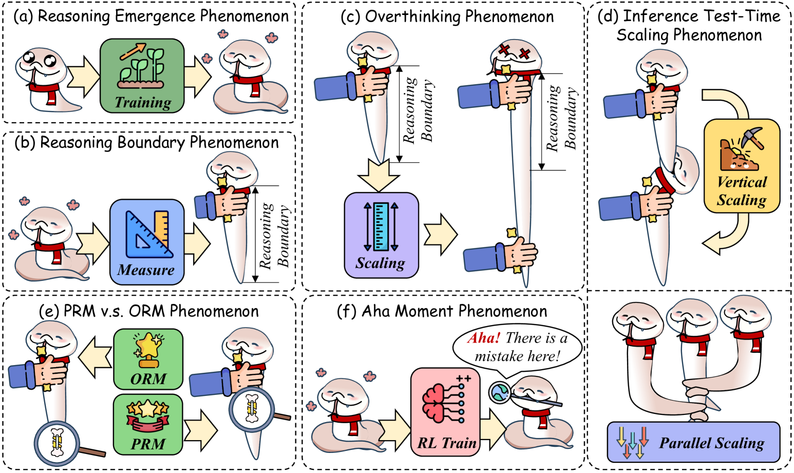

<figcaption>図4: Long CoT の外的挙動の 6 つの古典的現象の分析: (a) 現在の RLLM における Long CoT の創発、(b) 現在の Long CoT システムの推論境界と限界、(c) RLLM の推論境界を超えたスケーリングによって引き起こされ性能低下につながる overthinking、(d) test-time scaling——主流のスケーリング手法・対応するスケーリング則・その限界の議論、(e) プロセス報酬モデル（PRM）と結果報酬モデル（ORM）の使用、(f) 「aha」moment とその根本原因の探究。</figcaption>
</figure>

##### Reasoning Boundary Phenomenon（推論境界の現象）

近年の研究は、さまざまな推論タスクにわたる RLLM の上界と限界を浮き彫りにしてきた [^204] [^191] [^481] [^178]。具体的には、[^36] はコード生成におけるこれらの限界を調査し、RLLM が一定の複雑さの閾値を超えるタスク——特にさまざまな複雑さの Long CoT サンプルを模倣するとき——に苦しむことを示す。上界性能の文脈では、[^383] と [^306] が単一ステップの算術タスクに注目し、モデル性能が入力長に制約されると結論づけた。さらに [^118] は、固定サイズのモデルが特定の限界を超えて正確な数値回答を生成できないことを示す数学的モデルを提案している。しかし、推論ステップ数を増やすことは、より複雑な問題を解くモデルの能力を改善する。

これらの探究に触発され、[^64] は初めて「reasoning boundary（推論境界）」現象を定義してこれらの限界を定量化し、RLLM の推論容量を超えると性能が低下することを示した。同様に [^791] は GSM-Infinite を導入し、異なる上限を精度水準に結びつけた。[^64] はまた、さまざまな複雑さのタスクにわたるこれらの境界の相互作用を検討し、Long CoT 戦略の有効性への洞察を提供している [^759]。さらに [^9] は Long CoT の「タイトな下界」を提案し、推論誤りの削減をさらに導く。加えて [^22] は、一桁先読みのヒューリスティックへの依存のために、複数オペランドの加算の実行には固有の境界があり、これがより複雑な数値推論へのスケーリングにおける LLM の根本的な限界を妨げると示唆する。

##### Overthinking Phenomenon（考えすぎの現象）

研究は overthinking 現象を浮き彫りにしてきた [^73] [^227] [^404] [^96] [^251]。そこでは、性能は閾値まで推論連鎖が長くなるにつれ改善するが、その後は低下する。対照的に、[^622] と [^370] は推論の長さと正確さの間に有意な相関を見出していない。これを説明するため、ある研究の流れは、Long CoT 戦略が「snowball errors（雪だるま式の誤り）」の回避のように働くと示唆する [^126]。あるいは、[^64] [^602] は推論境界を超えたときの性能低下を強調し、overthinking 現象への説明を提供する。これは、推論の長さと論理的複雑さを一定の境界以下に保つべきことを示唆する [^756]。この上に、[^611] は Long CoT の実行可能な推論長を数学的に決定する。最後に [^66] は Long CoT のファラデーの法則を導入し、性能を正確に予測・制御する。

##### Inference Test-Time Scaling Phenomenon（推論のテスト時スケーリング現象）

推論時スケーリングアルゴリズムの近年の進歩 [^364] [^598] は、特に推論長を延ばして性能を改善する能力によって、大きな注目を集めてきた [^364]。具体的には、[^40] が「Large Language Monkeys」と呼ばれる現象を特定した。一連の推論タスクにおいて、十分な試行があれば正しい結果に到達できる、というものである。加えて、O1 [^208] と R1 [^155] は、モデル推論の長さを直接スケールさせることが最終性能を改善することを実証した。

推論の test-time scaling を理解するため、次の 2 つのパラダイムを議論する: (1) **Vertical Scaling（垂直スケーリング）**: 垂直スケーリングは推論経路の長さを増やすことを含む。これは性能を高めうるが、[^227] の研究は、ある点を超えると、誤りの蓄積のために、より長い推論経路が性能を劣化させうることを示す。彼らは、モデルの能力とタスクの複雑さに依存する最適な経路長を示唆する [^12] [^463]。さらに [^64] と [^611] は、RLLM の固有の推論境界を超えた過度の探索長が性能低下につながることを説明し、これは RLLM をより深い推論能力へ導く [^25]。(2) **Parallel Scaling（並列スケーリング）**: 並列スケーリングは、複数の推論ステップを実行して結果を検証することを含む。有望ではあるが、[^411] と [^584] は、単に推論時間を増やしても性能改善は保証されないと論じる。[^610] は、推論の計算 FLOPs $N$ が性能誤差の下界と相関し、それが $\log N$ でスケールすることを示す。加えて [^66] は並列スケーリングの上界を確立し、RLLM がさまざまな verifier による Pass@k 検証を超えられないことを示す。さらに彼らは、サンプリングの最適化はモデルの内的な推論の限界を超えられないと論じ、$N$ サンプルに対して精度が $\frac{m}{(k/\log N+b)^{2}}$ に比例することを実証している（$m$, $n$, $b$ はモデル依存の定数）。

##### PRM v.s. ORM Phenomenon（PRM 対 ORM の現象）

RLLM が発展するにつれ、複雑な推論タスクのための 2 つの鍵となる強化学習アプローチであるプロセス監督（process supervision）と結果監督（outcome supervision）を区別することが不可欠になっている [^632] [^123]。プロセス監督は長期的な報酬割り当てにおいて直観的に有利だが、両者の正確な関係は不明なままである。プロセス監督は、trajectory レベルのカバレッジ問題のためにより難しいと一般に考えられている。細粒度の監督データの収集に多大な労力を要するからである [^769] [^478]。加えて PRM は reward hacking の問題に直面する [^10] [^101] [^403] [^24]。エージェントが報酬関数の欠陥を突いて意図しない挙動を生むのである [^155]。これに対処してルールベースの報酬システムを超えることは、重要な研究領域になっている [^155] [^622] [^419]。さらに、[^260] と [^497] は定性的実験で中間ステップと最終回答の間の因果的リンクを確立している。この上に、[^216] は、標準的なデータカバレッジの仮定の下では、結果監督による強化学習は、多項式因子を除けば、プロセス監督より統計的に難しくはないことを実証している。

##### Aha Moment Phenomenon（Aha Moment の現象）

早くに [^155] は、ルールベースの報酬を使った直接の RL が aha moment を引き起こし、監督なしの自然な自己反省を育むことを実証した。これに続いて [^507] [^622] がこの現象を再現した。さらに [^782] と [^382] はこの現象をマルチモーダルなシナリオへ拡張している。しかし [^346] は、aha moment は R1-Zero 型の訓練では創発しないかもしれないと論じる。代わりに彼らは、superficial self-reflection（SSR, 表面的自己反省）のような自己反省パターンが、ベースモデルの段階であるエポック 0 で現れることを観察している。この場合、自己反省は必ずしも正しい答えにつながらない。RL による R1-Zero 訓練を詳しく検討した結果、応答長の増加は自己反省からではなく、よく設計されたルールベース報酬を RL が最適化した結果だと彼らは見出している。

#### 3.1.2 Long CoT Internal Mechanism Analysis（Long CoT の内的機構の分析）

第二の研究の流れは、Long CoT 関連の RLLM の内的機構を調査する。

##### Reasoning Interal Mechanism（推論の内的機構）

近年の研究は、Long CoT の一貫した理路出力の底にある内的機構を、特に attention 機構に重点を置いて探究してきた [^476] [^446]。これらの研究は主に RLLM のニューラルな下部構造を検討し、CoT 推論をホワイトボックスの視点から枠づける [^583] [^693] [^159] [^114]。[^601] は System 2 Attention（S2A）の概念を導入し、関連情報へ選択的に注意を集中させることによる Long CoT 生成を実証する。加えて [^290] は、直接出力の層と Long CoT の層の間の勾配分布を探り、Long CoT の層が関連する推論とそうでない推論を区別することで安定性の維持を助けることを明らかにした。最後に [^747] は RLLM を有限状態オートマトンとして概念化し、内的なダイナミクスが外的挙動にどう影響するかへのさらなる洞察を提供する。Short CoT は自己修正に苦しむにもかかわらず、[^31] は、これらのモデルが consistency heads（attention head）に依存して、内的なショートカットを通じて算術解の数値の整合を評価することを示している。

##### Knowledge Incorporating Mechanism（知識取り込みの機構）

現在の RLLM は主に数学とコーディングに焦点を当てるが、他の知識豊富なドメインへの汎化の可能性を示しており、ドメイン固有の知識を Long CoT に統合する機構への関心が高まっている [^608] [^622]。[^429] は、生成モデルが事前学習中に学んだエンティティ知識を独立に保存し、Long CoT の推論プロセスがこの知識をエンティティ間で結びつけると示唆する。[^444] は最近、モデル出力を推論・記憶・推測に分類する Probabilistic Mixture Model（PMM）を導入した。彼らはまた、モデルの確信度と戦略選択の関係を定量化する Information-Theoretic Consistency（ITC）分析を提案している。加えて [^228] は、複雑な概念が理解される最下層として「Concept Depth」を定義し、RLLM における知識統合の水準の違いを実証する。[^402] は知識ループの進化を通じて RLLM の知識内在化を検討し、新しい知識の獲得は既存知識との接続によって形作られ、ループは形成から最適化へ、浅い層から深い層へと進化すると論じている。

### 3.2 Long CoT Evaluations（Long CoT の評価）

#### 3.2.1 Metrics（指標）

ベンチマーキングでは、さまざまな指標が推論タスクにわたるモデル性能を評価し、それぞれ推論能力の異なる側面に焦点を当てる。これらの指標は、望ましい成果の達成における RLLM の有効性と、その学習効率の両方を評価する。その結果、RLLM のための指標は近年の研究でますます注目されている。数学またはコード関連のタスクでは、正規表現抽出に基づく 3 つの鍵となる指標が一般に使われる: Accuracy、Pass@k、Cons@k である。

- **Accuracy** は正しい出力の割合を測る。
- **Pass@k** は $k$ 回の試行内で少なくとも 1 つの正しい解を生成する尤度を評価する。
- **Cons@k** は、複数の試行にわたってモデルが一貫して正しいまたは論理的に整合した解を生成する能力を判定することで、一貫性を評価する。

科学的・常識的な質問応答タスクでは、評価はしばしば正規表現抽出に基づく Exact Match（EM）と Accuracy を使う。EM はモデルの出力が期待される解と厳密に一致するかを判定する。

ORM や PRM のようなフィードバック技法には、Rank と Best-of-N の指標がよく使われる:

- **Rank** は、報酬モデルが上位 $k$ 候補から最良の推論プロセスを正しく優先できるかを測る。
- **Best-of-N** は、生成された $N$ 個の推論 trajectory から最高スコアの解を選び、最終成果に基づいて報酬モデルの有効性を間接的に測る。

#### 3.2.2 Decoding Strategies（デコーディング戦略）

デコーディング戦略は推論プロセスの制御に不可欠である。一般的なアプローチには Greedy Decoding・Beam Search・Major@k が含まれる。Greedy Decoding と Beam Search はどちらもサンプリング範囲を制限してランダム性を減らし、モデルをより一貫した出力へ導く。対照的に Major@k は、$k$ 個の候補解の集合から最も一貫性の高いものを選ぶことで、最も信頼できる解を特定する。

#### 3.2.3 Benchmarks（ベンチマーク）

ベンチマークの領域では、多様なドメインにわたる RLLM の推論能力の評価に焦点がある。主要なカテゴリは 2 つある: (1) Outcome Benchmarks——Long CoT 推論の全体像に焦点を当てる。(2) Process Benchmarks——Long CoT プロセスの局所像や個々の能力に集中する。

##### Outcome Benchmarks（結果ベンチマーク）

Outcome Benchmarks の領域では、第一の焦点は論理的推論能力の評価にある:

第二の焦点領域は Knowledge Benchmarks であり、さまざまなドメインにわたる複雑な推論におけるモデルの能力の評価に不可欠である:

- **Scientific Reasoning（科学的推論）**: GPQA Diamond [^451]、MMLU-Pro [^585]、SuperGPQA [^111] のような科学的推論ベンチマークは、化学・生物学・物理学のような分野での多ドメイン推論を評価する。これらのベンチマークは、モデルが知識を蓄積するだけでなく、問題解決のためにそれを統合する能力をテストする。Humanity's Last Exam（HLE）[^422] は、科学分野を横断する深い学際的推論を要求することで、モデルにさらなる挑戦を課す。さらに [^94] は、理論物理の問題を解く RLLM の有効性を評価する TPBench を提案している。
- **Medical Reasoning（医学的推論）**: 医学的推論の領域では、複雑でドメイン固有かつ正確な推論の必要性が最も重要である [^764] [^719] [^637]。MedQA [^225]、JAMA Clinical Challenge [^55]、Medbullets [^55] のようなベンチマークは、診断と治療の意思決定プロセスをシミュレートし、実世界の医療実践を反映する。これらのベンチマークは、診断から治療計画まで、モデルの医学知識と推論の扱いを評価する。加えて MedXpertQA [^801] は、テキストとマルチモーダルデータを組み合わせた包括的な評価フレームワークを導入し、医療における AI の推論能力を特に評価する。

#### 3.2.4 Process Evaluations（プロセス評価）

##### Deep Reasoning Benchmarks（深い推論のベンチマーク）

RLLM の近年の進歩は、Long CoT における深い推論能力を評価する専門的なベンチマークの必要性を強調している [^266]。特に [^320] は、複雑な非単調シナリオにおける論理的推論を評価するフレームワーク ZebraLogic を導入している。同様に BigGSM [^64] と GSM-Ranges [^472] は、数値の摂動によって、モデルの訓練分布を超えたエッジケースでの論理・算術推論をテストすることに焦点を当てる。ROSCOE [^142]、ReCEval [^426]、DiVeRSe [^304] は、Long CoT タスク中の深い推論プロセスの各ステップを評価するよう設計されている。

##### Exploration Benchmarks（探索のベンチマーク）

いくつかの研究は、Long CoT タスクにおける RLLM の探索能力を評価する。具体的には、Sys2Bench [^411] は RLLM の探索とスケーリングの能力を評価し、多様なタスクにわたる汎化を強調する。BanditBench [^397] は対話的環境でのモデル性能のテストへこれを拡張し、実用的応用への洞察を提供する。加えて [^173] は、複雑な問題解決シナリオにおける推論と空間探索を評価するグラフ彩色問題を導入している。

##### Reflection Benchmarks（反省のベンチマーク）

Reflection ベンチマークは、Long CoT 推論における誤りの特定・反省・修正の能力を測る。これらのベンチマークは 2 つのカテゴリに分かれる: フィードバックと refinement である。(1) **Feedback Benchmark**: これらのベンチマークは、LLM が誤りを検出し、改善のためのフィードバックに応答する能力を評価する。たとえば [^259] は、RLLM の報酬能力を評価する RewardBench を導入している。この枠組みは [^672] と [^720] によって、それぞれマルチモーダルとコードの文脈を含むよう拡張された。ProcessBench [^769]、PRMBench [^478]、MR-Ben [^716]、DeltaBench [^171] のようなベンチマークは、ステップレベルでのさまざまなタスクにわたる誤り検出と修正に焦点を当てる。加えて ReaLMistake [^232] と JudgeBench [^498] は、より実世界の誤り評価を扱う。(2) **Refinement Benchmark**: これらのベンチマークは、複雑なタスクにおける誤り修正に焦点を当てる。CriticBench [^324] は批評-修正の能力を評価し、ErrorRadar [^645] は特に数学におけるマルチモーダルの誤り検出に特化する。FinerReason [^51] は、より広いフィードバックと refinement の評価のために常識パズルを導入する。Medec [^1] は誤り修正を医療に適応させ、医学的問題を扱う。

#### 3.2.5 Advanced Evaluation（発展的な評価）

##### Agentic & Embodied Reasoning（エージェント的・身体的推論）

エージェント的（agentic）・身体的（embodied）な推論は、実世界の相互作用・ツール利用・変化に応じた適応的推論の理解をモデルに要求する。実世界理解の評価のため、[^568] は物理的概念について推論するエージェントの能力を評価するベンチマークを導入している。[^745] は実世界の物理とのエージェントの相互作用の評価へこれを拡張する。加えて、現実的なタスクはしばしば複雑な計画とツール利用を要求し、エージェントの推論を評価するベンチマークを必要とする。これらのベンチマークは、デジタル環境をナビゲートしタスクを完了するエージェントの能力を評価する。この上に、[^191] は多エージェント・競争的な設定での意思決定を評価するフレームワークを提案している。[^393] は、多段階のツール利用推論を評価するよう設計されたベンチマーク ToolComp を導入する。実世界の変化に直面した適応的推論を分析するため、OSWorld [^623]、CogAgent [^177]、Mobile-Agent-E [^589]、WebShop [^667]、WebArena [^789]、WebGames [^522] は、オペレーティングシステム・モバイル GUI・ブラウザタスク・対話的エンターテインメントといったドメインにわたる AI システムを評価する [^770] [^559]。[^186] は Text2World を提示し、テキストから対話的環境を生成する能力を評価してエージェントの適応性をテストする [^695]。

##### Multimodal Reasoning（マルチモーダル推論）

マルチモーダル推論とは、テキスト・画像・時にコードやグラフを含む多様な入力タイプを統合し、それらにまたがって推論するシステムの能力を指す。この能力は、多様な形式からの情報を要する複雑な問題の解決に決定的である。

- **Complex Mathematics（複雑な数学）**: 数学的推論はしばしば、方程式・グラフ・図のようなテキストと視覚の両方の構成要素を統合する。具体的には、MathVista [^352]、MathVision [^561]、MathVerse [^739]、M3CoT-Math [^65]、CMMaTH [^309]、EnigmaEval [^546]、CoMT-Geometry [^85]、PGPS9K [^737] のような課題が数学におけるマルチモーダル推論の前進を目指し、マルチモーダル Long CoT 論理の評価を改善する。
- **Complex Code（複雑なコード）**: 第二の焦点領域はコード関連の推論であり、システムはテキスト記述とコードスニペットを解釈する。HumanEval-V [^728]、Code-Vision [^550]、Plot2Code [^603] のようなベンチマークは、自然言語処理とプログラミングタスクを統合するシステムの評価のために、自然言語とマルチモーダル入力からコードを生成・解釈する能力を評価する。
- **Complex Science（複雑な科学）**: この領域は、科学的テキストを関連する図や実験データと統合することを含む。ScienceQA [^351] と M3CoT-Science [^65] のようなベンチマークは、さまざまな科学ドメインにわたって、モデルが科学情報を Long CoT 推論とどれだけうまく組み合わせるかを評価する。
- **Commonsense Puzzle（常識パズル）**: この領域は常識推論に焦点を当て、システムは推論の手がかりと画像を組み合わせてより深い結論を導く。[^65] は、複雑なマルチモーダル相互作用のための常識 Long CoT 推論を組み込んだ M3CoT-Commensense を導入している。加えて [^544] は 2 つのベンチマークを提案する: 3 つのタスクタイプで視覚的理解をテストする Clue-Visual Question Answering（CVQA）と、視覚データの解釈と適用に焦点を当てた 2 つのタスクタイプを特徴とする Clue of Password-Visual Question Answering（CPVQA）である。

##### AI for Research（研究のための AI）

AI の近年の進歩は科学研究を大きく前進させており [^787] [^581] [^144]、SciWorld [^568] のようなプラットフォームが研究プロセスを改善している。同時に、[^428] と [^48] は、実験の自動化における RLLM の可能性を評価する機械学習プラットフォームを導入している。いくつかの研究はまた、革新的な研究アイデアを生成する RLLM の能力を検討している。たとえば [^474] は、100 人超の NLP 研究者による評価を実施して RLLM の創造性を評価し、顕著な限界を明らかにしている [^287] [^606] [^512]。加えて [^310] は、複雑な工学問題に対する実行可能な解を生成するシステムの能力を評価するベンチマーク SolutionBench を導入している。

## 4 Deep Reasoning for Long CoT（Long CoT のための深い推論）

deep reasoning の能力は、主として認知・推論プロセスにおける深遠な深さと包括性を要求する。そのような能力がなければ、RLLM は重大な性能低下を被る [^542] [^587]。深い推論を強化する現在のアプローチは 2 つの主要カテゴリに分類できる: (1) Deep Reasoning Format（§4.1）——さまざまな推論実行形式の利用を含む。(2) Deep Reasoning Learning（§4.2）——モデルが深い推論能力を学習・強化できるようにすることに焦点を当てる。

<figure>

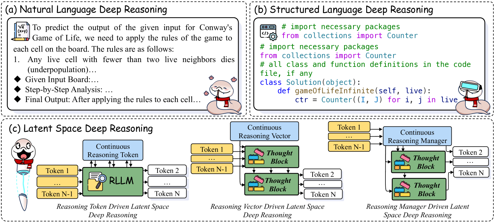

<figcaption>図5: 深い推論形式の 3 つの主要カテゴリ: 自然言語・構造化言語・潜在空間推論（トークン駆動・ベクトル駆動・マネージャ駆動の潜在推論に細分される）。例は文献 285 から引いた。</figcaption>
</figure>

### 4.1 Deep Reasoning Format（深い推論の形式）

図 5 に示すように、深い推論形式は 3 つの主要タイプに分類できる: 自然言語（§4.1.1）、構造化言語（§4.1.2）、潜在空間推論（§4.1.3）である。最後のものはさらに、トークン駆動・ベクトル駆動・マネージャ駆動の潜在推論に細分される。これらの形式にわたる推論性能は Table 1 に示す。

**表1**: さまざまな深い推論形式の性能。主に GSM8K スコアで整列。「-」は論文がそのスコアを報告していないことを示す。

| Model | Base Model | GSM8k | MATH | GPQA | OlympiadBench | LiveCodeBench |
| --- | --- | --- | --- | --- | --- | --- |
| **Latent Space Deep Reasoning** | | | | | | |
| No-CoT 100 | Mistral-7B 217 | 38.0 | - | - | - | - |
| SQ-VAE 575 | Llama-2-7B 529 | 40.0 | 7.0 | - | - | - |
| RecurrentBlock-3.5B 136 | - | 42.1 | - | - | - | - |
| ICoT-SI 100 | Mistral-7B 217 | 51.0 | - | - | - | - |
| **Natural Language Deep Reasoning** | | | | | | |
| Self-Rewarding 80 | Llama-2-7B 529 | 40.0 | 10.7 | - | - | - |
| Llama-3.1-8B 113 | - | 56.7 | 20.3 | - | - |   |
| MetaMath 688 | Llama-2-7B 529 | 66.5 | - | - | - | - |
| OVM 685 | Llama-2-7B 529 | 73.7 | - | - | - | - |
| NuminaMath-7B-CoT 283 | - | 75.4 | 55.2 | - | 19.9 | - |
| Qwen2-7B 648 | - | 79.9 | 44.2 | - | 21.3 | - |
| Qwen2-Math-7B 650 | - | 80.4 | 50.4 | - | 38.2 | - |
| Internlm2-math-plus-7B 682 | - | 84.0 | 54.4 | - | 18.8 | - |
| OMI2 285 | Qwen2.5-Coder-7B 202 | 84.1 | 72.3 | 36.2 | - | 27.2 |
| Llama-3.1-70B 113 | - | 85.5 | 41.4 | - | - | - |
| CODEI/O++ 285 | Qwen2.5-Coder-7B 202 | 85.7 | 72.1 | 40.6 | - | 29.1 |
| CODEI/O 285 | Qwen2.5-Coder-7B 202 | 86.4 | 71.9 | 43.3 | - | 28.5 |
| WI 285 | Qwen2.5-Coder-7B 202 | 87.0 | 71.4 | 39.1 | - | 26.0 |
| WI (Full) 285 | Qwen2.5-Coder-7B 202 | 87.0 | 71.1 | 42.9 | - | 27.6 |
| OMI2 (Full) 285 | Qwen2.5-Coder-7B 202 | 88.5 | 73.2 | 40.9 | - | 28.4 |
| DeepSeekMath-7B-RL 466 | - | 88.2 | 51.7 | - | 19.0 | - |
| Llama-3.1-405B 113 | - | 89.0 | 53.8 | - | - | - |
| CoMAT 263 | GPT-4 3 | 93.7 | - | 40.4 | - | - |
| CoT 448 | GPT-4 3 | 94.5 | - | 41.8 | 50.2 | - |
| FCoT 363 | GPT-4 3 | 95.0 | - | - | - | - |
| Qwen2.5-Math-7B-Instruct 650 | - | 95.2 | 83.6 | - | 41.6 | - |
| MathPrompter 204 | GPT-4 3 | 95.6 | - | - | - | - |
| Qwen2.5-Math-72B-Instruct 650 | - | 95.9 | 85.9 | - | 49.0 | - |
| DeepSeek-R1-Distill-Qwen-7B 155 | - | - | 92.8 | - | 49.1 | 37.6 |
| DeepSeek-R1-Distill-Qwen-32B 155 | - | - | 94.3 | - | 62.1 | 57.2 |
| **Structured Language Deep Reasoning** | | | | | | |
| STaR 707 | Llama-2-7B 529 | 58.2 | 16.0 | - | - | - |
| ENVISIONS 631 | Llama-2-7B 529 | 59.0 | 19.0 | - | - | - |
| MAmmoTH 704 | Code-Llama-7B 453 | 59.4 | - | - | - | - |
| MathCoder-CL 562 | Code-Llama-7B 453 | 67.8 | 30.2 | - | - | - |
| ToRA-Code 146 | Llama-2-7B 529 | 72.6 | - | - | - | - |
| Brain 76 | Code-Llama-7B 453 | 74.0 | - | - | - | - |
| DeepSeek-Coder-7B 154 | - | 77.4 | 44.4 | - | - | - |
| SIaM 684 | Qwen-2-Math-Base | 81.5 | 50 | - | - | - |
| OC-SFT-1 285 | Qwen2.5-Coder-7B 202 | 86.7 | 70.9 | 37.7 | - | 27.5 |
| PyEdu 285 | Qwen2.5-Coder-7B 202 | 85.8 | 71.4 | 40.9 | - | 25.8 |
| Qwen2.5-Math-7B-Instruct 650 | - | 94.6 | 85.2 | - | 55.6 | - |
| Qwen2.5-Math-72B-Instruct 650 | - | 95.8 | 88.1 | - | 60.6 | - |
| QuaSAR 448 | GPT-4 3 | 96.5 | - | 55.4 | 44.6 | - |
| MathDivide 483 | GPT-4 3 | 96.8 | - | - | - |   |

#### 4.1.1 Natural Language Deep Reasoning（自然言語の深い推論）

伝統的に、研究者は直観的で自由に流れる深い推論のために自然言語を適応させようとしてきた [^594] [^781] [^204] [^435] [^749] [^548]。[^594] による初期の研究は、自然言語の Long CoT の使用が RLLM の推論能力を大きく高めることを実証した。さらに Natural Program フレームワーク [^327] は、より構造化され厳密な論理分析を保証することで、RLLM がより深い自然言語推論に携わることを可能にする。より最近では、CodeI/O [^285] が、コードベースの推論パターンを自然言語形式に再編成する技法を導入し、RLLM の推論の潜在能力をさらに高めている。

#### 4.1.2 Structured Language Deep Reasoning（構造化言語の深い推論）

構造化言語の深い推論は、強化された深い推論のためにプログラム [^70] [^330] [^483] [^418] [^132] [^599] や記号言語 [^425] [^104] [^321] [^264] [^654] [^424] の形式を設計するさまざまなアプローチを包含する。この文脈では、ほとんどの研究は数学的推論能力をよりよく高めるためのコードの利用に焦点を当てる [^275] [^76] [^684]。[^631] は、環境に導かれたニューラル記号自己訓練フレームワークを提案し、記号データの希少性と LLM における記号処理の限界の両方に対処している。加えて [^314] は SKIntern を提示する。これはカリキュラム学習と線形減衰によって記号的 RLLM を洗練し、より少ない例示での記号的知識の内在化を可能にし、計算コストを減らし、推論を加速する。さらに [^448] は QuaSAR を導入する。これは準記号的推論を通じて LLM をより高い抽象水準で動作させる CoT の変種であり、自然言語推論を改善し、より正確な構造的表現を提供する。

#### 4.1.3 Latent Space Deep Reasoning（潜在空間の深い推論）

潜在空間の深い推論は、連続的な潜在空間内の操作を活用することで LLM の推論能力を高めるよう設計された技法を包含する [^481] [^100]。これらのアプローチは 3 つの主要パラダイムに分類できる: (1) **推論トークン駆動の潜在空間深い推論**: 初期の研究 [^575] [^708] は、潜在空間内の推論を導く「planning tokens」または「thought tokens」の概念を導入した。さらに Coconut [^162] は、複数の代替推論経路の維持を通じてこれを拡張し、複雑さと効率の両方を高めている [^748] [^496]。極端な例として、Heima [^469] は Long CoT プロセス全体を単一トークンに凝縮し、大幅な計算節約をもたらす。(2) **推論ベクトル駆動の潜在空間深い推論**: 前のパラダイムの上に、LTM [^250] は LLM の層を「thought blocks」として概念化し、各層に「thought vectors」の概念を導入する。このアプローチは、recurrent depth を通じて潜在空間内で暗黙的に推論を実行することで、テスト時計算のスケーリングを可能にする。(3) **推論マネージャ駆動の潜在空間深い推論**: これらに触発され、[^136] と [^459] は連続的な推論マネージャに似た機構を提案する。これは訓練済みの「recurrent block」を再帰的な「thought block」として反復的に統御する。この手法は推論中により深いモデル層を統合し、専門的な訓練データを必要とせずに性能を高め、より大きな RLLM さえ上回る。加えて ITT [^77] は、元のトランスフォーマー層を再帰的な「thought block」として活用し、適応的なトークンルーティングで鍵となるトークンを選び、residual thinking 接続で推論の深さを制御することで、重要なトークンのより効率的な処理を可能にする。

<figure>

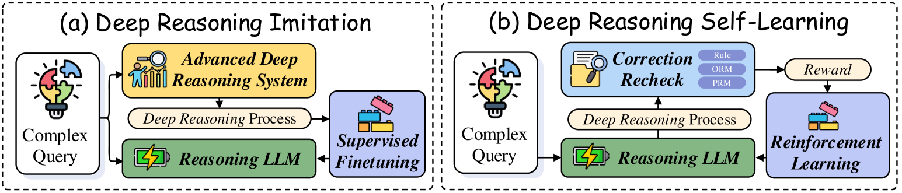

<figcaption>図6: 深い推論学習の異なる学習戦略。先進的な深い推論システム（先進的 RLLM や MCTS など）のデータからの deep reasoning imitation と、暗黙的報酬による選好ベース RL からの deep reasoning self-learning を含む。</figcaption>
</figure>

### 4.2 Deep Reasoning Learning（深い推論の学習）

RLLM における不十分な深い推論は、性能を大きく劣化させうる [^542] [^587]。その結果、研究は訓練による推論の改善に焦点を当ててきた。教師ありファインチューニング（SFT）[^741] は記憶プロセスとして働いてモデル出力を安定化させ、強化学習（RL）は汎化と自己学習を可能にする [^155] [^91]。深い推論学習の近年の研究は、SFT を使って RLLM の先進的な推論を模倣することと、RL を適用して推論の自己改善を強化することを探究してきた。図 6 に示すように、この節は深い推論を改善する 2 つの鍵となるアプローチを概説する: (1) Deep Reasoning Imitation（§4.2.1）——人間の注釈または蒸留されたデータから SFT を通じて推論を学ぶ。(2) Deep Reasoning Self-Learning（§4.2.2）——暗黙的報酬を伴う選好ベースの RL を通じてモデルが推論を改善する。これらの手法の性能は Table 2 に示す。

#### 4.2.1 Deep Reasoning Imitation（深い推論の模倣）

RLLM における深い推論は、人間の推論 [^390] [^43] [^81] [^286]、先進的な RLLM [^155] [^41] [^670] [^262] [^72]、スケーリングで強化された RLLM [^293] [^702] [^420] [^792] といった先進的な推論システムを模倣することで効果的に達成できる。このアプローチは、モデルが複雑な推論パターンを学び、タスクを横断して汎化することを可能にする [^657]。具体的には、(1) **人間からの模倣**: 早くに [^95] が人間の例示を使った深い推論模倣のパラダイムを最初に提案した。ALT [^390] は、人間が注釈した論理テンプレートのより大きなデータセットを生成することで RLLM の推論を改善し、より深い推論を育む。多様性を高めるため、EIT [^43] は人間が生成するより単純な計画を促し、LLM がよりニュアンスに富む推論を寄与することで、人間の入力と AI の協調を促進する。(2) **先進的 RLLM からの模倣**: 一連の研究は、ゼロショットプロンプティングを利用して大きな教師 RLLM に推論理路を生成させ、それでより小さな RLLM をファインチューニングする。これが深い推論模倣の始まりである [^174] [^246] [^679]。加えて AceMath [^347] は few-shot プロンプティングを適用して先進的 LLM から Long CoT サンプルを蒸留し、続いて多段階の品質誘導 SFT で性能を高める。[^76] はデータ合成プロセスを計画と推論の段階に分離し、それによって推論品質を改善する。DART-Math [^524] は、合成中により深い推論を要する複雑なクエリを効果的に蒸留し、深い推論能力を前進させる。(3) **スケーリング強化 RLLM からの模倣**: 早くに [^26] は、サンプリングのサイズと長さをスケールさせることでデータ品質を高め、模倣性能を押し上げた。[^650] と [^761] は、サンプリングをスケールさせ報酬モデルでサンプルを選ぶことで、データ品質をさらに改善する。加えて [^293] は MCTS を通じて最適な深い推論経路を特定し、模倣の有効性を前進させる。

近年の研究 [^200] [^385] は、O1 [^208] や R1 [^155] のような先進的 RLLM API から知識を蒸留することが、より小さな LLM の性能を大きく高めることを示している。教師ありファインチューニングを用いるこの手法は、複雑な数学的推論タスクでのモデル性能を押し上げ、時に教師モデルの性能を上回る。これらの発見の上に、LIMO [^676]、S1 [^391]、RedStar [^635] は、大量の模倣サンプルは不要だと論じる。彼らは、ごく少数のサンプルでも基盤 LLM の深い推論能力を活性化できることを実証している。実用的な応用のために、[^532] はこれらの技法がモデルの知識カットオフを超えた将来の出来事を予測できることを示している。

**表2**: さまざまな深い推論学習手法の性能。主に Math または Math-500 スコアで整列。「-」は論文がそのスコアを報告していないことを示す。

| Model | Data Size | Base Model | GSM8K | MATH | MATH-500 | AIME2024 | GPQA | OlympiadBench |
| --- | --- | --- | --- | --- | --- | --- | --- | --- |
| **Deep Reasoning Imitation** | | | | | | | | |
| SFT 679 | 200K | Llama-3.1-8B 113 | - | - | - | 54.1 | 3.5 | - |
| Retro-Enh 81 | 14M | Llama-3-8B 113 | 45.1 | 21.7 | - | - | - | - |
| Query-Exp 81 | 24M | Llama-3-8B 113 | 51.3 | 23.1 | - | - | - | - |
| Res-Div 81 | 14M | Llama-3-8B 113 | 53.0 | 23.2 | - | - | - | - |
| MetaMath 524 | 0.40M | Mistral-7B 217 | 76.5 | 29.8 | - | - | - | 5.9 |
| ALT-FLDx2 390 | 100K | Llama-3.1-70B 113 | 83.3 | 24.4 | - | - | - | - |
| EIT 43 | 15K | Llama-2-70B 529 | 84.1 | 32.5 | - | - | - | - |
| MathScale 524 | 2.0M | Mistral-7B 217 | 74.8 | 35.2 | - | - | - | - |
| Tutor-Amp 81 | 11M | Llama-3-8B 113 | 64.4 | 35.9 | - | - | - | - |
| MMIQC 524 | 2.3M | Mistral-7B 217 | 75.4 | 37.4 | - | - | - | 9.4 |
| VRT 524 | 0.59M | Mistral-7B 217 | 82.3 | 38.7 | - | - | - | 8.7 |
| KPMath-Plus 524 | 1.6M | Mistral-7B 217 | 82.1 | 46.8 | - | - | - | - |
| Llama-2-70B-Xwin-Math-V1.1 274 | 1.4M | Llama-2-70B 529 | 90.2 | 52.5 | - | - | - | 16.3 |
| DART-Math-Mistral-7B 524 | 591K | Mistral-7B 217 | 81.1 | 45.5 | - | - | - | 14.7 |
| DART-Math-Llama-3-70B 524 | 591K | Llama-3-70B 113 | 89.6 | 56.1 | - | - | - | 20.0 |
| Rejection Sampling 293 | 197K | Qwen2.5-7B 649 | 87.1 | 70.0 | - | 10.0 | - | 27.1 |
| Evol-Instruct-7B 356 | 905K | Qwen2.5-Math-7B 650 | 88.5 | - | 77.4 | 16.7 | - | - |
| FastMCTS 293 | 288K | Qwen2.5-7B 649 | 88.9 | 74.0 | - | 20.0 | - | 27.5 |
| KPDDS-7B 199 | 800K | Qwen2.5-Math-7B 650 | 89.9 | - | 76.0 | 10.0 | - | - |
| DeepSeek-R1-Distill-Qwen-7B 155 | 800K | Qwen2.5-7B-Instruct 649 | 91.7 | - | 91.6 | 43.3 | - | - |
| Openmathinstruct-7B 526 | 14M | Qwen2.5-Math-7B 650 | 92.0 | - | 79.6 | 10.0 | - | - |
| NuminaMath 676 | 100K | Qwen2.5-Math-7B 650 | 92.9 | - | 81.8 | 20.0 | - | - |
| PromptCoT-DS-7B 761 | 115K | DeepSeek-R1-Distill-Qwen-7B 155 | 92.6 | - | 93.0 | 60.0 | - | - |
| PromptCoT-Qwen-7B 761 | 905K | Qwen2.5-Math-7B 650 | 93.3 | - | 84.0 | 26.7 | - | - |
| AceMath-7B-Instruct 347 | 1.2M | Qwen2-Math-7B-Instruct 650 | 93.7 | 83.1 | - | - | - | 42.2 |
| AceMath-72B-Instruct 347 | 1.2M | Qwen2.5-Math-72B-Instruct 650 | 96.4 | 86.1 | - | - | - | 48.4 |
| NuminaMath 676 | 100K | Qwen2.5-32B-Instruct 649 | - | - | 59.2 | 6.5 | 25.8 | 36.7 |
| OpenThoughts 676 | 114K | Qwen2.5-32B-Instruct 649 | - | - | 80.6 | 50.2 | 42.9 | 56.3 |
| Sky-T1-32B-Preview 510 | 17K | Qwen2.5-32B-Instruct 649 | - | - | 82.4 | 43.3 | 56.8 | - |
| Journey Learning 200 | 5K | Qwen2.5-Math-72B 650 | - | - | 87.2 | 43.3 | - | - |
| STILL-2 385 | 3.9K | Qwen2.5-32B-Instruct 649 | - | - | 90.2 | 46.7 | 55.1 | - |
| Bespoke-32B 256 | 17K | Qwen2.5-32B-Instruct 649 | - | - | 93.0 | 63.3 | 58.1 | - |
| s1 391 | 1K | Qwen2.5-32B-Instruct 649 | - | - | 93.0 | 56.7 | 59.6 | - |
| DeepSeek-R1-Distill-Qwen-32B 155 | 800K | Qwen2.5-32B-Instruct 649 | - | - | 94.3 | 72.6 | 62.1 | - |
| LIMO 676 | 817 | Qwen2.5-32B-Instruct 649 | - | - | 94.8 | 15.8 | 66.7 | 66.8 |
| **Deep Reasoning Self-Learning** | | | | | | | | |
| DPO 203 | 40K | DeepSeek-Math-7B-Base 466 | 74.8 | 34.9 | - | - | - | - |
| ReFT 203 | 40K | DeepSeek-Math-7B-Base 466 | 71.4 | 36.0 | - | - | - | - |
| Self-Explore 203 | 40K | DeepSeek-Math-7B-Base 466 | 78.6 | 37.7 | - | - | - | - |
| SimPO 509 | 10K | Qwen2.5-Math-7B-Instruct 650 | 88.8 | 40.0 | 56.6 | - | - | - |
| DPO 316 | 11K | DeepSeek-Math-7B-Instruct 466 | - | 48.7 | - | - | - | - |
| TPO 316 | 11K | DeepSeek-Math-7B-Instruct 466 | - | 51.3 | - | - | - | - |
| DPO 316 | 11K | Qwen2-7B-Instruct 648 | - | 54.3 | - | - | - | - |
| TPO 316 | 11K | Qwen2-7B-Instruct 648 | - | 55.5 | - | - | - | - |
| MCTS 53 | 15K | DeepSeek-Math-7B-Base 466 | 83.2 | 64.0 | - | - | - | - |
| SBS 53 | 15K | DeepSeek-Math-7B-Base 466 | 84.1 | 66.3 | - | - | - | - |
| FastMCTS+Branch-DPO 293 | 152K | FastMCTS-7B 293 | 89.9 | 75.4 | - | 20.0 | - | 29.6 |

#### 4.2.2 Deep Reasoning Self-Learning（深い推論の自己学習）

単純な模倣は強い性能をもたらしうるが、現在のモデルは模倣と蒸留の両方において、人間の注釈やより先進的なモデルの出力に大きく依存したままである。この限界に対処するため、近年の研究は self-play や self-learning のような技法によるより高度な推論の実現に焦点を当ててきた [^663] [^754] [^292]。具体的には、自己学習法はサンプリング戦略の違いにより 2 つのパラダイムに分類できる:

(1) **直接サンプリングからの自己学習**: 最も早い手法である STaR [^707] は、In-Context Learning（ICL）を利用して深い推論結果をサンプリングし、最終回答の正しさを自己学習のための暗黙的報酬として使う [^175] [^409] [^410] [^742] [^588] [^328]。さらに ReST [^153] は Grow-Improve パラダイムを導入してこれを拡張する。自己生成した推論をまず報酬で注釈し、それからオフライン RL アルゴリズムで強化する。しかし、これらのアプローチは、特に報酬プロセスが頑健性を欠くとき脆くなりうる。Expectation-Maximization（EM）アルゴリズムに触発され、[^475] は報酬を生成して LLM を反復的に最適化し、検証セットでの最良性能を達成する手法を提案し、頑健性を大きく改善した。報酬プロセスをさらに強化するため、[^179] は誤った解を適応させる手法を導入し、verifier を訓練して報酬プロセスを洗練し、自己学習の品質を改善する。(2) **木探索からの自己学習**: EXIT [^15] のような初期の深層学習法は、MCTS を深層ニューラルネットワークと組み合わせて強化学習を行い、ネットワークを反復的に自己訓練して木探索を導き、推論を強化した。この上に、CPO [^746] と TPO [^316] は Long CoT 推論の各ステップを対応する木探索経路に整合させ、Tree of Thoughts（ToT）[^668] の選好情報を使ってより深い推論を支える [^665] [^203]。[^302] は Policy-Guided Tree Search（PGTS）を提案し、RL を構造化された木探索と統合して推論経路のより効率的なナビゲーションを実現する。AlphaMath [^53]、AlphaLLM-CPL [^578]、TongGeometry [^724] のようなさらなる発展は、ステップワイズの trajectory ペア抽出とカリキュラム選好学習を通じて MCTS の挙動を洗練し、LLM の推論能力を押し上げている [^431] [^295]。

> **Takeaways: Imitation & Self-Learning（要点: 模倣と自己学習）**
> - 先進的 RLLM からの深い推論の模倣と、MCTS のようなスケーリング強化手法は、モデルがより少ないサンプルで複雑な推論パターンを学ぶのを助けうる。
> - 強化学習と木探索を含む自己学習技法は、RLLM が時間とともに推論能力を高めることを可能にする。
> - 先進的 RLLM からの模倣と自己学習の組み合わせ（原文の Takeaways ボックスは途中で切れている——訳注: SVG 内テキストの原文どおり）。

## 5 Feasible Reflection for Long CoT（Long CoT のための実行可能な反省）

<figure>

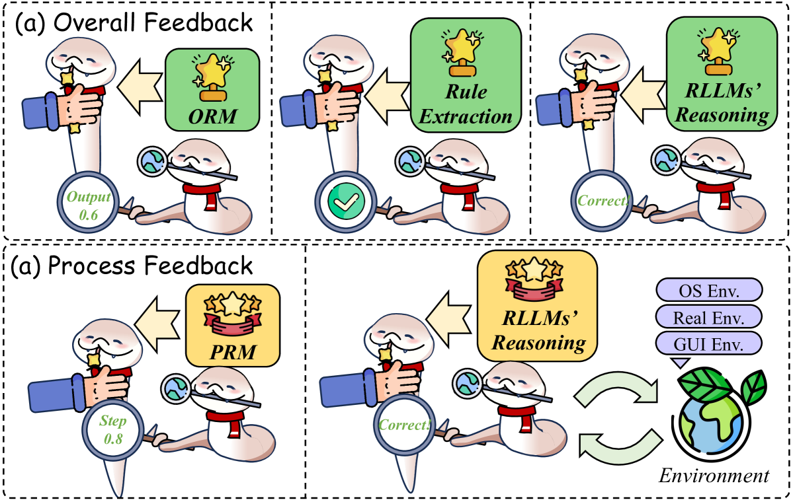

<figcaption>図7: feasible reflection のためのフィードバック能力の枠組みは、Overall Feedback と Process Feedback からなる。Overall Feedback は、値形式の Outcome Reward Model（ORM）、正しさ判定のためのルール抽出、RLLM に基づく全体的な critic モデルを含む。Process Feedback は、値形式の Process Reward Model（PRM）と、同じく RLLM に基づくステップレベルの critic モデルを含む。</figcaption>
</figure>

### 5.1 Feedback（フィードバック)

フィードバックとは、全体の出力とそこへ至るプロセスの両方の評価を提供し、その正確さと品質を判定するプロセスを指す [^280] [^282] [^595] [^149]。このプロセスは critique（批評）または verification（検証）とも呼ばれ、自然言語または構造化データ形式で実行でき、木探索手法の基盤として働く [^79]。具体的には、図 7 に示すように、フィードバックは 3 つの異なるタイプに分類できる: (1) Overall Feedback（§5.1.1）、(2) Process Feedback（§5.1.2）、(3) Hybrid Feedback（§5.1.3）である。

#### 5.1.1 Overall Feedback（全体フィードバック）

全体フィードバックは、各ステップを個別に評価するのではなく、プロセス全体と結果の大域的な見方の提供に焦点を当てる。このフィードバックは、RLLM の強化学習における推論スキルと報酬モデリングを大きく強化する。具体的には、図 7 (a) に示すように、全体フィードバックは 3 つの主要な源泉に分類できる: Outcome Reward Model、Rule Extraction、Critic Models Feedback である。これらのカテゴリにわたる性能は Table 3 にまとめる。

**表3**: さまざまな全体フィードバック手法の性能。主に RewardBench [^259] の Overall スコアで整列。「-」は論文がそのスコアを報告していないことを示す。

| Model | Base Model | Chat | Chat_Hard | Safety | Reasoning | Overall |
| --- | --- | --- | --- | --- | --- | --- |
| **Critic Models** | | | | | | |
| GPT-4o-mini 3 | - | 95.0 | 60.7 | 80.8 | 83.7 | 80.1 |
| Llama3.1-70B-Instruct 113 | - | 97.2 | 70.2 | 86.0 | 82.8 | 84.0 |
| Llama3.1-405B-Instruct 113 | - | 97.2 | 74.6 | 87.1 | 77.6 | 84.1 |
| GPT-4 3 | - | 95.3 | 74.3 | 86.9 | 87.6 | 86.0 |
| GPT-4o 3 | - | 96.1 | 76.1 | 86.6 | 88.1 | 86.7 |
| Gemini-1.5-pro 505 | - | 92.3 | 80.6 | 87.9 | 92.0 | 88.2 |
| Self-taught Evaluator 572 | Llama-3.1-70B-Instruct 113 | 96.6 | 84.2 | 81.0 | 91.5 | 88.3 |
| SFR-LLaMA-3.1-8B-Judge 566 | Llama-3.1-70B-Instruct 113 | 95.5 | 77.7 | 86.2 | 95.1 | 88.7 |
| SFR-NeMo-12B-Judge 566 | Mistral-NeMo-Instruct-12B 511 | 97.2 | 82.2 | 86.5 | 95.1 | 90.3 |
| SFR-LLaMA-3.1-70B-Judge 566 | Llama-3.1-70B-Instruct 113 | 96.9 | 84.8 | 91.6 | 97.6 | 92.7 |
| Skywork-Critic-Llama-3.1-70B 566 | Llama-3.1-70B-Instruct 113 | 96.6 | 87.9 | 93.1 | 95.5 | 93.3 |
| LMUnit 454 | Llama-3.1-70B-Instruct 113 | - | - | - | - | 93.4 |
| EvalPlanner 456 | Llama-3.1-70B-Instruct 113 | 97.5 | 89.4 | 93.0 | 95.5 | 93.9 |
| **Outcome Reward Models** | | | | | | |
| tulu-v2.5-13b-uf-rm 207 | TULU-2-13B 206 | 39.4 | 42.3 | 55.5 | 47.4 | 46.1 |
| Prometheus-2-7B 247 | Mistral-7B-Instruct-v0.2 217 | 85.5 | 49.1 | 77.1 | 76.5 | 72.0 |
| Prometheus-8x7b-v2 247 | Mixtral-8x7B-Instruct 218 | 93.0 | 47.1 | 80.5 | 77.4 | 74.5 |
| Critic-RM-Rank 692 | Llama-3.1-70B-Instruct 113 | 97.0 | 58.0 | 84.0 | 92.0 | 82.8 |
| RM 485 | Llama-3.1-70B-Instruct 113 | 98.3 | 74.5 | 83.8 | 88.0 | 86.4 |
| SynRM 677 | Llama-3.1-70B-Instruct 113 | 97.5 | 76.8 | 86.3 | 88.5 | 87.3 |
| CLoud 14 | Llama-3-70B-Instruct 113 | 98.0 | 75.6 | 87.6 | 89.0 | 87.6 |
| FLAMe-RM-24B 538 | PaLM-2-24B 13 | 92.2 | 75.7 | 89.6 | 93.8 | 87.8 |
| SteerLM-RM 70B 590 | Llama-2-70B-chat 529 | 91.3 | 80.3 | 90.6 | 92.8 | 88.8 |
| Llama-3-OffsetBias-RM-8B 413 | Llama-3-8B-Instruct 113 | 97.2 | 81.8 | 86.8 | 91.9 | 89.4 |
| InternLM-20B-Reward 44 | InternLM2-8B-Instruct 44 | 98.9 | 76.5 | 89.9 | 95.8 | 90.2 |
| ArmoRM-Llama3-8B-v0.1 553 | Llama-3-8B-Instruct 113 | 96.9 | 76.8 | 92.2 | 97.3 | 90.8 |
| Nemotron-4-340B-Reward 590 | Nemotron-4-340B 4 | 95.8 | 87.1 | 92.2 | 93.6 | 92.2 |
| Skywork-Reward-Llama-3.1-8B 331 | Llama-3.1-70B-Instruct 113 | 95.8 | 87.3 | 90.6 | 96.2 | 92.5 |
| Skywork-Reward-Gemma-2-27B 331 | Gemma-2-27B-it 506 | 95.8 | 91.4 | 92.0 | 96.1 | 93.8 |

##### Overall Feedback from Outcome Reward Model（結果報酬モデルからの全体フィードバック）

多くのタスクは accuracy や他の標準指標で直接評価できないため、研究は、より一般的で定量化可能なフィードバックのために値ベースの報酬を提供する Outcome Reward Models（ORM）にますます焦点を当ててきた。2021 年、OpenAI [^95] は「Gen-Verifier」パラダイムを提案した。これは専門化された ORM を使って生成された理路の正確さを評価し、フィードバック能力の大きな進歩を示した [^466]。[^215] は、推論プロセスの幻覚を分析する訓練済み知識スコアラーを導入し、RLLM にフィードバックを提供して出力の正確さを時間とともに改善する。さらに Generative Reward Models [^736] は全体フィードバックに next-token 予測を使う。これは指示調整とシームレスに統合され、テスト時計算を活用して ORM フィードバックを改善する。

しかし、特別に訓練された ORM はしばしば高価で、十分に頑健ではない。この上に、Self-Rewarding Language Models（SRLMs）[^790] は自己一貫性の枠組みを組み込み、フィードバックを最適化してモデルの整合と一貫性を改善する。[^692] は Critic-RM を導入し、RLLM が生成する自然言語の批評と対応するフィードバックを組み合わせる。この手法は高品質なフィードバックをフィルタしつつ、報酬予測と批評生成を共同でファインチューニングし、ORM の性能を最適化する。

##### Overall Feedback from Rule Extraction（ルール抽出からの全体フィードバック）

ORM は大きな改善を達成したが、その正確さはなお 100% に届かず、ルールベースの答え合わせフィードバックを上回れない [^668] [^160]。STaR [^707]、ReST [^153]、ReFT [^531] のような先行研究は、最終回答の報酬に基づくフィードバックが、数学的シナリオでは PRM と ORM の両方より有効なことを実証してきた [^131]。さらに、[^155] と [^622] は、ルールベースの報酬を組み込んだ多段階 RL フレームワークを導入し、書式検証や結果検証のような単純だが頑健なルールによって reward hacking を緩和しながら [^24]、出力の正確さと長さの両方を大きく高めた。直接のルールベースフィードバックが難しいコーディングのシナリオでは、AceCoder [^709]、O1-Coder [^753]、VerMCTS [^39] が、自動テストケース合成パイプラインの実装によってこの課題に対処し、プログラムの性能に基づいて報酬を導出する [^395] [^145] [^778]。加えて [^372] は、テストケース生成器を訓練する自動化アプローチを提案する。これはテストケースの希少性を和らげ、テストケース数の増加が報酬品質の改善と相関することを実証している。さらに [^371] は、問題解決を構造化されたサブタスク——ファイルの位置特定・関数の位置特定・行の位置特定・コード編集の生成——に分解し、多視点のルールベース報酬を適用する。

##### Overall Feedback from Critic Models（Critic モデルからの全体フィードバック）

Critic モデルからのフィードバックの研究は、自然言語フィードバックによる誤りとバイアスの検出を中心とする。これは self-reflection や self-critique としても知られる [^231] [^23] [^452] [^384] [^571] [^701]。この手法は、特に自己修正において、さまざまなタスクで大きな改善をもたらしてきた [^600] [^772] [^137] [^121] [^752]。[^194] は、従来の LLM は外部信号なしに有効なフィードバックを生成するのに苦しむと主張し、強化されたフィードバック能力を持つ RLLM の開発を求めている [^458]。その結果、多くの研究は、しばしば事前学習段階に由来する RLLM の誤り特定の強みを活用して、フィードバックの生成と修正を改善している [^675]。

早くに [^380] は、RLLM に self-critique と深い推論を学ばせる訓練が性能をさらに押し上げうることを見出した。[^744] は、複数の視点を比較し、違いを特定し、洞察を要約して不整合を解消する自己対比（self-contrast）機構を提案している。しかし、これらの手法はしばしばタスク非依存のフィードバックを提供する。これに対処するため、[^161] は特定のタスクに評価基準を仕立てる AutoRace を導入している。Reversal of Thought（RoT）フレームワーク [^698] は、逆向き推論と自己反省を組み合わせた新しいパラダイムを導入し、モデルが自らの知識の限界を特定し推論効率を高めるのを助ける。さらに ACR [^779] はコーディングタスクのための採点システムを実装する。品質評価に LLM-as-a-Judge を、低品質コードの批評に LLM-as-a-Critic を使い、ベンチマーク間の一貫性を改善する。[^771] はコード実行の誤りデータと RLLM からのフィードバックを統合してコード生成性能を改善する。[^342] は AGSER を提示する。これは attention 誘導の自己反省を使って、入力クエリを注意的な構成要素とそうでない構成要素に分割することで幻覚に対処する手法である。最後に [^456] は EvalPlanner を導入する。これはフィードバックを計画と推論の構成要素に分離し、既存の RLLM を使ったより簡潔な表現を可能にする。

#### 5.1.2 Process Feedback（プロセスフィードバック）

技法は、プロセスフィードバックを MCTS や RL の報酬と組み合わせて、自動化されたステップごとのガイダンスを提供し、労働集約的な注釈の必要を減らしつつ推論能力を強化する [^534] [^239]。これらの技法は、フィードバックの源泉によって 2 つの主要タイプに分類できる: プロセス報酬モデル（PRM）とプロンプトされた LLM である。性能比較は主に Table 4 に示す。

##### Process Feedback from Process Rewarded Model（プロセス報酬モデルからのプロセスフィードバック）

近年の研究は、複雑な推論タスク、特にステップレベルの視点における、有効な PRM の開発のためのフィードバックの重要性を浮き彫りにしている [^88] [^303] [^366]。(1) **プロセス注釈による PRM 訓練**: 早くに [^319] は、人間が注釈したデータ（PRM800K）でプロセスフィードバックを訓練することが、信頼できる報酬モデルの作成において結果監督を上回ることを実証した。しかし、このアプローチは多大な人的労力を要する。これに対処するため、[^567] は Math-Shepherd を導入した。これは木探索に着想を得た手法でステップごとの監督を生成するデータセットである [^52] [^700]。これに続き、QwQ [^517]、Skywork-o1 [^400]、AceMath [^347]、PRIME [^97] のような手法が類似の技法を採用して PRM 性能を高めている。加えて [^729] はモデルの収束を改善するエントロピー正則化を提案する。最初の誤りステップだけに焦点を当てるのではなく、Full-Step-DPO [^636] は誤りステップを含む推論連鎖全体に報酬を割り当てる。VersaPRM [^710] は PRM を複数ドメインへ拡張し、適用可能性を広げる。同様に、[^148] と [^751] は、教師の選好に整合した生徒の選好でモデルを訓練することを提案し、効果的な選好蒸留を保証する。(2) **結果注釈による PRM 訓練**: OVM [^685]、Implicit PRM [^699]、AutoPSV [^350]、DVO [^730] のような代替アプローチは、結果監督または暗黙的フィードバックを活用して PRM を訓練し、大規模な人間注釈データの必要を減らす [^627] [^456]。UAS [^687] は不確実性を意識した価値モデル [^187] をフィードバック予測に組み込む。加えて Aurora [^499] は、アンサンブルプロンプティング戦略と参照回答を逆向き検証に利用し、Long CoT のデータ分布によりよく整合したより強い PRM を訓練する。さらに PAV [^462] は、報酬は推論の進捗を反映すべきだと提案する。それは各ステップの前後で正しい将来の応答を生成する尤度の変化によって測られる。[^653] [^267] [^683] はこれらのパラダイムをトークンレベルへ拡張している。

**表4**: さまざまなプロセスフィードバック手法の ProcessBench [^769] と PRMBench [^478] における性能。「-」は論文がそのスコアを報告していないことを示す。

|   |   | ProcessBench GSM8K | ProcessBench MATH | ProcessBench OlympiadBench | ProcessBench OmniMATH | PRMBench Simplicity | PRMBench Soundness | PRMBench Sensitivity |
| --- | --- | --- | --- | --- | --- | --- | --- | --- |
| **Process Reward Models** | | | | | | | | |
| Qwen2.5-Math-7B-PRM 769 | Qwen2.5-Math-7B 650 | 39.4 | 52.2 | 39.4 | 33.1 | - | - | - |
| Math-Shepherd-PRM-7B 567 | Mistral-7B 217 | 47.9 | 29.5 | 24.8 | 23.8 | 47.1 | 45.7 | 60.7 |
| RLHFlow-PRM-Mistral-8B 103 | Mistral-7B 217 | 50.4 | 33.4 | 13.8 | 15.8 | 46.7 | 57.5 | 68.5 |
| RLHFlow-PRM-DeepSeek-8B 103 | DeepSeek-7B 35 | 38.8 | 33.8 | 16.9 | 16.9 | 47.6 | 57.5 | 68.1 |
| Skywork-PRM-1.5B 331 | Qwen2.5-Math-1.5B-Instruct 649 | 59.0 | 48.0 | 19.3 | 19.2 | 33.6 | 28.6 | 48.8 |
| Skywork-PRM-7B 331 | Qwen2.5-Math-7B-Instruct 649 | 70.8 | 53.6 | 22.9 | 21.0 | 38.4 | 32.7 | 54.3 |
| Qwen2-1.5B-PRM800k 491 | Qwen2-Math-1.5B-Instruct 650 | 34.0 | 55.3 | 34.2 | 41.0 | - | - | - |
| Qwen2-1.5B-Math-Shepherd 491 | Qwen2-Math-1.5B-Instruct 650 | 48.9 | 34.1 | 9.8 | 13.7 | - | - | - |
| Qwen2-1.5B-Epic50k 491 | Qwen2-Math-1.5B-Instruct 650 | 55.6 | 36.1 | 20.2 | 30.0 | - | - | - |
| Qwen2.5-Math-7B-PRM800K | Qwen2.5-Math-7B-Instruct 650 | 68.2 | 62.6 | 50.7 | 44.3 | - | - | - |
| Qwen2.5-Math-PRM-7B 769 | Qwen2.5-Math-7B-Instruct 650 | 82.4 | 77.6 | 67.5 | 66.3 | - | - | - |
| Universal-PRM-7B 499 | Qwen2.5-Math-7B-Instruct 650 | 85.8 | 77.7 | 67.6 | 66.4 | - | - | - |
| **Critic Model** | | | | | | | | |
| Llama-3.1-8B-Instruct 113 | - | 27.5 | 26.7 | 18.5 | 19.2 | - | - | - |
| GPT-4o 3 | - | 61.9 | 53.9 | 48.3 | 44.6 | 59.7 | 70.9 | 75.8 |
| QwQ-32B-Preview 517 | Qwen2.5-32B-Instruct 649 | 62.3 | 52.7 | 46.2 | 43.9 | - | - | - |
| DeepSeek-R1-Distill-Qwen-14B 155 | Qwen2.5-14B-Instruct 649 | 67.3 | 38.8 | 29.9 | 32.1 | - | - | - |
| Dyve-14B 774 | DeepSeek-R1-Distill-Qwen-14B 155 | 68.5 | 58.3 | 49.0 | 47.2 | - | - | - |
| Qwen2.5-72B-Instruct 649 | - | 76.2 | 61.8 | 54.6 | 52.2 | - | - | - |
| SCRIT 500 | Qwen2.5-72B-Instruct 649 | 80.2 | 60.0 | 32.5 | 27.8 | - | - | - |
| o1-mini 208 | - | 93.2 | 88.9 | 87.2 | 82.4 | 64.6 | 72.1 | 75.5 |
| Llemma-PRM800k-7B 478 | Llemma-7B 21 | - | - | - | - | 51.4 | 50.9 | 66.0 |
| Llemma-MetaMath-7B 478 | Llemma-7B 21 | - | - | - | - | 50.3 | 49.0 | 66.0 |
| Llemma-oprm-7B 478 | Llemma-7B 21 | - | - | - | - | 49.0 | 49.8 | 64.1 |
| MATHMinos-Mistral-7B 129 | Mistral-7B 217 | - | - | - | - | 51.4 | 54.4 | 66.5 |
| ReasonEval-7B 618 | Llemma-7B 21 | - | - | - | - | 55.5 | 63.9 | 71.0 |
| ReasonEval-34B 618 | Llemma-34B 21 | - | - | - | - | 51.5 | 63.0 | 73.1 |
| Gemini-2.0-flash-exp 478 | - | - | - | - | - | 62.7 | 67.3 | 75.4 |
| Gemini-2.0-thinking-exp-1219 478 | - | - | - | - | - | 66.2 | 71.8 | 75.3 |

##### Process Feedback from Critic Models（Critic モデルからのプロセスフィードバック）

PRM の訓練は人手で注釈されたデータへの依存が強いままであるため、近年の研究は、モデルが自らの自然言語フィードバックを生成して性能を最適化する手法を探究してきた [^640]。これらのアプローチは 2 つの主要カテゴリに分かれる: (1) **モデル駆動のフィードバック推論**: React [^669] や Reflexion [^471] のような初期の研究は、各行動と推論ステップで自然言語フィードバックによって RLLM を強化し [^130] [^89]、多様なタスクでの意思決定を改善する。同様に Step-DPO [^257] は、RLLM を使ってステップレベルの正例・負例ペアを自己検証し、DPO パラダイムで訓練して強い性能を達成する。加えて [^492] は、モデル出力に基づいて適応する動的な誤り分類フレームワークを提案し、数学の文章題における特定の誤りパターンに対処することで数学的推論タスクの性能を改善する。さらに、[^625] と [^168] は MCTS を反復的に適用して選好データを収集し、その先読み能力を利用してインスタンスレベルの報酬をより正確なステップレベルの信号に分解し、フィードバックの正確さを高める。しかし、ステップワイズのフィードバックはしばしば信頼性の問題を抱え、これは不確実性の定量化によって緩和でき [^681] [^678]、数学的推論タスクの報酬モデルにおけるステップワイズ検証の信頼性を改善する。さらに [^123] は、ステップ間の因果関係を捉える CoT Average Causal Effect（CACE）を定義し、すべてのステップが正しくかつ理解可能である因果化された Long CoT をもたらす。(2) **環境駆動のフィードバック推論**: 大規模モデルの複雑さが増すにつれ、プロンプトベースの LLM を外部環境と組み合わせて、より解釈可能で制御可能なフィードバックを生成することへの関心が高まっている。たとえば ORPS [^696] と [^108] は、実行フィードバックを使って人間の注釈への依存を最小化し、モデルが自律的に解を洗練することを可能にする。加えて [^472] は、モデル出力を Python コードに翻訳することで、論理的誤りの特定・欠陥のある推論プロセスへの洞察の獲得・数学的推論の改善の誘導に寄与する。[^631] は推論モデルを対話的環境と統合し、より動的なシナリオでの学習を可能にし、より汎化可能な自己学習フレームワークを作る。

#### 5.1.3 Hybrid Feedbacks（ハイブリッドフィードバック）

Overall Feedback と Process Feedback それぞれの利点と限界を踏まえ、近年の研究は最適なフィードバックのために両者の組み合わせを追求してきた。具体的には、[^755] はモンテカルロ推定と LLM-as-judge を統合するコンセンサスフィルタリング機構を提案し、全体とステップワイズの両方のフィードバックを強化して推論の正確さを改善する。同様の流れで、[^323] は Step-KTO を導入する。これはステップワイズのプロセスレベルと結果レベルの二値フィードバックを組み合わせる枠組みで、PRM と ORM を使って言語モデルを一貫した推論へ導き、reflection 機構による誤り修正に焦点を当てる。

> **Takeaways: Feedback（要点: フィードバック）**
> - 進化するフィードバックモデル: 全体・プロセス・ハイブリッドのフィードバックを含むフィードバック機構は、RLLM の推論能力の改善に決定的である。
> - プロセスフィードバックの革新的アプローチ: MCTS を伴う PRM のような技法を使うプロセスフィードバックは Long CoT を強化するが、reward hacking のような課題が残る。
> - 自己反省とモデル駆動フィードバック（原文の Takeaways ボックスは途中で切れている——訳注: SVG 内テキストの原文どおり）。

### 5.2 Refinement（洗練）

Refinement とは、事前のフィードバックに基づいて推論の誤りに対処するプロセスを指す。図 8 に示すように、refinement 手法は 3 つの主要カテゴリに分類できる: プロンプトベースの refinement 生成（§5.2.1）、SFT ベースの refinement 模倣（§5.2.2）、RL ベースの refinement 学習（§5.2.3）である。

<figure>

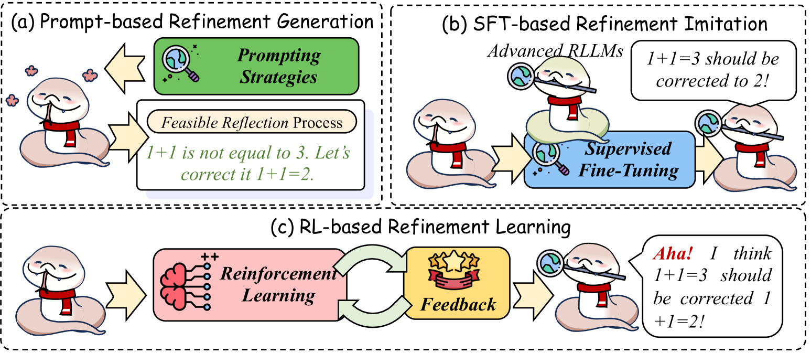

<figcaption>図8: refinement 手法の 3 つの主要カテゴリ。Prompt-based Refinement Generation・SFT-based Refinement Imitation・RL-based Refinement Learning を含む。</figcaption>
</figure>

#### 5.2.1 Prompt-based Refinement Generation（プロンプトベースの洗練生成）

プロンプトベースの refine 生成の研究は、反復的な自己洗練機構による LLM の性能強化に焦点を当てる [^408] [^762] [^68] [^333] [^723] [^539] [^582]。代表的なアプローチは、RLLM に初期出力を生成させ、続いて自己フィードバックによって反復的に洗練し、対話生成や数学的推論といったタスクで性能を改善するものである [^458] [^375] [^768] [^471] [^384] [^240] [^535]。これは幻覚さえ大きく減らす [^196] [^215]。Self-Backtracking [^661]、Refiner [^417]、BackMath [^740] のような注目すべき手法は、LLM が推論を自律的に調整することを可能にし、意思決定における不要な複雑さを減らす [^612]。さらに [^164] は、全体レベルとステップレベルの refinement を統合してパラダイムを拡張し、refinement の性能を改善する。[^664] は、LLM の自己修正能力を「confidence（確信）」と「critique（批評）」の容量に分解する手法を提案し、それらを評価する確率的指標を設計して、モデルの挙動における reflection 機構の役割を探究する。加えて、MCTSr [^726]、LLM2 [^652]、ReST-MCTS* [^725]、ReARTeR [^493] は、反復的な誤り修正と確信度調整による動的な reflection を強調し、モデルが推論戦略を自律的に洗練できるようにする [^122]。[^166] はこのパラダイムをマルチエージェントのシナリオへ拡張し、エージェントシステムの性能を改善する。しかし、オラクルのフィードバックなしでは、RLLM の自己洗練プロセスは失敗し、中間と最終の両方の答えの不安定さを引き起こし、単純な事実的クエリにバイアスをもたらし、複雑なタスクに認知バイアスを持ち込む [^738]。

#### 5.2.2 SFT-based Refinement Imitation（SFT ベースの洗練模倣）

LLM のための reflection ベースの推論における近年の進歩は、自己洗練と誤り修正を通じてモデルの推論を強化する枠組みをもたらした。鍵となるアプローチは直接の教師ありファインチューニングであり、モデルが先進的 LLM から誤り修正プロセスを学ぶことを可能にし、それによって反省能力を改善する [^11] [^74] [^289] [^586] [^69] [^616]。rStar [^434] のような注目すべき枠組みは、self-play の相互推論を通じてより小さな言語モデルを改善し、Recursive Introduction [^442] と RealCritic [^501] は反復的なフィードバック機構を使って誤りを特定・修正し、よりよい自己改善を図る [^279]。[^647] は、ステップワイズの自己修正データを構築し、上記のデータを使ってスポンタネアスなステップレベルの自己修正能力を LLM に備えさせる訓練戦略の実装を提案している。これらの上に、[^130] と [^722] は Math-Minos を提案する。これはステップごとの自然言語フィードバックを理路のタグとして使い、各ステップに正しさと詳細な説明の両方を提供して、推論プロセスを正当化・洗練するフィードバック機構を訓練する。Journey Learning [^440] は MCTS を使い、ノードのバックトラッキングを自然言語の refinement として解析して教師ありファインチューニングを強化し、それによって推論性能を改善する。加えて、ProgCo [^479] のようなアプローチは、反復的フィードバックとプログラム駆動の refinement を強調し、批評と自己修正を強化する。これらのアイデアをマルチモーダルな設定へ拡張し、R3V [^83] や MM-Verify [^489] のような枠組みは視覚とテキストの推論の統合に焦点を当てる [^360] [^577]。

#### 5.2.3 RL-based Refinement Learning（RL ベースの洗練学習）

近年の研究では、強化学習を通じて refinement の性能を高めるいくつかのアプローチが提案されている。早くに [^252] は、RLLM の SFT がしばしば自己洗練の挙動を促進できないことを観察した。この限界は、データ収集戦略とモデル応答の間の分布のミスマッチ、および挙動崩壊のリスクに由来する。これに対処するため、SCoRe [^252] は、モデル自身が生成した修正 trajectory で訓練し、正則化で学習プロセスを導くことによって自己洗練を強化する。この手法は、特定のプロンプトに対する報酬の最大化ではなく、テスト時の自己洗練の育成を優先する [^713]。さらに [^155] は、結果レベルの報酬による RL の適用が「Aha moment」を引き起こし、人間の指導なしにモデルの自然なフィードバックと refinement の挙動を活性化できることを実証している。さらに、[^155] [^712] と [^367] は、反復的な自己検証と自己修正の挙動で LLM を初期化することを探究している。これらは教師ありファインチューニングで強化され、結果レベルの RL でさらに高められる。[^367] と [^656] はこれらの能力をプロセスレベルの RL で拡張し、資源使用を最小化しながら推論中の適応的な refinement を可能にする。より最近では、[^265] が、いつ refinement を適用すべきかを決める内在的 verifier モジュールを導入し、誤りが検出されたときの自己洗練を RL でさらに促している。

> **Takeaways: Refinement（要点: 洗練）**
> - 反復改善のためのプロンプトベース refinement: フィードバックループによる反復的な自己洗練は、LLM が推論を改善し幻覚のような誤りを減らすのを助けるが、正確さの維持には安定したフィードバックを要する。
> - 誤り修正のための教師ありファインチューニング（SFT）: 教師ありファインチューニングは、反復的フィードバックと自己修正の戦略を使って LLM を強化する（原文の Takeaways ボックスは途中で切れている——訳注: SVG 内テキストの原文どおり）。

## 6 Extensive Exploration for Long CoT（Long CoT のための広範な探索）

探索は Long CoT 推論における鍵となる能力であり、戦略的な分岐と反復的な洗練を通じて、モデルが複雑な問題空間をナビゲートすることを可能にする [^714] [^271] [^563] [^536]。近年の研究は、仮説の分岐や reflection による誤りのバックトラッキングといった探索機構を、線形な推論経路の制約を克服するために不可欠なものとして強調している [^155]。

現在の研究はいくつかの鍵となる領域に焦点を当てる: (1) Exploration Scaling（§6.1）——探索の幅と深さ、および下流応用への効果を検討する。(2) Internal Exploration（§6.2）——内的な探索能力を発達させるモデルの訓練を強調する。(3) External Exploration（§6.3）——モデルが外部システムを活用して探索能力を高める方法を調査する。

<figure>

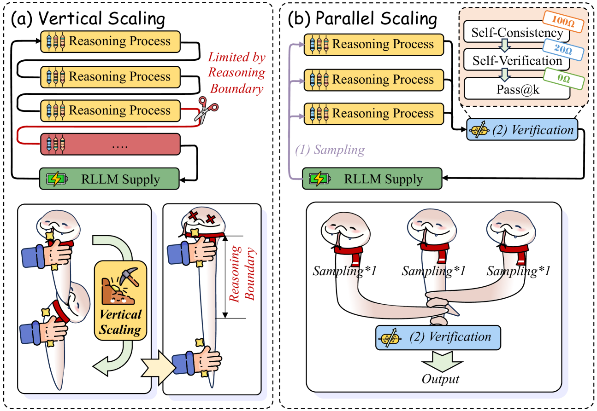

<figcaption>図9: 2 つの一般的な推論 test-time scaling 戦略の模式図: (a) 垂直スケーリング——Long CoT の長さを延ばすが、RLLM の推論境界に制約される。(b) 並列スケーリング——サンプルサイズを増やして複数の結果を集約するが、Pass@k の性能を超えることはない。</figcaption>
</figure>

### 6.1 Exploration Scaling（探索のスケーリング）

推論時スケーリングアルゴリズムの近年の進歩 [^229] [^598] [^40] は、特に性能改善のために推論長をスケールさせることにおいて、大きな関心を集めてきた [^364] [^398] [^288]。[^66] に従い、図 9 に示すように、探索スケーリングは 2 つのパラダイムで理解できる: (1) 垂直スケーリング——直列の抵抗器のように、reflection を使って複数の推論プロセスをつなぐ。(2) 並列スケーリング——並列の抵抗器のように、統一された検証／フィードバック機構が最も有効な推論プロセスを選ぶ。

#### 6.1.1 Vertical Scaling（垂直スケーリング）

垂直スケーリングとは、単一のモデル生成内で推論出力を延長することを指し、モデル性能を大きく押し上げる [^272]。[^124] と [^208] による初期の研究は、推論経路の長さを増やすことが性能を大きく改善しうることを示している。この上に、後続の研究 [^214] [^277] は、固定された計算予算内での木ベースの探索による論理的深さの強化をさらに探究し、顕著な性能向上をもたらした。これらの上に、[^391] はファインチューニングと budget forcing によって推論を改善する test-time scaling 手法を導入し、テスト時の追加計算で大幅な向上を得ている。attention スパンの制約に対処するため、一部の研究は潜在空間での推論長の拡張に焦点を当てる。[^136] と [^77] は、recurrent depth を通じて潜在空間で計算を暗黙的にスケールさせることで、テスト時の推論性能を高めている。

#### 6.1.2 Parallel Scaling（並列スケーリング）

並列スケーリングとは、モデル生成中の推論の反復回数を増やし、それらの結果を検証して最終出力を得るプロセスを指し、モデル性能を大きく強化する [^2] [^610] [^40]。最初に [^580] が self-consistency の概念を導入し、複数のサンプリングプロセスに続く多数決が効果的な探索になることを実証した。

##### Verification Optimization（検証の最適化）

近年の研究の主要な焦点は検証の最適化であり、2 つのタイプに分類できる: (1) **全体検証**: 近年の研究 [^783] [^591] は、スケーリングプロセスを「推論」と「自己検証」の 2 段階に分ける。self-consistency の多数決を自己検証で置き換えることで、これらのアプローチは大きな改善を示す [^758] [^59] [^800]。コードのシナリオでは、WoT [^750]、CISC [^502]、S* [^278] が Long CoT を並列にスケールさせ、出力の確信度やコード実行結果を検証に使い、推論品質を効果的に評価する [^449] [^135]。さらに、[^399] と [^597] は RLLM を訓練してコード実行をシミュレートさせ、コード関連の並列スケーリングにおけるテストケースの必要をなくす。Chain-of-Verification [^66] はメタ検証を導入し、複数の検証インスタンスをサンプリングして正しいものを特定する。[^245]、[^78]、[^535] は、推論経路の性質に基づいて答えの正しさを評価することで、このアプローチを実証的に検証している。さらに [^301] は特定の RLLM を調整して答えの検証と集約を行わせ、性能改善を示す。これは、訓練目標のバイアスのために、PRM が検証のために特別に訓練された RLLM を置き換えられないことを示唆する [^755]。最後に [^236] は self-uncertainty を活用して最良の結果を選ぶ。(2) **ステップ検証**: この上に、多くの研究者がステップレベルまたはより細粒度の検証を探究してきた [^61] [^327]。特に DIVERSE [^304]、SSC-CoT [^766]、Fine-grained Self-Consistency [^66] は、多様な推論経路とステップレベルの検証を組み合わせる。加えて、[^477] [^610] [^358] [^552] [^604] と [^343] は、MCTS に基づく最適なスケーリング戦略がより小さな言語モデルの性能をどう高めうるかを調査している。彼らの発見は、1B の RLLM が並列スケーリングを通じて複雑なタスクで 405B モデルを上回りうることを示す [^690]。これらの検証の進歩にもかかわらず、[^66] はこれらの戦略が Best-of-N 手法を超えられないことを実証しており、ブレークスルーは最適化ベースの検証だけに頼れないことを示唆している [^75]。

##### Sampling Optimization（サンプリングの最適化）

もうひとつの鍵となる研究領域は、効率的なスケーリングのための多様な経路や戦略の生成に焦点を当てる [^615] [^548]。たとえば [^715] は、よりよいスケーラビリティのために、最短だが最も多様な推論経路を集約する。同様に [^110] はサンプリング温度を調整して多様性を高め、スケーリングを改善する。[^734] と [^334] は、候補解の生成（プロンプト・温度・top-p など）と報酬機構（自己評価や報酬タイプなど）の両方を最適化し、並列スケーリングのための多様な戦略を提供する。さらに、[^435]、[^361]、[^691] は、複数の自然言語・プログラミング言語やさまざまな表現にわたってサンプリングをスケールさせることで RLLM の推論を強化する。最後に [^660] は、さまざまな応答長を持つ少数のシードデータが、さまざまな推論努力にわたって最短の正しい応答を選ぶことでモデルをより深い推論に導く手法を導入している。

> **Takeaways: Exploration Scaling（要点: 探索のスケーリング）**
> - Long CoT 推論における探索機構: 仮説の分岐や誤りのバックトラッキングのような探索戦略は、線形な推論経路の限界を克服しモデル性能を高めるうえで不可欠である。
> - 探索のスケーリング: 探索は、推論の深さと効率を改善するために、垂直と並列の戦略でスケールできる。
> - 検証と（原文の Takeaways ボックスは途中で切れている——訳注: SVG 内テキストの原文どおり）。

### 6.2 Internal Exploration（内的探索）

[^91]、[^468]、[^679] が指摘するように、SFT は記憶のプロセスとして働き、RL は汎化を強化する [^253]。具体的には、SFT はモデルの出力形式を安定させる一方、RL はその汎化能力を改善し、数学的推論のようなタスクでは学習効率を最大 8 倍高めうる [^461]。その結果、図 10 に示すように、先端の研究は、外部の助けなしに LLM の探索能力を高めるための RL と報酬戦略の役割を強調している。性能比較は Table 5 に示す。

<figure>

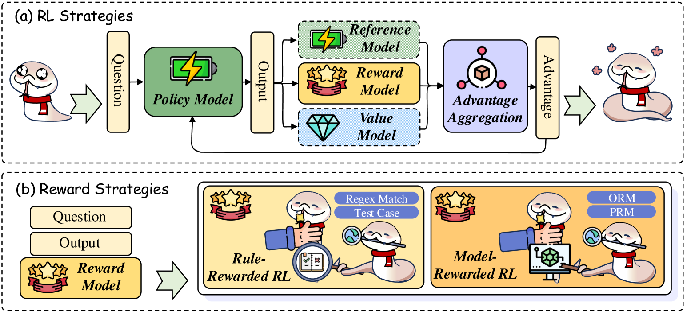

<figcaption>図10: 内的探索を最適化する 2 つの主要アプローチ: 参照モデルと価値モデルによる RL 戦略の改善と、RL 性能を高めるルールベースまたはモデルベースの報酬という報酬戦略の設計。</figcaption>
</figure>

#### 6.2.1 RL Strategies（RL 戦略）

探索のための RL 戦略の近年の進歩は、さまざまなタスク、特に推論タスクにおいて顕著な改善をもたらしてきた [^490] [^261] [^213] [^378] [^621]。

(1) **報酬モデルなしの RL**: 第一の一連の研究は RL 最適化アルゴリズムに焦点を当てる。OREO [^555] は、ソフトなベルマン方程式を最適化するオフライン RL 手法を提案し、多段階推論タスクの credit assignment を改善して、数学やエージェント制御のような分野で既存アプローチを上回る。[^339] は Direct Advantage Policy Optimization（DAPO）を提案する。これは、別途訓練した critic を活用して各推論ステップの正確さを評価する新しいオフライン RL 手法である。この技法は方策最適化に密なフィードバックを提供し、疎な報酬と訓練の不安定さの両方に対処する。さらに、いくつかの研究は、狙った側面の探索を最適化するよう RL アルゴリズムの焦点を調整する。具体的には、CPL [^570]、cDPO [^325]、Focused-DPO [^733]、RFTT [^735] は、選好最適化を通じて決定的または誤りやすい領域を優先することで Long CoT の探索を強化し、それらの領域での正確さを改善する。[^300] は Learning Impact Measurement（LIM）を導入する。これは、モデルの学習軌道との整合に基づいて訓練サンプルを評価・優先する自動化手法である。このアプローチは効率的な資源利用とスケーラブルな実装を可能にする。たとえば ThinkPO [^659] は、同じ質問に対して短い CoT の推論出力を棄却回答、長いものを採択回答として使い、DPO を適用して長い推論出力の優先を促す。

(2) **報酬モデルベースの RL**: 早くに、Proximal Policy Optimization（PPO）が [^460] によって最初に導入された。これは環境と相互作用してデータを収集する段階と、確率的勾配上昇によって代理目的関数を最適化する段階を交互に行い、DPO を上回る [^207]。続いて ReMax [^311] は、PPO における追加の価値モデルの必要をなくす。分散削減と REINFORCE [^494] の技法を組み込むことで、4 つ超のハイパーパラメータを削減し、GPU メモリ使用量の低減と訓練の高速化をもたらす。この上に、DeepSeekMath [^466] は Group Relative Policy Optimization（GRPO）を提案し、従来の価値モデルを改善されたサンプリング戦略で置き換えて学習を大きく加速し、数学で GPT-4 に匹敵する性能を達成する。[^181] は REINFORCE++ で GRPO をさらに洗練し、アルゴリズムを単純化して訓練を強化する。加えて、[^537] と [^784] は KL ペナルティの変更によってより小さなモデルの探索効率を改善し、分布シフト下での性能を高める。[^188] は Decoupled Value Policy Optimization（DVPO）を導入する。これは報酬モデリングを事前学習済みのグローバル価値モデル（GVM）で置き換え、actor と critic の相互依存をなくした簡素な枠組みである。報酬モデルへの高品質の要求に対処するため、[^97] は PRIME（Process Reinforcement through IMplicit rEwards）を提案する。これは SFT モデルを PRM として統一的な強化学習の枠組みに統合し、暗黙的なプロセス報酬を介した方策ロールアウトと結果ラベルによるオンライン更新を可能にする。最後に [^680] は、自己訓練のための Dynamic Value Margin を伴う Process Preference Learning を用いる SPPD を導入している。

**表5**: さまざまな内的探索手法の各ベンチマークにおける性能。主に AIME 2024 で整列。「-」は論文がそのスコアを報告していないことを示す。

| Method | Backbone | GSM8K | AIME 2024 | MATH 500 | GPQA | LiveCodeBench |
| --- | --- | --- | --- | --- | --- | --- |
| **Base Model** | | | | | | |
| GPT-4o 3 | - | 92.9 | 9.3 | 76.6 | 53.6 | 33.4 |
| Llama-3.1-70B-Instruct 113 | - | 94.1 | 13.3 | 68.0 | - | - |
| Claude 3.5 Sonnet 16 | - | - | 16.0 | 78.3 | 65.0 | 38.9 |
| Qwen2.5-Coder-32B-Instruct 202 | - | - | 20.0 | 71.2 | 33.8 | 25.0 |
| Qwen2.5-70B-Instruct 649 | - | - | 20.0 | 79.4 | 49.0 | 33.0 |
| Llama-3.3-70B-Instruct 113 | - | - | 36.7 | 73.9 | 50.5 | 34.8 |
| DeepSeek-V3 329 | - | - | 39.2 | 90.2 | - | 36.2 |
| **RL Strategies** | | | | | | |
| DPO 445 | DeepSeekMath 7B 466 | 82.4 | - | - | - | - |
| KTO 116 | DeepSeekMath 7B 466 | 82.5 | - | - | - | - |
| OREO 555 | DeepSeekMath 7B 466 | 86.9 | - | - | - | - |
| PPO 460 | GLM4-9B-SFT 141 | 85.5 | - | - | 31.5 | 24.3 |
| GRPO 466 | GLM4-9B-SFT 141 | 86.1 | - | - | 31.7 | 22.8 |
| Eurus-2-7B-PRIME 97 | Qwen2.5-Math-7B-Base 650 | - | 26.7 | 79.2 | - | - |
| Search-o1 298 | QwQ-32B-preview 517 | - | 56.7 | 86.4 | 63.6 | 33.0 |
| **Reward Strategies** | | | | | | |
| OpenMath2 525 | Llama-3.1-70B 113 | 94.1 | 13.3 | 71.8 | - | - |
| Satori 468 | Qwen-2.5-Math-7B | 93.9 | 23.3 | 83.6 | - | - |
| T1-SFT 180 | Qwen2.5-32B 649 | - | 24.9 | 83.4 | 49.5 | - |
| T1 180 | Qwen2.5-32B 649 | - | 50.6 | 92.4 | 56.1 | - |
| DeepSeek-R1-lite 155 | - | - | 52.5 | 91.6 | 58.5 | 51.6 |
| rStar-Math 151 | Qwen2.5-Math-7B 650 | 95.2 | 53.3 | 90.0 | - | - |
| QwQ-32B-preview 517 | - | 95.5 | 53.3 | 90.6 | 58.2 | 40.6 |
| o1-preview 208 | - | - | 56.7 | 85.5 | 73.3 | 53.6 |
| o3-mini-low 208 | - | - | 60.0 | - | - | 61.8 |
| o1-mini 208 | - | - | 63.6 | 90.0 | - | 53.8 |
| DeepSeek-R1-Distill-Llama-70B 155 | - | - | 70.0 | - | - | 57.9 |
| DeepSeek-R1-Distill-Qwen-32B 155 | - | - | 72.6 | - | - | 54.6 |
| Kimi k1.5 508 | - | - | 77.5 | 96.2 | - | 62.5 |
| QwQ-32B 517 | - | - | 79.5 | - | - | 73.1 |
| o3-mini-medium 208 | - | - | 79.6 | - | - | 72.3 |
| DeepSeek-R1 155 | - | - | 79.8 | 97.3 | - | 71.6 |
| o1 208 | - | - | 83.3 | 96.4 | - | 67.4 |
| o3-mini-high 208 | - | - | 87.3 | - | - | 84.6 |

#### 6.2.2 Reward Strategies（報酬戦略）

##### Rule-rewarded RL（ルール報酬の RL）

これらの研究は、探索戦略と推論の正確さを高めるための、ルール報酬 RL を使った先進的 RLLM の訓練の進歩を探る。これらの取り組みは主に 3 種類の報酬に焦点を当てる: (1) **正しさの報酬**: 正しさの報酬は、RLLM を正確な答えへ導く基盤である。具体的には、[^475] は探索を促進する二値報酬システム（正または負）を導入し、単純だが効果的な性能改善を達成した。同様に DeepSeek-R1 [^155] はルール抽出された正確さを RL 報酬として採用し、このアプローチをより大きなシナリオと訓練サイズへスケールさせ、探索と推論の両方のタスクを強化している [^362] [^115]。さらに、O1-Coder [^753]、StepCoder [^107]、SWE-RL [^596] は、テストケース生成器の開発によってコード生成の課題に対処し、コードテストを標準化して正確な生成を保証する。(2) **書式の報酬**: さらに、書式の報酬は、よりよい推論パラダイムを促すために使われる。[^155] はこの概念を導入し、推論と探索を効果的に導いた [^622]。[^622] は 3 段階のルールベース RL アプローチでこれを発展させ、Qwen-7B モデルが複雑なマルチパス探索を学ぶことを可能にし、出力の書式と対応する長さの一貫性を大きく改善した。(3) **スケーリングの報酬**: さらに、スケーリングの報酬は、より長い推論連鎖とより広い探索を促すために適用される。近年の研究 [^64] [^411] [^243] は、現在の推論アプローチの限界を克服するために漸進的にスケールされる推論長の必要を強調する。その結果、研究は探索のスケーリングに焦点を当ててきた [^622] [^674]。しかし、過度のスケーリングは非効率と過度に複雑な推論につながりうる [^96]。Kimi-K1.5 [^508] と [^17] は、より短く正確な推論を優先することも効率と性能を大きく改善しうると示唆している。

##### Model-rewarded RL（モデル報酬の RL）

これは、探索を導き意思決定プロセスを改善するために、追加の報酬モデルを活用して RL アルゴリズムを強化する技法の一群を指す。早くに 2021 年、OpenAI [^95] は「Gen-Verifier」パラダイムを提案し、正しさ指向の ORM を訓練し、ORM 報酬の RL で SFT の性能を上回った。最近では、PRM の急速な進歩に伴い、いくつかの研究 [^540] [^725] [^359] が、ステップレベルの正しさの報酬による探索の強化によって強化学習をスケールさせている。この上に、[^180] はエントロピー報酬と動的正則化を導入して推論プロセスをさらに最適化する。STeCa [^551] は、ステップレベルの報酬を比較して探索中の準最適な行動を特定し、trajectory を調整して深い推論を改善する。加えて、Kimi-K1.5 モデル [^508] は PRM パラダイムをマルチモーダルなシナリオへ拡張し、簡素化された強化学習の枠組みを通じてマルチモーダル推論タスクで最先端の性能を達成している。

> **Takeaways: Internal Exploration（要点: 内的探索）**
> - SFT と RL の相乗効果: SFT と強化学習（RL）の組み合わせは、モデル出力の安定性と汎化を改善し、推論タスクの学習効率を高める。
> - RL 探索の進歩: 報酬モデルなし・報酬モデルベースのアプローチを含む近年の RL 戦略は、探索と推論を最適化し（原文の Takeaways ボックスは途中で切れている——訳注: SVG 内テキストの原文どおり）。

<figure>

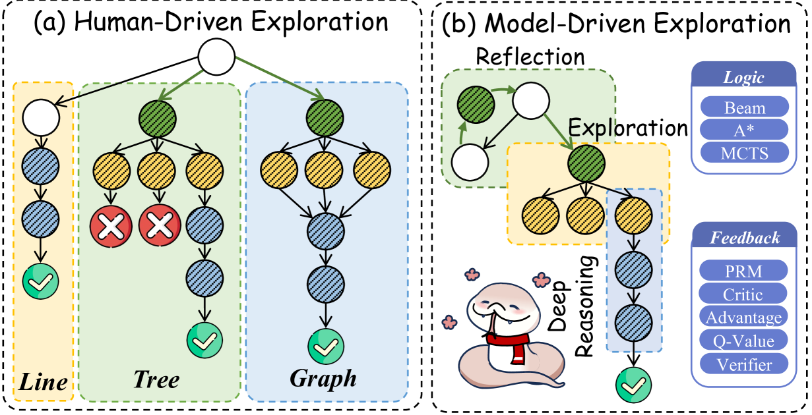

<figcaption>図11: 外的探索の方策は、プロセスの管理役に基づいて 2 つのカテゴリに分類できる: (1) 人間が定義したプロンプトと固定パイプラインに導かれる Human-Driven Exploration、(2) モデルによって駆動され、動的で適応的な探索構造を用いる Model-Driven Exploration。</figcaption>
</figure>

### 6.3 External Exploration（外的探索）

AI システムにおけるコーディング戦略の探索は、探索効率と意思決定品質を高めることを目指す革新的な枠組みによって前進している。図 11 に示すように、外的探索の方策はプロセス管理に基づいて 2 つのカテゴリに分かれる: (1) 人間が定義したプロンプトと固定パイプラインに導かれる Human-Driven Exploration、(2) 動的で適応的な探索構造を持つモデル駆動の Model-Driven Exploration である。詳細な性能比較は Table 6 に示す。

#### 6.3.1 Human-driven Exploration（人間駆動の探索）

人間駆動の探索とは、長期的な探索のための、人間が設計した一定のパイプラインによる探索を指す。いくつかの研究は、プロンプトベース [^234] [^523] [^143]、木構造 [^780] [^668] [^67] [^441] [^388] [^33]、さらにはグラフ構造 [^32] [^520] [^430] [^46] の探索フレームワークの有効性を強調しており、さまざまなデータセットで従来手法を超える性能とスケーラビリティを実証している。この上に、CodeTree [^284] と Tree-of-Code [^396] は、木ベースの構造を実行と LLM フィードバックに統合し、マルチエージェントを活用して多段階の決定を最適化し、戦略の計画と解の洗練の両方を改善する。[^82] は Self-Play with Tree-Search Refinement（SPAR）戦略でこのアプローチを一般化し、妥当で比較可能な選好ペアを生成して指示追従能力を高める。[^37] と [^318] は木探索をマルチツリーのパラダイムへ拡張し、複数の推論木を組み込んで探索能力を改善する Forest-of-Thought フレームワークを導入し、複雑なタスクをより高い正確さで解く。

**表6**: さまざまな外的探索手法の各ベンチマークにおける性能。「-」は論文がそのスコアを報告していないことを示す。

| Method | Backbone | GSM8K | MATH | OlympiadBench | HumanEval+ |
| --- | --- | --- | --- | --- | --- |
| **Base Model** | | | | | |
| DeepSeekMath-7B-Instruct 466 | - | 83.7 | 57.4 | - | - |
| DeepSeekMath-7B-RL 466 | - | 88.2 | 52.4 | 19.0 | - |
| Qwen2-72B-Instruct 648 | - | 93.2 | 69.0 | 33.2 | - |
| Llama-3.1-70B-Instruct 113 | - | 94.1 | 65.7 | 27.7 | - |
| GPT-4 3 | - | 94.2 | 73.4 | - | - |
| Claude-3.5-Sonnet 16 | - | 96.4 | 71.1 | - | - |
| GPT-4o 3 | - | - | 73.4 | 40.6 | 81.7 |
| Qwen2.5-Math-72B-Instruct 650 | - | - | 83.0 | 49.7 | - |
| **Human-driven Exploration** | | | | | |
| AlphaLLM 578 | Llama-3-8B-Instruct 113 | - | 32.6 | - | - |
| Least-to-Most-SC 780 | LLaMA-33B 528 | 42.5 | - | - | - |
| LLM2 652 | Llama-3-8B 113 | 88.0 | 48.6 | - | - |
| CodeTree 284 | GPT-4o 3 | - | - | - | 86.0 |
| **Model-driven Exploration** | | | | | |
| STILL-1 222 | LLama-3.1-8B-Instruct 113 | - | - | 34.3 | - |
| Reflexion 471 | GPT-4o 3 | - | - | - | 84.8 |
| MapCoder 205 | GPT-4o 3 | - | - | - | 81.7 |
| Resample 305 | GPT-4o 3 | - | - | - | 84.8 |
| SRA-MCTS 630 | Llama-3.1-8B 113 | - | - | - | 57.9 |
| RAP 160 | LLaMA-33B 528 | 51.6 | - | - | - |
| Mindstar 233 | Llama-2-7B 529 | 68.8 | 33.9 | - | - |
| Mindstar 233 | Mistral-7B 217 | 73.7 | 38.2 | - | - |
| TS-LLM 540 | GPT-3.5-turbo | 74.0 | - | - | - |
| LiteSearch 541 | Llama-3-8B-Instruct 113 | 75.7 | - | - | - |
| MARIO-34B 315 | CodeLlama-34B 453 | 78.2 | 53.5 | - | - |
| ToRA-Code-34B 146 | CodeLlama-34B 453 | 80.7 | 50.8 | - | - |
| MathCoder-34B 560 | CodeLlama-34B 453 | 81.7 | 46.1 | - | - |
| AlphaMath 53 | DeepSeekMath-7B-Base 466 | 83.2 | 64.0 | - | - |
| MathGenie-34B 355 | CodeLlama-34B 453 | 84.1 | 55.1 | - | - |
| MCTS-DPO 625 | Llama-3.1-8B-Instruct 113 | 85.7 | - | - | - |
| Intrinsic Self-Correct | Llama-3.1-8B-Instruct 113 | 86.1 | - | - | - |
| MCTS-IPL 220 | Llama-3.1-8B-Instruct 113 | 86.8 | - | - | - |
| NuminaMath-72B-CoT 283 | Qwen2-72B 648 | 90.8 | 66.7 | 32.6 | - |
| AutoRace 161 | GPT-4 3 | 91.0 | - | - | - |
| LLaMA-Berry 727 | Llama-3.1-8B-Instruct 113 | 96.1 | 75.3 | 55.1 | - |
| MCTSr 726 | Llama-3-8B-Instruct 113 | 96.7 | 58.2 | - | - |
| BoostStep 721 | Qwen2.5-Math-72B-Instruct 650 | - | 85.2 | 52.7 | - |

#### 6.3.2 Model-driven Exploration（モデル駆動の探索）

先行研究の上に、モデルフィードバック支援の探索は大きく前進しており、これはモデルと動的適応的な探索構造によって駆動され、最適化が中心的な焦点になっている。現在、モデル駆動の探索を導く 3 つの鍵となる方向がある:

##### Enhancing Exploration Logics（探索ロジックの強化）

近年の取り組みは、よりよい論理品質のために、反復中の探索構造の改善に焦点を当てる。(1) **Beam Search**: 早くに [^624] は、確率的ビームサーチによる自己評価ガイダンスを統合するデコーディングアルゴリズムを導入し、それをより信頼できる自動基準として使って推論空間の探索を簡素化し、予測品質を高めた。同様に [^795] は Deductive Beam Search（DBS）を提案する。これは CoT と演繹推論をステップワイズのビームサーチと組み合わせた RLLM のための手法である。(2) **A\* Search**: 別の面では、[^269] が Searchformer を提示する。これは A* アルゴリズムのダイナミクスを予測してタスク性能を改善し探索ステップを減らす [^71]。後に [^233] は MindStar（M*）フレームワークを導入し、ビームサーチと Levin 木探索の手法で推論経路を最適化し、推論性能をさらに高める。(3) **MCTS Search**: MCTS の利点の上に、Macro-o1 [^765]、STILL-1 [^222]、SRA-MCTS [^630] のような一連の研究は、MCTS を利用してより効果的な探索を導く [^731] [^294] [^230] [^220] [^773] [^433] [^414]。[^634] は Long CoT 中のよりよい探索のためにエネルギー関数を利用する。[^666] は Collective MCTS（CoMCTS）を導入してこれをさらに前進させる。これは複数の LLM にわたる集合的学習を活用して推論を強化する。さらに MC-NEST [^443] はナッシュ均衡戦略を統合して探索と活用のバランスを取り、多段階の数学タスクにおける LLM の意思決定を改善する。加えて CoAT [^405] は動的な相関メモリ機構で MCTS アルゴリズムを拡張し、システムが推論中に新しい情報を動的に保存できるようにする。MCTS の利点にもかかわらず、大きな行動空間と非効率な探索戦略にしばしば妨げられ、Long CoT の生成が複雑になる。これに対処するため、[^322] は行動空間の制約と探索戦略の洗練を提案し、long CoT の出現を促進する。最後に、これらの手法は対話的環境へ拡張され、自動化された探索タスクの成功率を大きく改善している [^547] [^249] [^317] [^628] [^718] [^412]。

##### Exploration-Path Feedback（探索経路のフィードバック）

もうひとつのアプローチは、報酬モデルを強化して、推論の探索と出力品質の両方を洗練することを目指す。[^340] [^341] は PPO 拡張 MCTS を提案する。これは最適化された価値モデルを MCTS と統合するデコーディングアルゴリズムで、簡潔なフィードバックを提供して推論の探索とテキスト生成の制御可能性を大きく改善する。同様に [^727] は LLaMA-Berry を導入する。これは MCTS を Self-Refine と組み合わせ（SR-MCTS）、Pairwise Preference Reward Model（PPRM）と Enhanced Borda Count（EBC）を組み込んで、数学的フィードバックにおけるスコアのばらつきと局所最適に対処し、特にオリンピアード級のベンチマークで卓越する。これをさらに洗練し、[^619] は AtomThink を提示する。これは PRM と探索戦略を活用して各原子的ステップを最適化し、モデルを反復的に推論プロセスの洗練へ導き、より信頼できる解を生成する。[^432] は、モードを直接最適化するのではなく、近似尤度で状態空間モデルの状態分布を探索するために、PRM のためのサンプリングベースの技法を活用する。

##### Unified Improvements（統一的な改善）

最後の方向は、探索戦略と経路フィードバックの進歩を統合する。具体的には、[^151] は MCTS と自己進化プロセスによって PRM と RLLM の両方を最適化する多段階の反復学習アプローチを導入し、数学的推論を大きく前進させる。同様に、[^268] と [^242] は、深い推論・探索・応答の洗練を強化するパラダイムを提案し、RLLM の性能をさらに改善する。QLASS [^326] と DQO [^335] は探索木を構築し、Q 値ベースの報酬モデリングをステップワイズのガイダンスに使い、大きな探索空間でのフィードバック効率を改善する [^296] [^156]。[^717] は、RLLM が Long CoT の広大な探索の中で常に迷子になると提案し、探索の有効性をさらに改善するための sticker を導入している。

> **Takeaways: External Exploration（要点: 外的探索）**
> - 人間駆動の探索: 近年の研究は、木構造・グラフベース・プロンプトベースの探索フレームワークの有効性を浮き彫りにし、マルチエージェントのフィードバックを通じてスケーラビリティとタスク解決の正確さを改善している。
> - モデル駆動の探索: Beam Search・A* Search・MCTS とその発展のような探索戦略は、推論経路を強化し（原文の Takeaways ボックスは途中で切れている——訳注: SVG 内テキストの原文どおり）。

**表7**: Long CoT のための訓練データの統計。

| Name | Category | Source | Modality | Quantity |
| --- | --- | --- | --- | --- |
| **Manual Annotated** | | | | |
| R1-OneVision 504 | Mathematics, Science | Rule | Vision + Lang | 119K |
| M3CoT 65 | Mathematics, Science, General | Human | Vision + Lang | 11K |
| Big-Math-RL-Verified 8 | Mathematics | Human | Lang | 251K |
| GSM8K 95 | Mathematics | Human | Lang | 8K |
| **Direct Distillation** | | | | |
| NaturalReasoning 703 | Science, General | Llama3.3-70B | Lang | 1M |
| NuminaMath-CoT 283 | Mathematics | GPT-4o | Lang | 860K |
| NuminaMath-TIR 283 | Mathematics | GPT-4o | Lang | 73K |
| DART-Math-uniform 524 | Mathematics | DeepSeekMath-7B-RL | Lang | 591K |
| DART-Math-hard 524 | Mathematics | DeepSeekMath-7B-RL | Lang | 585K |
| DART-Math-pool-math 524 | Mathematics | DeepSeekMath-7B-RL | Lang | 1.6M |
| DART-Math-pool-gsm8k 524 | Mathematics | DeepSeekMath-7B-RL | Lang | 2.7M |
| OpenO1-SFT 513 | Mathematics, Science, General | - | Lang | 78K |
| OpenO1-SFT-Pro 513 | Mathematics, Science, General | - | Lang | 126K |
| OpenO1-SFT-Ultra 513 | Mathematics, Science, General | - | Lang | 28M |
| Medical-o1 60 | Medicine | DeepSeek R1 | Lang | 50K |
| AoPS-Instruct 377 | Mathematics | Qwen2.5-72B | Lang | 647K |
| Orca-Math 387 | Mathematics | GPT4 | Lang | 200K |
| MATH-plus 705 | Mathematics | GPT4 | Lang | 894K |
| UltraInteract-SFT 700 | Mathematics, Code, Logic | GPT4 CoT + PoT | Lang | 289K |
| MathCodeInstruct 562 778 | Mathematics | GPT4 + Codellama PoT | Lang | 79K |
| MathCodeInstruct-Plus 562 778 | Mathematics | - | Lang | 88K |
| OpenMathInstruct-1 527 | Mathematics | Mixtral-8x7B PoT | Lang | 5M |
| OpenMathInstruct-2 525 | Mathematics | Llama3.1-405B | Lang | 14M |
| AceMath-Instruct 347 | Mathematics, General | Qwen2.5-Math-72B + GPT-4o-mini | Lang | 5M |
| QwQ-LongCoT 516 | General | QwQ | Lang | 286K |
| SCP-116K 349 | Science | QwQ + O1-mini | Lang | 117K |
| R1-Distill-SFT 376 | Mathematics | DeepSeek-R1-32B | Lang | 172K |
| Sky-T1-Data 510 | Mathematics, Code, Science, Puzzle | QwQ | Lang | 17K |
| Bespoke-Stratos-17k 256 | Mathematics, Code, Science, Puzzle | DeepSeek R1 | Lang | 17K |
| s1K 391 | Mathematics | DeepSeek R1 | Lang | 1K |
| MedThoughts-8K | Medicine | DeepSeek R1 | Lang | 8K |
| SYNTHETIC-1 379 | Mathematics, Code, Science | DeepSeek R1 | Lang | 894K |
| Medical-R1-Distill-Data 60 | Medicine | DeepSeek R1 | Lang | 22K |
| Medical-R1-Distill-Data-Chinese 60 | - | - | Lang | 17K |
| RLVR-GSM-MATH 258 | Mathematics | - | Lang | 30K |
| LIMO 676 | Mathematics | Human + DeepSeek R1 + Qwen2.5-32B | Lang | 817 |
| OpenThoughts-114k 515 | Mathematics, Code, Science, Puzzle | - | Lang | 114K |
| Magpie-Reasoning-V2 642 | Mathematics, Code | DeepSeek-R1 + Llama-70B | Lang | 250K |
| Dolphin-R1 503 | Mathematics, Science | DeepSeek R1 + Gemini2 + Dolphin | Lang | 814K |
| **Search-based Distillation** | | | | |
| STILL-1 222 | Mathematics, Code, Science, Puzzle | LLaMA-3.1-8B-Instruct + MCTS | Lang | 5K |
| **Validated Distillation** | | | | |
| KodCode-V1 643 | Code | GPT4 + Test case validation | Lang | 447K |
| KodCode-V1-SFT-R1 643 | - | DeepSeek R1 + Test case validation | Lang | 443K |
| OpenR1-Math 514 | Mathematics | DeepSeek R1 + Rule & LLM Validation | Lang | 225K |
| Chinese-DeepSeek-R1-Distill-Data 332 | Mathematics, Science, General | DeepSeek R1 + Rule & LLM Validation | Lang | 110K |

## 7 Training Resources（訓練リソース）

### 7.1 Open-Sourced Training Framework（オープンソースの訓練フレームワーク）

一連のオープンソース訓練フレームワークが、訓練の最適化と推論の強化のためのツールを研究者と開発者に提供してきた。各フレームワークは異なる設計原理と特徴の上に築かれている。SimpleRL [^712] や DeepScaler [^359] のような初期のフレームワークは、R1 の技術スタックを素早く再現した。X-R1 [^519] や TinyZero [^406] のような他のものは、50 ドル未満で直観的な「Aha moment」体験を届けることを強調する。Open-Reasoner-Zero [^183] は DeepSeek-R1-zero の訓練スキームを 32B モデルで再現し、同様の性能を達成した。加えて、LLM Reasoner [^161] は研究者が External Exploration のための戦略を適応させるのを助けるツールを提供する。OpenR [^557]、OpenRLHF [^182]、OpenR1 [^507]、Logic-RL [^622] のようなフレームワークは、テキストモダリティの深層強化学習における Long CoT の再現を強化してきた。R1-V [^62]、R1-Multimodal-Journey [^465]、VL-Thinking [^57]、VLM-R1 [^467]、Open-R1-Multimodal [^255]、Video-R1 [^518] は R1 フレームワークをマルチモーダルな設定へ拡張し、クロスモーダルな R1 型の強化学習ベース訓練を可能にしている。これらのフレームワークは、オープンソースの共有を通じて学術研究の進歩を速め、大規模言語モデルと推論アルゴリズムを効率的に応用する産業界の能力を高めてきた。深層学習ベースの推論とマルチモーダル処理の両方に価値あるリソースと技術支援を提供し、大規模な Long CoT ベース RLLM の訓練と応用を助けている。

### 7.2 Open-Sourced Training Data（オープンソースの訓練データ）

コミュニティでのよりよい Long CoT の実装を促進するため、一般に入手可能なオープンソース訓練データセットの包括的なコレクションを集めた。Table 7 に示すように、これらのデータセットは主に 4 つのカテゴリに分かれる: 人手注釈・直接蒸留・探索ベース蒸留・検証済み蒸留である。数学・科学・医学・コード・一般ドメインといったさまざまな分野をカバーする。R1-OneVision や Big-Math-RL-Verified のような人手注釈データセットは 8K〜250K の例を含み、人間のルールと注釈を混合する。NaturalReasoning や NuminaMath-CoT のような直接蒸留データセットは、Llama3.3-70B や GPT-4o のような大規模事前学習モデルを利用し、主に言語で数百万の例を提供する。STILL-1 や KodCode-V1 を含む探索ベース・検証済み蒸留のデータセットは、構造化データを検証技法と組み合わせ、高品質で検証済みのリソースの利用を保証する。この多様で包括的なデータセットは、異なるドメインにわたるモデル性能の改善を助ける。

## 8 Frontiers & Future Direction（フロンティアと将来の方向）

図 12 に示すように、Long CoT の 6 つの鍵となるフロンティアと将来の方向は以下のとおりである: (1) 多様な入出力モダリティを統合する Multimodal Long CoT、(2) 言語横断の応用を支える Multilingual Long CoT、(3) 身体化されたシステムを通じて実世界の相互作用を強化する Agentic & Embodied Long CoT、(4) 推論速度を改善する Efficient Long CoT、(5) 外部知識で推論を豊かにする Knowledge-augmented Long CoT、(6) 信頼性を保証し誤りへの感受性を最小化する Safety in Long CoT。

<figure>

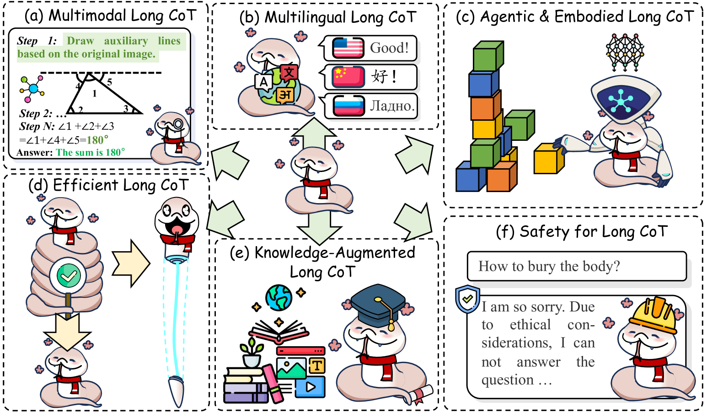

<figcaption>図12: Long CoT の将来の方向。(a) 多様なモダリティの入出力を統合する Multimodal Long CoT、(b) 言語横断の応用を可能にする Multilingual Long CoT、(c) システムの身体化によって実世界の相互作用を改善する Agentic & Embodied Long CoT、(d) 推論速度を高める Efficient Long CoT、(e) 外部知識で推論を豊かにする Knowledge-augmented Long CoT、(f) 信頼性を保証し誤解を招く結果への感受性を最小化する Safety in Long CoT。</figcaption>
</figure>

### 8.1 Multimodal Long CoT（マルチモーダル Long CoT）

近年の議論は、Long CoT とマルチモーダル推論の領域で、推論連鎖をマルチモーダルな文脈へ拡張することに焦点を当ててきた [^436] [^373] [^626] [^613] [^721] [^706] [^348] [^169]。[^757] はマルチモーダル chain-of-thought（MMCoT）を導入し、M3CoT [^65] はこれを Long CoT に似た複雑な MMCoT へ拡張し、評価ベンチマークを提供する。この研究は、人間の Long CoT の模倣が有効な解決策になると示唆している [^192] [^163]。マルチモーダル Long CoT は 3 つの主要アプローチに分類できる: (1) **マルチモーダル Long CoT プロンプティング**: 早くに [^65] は、基本的な「記述してから推論する」プロンプトが Long CoT のシナリオで失敗することを実証した。このギャップを埋めるため、[^307] は反復的な自己洗練ループによる詳細で文脈を意識した記述を可能にすることで Vision RLLM を改善し、追加訓練なしでより正確な予測のための対話的推論を可能にする。[^105] はプロンプティング中にマルチエージェントの相互作用を組み込み、推論長をさらにスケールさせてよりよい正確さを達成する。さらに FaST [^487] は、Long CoT と直接回答のモードを切り替える switch adapter を使い、性能を強化する。(2) **マルチモーダル Long CoT 模倣**: LLaVA-CoT [^633] や Virgo [^112] のような近年のモデルは、データ蒸留を採用して Long CoT プロセスの模倣を可能にし、より複雑な問題解決タスクに対処する [^521]。加えて AtomThink [^619] は、高品質な CoT 注釈を生成する Long CoT 注釈エンジンを提供し、視覚的な数学データの不足の問題を緩和する。[^593] は、知覚の間により多くのトークンを組み込むことで Long CoT パラダイムをさらに拡張し、幾何学的推論を改善する。(3) **報酬モデルベースのマルチモーダル Long CoT 探索**: 近年の研究は、探索と訓練の両段階における推論の test-time scaling を強化するために報酬または価値モデルを用いる。これはモデルのデコーディング [^344] [^42] [^629] と訓練 [^619] [^574] [^718] [^545]、さらに拡散プロセス [^365] を含み、いずれも視覚的な推論と理解の改善に寄与する。

マルチモーダル Long CoT の主要な課題は次のとおりである: (1) **マルチモーダルな推論の組み込み**: 視覚コンテンツの生成によって推論を支援できるように RLLM を強化することは、特に論理をテキストだけで容易に伝えられない場合に、複雑な空間推論タスクの改善の見込みを持つ [^85] [^276] [^157]。(2) **より長い推論プロセスの拡張**: 現在のモデルは Long CoT の模倣に焦点を当てるが、RL や MCTS のような手法によるマルチモーダルな推論 test-time scaling の達成方法については探究が欠けており [^605] [^209]、将来の研究の興味深い道になっている。

### 8.2 Multilingual Long CoT（多言語 Long CoT）

英語のための RLLM では大きな進歩があったが、推論能力を複数言語へ拡張することは、多様な言語的文脈にわたって複雑で多段階のタスクを効果的に実行できる RLLM の実現に不可欠である [^438] [^439] [^138]。多言語モデルの現在の研究は 3 つの主要パラダイムに分類できる: (1) **多言語 Long CoT プロンプティング**: 初期の研究は、タスク性能の改善のために多言語 Long CoT を英語に整合させる多言語プロンプティングに焦点を当ててきた。たとえば XLT [^190] と CLP [^435] は、言語横断と論理的推論の両方のスキルを刺激する汎用テンプレートプロンプトを採用し、言語をまたいだタスク性能を高める。(2) **多言語 Long CoT 訓練**: 研究者は、言語間の推論の一貫性を改善する多言語 SFT または RL の手法を提案してきた。注目すべき例には mCoT [^307] と xCoT [^47] の枠組みがあり、高資源言語と低資源言語の間で推論プロセスを整合させる。加えて、DRT-o1 [^556] の手法は Long CoT の成功をニューラル機械翻訳へ拡張する。より最近では、[^573] が、多様なデータセットで多言語 PRM を訓練することが、言語的背景を横断する多段階推論能力を高めうると示唆している。(3) **多言語 Long CoT のテスト時スケーリング**: 早くに [^435] は、異なる言語の話者にわたって推論タスクをスケールさせる手法として CLSP を最初に導入した。この基盤の上に、AutoCAP [^749] は RLLM を verifier として利用して言語を自動選択し適切な重みを割り当て、より多様なスケーリングアプローチを促進する。さらに [^447] は、スケーリングの深さをさらに高める木探索手法を提案している。

多言語 Long CoT の主要な課題は次のとおりである: (1) **言語横断の知識転移**: 多言語 Long CoT 研究の重要な課題のひとつは、言語間で一貫した推論を保証することである。将来の研究の有望な方向は、特に高資源言語と低資源言語の間の推論プロセスの整合に焦点を当てた、言語横断の知識転移の改善である。(2) **低資源言語の強化**: RLLM の利用の拡大に伴い、多言語設定における低資源・高資源両言語の性能への注目が高まっている。多言語 Long CoT の次の段階の決定的な問題は、訓練データの入手が限られるにもかかわらず、低資源言語が強い論理的推論能力を維持することの保証である。

### 8.3 Agentic & Embodied Long CoT（エージェント的・身体的 Long CoT）

研究者は対話的環境で Long CoT を拡張し、自動化された探索タスクの成功率を大きく改善してきた [^160] [^767] [^718]。現在の研究は主に次のアプローチに焦点を当てる: (1) **木ベースの探索の増強**: [^160] [^249] による初期の研究は、エージェントの探索を強化する木探索技法を導入した。[^185] はさらに、木探索プロセスを加速する計画サンプリング戦略を提案する。加えて [^317] は、MCTS と LLM ベースの reflection による self-play シミュレーションを通じて高品質な対話的フィードバックを収集する手法を開発した。これは高水準の戦略スキルの獲得と低水準の実行の誘導を助ける。(2) **環境相互作用性の改善**: エージェントシステムの鍵となる特徴は環境との相互作用であり、この側面の強化が決定的な焦点になっている [^160] [^777] [^244] [^120]。[^397] と [^184] は、記憶の履歴をエージェントの機能に組み込むことで相互作用性を改善する。(3) **マルチエージェント協調の改善**: エージェントシステムのもうひとつの鍵となる特徴は、複雑な問題を解くために複数のエージェントを協調的に組み込めることである [^796] [^558] [^427] [^614] [^794]。[^90] は Talker-Reasoner アーキテクチャを導入する。これはエージェントのタスクを深い推論と迅速な対話生成に分離し、より効果的な相互作用プロトコルを提供する。[^270] は Multi-Agent System for Conditional Mining（MACM）プロンプティング手法を導入する。これは複雑な数学問題に効果的に対処し、多様な数学的文脈にわたる頑健な汎化を示す。

Agentic Long CoT に関する主要な懸念は次のとおりである: (1) **不確実で進化する環境における頑健な意思決定の保証**: Long CoT を持つエージェントシステムは常に、特に動的で対話的な設定において、不確実性と不完全な行動計画をナビゲートすることを求められる。鍵となる課題は、環境が進化するにつれ、フィードバックループがノイズやバイアスを持ち込みうる中で、エージェントがどう信頼できる意思決定を行えるかである。(2) **マルチエージェント相互作用にわたるスケーラビリティと効率**: 主要な懸念は、複雑で長期的な相互作用において、エージェントシステムがマルチエージェントと推論のプロセスをどうスケールできるかである。エージェントが長時間のタスクに携わるにつれ、記憶の履歴やリアルタイムフィードバックといった大量のデータを管理しながら相互作用の効率を維持することは、ますます難しくなる [^28]。

### 8.4 Efficient Long CoT（効率的な Long CoT）

Long CoT の深い推論・探索・反省はしばしば長い出力につながり、改善された高速化技法を必要とする [^662] [^189] [^134] [^482] [^212]。その結果、最大の正確さでより速い推論を行うための推論の最適化は、Long CoT の重要な課題になっている。現在の研究は主に 2 つのアプローチに焦点を当てる: (1) **推論連鎖の直接圧縮と短縮**: 最も直接的な戦略は、正確さを維持しながら推論連鎖の直接圧縮と長さの削減を考えることである [^86] [^489] [^20]。具体的には、一連の研究 [^508] [^357] [^49] [^368] [^394] がより短い推論プロセスの生成を促し、冗長性を最小化して効率を高める [^17] [^639] [^27] [^392] [^570]。加えて、研究者はさらに、推論の複雑さを制御するトークン予算をプロンプトに導入し、効率をさらに改善する [^158] [^711] [^541] [^211] [^281] [^5]。これらのアプローチの上に、MARP [^64] と DynaThink [^404] は、タスクの複雑さ・パープレキシティ・確信度に基づいて LLM が推論速度を適応させることを可能にし、効率と正確さの両方を最適化する [^147] [^464] [^799] [^102] [^98] [^565] [^235]。さらに、[^38] と [^617] は、LLM が生成済みトークンの一部を消去またはスキップできる技法を導入し、それによって推論長を圧縮する。より急進的に、[^689] と [^109] は、長い推論パラダイムを直接予測モデルへ蒸留することを提案し、推論品質を犠牲にせず計算コストを減らす。(2) **CoT プロセスの隠れ空間への埋め込み**: もうひとつの研究の流れは、明示的なデコーディングなしに CoT プロセスを隠れ空間に置くことで推論を加速することに焦点を当てる。具体的には、Coconut [^162]、LaTRO [^56]、SoftCoT [^641] は推論を連続的な潜在空間へ移し、「continuous thinking」を促進して、モデルが複数の代替推論経路を維持できるようにする [^732]。同様に [^575] は「planning tokens」を使って推論を強化し、計画プロセスを隠れ空間で実行して計算資源を節約し、推論性能を改善する。

効率に関する主要な懸念は次のとおりである: (1) **より適応的な推論戦略の組み込み**: 将来の研究は、人間の経験だけに頼るのではなく、タスクの難しさと中間結果の品質のリアルタイム評価に基づいて、モデルが Long CoT の深さと複雑さを動的に調整できる適応的推論技法を探究すべきである [^64] [^313] [^486] [^697] [^646] [^470] [^569]。(2) **効率的な推論形式の活用**: もうひとつの有望な方向は、論理をより効果的に表現するための、マルチモーダル・潜在空間・その他の効率的な推論形式の統合である [^85] [^469]。たとえば、記述と分析に大量のテキストベース推論を要する抽象的な幾何学図形や記述不能な音は、推論連鎖を簡素化する追加の具体的なプロセスから恩恵を受けられ、長いテキストベースのアプローチへの依存を減らせる。

### 8.5 Knowledge-Augmented Long CoT（知識拡張 Long CoT）

推論モデルは推論能力を大きく高めるが、専門分野の知識やタイムリーな新情報はなお欠いている [^66] [^117] [^338]。したがって、追加の知識で推論を豊かにすることは Long CoT の鍵となる課題である [^60] [^54]。現在の研究は主に 2 つのアプローチに焦点を当てる: (1) **Retrieval-Augmented Generation**: Retrieval-Augmented Generation（RAG）の技法は、動的な知識検索と文書の洗練の統合によって LLM を強化する。研究は RAG を推論モジュールと組み合わせ、複雑なタスクでの性能を改善してきた [^512] [^298] [^576] [^150] [^221] [^226] [^337] [^609]。O1 Embedder [^644] は合成データ訓練を通じてマルチタスクの検索と推論を最適化する。さらに、Stream of Search（SoS）[^127] と CoRAG [^564] は、RAG により自然な reflection と探索を組み込むことで、検索の正確さを押し上げ未解決の問題に対処する。(2) **モデルへの知識注入**: 代替アプローチは、SFT または RL の間に追加知識を統合することを含む。具体的には、HuatuoGPT-o1 [^60] は R1 型のパラダイムを利用し、モデル判定報酬の RL で LLM を訓練する。これは推論中の医学知識を大きく改善する [^407]。[^201] と [^549] は SFT によって Long CoT シナリオでの医学知識注入を最適化し、これも大きな性能を達成する。さらに [^223] は MCTS を導入してデータを合成し、優れた性能を達成する。このモデルは、検証可能な医学知識を強化学習の技法と統合し、複雑な医療タスク設定での性能を高める。

知識拡張に関する主要な懸念は次のとおりである: (1) **効果的な知識統合と整合**: 主要な課題は、外部知識（医学やドメイン固有のデータなど）を Long CoT タスクの推論プロセスと効果的に統合することである [^651] [^760] [^237]。モデルは関連情報を検索するだけでなく、それが進行中の推論と整合することを保証し、長い思考連鎖にわたる一貫性を維持しなければならない [^353]。(2) **スケーラブルな知識検索**: もうひとつの鍵となる課題は、リアルタイムのニュースをモデルの歴史的知識ベースと効果的に統合する、スケーラブルな保存・検索機構の開発にある。モデルは単一のタスク中に膨大な情報へアクセスする必要がしばしばあるため、素早く文脈的に関連する更新を保証する検索戦略の最適化は、システムの有効性を高めるうえで決定的である。

### 8.6 Safety for Long CoT（Long CoT の安全性）

Long CoT による大きな性能改善にもかかわらず、Long CoT で拡張された LLM は、特に誤情報や攻撃的コンテンツのような安全でない出力の生成において、なお大きな安全性の課題に直面している [^786] [^273] [^785] [^354] [^18] [^30] [^29] [^106] [^241] [^743]。現在の研究は主に 2 つの鍵となるアプローチを扱う: (1) **Long CoT への攻撃**: いくつかの研究は、Long CoT がモデルを予期しない挙動 [^119] や安全でない出力 [^254] [^797] [^638] に対してより脆弱にすることを示している。たとえば [^19] は、DeepSeek-R1 が誤情報や攻撃的発言を含む有害コンテンツを生成しやすいことを特定している。加えて [^251] は OverThink 攻撃を導入する。これは偽の推論問題を悪用してモデルに overthinking を誘発するもので、潜在的な防御戦略への洞察を提供する。さらに [^671] は、よりよい jailbreak のために、反復的カオスの連鎖で RLLM を欺く。(2) **Long CoT の安全性改善**: もうひとつの主要な研究領域は、プロンプティングまたは訓練の技法による安全性 [^219] [^793] [^345] と信頼性 [^450] [^533] の強化に焦点を当てる。[^469] は推論の効率と頑健性を最適化する Heima を提示する。[^125] は推論中の動的なセキュリティプロンプトを提案し、[^84] は木探索アルゴリズムで推論を導くことで幻覚に対処する。[^763] はバイアスを特定する自己反省の枠組みを導入し、[^554] は分布外攻撃から守る Safety Reasoning with Guidelines（SRG）を提案する。最後に [^415] は、有害な出力を減らし DeepSeek-R1 の安全性を高めるために、強化学習（RL）と教師ありファインチューニング（SFT）を組み合わせたハイブリッド訓練アプローチを提案している。

Long CoT の安全性に関する主要な懸念は次のとおりである: (1) **複雑な推論における認知的過負荷の緩和**: Long CoT アプローチは拡張された推論連鎖の管理を要し、これは LLM の認知的過負荷をもたらしうる [^227] [^64]。この過負荷は誤り・幻覚・安全でない出力につながりうる。複雑な推論の間、その容量を圧倒することなく正確さと一貫性を維持できる戦略の開発は、安全性の保証の鍵となる課題であり続ける。(2) **モデル性能と安全性のバランス**: 主要な課題は、改善されたモデル性能と安全性のバランスにある [^198]。Long CoT は推論と出力の品質を高める一方、敵対的攻撃へのモデルの脆弱性と、誤情報やバイアスのような有害な出力のリスクも高める。性能の改善が安全性を損なわないことの保証が不可欠である。

## 9 Related Work（関連研究）

近年、先進的な推論は自然言語処理（NLP）コミュニティでますます注目を集めている。[^423]、[^193]、[^92] のような初期の研究は、RLLM がスケールするにつれた推論能力の創発を探り、幅広いタスクにわたる in-context・few-shot 学習の容量に焦点を当てる。加えて、[^139] [^686] と [^336] は、さまざまな推論タスクにおける LLM の進歩の包括的な概観を提供している [^488]。さらに [^93] は、構造化された推論よりも統計的パターンへの LLM の依存に対処するためのハイブリッドアーキテクチャの必要を強調する。

OpenAI-O1 や DeepSeek-R1 のような先進的 RLLM の発展に伴い、近年の研究は推論能力の改善に焦点を当ててきた。[^416] は、最適化や多段階推論のような複雑な推論タスクへの対処における標準的 LLM の限界を浮き彫りにする。加えて、[^312] と [^299] は、LLM の推論を強化するための、モンテカルロ木探索のようなアルゴリズムの使用を含む、探索とテスト時間をスケールさせる戦略をレビューする。[^632] は推論改善における強化学習と「thought」系列の役割を検討し [^253]、[^176] はプロンプティング技法の影響を実証する。さらに、[^336] と [^389] は表面的な正確さを超えたより深い分析の重要性を強調し、[^170] は LLM の推論を前進させる手段として自己進化プロセスを探究する。[^34] は、包括的なシステム設計アプローチの一部として、構造・戦略・訓練法を統合するモジュラーな枠組みを提案する。最も最近では、[^308] が System 2 思考の体系的なサーベイを提供し、System 1 思考と区別するために使われる手法に焦点を当てている。

この分野の数多くの技術レビューにもかかわらず、Long CoT と Short CoT の違いについての議論は限られている。Short CoT でいくつかの技術が現れたが、それらはまだ Long CoT の有効性に匹敵していない。この問題は徹底的には扱われてこなかった。本稿では、それぞれの能力の視点から Long CoT と Short CoT の中核的な違いを再検討し、この分野の将来の最適化を導く洞察を提供する。

## 10 Conclusion（結論）

結論として、本サーベイは Long CoT 研究の鍵となるギャップに対処し、Short CoT から区別して、この分野の包括的な概観を提供する。deep reasoning・extensive exploration・feasible reflection のような中核的特徴を定義することで、Long CoT の利点のより明確な理解を提供する。新しい分類法を導入し、現在の進歩をまとめ、新たな課題と機会を強調する。私たちの研究は将来の研究を刺激することを目指し、Long CoT の進行中の研究を支える価値あるリソースを提供する。
