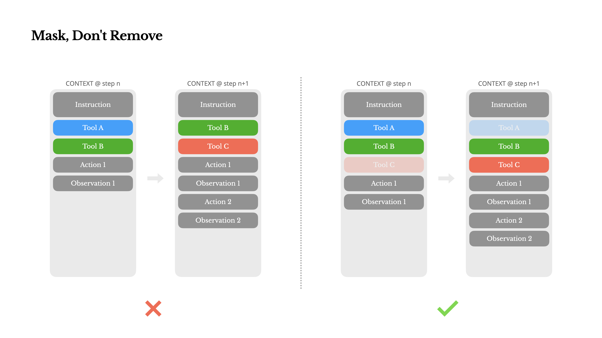
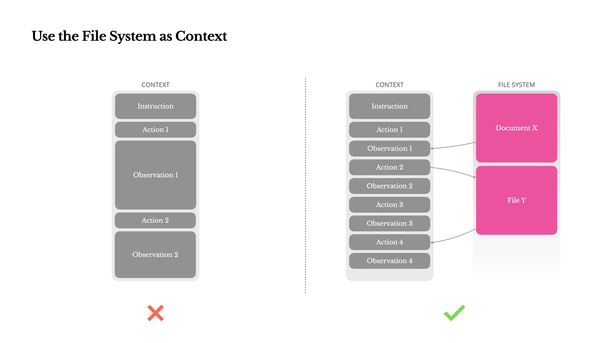
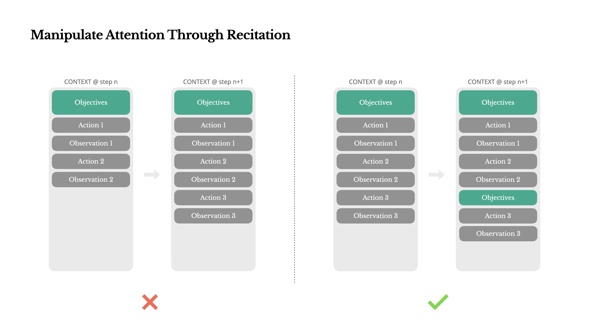
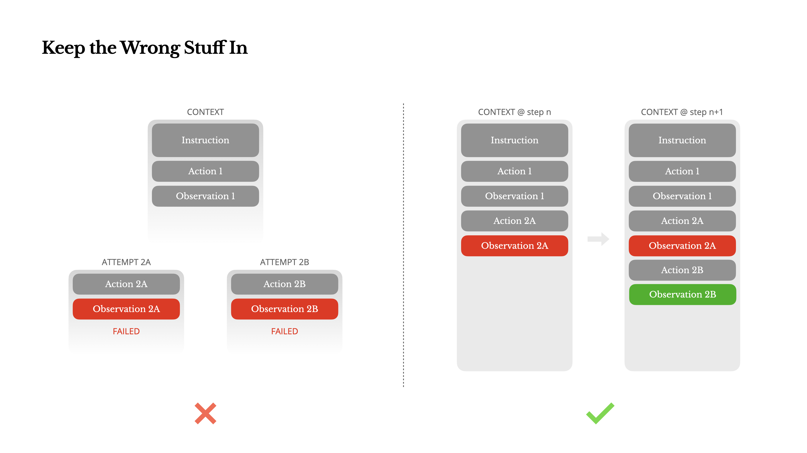
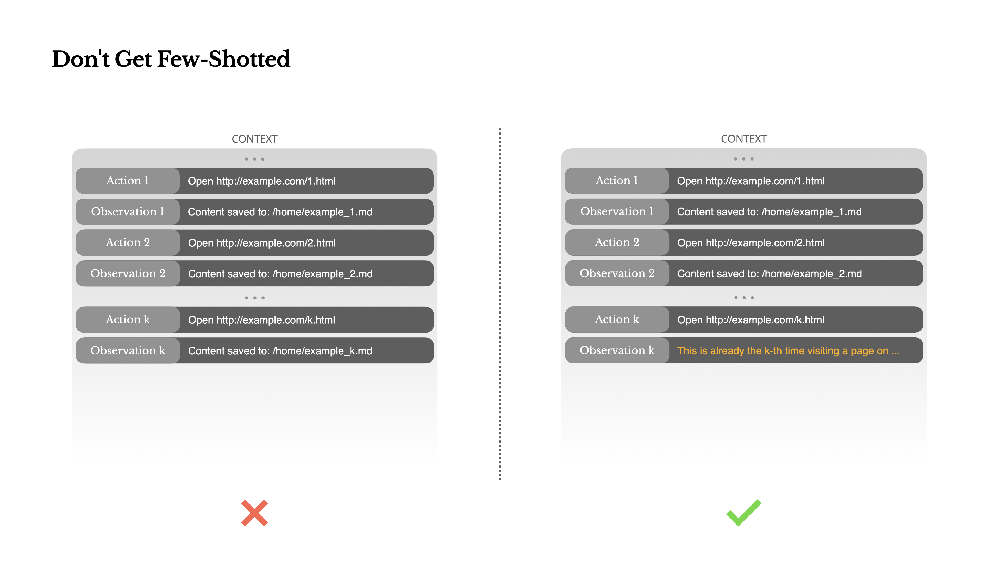

# AI エージェントのためのコンテキストエンジニアリング: Manus 構築からの教訓

> 原題: Context Engineering for AI Agents: Lessons from Building Manus
> 著者: Yichao 'Peak' Ji（Manus AI 共同創業者・Chief Scientist）
> 出典: Manus 公式ブログ https://manus.im/blog/Context-Engineering-for-AI-Agents-Lessons-from-Building-Manus （2025-07）

> **訳注（クリップ復元について)**: Obsidian Web Clipper のクリップでは、「Manipulate Attention Through Recitation」節の一文の冒頭「By constantly rewriting the todo list, Manus is」が本文から脱落し、リンク付きの句が frontmatter の author 欄に混入していた。原ページと照合して当該文を復元した。画像 6 枚は原ページからローカル保存した（サイトの「Manus is now part of Meta」バナー・アプリダウンロード誘導は本文でないため除外）。

Manus プロジェクトの最初期に、私のチームは鍵となる決断に直面した: オープンソースの基盤の上で end-to-end の agentic モデルを訓練すべきか、それともフロンティアモデルの in-context learning（文脈内学習）能力の上にエージェントを構築すべきか?

NLP に携わった最初の 10 年間、我々にはその選択をする贅沢はなかった。BERT の遠い日々（そう、もう 7 年になる）には、モデルは新しいタスクへ転移する前にファインチューニング——そして評価——されねばならなかった。その過程は、今日の LLM と比べればモデルが小さかったにもかかわらず、1 回の反復にしばしば数週間を要した。速く動くアプリケーション、特に PMF（product-market fit）前の段階では、そのような遅いフィードバックループは致命的である。それは私の前のスタートアップの苦い教訓だった。そこで私は open information extraction（オープン情報抽出）と意味検索のためにモデルをゼロから訓練していた。そこへ GPT-3 と Flan-T5 が現れ、私の内製モデルは一夜にして無意味になった。皮肉なことに、まさにそれらのモデルが in-context learning の始まり——そして全く新しい道の始まり——だった。

その苦労して得た教訓が選択を明確にした: Manus はコンテキストエンジニアリングに賭ける。これにより我々は改善を数週間ではなく数時間で出荷でき、プロダクトを基盤モデルに対して直交に保てた: モデルの進歩が上げ潮なら、Manus は船でありたい。海底に突き立った柱ではなく。

それでも、コンテキストエンジニアリングは全く一筋縄ではないことが分かった。それは実験科学である——そして我々は、コンテキストをより良く形作る方法を発見するたびに、エージェントフレームワークを 4 回作り直した。このアーキテクチャ探索・プロンプトいじり・経験的な当て推量の手作業の過程を、我々は親しみを込めて「Stochastic Graduate Descent（確率的大学院生降下法）」と呼んでいる。エレガントではないが、機能する。

本稿は、我々自身の「SGD」を通じて到達した局所最適解を共有する。あなたが自分の AI エージェントを構築しているなら、これらの原則がより速い収束の助けになることを願う。

## Design Around the KV-Cache（KV キャッシュを中心に設計する）

ただ 1 つの指標を選べと言われたら、**KV-cache のヒット率が、本番段階の AI エージェントにとって唯一最重要の指標**だと私は主張する。それはレイテンシとコストの両方に直接影響する。理由を理解するために、典型的なエージェントがどう動作するかを見よう:

ユーザー入力を受け取った後、エージェントはタスクを完了するためにツール使用の連鎖を進む。各イテレーションで、モデルは現在のコンテキストに基づいて事前定義された行動空間から行動を選択する。その行動は環境（例: Manus の仮想マシンサンドボックス）で実行され、観測を生む。行動と観測はコンテキストへ追記され、次のイテレーションの入力をなす。このループはタスクが完了するまで続く。

想像がつくとおり、コンテキストはステップごとに成長する一方、出力——通常は構造化された関数呼び出し——は比較的短いままである。このため、エージェントでは prefill（入力の一括処理）と decode（逐次生成）の比率が、チャットボットに比べて大きく偏る。Manus では、例えば、入力対出力のトークン比は平均でおよそ **100:1** である。

幸い、同一のプレフィックスを持つコンテキストは KV-cache を活用でき、これは time-to-first-token（TTFT, 最初のトークンまでの時間）と推論コストを劇的に減らす——セルフホストのモデルでも、推論 API の呼び出しでも。そしてこれは小さな節約の話ではない: 例えば Claude Sonnet では、キャッシュ済み入力トークンは 0.30 USD/MTok、未キャッシュは 3 USD/MTok——**10 倍**の差である。

<figure>

<figcaption>図1: KV キャッシュを中心に設計する。左（×）: 前のステップの内容を変更すると、変更点以降のキャッシュがすべて無効になる（Cache Miss）。右（✓）: コンテキストを追記専用にすれば、既存プレフィックス全体がキャッシュヒットし、新しい Action/Observation だけが未キャッシュになる。</figcaption>
</figure>

コンテキストエンジニアリングの観点から、KV-cache ヒット率の改善はいくつかの鍵となる実践を含む:

1. **プロンプトのプレフィックスを安定に保つ。** LLM の自己回帰的な性質のため、たった 1 トークンの違いでも、そのトークン以降のキャッシュを無効化しうる。よくある誤りは、システムプロンプトの冒頭にタイムスタンプ——特に秒精度のもの——を含めることである。確かにモデルは現在時刻を答えられるようになるが、キャッシュヒット率は死ぬ。
2. **コンテキストを追記専用（append-only）にする。** 過去の行動や観測を修正するのを避ける。シリアライズが決定的であることを保証する。多くのプログラミング言語やライブラリは、JSON オブジェクトのシリアライズでキーの順序の安定を保証せず、これが静かにキャッシュを壊しうる。
3. **必要ならキャッシュのブレークポイントを明示的に標示する。** 一部のモデルプロバイダや推論フレームワークは自動の増分プレフィックスキャッシングをサポートせず、コンテキストへのキャッシュブレークポイントの手動挿入を要求する。これを割り当てるときは、キャッシュの失効の可能性を考慮し、最低限、ブレークポイントがシステムプロンプトの終端を含むことを保証する。

加えて、vLLM のようなフレームワークでモデルをセルフホストしているなら、prefix/prompt caching が有効であることを確かめ、分散ワーカー間でリクエストを一貫してルーティングするためにセッション ID のような技法を使うこと。

## Mask, Don't Remove（削除するな、マスクせよ）

エージェントの能力が増えるにつれ、その行動空間は自然に複雑になる——平たく言えば、ツールの数が爆発する。最近の MCP（Model Context Protocol）の流行は火に油を注ぐだけである。ユーザーが構成可能なツールを許すなら、信じてほしい: 誰かが必ず、あなたが注意深くキュレートした行動空間に何百もの得体の知れないツールを差し込んでくる。その結果、モデルは誤った行動を選んだり非効率な経路を取ったりしやすくなる。要するに、**重武装したエージェントは、より愚かになる**。

自然な反応は動的な行動空間を設計すること——おそらく RAG 的な方法でツールをオンデマンドにロードすること——である。Manus でもそれを試した。しかし我々の実験は明確な規則を示唆する: **絶対に必要でない限り、イテレーションの途中でツールを動的に追加・削除するのを避けよ**。主な理由は 2 つある:

1. 大半の LLM では、ツール定義はシリアライズ後にコンテキストの前方——典型的にはシステムプロンプトの前か後——に置かれる。したがってどんな変更も、それ以降のすべての行動と観測の KV-cache を無効化する。
2. 過去の行動と観測が、現在のコンテキストにもはや定義されていないツールを参照し続けると、モデルは混乱する。constrained decoding（制約付きデコーディング）なしでは、これはしばしばスキーマ違反や幻覚された行動につながる。

これを解決しつつ行動選択を改善するため、Manus は文脈認識の**状態機械（state machine）**を使ってツールの利用可能性を管理する。ツールを削除するのではなく、デコーディング中に**トークンのロジットをマスク**し、現在の文脈に基づいて特定の行動の選択を防ぐ（あるいは強制する）。

<figure>

<figcaption>図2: 削除するな、マスクせよ。左（×）: ツール定義をコンテキストから削除すると、プレフィックスのキャッシュが無効化され、過去の行動が幻のツールを参照して混乱する。右（✓）: 定義は残したままロジットマスクで選択可能なツールを制御すれば、キャッシュも整合性も保たれる。</figcaption>
</figure>

実際には、大半のモデルプロバイダと推論フレームワークが何らかの response prefill（応答の先頭埋め）をサポートしており、これによりツール定義を変更せずに行動空間を制約できる。関数呼び出しには一般に 3 つのモードがある（NousResearch の Hermes フォーマットを例に使う）:

- **Auto** — モデルは関数を呼んでも呼ばなくてもよい。応答プレフィックスのみを prefill して実装する: `<|im_start|>assistant`
- **Required** — モデルは関数を呼ばねばならないが、選択は制約されない。tool call トークンまでを prefill して実装する: `<|im_start|>assistant<tool_call>`
- **Specified** — モデルは特定の部分集合から関数を呼ばねばならない。関数名の先頭までを prefill して実装する: `<|im_start|>assistant<tool_call>{"name": "browser_`

これを使い、我々はトークンロジットを直接マスクして行動選択を制約する。例えば、ユーザーが新しい入力を与えたとき、Manus は行動を取るのではなく直ちに応答しなければならない。我々はまた、**一貫したプレフィックスを持つように行動名を意図的に設計**した——例: ブラウザ関連のツールはすべて `browser_` で始まり、コマンドラインのツールは `shell_` で始まる。これにより、状態を持つロジットプロセッサなしで、ある状態でエージェントが特定のツール群からのみ選ぶことを容易に強制できる。

これらの設計は、モデル駆動のアーキテクチャの下でも、Manus のエージェントループが安定に保たれることを助ける。

## Use the File System as Context（ファイルシステムをコンテキストとして使う）

現代のフロンティア LLM は 128K トークン以上のコンテキストウィンドウを提供する。しかし現実世界の agentic なシナリオでは、それはしばしば足りず、ときには足枷ですらある。よくある痛点は 3 つ:

1. **観測が巨大になりうる。** 特にエージェントが Web ページや PDF のような非構造データと相互作用するとき。コンテキスト限界を吹き飛ばすのは容易い。
2. **モデル性能はある長さを超えると劣化する傾向がある。** ウィンドウが技術的にはそれをサポートしていても。
3. **長い入力は高価である。** プレフィックスキャッシングがあっても。すべてのトークンの転送と prefill にはなお支払いが要る。

これに対処するため、多くのエージェントシステムはコンテキストの切り詰めや圧縮の戦略を実装する。しかし過度に積極的な圧縮は必然的に情報損失につながる。問題は根本的である: エージェントは本性上、**すべての過去の状態に基づいて次の行動を予測**しなければならない——そして、どの観測が 10 ステップ後に枢要になるかを確実に予測することはできない。論理的な観点から、**不可逆な圧縮はどれもリスクを伴う**。

だから我々は Manus で、**ファイルシステムを究極のコンテキスト**として扱う: サイズは無制限で、本性的に永続し、エージェント自身が直接操作できる。モデルはファイルへオンデマンドに書き・読むことを学ぶ——ファイルシステムを単なる保存装置ではなく、**構造化された外部化メモリ**として使うのである。

<figure>

<figcaption>図3: ファイルシステムをコンテキストとして使う。巨大な観測（Web ページ・文書）はファイルに書き出し、コンテキストには復元可能な参照（URL・パス）だけを残す。</figcaption>
</figure>

我々の圧縮戦略は常に**復元可能（restorable）**であるよう設計される。例えば、Web ページの内容は URL が保存されている限りコンテキストから落としてよく、文書の内容はそのパスがサンドボックス内で利用可能なままなら省略できる。これにより Manus は、情報を恒久的に失うことなくコンテキスト長を縮められる。

この機能を開発しながら、私は State Space Model（SSM, 状態空間モデル）が agentic な設定で効果的に機能するには何が要るかを想像していた。Transformer と異なり、SSM は完全な注意を欠き、長距離の後方依存に苦しむ。しかし、もし**ファイルベースの記憶**を習得できたら——長期状態をコンテキスト内に保持する代わりに外部化できたら——その速度と効率は新しいクラスのエージェントを解錠するかもしれない。Agentic SSM は Neural Turing Machine の真の後継になりうる。

## Manipulate Attention Through Recitation（復唱で注意を操作する）

Manus を使ったことがあれば、興味深いことに気づいただろう: 複雑なタスクを扱うとき、Manus は todo.md ファイルを作りがちである——そしてタスクが進むにつれ、完了項目にチェックを付けながらそれをステップごとに更新する。

それは単なる可愛い仕草ではない——**注意（attention）を操作するための意図的な機構**である。

<figure>

<figcaption>図4: 復唱による注意の操作。todo.md を繰り返し書き直すことで、グローバルな計画をコンテキストの末尾（モデルの直近の注意範囲）へ押し出し続ける。</figcaption>
</figure>

Manus の典型的なタスクは平均でおよそ **50 回のツール呼び出し**を要する。それは長いループである——そして Manus は意思決定を LLM に頼るため、特に長いコンテキストや込み入ったタスクでは、話題から漂流したり早期の目標を忘れたりしやすい。

todo リストを絶えず書き直すことで、Manus は目標をコンテキストの末尾へ**復唱（recite）**している（訳注: この文の前半はクリップで脱落しており原ページから復元した）。これはグローバルな計画をモデルの直近の注意範囲（recent attention span）へ押し込み、「lost-in-the-middle」問題を避けて目標の不整合を減らす。事実上、特別なアーキテクチャ変更を必要とせずに、**自然言語を使って自らの焦点をタスク目標の方へバイアスしている**のである。

## Keep the Wrong Stuff In（誤りをコンテキストに残せ）

エージェントは間違える。それはバグではない——現実である。言語モデルは幻覚し、環境はエラーを返し、外部ツールは行儀悪く振る舞い、予期せぬエッジケースはいつでも現れる。多段のタスクでは、失敗は例外ではない。**ループの一部**である。

それでも、よくある衝動はこれらのエラーを隠すことである: トレースを掃除し、行動をリトライし、モデルの状態をリセットして、魔法の「temperature」に任せる。その方が安全で、制御されているように感じられる。しかし代償がある: **失敗を消すことは証拠を消すこと**である。そして証拠なしには、モデルは適応できない。

<figure>

<figcaption>図5: 誤りをコンテキストに残す。失敗した行動とその観測（スタックトレース）を見せることで、モデルの内的信念が更新され、同種の行動の事前確率が下がる。</figcaption>
</figure>

我々の経験では、エージェントの振る舞いを改善する最も効果的な方法の 1 つは、拍子抜けするほど単純である: **誤った道のりをコンテキストに残す**こと。失敗した行動——そして結果の観測やスタックトレース——を見ると、モデルは暗黙にその内的信念を更新する。これはその事前分布を同種の行動から遠ざけ、同じ誤りを繰り返す確率を下げる。実際、我々は**エラーからの回復こそ、真の agentic な振る舞いの最も明瞭な指標の 1 つ**だと信じている。それにもかかわらず、理想条件下でのタスク成功に焦点を当てがちな大半の学術研究と公開ベンチマークでは、それはいまだ過小に扱われている。

## Don't Get Few-Shotted（few-shot の轍にはまるな）

few-shot プロンプティングは LLM の出力を改善する一般的な技法である。しかしエージェントシステムでは、それは微妙な形で裏目に出うる。

言語モデルは優れた模倣者である。コンテキスト内の振る舞いのパターンを模倣する。コンテキストが類似した過去の行動–観測ペアで満ちていれば、モデルはそのパターンに従う傾向がある——それがもはや最適でなくても。

これは反復的な決定や行動を含むタスクで危険になりうる。例えば、Manus を使って 20 件の履歴書のレビューを手伝わせるとき、エージェントはしばしばリズムに陥る——コンテキストにそう見えるからというだけの理由で、類似した行動を繰り返す。これは漂流・過度の一般化、ときに幻覚につながる。

<figure>

<figcaption>図6: few-shot の轍にはまるな。一様なコンテキスト（左）はパターンの惰性を生む。行動と観測に構造化された小さな変動を導入する（右）ことで轍を断つ。</figcaption>
</figure>

対策は**多様性を増やす**ことである。Manus は行動と観測に、構造化された少量の変動を導入する——異なるシリアライズテンプレート、別の言い回し、順序やフォーマットの小さなノイズ。この制御されたランダム性がパターンを破るのを助け、モデルの注意を調整する。言い換えると、**few-shot で自分を轍に追い込むな**。コンテキストが一様であるほど、エージェントは脆くなる。

## Conclusion（結論）

コンテキストエンジニアリングはまだ勃興しつつある科学である——しかしエージェントシステムにとっては、すでに本質的である。モデルはより強く、速く、安くなりつつあるかもしれないが、どれだけの生の能力も、**記憶・環境・フィードバック**の必要を置き換えはしない。コンテキストをどう形作るかが、最終的にエージェントがどう振る舞うかを定める: どれだけ速く走り、どれだけうまく回復し、どこまでスケールするかを。

Manus では、我々はこれらの教訓を、繰り返しの書き直し・行き止まり・数百万ユーザーにわたる実世界のテストを通じて学んだ。ここで共有したことはどれも普遍の真理ではない——しかしこれらは我々にとって機能したパターンである。もしあなたが痛みを伴う反復を 1 回でも避ける助けになるなら、本稿は役目を果たしたことになる。

agentic な未来は、1 つひとつのコンテキストから築かれる。うまく設計せよ（Engineer them well）。
