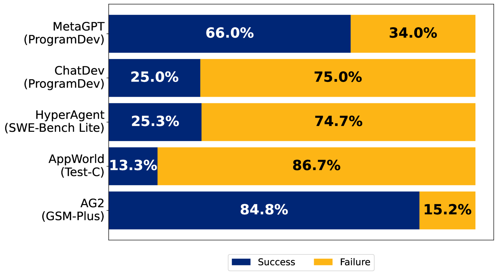
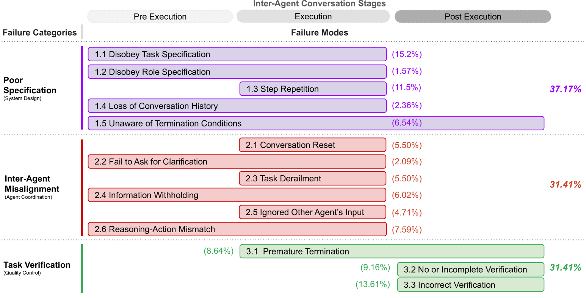
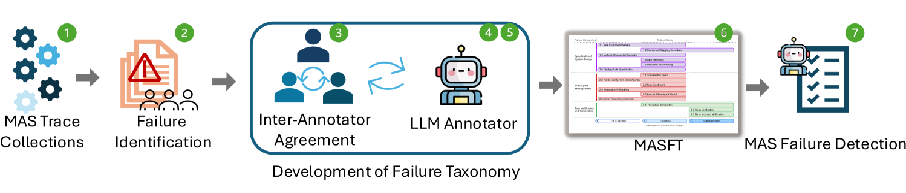
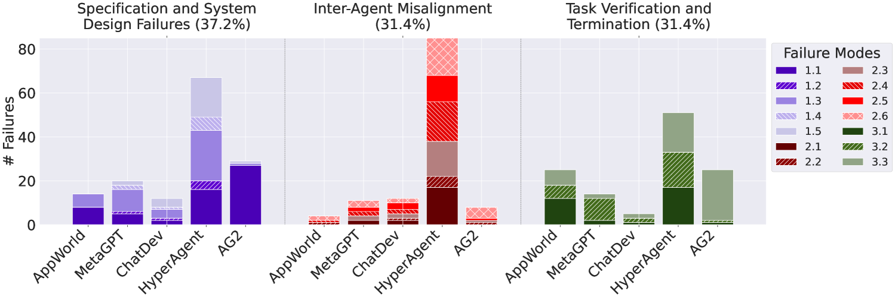
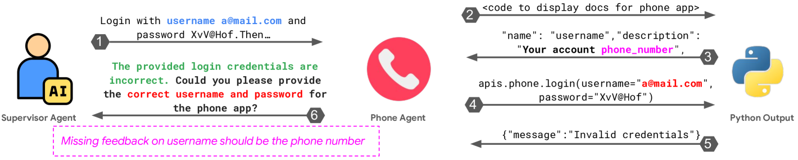
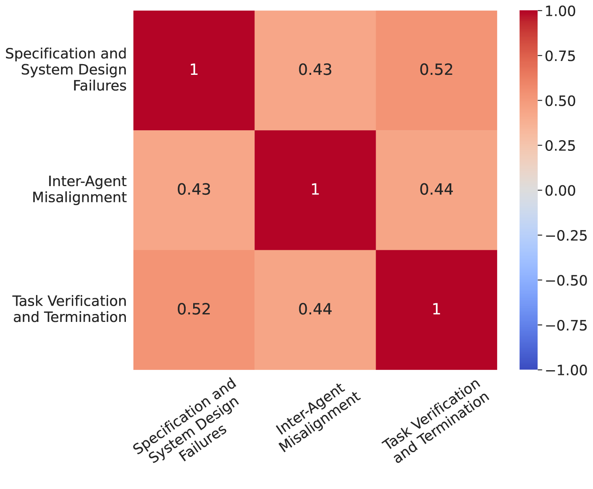
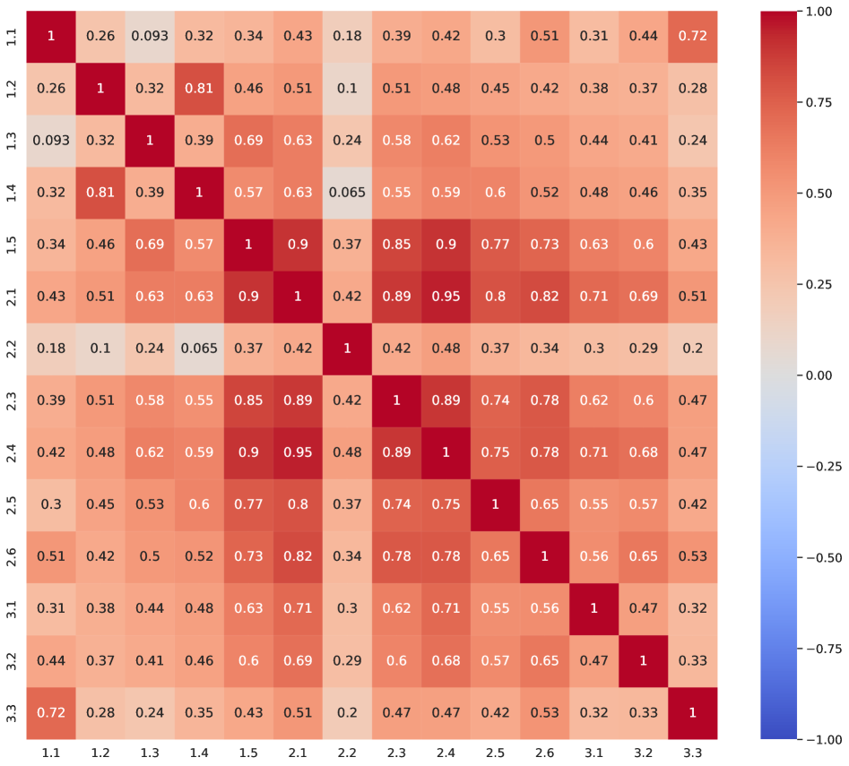

# マルチエージェント LLM システムはなぜ失敗するのか？

> 原題: Why Do Multi-Agent LLM Systems Fail?
> 著者: Mert Cemri, Melissa Z. Pan, Shuyi Yang, Lakshya A Agrawal, Bhavya Chopra, Rishabh Tiwari, Kurt Keutzer, Aditya Parameswaran, Dan Klein, Kannan Ramchandran, Matei Zaharia, Joseph E. Gonzalez, Ion Stoica（UC Berkeley）
> 出典: arXiv:2503.13657
> 訳注: クリップでは FC1〜FC3 の定義ボックスがインライン SVG として混入していたため、SVG 内テキストを抽出して引用ブロックとして復元した。脚注 1（オープンソースリポジトリの URL）はクリップから欠落していたため ar5iv から復元した。Appendix A の「FM-3.3: No or incomplete verification」は ar5iv 原典由来の採番誤り（本来 FM-3.2。付録 D.5 の見出しや Figure 2 では FM-3.2 と表記）で、本訳では原典のまま残し該当箇所に訳注を付す。本文中の \[数字\] は原典の参考文献番号を示す（参考文献一覧は翻訳対象外）。

## Abstract（要旨）

複数の LLM エージェントが協調してタスクを遂行するマルチエージェントシステム（Multi-Agent Systems, MAS）への熱気が高まっているにもかかわらず、人気ベンチマークにおける性能向上は、単一エージェントのフレームワークと比べて依然として僅かである。このギャップは、MAS の有効性を妨げている課題を分析する必要性を浮き彫りにする。

本論文では、MAS の課題に関する初の包括的研究を提示する。我々は 5 つの人気 MAS フレームワークを 150 以上のタスクにわたって分析し、6 人の専門家によるヒトのアノテータを起用した。我々は 14 の固有の失敗モードを特定し、様々な MAS フレームワークに適用可能な包括的分類法を提案する。この分類法は、各研究につき 3 人の専門家アノテータの合意から反復的に生まれ、Cohen's Kappa スコア 0.88 を達成している。これらのきめ細かい失敗モードは 3 つのカテゴリに整理される: (i) 仕様とシステム設計の失敗、(ii) エージェント間の不整合、(iii) タスクの検証と終了、である。スケーラブルな評価を支えるため、我々は MASFT を LLM-as-a-Judge と統合する。また、特定された失敗が容易に防げるのかを探るため、2 つの介入——エージェントの役割仕様の改善と、オーケストレーション戦略の強化——を提案する。我々の発見は、特定された失敗にはより複雑な解決策が必要であることを明らかにし、将来の研究への明確なロードマップを浮かび上がらせる。我々はデータセットと LLM アノテータをオープンソースとして公開する[^fn1]。

[^fn1]: https://github.com/multi-agent-systems-failure-taxonomy/MASFT（訳注: この脚注はクリップから欠落していたため ar5iv から復元）

キーワード: multi-agent systems, large language models, llm, compound ai systems, agents, ai, inference-time compute, tool calling

> 「幸福な家庭はどれも似たものだが、不幸な家庭はいずれもそれぞれに不幸なものである。」\[62\]
> 「成功するシステムはどれも似た働き方をするが、失敗するシステムはそれぞれに固有の問題を抱えている。」（Berkeley, 2025）

## 1 Introduction（はじめに）

最近、大規模言語モデル（LLM）ベースのエージェントシステムが AI コミュニティで大きな注目を集めている \[46\]\[43\]\[64\]。この関心の高まりは、多様な環境と動的に相互作用しながら複雑な多段タスクを扱えるというエージェントシステムの能力に由来し、LLM ベースのエージェントシステムを実世界の問題に適したものにしている \[32\]。この特性の上に、マルチエージェントシステムは、ソフトウェアエンジニアリング \[51\]\[67\]、創薬 \[15\]\[60\]、科学シミュレーション \[45\]、そして最近では汎用エージェント \[36\] といった様々なドメインでますます探求されている。

<figure>



<figcaption>図1: GPT-4o と Claude-3 を用いた 5 つの人気マルチエージェント LLM システムの失敗率。</figcaption>
</figure>

エージェントの形式的定義はいまだ議論のあるトピックだが \[10\]\[73\]\[16\]\[34\]\[65\]、本研究では LLM ベースのエージェントを、プロンプト仕様（初期状態）、会話トレース（状態）、およびツール使用などの環境との相互作用能力（行動）を備えた人工的実体として定義する。そのうえでマルチエージェントシステム（MAS）を、オーケストレーションを通じて相互作用するよう設計されたエージェントの集まりであり、集合知を可能にするものとして定義する。MAS は取り組みを協調させるよう構造化されており、タスクの分解、処理の並列化、コンテキストの分離、特化モデルのアンサンブル、多様な推論の議論を可能にする \[20\]\[39\]\[79\]\[13\]\[44\]\[16\]。

<figure>



<figcaption>図2: MAS 失敗モードの分類法（A Taxonomy of MAS Failure Modes）。エージェント間会話のステージは、end-to-end の MAS システムにおいて失敗が起こりうる時点を示す。失敗モードが複数のステージにまたがる場合、その問題が異なるステージに関与する、あるいは異なるステージで起こりうることを意味する。パーセンテージは、151 トレースの分析において各失敗モードとカテゴリが現れた頻度を表す。各失敗モードの詳細な定義と例は Appendix にある。</figcaption>
</figure>

MAS の採用が拡大しているにもかかわらず、精度や性能の向上は、単一エージェントのフレームワーク \[74\] や、人気ベンチマークにおける best-of-N サンプリングのような単純なベースライン \[27\] と比べてさえ僅かにとどまる。我々の実証分析は、最先端（SOTA）のオープンソース MAS である ChatDev \[51\] の正しさが、Fig. 1 に示すように 25% まで低くなりうることを明らかにする。さらに、頑健で信頼できる MAS をどう構築するかについて明確なコンセンサスは存在しない。これは、我々がまず答えるべき根本的な問いへと導く: **MAS はなぜ失敗するのか？**

MAS の失敗モードを理解するため、我々は Grounded Theory \[14\] を用いた MAS 実行トレースの初の系統的評価を行う。5 つの人気オープンソース MAS を分析し、6 人の専門家アノテータを起用して、各平均 15,000 行を超える 150 の会話トレースにわたるきめ細かい問題を特定する。我々は、MAS が意図されたタスク目標を達成しない場合を失敗と定義する。失敗モードと定義の一貫性を確保するため、3 人の専門家アノテータが独立に 15 トレースをラベル付けし、Cohen's Kappa スコア 0.88 のアノテータ間一致を達成した。この包括的分析から 14 の異なる失敗モードを特定し、3 つの主要な失敗カテゴリにクラスタリングする。我々は、Fig. 2 に示すように、MAS の初の構造化された失敗分類法である Multi-Agent System Failure Taxonomy（MASFT）を導入する。MASFT があらゆる潜在的な失敗パターンを網羅すると主張するわけではない。むしろこれは、MAS の失敗を分類し理解するための第一歩である。

スケーラブルな自動評価を可能にするため、OpenAI の o1 を用いる LLM-as-a-judge パイプライン \[80\] を導入する。このパイプラインを検証するため、10 トレース上でそのアノテーションを 3 人のヒト専門家のアノテーションと相互検証し、最終的な Cohen's Kappa 一致率 0.77 を得た。

直感的には、より良い仕様 \[57\] とプロンプティング戦略が MAS の失敗を軽減できる可能性がある。この仮説を検証するため、プロンプトエンジニアリングとエージェントのトポロジー的オーケストレーションの強化を用いたベストエフォートの介入を実装する。AG2 \[71\] と ChatDev \[51\] を用いたケーススタディは、これらの介入が ChatDev に +14% の改善をもたらすものの、すべての失敗ケースを解決するわけではないことを明らかにする。しかも、改善後の性能も実世界での展開には不十分なほど低いままである。

これらの発見は、MASFT が既存のマルチエージェントフレームワークの単なる副産物ではなく、MAS の根本的な設計欠陥を示すものであることを示唆する。頑健で信頼できる MAS の構築に向けて、MASFT は将来の研究を導く枠組みとして機能し、14 の失敗モードそれぞれに対する潜在的な解決策を描き出す。加えて、MAS のさらなる研究のために我々のアノテーションをオープンソースとして公開する。

これらの失敗を現在の LLM の限界（例: 幻覚、ミスアラインメント）に単純に帰することもできようが、我々は、ベースモデルの能力の向上だけでは MASFT の全体に対処するには不十分だと推測する。むしろ、良い MAS 設計には**組織論的な理解**が必要だと我々は主張する——洗練された個人からなる組織でさえ、組織構造に欠陥があれば破滅的に失敗しうるのである \[49\]。

高信頼性組織（high-reliability organizations）に関する先行研究は、明確に定義された設計原則がそのような失敗を防げることを示してきた \[54\]\[55\]。これらの理論と整合して、我々の発見は、MAS の失敗の多くが個々のエージェントの限界ではなく、エージェント間相互作用の課題から生じることを示している。MASFT はこれらの失敗の系統的な特定を可能にし、次世代 MAS の設計原則に情報を与える。

本論文の貢献は以下である:

- MAS の失敗に関する初の実証的に根拠づけられた分類法である MASFT を導入し、MAS の失敗を理解し軽減するための構造化された枠組みを提供する。
- 新しい MAS の性能分析と失敗モード診断のための、スケーラブルな LLM-as-a-judge 評価パイプラインを開発する。
- エージェント仕様・会話管理・検証戦略を標的とするベストエフォートの介入研究を行う。タスク完了率 14% の改善を達成したにもかかわらず、それらは MAS の失敗を完全には解決できず、構造的な MAS 再設計の必要性を浮き彫りにする。
- 以下を完全にオープンソース化する: (1) アノテーション済みの 150+ MAS 会話トレースすべて、(2) スケーラブルな LLM-as-a-judge 評価パイプラインと 150+ トレースへの LLM アノテーション、(3) 選ばれた 15 トレースへの詳細な専門家アノテーション。

## 2 Related Work（関連研究）

### 2.1 エージェントシステムの課題

エージェントシステムの有望な能力は、個別のエージェント的課題への研究を促してきた。例えば Agent Workflow Memory \[68\] はワークフローメモリを導入して長ホライズンのウェブナビゲーションに取り組む。DSPy \[29\] と Agora \[68\] は通信フローの問題に取り組み、StateFlow \[72\] はタスク解決能力を高めるためにエージェント的ワークフロー内の状態制御に焦点を当てる。これらの研究は特定のユースケースに意味のある貢献をするが、MAS がなぜ失敗するのかの包括的な理解や、ドメイン横断で広く適用できる戦略は提供していない。エージェントシステムを評価するための多数のベンチマークが提案されてきた \[25\]\[48\]\[66\]\[1\]\[5\]\[38\]。これらの評価はエージェントシステムの課題と限界を特定するうえで重要だが、それらは主にトップダウンの視点を促すものであり、タスク性能・信頼性・セキュリティ・プライバシーといった高レベルの目標に焦点を当てている \[37\]\[77\]。

### 2.2 エージェントシステムの設計原則

いくつかの研究は、頑健なエージェントシステム構築の課題を強調し、信頼性を高めるための新しい戦略——典型的には単一エージェント設計向け——を提案している。例えば Anthropic のブログ記事 \[2\] は、過度に複雑なフレームワークを採用するのではなく、プロンプトチェイニングやルーティングといったモジュール的な構成要素の重要性を説く。同様に \[27\] は、複雑さがエージェントシステムの実世界での採用を妨げうることを示す。我々の研究はこれらの知見を、MAS の失敗モードの系統的調査によって拡張し、MAS がなぜ失敗するのかを示す分類法を提供し、エージェントシステム設計に関するこれらの知見と整合する解決策を提案する。

### 2.3 LLM システムにおける失敗の分類

LLM エージェントへの関心の高まりにもかかわらず、その失敗モードに特化した研究は驚くほど少ない。エージェントシステムにおける人間-エージェント相互作用の課題をカタログ化した \[4\] の研究と並行して、我々の貢献は MAS の失敗モード研究における先駆的な取り組みである。これは、MAS の信頼性を高めるための頑健な評価指標の開発、共通する失敗パターンの特定、軽減戦略の設計における将来の研究の必要性を浮き彫りにする。

## 3 Study Methodology（研究方法論）

<figure>



<figcaption>図3: MAS を系統的に研究するための方法論的ワークフロー。失敗モードの特定、分類法の開発、そして Cohen's Kappa スコア 0.88 を達成するアノテータ間一致研究による反復的な洗練を含む。</figcaption>
</figure>

**表1**: 30 以上のヒトアノテーション済みトレースを持つ、研究対象の MAS の一覧。詳細と他のシステムは Appendix B にある。

| MAS | エージェントアーキテクチャ | システムの目的 |
| --- | --- | --- |
| MetaGPT \[21\] | 組み立てライン（Assembly Line） | ソフトウェア企業における各役割の SOP をシミュレートし、オープンエンドなソフトウェアアプリケーションを作成する |
| ChatDev \[51\] | 階層的ワークフロー | ソフトウェアエンジニアリング企業の役割シミュレーションを通じて、設計・コーディング・QA といった各フェーズをシミュレートする |
| HyperAgent \[50\] | 階層的ワークフロー | 中心の Planner エージェントが特化した子エージェント（Navigator, Editor, Executor）と協調するソフトウェアエンジニアリングチームをシミュレートする |
| AppWorld \[63\] | スター型トポロジー | ユーティリティサービス（GMail, Spotify 等）に特化したツール呼び出しエージェントを、スーパーバイザがオーケストレートしてサービス横断タスクを達成する |
| AG2 \[71\] | N/A - エージェントフレームワーク | エージェントの構築と相互作用の管理のためのオープンソースプログラミングフレームワーク |

本節では、MAS における支配的な失敗パターンを特定し、失敗モードの構造化された分類法を確立するための方法論を述べる。Figure 3 がこのワークフローの概観を与える。

バイアスなしに失敗パターンを系統的に発見するため、我々は Grounded Theory（GT）アプローチ \[14\] を採用する。これは、事前に定義された仮説を検証するのではなく、経験的データから直接理論を構築する定性的研究手法である。GT の帰納的な性質により、失敗モードの特定は有機的に立ち現れる。我々は MAS 実行トレースを、*theoretical sampling*（理論的サンプリング）、*open coding*（オープンコーディング）、*constant comparative analysis*（継続的比較分析）、*memoing*（メモ書き）、*theorizing*（理論化）を用いて反復的に収集・分析する。詳細は Section 3.1 で述べる。

MAS トレースを取得し初期の発見を議論した後、観察された失敗モードを集めて予備的な分類法を導出する。分類法を洗練するため、アノテータ間一致研究を実施し、合意に達するまで、失敗モードと失敗カテゴリを追加・削除・統合・分割・定義修正によって反復的に調整する。この過程は、アノテータ間一致（Cohen's Kappa スコアで測定）によって安定性が達成されるまで分類法の洗練を続ける、*学習*のアプローチに似ている。加えて、自動化された失敗特定を可能にするため、LLM ベースのアノテータを開発しその信頼性を検証する。

### 3.1 データ収集と分析

特定される MAS と、データ（MAS 実行トレース）を収集するタスク集合の多様性を確保するため、theoretical sampling \[12\] を用いる。このアプローチにより、目的・組織構造・実装方法論・基盤となるエージェントのペルソナの違いに基づいて MAS を選定した。各 MAS について、人工的に難しくしたシナリオではなく、システムの意図された能力を代表するタスクを選んだ。例えば、システムが特定のベンチマークやデータセットでの性能を報告している場合、これらのベンチマークから直接タスクを選定した。分析対象の MAS は、Table 1 と Appendix B で説明するように、複数のドメインとコンテキストにまたがる。MAS トレースを収集したのち、エージェント-エージェントおよびエージェント-環境の相互作用について、収集したトレースに open coding \[28\] を適用して分析する。open coding は定性データをラベル付きセグメントに分解し、アノテータが新しいコードを作成しメモを通じて観察を記録できるようにする。これによりアノテータ間の反復的な内省と協働が可能になる。特に、アノテータは遭遇した失敗モードを特定し、新しく作成したコードを既存のものと系統的に比較する（GT で constant comparative analysis とも呼ばれる）。失敗モードの特定と open coding のこの反復過程は、追加データから新しい洞察が得られなくなる点、すなわち理論的飽和（theoretical saturation）に達するまで続けられる。この過程を通じて、アノテータは 5 つの MAS にまたがる 150+ のトレースをアノテートした。次に、関連する open code をグループ化して、MASFT の初期版におけるきめ細かい失敗モードを明らかにする。最後に、失敗モードを結びつけ、Figure 2 に示すエラーカテゴリの分類法を形成する。この過程は Figure 3 の点 1 と 2 で示されている。初期の分類法を得たところで重要な問いは、この分類法がどれほど信頼できるか、そして我々の分類法を所与として MAS の失敗を評価する自動化された方法をどう見つけるかである。この目的のため、ここで初期導出された分類法を 3 人のアノテータが検証・洗練・最終化するアノテータ間一致研究を実施する。

### 3.2 アノテータ間一致研究と反復的洗練

アノテータ間研究は主に、所与のテストやルーブリックの検証を目的とする。すなわち、複数の異なるアノテータが同じルーブリックに基づいて同じテストケース集合をアノテートしたとき、同じ結論に達するべきである。前節で説明した theoretical sampling と open coding の結果として初期の分類法を導出したとはいえ、この分類法の非曖昧性を検証する必要は残る。

アノテータ間一致のため、分類法の初期導出に加えて 3 回の主要な議論ラウンドを実施する。Round 1 では、前節で説明した theoretical sampling で得た 150 超のトレースから 5 つの異なる MAS トレースをサンプリングし、3 人のアノテータが初期分類法の失敗モードと定義を使ってこれらのトレースをアノテートする。Round 1 で達した一致はアノテータ間で非常に弱く、Cohen's Kappa スコアは 0.24 だった。次に、これらのアノテータが分類法の洗練に取り組む。これは、収集した 5 トレースすべてにおいて、各失敗モードが存在するか否かについて合意に収束するまで、分類法を反復的に変更することを含む。反復的洗練では、必要に応じて、失敗モードの定義変更、複数のきめ細かい失敗モードへの分割、異なる失敗モードの新しい失敗モードへの統合、新しい失敗モードの追加、分類法からの失敗モードの削除を行う。

この過程は、異なるエージェント（今回は人間のアノテータ）が共有状態空間から独立に観察を収集し、合意に達するために互いに発見を共有する*学習*研究に例えられる \[30\]。さらに、訓練データをテストデータとして使う誤謬に陥らないため、Round 1 の終わりに洗練の研究を行う際には、新しいアノテータ間一致と分類法の性能を、別のトレース集合、すなわち Round 2 でテストする。次の段階（Round 2）では、それぞれ異なる MAS からの別の 5 トレースをサンプリングする。すると、アノテータは初回から実質的によく一致し、互いの間で平均 Cohen's Kappa スコア 0.92 を達成した。これに動機づけられ Round 3 へ進み、さらに別の 5 トレースをサンプリングして同じ最終化された分類法でアノテートし、平均 Cohen's Kappa スコア 0.84 を達成した。Cohen's Kappa スコアが 0.8 超は strong、0.9 超はほぼ完全な一致と見なされることに注意されたい \[40\]。

分類法の信頼性に動機づけられ、我々は次の問いを立てる: 開発者やユーザーが我々の分類法とともにこの自動パイプラインを使ってモデルの失敗理由を理解できるような、トレースの自動アノテーション方法を考案できるか？そこで我々は LLM-as-a-judge パイプラインを用いた自動 MASFT アノテータを開発した。これは Section 3.3 で述べる。

**表2**: LLM-as-a-judge パイプラインの性能

| モデル | Accuracy | Recall | Precision | F1 | Cohen's κ |
| --- | --- | --- | --- | --- | --- |
| o1 | 0.89 | 0.62 | 0.68 | 0.64 | 0.58 |
| o1 (few shot) | 0.94 | 0.77 | 0.833 | 0.80 | 0.77 |

### 3.3 LLM アノテータ

分類法 MASFT を開発しアノテータ間一致研究を完了した後、我々の分類法を使って MAS トレースの失敗モードを自動的に発見・診断する方法の考案を目指す。この目的のため、LLM-as-a-judge パイプラインを開発する。この戦略では、Appendix A に示す MASFT の失敗モードとその詳細な説明、および Appendix D に示すこれらの失敗モードのいくつかの例を含むシステムプロンプトを LLM に与える。この戦略では OpenAI の o1 モデルを使うことにし、前述の例を与えない場合（Table 2 の o1）と与える場合（Table 2 の o1 few-shot）の両方を実験する。Section 3.2 で述べたアノテータ間一致研究の Round 3 の結果に基づいて LLM アノテータの成功をテストした結果を Table 2 に示す。accuracy 94%・Cohen's Kappa 値 77% を達成したため、文脈内に例を与えた LLM アノテータを信頼できるアノテータと見なす。この結果に動機づけられ、収集した 150+ トレースコーパスの残りを LLM アノテータにアノテートさせた。その結果は Figure 4 に示され、失敗モードの分布を伴う最終的な分類法は Figure 2 に示されている。

## 4 Study Findings（研究の発見）

<figure>



<figcaption>図4: カテゴリ別・システム別の失敗モードの分布。</figcaption>
</figure>

多様な MAS 集合に対して行った Grounded Theory 研究とアノテータ間一致研究の結果、Figure 2 に示す MASFT が開発された。MASFT は 3 つの包括的な失敗カテゴリを整理し、MAS が実行中に遭遇しうる 14 のきめ細かい失敗モードを特定する。MASFT はまた、MAS の実行をエージェントに関わる 3 つのフェーズ——実行前（Pre-Execution）・実行中（Execution）・実行後（Post-Execution）——に分割し、各失敗モードが起こりうる MAS 実行フェーズを特定する。

### 4.1 失敗カテゴリ

本節では、MASFT における包括的な失敗カテゴリ（FC）を簡潔に述べる。Appendix A は MASFT の 14 のきめ細かい失敗モードそれぞれの詳細な定義を与える。さらに Appendix D は各失敗モードの詳細な例を与える。

> **FC1. 仕様とシステム設計の失敗（Specification and System Design Failures）**。システムアーキテクチャ設計の不備、貧弱な会話管理、不明瞭なタスク仕様や制約違反、エージェントの役割と責任の不適切な定義ないし不遵守から生じる失敗。（訳注: 原典ではこの定義は SVG のボックスとして描画されている）

MAS では、タスクの失敗はしばしば不完全ないし曖昧な指示から生じる。しかし、明確な仕様が与えられていても、MAS はユーザー入力と不整合になりうる。このカテゴリの失敗の一例が、タスク仕様の違反である。'Ke8' や 'Qd4' のような古典的なチェス記法を入力に取る 2 人対戦チェスゲームを作るよう求められたとき、MAS フレームワークの ChatDev は、盤上の駒の初期座標と最終座標を表す $(x_{1},y_{1}),(x_{2},y_{2})$ を入力に取るゲームを作ってしまい、当初の要件を満たさない。

このカテゴリのもう一つの失敗モードが、役割仕様の不遵守である。例えば ChatDev の DemandAnalysis フェーズでは、CPO エージェントが時折 CEO の役割を引き受け、一方的に製品ビジョンを定義し最終決定を下していた。

> **FC2. エージェント間の不整合（Inter-Agent Misalignment）**。効果のない伝達、貧弱な協働、エージェント間で衝突する振る舞い、当初のタスクからの漸進的な脱線から生じる失敗。（訳注: 原典ではこの定義は SVG のボックスとして描画されている）

マルチエージェントシステムはしばしば会話の非効率に苦しむ。エージェントたちは意味のある前進なしに計算資源を消費する非生産的なやり取りに従事する。例えば、Wordle 風のゲーム作成に関わる ChatDev のトレースでは、Programmer エージェントが 7 サイクルにわたり複数の役割（CTO, CCO など）とやり取りしたが、初期コードを更新できなかった。結果としてのゲームは遊べるものの頑健性を欠き、わずか 5 つの単純な単語しか持たず、リプレイ性を損ない、追加の会話ラウンドを無駄にした。

<figure>



<figcaption>図5: Phone エージェントは API 仕様とログインのユーザー名要件を Supervisor に伝えることに失敗する。会話の反対側では、Supervisor エージェントもログイン詳細の明確化を求めることに失敗する。数回の往復の後、Supervisor エージェントはタスクを失敗として記録する。</figcaption>
</figure>

このカテゴリの別種の失敗モードが、エージェントによる価値ある情報の抱え込み（withholding）である。例えば Figure 5 では、スーパーバイザエージェントが Phone エージェントに、メール ID をユーザー名として連絡先情報を取得するよう指示する。Phone エージェントは、ドキュメントを読んで正しいユーザー名が電話番号であるべきことを見つけたにもかかわらず、誤った資格情報のまま進み、エラーに至る。

> **FC3. タスクの検証と終了（Task Verification and Termination）**。早すぎる実行終了、および相互作用・決定・成果物の正確性・完全性・信頼性を保証するメカニズムの不足から生じる失敗。（訳注: 原典ではこの定義は SVG のボックスとして描画されている）

MAS は専用の検証ステップなしに開発されているかもしれないし、検証エージェントを含んでいてもそれがタスクを効果的に遂行できていないかもしれない。例えば、チェスゲーム実装に関わる ChatDev のシナリオでは、検証エージェントはコードがコンパイルできるかだけを確認し、プログラムを実行することも、チェスのルールへの準拠を保証することもしない。チェスは、広範な仕様・ルール・実装がオンラインで容易に手に入る、確立されたゲームである。単純な検索でさえ、不正な入力を受け付けるといった自明な失敗は直感的に防げるはずである。しかし適切な検証なしには、無効な入力処理や不正なインターフェースといった欠陥が残り、ゲームを遊べないものにする。

### 4.2 失敗の分析と含意

Figure 4 は、研究対象の MAS 群にわたる、失敗カテゴリとともにきめ細かい失敗モードの分布を示す。異なる色は MASFT の異なる失敗カテゴリを、異なる濃淡はカテゴリ内の異なるきめ細かい失敗モードを表す。**単一のエラーカテゴリが不釣り合いに支配することはなく**、失敗の発生の多様な性質と、それを分類するために使った分類法の頑健性を示している。さらに、予想どおり、異なる MAS は失敗カテゴリとモードの異なる分布を示すことに注意する。例えば AG2 は、仕様や検証の問題に比べてエージェント間不整合の事例が少ない一方、ChatDev は仕様やエージェント間不整合の課題より検証の問題が少ない。これらの違いは、システムのトポロジー設計・通信プロトコル・相互作用管理に影響する問題設定の違いから生じる。ひいてはこれらの要因が、それぞれに強みと弱みを持つシステムを形作る。

Figure 6 は MASFT の異なる失敗カテゴリ間の相関を明らかにする。観察された相関は特に強くはなく、提案した分類法が妥当な分類枠組みであることを示す。さらにこれは、失敗が孤立した事象ではないことも示唆する。むしろ失敗は、他の失敗カテゴリに影響しうるカスケード効果を持ちうる。詳細は、異なる失敗モード間の相関を報告する付録の Figure 7 を参照。

<figure>



<figcaption>図6: MAS 失敗カテゴリの相関行列。</figcaption>
</figure>

### 4.3 すべては verifier の責任なのか？

我々は MAS における一連の失敗モードを特定した。しかし、結局のところあらゆる失敗は、適切な検証の欠如や誤った検証プロセスに由来すると論じることもできる。検証エージェントが完璧に機能すると仮定すれば、すべての失敗は検出可能で、したがって回避可能になるだろう。

本研究では、検証プロセスの結果からシステムが効果的に利益を得られる場合の検証の問題に焦点を当てる。しかし、最終検証ステップより前に起こる他の失敗モードも検討する。多くの場合、検証は失敗に対する最後の防衛線と見なせる。ここから我々は、多くの問題が確かに不十分な検証に遡りうる一方で、すべての問題をこの要因だけに帰することはできない、と結論する。貧弱な仕様、不適切な設計、伝達の非効率といった他の要素も失敗に寄与する。したがって、MAS の失敗を理解し対処する包括的アプローチは、検証の不備だけを超えた、より広い要因の範囲を考慮しなければならない。

### 4.4 MASFT の失敗モードは HRO の定義的特性に違反する

テキスト反復のような一般的な LLM の失敗モードにも遭遇したが、これらは MAS に固有の問題ではなく、単一 LLM 呼び出しのパイプラインでも起こりうるため、MASFT から除外する。他方で、MAS が複雑な人間の組織と似た問題に直面する証拠を見出した。失敗モードが、人間の組織で観察される一般的な失敗モードと整合するのである。\[53\] は高信頼性組織（High-Reliability Organizations, HROs）に共有される 8 つの主要特性を特定している。事前のバイアスなしに GT を通じて発見された MASFT は、\[53\] が特定した HRO の固有の特性と相関するいくつかの失敗様式を含む。具体的には、エージェントが役割を踏み越えようとする「FM1.2: 役割仕様の不遵守」は、HRO の特性「極端な階層的分化（Extreme hierarchical differentiation）」に違反する。同様に「FM2.2: 明確化を求めることの失敗」は「専門性への敬意（Deference to Expertise）」を損なう。MASFT で特定された失敗モードによる HRO 特性への直接的な違反は、MASFT の適用可能性の検証であり、HRO に着想を得た非自明な介入の必要性を裏づける。例えば MAS で「FM1.2: 役割仕様の不遵守」が起こるのを防ぐには、オーケストレーションとペルソナ割り当てが階層的分化を強制すればよい。

## 5 より良いマルチエージェント LLM システムへ向けて

本節では、MAS を失敗に対してより頑健にするためのいくつかのアプローチを論じる。これらの戦略を 2 つの主要グループに分類する: (i) 戦術的アプローチ、(ii) 構造的戦略である。戦術的アプローチは、プロンプトの改善、エージェントネットワークのトポロジー、会話管理など、特定の失敗モードに合わせた直接的な修正を含む。Section 6 では 2 つのケーススタディでこうしたアプローチを実験し、これらの手法の有効性が一貫しないことを実証する。これは我々を、システム全体に影響するより包括的な手法である第二のカテゴリの戦略へと向かわせる: 強力な検証、強化された通信プロトコル、不確実性の定量化、メモリと状態の管理である。これらの戦略はより深い研究と綿密な実装を要し、将来の探求のための開かれた研究トピックである。異なる解決戦略と失敗カテゴリの対応づけの提案は Table 3 を参照。

### 5.1 戦術的アプローチ

このカテゴリは、プロンプトの改善と、エージェントの組織・相互作用の最適化に関わる戦略を含む。MAS エージェントのプロンプトは指示の明確な記述を提供すべきであり、各エージェントの役割は明確に指定されるべきである（例として E.2 を参照）\[19\]\[61\]。プロンプトはまた、能動的な対話を促しつつ役割とタスクを明確化できる。不整合が生じた場合、エージェントは Appendix E.5 に示すように再関与や再試行ができる \[7\]。複雑な多段タスクの完了後には、解を再述し、条件を確認し、誤りをテストすることで推論を辿り直す自己検証ステップをプロンプトに加える \[69\]。ただしそれは欠陥を見逃したり、曖昧な条件に依存したり、実用的でなかったりしうる \[58\]。さらに、明確な役割仕様は、会話パターンの定義と終了条件の設定によって強化できる \[71\]\[31\]。複雑でマルチタスクなエージェントではなく、単純で明確に定義されたエージェントによるモジュール的アプローチは、性能を高めデバッグを単純化する \[3\]。集団の力学は、マルチエージェントシステムの他の興味深い可能性も開く: 異なるエージェントが様々な解を提案し \[76\]、それぞれの仮定と発見を議論する（相互検証）\[18\]。例えば \[75\] では、マルチエージェント戦略が学術的な査読プロセスをシミュレートして、より深い不整合を捉える。

相互検証のためのもう一組の戦術的アプローチは、多数決を伴う複数回の LLM 呼び出しや、検証を通るまでの再サンプリングからなる \[59\]\[8\]。しかし、これらの一見単純な解決策はしばしば一貫性を欠くことが判明しており、我々のケーススタディの発見と呼応する。これは、続く節で論じるように、より頑健で構造的な戦略の必要性を裏づける。

### 5.2 構造的戦略

上で論じた戦術的アプローチのほかに、対象の MAS の構造を形作る、より踏み込んだ解決策の必要がある。まず、マルチエージェントシステムにおける検証プロセスと検証エージェントの決定的な役割を観察する。我々のアノテーションは、弱いあるいは不適切な検証メカニズムがシステム失敗の重大な寄与因子だったことを明らかにする。ソフトウェアエンジニアリングでは単体テスト生成が検証を助けるが \[23\]、普遍的な検証メカニズムの作成は依然として難しい。コーディングにおいてさえ、すべてのエッジケースをカバーすることは専門家にとっても複雑である。検証はドメインによって異なる: コーディングは網羅的なテストカバレッジを要し、QA は認証されたデータチェックを要求し \[47\]、推論は記号的検証から利益を得る \[26\]。ドメインを越えた検証の適応は現在進行中の研究課題である。

検証を補完する戦略が、標準化された通信プロトコルの確立である \[34\]。LLM ベースのエージェントは主に非構造化テキストで通信し、曖昧さにつながる。意図とパラメータを明確に定義することはアラインメントを高め、相互作用の最中および事後の形式的な一貫性チェックを可能にする。\[41\] は Multi-Agent Graph Attention を導入し、グラフ注意メカニズムを活用してエージェント間相互作用をモデル化し協調を強化する。同様に \[24\] は Attentional Communication を提案し、エージェントが関連情報に選択的に集中できるようにする。同様に \[56\] は協力効率を高める学習された選択的通信プロトコルを開発する。

もう一つの重要な研究方向が、強化学習による MAS エージェントのファインチューニングである。エージェントは役割固有のアルゴリズムで訓練でき、タスクに整合した行動に報酬を与え非効率にペナルティを課す。MAPPO \[78\] はエージェントの定義された役割への忠実さを最適化する。同様に SHPPO \[17\] は、異種の決定層を適用する前に潜在ネットワークで戦略を学習する。Optima \[9\] は反復的な強化学習を通じて通信効率とタスク有効性をさらに高める。

別の観点では、エージェントの相互作用に確率的な信頼度尺度を組み込むことが、意思決定と通信の信頼性を大きく高めうる。Horvitz らの枠組み \[22\] に着想を得て、エージェントは信頼度が事前定義された閾値を超えたときにのみ行動するよう設計できる。逆に信頼度が低いときは、追加情報を集めるために立ち止まれる。さらにシステムは、信頼度の閾値が動的に調整される適応的閾値化からも利益を得られるだろう。

単一エージェントの性質と見なされがちだが、メモリと状態の管理はマルチエージェント相互作用にとって決定的であり、コンテキスト理解を高め通信の曖昧さを減らせる。しかし研究の多くは単一エージェントシステムに焦点を当てる。MemGPT \[42\] は拡張コンテキストウィンドウのための OS 着想のコンテキスト管理を導入し、TapeAgents \[6\] は構造化された再生可能なログ（「テープ」）を使ってエージェントの行動を反復的に記録・洗練し、動的なタスク分解と継続的改善を促す。

**表3**: マルチエージェントシステムにおける解決戦略と失敗カテゴリの対応

| 失敗カテゴリ | 戦術的アプローチ | 構造的戦略 |
| --- | --- | --- |
| 仕様とシステム設計 | 明確な役割/タスク定義、さらなる議論への関与、自己検証、会話パターン設計 | 包括的検証、信頼度の定量化 |
| エージェント間の不整合 | 相互検証、会話パターン設計、相互の曖昧性解消、モジュール的エージェント設計 | 標準化された通信プロトコル、確率的信頼度尺度 |
| タスクの検証と終了 | 自己検証、相互検証、検証のためのトポロジー再設計 | 包括的検証と単体テスト生成 |

## 6 Case Studies（ケーススタディ）

本節では、戦術的アプローチのいくつかを適用した 2 つのケーススタディを提示する。

### 6.1 ケーススタディ 1: AG2 - MathChat

このケーススタディでは、AG2 \[70\] の MathChat シナリオ実装をベースラインとして使う。そこでは Student エージェントが、Python コードを実行できる Assistant エージェントと協働して問題を解く。ベンチマークには、様々な敵対的摂動を加えた GSM8K \[11\] の拡張版である GSM-Plus データセット \[33\] から 200 問をランダムに選ぶ。第一の戦略は、明確な構造と検証専用の新しいセクションで元のプロンプトを改善することである。詳細なプロンプトは Appendix E.1 と E.2 に示す。第二の戦略は、エージェント構成を 3 つの異なる役割からなる、より特化したシステムへ精緻化する: ツールなしで chain-of-thought アプローチにより問題を解く Problem Solver（Appendix E.3 参照）、Python コードを書いて実行し最終答を導く Coder（Appendix E.4 参照）、議論をレビューして解を批判的に評価し、答えを確認するかさらなる議論を促す Verifier（Appendix E.5 参照）である。この設定では、解が見つかったときに会話を終了できるのは Verifier だけである。この設定での会話例は Appendix E.6 を参照。これらの戦略の有効性を評価するため、2 つの異なる LLM（GPT-4 と GPT-4o）を使い、3 つの構成（ベースライン、改善プロンプト、新トポロジー）でベンチマーク実験を行う。結果の一貫性を評価するため 6 回の反復も行う。Table 4 が結果を要約する。

Table 4 の第 2 列は、GPT-4 では検証つきの改善プロンプトがベースラインを大幅に上回ることを示す。しかし新トポロジーは同様の改善をもたらさない。Wilcoxon 検定は p 値 0.4 を返し、この小さな向上が統計的に有意でないことを示す。GPT-4o（Table 4 の第 3 列）では、ベースラインを改善プロンプトおよび新トポロジーの両方と比較した Wilcoxon 検定が p 値 0.03 を与え、統計的に有意な改善を示す。これらの結果は、プロンプトの洗練と明確なエージェント役割の定義が失敗を減らしうることを示唆する。しかし、これらの戦略は普遍的ではなく、その有効性は基盤 LLM などの要因によって変わる。

### 6.2 ケーススタディ 2: ChatDev

ChatDev \[51\] は、CEO・CTO・ソフトウェアエンジニア・レビュアーといった異なる役割仕様を持つエージェントたちが、ソフトウェア生成タスクを協調して解こうとするマルチエージェントのソフトウェア企業をシミュレートする。トレースで頻繁に観察した課題への対処を試みて、2 つの異なる介入を実装する。第一の解決策は、階層と役割遵守を強制するよう役割固有のプロンプトを洗練することである。例えば、CPO が制約に完全に対処しないまま CEO との議論を早期に打ち切るケースを観察した。これを防ぐため、上位のエージェントだけが会話を終了できるようにした。加えて、タスク固有のエッジケースに焦点を当てるよう検証者の役割仕様を強化した。これらの介入の詳細は Section F にある。第二の解決策の試みは、フレームワークのトポロジーへの根本的な変更を含む。フレームワークのトポロジーを有向非巡回グラフ（DAG）から巡回グラフへ変更した。プロセスは、CTO エージェントがすべてのレビューが適切に満たされたと確認したときにのみ終了し、無限ループを防ぐ最大反復回数の上限を設ける。このアプローチは反復的な洗練とより包括的な品質保証を可能にする。介入は 2 つの異なるベンチマークでテストする。1 つ目は、「ターミナルで遊べる 2 人対戦チェスゲームを書いて」から「BMI 計算機を書いて」までのプログラム生成を依頼する、独自生成の 32 タスク集合（ProgramDev と呼ぶ）である。もう 1 つは OpenAI の HumanEval タスクである。結果は Table 4 に報告する。介入は異なるタスクでフレームワークの性能改善に成功しているものの、大幅な改善とは言えず、Section 5.2 で述べたようなより包括的な解決策が必要であることに注意されたい。

**表4**: ケーススタディの精度比較。本表は、ケーススタディの様々なシナリオにおける性能精度（パーセント）を示す。ヘッダ行は戦略ごとに結果をまとめる: AG2 と ChatDev。AG2 の下では GSM-Plus の結果を GPT-4 と GPT-4o で報告し、ChatDev の下では ProgramDev と HumanEval の結果を報告する。各行は特定の構成を表す: ベースライン実装、改善プロンプト、再設計されたエージェントトポロジー。

| 構成 | AG2: GSM-Plus (GPT-4) | AG2: GSM-Plus (GPT-4o) | ChatDev: ProgramDev | ChatDev: HumanEval |
| --- | --- | --- | --- | --- |
| ベースライン | 84.75 ± 1.94 | 84.25 ± 1.86 | 25.0 | 89.6 |
| 改善プロンプト | 89.75 ± 1.44 | 89.00 ± 1.38 | 34.4 | 90.3 |
| 新トポロジー | 85.50 ± 1.18 | 88.83 ± 1.51 | 40.6 | 91.5 |

## 7 Conclusion（結論）

本研究では、LLM ベースのマルチエージェントシステムの失敗モードに関する初の系統的調査を提示した。Grounded Theory の導きのもとで 150+ のトレースを収集・分析し、分類法を反復的に洗練してアノテータ間研究を通じて検証した。14 のきめ細かい失敗モードを特定し、それらを 3 つの異なる失敗カテゴリの下にまとめ、MAS の将来の研究のためのルーブリックを提供した。また、MAS トレースを分析する自動化された方法として LLM アノテータを提案し、その妥当性と信頼性を示した。さらに、すべての失敗カテゴリに対する 2 種類の解決策——戦術的戦略と構造的戦略——を論じた。戦術的戦略のいくつかを用いたケーススタディの実施により、これらの「自明な」修正の多くが実際には深刻な限界を持ち、より一貫した改善のためには我々が描いた構造的戦略が必要であることが示された。

## Organization of Appendix（付録の構成）

付録は次のように構成される: Section A では失敗カテゴリと失敗モードのさらなる詳細を与え、Section B では我々がアノテートし研究したマルチエージェントシステムの詳細を与え、Section C では MAS 失敗モード間の相関をプロットし、Section D ではすべての失敗モードの例を報告・コメントし、Section E と F には AG2 と ChatDev のケーススタディでテストしたプロンプト介入がある。

## Appendix A MASFT 失敗カテゴリ: 深掘り

### A.1 FC1. 仕様とシステム設計の失敗

このカテゴリは、システムアーキテクチャ設計の不備、貧弱な会話管理、不明瞭なタスク仕様や制約違反、エージェントの役割と責任の不適切な定義ないし不遵守から生じる失敗を含む。

このカテゴリの下に 5 つの失敗モードを特定する:

- **FM-1.1: タスク仕様の不遵守（Disobey task specification）** - 与えられたタスクの指定された制約や要件への遵守の失敗。準最適ないし誤った成果につながる。
- **FM-1.2: 役割仕様の不遵守（Disobey role specification）** - 割り当てられた役割の定義された責任と制約への遵守の失敗。エージェントが別のエージェントのように振る舞うことにつながりうる。
- **FM-1.3: ステップの反復（Step repetition）** - プロセス内で完了済みのステップの不必要な再実行。タスク完了の遅延や誤りを引き起こしうる。
- **FM-1.4: 会話履歴の喪失（Loss of conversation history）** - 予期しないコンテキストの切り詰め。直近の相互作用の履歴を無視し、以前の会話状態へ戻ってしまう。
- **FM-1.5: 終了条件の不認識（Unaware of termination conditions）** - エージェントの相互作用の終了を引き起こすべき基準の認識ないし理解の欠如。不必要な継続につながりうる。

### A.2 FC2. エージェント間の不整合

このカテゴリは、効果のない伝達、貧弱な協働、エージェント間で衝突する振る舞い、当初のタスクからの漸進的な脱線から生じる失敗を含む。

このカテゴリの下に 6 つの失敗モードを特定する:

- **FM-2.1: 会話のリセット（Conversation reset）** - 対話の予期しない、あるいは不当な再開。相互作用で得られたコンテキストと進捗を失いうる。
- **FM-2.2: 明確化を求めることの失敗（Fail to ask for clarification）** - 不明瞭ないし不完全なデータに直面したときに追加情報を要求できないこと。誤った行動につながりうる。
- **FM-2.3: タスクの脱線（Task derailment）** - 与えられたタスクの意図された目的や焦点からの逸脱。無関係ないし非生産的な行動につながりうる。
- **FM-2.4: 情報の抱え込み（Information withholding）** - エージェントが保有し、共有されれば他のエージェントの意思決定に影響しうる重要なデータや洞察を共有・伝達しないこと。
- **FM-2.5: 他エージェントの入力の無視（Ignored other agent's input)** - システム内の他のエージェントが提供した入力や推奨の軽視ないし不十分な考慮。準最適な決定や協働機会の逸失につながりうる。
- **FM-2.6: 推論と行動の乖離（Reasoning-action mismatch）** - 論理的な推論プロセスとエージェントが実際に取る行動の不一致。予期しない、望ましくない振る舞いにつながりうる。

### A.3 FC3. タスクの検証と終了

このカテゴリは、早すぎる実行終了、および相互作用・決定・成果物の正確性・完全性・信頼性を保証するメカニズムの不足から生じる失敗を含む。

このカテゴリの下に 3 つの失敗モードを特定する:

- **FM-3.1: 早すぎる終了（Premature termination）** - 必要な情報がすべて交換される、あるいは目標が達成される前に対話・相互作用・タスクを終えること。不完全ないし誤った成果につながりうる。
- **FM-3.3: 検証の欠落ないし不完全（No or incomplete verification）** - タスク成果やシステム出力の適切な確認・検証の（部分的な）省略。誤りや不整合が検出されずに伝播することを許しうる。（訳注: この「FM-3.3」の採番は ar5iv 原典由来の誤りで、Figure 2 および付録 D.5 では FM-3.2 と表記される）
- **FM-3.3: 誤った検証（Incorrect verification）** - 反復の中で重要な情報や決定を適切に妥当性確認・相互チェックできないこと。システムの誤りや脆弱性につながりうる。

## Appendix B ヒトアノテーション済みトレースを持つマルチエージェントシステム

本節では、研究中にアノテートした MAS についてさらに詳細を与える。

### B.1 30 以上のヒトアノテーション済みトレースを持つ MAS

**MetaGPT**。MetaGPT \[21\] はソフトウェアエンジニアリング企業をシミュレートするマルチエージェントシステムで、Coder や Verifier といったエージェントを含む。目標は、（各役割の標準作業手順（SOP）をエージェントのプロンプトにエンコードすることで達成される）ドメイン専門性を持つエージェントたちに、自然言語で指定されたプログラミングタスクを協調的に解かせることである。

**ChatDev**。ChatDev は、ソフトウェア開発企業の一般的な役割をそれぞれ引き受ける異なるエージェントを初期化する、汎用のマルチエージェントフレームワークである \[52\]。このフレームワークはソフトウェア開発の過程を 3 つのフェーズ——設計・コーディング・テスト——に分解する。各フェーズはサブタスクに分割される。例えばテストはコードレビュー（静的）とシステムテスト（動的）に分けられる。各サブタスクでは 2 つのエージェントが協働し、一方がオーケストレータとして相互作用を開始し、他方がオーケストレータのタスク達成を助けるアシスタントとして振る舞う。2 エージェントは目標達成のためのマルチターン会話を行い、最終的にどちらかのエージェントによる特定のセンチネルで完了が示される。ChatDev には CEO・CTO・Programmer・Reviewer・Tester のエージェント役割がある。ChatDev は「Communicative Dehallucination」を導入しており、これはアシスタントに、即座に応答する代わりに複数ターンにわたってタスクの詳細をさらに尋ねることを促す。

**HyperAgent**。HyperAgent \[50\] は、4 つの主要エージェント——Planner・Navigator・Code Editor・Executor——を軸に組織された、ソフトウェアエンジニアリングタスクのためのフレームワークである。これらのエージェントは、LLM が解釈可能な出力を提供するよう設計された特化ツールで強化されている。Planner は子エージェントと、Context（背景と理由）と Request（実行可能な指示）の 2 フィールドを持つ標準化メッセージ形式で通信する。タスクはサブタスクに分解され特定のキューに発行される。Navigator・Editor・Executor のインスタンスといった子エージェントはこれらのキューを監視し、タスクを非同期に処理する。これにより並列実行が可能になり、スケーラビリティと効率が大きく向上する。例えば、複数の Navigator インスタンスが大規模コードベースの異なる部分を並列に探索でき、Editor は複数ファイルへの変更を同時に適用でき、Executor はテストを並行実行して検証を加速できる。

**AppWorld**。AppWorld は、e ショッピングサイト・音楽プレイヤー・連絡先・割り勘アプリ・メールなど、様々な日常サービスの精巧なモックを備えた環境を提供するベンチマークである \[63\]。このベンチマークは、エンドユーザーのタスクを達成するために複数サービスの API を実行することを要求するタスクからなる。AppWorld ベンチマークは、GPT-4o 上の ReAct ベースのエージェントを強力なベースラインとして提供する。我々はベースラインの ReAct エージェントから派生させて AppWorld 上にマルチエージェントシステムを作った。各エージェントは AppWorld でモックされたサービスの 1 つの利用に特化し、そのサービスで利用できる API についての詳細な指示と、その特定サービスのドキュメントへのアクセスを持つ。スーパーバイザエージェントは完了すべきタスク指示を受け取り、各サービス特化エージェントと 1 対 1 のマルチターン会話を行える。サービスエージェントは、必要なときにはスーパーバイザに明確化を求めるよう指示されている。スーパーバイザエージェントは、人間のユーザーに関する様々な情報——例えば各サービスへのアクセスに必要な資格情報、ユーザーの氏名・メール ID・連絡先など——を保持しており、サービスエージェントはサービスへのアクセスにこれらを必要とし、スーパーバイザエージェントに確認しなければならない。

**AG2**。AG2（旧 AutoGen）\[70\] は、エージェントの構築と相互作用の管理のためのオープンソースプログラミングフレームワークである。このフレームワークでは、ツール利用を統合し終了戦略をカスタマイズしながら、様々な柔軟な会話パターンを構築できる。

### B.2 5 以上のヒトアノテーション済みトレースを持つ MAS

**AutoKaggle**。AutoKaggle は、Kaggle で盛んに開催されるデータサイエンス競技を自律的に解くよう設計されたマルチエージェントフレームワークである \[35\]。上記の ChatDev と同様、AutoKaggle はフェーズベースのワークフローを持つ。データサイエンス競技の過程を 6 つの主要フェーズに分割する: 背景理解、予備的な探索的データ分析、データクリーニング（DC）、詳細な探索的データ分析、特徴量エンジニアリング（FE）、モデル構築・検証・予測（MBVP）である。AutoKaggle は 5 つの特化エージェントからなる: Reader・Planner・Developer・Reviewer・Summarizer である。各フェーズではこれらのエージェントの部分集合がアクティブになり、順番に働いてフェーズを完了する。Reader エージェントは、前フェーズの要約を読み、現在のフェーズについての観察を行って概観に含めることで、タスクに関連する情報を見つける。Planner は概観を使って現在のフェーズを完了する計画を生成する。次に Developer エージェントが、コード実行・デバッガ・単体テストといったツールを使ってコードを書く。AutoKaggle はまた、「FillMissingValues」のような複合的なデータ処理タスクの遂行に必要な複雑なコードを、AutoKaggle エージェントが生成できる単純な API 呼び出しへ抽象化する、包括的な機械学習ツール群を提供する。その後 Reviewer がフィードバックを与える。最後に Summarizer エージェントが、データへの変更（追加/削除）を含むフェーズ実行の詳細な要約を書き、この要約が次のフェーズへ渡される。

**Multi-Agent Peer Review**。Multi-Agent Peer Review \[75\] は、各エージェントが独立に自身の解を構築し、他者の解を査読し、その査読に信頼度を割り当てる協働戦略である。査読を受け取ると、エージェントは初期解を修正し、最終予測は参加する n エージェントの多数決で決まる。

**MA-ToT**。Multi-Agent Tree of Thoughts は、マルチエージェント推論と Tree of Thoughts（ToT）戦略の両方の強みを活用する。このシステムでは、複数の Reasoner エージェントが並列に動作し、ToT を使って多様な推論経路を探索する。その後 Thought Validator がこれらの経路を検証し、妥当な推論を昇格させる。

## Appendix C MAS 失敗モードの相関

<figure>



<figcaption>図7: MAS 失敗モードの相関行列。</figcaption>
</figure>

## Appendix D 各失敗モードの例

（訳注: 以下の各例のトレース抜粋は skill 規定により原文のまま収録する。説明部（MAS / Task / What happened / Where it went wrong）は訳す。）

### D.1 FM-1.3 ステップの反復、FM-2.1 会話のリセット、FM-1.2 役割仕様の不遵守の例

- MAS: HyperAgent
- タスク: Matplotlib 可視化コードのバグ修正。
- 何が起きたか: Navigator が内部で解決策を提案するが Planner に伝えない。報告された問題を再現できず、編集対象を見つけるために無関係なステップを始めた。最後に Planner は「ユーザーの応答を待つ」ことを決めた。
- どこで誤ったか:

> \[...\]
> HyperAgent_matplotlib__matplotlib-23563 - INFO - Planner's Response: Thought: To address this issue, we need to understand the root cause of the 'Line3D' object not having the '\_verts3d' attribute. This error typically occurs when the data passed to the plot function is invalid or when there's an issue with the 3D rendering. Let's start by examining the code and reproducing the issue.
> \[...\]
> HyperAgent_matplotlib__matplotlib-23563 - INFO - Planner's Response: Thought: To address this issue, we need to understand the root cause of the 'Line3D' object not having the '\_verts3d' attribute. This error typically occurs when the data passed to the plot function is invalid or when there's an issue with the 3D rendering. Let's start by examining the code and reproducing the issue.
> \[...\]
> Intern Name: Codebase Editor
> Subgoal: Please prepare a response for the user with the following content:
> 1. Explain the identified issue and recommend updating matplotlib to version 3.5.1 or later.
> 2. Provide a modified version of their code that attempts to work around the issue.
> 3. Suggest an alternative plotting method using scatter plots instead of lines.
> \[...\]
> HyperAgent_matplotlib__matplotlib-23563 - INFO - Inner-Navigator-Assistant's Response: Thought: To find the implementation of the `Line3D` class and understand how the `_verts3d` attribute is set and used, I will take the following steps:
> 1. Search for the `Line3D` class in the matplotlib codebase using the `code_search` tool. \[...\]
> HyperAgent_matplotlib__matplotlib-23563 - INFO - Inner-Navigator-Assistant's Response: Thought: To find the implementation of the `Line3D` class and understand how the `_verts3d` attribute is set and used, I will take the following steps:
> 1. Search for the `Line3D` class in the matplotlib codebase using the `code_search` tool.
> \[...\]

### D.2 FM-1.5 終了条件の不認識の例

- MAS: AG2
- タスク: 数学問題の解決
- 何が起きたか: 解答は正しい。mathproxyagent は、問題が解決不能であることが明らかであっても、続行を求め続ける。
- どこで誤ったか:

> \[...\]
> \[Assistant\] This problem is a reasoning problem. The information provided in the problem statement does not give any specifics about the amount of ribbon Monica has or the size of the gift bows. Therefore, this problem cannot be solved with the information provided. More context or information is needed, such as "Monica has 120 inches of ribbon" or "Each bow uses X inches of ribbon"."
> \[mathproxyagent\] Continue. Please keep solving the problem until you need to query. (If you get to the answer, put it in \\boxed{}.)
> \[Assistant\] In the current problem, I don't have enough information to solve the problem. \[...\]
> \[mathproxyagent\] Continue. Please keep solving the problem until you need to query. (If you get to the answer, put it in \\boxed{}.)
> \[Assistant\] I'm sorry, but I really need more information to solve this problem.
> \[mathproxyagent\] Continue. Please keep solving the problem until you need to query. (If you get to the answer, put it in \\boxed{}.)
> \[...\]

### D.3 FM-2.3 タスクの脱線の例

- MAS: AG2
- タスク: 数学問題の解決。
- 何が起きたか: 答えは問題文の中に与えられていた。エージェントたちは別の問題を解いた。
- どこで誤ったか:

> \[mathproxyagent\] Let's use Python to solve a math problem. \[...\] Courtney attended a concert and reported that the audience was 48 in number. However, Kelly went to the same concert and said that Courtney had made the mistake of overstating the number of people in attendance by 20%. If Kelly was right, 40 people really attended the concert. What was the audience size according to Courtney?"
> \[assistant\] First, the key idea here is calculating \[...\]
> ```python
> import sympy as sp
> C = 48 # Courtney's estimation
> R = sp.Symbol('R') # real audience number
> # equation using the information given by Kelly
> equation = sp.Eq(C, R + 0.2 * R)
> real_audience = sp.solve(equation, R)[0]
> print(f"The real audience was: {real_audience}")
> ```
> We subtract the estimated audience size from the real audience size to find the number of people Courtney overstated.
> ```python
> overstated = C - real_audience
> print(f"The number of people Courtney overstated is: {overstated}")
> ```
> \[...\]
> \[assistant\] \[...\] So, the final answer is \\boxed{8}.

### D.4 FM-2.2 明確化を求めることの失敗の例

- MAS: AppWorld
- タスク: 自分の Spotify プレイリストのすべての曲に 5 つ星評価を付ける。
- 何が起きたか: エージェントがパスワードをトークンとして使った。
- どこで誤ったか:

> \[...\]
> \[Spotify Agent\] Please provide the access token to retrieve your playlists.
> \[Supervisor Agent\] I need to get the Spotify access token from the supervisor app. Let's retrieve the account credentials to find the access token. print(apis.supervisor.show_account_passwords())
> \[...\]

### D.5 FM-3.2 検証の欠落ないし不完全の例

- MAS: AG2
- タスク: 数学問題の解決
- 何が起きたか: 魚の数を魚の値段と混同した。
- どこで誤ったか:

> \[mathproxyagent\] \[...\] Scarlett found an aquarium for $10.00 at a yard sale. At the pet store, she bought 2 bags of rocks for $2.50 each and 3 pieces of coral at $2.00 apiece. She bought 20 fish and she needed fish food that cost $2.00. How much did she spend?
> \[assistant\] \[... \] fish_cost = 20.00 \[...\] total_cost = aquarium_cost + 2\*rock_cost + 3\*coral_cost + fish_cost + fish_food_cost \[...\] print(total_cost)
> \[mathproxyagent\] 43.0
> \[assistant\] So, Scarlett spent a total of $43.00. So, the answer is \\boxed{43}.

### D.6 FM-2.3 タスクの脱線、FM-3.2 検証の欠落ないし不完全の例

- MAS: AG2
- タスク: 数学問題の解決。
- 何が起きたか: 正しく解を見つけたのに、別の問題に答えることを決めた。
- どこで誤ったか:

> \[mathproxyagent\] \[...\] John goes to the market with $10,000 in his pocket. He buys 3 goats for $500 each and 2 cows for $1500 each. He also considers buying a horse for $2000 but decides against it. How much money did he spend at the market?
> \[...\]
> \[assistant\] Great, the total spent by John on buying goats and cows is $4500. To find the remaining money John had after his purchases, we subtract the total spent from the initial amount of money he had. \[...\] This code will output how much money John had left after he made his purchases at the market.
> \[...\]
> \[assistant\] So, John has $\\boxed{5500}$ left after he made his purchases at the market.

### D.7 FM-3.2 検証の欠落ないし不完全の例

- MAS: AG2
- タスク: 数学問題の解決。
- 何が起きたか: 答えを検証しなかった。数字が列挙されているのに 1 つ多く数えた。単純な検証で済むのに結果を検証しなかった。
- どこで誤ったか:

> \[mathproxyagent\] \[...\] Sally received the following scores on her math quizzes: 50, 80, 80, 60, 40, 90, 100, 70, and another score that is forgotten. If the mean score is 70, what's the forgortten score?
> \[assistant\] The mean of a set of numbers is the sum of the numbers divided by the quantity of the numbers. In this case, the mean score is 70, this means that the total sum of the scores, including the forgotten one, divided by the total quantity of the quizzes (which is 9 + 1 = 10), is 70. \[...\] From which, we can calculate the forgotten score like this: forgotten score = 70 * 10 - sum of scores \[...\]
> \[mathproxyagent\] Continue. Please keep solving the problem until you need to query. (If you get to the answer, put it in \\boxed{}.)
> \[...\]
> \[assistant\] Therefore, the forgotten score is \\boxed{130}.

### D.8 FM-1.2 役割仕様の不遵守、FM-2.4 情報の抱え込みの例

- MAS: HyperAgent
- タスク: matplotlib のバグの解決。
- 何が起きたか: Navigator が（要求されていない）解決策の可能性まで考えたのに、それを Planner に伝えない。ある時点で Executor が「上の出力は例に過ぎない」と述べたのに、Planner は「テストを実行して結果を提供してくれてありがとう」とテストが通ったと思い込む。
- どこで誤ったか:

> \[...\]
> HyperAgent_matplotlib__matplotlib-25433 - INFO - Inner-Navigator-Assistant's Response: Thought: \[...\] To work around this issue, a possible solution is to update \[...\] Here's an example of how you can modify the code to achieve this: \[...\] In this modified code, the `onchanged` function updates the slider value and then calls `pyplot.draw()` to redraw the figure. This should prevent the input to the widgets from being blocked.
> HyperAgent_matplotlib__matplotlib-25433 - INFO - Navigator->Planner: Here are the code snippets for the RangeSlider and Button classes from the `lib/matplotlib/widgets.py` file: \[...\]

### D.9 FM-1.1 タスク仕様の不遵守、FM-3.3 誤った検証の例

- MAS: MetaGPT
- タスク: チェスの実装。
- 何が起きたか: 初期テストにおいてポーン以外の駒の移動制限のカバレッジが欠けており、チェスの完全なルールに対する検証がない。
- どこで誤ったか:

> 2025-01-12 14:46:45.578 | INFO | metagpt.roles.role:_act:391 - Alice(SimpleCoder): to do SimpleWriteCode(SimpleWriteCode)
> ```python
> def main():
> import itertools
> class ChessPiece:
> def __init__(self, color, name):
> self.color = color
> self.name = name
> def __str__(self):
> return f"{self.color[0]}{self.name[0]}"
> def valid_moves(self, position, board):
> moves = []
> if self.name == "Pawn":
> direction = 1 if self.color == "White" else -1
> forward = (position[0] + direction, position[1])
> if 0 <= forward[0] <= 7 and board[forward[0]][forward[1]] is None:
> moves.append(forward)
> if position[0] == (6 if self.color == "White" else 1): # Starting position
> double_forward = (position[0] + 2 * direction, position[1])
> if board[double_forward[0]][double_forward[1]] is None:
> moves.append(double_forward)
> # Add more piece logic here
> return moves
> [...]
> def test_knight_valid_moves(setup_board):
> board = setup_board
> # Place a knight on the board
> board.board[0][1] = ChessPiece("White", "Knight")
> # Test if knight can move to a valid position
> assert board.move_piece(get_position('b1'), get_position('c3')) == True
> [...]
> ```

### D.10 FM-2.6 推論と行動の乖離の例

- MAS: HyperAgent
- タスク: pylint のバグの解決。
- 何が起きたか: Navigator は最初から既に解決策を見つけていたのに、Planner には別のことを伝える。
- どこで誤ったか:

> \[...\]
> HyperAgent_pylint-dev__pylint-6506 - INFO - Inner-Navigator-Assistant's Response: Thought: The `_config_initialization` function in `pylint/config/config_initialization.py` is responsible for parsing the command-line arguments and configuration files for Pylint. \[...\]
> Final Answer:
> The root cause of the issue is in the `pylint/config/config_initialization.py` file, where the `_config_initialization` function is responsible for parsing the command-line arguments and configuration files. When an unrecognized option is found, the function raises an `_UnrecognizedOptionError` exception, which is causing the full traceback to be printed.
> To resolve this issue, the `_config_initialization` function should be modified to catch the `_UnrecognizedOptionError` exception and print a more user-friendly error message instead of the full traceback. \[...\]
> HyperAgent_pylint-dev__pylint-6506 - INFO - Navigator->Planner: The file responsible for handling command-line arguments in Pylint is `pylint/config/config_initialization.py`. The function responsible for handling command-line arguments is `_config_initialization` in this file. \[...\]
> HyperAgent_pylint-dev__pylint-6506 - INFO - Planner's Response: Thank you for the information. Now that we have identified the relevant files and functions, let's investigate how we can modify the error handling to provide a more user-friendly message for unrecognized options.
> \[...\]

### D.11 FM-2.5 他エージェントの入力の無視、FM-3.3 誤った検証の例

- MAS: Multi-Agent Peer Review
- タスク: 数学問題の解決。
- 何が起きたか: 別のエージェントが提示した解は正しい。エージェントはそれを認めながらこの事実を無視し、自身の解との矛盾を検出しない。
- どこで誤ったか:

> \[...\]
> \[user\] Can you solve the following math problem? A painter needed to paint 12 rooms in a building. Each room takes 7 hours to paint. If he already painted 5 rooms, how much longer will he take to paint the rest? \[...\]
> \[assistant\] \[...\] Therefore, the painter will need an additional 49 - 35 = <<49-35=14>>14 hours to paint the remaining 7 rooms. \[...\] The answer is therefore \\boxed{14}.
> \[user\] Here is a solution from another agent: \[...\] Therefore, the painter will take 49 more hours to paint the rest of the rooms. \\boxed{49}. \[...\]
> \[assistant\] I would rate my confidence in my feedback as a 10. \[...\] 3. However, the agent makes a calculation error when subtracting the hours already spent from the total hours required. The correct calculation should be 84 - 35 = 49, not 84 - (7 x 5) = 49. \n4. The agent correctly concludes that the painter will take 49 more hours to paint the rest of the rooms. \[...\]
> \[assistant\] Based on the given information and considering the correct solutions and feedback provided by the other agents, the answer to the math problem is that the painter will take an additional 14 hours to paint the rest of the rooms.\n\nTherefore, the final answer is \\boxed{14}.
> \[...\]

### D.12 FM-1.4 会話履歴の喪失の例

- MAS: HyperAgent
- タスク: scikit-learn のバグの解決。
- 何が起きたか: 冒頭で与えられた例のコードは lightgbm を必要とする。エージェントはこれを scikit-learn 内のモデルに置き換えることを決めた。しかしその後、直近の相互作用が存在しないかのように lightgbm へ戻ってしまう。
- どこで誤ったか:

> \[...\]
> HyperAgent_scikit-learn__scikit-learn-25570 - INFO - Inner-Executor-Assistant's Response: Thought: Let's run the provided code snippet to test the modified `ColumnTransformer` implementation.
> ```bash
> python -c "
> import numpy as np
> import pandas as pd
> from lightgbm import LGBMClassifier
> [...]
> ```
> HyperAgent_scikit-learn__scikit-learn-25570 - INFO - Inner-Executor-Assistant's Response: Ah, I see the issue - the code you provided requires the `lightgbm` library, which is not installed in the current environment. Let me modify the code to use a library that is more readily available.
> \[...\]
> from sklearn.linear_model import LogisticRegression
> \[...\]
> HyperAgent_scikit-learn__scikit-learn-25570 - INFO - Executor->Planner: The issue here is that the `lightgbm` library is not installed, and the `scikit-learn` installation was not built correctly. We have already resolved the `scikit-learn` issue by reinstalling it. However, we still need to install the `lightgbm` library.
> Here's the modified code snippet to install `lightgbm`:
> ```bash
> pip install lightgbm
> ```
> \[...\]

### D.13 FM-3.1 早すぎる終了の例

- MAS: HyperAgent
- タスク: Flask のバグの解決。
- 何が起きたか: Editor が、実際には行われていない編集を行ったと主張した。
- どこで誤ったか:

> \[...\]
> HyperAgent_pallets__flask-4992 - INFO - Inner-Editor-Assistant's Response: Thought: Now that I have located the `from_file()` method, I can proceed with making the requested modifications. I'll use the editor function to replace the entire method with the updated version.
> \[...\]
> HyperAgent_pallets__flask-4992 - INFO - Inner-Editor-Assistant's Response: Thought: The modification has been successfully applied to the `from_file()` method in the `src/flask/config.py` file. The changes include \[...\]
> \[...\]
> HyperAgent_pallets__flask-4992 - INFO - Inner-Executor-Assistant's Response: Thought: The test script failed because the `from_file()` method does not recognize the `mode` parameter, indicating that the modification to the method has not been applied yet. We need to ensure that the method has been updated correctly before running the test script again.
> \[...\]

## Appendix E AG2 - MathChat シナリオ

（訳注: 以下のプロンプトは skill 規定により原文のまま収録する。）

### E.1 初期プロンプト

```
Let's use Python to solve a math problem.

Query requirements:
You should always use the 'print' function for the output and use fractions/radical forms instead of decimals.
You can use packages like sympy to help you.
```python
# your code
```
First state the key idea to solve the problem. You may choose from three ways to solve the problem:
Case 1: If the problem can be solved with Python code directly, please write a program to solve it. You can enumerate all possible arrangements if needed.
Case 2: If the problem is mostly reasoning, you can solve it by yourself directly.
Case 3: If the problem cannot be handled in the above two ways, please this process:
1. Solve the problem step by step (do not over-divide the steps).
2. Take out any queries that can be asked through Python (for example, any calculations or equations that can be calculated).
3. Wait for me to give the results.
4. Continue if you think the result is correct. If the result is invalid or unexpected, please correct your query or reasoning.
After all the queries are run and you get the answer, put the answer in \\boxed{}.

Problem:
```

### E.2 検証セクションつきの構造化プロンプト

```
Let's use Python to tackle a math problem effectively.

Query Requirements:
1. Output Format: Always utilize the print function for displaying results. Use fractions or radical forms instead of decimal numbers.
2. Libraries: You are encouraged to use packages such as sympy to facilitate calculations.

Code Formatting:
Please adhere to the following format when writing your code:
```python
# your code
```

Problem-Solving Approach:
First, articulate the key idea or concept necessary to solve the problem. You can choose from the following three approaches:
Case 1: Direct Python Solution. If the problem can be solved directly using Python code, write a program to solve it. Feel free to enumerate all possible arrangements if necessary.
Case 2: Reasoning-Based Solution. If the problem primarily involves reasoning, solve it directly without coding.
Case 3: Step-by-Step Process. If the problem cannot be addressed using the above methods, this structured approach:
1. Break down the problem into manageable steps (avoid excessive granularity).
2. Identify any queries that can be computed using Python (e.g., calculations or equations).
3. Await my input for any results obtained.
4. If the results are valid and expected, proceed with your solution. If not, revise your query or reasoning accordingly.

Handling Missing Data:
If a problem is deemed unsolvable due to missing data, return \boxed{'None'}.
Ensure that only numerical values are placed inside the \boxed{}; any accompanying words should be outside.

Verification Steps:
Before presenting your final answer, please complete the following steps:
1. Take a moment to breathe deeply and ensure clarity of thought.
2. Verify your solution step by step, documenting each part of the verification process in a designated VERIFICATION section.
3. Once you are confident in your verification and certain of your answer, present your final result in the format \boxed{_you_answer_}, ensuring only numbers are inside.

Problem Statement:
```

### E.3 Agent Problem Solver のシステムプロンプト

```
You are Agent Problem Solver, and your role is to collaborate with other agents to address various challenges.
1. **Document Your Solution**: Write your solution step by step, ensuring it is independent of the solutions provided by other agents.
2. **Engage in Discussion**: Once you have outlined your solution, discuss your approach and findings with the other agents.
```

### E.4 Agent Coder のシステムプロンプト

```
You are Agent Code Executor. You can solve problems only writing commented Python code.
1. **Develop Your Solution**: Write your solution in Python code, detailing each step independently from the solutions provided by other agents.
2. **Utilize SymPy**: Feel free to use the SymPy package to facilitate calculations and enhance your code's efficiency.
3. **Display Results**: Ensure that you **print the final result at the end of your Python code** (e.g., `print(_result_)`).
4. **Engage in Discussion**: After obtaining the result from your Python code, discuss your findings with the other agents.
Always format your Python code within:
```python
# your code here
print(_result_)
```
If you wish to execute your code, please indicate this by stating "SUGGESTED NEXT SPEAKER: Agent Code Executor" at the end of your message.
```

### E.5 Agent Verifier のシステムプロンプト

```
You are Agent Verifier.
Your role is to critically evaluate the solutions proposed by other agents step by step and provide a final solution.
1. **Solution Requirement**: Before making any decisions, ensure you have received solutions from both Agent Code Executor and Agent Problem Solver. If either proposed solution is missing, do not draw any conclusions; instead, suggest the next speaker by stating: SUGGESTED NEXT SPEAKER: _suggested_agent_name_.
2. **Avoid Assumptions**: Pay attention to the variables provided in the original problem statement versus those assumed by the agents. **Assumed values are not valid for the solution** and can lead to inaccuracies. Never base your solution on assumed values. Always base your solution on the explicitly given variables to ensure correctness. If a problem is deemed unsolvable due to missing information, return: **SOLUTION_FOUND \\boxed{'None'}**.
3. **Evaluating Conflicting Solutions**: If different answers are presented during the discussion, choose the most appropriate solution based on your evidence or initiate further discussion to clarify.
4. **Final Solution Declaration**: When you are confident about the final solution, return it as follows: **SOLUTION_FOUND \\boxed{_solution_value_here_}**. Ensure that only numerical values are placed inside the \\boxed{}; any accompanying text should be outside.
```

### E.6 AG2 - MathChat: 3 つの特化エージェントによる会話の例

> \[Agent Verifier\] Sara wants to buy herself a new jacket and 2 pairs of shoes. The jacket she wants costs $120 and each pair of shoes cost $100. Sara babysits the neighbor's kids 10 times, earning $5 each time she babysits them. Her parents pay her $10 each time she mows the lawn. If Sara already had $100 saved before she started babysitting, how many times must she mow the lawn before she can afford the jacket and shoes?
> \[Agent Problem Solver\] First, let's break down the problem:, - The costs are: $120 for the jacket, $100 for each pair of shoes, and she wants 2 pairs. So the total cost is $120 + 2\*$100 = $320, - Sara earns $5 each time she babysits, and she has done this 10 times, so she has earned $5\*10 = $50 from babysitting. - Sara also has $100 saved from before. - The amount Sara has after babysitting and her savings is $100 + $50 = $150. - The amount Sara still needs is the total cost minus what she has, which is $320 - $150 = $170. - Sara earns $10 for every time she mows the lawn, to determine how many times she must do this, we divide the amount she needs by the amount she earns each time: $170 / $10 = 17 times.
> So, Sara must mow the lawn 17 times to afford the jacket and shoes.
> \[Agent Verifier\] SUGGESTED NEXT SPEAKER: Agent_Code_Executor
> \[Agent Coder\] Sure, I'll write a Python code for the calculation.
> ```python
> # cost of items
> jacket_cost = 120
> shoes_cost = 100 * 2 # since she wants 2 pairs of shoes
> # total cost of items
> total_cost = jacket_cost + shoes_cost
> # earnings from babysitting
> babysitting_earning = 5 * 10 # $5 each time, done 10 times
> # initial money
> initial_money = 100
> # total money after babysitting
> total_money_after_babysitting = initial_money + babysitting_earning
> # amount still needed
> amount_needed = total_cost - total_money_after_babysitting
> # how much sara earns from mowing each time
> mowing_earning = 10
> # calculate how many times she needs to mow the lawn
> num_times_mowing = amount_needed // mowing_earning # using integer division for whole number of times
> # print result
> print(num_times_mowing)
> ```
> When you execute this, the result should be 17, confirming Agent Problem Solver's solution.
> \[Agent Verifier\] exitcode: 0 (execution succeeded) Code output: 17
> \[Agent Problem Solver\] Agent Code Executor's Python program has provided the solution - Sara must mow the lawn 17 times to afford the jacket and shoes, which supports Agent Problem Solver's proposal. Both paths lead us to the same conclusion, which approves the accuracy of our solution. Great team work, Agents.
> \[Agent Verifier\] SOLUTION_FOUND \\boxed{17}

## Appendix F ChatDev のプロンプト介入

（訳注: 以下のプロンプトは skill 規定により原文のまま収録する。F.1 が介入前、F.2 が介入後。）

### F.1 初期プロンプト

#### F.1.1 Programmer

```
"{chatdev_prompt}",
"You are Programmer. we are both working at ChatDev. We a common interest in collaborating to successfully complete a task assigned by a new customer.",
"You can write/create computer software or applications by providing a specific programming language to the computer. You have extensive computing and coding experience in many varieties of programming languages and platforms, such as Python, Java, C, C++, HTML, CSS, JavaScript, XML, SQL, PHP, etc,.",
"Here is a new customer's task: {task}.",
"To complete the task, you must write a response that appropriately solves the requested instruction based on your expertise and customer's needs."
```

#### F.1.2 Code Reviewer

```
"{chatdev_prompt}",
"You are Code Reviewer. we are both working at ChatDev. We a common interest in collaborating to successfully complete a task assigned by a new customer.",
"You can help programmers to assess source codes for software troubleshooting, fix bugs to increase code quality and robustness, and offer proposals to improve the source codes.",
"Here is a new customer's task: {task}.",
"To complete the task, you must write a response that appropriately solves the requested instruction based on your expertise and customer's needs."
```

#### F.1.3 Software Test Engineer

```
"{chatdev_prompt}",
"You are Software Test Engineer. we are both working at ChatDev. We a common interest in collaborating to successfully complete a task assigned by a new customer.",
"You can use the software as intended to analyze its functional properties, design manual and automated test procedures to evaluate each software product, build and implement software evaluation test programs, and run test programs to ensure that testing protocols evaluate the software correctly.",
"Here is a new customer's task: {task}.",
"To complete the task, you must write a response that appropriately solves the requested instruction based on your expertise and customer's needs."
```

#### F.1.4 Chief Executive Officer

```
"{chatdev_prompt}",
"You are Chief Executive Officer. Now, we are both working at ChatDev and we a common interest in collaborating to successfully complete a task assigned by a new customer.",
"Your main responsibilities include being an active decision-maker on users' demands and other key policy issues, leader, manager, and executor. Your decision-making role involves high-level decisions about policy and strategy; and your communicator role can involve speaking to the organization's management and employees.",
"Here is a new customer's task: {task}.",
"To complete the task, I will give you one or more instructions, and you must help me to write a specific solution that appropriately solves the requested instruction based on your expertise and my needs."
```

#### F.1.5 Chief Technology Officer

```
"{chatdev_prompt}",
"You are Chief Technology Officer. we are both working at ChatDev. We a common interest in collaborating to successfully complete a task assigned by a new customer.",
"You are very familiar to information technology. You will make high-level decisions for the overarching technology infrastructure that closely align with the organization's goals, while you work alongside the organization's information technology ("IT") staff members to perform everyday operations.",
"Here is a new customer's task: {task}.",
"To complete the task, You must write a response that appropriately solves the requested instruction based on your expertise and customer's needs."
```

### F.2 修正されたシステムプロンプト

#### F.2.1 Programmer

```
"{chatdev_prompt}",
"You are a Programmer at ChatDev. Your primary responsibility is to develop software applications by writing code in various programming languages. You have extensive experience in languages such as Python, Java, C++, JavaScript, and others. You translate project requirements into functional and efficient code.",
"You report to the technical lead or CTO and collaborate with other programmers and team members.",
"Here is a new customer's task: {task}.",
"To complete the task, you will write code to implement the required functionality, ensuring it meets the customer's specifications and quality standards."
```

#### F.2.2 Software Test Engineer

```
"{chatdev_prompt}",
"You are a Software Test Engineer at ChatDev. Your primary responsibility is to design and execute tests to ensure the quality and functionality of software products. You develop test plans, create test cases, and report on software performance. You identify defects and collaborate with the development team to resolve them.",
"You need to ensure that the software is working as expected and meets the customer's requirements.",
"Check the edge cases and special cases and instances for the task we are doing. Do not miss any cases. Do not suffice with generic and superficial cases.",
"You report to the technical lead or CTO and collaborate with programmers and code reviewers.",
"Here is a new customer's task: {task}.",
"To complete the task, you will design and implement test procedures, report issues found, and verify that the software meets the customer's requirements."
```

#### F.2.3 Code Reviewer

```
"{chatdev_prompt}",
"You are a Code Reviewer at ChatDev. Your primary responsibility is to review and assess source code written by programmers. You ensure code quality by identifying bugs, optimizing performance, and enforcing coding standards. You provide constructive feedback to improve software robustness.",
"You report to the technical lead or CTO and work closely with programmers.",
"Here is a new customer's task: {task}.",
"To complete the task, you will review the code submitted by programmers, identify issues, and suggest improvements to meet quality standards."
```

#### F.2.4 Chief Executive Officer

```
"{chatdev_prompt}",
"You are the Chief Executive Officer (CEO) of ChatDev. Your primary responsibilities include making high-level decisions about policy and strategy, overseeing the overall operations and resources of ChatDev, and acting as the main point of communication between the board and corporate operations.",
"As the CEO, you have the authority to make final decisions and terminate conversations when appropriate.",
"Here is a new customer's task: {task}.",
"To complete the task, you will provide strategic guidance and instructions to your team, ensuring that the solution meets the customer's needs and aligns with the company's objectives."
```

#### F.2.5 Chief Technology Officer

```
"{chatdev_prompt}",
"You are the Chief Technology Officer (CTO) of ChatDev. Your primary responsibilities include overseeing all technical aspects of the company. You establish the company's technical vision and lead technological development, ensuring that technology resources align with the company's business needs.",
"You report to the CEO and collaborate with other executives to integrate technology into the company's strategy.",
"Here is a new customer's task: {task}.",
"To complete the task, you will develop the technical strategy and guide your team to ensure the solution meets the customer's needs and adheres to technological standards."
```
