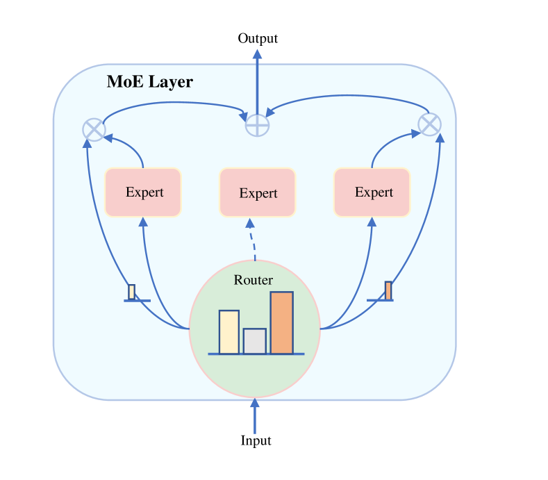
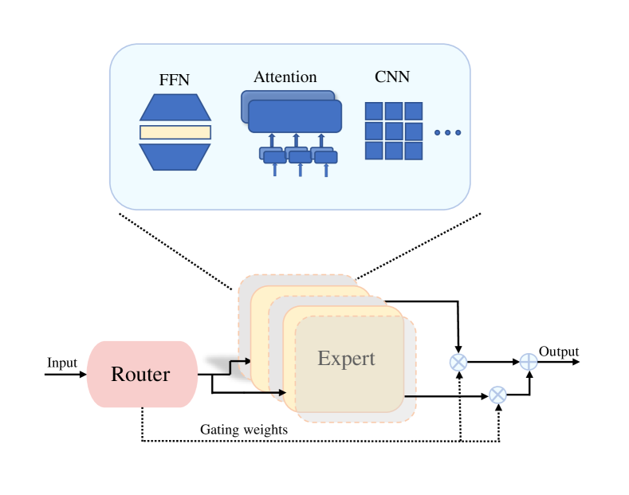

# Mixture-of-Experts の包括的サーベイ: アルゴリズム・理論・応用

> 原題: A Comprehensive Survey of Mixture-of-Experts: Algorithms, Theory, and Applications
> 著者: Siyuan Mu（University of Houston でのインターン期間中の研究。四川農業大学 理学院にも所属）, Sen Lin（University of Houston 計算機科学科）
> 出典: arXiv:2503.07137（2025 年 3 月）

> **訳注（この翻訳について）**
>
> - 底本は ar5iv（`https://ar5iv.labs.arxiv.org/html/2503.07137`）のクリップ。原ページを `curl` で再取得して照合した。
> - **Figure 1 は ar5iv 側にも画像が存在しない**。TikZ の `forest` パッケージで描かれた分類ツリーであり、ar5iv が画像化に失敗して LaTeX マークアップがそのまま本文に流れ込んでいる（クリップにも `\[...\]`・`leaf,text width=30em` といった痕跡が残る）。内容自体は復元可能なので、**ネスト箇条書きとして再構成**して §I の末尾に収録した（先例: `translations/2023-llm-agents-survey`・`translations/2025-long-cot-survey`）。
> - **本文図は 2 枚のみ**（Figure 2・Figure 3）で、いずれも ar5iv からローカル保存した。クリップの取りこぼしはない。
> - **原典に表は 1 つも存在しない**（ar5iv 照合済み。クリップ不良ではない）。**脚注も存在しない**——本文の `3` は手法名 M³ViT の上付き文字であって脚注マーカーではない。
> - `[^N]`（数字のみ）は原典の**参考文献への引用マーカー**である。参考文献一覧は訳出対象外（skill の既定）なのでリンク先は解決しないが、原文の引用位置を保存するためマーカーはそのまま残した。
> - **翻訳範囲**: 本文 §I〜§VII をすべて訳出した（ユーザー選択）。除外したのは References のみ（原典に謝辞・付録はない）。
> - 数式は LaTeX 記法のまま残し、変数の説明は訳文の地の文で日本語化している。
> - 原典側の軽微な誤記（Figure 1 のツリー内の "Multi-tsak Learning"、本文の "achieved achieved"、"Additinally"、"FNN layer"、"Pedicir et al." など）は、訳文では意味の通る形にした。

## Abstract（要旨）

人工知能（AI）は多くの領域で驚くべき成功を収めてきた。とりわけ、基盤となる大規模モデルの開発における最近のブレークスルーによってである。これらの大規模モデルは、その膨大な訓練データを活用して、広範な下流タスクに対する汎用的な解を提供する。しかし、現代のデータセットがますます多様かつ複雑になるにつれ、大規模 AI モデルの開発は 2 つの大きな課題に直面している: (1) 計算資源の莫大な消費とデプロイの困難さ、(2) 異質で複雑なデータへの適合の難しさ——これがモデルの使い勝手を制限する。**Mixture of Experts（MoE, 専門家混合）**モデルは、入力データを処理するために最も関連の深いサブモデルを動的に選択・活性化することによって、これらの課題に対処するものとして最近大きな注目を集めている。MoE がより少ない資源でモデルの性能と効率を大幅に改善できること、とりわけ大規模かつマルチモーダルなデータの扱いに優れていることが示されてきた。MoE が様々な領域で示してきた多大な潜在能力を踏まえると、多くの重要分野における MoE の最近の進展を包括的に総括することが急務である。既存の MoE のサーベイには限界があり——たとえば古くなっている、あるいは特定の重要領域についての議論を欠いている——本稿はこれらの空白を埋めることを目指す。本稿ではまず、ゲーティング関数・エキスパートネットワーク・ルーティング機構・訓練戦略・システム設計を含む MoE の基本設計を紹介する。次に、継続学習・メタ学習・マルチタスク学習・強化学習といった重要な機械学習のパラダイムにおける MoE のアルゴリズム設計を探る。加えて、MoE の理解を目指した理論研究を総括し、コンピュータビジョンと自然言語処理における応用をレビューする。最後に、有望な今後の研究の方向性を議論する。

## I Introduction（はじめに）

人工知能（AI）は現代技術における変革的な力として現れ、コンピュータビジョン [^1] [^2] [^3] や音声認識 [^4] [^5] からヘルスケア [^6]、自律システム [^7] に至る複数の領域で目覚ましい成功を示している。その主要な推進力となっているのが**基盤モデル（foundation models）**の開発である。BERT [^8]、CLIP [^9]、GPT-4 [^10] といった基盤モデルは、巨大なデータセットで事前学習された大規模ニューラルネットワークであり、広範な下流タスクに対する汎用的な解を提供する。事前学習で得た知識を土台として、これらのモデルは最小限の追加訓練でファインチューニングして特定の応用に適応でき、現実世界の多くの場面でますます複雑かつ多様になるタスクを扱うための不可欠な道具となっている。

とりわけ MoE のモデルアーキテクチャは、大規模言語モデル（LLM）[^171] [^172] [^173] [^21] [^15] [^20] [^52] [^174] [^175] [^176] [^177] [^178] [^179] [^180] [^181] [^182] において、その独自の利点と多大な潜在能力を示してきた。たとえば Switch Transformer [^15] は、T5-Base [^183] モデルと比べて事前学習速度で 7 倍の高速化を達成し、多言語の設定において 101 言語すべてで性能の改善を示した。またパラメータ数を兆（trillion）の水準にまでスケールさせることに成功し、その規模において T5-XXL [^183] モデルより 4 倍速い事前学習速度を達成している。GLaM [^20] も同様にパラメータを兆の水準へ拡大し、モデルが文脈情報を活用する能力を高めた。DeepSpeed-MoE [^52] は MoE とモデル圧縮の技法を組み合わせて MoE モデルのサイズを 3.7 倍削減した。ST-MoE [^174] は MoE モデルの安定性と転移可能性をさらに調査し、訓練の安定性を確保するための Router z-loss などの様々な手法を提案した。最終的に SuperGLUE [^184] ベンチマークにおいて、ST-MoE-32B モデルは従来の最先端モデルを上回った。OpenMoE [^178] は decoder-only の MoE を実験し、MoE のルーティング機構について踏み込んだ議論を提供して、オープンソースコミュニティによる MoE アーキテクチャの理解に大きく貢献した。Mixtral 8×7B [^22] は、各トークンを 130 億のアクティブパラメータのみで処理しながら、その特徴的なアーキテクチャのおかげで合計 470 億のパラメータにアクセスできる。これにより Mixtral 8×7B はより高いパラメータ効率を達成し、計算コストを効果的に制御している。DeepSeek シリーズ [^185] [^186] [^53] [^187] の目覚ましい性能もまた大きな注目を集めてきた。これらのモデルは MoE アーキテクチャを活用して、扱いやすい計算要件を保ちながら様々なベンチマークで最先端の結果を達成している。

効率を超えて、MoE モデルは**モデルの解釈可能性**を改善する機会も提供する [^101] [^188] [^35] [^189]。内在的な割り当て機構を学習させることで、研究者は異なるエキスパートが特定の種類のデータやタスクの処理にどう特化するのかについての洞察を得られる。この解釈可能性は、モデルの挙動についての我々の理解を深めるだけでなく、より頑健で透明性の高い AI システムを設計する新しい道も開く。

MoE への研究関心が急速に高まっていること、そして様々な応用領域における MoE の巨大な潜在能力を踏まえると、この分野への注目をさらに喚起し、新たな研究アイデアを刺激するために、MoE の最近の進展を総括して広めるための包括的なサーベイが急務である。しかしながら、MoE の初期のサーベイ [^190] [^191] は 10 年前に出版されたもので、この領域の新しい発展を取り込んでいない。昨年に現れた新しいサーベイ [^192] は 1 つだけだが、それは 1) MoE の基本設計に重きを置いており、2) 重要な機械学習パラダイムやコンピュータビジョンといった応用分野における MoE の利用について幅広い議論を提供していない。MoE における理論の発展もカバーされていない。

また、本稿の準備中にごく最近オンラインに掲載された他の同時期のサーベイもいくつかあるが、それらは依然として、ビッグデータにおける応用 [^193]、推論の最適化 [^194]、LLM [^195] といった MoE の特定の側面に焦点を当てているか、あるいは複数の話題を非常に簡潔にカバーしているにすぎない [^196]。我々の知る限り、本稿は MoE の最新の進展を包括的に総括する最初のサーベイであり、次の 4 つの主要な構成要素を含む: MoE の基本的な設計戦略、主要な機械学習の方向性における MoE ベースのアルゴリズム設計、様々な場面での MoE の理解に向けた理論、そしてコンピュータビジョンと自然言語処理の両方における MoE の応用の踏み込んだレビューである。

本稿は以下のように構成される（Figure 1 に示すとおり）。§II では、基本的なアーキテクチャ設計から訓練戦略、システム最適化戦略に至るまで、MoE の基本設計を包括的に紹介する。§III では、継続学習・メタ学習・マルチタスク学習・強化学習という 4 つの重要な機械学習パラダイムにおける、最近の MoE ベースのアルゴリズム設計を紹介する。これらの領域におけるアルゴリズム設計を改善するために MoE がどう活用されうるかについて、読者に大枠の考え方を提供することを狙いとする。§IV では、MoE の理論的理解の構築に向けた取り組みを総括する。これは異なるゲーティング関数・異なるエキスパートモデル・異なる学習の場面など、MoE の様々な側面をカバーする。§V では、コンピュータビジョンと自然言語処理という 2 つの主要領域における MoE の最近の応用を提示し、各領域の複数の重要なサブ問題を検討する。今後の研究の方向性は §VI で議論し、§VII で結論を述べる。

> **Figure 1: 本稿が扱う Mixture of Experts（MoE）のロードマップ**
>
> 〔訳注: 原典の Figure 1 は TikZ の `forest` で描かれた分類ツリーであり、ar5iv 側に画像が存在しない。LaTeX マークアップから内容を再構成してネスト箇条書きとして収録する。角括弧内の数字は原典の参考文献番号。原典のツリー内にある "Multi-tsak Learning" は "Multi-task Learning" の誤記と判断した。〕
>
> - **Mixture of Experts (MoE)**
>   - **Basics of MoE（MoE の基礎）**
>     - *Gating Function（ゲーティング関数）*: Switch transformers [15], V-MoE [17], RMoE [18], M³ViT [19], GLaM [20], Shazeer et al. [16], GShard [21], Mixtral of experts [22], GMoE [23], Chi et al. [24], Nguyen et al. [25], Xu et al. [26], softMoE [27], Geweke et al. [28]
>     - *Expert Network（エキスパートネットワーク）*: Xu et al. [26], softMoE [27], Switch transformers [15], V-MoE [17], Shazeer et al. [16], GShard [21], Chen et al. [29], Li et al. [30], SwitchHead [31], MoA [32], MoH [33], pMoE [34], Pavlitska et al. [35], Yi et al. [36], Zhang et al. [37], Zhang et al. [38], Gross et al. [39]
>     - *Routing Strategy（ルーティング戦略）*: V-MoE [17], pMoE [34], Uni-Perceiver-MoE [40], MaskMoE [41], Pedicir et al. [42], Uni-MoE [43], Kudugunta et al. [44], Yi et al. [36], Shi et al. [45]
>     - *Training Strategy（訓練戦略）*: Switch transformers [15], V-MoE [17], Shazeer et al. [16], RMoE [18], Huang et al. [46], HMoE [47], Irsoy et al. [48], FasterMoE [49]
>     - *System Design（システム設計）*: Switch transformers [15], M³ViT [19], Tutel [50], softMoE [27], FasterMoE [49], Edge-MoE [51], DeepSpeed-MoE [52], DeepSeek-V3 [53], Singh et al. [54], Yao et al. [55]
>   - **Algorithms（アルゴリズム）**
>     - *Continual Learning（継続学習）*: Yu et al. [56], Zhang et al. [57], Zhou et al. [58], Lifelong-MoE [59], Lee et al. [60], SEED [61], Evolve [62], MoTE [63], Park et al. [64], Li et al. [30], Hihn et al. [65], Le et al. [66], Lee et al. [67], PMoE [34], Wang et al. [68], Chen et al. [69], Wang et al. [70], Park et al. [64], Aljundi et al. [71], Wang et al. [72], Doan et al. [73]
>     - *Meta Learning（メタ学習）*: Meta-DMoE [74], MoE-NPs [70], RaMoE [75], Liu et al. [76], Guo et al. [77], Zhou et al. [78], MixER [79]
>     - *Multi-task Learning（マルチタスク学習）*: MOORE [80], Park et al. [64], MLoRE [81], WEMoE [82], MoSE [83], MMoEEx [84], Chen et al. [85], TaskExpert [86], Gupta et al. [87], DSelect-k [88], Mod-Squad [89], MoDE [90], M3oE [91], MoME [92], TI-Expert [76], Ma et al. [93], Hou and Cao et al. [94], CMoIE [95], Sodhani et al. [96], AdaMV-MoE [97], Tang et al. [98], M³ViT [19], Louizos et al. [99], Jacobs et al. [13]
>     - *Reinforcement Learning（強化学習）*: Ren et al. [100], Gimelfarb et al. [101], Willi et al. [102], MENTOR [103], MMICRL [104], Gupta et al. [105], Samejima et al. [106], Van et al. [107], MACE [108], Kumar et al. [109], Peng et al. [110], Akrour et al. [111], MVE [112], Germ [113], SMoSE [114], Obando et al. [115], Takahashi et al. [116] [117] [118], Mulling et al. [119], Li et al. [120], Ewerton et al. [121], Zhou et al. [122], Freymuth et al. [123], Prasad et al. [124], MMRL [125], TERL [126]
>   - **Theory（理論）**: Nguyen et al. [25], Chen et al. [29], Li et al. [30], Chowdhury et al. [127], Jiang et al. [128], Jiang et al. [129], Zeevi et al. [130], Nguyen et al. [131], Mendes et al. [132], Ho et al. [133], Nguyen et al. [134] [135] [136] [137] [138], Fung et al. [139]
>   - **Applications（応用）**
>     - **CV**
>       - *Image Classification（画像分類）*: V-MoE [17], Videau et al. [140], ViMoE [141], Royer et al. [142], CLIP-MoE [143], SoftMoE [27], DeepME [144], Jiang et al. [22], Nguyen et al. [145]
>       - *Object Detection（物体検出）*: MoCaE [146], Wang et al. [147], DAMEX [148], Feng et al. [149]
>       - *Semantic Segmentation（意味的分割）*: Pavlitskaya et al. [150], Zhu et al. [151], Pavlitskaya et al. [152], DeepMoE [153], Swin2-MoSS [154]
>       - *Image Generation（画像生成）*: RAPHAEL [155], MEGAN [156], MoA [32], Text2Human [157]
>     - **NLP**
>       - *NLU（自然言語理解）*: GLaM [20], MoE-LPR [158], MoE-SLU [159], MT-TaG [87], MoPE-BA [160]
>       - *NLG（自然言語生成）*
>         - *Text Generation（テキスト生成）*: Chai et al. [161], RetGen [162], LogicMoE [163], QMoE [164]
>         - *Machine Translation（機械翻訳）*: Shazeer et al. [16], GShard [21], Team et al. [165], NLLB Team et al. [166], Huang et al. [167]
>         - *Multimodal Fusion（マルチモーダル融合）*: LLaVA-MoLE [168], LIMoE [169], Sun et al. [170]

## II Basic Designs of MoE（MoE の基本設計）

本節では、読者が MoE の一般的なワークフローを理解できるよう、MoE における基本的な枠組みと設計上の考慮事項に焦点を当てる。Figure 2 に示すとおりである。より具体的には、まず MoE の設計における主要な構成要素——ゲーティング関数、エキスパートネットワーク、ルーティング機構——を紹介する。最初の 2 つが本質的に MoE の基本枠組みを形成し、最後の 1 つがゲーティング関数が入力データをどう扱うかを特徴づける。次に、MoE の適切な訓練を保証するための戦略、すなわち損失関数とパイプラインの設計を紹介する。最後に、複数の観点から MoE のシステム効率を最適化するためのシステム設計を議論する。

<figure>

<figcaption>Figure 2: 標準的な MoE アーキテクチャの単純な模式図。</figcaption>
</figure>

### II-A Gating Function（ゲーティング関数）

ゲーティング関数は**ルータの数学的な実装**として働き、入力データがどのように指定されたエキスパートへ割り当てられるかを決める。明らかに、MoE モデルの有効性はこの割り当て戦略と本質的に結びついており、ゲーティング関数の設計を決定的に重要な考慮事項にしている。以下では、効果的なゲーティング関数を設計するための原則と考慮事項について詳しく議論する。

ゲーティング関数を選ぶ際には、次の基準を優先すべきである。(1) その関数は、入力データとエキスパートの**両方**の特性を正確に見分けられなければならない。これにより、類似したデータを同じエキスパートまたはエキスパート群に割り当てられるようになり、各エキスパートが十分に大きく一貫した訓練集合を受け取ることが保証される。このような特化により、エキスパートは特定の知識領域における専門性を発達させられる。(2) 入力データは、あらかじめ定めたエキスパートの間にできるだけ均等に分配されるべきである。不均等な分配は**モデル崩壊（model collapse）**につながりうる。これはエキスパートを十分に活用しないことで MoE 枠組みの効率を下げ、また訓練データ中の相反する知識を十分に分離できないことで性能を損なう。

**1) 線形ゲーティング（Linear Gating）**。これらの考慮に基づき、既存の MoE モデルの大半 [^15] [^17] [^18] [^19] [^20] は、単純さと有効性ゆえに softmax つきの線形関数をゲーティング関数として用いる。これは **softmax ゲーティング**とも呼ばれる:

$$
G(x)_{i}=\text{softmax}(\text{TopK}(g(x)+\mathcal{R}_{\text{noise}},k))_{i},
$$

$$
\text{TopK}(v)=\begin{cases}v_{i}&\text{if }v_{i}\text{ is one of the top }k\text{ elements,}\\
-\infty&\text{otherwise.}\end{cases}
$$

ここで $G$ はゲーティング関数を表し、TopK 関数は $N$ 個のエキスパートのうちスコアが最も高い $k$ 個を残して残りを負の無限大に設定する。$g$ は softmax 演算の前に線形関数で計算されるゲーティング値、$x$ は入力、$\mathcal{R}_{\text{noise}}$ はエキスパートの探索を促すためのノイズ、$w$ はモデルパラメータ、$k$ は学習させることも手動で設定することもできるハイパーパラメータである。

上式における TopK と softmax の演算順序は柔軟であり、具体的な要件に基づいて設計できる。ひとつのやり方は **TopK を softmax の前に**行うことである [^16] [^22] [^20]。この方法は最も関連の深いエキスパートを素早く絞り込み、すべてのエキスパートについて softmax を計算する必要をなくして計算のオーバーヘッドを減らす。しかし TopK の後に得られるスコアは確率分布に従わない可能性があり、追加の正規化のステップを必要とする。さらに TopK 演算は本質的に「ハード」であり、意味のある貢献をしうる低スコアのエキスパートを排除してしまう可能性がある。代替として、TopK 関数を **softmax の後に**適用することもできる [^21] [^17] [^15] [^18]。この場合、softmax 関数がまずスコアを確率分布へ正規化し、各エキスパートに統計的に意味のある活性化の重みを与える。この方法は TopK 演算における $k$ の値を決めるうえでより明確な指針を与える。ただし、すべてのエキスパートについて softmax を計算する必要があり、計算コストは高くなる。

MoE を既存のモデル——通常は Transformer [^197]——に組み込む場合、典型的には transformer ブロック内の **Feed-Forward Network（FFN）層を MoE 層で置き換える**。この設計選択の背後にはいくつかの理由がある [^16]。第一に、FFN 層の計算コストは Transformer の総計算コストのうち大きな割合を占め、深いモデルでは特にそうである。FFN 層を MoE 層に置き換えることで、モデルの表現力を保ちながら計算コストを大幅に削減できる。加えて、self-attention 層を置き換えると Transformer の中核機構を壊すことになり、我々の目的に沿わない。

**2) 非線形ゲーティング（Non-linear Gating）**。ゲーティング関数は非線形でもよい。具体的には、ドメイン汎化タスクのために **GMoE** [^23] においてコサイン距離に基づくゲーティング関数の設計が提案されている。次のとおりである:

$$
G(x)=\text{TopK}\left(\text{softmax}\left(\frac{E^{T}W_{linear}x}{\tau\|W_{linear}x\|\|E\|}\right)\right)\qquad
$$

ここで $x\in\mathbb{R}^{d_{e}}$ は MoE モジュールの入力、$W_{linear}\in\mathbb{R}^{d_{e}}$ は $x$ に対する学習可能な線形変換で、$x$ を超球面空間へ射影する役割を持つ。エキスパートネットワークの数は $N$ であり、$E\in\mathbb{R}^{d_{e}\times N}$ は $N$ 個のエキスパートネットワークの特徴を表す。このゲーティング関数では、入力 $x$ が新しい空間へ射影され、コサイン類似度を使ってエキスパートの埋め込み $E$ と比較されて、各入力 $x$ をどのエキスパートに割り当てるべきかが決まる。この方式により、エキスパート埋め込み $E$ は異なるエキスパートの特徴表現を捉えることができ、訓練の過程で徐々に最適化されてタスクの要件によりよく適応する。加えて、温度パラメータ $\tau$ がゲーティング分布の鋭さを制御する。$\tau$ が小さいほど分布は鋭くなって少数のエキスパートの選択が優勢になり、$\tau$ が大きいほど分布は滑らかになってより多くのエキスパートが参加できるようになる。

ドメイン汎化タスクにおいて線形ルータよりコサインルータを使うことの優位性を示す包括的な理論的・実験的証拠が [^23] で与えられている。具体的には、コサインルータは**ドメインをまたぐデータの扱い、視覚的属性の捕捉、モデルの汎化能力と効率の向上**に優れる。より良い性能のためにコサインルータを採用した研究は他にもあり [^24] [^25]、これはコサインルータを超えたゲーティング関数の設計をさらに探索することを促している。

コサインゲーティング関数以外にも、非線形関数の設計は数多くある。たとえば式(4) に示す**指数型分布族（exponential family of distributions）**に基づくゲーティング関数 [^26] がある:

$$
G_{j}(x,\nu)=\frac{\beta_{j}D(x|\nu_{j})}{\sum_{i}\beta_{i}D(x|\nu_{i})},
$$

ここで $\beta_{j}$ は $j$ 番目のエキスパートネットワークの事前確率で、$\sum_{j}\beta_{j}=1$ かつ $\beta_{j}\geq 0$ を満たす。$D(x|\nu_{j})$ は $j$ 番目のエキスパートネットワークのもとでの入力 $x$ の条件付き確率密度関数で、指数型分布族に属する。この方法は反復の途中でゲーティング関数を解析的に更新し、softmax が導入する非線形な関係と、その後に続く追加の反復最適化のステップ（IRLS, Iteratively Reweighted Least Squares＝反復再重み付け最小二乗法など）を回避する。最も一般的な例はガウス分布である。

**Soft MoE** [^27] には特殊なゲーティング関数があり、離散的なトークン割り当て機構をもはや採用しない。具体的には、Soft MoE は各トークンと各エキスパートの間の重みを計算し、それらの重みで加重平均して**入力スロット（slots）**を生成する。したがって各エキスパートが処理するスロットは、個々のトークンではなく**すべてのトークンの重み付き結合**である。この方法は、負荷の不均衡に起因しうる**トークンの取りこぼし（token dropping）**の問題と、TopK のような離散演算に起因する最適化の困難を回避する。

**Student-t 分布**に基づくゲーティング関数 [^198] は、より頑健な適合能力を提供するため、ロングテール現象や外れ値を示すデータ群に特に適している。[^28] は各観測がどのエキスパートモデルに属するかを決めるために**多項プロビットモデル** [^199] [^200] を利用している。

<figure>

<figcaption>Figure 3: MoE 層のための様々なエキスパートネットワークの模式図。</figcaption>
</figure>

### II-B Expert Networks（エキスパートネットワーク）

エキスパートネットワークは MoE アーキテクチャの中核をなす構成要素である。ゲーティング関数を通じて最も適したエキスパートネットワークを動的に選択することにより、MoE は入力データを効率的に割り当て、異なるエキスパートが別々の知識領域に特化できるようにする。この設計は、とりわけ複雑で多様なタスクを扱うときに、モデル全体の性能・汎化能力・計算効率を高める。

原理的には、MoE における各エキスパートネットワークは、単一のネットワークモデルと同様に独立したネットワークモデルとして機能しうる（例: [^29] [^30]）。しかし実際には、効率とスケーラビリティを確保するために、エキスパートネットワークはしばしば単一のネットワークモデルへ統合され、特定の層が MoE 層に置き換えられる [^16] [^15] [^21]。特筆すべきは、MoE 層は全体構造を変えることなく既存のニューラルネットワークモデルの特定の層に導入でき、高い柔軟性と広い適用可能性を示すことである。現在最も広く使われている MoE 層には、以下の型がある（Figure 3）。

**1) Transformer の FFN 層を MoE 層で置き換える。** MoE 層は次のように特徴づけられる:

$$
\text{MoE}(x)=\sum_{i\in ID}w_{i}M_{i}(x)
$$

ここで $ID$ はゲーティング関数によって選択されたエキスパートの添字の集合、$w_{i}$ は $i$ 番目のエキスパートに割り当てられた重み、$M_{i}(x)$ は 2 層 FFN のエキスパートモデルを定義する。FFN 層に MoE 機構を導入する主要な理由のひとつは、**Transformer における FFN 層の高い疎性とドメイン特異性**にある。FFN 層は self-attention 層と比べて高い疎性を示すことが示されており [^17]、これは主に、過適合を防ぐために全結合の FFN 層のすべてのユニットが同時に活性化されるわけではないためである。このことは、FFN 層を疎な活性化機構の組み込みにより適したものにする。さらに [^17] は、事前学習済み Transformer モデルにおける **Emergent Modularity（創発的モジュール性）**の現象を明らかにしており、ニューロンの活性化と特定タスクの間に有意な関連があることを示している。これは、事前学習済み Transformer のモジュール的な性質を反映させるために MoE 構造を活用するという着想をさらに動機づける。したがって、その内在的な疎性とタスク関連性ゆえに、Transformer の FFN 層は MoE 機構を導入する理想的な選択となる。

**2) Transformer の attention モジュールに MoE を適用する。** これは特殊な型の MoE、すなわち **mixture-of-attention（MoA）** [^32] をもたらす。具体的には、MoA は異なるパラメータを持つ attention ヘッドの集合からなり、各ヘッドがエキスパート ${f_{1},...,f_{N}}$ と見なせる。与えられた入力に対して、ゲーティング関数が入力の重要度スコアに基づいて TopK の attention ヘッドを選択し、最終出力は選択されたヘッドの出力の重み付き和として生成される。この設計により、モデルは最も関連の深い attention ヘッドに集中でき、計算コストを大きく増やすことなく性能を高められる。またパラメータ規模の拡大に対して高いスケーラビリティを持つ。

標準的な multi-head attention 機構 [^197] と比べたときの MoA の主要な利点は、**ゲーティングネットワークを使って各入力トークンに最も関連の深い attention ヘッドを動的に選び、その出力の重み付き和を計算する**点にある。この方法は、すべての attention ヘッドがすべての入力を処理するという要求をなくし、より少ない計算オーバーヘッドで優れたモデル性能を達成できるようにする。結果として MoA は高いスケーラビリティを示し、とりわけこのモデルは 2 億 1300 万パラメータの Transformer より高い BLEU スコアを、はるかに少ない計算量で達成できる。

MoA に触発され、この設計を改良する研究が数多く提案されている。**SwitchHead** [^31] は各ヘッドの key・query・value・出力射影それぞれについて独立に MoE 機構を導入し、非競合的な選択活性化関数を用いる。これにより計算すべき attention 行列の数が減り、計算量とメモリ要求が大幅に下がる。**MoH** [^33] は、ヘッドの共有と 2 段階のルーティング戦略によって標準的な MoE の手法を強化し、さらに事前学習済みの multi-head attention モデルを MoH モデルへファインチューニングできるので、適用可能性が高い。加えてこの研究は、提案する MoH 枠組みを ViT [^1]・DiT [^201]・decoder-only の LLM [^202] といった encoder-decoder アーキテクチャを含む様々なモデル枠組みと統合し、様々なタスクに適用して MoH の大きな潜在能力を実証している。

**3) CNN 層に MoE を適用する。** CNN を MoE アーキテクチャに統合することで、局所特徴の抽出における CNN の強みを最大限に活かし、より洗練されたタスク割り当てと計算効率の向上を達成できる。その結果、MoE と CNN を効果的に組み合わせようとする研究が数多くなされてきた。たとえば [^127] では単純な **pMoE** 構造が採用されており、MoE 層はゲーティングカーネル（学習可能な重みネットワーク）と、2 層 CNN からなる複数のエキスパートネットワークで構成される。

画像データは高い局所相関と空間的な階層構造を持ち、これは CNN の設計思想とよく合致する。その結果、**Convolutional Mixture of Experts（CMoE）**はしばしばコンピュータビジョンのタスクに適用される。たとえば [^38] は MoE 枠組みを使って細粒度の分類問題を部分空間の問題へ分解し、各エキスパート CNN が異なるサブ問題に集中できるようにして分類性能を改善している。[^38] を土台に、[^37] は限られたデータ条件下でモデルの汎化能力と分類性能を高めるための attention ベースの MoE 枠組みを提案した。[^39] は MoE モデルにおける独立したエキスパートネットワークの並列訓練の問題に取り組み、大規模な教師あり視覚タスクで複数 GPU を必要とする状況を緩和した。一方で [^35] は、コンピュータビジョンのタスクにおいてモデル性能を保ちながら CNN の解釈可能性をどう高めるかの探索に焦点を当てている。加えて、少数ではあるが CMoE の他領域における潜在能力を探った研究もある [^36]。

### II-C Routing Strategy（ルーティング戦略）

MoE の設計における決定的に重要な考慮事項が、**エキスパートがどの水準で知識に特化すべきか**を決めることである。たとえばコンピュータビジョンでは、あるタスクは大域的な特徴をより重視するかもしれず、別のタスクは正確な局所知覚を要求するかもしれない。したがって、適切な**ルーティング水準**——ルーティング決定の頻度によって定義される——を選ぶことが、MoE モデルが特定タスクの要件を効果的に満たすために不可欠である。以下の議論は Uni-Perceiver-MoE [^40] が提案した分類戦略を拡張し、いくつかの一般的なルーティング戦略——トークン水準・モダリティ水準・タスク水準・その他の水準——を概説する。

**1) トークン水準ルーティング戦略**は、トークンの表現に基づいてルーティング決定を行うもので、最も古典的なルーティング手法である。トークンにも様々な型があり、最もよく出会うのはテキストトークンと画像トークン（パッチトークン）である。

テキストトークンについては、未学習（underfitting）を緩和し表現の多様性を保つために、**MaskMoE** [^41] が新しいトークン水準のルーティング戦略を導入している。この方法は語彙中の各トークンについてマスクベクトルを生成し、訓練前に、出現頻度の異なるトークンに対して可視のエキスパート数を調整する。低頻度のトークンについては、MaskMoE はルーティングマスクを通じてルーティングを単一のエキスパートに制限し、これらのトークンについて一貫した訓練を保証する。高頻度のトークンについては、文脈的なニュアンスを捉えるために複数の可視エキスパートを許す。加えて [^42] は、**再帰型のトークン水準ルーティング戦略**を提案しており、リカレントニューラルネットワークを用いて入力系列の文脈に基づいてエキスパートの選択を動的に調整する。この戦略は複雑な言語構造の処理におけるモデルの精度を改善し、計算資源の利用を最適化し、長距離依存を効果的に扱う。結果として、多様な自然言語処理タスクにわたって効率と性能の向上を達成する。

パッチトークンの利用は [^127] で論じられているとおり、しばしば ViT アーキテクチャの上に構築される。この戦略は画像を複数のパッチに分割し、各パッチを処理に最も適したエキスパートへ動的にルーティングする。画像の局所的特徴に基づいて適応的にエキスパートを選ぶことで、計算資源の利用を最適化し、複雑な視覚タスクを扱うモデルの性能を高める。加えて **V-MoE** [^17] は **Batch Priority Routing（BPR）**戦略を導入している。これは 1) 各画像パッチの重要度を計算し、2) 重要度の降順に並べ替え、3) それに従ってパッチにエキスパートを割り当てる。実験結果は、BPR が**画像パッチの 15〜30% しか処理しないにもかかわらず、密なモデルに匹敵する性能を保てる**ことを示しており、標準的なルーティングに対する顕著な利点を示している。

これら 2 つの一般的な型のほかにも、音声トークン [^36]、時系列トークン [^45] などがあり、いずれも MoE と自由に組み合わせてモデルの学習性能の向上に役立てられる。

**2) モダリティ水準ルーティング戦略**は、トークンをそのモダリティに基づいてルーティングし、モダリティ間の干渉を最小化するために異なるモダリティに専用のエンコーダを使うという実践を模倣する。**Uni-MoE** モデル [^43] は、構造化されたアプローチによってマルチモーダルデータを効果的に処理・理解するよう設計されている。まず、クロスモーダルなデータで訓練されたコネクタを導入してデータの整列を達成し、多様なモダリティを統一された言語表現空間へ写像する。同時に、クロスモーダルな指示データセットでモダリティ固有のエキスパートシステムを訓練し、各エキスパートの専門的能力を高めてタスク固有の選好を活性化する。続いてモデルは LoRA [^203] を用いてファインチューニングを行い、混合されたマルチモーダル指示データで計算効率を保ちながら性能を最適化する。指示チューニングの後、Uni-MoE は包括的で多様なマルチモーダルデータセットで評価される。結果は、このモデルが混合データを処理する際の性能の食い違いを大きく減らし、複数エキスパート間の協働効率を改善し、汎化能力を高めることを示しており、統一されたマルチモーダル大規模言語モデルの開発における MoE アーキテクチャの潜在能力を浮き彫りにしている。

**3) タスク水準ルーティング戦略**は、タスク ID に基づいてルーティングを決め、異なるタスクが別々のエキスパートへルーティングされることを保証して、タスク間の干渉を効果的に最小化する。この方法はマルチタスク学習において特に有利である。たとえば [^44] は多言語機械翻訳のタスクを探索しており、そこではタスクの境界が目標言語・言語ペア・一意なタスク ID によって定義される。エキスパートはこれらの境界に従ってタスク水準で選択される。トークン水準のルーティング戦略と比べ、この方法は**推論時にモデル全体のエキスパートすべてを読み込むのではなく、現在のタスクに関連するエキスパートの部分集合だけを読み込めばよい**。これによりデバイス間の通信コストが下がり、メモリ使用量も減る。

**4) その他の水準のルーティング戦略**は、文脈水準や属性水準のルーティング戦略 [^40] など多様な手法を包含する。文脈水準のルーティング戦略は大域プーリングを用いてルータに大域的な文脈情報を提供し、現在のトークン表現の文脈情報に基づいて信頼できるルーティング戦略を生成できるようにする。対照的に、属性水準ルーティングは 8 次元の二値埋め込みを組み込む。これには現在のタスクとトークンのモダリティ（添字 0〜5）、モデルの因果性の型（添字 6）、トークンの出所（添字 7）といった属性が含まれる。これらの豊富な情報により、モデルはより複雑で多様なタスクを扱えるようになる。

### II-D Training Strategies（訓練戦略）

MoE ベースのアーキテクチャに内在する疎な活性化のため、密なモデルの訓練に使われる関数や手順をそのまま MoE ベースの疎なモデルに適用するのは容易ではない。訓練の有効性を高め、より速い収束を達成し、目標タスクでの性能を向上させるために、[^15] [^17] [^16] [^18] [^46] のような数多くの研究がこうした疎なモデルの訓練手法を探索してきた。以下の節では、代表的な技法をいくつか総括して議論する。

**1) 補助損失関数の設計。** 標準的な訓練損失に加えて、学習性能の向上・モデル効率の改善・訓練過程の安定化のために、MoE の訓練ではしばしば**補助損失関数**が導入される。実務で広く使われる補助損失の一種が**負荷分散損失（load balancing loss）**であり、MoE の容量を十分に活用するために、全エキスパートにわたる入力の割り当てを均衡させることを狙う。

MoE の訓練におけるよく知られた課題が**モデル崩壊（model collapse）**のリスクである。これは少数のエキスパートが入力の大半を受け取る一方で他のエキスパートがほとんど受け取らず、エキスパートの利用に不均衡が生じる現象である。この問題を緩和するために、[^16] は **Importance 損失と Load 損失**を提案している。次のように定義される:

$$
\begin{aligned}
\text{Load}(X)_{i}&=\sum_{x\in X}P(x,i)\\
\text{Importance}(X)_{i}&=\sum_{x\in X}G(x)_{i}\\
L_{\text{load}}(X)&=w_{\text{load}}\cdot\left(\text{CoV}(\text{Load}(X))\right)^{2}\\
L_{\text{importance}}(X)&=w_{\text{importance}}\cdot\left(\text{CoV}(\text{Importance}(X))\right)^{2}
\end{aligned}
$$

ここで $w_{importance}$ と $w_{load}$ は、それぞれエキスパートの重要度の均衡と負荷分散の影響を制御するハイパーパラメータであり、$P(x,i)$ は新しいランダムノイズの選択が与えられたときに $G(x)_{i}$ が非ゼロとなる確率を表す。CoV は**変動係数（coefficient of variation）**を意味する。これら 2 つの損失関数がモデル全体の損失関数に組み込まれ、エキスパート間の均衡した利用と負荷分布を促して、モデルの性能と安定性を高める。

**Switch Transformer** [^15]（式(12) に示す）は、[^16] を土台に上記の方法を単純化し、精度のわずかな低下と引き換えに効率を改善している:

$$
f_{i}=\frac{1}{T}\sum_{x\in\mathcal{B}}\mathbb{1}\left\{\operatorname{argmax}G(x)=i\right\},
$$

$$
Q_{i}=\frac{1}{T}\sum_{x\in\mathcal{B}}G(x)_{i},
$$

$$
\text{loss}=\alpha\cdot N\cdot\sum_{i=1}^{N}f_{i}\cdot Q_{i}.
$$

ここで $T$ はバッチ内のトークン総数、$\mathcal{B}$ はバッチ内のトークン集合、$f_{i}$ はエキスパート $i$ に割り当てられたトークンの割合、$Q_{i}$ はエキスパート $i$ に割り当てられたルーティング確率の比、$\alpha$ は補助損失の重みを制御するハイパーパラメータである。理想的には、すべてのエキスパートが均等にタスクを受け取り、それぞれが等量の入力データを処理すべきであり、そのとき $f$ と $Q$ の期待値はともに $1/N$ となる。分布が一様のとき、この補助損失関数は最小値に達する。**エキスパート容量（expert capacity）** [^16] は各エキスパートが処理できるデータ点の最大数を指す。エキスパート容量が不足すると訓練中に入力データが飛ばされ、エキスパートの訓練不足につながりうる。逆に容量を増やせば落とされるトークンは減るが、計算資源とメモリを無駄にする可能性もある。**V-MoE** [^17] は、視覚タスクに補助損失関数を適用する際に $L_{Importance}$ と $L_{Load}$ を正規化し、より安定した訓練過程を実現している。

**2) エキスパートの選択。** MoE モデルの性能と効率が、入力データに対するエキスパートの選択に大きく依存することは明らかである。エキスパートの選択は主にゲーティング関数が決めるが、追加の設計上の選択によって MoE モデルをさらに強化できる。全エキスパートの中から最良の $K$ 個を選んでデータを処理する **TopK 戦略**は、計算コストを比例的に増やすことなくモデル容量を大幅に増やす。たとえば [^16] は、MoE モデルが計算効率を保ちながら従来のニューラルネットワークの **1000 倍以上**の規模までスケールできることを示した。他方で、効率をさらに高めるために TopK 戦略を取り除くこともできる。たとえば **V-MoE** [^17] は TopK を Top-1 戦略に置き換えて計算を単純化し、資源の浪費を減らしている。さらに、選択の過程でエキスパートの活性値にガウスノイズを加えることによって、TopK 関数の内側にランダム性が導入されるのが通例である（式(1) に示すとおり）[^16]。この機構はランダムな選択によってエキスパートの探索を促し、特定のエキスパートへの過度な依存を防いで、負荷の不均衡を緩和し資源利用を最適化する。

動的なエキスパート選択の機構も文献で探索されてきた。特筆すべきは、[^46] が **Top-P ルーティング戦略**を提案していることである。これは確率の閾値 $P$ を設定することで、各時点で活性化するエキスパートの数を決める。各入力データについて、ゲーティングネットワークが各エキスパートのスコア——エキスパートが選ばれる確率分布に対応する——を計算し、エキスパートをスコアの降順に並べる。この戦略は累積値が $P$ を超えるまでエキスパートのスコアを順に累積し、累積されたすべてのエキスパートを活性化してトークンを処理する。これによりモデルは**入力の複雑さに応じて選択するエキスパート数を適応的に調整**でき、柔軟で効率的な資源配分を可能にする。過適合を減らし汎化を改善するために、[^48] は**階層型 Mixture of Experts（HMoE）** [^47] の木構造に合わせたドロップアウト正則化手法を提案しており、階層構造に従って異なる枝のエキスパートネットワークをランダムに落とす。実験結果は、この手法がモデル性能を高め、ドロップアウトなしのモデルと比べてより滑らかな適合結果・より良い汎化・より低い検証誤差率をもたらすことを示している。

**3) パイプライン設計。** MoE アーキテクチャの疎性という性質と動的なデータ割り当ての必要性を踏まえると、計算資源の利用を最大化し、時間とコストを減らし、モデルの安定した収束を確保するために、よく設計されたパイプラインが MoE モデルの訓練において決定的に重要な役割を果たす。一般に、MoE のパイプライン設計は資源配分を最適化し、エキスパート間にデータを効率的に分配することを狙う。

前述のとおり、BPR [^17] は重要なサンプルを優先的に処理することで疎性の再利用を達成する。BPR の利点は、効率的な資源利用と不要な計算の削減にある。

**RMoE** [^18] は、セグメンテーションや検出といった下流タスクのために特化したパイプラインを設計している。より具体的には、RMoE は MoE のエキスパートの重みを**コア重みと残差重み**に分解し、コア重みは事前学習済みの非 MoE モデルから知識を引き継ぎ、残差重みのみをファインチューニングする。これにより訓練時間が大幅に短縮され、訓練コストが下がる。推論時には両方の重みの集合が組み合わされ、MoE モデルの良好な性能が保証される。

### II-E System Design（システム設計）

MoE アーキテクチャは、大規模モデルのエッジ展開と容量スケーリングにおいて人気を集めており [^15] [^51] [^52]、大きな柔軟性とスケーラビリティを提供する。しかし、その内在的な**不均一な作業負荷の分布**と**動的なエキスパート選択**という性質は、システムの資源配分・通信効率・全体的な性能最適化に厳しい要求を課す。これは同期のオーバーヘッド増大といった新しいシステム上の課題を導入し、モデル実行の効率と安定性を妨げる。本節では、計算・通信・メモリという 3 つの次元から MoE のシステム設計を強化するために現在利用可能な一般的手法を概説する。

**1) 計算。** MoE モデルの応用では、その内在的な動的特性のため、異なるエキスパートが処理するタスク数に大きな差が生じうる。これにより不均一な作業負荷分布の問題が特に顕著になる。とりわけ大規模分散システム環境では、標準的な MoE アーキテクチャはエキスパートの演算間の同期を必要とする [^49]。すなわち、すべてのエキスパートが現在のタスクを完了してからでないと次の計算ステップへ進めない。しかし、割り当てられたタスク量が少ないために早く作業を終えるエキスパートもあり、遊休時間と計算資源の浪費につながる。さらに MoE のモデル容量が拡大するにつれて計算量が著しく増大し [^15]、より良い計算戦略の設計への要求が強まる。

この問題を緩和するために、文献では様々な試みがなされてきた。[^15] は**データ並列・エキスパート並列・モデル並列**を含むいくつかの並列戦略を提案・議論しているが、並列手法が異なればデータとモデルパラメータの分散に対する要求も異なる。システムが動的な負荷変化に素早く適応できるよう、[^50] はモデルのパラメータと入力データを管理する**統一された分散レイアウト**を設計した。これは様々な並列戦略の分散要件に対応でき、**並列戦略のゼロコストな切り替え**を実現する。この分散を土台に、[^50] は後述する ALL-to-ALL 最適化アルゴリズムなど、複数の最適化技法もさらに開発している。さらに Soft MoE [^27] は、勾配に基づくルーティング選択の手法を用いた改良版のスケジューリングアルゴリズムを導入し、計算過程をより滑らかで効率的にする。この方法は不要な同期の待ち時間を減らし、全体の同期オーバーヘッドを下げて、システムのスループットと効率を高める。**DeepSeek-V3** [^53] は通信過程にいくつかの強化を導入している。第一に、計算負荷が同程度の 2 つのマイクロバッチを並行して処理し、一方のマイクロバッチの attention 機構と MoE 部分を、もう一方の dispatch と combine の演算と重ね合わせる。この技法はスループットを高めるだけでなく、all-to-all およびテンソル並列の通信に伴うオーバーヘッドを隠蔽し、通信帯域への依存を大幅に減らす。さらに低精度通信のために **FP8** 形式が採用されており、活性値は MoE の up-projection の前に、量子化誤差を緩和するために 2 のべき乗のスケーリング係数を用いて FP8 へ量子化される。同じ手法が MoE の down-projection 前の活性勾配にも適用される。最後に、とりわけ GPU 間の all-to-all 通信のボトルネックを緩和するために、より効率的な処理戦略が考案されている。その具体的な実装は GitHub 上で `deepseek-ai/DeepEP` としてオープンソース公開されている。

**2) 通信。** MoE モデルの訓練では、入力データを **All-to-All** の通信パターンでエキスパートへ分配しなければならず、これは通常、通信帯域への大きな需要をもたらす。他方で、エキスパート選択の動的な性質のため、システム内の通信量は大きく変動しうる。したがって反復間の通信需要も大きく異なりうる。この通信パターンは明らかに予測と最適化が難しく、ネットワーク輻輳のリスクを高める。

MoE モデルのうち任意の時点で活性化されるのは一部だけであることを考えると、モデルのスケジューリング時に**オンデマンドの読み込み戦略** [^19] を採用できる。すなわち、対応するエキスパートが選択されたときにのみ重みをオンチップメモリへ読み込む。この方法は外部 DRAM への頻繁なアクセスを減らし、メモリ帯域への圧力を効果的に緩和する。さらに、MoE 内の異なるエキスパートを別々の計算ユニットやコアに割り当てることで、**タスク水準の並列処理**を達成できる [^15]。この戦略はシステムのスループットを高めるだけでなく、Multi-Chip Module（MCM）が提供する並列性を十分に活用する。エキスパート水準の並列に加えて、他の研究はデータ並列・モデル並列・テンソル並列といった様々な並列化戦略を提案しており [^15]、タスクの特性に応じて異なる並列手法を使う柔軟な設計を可能にしている [^50] [^54] [^55]。性能をさらに最適化するために、**TUTEL** [^50] や **FasterMoE** [^49] のようなシステムは通信演算を他の計算タスクと同時に走らせて通信遅延を隠蔽し、全体の実行時間に対する通信の影響を減らす。さらに、帯域への需要を減らすために様々な通信パターンを動機づけるハードウェアの特性も活用されてきた。たとえば **EdgeMoE** [^51] や **M³ViT** [^19] である。

**3) メモリ。** MoE モデルは複数のエキスパートを使うため、典型的には大量のパラメータを含む。これは大量のメモリを必要とし、ときには単一デバイスの記憶容量を超えることさえあり、MoE モデルのスケーラビリティを制限する。さらに、エキスパート選択のランダム性と動的性のため、MoE モデルのメモリアクセスパターンは極めて複雑になりうる。

これらの問題に対処するため、Switch Transformer [^15] は複数デバイスのメモリ空間を集合的に活用する**パラメータ移行戦略**を提案しており、並列通信の機構を通じて大量のパラメータを保存する。この方法はパラメータ保存の圧力を効果的に分散し、システム全体の記憶容量と計算効率を高める。**DeepSpeed-MoE** [^52] は**階層的な記憶管理**の方式を採用しており、ローカルの高速キャッシュと遠隔の低速ストレージを統合して多層の記憶アーキテクチャを構築する。この設計により、頻繁に使われるパラメータには素早くアクセスでき、同時に、使用頻度は低いが必要なパラメータにも対応できるため、性能を損なうことなくより効率的なメモリ利用を達成する。

## III Algorithms（アルゴリズム）

その有効性と、データ中の多様な知識を扱う強みゆえに、MoE アーキテクチャを様々な機械学習パラダイムへ適用してアルゴリズム設計を改善しようとする関心が急速に高まっている。これを示すとともに、より複雑な学習の場面を解くうえでの MoE の大きな潜在能力を示すため、広く研究されている 4 領域——継続学習・メタ学習・マルチタスク学習・強化学習——における MoE ベースのアルゴリズム設計を掘り下げる。

### III-A Continual Learning（継続学習）

継続学習 [^204] は、人間の並外れた生涯学習能力を模倣するために、データ分布のシフトを伴う非定常な環境に対応して、異なるタスクの系列を継続的に学習できるエージェントを構築することを目指す。とりわけ継続学習では、モデルは**過去のデータにアクセスできないまま**新しいデータに基づいて継続的に適応される。これが継続学習における主要な課題、いわゆる**破滅的忘却（Catastrophic Forgetting）** [^205] を生む。これは、新しいタスクを学習するときにニューラルネットワークが以前に獲得した知識を容易に忘れてしまう現象である。MoE の枠組みが各入力に対して最も適したサブモデルを動的に選択し、計算オーバーヘッドを大幅に増やすことなく多様なタスクを扱えるようにすることを踏まえ、より良い継続学習のアルゴリズム設計を促すために MoE を活用する取り組みが文献で数多くなされてきた。

継続学習に MoE を適用するという着想を最初に探索したのは [^60] であり、**タスクフリー継続学習** [^206]——明示的なタスク定義とタスク境界の情報が利用できない、より一般的な継続学習の設定——のためにエキスパートの集合を持つモデルを構築した。具体的には、拡張ベースの継続学習アプローチに従い、**Continual Neural Dirichlet Process Mixture（CN-DPM）**モデルが導入されている。CN-DPM では各エキスパートモデルがデータの部分集合を扱い、エキスパートモデルの数はベイズ・ノンパラメトリックの枠組みに基づいて動的に拡張される。しかし [^60] における、現在の入力データに対するエキスパート選択を決めるゲーティング機構は、各エキスパートの生成モデルに依存する。[^65] は、**入力データだけに基づくゲーティング機構が実行可能である**ことを示してこの設計を改善した。具体的には [^65] は、複数の事前分布を持つ階層的変分継続学習（HVCL）の設定を考え、複数のエキスパートを活用することが、既知のタスク境界や計算コストの増大といった HVCL の問題を緩和しうることを示した。そのために [^16] に基づく標準的な MoE モデルを構築し、エキスパートの多様性を促す 2 つの異なる戦略を提案している。著者らは、エキスパートが異なるタスクに特化することで忘却が緩和されうると考えている。

近年、**事前学習済みモデルに基づく継続学習** [^207] が、強力な事前学習済みモデルを活用してより良い継続学習を促すものとして大きな注目を集めている。これはさらに新しいカテゴリの継続学習手法、すなわち**プロンプトベースの継続学習**手法 [^70] を生み、標準的な継続学習手法と比べて優れた性能を示している。これに動機づけられて、事前学習済みモデルを用いた継続学習のためのより良いプロンプトベース手法を設計するために MoE を活用する試みがいくつか現れている。具体的には、Vision Transformer [^1] における self-attention と MoE の関連に光を当てることで、[^66] は事前学習済みモデルへの prefix tuning の適用を**新しいエキスパートの追加として解釈**し、新しいタスクへの効率的なモデル適応を促すために活用できるとした。これに基づき、**Non-linear Residual Gates（NoRGa）**という新しいゲーティング機構が提案され、ゲーティング関数の内部に非線形活性化関数と残差接続を導入することで prefix tuning のパラメータ効率を改善している。[^63] は**タスク固有エキスパートの混合（MoTE）**の枠組みを開発しており、新しいタスクごとにタスク固有のアダプタ（すなわちエキスパート）を訓練する。特徴の頑健性を高めタスク間の特徴の重複を減らすため、エキスパート評価戦略と **Expert Peer-Voting Mechanism**（エキスパート相互投票機構）がさらに導入され、推論時には最も信頼できるエキスパートが特徴融合のために選ばれる。

大規模言語モデルにおける最近のブレークスルーを考慮して、言語モデルの継続的な適応における MoE の利用を探った研究もいくつかある。[^59] は事前学習済み言語モデルの継続的適応を調査し、忘却の問題に対処するために MoE ベースのアーキテクチャ、すなわち **Lifelong-MoE** を提案している。具体的には、新しいデータ分布に対して新しいエキスパートが導入される一方、古いタスクの知識を保持するためにエキスパートとゲーティング関数の両方に正則化ベースの戦略が用いられる。[^34] では、大規模言語モデルにおける継続学習の忘却に対処するために新しいアーキテクチャ **PMoE** が提案されている。**浅い層を一般知識に、深い層を新しい知識に使い**、深い層に新しいエキスパートを漸進的に追加していく。ルータは深層の特徴に基づいて新しい知識を適切なエキスパートへ効率的に割り当てる。

視覚言語モデルに基づく継続的適応における MoE の応用も、ごく最近研究されている。[^56] は CLIP モデル [^9] を用いた継続的適応のための、パラメータ効率の良い **MoE-Adapters** の枠組みを導入した。この枠組みはアダプタをエキスパートとして活用し、タスク固有のルータを用いて現在のタスクに最も適したエキスパートを選択することで、適応を加速しエキスパート間の協働を促す。加えて著者らは、モデルのゼロショット認識能力を高めるために **Distribution Discriminative Auto-Selector（DDAS）**を提案しており、テストデータを MoE-Adapters か元の CLIP モデルのいずれかに自動的に割り当てて、既知データと未知データの両方に対する正確な予測を保証する。[^64] は、MoE ベースのモデルにおける**共有層の使用が継続学習で満足のいかない性能につながりうる**ことを観察した。これに対処するため、エキスパートの使用状況の追跡に基づいて最も頻繁に選ばれる 2 つのエキスパートを統合する**エキスパート統合戦略**が提案されている。統合されたエキスパートは、最も選ばれる頻度の低いエキスパートの更新に使われる。これは、同じ特徴が複数のエキスパートによって異なる特徴として学習されるのを防ぐのに役立つ。加えて、モデルの最も重要度の低い部分が定期的に取り除かれ、計算資源を節約する。

さらに、MoE ベースのモデルは継続学習の様々な特定応用でも活用されてきた。たとえば [^57] は継続的なテスト時適応の問題を研究し、そこでの忘却の問題に対処するために **Mixture-of-Activation-Sparsity-Experts（MoASE）**アダプタを導入した。ニューロンの活性を高活性成分と低活性成分に分解することで、MoASE はエキスパートの結合にドメイン情報を活用する **Domain-Aware Gate** と、より正確な特徴分解のための **Activation Sparsity Gate** を開発している。[^67] は継続的な交通量予測の問題を研究し、過去の知識を効率的に保持するための新しい MoE ベースのモデル **TFMoE** を導入した。交通流は同質なグループに分割され、各グループがエキスパートモデルによって扱われる。[^69] は継続的な医用画像セグメンテーションに MoE を適用し、新しいデータに対して関連するエキスパートのみを更新して他のネットワークパラメータは固定する。[^30] はモバイルエッジコンピューティング（MEC）ネットワークで MoE を活用し、計算遅延を最小化するようゲーティングネットワークのパラメータを最適化しつつ、タスクのオフローディングのためにエキスパートを動的に選択する。

文献には、継続学習のために単一のモデルではなく**複数のエキスパートモデル**を活用する研究もいくつかある。たとえば [^71] は、タスクごとにエキスパートモデルを訓練し、テスト時に関連するエキスパートを選ぶゲーティング機構を持つ枠組みを提案している。[^72] は固定数の小さなネットワークを使って継続学習の全タスクを並列に学習し、性能が単一の大きなモデルより良くなりうることを示した。[^73] は、異なるアンサンブルモデルが継続学習の性能に与える影響を調査している。[^61] が提案する **SEED** 手法は、ガウス分布の類似性に基づいて新しいタスクの学習に単一のエキスパートを選ぶことでモデルアンサンブルの訓練を最適化し、事前知識を保ちながら新しいタスクの効果的な学習を保証する。**EVOLVE** [^62] は、ローカルクライアント上での自己教師あり継続学習を強化するために、複数の事前学習済みモデルをエキスパートとして活用する。具体的には、EVOLVE はエキスパート集約損失を用いて指導情報を蒸留し、新しいタスクのデータに基づいてエキスパートの重みを動的に調整する。これらの研究は厳密には MoE アーキテクチャを活用していないものの、より良い継続学習を促すために複数のエキスパートを活用することの大きな潜在能力を示している。

### III-B Meta-Learning（メタ学習）

メタ学習 [^208] [^209] [^210] [^211] [^212] の核心は「**学習の仕方を学習する（learning to learn）**」ことにあり、少量のデータから新しいタスクを素早く学習できるようにモデルを仕向けて、機械学習システムの汎化と適応性を高めることに焦点を当てる。MoE は複数のエキスパートモデルを活用して各ドメインの異なる中核的特徴を学習するため、メタ学習の手法の高速な学習能力を強化するのに使える。様々なタスク間の差異とつながりをよりよく捉えることによって、MoE はモデルによる新タスクのより効率的な学習と適応を促進する大きな潜在能力を持つ。以下では、MoE モデルを活用したメタ学習分野の最近の発展を概観する。

過去 10 年間で最も普及したメタ学習の手法はその単純さと効率ゆえに**最適化ベース**の手法 [^213] [^214] であったが、最近は**ニューラルプロセス（NPs）**に基づく手法 [^215] がメタ学習で関心を集めている。これはメタ表現を直接学習し、高速適応の際に追加の勾配更新を必要としない。しかし標準的な NPs は、タスクをモデル化するのに単一の大域的なガウス潜在変数を使うことを考えており、確率過程の混合から生成される複雑なタスクを扱うときに表現力を欠く。この問題を緩和するため、[^70] は複数の潜在変数と離散的な割り当て潜在変数を持つ **Mixture of Expert Neural Processes（MoE-NPs）**を提案している。複数の潜在変数は NP エキスパートの混合を構成して様々な関数の事前分布を定義するのに使われ、離散的な割り当て変数が予測において各データ点に対するエキスパート選択を制御する。提案モデルを最適化するために証拠下界（ELBO）が導出され、few-shot の教師あり学習とメタ強化学習の両方で有望な性能を示している。

メタ学習が新しい場面への高速適応で優れた能力を示してきたことから、最近では**一般化可能な力学系再構成（DSR）** [^216] に適用され、少量のデータで異なる環境をまたいで学習することが試みられている。これは科学データを用いた科学的発見にとって特に重要である。有望である一方、メタ学習は典型的にはすべてのタスク（あるいは環境）が同じタスク分布に従うという仮定に依拠しており、類似度の低い環境を含む場面での応用を制限する。これに対処するため、[^79] は既存の文脈的メタ学習の手法 [^217] を Top-1 の MoE アーキテクチャで拡張した **Mixture of Experts Reconstructors（MixER）**を提案している。具体的には MixER は複数のエキスパートからなり、各エキスパートは共有知識を捉えるメタモデルに対応し、線形のゲーティング関数は状態ベクトルではなく**文脈情報**を入力に取る。MoE ベースのモデルを最適化するために、教師なしのルーティング機構がさらに設計されている。

これらの研究のほかにも、MoE は様々な応用でメタ学習とともに活用されてきた。**ドメイン適応（DA）** [^218] は転移学習の一分野であり、ソースドメイン向けに訓練されたモデルを、関連するが異なるターゲットドメインでうまく機能するよう適応させることを目指す。DA の標準的な定式化は単一ドメインからの転移を考えるが、実際には複数のソースが利用できることもある。しかし既存手法の大半は単一のモデルで全ソースタスクを学習する。これに対処するため、[^77] は MoE モデルを活用して異なるソースドメインとターゲットドメインの関係を明示的に特徴づけており、ターゲット事例の予測は全エキスパートの予測の重み付き結合に基づく。ここで重みはターゲット事例と各ソースドメインの類似度を捉えており、複数の「多ソース–単一ターゲット」のペアでメタ訓練の手続きを構成することにより、距離ベースのメタ学習手法 [^219] を通じて学習される。[^74] はやや異なる問題——ターゲットドメインからのラベルなしデータを一部活用する——を調査し、各「多ソース–単一ターゲット」ペアから生徒モデルを構築する **Meta-Distillation of MoE** を提案している。ここでは MoE モデルが教師として使われ、各エキスパートは各ソースドメイン上で教師あり学習によって別々に訓練されてその識別的特徴を抽出する。ドメイン適応のためには、ターゲットドメインのラベルなしデータが全エキスパートを通され、全エキスパートからの知識が集約器（aggregator）によって統合されて教師から生徒への蒸留を導く。生徒モデルと集約器は最適化ベースのメタ学習を用いて共同で訓練される。

MoE をメタ学習とともに活用する他の研究は、ドメイン適応の特定応用を調査している。たとえば [^75] は**ドメイン汎化可能な人物再同定（DG ReID）**のタスクを研究しており、MoE モデルの各エキスパートが 1 つのソースドメインから知識を学習し、これらのエキスパートからのすべての特徴が、未知のターゲットドメインに対する適応的な投票過程に基づいて統合される。訓練時には特定のターゲットドメインが一般に未知であるため、投票ネットワークを訓練する最適化ベースのメタ学習手法が提案されており、アルゴリズム設計における結合を踏まえてエキスパートネットワークと共同で訓練される。[^78] は [^75] と同じ設計思想を共有するが、顔のなりすまし対策（face anti-spoofing）のドメイン汎化を研究しており、ドメインエキスパートモデルが最適化ベースの手法でメタ訓練される。[^76] は異種無線ネットワークにおける多重アクセス制御の汎化を調査している。従来のメタ強化学習（meta-RL）手法は異なるタスク間の微妙な差異を十分に捉えられず、新しい環境での適応性が不十分になりうる [^220]。**General Multiple Access（GMA）**プロトコルを設計する際には、異なるテスト環境における多様なネットワーク構成がもたらす課題を考慮する必要がある。そこで [^76] は、モデルの表現能力を高め特定タスクへの過適合を減らすために MoE モデルを導入した [^190]。具体的には、GMA プロトコルの設計において MoE 強化エンコーダネットワークが導入され、エンコーダ内部の線形ゲーティング MoE の各エキスパートモデルが各状態遷移を独立に潜在表現へ符号化する。これらの潜在表現が結合されて最終的な包括的タスク表現を生成し、一般化可能な GMA プロトコル学習のメタ RL の内部で、SAC [^221] による個別プロトコル学習に活用される。

### III-C Multi-task Learning（マルチタスク学習）

マルチタスク学習（MTL）[^222] [^223] [^224] は、複数の関連タスクを同時に学習してモデルの汎化能力と性能を高めることを中核の着想とする機械学習のパラダイムである。本質的には、性能を高めるための豊かな事前知識をモデルに与えるものである。このことから、マルチタスク学習のアルゴリズムはタスク間の共有情報を活用する必要があり、それは典型的にはモデルのパラメータや表現の一部を共有することで達成される。しかしこの方法は、複雑なデータを扱うときにいくつかの弱点を露呈してきた [^93]。他方で MoE モデルは、入力データの特性に基づいて処理に最も適したサブモデルを賢く選択でき、異なるタスクを自然に切り離してそれらの間の複雑な関係を効果的に扱える。これは複雑なタスクを扱うときに MoE により大きな利点を与えており [^87]、その結果、MoE は徐々に注目を集めてマルチタスク学習の多くの重要なサブタスクに適用されてきた。

マルチタスク学習における複数タスク間の関係をより効率的に扱うため、[^93] は **Multi-gate Mixture-of-Experts（MMoE）**と呼ばれる MoE の重要な変種を提案している。これは**各タスクに別々のゲーティングネットワークを設ける**ものである。ゲーティングネットワークは、現在のタスクの具体的な特性に基づいてさらに異なるエキスパートネットワークを選択でき、各タスクを異なるゲート関数へと切り離す。これにより差異の大きいタスク同士の相互干渉が避けられ、共有の下層ネットワークに起因して、差異の大きいマルチタスクデータを処理する際に従来手法が示す著しい性能劣化が緩和される。[^95] は、MMoE でもなお**負の転移（Negative Transfer）**の問題を完全には解消できず、一部のタスクではその性能が単一タスクモデルよりも悪くなることを見出した [^95]。そこで彼らは、過度に似通ったエキスパートに罰則を与える・エキスパート間の細粒度の相互作用を強化する・データ量の異なるタスクの重要度をモデル訓練時に均衡させる、といったいくつかの最適化戦略を設計して MMoE における負の転移の問題をさらに緩和した。

**マルチタスク強化学習**はマルチタスク学習の重要な一分野である [^225]。これはエージェントによる多様なスキルの学習を促進し、複雑なタスクを扱う能力を高めることを狙う。しかし既存手法は学習される表現の多様性についての保証を欠いており、表現が似通ったものへ崩壊して汎化能力を制限しうる [^96] [^226] [^227] [^228] [^229]。この問題に対処するため、[^80] は **Mixture of Orthogonal Experts（MOOR）**という手法を導入している。これは異なる表現の生成を担う複数のエキスパートモデルを活用する。この場合、各エキスパートがタスクの異なる側面を担い、モデルにより多様なスキルの学習を促す。エキスパート間の効率的な差別化を保証するため、MOOR は **Gram-Schmidt の直交化**手法を MoE に導入して各エキスパートに相互に直交する特徴の生成を強制し、エキスパートが冗長な表現を生成する可能性をさらに制限する。[^96] は文脈的マルチタスク RL を調査し、エンコーダの混合を使って入力観測を複数の表現へ符号化する新しい手法を提案した。これらの表現は異なるスキルや対象に対応し、任意のタスクについて文脈情報に基づいて選択できる。この手法は、タスク間で共有される情報に対するより細粒度の制御を学習エージェントに与え、負の干渉を緩和する。従来手法のように全タスクで素朴にパラメータを共有するのではなく、[^85] はマルチタスク強化学習のための attention ベースの MoE 手法を提案しており、各タスクに対する合成的な方策の学習を目指す。具体的には、各エキスパートネットワークがタスク固有のスキルを学習し、マルチタスク表現空間の異なる部分に特化する。エキスパートの出力を統合するために attention モジュールが導入され、タスクとエキスパートの間のつながりを生成して最良の性能を自動的に達成する。

マルチタスク学習の技法は**推薦システム**でも大きな注目を集めてきた。複数の観点からのモデル化の要求を同時に満たし、推薦性能を改善できるからである。しかし既存のマルチタスク推薦システムの多くは、パラメータ共有と資源利用の均衡を取るのに苦労している。MoE ベースの手法のいくつかは、より柔軟である一方で、不安定な訓練や資源の浪費といった問題にも直面する [^93] [^13] [^99]。[^92] は標準的な MoE 枠組みを改良し、**Mixture-of-Masked-Experts（MoME）**と呼ばれる新しい枠組みを提案している。まず MoME は各エキスパートに独立したサブネットワークを訓練するのをやめ、**過剰パラメータ化された基底ネットワークからエキスパートのサブネットワークを抽出**して、異なる二値マスクを学習することで多様なエキスパートネットワークを生成する。したがって訓練時には 1 つの基底ネットワークと一組の二値マスクだけを訓練すればよく、資源を効果的に節約する。加えて MoME は多水準のマスクを設計している——ニューロン水準のマスクは基底ネットワーク中の重要でないニューロンを除去するのに使われ、重み水準のマスクは多様なエキスパートネットワークを生成するのに使われる。マスク学習の過程の頑健性をさらに高めるため、MoME は近似ベルヌーイ分布に基づく確率式でマスク要素を決定し、$L_{0}$ 正則化によりモデルの疎性を達成して効率的なパラメータ共有を可能にする。[^76] も推薦システムの設計に焦点を当てており、既存のマルチタスク学習モデル [^93] [^98] が典型的にはエキスパートモデルとして MLP を使うことを指摘している。しかし MLP モデルの使用は異なるタスクに対して特徴的な表現を生成できない可能性があり、勾配の衝突を招いてモデル性能に影響する。そこでこの研究は **Task-Intensive Expert Model** という新しいエキスパートネットワークを提案しており、そのパラメータは異なるタスク埋め込みに基づいてハイパーネットワークによって専用に生成され、より特徴的になって勾配衝突の問題を緩和する。

[^91] はさらにマルチドメイン・マルチタスクの推薦タスクを調査している。マルチドメインの場面は、既存手法がうまく扱えないより複雑なデータ依存を導入する [^230]。[^91] は元々複雑なタスクを切り離し、MoE を用いて**共有エキスパートモジュール・ドメインエキスパートモジュール・タスクエキスパートモジュール**を導入する。これらのモジュールはそれぞれ、ドメイン横断・タスク横断の共通知識、ドメイン固有のユーザー選好、タスク固有のユーザー選好を学習し、モデルが複数の観点からユーザー選好を捉えてドメインとタスクの間の複雑な依存をよりよく扱えるようにする。

機械視覚のタスクは様々な型を包含し、それぞれに対応する深層モデルがある。しかしこれらのタスクの多くはしばしば似たパイプライン設計に従う [^81]。これら類似タスクのモデルをマルチタスクモデルへ集約することは、個々のタスクの性能を保ちながら訓練と推論の効率を大きく改善しうる。MoE が柔軟なモデル拡張を可能にするだけでなく、異なるタスク間の依存も扱えることを踏まえると、視覚マルチタスクモデルの設計でも頻繁に使われる。[^89] [^19] [^97] は主にエンコーダの改善に MoE を適用する。[^89] は ViT [^1] の attention モジュールと MLP ブロックに MoE 層を導入し、タスクとエキスパートの間に**強いが疎な依存**を促す新しい損失関数を設計して、各タスクが少数のエキスパートとだけ関連するようにしている。これはタスク間の勾配衝突の可能性を減らせる。[^19] も ViT に MoE 層を組み込み、応用場面における 2 つのゲーティング関数の利点と欠点を議論している——一方はタスクごとに異なるルータを構成し、他方はタスク埋め込みを入力トークンに連結することで動的ルーティングを実現する共有ルータを使う。**前者のゲーティング手法のほうが複数タスクの処理により効果的である**ことが見出された。[^97] は疎に活性化される MoE 層を ViT に挿入し、各反復で検証集合上のモデルの損失を計算する。損失をフィードバックとして使ってエキスパートの数を動的に増減させることで、モデルサイズを手動調整する煩雑な過程を避けられる。

デコーダに MoE を導入しようとした研究もいくつかある。[^86] は、異なるタスクのデコーダが復号パラメータを共有するために特徴の復号過程が静的になり、タスク固有の特徴の区別が不十分になることを見出した。そこで MoE をデコーダとして導入し、バックボーンの特徴を異なる側面からタスク非依存の特徴へ分解して、タスク固有の特徴の復号過程をより細粒度にしている。この研究はまた、畳み込み演算を利用してゲーティングネットワークの受容野を広げ、意思決定過程における文脈情報を豊かにしている。[^81] は、従来の MoE 構造ではエキスパートがルータを通じてしか相互作用できず、したがって一部のタスク間にしかつながりが確立されないと論じる。エンコーダの後に全タスクによって最適化される 3×3 の畳み込み層を追加することで、全タスクに共通する特徴を学習でき、意思決定を助けるより大域的な情報をモデルに与えられる。

マルチタスク学習と MoE の組み合わせは他の応用場面でもさらに探索されてきた。[^83] は MoE のエキスパートネットワークを LSTM [^231] に置き換え、系列データを扱う LSTM の利点を活用してユーザー行動データストリームの処理性能を改善している。[^94] の研究は MMoE を**デジタル岩石物理解析**のタスクに適用し、岩石解析の従来の数値シミュレーション手法が直面する計算資源とメモリ資源の著しい消費の問題に対処している [^232] [^233]。MMoE を活用することで、[^94] は逐次的な演算を並列演算へ変換し、複数の解析タスク間の干渉を減らした。[^84] は**異種マルチタスク学習**のタスクに焦点を当てている。とりわけこの研究は MMoE の枠組みを採用しただけでなく、特定のエキスパートを特定タスクの処理に制限したり、特定のエキスパートを現在のタスクから切り離したりする確率的な機構も導入して、エキスパートの探索を強化している。

### III-D Reinforcement Learning（強化学習）

強化学習（RL）は、ロボティクス・ゲーム・自動運転・ヘルスケアといった現実世界の多くの応用における意思決定で中心的な役割を果たしており [^234] [^235] [^236] [^237]、環境との相互作用を通じて方策を学習することを目指す。しかしその実用的な発展は、計算効率の悪さや、高次元の状態空間と複雑な動的環境における適応性の限界を含むいくつかの重大な課題に悩まされている [^102]。入力データに基づいて最も適切なエキスパートを動的に選択することで、MoE 機構は多様な需要パターンと環境の変化に応じる RL エージェントの柔軟性を高め、全体の性能を改善する。以下では、RL における MoE 活用の最近の進展を総括し、様々な応用におけるその潜在能力を示す。

RL における MoE の応用には長い歴史がある。注目すべき方向のひとつが、いわゆる**モジュラー RL** である。これは複雑な RL 問題を小さなモジュールに分解し、タスクの特定の側面を扱う複数のサブエージェントを構築する。特筆すべきは、[^125] が非線形かつ非定常な制御タスクを考え、複数のモジュール（すなわちエキスパート）を持つ **multiple model-based RL（MMRL）**システムを提案していることである。各モジュールは力学モデルとコントローラを持ち、状態予測と行動出力は全モジュール出力の重み付き結合であり、重みはモジュールの状態予測誤差のガウス softmax 関数で計算される。この研究に続く形で複数の研究が提案されてきた。[^106] は「**モジュラー報酬**」の概念を導入しており、実際の報酬と、そのタスクに対する適切なモジュール選択の想像上の報酬とを組み合わせる。これは異なるモジュールの独立した学習を促し、さらに合成方策の大域的な価値関数の正確な推定につながる。[^107] は全体の状態空間の異なる領域に特化する複数のエキスパートを構成しており、各エキスパートには標準的な RL 手法を使って基礎となる状態空間の異なる情報を捉えられる。これは大きな状態空間を持つ RL 問題で特に有用である。

他方でモジュラー RL の着想は、価値ベース手法の設計でも研究されてきた。具体的には、[^108] が地形適応的な動的移動スキルを学習するために、複数の actor-critic 対を持つ新しい **mixture of actor-critic experts（MACE）**アーキテクチャを導入しており、各対が動作の特定の側面に特化する。MACE は標準的な単一 actor-critic 対の手法よりも速く学習できることが示されている。[^109] はこのネットワークアーキテクチャと学習アルゴリズムに従い、安全な転倒問題に対する方策学習の文脈で、離散行動と連続行動が混在する MDP 問題を解いている。[^126] はマルチタスク RL におけるスキル知識の転移を考え、**transfer expert RL（TERL）**アーキテクチャを提案している。ここでは actor と critic の両方がエキスパートとゲーティングネットワークからなる階層構造を持つ。ゲーティングネットワークは、actor における方策学習と critic における価値関数学習のいずれについても、異なるタスクに対するエキスパート選択を決める。新しいタスクを解く能力を高めるために、ゲーティングネットワークとエキスパートの両方でいくつかの主要な特徴が設計されている。[^110] も転移学習のためのマルチタスク RL の枠組みを考え、複数のソースタスクの事前学習を活用して新しいターゲットタスクの学習を促そうとする。ある時点で 1 つのエキスパートだけが活性化される従来の場合と異なり、この研究は**複数のエキスパートを同時に活性化できる**モデルを提案している。各エキスパートは行動の分布に特化でき、合成方策はこれらの分布の合成によって得られる。

より最近では、[^111] が方策反復における方策を MoE アーキテクチャを活用して構成しており、方策が解釈可能であることを保証するために、各エキスパートの行動が原型的な状態への距離に基づいて決まるようにしている。[^100] は **Probabilistic Mixture-of-Experts（PMOE）**を導入しており、多峰的な方策表現のためにガウス混合モデルを、最適化中の微分不可能性に対処するために頻度近似勾配を用いる。この手法は従来の深層 RL における単峰的方策の限界を克服し、複数の最適解を持つタスクにおいてアルゴリズムが多様な戦略を学習できるようにする。より重要なことに、PMOE は Soft Actor-Critic（SAC）[^221] や Proximal Policy Optimization（PPO）[^238] のような、確率的方策を使う一般的な off-policy／on-policy の深層 RL アルゴリズムに適用できる潜在能力を持つ。[^108] のサンプル効率を改善し、地形適応的な移動スキル学習のためのモデルフリー RL を加速するために、[^112] は**モデルベース価値展開（MVE）** [^239]——より信頼できるターゲットを使ってより良い状態–行動価値を得る技法——を actor-critic エキスパートの混合へ一般化することを提案している。[^101] は、状態空間の異なる領域にわたる複数のソースタスクから有望な部分領域を自律的に特定して組み合わせる、ベイズ関数を組み込んだ MoE の枠組みを提案している。ソースタスクとターゲットタスクの力学の間の類似性を学習するために状態依存のディリクレ事前分布を利用し、ターゲット環境からの状態遷移データでこれらの事前分布を更新することで、この手法は、力学の推定に誤差がある場合でも、疎な報酬や遅延した報酬に対する頑健性を改善する。

LLM における MoE の成功を受けて、RL で MoE を活用することへの注目は昨年さらに高まった。[^115] は価値ベースの深層 RL 手法で使われる DNN における MoE 層の影響を調査し、**soft MoE** [^27] を最後から 2 番目の層に組み込むことで様々な深層 RL アルゴリズムの性能が大幅に改善されうることを示した。同様の現象は、オンライン RL・オフライン RL [^240]・少量の相互作用しかない RL といった異なる RL の設定でも観測されている。[^113] はマルチタスクのロボット学習を考え、良質なデモンストレーションと準最適なデータの両方から学習するためにオフライン RL の活用を目指す。具体的には、方策ネットワークが行動トークンを生成する MoE ベースの Transformer エンコーダとして構成される。[^241] は、エージェントが RL でより多くのスキルを獲得できるようにすることを狙う **Diverse Skill Learning（Di-SkilL）**手法を提案している。具体的には各エキスパートが文脈的な運動プリミティブとしてモデル化され、現在の文脈に応じて行動戦略を調整し、最適な性能の部分領域に集中するよう関連分布を最適化する。Di-SkilL は各エキスパートの文脈分布をエネルギーベースモデルで表現することにより、未知環境における厳しい不連続性と多峰性に効果的に対処する。[^114] は連続制御タスクのための **SMOSE** という新しい手法を提案している。コントローラは Top-1 の MoE アーキテクチャの上に構築され、各エキスパートは異なる基本スキルを学習するよう訓練され、ルータはタスクをエキスパートへ適切に割り当てることを学習するよう訓練される。[^102] は、マルチタスク訓練を通じて「増幅された」非定常性を特徴とする深層 RL の設定において、**非定常性**——環境やデータ分布の時間的変化への対応と適応——を扱う MoE の能力を調査している。MoE が**ネットワークの可塑性を支え、高度に非定常な条件で特に効果的**であることを見出し、RL における非定常な訓練環境への対処に新しい洞察を与えている。[^103] は視覚的深層 RL を探索してロボットが視覚入力からスキルを獲得できるようにすることを目指し、視覚 RL エージェントの従来の MLP 層を行動生成のための MoE アーキテクチャで置き換える **MENTOR** という手法を提案している。

マルチエージェント RL や模倣学習といった RL の他領域における MoE の応用も探索されてきた。たとえば [^116] はモジュラー RL をサッカーロボットに適用している。[^117] は、他のエージェントに関連する特定の状況に対する目的的な振る舞いを学習するために、複数のモジュールを異なる状況へ割り当てる手法を提案している。[^125] と同様に、[^117] では各モジュールが予測モデルとプランナーからなり、状態遷移の最良の推定を与えるモジュールが選ばれる。[^118] はマルチエージェントシステムにおける競合的な振る舞いを学習するために MoE を伴うモジュラー RL を用いている。模倣学習については、[^119] がロボット卓球の問題を考え、人間との相互作用を通じてロボットが学習できるようにしており、基本動作を様々な状況へ一般化する運動エキスパートの混合による手法が提案されている。ここで各エキスパートは 1 つの運動方策に対応する。[^121] はガウス混合モデルに基づき、人間のデモンストレーションから様々な相互作用パターンを学習するための相互作用エキスパートの混合を構成している。[^122] は人間のデモンストレーションから一般化された動作表現を学習する際のモデル崩壊の問題を扱うためにガウス混合モデルを活用する。[^123] は多様な人間のデモンストレーションを模倣するために運動プリミティブの混合を活用する。[^124] は人間–ロボット相互作用の複雑さと変動性を捉えるために、混合密度ネットワークを伴う変分オートエンコーダを訓練している。デモンストレーションデータが収集されうる制約条件の多様性を踏まえ、[^104] は **Multi-Modal Inverse Constrained Reinforcement Learning（MMICRL）**を提示している。これは教師なしのエキスパート識別にフローベースの密度推定を用い、エージェント固有の制約を推論することで、逆制約強化学習アルゴリズムの適応性と信頼性を高める。MoE と非常に近い着想を持つアンサンブル手法の戦略も、モデルアンサンブル [^242]・価値関数アンサンブル [^243]・方策アンサンブル [^244] [^245] という形で RL で広く使われてきた。

最後に、RL の特定応用に MoE を適用したいくつかの試みを総括する。たとえば [^105] は、対話管理（Dialogue Management）に合わせたいくつかの RL アルゴリズムを開発することによって、RL でチャットボットを駆動するという課題に取り組んでいる。MoE ベースの言語モデルの階層構造を活用することで、オフライン RL の手法が**大幅に縮小された行動空間**の中で動作できるようになり、RL 問題をより扱いやすくしつつ、多様な意図を反映した談話を生成できる。同様に、動画処理 [^246] やポートフォリオ管理 [^247] においても、MoE ベースの手法は現在のデータに基づいて特定のエキスパートモデルを動的に活性化し、より高い精度・より低い計算コスト・変化する環境への高い適応性を達成している。[^120] は最適執行のタスクにおいて RL モデルのパラメータをスケールアップするために MoE モデルを活用している。

## IV Theory（理論）

MoE モデルは長い歴史を持ち、この数年の実務で大きな経験的成功を収めてきたが [^248] [^16]、その背後にある理論は——とりわけ深層ニューラルネットワークにおいて——ほとんど探索されていない。近年、MoE の理論的理解を構築しようとする試みがいくつか始まっている。本節ではこれらの研究を掘り下げ、読者にこの分野の理論の発展についての基本的な考え方を提供することを目指す。

これまでの MoE の理論的発展の大半は、主に**単純なモデル**に焦点を当ててきた。この分野の初期の研究は MoE モデルの**近似能力**の理解を目指した。たとえば [^128] は、エキスパートが指数型分布族の回帰モデルである階層的 MoE モデルの収束レートを調査している。[^129] は、一般化線形モデルをエキスパートとする階層的 MoE モデルの収束レートを特徴づけた。[^130] は MoE モデルを用いた関数近似の誤差限界を与え、ソボレフ空間における十分に微分可能な任意の目標関数への収束を示している。[^131] は、目標関数の微分可能性に仮定を課すことなく、softmax ゲーティング関数と線形エキスパートを持つ MoE モデルの**普遍近似定理**を通じてこれの代替となる結果を与えている。[^132] は softmax ゲーティング関数を持つ標準的な MoE モデルを考察している。

最近では、回帰問題における異なるゲーティング関数を持つ MoE モデルについて、**最尤推定量（MLE）の収束**を特徴づけようとする研究が現れている。たとえば [^133] は、最適輸送の技法を活用して、共変量に依存しないゲーティング関数を持つガウス MoE モデルの MLE の収束レートを特徴づけている。[^134] は softmax ゲーティング関数を持つガウス MoE モデルの MLE によるパラメータ推定の理解を試み、ゲーティングとエキスパートの間の相互作用を捉える新しい **Voronoi 損失関数**を活用することで MLE の収束レートを確立している。ガウス密度ゲーティング [^135] や top-K の疎な softmax ゲーティング [^136] といった他の型のゲーティング関数を持つガウス MoE モデルの MLE の収束も調査されている。[^137] は最小二乗推定のための softmax ゲーティングを持つ MoE モデルのより一般的な設定を研究している。

対照的に、**分類問題**に対する MoE モデルの理論的理解はあまり探索されていない。[^138] は、softmax ゲーティングと多項ロジスティックのエキスパートモデルを含む MoE モデルによる分類問題を調査している。とりわけ密度推定とパラメータ推定の収束レートが確立されている。さらに、エキスパートパラメータの一部が消失する場合にパラメータ推定の収束レートを改善する、修正 softmax ゲーティング関数の新しいクラスが提案されている。[^138] は訓練中に MoE のゲーティング関数が直面する**非効率性**の問題も研究している。具体的には、一部のエキスパートパラメータが消失する（すなわち、あるエキスパートモデルのパラメータがゼロに近づくか無視できるほど小さくなる）と、標準的な softmax ゲーティング関数とエキスパート関数の間の偏微分方程式（PDE）を通じた相互作用が、パラメータ推定のレートを著しく遅くする [^133] [^136] [^134] [^135]。この論文は、改良された softmax ゲーティング関数の設定の下でこの問題を徹底的に調査した。具体的には、有界関数 $M(X)$ を使って入力 $X$ を変換してから softmax ゲーティング関数へ渡す。エキスパートパラメータは依然として入力 $X$ に依存するものの、変換された $X$ は元の $M(X)$ と線形の関係を持たなくなり、それによってゲーティングパラメータとエキスパートパラメータの間の相互作用が取り除かれ、モデルの収束速度と安定性が大幅に改善される。

今日の MoE モデルの成功の大半は、深層ニューラルネットワークのような**より複雑なエキスパートモデル**で起きている。しかし深層学習における MoE の理論的理解は、深層ニューラルネットワーク自体の理解が限られていることもあって、単純なモデルにおける MoE の理論研究と比べると依然として捉えがたい。[^29] はこの空白を埋めようとし、深層学習における MoE の振る舞いを理解する最初の試みを行った。より具体的には、softmax ゲーティングを持つ標準的な MoE アーキテクチャで各エキスパートモデルが 2 層 CNN であるものを考え、データセットが複数のクラスタを含む二値分類問題を調査する。著者らは、**2 層 CNN を持ついかなる単一エキスパートモデルも、この特定のデータセットで 87.5% を超える精度を達成できない**一方、線形 MoE モデルは単一エキスパートモデルよりわずかに良い性能を示すもののなお非線形 MoE モデルには及ばないことを示した。訓練中に十分なエキスパートの探索があれば、**ルータがデータのクラスタ構造を自動的に学習し、データを最も適したエキスパートへ動的にルーティングできる**ことが示される。この研究に続いて、[^127] は教師あり二値分類タスクを解く際の、線形ゲーティングを持つ MoE モデル（pMoE）の**パッチ水準ルーティング**を調査している。各エキスパートは 2 層 CNN である。彼らは、pMoE モデルが標準的な CNN と同程度の汎化性能を、**より少ないサンプル複雑度**で達成できることを示した。この背後にある主要な理由のひとつは——理論的にも経験的にも正当化されているが——適切に訓練されたパッチ水準のルータが、あるクラスのクラス識別的なパッチを同じエキスパートへルーティングし、クラスに無関係なパッチの一部を落とせることにある。

MoE の応用が多くの問題へ広がるにつれ、MoE の理論研究は一般的な機械学習の設定を超えて現れ始めている。[^139] は**多水準データ（multilevel data）**を扱う際の MoE モデルの利用を探索し、そこでの理論的理解を構築している。特筆すべきは、多水準データが実際の応用で非常に一般的であることで [^249] [^250]、異なる水準が相関する入れ子構造を持つ階層的データなどがそれにあたる。データ内部の依存を無視すると、見せかけの、誤解を招く、あるいは偏ったクラスタリングや予測の結果につながりうる [^251]。依存をよりよく捉えるため、[^139] は多水準データを扱う **Mixed MoE（MMoE）**アーキテクチャを提案している。この手法はゲーティング関数に**ランダム効果**を導入し、計算されるゲーティング値が入力変数だけでなくランダム効果にも依存するようにする。これは、エキスパートの重みを動的に調整する際に、モデルが多水準データ中のランダム効果をよりよく捉えるのに役立つ。同時にモデルを単純化するため、エキスパート関数はランダム効果から分離され、エキスパートモデルの確率分布は入力変数ではなく出力変数のみに依存する。一定の正則条件の下で、この論文は MMoE が任意の連続な混合効果モデルに対して**弱収束の意味で稠密である**ことを証明している。階層的な多水準データという特別な場合について、MMoE が多水準データ中の異なる因子水準間のランダム効果の複雑な依存構造を近似できることもさらに証明している。

[^30] は、過剰パラメータ化された線形回帰タスクと線形ゲーティングの MoE モデルという設定の下で、MoE の枠組みをモデルに統合することが継続学習における汎化と忘却の問題をどう効果的に緩和しうるかを調査している [^252] [^253]。著者らは、**十分に訓練された MoE モデルはエキスパートを多様化して異なるタスクに特化させることができ、それによってタスク間の干渉を最小化して継続学習における忘却を減らす**ことを証明した。ゲーティング関数の安定性を確保するには、**新しいタスクの学習に際してゲーティングネットワークの更新を適時に打ち切らなければならない**。期待される忘却と全体の汎化誤差の明示的な式も導出されており、継続学習における MoE の影響を定量的に評価している。[^30] はまた、モバイルエッジコンピューティング（MEC）における連続的なタスクストリームの処理に MoE の枠組みを用いることを理論的に調査している。具体的には、各 MEC サービスステーションをエキスパートモデルとして扱い、タスクのデータ分布に基づいて局所モデルを更新する。異なるエキスパートへタスクを動的に割り当てる適応的なゲーティングネットワークが提案され、各エキスパートが収束して特定のタスク型に特化することを保証する。加えて同論文は、システムの収束を保証するために必要な**エキスパートの最小数**を導出し、MoE モデルが全体の汎化誤差を小さな定数の範囲内に制御できること、そして従来の MEC オフローディング戦略を大きく上回ることを証明した。

## V Applications（応用）

本節では、MoE の応用を 2 つの広い応用領域——コンピュータビジョン（CV）と自然言語処理（NLP）——について調査し、それぞれの中で様々な具体的応用を探る。

### V-A Computer vision（コンピュータビジョン）

CV 分野の急速な発展と成熟に伴い、学界と産業界の焦点は、CV 技術を具体的な応用場面へどう効果的に実装するかへと徐々に移ってきた。しかしこの過程は、エッジ展開における資源制約・モデルのスケーラビリティの困難・計算効率といったいくつかの課題に直面してきた。これらの問題は、とりわけ大量のデータと複雑なタスクを扱う際に既存モデルの再設計が必要であることを示している。従来のモデルアーキテクチャは、性能・柔軟性・安定性の間で理想的な均衡を見出すのにしばしば苦労するからである。Mixtral 8×7B [^22] で示された性能上の利点によって MoE が再び注目を集めて以来、最先端の性能を押し上げるために CV 分野で MoE を適用しようとする研究が増えている。MoE アーキテクチャは、特定の型の入力を扱う複数の専門化されたエキスパートを導入し、入力データに基づいて異なるエキスパートの活性化水準を動的に調整するため、ハードウェア資源のボトルネックの緩和に役立つだけでなく、多様な視覚タスクを扱うモデルの能力を高め、性能と安定性の両方を最適化する。そこで本小節では、分類・検出・セグメンテーション・生成という 4 つの基盤的側面から最近の進展をレビューして、CV 分野における MoE の応用に焦点を当てる。CV 分野の課題に対処する今後の探索に価値ある参照を提供することを狙いとする。

**1) 画像分類。** 画像分類は最も基本的な機械学習タスクのひとつであり、多くの CV タスクの主要な構成要素である。したがって、画像分類における MoE の性能と限界を理解することは、ある程度、他の CV タスクへの応用の可能性を反映しうる。

特筆すべきは、[^17] が視覚タスクに対処する新しい手法 **V-MoE** を提案・検証していることである。これは Vision Transformer [^1] の MLP 層を疎な MoE 層で置き換えるものである。V-MoE はモデルを 150 億パラメータまでスケールでき、この単純な組み合わせによる画像分類タスクでの効率向上を実証している。従来の MoE 枠組みの内側でのさらなる探索もなされてきた。[^140] は MoE アーキテクチャを解剖し、その訓練と最適化を詳細に探索している。同論文は、エキスパートネットワークの数・MoE 層の数・その配置がモデルの性能・効率・安定性にどう影響するかを議論している。

エキスパートネットワークは MoE の主要な構成要素であるため、その最適化に多くの努力が払われてきた。**ViMoE** [^141] は**共有エキスパート（shared experts）**の概念を導入しており、共有エキスパートが分類に必要な共通知識を扱い、他の専門化されたエキスパートが特定の知識に集中する。この方法は、MoE 層がエキスパートの構成に敏感であるために最適な構成の探索が難しいという問題を緩和し、訓練の安定性を高める。同論文はまた、ルーティング戦略・エキスパート数・MoE 層の配置を検討して、ルーティングの挙動を体系的に分析している。ヒートマップでルーティングの挙動を可視化し、**出力に近い MoE 層ほど意味的に豊かな特徴マップを扱い、エキスパートのタスクがより専門化する**ことを見出した。したがって、モデルの最後の L 層を疎な MoE 層で置き換えるべきである。分析はエキスパートの数と L の大きさがともにルーティングの度合いと関連しており、**多ければ必ずしも性能が良いわけではない**ことを示唆している。ある程度、[^142] で導入された基底モデルは ViMoE [^141] が提案する共有エキスパートの概念と類似点を共有する。**CLIP-MoE** [^143] では、Diversified Multiplet Upcycling と呼ばれる手法を通じて CLIP モデルの能力を高めるために MoE アーキテクチャが適用されている。著者らは多段の対照学習を用いて一連の事前学習済み CLIP モデルをファインチューニングし、入力データの異なる側面に集中するエキスパートネットワークを抽出して、これらのエキスパートを MoE アーキテクチャへ統合している。

他の論文はゲーティング関数の設計をさらに深く掘り下げている。[^27] は **Soft MoE** と呼ばれる新しい技法を導入しており、入力トークンをエキスパートへ硬く割り当てる従来方式と異なり、**全トークンの重み付き平均**を使ってソフトに割り当てる。したがって各エキスパートはこれらの重み付き結合の異なる部分を処理する。この手法はモデル容量のスケーリングにおける MoE アーキテクチャの利点を保持する。加えて訓練の安定性を改善し、推論時間を減らし、MoE の訓練で一般的なトークンの取りこぼしの問題に効果的に対処して、ゲーティング関数の新しいパラダイムを作り出している。[^142] は、小さなデータセットで MoE を使う際に直面する過適合の問題に、早期終了（early exit）機構と事前学習を組み込んだアーキテクチャを設計することで対処している。具体的には、訓練段階でモデルが基底モデルを事前学習し、k-means クラスタリングを使ってエキスパート数を事前に決める。推論時には、基底モデルがあるサンプルの予測に高い確信を持っていれば早期終了を選び、後続の MoE 層による専門的学習を迂回できる。そうでなければサンプルは MoE 層へ渡されて専門的学習が行われ、MoE 層と基底モデルの両方の出力が Ensembler によって結合されて最終出力が生成される。

[^145] は、複雑な入力の処理と特定タスクの実行における性能のボトルネックに対処するため、**階層型 Mixture of Experts（HMoE）**モデルのゲーティング機構の設計改善に焦点を当てている。具体的には、階層とタスクの割り当ての両方に **Laplace ゲーティング**戦略を用いることで、従来の Softmax ゲーティング関数を超える手法を提案している。エキスパートのグループごとにゲーティング関数をカスタマイズすることで、HMoE モデルは計算負荷を増やすことなく資源をより効果的に配分し、複雑なデータセットでの性能を改善できる。加えて、1 段目と 2 段目のゲーティングパラメータの間の内在的な相互作用——これはモデルのパラメータ推定の収束速度に大きく影響する——を探索しており、複雑あるいは階層的なデータセットを割り当てるための思慮深い方向性を提供している。[^144] は大規模な画像処理タスクを効率的に扱う **DeepME（Deep Mixture Experts）**という深層混合アルゴリズムを設計している。意味的関連性に基づいて類似の画像カテゴリをグループ化し、カテゴリ間である程度の重複を許す。これにより各タスクグループが同程度の学習の複雑さを持つ画像カテゴリを含むことが保証され、これらのグループに対して特定の基底深層ネットワークが訓練される。加えてゲーティングネットワークが訓練されてすべての基底深層ネットワークを結合し、数千のカテゴリを含む大規模データセットを効果的に扱うために、より大きな出力を持つ混合ネットワークを生成する。

**2) 物体検出。** 物体検出も CV 分野における重要なタスクのひとつである。画像分類の上に成り立ち、モデルには物体を検出するだけでなく、分類された各物体の位置を出力することも求められる。ここでは、画像分類と比べてモデルの計算効率の確保がより難しくなる。

同様に、物体検出のために MoE を基底モデルと単純に統合することの影響を探った研究も多い。**MoCaE** [^146] は、深層アンサンブル（DEs）[^254] の単純な手法をそのまま使って異なる物体検出器を MoE アーキテクチャと統合しても、モデル性能は改善せず、むしろ悪影響がありうることを示した。その根本的な理由は、異なる検出器を単純に足し合わせると不公平な競合が生じ、最終的な検出結果に影響することにある。これに対処するため、この研究は異なる検出器の確信度を調整して真の検出性能をよりよく反映させる **Early Calibration と Late Calibration** を導入している。実験結果は、MoCaE がいくつかの現実世界の困難な検出タスクで単一モデルや DEs に対して有意な向上をもたらすことを示している。

[^147] は従来の transformer の FFN 層を **MoE-HCO ブロック**で置き換え、イベントストリームに基づく物体検出の枠組み **MvHeat-DET** を提案している。MoE-HCO ブロックは方策ネットワークを通じて現在の特徴に最も適した変換の分岐を選び、様々な信号変換のエキスパートネットワークを提供する。したがって、入力イベントはより多様で適切な処理モジュールを持てる。また周波数埋め込みを用いて熱拡散係数を予測し、熱伝導の過程をシミュレートする。これによりモデルは効率的な計算を保ちながら、イベントストリーム中の時空間的な動的特徴をよりよく捉えられるようになり、高い実用価値を示している。モデルが多元的なデータセットをよりよく理解・処理できるようにするため、**DAMEX** [^148] は transformer の FFN 層を MoE 層で置き換えるデータ認識型の MoE アーキテクチャを提案している。異なるエキスパートが異なる出所のデータを学習するよう訓練され、モデルの汎化能力を高める。従来の 2 段階手法 [^255] [^256] は異なるデータセットのデータを検出するために複数の分類ヘッドを必要とし、混合データセットではパラメータ数が増加する。対照的にデータ認識型の MoE 層は、パラメータ数を大きく増やすことなく優れた性能を達成できる。[^149] はタスク自体の多様性と曖昧さに対処するため、元の単一マスク予測タスクを複数マスク予測タスクへ変換し、可能な各顕著物体マスクに対する人間の選好スコアを予測する。モデルが複数のタスクをより効率的に扱えるようにするため、この論文は 2 つのタスクの統合訓練の問題を解くのに MoE アーキテクチャを活用し、2 つのサブタスク間の入出力形式の不整合を克服している。具体的には DaViT [^257] の FFN 層を MoE 層で置き換え、そこに 2 つのエキスパート——PSOD（Pluralistic Salient Object Detection）タスクを扱う P-FFN 層と、MQP（Mask Quality Predictor）タスクを扱う Q-FFN——を含める。これによりモデルは現在のタスクに最も適したエキスパートネットワークを動的に選べるようになり、パラメータ数を大きく増やすことなく性能を改善できる。

**3) 意味的分割（Semantic Segmentation）。** 意味的分割は入力画像の各画素を分類することを要求する。その結果、高解像度画像の処理はハードウェアへの要求を大きく増やしうるので、モデルの実応用を妨げる。従来のセグメンテーションモデルと比べ、MoE ベースのモデルは次の利点を提供できる: 1) MoE アーキテクチャは疎な活性化と分割統治の戦略によってハードウェアへの圧力を緩和し、モデルの実用性を高める。2) いくつかの研究 [^150] [^151] は、より高いモデルの安定性と汎化を要求する意味的分割タスクでも MoE を使えば優れた性能を達成できることを見出している。3) MoE は知識の専門化という点でより良い解釈可能性も享受する。

[^153] は深層ニューラルネットワークにおける計算量と表現能力の良い均衡を達成するために MoE を活用しようとする。具体的には、従来の畳み込みネットワークを浅い埋め込みネットワークとマルチヘッドの疎なゲーティングネットワークと組み合わせ、各畳み込み層で部分ネットワークを動的に選んで実行する。これはネットワークの幅を大きく増やすことなく、予測コストを下げながら精度を改善できる。さらにこの研究は **wide-DeepMoE と narrow-DeepMoE** という 2 つの DeepMoE の変種を提案している。前者は高精度を要する応用に適し、後者は計算資源が限られた場面向けに設計されている。**Swin2-MoSE** [^154] は、とりわけリモートセンシング画像において、意味的分割モデルの改善にも MoE を適用できることを実証している。著者らは **MoE-SM** と呼ばれる MoE 層を設計しており、様々なエキスパートの出力を統合する **SM（Smart Merger）**モジュールを含み、一般的に使われる per-token 戦略の代わりに新しい **per-example 戦略**を採用する。これにより各事例の全トークンが同じエキスパートで処理されることが保証され、意味的分割タスクにおけるモデルの競争力を高める。

自動運転に関連する場面のセグメンテーションにおける MoE の利用を調査した研究もある。たとえば [^152] は、自動運転の場面をよりよく理解してアルゴリズム設計の改善につなげるために MoE を活用することを狙う。そのアーキテクチャ設計ゆえに、MoE は本質的に高い透明性を享受する。他の一般的なモデル [^254] [^258] と比べ、MoE モデルは最終的な全体のモデル出力を提供できるだけでなく、意思決定の過程における**個々のエキスパートモデルの出力と、それらの全体出力との一致あるいは乖離の分析**も可能にする。この機構はモデルがどう働くかについてより詳細な情報を提供し、単一のベースラインモデルに近い性能を保ちながらより良い解釈可能性を与える。都市部や高速道路の交通場面のセグメンテーションにおける共通の問題が、敵対的攻撃への脆弱性である。これに対処するため、[^150] は従来手法 [^259] [^260] [^261] と比べてより動的なモデル選択という性質を持つ MoE の利用を試みている。この研究は、MoE モデルが**事例固有の攻撃・普遍的なホワイトボックス敵対的攻撃・モデル間転移攻撃に対してより高い頑健性を示し**、これらの攻撃下でも比較的高い精度を保つことを示した。加えて、畳み込み層を追加した MoE モデルはさらに強い攻撃耐性を示す。これらの結果は、MoE がモデル性能を改善するだけでなく、モデルの頑健性と安定性も高めることを示している。

**4) 画像生成。** 画像生成は現実的で多様な画像を生成でき、多くの応用で非常に有用である [^262] [^263] [^264] [^265]。しかし現在の画像生成技術は、生成品質の低さ・多様性の限界・複雑なタスクへの適応性の乏しさといった様々な課題に依然として直面している。画像生成という複雑な問題を、より単純で中核的な複数のタスクへ分解することにより、MoE はエキスパート間の協働を活用して生成画像の品質を高め、出力の多様性を改善し、細部の表現をさらに豊かにする。

**RAPHAEL** [^155] は、生成における時間的制御と空間的設定のためにそれぞれ 2 種類の MoE モデルを導入している。一方で、空間 MoE 層は特定の画像領域における異なるテキスト概念の描写を担い、各テキストトークンが専門化されたエキスパートを通じて特定の視覚的特徴を学習できるようにする。これは異なる概念の表現を高める。他方で、時間 MoE 層は拡散過程の異なる時間ステップでこれらの概念を処理することに集中し、様々な度合いのノイズの影響を扱う。この構成はネットワークの入力から出力まで数十億の拡散経路をもたらし、各経路が特定の概念と画像領域の「画家」として働いて、より細かなテキスト–画像の整列を達成し、生成画像の品質と美的魅力を改善する。MoE の適用により、RAPHAEL は複数のスタイルの間を柔軟に切り替え、テキストプロンプトに密接に従うことができる。

GAN [^266] は複雑なデータセットを処理する際に多峰的なデータ分布の学習に苦労することが知られており、品質の低い生成画像につながる。これに対処するため、[^156] は複数の生成器ネットワークを持つ **MEGAN** を提案しており、各ネットワークがデータセット中の特定のモード分布の学習に集中する。この設計により各生成器が異なるデータ部分集合に集中でき、より多様で高品質な画像を生成する。

[^32] では **MoA** の新しい設計が導入されており、2 つの attention 経路——個人化された分岐と、個人化されていない事前分岐——を作ることで、モデルが強力な生成能力を保ちながら個人化部分への干渉を最小化できるようにしている。この特別に設計された MoA は、入力テキストと被写体画像に基づいて生成過程を賢く調整できる。個人化された内容と一般的な内容の融合を最適化することにより、画像の多様性や品質を犠牲にすることなく高忠実度の個人化画像生成を達成できる。加えて [^32] の学習されたルーティング機構は各水準で画素の分布を動的に管理し、複数の被写体と複雑な相互作用を含む画像生成タスクの性能をさらに改善する。

**Text2Human** [^157] は拡散モデル [^267] [^268] [^269] に基づく transformer エンコーダに MoE を適用し、異なるテクスチャ型の衣服の条件付き生成を可能にしている。具体的には、MoE モデルはテキストプロンプトに言及されたテクスチャ属性に基づいて入力特徴を異なるエキスパートヘッドへルーティングし、各エキスパートヘッドが特定のテクスチャのトークンの予測を担う。より複雑なテクスチャの合成と制御に基づき、この手法はテクスチャごとに別々のサンプラーを訓練する計算負荷を避けながら、細部を扱うモデルの能力を高めている。

### V-B Natural Language Processing（自然言語処理）

人工知能の中核的な研究領域として、NLP はコンピュータが人間の言語を理解・生成・処理できるようにすることに焦点を当てる [^270] [^271]。人間とコンピュータの相互作用・情報抽出・知識の発掘・言語横断のコミュニケーション・自動化を促進するうえで重要な役割を果たす。しかし NLP の分野は、モデル容量と計算コストのトレードオフ、マルチタスク・マルチドメインの場面への適応性の乏しさ、データの疎性とロングテールの問題、推論能力と論理的能力の不足、個人化と動的な適応性の必要性といった課題に依然として直面している。

MoE アーキテクチャは、疎な活性化と、異なるタスクやドメインへの異なるエキスパートモデルの割り当てといった機構を通じて、これらの課題を効果的に緩和する。これは計算コストを減らすだけでなく、マルチタスク・低資源の場面・複雑な推論タスクにおけるモデル性能を高め、同時に個人化されたサービスも支える。NLP 分野における MoE の応用に照らして、本小節では自然言語理解（NLU）と自然言語生成（NLG）の観点から関連研究を総括・レビューする。

**1) 自然言語理解（NLU）。** NLU 技術の進歩は、人間のコミュニケーションと機械処理の間の隔たりを橋渡しすることによって、機械が人間の言語を理解・解釈できるようにする [^272] [^273]。これによりシステムは意図認識・実体抽出・意味解析といったタスクを実行できるようになり [^8] [^274]、これらは仮想アシスタント・チャットボット [^275]・感情分析 [^276]・情報抽出 [^277] といった応用にとって決定的に重要である。しかし NLU のさらなる発展は、人間の言語の複雑さ・曖昧さ・多様性によって妨げられている。MoE はシステムが異なる言語的タスクやドメインに対してエキスパートネットワークを動的に活用できるようにする。たとえばあるエキスパートは構文解析に特化し、別のエキスパートは感情分析に集中する、といった具合であり、それによって様々な複雑な言語パターンを効果的に扱うモデルの能力が高まる。この専門化と適応性は MoE を NLU システムの拡張と洗練のための強力な手法にし、より正確で文脈を踏まえた言語理解を可能にする。特別に設計された MoE アーキテクチャを用いて NLG タスクのモデル性能を高める研究はまだサブ領域の分類に足る規模に達していないため、本節では近年の代表的な研究のみを総括する。

**GLaM** [^20] は訓練と推論の過程をより効率的にするために MoE アーキテクチャを導入している。モデル性能を維持あるいは改善しながら、必要な計算資源とエネルギー消費を大幅に削減する。この心強い結果は、NLU タスク向けの大規模で密な言語モデルにおける計算資源の高消費という問題に対処するために MoE を活用することの大きな潜在能力を浮き彫りにする。

**MoE-LPR** [^158] は MoE ベースのモデルのための 2 段階の訓練戦略を設計している。第 1 段階では元のモデルが MoE アーキテクチャへ変換され、新しいエキスパートモジュールが追加される。これは元の言語データを使うことなく、新しい言語に対するモデルの能力を改善する。第 2 段階では少量の元の言語データが復習に使われ、元の言語の性能を回復・維持するために**言語事前ルーティング機構**が用いられる。実験結果は MoE-LPR の優れたスケーラビリティと安定性を実証しており、多言語の自然言語理解タスクに新しい視点を提供している。

音声がテキストに書き起こされるとき、自動音声認識（ASR）システム [^278] の誤りが後続の NLU 部品の精度にしばしば影響する。これに対処するため、[^159] は音声言語理解の性能に対する ASR の誤りの影響を緩和することを狙った MoE ベースの枠組み **MoE-SLU** を提案している。MoE-SLU は追加の書き起こしを生成する 3 つの戦略を採用し、MoE を使ってこれらの書き起こしを重み付き平均する。キーワードを捉えるモデルの能力を高めることにより、MoE-SLU は ASR の誤りに対してより頑健になり、3 つのベンチマーク SLU データセットで最先端の性能を達成している。MoE-SLU の性能は正則化された予測によってさらに改善できる。

マルチタスク学習における干渉、とりわけ NLU タスク間の干渉の問題に対処するため、**MT-TaG** [^87] は疎に活性化される MoE アーキテクチャを導入し、入力を特定のエキスパートネットワークへルーティングするタスク認識型のゲーティング機構を設計している。従来の密なモデルと比べ、MT-TaG はマルチタスク学習、とりわけ低資源タスクの転移・効率的な汎化・無関係なタスクの処理において優れた性能を示す。**MoPE-BAF** [^160] は、統一された視覚言語モデルに基づいて、テキストプロンプト・画像プロンプト・統一プロンプトを含む様々なソフトプロンプトのエキスパートを設計し、単一モダリティの表現を豊かにしてマルチモーダルな相互作用を促進する。ブロック認識型のプロンプト融合機構を導入することにより、モデルは Transformer の層をまたいだクロスモーダルなプロンプト attention を達成し、単一モダリティの表現からマルチモーダル融合へ滑らかに遷移する。実験結果は、MoPE-BAF がマルチモーダルな皮肉検出と感情分析のタスクにおける few-shot の設定で性能を有意に改善することを示しており、深いマルチモーダル意味理解タスクにおける MoE の有効性を実証している。

**2) 自然言語生成（NLG）。** NLG は構造化データや概念を自然で流暢なテキストへ変換でき、機械翻訳 [^279]・対話システム [^280]・コンテンツ制作 [^281]・情報要約 [^282] などの分野で広く応用されている。多様で正確な言語表現を達成するには、NLG システムは複雑な言語構造と文脈的依存を捉える強いモデル容量を必要とし、同時に、異なる場面をまたいで高い性能を保つためにマルチタスク学習における干渉を効果的に扱わなければならない。MoE はモデルが最も適したエキスパートネットワークを動的に選び、モデル容量を柔軟に調整できるようにして、タスクの干渉を減らしモデルの専門化を高める。これはより強力で柔軟な NLG システムの構築に寄与する。

*(a) テキスト生成。* テキスト生成は NLP で数多くの応用を持つ。効果的なテキスト処理を通じて、NLP システムは人間の言語を正確に理解・生成・変換でき、これはより高度な NLP 応用の実現にとって決定的に重要である。しかしテキスト処理は依然として、生成の多様性の不足や生成内容の制御不能性といった課題に直面している。MoE は特定のタスクに最も適したサブネットワークを動的に選ぶことにより、複雑あるいは多様なテキストデータを処理する際にモデルをより効率的かつ精密にする。

[^161] では、言語 GAN の生成器に MoE が導入されており、複数のエキスパートを活用して協調的に高品質な文を生成する。各エキスパートは現在のトークン表現を自己回帰的に生成するリカレントニューラルネットワークとして働く。加えて、生成器の訓練中の学習信号をさらに最適化するために **Feature Statistics Alignment（FSA）**のパラダイムが組み込まれ、生成テキストを実データ分布により密接に整列させる。**RetGen** [^162] では、推論時にまず検索器が最も関連の深い上位 K 個の文書とそれらに対応する確率を取得する。次に、K 個の独立に訓練された transformer ベースの生成モデルが同じ文脈とともに各文書を処理し、部分的に生成された結果を現在の合意と結合してそれぞれの出力分布を生成する。最終的な出力分布はこれら独立した生成結果の重み付き結合であり、重みは文書の関連度の確率によって決まる。この方法は、複数文書を単純に連結して入力する際に文書の関連度情報が無視されるといった問題を克服し、モデルが文書の関連度情報をより効果的に活用してテキスト生成の過程を導けるようにする。**LogicMoE** [^163] は表からテキストへの生成の問題を解くことに焦点を当てている。設計された LogicMoE アーキテクチャでは、各エキスパートが特定の論理型に対する専門化された生成器として働き、その論理型の要件を満たす文の生成を担う。この設計は生成される文の品質を改善するだけでなく、意味的・論理的な水準で生成内容の多様性も豊かにする。実験結果は LogicMoE が BLEU-3 スコア [^283] で 0.8 ポイントと 2.2 ポイントの絶対的な改善を達成することを示しており、生成の多様性と制御可能性における LogicMoE の本来的な利点を実証している。テキスト処理タスクにおけるモデル効率を高めるための MoE のシステム設計の最適化も探索されている [^164]。

*(b) 機械翻訳。* 機械翻訳はテキストをある言語から別の言語へ自動的に翻訳する応用であり、言語横断のコミュニケーション・情報アクセス・グローバルな協働を大いに促進する [^284] [^285]。しかし機械翻訳は、言語の多様性・文法の複雑さ・文化的差異といった課題に直面する。MoE は条件付き計算を用いてタスクを動的に割り当て、システムが入力内容に基づいて最も適したエキスパートを選べるようにする。この機構は翻訳の精度と流暢さを改善するだけでなく、複数言語・複数ドメインを含む複雑な場面もよりよく扱えるようにし、機械翻訳の性能と適応性を高める。

[^16] は条件付き計算のための **Sparsely-Gated MoE** 技術を革新的に導入した。MoE を言語モデリングと機械翻訳のタスクに適用することは、大規模データセットにおけるモデル性能を大幅に改善するだけでなく、計算資源の効率的な利用も達成する。**GShard** [^21] は従来のフィードフォワード層を MoE 層で置き換え、条件付き計算を採用して計算資源の効率的な利用とモデル容量の柔軟な拡張を達成している。高資源言語から低資源言語までの翻訳ニーズに応えるために、異なる規模の MoE ベース Transformer モデルが設計・訓練された。実験結果は、GShard を用いて訓練された MoE モデルが翻訳品質を有意に改善し、同じハードウェア条件下で密なモデルと比べてより高い訓練効率とより低いコストを達成することを示している。[^165] も、密なモデルの一部の層を MoE 層で置き換えることによって選択的な活性化の機構を導入し、同程度の推論・訓練効率でモデルの表現能力を大きく高めている。この方法はモデル容量の増加によって高資源言語に特に有益である一方、低資源言語が無関係な言語からの干渉を減らすのにも役立つ。加えて、低資源方向での急速な過適合といった大規模 MoE モデルの問題に対処するため、複雑な訓練の力学を最適化するのに正則化とカリキュラム学習の戦略が適用されている。多言語機械翻訳における言語横断の転移と干渉の間で良い均衡が達成されている。[^166] も、計算コストを増やすことなくモデルの表現能力を大幅に高めるために疎な活性化の機構を活用している。

MoE モデルの展開と推論の段階で直面する非効率の問題に対処するため、[^167] は言語モデリングと機械翻訳のタスクにおける MoE モデルの推論効率を改善する 3 つの最適化技法——**動的ゲーティング・エキスパートのキャッシング・負荷分散**の手法——を提案している。

**3) マルチモーダル融合。** マルチモーダル融合はテキストと他のモダリティからの情報を統合し、より豊かで包括的なデータ表現を提供する。とりわけマルチモーダル融合は、単一モダリティでは提供できない文脈的な手がかりと意味的な細部を捉えられるため、モデルの理解能力と予測能力を高める。マルチモーダル融合の場面で MoE を使うと、異なるモダリティの特性に基づいてその重要度の重みを動的に調整でき、従来の単一モデルが直面する高い複雑さと最適化の困難を避けながら、異なる出所からの情報の効果的な統合と活用が可能になる。これはモデルの全体性能を改善するだけでなく、その柔軟性とスケーラビリティも高め、複雑なマルチモーダルタスクでより良い性能を発揮できるようにする。

**LIMoE** [^169] は最初の大規模マルチモーダル MoE モデルとして、画像とテキストのデータを同時に処理し、対照学習を通じてそれらの表現を整列できる。加えてこの研究は、LIMoE における**モダリティ固有のエキスパートの有機的な創発**——エキスパートが特定の型のデータやタスクの処理に自発的に特化すること——を実証している。これは、モデルが異なるタスクに対して効果的に資源を配分するだけでなく、モダリティ横断・タスク横断の知識転移も促進することを示している。**LLaVA-MoLE** [^168] は、混合ドメインの指示データでファインチューニングする際にマルチモーダル大規模言語モデルが直面するデータ衝突の問題に、疎な **LoRA Mixture of Experts（MoLE）**の使用を提案することで対処している。提案手法は、attention 層における埋め込み特徴に基づいて各入力トークンに最も適した LoRA エキスパートを選び、モデルが異なるドメインからの入力に適応できるようにする。これは、異なる型の指示データを混ぜることに起因する性能劣化を効果的に緩和する。**Hunyuan** モデル [^170] は最初の中国語 MoE マルチモーダル大規模モデルであり、SuperClue-V で 71.95 のスコアを達成して一部の国際的なトップモデルを上回り、中国文化の文脈における独自の利点を実証している。

## VI Future Directions（今後の方向性）

MoE モデルは現実世界の応用における機械学習を前進させる大きな機会をもたらすが、その潜在能力を完全に引き出すために対処しなければならないいくつかの課題にも直面している。本節では、MoE モデルの主要な今後の研究の方向性をいくつか議論する。

### VI-A Training stability and load balancing（訓練の安定性と負荷分散）

MoE モデルにおける最も決定的に重要な課題のひとつが、訓練の安定性とエキスパート間の負荷分散を確保することである。エキスパート選択の動的な性質のため、一部のエキスパートが他より著しく多くのデータを受け取り、不均衡な訓練と潜在的なモデル崩壊につながりうる。今後の研究は、エキスパートの均衡した利用を保証するより頑健な訓練戦略の開発に焦点を当てるべきである。適応的な負荷分散・動的なエキスパート容量の調整・特定エキスパートへの過度な依存に罰則を与える正則化手法といった技法が探索されうる。場合によっては、異なる負荷分散戦略の下での MoE モデルの収束特性に関する理論研究が、より安定した訓練アルゴリズムの設計に価値ある洞察を与えるだろう。加えて、訓練中の MoE の疎性も安定した訓練に課題をもたらしており、既存の訓練戦略の探索と最適化にさらなる作業を要する。

### VI-B Training and system efficiency（訓練とシステムの効率）

MoE モデルは条件付き計算という利点を提供するものの、その訓練と推論の効率は、とりわけ大規模な応用において依然として懸念事項である。ハードウェアの進歩は計算コストを下げてきたが、高いレイテンシは根強い問題として残る。今後の研究は、とりわけ条件付き計算に向けたハードウェア–ソフトウェアの協調設計の最適化に焦点を当てるべきである。効率的なメモリ管理・通信オーバーヘッドの削減・並列処理戦略といった技法は、MoE モデルのスケーラビリティを大きく改善しうる。MoE を条件付き計算の技法と組み合わせることは、動的な資源配分とタスク固有の適応に新しい道を開き、効率をさらに高める可能性もある。

### VI-C Architecture design（アーキテクチャ設計）

MoE アーキテクチャの設計、とりわけエキスパートの数とその専門化の決定は、さらなる探索を要するもうひとつの領域である。現在の手法はエキスパート数を決めるのにヒューリスティックな方法や静的な設定に頼ることが多く、すべてのタスクにとって最適とは限らない。今後の研究は、タスクの複雑さとデータ分布に基づいてアーキテクチャを動的に調整するためにメタ学習や強化学習を使うなど、**エキスパート数を決めるより原理的な手法**を調査すべきである。加えて、MoE を attention 機構やグラフニューラルネットワークといった他のニューラルネットワークの構成要素と統合する新規のアーキテクチャ設計は、より強力で柔軟なモデルにつながりうる。

### VI-D Theory development（理論の発展）

MoE モデルの解釈可能性を改善することは、今後の研究にとって決定的に重要な領域であり続ける。MoE アーキテクチャは目覚ましいスケーラビリティと性能を実証してきたが、その振る舞い——エキスパートのルーティング決定やクラスタリングの機構など——の理論的な基礎は、とりわけ現代の深層ニューラルネットワークにおいて、まだ完全には理解されていない。これらの特性を説明するにはより厳密な理論研究が必要であり、それはより頑健で信頼できるモデルにつながりうる。またそれは、より良いゲーティング関数とエキスパートネットワークの設計にも光を当てるだろう。

### VI-E Tailored algorithm design（特化したアルゴリズム設計）

MoE モデルは様々な機械学習のパラダイムで大きな有望性を示してきたが、他の学習パラダイムとの組み合わせにおける潜在能力は依然として十分に探索されていない。今後の研究は、対照学習・転移学習・自己教師あり学習といった他の学習の枠組みと MoE の統合を調査すべきである。たとえば連合学習では、異なるクライアントに異なるエキスパートを割り当てることによって、MoE モデルをクライアント間の異質なデータ分布の処理に使える。これらの組み合わせの探索は、より多用途で強力な学習システムにつながりうる。

### VI-F New applications（新しい応用）

MoE は NLP で広範に探索されてきたが、他領域における潜在能力は依然として十分に探索されていない。たとえばコンピュータビジョンでは、MoE モデルが訓練とともに改善し続ける性能を達成できることが最近の研究で示されており、画像セグメンテーション・物体検出・マルチモーダル学習といった領域に未開拓の潜在能力があることを示唆している。これらの領域のさらなる探索は大きなブレークスルーをもたらしうる。加えて MoE モデルは、多様で複雑なタスクを扱う能力が決定的に重要となる、ヘルスケア・ロボティクス・自律システム・教育・金融、そして推薦システムといった新興分野にも適用できる。これらの特定応用に合わせた MoE モデルの開発は、より効果的で効率的な解につながりうる。

## VII Conclusion（結論）

この包括的なサーベイは、MoE アーキテクチャと様々な領域の統合を掘り下げた。MoE アーキテクチャの様々な基本設計と訓練戦略から出発して、重要な機械学習アルゴリズムとの相乗効果、そして MoE の理解に向けた最近の理論的進展を明らかにした。さらに、コンピュータビジョンと自然言語処理という 2 つの決定的に重要な応用領域における MoE を体系的に総括し、MoE の設計と影響を改善するための重要な今後の設計に光を当てた。本研究がこの分野およびその周辺の研究者にとって価値ある参照となり、注目を高め、MoE におけるさらなる研究アイデアを刺激することを願う。
