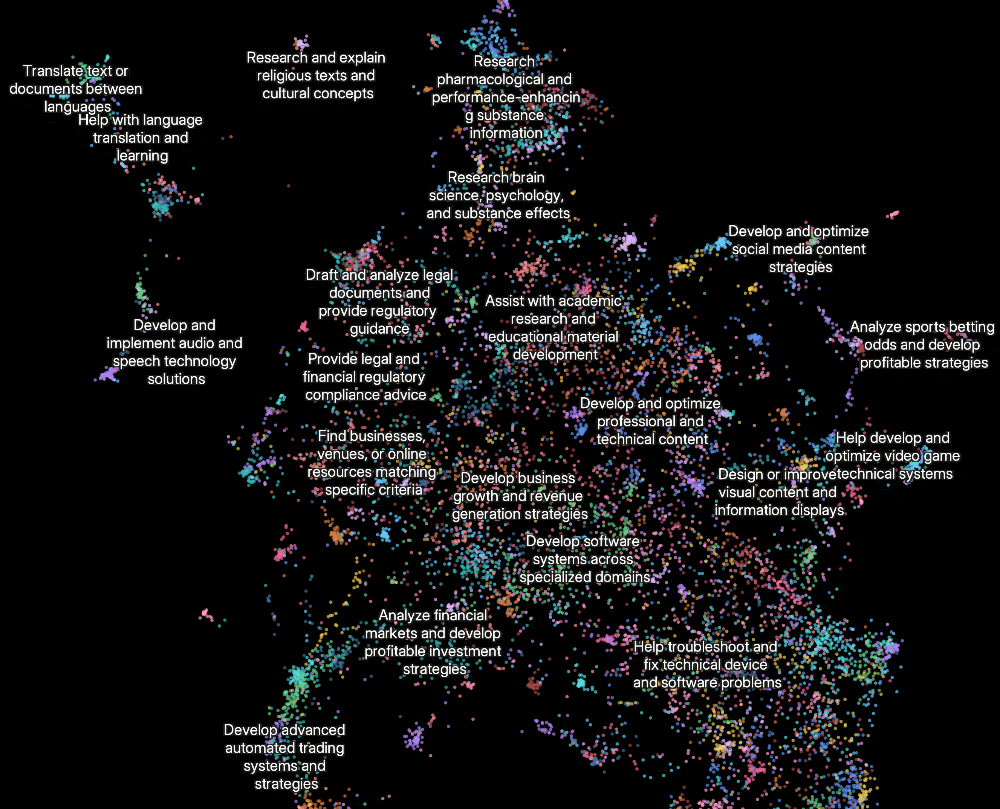

# マルチエージェント・リサーチシステムをどう作ったか

> 原題: How we built our multi-agent research system
> 著者: Jeremy Hadfield, Barry Zhang, Kenneth Lien, Florian Scholz, Jeremy Fox, Daniel Ford（Anthropic）
> 出典: Anthropic Engineering Blog（2025 年 6 月） https://www.anthropic.com/engineering/multi-agent-research-system

> 訳注: 本クリップは良好で、本文・画像 3 枚（アーキテクチャ図・プロセス図・Clio プロット）ともに欠落なく取り込まれていた。除外したのは記事末尾の Anthropic Academy への誘導バナー（パズルピースの SVG 画像リンク、サイト UI）のみ。方針どおり References に相当するものはなく、謝辞（Acknowledgements）は訳出対象から除外した。

Claude には現在、[Research 機能](https://www.anthropic.com/news/research)が備わっており、Web・Google Workspace・各種インテグレーションを横断して検索し、複雑なタスクを遂行できる。

このマルチエージェントシステムをプロトタイプから本番環境（production）へと持っていく道のりは、システムアーキテクチャ・ツール設計・プロンプトエンジニアリングについての決定的な教訓を私たちに与えた。マルチエージェントシステムとは、複数のエージェント（ループの中で自律的にツールを使う LLM）が協働するシステムである。私たちの Research 機能では、あるエージェントがユーザーのクエリに基づいてリサーチのプロセスを計画し、次にツールを使って並列のエージェント群を作り、それらが同時に情報を検索する。複数のエージェントを持つシステムは、エージェントの協調・評価・信頼性において新しい課題をもたらす。

この記事では、私たちにとって有効だった原則を解説する——あなた自身のマルチエージェントシステムを構築する際に役立てば幸いである。

### マルチエージェントシステムの利点

リサーチという仕事は、必要なステップを事前に予測することが非常に難しいオープンエンドな問題を含む。複雑なトピックの探索に固定された経路をハードコードすることはできない。プロセスが本質的に動的で経路依存（path-dependent）だからである。人がリサーチを行うときは、発見に応じて継続的にアプローチを更新し、調査の途中で現れた手がかりを追いかける傾向がある。

この予測不可能性ゆえに、AI エージェントはリサーチタスクに特に適している。リサーチには、調査が展開するにつれて方向転換したり、傍流のつながりを探索したりする柔軟性が求められる。モデルは多くのターンにわたって自律的に動作し、途中の発見に基づいてどの方向を追うかを決断しなければならない。線形のワンショットなパイプラインではこうしたタスクは扱えない。

検索の本質は圧縮である。すなわち、膨大なコーパスから洞察を蒸留することだ。サブエージェントは、それぞれ固有のコンテキストウィンドウを持って並列に動作し、質問の異なる側面を同時に探索した上で、最も重要なトークンをリードのリサーチエージェントに向けて凝縮することで、この圧縮を促進する。各サブエージェントはまた関心の分離（separation of concerns）——固有のツール・プロンプト・探索軌跡——を提供し、これが経路依存性を減らし、徹底的で独立した調査を可能にする。

知能がある閾値に達すると、マルチエージェントシステムは性能をスケールさせる不可欠な方法になる。たとえば、個々の人間はこの 10 万年でより賢くなったが、情報化時代の人間社会は、*集合的な*知性と協調する能力によって*指数関数的に*有能になった。汎用的に知的なエージェントであっても、個体として動作する限り限界に直面する。エージェントの集団は、はるかに多くのことを成し遂げられる。

私たちの内部評価では、マルチエージェント・リサーチシステムは、複数の独立した方向を同時に追いかける幅優先（breadth-first）のクエリで特に優れていることが示された。Claude Opus 4 をリードエージェント、Claude Sonnet 4 をサブエージェントとするマルチエージェントシステムは、単一エージェントの Claude Opus 4 を私たちの内部リサーチ評価で 90.2% 上回った。たとえば、S&P 500 の情報技術セクターの企業の取締役全員を特定するよう求められたとき、マルチエージェントシステムはこれをサブエージェント向けのタスクに分解して正解を見つけたが、単一エージェントシステムは遅い逐次検索では答えを見つけられなかった。

マルチエージェントシステムが機能する主な理由は、問題を解くのに十分なトークンを費やすことを助けるからである。私たちの分析では、[BrowseComp](https://openai.com/index/browsecomp/) 評価（ブラウジングエージェントが見つけにくい情報を突き止める能力をテストする）における性能分散の 95% を 3 つの要因が説明した。トークン使用量が単独で分散の 80% を説明し、ツール呼び出しの回数とモデルの選択が残り 2 つの説明要因だった。この発見は、別々のコンテキストウィンドウを持つエージェント群に仕事を分配して並列推論の容量を追加する、という私たちのアーキテクチャを裏付ける。最新の Claude モデルはトークン利用に対する大きな効率乗数（efficiency multiplier）として働く。Claude Sonnet 4 へのアップグレードは、Claude Sonnet 3.7 のトークン予算を 2 倍にするより大きな性能向上になるからだ。マルチエージェントアーキテクチャは、単一エージェントの限界を超えるタスクに対して、トークン使用量を効果的にスケールさせる。

欠点もある。実際には、これらのアーキテクチャはトークンを急速に消費する。私たちのデータでは、エージェントは通常チャットのやり取りの約 4 倍、マルチエージェントシステムはチャットの約 15 倍のトークンを使う。経済的に成立するためには、マルチエージェントシステムには、性能向上の対価を払えるだけタスクの価値が高い場面が必要である。さらに、すべてのエージェントが同じコンテキストを共有する必要があるドメインや、エージェント間の依存関係が多いドメインは、今日のマルチエージェントシステムには向いていない。たとえば、ほとんどのコーディングタスクはリサーチに比べて真に並列化可能なタスクが少なく、LLM エージェントはリアルタイムで他のエージェントと協調・委任することがまだ得意ではない。マルチエージェントシステムが優れているのは、重い並列化・単一のコンテキストウィンドウを超える情報・多数の複雑なツールとのインターフェースを伴う、価値の高いタスクだと私たちは見出した。

### Research のアーキテクチャ概要

私たちの Research システムは、orchestrator-worker パターンのマルチエージェントアーキテクチャを用いる。リードエージェントがプロセスを統括しながら、並列に動作する専門化されたサブエージェント群に仕事を委任する。

<figure>

<figcaption>図1: マルチエージェントアーキテクチャの動作例。ユーザーのクエリはリードエージェントに流れ、リードエージェントは異なる側面を並列に検索する専門化されたサブエージェント群を作る。</figcaption>
</figure>

ユーザーがクエリを送信すると、リードエージェントはそれを分析し、戦略を立て、異なる側面を同時に探索するサブエージェント群を生成する。上の図に示すように、サブエージェントは検索ツールを反復的に使って情報を集める知的なフィルタとして働き——この例では 2025 年の AI エージェント企業について——企業のリストをリードエージェントに返し、リードエージェントが最終的な回答をまとめる。

Retrieval Augmented Generation（RAG）を用いる従来のアプローチは、静的な検索（static retrieval）を使う。すなわち、入力クエリに最も類似したチャンクの集合を取ってきて、それらのチャンクを使って応答を生成する。対照的に、私たちのアーキテクチャは多段階の検索（multi-step search）を使い、関連情報を動的に見つけ、新しい発見に適応し、結果を分析して高品質な回答を組み立てる。

<figure>

<figcaption>図2: 私たちのマルチエージェント Research システムの完全なワークフローを示すプロセス図。ユーザーがクエリを送信すると、システムは LeadResearcher エージェントを作り、反復的なリサーチプロセスに入る。LeadResearcher はまずアプローチを思考し、その計画を Memory に保存してコンテキストを永続化する。コンテキストウィンドウが 200,000 トークンを超えると切り詰められるため、計画を保持しておくことが重要だからである。次に、特定のリサーチタスクを持つ専門化された Subagent 群（ここでは 2 つを示すが、任意の数でよい）を作る。各 Subagent は独立に Web 検索を実行し、interleaved thinking を使ってツールの結果を評価し、発見を LeadResearcher に返す。LeadResearcher はこれらの結果を統合し、さらなるリサーチが必要かを判断する——必要なら、追加のサブエージェントを作るか、戦略を洗練できる。十分な情報が集まったら、システムはリサーチループを抜け、すべての発見を CitationAgent に渡す。CitationAgent は文書とリサーチレポートを処理して引用を挿入すべき具体的な位置を特定する。これにより、すべての主張が出典に適切に帰属されることが保証される。引用を備えた最終的なリサーチ結果が、ユーザーに返される。</figcaption>
</figure>

### リサーチエージェントのためのプロンプトエンジニアリングと評価

マルチエージェントシステムには、協調の複雑さが急速に増大するなど、単一エージェントシステムとの重要な違いがある。初期のエージェントは、単純なクエリに対して 50 個のサブエージェントを生成する、存在しない情報源を求めて Web を際限なく漁る、過剰な報告でお互いの気を散らす、といった誤りを犯した。各エージェントはプロンプトによって操縦されるので、プロンプトエンジニアリングがこれらの挙動を改善する主要なレバーだった。以下は、エージェントのプロンプティングについて私たちが学んだ原則である。

1. **エージェントの身になって考える（Think like your agents）。** プロンプトを反復改善するには、その効果を理解しなければならない。そのために私たちは、システムとまったく同じプロンプトとツールを使った模擬実行（シミュレーション）を [Console](https://console.anthropic.com/) 上に作り、エージェントが動く様子をステップごとに観察した。これによって失敗モードが即座に明らかになった。すでに十分な結果を得ているのに続行するエージェント、過度に冗長な検索クエリの使用、誤ったツールの選択などである。効果的なプロンプティングは、エージェントの正確なメンタルモデルを築くことに依存しており、それができれば最もインパクトの大きい変更が自明になる。
2. **オーケストレータに委任の仕方を教える（Teach the orchestrator how to delegate）。** 私たちのシステムでは、リードエージェントがクエリをサブタスクに分解してサブエージェントに説明する。各サブエージェントには、目的・出力フォーマット・使うべきツールと情報源のガイダンス・明確なタスク境界が必要である。詳細なタスク記述がないと、エージェントは仕事を重複させたり、抜けを残したり、必要な情報を見つけられなかったりする。最初は「半導体不足を調べよ」のような単純で短い指示をリードエージェントに許していたが、こうした指示はしばしば曖昧すぎて、サブエージェントがタスクを誤解したり、他のエージェントとまったく同じ検索を実行したりすることがわかった。たとえば、あるサブエージェントが 2021 年の自動車チップ危機を探索する一方で、他の 2 つは実効的な分業のないまま 2025 年現在のサプライチェーンの調査を重複して行った。
3. **クエリの複雑さに労力をスケールさせる（Scale effort to query complexity）。** エージェントはタスクごとの適切な労力を判断するのが苦手なので、私たちはスケーリング規則をプロンプトに埋め込んだ。単純な事実確認はエージェント 1 体と 3〜10 回のツール呼び出しだけでよく、直接比較はサブエージェント 2〜4 体と各 10〜15 回の呼び出し、複雑なリサーチは責務を明確に分けた 10 体超のサブエージェントを使う、といった具合である。これらの明示的なガイドラインは、リードエージェントが資源を効率的に配分し、単純なクエリへの過剰投資——初期バージョンでよくあった失敗モード——を防ぐのを助ける。
4. **ツールの設計と選択は決定的に重要（Tool design and selection are critical）。** エージェントとツールのインターフェースは、人間とコンピュータのインターフェースと同じくらい重要である。正しいツールを使うことは効率的であり——多くの場合、厳密に必要ですらある。たとえば、Slack にしか存在しないコンテキストを Web で検索するエージェントは、最初から失敗が運命づけられている。モデルに外部ツールへのアクセスを与える [MCP サーバー](https://modelcontextprotocol.io/introduction)では、この問題はさらに深刻になる。エージェントは、品質が激しくばらつく説明文を持つ見たことのないツールに遭遇するからである。私たちはエージェントに明示的なヒューリスティクスを与えた。たとえば、まず利用可能なすべてのツールを確認する、ツールの使用をユーザーの意図に合わせる、広い外部探索には Web を検索する、汎用ツールより専門ツールを優先する、などである。悪いツール説明はエージェントを完全に間違った道へ送り込みかねないので、各ツールには固有の目的と明確な説明が必要である。
5. **エージェント自身に改善させる（Let agents improve themselves）。** Claude 4 モデルは優れたプロンプトエンジニアになれることがわかった。プロンプトと失敗モードを与えられると、エージェントがなぜ失敗しているかを診断し、改善を提案できる。私たちはツールテスト用エージェントまで作った——欠陥のある MCP ツールを与えられると、そのツールを使おうと試み、失敗を避けるようにツールの説明文を書き直す。ツールを何十回もテストすることで、このエージェントは重要なニュアンスやバグを発見した。ツールのエルゴノミクスを改善するこのプロセスによって、新しい説明文を使う後続エージェントのタスク完了時間は 40% 減少した。ほとんどの間違いを避けられるようになったからである。
6. **広く始めてから絞り込む（Start wide, then narrow down）。** 検索戦略は熟練した人間のリサーチを鏡写しにすべきである。すなわち、詳細を掘り下げる前に全体の風景を探索する。エージェントは、結果がほとんど返らない過度に長く specific なクエリをデフォルトで使いがちである。私たちは、短く広いクエリから始め、何が入手可能かを評価し、それから徐々に焦点を絞るようエージェントにプロンプトすることで、この傾向に対抗した。
7. **思考プロセスを導く（Guide the thinking process）。** [拡張思考モード（extended thinking mode）](https://docs.anthropic.com/en/docs/build-with-claude/extended-thinking)は、Claude に可視の思考プロセスとして追加のトークンを出力させるもので、制御可能なスクラッチパッドとして機能させられる。リードエージェントは思考を使ってアプローチを計画する。どのツールがタスクに合うかを見極め、クエリの複雑さとサブエージェント数を決め、各サブエージェントの役割を定義する。私たちのテストでは、拡張思考は指示追従・推論・効率を改善した。サブエージェントも計画し、その後ツール結果の後に [interleaved thinking](https://docs.anthropic.com/en/docs/build-with-claude/extended-thinking#interleaved-thinking) を使って品質を評価し、ギャップを特定し、次のクエリを洗練する。これによってサブエージェントはどんなタスクにもより効果的に適応できるようになる。
8. **並列ツール呼び出しが速度と性能を変える（Parallel tool calling transforms speed and performance）。** 複雑なリサーチタスクは、当然ながら多くの情報源の探索を伴う。初期のエージェントは逐次的に検索を実行しており、これは耐え難いほど遅かった。速度のために、私たちは 2 種類の並列化を導入した。(1) リードエージェントはサブエージェントを逐次でなく 3〜5 体並列に立ち上げる。(2) サブエージェントは 3 つ以上のツールを並列に使う。これらの変更は複雑なクエリのリサーチ時間を最大 90% 削減し、Research は他のシステムより多くの情報をカバーしながら、数時間でなく数分でより多くの仕事をこなせるようになった。

私たちのプロンプティング戦略は、硬直した規則ではなく良いヒューリスティクスを植え付けることに焦点を当てている。熟練した人間がリサーチタスクにどう取り組むかを研究し、その戦略をプロンプトにエンコードした——難しい質問を小さなタスクに分解する、情報源の品質を注意深く評価する、新しい情報に基づいて検索アプローチを調整する、深さ（1 つのトピックの詳細な調査）と幅（多くのトピックの並列探索）のどちらに注力すべきかを見極める、といった戦略である。また、エージェントが制御不能に陥るのを防ぐ明示的なガードレールを設けることで、意図しない副作用を事前に緩和した。最後に、可観測性（observability）とテストケースを備えた高速な反復ループに注力した。

### エージェントの効果的な評価

良い評価は信頼できる AI アプリケーションの構築に不可欠であり、エージェントも例外ではない。しかし、マルチエージェントシステムの評価には固有の難しさがある。従来の評価はしばしば、AI が毎回同じステップをたどることを前提とする。入力 X が与えられたら、システムは経路 Y をたどって出力 Z を生むべきだ、と。しかしマルチエージェントシステムはそうは動かない。開始点が同一でも、エージェントは目標に到達するまでにまったく異なる有効な経路を取りうる。あるエージェントは 3 つの情報源を検索し、別のエージェントは 10 個を検索するかもしれないし、異なるツールで同じ答えを見つけるかもしれない。正しいステップが何かを常に知れるわけではないので、事前に規定した「正しい」ステップにエージェントが従ったかを確認するだけでは通常すまない。代わりに、エージェントが妥当なプロセスを踏みつつ正しい成果（outcome）に到達したかを判定する、柔軟な評価手法が必要である。

**小さなサンプルで直ちに評価を始める（Start evaluating immediately with small samples）。** エージェント開発の初期には、容易に摘める果実が豊富にあるため、変更は劇的な影響を持つ傾向がある。プロンプトの微調整が成功率を 30% から 80% に引き上げることもある。効果量がこれほど大きければ、少数のテストケースだけで変化を見て取れる。私たちは、実際の利用パターンを代表する約 20 個のクエリの集合から始めた。これらのクエリをテストすることで、変更の影響を明確に確認できることが多かった。AI 開発チームが「数百のテストケースを持つ大規模な評価だけが有用だ」と信じて評価の作成を先送りする、という話をよく聞く。しかし、より徹底した評価を構築できるまで先送りするのではなく、少数の例を使った小規模なテストを直ちに始めるのが最善である。

**LLM-as-judge 評価は、うまくやればスケールする（LLM-as-judge evaluation scales when done well）。** リサーチの出力は自由形式のテキストであり、単一の正解を持つことは稀なので、プログラム的な評価が難しい。LLM は出力の採点に自然に適している。私たちは、ルーブリック（採点基準表）の基準に照らして各出力を評価する LLM ジャッジを使った。基準は、事実の正確性（主張は情報源と一致するか？）、引用の正確性（引かれた情報源は主張と一致するか？）、網羅性（要求されたすべての側面がカバーされているか？）、情報源の品質（低品質な二次情報源より一次情報源を使ったか？）、ツール効率（適切なツールを妥当な回数使ったか？）である。各項目を別々のジャッジに評価させる実験もしたが、単一の LLM 呼び出しに単一のプロンプトで 0.0〜1.0 のスコアと合否判定を出力させるのが、最も一貫しており人間の判断とも整合することがわかった。この手法は、評価用テストケースに明確な答えが*ある*場合に特に効果的で、LLM ジャッジには答えが正しいかを単純に確認させればよかった（例: R&D 予算上位 3 社の製薬企業を正確に列挙したか？）。LLM をジャッジとして使うことで、数百の出力をスケーラブルに評価できた。

**人間の評価は自動化が見逃すものを捕まえる（Human evaluation catches what automation misses）。** エージェントを人がテストすると、評価が見逃すエッジケースが見つかる。珍しいクエリでの幻覚による回答、システム障害、微妙な情報源選択バイアスなどである。私たちの場合、人間のテスターは、初期のエージェントが、学術 PDF や個人ブログのような権威ある（しかし検索順位の低い）情報源よりも、SEO 最適化されたコンテンツファームを一貫して選ぶことに気づいた。情報源品質のヒューリスティクスをプロンプトに加えることで、この問題は解消に向かった。自動評価の世界においてもなお、手動テストは不可欠である。

マルチエージェントシステムには、特定のプログラミングなしに立ち現れる創発的な挙動がある。たとえば、リードエージェントへの小さな変更が、サブエージェントの挙動を予測不能に変えることがある。成功には、個々のエージェントの挙動だけでなく、相互作用のパターンを理解することが必要である。したがって、これらのエージェントにとって最良のプロンプトは、単なる厳格な指示ではなく、分業・問題解決アプローチ・労力の予算を定義する協働の枠組み（frameworks for collaboration）である。これを正しく行うことは、注意深いプロンプティングとツール設計、堅実なヒューリスティクス、可観測性、そして緊密なフィードバックループにかかっている。私たちのシステムのプロンプト例は、[Cookbook のオープンソースプロンプト](https://platform.claude.com/cookbook/patterns-agents-basic-workflows)を参照してほしい。

### 本番の信頼性とエンジニアリング上の課題

従来のソフトウェアでは、バグは機能を壊したり、性能を劣化させたり、障害を引き起こしたりする。エージェントシステムでは、小さな変更が大きな挙動の変化へと連鎖するため、長時間走るプロセスの中で状態を保持しなければならない複雑なエージェントのコードを書くことは際立って難しい。

**エージェントは状態を持ち、エラーは複利で増える（Agents are stateful and errors compound）。** エージェントは長時間動作し、多数のツール呼び出しにまたがって状態を保持しうる。つまり、コードを耐久的に実行し、途中のエラーを処理する必要がある。効果的な緩和策がなければ、軽微なシステム障害がエージェントにとって致命的になりうる。エラーが起きたとき、単に最初からやり直すわけにはいかない。再開はコストが高く、ユーザーをいらだたせる。代わりに私たちは、エラーが起きた時点からエージェントを再開できるシステムを構築した。また、問題を優雅に処理するためにモデルの知性も使う。たとえば、ツールが失敗していることをエージェントに知らせ、適応させるのは驚くほどうまくいく。私たちは、Claude の上に築かれた AI エージェントの適応力を、リトライロジックや定期的なチェックポイントといった決定論的なセーフガードと組み合わせている。

**デバッグには新しいアプローチが役立つ（Debugging benefits from new approaches）。** エージェントは動的に意思決定し、同一のプロンプトでも実行のたびに非決定的である。これがデバッグを難しくする。たとえば、ユーザーから「明白な情報が見つからない」というエージェントの報告があっても、私たちにはその理由が見えなかった。悪い検索クエリを使ったのか？劣った情報源を選んだのか？ツール障害に当たったのか？本番環境の完全なトレーシングを追加したことで、エージェントがなぜ失敗したかを診断し、問題を体系的に修正できるようになった。標準的な可観測性を超えて、私たちはエージェントの意思決定パターンと相互作用の構造をモニタリングしている——ユーザーのプライバシーを守るため、個々の会話の内容は一切モニタリングせずに、である。この高水準の可観測性が、根本原因の診断、予期しない挙動の発見、よくある失敗の修正を助けた。

**デプロイには慎重な調整が要る（Deployment needs careful coordination）。** エージェントシステムは、プロンプト・ツール・実行ロジックが高度に状態を持って絡み合った網であり、ほぼ連続的に稼働している。つまり、更新をデプロイするとき、エージェントはプロセスのどの時点にいてもおかしくない。したがって、善意のコード変更が既存のエージェントを壊さないようにする必要がある。すべてのエージェントを同時に新バージョンへ更新することはできない。代わりに私たちは [rainbow deployment](https://brandon.dimcheff.com/2018/02/rainbow-deploys-with-kubernetes/) を使い、新旧バージョンを同時に稼働させたままトラフィックを徐々に移すことで、実行中のエージェントを妨げないようにしている。

**同期実行はボトルネックを作る（Synchronous execution creates bottlenecks）。** 現在、私たちのリードエージェントはサブエージェントを同期的に実行し、各サブエージェント群の完了を待ってから先へ進む。これは協調を単純にするが、エージェント間の情報の流れにボトルネックを作る。たとえば、リードエージェントはサブエージェントを途中で操縦（steer）できず、サブエージェント同士は協調できず、1 体のサブエージェントの検索完了を待つ間、システム全体がブロックされうる。非同期実行なら追加の並列性が得られる。エージェントが同時並行で働き、必要に応じて新しいサブエージェントを作れるようになる。しかしこの非同期性は、結果の調整・状態の一貫性・サブエージェント間のエラー伝播に課題を加える。モデルがより長く複雑なリサーチタスクを扱えるようになるにつれ、性能向上がその複雑さに見合うようになると私たちは予想している。

### 結論

AI エージェントを構築するとき、最後の 1 マイルが旅程の大半になることが多い。開発者のマシンで動くコードベースを、信頼できる本番システムにするには相当のエンジニアリングが必要である。エージェントシステムにおけるエラーの複利的な性質は、従来のソフトウェアなら軽微な問題でも、エージェントを完全に脱線させうることを意味する。1 つのステップの失敗が、エージェントにまったく異なる軌跡を探索させ、予測不能な結果を導きうる。この記事で述べたすべての理由により、プロトタイプと本番の間のギャップは、しばしば予想より広い。

これらの課題にもかかわらず、マルチエージェントシステムはオープンエンドなリサーチタスクで価値を証明してきた。ユーザーからは、Claude のおかげで、考えてもいなかったビジネス機会を見つけた、複雑な医療の選択肢を整理できた、厄介な技術バグを解決できた、独力では見つけられなかったリサーチ上のつながりを掘り当てて数日分の仕事を節約できた、といった声が寄せられている。マルチエージェント・リサーチシステムは、注意深いエンジニアリング、包括的なテスト、細部まで行き届いたプロンプトとツールの設計、堅牢な運用プラクティス、そして現在のエージェント能力を深く理解したリサーチ・プロダクト・エンジニアリング各チームの緊密な協働があれば、大規模でも信頼性を保って動作できる。これらのシステムが複雑な問題の解き方を変えつつあるのを、私たちはすでに目にしている。

<figure>

<figcaption>図3: 今日 Research 機能が使われている最も一般的な用途を示す Clio の埋め込みプロット。上位の用途カテゴリは、専門ドメインをまたぐソフトウェアシステムの開発（10%）、プロフェッショナル・技術コンテンツの作成と最適化（8%）、ビジネス成長と収益創出戦略の立案（8%）、学術研究・教育資料作成の支援（7%）、人物・場所・組織に関する情報の調査と検証（5%）。</figcaption>
</figure>

## Appendix（付録）

以下は、マルチエージェントシステムに関するその他の雑多なヒントである。

**多ターンにわたって状態を変更するエージェントの終了状態評価（End-state evaluation）。** 複数ターンの会話にまたがって永続的な状態を変更するエージェントの評価には、固有の難しさがある。読み取り専用のリサーチタスクと違い、各行動が後続ステップの環境を変えるため、従来の評価手法では扱いにくい依存関係が生まれる。私たちは、ターンごとの分析ではなく終了状態の評価（end-state evaluation）に注力することで成功した。エージェントが特定のプロセスに従ったかを判定する代わりに、正しい最終状態に到達したかを評価する。このアプローチは、エージェントが同じゴールへの別経路を見つけうることを認めつつ、意図した成果を確実に届けさせる。複雑なワークフローでは、すべての中間ステップを検証しようとするのではなく、特定の状態変化が起きているべき離散的なチェックポイントに評価を分割する。

**長い会話の管理（Long-horizon conversation management）。** 本番のエージェントは数百ターンに及ぶ会話を行うことが多く、注意深いコンテキスト管理戦略が必要になる。会話が延びるにつれて標準のコンテキストウィンドウでは足りなくなり、賢い圧縮と記憶のメカニズムが必要になる。私たちは、エージェントが完了した作業フェーズを要約し、新しいタスクへ進む前に本質的な情報を外部メモリに保存するパターンを実装した。コンテキストの限界が近づいたら、エージェントは、注意深い引き継ぎ（handoff）によって連続性を保ちながら、クリーンなコンテキストを持つ新しいサブエージェントを生成できる。さらに、コンテキスト限界に達したときにそれまでの仕事を失うのではなく、リサーチ計画のような保存済みコンテキストをメモリから取り出せる。この分散的なアプローチは、長時間の対話にわたって会話の一貫性を保ちつつ、コンテキストのあふれを防ぐ。

**サブエージェントの出力をファイルシステムへ——「伝言ゲーム」を最小化する（Subagent output to a filesystem）。** サブエージェントの出力を直接残すことで、ある種の成果物についてはメインのコーディネータを迂回でき、忠実性と性能の両方が改善する。サブエージェントにすべてをリードエージェント経由で伝えさせるのではなく、専門化されたエージェントが独立に永続する成果物を作れるアーティファクトシステムを実装する。サブエージェントはツールを呼んで作業を外部システムに保存し、軽量な参照だけをコーディネータに渡す。これは多段処理での情報損失を防ぎ、大きな出力を会話履歴にコピーして回すことによるトークンのオーバーヘッドを減らす。このパターンは、コード・レポート・データ可視化のような構造化された出力で特にうまく機能する。そうした出力では、サブエージェントの専門化されたプロンプトが生む結果の方が、汎用のコーディネータを濾して伝えるより良いからである。
