# NVFP4 による大規模言語モデルの事前学習

> 原題: Pretraining Large Language Models with NVFP4
> 著者: NVIDIA（著者一覧は「Contributors」節を参照）
> 出典: arXiv:2509.25149（ar5iv 版）
> コード: [Transformer Engine の NVFP4 訓練支援](https://github.com/NVIDIA/TransformerEngine/pull/2177)

> **訳注（クリップの状態と復元）**
> - 底本は ar5iv 版の Web Clipper クリップ。**本 ingest で扱った 3 本の論文の中では最も健全**であった（画像 15 枚中 14 枚、Figure 1〜14 のうち 13 件、Table 1〜5 の全件が残存）。
> - 復元したのは 2 点のみ。(1) **Figure 6 の 2 枚目（`x7.png`）が欠落**し、**Figure 6 全体のキャプションも消滅**していた（Figure 6 は 2 パネル構成で、クリップには (a) の画像と小見出しだけが残っていた）。(2) **脚注 1 件の本文が欠落**していた。いずれも原ページから復元した。
> - 参考文献一覧は既定どおり訳出しない。「Contributors」節は著者一覧なので、謝辞の扱いに準じて原文のまま残す。
> - 図はすべて `raw/assets/2025-nvfp4-pretraining/` にローカル保存し、そのパスを参照している。

## Abstract（要旨）

今日の大規模言語モデル（LLM）は多くの領域にわたる強力な問題解決器であり、業界全体の広範な研究と実験が示すとおり、モデルサイズ・訓練セットのサイズ・訓練セットの品質のスケールに伴ってより強くなり続けている。今日フロンティアのモデルを訓練するには数十から数百 yottaflops のオーダーが必要であり、これは時間・計算・エネルギーの莫大な投資である。したがって、**事前学習の効率を改善することは、次世代のさらに有能な LLM を可能にするうえで本質的である**。8 ビット浮動小数点（FP8）による訓練は今や広く採用されているが、4 ビット浮動小数点（FP4）のようなさらに狭い精度への移行は、計算速度と資源利用のさらなる改善を解き放ちうる。しかしこの水準での量子化は、訓練の安定性・収束・実装に対する課題を突きつける。とりわけ長いトークン地平線で訓練される大規模モデルではそうである。

本研究では、**NVFP4** 形式を用いて大規模言語モデル（LLM）を安定かつ正確に訓練するための新しい手法を導入する。我々の手法は、ブロック水準の外れ値を抑えるために **Random Hadamard 変換（RHT）** を統合し、順伝播と逆伝播にわたって一貫した表現を得るために **2 次元の量子化方式**を採用し、偏りのない勾配推定のために**確率的丸め（stochastic rounding）** を活用し、**選択的な高精度層**を組み込む。**120 億パラメータのモデルを 10 兆トークンで訓練する**ことで我々の手法を検証した——これは 4 ビット精度で公に文書化された訓練実行として現時点で最長である。我々の結果は、NVFP4 に基づく事前学習の技法で訓練したモデルが、FP8 のベースラインと同等の訓練損失と下流タスクの精度を達成することを示している。たとえばこのモデルは **MMLU-pro で 62.58% の精度**を達成し、FP8 の事前学習で達成された **62.62%** にほぼ一致する。これらの発見は、NVFP4 が我々の訓練手法と組み合わされたとき、狭い精度の LLM 訓練アルゴリズムにおける大きな前進を表すことを強調している。

## 1 Introduction（はじめに）

大規模言語モデル（LLM）の急速な拡大は、訓練中の計算コスト・メモリ需要・エネルギー消費を下げるための、より効率的な数値形式への需要を高めてきた。8 ビット浮動小数点（FP8 と MXFP8）は LLM の加速された訓練のための人気あるデータ型として現れている [^15] [^10] [^16]。狭い精度のハードウェアの最近の進歩 [^19] は、4 ビット浮動小数点（FP4）を次の論理的な一歩として位置づけ [^27] [^9] [^28] [^7] [^6] [^31] [^23]、FP8 と比べて**演算性能の 2〜3 倍の向上**と**メモリ使用量の半減**をもたらす。

本技術報告は、「マイクロスケーリング（microscaling）」の手法 [^23] を拡張する 4 ビットのデータ形式 **NVFP4** [^2] を用いた大規模言語モデル（LLM）の事前学習の詳細な分析を提示する。MXFP4 [^23] [^20] のような 4 ビットのマイクロスケーリング形式とは異なり、**NVFP4 はより小さなマイクロブロック構造を採用し**、データ内の局所的な動的範囲をより効果的に捉える。NVFP4 はまた、より正確なマイクロスケーリングのために**小数部の精度を組み込んだ FP8 のスケール係数形式**を活用する。加えて NVFP4 は、細粒度の FP8 スケール係数とテンソル水準で適用される FP32 スケールを組み合わせた **2 段階のスケーリング戦略**を採用する。これらの設計上の選択は、訓練中のテンソル値のより精密で正確な表現を可能にする。

NVFP4 の形式を活用して、我々は非常に強力な言語モデルにおいて FP8 と同等の精度を達成する 4 ビットの訓練手法を導入する。この手法は数値的に敏感な層をより高い精度に保ち、順伝播と逆伝播にわたって同じ量子化表現を保つために **2 次元（2D）ブロックスケーリング**を用い、大きな大きさの外れ値を分散させるために **Random Hadamard 変換** [^27] [^6] を適用し、量子化のバイアスを減らすために勾配に**確率的丸め** [^27] [^9] [^7] [^6] を採用する。アブレーション研究は、この手法の各構成要素が 4 ビット訓練にとって重要であること、とりわけ大規模モデルと長いトークン地平線においてそうであることを確認している。

我々の手法を検証するため、非常に強力な 120 億パラメータの LLM [^18] を 10 兆トークンで訓練し、その損失曲線と下流タスクにおける精度が FP8 のベースラインと密接に一致することを示す。本研究は大規模での FP4 訓練の実現可能性を確立するものだが、本報告は主として実行時の効率やシステム水準の最適化ではなく、その根底にあるアルゴリズムと方法論に関わるものである。これは我々の知る限り、**数兆トークンの地平線にわたって 4 ビット精度で十億パラメータの言語モデルを訓練することに成功した初の実証**であり、将来のフロンティアモデルのより高速で効率的な訓練の基礎を築くものである。

本技術報告の残りは次のように構成される。2 節は NVFP4 の形式を述べ、3 節は NVFP4 で 10 兆トークン訓練した 120 億のモデルの結果を提示し、4 節は NVFP4 のための訓練方法論を論じ、5 節は NVFP4 と MXFP4 の訓練を比較する。付録は訓練の設定（モデル・データセット・ハイパーパラメータ）、量子化の手続き、および異なる技法の選択の影響を分析するアブレーション研究の詳細を含む。

## 2 NVFP4 Format（NVFP4 の形式）

狭い浮動小数点形式の限られた範囲ゆえに、動的範囲と精度の釣り合いを取るために**マイクロスケーリング（MX）形式** [^20] が導入された。これらの形式は、データ要素のグループが単一の共通のスケール係数を共有するブロック単位の表現によって特徴づけられる。MX 形式には 8 ビット（MXFP8）・6 ビット（MXFP6）・4 ビット（MXFP4）の浮動小数点型が含まれる。MXFP4 では各要素が **E2M1**1 [^20] として表現される。すなわち符号ビット 1・指数ビット 2・仮数ビット 1 である。これにより MXFP4 は $\pm 0$, $\pm 0.5$, $\pm 1$, $\pm 1.5$, $\pm 2$, $\pm 3$, $\pm 4$, $\pm 6$ の値を符号化できる。

> 訳注（脚注 1）: 浮動小数点型は E$x$M$y$ と表記し、符号ビット 1 つ・指数ビット $x$ 個・仮数ビット $y$ 個からなる。

元のより高精度な値（例: FP32 や BF16）はしばしば FP4 の範囲を超えるので、量子化の際に表現可能な範囲へスケールされなければならない。スケール係数は典型的に、**ブロック内の最大絶対値（amax）が FP4 の表現可能な最大値へ写る**ように選ばれ、小さな大きさの値がゼロへ失われることを最小化しつつ飽和の防止を優先する。スケーリング後、テンソル内の高精度な値は最近接の FP4 表現可能な数へ丸められ、後で同じスケールの逆数を用いて元の範囲へ復号される。ハードウェアの効率を改善するため、MX 形式はブロックのスケール係数を 8 ビットで格納する。テンソル内の連続する 32 要素の各ブロックが、$2^{-127}$ から $2^{127}$ に及ぶ 2 の冪の値を符号化する符号なし E8M0 形式（UE8M0）で格納された単一の 8 ビットのスケール係数を共有する。[^16] は、飽和を避けるために**スケール係数を次の表現可能な UE8M0 の値へ切り上げる**のが有益であることを見出している。

NVFP4 は MXFP4 に対して改善された数値的性質を提供する強化された 4 ビット形式である。第一に、**ブロックサイズを 32 から 16 要素へ減らす**ことで、NVFP4 は各ブロック内の動的範囲を狭め、値を FP4 の範囲へより良く適合させる。第二に、**ブロックのスケール係数を UE8M0 でなく E4M3 で格納し**、指数の範囲をいくらか譲って追加の仮数ビットを得る。第三に、**ブロックスケールの範囲を保つためにテンソル水準で FP32 のスケールを適用する**。こうした 2 段階のマイクロスケーリングの手法により、NVFP4 はブロック内の少なくとも 6.25% の値（16 要素の各ブロック内の amax の値）を **FP8 に近い精度**で符号化し、一方で残りの値を FP4 で格納する（Figure 1 を参照）。対照的に MXFP4 はすべての値を FP4 で格納し、2 の冪へのスケール係数の丸めゆえに**最大 1 binade の動的範囲（および $\pm 4$ と $\pm 6$ の 4 サンプル）を失いうる**（詳細は付録 B.4）。

NVFP4 について、E4M3 でより精密なスケーリングを持つことは、スケール係数を表現するのに使える範囲を減らす。その結果、ブロックのスケール係数を E4M3 で表現できるように元のテンソルの分布を調整するために、第 2 段階の FP32 のスケーリングが用いられる。この 2 段階のスケーリングの方式は次のように働く: (1) テンソルごとの FP32 のスケールがテンソル内のすべての値をブロックの表現可能な範囲（FP4 $\times$ FP8）へ再写像し、次に (2) ブロックごとの E4M3 のスケールがブロック内の値を FP4 の表現可能な範囲へ移す。付録 B が量子化とスケーリングの戦略をより詳細に述べる。

要約すると、MXFP4 に対する NVFP4 の設計上の改善は、小さな値がゼロへ量子化される量を最小化しながら外れ値の精度を高める。これらの数値的な進歩（より小さなブロックサイズとより精密なスケーリング）は NVFP4 に MXFP4 に対する明確な優位を与え、一貫してより良い訓練の挙動をもたらす。これら 2 つの形式を比較した訓練結果は 5 節で論じる。

<figure>

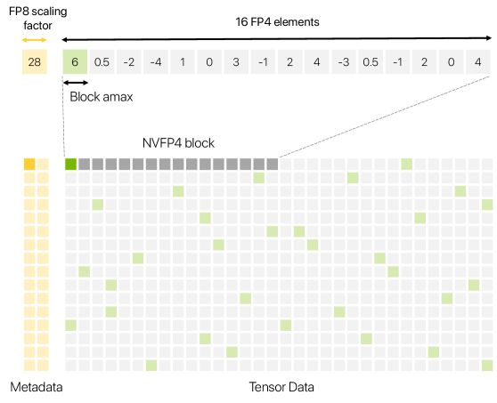

<figcaption>図1: NVFP4 形式で格納された 16×32 の行列。各ブロックは 16 個の連続する FP4 要素（灰色と緑）と単一の FP8 スケール係数（黄色）を含む。各ブロック内で最大の大きさを持つ要素（緑）は FP4 の表現可能な最大値へスケールされ、ブロックのスケール係数を使って復元できる。テンソルごとの FP32 スケール係数（図示せず）も適用される。</figcaption>
</figure>

**表1**: NVIDIA Blackwell の Tensor Core。

| Format | Element | Scale | Block | Speedup vs. BF16 (GB200) | (GB300) |
| --- | --- | --- | --- | --- | --- |
| MXFP8 | E5M2/E4M3 | UE8M0 | 32 | 2× | 2× |
| MXFP6 | E3M2/E2M3 | UE8M0 | 32 | 2× | 2× |
| MXFP4 | E2M1 | UE8M0 | 32 | 4× | 6× |
| NVFP4 | E2M1 | E4M3 | 16 | 4× | 6× |

**Tensor Core によるハードウェア支援**: NVIDIA Blackwell の GPU は、Table 1 にまとめるとおり、広範囲のマイクロスケーリング形式——MXFP8・MXFP6・MXFP4・NVFP4——について一般行列積（GEMM）のネイティブな支援を提供する。Tensor Core は狭い精度の入力を、16 または 32 要素の各ブロックについての 8 ビットのスケール係数とともに読み込む。Tensor Core はブロック上で部分内積を計算し、各部分積を対応するスケール係数と掛けて量子化の際にスケールされた入力をデスケールし、部分結果をより高い精度で蓄積して FP32 の最終的な内積を生成する。さらに Blackwell の GPU は、FP4 変換命令について最近接偶数丸めと確率的丸めを含むいくつかの丸めモードのネイティブな支援を持つ。Tensor Core は FP8 と比べて **GB200 チップ上で 2 倍、GB300 チップ上で 3 倍**高い演算スループットで FP4 の計算を提供する。FP8 と比べて FP4 のオペランドを用いるとメモリ使用量もおよそ半分になる。その結果、**GEMM が訓練時間の相当な割合を占めるとき、FP4 は LLM の訓練に大きな高速化を提供しうる**。

## 3 Training with NVFP4（NVFP4 による訓練）

NVFP4 の精度で 10T トークン訓練した 120 億パラメータのハイブリッド Mamba-Transformer モデルの訓練結果を報告し、その結果を FP8 の参照モデルと比較する。

**モデルと訓練の設定**: 最近導入された Nemotron-H ファミリのモデル [^18] [^17] で用いられているハイブリッド Mamba-Transformer のモデルアーキテクチャを考える。これらのモデルは Mamba-2・Self-Attention・FFN のブロックの混合からなる。複数のベンチマークにわたって競争力のある精度を達成することが示されている Nemotron-Nano-12B-v2-Base モデル（Nemotron-H ファミリ [^18] の 12B パラメータのモデル）と同じアーキテクチャを用いる。このモデルを **Warmup-Stable-Decay** [^13] の学習率スケジュールで 10T トークン訓練する。学習率は訓練の最初の 80% を通じて一定であり、その後最後の 20% で減衰される。モデルの構成についての詳細は付録 A.1 にある。

4 節に述べる方法論を用いてモデルを NVFP4 で事前学習する。損失と下流タスクにおける精度を比較するため、[^10] [^18] の方法論に従って FP8 のベースラインを事前学習する。

<figure>

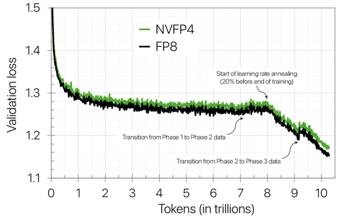

<figcaption>図2: 10T トークンを用いた 12B モデルについての NVFP4 と FP8 の事前学習の検証損失。</figcaption>
</figure>

<figure>

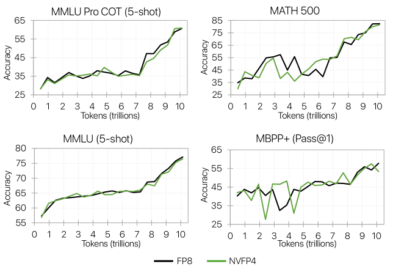

<figcaption>図3: 10T トークンの事前学習を通じて測定した NVFP4 対 FP8 のタスク精度。</figcaption>
</figure>

**事前学習の結果**: Figure 2 は、NVFP4 の検証損失が訓練を通じて FP8 の対応物に密接に追随することを示す。訓練の安定期の間、**NVFP4 の相対損失誤差は一貫して 1% 未満に留まり**、訓練の終わりに向けて学習率が減衰されるにつれて **1.5% をわずかに超える程度**まで広がる。これは NVFP4 の訓練の動態が FP8 に密接に追随し、訓練の後期にわずかな乖離が現れるだけであることを示している。なお 8T トークンにおける損失曲線の傾きの変化は学習率の減衰に由来する。加えて 9T トークンにおける損失の小さな跳ねはデータセットの配合の変更に対応する。用いたデータセットの配合についての詳細は付録 A.1 にある。

損失の小さな隔たりにもかかわらず、**下流タスクの精度は大部分が影響を受けない**。Figure 3 は NVFP4 が訓練の期間にわたって下流の評価で FP8 に一致することを示す。この傾向は、知識集約的な推論・数学・コーディング・常識推論のタスクを含む広範囲の領域にわたって成り立つ。Table 2 はより包括的な視点を提供し、NVFP4 がほとんどの個々のベンチマークにわたって FP8 と同等の精度を達成することを裏づける。**例外はコーディングのタスクで、そこでは NVFP4 がわずかに劣る**。この差はノイズの多い評価に起因する可能性があると我々は疑っている——MBPP+ の精度はごく最終のチェックポイントの評価で落ちており、別のチェックポイントを選べばこのタスクでより良い精度につながる可能性がある。

損失の最小化が決定的な場面では、**訓練の最終段階でより高い精度へ移行することで隔たりを縮められる**。とくに減衰の局面で精度を NVFP4 から BF16（あるいは潜在的には MXFP8）へ変えると、付録 D で後述するとおり損失の隔たりが緩和される。これは、FP8 のベースラインにより近い損失を達成するために、訓練の大部分を NVFP4 で実行できる（少量の訓練をより高い精度で行う）ことを含意する。

これらの結果は、**NVFP4 の訓練が長いトークン地平線にわたって安定を保ち**、より高精度のベースラインに対して精度を保存することを裏づけ、我々の NVFP4 の訓練方法論がスケーラブルな 4 ビット訓練への実用的な道筋を提供することを示している。

**表2**: FP8 と NVFP4 の事前学習についての 12B モデルの精度。評価は BF16 で行われる。

| Task | FP8 | NVFP4 |
| --- | --- | --- |
| General | 68.99 | 69.82 |
| MMLU | 77.36 | 76.57 |
| MMLU-Pro 5-shot | 62.62 | 62.58 |
| AGIEval English CoT | 67.01 | 70.31 |
| Math | 86.20 | 86.88 |
| GSM8k CoT | 89.08 | 92.27 |
| MATH | 83.32 | 81.48 |
| Multilingual | 77.93 | 80.24 |
| Global MMLU | 74.00 | 74.94 |
| MGSM | 81.87 | 85.53 |

| Task | FP8 | NVFP4 |
| --- | --- | --- |
| Code | 59.52 | 56.67 |
| HumanEval + | 59.93 | 57.43 |
| MBPP + | 59.11 | 55.91 |
| Commonsense Understanding | 77.29 | 76.75 |
| ARC Challenge | 91.81 | 91.81 |
| HellaSwag | 83.83 | 83.09 |
| OpenBookQA | 47.60 | 47.40 |
| PIQA | 82.64 | 82.70 |
| Winogrande | 80.58 | 78.77 |

<figure>

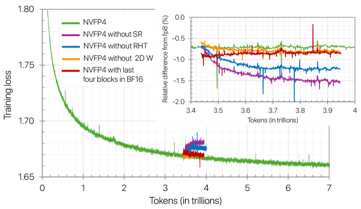

<figcaption>図4: 10T トークン訓練した 12B モデルについてのアブレーション。アブレーション研究は、最初の 2 ブロックと最後の 8 ブロックを除いて NVFP4 で 3.43T トークンまで訓練したモデルから始め、方法論の構成要素を一度に 1 つずつ体系的に取り除く——確率的丸め（SR）、Random Hadamard 変換（RHT）、2 次元スケーリング（2D）、BF16 のブロック数の削減である。相対差は (FP8 − 実験) / FP8 と定義され、負の差は実験のほうが悪いことを意味する。</figcaption>
</figure>

## 4 Training Methodology（訓練の方法論）

NVFP4 のデータ型に加えて、我々の手法は効果的な 4 ビット訓練を可能にするいくつかの主要な技法を組み込む。それらは (1) **数値的に敏感な特定の層をより高い精度に保つこと**、(2) ブロック水準の外れ値を管理するための **Random Hadamard 変換**、(3) 順伝播と逆伝播の間の一貫性のために重みへ適用される **2 次元（2D）ブロックスケーリング**、(4) 偏りのない量子化された勾配を保証するための**確率的丸め**である。より短いトークン地平線で訓練される小さなモデルはこれらすべての技法を必要としないかもしれないが、我々は **10T トークンの地平線にわたる 12B モデルの訓練の収束と安定性を保証するには各構成要素が本質的である**ことを見出した。Figure 4 はアブレーション研究を通じてこれを図示する——下記の完全な訓練方法論から始めて構成要素を一度に 1 つずつ取り除くと、そのいずれを排除しても収束が悪化することが観察される。

要するに、NVFP4 訓練についての我々の推奨は次のとおりである:

1. **敏感な線形層のいくつかをより高い精度に保つ**（ネットワークの 15%、高精度層の大部分はネットワークの終端に置く）。
2. 重み勾配の GEMM の入力へ **16×16 の Random Hadamard 変換**を適用する。
3. 重みには **16×16 ブロックの 2 次元（2D）スケーリング**を、活性と勾配には **1×16 ブロックの 1 次元スケーリング**を用いる。
4. **勾配には確率的丸め**を、**重みと活性には最近接偶数丸め**を用いる。

本節の残りでは、訓練方法論の各構成要素を詳細に論じ、Figure 4 に示したアブレーション研究を述べる。我々の選択を裏づける追加のアブレーションを付録 E に報告する。

### 4.1 Mixed precision（混合精度）

FP4 訓練のために混合精度の戦略を採用する。計算の大部分、具体的には線形（全結合）層内の GEMM の演算は FP4 で行われる。Figure 5 に図示するとおり、各線形層は 3 つの下地となる GEMM を持つ——順伝播の GEMM（Fprop）と、逆伝播で活性の勾配（Dgrad）と重みの勾配（Wgrad）を計算する別々の GEMM である。GEMM の演算は FP4 のテンソルを入力として消費し、BF16 または FP32 で出力を生成する。

<figure>

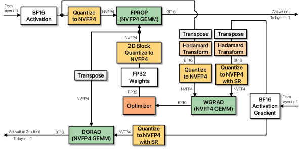

<figcaption>図5: NVFP4 で量子化された線形層についての計算フローの図示。すべての GEMM の演算はその入力を NVFP4 へ量子化する。</figcaption>
</figure>

**線形層**: 線形層は典型的により狭い精度で計算されるが、我々は**一部の線形層が他より FP4 に敏感である**ことを観察している。とりわけ、**すべての線形層を FP4 へ量子化すると訓練が発散する**。アブレーション研究（付録 E.2 を参照）から、我々のモデルの**最後のいくつかの線形層が訓練を発散させる**ことが観察される。それらは FP4 が提供するより多くの動的範囲と仮数を必要とするからである。これらの発見に基づき、より良い訓練の収束のために、**最後の層のごく一部（例: 15% 未満）を BF16 または MXFP8 に残す**ことを推奨する。

12B のモデルについては保守的な構成を選び、最初の 2 ブロックに加えて最後の 8 ブロック（FFN または Mamba-2。それぞれ 2 つの線形層を持つ）を BF16 に保った。これはネットワーク内の線形層の **16%** を高精度に保つことに相当する。しかし Figure 4 は、**最後の 4 ブロックだけをより高い精度に残しても収束は安定を保つ**ことを示しており、モデルのより大きな部分を安全に FP4 で訓練できたかもしれないことを示唆している。

**Attention・埋め込み・非線形層・その他のテンソル**: 訓練中の数値的な安定性を保証するため、埋め込み・出力の射影ヘッド・正規化層・非線形性、および softmax と query-key および attention score-value のバッチ GEMM を含む attention の構成要素については元の精度（例: BF16 や FP32）を保つ。main weight（オプティマイザが格納する）・重みの勾配（マイクロバッチをまたぎ、またデータ並列のレプリカをまたいだ勾配の蓄積に用いる）・オプティマイザ状態も FP32 に保つ。テンソル並列の縮約は BF16 の精度で行われる。

### 4.2 Random Hadamard Transforms（Random Hadamard 変換）

マイクロスケーリングはテンソル値を表現するのに必要な動的範囲を減らすが、それでも外れ値は FP4 の形式に不釣り合いな影響を与えうる [^3] [^21] [^22] [^11] [^29] ため、モデルの精度を劣化させる。**Random Hadamard 変換** [^24] [^5] [^4] [^25] [^26] [^14] は、外れ値をおおよそガウス分布へ再配分することでこれに対処し、より狭い形式で表現しやすくする。以下では FP4 訓練における Random Hadamard 変換の適用を論じる。

**変換される GEMM**: Random Hadamard 変換は典型的に GEMM の両方の入力へ適用され、直交性ゆえに内積が各変換をもう一方のオペランドによって打ち消すようにする。その仕組みの詳細は付録 C で論じる。経験的に、**Wgrad の入力を変換すると 12B モデルの訓練が改善する**ことが観察される（例: Figure 4 は Wgrad から変換を取り除くと損失が悪化することを示す）。一方、Hadamard 変換は小規模では Fprop と Dgrad について測定可能な恩恵を示さない（付録 E.4.1 を参照）。おそらく FP4 が既に十分な範囲を提供しているからである。その結果、Hadamard 変換を Wgrad の入力に限定する。ただし Fprop と Dgrad も恩恵を受ける場合がありうる。

**Hadamard 行列のサイズ**: Random Hadamard 変換は、$d\times d$ の Hadamard 行列と同じサイズのテンソルの各タイルとの間の行列積として実装される。行列サイズ $d$ は精度と性能の間のトレードオフを導入する。**より大きな行列は外れ値をより多くの値に広げることでより効果的に分散させるが、計算とメモリのコストを増やす**。エントリが少なすぎる行列はガウス分布を再現しにくく、FP4 の精度を損なう。小規模では行列サイズによる収束の測定可能な差は観察されない。12B モデルのような大規模では、中程度のサイズを超える Hadamard 行列からは逓減する利得が観察される（付録 E.4.2 を参照）が、行列のエントリが少なすぎると収束に影響する。これは部分的には、より大きなモデルがより多くの外れ値を持つためだと我々は考えている。したがって我々は行列サイズ $d=16$ を選ぶ。これは $d=4$ より良い収束を持ち、$d=128$ と同程度の結果になることを見出している。

**ランダムな符号ベクトル**: Random Hadamard 変換は、行または列の全体の符号を反転させるランダムな対角符号ベクトルとの掛け算によってランダム性を導入する。これは「構造化された」外れ値（例: Hadamard 基底に整列したテンソルのパターン）が変換を生き延びる可能性を減らす。小規模ではランダム化は精度に影響を与えず、標準的な Hadamard 変換で訓練は安定を保つ。しかし、付録 E.4.3 に詳述するとおり、**ランダム化はより長いトークン地平線で訓練されるより大きなモデルに恩恵をもたらす**ことを見出している。我々の設定では、訓練を通じてすべての線形層で共有される単一のランダム符号ベクトルを用いる。我々の研究は、ランダム符号ベクトルの数を増やすことによる測定可能な影響がないことを示している。

### 4.3 2D scaling（2 次元スケーリング）

訓練中、変換とスケーリングの演算は内積の次元に沿って適用されるため、テンソルは順伝播（行に沿って）と逆伝播（列に沿って）で異なる形で変換されスケールされる。これは逆伝播がテンソルを転置し、それが内積の次元を変えるために起こる。その結果、**同じテンソルが 2 つの異なる量子化表現を持ちうる**。これは事実上**連鎖律を破る**ことになる——逆伝播が順伝播で用いられたのと同じ関数を微分しなくなるからである。より正確には、$w_{\mathrm{fprop}}\neq w_{\mathrm{bprop}}$ のとき、逆方向の更新 $\partial x=w_{\mathrm{bprop}}^{T}\partial y$ は順伝播で用いられた $y_{\mathrm{fprop}}=w_{\mathrm{fprop}}x$ とは異なる関数 $y_{\mathrm{bprop}}=w_{\mathrm{bprop}}x$ についての勾配を計算する。**重みにおける連鎖律の違反がモデルの精度低下に寄与している**と我々は仮説を立てる。

**ブロックスケーリング**: この問題を緩和するため、順伝播と逆伝播の双方で一貫した量子化を保証する **2 次元（2D）ブロックスケーリング**の手法を提案する。重みについては、[^10] と同様に要素が $16\times 16$ のブロック（すなわち入力チャネル 16 × 出力チャネル 16）でグループ化されスケールされる。2D のブロックスケールは Tensor Core へ渡されるときに $1\times 16$ の各ブロックについて複製され、引き続きテンソルごとの FP32 スケールを活用する。**活性と勾配は標準的な NVFP4 のスケーリング（すなわち $1\times 16$ ブロック）を用いる**。より細粒度のスケーリングが量子化の精度を改善するからである。活性の量子化も連鎖律の懸念を提示するが、**訓練は重みのテンソルにおける不整合より活性のテンソルにおける不整合に対して感度が低い**ことが観察される（付録 E.5 でさらに論じる）。重みは FP4 の値に適応できるので、スケールの粒度に対してもより寛容である。Figure 4 に図示するとおり、一貫した量子化された重みを保つことは 12B モデルの訓練損失の改善につながる。

**Random Hadamard 変換**: スケーリングと同様に、内積の次元に沿って適用される Random Hadamard 変換は量子化後の不整合を導入する（すなわち異なる変換は異なる量子化値をもたらす）ため、**重みのテンソルには適用しない**。その結果、重みに関わる GEMM において変換された活性と勾配は、重みテンソルを変換することでは打ち消せなくなり、Fprop と Dgrad が変換の恩恵を受けることを妨げる。したがって Hadamard 変換を Wgrad のテンソルに限定する。これが我々のモデルの訓練には十分であることを見出している（付録 E.4.1）。

### 4.4 Stochastic rounding（確率的丸め）

FP4 への量子化の際、決定論的な丸め（例: 最近接偶数丸め）は**バイアス**を導入しうる。特定の方向への丸めを好む仮数の分布、ゼロへのアンダーフロー、あるいは表現可能な最大値への飽和ゆえに、系統的な誤差を生むからである。バイアスの影響は典型的に**勾配のテンソルでより顕著**であり [^6] [^27] [^9] [^8] [^1]、訓練の収束に影響しうる。このバイアスに対処するため、高精度の値を FP4 へ量子化する際に**確率的丸め**を採用する。確率的丸めは、距離に反比例する確率で、値を最も近い 2 つの表現可能な数のいずれかへ確率的に丸める。これは値が一貫して同じ方向へ量子化されることを防ぎ、それによってバイアスを減らす。

Figure 4 に図示するとおり、**確率的丸めを勾配のテンソルへ適用することは 12B モデルの収束にとって本質的である**ことが観察される。逆伝播における他のテンソルは確率的丸めから恩恵を受けず、**勾配がバイアスの主要な源泉である**ことを補強している（付録 E.3 を参照）。さらに、**確率的丸めを順伝播のテンソルへ適用することは有害である**。最近接丸めと比べて量子化誤差を増幅するからである [^6]。

## 5 NVFP4 and MXFP4（NVFP4 と MXFP4）

先に論じたとおり、NVIDIA Blackwell には 2 つの FP4 マイクロスケーリング形式——MXFP4 と NVFP4——がある。本節ではこれら 2 つの形式を用いたときの訓練の挙動を比較する。

**モデルと訓練の設定**: ハイブリッド Mamba-Transformer のアーキテクチャに基づく 80 億パラメータ（8B）のモデルを考える。このモデルは 12B モデルで用いたのと同じデータセットで 1 兆トークン訓練される。訓練は訓練の最初の 60% と最後の 40% の間で 2 つの局面のデータ配合からなる。モデルと訓練の詳細は付録 A.2 に述べる。

参照モデルは BF16 で事前学習される。FP4 の事前学習は、それぞれのデータ形式として MXFP4 と NVFP4 を用いて 4 節に述べた訓練方法論に従う。MXFP4 については、MXFP4 のブロックサイズに合わせるために Wgrad の入力に対して Random Hadamard 変換のサイズ $d=32$ を採用する。いずれの設定でも、最後の 8 ブロック（FFN または Mamba-2）を BF16 に保ち、これはモデルのおよそ 15% にあたる。

<figure>

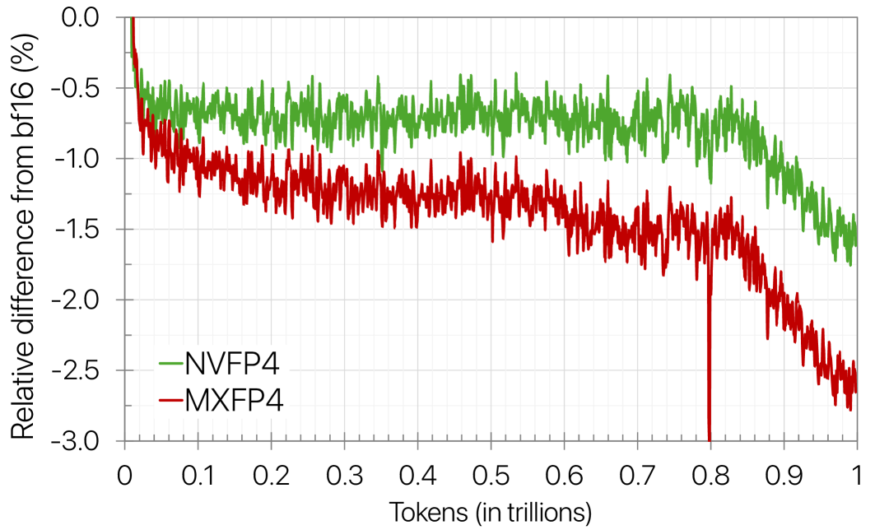

<figcaption>図6(a): BF16（ベースライン）と NVFP4 および MXFP4 の事前学習の訓練損失の相対差。</figcaption>
</figure>

<figure>

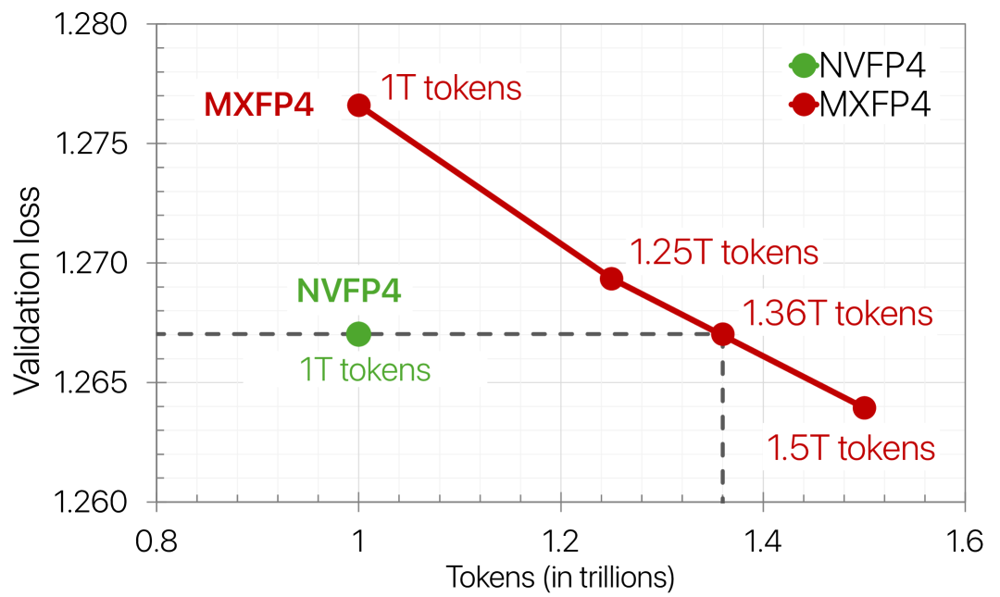

<figcaption>図6(b): 異なるトークン数での NVFP4 と MXFP4 の事前学習についての最終検証損失。図6 全体のキャプション: NVFP4 対 MXFP4 の比較——(a) 訓練損失の差、(b) トークン予算にわたる検証パープレキシティ。（訳注: この画像と図全体のキャプションはクリップで欠落していたため原ページから復元した。）</figcaption>
</figure>

**結果**: Figure 6(a) は **NVFP4 の事前学習が MXFP4 より良い損失へ収束する**ことを示す。具体的には、**MXFP4 は約 2.5% の相対誤差を持つのに対し、NVFP4 は 1.5% である**。NVFP4 との隔たりを埋めるため、MXFP4 の事前学習を追加のトークンで延長した（合計 1T から 1.5T トークンの間で変える）。Figure 6(b) は事前学習で用いたトークン数の関数としての最終損失を図示する。**MXFP4 は 36% 多いトークンで訓練したとき（すなわち 1T の代わりに 1.36T トークンを用いたとき）に NVFP4 の損失に一致する**ことが観察される。これは MXFP4 にとっての相当な訓練時間の増加に翻訳され、NVFP4 の恩恵を際立たせる。今後の研究では、異なるパラメータ数とトークン地平線についてこれらの形式のスケーリング則を評価すべきである。

## 6 Conclusions（結論）

我々は、2D の重みスケーリング・Random Hadamard 変換・確率的丸め、および本技術報告に述べた他の技法を通じて訓練の安定性と収束を改善するよう設計された的を絞った方法論と組み合わせたとき、**NVFP4 による大規模な事前学習が安定かつ正確である**ことを示した。この手法を用いて、12B のハイブリッド Mamba-Transformer モデルを 10 兆トークン訓練し、その損失と下流の精度が FP8 のベースラインに密接に追随することを示した。これは**数兆トークン規模での持続的な 4 ビット事前学習の初の公開された証拠**を確立する。

並列する実験において、NVFP4 は MXFP4 より少ないトークンで同等の損失に到達し、精度を犠牲にすることのない効率の利得を示している。これらの比較は、事前学習中の異なる FP4 形式のメモリと計算の効率の恩恵、および収束のトレードオフについての初期の視点を提供する。

今後の研究では、収束に影響を与えることなくすべての線形層を量子化するよう方法論を洗練し、残る高精度の層を減らし、NVFP4 を attention と通信の経路へ拡張しながら、他の形式に対する NVFP4 の事前学習の性能をさらに特徴づける。また事後訓練の場面での利用を探究し、より大きなモデル・より長いトークン地平線・mixture-of-experts といった追加のアーキテクチャで評価することも計画している。Blackwell における NVFP4 の訓練は、[Transformer Engine](https://github.com/NVIDIA/TransformerEngine/pull/2177) への最近の更新により現在完全に支援されている。

## Contributors（寄与者）

**Numerics, Evaluations**: Anjulie Agrusa, Mike Chrzanowski, Eric Chung, Steve Dai, Bita Darvish Rouhani, Carlo del Mundo, Brucek Khailany, Mikail Khona, Nick Knight, Ben Lanir, Simon Layton, Daniel Lo, Paulius Micikevicius, Asit Mishra, Deepak Narayanan, Chao Ni, Mostofa Patwary, Sweta Priyadarshi, Yigong Qin, Oleg Rybakov, Charbel Sakr, Sanjeev Satheesh, Mohammad Shoeybi, Michael Siu, Darko Stosic, Dusan Stosic, Bor-Yiing Su, Nima Tajbakhsh, Aditya Vavre, Rangharajan Venkatesan, Roger Waleffe, Qiyu Wan, Mengdi Wang, Lizzie Wei, Hao Wu, Keith Wyss, Jinze Xue

**SW Support, Performance**: Felix Abecassis, Anjulie Agrusa, Michael Andersch, Jinhang Choi, Victor Cui, Carlo del Mundo, Burc Eryilmaz, Abhinav Goel, Oleg Goncharov, Robert Hesse, Herbert Hum, Ronny Krashinsky, Tim Moon, Yigong Qin, Xiaowei Ren, Kirthi Shankar, Frank Sun, Przemek Tredak, Evgeny Tsykunov, Qiyu Wan, Lizzie Wei, Evan Wu, Keith Wyss, Jinze Xue, Charlene Yang, Yujia Zhai, Jingyang Zhu, Zhongbo Zhu

**Infrastructure**: Dong Ahn, Stefania Alborghetti, Sivakumar Arayandi, Alexis Bjorlin, Aaron Blakeman, Evan Briones, Carlo del Mundo, Deena Donia, Henry Estela, Yugi Guvvala, Russell J. Hewett, Alex Kondratenko, Deepak Narayanan, Abhijit Paithankar, Satish Pasumarthi, Ankit Patel, Ashwin Poojary, Gargi Prasad, Oleg Rybakov, Stas Sergienko, Pasha Shamis, Nishant Sharma, Misha Smelyanskiy, Shelby Thomas, Evgeny Tsykunov, Gandhi Vaithilingam, Roger Waleffe, Hexin Wang, Ning Xu, Ruoxi Zhang

**Leadership**: Jonah Alben, Ian Buck, Bryan Catanzaro, Eric Chung, Ujval Kapasi, Michael Lightstone, Mohammad Shoeybi

## Appendix A Models（付録 A: モデル）

本技術報告を通じて 3 つのモデルの変種を評価する——12B と 8B の規模の 2 つのハイブリッド Mamba-Transformer アーキテクチャと、1.2B 規模の Transformer の変種である。12B のモデルは NVFP4 の訓練手法を検証するための主要なアーキテクチャとして用いられ、一方 8B のハイブリッドモデルは NVFP4 を MXFP4 と比較するのに用いられる。1.2B のモデルはいくつかのアブレーション研究に用いられる。本節は各モデルについて用いたアーキテクチャの詳細・データセット・訓練のスケジュールを述べる。

### A.1 12B hybrid Mamba-Transformer（12B ハイブリッド Mamba-Transformer）

**モデルのアーキテクチャ**: Table 3 は 12B のハイブリッド Mamba-Transformer のアーキテクチャの構成をまとめる。このモデルは 62 ブロックを持ち、6 つの Self-Attention・28 の FFN・28 の Mamba-2 ブロック（各ブロックは 2 つの線形層を持つ）からなる。Mamba-2 のブロックは 8 グループ、状態次元 128、ヘッド次元 64、拡張係数 2、畳み込み窓サイズ 4 を持つ。FFN のブロックには二乗 ReLU の活性化、正規化層には RMSNorm [^30] が用いられ、埋め込みと出力層の重みは分離されている。このモデルは位置埋め込み・dropout・線形層のバイアスをいずれも持たない。各ブロックに残差スキップ接続が追加される。

**表3**: 12B Nemotron-H ハイブリッド Mamba–Transformer アーキテクチャの概要。

| Number of blocks | Model dimension | FFN dimension | Q heads | KV heads | State dimension | Mamba groups |
| --- | --- | --- | --- | --- | --- | --- |
| 62 | 5120 | 20480 | 40 | 8 | 128 | 8 |

**データセット**: 事前学習データには、[^18] に基づく 10 兆トークンからなる高品質にキュレートされた合成データセットのコーパスを用いる。データの混合は一般的なウェブクロールデータ・wikipedia・数学・コード・学術データ・crawl++・多言語・合成 SFT 型データからなる。事前学習は段階的なデータ配合の手法 [^12] を用いる。第 1 局面は訓練の 70% をカバーしデータの多様性を促す混合を用い、一方第 2 と第 3 の局面は主に高品質のデータセットからなり、訓練の最後の 20% と 10% にそれぞれまたがる。

**ハイパーパラメータ**: モデルは系列長 $8192$、バッチサイズ $736$ で 10 兆トークン訓練される。WSD のスケジュールは一定の学習率 $4.5\cdot 10^{-4}$ を持ち、訓練の最後の 20% で $4.5\cdot 10^{-6}$ へ減衰する。Adam のパラメータは $\beta_{1}=0.9$、$\beta_{2}=0.95$ で、weight decay は $0.1$ に設定される。

**精度**: 参照モデルは [^18] の方法論に従って FP8 で訓練される。具体的には、最初のブロックと最後の 2 ブロックの線形層を BF16 に残すことを除いて、すべての線形層が E4M3 で計算される。スケール係数は重みについて 128×128 のブロック、活性と勾配について 1×128 のブロックに適用される。それらは各ブロックについてオンラインで計算され FP32 で格納され、テンソルを FP8 形式へ量子化する前に適用される。他の演算の精度は 4.1 節と同じである。

NVFP4 については 4 節に述べた手法に従う。最初の 2 ブロックと最後の 8 ブロック（FFN または Mamba-2）の線形層を BF16 に残すことを除いて、すべての線形層が NVFP4 で計算される。これは全線形層の $16\%$ を高精度に保つことに相当する。

### A.2 8B hybrid Mamba-Transformer（8B ハイブリッド Mamba-Transformer）

**モデルのアーキテクチャ**: 8B のハイブリッド Mamba-Transformer は 12B のハイブリッドモデルと似たアーキテクチャを持つ。Table 4 は 8B のモデルの構成をまとめる。このモデルは 52 ブロックを持つ——4 つの Self-Attention・24 の FFN・24 の Mamba-2 ブロックである。モデルの隠れ次元は 4096、FFN の隠れ次元は 21504 で、Grouped-Query Attention は 32 の query ヘッドと 4 の key-value ヘッドを持つ。Mamba-2 のブロックは 8 グループ、状態次元 128、ヘッド次元 64、拡張係数 2、畳み込み窓サイズ 4 を持つ。

**表4**: 8B Nemotron-H ハイブリッド Mamba–Transformer アーキテクチャの概要。

| Number of blocks | Model dimension | FFN dimension | Q heads | KV heads | State dimension | Mamba groups |
| --- | --- | --- | --- | --- | --- | --- |
| 52 | 4096 | 21504 | 32 | 4 | 128 | 8 |

**ハイパーパラメータ**: モデルは 12B のモデルで用いたのと同じデータセットから 1 兆トークン訓練される。バッチサイズ $768$ が用いられ、データ配合の局面は訓練の最初の $60\%$ と最後の $40\%$ に分かれる 2 つだけである。系列長は $8192$ で、WSD のスケジュールは一定の学習率 $8.0\cdot 10^{-4}$ を用い、訓練の最後の 15% で $8.0\cdot 10^{-6}$ へ減衰する。Adam のパラメータは $\beta_{1}=0.9$、$\beta_{2}=0.95$ で、weight decay は $0.1$ に設定される。

**精度**: 参照モデルは BF16 で訓練される。NVFP4 については 4 節に述べた方法論に従う。最後の 8 ブロック（FFN または Mamba-2）の線形層を BF16 に残すことを除いて、すべての線形層が NVFP4 で計算される。

### A.3 1.2B Transformer（1.2B Transformer）

**モデルのアーキテクチャ**: 1.2B のモデルは標準的な Transformer のアーキテクチャに従う。モデルの構成についての詳細は Table 5 にまとめる。このモデルは $20$ の transformer ブロックを持ち、それぞれが Self-Attention と FFN のブロックからなる。モデルの隠れ次元は 2048、FFN の隠れ次元は 6144 で、Self-Attention は 16 の query ヘッドと 8 の key・value ヘッドを持つ。FFN のブロックは二乗 ReLU の活性化を用いる。このモデルは RoPE の埋め込みを用い、dropout や線形層のバイアスは持たない。各 transformer ブロックに残差スキップ接続が追加される。

**表5**: 1.2B Nemotron Transformer アーキテクチャの概要。

| Number of blocks | Model dimension | FFN dimension | Head dimension | Q heads | KV heads |
| --- | --- | --- | --- | --- | --- |
| 20 | 2048 | 6144 | 128 | 16 | 8 |

**ハイパーパラメータ**: モデルは 8B のモデルと同じデータセットから、2 つの局面のデータ配合を用いて 1 兆トークン訓練される。モデルは系列長 $8192$、バッチサイズ $768$ で訓練される。WSD のスケジュールは訓練の $85\%$ について学習率 $1.2\cdot 10^{-3}$ から始まり、訓練の最後の $15\%$ で $1.2\cdot 10^{-5}$ へ減衰する。

**精度**: 参照モデルは BF16 で訓練される。NVFP4 については 4 節の方法論についてアブレーションを行う。線形層のテンソルが NVFP4 へ変換される。他の演算の精度は 4.1 節と同じである。

## Appendix B NVFP4 Quantization Procedure（付録 B: NVFP4 の量子化手続き）

より高い精度（FP32 または BF16）から NVFP4 へテンソルを変換する手続きを以下に述べる。テンソル $x$ が与えられたとき、連続する高精度の値 $x_{i}$（$i\in b$）の各ブロック $b$ が FP4 へ量子化される。量子化に先立ち、値は 2 段階のスケーリング戦略を用いてスケールされる——まず大域的な FP32 のテンソル水準のスケール係数がテンソル内のすべての値をブロックの表現可能な範囲（FP4 $\times$ FP8）へ移し、次に局所的なブロック水準のスケール係数がブロック内の値 $x_{i}$ を FP4 の表現可能な範囲へ移す。

### B.1 Global tensor-level scaling（大域的なテンソル水準のスケーリング）

大域的な符号化スケールは次のように計算される:

$$
\begin{split}s_{enc}&=\frac{6\cdot 448}{amax_{x}}\\
\end{split}
$$

ここで $amax_{x}=\underset{i}{\max}(|x_{i}|)$ はテンソル $x$ 全体にわたる絶対最大値を表し、$6$ と $448$ はそれぞれ E2M1 と E4M3 の形式における表現可能な最大の大きさである。対応する復号スケール $s_{dec}=1/s_{enc}$ は、NVFP4 の GEMM 演算後に結果の値を復号するために FP32 で格納される。大域的なスケールはテンソル全体にわたって動的に計算されるので、デバイスメモリへの追加のパスを引き起こす——大域的な amax を計算するのに一度、後述する FP4 への変換の前にスケールするのに一度である。しかし大域的なスケールは、デバイスメモリへの追加の往復を避けるために、潜在的により小さな粒度（例: 行や要素のブロック）にまたがることもありうる。

### B.2 Local block-level scaling（局所的なブロック水準のスケーリング）

局所的な復号スケールは、各ブロック内の最大絶対値 $amax_{b}=\underset{i\in b}{\max}(|x_{i}|)$ が FP4 の表現可能な最大値へ正規化されるように選ばれる:

$$
\begin{split}S_{dec,b}=\frac{amax_{b}}{6}\end{split}
$$

局所的な復号スケールは Tensor Core のために FP8 で格納されなければならないので、量子化の前にまず大域的な符号化スケールと掛け合わされる:

$$
\begin{split}s_{dec,b,e4m3}=\mathrm{e4m3}(s_{dec,b}\cdot s_{enc}),\end{split}
$$

ここで $s_{enc}$ の目的は、最大の局所復号スケール（すなわち ${max}(s_{dec,b})=amax_{x}/6$）を FP8 の表現可能な最大値へ再写像することである。量子化された局所復号スケールをより高い精度で反転させ、元の表現可能な範囲へスケールし戻すことで、実際の局所符号化スケール係数 $s_{enc,b}=1/(\mathrm{fp32}(s_{dec,b,e4m3})\cdot s_{dec})$ を得る。このようにして、$s_{enc,b}\cdot s_{dec}\cdot s_{dec,b,e4m3}\approx 1$ となるようにスケーリング後に元の値を復元できることを保証しようとする。そうできないことはモデルの精度に影響しうるからである。式 3 で復号スケール係数を計算するときには最近接偶数丸めを用いる。

### B.3 Conversion（変換）

これらすべてを組み合わせると、ブロック内の各要素 $x_{i}$ は局所符号化スケールでスケールされ、次のように量子化される:

$$
\begin{split}\hat{x}_{i}&=q(x_{i}\cdot s_{enc,b}),\\
\end{split}
$$

ここで $q(\cdot)$ は FP4 の量子化関数を表す。量子化された値 $\hat{x}_{i}$ を格納するのに加えて、局所と大域の復号スケール $s_{dec,b,e4m3}$ と $s_{dec}$ もメモリに格納され、行列積の際に用いられる。

Tensor Core は局所復号スケールを読み込み、$b$ 個の要素にわたって計算された部分内積へ適用する:

$$
\begin{split}s^{x}_{dec,b,e4m3}\cdot s^{y}_{dec,b,e4m3}\cdot\sum_{k\in b}(x_{k}\cdot y_{k}),\\
\end{split}
$$

ここで $x$ と $y$ は 2 つの入力オペランドを表す。GEMM の演算後、大域復号スケール $s^{x}_{dec}$ と $s^{y}_{dec}$ が同様の形で最終出力に適用される。

### B.4 Remarks on MXFP4 and NVFP4 scale factor（MXFP4 と NVFP4 のスケール係数についての注記）

MXFP4 のスケール係数は 2 の冪に制限されており、これは値を FP4 の表現可能な範囲へ完璧に収まるようスケールできないことを意味する。スケーリング後、ブロックの amax は FP4 の表現可能な最大値をオーバーフローして飽和するか、より小さな FP4 のサンプルへ切り下げられるかのいずれかになる。飽和は MXFP8 の訓練で収束の問題を引き起こすことが観察されている [^16] ので、我々は典型的に**飽和を防ぐために復号スケール係数を切り上げる**。

このスケーリングの戦略は、**利用される動的範囲を減らしつつ、一部の FP4 のサンプルが無駄になる**結果をもたらしうる。例として、絶対最大値 $amax=3+\delta$ を持つ値のブロックを考える（$\delta$ は小さな増分を表す）。ブロックの amax を FP4 の表現可能な最大の数（すなわち E2M1 では $\pm 6$）へ移すために、復号スケール係数は $s_{dec,b}=amax/6=0.5+\delta/6$ として計算され、これは次の 2 の冪、すなわち $s_{dec,b,ue8m0}=1$ へ切り上げられる。スケーリング後、ブロックの amax は $amax/s_{dec,b,ue8m0}=3+\delta$ となり、これは FP4 では $3$ へ量子化される。その結果、最悪の場合 **FP4 は $\pm 4$ と $\pm 6$ のサンプルを表現できない**。これはまた動的範囲をほぼ 1 binade 減らし、$\log_{2}(6/0.5)=3.58$ binade のうち $\log_{2}(3/0.5)=2.58$ binade しか利用されない（ここで $0.5$ は FP4 における最小の正の非ゼロの大きさを表す）。

**NVFP4 はより精密な E4M3 のブロックスケールでこの制限を克服し**、ブロックの amax を FP4 の表現可能な最大の数にはるかに近く写像する。これは FP4 のサンプルの利用を最大化し、FP4 の動的範囲をより多く保つ。

## Appendix C Hadamard Transform Mechanics（付録 C: Hadamard 変換の仕組み）

Random Hadamard 変換は量子化されるテンソルへ直交回転を適用する。すなわち $x^{\prime}=q(xH\cdot s)$ であり、ここで $H$ は Hadamard 行列、$q(\cdot)$ は量子化関数、$s$ は回転された空間 $xH$ で計算されたスケール係数である。Hadamard 行列は $H_{d}=(1/\sqrt{2})H_{2}\otimes H_{d/2}$ の形の正規化された行列によって定義され、要素は $\pm 1$ に制約される。その直交的な性質ゆえに、行列積の両方のオペランドへ適用できる:

$$
C=(AH)(H^{T}B)=AB,
$$

ここで各オペランドからの変換は $HH^{T}=I$ によって内積の内部で打ち消される。

Random Hadamard 変換は、$d$ 次元の対角ランダム行列 $S_{d}$ を Hadamard 行列と左から掛け合わせることで変換にランダム化を導入し、$H=S_{d}H_{d}$ となる。ここで $S_{d}$ の対角要素は $\{-1,1\}$ からランダムに選ばれる。$S_{d}$ のエントリは $H_{d}$ の異なる行の符号を反転させる。

我々は、$d\times d$ の行列エントリを持つ $H$ を $m\times k$ のテンソルと掛け合わせるタイル状の手法で Hadamard 変換を行い、テンソルの $d\times d$ の要素ごとに $H$ が掛けられる。この変換は $mkd$ 回の積和と Hadamard 行列の $d^{2}$ 回の読み込みを伴い、$d$ がテンソルの次元 $m$ や $k$ よりはるかに小さいときには小さなコストである。この場合、Hadamard 変換はバッチ行列積として実装でき、Tensor Core を使うときには入力テンソルの読み込みからのメモリトラフィックによって制限され、デバイスメモリへの往復を減らすために他の層と融合できる。

<figure>

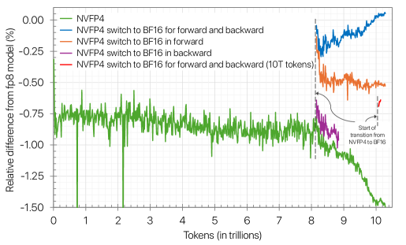

<figcaption>図7: 訓練の終盤でより高い精度へ切り替えること。プロットは 10T トークン訓練した 12B モデルについての検証損失の相対差を示す。NVFP4 は訓練期間のすべてで 4 節に指定した手法を用いる（緑）。順伝播と逆伝播のテンソルの精度（青）、順伝播のみのテンソル（オレンジ）、逆伝播のみのテンソル（紫）が、8.2T トークンで NVFP4 から BF16 へ切り替えられ訓練の残りまで続く。10T トークル付近で高精度への切り替えが起こる実行（赤）も示す。逆伝播の精度を切り替えるときには 1D の重みスケーリングを用いる。そうするほうがこうした設定では 2D の重みスケーリングよりわずかに良いからである。</figcaption>
</figure>

## Appendix D Switching to Higher Precision（付録 D: より高い精度への切り替え）

FP4 の訓練がより高精度の訓練の損失に完全には一致しない場面について、**訓練の終盤で FP4 からより高い精度へ切り替えることで損失の隔たりを埋められる**ことが観察される。Figure 7 は、8.2T トークン後（例: 訓練の $18\%$）に精度が切り替えられたとき損失が FP8 のベースラインに一致し、10T トークン後（例: 訓練の 1% 未満）に切り替えられたときにはわずかに劣るだけであることを示す。訓練のより後で精度を切り替えると完全には回復できない（おそらく重みの更新に対して学習率が低すぎるため）が、それでも FP4 で行われない訓練の割合を大きく減らす。したがって我々は、**完全な損失の回復のためには学習率の減衰の開始の少し前に高精度へ切り替えること**、あるいは**訓練の実行時間への影響を最小限にしつつ顕著な損失の改善を得るためにはごく最後に切り替えること**を推奨する。

**FP4 の訓練の損失の隔たりのほとんどは、順伝播でのテンソルの量子化から生じる**ことを見出している [^6]。より具体的には、12B のモデルの損失のほとんどは、8.2T トークンから順伝播をより高い精度へ切り替えることで回復される（相対誤差 $1.5\%$ から $0.5\%$ へ）。逆伝播の精度切り替えによる損失の回復を報告する [^9] とは対照的に、我々のモデルではそうした改善は観察されない。順伝播に焦点を当てることは精度切り替えのオーバーヘッドを最小化する。全計算のおよそ $6\%$（最後の $18\%$ の訓練のおよそ 3 分の 1）だけがより高い精度で行われるからである。

## Appendix E Ablation of Training Methodology（付録 E: 訓練方法論のアブレーション）

<figure>

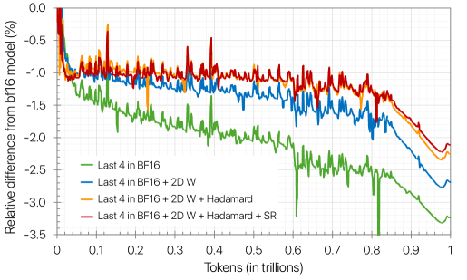

<figcaption>図8: NVFP4 の訓練技法の組み合わせ——最後の 4 ブロックの線形層を BF16 に、2D の重みスケーリング、Wgrad への Random Hadamard 変換、勾配への確率的丸め。プロットは 1T トークン訓練した 1.2B モデルについての検証損失の相対差を示す。</figcaption>
</figure>

### E.1 Combining techniques（技法の組み合わせ）

FP4 の訓練は一連の技法を必要とするので、それらを組み合わせる効果を探究する。すべての層を NVFP4 へ量子化し、標準的な NVFP4 のスケーリング（すなわち FP32 のテンソルごとスケールを伴う $1\times 16$ の E4M3 のブロックごとスケール）をすべてのテンソルへ適用し、すべてのテンソルに最近接偶数丸めを用いる基本手法から始める。この基本手法は、特に断らない限り、付録を通じて他の技法と組み合わせて用いられる。**追加の技法を一切用いずにこの基本手法を使うと、我々のモデルは訓練の早期に発散する。** 次節で詳述するとおり、一部の線形層をより高い精度に保つことが訓練の安定性に鍵となる役割を果たすことを見出している。確率的丸めのような技法は訓練の安定性を改善しうるが、単独で用いられると最終的には発散する。Figure 8 は技法を組み合わせることが損失の改善につながることを示す。**各技法の相対的な恩恵は構成要素を加える順序に依存する。** すべての構成要素を組み合わせると、単一の技法と比べて損失の隔たりが縮まる。

### E.2 Layer sensitivity（層の感度）

いずれの技法も用いない基本手法では訓練が発散するが、**一部の層は他より FP4 に敏感であるように見える**。Figure 9 は、最後の 4 ブロックの線形層を BF16 に残すと損失が収束することを示しており、**最終の層のほうが FP4 の量子化により敏感である**ことを含意する。**最初のいくつかのブロックをより高い精度に保つことは、最後のブロックと組み合わせない限り安定性を改善しない**（例: 最初の 2 ブロックと最後の 2 ブロックが BF16 のときは訓練は安定だが、最初の 4 ブロックが高精度のときはそうならない）。

<figure>

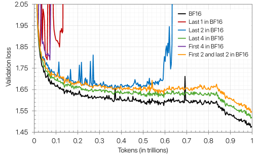

<figcaption>図9: 線形層の量子化に対する感度。モデル内の最初と最後のいくつかのブロックを除くすべての線形層に NVFP4 を適用。プロットは 1T トークン訓練した 1.2B モデルについての検証損失を示す。</figcaption>
</figure>

テンソルの分析に基づき、**最後の層は重みの勾配の量子化誤差が大きくなる傾向がある**ことが観察される（すなわち入力が FP4 であることによる Wgrad の出力）。量子化誤差の指標は、訓練中にどの線形層をより高い精度に残すべきかを決める機構として機能しうる可能性がある。

### E.3 Stochastic rounding on tensors（テンソルへの確率的丸め）

確率的丸めは FP4 の訓練にとって重要なので、訓練中のさまざまなテンソルに対するその効果を調べる。Figure 10 に示すとおり、**確率的丸めを勾配へ適用すると 1.2B モデルの訓練損失が安定に収束する一方、それを活性や重みに用いると発散する**。活性と重みのテンソルの確率的丸めによる発散の潜在的な原因は、この形の丸めが最近接丸めより多くの量子化誤差を導入することである [^9]。これは、確率的丸めが量子化から生じる勾配のバイアスを緩和するという先行の発見と整合する [^27] [^9] [^7] [^6]。加えて、逆伝播のすべてのテンソルへの確率的丸めは、勾配のみへの確率的丸めに対してほとんど改善を示さない。これは**発散が順伝播のテンソルを確率的に丸めることから生じる**ことを示唆する。12B のモデルについては、適切な収束を達成するために**確率的丸めが Dgrad と Wgrad の両方へ入る勾配へ適用されなければならない**ことが観察される。

<figure>

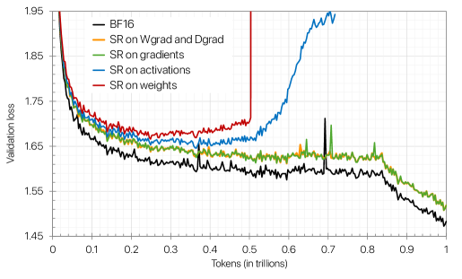

<figcaption>図10: 異なるテンソルへ適用された確率的丸め——勾配・活性・重み・逆伝播のテンソル。NVFP4 は最後の 4 ブロックを除くすべての線形層に適用される。プロットは 1T トークン訓練した 1.2B モデルについての検証損失を示す。</figcaption>
</figure>

### E.4 Random Hadamard transforms（Random Hadamard 変換）

<figure>

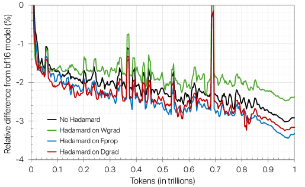

<figcaption>図11: 訓練中に異なる GEMM（Fprop・Dgrad・Wgrad）へ Random Hadamard 変換（RHT）を適用したときの影響を、RHT なしと比較したもの。RHT の実行では、各変換は訓練全体を通じて固定のランダムシードを用いる。NVFP4 の量子化は最後の 4 ブロックを除くすべての線形層に適用される。プロットは 1T トークン訓練した 12 億パラメータのモデルについての、BF16 のベースラインと比べた検証損失の相対変化を示す。</figcaption>
</figure>

#### E.4.1 GEMMs to apply RHT（RHT を適用する GEMM）

FP4 の訓練中に異なる GEMM（Fprop・Dgrad・Wgrad）へ Random Hadamard 変換（RHT）を適用したときの影響を評価する。Figure 11 に示すとおり、**RHT を Wgrad の入力へ適用すると 1.2B モデルの検証損失が改善する一方、Fprop や Dgrad の入力を変換するとモデルの品質が劣化する**。我々は、RHT が外れ値の除去の恩恵を相殺する追加の量子化誤差を導入すると仮説を立てる。したがって RHT は外れ値の表現に必要な動的範囲を減らすものの、特定の GEMM に用いられるとその適用が訓練に否定的な影響を与えうる。

<figure>

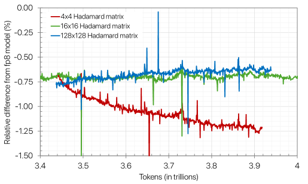

<figcaption>図12: Hadamard 行列サイズを変えたときの効果。Wgrad のテンソルは最初の 3.4T トークンで 16×16 の変換を用い、その後残りの訓練で 4×4 または 128×128 へ切り替える。プロットは 4T トークン訓練した 12B モデルについての訓練損失の相対差を示す。NVFP4 は 4 節に指定した方法論を用いて線形層へ適用される。</figcaption>
</figure>

#### E.4.2 Hadamard matrix size（Hadamard 行列のサイズ）

Hadamard 行列のサイズは外れ値の緩和の程度に影響するので、Wgrad の入力を変換するための異なる行列サイズの選択を考える。1.2B のモデルについては、$2\times 2$・$4\times 4$・$16\times 16$・$128\times 128$ の行列の間で損失に事実上の差は観察されない。この傾向を大規模で検証するため、3.4T トークンまで訓練した 12B のモデルを取り、行列サイズを $16\times 16$ から $4\times 4$ または $128\times 128$ へ切り替えて訓練を続ける。

Figure 12 は **$4\times 4$ の行列が損失の増加を引き起こし、$128\times 128$ の行列がモデルの品質にわずかな恩恵をもたらす**ことを示す。これは、より大きな Hadamard 行列が外れ値をより良く分散させられる一方、エントリが少なすぎる行列はガウス分布を再現しにくいという直感に従う。この結果は $16\times 16$ の行列という我々の選択を裏づけるもので、モデルの精度を損なうことなく変換のコストを減らす。また**小規模での結論が必ずしも大きなモデルに当てはまるとは限らない**ため、より長いトークン地平線で訓練されたより大きなモデルで実験する必要性も強調している。

#### E.4.3 Role of randomization（ランダム化の役割）

<figure>

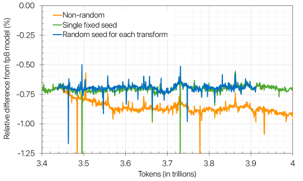

<figcaption>図13: Hadamard 変換のランダム化の効果。最初の 3.4T トークンではすべての変換に単一の固定シードを用い、残りの訓練では次のランダム化の選択肢のいずれかへ切り替える——すべての層に単一の固定シード、変換ごとに固有のシード、ランダム符号ベクトルを使わない。プロットは 4T トークン訓練した 12B モデルについての FP8 のベースラインからの訓練損失の相対差を示す。NVFP4 の訓練は 4 節に指定した訓練方法論を用いる。</figcaption>
</figure>

Random Hadamard 変換は変換にランダム性を導入するので、訓練中のこのランダム化の重要性を研究する。Figure 13 は、異なる程度のランダム化を用いて訓練したときの損失を図示する: (1)「seed per instance」——変換ごとに新しいランダム符号ベクトル、(2)「single fixed seed」——訓練中のすべての変換に用いる単一のランダム符号ベクトル、(3) ランダム符号ベクトルなし。**ランダム符号ベクトルがない場合にはより低いモデル品質が観察され**、変換ごとにランダム性を導入することによる改善はない。その結果、我々の 12B モデルにはすべての変換に単一の固定シードを用いるので十分であることを見出した。興味深いことに、**1.2B のモデルではランダム化の戦略間でモデル品質に目立った差がなく**、これは**技法がより大きなモデルとより長いトークン地平線でより決定的になる**ことをさらに裏づけている。

<figure>

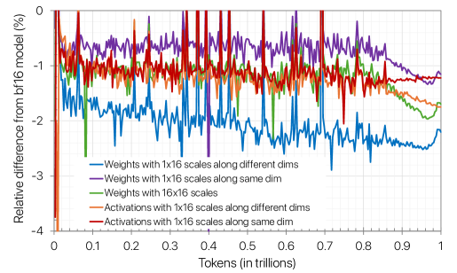

<figcaption>図14: テンソルにおける一貫性の効果。1T トークン訓練した 1.2B モデルについての BF16 のベースラインからの検証損失の相対差。NVFP4 は重みか活性のいずれかに適用される。異なるスケール係数の選択が適用される——同じ次元に沿った 1×16 のブロックスケール、異なる次元に沿ったブロックスケール、16×16 のブロックスケール、いずれも大域的な FP32 のテンソルごとスケールを伴う。</figcaption>
</figure>

### E.5 Consistent representations between tensors（テンソル間の一貫した表現）

重みや活性のテンソルへスケーリングと Hadamard 変換を適用すると、典型的に順伝播と逆伝播で異なる量子化表現をもたらす。そこでモデルの訓練中のテンソルの表現の不整合の影響を研究する。とくにスケール係数について異なる選択を考える: (1) 順伝播と逆伝播で同じ次元（すなわち入力チャネル）に沿った $1\times 16$ のブロックスケール、(2) 異なる次元（すなわち内積の次元。順伝播の入力チャネルから逆伝播の出力チャネルへ変わる）に沿った $1\times 16$ のブロックスケール、(3) $16\times 16$ のブロックスケール係数。(1) と (3) は訓練の両段階で同じ量子化表現を保つ一方、(2) は順伝播と逆伝播の間で異なる量子化を持つ。**実際に実装できるのは (2) と (3) だけである**。Tensor Core が内積の次元に沿ったスケーリング係数を要求し、それが逆伝播で転置されるからである。

Figure 14 では、**異なる量子化された重みのテンソルを持つことが 1.2B モデルの訓練を通じて損失に否定的な影響を与える**ことが観察され、(1) は (2) より良い精度を達成する。(3) の 2D ブロックによるスケーリングも、より大きなブロック粒度を持つにもかかわらず (2) より損失を改善する。一方、**活性は順伝播と逆伝播の間の一貫性に対して感度が低く**、学習率の減衰の際の後期の段階でのみ影響を受ける。我々は、**重みが活性より影響を受けるのは、不整合な重みから生じる誤差が活性の勾配に現れ、それが逆伝播でモデルの層を流れていくため**だと仮説を立てる。また、Hadamard 変換を適用することが不整合を悪化させ、モデルの精度にさらに影響を与えると疑っている。
