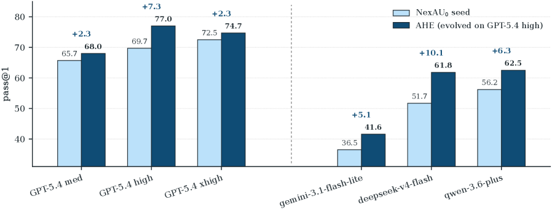
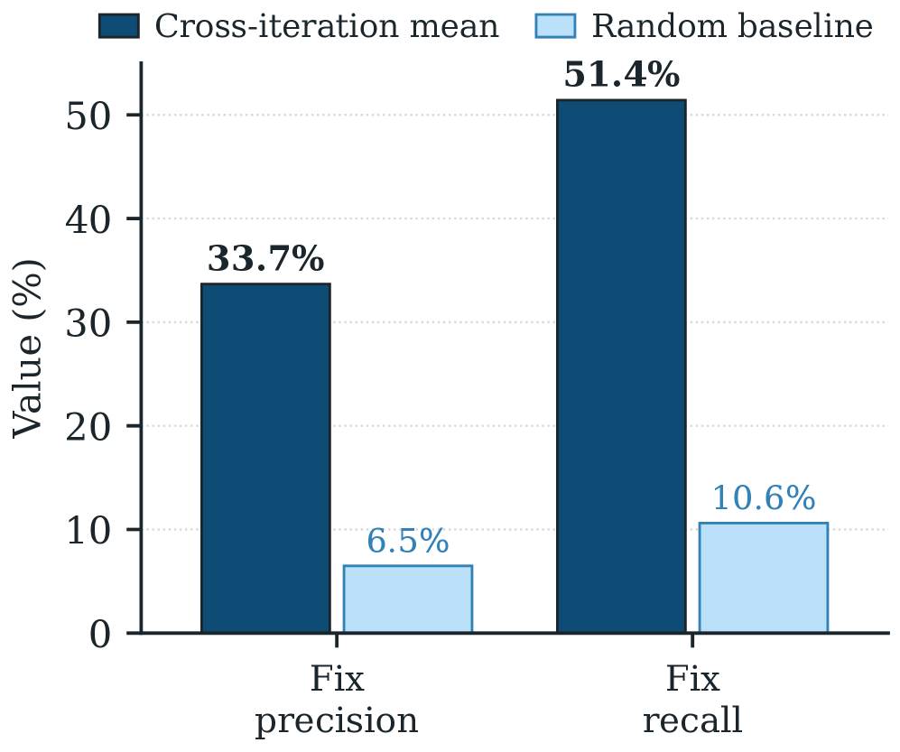
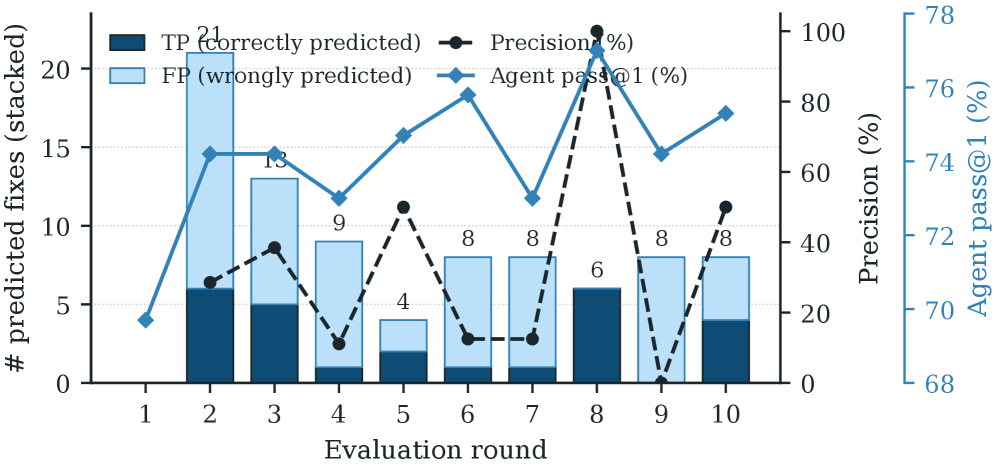
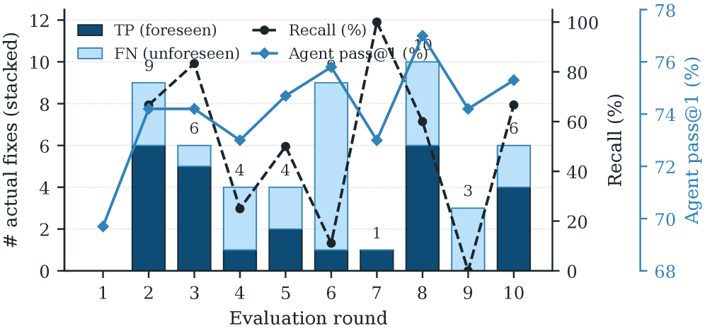
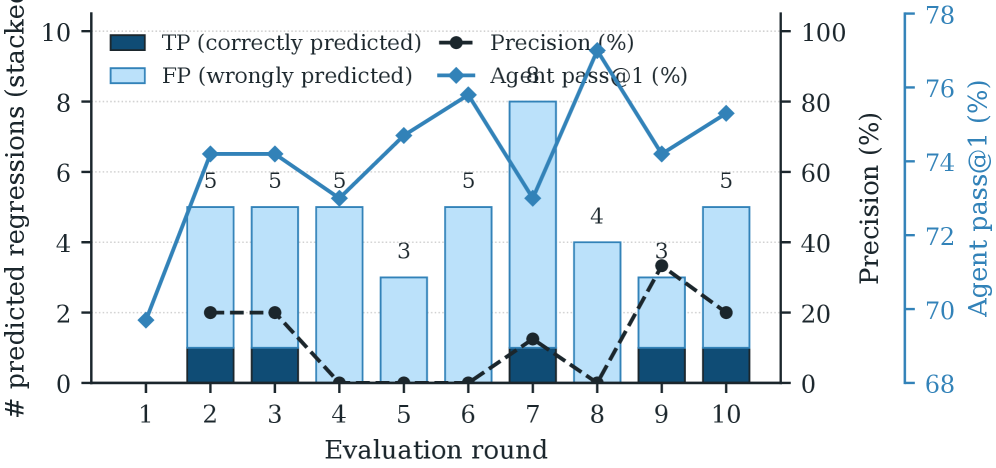
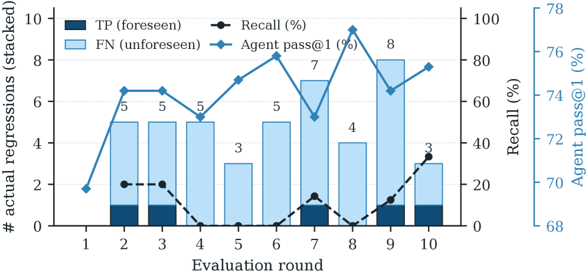

# エージェント的ハーネス工学: コーディングエージェントのハーネスの、可観測性に駆動された自動進化

> 原題: Agentic Harness Engineering: Observability-Driven Automatic Evolution of Coding-Agent Harnesses
> 著者: Jiahang Lin（復旦大学）, Shichun Liu（復旦大学）, Chengjun Pan（北京大学）, Lizhi Lin（上海奇迹智锋）, Shihan Dou（復旦大学）, Xuanjing Huang（復旦大学）, Hang Yan（上海奇迹智锋）, Zhenhua Han（上海奇迹智锋）, Tao Gui（復旦大学）
> 出典: arXiv:2604.25850（2026 / ar5iv 版）
> コード: [https://github.com/china-qijizhifeng/agentic-harness-engineering](https://github.com/china-qijizhifeng/agentic-harness-engineering)

> **訳注（クリップの状態と復元）**
> - 底本は ar5iv 版の Web Clipper クリップ。**見出し 66・図表キャプション 17 件（Figure 1〜12・Algorithm 1・Table 1〜4）・SVG のテキスト箱 21 個・表 4 つはすべて残存**していた。欠落は次の 3 種類で、いずれも原ページから復元した。
>   1. **画像 9 枚中 3 枚（`x5`・`x7`・`x9`）が欠落**していた。いずれも **2 パネル図の右パネル**（Figure 4 の regression パネル、Figure 11 の recall パネル、Figure 12 の recall パネル）で、**本 wiki が何度も見てきた「多パネル図の 2 枚目が落ちる」パターン**である。とくに `x5` には本論文の中核の数字（regression precision 11.8%・recall 11.1% とランダム基準 5.6%・5.4%）が入っている。
>   2. **脚注 2 件**が欠落していた——タイトルページの脚注（equal contributions / corresponding authors / インターン先 / コード URL）と、terminal-bench-2 リーダーボードの URL。該当箇所に訳注として挿入した。
>   3. **付録 B のプロンプトの空白が系統的に壊れていた。** これは本 wiki で初めて見る形の不良である。ar5iv は `lstlisting` の描画で**明示的な空白を `class="ltx_lst_space"` の span として符号化している**が、**Web Clipper が `class` 属性を落としたため、その空白 span が消え、代わりに隣接する span の間に一律で空白が挿入された**。結果として、クリップ側では `non-interactive` が `non - interactive` に、`` `run_shell_command` `` が `` ` run_shell_command ` `` に、`setting. Your` が `setting.Your` に化けていた。**プロンプトは一字一句が挙動に効くので、付録 B の 4 本はすべて原ページから空白を復元し直して収録している。**
> - **付録 B のプロンプト 4 本（seed system prompt・evolve prompt・explore agent 2 本）は英語原文のまま全文収録**する。**付録 C の SVG テキスト箱（軌跡の 3 列比較と change manifest）もテキストに起こして全文収録**する。
> - 引用が `[authorKeyword2026]` 形式の**裸の bibkey** なのは ar5iv 側に文献一覧が生成されていないためであり、クリップ不良ではない。既存の翻訳の慣例に従い bibkey をそのまま維持する。
> - 参考文献一覧と謝辞は既定どおり訳出しない。**付録 A〜D はすべて訳出**した。
> - ソースコード中の識別子（ファイル名・関数名・フラグ名・コミットハッシュ）は原文のまま残す。
> - 図は `raw/assets/2026-agentic-harness-engineering/` にローカル保存し、そのパスを参照している。

---

###### Abstract（要旨）

**ハーネス（harness）は今やコーディングエージェントの性能の中心にあり、モデルがツールや実行環境とどう相互作用するかを媒介している。** しかし**ハーネス工学は依然として手作業の職人技**にとどまっている。自動化しようとすると、**編集可能なコンポーネントにまたがる異質な行動空間、実行可能な信号を埋もれさせる膨大な軌跡（trajectory）、そして効果の帰属が難しい編集**という困難に直面するからである。我々は **Agentic Harness Engineering（AHE）** を導入する。これは**互いに噛み合った 3 本の可観測性（observability）の柱**を通じてこれらの課題に対処する閉ループである。**❶ コンポーネント可観測性（component observability）** はすべての編集可能なハーネス・コンポーネントにファイル水準の表現を与え、**行動空間を明示的かつ巻き戻し可能**にする。**❷ 経験可観測性（experience observability）** は数百万トークンの生の軌跡を、進化するエージェントが実際に消費できる**層状のドリルダウン可能な証拠コーパス**へ蒸留する。**❸ 決定可観測性（decision observability）** は**すべての編集に自己申告の予測を対にし、次ラウンドのタスク水準の結果に照らして後から検証する**。これらの柱が合わさることで、**あらゆる編集が反証可能な契約になり**、ハーネスの進化が試行錯誤へ崩れることなく自律的に進む。経験的には、**10 回の AHE 反復が Terminal-Bench 2 の pass@1 を 69.7% から 77.0% へ引き上げ**、人手設計のハーネス Codex-CLI（71.9%）と自己進化のベースライン ACE・TF-GRPO を上回った。**凍結したハーネスは再進化なしで転移する**——SWE-bench-verified では**種より 12% 少ないトークンで集計成功率を首位**にし、Terminal-Bench 2 では 3 つの別のモデルファミリーで **+5.1 から +10.1 pp** のファミリー横断の利得を生む。これは、進化したコンポーネントが**ベンチマーク固有のチューニングではなく一般的な工学的経験を符号化している**ことを示唆する。アブレーションは利得を**システムプロンプトではなくツール・ミドルウェア・長期記憶に局在させ**、**事実としてのハーネス構造は転移するが散文レベルの戦略は転移しない**ことを示唆する。これらの結果は、**可観測性に駆動された進化を、コーディングエージェントのハーネスを基盤モデルと並んで継続的に改善し続けるための実践的な道筋**として位置づける。

> 訳注（タイトルページの脚注、原ページより復元）: ∗ 同等の貢献。† 連絡先著者。‡ 上海奇迹智锋有限公司でのインターン中に行われた仕事。コード: [https://github.com/china-qijizhifeng/agentic-harness-engineering](https://github.com/china-qijizhifeng/agentic-harness-engineering)

<figure>


<figcaption>図1: AHE は bash のみの種を、Terminal-Bench 2 上のあらゆる人手設計・自己進化のベースラインを超えるまで進化させる。3 つの役割エージェントはすべて 1 つの基盤モデルを共有しており、利得が解析器や編集器の能力ではなくハーネスの編集に由来することを分離している。（訳注: 図中の注記は、勝ち越した 4 つの反復で何が投入されたかを示す——(1) contract-first workflow ＋ 調整可能な shell timeout［prompt + tool］、(2) publish-state guard: 検証済みの状態を成功後に保護する［prompt + tool］、(3) cross-step risk monitor: コマンド列を観測する［middleware］、(4) post-success hard-block ＋ pre-turn risk salience［tool + middleware］。破線が反復ごとの pass@1、実線が best-so-far。水平線は TFGRPO 72.3・Codex 71.9・ACE 68.9。）</figcaption>
</figure>

## 1 Introduction（はじめに）

コーディングエージェントは長期ホライズンのソフトウェア工学タスクへますます配備されており、実世界のコードリポジトリ上でのイシュー解決 [jimenezSWEbenchCanLanguage2023, yangSWEbenchMultimodalAI2024, dengSWEBenchProCan2025] や多段のターミナル・ワークフロー [merrillTerminalBenchBenchmarkingAgents2026a] で測定可能な進歩を示している。実務では、**そうした進歩は背後の言語モデルだけでなく、それを取り巻く工学的なコンポーネント——作業のスタイルを形づくるシステムプロンプト、ファイルシステムとシェルを露出するツール、コンテキストと実行と回復を制御するミドルウェア——にも等しく依拠している。この、モデルの外側にある編集可能なコンポーネントの集合を、まとめてエージェントの *ハーネス* と呼ぶ** [rajasekaranHarnessDesignLongrunning2026, lopopoloHarnessEngineeringLeveraging2026, wangOpenHandsOpenPlatform2025, yangSWEagentAgentComputerInterfaces2024, steinbergerOpenClawPersonalAI2026, HermesAgentAgent]。

**ハーネスの設計は、基盤モデルを固定したままでも長期ホライズンのコーディング・ベンチマークにおけるタスク完了を実質的に動かす** [trivedyImprovingDeepAgents2026, wangOpenHandsOpenPlatform2025]。これがハーネス工学をコーディングエージェント改善のための**第一級のてこ**にしている。**さらに、最適なハーネスはモデル固有である**——あるベースモデルに合わせて調整されたハーネスはしばしば別のモデルでは性能が落ち、ベースモデルが変わるたびに再適応させなければならない。**現在の実務では、この適応は手作業で行われている**——開発者が軌跡を検分し、繰り返される失敗パターンを特定し、プロンプト・ツール・ミドルウェア・スキルにまたがる編集を手で作る。**しかしベースモデルが急速に進歩するにつれ [xiaomimimoteamMiMoV25Pro2026, teamQwen36PlusRealWorld2026, yangQwen3TechnicalReport2025a, DeepSeek_V4pdf, kimiteamKimiK26Tech2026, teamKimiK25Visual2026]、この手作業のループは追随に苦しみ、モデルの能力とそれを実現するために必要なハーネスとの間の隔たりを広げている** [steinbergerOpenClawPersonalAI2026]。

直観的な方向は、経験にもとづいてハーネス・コンポーネントを最適化する**進化エージェント**でこのループを自動化することである [agrawalGEPAReflectivePrompt2025a, zhangAgenticContextEngineering2025a, caiTrainingFreeGroupRelative2025]。**しかし既存のアプローチで編集可能なコンポーネント一式を同時に進化させるものはほとんどない** [leeMetaHarnessEndtoEndOptimization2026]。大半は単一のコンポーネント——典型的にはプロンプト [shinnReflexionLanguageAgents2023c, zhaoExpeLLLMAgents2024, madaanSelfRefineIterativeRefinement2023c]、スキル [maSkillClawLetSkills2026b, xiaSkillRLEvolvingAgents2026c]、あるいは in-context のプレイブック [zhangAgenticContextEngineering2025a]——に焦点を当てている。**複数コンポーネントを端から端まで同時に進化させることは、2 つの構造的な障害に直面する**——**長く非構造的な軌跡はほとんど実行可能な信号を産まず、密に結合したハーネスの枠組みはプロンプトを超えた編集を誤りやすいものにする**。これがエージェント駆動のハーネス進化の中心的な問いを未解決のまま残している——**進化エージェントは、コーディングエージェントのハーネスの編集可能なコンポーネントすべてを、同時にかつ安定に、どうすれば進化させられるか?**

**我々の中心的な洞察は、この問いのボトルネックが*可観測性*であってエージェントの能力ではないというものである**——**明確な行動空間に対する構造化されたコンテキストを進化エージェントが受け取りさえすれば、より良いハーネス設計へ確実に収束できる** [suttonBitterLesson2019, zunicBitterLessonAgent2026]。我々はこれを **Agentic Harness Engineering（AHE、図 2）** で実装する。3 本の可観測性の柱に駆動される閉ループである。**❶ コンポーネント可観測性** — **7 種の編集可能なコンポーネント型をファイルとして露出する疎結合ハーネス**によって実現され、各失敗パターンが単一のコンポーネント・クラスへきれいに対応する。**❷ 経験可観測性** — 数百万トークンの生の軌跡から蒸留された**層状のドリルダウン可能な証拠コーパス**によって実現され、進化器が生ログではなく構造化された根本原因を消費する。**❸ 決定可観測性** — **すべての編集に自己申告の予測を対にし、次ラウンドのタスク水準の結果に照らして後から検証する change manifest（変更マニフェスト）** によって実現され、各編集が反証可能な契約になり、効果のないものはファイル粒度で巻き戻される。

我々は AHE を Terminal-Bench 2 [merrillTerminalBenchBenchmarkingAgents2026a] で経験的に検証する——**10 回の反復が pass@1 を 69.7% から 77.0% へ引き上げ**、人手設計の Codex CLI [openaiCodexCLI2025] と自己進化のベースライン ACE [zhangAgenticContextEngineering2025a]・TF-GRPO [caiTrainingFreeGroupRelative2025] を上回る。**さらなる進化なしに、凍結したハーネスは SWE-bench-verified** [jimenezSWEbenchCanLanguage2023] **へ転移し**、3 つの別のベースモデル・ファミリーにわたって **+5.1 から +10.1 pp** の一貫した pass@1 の利得を生む。**利得が最大になるのは飽和からより遠いベース**であり、これは **AHE が、飽和度の低いモデルほど強く依拠する協調パターンを符号化している**ことを示唆する。コンポーネントのアブレーションはこの利得がどこに宿るかを正確に指し示す——**ツール・ミドルウェア・長期記憶はそれぞれ単独で改善を担うが、システムプロンプト単独では後退する**。これは**事実としてのハーネス構造がタスクとモデルをまたいで転移する一方、散文レベルの戦略はそうでない**ことを示している。

本論文は 3 つの貢献をなす。

- **コーディングエージェントのための*エージェント駆動のハーネス進化*を定式化し、AHE を提案する。** AHE は**コンポーネント・軌跡・決定にまたがる可観測性**を設計の要と特定し、3 本の可観測性の柱——**疎結合のコンポーネント基盤、層状の軌跡蒸留パイプライン、そして自己申告の予測が次ラウンドのタスク差分で検証される change manifest**——を通じて、**あらゆるハーネスの編集を反証可能でファイル水準の契約**に変える。
- **AHE が Terminal-Bench 2 の pass@1 を 69.7% から 77.0% へ引き上げ、人手設計と自動化のベースラインを上回り、ベンチマークとベースモデル・ファミリーをまたいで転移する凍結ハーネスを生成する**ことを経験的に示す。
- **我々の分析はエージェント駆動の進化の 2 つの限界を明らかにする**——**ハーネスのコンポーネントは非加法的に相互作用するので、効果のある編集を積み重ねると集計の利得に上限が生じる**。そして**ループの自己帰属は修正については信頼できるが後退については盲目である**。これは**後退の先読み（regression foresight）を、将来の自己進化ループにとって最も明確な方向**として指し示す。

## 2 Related Work（関連研究）

### 2.1 Harness Engineering and Evaluation for Coding Agents（コーディングエージェントのハーネス工学と評価）

**ハーネス工学とは、モデルを取り巻くシステム——ツール、インターフェース、記憶、実行の制約、フィードバックループ——を設計する実践を指し、これらが合わさって長期ホライズンのタスクでエージェントが何をできるかを形づくる** [rajasekaranHarnessDesignLongrunning2026, lopopoloHarnessEngineeringLeveraging2026, trivedyImprovingDeepAgents2026, anthropicClaudecode2025, steinbergerOpenClawPersonalAI2026, HermesAgentAgent]。具体的には、ハーネスはモデルが環境をどう知覚し、環境にどう作用するかを媒介する——ツール拡張された推論が展開される**行動と観測のインターフェース**を露出し [anthropicClaudecode2025]、リポジトリのナビゲーション・ファイル編集・コマンド実行のための**カスタムのエージェント–コンピュータインターフェース（ACI）** を提供し [yangSWEagentAgentComputerInterfaces2024]、長期ホライズンの実行を再現可能に保つ**サンドボックス化された実行とオーケストレーションの支援**を与える [wangOpenHandsOpenPlatform2025]。

そうしたシステムが実際に役立つことを検証する必要が、**コーディングエージェントの評価をタスクのホライズンと環境の現実性という 2 軸に沿って並行して成熟させてきた**。カバレッジは、汚染と鮮度の制御に焦点を当てた短ホライズンの関数水準ベンチマーク [zhuoBigCodeBenchBenchmarkingCode2024, jainLiveCodeBenchHolisticContamination2024] から、リポジトリ規模の実行可能なパッチ解決 [jimenezSWEbenchCanLanguage2023, yangSWEbenchMultimodalAI2024, dengSWEBenchProCan2025] を経て、長期ホライズンで現実的な実行を要する数時間・ターミナル駆動のワークフロー [miserendinoSWELancerCanFrontier2025, chanMLEbenchEvaluatingMachine2024, merrillTerminalBenchBenchmarkingAgents2026a] にまで及ぶ。並行するインフラの系譜が、これらのベンチマークの周りに実行可能なランタイムと検証器を梱包しており [panTrainingSoftwareEngineering2025, jainR2EGymProceduralEnvironment2025, zengSWEHubUnifiedProduction2026]、**その再現可能・追跡可能・検証可能な実行への注力が、AHE の依拠する観測システムを直接に動機づけている。**

### 2.2 Automated Optimization of LLM Agents（LLM エージェントの自動最適化）

**エージェントの自動最適化へのアプローチは、最適化器が何の証拠を観測し、何を編集できるかで異なる。** あるものはエピソード的な批評と反省を通じてエージェント自身の出力を修正する [madaanSelfRefineIterativeRefinement2023c, shinnReflexionLanguageAgents2023c, guoCritiQMiningData2025]。他はプロンプトと指示を標的にする [khattabDSPyCompilingDeclarative2023]——構造化されたプレイブック [zhangAgenticContextEngineering2025a]、意味的アドバンテージの事前分布 [caiTrainingFreeGroupRelative2025]、多段プログラムのための指示とデモの同時最適化 [opsahl-ongOptimizingInstructionsDemonstrations2024a]、パレートフロンティアのトレースに駆動された反省的な更新 [agrawalGEPAReflectivePrompt2025a]。**別の系譜はプログラムの構造そのものを編集する**——スキルライブラリの形で [wangVoyagerOpenEndedEmbodied2023a]、突然変異を通じて進化する採点付きのプログラム・エージェントのアーカイブとして [novikovAlphaEvolveCodingAgent2025a, huAutomatedDesignAgentic2024]、そしてロールアウトから探索・学習されるグラフ構造のワークフローとして [zhangAFlowAutomatingAgentic2024, zhouSymbolicLearningEnables2024a]。

**AHE は単一の編集可能な表面ではなく、ハーネス全体を組み合わせ的な全体として調整するので、コンポーネント間のトレードオフが最適化器に可視になる。** また**人間の事前分布を最小限に保ち、方法論を手で固定するのではなくロールアウトから最適化器に発見させる**。これらの選択を実現する基盤・軌跡分析・反復を第 3 節で記述する。

## 3 Method（手法）

**AHE はハーネスの最適化を、別のエージェントによって駆動される閉ループへと変える。基盤モデルは固定され、明示的なハーネスだけが編集される。** 我々の設計原則は、**このループのすべての局面が*可観測*でなければならない**というものである——AHE は各局面が生成する成果物（ある反復が書くハーネス・コンポーネント、それが生成するロールアウトの軌跡、それがコミットする編集の決定）を忠実に記録し、**別のエージェントが読んで作用できる構造化・層状の形で表現する。**

3 つの可観測性の層がこの原則を実装する。**コンポーネント可観測性（§3.1）** は、各失敗パターンを単一のコンポーネント・クラスへ対応させる**疎結合でファイル水準のハーネス基盤**によって実現される。**経験可観測性（§3.2）** は、生のロールアウトから蒸留されドリルダウン・アクセスのために索引付けされた**層状の証拠コーパス**によって実現される。**決定可観測性（§3.3）** は、**すべての編集に次ラウンドが検証する自己申告の予測を対にする change manifest** によって実現される。3 つの層が Algorithm 1 の反復へ合成され、無人でラウンドを重ねて走る。

### 3.1 NexAU: an editable, decoupled harness substrate（NexAU: 編集可能で疎結合なハーネス基盤）

<figure>


<figcaption>図2: AHE のパイプラインは 3 つの観測可能な表面を 1 つの閉ループへ繋ぐ。コンポーネント、ロールアウトの経験、編集の決定がそれぞれ、別のエージェントが読む構造化された成果物として表面化し、すべての編集が次ラウンドが検証する反証可能な予測になる。（訳注: 図の左が NexAU Harness で、System Prompt / Skills / Tools / Middleware / Sub-agent / Memory の各コンポーネントを含む＝I. Component Observability。中央で Coding Agent が Environment と相互作用して Raw trace（〜10M トークン）を生み、Agent Debugger がそれを Overview（〜10K トークン）へ蒸留する＝II. Experience Observability。右の Evolve Agent が Evidence を読んで Modify Component を行い、History として左へ戻る＝III. Decision Observability。）</figcaption>
</figure>

我々はハーネス $H$ を **NexAU** の枠組み [nex-agiNexAUAUAgent2025, teamNexN1AgenticModels2025] の上に実体化する。NexAU は**7 種の直交したコンポーネント型を、単一のワークスペース内の固定されたマウント点に明示的なファイルとして露出する**——**システムプロンプト、ツール記述、ツール実装、ミドルウェア、スキル、サブエージェント設定、長期記憶**である。**これらのコンポーネント型は疎結合であり、ミドルウェアを追加してもシステムプロンプトを編集する必要はなく、スキルを追加してもどのツールにも触れる必要はない。**

**この疎結合こそがコンポーネント可観測性を実現する**——**各失敗パターンが単一のコンポーネント・クラスへ対応するので、進化エージェントにきれいな行動空間が与えられ、あらゆる pass 率の変化が、非構造的なプロンプト散文の数百行に散らばるのではなく 1 つのファイルへ局在する。** 各論理的な編集はワークスペースの git 履歴上の 1 コミットになり、**ファイル水準の差分とロールバックの粒度が無料で得られる。**

**我々の種のハーネス $H_{0}$ は意図的に最小である**——シェル実行ツール 1 本のみ、ミドルウェアなし、スキルなし、サブエージェントなし。**すでに標的のベンチマークに適合させた種を使えば、以後のあらゆる編集の帰属が汚染される。利得がループから来たのか種から来たのかを区別できなくなるからである。最小の種は、AHE が追加するすべてのコンポーネントに、測定されたロールアウトに対してその居場所を稼がせることを強制する。**

### 3.2 Agent Debugger: layered trajectory evidence（Agent Debugger: 層状の軌跡の証拠）

我々はハーネス $H$ を用いてベンチマーク中の各タスクについて $k$ 本のトレースを生成する。これらはハーネスの欠陥に起因する、作用可能な誤りを含みうるが、**数百万トークンの生メッセージにわたって散らばっている**。エージェントの軌跡から洞察を抽出し経験可観測性を可能にするため、我々は **Agent Debugger** [linAgentDebuggerUnderstanding2026] の枠組みを適用する。**軌跡を、各軌跡メッセージが自分自身のファイルに存在し、汎用のシェルとスクリプトのツールを通じて到達される、ナビゲート可能なファイルベースの環境として枠づけ**、エージェントにそれを探索させるのである。同じクエリを持つトレースは 1 つの環境に置かれ、デバッガは**失敗の根本原因または成功のパターンを分析する**ことを要求され、それがタスクごとの***per-task analysis* レポート**に保存される。この分析は Evolve Agent を接地させるためにタスクの pass/fail の状態も含む。最後に、すべてのレポートから**ベンチマーク水準の概観（benchmark-level overview）** が単一の文書に集約され、各反復の入口となる。

これらのレポートに加えて、**エージェントがレポート中の主張を検証する必要がある場合に備えて*元の*トレースも提供する**。トレースは生の形と、不要な内容を除去して軽く処理した形の両方で提供される。**これらの内容はすべてファイルとして提供され、段階的開示（progressive disclosure）** [EffectiveContextEngineering] **を可能にする。これはトークンを節約し、エージェントのより良い決定を可能にする。**

### 3.3 Evolve Agent: evidence-driven, auditable edits（Evolve Agent: 証拠駆動で監査可能な編集）

**Evolve Agent が AHE のループを閉じる。** 各ラウンドで Agent Debugger が生成した層状の証拠コーパスを読み、どのハーネス・コンポーネントを追加・修正・削除するかを決め、それらの編集をワークスペースに適用し、**すべての編集の背後にある推論を記録する。2 つの制約がこれらの編集を統べており、両者が合わさって決定可観測性を実現する**——**あらゆる編集が、版管理されたマニフェストに記録された反証可能でファイル水準の主張となり、次ラウンドの評決がそれを確認するか巻き戻す。**

**第 1 の制約は制御可能性（controllability）である。Evolve Agent はハーネスのワークスペースの内側にしか書き込まず、runs ディレクトリ・トレーサ・検証器・LLM の設定は読み取り専用であり、種のシステムプロンプト（付録 B.1）は削除不可と印される。これらの制限は、制約のない自己改変器が取るであろう近道——検証器を無効にする、モデルを差し替える、推論予算を引き上げる——を遮断し、記録されたあらゆる利得をハーネスの編集に帰属可能に保つ。**

**第 2 の制約は、あらゆる変更が証拠駆動であり、記録された予測とともに出荷されることである。** 各編集には、**失敗の証拠を名指しし、推論された根本原因、標的とした修正、そして期待される修正と危険にさらされる後退の双方からなる予測された影響**を記したマニフェストのエントリが付く。**このマニフェストがループの証拠台帳である**（付録 B.2 を参照）。**次のラウンドで、ループは予測された修正の集合と予測された後退の集合を、観測されたタスク水準の差分と交差させ、編集ごとの評決を生成する。これにより各編集は次の評価によって反証可能になり、根拠にもとづく自己正当化が、ラウンド間の測定可能な契約へと置き換えられる。**

```
Algorithm 1  AHE outer loop.

Input:  種のハーネス H₀、ベースモデル M、ベンチマーク D、
        タスクあたりのロールアウト数 k、最大反復回数 N

H_best ← H₀
for t = 1 to N do
    T_t ← Rollout(M, H_{t-1}, D, k)              ▷ phase 1: タスクあたり k 本のロールアウト
    T̃_t ← Clean(T_t)                             ▷ phase 2: base64 の除去、ツール出力の重複除去
    if t ≥ 2 then                                 ▷ phase 3: 直前のマニフェストを帰属し、巻き戻す
        V_t ← Attribute(C_{t-1}, T_{t-1}, T_t)
        H_{t-1} ← Rollback(H_{t-1}, V_t)
    else
        V_t ← ∅
    end if
    R_t ← AgentDebugger(T̃_t)                      ▷ phase 4: 層状の蒸留
    (H_t, C_t) ← Evolve(H_{t-1}, R_t, V_t)         ▷ phase 5: ワークスペースの編集 ＋ 新しいマニフェスト
    Commit(H_t, C_t, t)                            ▷ phase 6: git で反復にタグを打つ
    if Pass@1(T_t) > Pass@1(H_best) then H_best ← H_t
    end if
end for
return H_best
```

**Algorithm 1**: AHE の外側ループ。

**Algorithm 1 は 3 つの基盤を 1 つの反復へ合成する**——ロールアウト、クリーニング、直前のマニフェストの帰属と却下された編集の差し戻し、蒸留、編集、コミット。**タスクあたり $k\geq 2$ 本のロールアウトを走らせることで各タスクが pass 率の信号を持ち、pass@1 が安定し、部分的にパスするタスクが比較診断の錨になる。帰属は蒸留の*前*に走るので、その評決が証拠コーパスの内側に落ち、直前の各マニフェスト・エントリを根拠ではなく契約として拘束する。** 一度きりの explore エージェント（付録 B.3）が反復 $1$ と並行して走り、NexAU のソースと公開のコーディングエージェントの参照資料から**少数の再利用可能なスキルの種を蒔く**。**これらのスキルは特別な保護を受けない——反復 $2$ 以降、Evolve Agent は観測されたロールアウトにもとづいてそれらを保持・洗練・除去してよい。**

## 4 Experiments（実験）

我々は経験的な研究を 3 つの問いを軸に組織する——AHE がハーネス設計への既存アプローチの地図のどこに位置するか、それが生成するものが最適化の標的を超えて可搬か、そしてループの内側の何が利得を駆動するか。

> 訳注: 以下は原典の枠囲み（tcolorbox）である。

> **Research Questions**
>
> 1. **RQ1（§4.2）**: なぜエージェント的ハーネス工学なのか——人手で設計されたハーネスや他の自動化手法ではなく?
> 2. **RQ2（§4.3）**: エージェント的ハーネス工学は最適化の標的に過適合するか?
> 3. **RQ3（§4.4）**: AHE の内側の何が利得を駆動しているのか、そしてループの自己帰属はどれだけ信頼できるか?

### 4.1 Setup（設定）

##### Evaluation.（評価）

我々は **Terminal-Bench 2** [merrillTerminalBenchBenchmarkingAgents2026a] の全 **89 タスク**（**easy 4・medium 55・hard 30** に分割）で進化を駆動し、タスクあたりのタイムアウトを 1 時間へ延長する。ベンチマーク横断の転移については、**SWE-bench-verified** [jimenezSWEbenchCanLanguage2023]（7 リポジトリにわたる 500 タスク）で AHE のハーネスを評価する。設定ごとに 2 つの指標を報告する——**pass@1**（タスクあたり $k$ 本のロールアウトにわたる平均の二値成功率）と、**tokens/trial**（すべての LLM 呼び出しにわたる、試行あたりのプロンプト＋補完トークンの平均。千単位）。**インフラ起因の中断やタイムアウトの試行は pass@1 のもとで失敗として数え**（公式の terminal-bench リーダーボードに合わせる）、**切り詰められた数字を避けるためトークンの平均からは除外する**。ランタイムのインフラ（枠組み、ディスパッチャ、サンドボックス、トレーサ、並行度）は付録 A に詳述する。

##### Models.（モデル）

進化のループと §4.2 の主実験の双方で、**3 つの役割エージェント（Code Agent、Agent Debugger、Evolve Agent）はすべて 1 つのベースモデル、GPT-5.4** [openaiIntroducingGPT542026] **を high の推論設定で共有する**。モデル横断の転移（§4.3）では、Code Agent を 5 つの別のベースで再評価する——**GPT-5.4 の medium と xhigh、qwen-3.6-plus** [teamQwen36PlusRealWorld2026, yangQwen3TechnicalReport2025a]、**gemini-3.1-flash-lite-preview** [googleGemini31FlashLiteModelCard2026]、**deepseek-v4-flash** [DeepSeek_V4pdf]。

### 4.2 RQ1: Main Results（主要な結果）

**表1**: Terminal-Bench 2 の 89 タスクにわたる pass@1、公式の難易度別。NexAU₀ が共有の種。ACE・TF-GRPO・AHE はその上に重ねられた 3 つの自己進化ループ。太字は列ごとの最良を示し、同点はすべて太字。

| Method | All | Easy | Med. | Hard |
| --- | --- | --- | --- | --- |
| | 89 | 4 | 55 | 30 |
| **人手設計のハーネス** | | | | |
| opencode | 47.2% | 75.0% | 52.7% | 33.3% |
| terminus-2 | 62.9% | 75.0% | 74.5% | 40.0% |
| Codex | 71.9% | 75.0% | 80.0% | **56.7%** |
| **NexAU₀ からの自己進化** | | | | |
| NexAU₀ | 69.7% | 87.5% | 78.2% | 51.7% |
| ACE | 68.9% | 91.7% | 78.2% | 48.9% |
| TF-GRPO | 72.3% | **100.0%** | 79.4% | 55.6% |
| **AHE** | **77.0%** | **100.0%** | **88.2%** | 53.3% |

我々は bash のみの NexAU₀ の種（§3.1）から **10 反復の AHE キャンペーンを 1 回**走らせた。Terminal-Bench 2 上でタスク・反復あたり $k{=}2$ のロールアウトで、**およそ 32 時間**で完了する。結果として得られた最良の構成を AHE として報告する。2 つの自己進化ベースライン ACE [zhangAgenticContextEngineering2025a] と TF-GRPO [caiTrainingFreeGroupRelative2025] は同じ NexAU₀ の種から始まる。

##### AHE outperforms both human-designed and self-evolve baselines.（AHE は人手設計と自己進化の双方のベースラインを上回る）

**AHE は我々のパネル上のあらゆるベースラインを上回る**——3 つの人手設計ハーネス、opencode [anomalyOpencodeOpenSource2025]、terminus-2 [harborTerminus22026]、Codex-CLI [openaiCodexCLI2025]、そして 2 つの自己進化ベースライン ACE と TF-GRPO である。図 1 は**利得が反復をまたいで蓄積し、進化を続けることで pass@1 が NexAU₀ の種よりさらに押し上げられる**ことを示す。難易度別では、**唯一の例外が Hard 帯で、そこでは AHE がわずかに Codex-CLI を下回る**。我々はこの隔たりを、能力の欠如ではなく**長期ホライズンのタスクにおける AHE のコンポーネント間の干渉**に帰する——**AHE の長期記憶だけを、他の AHE コンポーネントなしで NexAU₀ の種に差し替えると、Hard ですでに Codex-CLI を上回る**（§4.4.1）。

##### Prompt-only self-evolution misses the components that carry AHE's gain.（プロンプトのみの自己進化は、AHE の利得を担うコンポーネントを取り逃がす）

**ACE と TF-GRPO への隔たりは層の不一致に帰される。** ACE はエージェントが in-context で読む自然言語のプレイブックを蒸留し、TF-GRPO は成功したツール列を強化する GRPO の軌跡フィードバック変種である。**AHE と同じ NexAU₀ の種から始まるが、どちらの手法も周囲のスキャフォールディングを編集の対象にしない。** AHE はシステムプロンプト・ツール・ミドルウェア・長期記憶を反復をまたいで同時に進化させる。**§4.4.1 はこれらの層のどれが改善を担うかを定量化する——AHE のツール・ミドルウェア・長期記憶をそれぞれ単独で差し替えると +3.3・+2.2・+5.6 pp を生むが、システムプロンプト単独では −2.3 pp である。ACE と TF-GRPO が決して編集しないハーネス・コンポーネントこそ、利得が宿っている場所なのである。**

### 4.3 RQ2: Transfer to Unseen Tasks and Base Models（未見のタスクとベースモデルへの転移）

AHE のハーネスは GPT-5.4 high で Terminal-Bench 2 上で進化させられている。**それが一般的なコーディングエージェントの経験を符号化しているのか、その標的に過適合しているのか**を調べるため、我々は**ワークスペースをそのまま、さらなる進化なしに**、2 つの標的外の設定で再利用する——異なるタスク表面（SWE-bench-verified）と 4 つの別のベースモデルである。

**表2**: SWE-bench-verified におけるベンチマーク横断の転移。ACE・TF-GRPO・AHE は NexAU₀ の種を共有し、自己進化ループだけが異なる。4 列すべて GPT-5.4 で走る。AHE と 2 つの自己進化ベースラインは Terminal-Bench 2 上で進化させられ、**ドメイン内での再進化なしに**評価される。列ごとの太字が最良を示し、同点はすべて太字。

| | | 成功率 ↑ | | | | Tokens k ↓ | | | |
| --- | --- | --- | --- | --- | --- | --- | --- | --- | --- |
| **Repo** | **N** | ACE | TF-GRPO | NexAU₀ | **AHE** | ACE | TF-GRPO | NexAU₀ | **AHE** |
| **All** | **500** | 74.6% | 74.2% | 75.2% | **75.6%** | 679 | 582 | 526 | **461** |
| django | 231 | 79.2% | 78.8% | 79.2% | **81.0%** | 707 | 583 | 527 | **484** |
| sympy | 75 | 69.3% | 68.0% | **70.7%** | **70.7%** | 602 | 572 | 494 | **479** |
| sphinx-doc | 44 | 61.4% | 65.9% | 68.2% | **70.5%** | 990 | 848 | 731 | **656** |
| matplotlib | 34 | 70.6% | 70.6% | **73.5%** | **73.5%** | 622 | 530 | 486 | **391** |
| scikit-learn | 32 | **93.8%** | **93.8%** | **93.8%** | 87.5% | 451 | 378 | 307 | **257** |
| pydata | 22 | **77.3%** | **77.3%** | **77.3%** | 72.7% | 563 | 516 | 386 | **338** |
| astropy | 22 | **59.1%** | **59.1%** | 54.5% | 50.0% | 546 | 470 | 667 | **277** |

##### Cross-benchmark transfer.（ベンチマーク横断の転移）

我々は AHE のハーネスを、種と 2 つの自己進化ベースライン（NexAU₀、ACE、TF-GRPO）に対して、同一のインフラのもとで SWE-bench-verified へ向け直す（表 2）。

**ACE と TF-GRPO はどちらも、手つかずの NexAU₀ の種を下回る集計成功率に後退し、同時に種より 11% から 29% 多いトークンを費やす**——**ACE が注入するプレイブックと TF-GRPO が強化する軌跡分布は terminal-bench のトレース上で蒸留されたものであり、すべてのモデル呼び出しでプロンプトに乗るので、異なるタスク表面ではそのテキストが背後の方策を作り変えることなくコストだけを加える。**

**AHE は代わりに最高の集計を達成し、種に対する利得は django と sphinx-doc——多段の編集と検証のループが AHE のツール・ミドルウェア・長期記憶が Terminal-Bench 2 上で圧縮した構造に一致する、最大かつ最もトークンの高価な 2 つのリポジトリ——に集中する。** わずかな後退は最小の 3 つのリポジトリにのみ現れ、これは小さなリポジトリでの pass@1 の分散がリポジトリごとの利得を上回ることと整合する。**AHE はまた集計トークンを ACE 比 32%、TF-GRPO 比 21%、種比 12% 削減する——挙動をプロンプトではなくツール・ミドルウェア・記憶に符号化することが、プロンプトのみのベースラインが払う呼び出しごとの再導出のコストを避けている。**

<figure>



<figcaption>図3: Terminal-Bench 2（89 タスク）におけるモデル横断の転移。GPT-5.4 high 上で進化させた AHE のワークスペースを、さらなる進化なしに各ベースで再評価し、同じベース上の NexAU₀ の種と対にしている。</figcaption>
</figure>

##### Cross-model transfer.（モデル横断の転移）

我々は NexAU₀ の種と AHE の双方を、§4.1 に挙げた 5 つの別のベースで再評価する。**図 3 は +2.3 から +10.1 pp の 5 つの正の pass@1 利得を報告する。**

**ファミリー横断の利得がファミリー内のものを凌駕する**——**deepseek-v4-flash は 51.7% から 61.8% へ +10.1 pp、qwen-3.6-plus は 56.2% から 62.5% へ +6.3 pp、gemini-3.1-flash-lite-preview は 36.5% から 41.6% へ +5.1 pp** 動き、いずれも GPT-5.4 の medium と xhigh の **+2.3 pp** を上回る。**我々はこれを、飽和からより遠いベースが、AHE がツール・ミドルウェア・長期記憶の内側に固定した協調パターンにより強く依拠する一方、より強いベースは同じ協調を低い限界コストでプロンプトから再導出する、と読む。**

**1 つのファミリー内では、プロファイルは非単調である**——medium で +2.3 pp、§4.2 の high で +7.3 pp、xhigh で +2.3 pp。**AHE のステップ予算とタスクあたりのタイムアウトは進化の間 GPT-5.4 high に合わせて調整された。** medium はステップあたりの時間の余裕がより大きいが推論の階層を 1 つ失い、**xhigh はより多くの試行をタスクあたりのタイムアウトの向こうへ押しやり、我々の pass@1 の規約（§4.1）はそれを失敗として数える。** どちらの方向も利得を割り引く。

**荷重を担う知見は 5 つの利得がすべて正に落ちることである——AHE のワークスペースは 1 つのプロバイダの流儀にも 1 つの推論の深さにも固有ではない。** その大きさは生のベース能力よりも**進化の動作点**を追跡するので、我々は**タイムアウト予算の結合を、Limitations の節で論じる一般化のハザード**として扱う。

### 4.4 RQ3: Analysis（分析）

我々は §3 が重きを置く 2 つのアーキテクチャ上の選択——**分解されたコンポーネント（§4.4.1）と自己申告の帰属（§4.4.2）**——に沿ってループを分析する。

#### 4.4.1 RQ3a: where value accumulates across components（価値はコンポーネントのどこに蓄積するか）

**表3**: Terminal-Bench 2 におけるコンポーネント水準のアブレーション。各「+ X only」の行は、NexAU₀ の種に単一の AHE コンポーネント——長期記憶、ツール集合、ミドルウェア、システムプロンプト——を差し替えたもの。列ごとの最良を太字。

| Variant | All | Easy | Medium | Hard |
| --- | --- | --- | --- | --- |
| | 89 tasks | 4 tasks | 55 tasks | 30 tasks |
| NexAU₀ | 69.7% | 87.5% | 78.2% | 51.7% |
| **+ memory only** | 75.3% | 50.0% | 83.6% | **63.3%** |
| **+ tool only** | 73.0% | 75.0% | 87.3% | 46.7% |
| **+ middleware only** | 71.9% | **100.0%** | 81.8% | 50.0% |
| **+ system_prompt only** | **67.4%** | 75.0% | 78.2% | 46.7% |
| **AHE full** | **77.0%** | **100.0%** | **88.2%** | 53.3% |

表 3 は AHE の利得をコンポーネント水準へ分解する。各「+ X only」の行は NexAU₀ の種を取り、完全に進化した AHE 構成から 1 つのコンポーネント——長期記憶、ツール、ミドルウェア、システムプロンプト——を差し替え、他の 3 つは種の既定のままにする。**4 つの単一コンポーネント変種のうち 3 つが種を上回る。システムプロンプトの差し替えだけが後退である。**

##### Each component owns a different failure surface.（各コンポーネントは異なる失敗面を所有する）

**記憶は 12 件の境界事例の教訓**（性能マージン、上限超過時のキュー・キャンセル、evaluator 流の closure、ソース梱包のレイアウト）**を追加する。Hard ではその教訓が完全な AHE を上回るところまで押し上げるが、Easy では余計な再検証へ縮退する。ツールは 1364 行のシェルとなり、各コマンドの近傍のファイルから契約のヒントを自動的に表面化させる。Medium では完全な AHE の 0.9 pp 以内に着地するが、Hard では組み込みの publish ガードがループを早く閉じすぎる。ミドルウェアは、evaluator と同型の closure チェックを 1 回強制する finish フックを追加する。Easy ではすべてのタスクをクリアするが、Hard ではターン数を膨らませる。システムプロンプトは 79 行の普遍的な規律を符号化するが、その実行可能性は他の 3 つに依存しており、単独で挿入すると集計で −2.3 pp を記録する。**

##### Components interact non-additively, capping the aggregate gain.（コンポーネントは非加法的に相互作用し、集計の利得に上限を設ける）

**3 つの正の単一コンポーネント利得の和は +11.1 pp であるのに対し、完全な AHE は +7.3 pp である。そして Hard では記憶のみの変種が完全な AHE を上回る**——**記憶・ミドルウェア・システムプロンプトはどれも同じ closure 流の検証へ押しており、それらを積み重ねると長期ホライズンの予算の内側で冗長な再チェックにターンを費やす。進化エージェントは 55 件の Medium タスクが支配する集計を最適化するので、Medium 寄りのトレードオフへ収束し、Hard の記憶の効果の一部を返上してしまう。** 我々は相互作用を意識した進化を今後の課題として残す。

#### 4.4.2 RQ3b: how reliably the loop's self-attribution tracks reality（ループの自己帰属はどれだけ確かに現実を追跡するか）

**進化の各ラウンドで、我々の evolve モデルは change manifest を生成し、次のラウンドで直ると期待する Terminal-Bench 2 のタスクと、後退のリスクがあると印すタスクを名指しする。** 我々はラウンド $N{-}1$ の予測をラウンド $N$ の正解と比較し、**89 タスクにわたって修正と後退について別々に標準的な精度と再現率を計算する。**

##### Evidence-driven targeting.（証拠駆動の標的づけ）

**図 4 の fix パネルは、evolve モデルの標的づけが当て推量ではなく証拠駆動であることを示す。反復横断の fix 精度 33.7% と fix 再現率 51.4% は、ランダム予測の基準 6.5% と 10.6% のおよそ 5 倍に位置する**ので、**各ハーネスの編集は任意の部分集合ではなく、現実の、エージェントが予期した標的に着地している。**

<figure>



<figcaption>図4（左パネル）: Terminal-Bench 2 上の GPT-5.4 AHE ループの 9 回の評価ラウンドにわたる、evolve モデルの自己予測の反復横断の平均精度と再現率、ランダム予測の基準と並べたもの。左: **修正（fix）の予測**——精度 33.7%（ランダム基準 6.5%）、再現率 51.4%（同 10.6%）。</figcaption>
</figure>

<figure>


<figcaption>図4（右パネル）: 同じ図の右半分。**後退（regression）の予測**——精度 11.8%（ランダム基準 5.6%）、再現率 11.1%（同 5.4%）。（訳注: この右パネルの画像は底本のクリップから欠落していたため、原ページから復元した。）</figcaption>
</figure>

##### Regression blindness.（後退への盲目）

**後退のパネルは逆の物語を語る——反復横断の後退精度 11.8% と後退再現率 11.1% は、ランダム基準 5.6% と 5.4% のわずか約 2 倍に位置するので、来たるべき後退の大半は予見されないままである。エージェントはある編集がなぜ役立つはずかを正当化できるが、その同じ編集が壊そうとしているタスクを確かに名指しすることはできない。これが §4.2 の進化曲線に非単調なステップを生じさせているものである。この隔たりを埋めることが、将来の自己進化ループにとって最も明確な方向である。** 付録 D がラウンドごとの内訳を与える。

## 5 Conclusion（結論）

我々は **Agentic Harness Engineering（AHE）** を導入した。**基盤モデルを固定したまま、コーディングエージェントのハーネスを学習可能な適応面へと変える、可観測性に駆動されたループ**である。**AHE はコンポーネントをファイルとして露出し、ロールアウトを層状の証拠コーパスへ蒸留し、各編集を反証可能な次ラウンドの予測に束縛する。** 10 回の反復が Terminal-Bench 2 の pass@1 を 69.7% から 77.0% へ引き上げ、凍結したハーネスは SWE-bench-verified と 3 つの別のモデルファミリーへ転移する。**我々はハーネス水準の進化を、モデル側の訓練に対する補完的な軸——コーディングエージェントの経験が蓄積されうる、外部化され監査可能な面——として見る。**

## Limitations（限界）

本研究は有望だが分散の大きい設定を扱っており、我々の主張の範囲はそれに応じて解釈されるべきである。

##### Benchmark scope.（ベンチマークの範囲）

**我々の評価は Terminal-Bench 2 上で進化を駆動し、SWE-bench-verified で転移を調べる。凍結したハーネスが第 2 のタスク表面と 3 つの別のベースモデル・ファミリーへ転移するとはいえ、より広いプログラミング言語、リポジトリ規模の配備、人間が介在するワークフローは未検証のままである。**

##### Evolution operating point.（進化の動作点）

**AHE のステップ予算とタスクあたりのタイムアウトは進化の間 GPT-5.4 high に合わせて調整されたので、モデル横断の転移の数字はハーネスの可搬性と動作点の結合を混同している**——1 つのファミリー内では利得が推論の階層をまたいで非単調である（§4.3）。**これらの要因をほどくには、複数の動作点のもとでループを再実行する必要がある。**

##### Self-modification governance.（自己改変のガバナンス）

**AHE は編集をワークスペースに限定し、版管理されたマニフェストであらゆる変更を帰属させ、効果のない編集をファイル粒度で巻き戻すが、完全なガードレールのスタックを提供するわけではない。長期ホライズンのハーネスの掃除とより強い誤用の防止は不完全なままであり、AHE は完全に成熟した自律的な自己改善システムではなく、制御された研究のプロトタイプとして見られるべきである。**

## Appendix A Experimental Setup: Full Details（実験設定の完全な詳細）

この付録は §4.1 の凝縮された Setup を、形式的な指標の定義とランタイムのインフラで拡張する。

##### Seed agent.（種のエージェント）

**種の構成は NexAU₀ と表記され、§3.1 の NexAU の枠組みの上に構築された単純なコードエージェントで、モデルに bash ツールのみを露出し、スキルなし、ミドルウェアなし、長期記憶なしである。** AHE の外側ループのすべての反復がこのワークスペースを編集するので、**報告されるあらゆる利得は共通の出発点としての NexAU₀ に対して測られる。**

##### Runtime infrastructure.（ランタイムのインフラ）

すべての実行が §3.1 の NexAU の枠組みを使ってコーディングエージェントを実体化する。**Harbor** がタスクをディスパッチし、各ロールアウトを隔離し、pass/fail を検証する。**すべてのロールアウトが新しい E2B のリモートサンドボックスの内側で走るので、シェルの副作用がタスク間で漏れることはない。** InMemoryTracer が軌跡を記録し、Langfuse へミラーする。**Agent Debugger は並行度 16、タスクあたり 600 秒のタイムアウトで実行される。**

##### Terminal-bench difficulty labels.（terminal-bench の難易度ラベル）

公式の terminal-bench-2 リーダーボード<sup>0</sup> が 89 タスクの部分集合を easy 4・medium 55・hard 30 に分割している。

> 訳注（脚注 0、原ページより復元）: [https://www.tbench.ai/benchmarks/terminal-bench-2](https://www.tbench.ai/benchmarks/terminal-bench-2)

##### pass@1.

タスク集合 $D$ 上の構成について、タスクあたり $k$ 本のロールアウトで、$r_{i,j}\in\{0,1\}$ をタスク $i$ 上のロールアウト $j$ の二値報酬とする。pass@1 のスコアは平均

$$
\mathrm{pass@1}=\frac{1}{k|D|}\sum_{i=1}^{|D|}\sum_{j=1}^{k}r_{i,j}.
$$

**インフラの例外（サンドボックスのクラッシュや API のタイムアウト）で終了する試行は、除外されるのではなく $r=0$ を寄与する。これは失敗を破棄するより厳密に厳しい規約であり、我々の数字を公式の terminal-bench リーダーボードと比較可能に保つ。** ロールアウト数 $k$ は実験によって変わる。各表がそれを明示する。

##### Token cost and Succ/Mtok.（トークンのコストと Succ/Mtok）

トークンのコストについては、ロールアウト全体にわたるすべての LLM 呼び出しをプロンプト＋補完として数え、**完了した試行**にわたる平均を千単位で報告し、Tokens k と表記する。**インフラで中断された試行は、切り詰められた数字を避けるため除外する。** 精度とコストを交換する構成を比較するため、我々は 2 つを次で組み合わせる。

$$
\mathrm{Succ/Mtok}=\frac{\mathrm{pass@1}\times 10^{6}}{\mathrm{mean\ tokens\ per\ trial}},
$$

すなわち**100 万トークンあたりの期待される成功回数**である。本文は各軸が読みやすいままになるよう pass@1 と Tokens k を別々に報告する。表 4 が SWE-bench-verified 上でそれらをリポジトリごとの Succ/Mtok へ折り畳んでおり、表 2 の pass@1 と Tokens k の列から導出されている。

**表4**: SWE-bench-verified におけるコスト効率、100 万トークンあたりの期待成功回数 Succ/Mtok として報告。値は表 2 から $\mathrm{pass@1}\times 10^{3}/\text{Tokens k}$ として導出。高いほど良い。行ごとの太字が最良。

| Repo | N | ACE | TF-GRPO | NexAU₀ | AHE |
| --- | --- | --- | --- | --- | --- |
| All | 500 | 1.10 | 1.27 | 1.43 | **1.64** |
| django | 231 | 1.12 | 1.35 | 1.50 | **1.67** |
| sympy | 75 | 1.15 | 1.19 | 1.43 | **1.48** |
| sphinx-doc | 44 | 0.62 | 0.78 | 0.93 | **1.07** |
| matplotlib | 34 | 1.14 | 1.33 | 1.51 | **1.88** |
| scikit-learn | 32 | 2.08 | 2.48 | 3.06 | **3.40** |
| pydata | 22 | 1.37 | 1.50 | 2.00 | **2.15** |
| astropy | 22 | 1.08 | 1.26 | 0.82 | **1.81** |

## Appendix B Prompts and Configurations（プロンプトと設定）

この付録は AHE の外側ループを駆動するプロンプトを、種のコードエージェントのシステムプロンプトとともに集める。以下のブロックは、公開リポジトリ [https://github.com/china-qijizhifeng/agentic-harness-engineering](https://github.com/china-qijizhifeng/agentic-harness-engineering) の、第 4 節の実験を生成したコミット時点での対応するファイルの**文字どおりの内容**を再現している。Jinja 形式の `{{ var }}` プレースホルダは、ランタイムでハーネスによって埋められる。

> 訳注: 以下のプロンプトは**英語原文のまま収録**する（一字一句が挙動に効くため）。**底本のクリップでは空白が系統的に壊れていたので、原ページから復元し直したものを掲載している**（冒頭の訳注 3 を参照）。

### B.1 Code Agent Seed System Prompt（コードエージェントの種のシステムプロンプト）

`code_agent_simple/systemprompt.md`

```markdown
You solve software tasks in a non-interactive setting. Your only tool is **`run_shell_command`**: use the shell to inspect the repo, edit files, run builds/tests, and finish the work. Do not ask the user questions.

- Prefer short replies; use the tool for actions.
- Before commands that delete or overwrite important data, state briefly what they do.
- Long-running processes: use `is_background: true` on `run_shell_command` (do not use `&` in the command string).

Date: {{ date }}
Username: {{ username }}
Working Dir: {{ working_directory }}
```

### B.2 Evolve Agent Prompt（Evolve Agent のプロンプト）

`evolve_agent/evolve_prompt.md`

```markdown

You are the NexAU Evolution Engine -- a meta-agent that iterates on a coding agent's harness to maximize **pass@1** (single-attempt success rate) through evidence-based experimentation. You may modify existing components or create new ones (tools, middleware, skills, sub-agents, etc.) as needed.


# Core Principles

## 1. Controllability

Only `workspace/` is your playground. Everything else is read-only or off-limits.

- Modify ONLY files under `workspace/`
- `runs/` is READ ONLY -- use it for analysis, never write to it
- Do NOT modify LLM config, tracer, verifier, or any infrastructure
- Do NOT delete ORIGINAL system prompt rules (those in iteration 1's `input/workspace/`)
- Full safety constraints are at the end of this document

## 2. Evidence-Driven

**Every change must be traceable to specific failure evidence.** Do not make changes based on intuition, speculation, or "best practices" alone.

**Before making any change, you must have:**
1. **Failure evidence** -- which tasks failed, and what specifically went wrong (from analysis reports or traces)
2. **Root cause** -- why it failed, not just what failed
3. **Targeted fix** -- a change that directly addresses the root cause
4. **Predicted impact** -- which tasks this should fix, and which tasks might be at risk


# Environment


> **WORKSPACE PATH**: Your workspace is at `{{ ws }}/` instead of `workspace/`. All `workspace/` references below apply to `{{ ws }}/`. Use `{{ ws }}/` in file operations, git commands, and the validation command.


> **Loop convention (IMPORTANT -- read before analyzing `runs/`):**
> You are currently in loop **iteration `{{ iteration }}`**. Each `runs/iteration_NNN/` folder mixes **two** generations of work:
> - `input/` holds what **the previous loop (NNN-1)** produced -- this is the workspace that was just evaluated this loop. The benchmark, analysis, and change_evaluation inside `input/` all describe the **previous loop's** changes, not yours.
> - `evolve/` holds what **this loop (NNN)** will produce -- your new changes, which the next loop (NNN+1) will evaluate.
>
> Concretely: when your query says "Iteration {{ iteration }} evaluation completed", it means the eval of **iteration {{ iteration - 1 }}'s changes** is done (baseline if `{{ iteration }}` = 1). You are now making changes that will be labeled iteration `{{ iteration }}` and evaluated next loop.

```
./                                     # work_dir = experiment root
|-- {{ ws }}/                          # * MODIFY these files
|   |-- code_agent.yaml                # Agent config (tools, middleware, params, sub-agents)
|   |-- systemprompt.md                # System prompt (Jinja template)
|   |-- LongTermMEMORY.md              # Long-term memory (persistent cross-session knowledge, MODIFIABLE)
|   |-- ShortTermMEMORY.md             # Short-term memory (managed by code agent at runtime, DO NOT MODIFY)
|   |-- tool_descriptions/             # Tool YAML definitions
|   |-- tools/                         # Tool Python implementations
|   |-- middleware/                    # Middleware Python implementations
|   |-- skills/                        # Skill packages
|   `-- sub_agents/                    # Sub-agent configs (optional, you may create)
|
|-- runs/                              # * READ ONLY
|   `-- iteration_NNN/
|       |-- input/                     # Everything this iteration starts with
|       |   |-- workspace/             # Workspace being evaluated this loop
|       |   |-- benchmark/             # Eval results for the workspace above
|       |   |   `-- {timestamp}/
|       |   |       |-- result.json
|       |   |       `-- {task_name}__{id}/
|       |   |           |-- agent/nexau.txt
|       |   |           |-- agent/nexau_in_memory_tracer.cleaned.json
|       |   |           `-- verifier/reward.txt
|       |   |-- analysis/              # ** Pre-built failure/success analysis (READ THIS FIRST)
|       |   |   |-- overview.md
|       |   |   `-- detail/{task_name}.md
|       |   |-- variant_selection.json
|       |   `-- change_evaluation.json
|       `-- evolve/                    # YOUR outputs this loop
|           |-- evolve_summary.md
|           |-- change_manifest.json
|           `-- variant_N/
|               |-- workspace/
|               `-- evolve_trace.json
|
|-- evolution_history.md               # Cumulative history of all iterations (READ)
`-- config_snapshot.yaml               # Initial config (READ ONLY)
```


# Components

## Available Component Types

| Component | Files | Characteristics | When to use |
|-----------|-------|----------------|-------------|
| **System Prompt** | `workspace/systemprompt.md` | Advisory -- applies to all tasks | Behavioral rules, workflow guidance |
| **Tool Description** | `workspace/tool_descriptions/*.tool.yaml` | Co-located with tool -- model reads when calling | Clarify tool usage, add examples, warn about pitfalls |
| **Tool Implementation** | `workspace/tools/` | Controls tool behavior directly | New capabilities, smarter error handling, output formatting |
| **Middleware** | `workspace/middleware/` + `code_agent.yaml` | Hooks into agent loop pipeline | Intercept/transform at execution level |
| **Skill** | `workspace/skills/` + `code_agent.yaml` | On-demand -- loaded when relevant | Reusable workflow patterns |
| **Sub-Agent** | `workspace/sub_agents/{name}/` + `code_agent.yaml` | Delegated execution -- isolated context | Offload specialized subtask to child agent |
| **Long-Term Memory** | `workspace/LongTermMEMORY.md` | Persistent cross-session knowledge -- MODIFIABLE | Record recurring pitfalls, proven strategies, environment quirks |
| **Short-Term Memory** | `workspace/ShortTermMEMORY.md` | Session-scoped scratch -- DO NOT MODIFY | _(read-only for evolve agent)_ |

All component types are equally valid and important. Choose the one that best fits the root cause.

### Choosing the Right Component Level

For each failure pattern, consider **all** component types above -- including creating new ones -- before deciding where to fix.

**Anti-pattern:** If the same failure class persists across 2+ iterations despite fixes at one component level, that level may be the wrong choice. Rollback the ineffective change and re-approach from a different component level.

## Registering New Components

**Creating a file is NOT enough -- register in `code_agent.yaml`:**
- New tool: create `.tool.yaml` + Python implementation + add entry to `tools:` list
- New middleware: create Python class + add entry to `middlewares:` list with `import:` path and `params:`
- New skill: create `skills/{name}/SKILL.md` folder + add to `skills:` list
- New sub-agent: create `sub_agents/{name}/agent.yaml` + add to `sub_agents:` list. Framework **auto-injects** `RecallSubAgent` tool -- do NOT add it manually.

## How Code Gets Loaded

The config directory is added to `sys.path` at runtime:
- `binding: tools.file_tools:read_file` resolves to `workspace/tools/file_tools/read_file.py`
- `import: middleware.long_tool_output:LongToolOutputMiddleware` resolves to `workspace/middleware/long_tool_output.py`
- `import: middleware.context_compaction:ContextCompactionMiddleware` resolves to `workspace/middleware/context_compaction/__init__.py`

## LLM Environment Variables

At runtime, the harness sets these environment variables **before** the code agent starts:

| Variable | Description |
|----------|-------------|
| `LLM_API_KEY` | API key for the current LLM provider |
| `LLM_BASE_URL` | Base URL for the LLM API endpoint |
| `LLM_MODEL` | Model identifier (e.g. `gpt-5.4`) |

**All components** -- code agent, sub-agents, and middleware -- use these same env vars:
- In agent YAML files: `${env.LLM_API_KEY}`, `${env.LLM_BASE_URL}`, `${env.LLM_MODEL}`
- In middleware Python code: `os.environ["LLM_API_KEY"]`, etc.

**Do NOT hardcode API keys.** Always reference environment variables.

### Middleware can call LLM

Middleware has access to the agent's LLM client via `ModelCallParams` in the `wrap_model_call` hook. Use `LLMCaller` to make side-calls (e.g. summarize context, classify errors, generate dynamic guidance). See the evolution guide skill for full API reference and examples.

### Sub-Agents use the same LLM

Sub-agent YAML configs should use `${env.LLM_MODEL}` / `${env.LLM_BASE_URL}` / `${env.LLM_API_KEY}` in their `llm_config`. This automatically gives them the same LLM provider as the parent agent.

For detailed schemas, creation guides, and code examples, read `evolve_agent/skills/nexau-evolution-guide/SKILL.md`.


# Multi-Variant Results (when present)

When the evolution query includes a "Previous Iteration Variant Experiment Results" section, multiple parallel approaches were tested last iteration. Use this signal:

- **Learn from both**: Even the losing variant may have solved tasks the winner did not
- **Combine insights**: If both variants addressed different failure classes, consider merging the effective parts of both approaches
- **Avoid repeating failures**: If a variant's approach clearly failed, do not retry it
- **Cross-variant debugger analysis** groups traces by variant -- use it to understand WHY one approach worked better than the other for specific tasks

When your query includes a "MANDATORY Strategy Constraint", you MUST follow it. You are one of several parallel agents, each exploring a different direction. Violating the constraint wastes the exploration budget.


# Analysis Approach

> **[!] MANDATORY: Read `analysis/` first.** The analysis reports are pre-built summaries of all task failures with root causes already identified. They save you significant time -- do NOT skip them to read raw traces directly.

1. Read `evolution_history.md` -- understand what's been tried, what worked, what failed
2. **Read `runs/iteration_NNN/input/analysis/overview.md` FIRST** -- this is your primary information source
3. **Read `runs/iteration_NNN/input/analysis/detail/{task_name}.md`** for tasks needing deeper investigation
4. Only fall back to reading raw `nexau_in_memory_tracer.cleaned.json` when analysis is missing or insufficient -- this should be rare
5. **After creating or modifying middleware**, read at least one `agent/nexau.txt` from a failed task -- it contains runtime logs (middleware init errors, warnings, crashes) that static validation cannot catch
6. Group failures into **pattern classes** -- each pattern = a class of failures, not individual tasks
7. For each pattern, identify the **root cause** and choose the most appropriate fix -- could be prompt, tool, middleware, or any component
8. **Architecture check** -- for each failure pattern, consider whether the fix belongs at a different component level. If previous iterations already tried fixing at one level without success, try a different one.
9. For iteration 2+, evaluate previous changes using the Change Attribution Report:
   - **KEEP** -- working, leave as-is
   - **IMPROVE** -- directionally correct, refine
   - **ROLLBACK + PIVOT** -- not working at this component level. Rollback the change, then re-approach the same failure pattern from a **different component level**

**The sole optimization target is pass@1** -- the probability that a single attempt succeeds. Every change you make should raise pass@1. Timed-out tasks count as failures -- analyze why the agent ran out of time. Only pure infrastructure exceptions (sandbox crash, etc.) can be ignored.

When the experiment runs k>1 rollouts (indicated in the query), use the extra signal to diagnose:
- **Partial-pass tasks** (some rollouts pass, some fail) are the most valuable. Compare the passing and failing rollouts of the *same task*, find the divergence point, and make the successful strategy the *reliable default*.
- **pass@k** gauges capability ceiling but is NOT the target. Your goal is to turn pass@k successes into pass@1 successes by making the winning strategy consistent.

**For iteration 2+:** Compare task results across iterations. Check which tasks flipped (fail->pass) and which regressed (pass->fail). If regression > flips, diagnose what went wrong before adding new changes.


# Deliverables

## Git Commits

Each logical change = one separate commit:
```
cd {{ ws }} && git add -A && git commit -m "chg-N: <short description>"
```

## change_manifest.json

Write to experiment root directory (NOT inside workspace/).

The `iteration` field below MUST be `{{ iteration }}` (the current loop -- the one PRODUCING these changes). Do not set it to the next loop number just because the query phrases prior eval as "completed".

```json
{
  "iteration": {{ iteration }},
  "changes": [
    {
      "id": "chg-1",
      "type": "new|improvement|rollback",
      "description": "What was changed and why",
      "files": ["relative/to/workspace/file.py"],
      "failure_pattern": "The failure class this addresses",
      "predicted_fixes": ["task-name-a", "task-name-b"],
      "risk_tasks": ["task-name-c"],
      "constraint_level": "middleware|tool_impl|tool_desc|skill|prompt",
      "why_this_component": "Why this component level was chosen over alternatives"
    }
  ]
}
```

## Validation

Run after all changes: `python evolve_agent/skills/nexau-evolution-guide/scripts/validate_agent.py {{ ws }}/code_agent.yaml`

## complete_task Output

Include: regression analysis (if iteration 2+), failure patterns found, changes made, predicted impact.


# Safety Constraints

- Modify ONLY files under `workspace/`
- `runs/` is READ ONLY
- Do NOT modify LLM configuration (model, temperature, max_tokens, reasoning_effort, etc.)
- Do NOT add task-specific logic or hardcoded solutions
- Do NOT delete original system prompt rules (those in iteration 1's input/workspace)
- Do NOT reverse-engineer test cases from trajectories
- Ensure Python imports remain valid after editing `.py` files
- Verify Python syntax after editing `.py` files

> **LLM Config Hands-Off Rule**: Do NOT modify `llm_config` fields. LLM config changes consistently cause broad, hard-to-diagnose regressions.


Date: {{ date }}
```

### B.3 Explore Agent Prompts（Explore Agent のプロンプト）

#### B.3.1 Source-code Exploration Agent（ソースコード探索エージェント）

`explore_agent/source_agent/prompt.md`

```markdown
You are a Source Code Exploration Agent. Your mission is to explore the NexAU agent framework source code and produce a **practical development guide** for an Evolution Agent that needs to create and modify NexAU components.

# Context

**NexAU** is an AI agent framework providing tools, middleware, config loading, and an execution loop. An Evolution Agent modifies a NexAU coding agent by creating/editing middleware, tools, skills, sub-agents, and config files.

**The Evolution Agent has NO pre-existing NexAU framework knowledge.** Your output will be its **sole reference**. Focus on:

1. **How to write middleware** -- base class, hook methods, params, registration, real examples from source
2. **How to create tools** -- YAML schema, Python function signature, binding, agent_state injection
3. **How to create skills** -- SKILL.md format, frontmatter, registration, loading mechanism
4. **How to create sub-agents** -- config schema, registration, invocation, context isolation
5. **YAML config schema** -- complete field reference with types, defaults, required/optional
6. **Key runtime behaviors** -- only what's needed to write correct components

# Source Code Location (READ ONLY)

- NexAU framework: `{{ nexau_path }}`

# Output Directory (WRITE)

- Skill file: `{{ output_skill_dir }}/nexau-framework-internals/SKILL.md`

# [!] MANDATORY WORKFLOW: Explore-Write-Refine Cycles

You MUST follow this phased workflow. Do NOT spend all your time reading.

## Phase 1: Scan & Scaffold (iterations 1-15)
1. `list_directory` and `glob` to map the codebase structure
2. Read key files: config dataclasses, hooks.py base class, existing middleware/tool implementations
3. **WRITE the initial SKILL.md** with whatever you have -- even if incomplete, use "[TODO]" placeholders

## Phase 2: Practical Patterns (iterations 16-60)
4. For each section below, find **real code examples** from the source
5. **After each section, immediately `write_file` to UPDATE SKILL.md**
6. Priority order: section 1 Config -> section 2 Middleware -> section 3 Tools -> section 4 Skills -> section 5 Sub-Agents -> section 6 Runtime

## Phase 3: Polish & Complete (iterations 61-80)
7. Fill remaining "[TODO]" sections, add copy-paste templates
8. Call `complete_task`

**HARD RULES:**
- You MUST call `write_file` for SKILL.md **before iteration 20**. No exceptions.
- You MUST call `write_file` to update SKILL.md **at least every 15 iterations** after that.
- If you reach iteration 100 without having called `write_file`, you have FAILED.
- Use `read_file` with offset/limit for large files.
- Cite `file:line_range` for every claim. Include actual code snippets.

# Exploration Guide -- What to Extract

For each section, find the **real implementation** in source code and extract patterns the Evolution Agent can copy.

## section 1. YAML Config Schema (HIGHEST PRIORITY)

Find the config dataclass definitions in `nexau/archs/main_sub/config/`. Document:

- **All top-level fields** in `agent.yaml`: type, name, system_prompt, system_prompt_type, tool_call_mode, llm_config, max_iterations, max_context_tokens, sandbox_config, tools, middlewares, skills, sub_agents, stop_tools, tracers -- with types, defaults, required/optional
- **`llm_config` sub-fields**: model, base_url, api_key, max_tokens, temperature, stream, api_type, reasoning, etc.
- **`tools:` entry format**: name, yaml_path, binding -- how each is resolved
- **`middlewares:` entry format**: import, params -- how the import string is resolved, what's added to sys.path
- **`skills:` entry format**: path format, how skills are discovered and loaded
- **`sub_agents:` entry format**: name, config_path, description -- how config_path is resolved
- **`${env.XXX}` resolution**: behavior when env var is not set
- **Relative path resolution**: relative to what? (YAML file directory? CWD? work_dir?)

## section 2. Middleware Creation (HIGHEST PRIORITY)

Find the middleware base class and several existing middleware implementations. Extract:

### 2.1 Base Class & Hook Methods
- What class to inherit from? Find the exact import path and class name.
- **ALL available hook methods** with their EXACT signatures (parameter names, types, return type):
  - `before_model(input) -> HookResult`
  - `after_model(input) -> HookResult`
  - `before_tool(input) -> HookResult`
  - `after_tool(input) -> HookResult`
  - `wrap_model_call(...)` -- how to wrap the LLM call
  - `wrap_tool_call(...)` -- how to wrap tool execution
  - Any others (before_agent, after_agent, etc.)
- **HookResult**: What can it modify? How to inject messages? How to modify tool output? Show the class definition.
- **Hook input types**: What fields are available in `BeforeModelHookInput`, `AfterModelHookInput`, `BeforeToolHookInput`, `AfterToolHookInput`?

### 2.2 How Params Are Passed
- How does `params:` in YAML map to `__init__` arguments? Find the exact code.
- Can middleware access `agent_state`? How?

### 2.3 Registration
- How does `import: middleware.my_module:MyClass` get resolved? What directory is added to sys.path?
- Ordering: do middlewares execute in YAML order? What about after_* hooks?

### 2.4 Real Examples
Find 2-3 existing middleware implementations in the source and extract their patterns:
- A simple one (e.g., output truncation)
- A complex one (e.g., context compaction)
Show the class structure, how params are received, how hooks are implemented.

### 2.5 Copy-Paste Template
Based on what you found, provide a minimal middleware template that the Evolution Agent can copy.

## section 3. Tool Creation (HIGH PRIORITY)

### 3.1 Tool YAML Schema
Find a tool YAML definition (e.g., `read_file.tool.yaml`). Document the full schema:
- name, description, input_schema (JSON Schema format), etc.

### 3.2 Python Function Signature
- How does `binding: tools.my_module:my_func` resolve to a Python function?
- How is `agent_state` injected? Is it based on `inspect.signature`? What fields does `agent_state` have (sandbox, history, etc.)?
- What should the function return? How are return values normalized?
- What happens if the tool raises an exception?

### 3.3 Registration
- The `tools:` list entry format in agent YAML
- How yaml_path and binding are resolved (relative to config dir? work_dir?)

### 3.4 Real Examples
Find 2-3 existing tool implementations. Show the function signature, how sandbox is used, return format.

### 3.5 Copy-Paste Template
Provide a minimal tool template (YAML + Python).

## section 4. Skill System (MEDIUM PRIORITY)

- **SKILL.md format**: What frontmatter fields are expected (name, description, etc.)?
- **How skills are loaded**: What triggers `LoadSkill`? How does the agent decide which skill to load?
- **`skills:` in agent YAML**: path format (relative to what?), how directories are scanned
- **Skill content**: How is SKILL.md content injected into the conversation? As a user message? System message?

## section 5. Sub-Agent Creation (MEDIUM PRIORITY)

### 5.1 Config
- `sub_agents:` list entry format: name, config_path, description, etc.
- Sub-agent's own `agent.yaml` structure -- does it inherit from parent? What's independent?
- How config_path is resolved

### 5.2 Runtime
- How `sub-agent-{name}(message="...")` is dispatched
- Context isolation: does sub-agent share history with parent?
- Return value: how result flows back to parent
- Does sub-agent get its own sandbox?

### 5.3 RecallSubAgent
- What does it do? When is it useful?

## section 6. Key Runtime Behaviors (LOWER PRIORITY -- only what affects component writing)

Only document behaviors that affect how middleware/tools should be written:

- **Hook execution order**: before_* top-to-bottom or bottom-to-top? after_* order?
- **Tool error handling**: What happens when a tool throws? What message does the LLM see?
- **Parallel tool execution**: Are multiple tool calls run in parallel? What controls this?
- **Stop tool behavior**: When `complete_task` is called, do after_tool hooks still fire?
- **Context compaction**: When does it trigger? What gets compacted?
- **Token counting**: What function/heuristic is used?

## section 7. Gotchas & Common Mistakes

Look for anything that would trip up the Evolution Agent:
- Config errors that pass validation but crash at runtime
- Middleware hooks that don't fire when expected
- Tool binding resolution surprises
- Sub-agent gotchas (sandbox sharing, nested depth limits)
- Import path resolution edge cases

# Skill Deliverable Format

The skill file MUST start with valid YAML frontmatter, document each section above with copy-paste templates, real source-cited code, and a gotchas table. Target length 400-800 lines.

When done, call `complete_task`.
```

#### B.3.2 Web-research Agent（Web リサーチ・エージェント）

`explore_agent/web_agent/prompt.md`

```markdown
You are a SOTA Research Agent. Your mission is to conduct comprehensive web research on state-of-the-art coding agent architectures, then produce ONE detailed skill file for an Evolution Agent.

**Today's date: {{ date }}** -- use this year when searching for recent information.

# Context

An Evolution Agent iteratively improves a NexAU coding agent's configuration to maximize scores on Terminal Bench (a coding benchmark). You must provide it with **concrete, specific, implementable** knowledge.

**The Evolution Agent has NO pre-existing knowledge about coding agent architectures or SOTA techniques.** Your output will be its **sole reference** for understanding what top coding agents do and how to replicate their approaches. You must provide:

1. **Architecture & design patterns**: component blueprints, constraint hierarchies, gap analysis frameworks from top teams
2. **Exact numbers**: scores, params, thresholds, token counts, timing data
3. **Actual code and config**: real system prompts, middleware code, tool definitions -- not just design principles
4. **Ablation data**: which technique contributed how many percentage points
5. **Latest developments**: new teams, new scores, techniques from {{ date[:4] }}
6. **Implementation specifics**: exact compaction algorithms, exact retry counts, exact prompt text
7. **Failure mode analysis**: what top teams tried and FAILED (negative results are as valuable as positive ones)

**Be comprehensive.** Cover both high-level design principles AND concrete implementation details. Focus on ACTIONABLE FACTS and EXACT DATA.

# Output Directory (WRITE)

You must produce ONE skill file:
1. `{{ output_skill_dir }}/coding-agent-sota-research/SKILL.md` -- architecture, benchmarks, techniques

# [!] CRITICAL RULES

1. **WRITE EARLY, UPDATE OFTEN.** Write the skill file after reading the first batch of URLs. Then update it as you discover more information.
2. **Record EXACT data -- reject vague summaries.**
   - GOOD: "deepagents scored 66.5% on TB2 using GPT-4.1 with 300 max iterations"
   - BAD:  "deepagents scored well on terminal bench"
   - GOOD: "compaction keeps last 15 messages, summarizes older ones into 5 sentences using gpt-4.1-mini"
   - BAD:  "uses context management with sliding window"
3. **Cite every claim.** Include the source URL for every data point.
4. **Prioritize implementable details over architectural summaries.**
5. **Use {{ date }} year in search queries** for recent results.

# Your Research Protocol

## Phase 1: Read Pre-given URLs (MANDATORY)

- **{{ source.url }}**
  Focus: {{ source.focus }}


For each URL:
1. Use WebFetch to read the full page
2. Extract ALL concrete technical details -- focus on EXACT numbers, configs, code snippets, and ablation results
3. Ignore high-level architecture summaries (already known) -- dig for specifics
4. Record the URL as source citation

**[L] After reading all pre-given URLs: WRITE the skill file immediately.** Include whatever you have so far. You will expand it in Phase 2.

## Phase 2: Autonomous Deep Research (expand the skill file)

Search for MORE information. Target: 15-20 web searches total.

### Architecture & Techniques (-> coding-agent-sota-research)
1. "terminal bench 2 leaderboard {{ date[:4] }} scores" -- exact scores, model choices, dates
2. "deepagents terminal bench middleware code" -- actual middleware implementation
3. "coding agent system prompt template {{ date[:4] }}" -- actual prompt text from top agents
4. "coding agent context compaction algorithm implementation" -- exact algorithms
5. "coding agent pre-completion verification middleware" -- actual code
6. "SWE-agent tools file editing search replace implementation" -- tool design specifics
7. "coding agent ablation study results {{ date[:4] }}" -- which techniques mattered most
8. "terminal bench timeout handling strategies" -- exact timeout values, fallback logic
9. "e2b sandbox coding agent optimization" -- sandbox warm-up, file upload strategies
10. "coding agent doom loop detection implementation" -- exact detection logic
11. "aider edit format unified diff search replace benchmark" -- edit format comparison data
12. "Codex agent architecture tools" -- exact tool set and descriptions
13. "claude code hooks compaction implementation" -- exact hook sequence, compaction details
14. "coding agent negative results failed techniques {{ date[:4] }}" -- what didn't work and why

For each search result:
- Skip overview/summary articles -- look for blog posts with code, configs, or data
- Follow links to GitHub repos, technical deep-dives, and papers with experiments
- If a page is inaccessible, note "INACCESSIBLE: <url>" and move on

**[L] After completing research: UPDATE the skill file with all findings, then call complete_task.**

# Skill Output Specification

## `coding-agent-sota-research/SKILL.md`

Must cover the following -- with BOTH design patterns AND exact data:

### Section 1. Leaderboard Data (exact numbers required)

For each top agent/team (aim for 10+):

| Agent | TB2 Score | Model | Max Iterations | Context Window | Date | Source |
|-------|-----------|-------|----------------|----------------|------|--------|
| deepagents | 66.5% | GPT-4.1 | ??? | ??? | 2025-XX | URL |

Also include: score progression history, SWE-bench scores if available.

### Section 2. Concrete Implementation Details (one subsection per top team)

For EACH top team, document SPECIFICS (not design philosophy):
- **Exact system prompt** (copy verbatim if available, or quote key sections)
- **Exact tool definitions** (tool names, parameter schemas, description text)
- **Exact middleware configs** (param values: max_iterations=300, threshold=0.75, etc.)
- **Exact compaction algorithm** (e.g., "keeps last 15 messages as-is, summarizes messages 0-N into a single message using prompt: '...'")
- **Exact retry logic** (e.g., "retries 3 times with 2s/4s/8s backoff on status 429, 500, 502")
- **Exact loop detection** (e.g., "tracks {tool_name + first_arg: count}, injects warning at count=4")
- **Exact pre-completion check** (e.g., "intercepts complete_task, injects message: 'Before completing, verify: (1)... (2)... (3)...'")

### Section 3. Technique Ablation Data (measured impact required)

For each technique, document the MEASURED impact:

| Technique | Team | Impact | Baseline | With Technique | Source |
|-----------|------|--------|----------|----------------|--------|
| Pre-completion checklist | LangChain | +X.X% | ??% | ??% | URL |
| Loop detection | LangChain | +X.X% | ??% | ??% | URL |
| Context compaction | ??? | +X.X% | ??% | ??% | URL |

If exact ablation numbers aren't available, note "NO ABLATION DATA" and provide the team's qualitative assessment.

### Section 4. Actual Code & Config Examples

Collect REAL code and config from open-source agents:
- System prompt text (verbatim quotes, as long as needed)
- Middleware implementations (actual Python code)
- Tool YAML definitions (actual schemas)
- Agent config files (actual YAML)

### Section 5. Negative Results & Failed Techniques

What did top teams try that DIDN'T work?
- Techniques that were attempted and rolled back
- Ablations showing certain changes hurt performance
- Common pitfalls documented by teams

### Section 6. Architecture Patterns & Design Principles

Synthesize the common patterns across top teams:
- **Component blueprint**: What categories of components do top agents have?
- **Constraint hierarchy**: Which enforcement mechanisms are strongest? (e.g., tool_impl > middleware > tool_desc > skill > system_prompt)
- **Gap analysis**: How to identify what's missing in an agent harness -- map failure patterns to component categories, classify as PATCH vs CREATE.
- **Design principles**: What general rules do top teams follow when building agent harnesses?

### Section 7. Actionable Recommendations (with implementation specifics)

Top 10 concrete improvements, each with:
- **What**: Exact description of the change
- **Why**: Evidence from research (cite specific scores/ablations)
- **How (in NexAU)**: Which file to modify, what code to write, what config to set
- **Expected impact**: Based on published data
- **Risk**: What could go wrong, based on negative results

Target length: **400-800 lines**.

# Quality Criteria

The skill file MUST:
1. Start with valid YAML frontmatter
2. Cite source URLs for every factual claim
3. Include exact numbers -- NO vague descriptions
4. Include actual code/config snippets from real agents (not fabricated)
5. Flag uncertainty: "UNVERIFIED: ..." or "NO DATA" for unconfirmed claims
6. Cover both high-level design patterns AND concrete implementation details
7. Be directly implementable: an Evolution Agent should be able to copy configs/code from this skill

When done, call `complete_task`.
```

## Appendix C Qualitative Case Study（定性的なケーススタディ）

**AHE の外側ループを具体的にするため、我々は 4 つの軌跡を失敗から修正まで追跡し、それらを生んだ 8 つの変更を辿る。4 つの軌跡は図 1 の best-so-far 曲線の 4 つのピークに対応する**——軌跡 1 は反復 2 のピーク 1、軌跡 2 は反復 5 のピーク 2、軌跡 3 は反復 6 のピーク 3、軌跡 4 は反復 8 のピーク 4 である。ケーススタディは 2 部に分ける。第 C.1 節は 4 つの軌跡それぞれについて、失敗するロールアウトと成功するロールアウトを物語る。第 C.2 節は 4 つの勝ちラウンドで Evolve Agent が出荷した `chg-*` のマニフェスト・エントリを記録する。軌跡 1 と 3 の可視化は図 5 と 6 に、4 つのマニフェスト図は図 7・8・9・10 に現れる。**8 つのマニフェスト・エントリは合わせて 3 つの制御可能性の水準——プロンプト、ツール実装、ミドルウェア——にまたがる。**

### C.1 Trajectories: failing versus passing rollouts（軌跡: 失敗するロールアウト対成功するロールアウト）

#### C.1.1 Trajectory 1: db-wal-recovery（軌跡 1）

##### The task.（タスク）

`db-wal-recovery` は、破損した write-ahead log ファイル（WAL）から SQLite のデータベースを再構成することをエージェントに求める。WAL に符号化された**新しい行の挿入と値の更新の双方**を適用し、再構成したテーブルを `/app/recovered.json` として出力する。**検証器は厳密である**——JSON を読み込み、既存の行への更新された値を含め、既知の正解に対してすべての行のフィールドを表明する。

##### Trajectory before and after the iteration-2 changes.（反復 2 の変更の前後での軌跡）

NexAU₀ の種ではこのタスクは 2 本のロールアウトのうち 1 本が成功した。**失敗したロールアウト**（図 5 の左列に要約）は、**古いシェルのバッファから WAL のバイト列を回収し、推測したパターンから欠けた行を捏造し、WAL が既存の行への変更も符号化していることを見落とし、エントリの数を数えるだけの自己チェックで提出した。** Agent Debugger はこの失敗を「**evaluator と同型の検証ではなく代理の検証（proxy validation instead of evaluator-isomorphic validation）**」というより広いパターンに分類した。**ロールアウトが、検証器の厳密な表明ではなく、行数・ファイルの存在・スクリプトが走ること、といった代用のチェックで閉じてしまう**ものである。反復 2 の変更が導入されると、**8 つの新しい規則のうち 4 つがこの軌跡で発火する**（図 5 の中央列に列挙）。それぞれが左の捕まえる失敗ステップと、右の対応する成功ロールアウトのステップに対応づけられている。**contract-first の規則**はエージェントをキャッシュされた stdout の近道から迂回させ、仕様の再読を強制して「WAL の変更」を既存の行の変更として捉え直させる。**no-overfit の規則**は 5 つの可視サンプルからの「値 = id × 100」の外挿を遮断する。**mirror-the-evaluator の規則**は `json length == 11` という自己チェックを、隠された検証器が表明するのと同じフィールドを表明する end-state のスイープに置き換える。**`db-wal-recovery` はその後の評価で 2/2 に通り、その実行の以後のすべての反復で 2/2 のままである。**

**注目すべきことに、Evolve Agent の `chg-1` の `predicted_fixes` フィールドは `db-wal-recovery` を挙げていなかった**——その編集は部分的にパスする別のタスク群のために提案されたのに、**その一般的な言い回しが横断的に効いた**のである。

> 訳注: 以下は図 5 のテキスト箱（3 列比較）である。原典では SVG として描かれている。

**図5**: `chg-1` の前後での `db-wal-recovery` の 3 列軌跡比較。**両方のロールアウトが同じ乱数種と同じ最初の 3 ステップ S1〜S3 を共有する**（列の上のバナーに要約）。左列は失敗ロールアウトの 4 つの分岐ステップ F1〜F4。中央列は 8 つのうちこの軌跡で発火する `chg-1` の 4 つの規則で、それぞれ捕まえる失敗ステップが注記されている。右列は成功ロールアウトの対応するステップ P1〜P5。**各 F → R → P の連鎖が図の 1 行として横に読める**——失敗モード、その失敗モードを名指しして禁じる規則、そしてその規則が成功ロールアウトで生むステップ。`chg-1` は `workspace/systemprompt.md` への 68 行の追記であり、**SQLite・WAL・`db-wal-recovery` への言及は一切ない**。完全なマニフェスト・エントリは図 7 に現れる。

> **共有する前置き（両ロールアウト、同じ乱数種）**
> S1. `ls /app` → `main.db`, `main.db-wal` | S2. `xxd /app/main.db-wal` が `0x42` の XOR パターンを明かす | S3. 最初の `sqlite3` 呼び出しが自動チェックポイントを起こし、WAL ファイルが静かに消える

> **Before `chg-1`, NexAU₀ 種, 反復 1, reward 0.0 — 分岐: 欠けた行を捏造する**
> F1. **キャッシュされた `xxd` の stdout** を XOR する。生の WAL のバイト列はすでに消えている
> F2. 見えている 5 行を読み、**欠けた行がそれに続くと*仮定*する**
> F3. `INSERT OR REPLACE` で 6〜11 行目を推測値で書き、`recovered.json` を書き出す
> F4. 自己チェック `json length == 11` が yes を返し、ここで停止する
> **結果**: 提出値 `100, 200, 300, …, 1100` / 隠れた検証器は `id == 1` で `value == 150` を表明 → `AssertionError` / **7 テスト中 2 つが失敗、reward 0**

> **`chg-1` の、各隙間を閉じる規則**
> **R1. Contract first.** テストと検証器のスクリプトが真実の源であり、シェルの履歴ではない。→ **F1 を捕まえる**: キャッシュされた stdout は契約ではない。
> **R5. 一般化せよ、見えているサンプルに過適合するな。** → **F2 を捕まえる**: 5 行では欠けた 6 行を推論するには少なすぎる。
> **R1 の第 2 節。** 契約は禁じられた追加物と複数解答の要件を名指しする。→ **F3 を捕まえる**: 仕様を読み直すと「WAL の変更」が既存の行の変更であることが露わになる。
> **R2 + R8. 終える前に evaluator を鏡写しにせよ。** end-state の受け入れスイープを走らせ、理論より失敗したチェックを信じ、自分で発明した代理指標で代用するな。→ **F4 を捕まえる**: 行数は検証器のチェックではない。

> **After `chg-1`, 同じ種, 反復 2, reward 1.0 — 分岐: 契約を読み直し、バイト列を回収する**
> P1. タスク仕様を**逐語的に読み直し**、「WAL の変更」を**既存の行の変更**として扱う
> P2. `find / -name "*.wal"` が空を返し、**生ディスクからの回収**へ切り替える
> P3. `/dev/vda` のブロック 203050 を切り出し、`0x42` で XOR し、有効なマジック `377f0682` を持つ `/app/main.db-wal` として書き戻す
> P4. `sqlite3` が `value = 150, 250, 300, …` の 11 行を報告するようになる
> P5. **最終の受け入れスイープが検証器を鏡写しにする**: `wal_magic == 377f0682` / `json length == 11`, `sorted ids == 1..11` / `json rows == db rows`
> **結果**: 提出値 `150, 250, 300, …, 1100` / **7 テスト中 7 つがパス、reward 1**

#### C.1.2 Trajectory 2: path-tracing（軌跡 2）

第 1 の軌跡は 1 ラウンドの進化が 1 つのタスクを反転させることを示した。**第 2 の軌跡は、タスク横断の「検証後の状態破壊」という後退を標的とした反復 5 のラウンドが、進化エージェントが必ずしも名指ししていなかったタスク（`path-tracing` を含む）のスコアをどう引き上げたかを示す。**

##### The task.（タスク）

`path-tracing` は、シーンの記述を `/app/reconstructed.ppm` へレンダリングするパストレーサの実装をエージェントに求める。**検証器はその単一の出力ファイルを読み、参照画像とピクセル単位で比較する。作業ツリーの他のものは一切読まない。**

##### Trajectory before and after the iteration-5 changes.（反復 5 の変更の前後での軌跡）

反復 4 でこのタスクは 0/2 だった。**両方のロールアウトに共通する失敗モードは 4 ステップの列である**——エージェントは正しい `/app/reconstructed.ppm` をレンダリングし、画像が構造的な受け入れ基準に一致することを確認する自己チェックを走らせ、**それから `rm -rf /app/image /app/reconstructed.ppm /app/scratch` の形の一掃するクリーンアップ・コマンドを最後の片付けとして発行し、そのクリーンアップのシェルの終了コードで提出した。検証器はその後ディスク上に `reconstructed.ppm` を見つけられず、ロールアウトを却下した。種のハーネスのプロンプトには「検証済みの状態を破壊するな」という助言がすでにあったが、実行時にそれを強制する機構が何もなかった。**

**反復 5 で `path-tracing` は 0/2 から 2/2 へ反転する。** 両方の成功ロールアウトで、エージェントは以前と同じレンダリングと自己チェックの状態に達し、それからクリーンアップを発行する。**シェルのガードが `/app/reconstructed.ppm` を保護対象として名指しするメッセージでそれを遮断し、エージェントはメッセージを了解してクリーンアップを再実行せずに終え、検証器はディスク上に正しいファイルを見つける。** 同じ反復 5 のラウンドは `polyglot-rust-c` と `large-scale-text-editing` も回復させ、どちらも change manifest の `predicted_fixes` に挙げられている。**`configure-git-webserver` も予測されていたが、反復 5 では部分的にしか回復しない**——その失敗モードが、反復 5 のガードがまだ上書き可能として扱う状態リセットの経路を含むためである。**その隙間は軌跡 4 で記述する反復 8 の変更によって閉じられる。**

#### C.1.3 Trajectory 3: mcmc-sampling-stan（軌跡 3）

最初の 2 つの軌跡はそれぞれプロンプトとツールの対を使った。**第 3 の軌跡は、異なる制御可能性の水準にある 2 つのハーネス・コンポーネント——ツール水準の publish-state ガードと、ステップをまたぐミドルウェア——が協働して、5 反復にわたって失敗し続けていたタスクを反転させる様子を示す。**

##### The task.（タスク）

`mcmc-sampling-stan` は、`rstan 2.32.7` をインストールし、30 個の観測に階層ベータ二項モデルを当てはめ、alpha と beta の事後平均を 2 つのテキストファイルへ書くことをエージェントに求める。**検証器はパッケージを自分でインストールし、エージェントの `analysis.R` を端から端まで再実行し、それから alpha が [2.84, 2.91] に、beta が [16.1, 16.7] に入ることを表明する。**

##### Trajectory before and after the iteration-6 changes.（反復 6 の変更の前後での軌跡）

**このタスクは反復 1 から反復 5 まで 0/2 だった。** 共通する失敗モード（図 6 の左列に要約）は **5 ステップの「代理してから飛ばす（proxy-then-skip）」パターン**である——エージェントは事後分布の**独立したグリッド積分による推定**を計算し、その数字を成果物として書き、**本物の MCMC サンプリングをバックグラウンドジョブとして起動し、「すでに作成した成果物を保全するため」に完了前にそれを kill し、ファイルが存在して数値としてパースできることだけをチェックする最終スイープで提出する。検証器はその後 `analysis.R` を最初から再実行する。収束していないサンプラは 1e19 前後の値を生み、期待される範囲から遥かに外れる。**

**先行するどのラウンドもこの軌跡を捕まえない**——反復 2 のプロンプト編集は contract-first の原則を名指しするが、**エージェントはグリッド積分が忠実な契約だとすでに信じている**。反復 5 の publish-state ガードは成果物のファイルを保護するが、**`analysis.R` 自体は保護されていないスクラッチの成果物として扱う。**

反復 6 の変更が導入されると、両方のロールアウトが `analysis.R` を完全な `iter = 100000` で**完了まで走らせ**、`/tmp` の独立したスクラッチの完全実行と相互チェックし、**新しい上書きトークンを通じて収束した値を公開する**（図 6 の右列が成功ロールアウトを辿る）。**このタスクは両方のロールアウトで検証器の 6 テスト中 6 つに通り、以後 4 反復にわたって 2/2 のままである。収束した値は alpha ≈ 2.872、beta ≈ 16.43 に着地し、期待される範囲の中心付近である。** 同じ反復 6 のラウンドは `sam-cell-seg`・`query-optimize`・`caffe-cifar-10`・`dna-assembly`・`train-fasttext` にも利益をもたらす。

> 訳注: 以下は図 6 のテキスト箱である。

**図6**: 反復 6 の開始時に出荷された 2 つのハーネス変更——ツール水準の publish-state ガード `chg-1`（コミット `ff0cf3d`）とミドルウェア水準の execution-risk ヒント `chg-2`（コミット `9651986`。完全なマニフェスト・エントリは図 9）——の前後での `mcmc-sampling-stan` の 3 列軌跡比較。

> **共有する前置き（両ロールアウト、同じ乱数種）**
> S1. `ls /app` → 列 `y`, `n` の 30 行を持つ `data.csv` | S2. 長時間のバックグラウンドジョブとして CRAN から `rstan 2.32.7` をインストール | S3. `hierarchical_model.stan` と `analysis.R` を `chains = 4`, `iter = 100000`, `seed = 1` で作成

> **Before 反復 6 の変更, 反復 5, reward 0.0 — 分岐: 代理を信じ、本物の実行を飛ばす**
> F1. 事後周辺分布の**独立した** R のグリッド積分を走らせ、値を得る
> F2. それらのグリッドの値を `/app/posterior_alpha_mean.txt` と `/app/posterior_beta_mean.txt` へ成果物として書く
> F3. `Rscript /app/analysis.R` をバックグラウンドジョブとして起動し、30 秒ごとにポーリングする
> F4. 約 3 分後、「すでに作成した成果物を保全する」ため、**完了していないサンプリングを kill する**
> F5. 最終スイープはファイルが存在して数値としてパースできることだけをチェックし、yes を返す
> **結果**: 検証器が `analysis.R` を再実行 → 実際の MCMC 連鎖は発散 / 提出値 `alpha = 1.28e19`, `beta = 2.60e17` / **6 テスト中 2 つが失敗、reward 0**

> **反復 6 の、各隙間を閉じる変更**
> **`chg-2`（ミドルウェア）**: パターン・カタログが「**名指しされた evaluator の代わりにインラインまたは自作の代理検証器**」を印す。そのリスクのヒントが次のモデルのターンへ注入される。
> **`chg-2`（続き）**: カタログはまた「**浅い検証**」と「**明示的な正解または閾値の比較器を伴わないベンチマーク実行**」も印す。→ **F5 を捕まえる**: 検証器が名指しする出力に対する許容誤差の比較器を伴わないファイル存在のスイープは禁じられ、代わりに独立した再実行と相互チェックが要求される。
> **`chg-1`（ツール実装）**: スクリプトの入口が名指しされた evaluator に結びつけられ最終チェックが通ったら、**そのスクリプトとそれが消費するファイルは保護される**。クリーンアップや再実行には明示的な `ALLOW_POST_SUCCESS_RESET` トークンが要る。→ **P4 と P5 で可視**: 成功する提出のたびに上書きトークンが現れることが、**ガードが静かに迂回されたのではなく係合している証拠**である。

> **After 反復 6 の変更, 同じ種, 反復 6, reward 1.0 — 分岐: evaluator のパイプラインを収束まで駆動する**
> P1. `analysis.R` を上書き `STAN_ITER=2000`, `STAN_WARMUP=1000` でスモークテストし、コンパイルと端から端までの出力を確認する
> P2. `analysis.R` を完全な `iter = 100000` で走らせ、**完了を待つ**
> P3. 同じスクリプトを `/tmp` で独立したスクラッチのコピーとして再実行し、**両方のコピーが有効数字 3 桁まで一致する**
> P4. publish-state ガードが要求する新しい `ALLOW_POST_SUCCESS_RESET` 上書きとともに、相互検証された値を公開する
> P5. 要求されていない `hierarchical_model.rds` のキャッシュを掃除し、`/app` の最終受け入れスイープを再実行する
> **結果**: 提出値 `alpha = 2.872`, `beta = 16.43` / **6 テスト中 6 つがパス、reward 1**

#### C.1.4 Trajectory 4: configure-git-webserver（軌跡 4）

**第 4 の軌跡は、進化エージェントが自分自身の以前の決定に立ち返る様子を示す。反復 7 までに publish-state ガードは 3 ラウンド、ミドルウェアは 2 ラウンド持ち越されており、スコアは 75.8 から 73.0 へ後退していた。どちらかを巻き戻すのではなく、反復 7 のラウンドはガードの抜け穴とミドルウェアの顕著性（salience）の隙間にパッチを当てた。両方のパッチが `configure-git-webserver` にとって荷重を担うことが判明する。**

##### The task.（タスク）

`configure-git-webserver` は、`/git/server` の下に git リポジトリを設定し、`/git/www` の下で作業ツリーを配信する webserver を構成し、hello-world のページを配備し、**外部から観測可能な URL が期待される内容を返す構成**を作ることをエージェントに求める。**検証器はエージェントのシェルの外部から HTTP 要求を発行し、応答本文を読む。**

##### Trajectory before and after the iteration-8 changes.（反復 8 の変更の前後での軌跡）

反復 7 でこのタスクは 0/2 だった。**失敗したロールアウトは完全に動作する配備に到達し、正しい本文を返す localhost に対する curl の自己チェックを走らせ、それから `ALLOW_POST_SUCCESS_RESET` を前置した 2 つのクリーンアップ・コマンドを発行した**——`/git/www/hello.html` の削除と、`/git/server/refs/heads/master` の空状態へのリセットで、**どちらも「採点のためにきれいなリポジトリを残す」と正当化された。シェルツールの反復 5 のガードはこれらを上書き可能なリセットとして捕まえ、上書きトークンが付いていたので通してしまった。外部の検証器はその後 404 を受け取り、ロールアウトを却下した。** `git-multibranch` も反復 7 で同じ構造的理由で失敗した。

**並行して、`polyglot-c-py` と `pytorch-model-recovery` は関連するが異なる症状で反復 7 に失敗した**——**反復 6 のミドルウェアはすでにクリーンなレイアウトの違反とインラインのヘルパーの検証について正しい警告を発していたが、警告はツールの出力にのみ追記されており、まさに次のモデルのターンでエージェントはそれらを無視して公開してしまった。**

反復 8 の変更が導入されると、`configure-git-webserver` は 0/2 から 2/2 へ反転する。**両方のロールアウトが以前と同じ成功する配備に到達し、同じ上書き可能なクリーンアップ・コマンドを試み、保護された web ルートと保護された ref を名指しする hard-block のメッセージでシェルの層で拒否される。エージェントはメッセージを了解し、クリーンアップを取り下げ、ライブの状態を提出する。** `git-multibranch` も同じ経路で反転する。`polyglot-c-py`・`polyglot-rust-c`・`pytorch-model-recovery`・`mteb-retrieve` は**ミドルウェアの経路**で反転する——それぞれで FRAMEWORK のリマインダが効く。

### C.2 Changes shipped on the four winning rounds（4 つの勝ちラウンドで出荷された変更）

#### C.2.1 Iteration 2: prompt rules and shell-timeout argument（反復 2: プロンプトの規則とシェルのタイムアウト引数）

反復 1 の後の Evolve Agent の応答は 2 つの変更だった。**`chg-1`（コミット `c0b8a05`）は `workspace/systemprompt.md` への 68 行の追記**で、SQLite・WAL・`db-wal-recovery` への言及は一切ない。追記されたブロックは**受け入れ契約の抽出、evaluator の鏡写し、最小編集の意味論、候補の採点、一般化、時間予算、end-state の準備、そして停止規則をカバーする 8 つの番号付き規則**を含む。**`chg-2`（コミット `169c34c`）はツール実装の編集**で、**シェルのタイムアウトを呼び出しごとの引数として、より高い上限とともに露出**し、種のハーネスが長時間の設定コマンドを静かに切り詰めていた失敗のクラスに対処する。

> 訳注: 以下は図 7 のマニフェスト・エントリ 2 件である。

**図7**: 反復 1 で書かれた 2 つの change-manifest エントリ。1 つはシステムプロンプトを、もう 1 つはシェルツールを編集する。**両方とも進化エージェントが生成した同じ `change_manifest.json` に現れ、次ラウンドの Phase 3 へ、予測した修正が実現しなければ帰属チェックが巻き戻す拘束力ある契約として入る。**

> **`chg-1`、反復 1、コミット `c0b8a05`、level: prompt**
> **Files**: `workspace/systemprompt.md`
> **What changed**: 受け入れ契約の抽出、evaluator の鏡写し、最小編集の意味論、候補の採点、一般化、時間予算、end-state の準備、そして停止規則をカバーする **8 つの番号付き規則からなる contract-first ワークフローを追記した。SQLite・WAL・タスク固有のキーワードは一切ない。**
> **Failure pattern fixed**: エージェントが、evaluator の逐語的な表明を再現する代わりに、行数やファイルの存在といった**自分で発明した代理チェック**で提出していた。
> **Predicted fixes**: 14 タスク。例: `configure-git-webserver`, `query-optimize`, `mteb-retrieve`, `train-fasttext`。

> **`chg-2`、反復 1、コミット `169c34c`、level: tool**
> **Files**: `tool_descriptions/run_shell_command.tool.yaml`, `tools/shell_tools/run_shell_command.py`
> **What changed**: シェルツールに**呼び出しごとの `timeout_ms` を露出**し、バックグラウンド実行の指針を追加し、タイムアウトしたシェル出力に**タイムアウト回復のヒント**を追記して、エージェントが既定の 5 分待ちに座り込む代わりに短い探りとバックグラウンドジョブへ切り替えられるようにした。
> **Failure pattern fixed**: エージェントが長時間のフォアグラウンドのインストールと sleep-poll ループでロールアウトの予算を焼き、既定の 5 分タイムアウトに繰り返し当たっていた。
> **Predicted fixes**: 8 タスク。例: `compile-compcert`, `regex-chess`, `adaptive-rejection-sampler`。

#### C.2.2 Iteration 5: publish-state mechanism (prompt rules + shell-tool guard)（反復 5: publish-state の機構）

Evolve Agent は反復 4 の境界で 2 つの補完的な変更を、どちらも反復 5 向けに出荷した。**`chg-7`（コミット `3ba3a90`）は `workspace/systemprompt.md` を `run_shell_command` の記述子とともに編集し、ハーネスの作業記憶へ 3 つの規則を追加する**——**受け入れ後のファイルシステムの状態を成果物の面として名指しする publish-state 規則**、制約された配送レイアウトを持つタスクのための**スクラッチ・ディレクトリ規則**、そして等価性がバイト水準で判定される DSL・設定・スクリプトの出力のための**逐語出力規則**である。**`chg-8`（コミット `4e0aab9`）は `workspace/tools/shell_tools/run_shell_command.py` を編集し、シェルツールの内側に状態を持つ publish-state ガードを 3 つの挙動とともに設置する。** 第一に、シェルが**evaluator 流の最終チェックの成功を観測すると、受け入れコマンドを解析して明示的なファイルパスとルートを保護対象として記録する**。第二に、**後のコマンドが保護された出力を削除したり保護されたルートをリセットしたりしようとすると、ガードは実行前にそのコマンドを遮断し、どの保護対象が危険かを説明する的を絞ったエラーを返す**。第三に、**ガードはエージェントからの明示的な `ALLOW_POST_SUCCESS_RESET` トークンを受け入れ、遮断を警告へ格下げし、提出前の再検証をエージェントに強制する**。

**2 つの変更は設計上で対になっている——`chg-7` はモデルに publish state とは何かを教え、`chg-8` はモデルが規則を忘れたときでもエージェントがそれを破壊するのを止める。**

> 訳注: 以下は図 8 のマニフェスト・エントリ 2 件である。

**図8**: 反復 4 の境界で一緒に書かれ、反復 5 のハーネスとして出荷された 2 つの change-manifest エントリ。**この対が次のラウンドで `path-tracing` を反転させる。**

> **`chg-7`、反復 5、コミット `3ba3a90`、level: prompt + tool descriptor**
> **Files**: `workspace/systemprompt.md`, `tool_descriptions/run_shell_command.tool.yaml`
> **What changed**: ハーネスの作業記憶へ 3 つの規則を追記した。**Publish-state 規則**——evaluator 流の最終チェックがいったん通れば、結果として得られるファイルシステムとサービスの状態が成果物の面であり、「きれいに見せる」ためにリセットしてはならない。**Scratch-directory 規則**——探索的な成果物は `/tmp` か検証器が無視するスクラッチのパスに置く。**Literal-output 規則**——バイト水準の契約を持つ DSL・設定・スクリプトの出力については、バイト水準で等価性を検証する。
> **Failure pattern fixed**: エージェントが evaluator を通る状態に到達したのち、「片付ける」ために一掃するクリーンアップを発行したり出力を書き直したりして、検証器に成果物が残らなかった。
> **Predicted fixes**: 4 タスク。例: `path-tracing`, `configure-git-webserver`, `polyglot-rust-c`, `large-scale-text-editing`。

> **`chg-8`、反復 5、コミット `4e0aab9`、level: tool implementation**
> **Files**: `tools/shell_tools/run_shell_command.py`
> **What changed**: シェルツールの内側に**状態を持つ publish-state ガード**を設置した。evaluator 流の最終チェックの成功後、ガードは受け入れコマンドを解析して明示的なファイルパスとルートを保護対象として記録する。保護された出力を削除したり保護されたルートをリセットしたりする後のコマンドは**実行前に遮断され**、的を絞ったエラーとして返される。明示的な `ALLOW_POST_SUCCESS_RESET` トークンが遮断を警告へ格下げでき、その後エージェントは提出前に再検証しなければならない。
> **Failure pattern fixed**: **プロンプトの規則があってもなお、エージェントは publish-state の後に破壊的なクリーンアップ・コマンドを発行した。シェルツールにおける実行時の強制が最も直接的な連動機構である。**
> **Predicted fixes**: 同じ 4 タスク。`path-tracing` にとって荷重を担う——その F4 が `/app/reconstructed.ppm` の `rm -rf` である。

#### C.2.3 Iteration 6: protected entrypoints and execution-risk middleware（反復 6: 保護される入口と execution-risk ミドルウェア）

Evolve Agent は反復 6 向けに 2 つの補完的な変更を出荷した。**`chg-1`（コミット `ff0cf3d`）は publish-state ガードを拡張し、名指しされた evaluator に結びつけられたスクリプトの入口が、チェックの通過後に保護されるようにする。** 上書きには明示的な `ALLOW_POST_SUCCESS_RESET` トークンが必要になる。**成功ロールアウトの成功する提出ごとにそのトークンが現れることが、ガードが静かに迂回されたのではなく係合していることの、外部から可視な証拠である。**

**`chg-2`（コミット `9651986`）は `ExecutionRiskHintsMiddleware` を導入する。** このミドルウェアは**シェルのコマンドとツールの出力のライブな列を監視し、7 つのステップ横断のリスク・パターンのいずれかを検出したときに的を絞った注記を発する**——`-h` や `py_compile` や存在のみのチェックに依拠する**浅い検証**；契約が外部のエンドポイントを名指しするときの **localhost のみのサービス検証**；名指しされた evaluator を置き換える**インラインまたは自作の代理検証器**；契約が特定のラッパーを名指しするときの**より低水準のモデルや内部 API へのアクセス**；**明示的な正解または閾値の比較器を伴わないベンチマークのチェック**；既知の失敗モードのために予算をすでに使い果たした**繰り返しの長時間実行**；同じエラーに対する**繰り返しの再試行**。

**軌跡 3 に関係する 2 つのパターンはインライン代理の検証と浅い検証であり、両者が合わさって F1〜F5 の列をカバーする**——グリッド積分の代理と `analysis.R` の kill が代理検証器のパターン、許容誤差の比較器を伴わないファイル存在のスイープが浅い検証のパターンである。**ツールの変更は F4 を特に扱う——`analysis.R` が保護されたことで、kill がガードに引っかかるようになる。**

> 訳注: 以下は図 9 のマニフェスト・エントリ 2 件である。

**図9**: 反復 6 のハーネスとして出荷された 2 つの change-manifest エントリ。`chg-1` は反復 5 の publish-state ガードを成果物ファイルからスクリプトの入口へ拡張する。これが `mcmc-sampling-stan` の `analysis.R` を保護する欠けていた部品である。`chg-2` は**この実行で最初のステップ横断のコンポーネント**、すなわちライブのコマンド履歴を 7 つのリスク・パターンについて監視する `ExecutionRiskHintsMiddleware` を導入する。

> **`chg-1`、反復 6、コミット `ff0cf3d`、level: tool implementation**
> **Files**: `tools/shell_tools/run_shell_command.py`, `tool_descriptions/run_shell_command.tool.yaml`
> **What changed**: 反復 5 がすでにカバーしていた成果物のファイルとルートに加えて、**publish-state の対象抽出を、スクリプトの入口と明示的に参照される最終チェックのファイルまで拡張した**。evaluator 流の最終チェックの成功後、ガードは削除とルート・リセットの場合に加えて、**保護されたファイルの書き換えと、保護された生成スクリプトの再実行も遮断する**ようになる。
> **Failure pattern fixed**: エージェントが収束した生成スクリプトとともに publish-state に到達したのち、「片付け」としてそのスクリプトを再実行または書き換えて、検証済みの出力を無効にしていた。これが `mcmc-sampling-stan` の F4 のステップである。
> **Predicted fixes**: `mcmc-sampling-stan` に加え、`configure-git-webserver` のような残存する「検証してから変更する」ケース。

> **`chg-2`、反復 6、コミット `9651986`、level: middleware**
> **Files**: `workspace/code_agent.yaml`, `workspace/middleware/__init__.py`, `workspace/middleware/execution_risk_hints.py`
> **What changed**: `AfterToolHook` を通じて新しい `ExecutionRiskHintsMiddleware` を登録した。**すべてのシェルのコマンドと結果を走査し、ステップをまたいで軽量な状態を蓄積し、ライブの履歴が 7 つのリスク・パターンのいずれかに一致したときに的を絞ったリマインダを待ち行列へ入れる**——`--help` や `py_compile` や存在のみのチェックによる**浅い検証**；契約が外部インターフェースを名指しする一方での **localhost のみのサービスチェック**；名指しされた evaluator の代わりの**インラインまたは自作の代理検証器**；公式のラッパーを迂回する**低水準のモデル API 呼び出し**；**明示的な正解または閾値の比較器を伴わないベンチマーク実行**；同じコマンド形状に対する**繰り返しの長時間タイムアウト**；同じエラー署名に当たる**繰り返しの再試行**。**リマインダは重複除去され、ロールアウトごとに上限が設けられる。**
> **Failure pattern fixed**: **ライブのコマンド履歴からしか明らかにならないステップ横断の挙動**で、**プロンプトのみの規則では間に合うように反応できない**もの。
> **Predicted fixes**: 6 タスク。例: `caffe-cifar-10`, `sam-cell-seg`, `mteb-retrieve`, `dna-assembly`, `train-fasttext`。

#### C.2.4 Iteration 8: hard blocks and FRAMEWORK reminders（反復 8: hard block と FRAMEWORK リマインダ）

**Evolve Agent は反復 8 向けに、先行するアーキテクチャを明示的に保ったままその弱点にパッチを当てる 2 つの変更を出荷した。** `chg-1`（コミット `ca35f53`）は `workspace/tools/shell_tools/run_shell_command.py` を編集し、**2 つのソフトな理由を hard block へ格上げする**——`/tmp` 以外の保護された出力の削除は hard block になり、`/tmp` 以外の保護されたルートのリセットも hard block になる。**`ALLOW_POST_SUCCESS_RESET` トークンは他のクラスの成功後の連動機構をなお格下げできるが、検証済みのライブの成果物を消したりライブのルートを空にしたりはもうできない。**

`chg-2`（コミット `a4a4a29`）は `workspace/middleware/execution_risk_hints.py` を編集し、3 つの挙動を追加する。**第一に、新しい `before_model` フックが、直前のステップで発された execution-risk の注記を、次のモデルのターンで可視な FRAMEWORK リマインダへ格上げする**ので、**警告がツール出力の後に追記されるテキストではなく、推論のコンテキストの一部になる**。第二に、ミドルウェアがユーザーの要求からタスクごとに 1 回、**2 つの契約の型**——クリーンなレイアウトまたは単一ファイルの配送契約と、公式のラッパーまたは名指しされたリビジョンの契約——を推論する。第三に、ミドルウェアが 2 つの契約を意識した after-tool のヒューリスティクスを追加する——**エージェントがクリーンなレイアウトのライブツリーの内側でコンパイルやビルドをしたときの警告**と、**契約が公式のラッパーやリビジョンを名指ししているのにコマンドが生の `SentenceTransformer` や `AutoModel` 流の API を使っているときの警告**である。

**両方の変更は意図的にスコープが絞られている——`chg-1` は破壊的なシェルのコマンドそのものを防ぎ、`chg-2` は正しい警告をまさに次のモデルのターンで見落としようのないものにする。**

> 訳注: 以下は図 10 のマニフェスト・エントリ 2 件である。

**図10**: 反復 7 の境界で一緒に書かれ、反復 8 のハーネスとして出荷された 2 つの change-manifest エントリ。

> **`chg-1`、反復 8、コミット `ca35f53`、level: tool implementation**
> **Files**: `tools/shell_tools/run_shell_command.py`
> **What changed**: 2 つのソフトな理由を hard block へ格上げした。`/tmp` 以外の保護された出力の削除は hard block になる。`/tmp` 以外の保護されたルートを空状態へリセットすることも hard block になる。**`ALLOW_POST_SUCCESS_RESET` トークンは他のクラスの成功後の連動機構のためになお存在するが、検証済みのライブの成果物を消したりライブのルートを空にしたりはもうできない。**
> **Failure pattern fixed**: エージェントが成功した配備チェックの後に上書きトークンを付けて `/git/www/hello.html` を削除し `/git/server/refs/heads/master` をリセットし、「きれいなリポジトリへ戻す」としていた。検証器はその後 404 になる。
> **Predicted fixes**: 2 タスク。例: `configure-git-webserver`, `git-multibranch`。

> **`chg-2`、反復 8、コミット `a4a4a29`、level: middleware**
> **Files**: `workspace/middleware/execution_risk_hints.py`
> **What changed**: **直前のステップで発された execution-risk の注記を、次のモデルのターンの先頭で可視な FRAMEWORK リマインダへ格上げする `BeforeModelHook` を追加した**ので、**警告がツール出力の後を尾いていくのではなく推論のコンテキストへ入る**。クリーンなレイアウトまたは単一ファイルの配送契約と、公式のラッパーまたは名指しされたリビジョンの契約について、タスクごとに 1 回の契約推論を追加した。2 つの新しい after-tool のヒューリスティクスを追加した——エージェントがクリーンなレイアウトのライブツリーの内側でコンパイルやビルドをしたときの警告と、契約が公式のラッパーを名指ししているのにコマンドが生の `SentenceTransformer` や `AutoModel` 流の API を使っているときの警告。
> **Failure pattern fixed**: **反復 6 のミドルウェアは正しい警告を発していたが、それはツールの出力にのみ入っていた。エージェントはしばしば次のモデルのターンで公開・停止の決定を下し、それらを無視した。顕著性の格上げと契約を意識したヒューリスティクスがこの隙間を閉じる。**
> **Predicted fixes**: 4 タスク。例: `polyglot-c-py`, `polyglot-rust-c`, `mteb-retrieve`, `pytorch-model-recovery`。

### C.3 Reading the change-manifest figures（change-manifest の図の読み方）

上記の軌跡は個々の編集を個々のタスクを通じて追跡している。**change-manifest は各編集を、その予測された修正・予測された後退・制約の水準とともに次の反復の Phase 3 へ運び、そこで帰属チェックがそれを保持するか巻き戻すかを決める。** 4 つの勝ちラウンドそれぞれに 1 つのマニフェスト図が付いており、すべて同じ **Files / What changed / Failure pattern fixed / Predicted fixes** のレイアウトである。図 7 は種のラウンドで一緒に書かれた反復 2 のプロンプト編集とシェルツール編集を示す。図 8 は publish-state の機構を導入する反復 5 のプロンプトと記述子の規則、そしてシェルガードの設置を示す。図 9 は publish-state ガードのスクリプト入口への拡張と、ステップ横断の `ExecutionRiskHintsMiddleware` の導入を示す。図 10 は、ガードの上書きトークンの抜け穴を閉じ、ミドルウェアのリマインダを次のモデルのターンで可視な FRAMEWORK の注記へ格上げする、反復 8 の「保って改良する」パッチを示す。**4 つの図は合わせて、進化エージェントが使う 4 つの制約水準のうち 3 つ——プロンプト、ツール実装、ミドルウェア——をカバーし、すべて同じ JSON の形で書かれ、すべて、予測した修正が現れなければ同じ自動巻き戻しの対象になる。**

## Appendix D Per-round Self-attribution Breakdown（ラウンドごとの自己帰属の内訳）

この付録は §4.4.2 の集計された自己帰属の結果を、修正／後退 × 精度／再現率の 4 パネルにわたるラウンドごとの内訳で拡張する。

図 11 と 12 が 4 パネルにわたるラウンドごとの内訳を示す。**棒は各分母（精度については予測、再現率については実際）を、濃い青の TP と淡い FP または FN へ分解する。破線が右側の 0 から 100% の軸上で指標を辿り、実線が同時期の pass@1 を示す。**

**修正の精度と修正の再現率は、どちらもラウンドをまたいでほぼゼロからほぼ飽和まで振れるので、進化モデルの自身の改善についての因果的な帰属は、ノイズは多いが情報を持っている。後退の予測は代わりに床の近くに留まり、大半のラウンドで 25% を下回る**——**9 ラウンドにわたってエージェントは 43 件の一意な後退予測を出し、そのうち当たったのはわずか 5 件で、累積 $P = 11.6\%$ である。一方、エージェントが予見しなかった 40 件の後退が実際に起きた。**

<figure>



<figcaption>図11（左パネル）: ラウンドごとの修正（fix）の予測——精度。棒が各分母を TP 対 FP へ分解し、線が指標と同時期の pass@1 を重ねる。</figcaption>
</figure>

<figure>



<figcaption>図11（右パネル）: ラウンドごとの修正（fix）の予測——再現率。（訳注: この右パネルの画像は底本のクリップから欠落していたため、原ページから復元した。）</figcaption>
</figure>

<figure>



<figcaption>図12（左パネル）: ラウンドごとの後退（regression）の予測——精度。符号化は図 11 と同じ。</figcaption>
</figure>

<figure>



<figcaption>図12（右パネル）: ラウンドごとの後退（regression）の予測——再現率。（訳注: この右パネルの画像は底本のクリップから欠落していたため、原ページから復元した。）</figcaption>
</figure>
