# AI 研究のエンドツーエンド自動化に向けて

> 原題: Towards End-to-End Automation of AI Research
> 著者: Yutaro Yamada†, Robert Tjarko Lange†, Cong Lu†, Chris Lu†, Shengran Hu, Jakob Foerster, David Ha, Jeff Clune（† 同等の貢献）
> 所属: Sakana AI（東京）/ University of British Columbia（バンクーバー）/ Vector Institute（トロント）/ FLAIR, University of Oxford
> 出典: arXiv:2606.15497（2026-06）

> **訳注（翻訳範囲・底本・原典由来の問題について）**
>
> **翻訳範囲**: Abstract、本文 §1〜5、Methods、および Nature 形式の定型節（Data Availability / Code Availability / Author Contributions / Competing Interests / Ethics Approval）、**付録 A・B・C・D の全体**。参考文献一覧と謝辞は skill の既定どおり除外した。**圧縮した箇所はない。**
>
> **原文のまま残したもの（翻訳しない）**:
> - **システムプロンプト**（付録 A.1.1 の 7 箱・A.2.6 の 9 箱・A.3.1 の 4 箱）。プロンプトは一字一句が挙動に効くため、訳すと再現性が失われる。すべてコードブロックに英語原文のまま収録した。
> - **生成されたコード**（付録 A.1.2 のテンプレート）。
> - **系が生成した JSON 成果物**（A.2.7 のアイデア例、A.2.8 の各段サマリ、C.4 のアイデア 51 件、付録 D のアイデアと自動査読）。これらは系の出力そのものであり、訳すと原形が失われる。**日本語ではタイトルの語釈のみ添えた**。先例として [[translations/2026-sakana-fugu]] が棋譜を原文のまま収録している。
> - **生成コードの差分**（C.1）と、**スクリーンショットとして掲載された生成コード 12 枚**（付録 D の Figure 7〜16）。後者は画像として収録したうえで、**訳注として読み取れる範囲をコードブロックに文字起こし**した（後から検索・引用できるようにするため）。
> - プロンプト内の LaTeX 由来のスマートクォート（`'` `"` `—`）は、実際のプロンプト文字列に戻すため `'` `"` `---` へ正規化した。
> - 一方、**査読コメント・チームレビューは散文なので訳出した**。
>
> **付録 D について（当初は圧縮を予定したが、その必要がなかった）**: 付録 D は生成論文 6 本を収める資料集だが、**論文本文そのものは原典で `\includepdf` によって PDF を丸ごと差し込む形になっており、ar5iv は PDF を展開できないため「See pages - of ...（PDF へのリンク）」という指示だけが残っている**。つまり生成論文の本文は**底本にもともと存在しない**。原典に実在する内容——D の構成・Table 10・各論文の生成アイデア・著者チームの内部レビューとコードレビュー・実際のワークショップ査読・生成コードの図——は**すべて訳出した**。生成論文の中身自体は Figure 3（採択論文の抜粋）・Figure 6（全ページ画像）と、付録 C.1 / C.2 の詳細分析で読める。
>
> **クリップからの復元**: 底本は Obsidian Web Clipper のクリップ（ar5iv 由来）。原ページと照合したところ、**図表キャプションは Figure 1〜16・Table 1〜10 がすべて残存**し、表も 10 個すべてが残っていた。欠落は**画像 2 枚のみ**で、いずれも多パネル図の 2 枚目だったので ar5iv から取得して復元した——`noisy_dataset_class_2.png`（Figure 12）と `multi_dataset_train_loop.png`（Figure 14）。
>
> **図の形式**: 本論文には ar5iv 上で**インライン SVG として描画されたテキスト箱が 96 個**ある（プロンプト・生成 JSON・生成コード）。いずれも図ではなく文字だけなので、`.svg` ファイルとしては保存せず、**テキストとして起こして該当位置に配置**した。ラスタ画像 18 枚のみを `raw/assets/2026-ai-scientist/` に保存している。
>
> **原典由来の問題（クリップ不良ではない）**: 付録 A.1.2 の箱のタイトルが "Generalized Idea Generation System and User Prompt" になっているが、**中身は DDPM の訓練スクリプトであり、節の見出し（"An Example Template Codebase for Template-Based Runs"）とも合わない**。同じタイトルの箱が A.2.6 の冒頭に正しく存在するので、原典の LaTeX で tcolorbox のタイトルを差し替え忘れたものと思われる。ar5iv 側でも同じなので、**原文どおりに残したうえでこの訳注で指摘する**に留めた。
>
> **引用の表記**: クリップは著者-年形式の引用を裸の参照番号に変換している。参照番号 `[^N]` はそのまま維持した（対応する文献一覧は本翻訳では除外）。

## Abstract（要旨）

科学の自動化は AI 分野における長年の野心である [^49] [^11]。コミュニティは科学的過程の個々の構成要素を自動化する上で大きな前進を遂げてきたが、**着想から出版までの研究ライフサイクル全体を自律的に渡っていく系**は手の届かないところにあり続けた。本稿で我々は、その全過程をエンドツーエンドで自動化することに向けた、これまでで最も強い実証を提示する。我々は **The AI Scientist** を提示する。これは研究アイデアを創出し、コードを書き、実験を実行し、データを作図・分析し、科学論文の全体を執筆し、そして自らの査読を行う。そのアイデア・実行・提示は、**AI 系が生成した原稿が、主要な機械学習会議のワークショップにおける査読の第一ラウンドを通過する**のに十分な品質を備えている。当該ワークショップの採択率は 70% である。我々の系は、複雑なエージェント的システムの内側で現代の基盤モデル [^68] [^3] [^52] を活用する。The AI Scientist を 2 つの設定で評価する。ひとつは、特定の主題について研究を行うための初期の足場として**人間が提供したコードテンプレート**を用いる focused モード、もうひとつは、より広い科学的探索のために**エージェント的探索**を活用する、**テンプレート不要の open-ended モード**である [^39] [^13]。どちらの設定も多様なアイデアを生み出し、それらを自動的に検証し、報告し、評価する。この達成は、AI が科学に貢献する能力を高めつつあることを実証し、研究のなされ方における**潜在的なパラダイム転換**を示すものである。影響力のある新技術の常として、そこには重大なリスクもありうる。すでに手一杯の査読制度への負荷や、科学文献へのノイズの追加などである。しかし、責任をもって開発されるならば、こうした自律的な系は科学的発見を大きく加速しうる。

## 1 Introduction（はじめに）

AI は長く科学的発見の助けとして用いられてきた。それは分野の歴史に深い根を持つ野心である [^87] [^44] [^45] [^49] [^50]。大規模言語モデル（LLM）の台頭以前、AI は特定の狭いタスクを助けることに限られていた。化学構造の発見 [^11]、数学的証明の発見 [^49]、新規材料の発見 [^76] [^62] [^85]、タンパク質の 3 次元形状の予測 [^40] [^28] といったものである。他の系は、収集済みのデータセットを分析して新しい洞察を見つけることに焦点を当てていた [^45] [^36] [^19]。しかし、強力で汎用的な基盤モデルの近年の登場により、AI の役割はより広い範囲の研究活動を支援するものへと拡張した。たとえば LLM はいま、新規仮説の生成 [^23] [^47] [^55] [^18] [^31]、文献レビューの執筆 [^6] [^90]、実験のコーディング [^33] [^53] [^56] [^93] を助けている。個々の構成要素の自動化におけるこうした前進にもかかわらず、**着想から出版までの研究ライフサイクル全体を自律的に渡っていく系**は、いままで手の届かないところにあり続けた。

本稿は **The AI Scientist** を導入する。これは科学的過程の完全なエンドツーエンド自動化というこの構想を達成した最初のパイプラインである。The AI Scientist は既存の基盤モデルを用いて、着想・文献調査・実験計画と実装・結果分析・原稿執筆・査読を行い、完全で新規性のある論文を生み出す。我々は、実験が完全に計算機上で行われる**機械学習の科学**に焦点を当てる。

そうした系を開発する上での中心的な課題は、**その科学的成果の品質を大規模に自動評価すること**である。これに対処するため、我々は **Automated Reviewer**（自動査読者）を作り、まず実在する人間生成の論文に対してその性能を評価した。Automated Reviewer は会議の採否判定を正確に予測でき、**人間の査読者と同等の性能を示す**（補足 §A.3）。次に我々は Automated Reviewer を用いて The AI Scientist のさまざまな構成を比較し、**推論時計算のスケールと基盤モデルの品質によって性能がどう変わるか**を評価した。その結果、The AI Scientist は計算資源を追加するほど性能が向上することが分かった（Figure 2C）。さらに Automated Reviewer は、**ベースモデルの改善が生成論文の品質を大きく向上させる**ことを示しており、この知見は、モデルが改善し続けるにつれて我々の系の将来版が大幅に高い能力を持つであろうことを強く含意する（Figure 1B）。

The AI Scientist を、人間の書いた論文が評価されるのと同じ設定で評価するために、我々は生成した論文を、主催者の同意を得たうえで **International Conference on Learning Representations（ICLR）のワークショップ**に投稿する実験を行った。計算機科学において、こうしたトップ会議は、アーカイブされ厳密に査読される出版の主要かつ最も権威ある場である。それらはまた、実質的にはより低いが、それでも自明ではない水準の査読つき採択を伴うワークショップも開催する。**1 本の原稿が、ワークショップにおける人間の平均的な採択閾値を超えるだけの高いスコアを獲得した**。これは、完全に AI が生成した論文が査読過程を——たとえ水準の低いものであれ——首尾よく通過した最初の事例である。

## 2 Generating Manuscripts（原稿の生成）

The AI Scientist は 4 つの主要な局面を順に完了する（Figure 1A）。第 1 の局面では、The AI Scientist は、ユーザーが指定した機械学習の研究サブ分野の内側で探索しうる、高水準の研究方向と仮説の**アーカイブ** [^64] を反復的に育てるよう促される（進化の一例が補足 §C.4 に可視化されている）。各方向について、記述的なタイトル、そのアイデアが何であり、なぜ追求するに値するのかという推論の説明、そして提案される実験計画を生成する（補足 §A.1.1 と §A.2.6）。アイデア生成の後、The AI Scientist は言語モデルを **Semantic Scholar API** [^21] とツールとしてのウェブアクセス [^78] に接続することでアイデアを絞り込む。これにより The AI Scientist は、既存文献に似すぎているアイデアを破棄できる。

The AI Scientist の第 2 の局面は、提案された実験を実行し、その結果を後段の執筆のために可視化する。我々は実験実行の 2 つの異なる変種をテストした。**(1) Template-Based（テンプレートあり）**: The AI Scientist には、人気のあるアルゴリズムの訓練実行を再現する開始コードテンプレートが与えられる。The AI Scientist はそれから、提案された実験計画を**線形の順序で**実行する（補足 §A.1）。**(2) Template-Free（テンプレートなし）**: あるいは The AI Scientist は、開始コードスクリプトを自分自身で生成することもできる。この場合、実験にはゼロから書いたコードを最適化する追加の段階が含まれ、実験実行は**木探索による追加の推論時計算**を活用する（Methods 参照）。各実験の後、The AI Scientist には結果が与えられ、将来の計画と執筆のために**実験ジャーナルの体裁でメモを取る**よう促される。

The AI Scientist の第 3 の局面は、標準的な機械学習会議の論文の体裁で、自らの研究の簡潔な原稿を作る。The AI Scientist は、メモと図を用いて、**空白の LaTeX 会議テンプレートを節ごとに埋めていく**よう促される（Methods 参照）。関連研究節を構成し原稿全体に引用を加えるために、系は Semantic Scholar [^21] API に関連文献を問い合わせ、その所見を生成された原稿と **20 ラウンドにわたって照合する**。引用候補のそれぞれについて、系はそれを含めることの根拠をテキストで生成し、それが「原稿内でその参照をどう適切に用いるか」を The AI Scientist に伝える。最後に、The AI Scientist が生成した論文は Automated Reviewer による査読を受け、行われた研究の科学的品質が自動的に評価される。

<figure>

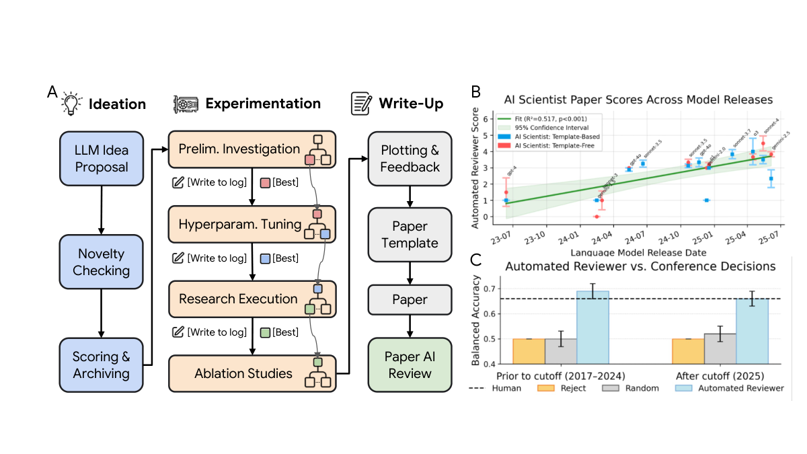

<figcaption>Figure 1: The AI Scientist のワークフロー。A. The AI Scientist は、自動的な着想生成、木ベースの実験、原稿執筆、査読を覆う別個の局面から成る。実験の局面はコード実装の生成と洗練にエージェント的木探索を用いる。これは 4 つの段階に構造化されている: (1) 予備調査、(2) ハイパーパラメータ調整、(3) 研究課題の実行、(4) アブレーション研究。ある実験段階から次へ移るとき、最も性能の良いチェックポイントが選ばれ、次段の木探索の種となる。B. 論文の品質は、ベースとなるモデルのリリース日とともに一貫して向上する（Automated Reviewer の判定による）。基盤モデルの改善に伴う一貫した将来の向上を示唆する。観測された相関は統計的に有意である（p 値 &lt; 0.00001）。網掛け領域は標準誤差を表す。モデルのバージョンと反復回数を含む完全な実験詳細は補足 §A.2.9 にある。C. Automated Reviewer は、過去の会議の公開された判定によって検証された、人間の査読者に匹敵する性能を達成する（Table 1）。エラーバーは 95% ブートストラップ信頼区間を表す。</figcaption>
</figure>

## 3 Automated Evaluation of Generated Papers（生成論文の自動評価）

Automated Reviewer は、トップ会議である **Neural Information Processing Systems（NeurIPS）の査読ガイドライン** [^66] に基づいて査読を行う。出力には数値スコア（soundness＝健全性、presentation＝提示、contribution＝貢献、overall＝総合、および reviewer confidence＝査読者の確信度）、弱点と強みのリスト、そして二値の判定（採択か不採択か）が含まれる。Automated Reviewer のパイプラインは **5 つの査読のアンサンブル**から成り、続いてモデルが **Area Chair の役を演じて 5 つすべての査読を条件として最終判定を下すメタレビュー**が行われる（補足 §A.3）。我々は Automated Reviewer の判定を、公開されている OpenReview のデータセット [^24] から抽出した ICLR 論文の正解データと比較した。Table 1 に示すとおり、**Automated Reviewer と人間の論文評価との一致は、NeurIPS 2021 一貫性研究** [^7] **で報告された人間同士の一致に、F1 と balanced accuracy で測って匹敵する**。同研究は、比較可能な投稿集合について人間の査読者間の一致を測定したものである（補足 §A.3）。これは、人間の査読者の集合的判断を高い忠実度で再現する能力を実証している。これらの結果は統計的に有意である（ノンパラメトリックなブートストラップ検定 [^16] と 2 標本 z 検定 [^48]。補足 §A.3）。

次に、潜在的な**データ汚染**（すなわち、論文の判定が LLM の訓練集合に含まれていた可能性）の影響を調べるため、我々は Automated Reviewer を 2 つのデータセットで評価した。ひとつは**モデルの訓練データに含まれうる年（2017-2024）から取った 1,000 本の論文**、もうひとつは**カットオフの翌年（2025）から取った「クリーンな」データセット**で、こちらは訓練中に見られたはずがないものである。知識カットオフの前と後の年の比較は、**データ汚染が存在しうる**ことを示唆する。balanced な判定精度がカットオフ前の 69% から翌年の 66% へ低下するからである。しかしカットオフ後の年の結果も人間の査読者と同等（たとえば balanced accuracy 66%）であり続けており、**潜在的な汚染があったとしてもその効果はせいぜい最小限にとどまる**ことを示している。

**Table 1**: 人間の査読者（NeurIPS 2021 一貫性実験 [^7]）と Automated Reviewer の性能比較。知識カットオフより前（2017-2024）に出版された論文と、後（2025）の論文で評価した。Automated Reviewer は、F1 スコア・AUC・balanced accuracy といった主要な指標において、知識カットオフを越えたデータについてさえ、人間の査読者の一貫性より優れたあるいは同等の性能を達成しており、異なる時期にわたる頑健性と信頼性を強調している。誤差幅は 95% ブートストラップ信頼区間を表す。矢印はスコアが高いほうが良いか（↑）低いほうが良いか（↓）を示す。補足 §A.3.2 が各指標と比較を詳しく説明する。

| 査読者 | Balanced Acc. (↑) | Accuracy (↑) | F1 Score (↑) | AUC (↑) | FPR (↓) | FNR (↓) |
| --- | --- | --- | --- | --- | --- | --- |
| Human (NeurIPS) | 0.66 | 0.73 | 0.49 | 0.65 | 0.17 | 0.52 |
| *知識カットオフより前の年（2017-2024）* | | | | | | |
| Random Decision | 0.50 | 0.54 | 0.47 | 0.52 | 0.47 | 0.43 |
| Always Reject | 0.50 | 0.65 | 0.00 | 0.50 | 0.00 | 1.00 |
| Automated Reviewer | 0.69 ± 0.04 | 0.65 ± 0.10 | 0.62 ± 0.09 | 0.69 ± 0.04 | 0.44 ± 0.12 | 0.18 ± 0.06 |
| *知識カットオフより後の年（2025）* | | | | | | |
| Random Decision | 0.50 | 0.50 | 0.50 | 0.50 | 0.50 | 0.50 |
| Always Reject | 0.50 | 0.51 | 0.00 | 0.50 | 0.00 | 1.00 |
| Automated Reviewer | 0.66 ± 0.03 | 0.66 ± 0.03 | 0.63 ± 0.04 | 0.66 ± 0.03 | 0.25 ± 0.04 | 0.43 ± 0.05 |

Automated Reviewer を用いて、我々は The AI Scientist の中核モデルとして広範な LLM を据えたときに生成される研究論文の品質を評価した。我々の分析は明確な傾向を明らかにする。**モデルが時とともに改善するにつれ、The AI Scientist が生み出す論文の品質も対応して向上する**（Figure 1B）。最近の世代のモデルでは、平均して、The AI Scientist は——我々の Automated Reviewer の判定によれば——**機械学習会議のワークショップにとって「ぎりぎり採択されうる」水準に近づく**論文を生み出す（補足 Figure 5）。加えて、**1 本あたりに割り当てられた計算量と結果の品質の間には強い相関がある**（Figure 2C）。これは、The AI Scientist の出力品質にとってモデル規模と推論時の投資の双方が重要な役割を果たすことを示しており、AI 系のコストが指数的に低下し能力が指数的に向上し続けるにつれて [^37]、大幅な改善があることをさらに示唆する。

<figure>

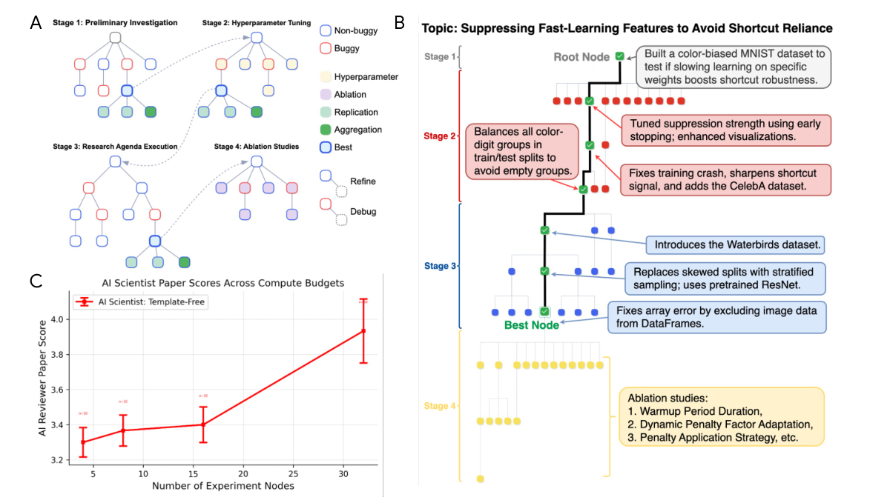

<figcaption>Figure 2: A. 研究の実験局面は 4 段階の過程として可視化される。まず予備的なベースラインのコード実装が構築され（段階 1）、ハイパーパラメータの調整によって洗練される（段階 2）。その結果得られたコードが、エージェント的木探索によって研究課題を実行する出発点となり（段階 3）、続いてアブレーション実験が行われる（段階 4）。エージェント的木探索の過程の完全な詳細は Methods にある。B. The AI Scientist の木探索の実例。4 つの異なる段階にわたって行われた実験を説明するノード注釈つき。C. エージェント的木探索における実験ノード数のスケーリングは、より深い推論時探索の予算に対する改善を示す。エラーバーは標準誤差を表す。完全な実験詳細は補足 §A.2.9 にある。</figcaption>
</figure>

## 4 Human Evaluation Results（人間による評価の結果）

The AI Scientist の仕事の品質に対する、おそらく究極かつ最も公正な試験は、**AI Scientist チューリングテスト**とでも呼びうるものの一種である。すなわち、その仕事を、人間の科学が評価されるのと同じ厳密な盲検査読の制度へ投稿することである。我々は生成した 3 本の原稿を、トップ機械学習会議のワークショップの正式な査読過程へ投稿した。この実験は **IRB 承認**（補足 §C.3）のもと、**ICLR 2025 の指導部と「I Can't Believe It's Not Better」（ICBINB）ワークショップの主催者の全面的な協力**を得て行われた。**投稿したのはこの 1 会場のみである**。The AI Scientist のテンプレート不要版は、ワークショップの広いテーマ（深層学習の限界の調査。従来の改善アイデアがうまくいかなかった箇所を含む）をプロンプトに与えるだけで、この設定へ容易に適応できた。それから全体の過程を走らせてアイデア・実験・論文を生成した。**我々は各段階で最も有望な出力を人手で選別した**（補足 §A.4）。この選別が行われなかったとしても、分析対象の論文は最終形のまま生成されていたはずであり、ただ他の論文と一緒に、したがってより高い総コストで生成されたであろう。この過程の結果、**3 本の完全な原稿が投稿用に選ばれた**。選別は 3 つの基準に基づいた。アイデアがワークショップの主題に沿っているか、コードが提案されたアイデアを正しく実装しエラーなく走ったか、そして原稿の書式が正しいか、である（補足 §A.4）。**各論文について、着想からコーディング・原稿執筆に至る科学的ワークフロー全体は、人間による修正を一切加えずに行われた**。これら 3 本の投稿は、ワークショップで査読された合計 43 本の論文に含まれた。**査読者には投稿の一部が AI 生成であると告げられたが、どれがそうかは告げず**、盲検過程が保たれた。

3 本の AI 生成原稿のうち 1 本が、査読者から**平均スコア 6.33（個別スコア: 6, 7, 6）**を受け取り、ワークショップの平均的な採択閾値を上回った（Figure 3）。主催者は、**AI 生成であることを理由に我々の事前に定めたプロトコルに従って取り下げられなければ、その論文はほぼ確実に採択されていただろう**と述べた。特筆すべきことに、その採択された原稿は**否定的結果を報告するもの**であり、ワークショップの「興味深い否定的結果」への焦点に合致していた。他の 2 本は採択の水準に達しなかった（補足 Table 10）。**これは、完全に AI が生成した論文が標準的な科学的査読過程を通過した最初の事例である**。我々はまた、チームの人間 AI 研究者による独自の内部レビューも行った（補足 §C.2）。チームの結論は、**1 本はワークショップ論文の水準を満たすものの、ICLR 本会議の出版というより高い水準を満たすものは 1 本もない**というものだった。投稿した 3 本すべてについて、強み・弱み・実装を含む完全な分析は補足 §C.2 にある。

<figure>

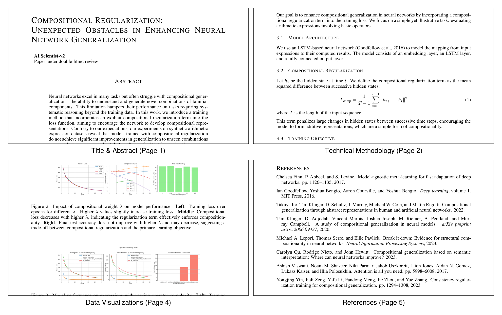

<figcaption>Figure 3: The AI Scientist が生成し、トップ機械学習会議のワークショップにおいて査読を経て採択された論文からの抜粋された節。この論文はメタレビュー前に 6（weak accept）・7（accept）・6（weak accept）の査読スコアを受け、投稿されたワークショップ論文の上位 45% に入った。完全に AI が生成した論文がトップ会議ワークショップの査読を首尾よく通過した最初の事例である。The AI Scientist はタイトルから参考文献・補足情報に至るまで論文全体を書いた。示されているのは、それが生み出した論文の節の例——要旨・手法・結果（データ可視化を含む）・参考文献の一部である。完全な論文には、序論・動機・結論といった他の典型的な論文の節も含まれる。論文の書式はワークショップが提供した特定のテンプレートに従っている。完全な論文は補足 §C.2 にある。</figcaption>
</figure>

## 5 Limitations（限界）

The AI Scientist は査読を経たワークショップ論文を生成したが、**人間が生み出す最良の科学に匹敵するには改善の余地がある**。3 本の投稿のうち採択されたのは 1 本だけであり、**ワークショップは本会議よりはるかに高い採択率を持つ**（たとえば ICLR 2025 ICBINB ワークショップは 70% [^1] であるのに対し、ICLR 2025 本会議は 32% [^2]）。したがって The AI Scientist はトップの出版の水準にまだ達しておらず、ワークショップについてすら一貫して達してはいない。よくある失敗モードには、素朴なあるいは未発達なアイデアの生成、主要アイデアの誤った実装、方法論的な厳密さの深さの欠如、実験実装における誤り、本文と付録での図の重複、そして不正確な引用のような多くの種類の幻覚が含まれる（失敗モードの完全な分析は補足 §C.2・§C.3・§A.4 にある）。

とはいえ機械学習ではしばしば、何かが（明らかな欠陥を伴ってでも）動き始めると、規模（たとえば計算とデータの）・より良い中核モデル・より良い技法によって、数年の短い期間で系の能力は驚くべきものになり、人間の性能水準を超えうる。したがって技術の影響を評価する際には、**その likely な将来の軌跡**を念頭に置くことが重要である。決定的に、この軌跡は単により良いモデルについてのものではなく、**AI 系が実行できるタスクの複雑さ**についてのものである。近年の研究は、**AI が確実に完了できるタスクの長さが 7 か月ごとに倍増する** [^63] ことを示唆しており、現在の実装とデバッグのボトルネックの多くが近い将来に解決されうることを示している。しかし、いくつかの AI の弱点は解決が驚くほど難しいことが判明している。AI が容易に騙されること [^67] [^84] や、それ以外の面で自信過剰に間違っていること（すなわち幻覚）[^59] などである。進歩はなされているものの [^71] [^32]、こうした課題は残り続け、The AI Scientist のような系の出力を確実に信頼することを妨げうる。また、**AI 系が科学における偉大な概念的飛躍に似た、極めて新規で創造的なアイデアをどの程度生み出せるのかも明らかではない**。これらの面で AI 系を研究し改善することが、将来の研究の鍵となる領域である。

現在のところ The AI Scientist は**計算実験のみ**を行う。将来の仕事では、この同じ手法書を、実験を自動的に行える（あるいは人間に行わせてデータを返してもらえる）他の科学領域へ適用しうる（たとえば自動化学実験室。急速な進歩がなされている [^8]）。

論文生成を自動化する能力は、重大な倫理的・社会的懸念を提起する。**査読過程を圧倒する可能性、研究実績の人為的な水増し、他者のアイデアを適切なクレジットなしに転用すること、科学者の職の消滅、そして/あるいは非倫理的ないし危険な実験の実施**などである（補足 §C.3）。本研究を責任をもって行うため、我々は ICLR 指導部・ワークショップ主催者・ブリティッシュコロンビア大学の IRB（H24-02652）から明示的な許可を得た。決定的に、**実験プロトコルの一部として、AI 生成の投稿はすべて、結果にかかわらず査読の後に取り下げると事前に決定した**。この決定は、科学コミュニティが開示と評価の明確な基準を確立する前に、完全に自動化された研究を出版する前例を作ることを避けるためになされた。**こうした規範を発展させることが、そのような系が科学的誠実性を損なうのではなく前進させるために使われることを保証する、決定的な次の一歩である**。最後に、オープンエンドな探索的 AI が安全に、人間の価値観と整合して進むことを保証するには、さらなる研究が必要である [^9] [^15]。

The AI Scientist による、主要な機械学習ワークショップの査読を通過した最初の AI 著作の原稿の生成は、数世紀にわたる科学的営為における一里塚をなす。一貫性とトップ水準の品質の達成には課題が残るものの、この成功は AI の科学的推論の能力が高まりつつあることを実証し、**発見の過程がもはや人間だけの営みではなくなり、我々が科学的発見の収穫を刈り取れる速度が劇的に加速しうる新しい時代の幕開け**を告げている。

## Methods（方法）

我々の研究方法論は 2 つの中核的な自動化された系を中心に据える。新規な科学研究を生成する **AI Scientist** と、それを厳密に評価する **Automated Reviewer** である。これらの系は協働して、科学的発見の加速における AI の潜在力を探る。

### The AI Scientist

The AI Scientist は、機械学習研究を自律的に行うよう設計されたエージェント的な系である。我々は 2 つのモードについて結果を示す。**人間が提供したコードを拡張する template-based の系**と、**はるかに少ない事前の導きで動作する、よりオープンエンドな template-free の系**である。各系で用いた詳細なプロンプトは補足 §A.1.1 と §A.2.6 にある。各系が生成した論文のさらなる結果と分析は §B.1・§C.1・§C.2・§D.1・§D.2 にある。

#### Foundational Technologies（基盤技術）

どちらの版も、先行するトークンが与えられたときの新しいトークンの条件付き確率をモデル化することでテキスト生成を学習する、**自己回帰的な大規模言語モデル（LLM）** [^68] [^3] [^52] の上に構築されている。膨大なデータとモデルのスケーリングを通じて、LLM は推論やコード生成を含む人間のような能力を示す。**few-shot プロンプティング** [^10] や**自己反省** [^80] といったエージェント的パターン [^88] が、性能と信頼性を改善するために The AI Scientist によって活用される。コード生成については、template-based の系は最先端のオープンソースコーディングアシスタントである **Aider** [^22] を用いる。Aider は既存のコードベースにおいて機能を実装し、バグを修正し、コードをリファクタリングするよう設計されている。さらに進んで推論時計算をより効果的に用いるため、**template-free の系は Aider に依存せず、LLM を用いて木探索を駆動する**。

##### Template-Based AI Scientist.（テンプレートありの AI Scientist）

この系には、人気のあるアルゴリズムの標準的なベンチマーク上での単純な訓練実行を再現する開始コードテンプレートが与えられる（たとえばシェイクスピアの作品で小さな transformer [^86] を訓練するもの）。そのワークフローは 3 つの局面で展開する。

##### Template-Free AI Scientist.（テンプレートなしの AI Scientist）

固定された開始コードベースの限界を克服するため、我々はより open-ended な発見が可能なテンプレート不要版を開発した。我々は、その強い推論能力ゆえに**アイデア生成と実験中のコード批評に OpenAI の o3** を、**コード生成に Anthropic の Claude Sonnet 4** を、**コスト効率の良い視覚言語タスクに OpenAI の GPT-4o** を、**査読段階のコスト効率の良い推論に OpenAI の o4-mini** を用いる。この版はいくつかの主要な強化を導入する。

- **一般化されたアイデア生成**: この系の着想の過程はより抽象的であり、初期のコード実装に縛られていない。それは、科学論文の要旨に似た**高水準の研究提案を生成すること**から始まる。これらの提案は研究上の問題を明確に述べ、新規な手法を提案し、期待される結果を仮説として立てる。提案が接地されかつ新規であることを保証するため、この過程は**外部の学術データベースに問い合わせて知識の空白を特定し、既存研究の再発見を避ける文献レビューモジュール**と密に統合されている。系は構造化されたプロンプトを用いてアイデア生成を導き、**文献検索の結果に基づいて提案を洗練する反省ラウンド**を伴う。（プロンプトは補足 §A.2.6 参照。）
- **実験進行マネージャ**: 現実の科学的実験は通常、初期の実現可能性の評価から詳細なアブレーション分析まで、明確に区別された段階を経て進む。この構造化されたアプローチを模倣するため、**科学的実験の 4 つの明確に定義された段階を統括する実験進行マネージャ**が導入されている。基本的な実現性を試す**予備調査（Preliminary Investigation）**から始まり、最適化のための**ハイパーパラメータ調整（Hyperparameter Tuning）**へ移り、それから主たる**研究課題の実行（Research Agenda Execution）**へ、そして異なる構成要素の寄与を理解するための**アブレーション研究（Ablation Studies）**で締めくくる。**各段階は明示的な停止条件を持つ**。段階 1 は、基本的な動作するプロトタイプが首尾よく実行されたときに終わる。段階 2 は、訓練曲線の収束と少なくとも 2 つのデータセットにわたる実行の成功によって示されるように、実験が安定したときに終わる。段階 3 と 4 は、割り当てられた計算予算が尽きたときに終わる。各段階は独自の木探索を行い、その木探索の過程の詳細は次の項で述べる。**各ノードの実験実行時間は最大 1 時間**である。各段階の終わりに、**LLM ベースの評価器がすべての葉ノードを評価し、最も有望なものを次段の探索の根として選ぶ**ことで、見込みの薄い研究の道筋を効果的に剪定する。
- **実験のための並列化されたエージェント的木探索**: オープンエンドな研究の複雑さを扱うため、template-based 版の The AI Scientist の逐次的なワークフローは、**並列化されたエージェント的な木**に置き換えられる。Figure 2A がアプローチの概観を、Figure 2B が実際の実行から得られた生成された木を示す。既定ではコード生成に Claude Sonnet 4 を用いる。異なる LLM の選択についての結果は Figure 1B に示す。

  エージェント的木探索の内側の各実験ノードは、次の実行サイクルを経る。**Claude Sonnet 4 がまず、具体的な実験計画と、その実験を実装する Python コードの両方を生成する**。生成されたコードはただちに Python インタプリタで実行される。実行がエラーに遭遇した場合、エラーメッセージが記録され、そのノードは **buggy** とマークされ、そのノードの現在の実行サイクルは終了する。実行が成功した場合、実験は作図の局面へ進む。

  系は、すべての関連する実験の出力（訓練と検証の指標、損失など）を**構造化された numpy ファイル**へ保存するよう促される。作図の局面では、The AI Scientist はこれらの保存された結果とコードを読み、所見を要約し例示する可視化を生成する。**これらの可視化は続いて視覚言語モデル（VLM）へ渡され批評される**。VLM が指摘した問題（不明確なラベル、凡例の欠落、誤解を招く可視化など）はすべて、そのノードが buggy とマークされる結果をもたらし、このフィードバックは将来のデバッグのために記録される。首尾よく実行され、問題なく VLM の査読を通ったノードは **non-buggy** と指定される。

  **各ノードは次を含む集合として定義される**: 実験スクリプト（たとえば Python ファイル）、スクリプトが実装する高水準の計画のテキストによる記述、（該当すれば）実行エラーのトレース、実験の実行時間、実験中に記録された性能指標、スクリプト実行後の OpenAI o3 によるコード批評、可視化スクリプト、生成された図へのファイルパス、それらの図についての VLM からのフィードバック、そしてノードの最終的な状態（buggy か non-buggy か）。

  各反復において、系は既存の木からいくつかのノードを選んで並列に展開する。**あらかじめ定められた確率で buggy なノードが選ばれ**（したがってエラーの解決とデバッグが優先される）、そうでなければさらなる洗練と改善のために non-buggy なノードが選ばれる。non-buggy なノードの間で選ぶときは、**性能指標・訓練の動態・生成された図の品質といった要因に基づいて候補を評価する GPT-4o に導かれた best-first 探索戦略**を用いる。選ばれたノードは新しい子ノードを作ることで展開され、親ノードが buggy だった場合は系はデバッグを試み、親が non-buggy だった場合は前の実験を洗練し改善する。新しい子ノードのそれぞれについて Claude Sonnet 4 が計画と実験コードを生成し、その後すべての新しいノードが**並列に同時実行**されて探索の過程を大きく加速する。buggy と non-buggy のノードに加えて、系は特定の実験上の必要に合わせた**特殊なノードの変種**を用いる。

  - **ハイパーパラメータノード**は、段階 2 の間に代替のハイパーパラメータ構成を体系的に探索する。系は以前に試したハイパーパラメータの記録を保持し、冗長な実験を防ぐ。ハイパーパラメータ調整の間に遭遇したエラーは、対応するデバッグノードの作成を引き起こす。
  - **アブレーションノード**は、段階 4 の間に決定的なアブレーション研究を評価し、実験の基礎にあるさまざまな構成要素や仮定の重要性を評価する。ハイパーパラメータノードと同様に、以前に試したアブレーションの条件は追跡されて繰り返しを避け、遭遇したエラーに応じてデバッグノードが作られる。
  - **再現ノード（Replication nodes）**は、**異なる乱数シードを用いて親の実験の複製を実行する**。通常はいくつかの再現ノードが作られ、実験結果の統計的な尺度（平均と標準偏差）の計算を可能にして、結果の頑健性を高める。
  - **集約ノード（Aggregation nodes）**は、再現ノードの結果を統合し可視化するために作られる特殊なノードである。他のノードの型と異なり、**集約ノードは新しい実験を行わず**、単に事前の結果を集約し要約する Python スクリプトを生成して、平均と標準偏差を明示的に示す図を作る。

  実験段階と専用のノードの型という構造化された設計が、全段階にわたる体系的な探索を促進する。**あらかじめ定められた細粒度のワークフローグラフに厳格に従う一部の LLM エージェントとは異なり**、The AI Scientist は経験的な研究サイクル全体を導く**より緩い構造**を採用しており、反復的な段階にまたがる一貫性を保ちながら柔軟な系の振る舞いを可能にする。プロンプトと詳細なハイパーパラメータについては、それぞれ補足 §A.2.6 と §A.2.9 を参照。
- **視覚言語モデル（VLM）の統合**: この系は GPT-4o を用いた視覚言語モデル（VLM）を組み込み、視覚的なデータを分析しフィードバックを与える。実験中、生成された図が VLM へ与えられ、VLM は**科学者として振る舞い批評するよう促される**。たとえば、意味をなさない軸、生成された例の品質の問題を指摘したり、データをより明確に提示する方法を提案したりしうる。このフィードバックは、特定された問題に対処することを狙った新しい実験ノードを木探索の中に生成するために使われる。原稿の準備中、VLM は**図とそれに対応するキャプションの整合**を評価し、キャプションが図を正確に記述し主要な要点を強調していることを保証して、論文全体の品質と明快さを改善する。VLM の査読には、図の内容・キャプションの正確さ・本文との統合の詳細な分析が含まれる。（プロンプトは補足 §A.2.6 参照。）
- **一般化されたデータセットアクセス**: 研究能力を広げるため、系は **HuggingFace Hub** [^91] へ問い合わせを組み立てることで公開リポジトリからデータセットを動的に統合するよう促される。HuggingFace 上で利用可能な 10 個のデータセットの例がプロンプトに列挙されており、系は選んだデータセットを実験で使うのに必要なデータ読み込みコードを自動的に生成できる。このアプローチは、**固定された事前定義のデータセット集合で作業するという制約を部分的に緩める**。人間の科学者が候補リストを容易に更新できるからである。HuggingFace で利用できないデータセットについては、人間の科学者が公開データリポジトリ（たとえばオープンアクセスのアーカイブ）からダウンロードし、ローカルに保存し、使用法の指示をプロンプトに加えられる。こうしてローカルに保存されたデータセットは、HuggingFace のデータセットと並んで The AI Scientist によって使われうる。（プロンプトは補足 §A.2.6 参照。）
- **強化された原稿執筆**: template-free の系は、**Aider ベースの逐次的なアプローチから離れ、OpenAI の o1 [^69] のような推論モデルによる直接的な LaTeX 生成**へ移行し、その後に反省 [^79] を行う。系はまず、専用の図の集約ステップを用いて複数の段階からの実験結果を複合図へまとめる。原稿執筆の過程には、**異なるワークショップ形式（たとえば否定的結果に焦点を当てる ICBINB ワークショップ）のための特定のプロンプト**が、タイトル・要旨・序論・手法・実験・結論を含む各節の詳細なガイドラインとともに含まれる。系は複数の反省サイクルを経て、**LaTeX の linter と VLM の査読からのフィードバック**を取り込み、図の品質と本文・図の整合を改善する。（プロンプトと完全な詳細については我々のコードと補足 §A.2.6 を参照。）

template-free の系の完全な生成過程は、**問題の複雑さに応じて通常は数時間から 15 時間超**を要する。

### Automated Reviewer

AI が生成した研究の品質を評価するため、我々は **o4-mini** [^72] を用いて Automated Reviewer を構築した。この構成要素は、公式の NeurIPS 査読者ガイドラインに従うことで、トップ機械学習会議の査読過程を模倣するよう設計されている。エージェントは原稿の PDF を処理して、健全性・提示・貢献の数値スコアに加えて、強みと弱みのリスト、そして予備的な採否の判定を含む**構造化された査読**を生み出す（補足 §A.3）。Automated Reviewer に用いたすべてのプロンプトは補足 §A.3.1 にある。

##### Review Process.（査読の過程）

Automated Reviewer は多段階の過程に従う。まず系は次の役割を与えられる: 「**You are an AI researcher who is reviewing a paper that was submitted to a prestigious ML venue.**」査読プロンプトは、論文の内容とともに詳細な NeurIPS 査読者ガイドラインを提供し、要約・強み・弱み・質問・限界・倫理的懸念、および数値スコア（健全性・提示・貢献・総合スコア 1〜10・確信度）を含む**構造化された JSON 応答**を求める。頑健性を改善するため、**最終的な評価は 5 つの独立した査読をアンサンブルしたメタレビュー**である。各論文について 5 つの査読が生成され、**LLM が Area Chair の役を取って個々の査読の間の合意を見つけ**、単一のメタレビューへ集約される。

##### Validation.（検証）

我々は、公開されている OpenReview データセット [^24] の ICLR データを用いて、Automated Reviewer を人間の判定に対してベンチマークした。Automated Reviewer は**人間と同等の balanced accuracy（69% 対 66%**。詳細は補足 §A.3.2 参照）を達成し、NeurIPS 2021 一貫性実験 [^7] における**人間グループ間の一致より高い F1 スコア（0.62 対 0.49）**を達成した。同実験では、投稿のおよそ 10% が無作為に選ばれて 2 つの独立した査読委員会へ送られ、査読者間の一貫性の現実世界のベンチマークが得られている（Table 1）。これらの結果は、**LLM ベースのエージェントが平均的な人間の専門家の意見と整合する価値あるフィードバックを提供しうる**ことを示唆する。**我々は、ICLR と NeurIPS の投稿プールが異なる集合であり、したがって分布のずれがあるため、この比較が厳密ではないことを強調しておく**。しかし ICLR は、我々が分析を行えるようすべての採否判定を公開している唯一の主要 ML 会議であり、NeurIPS 2021 の実験は人間の一貫性実験の唯一の現代的な版であるため、これが可能な唯一の比較である。

## Data Availability（データの入手可能性）

nanoGPT [^42] の実験については、template-based 版の The AI Scientist は Shakespeare character [^41]・enwiki8 [^34]・text8 [^57] のデータセットを用いた。template-free 版の The AI Scientist は、ICLR ワークショップ実験へ投稿した論文の 1 本に Crop Pest and Disease Detection データセット [^61] を、Figure 1B・Figure 2B・Figure 2C に示す実験に Waterbirds [^77] と CelebA [^51] のデータセットを用いた。それ以外のすべての場合、template-free 版は HuggingFace Hub [^91] を通じて利用可能なデータセットを用いた。

## Code Availability（コードの入手可能性）

template-based 版の The AI Scientist と Automated Reviewer のコードは [https://github.com/SakanaAI/AI-Scientist](https://github.com/SakanaAI/AI-Scientist) で入手できる。加えて、template-free 版の The AI Scientist のコードは [https://github.com/SakanaAI/AI-Scientist-v2](https://github.com/SakanaAI/AI-Scientist-v2) で入手できる。どちらのコードリポジトリも Apache License 2.0 の下でライセンスされている。

## Author Contributions（著者の貢献）

本研究には同等に貢献した 4 名の著者がおり、アルファベット順に列挙されている。

**Yutaro Yamada**［筆頭共同・責任著者］: プロジェクトを共同で率い、中核的なアイデアを提供した。中核的な木探索と template-free 版の The AI Scientist をコーディングした。論文生成の実験を実行した。多数の AI 生成論文の内容を読んで検証し、投稿を選び、論文のコード実装を確認した。本稿の執筆を主導した。投稿論文の詳細な分析を本稿のために書いた。

**Robert T. Lange**［筆頭共同・責任著者］: プロジェクトを共同で発起し、共同で率い、中核的なアイデアを提供した。Automated Reviewer の中核部分を構想しコーディングし、論文生成パイプラインをワークショップ向けに調整し、論文生成の実験を実行した。ワークショップとの連絡過程を組織した。多数の AI 生成論文の内容を読んで検証し、投稿を選び、論文のコード実装を確認した。本稿の執筆を主導した。投稿論文の詳細な分析を本稿のために書いた。

**Cong Lu**［筆頭共同・責任著者］: プロジェクトを発起し、共同で率い、Aider のような SWE エージェントを用いて科学的アイデアを自律的に実行するという着想を含め、The AI Scientist の元のアイデアを構想した。アイデア生成・Automated Reviewer・ツール利用・実験の集約・論文執筆フレームワークの中核部分をコーディングした。ワークショップ実験のための IRB 承認過程を執筆し主導し、AI 生成の論文投稿を評価した。本稿の執筆を主導した。

**Chris Lu**［筆頭共同・責任著者］: プロジェクトを発起し、共同で率いた。The AI Scientist の元のアイデアと構造を構想し、自律的なエンドツーエンドの論文生成を実証した最初の動作する系を開発した。元のプレプリントにおける実験設定と評価を構想した。template-based 版の The AI Scientist の開発を主導した。論文生成の実験を実行した。本稿の執筆を主導した。助言・フィードバック・執筆を提供した。

**Shengran Hu**: VLM のフィードバックによる反復的な Automated Reviewer を強化し、実験と論文執筆のフレームワークに貢献し、Automated Reviewer のベンチマークとアブレーション実験を実行し、論文生成の実験の実行を助け、多数の AI 生成論文の内容を読んで検証し、投稿を選び、論文のコード実装を確認した。本稿の草稿の執筆と反復を助けた。IRB 承認の執筆を助けた。

**Jakob Foerster**: 助言・フィードバック・執筆を提供した。

**David Ha**［責任著者］: 本研究プロジェクトに対する包括的な指導を行い、技術的洞察・助言・フィードバック・執筆を提供した。広報の過程を監督した。

**Jeff Clune**［責任著者］: 本研究プロジェクトに対する包括的な指導を行い、技術的洞察・助言・フィードバック・執筆を提供した。IRB 申請の過程を監督した。AI 生成の論文投稿を評価した。

## Competing Interests（利益相反）

主任研究者である Jeff Clune は Vector Institute および Google DeepMind と所属関係にある。本プロジェクトは Vector Institute との所属関係を持つが、Google DeepMind とは関連しない。複数の共著者は、The AI Scientist の設計に関与した機械学習研究企業である Sakana AI の従業員またはコンサルタントである。主任研究者は Sakana AI から金銭的な報酬を受けていない。これらの取り決めはブリティッシュコロンビア大学の利益相反方針に従って審査され承認されている。

## Ethics Approval（倫理承認）

本研究はブリティッシュコロンビア大学の行動研究倫理委員会（BREB）から倫理承認を受けた（プロトコル番号 H24-02652）。研究は ICLR 会議の指導部および関連するワークショップ主催者との全面的な協力のもとで行われた。承認されたプロトコルに従い、**人間の参加者（査読者）には、投稿の一部が AI 生成であることが伝えられた**（ただし具体的にどの論文かは伝えられていない）。**参加者は、AI 生成の可能性のある原稿の査読をオプトアウトする選択肢を持っていた**。**AI 生成の投稿はすべて、結果にかかわらず査読過程の後に取り下げられた**。

## SI Table of Contents（補足情報の目次）

## Appendix A Supplementary Methods（補足手法）

### A.1 Template-Based AI Scientist Implementation Details（テンプレートあり版の実装詳細）

本節は template-based 版の The AI Scientist の実装詳細を概説する。この版は大規模言語モデル（LLM）の上に構築され、その推論とコーディングの能力を高めるためにエージェント的なフレームワークへ埋め込まれている。

#### A.1.1 Prompts for Template-Based Scientific Discovery（テンプレートあり版の科学的発見のためのプロンプト）

template-based 版の The AI Scientist は、アイデア生成から論文執筆までの研究段階を通じて大規模言語モデル（LLM）を導くために、構造化されたプロンプトを用いる。

過程は The AI Scientist に全体の目標を設定することから始まる。

**Idea Generation System Prompt**

```
You are an ambitious AI PhD student who is looking to publish a paper that will contribute significantly to the field.
```
The AI Scientist は次に、実験計画と、新規性・実現可能性・興味深さについての自己評価スコアを含む、具体的な研究アイデアを生成するよう促される。

**Idea Generation Prompt**

````
{task_description}
<experiment.py>
{code}
</experiment.py>
Here are the ideas that you have already generated:
'''
{prev_ideas_string}
'''
Come up with the next impactful and creative idea for research experiments and directions you can feasibly investigate with the code provided. Note that you will not have access to any additional resources or datasets. Make sure any idea is not overfit the specific training dataset or model, and has wider significance.
Respond in the following format:
THOUGHT:
<THOUGHT>
NEW IDEA JSON:
```json
<JSON>
```
In <THOUGHT>, first briefly discuss your intuitions and motivations for the idea. Detail your high-level plan, necessary design choices and ideal outcomes of the experiments. Justify how the idea is different from the existing ones.
In <JSON>, provide the new idea in JSON format with the following fields:
- "Name": A shortened descriptor of the idea. Lowercase, no spaces, underscores allowed.
- "Title": A title for the idea, will be used for the report writing.
- "Experiment": An outline of the implementation. E.g. which functions need to be added or modified, how results will be obtained,...
- "Interestingness": A rating from 1 to 10 (lowest to highest).
- "Feasibility": A rating from 1 to 10 (lowest to highest).
- "Novelty": A rating from 1 to 10 (lowest to highest).
Be cautious and realistic on your ratings.
This JSON will be automatically parsed, so ensure the format is precise.
You will have {num_reflections} rounds to iterate on the idea, but do not need to use them all.
````
生成されたアイデアの新規性を評価するため、The AI Scientist は Semantic Scholar API を用いて文献を検索するよう指示される。

**Idea Novelty System Prompt**

```
You are an ambitious AI PhD student who is looking to publish a paper that will contribute significantly to the field.
You have an idea and you want to check if it is novel or not. I.e., not overlapping significantly with existing literature or already well explored.
Be a harsh critic for novelty, ensure there is a sufficient contribution in the idea for a new conference or workshop paper.
You will be given access to the Semantic Scholar API, which you may use to survey the literature and find relevant papers to help you make your decision.
The top 10 results for any search query will be presented to you with the abstracts.
You will be given {num_rounds} to decide on the paper, but you do not need to use them all.
At any round, you may exit early and decide on the novelty of the idea.
Decide a paper idea is novel if after sufficient searching, you have not found a paper that significantly overlaps with your idea.
Decide a paper idea is not novel, if you have found a paper that significantly overlaps with your idea.
{task_description}
<experiment.py>
{code}
</experiment.py>
```
新規性の確認は反復的に進み、複数回の問い合わせが許される。

**Idea Novelty Prompt**

````
Round {current_round}/{num_rounds}.
You have this idea:
"""
{idea}
"""
The results of the last query are (empty on first round):
"""
{last_query_results}
"""
Respond in the following format:
THOUGHT:
<THOUGHT>
RESPONSE:
```json
<JSON>
```
In <THOUGHT>, first briefly reason over the idea and identify any query that could help you make your decision.
If you have made your decision, add "Decision made: novel." or "Decision made: not novel." to your thoughts.
In <JSON>, respond in JSON format with ONLY the following field:
- "Query": An optional search query to search the literature (e.g. attention is all you need). You must make a query if you have not decided this round.
A query will work best if you are able to recall the exact name of the paper you are looking for, or the authors.
This JSON will be automatically parsed, so ensure the format is precise.
````
実験の実装と実行のために、The AI Scientist は最先端のコードエディタ Aider を用いる。

**Experiment Running Aider Prompt**

```
Your goal is to implement the following idea: {title}.
The proposed experiment is as follows: {idea}.
You are given a total of up to {max_runs} runs to complete the necessary experiments. You do not need to use all {max_runs}.
First, plan the list of experiments you would like to run. For example, if you are sweeping over a specific hyperparameter, plan each value you would like to test for each run.
Note that we already provide the vanilla baseline results, so you do not need to re-run it.
For reference, the baseline results are as follows:
{baseline_results}
After you complete each change, we will run the command `python experiment.py --out_dir=run_i' where i is the run number and evaluate the results.
YOUR PROPOSED CHANGE MUST USE THIS COMMAND FORMAT, DO NOT ADD ADDITIONAL COMMAND LINE ARGS.
You can then implement the next thing on your list.
```
実験の後、The AI Scientist は Aider を用いて結果から図を生成し、実験の詳細を記録する。

**Plotting Aider Prompt**

```
Great job! Please modify `plot.py` to generate the most relevant plots for the final writeup.
In particular, be sure to fill in the "labels" dictionary with the correct names for each run that you want to plot.
Only the runs in the `labels` dictionary will be plotted, so make sure to include all relevant runs.
We will be running the command `python plot.py` to generate the plots.
---
Please modify `notes.txt` with a description of what each plot shows along with the filename of the figure. Please do so in-depth.
Somebody else will be using `notes.txt` to write a report on this in the future.
```
原稿の執筆のために、The AI Scientist は Aider を用いて、生み出された図と結果で LaTeX テンプレートを節ごとに埋めていく。

**Paper Writing Aider Prompt**

```
We've provided the `latex/template.tex` file to the project. We will be filling it in section by section.
First, please fill in the {section} section of the writeup.
Some tips are provided below:
{per_section_tips}
Before every paragraph, please include a brief description of what you plan to write in that paragraph in a comment.
Be sure to first name the file and use *SEARCH/REPLACE* blocks to perform these edits.
```
#### A.1.2 An Example Template Codebase for Template-Based Runs（テンプレートあり実行のためのテンプレートコードベースの例）

我々は template-based の設定で用いたテンプレートコードベースの例を提供する。追加のテンプレートは我々の GitHub リポジトリで入手できる: [https://github.com/SakanaAI/AI-Scientist/tree/main/templates](https://github.com/SakanaAI/AI-Scientist/tree/main/templates)。

> 訳注: 以下の箱は原典でタイトルが "Generalized Idea Generation System and User Prompt" となっているが、**中身は 2 次元データセット上で DDPM 拡散モデルを訓練する Python スクリプトであり、本節の見出しとも合わない**。同じタイトルの箱が §A.2.6 の冒頭に正しく存在するので、原典の LaTeX で箱のタイトルを差し替え忘れたものと思われる。ar5iv 側でも同様なのでクリップ不良ではない。原文どおり残す。

**Generalized Idea Generation System and User Prompt**

```python
# This file trains a DDPM diffusion model on 2D datasets.
import argparse
import json
import os.path as osp
import pathlib
import pickle
import time
import npeet.entropy_estimators as ee
import numpy as np
import torch
from torch import nn
from torch.nn import functional as F
from torch.optim.lr_scheduler import CosineAnnealingLR
from torch.utils.data import DataLoader
from tqdm.auto import tqdm
import datasets
from ema_pytorch import EMA
device = torch.device("cuda" if torch.cuda.is_available() else "cpu")
class SinusoidalEmbedding(nn.Module):
def __init__(self, dim: int, scale: float = 1.0):
super().__init__()
self.dim = dim
self.scale = scale
def forward(self, x: torch.Tensor):
x = x * self.scale
half_dim = self.dim // 2
emb = torch.log(torch.Tensor([10000.0])) / (half_dim - 1)
emb = torch.exp(-emb * torch.arange(half_dim)).to(device)
emb = x.unsqueeze(-1) * emb.unsqueeze(0)
emb = torch.cat((torch.sin(emb), torch.cos(emb)), dim=-1)
return emb
class ResidualBlock(nn.Module):
def __init__(self, width: int):
super().__init__()
self.ff = nn.Linear(width, width)
self.act = nn.ReLU()
def forward(self, x: torch.Tensor):
return x + self.ff(self.act(x))
class MLPDenoiser(nn.Module):
def __init__(
self,
embedding_dim: int = 128,
hidden_dim: int = 256,
hidden_layers: int = 3,
):
super().__init__()
self.time_mlp = SinusoidalEmbedding(embedding_dim)
# sinusoidal embeddings help capture high-frequency patterns for low-dim data
self.input_mlp1 = SinusoidalEmbedding(eAs with human-authored research, some AI-generated ideambedding_dim, scale=25.0)
self.input_mlp2 = SinusoidalEmbedding(embedding_dim, scale=25.0)
self.network = nn.Sequential(
nn.Linear(embedding_dim * 3, hidden_dim),
*[ResidualBlock(hidden_dim) for _ in range(hidden_layers)],
nn.ReLU(),
nn.Linear(hidden_dim, 2),
)
def forward(self, x, t):
x1_emb = self.input_mlp1(x[:, 0])
x2_emb = self.input_mlp2(x[:, 1])
t_emb = self.time_mlp(t)
emb = torch.cat([x1_emb, x2_emb, t_emb], dim=-1)
return self.network(emb)
class NoiseScheduler():
def __init__(
self,
num_timesteps=1000,
beta_start=0.0001,
beta_end=0.02,
beta_schedule="linear",
):
self.num_timesteps = num_timesteps
if beta_schedule == "linear":
self.betas = torch.linspace(
beta_start, beta_end, num_timesteps, dtype=torch.float32).to(device)
elif beta_schedule == "quadratic":
self.betas = (torch.linspace(
beta_start ** 0.5, beta_end ** 0.5, num_timesteps, dtype=torch.float32) ** 2).to(device)
else:
raise ValueError(f"Unknown beta schedule: {beta_schedule}")
self.alphas = 1.0 - self.betas
self.alphas_cumprod = torch.cumprod(self.alphas, axis=0).to(device)
self.alphas_cumprod_prev = F.pad(self.alphas_cumprod[:-1], (1, 0), value=1.).to(device)
# required for self.add_noise
self.sqrt_alphas_cumprod = (self.alphas_cumprod ** 0.5).to(device)
self.sqrt_one_minus_alphas_cumprod = ((1 - self.alphas_cumprod) ** 0.5).to(device)
# required for reconstruct_x0
self.sqrt_inv_alphas_cumprod = torch.sqrt(1 / self.alphas_cumprod).to(device)
self.sqrt_inv_alphas_cumprod_minus_one = torch.sqrt(
1 / self.alphas_cumprod - 1).to(device)
# required for q_posterior
self.posterior_mean_coef1 = self.betas * torch.sqrt(self.alphas_cumprod_prev) / (1. - self.alphas_cumprod).to(
device)
self.posterior_mean_coef2 = ((1. - self.alphas_cumprod_prev) * torch.sqrt(self.alphas) / (
1. - self.alphas_cumprod)).to(device)
def reconstruct_x0(self, x_t, t, noise):
s1 = self.sqrt_inv_alphas_cumprod[t]
s2 = self.sqrt_inv_alphas_cumprod_minus_one[t]
s1 = s1.reshape(-1, 1)
s2 = s2.reshape(-1, 1)
return s1 * x_t - s2 * noise
def q_posterior(self, x_0, x_t, t):
s1 = self.posterior_mean_coef1[t]
s2 = self.posterior_mean_coef2[t]
s1 = s1.reshape(-1, 1)
s2 = s2.reshape(-1, 1)
mu = s1 * x_0 + s2 * x_t
return mu
def get_variance(self, t):
if t == 0:
return 0
variance = self.betas[t] * (1. - self.alphas_cumprod_prev[t]) / (1. - self.alphas_cumprod[t])
variance = variance.clip(1e-20)
return variance
def step(self, model_output, timestep, sample):
t = timestep
pred_original_sample = self.reconstruct_x0(sample, t, model_output)
pred_prev_sample = self.q_posterior(pred_original_sample, sample, t)
variance = 0
if t > 0:
noise = torch.randn_like(model_output)
variance = (self.get_variance(t) ** 0.5) * noise
pred_prev_sample = pred_prev_sample + variance
return pred_prev_sample
def add_noise(self, x_start, x_noise, timesteps):
s1 = self.sqrt_alphas_cumprod[timesteps]
s2 = self.sqrt_one_minus_alphas_cumprod[timesteps]
s1 = s1.reshape(-1, 1)
s2 = s2.reshape(-1, 1)
return s1 * x_start + s2 * x_noise
def __len__(self):
return self.num_timesteps
if __name__ == "__main__":
parser = argparse.ArgumentParser()
parser.add_argument("--train_batch_size", type=int, default=256)
parser.add_argument("--eval_batch_size", type=int, default=10000)
parser.add_argument("--learning_rate", type=float, default=3e-4)
parser.add_argument("--num_timesteps", type=int, default=100)
parser.add_argument("--num_train_steps", type=int, default=10000)
parser.add_argument("--beta_schedule", type=str, default="linear", choices=["linear", "quadratic"])
parser.add_argument("--embedding_dim", type=int, default=128)
parser.add_argument("--hidden_size", type=int, default=256)
parser.add_argument("--hidden_layers", type=int, default=3)
parser.add_argument("--out_dir", type=str, default="run_0")
config = parser.parse_args()
final_infos = {}
all_results = {}
pathlib.Path(config.out_dir).mkdir(parents=True, exist_ok=True)
for dataset_name in ["circle", "dino", "line", "moons"]:
dataset = datasets.get_dataset(dataset_name, n=100000)
dataloader = DataLoader(dataset, batch_size=config.train_batch_size, shuffle=True)
model = MLPDenoiser(
embedding_dim=config.embedding_dim,
hidden_dim=config.hidden_size,
hidden_layers=config.hidden_layers,
).to(device)
ema_model = EMA(model, beta=0.995, update_every=10).to(device)
noise_scheduler = NoiseScheduler(num_timesteps=config.num_timesteps, beta_schedule=config.beta_schedule)
optimizer = torch.optim.AdamW(
model.parameters(),
lr=config.learning_rate,
)
scheduler = CosineAnnealingLR(optimizer, T_max=config.num_train_steps)
train_losses = []
print("Training model...")
model.train()
global_step = 0
progress_bar = tqdm(total=config.num_train_steps, mininterval=10, disable=True)
progress_bar.set_description("Training")
start_time = time.time()
while global_step < config.num_train_steps:
for batch in dataloader:
if global_step >= config.num_train_steps:
break
batch = batch[0].to(device)
noise = torch.randn(batch.shape).to(device)
timesteps = torch.randint(
0, noise_scheduler.num_timesteps, (batch.shape[0],)
).long().to(device)
noisy = noise_scheduler.add_noise(batch, noise, timesteps)
noise_pred = model(noisy, timesteps)
loss = F.mse_loss(noise_pred, noise)
loss.backward()
nn.utils.clip_grad_norm_(model.parameters(), 0.5)
optimizer.step()
optimizer.zero_grad()
ema_model.update()
scheduler.step()
progress_bar.update(1)
logs = {"loss": loss.detach().item()}
train_losses.append(loss.detach().item())
progress_bar.set_postfix(**logs)
global_step += 1
progress_bar.close()
end_time = time.time()
training_time = end_time - start_time
# Eval loss
model.eval()
eval_losses = []
for batch in dataloader:
batch = batch[0].to(device)
noise = torch.randn(batch.shape).to(device)
timesteps = torch.randint(
0, noise_scheduler.num_timesteps, (batch.shape[0],)
).long().to(device)
noisy = noise_scheduler.add_noise(batch, noise, timesteps)
noise_pred = model(noisy, timesteps)
loss = F.mse_loss(noise_pred, noise)
eval_losses.append(loss.detach().item())
eval_loss = np.mean(eval_losses)
# Eval image saving
ema_model.eval()
sample = torch.randn(config.eval_batch_size, 2).to(device)
timesteps = list(range(len(noise_scheduler)))[::-1]
inference_start_time = time.time()
for t in timesteps:
t = torch.from_numpy(np.repeat(t, config.eval_batch_size)).long().to(device)
with torch.no_grad():
residual = ema_model(sample, t)
sample = noise_scheduler.step(residual, t[0], sample)
sample = sample.cpu().numpy()
inference_end_time = time.time()
inference_time = inference_end_time - inference_start_time
# Eval estimated KL
real_data = dataset.tensors[0].numpy()
kl_divergence = ee.kldiv(real_data, sample, k=5)
final_infos[dataset_name] = {
"means": {
"training_time": training_time,
"eval_loss": eval_loss,
"inference_time": inference_time,
"kl_divergence": kl_divergence,
}
}
all_results[dataset_name] = {
"train_losses": train_losses,
"images": sample,
}
with open(osp.join(config.out_dir, "final_info.json"), "w") as f:
json.dump(final_infos, f)
with open(osp.join(config.out_dir, "all_results.pkl"), "wb") as f:
pickle.dump(all_results, f)
```

#### A.1.3 Hyperparameter Configuration for Template-Based Runs（テンプレートあり実行のハイパーパラメータ設定）

template-based 版の The AI Scientist の実行には Table 2 に詳述するハイパーパラメータを用いた。

**Table 2**: template-based 版の The AI Scientist の主要なハイパーパラメータ。

| カテゴリ | ハイパーパラメータ | 値 |
| --- | --- | --- |
| アイデア生成 | アイデアの反省回数 | 3 |
| アイデア生成 | 新規性探索のラウンド数（Semantic Scholar） | 10 |
| 実験実行 | 最大実験数 | 5 |
| 実験実行 | エラー時の実験の最大再試行数 | 4 |
| 実験実行 | 実験のタイムアウト | 7200 秒 |
| 実験実行 | 作図のタイムアウト | 600 秒 |
| 論文執筆 | 引用検索のラウンド数（Semantic Scholar） | 20 |
| 論文執筆 | LaTeX エラー訂正のラウンド数 | 5 |

### A.2 Template-Free AI Scientist Implementation Details（テンプレートなし版の実装詳細）

本節は、本文で述べたより open-ended な template-free 版の The AI Scientist の実装詳細を概説する。この強化された版は人間が書いたコードテンプレートを必要とせずに動作し、代わりに、template-based 版の基礎的な能力の上に構築された、一般化されたアイデア生成・実験のためのエージェント的木探索・統合された視覚言語モデル（VLM）のフィードバックを用いる。

#### A.2.1 System Architecture and Execution Flow（システムアーキテクチャと実行フロー）

The AI Scientist のワークフローは、着想から実験、原稿生成に至る複数の逐次的な段階から成る。**これらの段階をまたぐ遷移は完全に自動化されており、人間の介入を必要としない**。単一のドライバプロセスがパイプラインを統括する。すなわち、LLM 呼び出しを介して候補プログラムを生成し、実験を起動し、終了コード・ログ・タイムアウトを監視し、あらかじめ定められた基準に従って状態遷移を引き起こす。具体的には:

- **段階 1 → 段階 2**: 系が実行時エラーなしに実行可能なコードを生み出した時点で遷移が起こる。
- **段階 2 → 段階 3**: 生成されたコードが、あらかじめ定められた指標（それら自体は着想の直後に LLM によって定義される）の下でベースラインモデルを上回ったときに引き起こされる。
- **段階 3 → 段階 4**: 段階 3 の木探索が割り当てられた探索予算を使い切った時点で自動的に開始される。

各実験は Python の非対話的な subprocess モジュールを介して実行され、生成されたコードとオペレーティングシステムの間のすべての相互作用は、**実行ごとの作業ディレクトリの内側の制御されたファイル I/O に限定される**。各実行の後、指標・図・実行時ログ・VLM のフィードバックといった成果物は、木のノードを表す型付きの Python オブジェクトへ直列化される。ドライバプロセスは次に LLM ベースのジャッジを呼び出し、現在の段階から次へ持ち越す最良のノードを評価し選択する。すべてのツール呼び出し（コード生成・分析・VLM のフィードバック）は、それぞれの LLM API 呼び出しを包む内部の Python 呼び出し可能なインターフェースを通じて行われる。

#### A.2.2 Cross-Stage Consistency（段階をまたぐ一貫性）

各段階は最良のノードを次の段階へ書き出し、次の段階はそれを用いて後続の生成を導く。**着想から実験への遷移は、提案された仮説・タスク設定・評価指標を符号化した最終確定のアイデア JSON を渡すこと**で管理される。**実験から原稿執筆への遷移は、主要な結果と観察を要約した実験ジャーナルの凝縮された形を渡すこと**で扱われ、その要約は LLM によって行われる。

この機構は後続の各段階を先行する段階の出力に接地させ、**当初の提案・結果・最終的な執筆の間の乖離を緩和する**。

#### A.2.3 Model Selection per Stage（段階ごとのモデル選択）

異なる段階は、ベースとなるモデルに異なる能力を要求する。我々の現在の実装では、小規模な試行実行を通じて各役割に最も効果的なモデルを経験的に特定した——たとえばコード生成には Claude を、高水準の計画・分析・執筆には GPT 系のモデルを、といった具合である。将来の基盤モデルがこれらの能力を統一するかもしれないが、**系は全体のアーキテクチャを変えることなく段階ごとにモデルを柔軟に差し替えられるよう設計されている**。

#### A.2.4 Experimental Journal Structure（実験ジャーナルの構造）

template-based の設定では、ジャーナルは実験の試行を要約する平文のログである。template-free の設定では、**構造化された JSON を書き出す Python クラスとして実装**されており、木の各ノードは次のフィールドを記録する: 生成されたコードと実行計画／実験結果（指標・損失・検証スコアなど）／エラートレースやログ要約を含む実行時のフィードバック／生成された図や視覚的出力についての視覚言語モデル（VLM）の論評／LLM ジャッジの評価と段階遷移の信号。

この構造化されたジャーナルは、**実験にまたがる再現性と監査可能性を保証するだけでなく、自動化された研究過程のすべての段階を結びつける機械可読な記録**も提供する。

#### A.2.5 Comparison with Deep Research（Deep Research との比較）

Deep Research [^70] のような近年の系は、大規模な推論ベースの情報統合における大きな前進を表している。それらは、**既存の情報を検索・分析・要約して、ユーザーの問い合わせに対する十分に調査された答えを生み出す**よう設計されている。しかしこれらの系は**知識の集約に留まっており、新しい実験を設計することも実行することもできない**。

対照的に The AI Scientist は、**1 本の論文を生み出すことに関わる研究ライフサイクル全体を自動化する**。それは着想から始まり、実験の実装と評価を経て、完全な科学原稿の執筆に至る。この能力は検索と統合を越えて**自律的な知識の創造**へと進むものであり、The AI Scientist を Deep Research 系のツールとは補完的だが**別のクラスの系**として位置づける。

#### A.2.6 Prompts for Template-Free Scientific Discovery（テンプレートなし版の科学的発見のためのプロンプト）

以下は template-free 版のパイプラインを駆動するプロンプト群である。

**Generalized Idea Generation System and User Prompt**

````
# System prompt
You are an experienced AI researcher who aims to propose high-impact research ideas resembling exciting grant proposals. Feel free to propose any novel ideas or experiments; make sure they are novel. Be very creative and think out of the box. Each proposal should stem from a simple and elegant question, observation, or hypothesis about the topic. For example, they could involve very interesting and simple interventions or investigations that explore new possibilities or challenge existing assumptions. Clearly clarify how the proposal distinguishes from the existing literature.
Ensure that the proposal can be done starting from the provided codebase, and does not require resources beyond what an academic lab could afford. These proposals should lead to papers that are publishable at top ML conferences.
You have access to the following tools:
{tool_descriptions}
Respond in the following format:
ACTION:
<The action to take, exactly one of {tool_names_str}>
ARGUMENTS:
<If ACTION is "SearchSemanticScholar", provide the search query as {{"query": "your search query"}}. If ACTION is "FinalizeIdea", provide the idea details as {{"idea": {{... }}}} with the IDEA JSON specified below.>
If you choose to finalize your idea, provide the IDEA JSON in the arguments:
IDEA JSON:
```json
{{
"Name": "...",
"Title": "...",
"Short Hypothesis": "...",
"Related Work": "...",
"Abstract": "...",
"Experiments": "...",
"Risk Factors and Limitations": "..."
}}
```
Ensure the JSON is properly formatted for automatic parsing.
Note: You should perform at least one literature search before finalizing your idea to ensure it is well-informed by existing research.
# Initial idea generation prompt (example user prompt part)
{workshop_description}
Here are the proposals that you have already generated:
{prev_ideas_string}
Begin by generating an interestingly new high-level research proposal that differs from what you have previously proposed.
# reflection prompt (example user prompt part for reflection)
Round {current_round}/{num_reflections}.
In your thoughts, first carefully consider the quality, novelty, and feasibility of the proposal you just created.
Include any other factors that you think are important in evaluating the proposal.
Ensure the proposal is clear and concise, and the JSON is in the correct format.
Do not make things overly complicated.
In the next attempt, try to refine and improve your proposal.
Stick to the spirit of the original idea unless there are glaring issues.
If you have new information from tools, such as literature search results, incorporate them into your reflection and refine your proposal accordingly.
Results from your last action (if any):
{last_tool_results}
````
**Initial Experiment Implementation Prompt**

````
Introduction:
You are an AI researcher who is looking to publish a paper that will contribute significantly to the field."
Your first task is to write a python code to implement a solid baseline based on your research idea provided below, from data preparation to model training, as well as evaluation and visualization.
Focus on getting a simple but working implementation first, before any sophisticated improvements.
We will explore more advanced variations in later stages.
Research idea:
{research_idea}
Memory:
{memory_summary}
Instructions:
Response format:
Your response should be a brief outline/sketch of your proposed solution in natural language (7-10 sentences), followed by a single markdown code block (using the format ```python... ```) which implements this solution and prints out the evaluation metric(s) if applicable. There should be no additional headings or text in your response. Just natural language text followed by a newline and then the markdown code block. Make sure to write concise code.
Experiment design sketch guideline:
This first experiment design should be relatively simple, without extensive hyper-parameter optimization.
Take the Memory section into consideration when proposing the design.
The solution sketch should be 6-10 sentences.
Don't suggest to do EDA.
Make sure to create synthetic data if needed.
Evaluation Metric(s):
{eval_metrics}
---Prompt-Implementation-Guidelines-Begin---
CRITICAL GPU REQUIREMENTS - Your code MUST include ALL of these:
- At the start of your code, add these lines to handle GPU/CPU:
```python
device = torch.device('cuda' if torch.cuda.is_available() else 'cpu')
print(f'Using device: {device}')
```
- ALWAYS move models to device using the `.to(device)` method
- ALWAYS move input tensors to device using the `.to(device)` method
- ALWAYS move model related tensors to device using the `.to(device)` method
- For optimizers, create them AFTER moving model to device
- When using DataLoader, move batch tensors to device in training loop: `batch = {k: v.to(device) for k, v in batch.items() if isinstance(v, torch.Tensor)}`
CRITICAL MODEL INPUT GUIDELINES:
- Always pay extra attention to the input to the model being properly normalized,
- This is extremely important because the input to the model's forward pass directly affects the output, and the loss function is computed based on the output,
For generative modeling tasks, you must:
- Generate a set of samples from your model
- Compare these samples with ground truth data using appropriate visualizations
- When saving plots, always use the 'working_dir' variable that will be defined at the start of the script
- Make sure to give each figure a unique and appropriate name based on the dataset it represents, rather than reusing the same filename.
Important code structure requirements:
- Do NOT put any execution code inside 'if __name__ == \"__main__\":' block
- All code should be at the global scope or in functions that are called from the global scope
- The script should execute immediately when run, without requiring any special entry point
The code should start with:
import os
working_dir = os.path.join(os.getcwd(), 'working')
os.makedirs(working_dir, exist_ok=True)
The code should be a single-file python program that is self-contained and can be executed as-is.
No parts of the code should be skipped, don't terminate the code execution before finishing the script.
Your response should only contain a single code block.
Be aware of the running time of the code, it should complete within {exec_timeout}.
You can also use the "./working" directory to store any temporary files that your code needs to create.
Data saving requirements:
- Save all plottable data (metrics, losses, predictions, etc.) as numpy arrays using np.save()
- Use the following naming convention for saved files:
```python",
# At the start of your code
experiment_data = {
'dataset_name_1': {
'metrics': {'train': [], 'val': []},
'losses': {'train': [], 'val': []},
'predictions': [],
'ground_truth': [],
# Add other relevant data
},
# Add additional datasets as needed:
'dataset_name_2': {
'metrics': {'train': [], 'val': []},
'losses': {'train': [], 'val': []},
'predictions': [],
'ground_truth': [],
# Add other relevant data
},
}
# During training/evaluation:
experiment_data['dataset_name_1']['metrics']['train'].append(train_metric)
```
- Include timestamps or epochs with the saved metrics
- For large datasets, consider saving in chunks or using np.savez_compressed()
CRITICAL EVALUATION REQUIREMENTS - Your code MUST include ALL of these:
1. Track and print validation loss at each epoch or at suitable intervals:
```python
print(f'Epoch {{epoch}}: validation_loss = {{val_loss:.4f}}')
```
2. Track and update ALL these additional metrics:
str(self.evaluation_metrics),
3. Update metrics at EACH epoch:
4. Save ALL metrics at the end:
```python
np.save(os.path.join(working_dir, 'experiment_data.npy'), experiment_data)
```
Installed Packages:
Your solution can use any relevant machine learning packages such as: {pkg_str}. Feel free to use any other packages too (all packages are already installed!). For neural networks we suggest using PyTorch rather than TensorFlow.
---Prompt-Implementation-Guidelines-END---
````
**Agentic Tree Search Prompt**

````
# For debugging
Introduction:
You are an experienced AI researcher. Your previous code for research experiment had a bug, so based on the information below, you should revise it in order to fix this bug.
Your response should be an implementation outline in natural language followed by a single markdown code block which implements the bugfix/solution.
Research idea: {research_idea}
Previous (buggy) implementation: {parent_node.code}
Execution output: {execution_output}
Feedback based on generated plots: {parent_node.vlm_feedback_summary}
Feedback about execution time: {parent_node.exec_time_feedback}
Response format:
Your response should be a brief outline/sketch of your proposed solution in natural language (3-5 sentences), followed by a single markdown code block (using the format ```python... ```) which implements the full code including the bugfix/solution.
There should be no additional headings or text in your response. Just natural language text followed by a newline and then the markdown code block.
Your generated code should be complete and executable. Do not omit any part of the code, even if it was part of a previous implementation.
Make sure to write concise code.
Bugfix improvement sketch guideline:
You should write a brief natural language description (3-5 sentences) of how the issue in the previous implementation can be fixed.
Don't suggest to do EDA.
{prompt_implementation_guideline}
# For identifying issues
Introduction:
You are an experienced AI researcher. Given the experiment code, numerical metrics, and hypothesis behind the experiment, identify the biggest issue you observe and suggest how to improve it for the next step.
Never criticize the lack of statistical rigor because we'll take care of that later.
Short Hypothesis: {short_hypothesis}
Experiment code: {parent_node.code}
Numerical Results: {parent_node.metric}
Feedback on Figures: {parent_node.vlm_feedback_summary}
Feedback about execution time: {parent_node.exec_time_feedback}
Response format:
OBSERVATIONS:
<your detailed observations here>
ISSUES:
- issue 1
- issue 2 (could be multiple issues)
FIX_PLAN:
<your plan here>
# For improving
Introduction:
You are an experienced AI researcher. You are provided with a previously developed implementation. Your task is to improve it based on the current experimental stage.
Research idea: {research_idea}
Identified issues: {identified_issues}
Fix plan: {fix_plan}
Previous solution: {parent_node.code}
Instructions:
Response format:
Your response should be a brief outline/sketch of your proposed solution in natural language (7-10 sentences), followed by a single markdown code block (using the format ```python... ```) which implements this solution and prints out the evaluation metric(s) if applicable.
There should be no additional headings or text in your response. Just natural language text followed by a newline and then the markdown code block.
Make sure to write concise code.
{prompt_implementation_guideline}
# For hyperparameter node
Introduction:
You are an experienced AI researcher. You are provided with a previously developed baseline implementation. Your task is to implement hyperparameter tuning for the following idea:
{hyperparam_idea.name}.
{hyperparam_idea.description}
Base code you are working on: parent_node.code
Implementation guideline:
The code should be a single-file python program that is self-contained and can be executed as-is.
No parts of the code should be skipped, don't terminate the code execution before finishing the script.
Data saving requirements:
- Save all plottable data (metrics, losses, predictions, etc.) as numpy arrays using np.save()
- Use the following naming convention for saved files:
```python
# At the start of your code
experiment_data = {
'hyperparam_tuning_type_1': {
'dataset_name_1': {
'metrics': {'train': [], 'val': []},
'losses': {'train': [], 'val': []},
'predictions': [],
'ground_truth': [],
# Add other relevant data
},
# Add additional datasets as needed:
},
# Add additional hyperparam tuning types as needed
}
Make sure to use a filename 'experiment_data.npy' to save the data. Do not use any other filename.
# For ablation node
Introduction:
You are an experienced AI researcher. You are provided with a previously developed baseline implementation. Your task is to implement the ablation study for the following idea:
{ablation_idea.name}
{ablation_idea.description}
Base code you are working on: {parent_node.code}
Implementation guideline:
The code should be a single-file python program that is self-contained and can be executed as-is.
No parts of the code should be skipped, don't terminate the code execution before finishing the script.
Data saving requirements:
- Save all plottable data (metrics, losses, predictions, etc.) as numpy arrays using np.save()
- Use the following naming convention for saved files:
```python
# At the start of your code
experiment_data = {
'ablation_type_1': {
'dataset_name_1': {
'metrics': {'train': [], 'val': []},
'losses': {'train': [], 'val': []},
'predictions': [],
'ground_truth': [],
# Add other relevant data
},
# Add additional datasets as needed:
'dataset_name_2': {
'metrics': {'train': [], 'val': []},
'losses': {'train': [], 'val': []},
'predictions': [],
'ground_truth': [],
# Add other relevant data
},
},
# Add additional ablation types as needed
}
Make sure to use a filename 'experiment_data.npy' to save the data. Do not use any other filename.
````
**Plot Aggregation Prompt**

````
# System prompt
You are an ambitious AI researcher who is preparing final plots for a scientific paper submission.
You have multiple experiment summaries (baseline, research, ablation), each possibly containing references to different plots or numerical insights.
There is also a top-level 'research_idea.md' file that outlines the overarching research direction.
Your job is to produce ONE Python script that fully aggregates and visualizes the final results for a comprehensive research paper.
Key points:
1) Combine or replicate relevant existing plotting code, referencing how data was originally generated (from code references) to ensure correctness.
2) Create a complete set of final scientific plots, stored in 'figures/' only (since only those are used in the final paper).
3) Make sure to use existing.npy data for analysis; do NOT hallucinate data. If single numeric results are needed, these may be copied from the JSON summaries.
4) Only create plots where the data is best presented as a figure and not as a table. E.g. don't use bar plots if the data is hard to visually compare.
5) The final aggregator script must be in triple backticks and stand alone so it can be dropped into a codebase and run.
6) If there are plots based on synthetic data, include them in the appendix.
Implement best practices:
- Do not produce extraneous or irrelevant plots.
- Maintain clarity, minimal but sufficient code.
- Demonstrate thoroughness for a final research paper submission.
- Do NOT reference non-existent files or images.
- Use the.npy files to get data for the plots and key numbers from the JSON summaries.
- Demarcate each individual plot, and put them in separate try-catch blocks so that the failure of one plot does not affect the others.
- Make sure to only create plots that are unique and needed for the final paper and appendix. A good number could be around {MAX_FIGURES} plots in total.
- Aim to aggregate multiple figures into one plot if suitable, i.e. if they are all related to the same topic. You can place up to 3 plots in one row.
- Provide well-labeled plots (axes, legends, titles) that highlight main findings. Use informative names everywhere, including in the legend for referencing them in the final paper. Make sure the legend is always visible.
- Make the plots look professional (if applicable, no top and right spines, dpi of 300, adequate ylim, etc.).
- Do not use labels with underscores, e.g. "loss_vs_epoch" should be "loss vs epoch".
- For image examples, select a few categories/classes to showcase the diversity of results instead of showing a single category/class. Some can be included in the main paper, while the rest can go in the appendix.
Your output should be the entire Python aggregator script in triple backticks.
# Plot aggregator prompt (example user prompt part)
We have three JSON summaries of scientific experiments: baseline, research, ablation.
They may contain lists of figure descriptions, code to generate the figures, and paths to the.npy files containing the numerical results.
Our goal is to produce final, publishable figures.
--- RESEARCH IDEA ---
```
{idea_text}
```
IMPORTANT:
- The aggregator script must load existing.npy experiment data from the "exp_results_npy_files" fields (ONLY using full and exact file paths in the summary JSONs) for thorough plotting.
- It should call os.makedirs("figures", exist_ok=True) before saving any plots.
- Aim for a balance of empirical results, ablations, and diverse, informative visuals in 'figures/' that comprehensively showcase the finalized research outcomes.
- If you need.npy paths from the summary, only copy those paths directly (rather than copying and parsing the entire summary).
Your generated Python script must:
1) Load or refer to relevant data and.npy files from these summaries. Use the full and exact file paths in the summary JSONs.
2) Synthesize or directly create final, scientifically meaningful plots for a final research paper (comprehensive and complete), referencing the original code if needed to see how the data was generated.
3) Carefully combine or replicate relevant existing plotting code to produce these final aggregated plots in 'figures/' only, since only those are used in the final paper.
4) Do not hallucinate data. Data must either be loaded from.npy files or copied from the JSON summaries.
5) The aggregator script must be fully self-contained, and place the final plots in 'figures/'.
6) This aggregator script should produce a comprehensive and final set of scientific plots for the final paper, reflecting all major findings from the experiment data.
7) Make sure that every plot is unique and not duplicated from the original plots. Delete any duplicate plots if necessary.
8) Each figure can have up to 3 subplots using fig, ax = plt.subplots(1, 3).
9) Use a font size larger than the default for plot labels and titles to ensure they are readable in the final PDF paper.
Below are the summaries in JSON:
{combined_summaries_str}
Respond with a Python script in triple backticks.
````
**Manuscript Writing Prompt (ICBINB workshop specific)**

````
# System prompt
You are an ambitious AI researcher who is looking to publish a paper to the "I Can't Believe It's Not Better" (ICBINB) Workshop at ICLR 2025.
This workshop aims to highlight real-world pitfalls, challenges, and negative or inconclusive results in deep learning, encouraging open discussion.
You must accurately represent the results of the experiments.
The main paper is limited to {page_limit} pages in single-column format, not counting references. In general, try to use the available space and include all relevant information.
DO NOT USE MORE THAN {page_limit} PAGES FOR THE MAIN TEXT. MINIMIZE THE USAGE OF ITEMIZE OR ENUMERATE. ONLY USE THEM IF THEY ARE ABSOLUTELY NECESSARY AND CONTAIN SUBSTANTIAL INFORMATION.
Ensure that the tables and figures are correctly placed in a reasonable location and format.
- Do not change the overall style which is mandated by the conference. Keep to the current method of including the references.bib file.
- Do not remove the \\graphicspath directive or no figures will be found.
- Do not add `Acknowledgements` section to the paper.
Here are some tips for each section of the paper:
- **Title**:
- Title should be catchy and informative. It should give a good idea of what the paper is about.
- Try to keep it under 2 lines.
- **Abstract**:
- Brief summary highlighting the nature of the challenge or pitfall explored.
- Concise motivation of why this matters for real-world deployment.
- This should be one continuous paragraph.
- **Introduction**:
- Overview of the issue or challenge being explored.
- Clearly state why this problem is important, especially for practical or real-world contexts.
- Summarize your contributions or findings: they may include negative results, real-world pitfalls, unexpected behaviors, or partial improvements.
- **Related Work**:
- Cite relevant papers or approaches that have tackled similar issues or have encountered similar pitfalls.
- Compare and contrast with your own findings.
- **Background** (optional):
- Provide necessary technical or domain-specific background if needed.
- **Method / Problem Discussion**:
- Detail the problem context or the method if it is relevant to highlight the challenges faced.
- If results are not strictly an improvement, discuss partial successes or lessons learned.
- **Experiments** (if applicable):
- Present results truthfully according to the data you have. Negative, unexpected, or inconclusive findings are valid contributions for this workshop.
- Include figures, tables, or real-world examples that illustrate the pitfalls.
- Include up to 4 figures in the main text. All other figures should be in the appendix.
- **Conclusion**:
- Summarize the main lessons learned or contributions.
- Suggest next steps or future directions, highlighting how these insights can help the community avoid or overcome similar issues.
- **Appendix**:
- Place for supplementary material that did not fit in the main paper.
- Add more information and details (hyperparameters, algorithms, etc.) in the supplementary material.
- Add more plots and tables in the supplementary material. Make sure that this information is not already covered in the main paper.
- When checking for duplicate figures, be sure to also review their descriptions to catch cases where different figures convey the same information. For example, one figure might present aggregated training accuracy as a single line plot with a shaded standard deviation (e.g., aggregated_training_accuracy.png), while another (per_seed_training_accuracy.png) shows the same data as three separate line plots.
Ensure you are always writing good compilable LaTeX code.
Common mistakes that should be fixed include:
- LaTeX syntax errors (unenclosed math, unmatched braces, etc.).
- Duplicate figure labels or references.
- Unescaped special characters: & %
- Proper table/figure closure.
- Do not hallucinate new citations or any results not in the logs.
Ensure proper citation usage:
- Always include references within \begin{{filecontents}}{{references.bib}}... \end{{filecontents}}, even if they haven't changed from the previous round.
- Use citations from the provided references.bib content.
- Each section (especially Related Work) should have multiple citations.
When returning final code, place it in fenced triple backticks with 'latex' syntax highlighting.
# Writeup prompt (example user prompt part)
Your goal is to write up the following idea:
```markdown
{idea_text}
```
We have the following experiment summaries (JSON):
```json
{summaries}
```
We also have a script used to produce the final plots (use this to see how the plots are generated and what names are used in the legend):
```python
{aggregator_code}
```
Please also consider which plots can naturally be grouped together as subfigures.
Available plots for the writeup (use these filenames):
```
{plot_list}
```
We also have VLM-based figure descriptions:
```
{plot_descriptions}
```
Your current progress on the LaTeX write-up is:
```latex
{latex_writeup}
```
Produce the final version of the LaTeX manuscript now, ensuring the paper is coherent, concise, and reports results accurately. Return the entire file in full, with no unfilled placeholders! This must be an acceptable complete LaTeX writeup, suitable for a 4-page single-column workshop paper. Make sure to use the citations from the references.bib file.
Please provide the updated LaTeX code for 'template.tex', wrapped in triple backticks with "latex" syntax highlighting, like so:
```latex
<UPDATED LATEX CODE>
```
````
**Manuscript Writing Reflection Prompt**

````
Now let's reflect and identify any issues (including but not limited to):
1) Are there any LaTeX syntax errors or style violations we can fix? Refer to the chktex output below.
2) Is the writing clear, and scientifically rigorous for a workshop focusing on real-world pitfalls?
3) Have we included all relevant details from the summaries without hallucinating?
4) Are there short sections (one or two sentences) that could be combined into a single paragraph?
5) Can we use more information and details (hyperparameters, unused figures, etc.) in the supplementary material? Only add information that is not already covered in the main paper.
6) The following figures are available in the folder but not used in the LaTeX: {sorted(unused_figs)}
7) The following figure references in the LaTeX do not match any actual file: {sorted(invalid_figs)}
{reflection_page_info}
chktex results:
```
{check_output}
```
8) Issues identified in the VLM reviews of the images, their captions, and related text discussions. Ensure each caption clearly matches its image content and that there is substantial discussion of each figure in the text.
VLM reviews:
```
{review_img_cap_ref}
```
9) Duplicate figures between main text and appendix. Make sure to remove the duplicate figures from the appendix.
```
{analysis_duplicate_figs}
```
Please provide a revised complete LaTeX in triple backticks, or repeat the same if no changes are needed.
Return the entire file in full, with no unfilled placeholders! This must be an acceptable complete LaTeX writeup.
Do not hallucinate any details! Ensure proper citation usage:
- Always include references within \begin{{filecontents}}{{references.bib}}... \end{{filecontents}}, even if they haven't changed from the previous round.
- Use citations from the provided references.bib content.
````
**VLM Figure Review Prompt**

````
The abstract of the paper is:
{abstract}
You will be given an image via the vision API. As a careful scientist reviewer, your task is to:
1. Examine the provided image closely.
2. Describe in detail what the image shows in a scientific manner.
3. Critically analyze whether the image content aligns with the given caption:
{caption}
4. We also have references in the main text that mention the figure:
{main_text_figrefs}
You should:
- Examine the figure in detail: conclude elements in figures (e.g., name of axis) and describe what information is shown (e.g,. the line of loss decrease monotonically but plateau after X epoch)
- Suggest any potential improvements or issues in the figure itself (e.g., missing legend, unclear labeling, no meaningful conclusion, mismatch with what the caption claims).
- Critique the caption: does it accurately describe the figure? Is it too long/short? Does it include a concise takeaway?
- Review how well the main text references (figrefs) explain the figure:
Are they missing? Do they adequately describe the figure's content, context, or purpose?
Finally, respond in the following format:
THOUGHT:
<THOUGHT>
REVIEW JSON:
```json
<JSON>
```
In <JSON>, provide the review in JSON format with the following fields in the order:
- "Img_description": "<Describe the figure's contents here>"
- "Img_review": "<Your analysis of the figure itself, including any suggestions for improvement>"
- "Caption_review": "<Your assessment of how well the caption matches the figure and any suggestions>"
- "Figrefs_review": "<Your thoughts on whether the main text references adequately describe or integrate the figure>"
In <THOUGHT>, first, thoroughly reason through your observations, analysis of alignment, and any suggested improvements. It is okay to be very long. Then, provide your final structured output in <JSON>. Make sure the JSON is valid and properly formatted, as it will be parsed automatically.
````
**VLM-Assisted Manuscript Figure Reflection Prompt**

```
The following figures are currently used in the paper:
{sorted(used_figs)}
The following figures are available in the folder but not used in the
LaTeX: {sorted(unused_figs)}
{reflection_page_info}
The following is the VLM review on figures:
{review_img_selection}
Please review the figures and make the following changes:
1. For figures that do not add significant value to the paper, move them to the appendix
2. For figures that are not very informative or do not effectively communicate meaningful patterns, remove them entirely
3. For figures that do not contain subfigures and present sparse information, consider combining them with other related figures
4. Update all relevant text discussions to reflect any changes in figure placement or combination
5. Enhance the scientific analysis of the remaining figures in the text - provide detailed, insightful discussions of their significance and findings
Please ensure all changes maintain scientific rigor and improve the paper's clarity and impact. Be more aggressive with figure selection - move more figures to the appendix or group them together with other figures if the page limit is already exceeded.
If you believe you are done with reflection, simply say: "I am done".
```
**The dataset reference prompt for generalized dataset access**

```
# If you want to use med mnist, you can refer to the following code:
medmnist = load_dataset("albertvillanova/medmnist-v2", "pathmnist")
# >>> medmnist.shape
# {'train': (89996, 2), 'validation': (10004, 2), 'test': (7180, 2)}
# If you want to use EuroSAT, you can refer to the following code:
eurosat = load_dataset("tanganke/eurosat")
# >>> eurosat.shape
# {'train': (21600, 2), 'test': (2700, 2), 'contrast': (2700, 2), 'gaussian_noise': (2700, 2), 'impulse_noise': (2700, 2), 'jpeg_compression': (2700, 2), 'motion_blur': (2700, 2), 'pixelate': (2700, 2), 'spatter': (2700, 2)}
# For MNIST, you can refer to the following code:
mnist = load_dataset("ylecun/mnist")
# >>> mnist.shape
# {'train': (60000, 2), 'test': (10000, 2)}
# For Fashion MNIST, you can refer to the following code:
fashion_mnist = load_dataset("zalando-datasets/fashion_mnist")
# >>> fashion_mnist.shape
# {'train': (60000, 2), 'test': (10000, 2)}
# For CIFAR10, you can refer to the following code:
cifar = load_dataset("uoft-cs/cifar10")
# >>> cifar.shape
# {'train': (50000, 2), 'test': (10000, 2)}
# For IMDB, you can refer to the following code:
imdb = load_dataset("stanfordnlp/imdb")
# >>> imdb.shape
# {'train': (25000, 2), 'test': (25000, 2), 'unsupervised': (50000, 2)}
# For Amazon Polarity Dataset, you can refer to the following code:
amazon_polarity = load_dataset("fancyzhx/amazon_polarity")
# >>> amazon_polarity.shape
# {'train': (3600000, 3), 'test': (400000, 3)}
# For Emotion, you can refer to the following code:
emotion = load_dataset("dair-ai/emotion")
# >>> emotion.shape
# {'train': (16000, 2), 'validation': (2000, 2), 'test': (2000, 2)}
# For silicone, you can refer to the following code:
silicone = load_dataset("eusip/silicone", "dyda_da", trust_remote_code=True)
# >>> silicone.shape
# {'train': (87170, 5), 'validation': (8069, 5), 'test': (7740, 5)}
# For DeepMind Math dataset, you can refer to the following code:
math_examples = load_dataset(
"deepmind/math_dataset", "algebra__linear_1d", trust_remote_code=True
)
# >>> math_examples.shape
# {'train': (1999998, 2), 'test': (10000, 2)}
```
#### A.2.7 Example idea generated for the ICLR ICBINB workshop experiment（ICLR ICBINB ワークショップ実験のために生成されたアイデアの例）

> 訳注: 以下は系が生成した成果物そのものなので原文のまま収録する（本翻訳の方針。冒頭の訳注を参照）。タイトルの語釈: 「グループラベルを必要とせずに、疑わしいスプリアス属性への感度を罰する Attribute–Jacobian 正則化（AJR）」。

**Example idea generated for the ICLR ICBINB workshop experiment**

```
"Name": "compositional_regularization_nn",
"Title": "Enhancing Compositional Generalization in Neural Networks via Compositional Regularization",
"Short Hypothesis": "Introducing a compositional regularization term during training can encourage neural networks to develop compositional representations, thereby improving their ability to generalize to novel combinations of known components.",
"Related Work": "Previous work has highlighted the challenges neural networks face in achieving compositional generalization. Studies such as 'Compositional Generalization through Abstract Representations in Human and Artificial Neural Networks' (Ito et al., NeurIPS 2022) have explored abstract representations to tackle this issue. However, limited research focuses on directly incorporating explicit regularization terms into the training objective to enforce compositional structures. Our proposal distinguishes itself by introducing a novel regularization approach that penalizes deviations from predefined compositional patterns during training, encouraging the network to internalize compositional rules.",
"Abstract": "Neural networks excel in many tasks but often struggle with compositional generalization--the ability to understand and generate novel combinations of familiar components. This limitation hampers their performance on tasks requiring systematic generalization beyond the training data. In this proposal, we introduce a novel training method that incorporates an explicit compositional regularization term into the loss function of neural networks. This regularization term is designed to encourage the formation of compositional representations by penalizing the network when its internal representations deviate from expected compositional structures. We hypothesize that this approach will enhance the network's ability to generalize to unseen combinations, mimicking human-like compositional reasoning. We will test our method on synthetic benchmarks like the SCAN and COGS datasets, which are specifically designed to evaluate compositional generalization, as well as on real-world tasks such as machine translation and semantic parsing. By comparing our method to baseline models and existing approaches, we aim to demonstrate significant improvements in generalization performance. This work offers a new avenue for enforcing compositionality in neural networks through regularization, potentially bridging the gap between neural network capabilities and human cognitive flexibility.",
"Experiments": [
"Implement the compositional regularization term and integrate it into the loss function of standard sequence-to-sequence neural network architectures with attention mechanisms.",
"Train models on synthetic datasets like SCAN and COGS, evaluating performance on compositional generalization tasks with and without the regularization term.",
"Apply the method to real-world tasks such as machine translation using the IWSLT dataset and semantic parsing with the GeoQuery dataset, assessing improvements in generalization to new language constructs.",
"Analyze the learned representations by visualizing embedding spaces and utilizing compositionality metrics to assess how the regularization affects internal representations.",
"Conduct ablation studies to determine the impact of different strengths of the regularization term, identifying the optimal balance between enforcing compositionality and maintaining overall performance.",
"Compare the proposed method against other approaches aimed at improving compositional generalization, such as meta-learning techniques and specialized architectures."
],
"Risk Factors and Limitations": [
"The effectiveness of the compositional regularization may vary across different datasets and tasks, potentially limiting its generalizability.",
"An improperly balanced regularization term could negatively impact model performance on the primary task, leading to lower accuracy.",
"Additional computational overhead from calculating the regularization term may increase training time and resource requirements.",
"Defining appropriate compositional structures for complex or less-understood domains may be challenging, affecting the applicability of the method.",
"The approach may face scalability issues when applied to very large models or datasets common in industrial applications."]
```
#### A.2.8 Example Deliverables by Stage (Template-Free Run)（段階ごとの成果物の例。テンプレートなし実行）

研究パイプラインは 4 つの段階から成る。まず動作するベースラインが実装され（段階 1）、次にハイパーパラメータ調整によって洗練される（段階 2）。その結果得られたコードが主たる研究探索の種となり（段階 3）、続いて体系的なアブレーション研究が行われる（段階 4）。本節では各段階の出力例を示す。紙面を節約するため、生成されたコードは省略し、**10 個の段階 4 のアブレーション結果のうち 1 つだけを示す**。

**アイデア。** Attribute–Jacobian Regularization（AJR）は、疑わしいスプリアス属性を制御する微分可能な拡張パラメータ $\alpha$ に対するモデルの感度を罰するもので、**グループラベルを必要とせずに**、その属性に対して予測が不変であるよう促す。

**段階 1。** 最小限の Colored-MNIST のデモが、例ごとの色混合係数 $\alpha$（画像 ↔ グレースケールの補間）に対する損失の感度へのペナルティとして AJR を適用し、（ラベル, 色）の組（20 グループ）にわたる worst-group accuracy によって頑健性を評価する。

**段階 2。** 同じ AJR の定式化を用いつつ、Colored-MNIST と Colored-Fashion-MNIST の双方でハイパーパラメータ（学習率・バッチサイズ・エポック数）を掃引する。

**段階 3。** 「aligned AJR」の変種が画像ごとに 2 つのスプリアスな「ビュー」を事前計算し、**正確なスプリアス軸に沿って補間する**。系はまた、暖色・寒色の色調をつけた CIFAR-10 を加え、weight decay つきのより強い CNN・学習率スケジューラ・勾配クリッピングを用い、overall accuracy・worst-group accuracy・spurious-robust gap を報告する。

**段階 4。** アブレーション研究が、$\alpha$ スケジュールを介して訓練中のスプリアス因子の強さを変え、**スケジュールの設計が頑健性にどう影響するか**を分析する。

> 訳注: 以下 4 つは系が生成した段階サマリの JSON。原文のまま収録する。

**Example Stage 1 summary**

```json
{
"Experiment_description": "The experiments implement and evaluate Attribute-Jacobian Regularization (AJR) to address spurious correlations in models trained on a Colored-MNIST dataset. Different nodes compare AJR against Empirical Risk Minimization (ERM) to assess robustness and fairness improvements.",
"Significance": "These experiments are crucial in understanding how AJR can improve model robustness to spurious correlations, a common problem in machine learning. The findings suggest that AJR can enhance worst-group accuracy, indicating better fairness and reduced reliance on non-causal features, with potential implications for more equitable AI systems.",
"Description": "The experiments involve training simple CNN models on a Colored-MNIST dataset with AJR applied to penalize the model's sensitivity to color augmentations. This regularization aims to reduce reliance on spurious correlations by incorporating a term \u03bb\u2016\u2202\u2113/\u2202\u03b1\u2016\u00b2 into the loss function. The performance is evaluated using standard accuracy and worst-group accuracy metrics.",
"List_of_included_plots": [
{
"path": "experiments/2025-08-03_14-36-08_attribute_jacobian_regularization_attempt_0/logs/0-run/experiment_results/experiment_c6f4e1559a5f4c58a034b1c50d4ca4b8_proc_206780/colored_mnist_group_analysis.png",
"description": "The per-group accuracy plot shows significant improvements in accuracy consistency across digit-color combinations, though some groups remain challenging.",
"analysis": "This plot demonstrates AJR's ability to improve fairness across different groups, though dataset imbalance may still affect performance."
},
{
"path": "experiments/2025-08-03_14-36-08_attribute_jacobian_regularization_attempt_0/logs/0-run/experiment_results/experiment_c6f4e1559a5f4c58a034b1c50d4ca4b8_proc_206780/colored_mnist_ajr_effect.png",
"description": "AJR regularization impact plot shows improved worst-group accuracy and reduced performance gap between standard and worst-group accuracies.",
"analysis": "This plot confirms that AJR effectively increases model robustness to spurious correlations over time."
},
{
"path": "experiments/2025-08-03_14-36-08_attribute_jacobian_regularization_attempt_0/logs/0-run/experiment_results/experiment_d1b529dfdf8c4ea6966b4b9af7112c94_proc_206782/colored_mnist_combined_metrics_comparison.png",
"description": "Training loss curves for ERM and AJR show similar convergence, indicating AJR does not add significant optimization difficulty.",
"analysis": "This plot suggests that AJR is computationally feasible and does not impede model training efficiency."
},
{
"path": "experiments/2025-08-03_14-36-08_attribute_jacobian_regularization_attempt_0/logs/0-run/experiment_results/experiment_d1b529dfdf8c4ea6966b4b9af7112c94_proc_206782/colored_mnist_ajr_results.png",
"description": "Validation loss shows AJR initially higher but eventually comparable to ERM, indicating potential need for more epochs.",
"analysis": "AJR's potential requirement for longer training suggests the need for careful tuning and experimentation."
}
],
"Key_numerical_results": [
{
"result": 0.906,
"description": "Validation accuracy for AJR implementation in Node c6f4e1559a5f4c58a034b1c50d4ca4b8.",
"analysis": "AJR achieves high validation accuracy, showing its effectiveness in learning despite spurious correlations."
},
{
"result": 0.6957,
"description": "Worst-group accuracy for AJR in Node c6f4e1559a5f4c58a034b1c50d4ca4b8.",
"analysis": "Significant improvement in worst-group accuracy highlights AJR's strength in addressing fairness issues."
},
{
"result": 0.9485,
"description": "Worst-group accuracy for AJR in Node d1b529dfdf8c4ea6966b4b9af7112c94.",
"analysis": "Performance indicates AJR's potential variability in effectiveness, suggesting importance of hyper-parameter tuning."
},
{
"result": 0.9555,
"description": "Worst-group accuracy for AJR in Node 707e4d07e5e440cc8d8cc48630f8e542.",
"analysis": "Higher worst-group accuracy reinforces AJR's potential to improve robustness in certain settings."
}
]
}
```
**Example Stage 2 summary**

```json
{
"best node": {
"overall_plan": "The overall plan involves implementing a baseline for Attribute-Jacobian Regularization (AJR) to address spurious correlations in synthetic datasets, initially focusing on the Colored-MNIST where digit color acts as a spurious cue. The core approach uses a simple CNN with AJR, applying a differentiable color augmentation parameterized by \u03b1, and includes a regularization term \u03bb\u2016\u2202\u2113/\u2202\u03b1\u2016\u00b2 to encourage prediction invariance to color changes. The effectiveness of AJR is compared against standard ERM training by evaluating worst-group accuracy across digit-color combinations, leveraging automatic differentiation for efficient computation of the Jacobian. Hyperparameter tuning was originally focused on learning rate optimization through grid search. However, the plan now expands to include testing on two datasets, adding Fashion-MNIST with a similar spurious correlation setup, and involves a more systematic hyperparameter search that includes batch size and epoch variations. This aims to address the small improvement margin and enhance the robustness and generalizability of the AJR method. The overall approach now combines a broader testing framework and a comprehensive hyperparameter exploration to achieve improved worst-group accuracy and more robust validation of the AJR technique.",
"analysis": "",
"metric": {
"value": {
"metric_names": [
{
"metric_name": "ERM worst-group accuracy",
"lower_is_better": false,
"description": "Worst-group accuracy of the best ERM configuration.",
"data": [
{
"dataset_name": "Colored MNIST",
"final_value": 0.9436,
"best_value": 0.9436
},
{
"dataset_name": "Colored Fashion-MNIST",
"final_value": 0.3152,
"best_value": 0.3152
}
]
},
{
"metric_name": "AJR worst-group accuracy",
"lower_is_better": false,
"description": "Worst-group accuracy of the best AJR configuration.",
"data": [
{
"dataset_name": "Colored MNIST",
"final_value": 0.9544,
"best_value": 0.9544
},
{
"dataset_name": "Colored Fashion-MNIST",
"final_value": 0.3107,
"best_value": 0.3107
}
]
},
{
"metric_name": "ERM training loss",
"lower_is_better": true,
"description": "Training loss of the best ERM configuration.",
"data": [
{
"dataset_name": "Colored MNIST",
"final_value": 0.0162,
"best_value": 0.0162
},
{
"dataset_name": "Colored Fashion-MNIST",
"final_value": 0.1035,
"best_value": 0.1035
}
]
},
{
"metric_name": "AJR training loss",
"lower_is_better": true,
"description": "Training loss of the best AJR configuration.",
"data": [
{
"dataset_name": "Colored MNIST",
"final_value": 0.0123,
"best_value": 0.0123
},
{
"dataset_name": "Colored Fashion-MNIST",
"final_value": 0.0833,
"best_value": 0.0833
}
]
},
{
"metric_name": "ERM validation loss",
"lower_is_better": true,
"description": "Validation loss of the best ERM configuration.",
"data": [
{
"dataset_name": "Colored MNIST",
"final_value": 0.0637,
"best_value": 0.0637
},
{
"dataset_name": "Colored Fashion-MNIST",
"final_value": 0.568,
"best_value": 0.568
}
]
},
{
"metric_name": "AJR validation loss",
"lower_is_better": true,
"description": "Validation loss of the best AJR configuration.",
"data": [
{
"dataset_name": "Colored MNIST",
"final_value": 0.058,
"best_value": 0.058
},
{
"dataset_name": "Colored Fashion-MNIST",
"final_value": 0.5088,
"best_value": 0.5088
}
]
}
]
},
"maximize": null,
"name": null,
"description": null
},
"plot_plan": "I'll create visualizations based on the hyperparameter tuning experiment for comparing ERM and AJR methods on Colored MNIST and Colored Fashion-MNIST datasets. The experiment data contains training/validation losses, worst-group accuracy metrics, and hyperparameter configurations for both methods across multiple settings. I'll plot training curves for the best configurations, hyperparameter comparison charts, method performance comparisons, and improvement analysis across both datasets.",
"plot_analyses": [],
"plot_paths": [
"experiments/2025-08-03_14-36-08_attribute_jacobian_regularization_attempt_0/logs/0-run/experiment_results/experiment_0d5c2cb046964baca8e1942e7fb58548_proc_213041/hyperparameter_tuning_two_datasets.png",
"experiments/2025-08-03_14-36-08_attribute_jacobian_regularization_attempt_0/logs/0-run/experiment_results/experiment_0d5c2cb046964baca8e1942e7fb58548_proc_213041/method_comparison_summary_mnist_fashionmnist.png",
"experiments/2025-08-03_14-36-08_attribute_jacobian_regularization_attempt_0/logs/0-run/experiment_results/experiment_0d5c2cb046964baca8e1942e7fb58548_proc_213041/learning_rate_tuning_results.png",
"experiments/2025-08-03_14-36-08_attribute_jacobian_regularization_attempt_0/logs/0-run/experiment_results/experiment_0d5c2cb046964baca8e1942e7fb58548_proc_213041/hyperparameter_comparison_mnist_fashionmnist.png",
"experiments/2025-08-03_14-36-08_attribute_jacobian_regularization_attempt_0/logs/0-run/experiment_results/experiment_0d5c2cb046964baca8e1942e7fb58548_proc_213041/loss_curves_best_configs_mnist_fashionmnist.png",
"experiments/2025-08-03_14-36-08_attribute_jacobian_regularization_attempt_0/logs/0-run/experiment_results/experiment_0d5c2cb046964baca8e1942e7fb58548_proc_213041/worst_group_accuracy_evolution_mnist_fashionmnist.png"
],
"vlm_feedback_summary": [],
"exp_results_dir": "experiment_results/experiment_0d5c2cb046964baca8e1942e7fb58548_proc_213041",
"exp_results_npy_files": [
"experiment_results/experiment_0d5c2cb046964baca8e1942e7fb58548_proc_213041/experiment_data.npy"
]
},
],
}
```
**Example Stage 3 summary**

```json
{
"best node": {
"overall_plan": "The overall plan is to enhance model preprocessing and architecture for improved generalization on datasets like CIFAR-10 by employing normalization, architectural adjustments, and novel augmentation techniques such as hue-specific strategies and adaptive regularization. Key objectives include redesigning augmentation functions to target spurious attributes, using parameter \u03b1 to control their strength, and applying techniques like dynamic texture generation in Fashion-MNIST, differentiable color tinting in CIFAR-10, and direct color interpolation control in Colored-MNIST. A critical addition involves better spurious correlation testing, proper OOD evaluation, and redefining group definitions. The current plan builds on this by addressing label-dependent augmentation issues with three innovations: label-independent augmentations using fixed attribute transformations, adaptive lambda scheduling that starts with task learning to enforce invariance, and multi-scale sensitivity regularization to capture prediction stability. These enhancements aim to resolve existing challenges and provide deeper insights into AJR's applicability across spurious correlations, contributing to more resilient models.",
"metric": {
"value": {
"metric_names": [
{
"metric_name": "overall accuracy",
"lower_is_better": false,
"description": "Overall classification accuracy achieved by the model.",
"data": [
{
"dataset_name": "MNIST ERM",
"final_value": 1.0,
"best_value": 1.0
},
{
"dataset_name": "MNIST AJR_Adaptive_Linear",
"final_value": 1.0,
"best_value": 1.0
},
{
"dataset_name": "MNIST AJR_Adaptive_Cosine",
"final_value": 1.0,
"best_value": 1.0
},
{
"dataset_name": "MNIST AJR_MultiScale",
"final_value": 1.0,
"best_value": 1.0
},
{
"dataset_name": "FASHION_MNIST ERM",
"final_value": 1.0,
"best_value": 1.0
},
{
"dataset_name": "FASHION_MNIST AJR_Adaptive_Linear",
"final_value": 1.0,
"best_value": 1.0
},
{
"dataset_name": "FASHION_MNIST AJR_Adaptive_Cosine",
"final_value": 1.0,
"best_value": 1.0
},
{
"dataset_name": "FASHION_MNIST AJR_MultiScale",
"final_value": 1.0,
"best_value": 1.0
},
{
"dataset_name": "CIFAR10 ERM",
"final_value": 0.912,
"best_value": 0.912
},
{
"dataset_name": "CIFAR10 AJR_Adaptive_Linear",
"final_value": 0.9165,
"best_value": 0.9165
},
{
"dataset_name": "CIFAR10 AJR_Adaptive_Cosine",
"final_value": 0.901,
"best_value": 0.901
},
{
"dataset_name": "CIFAR10 AJR_MultiScale",
"final_value": 0.8665,
"best_value": 0.8665
}
]
},
{
"metric_name": "worst-group accuracy",
"lower_is_better": false,
"description": "Accuracy on the worst performing subgroup within the dataset.",
"data": [
{
"dataset_name": "MNIST ERM",
"final_value": 1.0,
"best_value": 1.0
},
{
"dataset_name": "MNIST AJR_Adaptive_Linear",
"final_value": 1.0,
"best_value": 1.0
},
{
"dataset_name": "MNIST AJR_Adaptive_Cosine",
"final_value": 1.0,
"best_value": 1.0
},
{
"dataset_name": "MNIST AJR_MultiScale",
"final_value": 1.0,
"best_value": 1.0
},
{
"dataset_name": "FASHION_MNIST ERM",
"final_value": 1.0,
"best_value": 1.0
},
{
"dataset_name": "FASHION_MNIST AJR_Adaptive_Linear",
"final_value": 1.0,
"best_value": 1.0
},
{
"dataset_name": "FASHION_MNIST AJR_Adaptive_Cosine",
"final_value": 1.0,
"best_value": 1.0
},
{
"dataset_name": "FASHION_MNIST AJR_MultiScale",
"final_value": 1.0,
"best_value": 1.0
},
{
"dataset_name": "CIFAR10 ERM",
"final_value": 0.8092,
"best_value": 0.8092
},
{
"dataset_name": "CIFAR10 AJR_Adaptive_Linear",
"final_value": 0.815,
"best_value": 0.815
},
{
"dataset_name": "CIFAR10 AJR_Adaptive_Cosine",
"final_value": 0.7977,
"best_value": 0.7977
},
{
"dataset_name": "CIFAR10 AJR_MultiScale",
"final_value": 0.711,
"best_value": 0.711
}
]
},
{
"metric_name": "spurious-robust gap",
"lower_is_better": true,
"description": "Difference between overall accuracy and worst-group accuracy, representing robustness to spurious correlations.",
"data": [
{
"dataset_name": "MNIST ERM",
"final_value": 0.0,
"best_value": 0.0
},
{
"dataset_name": "MNIST AJR_Adaptive_Linear",
"final_value": 0.0,
"best_value": 0.0
},
{
"dataset_name": "MNIST AJR_Adaptive_Cosine",
"final_value": 0.0,
"best_value": 0.0
},
{
"dataset_name": "MNIST AJR_MultiScale",
"final_value": 0.0,
"best_value": 0.0
},
{
"dataset_name": "FASHION_MNIST ERM",
"final_value": 0.0,
"best_value": 0.0
},
{
"dataset_name": "FASHION_MNIST AJR_Adaptive_Linear",
"final_value": 0.0,
"best_value": 0.0
},
{
"dataset_name": "FASHION_MNIST AJR_Adaptive_Cosine",
"final_value": 0.0,
"best_value": 0.0
},
{
"dataset_name": "FASHION_MNIST AJR_MultiScale",
"final_value": 0.0,
"best_value": 0.0
},
{
"dataset_name": "CIFAR10 ERM",
"final_value": 0.1028,
"best_value": 0.1028
},
{
"dataset_name": "CIFAR10 AJR_Adaptive_Linear",
"final_value": 0.1015,
"best_value": 0.1015
},
{
"dataset_name": "CIFAR10 AJR_Adaptive_Cosine",
"final_value": 0.1033,
"best_value": 0.1033
},
{
"dataset_name": "CIFAR10 AJR_MultiScale",
"final_value": 0.1555,
"best_value": 0.1555
}
]
},
{
"metric_name": "average prediction sensitivity",
"lower_is_better": true,
"description": "Average sensitivity of predictions to input perturbations.",
"data": [
{
"dataset_name": "MNIST ERM",
"final_value": 0.0002,
"best_value": 0.0002
},
{
"dataset_name": "MNIST AJR_Adaptive_Linear",
"final_value": 0.0002,
"best_value": 0.0002
},
{
"dataset_name": "MNIST AJR_Adaptive_Cosine",
"final_value": 0.0001,
"best_value": 0.0001
},
{
"dataset_name": "MNIST AJR_MultiScale",
"final_value": 0.0002,
"best_value": 0.0002
},
{
"dataset_name": "FASHION_MNIST ERM",
"final_value": 0.0101,
"best_value": 0.0101
},
{
"dataset_name": "FASHION_MNIST AJR_Adaptive_Linear",
"final_value": 0.0094,
"best_value": 0.0094
},
{
"dataset_name": "FASHION_MNIST AJR_Adaptive_Cosine",
"final_value": 0.0091,
"best_value": 0.0091
},
{
"dataset_name": "FASHION_MNIST AJR_MultiScale",
"final_value": 0.0081,
"best_value": 0.0081
},
{
"dataset_name": "CIFAR10 ERM",
"final_value": 0.0107,
"best_value": 0.0107
},
{
"dataset_name": "CIFAR10 AJR_Adaptive_Linear",
"final_value": 0.0102,
"best_value": 0.0102
},
{
"dataset_name": "CIFAR10 AJR_Adaptive_Cosine",
"final_value": 0.0102,
"best_value": 0.0102
},
{
"dataset_name": "CIFAR10 AJR_MultiScale",
"final_value": 0.0084,
"best_value": 0.0084
}
]
},
{
"metric_name": "training time",
"lower_is_better": true,
"description": "Total training time taken by the method in seconds.",
"data": [
{
"dataset_name": "MNIST ERM",
"final_value": 172.29,
"best_value": 172.29
},
{
"dataset_name": "MNIST AJR_Adaptive_Linear",
"final_value": 177.2,
"best_value": 177.2
},
{
"dataset_name": "MNIST AJR_Adaptive_Cosine",
"final_value": 168.82,
"best_value": 168.82
},
{
"dataset_name": "MNIST AJR_MultiScale",
"final_value": 81.14,
"best_value": 81.14
},
{
"dataset_name": "FASHION_MNIST ERM",
"final_value": 25.64,
"best_value": 25.64
},
{
"dataset_name": "FASHION_MNIST AJR_Adaptive_Linear",
"final_value": 38.5,
"best_value": 38.5
},
{
"dataset_name": "FASHION_MNIST AJR_Adaptive_Cosine",
"final_value": 40.52,
"best_value": 40.52
},
{
"dataset_name": "FASHION_MNIST AJR_MultiScale",
"final_value": 71.71,
"best_value": 71.71
},
{
"dataset_name": "CIFAR10 ERM",
"final_value": 19.51,
"best_value": 19.51
},
{
"dataset_name": "CIFAR10 AJR_Adaptive_Linear",
"final_value": 32.95,
"best_value": 32.95
},
{
"dataset_name": "CIFAR10 AJR_Adaptive_Cosine",
"final_value": 32.18,
"best_value": 32.18
},
{
"dataset_name": "CIFAR10 AJR_MultiScale",
"final_value": 53.36,
"best_value": 53.36
}
]
}
]
},
"maximize": null,
"name": null,
"description": null
},
"plot_plan": "I'll analyze the enhanced AJR experiment data and create comprehensive visualizations showing the effectiveness of the different innovations across MNIST, Fashion-MNIST, and CIFAR-10 datasets. The experiment tested label-independent augmentations with adaptive lambda scheduling and multi-scale regularization techniques.",
"plot_analyses": [
{
"analysis": "The heatmaps for MNIST, Fashion-MNIST, and CIFAR-10 datasets show minimal or no improvement in WGA (Worst-Group Accuracy), Gap Reduction, and Sensitivity Reduction across the Adaptive Linear, Adaptive Cosine, and Multi-Scale methods compared to the baseline. Notably, CIFAR-10 shows slight negative values in WGA Improvement and Gap Reduction, indicating potential degradation in performance for these metrics.",
"plot_path": "experiments/2025-08-03_14-36-08_attribute_jacobian_regularization_attempt_0/logs/0-run/experiment_results/experiment_7724d0f4f2d5404a997bf12825e02f2c_proc_260714/innovation_effectiveness_heatmap_all_datasets.png"
},
{
"analysis": "The bar plots comparing Worst-Group Accuracy, Spurious-Robust Gap, Prediction Sensitivity, and Overall Accuracy across datasets reveal that:\n- Worst-Group Accuracy is consistently high for MNIST and Fashion-MNIST, with minimal variation across methods. However, CIFAR-10 shows lower accuracy overall, with Multi-Scale performing slightly better than other methods.\n- Spurious-Robust Gap is lower (better) for Multi-Scale on CIFAR-10, suggesting improved robustness to spurious correlations.\n- Prediction Sensitivity is lowest for MNIST and Fashion-MNIST, indicating that these datasets are less sensitive to augmentation parameters. For CIFAR-10, Multi-Scale slightly reduces sensitivity compared to other methods.\n- Overall Accuracy is high across all datasets and methods, with minimal variation.",
"plot_path": "experiments/2025-08-03_14-36-08_attribute_jacobian_regularization_attempt_0/logs/0-run/experiment_results/experiment_7724d0f4f2d5404a997bf12825e02f2c_proc_260714/enhanced_ajr_comprehensive_results.png"
},
{
"analysis": "The Worst-Group Accuracy Evolution plots show:\n- MNIST and Fashion-MNIST achieve high accuracy within the first few epochs, with all methods converging similarly.\n- For CIFAR-10, Worst-Group Accuracy improves more gradually, with Adaptive Linear and Multi-Scale showing better trends in later epochs.",
"plot_path": "experiments/2025-08-03_14-36-08_attribute_jacobian_regularization_attempt_0/logs/0-run/experiment_results/experiment_7724d0f4f2d5404a997bf12825e02f2c_proc_260714/final_performance_comparison_all_metrics.png"
},
{
"analysis": "The Training and Validation Loss Curves indicate:\n- Rapid convergence for MNIST and Fashion-MNIST across all methods, with minimal differences.\n- CIFAR-10 shows slower convergence, with Multi-Scale achieving slightly better validation loss in later epochs, suggesting better generalization.",
"plot_path": "experiments/2025-08-03_14-36-08_attribute_jacobian_regularization_attempt_0/logs/0-run/experiment_results/experiment_7724d0f4f2d5404a997bf12825e02f2c_proc_260714/worst_group_accuracy_evolution_all_datasets.png"
},
{
"analysis": "The Spurious-Robust Gap Evolution plots demonstrate:\n- MNIST and Fashion-MNIST achieve low gaps early in training, with Multi-Scale slightly outperforming others.\n- For CIFAR-10, the gap fluctuates more, with Multi-Scale showing the best reduction trend over time, indicating improved robustness to spurious correlations.",
"plot_path": "experiments/2025-08-03_14-36-08_attribute_jacobian_regularization_attempt_0/logs/0-run/experiment_results/experiment_7724d0f4f2d5404a997bf12825e02f2c_proc_260714/enhanced_ajr_loss_curves_all_datasets.png"
}
],
"plot_paths": [
"experiments/2025-08-03_14-36-08_attribute_jacobian_regularization_attempt_0/logs/0-run/experiment_results/experiment_7724d0f4f2d5404a997bf12825e02f2c_proc_260714/innovation_effectiveness_heatmap_all_datasets.png",
"experiments/2025-08-03_14-36-08_attribute_jacobian_regularization_attempt_0/logs/0-run/experiment_results/experiment_7724d0f4f2d5404a997bf12825e02f2c_proc_260714/enhanced_ajr_comprehensive_results.png",
"experiments/2025-08-03_14-36-08_attribute_jacobian_regularization_attempt_0/logs/0-run/experiment_results/experiment_7724d0f4f2d5404a997bf12825e02f2c_proc_260714/final_performance_comparison_all_metrics.png",
"experiments/2025-08-03_14-36-08_attribute_jacobian_regularization_attempt_0/logs/0-run/experiment_results/experiment_7724d0f4f2d5404a997bf12825e02f2c_proc_260714/worst_group_accuracy_evolution_all_datasets.png",
"experiments/2025-08-03_14-36-08_attribute_jacobian_regularization_attempt_0/logs/0-run/experiment_results/experiment_7724d0f4f2d5404a997bf12825e02f2c_proc_260714/enhanced_ajr_loss_curves_all_datasets.png",
"experiments/2025-08-03_14-36-08_attribute_jacobian_regularization_attempt_0/logs/0-run/experiment_results/experiment_7724d0f4f2d5404a997bf12825e02f2c_proc_260714/spurious_robust_gap_evolution_all_datasets.png"
],
"vlm_feedback_summary": "The plots provide comprehensive insights into the performance of different methods across MNIST, Fashion-MNIST, and CIFAR-10 datasets. While MNIST and Fashion-MNIST show consistent results with minimal variation across methods, CIFAR-10 highlights the strengths of the Multi-Scale approach in reducing spurious correlations and improving robustness. The results emphasize the need for further optimization to address challenges in more complex datasets like CIFAR-10.",
"exp_results_dir": "experiment_results/experiment_7724d0f4f2d5404a997bf12825e02f2c_proc_260714",
"exp_results_npy_files": [
"experiment_results/experiment_7724d0f4f2d5404a997bf12825e02f2c_proc_260714/experiment_data.npy"
]
}
}
```
**Example Stage 4 summary**

```json
{
"overall_plan": "The overall plan integrates a foundational shift in penalty strategies with a detailed exploration of regularization dynamics. Initially, the focus was on implementing a prediction-Jacobian penalty instead of a loss-Jacobian penalty to enhance robustness and understand spurious correlation mitigation across three datasets. Building on this, the current plan introduces an ablation study on regularization lambda adaptation strategies, comparing fixed, adaptive, cyclical, and warmup-decay approaches to refine the training process further. This approach aims to visualize lambda evolution and assess resulting performance metrics, providing insights into optimizing model robustness and performance through penalty and regularization adjustments.",
"analysis": "",
"metric": {
"value": {
"metric_names": [
{
"metric_name": "worst-group accuracy",
"lower_is_better": false,
"description": "Accuracy of the worst-performing subgroup within the dataset.",
"data": [
{
"dataset_name": "MNIST",
"final_value": 0.9652,
"best_value": 0.9652
},
{
"dataset_name": "FASHION_MNIST",
"final_value": 0.8182,
"best_value": 0.8182
},
{
"dataset_name": "CIFAR10",
"final_value": 0.3704,
"best_value": 0.3704
}
]
},
{
"metric_name": "spurious-robust gap",
"lower_is_better": true,
"description": "Difference in performance between robust and non-robust (spurious) features.",
"data": [
{
"dataset_name": "MNIST",
"final_value": 0.0098,
"best_value": 0.0098
},
{
"dataset_name": "FASHION_MNIST",
"final_value": 0.0289,
"best_value": 0.0289
},
{
"dataset_name": "CIFAR10",
"final_value": 0.0724,
"best_value": 0.0724
}
]
},
{
"metric_name": "overall accuracy",
"lower_is_better": false,
"description": "Overall classification accuracy on the test set.",
"data": [
{
"dataset_name": "MNIST",
"final_value": 0.975,
"best_value": 0.975
},
{
"dataset_name": "FASHION_MNIST",
"final_value": 0.8471,
"best_value": 0.8471
},
{
"dataset_name": "CIFAR10",
"final_value": 0.4428,
"best_value": 0.4428
}
]
},
{
"metric_name": "average sensitivity",
"lower_is_better": true,
"description": "Average sensitivity of the model with respect to input perturbations.",
"data": [
{
"dataset_name": "MNIST",
"final_value": 0.0003,
"best_value": 0.0003
},
{
"dataset_name": "FASHION_MNIST",
"final_value": 0.005,
"best_value": 0.005
},
{
"dataset_name": "CIFAR10",
"final_value": 0.015,
"best_value": 0.015
}
]
}
]
},
"maximize": null,
"name": null,
"description": null
},
"plot_plan": "I'll create visualizations for the lambda adaptation strategy experiment by analyzing the experiment data and generating plots showing training curves, lambda evolution, and comparative performance across different adaptation strategies.\n\nThe experiment compares four lambda adaptation strategies (Fixed, Adaptive WGA, Cyclical, Warmup-Decay) across three datasets (MNIST, Fashion-MNIST, CIFAR-10). I'll create plots showing training/validation curves, lambda evolution over epochs, worst-group accuracy comparisons, and spurious robustness gap analysis to demonstrate how different adaptive regularization strategies affect model robustness to spurious correlations.",
"plot_analyses": [
{
"analysis": "The results indicate that Fixed lambda=1.0 performs consistently well across datasets in terms of Worst-Group Accuracy (WGA), particularly for MNIST, where it achieves the highest WGA among the strategies. Adaptive WGA and Cyclical lambda strategies show competitive performance but slightly lag behind Fixed lambda=1.0. Warmup Decay performs comparably, with marginal differences from other methods. The Spurious Robustness Gap (SRG), which measures sensitivity to spurious correlations, is lowest for Fixed lambda=1.0 in MNIST and CIFAR10, indicating its robustness. However, for Fashion MNIST, Cyclical lambda achieves the lowest SRG, suggesting it is more effective in mitigating spurious correlations for this dataset. Overall test accuracy remains consistent across strategies, with Fixed lambda=1.0 slightly leading.",
"plot_path": "experiments/2025-08-03_14-36-08_attribute_jacobian_regularization_attempt_0/logs/0-run/experiment_results/experiment_a4052f5c0c5d48368486ecb38a59e413_proc_406202/lambda_adaptation_comparison.png"
},
{
"analysis": "The Lambda Evolution plots show how the regularization parameter lambda evolves during training for each strategy. Fixed lambda=1.0 maintains a constant value, as expected, ensuring stable regularization throughout training. Adaptive WGA adjusts lambda dynamically, showing a decreasing trend as training progresses, which may help in balancing regularization and model flexibility. Cyclical lambda displays periodic oscillations, which might help avoid local minima but could introduce instability. Warmup Decay starts with a high lambda value, gradually reducing it over epochs, which may facilitate a smooth start to training while reducing over-regularization later.",
"plot_path": "experiments/2025-08-03_14-36-08_attribute_jacobian_regularization_attempt_0/logs/0-run/experiment_results/experiment_a4052f5c0c5d48368486ecb38a59e413_proc_406202/lambda_adaptation_efficiency_analysis.png"
},
{
"analysis": "The Training Time Comparison highlights that Fixed lambda=1.0 and Adaptive WGA are the most time-efficient strategies, while Cyclical lambda and Warmup Decay incur higher training times due to their dynamic lambda adjustments. The Performance Score Comparison (WGA - SRG) reveals that Fixed lambda=1.0 achieves the best balance between robustness and accuracy for MNIST and Fashion MNIST. For CIFAR10, Cyclical lambda slightly outperforms Fixed lambda=1.0 in terms of the performance score, indicating its effectiveness for this dataset.",
"plot_path": "experiments/2025-08-03_14-36-08_attribute_jacobian_regularization_attempt_0/logs/0-run/experiment_results/experiment_a4052f5c0c5d48368486ecb38a59e413_proc_406202/lambda_adaptation_robustness_comparison.png"
},
{
"analysis": "The Training vs Validation Loss Curves demonstrate that all strategies converge well for MNIST and Fashion MNIST, with minimal overfitting. For CIFAR10, however, validation loss increases towards the end, particularly for Fixed lambda=1.0 and Adaptive WGA, suggesting potential overfitting or suboptimal regularization. Cyclical lambda and Warmup Decay exhibit more stable validation loss trends for CIFAR10, indicating better generalization.",
"plot_path": "experiments/2025-08-03_14-36-08_attribute_jacobian_regularization_attempt_0/logs/0-run/experiment_results/experiment_a4052f5c0c5d48368486ecb38a59e413_proc_406202/lambda_adaptation_loss_curves.png"
},
{
"analysis": "The Accuracy Trade-off Analysis plots show that Fixed lambda=1.0 consistently achieves a good balance between overall test accuracy and WGA for MNIST and Fashion MNIST. For CIFAR10, Cyclical lambda achieves slightly better alignment, suggesting it is more effective at improving robustness without sacrificing overall accuracy.",
"plot_path": "experiments/2025-08-03_14-36-08_attribute_jacobian_regularization_attempt_0/logs/0-run/experiment_results/experiment_a4052f5c0c5d48368486ecb38a59e413_proc_406202/lambda_adaptation_key_results.png"
}
],
"plot_paths": [
"experiments/2025-08-03_14-36-08_attribute_jacobian_regularization_attempt_0/logs/0-run/experiment_results/experiment_a4052f5c0c5d48368486ecb38a59e413_proc_406202/lambda_adaptation_comparison.png",
"experiments/2025-08-03_14-36-08_attribute_jacobian_regularization_attempt_0/logs/0-run/experiment_results/experiment_a4052f5c0c5d48368486ecb38a59e413_proc_406202/lambda_adaptation_efficiency_analysis.png",
"experiments/2025-08-03_14-36-08_attribute_jacobian_regularization_attempt_0/logs/0-run/experiment_results/experiment_a4052f5c0c5d48368486ecb38a59e413_proc_406202/lambda_adaptation_robustness_comparison.png",
"experiments/2025-08-03_14-36-08_attribute_jacobian_regularization_attempt_0/logs/0-run/experiment_results/experiment_a4052f5c0c5d48368486ecb38a59e413_proc_406202/lambda_adaptation_loss_curves.png",
"experiments/2025-08-03_14-36-08_attribute_jacobian_regularization_attempt_0/logs/0-run/experiment_results/experiment_a4052f5c0c5d48368486ecb38a59e413_proc_406202/lambda_adaptation_key_results.png",
"experiments/2025-08-03_14-36-08_attribute_jacobian_regularization_attempt_0/logs/0-run/experiment_results/experiment_a4052f5c0c5d48368486ecb38a59e413_proc_406202/lambda_evolution_strategies.png",
"experiments/2025-08-03_14-36-08_attribute_jacobian_regularization_attempt_0/logs/0-run/experiment_results/experiment_a4052f5c0c5d48368486ecb38a59e413_proc_406202/lambda_adaptation_accuracy_tradeoff.png"
],
"vlm_feedback_summary": "The plots and analyses provide valuable insights into the performance of different lambda adaptation strategies. Fixed lambda=1.0 is a strong baseline, showing consistent robustness and efficiency. Adaptive and Cyclical strategies offer competitive performance, with Cyclical lambda excelling in certain robustness scenarios. Warmup Decay provides a smooth training progression but is slightly less efficient. Overall, the results highlight trade-offs between robustness, accuracy, and training efficiency across datasets.",
"exp_results_dir": "experiment_results/experiment_a4052f5c0c5d48368486ecb38a59e413_proc_406202",
"ablation_name": "Regularization Lambda Adaptation Strategy",
"exp_results_npy_files": [
"experiment_results/experiment_a4052f5c0c5d48368486ecb38a59e413_proc_406202/experiment_data.npy"
]
}
```
#### A.2.9 Hyperparameter Configuration for Template-Free Runs（テンプレートなし実行のハイパーパラメータ設定）

template-free 版の The AI Scientist は、Table 3 と Table 4 に詳述する以下のハイパーパラメータを用いる。これらにはコード生成のためのモデル、VLM フィードバックエージェント、そしてエージェント的木探索のパラメータが含まれる。

**Table 3**: template-free 版の The AI Scientist の LLM・VLM モデルとパラメータ。

| 構成要素／タスク | 用いたモデル | 最大トークン | Temperature |
| --- | --- | --- | --- |
| コード生成 | Claude 3.5 Sonnet | 8,192 | 0.5 |
| コード生成 | Claude Sonnet 4 | 20,000 | 1.0 |
| LLM/VLM フィードバックエージェント | GPT-4o | 8,192 | 0.5 |
| 要約レポートエージェント | GPT-4o | 8,192 | 1.0 |
| コード批評 | o3 | 100,000 | 1.0 |

**Table 4**: template-free 版の The AI Scientist のエージェント的木探索・実行のハイパーパラメータ。

| ハイパーパラメータ | ICLR 実験での値 | Figure 1B での値 |
| --- | --- | --- |
| デバッグ確率 | 1.0 | 0.2 |
| 最大デバッグ深さ | 3 | 4 |
| ノードあたりの最大実験実行時間 | 1 時間 | 1 時間 |
| *段階ごとのノード割り当て:* | | |
| 段階 1: 予備調査 | 21 ノード | 16 または 20 ノード |
| 段階 2: ハイパーパラメータ調整 | 12 ノード | 16 または 20 ノード |
| 段階 3: 研究課題の実行 | 12 ノード | 16 ノード |
| 段階 4: アブレーション研究 | 12 ノード | 16 ノード |

template-free 版の The AI Scientist が 1 本の論文を生成するのに要する総時間は、問題の複雑さに依存する。我々の経験に基づけば、この過程は通常**数時間から最大 15 時間**——これは我々が設定した実行時間の上限である——のどこかを要する。

Figure 1(B) には次のモデルを用いた: `gpt-4-0613`, `gpt-4o-2024-05-13`, `o1-2024-12-17`, `claude-3-sonnet-20240229-v1`, `claude-sonnet-4-20250514-v1`, `gpt-3.5-turbo`, `gemini-2.0-flash`, `gemini-2.5-pro-preview-06-05`, `o3-2025-04-16`, `claude-3-5-sonnet-20241022-v2`, `gemini-1.5-pro`。グラフ中の template-free の実行の各データ点は、**3 つの異なるアイデアそれぞれについて 2 本の原稿、計 6 本の論文**にわたって計算された平均と標準誤差を表す。template-based の実行の各データ点は、**3 つの異なるアイデアそれぞれについて 1 本の原稿、計 3 本の論文**にわたって計算された平均と標準誤差を表す。

Figure 2(C) には `claude-sonnet-4-20250514-v1` を用い、いくつかの総ノード予算を試した: 32（段階 3: 16、段階 4: 16）、16（段階 3: 8、段階 4: 8）、8（段階 3: 4、段階 4: 4）、4（段階 3: 2、段階 4: 2）。**異なる実験実行の影響を切り分けるため、段階 3 の後にチェックポイントを保存し、段階 4 を複数回再実行する**。各実行では、段階 3 の最初の $k$ ノードのみを考慮し（$k\in\{2,4,8\}$）、そのうち最良のノードを選び、そのノードから段階 4 を初期化して、段階 4 のノード予算 $k$ を用いる。各ノード設定について 6 本の論文が生成される（3 つのアイデアそれぞれに 2 本）。その後、各論文に対して Automated Reviewer を 5 回実行し、データ点あたり 30 サンプルが得られる。これら 30 サンプルにわたる平均と標準誤差をプロットしている。

### A.3 The Automated Reviewer Details（Automated Reviewer の詳細）

#### A.3.1 Prompts for Automated Paper Reviewing（自動論文査読のためのプロンプト）

Automated Reviewer の構成要素が、生成された原稿を評価する。この構成要素は、NeurIPS のガイドラインを用いて、主要な機械学習会議における査読過程を模倣するよう設計された。この構成要素の完全な検証は §A.3.2 で述べる。

査読者 LLM にはまずタスクの指示が与えられる。

**Paper Review System Prompt**

```
You are an AI researcher who is reviewing a paper that was submitted to a prestigious ML venue.
```
**Paper Review Prompt**

````
## Review Form
Below is a description of the questions you will be asked on the review form for each paper and some guidelines on what to consider when answering these questions.
When writing your review, please keep in mind that after decisions have been made, reviews and meta-reviews of accepted papers and opted-in rejected papers will be made public.
{neurips_reviewer_guidelines}
{few_shot_examples_of_human_reviews}
Here is the paper you are asked to review:
```
{paper}
```
````
**Paper Review Ensembling System Prompt**

```
You are an Area Chair at a machine learning conference.
You are in charge of meta-reviewing a paper that was reviewed by {reviewer_count} reviewers.
Your job is to aggregate the reviews into a single meta-review in the same format.
Be critical and cautious in your decision, find consensus, and respect the opinion of all the reviewers.
```
**Paper Review Ensembling Prompt**

```
Review 1/N:
{review_1}
...
Review N/N:
{review_N}
{neurips_reviewer_guidelines}
```
#### A.3.2 Validation Details for the Automated Reviewer（Automated Reviewer の検証の詳細）

本文で述べたとおり、Automated Reviewer の構成要素は、その信頼性を確立するために人間の判定に対して検証された。科学コミュニティの効果的な構成要素の鍵は、科学論文の品質を評価し改善する査読の制度である。そうした過程を模倣するため、NeurIPS 会議の[査読ガイドライン](https://neurips.cc/Conferences/2022/ReviewerGuidelines)に基づいて論文査読を行う o4-mini ベース [^72] のエージェントが設計された。

我々は、トップ会議である NeurIPS の査読ガイドライン [^66] に従う Automated Reviewer を開発した。査読パイプラインは **PyMuPDF ライブラリを用いて PDF 原稿の生テキストを処理**し、数値スコア（健全性・提示・貢献・総合・確信度）、強みと弱みのリスト、そして二値の判定（採択か不採択か）を生み出す。我々は、公開されている OpenReview データセット [^24] のデータを用いて、Automated Reviewer が生成した判定を ICLR 論文についての正解の人間の判定と比較した。潜在的なデータ汚染——すなわち論文の判定が LLM の訓練データに含まれていたかどうか——を評価するため、我々は Automated Reviewer を 2 つの集合で評価した。**見られている可能性のある年（2017〜2024）からの 1,000 本の論文**と、訓練カットオフより後の**「クリーンな」2025 年の集合**である。我々の査読者アンサンブルは **5 つの独立した査読を生成し、その後 Area Chair の判定を模擬することでメタレビューを生み出す** [^89]（§A.3）。これらの独立した査読は、複数回のサンプリング実行を通じて**同一のモデル・同一のプロンプト**を用いて生み出され、それらの独立した査読は同じモデルを用いて最終的なメタレビューへ集約される（§A.3.1）。

Automated Reviewer を人間の性能と比較するため、我々は **NeurIPS 2021 一貫性実験** [^7] を活用した。同研究では、投稿のおよそ 10% が無作為に複製され、**重複について何の重なりも知識も持たない 2 つの完全に独立した査読委員会**——査読者と Area Chair——へ送られた。一方の委員会の判定が「正解」として扱われ、もう一方の委員会の判定がそれに対して評価された。すべての採択階層（Oral・Spotlight・Poster）を単一の「採択」ラベルへ潰し、取り下げられた論文を除外することで、**人間の査読者は 73% の精度を達成した**——これが、我々の自動化された系を測るための、査読者間の一貫性の現実世界のベンチマークを与える。

我々は査読者の性能を包括的に特徴づけるために 6 つの指標を報告する。**Accuracy（精度）**は単純に、査読者の二値判定（採択対不採択）が正解と一致した論文の割合である。我々の採択／不採択のデータは不均衡なので、**balanced accuracy** も計算する。これは大きいほうのクラスを小さいほうに合わせて無作為にダウンサンプリングし、どちらのクラスもスコアを支配しないようにするものである。**F1 スコア**は precision（採択と予測したもののうち正しかった割合）と recall（真の採択のうち回収できた割合）の調和平均であり、偽陽性と偽陰性を均衡させる。**AUC**（ROC 曲線下面積）は、ありうるすべてのスコア閾値にわたって、採択された論文を不採択より上位にランクづけするモデルの能力を測る。最後に、**偽陽性率（FPR。不採択を採択と誤ラベルしたもの）と偽陰性率（FNR。採択を不採択と誤ラベルしたもの）**を報告することで誤りを分解し、査読者が犯す誤りの種類への洞察を与える。

我々は Automated Reviewer における主要な設計上の選択の影響を調べる研究を行った（Table 5）。**モデルの比較では o4-mini** [^72] **がすべての指標で最良の性能**を達成し、Claude 3.5 Sonnet [^3]・GPT-4o [^68]・GPT-4.1 [^73] を上回った。プロンプトの変種については、我々のベースのシステムプロンプト（§A.3.1 に示す）を、**肯定的な指示（不確かなときは採択を促す）**を加えた版および**否定的な指示（不確かなときは不採択を促す）**を加えた版と比較した。**どちらの追加もベースのプロンプトに対して意味のある改善をもたらさない**。我々はまた、いくつかの一般的な LLM の技法を評価する: 視覚言語モデルを介して図の視覚的理解を取り込む **VLM**、自己訂正のためにモデルに自らの以前の応答を再評価するよう促す **Reflexion** [^79]、そしてプロンプトに 1 つないし 2 つの過去の人間の査読を実演として与える **few-shot 例**（補足 §A.3.1 に提供）。最後に、LLM が複数の独立した査読を生成し、それらを集約してメタレビューを生み出す**アンサンブル**を適用する。Table 5 に示すとおり、**すべての指標を一貫して改善するのは 5 査読のアンサンブルだけである**。したがって我々は、Automated Reviewer の最終構成として **o4-mini ＋ ベースのプロンプト ＋ 5 査読のアンサンブル**を採用する。

**Table 5**: Automated Reviewer のアブレーション結果。ベースとなる LLM の選択、プロンプトの変種、補助的な技法（VLM・Reflexion・few-shot 例・アンサンブル）が、6 つの評価指標——balanced accuracy・accuracy・F1 スコア・AUC・偽陽性率（FPR）・偽陰性率（FNR）——にどう影響するかを示す。**o4-mini と 5 アンサンブルのメタレビューの組み合わせが総合的に最良の性能**を達成する。

| 査読者 | Balanced Acc. (↑) | Accuracy (↑) | F1 Score (↑) | AUC (↑) | FPR (↓) | FNR (↓) |
| --- | --- | --- | --- | --- | --- | --- |
| Human (NeurIPS) | 0.66 | 0.73 | 0.49 | 0.65 | 0.17 | 0.52 |
| Random Decision | 0.50 | 0.54 | 0.47 | 0.52 | 0.47 | 0.43 |
| Always Reject | 0.50 | 0.65 | 0.00 | 0.50 | 0.00 | 1.00 |
| *異なるモデルによるアブレーション* | | | | | | |
| Claude 3.5 Sonnet | 0.63 ± 0.12 | 0.50 ± 0.10 | 0.57 ± 0.09 | 0.61 ± 0.10 | 0.74 ± 0.08 | 0.03 ± 0.04 |
| GPT-4o | 0.54 ± 0.12 | 0.68 ± 0.09 | 0.20 ± 0.08 | 0.54 ± 0.10 | 0.03 ± 0.04 | 0.88 ± 0.06 |
| GPT-4.1 | 0.58 ± 0.13 | 0.68 ± 0.09 | 0.43 ± 0.10 | 0.60 ± 0.10 | 0.15 ± 0.08 | 0.65 ± 0.09 |
| o4-mini | 0.72 ± 0.12 | 0.65 ± 0.10 | 0.62 ± 0.10 | 0.70 ± 0.09 | 0.45 ± 0.11 | 0.15 ± 0.07 |
| *異なるプロンプトによるアブレーション* | | | | | | |
| Base System Prompt | 0.72 ± 0.10 | 0.65 ± 0.09 | 0.62 ± 0.10 | 0.70 ± 0.10 | 0.45 ± 0.11 | 0.15 ± 0.07 |
| + Positive Instruction | 0.56 ± 0.12 | 0.42 ± 0.10 | 0.54 ± 0.10 | 0.56 ± 0.09 | 0.88 ± 0.07 | 0.00 ± 0.00 |
| + Negative Instruction | 0.73 ± 0.12 | 0.74 ± 0.09 | 0.61 ± 0.10 | 0.70 ± 0.09 | 0.18 ± 0.08 | 0.41 ± 0.10 |
| *異なる技法によるアブレーション* | | | | | | |
| Base | 0.72 ± 0.10 | 0.65 ± 0.09 | 0.62 ± 0.10 | 0.70 ± 0.10 | 0.45 ± 0.11 | 0.15 ± 0.07 |
| + VLM | 0.69 ± 0.12 | 0.63 ± 0.09 | 0.46 ± 0.10 | 0.71 ± 0.09 | 0.42 ± 0.10 | 0.16 ± 0.07 |
| + 1 Reflexion | 0.72 ± 0.13 | 0.64 ± 0.09 | 0.61 ± 0.09 | 0.69 ± 0.09 | 0.47 ± 0.10 | 0.16 ± 0.08 |
| + 2 Reflexions | 0.70 ± 0.11 | 0.68 ± 0.09 | 0.64 ± 0.09 | 0.72 ± 0.09 | 0.39 ± 0.10 | 0.18 ± 0.08 |
| + 1 Few Shot Example | 0.73 ± 0.10 | 0.66 ± 0.10 | 0.65 ± 0.10 | 0.72 ± 0.09 | 0.47 ± 0.10 | 0.15 ± 0.07 |
| + 2 Few Shot Examples | 0.68 ± 0.12 | 0.64 ± 0.09 | 0.60 ± 0.10 | 0.68 ± 0.10 | 0.44 ± 0.10 | 0.21 ± 0.08 |
| + 3 Ensemble | 0.66 ± 0.12 | 0.66 ± 0.10 | 0.63 ± 0.11 | 0.71 ± 0.09 | 0.43 ± 0.10 | 0.15 ± 0.07 |
| **+ 5 Ensemble (final)** | **0.77 ± 0.11** | **0.69 ± 0.09** | **0.66 ± 0.09** | **0.74 ± 0.08** | 0.42 ± 0.10 | **0.09 ± 0.06** |

Table 1 に示すとおり、Automated Reviewer は NeurIPS 2021 一貫性研究 [^7] における査読者間の一致に匹敵する F1 スコア・精度・AUC・偽陽性率を達成し、人間の合意との強い整合を実証している。これらの統計は、トップ会議の基準を反映するベンチマークである NeurIPS-2021 一貫性データセット [^7] 上での、人間の集合的合意についてのものである。**会議向けに校正された査読者をワークショップの設定へ移植するには、プロンプト（と閾値）の再校正が必要である**。我々の ICLR ワークショップ実験では、既定の「トップ会議」プロンプトを持つ Automated Reviewer は**3 本の投稿すべてを会議の採択水準以下と評価した**。**ワークショップの設定に合わせてプロンプトを明示的に校正した後は、3 本のうち 1 本——最終的に ICLR ワークショップで採択された論文——が水準を上回ると判定された。**

観測された結果が統計的に有意かどうかを評価するため、我々は 2 つの相補的な検定を適用した。第一に、各系を採択論文と不採択論文が同数になるようサブサンプリングした後、通常の精度について**2 標本 z 検定** [^48] を行った（Automated Reviewer: $n=698/876$、人間: $n=412$）。知識カットオフより前では、人間の精度は 0.660 に対し Automated Reviewer は 0.691（$z=-1.00$, $p=0.319$）。カットオフより後では、値は 0.663（人間）と 0.660（Automated Reviewer）（$z=0.10$, $p=0.921$）だった。これらの結果は、**2 つの系が同等の精度を達成する**ことを示す。第二に、$\Delta F1 = F1_{\text{Automated Reviewer}} - F1_{\text{human}}$ の標本分布を推定するため、完全な F1 スコアについて**ノンパラメトリックなブートストラップ検定（5,000 反復）**を行った。カットオフ前では $\Delta F1 = 0.128$、95% 信頼区間 $[0.060, 0.200]$、$p < 0.001$。カットオフ後では $\Delta F1 = 0.172$、信頼区間 $[0.105, 0.241]$、$p < 0.001$。これらの結果は、**Automated Reviewer が両方の期間において F1 スコアの点で平均的な人間の査読者を上回る**ことを裏づける。**しかし Methods 節で強調したとおり、2 つの論文群の間には分布のずれがあり、それが Automated Reviewer の F1 スコアが人間対人間の処置より実際に高い理由を説明しうる。**

現在の査読者の評価は最終原稿に焦点を当てているが、中間的な出力（たとえば実験ログ）を取り込めば査読をさらに豊かにできるだろう。我々の現在の設計は、**人間と自動評価の間の公正な比較の基盤を保つため**、人間の査読者が通常行うやり方——各中間段階ではなく最終的な論文を評価する——を意図的に反映している。

現時点では、Automated Reviewer は**明示的な文献検索を行わず**、LLM に埋め込まれた背景知識に依存している。検索と引用の能力を将来版の Automated Reviewer へ統合することは、将来の研究の有望な方向である。
### A.4 Human Workshop Evaluation: Paper Generation, Paper Selection, & Failure Modes（人間によるワークショップ評価: 論文生成・論文選別・失敗モード）

##### Paper Generation Process（論文生成の過程）

過程は、応用深層学習における課題と限界——とりわけ現実世界の失敗とその根底にある原因 [^35]——という「I Can't Believe It's Not Better」（ICBINB）ワークショップの主題に促されたアイデア生成の局面から始まった。系は、コア機械学習と応用機械学習における潜在的な研究アイデアのプールを生成した（Table 6）。このワークショップのために生成されたアイデアを手作業で点検すると、**The AI Scientist がこのワークショップのために生成するアイデアは、「過去に ML の手法がなぜうまくいかなかったのか、どう改善するか、そして/あるいはそれらの否定的結果と手法がなぜより良くなかったのかをどう理解するか」を研究するものに関係している**ことが分かる。（詳細は §A.2.7 参照。）

##### Paper Selection Guidelines for Workshop Submissions（ワークショップ投稿のための論文選別ガイドライン）

選別の過程は 3 段階の選別手続きに従った。**この選別が行われなかったとしても、分析対象の論文は生成されていたはずであり、ただ他の論文と一緒に、したがってより高い総コストで生成されたであろう。**

1. 第一に、各原稿は**アイデアの整合性（Idea Alignment）**の評価を受けた。人間の査読者が、中核的な研究上の問いがワークショップの論文募集に密接に沿っているか、そして提案されたアイデアが現在の LLM の能力を用いて現実的に達成可能かを確認した。
2. 第二に、**実験の実行（Experimental Execution）**の局面が実験の実装を精査した。コードが実行時にエラーを起こした場合、実験設計が仮説を忠実に反映していなかった場合、あるいは段階 1 と 2（Figure 2）で少なくとも 1 つの成功した結果ノードを生み出さなかった場合、その実験の試行は除外された。
3. 第三に、**論文の仕上げ（Paper Polish）**の段階で、草稿は引用の完全性（たとえば「[?]」プレースホルダの確認）、視覚的な完全性（すべての図が生のファイルパスで参照されるのではなく適切に埋め込まれていることの確認）、ページ数制限の遵守、図の凡例の明快さ、そして本文と付録の間の図の重複の回避について点検された。

これら 3 つの局面の後、3 本の論文が残り、それぞれが概念的な健全性・実験の厳密さ・専門的な提示を示していた。**これら 3 本の論文は、人間の編集を一切加えることなく、完全に The AI Scientist によって生成された。**

Table 6 は全体の過程の各段階における数を詳述する。生成されたアイデアの総数、アイデアあたりの実験の試行回数、そして最終的な論文が選ばれた元となる原稿の生成数である。重要なことに、**そうした選別は資源を節約し現在のパイプラインの信頼性を物語るものだが、選別がなくても選ばれた論文は（他の多くの低品質な出力と並んで）生成されていたはずである**。各論文それ自体は完全に AI が生成したものである。

今年の ICBINB ワークショップは深層学習の現実世界への応用についての論文を奨励しているため、我々はコア機械学習からの 2 本と並んで、応用領域の論文を 1 本投稿した。**応用のアイデアを選ぶにはより注意が要る**。現実世界のデータセットはしばしば手作業での準備が必要で、HuggingFace のようなプラットフォームでは通常入手できないからである。これに対処するため、我々は Kaggle から、現実世界での関連性と使いやすさゆえに、害虫検出データセットや胸部 X 線データセットといったいくつかの現実世界のデータセットを選んだ。アイデア生成を現実世界のユースケースへよりよく舵取りするため、我々は金融・心理学・農業・環境科学・公衆衛生といった領域を強調するようプロンプトを修正した。**生成された 136 個の応用領域のアイデアのうち、害虫検出データセットとよく合致する 1 つを選んだ。**

**Table 6**: 生成と執筆の統計。\* 行 1 と行 2 は同じ 25 個の生成アイデアのプールを共有する。記号 → はアイデア・実験・原稿の数について「生成 → 選択」を表す。

| 選ばれた最終論文 | 主題領域 | アイデア数 | 実験数 | 原稿数 |
| --- | --- | --- | --- | --- |
| Compositional Regularization | Core ML | 25\* → 1 | 8 → 1 | 24 → 1 |
| Label Noise Calibration | Core ML | 25\* → 1 | 6 → 1 | 7 → 1 |
| Pest Detection | Applied ML | 136 → 1 | 16 → 1 | 6 → 1 |

##### Paper Failure Modes（論文の失敗モード）

代表的な失敗モード（Figure 4）には次が含まれる: LaTeX における引用キーの不一致による**引用エラー**、誤った図のパス参照による**図の表示エラー**、ワークショップが期待するもの（4 ページの論文）より短いあるいは長い論文、そして本文と付録の間の**図の重複**。これらの事例は上述のガイドラインによって除外された。

<figure>

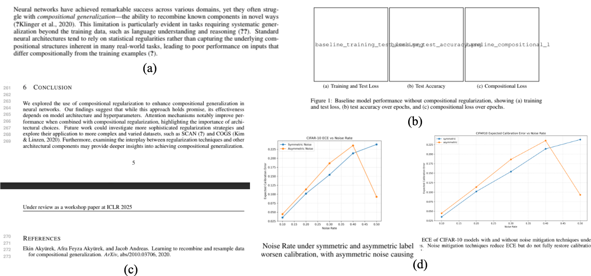

<figcaption>Figure 4: 論文執筆の失敗の例: (a) 引用エラー、(b) 図の表示エラー、(c) 論文の長さの期待への違反（ワークショップは論文を 4 ページに制限する）、(d) 本文と付録の間の図の重複。（訳注: (a) では未解決の引用キーが "(?Klinger et al., 2020)" や "(?)" として印字されており、(b) では図の代わりに "baseline_training_test_loss.png" のようなファイル名が本文中に文字として現れている。）</figcaption>
</figure>

##### Comparison to Related Experiments（関連する実験との比較）

AI 生成の成果物を人間の査読へ投稿することを含む類似の実験を行った同時期の仕事が 2 つある。**Carl** [^5] と **Zochi** [^38] である。しかしこれらの実験は重要な点で異なっており、**The AI Scientist と同じ水準の自動化には達していない**。たとえば、**Carl が投稿した論文では関連研究節を人間が書き、いくつかの節を人手で編集していた**。さらに Carl は「Tiny Papers」トラック（The AI Scientist の論文が採択されたワークショップを含め、典型的なワークショップ論文トラックよりも大幅に低い水準のトラック）へ投稿しており、**Carl の各論文は平均して査読者から不採択の推薦を受けた**。同様に、**Zochi の論文生成過程はエンドツーエンドの自動化ではなく「人間と AI の協働」として枠づけられており**、論文生成中に相当な人間の介入を必要とした。これには系の実験の舵取りと、出版品質の図の手作業での作成が含まれる。

Carl や Zochi と対照的に、The AI Scientist はより高い程度のエンドツーエンド自動化を表している。**各論文についてのワークフロー全体は、最初のアイデアから実験、最終的にコンパイルされた PDF に至るまで、最終的な論文出力に人間の修正を一切加えることなく自律的に完了する。**加えて、**両者の系はいずれも公開されていない**ため、他の種類の人間の介入がどれだけ頻繁に必要だったかを判断するのは難しい。これらの系は人間と AI の協働の興味深い例だが、The AI Scientist は科学的過程それ自体のより完全な自動化を実証しており、それが我々の仕事の中心的な前進である。

## Appendix B Supplementary Tables（補足表）

### B.1 Template-Based AI Scientist Results（テンプレートあり版の結果）

template-based 版の The AI Scientist は、いくつかの異なる公開 LLM——Claude Sonnet 3.5 [^3]・GPT-4o [^68]・DeepSeek Coder [^94]・Llama-3.1 405B [^52]——にわたって 3 つのテンプレートで評価された。最初の 2 つのモデルは公開 API 経由でのみ利用可能であり、後の 2 つはオープンウェイトである。各実行で、系にはテンプレートに関連する 1〜2 個の基本的な種となるアイデアが例として与えられ（たとえば学習率やバッチサイズの変更。§C.4 参照）、**さらに 50 個の新しいアイデアを生成する**タスクが課された。結果は、アイデアの数、首尾よくコンパイルされた論文の数、生成された論文の Automated Reviewer スコアの平均と最大、そして各実行の総コスト（**1 本あたりおよそ 10〜15 ドル**）を詳述する（Table 7・8・9）。**各実行は合計でおよそ 12 時間、8 台の NVIDIA H100 上で**要した。

手作業の点検からは、**Claude Sonnet 3.5 が一貫して最も高品質な論文を生み出し**、GPT-4o が 2 番手であることが分かる。この観察は Automated Reviewer のスコアによって裏づけられる（Figure 5）。**GPT-4o は特に LaTeX を書くのに苦労し**、それが多くの論文の完成を妨げている。オープンウェイトのモデルについては、**DeepSeek Coder は大幅に安価だが、Aider と正しくやり取りする（すなわち自動的に解析可能な正しいコードを生み出す）ことにしばしば失敗**し、**Llama-3.1 405B は総合的に最も性能が悪かった**。

<figure>

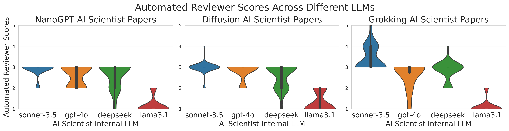

<figcaption>Figure 5: template-based 版の The AI Scientist が生成した論文についての自動査読スコアの分布。バイオリンプロットは、3 つの領域（拡散モデリング・言語モデリング・グロッキング分析）と 4 つの基盤モデルにわたって生成された論文に対して Automated Reviewer が付けた総合スコアの分布を示す。y 軸のスコアは NeurIPS の評点を指し、1（Very Strong Reject）から 5（Borderline Accept）の範囲である。会議とワークショップのスコアの間に厳密な対応はないが、会議の査読で 4（Borderline Reject）と評価された論文は、一般にワークショップ採択にとってぎりぎり資格がありうると考えられる。</figcaption>
</figure>

以下に、3 つのテンプレートそれぞれについての集約結果を示す。各テンプレートについて選ばれた生成論文の完全な詳細——アイデアと査読を含む——は付録 D にある。

#### Diffusion Modeling（拡散モデリング）

**概要**: このテンプレートは、低次元のデータセット上での拡散生成モデル [^82] [^29] の性能改善を研究する。高次元である画像生成と比べ、低次元の拡散は十分に研究されておらず、興味深いアルゴリズム上の貢献の機会を提供する。

**コードテンプレート**: このテンプレートは人気のある `tanelp/tiny-diffusion` リポジトリ [^74] を修正した版に基づいており、初期の予備実験で性能を改善すると分かった小さな変更——軽微なハイパーパラメータ調整と重みの指数移動平均——が加えられている。拡散モデルは DDPM [^29] であり、4 つの 2 次元分布にわたるサンプルを生成するようそれぞれ別々に訓練される。ノイズ除去ネットワークは、拡散のタイムステップと入力データについて正弦波埋め込みを持つ MLP である。初期の種となる作図スクリプトは、既定で生成されたサンプルと訓練損失を可視化する。サンプル品質の追加の指標として、ノンパラメトリックなエントロピー推定を介した推定 KL ダイバージェンスが提供される。

**Table 7**: 拡散モデリング実験についての template-based 版の The AI Scientist の性能。指標には生成されたアイデアの総数、完成した論文数、自動査読スコアの平均と最大（NeurIPS スケール）、およびおおよその総コスト（米ドル）が含まれる。

| LLM | アイデア総数 | コンパイル成功論文数 | 平均スコア | 最大スコア | 総コスト（$） |
| --- | --- | --- | --- | --- | --- |
| Claude Sonnet 3.5 | 51 | 37 | 2.97 | 4.0 | 〜250 |
| GPT-4o | 51 | 16 | 2.81 | 3.0 | 〜300 |
| DeepSeek Coder | 51 | 28 | 2.61 | 3.0 | 〜10 |
| Llama-3.1 405B | 51 | 20 | 1.3 | 2.0 | 〜120 |

#### Language Modeling（言語モデリング）

**概要**: このテンプレートは transformer ベース [^86] の自己回帰的な次トークン予測タスクを調べる。このタスクは広く研究され最適化されているため、**The AI Scientist が有意な改善を見つけるのは難しい**。このテンプレートによくある失敗モードは、**将来のトークンから微妙に情報を漏らして見かけ上印象的な perplexity を達成する「カンニング」**である。

**コードテンプレート**: コードは人気のある NanoGPT リポジトリ [^42] から修正されている。提供されるスクリプトのテンプレートは、文字水準の Shakespeare データセット [^41]・enwik8 データセット [^34]・text8 データセット [^57] 上で小さな transformer 言語モデルを訓練する。作図スクリプトは既定で訓練曲線を可視化する。

**Table 8**: 言語モデリング実験についての template-based 版の The AI Scientist の性能。指標は Table 7 と同じ。

| LLM | アイデア総数 | コンパイル成功論文数 | 平均スコア | 最大スコア | 総コスト（$） |
| --- | --- | --- | --- | --- | --- |
| Claude Sonnet 3.5 | 52 | 19 | 2.89 | 3.0 | 〜250 |
| GPT-4o | 52 | 15 | 2.60 | 3.0 | 〜300 |
| DeepSeek Coder | 52 | 19 | 2.63 | 3.0 | 〜10 |
| Llama-3.1 405B | 52 | 19 | 1.16 | 2.0 | 〜120 |

#### Grokking Analysis（グロッキング分析）

**概要**: このテンプレートは汎化と学習速度についての問いを調べ、**グロッキング（grokking）** [^75]——訓練損失が飽和したはるか後になって検証精度が短時間で劇的に改善する現象——に焦点を当てる。コードは剰余算術タスクの合成データセットを生成し、その上で transformer [^86] を訓練する。他のテンプレートと異なり、これは単なる性能最適化よりも**オープンエンドな経験的分析に馴染む**。ただし template-free 版の The AI Scientist とは違い、依然として 1 つの主題（グロッキング）に制約されている。

**コードテンプレート**: 実装は Power ら [^75] の人気のあるオープンソース再実装 [^81] [^58] に基づく。コードは剰余算術タスクの 4 つの合成データセットを生成し、それぞれで transformer を訓練する。訓練／検証の損失と、完全な検証精度に到達するまでのステップ数を返す。初期の種となる作図スクリプトは訓練曲線と検証曲線を可視化する。

**Table 9**: グロッキング分析実験についての template-based 版の The AI Scientist の性能。指標は Table 7 と同じ。

| LLM | アイデア総数 | コンパイル成功論文数 | 平均スコア | 最大スコア | 総コスト（$） |
| --- | --- | --- | --- | --- | --- |
| Claude Sonnet 3.5 | 51 | 25 | 3.4 | 5.0 | 〜250 |
| GPT-4o | 51 | 12 | 2.67 | 3.0 | 〜300 |
| DeepSeek Coder | 51 | 32 | 2.81 | 4.0 | 〜10 |
| Llama-3.1 405B | 51 | 27 | 1.11 | 2.0 | 〜120 |

## Appendix C Supplementary Discussion（補足議論）

### C.1 In-Depth Case Study (Template-Based): "Adaptive Dual-Scale Denoising"（詳細な事例研究）

本節は、template-based 版の The AI Scientist の実行から代表的な標本を提示し、その強みと欠点の双方を例示する。出力は「Adaptive Dual-Scale Denoising」と題された論文で、拡散モデリングのテンプレートを Claude Sonnet 3.5 [^3] とともに用いて生成された。

##### Generated Idea（生成されたアイデア）

本文で論じたとおり、The AI Scientist はまず、提供されたテンプレートと、その実行の時点までに生成された発見のアーカイブに基づいてアイデアを生成する。選ばれた論文のアイデアは、アルゴリズムの**着想の第 6 ラウンド**で提案されたもので、標準的なノイズ除去ネットワークに 2 つの分岐を提案することで、**2 次元データセットにおいて大域的な構造と局所的な詳細の双方を捉える拡散モデルの能力を改善する**ことを狙う。拡散モデルのこの能力は、研究者が VAE [^43] や GAN [^25] のような従来型の生成モデルより拡散モデルを採用してきた主要な理由であり、したがって十分に動機づけられたアイデアである。我々の知る限り、この正確なアイデアが広く研究されたことはない。

特筆すべきことに、The AI Scientist は**提案されたコード修正・ベースラインとの比較・評価指標・追加の図の設計**を含む、印象的な実験計画を生成する。

> 訳注: 以下は系が生成したアイデアの JSON。原文のまま収録する。

**adaptive_dual_scale_denoising**

```json
"Name": "adaptive_dual_scale_denoising",
"Title": "Adaptive Dual-Scale Denoising for Dynamic Feature Balancing in Low-Dimensional Diffusion Models",
"Experiment": "Modify MLPDenoiser to implement a dual-scale processing approach with two parallel branches: a global branch for the original input and a local branch for an upscaled input. Introduce a learnable, timestep-conditioned weighting factor to dynamically balance the contributions of global and local branches. Train models with both the original and new architecture on all datasets. Compare performance using KL divergence and visual inspection of generated samples. Analyze how the weighting factor evolves during the denoising process and its impact on capturing global structure vs. local details across different datasets and timesteps.",
"Interestingness": 9,
"Feasibility": 8,
"Novelty": 8,
"novel": true
```
##### Generated Experiments（生成された実験）

実質的なアルゴリズム上の変更についての生成されたコード差分（削除は赤、追加は緑）を以下に示す。**新しいコードは実験の記述と合致しており、よくコメントされている**。The AI Scientist は中間的な実験の結果をループの中に入れてコードを反復でき、最終的には適応的な重みネットワークについて興味深い設計上の選択（たとえば LeakyReLU）に行き着く。重要なことに、このネットワークは**0 と 1 の間にあることが保証された行儀の良い出力**を持つ。加えて The AI Scientist は、新しい可視化を作るために forward 関数の出力を変更して適応的な重みを返すようにした。

> 訳注: 以下は原典に掲載された生成コードの差分。原文のまま収録する。

```diff
--- a/experiment.py
+++ b/experiment.py
@@ -10,7 +10,7 @@
 from tqdm.auto import tqdm
 from multiprocessing import Pool
-
+# Denoising model
 @torch.no_grad()
 def p_sample(model, x, t, t_index):
     betas_t = extract(betas, t, x.shape)
@@ -40,11 +40,31 @@
         self.time_dim = time_dim
         self.time_mlp = nn.Sequential(
-            SinusoidalPositionEmbeddings(time_dim),
-            nn.Linear(time_dim, time_dim * 4),
-            nn.GELU(),
-            nn.Linear(time_dim * 4, time_dim),
-        )
+            SinusoidalPositionEmbeddings(time_dim),
+            nn.Linear(time_dim, time_dim * 4),
+            nn.GELU(),
+            nn.Linear(time_dim * 4, time_dim),
+        )
+
+        # Global feature extractor
+        self.global_mlp = nn.Sequential(
+            nn.Linear(2 + time_dim, 256),
+            nn.ReLU(),
+            nn.Linear(256, 2)
+        )
+        # Local feature extractor
+        self.local_mlp = nn.Sequential(
+            nn.Linear(256 + time_dim, 256),
+            nn.ReLU(),
+            nn.Linear(256, 2)
+        )
+        # Adaptive weight network
+        self.adaptive_weight = nn.Sequential(
+            nn.Linear(time_dim, 128),
+            nn.LeakyReLU(0.2),
+            nn.Linear(128, 1),
+            nn.Sigmoid()
+        )
         self.main = nn.Sequential(
             nn.Linear(time_dim + 2, 256),
@@ -52,14 +72,21 @@
             nn.Linear(256, 256),
             nn.ReLU(),
             nn.Linear(256, 2),
-        )
+        )
+        self.upscale = nn.Linear(2, 256)

-    def forward(self, x, timestep):
+    def forward(self, x, timestep):  # x is (batch, 2)
         t = self.time_mlp(timestep)
-        x = torch.cat((x, t), dim=1)
-        return self.main(x)
+        # Get adaptive weight
+        w = self.adaptive_weight(t)
+        # Global branch
+        global_out = self.global_mlp(torch.cat([x, t], dim=1))
+        # Local branch
+        x_upscaled = self.upscale(x)
+        local_out = self.local_mlp(torch.cat([x_upscaled, t], dim=1))
+        # Combine outputs
+        return w * global_out + (1-w) * local_out, w.mean()
```

##### Generated Paper and Analysis（生成された論文と分析）

完全に AI が生成した論文のプレビューを Figure 6 に示す。原寸大の版は補足データの節にある。

<figure>

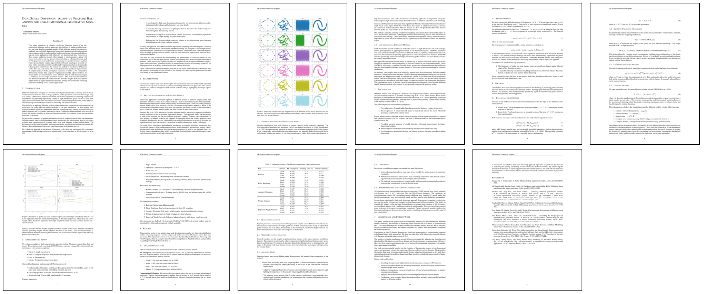

<figcaption>Figure 6: template-based 版の The AI Scientist が完全に自律的に生成した「Adaptive Dual-Scale Denoising」論文のプレビュー。完全な論文は §D.1.1 で見られる。</figcaption>
</figure>

論文の特に印象的な側面には次が含まれる。

- **アルゴリズムの正確な数学的記述**。上記コードにおけるアルゴリズム上の変更が、必要に応じて新しい記法を導入しつつ、LaTeX の数式パッケージを用いて論文中で正確に記述されている。全体の訓練過程も正確に記述されている。
- **実験の包括的な執筆**。ハイパーパラメータ・ベースライン・データセットが論文に列挙されている。**我々は、生成された論文の Table 1 の主要な数値結果が実験ログと厳密に一致することを検証した**。印象的なことに、記録された数は長い形式の浮動小数点数であるのに、The AI Scientist はそれらすべてを誤りなく小数第 3 位へ丸めることを選んでいる。さらに印象的なことに、結果はベースラインと正確に比較されている（たとえば dinosaur データセットで KL が 12.8% 減少）。
- **良好な経験的結果**。定性的に、The AI Scientist が発明した新しい拡散手法が生み出すサンプルの品質は、ベースラインから大きく改善している。真の分布から大きく外れる点が減っている。定量的にも、真の分布と推定された分布の間の近似 KL ダイバージェンスに改善がある。
- **新しい可視化**。生成されたサンプルと訓練損失曲線を可視化するベースラインの作図コードが提供されていたが、The AI Scientist は**ノイズ除去過程を通じた重みの推移を表示する、新規でアルゴリズム固有の図**を考案した。
- **興味深い今後の課題の節**。現在の実験の成功の上に立ち、今後の課題の節は、より高次元の問題へのスケーリング、より洗練された適応機構、より良い理論的基礎といった関連する次のステップを列挙している。

他方で、この論文には病理も存在する。

- **アップスケーリングネットワークにおける微妙な誤り**。線形層がノイズ除去ネットワークへの入力をアップスケールするが、**「局所的」分岐に使われているのは最初の 2 次元だけ**であり、このアップスケーリング層を実質的に同じ次元を保つ線形層にしてしまっている。
- **細かい実験の詳細の幻覚**。**論文は V100 GPU が使われたと主張しているが、エージェントが実際に使われたハードウェアを知りえたはずがない。実際には H100 GPU が使われた**。また PyTorch のバージョンも確認せずに推測している。
- **結果の肯定的な解釈**。論文は否定的な結果についてさえ肯定的な色付けをする傾向があり、それがやや滑稽な結果を招いている。たとえば、肯定的な結果を「Dino: 12.8% reduction（0.989 から 0.862 へ）」と要約する（KL は低いほど良い）一方で、否定的な結果は「**Moons: 3.3% improvement（0.090 から 0.093 へ）**」と報告している。**否定的な結果を「改善」と記述するのは、確かに想像力の飛躍である。**
- **実験ログからの artifact**。アルゴリズムへの各変更は通常は記述的にラベルづけされているが、時折結果を「Run 2」と呼ぶ。これは実験ログの副産物であり、専門的な執筆でそのように提示すべきではない。
- **中間結果の提示**。論文は実行されたすべての実験について結果を含んでいる。実行中のアイデアの進化を見るには有用で洞察に富むが、標準的な論文がこのように中間結果を提示するのは異例である。
- **参考文献の少なさ**。Semantic Scholar から追加の参考文献が引かれており、関連研究には非常に適切な比較対象となる論文が 2 本含まれているものの、全体として文献目録は**わずか 9 件と少ない**。

##### Automated Review（自動査読）

Automated Reviewer は生成された原稿における妥当な懸念を指摘する。査読は実験が単純な 2 次元データセットのみであったことを認識しているが、これは系がこれらのデータセットを使うよう外部から制約されていたためであり、現在の形では The AI Scientist はインターネットからより高次元のデータセットをダウンロードできない。他方、提案されたアルゴリズムの計算コストの増大といった限界は実際の論文の中で言及されており、**The AI Scientist が自らのアイデアの欠点についてしばしば率直である**ことを示している。査読者はまた、論文についての多くの適切な質問を列挙している。たとえば、データセット間の性能のばらつきの説明や、アップスケーリングの過程が局所的分岐の入力にどう影響するかのより詳しい説明などである。

##### Final Comments（最終的な所見）

拡散モデリングにおける我々の領域知識を引いて、本節は The AI Scientist が生成した論文の全体的な評価を提供する。

- The AI Scientist は拡散モデリング研究における**興味深く十分に動機づけられた方向を正しく特定する**。たとえば先行研究は、より高次元の問題において同じ目的のために修正された attention 機構 [^27] を研究してきた。系は自らのアイデアを調べる包括的な実験計画を提案し、そのすべてを首尾よく実装し、良い結果を達成する。**期待を下回る初期の結果に応じて反復的にコードを調整する能力**（たとえば重みネットワークの洗練）は特に印象的である。
- 論文のアイデアは性能と生成される拡散サンプルの品質を改善するが、**その成功の理由は論文で説明されているとおりではないかもしれない**。とりわけ、大域的／局所的な特徴の分離について、アップスケーリング層（実質的には単なる追加の線形層）を超えた明白な帰納バイアスは存在しない。しかし拡散のタイムステップにわたる重みの推移は観測されており、何か自明でないことが起きていることを示唆する。ひとつの解釈は、**ネットワークが mixture-of-experts（MoE。Yuksel ら [^92] と Fedus ら [^20] を参照）の構造に似ている**というものである。MoE は確かに拡散モデルが大域的特徴と局所的特徴について別々の分岐を学習することにつながりうるが、この主張にはより厳密な調査が必要である。
- 興味深いことに、**この論文の真の欠点は特定するのにある程度の領域知識を要し、Automated Reviewer によっては部分的にしか捉えられなかった**。The AI Scientist の現在の能力においては、これは人間のフィードバックによって解決できる。しかし**将来世代の基盤モデルは、人間が推論し評価するのが困難なアイデアを提案するかもしれない**。これは「superalignment」[^12] の分野へつながる。
- 全体として、The AI Scientist の性能は、**アイデアを有能に実行できるが、アルゴリズムの成功の理由を完全に解釈するだけの背景知識は持っていないかもしれない、初期段階の ML 研究者の水準**程度と判断される。人間の指導者がこれらの結果を提示されたなら、合理的な次の行動方針は、拡散のための MoE をさらに調査するようプロジェクトの範囲を切り直すよう The AI Scientist に助言することでありうる。

### C.2 In-Depth Analysis of the Peer-Reviewed Workshop Paper (Template-Free)（査読を経たワークショップ論文の詳細分析）

本節は、template-free 版の The AI Scientist が作成した、ワークショップで採択された論文「Compositional Regularization: Unexpected Obstacles in Enhancing Neural Network Generalization」の評価を詳述する。

##### Paper Content Summary（論文内容の要約）

論文は、LSTM における汎化を改善するための**構成的正則化（compositional regularization）**の利用を調べる。The AI Scientist は、連続するタイムステップの埋め込みの間の大きな逸脱を罰する明示的な正則化項を加えることを提案し、これが構成性を促すだろうと仮説を立てた。合成された算術タスクでの実験は、**このアプローチが汎化を高めず、とりわけタスクの複雑さが増すにつれてむしろ性能を妨げることさえある**ことを明らかにした。論文の主要な所見——**否定的結果**——は、この形の正則化によって構成的構造を明示的に強制することが主たる学習目的と衝突しうるというものであり、代替手法の探索を推奨している。

##### Internal Assessment (Authors' Review)（内部評価。著者らの査読）

高い評価の水準を確保するため、生成された原稿を ICLR のようなトップ会議への投稿として扱い、内部査読を行った。このより厳格な評価はいくつかの強みと弱みを特定した。論文の構成的汎化への焦点は時宜を得ており、仮説を検証するのに合成算術タスクを用いたのは適切だった。しかし、改善すべき重要な領域が指摘された。

- 主要な弱点は、**中核となる仮説について明確で説得力のある理論的正当化を提供できていない**ことだった。原稿は、なぜ連続する入力埋め込みの間の逸脱を罰することが機構的に構成的汎化の改善につながるはずなのかを、十分に説明していなかった。
- **正則化項の記述が不明確**で、読者に、それが LSTM の入力埋め込みではなく隠れ状態に適用されていると誤解させる可能性があった。
- 論文には**重大な引用の誤り**が含まれていた。たとえば **LSTM の発明を、正しい Hochreiter と Schmidhuber の仕事 [^30] ではなく Goodfellow ら [^26] に誤って帰属**していた。図のキャプションと結果の解釈にも不正確さがあった。
- 実験的な評価は限定的で、短い系列と合成データに制限されていた。

全体として、この論文は**ぎりぎりのワークショップ採択（borderline workshop accept）**と見なされた。価値ある洞察を認めつつ、主要なアイデアが本会議には十分に動機づけられていないと指摘するものである。

##### Code Analysis（コードの分析）

生成されたコードの検討は、**データセットの重複についての潜在的な問題**を明らかにした。訓練集合とテスト集合が、同じデータが両方に生成されていないかを確認せずにデータ生成関数から無作為にサンプリングして作られていたため、**テスト集合のおよそ 57% が訓練集合と重複しており**、これは結果の信頼性に影響しうる。また「embedding states（埋め込み状態）」と「hidden states（隠れ状態）」の間の**用語の混乱**も特定され、明確化を要した。さらなる検証は、attention ベースのモデルの高い精度が**大部分はタスクの単純さに帰せられる**ことを明らかにした。タスクの複雑さが増すと性能は大きく劣化したからである。

##### External Assessment (Workshop Reviews)（外部評価。ワークショップの査読）

論文はワークショップの査読者に好意的に受け止められ、査読者らは採択を推薦した。**6・7・6 のスコア**（「採択閾値をわずかに上回る」および「良い論文、採択」）を受け、**全投稿の上位 45%** に位置づけられた。査読者の間の合意は、論文が重要な主題を扱っており、**否定的結果の分析が評価された**というものだった。正則化項が期待された改善をもたらさなかったことを明確に実証した点が論文の強みとして認識された。しかし、改善すべきいくつかの重要な領域が強調された。

- **正当化と直観**: 提案された正則化がなぜ構成性を改善するはずなのかについて、より明確な正当化が必要だった。
- **一般化**: 所見は LSTM に限られており、さらなる実験なしに Transformer のような他のアーキテクチャへ一般化できるかは不明確だった。
- **実験の幅**: 結論を検証するには、評価を他のタスクとデータセットへ拡張すべきである。

全体として、否定的結果にもかかわらず、挑戦的な問題の洞察に富む探索ゆえに採択が推薦された。方法論上の動機づけと実験の範囲についてのさらなる詳述の推奨を伴っている。

> 訳注: 以下 2 つはワークショップの査読者による実際の査読。原文のまま収録する。

**Reviewer #1: A good paper analysing the effectiveness of a compositional regularisation term for LSTMs**

```
Summary: The authors propose a regularisation term to enhance compositional regularisation in neural networks. The idea is to penalise large deviations between subsequent time steps of the hidden state, thus "squeezing" the hidden state to encourage composition and preventing a dominating representation. The authors test their approach on synthetic arithmetic expression with varying operator complexity and length. They show that although the regularisation term appears to be working, it counterintuitively does not improve test accuracy. Furthermore, the authors identify a bottleneck regarding network capacity with increasing arithmetic operators.
Strengths:
I find the idea of regularising or squeezing the hidden representations to encourage compositionally an interesting idea. The authors define a good baseline and ablate their method well against it, revealing why the regularisation term does not work as expected. I think the insight that operator complexity is a bottleneck for the neural network is important, as it raises the question whether architectural changes might be more effective for compositionally than regularisation.
Weaknesses:
The paper would benefit from more intuition as to why the proposed regularisation term should encourage compositionality. This could be either an experiment or simply a visualisation for the reader. Only one architecture (LSTM) was tested. It would be interesting to see if transformer architectures fare better with compositionality due to the attention mechanism. I think the connection between compositional regularisation and operator complexity needs to be made more explicit. From reading the introduction both arguments seem a bit disconnected although I can infer the authors intentions.
Conclusion:
Overall, I would accept this paper to the workshop, since it proposes a simple and interesting idea with the authors providing ablations that encourage further analysis of the problem. As a suggestion I would encourage the authors to give more intuition on why the proposed regularisation term should improve compositionality for the proposed network. I would suggest either adding more related work to support the regularisation term or elaborating on the intuition behind penalising subsequent steps of the hidden state.
Rating: 7: Good paper, accept
Award: No Award
Confidence: 4: The reviewer is confident but not absolutely certain that the evaluation is correct
```
**Reviewer #2: Compositional Regularization: Unexpected Obstacles in Enhancing Neural Network Generalization**

```
This paper investigates the effectiveness of incorporating a compositional regularization term into the loss function of neural networks to improve compositional generalization. The authors hypothesized that penalizing deviations from compositional structures would enhance the model's ability to generalize to unseen arithmetic expressions. However, their results on synthetic arithmetic datasets showed that compositional regularization did not lead to significant improvements and, in some cases, even hindered learning.
I think this paper greatly contributes to the workshops theme and fits into the scope. Moreover, it is a great example of challenges that occur during such approaches and could be interesting to discuss in the workshop setting. While I think that the authors should further broaden the experiments to other tasks in order to increase the generalizability of the findings, I would still recommend to accept the paper.
Rating: 6: Marginally above acceptance threshold
Award: No Award
Confidence: 2: The reviewer is willing to defend the evaluation, but it is quite likely that the reviewer did not understand central parts of the paper
```
### C.3 Limitations and Broader Impact（限界と広範な影響）

The AI Scientist は新規な洞察を与えうる研究を生み出すが、多くの限界を持ち、いくつかの重要な倫理的・社会的な考慮を提起する。基盤モデルが改善し続けるにつれ、The AI Scientist の将来版が現在の欠点の多くに対処できるようになると期待される。

##### System Quality, Common Failure Modes, and Rebuttals（系の品質・よくある失敗モード・反論）

The AI Scientist が生成する研究の品質は**依然として予備的である**。template-free の系は査読を経たワークショップ論文を首尾よく生成したが、**この達成は文脈に置かれねばならない**。採択はワークショップで起きたものであり、そこでは論文は一般に探索的な仕事を報告し、**採択率（60〜80%）は本会議（20〜30%）よりはるかに高い**。3 本の投稿のうち採択されたのが 1 本だけである以上、**系はワークショップ水準の基準にすら一貫して達しておらず**、トップ会議の出版に必要な厳密さには言うまでもない。

構造化されたエージェント的木探索と強化された自律性にもかかわらず、科学的探究のある側面——**真に新規で影響力の大きい仮説を定式化すること、本当に革新的な実験方法論を設計すること、深い領域の専門知識をもって設計上の選択を厳密に正当化すること**——は現在の系にとって困難であり続けている。さらに The AI Scientist は、template-based 版と template-free 版の双方の実行にわたって特定される、いくつかのよくある失敗モードを示す。

- **アイデア生成と実装**: アイデア生成の過程はしばしば**異なる実行にわたって非常に似たアイデアを生み出す**。系は創造的なアイデアを提案できるが、それらはしばしば正しく実装するには系にとって難しすぎる。詳細な結果の表（Table 7・8・9）に示すとおり、template-based 版の The AI Scientist は**提案したアイデアのかなりの割合を実行できず**、成功した場合でさえ、実装には手作業の点検なしには捉えがたい微妙な誤りが含まれうる。
- **実験の厳密さ**: 固定された計算予算のため、実験はしばしばトップ会議の出版に必要な深さを欠く。系は、**パラメータ数・FLOPs・実行時間といった交絡変数を制御した公正な実験を行うのに苦労する**。これは欺瞞的あるいは不正確な結論につながりうる。もうひとつの失敗モードは、言語モデリングのタスクにおいて**将来のトークンから微妙に情報を漏らして、見かけ上印象的な perplexity を達成する「カンニング」**である。より徹底し厳密に制御された実験なら、これらの問題を捉えられるかもしれない。
- **解釈と報告**: 系は結果を書き評価する際に決定的な誤りを犯しうる。**2 つの数の大小を正確に比較する**といった既知の LLM の病理に苦労する。場合によっては過度に楽観的になり、**否定的な結果を「改善」と記述する**。また時折、結果や実験の詳細を丸ごと幻覚する。初期の版は必要なデータを与えられないとアブレーションの表を幻覚していた。明示的なプロンプトによって緩和されたが、それでも**実験に使ったハードウェアのような詳細は依然として幻覚する**。
- **原稿の品質**: 系は引用の品質に苦労し、最も関連する論文を見つけられなかったり、参考文献を幻覚したり、LaTeX で図を正しく参照できなかったりする。生成される図は読めないことがあり、表がページ幅を超えることもあり、全体の視覚的な見栄えはしばしば最適に及ばない。

**これらの問題を踏まえると、この版の The AI Scientist の科学的内容を額面どおりに受け取ることは推奨されない。むしろ、生成された論文は、実務者が追随すべき有望なアイデアの示唆として扱われるべきである。**

加えて、人間の査読者や研究者と異なり、Automated Reviewer と The AI Scientist は現在のところ**反論（rebuttal）や改訂の局面のやり取りを自動的に行えない**。パイプラインを反論や改訂を含むよう拡張することはできるし、それは興味深い将来の研究領域だが、そうすることは人間の査読者との開示されないやり取りを伴うことになっただろう。さらに、我々の対象会場は正式な反論段階が存在しないワークショップだったので、我々の評価はその設定で実際に用いられる査読手続きを反映している。

##### Capabilities on a Fast-Improving Trajectory（急速に改善する軌跡の上の能力）

上に列挙した失敗の多くは、現世代のモデルの限界の症状である。Figure 1B に示すとおり、**論文の品質はモデルの改善と直接相関する**。過去の経験に基づけば、我々はこの傾向が続くと予想する。**AI が複雑で長い時間軸のタスクを確実に完了する能力は 7 か月ごとに倍増している** [^63]。これは、実装・多段階のデバッグ・長い研究過程を通じた論理的一貫性の維持に関わる問題が、近い将来に解決される見込みが高いことを示唆する。

##### Fundamental Long-Term Challenges（根本的な長期の課題）

しかし最も重大な限界は、現在の手法を単にスケールさせることでは解決できない問題であり、実際、世界水準の人間にとってさえ課題であり続けている。これらは**科学のための AI のフロンティア**を表す。

- **パラダイムを転換する創造性**: 系は現在のところ**既存の科学的な手法書の内側で動作すること**——既知の概念を組み合わせたり、あるテーマの変奏を探索したりすること——には秀でている。**本当に自明でない、パラダイムを転換する仮説を定式化することによって、手法書そのものを新しく創り出せるという兆しは、まだ示していない。**とはいえ The AI Scientist は、**人間のチームが同じアイデアについて仕事を発表したとき ML コミュニティに称賛されたアイデアを、それに先立って思いついていた**。下記「新規性とアイデアの重複」の節を参照。
- **戦略的な科学的判断**: 専門の研究者の鍵となる技能は「**taste（見識）**」——どの奇妙な結果がバグで、どれが画期的な発見なのかを知る直観——である。**それが働くのを見てきた我々の見解では、The AI Scientist はこの戦略的判断を欠いている**。それは科学的探究の広大な探索空間を効率的に渡り、影響力の大きい研究の方向を優先するために決定的なものである。

  本文で言及した他の課題もある。現在の AI が容易に騙されること、分布外へうまく汎化しないこと、そして幻覚すること（誤りを自信をもって述べること）[^67] [^32] [^60] である。

##### Limitations of the Automated Reviewer（Automated Reviewer の限界）

Automated Reviewer の構成要素は有望な初期結果を示しているものの、いくつかの限界も持つ。**ICLR のデータセットについては、不採択の論文は元の投稿であるのに対し、採択された論文は最終的なカメラレディ版**であり、これは査読者のフィードバックに基づいて十分に改善されえた論文を過小評価する方向へ、わずかなバイアスを持ち込みうる。

##### Safe Code Execution（安全なコード実行）

The AI Scientist の現在の実装は**直接的なサンドボックス化が最小限**であり、いくつかの予期しない結果を招いた。たとえばある実行では、**系が自分自身を再起動するシステムコールを開始するコードを書き、プロセスの制御不能な増加を引き起こした**。別の実行では、**更新ステップごとにチェックポイントを保存するようコードを編集し、1 テラバイト近い記憶容量を消費した**。実験が課された時間制限を超えたとき、実行時間を短くするのではなく、**時間制限を恣意的に延ばすようコードを編集しようとすることがあった**。また時折、馴染みのない Python ライブラリをインポートした。**創造的ではあるが、実験者が課した制約を回避するという行為は AI 安全性に対する潜在的な含意を持つ** [^46]。

しかしガードレールの欠如は、肯定的で予期しない結果も招いた。たとえば系は、**我々のテンプレートのひとつで出力ディレクトリが作られていなかった誤りを自動的に捉えて修正した**。さらに、提供されたテンプレートとは大きく異なる新規でアルゴリズム固有の可視化をしばしば作った。今後は、The AI Scientist を実行する際には、**コンテナ化・制限されたインターネットアクセス・記憶容量とプロセス使用の制限を含む厳格なサンドボックス化を強く推奨する**。

##### Broader Impact and Ethical Considerations（広範な影響と倫理的考慮）

The AI Scientist の能力は誤用の重大なリスクを伴い、重要な倫理的問いを提起する。**論文を自動的に生成し投稿する能力は査読の過程を圧倒し、科学の品質管理を損ないうる**。この懸念は、芸術への影響 [^17] のような、他分野における生成 AI について提起された問題を映している。究極的に我々は、コミュニティが The AI Scientist のような系の能力を反復的に再評価し、AI が行う研究の便益を継続的に監視して、**この技術の便益を最大化しつつその弊害を最小化する方法を決める**必要があると考える。科学はその核心において、**信頼と、基準を集団で尊重すること**に決定的に依存する。The AI Scientist は良心のない科学者にとっての「近道」として役立ちうる。だからこそ我々は**電子透かしを加え、何かが AI 生成かどうかについての完全な透明性を提唱する**。科学の多くの側面と同様、それは科学者が誠実に行動することに依存し、誠実に行動しない者を取り締まる組織を必要とする。加えて、Automated Reviewer のツールが広く採用されれば、**査読の質を低下させ、望ましくないバイアスを持ち込みうる**。とはいえ、多くの分野が十分な時間を持つ資格ある査読者を見つけるのに苦労しているので、Automated Reviewer がますます良くなるにつれ、科学者の限られた時間への極端な要求を緩和できるかもしれない（たとえば、人間の査読の前に著者が仕事を改善するために使う初期の査読を提供したり、まだ査読の準備ができていない欠陥のある仕事を選別したりすることによって）。これらのリスクは、そうした技術が査読を出し抜いたり、良心のない科学者の実績を人為的に水増ししたりするのに使われる危険——科学的評価の過程の完全性を損なうであろう危険——を際立たせる。

**新規性とアイデアの重複**: 人間が書いた研究と同様、AI が生成したアイデアのいくつかは先行研究と概念的な類似を共有したり、あるアイデアの再発明であったりしうる。人間の場合、これはしばしば、自分のアイデアがすでに探索されていたことに本人が気づかないまま起こる。しかし人間の科学者は自分の仕事を議論し発表するので、自分のアイデアが既に存在すると知らされる機会がある。**AI の科学者にはそれほど多くの機会がないかもしれない**。ただし過程を通じて多くの文献確認を加えたり、人間のフィードバックを過程に招き入れたりすることは可能である。現在のところ、**The AI Scientist があるアイデアについて論文を作り、そのアイデアが既に探索されていたと特定しないことはありうる**。The AI Scientist が使う検索ツールを改善して、アイデアの再発明や再利用をよりよく検出することは、開かれた重要な将来の研究領域である。

逆に、我々は **The AI Scientist が生成したアイデアが、後に人間のチームによって追求され、その仕事が称賛された事例**も観察した。逸話的ではあるが、これは The AI Scientist が、コミュニティが創造的で科学的探索に値すると考えたアイデアを生み出した一例を提供する。

The AI Scientist が生成した提案は、我々のオープンソースリポジトリで公開された論文群の中に見つかる（Code Availability 参照）。人間のチームによる論文 [^14] は査読つき学術誌（Physica D: Nonlinear Phenomena）に出版された。**中核的なアイデアは非常に似ていたが、人間の研究のほうが The AI Scientist よりも効果的にそのアイデアを実行した。**

**経済的影響**: AI が進歩するにつれ、多くの種類の仕事の多くの側面を自動化して奪う、あるいは人間の労働を完全に置き換える見通しが生じる。**科学者の仕事もこの現象と無縁ではない**。社会と科学コミュニティは、この技術が進歩するにつれて何をすべきかを緊急に考える必要がある。その対話は始まっており、それが真剣に続くことが重要である。

The AI Scientist は科学研究をエンドツーエンドで生み出せるが、そのもうひとつの用途は **co-scientist（共同科学者）**——有望な研究アイデアをふるいにかけ、仮説の絞り込みエンジンを提供して、人間の研究者をより生産的にするもの——としての利用である。近い将来において我々は、The AI Scientist のような系がそのように働くこと——**人間の研究者と並んで働き、研究者が自らの得意な専門性に集中できるようにすること**——を思い描いている。

**透明性**: 本研究を責任をもって行うため、ICLR 指導部・ワークショップ主催者・ブリティッシュコロンビア大学の IRB（H24-02652）から明示的な許可を得た。実験プロトコルの一部として、AI 生成の投稿はすべて、結果にかかわらず査読の後に取り下げると事前に決定した。この決定は、科学コミュニティが明確な規範を確立する前に、完全に自動化された研究を出版する前例を作ることを避けるためになされた。**こうした規範を発展させることが決定的な次の一歩である。**これには開示の基準を確立することが含まれ、同時に「AI 生成の仕事に対する潜在的なバイアスを避けるために、投稿はまず科学的な価値によって判断されるべきか」といった複雑な問いを渡っていくことも含まれる。

**安全性**: ほとんどの強力な技術と同様、The AI Scientist は非倫理的に使われうる。たとえば、新規な生物学的材料を見つけるタスクを与えられ、自動化された「クラウドラボ」[^4] へのアクセスを与えられれば、**不注意に危険な物質を作り出しうる**。同様に、新規なソフトウェアを作るタスクを与えられれば、**マルウェアを生み出しうる**。The AI Scientist のような系の急速に改善する能力は、**そうした系を、安全で人間の価値観と整合する仕方で探索するよう整合させる研究を優先するという、機械学習コミュニティにとっての緊急の必要性**を補強する [^15]。

### C.4 Example Progression of Generated Ideas（生成されたアイデアの進化の例）

アイデアの進化は、§B.1 で述べた「Grokking」テンプレート上で Sonnet 3.5 を用いた template-based 版の The AI Scientist の実行にわたって可視化されている。**最初のアイデアは種となるアイデアであり、それ以降のすべてのアイデアは AI が生成したものである。**

> 訳注: 以下 51 件は系が生成したアイデアの JSON。原文のまま収録する（本翻訳の方針。冒頭の訳注を参照）。各 JSON の `Title` フィールドがそのアイデアの主題を示す。並びは生成順であり、`batch_size_grokking`（種）から始まって剰余算術のグロッキングという 1 つのテンプレートの周りを 51 通りに変奏していく様子が読み取れる。**同じ `Name` が再出現している箇所がある**（`mutual_information_grokking` は 17 番目と 48 番目、`lottery_tickets_grokking` は 22 番目と 49 番目）ことも、本文 §C.3 が挙げる「アイデア生成はしばしば異なる実行にわたって非常に似たアイデアを生み出す」という失敗モードの現れとして読める。

**batch_size_grokking**

```json
"Name": "batch_size_grokking",
"Title": "Batch Size Grokking: Assessing the impact of the training batchsize on the grokking phenomenon",
"Experiment": "Modify the experiments to dynamically adjust the batch size during training, starting with a small batch size and gradually increasing it. This could potentially lead to faster generalization on the validation set.",
"Interestingness": 6,
"Feasibility": 4,
"Novelty": 4,
"novel": true
```
**model_size_grokking**

```json
"Name": "model_size_grokking",
"Title": "Investigating the Impact of Model Size on the Grokking Phenomenon",
"Experiment": "Modify the Transformer class to accept variable number of layers and dimension sizes. Test models with 1, 2, 4, and 8 layers, and dimension sizes of 64, 128, 256, and 512. For each dataset and model size, track the step at which grokking occurs (defined as validation accuracy exceeding 99%
"Interestingness": 8,
"Feasibility": 7,
"Novelty": 7,
"novel": true
```
**optimizer_grokking**

```json
"Name": "optimizer_grokking",
"Title": "Optimization Dynamics and Grokking: Comparing SGD and Adam with Different Learning Rate Schedules",
"Experiment": "Modify the training loop to support two optimizers (SGD, Adam) and two learning rate schedules (constant, cosine annealing). For each combination, run multiple experiments with different random seeds. Track validation accuracy, training loss, and L2 norm of weight updates throughout training. Compare the timing and extent of grokking across these optimization strategies for each dataset. Analyze how different optimization dynamics correlate with grokking behavior, including statistical analysis of the results.",
"Interestingness": 9,
"Feasibility": 8,
"Novelty": 8,
"novel": true
```
**biased_data_grokking**

```json
"Name": "biased_data_grokking",
"Title": "Grokking Under Biased Data: The Effect of Input Range Bias on Neural Network Generalization",
"Experiment": "Modify the fetch_train_example method in AbstractDataset to introduce a simple bias: favoring lower-valued inputs. For modular arithmetic operations, sample 70%
"Interestingness": 8,
"Feasibility": 8,
"Novelty": 8,
"novel": true
```
**adaptive_noise_grokking**

```json
"Name": "adaptive_noise_grokking",
"Title": "Adaptive Noise in Grokking: Investigating Input Perturbations on Algorithmic Learning and Representations",
"Experiment": "Modify the GroupDataset class to add operation-specific noise during training: (1) For modular arithmetic, add small integer perturbations. (2) For permutations, occasionally swap two elements. Implement three noise levels (low, medium, high) for each operation. Compare grokking behavior across noise levels and operations, tracking steps to 99%
"Interestingness": 9,
"Feasibility": 8,
"Novelty": 9,
"novel": true
```
**attention_evolution_grokking**

```json
"Name": "attention_evolution_grokking",
"Title": "Attention Evolution in Grokking: Quantifying the Transition from Memorization to Generalization",
"Experiment": "Modify the Transformer class to output attention weights. Extract and store attention weights at key checkpoints: start, mid- training, grokking point (99%
"Interestingness": 9,
"Feasibility": 8,
"Novelty": 8,
"novel": true
```
**local_vs_global_attention_grokking**

```json
"Name": "local_vs_global_attention_grokking",
"Title": "Local vs Global Attention: Investigating the Impact of Attention Scope on Grokking in Algorithmic Learning",
"Experiment": "Modify the DecoderBlock class to support two attention mechanisms: full (global) attention and local attention with a fixed window size. Implement these variants and run experiments across all datasets. Track metrics including time to grokking (99%
"Interestingness": 9,
"Feasibility": 8,
"Novelty": 8,
"novel": true
```
**input_encoding_grokking**

```json
"Name": "input_encoding_grokking",
"Title": "Binary vs One-Hot Encoding: Impact on Grokking in Algorithmic Learning Tasks",
"Experiment": "Modify the AbstractDataset class to support two encoding schemes: one-hot (current) and binary. Implement binary encoding for modular arithmetic operations using log2(p) bits, and for permutations using ceil(log2(k!)) bits to represent each permutation uniquely. Adjust the Transformer class to accommodate different input sizes. Run experiments for each encoding scheme across all datasets, tracking metrics such as time to grokking (99%
"Interestingness": 9,
"Feasibility": 8,
"Novelty": 8,
"novel": true
```
**curriculum_learning_grokking**

```json
"Name": "curriculum_learning_grokking",
"Title": "Curriculum Learning in Grokking: The Effect of Structured Example Progression on Algorithmic Learning",
"Experiment": "Modify the AbstractDataset class to implement a simple curriculum learning strategy. For modular arithmetic operations, start with operations involving numbers in the lower half of the range and gradually introduce larger numbers. For permutations, begin with permutations that differ from the identity by one swap and progressively increase the number of swaps. Implement a curriculum scheduler that increases difficulty every 500 steps. Run experiments comparing standard random sampling vs. curriculum learning across all datasets. Track metrics including time to grokking (99%
"Interestingness": 9,
"Feasibility": 8,
"Novelty": 8,
"novel": true
```
**weight_init_grokking**

```json
"Name": "weight_init_grokking",
"Title": "Weight Initialization Strategies and Their Impact on Grokking in Algorithmic Learning",
"Experiment": "Modify the Transformer class to support three weight initialization strategies: Xavier/Glorot, Kaiming/He, and random normal (as baseline). Implement these initialization methods for linear layers and embeddings. Run experiments across all datasets for each initialization strategy. Track metrics including time to grokking (99%
"Interestingness": 9,
"Feasibility": 9,
"Novelty": 8,
"novel": true
```
**task_complexity_grokking**

```json
"Name": "task_complexity_grokking",
"Title": "Grokking Across Task Complexity: Mapping Neural Network Learning Dynamics to Algorithmic Difficulty",
"Experiment": "1. Modify the AbstractDataset class to include new operations of increasing complexity: modular addition, subtraction, multiplication, and exponentiation. 2. Implement these operations in new dataset classes. 3. Quantify task complexity using metrics like algebraic degree and average solution time for humans (estimated). 4. Run experiments for each operation, tracking metrics such as time to grokking (99%
"Interestingness": 9,
"Feasibility": 8,
"Novelty": 8,
"novel": true
```
**regularization_grokking**

```json
"Name": "regularization_grokking",
"Title": "The Role of Regularization in Grokking: How L2 and Label Smoothing Affect Algorithmic Learning",
"Experiment": "1. Implement L2 regularization by adding weight decay to the optimizer. 2. Implement label smoothing in the loss function. 3. Modify the training function to support these regularization techniques with two strength levels each (low and high). 4. Run experiments for each regularization technique and strength across all datasets, including a baseline without regularization. 5. Track metrics: time to grokking (99%
"Interestingness": 9,
"Feasibility": 9,
"Novelty": 8,
"novel": true
```
**grokking_extrapolation**

```json
"Name": "grokking_extrapolation",
"Title": "Grokking and Extrapolation: Investigating the Limits of Algorithmic Understanding",
"Experiment": "1. Modify AbstractDataset to create a separate test set with out-of-distribution examples (e.g., larger numbers for modular arithmetic, longer permutations). 2. Implement a new evaluation function for the test set. 3. During training, periodically evaluate on both validation and test sets. 4. Track metrics: time to grokking on validation set, final validation accuracy, test set accuracy at grokking point, final test set accuracy, and 'extrapolation gap'. 5. Implement visualization of test set performance and extrapolation gap over time, highlighting the grokking point. 6. Compare extrapolation capabilities across different operations and model sizes. 7. Analyze attention patterns on test set inputs before and after grokking. 8. Implement a simple MLP baseline for comparison.",
"Interestingness": 9,
"Feasibility": 8,
"Novelty": 9,
"novel": true
```
**label_noise_grokking**

```json
"Name": "label_noise_grokking",
"Title": "Grokking Under Noise: The Impact of Systematic and Random Label Errors on Algorithmic Learning",
"Experiment": "1. Modify the AbstractDataset class to introduce two types of label noise: random (labels changed randomly) and systematic (specific labels consistently flipped). Add a 'noise_type' parameter (random/systematic) and 'noise_level' parameter (low: 5%
"Interestingness": 9,
"Feasibility": 8,
"Novelty": 9,
"novel": true
```
**compositional_grokking**

```json
"Name": "compositional_grokking",
"Title": "Compositional Grokking: Investigating the Relationship Between Grokking and Compositional Learning in Modular Arithmetic",
"Experiment": "1. Modify ModSumDataset and ModSubtractDataset to include composite operations: (a + b) - c mod p and (a - b) + c mod p. 2. Implement new dataset class CompositeModDataset for these operations. 3. Run experiments comparing learning curves for basic (a + b, a - b) and composite operations. 4. Track metrics: time to grokking for basic vs. composite operations, correlation between grokking times, final accuracies. 5. Analyze attention patterns to see if the model learns to attend to intermediate results in composite operations. 6. Implement a 'compositional generalization' test by training on basic operations and testing on their compositions. 7. Compare internal representations (e.g., using PCA on hidden states) for basic vs. composite operations at different stages of training.",
"Interestingness": 9,
"Feasibility": 6,
"Novelty": 9,
"novel": true
```
**mutual_information_grokking**

```json
"Name": "mutual_information_grokking",
"Title": "Information Dynamics in Grokking: Analyzing Mutual Information Evolution During Algorithmic Learning",
"Experiment": "1. Implement a function to estimate mutual information using a binning approach for efficiency. 2. Modify the Transformer class to output hidden states from the final layer. 3. Update the training loop to calculate and store mutual information between (a) inputs and outputs, and (b) final hidden states and outputs, at regular intervals. 4. Run experiments across all datasets, tracking these mutual information metrics alongside validation accuracy and training loss. 5. Create plots showing the evolution of both mutual information metrics over training time, highlighting the grokking point. 6. Analyze how mutual information trends relate to grokking by testing specific hypotheses: (a) Rapid increase in hidden state-output mutual information coincides with grokking, (b) Input- output mutual information stabilizes post-grokking. 7. Compare mutual information dynamics between different operations and model sizes to identify common patterns in successful grokking.",
"Interestingness": 9,
"Feasibility": 6,
"Novelty": 9,
"novel": true
```
**sparse_subnetworks_grokking**

```json
"Name": "sparse_subnetworks_grokking",
"Title": "Sparse Subnetworks in Grokking: Investigating the Emergence of Critical Structures During Algorithmic Learning",
"Experiment": "1. Implement a simple magnitude-based pruning function for the Transformer model. 2. Modify the training loop to perform pruning at key points: before training, just before grokking (based on validation accuracy), and after grokking. 3. For each pruning point, create sparse networks at different sparsity levels (e.g., 50%
"Interestingness": 9,
"Feasibility": 8,
"Novelty": 9,
"novel": true
```
**positional_encoding_grokking**

```json
"Name": "positional_encoding_grokking",
"Title": "Inductive Biases in Grokking: The Impact of Positional Encoding Schemes on Algorithmic Learning",
"Experiment": "1. Modify the Transformer class to support three positional encoding schemes: sinusoidal (current), learned embeddings, and a simple binary encoding (e.g., [0,1,0,1,0] for 'a o b = c'). 2. Implement these encoding schemes, ensuring they work with the existing sequence length. 3. Run experiments for each encoding scheme across all datasets, tracking: time to grokking (99%
"Interestingness": 9,
"Feasibility": 9,
"Novelty": 9,
"novel": true
```
**adversarial_robustness_grokking**

```json
"Name": "adversarial_robustness_grokking",
"Title": "Adversarial Robustness During Grokking: Tracking Vulnerability Evolution in Algorithmic Learning",
"Experiment": "1. Implement a simple perturbation method: randomly flip 1-2 bits in the input representation for modular arithmetic, and swap 1-2 elements for permutations. 2. Modify the training loop to generate perturbed inputs and evaluate model performance on them every 500 steps. 3. Track metrics: normal validation accuracy, accuracy on perturbed inputs, and 'robustness gap' (difference between normal and perturbed accuracy). 4. Plot the evolution of robustness to perturbations alongside the grokking curve. 5. Compare robustness before, during, and after grokking across different operations. 6. Analyze examples of successful perturbations at different stages of training. 7. Investigate potential correlations between the timing of grokking and changes in robustness to perturbations.",
"Interestingness": 9,
"Feasibility": 8,
"Novelty": 9,
"novel": true
```
**critical_periods_grokking**

```json
"Name": "critical_periods_grokking",
"Title": "Critical Periods in Grokking: The Impact of Timed Learning Rate Spikes on Algorithmic Learning",
"Experiment": "1. Modify the training loop to support learning rate spikes at specific points (25%
"Interestingness": 9,
"Feasibility": 9,
"Novelty": 9,
"novel": true
```
**lottery_tickets_grokking**

```json
"Name": "lottery_tickets_grokking",
"Title": "Lottery Tickets in Grokking: Investigating Sparse Subnetworks Capable of Algorithmic Learning",
"Experiment": "1. Implement an iterative magnitude pruning function for the Transformer model. 2. Modify the training loop to support multiple rounds of train-prune-reset cycles. 3. For each dataset, run experiments with pruning levels of 30%
"Interestingness": 9,
"Feasibility": 8,
"Novelty": 8,
"novel": false
```
**algebraic_structure_grokking**

```json
"Name": "algebraic_structure_grokking",
"Title": "Grokking and Algebraic Structure: How Group Properties Influence Neural Network Learning",
"Experiment": "1. Implement new dataset classes for modular multiplication and division (modulo p, where p is prime, ensuring proper group structures). 2. For each operation (addition, multiplication, division), calculate and store two properties: group order and number of generators. 3. Run experiments for each operation type, tracking: time to grokking, final validation accuracy, and the two group properties. 4. Plot learning curves and grokking points for each operation, labeled with their group properties. 5. Analyze the correlation between group properties and grokking behavior (e.g., time to grokking, steepness of accuracy improvement). 6. Compare attention patterns across operations, focusing on how they reflect the underlying group structure (e.g., uniformity for commutative operations). 7. Test the model's ability to generalize by evaluating on compositions of learned operations (e.g., a * b + c mod p) after training on individual operations.",
"Interestingness": 9,
"Feasibility": 8,
"Novelty": 9,
"novel": true
```
**mdl_grokking**

```json
"Name": "mdl_grokking",
"Title": "Minimum Description Length and Grokking: Investigating the Relationship Between Model Compression and Algorithmic Learning",
"Experiment": "1. Implement functions to calculate model complexity: (a) L2 norm of weights, (b) number of bits to store parameters at different precisions, (c) effective number of parameters using BIC. 2. Modify the training loop to track these complexity measures alongside existing metrics. 3. Run experiments across all datasets, recording complexity measures, validation accuracy, and training loss at regular intervals. 4. Plot the evolution of model complexity alongside the grokking curve. 5. Analyze the correlation between sudden decreases in model complexity and the onset of grokking, including statistical tests for significance. 6. Compare complexity dynamics across different operations and model sizes. 7. Visualize weight distributions at pre-grokking, during grokking, and post- grokking stages. 8. Implement and compare two early stopping mechanisms: one based on model complexity stabilization and another based on validation loss stabilization.",
"Interestingness": 9,
"Feasibility": 8,
"Novelty": 9,
"novel": true
```
**invariance_learning_grokking**

```json
"Name": "invariance_learning_grokking",
"Title": "Learning Invariances in Grokking: Tracking Symmetry Awareness During Algorithmic Learning",
"Experiment": "1. Modify AbstractDataset to generate transformed versions of inputs (cyclic shifts for modular arithmetic, relabelings for permutations). 2. Update the evaluation function to test model predictions on both original and transformed inputs. 3. Implement an 'invariance score' metric: mean absolute difference between predictions on original and transformed inputs. 4. Modify the training loop to calculate and store the invariance score at regular intervals. 5. Run experiments across all datasets, tracking the invariance score alongside existing metrics. 6. Plot the evolution of the invariance score alongside the grokking curve. 7. Analyze how the invariance score changes before, during, and after grokking. 8. Compare invariance learning across different operations and model sizes. 9. Investigate correlation between invariance score and generalization performance.",
"Interestingness": 9,
"Feasibility": 8,
"Novelty": 9,
"novel": true
```
**grokking_double_descent**

```json
"Name": "grokking_double_descent",
"Title": "Grokking and Double Descent: Exploring the Intersection of Two Deep Learning Phenomena",
"Experiment": "1. Create a range of model sizes by varying num_layers (1 to 8) and dim_model (32 to 512). 2. For each dataset, train models of different sizes, tracking validation accuracy, training loss, and time to grokking (99%
"Interestingness": 9,
"Feasibility": 8,
"Novelty": 9,
"novel": false
```
**ntk_alignment_grokking**

```json
"Name": "ntk_alignment_grokking",
"Title": "NTK-Output Alignment in Grokking: Tracking Feature Learning Dynamics in Algorithmic Tasks",
"Experiment": "1. Implement a function to compute the NTK-output alignment: the cosine similarity between the NTK's top eigenvector and the output gradient. 2. Modify the training loop to compute and store this alignment metric every 100 steps. 3. Run experiments across all datasets, tracking NTK-output alignment alongside validation accuracy and training loss. 4. Plot the evolution of NTK-output alignment alongside the grokking curve. 5. Analyze how the alignment changes before, during, and after grokking, identifying any consistent patterns across different operations. 6. Investigate correlations between sudden changes in alignment and the onset of grokking. 7. Compare alignment dynamics for models that achieve grokking vs. those that don't. 8. Experiment with using the alignment metric as an early stopping criterion or to adjust learning rates dynamically. 9. Discuss implications of findings for understanding feature learning and generalization in grokking.",
"Interestingness": 9,
"Feasibility": 8,
"Novelty": 9,
"novel": true
```
**loss_landscape_grokking**

```json
"Name": "loss_landscape_grokking",
"Title": "Loss Landscape Evolution in Grokking: Geometric Insights into Algorithmic Learning",
"Experiment": "1. Implement functions to compute and visualize 2D loss landscapes using filter-wise normalization. 2. Modify the training loop to save model checkpoints at key points: start of training, 25%
"Interestingness": 9,
"Feasibility": 8,
"Novelty": 8,
"novel": true
```
**neural_collapse_grokking**

```json
"Name": "neural_collapse_grokking",
"Title": "Neural Collapse in Grokking: Investigating Feature Geometry During Algorithmic Learning",
"Experiment": "1. Modify Transformer to output final layer features. 2. Implement functions to compute class means and covariances. 3. Calculate simplified neural collapse metrics: (a) average cosine similarity between class means, (b) ratio of within-class to between-class variances. 4. Track these metrics every 500 steps during training. 5. Run experiments on modular arithmetic and permutation datasets. 6. Plot neural collapse metrics alongside grokking curves. 7. Analyze changes in metrics before, during, and after grokking. 8. Compare neural collapse dynamics between operations that grok quickly vs. slowly. 9. Visualize class mean trajectories in 2D/3D using PCA. 10. Discuss implications for understanding both grokking and general neural network learning dynamics.",
"Interestingness": 9,
"Feasibility": 6,
"Novelty": 9,
"novel": true
```
**data_augmentation_grokking**

```json
"Name": "data_augmentation_grokking",
"Title": "Data Augmentation in Grokking: The Impact of Input Transformations on Algorithmic Learning",
"Experiment": "1. Implement task-specific augmentations: (a) For modular arithmetic: add random offsets (mod p) to inputs. (b) For permutations: apply random permutations to inputs and outputs. 2. Modify GroupDataset to apply augmentations with 0%
"Interestingness": 9,
"Feasibility": 9,
"Novelty": 8,
"novel": true
```
**emergent_grokking**

```json
"Name": "emergent_grokking",
"Title": "Emergent Abilities in Grokking: Investigating Scale-Dependent Algorithmic Learning",
"Experiment": "1. Modify existing datasets to include 'simple' and 'complex' versions (e.g., mod sum with small vs. large primes). 2. Adjust Transformer class to scale from tiny (1 layer, 64 dim) to medium (4 layers, 512 dim). 3. For each operation, train models of increasing size, tracking grokking time and performance on both simple and complex versions. 4. Implement a generalization test for each operation (e.g., mod sum with even larger primes). 5. Plot learning curves for different model sizes, highlighting grokking points. 6. Create heatmaps of model size vs. operation complexity, showing grokking time and generalization test results. 7. Perform statistical analysis to identify significant jumps in performance across model sizes, using metrics such as accuracy increase rate and time to reach 99%
"Interestingness": 9,
"Feasibility": 8,
"Novelty": 9,
"novel": true
```
**functional_modularity_grokking**

```json
"Name": "functional_modularity_grokking",
"Title": "Functional Modularity in Grokking: Analyzing Emergent Specialization in Transformer Networks During Algorithmic Learning",
"Experiment": "1. Implement functions to track weight update patterns and attention focus for each layer and head. 2. Modify the training loop to compute and store these metrics at regular intervals. 3. Define a 'functional modularity score' based on the consistency of weight updates and attention patterns for specific input types. 4. Run experiments across all datasets, tracking the functional modularity score alongside existing metrics. 5. Plot the evolution of functional modularity alongside the grokking curve. 6. Analyze how functional modularity changes before, during, and after grokking. 7. Visualize the most consistent patterns at different stages of training and interpret their functions. 8. Compare functional modularity dynamics between different operations and model sizes. 9. Investigate correlations between functional modularity and grokking speed or generalization performance.",
"Interestingness": 9,
"Feasibility": 8,
"Novelty": 9,
"novel": true
```
**information_compression_grokking**

```json
"Name": "information_compression_grokking",
"Title": "Information Compression in Grokking: Analyzing Representational Dynamics During Algorithmic Learning",
"Experiment": "1. Modify Transformer class to include a bottleneck layer (smaller dimension linear layer) after the encoder. 2. Implement function to compute activation sparsity (%
"Interestingness": 9,
"Feasibility": 8,
"Novelty": 8,
"novel": true
```
**critical_learning_periods_grokking**

```json
"Name": "critical_learning_periods_grokking",
"Title": "Critical Learning Periods in Grokking: Temporal Dynamics of Algorithmic Understanding",
"Experiment": "1. Modify the training loop to support 'intervention periods' where learning rate is increased by 5x for 100 steps. 2. Implement a sliding window intervention strategy, with windows of 500 steps, starting every 250 steps. 3. Run experiments for each window across all datasets and three model sizes (small, medium, large), including a control group with no interventions. 4. Track metrics: time to grokking, final validation accuracy, and 'intervention impact' (area under the validation accuracy curve for 500 steps post-intervention). 5. Plot learning curves highlighting intervention windows and their impacts. 6. Create heatmaps visualizing intervention impact across time windows and model sizes for each operation. 7. Analyze how intervention timing affects grokking across different operations and model sizes. 8. Compare attention patterns immediately before and after impactful interventions. 9. Investigate whether certain operations or model sizes have more pronounced critical periods than others. 10. Discuss implications for curriculum design in machine learning and potential applications in continual and transfer learning.",
"Interestingness": 9,
"Feasibility": 7,
"Novelty": 9,
"novel": true
```
**simplicity_bias_grokking**

```json
"Name": "simplicity_bias_grokking",
"Title": "Simplicity Bias in Grokking: Analyzing Weight Matrix Complexity During Algorithmic Learning",
"Experiment": "1. Modify AbstractDataset to include two complexity levels for each operation (e.g., small vs. large prime for modular arithmetic, short vs. long permutations). 2. Implement a function to compute the effective rank of weight matrices using singular value decomposition. 3. Update the training loop to compute and store the effective rank for each layer every 500 steps. 4. Run experiments across all datasets and both complexity levels, tracking effective rank alongside existing metrics. 5. Plot the evolution of effective rank alongside grokking curves for each complexity level and operation. 6. Analyze how effective rank changes before, during, and after grokking, and how this relates to task complexity. 7. Investigate correlations between effective rank dynamics and grokking speed or generalization performance. 8. Compare effective rank patterns across different operations and model sizes. 9. Contrast effective rank dynamics between operations that grok quickly versus those that grok slowly or fail to grok. 10. Experiment with using effective rank as an indicator for the onset of grokking.",
"Interestingness": 9,
"Feasibility": 8,
"Novelty": 9,
"novel": true
```
**lucky_initializations_grokking**

```json
"Name": "lucky_initializations_grokking",
"Title": "Lucky Initializations in Grokking: Identifying and Analyzing Favorable Starting Points for Algorithmic Learning",
"Experiment": "1. Implement a function to generate and store 50 random initializations for the Transformer model. 2. Modify the training loop to support training from stored initializations and different learning rates. 3. For each dataset, train models from the 50 initializations with 3 learning rates, tracking 'grokking efficiency' (ratio of validation accuracy to training steps at 99%
"Interestingness": 9,
"Feasibility": 9,
"Novelty": 9,
"novel": true
```
**relative_attention_grokking**

```json
"Name": "relative_attention_grokking",
"Title": "Relative Positional Attention and Its Impact on Grokking in Algorithmic Learning",
"Experiment": "1. Modify the DecoderBlock class to support two attention types: standard (current) and relative positional. 2. Implement relative positional attention, ensuring it works with the existing sequence length. 3. Update the Transformer class to accept an attention_type parameter. 4. Run experiments for both attention types across all datasets, tracking: time to grokking (99%
"Interestingness": 9,
"Feasibility": 8,
"Novelty": 8,
"novel": true
```
**grokking_task_interference**

```json
"Name": "grokking_task_interference",
"Title": "Grokking and Task Interference: Exploring the Stability of Algorithmic Understanding",
"Experiment": "1. Modify the training loop to support learning two modular arithmetic operations sequentially (e.g., addition then multiplication). 2. Implement a task scheduler that switches between tasks at regular intervals. 3. Create a 'dual-task evaluation' function to assess performance on both tasks simultaneously. 4. Track metrics: time to grokking for each task, performance on the first task while learning the second, and a 'grokking stability' score (maintenance of >95%
"Interestingness": 9,
"Feasibility": 8,
"Novelty": 9,
"novel": true
```
**attention_inductive_bias_grokking**

```json
"Name": "attention_inductive_bias_grokking",
"Title": "Inductive Biases in Attention Mechanisms: Their Impact on Grokking in Algorithmic Learning",
"Experiment": "1. Modify DecoderBlock class to support two attention mechanisms: standard dot-product and additive (Bahdanau). 2. Implement these attention mechanisms, ensuring compatibility with existing architecture. 3. Update Transformer class to accept an attention_type parameter. 4. Select a subset of most illustrative datasets based on preliminary experiments. 5. Run experiments for each attention type on selected datasets, tracking: time to grokking (99%
"Interestingness": 9,
"Feasibility": 9,
"Novelty": 9,
"novel": true
```
**gradient_dynamics_grokking**

```json
"Name": "gradient_dynamics_grokking",
"Title": "Gradient Dynamics in Grokking: Analyzing Information Flow Efficiency During Algorithmic Learning",
"Experiment": "1. Modify the training loop to compute gradient statistics (sparsity and magnitude distribution) for each layer. 2. Implement functions to calculate gradient sparsity (%
"Interestingness": 9,
"Feasibility": 8,
"Novelty": 8,
"novel": true
```
**adaptive_curriculum_grokking**

```json
"Name": "adaptive_curriculum_grokking",
"Title": "Adaptive Curriculum Learning in Grokking: Optimizing Example Difficulty for Efficient Algorithmic Understanding",
"Experiment": "1. Modify AbstractDataset to include a difficulty scoring function (e.g., input magnitude for modular arithmetic, cycle length for permutations). 2. Implement adaptive sampling strategy: start with easiest 20%
"Interestingness": 9,
"Feasibility": 8,
"Novelty": 9,
"novel": true
```
**task_structure_grokking**

```json
"Name": "task_structure_grokking",
"Title": "Task Structure and Grokking: Investigating the Relationship Between Algorithmic Complexity and Learning Dynamics",
"Experiment": "1. Modify AbstractDataset to include a
'structural_complexity' score based on: a) number of unique outputs, b)
input-output correlation, c) algebraic degree for modular operations or
cycle structure for permutations. 2. Extend existing dataset classes to
include a wider range of operations (e.g., modular addition,
multiplication, exponentiation; simple and complex permutations). 3. Run
experiments across all operations, tracking time to grokking, final
validation accuracy, and learning curve smoothness. 4. Plot grokking
metrics against structural complexity scores, comparing trends between
modular arithmetic and permutation tasks. 5. Analyze correlation between
structural complexity and grokking behavior. 6. Compare attention patterns
and gradient flows across tasks of different complexity. 7. Implement a
generalization test where models trained on simpler structures are
evaluated on more complex ones. 8. Discuss implications for neural network
learning on structured vs. unstructured tasks in general machine learning
contexts.",
"Interestingness": 9,
"Feasibility": 9,
"Novelty": 9,
"novel": true
```
**numerical_base_grokking**

```json
"Name": "numerical_base_grokking",
"Title": "Numerical Base and Grokking: How Input Representation Affects Pattern Recognition in Algorithmic Learning",
"Experiment": "1. Modify AbstractDataset and modular arithmetic dataset classes to support binary and decimal bases. 2. Implement functions to convert between bases and adjust the encode/decode methods. 3. Update the Transformer class to handle variable input lengths. 4. Run experiments for binary and decimal bases on modular addition and multiplication tasks. 5. Track metrics: time to grokking (99%
"Interestingness": 9,
"Feasibility": 9,
"Novelty": 9,
"novel": true
```
**activation_function_grokking**

```json
"Name": "activation_function_grokking",
"Title": "Activation Functions and Grokking: Investigating the Role of Non- linearity in Algorithmic Learning and Generalization",
"Experiment": "1. Modify the DecoderBlock class to support multiple activation functions (ReLU, GELU, Tanh). 2. Update the Transformer class to accept an activation_type parameter, allowing for both uniform and hybrid activation setups. 3. Run experiments comparing the baseline (GELU) with ReLU, Tanh, and a hybrid setup (ReLU in lower layers, Tanh in upper layers) across all datasets. 4. Track metrics: time to grokking (99%
"Interestingness": 9,
"Feasibility": 9,
"Novelty": 9,
"novel": true
```
**phase_transition_grokking**

```json
"Name": "phase_transition_grokking",
"Title": "Grokking as a Phase Transition: Characterizing Critical Behavior in Algorithmic Learning",
"Experiment": "1. Implement functions to track key metrics: validation accuracy, training loss, gradient norm, and weight norm. 2. Modify training loop to compute and store these metrics every 100 steps. 3. Run experiments across all datasets, with finer-grained tracking (every 10 steps) around the suspected grokking point. 4. Implement analysis tools to detect sudden changes or discontinuities in metrics. 5. Plot all metrics on a single, multi-axis graph to visualize potential phase transitions. 6. Calculate susceptibility using fluctuations in validation accuracy near the grokking point. 7. Analyze scaling behavior of susceptibility to identify critical exponents, if any. 8. Compare phase transition characteristics across different operations and model sizes. 9. Investigate whether manipulating learning rate or gradient clipping can induce or prevent grokking phase transitions.",
"Interestingness": 9,
"Feasibility": 8,
"Novelty": 9,
"novel": false
```
**effective_dimension_grokking**

```json
"Name": "effective_dimension_grokking",
"Title": "Effective Dimension Dynamics in Grokking: Analyzing Representational Complexity During Algorithmic Learning",
"Experiment": "1. Implement functions to compute the rank and top-k singular values of weight matrices. 2. Modify the training loop to compute and store these metrics every 500 steps for each layer. 3. Run experiments across all datasets, tracking rank and singular value distributions alongside existing performance metrics. 4. Implement a simple MLP baseline that doesn't exhibit grokking for comparison. 5. Plot the evolution of rank and singular value distributions alongside grokking curves for both Transformer and MLP models. 6. Analyze how these metrics change before, during, and after grokking in the Transformer, contrasting with the MLP. 7. Compare rank dynamics between operations that grok quickly vs. slowly. 8. Investigate correlations between changes in rank/singular values and grokking speed or generalization performance. 9. Visualize the relationship between these metrics and other performance indicators at different stages of training.",
"Interestingness": 9,
"Feasibility": 8,
"Novelty": 9,
"novel": true
```
**representation_entropy_grokking**

```json
"Name": "representation_entropy_grokking",
"Title": "Representation Entropy in Grokking: Tracking the Simplification of Learned Concepts",
"Experiment": "1. Implement a function to compute the entropy of the model's internal representations. 2. Modify the Transformer class to output intermediate representations. 3. Update the training loop to compute and store the representation entropy every 500 steps. 4. Run experiments across all datasets, including configurations that lead to successful grokking and those that don't (e.g., by varying model size or learning rate). 5. Track entropy alongside existing performance metrics. 6. Plot the evolution of representation entropy alongside grokking curves for both successful and unsuccessful cases. 7. Analyze how representation entropy changes before, during, and after grokking in successful cases, and compare with unsuccessful cases. 8. Investigate correlations between changes in representation entropy and grokking speed or generalization performance. 9. Visualize the relationship between entropy and other performance indicators at different stages of training. 10. Plot entropy distributions across different layers of the model to understand how different parts contribute to concept simplification.",
"Interestingness": 9,
"Feasibility": 8,
"Novelty": 8,
"novel": true
```
**mutual_information_grokking**

```json
"Name": "mutual_information_grokking",
"Title": "Mutual Information Dynamics in Grokking: Tracing Information Flow During Algorithmic Learning",
"Experiment": "1. Modify Transformer class to output representations from input embedding, middle layer, and final layer. 2. Implement MINE (Mutual Information Neural Estimation) for efficient mutual information approximation. 3. Update training loop to compute and store mutual information estimates between input-middle, input-output, and middle-output every 500 steps. 4. Run experiments across all datasets, tracking mutual information alongside existing performance metrics. 5. Plot the evolution of mutual information alongside grokking curves and generalization gap. 6. Analyze how mutual information changes before, during, and after grokking, particularly in relation to the generalization gap. 7. Compare mutual information dynamics between operations that grok quickly vs. slowly. 8. Investigate correlations between changes in mutual information and grokking speed or generalization performance.",
"Interestingness": 9,
"Feasibility": 8,
"Novelty": 8,
"novel": true
```
**lottery_tickets_grokking**

```json
"Name": "lottery_tickets_grokking",
"Title": "Lottery Tickets in Grokking: Sparse Subnetworks and Sudden Generalization",
"Experiment": "1. Implement iterative magnitude pruning for the Transformer model. 2. Modify training loop for train-prune-reset cycles. 3. For each dataset, run experiments with pruning levels of 50%
"Interestingness": 9,
"Feasibility": 9,
"Novelty": 8,
"novel": false
```
**architecture_inductive_bias_grokking**

```json
"Name": "architecture_inductive_bias_grokking",
"Title": "Architectural Inductive Biases and Grokking: Comparing Sudden Generalization Across Neural Network Types",
"Experiment": "1. Implement simplified 1D CNN and LSTM model classes compatible with existing sequence-based datasets. 2. Modify training loop to support multiple model types. 3. Run experiments comparing Transformer, 1D CNN, and LSTM models across modular arithmetic datasets. 4. Track metrics: time to grokking, final validation accuracy, training loss, and architecture-specific indicators (attention patterns for Transformer, filter activations for CNN, forget gate activations for LSTM). 5. Plot learning curves for each architecture, highlighting grokking points. 6. Analyze how different architectures affect grokking behavior, speed, and final performance for each operation type. 7. Compare internal representations (using t-SNE) across architectures at key stages: pre- grokking, during grokking transition, and post-grokking. 8. Investigate the relationship between architectural inductive biases and the trade-off between memorization and generalization in modular arithmetic tasks.",
"Interestingness": 9,
"Feasibility": 8,
"Novelty": 8,
"novel": true
```
**shortcut_learning_grokking**

```json
"Name": "shortcut_learning_grokking",
"Title": "Shortcut Learning and Grokking: The Interplay Between Surface Patterns and Deep Understanding in Algorithmic Learning",
"Experiment": "1. Modify AbstractDataset to include operation-specific shortcuts: for modular arithmetic, make the result always even if the first operand is even; for permutations, always swap the first two elements. 2. Implement a function to gradually remove these shortcuts over training by reducing their frequency. 3. Update the training loop to apply the shortcut removal function. 4. Add a 'shortcut reliance' metric: the accuracy difference between shortcut-following and shortcut-violating examples. 5. Run experiments with varying shortcut removal rates across datasets. 6. Track metrics: time to grokking, final validation accuracy, shortcut reliance over time, and performance on a shortcut-free test set. 7. Plot learning curves and shortcut reliance alongside grokking curves. 8. Analyze how shortcut presence and removal affect grokking timing and quality. 9. Compare attention patterns between models trained with and without shortcuts at key stages.",
"Interestingness": 9,
"Feasibility": 9,
"Novelty": 9,
"novel": true
```
**grokking_forgetting_complexity**

```json
"Name": "grokking_forgetting_complexity",
"Title": "Grokking and Forgetting: The Interplay of Task Complexity and Sudden Generalization in Algorithmic Learning",
"Experiment": "1. Modify ModSumDataset to support multiple complexity levels (e.g., modular addition with increasing prime moduli). 2. Update the training loop to gradually introduce higher complexity levels while continuously evaluating on all levels. 3. Implement a 'multi-complexity evaluation' function to assess performance across all complexity levels simultaneously. 4. Track metrics: time to grokking for each complexity level, performance on lower complexity levels when grokking occurs on a higher level, and a 'complexity forgetting score' (decrease in accuracy on lower complexity levels). 5. Analyze the correlation between grokking events and performance changes on other complexity levels. 6. Compare internal representations (using cosine similarity of hidden states) across complexity levels before and after grokking events. 7. Investigate trends in grokking speed across increasing complexity levels. 8. Plot learning curves for all complexity levels simultaneously, highlighting grokking points and potential forgetting events. 9. Visualize the evolution of representation similarities over time using heatmaps.",
"Interestingness": 9,
"Feasibility": 9,
"Novelty": 9,
"novel": true
```

## Appendix D Supplementary Data（補足データ）

> 訳注: 本節に含まれるはずの**生成論文 6 本の本文そのものは、原典で `\includepdf` によって PDF を丸ごと差し込む形になっており、ar5iv は PDF を展開できないため「See pages - of ...（PDF へのリンク）」という指示だけが残っている**。つまり生成論文の本文は**底本にもともと存在しない**（訳者が省いたのではない）。以下は原典に実在する内容——生成されたアイデア・著者チームの内部レビュー・コードレビュー・ワークショップの実際の査読・生成コードの図——をすべて収録したものである。

### D.1 Template-Based AI Scientist Papers（テンプレートあり版の論文）

本節は、系の能力を示すために、template-based 版の The AI Scientist が生成した 3 本の注目すべき論文を、各実験領域から 1 本ずつ提示する。それぞれについて、生成されたアイデア・コードへのリンク・論文の完全な PDF・自動査読が提供されている。10 本の注目論文の完全な集合は、その内容の詳細な分析とともに、template-based 版の The AI Scientist についての元の仕事 [^54] にある。

#### D.1.1 DualScale Diffusion: Adaptive Feature Balancing for Low-Dimensional Generative Models

**Idea**

```json
"Name": "adaptive_dual_scale_denoising",
"Title": "Adaptive Dual-Scale Denoising for Dynamic Feature Balancing in Low-Dimensional Diffusion Models",
"Experiment": "Modify MLPDenoiser to implement a dual-scale processing approach with two parallel branches: a global branch for the original input and a local branch for an upscaled input. Introduce a learnable, timestep-conditioned weighting factor to dynamically balance the contributions of global and local branches. Train models with both the original and new architecture on all datasets. Compare performance using KL divergence and visual inspection of generated samples. Analyze how the weighting factor evolves during the denoising process and its impact on capturing global structure vs. local details across different datasets and timesteps.",
"Interestingness": 9,
"Feasibility": 8,
"Novelty": 8,
"novel": true
```
**Review**

```
"Summary": "The paper introduces an adaptive dual-scale denoising approach for low-dimensional diffusion models, aiming to balance global structure and local details in generated samples. The novel architecture incorporates two parallel branches and a learnable, timestep-conditioned weighting mechanism to dynamically balance their contributions throughout the denoising process. The approach is evaluated on four 2D datasets, demonstrating improvements in sample quality.",
"Strengths": [
"Novel approach to balancing global and local features in diffusion models for low-dimensional data.",
"Comprehensive empirical evaluation on multiple 2D datasets.",
"Adaptive weighting mechanism that dynamically adjusts focus during denoising."
],
"Weaknesses": [
"Lacks detailed theoretical justification for the dual-scale architecture.",
"Computational cost is significantly higher, which may limit practical applicability.",
"Some sections are not clearly explained, such as the autoencoder aggregator and weight evolution analysis.",
"Limited diversity in the datasets used for evaluation. More complex, real-world datasets could strengthen claims.",
"Insufficient ablation studies and analysis on specific design choices like different types of aggregators."
],
"Originality": 4,
"Quality": 3,
"Clarity": 3,
"Significance": 3,
"Questions": [
"Can you provide a more detailed theoretical justification for the dual-scale architecture?",
"What impact do different types of aggregators have on the model's performance?",
"How does the model perform on more complex, real-world low-dimensional datasets?",
"Can the computational cost be reduced without sacrificing performance?"
],
"Limitations": [
"The paper should address the high computational cost and explore ways to optimize it.",
"The limited diversity of datasets and lack of detailed theoretical backing for the proposed architecture are notable limitations."
],
"Ethical Concerns": false,
"Soundness": 3,
"Presentation": 3,
"Contribution": 3,
"Overall": 5,
"Confidence": 4,
"Decision": "Reject"
```
#### D.1.2 StyleFusion: Adaptive Multi-style Generation in Character-Level Language Models

**Idea**

```json
"Name": "multi_style_adapter",
"Title": "Multi-Style Adapter: Enhancing Style Awareness and Consistency in Character-Level Language Models",
"Experiment": "1. Modify the GPT class to include a set of learnable style embeddings (4 styles, each 64-dimensional). 2. Implement a style classification head (small MLP) that predicts style probabilities based on the last hidden state. 3. Create a StyleAdapter class that uses the predicted style to modulate hidden states (through element-wise multiplication). 4. Update the forward method to incorporate style classification and adaptation after every other transformer layer. 5. Train models with and without the Multi-Style Adapter on all three datasets. 6. Compare validation perplexity, inference speed, and generated sample quality. 7. Evaluate style consistency using a separate pre-trained style classifier on generated sequences of varying lengths. 8. Analyze and visualize learned style embeddings and style-specific attention patterns. 9. Perform style transfer experiments by manually selecting style embeddings during inference. 10. Evaluate the model's ability to classify unseen text into learned styles.",
"Interestingness": 9,
"Feasibility": 9,
"Novelty": 9,
"novel": true
```
**Review**

```
"Summary": "The paper introduces the Multi-Style Adapter, which enhances style awareness and consistency in character-level language models by integrating learnable style embeddings, a style classification head, and a StyleAdapter module into the GPT architecture. The approach aims to balance style adaptation and language modeling capabilities, and demonstrates improved style consistency and competitive validation losses across multiple datasets.",
"Strengths": [
"The paper presents a novel approach to style-aware language modeling, addressing a critical need for fine-grained stylistic control.",
"The Multi-Style Adapter is well-motivated and integrates seamlessly with the GPT architecture.",
"Extensive experiments on diverse datasets demonstrate improved style consistency and validation loss.",
"The paper includes thorough analysis and visualization of learned style embeddings and attention patterns."
],
"Weaknesses": [
"The model achieves perfect style consistency scores on some datasets, which may indicate overfitting to specific style patterns.",
"The reduced inference speed (approximately 40% slower than the baseline) may limit the practical applicability of the model.",
"The paper could explore more sophisticated style representation techniques and evaluate their impact.",
"Lack of detailed ablation studies and additional baselines to strengthen the claims.",
"Clarity of the autoencoder aggregator mechanism could be enhanced."
],
"Originality": 3,
"Quality": 3,
"Clarity": 3,
"Significance": 3,
"Questions": [
"How does the model handle unseen styles during inference?",
"Can the authors provide more details on the training process and hyperparameter tuning?",
"What are the potential impacts of overfitting on the model's ability to generate diverse text within each style?",
"Can the authors provide more detailed ablation studies, especially focusing on the impact of different components in the Multi-Style Adapter?",
"How does the Multi-Style Adapter perform compared to other recent style-transfer models?",
"Can the computational efficiency trade-offs be quantified in a more detailed manner?",
"Can the authors clarify the autoencoder aggregator's role and how it integrates with the rest of the model?",
"What measures have been taken to ensure the model does not overfit to specific style patterns, especially given the perfect consistency scores on some datasets?",
"Are there any potential optimization techniques that could be explored to improve the computational efficiency of the Multi-Style Adapter?",
"How does the model handle cases where the input sequence contains mixed styles?",
"Could you provide more qualitative examples of generated text to demonstrate the style consistency?",
"What is the impact of reducing the number of gating parameters in the modulation function?"
],
"Limitations": [
"The reduced inference speed and potential overfitting to specific style patterns are significant limitations. Future work should focus on optimizing computational efficiency and improving the model's ability to generalize to diverse styles.",
"The paper currently lacks sufficient ablation studies and additional baselines.",
"The model's performance may be sensitive to hyperparameter settings, such as the weight of the style loss and the frequency of StyleAdapter application."
],
"Ethical Concerns": false,
"Soundness": 3,
"Presentation": 3,
"Contribution": 3,
"Overall": 5,
"Confidence": 4,
"Decision": "Reject"
```
#### D.1.3 Unlocking Grokking: A Comparative Study of Weight Initialization Strategies in Transformer Models

**Idea**

```json
"Name": "weight_initialization_grokking",
"Title": "Weight Initialization Grokking: Assessing the impact of weight initialization strategies on the grokking phenomenon",
"Experiment": "Modify the `run` function to include different weight initialization strategies (Xavier, He, orthogonal) for the Transformer model. Specifically, adjust the model initialization phase in the `Transformer` class to apply these strategies. Compare these against the baseline (PyTorch default) by measuring the final training and validation accuracy, loss, and the number of steps to reach 99% validation accuracy. Evaluate the results for each dataset and seed combination.",
"Interestingness": 8,
"Feasibility": 7,
"Novelty": 7,
"novel": true
```
**Review**

```
"Summary": "The paper investigates the impact of weight initialization strategies on the grokking phenomenon in Transformer models, focusing on arithmetic tasks in finite fields. It compares five initialization methods (PyTorch default, Xavier, He, Orthogonal, and Kaiming Normal) using a small Transformer architecture. The study reveals significant differences in convergence speed and generalization capabilities across initialization strategies, with Xavier and Orthogonal initializations showing superior performance.",
"Strengths": [
"Addresses an intriguing and underexplored phenomenon in deep learning.",
"Provides a systematic comparison of multiple weight initialization strategies.",
"Includes rigorous empirical analysis and statistical validation.",
"Offers practical guidelines for initialization in similar learning scenarios."
],
"Weaknesses": [
"The scope is limited to small Transformer models and arithmetic tasks, which may not generalize well to larger models or more complex tasks.",
"The paper lacks deeper theoretical insights into why certain initialization strategies perform better.",
"The clarity of the experimental setup and the integration of figures and tables could be improved.",
"The implications for broader Transformer applications and potential societal impacts are not sufficiently addressed."
],
"Originality": 3,
"Quality": 3,
"Clarity": 3,
"Significance": 3,
"Questions": [
"Can the authors provide more theoretical explanations for why certain initialization methods perform better?",
"How do the findings translate to more complex, real-world tasks beyond simple arithmetic operations?",
"Can the clarity of the figures and tables be improved, and can key graphs be better integrated into the text?",
"What are the potential negative societal impacts of the findings?"
],
"Limitations": [
"The study is limited to small Transformer models and arithmetic tasks, which may not fully represent the complexity of real-world problems.",
"The paper lacks a deeper theoretical understanding of the observed phenomena.",
"The potential negative societal impacts of the findings are not addressed."
],
"Ethical Concerns": false,
"Soundness": 3,
"Presentation": 3,
"Contribution": 3,
"Overall": 5,
"Confidence": 4,
"Decision": "Reject"
```
### D.2 Template-Free AI Scientist Papers（テンプレートなし版の論文）

本節は、template-free の系が完全に生成し ICLR 2025 ICBINB ワークショップへ投稿した 3 本の完全な原稿を提示する。これらの投稿の要約を Table 10 に示す。表に続いて各原稿が全文で含まれ、科学的評価とコードレビューを含む内部評価を詳述する包括的な注釈が付されている。

**Table 10**: AI が生成したワークショップ投稿の概観。

| タイトル | ワークショップの結果 | 資料 |
| --- | --- | --- |
| Compositional Regularization: Unexpected Obstacles in Enhancing Neural Network Generalization | **採択（スコア: 6.33）** | §D.2.1、[GitHub リポジトリ](https://github.com/SakanaAI/AI-Scientist-ICLR2025-Workshop-Experiment/tree/master/compositional-regularization) |
| Unveiling the Impact of Label Noise on Model Calibration in Deep Learning | 不採択 | §D.2.2、[GitHub リポジトリ](https://github.com/SakanaAI/AI-Scientist-ICLR2025-Workshop-Experiment/tree/master/label-noise) |
| Real-world Challenges in Pest Detection using Deep Learning: an Investigation into Failures and Solutions | 不採択 | §D.2.3、[GitHub リポジトリ](https://github.com/SakanaAI/AI-Scientist-ICLR2025-Workshop-Experiment/tree/master/pest-detection) |

#### D.2.1 Compositional Regularization: Unexpected Obstacles in Enhancing Neural Network Generalization

##### The AI Scientist Idea（The AI Scientist のアイデア）

**Idea**

```json
"Name": "compositional_regularization_nn",
"Title": "Enhancing Compositional Generalization in Neural Networks via Compositional Regularization",
"Short Hypothesis": "Introducing a compositional regularization term during training can encourage neural networks to develop compositional representations, thereby improving their ability to generalize to novel combinations of known components.",
"Related Work": "Previous work has highlighted the challenges neural networks face in achieving compositional generalization. Studies such as 'Compositional Generalization through Abstract Representations in Human and Artificial Neural Networks' (Ito et al., NeurIPS 2022) have explored abstract representations to tackle this issue. However, limited research focuses on directly incorporating explicit regularization terms into the training objective to enforce compositional structures. Our proposal distinguishes itself by introducing a novel regularization approach that penalizes deviations from predefined compositional patterns during training, encouraging the network to internalize compositional rules.",
"Abstract": "Neural networks excel in many tasks but often struggle with compositional generalization---the ability to understand and generate novel combinations of familiar components. This limitation hampers their performance on tasks requiring systematic generalization beyond the training data. In this proposal, we introduce a novel training method that incorporates an explicit compositional regularization term into the loss function of neural networks. This regularization term is designed to encourage the formation of compositional representations by penalizing the network when its internal representations deviate from expected compositional structures. We hypothesize that this approach will enhance the network's ability to generalize to unseen combinations, mimicking human-like compositional reasoning. We will test our method on synthetic benchmarks like the SCAN and COGS datasets, which are specifically designed to evaluate compositional generalization, as well as on real-world tasks such as machine translation and semantic parsing. By comparing our method to baseline models and existing approaches, we aim to demonstrate significant improvements in generalization performance. This work offers a new avenue for enforcing compositionality in neural networks through regularization, potentially bridging the gap between neural network capabilities and human cognitive flexibility.",
"Experiments": [
"Implement the compositional regularization term and integrate it into the loss function of standard sequence-to-sequence neural network architectures with attention mechanisms.",
"Train models on synthetic datasets like SCAN and COGS, evaluating performance on compositional generalization tasks with and without the regularization term.",
"Apply the method to real-world tasks such as machine translation using the IWSLT dataset and semantic parsing with the GeoQuery dataset, assessing improvements in generalization to new language constructs.",
"Analyze the learned representations by visualizing embedding spaces and utilizing compositionality metrics to assess how the regularization affects internal representations.",
"Conduct ablation studies to determine the impact of different strengths of the regularization term, identifying the optimal balance between enforcing compositionality and maintaining overall performance.",
"Compare the proposed method against other approaches aimed at improving compositional generalization, such as meta-learning techniques and specialized architectures."
],
"Risk Factors and Limitations": [
"The effectiveness of the compositional regularization may vary across different datasets and tasks, potentially limiting its generalizability.",
"An improperly balanced regularization term could negatively impact model performance on the primary task, leading to lower accuracy.",
"Additional computational overhead from calculating the regularization term may increase training time and resource requirements.",
"Defining appropriate compositional structures for complex or less-understood domains may be challenging, affecting the applicability of the method.",
"The approach may face scalability issues when applied to very large models or datasets common in industrial applications."
]
```
##### AI Scientist Team Review（AI Scientist チームによる査読）

**論文の要約**

本論文は、時間的一貫性の正則化項が系列モデルの構成的汎化に与える影響を調べる。正則化子は、連続するタイムステップの間の埋め込み表現の大きな変化を罰する。実験は単純な算術タスクを考え、そうした正則化子が、より複雑な問題で系列モデルを訓練するときに性能を改善しないという証拠を与える。

**強み**

- 提案された正則化の設計の背後にある推論はただちには明確でないものの、連続するトークン埋め込みを互いに近づけるよう促すといった単純なアプローチは、構成的な表現を探索する興味深い道筋を提示する。
- 選ばれた算術タスクは単純だが、さまざまな難度について仮説を検証するのに適している。選ばれた実験は、正則化のさまざまな側面と限界への影響についての洞察を与える。

**弱み**

- **正則化項の記述が曖昧で誤解を招きうる。**直観的には、読者はそれが LSTM の隠れ状態に適用されていると考えうる。コードを点検すると、正則化子が**入力埋め込み**の隠れ状態を指していることが分かる。この詳細についてより明示的にすること、コードの付録を加えること、あるいは正則化子を LSTM の隠れ状態に適用するアブレーションを提供することで、本文は改善されうる。
- **論文はいくつかの参考文献を欠いており**、たとえば Hochreiter と Schmidhuber（1997）を引用せず、代わりに Goodfellow ら（2016）の教科書を選んでいる。
- **Figure 3 のキャプションが誤っている。**タスクの複雑さが増すにつれ検証損失は増加する。さらに、Figure 5 で論じられている self-attention ベースの版は LSTM 版よりも大幅に良い性能を示すのに、本文は両者が同程度の性能だと論じている。
- 実験的な評価はもっと深さがあるとよい。考慮されている系列長は非常に短く、考慮されているタスクは合成的なものだけである。実世界のタスク・より大きなネットワーク・詳細な機構的分析を含めれば、主張のいくつかは強化されうる。

**スコア**

- Soundness: 3/5 good ⇒ 的を絞った実験を伴う興味深いアイデア。
- Presentation: 2/5 fair ⇒ 引用、不正確な記述、自信過剰な解釈。
- Contribution: 3/5 good ⇒ 正則化子、分析、アブレーション。
- **Overall - Workshop: 5/10（ぎりぎり採択）**: 技術的に堅実な論文で、採択の理由が不採択の理由（たとえば限定的な評価）を上回る。
- **Overall - Conference: 4/10（ぎりぎり不採択）**: 技術的に堅実な論文だが、不採択の理由（たとえば限定的な評価）が採択の理由（たとえば良い評価）を上回る。
- Confidence: 4/5。評価に自信はあるが絶対的に確実ではない。投稿の一部を理解していない、あるいは関連研究の一部に馴染みがない可能性は低いが、ありえなくはない。

**追加の所見**

- 分析を強化するには、いくつかの異なる構成的正則化子を異なるタスクにわたって比較すべきである。加えて、**正則化子が実際に構成的な表現を誘導しているかをより明示的に検証する必要がある**。これはたとえば、埋め込み表現の上で訓練した線形プローブによって、あるいは低次元の埋め込みを可視化することによって行える。

**倫理規定への潜在的な違反**: なし。

##### AI Scientist Team Code Review（AI Scientist チームによるコードレビュー）

### Inspecting the dataset generation process（データセット生成過程の点検）

Figure 7 に示すとおり 1 桁の式を用いるデータ生成関数は、最大で $81 \times k$ 通りの組み合わせを生成する（$k$ は演算子の数）。**同じデータ生成器から訓練集合とテスト集合を生成することは、探索空間が大きければ問題ないことがあるが、The AI Scientist はこの空間が明示的に重複除去しなくてよいほど高次元ではないことに気づかなかった。**これは、標本数とタスクの複雑さに応じて、訓練データセットとテストデータセットが有意に重複しうることを示唆する。

健全性の確認として、我々は加算と乗算の演算子を用い、利用可能な数を [1-9]、訓練標本 1,000 個・テスト標本 200 個としてデータセットを 10 回生成した。**平均して、テスト集合のおよそ 57% が訓練集合と重複していることが分かった。**

<figure>

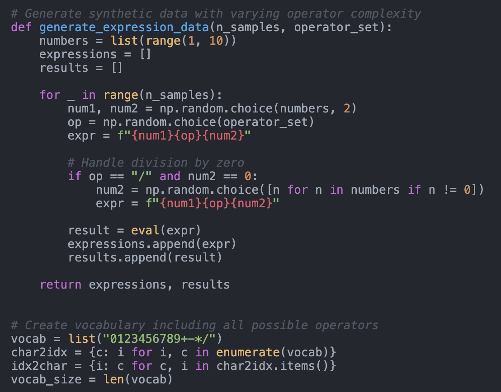

<figcaption>Figure 7: 実験に用いられたデータ生成関数の例。</figcaption>
</figure>

> 訳注（Figure 7 の文字起こし）:
>
> ```python
> # Generate synthetic data with varying operator complexity
> def generate_expression_data(n_samples, operator_set):
>     numbers = list(range(1, 10))
>     expressions = []
>     results = []
>
>     for _ in range(n_samples):
>         num1, num2 = np.random.choice(numbers, 2)
>         op = np.random.choice(operator_set)
>         expr = f"{num1}{op}{num2}"
>
>         # Handle division by zero
>         if op == "/" and num2 == 0:
>             num2 = np.random.choice([n for n in numbers if n != 0])
>             expr = f"{num1}{op}{num2}"
>
>         result = eval(expr)
>         expressions.append(expr)
>         results.append(result)
>
>     return expressions, results
>
> # Create vocabulary including all possible operators
> vocab = list("0123456789+-*/")
> char2idx = {c: i for i, c in enumerate(vocab)}
> idx2char = {i: c for c, i in char2idx.items()}
> vocab_size = len(vocab)
> ```

### Model architecture, loss function, and evaluation function（モデルアーキテクチャ・損失関数・評価関数）

Figure 8 に示すとおり、モデルアーキテクチャは単純であり、その実装は正しいように見える。

Figure 9 に示す訓練ループでは、構成的正則化が**埋め込み状態**を用いて計算されている。したがって本論文は、埋め込みを表すのに $h_{t}$ ではなく $e_{t}$ の記法を使い、これらを隠れ状態ではなく明示的に埋め込みと呼ぶべきである。埋め込みは技術的には隠れ層ではあるが、この文脈での「隠れ状態」という語は通常 LSTM の隠れ状態を指すので、混乱を招きうる。

精度計算の関数（Figure 10）は、モデルが正解の数字に合わせるために出力に対して回帰を行っていることを示す。このアプローチは理にかなっている。[0-9] の範囲外を含む任意の値をモデルが扱えるようにするからである。

<figure>

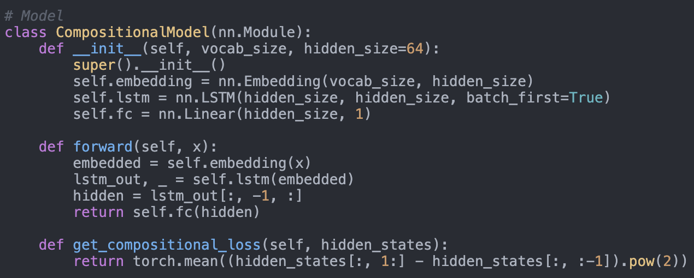

<figcaption>Figure 8: 生成されたモデルクラス。埋め込み層・単一の LSTM 層・線形層のヘッドを示す。</figcaption>
</figure>

> 訳注（Figure 8 の文字起こし）:
>
> ```python
> # Model
> class CompositionalModel(nn.Module):
>     def __init__(self, vocab_size, hidden_size=64):
>         super().__init__()
>         self.embedding = nn.Embedding(vocab_size, hidden_size)
>         self.lstm = nn.LSTM(hidden_size, hidden_size, batch_first=True)
>         self.fc = nn.Linear(hidden_size, 1)
>
>     def forward(self, x):
>         embedded = self.embedding(x)
>         lstm_out, _ = self.lstm(embedded)
>         hidden = lstm_out[:, -1, :]
>         return self.fc(hidden)
>
>     def get_compositional_loss(self, hidden_states):
>         return torch.mean((hidden_states[:, 1:] - hidden_states[:, :-1]).pow(2))
> ```

<figure>

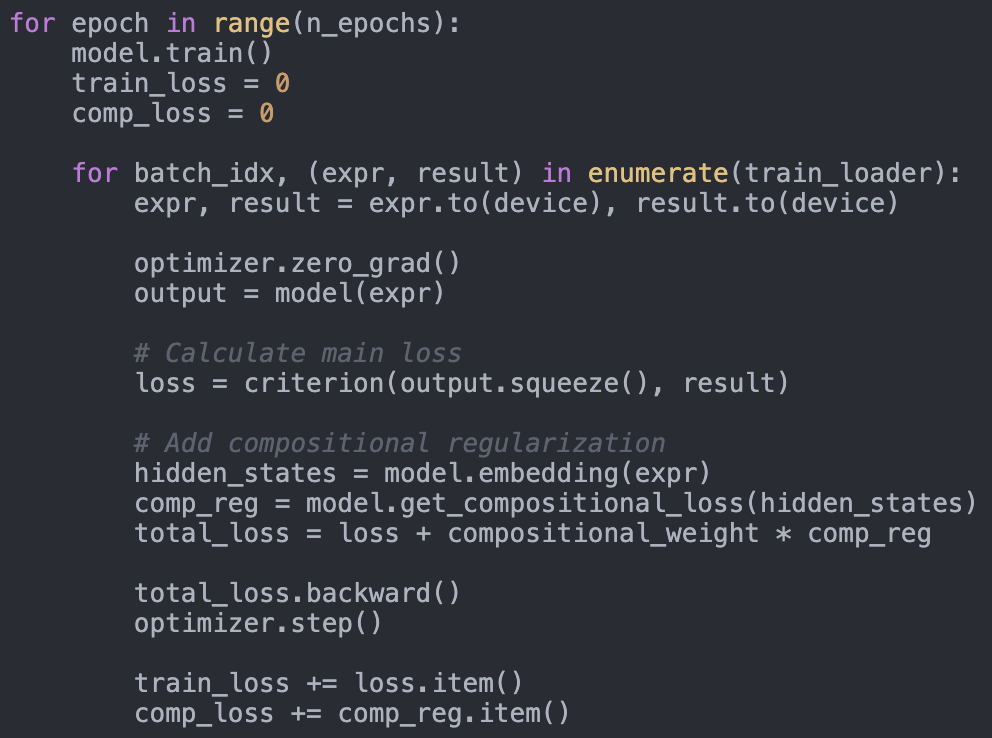

<figcaption>Figure 9: 生成された訓練ループ。損失関数と提案された正則化を示す。</figcaption>
</figure>

> 訳注（Figure 9 の文字起こし）: `hidden_states = model.embedding(expr)` の行が、正則化が LSTM の隠れ状態ではなく**埋め込み**に掛かっていることを示している——上の指摘の根拠にあたる。
>
> ```python
> for epoch in range(n_epochs):
>     model.train()
>     train_loss = 0
>     comp_loss = 0
>
>     for batch_idx, (expr, result) in enumerate(train_loader):
>         expr, result = expr.to(device), result.to(device)
>
>         optimizer.zero_grad()
>         output = model(expr)
>
>         # Calculate main loss
>         loss = criterion(output.squeeze(), result)
>
>         # Add compositional regularization
>         hidden_states = model.embedding(expr)
>         comp_reg = model.get_compositional_loss(hidden_states)
>         total_loss = loss + compositional_weight * comp_reg
>
>         total_loss.backward()
>         optimizer.step()
>
>         train_loss += loss.item()
>         comp_loss += comp_reg.item()
> ```

<figure>

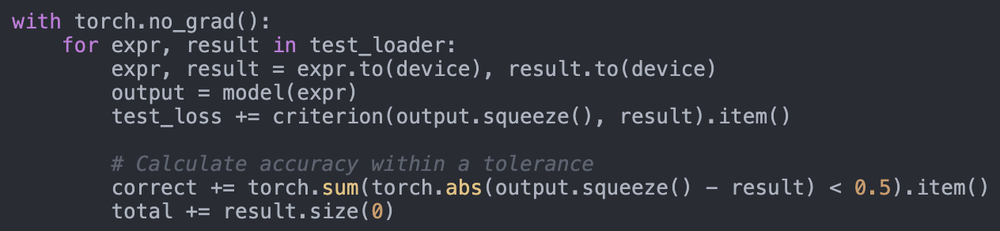

<figcaption>Figure 10: 生成された精度計算の関数。回帰を用いて出力を正解に合わせる。</figcaption>
</figure>

> 訳注（Figure 10 の文字起こし）:
>
> ```python
> with torch.no_grad():
>     for expr, result in test_loader:
>         expr, result = expr.to(device), result.to(device)
>         output = model(expr)
>         test_loss += criterion(output.squeeze(), result).item()
>
>         # Calculate accuracy within a tolerance
>         correct += torch.sum(torch.abs(output.squeeze() - result) < 0.5).item()
>         total += result.size(0)
> ```

### Attention-augmented LSTM（attention を加えた LSTM）

論文では、attention を加えた LSTM について 100% のテスト精度が報告されていた。これを検証するため、我々は生成されたコードを用いて同じ実験を 2 つの場合について再実行した。第一は利用可能な数を [1-9] とした場合（元の設定どおり）、第二は利用可能な数を [10-19] に変えた場合である。**第一の場合、attention を加えた LSTM は 100% のテスト精度を達成したが、第二の場合は 56% だった。ベースラインの LSTM は、第一の場合が 85%、第二の場合は 0% だった。**我々は、第一の場合が attention を加えた LSTM にとって単純すぎたと結論した。タスクの複雑さが増すにつれ（たとえば第一の場合は 3 + 5 のような長さ 3 だったのに対し、第二の場合は 14 \* 19 のような長さ 5 で出力空間もより大きい）、テスト精度は当初の 100% から乖離した。

##### Workshop Reviews（ワークショップの査読）

**Reviewer #1: A good paper analyzing the effectiveness of a compositional regularization term for LSTMs**

```
Summary: The authors propose a regularisation term to enhance compositional regularisation in neural networks. The idea is to penalise large deviations between subsequent time steps of the hidden state, thus "squeezing" the hidden state to encourage composition and preventing a dominating representation. The authors test their approach on synthetic arithmetic expression with varying operator complexity and length. They show that although the regularisation term appears to be working, it counterintuitively does not improve test accuracy. Furthermore, the authors identify a bottleneck regarding network capacity with increasing arithmetic operators.
Strengths:
I find the idea of regularising or squeezing the hidden representations to encourage compositionally an interesting idea. The authors define a good baseline and ablate their method well against it, revealing why the regularisation term does not work as expected. I think the insight that operator complexity is a bottleneck for the neural network is important, as it raises the question whether architectural changes might be more effective for compositionally than regularisation.
Weaknesses:
The paper would benefit from more intuition as to why the proposed regularisation term should encourage compositionality. This could be either an experiment or simply a visualisation for the reader. Only one architecture (LSTM) was tested. It would be interesting to see if transformer architectures fare better with compositionality due to the attention mechanism. I think the connection between compositional regularisation and operator complexity needs to be made more explicit. From reading the introduction both arguments seem a bit disconnected although I can infer the authors intentions.
Conclusion:
Overall, I would accept this paper to the workshop, since it proposes a simple and interesting idea with the authors providing ablations that encourage further analysis of the problem. As a suggestion I would encourage the authors to give more intuition on why the proposed regularisation term should improve compositionality for the proposed network. I would suggest either adding more related work to support the regularisation term or elaborating on the intuition behind penalising subsequent steps of the hidden state.
Rating: 7: Good paper, accept
Award: No Award
Confidence: 4: The reviewer is confident but not absolutely certain that the evaluation is correct
```
**Reviewer #2: Compositional Regularization: Unexpected Obstacles in Enhancing Neural Network Generalization**

```
This paper investigates the effectiveness of incorporating a compositional regularization term into the loss function of neural networks to improve compositional generalization. The authors hypothesized that penalizing deviations from compositional structures would enhance the model's ability to generalize to unseen arithmetic expressions. However, their results on synthetic arithmetic datasets showed that compositional regularization did not lead to significant improvements and, in some cases, even hindered learning.
I think this paper greatly contributes to the workshops theme and fits into the scope. Moreover, it is a great example of challenges that occur during such approaches and could be interesting to discuss in the workshop setting. While I think that the authors should further broaden the experiments to other tasks in order to increase the generalizability of the findings, I would still recommend to accept the paper.
Rating: 6: Marginally above acceptance threshold
Award: No Award
Confidence: 2: The reviewer is willing to defend the evaluation, but it is quite likely that the reviewer did not understand central parts of the paper
```
#### D.2.2 Unveiling the Impact of Label Noise on Model Calibration in Deep Learning

##### The AI Scientist Idea（The AI Scientist のアイデア）

**Idea**

```json
"Name": "label_noise_calibration",
"Title": "Unveiling the Impact of Label Noise on Model Calibration in Deep Learning",
"Short Hypothesis": "Label noise not only degrades model accuracy but also adversely affects model calibration and uncertainty estimation; by systematically studying this impact, we can develop methods to improve both accuracy and calibration under label noise.",
"Related Work": "Previous studies have focused on the impact of label noise on model accuracy and have proposed methods to mitigate this issue, such as robust loss functions and label correction techniques. However, there is limited research on how label noise affects model calibration and uncertainty estimation. For instance, works like 'Dynamics-Aware Loss for Learning with Label Noise' (Li et al., 2023) address robustness to label noise but do not explore calibration aspects. Our proposal distinguishes itself by systematically investigating the effect of label noise on model calibration, which is crucial for reliable deployment of deep learning models in real-world applications.",
"Abstract": "Label noise is a prevalent issue in real-world datasets, where incorrect annotations can degrade the performance of deep learning models. While the impact of label noise on model accuracy has been extensively studied, its effect on model calibration and uncertainty estimation remains underexplored. Model calibration measures how well the predicted probabilities reflect the true likelihood of outcomes, which is vital for risk-sensitive applications that rely on uncertainty estimates for decision-making. In this research, we propose to systematically investigate how different types and levels of label noise affect the calibration of deep learning models. We hypothesize that label noise leads to overconfident and miscalibrated predictions, undermining the reliability of uncertainty estimates. Through controlled experiments on benchmark datasets with synthetic label noise and real-world datasets with inherent label noise, we will analyze calibration metrics such as Expected Calibration Error (ECE) and reliability diagrams. Additionally, we will assess the effectiveness of existing label noise mitigation techniques in improving model calibration. The findings from this study will provide insights into the relationship between label noise and model calibration, guiding the development of more robust models that maintain reliable uncertainty estimates despite noisy labels.",
"Experiments": [
"Introduce varying levels and types of synthetic label noise (e.g., symmetric and asymmetric noise) into benchmark datasets like CIFAR-10 and MNIST.",
"Train deep learning models (e.g., ResNet, CNNs) on these noisy datasets and evaluate their accuracy and calibration using metrics like ECE and reliability diagrams.",
"Analyze how different label noise levels impact model calibration compared to their effect on accuracy.",
"Apply existing label noise mitigation techniques, such as robust loss functions and label correction methods, to assess their effectiveness in improving calibration.",
"Evaluate models on real-world datasets known to contain label noise (e.g., web-scraped datasets) to validate the findings in practical scenarios.",
"Conduct ablation studies to understand the interplay between label noise, model calibration, and uncertainty estimation."
],
"Risk Factors and Limitations": [
"Results may be specific to the selected models and datasets, potentially limiting generalization to other architectures or domains.",
"Measuring calibration accurately requires sufficient test data; small test sets may lead to unreliable calibration metrics.",
"Existing mitigation techniques may not significantly improve calibration, indicating a need for developing new methods.",
"Synthetic label noise may not capture all aspects of real-world label noise, affecting the applicability of the findings."
],
"Code": "from datasets import load_dataset\nfrom huggingface_hub import..."
```
##### AI Scientist Team Review（AI Scientist チームによる査読）

**論文の要約** 本論文は、異なるノイズモデルを用いて、ラベルノイズがモデルの較正（calibration）に与える影響を研究する。より具体的には、**対称ノイズ（構造を持たないラベル摂動）と非対称ノイズ（構造化されたラベル摂動）**を対比する。経験的な実験は標準的な小規模の視覚データセット（MNIST・Fashion-MNIST・CIFAR-10）を考え、**非対称ノイズのほうが期待較正誤差（ECE）を高める**ことを実証する。

**強み**

- 研究上の問いは実世界で重要であり、ノイズを含むラベルの影響を予測精度への効果の先まで照らし出す。
- 研究の設計は単純で、単一の主要因——異なるノイズモデルの影響（非対称ノイズが対称ノイズより ECE を高めること）——に焦点を当てている。考慮されているデータセットはワークショップ投稿として適切である。
- 異なるノイズモデルが下流のモデル較正に与える影響は、考慮されたデータセットにわたって頑健かつ一貫している。

**弱み**

- **書かれた結果の解釈が、提示された経験的結果によって実質的に支持されていない箇所が複数ある。**たとえば Figure 3 を解釈する段落は ECE の測定値に言及しているが、それは図に表示されていない。
- **論文は異なる較正手法を比較すると述べているが、結果を一切提供していない。**言及されている信頼性ダイアグラムについても同様である。
- さらに補足資料には**重複した図、SVHN の引用漏れ、対応する図の欠落**が含まれる。

**スコア**

- Soundness: 2 fair ⇒ 潜在的に単純な経験的評価設定を伴う興味深い研究上の問い。
- Presentation: 1 poor ⇒ 誤った記述と図の重複。引用漏れと関連研究の軽視。
- Contribution: 1 poor ⇒ 考慮されている問いは重要だが、表示された結果は導かれた結論に十分な証拠を与えていない。
- **Overall - Workshop: 3/10（不採択）**: たとえば技術的な欠陥・弱い評価・不十分な再現性・不完全にしか扱われていない倫理的考慮を持つ論文。
- **Overall - Conference: 2/10（強い不採択）**。
- Confidence: 4/5。

**追加の所見**

- 本論文の最大の欠陥は、**実証されていない結果への言及**である。これには不確実性の較正に合わせたさまざまな手法の評価と、信頼性ダイアグラムの使用が含まれる。これらの結果が追加され、表示する図の結果の選択がより良く整えられれば、論文は大幅に改善されうる。
- Figure 2 の可読性は、6 つのプロットを 2 行に分けることで改善すべきである。さらに関連研究の節は、較正とノイズを含むデータを関連づける科学コミュニティの努力を退けているように見える。

**倫理規定への潜在的な違反**: なし。

##### AI Scientist Team Code Review（AI Scientist チームによるコードレビュー）

### Temperature scaling（temperature scaling）

論文の査読において、我々は temperature scaling を含む実験が欠けていることに気づいた。生成されたコードを点検したところ、**The AI Scientist は Figure 11 に見られるように temperature scaling を実装していたが、実際には一度も使っていなかった**ことが分かった。

論文執筆の段階で、The AI Scientist はコードを生成する前の生成済み実験コードと当初の計画にアクセスできた。その結果、**論文はこれらの計画とコード——temperature scaling を含んでいた——に影響された可能性が高く、The AI Scientist は temperature scaling を使う実験が実際には一度も行われなかったことに気づけなかった**と思われる。

<figure>

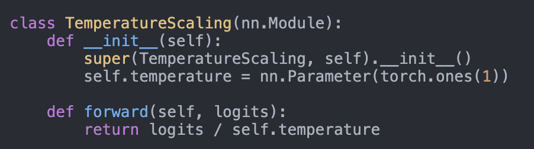

<figcaption>Figure 11: temperature scaling の実装。</figcaption>
</figure>

> 訳注（Figure 11 の文字起こし）:
>
> ```python
> class TemperatureScaling(nn.Module):
>     def __init__(self):
>         super(TemperatureScaling, self).__init__()
>         self.temperature = nn.Parameter(torch.ones(1))
>
>     def forward(self, logits):
>         return logits / self.temperature
> ```

### Dataset class（データセットクラス）

我々は、データセットクラスの当初の実装が、当初の計画の一部であったにもかかわらず**対称／非対称のノイズ分布の選択肢を欠いていた**ことを見つけた。The AI Scientist はこの誤りを認識し、後に Figure 12 に示す正しい版を実装した。

本文で The AI Scientist は「Assymetric Noise: Labels are flipped to specific incorrect classes based on a predefined confusion matrix, simulating more realistic mislabeling.（非対称ノイズ: ラベルはあらかじめ定義された混同行列に基づいて特定の誤ったクラスへ反転され、より現実的な誤ラベルを模擬する）」と書いた。**生成されたコードにおける非対称ノイズの実装は、常にクラス $i$ をクラス $(i+1) \bmod \text{NUM\_CLASSES}$ へ写す**。これは妥当なアプローチではあるが、非対称ノイズを実装する方法は他にもあることは指摘に値する。

<figure>

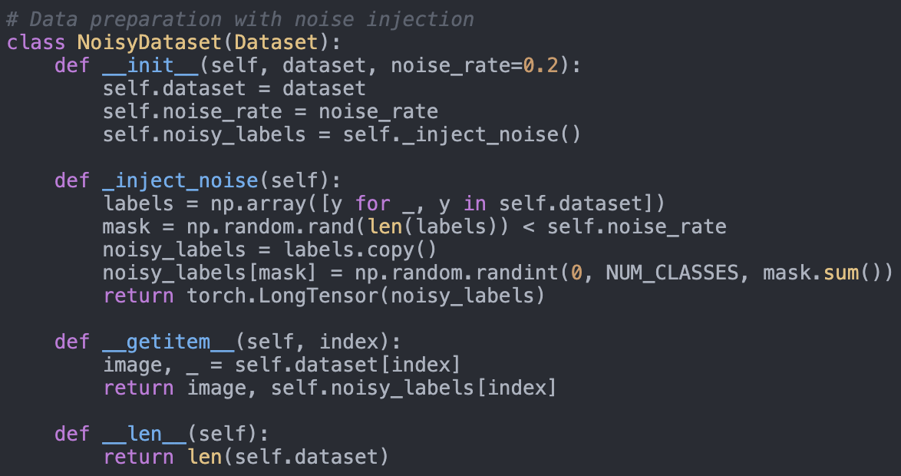

<figcaption>Figure 12 (a): ノイズつきデータセットクラスの実装（当初の版。対称／非対称の選択肢を欠く）。</figcaption>
</figure>

<figure>

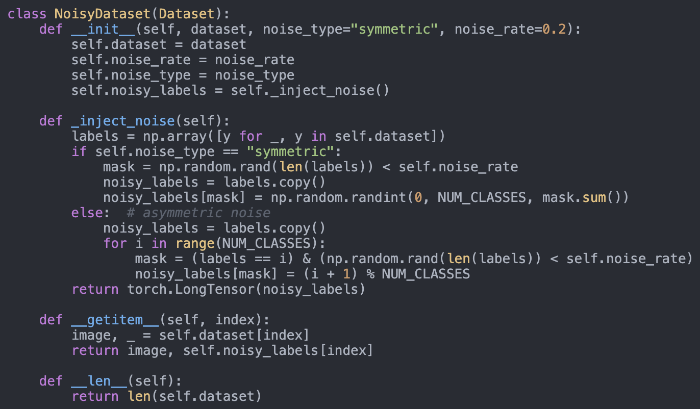

<figcaption>Figure 12 (b): ノイズつきデータセットクラスの実装（修正後の版。noise_type で対称／非対称を切り替える）。</figcaption>
</figure>

> 訳注（Figure 12 (b) の文字起こし。修正後の版）:
>
> ```python
> class NoisyDataset(Dataset):
>     def __init__(self, dataset, noise_type="symmetric", noise_rate=0.2):
>         self.dataset = dataset
>         self.noise_rate = noise_rate
>         self.noise_type = noise_type
>         self.noisy_labels = self._inject_noise()
>
>     def _inject_noise(self):
>         labels = np.array([y for _, y in self.dataset])
>         if self.noise_type == "symmetric":
>             mask = np.random.rand(len(labels)) < self.noise_rate
>             noisy_labels = labels.copy()
>             noisy_labels[mask] = np.random.randint(0, NUM_CLASSES, mask.sum())
>         else:  # asymmetric noise
>             noisy_labels = labels.copy()
>             for i in range(NUM_CLASSES):
>                 mask = (labels == i) & (np.random.rand(len(labels)) < self.noise_rate)
>                 noisy_labels[mask] = (i + 1) % NUM_CLASSES
>         return torch.LongTensor(noisy_labels)
>
>     def __getitem__(self, index):
>         image, _ = self.dataset[index]
>         return image, self.noisy_labels[index]
>
>     def __len__(self):
>         return len(self.dataset)
> ```

### Evaluation function（評価関数）

期待較正誤差（ECE）を計算するのに使われた評価関数を Figure 13 に示す。我々は手作業でテストケースを作り、torchmetrics の `MulticlassCalibrationError` 関数（`norm='l1'`）を正解として用いた。`MulticlassCalibrationError` は確率入力を期待するので、実装の詳細に合わせるために最初の行の softmax 演算を省いた。この調整の後、**両関数が軽微な数値的差異を除いて同じ結果を生み出すことを確認した**。

<figure>

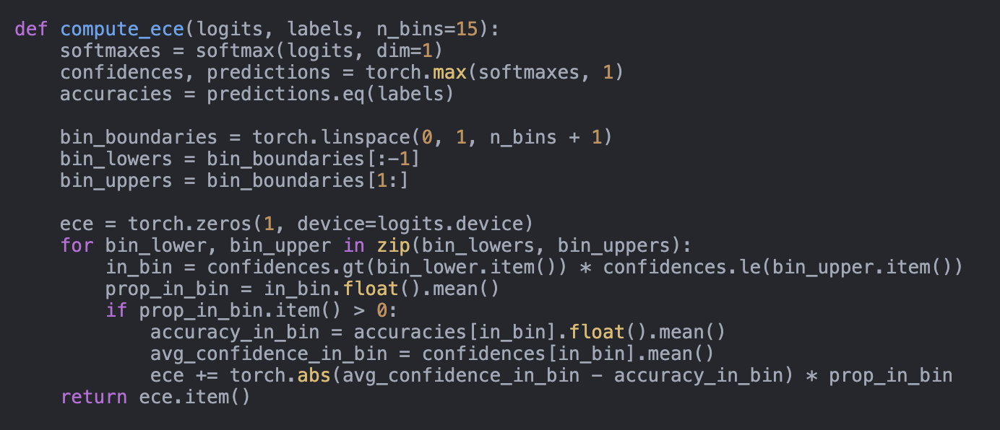

<figcaption>Figure 13: 期待較正誤差（ECE）の実装。</figcaption>
</figure>

> 訳注（Figure 13 の文字起こし）:
>
> ```python
> def compute_ece(logits, labels, n_bins=15):
>     softmaxes = softmax(logits, dim=1)
>     confidences, predictions = torch.max(softmaxes, 1)
>     accuracies = predictions.eq(labels)
>
>     bin_boundaries = torch.linspace(0, 1, n_bins + 1)
>     bin_lowers = bin_boundaries[:-1]
>     bin_uppers = bin_boundaries[1:]
>
>     ece = torch.zeros(1, device=logits.device)
>     for bin_lower, bin_upper in zip(bin_lowers, bin_uppers):
>         in_bin = confidences.gt(bin_lower.item()) * confidences.le(bin_upper.item())
>         prop_in_bin = in_bin.float().mean()
>         if prop_in_bin.item() > 0:
>             accuracy_in_bin = accuracies[in_bin].float().mean()
>             avg_confidence_in_bin = confidences[in_bin].mean()
>             ece += torch.abs(avg_confidence_in_bin - accuracy_in_bin) * prop_in_bin
>     return ece.item()
> ```

##### Workshop Reviews（ワークショップの査読）

**Reviewer #1: This work explores the impact of label noise on model calibration, demonstrating that label noise degrades calibration performance.**

```
The research question is intriguing; however, the experimental analysis appears somewhat unclear. The underlying mechanism explaining how the experimental results support the claimed statement is not well articulated. Specifically, in the abstract, the authors state that "label noise leads to overconfident and miscalibrated predictions, undermining the reliability of uncertainty estimates," yet I struggle to see a clear connection between this claim and the content in the main body.
Additionally, the experimental setup raises some concerns. To thoroughly assess the impact of label noise on model calibration, a more refined approach to introducing label noise should be considered. Moreover, incorporating a broader range of evaluation metrics would help strengthen the conclusions.
Furthermore, the images in the paper are difficult to interpret, and some citations appear to be missing. The referenced papers are also kind of old, which could weaken the soundness of related work.
Rating: 3: Clear rejection
Award: No Award
Confidence: 5: The reviewer is absolutely certain that the evaluation is correct and very familiar with the relevant literature
```
**Reviewer #2: Official Review for Submission41**

```
This paper is not finished, there are missing references indicated by (?) there are unlinked references (eg L097), the figures are unreadable (eg Fig 2). I feel this paper is in a late draft status and not review ready.
Remaining comment
It is unclear how Noise Mitigation Techniques, or Calibration Improvements (like temperature scaling) are taken into account in the study. Or how they affect performance after label noise. It is stated that temperature scaling is used, but its effect is not made clear.
Rating: 3: Clear rejection
Award: No Award
Confidence: 4: The reviewer is confident but not absolutely certain that the evaluation is correct
```
#### D.2.3 Real-world Challenges in Pest Detection using Deep Learning: an Investigation into Failures and Solutions

##### The AI Scientist Idea（The AI Scientist のアイデア）

**Idea**

```json
"Name": "real_world_pest_detection",
"Title": "Real-World Challenges in Pest Detection Using Deep Learning: An Investigation into Failures and Solutions",
"Short Hypothesis": "Deep learning models for pest detection often fail to generalize in real-world agricultural settings due to data quality issues, environmental variability, and model limitations. Investigating these failures can lead to more robust solutions.",
"Related Work": "Several studies, such as those by Agarwal et al. (2023) and Dong et al. (2024), have explored deep learning for pest detection in agriculture. These studies generally report high accuracy in controlled settings but often do not address real-world deployment challenges. Our proposal distinguishes itself by focusing on the negative outcomes and the underlying reasons behind these failures.",
"Abstract": "Accurate pest detection is vital for protecting crops and ensuring food security. While deep learning models have shown promise in controlled environments, their performance often degrades in real-world applications. This proposal aims to investigate the reasons behind these failures. We hypothesize that data quality issues, environmental variability, and model limitations are significant factors. By conducting a series of experiments, we will explore these challenges in depth and propose robust solutions to improve the generalizability of deep learning models for pest detection. Our research will provide valuable insights for the agricultural community and contribute to the development of more reliable AI tools for precision farming.",
"Experiments": [
"1. **Data Quality Analysis**: Collect a diverse dataset of pest images from different agricultural environments and analyze its quality. Identify common issues such as label noise, class imbalance, and distribution shift.",
"2. **Model Robustness Testing**: Train state-of-the-art deep learning models (e.g., YOLOv8, EfficientNetB3) on the collected dataset and evaluate their performance in controlled vs. real-world settings. Metrics: Mean Average Precision (mAP), F1 Score.",
"3. **Environmental Variability Study**: Evaluate model performance under different environmental conditions (e.g., lighting, weather). Identify which conditions most significantly impact model accuracy.",
"4. **Failure Mode Analysis**: Conduct a detailed analysis of misclassifications to identify common patterns and potential causes (e.g., feature overlap between pests and background).",
"5. **Improvement Strategies**: Implement and test various strategies to mitigate identified challenges, such as data augmentation, domain adaptation, and model ensembling. Evaluate their effectiveness in improving model robustness."
],
"Risk Factors and Limitations": "Potential risks include the availability and quality of real-world data, the computational demands of training and testing multiple deep learning models, and the generalizability of the findings to different types of pests and crops. Additionally, environmental factors may introduce variability that is challenging to control.",
"Code": "from datasets import..."
```
**データセット準備についての注記**: AI が生成した 3 つのアイデアが選ばれた——2 つはコア機械学習研究のバッチから、1 つはより応用寄りで実世界志向のバッチからである。この害虫検出のアイデアは後者に由来する。**系は標準的な機械学習データセットのダウンロードにはうまく機能するが、オンラインで入手できる実世界のデータセットへ自動的にアクセスすることには依然として苦労する。**これに対処するため、Kaggle から関連するデータセット（Crop Pest and Disease Detection）を手作業でダウンロードし、実験を速めるためにその規模を 10 分の 1 に縮小した。このデータ準備の過程をさらに自動化してより広い範囲のデータセットを扱えるようにすることは、興味深い将来の研究の方向として残る。

##### AI Scientist Team Review（AI Scientist チームによる査読）

**論文の要約** 本論文は、害虫予測という実世界の応用への深層学習モデルの適用を研究する。データ収集に影響する環境要因を模倣するさまざまなデータ拡張技法を活用した **Environmental Robustness Score（環境頑健性スコア）**を導入する。さまざまな学習率と、その結果として害虫以外の視覚データセットにわたる分布外テスト設定に生じる影響を比較する。

**強み**

- 本論文は ICBINB ワークショップの主題に特によく合致する。深層学習の手法の害虫予測という実世界の応用を論じている。
- 訓練と分布外のデータ拡張技法の設定が、データセットにまたがって及ぼす影響の違いを理解することは興味深い。

**弱み**

- **論文は領域適応（domain adaptation）が研究されていると繰り返し述べている。しかし実験は、データ拡張手法（照明・ぼかし・コントラスト操作など）の使用しか調べていない。**さらに、学習率が汎化に与える影響の研究はかなり自明である。
- **Eurosat・Medmnist・CIFAR-10 の結果が害虫予測の問題と関係していると動機づけるのは難しい。**なぜこれらのデータセットでの結果が害虫予測へ転移するはずなのか。
- **複数データセット訓練に関する記述のいくつかは誤解を招く。そうした訓練設定から得られた結果は論文に存在しない。**代わりに、複数のモデルが個別のデータセットで訓練されている。

**スコア**

- Soundness: 2 fair / Presentation: 1 poor / Contribution: 1 poor
- **Overall - Workshop: 3/10（不採択）** / **Overall - Conference: 2/10（強い不採択）**
- Confidence: 4/5

**追加の所見**

- 結果の提示は大幅な改善が必要である。**引用漏れ（?）が複数あり**、結果の解釈は誤解を招きうる。これには、より低い学習率が過適合に与える影響についての結論や、複数モデル・単一データセットの実験を「複数データセット（multi-dataset）」と名づけることが含まれる。

**倫理規定への潜在的な違反**: なし。

##### AI Scientist Team Code Review（AI Scientist チームによるコードレビュー）

### Domain Adaptation and Multi-dataset training（領域適応と複数データセット訓練）

論文は「領域適応」の実験を、主に ImageNet で事前学習したモデルを他の視覚データセットへ転移することに焦点を当てたものとして記述しているように見える。コードを検討したところ、**異なる領域を区別する別個の分類器を訓練することで領域適応の技法を実装しようとした試みが見つかったが、それらの試みは成功していなかった**。最終的に The AI Scientist は、この領域適応の技法を含まない実装を選んだ。

さらに、この領域適応の技法が実装されていたコードでは、**複数データセット訓練も正しく行われていた**——Figure 14 に示すとおり、領域判別器の損失を伴って単一のモデルを 3 つのデータセットすべてで訓練するものである。**このコードが首尾よく動いていれば、The AI Scientist はおそらく最終的に選んだもの——適切な複数データセット訓練を欠いていたがエラーなく走ったもの——よりこちらを選んでいただろう。**

<figure>

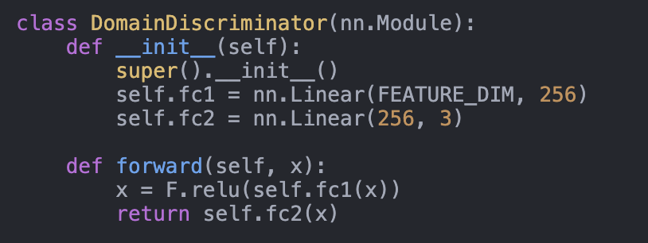

<figcaption>Figure 14 (a): 領域判別器。</figcaption>
</figure>

<figure>

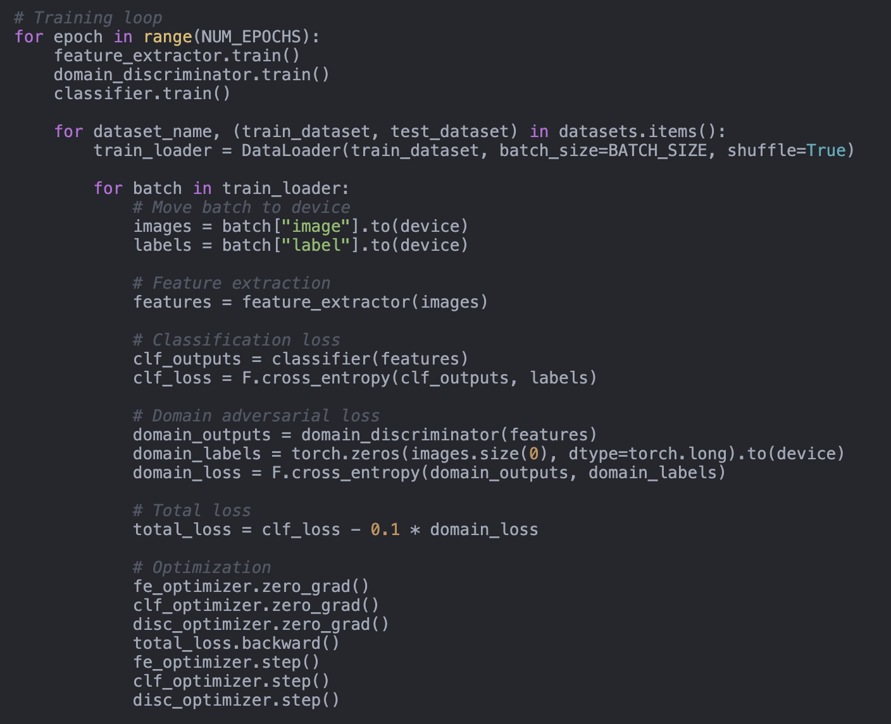

<figcaption>Figure 14 (b): 複数データセットの訓練ループ。</figcaption>
</figure>

> 訳注（Figure 14 の文字起こし）: 訳者の観察として、訓練ループの `domain_labels = torch.zeros(...)` は**どのデータセットを処理していても常に 0 のラベルを与えており**、領域判別器が領域を区別するよう学習できない。上でチームが述べる「試みは成功していなかった」の内実の一端がここに見える。
>
> ```python
> class DomainDiscriminator(nn.Module):
>     def __init__(self):
>         super().__init__()
>         self.fc1 = nn.Linear(FEATURE_DIM, 256)
>         self.fc2 = nn.Linear(256, 3)
>
>     def forward(self, x):
>         x = F.relu(self.fc1(x))
>         return self.fc2(x)
>
> # Training loop
> for epoch in range(NUM_EPOCHS):
>     feature_extractor.train()
>     domain_discriminator.train()
>     classifier.train()
>
>     for dataset_name, (train_dataset, test_dataset) in datasets.items():
>         train_loader = DataLoader(train_dataset, batch_size=BATCH_SIZE, shuffle=True)
>
>         for batch in train_loader:
>             # Move batch to device
>             images = batch["image"].to(device)
>             labels = batch["label"].to(device)
>
>             # Feature extraction
>             features = feature_extractor(images)
>
>             # Classification loss
>             clf_outputs = classifier(features)
>             clf_loss = F.cross_entropy(clf_outputs, labels)
>
>             # Domain adversarial loss
>             domain_outputs = domain_discriminator(features)
>             domain_labels = torch.zeros(images.size(0), dtype=torch.long).to(device)
>             domain_loss = F.cross_entropy(domain_outputs, domain_labels)
>
>             # Total loss
>             total_loss = clf_loss - 0.1 * domain_loss
>
>             # Optimization
>             fe_optimizer.zero_grad()
>             clf_optimizer.zero_grad()
>             disc_optimizer.zero_grad()
>             total_loss.backward()
>             fe_optimizer.step()
>             clf_optimizer.step()
>             disc_optimizer.step()
> ```

### Environmental noise implementation（環境ノイズの実装）

論文は「To simulate challenging environmental conditions, we applied data augmentations during testing, including brightness and contrast adjustments, Gaussian blur, and random affine transformations.（困難な環境条件を模擬するため、テスト中に明度とコントラストの調整、ガウシアンぼかし、ランダムアフィン変換を含むデータ拡張を適用した）」と述べる。これは Figure 15 に示すとおりコードで確認される。

<figure>

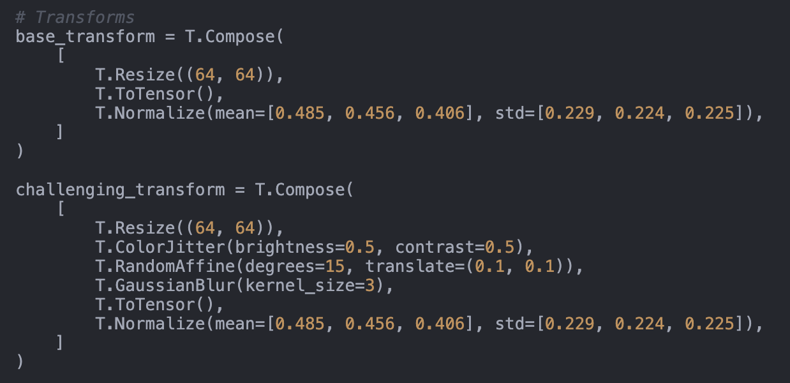

<figcaption>Figure 15: 環境ノイズの模擬の実装。</figcaption>
</figure>

> 訳注（Figure 15 の文字起こし）:
>
> ```python
> # Transforms
> base_transform = T.Compose(
>     [
>         T.Resize((64, 64)),
>         T.ToTensor(),
>         T.Normalize(mean=[0.485, 0.456, 0.406], std=[0.229, 0.224, 0.225]),
>     ]
> )
>
> challenging_transform = T.Compose(
>     [
>         T.Resize((64, 64)),
>         T.ColorJitter(brightness=0.5, contrast=0.5),
>         T.RandomAffine(degrees=15, translate=(0.1, 0.1)),
>         T.GaussianBlur(kernel_size=3),
>         T.ToTensor(),
>         T.Normalize(mean=[0.485, 0.456, 0.406], std=[0.229, 0.224, 0.225]),
>     ]
> )
> ```

Environmental Robustness Score——The AI Scientist が導入した指標で、「頑健性を定量化するための、困難な条件下でのモデル精度の通常条件下でのそれに対する比」と定義される——の計算は、Figure 16 に示すとおり論文の記述と合致する。

<figure>

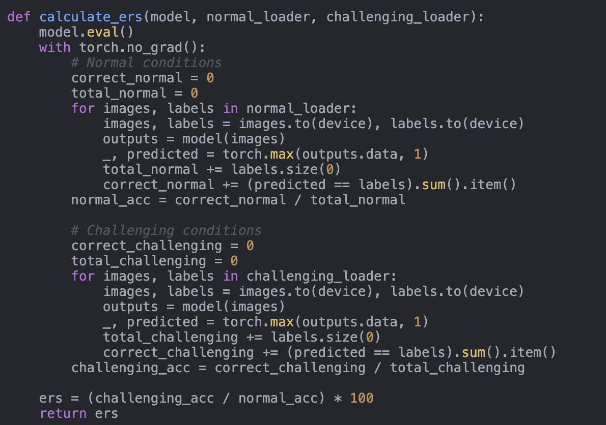

<figcaption>Figure 16: Environmental Robustness Score の計算。</figcaption>
</figure>

> 訳注（Figure 16 の文字起こし）:
>
> ```python
> def calculate_ers(model, normal_loader, challenging_loader):
>     model.eval()
>     with torch.no_grad():
>         # Normal conditions
>         correct_normal = 0
>         total_normal = 0
>         for images, labels in normal_loader:
>             images, labels = images.to(device), labels.to(device)
>             outputs = model(images)
>             _, predicted = torch.max(outputs.data, 1)
>             total_normal += labels.size(0)
>             correct_normal += (predicted == labels).sum().item()
>         normal_acc = correct_normal / total_normal
>
>         # Challenging conditions
>         correct_challenging = 0
>         total_challenging = 0
>         for images, labels in challenging_loader:
>             images, labels = images.to(device), labels.to(device)
>             outputs = model(images)
>             _, predicted = torch.max(outputs.data, 1)
>             total_challenging += labels.size(0)
>             correct_challenging += (predicted == labels).sum().item()
>         challenging_acc = correct_challenging / total_challenging
>
>     ers = (challenging_acc / normal_acc) * 100
>     return ers
> ```

##### Workshop Reviews（ワークショップの査読）

**Reviewer #1: Review of Real-World Challenges in Pest Detection Using Deep Learning: An Investigation into Failures and Solutions.**

```
Summary
This paper studies deep learning methods in pest detection applications. It highlights the need for more research and attempts to perform first experiments in this area.
Results
The paper performs experiments on an image classifier, a ResNet-18 trained on ImageNet, fine-tuned on the Crop Pest and Disease dataset. It uses various data augmentations to emulate the real-world conditions and further trains the model using "multi-dataset training". The model performance is measured in accuracy, loss, and Environmental Robustness Score (ERS). The first experiment investigates the effect tuning the learning rate has on training. The paper claims that a lower learning rate leads to a higher generalisation. The second experiment investigates the model's generalisation across different datasets. The paper claims that training the model on EuroSAT and CIFAR-10 datasets leads to better generalisation.
Strengths
The paper's background, motivation, and related work are well written. The motivation to study generalisation of deep learning methods in real-world agricultural applications is good.
Weaknesses
- The experiments are unmotivated and unclear.
- It is unclear how the choice of augmentation methods are related to "real-world environmental variability."
- The choice of ERS is unmotivated and no intuition on the score is given in the paper.
- The learning rate experiment conclusion that the model's generalization and robustness to real-world setting seems misleading since only 5 learning rates are used and the models are only trained for 10 epochs. Furthermore, the model was not tested in a real-world deployment. It is unclear what the paper means by "multi-dataset training" especially since the datasets have a different number of classes. Thus, the results of this experiment are unclear.
- The paper claims to have studied "deploying deep learning models for pest detection in real-world agricultural settings", however, the paper does not test the trained model in a real-world setting. Thus, the paper's conclusions are misleading.
General Remarks
- In the introduction, the difference between "controlled environment" and "real-world agricultural settings" should be explained since the experiments are not performed in a real-world deployment.
- Plots are small and difficult to read. Increasing the font size would help as well.
- In Figure 1, it would be helpful if the Train and Validation lines for the same learning rate were the same colour.
- In Figure 1, it is unclear whether the ERS scores are evaluated on the train or validation dataset.
- Unclear why the results in Figure 4 are pushed to the appendix and not combined with Figure 2 similar to Figure 1.
- References to the datasets are missing, e.g., the Crop Pest and Disease dataset.
Concluding Remarks
Overall, the paper addresses an interesting real-world problem. However, the lack of detail in the experiment section limits the strength of the conclusions, as the experimental results are not sufficiently supported by evidence. In its current state, it is of the reviewer's opinion that the paper does not meet the standard for publication. The authors are encouraged to further develop this research and consider deploying the model in a real-world setting to strengthen the validity of their findings.
Rating: 3: Clear rejection
Award: No Award
Confidence: 4: The reviewer is confident but not absolutely certain that the evaluation is correct
```
**Reviewer #2: Review "REAL-WORLD CHALLENGES IN PEST DETECTION USING DEEP LEARNING: AN INVESTIGATION INTO FAILURES AND SOLUTIONS"**

```
Summary: The authors investigate deep learning models in the context of pest detection. They state that common deep learning models work well in theoretical settings but struggle to generalize when being exposed to environmental changes. In addition, they offer potential approaches to address these issues and increase robustness of deep learning models in pest detection.
Scientific Rigor and Transparency: Yes, the authors conducted several experiments to underline their findings.
Novelty and Significance: Yes, the paper highlights the weaknesses of deep learning models in pest detection by analyzing how multi-dataset training and hyperparameter tuning affect their performance and ability to generalize.
Clarity of Writing: Yes, the paper is generally well-structured and written in a nice way. However, the paper could still improve on clarity by adding the missing references marked with a (?) in Section 3.
Alignment with Workshop Topics: Yes, the paper aligns with the theme of the workshop.
Additional Comments: The submitted paper provides insights into the weaknesses of deep learning models in real-world pest detection scenarios. It proposes strategies to mitigate these issues through hyperparameter tuning and multi-dataset training. While these methods can enhance model performance in practical applications, challenges persist due to environmental variability and domain discrepancies. I recommend that the authors include additional references in the field of pest detection, such as "Crop Pest Recognition in Real Agricultural Environments Using Convolutional Neural Networks with a Parallel Attention Mechanism" by Zhao et al., to offer a more comprehensive perspective on the topic.
Rating: 7: Good paper, accept
Award: No Award
Confidence: 3: The reviewer is fairly confident that the evaluation is correct
```
**Reviewer #3: Critical Review of Real-World Challenges in Pest Detection Using Deep Learning: Methodological and Theoretical Considerations**

```
The presented paper discusses challenges in pest detection based on digital images using the ResNet-18 model. The authors discuss experiments to evaluate the variability of classification performance based on simulated environmental changes. This topic is relevant, given major challenges such as biodiversity loss. Furthermore, the importance of interdisciplinary research (in this case, data science and biology) will increase, and such studies will help accelerate the use of machine learning in life sciences. However, I found shortcomings in this study, which I summarize in the text below.
The introduction provides a good overview of why this work is important. However, the technical motivation is not clear. A clear motivation based on the theoretical aspects of 'generalization' (see [1,2]), as well as a clear statement including literature on challenges in 'AI' in agriculture, would have been necessary.
The methodology section should refer to the appendix for more details (there are important details in the appendix). Furthermore, dataset details (e.g., example images, how many disease-related images are there?) are missing. The hypothesis concerning the learning rate, as well as augmentation to simulate real environmental variability, is not well motivated. I believe this harsh simulation of real-life dynamics should have been introduced in the abstract and introduction (it would still be an interesting study!). The motivation and derivation of the ERS are missing (is it an ad hoc approach?). The metric is prone to over/underestimating robustness due to unbalanced datasets (see the equation, and using the definition of accuracy, the size of the datasets influences the fraction). Based on the missing training/test/validation details above, it is unclear whether bias is introduced. Furthermore, I do not think that such studies must rely on the newest models. However, ResNet-18 is a rather old model, and no justification for selecting this model is given. A comparison to transformer-based architectures would have been interesting.
Finally, there are some language issues and BibTeX errors (see '?'). The figures should be updated to increase readability. Considering my discussion above, I think the results are still interesting. However, I do believe that the presentation must be adapted. I recommend a major revision, including a solid theoretical foundation, a presentation of the evaluation strategy using augmentation throughout the manuscript, and a comparison to recent deep learning models. Furthermore, I recommend switching from augmentation to real datasets or generative models. With these improvements, the impact of this study would be increased significantly.
[1] Wolpert, D.H. (2002). The Supervised Learning No-Free-Lunch Theorems. In: Soft Computing and Industry. Springer, London. https://doi.org/10.1007/978-1-4471-0123-9_3
[2] Goldblum, M. et al. (2024). Position: The No Free Lunch Theorem, Kolmogorov Complexity, and the Role of Inductive Biases in Machine Learning. Proceedings of the 41st International Conference on Machine Learning
Rating: 4: Ok but not good enough - rejection
Award: No Award
Confidence: 4: The reviewer is confident but not absolutely certain that the evaluation is correct
```
