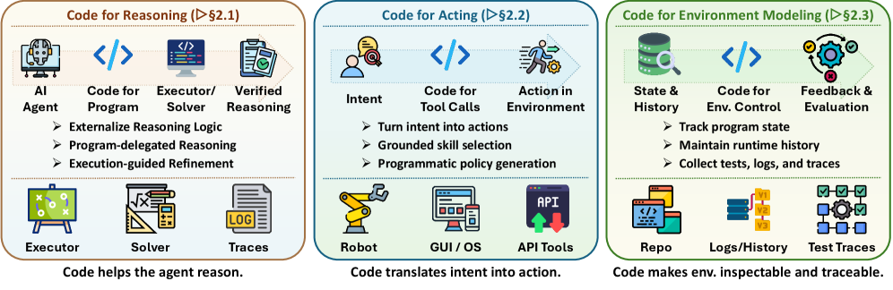
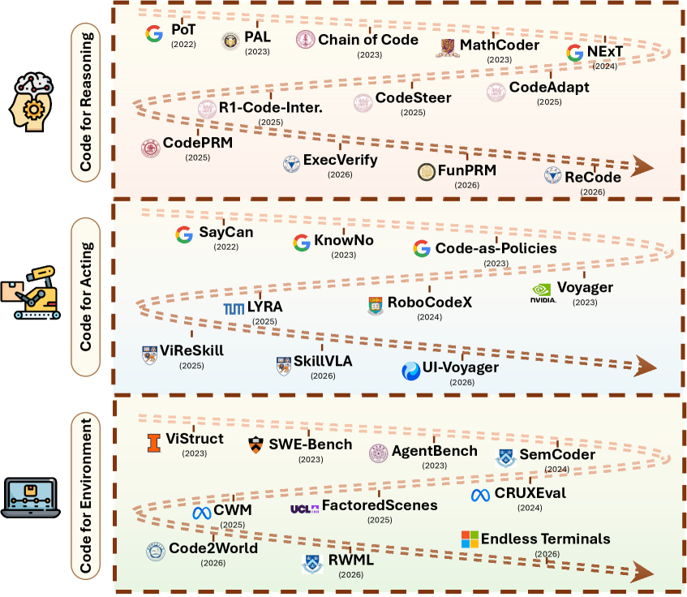
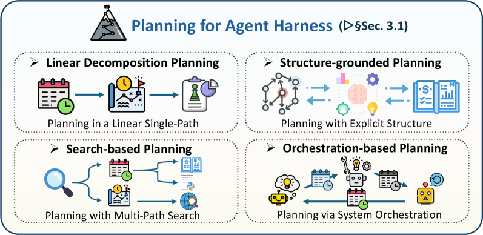
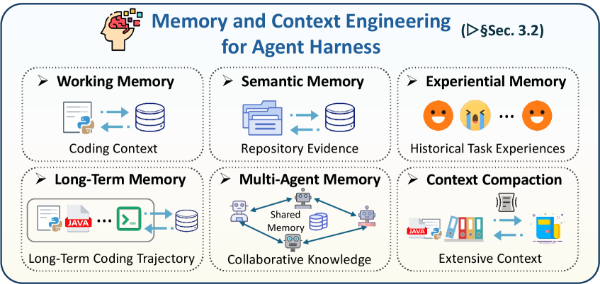
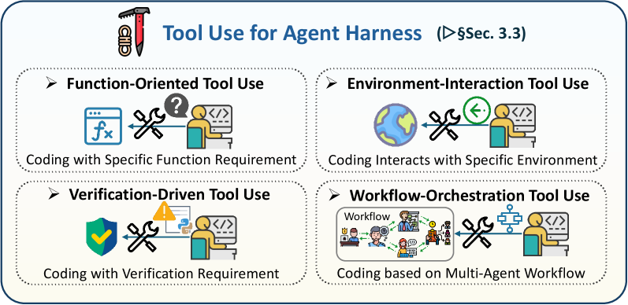
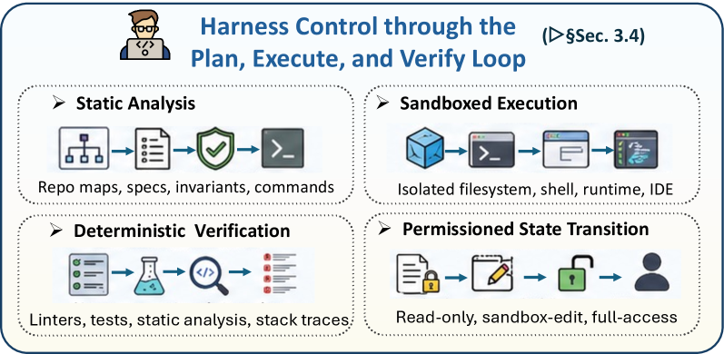
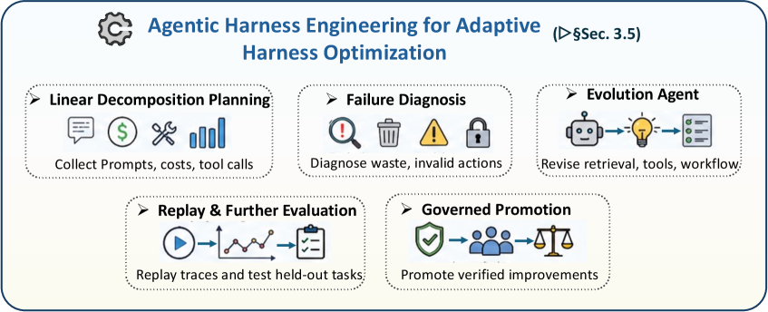
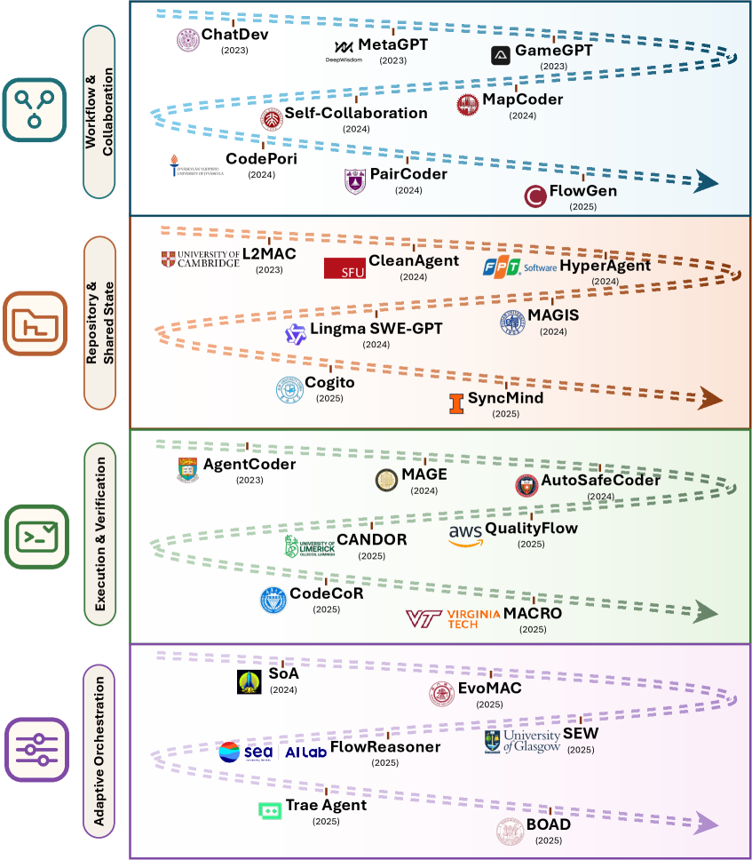

# コードをエージェントのハーネスとして ◆ 実行可能・検証可能・状態を持つエージェント系へ向けて ◆

> 原題: Code as Agent Harness ◆ Toward Executable, Verifiable, and Stateful Agent Systems ◆
> 著者: Xuying Ning1†, Katherine Tieu1†, Dongqi Fu2†, Tianxin Wei1†, Zihao Li1†, Yuanchen Bei1†, Jiaru Zou3, Mengting Ai1, Zhining Liu1, Ting-Wei Li1, Lingjie Chen1, Yanjun Zhao1, Ke Yang1, Bingxuan Li1, Cheng Qian1, Gaotang Li1, Xiao Lin1, Zhichen Zeng1, Ruizhong Qiu1, Sirui Chen1, Yifan Sun1, Xiyuan Yang1, Ruida Wang1, Rui Pan1, Chenyuan Yang1, Dylan Zhang1, Liri Fang1, Zikun Cui2, Yang Cao2, Pan Chen2, Dorothy Sun2, Ren Chen2, Mahesh Srinivasan2, Nipun Mathur2, Yinglong Xia2, Hong Li2, Hong Yan2, Pan Lu3, Lingming Zhang1, Tong Zhang1, Hanghang Tong1✉, Jingrui He1✉
> 所属: 1 University of Illinois Urbana-Champaign ・ 2 Meta ・ 3 Stanford University（† 中核貢献者、✉ 連絡先著者）
> 出典: arXiv:2605.18747（2026 / ar5iv 版）
> キーワード: Agent Harness, Coding Agent, Harness Engineering, Agentic AI
> GitHub: [https://github.com/YennNing/Awesome-Code-as-Agent-Harness-Papers](https://github.com/YennNing/Awesome-Code-as-Agent-Harness-Papers)

> **訳注（クリップの状態と復元）**
> - 底本は ar5iv 版の Web Clipper クリップ。**画像 12 枚・図表キャプション 23 件（Figure 1〜12・Table 1〜11）・表 11 個・SVG のテキスト箱 2 個はすべて残存**していた。ar5iv 側にある大学ロゴ 3 枚（Illinois・Meta・Stanford）はサイト装飾ではなく所属表示の画像だが、本文の理解に不要なので取り込んでいない。原典に脚注は存在しない（本文中の `N` は著者の所属記号である）。
> - **欠落は 1 件のみ**——**§4.4 の小見出し「Context management is the tax of implicit shared state」が段落ごと丸ごと欠落**していた（ar5iv の見出し 143 に対しクリップは 142）。原ページから復元して該当位置に挿入した。
> - **タイトルの `◆` は原典の装飾である**（LaTeX の `\lozenge`）。クリップには `◆\\lozenge` という形で LaTeX の注釈が漏れているが、これはレンダリングの副産物であり、本訳では `◆` のみを残した。
> - 引用が `[authorKeyword2026]` 形式の**裸の bibkey** なのは ar5iv 側に文献一覧が生成されていないためであり、クリップ不良ではない。既存の翻訳の慣例に従い bibkey をそのまま維持する。
> - **本論文はサーベイであり、表 11 個は「代表的な手法の一覧」である。本 wiki のサーベイ翻訳の前例に従い、11 個すべてを全訳した**（列見出しと分析列は日本語化し、手法名・システム名・bibkey は原文のまま維持する）。
> - 参考文献一覧と謝辞は既定どおり訳出しない。
> - 図は `raw/assets/2026-code-as-agent-harness/` にローカル保存し、そのパスを参照している。

---

###### Abstract（要旨）

近年の大規模言語モデル（LLM）は、競技プログラミングからリポジトリ規模のソフトウェア工学に至るまで、コードの理解と生成において強い能力を実証してきた。**新興のエージェント系では、コードはもはや目標とする出力であるだけではない。それはますます、エージェントの推論・行動・環境モデリング・実行にもとづく検証のための、運用上の基盤（operational substrate）として働くようになっている。** 我々はこの移行を***エージェントのハーネス（agent harness）*** というレンズを通じて枠づけ、***code as agent harness***——**コードをエージェントのインフラの基礎に据える統一的な見方**——を導入する。この観点を体系的に研究するため、我々はサーベイを**3 つの連結した層**を軸に組織する。第一に、***ハーネス・インターフェース（harness interface）***——コードがエージェントを推論・行動・環境モデリングへ接続する層。第二に、***ハーネス機構（harness mechanisms）***——長期ホライズンの実行のための計画・記憶・ツール使用に加え、ハーネスを信頼でき適応的にするフィードバック駆動の制御と最適化。第三に、***ハーネスのスケーリング（scaling the harness）***——単一エージェント系からマルチエージェント設定へ、共有されたコード成果物がマルチエージェントの協調・レビュー・検証を支える。これらの層を通じて、我々は *code as agent harness* の代表的な手法と実践的な応用を要約する。応用はコーディングアシスタント・GUI/OS 自動化・身体化エージェント・科学的発見・パーソナライゼーションと推薦・DevOps などに及ぶ。

> 訳注: 以下は原典の枠囲み（tcolorbox）である。

> **Survey Scope（サーベイの範囲）**
>
> 本サーベイは ***code as agent harness*** を研究する——**推論・行動・状態・フィードバック・検証が、実行可能で（executable）・検査可能で（inspectable）・状態を持つ（stateful）プログラムを中心に組織された、コード中心のエージェント系**である。我々は 2026 年までの文献を**3 つの連結した層**へ組織する。
>
> - **Harness Interface**: コードが**推論の基盤・行動のインターフェース・環境の表現**としてエージェントループへ入る。
> - **Harness Mechanisms**: 計画・記憶・ツール使用・制御・ハーネス最適化が、長期ホライズンの実行と改訂を通じてコード中心のエージェントを持続させる。
> - **Scaling the Harness**: 共有されたコード成果物・実行状態・リポジトリ・構造化されたワークフローが、マルチエージェント系における協調・レビュー・集団的検証を支える。

## 1 Introduction（はじめに）

近年の大規模言語モデル（LLM）はコードの理解と生成において強い能力を実証し [chen2021evaluating, austin2021program, nijkamp2022codegen]、競技プログラミング [li2022competition] からリポジトリ規模のソフトウェア工学 [jimenez2023swe] に至るタスクで強い性能を達成している。これらの能力の上に、**エージェント系におけるコードの役割は、生成されるべき目標成果物であることを超えて拡張しつつある。プログラムは、LLM エージェントが推論し、行動し、環境をモデル化する媒体としてますます使われている。** プログラム支援の推論手法は中間計算を実行可能なコードへ外部化し [chen2022program, gao2023pal, li2023chain]、ロボットや身体化されたエージェントは生成されたプログラムを物理的・シミュレートされた世界と相互作用するための**実行可能な方策**として使い [ahn2022can, liang2023code]、ソフトウェア工学や対話的な環境は**コードベース・実行トレース・テスト・ランタイムのフィードバック**を環境の状態と動力学の構造化された表現として用い、その中でエージェントが計画し、行動し、自らの振る舞いを改訂する [yang2023intercode, jimenez2023swe, liu2023agentbench]。これらの発展を総合すると、より広い見方が示唆される——**コードは LLM が生成する成果物であるだけでなく、エージェントが推論し、行動し、フィードバックを観測し、進捗を検証する、実行可能で検査可能で状態を持つ媒体でもある。**

<figure>

<figcaption>図1: code as agent harness の分類（taxonomy）。</figcaption>
</figure>

近年の***エージェントのハーネス***をめぐる議論 [lee2026metaharness, lou2026autoharness, anthropic2025longrunning, lopopolo2026harnessengineering] は、この移行を理解するための有用なシステム水準のレンズを提供する。**エージェントのハーネスとは、ツール・API・サンドボックス・記憶・検証器・権限境界・実行ループ・フィードバックチャネルで LLM を取り囲み、それによって状態を持たないモデルを、長期実行のタスクをこなせる機能的なエージェントへと変えるソフトウェア層を指す** [zhang2025agentic, agrawal2025gepa, zhang2023toolcoder, wang2025teaching, lavon2025execution, cheng2026llm, dai2025feedbackeval]。**この見方では、自律性のボトルネックは基盤モデルの推論能力だけではなく、モデルの出力を長期ホライズンの行動と永続的な状態へ接続する系の信頼性でもある。**

このより広いハーネスの見方におけるコードの役割を明確にするため、我々は長期実行のエージェント系の**3 つの結合した要素**を区別する。

- ***model-internal capabilities*（モデル内在の能力）** — モデルの推論・知覚・計画・シミュレーション・評価の能力を指す。
- ***system-provided harness infrastructure*（系が提供するハーネス・インフラ）** — モデルの出力を外部の行動とフィードバックへ接続する、事前定義されたツール・API・サンドボックス・記憶系・検証器・権限境界・テレメトリ・ワークフローを指し、**ハーネス工学の主たる焦点をなす** [openai2026harnessengineering, langchainanatomyharness2026]。
- ***agent-initiated code artifacts*（エージェント発の コード成果物）** — 対照的に、**相対的に未探索のままであるこれらは、エージェントがタスク実行のループの中で自ら作成し、実行し、観測し、改訂し、永続化し、共有する対話的なコードオブジェクトである。** 実行フィードバックを通じて、これらの成果物はエージェントが推論し、行動し、進捗を検証し、状態を保存し、他のエージェントと協調することを助ける。例としては**回帰テスト・一時的なツール・DSL プログラム・実行可能なワークフロー・再利用可能なスキル・中間的なプログラム状態**が挙げられる。

Claude Code [claudecode2025]・Codex [codex2025]・LangChain [langchaindeepagentsharness2026] のような代表的な系や、企業向けのエージェント・プラットフォームは、これらの要素が長期実行のエージェント系において適応をどう共同で可能にするかを示している。

**この区別を念頭に、我々はエージェント系におけるコードの役割を再訪する。** 既存のサーベイは典型的にコードを LLM の最終生成物として扱う。**対照的に我々は *agent-initiated code artifacts* に焦点を当て、モデルの能力がハーネス・インフラとの相互作用を通じてそれらをどう構築し進化させるかに注目する。そこではコードが、インターフェース・エージェントの能力・マルチエージェントの協調を組織する中心として働く。** 多様なエージェント系にわたって、コードは解を生成するためだけでなく、**推論を実行し、行動を接地させ、状態を維持し、フィードバックを露出させる**ためにも使われている。**我々はこの見方を *code as agent harness* と呼ぶ——エージェントが推論し、行動し、適応する、実行可能で検査可能な媒体としてのコードである。これは、範囲を「正しいプログラムを生成すること」から「コードが信頼できる閉ループのエージェント的振る舞いをどう支えるか」を理解することへ移す。**

*Code as agent harness* を体系的に特徴づけるため、我々は図 1 に示すとおりサーベイを**3 つの連結した層**へ組織する。この組織は、**コードがエージェントループの内側で運用上の媒体になっていく過程**に従っている——それはまず推論・行動・環境表現のための**ハーネス・インターフェース**として入り、次に時間をまたいで計画・記憶・ツール使用・実行・修復を管理する**ハーネス機構**を支え、最後にリポジトリ・テスト・トレース・ワークフロー・実行状態を通じて複数のエージェントが協調する**共有された成果物**になる。

**第一に、*Harness Interface: Code for Reasoning, Acting, and Environment Modeling*（§2）** は、コードがモデルとそのタスク環境との間の基本インターフェースをどう形づくるかを研究する。この層では、**コードはモデルの出力を実行可能で検査可能な構造へ変換する媒体である。** 我々は***code for reasoning*** を概観する。そこではプログラムが中間計算を外部化し、インタプリタ・記号ソルバ・実行トレース・プロセス報酬が推論を検査し洗練できるようにする [gao2023pal, chen2022program, li2023chain, ye2023satlm, ni2024next, li2025codeprm]。次に***code for acting*** を概観する。そこでは生成されたプログラムが、身体化された・GUI の・ソフトウェアの環境のための**方策・ツール呼び出し・ビヘイビアツリー・再利用可能なスキル**として働く [ahn2022can, liang2023code, wang2023voyager, mu2024robocodex, zhang2025codebt, lin2026ui]。最後に***code for environment modeling*** を検討する。そこでは**プログラムの状態・リポジトリ・トレース・シミュレータ・テスト**が、エージェントの相互作用のための状態・動力学・フィードバック信号を表現する [tang2024worldcoder, copet2025cwm, zheng2026code2world, jimenez2023swe, liu2023agentbench, gandhi2026endless]。**この層は中核のハーネス・インターフェースを確立する——コードは、エージェントが推論を実行可能にし、行動をプログラム可能にし、環境状態を検査可能にする手段である。**

このインターフェースの上に構築される ***Harness Mechanisms: Planning, Memory, Tool Use, Control, and Optimization*（§3）** は、コードでハーネスされたエージェントが単一の生成ステップを超えてどう信頼できるままでいるかを研究する。**コードがエージェントループの内側に置かれると、ハーネスは次に何を実行するかを決め、有用な状態を保存し、適切なツールを露出させ、失敗を是正の行動へ変えなければならない。** したがって我々は、分解・構造的接地・軌跡探索・ワークフロー・オーケストレーションを通じて長期ホライズンのソフトウェアタスクを組織する**計画**の手法 [jiang2024selfplanning, gur2023webagent, bairi2024codeplan, li2025codetree, islam2024mapcoder]、作業状態を維持しリポジトリの証拠を検索し再利用可能な経験を保存し共有された相互作用の履歴を支える**記憶**の手法 [gaurav2025codemem, zhang2024autocoderover, zhang2023repocoder, wang2026memgovern]、エージェントを API・リポジトリ・実行環境・検証ツールへ接続する**ツール使用**の手法 [zhang2023toolcoder, liu2024toolnet]、そして静的解析・ランタイムエラー・テスト・人間のフィードバックを用いて反復実行を通じてコードを改訂する**フィードバック駆動の制御とハーネス最適化**の手法 [huang2023agentcoder, ukai2024adacoder, Nunez2024AutoSafeCoder, li2026agentharness] を概観する。**この層は §2 のインターフェースを運用可能なハーネスへ変える——計画が実行の軌跡を制御し、記憶が状態を保存し、ツールが行動空間を拡張し、フィードバック駆動の適応が失敗と改訂の間のループを閉じる。**

**最後に、*Scaling the Harness: Multi-Agent Orchestration over Code*（§4）** はハーネスを単一エージェントから協調的なエコシステムへ拡張する。**複数のエージェントがコードの上で動作するとき、ハーネスは個々の推論と実行を支えるだけでなく、役割を協調させ、中間成果物を共有し、共通の状態を維持し、集団の進捗を検証しなければならない。** 我々はコード中心のマルチエージェント系を、manager・planner・coder・reviewer・tester といった**エージェントの役割**、プログラミング・修復・討論・レッドチーミング・敵対的相互作用といった**協調のモード**、中央集権的な協調から分散的あるいはストリーミングの協調に至る**ワークフローのトポロジ**を通じて概観する [wu2024autogen, Hong2023MetaGPT, Dong2024SelfCollaboration]。**この層は、コードがオーケストレートされた自律性のための共有ハーネスになる様子を示す——リポジトリ・テスト・トレース・構造化された成果物が、エージェントが互いの振る舞いを協調させ、検査し、改善するための共通の作業空間を提供する。**

分類を超えて、我々は**エージェント発のコード相互作用が 5 つの応用領域にわたってどう現れるか**を検討する。**コーディング支援**では、エージェントが生きたリポジトリの上でパッチ・テスト・イシュー解決のワークフローを著す [jimenez2023swe, yang2024swe, wang2024openhands]。**GUI と OS の自動化**では、エージェントが DOM ツリー・アクセシビリティ API・実行可能な評価器に接地されたインターフェース・コマンドを合成し実行する [deng2023mind2webgeneralistagentweb, zhou2024webarenarealisticwebenvironment]。**科学的発見**では、エージェントがシミュレーション・実験プロトコル・データ分析にまたがる仮説検証のパイプラインを動的に構成し実行する [bran2023chemcrowaugmentinglargelanguagemodels, boiko2023autonomous, lu2024aiscientistfullyautomated, huang2025biomni]。**パーソナライゼーションと身体化された制御**では、エージェントが環境のフィードバックに応じて実行可能な方策・シミュレータ・スキルライブラリを著し改訂する [ahn2022can, liang2023code, wang2023voyager]。さらに我々は**ハーネス工学の未解決の課題**——最終的なタスク成功を超えた評価、不完全なフィードバックのもとでの検証、後退のないハーネス改善、複数エージェントをまたいだ一貫した共有状態、人間の監督、マルチモーダル環境への拡張——を概説する。**本サーベイは、コードをエージェントが生成するものとしてだけでなく、信頼できる振る舞いを実行し、適応させ、協調させるランタイムの媒体として研究するためのロードマップを提供する。**

> 訳注: 以下は原典の枠囲み（tcolorbox）である。

> **Contributions（貢献）**
>
> - **概念的な枠づけ**: 我々は *code as agent harness* を形式化し、**コードを「生成される成果物」から「実行可能・検証可能・状態を持つ AI エージェント系の運用上の基盤」へと再枠づけする。**
> - **分類と統合**: 我々は *code as agent harness* を**3 つの連結した層**——ハーネス・インターフェース、ハーネス機構、ハーネスのスケーリング——へ組織し、代表的な手法を統合する。
> - **応用と将来の課題**: 我々は分類を実世界の応用へ接続し、**評価・検証・安全性・協調における鍵となる課題**を概説する。

## 2 Harness Interface: Code for Reasoning, Acting, and Environment Modeling（ハーネス・インターフェース——推論・行動・環境モデリングのためのコード）

**ハーネスは、状態を持たない言語モデルの出力を外部の実行・永続的な状態・検証可能なフィードバックに接地させることで、それを機能的なエージェントへ変える。したがって、あらゆるハーネスにとって最も基本的な設計上の問いはこうである——*モデルとそのタスク環境を接続する媒体は何か?***

**我々は、その答えがコードであると論じる。** 自然言語と異なり、コードは***実行可能（executable）*** である——モデルの出力が、形式的に検証可能な帰結を持つ操作になる。***検査可能（inspectable）*** である——中間の計算が、ハーネスが読み・保存し・作用できる構造化されたトレースとして露出される。そして***状態を持つ（stateful）*** である——**進化するプログラムが、ステップをまたいで永続的かつ修正可能な形でタスクの進捗を表現する。** **決定的に重要なのは、これらが単に記法としてのコードの性質ではなく、コードをハーネス・インターフェースとして*機能させる*性質だということである。実行可能性は、モデルが何を意図したかをハーネスが検証できることを意味する。検査可能性は、失敗が診断されフィードバックされうることを意味する。状態を持つことは、エージェントの相互作用の履歴がステップの間で失われないことを意味する。**

##### Scope boundary.（範囲の境界）

**我々は *コード* を広く使うが、比喩としては使わない。** 本サーベイにおいてコードとは、**実行可能あるいは機械検査可能な成果物**を指す——プログラム、スクリプト、形式仕様、証明スクリプト、API スキーマ、ツール定義、テスト、リポジトリ、シミュレータ、設定ファイル、そして実行可能な系によって生成されるか消費される場合のトレースやログといったコード隣接の実行成果物である。**対照的に、生の知覚・物理的状態・人間の意図・モデル内在の潜在的推論は、それ自体はコードではない。** それらはコードを通じて感知され、推定され、直列化され、検証され、作用されうるが、コードのインターフェースと混同されるべきではない。**この境界が重要なのは、ハーネス・インターフェースとしてのコードが知覚・身体性・人間の目標・モデルの推論を置き換えるのではなく、むしろそれらの選ばれた側面をエージェントループの内側で実行可能・検査可能・状態を持つものにするからである。**

我々はこのインターフェースを、エージェント系においてコードが引き受ける**3 つの役割**を軸に組織する。***Code for reasoning*** は内部の論理を検証可能な計算へ外部化し、外部のインタプリタ・記号ソルバ・実行トレース・プロセス報酬が推論を検査し洗練できるようにする（§2.1）。***Code for acting*** は高水準の意図を、身体化された・GUI の・ソフトウェアの・ツール使用の環境に接地された実行可能な操作へ翻訳する（§2.2）。***Code for environment modeling*** は、エージェントが実行し、編集し、問い合わせできるプログラム状態・リポジトリ・シミュレータ・テスト・ログを通じて、世界の状態・遷移の動力学・フィードバック信号を表現する（§2.3）。**全体として、これらの役割がハーネス・インターフェースを定義する——コードは推論を実行可能にし、行動をプログラム可能にし、環境状態を検査可能にする。**

<figure>

<figcaption>図2: ハーネス・インターフェースとしてのコードの概観。実行可能なプログラム・ツール呼び出し・状態追跡・フィードバックのトレースを通じて、エージェントを推論・行動・環境モデリングへ接続する。（訳注: 図は 3 つの柱からなる。左＝Code for Reasoning「コードはエージェントが推論するのを助ける」——推論のロジックを外部化する / プログラムに委譲された推論 / 実行に導かれた洗練。中央＝Code for Acting「コードは意図を行動へ翻訳する」——意図を行動へ変える / 接地されたスキル選択 / プログラム的な方策生成。右＝Code for Environment Modeling「コードは環境を検査可能・追跡可能にする」——プログラム状態を追跡する / ランタイムの履歴を維持する / テスト・ログ・トレースを収集する。）</figcaption>
</figure>

<figure>

<figcaption>図3: ハーネス・インターフェースのロードマップ。推論・行動・環境モデリングにおけるコードの役割別に組織され、各役割の内部では代表的な仕事が時系列に並べられている。</figcaption>
</figure>

### 2.1 Code for Reasoning（推論のためのコード）

**エージェントのハーネスの中心的な役割の 1 つは、モデルの推論を、一時的なテキスト生成から実行可能で検証可能な計算へ変換することである。** 純粋な chain-of-thought（CoT）[wei2022chain] のような初期のプロンプティング技法は、推論と計算を完全に自然言語の内部で行い、モデルに問題の分解と中間操作の実行を単一の潜在的なテキスト過程の中で両方行うことを強いる。**言語モデルは推論のステップを提案することにはしばしば有効だが、記号的・論理的・算術的な計算を忠実に遂行することについては依然として信頼できない** [gao2023pal]。**より重要なことに、純粋にテキストによる推論は、中間状態を検証し、実行の振る舞いを検査し、計算の進捗をステップをまたいで永続化する能力を、エージェントのハーネスにほとんど与えない。**

**したがって code-for-reasoning は、モデルとハーネスの間の実行インターフェースとしてコードを導入し、純粋にテキストにもとづく推論を超える。** モデルは、外部のランタイム・インタプリタ・記号ソルバ・検証モジュールが実行し評価できる、実行可能なプログラムを生成する。**これは高水準の推論と低水準の計算を分離する——モデルが手続きを提案し、ハーネスがそれを実行し、ランタイムの振る舞いを観測し、中間状態を保存し、実行結果を将来の推論へ供給する。**

近年の仕事はさらに、このインターフェースを**「外部の計算機としてのプログラム実行」から「再利用可能な推論信号としての実行成果物」へ**と広げている。**入出力、実行トレース、変数の状態、制御フローの構造、関数水準のテストのすべてが、ハーネスが検証し、採点し、後続の推論へ供給しうる中間状態として働きうる。** したがって既存研究は 3 つのパラダイム——**プログラムに委譲された推論、形式検証と記号推論、反復的なコード接地推論**——へ組織できる。以下の小節でそれぞれを詳述する。

#### 2.1.1 Program-Delegated Reasoning（プログラムに委譲された推論）

**プログラムに委譲された推論は、問題の分解と計算の間の主要なインターフェースとして実行可能なプログラムを使う。** 自然言語の推論だけに依拠する代わりに、モデルは外部のインタプリタが実行して形式的に接地された出力を生むコードを生成する。初期の仕事 [nye2021show, gao2023pal] は、**計算をプログラムへ委譲することが、中間の推論を構造化された検証可能な実行トレースへ移すことによって信頼性を大幅に改善する**ことを実証した。Program-of-Thoughts（PoT）プロンプティング [chen2022program] はこのパラダイムを、推論を実行可能なプログラムへ明示的に分解することでさらに体系化し、POET [pi2022reasoning] や MathCoder [wang2023mathcoder] のような拡張が実行の忠実さとドメインの特化を改善した。後続の仕事は、**プログラムへの委譲が有効になる条件**——実行の正しさの役割、タスクの構造、ランタイムの相互作用——を調べている。たとえば Chain of Code（CoC）[li2023chain] と CIRS [bi2024program] は、実行可能な推論が純粋な言語ベースの推論に対して失敗モードをどう変えるかを分析する。後の方向はこのインターフェースを孤立したタスク実行を超えて拡張する。**言語横断の推論の枠組み** [payoungkhamdee2025towards] は、プログラムベースの推論が共有された実行可能な構造を通じて言語環境をまたいで一般化しうることを実証し、**メソッドベースの推論** [su2025method] はタスクをまたいで永続する再利用可能なプログラム的手続きを導入する。より最近の系である CodeAdapt [zhang2025code] はさらに、**コードで可能になった LLM が推論モデルを上回りうる**ことを示唆する。

#### 2.1.2 Formal Verification and Symbolic Reasoning Interfaces（形式検証と記号推論のインターフェース）

**ハイブリッドな神経-記号（neural-symbolic）の手法は、柔軟な言語ベースの推論と構造化された記号計算を組み合わせ、プログラムを単に生成されたテキストとして扱うのではなく、コードと記号的な成果物を永続的な中間表現として使う。** Graph-of-Thoughts [besta2024graph] のような初期の定式化は chain-of-thought の推論をグラフ構造の軌跡へ一般化し、中間状態が分岐し、統合され、再利用されることを可能にする。この方向の上に、自己検証する反省 [yu2025self]・MA-LoT [wang2025ma]・Socratic self-refine [shi2025ssr] が、**記号的な一貫性チェックが生成された解の経路の洗練を導く反復的な検証ループ**を導入する。

近年の仕事はさらに、**コードベースのインターフェースを通じて神経的生成と記号的実行の結合を強める**。CodeSteer [chen2025codesteer] と Code-as-Symbolic-Planner [chen2025code] は、自由形式の言語推論と実行可能な記号操作を明示的に協調させ、**プログラムをハーネスが複数の段階にわたって検査し、変換し、実行できる構造化された基盤として扱う**。VisualCoder [chi-etal-2025-visualcoder] は、**プログラムの振る舞いを制御フローの表現を通じて可視化する**ことでこの考えを拡張する。生成された推論を視覚的な制御フローグラフと実行経路に整合させることで、**動的なプログラムの振る舞いを、プログラム挙動の予測のための検査可能な成果物に変える**。これらの手法は合わせて、神経-記号のインターフェースを、テキストのコードから**ハーネスが参照し、検証し、再利用できるマルチモーダルな実行成果物**へと広げている。

**補完的な系譜は、機械検証可能な形式言語そのものを推論のインターフェースとして使う。** Lean [moura2021lean]・Isabelle [nipkow2002isabelle]・Coq [barras1999coq] のような証明支援系は、厳密な論理的基礎にもとづく形式的な証明言語を提供し、**各導出ステップが検証器によってチェックされることを可能にする**。ReProver [yang2023leandojo]・DeepSeek-Prover [xin2025deepseek]・TheoremLlama [wang2024theoremllama] を含む初期の LLM ベースの定理証明系は、数学的推論において言語モデルと証明支援系のフィードバックを組み合わせる実践的な処方を確立した。より最近の系——DeepSeek-Prover-V2 [ren2025deepseek2]・Kimina-Prover [wang2025kimina]・MA-LoT [wang2025ma]・Goedel-Prover-V2 [lin2025goedel2]——は、**熟慮的な証明探索・自己訂正・証明の生成と検証の反復**を通じてこの過程を改善する。**形式検証のインターフェースは数学における定理証明を超えて広がりつつある。** HybridReasoning [wang2025let] は自然言語の推論を支えるために形式的な証明器を適用し、Lean4Physics [li2025lean4physics] と PhysLib [physlib] は Lean ベースの検証を物理学へ拡張し、VERINA [ye2025verina] と Goedel-Code-Prover [li2026goedel] は形式手法をコード検証へ適応させる。**Lean4Agent [wang2026lean4agent] はこの軌跡をさらにエージェント系へ拡張し、Lean4 を使ってエージェントのワークフローと軌跡をモデル化し検証する。ハーネスの観点からは、これらの系は形式言語が推論のツールとしてだけでなく、実行可能な契約としても働きうることを示している。**

#### 2.1.3 Iterative Code-Grounded Reasoning（反復的なコード接地推論）

**反復的なコード接地推論は、生成・実行・フィードバックの間の閉ループの相互作用に焦点を当てる。** これらの系では、**推論は単一パスの過程ではなく、実行可能な状態遷移に接地された反復的な計算の軌跡である。** NExT [ni2024next] のような初期の仕事は、プログラムのトレースの上で推論することによって実行の振る舞いを予測するようモデルを訓練し、それによって中間の推論をランタイムの意味論に接地させる。関連する取り組み [armengol2025cannot] も同様に、**実行可能なトレースが最終的なテキスト出力だけよりも豊かな教師信号を提供する**ことを強調する。この基礎の上に、後続のアプローチは明示的な**生成–実行–検証–洗練**のループを導入する。CodePRM [li2025codeprm] や ORPS [yu2024reasoning] のような手法は、実行の結果を用いて中間の推論軌跡を評価し洗練させ、**ハーネスが純粋な次トークン予測ではなくランタイムのフィードバックを通じて推論を導く**ことを可能にする。同じ方向に沿って、CYCLE [ding2024cycle] や Self-Edit [zhang2023self] のような系は、実行を意識した訂正信号を用いて生成された解を反復的に改訂する。**強化学習はさらに、実行フィードバックを推論軌跡上の最適化信号として扱うことでこのパラダイムを強める。** CodeRL [le2022coderl]・CodeRL+ [jiang2025coderl+]・RLTF [liu2023rltf] のような手法は単体テストにもとづく報酬を通じて機能的な正しさを最適化し、StepCoder [dou2024stepcoder] のようなアプローチは最適化の過程で細粒度のコンパイラとランタイムのフィードバックを組み込む。RLEF [gehring2024rlef] は実行フィードバックを直接用いて方策を最適化する。

**表1**: コードが推論の基盤として働く代表的な系。

| 手法 | 機構 | 推論のパラダイム | 主要な革新 |
| --- | --- | --- | --- |
| PoT [chen2022program] | 委譲 | ハイブリッドなコメント | コードと自然言語 CoT を統合する |
| PAL [gao2023pal] | 委譲 | プログラム支援 | 論理を計算から切り離す |
| CodeAdapt [zhang2025code] | 委譲 | 一般化可能な論理 | コードで可能になった LLM が推論モデルを上回る |
| CodeI/O [pmlr-v267-li25t] | 委譲 | 入出力の予測 | コードを検証可能な入出力の推論タスクへ変換する |
| SATLM [ye2023satlm] | 形式 | SAT/SMT 解法 | 記号ソルバを機械検査可能な推論のバックエンドとして使う |
| ReProver [yang2023leandojo] | 形式 | Lean 証明探索 | LLM の生成と証明支援系のフィードバックを組み合わせる |
| Dpsk-Prover [xin2025deepseek] | 形式 | Lean 定理証明 | 形式的な数学証明の生成のために LLM を訓練する |
| Dpsk-Prover-V2 [ren2025deepseek2] | 形式 | 熟慮的な証明 | 分解と自己訂正による Lean 証明探索 |
| Goedel-Code-Prover [li2026goedel] | 形式 | Lean コード証明 | コード検証のために階層的な Lean 証明を探索する |
| Lean4Agent [wang2026lean4agent] | 形式 | エージェントの検証 | Lean4 でエージェントのワークフローと軌跡をモデル化し検証する |
| Chain of Code [li2023chain] | ハイブリッド | LMulator | 実行不能な意味的コードをシミュレートする |
| SATLM [ye2023satlm] | ハイブリッド | 形式論理 | SAT/SMT ソルバを推論のバックエンドとして使う |
| CodeSteer [chen2025codesteer] | ハイブリッド | 記号的な制御 | 記号的なコードと神経的なテキストの間を明示的に遷移する |
| VisualCoder [chi-etal-2025-visualcoder] | ハイブリッド | CFG 接地 | コードの推論を視覚的な制御フローの成果物に整合させる |
| NExT [ni2024next] | 反復 | トレース接地 | プログラムのトレースを通じて実行の振る舞いを予測する |
| MathCoder [wang2023mathcoder] | 反復 | フィードバック駆動 SFT | コード・出力・反省を交互に織り込む |
| CodePRM [li2025codeprm] | 反復 | プロセス報酬 | 推論–実行の軌跡上の報酬関数を学習する |
| RLEF [gehring2024rlef] | 反復 | 多段 RL | 実行フィードバックを用いて方策を直接最適化する |
| EG-CFG [lavon2025execution] | 反復 | 実行に導かれる | 生成の最中に実行信号を直接統合する |
| R1-Code-Int. [chen2025r1] | 反復 | 完全に対話的 | 推論と複数回の実行を自律的に交互に行う |
| ExecVerify [tang2026execverifywhiteboxrlverifiable] | 反復 | 段階的 RL | 文水準・変数水準の実行報酬を使う |
| FunPRM [zhang2026funprmfunctionasstepprocessreward] | 反復 | 関数ステップ PRM | 関数を検証可能なプロセス報酬の単位として扱う |
| ReCode [fan2026recodereinforcingcodegeneration] | 反復 | プロセス RL | 推論過程の報酬でコード生成を強化する |

### 2.2 Code for Acting（行動のためのコード）

**推論を超えて、エージェントは決定が実際に実行可能な効果を生む外部環境へモデルを接続しなければならない。** この段階では、**コードはもはや主として計算の媒体ではなく、モデルの出力をツール呼び出し・ロボット制御の方策・GUI の行動・ソフトウェアのコマンドといった接地された操作へ変換する行動のインターフェースである。** このインターフェースを通じて、ハーネスは高水準の意図を、身体化された・デジタルの・対話的な環境と相互作用できる実行可能な振る舞いへ翻訳する。**したがって中心的な課題は接地（grounding）である**——ハーネスは抽象的な言語の出力を、身体性の限界・インターフェースの API・環境の動力学・安全性の要求を含む標的環境の制約を尊重する実行可能な振る舞いへ写像しなければならない。**code-for-reasoning ではインタプリタがしばしば正しさを直接検証できるのと異なり、行動の実行は部分観測で動的に進化する環境で起こり、失敗が無効な状態遷移・遅延したフィードバック・沈黙した実行エラーを通じて現れうる。** たとえばロボットは、明示的なランタイム例外を生じることなく、到達可能な作業空間の外にある物体を掴もうとしうる。

**重要なことに、実行可能な行動のコードはこれらの構成要素へのインターフェースであって、それらの代替ではない。** 身体化された設定では、知覚モジュールが観測を提供し、アフォーダンスや実行可能性のモデルがどの行動が可能かを推定し、モーションプランナと制御器が記号的なコマンドをセンサとアクチュエータへ接続し、安全層が危険あるいは無効な振る舞いを制約する。GUI とソフトウェアの設定では、対応する構成要素は画面パーサ・DOM やアクセシビリティのツリー・バックエンド API・ユーザー意図のモデル・権限系・プログラム的な検証器である。**コードはモデルとこれらの構成要素の間に位置する——観測を直列化し、接地と計画のモジュールを呼び、実行可能な行動を起動し、検証結果をハーネスへ露出させる。**

**したがって code-for-acting は、モデルと環境の間の制御インターフェースとして構造化された実行可能なプログラムを導入し、ハーネスが相互作用のフィードバックを通じて行動を実行し、監視し、検証し、再利用し、洗練させることを可能にする。** このインターフェースは異なる形で実現されうる——**事前定義されたスキルライブラリ、生成された制御方策、永続的なスキル記憶、GUI/API のツール・プロトコル、あるいは明示的な行動検証のハーネス**である。**AutoHarness [lou2026autoharnessimprovingllmagents] は最後の形を明示的にし、LLM と環境の間を仲介するコードのハーネスを自動的に合成して、実行の前に無効な行動をフィルタする。これは code-for-acting の中核的なハーネス観を際立たせる——コードは実行されるべき行動であるだけでなく、モデルの意図を知覚・接地・アフォーダンス推定・制御器・API・アクチュエータ・安全制約へ接続する実行可能な境界でもある。**

#### 2.2.1 Grounded Skill Selection（接地されたスキル選択）

**接地されたスキル選択は、エージェントが高水準の言語の意図を、再利用可能なスキルのインターフェースを通じて実行可能な振る舞いへどう写像するかを研究する。** 低水準の行動を直接生成するのではなく、これらの系は**環境を、エージェントのハーネスが起動し、合成し、環境の制約のもとで洗練できる実行可能な能力の集まりとして扱う**。SayCan [ahn2022can] は、言語による計画と接地されたスキルの実行を結合することで中核のパラダイムを確立し、**エージェントが意味的な関連性だけでなく身体性の実行可能性にもとづいて行動を選ぶ**ことを可能にした。後続の仕事はこの実行インターフェースをいくつかの方向へ拡張する。KnowNo [ren2023robots] は conformal prediction を通じて**不確実性を意識した制御**を導入し、ハーネスが曖昧な状態を検出して安全でない実行の前に明確化を促すことを可能にする。BOSS [zhang2023bootstrap] は固定されたスキルライブラリの硬直性に対処し、言語に導かれた練習を用いて新しい実行可能なスキルの連鎖を合成し、**ハーネスが時間とともに行動空間を拡張する**ことを可能にする。同様に [ha2023scaling] は、LLM に導かれた生成を用いて多様な操作の軌跡と、自動的な再試行と再ラベル付けのための実行可能な成功条件を構築することで、接地された相互作用のデータのボトルネックに取り組む。静的な実行を超えて、LRLL [tziafas2024lifelong] は**タスクをまたいで永続し進化するスキル・インターフェース**を維持するための記憶と自己主導の探索を導入する。最後に SkillVLA [zhai2026skillvla] はこれをさらに拡張する。

#### 2.2.2 Programmatic Policy Generation（プログラム的な方策生成）

**プログラム的な方策生成は、コードそのものをモデルと環境の間の制御インターフェースとして扱う。** 事前定義されたスキルから選択する代わりに、**ハーネスは制御の論理・知覚に条件づけられた分岐・フィードバックループ・API との相互作用を指定するプログラムとして、実行可能な方策を直接具現化する。** CaP [liang2023code] は、LLM が生成する Python プログラムを**実行可能なロボットの方策**として枠づけることでこのパラダイムを結晶化した。この考えの上に、RoboCodeX [mu2024robocodex] はより複雑な操作とナビゲーションの振る舞いを支えるためにマルチモーダルで木構造のコード生成を導入する。後続の仕事は相互作用の基盤のスケーリングに焦点を当てる。RoboPro [xie2025robotic] は大規模な実世界の動画から実行可能な方策コードを合成し、Code-BT [zhang2025codebt] は生成されたプログラムを**制約された実行と反復的なランタイム・フィードバックを支えるビヘイビアツリーの制御器へコンパイル**する。ロボティクスを超えて、CP-Agent [szeider2025cp] は永続的な実行ループが反復的な実行と修復を通じて形式的な制約解決のエージェントを支えうることを実証する。高価な物理環境への依存を減らすため、[wang2025llm] は言語モデルをロボットのコード評価のための静的な実行シミュレータとして構成する。GenSwarm [ji2026genswarm] はさらにプログラム的な制御をマルチエージェントのロボット系へ拡張し、そこではハーネスが複数の身体化されたエージェントにまたがって方策の生成・制約の分析・配備を協調させなければならない。

#### 2.2.3 Lifelong Code-Based Agents（生涯にわたるコードベースのエージェント）

**生涯にわたるコードベースのエージェントは、実行可能な相互作用のインターフェースが長期ホライズンの相互作用にわたってどう永続し、進化し、能力を蓄積しうるかを研究する。** これらの系では、**コードは実行の機構であるだけでなく、ハーネスが再利用可能な振る舞い・相互作用のトレース・環境の知識を保存する永続的な記憶の基盤でもある。** Voyager [wang2023voyager] は、Minecraft における開かれた相互作用のための自動カリキュラムと継続的に拡張する実行可能なスキルライブラリを通じてこのパラダイムを確立した。この考えを身体化された環境へ拡張し、LRLL [tziafas2024lifelong] は勾配更新を要さずに固定された方策ライブラリの限界を克服するために、永続的な記憶・自己主導のタスク探索・スキルの抽象化を導入する。**生涯にわたるハーネスにおける中心的な課題は、相互作用のフィードバックと訂正がしばしば一時的で再利用が難しいことである。** LYRA [meng2025growing] は、**人間の訂正を再利用可能な実行可能スキルと検索拡張された記憶構造へ変換する**ことでこの問題に対処する。同様に ViReSkill [kagaya2025vireskill] は、環境の失敗と出力のばらつきのもとで安定した相互作用を維持するために、視覚に接地された再計画とスキル記憶のキャッシュを組み合わせる。近年の仕事はさらに、永続的な配備のもとでの継続的な適応と自己進化に焦点を当てる。SkillsCrafter [wang2026lifelong] は、実行可能なスキルが蓄積するにつれて生じる破滅的忘却を緩和するために、継続的な言語条件づけされた操作の構造を導入する。

**表2**: コードが行動のインターフェースとして働く代表的な系。

| 手法 | 機構 | 行動のパラダイム | 主要な革新 |
| --- | --- | --- | --- |
| AutoHarness [lou2026autoharnessimprovingllmagents] | ハーネス生成 | 行動の検証 | **モデルの行動を仲介し無効な環境相互作用をフィルタするコードのハーネスを合成する** |
| SayCan [ahn2022can] | スキル選択 | アフォーダンスにもとづく | LLM の計画を物理的な実行可能性へ結びつける |
| KnowNo [ren2023robots] | スキル選択 | 不確実性を意識 | conformal prediction で曖昧さを検出し明確化を促す |
| BOSS [zhang2023bootstrap] | スキル選択 | スキルの連鎖化 | 言語に導かれた練習で新しいスキル連鎖を合成する |
| Scaling Up [ha2023scaling] | スキル選択 | データ生成 | LLM に導かれた軌跡生成と自動的な再ラベル付け |
| LRLL [tziafas2024lifelong] | スキル選択 | 生涯にわたる記憶 | 永続的な記憶と自己主導の探索でスキル集合を拡張 |
| SkillVLA [zhai2026skillvla] | スキル選択 | VLA スキル | スキルのインターフェースを視覚-言語-行動の方策へ拡張 |
| CaP [liang2023code] | 方策生成 | コードとしての方策 | LLM が生成する Python を実行可能なロボット方策として枠づける |
| RoboCodeX [mu2024robocodex] | 方策生成 | マルチモーダルな木 | 木構造のコード生成で複雑な操作を支える |
| RoboPro [xie2025robotic] | 方策生成 | 動画からの合成 | 実世界の動画から実行可能な方策コードを合成する |
| Code-BT [zhang2025codebt] | 方策生成 | ビヘイビアツリー | 生成コードを制約された実行の制御器へコンパイルする |
| CP-Agent [szeider2025cp] | 方策生成 | 制約解決 | 永続的な実行ループが形式的な制約解決を支える |
| LLM as Simulator [wang2025llm] | 方策生成 | 静的シミュレーション | 言語モデルをロボットコード評価の実行シミュレータにする |
| GenSwarm [ji2026genswarm] | 方策生成 | マルチロボット | 複数の身体化エージェントにまたがる方策生成と配備 |
| Voyager [wang2023voyager] | 生涯にわたる | スキルライブラリ | 自動カリキュラムと継続的に拡張する実行可能スキル |
| LYRA [meng2025growing] | 生涯にわたる | 訂正からの学習 | 人間の訂正を再利用可能なスキルと検索記憶へ変換する |
| ViReSkill [kagaya2025vireskill] | 生涯にわたる | 視覚に接地した再計画 | スキル記憶のキャッシュで失敗下の安定性を保つ |
| SkillsCrafter [wang2026lifelong] | 生涯にわたる | 継続的適応 | 破滅的忘却を緩和する言語条件づけされた操作 |

### 2.3 Code for Environment（環境のためのコード）

**エージェントはまた、自らが相互作用する環境の明示的な表現を維持しなければならない。** そうした表現がなければ、環境はテキストの観測・API の返り値・疎なフィードバック信号を通じて間接的にしかエージェントへ露出されない。**その結果、環境の状態はしばしば暗黙的・一時的で検証が難しいままとなり、状態遷移を追跡し、相互作用の結果を評価し、長期ホライズンのタスクをまたいで過去の相互作用の履歴を再利用することを困難にする。** この限界は、**一貫した世界の状態と接地されたフィードバックを時間をまたいで維持することに成功が依存する、複雑なソフトウェア・ロボット・多段の対話的な環境において特に深刻になる。**

#### 2.3.1 Structured World Representations（構造化された世界の表現）

**構造化された世界の表現は、環境の状態と動力学を、エージェントが実行し、検査し、更新できる明示的なプログラム的成果物として符号化する。** WorldCoder [tang2024worldcoder] は、環境の動力学を**実行可能な Python の世界モデル**として合成し、相互作用のフィードバックを通じてそれを洗練させることでこの方向を確立する。関連する仕事はこの表現を、遷移関数から、オブジェクト・関係・制約・アフォーダンスを含むより豊かな構造へ拡張する。**このインターフェースの利点は、環境の信念が検査可能で修正可能になることである**——エージェントが誤った動力学を仮定していると、そのプログラムを読んで欠陥を特定し、パッチを当てられる。

#### 2.3.2 Execution-Trace World Modeling（実行トレースによる世界モデリング）

**実行トレースによる世界モデリングは、プログラムの実行そのものを環境の観測として扱う。** CWM [copet2025cwm] のような系は、**コードの実行トレース——変数の状態の列、制御フローの経路、例外——を、世界がどう振る舞うかについての教師信号として使う**。Code2World [zheng2026code2world] はこの考えを拡張し、コードから世界モデルを構築する。**この表現の強みは、それがハーネスにとって無料で得られることである**——コードを実行すればトレースが出る。**弱みは、トレースが環境の観測可能な部分しか捉えないことである。**

#### 2.3.3 Code-Grounded Evaluation Environments（コードに接地された評価環境）

**コードに接地された評価環境は、環境そのものを実行可能な形で定義することで、エージェントの進捗の判定を決定論的にする。** SWE-bench [jimenez2023swe] はリポジトリとテストを環境として与え、AgentBench [liu2023agentbench] は多様な対話的環境をコードで定義し、InterCode [yang2023intercode] は対話的なコーディング環境を標準化する。**これらの環境が共有する性質は、成功が学習された報酬モデルではなく実行可能な評価器によって判定されることである。** Endless Jailbreaks [gandhi2026endless] のような仕事は、この実行可能な評価器の設計自体が研究対象になりうることを示す。

#### 2.3.4 Verifiable Environment Construction（検証可能な環境の構築）

**検証可能な環境の構築は、環境を作ること自体をエージェントのタスクとして扱う。** エージェントがシミュレータ・テストスイート・評価器を生成すると、**その生成物が後続の学習と評価の基盤になる**。この方向は、環境の質がエージェントの進歩の上限を決めるという観察に動機づけられている。**ハーネスの観点からは、これは「環境がハーネスの一部である」という主張であり、環境の構築がハーネス工学の一部になることを意味する。**

**表3**: コードが環境の表現として働く代表的な系。

| 手法 | 機構 | 環境のパラダイム | 主要な革新 |
| --- | --- | --- | --- |
| WorldCoder [tang2024worldcoder] | 構造化された世界 | 実行可能な世界モデル | 環境の動力学を Python プログラムとして合成し洗練する |
| CWM [copet2025cwm] | 実行トレース | トレースからの世界モデル | 実行トレースを世界の振る舞いの教師信号として使う |
| Code2World [zheng2026code2world] | 実行トレース | コードからの世界構築 | コードから世界モデルを構築する |
| SWE-bench [jimenez2023swe] | 評価環境 | リポジトリとテスト | 実 GitHub イシューと実行可能なテストを環境にする |
| AgentBench [liu2023agentbench] | 評価環境 | 多様な対話環境 | 複数の対話的環境をコードで定義し標準化する |
| InterCode [yang2023intercode] | 評価環境 | 対話的コーディング | 対話的なコーディング環境を標準化する |
| Endless Jailbreaks [gandhi2026endless] | 検証可能な構築 | 評価器の設計 | 実行可能な評価器の設計自体を研究対象にする |

## 3 Harness Mechanisms: Planning, Memory, Tool Use, Control, and Optimization（ハーネス機構——計画・記憶・ツール使用・制御・最適化）

**ハーネス機構は、コードでハーネスされたエージェントを単一の生成ステップを超えて信頼できるものにする、中心的なシステム層をなす。** コードがエージェントループへ入ると、ソフトウェアの生成はもはや**プロンプトから正しいプログラムを生成する問題だけではなくなる。それは、モデル・可変なタスク状態・人間が設計したハーネス・インフラの間の相互作用になる。** モデルは判断を提供する——目標を分解し、行動を選び、フィードバックを解釈し、いつ改訂するかを決める。可変な状態は、リポジトリの証拠・作業コンテキスト・実行トレース・検証結果・記憶・タスクについての中間的な信念を記録する。**ハーネス・インフラはツールと実行の基盤を露出させ、状態を永続化し圧縮し、ポリシーと権限の階層を通じて行動を制約し、フィードバックをルーティングし、各状態遷移が受け入れ可能かを検証する。** この観点からは、**ハーネス機構は孤立した付加モジュールではなく、モデルの決定を実行可能な環境における有界で・観測可能で・改訂可能な変化へ変える、協調した制御面である。**

基本形では、コードはエージェントが既存の実行可能なインターフェースを呼ぶことを可能にする。**さらにエージェントは、タスク固有の実行可能なインターフェースを動的に著すことができる。これらのエージェントが著した成果物は、実行環境を現在のタスクの周りに作り変えることを可能にするため、ハーネスをより適応的にする。**

本節では、コードエージェントのための**5 つの相互作用するハーネス機構のカテゴリ**を概観する。**計画（§3.1）** は、目標を分解・構造的制約・探索の軌跡・ワークフロー水準のオーケストレーションへ外部化することで、長期ホライズンのタスク実行を組織する。**記憶とコンテキスト工学（§3.2）** は、作業コンテキストを保存し、リポジトリの証拠を検索し、再利用可能な経験を保存し、共有された履歴を支え、能動的なコンテキストウィンドウを超えて状態を退避させることで、長い相互作用にまたがる可変な状態を管理する。**ツール使用（§3.3）** は、API・リポジトリ・端末・サンドボックス・検証ツール・ワークフロー・オーケストレータを含む、統治された実行可能なインターフェースへエージェントを接続する。**Plan-Execute-Verify ループによるハーネス制御（§3.4）** は、フィードバックに導かれたデバッグをより広い制御過程として再枠づけする——**計画は意図した変更についての契約を形成し、実行はサンドボックス化され権限づけられた環境の中でそれを適用し、検証は決定論的なセンサと人間レビューのゲートを用いて、状態を受け入れるべきか、改訂すべきか、エスカレートすべきか、巻き戻すべきかを決める。** 最後に、**エージェント的ハーネス工学（§3.5）** は、**深いテレメトリ・進化エージェント・リプレイにもとづく評価・統治されたハーネスの変異**を通じて、ハーネスそのものをどう測定し改善できるかを研究する。

<figure>

<figcaption>図4: エージェントのハーネス機構のロードマップの概観。</figcaption>
</figure>

### 3.1 Planning for Agent Harness（エージェントのハーネスのための計画）

**計画がエージェント的ハーネスにおいて中心的な役割を果たすのは、実世界のソフトウェア工学のタスクが、自然言語の意図から正しい実装への直接の一発写像をめったに許さないからである。ハーネスの観点からは、計画は LLM の内的な推論能力にすぎないのではなく、*ハーネスの制御*の一形態である**——それはエージェントが意図を実行可能なステップへどう外部化するかを構造化し、コード成果物とツールとの相互作用をスケジュールし、時間をまたいだ推論・実行・改訂の軌跡を調節する。

初期の計画指向の系は、主として計画を線形な分解のステップとして扱い、モデルがまず自然言語の解の概要を生成し、それをコードへ翻訳した。**しかしコードエージェントがより複雑な環境へ適用されるにつれ、計画は単純な生成前の足場から、より豊かなハーネス水準の制御機構へと徐々に進化した。** 我々は既存の計画手法を、ハーネスの制御が実現される主要な場所にもとづいて 4 型——**線形分解の計画・構造に接地された計画・探索にもとづく計画・オーケストレーションにもとづく計画**——に分類する。

<figure>

<figcaption>図5: エージェントのハーネスのための計画機構の概観。</figcaption>
</figure>

#### 3.1.1 Linear Decomposition Planning（線形分解の計画）

このパラダイムでは、**エージェントはまず単一の明示的で実行可能なステップの列を生成し、それからこの分解に従って生成を遂行する** [huang2024knowledge, jiang2024selfplanning, gur2023webagent]。このパターンの軽量な先駆が **ReAct** [yao2023reactsynergizingreasoningacting] であり、そこではエージェントが思考・行動・観測を直列の軌跡の中で交互に行う。**この枠組みでは、各推論ステップが現在の部分目標を外部化して次の行動を制約し、軌跡そのものを段階的な制御のハーネスへ変える。** このパターンが最も直接に具現化されるのが Self-Planning [jiang2024selfplanning] で、モデルはまず意図を簡潔で高水準の番号付きステップへ分解し、それからこの計画の導きのもとで段階的にコードを生成する。**Plan-And-Act [erdogan2025plan] はこのハーネスをさらに明示的にし、構造化された高水準の計画を生成するプランナを分離する**——プランナは新しい観測が到着するたびに線形の足場を繰り返し更新し、計画の戦略がタスク水準の制御を保ちながら環境のフィードバックへ適応することを可能にする。WebAgent [gur2023webagent] はこの考えを Web 自動化へ拡張する。

#### 3.1.2 Structure-grounded Planning（構造に接地された計画）

この系譜では、**エージェントは行動の列を自由形式の自然言語プロンプトだけから導くのではなく、依存グラフ・リポジトリグラフ・回路グラフ・知識グラフといったタスク環境の明示的な構造化表現に計画を接地させる。これらの構造は自然なハーネスの足場として働く**——関連する実体を露出させ、依存関係を符号化し、部分タスクが生成・改訂・検証されるべき順序を導く。たとえば CodePlan [bairi2024codeplan] は編集の義務についての計画グラフを構築し、依存解析と変更影響の伝播を通じて新しいステップを導出する。リポジトリ理解の手法 [luo2025rpg, chen2025locagent, tao2025cgm] はコードベースを異種グラフやテキスト豊富なコードグラフへ変換し、**平坦なテキストの文脈ではなく構造的な依存に下流の生成を条件づける**。GraphCodeAgent [li2025graphcodeagent] はこの考えを二重グラフのハーネスへ拡張する。**同じ原理は近年のエージェント・ネイティブなリポジトリの実践にも現れる**——アーキテクチャのノート・API 仕様・テストのガイドといったファイルが、プロジェクトの知識をハーネスが読める構造へ変える。

#### 3.1.3 Search-based Planning（探索にもとづく計画）

**探索にもとづく計画は、推論時の計算を割り当てて、複数の候補となる解の経路を体系的に探索し、評価し、選択する。エージェントを単一の計画にコミットさせるのではなく、決定の空間を拡げ、どの代替を追求・改訂・破棄すべきかをフィードバックで制御するのが鍵となる考えである。** 第一の手法群 [wang2024planning, li2025rethinkmcts] はこのハーネスを**思考の空間**で具現化する——コードを直接書く代わりに、まず高水準の観察・戦略・推論のトレースの上で分岐し、実装の前に概念的な多様性を高める。第二の群 [li2025codetree, ni2024treeofcode, dainese2024codegenerating, aggarwal2025dars] は**コーディングの行動の軌跡空間**で探索する——コーディングを戦略の選択・実装・デバッグ・改訂の上の分岐過程としてモデル化し、実行の信号や学習された批評家に依拠してどのノードを展開するかを決める。**したがって長期ホライズンのコーディングの品質は、エージェントが最適でない決定からバックトラックし、部分的な軌跡を比較できるときに改善する。** ReLoc [lyu2025reloc] や SFS [light2025sfs] のような別の系譜は、計画を**コード空間**での探索として扱う。

#### 3.1.4 Orchestration-based Planning（オーケストレーションにもとづく計画）

**オーケストレーションにもとづく計画は、中核の計画機能が系水準の協調のためのハーネス設計を通じて実現される計画パラダイムを指す。** このパラダイムでは、**ハーネスがエージェントやモジュールがどう役割を特化し、段階を実行し、フィードバックをルーティングし、検証のループを起動するかを統べ、それによって長期ホライズンのコード生成のワークフローで次にどの行動を取るべきかを決める。** 第一の共通パターン [huang2023agentcoder, ukai2024adacoder, Nunez2024AutoSafeCoder] は**フィードバック中心のオーケストレーション**で、系がコーディング・テスト・分析・修復を異なるモジュールへ分配し、**進捗が実行に接地された繰り返しのフィードバックと適応的なエスカレーションによって駆動される**。**この群では、計画は事前の成果物ではなく、失敗がどう検出され、解釈され、後続の行動へルーティングされるかから創発する性質である。** 第二のパターン [islam2024mapcoder, Pan2025CodeCoR, mao2025blueprint2code] は**段階化されたワークフローのオーケストレーション**で、コード生成を理解・検索・計画・コーディング・デバッグ・修復といった構造化されたソフトウェア過程のパイプラインとして扱う。

**近年のハーネス系はこのオーケストレーション観を特に明示的にする。** Anthropic の長期実行ハーネスは**計画・生成・評価を別個の役割へ分離**し、構造化された成果物と独立した評価を使って長いセッションをまたいで進捗を維持する [anthropic2025longrunning, anthropic2026longrunningapps]。Cursor の大規模な自律コーディングの実験も同様に、**planner–worker の協調**を、焦点の絞られた単一エージェントのタスクから共有プロジェクト上で働く多数の並列エージェントへスケールさせる方法として際立たせる [cursor2026scalingagents]。**最も一般的な定式化は Natural-Language Agent Harnesses に現れ、そこでは高水準のハーネスの論理（役割・段階・契約・アダプタ・状態の規約・失敗の分類）が編集可能な自然言語として書かれ、Intelligent Harness Runtime によって実行される** [pan2026nlah]。**これはオーケストレーションにもとづく計画を、ランタイムの解釈問題として再枠づけする——計画は単なる文書ではなく、モデルの出力・ファイルシステムの状態・ツール・検証器・マルチエージェントの委譲の間を仲介する実行可能なハーネスの仕様である。**

**議論**: コード生成のための計画は、***エージェント的ハーネス*の中核的な一形態**として理解できる。**しかし、コード生成における計画は評価の問題からきれいに分離できない。計画の便益についての現在の結論の多くは、周囲の実行条件——実行環境・フィードバックの質・ツールへのアクセス・軌跡の予算・そしてベンチマークが局所的なパッチ生成ではなく長距離の依存管理を本当に負荷にかけているか——に強く依存している。実行の信号が弱い、改訂の予算が非現実的、あるいはベンチマークが多段の協調の誤りを露出できないなら、報告された計画の利得はエージェント水準の問題解決における真の改善を反映しないかもしれない。したがって計画は手法の設計問題であるだけでなく、エージェントと環境の間のハーネスの問題でもある。**

**表4**: コードエージェントのための代表的な計画モジュール。

| 手法 | カテゴリ | 中核の機構 | インターフェース | フィードバック |
| --- | --- | --- | --- | --- |
| Self-Planning [jiang2024selfplanning] | 線形分解 | 段階的な分解 | 共有プロンプト | なし |
| WebAgent [gur2023webagent] | 線形分解 | 部分指示の列化 | API | ランタイム例外 |
| CodePlan [bairi2024codeplan] | 構造接地 | 計画グラフ | リポジトリグラフ | 批評 |
| VerilogCoder [ho2025verilogcoder] | 構造接地 | タスク–回路の関係グラフ | リポジトリグラフ | テストの合否 |
| Tree-of-Code [ni2024treeofcode] | 探索 | 軌跡の木探索 | 実行環境 | テストの合否 |
| ReThinkMCTS [li2025rethinkmcts] | 探索 | 推論経路上の MCTS | 実行環境 | 批評・テスト |
| MapCoder [islam2024mapcoder] | オーケストレーション | 役割のオーケストレーション | API | 批評・テスト |
| Blueprint2Code [mao2025blueprint2code] | オーケストレーション | 設計図からコードへ | リポジトリのインターフェース | 批評 |

### 3.2 Memory and Context Engineering for Agent Harness（記憶とコンテキスト工学）

<figure>

<figcaption>図6: エージェントのハーネスのための記憶とコンテキスト工学の機構の概観。</figcaption>
</figure>

**記憶はコードエージェントの中核インフラになった。実世界のソフトウェア工学のタスクが本質的に長期ホライズンで状態集約的だからである** [dong2025survey, huang2026rethinking]。単一ターンのコード補完と異なり、実践的なコーディングの場面では、エージェントが要求の理解・コードの局所化・証拠の検索・複数ファイルの編集・テストの実行・バグ修正・回帰の検証といった相互依存するステップの列を、多数の相互作用のラウンドにわたって持続させることが要求される [xia2025demystifying, zhang2025survey]。**これはモデルの限られたコンテキストウィンドウと、絶えず拡大するタスクの中間状態との間の根本的な緊張を導入する。**

**ハーネスの観点からは、記憶は単により大きなコンテキストウィンドウやベクトルデータベースではない。それは、どの情報が能動的なモデルのコンテキストに残るべきか、どの情報が要約へ圧縮されるべきか、どの情報が永続的な外部ストレージへ退避されるべきかを決める、状態管理の層である** [zhou2026externalization]。

**初期の系は主として履歴の情報を保存するのにプロンプトに依拠し、記憶を会話履歴や非構造的なスクラッチパッド程度のものとして扱っていた。しかしリポジトリ規模の修復やその他の長期ホライズンのコーディングタスクの出現とともに、単に自然言語の履歴を蓄積するだけでは複雑なソフトウェア工学のループを確実に支えられないことがますます明らかになった** [jiang2026survey]。その結果、**記憶は今や、検索可能で・統治可能で・追跡可能なシステム構成要素としてますます外部化されている。** 我々はコードエージェントにおける記憶を、ソフトウェア工学のループにおける主要な機能的役割に従って分類する——**作業記憶・意味記憶・経験記憶・長期記憶・マルチエージェント記憶**の 5 型に加え、大きな実行成果物が能動的なモデルのコンテキストと永続的なタスク状態の間をどう移動するかを決める横断的な機構としての**コンテキストの圧縮と状態の退避**を論じる。

#### 3.2.1 Working Memory（作業記憶）

**作業記憶は、現在のコーディングタスクの軌跡に沿った状態の維持を支える** [huang2025language]。**その中心的な関心は、どれだけの履歴を保持するかではなく、限られたコンテキスト予算のもとで次の行動にとってどの情報が最も有用かである。** コードエージェントでは、作業記憶はしばしば構造化されたプロンプトの領域・状態の要約・失敗したテストの記録・ファイルの一覧・重要なスタック情報として現れる。**ハーネスの観点からは、作業記憶はモデルとコード環境の間の能動的な制御面である**——それはエージェントが次のツール呼び出し・編集・検証のステップを選ぶ前に何を観測するかを決める。**SWE-agent [yang2024swe] や RepairAgent [bouzenia2025repairagent] のような代表的な系は、同じ背後のモデルであっても、相互作用の状態と実行のフィードバックがどう組織されるかによってリポジトリ規模の修復の性能が実質的に変わりうることを示している。** CodeMem [gaurav2025codemem] も同様にコンテキストを管理された資源として扱い、予算づけられた記憶のスロットを用いて多段の編集を安定させる。

#### 3.2.2 Semantic Memory（意味記憶）

**意味記憶は、現在のコーディング過程にとってタスク関連の外部証拠を提供する** [wu2025human, huang2026rethinking]。コードエージェントの設定では、そうした証拠は通常リポジトリ固有でプログラム構造を持つ——クラス定義・関数の実装・呼び出し関係・設定ファイル・ドキュメント・イシューの記述・依存のメタデータ・過去の実装パターンである。**したがって意味記憶は、外部のコードベースを、ハーネスが検索して能動的なコンテキストへ注入できる問い合わせ可能な証拠空間へ変換する** [zhang2024autocoderover, zhang2024codeagent, zhang2025coderag, phan2025repohyper]。**AutoCodeRover [zhang2024autocoderover] や RepoCoder [zhang2023repocoder] のような代表的な仕事は、リポジトリ規模のコーディングタスクが単により多くの内容を検索することからではなく、プログラムの構造に整合した証拠を検索することから恩恵を受けることを示している。** AST にもとづく構造化されたチャンク分割・反復的なクエリ書き換え・現在の局所化の手がかりに条件づけられた検索戦略のような機構は、下流の生成にとっての検索された文脈の有用性を実質的に改善しうる。

#### 3.2.3 Experiential Memory（経験記憶）

コードエージェントが単一タスクの完了から継続的な修復とプロジェクト横断の一般化へ移るにつれ、**経験的あるいはエピソード的な記憶**への注目が高まっている [dong2025towards, huet2025episodic]。現在の軌跡を維持する作業記憶や、リポジトリの証拠を検索する意味記憶と異なり、**経験記憶はタスクをまたいで蓄積される再利用可能な経験——修復の軌跡・失敗の事例・デバッグの記録・より高水準の戦略のパターン——を捉える** [zhao2024expel, wei2025evo, liang2026generalizable]。**その主要な価値はタスク横断の転移を可能にすることにある。** 経験カード・反省バッファ・記録と再生のパイプラインといった機構を通じて、系は過去の成功あるいは失敗したデバッグの過程を将来の問題解決のための再利用可能な単位へ変換できる。**MemGovern [wang2026memgovern] のような仕事はさらに、保存された経験の*質*がその*規模*より重要であることを示唆する。統治されていない履歴の記録は意味的なノイズ・誤りの伝播・偽の検索を導入しうるのに対し、整備され品質管理された経験記憶はリポジトリ規模の修復にとって有用な資産になりやすい。**

#### 3.2.4 Long-Term Memory（長期記憶）

コーディングの軌跡が長くなると、系は**記憶の増大・圧縮に起因する証拠の歪み・長期のドリフト**にも対処しなければならないため、作業記憶と意味記憶だけでは不十分になる。**したがって焦点は記憶の容量から記憶の統治（memory governance）へ移る。** MemGPT [packer2023memgpt] や MemoryOS [kang2025memory] のような代表的な系は、議論を「何を保存するか」から「**いつ書き込むか、いつ圧縮するか、いつ検索するか、どう汚染を避けるか**」へ移す。近年のコード中心の研究はさらにこの系譜をソフトウェア工学のワークフローに接地させる。MemCoder [deng2026your] は構造化された履歴のコミットと人間が検証した解を永続的な記憶として活用し、リポジトリ固有の経験の蓄積を可能にする。TALM [shen2025talm] は長期記憶をマルチエージェントのコード生成へ組み込み、過去の問題–解のトレースを検索し、重複する記憶を統合して冗長性を制御する。**これらの仕事は、コードエージェントにとって長期記憶が単により多くの履歴を蓄積するのではなく、検証され再利用可能な経験を簡潔で制御可能な形で保存すべきであることを示唆する。**

#### 3.2.5 Multi-Agent Memory（マルチエージェント記憶）

**マルチエージェント記憶は、状態管理を個々のエージェントから共有ハーネスへ拡張する。** マルチエージェントの枠組みでは、**記憶は個々の状態の容器であるだけでなく、特化した役割をまたいだ情報の共有・意図の受け渡し・一貫性の維持の媒体でもある** [zhang2025gmemory]。**この設定では、中心的な課題はもはや関連する内容を検索することだけではなく、共有の粒度を制御し、情報の氾濫を防ぎ、高水準の決定と細粒度の実行トレースの間の双方向のアクセスを支えることである** [chen2023gamegpt]。したがって、**マルチエージェントのコード生成における記憶は、純粋に個別の保存単位というより共有された黒板（blackboard）や協調的な状態グラフにますます似てくる。**

#### 3.2.6 Context Compaction and State Offloading（コンテキストの圧縮と状態の退避）

**コンテキストの圧縮と状態の退避は、コードエージェントのハーネスにおける記憶のための横断的なコンテキスト工学の機構である** [liu2026dive]。**その目標は別の記憶カテゴリを定義することではなく、能動的なモデルのコンテキストと永続的なタスク状態の間の境界を制御することである。** 長期ホライズンのソフトウェア工学のワークフローは、ビルドのログ・実行トレース・リポジトリの diff・テストの出力・中間の計画といった大量の成果物を絶えず生成する。**これらの成果物を直接プロンプトへ置くと、コンテキストウィンドウをすぐに過負荷にし、ノイズを増幅し、決定に関連する証拠を覆い隠しうる。したがってハーネスは、どの観測が能動的なコンテキストに残るべきか、どれが簡潔な要約へ圧縮されるべきか、どれが検索可能なハンドルとともに外部ストレージへ退避されるべきかを決めなければならない** [zhou2026externalization]。

**コンテキストの圧縮**は、長い相互作用の履歴と巨大なツール出力を、**出所を保存した構造化された要約**へ圧縮する。たとえば失敗したテストの報告は、**失敗したテスト名・鍵となるスタックフレーム・疑わしいファイル・完全なログへのリンク**へ縮約されうる [jia2026compressing, sun2025scaling, shi2025longcodezip, wang2026swe]。**状態の退避**はこの過程を補完し、ファイル・データベース・トレースストア・MCP 形式のサーバーのようなプロトコル的な資源インターフェースの中に、完全な忠実度の成果物を能動的なウィンドウの外側に保存する。

**議論**: コードをハーネスとする系における記憶は、**コンテキストの管理・リポジトリの証拠検索・経験の転移・長期の制御・マルチエージェントの同期を接続する統一された状態管理層**として理解できる。**重要なことに、コードエージェントにおける記憶の研究は評価の信頼性から切り離せない。記憶の利得についての結論の多くは評価パイプラインの質に依存する** [jimenez2024swebench, feng2026longcli]——**テストが不十分だったり、ログの解析に欠陥があったり、ベンチマークが記憶化や汚染に苦しんでいたりすれば、報告された改善は頑健な長期ホライズンの振る舞いを反映しないかもしれない。**

**表5**: コードエージェントのハーネスのための代表的な記憶とコンテキスト管理の機構。

| 手法 | 役割 | 管理される状態 | ハーネスの操作 | 主な用途 |
| --- | --- | --- | --- | --- |
| SWE-agent [yang2024swe] | 作業記憶 | 修復の軌跡・ランタイムの状態 | 構造化された状態追跡 | リポジトリ修復をファイル・コマンド・テストに接地する |
| CodeMem [gaurav2025codemem] | 作業記憶 | コンテキストのスロット・編集の状態 | 予算づけられたスロット管理 | コンテキスト制限下で多段の編集を安定させる |
| RepairAgent [bouzenia2025repairagent] | 作業記憶 | バグの証拠・ツールの出力 | 動的なプロンプト状態の更新 | 自律的なサイクルをまたいで証拠を運ぶ |
| AutoCodeRover [zhang2024autocoderover] | 意味記憶 | リポジトリの構造・コードの証拠 | 構造を意識した検索 | 局所化とパッチをリポジトリ構造に接地する |
| RepoCoder [zhang2023repocoder] | 意味記憶 | 検索されたリポジトリ文脈・断片 | 反復的なリポジトリ検索 | 文脈を意識した生成のために証拠を拡げる |
| CodeRAG [zhang2025coderag] | 意味記憶 | リポジトリの知識・コードの経路 | 問い合わせ・多経路検索・再ランキング | 長文脈の補完のためにリポジトリ知識を選ぶ |
| MemGovern [wang2026memgovern] | 経験記憶 | 軌跡・反省・批評 | 統治された経験の再生 | 質の高い経験を再利用しノイズをフィルタする |
| ExpeL [zhao2024expel] | 経験記憶 | 反省のトレース・学ばれた教訓 | 反省の再生 | 反省をタスク解決の戦略として再利用する |
| MemCoder [deng2026your] | 長期記憶 | コミット・根本原因・検証済みの修正 | 構造化された記憶・自己内在化 | リポジトリ固有の意図–コード写像を学ぶ |
| TALM [shen2025talm] | 長期記憶 | タスクの履歴・推論のトレース・検証済みコード | ベクトル検索・統合 | 過去のエピソードを木構造の生成に再利用する |
| MIRIX [wang2025mirix] | マルチエージェント記憶 | エージェント横断の状態・相互作用の履歴 | エージェント横断の記憶ルーティング | 特化した役割をまたいで共有記憶をルーティングする |
| ChatDev [qian2024chatdev] | マルチエージェント記憶 | 対話の履歴・ソフトウェアの成果物 | フェーズ水準の文脈の受け渡し | 役割にもとづくフェーズをまたいで文脈を保つ |
| LongCodeZip [shi2025longcodezip] | コンテキスト圧縮 | 長いコード文脈・リポジトリ断片 | 粗から細への圧縮 | 推論の手がかりを保ちつつコードを圧縮する |
| SWE-Pruner [wang2026swe] | コンテキスト圧縮 | 相互作用の文脈・周辺のコード | タスクを意識した刈り込み | エージェントの決定の前に無関係な文脈を除く |
| SWEZZE [jia2026compressing] | コンテキスト圧縮 | イシューの文脈・修正の材料 | 軽量な学習された圧縮 | 簡潔で修正に関連する証拠を蒸留する |

### 3.3 Tool Use for Agent Harness（ツール使用）

<figure>

<figcaption>図7: エージェントのハーネスのためのツール使用機構の概観。</figcaption>
</figure>

**ツール使用は、コードエージェントのハーネスの行動と観測の層である。** コードがエージェントループの内側に置かれると、モデルはテキストを生成するだけでなく、リポジトリを検索し、コードを編集し、テストを実行し、API を呼び、ドキュメントに問い合わせ、中間結果を検証しなければならない [watanabe2025use, sapkota2025vibe]。**したがってツールはエージェントの行動空間を拡げると同時に、ハーネスを実行可能で検査可能にする外部のフィードバック信号を露出させる。**

***Code as agent harness* の観点からは、ツール使用はコード生成のための補助的な能力にすぎないのではない。それはモデルの意図と外部の系の間の*統治されたインターフェース*である。信頼できるハーネスは、どのツールが利用可能か、そのスキーマがどう露出されるか、各ツールがどんな権限を受け取るか、実行がどこで起きるか、結果がどうサニタイズされ圧縮されるか、そしていつ危険な行動が人間の承認を必要とするかを決めなければならない。** 近年のエージェント SDK とソフトウェア・エージェントのプラットフォームは、**ツール・セッション・ガードレール・ハンドオフ・ワークスペース・実行環境を再利用可能なハーネスの構成要素へ梱包する**ことでこの移行を明示的にしている [wang2024openhands, meng2026agent, xi2025agentgym]。並行して、コンテナや microVM にもとづくワークスペースを含むサンドボックス化された実行環境が、エージェントの行動をホストシステムから隔離する。

既存研究は、**ツールが果たす主要なハーネスの機能**に従って組織できる: **(1) 機能指向のツール使用、(2) 環境相互作用のツール使用、(3) 検証駆動のツール使用、(4) ワークフロー・オーケストレーションのツール使用**である。

#### 3.3.1 Function-Oriented Tool Use（機能指向のツール使用）

**この系譜は、主としてモデルのプログラミング知識の隙間——とりわけ API・ライブラリ・ドキュメント・外部のコーディング・ユーティリティ——を埋めるためにツールを使う** [zhang2023toolcoder, ahmed2024codeqa, zhao2025rag]。たとえば ToolCoder [zhang2023toolcoder] は明確なボトルネックから出発する——**コードモデルはしばしば API を幻覚し、不適切な関数を選び、訓練のカバレッジが疎な公開・私的ライブラリで失敗する。** この問題に対処するため、API 検索のツールをコード生成の過程に統合し、**いつツールに問い合わせるか、検索結果からどう API を選ぶかをモデルに決めさせるよう訓練する。したがって鍵となる貢献はより良い構文生成だけではなく、より良い知識の獲得と API の接地である。**

#### 3.3.2 Environment-Interaction Tool Use（環境相互作用のツール使用）

機能指向のツールと異なり、**環境相互作用のアプローチは、エージェントがソフトウェア工学の環境の*内側で行動する*ためのインターフェースとしてツールを扱う** [li2026environment, chen2026grounded]。**その中心的な問題はもはや欠けている関数を得ることだけではなく、リポジトリ・開発の成果物・実行環境の上で効果的に操作することである。** CodeAgent [zhang2024codeagent] は、実世界のリポジトリ規模のコード生成が単にプロンプトから 1 つの関数を完成させることではないことを示す——**モデルは関連ファイルを見つけ、依存を理解し、ドキュメントを検査し、修正を実装し、テストを通じて結果を検証しなければならない。** SWE-agent [yang2024swe] は**エージェント–コンピュータ・インターフェース（ACI）を形式化する**ことでこの考えをさらに押し進め、シェルコマンド・ファイル編集・テスト実行を主要な相互作用のチャネルにする。

#### 3.3.3 Verification-Driven Tool Use（検証駆動のツール使用）

**第三の系譜は、主として生成後の検証と反復的な改善のためにツールを使う。検証駆動のツール使用は、外部のツールをハーネスにとっての決定論的なセンサとして扱う。** これらのアプローチは、外部の検索や広範なリポジトリのナビゲーションを必ずしも強調しない。代わりに、**テスト・実行結果・コンパイラのエラー・ランタイムのトレース・型検査器・静的解析器・検証器のフィードバック**を、コードの品質を改善する主な信号として使う [miculicich2025veriguard, liu2026agents4plc, jin2025reveal]。**code-as-agent-harness の見方からは、検証ツールはエージェントの進捗を検査可能にする**——テストの失敗・スタックトレース・カバレッジの隙間・型エラー・静的解析の警告が、作業記憶を更新し次の行動を導く**構造化された観測**になる。**鍵となる設計上の問題は、これらの観測をどうループへ戻すかである** [miculicich2025veriguard]——生のログは長すぎることがあるからである。

#### 3.3.4 Workflow-Orchestration Tool Use（ワークフロー・オーケストレーションのツール使用）

**ワークフロー・オーケストレーションのツール使用は、複数のツール・役割・制御ポリシーがどう首尾一貫したエージェントのワークフローへ組織されるかに焦点を当てる** [xiong2025self, lumer2025tool, su2025toolorchestra]。**課題は単にツールを増やすことではなく、各ツールをいつ・どんな権限で・どの文脈のもとで呼ぶべきか、そしてその結果がハーネスの状態をどう更新すべきかを決めることである** [liu2024toolnet]。**ライフサイクルのフックがこの境界をさらに精緻にする——使用前のフックは引数を検証し、権限のポリシーを強制し、危険なコマンドを遮断でき、使用後のフックは出力をサニタイズし、ログを圧縮し、記憶を更新し、後続の検証を起動できる。**

**議論**: **コードエージェントにおけるツール使用は、孤立した API 検索から、行動・観測・検証・統治のための完全なハーネス機構へと進化した。中核の課題はもはやモデルがツールを呼べるかどうかではなく、ハーネスがツールの使用を安全で・監査可能で・長期ホライズンの実行にとって有用にできるかどうかである。** 将来のコードエージェントのハーネスは、**型付きのツールスキーマ・権限を意識した呼び出し・サンドボックス化された実行・ライフサイクルのフック・結果のサニタイズ・コンテキストの圧縮・状態の退避・再現可能なトレース**を支えるべきである。

**表6**: コードエージェントのハーネスのための代表的なツール使用の機構。

| 手法 | 役割 | ツールの境界 | ハーネスの操作 | 主な用途 |
| --- | --- | --- | --- | --- |
| ToolCoder [zhang2023toolcoder] | 機能指向 | API 検索ツール | トリガ予測による API 選択 | 生成を検索された API に接地する |
| CodeQA [ahmed2024codeqa] | 機能指向 | API/文書の問い合わせツール | ツール拡張された API の QA | コーディングのための API の証拠を検索する |
| RAG-for-Code [zhao2025rag] | 機能指向 | リポジトリ・文書・API | 検索拡張された文脈 | ロングテールのライブラリの知識 |
| CodeAgent [zhang2024codeagent] | 環境相互作用 | リポジトリのファイル・テスト | リポジトリの探索・編集・検証 | 環境との相互作用によるリポジトリ規模のコーディング |
| SWE-agent [yang2024swe] | 環境相互作用 | シェル・エディタ・リポジトリ・テスト | エージェント–コンピュータ・インターフェースのループ | シェルコマンドで GitHub イシューを解決する |
| AgentCoder [huang2023agentcoder] | 検証駆動 | テスト生成 | プログラマ–テスタ–実行器のループ | 生成されたテストでコードを洗練する |
| VeriGuard [miculicich2025veriguard] | 検証駆動 | 実行・テスト・検証器 | 検証器に導かれたツールのループ | 検証を通じてコードをゲートし修復する |
| ToolNet [liu2024toolnet] | ワークフロー・オーケストレーション | API・ツール・実行 | 学習された多ツールの方策ルーティング | ワークフローをまたいでツール呼び出しをルーティングする |
| MapCoder [islam2024mapcoder] | ワークフロー・オーケストレーション | コーディングエージェント | ツールに支えられたマルチエージェントのワークフロー | 計画・生成・デバッグを協調させる |
| OpenHands [wang2024openhands] | ワークフロー・オーケストレーション | ワークスペース・端末・ブラウザ・ファイル・ランタイム | 統一されたソフトウェア・エージェントのワークスペース | 再利用可能なインターフェースによる長期ホライズンのタスク |

### 3.4 Harness Control through the Plan, Execute, and Verify Loop（Plan–Execute–Verify ループによるハーネス制御）

<figure>

<figcaption>図8: PEV ループによるハーネス制御の概観。</figcaption>
</figure>

**コードをハーネスとする系は、モデルの意図を有界で・観測可能で・改訂可能な状態遷移へ変える制御ループを必要とする。** 本小節はそのループを ***Plan–Execute–Verify*（PEV）** として枠づける——**ハーネスはまず意図された変更とその検証の基準を外部化し、次にサンドボックス化され権限づけられた環境の内側でその変更を実行し、最後に決定論的なセンサと人間レビューのゲートを通じて結果として得られた状態を検証する。この枠づけは、計画・実行・デバッグ・検証・エスカレーションを、単一のハーネス水準の制御過程の部分として統一する。**

#### 3.4.1 From Debugging to Harness-Level Control（デバッグからハーネス水準の制御へ）

先行する小節は、計画を軌跡の制御として、記憶を状態の管理として、ツール使用を統治された行動のインターフェースとして記述した。**フィードバックに導かれたデバッグはこれらの機構を閉ループへ接続する**——計画が意図された変更を指定し、記憶が関連する証拠を保存し、ツールが行動を実行し検査し、検証の信号がエージェントが継続すべきか、改訂すべきか、停止すべきかを決める。**コード中心のエージェントが単一ターンの生成からリポジトリ規模のソフトウェアの仕事へ移るにつれ、デバッグは事後の訂正の段階としてではなく、実行可能なプログラム状態に対する制御としてよりよく理解される。**

**この見方では、ハーネスは*サイバネティックな統治者（cybernetic governor）* として働く——エージェントの行動の効果を観測し、以後の状態遷移を調節する制御層である。** 単にエラーメッセージをモデルへ転送するのではなく、**linter・パーサ・コンパイラ・型検査器・単体テスト・統合テスト・静的解析器・fuzzer・ランタイムのモニタ・CI パイプラインといった決定論的なセンサ**を通じてリポジトリと実行環境を観測する。**これらのセンサはコーディングの軌跡を検査可能な信号——合否の結果・診断・失敗のトレース・カバレッジの隙間・セキュリティの警告・資源の制限・ポリシーの違反——へ変える。** ハーネスはそれから、**実行を継続するか、パッチを改訂するか、より多くの文脈を要求するか、タスクを別のモジュールへルーティングするか、権限を引き下げるか、人間のレビュアーへエスカレートするか**を決められる。

#### 3.4.2 Planning as Contract Formation（契約の形成としての計画）

**計画のフェーズは、ユーザーの要求を次の状態遷移についての明示的な契約へ変える。** 頑健な計画は要求を実装のステップへ分解する以上のことをする——それはまた、**関連するファイル・期待される不変条件・検証のコマンド・巻き戻しの地点・危険な操作**を特定する。**これは計画を、観測されない推論のトレースではなくハーネスの成果物にする。** リポジトリ規模のタスクでは、そうした成果物が、**どの構成要素が読まれてよいか、どのファイルが編集されてよいか、完了の前にどの検証基準が満たされなければならないか**を指定することで後続の行動空間を制約する。**リポジトリ局所の指示とツールのプロトコルがこの契約の層を強める**——AGENTS.md 形式の指針・MCP サーバーのレジストリ・型付きツールのスキーマ・アダプタ・プロトコルのゲートウェイが、**実行の最中に日和見的に発見されるのではなく、実行の前に利用可能な行動を検査可能にする**。**PEV の枠づけはまた、なぜ計画とデバッグが分離されるべきでないかを明確にする——失敗した検証は計画を更新し、計画はどの検証の証拠が有意味かを決めるからである。**

#### 3.4.3 Sandboxed Execution and Permissioned State Transition（サンドボックス化された実行と権限づけられた状態遷移）

**実行のフェーズは計画を有界で観測可能な状態遷移として実現する。サンドボックス化された環境はループの運用上の基盤である**——それは、エージェントが生成した行動をホストシステムを直接危うくすることなく実行できる、隔離されたファイルシステム・依存の状態・シェル・言語ランタイム・ブラウザや IDE のインターフェース・資源の境界を提供する。近年の実行基盤の仕事は、**無差別なカタログではなく機能的なクラスタ**として読むのがよい——**コーディングのサンドボックス**（ファイルシステム・Git 操作・シェル・パッケージマネージャ・コード実行のバックエンドを露出する）、**コンピュータ利用の基盤**（ブラウザ・デスクトップ・LSP・IDE の状態を加える）、**永続的なランタイム**（microVM や WASM の隔離・スナップショット・ウォームプール・再開可能なセッション・ベンチマーク環境・常時稼働の運用文脈を強調する）である。**サンドボックスはまた再現性を改善する。ハーネスが同じパッチ・コマンド・シード・依存のロックファイル・テスト設定を比較可能な条件のもとで再生できるからである。この安定した基盤がなければ、検証の信号は解釈が難しくなり、失敗がプログラムの欠陥ではなく環境のドリフトを反映しうる。**

**実行はまた権限づけられなければならない。多層のモデルが低リスクの観測を高リスクの行動から分離する。**

- **読み取り専用の層**——リポジトリの閲覧・検索・静的な検査・ログの分析を支える。
- **サンドボックス編集の層**——隔離されたワークスペースの内側での局所的なパッチ・テストの実行・一時的な依存のインストールを支える。
- **完全アクセスの層**——ネットワークのアクセス・資格情報・配備のコマンド・パッケージの公開・破壊的なファイルシステムの操作・Git 履歴の変更を含む。

**最後の層の行動は、その帰結がサンドボックスを超えて広がりうるので、必須の人間介在（HITL）のゲートで守られるべきである。** 近年のソフトウェア・エージェント系とハーネス工学の仕事は、これらの制御点を**明示的なツール・セッション・ポリシー・承認のプロンプト・監査ログ**を通じてますます露出させている。**ゲートウェイとポリシーの層が本番の対応物を提供する**——モデルのルーティング・ツールの登録・プロキシ水準のロギング・中央集権化されたガードレール・セキュリティの自動化・反証可能な承認の証拠のための系が、**統治をプロンプトの外側に保つ**。

#### 3.4.4 Verification through Deterministic Sensors（決定論的なセンサによる検証）

**検証のフェーズは、新しい状態を明示的な制約と比較することでループを閉じ、必要なときには再び開く。** コンパイルと静的解析のフィードバックは、完全な実行の前に**低コストのセンサ**を提供する（パーサの診断・型のエラー・lint の警告・セキュリティのアラート）。**ランタイムの信号**は具体的な実行経路に沿ってのみ生じる失敗を露出させる（例外・アサーションの破れ・無効な API の使用・資源の枯渇・タイムアウト）。**テストにもとづくフィードバック**は、観測された振る舞いが意図された仕様を満たすかを評価する（単体テスト・統合テスト・回帰テスト・fuzzing・ベンチマーク固有の評価器）。**評価のハーネス**は、この考えを単一のテストコマンドから再現可能なタスク分布へ広げる——**評価器の論理・シミュレーションのフック・レッドチームの事例・RL 形式の環境**を符号化し、統制された条件のもとでハーネスの変種を比較できるようにする。**自然言語の批評と比べて、これらのセンサは決定論的か、少なくとも制御信号として働く程度には再現可能である。人間やエージェントの批評は失敗の証拠が疎なときになお有用だが、統治された PEV ループにおいては、それらはセンサの出力を*置き換える*のではなく*解釈する*べきである。**

**検証はまた、修復・反省・終了のための証拠を供給する。** チェックが失敗したとき、同じセンサの証拠が、ハーネスがモデルに失敗を診断させるべきか、欠けている文脈を検索すべきか、局所化されたパッチを再生成すべきか、タスクをテストやセキュリティのエージェントへルーティングすべきか、現在の枝を放棄すべきかを決められる。**しかし反省は、それが実行可能な証拠に接地されているときにのみ信頼できる。終了も同様にモデルの確信ではなく検証によって統治されるべきである**——required なチェックが通ったとき、追加の試行がもはや状態を改善しないとき、リスクの層が変わったとき、あるいは人間のレビューが必要なときにループは停止しうる。

**議論**: **反復的なデバッグを PEV ループとして捉え直すことは、信頼性が単により良い修復のプロンプトからではなく、統治された状態遷移から来ることを強調する。**

**表7**: PEV ループによるハーネス制御のための代表的な手法と系。

| 手法 | PEV の役割 | 中核の機構 | 信号とゲート |
| --- | --- | --- | --- |
| CodePlan [bairi2024codeplan] | Plan・構造的 | 依存の計画グラフ | リポジトリのリンク・批評 |
| MapCoder [islam2024mapcoder] | Plan・オーケストレーション | map–code–test の段階 | ハンドオフ・テスト・失敗 |
| OpenHands [wang2025openhands] | 完全な PEV ハーネス | 状態を持つ編集–実行のワークスペース | diff・ログ・テスト・承認 |
| SWE-agent [yang2024swe] | Execute・CLI | 再生可能なシェルのインターフェース | コマンド・パッチ・テスト |
| Daytona [daytona2026] | Execute・クラウドサンドボックス | 隔離された開発ワークスペース | ファイル・制限・スナップショット |
| E2B [e2b2026] | Execute・コード–ブラウザのサンドボックス | クラウドのコード–ブラウザ・サンドボックス | 標準出力・制限・UI の状態 |
| Self-Debugging [chen2023teaching] | Verify・自己デバッグ | 説明に導かれた修復 | エラー・テスト |
| Reflexion [shinn2023reflexion] | Verify・反省の記憶 | 言語的なフィードバックの記憶 | 結果・批評 |
| Debug Like a Human [zhong2024debug] | Verify・段階的デバッグ | ランタイムのステップ検査 | トレース・変数・アサート |
| Iterative Refinement [bi2024iterative] | Plan–Verify のフィードバック | プロジェクト文脈の修復 | コンパイラの診断 |
| QualityFlow [Hu2025QualityFlow] | Verify・品質のゲート | 品質フィードバックのルーティング | テスト・成功・停止 |
| AgentCoder [huang2023agentcoder] | Verify・マルチエージェント修復 | coder–tester–executor のループ | テスト・失敗・批評 |
| AutoSafeCoder [Nunez2024AutoSafeCoder] | Verify・安全性のセンサ | 静的検査・fuzzing | アラート・トレース・テスト |
| VeriGuard [miculicich2025veriguard] | Verify・検証済み生成 | 検証器のガード層 | 証明・テスト・アラート |
| LiteLLM [litellm2026] | 権限のゲートウェイ | プロキシのポリシー・ルーティング | 承認・拒否・コストのログ |

### 3.5 Agentic Harness Engineering for Adaptive Harness Optimization（適応的なハーネス最適化のためのエージェント的ハーネス工学）

<figure>

<figcaption>図9: 適応的なハーネス最適化のためのハーネス工学の概観。</figcaption>
</figure>

***Agentic Harness Engineering*（AHE）は、ハーネス水準の設計問題に名を与える——言語モデルをコーディングエージェントへ変えるソフトウェアの基盤を、どう測定し改訂するか。プロンプト工学が指示と文脈を変え、コンテキスト工学がモデルへ提示される証拠を変えるのに対し、AHE は運用環境そのものを分析の対象として扱う。** その対象には、**ツールのスキーマ・計画の成果物・記憶のポリシー・検索の戦略・サンドボックスの設定・検証のセンサ・権限の層・ルーティングの規則・マルチエージェントのワークフロー・人間レビューのゲート**が含まれる [lin2026agentic, zhou2026externalization]。**この観点が有用なのは、コードエージェントで観測される失敗の多くが、モデルの生成からではなく、欠けているリポジトリの文脈・脆いツールのインターフェース・弱い検証器・過大なトークンのコスト・不適切な再試行のポリシー・不整合な権限の境界から生じるからである。**

**既存研究は 3 つの補完的な系統として読める。**

- **AutoHarness** はコードのハーネスの**自動合成**を研究する [lou2026autoharness]。
- **Meta-Harness** はハーネスの設計を**モデルに面したインフラ上の最適化問題**として定式化する [lee2026metaharness]。
- **観測駆動の AHE** は、**エージェントループがどこで失敗し、どのハーネスの構成要素が変わるべきかの、テレメトリ豊富な診断**を強調する [lin2026agentic]。

反省的なプロンプトの進化・自己進化するワークフロー・生きたソフトウェア工学のエージェントについての関連する仕事も同じシステム観を支える——**モデルの周りの足場を変えることが、基盤モデルを再訓練せずにエージェントの振る舞いを変えうる** [agrawal2025gepa, Liu2025SEW, xia2025live]。**OpenAI・Anthropic・LangChain の工学ガイドは同じ実践的な教訓へ収束する——信頼できるエージェントは、明示的なハーネスのループ・ツールの契約・トレースの再生・評価スイート・コンテキストの予算・制御された実行の境界を必要とする。**

#### 3.5.1 Deep Telemetry as the Optimization Substrate（最適化の基盤としての深いテレメトリ）

**AHE の中心的な基盤は*深いテレメトリ*である——モデルの決定・ハーネスの行動・環境の状態・結果を接続する構造化されたトレースである。浅いログは最終的な答えや合否の結果しか記録しないかもしれない。深いテレメトリは決定の過程をより詳細に記録する**——プロンプトと検索された文脈、トークンの使用量とコスト、モデル/ツールの遅延、ツールの引数、権限の要求、編集されたファイル、サンドボックスのスナップショット、コマンドの出力、テストの結果、スタックトレース、lint の警告、分岐の決定、**却下された代替**、人間の介入、そして最終的なタスクの結果である。**コード中心の設定では、これらのトレースは特に価値がある。プログラムの実行がすでにログ・テスト・diff・ランタイムの振る舞いを通じて状態遷移を露出させているからである。**

**テレメトリはハーネスの改訂を、逸話的なデバッグから比較にもとづく診断へ変える。** トークンのコストのトレースは、検索や反省の段階が検証の結果を改善せずに予算を消費している場面を明らかにする。決定木のトレースは、エージェントが繰り返し非生産的なツールを選び、無関係なファイルを編集し、失敗した戦略の間をループしている場所を示す。失敗のトレースは、**欠けた依存・弱いテスト・幻覚された API・不安定なサンドボックス・過度に許容的なツール呼び出し・早すぎる終了**といった反復するパターンをクラスタ化する。**これらの信号は具体的な成果物に結びついているので、ハーネスの版をまたいで再生し比較でき、ある変更が単に表面的な振る舞いを変えたのではなく信頼性を改善したかを評価することが可能になる。**

#### 3.5.2 The Evolution Agent（進化エージェント）

***進化エージェント*は、深いテレメトリを用いてハーネスの構成要素への改訂を提案し、評価し、昇格させるメタ水準のエージェントである。標的のリポジトリを編集するタスクエージェントと異なり、進化エージェントは後のタスクエージェントが働く*運用条件*を編集する。** その入力は軌跡のコーパスであり、その出力は改訂されたプロンプトのテンプレート・検索のポリシー・より精密なツールのスキーマ・追加された検証器・変更された権限の規則・ワークフロー・トポロジの調整・あるいは新しい回帰テストでありうる。

**典型的な進化エージェントのループは 5 段からなる。** 第一に、PEV の実行からテレメトリを収集して軌跡を***観測する***。第二に、コスト・遅延・無効な行動・テストの失敗・権限の拒否を具体的なハーネスの構成要素へ帰属させることで失敗モードを***診断する***。第三に、ツールの記述の書き換え・文脈の詰め方の規則の変更・linter の追加・再試行の上限の修正・危険なコマンドの前への HITL ゲートの挿入といった候補の改訂を***提案する***。第四に、決定論的なセンサと回帰テストを用いて、保留されたタスクや再生されたトレースの上で改訂されたハーネスを***評価する***。最後に、**以前に解けていた事例を後退させることなく信頼性・コスト・安全性を改善する変更だけを*昇格させる***。**これは AHE を PEV ループと同じ工学的規律の内側に保つ——提案された変更は、採用の前に実行され、検証され、監査可能にされなければならない。**

#### 3.5.3 Governed Harness Mutation（統治されたハーネスの変異）

***AHE は制約のない自己改変と混同されてはならない。進化エージェントは後のタスクエージェントを制御するハーネスを変えるので、その行動は通常のコード修復より強い統治を必要とする。*** 候補となるハーネスの変更は**サンドボックスの内側で評価され、固定された回帰スイートと比較され、監査可能な論拠とともに記録される**べきである。**権限の境界・ネットワークのアクセス・資格情報の扱い・配備の振る舞い・人間レビューの要件を変える変更は、有効化の前に HITL の承認を要求すべきである。この意味で、進化エージェント自身が PEV ループの対象である——ハーネスの変異を計画し、隔離された評価環境でそれを実行し、テレメトリと回帰テストを通じて結果を検証し、危険な変更を人間へエスカレートする。**

**議論**: **エージェント的ハーネス工学は、code-as-harness の見方を、エージェントを運用することから、それらを運用するインフラを分析することへ拡張する。** 深いテレメトリが、プロンプト・ツール・記憶・サンドボックス・検証器・権限・ワークフローをまたいで失敗を位置づけるための証拠を提供する。**進化エージェントはこの証拠を用いてハーネスの変異を提案し評価し、ハーネスの設計を、検証と人間の承認によって統治される反復的で測定可能な工学の過程へ変える。**

**表8**: テレメトリ駆動の改訂対象を伴うエージェント的ハーネス工学の代表的な手法。

| 手法 | カテゴリ | テレメトリ | 改訂の対象 |
| --- | --- | --- | --- |
| **AutoHarness [lou2026autoharness]** | ハーネスの合成 | 失敗・フィクスチャ・アサーション | ハーネスのコードとテスト |
| **Meta-Harness [lee2026metaharness]** | ハーネスの探索 | コード・スコア・トレース | プロンプト・ツール・スクリプト |
| **AHE [lin2026agentic]** | テレメトリ駆動の最適化 | コスト・決定・遅延・失敗 | 文脈・ツール・検証器 |
| GEPA [agrawal2025gepa] | 反省的なプロンプト進化 | スコア・フィードバック・批評 | プロンプトと指示 |
| EvoMAC [Hu2025EvoMAC] | ワークフロー・トポロジの進化 | ハンドオフ・遊休の役割・ループ | エージェントの役割とグラフ |
| SEW [Liu2025SEW] | 自己進化するワークフロー | ワークフローのスコア・失敗 | 段階の順序と役割 |
| Live-SWE [xia2025live] | オンラインのエージェント進化 | 生きたイシューの軌跡 | 方策・ツール・記憶 |
| GroundedTTA [chen2026grounded] | テスト時の適応 | 状態–行動の証拠 | 適応の規則 |
| RLEF [gehring2024rlef] | 実行フィードバックの学習 | 実行の報酬・失敗 | フィードバックの報酬信号 |
| DeepEval [deepeval2026] | 評価のハーネス | シナリオと指標のトレース | 回帰スイート・ゲート |
| FeedbackEval [dai2025feedbackeval] | 修復の評価ベンチマーク | フィードバック–タスクのスコア | 失敗の分類と評価セット |
| Langfuse [langfuse2026] | 可観測性のプラットフォーム | スパン・コスト・遅延・評価 | ダッシュボードと再生 |
| OpenLLMetry [openllmetry2026] | トレースの計装 | OpenTelemetry のスパン・呼び出し | ハーネスの計装 |
| Promptfoo [promptfoo2026] | 評価のハーネス | スコア・後退・失敗 | 評価のゲートとレッドテスト |
| LiteLLM [litellm2026] | ゲートウェイの統治 | ルーティング・予算・失敗 | 予算・フォールバック・層 |

## 4 Scaling the Harness: Multi-Agent Orchestration over Code（ハーネスのスケーリング——コードの上のマルチエージェント・オーケストレーション）

AI 系が関数水準のコード合成からリポジトリ水準のシステム工学へと、ますます複雑な問題に取り組むにつれ、**単一エージェントの根本的な限界**が現れる——**(1) コンテキストウィンドウの制約**は、単一のエージェントがコードベース全体・長い相互作用の履歴・実行トレースを作業記憶に保持することを妨げる。**(2) 特化の要求**は、計画・合成・テスト・レビュー・デバッグを 1 つの汎用エージェントで同時に行うことを非効率にする。**(3) 独立した協調と検証のチャネルの欠如**は、長期ホライズンの実行の最中に、エージェントが自身の誤りを確実に検出し訂正することを妨げる。**マルチエージェント系は強力な原理を導入する——これらの責務が特化した役割へ分配されると、エージェントのハーネスそのものがよりモジュール的で・検査可能で・適応可能になる。** ChatDev [Qian2023ChatDev]・MetaGPT [Hong2023MetaGPT]・AgentCoder [huang2023agentcoder] のような初期の系は、ソフトウェア開発の責務をアーキテクト・プログラマ・テスタ・レビュアー・実行器といった別個のエージェントへ分割することでこの移行を示した。**構造化された通信プロトコルと共有コード成果物を通じて協調することで、これらの役割特化したエージェントは、コードを単なる出力の標的から、ハーネス全体が計画し・行動し・検証し・自らを改善するための共有基盤（shared substrate）へ変える。**

本節では、コーディングのハーネスをスケールさせるために MAS（Multi-Agent System, マルチエージェント系）を使う急速に成長中の方向を体系的に概観し、**AI エージェントのための共有されたコード中心のハーネス基盤について新しい立場を提案する**。

<figure>

<figcaption>図10: コードの上のマルチエージェント・オーケストレーションによるエージェント・ハーネスのスケーリングの概観。役割特化したエージェント・共有されたコード中心の基盤・実行フィードバック・適応的な協調トポロジが、コンテキスト・特化・自己訂正における単一エージェントの限界にどう対処するかを図示する。</figcaption>
</figure>

<figure>

<figcaption>図11: マルチエージェント・オーケストレーションのためのコードハーネスのスケーリングのロードマップ。ワークフローの協調・共有リポジトリの状態・実行の検証・適応的な協調で組織されている。</figcaption>
</figure>

### 4.1 Improved Coding Support through Multi-agent Collaboration（マルチエージェント協調によるコーディング支援の改善）

**マルチエージェント系の最も直接的な貢献は、ハーネスを特化しつつ協調する構成要素へ分解することでコーディング支援を改善することである。** 計画・合成・実行・検証を単一のエージェントループへ統合する代わりに、これらの系は責務を、**共有コード成果物とフィードバックの信号を通じて相互作用する役割**へ分配する。**この分業は、ハーネス全体を複雑なソフトウェアのタスクにより対応できるものにすると同時に、その内部ワークフローをより検査可能で制御可能にする。** 実践的には、この改善は 3 つの密接に関連する設計次元——**役割がどう特化されるか・エージェントが共有プログラム成果物の上でどう相互作用するか・ワークフローのトポロジがその協調をどう組織するか**——を通じて実現される。

**表9**: 役割の特化と相互作用の構造による代表的な MAS の協調設計。

| 系 | ハーネス基盤 | エージェントの役割 | 相互作用のモード | トポロジ |
| --- | --- | --- | --- | --- |
| Self-Collaboration [Dong2024SelfCollaboration] | 黒板・暗黙 | 計画・合成・検証（模擬） | 批評–修復 | 事前定義の巡回 |
| CodePori [Rasheed2024Codepori] | 暗黙 | 計画・合成・検証 | 協調合成・批評–修復 | 事前定義の連鎖・巡回 |
| MAGIS [Tao2024Magis] | リポジトリ・進化記憶 | 計画・理解・合成・検証 | 批評–修復・討論・委譲 | 階層・巡回・動的プール |
| HyperAgent [Phan2024HyperAgent] | リポジトリ・実行 | 計画・理解・合成・実行 | 批評–修復 | 事前定義の階層・巡回 |
| PairCoder [Zhang2024PairProgramming] | 実行 | 計画–理解・合成–実行 | 協調合成・批評–修復 | 条件分岐つき事前定義の巡回 |
| FlowGen [Lin2025Soen101] | 実行・暗黙 | 計画・理解・合成・検証 | 批評–修復・討論 | 事前定義の連鎖・巡回（Scrum） |
| Trae Agent [gao2025traeagent] | リポジトリ・実行 | 生成・刈り込み・選択 | 協調合成・探索（選択） | 事前定義の探索パイプライン |
| BOAD [xu2025boad] | リポジトリ・実行 | 統括・局所化・編集・検証 | 委譲・適応的選択 | 適応的階層 |
| FlowReasoner [gao2025flowreasoner] | 実行・暗黙 | メタ設計・解決 | ランタイムのワークフロー生成 | 目的駆動の適応 |
| ChatDev [Qian2023ChatDev] | 暗黙・実行寄り | 計画・合成・検証・実行 | 批評–修復・討論 | 事前定義の連鎖（ウォーターフォール） |
| MetaGPT [Hong2023MetaGPT] | 暗黙・部分的な黒板 | 計画 × 3・合成・検証 | 批評–修復・publish-subscribe のスケジューリング | 事前定義の連鎖（ウォーターフォール） |
| GameGPT [chen2023gamegpt] | 黒板（二重の協調） | 計画・合成・検証 | 批評–修復・協調 | 事前定義 |

#### 4.1.1 Functional Role Specialization and Human-Guided Planning（機能的な役割の特化と人間に導かれた計画）

人間のソフトウェア開発では、異なる役割が開発過程の異なる側面に特化する。**多くの MAS は、別個の機能的役割を異なるエージェントへ割り当てることで、この分業を自然に映し出す。** この特化により、各エージェントは共有コードハーネスの特定のスライスに集中し、独自の能力と視点を活かして全体のタスクへ貢献できる。ここでは、概観した文献にわたって同定された最も一般的な機能的役割を詳述する。多くの系が複数の役割を実装しており、その境界は流動的でありうることに注意されたい。

**プログラム合成エージェント（Program synthesis agents）**: コードの生成あるいは変換を担う。仕様・計画・フィードバックの信号を消費し、コード成果物を生成または改訂する。**これは概観した系全体で最も一般的な役割である。** 代表例は Self-Collaboration [Dong2024SelfCollaboration] の Coder、AgentCoder [huang2023agentcoder] の Programmer、MetaGPT [Hong2023MetaGPT] の Engineer、ChatDev [Qian2023ChatDev] の Developer、MAGE [Zhao2024MAGE] の RTL Generation Agent である。

**プログラム理解エージェント（Program understanding agents）**: 既存のコードや仕様を分析してより高水準の表現を生成する。**コードが*何をするか*ではなく*何を意味するか*の解釈を所有する。** このカテゴリには MAGIS [Tao2024Magis] の Repository Custodian、HyperAgent [Phan2024HyperAgent] の Navigator、Lingma SWE-GPT [Ma2024Lingma] の RepoUer、CleanAgent [Qi2024CleanAgent] の Column-type Annotator が含まれる。

**検証エージェント（Verification agents）**: 典型的にはテストケースの生成・静的解析の実行・実行の模擬によってコードの品質を評価する。**AgentCoder [huang2023agentcoder] の Test Designer はコードとは独立にテストケースを生成し、循環的な推論を避ける——これは、エージェントの偏ったテストが自身のバグ入りコードを通してしまうモード崩壊（mode-collapse）問題に対する設計原理である。** QualityFlow [Hu2025QualityFlow] の Test Quality Checker はこれをメタ水準で扱い、**合成されたテストがフィードバックとして使われる前にフィルタする**。AutoSafeCoder [Nunez2024AutoSafeCoder] の Static Analyzer と Fuzzing Agent は、それぞれ静的な CWE 解析と動的なクラッシュ検出を通じてセキュリティ指向の検証を提供する。**CANDOR [Xu2025Hallucination] の Panelist は、コードそのものではなく自然言語の仕様に対してオラクルの正しさを独立に監査し、欠陥ある実装による汚染を意図的に避ける。**

**実行エージェント（Execution agents）**: プログラムのランタイムと直接に接続する。**決定的に重要なのは、AgentCoder [huang2023agentcoder] の Test Executor が（LLM ではなく）決定論的な Python スクリプトであることで、これが推論と実行をきれいに分離し、フィードバックの信号を客観的なプログラムの振る舞いに接地させる。** HyperAgent [Phan2024HyperAgent] の Executor は対話的な bash シェル経由で単体テストと統合テストを実行する。MAGE [Zhao2024MAGE] の Judge Agent は RTL シミュレーションのツールと接続し、クロックエッジごとの波形スナップショットを生成する。

**計画エージェント（Planning agents）**: ソフトウェア開発の全体タスクを部分タスクへ分解し、合成エージェントへ割り当てる。MetaGPT [Hong2023MetaGPT] の Architect と Project Manager、MAGIS [Tao2024Magis] の Manager、FlowGen [Lin2025Soen101] の Scrum Master、SoA [Ishibashi2024SelfOrganized] の Mother エージェントはいずれもタスクの分解を行う。**SoA の Mother エージェントは特に注目に値する——各部分関数の推定された複雑さにもとづいてランタイムに動的に Child エージェントを生成し、計画とエージェントの初期化を相互依存にする。**

**EvoMAC [Hu2025EvoMAC] の際立った特徴は、他のどの概観した系にも存在しない 2 つの新しいメタ役割の導入である**——実行ログを読んでどのエージェントが失敗を引き起こしたかを同定する **Gradient Agent** と、それに応じてエージェントのプロンプトを改訂しワークフローの DAG を再構成する **Updating Agent** である。**これらの役割はプログラムではなく MAS そのものの水準で作動し、系が実行フィードバックに応答して自身の構造を適応させることを可能にする。**

#### 4.1.2 Diverse Interaction Modes Grounded in Shared Program State（共有プログラム状態に接地された多様な相互作用モード）

エージェントの相互作用が主にメッセージ受け渡しである一般的な MAS と異なり、**コード中心の相互作用は*成果物に媒介された通信*を特徴とする**——エージェントは共有コード成果物を観測し変更し、その相互作用は**それらの成果物とその実行結果が露出する客観的な状態に接地される**。**これらの協調のチャネルはソースコードだけより広い——エージェントは API・ファイル・diff・テスト・ログ・スキーマ・黒板・明示的なワークフローの状態を通じて通信する。ほとんどの系では、これらのチャネルは人間が設計したハーネスの一部であり、エージェントはその中を循環する成果物へ動的に書き込みあるいは変更する。** 我々は 4 つの相互作用モードを同定する。

**協調的合成（Collaborative synthesis）**: 2 つのエージェントが、ペアプログラミングに類比して、プログラムの構成要素を共同で構築するときに起きる [zou2026recursivemas]。PairCoder [Zhang2024PairProgramming] の Navigator–Driver の組が最も直接の具現化で、Navigator が解の計画を生成・選択し Driver がそれを実装し、双方向の情報の流れがある。CodePori [Rasheed2024Codepori] は Dev_01 と Dev_02 の間で協調的合成を実装し、3 ラウンドにわたってコードの草稿を交換する。**このモードは概観した系の中では比較的まれである。ほとんどの系が真の共同構築より逐次的な受け渡しを好むからである。**

**批評と修復（Critique and repair）**: **概観した文献にわたって支配的な相互作用のモードである。** 検証あるいは評価のエージェントがコード成果物を検査して構造化されたフィードバックを生成し、合成エージェントがそれに応じて成果物を改訂する。このパターンは事実上すべての概観した系に何らかの形で現れる。**その鍵となる設計判断は: (a) 批評が LLM で模擬されるか実行に接地されるか**（Self-Collaboration [Dong2024SelfCollaboration] は模擬された LLM のテスタを使い、AgentCoder [huang2023agentcoder] は実際の Python 実行器を使う）、**(b) フィードバック信号の豊かさ**（SEW [Liu2025SEW] の二値の合否から、EvoMAC [Hu2025EvoMAC] の満たされた要求・関数の誤り・満たされない要求を列挙する構造化された実行ログまで）、**(c) フォールバックの前に許される修復の反復回数**である。

**敵対的検証（Adversarial validation）**: **一方のエージェントがコードを受動的にレビューするのではなく、敵対的な入力を通じてコードを壊そうと試みる、より能動的な検証の形である。** AutoSafeCoder [Nunez2024AutoSafeCoder] は Fuzzing Agent を通じてこれを実装し、型を意識した変異でクラッシュを誘発する入力の種を生成してコードを実行し、クラッシュのトレースを生成する。**このモードは批評–修復とは根本的に性格が異なる——fuzzer は何が間違っているかを説明せず、具体的な実行の失敗、すなわちコーディングエージェントが対処しなければならない反例を実演する。** MAGE [Zhao2024MAGE] も同様にシミュレーションの不一致を敵対的な信号として使い、Debug Agent は**最初に失敗したクロックエッジの周りの正確な波形ウィンドウ**を受け取って標的を絞った修復を可能にする。

**推論の討論（Reasoning debate）**: **エージェントが決定の正しさや仕様の解釈をめぐって議論し、合意に至ることを含む。** ChatDev [Qian2023ChatDev] は**communicative de-hallucination**（対話による脱幻覚）を導入する——アシスタント役のエージェントが役割を反転させ、応答にコミットする前に明確化の質問をする機構である。FlowGen [Lin2025Soen101] の Scrum のスプリント会議は、Scrum Master が決定を統合する前に、共有された文脈バッファの周りで秩序立たないマルチエージェントの議論を可能にする。**CANDOR [Xu2025Hallucination] は最も構造化された討論の機構を実装する——3 人の独立した Panelist がオラクルの正しさを評価し、Curator が多数決でその評決を集約する。** MAGIS [Tao2024Magis] のキックオフ会議は、Manager と全 Developer エージェントの間の円環的な発言を含み、タスクの依存関係を交渉し衝突を防ぐ。

#### 4.1.3 Optimized Workflow Topology for Agentic Coordination（エージェント協調のための最適化されたワークフロー・トポロジ）

**エージェントの相互作用のトポロジ——誰が誰と、どんな順序で、何回通信するか——は、コード生成のための MAS における最も帰結の大きい設計判断の 1 つである。** 我々はトポロジを 2 つの主軸に沿って組織する。

##### 事前定義のヒューリスティックなトポロジ

概観した系の大多数は、確立されたソフトウェア開発ライフサイクル（SDLC）のモデルを映すトポロジを使う。**これらのトポロジは設計時に固定され、タスクの複雑さや系の性能に応じて変化しない。**

**連鎖（ウォーターフォール）**のトポロジはエージェントを厳密な線形順序に並べ、成果物が計画から合成、検証へと一方向に流れる。ChatDev [Qian2023ChatDev] と MetaGPT [Hong2023MetaGPT] が典型例で、ウォーターフォール型 SDLC（設計 → コーディング → テスト）を明示的にモデル化している。**FlowGen [Lin2025Soen101] は 3 つの SDLC モデルを別個のトポロジとして実装する**——FlowWater（厳密なウォーターフォールの連鎖）、FlowTDD（要求 → 設計 → テスト → 実装 → 修正、というテスト駆動の並べ替え）、FlowScrum（巡回的な反復スプリント）である。**この論文は、異なる SDLC 由来のトポロジがコード品質に与える含意を直接に比較している点で独特である。** L2MAC [Holt2023L2MAC] も連鎖のトポロジに従うが新奇なひねりがある——**指示計画の各ステップが新鮮なコンテキストのエージェントによって実行されるため、連鎖は外部のファイルストアだけを共有する独立した LLM 呼び出しの列になる。**

**巡回（アジャイル／反復）**のトポロジは、検証のフィードバックに応じてコードを改訂できるようにする**後退辺（back-edge）**を導入する。AgentCoder [huang2023agentcoder] は programmer → test executor →（失敗なら）→ programmer の巡回を、5 反復を上限として実装する。Self-Collaboration [Dong2024SelfCollaboration] はウォーターフォールの連鎖の内側に coder ↔ tester の後退辺を埋め込み、最大 4 反復とする。**PairCoder [Zhang2024PairProgramming] は多計画の探索で巡回パターンを強化する**——多様性のために k-means++ クラスタリングで n 個の解の計画のプールを事前生成し、履歴にもとづくループ解析で行き詰まりが検出されたときに次の候補計画へ切り替えられる。MAGE [Zhao2024MAGE] は線形の初期化の連鎖と巡回的な debug–judge のループを組み合わせ、複数のプログラム変種を同時に探索するために高温度の候補サンプリングを導入する。

**階層（Hierarchical）**のトポロジは、ワーカーエージェントのプールの上に 1 つ以上のマネージャエージェントを置き、分解と委譲のパターンを可能にする。MAGIS [Tao2024Magis] は、候補ファイルごとに 1 つの Developer エージェントをランタイムに動的に生成する Manager を持つ。HyperAgent [Phan2024HyperAgent] は複数のリポジトリ探索・編集のワーカーの上にプランナを置き、トップダウンの分解とボトムアップのリポジトリの証拠を組み合わせる。SoA [Ishibashi2024SelfOrganized] は Mother エージェントが推定された部分タスクの複雑さに応じて再帰的に Child エージェントを生成できるようにして、この階層をさらに押し進める。**これらの系はハーネスのオーケストレーションそのものを資源配分の問題として扱う。**

**星（Star）**のトポロジは、複数の並列なワーカーエージェントを協調させるハブのエージェントを中心に置く。CANDOR [Xu2025Hallucination] の第 3 段のパネルがその例で、Requirement Engineer が 3 つの独立した Panelist＋Interpreter のパイプラインへ扇形に広がり、Curator がその出力を集約する。MetaGPT [Hong2023MetaGPT] の publish-subscribe のメッセージプールは、**共有プールがハブとして働く事実上の星トポロジ**を作る。

##### 目的駆動の適応的トポロジ

**より小さいが急速に成長中の系のクラスは、トポロジそのものをコード品質の信号へ向けて最適化されるべき設計変数として扱う。** FlowReasoner [gao2025flowreasoner] や BOAD [xu2025boad] のような近年の系は、**マルチエージェントの組織そのものをタスクごとに生成・探索・最適化されるべき適応的な対象として扱う**ことでこの傾向をさらに強める。

**動的なエージェントプールのスケーリング**は適応性の最も単純な形である——エージェントの数はタスクの複雑さに応じてスケールするが、トポロジの型は固定される。SoA [Ishibashi2024SelfOrganized] は Mother と Child のエージェントの階層木を通じてこれを実装する。**鍵となる洞察は、複雑さが個々のコンテキストウィンドウを大きくするのではなくエージェントのプールを大きくすることで扱われるため、各エージェントのコンテキストウィンドウが有界のままである点にある。** MAGIS [Tao2024Magis] も同様に、リポジトリ分析で同定された候補ファイルの数にもとづいて Developer エージェントを動的に生成する。**BOAD [xu2025boad] はこの筋を動的なスケーリングから*階層の発見*へ拡張する**——特化した部分エージェントの構造を手で固定する代わりに、**役立つ局所化・編集・検証の部分エージェントの選択をバンディット最適化の問題として定式化し、自動的に発見された階層チームが手で設計されたものを上回りうることを示す。**

**フィードバック駆動の DAG 再構成**は EvoMAC [Hu2025EvoMAC] が最もよく代表する。そのワークフローはノードがエージェントに、辺が情報の流れに対応する DAG である。各反復の後、Gradient Agent が実行ログを読んで失敗をエージェントへ帰属させ、Updating Agent がプロンプトとグラフ構造を変更する。**これは本サーベイの中で、ハーネスのトポロジが実行フィードバックに応じて構造的に変更される唯一の系である。**

**ランタイムの自己再組織化**は SEW [Liu2025SEW] のアプローチである——構造化された形式（BPMN・CoRE・Python・YAML）で LLM が生成したワークフローの記述に対して、Direct Evolution（DE）と Hyper Evolution（HE）の演算子を適用し、ワークフローの仕様全体を生成し変異させる。**エージェントのパラメータを最適化するのではなく、SEW はエージェント呼び出しの順序・ルーティングの論理・フィードバックの経路を含むワークフローの構造を最適化する。それが発見する 2 つの典型的なトポロジ（線形の連鎖とフィードバックのループ）は、手で設計されるのではなく最適化から創発する。** FlowReasoner [gao2025flowreasoner] はこの適応的な見方をさらに押し進め、**外部の実行フィードバックのもとで入力の問題ごとに専用のマルチエージェント系を生成するクエリ水準のメタエージェントを訓練し、トポロジの選択そのものを固定されたシステム設計ではなく熟慮的な推論の過程の一部にする。**

### 4.2 Execution Feedback and Shared-Harness Synchronization（実行フィードバックと共有ハーネスの同期）

**エージェントの集団がコードの実行可能性をどう活用でき、プログラム状態についての一貫した共有ビューをどう維持するかを論じる。この次元こそがコード中心の MAS を特徴づけるものである——共有ハーネスは他に類を見ないほど実行可能であり、客観的なオラクルの信号を生む。** 我々は 2 つの部分問題を扱う——**どんな型の実行フィードバックが使われるか**、そして**共有状態がエージェント間でどう同期されるか**である。

**表10**: 代表的な MAS の実行フィードバックと収束の設計。

| 系 | ハーネス基盤 | トポロジ | 実行フィードバック | 収束 |
| --- | --- | --- | --- | --- |
| **［事前定義のトポロジ］** | | | | |
| AgentCoder [huang2023agentcoder] | 実行 | 巡回 | テストの合否 | 正しさ（テストでゲート） |
| MAGE [Zhao2024MAGE] | 実行（波形） | 連鎖–巡回 | チェックポイントの波形 | スコアにもとづく正しさ |
| MapCoder [islam2024mapcoder] | 実行・暗黙 | 巡回 | テストの合否 | 正しさ |
| AutoSafeCoder [Nunez2024AutoSafeCoder] | 実行（静的・fuzzer） | 巡回 | CWE の警告・クラッシュ | セキュリティの収束 |
| QualityFlow [Hu2025QualityFlow] | 実行（実・想像） | ゲートつき巡回 | 合否・想像上の実行 | 正しさ（品質でゲート） |
| CodeCoR [Pan2025CodeCoR] | 実行・暗黙 | 巡回 | 構文・テストの合否 | スコアにもとづく軟らかい正しさ |
| MARCO [Rahman2025MACRO] | 実行（性能） | 2 ノードの巡回 | 時間・メモリ・FLOPS | 性能・正しさ |
| **［適応的トポロジ］** | | | | |
| SoA [Ishibashi2024SelfOrganized] | 実行・暗黙の隙間 | 階層木 | テストの合否 | 正しさ（暗黙のフォールバック） |
| SEW [Liu2025SEW] | 暗黙 | 進化 | テストの合否 | 暗黙 |
| EvoMAC [Hu2025EvoMAC] | 実行 | テキストの DAG | コンパイラ・実行ログ | 正しさ（固定反復） |
| FlowReasoner [gao2025flowreasoner] | 実行・暗黙 | クエリのワークフロー | 実行フィードバック | 目的駆動の適応 |
| Trae Agent [gao2025traeagent] | リポジトリ・実行 | 探索パイプライン | テスト・刈り込みの信号 | スコア／選択にもとづく |

#### 4.2.1 Execution Feedback Integration（実行フィードバックの統合）

**コンパイラと構文のフィードバック**は、ランタイムの前に構造的な誤りを捕まえるもので、多くの系で使われる。ChatDev [Qian2023ChatDev] はテスト段のコンパイラのエラーをプログラマへ戻すが、単一の段の内側の一度きりの訂正としてのみである。L2MAC [Holt2023L2MAC] はファイル書き込みのたびに評価器モジュール $E(D)$ 経由で構文検査を走らせ、**それを指示のパイプラインが進むのを妨げるブロッキング条件として扱う**。

**テストの合否の信号**は最も一般的に使われる実行フィードバックの型である。AgentCoder [huang2023agentcoder] はループ全体を、独立に生成されたテストケースが通るかどうかに集中させる——反復は全通過または 5 反復の予算で終了する。**QualityFlow [Hu2025QualityFlow] は注目すべき変種を導入する——*Imagined Execution*（想像上の実行）で、LLM が Python インタプリタを段階的に模擬してテストの結果を、実際にコードを走らせずに予測する。MBPP で 98% 超の適合率と再現率を達成しつつ、可視のテストケースからのラベル漏洩を避ける。** **Self-Collaboration [Dong2024SelfCollaboration] の模擬 LLM テスタと、その実コンパイラのアブレーションのほぼ同一の性能は、挑発的な経験的問いを提起する——実際の実行が必要なのはいつで、実行の言語的な模擬で足りるのはいつか。**

**Fuzzer のクラッシュのトレース**は質的に異なる型のフィードバックを表す——合否の結果ではなく、**具体的な失敗する入力**を提供する。AutoSafeCoder [Nunez2024AutoSafeCoder] は型を意識した変異でクラッシュを誘発する入力の種を生成し、クラッシュする入力と終了コードを Coding Agent へ渡す。**この敵対的なフィードバックは一般的な失敗の信号より情報量が多い。バグを特定の入力のカテゴリへ局所化するからである。**

**静的解析の警告**は、実行せずにコードの構造とセキュリティの性質についてのフィードバックを提供する。AutoSafeCoder [Nunez2024AutoSafeCoder] は MITRE の脆弱性データベースに対して CWE へ写像された静的解析を使い、Static Analyzer Agent が特定の脆弱性クラスに紐づいた修正戦略を提案できるようにする。

**性能プロファイリングの結果**は MACRO [Rahman2025MACRO] が独自に活用する。同系は正しさではなくコードの最適化を主要なタスクとして扱う。Performance Evaluator Agent が実行時間・メモリ使用量・FLOPS を測定し、**MACRO は独自に、研究文献から関連する最適化の技法を検索するリアルタイムの Web 検索でこれを補強する。**

**細粒度のシミュレーションのフィードバック**: MAGE [Zhao2024MAGE] の際立った貢献は、概観した文献の中で最も細粒度の実行フィードバックである。**テストベンチが通ったか失敗したかだけを報告するのではなく、State Checkpoint の機構がすべてのクロックエッジで信号値を記録し、最初に失敗するクロックサイクルの周りの波形ウィンドウを Debug Agent へ届ける。これがテスト以下の粒度で標的を絞った修復を可能にする。**

#### 4.2.2 Shared-Harness Synchronization（共有ハーネスの同期）

**逐次的な受け渡し（sequential handoff）が最も一般的な同期の機構である**——各エージェントが先行者の出力を受け取り、自分の出力を後続者へ渡す。**プログラムの状態はパイプラインの最新の成果物という形でのみ存在する。** これは単純な線形のパイプラインには十分だが、**複数のエージェントが並列に、あるいは反復的にコードベースを変更するマルチエージェントの設定では、不可視の状態の乖離を生む。** **そしてここに、コードに媒介された協調の限界がはっきり現れる。エージェントが実行可能な成果物を共有していても、ハーネスはなお情報理論的な制約を課す——チャネルには有限の帯域幅があり、要約は圧縮の損失を導入し、ログはノイズ混じりになり、キャッシュされたビューは陳腐化し、並列の枝は権威と一貫性についての未解決の問いを生む。コードは協調のためのより豊かな基盤を提供するが、これらの分散システムの制約を取り除きはしない。**

**共有黒板（Shared blackboard）**は、すべてのエージェントが読み書きできる大域的にアクセス可能なプログラム状態を提供する。**L2MAC [Holt2023L2MAC] がこれを最もきれいに実装する——ファイルストア $D$ は外部の永続的な構造で、決して上書きされず、拡張され改訂される。Control Unit がすべての読み書きを管理し、各エージェント呼び出しが精密に制御されたコンテキストウィンドウを受け取ることを保証する。** MAGIS [Tao2024Magis] のリポジトリ進化記憶 $M$ は、ファイルの版を LLM 生成の要約へ写像する永続的なキー–バリューストアで、リポジトリ水準の推論に特化した黒板を通じて漸進的に更新される。Self-Collaboration [Dong2024SelfCollaboration] は黒板アーキテクチャを明示的に名指しして呼び出した最初期の系の 1 つである。

**マージを伴う並列の枝**は、複数のエージェントが独立した構成要素を同時に変更し、その変更が後の段で統合されるときに生じる。MAGIS [Tao2024Magis] は候補ファイルごとに 1 つの Developer を生成し、すべての変更が最終的なリポジトリの diff へマージされる。HyperAgent [Phan2024HyperAgent] は Redis のキュー経由で複数の Navigator と Editor のインスタンスを並列に走らせ、結果を Planner の水準でマージする。

**構造化されたコンテキストのスケジューリング**は、各エージェントが何を・いつ見るかの明示的な管理である。**これは L2MAC [Holt2023L2MAC] の主要な革新である。Control Unit は指示のステップの間でコンテキストウィンドウをリセットし、各新規呼び出しに完全な会話履歴ではなく先行の進捗の標的を絞った要約 $(M_{rs})$ を与える。コンテキストウィンドウが容量に近づくと、Control Unit は部分的な結果を $D$ へ保存し、圧縮されたビューで再初期化し、残りのコンテキストの余裕を踏まえてどのファイルを読むべきか／飛ばすべきかを LLM へ明示的に指示する。この機構はコンテキストウィンドウの問題を、ウィンドウを広げるのではなくその中身を注意深く制御することで解く。** MetaGPT [Hong2023MetaGPT] は publish-subscribe のメッセージプールを通じてより軽いコンテキストのスケジューリングを実装する——各エージェントは自分の役割に関連する文書の型だけを購読し、共有状態のフィルタされたビューを受け取る。

**階層的記憶**は、短期の作業文脈と長期の蓄積された知識を組み合わせる。ChatDev [Qian2023ChatDev] は短期記憶（段の内側の完全な対話）と長期記憶（段をまたいで運ばれる抽出された解）を明示的に分離する。**Cogito [Li2025Cogito] は神経生物学のアーキテクチャに依拠して階層的記憶を実装する**——即時のタスク状態のための短期記憶、蓄積された専門知識のための長期知識ベース、時間とともに改善する進化する抽象のための growth unit である。HyperAgent [Phan2024HyperAgent] は軽量な LLaMA-3.1-8B の要約器を使って実行ログを凝縮してから階層的記憶へ保存し、コンテキストの膨張を防ぐ。

**エージェントプールのスケーリング**は、コンテキスト管理の問題に直交的に対処する——単一のエージェントが何を見るかを管理するのではなく、**コンテキストの負荷をより多くのエージェントへ分散させる**。SoA [Ishibashi2024SelfOrganized] が典型例である。**これはハーネス状態の問題への構造的な解である——すべてのエージェントが問い合わせられる共有表現を構築する代わりに、SoA はタスクの状態をエージェント間で分割し、各々が有界のスライスを保持する。その限界は大域的な一貫性が犠牲になる点にある——エージェントはプログラム全体について推論できず、自分に割り当てられた部分関数についてしか推論できない。**

**その他**: **QualityFlow [Hu2025QualityFlow] の revert（巻き戻し）機構は 1 つの同期のパターンを表す**——初期のコード成果物は決して上書きされず、デバッグの軌跡が品質を劣化させたときに系が先行する共有ハーネス状態へ巻き戻せるようにする。**これは概観した系の中で、常に前進するのではなく状態の履歴を明示的に管理する唯一の仕事である。**

### 4.3 Position: The Shared Code-Centric Harness Substrate（立場表明——共有されたコード中心のハーネス基盤）

**我々は次世代のマルチエージェント知能のための新しい立場を提案する——*共有されたコード中心のハーネス基盤*である。この立場は、文献で同定された中心的な隙間、すなわち*エージェントが反復をまたいで問い合わせ・更新できる、共有コード状態の形式的で永続的な表現の欠如*によって動機づけられる。そうしたハーネス基盤を構築することは、頑健でスケーラブルなマルチエージェント知能を達成するために可能でありかつ必要であると我々は論じる。**

**表11**: 共有プログラム状態の表現と同期を中心に据えた代表的な MAS の設計。

| 系 | ハーネス基盤 | エージェントの役割 | 実行フィードバック | 収束／同期 |
| --- | --- | --- | --- | --- |
| L2MAC [Holt2023L2MAC] | 黒板・リポジトリ・実行 | 計画・合成・検証（評価器） | 構文・テストの合否 | 指示ステップごとの正しさ |
| Cogito [Li2025Cogito] | 黒板（3 層の記憶） | 神経生物学モデル | なし | 階層的記憶の同期 |
| CleanAgent [Qi2024CleanAgent] | 実行（弱い）・暗黙 | 計画・理解・合成・実行 | ランタイムのエラー | 実行の成功を通じた正しさ |
| Lingma SWE-GPT [Ma2024Lingma] | リポジトリ・実行 | 理解・合成–検証 | 構文・git apply・テスト | 固定上限の暗黙の収束 |
| SyncMind [Guo2025SyncMind] | リポジトリ・実行（形式的な $S_k / B_k$） | 合成–理解・オラクルの理解 | テストの合否・ランタイムのエラー | 正しさ・資源制約つきの同期 |
| BOAD [xu2025boad] | リポジトリ・実行 | 特化した部分エージェントを伴う統括者 | テストの合否・検証の報酬 | 階層の発見・協調 |
| CANDOR [Xu2025Hallucination] | 実行（Java, JaCoCo） | 計画・合成・検証・理解・討論 | コンパイラ・カバレッジ・テスト | 正しさ・カバレッジ・合意 |

#### 4.3.1 Shared Harness Representation（共有ハーネスの表現）

**あらゆる MAS にとっての根本的な問いは——これらのエージェントが住まう基盤とは何か、である。code as agent harness では、自然な答えは*共有されたプログラム環境*、すなわちエージェントが集団的に働きかけ、エージェントがコードを生成・改訂・評価するにつれて進化する、成果物・実行文脈・品質信号の集合である。** 我々はこれを**共有ハーネス基盤（shared harness substrate）**と呼び、既存の系がそれを表現する**形式化の 4 水準**を区別する。

**暗黙／ファイルのみの表現**: **最も一般的で最も形式化されていないカテゴリで、共有ハーネスを単に現在のコードファイル（群）として扱う。** エージェントは最新のコード成果物を入力文脈の一部として受け取り、変更された版あるいは評価された版を生成する。**永続的で問い合わせ可能な表現はない——共有状態は各エージェント呼び出しにおいて会話の履歴から暗黙に再構成される。** このカテゴリは多くの基礎的な系を含む——ChatDev [Qian2023ChatDev]・MetaGPT [Hong2023MetaGPT]・FlowGen [Lin2025Soen101]・MapCoder [islam2024mapcoder]・CodeCoR [Pan2025CodeCoR]・SEW [Liu2025SEW]・CodePori [Rasheed2024Codepori] である。**この表現は実装が単純だが、根本的な限界を伴う——エージェントは、最新のコンテキストウィンドウという狭いレンズを通してしか共有基盤について推論できない。エージェントの内的なコード状態についての信念が真の状態から乖離する*状態の乖離*（state divergence）[Guo2025SyncMind] は、系にとって不可視であり、検出も訂正もできない。**

**リポジトリにもとづく表現**: **より豊かなクラスの系は、共有ハーネスを*ナビゲート可能なリポジトリ*——ディレクトリ構造・ファイル間の依存グラフ・呼び出し階層・版の履歴を持つファイルシステム——として表現する。** この表現は、コードベースのどこに変更が必要か・変更された関数に他のどの構成要素が依存しているか・コードベースが時間とともにどう進化してきたかについて推論するエージェントを支える。MAGIS [Tao2024Magis] は、ファイル水準の要約をキャッシュし、イシュー解決のエピソードをまたいでファイルが変わるにつれ git diff 経由で漸進的に更新する**リポジトリ進化記憶**を導入する。HyperAgent [Phan2024HyperAgent] はエージェントにリポジトリのナビゲーションのツール（get_tree_structure, go_to_definition, code_search, get_all_references）を提供し、リポジトリを構造化された知識ベースとして扱う。Lingma SWE-GPT [Ma2024Lingma] は AST（Abstract Syntax Tree, 抽象構文木）の骨格経由でリポジトリのビューを圧縮し、関数シグネチャとクラス定義を保存して効率的なナビゲーションを可能にする。**SyncMind [Guo2025SyncMind] は、リポジトリの基盤を真の状態 $S_k$ として形式的に定義し、$S_k$ とエージェントの信念状態 $B_k$ の間の乖離を測る唯一の仕事である。**

**実行にもとづく表現**: **コード生成にとって最も際立ったカテゴリである。一般的な MAS には直接の対応物がなく、共有基盤を*実行の振る舞い*を通じて表現する。状態はコードがどう見えるかではなく、コードが何をするかである**——コンパイルできるか、どのテストを通るか、fuzzer がどんな脆弱性を露出させるか、どれだけ速く走るか、そしてそのランタイムの振る舞いが仕様に合うかである。**この実行にもとづく表現は、純粋に言語的なエージェントの評価に影響する幻覚やバイアスの影響を受けない客観的なオラクルの信号——真の基準——を提供する。** この表現を活用する系には AgentCoder [huang2023agentcoder]・AutoSafeCoder [Nunez2024AutoSafeCoder]・QualityFlow [Hu2025QualityFlow]・MACRO [Rahman2025MACRO]・EvoMAC [Hu2025EvoMAC]・CANDOR [Xu2025Hallucination]・MAGE [Zhao2024MAGE] がある。

**黒板／共有状態の表現**: **第 4 のカテゴリは、すべてのエージェントが読み書きできる明示的で大域的にアクセス可能なデータ構造を導入する**（AI における古典的な黒板アーキテクチャ [erman1980hearsay] に類比される）。**この共有状態は、文献の中で形式的なハーネス基盤に最も近い近似である——エージェント呼び出しをまたいで永続し、問い合わせと更新ができ、すべてのエージェントにプログラム状態の一貫したビューを提供する。** Self-Collaboration [Dong2024SelfCollaboration] は黒板の比喩を明示的に呼び出した最初期の系の 1 つで、3 つの役割（Analyst, Coder, Tester）が読み書きする共有記憶を確立する。**L2MAC [Holt2023L2MAC] は文献の中で最も原理的な黒板を実装する——意味的に有意味なパスを持つ永続的なファイルストア $D$ が、各エージェント呼び出しが状態のどのスライスを見るかを明示的に管理する Control Unit を通じてアクセスされる。** GameGPT [chen2023gamegpt] は多ラウンドのゲーム開発における冗長な情報の再送信を減らすために共有文脈バッファを使う。Cogito [Li2025Cogito] は神経生物学のアーキテクチャに依拠して 3 層の記憶を実装する。

##### 中心的な隙間（The Central Gap）

**これら 4 カテゴリにわたる系の分布は際立ったパターンを明らかにする——文献の大多数は暗黙／ファイルのみのカテゴリに位置し、共有ハーネス基盤の形式的なモデルを一切欠いている。これこそが code as agent harness という枠づけを動機づける中心的な隙間である。プログラムは、マルチエージェントの諸領域の中で唯一、*実行される*成果物である。それは、原理的には形式的な共有基盤を錨づけできるはずの、客観的で非言語的な信号を生む。しかしほとんどの系はこの性質をアーキテクチャの水準で活用できておらず、代わりに自然言語だけを通じてコードの品質について推論することをエージェントに頼っている。**

#### 4.3.2 Harness-State Convergence（ハーネス状態の収束）

**収束は、マルチエージェントのコーディング・ハーネスがいつ反復を止め、現在のプログラム状態を満足な結果として受け入れるべきかを決める。** 多くの既存の MAS では、収束はなお暗黙に——エージェント間の合意によって、あるいは外部の反復予算によって——定義されている。**しかし code as agent harness には際立った利点がある——共有基盤が実行可能であるため、収束を会話上の合意だけでなく客観的な振る舞いの信号に接地できるのである。** 我々は 6 つの収束パターンを同定する。

**正しさの収束（テストでゲート）**は最も原理的で広く使われる客観的な基準である——すべてのテストケースが通ったときに系は成功裏に終了する。AgentCoder [huang2023agentcoder]・L2MAC [Holt2023L2MAC]・SyncMind [Guo2025SyncMind]・CANDOR [Xu2025Hallucination] がこれを実装する。PairCoder [Zhang2024PairProgramming] は**行き詰まりの検出**でこれを補強する——同じバグ入りのコードやフィードバックが反復の履歴に現れたら、ループする代わりに次の候補計画へ切り替える。**FlowGen [Lin2025Soen101] は真のテストではなく LLM が生成したテストの上でテストゲートの収束を使い、潜在的な品質の懸念を導入する——系は自分の偏ったテストは通るが外部の評価では失敗するコードに収束しうる。**

**セキュリティの収束**は AutoSafeCoder [Nunez2024AutoSafeCoder] が独自に実装する——静的解析で CWE の脆弱性が 1 つも指摘されず、fuzzer がクラッシュを誘発しなかったときに成功裏に終了する。**この多基準の収束は実行にもとづくハーネスの枠づけを強く支持する。どちらの収束基準もエージェントの意見ではなく客観的なプログラムの振る舞いに接地されているからである。**

**性能の収束**は MACRO [Rahman2025MACRO] の焦点である——最適化のループは、Performance Evaluator が実際の実行ベンチマークに対して測定した結果、ユーザー定義のランタイムとメモリの閾値が満たされたときに終了する。**正しさではなく性能を主要な収束基準として扱う唯一の系である。**

**スコアにもとづく収束**は、中間出力を評価するエージェントが計算した定量的な品質スコアを使っていつ止めるかを決める。MAGE [Zhao2024MAGE] は候補プログラムをシミュレーションの不一致スコア $s(r)=1-m(r)/tc(r)$ でランクづけし、最大スコアが 1.0 に達するまで反復を続ける。CodeCoR [Pan2025CodeCoR] は 4 基準の二値スコア（明瞭さ・関連性・簡潔さ・文脈）を使って各エージェント段で中間出力を刈り込み、Ranked Code Set の中で最上位のコードを最終出力として選ぶ。**これは、完璧な解を待つのではなく利用可能な最良の結果を提出する、軟らかい正しさの収束を設定する。** Trae Agent [gao2025traeagent] は密接に関連する探索と選択の見方をリポジトリ規模で導入する——**イシューの解決を最適解の探索問題として定式化し、モジュール的な生成・刈り込み・選択のエージェントで候補パッチの大きなアンサンブル空間をナビゲートする。この設定では、収束は繰り返しの修復の問題であるだけでなく、リポジトリを意識した証拠のもとで競合する解をランクづけし・フィルタし・選択することの問題でもある。**

**合意の収束**は複数のレビュアーエージェントの判断を集約する。CANDOR [Xu2025Hallucination] は 3 人の Panelist の多数決を実装する。MAGIS [Tao2024Magis] は QA Engineer の LLM 判断を受理の信号として使うが、これはマルチエージェントの投票ではなく単一エージェントの合意である。QualityFlow [Hu2025QualityFlow] は Code Quality Checker を唯一のゲーティング信号として使う。**品質検査器が収束のオラクルと系のコントローラの両方として働き、早期の脱出を可能にする効率的な設計である（問題の 75〜84% が最初の生成器の呼び出しの後に収束する）。**

**暗黙の収束**: **固定回数の段あるいは反復の後に、客観的な品質基準なしでパイプラインを終了させるもので、文献で最も広く見られる収束パターンであり、この分野の最も重大な隙間を表す。** ChatDev [Qian2023ChatDev] は固定回数の段の後、あるいは連続する 2 ラウンドが同一のコードを生成したとき、あるいは 10 ラウンドの後に終了するが、いずれも客観的な品質の信号ではない。MetaGPT [Hong2023MetaGPT] は固定された SOP の段を完了した後に終了する。Self-Collaboration [Dong2024SelfCollaboration] はテスタが承認しなければ $n=4$ 反復の後に暗黙の収束へフォールバックする。EvoMAC [Hu2025EvoMAC] はテキストの逆伝播ループを固定の $K$ 回走らせる。**暗黙の収束が普及していることは、形式的な共有基盤の欠如の直接の帰結である——プログラム状態の客観的な表現がなければ、系は収束のための原理的な基準を持たない。**

### 4.4 Patterns and Trends（パターンと傾向）

**系をまたいで見ると、役割の特化・共有状態の表現・実行への接地・ワークフローのトポロジの差異は独立した工学上の選択ではない。それらは相互作用して、エージェントの集団が長期ホライズンのコーディングのタスクにわたってどれだけ確実に首尾一貫性を保てるかを決める。** 本小節では、概観した系から創発する主要な傾向を——現在の系の共通の構造的ボトルネックと、より頑健な共有ハーネスへ向かう設計原理の双方を——蒸留する。

##### 暗黙のハーネス状態という制約

概観した系の大多数（ChatDev・MetaGPT・FlowGen・CodePori・SEW・MapCoder・CodeCoR）は、**共有コードハーネスの明示的な表現なしに動作する。** これらの系は、各呼び出しで会話履歴から状態を暗黙に再構成することをエージェントに頼っている。**この設計上の選択は、プログラム状態が単純でエージェント間で断片化しない関数水準のタスクでは機能する。しかしこの暗黙のアプローチは根本的な脆弱性を作る——形式的な共有基盤なしには、エージェントは自身の内的な理解が真のプログラム状態から乖離したときを確実に検出できない [Guo2025SyncMind]。code as agent harness の観点からは、暗黙の状態表現への依存は、スケーラビリティ上の便宜ではなく、系の脆さの技術的な根である。**

##### コードに媒介されたチャネルは協調のボトルネックを取り除かない

**自由形式の対話からコードに媒介された協調への移行は真のアーキテクチャ上の前進だが、誇張されるべきではない。ファイル・API・diff・テスト・ログ・スキーマ・黒板・ワークフローの状態は、いずれもタスクの状態が符号化され・伝送され・再構成される*部分的な*チャネルである。各チャネルは忠実度・遅延・範囲をトレードオフする——テストは意味論を合否へ圧縮し、要約は詳細を犠牲にして文脈を節約し、ログは接地されているがノイズ混じりで、共有黒板は永続性を改善する一方で権威と一貫性の問題を作る。したがって中心的な設計問題は、単にコードが存在するかどうかではなく、*どの成果物が権威を持つか・それらがどう圧縮されるか・チャネル間の衝突がどう解決されるか*である。**

##### 言語的推論と形式的推論の橋としての実行フィードバック

**文献における最も深い分断は、実行を真の基準として使う系と、言語的なモデルの判断に依拠する系の間にある。** 共有状態を実行に接地させる系（AgentCoder・AutoSafeCoder・QualityFlow・EvoMAC・MAGE）は、**幻覚しえない**客観的なオラクルの信号にアクセスできる。**しかし驚くべき発見がこの図式を複雑にする——Self-Collaboration [Dong2024SelfCollaboration] と QualityFlow [Hu2025QualityFlow] は、LLM が模擬した実行が、コードを走らせずに実際の結果を予測するのに 98% 超の適合率と再現率を達成できることを示している。これは、実行フィードバックの価値がすべての失敗モードにわたって一様ではないことを示唆する。実行フィードバックは、言語的な模擬が構造的に想像できないコーナーケース（ランタイムのクラッシュ・資源の枯渇・境界条件の誤り・性能の後退）を検出することに優れるが、多くの訂正可能なバグには模擬的な推論で足りるかもしれない。成熟したハーネスは両方を統合するだろう——言語的な推論を高速経路として使い、それを必要とする失敗モードについてのみ実行を検証のオラクルへ委譲する。**

##### 共有ハーネスの 2 つの補完的な表現

**概観した系は概念的に直交する 2 つのビューを明らかにする——リポジトリにもとづく表現（*構造*: 何がどの関数を呼ぶか、データはどこへ流れるか、依存は何か）と、実行にもとづく表現（*振る舞い*: 走らせたときコードは何をするか、ランタイムに状態はどう進化するか、異なる入力のもとでどんな創発的な失敗が起きるか）である。** MAGIS と HyperAgent は主にリポジトリのビューで作動し、AgentCoder と MAGE は主に実行のビューで作動する。**しかし概観した系のどれ 1 つとして、エージェントがコードの静的な構造とその動的な振る舞いの双方にまたがって推論できる単一のハーネス基盤へ、両方のビューを完全に統一していない。最も深いハーネスはこの 2 つの視点を統合し、「どの構成要素が遅いか」（呼び出しグラフとプロファイリングのデータの両方を要する）や「このリファクタリングは外部コードが依存する API を壊すか」（静的解析と動的テストの両方を要する）といった問いに答えるだろう。**

##### トポロジの複雑さはハーネス状態の形式性と逆相関する

**明示的で形式的な共有基盤を持つ系はより単純なトポロジを使い、形式的な共有状態を欠く系は構造的な回避策としてますます複雑なトポロジのパターンを採用する。** 最も明確な形式的ハーネス基盤（明示的なコンテキストのスケジューリングを伴う永続的なファイルストア）を持つ L2MAC [Holt2023L2MAC] は、洗練された状態管理を伴う**単純な逐次連鎖**を使う。対照的に、EvoMAC や SEW のような暗黙の状態の系は、**原理的な共有表現の不在のもとで協調の構造を最適化しようと試みる、手の込んだ適応的トポロジ（動的な DAG・ワークフローの変異・エージェントプールのスケーリング）を発達させる。これは、トポロジの複雑さが部分的には*症状*であることを示唆する——基盤が形式的に表現され問い合わせ可能なとき、エージェントは単純で透明なプロトコルを通じて協調できる。基盤が暗黙のとき、エージェントは欠けた状態情報を補うためにより豊かな相互作用のパターンを必要とする。**

##### 文脈管理は暗黙の共有状態の税である

**際立ったパターンは、多くの系が洗練されたコンテキスト管理の機構を発達させたのは、まさに形式的な共有基盤を欠いているからだ、ということである。** L2MAC の Control Unit・MetaGPT の publish-subscribe プール・SoA のエージェントプールのスケーリング・Cogito の 3 層記憶は、いずれも同じ背後の問題への応答である——**どの単一のコンテキストウィンドウにも収まらないほど大きいコードハーネスについて、エージェントに首尾一貫したビューをどう与えるか。成熟したハーネス基盤は、系が各ステップで各エージェントが見るものを注意深く管理することを強いるのではなく、エージェントがオンデマンドでアクセスするタスク状態の原理的で問い合わせ可能な表現を提供することで、これらのばらばらな解を統一できるだろう。**

##### エージェントの特化は共有状態の指標の重要性を高める

**エージェントの役割の多様性が、基本的な coder–tester の組から Architect・Manager・Navigator・Executor・Verifier の役割を持つ系へと増すにつれ、統一された共有基盤の必要は切迫したものになる。** コード状態についての共有された理解がなければ、**計画エージェントは古いコードベースのスナップショットにもとづいてタスクを分解しうるし、実行エージェントは合成エージェントが意図したのと別の版に対してテストを走らせうるし、検証エージェントのフィードバックは的を外しうる。** EvoMAC は MAS の水準で失敗の帰属を明示的に監視する Gradient / Updating エージェントを通じてこれに対処する。SyncMind [Guo2025SyncMind] はこの問題をエージェントの信念の乖離 $|B_k - S_k|$ として形式化し、明示的な同期のプロトコルを提案する。**したがってエージェントの役割の増殖は単なる工学上の選択ではない。それはより成熟した共有ハーネスを開発するための強制関数である。豊かな役割のレパートリーを持つマルチエージェント系は、それなしには頑健に機能できない。**

## 5 Emerging Fields and Open Problems（新興分野と未解決問題）

コードをエージェントのハーネスとして、そのインターフェース・機構・オーケストレーションのパターンを通じて特徴づけたので、次に**このパラダイムが具体的な応用領域でどう具現化するか、そしてそれがどんな未解決問題を露出させるか**を検討する。コーディングアシスタント・GUI/OS エージェント・科学的発見・パーソナライゼーション・身体化エージェントにわたって、**コードはモデルの出力であるだけでなく、状態表現・行動の実行・記憶・フィードバック・統治のための運用基盤としても働く。** これらの領域は、コード中心のエージェント系の約束を具体的なものにすると同時に、**評価・検証・安全性・協調・マルチモーダルの接地・ハーネスの進化をめぐる、共通の未解決の課題群**を明らかにする。

<figure>

<figcaption>図12: コーディングアシスタント・GUI/OS エージェント・科学的発見・パーソナライゼーション・身体化エージェントという 5 つの新興領域にまたがる、エージェント・ハーネスとしてのコードの概観。</figcaption>
</figure>

### 5.1 Emerging Fields and Tangible Applications（新興分野と具体的な応用）

本小節では、code-as-harness の系が特に可視化された 5 つの応用領域を概観する。**コーディングアシスタント**はリポジトリ・テスト・開発ツール・協働のワークフローの上で作動する。**GUI/OS エージェント**は実行可能な行動とプログラム的な検査器を通じてレンダリングされたインターフェースを操作する。**科学エージェント**は仮説・実験・分析・実験プロトコルを実行可能なパイプラインとして組織する。**パーソナライゼーションのエージェント**は構造化されたユーザーのフィードバックと編集可能な選好の状態を通じて推薦の方策を適応させる。**身体化エージェント**は高水準の意図を、物理的制約に服する実行可能なスキルへ接地させる。**これらの領域は総じて、コードがモデルの出力を実世界の系へどう接続するか、そして周囲のハーネスの設計が信頼性・制御可能性・長期ホライズンの自律性をどう形作るかを示す。**

#### 5.1.1 Code Assistants（コーディングアシスタント）

**コーディングアシスタントは、コード中心のエージェント系が実運用に入る最も明確な応用領域の 1 つを提供する。** 初期の系は主に局所的な補完や単一ターンのコード生成を支えていた。**近年のアシスタントは代わりにリポジトリ水準のワークフローにわたって作動し、編集・ツール使用・検証・プルリクエストの相互作用が閉ループのエージェント過程をなす。** この移行は SWE-agent [yang2024swe] や OpenHands [wang2024openhands] のような研究の系にも、Claude Code [claudecode2025]・Codex [codex2025]・GitHub Copilot coding agents [copilotagent2025]・DeepAgents [deepagents2025] のような本番指向のプラットフォームにも反映されている。**これらの系では、アシスタントはもはや単体のコード生成器ではない。それは、リポジトリの状態・ツール・検証のルーチン・協働のワークフローが行動とフィードバックの運用文脈を提供する開発環境の中に埋め込まれている。**

##### リポジトリ中心のワークスペース

現代のコーディングアシスタントは、孤立したコード断片ではなくリポジトリの上で作動する。ソースファイル・テスト・ビルドスクリプト・依存のメタデータ・イシュー・ブランチ・プルリクエストが、エージェントが複数ステップにわたって検査・変更・検証できる**永続的なワークスペース**をなす。**これにより、リポジトリ水準の支援は、関連ファイルをプロンプトに置く問題というより、大きく進化するコードベースの上にタスク固有の作業ビューを構築する問題になる。** RepoCoder [zhang2023repocoder]・CodexGraph [liu2024codexgraphbridginglargelanguage]・AutoCodeRover [zhang2024autocoderover] のような系は、リポジトリのインデクシング・依存を意識した検索・グラフにもとづくコード表現・編集前のエージェント的な局所化を通じてこの問題に対処する。**この意味で、リポジトリはコーディングアシスタントが計画し・行動し・フィードバックを受ける運用基盤になる。**

##### 実行可能な開発ハーネス

**実行可能な開発ハーネスは、コーディングアシスタントのランタイムであり制御面になりつつある。** モデルをツールの平坦なリストに晒すのではなく、近年の系はモデルを、**リポジトリのアクセス・ファイルの編集・コマンドの実行・承認の境界・コンテキストの隔離・ロギング・検証を制御する、管理された開発ループ**の中に包む。この傾向は本番の系に見える——**Claude Code** はローカルの端末／IDE／ブラウザでのコーディングを、編集・コマンド実行・権限・フック・記憶・サブエージェントを備えたツール媒介のループへ梱包する。**Codex と GitHub Copilot coding agents** は同様のループを、サンドボックス・ブランチ・承認・監査可能なプルリクエスト出力を備えた管理されたクラウドあるいは GitHub ネイティブのワークスペースへ移す。**DeepAgents** は計画・ファイルシステムに支えられた状態・コンテキスト管理・コード実行・サブエージェントへの委譲を再利用可能なハーネスの構成要素として露出させる [claudecode2025, codex2025, deepagents2025, copilotagent2025]。**こうしたループは、ハーネスがツール・コンテキスト・資源をモデルへどう露出させるかを標準化し、システム横断のツール再利用を可能にする Model Context Protocol [anthropic2024mcp, hou2025model] のような開かれたプロトコルにますます媒介されている。** 並行して、近年の研究はハーネスそのものを固定されたラッパーではなく**最適化の対象**として扱う——AutoHarness [lou2026autoharness] は環境のフィードバックからコードのハーネスを合成し、Meta-Harness [lee2026metaharness] は過去の候補と実行トレースを使ってハーネスのコードを探索し、Agentic Harness Engineering [lin2026agentic] は可観測性を通じてコーディングエージェントのハーネスを進化させ、Natural-Language Agent Harnesses [pan2026natural] は役割・契約・アダプタ・状態の規約を編集可能なハーネスの仕様へ外部化する。**これらの発展は総じて、コーディングアシスタントの実践的な進歩が、基盤モデルの改善だけでなく、サンドボックス・権限・コンテキストの配管・テレメトリ・検証のフックを含む周囲の実行ランタイムによってもますます形作られていることを示唆する。**

##### 接地された検証としての実行フィードバック

**コーディングアシスタントを特徴づける性質は、機械で検査可能なフィードバック——コンパイラの診断・テストの結果・linter の警告・ランタイムのトレース——が利用可能なことである。** Agentless [xia2024agentless] は、テストの実行に導かれた欠陥局所化とパッチ生成のパイプラインが、手の込んだエージェント的な制御なしに SWE-bench [jimenez2024swebench] で競争力のある結果を達成することを示す。RepairAgent [bouzenia2025repairagent] と Live-SWE-agent [xia2025live] はこのループをテスト結果に駆動される自律的なプログラム修復へ拡張し、AlphaCodium [ridnik2024alphacodium] はテスト駆動のフロー工学が単発のプロンプトより競技プログラミングの性能を実質的に改善することを実証する。**したがって実行は、各候補の編集をテキスト上の仮説からプログラム世界の検証可能な変換へ変える。**

##### リポジトリ規模での記憶とコンテキストの管理

**リポジトリは日常的にどんな現実的なコンテキストウィンドウも超えるため、コーディングアシスタントは明示的で構造化された記憶を維持せざるをえない。** 検索拡張の補完 [zhang2023repocoder]・グラフにもとづくコードのインデクシング [liu2024codexgraphbridginglargelanguage]・RepoAgent [luo-etal-2024-repoagent] のような文書指向のエージェント・ContextBench [li2026contextbench] のような近年のコンテキスト検索のベンチマークは、**§3.2 の記憶の抽象をコード固有のひねりとともに具現化する——関数・テスト・トレース・検索されたイシューの文脈といった保存された項目は、それ自身が実行可能であるか実行可能な状態に直結しており、単に再読されるのではなく再実行・検査・局所化できる。** 近年の記憶の系は、再利用可能なエージェントの手続きやリポジトリの経験を手続き的・経験的な記憶として保存することでこの見方をさらに拡張する [gaurav2025codemem, wang2026memgovern]。**これは従来のエージェント・アーキテクチャに見られた記憶と環境の隙間を狭め、抽象の管理を特に切迫したものにする。アシスタントは、与えられた部分タスクに対して浮上させるべきコードと経験の適切なスケールを選ばなければならないからである。**

##### 潜在状態としての開発者の意図とプロジェクトの慣習

**明示的なリポジトリの状態を超えて、実践的なコーディングアシスタントは*潜在的な*開発者の意図とプロジェクトの慣習について推論しなければならない。** 有用なパッチは可視のテストを通すだけでなく、リポジトリのアーキテクチャ・コーディングスタイル・内部 API の再利用にも整合すべきである——近年の仕事はこの性質を生成コードの**organicity（有機性）**と呼ぶ [li2026learning]。**これらの制約を無視するエージェントは、技術的には正しいがメンテナがなお拒否するパッチを生成しうる** [li2026learning, thillen2026codetaste]。一方、ベンチマークの分析は、**一見解決された SWE-bench のイシューの一部が、真の意図の推論ではなくイシューのテキストに含まれる解の漏洩に依存している**ことを示す [aleithan2024swe]。**したがってコーディング支援は部分観測のプログラム世界の問題である——ファイル・テスト・ツールの出力が観測可能な状態を提供する一方、設計の論拠・暗黙の制約・チームの慣習は、イシューのスレッド・過去のコミット・コードレビュー・蓄積された相互作用の履歴から推論されなければならない。これは SyncMind で研究された信念状態の乖離を、共有されたマルチエージェントの状態から個々のエージェントとユーザーの整合へ拡張する [Guo2025SyncMind]。この潜在状態のモデル化は、機能するコード生成から信頼できる開発者との協働へ移るために本質的である。**

##### インライン補完から自律的な SWE エージェントへ

**コーディングアシスタントの進化は、モデルの周りの開発ハーネスの拡大として見ることができる。** Codex にもとづく補完 [chen2021evaluating] のような初期の系や Copilot [peng2023copilot] のような商用アシスタントは軽量な IDE のハーネスに依拠し、そこではローカルな文脈が浮上させられ、インラインの提案が生成され、**開発者が主要な実行者・検証者・状態の管理者であり続ける**。生産性 [peng2023copilot] と使用性 [vaithilingam2022expectation, mozannar2022reading] の研究は、**この軽量なハーネスですら重要であることを示す。提案の価値は、開発者の進化するプログラム状態と意図への整合に依存するからである。** 自律の端では、SWE-agent・OpenHands・AutoCodeRover・Agentless のような系がリポジトリ水準のハーネスの内側で作動し、孤立したコード生成から**状態を持つ検査・編集・実行・改訂**へ移行する。

##### パッチ生成からソフトウェア・ライフサイクルへの参加へ

**コーディングアシスタントはまた、孤立したパッチ生成からより広いソフトウェア・ライフサイクルへの参加へと移りつつある。** SWE-bench はリポジトリ水準の支援を「イシューからパッチへ」のタスクとして枠づけた [jimenez2023swe] のに対し、SWE-Lancer [miserendino2025swe] や SWE-Bench Pro [deng2025swe] のような新しいベンチマークは、**複数ファイルにまたがり専門的な工学の労力を要する、より長期ホライズンで経済的に有意味なソフトウェアの成果物**を評価する。Terminal-Bench [merrill2026terminal] や AppWorld [trivedi2024appworld] のような関連ベンチマークも、エージェントがコマンド・ツール・実行可能なアプリケーションの状態を通じて作動しなければならない対話的な環境への同じ移行を反映する [xie2024osworld, yao2025taubench]。**配備の場面では、この傾向は静的なリポジトリのスナップショットではなく持続的な工学のワークフローの内側で働くエージェントとして現れる**——プルリクエストのレビュー・CI/CD のフィードバック・本番のイシュー解決を含む [tang2024codeagent, Baqar_2025]。**本番規模では、LingmaAgent が Alibaba Cloud で自律的に配備されたイシュー解決エージェントが社内イシューの 16.9% を完全に自律的に、43.3% を人手の介入つきで解決したと報告している** [ma2025alibaba, li2026advances]。**これは、コーディングアシスタントが単なるパッチ生成器ではなくワークフローの参加者になりつつあることを示唆する。**

##### マルチエージェントのコード支援と共有リポジトリ

スペクトルの上端では、コード支援はますますマルチエージェントの形をとり、プランナ・コーダ・テスタ・レビュアーの役割が共有リポジトリの上で作動する。ChatDev・MetaGPT・CodeAgent [zhang2024codeagent]・METAL [li2025metal] は、**役割の特化と共有された実行可能な成果物の組み合わせが、単一エージェントが長期ホライズンにわたって維持しづらい協調のパターンをどう可能にするか**を示す。**リポジトリは、そのテストと実行トレースとともに、通信の媒体であると同時に収束の標的にもなり、§4 の共有プログラム世界を直接に具現化する。しかし並行する編集は、他のエージェントが抱く前提を静かに無効にしうるため、同節で論じた世界状態の同期の課題を露出させる。**

##### 蒸留面としてのハーネス

**2026 年を特徴づける展開は、本番のハーネスがもはや配備インフラだけではなく、次世代のコーディングアシスタント・モデルにとっての支配的な訓練データ源になりつつあることである。** Cursor の Composer は実際の Cursor の使用トレースの上で継続的なオンライン強化学習によって訓練され、配備されたエージェントの振る舞いとモデルの更新の間のループを締める [cursor2025composer, cursor2025rtrl]。OpenAI の codex-1（o3 の派生）[codex2025]・GPT-5-Codex [openai2025gpt5codexcard]・GPT-5.1-Codex-Max [openai2026codexmax] は、**Codex のハーネスのループを映す長期ホライズンで多ターンのコーディングの相互作用の上で明示的に訓練されている**一方、Anthropic の社内での Claude Code のドッグフーディングも同様のフィードバックのチャネルに寄与している [anthropic2025teams]。**同時に、ハーネスそのものが明示的な最適化の対象になりつつある**——AutoHarness は不正な行動をフィルタするより小さい LLM でハーネスのコードを合成し、Agentic Harness Engineering はハーネスの構成要素の上で可観測性駆動の進化ループを閉じ、Meta-Harness はモデルとハーネスの結合最適化を形式化し、Live-SWE-agent はランタイムに自身の足場を編集する。**総じてこれらは、「エージェント」と「エージェントを取り巻くハーネス」の境界が、それ自体として学習可能な面になりつつあることを示唆する。**

##### コーディングアシスタントのハーネスの未解決課題

本番のハーネスの成熟は、次小節で論じる領域横断のアジェンダを補完する、コーディング固有の未解決問題をいくつか浮上させる。

**第一に、単体テストを超えた検証はおおむね未解決のままである。** PatchDiff [wang2025solved] と SWE-Bench++ [anonymous2025swebenchpp] が露出させた**オラクル適切性の危機**、Aardvark [openai2025aardvark] と Codex Security [openai2026codexsecurity] が扱うセキュリティと正しさの隙間、機能するパッチと受け入れられるパッチの間の organicity の隙間 [li2026learning, thillen2026codetaste] は、いずれも**現在のハーネスが過少に規定している検証の面**を指し示す。

**第二に、長期ホライズンのエージェントループにおける失敗の帰属はなお未熟である。** 「なぜマルチエージェント系は失敗するのか」[cemri2025whymas]・Who&When の帰属データセット [zhang2025whoandwhen]・AgenTracer [agentracer2025]・AgentDebug [zhu2025llm] といった経験的な研究は、**最良のステップ水準の帰属精度を 14〜53% の範囲**と報告しており、**本番のハーネスが原理的なデバッグに必要な構造化されたトレースを欠いている**ことを示唆する。

**第三に、自律的なコード実行の安全性の統治は、実践ではまだまれな能力にもとづくプリミティブを要求する。** Aethelgard の学習された能力の統治者 [anonymous2026aethelgard]・耐障害性のあるトランザクショナルなサンドボックス化 [anonymous2025faultsandbox]・Microsoft の Agent Governance Toolkit [microsoft2026governance] は、**並行するエージェントの行動のもとで最小権限を強制する初期の一歩**を代表する。

**第四に、本番規模でのハーネスの自己進化**——AutoHarness・AHE・Live-SWE-agent によって狭い設定でのみ実証されている——は、**自己改変しないハーネスには存在しない安定性とロールバックの問い**を提起する。

**第五に、生きたリポジトリの上でのマルチエージェントの状態の同期**は、SyncMind の信念状態の乖離の問題 [Guo2025SyncMind] を、**人間・自律エージェント・CI 系が共有プログラム状態を並行して変異させる設定**へ一般化する。

**最後に、ペアプログラミングのユーザー体験における信頼の校正**は、いつ割り込むか・いつチェックポイントを打つか・いつ委譲するか・いつ譲るかの決定を含め、**ハーネス駆動の自律性を企業のワークフローへ安全にスケールできるかの中心にありながら、いまだ研究の薄い人間工学の問題である。**

**したがってコーディングアシスタントは、コード中心のエージェント系の最も明確な本番の具現化であり、産業と学界にまたがって今まさに立ち上がりつつあるハーネス工学の規律にとって最も要求の厳しい試験台である。**

#### 5.1.2 GUI/OS Agents as a Program World（プログラム世界としての GUI/OS エージェント）

**グラフィカル・ユーザー・インターフェース（GUI）とオペレーティングシステム（OS）は、基盤モデル・エージェントのどの具体的な応用よりも、最も文字どおりの意味で*プログラム世界*を構成する——エージェントが受け取るあらゆる観測は実行可能なコード（HTML・CSS・レイアウト XML・アクセシビリティ API・ウィンドウマネージャが駆動するフレームバッファ）のレンダリングされた出力であり、エージェントが取るあらゆる行動は別のコード片（DOM イベント・adb シェルコマンド・OS のイベントループが捕捉するキーストローク・Playwright スクリプト）への呼び出しである。** この理由から、**GUI/OS エージェントは、知覚・行動・環境のダイナミクス・記憶が表現され・実行され・検証されうる統一的な基盤がコードである、という中心的な主張の典型的な試験台になった。**

##### 部分観測のプログラム世界としての GUI/OS

**我々は GUI/OS 環境を部分観測マルコフ決定過程（POMDP）$\langle\mathcal{S},\mathcal{A},\mathcal{O},T,R\rangle$ としてモデル化する。潜在状態 $s \in \mathcal{S}$ は 1 つ以上のプロセスの完全なプログラム状態**（ブラウザの完全な DOM と JavaScript ヒープ、Android エミュレータの Activity スタックとコンテンツプロバイダ、Linux VM のファイルシステムとウィンドウツリー）**である。エージェントは $s$ を直接には決して観測せず、$o \in \mathcal{O}$ を観測する。現代の系ではこれは 4 つのコードで定義された形式のいずれかを取る**——(i) WebArena や Mind2Web のように直列化された DOM あるいは HTML の部分木、(ii) Android の UIAutomator あるいは macOS/Windows のアクセシビリティ API が露出するアクセシビリティ・ツリー（AXTree）、(iii) バウンディングボックスあるいは Set-of-Mark の座標が注記されたスクリーンショット、(iv) BrowserGym の観測空間や CogAgent の二重解像度エンコーダのように、ピクセル・アクセシビリティのメタデータ・HTML を織り交ぜたハイブリッドの表現である。

**行動空間 $\mathcal{A}$ も同様にコードである**——$\langle action\_type, target, value \rangle$ の組で、DOM／アクセシビリティの呼び出し（`element.click()`, `setText(node_id, "...")`）か OS 水準のキーボード／マウスのプリミティブ（`pyautogui.click(x,y)`, `xdotool key`）へコンパイルされる。**決定的に重要なことに、遷移関数 $T$ は学習されるのではなく*実行される*——ブラウザエンジン・Android ランタイム・ホスト OS が決定論的に次の観測を生成する。** エージェントは一般に**人間のようなコンピュータの利用者**として枠づけられる——視覚的なインターフェースを知覚し、ユーザーの指示について推論し、人間が利用できるのと同じグラフィカルなチャネルを通じて行動を実行する。**したがってエージェントの方策 $\pi(a|h)$ は、履歴 $h$ に条件づけられて次の実行可能なコードの断片を発するプログラム合成器として考えるのが最もよい。環境がインタプリタである。**

##### ユーザーインターフェースと GUI エージェントの間の橋としてのコード

近年の仕事は、**コードを高水準のモデルの推論と低水準の UI の実行の間の中間インターフェース**として扱う。このインターフェースは 2 つの主要な利点を提供する——**第一に、ノイズの多い視覚的な詳細を抽象し、モデルの意味的な計画と系の実行可能な制御層の間に自然な境界を作る。第二に、知覚・行動・評価を単一の code-as-harness のパイプラインへ融合する。**

**行動の側**では、これはより広い **CodeAct** パラダイム [wang2024executablecodeactionselicit] の GUI 特化である——JSON のツール呼び出しを発するのではなく、エージェントは `click(x, y)`・`type(text)`・`scroll(dx, dy)`・`key("Enter")` といったプリミティブと任意のライブラリ呼び出し（requests・subprocess・selenium 等）を合成する Python あるいは JavaScript の断片を発する。**Cradle [tan2024cradleempoweringfoundationagents] はこれを明示的にし、LMM に、AAA ゲームを含む任意のアプリケーションのキーボードとマウスを駆動する実行可能な Python を出力させ、タスク固有の API ではなくスキルの整備と自己反省を通じて未見のソフトウェアへの一般化を達成する。**

**知覚の側**では、SeeClick・CogAgent・Ferret-UI・OS-Atlas・ShowUI・Aria-UI・UGround・UI-TARS・GUI-Libra のような近年のネイティブ GUI モデルが、**接地をピクセルから実行可能な座標への関数として扱い**、行動 API へ直接に流し込める $(x,y)$ あるいは bbox のトークンを発するよう大規模な視覚言語モデルを訓練する。**プランナ → グラウンダ → 実行器のパイプラインを、出力トークン列そのものが実行可能なコードである単一の VLA モデルへ畳み込むことで、これらの系は、言語の計画と接地された行動を歴史的に隔ててきた脆い文字列照合の層を除去する**——SeeAct の分析が示すとおり、Mind2Web では計画ではなく**接地**こそが支配的なボトルネックである [zheng2024gpt4visiongeneralistwebagent]。

**評価の側**では、コードで定義された環境が**実行可能なフィードバック**を可能にする——成功は学習された報酬モデルではなく、**行動後のシステム状態の上で評価器のスクリプトを走らせる**ことで決定される。WebArena の URL／文字列のアサーション、OSWorld の OS のファイル I/O とアプリケーション状態の上で作動するタスクごとの Python 検査器、AndroidWorld の adb にもとづく状態検査、Spider2-V の企業ツールの検査は、いずれも同じパターンを共有する——**評価器そのものが、エージェントが終わった後にプログラム世界を尋問するコード片である。これがループを閉じる——コードが環境を生成し、コードがエージェントの行動であり、コードが結果を裁定する。**

##### 永続的なプログラム的状態としての記憶

コードに接地された GUI エージェントにとって、**記憶は永続的なプログラム的状態の層——現在の UI の状態より長く生き残り、後の相互作用で検索・合成・実行できる構造化された成果物——として理解するのが最もよい。** 近年の仕事は異なる筋の記憶を探究する。**(i) UI 状態の作業記憶**は現在の観測をタスクに関連する抽象へ圧縮する——Synapse の状態抽象モジュールは HTML をタスクに関連する少数の要素へフィルタし、軌跡を範例とするプロンプトと、類似度で過去の軌跡を検索する範例記憶を可能にする。**(ii) 長期のアプリ横断／セッション横断の記憶**は構造化された文書とスキルライブラリとして実装される——AppAgent はアプリケーションごとに各 UI 要素の学習された機能を記録する探索の文書をコンパイルし、後続のタスクで参照する。Mobile-Agent-v2 は部分タスクにまたがる長期ホライズンの進捗を追跡する記憶を持つ専用の計画エージェントを導入する。Cradle は成功したコード断片を再利用可能なライブラリへ昇格させる明示的なスキル整備のモジュールを維持する。**これらの設計がホストアプリケーションの UI オントロジーに密結合しているのに対し、PlugMem は生の相互作用のトレースを、命題的・規範的な知識のコンパクトで知識中心の記憶グラフへ蒸留する、タスク非依存のプラグイン記憶モジュールを提案し、Web エージェントから長期ホライズンの対話や多ホップ検索へ無変更で転移する。** **(iii) 自己進化する GUI エージェント**（本サーベイで既に引用した UI-Voyager [lin2026uivoyagerselfevolvingguiagent]）と AutoGLM は、接地された振る舞いのライブラリを継続的に育てるオンラインのカリキュラム強化学習でこの考えを拡張し、OS-Genesis と UI-TARS は数百の仮想マシン上での反省的なトレース収集を蒸留された記憶の一形態として使う。**この 3 つのいずれの体制でも、記憶それ自体がコードの成果物——JSON 文書・Python のスキルモジュール・コード形式の軌跡のベクトルインデックス——であり、直接に実行可能か、エージェントの次の行動へ直接に合成可能である。**

##### 実行可能なダイナミクスとしての UI のシミュレータとサンドボックス

**GUI/OS エージェントのためのシミュレータのスタックは、この領域で環境のダイナミクスがコードであることの、おそらく最も明確な実証である。** MiniWoB++ のような初期のベンチマークは各タスクをプログラム的な報酬関数を持つ自己完結的な HTML/JavaScript のページとして定義した。WebShop はこれを自己ホストのショッピングサイト内の 118 万の実 Amazon 商品へスケールさせた。Mind2Web は実世界のトレースをオフライン評価のためにキャッシュし、**WebArena と VisualWebArena は 4 つのフルスタックのオープンソースのサイトを、決定論的なリセットとタスクごとの機能検査器を備えた Docker コンテナへフォークする**。**OSWorld はこれをさらに、初期状態・正解の行動・Python の評価スクリプトがすべてバージョン管理された成果物である使い捨ての VM 内の 369 の実 Ubuntu/Windows/macOS のタスクへ押し進める**。WindowsAgentArena は同じアーキテクチャを Azure 並列実行で Windows 11 に特化させ、Spider2-V は OSWorld を BigQuery・dbt・Airbyte にまたがる専門的なデータ工学のパイプラインへ拡張する。モバイルでは、AndroidWorld が自然言語のテンプレートから動的にパラメータづけられ、デバイスのシステム状態から導かれる報酬信号を持つ 116 のプログラム的なタスクを提供する。BrowserGym と WorkArena はこれらの多くを共通の Gym 形式の API のもとで統一し、23,150 の企業向け ServiceNow のタスク事例を加える。**最も近年では、Code2World が次の GUI 状態をレンダリング可能な HTML として予測する視覚言語コーダを訓練することで、プログラム世界の立場をモデルの水準で明示的にし、世界モデルそのものを実行可能な成果物へ変え、レンダリングされた結果を強化の信号として使う。** **これらのサンドボックスは総じて、エージェント系における環境のダイナミクスがますますコードとして著されているという本サーベイの主張を体現する——それらはフォーク可能で・diff 可能で・バージョン管理され・どんな学習されたシミュレータも及ばない仕方で再現可能である。**

##### シミュレーションから本番へ——実行可能なフィードバックのループ

**シミュレータを扱いやすくするのと同じ code-as-harness のインターフェースが、異例に速い本番配備への飛躍を可能にした。エージェントの入出力の契約——スクリーンショットを入力、コード（あるいは座標型の関数呼び出し）を出力——が両方の設定で同一だからである。** Anthropic の Claude Computer Use は、モデルがサンドボックス化されたデスクトップのスクリーンショットを取り、キーボード／マウスの行動を構造化されたツール呼び出しとして発する公開ベータの API を露出させる。OpenAI の Operator と背後の Computer-Using Agent（CUA）が続き、GPT-4o の視覚と、統一されたクリック／スクロール／タイプの行動空間の上での強化学習された推論を組み合わせた。Google DeepMind の Project Mariner は、レンダリングされた DOM を観測し、計画し、ユーザーに代わってブラウザの行動を実行する Gemini 駆動の Chrome 拡張を出荷している。ByteDance の UI-TARS-1.5/2 と関連する UI-TARS-desktop 製品、Zhipu の AutoGLM、Tencent の AppAgent の系譜は、**同じアーキテクチャが実験室から消費者のデバイスへ転移することを実証する**。AutoWebGLM は、計画と接地を分離する「中間インターフェース」を通じた arXiv プレプリントから配備されたブラウザエージェントへの道筋を例示する。**Adept の ACT-1/ACT-2 や Rabbit の Large Action Model のようなより初期の産業の努力はこの軌跡を予見したが、その後ループを配備に足るほど信頼できるものにした実行可能なフィードバックのインフラより前のものだった。**

**先を見ると、文献は 3 つのフロンティアへ収束し、いずれも code-as-harness の言葉で表現される。第一に、知覚・計画・接地・行動を単一の VLA モデルへ内在化するネイティブな端から端までのエージェントが、モジュール的なプランナ＋グラウンダのパイプラインを置き換えつつある。第二に、実行可能な世界モデルが、次の UI 状態をピクセルや非構造的なテキストとしてではなくレンダリング可能なコードとして予測することで、エージェントに人間のような先読みを与えることを約束する。第三に、身体化された指示追従の GUI エージェントが、デバイス全体（端末・ブラウザ・ネイティブアプリ・周辺機器）を統一されたプログラム世界として扱う。共通の糸は、コードが共通語であることである——それは観測・行動・評価・記憶を、そしてますます世界モデルそのものを定義する。**

#### 5.1.3 Autonomous Embodied Agents（自律的な身体化エージェント）

**身体化エージェント（embodied agent）は物理世界あるいはそのシミュレーションの中で作動し、視覚センサと力センサからの構造化された出力を通じて環境を知覚し、到達可能性・衝突・ダイナミクスといった物理的制約に服するモータのコマンドを通じて行動する。**

##### エージェントと世界を接続する制御境界としてのコード

**純粋に推論するエージェントと異なり、身体化エージェントは、違反されたときに*静かに*失敗しうる物理的制約のもとで作動する——ロボットは、明示的な失敗の信号を一切生成することなく、作業空間の外側にある物体を掴もうと試みるかもしれない [liang2023codepolicieslanguagemodel]。これは正しさの負担をランタイムから*行動生成の時点*へ移す。エージェントの出力は、アクチュエータに達する前に、検証された操作の意図を合成できるだけの表現力を既に持っていなければならない。** **コードは、接地のインターフェースと安全性の境界の双方として働くことで、この要求を自然に満たす。接地のインターフェースとしては、プリミティブなスキル呼び出し・合成された Python の制御方策・構造化された振る舞い木のプログラムを通じて、LLM からの高水準の意図を身体性を尊重するコマンドへ翻訳する。安全性の境界としては、実行時に許容される行動を制約する。**

##### 接地され検証可能な身体化行動のための層状ハーネス

**身体化エージェントは、意味的な推論を、実行可能で・物理的に接地され・人間に統治される制御から分離する層状のハーネスを必要とする。**

- **基盤モデル**が身体化エージェンシーの**意味層**を扱う——目標の解釈・タスクの分解・アフォーダンスの推論・スキルの選択・行動の提案・観測の変化のもとでの再計画。
- **コードと古典的なロボティクスのソフトウェア**が**許容可能性の境界**を定義する——型付きのロボット API を露出させ、プリミティブなスキルをパラメータづけ、幾何ライブラリを呼び、運動プランナを起動し、検査・リプレイ・バージョン管理・検証を支える。
- **知覚モデルと状態推定器**が生のセンサ流を、プランナとコントローラが使える構造化された状態へ変換する。
- **物理系と低水準のコントローラ**が、運動学・ダイナミクス・衝突回避・作業空間の制限・接触力・タイミング・安定性といった身体固有の制約を強制する。

##### 身体化された記憶としての再利用可能なスキル

**コードが単一の行動を物理的な実行可能性に接地させる一方、長期ホライズンで作動する身体化エージェントはタスクをまたいで経験も蓄積しなければならない。この体制で、コードは第 2 の役割を担う——行動を検証可能にするのと同じ実行可能な形式が、それを保存可能で再利用可能にもする。したがって記憶は自然に*スキルライブラリ*の形を取る。過去の振る舞いを記録し、将来のタスクで行動として呼び出せるコード成果物の集合である。この二重のアイデンティティが、身体化された記憶を §3.2 の他の記憶の抽象から区別する——スキルはエージェントが単に*読む*ものではなく、エージェントが*再実行する*ものである。** Voyager [wang2023voyager] が Minecraft の開放的なタスクのための成長するスキルライブラリでこのパラダイムを開拓し、他の仕事が同じ考えを卓上の操作・人間による訂正・視覚に接地された再計画・継続学習といった方向へ拡張している。**この原理は GUI の領域へも渡っている** [lin2026uivoyagerselfevolvingguiagent]。**これらの系にわたって、課題はスキルを*生成する*ことから、ライブラリを*統治する*こと——忘却・抽象・接地の整合を扱うこと——へ移った。**

##### 協調され監査可能な実世界の配備

シミュレーションから実世界の配備へ移ることは、単一のエージェントを超える課題を導入する——**複数のロボットが協調しなければならず、振る舞いは監査可能でなければならず、スキルは身体をまたいで転移しなければならない。コードは自然にこの 3 つすべてに対処するよう拡張される。** **協調**については、複数ロボットの方策合成 [ji2026genswarm] とロボット非依存の協同アーキテクチャ [ashley2026racas] のための基盤を提供する。**監査可能性**については、産業安全のための統治の機構 [guan2025normcode, liu2026agents4plc] と検証された閉ループ制御 [santos2026alrm] を支える。**身体横断の転移**については、同じコードにもとづくスキルの抽象が双腕系での組み合わせ的な再利用を可能にする [zhai2026skillvla]。**未解決の課題は、sim-to-real の隙間の縮小・マルチエージェント協調のスケーリング・環境が進化する中での安全性の維持に残る。**

#### 5.1.4 Agents for Scientific Discovery as Program Worlds（プログラム世界としての科学的発見のためのエージェント）

**科学研究は、エージェントのハーネスとしてのコードにとって最も自然な試験台の 1 つである——科学的方法それ自体が「仮説 → 設計 → 実行 → 観測 → 改訂」の閉ループであり、その各遷移が、ますますプログラムである成果物によって媒介されるからである。** 現代の科学はすでに端から端までデジタルでありうる——たとえば、仮説は微分方程式や生成モデルとして符号化され、実験プロトコルは XDL や Opentrons のスクリプトとして書かれ、装置は Python の API を通じて駆動され、分析は各セルが推論の検証可能なトレースをなす Jupyter ノートブックに宿る。**これが科学的発見を、コードの三重の役割——推論の媒体としてのコード（記号的な導出・形式的な証明・プログラムとしての仮説）、行動の基盤としてのコード（湿式実験のロボット・シミュレータ・統計のパイプラインへの呼び出し）、実行可能な環境そのものとしてのコード（分子動力学のエンジン・自律実験室・仮想の研究チーム）——を具現化するのに理想的な領域にする。** AI Scientist v1/v2・AI co-scientist・Virtual Lab・Biomni のような近年の系は、**研究のワークフロー全体を単一の実行可能なプログラム・グラフへ引き上げる**ことでこの code-as-harness の枠づけを具体的にする。

##### 部分観測のプログラム世界としての科学的発見

**我々は研究プロジェクトを部分観測のプログラム世界 $\langle\mathcal{S},\mathcal{A},T,\mathcal{O},R\rangle$ として扱う。状態 $\mathcal{S}$ は、現在の最良の仮説・蓄積された文献・コード成果物・中間のデータセット・実験の観測を含む構造化されたプログラム記憶である。行動 $\mathcal{A}$ は型付きのコード式である**——文献検索のクエリ、記号的あるいは数値的なソルバへの呼び出し、新しい実験スクリプトの生成、訓練パイプラインの変更、ロボット制御のコマンドである。**遷移関数 $T$ は、Python のインタプリタ・Lean のカーネル・量子化学のパッケージ・ロボットの合成器によって、あるいは AI Scientist v2 のような完全に端から端までの系ではそれらすべてを統括する木探索の実験マネージャによって実現される。観測 $\mathcal{O}$ は実行の出力（数値結果・プロット・エラーメッセージ・査読のスコア）に対応し、潜在的な報酬 $R$ は新規性・再現性・統計的有意性といった要件を符号化する。決定的に重要なことに、科学エージェントの方策それ自体がプログラムである**——ChemCrow は 18 の専門家が設計した化学のツールを構造化されたツール呼び出しを通じて合成し、Coscientist は Python の実行・Web 検索・ロボット API の行動を交互に行い、**AlphaProof は各「推論ステップ」を、証明支援系が状態を遷移させる前に検証する Lean のタクティクとして表現する**。**この見方は、伝統的に非形式的だったカテゴリ（仮説・プロトコル・主張）を、実行トレースを記録し・再生し・監査できる具体的なプログラム・オブジェクトへ捉え直す。**

##### 着想・実験・分析・伝達の統一

**伝統的な科学の説明は、着想・実験の設計・データ分析・普及を、別々のツールを持つ別々のワークフローへ分離する。コード中心のエージェントはこれらを単一の実行可能なパイプラインへ畳み込む。** ResearchAgent と SciAgents 型の系は、文献の上の実体グラフを辿ることで仮説を反復的に洗練し、各候補のアイデアを下流のプランナへ渡せる構造化されたオブジェクトとして具現化する。**BioPlanner は湿式実験のプロトコルを、許容される関数が型検査・検索・合成できる擬似コードとして形式化し、XDL が化学に提供するのと同じ合成的な基盤を生物学に提供する。** Agent Laboratory とそのプレプリント共有の拡張 AgentRxiv は、研究を明示的に 3 つのプログラム水準の段階——文献レビュー・実験・報告書の執筆——へ分解し、Python ファイル・LaTeX・arXiv の記録を交換する特化した PhD・ポスドク・エンジニアのエージェントによって統括される。**AI Scientist はさらに進み、ML の論文全体を単一の実行可能なトレースとして表現する——系はコーディングアシスタントで実験コードを書き、それを実行し、視覚言語モデルで図を読み、自ら生成したまさにそのプロットを含む LaTeX の原稿を発する。** **これらすべての系で、かつて自然言語の成果物の異種混交なパイプラインだったものが型付きのコード・オブジェクトの均質な流れになり、あらゆる段階での端から端までの最適化と自動的な検証を可能にする。**

##### 永続的なプログラム状態としての記憶

長期ホライズンの研究は記憶に依存する——過去の実験・失敗した試み・引用のグラフ・暗黙の実験室のノウハウである。**コード中心のエージェントはこの記憶を永続的なプログラム状態として外部化する。** 作業記憶の水準では、エージェントは実行可能なスクラッチパッド——典型的には Jupyter のカーネルや CodeAct 形式の Python REPL——を維持し、その生きた変数・データフレーム・図が推論の直近の文脈をなす。El Agente Q と Biomni は階層的記憶を例示する——短命なツールの出力はエピソード的なバッファにキャッシュされ、構造化された成果物（プラスミドマップ・最適化された幾何構造・当てはめられたモデル）は後続のエージェントのステップが再ロードできる耐久的なファイルストアへ書かれる。長期の水準では、PaperQA / PaperQA2 と Google の AI co-scientist が**科学文献そのものをインデックスされた知識ベースとして扱い**、節を検索し・引用を展開し・矛盾を検出するツール呼び出しを通じてアクセスする。**AgentRxiv はこの考えをもう一歩進め、自律的な研究エージェントに共有のプレプリント・サーバーを与える——ある実行が生成した仮説・コード・発見が、将来の実行がその上に築ける耐久的なプログラム成果物としてアップロードされ、累積的な科学の進歩を大域的に共有されバージョン管理されたプログラム状態として具現化する。** Biomni の行動発見エージェントは数万の bioRxiv 論文を掘り、25 の生物医学の下位分野にわたる統一されたツールのレジストリを埋める。**そのため「プラスミドをどうクローニングするか思い出す」ことが、永続的なストレージから検証済みのコード水準のプロトコルをインポートする具体的な行為になる。**

##### 実行可能なダイナミクスとしてのシミュレータ

科学エージェントは物理的・計算的な現実のシミュレータに依拠し、**code-as-harness の見方はこれらを一様に実行可能な遷移モデルとして扱う。** 計算化学では、El Agente Q が DFT のエンジン・幾何最適化器・熱化学のツールを、LLM が代替の反応の軌跡を展開するために呼び出す呼び出し可能な関数として包む——**6 つの大学水準のベンチマークで 87% を超えるタスク成功率を達成しつつ、すべてのシミュレーションの透明な行動トレースのログを発する**。ChemCrow は同様に RDKit・逆合成のエンジン・反応の予測器を統合し、エージェントが湿式実験の実行にコミットする前に候補の合成を仮想的に「実行」できるようにする。構造生物学とシステム生物学では、**Virtual Lab が ESM・AlphaFold-Multimer・Rosetta を Python のパイプラインへ合成し、そこを通じて LLM の主任研究者（PI）エージェントとその配下の科学者エージェントが共同で 92 個の SARS-CoV-2 のナノボディを設計し、そのうち 2 個が JN.1 と KP.3 の変異株への結合を検証された——すべて数日間の模擬的な会議のうちに。** アルゴリズムと数理科学では、**AlphaProof が Lean の定理証明支援系を実行可能な環境として使い、言語モデルを強化する前にすべての候補の証明ステップを形式的に検証し**、AlphaEvolve が Gemini の生成したコードの編集を自動評価器が実行し採点する進化のループを統括して、新しい行列乗算のアルゴリズムと数学的な構成を生んだ。**いずれの場合も、シミュレータが世界である——プログラムの状態は検証された実行を通じてのみ進化し、純粋にテキスト的な科学の推論を悩ませる幻覚の多くを除去する。**

##### シミュレーションから本番へ——実行可能なフィードバックのループとしての自律実験室

**科学エージェントの決定的な試験は、その閉ループが物理的な現実への境界を越えるかどうかである。自律実験室（Self-Driving Laboratories, SDL）はこの領域の本番系である——液体ハンドラ・XRD スキャナ・分光器・ロボットアームといった実際の装置をコードの API を通じて露出させ、エージェントが生成したプログラムを主要な入力として受け入れる。** バークレーの A-Lab は機械学習された合成のレシピと自律ロボティクスを組み合わせ、**58 個の目標リストから 41 個の新規の無機化合物を 17 日間の連続運転で合成した**。**Coscientist は有機化学でこの閾を越え、単一の英語のプロンプトから、Emerald Cloud Lab と社内の液体ハンドリングのプラットフォーム上で、パラジウム触媒の Suzuki および Sonogashira カップリングを自律的に計画・実行・分析した。** Cronin グループの Chemputer とその XDL 化学記述言語はこの契約を形式化する——**文献に発表されたどんな合成も、ハードウェア非依存の XDL コードへパースでき、それが（化学にとっての LLVM IR のように）任意の準拠するロボットのプラットフォームへコンパイルされる。** 生物学では、**Biomni が端から端までの分子クローニングのプロトコルを生成し、人間のレビュアーがそれをスタンフォードの上級ポスドクに匹敵すると評価した。** Google の AI co-scientist の薬剤リポジショニングと抗菌薬耐性の仮説は、Imperial College とスタンフォードの共同研究者の湿式実験室で実験的に検証された。MatPilot は仮説生成の認知モジュールを、物理的な合成ロボットを駆動する自律的な実験検証のモジュールへ明示的に結合し、材料のための完全な「生成–実行–フィードバック」のループを具現化する。**これらの系は本サーベイの中心的な主張を手に取れるものにする——自律実験室では、エージェントの方策がコードであり、実験室がランタイムであり、出版の記録がログである。**

##### エージェント的で指示に従う科学へ向けて

**code-as-harness の科学エージェントの最後の次元は*制御可能性*である——厳密な実行の意味論を保ったまま、高水準の科学的意図でエージェントを操舵する能力である。** この能力を測るベンチマークが急速に現れた。MLAgentBench は 13 の開放的な ML 研究のタスクで言語エージェントを評価し、コードを読み・実験を走らせ・指標を改善することを要求する。**MLE-bench はこれを 75 の Kaggle の ML 工学のコンペへスケールさせる——公開時点で最高の足場（OpenAI o1-preview と Weco AIDE の木探索エージェント）はコンペの 16.9% で Kaggle の銅メダル水準に達し、AIDE は次点のエージェントのおよそ 3 倍のメダル率を達成する。** **ScienceAgentBench はバイオインフォマティクス・計算化学・GIS・認知神経科学にわたる査読済み出版から翻案した 102 のタスクを編纂し、すべての目標出力を自己完結的な Python のプログラムとして統一する——これはデータ駆動の科学への普遍的なインターフェースとしてのコードの明示的な支持である。** DiscoveryBench は 6 領域にわたる 264 の多段の仮説探索のタスクでこれを補完し、**現在のエージェントの失敗モードを露出させる（最良の系のスコアは約 25%）**。制御可能性の側では、指示追従の進歩が AI co-scientist（科学者が自然言語の研究目標と制約でマルチエージェントの討論を操舵する）・Biomni（自然言語のクエリを受け付け監査可能なコード実行を返すグラフィカルなインターフェース）・Virtual Lab（人間の PI が高水準の目的を指定し、AI の PI が専門性ごとのエージェントのチームを動的に構成する）のような系に見える。**AlphaEvolve と AlphaProof は目標条件づけの極端を代表する——エージェントには目的関数か定理の主張だけが与えられ、閉じたコード実行のループが検証器を満たす任意のプログラムを探索する。これらの系にわたって、指示追従は、ユーザーの目標をランタイムが厳密に強制できる型付きのプログラム仕様へ翻訳することで実現される。**

**総じて、科学的発見のためのエージェントについての近年の仕事は、本サーベイの中心的な移行を例示する——静的な予測から、対話的で・状態を持ち・実行可能な意思決定へ。仮説は宙に浮いた文であることをやめてパラメータづけられたプログラムになり、実験は実験ノートであることをやめてバージョン管理されたコードになり、分析は一度きりのスクリプトであることをやめて下流のエージェントが再実行できる再現可能な成果物になり、実験室は不透明な物理的な場所であることをやめて文書化された API を通じてアドレス可能な本番のランタイムになる。その結果が、単一の基盤であるコードが、科学的な推論・科学的な行動・科学的な環境そのものを担う、閉じた「生成–実行–フィードバック」のループである。** MLAgentBench・MLE-bench・ScienceAgentBench・DiscoveryBench といったベンチマークが正確にするとおり、**未解決の課題は、code-as-harness のエージェントが孤立した科学のタスクを模倣できるかどうかではなく、完全なループを自律的に駆動することを信頼できるかどうかである。プログラム世界の抽象は、それに対して正しいオントロジーと正しい実験のハーネスの双方を提供する。**

#### 5.1.5 Agent Personalization（エージェントのパーソナライゼーション）

**パーソナライゼーションと推薦系は、コード中心のエージェント系にとって独特の設定を提供する。コーディング・GUI の制御・科学的発見と異なり、ここでの環境はソフトウェアの系であるだけでなく、その意図・満足・長期の目標が部分的にしか観測されない*人間のユーザー*でもある。** 推薦が静的なランキングから対話的なエージェントへ移るにつれ、**中心的な課題は、繰り返される相互作用を通じてユーザーのモデルをどう維持し・更新し・統治するかになる。この設定でコードが有用なのは、単に推薦の方策を実行するからではなく、選好の表現・フィードバックの処理・制約の強制・方策の適応のための*検査可能な基盤*を提供するからである。**

##### 静的な推薦から対話的なパーソナライゼーションへ

伝統的な推薦系は通常、パーソナライゼーションを予測の問題として扱う——過去の相互作用が与えられると、系は候補のアイテムを採点しランクづけられたリストを返す。**LLM にもとづく推薦器は、会話による選好の引き出し・説明・多段の洗練を可能にすることでこの見方を広げる。** 初期のプロンプトにもとづくアプローチはユーザーの履歴で LLM に問い合わせて推薦を直接生成させる。**よりエージェント的な系は代わりに、推薦を候補の検索・フィルタリング・再ランキング・説明・フィードバックの収集へ分解する。** 立ち上がりつつあるエージェント的推薦は、ツール呼び出しと構造化された中間状態を通じて推薦の部分タスクを LLM に協調させることでこの方向を具現化する。Agent4Rec と iAgent はさらに合成ユーザーで推薦のセッションを模擬し、対話的な方策のオフライン評価を可能にする。**これらの系は、推薦が一発の採点から、各相互作用が系のユーザーについての信念を改訂しうる適応的な過程へ移行したことを示す。**

##### 編集可能な成果物としての選好の状態

**パーソナライゼーションのエージェントと他のエージェント系の鍵となる差は、最も重要な状態が完全には観測可能でないことである。ユーザーの選好は潜在的で・文脈依存で・しばしば不安定である。** ユーザーは真の関心からではなく便宜のためにアイテムをクリックするかもしれないし、嫌いだからではなくタイミングのせいでアイテムを飛ばすかもしれないし、セッションをまたいで目標を変えるかもしれない。**したがってパーソナライゼーションのエージェントは、ノイズの多い行動の信号を吸収しつつ解釈可能で訂正可能であり続ける明示的な選好の状態を必要とする。コード中心の表現はこの状態を構造化する実践的な方法を提供する。** 短期の関心は最近の相互作用のログ・文脈の要約・セッション水準の選好ベクトルとして保存できる。長期の選好は、安定した関心・制約・ユーザーが与えた訂正を記録する構造化された記憶オブジェクトとして維持できる。AMem と関連する記憶にもとづく系は、長期のユーザー情報を編集可能な文書あるいは構造化された記録としてどう維持できるかを示す。MemRec はさらに、協調フィルタリングの信号がパーソナライズされた推薦のための記憶の管理をどう支えられるかを研究する。**不透明な埋め込みのみの記憶と比べて、構造化された選好の記憶は検査・改訂・再利用が容易である。ユーザーは保存された選好を自然言語で訂正でき、系は将来の推薦を生成する前に対応する状態を更新できる。**

##### 方策の適応としてのフィードバック

**パーソナライゼーションのエージェントはフィードバックに駆動されるが、そのフィードバックはしばしば疎で・遅延し・曖昧である。** クリック・滞在時間・評価・購入・スキップ・会話上の訂正は、いずれもユーザーの満足についての部分的な証拠を提供する。本番の推薦系は既に、相互作用を記録し・指標を計算し・A/B テストを走らせ・モデルや方策の更新を起動する、コードで定義されたフィードバックのパイプラインに依拠している。**エージェント的な設定では、これらのパイプラインはパーソナライゼーションのハーネスの一部になる——どの信号が記録されるか、それがどう解釈されるか、エージェントがいつ適応すべきかを決めるのである。** ユーザーのシミュレータは、そうした適応を研究するオフラインの方法を提供し、実配備の前に制御された行動の仮定のもとで推薦の方策を試験できるようにする。**しかし中心的な難しさは、模擬されたフィードバックが実際のユーザーの振る舞いに合わないかもしれないこと——とりわけ推薦それ自体が将来の選好に影響するとき——に残る。**

##### 制御可能で指示に従うパーソナライゼーション

**エージェント的なパーソナライゼーションの大きな機会は、暗黙のエンゲージメントの信号を最適化することを超えて、明示的なユーザーの指示に従うことへ移ることである。** ユーザーは、特定の情報源を避ける・繰り返されるカテゴリを制限する・探索と馴染みのバランスを取る・短期のエンゲージメントより長期の目標を優先する、といった制約を満たす推薦を望むかもしれない。**これらの要求は単一の学習されたスコアでは表現しづらいが、構造化された制約・フィルタ・報酬関数として表現できる。** LLM にもとづく会話型推薦器はそうした選好を自然言語で引き出し、方策の仕様へ翻訳できる。制約にもとづく推薦はさらに、公平性・多様性・露出の要求が、モデルのパラメータの内側に隠されるのではなく**サービング時に強制できる**ことを示す。**説明にもとづく系は制御可能性へのもう 1 つの道を提供する——系がなぜあるアイテムを推薦したかを説明すれば、ユーザーはその論拠を訂正でき、訂正された説明が選好の状態を更新できる。これはパーソナライゼーションをより対話的で監査可能にする。ユーザーは出力だけでなく、将来の出力の背後にある論理をも形作れるからである。**

##### パーソナライゼーションのハーネスの未解決課題

**パーソナライゼーションは他の領域より鋭い課題をいくつか提起する。**

**第一に、選好の接地が未解決のままである。** テストに依拠できるコーディングアシスタントや、インターフェースの状態を検査できる GUI エージェントと異なり、**パーソナライゼーションのエージェントは真のユーザー満足についての信頼できるオラクルを欠く。クリックやエンゲージメントのような代理指標は、過度に積極的に最適化されると誤解を招くか、有害ですらありうる。**

**第二に、選好の記憶はプライバシーと統治のリスクを導入する。** 長期のユーザーモデルは機微な行動のパターンを含みうるため、**ハーネスは何が保存されるか・どこに保存されるか・どう更新されるか・ユーザーがどう検査あるいは削除できるかを規定しなければならない。**

**第三に、パーソナライゼーションは本質的に多ステークホルダーである。** プラットフォームはエンゲージメントを最適化するかもしれず、クリエイターは露出を求めるかもしれず、ユーザーは福祉や自律性を重んじるかもしれない。**これらの目的を単一の報酬関数へ縮約することは、利害の衝突を覆い隠しうる。**

### 5.2 Open Problems（未解決問題）

**code-as-harness の系は、エージェント的 AI の中心的な課題を、孤立したモデルの生成から*完全な実行ループの信頼性*へ移す。** エージェントがツール・記憶・コード実行・共有状態・環境のフィードバックを通じて行動するようになると、**失敗は、弱い検証器・陳腐化した文脈・安全でないツールのアクセス・不整合なマルチエージェントの状態・不十分なマルチモーダルの接地・統治の不十分な自己改善から生じうる。これらの問題は最終的なタスクの成功だけでは診断できない。** 本節では、ハーネスを第一級のシステム構成要素として扱ったときに現れる鍵となる未解決問題を、**長期ホライズンの実世界の環境で実行可能・検査可能・状態を持ち・検証可能・統治されたエージェント系を構築するという目標のもとで**概説する。

#### 5.2.1 Harness-Level Evaluation and Oracle Adequacy（ハーネス水準の評価とオラクルの適切性）

**LLM がコードエージェントのハーネスへ埋め込まれると、評価は難しくなる。この設定では、性能はもはや基盤モデルだけで決まるのではなく、周囲のランタイムによっても決まる**——どのリポジトリのファイルが検索されるか、どのツールが露出されるか、何回の再試行が許されるか、エージェントがテストを実行できるか、失敗がどう要約されるか、そしてどんな検証器が成功を決めるか、である。**しかし既存の評価のほとんどは最終タスクの成功——生成された解がテストを通るか、イシューを解くか、対話的なタスクを完了するか——を測る。そうした指標は、基盤モデルの能力・ハーネスの質・ツールの信頼性・フィードバックの情報量・環境の難しさを混同する。** これはリポジトリ水準のソフトウェア工学（エージェントが弱いか不完全なテストスイートを突きつつ可視のテストを通しうる）、GUI/OS のタスク（スクリプト化された検査器が安全でないあるいは望ましくない中間の行動を見逃しうる）、科学的あるいは身体化された設定（シミュレータでの実行の成功が、結果が科学的に妥当あるいは物理的に安全であることを含意しない）で特に顕著である。

**したがって鍵となる未解決問題は、運用基盤そのものを評価する*ハーネス水準の指標*を定義することである。これらの指標は、最終的なタスクの精度を、実行の信頼性・フィードバックの質・コンテキストの持続可能性・安全性・協調・再現性の測定で補完すべきである。** 有用な次元には次が含まれる:

- **(i) 軌跡の効率（trajectory efficiency）** — ツール呼び出しの回数・トークン数・編集回数・実行回数・実時間。
- **(ii) 検証の強さ（verification strength）** — テストのカバレッジ・オラクルの多様性・誤受理の率。
- **(iii) 回復の能力（recovery ability）** — 不正な行動の後にエージェントが失敗を診断し修復できるか。
- **(iv) 状態の一貫性（state consistency）** — 記憶・リポジトリの状態・実行トレース・エージェントの信念が同期を保つか。
- **(v) 安全性の遵守（safety compliance）** — 権限・サンドボックス・人間承認のゲートが尊重されるか。
- **(vi) 再生可能性（replayability）** — 完全な軌跡がログと成果物から再構成され監査できるか [anthropic2026agentevals]。

**このアジェンダの中心的なボトルネックは*オラクルの適切性*である——評価器が、狭い実行可能な代理だけでなく、意図されたタスクを捉えているかどうか。未解決の問題は単により難しいベンチマークを作ることではなく、コードエージェントのハーネスを実行可能なランタイム・システムとして評価することである。**

#### 5.2.2 Semantic Verification Beyond Executable Feedback（実行フィードバックを超えた意味的検証）

**オラクルの適切性が特に難しくなるのは、実行のフィードバックが——コード中心のエージェントにとって中心的である一方で——*偽の正しさの感覚*を作りうるからである。** コードは実行でき、トレースは検査でき、テストは検査でき、失敗は改訂へ戻せる。**しかし実行は、それに付随するオラクルと同じ程度にしか信頼できない。単体テストは不完全かもしれず、静的解析器は過大近似するかもしれず、GUI の検査器は受け入れがたい中間の行動を見逃すかもしれず、科学のスクリプトは無効な仮定を符号化しているかもしれず、ロボットのシミュレータは物理的なリスクを隠すかもしれない。その結果、ハーネスは*実行可能なフィードバックを持っているからこそ*過信しうる——エージェントは緑のテストを見るが、緑のテストは完全な仕様ではない。**

**欠けている中心的な抽象は、*明示的なスコープを持つ検証のスタック*である。合否を単一の終端の信号として扱うのではなく、将来のハーネスは複数の検証の成果物——単体テスト・統合テスト・性質にもとづくテスト・fuzzer・静的解析器・型検査器・セキュリティスキャナ・ランタイムのモニタ・カバレッジの報告・形式的な仕様・モデルにもとづく批評・人間のレビュー——を合成すべきである。各成果物は、*何を検証するか・何を検証できないか・どの程度の確信を提供するか*を宣言すべきである。これは自己修復と自己進化するハーネスにとって特に重要である——検証器が弱ければ、エージェントは誤った信号に対して最適化することを学ぶ。** 有用な方向は、**受理されたすべての行動に、実行された検査・保存された仮定・未テストの領域・残存するリスクを含む*証拠バンドル（evidence bundle）*を持たせる**ことである。**この見方では、検証は最終的なゲートではない。それはエージェント・ハーネス・環境の間の、進化し検査可能な契約である。**

他の有望な方向には、フィードバックの校正・独立した検証・メタモルフィック・テスト・差分テスト・性質にもとづくテスト生成・実行トレースの要約・不確実性を意識した批評者が含まれる。**信頼できるフィードバックはまた、その型に応じて異なる経路へルーティングされるべきである**——コンパイラのエラーは局所的な構文の修復を起動しうるし、テストの失敗は振る舞いの診断を起動しうるし、カバレッジの隙間はテストの生成を起動しうるし、一貫しないレビュアーのコメントは仲裁を起動しうる。**より広い目標は、単に反応的なのではなく*認識論的に自覚的な*フィードバックのループを構築することである——ハーネスは、いつ信号が行動するに足るほど強いか、いつ弱いか、いつ追加の証拠が必要かを知るべきである。**

#### 5.2.3 Self-Evolving Harnesses without Regression（後退なき自己進化ハーネス）

**現在のハーネスのほとんどは手で設計されている**——開発者が計画のループ・記憶の形式・ツールの集合・権限の規則・デバッグの手順・エージェントのトポロジを選ぶ。**しかしタスクがより長くより多様になるにつれ、固定されたハーネスは最適でなくなりうる。競技プログラミングでうまく働くハーネスはリポジトリの修復では失敗しうるし、GUI のナビゲーションに調整されたハーネスは科学のワークフローには非効率かもしれないし、あるタスク分布で成功するマルチエージェントのトポロジは別の分布では計算を浪費しうる。これは、将来の系がハーネスそのものを、基盤モデルの周りの固定されたラッパーではなく、新しい環境へ適応できるプログラム可能な構成要素として扱うべきことを示唆する。**

**自動的なハーネスの進化は既に進行中である。** AutoHarness は不正な行動を制約するコードのハーネスを合成し、MetaHarness はハーネスのコードを探索し、Agentic Harness Engineering は可観測性の信号からハーネスの構成要素を進化させ、関連する手法は反省・探索・実行フィードバックを通じてプロンプト・文脈・ワークフローを最適化する。**これらの系は、包括的な最適化の過程がランタイムのフィードバック——計算コスト・決定の経路・ツール使用のトレース・記憶の圧迫・具体的な失敗事例——を分析し、ハーネスそのものへの変更を提案する、より広いパラダイムを指し示す。** **したがって「自動的なハーネスの進化」それ自体は未解決の問題ではない。より難しい問題は、ハーネスが*過適合せず・安全性を弱めず・コストを増やさず・失敗を隠さず・まれだが重要なタスクで後退することなく*自らを改善できるかどうかである。**

**中心的な洞察は、ハーネスの変異が安全上重要なランタイムへのコード変更のように扱われるべきだということである。提案されたすべての編集は*変更契約（change contract）*を携えるべきである——どの構成要素が変更されるか、どの失敗モードを標的にするか、どんな改善を予測するか、どの不変条件を保存しなければならないか、どんな評価がそれを反証しうるか、そしてどうロールバックできるか。これが特に重要なのは、ハーネスの変更がエージェントの振る舞いの将来の分布に影響するからである。新しい検索の方策はベンチマークの精度を改善しつつ幻覚された証拠を増やすかもしれない。新しいツールのスキーマはトークンのコストを減らしつつ権限の境界を弱めるかもしれない。新しい検証器は過少に規定された解を受理することで通過率を改善するかもしれない。** 将来の仕事は、**証拠を携えたハーネスの進化・保留された回帰スイート・安全性の不変条件・カナリア配備・ロールバックの意味論・ハーネスの編集がなぜ助けになったかの因果的な証拠**を発展させるべきである。**目標は頻繁に変わるハーネスではなく、変更を正当化できるときにのみ変わるハーネスである。**

#### 5.2.4 Transactional Shared Program State and Semantic Conflict Resolution（トランザクショナルな共有プログラム状態と意味的な衝突解決）

**単一エージェントからマルチエージェント系へスケールすることは、コードベースを共有ハーネス基盤へ変える。** プランナ・コーダ・テスタ・レビュアー・セキュリティのエージェント・人間が、いずれも重なり合う成果物を読み変更しうる。**未解決の問題は、同期だけではトランザクショナルな意味論も*仮定水準の一貫性*も提供しないことである——これらの機構はしばしば成果物を同期するが、仮定は同期しない。** あるエージェントは古いリポジトリのスナップショットから計画するかもしれず、別のエージェントはより新しいパッチをテストするかもしれず、第三のエージェントは廃れた不変条件を覚えているかもしれず、人間のレビュアーは系の残りへ伝播されない新しい制約を導入するかもしれない。

**欠けている抽象は*トランザクショナルな共有プログラム状態*である。エージェントは単に共通のログへメッセージを追記するのではなく、各行動が自身の読み取り集合・書き込み集合・仮定・版の依存・検証器の義務・衝突の方針を宣言すべきである。衝突はファイルの diff の水準だけでなく、計画・テスト・検索された証拠・権限・記憶の項目・潜在的なユーザーの要求の水準でも検出されるべきである。** 将来のハーネスは、**純粋にテキスト的ではなく意味的な衝突解決の機構**——意味的なマージ・ロールバック・依存を意識したロック・信念状態の調停・衝突の説明・マージ後の再検証——を必要とする。古典的なバージョン管理・データベース・CRDT・ビルド系は有用な類比を提供するが、**エージェント系は従来のツールが見ない衝突を加える——両立しない計画・陳腐化した記憶・重複した部分タスク・不整合なツールの権限・ユーザーの目標の乖離した解釈である。鍵となる研究の課題は、衝突がいつ自動的に解決でき、いつ外部の判断を要するかを決めることである。** そうした機構はまた、マージの正しさを超えた指標——マージの成功率・意味的な後退率・ロールバックの頻度・衝突の再発・人間の介入のコスト——を必要とする。

#### 5.2.5 Human-in-the-Loop Safety and Accountability as Harness State（ハーネス状態としての人間介在の安全性と説明責任）

**code-as-agent-harness の系がますます帰結の大きい場面で使われるようになるにつれ、安全性を基盤モデルへ委譲したり、自然言語の指示としてのみ符号化したりすることはできない。** ソフトウェアの配備・サイバーセキュリティ・金融・医療・科学実験・企業の自動化・身体化制御といった重要領域では、**エージェントの行動が本番の系・プライベートなデータ・外部のユーザー・物理デバイス・制度上のコンプライアンスに影響しうる。したがってハーネスは、コンテキストの管理者やツールの実行器としてだけでなく、モデルの意図と実世界の帰結の間の*安全性の統治者（safety governor）*としても機能する必要がある。** それは提案された行動をリスクで分類し、権限の層を強制し、硬い制約に違反する行動を拒否し、**不可逆あるいは外部に帰結する遷移には人間の承認を要求すべきである。** たとえばエージェントが資格情報を要求する・セキュリティ上重要なコードを変更する・ユーザーデータにアクセスする・サービスを配備する・金融や医療の推奨を発する・物理的な設備を制御するとき、**ハーネスは基盤モデルを上書きし、人間の決定が下されるまで自律性を停止できるべきである。**

**将来のハーネスは、モデルの意図と環境への行動を仲介する明示的な統治の機構を必要とする。有用な設計パターンは*多層の権限モデル*である。** 最下層では、エージェントはファイルを読み・ログを検査し・静的解析を走らせてよい。より上の層では、ローカルなファイルを編集し・サンドボックス化されたコードを実行し・ネットワークにアクセスし・外部の API を呼び・共有リポジトリを変更し・本番の系に影響してよい。**各層は、許される行動・制約・監査ログ・ロールバックの機構・高リスクな操作のための人間介在のゲートを規定すべきである。** **そうした統治は文脈依存でもなければならない。同じコマンドが使い捨てのサンドボックスでは安全でも本番のリポジトリでは危険でありうるし、同じネットワーク要求が文書の検索の間は無害でもローカルな状態を送信するときは危険でありうる。したがって権限は、ツールの同一性だけでなく、引数・環境の状態・データの機微度・予期される副作用にも依存すべきである。** 未解決の問題には、方針の記述・副作用の予測・サンドボックス脱出の防止・秘密の取り扱い・安全なツールのスキーマ・可逆な実行・自律性と安全性のトレードオフの測定が含まれる。

**この安全性の役割はまた、人間のフィードバックがどう表現されるべきかを変える。人間介在の制御は、たまのプロンプトの割り込みとしてのみ現れるべきではない——それは*耐久的なハーネスの状態*になるべきである。各々の承認・拒否・方針の例外・レビュアーの訂正は、ハーネスの権限の規則・エスカレーションの方針・検証の基準・将来の記憶の検索を更新すべきである。同様に、高リスクの承認は監査可能な状態遷移であるべきである**——どんな行動が提案されたか、どんな証拠が示されたか、どんなリスクが浮上させられたか、誰が承認あるいは拒否したか、その後に責任の境界がどう変わったか。**未解決の問題は、自律性が適切なときと人間の判断が必須なときを決められるハーネスを設計することである。この見方では、信頼できる code-as-agent-harness の系は、実行可能なコードと検証可能なフィードバックだけでなく、*実行可能な説明責任（executable accountability）*——エージェントの行動が実世界に達する前にそれをフィルタし・拒否権を行使し・エスカレートし・記録する安全層——をも必要とする。**

#### 5.2.6 Multimodal Code-Harness Systems（マルチモーダルなコードハーネスの系）

**コードエージェントのハーネスのほとんどは、なおテキストの状態——プロンプト・ファイル・ログ・ツールの出力・テスト・実行トレース——を中心に設計されている。しかし多くの新興のエージェント系は、決定的な状態がマルチモーダルな環境で作動する。** GUI エージェントはスクリーンショット・アクセシビリティ・ツリー・レンダリングされたインターフェースの状態を観測する。身体化エージェントは自己中心的な画像・深度・力・触覚の信号・物体の姿勢・シミュレータやロボットの状態に依拠する。科学エージェントはプロット・顕微鏡画像・分子構造・実験の読み取りを検査する。**これらの設定では、ハーネスはもはや知覚をモデルへの受動的な入力として扱えない。それはマルチモーダルな観測を、永続的で・問い合わせ可能で・検証可能な状態として管理しなければならない。**

**中心的な課題はマルチモーダルなコンテキストの圧縮である。** 視覚的な観測は大きく・冗長で・しばしばタスクに部分的にしか関連しない。**GUI のスクリーンショットは数百の要素を含みうるが、重要なのは 1 つのボタンだけかもしれない。身体化された軌跡は数千のフレームを含みうるが、タスクにとって決定的な物体の関係・接触の事象・失敗の原因を明かすのはごく少数だけかもしれない。将来のハーネスは、単にトークンのコストを減らすのではなく、タスクに関連する視覚的な証拠を保存する圧縮の機構を必要とする。** これは**多層の記憶の設計**を示唆する——生の画像やフレームは不変の証拠として保存され、物体・領域・要素・姿勢の水準の注記が構造化された中間状態を提供し、コンパクトなテキストあるいは記号的な要約がスキルの検索と計画に必要な情報だけを露出させる。**未解決の問題は、どんなマルチモーダルの情報が保持され・抽象され・忘却され・長期記憶へ昇格されるべきかを決めることである。とりわけ、後の失敗が、より早い視覚的あるいは物理的な詳細が重要だったと明かすときに。**

**視覚的な接地は第 2 の課題——観測と行動の整合——を導入する。** テキスト中心のハーネスでは、行動はしばしばファイル・コマンド・テストの結果に対して検査できる。**視覚的な環境では、エージェントは言語の目標を、画像の領域・インターフェースの要素・物体・座標・姿勢・実行可能な行動へ写像しなければならない。** GUI エージェントは計画されたクリックが正しくレンダリングされたボタンに対応することを知らなければならない。身体化エージェントは掴みのコマンドが現在のカメラのビューと物理的な構成のもとで意図した物体を標的にしていることを知らなければならない。**これは、知覚・行動・検証を接続する*ハーネス水準の接地の契約*を要求する。各行動は自然言語の論拠だけでなく、それが依存する証拠——バウンディングボックス・物体の識別子・UI 要素・フレームのインデックス・領域の特徴・物体の位置や姿勢——への接地された参照をも携えるべきである。実行の後、ハーネスは、モデルの自己申告だけに依拠するのではなく、意図された接地された状態が期待どおり変化したかを検証すべきである。**

**信頼できるフィードバックもマルチモーダルな設定ではより難しい。** テキストのエラーメッセージや単体テストの失敗は明示的な信号を提供するが、**視覚的・物理的なフィードバックはしばしば暗黙で・遅延し・曖昧である。ボタンはクリックされたように見えて正しい状態遷移を起動しないかもしれない。ロボットは物体を保持しているように見えて掴みが不安定かもしれない。グラフは結論を支持するように見えて軸のスケールが解釈を変えているかもしれない。** したがって将来のハーネスは、視覚的な状態の検査・物体の追跡・OCR や UI ツリーの検査・シミュレータの状態・物理センサ・触覚のフィードバック・タスク固有の検証器を組み合わせる**マルチモーダルな検証のスタック**を必要とする。**より重要なことに、各フィードバックの信号は自身のスコープと不確実性を露出させるべきである。** たとえばバウンディングボックスの検出器は局所化を検証するがタスクの完了は検証しない。シミュレータの状態は物体の位置を検証するが物理的な頑健性は検証しない。OCR の結果は可視のテキストを検証するが意味的な正しさは検証しない。**これはまた、世界のモデル化と行動のモデル化のより緊密な統合を求める——ハーネスは、行動の後に視覚的あるいは物理的な世界がどう変化すると期待されるかを予測し、その予測を観測された結果と比較し、その不一致を失敗の診断に使うべきである。身体化・ロボティクスの設定では、そうした予測誤差の信号は回復にとって特に重要である。失敗が明示的なエラーメッセージからではなく、遮蔽・滑り・衝突・到達不能な姿勢・違反された事前条件から生じうるからである。マルチモーダルなフィードバックを二値の成功の信号としてではなく*校正された証拠*として扱うことが、安全な長期ホライズンの自律性にとって本質的である。**

**マルチモーダルな記憶はスキルの進化も支えるべきである。** GUI の制御や身体化された操作のような視覚中心の領域では、**再利用可能なスキルはテキストやコード断片だけでは表現できない。有用なスキルはしばしば、マルチモーダルな事前条件・実行可能な行動のパターン・期待される事後条件を結合する**——行動の前にエージェントが何を見る／感じるべきか、どんなプログラム・UI コマンド・モータのプリミティブを実行すべきか、そしてどんな視覚的・物理的・状態の変化が続くべきか。たとえば GUI のスキルは、スクリーンショットから設定メニューを見つけ・正しい領域をクリックし・新しいパネルが現れたことを検証する方法を符号化しうる。身体化のスキルは、掴める物体を同定し・接近の姿勢を選び・プリミティブなコントローラを実行し・視覚・力・触覚のフィードバックを通じて物体がグリッパへ移動したことを確認する方法を符号化しうる。**そうしたスキルは、接地の証拠を保ったまま、成功した軌跡・失敗した試み・人間の訂正から進化すべきである。したがってハーネスは、視覚–行動のパターンがいつ再利用可能か、どれだけ抽象的に保存されるべきか、レイアウト・視点・身体・センサ・タスクをまたいでどう適応させるかを決めなければならない。**

#### 5.2.7 Toward a Science of Harness Engineering（ハーネス工学の科学へ向けて）

**総じて、これらの未解決問題は、code-as-harness の研究がより広い*ハーネス工学の科学*へ向かいつつあることを示唆する。研究の中心的な対象はもはやモデルや生成されたプログラムだけではなく、完全な閉ループの系——文脈・記憶・ツール・実行・フィードバック・安全性・協調・評価——である。** 進歩は、**長期ホライズンの失敗を露出させるベンチマーク・軌跡を監査可能にするテレメトリ・ハーネスの構成要素を切り分ける指標・エージェントが持続的なプログラム世界で安全に作動することを許す設計原理**を必要とするだろう。

**最も重要な将来の系は、4 つの性質を組み合わせるものになる可能性が高い。第一に、それらは*実行可能（executable）*であり、決定をコード・ツール・テスト・環境に接地させる。第二に、*検査可能（inspectable）*であり、計画・状態・出所・失敗の原因を露出させる。第三に、*状態を持ち（stateful）*、長い軌跡と複数のエージェントにまたがってタスクに関連する情報を保存する。第四に、*統治され（governed）*、自律性が権限・検証・説明責任によって制約されることを保証する。これらの性質が、信頼できる長期ホライズンのエージェント的 AI にとっての次のフロンティアを定義する。**
