# DeepSeek-V4: 高効率な 100 万トークンコンテキスト知能へ向けて

> 原題: DeepSeek-V4: Towards Highly Efficient Million-Token Context Intelligence
> 著者: DeepSeek-AI (research@deepseek.com)
> 出典: arXiv:2606.19348

> **訳注（クリップ復元について）**: 本訳は Obsidian Web Clipper によるクリップ（ar5iv 由来）を底本とし、以下の不良を ar5iv 原ページと照合して復元した。
> (1) **SVG 形式の図 11 枚が丸ごと欠落**していた（Figure 2〜6, 8〜12 に対応: basic_arch, CSA, HCA, mega_moe_pipeline, kv_cache, putnam×2, mrcr, dsv4_effort, winrate, scores）→ ar5iv から SVG を取得してローカル保存し、該当位置に復元した。クリップに残っていたのは PNG 5 枚（Figure 1, 7, 13, 14, 15）のみ。
> (2) **Table 3（Think Max モードの注入プロンプト）と Table 4（ツールコールスキーマ）は、クリップ内にインライン SVG のプロンプトボックス**として残存していた → SVG 内のテキストを抽出してコードブロックに起こした（トークン区切りに起因する空白は原意に沿って正規化。内容の創作はしていない）。
> (3) 脚注 4 件の本文が欠落 → ar5iv から復元し `[^fn1]`〜`[^fn4]` として収録。
> (4) HTML 表 8 個（Table 1, 6, 7, 9, 11, 12, 13, 14）を markdown 表に正規化した（rowspan 展開・太字＝最良値は ar5iv から復元。原典の「下線＝次点」は markdown では再現していない）。
> (5) クリップで分断された表示数式（`\displaystyle` 断片の羅列）と `\penalty` 等のマクロをクリーンな LaTeX に正規化した。
> References（参考文献一覧）と Appendix A.1 の著者一覧（謝辞相当）は運用ルールに従い訳出対象から除外した（A.1 冒頭の注記と A.2 謝辞は訳出）。

## Abstract（要旨）

我々は DeepSeek-V4 シリーズのプレビュー版を発表する。これは 2 つの強力な Mixture-of-Experts（MoE）言語モデル——1.6T パラメータ（活性化 49B）の DeepSeek-V4-Pro と、284B パラメータ（活性化 13B）の DeepSeek-V4-Flash——を含み、どちらも 100 万トークンのコンテキスト長をサポートする。DeepSeek-V4 シリーズはアーキテクチャと最適化におけるいくつかの重要なアップグレードを組み込んでいる: (1) 長コンテキスト効率を改善するために Compressed Sparse Attention（CSA）と Heavily Compressed Attention（HCA）を組み合わせたハイブリッド attention アーキテクチャ; (2) 従来の残差接続を強化する Manifold-Constrained Hyper-Connections（mHC）; (3) そして、より速い収束とより高い訓練安定性のための Muon オプティマイザである。我々は両モデルを 32T を超える多様で高品質なトークンで事前学習し、その後、能力を解放しさらに強化する包括的な事後学習パイプラインを実施した。DeepSeek-V4-Pro の最大推論努力（reasoning effort）モードである DeepSeek-V4-Pro-Max は、オープンモデルの最先端を再定義し、中核タスクで先行モデルを上回る。同時に、DeepSeek-V4 シリーズは長コンテキストのシナリオで高い効率を発揮する。100 万トークンコンテキストの設定において、DeepSeek-V4-Pro が必要とするのは DeepSeek-V3.2 と比較して単一トークン推論 FLOPs の 27%、KV cache の 10% のみである。これにより 100 万トークンコンテキストを日常的にサポートできるようになり、長いホライズンのタスクとさらなる test-time scaling がより現実的になる。モデルチェックポイントは [https://huggingface.co/collections/deepseek-ai/deepseek-v4](https://huggingface.co/collections/deepseek-ai/deepseek-v4) で入手可能である。

<figure>

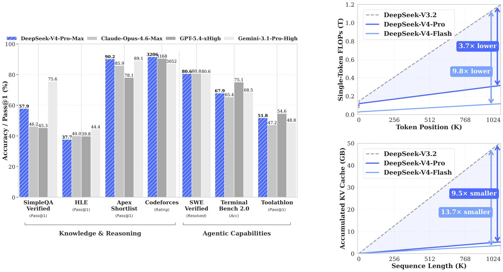

<figcaption>図1: 左: DeepSeek-V4-Pro-Max と対抗モデルのベンチマーク性能。右: DeepSeek-V4 シリーズと DeepSeek-V3.2 の推論 FLOPs と KV cache サイズ。</figcaption>
</figure>

## 1 Introduction（はじめに）

推論モデル [^63] [^25] の出現は test-time scaling という新しいパラダイムを確立し、大規模言語モデル（LLM）の大幅な性能向上を牽引してきた。しかし、このスケーリングパラダイムは、素の attention 機構 [^86] の二乗の計算複雑性によって根本的に制約されており、超長コンテキストと推論プロセスにとって法外なボトルネックを生んでいる。同時に、長いホライズンのシナリオとタスク——複雑なエージェント的ワークフローから大規模な文書横断分析まで——の出現により、超長コンテキストの効率的なサポートも将来の進歩にとって決定的に重要になっている。近年のオープンソースの取り組み [^24] [^71] [^57] [^7] は一般的な能力を前進させてきたが、超長系列の処理におけるこの中核的なアーキテクチャ上の非効率は依然として重要な障害であり、test-time scaling からのさらなる利得を制限し、長いホライズンのシナリオとタスクへのさらなる探究を妨げている。

超長コンテキストにおける効率の壁を破るため、我々は DeepSeek-V4 シリーズを開発した。これには 1.6T パラメータ（活性化 49B）の DeepSeek-V4-Pro と 284B パラメータ（活性化 13B）の DeepSeek-V4-Flash のプレビュー版が含まれる。アーキテクチャの革新を通じて、DeepSeek-V4 シリーズは超長系列処理の計算効率において劇的な飛躍を達成する。この突破により 100 万トークンのコンテキスト長の効率的なサポートが可能になり、次世代 LLM のための 100 万長コンテキストの新時代の到来を告げる。超長系列を効率的に扱う我々の能力は、test-time scaling の次のフロンティアを解放し、長いホライズンのタスクへのより深い研究への道を開き、オンライン学習のような将来のパラダイムを探究するために必要な基盤を確立するものと我々は信じている。

DeepSeek-V3 アーキテクチャ [^24] と比較すると、DeepSeek-V4 シリーズは DeepSeekMoE フレームワーク [^19] と Multi-Token Prediction（MTP）戦略を維持しつつ、アーキテクチャと最適化にいくつかの重要な革新を導入する。長コンテキスト効率を高めるため、Compressed Sparse Attention（CSA）と Heavily Compressed Attention（HCA）を組み合わせたハイブリッド attention 機構を設計する。CSA は KV cache を系列次元に沿って圧縮してから DeepSeek Sparse Attention（DSA）[^26] を実行するのに対し、HCA は KV cache により積極的な圧縮を適用するが密な attention を保つ。モデリング能力を強化するため、従来の残差接続をアップグレードする Manifold-Constrained Hyper-Connections（mHC）[^93] を組み込む。加えて、DeepSeek-V4 シリーズの訓練に Muon [^45] [^51] オプティマイザを導入し、より速い収束と改善された訓練安定性を得る。

DeepSeek-V4 シリーズの効率的な訓練と推論、そして生産的な開発を可能にするため、いくつかのインフラ最適化を導入する。第一に、計算・通信・メモリアクセスを完全にオーバーラップさせる MoE モジュール用の単一融合カーネルを設計・実装する。第二に、開発生産性と実行時効率のバランスを取るためのドメイン特化言語（DSL）である TileLang [^88] を採用する。第三に、訓練と推論の間のビット単位の再現性を保証する、効率的な batch-invariant（バッチ不変）かつ決定論的なカーネルライブラリを提供する。第四に、訓練フレームワークについては、きめ細かな再計算制御のためにテンソルレベルのチェックポインティングで autograd フレームワークを拡張し、Muon オプティマイザ向けのハイブリッド ZeRO 戦略、再計算と融合カーネルによる費用対効果の高い mHC 実装、圧縮 attention を扱う 2 段階のコンテキスト並列化によって訓練効率を高める。第五に、推論フレームワークについては、効率的な共有プレフィックス再利用を可能にする、オンディスク格納戦略を伴う異種 KV cache 構造を設計する。加えて、事後学習の段階では、メモリと計算を削減するため、MoE エキスパート重みと indexer QK パスに FP4 の quantization-aware training を組み込む。

<figure>

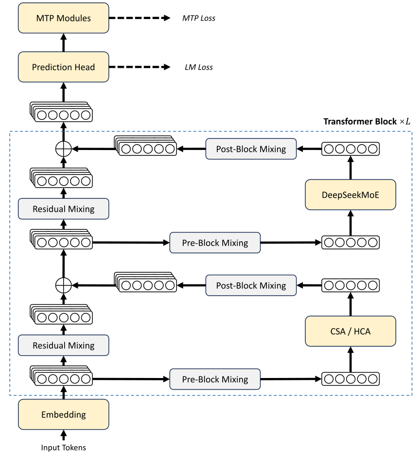

<figcaption>図2: DeepSeek-V4 シリーズの全体アーキテクチャ。attention 層にはハイブリッドの CSA（Compressed Sparse Attention）と HCA（Heavily Compressed Attention）を、feed-forward 層には DeepSeekMoE を用い、従来の残差接続を mHC で強化する。（訳注: クリップから欠落していたため ar5iv から復元した図）</figcaption>
</figure>

## 2 Architecture（アーキテクチャ）

全体として、DeepSeek-V4 シリーズは Transformer [^86] アーキテクチャと Multi-Token Prediction（MTP）モジュール [^35] [^24] を維持しつつ、DeepSeek-V3 に対していくつかの重要なアップグレードを導入する: (1) 第一に、従来の残差接続を強化する Manifold-Constrained Hyper-Connections（mHC）[^93] を導入する; (2) 第二に、Compressed Sparse Attention と Heavily Compressed Attention によって長コンテキスト効率を大幅に改善するハイブリッド attention アーキテクチャを設計する。(3) 第三に、オプティマイザとして Muon [^45] [^51] を採用する。Mixture-of-Experts（MoE）コンポーネントについては、DeepSeek-V3 からのわずかな調整を除き、引き続き DeepSeekMoE [^19] アーキテクチャを採用する。Multi-Token Prediction（MTP）[^70] [^35] [^50] [^24] の構成は DeepSeek-V3 と同一のままである。その他の明記されていない詳細はすべて DeepSeek-V3 [^24] で確立された設定に従う。図2 は DeepSeek-V4 の全体アーキテクチャを図示しており、詳細は以下で説明する。

### 2.1 Designs Inherited from DeepSeek-V3（DeepSeek-V3 から継承した設計）

##### Mixture-of-Experts.

これまでの DeepSeek シリーズのモデル [^23] [^24] と同様、DeepSeek-V4 シリーズも Feed-Forward Network（FFN）に DeepSeekMoE パラダイム [^19] を採用する。これは細粒度のルーティングされるエキスパートと共有エキスパートを設ける。DeepSeek-V3 と異なり、親和度スコアを計算する活性化関数を $\operatorname{Sigmoid}(\cdot)$ から $\operatorname{Sqrt}(\operatorname{Softplus}(\cdot))$ に変更する。負荷分散については、補助損失なし（auxiliary-loss-free）戦略 [^87] [^24] も採用し、個々の系列内での極端な不均衡を防ぐ軽い系列単位バランス損失で補強する。DeepSeek-V4 では、ルーティング先ノード数の制約を撤廃し、訓練効率を維持するために並列化戦略を注意深く再設計した。さらに DeepSeek-V3 と比べ、最初の数 Transformer ブロックの密な FFN 層を、Hash ルーティング [^76] を用いる MoE 層に置き換える。Hash ルーティング戦略は、入力トークン ID に関する事前定義のハッシュ関数に従って各トークンのターゲットエキスパートを決定する。

##### Multi-Token Prediction.

DeepSeek-V3 と同様、DeepSeek-V4 シリーズも MTP モジュールと目的関数を設ける。MTP 戦略は DeepSeek-V3 で検証済みであるため、DeepSeek-V4 シリーズでも同じ戦略を変更なしで採用する。

### 2.2 Manifold-Constrained Hyper-Connections（多様体制約付きハイパーコネクション）

図2 に示すように、DeepSeek-V4 シリーズは、隣接する Transformer ブロック間の従来の残差接続を強化するために Manifold-Constrained Hyper-Connections（mHC）[^93] を組み込む。素朴な Hyper-Connections（HC）[^101] と比べた mHC の核となる考え方は、残差写像を特定の多様体上に制約することで、モデルの表現力を保ちながら層をまたぐ信号伝播の安定性を高めることである。本小節では標準的な HC を簡潔に紹介し、安定した訓練のために我々が mHC をどう設計したかを説明する。

##### Standard Hyper-Connections.（標準的なハイパーコネクション）

標準的な HC は、残差ストリームの幅を $n_{\text{hc}}$ 倍に拡張する。具体的には、残差ストリームの形状が $\mathbb{R}^{d}$ から $\mathbb{R}^{n_{\text{hc}}\times d}$ に拡張される。ここで $d$ は実際の層入力の隠れサイズである。$X_{l}=[\mathbf{x}_{l,1};\ldots;\mathbf{x}_{l,n_{\text{hc}}}]^{T}\in\mathbb{R}^{n_{\text{hc}}\times d}$ を第 $l$ 層の前の残差状態とする。HC は 3 つの線形写像を導入する: 入力写像 $A_{l}\in\mathbb{R}^{1\times n_{\text{hc}}}$、残差変換 $B_{l}\in\mathbb{R}^{n_{\text{hc}}\times n_{\text{hc}}}$、出力写像 $C_{l}\in\mathbb{R}^{n_{\text{hc}}\times 1}$ である。残差状態の更新は次のように定式化される:

$$
X_{l+1}=B_{l}X_{l}+C_{l}\mathcal{F}_{l}(A_{l}X_{l}),
$$

ここで $\mathcal{F}_{l}$ は第 $l$ 層（例: MoE 層）を表し、その入出力形状はどちらも $\mathbb{R}^{d}$ である。実際の層入力 $A_{l}X_{l}\in\mathbb{R}^{d}$ も $d$ 次元であるため、拡張された残差幅は内側の層の設計に影響しないことに注意されたい。HC は残差幅を実際の隠れサイズから切り離し、最小の計算オーバーヘッドで補完的なスケーリング軸を提供する。$n_{\text{hc}}$ は通常、隠れサイズ $d$ よりはるかに小さいからである。しかし、HC はモデル性能の改善に潜在力を示してきたものの、複数層を積み重ねると訓練が頻繁に数値的不安定性を示し、HC のスケーリングを妨げることを我々は発見した。

##### Manifold-Constrained Residual Mapping.（多様体制約付き残差写像）

mHC の核となる革新は、残差写像行列 $B_{l}$ を二重確率行列の多様体（Birkhoff 多面体）$\mathcal{M}$ に制約し、それによって層をまたぐ信号伝播の安定性を高めることである:

$$
B_{l}\in\mathcal{M}\coloneqq\{M\in\mathbb{R}^{n\times n}\mid M\mathbf{1}_{n}=\mathbf{1}_{n},\;\mathbf{1}_{n}^{T}M=\mathbf{1}_{n}^{T},\;M\geqslant 0\}.
$$

この制約は写像行列のスペクトルノルム $\|B_{l}\|_{2}$ が 1 で抑えられることを保証するため、残差変換は非拡大（non-expansive）になり、forward パスと逆伝播の両方で数値的安定性が高まる。さらに、集合 $\mathcal{M}$ は積について閉じており、mHC を深く積み重ねるシナリオでの安定性を保証する。加えて、入力変換 $A_{l}$ と出力変換 $C_{l}$ も、信号の相殺リスクを避けるため、Sigmoid 関数によって非負かつ有界になるよう制約される。

##### Dynamic Parameterization.（動的パラメータ化）

3 つの線形写像のパラメータは動的に生成され、動的（入力依存）成分と静的（入力非依存）成分に分解される。入力 $X_{l}\in\mathbb{R}^{n_{\text{hc}}\times d}$ が与えられると、まず平坦化して正規化する: $\hat{X}_{l}=\operatorname{RMSNorm}(\operatorname{vec}(X_{l}))\in\mathbb{R}^{1\times n_{\text{hc}}d}$。次に、従来の HC に従って、制約のない生パラメータ $\tilde{A}_{l}\in\mathbb{R}^{1\times n_{\text{hc}}}$, $\tilde{B}_{l}\in\mathbb{R}^{n_{\text{hc}}\times n_{\text{hc}}}$, $\tilde{C}_{l}\in\mathbb{R}^{n_{\text{hc}}\times 1}$ を生成する:

$$
\begin{aligned}
\tilde{A}_{l}&=\alpha_{l}^{\mathrm{pre}}\cdot(\hat{X}_{l}W^{\mathrm{pre}}_{l})+S_{l}^{\mathrm{pre}},\\
\tilde{B}_{l}&=\alpha_{l}^{\mathrm{res}}\cdot\operatorname{Mat}(\hat{X}_{l}W^{\mathrm{res}}_{l})+S_{l}^{\mathrm{res}},\\
\tilde{C}_{l}&=\alpha_{l}^{\mathrm{post}}\cdot(\hat{X}_{l}W^{\mathrm{post}}_{l})^{T}+S_{l}^{\mathrm{post}},
\end{aligned}
$$

ここで $W^{\mathrm{pre}}_{l},W^{\mathrm{post}}_{l}\in\mathbb{R}^{n_{\text{hc}}d\times n_{\text{hc}}}$ と $W^{\mathrm{res}}_{l}\in\mathbb{R}^{n_{\text{hc}}d\times n_{\text{hc}}^{2}}$ は動的成分を生成するための学習可能パラメータ; $\operatorname{Mat}(\cdot)$ はサイズ $1\times n_{\text{hc}}^{2}$ のベクトルをサイズ $n_{\text{hc}}\times n_{\text{hc}}$ の行列に整形する; $S_{l}^{\mathrm{pre}}\in\mathbb{R}^{1\times n_{\text{hc}}}$, $S_{l}^{\mathrm{post}}\in\mathbb{R}^{n_{\text{hc}}\times 1}$, $S_{l}^{\mathrm{res}}\in\mathbb{R}^{n_{\text{hc}}\times n_{\text{hc}}}$ は学習可能な静的バイアス; $\alpha_{l}^{\mathrm{pre}}$, $\alpha_{l}^{\mathrm{res}}$, $\alpha_{l}^{\mathrm{post}}\in\mathbb{R}$ は小さな値で初期化される学習可能なゲーティング係数である。

##### Applying Parameter Constraints.（パラメータ制約の適用）

制約のない生パラメータ $\tilde{A}_{l},\tilde{B}_{l},\tilde{C}_{l}$ を得た後、数値的安定性を高めるために前述の制約を適用する。具体的には、入力・出力写像には Sigmoid 関数 $\sigma(\cdot)$ を用いて非負性と有界性を保証する:

$$
A_{l}=\sigma(\tilde{A}_{l}),\qquad C_{l}=2\sigma(\tilde{C}_{l}).
$$

残差写像 $\tilde{B}_{l}$ については、二重確率行列の多様体 $\mathcal{M}$ 上へ射影する。これは Sinkhorn-Knopp アルゴリズムによって達成される。まず正値性を保証するために $\tilde{B}_{l}$ に指数関数を適用して $M^{(0)}=\exp(\tilde{B}_{l})$ を得て、その後、列と行の正規化を反復的に実行する:

$$
M^{(t)}=\mathcal{T}_{r}(\mathcal{T}_{c}(M^{(t-1)})),
$$

ここで $\mathcal{T}_{r}$ と $\mathcal{T}_{c}$ はそれぞれ行正規化と列正規化を表す。この反復は制約された二重確率行列 $B_{l}=M^{(t_{\text{max}})}$ に収束する。実用的な値として $t_{\text{max}}=20$ を選ぶ。

### 2.3 Hybrid Attention with CSA and HCA（CSA と HCA によるハイブリッド attention）

コンテキスト長が極端なスケールに達すると、attention 機構がモデルの支配的な計算ボトルネックとして浮上する。DeepSeek-V4 のために、我々は 2 つの効率的な attention アーキテクチャ——Compressed Sparse Attention（CSA）と Heavily Compressed Attention（HCA）——を設計し、それらを交互配置したハイブリッド構成を採用する。これは長文シナリオにおける attention の計算コストを大幅に削減する。CSA は圧縮とスパース attention の両戦略を統合する: まず $m$ トークンごとの Key-Value（KV）cache を 1 エントリに圧縮し、その後、各クエリトークンが $k$ 個の圧縮 KV エントリのみに注意を向ける DeepSeek Sparse Attention（DSA）[^26] を適用する。HCA は、$m^{\prime}$（$\gg m$）トークンごとの KV cache を単一エントリに統合することで、極端な圧縮を狙う。CSA と HCA のハイブリッドアーキテクチャは DeepSeek-V4 シリーズの長コンテキスト効率を著しく改善し、100 万トークンコンテキストを実用上可能にする。本小節ではハイブリッド attention アーキテクチャの中核技術を説明する。また、より詳細を曖昧さなく規定するオープンソース実装[^fn1]も提供する。

<figure>

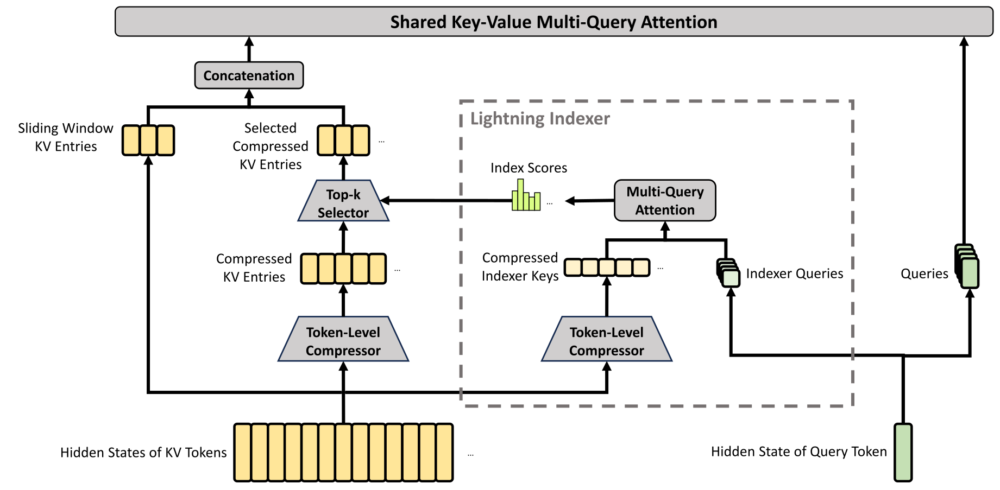

<figcaption>図3: CSA の中核アーキテクチャ。KV エントリの数を 1/m 倍に圧縮し、その後さらなる高速化のために DeepSeek Sparse Attention を適用する。加えて、局所的な細粒度の依存関係を強化するために、少数の sliding window KV エントリが選択された圧縮 KV エントリと組み合わされる。（訳注: クリップから欠落していたため ar5iv から復元した図）</figcaption>
</figure>

#### 2.3.1 Compressed Sparse Attention（圧縮スパース attention）

CSA の中核アーキテクチャは図3 に示すとおりで、まず $m$ トークンごとの KV cache を 1 エントリに圧縮し、その後さらなる高速化のために DeepSeek Sparse Attention を適用する。

##### Compressed Key-Value Entries.（圧縮 KV エントリ）

$H\in\mathbb{R}^{n\times d}$ を入力隠れ状態の系列とする。ここで $n$ は系列長、$d$ は隠れサイズである。CSA はまず 2 系統の KV エントリ $C^{a},C^{b}\in\mathbb{R}^{n\times c}$ と、それに対応する圧縮重み $Z^{a},Z^{b}\in\mathbb{R}^{n\times c}$ を計算する。ここで $c$ はヘッド次元である:

$$
C^{a}=H\cdot W^{aKV},\quad C^{b}=H\cdot W^{bKV},\qquad
Z^{a}=H\cdot W^{aZ},\quad Z^{b}=H\cdot W^{bZ},
$$

ここで $W^{aKV},W^{bKV},W^{aZ},W^{bZ}\in\mathbb{R}^{d\times c}$ は訓練可能なパラメータである。次に、$C^{a}$ と $C^{b}$ の $m$ 個ごとの KV エントリが、その圧縮重みと学習可能な位置バイアス $B^{a},B^{b}\in\mathbb{R}^{m\times c}$ に従って 1 エントリに圧縮され、$C^{\text{Comp}}\in\mathbb{R}^{\frac{n}{m}\times c}$ を生成する。各圧縮エントリ $C^{\text{Comp}}_{i}\in\mathbb{R}^{c}$ は次で計算される

$$
\begin{aligned}
[S^{a}_{mi:m(i+1)-1};S^{b}_{m(i-1):mi-1}]&=\operatorname{Softmax}_{\text{row}}([Z^{a}_{mi:m(i+1)-1}+B^{a};Z^{b}_{m(i-1):mi-1}+B^{b}]),\\
C^{\text{Comp}}_{i}&=\sum_{j=mi}^{m(i+1)-1}S^{a}_{j}\odot C^{a}_{j}+\sum_{j=m(i-1)}^{mi-1}S^{b}_{j}\odot C^{b}_{j},
\end{aligned}
$$

ここで $\odot$ はアダマール積を表す。$\operatorname{Softmax}_{\text{row}}(\cdot)$ は行方向の softmax 演算を表し、$Z^{a}$ と $Z^{b}$ の両方に由来する合計 $2m$ 要素にわたって正規化を行う。$i=0$ のとき、$Z^{b}_{m(i-1):mi-1}$ は負の無限大で、$C^{b}_{m(i-1):mi-1}$ はゼロでパディングされる。各 $C^{\text{Comp}}_{i}$ は $2m$ 個の KV エントリから導出されるが、$C^{\text{Comp}}_{i}$ に使われる $C^{b}$ のインデックスと $C^{\text{Comp}}_{i-1}$ に使われる $C^{a}$ のインデックスは重なっていることに注意されたい。したがって、CSA は実際には系列長を $\frac{1}{m}$ 倍に圧縮する。

##### Lightning Indexer for Sparse Selection.（スパース選択のための lightning indexer）

圧縮 KV エントリ $C^{\text{Comp}}$ を得た後、CSA は DSA 戦略を適用して、コア attention のために top-k 個の圧縮 KV エントリを選択する。まず、CSA は $C^{\text{Comp}}$ に使ったのと同じ圧縮操作を実行して、圧縮された indexer キー $K^{\text{IComp}}\in\mathbb{R}^{\frac{n}{m}\times c^{I}}$ を得る。ここで $c^{I}$ は indexer のヘッド次元である。次に、クエリトークン $t$ に対して、低ランクの方式で indexer クエリ $\{\mathbf{q}_{t,1}^{I};\mathbf{q}_{t,2}^{I};...;\mathbf{q}_{t,n_{h}^{I}}^{I}\}$ を生成する:

$$
\mathbf{c}_{t}^{Q}=\mathbf{h}_{t}\cdot W^{DQ},\qquad
[\mathbf{q}_{t,1}^{I};\mathbf{q}_{t,2}^{I};...;\mathbf{q}_{t,n_{h}^{I}}^{I}]=\mathbf{q}_{t}^{I}=\mathbf{c}_{t}^{Q}\cdot W^{IUQ},
$$

ここで $\mathbf{h}_{t}\in\mathbb{R}^{d}$ はクエリトークン $t$ の入力隠れ状態; $\mathbf{c}_{t}^{Q}\in\mathbb{R}^{d_{c}}$ はクエリ用の圧縮潜在ベクトル; $d_{c}$ はクエリ圧縮次元; $n_{h}^{I}$ は indexer クエリヘッドの数; $W^{DQ}\in\mathbb{R}^{d\times d_{c}}$ と $W^{IUQ}\in\mathbb{R}^{d_{c}\times c^{I}n_{h}^{I}}$ はそれぞれ indexer クエリのダウンプロジェクション・アッププロジェクション行列である。次に、クエリトークン $t$ と先行する圧縮ブロック $s$（$s<\operatorname{Floor}(\frac{t}{m})$）の間のインデックススコア $I_{t,s}\in\mathbb{R}$ は次で計算される

$$
[w_{t,1}^{I};w_{t,2}^{I};...;w_{t,n_{h}^{I}}^{I}]=\mathbf{w}_{t}^{I}=\mathbf{h}_{t}\cdot W^{w},\qquad
I_{t,s}=\sum_{h=1}^{n_{h}^{I}}w_{t,h}^{I}\cdot\text{ReLU}\left(\mathbf{q}^{I}_{t,h}\cdot K^{\text{IComp}}_{s}\right),
$$

ここで $W^{w}\in\mathbb{R}^{d\times n_{h}^{I}}$ は学習可能な行列; $w_{t,h}^{I}\in\mathbb{R}$ は第 $h$ indexer ヘッドの重みである。クエリトークン $t$ に対し、そのインデックススコア $I_{t,:}$ が与えられると、後続のコア attention のために圧縮 KV エントリの部分集合 $\mathcal{C}^{\text{SprsComp}}_{t}$ を選択的に保持する top-k セレクタを用いる:

$$
\mathcal{C}^{\text{SprsComp}}_{t}=\left\{C^{\text{Comp}}_{s}\;\Big|\;I_{t,s}\in\operatorname{Top-k}(I_{t,:})\right\}.
$$

##### Shared Key-Value MQA.（共有 KV の MQA）

スパースな KV エントリを選択した後、CSA は Multi-Query Attention（MQA）[^80] の方式でコア attention を実行する。そこでは $\mathcal{C}^{\text{SprsComp}}_{t}$ の各圧縮 KV エントリが attention の key と value の両方を務める。具体的には、クエリトークン $t$ に対し、まず圧縮潜在ベクトル $\mathbf{c}_{t}^{Q}$ から attention クエリ $\{\mathbf{q}_{t,1};\mathbf{q}_{t,2};...;\mathbf{q}_{t,n_{h}}\}$ を生成する:

$$
[\mathbf{q}_{t,1};\mathbf{q}_{t,2};...;\mathbf{q}_{t,n_{h}}]=\mathbf{q}_{t}=\mathbf{c}_{t}^{Q}\cdot W^{UQ},
$$

ここで $n_{h}$ はクエリヘッドの数; $W^{UQ}\in\mathbb{R}^{d_{c}\times cn_{h}}$ はクエリのアッププロジェクション行列である。潜在クエリベクトル $\mathbf{c}_{t}^{Q}$ が indexer クエリに使われるものと共有されている点に注意されたい。次に、$\{\mathbf{q}_{t,i}\}$ と $\mathcal{C}^{\text{SprsComp}}_{t}$ に対して MQA を実行する:

$$
\mathbf{o}_{t,i}=\operatorname{CoreAttn}\left(\texttt{query=}\mathbf{q}_{t,i},\texttt{key=}\mathcal{C}^{\text{SprsComp}}_{t},\texttt{value=}\mathcal{C}^{\text{SprsComp}}_{t}\right),
$$

ここで $\mathbf{o}_{t,i}\in\mathbb{R}^{c}$ は第 $t$ トークンにおける第 $i$ ヘッドのコア attention 出力; $\operatorname{CoreAttn}(\cdot)$ はコア attention 演算を表す。

##### Grouped Output Projection.（グループ化された出力射影）

DeepSeek-V4 の構成では、$cn_{h}$ はかなり大きい。したがって、コア attention 演算の出力 $[\mathbf{o}_{t,1};\mathbf{o}_{t,2};...;\mathbf{o}_{t,n_{h}}]=\mathbf{o}_{t}\in\mathbb{R}^{cn_{h}}$ を $d$ 次元の隠れ状態へ直接射影すると、多大な計算負荷を課すことになる。このコストを緩和するため、グループ化された出力射影戦略を設計する。具体的には、まず $n_{h}$ 個の出力を $g$ グループに分割し、各グループの出力 $\mathbf{o}^{G}_{t,i}\in\mathbb{R}^{c\frac{n_{h}}{g}}$ を $d_{g}$ 次元の中間出力 $\mathbf{o}^{G^{\prime}}_{t,i}\in\mathbb{R}^{d_{g}}$ に射影する。ここで $d_{g}<c\frac{n_{h}}{g}$ である。最後に、中間出力 $[\mathbf{o}^{G^{\prime}}_{t,1};\mathbf{o}^{G^{\prime}}_{t,2};...;\mathbf{o}^{G^{\prime}}_{t,g}]\in\mathbb{R}^{d_{g}g}$ を最終的な attention 出力 $\mathbf{\hat{o}}_{t}\in\mathbb{R}^{d}$ へ射影する。

<figure>

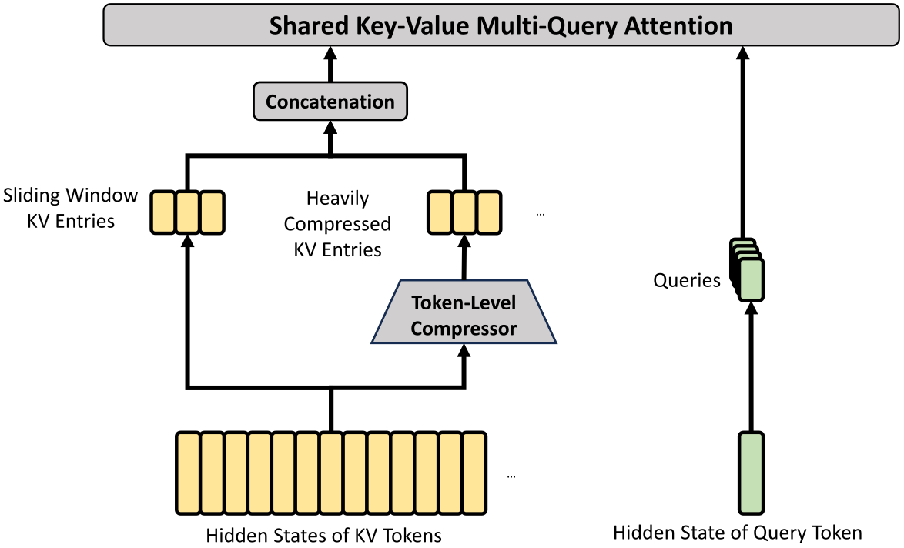

<figcaption>図4: HCA の中核アーキテクチャ。より重い圧縮を行い、m′（≫m）トークンの KV エントリが 1 つに統合される。また、局所的な細粒度の依存関係を強化するために、少数の sliding window KV エントリを追加で導入する。（訳注: クリップから欠落していたため ar5iv から復元した図）</figcaption>
</figure>

#### 2.3.2 Heavily Compressed Attention（重圧縮 attention）

HCA の中核アーキテクチャは図4 に示すとおりで、KV cache をより重い方式で圧縮するが、スパース attention は用いない。

##### Compressed Key-Value Entries.（圧縮 KV エントリ）

概して、HCA の圧縮戦略は CSA のそれと似ているが、より大きな圧縮率 $m^{\prime}$（$\gg m$）を用い、オーバーラップ圧縮は行わない。$H\in\mathbb{R}^{n\times d}$ を入力隠れ状態の系列とすると、HCA はまず元の KV エントリ $C\in\mathbb{R}^{n\times c}$ とそれに対応する圧縮重み $Z\in\mathbb{R}^{n\times c}$ を計算する:

$$
C=H\cdot W^{KV},\qquad Z=H\cdot W^{Z},
$$

ここで $W^{KV},W^{Z}\in\mathbb{R}^{d\times c}$ は訓練可能なパラメータである。次に、$C$ の $m^{\prime}$ 個ごとの KV エントリが、圧縮重みと学習可能な位置バイアス $B\in\mathbb{R}^{m^{\prime}\times c}$ に従って 1 つに圧縮され、$C^{\text{Comp}}\in\mathbb{R}^{\frac{n}{m^{\prime}}\times c}$ を生成する。各圧縮エントリ $C^{\text{Comp}}_{i}\in\mathbb{R}^{c}$ は次で計算される

$$
\begin{aligned}
S_{m^{\prime}i:m^{\prime}(i+1)-1}&=\operatorname{Softmax}_{\text{row}}(Z_{m^{\prime}i:m^{\prime}(i+1)-1}+B),\\
C^{\text{Comp}}_{i}&=\sum_{j=m^{\prime}i}^{m^{\prime}(i+1)-1}S_{j}\odot C_{j}.
\end{aligned}
$$

この圧縮操作を通じて、HCA は系列長を $\frac{1}{m^{\prime}}$ 倍に圧縮する。

##### Shared Key-Value MQA and Grouped Output Projection.（共有 KV の MQA とグループ化出力射影）

HCA も CSA と同様に、共有 KV の MQA とグループ化出力射影の戦略を用いる。KV 圧縮の後、クエリトークン $t$ に対し、HCA はまず低ランク方式で attention クエリ $\{\mathbf{q}_{t,1};\mathbf{q}_{t,2};...;\mathbf{q}_{t,n_{h}}\}$ を生成する:

$$
\mathbf{c}_{t}^{Q}=\mathbf{h}_{t}\cdot W^{DQ},\qquad
[\mathbf{q}_{t,1};\mathbf{q}_{t,2};...;\mathbf{q}_{t,n_{h}}]=\mathbf{q}_{t}=\mathbf{c}_{t}^{Q}\cdot W^{UQ},
$$

ここで $\mathbf{h}_{t}\in\mathbb{R}^{d}$ はクエリトークン $t$ の入力隠れ状態; $n_{h}$ はクエリヘッドの数; $W^{DQ}\in\mathbb{R}^{d\times d_{c}}$ と $W^{UQ}\in\mathbb{R}^{d_{c}\times cn_{h}}$ はそれぞれクエリのダウンプロジェクション・アッププロジェクション行列である。次に、$\{\mathbf{q}_{t,i}\}$ と $C^{\text{Comp}}$ に対して MQA を実行する:

$$
\mathbf{o}_{t,i}=\operatorname{CoreAttn}\left(\texttt{query=}\mathbf{q}_{t,i},\texttt{key=}C^{\text{Comp}},\texttt{value=}C^{\text{Comp}}\right),
$$

ここで $\mathbf{o}_{t,i}\in\mathbb{R}^{c}$ は第 $t$ トークンにおける第 $i$ ヘッドのコア attention 出力である。次に、CSA と同様、HCA は $n_{h}$ 個の出力を $g$ グループに分割し、各グループの出力 $\mathbf{o}^{G}_{t,i}\in\mathbb{R}^{c\frac{n_{h}}{g}}$ を $d_{g}$ 次元の中間出力 $\mathbf{o}^{G^{\prime}}_{t,i}\in\mathbb{R}^{d_{g}}$ に射影する（$d_{g}<c\frac{n_{h}}{g}$）。最後に、HCA は中間出力 $[\mathbf{o}^{G^{\prime}}_{t,1};\mathbf{o}^{G^{\prime}}_{t,2};...;\mathbf{o}^{G^{\prime}}_{t,g}]\in\mathbb{R}^{d_{g}g}$ を最終的な attention 出力 $\mathbf{\hat{o}}_{t}\in\mathbb{R}^{d}$ へ射影する。

#### 2.3.3 Other Details（その他の詳細）

上述の CSA と HCA の中核アーキテクチャに加えて、我々のハイブリッド attention は他にもいくつかの技術を組み込んでいる。記述の明瞭さのため、これらの追加技術は上の導入からは省略しており、本小節で簡潔に説明する。また、本小節はそれらの中核となる考え方のみに焦点を当て、簡単のために細かな詳細は省略することがある。曖昧さのない詳細については、我々のオープンソース実装を参照することを読者に勧める。

##### Query and Key-Value Entry Normalization.（クエリと KV エントリの正規化）

CSA と HCA の両方について、コア attention 演算の直前に、クエリの各ヘッドと圧縮 KV エントリの唯一のヘッドに追加の RMSNorm 演算を実行する。この正規化は attention ロジットの爆発を回避し、訓練安定性を改善しうる。

##### Partial Rotary Positional Embedding.（部分回転位置埋め込み）

CSA と HCA の両方について、attention クエリ・KV エントリ・コア attention 出力に Rotary Positional Embedding（RoPE）[^83] を部分的に適用する。具体的には、CSA と HCA で使われる各クエリベクトルと KV エントリベクトルの末尾 64 次元に RoPE を適用する。KV エントリは attention の key と value の両方を務めるため、素朴なコア attention 出力 $\{\mathbf{o}_{t,i}\}$ は、KV エントリの重み付き和に由来する絶対位置埋め込みを帯びてしまう。対抗策として、各 $\mathbf{o}_{t,i}$ の末尾 64 次元にも位置 $-i$ の RoPE を適用する。こうすることで、コア attention の出力も相対位置埋め込みを帯びる——各 KV エントリのコア attention 出力への寄与も、クエリと KV エントリの間の距離に関係づけられる。

##### Additional Branch of Sliding Window Attention.（sliding window attention の追加ブランチ）

CSA と HCA で因果性を厳密に保つため、各クエリは先行する圧縮 KV ブロックのみに注意を向ける。その結果、クエリは自身の圧縮ブロック内の他トークンの情報にアクセスできない。一方、言語モデリングでは通常、直近のトークンほどクエリトークンとの関連が強い。これらの理由から、局所依存のより良いモデリングのため、CSA と HCA の両方に sliding window 方式の補助 attention ブランチを導入する。具体的には、各クエリトークンに対し、直近 $n_{\text{win}}$ トークンに対応する $n_{\text{win}}$ 個の非圧縮 KV エントリを追加で生成する。CSA と HCA のコア attention では、この sliding window 内の KV エントリが圧縮 KV エントリと共に使われる。

##### Attention Sink.

CSA と HCA のコア attention では、attention sink [^92] [^66] のトリックを用いる。具体的には、一連の学習可能な sink ロジット $\{z^{\prime}_{1},z^{\prime}_{2},...,z^{\prime}_{n_{h}}\}$ を設ける。第 $h$ attention ヘッドについて、$\operatorname{Exp}(z^{\prime}_{h})$ が attention スコアの分母に加算される:

$$
s_{h,i,j}=\frac{\operatorname{Exp}(z_{h,i,j})}{\sum_{k}\operatorname{Exp}(z_{h,i,k})+\operatorname{Exp}(z^{\prime}_{h})},
$$

ここで $s_{h,i,j},z_{h,i,j}\in\mathbb{R}$ は、第 $h$ attention ヘッドにおける第 $i$ クエリトークンと第 $j$ 先行トークン（または圧縮ブロック）の間の attention スコアと attention ロジットを表す。この技法により、各クエリヘッドは自身の attention スコアの合計を 1 に等しくない値、さらにはほぼ 0 に調整できる。

#### 2.3.4 Efficiency Discussion（効率の議論）

ハイブリッドの CSA と HCA の採用に加え、低精度の計算と格納により、DeepSeek-V4 シリーズの attention モジュールは、特に長コンテキストのシナリオにおいて、attention FLOPs と KV cache サイズの両方で顕著な効率を達成する。第一に、KV エントリに混合格納形式を採用する: 回転位置埋め込み（RoPE）次元には BF16 精度を、残りの次元には FP8 精度を適用する。このハイブリッド表現は、純 BF16 格納と比べて KV cache サイズをほぼ半減させる。第二に、lightning indexer 内の attention 計算は FP4 精度で実行され、極端に長いコンテキストでの attention 演算を高速化する。第三に、DeepSeek-V3.2 と比べて DeepSeek-V4 シリーズではより小さな attention top-k を選んでおり、短・中程度の長さのテキストでのモデル効率を改善する。最後に、そして最も重要な点として、圧縮 attention とハイブリッド attention の技術が KV cache サイズと計算 FLOPs の両方を大幅に削減する。

ヘッド次元 128 の BF16 GQA8 [^5]——LLM attention の一般的な構成のひとつ——をベースラインとすると、1M コンテキスト設定において DeepSeek-V4 シリーズの KV cache サイズは、そのベースラインの約 $2\%$ にまで劇的に削減できる。さらに、すでに効率的なベースラインである DeepSeek-V3.2 [^26] と比較しても、DeepSeek-V4 シリーズは効率面で大きな優位を示す。両者の推論 FLOPs と KV cache サイズの比較は図1 の右側に示す。

**Algorithm 1** DeepSeek-V4 のための Muon オプティマイザ

```
Require: 学習率 η, モーメンタム μ, weight decay λ, 更新リスケーリング係数 γ
for 各訓練ステップ t do
  for 各論理的に独立な重み W ∈ R^{n×m} do
    G_t = ∇_W L_t(W_{t-1})                        ▷ 勾配を計算
    M_t = μ M_{t-1} + G_t                          ▷ モーメンタムバッファに蓄積
    O′_t = HybridNewtonSchulz(μ M_t + G_t)         ▷ Nesterov トリックとハイブリッド Newton-Schulz
    O_t = O′_t · sqrt(max(n, m)) · γ               ▷ 更新の RMS をリスケール
    W_t = W_{t-1} · (1 − ηλ) − η O_t               ▷ weight decay を適用して更新
  end for
end for
```

### 2.4 Muon Optimizer（Muon オプティマイザ）

DeepSeek-V4 シリーズの大部分のモジュールには、より速い収束と改善された訓練安定性のため、Muon [^45] [^51] オプティマイザを採用する。我々の Muon 最適化の完全なアルゴリズムは Algorithm 1 にまとめる。

##### Basic Configurations.（基本構成）

埋め込みモジュール・予測ヘッドモジュール・mHC モジュールの静的バイアスとゲーティング係数・すべての RMSNorm モジュールの重みには AdamW [^52] オプティマイザを維持する。その他のモジュールはすべて Muon で更新する。[^51] に従い、Muon パラメータにも weight decay を適用し、Nesterov [^59] [^45] トリックを用い、AdamW のハイパーパラメータを再利用するために更新行列の Root Mean Square（RMS）をリスケールする。彼らと異なるのは、直交化にハイブリッド Newton-Schulz 反復を用いる点である。

##### Hybrid Newton-Schulz Iterations.（ハイブリッド Newton-Schulz 反復）

与えられた行列 $M$ について、その特異値分解（SVD）を $M=U\Sigma V^{T}$ とする。Newton-Schulz 反復は $M$ を $UV^{T}$ へ近似的に直交化することを狙う。通常、最大特異値が 1 を超えないことを保証するため、まず $M$ を $M_{0}=M/||M||_{F}$ と正規化する。その後、各 Newton-Schulz 反復は次の演算を実行する:

$$
M_{k}=aM_{k-1}+b(M_{k-1}M_{k-1}^{T})M_{k-1}+c(M_{k-1}M_{k-1}^{T})^{2}M_{k-1}.
$$

我々のハイブリッド Newton-Schulz は、2 つの異なる段階にわたって 10 回の反復を実行する。最初の 8 ステップでは係数 $(a,b,c)=(3.4445,-4.7750,2.0315)$ を用いて急速な収束を駆動し、特異値を 1 に近づける。最後の 2 ステップでは係数 $(a,b,c)=(2,-1.5,0.5)$ に切り替え、特異値を正確に 1 で安定させる。

##### Avoiding Exploding Attention Logits.（attention ロジットの爆発の回避）

DeepSeek-V4 シリーズの attention アーキテクチャでは、attention クエリと KV エントリに RMSNorm を直接適用でき、これが attention ロジットの爆発を効果的に防ぐ。その結果、我々の Muon オプティマイザでは QK-Clip 技法 [^51] を採用していない。

## 3 General Infrastructures（一般インフラ）

### 3.1 Fine-Grained Communication-Computation Overlap in Expert Parallelism（Expert Parallelism における細粒度の通信・計算オーバーラップ）

Mixture-of-Experts（MoE）は Expert Parallelism（EP）によって加速できる。しかし、EP は複雑なノード間通信を必要とし、インターコネクトの帯域幅とレイテンシに大きな要求を課す。EP の通信ボトルネックを緩和し、より低いインターコネクト帯域要件でより高い end-to-end 性能を達成するため、通信と計算を単一のパイプライン化されたカーネルに融合して通信・計算オーバーラップを行う、細粒度の EP スキームを提案する。

##### Communication Latency Can Be Hidden.（通信レイテンシは隠せる）

我々の EP スキームの鍵となる洞察は、MoE 層において通信レイテンシを計算の下に効果的に隠せるということである。図5 に示すように、DeepSeek-V4 シリーズでは、各 MoE 層は主に 4 つのステージに分解できる: 通信律速の 2 ステージ *Dispatch* と *Combine*、計算律速の 2 ステージ *Linear-1* と *Linear-2* である。我々のプロファイリングは、単一の MoE 層内では通信の合計時間が計算のそれより少ないことを明らかにしている。したがって、通信と計算を統一パイプラインに融合した後は計算が支配的なボトルネックのままであり、これはシステムが end-to-end 性能を劣化させることなく、より低いインターコネクト帯域を許容できることを意味する。

<figure>

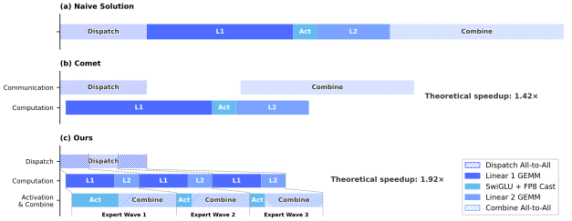

<figcaption>図5: 我々の EP スキームと関連研究の図解。Comet は Dispatch と Linear-1、Linear-2 と Combine をそれぞれ別々にオーバーラップさせる。我々の EP スキームはエキスパートをウェーブに分割・スケジュールすることで、より細粒度のオーバーラップを達成する。理論的なスピードアップは DeepSeek-V4-Flash アーキテクチャの構成で評価した。（訳注: クリップから欠落していたため ar5iv から復元した図）</figcaption>
</figure>

##### Fine-Grained EP Scheme.（細粒度 EP スキーム）

インターコネクト帯域の要件をさらに下げ、オーバーラップの恩恵を増幅するため、より細粒度のエキスパート分割スキームを導入する。多くの関連研究 [^4] [^98] に着想を得て、エキスパートを *ウェーブ（waves）* に分割してスケジュールする。各ウェーブはエキスパートの小さな一部から成る。ウェーブ内のすべてのエキスパートが通信を完了し次第、他のエキスパートを待つことなく計算を即座に開始できる。定常状態では、現在のウェーブの計算、次のウェーブのためのトークン転送、完了したエキスパートの結果送信がすべて並行して進む（図5 に示すとおり）。これはエキスパート間の細粒度パイプラインを形成し、ウェーブ全体を通じて計算と通信の両方を連続に保つ。ウェーブベースのスケジューリングは、ロングテールの小バッチに遭遇しがちな強化学習（RL）rollout のような極端なケースでの性能を高める。

##### Performance and Open-Sourced Mega-Kernel.（性能とオープンソースのメガカーネル）

細粒度 EP スキームを NVIDIA GPU と HUAWEI Ascend NPU の両プラットフォームで検証した。強力な非融合ベースラインと比較して、一般的な推論ワークロードで $1.50\sim 1.73\times$、RL rollout や高速エージェントサービングのようなレイテンシ敏感なシナリオでは最大 $1.96\times$ のスピードアップを達成する。CUDA ベースのメガカーネル実装は MegaMoE[^fn2] と名付けて DeepGEMM のコンポーネントとしてオープンソース化した。

##### Observations and Proposals.（観察と提言）

- **計算・通信比。** 完全な通信・計算オーバーラップは、帯域幅単独ではなく計算・通信比にかかっている。ピーク計算スループットを $C$、インターコネクト帯域を $B$ とすると、$C/B\leqslant V_{\text{comp}}/V_{\text{comm}}$ のとき通信は完全に隠せる。ここで $V_{\text{comp}}$ は計算量、$V_{\text{comm}}$ は通信量を指す。DeepSeek-V4-Pro では、各トークン・エキスパートペアは $6hd$ FLOPs（SwiGLU の gate・up・down 射影）を要するが、通信は $3h$ バイト（FP8 Dispatch＋BF16 Combine）に過ぎないため、これは次のように単純化される:
	$$
	\frac{C}{B}\leqslant 2d=6144\;\mathrm{FLOPs/Byte}.
	$$
	すなわち、インターコネクト帯域 1 GBps ごとに 6.1 TFLOP/s の計算の通信を隠すのに足りる。帯域がこの閾値を満たせば、それはボトルネックであることをやめ、さらなる帯域にシリコン面積を投じても逓減リターンしか得られない。我々は、将来のハードウェア設計が無条件に帯域をスケールさせるのではなく、このようなバランス点を狙うことを推奨する。
- **電力予算。** 極端なカーネル融合は計算・メモリ・ネットワークを同時に高負荷へ追い込み、電力スロットリングが重要な性能制限要因になる。将来のハードウェア設計には、このような完全並行ワークロードに十分な電力余裕を確保することを提案する。
- **通信プリミティブ。** dispatch ステージでは、各 GPU がリモート GPU から活性化を能動的に読む pull ベースのアプローチを採用し、細粒度 push が伴う高い通知レイテンシを回避する。より低レイテンシの GPU 間シグナリングを備えた将来のハードウェアでは push が実行可能になり、より自然な通信パターンが可能になるだろう。
- **活性化関数。** SwiGLU を、指数や除算演算を含まない低コストな要素単位の活性化関数に置き換えることを提案する。これは GEMM 後処理のオーバーヘッドを直接削減し、GEMM パイプラインが活性化関数の計算で停滞するのを防ぎ、全体の計算スループットと資源利用率を高める。

### 3.2 Flexible and Efficient Kernel Development with TileLang（TileLang による柔軟で効率的なカーネル開発）

実務上、我々の凝ったモデルアーキテクチャは、数百もの細粒度な Torch ATen 演算子を生むところだった。我々は TileLang [^88] を採用してそれらの大部分を置き換える一連の融合カーネルを開発し、最小の労力で最適な性能を届けた。TileLang はまた、検証段階で attention 変種のような演算子を素早くプロトタイプすることも可能にする。これらのカーネルは、モデルアーキテクチャの開発・大規模訓練・そして最終的な推論サービスの本番展開において決定的な役割を果たしている。ドメイン特化言語（DSL）として、TileLang は開発生産性と実行時効率のバランスを取り、同一コードベース内で迅速な開発と深い反復的最適化の両方を支える。加えて、我々は TileLang コミュニティと緊密に連携し、より機敏で効率的かつ安定したカーネル開発ワークフローを育てている。

##### Reducing Invocation Overhead with Host Codegen.（Host Codegen による呼び出しオーバーヘッド削減）

アクセラレータの性能が伸び続けるにつれ、CPU 側のオーケストレーションのオーバーヘッドがますます顕著になる。小さく高度に最適化されたカーネルにとって、こうした固定のホストオーバーヘッドは利用率とスループットの上限を容易に決めてしまう。このオーバーヘッドの一般的な源は、実行時契約チェックのようなホスト側ロジックが柔軟性のために通常 Python で書かれ、呼び出しごとの固定コストを生じることである。

我々は Host Codegen によってこのオーバーヘッドを緩和する。これはホスト側ロジックの大半を生成されたホストコードへ移すものである。具体的には、まずデバイスカーネルと軽量なホストランチャを IR（中間表現）レベルで共生成し、言語フロントエンドからパースした必要なメタデータ——データ型・ランク/形状制約・ストライド/レイアウトの仮定など——を埋め込む。その後、ランチャは TVM-FFI [^15] フレームワークの上に構築されたホストソースコードへ下げられる。そのコンパクトな呼び出し規約とゼロコピーのテンソル相互運用が合わさって、ホスト側オーバーヘッドを最小化する。実行時には、この生成されたホストコードが検証と引数のマーシャリングを実行し、呼び出しごとのチェックをすべて Python の実行パスから外す。我々の測定では、CPU 側の検証オーバーヘッドは呼び出しあたり数十〜数百マイクロ秒から 1 マイクロ秒未満に低下する。

##### SMT-Solver-Assisted Formal Integer Analysis.（SMT ソルバ支援の形式的整数解析）

TileLang のカーネルは、強力な形式的整数解析を要する複雑なテンソルインデックス演算を含む。レイアウト推論・メモリハザード検出・境界解析といったコンパイルパスの間、コンパイラは整数式が特定の性質を満たすかを検証して対応する最適化を有効にしなければならない。したがって、より強い形式解析能力は、より高度で複雑な最適化の機会を解放できる。

この目的のため、Z3 SMT ソルバ [^21] を TileLang の代数系に統合し、テンソルプログラム内の大半の整数式に形式解析能力を提供する。TileLang の整数式を Z3 の量化子なし非線形整数算術（QF\_NIA）へ翻訳することで、計算オーバーヘッドと形式的表現力のバランスを取る。整数線形計画（ILP）ソルバに基づき、QF\_NIA はカーネルに一般的な標準の線形整数式をシームレスに解決する。さらに、その本来的な非線形推論能力は、可変テンソル形状にわたるベクトル化のような高度な課題に効果的に対処する。合理的な資源制限の下で、Z3 はコンパイル時間のオーバーヘッドを数秒に抑えながら全体の最適化性能を引き上げる。その影響はベクトル化・バリア挿入・コード単純化を含む複数のパスにわたって大きい。

##### Numerical Precision and Bitwise Reproducibility.（数値精度とビット単位の再現性）

本番環境では、数値的な正しさと再現性は生のスループットと同じくらい重要である。したがって我々はデフォルトで正確性を優先する: fast-math 最適化はコンパイラレベルで無効化され、精度に影響する近似は明示的なオプトインのフロントエンド演算子（例: T.\_\_exp, T.\_\_log, T.\_\_sin）としてのみ提供される。逆に、厳密な IEEE-754 セマンティクスが要求される場合、TileLang は明示的な丸めモード付きの IEEE 準拠組み込み関数（例: T.ieee\_fsqrt, T.ieee\_fdiv, T.ieee\_add）を提供し、開発者が数値挙動を正確に指定できるようにする。

我々はまた、手書き CUDA ベースラインに対するカーネル検証のためにビット単位の再現性を目標とする。TileLang の代数的単純化と lowering の規則を主流の CUDA ツールチェーン（例: NVCC）に揃え、意図しないビットレベルの差異を導入する変換を避ける。レイアウト注釈（例: T.annotate\_layout）はさらに、レイアウト依存の lowering 決定をユーザーが固定できるようにし、評価と累積の順序を参照 CUDA 実装と一致させ、望めばビット同一の出力を可能にする。

我々の評価は、これらの正確性・再現性志向の設計選択が性能を犠牲にしないことを示している: 保守的なデフォルトの下でも TileLang カーネルは競争力を保ち、同時に、より高速化のために数値制約を選択的に緩めるノブも公開している。

### 3.3 High-Performance Batch-Invariant and Deterministic Kernel Libraries（高性能なバッチ不変・決定論的カーネルライブラリ）

効率的な訓練と推論を可能にするため、我々は高性能な計算カーネルの包括的なセットを開発している。基本機能とハードウェア利用率の最大化に加えて、もうひとつの中心的な設計目標は、訓練の再現性と、事前学習・事後学習・推論パイプライン間のビット単位の整合を保証することである。したがって、最小の性能オーバーヘッドで、end-to-end にビット単位でバッチ不変（batch-invariant）かつ決定論的なカーネルを実装する。これらのカーネルはデバッグ・安定性分析・一貫した事後学習挙動に有用である。

##### Batch Invariance.（バッチ不変性）

バッチ不変性は、任意のトークンの出力が、バッチ内での位置に関係なくビット単位で同一であることを保証する。バッチ不変性の実装における主要な課題は以下のとおりである:

- **Attention。** バッチ不変性を達成するには、単一系列の attention 計算を複数の Stream Multiprocessor（SM）に分散して SM の負荷を均す split-KV 法 [^20] は使えない。しかし、この技法を放棄すると深刻な wave-quantization 問題[^fn3]を招き、GPU 利用率に悪影響を与えうる。これに対処するため、バッチ不変デコードのためのデュアルカーネル戦略を開発する。第一のカーネルは系列全体の attention 出力を単一の SM 内で計算し、完全に占有されたウェーブに対する高スループットを保証する。第二のカーネルは、最後の部分的に埋まったウェーブのレイテンシを最小化して wave-quantization を緩和するために、単一系列に複数の SM を使う。この 2 つのカーネルのビット単位の同一性のため、第二のカーネルの計算経路を注意深く設計し、その累積順序が第一のカーネルと同じになるようにする。加えて、第二のカーネルはスレッドブロッククラスタ内の distributed shared memory[^fn4] を活用し、SM 間の高速データ交換を可能にする。このデュアルカーネル法は、バッチ不変デコードのオーバーヘッドを無視できる程度に効果的に抑え込む。
- **行列積。** 従来の cuBLAS ライブラリ [^60] はバッチ不変性を達成できない。したがって、end-to-end で DeepGEMM [^99] に置き換える。さらに、非常に小さなバッチサイズでは、従来の実装は性能改善のために通常 split-k [^67] 技法を使う。不幸にも、split-k 技法は DeepSeek-V4 で中心的な機能であるバッチ不変性を保証できない。したがって、大半のシナリオで split-k を放棄するが、これは性能劣化を招きうる。これに対処するため、我々の行列積実装が主要シナリオの大半で標準の split-k に匹敵、あるいは凌駕できるようにする一連の最適化を導入する。

##### Determinism.（決定性）

決定論的な訓練は、ハードウェアやソフトウェアの問題のデバッグに非常に有益である。さらに、loss スパイクのような異常を訓練が示したとき、決定性があれば研究者は数値的な原因をより容易に特定し、モデル設計をさらに洗練できる。訓練における非決定性は、典型的には非決定的な累積順序に由来し、しばしば atomic 加算命令の使用が原因である。この問題は主に backward パスで、特に次の箇所で生じる:

- **Attention Backward。** スパース attention の逆伝播の従来実装では、KV トークンの勾配の累積に atomicAdd を使う。これは浮動小数点加算の非結合性により非決定性をもたらす。この問題に対処するため、SM ごとに別々の累積バッファを割り当て、その後、全バッファにわたるグローバルで決定論的な総和を行う。
- **MoE Backward。** 異なるランクの複数の SM が受信側ランクの同じバッファへ並行に書き込むとき、書き込み位置の交渉も非決定性をもたらす。これを解決するため、単一ランク内のトークン順序前処理機構を、複数ランクにわたるバッファ分離と組み合わせて設計する。この戦略は、expert parallelism の送信結果と MoE backward パスの累積順序の両方の決定性を保証する。
- **mHC の行列積。** mHC は出力次元がわずか 24 の行列積を含む。非常に小さなバッチサイズでは split-k [^67] アルゴリズムを使わざるを得ないが、その素朴な実装は非決定性を引き起こす。これを克服するため、各分割部分を別々に出力し、後続のカーネルで決定論的な縮約を行うことで、性能と決定性の両方を保つ。

### 3.4 Training Framework（訓練フレームワーク）

我々の訓練フレームワークは、DeepSeek-V3 [^24] のために開発されたスケーラブルで効率的なインフラの上に構築されている。DeepSeek-V4 の訓練では、この頑健な基盤を継承しつつ、その新しいアーキテクチャコンポーネント——具体的には Muon オプティマイザ・mHC・ハイブリッド attention 機構——に対応するためのいくつかの重要な革新を導入し、高い訓練効率と安定性を維持する。

#### 3.4.1 Efficient Implementation of Muon（Muon の効率的な実装）

Muon オプティマイザはパラメータ更新の計算に完全な勾配行列を必要とし、これは Zero Redundancy Optimizer（ZeRO）[^72] と組み合わせる際に課題となる。従来の ZeRO は AdamW のような要素単位のオプティマイザ向けに設計されており、単一のパラメータ行列を複数ランクに分割して更新できる。この衝突に対処するため、Muon のための ZeRO バケット割り当てのハイブリッド戦略を設計する。

dense パラメータについては、ZeRO 並列の最大サイズを制限し、ナップサックアルゴリズムでパラメータ行列をランクに割り当て、各ランクがほぼ均衡した負荷を管理するようにする。各ランクのバケットは、効率的な reduce-scatter 演算を促進するため、ランク間の最大バケットのサイズに合わせてパディングされる。各ランクが管理するパラメータ行列が 5 個以下という我々の設定では、このパディングは通常 10% 未満のメモリオーバーヘッドしか招かない。データ並列の総サイズが ZeRO の制限を超えるときは、追加のデータ並列グループにわたって Muon の更新を冗長に計算し、計算と引き換えに総バケットメモリを削減する。

MoE パラメータについては、各エキスパートを独立に最適化する。まず、全レイヤの全エキスパートの SwiGLU [^81] の down 射影行列を平坦化し、続いて平坦化した up 射影行列と gate 行列を並べる。次に、論理的に独立な行列を分割することなく、このベクトルを全ランクに均等分配できるようにパディングする。エキスパート数が多いため、MoE パラメータには ZeRO 並列の制限を課さず、パディングのオーバーヘッドも無視できる。

加えて、各ランクでは同一形状の連続するパラメータが自動的にマージされ、より良いハードウェア利用率のために Newton-Schulz 反復のバッチ実行が可能になる。さらに、Muon の Newton-Schulz 反復は BF16 の行列積で計算しても安定なままであることを我々は観察した。これを活かし、データ並列ランク間で同期される MoE 勾配を、確率的丸め（stochastic rounding）の方式で BF16 精度へさらに量子化し、通信量を半減させる。低精度の加算器がもたらす累積誤差を避けるため、従来のツリー型・リング型の reduce-scatter 集合通信を 2 段階アプローチに置き換える。まず all-to-all 演算でローカル勾配をランク間で交換し、その後、各ランクが FP32 でローカルに総和を行う。この設計は数値的頑健性を維持する。

#### 3.4.2 Cost-Effective and Memory-Efficient Implementation of mHC（mHC の費用対効果が高くメモリ効率の良い実装）

mHC の導入は、従来の残差接続と比べて、活性化メモリの消費とパイプラインステージ間の通信量の両方を増やす。これらのコストを緩和するため、いくつかの最適化戦略を実装する。

第一に、訓練と推論の両方のために mHC の融合カーネルを注意深く設計・実装する。第二に、中間テンソルを選択的にチェックポイントする再計算戦略を導入する。具体的には、層間の隠れ状態の大半と正規化済み層入力のすべてを再計算し、計算集約的な演算の再計算は避ける。これはメモリ節約と計算オーバーヘッドのバランスを達成する。第三に、増加したパイプライン通信に対応し、mHC の一部演算の並行実行を可能にするよう、DualPipe の 1F1B オーバーラップ方式を調整する。

これらの最適化を合わせて、mHC の実時間オーバーヘッドはオーバーラップされた 1F1B パイプラインステージのわずか 6.7% に抑えられる。エンジニアリング最適化の詳細は mHC の専用論文 [^93] を参照されたい。

#### 3.4.3 Contextual Parallelism for Long-Context Attention（長コンテキスト attention のためのコンテキスト並列）

従来の Context Parallelism（CP）は系列次元を分割し、各ランクが連続する $s$ トークンを保持する。これは我々の圧縮 attention 機構（すなわち CSA と HCA）に 2 つの課題をもたらす。一方では、訓練サンプルは複数の系列からパックされ、各系列は独立に係数 $m$（または $m^{\prime}$）で圧縮され、$m$ に満たない末尾トークンは破棄される。その結果、圧縮 KV 長は通常 $\frac{s}{m}$ 未満で、ランク間で変動する。他方、圧縮は $m$ 個の連続する KV エントリを必要とし、それらは隣接する 2 つの CP ランクの境界をまたぎうる。

これらの課題に対処するため、2 段階の通信アプローチを設計する。第 1 段階では、各ランク $i$ が自身の最後の $m$ 個の非圧縮 KV エントリをランク $i+1$ に送る。次にランク $i+1$ は、受け取ったエントリの一部を自身のローカルな $s$ 個の非圧縮 KV エントリと共に圧縮し、固定長 $\frac{s}{m}+1$ の圧縮エントリ（一部パディングエントリを含む）を生成する。第 2 段階では、全 CP ランクにわたる all-gather 演算がローカルに圧縮された KV エントリを収集する。その後、融合された select-and-pad 演算子がそれらを総長 $\texttt{cp\_size}\cdot\frac{s}{m}$ の圧縮 KV エントリの完全な集合へ再編成する。パディングエントリは末尾に置かれる。HCA と CSA の indexer については、各クエリトークンから見える圧縮 KV エントリの範囲は規則により事前計算できる。CSA のスパース attention については、top-$k$ セレクタが各クエリから見える圧縮 KV エントリのインデックスを明示的に指定する。

#### 3.4.4 Extended Automatic Differentiation for Flexible Activation Checkpointing(柔軟な活性化チェックポインティングのための拡張自動微分)

従来の活性化チェックポインティングの実装は、モジュール全体の粒度で動作し、backward パス中にその出力活性化を保持するか再計算するかを決める。この粗い粒度は、再計算コストと活性化メモリフットプリントの間の準最適なトレードオフをしばしば招く。代替アプローチは、層全体の forward・backward ロジックを手動実装し、テンソルのチェックポイント状態を明示的に管理することである。これは細粒度の制御を可能にする一方、自動微分フレームワークの利便性を失い、開発の複雑性を大幅に増す。

プログラミング効率を犠牲にせず細粒度の制御を達成するため、自動微分をサポートするテンソルレベルの活性化チェックポインティング機構を実装する。この機構により、開発者は forward パスを実装し、自動チェックポインティングと再計算の対象とする個々のテンソルを選択的に注釈するだけでよい。我々のフレームワークは TorchFX [^73] を活用して完全な計算グラフをトレースする。注釈された各テンソルについて、後方走査を行い、その再計算に必要な最小のサブグラフを特定する。これらの最小サブグラフを再計算グラフと定義し、対応する勾配計算の直前に backward ロジックへ挿入する。

手動実装と比べて、この設計は訓練中に追加のオーバーヘッドを導入しない。このフレームワークの再計算は、注釈されたテンソルの GPU メモリを直接解放し、再計算されたテンソルのストレージポインタを再利用することで実装され、GPU メモリコピーは一切ない。さらに、グラフトレーシングはモデルを具体的に実行するため、各テンソルの基盤となるストレージポインタを追跡でき、ストレージを共有するテンソル（例: reshape 演算の入力と出力）の再計算の自動重複排除が可能になる。これにより、再計算の注釈時に開発者が低レベルのメモリ詳細を考える必要がなくなる。

### 3.5 Inference Framework（推論フレームワーク）

我々の推論フレームワークは、KV cache 管理のいくつかの違いを除き、大部分を DeepSeek-V3 から継承している。

#### 3.5.1 KV Cache Structure and Management（KV cache の構造と管理）

DeepSeek-V4 のハイブリッド attention 機構から生じる異種の KV cache を効率的に管理するため、カスタマイズされた KV cache レイアウトを設計する。レイアウトは図6 に示すとおりで、以下で詳述する。

##### Heterogeneous KV Entries in DeepSeek-V4.（DeepSeek-V4 における異種 KV エントリ）

DeepSeek-V4 シリーズのハイブリッド attention 機構は、異なる KV cache サイズと更新規則を持つ複数種類の KV エントリを導入する。スパース選択のための lightning indexer は、主 attention とは異なる埋め込みサイズを持つ追加次元を KV cache に導入する。CSA と HCA で採用される圧縮技術は系列長をそれぞれ $\frac{1}{m}$、$\frac{1}{m^{\prime}}$ に削減し、それによって全体の KV cache サイズを減らす。その結果、KV cache サイズは層ごとに変動する。さらに、Sliding Window Attention（SWA）層も、別個のキャッシュヒット・退避ポリシーと共に、異なる KV cache サイズで動作する。圧縮ブランチでは、$m$ トークンごとに 1 つの KV エントリが生成される。残りのトークン数が圧縮に不足するとき、保留中のトークンすべてとそれに関連する隠れ状態は、圧縮操作が実行できるまでバッファに保持されなければならない。これらのバッファされたトークンは位置文脈で決まる系列状態を表し、これも KV cache の枠組み内で管理される。

<figure>

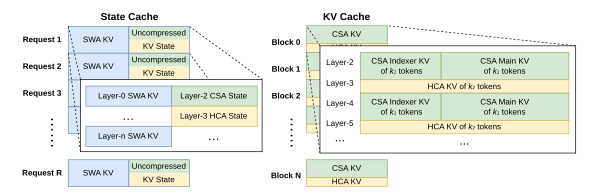

<figcaption>図6: DeepSeek-V4 の KV cache レイアウトの図解。KV cache は 2 つの主要コンポーネントに編成される: CSA/HCA のための古典的 KV cache と、SWA および CSA/HCA の圧縮未準備トークンのための state cache である。state cache では各リクエストに固定サイズのキャッシュブロックが割り当てられる。このブロック内で、SWA セグメントは直近 n_win トークンに対応する KV エントリを、CSA/HCA セグメントは圧縮の準備ができていない非圧縮の末尾状態を格納する。古典的 KV cache ではリクエストごとに複数ブロックを割り当てる。各キャッシュブロックは lcm(m, m′) 個の元トークンをカバーし、k₁ = lcm(m, m′)/m 個の CSA 圧縮トークンと k₂ = lcm(m, m′)/m′ 個の HCA 圧縮トークンを生成する。（訳注: クリップから欠落していたため ar5iv から復元した図）</figcaption>
</figure>

##### Challenges in Managing Hybrid Attention KV Cache.（ハイブリッド attention の KV cache 管理の課題）

ハイブリッド attention 機構は、PagedAttention とその変種の背後にある基本的な仮定を破る。近年のハイブリッド KV cache 管理アルゴリズム（例: Jenga [^97], Hymba [^30]）は一般的なハイブリッド attention モデルや特定構造を対象としているが、2 つの主要な障害が、全層の KV cache を PagedAttention の枠組みの下に統合することを妨げる:

- Sliding Window Attention で使われるような、多様なキャッシュポリシー。
- アラインメント要件を含む、高性能 attention カーネルが課す制約。

DeepSeek-V4 の効率的な KV cache 管理のため、この 2 つの課題を克服する対応戦略を設計する。

##### State Cache for SWA and Uncompressed Tail Tokens.（SWA と非圧縮末尾トークンのための state cache）

第一の障害に対処するため、代替のキャッシュ管理機構を採用する。SWA は限られた KV cache サイズの下で性能を高めるために設計されているので、これを圧縮ブランチの非圧縮末尾トークンと共に状態空間モデルとして扱うのは合理的である。対応する KV cache は、現在位置のみに依存する系列固有の状態と見なせる。したがって、固定・限定サイズの state cache プールを事前割り当てし、各系列に動的に割り当てる。

##### Sparse Attention Kernel Co-Design.（スパース attention カーネルの共同設計）

第二の障害については、従来の高性能 attention カーネルは性能最適化のため通常ブロックあたり固定数 $B$ のトークンを仮定しており、これは CSA では $B\cdot m$、HCA では $B\cdot m^{\prime}$ の元トークンに相当する。高性能なスパース attention カーネルを採用することで、異なる層が性能劣化なしにブロックあたり可変トークンに対応できる。これを達成するには、KV cache レイアウトとスパース attention カーネルの共同設計が必要である。例えば、キャッシュラインに揃うようブロックをパディングすると性能が改善しうる。したがって、圧縮率 $m$ の CSA と圧縮率 $m^{\prime}$ の HCA について、ブロックあたりの元トークン数はこの 2 つの圧縮率の最小公倍数 $\operatorname{lcm}(m,m^{\prime})$ の任意の倍数にできる。

#### 3.5.2 On-Disk KV Cache Storage（オンディスク KV cache ストレージ）

DeepSeek-V4 のサービングでは、共有プレフィックスを持つリクエストの繰り返し prefill を排除するため、オンディスク KV cache ストレージ機構を活用する。CSA/HCA の圧縮 KV エントリと Sliding Window Attention（SWA）の非圧縮 KV エントリに対し、別々のストレージ管理ソリューションを設計する。

CSA と HCA については、単純にすべての圧縮 KV エントリをディスクへ格納する。リクエストが格納済みプレフィックスにヒットしたとき、最後の完全な圧縮ブロックまで、そのプレフィックスに対応する圧縮 KV エントリを読み出して再利用する。特に、末尾の不完全ブロック内のプレフィックストークンについては、CSA と HCA の非圧縮 KV エントリは格納されないため、非圧縮 KV エントリを復元するには再計算が必要である。

SWA の KV エントリについては、圧縮されておらず全層に存在するため、その総量は圧縮された CSA・HCA の KV エントリの約 8 倍にのぼる。この大きな SWA KV エントリを効率的に扱うため、オンディスクの SWA KV エントリ管理について、ストレージオーバーヘッドと計算冗長性のトレードオフが異なる 3 つの戦略を提案・実装する:

- **Full SWA Caching。** この戦略は全トークンの完全な SWA KV エントリを格納し、計算のゼロ冗長性を保証する。この戦略の下では、ヒットしたプレフィックスの SWA KV エントリは、そのプレフィックス内の最後の $n_{\text{win}}$ トークンのオンディスクキャッシュを読むだけで再構築できる。計算のゼロ冗長性にもかかわらず、この戦略は現代の SSD ベースのストレージシステムには非効率である——ヒットするリクエストごとに、格納された SWA KV cache のごく一部しかアクセスされず、書き込み集約的で不均衡なアクセスパターンを招く。
- **Periodic Checkpointing。** この戦略は $p$ トークンごとに、最後の $n_{\text{win}}$ トークンの SWA KV エントリをチェックポイントする。ここで $p$ は調整可能なパラメータである。ヒットしたプレフィックスについては、最も新しいチェックポイント状態をロードし、残りの末尾トークンを再計算する。$p$ の調整を通じて、この戦略はストレージと計算のオンデマンドなトレードオフを可能にする。
- **Zero SWA Caching。** この戦略は SWA KV エントリを一切格納しない。ヒットしたプレフィックスについては、SWA KV エントリを復元するためにより多くの再計算が必要である。具体的には、各 attention 層において、各トークンの SWA KV エントリは、前の層の直近 $n_{\text{win}}$ トークンの SWA KV エントリのみに依存する。したがって、キャッシュされた CSA・HCA の KV エントリを活用すれば、$L$ 層モデルの直近 $n_{\text{win}}$ 個の SWA KV エントリを復元するには、最後の $n_{\text{win}}\cdot L$ トークンの再計算で足りる。

具体的な展開シナリオに応じて、ストレージと計算の望ましいトレードオフを達成する最適な戦略を選択する。

## 4 Pre-Training（事前学習）

### 4.1 Data Construction（データ構築）

DeepSeek-V3 の事前学習データの上に、より長い実効コンテキストを持つ、より多様で高品質な訓練コーパスの構築に努める。我々はデータ構築パイプラインを継続的に洗練している。Web 由来のデータについては、バッチ的に自動生成されたコンテンツやテンプレート的なコンテンツを除去するフィルタリング戦略を実装し、モデル崩壊 [^102] のリスクを緩和する。数学とプログラミングのコーパスは引き続き訓練データの中核であり、mid-training フェーズにエージェント的データを組み込むことで DeepSeek-V4 シリーズのコーディング能力をさらに強化する。多言語データについては、DeepSeek-V4 のためにより大きなコーパスを構築し、異なる文化にわたるロングテール知識の捕捉を改善する。DeepSeek-V4 では長文書データのキュレーションに特に力点を置き、科学論文・技術レポート・その他の学術的価値を反映する資料を優先する。以上のすべてを合わせて、我々の事前学習コーパスは数学コンテンツ・コード・Web ページ・長文書・その他の高品質カテゴリを含む 32T 超のトークンから成る。

事前学習データについては、DeepSeek-V3 の前処理戦略に大部分従う。トークン化については、DeepSeek-V3 トークナイザの上にコンテキスト構築のための少数の特殊トークンを導入し、語彙サイズは 128K のままとする。DeepSeek-V3 の token-splitting [^24] と Fill-in-Middle（FIM）[^22] 戦略も継承する。[^29] に着想を得て、サンプルの切り詰めを最小化するよう、異なるソースの文書を適切な系列にパックする。DeepSeek-V3 と異なり、事前学習ではサンプルレベルの attention マスキングを採用する。

### 4.2 Pre-Training Setups（事前学習の設定）

#### 4.2.1 Model Setups（モデル設定）

##### DeepSeek-V4-Flash.

Transformer 層数を 43、隠れ次元 $d$ を 4096 に設定する。最初の 2 層には純粋な sliding window attention を使う。後続の層では CSA と HCA を交互に使う。CSA については、圧縮率 $m$ を 4、indexer クエリヘッド数 $n_{h}^{I}$ を 64、indexer ヘッド次元 $c^{I}$ を 128、スパース attention 用に選択される KV エントリ数（すなわち attention top-k）を 512 に設定する。HCA については圧縮率 $m^{\prime}$ を 128 に設定する。CSA・HCA の両方について、クエリヘッド数 $n_{h}$ を 64、ヘッド次元 $c$ を 512、クエリ圧縮次元 $d_{c}$ を 1024 に設定する。出力射影グループ数 $g$ は 8、各中間 attention 出力の次元 $d_{g}$ は 1024 に設定する。sliding window attention の追加ブランチについては、窓サイズ $n_{\text{win}}$ を 128 に設定する。すべての Transformer ブロックに MoE 層を採用するが、最初の 3 つの MoE 層には Hash ルーティング戦略を使う。各 MoE 層は 1 個の共有エキスパートと 256 個のルーティングされるエキスパートから成り、各エキスパートの中間隠れ次元は 2048 である。ルーティングされるエキスパートのうち、各トークンにつき 6 個が活性化される。multi-token prediction の深さは 1 に設定する。mHC については、拡張係数 $n_{\text{hc}}$ を 4、Sinkhorn-Knopp 反復回数 $t_{\text{max}}$ を 20 に設定する。この構成の下で、DeepSeek-V4-Flash は総パラメータ 284B から成り、そのうち 13B が各トークンで活性化される。

##### DeepSeek-V4-Pro.

Transformer 層数を 61、隠れ次元 $d$ を 7168 に設定する。最初の 2 層には HCA を使う。後続の層では CSA と HCA を交互に使う。CSA については、圧縮率 $m$ を 4、indexer クエリヘッド数 $n_{h}^{I}$ を 64、indexer ヘッド次元 $c^{I}$ を 128、attention top-k を 1024 に設定する。HCA については圧縮率 $m^{\prime}$ を 128 に設定する。CSA・HCA の両方について、クエリヘッド数 $n_{h}$ を 128、ヘッド次元 $c$ を 512、クエリ圧縮次元 $d_{c}$ を 1536 に設定する。出力射影グループ数 $g$ は 16、各中間 attention 出力の次元 $d_{g}$ は 1024 に設定する。sliding window attention の追加ブランチについては、窓サイズ $n_{\text{win}}$ を 128 に設定する。すべての Transformer ブロックに MoE 層を採用するが、最初の 3 つの MoE 層には Hash ルーティング戦略を使う。各 MoE 層は 1 個の共有エキスパートと 384 個のルーティングされるエキスパートから成り、各エキスパートの中間隠れ次元は 3072 である。ルーティングされるエキスパートのうち、各トークンにつき 6 個が活性化される。multi-token prediction の深さは 1 に設定する。mHC については、拡張係数 $n_{\text{hc}}$ を 4、Sinkhorn-Knopp 反復回数 $t_{\text{max}}$ を 20 に設定する。この構成の下で、DeepSeek-V4-Pro は総パラメータ 1.6T から成り、そのうち 49B が各トークンで活性化される。

#### 4.2.2 Training Setups（訓練設定）

##### DeepSeek-V4-Flash.

大部分のパラメータには Muon オプティマイザ [^45] [^51] を採用するが、埋め込みモジュール・予測ヘッドモジュール・すべての RMSNorm モジュールの重みには AdamW オプティマイザ [^52] を使う。AdamW のハイパーパラメータは $\beta_{1}=0.9$, $\beta_{2}=0.95$, $\varepsilon=10^{-20}$, $\mathrm{weight\_decay}=0.1$ に設定する。Muon についてはモーメンタムを 0.95、weight decay を 0.1 に設定し、AdamW の学習率を再利用するために各更新行列の RMS を 0.18 にリスケールする。DeepSeek-V4-Flash は 32T トークンで訓練し、DeepSeek-V3 と同様、バッチサイズ（トークン単位）を小さなサイズから 75.5M へ増やし、訓練の大半で 75.5M を保つバッチサイズスケジューリング戦略も採用する。学習率は最初の 2000 ステップで線形にウォームアップし、訓練の大半で $2.7\times 10^{-4}$ に維持する。訓練終盤に、コサインスケジュールに従って学習率を最終的に $2.7\times 10^{-5}$ へ減衰させる。訓練は系列長 4K から始め、訓練系列長を 16K, 64K, 1M へ徐々に拡張する。スパース attention の設定については、最初の 1T トークンは密な attention でモデルをウォームアップし、系列長 64K でスパース attention を導入して以後の訓練で維持する。attention のスパース性を導入する際は、まず CSA の lightning indexer をウォームアップする短いステージを設け、その後、訓練の大半をスパース attention で行う。補助損失なし負荷分散については、バイアス更新速度を 0.001 に設定する。バランス損失については、単一系列内の極端な不均衡を避けるため損失重みを 0.0001 に設定する。MTP 損失重みは訓練の大半で 0.3、学習率減衰の開始時に 0.1 に設定する。

##### DeepSeek-V4-Pro.

具体的なハイパーパラメータの値を除き、DeepSeek-V4-Pro の訓練設定は DeepSeek-V4-Flash と大部分一致している。大部分のパラメータには Muon オプティマイザを、埋め込みモジュール・予測ヘッドモジュール・すべての RMSNorm モジュールの重みには AdamW オプティマイザを採用する。AdamW と Muon のハイパーパラメータは DeepSeek-V4-Flash と同じである。DeepSeek-V4-Pro は 33T トークンで訓練し、最大バッチサイズを 94.4M トークンとするバッチサイズスケジューリング戦略も採用する。学習率スケジューリング戦略は DeepSeek-V4-Flash と大部分同じだが、ピーク学習率は $2.0\times 10^{-4}$、最終学習率は $2.0\times 10^{-5}$ に設定する。訓練も系列長 4K から始め、16K, 64K, 1M へ徐々に拡張する。DeepSeek-V4-Flash と比べ、DeepSeek-V4-Pro はより長い密 attention ステージから始めるが、スパース attention の導入戦略は DeepSeek-V4-Flash と同じで、2 段階の訓練方法に従う。補助損失なし負荷分散については、バイアス更新速度を 0.001 に設定する。バランス損失については損失重みを 0.0001 に設定する。MTP 損失重みは訓練の大半で 0.3、学習率減衰の開始時に 0.1 に設定する。

#### 4.2.3 Mitigating Training Instability（訓練不安定性の緩和）

兆パラメータ級の MoE モデルの訓練は重大な安定性の課題を提起し、DeepSeek-V4 シリーズも例外ではない。我々は訓練中に顕著な不安定性の課題に遭遇した。単純なロールバックは一時的に訓練状態を復元できるものの、loss スパイクの再発を防がないため、長期的な解決策としては不十分だった。経験的に、スパイクの発生は MoE 層の外れ値と一貫して結びついており、ルーティング機構自体がこれらの外れ値の出現を悪化させているようだと我々は特定した。したがって、この問題に 2 つの次元から取り組んだ: ルーティングが誘発する悪循環を断つことと、異常値を直接抑制することである。幸い、訓練安定性を効果的に維持する 2 つの実用的な技法を発見した。その基盤メカニズムの包括的な理論的理解は現時点で未解決の問題として残るが、コミュニティによるさらなる探究を促すため、我々はこれらをオープンに共有する。

##### Anticipatory Routing.（先読みルーティング）

バックボーンネットワークとルーティングネットワークの同期的な更新を分離すると、訓練安定性が大幅に改善することを我々は発見した。その結果、ステップ $t$ では特徴計算に現在のネットワークパラメータ $\theta_{t}$ を使うが、ルーティングインデックスは過去のネットワークパラメータ $\theta_{t-\Delta t}$ を使って計算・適用される。実務上は、モデルパラメータを二度ロードするオーバーヘッドを回避するため、ステップ $t$ のデータをステップ $t-\Delta t$ の時点で先取りする。後のステップ $t$ で使うルーティングインデックスを「先読みで（anticipatorily）」計算・キャッシュする——このアプローチを Anticipatory Routing と名付けた理由である。我々はこれをインフラレベルでも大幅に最適化した。第一に、ルーティングインデックスの事前計算はデータへの 1 回の forward パスしか要さないことを踏まえ、パイプライン実行と Expert Parallelism（EP）通信との計算オーバーラップを注意深く編成し、Anticipatory Routing の追加の実時間オーバーヘッドを約 20% に抑えることに成功した。第二に、loss スパイクが発生したときにのみ短いロールバックをトリガーして Anticipatory Routing を起動する自動検出機構を導入した。このモードで一定期間動作した後、システムは標準の訓練へ復帰する。最終的に、この動的な適用により、モデル性能を損なうことなく、全体としてごくわずかな追加訓練オーバーヘッドで loss スパイクを回避できる。

##### SwiGLU Clamping.（SwiGLU クランピング）

先行文献 [^12] [^75] では、数値範囲を制約して訓練安定性を高めるためにクランピングが明示的に活用されてきた。実際の訓練において、SwiGLU クランピング [^66] の適用が外れ値を効果的に除去し、性能を損なうことなく訓練プロセスの安定化を大いに助けることを我々は経験的に見出した。DeepSeek-V4-Flash と DeepSeek-V4-Pro の両方の訓練を通じて、SwiGLU の線形成分を $[-10,10]$ の範囲にクランプし、ゲート成分の上限を $10$ に制限した。

### 4.3 Evaluations（評価）

#### 4.3.1 Evaluation Benchmarks（評価ベンチマーク）

ベースモデルの評価には、4 つの主要な次元にまたがるベンチマークを考慮する: 世界知識、言語理解と推論、コーディングと数学、長コンテキスト処理である。

世界知識のベンチマークは AGIEval [^100], C-Eval [^41], CMMLU [^47], MMLU [^39], MMLU-Redux [^34], MMLU-Pro [^89], MMMLU [^64], MultiLoKo [^42], Simple-QA verified [^37], SuperGPQA [^31], FACTS Parametric [^16], TriviaQA [^46] を含む。

言語理解と推論のベンチマークは BigBench Hard (BBH) [^84], DROP [^32], HellaSwag [^96], CLUEWSC [^94], WinoGrande [^78] を含む。

コーディングと数学のベンチマークは BigCodeBench [^103], HumanEval [^14], GSM8K [^18], MATH [^40], MGSM [^82], CMath [^91] を含む。

長コンテキストのベンチマークは LongBench-V2 [^8] を含む。

**表1**: DeepSeek-V3.2-Base・DeepSeek-V4-Flash-Base・DeepSeek-V4-Pro-Base の比較。すべてのモデルは我々の内部フレームワークで評価され、同じ評価設定を共有する。差が 0.3 以内のスコアは同水準と見なす。各行の最高スコアは太字（次点の下線は割愛）。

|  | **Benchmark (Metric)** | **# Shots** | **DeepSeek-V3.2** | **DeepSeek-V4-Flash** | **DeepSeek-V4-Pro** |
| --- | --- | --- | --- | --- | --- |
|  |  |  | **Base** | **Base** | **Base** |
|  | Architecture | - | MoE | MoE | MoE |
|  | # Activated Params | - | 37B | 13B | 49B |
|  | # Total Params | - | 671B | 284B | 1.6T |
| World Knowl. | AGIEval (EM) | 0-shot | 80.1 | 82.6 | **83.1** |
|  | MMLU (EM) | 5-shot | 87.8 | 88.7 | **90.1** |
|  | MMLU-Redux (EM) | 5-shot | 87.5 | 89.4 | **90.8** |
|  | MMLU-Pro (EM) | 5-shot | 65.5 | 68.3 | **73.5** |
|  | MMMLU (EM) | 5-shot | 87.9 | 88.8 | **90.3** |
|  | C-Eval (EM) | 5-shot | 90.4 | 92.1 | **93.1** |
|  | CMMLU (EM) | 5-shot | 88.9 | 90.4 | **90.8** |
|  | MultiLoKo (EM) | 5-shot | 38.7 | 42.2 | **51.1** |
|  | Simple-QA verified (EM) | 25-shot | 28.3 | 30.1 | **55.2** |
|  | SuperGPQA (EM) | 5-shot | 45.0 | 46.5 | **53.9** |
|  | FACTS Parametric (EM) | 25-shot | 27.1 | 33.9 | **62.6** |
|  | TriviaQA (EM) | 5-shot | 83.3 | 82.8 | **85.6** |
| Lang. & Reas. | BBH (EM) | 3-shot | **87.6** | 86.9 | **87.5** |
|  | DROP (F1) | 1-shot | 88.2 | **88.6** | **88.7** |
|  | HellaSwag (EM) | 0-shot | 86.4 | 85.7 | **88.0** |
|  | WinoGrande (EM) | 0-shot | 78.9 | 79.5 | **81.5** |
|  | CLUEWSC (EM) | 5-shot | 83.5 | 82.2 | **85.2** |
| Code & Math | BigCodeBench (Pass@1) | 3-shot | **63.9** | 56.8 | 59.2 |
|  | HumanEval (Pass@1) | 0-shot | 62.8 | 69.5 | **76.8** |
|  | GSM8K (EM) | 8-shot | 91.1 | 90.8 | **92.6** |
|  | MATH (EM) | 4-shot | 60.5 | 57.4 | **64.5** |
|  | MGSM (EM) | 8-shot | 81.3 | **85.7** | 84.4 |
|  | CMath (EM) | 3-shot | 92.6 | **93.6** | 90.9 |
| Long Context | LongBench-V2 (EM) | 1-shot | 40.2 | 44.7 | **51.5** |

#### 4.3.2 Evaluation Results（評価結果）

表1 に、DeepSeek-V3.2・DeepSeek-V4-Flash・DeepSeek-V4-Pro のベースモデルの詳細な比較を示す。すべて統一された内部フレームワークで、厳密に一貫した設定の下で評価した。

DeepSeek-V4-Flash-Base と DeepSeek-V3.2-Base の比較は、説得力のある効率の物語を明らかにする。活性化・総パラメータ数の両方で大幅に少ないにもかかわらず、DeepSeek-V4-Flash-Base は幅広いベンチマークで DeepSeek-V3.2-Base を上回る。この優位は世界知識タスクと難度の高い長コンテキストシナリオで特に顕著である。これらの結果は、DeepSeek-V4-Flash-Base のアーキテクチャ改善・洗練されたデータ品質・訓練最適化が、よりコンパクトなパラメータ予算でも優れた性能をもたらし、大半の評価でより大きな DeepSeek-V3.2-Base を事実上凌駕することを浮き彫りにする。

さらに、DeepSeek-V4-Pro-Base は能力のさらなる決定的な飛躍を示し、DeepSeek-V3.2-Base と DeepSeek-V4-Flash-Base の両方に対するほぼ全面的な優位を確立する。ほぼすべてのカテゴリでの改善により、DeepSeek-V4-Pro-Base は最も要求の厳しいベンチマークで DeepSeek ベースモデルの新たな性能高値に到達する。知識集約的な評価では劇的な利得をもたらし、長コンテキスト理解も大幅に前進させる。大半の推論・コードベンチマークでも、DeepSeek-V4-Pro-Base は先行 2 モデルを超える。この包括的な向上は、DeepSeek-V4-Pro-Base が知識・推論・コーディング・長コンテキスト能力の全域で先行モデルを上回る、DeepSeek シリーズ最強の基盤モデルであることを裏付けている。

## 5 Post-Training（事後学習）

### 5.1 Post-Training Pipeline（事後学習パイプライン）

事前学習に続き、DeepSeek-V4 シリーズの最終モデルを生み出すための事後学習フェーズを実施した。訓練パイプラインは DeepSeek-V3.2 のそれを大部分踏襲しているが、決定的な方法論上の置換がなされた: 混合強化学習（mixed RL）ステージが **On-Policy Distillation（OPD; [^53] [^36]）に完全に置き換えられた**のである。

#### 5.1.1 Specialist Training（スペシャリスト訓練）

ドメインスペシャリストの開発は、DeepSeek-V3.2 の訓練パイプラインを適応させて実施した。具体的には、各モデルを、初期のファインチューニングフェーズと、それに続くドメイン固有のプロンプトと報酬シグナルに導かれた強化学習（RL）によって順次最適化した。RL ステージでは Group Relative Policy Optimization（GRPO）アルゴリズムを実装し、ハイパーパラメータは我々の先行研究 [^25] [^26] にほぼ揃えた。

##### Reasoning Efforts.（推論努力）

推論タスクにおけるモデルの性能が、費やされる計算努力によって根本的に決まることは広く認識されている。したがって、多様な推論容量に最適化されたモデルの開発を促進するため、異なる RL 構成の下で別個のスペシャリストモデルを訓練した。表2 に詳述するように、DeepSeek-V4-Pro と DeepSeek-V4-Flash はどちらも 3 つの推論努力（reasoning effort）モードをサポートする。各モードについて、RL 訓練中に異なる長さペナルティとコンテキストウィンドウを適用し、その結果、推論の出力トークン長が変わる。これらの異なる推論モードを統合するため、\<think> と \</think> トークンで区切られた特化した応答フォーマットを利用する。さらに「Think Max」モードでは、モデルの推論プロセスを導くため、表3 に示すとおりシステムプロンプトの冒頭に特定の指示を前置する。

**表2**: 3 つの推論モードの比較

| Reasoning Mode | Characteristics | Typical Use Cases | Response Format |
| --- | --- | --- | --- |
| Non-think | 習慣や単純な規則に基づく、速く直観的な応答。 | 日常的なタスク、緊急の反応、低リスクの意思決定。 | \</think> summary |
| Think High | 意識的な論理分析。遅いがより正確。 | 複雑な問題解決、計画、中リスクの意思決定。 | \<think> thinking tokens \</think> summary |
| Think Max | 推論を最大限まで押し広げる。遅いが強力。 | モデルの推論能力の限界の探索。 | 1\. 冒頭に特別なシステムプロンプト。 2\. \<think> thinking tokens \</think> summary |

**表3**: 「Think Max」モードでシステムプロンプトに注入される指示。（訳注: 原典ではプロンプトボックスの SVG 画像。SVG 内テキストを起こした）

```
Reasoning Effort: Absolute maximum with no shortcuts permitted.
You MUST be very thorough in your thinking and comprehensively decompose the problem to
resolve the root cause, rigorously stress-testing your logic against all potential paths,
edge cases, and adversarial scenarios.
Explicitly write out your entire deliberation process, documenting every intermediate step,
considered alternative, and rejected hypothesis to ensure absolutely no assumption is left
unchecked.
```

##### Generative Reward Model.（生成型報酬モデル）

典型的には、検証が容易なタスクは単純なルールベースの検証器やテストケースで効果的に最適化できる。対照的に、検証が難しいタスクは伝統的に Reinforcement Learning from Human Feedback（RLHF）に依存しており、スカラー報酬モデルの訓練に大量の人手アノテーションを必要とする。しかし DeepSeek-V4 シリーズの事後学習フェーズでは、こうした従来のスカラーベース報酬モデルを廃する。代わりに、検証が難しいタスクに対処するため、ルーブリックに導かれた RL データをキュレーションし、ポリシーの trajectory を評価する Generative Reward Model（GRM）を採用する。決定的に重要なのは、GRM 自体に RL 最適化を直接適用することである。このパラダイムでは、actor ネットワークが GRM をネイティブに兼ね、モデルの評価（判定）能力を標準的な生成能力と並行して同時最適化できる。この役割の統一により、モデルの内的な推論能力がその評価プロセスへ本質的に融合され、非常に頑健なスコアリングが得られる。さらに、このアプローチは、モデルが自身の論理を活用して複雑なタスクへ汎化するため、ごく少量の多様な人手アノテーションだけで優れた性能を達成する。

**表4**: DeepSeek-V4 シリーズのツールコールスキーマ。（訳注: 原典ではプロンプトボックスの SVG 画像。SVG 内テキストを起こした。トークン区切りに起因する空白は原意に沿って正規化）

```
## Tools
You have access to a set of tools to help answer the user's question. You can invoke tools
by writing a "<|DSML|tool_calls>" block like the following:
<|DSML|tool_calls>
<|DSML|invoke name="$TOOL_NAME">
<|DSML|parameter name="$PARAMETER_NAME" string="true|false">$PARAMETER_VALUE</|DSML|parameter>
...
</|DSML|invoke>
<|DSML|invoke name="$TOOL_NAME2">
...
</|DSML|invoke>
</|DSML|tool_calls>
String parameters should be specified as is and set `string="true"`. For all other types
(numbers, booleans, arrays, objects), pass the value in JSON format and set `string="false"`.
If thinking_mode is enabled (triggered by <think>), you MUST output your complete reasoning
inside <think>...</think> BEFORE any tool calls or final response.
Otherwise, output directly after </think> with tool calls or final response.
### Available Tool Schemas
{ Tool Definition...}
```

##### Tool-Call Schema and Special Token.（ツールコールスキーマと特殊トークン）

先行バージョンと一貫して、推論経路の区切りには専用の \<think>\</think> タグを利用する。DeepSeek-V4 シリーズでは、特殊な「|DSML|」トークンを用い、ツール呼び出しに XML ベースのフォーマットを利用する新しいツールコールスキーマを導入する（表4 に示すとおり）。我々の実験は、XML フォーマットがエスケープの失敗を効果的に緩和し、ツール呼び出しエラーを減らし、モデルとツールの相互作用により頑健なインターフェースを提供することを実証している。

<figure>

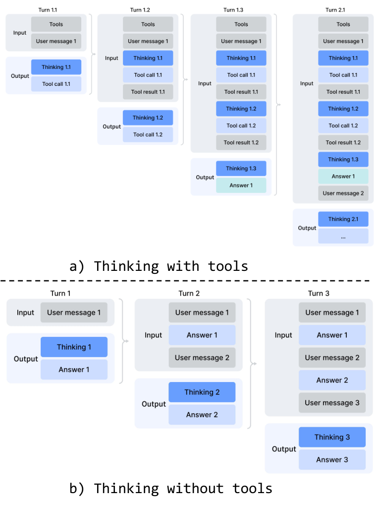

<figcaption>図7: DeepSeek-V4 シリーズの thinking 管理。</figcaption>
</figure>

##### Interleaved Thinking.（交互配置された thinking）

DeepSeek-V3.2 は、推論トレースをツール結果のラウンドをまたいで保持しつつ、新しいユーザーメッセージの到着時に破棄するコンテキスト管理戦略を導入した。これは有効ではあったが、複雑なエージェント的ワークフローでは依然として不必要なトークンの無駄を招いていた——新しいユーザーターンのたびに蓄積された推論内容がすべてフラッシュされ、モデルは問題解決の状態をゼロから再構築せざるを得なかった。DeepSeek-V4 シリーズの拡張された 1M トークンコンテキストウィンドウを活用し、エージェント環境における interleaved thinking の有効性を最大化するよう、この機構をさらに洗練する:

- **ツール呼び出しシナリオ。** 図7(a) に示すように、すべての推論内容が会話全体を通じて完全に保存される。新しいユーザーターンごとに thinking トレースを破棄していた DeepSeek-V3.2 と異なり、DeepSeek-V4 シリーズは、ユーザーメッセージの境界をまたぐことも含め、全ラウンドにわたって完全な推論履歴を保持する。これにより、モデルは長いホライズンのエージェントタスクにわたって、一貫した累積的な思考連鎖を維持できる。
- **一般的な会話シナリオ。** 図7(b) に示すように、元の戦略が保存される: 新しいユーザーメッセージが到着すると、以前のターンの推論内容は破棄され、永続的な推論トレースの利益が限られる設定ではコンテキストを簡潔に保つ。

DeepSeek-V3.2 と同様、ユーザーメッセージを介してツール相互作用をシミュレートするエージェントフレームワーク（例: Terminus）は、ツール呼び出しのコンテキスト経路をトリガーしない可能性があり、したがって強化された推論の永続性の恩恵を受けられないかもしれない。そのようなアーキテクチャには引き続き non-think モデルを推奨する。

**表5**: 補助タスクのための Quick Instruction 特殊トークン。

| Special Token | Description | Format |
| --- | --- | --- |
| <\|action\|> | ユーザープロンプトが Web 検索を要するか直接回答できるかを判定する。 | ...<\|User\|>{prompt}<\|Assistant\|>\<think><\|action\|> |
| <\|title\|> | 最初のアシスタント応答の後に簡潔な会話タイトルを生成する。 | ...<\|Assistant\|>{response}<\|end\_of\_sentence\|><\|title\|> |
| <\|query\|> | ユーザープロンプトのための検索クエリを生成する。 | ...<\|User\|>{prompt}<\|query\|> |
| <\|authority\|> | ユーザープロンプトの情報源の権威性への要求を分類する。 | ...<\|User\|>{prompt}<\|authority\|> |
| <\|domain\|> | ユーザープロンプトのドメインを特定する。 | ...<\|User\|>{prompt}<\|domain\|> |
| <\|extracted\_url\|> <\|read\_url\|> | ユーザープロンプト内の各 URL を取得・閲読すべきかを判定する。 | ...<\|User\|>{prompt}<\|extracted\_url\|>{url}<\|read\_url\|> |

##### Quick Instruction.

チャットボットのシナリオでは、応答を生成する前に、いくつかの補助タスク（例: Web 検索をトリガーすべきかの判定、意図認識など）を実行しなければならない。従来、これらのタスクは別立ての小型モデルで処理されており、既存の KV cache を再利用できないため冗長な prefill を必要とした。この制限を克服するため、Quick Instruction を導入する。入力系列に一連の専用特殊トークンを直接付加し、各トークンが特定の補助タスクに対応する。すでに計算済みの KV cache を直接再利用することで、この機構は冗長な prefill を完全に回避し、検索クエリの生成や権威性・ドメインの判定といった一部のタスクの並列実行を可能にする。その結果、ユーザーが体感する time-to-first-token（TTFT）を大幅に削減し、追加の小型モデルを維持・反復するエンジニアリングオーバーヘッドを排除する。サポートされる Quick Instruction トークンは表5 にまとめる。

#### 5.1.2 On-Policy Distillation（オンポリシー蒸留）

特化ファインチューニングと強化学習によって複数のドメイン特化エキスパートを訓練した後、エキスパートの能力を最終モデルへ統合する主要技術として、複数教師の On-Policy Distillation（OPD; [^53] [^36]）を採用する。OPD は、ドメインエキスパートの知識と能力を単一の統一モデルへ効率的に転移するための効果的な事後学習パラダイムとして台頭してきた。これは、学生が自身の生成した trajectory 上で教師モデルの出力分布から学ぶことによって達成される。形式的には、$N$ 個のエキスパートモデルの集合 $\{\pi_{E_{1}},\pi_{E_{2}},\dots,\pi_{E_{N}}\}$ が与えられたとき、OPD の目的関数は次で定義される:

$$
\mathcal{L}_{\text{OPD}}(\theta)=\sum_{i=1}^{N}w_{i}\cdot\text{D}_{\text{KL}}\left(\pi_{\theta}\parallel\pi_{E_{i}}\right).
$$

この定式化において、$w_{i}$ は各エキスパートに割り当てられる重みを表し、典型的にはエキスパートの相対的重要性で決まる。逆 KL 損失 $\text{D}_{\text{KL}}\left(\pi_{\theta}\parallel\pi_{E_{i}}\right)$ の計算には、on-policy 学習を維持するため、学生 $\pi_{\theta}$ から訓練 trajectory をサンプルする必要がある。その基盤にある論理は、統一ポリシー $\pi_{\theta}$ が現在のタスク文脈に関連する特化エキスパートから選択的に学ぶことを保証する（例: 数学推論タスクでは数学エキスパートに、プログラミングタスクではコーディングエキスパートに整合する）。この機構を通じて、物理的に別個のエキスパート重みの知識がロジットレベルの整合を介して統一パラメータ空間へ統合され、従来の重みマージや混合 RL の技法でしばしば遭遇する性能劣化を実務的に回避する。この段階では、多様なドメインをカバーする 10 を超える教師モデルを使って単一の学生モデルへ蒸留する。

上記の OPD 目的関数の扱いにおいて、先行研究は通常、全語彙の KL 損失を各トークン位置でのトークンレベル KL 推定に単純化し、$\texttt{sg}\big[\log\frac{\pi_{E_{i}}(y_{t}|x,y_{<t})}{\pi_{\theta}(y_{t}|x,y_{<t})}\big]$（sg は stop gradient 演算を表す）をポリシー損失計算におけるトークンごとのアドバンテージ推定として置き換えることで RL フレームワークを再利用する。このアプローチは資源効率が良いものの、勾配推定の分散が高くなり、しばしば訓練不安定を引き起こす。したがって、我々の OPD では**全語彙ロジット蒸留**を採用する。逆 KL 損失の計算で完全なロジット分布を保持することで、より安定した勾配推定が得られ、教師の知識の忠実な蒸留が保証される。次の小節では、全語彙 OPD を大規模に実現可能にするエンジニアリングの取り組みを説明する。

### 5.2 Post-Training Infrastructures（事後学習インフラ）

我々の事後学習インフラは、DeepSeek-V3.2 のために開発されたスケーラブルなフレームワークの上に構築されている。具体的には、3.4 節で述べた分散訓練スタックと、効率的な自己回帰サンプリングのために先に紹介した rollout エンジンを統合する。この基盤の上に、本研究では以下の主要な強化を導入する。これらの設計は、超長コンテキストの RL と、10 を超える別個の教師モデルを伴う OPD 統合タスクの効率的な実行を可能にし、モデルリリースの反復サイクルを大幅に加速する。

#### 5.2.1 FP4 Quantization-Aware Training（FP4 の量子化を考慮した訓練）

展開時の推論加速とメモリトラフィック削減を達成するため、事後学習段階で Quantization-Aware Training（QAT）[^43] を導入し、教師・参照モデルも含むモデルが量子化による精度劣化に適応できるようにする。FP4（MXFP4）量子化 [^77] を 2 つのコンポーネントに適用する: (1) GPU メモリ占有の主要因である MoE エキスパート重み [^66]、(2) CSA の indexer における Query-Key（QK）パス。後者では QK の活性化が FP4 のままキャッシュ・ロード・乗算され、長コンテキストシナリオでの attention スコア計算を高速化する。加えて、この QAT の過程でインデックススコア $I_{:,:}$ を FP32 から BF16 へさらに量子化する。この最適化は、KV エントリの 99.7% の再現率を保ちながら、top-k セレクタの 2 $\times$ のスピードアップを達成する。

MoE エキスパート重みについては、QAT の一般的な慣行に従い、オプティマイザが保持する FP32 マスター重みをまず FP4 に量子化し、その後、計算のために FP8 へ逆量子化する。特筆すべきは、我々の FP4 から FP8 への逆量子化が無損失であることだ。これは FP8（E4M3）が FP4（E2M1）より 2 ビット多い指数部を持ち、より大きなダイナミックレンジを提供するためである。その結果、各 FP8 量子化ブロック（$128\times 128$ タイル）内の FP4 サブブロック（$1\times 32$ タイル）のスケール係数の最大・最小比が一定の閾値を超えない限り、細粒度のスケール情報は FP8 の拡張ダイナミックレンジに完全に吸収できる。現在の重みがこの条件を満たすことを経験的に検証した。これにより、QAT パイプライン全体が既存の FP8 訓練フレームワークを一切変更せずに完全再利用できる。backward パスでは、forward パスと同じ FP8 重みに関して勾配を計算し、FP32 マスター重みへ直接伝播する。これは量子化演算を通じた Straight-Through Estimator（STE）の適用と等価である。これはまた、転置重みの再量子化の必要も回避する。

backward パスを伴わない RL 訓練の推論・rollout フェーズでは、シミュレートされた量子化ではなくネイティブの FP4 量子化重みを直接使う。これにより、サンプリング中のモデル挙動がオンライン展開と完全に一致することが保証され、同時に、実際のスピードアップのためのカーネルのメモリロードを減らし、メモリ消費を大幅に下げる。CSA の indexer の QK パスも同様に処理する。

#### 5.2.2 Efficient Teacher Scheduling for Full-Vocabulary OPD（全語彙 OPD のための効率的な教師スケジューリング）

我々のフレームワークは、それぞれが数兆パラメータになりうる、実質的に無制限の数の教師による全語彙 On-Policy Distillation（OPD）をサポートする。これを可能にするため、すべての教師重みは中央集約の分散ストレージへオフロードされ、教師の forward パス中に ZeRO ライクなパラメータシャーディングでオンデマンドにロードされて、I/O と DRAM の圧力を共に緩和する。さらに、語彙サイズ $|V|>100\text{k}$ のロジットを全教師について素朴に実体化するのは、ディスクへスプールしても法外である。我々は、forward パス中に教師の最終層隠れ状態のみを中央バッファへキャッシュすることでこれに対処する。訓練時には、キャッシュされた状態を取り出し、対応する予測ヘッドモジュールに通して完全なロジットをオンザフライで再構築する。この設計は無視できる再計算オーバーヘッドしか招かず、明示的なロジット実体化に伴うメモリ負担を完全に回避する。教師予測ヘッドの GPU メモリフットプリントを緩和するため、データディスパッチ時に訓練サンプルを教師インデックスで並べ替える。この配置により、各教師ヘッドはミニバッチごとに一度だけロードされ、任意の時点でデバイスメモリに存在する教師ヘッドは高々 1 つになる。すべてのパラメータと隠れ状態のロード/オフロード操作は、クリティカルパス上の計算をブロックすることなく、バックグラウンドで非同期に進む。最後に、教師と学生のロジット間の正確な KL ダイバージェンスは特化した TileLang カーネルで計算され、計算を加速し動的メモリ割り当てを抑える。

#### 5.2.3 Preemptible and Fault-Tolerant Rollout Service（プリエンプション可能で耐障害性のある rollout サービス）

GPU 資源の利用率を最大化しつつ、高優先度タスクへの迅速なハードウェア提供を可能にするため、我々の GPU クラスタはクラスタ全体のプリエンプティブなタスクスケジューラを採用しており、実行中のどのタスクもいつでもプリエンプトされうる。また、大規模 GPU クラスタではハードウェア障害が頻発する。この目的のため、RL/OPD の rollout 用に、プリエンプション可能で耐障害性のある LLM 生成サービスを実装する。

具体的には、各生成リクエストにトークン粒度の Write-Ahead Log（WAL）を実装する。リクエストに新しいトークンが生成されるたび、そのリクエストの WAL に即座に追記する。プリエンプション時には推論エンジンを一時停止し、未完了リクエストの KV cache を保存する。再開時には、永続化された WAL と保存済み KV cache を使ってデコードを継続する。致命的なハードウェアエラーが発生した場合でも、WAL に永続化されたトークンを使って prefill フェーズを再実行し、KV cache を再構築できる。

重要なことに、未完了のリクエストをゼロから再生成するのは数学的に不正である。それは長さバイアスを導入するからだ。短い応答ほど中断を生き延びやすいため、ゼロからの再生成は、中断が起きるたびにモデルをより短い系列を生成しやすい方向へ偏らせる。推論スタックがバッチ不変かつ決定論的であれば、サンプラーが使う擬似乱数生成器のシードを一致させて再生成することでもこの正しさの問題は対処できる。しかし、このアプローチでもデコードフェーズの再実行という追加コストが生じ、我々のトークン粒度 WAL 法よりはるかに非効率である。

#### 5.2.4 Scaling RL Framework for Million-Token Context（100 万トークンコンテキストへの RL フレームワークのスケーリング）

100 万トークン系列での効率的な RL と OPD のため、狙いを定めた最適化を導入する。rollout フェーズでは、5.2.3 節で詳述したプリエンプション可能・耐障害性の rollout サービスを採用する。推論・訓練フェーズでは、rollout データ形式を軽量なメタデータと重いトークン単位フィールドに分解する。データディスパッチ時には、rollout データ全体のメタデータをロードしてグローバルなシャッフルとパッキングレイアウトの計算を行える。重いトークン単位フィールドは共有メモリのデータローダ経由でロードしてノード内のデータ冗長を排除し、ミニバッチ粒度で消費後に即座に解放して、CPU・GPU 双方のメモリ圧力を大幅に減らす。デバイス上のミニバッチ数はワークロードに基づいて動的に決定され、計算スループットと I/O オーバーラップの効率的なトレードオフを可能にする。

#### 5.2.5 Sandbox Infrastructure for Agentic AI（エージェント AI のためのサンドボックスインフラ）

事後学習と評価におけるエージェント AI の多様な実行要求に応えるため、本番級のサンドボックスプラットフォーム DeepSeek Elastic Compute（DSec）を構築する。DSec は 3 つの Rust コンポーネント——API ゲートウェイ（Apiserver）・ホストごとのエージェント（Edge）・クラスタモニタ（Watcher）——から成り、カスタム RPC プロトコルで相互接続され、3FS 分散ファイルシステム [^27] の上で水平にスケールする。本番では、単一の DSec クラスタが数十万の並行サンドボックスインスタンスを管理する。

DSec の設計は 4 つの観察に動機づけられている: (1) エージェント的ワークロードは高度に異種であり、軽量な関数呼び出しから、多様な OS・セキュリティ要件を持つ本格的なソフトウェアエンジニアリングのパイプラインにまで及ぶ; (2) 環境イメージは多数かつ大きい一方で、素早くロードでき、反復的なカスタマイズをサポートしなければならない; (3) 高密度な展開は効率的な CPU・メモリ利用を要求する; (4) サンドボックスのライフサイクルは、プリエンプションとチェックポイントベースの再開を含め、GPU 訓練スケジュールと協調しなければならない。これらの観察に基づき、以下で DSec の 4 つの中核設計を個別に詳述する。

##### Four Execution Substrates Behind One Unified Interface.（1 つの統一インターフェースの背後にある 4 つの実行基盤）

DSec は、4 つの実行基盤を抽象化する単一の Python SDK（libdsec）を公開する。**Function Call** はステートレスな呼び出しを事前ウォームされたコンテナプールへディスパッチし、コールドスタートのオーバーヘッドを排除する。**Container** は完全に Docker 互換で、効率的なイメージ構築のために EROFS [^33] のオンデマンドロードを活用する。**microVM** は Firecracker [^3] の上に構築され、セキュリティ敏感で高密度な展開のために VM レベルの隔離を加える。**fullVM** は QEMU [^11] の上に構築され、任意のゲスト OS をサポートする。4 つはすべて共通の API 面——コマンド実行・ファイル転送・TTY アクセス——を共有し、それらの切り替えはパラメータ変更だけで済む。

##### Fast Image Loading via Layered Storage.（階層化ストレージによる高速イメージロード）

DSec は、階層化されたオンデマンドのロードを通じて、高速な起動と、大きく成長し続ける環境イメージのコーパスを両立させる。コンテナについては、ベースイメージとファイルシステムのコミットが 3FS バックの読み取り専用 EROFS レイヤとして格納され、overlay の lowerdir に直接マウントされる。ファイルメタデータはマウント時にローカルディスクで即座に利用可能に保ち、データブロックはリクエストに応じて 3FS から取得する。microVM については、DSec は overlaybd [^48] ディスク形式を使う: 読み取り専用のベースレイヤはインスタンス間共有のため 3FS 上に置かれ、書き込みはローカルの copy-on-write レイヤへ向かう。このようなスナップショットは連鎖可能で、効率的なバージョニングとミリ秒スケールの再開を促進する。

##### Density Optimizations Under Massive Concurrency.（大規模並行性の下での密度最適化）

クラスタあたり数十万のサンドボックスに対応するため、DSec は 2 つの資源ボトルネックに取り組む。第一に、仮想化環境における重複したページキャッシュのフットプリントを緩和し、メモリ回収を適用して安全なオーバーコミットを可能にする。第二に、コンテナランタイムのスピンロック競合を緩和し、サンドボックスあたりの CPU オーバーヘッドを削減して、ホストあたりの詰め込み密度を大幅に高める。

##### Trajectory Logging and Preemption-Safe Resumption.（trajectory ロギングとプリエンプション安全な再開）

DSec は各サンドボックスについてグローバルに順序づけられた trajectory ログを維持し、すべてのコマンド呼び出しとその結果を永続的に記録する。この trajectory は 3 つの目的を果たす: (1) クライアントの早送り——訓練タスクがプリエンプトされてもサンドボックス資源は保持され、再開時に DSec は完了済みコマンドのキャッシュ結果を再生し、タスク回復を加速すると同時に、非冪等な操作の再実行によるエラーを防ぐ; (2) 細粒度の来歴——各状態変化の起源と対応する結果が追跡可能; (3) 決定論的リプレイ——任意の過去セッションをその trajectory から忠実に再現できる。

### 5.3 Standard Benchmark Evaluation（標準ベンチマーク評価）

#### 5.3.1 Evaluation Setup（評価設定）

##### Knowledge and Reasoning.（知識と推論）

知識・推論のデータセットは MMLU-Pro [^89], GPQA [^74], Human Last Exam [^69], Simple-QA Verified [^37], Chinese-SimpleQA [^38], LiveCodeBench-v6 [^44], CodeForces（内製ベンチマーク）, HMMT 2026 Feb, Apex [^9], Apex Shortlist [^9], IMOAnswerBench [^55], PutnamBench [^85] を含む。

コードについては、DeepSeek-V4 シリーズを LiveCodeBench-v6 と内製の Codeforces ベンチマークで評価する。Codeforces については、114 問から成る 14 の Codeforces Division 1 コンテスト（2025 年 5 月〜2025 年 11 月）を収集した。Elo レーティングは次のように計算される。各コンテストについて、問題ごとに 32 個の候補解を生成する。各問題について独立に、これらの解から 10 個を非復元抽出し、ランダムな順序に並べて提出列を形成する。各提出はドメインエキスパートが構築したテストスイートで判定される。解けた問題のスコアは OpenAI (2025) のペナルティ方式に従う: モデルは、同じ数の先行失敗のもとで同じ問題を解いた人間参加者のスコアの中央値を受け取る。これにより、サンプルされた各提出列のコンテスト総スコアが得られ、それがコンテスト順位に、続いて標準の Codeforces レーティングシステムを介して推定レーティングに変換される。コンテストレベルの期待レーティングは、問題ごとの 10 提出のあらゆるランダム選択と順序にわたる、この推定レーティングの期待値として定義される。モデルの総合レーティングは、14 コンテスト全体にわたるこれらのコンテストレベル期待レーティングの平均である。

推論・知識タスクについては、temperature を 1.0 に設定し、コンテキストウィンドウを Non-think・High・Max モードでそれぞれ 8K・128K・384K トークンとする。数学タスク（例: HMMT, IMOAnswerBench, Apex, HLE）については、次のテンプレートで評価する: "{question}\\nPlease reason step by step, and put your final answer within \\boxed{}."。数学タスクにおける DeepSeek-V4-Pro-Max については、より深い推論を引き出すために次のテンプレートを使う: "Solve the following problem. The problem may ask you to prove a statement, or ask for an answer. If finding an answer is required, you should come up with the answer, and your final solution should also be a rigorous proof of that answer being valid.\\n\\n{question}"。

形式数学タスクについては、Lean v4.28.0-rc1 [^58] 上のエージェント的設定で評価する。Lean コンパイラとセマンティックなタクティク検索エンジンへのアクセスを与え、最大推論努力で最大 500 ツール呼び出しを実行する。加えて、より計算集約的なパイプラインも評価する。そこでは候補の自然言語解がまず生成されて自己検証 [^79] でフィルタされ、保持された解が、対応する Lean 文を証明する形式エージェントへのガイダンスとして提供される。この設計は、形式検証による厳密な正しさを保ちながら、探索を改善するために非形式的な推論を使う。提出は、厳密な検証器 Comparator が両設定で受理した場合にのみ正解と数えられる。

K2.6 と GLM-5.1 については、API が混雑しすぎて我々のクエリに応答を返さなかったため、一部のエントリを空欄にしている。

##### 1M-Token Context.（100 万トークンコンテキスト）

DeepSeek-V4 シリーズは 1M トークンコンテキストをサポートするため、ベンチマークとして OpenAI MRCR [^65] と CorpusQA [^54] を選び、長コンテキストシナリオでのモデル性能を評価する。全モデルで構成を標準化する目的で、これらのタスクについて Claude Opus 4.6 と Gemini 3.1 Pro を再評価した。GPT-5.4 は、その API が我々のクエリの大部分に応答しなかったため評価しなかった。

##### Agent.（エージェント）

エージェントのデータセットは Terminal Bench 2.0 [^56], SWE-Verified [^62], SWE Multilingual [^95], SWE-Pro [^28], BrowseComp [^90], MCPAtlas の公開評価セット [^10], GDPval-AA [^68] [^1], Tool-Decathlon [^49] を含む。

コードエージェントのタスク（SWE-Verified, Terminal-Bench, SWE-Pro, SWE Multilingual）については、内部開発した評価フレームワークで DeepSeek-V4 シリーズを評価する。このフレームワークは最小限のツールセット——bash ツールとファイル編集ツール——を提供する。最大相互作用ステップ数は 500、最大コンテキスト長は 512K トークンに設定する。Terminal-Bench 2.0 に関しては、GLM-5.1 が指摘した環境関連の問題を我々も認識している。それでも、一貫性のため、元の Terminal-Bench 2.0 データセットでの性能を報告する。Terminal-Bench 2.0 Verified サブセットでは、DeepSeek-V4-Pro は約 72.0 のスコアを達成する。

検索エージェントのタスク（BrowseComp, ツールありの HLE）についても、websearch と Python ツールを備えた自社ハーネスを使い、最大相互作用ステップ数を 500、最大コンテキスト長を 512K トークンに設定する。BrowseComp については、DeepSeek-V3.2 [^26] と同じ discard-all コンテキスト管理戦略を使う。

#### 5.3.2 Evaluation Results（評価結果）

**表6**: DeepSeek-V4-Pro-Max とクローズド/オープンソースモデルの比較。「Max」「xHigh」「High」は推論努力を表す。最良の結果は太字（次点の下線は割愛）。

|  | **Benchmark (Metric)** | **Opus-4.6** | **GPT-5.4** | **Gemini-3.1-Pro** | **K2.6** | **GLM-5.1** | **DS-V4-Pro** |
| --- | --- | --- | --- | --- | --- | --- | --- |
|  |  | **Max** | **xHigh** | **High** | **Thinking** | **Thinking** | **Max** |
| Knowledge & Reasoning | MMLU-Pro (EM) | 89.1 | 87.5 | **91.0** | 87.1 | 86.0 | 87.5 |
|  | SimpleQA-Verified (Pass@1) | 46.2 | 45.3 | **75.6** | 36.9 | 38.1 | 57.9 |
|  | Chinese-SimpleQA (Pass@1) | 76.4 | 76.8 | **85.9** | 75.9 | 75.0 | 84.4 |
|  | GPQA Diamond (Pass@1) | 91.3 | 93.0 | **94.3** | 90.5 | 86.2 | 90.1 |
|  | HLE (Pass@1) | 40.0 | 39.8 | **44.4** | 36.4 | 34.7 | 37.7 |
|  | LiveCodeBench (Pass@1) | 88.8 | - | 91.7 | 89.6 | - | **93.5** |
|  | Codeforces (Rating) | - | 3168 | 3052 | - | - | **3206** |
|  | HMMT 2026 Feb (Pass@1) | 96.2 | **97.7** | 94.7 | 92.7 | 89.4 | 95.2 |
|  | IMOAnswerBench (Pass@1) | 75.3 | **91.4** | 81.0 | 86.0 | 83.8 | 89.8 |
|  | Apex (Pass@1) | 34.5 | 54.1 | **60.9** | 24.0 | 11.5 | 38.3 |
|  | Apex Shortlist (Pass@1) | 85.9 | 78.1 | 89.1 | 75.5 | 72.4 | **90.2** |
| Long | MRCR 1M (MMR) | **92.9** | - | 76.3 | - | - | 83.5 |
|  | CorpusQA 1M (ACC) | **71.7** | - | 53.8 | - | - | 62.0 |
| Agentic | Terminal Bench 2.0 (Acc) | 65.4 | **75.1** | 68.5 | 66.7 | 63.5 | 67.9 |
|  | SWE Verified (Resolved) | **80.8** | - | 80.6 | 80.2 | - | 80.6 |
|  | SWE Pro (Resolved) | 57.3 | 57.7 | 54.2 | **58.6** | 58.4 | 55.4 |
|  | SWE Multilingual (Resolved) | **77.5** | - | - | 76.7 | 73.3 | 76.2 |
|  | BrowseComp (Pass@1) | 83.7 | 82.7 | **85.9** | 83.2 | 79.3 | 83.4 |
|  | HLE w/ tools (Pass@1) | 53.1 | 52.0 | 51.6 | **54.0** | 50.4 | 48.2 |
|  | GDPval-AA (Elo) | 1619 | **1674** | 1314 | 1482 | 1535 | 1554 |
|  | MCPAtlas Public(Pass@1) | **73.8** | 67.2 | 69.2 | 66.6 | 71.8 | 73.6 |
|  | Toolathlon (Pass@1) | 47.2 | **54.6** | 48.8 | 50.0 | 40.7 | 51.8 |

**表7**: DeepSeek-V4 シリーズの異なるサイズとモードの比較。「Non-Think」「High」「Max」は推論努力を表す。

|  | **Benchmark (Metric)** | **DeepSeek-V4-Flash** |  |  | **DeepSeek-V4-Pro** |  |  |
| --- | --- | --- | --- | --- | --- | --- | --- |
|  |  | **Non-Think** | **High** | **Max** | **Non-Think** | **High** | **Max** |
| Knowledge & Reasoning | MMLU-Pro (EM) | 83.0 | 86.4 | 86.2 | 82.9 | 87.1 | 87.5 |
|  | SimpleQA-Verified (Pass@1) | 23.1 | 28.9 | 34.1 | 45.0 | 46.2 | 57.9 |
|  | Chinese-SimpleQA (Pass@1) | 71.5 | 73.2 | 78.9 | 75.8 | 77.7 | 84.4 |
|  | GPQA Diamond (Pass@1) | 71.2 | 87.4 | 88.1 | 72.9 | 89.1 | 90.1 |
|  | HLE (Pass@1) | 8.1 | 29.4 | 34.8 | 7.7 | 34.5 | 37.7 |
|  | LiveCodeBench (Pass@1-COT) | 55.2 | 88.4 | 91.6 | 56.8 | 89.8 | 93.5 |
|  | Codeforces (Rating) | - | 2816 | 3052 | - | 2919 | 3206 |
|  | HMMT 2026 Feb (Pass@1) | 40.8 | 91.9 | 94.8 | 31.7 | 94.0 | 95.2 |
|  | IMOAnswerBench (Pass@1) | 41.9 | 85.1 | 88.4 | 35.3 | 88.0 | 89.8 |
|  | Apex (Pass@1) | 1.0 | 19.1 | 33.0 | 0.4 | 27.4 | 38.3 |
|  | Apex Shortlist (Pass@1) | 9.3 | 72.1 | 85.7 | 9.2 | 85.5 | 90.2 |
| Long | MRCR 1M(MMR) | 37.5 | 76.9 | 78.7 | 44.7 | 83.3 | 83.5 |
|  | CorpusQA 1M(ACC) | 15.5 | 59.3 | 60.5 | 35.6 | 56.5 | 62.0 |
| Agentic | Terminal Bench 2.0 (Acc) | 49.1 | 56.6 | 56.9 | 59.1 | 63.3 | 67.9 |
|  | SWE Verified (Resolved) | 73.7 | 78.6 | 79.0 | 73.6 | 79.4 | 80.6 |
|  | SWE Pro (Resolved) | 49.1 | 52.3 | 52.6 | 52.1 | 54.4 | 55.4 |
|  | SWE Multilingual (Resolved) | 69.7 | 70.2 | 73.3 | 69.8 | 74.1 | 76.2 |
|  | BrowseComp (Pass@1) | - | 53.5 | 73.2 | - | 80.4 | 83.4 |
|  | HLE w/ tools (Pass@1) | - | 40.3 | 45.1 | - | 44.7 | 48.2 |
|  | MCPAtlas Public (Pass@1) | 64.0 | 67.4 | 69.0 | 69.4 | 74.2 | 73.6 |
|  | GDPval-AA (Elo) | - | - | 1395 | - | - | 1554 |
|  | Toolathlon (Pass@1) | 40.7 | 43.5 | 47.8 | 46.3 | 49.0 | 51.8 |

DeepSeek-V4-Pro-Max と他のクローズド/オープンソースモデルの比較を表6 に示す。また、DeepSeek-V4-Flash と DeepSeek-V4-Pro の異なるモードを評価し、結果を表7 に示す。

<figure>

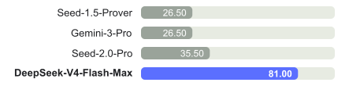

<figcaption>図8（左パネル）: Practical Regime——最小限のツールと有界サンプリングによる Putnam-200 Pass@8。（訳注: クリップから欠落していたため ar5iv から復元した図）</figcaption>
</figure>

<figure>

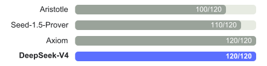

<figcaption>図8（右パネル）: Frontier Regime——ハイブリッドの形式・非形式推論と大幅な計算スケーリングによる Putnam-2025。キャプション全文: 実用的レジームとフロンティアレジームにおける形式推論。左: Putnam-200 Pass@8 は、Seed-Prover が導入した設定に従い PutnamBench の固定ランダム部分集合を評価する。全モデルが同じ問題セットでテストされる。我々は Seed-Prover のプロトコルに従うが、プロプライエタリな検索ツールをオープンソースの LeanExplore に置き換え、最小限のエージェントツールと有界サンプリングによる軽量な設定とした。右: Putnam-2025 は、スケールされたハイブリッド形式・非形式レジームにおける数学推論のフロンティアを探る。そこでは非形式推論が形式検証と組み合わされてギャップを露わにし、厳密さを高める。DeepSeek-V4 は証明完全の 120/120 に到達する。（訳注: クリップから欠落していたため ar5iv から復元した図）</figcaption>
</figure>

##### Knowledge.（知識）

一般世界知識の評価において、DeepSeek-V4-Pro の最大推論努力モードである DeepSeek-V4-Pro-Max は、オープンソースの大規模言語モデルの中で新たな最先端を確立する。SimpleQA-Verified が示すとおり、DeepSeek-V4-Pro-Max は既存のすべてのオープンソースベースラインを 20 絶対パーセントポイントの差で大幅に上回る。これらの前進にもかかわらず、主導的なプロプライエタリモデルである Gemini-3.1-Pro には現時点で及ばない。教育的な知識と推論の領域では、DeepSeek-V4-Pro-Max は MMLU-Pro・GPQA・HLE のベンチマークで Kimi と GLM をわずかに上回るが、主導的なプロプライエタリモデルには後れを取る。広く見れば、DeepSeek-V4-Pro-Max はオープンソースモデルの世界知識能力の強化における重要なマイルストーンである。

加えて、知識ベースのタスクでは DeepSeek-V4-Flash と DeepSeek-V4-Pro の間に大きな性能差が存在する。これは予想どおりである。より大きなパラメータ数は事前学習中のより多くの知識保持を可能にするからだ。特筆すべきは、どちらのモデルも、より高い推論努力を割り当てると知識ベンチマークで改善した結果を示すことである。

##### Reasoning.（推論）

DeepSeek-V4-Pro-Max は推論ベンチマーク全体で従来のすべてのオープンモデルを上回り、多くの指標で最先端のクローズドモデルに匹敵する。より小さな DeepSeek-V4-Flash-Max も、コードと数学の推論タスクで従来最良のオープンソースモデルである K2.6-Thinking を超える。同時に、DeepSeek-V4-Pro と DeepSeek-V4-Flash はコーディング競技で卓越する。我々の評価によれば、その性能は GPT-5.4 に比肩し、このタスクでオープンモデルがクローズドモデルに並んだのは今回が初めてである。Codeforces のリーダーボードでは、DeepSeek-V4-Pro-Max は現在、人間の候補者の中で 23 位にランクされる。DeepSeek-V4 はまた、エージェント的設定と計算集約的設定の両方で、形式数学タスクにおける強力な性能を示す。エージェント的なセットアップでは、図8 に示すとおり最先端の結果を達成し、Seed Prover [^13] のような先行モデルを上回る。より計算集約的なパイプラインでは性能はさらに改善し、Aristotle [^2] を含むシステムを超えて、この設定での既知の最良結果に並ぶ。

##### Agent.（エージェント）

DeepSeek-V4 シリーズは評価において強力なエージェント性能を示す。コードエージェントのタスクでは、DeepSeek-V4-Pro は K2.6 や GLM-5.1 に匹敵する結果を達成するが、これらのオープンモデルはいずれも依然としてクローズドソースの対抗モデルに後れを取る。DeepSeek-V4-Flash はコーディングタスク、特に Terminal Bench 2.0 で DeepSeek-V4-Pro を下回る。同様の傾向は他のエージェント評価でも観察される。特筆に値するのは、DeepSeek-V4-Pro が MCPAtlas と Toolathlon——幅広いツールと MCP サービスを含む 2 つの評価テストセット——で良い成績を収めることであり、我々のモデルが優れた汎化能力を持ち、内部フレームワークでのみ良い性能を出すわけではないことを示している。

<figure>

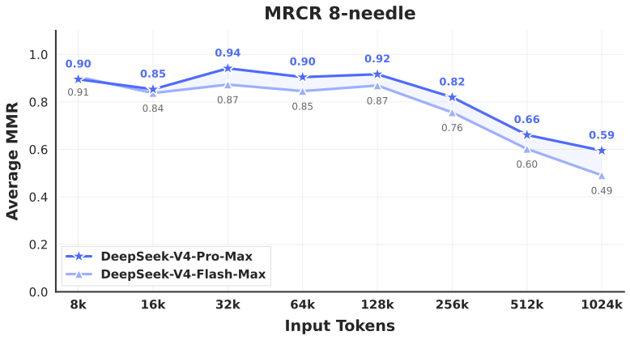

<figcaption>図9: MRCR タスクにおける DeepSeek-V4 シリーズの性能。（訳注: クリップから欠落していたため ar5iv から復元した図）</figcaption>
</figure>

##### 1M-Token Context.（100 万トークンコンテキスト）

DeepSeek-V4-Pro は、in-context 検索を測る MRCR タスクで Gemini-3.1-Pro を上回るが、Claude Opus 4.6 には後れを取る。図9 に示すように、検索性能は 128K コンテキストウィンドウ内では非常に安定している。128K を超えると性能劣化が見え始めるが、100 万トークンにおけるモデルの検索能力は、プロプライエタリ・オープンソース双方の対抗モデルと比べて依然として際立って強い。MRCR と異なり、CorpusQA は実シナリオに近い。評価結果は、DeepSeek-V4-Pro が Gemini-3.1-Pro より優れていることも示している。

<figure>

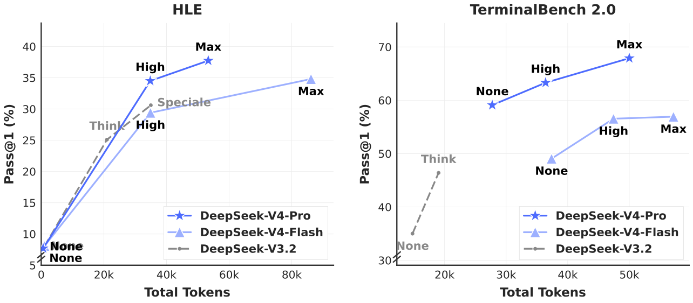

<figcaption>図10: 推論努力別の HLE と Terminal Bench 2.0 の性能。「None」は Non-think モード、「Speciale」は DeepSeek-V3.2-Speciale モデルを示す。（訳注: クリップから欠落していたため ar5iv から復元した図）</figcaption>
</figure>

##### Reasoning Effort.（推論努力）

表7 に示すように、より長いコンテキストと減らされた長さペナルティを RL で採用する Max モードは、最も難度の高いタスクで High モードを上回る。図10 は、代表的な推論・エージェントタスクにおける DeepSeek-V4-Pro・DeepSeek-V4-Flash・DeepSeek-V3.2 の性能とコストの比較を示す。test-time compute のスケーリングにより、DeepSeek-V4 シリーズは先行モデルに対して大幅な改善を達成する。さらに、HLE のような推論タスクでは、DeepSeek-V4-Pro は DeepSeek-V3.2 より高いトークン効率を示す。

### 5.4 Performance on Real-World Tasks（実世界タスクでの性能）

標準化されたベンチマークは、多様な実世界タスクの複雑さを捉えるのにしばしば苦労し、テスト結果と実際のユーザー体験の間にギャップを生む。これを埋めるため、我々は伝統的なベンチマークより実世界の利用パターンを優先する、独自の内部指標を開発した。このアプローチは、我々の最適化が実感できる利益へ翻訳されることを保証する。我々の評価フレームワークは、DeepSeek API とチャットボットの主要ユースケースを特に対象とし、モデル性能を実用的な需要に整合させる。

#### 5.4.1 Chinese Writing（中国語ライティング）

DeepSeek の主要ユースケースのひとつは中国語ライティングである。機能的ライティングと創作的ライティングについて厳密な評価を実施した。表12 は、機能的ライティングタスクにおける DeepSeek-V4-Pro と Gemini-3.1-Pro のペアワイズ比較を示す。これらのタスクは日常の一般的なライティングクエリから成り、プロンプトは典型的に簡潔で率直である。Gemini-3.1-Pro をベースラインに選んだのは、我々の評価において中国語ライティングで最高性能の外部モデルであるためだ。結果は、DeepSeek-V4-Pro が総合勝率 62.7% 対 34.1% でベースラインを上回ることを示している。これは主に、Gemini が中国語ライティングのシナリオで、自身の固有のスタイル選好にユーザーの明示的要求を上書きさせてしまうことがあるためである。

表13 は創作的ライティングの比較を示し、指示追従とライティング品質の 2 軸で評価される。Gemini-3.1-Pro と比較して、DeepSeek-V4-Pro は指示追従で 60.0%、ライティング品質で 77.5% の勝率を達成し、指示追従でのわずかな改善とライティング品質での大幅な向上を示す。DeepSeek-V4-Pro は集計されたユーザーケース分析では優れた結果をもたらすものの、最も難度の高いプロンプト——特に高複雑性の制約や多ターンのシナリオを含むもの——に限定した評価では、Claude Opus 4.5 が DeepSeek-V4-Pro に対して性能優位を保持することが明らかになる。表14 に示すように、Claude Opus 4.5 は 52.0% 対 45.9% の勝率を達成する。

#### 5.4.2 Search（検索）

検索補強された質問応答は DeepSeek チャットボットの中核能力である。DeepSeek の Web とアプリでは、「non-think」モードは Retrieval-Augmented Search（RAG）を、「thinking」モードは agentic search を用いる。

##### Retrieval Augmented Search.（検索拡張検索）

客観的・主観的の両方の Q&A カテゴリにわたって、DeepSeek-V4-Pro と DeepSeek-V3.2 を比較するペアワイズ評価を実施した。表11 に示すとおり、DeepSeek-V4-Pro は DeepSeek-V3.2 を大差で上回り、両カテゴリで一貫した優位を示す。最も顕著な利得は単一値検索と計画・戦略のタスクで観察され、DeepSeek-V4-Pro が正確な事実の答えの特定と、検索文脈からの構造化された計画の統合に優れることを示唆する。しかし、DeepSeek-V3.2 は比較・推薦タスクでは比較的健闘しており、検索結果に対するバランスの取れた多視点の推論を要するシナリオには、DeepSeek-V4-Pro に改善の余地があることを示している。

##### Agentic Search.（エージェント的検索）

標準の RAG と異なり、agentic search はモデルがクエリごとに検索・取得ツールを反復的に呼び出せるようにし、全体の検索性能を大幅に高める。DeepSeek-Chat の thinking モードについては、事前定義された「thinking budget」内で応答の正確性を最大化するよう agentic search 機能を最適化した。表9 に示すとおり、agentic search は特に複雑なタスクで一貫して RAG を上回る。さらに、そのコストは非常に効率的なままであり、agentic search は標準の RAG よりわずかに高価なだけである（表10 参照）。

#### 5.4.3 White-Collar Task（ホワイトカラータスク）

洗練されたエンタープライズの生産性シナリオにおけるモデルの有用性を厳密に評価するため、30 の高度な中国語プロフェッショナルタスクの包括的なスイートを構築した。これらのワークフローは意図的に高水準の認知的要求を含む。深い情報分析・包括的な文書生成・繊細な文書編集などであり、13 の重要産業（例: 金融・教育・法律・技術）の多様なスペクトラムにまたがる。評価は、Bash と Web 検索を含む基本ツールを備えた自社エージェントハーネス内で実施した。

これらのタスクのオープンエンドな性質を踏まえると、自動化された指標では高品質な応答のニュアンスを捉えるのに通常不十分である。したがって、DeepSeek-V4-Pro-Max と Opus-4.6-Max の性能を比較する人間評価を実施した。アノテータは 4 次元でモデル出力をブラインド評価した:

- **Task Completion**: 中核の問題がうまく解決されたか。
- **Instruction Following**: 特定の制約と指示の遵守。
- **Content Quality**: 事実の正確性・論理的一貫性・プロフェッショナルなトーン。
- **Formatting Aesthetics**: レイアウトの読みやすさと視覚的な仕上がり。

図12 に示すように、DeepSeek-V4-Pro-Max は多様な中国語ホワイトカラータスクで Opus-4.6-Max を上回り、63% という印象的な非敗北率を達成し、分析・生成・編集タスクで一貫した優位を示す。図12 に示す詳細な次元スコアは、Task Completion と Content Quality におけるモデルの主要な強みを浮き彫りにする。具体的には、DeepSeek-V4-Pro-Max は補足的な洞察と自己検証ステップを頻繁に提供することで、暗黙のユーザー意図を能動的に先取りする。また長文生成にも優れ、Opus-4.6-Max がしばしば生成する過度に単純な箇条書きではなく、深く一貫した叙述を届ける。加えて、標準化された中国語の階層番号付けのような、公式なプロフェッショナルの慣習に厳密に従う。しかし Instruction Following の面では、特定のフォーマット制約を時折見落とし、Opus をわずかに下回る。さらに、長大なテキスト入力を簡潔な要約に凝縮するのはあまり得意でない。最後に、Formatting Aesthetics は、プレゼンテーションスライドの全体的なビジュアルデザインに関して依然として大きな改善余地がある。図13, 14, 15 はいくつかのテストケースを示す。一部の出力は長大なため、部分的なページのみを表示している。

<figure>

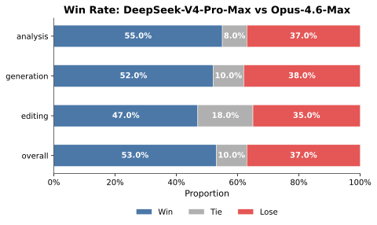

<figcaption>図11: 分析・生成・編集タスクおよび総合性能にわたる勝率比較。（訳注: クリップから欠落していたため ar5iv から復元した図）</figcaption>
</figure>

<figure>

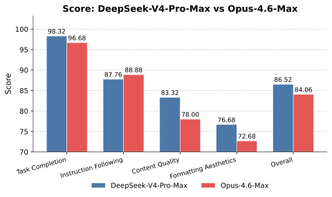

<figcaption>図12: Task Completion・Content Quality・Formatting Aesthetics・Instruction Following を含む詳細な次元スコア。（訳注: クリップから欠落していたため ar5iv から復元した図）</figcaption>
</figure>

<figure>

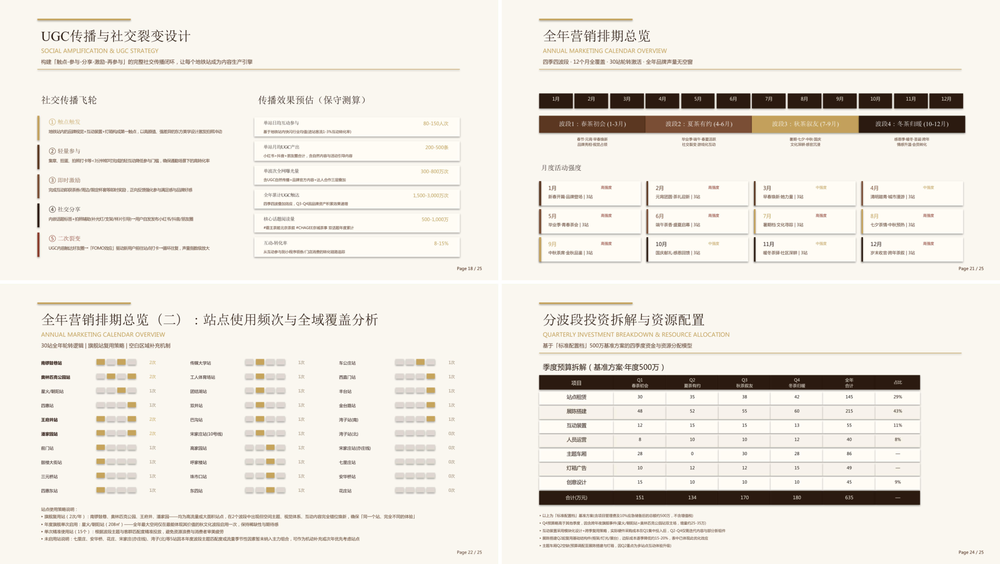

<figcaption>図13: 人気のバブルティーブランドと北京地下鉄の共同マーケティング提案書の起草を要するタスクの出力例。</figcaption>
</figure>

#### 5.4.4 Code Agent（コードエージェント）

我々のコーディングエージェント能力をベンチマークするため、実際の社内 R&D ワークロードからタスクをキュレーションした。50 人超の社内エンジニアから約 200 の難度の高いタスクを収集した。これらは PyTorch・CUDA・Rust・C++ を含む多様な技術スタックにわたる機能開発・バグ修正・リファクタリング・診断にまたがる。各タスクには元のリポジトリ・対応する実行環境・人手アノテーションの採点ルーブリックが付随する。厳密な品質フィルタリングの後、30 タスクが評価セットとして保持された。表8 に示すとおり、DeepSeek-V4-Pro は Claude Sonnet 4.5 を大幅に上回り、Claude Opus 4.5 の水準に迫る。

**表8**: R&D コーディングベンチマークでの比較（外部モデルは厳密に評価目的でのみ含む）。

| Model | Haiku 4.5 | Sonnet 4.5 | DeepSeek-V4-Pro-Max | Opus 4.5 | Opus 4.5 Thinking | Opus 4.6 Thinking |
| --- | --- | --- | --- | --- | --- | --- |
| Pass Rate (%) | 13 | 47 | 67 | 70 | 73 | 80 |

日々の業務でエージェント的コーディングに DeepSeek-V4-Pro を使った経験を持つ DeepSeek の開発者・研究者（$N=85$）への調査で、他のフロンティアモデルと比較して DeepSeek-V4-Pro がデフォルトかつ主要なコーディングモデルを務める準備ができているかを尋ねたところ、52% が「はい」、39% が「どちらかといえばはい」に傾き、「いいえ」は 9% 未満だった。回答者は、DeepSeek-V4-Pro が大半のタスクで満足のいく結果を届けるとする一方、些細なミス・曖昧なプロンプトの誤解釈・時折の考えすぎ（over-thinking）を指摘している。

## 6 Conclusion, Limitations, and Future Directions（結論・限界・今後の方向）

本研究では、超長コンテキスト処理の効率の壁を破る次世代大規模言語モデルを目指す、DeepSeek-V4 シリーズのプレビュー版を発表した。CSA と HCA を統合するハイブリッド attention アーキテクチャの組み合わせにより、DeepSeek-V4 シリーズは長系列効率で劇的な飛躍を達成する。アーキテクチャの革新は、広範なインフラ最適化と合わさって、100 万トークンコンテキストの効率的なネイティブサポートを可能にし、将来の test-time scaling・長ホライズンのタスク・オンライン学習のような新興パラダイムに必要な基盤を確立する。評価結果は、DeepSeek-V4-Pro の最大推論努力モードである DeepSeek-V4-Pro-Max がオープンモデルの最先端を再定義することを示している。知識ベンチマークで従来のオープンソースモデルを大幅に上回り、フロンティアのプロプライエタリモデルに近い優れた推論性能を達成し、競争力あるエージェント能力を届ける。同時に、DeepSeek-V4-Flash-Max は、非常にコスト効率の高いアーキテクチャを維持しながら、主導的なクローズドモデルに匹敵する推論性能を達成する。DeepSeek-V4 シリーズはオープンモデルにおける 100 万長コンテキストの新時代の到来を告げ、より良い効率・スケール・知能への道を開くと我々は信じている。

極端な長コンテキスト効率の追求において、DeepSeek-V4 シリーズは大胆なアーキテクチャ設計を採用した。リスクを最小化するため、予備的に検証済みのコンポーネントやトリックを多く残したが、それらは有効である一方、アーキテクチャを比較的複雑にした。今後のイテレーションでは、より包括的で原理に基づいた調査を実施し、性能を犠牲にすることなくアーキテクチャを最も本質的な設計へ蒸留し、より優雅なものにする。同時に、Anticipatory Routing と SwiGLU Clamping は訓練不安定の緩和に有効と証明されたものの、その基盤原理は十分に理解されていないままである。我々は訓練安定性の基礎的な問題を積極的に研究し、内部指標のモニタリングを強化して、安定した大規模訓練へのより原理的で予測的なアプローチを目指す。加えて、MoE とスパース attention のアーキテクチャを超えて、新しい次元に沿ったモデルのスパース性——より疎な埋め込みモジュール [^17] など——も能動的に探究し、能力を損なわずに計算・メモリ効率をさらに改善する。長コンテキストの展開と対話をより応答的にするため、低レイテンシのアーキテクチャとシステム技術の調査も続ける。さらに、長ホライズン・多ラウンドのエージェントタスクの重要性と実用価値を認識しており、この方向での反復と探究を続ける。モデルへのマルチモーダル能力の組み込みにも取り組んでいる。最後に、ますます広範なシナリオとタスクにわたってモデルの知能・頑健性・実用性を一貫して高めるため、より良いデータキュレーションと合成の戦略の開発に committed である。

## Appendix A Author List and Acknowledgment（著者一覧と謝辞）

### A.1 Author List（著者一覧）

著者はファーストネームのアルファベット順に列挙される。\* が付いた名前は、我々のチームを離れた個人を表す。

（訳注: Research & Engineering および Business & Compliance の著者一覧は、運用ルールに従い割愛。原文には約 300 名が記載されている。）

### A.2 Acknowledgment（謝辞）

DeepSeek-V4 シリーズのモデルの能力に関する貴重な提案とフィードバックをくださった [Dolly Deng](https://www.zhihu.com/people/toyama) とその他のテスターの皆さまに感謝する。

## Appendix B Evaluation Details（評価の詳細）

**表9**: DeepSeek-V4-Pro における Agentic Search 対 Retrieval Augmented Search。

| **Difficulty** | **Category** | **#** | **Agent Win** | **RAG Win** | **Tie** | **Agent%** | **RAG%** | **Tie%** |
| --- | --- | --- | --- | --- | --- | --- | --- | --- |
| Easy | Objective Q&A (客观问答) | 196 | 110 | 43 | 43 | 56.1 | 21.9 | 21.9 |
|  | Subjective Q&A (主观问答) | 321 | 198 | 56 | 67 | 61.7 | 17.4 | 20.9 |
| Hard | Objective Q&A (客观问答) | 168 | 102 | 33 | 33 | 60.7 | 19.6 | 19.6 |
|  | Subjective Q&A (主观问答) | 184 | 126 | 27 | 31 | 68.5 | 14.7 | 16.8 |
| **Total (总计)** |  | **869** | **536** | **159** | **174** | **61.7** | **18.3** | **20.0** |

**表10**: コスト比較: DeepSeek-V4-Pro における Agentic Search 対 Retrieval Augmented Search（平均）。Agentic Search のツール呼び出しの大半は並列である。

| Version | Tool Calls | Prefill (tokens) | Output (tokens) |
| --- | --- | --- | --- |
| V4 Agentic Search | 16.2 | 13649 | 1526 |
| V4 Retrieval Augmented Search | — | 10453 | 1308 |

**表11**: Search Q&A タスクにおける DeepSeek-V4-Pro と DeepSeek-V3.2 の比較評価。

|  |  |  | **Internal Evaluation (内部综合评估)** |  |  |  |  |  |
| --- | --- | --- | --- | --- | --- | --- | --- | --- |
| **Category** | **Subcategory** | **#** | **V4 win** | **V3.2 win** | **tie** | **V4%** | **V3.2%** | **tie%** |
| **Objective Q&A (客观问答)** | Single-value Search (单值信息查找) | 95 | 36 | 10 | 49 | 37.9 | 10.5 | 51.6 |
|  | Entity Search (实体信息查找) | 99 | 24 | 7 | 68 | 24.2 | 7.1 | 68.7 |
|  | Enumerative Search (枚举型信息查找) | 95 | 19 | 8 | 68 | 20.0 | 8.4 | 71.6 |
|  | **Subtotal (小计)** | **289** | **79** | **25** | **185** | **27.3** | **8.7** | **64.0** |
| **Subjective Q&A (主观问答)** | Causal Analysis (原因分析) | 100 | 28 | 5 | 67 | 28.0 | 5.0 | 67.0 |
|  | Comparison (对比) | 96 | 28 | 20 | 48 | 29.2 | 20.8 | 50.0 |
|  | Advice Seeking (寻求建议) | 92 | 23 | 8 | 61 | 25.0 | 8.7 | 66.3 |
|  | Recommendation (推荐) | 95 | 26 | 19 | 50 | 27.4 | 20.0 | 52.6 |
|  | Planning & Strategy (攻略计划) | 92 | 32 | 11 | 49 | 34.8 | 12.0 | 53.3 |
|  | Opinion & Evaluation (评价看法) | 96 | 30 | 8 | 58 | 31.2 | 8.3 | 60.4 |
|  | Trend Analysis (趋势分析) | 96 | 23 | 3 | 70 | 24.0 | 3.1 | 72.9 |
|  | **Subtotal (小计)** | **667** | **190** | **74** | **403** | **28.5** | **11.1** | **60.4** |
| **TOTAL (总计)** |  | **956** | **269** | **99** | **588** | **28.1** | **10.4** | **61.5** |

**表12**: 中国語機能的ライティングにおける DeepSeek-V4-Pro と Gemini-3.1-Pro の比較分析。

|  |  |  | **Internal Evaluation (内部综合评估)** |  |  |  |  |  |
| --- | --- | --- | --- | --- | --- | --- | --- | --- |
| **Category** | **Subcategory** | **#** | **DS win** | **Gem win** | **Tie** | **DS%** | **Gem%** | **Tie%** |
| **Business Writing (办公文本)** | Report (报告) | 527 | 350 | 162 | 15 | 66.41 | 30.74 | 2.85 |
|  | Proposal (方案策划) | 291 | 181 | 103 | 7 | 62.20 | 35.40 | 2.41 |
|  | Education (教育培训) | 159 | 100 | 56 | 3 | 62.89 | 35.22 | 1.89 |
|  | Email & Letter (邮件书信) | 146 | 107 | 37 | 2 | 73.29 | 25.34 | 1.37 |
|  | Notice (通知公告) | 72 | 43 | 24 | 5 | 59.72 | 33.33 | 6.94 |
|  | Professional (专业文本) | 63 | 34 | 27 | 2 | 53.97 | 42.86 | 3.17 |
|  | Recruitment (招聘求职) | 42 | 27 | 15 | 0 | 64.29 | 35.71 | 0.00 |
|  | Technical (技术文本) | 29 | 22 | 7 | 0 | 75.86 | 24.14 | 0.00 |
|  | Review (介绍评价) | 20 | 15 | 5 | 0 | 75.00 | 25.00 | 0.00 |
|  | **Subtotal (小计)** | **1349** | **879** | **436** | **34** | **65.16** | **32.32** | **2.52** |
| **Media Writing (媒体文本)** | Social Media (社交媒体文案) | 267 | 156 | 101 | 10 | 58.43 | 37.83 | 3.75 |
|  | Ad Copy (广告商品文案) | 214 | 109 | 98 | 7 | 50.93 | 45.79 | 3.27 |
|  | Long-form Content (内容平台长文) | 99 | 71 | 25 | 3 | 71.72 | 25.25 | 3.03 |
|  | News Report (新闻报道) | 51 | 27 | 22 | 2 | 52.94 | 43.14 | 3.92 |
|  | Advertorial (营销软文) | 17 | 12 | 4 | 1 | 70.59 | 23.53 | 5.88 |
|  | Headline (标题) | 11 | 7 | 4 | 0 | 63.64 | 36.36 | 0.00 |
|  | Narration Script (口播文案) | 4 | 2 | 1 | 1 | 50.00 | 25.00 | 25.00 |
|  | Comment (评论) | 3 | 2 | 1 | 0 | 66.67 | 33.33 | 0.00 |
|  | **Subtotal (小计)** | **666** | **386** | **256** | **24** | **57.96** | **38.44** | **3.60** |
| **Everyday Writing (生活文本)** | Congratulatory (祝贺文本) | 101 | 54 | 41 | 6 | 53.47 | 40.59 | 5.94 |
|  | Communication (沟通回复) | 100 | 71 | 26 | 3 | 71.00 | 26.00 | 3.00 |
|  | Reflection (心得感想) | 90 | 68 | 17 | 5 | 75.56 | 18.89 | 5.56 |
|  | Review (介绍评价) | 55 | 44 | 9 | 2 | 80.00 | 16.36 | 3.64 |
|  | Comment (评论) | 44 | 34 | 8 | 2 | 77.27 | 18.18 | 4.55 |
|  | **Subtotal (小计)** | **390** | **271** | **101** | **18** | **69.49** | **25.90** | **4.62** |
| **Oral Writing (口头文本)** | Speech (发言稿) | 226 | 135 | 85 | 6 | 59.73 | 37.61 | 2.65 |
|  | Narration Script (口播文案) | 51 | 25 | 23 | 3 | 49.02 | 45.10 | 5.88 |
|  | Sales Script (话术) | 31 | 22 | 6 | 3 | 70.97 | 19.35 | 9.68 |
|  | Dialogue (对话文本) | 10 | 4 | 6 | 0 | 40.00 | 60.00 | 0.00 |
|  | Congratulatory (祝贺文本) | 1 | 1 | 0 | 0 | 100.00 | 0.00 | 0.00 |
|  | **Subtotal (小计)** | **319** | **187** | **120** | **12** | **58.62** | **37.62** | **3.76** |
| **Official Document (公文文本)** | Administrative Doc (事务文书) | 117 | 60 | 53 | 4 | 51.28 | 45.30 | 3.42 |
|  | Personal Doc (个人文书) | 73 | 45 | 27 | 1 | 61.64 | 36.99 | 1.37 |
|  | Government Doc (行政公文) | 34 | 19 | 14 | 1 | 55.88 | 41.18 | 2.94 |
|  | Speech (发言稿) | 3 | 1 | 2 | 0 | 33.33 | 66.67 | 0.00 |
|  | Essay Writing (申论写作) | 3 | 1 | 1 | 1 | 33.33 | 33.33 | 33.33 |
|  | **Subtotal (小计)** | **230** | **126** | **97** | **7** | **54.78** | **42.17** | **3.04** |
| **Academic Writing (学术文本)** | Research Paper (学术论文) | 104 | 67 | 32 | 5 | 64.42 | 30.77 | 4.81 |
|  | Coursework (课程作业) | 90 | 53 | 35 | 2 | 58.89 | 38.89 | 2.22 |
|  | Academic Support (学术辅助) | 15 | 11 | 3 | 1 | 73.33 | 20.00 | 6.67 |
|  | Science Outreach (专业科普) | 7 | 6 | 1 | 0 | 85.71 | 14.29 | 0.00 |
|  | **Subtotal (小计)** | **216** | **137** | **71** | **8** | **63.43** | **32.87** | **3.70** |
| **Total (总计)** |  | **3170** | **1986** | **1081** | **103** | **62.65** | **34.10** | **3.25** |

**表13**: 中国語創作的ライティングにおける DeepSeek-V4-Pro と Gemini-3.1-Pro の比較分析。

|  |  | **Instruction Following(指令遵循)** |  |  |  |  |  | **Writing Quality (写作质量)** |  |  |  |  |  |
| --- | --- | --- | --- | --- | --- | --- | --- | --- | --- | --- | --- | --- | --- |
| **Subcategory (文体)** | **#** | **DS** | **Gem** | **Tie** | **DS%** | **Gem%** | **Tie%** | **DS** | **Gem** | **Tie** | **DS%** | **Gem%** | **Tie%** |
| Fiction (小说故事) | 836 | 504 | 323 | 5 | 60.58 | 38.82 | 0.60 | 672 | 157 | 3 | 80.77 | 18.87 | 0.36 |
| General Fiction (泛小说故事) | 662 | 368 | 290 | 3 | 55.67 | 43.87 | 0.45 | 467 | 194 | 0 | 70.65 | 29.35 | 0.00 |
| Fan Fiction (同人文) | 410 | 253 | 150 | 3 | 62.32 | 36.95 | 0.74 | 338 | 67 | 1 | 83.25 | 16.50 | 0.25 |
| General Fan Fic. (泛同人文) | 202 | 111 | 90 | 1 | 54.95 | 44.55 | 0.50 | 161 | 40 | 1 | 79.70 | 19.80 | 0.50 |
| Narrative (记叙文) | 171 | 115 | 54 | 2 | 67.25 | 31.58 | 1.17 | 141 | 30 | 0 | 82.46 | 17.54 | 0.00 |
| General Prose (泛散文) | 124 | 83 | 40 | 1 | 66.94 | 32.26 | 0.81 | 88 | 36 | 0 | 70.97 | 29.03 | 0.00 |
| Prose (散文) | 112 | 74 | 38 | 0 | 66.07 | 33.93 | 0.00 | 92 | 20 | 0 | 82.14 | 17.86 | 0.00 |
| Writing Style (文笔) | 112 | 81 | 31 | 0 | 72.32 | 27.68 | 0.00 | 86 | 26 | 0 | 76.79 | 23.21 | 0.00 |
| Classical Poetry (古诗文) | 48 | 24 | 24 | 0 | 50.00 | 50.00 | 0.00 | 39 | 9 | 0 | 81.25 | 18.75 | 0.00 |
| Modern Poetry (现代诗) | 43 | 23 | 20 | 0 | 53.49 | 46.51 | 0.00 | 32 | 11 | 0 | 74.42 | 25.58 | 0.00 |
| Lyrics (歌词) | 30 | 8 | 22 | 0 | 26.67 | 73.33 | 0.00 | 16 | 14 | 0 | 53.33 | 46.67 | 0.00 |
| Literary Appreciation (赏析) | 27 | 20 | 7 | 0 | 74.07 | 25.93 | 0.00 | 18 | 9 | 0 | 66.67 | 33.33 | 0.00 |
| General Argument. (泛议论文) | 24 | 15 | 9 | 0 | 62.50 | 37.50 | 0.00 | 17 | 7 | 0 | 70.83 | 29.17 | 0.00 |
| General Narrative (泛记叙文) | 23 | 11 | 12 | 0 | 47.83 | 52.17 | 0.00 | 15 | 8 | 0 | 65.22 | 34.78 | 0.00 |
| General Classical (泛古文诗歌) | 9 | 5 | 4 | 0 | 55.56 | 44.44 | 0.00 | 5 | 4 | 0 | 55.56 | 44.44 | 0.00 |
| Creative Writing (创意写作) | 6 | 2 | 4 | 0 | 33.33 | 66.67 | 0.00 | 4 | 2 | 0 | 66.67 | 33.33 | 0.00 |
| Argumentative (议论文) | 5 | 5 | 0 | 0 | 100.00 | 0.00 | 0.00 | 5 | 0 | 0 | 100.00 | 0.00 | 0.00 |
| General Mod. Poetry (泛现代诗) | 2 | 1 | 1 | 0 | 50.00 | 50.00 | 0.00 | 2 | 0 | 0 | 100.00 | 0.00 | 0.00 |
| **Total (总计)** | **2837** | **1703** | **1119** | **15** | **60.03** | **39.44** | **0.53** | **2198** | **634** | **5** | **77.48** | **22.35** | **0.18** |

**表14**: 複雑な指示追従と多ターンライティングにおける DeepSeek-V4-Pro 対 Claude-Opus-4.5。

|  |  | **Internal Evaluation (内部综合评估)** |  |  |  |  |  |
| --- | --- | --- | --- | --- | --- | --- | --- |
| **Category** | **#** | **DS** | **Opus** | **Tie** | **DS%** | **Opus%** | **Tie%** |
| Complex Inst. Following (复杂指令跟随) | 49 | 23 | 26 | 0 | 46.9% | 53.1% | 0.0% |
| Multi-Turn Writing (多轮写作) | 147 | 67 | 76 | 4 | 45.6% | 51.7% | 2.7% |
| **Total (总计)** | **196** | **90** | **102** | **4** | **45.9%** | **52.0%** | **2.0%** |

<figure>

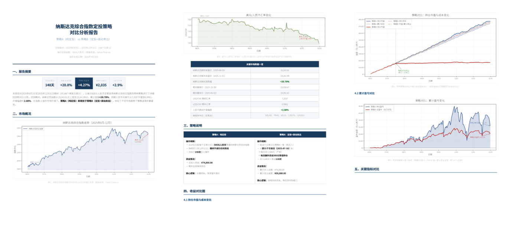

<figcaption>図14: NASDAQ に対する 2 つの定期投資戦略の比較を要するタスクの出力例。</figcaption>
</figure>

<figure>

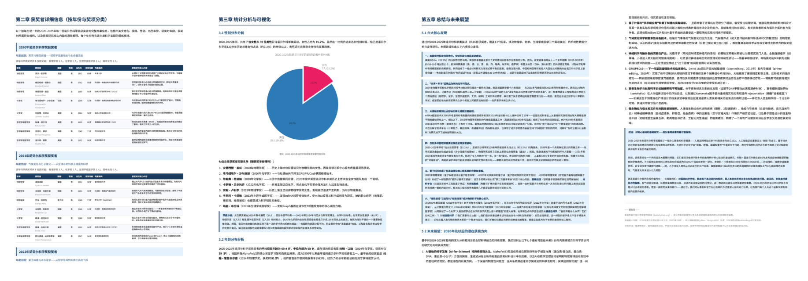

<figcaption>図15: 2020〜2025 年のノーベル科学賞を調査してレポートを生成することを要するタスクの出力例。</figcaption>
</figure>

---

[^fn1]: https://huggingface.co/deepseek-ai/DeepSeek-V4-Pro/tree/main/inference （訳注: クリップで欠落していた脚注を原ページから復元）
[^fn2]: https://github.com/deepseek-ai/DeepGEMM/pull/304 （訳注: 同上）
[^fn3]: https://docs.nvidia.com/deeplearning/performance/dl-performance-matrix-multiplication/index.html#wave-quant （訳注: 同上）
[^fn4]: https://docs.nvidia.com/cuda/cuda-programming-guide/02-basics/writing-cuda-kernels.html#distributed-shared-memory （訳注: 同上）
