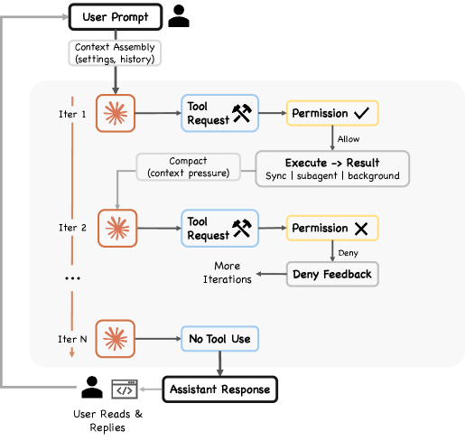
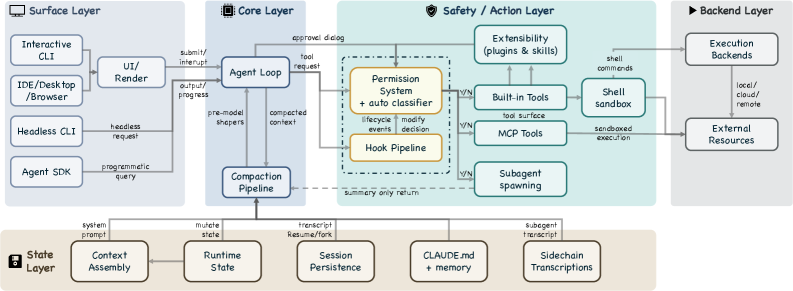
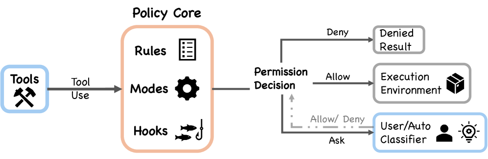
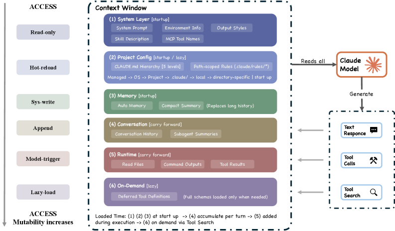
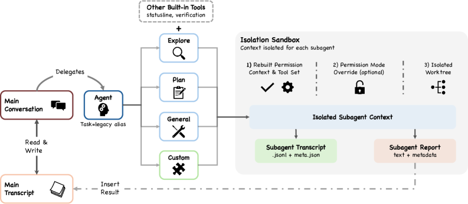
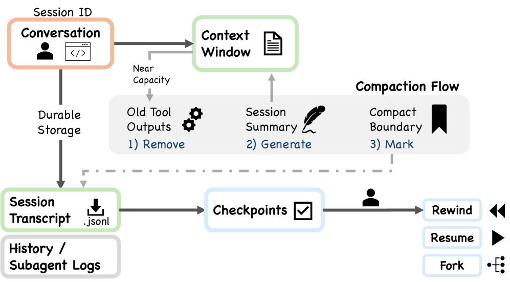
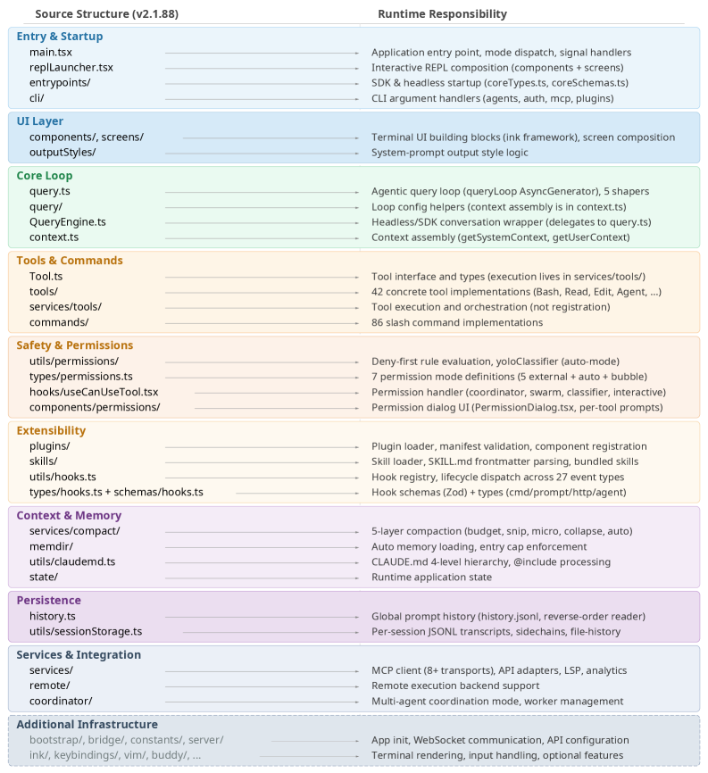

# Claude Code を深掘りする: 現在と将来の AI エージェント系の設計空間

> 原題: Dive into Claude Code: The Design Space of Today's and Future AI Agent Systems
> 著者: Jiacheng Liu, Xiaohan Zhao, Xinyi Shang, Zhiqiang Shen（VILA Lab, Mohamed bin Zayed University of Artificial Intelligence／University College London）。連絡先著者: Zhiqiang Shen
> 出典: arXiv:2604.14228（2026 / ar5iv 版）
> コード: [https://github.com/VILA-Lab/Dive-into-Claude-Code](https://github.com/VILA-Lab/Dive-into-Claude-Code)
> 対象バージョン: Claude Code v2.1.88

> **原典の免責事項（著者らによる）**: 本研究で用いたすべての資料は公開されているオンラインの情報源から得たものである。私的・機密・非認可の資料は一切使用しておらず、いかなる著作権・知的財産権も侵害する意図はない。**ソースコードの原著作権は Anthropic に帰属する。**

> **訳注（クリップの状態と復元）**
> - 底本は ar5iv 版の Web Clipper クリップ。**見出し 66・図表キャプション 17 件（Figure 1〜9・Table 1〜8）・markdown 表 8 個は完全**だった。欠落は次の 4 種類で、いずれも原ページから復元した。
>   1. **§1 の番号付きリスト 3 項目が丸ごと欠落**していた（Design-space analysis / Architectural contrast with OpenClaw / Open directions）。直前の「then organize the analysis in three parts:」が受ける先が消えていた。復元して該当位置に挿入した。
>   2. **§2.3 の箇条書き 1 項目が欠落**していた（Safety, Security, and Privacy の行のみ。他の 4 項目は残存）。復元した。
>   3. **脚注 4 件の本文がすべて欠落**していた。うち脚注 3（CVE 番号 4 件）と脚注 4（複雑度 +40.7%、速度スパイク +281%）は数値そのもので重要である。復元して該当箇所に訳注として挿入した。
>   4. **Figure 4 と Figure 8 に埋め込まれた「設計原則の箱」2 つが欠落**していた（Progressive Trust / Deny-First, Ask-by-Default / Composable Policy と、Conversations Outlive Context / Conversations Outgrow a Single Path）。原ページには `<table>` として存在するので復元し、それぞれの図の直後に置いた。
> - **Figure 5 に画像がないのはクリップ不良ではない。** 原典自体が擬似コード＋3 つの表で構成された図であり、ar5iv 側の画像も x1〜x8 の 8 枚のみである（Figure 1〜4・6〜9 に対応）。Figure 5 の擬似コードと 3 つの表は本文にテキストとして収録した。
> - 引用は原典が `(author2026key)` 形式の**裸の bibkey** で残っている。ar5iv 側に文献一覧が生成されていないためであり、クリップ不良ではない。既存の翻訳の慣例に従い bibkey をそのまま維持する。
> - **付録（§15 パッケージ構造・§16 証拠基盤と方法論）も全訳**した。参考文献一覧は既定どおり訳出しない。
> - 図は `raw/assets/2026-dive-into-claude-code/` にローカル保存し、そのパスを参照している。
> - **ソースコード中の識別子（関数名・ファイル名・フラグ名）は原文のまま**残す。翻訳すると参照できなくなるため。

---

###### Abstract（要旨）

Claude Code は、ユーザーに代わってシェルコマンドを実行し、ファイルを編集し、外部サービスを呼び出すことができる**エージェント的なコーディングツール**である。本研究は、公開されている TypeScript のソースコードを解析することでその包括的なアーキテクチャを記述し、さらに、同じ設計上の問いの多くに**異なる配備文脈から**答えている独立したオープンソースの AI エージェント系 **OpenClaw** と比較する。我々の分析は、そのアーキテクチャを動機づけている**5 つの人間的価値・哲学・ニーズ**（人間の決定権限、安全性とセキュリティ、信頼できる実行、能力の増幅、文脈適応性）を特定し、それらを**13 の設計原則**を通じて具体的な実装上の選択へと辿る。**系の中核は、モデルを呼び、ツールを実行し、それを繰り返すだけの単純な while ループである。しかしコードの大半は、このループの周囲の系にある**——7 つのモードと機械学習ベースの分類器を持つ権限系、コンテキスト管理のための 5 層の compaction パイプライン、4 つの拡張機構（MCP、プラグイン、スキル、フック）、subagent の委譲とオーケストレーション機構、そして追記指向のセッション保存である。マルチチャネルのパーソナルアシスタント・ゲートウェイである OpenClaw との比較は、**配備文脈が変わると同じ設計上の問いが異なるアーキテクチャ上の答えを生む**ことを示す: 行動ごとの安全性評価から境界レベルのアクセス制御へ、単一の CLI ループからゲートウェイ制御平面に埋め込まれたランタイムへ、コンテキストウィンドウの拡張からゲートウェイ全体の能力登録へ。最後に、最近の実証的・アーキテクチャ的・政策的文献に根ざした、将来のエージェント系のための**6 つの未解決の設計方向**を特定する。我々の GitHub は [https://github.com/VILA-Lab/Dive-into-Claude-Code](https://github.com/VILA-Lab/Dive-into-Claude-Code) で入手できる。

## 1 Introduction（はじめに）

AI 支援のソフトウェア開発は、GitHub Copilot (chen2021evaluating) のようなオートコンプリート型のツールから、Cursor (cursor2026official) のような IDE 統合アシスタントを経て、**多段の修正を自律的に計画し、シェルコマンドを実行し、ファイルを読み書きし、自らの出力に対して反復する**完全にエージェント的な系へと進化してきた。Claude Code (anthropic2026claudecode) は Anthropic がリリースしたエージェント的コーディングツールである (anthropic2026github)。その公式ドキュメントは、**目標の達成に向けて行動を計画し実行し、ツールを呼び、結果を評価し、タスクが完了するまで継続する**「エージェント的ループ」を記述している<sup>1</sup>。**この、提案から自律的な行動への移行は、補完ベースのツールには対応物のないアーキテクチャ上の要求を導入する。** これらの要求は**設計空間**を定義する——すなわち、安全性・コンテキスト管理・拡張性・委譲といった話題にまたがる、あらゆるコーディングエージェントが乗り越えなければならない一連の反復的な問いである。本研究は Claude Code のソースレベルの解析を用いて、1 つの本番系がこれらの問いにどう答えているかを示す。

> 訳注（脚注 1、原ページより復元）: [https://code.claude.com/docs/en/how-claude-code-works](https://code.claude.com/docs/en/how-claude-code-works)

採用が拡大しているにもかかわらず、**Anthropic は Claude Code についてユーザー向けのドキュメントは公開しているが、詳細なアーキテクチャの記述は公開していない**。本研究はソースコード解析を用いてアーキテクチャ上の設計決定を記述する。Anthropic の**132 名のエンジニアと研究者に対する内部調査** (anthropic2025internal) は、**Claude Code に支援されたタスクの約 27% は、このツールがなければ着手されなかったであろう仕事**だったと報告しており、このアーキテクチャが既存の作業を単に加速するのではなく**質的に新しいワークフローを可能にしている**ことを示唆する。

本研究では、まずアーキテクチャを動機づける 5 つの人間的価値／哲学と 13 の設計原則を特定し（第 2 節）、次に分析を 3 つの部分に組織する。

> 訳注: 以下の 3 項目は底本のクリップから丸ごと欠落していたため、原ページから復元した。

1. **設計空間の分析（Design-space analysis）。** 我々は反復的な設計上の問い（**推論はどこに宿るか、反復ループはどう構造化されるか、どんな安全姿勢を採るか、拡張面はどう分割されるか、コンテキストはどう管理されるか、仕事は subagent 群へどう委譲されるか、セッションはどう永続するか**）を特定し、Claude Code の答えを **7 コンポーネントの高水準構造**と **5 層のサブシステム・アーキテクチャ**を通じて分析し、各選択を具体的なソースファイルへ辿る（第 3 節）。**この分析は系の機構の深い理解を築くことを目指しており、より良く、より強力なエージェント系の設計に情報を与えることを目標としている。**
2. **OpenClaw とのアーキテクチャ的対比（Architectural contrast with OpenClaw）。** Claude Code 自体の分析を超えて、我々はその設計哲学をオープンソースのエージェント系 OpenClaw (openclaw2026)——マルチチャネルのパーソナルアシスタント・ゲートウェイ——のそれと **6 つの設計次元**で比較し、**同じ反復的な問いが異なる配備文脈のもとで異なる答えを生む**ことを示す（第 10 節）。これは商用ソフトウェアとオープンソースソフトウェアの間の共通原則と主要な差異の双方を際立たせるためである。この比較は、**配備の設定・製品目標・安全性要求・ユーザーについての前提が、それぞれ異なる仕方でアーキテクチャ上の選択を形づくる**ことを明らかにする助けになる。これらの系がどこで収束しどこで分岐するかを調べることで、本研究はより有能な将来のエージェント系の設計に有用な指針と実践的な洞察を提供することを目指す。
3. **将来のエージェント系のための未解決の方向（Open directions for future agent systems）。** 設計空間の分析と OpenClaw との対比の上に立ち、第 12 節は**可観測性と評価の乖離、セッションをまたぐ永続性、ハーネス境界の進化、ホライズンのスケーリング、ガバナンス、そして評価的レンズ**にまたがる 6 つの未解決の方向を特定する。それぞれ実証的・アーキテクチャ的・政策的な文献に依拠している。**評価的レンズとして用いると、本研究はある未解決の問いも明らかにする——Claude Code のエージェント系はプログラマとエンドユーザーの短期的な能力を大幅に増幅する一方で、長期的な人間の向上・より深い理解・持続的なコードベースの一貫性を明示的に支える機構はほとんど提供していない。**

**中核のエージェントループは状態管理を伴う while-true のサイクルである。安全性・拡張性・コンテキスト管理・委譲・永続性のための周辺サブシステムが、実装の大部分を占める。** ソースレベルの解析<sup>2</sup>により、我々は設計上の選択・サブシステムの境界・実装上のトレードオフを、製品説明からのみ推論するのではなく**系そのものから直接**特定できる。

> 訳注（脚注 2、原ページより復元）: 我々の分析は主としてソースコードに根ざしており、公式の Anthropic ドキュメントと選択されたコミュニティ解析で補われている。第 16 節が証拠基盤と方法論を詳述する。

#### Running example.（走らせる例）

アーキテクチャを具体的に保つため、我々は **「auth.test.ts の失敗しているテストを直せ」** というタスクを第 3・4・5・6・7・8・9 節を通じて追跡する。この例は、**一見単純なユーザーの要求が、ツール呼び出し・権限チェック・コンテキスト選択・反復的な修復・委譲・セッション永続化を含む複数のアーキテクチャ層を起動する**ことを示す。

#### Paper organization.（論文の構成）

第 2 節はアーキテクチャを動機づける人間的価値と設計原則を特定する。第 3 節は高水準アーキテクチャとそれが答える設計上の問いを導入する。第 4〜9 節はそれぞれ主要なサブシステムの設計上の選択を分析する。第 10 節は分析を OpenClaw と対比し、第 11 節は議論を提供し、第 12 節は将来のエージェント系のための未解決の問いを概観する。第 13・14 節は関連研究と結論を扱う。第 16 節は証拠基盤と方法論を記述する。

## 2 Design Philosophies, Design Principles and Architectural Motivations（設計哲学・設計原則・アーキテクチャ上の動機）

**本番のコーディングエージェントは人間によって、人間のために作られており、それらが埋め込むアーキテクチャ上の決定は、その作り手が何を重要だと信じているかを反映する。** 本節は Claude Code の設計を動機づける人間的価値を特定し、それらを反復的な設計原則を通じて辿り、第 3〜9 節の分析を組織する設計空間の問いを枠づける。

Anthropic の安全なエージェントのための枠組みは中心的な緊張を述べている——「**エージェントは自律的に働けなければならない。その独立した動作こそが、それらを価値あるものにしている。しかし人間は、自らの目標がどう追求されるかについての制御を保持すべきである**」(anthropic2025agents)。Claude の憲法（Constitution）はこれを厳格な決定手続きによってではなく、「**文脈に応じて適用できる良い判断力と健全な価値観**」を涵養することによって解決する (anthropic2026constitution)。これらのコミットメントは、開発者が実際にこのツールをどう使うかについての実証的知見 (anthropic2025internal; anthropic2026autonomy) と併せて、アーキテクチャを形づくる 5 つの人間的価値を指し示す。

### 2.1 Five Values and Philosophies（5 つの価値と哲学）

#### Human Decision Authority.（人間の決定権限）

人間は系が何をするかについての**究極の決定権限**を保持する。これは**プリンシパル階層**（Anthropic、次にオペレータ、次にユーザー）を通じて組織され、誰が何についての権限を持つかを形式化する (anthropic2026constitution)。系は、人間が情報を得たうえで制御を行使できるように設計されている——**行動をリアルタイムで観察でき、提案された操作を承認または拒否でき、両立可能な進行中の操作を中断でき、事後に監査できる**。**Anthropic が、ユーザーが権限プロンプトの 93% を承認していることを見出したとき、その対応は警告を増やすことではなく、問題を再構成することだった**——**習慣化すると人がレビューしなくなる行動ごとの承認ではなく、その中でエージェントが自由に動ける定義された境界**（サンドボックス化、auto-mode 分類器）である (anthropic2026automode; anthropic2025sandboxing)。

#### Safety, Security, and Privacy.（安全性・セキュリティ・プライバシー）

系は、**人間が不注意であったり誤りを犯したりしたときでさえ**、人間・そのコード・そのデータ・そのインフラを危害から保護する。これは Human Decision Authority とは区別される——**権限が人間の*選ぶ力*についてのものであるのに対し、安全性はその力が失われたときでさえ系が負う*保護する義務*についてのものである**。Anthropic の safe-agents の枠組みは、エージェントの相互作用を安全に保つことと、長期にわたる相互作用でプライバシーを保護することを、中核的なコミットメントとして別個に特定している (anthropic2025agents)。auto-mode の脅威モデル (anthropic2026automode) は明示的に 4 つのリスクカテゴリを標的にする: **過度に熱心な挙動（overeager behavior）・正直な誤り（honest mistakes）・プロンプトインジェクション・モデルの不整合（model misalignment）**。

#### Reliable Execution.（信頼できる実行）

エージェントは**人間が実際に意図したことを行い、時間をまたいで首尾一貫し、成功を宣言する前に自らの仕事を検証することを支援する**。この価値は単一ターンの正しさ（要求を忠実に解釈したか?）と長期ホライズンの信頼性（コンテキストウィンドウの境界・セッションの再開・マルチエージェントの委譲をまたいで首尾一貫したままか?）の双方にまたがる。Anthropic の製品ドキュメント (anthropic2026howworks) は、タスクが完了するまでエージェントが繰り返す 3 フェーズのループを記述する: **文脈を集める、行動を取る、結果を検証する**。エージェント設計の指針 (anthropic2024effective) はさらに、各ステップで「**環境からの ground truth**」が進捗を評価すると強調する。ハーネス設計の指針 (anthropic2026harness) も同様に「**エージェントは、品質が凡庸なときでさえ、自信をもってその仕事を称賛する傾向がある**」と述べ、**生成と評価の分離**を動機づけている。

#### Capability Amplification.（能力の増幅）

系は、**人間が単位努力・単位コストあたりに成し遂げられることを実質的に増やす**。第 1 節で論じた Anthropic の内部調査 (anthropic2025internal) は、このアーキテクチャが単に既存のものを速くするのではなく質的に新しいワークフローを可能にすることを示唆する——**タスクの約 27% は、そうでなければ着手されなかったであろう仕事だった**。系は作り手たちによって「**伝統的な製品ではなく Unix ユーティリティ**」と記述されており、「**有用で、理解可能で、拡張可能な**」最小の構成要素から作られている (cherny2025latentspace)。**このアーキテクチャは決定のスキャフォールディング（明示的なプランナーや状態グラフ）ではなく決定論的なインフラ（コンテキスト管理・ツールルーティング・回復）に投資している**。その前提は、**ますます有能になるモデルは、その選択を制約する枠組みよりも、豊かな運用環境からより多くの恩恵を受ける**というものである。

#### Contextual Adaptability.（文脈適応性）

系はユーザーの具体的な文脈（そのプロジェクト・ツール・慣習・スキル水準）に適合し、その関係は時間とともに改善する。拡張アーキテクチャ（CLAUDE.md、スキル、MCP、フック、プラグイン）は複数の**コンテキストコストの水準**で設定可能性を提供する（第 6・7 節）。縦断的データ (anthropic2026autonomy) は人間とエージェントの関係が進化することを示す——**自動承認率は 50 セッション未満での約 20% から、750 セッションまでに 40% 超へ増加する**。「**モデル・ユーザー・製品によって共同構築される（co-constructed）**」自律性と記述されるこのパターンは、系が固定された信頼状態ではなく**信頼の軌跡（trust trajectories）** のために設計されていることを意味する。MCP の Linux Foundation の Agentic AI Foundation への寄贈 (linuxfoundation2025aaif) は、この価値のエコシステム的な次元を反映している。

### 2.2 Design Principles（設計原則）

これらの価値は **13 の設計原則**を通じて操作可能にされており、それぞれが本番のコーディングエージェントが解決しなければならない反復的な問いに答えている。Table 1 が原則を要約する。以降の節（第 3〜9 節）がそれぞれを具体的な実装上の選択へと辿る。

**表1**: 設計原則、それが仕える価値、そしてそれぞれが答える設計空間の問い。原則は複数の価値に対応する。実装は示された節に現れる。

| 原則 | 仕える価値 | 設計上の問い | 節 |
| --- | --- | --- | --- |
| Deny-first with human escalation（拒否優先と人間へのエスカレーション） | Authority, Safety | 認識されない行動は許可されるべきか、遮断されるべきか、人間へエスカレートされるべきか? | 5, 8, 9 |
| Graduated trust spectrum（段階的な信頼のスペクトラム） | Authority, Adaptability | 固定の権限水準か、ユーザーが時間をかけて渡っていくスペクトラムか? | 5 |
| Defense in depth with layered mechanisms（層状の機構による多層防御） | Safety, Authority, Reliability | 単一の安全境界か、異なる技法を使う複数の重なり合う境界か? | 3, 5 |
| Externalized programmable policy（外部化されたプログラマブルなポリシー） | Safety, Authority, Adaptability | ハードコードされたポリシーか、ライフサイクルフックを伴う外部化された設定か? | 5, 6 |
| Context as scarce resource with progressive management（希少資源としてのコンテキストと漸進的な管理） | Reliability, Capability | 拘束的な資源制約は何か、そしてそれをどう管理するか——単一パスの切り詰めか、段階的なパイプラインか? | 4, 6, 7, 8 |
| Append-only durable state（追記のみの永続状態） | Reliability, Authority | 可変状態か、チェックポイントのスナップショットか、追記のみのログか? | 4, 9 |
| Minimal scaffolding, maximal operational harness（最小のスキャフォールディング、最大の運用ハーネス） | Capability, Reliability | スキャフォールディング側の推論に投資するか、モデルが自由に推論できるようにする運用インフラに投資するか? | 3, 4 |
| Values over rules（規則より価値観） | Capability, Authority | 厳格な決定手続きか、決定論的なガードレールに支えられた文脈的判断か? | 3, 5, 7 |
| Composable multi-mechanism extensibility（合成可能な多機構の拡張性） | Capability, Adaptability | 単一の統一された拡張 API か、異なるコンテキストコストの層状の機構か? | 6 |
| Reversibility-weighted risk assessment（可逆性で重み付けたリスク評価） | Capability, Safety | すべての行動に同じ監督か、可逆的なものと読み取り専用のものには軽い監督か? | 4, 5, 8 |
| Transparent file-based configuration and memory（透明なファイルベースの設定と記憶） | Adaptability, Authority | 不透明なデータベースか、埋め込みベースの検索か、ユーザーに見えてバージョン管理できるファイルか? | 7 |
| Isolated subagent boundaries（隔離された subagent の境界） | Reliability, Safety, Capability | subagent は親のコンテキストと権限を共有するか、隔離して動作するか? | 8 |
| Graceful recovery and resilience（優雅な回復と耐性） | Reliability, Capability | エラーで強く失敗するか、静かに回復して人間の注意を回復不能な状況のために取っておくか? | 4, 5 |

これらの原則は、**3 つの主要な代替的設計ファミリー**と対比して読むことができる。第一に、*規則ベースのオーケストレーション*——LangGraph (langgraph2024) のような枠組みは決定ロジックを**型付き辺を持つ明示的な状態グラフ**として符号化し、最小ハーネスよりスキャフォールディングを選ぶ。第二に、*コンテナ隔離された実行*——SWE-Agent と OpenHands (yang2024sweagent; wang2024openhands) は層状のポリシー強制ではなく **Docker による隔離**に依拠する。第三に、*安全策としてのバージョン管理*——Aider (gauthier2024aider) のようなツールは deny-first の評価ではなく **Git のロールバック**を主要な安全機構として使う。**Claude Code の原則集合は、最小の決定スキャフォールディングと層状のポリシー強制、価値観にもとづく判断と deny-first の既定、漸進的なコンテキスト管理と合成可能な拡張性を組み合わせている点で特徴的である。**

### 2.3 From Values to Architecture（価値からアーキテクチャへ）

各価値はその原則を通じて具体的なアーキテクチャ上の決定へと辿れる。

- **Human Decision Authority** は deny-first の評価、段階的な信頼のスペクトラム、追記のみの状態（監査可能な履歴）、外部化されたプログラマブルなポリシー、そして values-over-rules を動機づける（第 5・9・6・7 節）。
- **Safety, Security, and Privacy** は多層防御、deny-first の既定、可逆性で重み付けた評価、外部化されたポリシー、そして隔離された subagent の境界を動機づける（第 5・8 節）。

> 訳注: 上記 1 項目（Safety, Security, and Privacy の行）は底本のクリップから欠落していたため、原ページから復元した。

- **Reliable Execution** は context-as-scarce-resource、追記のみの永続状態、優雅な回復、隔離された subagent の境界、そして多層防御を動機づける（第 4・7・8・9 節）。
- **Capability Amplification** は最小のスキャフォールディング、合成可能な拡張性、可逆性で重み付けたリスク、コンテキスト管理、そして優雅な回復を動機づける（第 4・6・5 節）。
- **Contextual Adaptability** は透明なファイルベースの記憶、合成可能な拡張性、段階的な信頼のスペクトラム、そして外部化されたプログラマブルなポリシーを動機づける（第 7・6・5 節）。

**これらの対応はまた、このアーキテクチャが*しない*ことも明らかにする**——それは**モデルの推論に明示的な計画グラフを課さず、単一の統一された拡張機構を提供せず、resume をまたいですべてのセッションスコープの信頼関連状態を復元しない**。これらの不在は、上記の原則集合と整合的である。

### 2.4 An Evaluative Lens: Long-term Capability Preservation（評価的レンズ: 長期的な能力の保全）

上記の 5 つの価値は、このアーキテクチャが仕えるよう設計されているものを記述する。**本論文はさらに第 6 の関心事——このアーキテクチャが長期的な人間の能力を保全するか——を評価的レンズとして適用する。** この関心は現実のものである: Anthropic 自身の 132 名のエンジニアと研究者の研究 (anthropic2025internal) は、**AI への過度の依存が、それを監督するのに必要なスキルを萎縮させるリスク**という「**監督のパラドックス（paradox of supervision）**」を記録しており、独立した研究 (shen2026skill) は **AI 支援条件下の開発者が理解度テストで 17% 低いスコア**を取ることを見出している。**しかしこの関心は、アーキテクチャにも Anthropic の表明された設計価値にも、設計の駆動因として顕著には反映されていない。** したがって我々はこれを対等な価値としてではなく**横断的な関心事**として扱う——第 11 節ですべての 5 つの価値にまたがって適用される問い、すなわち**短期的な増幅が長期的な人間の理解・コードベースの一貫性・開発者のパイプラインを犠牲にして得られているのではないか**という問いである。

<figure>


<figcaption>図1: Claude Code の高水準システム構造。系は 7 つの機能コンポーネントに分解される: user（ユーザー）、interfaces（インターフェース）、agent loop（エージェントループ）、permission system（権限系）、tools（ツール）、state &amp; persistence（状態と永続化）、execution environment（実行環境）。すべての入口の表面が同じエージェントループに収束する。</figcaption>
</figure>

## 3 Architecture Overview（アーキテクチャの概観）

本番のコーディングエージェントを作るには、いくつかの反復的な設計上の問いに答える必要がある——**推論はどこに宿るべきか、実行エンジンは何個必要か、どんな安全姿勢を採るか、そして何を拘束的な制約として扱うか**。Claude Code のアーキテクチャは、これらの問いへの 1 つの答えの集合として読むことができる。実装のレベルでは、系は主要なデータフローで接続された 7 つのコンポーネントを持つ——ユーザーがいくつかのインターフェースの 1 つを通じてプロンプトを送信し、それが**共有されたエージェントループ**へ入る。エージェントループはコンテキストを組み立て、Claude モデルを呼び、ツール使用の要求を含みうる応答を受け取り、それらの要求を権限系を通じてルーティングし、承認された行動を実行環境と相互作用する具体的なツールへ振り分ける。この過程を通じて、状態と永続化の機構が会話のトランスクリプトを記録し、セッションの同一性を管理し、resume・fork・rewind の操作を支える。

### 3.1 Design Questions and Running Example（設計上の問いと走らせる例）

記述は、本番のコーディングエージェントをまたいで反復する **4 つの設計上の問い**を軸に組織される。それぞれが Table 1 で特定した設計原則の 1 つ以上を接地させる。各問いはここで Claude Code の答え、もっともらしい代替への注記とともに導入され、その後第 4〜9 節を通じて漸進的に実証される。

#### Where does reasoning live?（推論はどこに宿るか）

**Claude Code では、モデルが何をすべきかを推論し、ハーネスが行動の実行に責任を負う。** モデルは応答の一部として `tool_use` ブロックを発し、ハーネスがそれらを解析し、権限をチェックし、ツールの実装へ振り分け、結果を収集する（`query.ts`）。**モデルはファイルシステムに直接アクセスせず、シェルコマンドを実行せず、ネットワーク要求も行わない。** この分離はセキュリティ上の帰結を持つ——**推論と強制が別々のコードパスを占めるため、危殆化した、あるいは敵対的に操作されたモデルは、ハーネスに実装されたサンドボックス化・権限チェック・deny-first ルールを上書きできない**。モデルの外界への唯一のインターフェースは構造化された `tool_use` プロトコルであり、ハーネスが実行前にそれを検証する。**抽出されたソースについてのコミュニティ解析は、Claude Code のコードベースの約 1.6% だけが AI の意思決定ロジックを構成し、残りの 98.4% は運用インフラであると推定している**。これは中核のエージェント推論層がいかに薄いかを示す比率である。代替的な設計はスキャフォールディング側の推論により重く投資する——Devin は明示的な計画とタスク追跡の構造を保持し、LangGraph (langgraph2024) は制御フローを開発者が定義した状態グラフを通じてルーティングする。

#### How many execution engines?（実行エンジンは何個か）

Claude Code は、ユーザーが対話的なターミナル、headless の CLI 呼び出し、Agent SDK、IDE 統合のいずれを通じて相互作用しているかにかかわらず実行される**単一の `queryLoop()` 関数**を使う（`query.ts`）。**変わるのはレンダリングとユーザー相互作用の層だけである。** 他の系はモード固有のエンジンを使う——たとえば IDE 統合が CLI ツールとは異なるコードパスをたどることがあり、統一性を表面固有の最適化と引き換えにする。

#### What is the default safety posture?（既定の安全姿勢は何か）

Claude Code の既定の安全姿勢は **deny-first with human escalation** である——**deny ルールが ask ルールに優先し、ask ルールが allow ルールに優先する。認識されない行動は静かに許可されるのではなくユーザーへエスカレートされる**（`permissions.ts`）。**複数の独立した安全層**（権限ルール、PreToolUse フック、有効な場合の auto-mode 分類器、任意のシェルサンドボックス）が並列に適用されるので、**そのいずれか 1 つでも行動を遮断できる**（第 5 節）。これは Table 1 の *deny-first with human escalation* と *defense in depth with layered mechanisms* の原則を組み合わせている。代替的なアプローチは信頼境界を他所へ移す——SWE-Agent と OpenHands (yang2024sweagent; wang2024openhands) はコンテナベースの隔離に依拠して任意の実行を封じ込め、Aider (gauthier2024aider) は git ベースのロールバックを主要な安全網として使う。

#### What is the binding resource constraint?（拘束的な資源制約は何か）

Claude Code では、**コンテキストウィンドウ（古いモデルで 200K、Claude 4.6 系列で 1M）が拘束的な資源制約**である。**5 つの異なるコンテキスト削減戦略がすべてのモデル呼び出しの前に実行され**（`query.ts`）、他のいくつかのサブシステムの決定（指示の遅延ロード、ツールスキーマの遅延、subagent の要約のみの返却）もコンテキスト消費を抑えるために存在する（第 7 節）。**5 層のパイプラインが存在するのは、単一の compaction 戦略ではあらゆる種類のコンテキスト圧に対処できないからである。** budget reduction は大きさの上限を超える個々のツール出力を標的にする。snip は時間的な深さを扱う。microcompact はキャッシュのオーバーヘッドに反応する。context collapse は非常に長い履歴を管理する。auto-compact は最後の手段として意味的な圧縮を行う。**各層は異なる費用便益のトレードオフで動作し、より早く安い層がより高価な層の前に走る。** 代替的なアーキテクチャは他の資源を主要なボトルネックとして扱う——たとえば計算予算（モデル呼び出しやツール呼び出しの回数を制限する）や作業記憶（会話履歴に依拠せず明示的なスクラッチパッドを保持する）である。

#### Running example.（走らせる例）

これらの原則を接地させるため、我々は単一のタスク **「auth.test.ts の失敗しているテストを直せ」** を第 3〜9 節を通じて貫かせる。本節ではユーザーが Claude Code のインターフェースの 1 つを通じてプロンプトを送信する。以降の節はこの要求をクエリループ・権限ゲート・ツールプール・コンテキストウィンドウ・subagent 委譲・セッション永続化を通じて追跡する。

### 3.2 High-Level System Structure（高水準のシステム構造）

<figure>



<figcaption>図2: 単一のエージェント的ターンの端から端までの実行を示すランタイムのターンフロー。ユーザープロンプトがコンテキスト組み立てを通じて入り、モデルが呼ばれ、ツール要求が権限ゲートを通過し、ツールの結果がループへ戻り、compaction がコンテキスト圧を管理する。</figcaption>
</figure>

7 コンポーネントのモデル（図 1）はソースファイルへ直接対応する。

1. **User**: プロンプトを送信し、権限を承認し、出力をレビューする。
2. **Interfaces**: 対話的 CLI、headless CLI（`claude -p`）、Agent SDK、IDE/Desktop/Browser。**すべての表面が同じループへ供給する。**
3. **Agent loop**: モデル呼び出し・ツール振り分け・結果収集の反復サイクル。`query.ts` の `queryLoop()` async generator として実装される。
4. **Permission system**: deny-first のルール評価（`permissions.ts`）、auto-mode の機械学習分類器、フックベースの介入（`types/hooks.ts`）。
5. **Tools**: **最大 54 の組み込みツール**（19 は無条件、35 は機能フラグとユーザー種別に依存）が `assembleToolPool()`（`tools.ts`）を通じて組み立てられ、MCP が提供するツールとマージされる。プラグインは MCP サーバーとスキル／コマンドのレジストリを通じて間接的に寄与する。
6. **State & persistence**: ほぼ追記のみの JSONL セッショントランスクリプト（`sessionStorage.ts`）、グローバルなプロンプト履歴（`history.ts`）、subagent の sidechain ファイル。
7. **Execution environment**: 任意のサンドボックス化を伴うシェル実行（`shouldUseSandbox.ts`）、ファイルシステム操作、Web 取得、MCP サーバー接続、リモート実行。

データフローは**左から右への背骨**をたどる——ユーザーがインターフェースを通じて要求を送信し、それがエージェントループへ入る。ループは権限系へ行動を提案し、承認された行動はツールへ届き、ツールは実行環境と相互作用して `tool_result` メッセージをループへ返す。状態と永続化はループの傍らに位置し、トランスクリプトを記録し以前のセッションデータを読み込む。

アプリケーションの入口 `main()`（`main.tsx`）は、セキュリティ設定（Windows の PATH 乗っ取りを防ぐ `NoDefaultCurrentDirectoryInExePath` を含む）を初期化し、優雅な終了のためのシグナルハンドラを登録し、適切な実行モードへ振り分ける。

### 3.3 Layered Subsystem Decomposition（層状のサブシステム分解）

<figure>



<figcaption>図3: 5 つのサブシステム層を示す拡張された層状アーキテクチャ: surface（対話的 CLI、headless CLI、Agent SDK、IDE/Desktop/Browser、UI レンダラ）、core（エージェントループ、compaction パイプライン）、safety/action（auto-mode 分類器を含む権限系、フックパイプライン、拡張性、組み込みツール、MCP ツール、シェルサンドボックス、subagent 生成）、state（コンテキスト組み立て、ランタイム状態、セッション永続化、CLAUDE.md ＋メモリ、sidechain トランスクリプト）、backend（実行バックエンド、外部リソース）。</figcaption>
</figure>

5 層の分解（図 3）は 7 コンポーネントのモデルをより細粒度の視点へ展開し、各層を具体的なソースディレクトリへ対応させる。

#### Surface layer (entry points and rendering).（表面層——入口とレンダリング）

`src/entrypoints/` ディレクトリが起動パスを含み、`coreTypes.ts`・`controlSchemas.ts`・`coreSchemas.ts` を伴う SDK の入口を含む。`src/screens/` ディレクトリが全画面レイアウトを構成し、`src/components/` が **ink** フレームワークを通じてターミナル UI の構成要素を提供する。対話的 CLI はリアルタイムのストリーミング・権限ダイアログ・進捗表示を伴うターミナル UI を起動する。headless CLI（`claude -p`）は単発処理のために `QueryEngine` のインスタンスを作る。Agent SDK は async generator を通じて型付きイベントを発する。

#### Core layer (agent loop, compaction pipeline).（中核層——エージェントループ、compaction パイプライン）

`queryLoop()` async generator（`query.ts`）が反復的なエージェントループを実装し、状態層から組み立てられたコンテキストを消費し、ツール要求を safety/action 層へ振り分ける。**すべてのモデル呼び出しの前に、5 つの逐次的な shaper からなる *compaction パイプライン***（`query.ts:365--453`）がコンテキスト圧を管理する: **budget reduction、snip、microcompact、context collapse、auto-compact**（第 4.3・7.3 節）。

#### Safety/action layer (permission system, hooks, extensibility, tools, sandbox, subagents).（安全／行動層）

*権限系*（`permissions.ts`）は deny-first のルール評価を、**最大 7 つの権限モード**（内部専用の `bubble` と機能ゲートされた `auto` も数えた場合）（`types/permissions.ts`）とともに実装し、ツールの安全性の**2 段階の高速フィルタと chain-of-thought による評価**を提供する統合された *auto-mode ML 分類器*（`yoloClassifier.ts`）を持つ（第 5 節）。**27 のイベント型にまたがる*フックパイプライン***（`coreTypes.ts`。出力スキーマは `types/hooks.ts`）はツール要求を遮断・書き換え・注釈できる。**このうち 5 つが安全性に関係し、残り 22 はライフサイクルとオーケストレーションの目的に仕える**（第 6 節）。*拡張性*サブシステムはプラグインとスキルがツールとフックをランタイムへ登録することを可能にする。`assembleToolPool()`（`tools.ts`）によるツールプールの組み立てが組み込みツールと MCP 提供のツールをマージする。承認されたシェルコマンドは、権限系とは独立にファイルシステムとネットワークのアクセスを制限する*シェルサンドボックス*（`shouldUseSandbox.ts`）を通過する。**AgentTool による *subagent 生成***（`AgentTool.tsx`, `runAgent.ts`）は他のすべてのツールと同じ `buildTool()` ファクトリを通じて振り分けられ、**隔離されたコンテキストウィンドウで `queryLoop()` へ再入し、親には要約だけを返す**（第 8 節）。

#### State layer (context assembly, runtime state, persistence, memory, sidechains).（状態層）

***コンテキスト組み立て*はルーティングのハブではなく、メモ化された状態ローダーである**——`getSystemContext()`（`context.ts`）が git の状態を含むセッションレベルのシステムコンテキストを計算し、`getUserContext()`（`context.ts`）が CLAUDE.md の階層と現在の日付を読み込む。両者とも再利用のためにキャッシュされる: **システムコンテキストはシステムプロンプトへ追記され、ユーザーコンテキストは user-context メッセージとして加えられる**。`src/state/` ディレクトリがランタイムのアプリケーション状態を管理する。セッショントランスクリプトはプロジェクト固有のパスに、ほぼ追記のみの JSONL ファイルとして保存される（`sessionStorage.ts`）。*CLAUDE.md ＋メモリ*サブシステムは、管理された設定からディレクトリ固有のファイルまでの**4 水準の指示階層**（`claudemd.ts`）と、Claude が会話中に書く auto-memory エントリを提供する（第 7.2 節）。*Sidechain トランスクリプト*（`sessionStorage.ts:247`）は各 subagent の会話を別ファイルへ保存し、**subagent の内容が親のコンテキストを膨らませるのを防ぐ**（第 8.3 節）。グローバルなプロンプト履歴は `history.jsonl` に保持される（`history.ts`）。resume と fork の操作はトランスクリプトからセッション状態を再構成する（`conversationRecovery.ts`）。

#### Backend layer (execution backends, external resources).（バックエンド層）

任意のサンドボックス化を伴うシェルコマンド実行（`BashTool.tsx`, `PowerShellTool.tsx`）、リモート実行のサポート（`src/remote/`）、**stdio・SSE・HTTP・WebSocket・SDK・IDE 固有アダプタを含む複数のトランスポート変種にまたがる MCP サーバー接続**（`services/mcp/client.ts`）、そして具体的なツールロジックを実装する `src/tools/` の 42 のツールサブディレクトリ。

### 3.4 QueryEngine: A Clarification（QueryEngine についての明確化）

`QueryEngine.ts` のクラスドキュメントはこう述べる——「QueryEngine は会話のクエリのライフサイクルとセッション状態を所有する。`ask()` から中核のロジックを抽出し、headless/SDK パスと（将来のフェーズで）REPL の両方が使える独立したクラスにしたものである」。**このクラスは非対話的な表面のための*会話ラッパー*であって、エンジンそのものではない。** そのコンストラクタは初期メッセージ・abort コントローラ・ファイル状態のキャッシュ・その他の会話ごとの状態を持つ `QueryEngineConfig` を受け取る。その `submitMessage()` メソッドは単一のターンをオーケストレートする async generator である。**共有されるクエリパスは `query()`（`query.ts`）にあり、これが内部の `queryLoop()` をラップする。QueryEngine は `query()` へ委譲する。**

この区別はアーキテクチャ的に重要である——**対話的 CLI もまた `query()` を呼び、QueryEngine を完全に迂回する。共有されるコードパスはエンジンのクラスではなくループ関数である。**

### 3.5 Permission and Safety Layers（権限と安全性の層）

安全性を既定とする原則は **7 つの独立した層**を通じて実装される。**要求は適用されるすべての層を通過しなければならず、いずれか 1 つの層でもそれを遮断できる。**

1. **ツールの事前フィルタリング**（`tools.ts`）: 一律に拒否されるツールは、いかなる呼び出しの前にモデルの視界から取り除かれ、モデルがそれらを呼び出そうとすることを防ぐ。
2. **deny-first のルール評価**（`permissions.ts`）: **deny ルールは、allow ルールのほうがより具体的である場合でさえ、常に allow ルールに優先する。**
3. **権限モードの制約**（`types/permissions.ts`）: 有効なモードが、明示的なルールに一致しない要求の基本の扱いを決める。
4. **auto-mode 分類器**: ML ベースの分類器がツールの安全性を評価し、**ルール系なら許可する要求を拒否しうる**。
5. **シェルサンドボックス化**（`shouldUseSandbox.ts`）: 承認されたシェルコマンドも、ファイルシステムとネットワークのアクセスを制限するサンドボックスの中で実行されうる。
6. **resume 時に権限を復元しない**（`conversationRecovery.ts`）: セッションスコープの権限は resume や fork で復元されない。
7. **フックベースの介入**（`types/hooks.ts`）: PreToolUse フックは権限の決定を修正でき、PermissionRequest フックはユーザーのダイアログと並行して（あるいは coordinator モードではそれより前に）決定を非同期に解決できる。

これらの層は第 5 節で詳しく記述される。

### 3.6 Context as Bottleneck: Beyond Compaction（ボトルネックとしてのコンテキスト——compaction を超えて）

5 層の compaction パイプライン（第 7 節で詳述）を超えて、いくつかの他のサブシステムの決定も **context-as-bottleneck** の制約を反映している。

- **CLAUDE.md の遅延ロード**: 基本の CLAUDE.md 階層はセッション開始時に読み込まれるが、**追加の入れ子ディレクトリの指示ファイルと条件つきルールは、エージェントがそれらのディレクトリのファイルを読んだときにのみ読み込まれ**、使われない指示がコンテキストを消費するのを防ぐ。
- **ツールスキーマの遅延**: ToolSearch が有効なとき、一部のツールは初期コンテキストに**名前だけ**を含め、完全なスキーマは要求に応じて読み込まれる。
- **subagent の要約のみの返却**: subagent は親に要約テキストだけを返し、会話履歴全体は返さない（第 8 節）。
- **ツール結果ごとの予算**: 個々のツール結果は設定可能な大きさに制限され、**単一の冗長な出力が不釣り合いにコンテキストを消費するのを防ぐ**。

## 4 Turn Execution: The Agentic Query Loop（ターンの実行——エージェント的クエリループ）

ユーザーが「auth.test.ts の失敗しているテストを直せ」を送信すると、入力は**反応的なループ**へ入る。これはコーディングエージェントにとって可能ないくつかのオーケストレーション・パターンの 1 つである。本節は Claude Code の**単純な while ループ・アーキテクチャ**という選択を検討し、そのループの 1 ターンを端から端まで追跡し、Table 1 の 3 つの設計原則——*minimal scaffolding with maximal operational harness*、*context as scarce resource with progressive management*、*graceful recovery and resilience*——を例証する。

### 4.1 The Query Pipeline（クエリのパイプライン）

各ターンは固定の順序に従う（図 2、`query.ts`）。

1. **設定の解決。** `queryLoop()` 関数が、システムプロンプト・ユーザーコンテキスト・権限コールバック・モデル設定を含む不変のパラメータを分解する。
2. **可変状態の初期化。** **単一の `State` オブジェクト**が、メッセージ・ツールコンテキスト・compaction の追跡・回復のカウンタを含む反復をまたぐすべての可変状態を保持する。ループの**7 つの continue 地点**（「continue sites」）はそれぞれ、フィールドを個別に変更するのではなく**このオブジェクトを 1 回の全体代入で上書きする**。
3. **コンテキストの組み立て。** `getMessagesAfterCompactBoundary()` 関数が最後の compact 境界以降のメッセージを取得し、**compact された内容が元のメッセージではなくその要約で表されることを保証する**。
4. **モデル呼び出し前の context shaper。** 5 つの shaper が逐次実行される（第 4.3 節）。
5. **モデル呼び出し。** `deps.callModel()` に対する `for await` ループがモデルの応答をストリーミングし、組み立てられたメッセージ（ユーザーコンテキストを前置したもの）・完全なシステムプロンプト・thinking の設定・利用可能なツール集合・abort シグナル・現在のモデル指定・fast-mode 設定や effort 値やフォールバックモデルを含む追加のオプションを渡す。
6. **tool-use の振り分け。** 応答が `tool_use` ブロックを含む場合、それらはツール・オーケストレーション層へ流れる（第 4.2 節）。
7. **権限ゲート。** 各ツール要求が権限系を通過する（第 5 節）。
8. **ツールの実行と結果の収集。** ツールの結果が `tool_result` メッセージとして会話に加えられ、ループが継続する。
9. **停止条件。** **応答が `tool_use` ブロックを含まない（テキストのみ）ならば、ターンは完了である。**

`queryLoop()` 関数は **AsyncGenerator** として定義され、進行に応じて `StreamEvent`・`RequestStartEvent`・`Message`・`TombstoneMessage`・`ToolUseSummaryMessage` のイベントを yield する。**このジェネレータベースの設計により、ループ内で単一の同期的な制御フローを保ちながら UI 層へ出力をストリーミングできる。**

Claude Code の反応的なループは **ReAct パターン** (yao2022react) に従う——モデルが推論とツール呼び出しを生成し、ハーネスが行動を実行し、結果が次の反復へ供給される。代替的なオーケストレーション・パターンには、制御フローを型付き辺を持つ状態機械として定義する**明示的なグラフベースのルーティング** (langgraph2024) と、コミットする前に複数の行動軌跡を探索する**木探索法** (zhou2024lats) がある。Anthropic 自身のドキュメント (anthropic2024effective) は 5 つの合成可能なワークフロー・パターン（prompt chaining、routing、parallelization、orchestrator-workers、evaluator-optimizer）を特定しており、**Claude Code は subagent の委譲について主に orchestrator-workers パターンを使い（第 8 節）、中核のループは反応的に保っている**。**この反応的な設計は探索の完全性を単純さと低遅延と引き換えにする——各ターンはバックトラックなしに 1 つの行動列にコミットする。**

### 4.2 Tool Dispatch and Streaming Execution（ツールの振り分けとストリーミング実行）

モデルの応答が `tool_use` ブロックを含むとき、系は 2 つの実行パスから選ぶ。**主要なパスは `StreamingToolExecutor` を使い、モデルの応答からツールがストリーミングされてくるのに合わせて実行を開始し**、複数ツールの応答の遅延を減らす。フォールバックのパスは `toolOrchestration.ts` の `runTools()` を使い、`partitionToolCalls()` が生成する分割を反復する。**両方のパスがツールを concurrent-safe か exclusive かに分類する。読み取り専用の操作は並列に実行でき、シェルコマンドのような状態を変更する操作は直列化される。**

`StreamingToolExecutor`（`StreamingToolExecutor.ts`）は 2 つの調整機構で並行実行を管理する。

- **兄弟の abort コントローラ。** いずれかの Bash ツールがエラーを起こしたときに発火し、**他の実行中のサブプロセスを最後まで走らせるのではなく即座に終了させる**。
- **進捗利用可能シグナル。** 新しい出力の準備ができたとき `getRemainingResults()` の消費側を起こす。

結果はバッファされ、**ツールが受け取られた順序で発される**ので、ツールが並列に走っても出力の順序は同じままである。**これはモデルが tool-use 要求と同じ順序でツールの結果を期待するので重要である。** この concurrent-read / serial-write の実行モデルは、完全に直列な振り分けと、モデルがまだ生成している間に予測された将来のツール呼び出しを投機的に先行実行してツールの遅延を隠す **PASTE** (sui2026paste) のようなより積極的な投機的アプローチとの、中間に位置する。

ツール結果の収集フェーズは、ストリーミング実行器または同期的な `runTools()` ジェネレータからの更新を反復する。各更新はツールの結果・添付・進捗イベントを運びうる。特別なチェックが `hook_stopped_continuation` の添付を検出する——**PostToolUse フックがターンを継続すべきでないと合図したら、`shouldPreventContinuation` フラグが立つ**。結果は `normalizeMessagesForAPI()` を通じて Anthropic API 向けに正規化され、user 型のメッセージだけを残すようフィルタされる。

### 4.3 Pre-Model Context Shapers（モデル呼び出し前の context shaper）

**5 つの context shaper が `query.ts` ですべてのモデル呼び出しの前に逐次実行され**、それぞれが `messagesForQuery` 配列に対して動作する。**5 つの shaper は順に走り、より早いステップがより軽い削減を適用してから、より後のステップがより広い compaction を適用する。**

#### Budget reduction.（予算による削減）

（`applyToolResultBudget()`）。ツール結果に対してメッセージごとの大きさの上限を強制し、**大きすぎる出力をコンテンツ参照で置き換える**。免除されるツール（`maxResultSizeChars` が有限でないもの）は完全な出力を保つ。コンテンツの置換は agent と session のクエリ元について永続化され、resume 時の再構成を可能にする。**budget reduction が microcompact の前に走るのは、microcompact が純粋に `tool_use_id` だけで動作し内容を一切検査しないからである。両者はきれいに合成する。**

#### Snip.（切り取り）

（`snipCompactIfNeeded()`。`HISTORY_SNIP` でゲートされる）。**より古い履歴の区間を取り除く軽量な整理**で、`{messages, tokensFreed, boundaryMessage}` を返す。`snipTokensFreed` の値が auto-compact へ明示的に配管されるのは、**主要なトークンカウンタが直近のアシスタントメッセージの `usage` フィールドからコンテキストの大きさを導出しており、そのメッセージは snip を生き延びて snip 前の `input_tokens` を付けたままなので、snip の節約は明示的に渡さない限りカウンタから見えない**からである。

#### Microcompact.（微 compaction）

**細粒度の圧縮**で、常に時間ベースのパスを走らせ、任意でキャッシュを意識したパス（`CACHED_MICROCOMPACT` でゲート）も走らせる。キャッシュ対応パスが有効なとき、**境界メッセージは API 応答の後まで遅延され、推定値ではなく実際の `cache_deleted_input_tokens` を使えるようにする**。`{messages, compactionInfo}` を返し、`compactionInfo` は `pendingCacheEdits` を含みうる。

#### Context collapse.（コンテキストの折り畳み）

`CONTEXT_COLLAPSE` でゲートされる。**会話履歴に対する読み取り時の射影（read-time projection）** である。ソースのコメントはこう説明する——「**何も yield されない。折り畳まれたビューは REPL の完全な履歴に対する読み取り時の射影である。要約メッセージは REPL の配列ではなく collapse ストアに存在する。これがターンをまたいで折り畳みを持続させているものである。**」他の shaper と異なり、**context collapse は REPL の保存された履歴を変更しない**。`applyCollapsesIfNeeded()` を通じて `messagesForQuery` 配列を射影されたビューで置き換えるので、**モデルは折り畳まれた版を見るが、完全な履歴は再構成のために利用可能なまま残る**。

#### Auto-compact.（自動 compaction）

第 5 の shaper で、`compact.ts` の `compactConversation()` を通じて**モデル生成による完全な要約**を引き起こす。この関数は PreCompact フックを実行し、`getCompactPrompt()` を使って要約の要求を作り、モデルを呼んで圧縮された要約を生成する。結果は `buildPostCompactMessages()`（`compact.ts`）へ供給される。**auto-compact は、先行する 4 つの shaper がすべて走った後でもコンテキストが圧力の閾値を超えている場合にのみ発火する。**

### 4.4 Recovery Mechanisms（回復の機構）

クエリループはエッジケースのためのいくつかの回復機構を実装する。

- **最大出力トークンのエスカレーション**: 応答が出力トークンの上限に達したとき、系はエスカレートされた上限で再試行できる（GrowthBook フラグと、既存の上書きや環境変数による上限がないことが条件）。**1 ターンあたり最大 3 回の回復試行が許される**（`MAX_OUTPUT_TOKENS_RECOVERY_LIMIT = 3`）。
- **反応的 compaction**（`REACTIVE_COMPACT` でゲート）: コンテキストが容量に近いとき、reactive compact が**空きを作るのにちょうど足りるだけ**を要約する。`hasAttemptedReactiveCompact` フラグがこれを 1 ターンにつき高々 1 回に抑える。
- **prompt-too-long の扱い**: API が `prompt_too_long` エラーを返した場合、ループはまず context-collapse のオーバーフロー回復と reactive compaction を試みる。**これらが失敗して初めて** `reason: 'prompt_too_long'` で終了する。
- **ストリーミングのフォールバック**: `onStreamingFallback` コールバックがストリーミング API の問題を扱い、ループが別の戦略で再試行できるようにする。
- **フォールバックモデル**: `fallbackModel` パラメータが、主要なモデルが失敗した場合に代替のモデルへ切り替えることを可能にする。

### 4.5 Stop Conditions（停止条件）

複数の条件がループを終了させうる。

1. **ツール使用なし**: モデルがテキストのみの内容を生成する（**主要な停止条件**）。
2. **最大ターン数**: 設定可能な `maxTurns` の上限に達する。
3. **コンテキストのオーバーフロー**: API が `prompt_too_long` を返す。
4. **フックの介入**: PostToolUse フックが `hook_stopped_continuation` を設定する。
5. **明示的な中断**: `abortController` のシグナルが発火する。

ターンのパイプラインはツール要求が*どう*オーケストレートされ回復されるかを決める。次節は、各要求がそもそも実行を*許されるか*を決めるゲートを検討する。

<figure>



<figcaption>図4: 権限ゲートの概観と設計原則。（訳注: 図の左から Tools が Tool Use として Policy Core へ入り、Policy Core は Rules / Modes / Hooks の 3 要素からなる。そこから Permission Decision が出て、Deny なら Denied Result へ、Allow なら Execution Environment へ、Ask なら User/Auto Classifier へ回り、その結果が Allow/Deny として Permission Decision へ戻る。）</figcaption>
</figure>

> 訳注: 原典の図 4 には次の設計原則の表が併記されているが、底本のクリップから欠落していたため原ページから復元した。

**図4 に併記された設計原則**

| 原則 | 記述 |
| --- | --- |
| **Progressive Trust**（漸進的な信頼） | エージェントは最小の自律性から始まる。ユーザーは、**永続的なルールになるツール呼び出しを承認する**ことでそれを拡張する。 |
| **Deny-First, Ask-by-Default**（拒否優先、既定は問う） | **deny ルールは、より緩いモードのもとでも常に勝つ。** どのルールにも一致しなければ、ゲートは静かに実行したり遮断したりするのではなく**ユーザーに問う**。 |
| **Composable Policy**（合成可能なポリシー） | **3 つの機構がポリシーを形づくる**——宣言的なルール、大域的な信頼モード、プログラマブルなフック。それぞれが独立に設定可能である。 |

## 5 Tool Authorization and Control Boundaries（ツールの認可と制御境界）

本番のコーディングエージェントは異なる安全性アーキテクチャを採る——層状のポリシー強制、OS レベルのサンドボックス化、あるいはバージョン管理ベースのロールバックである。**Claude Code は最初の 2 つを組み合わせ**、Table 1 の 4 つの設計原則——*deny-first with human escalation*、*graduated trust spectrum*、*defense in depth with layered mechanisms*、*reversibility-weighted risk assessment*——を実装する。

Claude がツールを実行すると決めたとき（たとえば auth のテスト失敗を再現するために BashTool 経由で `npm test` を走らせる）、要求は図 4 の権限パイプラインへ入る。**すべてのツール呼び出しが権限系を通過し、既定の挙動は静かに許可するのではなく拒否するか問うことである。** この既定は記録された行動パターンによって動機づけられている——**Anthropic の auto-mode 分析 (anthropic2026automode) は、ユーザーが権限プロンプトの約 93% を承認することを見出し、承認疲れ（approval fatigue）が対話的な確認を唯一の安全機構としては行動的に信頼できないものにしていることを示している**。**ユーザーが慎重なレビューなしに習慣的に承認するので、系は人間の警戒とは独立に安全性を維持しなければならない。** これが、deny-first の評価・一律拒否の事前フィルタリング・そして**ユーザーの注意深さにかかわらず動作する独立した層としてのサンドボックス化**への、アーキテクチャ上のコミットメントを動機づける。

### 5.1 Permission Modes and Rule Evaluation（権限モードとルール評価）

型定義には **7 つの権限モード**が存在する（`types/permissions.ts` に 5 つの外部モード、`auto` が条件つきで追加、`bubble` が型の合併に含まれる）。

1. **`plan`**: モデルは計画を作らなければならない。実行はユーザーの承認の後にのみ進む。
2. **`default`**: 標準の対話的な使用。ほとんどの操作がユーザーの承認を要する。
3. **`acceptEdits`**: 作業ディレクトリ内の編集と特定のファイルシステム系シェルコマンド（`mkdir`, `rmdir`, `touch`, `rm`, `mv`, `cp`, `sed`）が自動承認される。他のシェルコマンドは承認を要する。
4. **`auto`**: 高速パスのチェックを通らない要求を **ML ベースの分類器**が評価する（`TRANSCRIPT_CLASSIFIER` でゲート）。
5. **`dontAsk`**: プロンプトは出さないが、**deny ルールは依然として強制される**。
6. **`bypassPermissions`**: ほとんどの権限プロンプトを飛ばすが、**安全性に決定的なチェックと bypass 免疫のルールは依然として適用される**。
7. **`bubble`**: subagent の権限を親のターミナルへエスカレートするための**内部専用**のモード。

外部から見える 5 つのモード（`acceptEdits`, `bypassPermissions`, `default`, `dontAsk`, `plan`）は `EXTERNAL_PERMISSION_MODES` 配列で定義される。`auto` モードは `TRANSCRIPT_CLASSIFIER` の機能フラグが有効なときにのみ条件つきで含まれる。`bubble` モードは型の合併には存在するがどちらのモード配列にもなく、subagent の権限エスカレーションに内部的に使われる（第 8 節）。

権限ルールは **deny-first の順序**で評価される（`permissions.ts`）。`toolMatchesRule()` 関数はまず deny ルールをチェックする——**deny ルールは、allow ルールのほうがより具体的である場合でさえ、常に allow ルールに優先する。広い deny（「すべてのシェルコマンドを拒否」）は狭い allow（「`npm test` を許可」）で上書きできない。** ルール系はツール水準の照合（ツール名による）と内容水準の照合（`Bash(prefix:npm)` のような具体的なツール入力パターンへの照合）を支える。

**7 つのモードは段階的な自律性のスペクトラムにまたがる**——`plan`（ユーザーが実行前にすべての計画を承認する）から `default`・`acceptEdits` を経て `bypassPermissions`（最小限のプロンプト）まで。**この勾配は反復的な設計上の緊張を反映する: 自律性が増すにつれ、系は対話的な承認から自動化された安全性チェックへ移行しなければならない。** 他のエージェント系はこの緊張を異なる仕方で解決する。SWE-Agent と OpenHands (yang2024sweagent; wang2024openhands) は Docker コンテナの隔離を使い、個々のツール呼び出しを評価するのではなくエージェントの実行環境全体をサンドボックス化する。Aider (gauthier2024aider) は Git を安全網として頼り、すべての変更をバージョン管理を通じて可逆にする。**Claude Code のアプローチは、任意のコンテナ・サンドボックス化の上に複数のポリシー強制機構を重ね、単純さを個々の行動に対する細粒度の制御と引き換えにする。**

### 5.2 The Authorization Pipeline（認可のパイプライン）

完全な認可のパイプラインはいくつかの段階を進む。

#### Pre-filtering.（事前フィルタリング）

いかなるツール要求がランタイムの評価に達する前に、`filterToolsByDenyRules()`（`tools.ts`）が**ツールプールの組み立て時に、一律拒否されるツールをモデルの視界から完全に取り除く**。ドキュメントはこう述べる——「**ランタイムの権限チェックと同じマッチャを使うので、`mcp__server` のような MCP サーバー接頭辞のルールは、モデルがそれらを見る前にそのサーバーのすべてのツールを取り除く。**」これはモデルが禁じられたツールを呼び出そうとするのを防ぎ、モデルがそれらに呼び出しを浪費しないようにする。

#### PreToolUse hook.（PreToolUse フック）

登録されたフックが権限パイプラインの一部として発火する。PreToolUse フックは deny または ask する `permissionDecision` を返すか、ツールの入力パラメータを修正する `updatedInput` を返すことができる（`types/hooks.ts`）。**フックの allow は、後続のルールベースの deny や安全性チェックを迂回しない。** 対話的なパスでは、ユーザーのダイアログがまず待ち行列に入れられ、フックは非同期に走る。coordinator や類似のバックグラウンドエージェントのパスでは、ダイアログを表示する前に自動化されたチェックを待つ。

#### Rule evaluation.（ルールの評価）

deny-first のルールエンジンが要求を評価する。**MCP ツールは完全修飾された `mcp__server__tool` の名前で照合され、サーバー水準のルールはそのサーバーのすべてのツールに一致する。**

#### Permission handler.（権限ハンドラ）

`useCanUseTool.tsx` のハンドラは、ランタイムの文脈にもとづいて 4 つのパスの 1 つへ分岐する。

1. **Coordinator**: マルチエージェント調整モード用。ユーザーとの相互作用へ落ちる前に自動化された解決（分類器、フック、ルール）を試みる。
2. **Swarm worker**: マルチエージェントの swarm におけるワーカーエージェントを、それ自身の解決ロジックで扱う。
3. **Speculative classifier**: `BASH_CLASSIFIER` が有効でツールが BashTool のとき、**投機的な分類器が事前に開始された分類結果をタイムアウトと競争させる。分類器が高い確信度で返れば、ツールはユーザーとの相互作用なしに即座に承認される。**
4. **Interactive**: フォールバックのパス。ターミナル UI を通じて標準のユーザー承認ダイアログを提示する。

coordinator と一部のバックグラウンドのパスでは、ユーザーとの相互作用の前に自動化された解決が試みられる。標準の対話的なパスでは、フックや分類器のチェックが並行して継続する間にダイアログが先に現れうる。**分類器や deny ルールが行動を遮断するとき、系はその拒否をハードストップではなく*ルーティングの信号*として扱う——モデルは拒否の理由を受け取り、アプローチを見直し、次のループ反復でより安全な代替を試みる。** PermissionDenied のフックイベント（第 6 節）は、外部のコードがこれらの拒否をプログラム的に観察し応答することを可能にする。**この回復指向の設計は、権限の強制がエージェントを単に停止させるのではなくその挙動を*形づくる*ことを意味する。**

### 5.3 Auto-Mode Classifier and Hook Lifecycle（auto-mode 分類器とフックのライフサイクル）

auto-mode 分類器（`yoloClassifier.ts`）は、有効なとき権限の決定に参加する。`TRANSCRIPT_CLASSIFIER` が有効なとき、分類器は 3 つのプロンプト資源を読み込む。

- 基本のシステムプロンプト。
- 外部の権限テンプレート。
- Anthropic 内部のユーザー向けには、別の内部テンプレート。

**分類器は、提案されたツール呼び出しを会話のトランスクリプトと権限テンプレートに照らして評価し、allow・deny・手動承認の要求のいずれかを生成する。** `isUsingExternalPermissions()` 関数は `USER_TYPE` と `forceExternalPermissions` の設定フラグをチェックして適切なテンプレートを選ぶ。

ソースに定義された **27 のフックイベント**（`coreTypes.ts`）のうち、**5 つが権限フローに直接参加する**。それぞれが具体的な Zod で検証される出力スキーマを持つ（`types/hooks.ts`）。

- **PreToolUse**: `permissionDecision`（deny または ask。**ただし allow は後続のチェックを迂回しない**）、`permissionDecisionReason`、`updatedInput`（パラメータの修正）を返せる。
- **PostToolUse**: `additionalContext` を注入でき、MCP ツールについては結果がコンテキストへ入る前にそれを修正する `updatedMCPToolOutput` を返せる。
- **PostToolUseFailure**: エラー固有の指針のために `additionalContext` を注入できる。
- **PermissionDenied**: auto-mode の拒否の後に再試行の指針を提供できる。
- **PermissionRequest**: allow か deny の決定を返せる。coordinator と類似のパスでは、これはユーザーのダイアログの前に解決しうる。標準の対話的なパスでは、ダイアログと並行して走ることもできる。

**非 MCP ツールについては `tool_result` が PostToolUse フックの発火の前に発される。MCP ツールについては、`updatedMCPToolOutput` が効くように、結果が post フックの実行の後まで遅延される。**

### 5.4 Shell Sandboxing（シェルのサンドボックス化）

シェルのサンドボックス化は Bash と PowerShell のコマンドに追加の保護層を提供する（`shouldUseSandbox.ts`）。`shouldUseSandbox()` 関数は、サンドボックス化が大域的に有効か、その呼び出しがオプトアウトしていないか、コマンドが除外パターンに一致しないかをチェックする。

有効なとき、サンドボックスはアプリケーション水準の権限モデルとは**独立に**ファイルシステムとネットワークの隔離を提供する。**コマンドは権限を承認されてもなおサンドボックス化されうるし、権限を拒否されてサンドボックスのチェックに達しないこともある。2 つの系は異なる軸——認可（authorization）と隔離（isolation）——で動作する。**

**層状の安全性アーキテクチャは*独立性の仮定*に立っている——ある層が失敗しても、他の層が違反を捕まえる。しかし、いくつかの層は共通の性能上の制約を共有している。** セキュリティ研究者 (adversa2026bypass) は、**50 を超えるサブコマンドを持つコマンドが、サブコマンドごとの解析が UI のフリーズを引き起こしたために、サブコマンドごとの deny ルールのチェックを走らせる代わりに単一の汎用的な承認プロンプトへフォールバックする**ことを記録している。**この例は、多層防御がその層が失敗モードを共有するときに劣化しうることを実証している。** これは安全性と性能の間の構造的な緊張であり、第 11.3 節でさらに分析される。

権限のパイプラインはツール要求が実行されるかを統べる。次節は、そもそもどのツールが存在するかを決めるもの——モデルの行動面を組み立てる拡張性アーキテクチャ——を検討する。

## 6 Extensibility: MCP, Plugins, Skills, and Hooks（拡張性——MCP、プラグイン、スキル、フック）

コーディングエージェントにとって反復的な設計上の問いは、**拡張面をどう構造化するか**である——単一の統一された機構か、少数の特化した機構か、異なるコンテキストコストを持つ層状のスタックか。ここでの分析は Table 1 の 2 つの設計原則——*composable multi-mechanism extensibility* と *externalized programmable policy*——を例証する。走らせる例に戻ると、Claude が `auth.test.ts` を修復しようとしており、先ほどの `npm test` の要求が権限系によって仲介された（第 5 節）あと、次の問いは**修復のためにどんな拡張可能な行動面が利用できるか**である。Claude Code でターンが始まるとき、モデルは BashTool や FileReadTool のような組み込みツールだけでなく、**MCP サーバーからのデータベースクエリツール、`.claude/skills/` からのカスタムの lint スキル、インストールされたプラグインが寄与するツール**も見る。これらは**ループの異なる地点でエージェントを拡張する 4 つの機構**を通じて到来する——MCP サーバーは外部ツールの統合を提供し、プラグインはコンポーネントの束を梱包し配布し、スキルはドメイン固有の指示を注入し、フックはツール実行のライフサイクルに介入する。Anthropic のドキュメント (anthropic2026howworks) は、ここで分析する 4 機構と並んで CLAUDE.md（第 7 節）と subagent（第 8 節）も含むより広い見方を提示する。我々が CLAUDE.md と subagent を独自の節で扱うのは、それらが異なるサブシステム（コンテキスト構築と委譲）で動作するからだが、**コンテキストコストによる順序づけはアーキテクチャ的に重要である——それは各拡張点が表現力を有界なコンテキストウィンドウとどうトレードオフしているかを明らかにする。**

### 6.1 Four Extension Mechanisms（4 つの拡張機構）

> 訳注: 以下は原典の図 5 の左側にある擬似コードである。**Claude Code のエージェントループの 1 ターン**を示す。

```python
# one turn of Claude Code's agent loop
while not stopped:

    # (a) assemble -- build what the model sees
    context = assemble(
        tool_schemas,   # callable tool signatures
        history,        # prior turn messages
        hook_additions, # pushed in by hooks
    )

    # (b) model -- pick the next action
    action = model(context, tools)   # flat tool pool
    if action.is_text_only():
        stopped = run_stop_hooks(action)   # may veto
        continue

    # (c) execute -- gate and run the tool call
    if not permitted(action):              # permission
        continue
    action = run_pre_tool_hooks(action)    # block/rewrite
    result = execute(action)               # tool runs here
    result = run_post_tool_hooks(result)   # mutate/annotate
    history.append(action, result)
```

> 訳注: 以下は原典の図 5 の右側にある 3 つの表である。それぞれが上記擬似コードの (a)(b)(c) に対応する。

**(a) `assemble()`: モデルが何を見るか**

| 要素 | 何をするか |
| --- | --- |
| CLAUDE.md files | コンテキストへ読み込まれる。**作業ディレクトリより上のファイルは起動時に、サブディレクトリのファイルは要求に応じて読み込まれる** |
| Skill descriptions | スキルを広告し、モデルが SkillTool を呼べるようにする |
| MCP resources & prompts | MCP サーバーが押し込むツール以外の内容 |
| Output style | 応答の書式づけのシステムブロックを置き換える |
| UserPromptSubmit hook | **すべてのユーザーターンで**コンテキストを注入する、あるいは遮断する |
| SessionStart hook | セッション開始時の 1 回限りのコンテキスト注入 |

**(b) `model()`: モデルが何に手を伸ばせるか**

| 要素 | 何をするか |
| --- | --- |
| Built-in tools | CLI に同梱される Read / Edit / Bash / … |
| MCP tools | 任意の MCP サーバーからのツール。**同じ平坦なプールの中に入る** |
| SkillTool | 名前でスキルを起動する**メタツール** |
| AgentTool | **再帰的に** subagent を生成するメタツール |

**(c) `execute()`: 行動が実行されるか／どう実行されるか**

| 要素 | 何をするか |
| --- | --- |
| Permission rules | 呼び出しごとの宣言的な allow / deny / ask |
| PreToolUse hook | ツール呼び出しを承認・遮断・書き換える |
| PostToolUse hook | 呼び出し後に出力を変更する、あるいはコンテキストを注入する |
| Stop hook | モデルの停止時にループを**強制的に継続させる** |
| SubagentStop hook | 同じことを、AgentTool で生成された subagent について行う |
| Notification hook | ユーザーへの通知に対する外部の副作用 |

**図5**: Claude Code の拡張機構がエージェントループのどこに差し込まれるか。左の擬似コードは図 1 の Agent Loop ブロックのズームインである。**あらゆるエージェントループは 3 つの注入点を持つ**: **(a) `assemble()` はモデルが何を見るかを制御し、(b) `model()` はモデルが何に手を伸ばせるかを制御し、(c) `execute()` は行動が実際に実行されるか、そしてどう実行されるかを制御する。**

これらの機構は別々のソースディレクトリに実装されており（図 5）、異なる統合パターンに仕える。

#### MCP servers.（MCP サーバー）

**Model Context Protocol は主要な外部ツール統合の経路である。** MCP サーバーは複数のスコープ——プロジェクト、ユーザー、ローカル、エンタープライズ——から設定され、追加のプラグインと claude.ai のサーバーがランタイムでマージされる（`services/mcp/config.ts`）。MCP クライアント（`services/mcp/client.ts`）は複数のトランスポート型を支える: **stdio、SSE、HTTP、WebSocket、SDK、加えて IDE 固有の変種（`sse-ide`, `ws-ide`）と内部の `claudeai-proxy`**。接続された各サーバーは `MCPTool` オブジェクトとしてツール定義を寄与する。専用の組み込みツール `ListMcpResourcesTool` と `ReadMcpResourceTool` が MCP のリソースへのアクセスを提供する。

#### Plugins.（プラグイン）

**プラグインは二重の役割を果たす——それは梱包形式であると同時に配布機構でもある。** `PluginManifestSchema`（`utils/plugins/schemas.ts`）は **10 のコンポーネント型**を受け入れる: コマンド、エージェント、スキル、フック、MCP サーバー、LSP サーバー、出力スタイル、チャネル、設定、ユーザー設定。プラグインローダー（`utils/plugins/pluginLoader.ts`）はマニフェストを検証し、各コンポーネントをそれぞれのレジストリへルーティングする——コマンドとスキルは SkillTool メタツールを通じて表面化し、エージェントは AgentTool が消費する定義に現れ、フックはフックレジストリへマージされ、MCP と LSP のサーバーは標準の設定へ畳み込まれ、出力スタイルは応答の書式づけを修正する。**したがって単一のプラグインパッケージが複数のコンポーネント型にまたがって Claude Code を拡張でき、プラグインを第三者拡張の主要な配布手段にしている。**

#### Skills.（スキル）

**各スキルは YAML frontmatter を持つ `SKILL.md` ファイルで定義される。** `parseSkillFrontmatterFields()` 関数（`loadSkillsDir.ts`）は **15 以上のフィールド**を解析する——表示名、記述、許可ツール（スキルに追加のツールへのアクセスを与える）、引数のヒント、モデルの上書き、実行文脈（隔離実行のための `'fork'`）、関連するエージェント定義、effort 水準、シェル設定。**スキルは自身のフックを定義でき、呼び出し時に動的に登録される。** 同梱のスキルは起動時にメモリ内で登録される。**呼び出されると、SkillTool メタツールがそのスキルの指示をコンテキストへ注入する。**

#### Hooks.（フック）

ソースコードは **27 のフックイベント**を定義しており、ツールの認可（PreToolUse, PostToolUse, PostToolUseFailure, PermissionRequest, PermissionDenied）、セッションのライフサイクル（SessionStart, SessionEnd, Setup, Stop, StopFailure）、ユーザーとの相互作用（UserPromptSubmit, Elicitation, ElicitationResult）、subagent の調整（SubagentStart, SubagentStop, TeammateIdle, TaskCreated, TaskCompleted）、コンテキスト管理（PreCompact, PostCompact, InstructionsLoaded, ConfigChange）、ワークスペースのイベント（CwdChanged, FileChanged, WorktreeCreate, WorktreeRemove）、そして通知にまたがる（`coreTypes.ts`, `coreSchemas.ts`）。**このうち 15 がイベント固有の出力スキーマを持ち**、権限の決定・コンテキストの注入・入力の修正・MCP 結果の変換・再試行の制御を支える豊かなフィールドを備える（`types/hooks.ts`）。設定とプラグインを通じて構成される永続的なフックコマンドは **4 つのコマンド型**を使う: シェルコマンド（`type: command`）、LLM プロンプトのフック（`type: prompt`）、HTTP フック（`type: http`）、そして**エージェント的な検証器のフック（`type: agent`）**（`schemas/hooks.ts`）。ランタイムはさらに、SDK と内部の計装が使う永続化できないコールバックのフック（`type: callback`）も支える（`types/hooks.ts`）。フックの供給元は起動時の `settings.json`・プラグイン・管理されたポリシーであり、スキルのフックは呼び出し時に動的に登録される（`utils/hooks.ts`）。ツール認可の 5 つのイベントは第 5.3 節で詳述した。

### 6.2 Tool Pool Assembly（ツールプールの組み立て）

`tools.ts` の `assembleToolPool()` 関数は「**組み込みツールと MCP ツールを組み合わせるための単一の真実の源**」と文書化されている。組み立ては **5 段のパイプライン**に従う。

1. **基本ツールの列挙。** `getAllBaseTools()`（`tools.ts`）が**最大 54 のツール**の配列を返す。**19 は常に含まれ**（BashTool、FileReadTool、AgentTool、SkillTool など）、**35 は機能フラグ・環境変数・ユーザー種別にもとづいて条件つきで含まれる**。Anthropic 内部のユーザーは追加の内部ツールを得る。worktree モードは EnterWorktreeTool と ExitWorktreeTool を有効にする。エージェント swarm はチームツールを有効にする。Bun のバイナリに埋め込み検索ツールが利用可能なとき、専用の GlobTool と GrepTool は省かれる。
2. **モードによるフィルタリング。** `getTools()`（`tools.ts`）がモード固有のフィルタリングを適用する。**`CLAUDE_CODE_SIMPLE` モードでは Bash・Read・Edit のみが利用可能である**（あるいは REPL 分岐では REPLTool。該当すれば coordinator のツールも）。各ツールの `isEnabled()` メソッドがランタイムの可用性チェックのために呼ばれる。
3. **deny ルールによる事前フィルタリング。** `filterToolsByDenyRules()`（`tools.ts`）が一律拒否されるツールを、いかなる呼び出しの前にモデルの視界から取り除く。
4. **MCP ツールの統合。** `appState.mcp.tools` からの MCP ツールが deny ルールでフィルタされ、組み込みツールとマージされる。
5. **重複除去。** ツールは名前で重複除去され、**組み込みツールが MCP ツールに優先する**。

`REPL.tsx`（`useMergedTools` フック経由）と `AgentTool.tsx`（ワーカーのツール集合を構築するとき）の両方がこの関数を呼び、**すべての実行パスをまたいで一貫した組み立てを保証する**。要求時には、ToolSearch を通じて明示的に問い合わせられるまで、遅延ツールがモデルのコンテキストから隠されうる（`tools.ts`）。

エージェントベースの拡張（`.claude/agents/*.md` によるカスタムエージェント定義と、プラグインが寄与するエージェント）は第 8 節で扱う。**エージェントは上記の 4 機構と根本的に異なる——それらは現在のコンテキストウィンドウを拡張するのではなく、新しい隔離されたコンテキストウィンドウを作る**からである。

### 6.3 Why Four Mechanisms?（なぜ 4 つの機構か）

拡張機構が 1 つ増えるごとに開発者が学ばなければならない表面積も増えるのだから、**なぜ Claude Code は 1 つや 2 つに統合せず 4 つの異なる機構を使うのか**という問いが自然に生じる。**答えは、異なる種類の拡張性がコンテキストウィンドウに異なるコストを課すという観察にある。単一の機構では、ゼロコンテキストのライフサイクルフックからスキーマの重いツールサーバーまでの全範囲を、拡張の作者に不要なトレードオフを強いることなく張ることはできない。**

**表2**: 各拡張機構が独自に提供するもの。コンテキストコストは、その機構が有効なときに有界なコンテキストウィンドウをどれだけ消費するかを指す。

| 機構 | 独自の能力 | コンテキストコスト | 挿入点 |
| --- | --- | --- | --- |
| **MCP サーバー** | 外部サービスの統合（マルチトランスポート） | **高**（ツールスキーマ） | `model()`: ツールプール |
| **プラグイン** | 複数コンポーネントの梱包＋配布 | **中**（可変） | 3 つの点すべて |
| **スキル** | ドメイン固有の指示＋メタツールによる呼び出し | **低**（記述のみ） | `assemble()`: コンテキスト注入 |
| **フック** | ライフサイクルへの介入＋イベント駆動の自動化 | **既定でゼロ** | `execute()`: ツールの前／後 |

Table 2 が要約するとおり、**各機構は配備の複雑さを異なる種類の拡張性と引き換えにする**。MCP サーバーはランタイムのツール統合（モデルが新しい呼び出し可能なツールを得る）を、サーバー管理のオーバーヘッドとツールスキーマが消費するコンテキスト予算のコストで提供する。**スキルは（どんなツールを持つかだけでなく）エージェントが*どう考えるか*を形づくり**、最小のコンテキストコストで済む——frontmatter の記述だけ（内容全体ではなく）がプロンプトに残るからである。フックは横断的なライフサイクル制御（ツール呼び出しの遮断・書き換え・注釈）を、既定でコンテキストの足跡なしに提供する（ただしフックは追加のコンテキストの注入をオプトインできる）。プラグインは他の 3 つの任意の組み合わせを配布可能なパッケージへ束ね、**別個のランタイムのプリミティブというより梱包と配布の層として振る舞う**。**段階的なコンテキストコストの順序づけ（フックはゼロ、スキルは低、プラグインは中、MCP は高）は、安価な拡張はコンテキストウィンドウを使い果たすことなく広くスケールでき、高価なものは本当に新しいツール面を必要とする場合のために取っておかれることを意味する。**

いくつかのエージェント枠組みは単一の拡張機構を提供する——典型的にはすべてのカスタマイズが追加の呼び出し可能なツールとして到来する tool-only の API である。他は 2 層を使い、ツールを設定や指示の注入から分ける。**Claude Code の 4 機構のアプローチは、ゼロコンテキストのイベントハンドラから完全な外部サービス統合まで、より広い範囲の拡張パターンに対応できるが、あるインテグレーションのタスクにどの機構を使うか決めるときに開発者が直面する学習曲線を増やす。**

## 7 Context Construction and Memory（コンテキストの構築と記憶）

**エージェントがコンテキストウィンドウをどう管理し、ユーザーの指示をどう永続させるかは中心的な設計上の選択**であり、系によって**ファイルベースの透明性・データベースを背景にした検索・不透明な学習された表現**のいずれかが選ばれる。ここでの設計上の選択は Table 1 の 2 つの原則——*context as scarce resource with progressive management* と *transparent file-based configuration and memory*——を実装する。

走らせる例のこの時点で、タスクは状態を蓄積している——元の要求、`npm test` の権限の結果、第 6 節で組み立てられたツールプール、そしてこれまでに集められたファイルの読み取りやコマンドの出力である。**本節は、その増大する状態が次のモデル呼び出しの前に Claude Code の有界なコンテキストウィンドウへどう詰め込まれるかを問う。**

モデルが呼ばれる前に、エージェントループはツールプール（第 6 節）・CLAUDE.md ファイル・auto memory・会話履歴からコンテキストウィンドウを組み立てる。以下の小節は組み立ての順序、CLAUDE.md の階層、そして多段の compaction パイプラインを扱う。

### 7.1 Context Window Assembly（コンテキストウィンドウの組み立て）

<figure>



<figcaption>図6: コンテキストの構築と記憶の階層。コンテキストウィンドウへ収束する供給元には、システムプロンプト、出力スタイル、環境情報、CLAUDE.md の階層（managed からディレクトリ固有まで）、auto memory、パススコープのルール、MCP ツール名、ToolSearch による遅延ツール定義、会話履歴、ファイルの読み取り、コマンドの出力、ツールの結果、subagent の要約、そして compact の要約が含まれる。</figcaption>
</figure>

コンテキストウィンドウ（図 6）は次の供給元から組み立てられる。一部は初期の組み立て時に、他はターンの途中で遅れて注入される。

1. **システムプロンプト。** 出力スタイルの修正と `--append-system-prompt` フラグの内容を組み込む。
2. **環境情報**（`getSystemContext()`, `context.ts`）: git の状態（リモートモードや git の指示が無効なときは飛ばされる）と、内部ビルド向けの任意のキャッシュ破壊の注入（`BREAK_CACHE_COMMAND` でゲート）。**セッションにつき 1 回メモ化される。**
3. **CLAUDE.md の階層**（`getUserContext()`, `context.ts`）: **4 水準の指示ファイル階層**（第 7.2 節）。これもメモ化される。
4. **パススコープのルール**: エージェントが一致するディレクトリのファイルを読んだときに**遅延して読み込まれる**、条件つき・ディレクトリ照合のルール。
5. **Auto memory**: 文脈的に関連する記憶エントリが非同期に先読みされる。
6. **ツールのメタデータ**: スキルの記述、MCP のツール名、そして（ToolSearch による、要求に応じた）遅延ツール定義。
7. **会話履歴**: 引き継がれる。compaction の対象。
8. **ツールの結果**: ファイルの読み取り、コマンドの出力、subagent の要約。
9. **Compact の要約**: より古い履歴の区間を置き換える。

`query.ts` でのシステムプロンプトの組み立ては、`asSystemPrompt(appendSystemContext(systemPrompt, systemContext))()` を通じてシステムコンテキストと基本のプロンプトを組み合わせる。**ユーザーコンテキスト（CLAUDE.md と日付）は `prependUserContext()` を通じてメッセージ配列の先頭へ前置される。この分離は、CLAUDE.md の内容が API 要求の中でシステムプロンプトとは異なる構造的な位置を占めることを意味し、モデルの注意のパターンに影響しうる。**

いくつかのコンテキストの供給元は、主要なウィンドウが構築された**後に遅れて注入される**: 関連メモリの先読み（`query.ts`）、MCP の指示の差分（新規または変更されたサーバーの指示のみ）、エージェント一覧の差分、そしてバックグラウンドのエージェントタスクの通知である。**したがってコンテキストウィンドウは組み立て時に静的なのではなく、ターンの途中で増大しうる。**

### 7.2 CLAUDE.md Hierarchy and Auto Memory（CLAUDE.md の階層と auto memory）

**記憶の系を形づくる設計原則は、保存されるコンテキストがユーザーによって検査可能で編集可能であるべきだというものである。** CLAUDE.md ファイルは構造化された設定でも不透明なデータベースのエントリでもなく**プレーンテキストの Markdown** である。**この透明性の選択は表現力を監査可能性と引き換えにする——ユーザーはエージェントが見るいかなる指示も読み、編集し、バージョン管理し、削除できる** (mindstudio2025memory)。代替的な記憶アーキテクチャがそのトレードオフを例証する。検索拡張のアプローチは埋め込みベースの参照を使って関連する過去のコンテキストを表面化させ、**柔軟性を検査可能性のコストで得る——ユーザーは検索系が何を関連とみなしているかを容易には見たり編集したりできない**。データベースを背景にした記憶は構造化されたクエリを提供するが、追加のインフラを要し、バージョン管理に対して不透明である。**Claude Code のファイルベースのアプローチは、エージェントが見るすべての指示を直接読め、編集でき、コードベースと一緒にコミットできるものにする。** **系は記憶の検索に埋め込みもベクトル類似度のインデックスも使わない。代わりに、記憶ファイルのヘッダを LLM でスキャンして、要求に応じて最大 5 つの関連ファイルを選び、エントリの粒度ではなくファイルの粒度で表面化させる。** 埋め込みベースの系は個々のエントリをより選択的に検索できるが、検査可能性とインデックス維持に必要なインフラのコストを払う。

CLAUDE.md ファイルは多水準の読み込み階層に従う。ソースのヘッダ（`claudemd.ts`）は **4 つの記憶の種類**を定義する。

1. **Managed memory**（例: Linux での `/etc/claude-code/CLAUDE.md`）: すべてのユーザーに対する OS 水準のポリシー。
2. **User memory**（`~/.claude/CLAUDE.md`）: 私的な大域の指示。
3. **Project memory**（プロジェクトルートの `CLAUDE.md`, `.claude/CLAUDE.md`, `.claude/rules/*.md`）: **コードベースにチェックインされた指示**。
4. **Local memory**（プロジェクトルートの `CLAUDE.local.md`）: gitignore された、私的なプロジェクト固有の指示。

ファイルの発見は現在のディレクトリからルートまで遡り、各ディレクトリですべての project と local の記憶ファイルをチェックする。**現在のディレクトリにより近いファイルがより高い優先度を持つ（後から読み込まれる）。**

ファイルは「**優先度の逆順**」に読み込まれる——**後から読み込まれたファイルがより多くのモデルの注意を受ける**。ルートから CWD までのディレクトリについては、`.claude/rules/*.md` の無条件のルールが起動時に先読みで読み込まれる。**CWD より下の入れ子のディレクトリについては、無条件のルールでさえ、エージェントが一致するディレクトリのファイルを読んだときに遅延して読み込まれる。これは、モデルの指示集合が会話の途中で、コードベースの新しい部分が探索されるにつれて進化しうることを意味する。**

**CLAUDE.md の内容はシステムプロンプトの内容としてではなく、ユーザーコンテキスト（user メッセージ）として届けられる**（`context.ts`）。**このアーキテクチャ上の選択は重要な含意を持つ——CLAUDE.md の内容がシステム水準の指示ではなく会話的なコンテキストとして届けられるため、これらの指示へのモデルの遵守は保証されたものではなく確率的である。** 第 5 節の deny-first の順序で評価される権限ルールが、**決定論的な強制の層**を提供する。**これは指針（CLAUDE.md、確率的）と強制（権限ルール、決定論的）の間の意図的な分離を作る。** この関数は、CLAUDE.md のローダーと権限系の間のインポート循環を避けるため、読み込まれた内容を auto-mode 分類器のためにキャッシュする `setCachedClaudeMdContent()` を呼ぶ。

記憶ファイルはモジュール化された指示集合のための **`@include` ディレクティブ**を支える（`processMemoryFile()`, `claudemd.ts`）。構文の変種には `@path`, `@./relative`, `@~/home`, `@/absolute` がある。**このディレクティブは葉のテキストノードでのみ働く（コードブロックの中では働かない）。** 実装では、インクルードする側のファイルが最初に押し込まれ、インクルードされるファイルがその後に追記される。循環参照は処理済みのパスを追跡することで防がれ、**存在しないファイルは静かに無視される**。

### 7.3 Compaction Pipeline（compaction のパイプライン）

5 層の compaction パイプライン（第 4.3 節）は「context as bottleneck」の原則を**段階的な圧縮**を通じて実装する（`query.ts`）。単一の戦略ではなく、Claude Code は**攻撃性を増していく 5 つの層を順に適用する**（3 つは機能フラグでゲートされ、budget reduction は常に有効、auto-compact はユーザーが設定可能）。**この段階的なアプローチは、多くのエージェント枠組みが使う単一パスの切り詰め（最も古いメッセージを落とす）や単一の要約ステップという、より単純な代替と対照的である。** 段階的な設計は**遅延劣化（lazy-degradation）の原則**を反映する——**最も破壊の小さい圧縮をまず適用し、より安い戦略が不十分だと判明したときにのみエスカレートする。** **このアプローチのコストは複雑さである。5 つの相互作用する圧縮層、そのいくつかは機能フラグでゲートされており、ユーザーが完全に予測することが難しい挙動を作り出す。** auto-compact はトランスクリプトに目に見える要約を生成し、microcompact は境界マーカーを発するが、**context collapse はユーザーに見える出力なしに動作する**。より単純な単一パスのアプローチは情報を犠牲にするが、推論するのが容易である。

1. **Budget reduction**（常に有効）: ツール結果ごとの大きさの上限。
2. **Snip**（`HISTORY_SNIP`）: より古い履歴の軽量な整理。
3. **Microcompact**（`CACHED_MICROCOMPACT`）: 細粒度でキャッシュを意識した圧縮。
4. **Context collapse**（`CONTEXT_COLLAPSE`）: 履歴に対する読み取り時の仮想的な射影。
5. **Auto-compact**（既定で有効、無効化可能）: モデル生成による完全な要約。

`buildPostCompactMessages()` 関数（`compact.ts`）は次の compact された出力の構造を返す: `[boundaryMarker, ...summaryMessages, ...messagesToKeep, ...attachments, ...hookResults]`。境界マーカーは `annotateBoundaryWithPreservedSegment()` を通じて保存された区間のメタデータで注釈され、**読み取り時の連鎖の修復**を可能にするために `headUuid`・`anchorUuid`・`tailUuid` を記録する。**このほぼ追記のみの設計は、compaction が以前に書かれたトランスクリプトの行を決して変更も削除もしないことを意味する——新しい境界と要約のイベントを追記するだけである。**

compaction 関数 `compactConversation()`（`compact.ts`）はいくつかの設計上の選択を含む。**Pre-compact フックが最初に発火し**、フックが注入するカスタムの指示を可能にする。GrowthBook の機能フラグが、compaction のパスが主要な会話のプロンプトキャッシュを再利用するかを制御する（コードのコメントが 2026 年 1 月の実験を記録している——「**false のパスは 98% キャッシュミスで、フリートの `cache_creation` の約 0.76% のコストがかかる**」）。compaction の後、添付のビルダーがライブのアプリ状態からランタイムの状態（計画、スキル、非同期エージェント）を**再アナウンス**する。**compaction は以前の添付メッセージを破棄するが、その背後にある状態は破棄しないためである。**

系が subagent へ仕事を委譲するとき、それぞれが自身の有界なコンテキストウィンドウで動作するので、**コンテキストの隔離はより決定的になる**。

## 8 Subagent Delegation and Orchestration（subagent の委譲とオーケストレーション）

マルチエージェントのオーケストレーションはコーディングエージェントにとって鍵となる設計次元であり、選択肢は**親子の階層・ピアベースの会話枠組み** (wu2024autogen)・**グラフ構造のワークフローエンジン** (langgraph2024) にまたがる。Claude Code の委譲アーキテクチャは Table 1 の *isolated subagent boundaries* の原則を、*deny-first with human escalation*（権限の上書き）と *reversibility-weighted risk assessment*（subagent のツール制限）の側面とともに実装する。

Claude が auth のテスト修正には認証モジュールの構造をまず探索する必要があると判断したとき、その探索を subagent へ委譲できる。**委譲の機構は Agent ツール**（`AgentTool.tsx`）であり、`Task` が旧称のエイリアスとして残されている。モデルは委譲のプロンプト、任意の subagent の種類、そして隔離モード・権限の上書き・作業ディレクトリの設定を含む構造化された入力とともに Agent を呼び出す。

### 8.1 The Agent Tool and Delegation Criteria（Agent ツールと委譲の基準）

<figure>



<figcaption>図7: subagent の隔離と委譲のアーキテクチャ。Agent ツールは組み込みの subagent（Explore、Plan、general-purpose）またはカスタムの subagent へ振り分ける。それぞれが隔離されたコンテキスト、再構築された権限コンテキスト、独立したツール集合で動作する。Agent ツールは 3 つの軸——routing（teammate）、isolation（remote、worktree）、lifecycle（async、sync）——に沿って振り分ける。</figcaption>
</figure>

Agent ツールの入力スキーマ（図 7）は**機能でゲートされたフィールド**を使い、その裏づけとなる機能が無効なときは任意のパラメータを省く。`isolation` フィールドは内部ユーザーには `['worktree', 'remote']`、外部ユーザーには `['worktree']` を提供し、ビルド時に決定される。`cwd` フィールドは機能フラグでゲートされる。`run_in_background` フィールドは、バックグラウンドのタスクが無効なとき、あるいは fork-subagent モードが有効なときに省かれる。

Claude Code は機能フラグと入口に応じて**最大 6 種類の組み込み subagent** を提供する。

- **Explore**: 主として読み取り／検索指向の調査。**write と edit のツールが deny リストに入っている。**
- **Plan**: 構造化された計画を作る。実行は標準の権限モデルを通じて進む。
- **General-purpose**: 広く有能。明示的に要求されたときに使われる（注: 種類を省くと fork-subagent のパスへルーティングされうる）。
- **Claude Code Guide**: オンボーディングとドキュメントの支援。独自の `permissionMode` の上書きを持つ。
- **Verification**: 検証のチェック（テストスイート、lint）を走らせる。
- **Statusline-setup**: ターミナルのステータスライン設定に特化。

組み込みを超えて、ユーザーは `.claude/agents/*.md` ファイルを通じてカスタム subagent を定義し、プラグインは `loadPluginAgents.ts` を通じてエージェント定義を寄与する。**各ファイルの markdown 本体がそのエージェントのシステムプロンプトとして働き**、YAML frontmatter が記述・ツール（許可リスト）・`disallowedTools`・モデル・effort・`permissionMode`・`mcpServers`・フック・`maxTurns`・スキル・記憶のスコープ・バックグラウンドのフラグ・隔離モードを含む設定フィールドを指定する。JSON 形式のエージェント定義は同じフィールドに加え `prompt` を明示的なフィールドとして支える（`loadAgentsDir.ts`）。**これは、カスタムエージェントが独自のツール・モデル・権限・フック・記憶のスコープ・隔離モードを持つ、完全に設定された隔離されたサブシステムでありうることを意味する。** AgentTool は基本のツールプールの中で SkillTool と並んでこれらの定義へ振り分けるメタツールとして位置するが、**両者は根本的に異なる——SkillTool は現在のコンテキストウィンドウへ指示を注入し、AgentTool は新しい隔離されたウィンドウを生成する**。**そのトレードオフは、ほとんどの subagent の呼び出しが自己完結したプロンプトを必要とすることである。既定のパスは親の会話履歴を継承しないからである**（fork-subagent のパスは例外）。**完全なトランスクリプトの履歴を共有する会話ベースの枠組みはこのコストを避けるが、エージェントの数が増えるにつれてコンテキストの爆発を招くリスクがある。**

### 8.2 Isolation Architecture（隔離のアーキテクチャ）

subagent の隔離は複数のモードを支える（`AgentTool.tsx`）。

- **Worktree**: **一時的な git worktree を作り**、subagent に親の作業ツリーに影響を与えずに修正できるリポジトリの自分用のコピーを与える。
- **Remote**（内部専用）: リモートの Claude Code Remote 環境で起動する。常にバックグラウンドで走る。
- **In-process**（既定）: 親とファイルシステムを共有するが、**隔離された会話コンテキスト**で動作する。

subagent のための権限の上書きのロジック（`runAgent.ts`）はいくつかの具体的なルールを伴う。**subagent が `permissionMode` を定義しているとき、親が既に `bypassPermissions`・`acceptEdits`・`auto` のモードにある場合を除いて上書きが適用される。これらのモードは、安全性と自律性のトレードオフについてのユーザーの明示的な決定を表すので常に優先されるからである。** 非同期のエージェントについては、系はプロンプトを避けるかを次のカスケードで決める——まず明示的な `canShowPermissionPrompts`、次に bubble モード（親のターミナルへエスカレートするので常に表示）、次に既定（同期のエージェントはプロンプトを表示し、非同期のエージェントは表示しない）。**プロンプトを表示できるバックグラウンドのエージェントは `awaitAutomatedChecksBeforeDialog: true` を設定し、ユーザーを中断する前に分類器とフックが解決することを保証する。**

これらの隔離モードは設計空間の異なる点を占める。**コンテナベースの隔離**（SWE-Agent と OpenHands (yang2024sweagent; wang2024openhands) が使う）はより強い資源の境界を提供するがコンテナのインフラを要する。**コンテキストのみの隔離**（AutoGen (wu2024autogen) のような会話ベースの枠組みが使う）はファイルシステムを共有するが会話履歴を分ける。**Claude Code の worktree ベースの隔離は、コンテナのオーケストレーションを導入せず Git の組み込み機構を活用して、外部依存ゼロでファイルシステム水準の分離を提供する。**

`runAgent()`（`runAgent.ts`）に `allowedTools` が明示的に与えられたとき、**2 層の権限スコープのモデル**が適用される。`--allowedTools` からの SDK 水準の権限は保存される——「**SDK の消費者からの明示的な権限であり、すべてのエージェントに適用されるべきもの**」。**しかしセッション水準のルールは subagent が宣言した `allowedTools` で置き換えられる。** `allowedTools` が与えられないとき（一般的な AgentTool のパス）、親のセッション水準のルールが置き換えなしに継承される。

### 8.3 Sidechain Transcripts（Sidechain のトランスクリプト）

**各 subagent は自身のトランスクリプトを別個の `.jsonl` ファイルとして、`.meta.json` のメタデータファイルとともに書き出す**（`sessionStorage.ts`, `runAgent.ts`）。**この sidechain の設計は、subagent の履歴がデバッグと監査のために保存される一方で親のセッションファイルを膨らませないことを意味する。subagent の最終的な応答テキストとメタデータだけが親の会話コンテキストへ返り、subagent の完全な履歴は決して親のコンテキストウィンドウへ入らない**——「context as bottleneck」の原則を尊重している。

`runAgent()` 関数は、エージェント定義・プロンプト・権限・ツール・モデル設定・隔離・コールバックにわたる **21 個のパラメータ**を受け取る。

**要約のみの返却モデルは意図的なコンテキスト保存の選択である**——エージェント間で完全なトランスクリプトの履歴を共有する会話ベースの枠組みは、エージェントの数が増えるにつれてコンテキストの爆発を招くリスクがある。**隔離されたコンテキストの並列性でさえ相当なコストを伴う。Claude Code のエージェントチームは、plan モードでの標準セッションの約 7 倍のトークンを消費する** (anthropic2025agentteams)。これは subagent もまた隔離されたコンテキストにある場合に、要約のみの返却をより決定的にする。

**エージェントチームにおける複数インスタンスの調整のために、ハーネスはメッセージブローカーや分散調整サービスではなくファイルロックを使う** (anthropic2025agentteams)。**タスクは共有リストからロックファイルベースの排他制御を通じて主張され、ロックファイルは予測可能なファイルシステムのパスに保存される。** これはスループットを 2 つの性質と引き換えにする——**依存ゼロの配備**（外部インフラを要さない）と**完全なデバッグ可能性**（どのエージェントの状態もプレーンテキストの JSON ファイルを読むことで検査できる）。

## 9 Session Persistence and Recovery（セッションの永続化と回復）

コーディングエージェントにおけるセッションの永続化は、**追記のみのログ・構造化されたデータベース・チェックポイントベースのスナップショット・ステートレスなアーキテクチャ**の間の設計上の選択を伴い、それぞれ監査可能性・クエリ能力・配備の複雑さで異なるトレードオフを持つ。Claude Code の永続化の設計は Table 1 の *append-only durable state* の原則を実装する。**セッションスコープの権限はメモリ内にのみ存在し、トランスクリプトへは直列化されないので、resume は CLI 引数とディスク上の設定から権限コンテキストを再構築する。再構築されたコンテキストが認識しない要求は deny-first のプロンプトへ落ちる。**

auth テストのタスクが本節に達するまでに、セッションは元のプロンプト・ツールの呼び出しと結果・compact の境界・そして認証モジュールを探索した subagent の要約（第 8 節）を含んでいる。**本節は、それらの成果物のどれが永続的に記録され、セッションの古い権限の付与を持ち越すことなく後から何が回復できるかを問う。**

Claude Code の永続化の機構は、会話（メッセージ・ツールの結果・compact の境界）をイベントが発生するにつれてディスクへ書き出す。

### 9.1 Transcript Model（トランスクリプトのモデル）

<figure>



<figcaption>図8: セッションの永続化とコンテキストの compaction。この図はライブのセッション状態（コンテキストウィンドウ、compaction）を永続的な保存（セッションのトランスクリプト、history.jsonl、subagent の sidechain、チェックポイント）から分離している。resume と fork はメッセージを復元するが、セッションスコープの権限は復元しない。</figcaption>
</figure>

> 訳注: 原典の図 8 には次の設計原則の表が併記されているが、底本のクリップから欠落していたため原ページから復元した。

**図8 に併記された設計原則**

| 原則 | 記述 |
| --- | --- |
| **Conversations Outlive Context**（会話はコンテキストより長く生きる） | **セッションの有用な寿命は、モデルのコンテキストウィンドウによって上限を課されてはならない。** ディスク上のトランスクリプトがすべてを記録するので、**compaction は会話を終わらせることなくライブのビューを再生できる**。 |
| **Conversations Outgrow a Single Path**（会話は単一の経路を超えて成長する） | **セッションは単一の線形な軌跡に閉じ込められるべきではない。** 追記のみのトランスクリプトにより、ユーザーは先行する作業を失うことなく**巻き戻し・再開・新しい枝への fork** ができる。 |

セッションのトランスクリプトは、プロジェクト固有のパスに**ほぼ追記のみの JSONL ファイル**として保存される（明示的なクリーンアップの書き換えは例外）（図 8）。`getTranscriptPath()` 関数（`sessionStorage.ts`）はこれを `join(projectDir, ${getSessionId()}.jsonl)` として計算する。`projectDir` はまず `getSessionProjectDir()`（resume/branch の間に `switchSession()` が設定する）をチェックし、`getProjectDir(getOriginalCwd())()` へ落ちることで決まる。

**3 つの永続化のチャネルが独立に動作する。**

1. **セッションのトランスクリプト**: user・assistant・attachment・system のメッセージに加え、compaction とその他のメタデータのイベントを含む会話の記録。**プロジェクトスコープで、セッションにつき 1 ファイル。**
2. **グローバルなプロンプト履歴**: ユーザーのプロンプトのみ。Claude の設定ホームディレクトリの `history.jsonl` に保存される（`history.ts`）。`makeHistoryReader()` ジェネレータが `readLinesReverse()` を通じて逆順にエントリを yield し、上矢印と `ctrl+r` のナビゲーションを支える。
3. **subagent の sidechain**: subagent ごとに別個の `.jsonl` ＋ `.meta.json` ファイル（第 8.3 節）。

セッションのトランスクリプトは単純なメッセージを超えたいくつかの種類のイベントを保存する——**compaction のマーカー、ファイル履歴のスナップショット、帰属のスナップショット、コンテンツ置換の記録**である。**追記のみの JSONL 形式は、クエリ能力より監査可能性と単純さを優先する意図的な選択である。すべてのイベントが人間に読め、バージョン管理でき、特殊なツールなしに再構成できる。** データベースを背景にした代替はセッション履歴に対するより豊かなクエリを可能にするが、配備の依存を導入し透明性を減らす。

セッションの同一性の系は `sessionId` と `sessionProjectDir` を対にし、resume や branch の間に一緒に設定する。**トランスクリプトのパスは、メッセージが書かれたときに有効だったのと同じプロジェクトディレクトリを使わなければならない**——フックが誤ったディレクトリを見に行くのを避けるためである。

### 9.2 Resume, Fork, and Not Restoring Permissions（resume・fork・権限を復元しないこと）

`--resume` フラグはトランスクリプトを再生することで会話を再構築する（`conversationRecovery.ts`）。fork は既存のセッションから新しいセッションを作る（`commands/branch/branch.ts`）。**しかし resume と fork はセッションスコープの権限を復元しない。ユーザーは新しいセッションでそれらを再度付与しなければならない。これは意図的に安全側に倒した設計上の選択である——セッションは隔離された信頼ドメインとして扱われる。** 以前に付与された権限を resume 時に復元することは利便性の便益を作るが、**変化した文脈へ古びた信頼の決定を持ち越すリスクを生む**。**このアーキテクチャは暗黙の永続化より再付与を選び、信頼は常に現在のセッションで確立されるという安全性の不変条件を保つためのコストとしてユーザーの摩擦を受け入れている。**

`compact_boundary` マーカーは永続化と協調するよう注意深く設計されている。`annotateBoundaryWithPreservedSegment()` 関数（`compact.ts`）は境界イベントに `headUuid`・`anchorUuid`・`tailUuid` を記録する。**これらの UUID により、セッションのローダーは読み取り時にメッセージの連鎖を修復できる——保存されたメッセージはディスク上では元の `parentUuid` を保ち、ローダーは境界のメタデータを使ってそれらを正しく繋ぐ。このほぼ追記のみの設計は、compaction が以前に書かれたトランスクリプトの行を決して変更も削除もしないことを意味する。**

Claude Code における「**チェックポイント**」は `--rewind-files` のための**ファイル履歴のチェックポイント**であり、`~/.claude/file-history/<sessionId>/` に保存される。**これらはファイルシステムの変更を元に戻すためのファイル水準のスナップショットであって、汎用のチェックポイント・ストアではない。**

先行する各節は Claude Code の反復的な設計上の問いへの答えを記録してきた。次節は Claude Code の設計上の選択を、アーキテクチャ的に独立した AI エージェント系のそれと対比する。

## 10 Comparative Analysis: Claude Code and OpenClaw（比較分析——Claude Code と OpenClaw）

先行する節は、ループのアーキテクチャ・安全性・拡張性・コンテキスト管理・委譲・永続化についての反復的な設計上の問いに Claude Code がどう答えるかを記録した。**これらの知見を較正するため**、本節は Claude Code を **OpenClaw** ——同じ設計上の問いの多くに根本的に異なる出発点から答える、独立したオープンソースの AI エージェント系——と比較する。OpenClaw は、およそ 2 ダースのメッセージング表面（WhatsApp、Telegram、Slack、Discord、Signal など）を組み込みのエージェントランタイムへ接続する **local-first の WebSocket ゲートウェイ**であり、macOS・iOS・Android のコンパニオンアプリを伴う (openclaw2026)。**Claude Code が単一のリポジトリのセッションに束縛された CLI コーディングハーネスであるのに対し、OpenClaw はマルチチャネルのパーソナルアシスタンスのための永続的な制御平面である。** 2 つの系はエージェント設計空間の異なる領域を占める。**この比較の価値は、配備文脈が変わったときに同じ反復的な問いがどう異なるアーキテクチャ上の答えを生むかを示すことにある。**

### 10.1 Six Comparison Dimensions（6 つの比較次元）

**表3**: アーキテクチャの比較——6 つの設計次元にわたる Claude Code 対 OpenClaw。各行は反復的な設計上の問いと、2 つの系が提供する異なる答えを捉えている。

| 次元 | Claude Code | OpenClaw |
| --- | --- | --- |
| **System scope** | CLI/IDE のコーディングハーネス。**セッションごとの一時的なプロセス** | **永続的な WS ゲートウェイのデーモン**。マルチチャネルの制御平面 |
| **Trust model** | **行動ごとの deny-first ルール評価**（フックと任意の ML 分類器つき）。7 つの権限モード。段階的な信頼のスペクトラム | **ゲートウェイごとに単一の信頼されたオペレータ**。受信チャネルには DM ペアリングと許可リスト。設定可能なスコープ（エージェントごと、セッションごと、共有）と複数バックエンドを持つオプトインのサンドボックス化 |
| **Agent runtime** | **反復的な async generator（`queryLoop()`）が系の中心** | **ゲートウェイの RPC ディスパッチの内側に埋め込まれた Pi-agent ランナー**。セッションごとのキューによる直列化（任意で大域レーン） |
| **Extension architecture** | **段階的なコンテキストコストの 4 機構**: MCP、プラグイン、スキル、フック | **マニフェスト優先のプラグイン系**（12 の能力型と中央レジストリ）。別のスキル層。`openclaw mcp` による組み込み MCP（サーバーと外向きクライアントのレジストリ） |
| **Memory and context** | CLAUDE.md の 4 水準階層。**5 層の compaction パイプライン**。LLM ベースの記憶スキャン | **ワークスペースの bootstrap ファイル**（AGENTS.md、SOUL.md、TOOLS.md、IDENTITY.md、USER.md、加えて条件つきで BOOTSTRAP.md、HEARTBEAT.md、MEMORY.md）。別の記憶系（MEMORY.md、日次ノート、任意の DREAMS.md）。プラグ可能なプロバイダを持つ自動 compaction。任意のハイブリッド検索（ベクトル＋キーワード。埋め込みプロバイダに依存）。**長期昇格のための実験的な dreaming** |
| **Multi-agent and routing** | **タスクを委譲する subagent**（Explore、Plan、general-purpose 等）。worktree による隔離。**最終的な応答テキストを親へ返す** | **2 つの別個の関心事**: (a) 隔離されたエージェント・別個のワークスペース・binding ベースのチャネル振り分けによる**マルチエージェントのルーティング**、(b) 設定可能な入れ子の深さ（最大 5、既定 1、推奨 2）とスレッドに束縛されたセッションを持つ**サブエージェントの委譲** |

#### System scope and deployment model.（システムのスコープと配備モデル）

**Claude Code は単一のリポジトリに束縛された一時的な CLI プロセスとして走る。各セッションはターミナルとともに始まり終わる。** OpenClaw は**永続的なデーモン**（既定ポート 18789、ループバック専用）として走り、すべてのメッセージング表面の接続を所有し、型付き WebSocket プロトコルを通じてクライアント・ツール・デバイスノードを調整する。**このシステムスコープの違いが最も根本的なアーキテクチャ上の分岐である——それが他のすべての設計上の問いがどう枠づけられるかを決める。** **合成的な関係も存在する: OpenClaw は ACP（Agent Client Protocol）統合を通じて Claude Code・OpenAI Codex・Gemini CLI を外部のコーディングハーネスとしてホストでき、2 つの系を純粋な代替ではなく積み重ね可能なものにしている。**

#### Trust model and security architecture.（信頼モデルとセキュリティアーキテクチャ）

**2 つの系は異なる脅威モデルに対処する。Claude Code は、信頼された開発者のマシンの中で動作する信頼されないモデルを仮定する**——deny-first の権限系（第 5 節）がすべてのツール呼び出しを評価し、ML 分類器が自動化された安全性評価を提供し、7 つの権限モードが段階的な自律性のスペクトラムを作る。**OpenClaw はゲートウェイのインスタンスごとに単一の信頼されたオペレータを仮定する。** そのセキュリティアーキテクチャは行動ごとの安全性分類ではなく**同一性とアクセス制御**（DM のペアリングコード、送信者の許可リスト、ゲートウェイの認証）から始まる。ツールのポリシーは中央集権的な分類器ではなくエージェントごとの設定可能な allow/deny リストを使う。サンドボックス化は複数のバックエンド（Docker、SSH、OpenShell）と設定可能なスコープ（エージェントごと、セッションごと、共有）を持つオプトインの機能として利用可能である。non-main モードは有効なとき main 以外のすべてのセッションをサンドボックス化できるが、**サンドボックス化は既定では有効でない**。**OpenClaw のセキュリティドキュメントは、共有ゲートウェイ上の敵対的なマルチテナントの隔離はサポートされたセキュリティ境界ではないと明示的に述べている。** **この違いは信頼境界がどこに位置するかについての設計上の選択を反映する——Claude Code はそれをモデルと実行環境の間に置き、OpenClaw はゲートウェイの境界に置く。**

#### Agent runtime and tool orchestration.（エージェントのランタイムとツールのオーケストレーション）

**両方の系がエージェント的なループを実装するが、これらのループはそれぞれのアーキテクチャの中で異なる位置を占める。** Claude Code では `queryLoop()` async generator（第 4 節）が**系の中心**であり、すべてのインターフェースがそこへ供給し、それが直接コンテキストの組み立て・モデル呼び出し・ツールの振り分け・回復を管理する。**OpenClaw では、エージェントのランタイム（組み込みの Pi-agent の中核）はより大きなゲートウェイのディスパッチ層の内側に位置する。** ゲートウェイのエージェント RPC がパラメータを検証し、セッションを解決し、即座に返る。組み込みのランナーがその後エージェント的なループを実行しながら、ライフサイクルとストリームのイベントをゲートウェイのプロトコルを通じて発する。実行はセッションごとのキューと任意の大域レーンを通じて直列化され、マルチチャネルの表面をまたいだツールとセッションの競合を防ぐ。**両方の系が ReAct パターン (yao2022react) に従うが、OpenClaw のループは制御平面そのものではなく制御平面の中の 1 コンポーネントである。**

#### Extension architecture.（拡張アーキテクチャ）

Claude Code の 4 つの拡張機構（MCP、プラグイン、スキル、フック）は**コンテキストコストで組織されている**（第 6 節）——フックはゼロ、スキルは低、MCP サーバーは高。**4 つすべてが単一のエージェントのコンテキストウィンドウとツール面を拡張する。** OpenClaw は**4 つのアーキテクチャ層**（発見、有効化、ランタイムの読み込み、表面の消費）と、テキスト推論・音声・メディア理解・画像／音楽／動画の生成・Web 検索・メッセージングのチャネルを含む **12 の能力型**を持つマニフェスト優先のプラグイン系を使う。プラグインは能力を中央レジストリへ登録し、ゲートウェイはそのレジストリを読んでツール・チャネル・プロバイダの設定・フック・HTTP ルート・CLI コマンド・サービスを露出する。OpenClaw はまた、複数の供給元（ワークスペース、プロジェクト水準、個人、管理されたもの、同梱、追加のディレクトリ。ワークスペースのスキルが最高の優先度）を持つ別のスキル層と、公開レジストリ（ClawHub）を持ち、組み込みの `openclaw mcp` コマンドを通じて MCP を支える。**鍵となるアーキテクチャ上の違いは、Claude Code の拡張が 1 つのエージェントの行動面を修正するのに対し、OpenClaw のプラグインはすべてのエージェントをまたいでゲートウェイの能力面を拡張することである。**

#### Memory, context, and knowledge management.（記憶・コンテキスト・知識の管理）

**両方の系が不透明なデータベースではなく透明なファイルベースの記憶を使う。** Claude Code は 4 水準の CLAUDE.md 階層を読み込み、5 層の compaction パイプラインを通じてコンテキスト圧を管理する（第 7 節）。記憶の検索はファイルヘッダの LLM ベースのスキャンを使う。OpenClaw はセッション開始時にワークスペースの bootstrap ファイルをシステムプロンプトへ注入する——5 つの中核ファイル（AGENTS.md、SOUL.md、TOOLS.md、IDENTITY.md、USER.md）に加え条件つきで BOOTSTRAP.md、HEARTBEAT.md、MEMORY.md（大きなファイルは切り詰められる）。別途、記憶の系が 3 つのファイル型を管理する: 長期の永続的な事実のための MEMORY.md、日付印つきの日次ノート（`memory/YYYY-MM-DD.md`）、そして dreaming の掃引の要約のための任意の DREAMS.md。**埋め込みプロバイダが設定されているとき、記憶の検索はベクトル類似度とキーワード照合を組み合わせたハイブリッド検索を使う。実験的な dreaming の系が背景で統合を行い、候補を採点して適格なものだけを短期の想起から長期の記憶へ昇格させる。compaction の前に、OpenClaw は重要なノートを記憶ファイルへ保存するようエージェントへ自動的に注意を促し、コンテキストの喪失を防ぐ。** **両方の系がユーザーに見え編集可能な記憶という設計上のコミットメントを共有する。OpenClaw は構造化された長期記憶の昇格（dreaming、日次ノート、記憶検索）により重く投資し、Claude Code は段階的なコンテキスト圧縮（キャッシュを意識した 5 層）により重く投資している。** OpenClaw もプラグ可能な compaction のプロバイダとセッションの刈り込みを支えるが、その compaction パイプラインは Claude Code の 5 層の系より段階的でない。

#### Multi-agent architecture and routing.（マルチエージェントのアーキテクチャとルーティング）

**この次元が最も際立ったアーキテクチャ上の違いを明らかにする。Claude Code のマルチエージェントのモデルはタスクの委譲である**——親が subagent（Explore、Plan、general-purpose、カスタムの型）を生成し、それらは隔離されたコンテキストウィンドウで制限されたツール集合とともに動作し、**要約のみの結果を返す**（第 8 節）。worktree の隔離がファイルシステム水準の分離を提供する。**OpenClaw は 2 つの別個の関心事を分ける。** 第一に**マルチエージェントのルーティング**——単一のゲートウェイが、それぞれ独自のワークスペース・認証プロファイル・セッションストア・モデル設定を持つ複数の完全に隔離されたエージェントをホストでき、決定論的な binding ルールを通じて特定のチャネルや送信者へルーティングされる。第二に**サブエージェントの委譲**——単一のエージェントの中で、設定可能な入れ子の深さ（最大 5、既定 1、推奨 2）、対応チャネルでのスレッドに束縛されたセッション、深さごとの設定可能なツールポリシーを持つバックグラウンドの実行を生成できる。**OpenClaw のプロジェクトのビジョンは、エージェント階層の枠組みを既定のアーキテクチャとして明示的に拒絶している。** **この区別が重要なのは、Claude Code の subagent が 1 人のユーザーのコーディングセッションの中の従属的なワーカーであるのに対し、OpenClaw のマルチエージェントのルーティングは異なるチャネルを通じて異なるユーザーや目的に仕える真に独立したエージェントのインスタンスを作るからである。**

### 10.2 What the Contrast Reveals（この対比が明らかにするもの）

この比較は AI エージェント系の設計空間について 3 つの観察を浮かび上がらせる。

**第一に、第 3.1 節で特定した反復的な設計上の問い**（推論はどこに宿るか、どんな安全姿勢を採るか、コンテキストをどう管理するか、拡張性をどう構造化するか）**はコーディングエージェントを超えて適用される。** OpenClaw はこれらの問いのすべてに答えているが、リポジトリに束縛されたコーディングツールではなくマルチチャネルのパーソナルアシスタントという出発点からである。**問いは安定しており、答えは配備文脈とともに変わる。**

**第二に、2 つの系はいくつかの次元で正反対の賭けをしている。** Claude Code は段階的な行動ごとの安全性評価に投資し、OpenClaw は境界水準の同一性とアクセス制御に投資する。Claude Code はエージェントループをアーキテクチャの中心として扱い、OpenClaw はゲートウェイの制御平面を中心として扱いエージェントループを 1 コンポーネントとして埋め込む。Claude Code の拡張は単一のコンテキストウィンドウを修正し、OpenClaw のプラグインは共有されたゲートウェイの面を拡張する。**これらの反転は恣意的ではない——異なる信頼モデルと配備トポロジーから帰結している。**

**第三に、2 つの系の間の合成的な関係はアーキテクチャ的に重要である。** OpenClaw は ACP を通じて Claude Code を外部のコーディングハーネスとしてホストでき、**2 つの系が排他的な代替ではなく合成可能であることを意味する。これは AI エージェントの設計空間が平坦な分類ではなく層状のものであり、ゲートウェイ水準の系とタスク水準のハーネスが合成できることを示唆する。**

## 11 Discussion（議論）

先行する節の分析は、ループのアーキテクチャ・安全姿勢・拡張性・コンテキスト管理・委譲・永続化についての反復的な設計上の問いに Claude Code がどう答えるかを記録した。**各々の答えは、現実の代替と測定可能なトレードオフを伴う設計空間の中の位置を反映している。** 本節は、それらの答えを一緒に読んだときに何が明らかになるかを検討する——それらが反映する設計哲学（第 11.1 節）、それらが作る価値の緊張（第 11.2 節）、それらが伴うアーキテクチャ上のトレードオフ（第 11.3 節）、それらが生む実証的な予測（第 11.4 節）、そしてサブシステムをまたいで反復する横断的なコミットメント（第 11.7 節）である。第 2.1 節の 5 価値の枠組みが全体を通じて組織のレンズとして働く。

### 11.1 Design Philosophy（設計哲学）

第 2 節で導入した価値と設計原則は、**決定のスキャフォールディングではなく運用インフラに投資するアーキテクチャ**を予測する。**実装はこれを裏づける**——第 3〜9 節で記録したアーキテクチャは圧倒的に決定論的なインフラ（権限ゲート、ツールのルーティング、コンテキスト管理、回復のロジック）であり、**LLM は状態を持たない補完のエンドポイントとして呼び出される**。**推定でコードベースの 1.6% が決定ロジックを構成し、残り 98.4% が運用ハーネスである。この比率は偶然ではない。**

第 2.2 節で記録した設計原則がこのアプローチを支えている——**ハーネスはモデルの選択を制約するのではなく、モデルがうまく決定できる条件を作る。**

**この設計はエージェント工学の支配的なパターンに反する。** LangGraph のような枠組みはモデルの出力を型付き辺を持つ明示的なグラフのノードを通じてルーティングし、Devin のような系は多段のプランナーと重い運用インフラを対にする。**Claude Code は代わりに、豊かな運用ハーネスの中でモデルに最大の決定の裁量を与える。工学的な複雑さは、モデルの決定を制約するためではなくそれを可能にするために存在する。** モデルが推論しハーネスが強制するこの層状のアーキテクチャは、**エージェント的なコーディングツールが、中核のループがカーネルとして働き他のすべてが OS を構成するオペレーティングシステム的な抽象へ収束しつつあるのか**という問いを提起する。

**この設計は、フロンティアのモデルがコーディングタスクの実用的な能力で収束するにつれ、さらに重要性を増す——周囲の運用ハーネスの質が主要な差別化要因になり、決定のスキャフォールディングよりインフラに投資するアーキテクチャを正当化する。** **エージェントの作り手にとっての含意は、ますます有能になるモデルの周りに計画のスキャフォールディングを加えるよりも、コンテキスト管理・安全性の層化・回復の機構といった決定論的なインフラに投資するほうが、より大きな信頼性の向上をもたらしうるということである。**

これらを総合すると、先行する各節は本番のコーディングエージェントが反復的な設計上の選択に直面することを示している——**推論がハーネスに対してどこに宿るか、反復ループがどう構造化されるか、既定でどんな安全姿勢を採るか、拡張面がどう分割されるか、コンテキストがどう組み立てられ圧縮されるか、subagent がどう委譲されオーケストレートされるか、そしてセッションが境界をまたいでどう永続するか。** Claude Code のこれらの問いへの答えは、**豊かな運用ハーネスの中でモデルの自律性を特権化する**首尾一貫した設計点を形づくっている。

**この哲学は、豊かな決定論的インフラが制約のないモデルの判断を十分に支えられると仮定している。以下の小節はこの仮定が試される場所を検討する。**

### 11.2 Value Tensions（価値の緊張）

第 2.1 節で特定した 5 つの価値は、**1 つを追求すると別のものが制約される緊張**を生む（Table 4）。**これらの緊張は設計の失敗ではない。複数の価値を同時に追求することの構造的な帰結である。** 我々は完全な組み合わせの集合ではなく、最も強い裏づけとなる証拠を持つ緊張を報告する。

**表4**: 価値の間の緊張と、それを裏づける証拠。各緊張は、2 つの価値が真に異なる関心事を捉えていることを実証している。

| 価値の組 | 緊張 | 証拠 |
| --- | --- | --- |
| **Authority × Safety** | 承認疲れ 対 保護 | **93% の承認率が人間の警戒を損なう** (anthropic2026automode)。安全性は分類器とサンドボックス化で補償しなければならない |
| **Safety × Capability** | 性能 対 防御の深さ | **50 を超えるサブコマンドのフォールバックが、解析のオーバーヘッドによりサブコマンドごとの deny チェックを飛ばす** (adversa2026bypass)。安全性の層は性能上の制約を共有している |
| **Adaptability × Safety** | 拡張性 対 攻撃面 | **複数の CVE がフックと MCP サーバーの信頼前の初期化を悪用する** (checkpoint2026rce) |
| **Capability × Adaptability** | 能動性 対 妨害 | **12〜18% 多くのタスクをこなすが、高頻度では選好が下がる** (chi2025proactive) |
| **Capability × Reliability** | 速度 対 一貫性 | 有界なコンテキストがコードベース全体の把握を妨げる（第 7 節）。subagent の隔離がエージェント間の一貫性を制限する（第 8 節）。隣接ツールで複雑度の増加が観測されている (he2026cursor) |

**長期的な能力の保全という評価的レンズ（第 2.4 節）を通じて、さらに 2 つの緊張が浮かび上がる。** **246 タスクにわたる 16 名の経験豊富な開発者のランダム化比較試験 (becker2025measuring) は、AI ツールが開発者を 19% 遅くしたことを見出した——本人たちは 20% の改善を知覚していたにもかかわらず。807 リポジトリにわたる Cursor 導入の因果分析 (he2026cursor) は、コードの複雑度が 40.7% 増加したことを見出した。54 名の参加者の EEG 研究 (kosmyna2025brain) は、LLM の利用者が AI を取り除いた後も持続する神経結合の弱まりを示すことを見出した。** 研究者たちは AI 支援プログラミングにおける認知的オフロードを測定するプロトコルを提案しており、**学生が AI を使って背後のロジックを理解しないままアプリケーションを作ってしまうという懸念**に動機づけられている (aiersilan2026vibecheck)。**これらの知見は、2023 年から 2024 年にかけての初級技術職採用の 25% 減少 (rak2025aihiring) と併せて、能力の増幅と長期的な持続可能性の間の緊張が個人の生産性を超えてより広い開発者のパイプラインにまで及ぶことを示唆する。** **この証拠は評価的レンズを動機づけるが、Claude Code のアーキテクチャを特に標的にしたものではない。有界なコンテキストとツール使用のループを持つあらゆるエージェント系に適用される。**

### 11.3 Architectural Trade-offs（アーキテクチャ上のトレードオフ）

Table 4 の緊張は 4 つの領域で具体的なアーキテクチャ上のトレードオフとして現れる。上の評価的レンズの段落で記録した長期的な持続可能性の懸念は、第 11.4 節の実証的な予測の中で表面化する。

#### Safety vs. autonomy.（安全性 対 自律性）

権限のモード（常に存在する 5 つ、分類器の機能フラグが有効なときの `auto`、そして内部の `bubble` モード）は、`plan`（ユーザーがすべての計画を承認する）から `default`・`acceptEdits`・`auto`（ML 分類器）・`dontAsk` を経て `bypassPermissions`（ほとんどのプロンプトを飛ばすが安全性に決定的なチェックは残る）までの勾配を作る。**この進行は、自律性の増加に伴って単調に減少する安全性の勾配を表す。** resume 時に権限を復元しないことは安全側へ倒す意図的な選択を反映している——**セキュリティの状態はセッション境界をまたいで暗黙に永続しない。**

**安全性と自律性の勾配は、アーキテクチャの設計だけでなくユーザーの挙動によっても形づくられる。** Anthropic の auto-mode 分析 (anthropic2026automode) は、ユーザーが権限プロンプトの約 93% を承認することを見出し、**承認疲れが対話的な確認を行動的に信頼できないものにしている**ことを示した。縦断的な利用データ (anthropic2026autonomy) は、**自動承認率が 50 セッション未満での約 20% から 750 セッションまでに 40% 超へ増加し、セッションの持続時間も大幅に増加する**ことを示す。**これらのパターンは、勾配が意図的なモードの選択によってではなく漸進的な習慣化によって渡られていることを示唆する。** **サンドボックス化は権限プロンプトの頻度を推定 84% 減らした** (anthropic2025sandboxing)。これは問題を人間工学的な関心事として再構成する——**信頼できない人間の承認に対するアーキテクチャ上の応答は、人間がしなければならない決定の数を減らすことである。**

より根本的には、第 5 節で記述した多層防御のアーキテクチャは**独立性の仮定**に立っている——ある安全層が失敗しても、他の層が違反を捕まえる。**しかし Claude Code の安全性の層は共通の性能上・経済上の制約を共有している。** auto-mode 分類器は直接のトークンコストを伴う別個の LLM 呼び出しである。`bashSecurity.ts` モジュールは解析の遅延を伴う逐次的な AST ベースのチェックを行う。deny-first のルール評価はコマンドの構造に対して動作する。**性能への圧力がこれらのコストを減らす方向へ押すとき、層は同時に劣化しうる。** セキュリティ研究者 (adversa2026bypass) は、**50 を超えるサブコマンドを持つコマンドが、サブコマンドごとの解析が UI のフリーズを引き起こしたためにサブコマンドごとの deny ルールのチェックを走らせる代わりに単一の汎用的な承認プロンプトへフォールバックする**ことを記録しており、**独立性の仮定が破られたときに多層防御が失敗する**ことを実証している。

**この緊張は構造的である。安全性の評価にモデル自身を使うあらゆる LLM ベースのエージェント系がこれに直面する。関連する評価基準は、個々の層が迂回されうるかではなく、いくつの独立した層が同時に失敗しなければならないか、そしてそれらが失敗モードを共有しているかである。**

#### Permission model under adversarial conditions.（敵対的条件下の権限モデル）

**独立したセキュリティ研究は、図 4 が捉えていない時間的な順序の性質を明らかにすることで、権限アーキテクチャの実証的な検証を提供している。** 2 つの独立に検証された脆弱性は**信頼前の初期化の順序**という根本原因を共有している——**プロジェクトの初期化中に実行されるコード（フック、MCP サーバーの接続、設定ファイルの解決）は、対話的な信頼のダイアログがユーザーへ提示される*前*に走る**<sup>3</sup>。**この信頼前の実行の窓は deny-first の評価パイプライン（`permissions.ts`）の外側に落ち、第 5 節で記録した安全性の保証がまだ適用されない構造的に特権化されたフェーズを作り出す。**

> 訳注（脚注 3、原ページより復元）: 2 つの信頼前の順序の脆弱性は **CVE-2025-59536（CVSS 8.7）** と **CVE-2026-21852（CVSS 5.3）**(checkpoint2026rce) であり、Check Point Research によって発見された。**CVE-2025-54794** と **CVE-2025-54795**(cymulate2025inverseprompt) は、権限パイプラインの他所にあるパス検証とコマンド解析の欠陥を別途悪用する。**4 つすべてが開示から数週間以内にパッチされた。**

**このパターンは、権限のパイプラインが安全性チェックの*空間的な*順序を描いているが*時間的な*次元を捉えていないことを明らかにする**——具体的には、セッションの初期化中の**いつ**各機構が有効になるかである。**初期化の順序（拡張の読み込み、次に信頼のダイアログ、次に権限の強制）は、拡張性のアーキテクチャ（第 6 節）が安全性のアーキテクチャ（第 5 節）が完全に係合する前に動作する窓を作る。** **この知見は、拡張性と単純さの緊張にセキュリティの次元を加えて精緻化する——拡張性は組み合わせの複雑さを通じてだけでなく、初期化の順序を通じても攻撃面を作る。**

#### Context efficiency vs. transparency.（コンテキストの効率 対 透明性）

5 層の compaction パイプラインは効果的なコンテキスト管理を達成するが、**圧縮はユーザーにとってほとんど見えない**。budget reduction が長いツールの出力を参照で置き換えるとき、context collapse がメッセージを要約で置き換えるとき（ソースでは「REPL の完全な履歴に対する読み取り時の射影」と記述される）、あるいは snip がより古い履歴を整理するとき、**ユーザーには何が失われたかを検査する容易な手段がない**。**microcompact のキャッシュを意識した挙動はさらなる不透明さを加える。圧縮の決定がユーザーには見えない仕方でプロンプトのキャッシュに影響されるからである。**

#### Simplicity vs. extensibility.（単純さ 対 拡張性）

4 つの拡張機構は豊かなカスタマイズを可能にするが、**組み合わせ的な相互作用**を作る。プラグインがツールの入力を修正する PreToolUse フックを寄与する。auto-mode 分類器がキャッシュされた CLAUDE.md の内容を読む。**パススコープのルールが新しいディレクトリが読まれたときに遅延して読み込まれ、会話の途中で分類器の挙動を変えうる。** 権限ハンドラの 4 つの分岐がフックのパイプラインと複数の点で相互作用する。**これらの横断的な関心事は、単一の設定ファイルからは予測が難しい創発的な挙動を作る。**

### 11.4 Empirical Predictions and Early Signals（実証的な予測と初期の兆候）

**本論文で記録したアーキテクチャ上の性質は、ソースコードだけからは導けないコード品質の帰結についての検証可能な予測を生む。** 有界なコンテキストウィンドウ（第 7 節）は、**エージェントがコードベース全体を同時に把握することを妨げる**——5 層の compaction パイプラインは有用な情報を保存するが、各段階で損失のある圧縮を導入する。**これは、エージェントが生成したコードが、コードベース全体が見える状態で作られたコードより高い率でパターンの重複と規約違反を示す、とアーキテクチャ的に予測されることを意味する。** subagent の隔離（第 8 節）——各 subagent が独自のコンテキストウィンドウで独立に組み立てられたツールプールとともに動作する——はこの効果を増幅する: **並列のエージェントは、他所に既に存在する解を独立に再実装しうる。** **第 11.1 節の設計哲学はモデルが良い局所的な決定をすることを信頼するが、モデルが大域的な文脈を欠くとき、良い局所的な決定は悪い大域的な帰結を生みうる。**

**アーキテクチャ的に類似したツールについての公刊された実証研究は、これらの予測と整合するデータを提供する。** 807 リポジトリにわたる Cursor 導入の因果分析 (he2026cursor) は、**コード複雑度の統計的に有意な増加**を見出し、**初期の速度スパイクは 3 か月目までにベースラインへ消散した**。**複雑度の上昇は将来の開発速度の比例的な低下と関連しており、その利得が自己相殺的であることを示唆する**<sup>4</sup>。**6,275 リポジトリにわたる 30 万 4 千件の AI が書いたコミットの大規模監査** (liu2026techdebt) は測定可能な技術的負債を見出し、**AI が導入した問題の約 4 分の 1 が最新のリビジョンまで持続し、セキュリティ関連の問題は実質的により高い率で持続していた**。これらの研究は隣接する系を標的にしているが、**アーキテクチャ上の並行性（有界なコンテキスト、ツール使用のループ、単一パスの生成）は、その知見がここで分析した設計にも関連することを示唆する。**

> 訳注（脚注 4、原ページより復元）: 複雑度 **+40.7%**（$p<0.001$）。速度のスパイクは初月に **+281%**、3 か月目までにベースライン。

**Claude Code のコンテキスト管理パイプラインは、これらの効果を緩和するよう特に設計されている**——段階的な圧縮が最も新しく最も関連する文脈を保存し、キャッシュを意識した compaction が圧縮中にプロンプトキャッシュを無効化するのを避け、読み取り時の射影が再構成のために完全な履歴を保ちながらモデルには圧縮されたビューを提示し、subagent の要約の隔離が探索のノイズが親のコンテキストへ蓄積するのを防ぐ。**これらの機構が有界なコンテキストの構造的な限界を克服するのに十分かどうかは、本論文のソースレベルの解析では解決できない、直接測定可能な実証的な問いである。**

### 11.5 Limitations（限界）

第 16.3 節の方法論的な限界を超えて、いくつかの分析上の制約が適用される。**メモ化されたコンテキスト組み立ての関数**（`getSystemContext()` と `getUserContext()` は両方とも `context.ts` で lodash の memoize を使う）は、**git の状態と CLAUDE.md の内容が毎ターン再計算されるのではなくキャッシュされる**ことを意味する。会話中の動的な変更は即座に反映されないかもしれない（ただし compaction がキャッシュを消しうるし、遅延読み込みのパススコープのルールが部分的な対抗機構を提供する）。

**機能フラグはビルド時の可変性を作る。`TRANSCRIPT_CLASSIFIER` が false のビルドでは、auto-mode 分類器全体が除去される。** 機能でゲートされたモジュールは静的な import ではなく動的な `require()` を使う（例: context collapse について `query.ts`）。`feature()` が bun のバンドルの tree-shaking の制約により if / 三項条件でしか働かないためである。**異なるビルドターゲットは機能的に異なるアプリケーションを生成しうる。**

### 11.6 Emerging Directions（浮上しつつある方向）

実装のいくつかの側面はより広い設計上の問いに関係する。**より長いコンテキストウィンドウは compaction の圧力を減らし、段階的なパイプラインを単純化しうる。** マルチモーダルなツール（スクリーンショット、図、UI のプレビュー）はツール面を拡張し新しいコンテキストの課題を作るだろう。**権限の性質の形式的な検証**（たとえば deny ルールが常に優先すること、サンドボックス化されたコマンドが隔離から脱出できないこと、resume されたセッションが古い権限を継承できないことを証明する）はより強い安全性の保証を提供するだろう。

#### Architectural decoupling.（アーキテクチャ上の疎結合）

**ここで分析した密に結合した局所的なアーキテクチャは、既に進化しつつあるスペクトラムの 1 点である。** Anthropic 自身の Managed Agents の仕事 (anthropic2026managed) は、エージェントの構成要素（セッション、ハーネス、サンドボックス）を仮想化して「**それぞれが互いについてほとんど仮定をしないインターフェースになり、それぞれが独立に失敗したり置き換えられたりできる**」ようにすることを記述し、**オペレーティングシステムがハードウェアをプロセスとファイルへ仮想化した仕方への明示的な類比**を引いている。Harness Design のエッセイ (anthropic2026harness) は別の角度から同じ点を述べ、「**興味深いハーネスの組み合わせの空間はモデルが改善しても縮まない**」——代わりに「**それは移動する**」と観察している。**したがって本論文で記録したアーキテクチャは、固定された最適点ではなく共進化する系のスナップショットとして読まれるべきである。**

#### Memory as a first-class subsystem.（第一級のサブシステムとしての記憶）

hu2025memory の記憶サーベイは、**エージェントの記憶がコンテキストウィンドウ管理の副作用ではなく独立した認知的な基層になりつつある**と論じ、**自動化された記憶管理・RL 駆動の記憶・信頼できる記憶**（プライバシー、説明可能性、幻覚への頑健性）を未解決のフロンティアとして特定している。**Claude Code は今日、事実の層（CLAUDE.md、auto memory）と作業の層（会話ウィンドウ）を露出しているが、経験の層（過去のセッションから学ばれた戦略の、蓄積され自動的に整備されるプレイブック）が自然な次のステップである。** コンテキスト工学の文献 (zhang2026ace) はその蓄積のための機構を提供し始めている。

#### Observability and silent failure.（可観測性と静かな失敗）

**業界の調査は、配備されたエージェントの支配的な失敗モードがクラッシュではなく静かな誤りであることを示唆している。** Bessemer の 2026 年インフラレポート (bessemer2026infra) は「**AI の失敗の 78% は目に見えない**」と推定し、LangChain の 1,340 名の回答者によるエージェント工学の現状調査 (langchain2026state) は**コストではなく品質**を本番利用への最大の障壁として特定し、**可観測性（採用率ほぼ 89%）とオフライン評価（52.4%）の間の大きな乖離**を見出している。**ここで分析したアーキテクチャはオペレータにツール呼び出し・フック・セッションのトランスクリプトへの可視性を与える。この評価の乖離を埋めるには、モデルの改善だけではなく追加のスキャフォールディング**（anthropic2026harness で論じられる種類の**生成器と評価器の分離、スプリント契約、事後のチェック**）**が必要になる可能性が高い。**

#### Governance.（ガバナンス）

**エージェントがより自律的になるにつれ、より広いガバナンスの潮流が設計空間を制約するだろう。** International AI Safety Report (bengio2026safety) は「**AI エージェントは自律的に行動するため、失敗が害を引き起こす前に人間が介入することを難しくし、リスクを高める**」と警告し、MIT AI Agent Index (staufer2026agentindex) は**索引された agentic な系のうちエージェント固有の安全性カードを公開しているのはわずか 13.3%** であることを見出している。浮上しつつある規制の枠組み、とりわけ **EU AI Act（2026 年 8 月に完全適用）** と AI 生成コードをめぐる進化する著作権法理は、ロギング・透明性・人間の監督について外部の制約を課し、コーディングエージェントのアーキテクチャがどう進化するかを形づくりうる。

#### Proactive architectures.（能動的なアーキテクチャ）

**機能でゲートされた KAIROS の系**は、このアーキテクチャが反応的なツール使用を超えてどう進化しうるかを例証する。**KAIROS はティックベースのハートビートを持つ永続的なバックグラウンドエージェントを実装する——ユーザーのメッセージが保留されていないとき、系は周期的な `<tick>` プロンプトを注入し、モデルが行動するか眠るかを決める。** この設計は記録された緊張に直接対処する——**能動的な AI アシスタントはタスクの完了を 12〜18% 増やすが、高頻度ではユーザーの選好を減らす** (chi2025proactive)。**KAIROS はこれを、ターミナルのフォーカスの認識**（ユーザーが不在のときは自律的な行動を最大化し、在席のときは協調を増やす）**と SleepTool による経済的なスロットリング**（各覚醒は API 呼び出しのコストがかかり、プロンプトキャッシュは 5 分の非活動で失効するので、sleep/wake が明示的なコスト最適化になる）**によって解決する。この、能動性をユーザーの在席とトークンの経済性の双方に結びつけることは、本番のエージェント系の中では珍しい**（ただし KAIROS が本番のビルドで有効であることは確認できない）。

### 11.7 Recurring Design Choices（反復する設計上の選択）

6 つのサブシステムの分析を一緒に読むと、**それ以外は独立したコンポーネントをまたいで反復する 3 つの横断的な設計上のコミットメント**が明らかになる。

#### Graduated layering over monolithic mechanisms.（一枚岩の機構より段階的な層化）

**安全性・コンテキスト管理・拡張性はすべて、単一の統合された解ではなく独立した機構の段階的なスタックを使う。** 権限のアーキテクチャは、ツールの事前フィルタリングから deny-first ルール、権限モード、auto-mode 分類器、シェルのサンドボックス化、resume 時の非復元、フックの介入まで **7 段**を重ねる。コンテキスト管理は **5 つの compaction 段**、遅延読み込みの CLAUDE.md ファイル、遅延されたツールスキーマ、subagent の要約のみの返却を重ねる。拡張性は異なるコンテキストコストで **4 機構**（MCP サーバー、プラグイン、スキル、フック）を重ねる（第 6 節）。**いずれの場合も、設計は単純さとデバッグ可能性を多層防御と引き換えにし、層の間の相互作用が単一の設定ファイルからは予測が難しい創発的な挙動を生みうることを受け入れている。**

#### Append-only designs that favor auditability over query power.（クエリ能力より監査可能性を選ぶ追記のみの設計）

**セッションのトランスクリプトは読み取り時の連鎖修復を伴う追記のみの JSONL ファイルである。権限はセッション境界をまたいで復元されない。コンテキストの compaction は破壊的な編集ではなく完全な履歴に対する読み取り時の射影を適用する。** **このコミットメントが反復するのは、以前に書かれた状態を修正することなくセッションを resume・fork・監査する能力を保つからである。** そのコストは、より豊かな構造化クエリ（「ファイル X を修正したすべてのツール呼び出しをセッションをまたいで見せて」）が直接の参照ではなく事後の再構成を要することである。

#### Model judgment within a deterministic harness.（決定論的なハーネスの中のモデルの判断）

**すべてのサブシステムをまたいで、アーキテクチャはモデルの選択を制約するのではなく、豊かな決定論的ハーネスの中でモデルの判断を信頼する。推定 1.6% という決定ロジックの比率がこれを定量的に捉えている——ハーネスは、モデルがうまく決定できる条件（ツールのルーティング、権限の強制、コンテキストの組み立て、回復のロジック）を作る。** 階層的な権限はエージェントの境界をまたいで安全性の不変条件を保ち、`assembleToolPool()` は組み込みツールと MCP ツールを単一の統一されたインターフェースへマージするが、**モデルはどのツールをどの順序で呼ぶかについて完全な裁量を保持する。トレードオフは、有界なコンテキストが大域的な把握を妨げるとき、良い局所的な決定が悪い大域的な帰結を生みうることである**（第 11.4 節の実証的な予測が記録するとおり）。

## 12 Future Directions（将来の方向）

第 11 節は第 3〜9 節で記録したアーキテクチャを首尾一貫した設計点として読み、その設計点が含意する緊張・トレードオフ・近い将来の方向を浮かび上がらせた。**本節はアーキテクチャそのものを超えて、第 11.6 節が部分的に名指しし、成長する外部の文献が具体的に述べられるだけ鋭くしてきた 6 つの未解決の問いを記録する。** 6 つは本論文の 5 価値の枠組み（第 2.1 節）とその評価的レンズ（第 2.4 節）にまたがる: **Authority の階層に対する外部のガバナンス制約**（第 12.5 節）、**Safety 側の可観測性と評価の乖離**（第 12.1 節）、**Reliability 側の状態と関係のセッションをまたぐ永続性**（第 12.2 節）、**Capability のフロンティアの 4 つの拡張**（第 12.3 節）、**セッションをまたぐ継続性を超えた Reliable Execution の独立した軸としてのホライズンのスケーリング**（第 12.4 節）、そして**診断ではなく設計上の問いとして再構成された第 2.4 節の評価的レンズ**（第 12.6 節）である。第 11.6 節の枠づけと整合的に、各々の問いは***かどうか（whether）/ どのように（how）/ どれを（which）*** の形で提起される。具体的な機構の選択は、引用元がそれを名指ししているときに名指しし、そうでなければ開いたままにする。

### 12.1 Silent Failure and the Observability–Evaluation Gap（静かな失敗と、可観測性と評価の乖離）

**第 11.6 節で報告した可観測性と評価の採用の乖離が、欠けているツールの層を反映しているのか、ハーネスの内側に欠けている評価のインターフェースを反映しているのか、モデルの能力の天井を反映しているのかは、そこで引用した資料では解決されない。** したがって、その段落で述べた静かな誤りの失敗モードをどう表面化させるべきかは、**モデルにとっての能力の問いではなくハーネスにとってのアーキテクチャ上の問い**である。最近の実証研究はこの乖離をいくつかの解像度で特徴づけている。cemri2025massfail は**系の設計の問題・エージェント間の不整合・タスクの検証にまたがる 14 の失敗モード**を目録化する。pathak2025silentmultiagent は**トレースにおける異常検知のために特にエージェントの軌跡のベンチマーク**を作る。yao2024taubench は $\text{pass}^{k}$ 指標（**$k$ 回の独立した試行がすべて成功する確率**）を通じて一貫性の乖離を露出させる。kapoor2024agentsthatmatter は**現在のエージェントのベンチマークが保留セットとコストの制御を欠いており、可観測性が実際に診断できることを制限している**と論じる。

第 5・4 節で分析した権限のパイプラインとツールのオーケストレーションの層に照らすと、2 つのアーキテクチャ上の問いが未解決のままである。**第一に、本論文が anthropic2026harness から引用するスキャフォールディング（生成器と評価器の分離、スプリント契約、事後のチェック。madaan2023selfrefine の self-refine パターンの上に築かれる）が、ハーネスの*内側*に属するのか（たとえば第 6 節で記録した 27 のフックと並ぶ追加のフックイベントとして）、それとも別個の評価層としてその*外側*に属するのかは、引用元では決着しない。第二に、第 6 節の既存のフックパイプラインが現在のコンテキストコストの枠内でそのようなスキャフォールディングをホストできるかは、さらなる未解決の問いである。** この乖離を埋めることが「モデルの改善だけではなく追加のスキャフォールディングを必要とする可能性が高い」（第 11.6 節）という観察は、**未解決の仕事をハーネスの層に位置づけている。**

### 12.2 Persistence: Memory and Longitudinal Colleague Relationships（永続性——記憶と縦断的な同僚関係）

**エージェントの状態と、人間とエージェントの働く関係がセッションをまたいで永続すべきか、そしてどんな形でかは、本論文では今日 2 つの異なる層で扱われている。** 第 7 節は 4 水準の CLAUDE.md 階層と auto memory を記録し、第 9 節はセッションスコープの権限を resume が復元しない、ほぼ追記のみの JSONL トランスクリプト（明示的なクリーンアップの書き換えは例外）を記録する。**この 2 つの層の*間*に何が属するのか（静的な指示でも単一のセッションのトランスクリプトでもない永続的な状態）は未解決の設計上の問いである。** 第 11.6 節で既に引用した hu2025memory と zhang2026ace が**蓄積する層**を動機づける。packer2024memgpt は **LLM をページングされた記憶を持つオペレーティングシステムとして再構成**する。chhikara2025mem0 は**再起動を生き延びる本番指向の記憶ストア**を作り、xu2025amem は研究的な agentic-memory の設計を提案する。wang2024agentworkflowmemory は**再利用可能な手続き的トレース**を捉える。shinn2023reflexion は**試行をまたいだ言語的強化を通じて自己反省のトレースを蓄積**する。zhang2024memorysurvey と huang2026rethinkingmemory のサーベイが候補となる機構を地図化している。

**同じ永続性の問いが人間の側でも反復する。** 第 11.6 節は既に縦断的な自律性の証拠を引用している（anthropic2025internal, anthropic2026autonomy）。dellacqua2025cybernetic の **776 名の Procter & Gamble の専門職を対象とした現場実験**は、Copilot 展開の縦断的・組織的研究 (stray2025copiloteval) と AI-teamwork の軌跡 (xiao2025aiteamwork) と併せて、**協働が蓄積するにつれて人間と AI の働き方の力学に変化が生じる**ことを報告している。wang2023voyager は**タスクをまたいでスキルライブラリを蓄積する身体化されたエージェント**を例証する。mollick2024cointelligence は人間と AI の働く関係を **co-intelligence** として枠づける。

**単一の基層が、第 7 節が記録する CLAUDE.md のファイルベースの透明性を保ちながら、ユーザーの個人的な指示階層と共有される組織的な文脈の双方を運べるかは、未解決のアーキテクチャ上の問いである。セッションスコープの権限がそのような基層とどう相互作用するかを、第 9 節が意図的な安全性の選択として閉じた resume 復元の懸念を再導入せずに扱えるかは、さらなる未解決の問いである。**

### 12.3 Harness Boundary Evolution: Where, When, What, and with Whom the Agent Acts（ハーネス境界の進化——エージェントがどこで、いつ、何に対して、誰とともに行動するか）

第 11.6 節は anthropic2026harness の観察「**興味深いハーネスの組み合わせの空間はモデルが改善しても縮まない。それは移動する**」を引用した。**その移動がハーネスが走る*どこで*、行動する*いつ*、行動する対象の*何に*、調整する*誰と*のどれで最も顕著になるかは、第 3〜9 節のソースレベルの解析では解決されない。** 4 つそれぞれに、本論文が通りすがりにしか触れていない活発な研究文献がある。

#### Where.（どこで）

anthropic2026managed の Managed Agents の設計は**セッション・ハーネス・サンドボックスを独立に置き換え可能なインターフェースへ仮想化**し、packer2024memgpt がコンテキストウィンドウの管理に適用し karpathy2023llmos がより広く普及させた**仮想記憶の類比**を拡張する。khattab2024dspy は**ハーネスそのものをコンパイル対象として扱う**。

#### When.（いつ）

第 11.6 節は既に KAIROS を機能でゲートされた例として導入している。chi2025proactive が報告する **+12〜18%** のタスク通過率の利得と、**高頻度の *Persistent Suggest* の変種に限定された鋭い選好のペナルティ（47% 対 80〜90%）** に動機づけられている。liu2025innerthoughts、pu2025codellaborator、lee2025sensibleagent は能動性の設計空間をプログラミングとアンビエントなインターフェースの設定へ拡張する。pasternak2025probe と sun2025userville はそれを鋭くすることを狙ったベンチマークと訓練の枠組みを導入し、deng2025proactivesurvey がより広い状況を概観する。

#### What.（何に対して）

**視覚-言語-行動（VLA）の研究はハーネスをテキストのツールの返却を超えて拡張する。** brohan2023rt2 と black2024pi0 は**物理的な行動を実行する VLA の方策**を訓練し、ahn2022saycan は**ロボットのアフォーダンスに計画を接地させる**。figure2025helix や nvidia2025gr00t のような産業の系は同様の考えをヒューマノイドの制御へ押し進めている。**これらの系は、Table 1 の可逆性で重み付けたリスクの原則を、その原則が名指しはするが非テキストの行動については定量化していないコストの非対称性のもとで直面する。**

***With whom.***（誰とともに）役割分化したマルチエージェント系 (hong2024metagpt, li2023camel, chen2024agentverse, qian2024chatdev) は異なる責務を持つエージェントを合成する。**マルチエージェントのディベート** (du2023debate; liang2024divergent) と**グラフ構造のワークフロー** (zhuge2024gptswarm) は第 8 節の親／subagent のパターンへの代替を探る。guo2024massurvey がこの空間を概観する。

**単一のハーネスのアーキテクチャが 4 つの拡張すべてにまたがれるのか、それとも anthropic2026harness が記述する「ハーネスの組み合わせ」が特化したスタックへ分裂するのかは、未解決の設計上の問いである。** *when* の拡張は Table 4 の Capability 対 Adaptability の緊張を直接継続する。*with-whom* の拡張は Capability 対 Reliability に部分的に対応するが、**Table 4 自体がカバーしていないエージェント間の一貫性の懸念**を提起する。*where* と *what* の拡張は、本論文の現在のサブシステムの境界がカバーしていないさらなる問いを提起する——**ハーネスのコンポーネントがホストされたサービスになったときにどのガバナンス上の義務が付随するか**（第 12.5 節）、そして**可逆性で重み付けたリスク（Table 1）がテキストではなく物理的な効果へどうスケールするか**である。**これらの拡張が 1 つの軸の内側ではなく軸をまたいでどう合成するかは、本論文の単一サブシステムの分析では解決できない。**

### 12.4 Horizon Scaling: From Session to Scientific Program（ホライズンのスケーリング——セッションから科学的プログラムへ）

第 2.1 節は Reliable Execution を「**単一ターンの正しさと長期ホライズンの信頼性の双方**にまたがる」と定義した。**第 3・4・7・8・9 節で記録したアーキテクチャ（その主要な単位はターン、セッション、サブエージェントである）が、自律的な仕事が単一のセッションを超えて広がるときに長期ホライズンの信頼性をどう支え続けるかは未解決の問いである。** 成長する文献がこの領域を標的にしている。lu2024aiscientist は**草稿の原稿を生成する端から端までの自律的な研究パイプライン**を提示する。beel2025evalsakana はそのパイプラインの独立した SIGIR Forum の評価を提供し、「自律的研究」が現在何を提供し、どこで不足しているかを特徴づけている。gottweis2025coscientist は**ターンではなく日単位で走るマルチエージェントの仮説生成系**を開発し、novikov2025alphaevolve は以前は人間の専門家が数週間を要した時間尺度でのアルゴリズムの発見を追求する。kwa2025metrtimehorizon の METR の研究は、**フロンティアのエージェントが固定した信頼性で成功するタスクの持続時間（50% タイムホライズン）** と、それがモデルの世代をまたいでどう進化したかを測定し、このスケーリングの問いに実証的な枠組みを与えている。

本論文の分析に照らすと、**長期ホライズンの配備は、第 7 節のコンテキスト管理のパイプライン・第 8 節の最終アシスタントテキストの返却の方針・第 9 節の追記のみの永続化が、セッションが複数セッションのプログラムへ合成されるときにも十分であり続けるかを試す。** 第 11.4 節は既にこれを「ソースレベルの解析では解決できない、直接測定可能な実証的な問い」として枠づけている。**ホライズンのスケーリングはその問いを週の尺度で再述する——ハーネスの層だけがその乖離を埋めるのか、セッションをまたぐ記憶の基層（第 12.2 節）が必要なのか、それともホライズン規模の仕事がセッション・サブエージェント・記憶を超えた調整のプリミティブを要求するのかは、本論文のセッションスコープの分析では決着できない。**

### 12.5 Governance and Oversight at Scale（規模におけるガバナンスと監督）

**浮上しつつある AI 規制は、第 2.1 節で記録した Anthropic・オペレータ・ユーザーの Authority の階層を実装するアーキテクチャに外部の制約を加える。** その外部の制約のもとでコーディングエージェントのアーキテクチャがどんなロギング・透明性・人間の監督のアフォーダンスを露出すべきかは、未解決の設計上の問いである。欧州委員会の **GPAI 実践規範** (eugpai2025cop) と実施ガイドライン (eugpai2025guidelines) は、**EU AI Act の 2026 年 8 月の完全適用**に伴う汎用 AI の義務を詳述する。第 11.6 節で既に引用した MIT AI Agent Index (staufer2026agentindex) と International AI Safety Report (bengio2026safety) がこの制約の開示と監督の側を動機づける。**Bartz 対 Anthropic の判決** (bartzanthropic2025) は訓練データの調達（著作物の適法な取得）に対する**入力側の制約**を加える。これは AI 生成コードについての出力側の著作権の問いとは別のものである。AI ガバナンスの枠組みについての OECD レポート (oecd2025governing) と、エージェント提供者のコンプライアンス義務についての nannini2026agentlaw の初期の分析が、具体を規定することなく規制当局向けのインターフェースがどう見えうるかを素描している。

第 5 節で分析した権限のパイプラインに照らすと、現在のアーキテクチャの 2 つの性質がこの制約のもとで未解決である。**第一に、本論文が記録する deny-first の評価はセッションのトランスクリプト（第 9 節）を通じて*内部的には*監査可能だが、GPAI 実践規範 (eugpai2025cop) のような浮上しつつある枠組みが想定する形では*外部的には*まだ監査可能でない。第二に、本論文が決定論的なガードレールと対にする *values-over-rules* の原則が、コンプライアンス審査が求めうる種類の明示的な規則の言語化を許すかは、さらなる未解決の問いである。両方の性質はモデルではなくハーネスの中にあり、そこが将来のアーキテクチャが新しいインターフェースを露出する必要のありうる場所である。**

### 12.6 The Evaluative Lens Revisited: Long-Term Human Capability（評価的レンズの再訪——長期的な人間の能力）

第 2.4 節は長期的な人間の能力の保全を対等な設計上の価値ではなく分析的なレンズとして導入した。第 11.2・11.4 節はそのレンズを外部の証拠（知覚された生産性と測定された生産性、理解の喪失、複雑度の累積、技術的負債の持続、神経結合の持続、初期キャリアの採用の減少）で拡張し、**第 14 節は転回する——「将来の系は、その持続可能性の乖離を下流の評価指標ではなく第一級の設計問題として扱いうる。」その転回が可能かどうか、そして第一級の扱いがどんなアーキテクチャ上の機構を要求するかが、本節が記録する最後の未解決の問いである。**

2 つの下位の問いが**測定の乖離**と**設計の乖離**を分ける。**第一に、このレンズを動機づける実証的な主張がセッションの粒度で測定可能かどうか。** 既存の引用はセッションから数か月の尺度で動作する（becker2025measuring の 16 名の開発者の RCT、shen2026skill の理解度テストの比較、kosmyna2025brain の EEG 研究、he2026cursor の 807 リポジトリの因果分析、liu2026techdebt の 30 万 4 千コミットの監査、rak2025aihiring の採用の時系列）**が、第 3・4・7 節で記録したハーネスは理解や規約のドリフトについてセッションごとの信号を一切露出していない。** プログラマの相互作用モードについての関連研究 (barke2023groundedcopilot) と AI が誘発するコードのセキュリティ退行 (perry2023insecurecode) がセッション粒度の測定を素描し、aiersilan2026vibecheck がセッション水準の認知的オフロードの探査のためのプロトコルを提案している。**第二に、そのような測定が存在するようになったときにアーキテクチャがそれに応答できるかどうか**（生成器と評価器の分離 (anthropic2026harness) を人間のループに適用した類比、理解を保全する表面、あるいはまだ名指しされていない機構）**が、第 14 節が提起する設計の乖離の問いである。本論文はどの機構のクラスが適切かについて立場を取らず、ここで記録したハーネスがそもそもその行動の正しい場所なのか（IDE、組織、あるいは人間の開発ループではなく）は、アーキテクチャの分析では裁定できない問いである。** 第 13 節で概観する関連研究と第 14 節の持続可能性への転回が、本論文がこの問いを残す場所を示している。

## 13 Related Work（関連研究）

### 13.1 Coding Agent Taxonomy（コーディングエージェントの分類）

AI コーディングツールは**自律的な行動の度合い**によって組織できる（Table 5）。GitHub Copilot (chen2021evaluating) のようなインライン補完のツールは、自律的な行動なしにエディタ内でコード断片を提案する。Cursor や Windsurf を含むチャット統合の製品は会話的な相互作用と複数ファイルの編集を加えるが、IDE 環境に結合されたままである。Claude Code、OpenAI の Codex CLI、Aider (gauthier2024aider) を含むエージェント的な CLI ツールはコマンドラインから動作し、単一の要求の中で自律的にシェルコマンドを実行し、ファイルを読み書きし、出力に対して反復できる。Devin、SWE-Agent (yang2024sweagent)、OpenHands (wang2024openhands) のような完全に自律的な系は、しばしばサンドボックス化されたクラウド環境で最小限の人間の監督を目指す。

**表5**: 自律的な行動の度合いによる AI コーディングツールの分類。

| カテゴリ | 例 | パターン |
| --- | --- | --- |
| Inline completion | Copilot, Tabnine | エディタのプラグイン |
| Chat-integrated | Cursor, Windsurf, Cody | IDE に結合した製品 |
| Agentic CLI | **Claude Code**, Codex CLI, Aider | ツール使用のループ |
| Fully autonomous | Devin, SWE-Agent, OpenHands | サンドボックス＋計画 |

**Claude Code はより高い自律性のエージェントと特徴を共有する**（auto-mode 分類器、バックグラウンドのエージェント実行、リモート環境）**が、既定では対話的な承認を保持している。** SWE-Bench (jimenez2024swebench) や HumanEval (chen2021evaluating) のような評価ベンチマークがコーディングエージェントについての学術的な焦点の多くを牽引してきた。**本論文は Claude Code の内部アーキテクチャをソースコードから検討する。**

### 13.2 Agent Architecture Patterns（エージェントのアーキテクチャ・パターン）

Claude Code の中核のループは **ReAct パターン** (yao2022react) に従う——モデルが推論とツール呼び出しを生成し、ハーネスが行動を実行し、結果が次の反復へ供給される。**Toolformer** (schick2023toolformer) は言語モデルがツールの使い方を学習できることを実証した。Claude Code は最大 54 の組み込みツールと層状の権限系を使う。より広い設計空間はいくつかのサーベイが地図化してきた。weng2023agent は現在では標準となった**計画・記憶・ツール使用**への分解を提供し、wang2024agentsurvey は初期の自律エージェントの仕事を目録化した。**xu2026agentsystems は分野を 3 つの反復するトレードオフ（自律性 対 制御可能性、遅延 対 精度、能力 対 信頼性）で枠づけており、それらは我々の分析全体を通じて反復する。** hu2025adas は**エージェントの設計そのものを、コンポーネント・アルゴリズム・評価関数にわたる探索問題として捉える**。本論文はその空間の中の 1 つの具体的な点を特徴づける。

AutoGen (wu2024autogen)、LangChain、CrewAI のようなマルチエージェントのオーケストレーション枠組みは会話ベースのエージェント調整を提供する。**Claude Code の subagent の委譲（第 8 節）は権限の上書きの優先順位、2 層の権限スコープ、subagent ごとの別個のトランスクリプトファイルを含む。** LATS (zhou2024lats) は推論・行動・計画を木探索の枠組みで統一する。**Claude Code の `plan` 権限モードはより単純な plan-then-execute のアプローチを実装している。**

**実務家の文章は、Claude Code のアーキテクチャが具体化する少数の反復的なパターンへ収束してきた。** Anthropic 自身の「Building Effective Agents」(anthropic2024effective) は**エージェントとワークフローを区別し、重い枠組みより単純な合成可能なパターンを支持**する。martin2026patterns は本番系で観察された 7 つのパターンを総合し、**エージェントにファイルシステムとシェルのアクセスを汎用の行動層として与えること**と、**すべてのツールスキーマを事前に読み込むのではなく要求に応じて行動を発見すること**を含む。chase2025deepagents は、**Claude Code の計画ツールが「基本的には no-op」であり、その価値は外部の計算を行うことではなくエージェントを軌道に留めることにある**と観察する。swyx2025agentengineering は、**権限（authority）こそ学術的な枠組みが最も見落としがちな要素**であると論じ、信頼を本番のエージェント設計における「**最も見過ごされている要素**」と呼ぶ。第 5 節の権限の分析はその乖離を埋めようと試みるものである。huyen2025agents は複合エラーの懸念を具体的にする——**1 ステップあたりの精度が 95% のとき、100 ステップのタスクが成功するのはわずか 0.6% である。** これが第 4・5 節で追跡したステップごとの検証のパターンを動機づける。

#### Context management.（コンテキスト管理）

Table 6 はコンテキスト管理のアプローチの設計空間の分類を提示する。**Claude Code の 5 層の compaction パイプラインは、エスカレートする前に異なる粒度で複数の戦略を適用し、キャッシュを意識した圧縮と読み取り時の仮想ビューの意味論を持つ。** zhang2026ace は、この設計が緩和する 2 つの失敗モード（**ドメインの詳細を落とす要約**と、**反復的なコンテキストの書き換えによる詳細の喪失**）を特徴づけ、代わりに**コンテキストを時間とともに戦略を蓄積する「進化するプレイブック」として扱う**ことを提案する。**Claude Code のアプローチはその枠づけと整合的である。CLAUDE.md の階層は繰り返し要約するのではなく構造化された指示を蓄積するからである。** hu2025memory は**コンテキスト工学とエージェントの記憶を区別する**——コンテキスト工学は一時的な組み立てを扱い、記憶は永続的な事実の知識と経験的なトレースをカバーする。**Claude Code のアーキテクチャは同じ仕方で両者を分離し、compaction のパイプラインとファイルベースの記憶の階層を対にしている。**

**表6**: LLM ベースのツールにおけるコンテキスト管理のアプローチの設計空間。

| アプローチ | 機構 | 粒度 |
| --- | --- | --- |
| Simple truncation | 最も古いメッセージを落とす | 粗い |
| Sliding window | 固定サイズの最近の履歴 | 中 |
| RAG | 関連する断片を検索する | 細かい |
| Single summarization | 単一パスの圧縮 | 粗い |
| **Graduated compaction** | **多層のパイプライン** | **非常に細かい** |

#### Safety and permissions.（安全性と権限）

本番のコーディングエージェントが採る安全性のアーキテクチャは **3 つの軸**に沿って変わる: *承認モデル*（行動ごとのプロンプト、分類器が仲介する自動化、あるいはプロンプトなしの事後レビュー）、*隔離の境界*（OS 水準のコンテナ、ファイルシステムのサンドボックス、権限でスコープされたツールプール、あるいはなし）、*回復の機構*（バージョン管理のロールバック、セッションスコープの権限のリセット、あるいはチェックポイントベースの巻き戻し）。SWE-Agent と OpenHands (yang2024sweagent; wang2024openhands) は主として Docker のコンテナ隔離に依拠し、すべてのエージェントの行動を制約する環境水準のサンドボックス化を提供する。Codex CLI はシェルコマンドについてサンドボックスのモードと承認のポリシーを支える。Aider (gauthier2024aider) は Git を主要な安全機構として使い、すべての変更をバージョン管理を通じて可逆にする。**Claude Code は行動ごとの deny-first ルール、自動承認のための ML ベースの分類器、任意のシェルサンドボックス化、そしてセッションスコープの権限の非復元を組み合わせ、単一の隔離境界に頼るのではなく複数の機構を重ねている。**

#### Protocols and extensibility.（プロトコルと拡張性）

**Claude Code が主要な外部ツール統合として使う Model Context Protocol は、実質的なエコシステムと、それに対応する攻撃面を持つ事実上の標準になった。** hou2025mcpsurvey は **26 の主要なディレクトリにまたがる数千のコミュニティ開発の MCP サーバー**を目録化し、MCP 固有の脅威を **4 つの攻撃者カテゴリと 16 のシナリオ**——**tool poisoning、rug pull、cross-server shadowing** を含む——に組織している。**第 5 節で分析した権限と deny ルールの機構、そして第 6.2 節の事前フィルタリングのステップは、そのサーベイが求める緩和策のランタイム側として読める。**

#### Software architecture.（ソフトウェアアーキテクチャ）

層状アーキテクチャのパターン (garlan1993architecture) が我々の 5 層分解に情報を与えている。ロールベースのアクセス制御のモデル (sandhu1996rbac) が権限モードの系に理論を提供する。ブラウザのサンドボックス化 (reis2009isolating) は類似のプロセスごとの隔離のアプローチである。マルチエージェント系の理論 (wooldridge2009multiagent) が subagent の委譲の説明を助ける。

#### Positioning.（位置づけ）

**コーディングエージェントについての先行研究はベンチマーク（エージェントがどれだけうまくタスクを解くか）、枠組み（エージェントをどう合成するか）、製品（ユーザーが何をできるか）に焦点を当ててきた。本論文は本番のコーディングエージェントの、ソースに根ざした設計空間の分析を寄与する**——ソースレベルの解析とアーキテクチャの比較を用いて設計上の選択とトレードオフを浮かび上がらせる。本論文はソフトウェアアーキテクチャのケーススタディの伝統 (garlan1993architecture) に依拠しつつ、それを LLM ベースのエージェントへ適用し、設計上の問いを体系的に特定し、代替を地図化し、Claude Code の選択を異なる配備文脈から動作する独立した AI エージェント系である OpenClaw のそれと対比している。

## 14 Conclusion（結論）

**本論文は、本番のコーディングエージェントが反復する一連の設計上の問いへの答えとして理解できることを示す**——推論がハーネスに対してどこに位置するか、実行・安全性・拡張性・コンテキスト・委譲・永続化がどう組織されるか、そしてそれらの選択がどんなトレードオフを符号化しているか。**Claude Code はその空間の中の明確な設計点を占める。それはモデルに広い局所的な自律性を与えつつ、権限付与・ツールのルーティング・コンテキストの compaction・拡張性・セッションの回復のための密な決定論的ハーネスでそれを取り囲む。** 第 2 節で特定した 5 つの価値と 13 の設計原則を通じて読むと、**これらの選択は場当たり的ではなく首尾一貫している**——系は一貫して人間の決定権限、安全性、信頼できる実行、能力の増幅、文脈適応性を優先している。

**OpenClaw との比較は、同じ設計上の問いが異なるエージェント系で反復するが異なる答えを生むことを示すことで、主要なアーキテクチャ上の知見を鋭くする。** Claude Code が CLI ハーネスの中で行動ごとの安全性分類と段階的なコンテキスト圧縮に投資するのに対し、OpenClaw はマルチチャネルのゲートウェイの中で境界水準のアクセス制御と構造化された長期記憶に投資する。**2 つの系は合成さえできる——OpenClaw は ACP を通じて Claude Code を外部のハーネスとしてホストする。**

**したがってエージェントの作り手にとって最も重大な未解決の問いは、どうやってより多くの自律性を加えるかではなく、どうやって時間をかけて人間の能力を保全するかである。** 第 2.4 節の評価的レンズ、第 11 節の分析、第 12 節で概観した未解決の問いが記録するとおり、**このアーキテクチャは長期的な人間の理解・コードベースの一貫性・開発者のパイプラインを明示的に保全する機構をほとんど提供していない。将来の系は、その持続可能性の乖離を下流の評価指標ではなく第一級の設計問題として扱いうる。**

## 15 Package Structure（パッケージの構造）

この付録は、TypeScript パッケージの各部分がランタイムで何をするかを示す。

### 15.1 Directory-to-Responsibility Map（ディレクトリと責務の対応）

<figure>



<figcaption>図9: 抽出されたパッケージ構造をランタイムの責務へ対応させたもの。左の列: TypeScript のソースディレクトリと主要ファイル。右の列: 推論されたランタイムの役割。この付録は再構成された分析（Tier C の証拠）であり、Anthropic の公式ドキュメントではない。</figcaption>
</figure>

パッケージ（図 9）は `src/` ディレクトリを軸に組織されている。Table 7 が主要なサブシステムを形づくる主要ファイルを列挙する。

**表7**: おおよそのサイズとランタイムの責務による主要ファイル。

| ファイル | サイズ | 責務 |
| --- | --- | --- |
| `main.tsx` | **804KB** | 入口、モードの振り分け、セットアップ |
| `query.ts` | 68KB | **中核のエージェントループ、5 つの context shaper** |
| `QueryEngine.ts` | 47KB | SDK/headless の会話ラッパー |
| `Tool.ts` | 30KB | ツールのインターフェース、型、ユーティリティ |
| `history.ts` | 14KB | グローバルなプロンプト履歴 |
| `mcp/client.ts` | 大 | MCP クライアント（8 以上のトランスポート変種） |
| `compact.ts` | 大 | compaction のエンジン |
| `AgentTool.tsx` | 大 | Agent ツール、subagent の振り分け |
| `runAgent.ts` | 大 | **21 パラメータ**のエージェントのライフサイクル |

`tools/` ディレクトリは**約 42 のサブディレクトリ**を含み、それぞれ対応するスキーマ・記述・権限の要件・実行のロジックとともにツールを実装する。`commands/` ディレクトリは**約 86 のスラッシュコマンドのサブディレクトリ**を含む。

主要なサービスのディレクトリには `services/tools/`（StreamingToolExecutor、toolOrchestration、toolExecution）、`services/compact/`（compaction のエンジン）、`services/mcp/`（MCP のクライアントと設定）がある。権限のインフラは `utils/permissions/`（ルールの評価、分類器）、`hooks/useCanUseTool.tsx`（権限ハンドラ）、`types/permissions.ts`（モードの定義）、`types/hooks.ts`（イベントのスキーマ）にまたがる。

**構造上の癖**: `query.ts`（ファイル）と `query/`（ディレクトリ）が共存している。ファイルが主要なクエリループを含み、ディレクトリがループの設定とコンテキストの組み立てのためのヘルパーモジュールを収める。

### 15.2 Conditional Tool Availability（条件つきのツールの可用性）

`getAllBaseTools()` 関数（`tools.ts`）は、モード・ビルド・環境・機能フラグに応じて異なるツール集合を構築する（Table 8）。**モデルは simple モードではわずか 3 つのツール（Bash、Read、Edit）しか見ないこともあれば、すべての機能が有効な完全な内部ビルドでは 40 以上のツールを見ることもある。**

**表8**: 条件つきのツールの可用性のカテゴリ。

| カテゴリ | 例 |
| --- | --- |
| **Always included** | AgentTool, BashTool, FileReadTool, FileEditTool, FileWriteTool, SkillTool, WebFetchTool, WebSearchTool |
| **Environment** | GlobTool/GrepTool（埋め込みでない限り）, ConfigTool（ant 専用）, PowerShellTool（Windows） |
| **Feature flag** | TaskCreate/Get/Update/List（`todoV2`）, EnterWorktreeTool（`worktree`）, TeamTools（`swarms`）, ToolSearchTool |
| **Null-checked** | SuggestBackgroundPRTool, WebBrowserTool, RemoteTriggerTool, MonitorTool, SleepTool |

### 15.3 Cross-File Dependencies（ファイル間の依存）

インポートのグラフは次の依存構造を含む。`QueryEngine.ts` はターンの実行を `query.ts` へ委譲する。`query.ts` は `services/tools/`（StreamingToolExecutor、runTools）と `services/compact/`（autoCompact、buildPostCompactMessages）からインポートする。`QueryEngine.ts` は記憶とプロンプトの組み立てのために `memdir/` からインポートする。**コードは循環インポートを明示的に避けている**——`types/permissions.ts` はインポートの循環を断つために抽出され、`context.ts` の `setCachedClaudeMdContent()` は permissions/filesystem のパスを通じた循環を避ける。

## 16 Evidence Base and Methodology（証拠基盤と方法論）

この付録は証拠の供給元、分析の手続き、そして本研究の認識論的な制約を記述する。

### 16.1 Evidence Base and Evidence Tiers（証拠基盤と証拠の階層）

本論文の主張は **3 つの証拠の階層**で根拠づけられている。

- **Tier A（製品ドキュメントに基づく）**: 公式の Anthropic ドキュメントと工学的な刊行物から引いた主張。**これらは製品の意図を確立するが、内部の実装を反映していない可能性がある。**
- **Tier B（コードで検証済み）**: 抽出された TypeScript のコードベース（**v2.1.88**。公開されている npm パッケージの抽出から取得）の具体的なファイルと関数を引用する主張。**これが最も強い証拠の階層である。**
- **Tier C（再構成）**: コミュニティの解析、OpenClaw の構造的比較、あるいはコードのパターンからの推論に由来する主張。**これらは留保つきの表現で述べられる。**

**ソースのコーパスは約 1,884 ファイル、合計およそ 51 万 2 千行の TypeScript からなる。OpenClaw は ground truth ではなく較正のために使われる。**

### 16.2 Design-Space Analytic Procedure（設計空間の分析手続き）

**設計上の問いは、他の本番エージェントに代替的な設計が存在する反復的な選択点について各サブシステムを検討することで特定した。** 各問いへの Claude Code の答えは、具体的なソースファイルと関数の実装を通じて辿った（Tier B の証拠）。**5 価値の枠組み**（人間の決定権限、安全性・セキュリティ・プライバシー、信頼できる実行、能力の増幅、文脈適応性）は公式ドキュメントと作り手の発言から特定し（Tier A）、その後 13 の設計原則を通じてアーキテクチャ上の決定へ辿った。**長期的な能力の保全は、アーキテクチャにも Anthropic の表明された価値にも設計の駆動因として顕著に反映されていないため、設計上の価値ではなく評価的レンズとして別途扱う**（第 2.4 節）。**トークンの経済性は 5 つの価値すべてを同時に制約する横断的な制約として働き**、個々のサブシステムの選択が共有された資源の圧力のもとでどう相互作用するかを明らかにする。

### 16.3 Limitations（限界）

- **静的なスナップショット。** 分析は 1 つのバージョン（**v2.1.88**）を反映する。**機能フラグ**（例: `TRANSCRIPT_CLASSIFIER`, `CONTEXT_COLLAPSE`）は**ビルド時の可変性**を作る。異なるビルドターゲットは機能的に異なるアプリケーションを生成しうる。
- **リバースエンジニアリングの認識論。** **ソースコードは実装された構造・制御フロー・依存・機能ゲートを明らかにする。それは設計の意図・本番で有効なフラグ・ランタイムでの出現頻度・出荷されていない挙動を確認することはできない。**
- **単一システムの分析。** 知見は Claude Code の設計空間を記述するのであって、コーディングエージェントの設計空間全体ではない。**一般化には限界がある。**
