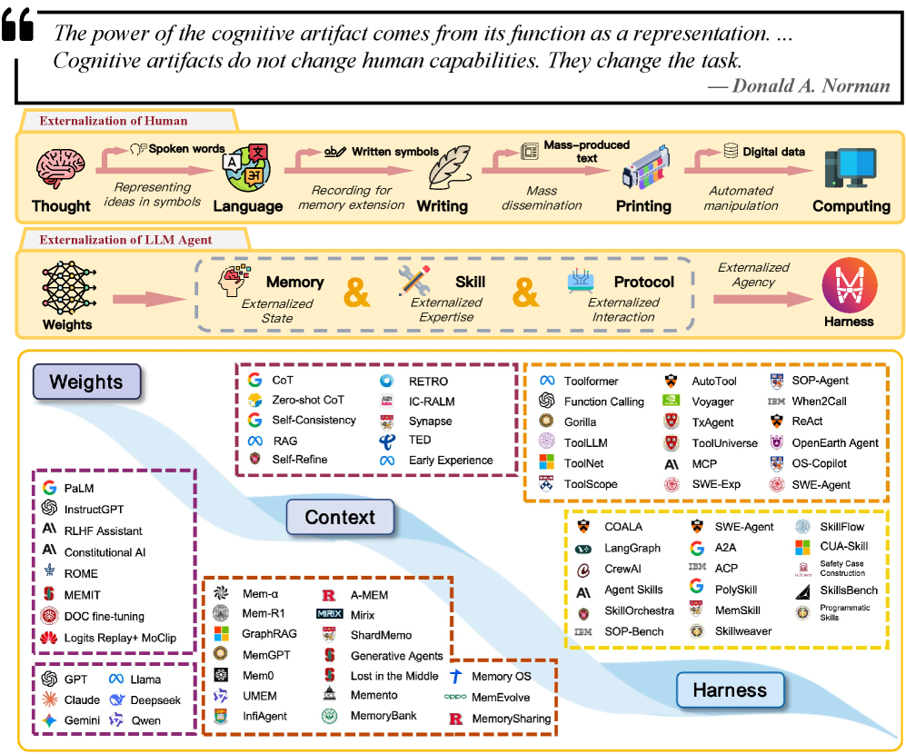
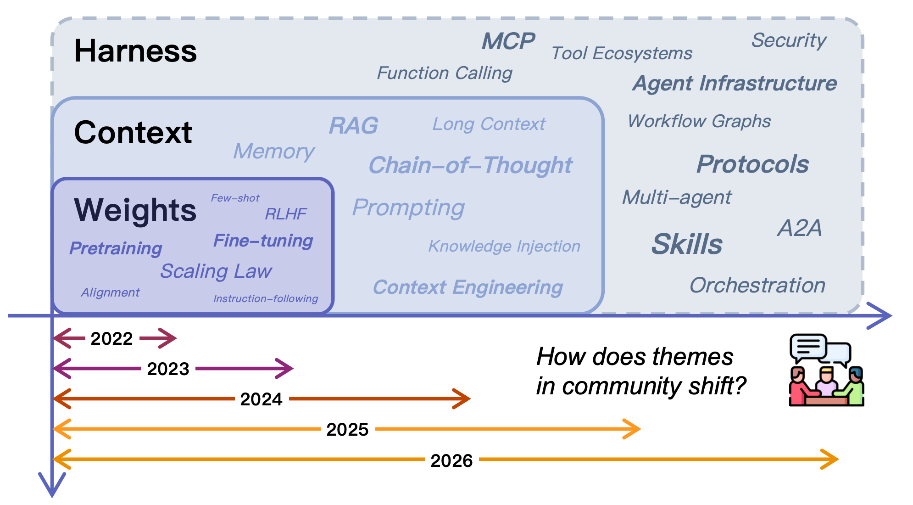
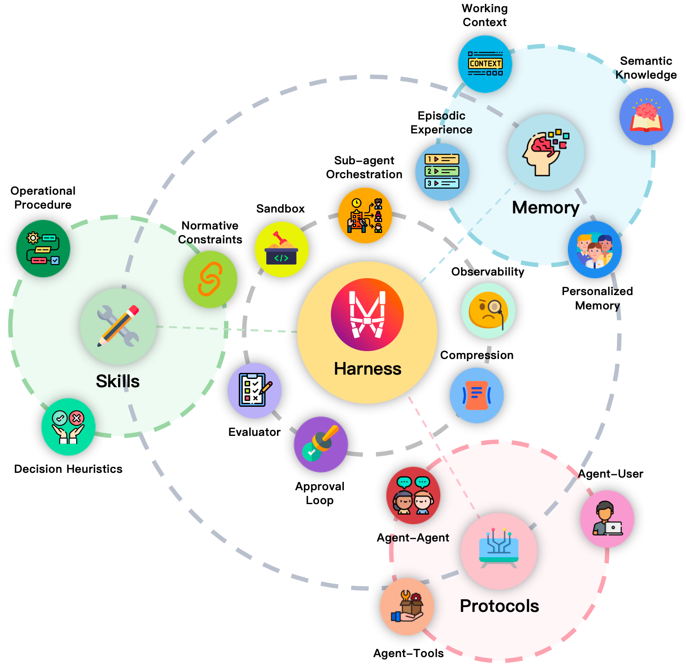
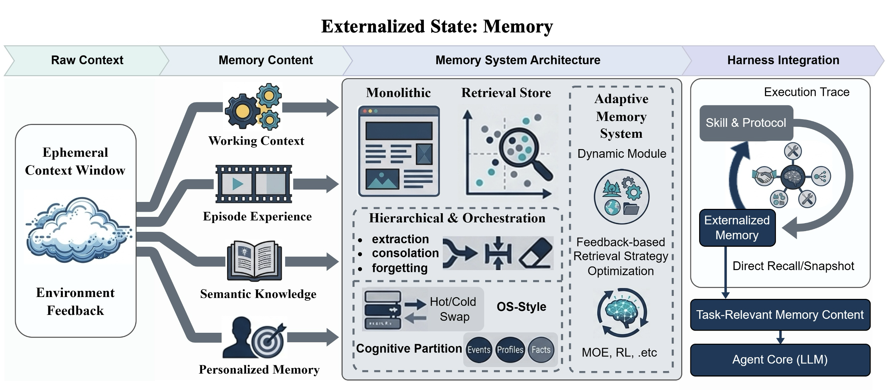
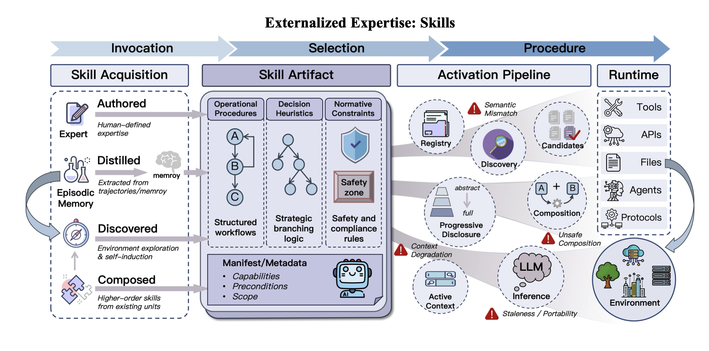
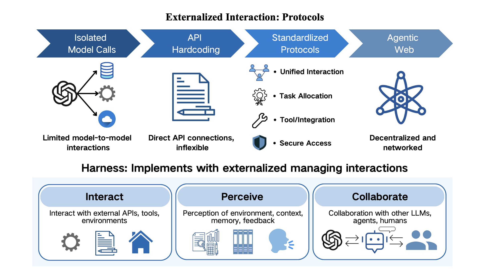
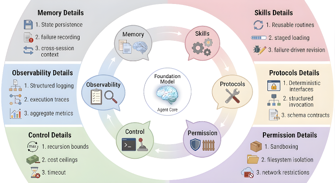
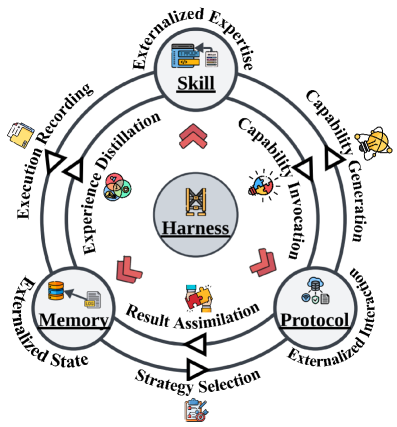

# LLM エージェントにおける外部化 — 記憶・スキル・プロトコル・ハーネス工学の統一的レビュー

> 原題: Externalization in LLM Agents: A Unified Review of Memory, Skills, Protocols and Harness Engineering
> 著者: Chenyu Zhou1, Huacan Chai1,\*, Wenteng Chen1,\*, Zihan Guo2,3,\*, Rong Shan1,\*, Yuanyi Song1,\*, Tianyi Xu1,\*, Yingxuan Yang1,\*, Aofan Yu1,\*, Weiming Zhang1,\*, Congming Zheng1,\*, Jiachen Zhu1,\*, Zeyu Zheng4, Zhuosheng Zhang1, Xingyu Lou5, Changwang Zhang5, Zhihui Fu5, Jun Wang5,†, Weiwen Liu1,†, Jianghao Lin1,†, Weinan Zhang1,3,†
> 所属: 1 上海交通大学 ・ 2 中山大学 ・ 3 上海创智学院（Shanghai Innovation Institute）・ 4 カーネギーメロン大学 ・ 5 OPPO（\* 同等貢献、† 連絡先著者）
> 出典: arXiv:2604.08224（2026-05-05 / ar5iv 版）

> **訳注（クリップの状態と復元）**
> - 底本は ar5iv 版の Web Clipper クリップ。**画像 8 枚・図キャプション 8 件（Figure 1〜8）・全 130 見出しはすべて残存**していた。原典に表は 1 つも存在せず、脚注も存在しない（本文中の `[^N]` はすべて**参考文献の参照番号**であり、末尾に 204 件の文献一覧として展開されている。既定どおり文献一覧は訳出しない）。
> - **欠落は 1 件**——**§3.2.3「Hierarchical Memory and Orchestration」の 2 項目の箇条書きが丸ごと**消えていた（クリップでは「Two design tendencies dominate this space:」の直後がいきなり次の見出しになっている）。既知の itemize 脱落パターンで、原ページから復元して該当位置へ挿入した（復元箇所は本文中に **［訳注: 復元］** と明記する）。
> - クリップ冒頭の著者・所属欄は LaTeX の `\author` マクロが崩れて `1\]Chenyu Zhou 1,\*\]Huacan Chai ...` という断片列になっていた。上記の著者・所属は原ページから復元したものである。
> - 画像は `raw/assets/2026-externalization/` にローカル保存し、そのパスを参照している。
> - 参考文献一覧と謝辞は既定どおり訳出しない。

---

###### Abstract（要旨）

大規模言語モデル（LLM）エージェントは、**モデルの重みを変えることによってよりも、その周囲のランタイムを再編成することによって構築されることがますます多くなっている。** 以前の系がモデルに内部で復元することを期待していた能力は、いまや**記憶ストア・再利用可能なスキル・相互作用のプロトコル・そしてこれらのモジュールを実践において信頼できるものにする周囲のハーネス**へと外部化されている。本稿はこの移行を***外部化（externalization）*** というレンズを通じてレビューする。**認知的人工物（cognitive artifacts）** の考えに依拠して、我々は次のように論じる——**エージェントのインフラが重要なのは、単に補助的な構成要素を付け加えるからではなく、困難な認知的負荷を、モデルがより確実に解ける形へと*変換する*からである。** この見方のもとで、**記憶は時間をまたいだ状態を外部化し、スキルは手続き的な専門性を外部化し、プロトコルは相互作用の構造を外部化し、そしてハーネス工学はそれらを統治された実行へと協調させる統一の層として働く。** 我々は**重み（weights）から文脈（context）へ、そしてハーネス（harness）へ**という歴史的な進行を辿り、記憶・スキル・プロトコルを 3 つの区別されるが結合した外部化の形態として分析し、それらがより大きなエージェント系の内側でどう相互作用するかを検討する。さらに、**パラメトリックな能力と外部化された能力のトレードオフ**を論じ、**自己進化するハーネス**や**共有されたエージェント・インフラ**といった立ち上がりつつある方向を同定し、**評価・統治・モデルと外部インフラの長期的な共進化**における未解決の課題を論じる。結果として得られるのは、**実践的なエージェントの進歩がなぜ、より強いモデルだけでなく、より良い外部の認知インフラにますます依存するのか**を説明する、システム水準の枠組みである。

## 1 Introduction（はじめに）

<figure>

<figcaption>図1: LLM エージェント設計の組織原理としての外部化。上段パネル: 思考から言語・書記・印刷・デジタル計算へと至る、人間の認知的外部化の弧。中段パネル: LLM エージェントにおける対応する外部化の弧——重みから、3 つの外部化次元（記憶＝外部化された状態、スキル＝外部化された専門性、プロトコル＝外部化された相互作用）を経て、それらを統一するハーネスへ。下段パネル: 代表的な研究を 3 つの能力層（Weights・Context・Harness）へ配置した文献地図で、研究の流れが漸進的に外側へ移動してきたさまを示す。2 つの弧の並行関係は再帰的な主張を符号化している——LLM エージェントは、人間の認知史を駆動してきたのと同じ表現の次元に沿って認知的負荷を外部化することによって、信頼できるエージェンシーを達成する。（訳注: 図の冒頭には Donald A. Norman の引用が掲げられている——"The power of the cognitive artifact comes from its function as a representation. ... Cognitive artifacts do not change human capabilities. They change the task."）</figcaption>
</figure>

人類文明の歴史は、**認知的外部化の歴史**としても読むことができる。話し言葉は私的な思考を共有可能な記号形式へ変えた。書記は知識を脆い生物学的な記憶から永続的な物質的記録へ移した。印刷は知識の複製を社会的な規模で機械化した。デジタル計算は算術と記号操作を神経の労働からプログラム可能な機械へ移転した。**これらの移行を通じて、決定的な変化は、人工物なしでは人間の能力が落ちるということではなかった。むしろ人工物は、選ばれた負荷を外側へ移し、限られた内的資源を計画・抽象化・創造性のために解放することによって、認知システムを再編成したのである** [^104]。同じ外向きの委譲のパターンが、いま機械知能の最前線において、大規模言語モデル・エージェントの設計の中で再来している。

この観点は**認知的人工物（cognitive artifacts）** [^103] [^104] という考えに自然な理論的な錨を持つ。**中心的な洞察は、外部の補助具は変わらない内的能力を単に増幅するのではなく、しばしばタスクそのものを変換するということである。買い物リストは生物学的な記憶容量を拡張しない。それは困難な想起の問題を*再認*の問題へ変える。地図は単にナビゲーションを「より強く」するのではない。それは隠れた空間的関係を可視の構造へ変換する。したがって人工物の力は*表現の変換*にある——それは問題を再構造化し、エージェントが既に持っている能力でより確実に解けるようにする** [^103]。

**我々は、同じ論理がいま LLM ベースのエージェントにおける最も帰結の大きい設計上の選択を統べていると論じる。我々の中心的な主張は、*外部化*——モデルの内的計算から、永続的で・検査可能で・再利用可能な外部構造へと認知的負荷を漸進的に移転すること——が、記憶・スキル・プロトコル・ハーネス工学における近年の進展を統一する*移行の論理*（それぞれのアーキテクチャ上の転換がなぜ起きたのか、そしてそれがどんな形の信頼性を保とうとしたのかを説明する機構）である、というものである。** これは単に工学上の便宜についての主張ではない。**それは信頼できるエージェンシーがどこから来るのかについての主張である——それはますます大きなモデルだけからではなく、内的能力と外部インフラが必要とされる能力の全範囲を共同で覆うように、タスクの要求を体系的に再構造化することから来る** [^103] [^133]。

図 1 が議論を要約している。上段パネルは人間の認知的外部化のよく知られた弧を辿り、中段パネルは LLM エージェントにおける対応する弧を——重みから、記憶・スキル・プロトコルという 3 つの外部化次元を経て、それらを統一するハーネスへと——提示し、下段パネルは結果として得られる文献地図を 3 つの能力層（Weights・Context・Harness）へ写像する。図 3 はこの見方を、外部化されたエージェントのアーキテクチャ的概観——ハーネスを中心に置き、3 つの外部化次元とその運用要素がその周りを回る——で補完する。**記憶は時間をまたいだ状態を外部化し、スキルは手続き的な専門性を外部化し、プロトコルは相互作用の構造を外部化する。** 2 つの弧の並行関係は再帰的な主張を符号化している——**LLM エージェント自身が、人間による最新の大規模な外部化であるデジタル計算の内側で作動する人工物なのである。** 共通の機構は Norman の意味での**表現の変換**である [^103]——**想起は再認になり、その場しのぎの生成は合成になり、場当たりの協調は構造化された契約になる。**

このレンズは現在の実践を理解するのに特に明晰である。**現代の進歩はしばしば、より大きなモデル・より良い訓練手続き・より洗練された推論トレースをめぐる競争として物語られる。それらの要因は重要だが、実践的な系で観測されるパターンを完全には説明しない。信頼性における最大の利得の多くは、基盤モデルを一切変えることから来ていない。それらはモデルの*周囲の環境*を変えることから来ている**——永続的な記憶を加え、再利用可能なスキルを組織し、ツールのインターフェースを標準化し、実行を制約し、振る舞いを計装し、明示的な制御ロジックを通じて仕事をルーティングすること [^133] [^142] [^80] [^94]。**実践において、問いはますます「モデルはどれだけ有能か」だけでなく、「モデルが毎回内部で解かなくて済むように、どんな負荷が外部化されたか」でもある。**

具体例が直観を固めるのに役立つ。大きなリポジトリで機能を実装し、テストを走らせ、プルリクエストを開くよう求められたソフトウェア工学のエージェントを考えよう。**外部化がなければ**、モデルはリポジトリの構造・プロジェクトの慣習・ワークフローの状態・ツールとの相互作用を、脆いプロンプトの内側に生かし続けなければならない。**外部化があれば**、永続的なプロジェクト記憶が文脈を供給し、再利用可能なスキル文書が慣習とワークフローを符号化し、プロトコル化されたツールのインターフェースが正しいスキーマを強制し、ハーネスがステップを順序づけ・出力を検証し・失敗を管理する。**基盤モデルは変わらないままでよい。変わるのは、それが解くよう求められるタスクの*表現*である。**

このより広い観点は、**分散認知（distributed cognition）と拡張された認知（extended cognition）** の背後にある直観とも整合する——記憶すること・行動を導くこと・相互作用を協調させることの決定的な部分がひとたび外部構造へ委譲されると、**知能はもはやモデルの中だけに局在しない** [^26]。我々はこの伝統から、その中核的な工学的洞察——**「エージェント」と「環境」の境界は、実際の性能上の帰結を持つ*設計上の選択*である**——を引き出すのであって、その強い存在論的な主張にコミットするわけではない。我々の焦点は実用的である——**我々は外部化を、結果として得られる系の信頼性・合成可能性・統治可能性によって価値が測られる設計原理として扱う。**

ここでハーネスを構成する 3 つの外部化の次元へ移る。それぞれが図 1（中段パネル）で強調された表現の変換の 1 つに対応する。

##### 記憶系は時間をまたいだ状態を外部化する。

コンテキストウィンドウを履歴の唯一の担い手として頼るのではなく、記憶系は蓄積された知識——ユーザーの選好・過去の軌跡・解消された曖昧さ・領域の事実——が単一のセッションを超えて永続し、関連するときに選択的に検索されることを可能にする。**中核的な変換は*想起から再認へ*である——エージェントはもはや過去の知識を潜在的な重みから再生成する必要がなく、永続的で検索可能なストアからそれを取得する** [^75] [^115] [^113] [^23] [^168]。

##### スキル系は手続き的な専門性を外部化する。

呼び出しのたびにタスク固有のノウハウを再生成することをモデルの重みに頼るのではなく、スキル系は手続き・ベストプラクティス・運用の指針を再利用可能な成果物へ**包装する**。**中核的な変換は*生成から合成へ*である——エージェントは各ステップを一から即興するのではなく、事前に検証された構成要素から振る舞いを組み立てる** [^107] [^129] [^140] [^5] [^6] [^63]。

##### プロトコルは相互作用の構造を外部化する。

ツール・サービス・他のエージェントとのプロンプト水準の場当たりな協調に頼るのではなく、プロトコルは**発見・呼び出し・委譲・権限管理のための明示的で機械可読な契約**を定義する。**中核的な変換は*場当たりから構造化へ*である——曖昧で脆い通信が、相互運用可能で統治可能な交換になる** [^3] [^50] [^38]。

**ハーネスは、これら 3 つの次元すべてをホストし、外部化された認知を実践において首尾一貫させるオーケストレーションの論理・制約・可観測性・フィードバックのループを提供する工学の層である。それは記憶・スキル・プロトコルと並ぶ第 4 の種類の外部化ではない。それは、これらの外部化の形態がその内側で作動し相互作用する*ランタイム環境*である。**

**これらの次元は孤立して進化するのではない。** 記憶の拡張は、乏しいコンテキストの予算をめぐってスキルのロードと競合しうる。プロトコルの標準化は相互運用性を改善する一方で、能力がどう包装され呼び出されるかを制約しうる。スキルの実行は後に記憶となるトレースを生成し、記憶の検索は次にどのスキルとプロトコルの経路が選ばれるかに影響しうる。**ハーネスはこれらの相互作用すべてを仲介しなければならない。** 我々はこれらのシステム水準の結合をここで予告し、§7 で詳細に分析する。

これらの方向はそれぞれ相当な技術的エコシステムを発展させてきた。記憶の研究は単純な検索拡張から、より選択的で階層化された記憶アーキテクチャへ進んだ [^75] [^113] [^23] [^168]。スキル関連の仕事は狭い function calling とツール学習から、再利用可能な能力パッケージ・レジストリ・段階的開示の機構へと拡がった [^107] [^129] [^140] [^5] [^6] [^63]。プロトコルの仕事はカスタムのツール・スキーマとフレームワーク固有の糊コードから、エージェント–ツールおよびエージェント–エージェントの相互作用のためのより標準化されたインターフェース層へ移った [^3] [^50] [^38]。既存のサーベイはこの地形の重要な断面を照らしている——検索拡張生成 [^43]、ディープサーチ [^162]、ツール学習と使用 [^123]、広範なエージェント・アーキテクチャ [^142] [^80] [^94]、プロトコルの相互運用性 [^38] である。**概念的に最も近い橋渡しは CoALA [^133] である。まだ不足しているのは、なぜこれらの発展が*外部化の形態として*収束しつつあるのか、そしてその収束がエージェントの定義をどう作り変えるのかについての共通の説明である。**

したがって我々の目標は、孤立したもう 1 つの構成要素水準のサーベイを提供することでも、エージェントの進歩を 1 つの特定の枠組みへ還元することでもない。代わりに我々は、**4 つの主張**を軸に組織されたシステム水準のレビューを提供する。

- **記憶系はエージェントの状態を時間をまたいで外部化し、長期ホライズンの継続性を選択的な検索へ変換する。**
- **スキル系は手続き的な専門性を外部化し、暗黙のノウハウを明示的で再利用可能な運用指針へ変換する。**
- **プロトコルは相互作用の構造を外部化し、曖昧な通信を相互運用可能で機械可読な契約へ変換する。**
- **ハーネス工学は、これらの外部化されたモジュールを、制約・可観測性・フィードバックループ・制御点を備えた首尾一貫したランタイム環境へ統一する。**

本稿の残りは次のように進む。§2 は重みから文脈へ、そしてハーネスへの歴史的な道筋を辿る。§3 から §5 は記憶・スキル・プロトコルを 3 つの区別されるが相補的な外部化の形態として分析する。§6 はハーネス工学を外部化されたエージェント設計の統合的な規律として提示し、§7 はモジュール間の主要な横断的相互作用を検討する。§8 はより適応的で自己進化する外部化の形態へ向けた将来の方向を論じ、§9 はエージェント研究にとってのより広い含意で結ぶ。

## 2 Background: From Weights to Context to Harness（背景——重みから文脈へ、そしてハーネスへ）

<figure>

<figcaption>図2: 3 つの能力層にわたるコミュニティのテーマの進化。積み重ねられた層（Weights・Context・Harness）は、LLM エージェント・コミュニティの重心が時間とともにどう外側へ移動してきたか——パラメトリックな知識とプロンプティングから、ツールのエコシステム・プロトコル・スキル・マルチエージェントのオーケストレーションといったハーネス水準のインフラへ——を示す。</figcaption>
</figure>

**LLM エージェントの近年の歴史は、モデルそのものから外側へ向かう漸進的な移動として理解できる。能力ははじめ重みの性質として扱われ、次にプロンプトとコンテキストウィンドウの性質として扱われ、いまやモデルが作動するより広いインフラの性質としてますます扱われるようになっている。** 図 2 はこの軌跡を、2022 年から 2026 年へ展開するタイムラインにまたがる 3 つの積層（Weights・Context・Harness）として可視化する。図 1 の下段パネルは、代表的な仕事を 3 層へ写像する文献地図でその見方を補完する。**これらの段階は相互排他的というより層状である**——最もインフラ重視の系においても重みは重要であり続ける——**が、各段階は開発者が系の*可変な知能*をどこに置くか、したがってどこに最も工学的努力を投じるかを変える。**

### 2.1 Capability in Weights（重みの中の能力）

図 2 と図 1 の **Weights 層**は、能力がほぼ完全にモデルのパラメータと同一視されていた、現代の LLM 配備の最初期の波に対応する。大規模なコーパスでの事前学習が、広範な統計的規則性・世界知識・潜在的な推論の習慣を重みへ圧縮した [^12] [^25] [^138]。**スケーリング則**がパラメータ数・データ量・損失の間の予測可能な関係を明らかにし、**進歩はモデルサイズに直接追随するという直観を強化した** [^66] [^55]。GPT-4 [^108]・Gemini [^44]・DeepSeek-V3 [^31]・Qwen2.5 [^124] のような系が広範なマルチタスクの能力を実証する頃には、**この分野の多くにおける支配的な物語は、より良いエージェントをより大きく・より良く訓練されたモデルと同一視していた。** 教師ありファインチューニングと選好最適化がこれらのモデルを、指示追従・会話のスタイル・拒否の振る舞い・領域固有の慣習を教えることでより有用なアシスタントへ形作った [^112] [^8]。直接選好最適化（DPO）は、別個の報酬モデルを不要にすることでこの整合の段階をさらに単純化した [^125]。**この観点からは、改善とはおおむねモデルそのものを変更するか置き換えることを意味した。**

このパラダイムは依然として基礎的であり、重み空間の能力にはいくつかの利点がある——**外部の参照なしの高速な推論、コンパクトな配備、タスク固有の配管なしで多くのタスクにまたがる強い汎化**である。医学の質問に答えるのと同じモデルが、周囲の系を一切変えることなく、詩を書き、プログラムをデバッグし、法的契約を要約できる。**一発で完結し文脈が自己完結したタスクについては、重み中心の見方はしばしば十分である。**

**しかし重み空間の符号化は、知識・手続き・方針を静的な成果物へ密結合させすぎもする。** 単一の事実——たとえばある国の現在の元首——を更新するには、再訓練・知識編集 [^97] [^99] [^178]・追加の整合層によるパッチが必要で、いずれも他の能力への意図しない副作用のリスクを伴う。**モデルがなぜそう振る舞ったのかを監査するのは難しい。関連する知識が検査可能なモジュールとしてではなく数十億のパラメータにわたって分散しているからである** [^192]。パーソナライゼーションも扱いにくい——**単一の重みの集合が、異なる履歴・選好・制約を持つ数百万のユーザーに仕えることを求められるのに、パラメータ水準でそれらを区別する機構を持たない。**

**パラメトリックな知識の中心的な限界は、選択的に更新し・合成し・統治することが難しい点にある。** エージェントが単一ターンの質問応答に限られていた間は、これらの弱点はしばしば管理可能だった。**系が長期ホライズンのタスク実行——状態が蓄積し、手続きが確実に守られなければならず、複数のツールが協調されなければならない——へ移るにつれ、知識・スキル・相互作用のルールを重みの内側でモジュール的に管理することの困難が、運用上より顕在化した。** この移行が開発者に、モデルのパラメータだけに頼るのではなく、これらの負荷の一部を次の層へ移転することを促した。

<figure>

<figcaption>図3: ハーネスを備えた LLM エージェントの外部化アーキテクチャ。ハーネスが中心に位置し、3 つの外部化次元——記憶（作業文脈・意味的知識・エピソード的経験・パーソナライズされた記憶）、スキル（運用手順・判断ヒューリスティクス・規範的制約）、プロトコル（エージェント–ユーザー・エージェント–エージェント・エージェント–ツール）——がその周りを回る。サンドボックス化・可観測性・圧縮・評価・承認ループ・サブエージェントのオーケストレーションといった運用要素が、ハーネスの中核と外部化されたモジュールの間の相互作用を仲介する。</figcaption>
</figure>

### 2.2 Capability in Context（文脈の中の能力）

**Context 層**は、注目がモデルの変更から入力の設計へ移った段階を表す。プロンプト工学は、**重みに触れることなくモデルの振る舞いを実質的に変えられる**ことを実証した——few-shot の例・役割の記述・chain-of-thought による分解・self-consistency のトレースはいずれも、同じモデルが同じ背後のタスクでどう振る舞うかを変えた [^155] [^147] [^69]。より構造化された推論のための技法がすぐに続いた。**ReAct** は推論のトレースとツールの行動を単一の生成ループの中で交互に行い、**アーキテクチャを一切変えずにプロンプティングだけでエージェント的な振る舞いを生み出せる**ことを示した [^176]。**Tree of Thoughts** は chain-of-thought を中間の推論状態の上の熟慮的な探索へ一般化した [^177]。**Self-Refine** は反復的な自己批評を導入し、モデルが多ターンのプロンプティングのループを通じて自身の出力を改善できることを実証した [^95]。自動プロンプト最適化はモデル自身を使ってプロンプト空間を探索させることで手作業の負担をさらに減らした [^200] [^120]。**検索拡張生成（RAG）** は、クエリ時に外部文書を動的に文脈へ注入することで、より体系的な外部化の形を導入した [^75] [^10] [^126] [^43]。**こうして注目は、モデルが何を内在化したかから、各呼び出しを取り巻く情報のパイプラインへ移った。**

この段階はエージェント設計を実質的により柔軟にした。開発者は勾配更新なしに、実行時に局所的な指示・領域知識・出力スキーマ・検索された証拠を取り付けられるようになった。**文脈は、開発者がモデルのために認知を*演出する*媒体になった——モデルがそれを必要とする直前に、正しい情報を組み立てられる作業面である。** 多くの実践的な系で、プロンプトと検索パイプラインの反復はファインチューニングより実質的に安く速いことが判明した。**モデルは凍結したまま、周囲のプロンプト・テンプレート・検索ロジック・ツール仕様が急速に進化しえた。**

**文脈中心の段階は Norman の表現の変換という概念を通じても解釈できる。困難な想起の問題——「モデルは事実 $X$ を知っているか?」——が再認の問題へ変換された——「事実 $X$ が文脈に置かれたとして、モデルはそれを使えるか?」** これは人間の外部化の弧における書記に伴う「想起から再認へ」の転換に似ている（図 1 上段パネル）。**モデルは答えを暗記している必要がなかった。ひとたび与えられたなら、関連する一節を再認して適用しさえすればよかった。** 図 2 では、この移行は Context 層におけるプロンプティング・RAG・chain-of-thought と関連技法の出現に対応する [^189] [^126]。

**文脈中心の設計にも重要な制約がある。** コンテキストウィンドウは有限で、規模においてはコストがかかり、周辺的にしか関連しない材料で過負荷になるとしばしばノイズになる。**長いプロンプトは性能を改善するどころか劣化させうる——「lost in the middle」現象は、モデルが長い入力にわたって不均一に注意を向け、文脈の中央に置かれた情報の検索精度が急落することを示している** [^89]。コンテキスト長が劇的に拡大しても——2K トークンから 100K 超へ [^18] [^118]——**根本的な緊張は残る: 容量が増えても選択的な整備の必要はなくならない。** 文脈はまた**一時的**である——状態が明示的に他所へ外部化されない限り、**すべての新しいセッションは部分的な健忘とともに始まる**。系がより複雑になるにつれ、プロンプトの組み立てだけでは脆く場当たりな制御機構になりうる。**モデルにより多くの指示を与えることはできるが、それは系が、セッションをまたいで状態を永続化し・多段のワークフローをスケジュールし・サブエージェント間を協調させ・部分的な失敗から回復し・時間をまたいで振る舞いの制約を強制する方法を知っていることを意味しない。** これらの限界が次の外向きの一歩を説明する助けになる。

### 2.3 Capability through Infrastructure（インフラを通じた能力）

**Harness 層**——図 2 の最上段の帯、図 1（下段パネル）の最右の領域——は、**能力がプロンプトの管理を超えて永続的なインフラへ拡がる現在の段階**を表す。**コンテキストウィンドウが飽和しプロンプト・テンプレートが扱いにくくなるにつれ、工学的な注目は「モデルに何を伝えるべきか?」から「モデルはどんな環境の中で作動すべきか?」へとますます移った。** 成熟したエージェント系では、信頼性はますます**外部の記憶ストア・ツールのレジストリ・プロトコルの定義・サンドボックス・サブエージェントのオーケストレーション・圧縮のパイプライン・評価器・テストのハーネス・承認のループ**に依存する [^142] [^80] [^94] [^163]。

この移行の最初期の現れは単純だが示唆的だった。**Auto-GPT** [^127] や **BabyAGI** [^100] のようなプロジェクトは、LLM をタスクキュー・永続的な記憶・Web アクセスを備えたループで包み、**最小限のハーネスでさえ、どんな単一のプロンプトも維持できない振る舞いを持続させられる**ことを示した。より原理的なフレームワークがすぐに続いた——**AutoGen** はマルチエージェントのメッセージ交換を形式化し [^157]、**MetaGPT** は役割にもとづく協働と明示的な手続きを加え [^56]、**CAMEL** はタスク分解のための構造化された対話を探究し [^76]、**Reflexion** はエピソードをまたいでフィードバックを永続化した [^130]。**これらの系にわたる共通の動きは、負荷をモデルから外へ、周囲の構造へ移すことだった。**

**同じ動きがいま配備の各領域にわたって可視である。** コーディングエージェントはモデルを、ファイル・シェル・バージョン管理・テスト・再利用可能なスキル成果物を備えた開発ハーネスの中へ埋め込む。SWE-agent と OpenHands が代表例である [^172] [^148]。研究とエンタープライズのエージェントは、Deep Research 型の系のように、検索・承認・ブラウジング・長期ホライズンのオーケストレーションのパイプラインを加える [^110] [^46]。Voyager・LangGraph・CrewAI・OS-Copilot のような身体化系とワークフロー系も同様に、制御フロー・環境へのアクセス・再利用を明示的にする [^140] [^71] [^29] [^159]。**反復するパターンは、信頼性の問題がますます、プロンプティングだけによってではなく*環境を変えること*によって解かれる、というものである。**

図 3 に示すとおり、**ハーネスは 3 つの主要な外部化のクラス——記憶・スキル・プロトコル——を包含し、それらはハーネスが吸収する 3 つの主要な負荷のクラスに対応する。記憶系は時間をまたいだ状態を外部化し、継続性が一時的な文脈に依存しないようにする。スキル系は手続き的な専門性を外部化し、複雑なワークフローが再発明されるのではなくロードされるようにする。プロトコルは相互作用の構造を外部化し、ツールとエージェントの協調が場当たりのプロンプティングではなく統治された契約に従うようにする。これらの要素が合わさってハーネスをなす——モデルを包み込み、それが直面するタスクを、その内的能力がより確実に扱える形へ変換する永続的なインフラである。**

**この枠づけのもとで、「エージェント工学」はますます「ハーネス工学」の形を取る。モデルは中核の推論エンジンであり続けるが、もはや知能の唯一の所在地ではない。能力は、モデルが何を見・何を覚え・何を呼び・何を許されるかを形作る構造にわたって分散されている。**

### 2.4 Externalization as the Transition Logic（移行の論理としての外部化）

**総じて、重みから文脈へ、そしてハーネスへの道筋は、Norman の意味での外部化の物語である** [^103]——**モデルの内側で管理するのが難しい負荷が漸進的にその外側の明示的な成果物へ移され、モデルが見るタスクがそれに応じて変換される。** 可変な知識は重みから検索系とランタイムの文脈へ移り、**想起を再認へ**変える。再利用可能な手続きは暗黙の習慣から明示的なスキルへ移り、**即興的な生成を構造化された合成へ**変える。相互作用のルールは場当たりのプロンプティングからプロトコルへ移り、**曖昧な協調を統治された契約へ**変える。ランタイムの信頼性は今度はハーネスのロジックへ移り、そこで制約・可観測性・フィードバックのループが明示的にされうる。

**この再分配は*ミスマッチへの応答*として理解するのが最もよい。LLM は柔軟な統合と、与えられた情報の上での推論には強いが、安定した長期記憶・手続きの再現性・外部の系との統治された相互作用については相対的に信頼できない。したがって外部化は、モデルを置き換えるのではなくその周りにより大きな認知システムを構築する**——CoALA [^133] のような認知アーキテクチャの説明と整合する見方である。**3 つのハーネス次元はこの枠づけから直接に従う——記憶は時間をまたいだ継続性に、スキルは手続きの一貫性に、プロトコルは相互作用の構造に対処する。** 以下の各節がそれぞれを詳細に検討する。

## 3 Externalized State: Memory（外部化された状態——記憶）

**記憶の外部化はエージェンシーの*時間的な*負荷に対処する。** 素の言語モデルは、継続性・過去の経験・ユーザー固有の事実・部分的に完了した仕事を、一時的なプロンプトの内側に抱えなければならない。**タスクがセッション・分岐・中断をまたいで伸びると、その負荷は不安定にもコスト高にもなる。記憶はそれを、モデルの外側で書き・更新し・取得できる永続的な状態へ外部化する。**

**ハーネスを備えたエージェントにおいて、記憶は単なる書庫以上のものである。** それは**再開可能な実行のためのチェックポイント**、スキルを蒸留できる**トレース**、プロトコルのルーティングに影響する**統計**、統治の機構が検査し制約できる**永続的な状態**を供給する。その役割を精密にするため、本節は 3 つの結びついた問いを立てる——記憶は何の負荷を外部化するのか、設計空間はどう進化したのか、記憶はより広いハーネスとどう結合するのか。§3.1 はどの種類の状態が外部化されるのかを明確にし、§3.2 は主要なアーキテクチャ上の選択を概観し、§3.3 はハーネスを備えたエージェント系が課す要求へ向かい、§3.4 は認知的人工物のレンズを通じて記憶を解釈して本章を結ぶ。

<figure>

<figcaption>図4: 外部化された状態としての記憶。一時的なコンテキストウィンドウと環境のフィードバックからの生の文脈が、4 つの永続的な記憶次元——作業文脈・エピソード的経験・意味的知識・パーソナライズされた記憶——へ変換される。これらの次元は、漸進的により管理されたアーキテクチャ——モノリシックな文脈、検索ストア、階層的なオーケストレーション（抽出・統合・忘却・OS 形式のホット／コールドのスワップを伴う）、適応的な記憶系（動的モジュールと MoE・RL 等によるフィードバックにもとづく戦略最適化を伴う）——を通じて組織される。ハーネス側では、スキルとプロトコルからの実行トレースが外部化された記憶へ流れ込み、記憶は今度は直接の想起と整備されたスナップショットを通じて、タスクに関連する内容をエージェントの中核へ供給し返す。</figcaption>
</figure>

### 3.1 What Is Externalized: The Content of State（何が外部化されるか——状態の内容）

**記憶の本質は、エージェントの時間をまたいだ状態を、その一時的な文脈から*切り離す*ことにある。** 関連する内容はハーネス内のあらゆる外部成果物ではなく、**継続性を保存する記録**である——現在のタスクの状態、過去の実行の経験、抽象化された知識、永続的なユーザーまたは環境の文脈。長期ホライズンの相互作用にわたって首尾一貫した振る舞いを維持するには、記憶系はこれらの記録を**時間的な性質と検索の必要**に応じて分類し管理しなければならない。人間の記憶の古典的な分類法から着想を得つつ LLM エージェントへ適応させて、我々は外部化された状態の次の**4 つの次元**を区別する。

##### 作業文脈（Working context）。

作業文脈は現在のタスクの**生きた中間状態**である——開いているファイル、一時変数、能動的な仮説、部分的な計画、実行のチェックポイント。**それは急速に変化し、古びると価値を失うが、外部化されなければコンテキストウィンドウがリセットされるかプロセスが中断された瞬間に消える。** コーディングエージェントがこの点をよく例示する。**下書き・端末の状態・ワークスペースの成果物をプロンプトの外側に実体化することで、OpenHands や SWE 形式のエージェントのような系は、一から再構成するのではなく現在の作動状態から再開できる** [^149] [^173]。

##### エピソード的経験（Episodic experience）。

エピソード的経験は、過去の実行で**何が起きたか**を記録する——決定点、ツール呼び出し、失敗、結果、反省。**その価値は単に書庫的なものではない。** 検索されたエピソードは具体的な先例として働き、既知の誤りの繰り返しを避ける助けになり、後の抽象化のための原材料を供給しうる。**Reflexion** は失敗した試行からの反省的な要約を再利用可能な経験として保存することでこのパターンを明示的にした [^130]。**AriGraph** はこの考えをさらに拡張し、**不慣れな環境における局所的な相互作用の軌跡をエピソード的記憶として扱い、そこからより広い世界モデルを構築できるようにする** [^2]。

##### 意味的知識（Semantic knowledge）。

意味的知識は、**どの単一のエピソードよりも長く生き残る抽象**を保存する——領域の事実、一般的なヒューリスティクス、プロジェクトの慣習、安定した世界知識。エピソード的記憶と異なり、それは特定の時と場所を軸に組織されていない [^78] [^30]。**違いは粒度だけでなく機能にもある——エピソード的記憶はある事例で何が起きたかを語り、意味的記憶は事例をまたいで何が成り立つ傾向にあるかを語る。** 現在の系では、知識ベースと RAG のコーパスが外部化された意味的記憶の最も一般的な形である。**より長期の傾向はより野心的である——エージェントは、静的な人間執筆の文書だけに頼るのではなく、蓄積された軌跡から意味的な指針を蒸留しようとますます試みている。**

##### パーソナライズされた記憶（Personalized memory）。

パーソナライズされた記憶は、特定のユーザー・チーム・環境についての安定した情報を追跡する——選好、習慣、反復する制約、過去の相互作用。**この状態はエージェントの一般的な自己改善のストアへ畳み込まれるべきではない。ユーザー固有のトレースは異なる保持・検索・プライバシーの規則に従うからである** [^161] [^84]。近年の系はこの分離を明示的にしている——**IFRAgent** はモバイル環境での実演からユーザーの習慣のリポジトリを構築し [^160]、Web エージェントは外部化されたプロファイルを使って暗黙の選好を推論し [^13]、**VARS** のような会話系はセッションをまたいだ選好カードを隔離されたユーザー記憶空間に保存する [^53]。**したがってパーソナライズされた記憶は、長期のユーザー・モデリングと一般的なタスク知識を混同することなく、エージェントが時間をかけて適応することを可能にする層である。**

**これら 4 層は、後にエージェントにとって有用になりうるすべてを尽くすわけではない。** 反復する手続き的な規則性は、まずエピソード的なトレースの中のパターンとして現れうるが、**ハーネスがそれを明示的な再利用可能な指針へ昇格させた時点で、それはもはや記憶そのものではなくなる。その時点でそれは記憶の層ではなくスキルの層に属する。**

**総じて、これらの層は、記憶が単一の均質なデータベースではなく、複数の抽象水準における*継続性の時間的負荷*を外部化することを示している。** 作業文脈は即座の再開を支え、エピソード的な記録は反省と回復を支え、意味的記憶は抽象化と転移を支え、パーソナライズされた記憶はセッションをまたいだユーザーと環境への適応を支える。**ハーネスはこれらのストアを別々に扱わなければならない。それぞれが、モデルがさもなければ内部で復元しなければならないものの、異なる部分を変えるからである。**

### 3.2 How It Is Externalized: Memory Architectures（どう外部化されるか——記憶のアーキテクチャ）

これらの層が外部化されると、主要な設計上の問いは、**能動的な推論と保存された状態をどれだけ積極的に分離するか**になる。[^33] の分類法に従うと、現在の系は 4 つの広いアーキテクチャ・パラダイム——**モノリシックな文脈、検索ストアつきの文脈、階層的な記憶とオーケストレーション、適応的な記憶系**——として読める。**この進行はより大きなストアへ向かうだけではない。それは、何が書かれ・昇格され・検索され・圧縮され・忘却されるかについての、より明示的な*方針*へ向かうものである。**

#### 3.2.1 Monolithic Context（モノリシックな文脈）

初期の系は**モノリシックな文脈**に依拠した——関連するすべての履歴、あるいはその要約が、直接プロンプトの中に留まる。**この設計は透明でプロトタイプが容易である。別個の記憶サービスが不要だからで、短いタスクでは驚くほどうまく機能しうる。その限界は構造的である。容量のスケールが悪く、要約はドリフトし、モデルは乏しいトークンを、履歴を運ぶことと現在のステップを解くことの両方に費やさなければならない。最も重要なことに、状態はセッションとともに消えるので、エージェントは耐久的な経験を蓄積しない。**

#### 3.2.2 Context with Retrieval Storage（検索ストアつきの文脈）

支配的な次の一歩は、**近い将来の作業状態だけを文脈に保ち、より長期ホライズンのトレースを外部に保存して要求に応じて検索する**ことである。この「文脈＋検索ストア」のパターンが、本番のコパイロット・アシスタント・コーディングエージェントにおけるほとんどの実践的な記憶系の基礎にある。**それは生の容量の問題を解くが、記憶の品質を*検索の問題*へ変える。誤った記録が浮上すればモデルは気を散らされ、正しい記録が見逃されれば、系は最初から何も覚えていなかったかのように振る舞う。**

近年の仕事はこのボトルネックを複数の方向から攻める。**GraphRAG** [^35] はグラフ構造とコミュニティ水準の検索を加え、**ENGRAM** [^22] は記憶を潜在的な状態表現へ圧縮し、**SYNAPSE** [^197] は統一されたエピソード–意味グラフの上の活性拡散（spreading activation）を使ってより局所的でない形の関連性を回復する。**これらのアプローチは機構は異なるが、同じ目標を共有する——平坦な類似度検索を、長期ホライズンの推論によりよく合致した表現で置き換えることである。**

#### 3.2.3 Hierarchical Memory and Orchestration（階層的な記憶とオーケストレーション）

平坦な検索が不十分だと判明すると、系は**階層的な記憶とオーケストレーション**へ移る。**鍵となる考えは、すべてのトレースが同じ保持の方針や検索の経路に値するわけではない、というものである。** Mem0 [^23]・Memory-R1 [^171]・Mem-$\alpha$ [^152] のような枠組みは**抽出・統合・忘却**のための明示的な操作を導入し、記憶を受動的なストアではなく**管理されたライフサイクル**へ変える。この空間では 2 つの設計の傾向が支配的である。

［訳注: 以下 2 項目はクリップで欠落していたため原ページから復元した。］

- **時空間的な次元における資源の分離（Resource decoupling in spatio-temporal dimensions）。** 一方の系統はオペレーティングシステムの論理を借り、**記憶を能動的に管理されなければならない制約された資源として扱う。MemGPT** [^115] と **MemoryOS** [^63] は、**熱い作業状態を冷たいロングテールのストレージから分離し、タスクの要求が変わるにつれて情報を階層をまたいでスワップする。利得は、固定のコンテキスト予算のもとでの実効容量の向上である。**
- **認知的機能の次元における意味の分離（Semantic decoupling in cognitive functional dimensions）。** もう一方の系統は**記憶を機能あるいは内容の型によって組織し、異種の記録がすべて同じチャネルを通ってルーティングされないようにする。MemoryBank** [^198] と **MIRIX** [^154] は**イベント・ユーザープロファイル・世界知識を分離**し、**MemOS** [^78] は**明示的な記憶と暗黙の記憶を区別**し、**xMemory** [^59] は**トピック–イベントの階層**を構築する。**目標は単にきれいな分類法ではなく、複雑なタスク条件のもとでのより精密な検索である。**

#### 3.2.4 Adaptive Memory Systems（適応的な記憶系）

上記のアーキテクチャはなお人間が設計したヒューリスティクスに大きく依拠している。**適応的な記憶系はさらに進み、モジュール・ルーティングの決定・検索の戦略を経験に応答するものにする。** 特に 2 つの方向が目に見える。

- **動的モジュール（Dynamic modules）。** 一部の系は**アーキテクチャそのものをランタイムに適応させる**。**MemEvolve** [^184] は記憶のライフサイクルを、実行中に独立に進化しうる**符号化・保存・検索・管理**の別個のモジュールへ分解する。**MemVerse** [^87] は短期キャッシュとマルチモーダルな知識グラフを維持しつつ、**断片化された経験を定期的により抽象的な知識と軽量な神経的構成要素へ蒸留する**。
- **フィードバックにもとづく戦略最適化（Feedback-based strategy optimization）。** 他の系はアーキテクチャを比較的固定したまま、**より良い制御の方策を学習する**。**MemRL** [^188] は**ノンパラメトリックな強化学習**を通じて検索の振る舞いを更新する。[^190] が提案する適応的な枠組みは **mixture-of-experts のゲーティング**を使ってクエリを動的にルーティングし、**GAM** [^170] は複数ラウンドの相互作用にわたって検索の条件を洗練する。

**これらの段階にわたる主要な移行は、*保存から制御へ*である。モノリシックな文脈は「存在」を解き、検索ストアは「容量」を解き、階層的な系は「組織」を解き、適応的な系は「方針」を解き始める。したがって記憶はプロンプティングへの受動的な付録であることをやめる。成熟したエージェントにおいては、それは*モデルがどの過去に対して実効的に行動できるかを決めるハーネスの制御面*の一部になる。**

### 3.3 Memory Demands of the Harness Eras（ハーネス時代の記憶への要求）

**エージェントがハーネス時代へ進化するにつれ、記憶系はもはや孤立したストレージのモジュールではない。代わりにそれは、ランタイムが継続性・手続きの再利用・統治された相互作用を協調させる*基盤*になる。問いはもはや、どうやってより多くの情報を保存するかだけではなく、どうやって時間的な状態を計画・実行・回復のループにとって選択的に*読み取り可能*にするかである。**

**したがってハーネス環境は、記憶系が状態を文脈から明示的に分離することを要求する。** 極端に長い時間ホライズンのタスクでは、セッション履歴の無制限な蓄積がモデルに注意機構の見失いを引き起こしうる。**InfiAgent** [^181] のような枠組みは**ファイル中心の状態抽象**を提案し、**ファイルシステムをタスク状態の唯一の権威ある記録**とすることを主張する——高水準の計画から中間変数・ツールの出力に至るまで、すべてがリアルタイムに書き込まれなければならない。**各決定ステップで、エージェントはもはや長大な履歴を読まず、代わりにワークスペースの整備されたスナップショットと少数の最近の行動を読む。これは記憶の中核的な表現上の役割のハーネス水準での表現である——全履歴をプロンプトに保存するのではなく、現在の状態をモデルが行動できる形で実体化することである。**

**記憶はスキル系とも統合されなければならないが、2 つの層は異なる役割を果たす。記憶は過去の実行の*証拠*——トレース・結果・失敗・ユーザーあるいはタスク固有の文脈——を保存する。スキルは、その証拠の一部が明示的で再利用可能な手続きへ*昇格された*ときにのみ始まる。逆方向では、すべてのスキル実行が新しいトレースを生み、それが記憶へ書き戻されなければならない。したがって記憶はそれ自体が手続き的な指針なのではない。それは、そうした指針が後に導出されうる証拠の基盤である。**

**プロトコルとの結合はさらなる要求を課す。** ツールの結果・承認・委譲のイベント・外部の状態遷移はプロトコル化されたインターフェースを通じて到着しうるが、**それらが記憶になるのは、正規化されて永続的な状態へ書き込まれた後のみである。** 逆に、記憶の検索は次にどのプロトコルの経路が選ばれるべきかに影響しうる。**成熟したハーネスでは、記憶とプロトコルは統治された読み書きのループで結ばれるが、概念的には区別されたままである——プロトコルは*交換*を統べ、記憶は*時間をまたいだ永続*を統べる。**

最後に、**複数のエージェントが共通の外部化された状態に依拠するようになると、共有と統治の機構が必須になる。** 記憶に対する読み書きの権限を確立すること、保存された事実の間の衝突を解決すること、共有知識への各エージェントのアクセス割り当てを制御すること——これらはすべて**オペレーティングシステムに匹敵する低水準の制御能力**を要する。**したがってハーネス時代の記憶は*管理された状態インフラ*として理解するのが最もよい——それは時間的な負荷を外部化し、モデルが内部で覚えていなければならないものを作り変え、ハーネスの残りがその上で作動する永続的な基盤を提供する。**

### 3.4 Memory as Cognitive Artifact（認知的人工物としての記憶）

前節までは記憶系の内容・アーキテクチャ・ハーネス統合を概観した。本節は一歩下がって、**記憶の外部化が*表現の変換*として何を達成するのか**を、Norman の認知的人工物の理論 [^104] と Kirsh の**相補的戦略（complementary strategies）** の説明 [^68] に依拠して解釈する。

**現代の LLM は状態を持たない生成器である——各呼び出しは新鮮な文脈で始まるので、継続性は運び越されるのではなく再構成されなければならない。** 短い相互作用ではこの限界はプロンプトの内側に隠せる。**長期ホライズンの仕事ではそれは構造的になる。** 過去の試行・部分的に完了した仕事・ユーザー固有の事実・環境の状態は、コストとドリフトと最終的な切り詰めなしにすべてを文脈に生かしておくことはできない。**したがって有界なモデルが直面する元のタスクは原理的に扱いえない——事実上無限の履歴を利用可能に保ちつつ、なお現在について明晰に推論せよ、というものだからである。**

**記憶の外部化はそのタスクの構造を変える。Norman の言葉では、表現の変換は*内的な想起の問題*を*外的な再認と検索の問題*へ変換する。モデルはもはや関連する履歴をパラメータから復元する必要がない。記憶系が既に浮上させた、整備された履歴のスライスを再認して使えばよい。** これは、外部のリストが記憶することの性質をどう変えるかについての Norman の分析と密接に類比的である——**決定的な点は、追加の情報が加わったことではなく、認知的タスクの*形式そのもの*が再編成されたことである** [^103]。同じ転換は §2.2 で文脈の水準で同定された。**記憶はそれを、どの単一のコンテキストウィンドウも跨げないセッションと時間ホライズンにわたって拡張する。**

**この解釈は、なぜ検索の質が生の保存容量より重要なのかを明確にする。膨大なストレージを持つが検索が弱い系は、なお誤った問題表現をモデルへ提示している——履歴は存在するが、タスクは変換されていない。対照的に、控えめなストアでも強いインデクシング・要約・文脈的な選択を備えていれば、下流の推論を著しく容易にしうる。したがって記憶の成功基準は「どれだけ保存したか」ではなく「*現在の決定を読み取り可能にしたか*」である。**

同じ観点は Kirsh の**相補的戦略**の概念も照らす。それによれば、**エージェントは内部でより強く考えることによってだけでなく、外部環境を再組織して認知的仕事の一部をそこへ退避させることによっても性能を改善する** [^68]。**記憶系はまさにこの戦略を時間の次元について実装する。関連するすべての状態を内部で運ぶことをモデルに強いるのではなく、ハーネスは永続性・鮮度の管理・関連性のフィルタリングを外部化し、解釈と文脈的な判断はモデルに残す。分業は相補的である——それぞれの側が、自分が最も得意なタスクの部分を扱う。**

**認知的人工物の見方はまた、よくある失敗モードを、単なる実装のバグではなく*表現設計の失敗*として説明する。** 古びた記憶は、時代遅れの問題表現を提供することで現在を誤って表現する。**過度に抽象化された**記憶は、現在の決定に必要な運用上の詳細を失う。**過少に抽象化された**記憶はプロンプトをノイズで溢れさせ、外部化が単純化するはずだったまさにその再認のタスクを劣化させる。**汚染された、あるいは矛盾する**記憶は、検索されたスライスへ誤った前提を埋め込むことで将来の推論を汚染する。**いずれの場合も、記憶系が失敗したのは保存が少なすぎたからでも多すぎたからでもなく、*履歴を使える現在へ変換しなかった*からである。**

この光のもとで見ると、**記憶は実効的な文脈を拡げるための単なる工学上の便宜ではない。それはエージェンシーの時間的負荷を作り変える認知的人工物である。無限の想起を、有界で整備された検索へ変換することによって、それはあらゆる決定点でモデルが直面するタスクを変える。その変換こそが、本節で概観したアーキテクチャの進行——モノリシックな文脈から適応的な系まで——を、1 つの背後にある設計目標へ結びつけるものである——*正しい履歴を正しい瞬間に読み取り可能にし、モデルの固定された推論能力が、覚えることではなく推論することに費やされるようにすること*である。**

## 4 Externalized Expertise: Skills（外部化された専門性——スキル）

**スキルの外部化はエージェンシーの*手続き的な*負荷に対処する。** 言語モデルは原理的にはタスクの解き方を知っていても、**確実な実行にはなおワークフロー・既定値・制約を毎回再構成することが要求される。その負荷はタスクの長さ・環境の固有性・分岐する決定の数とともに増大し、*分散*として現れる**——省略されたステップ、不安定なツール使用、一貫しない停止条件である。

**したがってスキルが導入する表現の転換は、*反復的な合成から再利用可能な手続きへ*である。** タスク固有のノウハウを毎回重みや場当たりのプロンプトから再生成することをモデルに求めるのではなく、スキル系はそのノウハウを、**発見され・ロードされ・改訂され・合成されうる明示的な成果物**へ包装する。**これは主としてエージェントが利用できる行動の集合を拡げるのではない。それはランタイムにモデルが直面するタスクを、*ワークフローを発明すること*から*ワークフローを選んで従うこと*へ変える** [^166] [^141]。

**ハーネスを備えたエージェントにおいて、スキルは記憶と行動の間に位置する。** それらはしばしば検索された状態に照らして選択され、プロトコル化されたインターフェースを通じてツールやサブエージェントへ束縛され、実行のトレースと事後の反省から更新される。§3 で論じたとおり、**記憶は時間をかけて*何が*学ばれたかを外部化し、スキルはその蓄積された経験が*どのように*再利用可能な運用構造になるかを外部化する** [^133] [^158]。したがって本章は 3 つの結びついた問いに焦点を当てる——**スキルは何の負荷を外部化するのか、スキルはタスクの実行をどう再組織するのか、スキルはより大きなハーネスの内側でどう作動可能になるのか。**

<figure>

<figcaption>図5: 外部化された専門性としてのスキル。この図はスキルの完全なライフサイクルを 3 つのフェーズ——呼び出し（Invocation）・選択（Selection）・手続き（Procedure）——を通じて辿る。Skill Acquisition は手続き的なノウハウが系に入る 4 つの経路を示す——専門家によって著される、エピソード的記憶と軌跡から蒸留される、環境の探索と自己帰納を通じて発見される、既存の単位から合成される。Skill Artifact はそのノウハウを、運用手順・判断ヒューリスティクス・規範的制約へ包装し、能力・事前条件・スコープを宣言するマニフェストを伴う。Activation Pipeline は、意味的な抽象化によるレジストリにもとづく発見、抽象的な要約から完全なガイドへの段階的開示、スキルをツール・API・ファイル・エージェント・プロトコルへ束縛する合成を扱う。Runtime は能動的な文脈と LLM が選択されたスキルをどう実行するかを示し、境界条件——陳腐化、可搬性の限界、文脈依存の劣化、危険な合成——が信頼性を制約する。</figcaption>
</figure>

### 4.1 What is Externalized: Procedural Expertise（何が外部化されるか——手続き的な専門性）

**スキルの外部化は、孤立した行動のインターフェースではなく*手続き的な専門性*に関わる。** ここでの専門性とは、**反復する仮定と制約のもとでタスクを遂行する再現可能なやり方**を意味し、モデルが何かを「できる」という漠然とした主張ではない。**有用な境界がその定義から従う——ツールは操作を露出させ、プロトコルはそれらの操作がどう記述され呼び出されるかを統べ、スキルはあるタスクの*クラス*がそれらを使ってどう実行されるべきかを符号化する。** 実践において、その専門性は 3 つの結合した構成要素を持つ——**運用手順、判断ヒューリスティクス、規範的制約**である。それらが合わさって、ハーネスが外部化できるノウハウの再利用単位を定義する。

#### 4.1.1 Operational Procedure（運用手順）

運用手順は**タスクの骨格**である——複雑な仕事をステップ・フェーズ・依存関係・停止条件へ分解したもの。**それは LLM エージェントによくある失敗モードに対処する。多くの誤りは行動水準の無能力から来るのではない。それらは*過程の水準の不安定さ*から来る**——飛ばされたステップ、順序を誤った操作、早すぎる終了である [^58] [^101]。**手続きを外部化することは、その脆い過程の知識を明示的な運用の道筋へ変える。**

**この転換は LLM の推論のより広い進化に深い根を持つ。** Chain-of-Thought は中間の推論を明示的にし [^156]、ReAct は推論を行動と結合し [^176]、後のプロンプト連鎖とオーケストレーションの系は反復するパターンを工学的なワークフローへ包装した。**これらのアプローチにしばしば欠けていたのは*永続性*である。手続きは現在の実行の中には存在したが、まだ再利用可能な成果物としては存在しなかった。スキル系は、ワークフローの構造を保存し・改訂し・再適用できるものへ変えることでその隙間を埋める** [^179]。

**ひとたび手続きが外部化されると、実行は即興的でなくなる。** エージェントは中断の後に再開でき、文脈や協働者をまたいで仕事を引き継ぎ、ワークフロー全体を記憶から再構成することなく状態を回復できる。**これは長期ホライズン・マルチエージェント・本番の設定で最も重要になる。そこでは過程の安定性が、その瞬間の流暢さよりしばしば重要だからである。**

#### 4.1.2 Decision Heuristics（判断ヒューリスティクス）

**手続きが実行の骨格を定義するなら、判断ヒューリスティクスは*分岐で何が起きるか*を統べる。** 実際のタスクが固定のパイプラインとして展開することはめったにない。ツールは失敗し、観測はノイズ混じりで、いくつかの局所的にもっともらしい行動が競合しうる。**そうした条件のもとでは、良い性能は網羅的な探索だけによってではなく、経験から導かれた実践的な経験則に依存する** [^45]。

**これらのヒューリスティクスを外部化することは、推論の努力の配分を変える。** すべての分岐点で局所的な方策をモデルに再発見させる代わりに、系は**既に有用だと証明された既定の選択・エスカレーションの規則・選好の順序**を符号化できる。**それは熟慮のコストを減らし、振る舞いをより安定にもする。したがってヒューリスティクスは二次的な便宜ではない。それはスキルが*専門家のスタイル*を捉える主要な方法の 1 つである**——何を最初に試すか、いつ引き下がるか、どんな証拠で十分か、複数の道筋が有効なままのときどのトレードオフが好まれるか。

#### 4.1.3 Normative Constraints（規範的制約）

第 3 の構成要素は**規範的制約**——**手続きが受け入れ可能とみなされる条件**である。**ワークフローは技術的に有効でありながら、なお非準拠・非安全・運用上誤りでありうる。** 実際の配備では、実行はテストの要件・スコープの制限・アクセスの制約・追跡可能性への期待・領域固有の運用ルールによって境界づけられる [^17] [^9] [^156] [^129] [^95]。

**ひとたび外部化されると、これらの制約は単なる事後の評価基準であることをやめ、スキルそのものの一部になる。** それらは事前条件を形作り、安全でない分岐を遮断し、中間の検証を要求し、完了の前に生成されなければならない証拠を定義しうる。**これが、スキルにタスクの*やり方*だけでなく、組織と安全性の境界の*内側での*やり方をも符号化させるものである。成熟した系では、それはスキルを能力の担い手であると同時に統治の担い手にする。**

**総じて、運用手順は構造を、判断ヒューリスティクスは局所的な方策を、規範的制約は受け入れ可能な境界を提供する。スキルが再利用可能であるのは、これら 3 つすべてが、タスク・文脈・実行をまたいで生き残るだけ十分に規定されているときだけである。だからこそスキルは行動のインターフェースの*上*に、そして記憶の*傍*に位置する——それは過去の状態でも生の実行プリミティブでもなく、*反復可能なタスクのノウハウ*を外部化する。**

### 4.2 From Execution Primitives to Capability Packages（実行プリミティブから能力パッケージへ）

**スキル系は孤立して現れるのではないが、ツール使用と混同されるべきでもない。** 歴史的に、スキルは 2 つのより早い発展の下流にある——**信頼できる行動の呼び出し**と**大規模な行動の選択**である。**それらの段階はエージェントが*何をできるか*を拡げたが、あるタスクのクラスが繰り返し*どう*遂行されるべきかはまだ拡げなかった。スキルは、手続きの組織そのものが明示的な再利用可能な成果物になったときにのみ現れる。**

#### 4.2.1 Stage 1: Atomic Execution Primitives（第 1 段階——原子的な実行プリミティブ）

第 1 段階は、たとえば構造化されたツールの呼び出しと function-calling のインターフェースを通じて、言語モデルに**信頼できる行動の実行**を装備させる。**Toolformer** は、モデルがいつツールを呼ぶか・引数をどう構成するか・結果をどう取り込むかを学習できることを示した点で代表的である [^129]。**この段階の鍵となる達成は、原子的な行動単位への安定したアクセスである。それが提供しないのは、より広いタスクのクラスを完了するための明示的で再利用可能な手続きである。単位はスキルではなく*行動プリミティブ*である。**

#### 4.2.2 Stage 2: Large-scale Primitive Selection（第 2 段階——大規模なプリミティブの選択）

呼び出し可能なツールの数が増えるにつれ、問題は**呼び出しから選択へ**移る。Gorilla・ToolLLM・ToolNet・ToolScope・AutoTool のような仕事は、モデルが大きなツール群の中から検索し・順位づけし・動的に選べることを示している [^117] [^121] [^91] [^88] [^204]。**これはスケーラブルな行動選択への大きな一歩だが、単位は手続きではなく*ツール*のままである。多段の振る舞いが現れ始めても、あるタスクのクラスを達成するためのノウハウはなお、境界づけられた再利用可能な成果物として外部化されるのではなく、プロンプトかパラメータの中に大部分が暗黙のままである。**

#### 4.2.3 Stage 3: Skill as Packaged Expertise（第 3 段階——包装された専門性としてのスキル）

**第 3 段階は抽象度のさらなる転換を印づける。中心的な問いはもはや、モデルが関数を呼び出せるか適切な API を検索できるかではなく、あるタスクのクラスを完了するのに必要なノウハウが*再利用可能な能力単位へ包装されうるか*である。** この段階では、**能力の基本単位はもはや孤立したツール呼び出しではなく、再利用可能な手続き的指針と実行の構造を中心に据えたより高水準の成果物である** [^153] [^20]。単に何ができるかを規定するのではなく、**スキルはますます、あるタスクが再利用可能な手続きの組織を通じて*どう*遂行されるべきかを捉える** [^81]。

近年の仕事はこの移行をますます明示的にしている。**プログラムにもとづくスキル帰納**はプリミティブな行動をより高水準の再利用可能なスキルへコンパイルし、**エージェントの能力が一度きりの呼び出しではなく実行可能な手続き的抽象として表現されうる**ことを示した [^153]。Web 環境では、相互作用の軌跡が再利用可能なスキルライブラリやスキル API へ蒸留され、エージェントがタスクをまたいで転移可能なノウハウを蓄積し洗練できるようになる [^195]。コンピュータ利用の設定では、スキルはさらに**パラメータづけられた実行と合成のグラフ**として組織され、検索・引数の実体化・失敗からの回復が、個々のインターフェース行動の水準ではなく**スキルの水準で**作動する [^20]。SOP に導かれたエージェントに関する関連する仕事も同様に、**領域の専門知識が、領域固有の手続きに従って実行を導く明示的な手続き構造として外部化されうる**ことを示している [^179]。

**より早い段階と比べて、ここでの鍵となる変換は単に運用上のものではなく*表現上の*ものである。能力はもはや主としてツールや API へのアクセスとして扱われず、タスクをまたいでロードされ・再利用され・合成されうる*包装された手続き的知識*としてますます扱われる** [^81] [^166]。**この意味で、第 3 段階は単にツール使用をより複雑にするのではなく、エージェントの能力を*外部化された再利用可能な手続き的ノウハウ*として表現する方向への転換を反映している。**

### 4.3 How Skills Are Externalized（スキルはどう外部化されるか）

**スキルの外部化は、指示を書き下すことで尽きるものではない。** 成熟したエージェント系では、決定的な問題は、手続き的な専門性が**発見可能・ロード可能・解釈可能・束縛可能・実行可能な形**で表現されうるかである。したがってスキルの外部化は**表現の層**と**ランタイムの層**の両方を含む。前者はスキルがどう記述され境界づけられるかを決め、後者はそれがタスク実行中に実際に再利用可能な能力として機能しうるかを決める [^166]。**ハーネスの言葉では、スキルが現実になるのは、ランタイムが*いつそれをロードするか・どの記憶にそれを条件づけるか・どのツール・ファイル・サブエージェントへ束縛するか*を決められたときだけである。その束縛の要件はスキルをツールやプロトコルと同一にするものではない。それは単に、手続き的な専門性が最終的には実行可能なインターフェースへ接地されなければならないことを意味する。**

#### 4.3.1 Specification（仕様）

**スキルの外部化は仕様の層から始まる。** 典型的な形式には **SKILL.md**・指示ファイル・マニフェスト・その他の宣言的な仕様成果物が含まれる。これらの成果物は、スキルが**何をするか・どんな場面に適用されるか・どんな依存を仮定するか・どんな制約を満たさなければならないか・どんな入出力の条件のもとで作動すべきか**を記述する。**スキルの仕様は API の実装というより API のドキュメントに似ている。その価値は、手続き的な専門性を不透明な内的状態から、検査され・議論され・改訂され・統治されうる明示的な対象へ変えることにある** [^86]。

**よく形成されたスキルの仕様は、理想的には少なくとも 5 種類の情報を覆うべきである——能力の境界、適用可能性のスコープ、事前条件、実行の制約、そして例と反例である。** 最初の 2 つはスキルがどんな種類の問題を解こうとしているかを明確にする。次の 2 つはそれがいつ安全に使えるか、どんな運用上の仮定のもとでかを明確にする。**最後のカテゴリは意図された使用パターンを具体的な事例に錨づけし、モデルによる過少規定された解釈を減らす。** そうした構造化された仕様を通じて、**スキルは非構造的なプロンプトの小技から*境界づけられた能力の記述*へ引き上げられ、それが今度は発見・ロード・版管理・統治の基礎を提供する。**

#### 4.3.2 Discovery（発見）

スキルが明示的な成果物になると、自然に**登録と発見**の問題が生じる。現実的な設定では、エージェントはすべてのタスクに対して利用可能なすべてのスキルを無差別にロードできない。**したがって選択的な検索を支えるために何らかのレジストリと発見の機構が要る。** スキルはローカルなリポジトリ・組織のレジストリ・プラットフォーム水準のマーケットプレイスへ公開されうる一方、エージェントは**タスクの目標・文脈の状態・環境の条件**にもとづいて関連する候補を探索する [^195]。

この発見の過程は、系の設計に応じて意味的な検索・構造化されたメタデータ・タスクの分解・それらの組み合わせに依拠しうる。**鍵となる点は、系が単に「どのツールを呼べるか」を問うているのではないことである。それは「どの*手続き的な専門性の単位*が現在の問題に適切か」を問うている。これがスキルの発見をより高水準のマッチングの問題にする。それはトピックの類似度だけでなく、タスクの複雑さ・環境の仮定・運用上の制約・リスクの条件をも考慮しなければならない。したがってスキルは、そのキーワードがタスクの記述と重なるからではなく、現在のタスクの意味的かつ運用的な構造と*真に両立するから*検索されるべきである** [^128]。**スキルの外部化は、スキルが単に保存されただけでは不完全である。それは現実的なタスク条件のもとで検索可能でもなければならない。**

#### 4.3.3 Progressive Disclosure（段階的開示）

**スキルの発見は、その完全な内容が直ちに能動的な文脈へ注入されるべきことを含意しない。長い文脈は確実により良い性能へ翻訳されないので、詳細な指示は指針の源ではなく*推論のノイズ*の源になりうる。** この理由から、現在のスキル系はしばしば**段階的開示（progressive disclosure）** の戦略——**スキルの存在をまず露出させ、より深い詳細は必要になったときにのみロードする**——から恩恵を受ける [^166]。

**現在の産業実装では、これはしばしば層状の形を取る。** 最小の水準では、モデルはスキルの**名前と短い記述だけ**を見る。それはその能力が存在することを知らせるのに十分である。より深い水準では、**適用可能性の条件・必要な前提・主要な制約**といったマニフェスト的な情報を露出させうる。**最も深い水準でのみ**、系は詳細な手順・例外処理・例・補助ファイルを含む**完全なガイド**をロードする。**そうした段階的なロードの目的は単に文書を圧縮することではない。より根本的には、それは「さらなるスキルの詳細が必要か」という問いを、それ自体としてのランタイムの決定へ変える。** このようにして、**スキルの情報密度が、最初から不要な詳細で文脈を飽和させるのではなく、現在のタスクの複雑さに合わせられる。この設計は Claude Code のスキル系のような、スキルの現在の産業実装において特に可視である** [^5]。

#### 4.3.4 Execution Binding（実行のバインディング）

**スキルは、実行可能な行動へ接続されない限り、認知水準の記述に留まる。** したがって実際のタスクの完了は、スキルの自然言語あるいは構造化された仕様を、現在の環境における具体的な操作へ翻訳する**バインディングの過程**に依存する。**まさにこの点で、スキル・ツール・プロトコルの区別が明確になる。**

**スキルは通常それ自体が行動の実行器ではない。** 代わりにそれは、**ツール・ファイル・API・サブエージェント・プロトコルのエンドポイント**その他の実行インターフェースといった、より低水準のランタイム基盤へ束縛されなければならない。スキルは「関連するコードを検索し、テストを走らせ、結果の diff を要約せよ」と規定しうるが、**行動そのものは検索ツール・ファイル操作・シェルコマンド・テストランナーによって遂行される。したがってツールは実行可能な操作を提供し、プロトコルはそれらの操作がどう記述され呼び出されるかを統べ、スキルはそれらを反復可能なタスク完了へ組み合わせるためのより高水準の戦略を提供する。**

このバインディングは典型的に、現在の文脈において**どのスキルのステップが活性化されるべきか・どのプリミティブが束縛されるべきか・どの条件が分岐を起こすべきか・どの制約が優先されるべきか**を決める中間の解釈層を要する。**そうした解釈とバインディングの過程がなければ、スキルは容易に、原理的には読めるが実践では使えない静的な成果物に留まる。** より一般に、MCP [^3] のようなスキーマにもとづくインターフェースは、**スキルをツールやプロトコルそのものへ畳み込むことなく能力を発見可能かつ呼び出し可能にする**ことで、このランタイムのバインディング層を支える。

#### 4.3.5 Composition（合成）

**スキル系の価値は、スキルが*合成*できるときに最も十全に実現される。** 原子的なツールと異なり、スキルはより高階の構造化された協調に参加でき、複雑なタスクが複数の能力パッケージの協働へ分解されることを可能にする。よくある合成のパターンには**直列実行・並列の分業・条件つきのルーティング・より高水準のスキル内での部分スキルの再帰的な呼び出し**が含まれる [^140]。

**この合成可能性は、スキルが単にモデルが消費するための文書ではなく、エージェント・アーキテクチャの内側の*スケジュール可能なランタイム単位*であることを意味する。** より重要なことに、**合成は複数の手続き的な断片の連結にすぎないのではない。それは手続き的な専門性そのもののより高水準の再利用である。** たとえばデータ分析レポートを生成するスキルは、モノリシックな端から端までの手続きとして実装される必要はない。代わりに、**データのクリーニング・統計分析・可視化・叙述の統合のためのより小さなスキルの協調された合成**として組織できる。**このようにして系は、より強いタスク性能だけでなく、より良い保守性・置換可能性・監査可能性をも得る。したがって合成は、スキルが孤立したレシピの寄せ集めではなく*真の能力の層*になる点を印づける** [^182]。

**全体として、スキルの外部化は静的な指示ファイルの単なる公開として理解されるべきではない。それは、手続き的な専門性が仕様化され・発見可能にされ・選択的に開示され・実行可能な基盤へ束縛され・より大きな能力構造へ合成される、協調された過程である。重要なのは、スキルが書き下せるかどうかだけでなく、それが検索された状態やプロトコル化されたインターフェースと相互運用する*使用可能な行動の単位*として、エージェントのランタイムへ確実に入れるかどうかである。** したがってスキルの外部化は、非形式的なプロンプティングから、エージェント系のためのより明示的な**能力の層**への転換を印づける。

### 4.4 Skill Acquisition and Evolution（スキルの獲得と進化）

**スキル系が重要なのは、著された指示を保存するからだけではなく、*成功した振る舞いを再利用可能な専門性へ変える経路*を提供するからである。したがってスキルの獲得は、手続き的な知識が時間をかけて書かれ・抽出され・発見され・再合成される進化的な過程として理解するのが最もよい** [^166]。

##### Authored（著される）。

**手作業での著述は、現在の系にスキルが入る最も一般的で安定した経路であり続けている。** SKILL.md・AGENTS.md・プロジェクト水準の指示ファイル・組織の SOP テンプレートのいずれの形であれ、これらの成果物はすべて**人間が設計した手続き的な能力パッケージ**の実例である。**その重要性は初期の能力を提供することだけでなく、反復的な改訂を支えることにもある。エージェントが配備において失敗のパターンを繰り返し示すとき、エンジニアは対応するスキルを更新して、観測された 1 つの失敗を明確化された手続きあるいは追加された制約へ変えられる。このようにして、著されたスキルの文書は単に記述的なのではない。それは運用上の経験を漸進的に再利用可能な行動の構造へ変える実践的なインターフェースとしても働く** [^86]。

##### Distilled（蒸留される）。

**スキルは、履歴の軌跡・実践のトレース・その他の保存された経験から*帰納*されもする。** エピソード的な記録は、エージェントが以前に何をしたか、なぜある軌跡が成功あるいは失敗したかを保存する。**ある成功した構造がタスクをまたいで反復するとき、系はこれらのパターンをより安定した手続き単位へ抽象化できる。この意味で、記憶は経験を保存し、スキルの帰納はその中の再利用可能な構造を抽出する。** 既存の証拠がこれを最も直接に支持するのは、この過程が「記憶が自動的にスキルになる」という広い主張としてではなく、**相互作用のトレースからの帰納**として枠づけられるときである。たとえば **Skill Set Optimization** は報酬のある部分軌跡から転移可能なスキルを抽出する [^105]。記憶管理の設定では、**MemSkill** がさらに、**一部の記憶操作それ自体が学習可能で進化可能なスキルとして再定式化されうる**ことを示している [^185]。

##### Discovered（発見される）。

手作業での著述と事後の蒸留を超えて、**エージェントは環境との相互作用を通じて新しいスキルを自律的に発見**しもする。**Voyager** は Minecraft の設定で影響力ある例を提供する。そこでは**探索・実行のフィードバック・自己検証・カリキュラムに導かれたタスクの選択**が共同で、実行可能なコードの絶えず成長するスキルライブラリを生み出す [^140]。より近年の仕事は、この発見の過程が**一般化へ向けても方向づけられうる**ことを示唆する。たとえば **PolySkill** は**抽象的な目標を具体的な実装から分離する**ことでスキルの再利用を改善する [^182]。**ひとたびエージェントが繰り返し成功する振る舞いのパターンを同定し、それを明示的なスキルへ引き上げられるようになると、スキルライブラリは保存の層であるだけでなく*能力の成長の機構*にもなる。**

##### Composed（合成される）。

最後に、**スキルは合成を通じて進化しうる。** 多くのより高水準の能力は一から発明されるのではなく、既存の低水準あるいは中水準のスキルから組み立てられる。レポート生成やコード修復のような複雑なワークフローは、より小さな能力の反復的な協調から創発しうる。**ここで合成が重要なのは実行の戦略としてだけでなく、*獲得の機構*としてでもある。既存のスキルのある組み合わせが繰り返し有効だと検証されると、その組み合わせ自体が新しいより高水準のスキルとして包装されうる。このようにして合成は新しい再利用可能な単位を生成し、孤立した能力の平坦なリストではなく*階層的なスキルのレパートリー*を漸進的に生じさせる** [^153]。

**全体として、スキルの獲得は一度きりの設計のステップではなく、手続き的な知識を書き・抽出し・発見し・再合成する継続的な過程である。したがって成熟したスキル系は、それがどれだけ多くの指示を保存するかによってではなく、*どれだけ効果的に経験を再利用可能な外部化された専門性へ変えるか*によって定義される。** ハーネスを備えたエージェントでは、この進化のループそれ自体が体系化される——**記憶が証拠を提供し、評価器が何が昇格に値するかを決め、プロトコル化された実行面が候補となるスキルが実際に配備されうるかを決める。**

### 4.5 Boundary Conditions（境界条件）

**スキルの外部化は再利用と統治を改善するが、信頼性を保証しない。ひとたび手続き的な専門性が明示的な成果物として外部化されると、その有効性は、その成果物がタスク・環境・それが使われるランタイムとどれだけよく合致するかに条件づけられる。** 実践において、主要な境界条件は**意味的な整合、可搬性と陳腐化、危険な合成、文脈依存の劣化**に関わる。

##### 意味的な整合（Semantic alignment）。

スキルの仕様は意図と指針を自然言語あるいは軽量な構造化された形式で表現するが、**実際の実行は具体的なツール・API・環境の制約に依存する。その結果、モデルはスキルの文字どおりの文言に従いながら、なおタスクの真の目的を取り逃しうる。** 既存の証拠は、**スキルの有効性が、タスクの意図・スキルの記述・呼び出しの決定の間の整合に大きく依存する**ことを示唆する。**SkillProbe** は**意味と振る舞いの不整合**を既存のスキル・マーケットプレイスにおける根本的な欠陥として同定する [^52]。ツール使用の意思決定に関する関連する仕事も同様に、**鍵となる困難がしばしば、外部の能力を*呼べるか*だけでなく、タスクの現在の解釈のもとでそれを*呼ぶべきか*である**ことを示している [^128]。**これは、外部化されたスキルが記述と使用の間のミスマッチに対して敏感なままであることを示唆する。**

##### 可搬性と陳腐化（Portability and staleness）。

**スキルが内的に首尾一貫していても、環境をまたいだその妥当性は前提にできない。** Web サイト・API・依存・ワークフロー・ランタイムの慣習の変化は、かつて有効だったスキルを部分的に誤解を招くものにも、完全に時代遅れにもしうる。**より広くは、エージェントの枠組み・ツールの基盤・基盤モデルにまたがる異質性は、同じスキルが設定をまたいで一貫して振る舞わないかもしれないことを意味する。** プログラム的スキルの仕事は既に、**一部の帰納されたスキルは Web サイトをまたいで転移する一方、両立しないものは環境の変化に対応するよう更新されなければならない**ことを示している [^153]。**SkillsBench** はさらに、**スキルの有用性が領域とモデル–エージェントの構成をまたいで実質的に変わる**ことを示す [^81]。**より広い含意は、スキルの可搬性は外部化の内在的な特徴としてではなく*条件つきの経験的な性質*として扱うのが最もよい、ということである。**

##### 危険な合成（Unsafe composition）。

**合成はスキルをより強力にするが、新しいリスクも作る。孤立して見れば無害に見えるスキルが、組み合わされたときに危険に相互作用しうる**。とりわけそれらが長文の指示・実行可能なスクリプト・外部の依存を束ねているときに。**そうした場合、問題は単一のスキル成果物に限定されず、複数の成果物とそれらを繋ぐインターフェースの間の相互作用から創発する。これは直接の証拠がいま利用可能な境界条件の 1 つである。公開スキル・エコシステムの大規模な経験的研究は、プロンプトインジェクション・データ流出・権限昇格・サプライチェーンのリスクを含む、実質的な割合の脆弱性を報告している** [^92]。**攻撃指向の研究はさらに、スキルのファイルそれ自体が現在のエージェントにとって現実的なプロンプトインジェクションの面になりうることを示している** [^144]。**したがってスキルの合成は、純粋に無害なモジュール的再利用の形ではなく、*セキュリティに敏感な過程*として扱われるべきである。**

##### 文脈依存の劣化（Context-dependent degradation）。

さらなる困難は、**スキルの実行が長い相互作用にわたって劣化しうる**ことである。**スキルのファイルが更新された後でさえ、エージェントは残存するセッションの文脈・キャッシュされた要約・以前に強化された行動パターンのために、時代遅れの運用ロジックに従い続けうる。** 同時に、**詳細なスキルのガイドは、あまりに多くの局所的な手続きの詳細が文脈へ注入されると、大域的なタスクの追跡を妨げうる。そうした場合、モデルは指示を注意深く実行しながら、真の成功条件を見失いうる。** これらの効果についてのスキル固有の直接の証拠はまだ限られているが、多ターンのドリフト・長期ホライズンの信頼性・長文脈の推論に関する隣接の仕事は、**それらが現実的な境界条件である**ことを強く示唆する [^74]。**したがってスキルのロードは、検索の問題としてだけでなく、*文脈の配分と実行の安定性*の問題としても扱われるべきである。**

**総じて、これらの境界条件は、スキルがひとたび書かれれば安定したままの自己充足的なモジュールではないことを示している。その有効性は、タスク・環境・ランタイムの条件・セキュリティの制約との継続的な整合に依存する。したがってスキルは孤立した成果物としてではなく、より広い工学の枠組みに埋め込まれた構成要素として扱われるべきである。これこそが、スキルの設計が最終的に成果物そのものを超えて*ハーネス工学*を指し示す理由である。**

### 4.6 Skills in the Harness（ハーネスの中のスキル）

**上記の境界条件は、スキルが単体の成果物として評価されえないことを示している。その信頼性は、それが稼働する系の内側でどう位置づけられるかに依存する。** 本節は、スキルがハーネスに埋め込まれたときにどう作動可能になるかを、記憶・プロトコル・ランタイムの統治へ繋ぐ結合に焦点を当てて検討する。

##### 記憶への条件づけ（Conditioning on memory）。

**スキルは検索された状態に照らして選択されパラメータづけられる。** ハーネスは記憶にタスクの履歴・過去の結果・ユーザー固有の文脈・環境の制約を問い合わせ、その証拠を使って**どのスキルをロードするか・どのパラメータを実体化するか・どの分岐を好むか**を決める。**この条件づけのループがなければ、スキルの選択はタスク記述に対するキーワード照合へ退化する。** それがあれば、**同じスキルがエージェントが以前に学んだことに応じて異なって適用されうる。したがって記憶は、スキルの選択を一般的でなく文脈的にする状況的な証拠を供給する。**

##### プロトコルを通じたバインディング（Binding through protocols）。

ひとたび選択されると、**スキルは実行可能な行動へ接地されなければならない。その接地はプロトコル化されたインターフェース——ツールのスキーマ・サブエージェント委譲の契約・ファイル操作・承認のワークフロー——を通る。** ハーネスは、現在どのプロトコルのエンドポイントが利用可能かを解決し・権限を検査し・スキルのステップを適切な実行基盤へルーティングすることで、このバインディングを仲介する。**したがってスキルとプロトコルは相補的である——スキルは*何がなされるべきか*を規定し、プロトコルは*結果として生じる行動がどう記述され・呼び出され・統治されるか*を規定する。**

##### ランタイムの統治（Runtime governance）。

本番の設定では、**ハーネスはスキルの実行に対する統治も課す。** これには、機微な操作の前の権限の検査、高リスクのステップのための承認ゲート、**どのスキルがロードされ何の行動を生んだかの監査ログ**、多段の手続きの途中で実行が失敗したときのロールバックの機構が含まれる。**これらの制御はスキルの成果物そのものの一部ではない。それらはスキルが走るハーネス環境の性質である。サンドボックス化された開発の文脈で安全で有効なスキルが、本番の配備では追加の制約を要しうる。そしてハーネスがそれらの制約を強制する層である。**

##### ライフサイクルのフィードバック（Lifecycle feedback）。

最後に、**ハーネスはスキルの実行とスキルの進化の間のループを閉じる。** 実行のトレース・成功率・失敗のパターン・ユーザーの訂正が記憶へ書き戻される。時間が経つと、その証拠が**スキルの改訂・廃止・新しい候補スキルの昇格**を起こしうる。**したがってハーネスは単にスキルをホストするのではない。それはスキルが改善される*フィードバックのインフラ*を提供する。** このループはスキルの獲得（§4.4）をランタイムの運用へ繋ぐ——**著された、あるいは発見されたスキルがハーネスへ入り、ハーネスがその実行を統治し、実行の結果が将来のスキルが導出される証拠の基盤へ戻る。**

### 4.7 Skill as Cognitive Artifact（認知的人工物としてのスキル）

以下の解釈は直接に経験的というより主として理論的である。**それは、外部化されたスキルがなぜ手続き的な専門性の組織を改善しうるのかを説明する助けとして認知的人工物についての古典的な仕事に依拠するのであって、これらの理論がもともと LLM エージェントのために開発されたと主張するものではない。**

**Norman の認知的人工物の理論の観点からは、スキル系は*能力の組織*という次元に沿った表現の変換として理解できる** [^104]。**外部化されたスキルがなければ、モデルはタスクの実行中に内的なパラメータから手続き的な知識を繰り返し再構成しなければならない。スキルがあれば、その手続き的な負荷の一部が、ロードされ・検査され・従われうる明示的な外部表現へ移される。これはタスクを、不安定な潜在的手続きの想起から、適用可能な指針を*再認*してそれに従うというより安定した過程へ転換する。** その点で、**スキルのファイルの役割は、外部のリストが記憶することの性質をどう変えるかについての Norman の分析と密接に類比的である。決定的な点は、単に追加の情報が加わったことではない。それは認知的タスクの*形式そのもの*が再編成されたことである。**

**この再編成が重要なのは、それが推論時にモデルが何をしなければならないかを変えるからである。** スキルがない場合、モデルは現在の文脈の圧力のもとで、適切な進め方を確率的にパラメータから復元しなければならない。**ひとたびスキルが外部化されると、手続きの構造は既に環境の中の*対象*として存在している。モデルの負荷は、現在の状況を解釈し・スキルが適用されるかを再認し・関連する指針に従い・局所的な例外を処理することへ移る。したがって手続き的な知識は、もはや実行のたびに一から再構成されなければならないものではない。それは直接に操作されうる外部の対象になる** [^81] [^166]。

この解釈は Kirsh の**相補的戦略**の概念とも整合する。それによれば、**エージェントは内部でより強く考えることによってだけでなく、外部環境を再組織して認知的仕事の一部をそこへ退避させることによっても性能を改善する** [^68]。**LLM は、長い多段の手続きを安定に反復可能な仕方で再現することにはしばしばそれほど信頼できない。同じプロンプトが実行をまたいで異なる分解・分岐の決定・停止条件を生みうる。対照的に、それらは明示的な指針を読み・それを現在の文脈へ照合し・述べられた制約のもとで実行を局所的に適応させることには比較的優れている。したがってスキルは*工学的に設計された相補的戦略*として理解できる。それは手続きの定義・制約・ベストプラクティスの一部を成果物へ外部化しつつ、解釈・文脈的な照合・例外処理をモデル自身に残す。**

**スキルは単に系により多くの情報を加えるのではない。それは能力がどう組織されるかを変える。手続き的な専門性が、不透明で監査しにくいパラメータ空間から、検査可能で・改訂可能で・合成可能な外部構造へ移される。だからこそスキルの意義は単なる工学上の便宜ではなく、*ノウハウがどこに宿り、どう再利用可能になるかのより深い再配分*にある。この光のもとで見れば、スキルは単なるプロンプトやツールのラッパーとしてではなく、*エージェント系における手続き的な能力を組織するための認知的人工物*として理解するのがよい。システムの規模では、それは反復的なワークフローの発明を、ランタイムの制御のもとでの選択・ロード・合成へ変換することによって、手続き的な負荷を外部化する。**

## 5 Externalized Interaction: Protocols（外部化された相互作用——プロトコル）

**プロトコルはエージェンシーの*相互作用の*負荷を外部化する。** 素のモデルは、ツールが呼ばれるべきだ・サブエージェントへ委譲されるべきだ・応答がユーザーへ示されるべきだと推論しうるが、**明示的な契約がなければ、メッセージの形式・引数の構造・ライフサイクルの意味論・権限・回復の振る舞いをも即興しなければならない。その負荷は、あらゆる外部の行動を脆いプロンプト追従の演習へ変える。**

**ハーネスの内側では、このプロトコルの層こそが相互作用が*統治可能*になる場所である。** それは、ツールがどう発見されるか・サブエージェントがどう連絡されるか・ユーザーに面した状態がどう露出されるか・セッションの進捗がどう表現されるか・権限と失敗がどう強制されるかを仲介する。**したがってプロトコルは記憶のストアでもスキルの記述でもない——それは状態・要求・行動がシステムの境界を越えて移動する*契約*を規定する。** 本節は、プロトコルがどんな相互作用の負荷を外部化するのか、なぜその外部化が重要なのか、現在のプロトコルの地形はどう組織されているか、プロトコルはハーネスの内側でどう作動可能になるか、そして結果として得られる変換が認知的人工物のレンズを通じてどう理解できるかを検討する。

<figure>

<figcaption>図6: 外部化された相互作用としてのプロトコル。上段パネル: エージェントの相互作用の進化の軌跡——限られたモデル間通信しか持たない孤立したモデル呼び出しから、ハードコードされた API 接続を経て、統一された相互作用・タスクの割り当て・ツールの統合・安全なアクセスを提供する標準化されたプロトコルへ、そして最終的には分散化されネットワーク化された agentic web へ。下段パネル: ハーネスは外部化された相互作用の管理を 3 つの機能面を通じて実装する——Interact（外部の API・ツール・環境とのインターフェース）、Perceive（環境・文脈・記憶・フィードバックの知覚）、Collaborate（他の LLM・エージェント・人間との協働）。</figcaption>
</figure>

**記憶が時間的な状態を外部化しスキルが手続き的な専門性を外部化するなら、プロトコルは、エージェントが自身の外側の存在と情報と行動をどう交換するかを統べる*契約*を外部化する。表現の転換は、自由形式の通信的推論から*構造化された交換*へである。** 相互作用の構文と意味論をランタイムに発明するようモデルに求める代わりに、**プロトコルは型づけられた面・状態の遷移・機械可読な制約を提供し、モデルはそれを埋め、それに従う。この意味で、プロトコルは単に通信を加速するのではない。それはタスクを、場当たりのインターフェースを交渉することから、明示的な契約の内側で作動することへ変える。**

より具体的には、プロトコルが外部化するものは**4 つの次元**に沿って組織できる。

##### 呼び出しの文法（Invocation grammar）。

あらゆるツール呼び出し・API 要求・委譲メッセージは形式を要する——引数の名前・型・順序・戻り値の構造。**プロトコルがなければ、モデルはこの文法を呼び出しのたびに推論するか再発明しなければならない。プロトコルはそれをスキーマと型づけられたインターフェースへ外部化するので、モデルは構文を推測するのではなくフィールドを埋める。**

##### ライフサイクルの意味論（Lifecycle semantics）。

多段の相互作用は協調を必要とする——**次に誰が行動するか、どんな状態遷移が許されるか、いつタスクが完了あるいは失敗したか。プロトコルはこれらの順序づけの規則を明示的な状態機械やイベントストリームへ外部化し、それらをモデルの推論の負荷から取り除く。**

##### 権限と信頼の境界（Permission and trust boundaries）。

実世界のエージェントの行動は、**誰が権限を持つか・どのデータがどこへ流れてよいか・どんな証拠が生成されなければならないか**によって境界づけられる。**プロトコルはこれらの制約を、ランタイムが強制できる検査可能な規則へ外部化する——モデルの自己規律に頼るのではなく。**

##### 発見のメタデータ（Discovery metadata）。

エージェントがツールや他のエージェントと相互作用できるようになる前に、**どんな能力が利用可能で、どうやってそれに到達するか**を知らなければならない。**プロトコルはこの発見の問題をレジストリ・能力カード・スキーマのエンドポイントへ外部化し、暗黙にプロンプトへ埋め込まれた知識を*問い合わせ可能なメタデータ*で置き換える。**

**これら 4 つの次元は独立ではない**——単一のプロトコルが同時に複数へ対処しうる——**が、何が外部化されているかのスコープを明確にする。ツールは操作を露出させ、スキルはそれらの操作でタスクのクラスがどう遂行されるべきかを符号化し、プロトコルは操作とスキルがシステムの境界を越えて実行可能になるための相互作用の文法・ライフサイクル・権限・発見の機構を規定する。**

### 5.1 Why Protocols Matter（なぜプロトコルが重要か）

エージェント・プロトコルの重要性は、それが外部化する負荷から直接に従う——**それらがなければ、あらゆる相互作用が部分的に、形式・正当性・協調についての推論の問題になる。** その便益は 3 つの次元に沿って最も見やすい。

##### 統一された相互作用の標準。

**プロトコルはツール・エージェント・フロントエンドに、発見・呼び出し・引き継ぎ・状態交換のための共有された文法を与える。その層がなければ、エコシステムはランタイムをまたいでうまく移動しない局所的な「プロンプト＋パーサ」の統合へ断片化する** [^174]。**標準化された相互作用は、相互運用性を幸運な偶然ではなく*設計された性質*にする** [^36]。それはまた安定したマルチエージェント協働の前提条件でもある。**委譲と文脈の転送は、自動化されうる前に共通の表現を必要とするからである。**

##### セキュリティ・統治・監査可能性の改善。

ひとたびエージェントが実際の環境で作動すると、問いは**行動できるかどうかだけでなく、それらの行動が有界で・検査可能で・回復可能であり続けるか**である [^119]。**プロトコルは、権限・同一性・実行のトレース・失敗の状態・責任の境界を明示的にすることで助けになる。それは以前は暗黙だった糊のロジックを、ランタイムが検証でき運用者が監査できるものへ変える。**

##### ベンダー依存の低減。

**開かれた相互作用の契約はアーキテクチャ上の柔軟性も保つ。** 系が能力をプロバイダ固有のインターフェースの内側ではなく**プロトコルの層で**蓄積するなら、モデル・ベンダー・ランタイムの構成要素をより少ない再配線で交換できる。**したがってプロトコルは工学上の便宜だけではない。それは、エージェント・エコシステムが時間をかけて可搬かつ進化可能であり続けるための機構の一部である** [^174]。

### 5.2 Agent Protocol Survey（エージェント・プロトコルのサーベイ）

本節では、コミュニティで普及しているエージェント・プロトコルを、**相互作用するよう設計された対象の違い**に応じて **agent-tool / agent-agent / agent-user / その他**のプロトコル・ファミリーへ分類し、各カテゴリの代表的でよく使われるプロトコルをいくつか簡潔に紹介する。**このサーベイの目的は、立ち上がりつつあるあらゆる標準を目録化することではなく、現代のプロトコルが相互作用の負荷の*異なる断面*を外部化していることを示すことである**——あるものはツールの呼び出しを安定させ、あるものはエージェント間の委譲を安定させ、あるものはエージェント–ユーザーの境界を安定させ、あるものは高リスクの垂直なワークフローを統治する。

#### 5.2.1 Agent-Tool Protocols（エージェント–ツールのプロトコル）

**エージェント–ツールのプロトコルは、最も早く成熟したプロトコル・ファミリーの 1 つだった。ツールへのアクセスこそインターフェースの断片化が最初に現れる場所だからである。MCP** [^4] が最も明確な代表である。それはエージェントが**ツールを発見し・そのスキーマを検査し・異種のサービスにまたがってそれらを呼び出す**標準化された方法を提供する。**それが対処する問題は率直である——共有された契約がなければ、新しいツールごとに専用の統合ロジック・重複したスキーマ定義・プロバイダ固有の適応が必要になる。**

**隣接する層との境界が重要である。MCP と関連するプロトコルはツールが*どう記述され呼び出されるか*を規定する。それらは、それらのツールでどの多段の手続きが従われるべきかを規定しないし、結果が生成された後の**セッションをまたいだ認知を保存もしない。それらの役割はそれぞれスキルと記憶に属する。**

アーキテクチャ的には、**MCP はツールへのアクセスを、インターフェースごとの工学ではなくプロトコルにもとづく統合へ変える。** サーバーはツールと文脈の資源を共通の構造を通じて、典型的には JSON-RPC 2.0 の上で露出させ、クライアントはその共有された仕様に対して発見と呼び出しを行う。**これはツールのエコシステムをモデル・プロバイダ固有の function-calling の形式から分離し、新しい能力を追加するコストを下げる。** 実践的な利得は率直である——動的な能力の発見、複雑な外部系への標準化されたアクセス、構造化された要求／応答の交換、モジュール的な拡張性である。

**同じ分離は統治も改善する。呼び出しが制約のないモデル生成の呼び出しとして発せられるのではなくプロトコルの層によって仲介されるため、機微なデータの扱い・権限の検査・監査の境界をより明示的に管理できる。** ToolUniverse と関連する系は、より特化したツールのスキーマと相互作用の慣習でこの論理を拡張する [^42] [^41]。**広い要点は、エージェント–ツールのプロトコルが*呼び出しの文法*を外部化し、それによってツールの使用が、専用アダプタの蓄積ではなく可搬で・検査可能で・スケーラブルなものになる、ということである。**

#### 5.2.2 Agent-Agent Protocols（エージェント–エージェントのプロトコル）

**複数のエージェントが協働するようになるや否や、相互作用そのものがシステムの問題になる。** エージェント–エージェントのプロトコルは、**能力がどう発見されるか・タスクがどう委譲されるか・進捗と部分的な状態がどう交換されるか・結果がどう呼び出し側へ戻るか**を定義する。**それらは、さもなければプロンプトの慣習やフレームワーク固有の糊コードに埋もれるはずの協調を外部化する。**

**A2A** [^47] が現在最も可視な例である。それは **Agent Card** のような成果物を通じて能力の発見を標準化し、異種のエージェント間でのタスク指向の通信・状態の更新・交渉・ストリーミングの進捗を支える。**その重要性は、エージェントが互いにメッセージを送れることだけでなく、*委譲が構造化される*ことにある——呼び出し側は他のエージェントが何を提供するかを発見し、既知の契約のもとで仕事を引き渡し、ハードコードされた仮定に頼らずに実行を追跡できる。**

他のプロトコルは異なるトレードオフをする。**ACP** [^61] は馴染みのある REST/HTTP のパターンを通じた軽量な採用を強調し、豊かな交渉より既存のサービスとの互換性が重要な設定に適する。**ANP** [^15] は反対方向へ押し、**分散化された同一性・ドメイン横断の発見・安全な端から端までの通信**を備えた、開かれたインターネット規模の相互運用性を目指す。

**総じて、これらのプロトコルは、マルチエージェント系がメッセージの転送以上のものを必要とすることを示している。それらは委譲・同一性・状態・引き継ぎのための標準化された意味論を必要とする。それこそが、協調を局所的なオーケストレーションから開かれたエージェント・エコシステムへスケールさせるものである** [^174] [^37]。

#### 5.2.3 Agent-User Protocols（エージェント–ユーザーのプロトコル）

**エージェント–ユーザーのプロトコルは、エージェントのランタイムとユーザーに面した系の境界を形式化する。** それらはツールやエージェント–エージェントのプロトコルとは異なる問題に対処する——**行動が他所でどう実行されるかではなく、実行の状態・出力・インターフェースの構造が、フロントエンドがレンダリングでき人間が理解できる形でどう露出されるか**である [^48] [^27]。

**A2UI** [^48] は**インターフェース生成の系統**を代表する。それはエージェントが UI の構造を、ホストのアプリケーションがプラットフォームをまたいで安全にレンダリングできる制約された宣言的な形式で記述できるようにする。**このプロトコルが重要なのは、インターフェースの構築それ自体を、任意の HTML 的なテキストではなく*統治された出力*として扱うからである。**

**AG-UI** [^27] は**ストリーミング状態の系統**を代表する。それは**実行開始・テキストの発出・ツール呼び出しの引数・ツール呼び出しの結果・完了・エラー**といった型づけられた実行イベントを標準化する。**フロントエンドはそのイベントストリームを購読し、各フレームワークの私的なイベント形式を学ぶことなくランタイムの状態をレンダリングできる。**

**この 2 つの方向は相補的である。A2UI はインターフェースの構成を外部化し、AG-UI はそのインターフェースの背後の生きた状態遷移を外部化する。両者は合わせて、プロトコル化が人間–エージェントの相互作用をより観測可能・再利用可能・ホスト横断で可搬にすることを示している。**

#### 5.2.4 Other Protocols（その他のプロトコル）

**一般的な相互作用のファミリーを超えて、一部のプロトコルは汎用のインターフェースでは不十分な高リスクの垂直なワークフローを標的にする。UCP** [^49] は**エージェント的なコマース**についてこれを行い、カタログ・要求・チェックアウトのフローを標準化して、エージェント・小売業者・決済プロバイダが店舗ごとの専用統合なしに相互運用できるようにする。**AP2** [^51] は**決済**について同じことを行い、**権限付与・署名・監査可能性・IntentMandate / PaymentMandate / PaymentReceipt のような証拠を伴う取引オブジェクト**を強調する。

**これらの領域プロトコルが重要なのは、それらが単なる汎用の通信ではなく*ワークフロー固有の統治*を外部化するからである。** ショッピング・決済・同一性・コンプライアンスのような垂直な設定では、**プロトコルは誰が権限を持つか・どんな証拠が生成されなければならないか・責任がフローをまたいでどう追跡されるかを符号化しなければならない** [^139]。**すべてのファミリーにわたる共通のパターンは、プロトコルが協調の問題を明示的にすることである。ツールのプロトコルは呼び出しの文法を、エージェント–エージェントのプロトコルは委譲を、エージェント–ユーザーのプロトコルは提示と状態のストリーミングを、領域プロトコルは特化した統治を外部化する。**

### 5.3 Agent Protocol in Harness Engineering（ハーネス工学におけるエージェント・プロトコル）

上記のサーベイがエコシステムでどんな相互作用の負荷が外部化されつつあるかを示すなら、**ハーネス工学は、それらのプロトコルの面がどうやって*稼働するエージェントの一部になる*かを示す。問いはもはや、エージェントが他の存在とどう通信すべきかだけでなく、エージェントがランタイムへ埋め込まれた後、それらの通信の契約が実行・永続・委譲・回復をどう統べるかである。**

**伝統的な LLM のパイプラインは、形式を推論し・最近の相互作用の状態を覚え・外部の行動がどう形成されるべきかを推測することをモデルに頼っている。** それは短く疎結合な要求には十分でありうるが、**仕事が多くのステップ・ツール・エージェント・承認の境界にまたがると破綻する。ハーネス工学はその負荷をプロトコルの面へ外部化する。モデルの出力は構造化された意図として捕捉され、権限とライフサイクルの状態に対して検証され、型づけられたインターフェースを通じてルーティングされ、自由形式の推測ではなく統治されたイベントとしてランタイムへ反映される。**

#### 5.3.1 Intent Capture and Normalization（意図の捕捉と正規化）

**意図の捕捉と正規化**がそれらの面の第 1 である。この層の仕事は、**モデルが生成した言語を、ランタイムが検証し行動できる明示的なコマンドやイベントへ翻訳する**ことである。**それがなければ、実行の意味論は暗黙のままである——系はモデルが何を意味したかを推測し、小さな言語上の変異が大きな運用上の差を生みうる。**

**したがって成熟したハーネスは実行の前に意図を正規化する。自由テキストの提案がプロトコルのオブジェクトへ写像され、現在の文脈と権限の境界に対して検査され、契約を満たさなければ拒否あるいは改訂される。これはモデルの判断を取り除くのではない。それは相互作用の脆い部分を、潜在的な推論から検査可能なインターフェースへ*再配置する*。結果は、長期ホライズンの実行におけるより高い信頼性・より強い統治・ツールとエージェントとユーザーをまたいだよりクリーンな引き継ぎである。**

#### 5.3.2 Capability Discovery and Tool Description（能力の発見とツールの記述）

**能力の発見とツールの記述**が第 2 の面をなす。**古い系では、利用可能なツールについての知識はしばしば部分的にプロンプトの中に、部分的に開発者の仮定の中に宿っていた。プロトコル化された発見はそれを明示的なメタデータで置き換える。** セッションの開始時あるいはフェーズの遷移時に、ランタイムは**現在利用可能なツール・そのスキーマ・その入出力の構造**を標準化されたメッセージを通じて露出させる。

**その転換は 2 つの効果を持つ。モデルがすべてのツールの契約をプロンプトに抱える必要がなくなるので*文脈の膨張を減らす*。そして権限・版管理・監査が、モデルの振る舞いから推論されるのではなく構造化されたメタデータに対して強制できるので*能力の境界を統治可能にする*。言い換えれば、エージェントは何が呼べるかを推測することをやめ、宣言された能力の面を*読む*ようになる。**

#### 5.3.3 Session and Lifecycle Management（セッションとライフサイクルの管理）

**ハーネスのプロトコルは明示的なセッションとライフサイクルの管理も必要とする。長期ホライズンのエージェントは孤立した単一の呼び出しとして作動しないからである** [^14]。**ランタイムは複数のターン・コンテキストウィンドウ・実行フェーズにまたがって相互作用の状態を保存しなければならない。ここで保存されるのは完全な意味での耐久的な記憶ではなく*プロトコルの状態*である**——識別子、役割、保留中の行動、フェーズの遷移、許される次の動きである。

**したがってほとんどの長時間稼働する系は、実行を、名前づけられた状態と遷移の規則を持つ*ライフサイクル・オブジェクト*として扱う。** プロトコルの層はそのオブジェクトを前進させ、状態の変化を発し、チェックポイントや回復のイベントを協調させる。**出力やチェックポイントが永続的なストレージへ書かれると、それらは記憶になる。この区別が重要である——プロトコルは*相互作用の*継続性を維持し、記憶は*時間をまたいだ*継続性を維持する。**

### 5.4 Protocol as Cognitive Artifact（認知的人工物としてのプロトコル）

前節までは、エージェント・プロトコルの内容・地形・ハーネス統合を概観した。本節は、**プロトコルの外部化が表現の変換として何を達成するのか**を、記憶とスキルに適用したのと同じ認知的人工物の枠組みを用いて解釈する。

**Norman の言葉では、認知的人工物はタスクの表現の構造を変えることによってタスクを変換する** [^104]。**プロトコルは相互作用についてこれを行う。それらがなければ、あらゆる外部の行動が部分的に自然言語の推論の問題である——モデルは意図された操作を推論し・正しい形式を推測し・受け入れ可能な制約を再構成し・受け取り側の系が結果を正しく解釈することを願わなければならない。プロトコルはその開かれた推論を、*有界で構造化されたタスク*で置き換える——型づけられたフィールドを埋め、宣言された状態遷移に従い、構造化されたフィードバックを受け取る。モデルはなお行動するかどうか・いつ行動するかについての判断を必要とするが、もはや相互作用の構文と意味論をステップごとに再発明する必要はない。**

**これはエージェント系における外部化の最も強い形態の 1 つである。それが推論のクラス全体をクリティカルパスから取り除くからである。** この変換は、記憶が時間的な状態について導入するもの（§3.4）、スキルが手続き的な専門性について導入するもの（§4.7）と類比的だが、**異なる次元で作動する——何を覚えるかでも、どう進めるかでもなく、*どう通信し協調するか*である。標準化されたプロトコルは、モデルの内側でなされなければならない決定の数を減らす。それらは正しい相互作用をより容易にし、誤った相互作用をより困難にする——これはまさに、外部表現がタスクによく合致しているときに Norman の枠組みが予測することである。**

Kirsh の相補的戦略の説明がさらなる明晰さを提供する [^68]。**LLM は意図を解釈し・選択肢の中から選び・文脈へ適応することには強いが、変化するインターフェースの要件のもとで整った構造化出力を一貫して生成することには信頼できない。プロトコルは相補的な分業を実装する——モデルは判断と意図を寄与し、プロトコルの面は形式・検証・ライフサイクルの制御を寄与する。どちらの側も単独では十分でない。合わさって、それらは柔軟でありながら規律のある相互作用を生む。**

**この解釈はまた、なぜプロトコルが記憶やスキルへ還元できない際立った役割を果たすのかを説明する。記憶は時間をかけて何が学ばれたかを外部化し、スキルはタスクがどう遂行されるべきかを外部化し、プロトコルは*記憶とスキルの双方が統治された行動として世界へ入る際の規律*を外部化する。記憶は統治された読み書きの経路を必要とし、スキルは束縛可能なインターフェースを必要とし、両者はシステムの境界を、検査可能で・監査可能で・回復可能な形で越えるためにプロトコルに依存する。したがってプロトコルは「本物の」知的な中核の周りの二次的な配管ではない。それらは*相互作用のための認知的人工物*——他の形態の外部化された知能を作動可能にする表現のインフラ——である。**

## 6 Unified Externalization: Harness Engineering（統一された外部化——ハーネス工学）

<figure>

<figcaption>図7: 認知環境としてのハーネス。基盤モデル（Agent Core）が中心に位置し、6 つのハーネス次元がその周りに協調した環をなす。3 つの外部化モジュール——記憶（状態の永続化・失敗の記録・セッション横断の文脈）、スキル（再利用可能なルーチン・段階的なロード・失敗に駆動される改訂）、プロトコル（決定論的なインターフェース・構造化された呼び出し・スキーマの契約）——が外部化された認知の内容を供給する。3 つの運用面——権限（サンドボックス化・ファイルシステムの隔離・ネットワークの制限）、制御（再帰の限界・コストの上限・タイムアウト）、可観測性（構造化されたロギング・実行のトレース・集約された指標）——が、その内容がランタイムにどうアクセスされ・制約され・監視されるかを統べる。矢印はハーネスのループ内での次元間の連続的な流れを示す。</figcaption>
</figure>

図 7 が概観を与える——**基盤モデルが中心に位置し、外部化された認知を首尾一貫したエージェンシーへ協調させる 6 つのハーネス次元がそれを取り囲む。** それらの次元のうち 3 つ——**記憶・スキル・プロトコル**——は前章までで分析した外部化モジュール（§3〜§5）である。残る 3 つ——**権限・制御・可観測性**——は、**それらのモジュールがランタイムにどうアクセスされ・制約され・監視されるかを統べる*運用面*である。** 本章はこれら 3 つの面を、ハーネスの設計を特徴づける**6 つのより細粒度の分析次元**へ展開する。**先行する各章は、そのモジュールがより広いランタイムに埋め込まれたときにのみ完全に作動可能になることを指摘して閉じた。§3.3・§4.6・§5.3 は各モジュールの観点から具体的なハーネスへの要求を同定した。本章はそれらの糸を統一する。**

**中心的な主張は、ハーネスが有能なモデルの上に重ねられた単なる実装上の便宜ではない、ということである。それは、外部化されたモジュールが*共同で*有効になる、設計された認知環境である。**

### 6.1 What is a Harness?（ハーネスとは何か）

**外部化はモジュールごとに追求されると局所的な能力を改善するが、エージェントであることは大域的な協調を要求する。** 記憶は経験を蓄積するが、どのトレースが現在のタスクにとって顕著かを規定しない。スキルは有効なルーチンをカプセル化するが、過去の相互作用からの教訓を自動的には取り込まない。プロトコルは呼び出しの形式を規則化するが、いつ・どんな方針のもとでツールが呼ばれるべきかを決めない。**モジュールは存在するのに、それらを共同で有効にするはずの認知のループが過少に規定されたままである。欠けているのは、それらの相互作用を時間をかけて協調させる原理的な構造——知覚・記憶へのアクセス・行動の選択・実行・監視・改訂を単一の作動の封筒の内側に整合させるもの——である。**

**「ハーネス」という語がその構造に名を与える。** それは近年、**素のモデルの能力を信頼できるエージェントの振る舞いへ変える足場**の記述子として実践に入った。たとえば Codex をめぐる OpenAI の工学的な議論は、**エージェントループ・実行のロジック・フィードバックの経路・系を使えるものにする周囲の運用機構**を記述するのにこの語を明示的に使っている [^109]。**この概念はまだ固まりつつある段階なので、ここで我々が提供する特徴づけは、閉じた定義というより現在の系における反復するパターンの統合として理解するのが最もよい。**

**この説明では、実践的なエージェントは「周辺的な能力を取り付けられたモデル」としてよりも「*ハーネスの内側で作動するモデル*」として理解するのがよい。** 基盤モデル単独は汎用の推論能力を保持するが、**それが何にアクセスでき・どう行動してよく・その行動がどう制約され・その振る舞いが時間をまたいでどう観測され改訂されるかを決める運用の構造を欠く。ハーネスがその構造を供給する。** それは、**モデルが文脈に遭遇し・ツールを呼び・状態を保存し・フィードバックに応答する経路**を統べる。**したがってエージェンシーはモデルだけに局在しない。それはモデルと、その認知を行動へ組織する環境との*結合*から創発する。**

機能的に記述すると、ハーネスはそうした結合を可能にする外部の系からなる——**永続的な記憶とプロジェクト水準の文脈、再利用可能なスキルと実行可能なルーチン、ツールとサービスとの決定論的な相互作用のためのプロトコル化されたインターフェース、そしてこれらの要素が作動可能になるより広いランタイム・インフラ**である。**決定的な点は構成要素の正確な目録——実装によって異なり、今後も進化し続ける——ではなく、それらの集合的な役割である——それらは、モデルの推論が持続的な仕事を支えるのに十分安定でありうる条件を作る。これは分析上の注意の所在を、モデルの能力だけから、モデルが知覚し・決定し・行動する表現上・手続き上・運用上の*条件*へ移す。したがってエージェンシーの改善は、より良い基盤モデルからだけでなく、より良い記憶の組織・より鋭い制約の体制・より読み取りやすいフィードバックのチャネル・より注意深く設計された実行環境からも来うる。**

### 6.2 Analytical Dimensions of Harness Design（ハーネス設計の分析次元）

前章までで論じたモジュール——記憶ストア・スキル成果物・プロトコルのインターフェース——は外部化された認知の**原材料**を供給するが、**ランタイムが知覚・行動・制約・フィードバックを時間をかけてどう協調させるかをそれ自体では規定しない。その協調がハーネスの領分である。** 図 7 で強調した 3 つの運用面——権限・制御・可観測性——は、**設計の変異の 6 つの反復する次元**へ分解できる。

#### 6.2.1 Agent Loop and Control Flow（エージェントループと制御フロー）

**エージェントループはハーネスの時間的な背骨である。** 最も単純には、**知覚 → 検索 → 計画 → 行動 → 観測**のサイクルを実装する——モデルが現在の状態の構造化されたビューを受け取り、行動を決め、ツールやプロトコルのインターフェースを通じてそれを実行し、結果を観測し、それに応じて内的な計画を更新する [^176] [^130]。実践的な系はループの構造をかなり変える——**単一ループ**の設計は推論と行動を 1 回の生成パスの中で交互に行い、**階層的**な設計は目標を分解する計画エージェントを個々のステップを遂行する実行エージェントから分離し、**マルチエージェント**の設計は部分タスクを別々のツール集合と権限スコープを持つ特化したエージェントへルーティングする [^157] [^56] [^71]。

**素のループを超えてハーネスが加えるのは、終了・再帰・資源消費に対する*統治*である。明示的な制御がなければ、エージェントループは無限に循環し、無制限のツール呼び出しでコストを膨らませ、文脈や計算の予算を使い果たすサブエージェントの生成へ再帰しうる。したがって本番のハーネスは最大ステップ数・再帰の深さの限界・ステップあたりのコストの上限・タイムアウトの制約を強制する。これらの制御は二次的な安全策ではない。それらはエージェントの推論が展開する*作動の封筒*を定義する。よく調整されたループは、モデルをより賢くすることによってではなく、可能な実行経路の空間を*境界づける*ことによって、エージェントをより信頼できるものにする。**

#### 6.2.2 Sandboxing and Execution Isolation（サンドボックス化と実行の隔離）

エージェントが世界に対して行動する——ファイルを書き、シェルコマンドを実行し、外部の API を呼ぶ——たびに、**ハーネスは環境をどれだけ露出させるか、意図しない副作用をどう封じ込めるかを決めなければならない。サンドボックス化がその要求への工学的な応答である。** それは**エージェントが何を読み・書き・変更できるかを制限する制御された実行の境界**を作り、**失敗を診断可能にしロールバックを実行可能にする再現性の保証**を提供する。

現代の系は異なる粒度で隔離を実装する。**Codex 形式**のエージェントは各タスクを、自身のファイルシステムのスナップショット・ネットワークの制限・資源の割り当てを持つ専用のクラウド・サンドボックスの内側で走らせ、**ある実行が別の実行を汚染できないようにする** [^149] [^172]。**Claude Code** は相補的なアプローチを取り、**段階づけられた権限モード**——完全に自律的な実行から、すべてのツール呼び出しに対する必須のユーザー承認まで——を露出させ、**同じエージェントがタスクと運用者のリスク許容度に応じて異なる信頼水準で作動できる**ようにする [^6]。**どちらの場合も、サンドボックスは単なるセキュリティの柵ではない。それは、無関係な状態を取り除き・危険な行動を制限し・ワークスペースを検査可能にすることによってエージェントの作動環境を*単純化する認知的な境界*である。したがって隔離は他の外部化の形態と同じ表現上の機能を果たす——それはモデルが何について推論しなければならないかを変える。**

#### 6.2.3 Human Oversight and Approval Gates（人間の監督と承認ゲート）

**配備されたエージェントにとって完全な自律性が適切であることはめったにない。** したがってほとんどの本番の系は、**人間の運用者が提案された行動を検査し・承認あるいは拒否し・訂正を供給し・実行を再誘導できる介入点**をエージェントループへ挿入する。**設計上の問いは、それらのゲートをどこに置くべきか、そしてゲートの間でどれだけの自律性を与えるかである。**

**3 つのパターンが一般的である。事前承認（Pre-execution approval）** は、帰結の大きい可能性のあるすべての行動の前にエージェントを一時停止させ、明示的な確認を求める。**事後レビュー（Post-execution review）** はエージェントに行動させるが、コミットあるいは続行の前に結果を検査のために浮上させる。**エスカレーションのトリガ（Escalation triggers）** は、通常の条件下ではエージェントを自律的に走らせるが、**機微なデータを含む行動・不可逆な操作・閾値を下回る確信度**といった特定のリスク信号が検出されたときに停止して人間の入力を要求する。**フックの系**は、**ツールの呼び出し・ファイルの書き込み・サブエージェントの生成**といったエージェントループの特定のライフサイクル・イベントに、運用者が任意のロジック（シェルスクリプト・検証の検査・通知の発送）を取り付けられるようにすることでこのパターンを一般化する [^72] [^40]。**したがって自律性の水準はエージェントの二値の性質ではなく、タスクごと・ツールごと・組織の方針ごとに調整可能な*ハーネスの設定パラメータ*である。**

#### 6.2.4 Observability and Structured Feedback（可観測性と構造化されたフィードバック）

**検査可能なトレースを残さずに行動するエージェントは、デバッグも監査も改善もできないエージェントである。可観測性は、エージェントの内的な軌跡を開発者・運用者・そしてエージェント自身に可視にするハーネスの面である** [^203] [^196]。

実装の水準では、可観測性は典型的に、**すべてのモデル呼び出し・ツール呼び出し・記憶の読み書き・決定の分岐の構造化されたロギング**、**各行動をその因果的な先行事象へ繋ぐ実行のトレース**、**ステップ数・トークン消費・エラー率・遅延の分布といった集約された指標**を含む。**これらの記録は 2 つの異なる目的に仕える。外的には、デバッグ・コンプライアンスの監査・事後のインシデント分析を支える** [^119]。**内的には、実行の結果を、それを生んだモジュールへ繋ぎ戻すフィードバックのループを閉じる。失敗したツール呼び出しは失敗の文脈を記録する記憶の書き込みを起こしうる。反復する失敗のパターンはスキルを改訂対象としてフラグを立てうる。遅延の急増はハーネスにプロトコルの経路を切り替えさせうる。構造化された可観測性がなければ、これらのフィードバックのループは作動できず、ハーネスは適応的な系ではなく静的な足場に留まる。したがって可観測性は補助的な便宜ではない。それはハーネスが自身の作動から*学ぶ*機構である。**

#### 6.2.5 Configuration, Permissions, and Policy Encoding（設定・権限・方針の符号化）

**ハーネスは、エージェントが何をできるかだけでなく、どんな条件のもとで何を*してよい*かをも符号化しなければならない。これは方針を実行のロジックから分離し、統治の規則を明示的・版管理可能・監査可能にする設定の層を要する。**

実践において、設定は典型的に複数のスコープにわたって階層化される。**ユーザー水準**の設定は個人的な選好と信頼の境界を符号化する。**プロジェクト水準**の設定は、どのツールが利用可能か・どのファイルパスにアクセスできるか・どのコマンドが承認を要するかを規定する。**組織水準**の設定は、個々のプロジェクトが上書きできないコンプライアンスの制約・コストの上限・データ取り扱いの規則を課す。**この層状のモデルは、同じ基盤エージェントが、モデルやそれがロードするスキル成果物を一切変えることなく、配備の文脈に応じて異なる方針の体制のもとで作動できることを意味する** [^6] [^73]。**したがって権限と方針は*外部化された統治*として理解するのが最もよい——さもなければプロンプトへ埋め込まれるか事後のフィルタリングで強制されなければならない制約が、代わりにハーネスがランタイムに強制する宣言的な規則として符号化される。**

#### 6.2.6 Context Budget Management（コンテキスト予算の管理）

**コンテキストウィンドウは、あらゆるエージェント系において最も乏しい*共有資源*であり続けている。記憶の検索・スキルのロード・プロトコルのスキーマ・ツールの記述・モデル自身の推論のトレースが、すべて同じ有限のトークン予算をめぐって競合する。その予算がどう配分されるかは、どの単一のモジュールも単独では解けないハーネス水準の協調の問題である。**

効果的な文脈管理は典型的にいくつかの戦略を組み合わせる。**要約（Summarization）** は、古い会話のターンと実行の履歴を、決定に関連する情報を保ちつつ現在のステップのためにトークンを解放するより短い表現へ圧縮する [^113]。**優先度にもとづく退避（Priority-based eviction）** は、能動的な部分タスクへの関連性が減衰した文脈の項目を除去あるいは降格する。**段階的なロード（Staged loading）**——§4 でスキルについて既に論じた——は、詳細な手続きの指針が、セッション開始時から予算を占めるのではなく、**合致するタスクのパターンが検出されたときにのみ**文脈へ入るようにする。**ハーネスはこれらの戦略を共同でオーケストレートする。最適な配分が実行の現在のフェーズに依存するからである——早期の計画フェーズはより多くの記憶とより少ないスキルの詳細を必要としうるし、後期の実行フェーズはその逆を必要としうる。したがってコンテキスト予算の管理は孤立した圧縮の問題ではない。それは、エージェントの現在の目標・依拠しているモジュール・作動している制約によって解が知らされなければならない*動的な資源配分の問題*である。**

**総じて、これら 6 つの次元——ループの制御・サンドボックス化・人間の監督・可観測性・設定・文脈の管理——は、ハーネスのアーキテクチャを特徴づける分析の枠組みを提供する。それらのいずれもそれ自体は外部化の形態ではない。それぞれは、記憶・スキル・プロトコルが首尾一貫した系として機能するようにする協調のインフラの一部である。**

### 6.3 Harness in Practice: Contemporary Agent Systems（実践におけるハーネス——現代のエージェント系）

上で同定した分析次元は抽象的な要望ではない。**それらは、配備されたエージェント系にわたって観測可能な具体的な設計上の選択に対応する。** OpenAI Codex [^109] や Anthropic Claude Code [^6] のような現代の本番エージェントは、製品の表面・実装の系譜・標的のワークフローにおいて実質的に異なるが、**驚くほど似たハーネスの構造の集合へ収束する。その収束は分析上重要である——それは、6 つの次元が偶発的な実装上の選択ではなく、*外部化されたエージェンシーの構造的な要件*であることを示唆する。**

##### ループと制御フロー。

**成熟したエージェント系は一様に、モデルの推論とツールの呼び出しと環境の観測を交互に行う明示的なループを軸に実行を組織する。** ハーネスは背後のモデルから区別され、**中核のエージェントループ・実行のロジック・フィードバックの経路**を提供するものとして特徴づけられる。**決定的に、ループには明示的な終了の制御——ステップの制限・再帰の深さの上限・資源の上限——が含まれ、それがモデルの推論が展開する作動の封筒を定義する。**

##### サンドボックス化。

現在の系は異なる粒度で実行の隔離を実装する。**あるものは各タスクを、自身のファイルシステムのスナップショット・ネットワークの制限・資源の割り当てを持つ専用のクラウド・サンドボックスの内側で走らせる。あるものは段階づけられた権限モードを露出させ、同じエージェントが文脈に応じて異なる信頼水準で作動できるようにする。** これらの設計は隔離の設計空間の異なる点を占めるが、**共通の原理を共有する——サンドボックス化は単なるセキュリティの周壁としてではなく、無関係な状態を取り除き危険な行動を制限することによってエージェントの作動環境を単純化する*認知的な境界*として機能する。**

##### 人間の監督。

**自律性を二値の性質として扱うのではなく、配備されたハーネスは設定可能な承認ゲートを実装する**——ツールの呼び出し・ファイルの書き込み・サブエージェントの生成といった特定のライフサイクル・イベントに検証のロジックを取り付けるフックの系と、高リスクの行動を承認のワークフローへルーティングするアプリケーションの層である [^72] [^40]。**自律性の水準は、タスクごと・ツールごと・組織の方針ごとに調整可能なハーネスのパラメータになる。**

##### 可観測性。

本番の系は**構造化された実行のトレース**——すべてのモデル呼び出し・ツール呼び出し・記憶の読み書き・決定の分岐のログ——を生成し、デバッグ・コンプライアンスの監査・事後のインシデント分析を支える [^119] [^203]。**これらのトレースは内部のフィードバックのループも閉じる——失敗したツール呼び出しは記憶の書き込みを起こしうるし、反復する失敗のパターンはスキルを改訂対象としてフラグを立てうる。したがって可観測性は、ハーネスが自身の作動から学ぶ機構である。**

##### 設定と統治。

配備されたハーネスは典型的に、設定を複数のスコープ——ユーザー・プロジェクト・組織——にわたって階層化し、**同じ基盤エージェントが、モデルやそのスキル成果物を変えることなく異なる方針の体制のもとで作動する**ようにする。**権限と方針は外部化された統治として機能する——さもなければプロンプトへ埋め込まれなければならない制約が、代わりにランタイムに強制される宣言的な規則として符号化される** [^73]。

##### コンテキスト予算。

**コンテキストウィンドウはあらゆるエージェント系において最も乏しい共有資源であり続ける。** 現在のハーネスは、古い履歴の要約、合致するタスクが検出されるまで詳細なスキルの指針を先送りする段階的なロード、関連性が減衰した項目の優先度にもとづく退避を通じて、それを能動的に管理する。**ハーネスはこれらの戦略を共同でオーケストレートする。最適な配分が現在の実行フェーズに依存するからである。**

**独立に開発された系が同じハーネス次元の集合へ収束するという事実それ自体が示唆的である。それは、外部化されたエージェンシーの主要な設計上の課題が、モデルからより良い補完を引き出すことではなく、*補完が有効な介入になる運用上の条件を整えること*であることを示している。したがってハーネス工学は、記憶系の同義語でもツール呼び出しの言い換えでもない。それは、外部化されたモジュールが首尾一貫したエージェンシーへ合成される認知的かつ運用的な環境を構築することに関わる、より広い規律である。**

### 6.4 Harness as Cognitive Environment（認知環境としてのハーネス）

前節までは、ハーネスをその定義・反復する設計次元・現在の系における現れの観点から分析した。**本節は一歩下がって、ハーネスを理論的な水準で解釈し、それがどう構築されるかではなく*どんな種類の対象なのか*を問う。**

**ハーネスの意義は、通常のソフトウェア工学の意味でのインフラを超えて広がる。ハーネスは既に形成された知能を単に支えるのではない。それは推論が展開する環境を決めることによって、エージェントの実効的な認知を*形作る*。** それは、**何がエージェントの知覚の場に入るか・ターンとセッションをまたいで何が保持されるか・どの操作が呼び出し可能か・どの行動が承認を要するか・どの中間状態が改訂のために露出されるか・どの形の失敗が検出可能で回復可能か**を規制する。**したがってハーネスはエージェントの実践的な認知の境界を定める。エージェントが何を知り・覚え・できるかは、モデルの重みだけによってではなく、周囲の系が供給するアクセス・永続・行動の条件によって固定される。**

**この主張は Norman の認知的人工物の説明の中に位置づけられる** [^104]。Norman は認知的人工物を、**情報を維持・表示・操作することで認知の性能を変換する人工の装置——内的な計算を加速することによってではなく、タスクの構造そのものを変えることによって**——として特徴づける。**ハーネスはこの記述にシステムの規模で当てはまる。それは単にモデルにより多くの文脈やツールを付け足すのではない。それはモデルが直面する表現の問題を再編成する。記憶を外部化し・手続きを形式化し・明示的な制御点を導入し・実行を制約することによって、ハーネスは無限のタスクを*導かれた行動の構造化された環境*へ変換する。したがってモデルの見かけの知能が変わるのは、それがより多くの資源を持つからだけでなく、認知の作業負荷がモデルの外側の人工物・表現・手続きにわたって再分配されたからである。** 前章までで我々はこの再分配を次元ごとに分析した——**記憶は想起を検索へ変換し（§3.4）、スキルは手続きの再構成を導かれた実行へ変換し（§4.7）、プロトコルは場当たりの相互作用を構造化された交換へ変換する（§5.4）。ハーネスはこれらの個々の変換を単一の認知環境へ合成するシステム水準の人工物である。**

**Kirsh の「空間の知的利用」の説明がこの解釈を鋭くする** [^68]。**その中心的な観察は、認知が環境がどう配置されるかによって形作られるということである——空間的かつ表現的な組織は探索を退避させ・選択を単純化し・内的な計算の負荷を減らしうる。ハーネスはエージェントについて類比的な役割を果たす。それは、情報・ツール・権限・手続きが、望ましい振る舞いが実行しやすく望ましくない振る舞いが生成しにくくなるように配置された*認知的ニッチ*である。既定値・フック・ファイルの境界・スキルの呼び出しのパターン・レビューのゲートはすべて、もっともらしい行動の空間を狭める構造化された規則性として働く。したがってエージェントの能力は部分的には*生態学的な達成*である——それは、その組織が認知を生産的に方向づける環境に埋め込まれていることから生じる。**

**分散認知の枠組みがこの点を一般化する。Hutchins の定式化は、認知が個人の心の内側にのみ宿るという見方を退け、代わりに認知の過程を人々・人工物・表現・協調された実践にわたって位置づける** [^60]。**ハーネスを備えたエージェント系はまさにこれらの言葉で理解可能である。作動している知能は、モデルのパラメータ・外部の記憶ストア・実行可能なスキル・プロトコルの定義・ツールの面・監視の系・それらの相互作用を統べるランタイムの制約にわたって分散されている。ハーネスはこの分散した系が協調される媒体である。したがってハーネスを単なるインフラの層としてよりも*認知環境*として記述する方が正確である。インフラはその現れの 1 つである。環境の構造化——認知が展開する条件の設計——がそのより深い機能である。**

## 7 Cross-Cutting Analysis（横断的な分析）

**3 つの外部化モジュールは分析上は区別されるが、実際の系はそれらの間の*相互作用*から力を得る。** §3〜§5 は記憶・スキル・プロトコルをおおむね孤立して扱い、§6 はハーネスがそれらを統一すると論じた。**本節は、モジュールがハーネスの内側に置かれたときに生じるシステム水準の結合を検討し、それらがモデルの境界でどう現れるかを問い、パラメトリックな能力と外部化された能力の境界がどこに引かれるべきかを考える。**

### 7.1 Module Interaction Map（モジュール相互作用の地図）

<figure>

<figcaption>図8: 記憶・スキル・プロトコルの間の結合。6 本の矢印は、3 つの外部化モジュールがハーネスの内側で互いをどう補強するかを要約する。記憶はスキルの形成とプロトコルのルーティングのための証拠を供給し、スキルは保存された経験を再利用可能な手続きへ変えてプロトコル化された行動を呼び出し、プロトコルは実行を制約して正規化された結果を記憶へ書き戻す。</figcaption>
</figure>

##### 記憶からスキルへ——経験の蒸留。

**反復する軌跡は再利用可能な手続きへ蒸留されうる。これが、蓄積された経験が成文化された専門性になる主要な経路である。** TED や UMEM のような系は、**エピソード的なトレースがどうクラスタ化され・抽象化され・スキルの成果物へ昇格されうるか**を、基盤モデルの重みを変えずに示している [^183] [^180]。Voyager は同じ論理を生涯学習において具体化する——**成功した振る舞いが、後に再合成されうる再利用可能なコード水準のスキルとして保持される** [^140] [^187]。

**この流れの横断的な意義は、記憶が単に過去を保存するのではなく、*何が再利用可能な運用パターンになるに値するかをハーネスが決められる証拠*を提供することである。したがって蒸留のステップの質——どの軌跡が一般化しどれが状況依存かを系がどう判定するか——が、スキル層全体の信頼性を下流で条件づける。蒸留が積極的すぎれば、ノイズの多い、あるいは文脈依存の振る舞いがスキルとして定着する。保守的すぎれば、系は苦労して得た経験を活かせない。**

##### スキルから記憶へ——実行の記録。

**流れは逆方向にも走る。** すべてのスキルの実行は、さもなければ能動的なコンテキストウィンドウとともに消えるはずのトレース・中間の失敗・ランタイムの洗練を生成する。**可観測性とロギングのインフラがそれらの軌跡を耐久的な証拠として捕捉し、系がどのスキルが信頼できるままか・どれが改訂・分割・制約されるべきかを検証できるようにする** [^19] [^150] [^145]。

**この流れこそが、スキル層を単に自己拡張的なものではなく*自己訂正的*にするものである。成熟したスキル系は記憶の管理から分離できない——再利用可能な手続きが信頼できるままであるのは、その実際の実行の履歴が継続的に外部の状態へ書き戻されるときだけである。この記録がなければ、ハーネスはスキルの保守のための経験的な基盤を持たず、記憶からスキルへの蒸留の経路（前の流れ）はますます古びた証拠の上で作動する。**

##### スキルからプロトコルへ——能力の呼び出し。

**スキルは、抽象的な手続きから統治された行動への境界を越えたときにのみ作動可能になる。その移行はプロトコルを通じて起きる。プロトコルは高水準の意図を、型づけられた呼び出し・ライフサイクルのイベント・権限が検査された相互作用の面へ翻訳する** [^135] [^64] [^57]。スキルは「エージェントはコードを検索し・テストを走らせ・diff を要約すべきだ」と規定しうるが、**個々の操作は検索ツール・シェルコマンド・テストランナーへのプロトコル化されたインターフェースを通じて遂行される。**

**この結合は機能だけでなく安全性にとっても重要である。** OpenClaw の **「Lethal Trifecta（致命的な三つ組）」**——**機微なデータへのアクセス**が**制約のない外部通信**および**検証されていない実行**と組み合わさること——の分析は、**手続きの指針そのものが健全であっても、制約のない実行はなお安全性の問題であり続ける**ことを例示している [^96]。**したがってプロトコル水準の検証は、スキル自身の正しさとは独立の境界の検査として働く——よく書かれたスキルでさえ、禁止された操作や不正な形式の呼び出しを試みれば遮断されうる。**

##### プロトコルからスキルへ——能力の生成。

**ひとたびインターフェースが標準化されると、それを使うためのベストプラクティスを成文化することが実質的に容易になる。** OpenAPI と MCP は単にツールを呼び出し可能にするだけでなく、**インターフェース固有のノウハウを再利用可能なスキル成果物へ包装するのに十分な構造的な規則性を提供する** [^111] [^57]。HashiCorp の Agent Skills のエコシステムが具体例である——**インフラ管理の背後のインターフェースがプロトコルの契約を通じて読み取り可能で安定にされると、領域の手続きは実行のたびに場当たりに再導出されるのではなく、可搬なスキルのファイルとして外部化されうる** [^7]。

**この流れは外部化の過程における重要な非対称性を浮き彫りにする。プロトコルの標準化は単にスキルを消費するのではない。それは新しいスキルが著されたり帰納されたりしうる面を*能動的に拡げる*。新しい安定したインターフェースはそれぞれ、再利用可能な手続きの一族の潜在的な種である。したがってスキル成果物のエコシステムの成長は、部分的にはプロトコルの標準化の速度と質に依存する。**

##### 記憶からプロトコルへ——戦略の選択。

**保存された文脈は、ハーネスが次にどのプロトコルの経路を選ぶかにも影響しうる。** 過去の成功率・ユーザーの選好・過去の失敗が、**要求がローカルに留まるべきか・外部のツールを呼ぶべきか・別のエージェントへ委譲されるべきか**を決めうる [^169] [^199]。**複数の利用可能な相互作用の経路を持つ系では、記憶はプロトコルの選択を静的な設定から*経験に知らされたルーティングの決定*へ変える。**

**この結合はマルチエージェントの設定で特に可視である。** そこではハーネスが、ローカルな実行・MCP 経由のツールの呼び出し・A2A 経由のリモートのエージェントへの委譲の間で選ばなければならない。**特定のツールとの過去の相互作用があるクラスのタスクで一貫して失敗しているなら、ルーティングのロジックは代替の経路を好むことを学べる。したがって記憶は、モデルが何について推論するかだけでなく、*どの相互作用のチャネルがその推論を行動へ運ぶか*にも情報を与える。**

##### プロトコルから記憶へ——結果の同化。

最後に、**すべてのプロトコルの相互作用は、エージェントの継続的な認知の一部になるためには保存されなければならない状態を生成する。** ツールの出力・承認のイベント・エラーのペイロード・委譲の結果は、しばしば平文のテキストより豊かな形式で、構造化された応答として到着する [^121]。**ハーネスはこれらの結果を記憶へ正規化しなければならない。そうすることで、後の推論が再構成されたり幻覚された仮定ではなく*検証された外部の状態*に依拠できる。**

**この流れがサイクルを閉じる。プロトコルの層が記憶が保存する証拠を提供し、それが後に新しいスキルの選択と新しいプロトコルのルーティングを条件づける。信頼できる結果の同化がなければ、エージェントの記憶は実際の相互作用の履歴から切り離され、下流の流れ——特に経験の蒸留と戦略の選択——は信頼できない前提の上で作動する。**

##### システム水準の力学。

**上記の 6 つの流れは対をなすものだが、いくつかの重要な力学はシステムの水準でのみ現れる。**

**第一に、サイクルは自己強化的である**——より良い記憶がより良いスキルの蒸留を可能にし、より良いスキルがより豊かな実行のトレースを生み、より豊かなトレースが記憶を改善する、というように。**この正のフィードバックは能力の成長を加速しうるが、誤りを増幅しもする。汚染された記憶の項目が欠陥のあるスキルを導き、その実行のトレースがさらに記憶を汚染しうる——これは、ハーネス水準の介入なしにはどの単一のモジュールの品質管理でも断ち切れないカスケードである。**

**第二に、モジュールは同じ乏しい資源——モデルのコンテキストウィンドウ——をめぐって競合する。** 記憶の検索・スキルのロード・プロトコルのスキーマがすべてトークンを占める。**あるモジュールの文脈の占有を拡げれば、必然的に他が圧縮される。したがってハーネスは各モジュールの内容だけでなく、実行の各ステップにおけるそれらの*相対的な予算の配分*をも管理しなければならない。**

**第三に、これらの流れは異なる時間尺度で作動する。** プロトコルの相互作用は典型的に同期的で速い。スキルのロードはタスクあるいは部分タスクの境界で起きる。**記憶の蒸留とスキルの進化はセッション単位あるいはそれ以上にわたって展開する。1 つの時間尺度——たとえば速いツールの実行——に最適化するハーネスは、長期的な能力の成長を決めるより遅いループを疎かにしうる。効果的なハーネスの設計は、速いループでの応答性と遅いループでの首尾一貫性のバランスを要する。**

### 7.2 The LLM Input/Output Perspective（LLM の入出力の観点）

もう 1 つの有用な観点は、**各モジュールがモデルの境界でどう現れるか**を問うことである。**コンテキストウィンドウと出力面の観点から見ると、ハーネスは単に構成要素を追加するのではない。それはモデルへ入るものと出るものを機能的に区別された層へ*再編成する*。**

##### 文脈的な入力としての記憶。

**記憶は、決定時に利用可能な履歴的かつ状況的な入力を形作る。** 完全な実行のログでモデルを溢れさせるのではなく、**検索の機構は現在のステップにとって重要な状態・過去の軌跡・実体の関係の小さなスライスを選択する** [^34]。**これは長期ホライズンの継続性を*標的を絞った文脈化の問題*へ変え、文脈の浪費を減らす。この選択の質が、モデルが過去の正確な像の上で推論するか歪んだ像の上で推論するかを直接に決める。**

##### 指示的な入力としてのスキル。

**スキルはモデルへ与えられる手続きの指針を形作る。** すべてのワークフローをモノリシックなシステムプロンプトへ符号化するのではなく、**ハーネスは関連するタスクのパターンが現れたときにのみ特化した指示・例・制約をロードできる** [^62]。**それによってモデルは、一からワークフローを発明するよう求められることがより少なくなり、用意されたものを解釈して従うよう求められることがより多くなる。** §4 で論じたリスクは、**過度に詳細な、あるいは文脈を消費するスキルのファイルが他の入力を締め出しうる**ことである。**便益は、正しいスキルが正しいときにロードされれば手続きの分散が減ることである。**

##### 行動のスキーマとしてのプロトコル。

**プロトコルは出力の境界を形作る。** JSON スキーマ・MCP のメッセージ・OpenAPI に整合した呼び出しのような構造化された契約を強制することによって、**それらはモデルの生成の空間を制約し、下流の実行を統治できるだけ十分に決定論的にする** [^54]。**出力はもはや後で解釈されるべき単なる言語ではない。それは明示的なインターフェースの内側に位置づけられた*機械可読な行動の提案*になる。この制約は不正な形式のツール呼び出しと幻覚された引数の発生を減らすが、行動の表現力がプロトコルのスキーマによって境界づけられることも意味する。**

**この入出力の分解が分析上有用なのは、それが分業と*失敗の分類法*の双方を明確にするからである。検索の誤りは*入力選択の誤り*として現れる——モデルは正しく推論するが誤った文脈の上で推論する。スキルの失敗は*手続きの指針の誤り*として現れる——モデルは忠実に指示に従うが指示そのものが欠陥があるか不整合である。プロトコルの失敗は*行動スキーマの誤り*として現れる——モデルの意図は健全だが出力がインターフェースの契約に違反する。ハーネスは、これらの失敗のクラスを独立にデバッグし・帰属させ・最適化できるだけ分離可能にする——複数のモジュールがあらゆる決定に寄与する系にとって重要な性質である。**

**より広い観点からは、モデルの境界のこの三分割の組織——文脈的な入力・指示的な入力・行動のスキーマ——は*構造化されたコンテキスト工学の一形態*として理解できる。プロンプトを未分化なテキストのバッファとして扱うのではなく、ハーネスはそれを、異なる更新の速度・統治の要件・失敗のモードを持つ層へ分離する。各層は他を乱すことなく改訂できる——記憶の検索はスキルを書き換えずに改善でき、スキルの成果物はプロトコルのスキーマを変えずに更新でき、プロトコルの面は記憶の方針を変えずに拡張できる。モデルの境界におけるこのモジュール性は、外部化のアプローチの主要な実践的利点の 1 つである。**

### 7.3 Parametric vs. Externalized: The Trade-off Space（パラメトリック対外部化——トレードオフの空間）

**関連する設計の問題は、知能がモデルに宿るべきかインフラに宿るべきかではない。それは、*特定の負荷が、その更新の速度・再利用のパターン・統治の要件・実行のコストを踏まえてどこに宿るべきか*である。** 次の次元がその分割の決定を構造化する。

##### 更新の頻度と時間的な減衰。

**急速に変化する知識と手続きは外部化の強い候補である。** API・組織の構造・生きた環境の状態は、モデルの重みの中で確実に維持するには速く減衰しすぎる。**継続的なファインチューニングを通じてモデルを最新に保とうとする試みは、破滅的忘却のリスクを伴い、要求される更新頻度ではしばしば非現実的である** [^21] [^122] [^191] [^16]。**対照的に外部のストアは再訓練なしに即座に更新でき、明示的な出所と版管理を維持できる** [^106] [^24]。**安定した背景の能力——言語の理解・広範な推論・常識的な推論——ははるかに遅い速度で減衰し、なおパラメトリックに担われる方が自然である。そこでは高速な検索とモデルの表現構造との深い統合の恩恵を受ける。**

##### 再利用性とマルチエージェントの可搬性。

**ある能力がタスク・ユーザー・エージェントをまたいで繰り返し必要とされるなら、外部化は可搬性と合成を改善する** [^134] [^165] [^93]。**明示的なスキル・スクリプト・インターフェースの成果物は、各エージェントが同じ手続きを再発見あるいは再訓練することを要求せずに、異種のランタイムをまたいで共有され・版管理され・再利用されうる。マルチエージェントの設定では、1 つのエージェントのために著されたスキルが群全体へ配信されうる**——そのスキルのツールとプロトコルについての仮定が満たされる限りにおいて。**一度きりの、あるいは極めて特異な振る舞いは、外部化・包装・保守のオーバーヘッドを正当化しないかもしれない** [^193]。

##### 監査可能性・統治・整合。

**検査・承認・ロールバック・方針の強制が重要なときはいつでも、外部化された成果物は不透明なパラメトリックな振る舞いに対して明確な利点を持つ** [^79] [^72] [^73] [^40] [^203]。**記号的なインターフェースは、重みだけでは支えられない仕方で、サーキットブレーカ・スキーマの検証・追跡可能な実行の記録を支える。RLHF のような整合のファインチューニングは*確率的な*振る舞いの形成を提供するが、外部化された制約はインターフェースの水準で*決定論的な*強制を提供する。したがって高リスクの配備はアーキテクチャの境界を外側へ押す——エージェントの行動の帰結が大きいほど、統べるロジックを明示的かつ検査可能にする根拠は強くなる。**

##### 遅延・単純さ・文脈の負荷。

**外部化は計算上・組織上のコストを、モデルの順伝播から周囲の系へ移す。** 検索・ルーティング・パース・ツールの呼び出しはすべて遅延を導入する [^114] [^164]。**検索されたすべての成果物は限られたコンテキスト予算をめぐって競合し、過剰な文脈のロードは情報過多や「lost in the middle」現象を通じて性能を劣化させうる** [^28] [^98] [^39]。**超高速・低分散・純粋に意味的なタスクについては、モデルが内的なパラメトリックな知識に依拠することを許す方が実質的に単純で、しばしばより信頼できるままである。**

**結果はモデルの知能とインフラの知能の間のゼロサムの争いではない。それは*システムの分割の問題*である。強いハーネスは、永続性・再利用・制御から恩恵を受ける負荷を外部化しつつ、安定で高速で汎用の能力をモデルの内側に残す。最適な分割は静的ではない——モデルがより有能になり外部化されたインフラが成熟するにつれ、境界は動き続ける。**

## 8 Future Discussion（将来の議論）

前節までは、記憶・スキル・プロトコルが区別される認知的負荷をどう外部化するか、そしてハーネスがそれらを稼働するエージェントへどう統一するかを検討した。**それらの分析は*既に*外部化されたものを記述する。本節は次に何が来るかを、外部化そのものの論理に従って 6 つの結びついた問いを通じて問う。**

- **パラメトリックな能力と外部化された能力の境界はどこへ向かっているのか、そしてマルチモーダルな知覚はその最前線をどう広げるのか?**
- **同じ論理はデジタルなエージェントから身体化された系へ拡張されるのか?**
- **外部化の過程はどうすればより自律的になれるのか?**
- **より多くが外側へ移されるにつれ、どんなコストとリスクが蓄積するのか?**
- **外部化された成果物は、エコシステムの規模で相互作用をどう作り変えるのか?**
- **外部化の質はどう測られるべきか?**

### 8.1 The Expanding Frontier（拡がる最前線）

**前節までの反復する教訓は、モデルの内側に留まるものと外部化されるものの境界が固定されていないことである。それはモデル・タスク・インフラが共進化するにつれて動く。** したがってその境界を理解し、次にどこへ動くかを予期することは、エージェント系にとって中心的な設計の問いである。

**一方向では、モデルの改善が能力を内側へ引き戻しうる。** 構造化された出力を確実に生成するモデルはハーネスでの形式の検証をより少なく必要とする。より大きな実効的コンテキストウィンドウを持つモデルはより単純な記憶アーキテクチャを許容しうる。より強い内在的なツール使用能力を持つモデルはより手の込んだ意図捕捉のロジックを必要としないかもしれない。**そうした前進はそれぞれ、外部インフラのいくらかを冗長にする。** 反対方向では、**より豊かなハーネスがモデルへ新しい要求を作る**——構造化されたランタイムの内側で作動することは、**スキーマを尊重し・権限の検査に協力し・段階的な文脈の注入と協調する**ことを要求する [^191] [^21]。**したがって最前線は同時に両方向へ動き、中心的な工学上の課題は、いつさらに外部化しいつ引き戻すかを知ることである。**

この移り変わる地形の中で、**今日なお大部分が暗黙のままである認知的な仕事のいくつかのクラスが、さらなる外部化のもっともらしい候補である。**

##### 計画と目標の管理。

**現在のエージェントは典型的に文脈内の推論を通じて計画を生成し、一時的な分解——能動的な生成の中にのみ存在し、文脈がリセットされると失われる——を生む。** BabyAGI のような初期のエージェント枠組みは既に永続的なタスクキューを実験しており [^100]、InfiAgent のようなファイル中心の状態抽象は計画の成果物をプロンプトの外側に実体化する [^181]。**方向は*ハーネスの第一級のオブジェクトとしての計画*——永続的で・検査可能で・改訂可能で・エージェント間あるいはエージェントと人間の間で共有可能——を指している。それは計画を一時的な推論の行為から*管理された状態の成果物*へ変えるだろう——記憶が履歴の文脈について既に果たしているのと同じ表現の転換である。**

##### 評価と検証。

**今日、ほとんどの評価のロジックは、モデルの思考連鎖の内側か、事後に走る外部のベンチマークのハーネスのいずれかに宿る。評価の基準・ルーブリック・検証の手続きを、モデルの判断に暗黙に委ねるのではなく*ランタイムのハーネスの構成要素として*外部化すれば、エージェントは実行中に自身の出力を明示的な基準に照らして検査できるだろう。** この方向の初期の兆候は検証可能性優先の工学の枠組み [^203] や、生成を批評から分離する self-refine のループ [^95] に見える。**より広い機会は、評価を事後の測定としてではなく*外部化された品質のインフラ*として扱うことである。**

##### オーケストレーションのロジックそのもの。

**最も再帰的な形の外部化は、ハーネス自身の設定・方針・実行のロジックを、エージェントが検査し・批評し・改訂できる対象にすることである。ひとたびオーケストレーションのロジックが外部化されると、エージェント系は自分が何を知り何をするかだけでなく、*知ることとすることをどう組織するか*をも適応させられる。**

##### マルチモーダルな外部化。

**これまで展開してきた外部化の枠組みは、テキストを支配的な表現の媒体として仮定している**——記憶はテキストのトレースを保存し、スキルは自然言語の手続きを符号化し、プロトコルは構造化されたテキストのメッセージを交換する。**基盤モデルがネイティブにマルチモーダルになる——画像・動画・音声・画面の内容をテキストと並んで処理する——につれ、各外部化の次元は新しい設計上の要求に直面する。**

**マルチモーダルなスキル**は、テキストの手続きだけでなく**視覚的な知覚のワークフローとモダリティ横断の決定ロジック**をも符号化しなければならない。初期の例には**GUI の相互作用の列を再利用可能な単位として包装するコンピュータ利用のスキル**が含まれる [^20]。**マルチモーダルな記憶**は、テキストにもとづくエピソード的なトレースだけでなく**視覚的・聴覚的な経験をインデックスし検索**しなければならない。たとえば MemVerse はマルチモーダルな知識グラフを維持し、断片化された感覚経験を定期的により抽象的な表現へ蒸留し [^87]、MuSEAgent は将来の推論に情報を与えるために状態を持つマルチモーダルな経験を蓄積する [^145]。**マルチモーダルな推論の蒸留**はスキル獲得のループを非テキストのモダリティへ拡張する——**TED は、成功したマルチモーダルな推論の軌跡が追加の訓練なしに再利用可能な経験へ蒸留されうる**ことを実証している [^183]。**より広い含意は、マルチモーダルな外部化が単に既存のストアへ新しいデータ型を加えることではない、ということである。それはスキルの仕様・記憶のインデクシング・プロトコルのスキーマの設計上の仮定を変え、認知的負荷の外部化のために実質的により広い最前線を開く** [^146] [^167]。

### 8.2 From Digital Agents to Embodied Externalization（デジタルなエージェントから身体化された外部化へ）

本稿で展開した外部化の枠組みは、読み・書き・API を呼ぶデジタルなエージェントに適用される。**自然な問いは、同じアーキテクチャ上の論理が身体化された系——知覚し・動き・世界と物理的に相互作用しなければならないロボット——へ拡張されるかである。ロボット学習における近年の発展は、それが拡張されること、そして身体化の領域がここで分析したものと驚くほど並行した分解を経験しつつあることを示唆する。**

##### モノリシックな出発点。

**身体化された知能への初期のアプローチは、外部化以前の LLM エージェントに類比的な端から端までの戦略を追求した。Vision-Language-Action（VLA）モデル** [^11] [^67] は**モノリシックな「脳」**として位置づけられた——自然言語の指示と視覚的な観測が与えられると、モデルが直接に連続的な行動の列を出力し、**知覚・推論・計画・運動の制御を単一の順伝播の内側で扱う**。**この設計は、初期の LLM エージェントが記憶・スキル・オーケストレーションを完全に文脈内の推論を通じて管理しようとしたパターンを映し、同じカテゴリの限界に遭遇した。複雑な多段のタスクはモデルの計画のホライズンを超えた。中間のステップにおける失敗は診断も回復もできなかった。そして高水準の認知と低遅延の運動制御の密結合が、推論の速度とモデルの容量に和解しがたい要求を作った。**

##### 分解——大脳と小脳の分離。

**現れつつあるアーキテクチャ上の応答は、身体全体の水準で外部化の論理を反復する。高水準の*ロボット・エージェント*——典型的には LLM あるいはマルチモーダル・モデル——が*大脳（cerebrum）* の役割を担う: それは目標を解釈し・タスクを部分タスクの列へ分解し・ステップをまたいで状態を維持し・例外を扱い・実行のフィードバックが失敗を示したときに計画を改訂する** [^1] [^131] [^83]。**一方 VLA モデルは*小脳（cerebellum）* として再配置される: それぞれが、単一の原子的な操作のプリミティブ——掴む・置く・注ぐ・挿入する——を担う呼び出し可能なスキル・モジュールになり、実時間の感覚運動フィードバックと低遅延の制御で実行される。VLA はもはや*何を*するかを決めない。それは*どう*行われるかが精密で・安定で・局所的な物理的な擾乱に適応的であることを保証する。**

**この分解は本稿の外部化の次元へ直接に写像される。タスクの計画と目標の管理は、VLA の暗黙のパラメトリックな推論から、明示的で検査可能なエージェントループへ移る**——まさに §8.1 で論じた文脈内の計画から外部化された計画オブジェクトへの転換である。**各 VLA のスキル・モジュールは*外部化されたスキル成果物*として機能する: 定義されたインターフェースを持つ再利用可能で合成可能な単位であり、§4 で分析したスキルのファイルやツールの仕様に類比的である。エージェントとスキルの間の通信——構造化された行動の要求・実行の状態の報告・エラーコード——は、エージェントが異種の運動能力を、その実装の詳細を埋め込むことなくオーケストレートできるようにする*プロトコルの層*をなす。**

##### なぜこの並行関係が重要か。

**この収束は偶然ではない。デジタルなエージェントと身体化されたエージェントはともに同じ根本的な緊張に直面する——単一のモデルは、遅く熟慮的な認知と速く反応的な実行を同時に最適化できない。外部化は、認知的な仕事の各クラスをそれに最も適した基盤へルーティングすることでこの緊張を解消する——計画と記憶には永続的で検査可能な構造を、実行には特化した低遅延のモジュールを。デジタルの場合には実行のモジュールはツールの呼び出しとコード・インタプリタであり、身体化の場合にはそれは視覚運動の方策である。ハーネスのパターン——文脈をロードし・スキルを配送し・プロトコルを強制し・状態を管理するランタイム——は両者に等しく適用可能であり、身体化されたエージェントとデジタルなエージェントのアーキテクチャが最終的には設計哲学だけでなく具体的な工学のスタックをも共有しうることを示唆する。**

##### 未解決の課題。

**身体化された外部化は、デジタルの場合が直面しない制約を導入する。物理的な行動は API 呼び出しとは違う仕方で不可逆である——落とした物体は「ロールバック」できない。実時間の制御は、テキスト生成より桁違いに厳しい遅延の予算を要求する。知覚はノイズ混じりで、シミュレートされた訓練環境と物理的な配備の間の隔たりは依然として大きい。これらの制約は、身体化されたハーネスのために記憶・スキル・プロトコルがどう設計されるかを形作るだろうが、根本的な議論は変えない——外部化の論理、すなわちモノリシックな能力を特化した・合成可能な・統治可能な外部構造へ分解することは、デジタルな認知から物理的な行動へ自然に拡張される。**

### 8.3 Toward Self-Evolving Harnesses（自己進化するハーネスへ向けて）

**現在のエージェント系のほとんどは、失敗の後に記憶の方針を改訂し・スキルの成果物を書き換え・実行のロジックを締めるのに、なお人間に依拠している。オーケストレーションのロジック自体が外部化されるなら——前節が示唆するように——ハーネスは手作業でのみならずプログラム的に適応されうる対象になる。問いは、その適応をどうやって信頼できるものにするかである。**

システムの観点からは、**自己進化は 3 つの水準で起きうる。**

- **モジュール水準（module level）**——アーキテクチャは固定されたまま、**内的な方針**——検索の粒度・スキルの順位づけのヒューリスティクス・プロトコルのルーティングの規則——が観測された失敗に応じて調整される。
- **システム水準（system level）**——**実行のパイプラインそのものが再構造化される**: ログが局所的な調整では解決できない反復するボトルネックを明かしたとき、スケジューリングの戦略・実行の順序・資源の配分が変わりうる。
- **境界水準（boundary level）**——**ハーネスのスコープがモデルとタスクの変化に応じて拡大あるいは縮小する**。必要なところに新しい外部化された構成要素を加え、冗長なものを刈り込む——まさに §8.1 で論じた最前線の力学である。

**いくつかの技術的な経路が現れつつある。強化学習**は、タスクの成功・遅延・資源のコストといった報酬に対して、**探索の深さ・圧縮率・再試行の戦略**といった離散的なランタイムの方策を最適化できる。**プログラム合成**はハーネスの適応を**コード修復**として扱う——モデルが失敗した軌跡の後にパッチを提案し、サンドボックス化されたテストが配備の前にそれを検証する。**進化的な手法**は、**モジュールがどう接続され・どんな順序で呼び出されるか**というハーネスのトポロジを探索する。**模倣学習**は、探索がコスト高すぎるときに、人間の専門家や強いモデルからの実行のログをより良いオーケストレーションのパターンへ蒸留することでより強い事前分布を提供する。**これらの経路は異なる探索空間——方策・プログラム・構造・事前の経験——を標的にしており、孤立してではなく組み合わせて使われる可能性が高い。**

**自己進化が魅力的なのはインフラ的な失敗モードを直接に標的にするからだが、それは次に論じるコストとリスクを増幅もする——十分な統治なしにドリフトする適応的なハーネスは、古い失敗モードを解決するより速く新しい失敗モードを導入しうる。**

### 8.4 Costs, Risks, and Governance（コスト・リスク・統治）

より多くの認知的負荷が外側へ移されるにつれ、**2 つのクラスのコストが蓄積する——外部化されたインフラそのものからの*認知的オーバーヘッド*と、拡大した攻撃面からの*セキュリティのリスク*である。**

##### 認知的オーバーヘッド。

**外部化は無料ではない** [^143]。**追加の記憶の層・API のスキーマ・安全の規則はそれぞれ遅延と推論のオーバーヘッドを課し、ある点を超えると、モデルはタスクを解くことよりモジュールを発見し・パースし・協調させることに多くの努力を費やす。** 記憶では、**過剰検索**が周辺的にしか関連しないトレースで文脈を溢れさせる。スキルでは、冗長あるいは重複するファイルがコンテキスト予算をめぐって競合し、**モデルが局所的な手続きに従いながら大域的な目的を見失う**原因になりうる。プロトコルでは、**ツールの氾濫（tool sprawl）** が行動の選択を不必要な曖昧性解消の問題へ変える。

**これらの失敗モードは、設計の目標が*最大の*外部化ではなく*効率的で有用性が正の*外部化であるべきことを示唆する** [^90]。***最小十分性（Minimal sufficiency）*** は、あるモジュールが実際にモデルの認知的負荷を減らすのか、単に 1 つ増やすだけなのかを問う。***遅延ロード（Lazy loading）*** は、タスクの構造がそれを要求するまで詳細な指針を先送りする。***予算を意識したルーティング（Budget-aware routing）*** は、**文脈の配分を明示的な最適化変数として扱い、タスクのフェーズが変わるにつれて記憶・スキル・プロトコルのメタデータへどれだけの空間を割くかを動的に調整する** [^186] [^116] [^132]。**良いハーネスはモデルの決定の問題を*単純化する*。それは第 2 の問題を作らない。**

##### セキュリティと完全性のリスク。

**認知的オーバーヘッドが性能のコストであるのに対し、セキュリティの次元はより帰結が大きい。ひとたび認知的かつ手続き的な負荷が外部の成果物へ再配置されると、それらの成果物が*標的*になる——そして脅威は 3 つのハーネス次元へ直接に写像される。**

- **記憶の汚染（Memory poisoning）** は、破損したエピソード的なトレースや事実のストアを通じて**将来の推論を静かに歪めうる**。
- **悪意あるスキルの注入（Malicious skill injection）** は、**敵対的な手続きをエージェントの再利用可能なレパートリーへ埋め込みうる**。
- **プロトコルのなりすまし（Protocol spoofing）**——偽造されたツールのマニフェストや操作されたエンドポイント——は、**正当な相互作用の外観のもとで権限のない行動を引き起こしうる** [^92] [^52] [^144] [^85]。

**これらのリスクは、外部化が自己進化するようになると（§8.3）複合される——新しいタスクへの適応が古いタスクを劣化させうるし、蓄積されたパッチが系の振る舞いを不明瞭にしうるし、人間の監督が弱まると最適化の標的が歪みうる。**

##### インフラとしての統治。

**含意は、外部化が統治と対で設計されなければならない——後付けとしてではなく、ハーネスの共設計された層として——ということである。重要な更新のための必須のレビューのゲート、記憶とスキルの変更のための出所の追跡、決定論的なロールバックの機構、回帰テストがすべてインフラの一部になる。したがって外部化された系の質は、それが何を可能にするかによってだけでなく、*どれだけ透明かつ可逆にそれを行うか*によっても測られる。**

### 8.5 From Private Scaffolding to Shared Infrastructure（私的な足場から共有インフラへ）

**これまで記述してきた外部化はおおむねエージェント中心である**——記憶は 1 つのエージェントの継続性に仕え、スキルはローカルなパッケージとしてロードされ、プロトコルはしばしばフレームワークに縛られたままである。**しかし協働の連鎖が長くなるにつれ、外部化は私的な足場から*共有インフラ*へ移り始める** [^151] [^77] [^102]。**これは分析の単位を個々のエージェントからエコシステムへ変える。**

##### 共有される成果物。

**最も明確な兆候は、3 つの次元すべてにわたって共有可能な成果物が出現していることである。共有される記憶**は問いを「私が何を覚えているか」から「**私たちが何を知っているか**」へ移し、記憶を**共有された状態・インデックス・共通の地盤の交換記憶（transactive）系**へ変える [^154] [^194]。**共有されるスキル**は手続き的な専門性を、**エージェントをまたいで再利用され・フォークされ・保守されうる公共の能力の単位**へ変える [^86]。**共有されるプロトコル**は、そうした協調をプラットフォームと組織をまたいで相互運用可能にする共通の文法を提供する [^175]。

##### 分業と集団的な学習。

**ひとたびこれらの構造が共有されると、エージェント系は同じフルスタックをどこにでも複製するのではなく、役割を分化できる。** スティグマジー（stigmergy）[^136] に依拠すると、**失敗の軌跡は共有された記憶に蓄積し、成功した経路は共有されたスキルへ結晶化しうる。すると学習は、共同のパラメトリックな訓練を通じてだけでなく*外部構造を通じて*拡散する。**

##### 制度化とその緊張。

**記憶のスキーマ・スキルの仕様・プロトコルの束縛が繰り返し検証されるにつれ、それらは一時的な足場というより*制度*——エコシステムの規模で振る舞いを協調させる共有された運用手順と標準——のように機能し始める** [^60]。**しかし共有インフラは新しい統治の問題も導入する** [^32] [^92] [^70]。**インフラのドリフト・悪意あるあるいは低品質の成果物・早すぎるあるいは遅すぎる標準化はいずれもエコシステムを不安定にしうる** [^52] [^137]。**したがって §8.4 で同定した統治のコストは、外部化が集団的になると増幅される——版管理・権限の監査・出所・ロールバックは、個々のハーネスの工学だけでなく、エージェント系の*制度設計*の一部になる。**

### 8.6 Measuring Externalization（外部化を測る）

**現在のベンチマークのほとんどは、固定されたプロンプトと固定されたモデルの設定のもとでのタスクの完了を通じて主にエージェントを評価する** [^201] [^98]。**それは基盤モデルの能力を比較するには有用だが、外部化されたインフラの寄与を体系的に過少に測る。より良い記憶の検索・より精密なスキルのロード・より締まった実行の統治を通じて信頼性を改善するハーネスは、より高い通過率としてのみ現れ、その利得を実際の源へ帰属させる方法がない。**

**より豊かな評価のアジェンダは、現在のベンチマークがおおむね無視している次元に沿って外部化の質を評価するだろう。**

- ***転移可能性（Transferability）*** は、**背後のモデルが交換されたときに同じハーネスの構成がその有効性を維持するか**を問う——**能力がどれだけ外部インフラに宿り、どれだけ重みに宿るかの直接の検査**である。
- ***保守性（Maintainability）*** は、**スキル・記憶の方針・プロトコルのスキーマが更新されたときに系がどれだけ優雅に劣化するか**を測る。
- ***回復の頑健性（Recovery robustness）*** は、**エージェントが失敗を検出し・部分的な行動をロールバックし・チェックポイントから再開できるか**を試験する。
- ***文脈の効率（Context efficiency）*** は、**コンテキスト予算のどれだけがタスクに関連する推論ではなくハーネスのオーバーヘッドに消費されるか**を定量化する。
- ***統治の質（Governance quality）*** は、**外部化された系が §8.4 で同定した透明性と可逆性の要件を満たすか**を評価する。

**具体的な評価の戦略には、個々のハーネスの構成要素を取り除いて結果の劣化を測る*アブレーション研究*、ハーネスを一定に保ちつつ基盤モデルを変える*モデル横断の転移テスト*、単一ターンの完了ではなく長期の多セッションの相互作用にわたって成功率・コスト・ドリフトを追跡する*長期ホライズンの信頼性の指標*が含まれうる。そうした手法が成熟するまで、この分野は部分的には外部化の設計の達成であるものをモデルの知能に帰属させ続けるだろう。** たとえば **Agent Humanization Benchmark（AHB）** は、**エージェントの評価がタスクの完了を超えて、ユーザー・インターフェースの境界における観測可能な振る舞いの人間らしさ（humanization）へ——とりわけ人間中心の環境で作動するモバイル GUI エージェントについて——拡張されるべきことを示唆している** [^202]。

**総じて、これら 6 つの方向は、外部化の継続する論理をその現在の状態を超えて辿るものである。最前線は、マルチモーダルな知覚とモダリティ横断の推論を含む新しい認知的負荷が外部化の候補になるにつれて拡がっている。同じ分解の論理はデジタルなエージェントから身体化された系へ拡張されつつあり、そこでは大脳–小脳の分離が計画と実行の分離を反復している。過程は自己進化するハーネスを通じてより自律的になりつつある。トレードオフは認知的オーバーヘッドとセキュリティのリスクが蓄積するにつれて鋭くなっている。スコープは私的な足場から共有インフラへ広がっている。そして評価の課題は、外部化の寄与がモデル中心のベンチマークにとって不可視のままである以上、ますます切迫している。共通の糸は、外部化が一度きりのアーキテクチャ上の決定ではなく、その境界・機構・コスト・品質の基準が、それが仕えるモデルとエコシステムとともに共進化する、継続的な設計の過程である、ということである。**

## 9 Conclusion（結論）

**本稿は、外部化が LLM エージェントにおける最も重要な発展の多くを繋ぐ*移行の論理*であると論じてきた。信頼できるエージェンシーは、選ばれた認知的負荷をモデルから明示的なインフラへ再配置することにますます依存する——記憶は時間をまたいだ状態を外部化し、スキルは手続き的な専門性を外部化し、プロトコルは相互作用の構造を外部化し、ハーネスはこれらの層を稼働するランタイムへ協調させる。**

**この観点からは、重みから文脈へ、そしてハーネスへの移行は単なる工学的な小技の列ではない。それはエージェントの能力が*どこで組織されるか*の転換を印づける。ある種の負荷はパラメトリックによく扱われるままだが、他のものはモデルの外側で永続的・検査可能・再利用可能・統治可能にされたときにより信頼できるものになる。**

**これらの外部化の形態を統一するのは*表現の変換*である。記憶は想起を検索へ変え、スキルは即興的な生成を導かれた合成へ変え、プロトコルは場当たりの協調を構造化された交換へ変える。効果は単にモデルの周りにより多くの構成要素を加えることではなく、*モデルが解くよう求められるタスクを変える*ことである。**

**この再枠づけはこれからのアジェンダも明確にする。鍵となる問いはもはや、どうやってより強いモデルを構築するかだけではなく、*どうやってモデルとインフラの間で能力を分割するか・外部化された系の寄与をどう評価するか・エージェントがますます依拠する共有された成果物をどう統治するか*である。**

**より広い含意は、エージェントの進歩が、モデルか外部インフラかの一方だけからではなく、両者の*共進化*から来るということである。その見方では、より良いエージェントとは単により良い推論器なのではない。それはより良く組織された認知システムなのである。**
