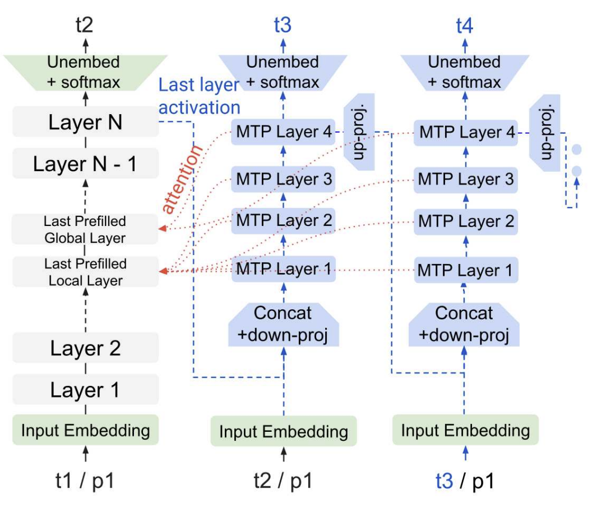
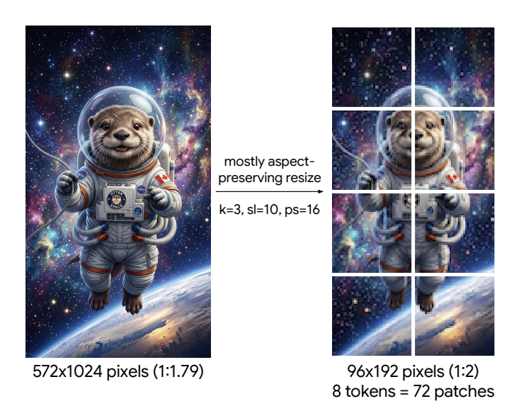

# Gemma 4 テクニカルレポート

> 原題: Gemma 4 Technical Report
> 著者: Gemma Team, Google DeepMind
> 出典: arXiv:2607.02770v2 [cs.CL]（2026-06-19 付、v2 は 2026-07-24）

> **訳注**: 原典は PDF（ケース B）。表（Table 1〜12）・数式・Algorithm 1 は PDF から転記した。図 2 枚（Figure 1: MTP drafter、Figure 2: 画像リサイズ）はユーザー提供の切り出し画像を使用。References（参考文献一覧）と Core contributors / Contributors（著者一覧、謝辞相当）は運用ルールに従い訳出対象から除外した。制御トークン・会話例（Table 11）はコード部分を原文のまま収録。

## Abstract（要旨）

我々は Gemma 4 を紹介する。これは Gemma モデルファミリーにおける、オープンウェイトでネイティブにマルチモーダルな言語モデルの新世代である。計算効率と推論能力の前進を目的に設計された Gemma 4 モデルスイートは、2.3B から 31B パラメータにわたる dense および Mixture-of-Experts アーキテクチャを特徴とする。全モデルサイズでの改良された視覚・音声エンコーダに加えて、我々は 12B モデルのために、生の音声チャンクと画像パッチをそのまま取り込む統一されたエンコーダフリー（encoder-free）アーキテクチャを提案する。さらに thinking モードを統合し、Gemma モデルが応答の前に推論トレースを生成できるようにする。決定的に重要な設計上の選択を通じて、推論速度・メモリ・計算効率、および長コンテキスト能力を改善する。Gemma 4 は STEM・マルチモーダル・長コンテキストのベンチマークを横断して性能の飛躍を確立し、人間評価タスクではより大きなフロンティアのオープンモデルに匹敵する。

## 1. Introduction（はじめに）

大規模言語モデルの急速な進化は、強力なマルチモーダル理解・推論・計算効率を備えたオープンウェイトモデルへの需要を高めてきた。先行モデル（Gemma Team, 2024a,b, 2025a）の基盤の上に、我々は Gemma ファミリー史上最も高性能かつ効率的な世代である Gemma 4 を紹介する。Gemma 4 はネイティブにマルチモーダルなアーキテクチャを提供し、テキスト・画像・音声をシームレスに処理しながら、高度に複雑な推論タスクでフロンティア級の性能を達成する。Gemma 4 ファミリーは多様なオンデバイスハードウェアで動くように作られている。モデルスイートは dense アーキテクチャ（2.3B, 4.5B, 12B, 31B パラメータ）と、活性化 3.8B・総パラメータ 26B の Mixture-of-Experts（Jacobs et al., 1991, MoE）変種の両方を含む。我々はいくつかのアーキテクチャ的・方法論的な革新を導入する:

- **高度な推論のための thinking モード**: Gemma 4 モデルに thinking モード（OpenAI, 2024）を導入する。応答の前に推論トレースを出力することで、モデルは数学やコーディングのような推論偏重のドメインで向上した能力を示す。
- **長コンテキスト効率**: コンテキストの拡張は KV cache のメモリ爆発を招く。我々はローカルなスライディングウィンドウ self-attention とグローバル attention の比率を 5:1（2.3B モデルでは 4:1）に保ち、位置エンコーディングとして p-RoPE（Barbero et al., 2025）を用いる。KV cache 共有（Shazeer, 2019）およびグローバル層での key の value としての再利用（Kayyam et al., 2026）と組み合わせることで、これらの最適化はグローバル KV cache のフットプリントを最大 37.5% 削減する。
- **計算効率**: 投機的デコード（speculative decoding, Leviathan et al., 2023）向けに設計された自己回帰の multi-token prediction（MTP）ドラフタヘッド（Li et al., 2024）を公開し、モデルのデコード速度を改善する。
- **メモリ効率**: quantization-aware training（Jacob et al., 2018, QAT, 量子化を考慮した訓練）で訓練した量子化版モデルを提供し、品質への影響を最小限に抑えながらパラメータのメモリフットプリントとレイテンシを削減する。
- **エンコーダフリーアーキテクチャ**: Gemma 4 モデルは凍結された視覚・音声エンコーダを持つ。12B モデルには、生の 40ms 音声チャンクと画像パッチを LLM の埋め込み空間へ射影する統一されたエンコーダフリーアーキテクチャを導入し、別立てのエンコーダの必要をなくしてメモリの断片化を減らす。

本テクニカルレポートでは、モデルサイズごとの異なるモデルアーキテクチャと、Gemma 4 の事前学習・事後学習のレシピを概説する。包括的なベンチマークと Arena（Chiang et al., 2024）のような人間評価を通じて、Gemma 4 がテキスト・画像・音声のモダリティを横断して、より大きなフロンティアのオープンソースモデルに匹敵する水準で動作することを示す。我々は Gemma 4 モデルを Apache 2.0 ライセンスで公開し、あらゆる場所の開発者と研究者がこれらの能力の上に構築し、カスタマイズし、拡張できるようにする。

**表1** | Gemma 4 モデルのパラメータ数。使用する語彙は 262k エントリを持つ。星印付きのモデルは活性化パラメータ数で定義される MoE である。E2B と E4B の追加の embedder パラメータは per-layer embeddings であることに注意。

| Model | Audio Encoder | Vision Encoder | Embedder | Einsums | Drafter |
| --- | --- | --- | --- | --- | --- |
| **E2B** | 305M | 150M | 400M + 2,340M | 1,870M | 76M |
| **E4B** | 305M | 150M | 670M + 2,820M | 3,940M | 77M |
| **12B** | - | - | 1,000M | 10,890M | 400M |
| **26B-A4B\*** | - | 550M | 740M | 24,500M / 2,800M (active) | 430M |
| **31B** | - | 550M | 1,410M | 29,290M | 500M |

## 2. Model Architecture（モデルアーキテクチャ）

Gemma 4 モデルは decoder-only の Transformer アーキテクチャ（Vaswani et al., 2017）に従う。我々のモデルは RMSNorm（Zhang and Sennrich, 2019）による pre-norm と post-norm、および QKNorm（Henry et al., 2020）を持つ。

**Dense と MoE:** Gemma 4 ファミリーは、実効 2.3B（**E2B**）・実効 4.5B（**E4B**）・**12B**・**31B** パラメータの dense アーキテクチャ群と、総パラメータ 26B に対して活性化 3.8B の MoE モデル（**26B-A4B**）から構成される。E2B と E4B は Gemma 3n（Gemma Team, 2025b）と同様の per-layer embeddings を使用し、総パラメータ 5B・8B のうち実効 2.3B・4.5B となっている。

**表2** | データ・シーケンス（Seq）・レプリカによるシャーディングを用いた事前学習インフラ。

| Model | TPU | #Chips | Data | Seq | Replica |
| --- | --- | --- | --- | --- | --- |
| **E2B** | v6e | 4,096 | 16 | 8 | 32 |
| **E4B** | v6e | 6,144 | 16 | 16 | 24 |
| **12B** | v4 | 12,288 | 16 | 16 | 48 |
| **26B-A4B\*** | v6e | 6,144 | 16 | 16 | 24 |
| **31B** | v6e | 10,240 | 16 | 16 | 40 |

**長コンテキスト効率:** ローカル対グローバルの attention 比率のパターンは Gemma Team (2025a) に従う。すなわち、E2B では 4 対 1、その他では 5 対 1 のローカル attention ブロックである。グローバル attention 層（E2B と E4B を除く）で key を value として再利用する、すなわち values = keys とすることでメモリ効率を改善する。位置のエンコードには、グローバル attention 層では p = 0.25 の p-RoPE を、ローカル attention 層では RoPE を用い、グローバル KV cache を実質 37.5% 削減する。RoPE の周波数はグローバル attention 層で 1M、ローカル attention 層で 10k に設定する。最後に、E2B・E4B モデルでは KV cache をそれぞれ 20/35・18/42 の比率で共有する。

### 2.1. Vision modality（視覚モダリティ）

E2B と E4B の Gemma モデルは 150M の視覚エンコーダを備え、より大きなモデルは 550M のエンコーダを使う（統一アーキテクチャの 12B を除く）。どちらもパッチサイズ 16 の Vision Transformer（Dosovitskiy et al., 2021, ViT）であり、そのアーキテクチャ上の違いは付録の表10 に詳述する。我々の視覚エンコーダは可変アスペクト比をサポートし（図2 と Algorithm 1 を参照）、非因果的 attention を持つ axial 2D-RoPE（Heo et al., 2024）と 2D 絶対位置埋め込みの両方を組み込む。トークンの最大数 N_max は 70, 140, 280, 560, 1120 の値に制限する（実装の詳細は Algorithm 1 を参照）。

### 2.2. Audio modality（音声モダリティ）

E2B と E4B の Gemma モデルは、Mel フィルタバンク入力を伴う 40ms チャンクの音声を処理する 305M の音声エンコーダを使用する。エンコーダのアーキテクチャは Universal Speech Model（Zhang et al., 2023, USM）に基づき、2 つのダウンサンプリング畳み込み層と、それに続く 12 の Conformer 層（Gulati et al., 2020）から成る。アーキテクチャは Gemma 3n のものと同様のまま、パラメータ数を 55% 削減した（680M から 305M へ）。ベクトル量子化は使用しない。LLM は音声エンコーダが生成する連続表現をそのまま取り込む。視覚エンコーダと同様、事前学習中は重みを凍結したままにする。

### 2.3. Encoder-free architecture（エンコーダフリーアーキテクチャ）

Gemma 4 12B は、新しい統一されたエンコーダフリーのモデルパラダイムに基づいてスクラッチから訓練され、別立ての視覚・音声エンコーダを軽量な射影モジュールで置き換える。視覚モダリティについては、Gemma 4 12B は 48×48×3 の RGB パッチを取り込むが、550M の視覚エンコーダを単一の大きな行列積（35M パラメータ）で置き換える。空間認識は、最終 LayerNorm 層（Ba et al., 2016）の前にパッチ表現へ 2D 座標ベースの位置埋め込みを直接加えることで維持される。

音声については、305M の USM ベース conformer エンコーダを*完全に廃棄する*。生の音声は 16kHz で 40ms のチャンクに分割され、チャンクごとに 640 次元のベクトルとなる。これらは LLM の埋め込み空間へ直接射影される。音声は時間的な系列であるため、追加の位置エンコーディングを必要としない。

**表3** | テキストのみ、32k コンテキストサイズにおける、生のチェックポイントと量子化チェックポイントの重みおよび int8 KV キャッシング（+KV）の Gb メモリフットプリント比較。† は mobile quantization、‡ は Q4_0。

| Model | bf16 | Quantized | KV Cache |
| --- | --- | --- | --- |
| **E2B** | 4.6 | 0.8 † | +0.05 |
| **E4B** | 9.0 | 2.3 † | +0.14 |
| **12B** | 24.0 | 7.65 ‡ | +0.28 |
| **26B-A4B\*** | 52.0 / 7.6 | 16.2/2.8 ‡ | +0.28 |
| **31B** | 64.0 | 19.2 ‡ | +1.10 |

### 2.4. Pre-training（事前学習）

我々は Gemma 3 と同様の事前学習に従う。

**訓練データ。** 我々の事前学習データセットは、Web 文書・コード・画像・音声（E2B, E4B, 12B 用）を含む、幅広いドメインとモダリティにわたる大規模で多様なデータのコレクションであり、カットオフは 2025 年 1 月である。

**トークナイザ。** Gemini Team (2025) と同じトークナイザを使用する。すなわち、数字の分割・空白の保持・バイトレベルエンコーディングを備えた SentencePiece トークナイザ（Kudo and Richardson, 2018）である。語彙は 262k エントリを持つ。

**フィルタリング。** ベンチマークの汚染を除去（decontaminate）するため、また望まれない・安全でない発話のリスクと復唱（recitation）のリスクを減らすため、データをフィルタリングする。

### 2.5. Quantization-Aware Training（量子化を考慮した訓練）

生のチェックポイントに加えて、さまざまな形式の量子化済みモデルとエンコーダを提供する。最も普及しているオープンソースの量子化推論エンジン（例: llama.cpp）と効率的なハードウェアサポートに基づき、2 種類の重み表現に注力する:

- mobile quantization: チャネルごとの低ビット幅重み（int2 と int4 の混合）と活性化の量子化（int8）。
- Q4_0 quantization: ブロック単位の量子化。一般に Q4_0 と呼ばれる。

表3 に、32k トークンの系列に対する KV cache の有無それぞれで、生のモデルと量子化モデルが占めるメモリを報告する。さらに、fp16 での安定した推論を可能にするため、各ブロックにスカラー倍率を導入して活性化の範囲を fp16 に収まるように制限する。

QAT は画像・音声エンコーダにも適用する。150M の画像エンコーダでは、活性化と重みを 8 ビット精度（W8A8）に量子化することで、forward パス全体のメモリフットプリントが 2 分の 1（400 MB から 200 MB へ。オンデバイスのコンパイルオーバーヘッド込み）になり、より新しいハードウェア上でのオンデバイスレイテンシは Gemma 3n 比で 44% 削減される。音声エンコーダでは、活性化の精度を 8 ビットに、重みの精度を層クラスタごとに変えて {2, 4, 8} ビットへとさらに削減する。全体として、ディスク上のフットプリントを 78% 削減し、Gemma 3n の 390 MB から本バージョンの 87 MB とした。

### 2.6. Multi-Token Prediction Drafter（マルチトークン予測ドラフタ）

我々はモデルと共に小さな自己回帰の MTP ドラフタヘッドを訓練し、投機的デコードに使用する。我々の MTP の手続きでは、前のステップにおけるモデルの最終層活性化とトークン埋め込みが MTP ヘッドへ供給される。MTP ヘッドは、別立ての embedder と、本体モデルの KV へ cross-attention する 4 層の Transformer ブロックを使って将来のトークンを逐次生成する（図1）。これにより MTP の prefill が不要になり、任意のドラフト長をサポートする。Transformer ブロックのモデル次元は E2B・E4B で 256、26B-A4B・31B で 1024 であり、3 つのローカル attention 層と 1 つのグローバル attention 層を持つ。

<figure>



<figcaption>図1 | 自己回帰の MTP ドラフタ（右側の青いブロック）には、本体モデル（灰色のブロック）からの活性化と KV cache が供給される。</figcaption>
</figure>

**効率的な MTP デコード。** E2B・E4B のドラフタでは、語彙全体への射影演算をトークンのクラスタに対する top-k 演算で置き換えることでデコードのオーバーヘッドを削減する。その結果、最終的な行列積は d × 262,000 から d × 4096 に削減され、同等の受理率（acceptance rate）を保つ。

### 2.7. Compute Infrastructure（計算インフラ）

我々は表2 に示すとおり TPUv4 と TPUv6e でモデルを訓練する。各モデル構成は訓練ステップ時間を最小化するように最適化されている。より大きなモデルでは Slice-Granularity Elasticity（Gemini Team, 2025）を活用する。これは、局所的な障害が起きた際により少ない TPU チップの「スライス」で訓練を継続できるようにするものである。この再構成により、中断による遅延は数十分から数秒に短縮される。

オプティマイザの状態は ZeRO-3（Ren et al., 2021）の実装を用いてシャーディングされる。マルチポッド訓練では、Barham et al. (2022) の Pathways アプローチを用いてデータセンターネットワーク越しのデータレプリカ削減を行う。JAX（Roberts et al., 2023）の単一コントローラプログラミングパラダイムを、Pathways・GSPMD パーティショナ（Xu et al., 2021）・MegaScale XLA コンパイラ（XLA, 2019）と共に使用する。

## 3. Instruction Tuning（指示チューニング）

事前学習済みモデルは、Gemma 3 と同様の事後学習アプローチで指示チューニング済みモデルへと変換される。大きな違いは thinking モードの追加であり、モデルは回答の前に推論トレースを出力できる。

**データフィルタリング。** 事後学習で使用するデータは、モデル性能を最大化するよう慎重に最適化する。特定の個人情報・安全でない/有害なモデル出力・誤った自己同定データ・重複した例を示すサンプルをフィルタリングする。より良い in-context の帰属（attribution）・ヘッジ（hedging）・拒否を促してハルシネーションを最小化するデータのサブセットを含めることで、他の指標のモデル性能を劣化させることなく、事実性の指標の性能も改善する。

**PT と IT のフォーマット。** すべてのモデルは同じトークナイザを共有し、一部の制御トークンが IT フォーマット専用にあてられている。重要な違いとして、PT モデルは生成の終わりに `<eos>` トークンを出力するのに対し、IT モデルは生成の終わりに `<turn|>` を出力する。IT の例は表11 に示す。どちらのモデル型をファインチューニングする場合も、それぞれの終端トークンを追加する必要がある。thinking の有効化の方法と、モデルの関数呼び出しの扱いは表11 に詳述する。

**表4** | Arena Text（Chiang et al., 2024）における主要なオープンウェイトモデル（2026 年 6 月 19 日時点）。モデルは人間の評価者によるブラインドの並列比較評価で評価され、Elo レーティングシステムに基づくスコアが付与される。最上位のクローズドモデル（灰色）はスケール感のために含めた。Gemma モデルははるかに大きなモデルに匹敵し、Gemma 4 31B はリーダーボードにおける dense のオープンモデルの首位である。

| Rank | Model | Elo | 95% CI | Open | Type | #params/#activated |
| --- | --- | --- | --- | --- | --- | --- |
| 1 | Claude Fable 5 | 1508 | ± 9 | no | - | - / - |
| ... |  |  |  |  |  |  |
| 15 | GLM 5.1 | 1475 | ± 6 | yes | MoE | 744B / 40B |
| 25 | GLM 5.2 (Max) | 1471 | ± 10 | yes | MoE | 744B / 40B |
| 29 | MiMo V2.5 Pro | 1466 | ± 5 | yes | MoE | 1T / 42B |
| 34 | Kimi K2.6 | 1460 | ± 5 | yes | MoE | 1T / 32B |
| 36 | DeepSeek V4 Pro Thinking | 1458 | ± 5 | yes | MoE | 1.6T / 49B |
| 37 | GLM 5 | 1457 | ± 5 | yes | MoE | 744B / 40B |
| 38 | DeepSeek V4 Pro | 1456 | ± 5 | yes | MoE | 1.6T / 49B |
| **43** | **Gemma 4 31B** | **1451** | **± 8** | **yes** | **Dense** | **31B** |
| 44 | Kimi K2.5 Thinking | 1450 | ± 4 | yes | MoE | 1T / 32B |
| 57 | Qwen 3.5 397B-A17B | 1444 | ± 4 | yes | MoE | 397B / 17B |
| **61** | **Gemma 4 26B-A4B** | **1438** | **± 8** | **yes** | **MoE** | **26B / 4B** |
| 63 | DeepSeek V4 Flash Thinking | 1436 | ± 5 | yes | MoE | 284B / 13B |
| ... |  |  |  |  |  |  |
| 157 | Gemma 3 27B | 1366 | ± 4 | yes | Dense | 27B |

## 4. Evaluation of final models（最終モデルの評価）

本節では、一連の自動ベンチマークと多様なドメインにわたる人間評価、および MMLU Pro のような静的ベンチマークで IT モデルを評価する。

### 4.1. Human evaluation（人間評価）

31B と 26B-A4B モデルの、他の最先端モデルに対する Arena（Chiang et al., 2024）での人間評価者によるブラインド並列比較評価の性能を報告する。Elo スコアは表4 に報告する。Gemma 4 31B は dense カテゴリでのトップのオープンモデルであり、Gemma 4 31B と 26B-A4B の両方が、はるかに大きなオープンモデルに等しい性能を示す。

### 4.2. Static benchmarks（静的ベンチマーク）

表5 に、Gemma 3 27B と比較した最終モデルの多様なベンチマークでの性能を示す。Gemma 4 31B はサイズが最も近く、全面的に大幅に優れている。一方 E2B は 10 分の 1 のパラメータで Gemma 3 27B の性能におおよそ匹敵する。表6 は視覚ベンチマークでの Gemma 4 モデルの性能を示し、E4B は全評価で Gemma 3 27B に並ぶか上回る。表7 と表8 は E2B・E4B および 12B の多言語音声の書き起こし・翻訳性能を表示する。表9 は Gemma 3 と Gemma 4 モデルの間の長コンテキスト能力の飛躍を示しており、E4B が Gemma 3 27B を上回る。

**表5** | 多様なベンチマークにおける Gemma 3 27B と Gemma 4 モデルの性能比較。明示的な記載がない限り、すべてのモデルは thinking モードである。

| Benchmark | 31B | 26B-A4B | 12B | E4B | E2B | Gemma 3 27B (non-thinking) |
| --- | --- | --- | --- | --- | --- | --- |
| MMLU Pro | 85.2 | 82.6 | 77.2 | 69.4 | 60.0 | 67.6 |
| AIME 2026 (no tools) | 89.2 | 88.3 | 77.5 | 42.5 | 37.5 | 20.8 |
| LiveCodeBench v6 | 80.0 | 77.1 | 72.0 | 52.0 | 44.0 | 29.1 |
| Codeforces (Elo) | 2150 | 1718 | 1659 | 940 | 633 | 110 |
| SciCode | 43.0 | 40.0 | 38.0 | 24.0 | 21.0 | 21.0 |
| GPQA Diamond | 84.3 | 82.3 | 78.8 | 58.6 | 43.4 | 42.4 |
| Big Bench Extra Hard (micro avg) | 74.4 | 64.8 | 53.0 | 33.1 | 21.9 | 19.3 |
| HLE | 19.5 | 8.7 | 5.2 | - | - | - |
| HLE with search | 26.5 | 17.2 | - | - | - | - |
| IFBench | 76.0 | 72.0 | 74.0 | 44.0 | 38.0 | 32.0 |
| IFEval | 98.9 | 98.5 | 97.2 | 96.7 | 94.6 | 90.4 |
| MMMLU | 88.4 | 86.3 | 83.4 | 76.6 | 67.4 | 70.7 |
| MRCR v2 (8-needle, 128k) | 66.4 | 44.1 | 43.4 | 25.4 | 19.1 | 13.5 |
| Terminal Bench Hard | 36.0 | 14.0 | 18.0 | 8.0 | 3.0 | 4.0 |
| Tau2 – airline | 75.0 | 76.0 | 75.0 | 52.0 | 31.0 | 39.0 |
| Tau2 – retail | 86.4 | 85.5 | 77.6 | 67.1 | 34.6 | 6.6 |
| Tau2 – telecom | 69.3 | 43.0 | 54.4 | 18.4 | 19.7 | 3.1 |

**表6** | 異なる解像度での視覚ベンチマークにおける Gemma 4 モデルの性能（thinking）。サポートされる最大解像度（1120 視覚トークン）を使用し、280 視覚トークンでの結果は表12 に報告する。Gemma 3 27B は non-thinking で Pan & Scan を使用。

| Benchmark | 31B | 26B-A4B | 12B | E4B | E2B | Gemma 3 27B |
| --- | --- | --- | --- | --- | --- | --- |
| MMMU Pro | 76.9 | 73.8 | 69.1 | 52.6 | 44.2 | 49.7 |
| MATH-Vision | 85.6 | 82.4 | 79.7 | 59.5 | 52.4 | 46.0 |
| MedXPertQA MM | 61.3 | 58.1 | 48.7 | 28.7 | 23.5 | - |
| InfographicVQA | 92.0 | 89.3 | 88.4 | 70.0 | 63.9 | 70.6 |
| OmniDocBench 1.5 ↓ | 0.131 | 0.149 | 0.164 | 0.181 | 0.290 | 0.365 |

## 5. Responsibility, Safety, Security（責任・安全性・セキュリティ）

オープンモデルがエンタープライズのインフラの中心になるにつれ、来歴（provenance）とセキュリティが最重要になる。Gemma 4 は Gemini モデルと同じ厳格な安全性評価を受ける。責任・安全性・セキュリティは開発ワークフローにおいて最も重要であり、これらの言語モデルが責任ある AI 開発のために根本から設計されることを保証する。

### 5.1. Governance & Assessment（ガバナンスと評価）

Gemma 4 の便益とリスクを評価する我々のアプローチは、先行モデルで確立された基盤を反映しつつ、拡張されたマルチモーダル能力を考慮して更新されている。我々は、AI におけるオープン性がこれらの技術の便益を社会全体に広めうるという信念を維持するが、これは個人や組織に害を及ぼしうる悪意ある利用のリスク（Weidinger et al., 2021）と継続的に照らして評価されなければならない。

Gemma 4 モデルは、社内の安全性・責任ある AI チームとの連携のもとで開発された。これらのモデルの公開には、LLM に関連する進化するリスクの慎重な精査と、モデルが実世界でどのように展開されるかについての理解が必要だった。オープンモデルは AI エコシステム全体にイノベーションを広める一方で、我々はユーザーへの教育リソースの提供と、下流でのモデル利用の監視に引き続き取り組む。

**表7** | Gemma 4 と Gemma 3n モデルの音声性能。上段: CoVoST（S2TT プロンプト: *transcribe then translate*）。下段: FLEURS ASR（書き起こし）。対応するサイズの Gemma 3n と比較して、Gemma 4 は翻訳で 12%（E2B）/ 10%（E4B）、書き起こしで 17%（E2B）/ 12%（E4B）の相対改善を達成する。これは音声エンコーダのディスク上フットプリントの 78% 削減（量子化後 390 MB → 87 MB）にもかかわらずである。

*CoVoST (CorpusBLEU ↑)*

| Model | Params | Size | ja→en | de→en | fr→en | es→en | it→en | ru→en | zh→en | AVG |
| --- | --- | --- | --- | --- | --- | --- | --- | --- | --- | --- |
| Gemma 4 E2B | 305M | 87 MB | 21.4 | 39.2 | 39.2 | 43.2 | 40.8 | 46.4 | 17.9 | 35.4 |
| Gemma 4 E4B |  |  | 25.5 | 42.0 | 41.0 | 44.8 | 43.0 | 49.4 | 21.9 | 38.2 |
| Gemma 3n E2B | 680M | 390 MB | 17.7 | 36.5 | 35.7 | 39.9 | 38.5 | 39.2 | 13.9 | 31.6 |
| Gemma 3n E4B |  |  | 22.3 | 39.1 | 38.4 | 41.8 | 40.4 | 43.7 | 17.4 | 34.7 |

*FLEURS ASR (WER ↓, \* = CER ↓)*

| Model | en | ko\* | ja\* | de | fr | hi | es | it | pt-br | ru | ar | zh\* | AVG |
| --- | --- | --- | --- | --- | --- | --- | --- | --- | --- | --- | --- | --- | --- |
| Gemma 4 E2B | 0.080 | 0.066 | 0.107 | 0.076 | 0.101 | 0.101 | 0.042 | 0.041 | 0.056 | 0.084 | 0.143 | 0.187 | 0.090 |
| Gemma 4 E4B | 0.065 | 0.053 | 0.078 | 0.061 | 0.080 | 0.086 | 0.035 | 0.032 | 0.046 | 0.068 | 0.162 | 0.136 | 0.075 |
| Gemma 3n E2B | 0.076 | 0.101 | 0.163 | 0.079 | 0.130 | 0.106 | 0.051 | 0.044 | 0.067 | 0.112 | 0.131 | 0.235 | 0.108 |
| Gemma 3n E4B | 0.066 | 0.073 | 0.111 | 0.065 | 0.098 | 0.089 | 0.041 | 0.034 | 0.053 | 0.087 | 0.101 | 0.203 | 0.085 |

**表8** | サポート対象言語における Gemma 4 12B モデルの音声性能。専用の音声エンコーダなしで競争力ある音声・テキスト性能が達成できることを示している。

*FLEURS ASR (WER ↓, \* = CER ↓)*

| en | ko\* | ja\* | de | fr | es | it | pt-br | ru | ar |
| --- | --- | --- | --- | --- | --- | --- | --- | --- | --- |
| 0.063 | 0.057 | 0.080 | 0.053 | 0.081 | 0.038 | 0.030 | 0.047 | 0.068 | 0.070 |

*CoVoST (XX → EN, CorpusBLEU ↑)*

| ja | de | fr | es | it | ru |
| --- | --- | --- | --- | --- | --- |
| 26.4 | 41.9 | 42.5 | 44.6 | 43.3 | 50.5 |

### 5.2. Safety Policies and Train-Time Mitigations（安全ポリシーと訓練時の緩和策）

Gemma の安全性アプローチの重要な柱は、ファインチューニング済みモデルを Google の AI 原則と安全ポリシーに整合させることである。これらのポリシーは、我々の生成モデルが有害なコンテンツを生成するのを防ぐことを目的とする。具体的には:

- 児童性的虐待素材（CSAM）と搾取に関連するコンテンツ;
- 危険なコンテンツ。例: 自殺の助長や、実世界の害を引き起こしうる活動の指南;
- 性的に露骨なコンテンツ;
- ヘイトスピーチ。例: 保護対象集団の構成員の非人間化;
- ハラスメント。例: 人々への暴力の奨励。

これらのリスクを緩和するため、Gemma 4 モデルは慎重な入力データの前処理と精査を受けた。訓練データは、プライバシー侵害を防ぐために特定の個人情報やその他のセンシティブなデータの除去を目的として特にフィルタリングされた。モデルを安全ポリシーに整合させるため、事後学習の評価と訓練時の緩和策も実施された。

### 5.3. Safety Evaluations（安全性評価）

我々のモデルが引き起こしうる潜在的な害を理解するため、厳格な自動評価と人間評価を実施する。安全性テストのすべての領域で、従来の Gemma モデルと比べてコンテンツ安全性の全カテゴリで大幅な改善が見られた。全体として、Gemma 4 モデルは安全性の改善において Gemma 3・3n モデルを大きく上回り、同時に不当な拒否（unjustified refusals）を低く保っている。

重要なことに、モデル固有の能力と挙動を正確に評価するため、すべてのテストは安全フィルタなしで実施された。text-to-text と image-to-text の両モダリティ、および全モデルサイズで、モデルのポリシー違反は最小限だった。我々は Frontier Safety Framework（Google DeepMind, 2024）で定めたコミットメントを守りながら、開発速度と狙いを定めた安全性テストのバランスを取る。

**表9** | Gemma 3 と Gemma 4 モデルの長コンテキスト性能（thinking なし）。

| Benchmark | Metric | Context length | 31B | 26B-A4B | 12B | E4B | E2B | Gemma 3 27B |
| --- | --- | --- | --- | --- | --- | --- | --- | --- |
| RULER | Accuracy | 32k | 96.8 | 97.3 | 96.4 | 95.2 | 83.0 | 91.1 |
|  |  | 128k | 96.4 | 89.8 | 91.2 | 86.6 | 70.4 | 66.0 |
| LOFT Text Retrieval | Recall@k | 128k | 79.5 | 66.3 | 66.4 | 58.5 | 50.5 | 8.6 |
| GraphWalks | F1 | <128k | 82.3 | 72.6 | 71.0 | 50.9 | 4.1 | 32.8 |
| MTOB (eng→kgv) | chrF | ~128k (Half book) | 52.9 | 50.0 | 45.1 | 37.8 | 15.4 | 41.0 |
|  |  | ~256k (Full book) | 54.3 | 48.9 | 41.9 | - | - | - |
| MTOB (kgv→eng) | chrF | ~128k (Half book) | 48.6 | 45.0 | 37.3 | 34.6 | 28.2 | 31.2 |
|  |  | ~256k (Full book) | 46.2 | 42.7 | 32.9 | - | - | - |

### 5.4. Ethical Considerations and Risk Mitigation（倫理的配慮とリスク緩和）

LLM の開発は特有の倫理的配慮をもたらす。Gemma 4 の開発において、我々は次の点に重点を置いた:

- **バイアスと公平性**: 大規模なテキスト・画像データで訓練された LLM は、データに埋め込まれた社会文化的バイアスを反映しうる。開発者には、（評価指標と人間によるレビューを用いた）継続的なモニタリングの実施と、モデルのファインチューニング中のデバイアス技法の検討を推奨する。
- **誤情報と悪用**: LLM は虚偽または誤解を招くテキストの生成に悪用されうる。悪意ある応用を緩和するため、Responsible Generative AI Toolkit 内で技術的制限・開発者教育・責任ある利用のガイドラインを提供する。
- **プライバシーへの配慮**: 我々の訓練データセットは特定の個人情報やその他のセンシティブなデータを除去するようフィルタリングされているが、開発者には、その地域のプライバシー規制の遵守と、アプリケーションにおけるプライバシー保護技術の実装を強く推奨する。

### 5.5. Our Approach to Responsible Open Models（責任あるオープンモデルへの我々のアプローチ）

安全・セキュア・責任あるアプリケーションの設計には、個々のユースケースと環境に紐づくリスクを緩和するシステムレベルのアプローチが必要である。我々はコンテンツ安全のためのガイドライン・機構・セーフガードを提供し、開発者が自身のプロダクトポリシーに基づいて適切な構成を実装することを推奨する。我々は潜在的リスクに比例した安全緩和策を採用し続け、便益が予見可能なリスクを大きく上回ると確信できる場合にのみ、これらのモデルをコミュニティと共有する。

## 6. Discussion and Conclusion（議論と結論）

本テクニカルレポートでは、多様なハードウェア環境のために設計されたマルチモーダルの dense および MoE アーキテクチャを特徴とする、オープンウェイトのモデルファミリー Gemma 4 を提示した。Gemma 4 モデルは、応答の前に推論トレースを生成して全体性能を改善する thinking モードを備える。我々は、生の音声・画像パッチを処理する統一されたエンコーダフリーアーキテクチャを導入した。また、より良いローカル対グローバル attention 比率・位置エンコーディング・KV cache 共有を通じて長コンテキストのメモリ制約を緩和した。QAT による全体的な計算効率の向上と、MTP ドラフタによるメモリ効率の向上を果たした。Gemma 4 モデルは Gemma 3 と比較してベンチマークを横断する性能の飛躍を示し、人間評価は Gemma 4 が大幅に大きなオープンモデルに匹敵する性能を発揮することを示している。エッジ展開と推論のためのスケーラブルな基盤を提供し、オープンな研究を支えるものである。

## Appendix（付録）

**会話フォーマット。** thinking・関数定義・関数呼び出しを含む会話の例を表11 に示す。

**視覚。** 視覚エンコーダのアーキテクチャを表10 に詳述する。画像が視覚エンコーダに供給される前にどのようにリサイズされるかを図2 に示し、リサイズアルゴリズムを Algorithm 1 に詳述する。低解像度（N_max = 280）での Gemma 4 モデルの視覚ベンチマークスコアを表12 に表示する。

**表10** | 視覚エンコーダのアーキテクチャ。

| Total Params | d_model | d_MLP | N_heads | N_layers |
| --- | --- | --- | --- | --- |
| **550M** | 1152 | 4304 | 16 | 27 |
| **150M** | 768 | 3072 | 12 | 16 |

<figure>



<figcaption>図2 | 画像リサイズ。ここでは patch_size=16, pooling_kernel_size=3, max_soft_tokens=10 を使用。画像はまず 2×4 のプールされたパッチ（各 48px×48px）にリサイズされる。これは目標の 10 を下回る系列長になる最も近い一致である。72 パッチ（各 16px×16px）が視覚エンコーダで処理され、視覚エンコーダの表現が 3×3 でプールされ、得られた 8 個のソフトトークンが LLM バックボーンで処理される。</figcaption>
</figure>

**Algorithm 1** アスペクト比を保持する画像リサイズ（図2 も参照）

```
Require: 画像 I ∈ R^(H×W×C), パッチサイズ p, 最大トークン数 N_max, プーリングカーネルサイズ k
 1: m ← k · p                                    ▷ プールされたパッチのサイズ
 2: T ← N_max · m²
 3: f ← sqrt(T / (H · W))                        ▷ 理想的なスケーリング係数
 4: H_ideal ← f · H
 5: W_ideal ← f · W
 6: H_target ← ⌊H_ideal / m⌋ · m                 ▷ 切り捨て
 7: W_target ← ⌊W_ideal / m⌋ · m
 8: I_resized ← BicubicResize(I, H_target, W_target)
 9: return I_resized
```

**表11** | Gemma IT モデルのフォーマット。トークン化の後に `[BOS]` トークンを明示的に追加するか、トークナイザの `add_bos=True` オプションを使うこと。*テキスト "[BOS]" をトークン化してはならない*。thinking モードを有効化するには、先頭の system ターンに `<|think|>` を追加する。関数宣言と関数呼び出しの構文、およびより高度な例については公式ドキュメントを確認すること。

| Context | Formatting |
| --- | --- |
| Thinking toggle | `<|think|>` |
| Function declaration | `<|tool>declaration:...<tool|>` |
| Function call | `<|tool_call>call:...<tool_call|>` |
| Thinking trace | `<|channel>thought ...<channel|>` |
| System turn | `<|turn>system` |
| User turn | `<|turn>user` |
| Model turn | `<|turn>model` |
| End of turn | `<turn|>` |

会話の例:

```
Toggle thinking mode.
Declare function.
User: I want you to book a train ticket for me.
Model: <...> Where would you like to go?
User: To Rome.
Model: <...> Looking for available tickets:  <function call>
```

モデル入力:

```
[BOS]
<|turn>system
<|think|>

<|tool>declaration:search_train{...}<tool|><turn|>
<|turn>user
I want you to book a train ticket for me.<turn|>
<|turn>model
<|channel>thought ...<channel|>Where would you like to go?<turn|>
<|turn>user
To Rome.<turn|>
<|turn>model
```

モデル出力:

```
<|channel>thought ...<channel|>Looking for available tickets:
<|tool_call>call:search_train{from:<|"|>Athens<|"|>,to:<|"|>Rome<|"|>}
<tool_call|><turn|>
```

**表12** | 解像度 N_max = 280 での視覚ベンチマークにおける Gemma 4 モデルの性能（thinking）。

| Benchmark | 31B | 26B-A4B | 12B | E4B | E2B |
| --- | --- | --- | --- | --- | --- |
| MMMU Pro | 75.8 | 73.2 | 67.7 | 51.4 | 43.2 |
| MATH-Vision | 83.4 | 80.3 | 76.7 | 59.2 | 53.0 |
| MedXPertQA MM | 60.7 | 55.7 | 47.4 | 28.7 | 22.5 |
| InfographicVQA | 82.8 | 77.8 | 58.7 | 54.8 | 44.6 |
| OmniDocBench 1.5 ↓ | 0.201 | 0.269 | 0.408 | 0.307 | 0.496 |
