# GPT-2 から Kimi-3 まで、解説

> 原題: From GPT2 to Kimi3, Explained
> 著者: ali（@waterloo_intern）
> 出典: X 記事（2026-07-28） https://x.com/waterloo_intern/article/2081762065392541951

> 訳注: クリップ元は X（旧 Twitter）の記事で、ログイン壁のため原ページとの curl 照合は不可。本文は冒頭から結論まで一貫しており欠落なしと判断した（内部整合性チェックによる）。復元 2 件: (1) §AttnRes の数式 2 箇所は、X の数式レンダリングテキストと LaTeX ソースが連結された状態でクリップされていたため、LaTeX 部分を抽出して正規化した。(2) 「Gated DeltaNet withM Mamba」という語割れを文脈判断で "with Mamba" として訳した。画像 22 枚はすべて pbs.twimg.com から取得しローカル保存した。原典の図にはキャプションがないため、図番号と説明は直前の本文に基づく訳注である。コードブロックは原文のまま（インデントの不規則さも原文由来）。タイトル先頭の「22580:」はユーザー指示により表題から除外した（本文冒頭のフックとして残る）。

<figure>


<figcaption>図1（訳注: 冒頭図）: Kimi Linear モデルと Kimi K3 のアーキテクチャ図（簡略版と AttnRes 付き）。</figcaption>
</figure>

<figure>


<figcaption>図2（訳注: 冒頭図）: 「LLM の完全な歴史」タイムライン。2017 softmax attention → 2019 GPT-2 → 2020 linear attention → 2021 FWP/delta networks → 2022 flash attention → 2024 gated delta networks → 2025 KDA → 2026 attention residuals → 2026 Kimi-3。</figcaption>
</figure>

2 万 2580。GPT-2（2019）が KimiK3（2026）の中にいくつ入るかという数だ。私たちは 7 年間で 22,580 倍にスケールアップした。しかし、それはただの……スケールなのだろうか？

この worklog では、どうやってここまで来たのか、そしてあの頃から実際にどれだけ多くのことが——あるいはどれだけ少しのことしか——変わっていないのかを歩いて辿る。KimiK3 へ至る主要なアーキテクチャの発展を追いかけよう。

<figure>

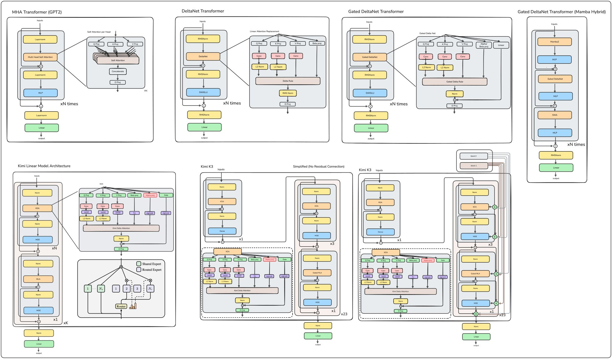

<figcaption>図3（訳注）: KimiK3 へ至るアーキテクチャ発展の導入図。</figcaption>
</figure>

# GPT-2

GPT-2 は decoder-only アーキテクチャである:

```python
tok_emb = self.transformer.wte(idx) # token embeddings of shape (b, t, n_embd)
pos_emb = self.transformer.wpe(pos) # position embeddings of shape (t, n_embd)
x = self.transformer.drop(tok_emb + pos_emb)
for block in self.transformer.h:
    x = block(x)
x = self.transformer.ln_f(x)
logits = self.lm_head(x)
return logits
```

入力はトークン埋め込みと位置埋め込みを受け取る:

<figure>

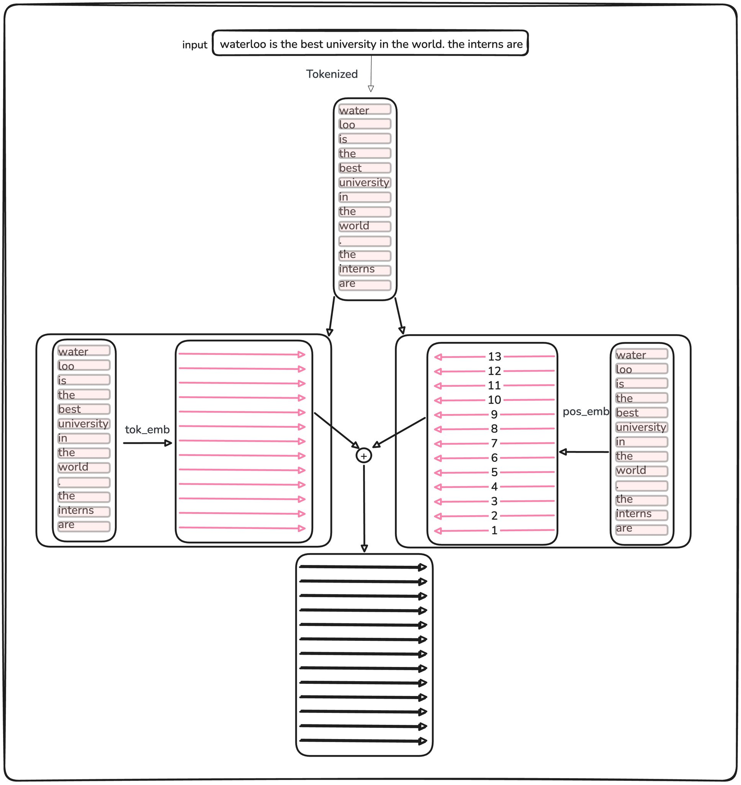

<figcaption>図4（訳注）: トークン埋め込みと位置埋め込み。</figcaption>
</figure>

各トランスフォーマーブロックを拡大するとこうなっている:

```python
class Block(nn.Module):
    def __init__(self, config):
        super().__init__()
        self.ln_1 = LayerNorm(config.n_embd, bias=config.bias)
        self.attn = CausalSelfAttention(config)
        self.ln_2 = LayerNorm(config.n_embd, bias=config.bias)
        self.mlp = MLP(config)

    def forward(self, x):
        x = x + self.attn(self.ln_1(x))
        x = x + self.mlp(self.ln_2(x))
        return x
```

<figure>

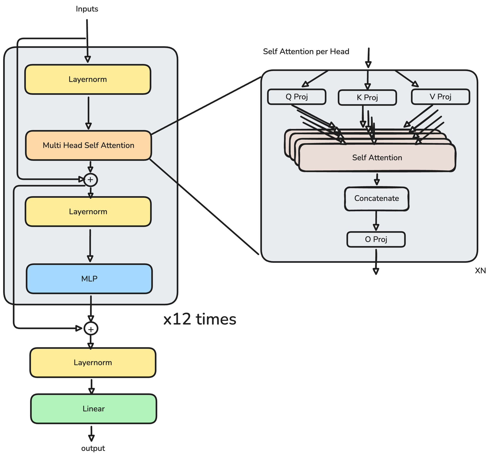

<figcaption>図5（訳注）: トランスフォーマーブロックの内部構造。</figcaption>
</figure>

attention の処理:

```python
B, T, C = x.size() # batch size, sequence length, embedding dimensionality (n_embd)

        # calculate query, key, values for all heads in batch and move head forward to be the batch dim
        q, k, v  = self.c_attn(x).split(self.n_embd, dim=2)
        k = k.view(B, T, self.n_head, C // self.n_head).transpose(1, 2) # (B, nh, T, hs)
        q = q.view(B, T, self.n_head, C // self.n_head).transpose(1, 2) # (B, nh, T, hs)
        v = v.view(B, T, self.n_head, C // self.n_head).transpose(1, 2) # (B, nh, T, hs)

        # manual implementation of attention
        att = (q @ k.transpose(-2, -1)) * (1.0 / math.sqrt(k.size(-1)))
        att = att.masked_fill(self.bias[:,:,:T,:T] == 0, float('-inf'))
        att = F.softmax(att, dim=-1)
        att = self.attn_dropout(att)
        y = att @ v # (B, nh, T, T) x (B, nh, T, hs) -> (B, nh, T, hs)
        y = y.transpose(1, 2).contiguous().view(B, T, C) # re-assemble all head outputs side by side

        # output projection
        y = self.resid_dropout(self.c_proj(y))
        return y
```

最終的な隠れ状態の行列が生成されると、言語モデルヘッド（LM head）がそれを語彙のロジットへ写像する。自己回帰的なデコーディングの間、次のトークンを選ぶのに必要なのは最終位置のロジットだけである。

> これは decoder-only 生成の非効率のひとつだ: モデルはすべての入力位置の表現を計算するのに、各デコードステップが消費するのは最終位置のロジットだけである。キャッシュがなければ、その仕事の多くは次のトークンのために繰り返されることになる。

<figure>

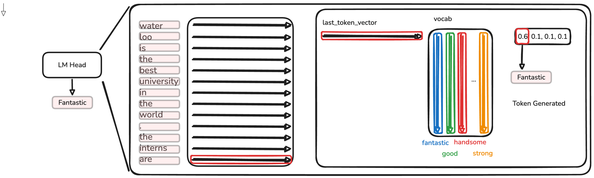

<figcaption>図6（訳注）: LM head によるロジット生成とデコーディング。</figcaption>
</figure>

KV cache は素直な観察から生まれる: 生成したトークンを入力に追加した後、モデルは（何もしなければ）過去のすべてのトークンについて射影を再計算してしまう。それらの key と value のベクトルを保存しておけば、その冗長な仕事を避けられる。

その保存領域が KV cache である。過去 N-1 トークンのベクトルを保持し、メモリ帯域のボトルネックを生むほど大きくなりうる。

全体として、約 5 万の可能なトークン・12 ブロック・12 ヘッド・埋め込み次元 768 で、ベースラインモデルは約 124M パラメータになる。

```python
vocab_size: int = 50304 # GPT-2 vocab_size of 50257, padded up to nearest multiple of 64 for efficiency
n_layer: int = 12
n_head: int = 12
n_embd: int = 768
```

2.8 兆パラメータの KimiK3 モデル 1 つには、およそ GPT-2 モデル 22,580 個分のパラメータが含まれる。

# Linear Attention（線形 attention）

softmax attention は q·k の積の後に非線形性を適用し、すべての query をすべての key に結合させる。線形 attention は代わりに、ELU+1 のような特徴写像（feature map）を q と k に別々に適用する。これにより積が再結合可能（re-associable）になり、増え続ける K と V のベクトルの集合を固定サイズの D×D 状態へ畳み込める。

論文の O(N²) の枠づけには惑わされた。「トランスフォーマーの 1 タイムステップあたりのコストは現在の系列長の 2 乗でスケールする」というのは正しくない。それは Flash Attention が解決したことだ……と思ったら、この論文は 2020 年の発表だった。

当時、訓練では完全な N×N の attention 行列を実体化するのが一般的で、FlashAttention は存在せず、自己回帰の参照実装は KV cache なしにトークン履歴を再計算することが多かった。

```python
def forward(self, x, mask=None, past_kv=None):
  # x is b,t,d
  b,t,d=x.shape
  d_head=d//self.num_heads
  h=self.num_heads
  qkv=self.qkv_proj(x)

  q=qkv[:, :, :d].view(b,t,h,d_head).transpose(1,2)
  k=qkv[:, :, d:2*d].view(b,t,h,d_head).transpose(1,2)
  v=qkv[:, :, 2*d:].view(b,t,h,d_head).transpose(1,2)

  # at prefill, q,k,v have shapes b,h,t,d
  # at decode, shape is b, h, 1, d
  # so i cat at the t dimension, dim(2)

  if past_kv is not None:
    k_past=past_kv[0]
    v_past=past_kv[1]
    k=torch.cat((k_past, k), dim=2)
    v=torch.cat((v_past, v), dim=2)

  scores=(q@k.transpose(-1,-2))/math.sqrt(d_head)
  if past_kv is None: #we're in prefill and need to mask
    causal_mask=torch.ones(t,t,dtype=bool, device=q.device)
    causal_mask=torch.triu(causal_mask, diagonal=1)
    scores=scores.masked_fill(causal_mask, float('-inf'))

  if mask is not None:
    scores=scores.masked_fill(~mask, float('-inf'))

  #get attn (bhtt x bhtd)
  attn=scores.softmax(-1)#bhtt
  o=attn@v #bhtd
  o=o.transpose(1,2).contiguous().view(b,t,d)  #b,t,d

  # use x to get qkv
  o_proj=self.o_proj(o)
  past_kv=(k, v)
  return o_proj, past_kv
```

同じプロセスは視覚的に見る方が分かりやすい。各デコードステップは HBM に対して 2 回の ND 読み出しと 2 回の 1D 書き込みを行い、KV cache は系列長に対して線形に、O(N) で成長する。

<figure>

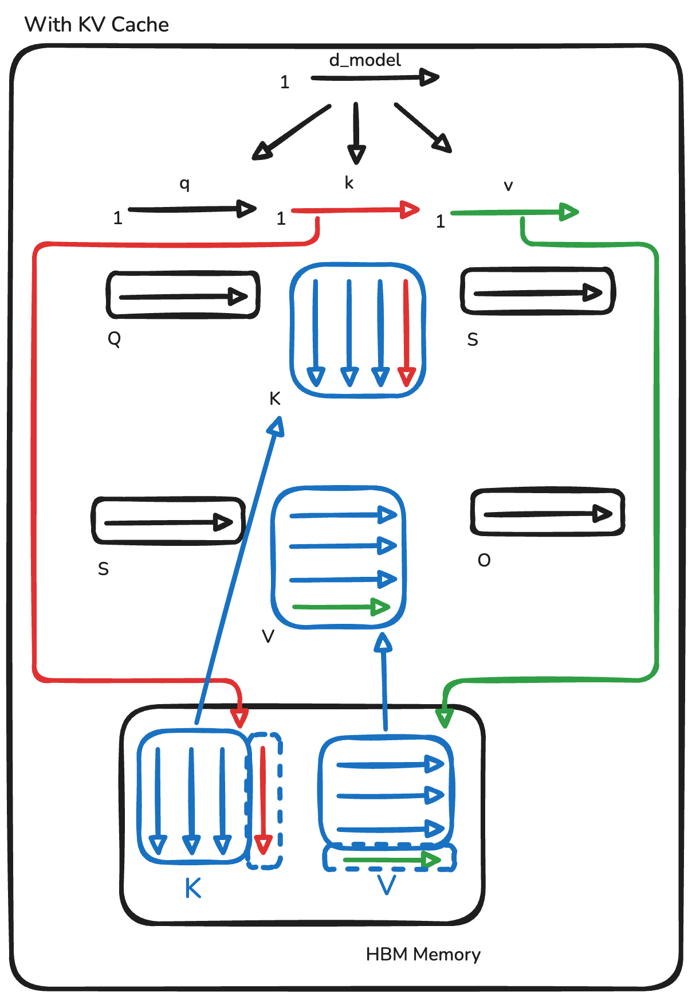

<figcaption>図7（訳注）: デコードステップごとの HBM への読み書きと、O(N) で成長する KV cache。</figcaption>
</figure>

過剰な読み書きに注目してほしい。この論文はこれを次のもので置き換える:

```python
def forward(self, x, mask=None, cache=None):
  # x is b,t,d
  b,t,d=x.shape
  d_head=d//self.num_heads
  h=self.num_heads
  qkv=self.qkv_proj(x)

  q=qkv[:, :, :d].view(b,t,h,d_head).transpose(1,2)
  k=qkv[:, :, d:2*d].view(b,t,h,d_head).transpose(1,2)
  v=qkv[:, :, 2*d:].view(b,t,h,d_head).transpose(1,2)
  
  k=F.elu(k)+1 
  k=k.transpose(-1,-2) 
  q=F.elu(q)+1
 
  S,z=cache if cache is not None else (0.0, 0.0)
  S=S+k@v
  z=z+k
      
 o=q@S #bhtd
 denom=q@z
 o_scaled=o/denom
 o_scaled=o_scaled.transpose(1,2).contiguous().view(b,t,d)
 o_proj=self.o_proj(o_scaled)
 cache=(S,z)
 
 return o_proj, cache
```

トレードオフがある。

ここでは、softmax が使う指数関数を、q と k が相互作用する前にそれぞれへ別々に適用される ELU+1 で置き換えている。どちらのアプローチも結果のスコアを正規化するが、線形 attention が使う特徴写像は softmax カーネルの表現力に劣る近似である。この近似は忠実さを下げうるが、実際の精度損失はアーキテクチャとワークロードに依存する。

qk の和で割る操作は依然として行うことに注意（図では簡単のため省略している）。高い視点から見れば、attention は 3 つのステップからなる:

1. qk スコアを非負にする。線形 attention は ELU+1 を、softmax は指数関数を使う。
2. 和で割る。
3. value の重みつき平均を計算する。

これは attention の基本契約を保ちながら、QK スコアを非負にするためにより表現力の低い特徴写像を使う、ということである。

# DeltaNet（Fast Weight Programmers）

有限のキャッシュは、すでに保存されている情報を上書きするか、それと合成するしかない。トークン i-1 の状態は自分専用のスロットを受け取らない。同じ D×D 行列に加算されるのである。したがって新しい query は、以前の各トークンの完全に分離された表現をもはや取り出せない。

その加算こそが効率向上の源でもある。キャッシュを連結でなく加算的に更新することで O(N) の成長を防ぐが、同じ操作が情報の干渉を引き起こす。DeltaNet はこの復元可能性の喪失に取り組む。

<figure>

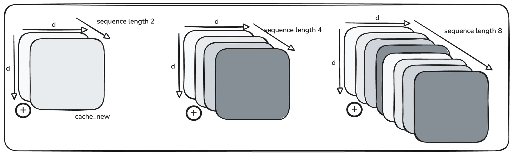

<figcaption>図8（訳注）: 固定サイズ状態への加算的書き込みと情報の干渉。</figcaption>
</figure>

Schlag の論文（Fast Weight Programmers）が雄弁に述べている: 「系列長がストレージ容量を超えると、モデルは過容量（overcapacity）の体制に入りうる。そのような体制で適切に動作するには、モデルはメモリの中身と動的に相互作用し、どの key-value 連想を保持しどれを削除するかを選択的に決めることを学ぶべきである。純粋に加算的な命令はこの目的には不適切かもしれない……式 17 のように有限サイズのメモリへ新しい連想を際限なく加え続ければ、必然的に限界に達する。」

線形 attention を魅力的にする体制——N が D よりはるかに大きい——は、その主要な限界も露呈させる。状態が実効容量を超えると、更新が加算的で何もキャッシュから出ていかないため、連想が干渉し始める。

```python
def forward(self, x, mask=None, cache=None):
  # x is b,t,d
  b,t,d=x.shape
  d_head=d//self.num_heads
  h=self.num_heads
  qkv=self.qkv_proj(x)

  q=qkv[:, :, :d].view(b,t,h,d_head).transpose(1,2)
  k=qkv[:, :, d:2*d].view(b,t,h,d_head).transpose(1,2)
  v=qkv[:, :, 2*d:].view(b,t,h,d_head).transpose(1,2)

  q = F.normalize(F.silu(q), dim=-1)     
  k = F.normalize(F.silu(k), dim=-1)     
  beta = torch.sigmoid(self.w_beta(x)).view(b, 1, t, 1)   
  # new: per-token write strength

  S = cache if cache is not None else 0.0  

  v_old = k @ S # read the board at this key
  u = beta * (v - v_old) # the delta: only what's actually new
  S = S + k.transpose(-1, -2) @ u # same outer-product write as before

  o = q @ S # read, no denominator
  o = o.transpose(1, 2).contiguous().view(b, t, d)
  return self.o_proj(o), S
```

視覚的な例のほうが追いやすい。

<figure>

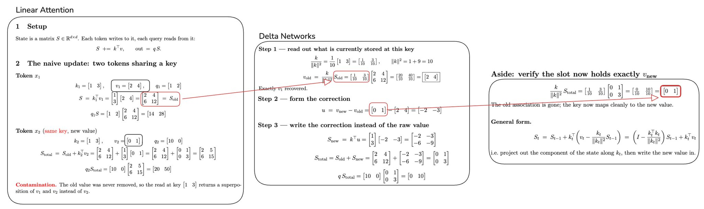

<figcaption>図9（訳注）: delta rule の視覚的な例——key で古い値を読み出し、差分だけを書き込む。</figcaption>
</figure>

S = k.T @ v として書かれた単一の連想を考えよう。同じ key で読み戻すと k @ (k.T @ v) が得られ、これは (k @ k.T) v、すなわち k のノルムの 2 乗を v に掛けたものになる。つまり読み出しは key のノルムの 2 乗でスケールされた値を返す。そこで k を単位長に正規化するか、結果をノルムで割れば、v が正確に戻ってくる。

Q もまた学習されたポインタである。Wq と Wk は同じ残差ストリームを読み、ある事実への query はその事実が書き込まれた key の方向を指す。更新はまず、現在の key がキャッシュから何の情報を取り出すかを尋ねる。その既存の情報を、保存したい value から差し引き、その差に key を掛けて書き戻す。古い情報が取り除かれ、新しい情報がその場所に書き込まれる。

# DeltaNet（Parallelizing Linear Transformers with Delta Rule）

ここが本稿で最も難しい節である。動作する理解を得るのに約 7 時間かかったので、実装から説明を組み立てる。要するに、DeltaNet は一般化 Householder 遷移行列を持つ一次の線形再帰を実装し、ハードウェア効率のよい線形時間の訓練のためのチャンク単位の並列 forward パスを可能にする。入力と出力をサイズ C のチャンクに分割し、各チャンクの出力を、前のチャンクの最終状態と現在のチャンクの query・key・value ブロックに基づいて計算する。

実際的な問題は prefill である。T トークンの系列に対する Delta rule の素直な実装はこうなる:

```python
S = torch.zeros(b, h, dh, dh) if cache is None else cache
outs = []
for i in range(t):
    k_i = k[:, :, i:i+1]  
    v_i = v[:, :, i:i+1]
    b_i = beta[:, :, i:i+1]
    v_old = k_i @ S                  
    u_i  = b_i * (v_i - v_old)
    S = S + k_i.transpose(-1, -2) @ u_i # write
    outs.append(q[:, :, i:i+1] @ S)     
o = torch.cat(outs, dim=2)
```

標準の attention と異なり、この定式化はすべての key ベクトルで補正を要求するため、並列の行列積への道が直ちには見えない。Delta rule がなくても、素直な線形 attention の prefill は逐次的なままである:

```python
S = torch.zeros(b, h, dh, dh) if cache is None else cache
outs = []
for i in range(t):
    q = q[:, :, i:i+1]  
    k = k[:, :, i:i+1]  
    v = v[:, :, i:i+1]

    S=S_old+k@v
      o=q@S #bhtd
      o=self.norm(o)
    o=o.transpose(1, 2).contiguous().view(b, t, d)

    out=self.o_proj(o)
    cache=S
    outs.append(out)

o = torch.cat(outs, dim=2)
```

チャンク化した定式化がより効率的なアプローチを与える。その仕組みは例で理解する方が易しい:

<figure>

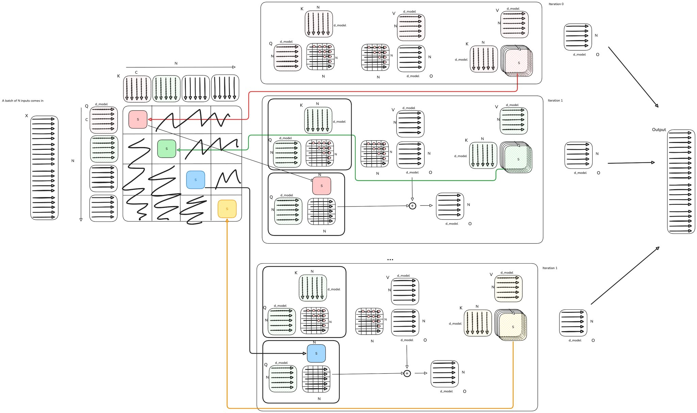

<figcaption>図10（訳注）: チャンク化された線形 attention の例。</figcaption>
</figure>

C=N とすると標準の O(N²) attention に戻り、C=1 なら通常の線形 attention になる。中間の値では、チャンク内の追加の仕事と引き換えに、よりよいハードウェア利用率を得る形で補間される。実際には C は 64 か 128 になることが多い。テンソルコア命令がその粒度で効率的に動作するからで、UMMA はその一例である。

中間のタイルは状態更新の一部として S に畳み込まれる:

<figure>

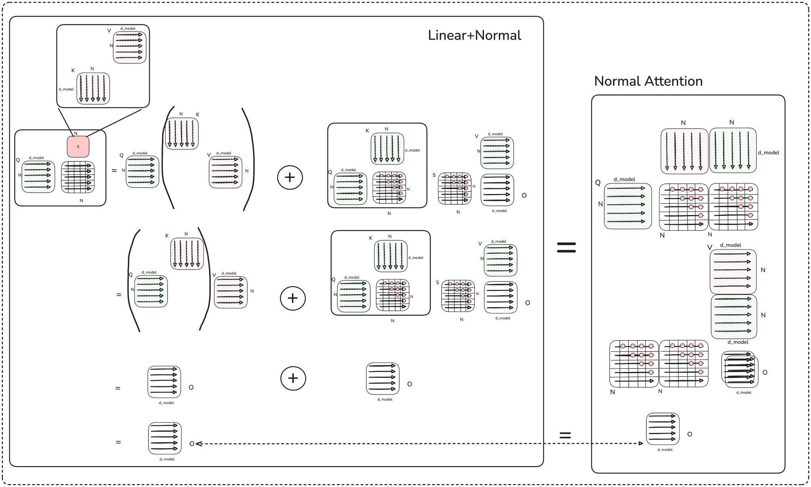

<figcaption>図11（訳注）: 中間タイルの状態 S への畳み込み。</figcaption>
</figure>

```python
S = torch.zeros(b, h, dh, dh) if cache is None else cache
outs = []
for i in range(t//C):
    q_c = q[:, :, i*C:(i+1)*C]  
    k_c = k[:, :, i*C:(i+1)*C]  
    v_c = v[:, :, i*C:(i+1)*C]

      o_prev=q_c@S #this is everything up to this block
      
      attn=(q_c@k_c.transpose(-1,-2)).tril() #masked attention 
      o_curr=attn@v_c
          
        o=o_prev+o_curr
    
    S_new=k_c.transpose(-1,-2)@v_c #recurrent attention 
    S=S+S_new
    outs.append(o)

o = torch.cat(outs, dim=2)
```

ブロック内では q(kᵀv) を行う。これはスコアが先、つまりマスキングを伴う通常の attention の順序である。ブロックをまたいでは (kᵀv)q に従う。つまり再帰の順序、状態が先である。attention は O(N²) で成長するが、こちらはしない。ブロックの内側では本物の attention（マスクされた QKᵀ に V を掛ける）を行い、ブロックをまたぐ分はすべて状態に畳み込んで 1 回の行列積で読み戻す。したがってコストは 2 つに分かれる。固定の部分 2Ld² は状態の仕事で、C にまったく依存しない。成長する部分 2LCd は対角線上に乗るスコア行列である。full attention は C が L に等しい場合にすぎず、そのとき第 2 項は 2L²d、つまり二次になる。だから C を小さくするほど、FLOPs は少なくなる。

C=1 は純粋な FLOP の意味では最も安い選択肢だが、wall-clock 時間では必ずしもそうではない。GPU は、仕事が行列積ハードウェアに効率よく写像されるとき、より多くの算術をより速く完了できる。

次のステップは、同じアプローチを DeltaNet へ拡張することである。

<figure>

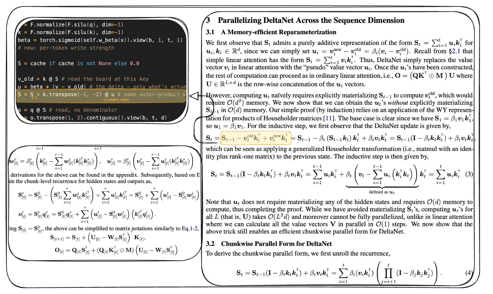

<figcaption>図12（訳注）: DeltaNet へのチャンク化の拡張。</figcaption>
</figure>

根本の問題は単純だ: 純粋に加算的な attention に使ったチャンク化の方法は、delta 更新には直接適用できない:

```python
v_old = k_i @ S                  
u_i  = b_i * (v_i - v_old)
```

差し引くべき情報を計算するには、すべての状態がひとつ残らず必要になる。数学的な再パラメータ化なしには、同じやり方では並列化できない。そこで著者らは delta 更新を次の形から書き換える:

```python
u=v_new-v_old
S_t= S_(t-1)+K.T@u
o=q@S_T
```

ここでは逐次ループが 1 反復につき 1 つの delta を計算する。再パラメータ化された形は:

```python
S_t = S_{t-1}(I − β_t k_t k_tᵀ)  +  β_t v_t k_tᵀ
o_t = S_t q_t
```

この定式化により、チャンク化されたコードは C 個の delta をすべて一度に計算できる:

```python
def chunk_delta_rule_forward(Q, K, V, beta, C):
        # L: sequence length, d: head dimension
        L, d = Q.shape
        # chunking
        Q, K, V = map(lambda x: x.reshape(-1,C,d), [Q, K, V])
        beta = beta.reshape(-1, C)
        K_beta = K * beta.unsqueeze(-1)
        V_beta = V * beta.unsqueeze(-1)
        
        # compute eq. 10 with vectorized forward substitution for fast inverse
        T = -(K_beta @ K.t()).tril(-1)
        for i in range(1, C):
                T[i, :i] = T[i, :i] + (T[i, :, None] * T[:, :i]).sum(-2)
        
        T += torch.eye(C)
        W = T @ K_beta
        U = T @ V_beta

        # chunkwise parallel. Eq. 8-9
        S = torch.zeros(d, d)
        O = torch.empty_like(V)
        
        for i in range(L//C):
                q_i, k_i, w_i = Q[i], K[i], W[i]
                u_i = U[i] - w_i @ S # the corrections, all of one chunk
                o_inter = q_i @ S
                A_i = (q_i @ k_i.t()).tril() #qk.t
                o_intra = A_i @ u_i # attention @ v (with corrections, so u)
                S += k_i.t() @ u_i # update state with addition 
                O[i] = o_intra + o_inter #update output with flash + recurrent
        return O.reshape(L, d)
```

これで最初の比較地点に到達する: MHA 対 DeltaNet トランスフォーマー:

<figure>

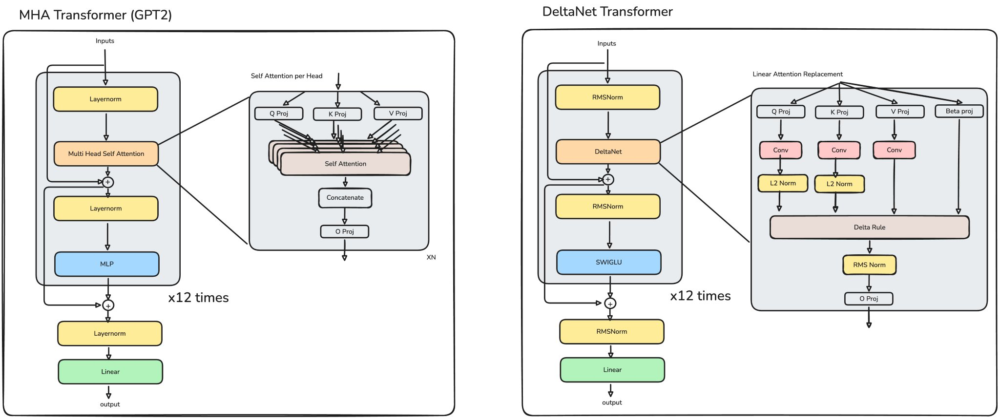

<figcaption>図13（訳注）: MHA トランスフォーマーと DeltaNet トランスフォーマーの比較。</figcaption>
</figure>

# Gated Delta Net（ゲート付き Delta Net）

これでキャッシュに精密な変更を加える方法が手に入った。新しい事実（新しい key ベクトル）ごとに、その場所に保存された古い情報を正確に見て、注目したい新しい情報で置き換えられる。

しかし、この機構が忘れられるのは、具体的な置き換え先を持つ連想だけである。コンテキストの切り替え時に複数の連想を効率よく消したり、容量を空けるためにメモリを全般的に減衰させたりはできない。

純粋に加算的な線形 attention をやっているなら:

忘れる能力の追加は単純だろう。忘却の状態を制御するパラメータを足すだけでよい:

```python
S_old=cache
S_new=k@v
# cache=S_old+S_new
cache=alpha * S_old + S_new
```

<figure>

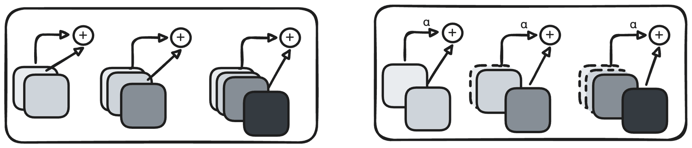

<figcaption>図14（訳注）: 減衰パラメータ α による古いキャッシュのフェード。</figcaption>
</figure>

これが Mamba-2 の貢献である。前のキャッシュを減衰させ、新しいキャッシュを全力で加算することで、状態が際限なく成長するのを防ぐ。

すべての key-value 連想を各タイムステップで動的な比率で一様に減衰させるのは、動くアプローチであり、Mamba がやっていることだ。しかし、異なる key-value 連想の重要度の違いを考慮していない。

つまり、モデルがある特定の連想を忘れる必要があるとき、すべての連想が等しく忘れられてしまう。対照的に Delta rule は単一の事実を更新できるが、残りの事実を減衰させる方法を持たない。

そこで Gated Delta rule は、Mamba のゲート付き更新規則と Delta rule を組み合わせる。パラメータ alpha を追加し、1 に設定すると純粋な Delta rule に切り替わり、0 に設定するとメモリを消去する。課題は、これを同じ並列チャンク法で実装することである。

実装は前節で説明した DeltaNet の再パラメータ化と同じものを使う。数学はほぼ同一で、追加はひとつ: 前の状態の減衰を制御する、0 と 1 の間のデータ依存スカラーである。これにより、効果的な key-value 連想の学習と適応的なメモリ管理が組み合わさる。

対応するコードの変更を以下に示す:

<figure>

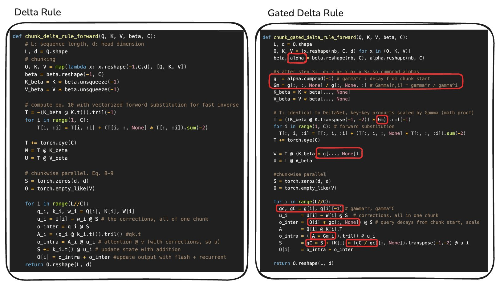

<figcaption>図15（訳注）: Gated Delta rule のコード変更点。</figcaption>
</figure>

γʳ/γⁱ の項は累積減衰を考慮する。タイムステップ x で書かれ x+t で読まれるトークンは、αₓαₓ₊₁αₓ₊₂…αₓ₊ₜ を掛けられている。これは prefix-sum 計算の乗法版である。

結果のアーキテクチャはこうなる:

<figure>

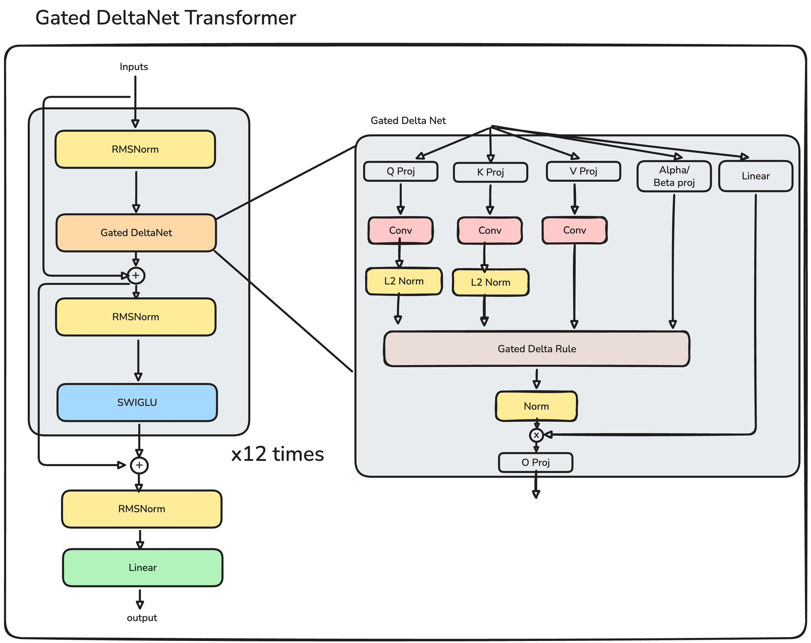

<figcaption>図16（訳注）: Gated DeltaNet トランスフォーマーのアーキテクチャ。</figcaption>
</figure>

# KDA / Kimi Linear

この時点で、研究者たちはひとつのアーキテクチャの中で複数の形式の attention を組み合わせるハイブリッドモデル——Gated DeltaNet と Mamba の組み合わせのような——の実験を始めた。（訳注: 原文は "Gated DeltaNet withM Mamba" と語割れしており、文脈から "with Mamba" と解して訳した）

Kimi Linear はひとつの中心的な主張で注目を集めた: 管理された比較の下で、full attention を上回ったというのである。著者らはこれを、より良い品質と最大 6 倍のデコードスループットを持つ、そのまま差し替え可能なアーキテクチャ代替として提示した。

Kimi Linear は細粒度ゲーティング（fine-grained gating）の導入によって Gated DeltaNet を改善する。単一のスカラー減衰の代わりに、チャネルごとに別々の減衰値を学習する。

<figure>

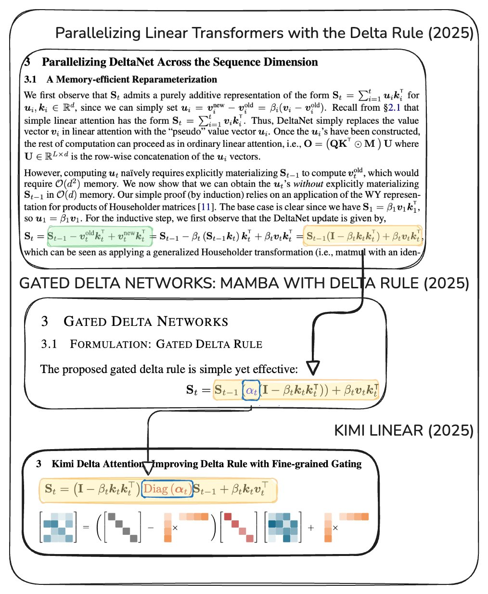

<figcaption>図17（訳注）: KDA のチャネル別細粒度ゲーティング。</figcaption>
</figure>

KDA の更新規則は似たままだが、コードは今やこのようになる:

<figure>

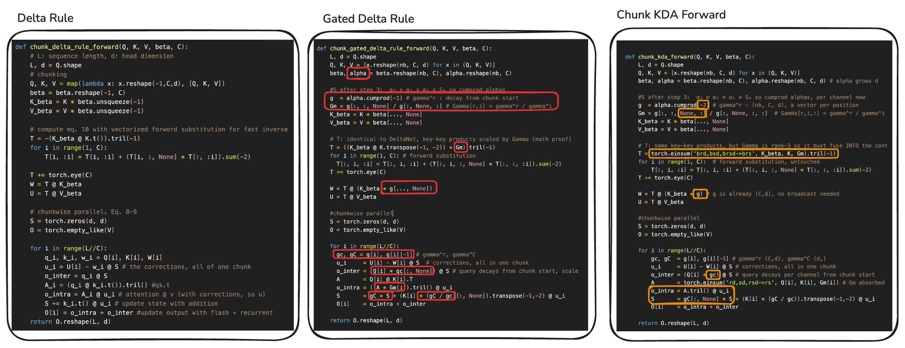

<figcaption>図18（訳注）: KDA のコード。alpha.reshape(nb, C, d) がチャネル別減衰を実現する。</figcaption>
</figure>

ここで alpha.reshape(nb, C, d) が、この論文の最も重要な貢献——メモリ減衰の細粒度制御——を捉えている。

DeltaNet トランスフォーマーと並べると、Kimi Linear アーキテクチャは 3 つの大きな変更を導入している:

1. Multi-head Latent Attention（MLA）層をインターリーブするハイブリッドシステムを使う。
2. MLP を Mixture-of-Experts（MoE）層で置き換える。
3. alpha 射影によって DeltaNet に容量を追加する。

<figure>

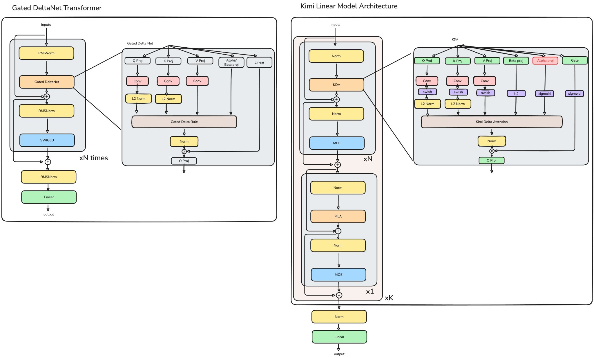

<figcaption>図19（訳注）: Kimi Linear アーキテクチャの 3 つの変更点。</figcaption>
</figure>

後の節で MLA と MoE をより詳しく扱う。今のところ重要なのは、これが盲目的なスケーリングではないという点だ。追加された容量には特定の数学的な目的がある: チャネルごとのスケールが、メモリ減衰へのより細かい制御をモデルに与えるのである。

スケーリング則は依然として重要だが、容量は正しい場所に、システムが使える形で追加されなければならない。この系譜の各アーキテクチャは、先行システムの具体的な限界に対処するために容量を追加している。

# Kimi K3

最終的に、KimiK3 の言語バックボーンは上の Kimi Linear モデルとよく似ている。23 個の 4 層マクロサイクルを含む。各マクロサイクルでは、3 層が Kimi Delta Attention を使い、4 層目が Multi-head Latent Attention を使う。最初の層は密な feed-forward ネットワークを使い、残りのすべての層は潜在 Mixture-of-Experts を使う。

一見すると、Kimi Linear からの変更はささやかに見える:

- スケールの大幅な増加
- 12 層ごとの blockwise AttnRes
- MLA の query LoRA と出力ゲーティング
- 潜在空間 MoE
- SiTU 活性化
- Gated MLA

KDA が固定状態の再帰メモリを供給し、周期的な MLA 層がコンテキスト全体に対する完全な softmax 検索を保持する。以下の簡略化した可視化が、これから議論する変更の有用な参照になる。

<figure>

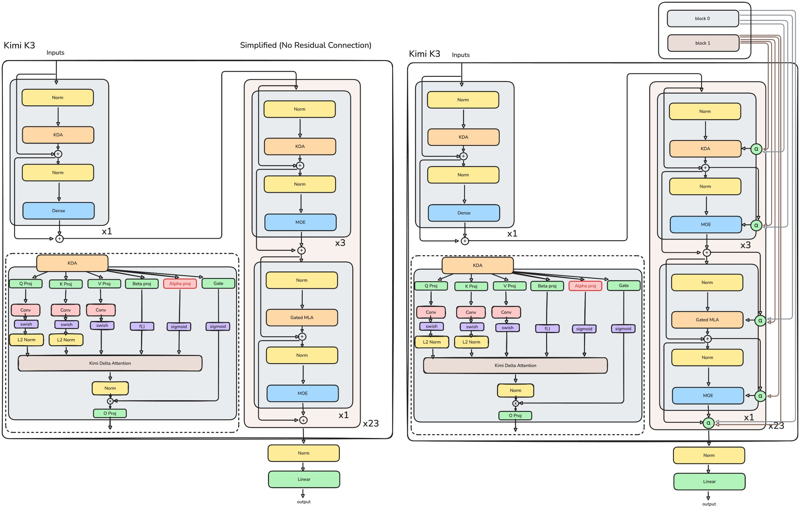

<figcaption>図20（訳注）: Kimi K3 の簡略化した構成図。</figcaption>
</figure>

より直接的な変更から始めよう: Gated MLA、潜在空間 MoE、SiTU 活性化である。

Gated MLA は、取り出された各特徴のどれだけを MLA から残差ストリームへ通すかを決める。入力から射影されたゲートとの要素ごとの積によってこれを行う。

従来型の MoE では、学習されたルータがドット積の類似度を使って、各トークンをエキスパートネットワークの部分集合へ送る。KimiK3 は合計 898 のエキスパートを持つ。2 つは共有されすべてのトークンを処理し、残り 896 のうちルータが各トークンに 16 を選ぶ。

KimiK3 はエキスパートの活性化も変更している。up 射影に SiLU を適用し、ゲートと要素ごとに掛けてから down 射影を適用する代わりに、SiTU を使う:

```text
d = x.shape[-1] // 2
gate = x[..., :d].to(torch.float32)
up = x[..., d:].to(torch.float32)
situ_a = self.beta * torch.tanh(gate / self.beta) * torch.sigmoid(gate)
if self.linear_beta is not None:
    up = self.linear_beta * torch.tanh(up / self.linear_beta)
return (situ_a * up).to(x.dtype)
```

モデルはまた、共有エキスパートへの入力を down 射影し、その最終的な和を up 射影する:

<figure>

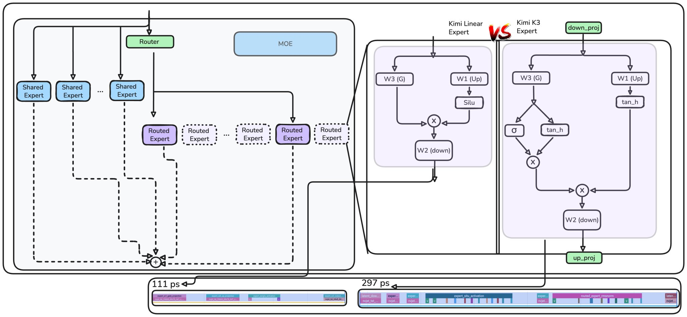

<figcaption>図21（訳注）: 共有エキスパートの down/up 射影。</figcaption>
</figure>

これはモデル推論における繰り返し現れる課題を示している。融合カーネル（fused kernel）なしでは、新しい活性化は元のパスよりほぼ 3 倍遅い。相殺する最適化のひとつは、エキスパートが圧縮された潜在空間で動作することで、これにより forward パスがずっと速くなり、FLOPs がほぼ半減する。

残りの変更は、MLA の query LoRA、出力ゲーティング、そして 12 層ごとの blockwise Attention Residuals である。AttnRes はおよそ 2% の推論レイテンシを追加するが、2 つの重要な利点を提供する:

- 以前の表現の選択的な取り出し。これは残差の希釈（residual dilution）と隠れ状態の成長を緩和する
- 1.25 倍の計算上の優位

AttnRes と MLA は、同じ根本的限界に異なる方向から対処している。KDA 層は固定サイズの状態で動作し、必然的に情報を捨てなければならない。MLA はトークンのコンテキストから取り出し、AttnRes は以前の深さ方向の表現から取り出す。

# AttnRes

この節を手伝ってくれた [@chloey3k](https://x.com/@chloey3k) に感謝する。各 forward パスでは、入力が層のスタックを通過する。ここで各層は、attention ブロック（KDA または MLA）と MLP または MoE ブロックからなる。通常、各層への入力は、元の埋め込みとすべての先行層の出力を、すべて等しい重みで足したものである。

$$
h_l = h_1 + \sum_{i=1}^{l-1} f_i(h_i)
$$

ここで h_i は層 i への入力、h_1 は現在のトークン（ここまでの系列の最後のトークン）の埋め込み、f_i(h_i) は層 i（attention または MLP ブロック）の出力である。

問題は選択的アクセスの欠如である。層のタイプが違えば異なる重みづけから恩恵を受けるかもしれないのに、同じ集約された状態を受け取る。再帰が純粋に加算的であるため、後の層は蓄積された残差に影響を与えるためにますます大きな出力を学ばねばならず、これは訓練を不安定にしうる。AttnRes は、すべての層を等しく扱う代わりに、その和の各項に特化した重みを掛け、文脈の中で最も有用な層により大きな重要度を与えられるようにする。

$$
h_l = \alpha_0 \cdot h_1 + \sum_{i=1}^{l-1} \alpha_i \cdot f_i(h_i)
$$

各重み alpha_i は query-key のドット積から計算される。query は層ごとに学習され、key と value は以前の残差ストリームの状態から来る。スコアは和が 1 になるよう正規化され、それからそれらの状態の重みつき結合を作るのに使われる。

<figure>

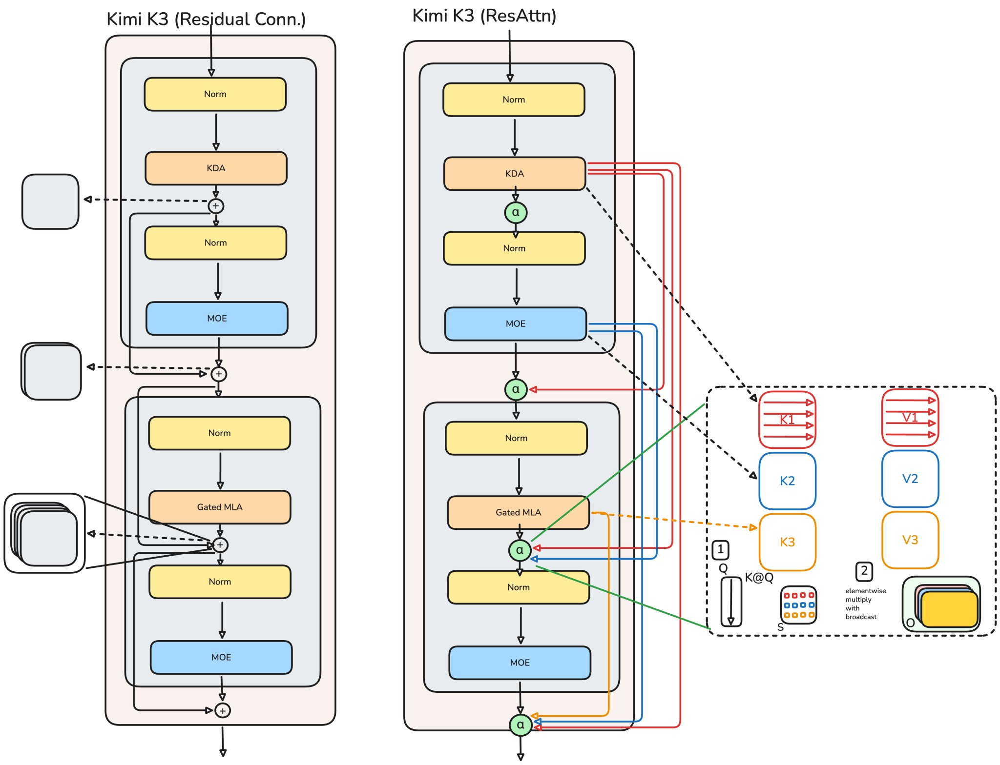

<figcaption>図22（訳注）: AttnRes——学習された query による以前の層出力への選択的アクセス。</figcaption>
</figure>

したがってモデルは、直前の先行層だけを条件にしなくてよい。AttnRes は各層に以前の層出力への選択的アクセスを与え、学習された query が現在の計算に最も有用な表現を取り出せるようにする。

以下の疑似コードは、同じアイデアをブロック粒度で適用する。ブロックとは、12 のデコーダ層にわたって蓄積された attention と MLP の出力の要素ごとの和であり、後の AttnRes での混合のために単一の深さ表現として保存される。

残差 attention をすべての層で適用すると、訓練と推論のコストが増えすぎる。固定されたブロック境界だけで適用すれば、より低いコストで利益の大半を捉えられる。KimiK3 では、各境界は 12 デコーダ層ごとに置かれる。23 個の 4 層マクロサイクルにわたって、これは 8 つの AttnRes ブロックを生み、推論速度を高める。

これはおそらく block_attn_res 関数の最も重要な部分である

```python
V = torch.stack(blocks + [partial_block]) # [N+1, B, T, D]
K = norm(V)
logits = torch.einsum('d, n b t d -> n b t', proj.weight.squeeze(), K)
h = torch.einsum('n b t, n b t d -> b t d', logits.softmax(0), V)
return h
```

これで GPT-2 から KimiK3 への系譜が完結する。

中心的な変化はスケールだけではない。各アーキテクチャの一歩は、モデルが何を保存するか、その状態をどう更新するか、あるいは固定サイズの状態が保持できない情報をどう取り出すかを変えている。

KimiK3 は、固定状態の再帰メモリ・周期的な softmax 検索・疎なエキスパート容量・選択的な深さ方向の残差アクセスを組み合わせる。その結果は、追加の容量を、それが特定の機能的役割を持つ場所に費やすシステムである。

要するに、固定容量の連想メモリ（固定次元）には追い出しポリシー（eviction policy）が必要である。純粋に加算的な線形演算は、容量に達すればいずれ干渉を加えるからだ。その目的のために、ゲーティング・ルーティング・減衰のような学習された選択が必要であり、attention は最も効果的な選択的読み出し機構なのである。
