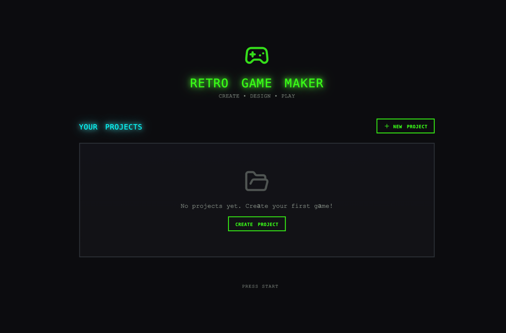

# 長時間走行のアプリケーション開発のためのハーネス設計

> 原題: Harness design for long-running application development
> 著者: Prithvi Rajasekaran（Anthropic Labs）
> 出典: Anthropic Engineering Blog（https://www.anthropic.com/engineering/harness-design-long-running-apps）

> **訳注**: 本訳は Obsidian Web Clipper によるクリップを底本とし、原ページと照合して以下を補った。(1) **クリップから画像 4 枚が欠落**していた（原ページは本文画像 6 枚）——solo ハーネスのスプライトエディタ・プレイ失敗、フルハーネスのスプライトエディタ・AI レベル生成の 4 枚を、原ページの Sanity データから位置とキャプションを確定して復元した。(2) 動画 2 本（美術館サイトのデモ・DAW のデモ）は運用ルールに従いダウンロードせず、参照リンクとして残した。(3) 付録のプラン例末尾の「...」は**原文自体の省略**であることを原ページで確認した（クリップ切断ではない）。除外: Acknowledgements（謝辞）。プロンプト・引用ブロック・プラン例のコード部分は原文のまま収録する。

*本稿は、我々の [Labs](https://www.anthropic.com/news/introducing-anthropic-labs) チームのメンバーである Prithvi Rajasekaran によって書かれた。*

過去数ヶ月、私は相互に関連する 2 つの問題に取り組んできた: Claude に高品質なフロントエンドデザインを作らせること、そして人間の介入なしに完全なアプリケーションを構築させることである。この仕事は、我々の [frontend design skill](https://github.com/anthropics/claude-code/blob/main/plugins/frontend-design/skills/frontend-design/SKILL.md) と[長時間走行コーディングエージェントハーネス](https://www.anthropic.com/engineering/effective-harnesses-for-long-running-agents)に関する以前の取り組みに端を発する。そこでは同僚たちと共に、プロンプトエンジニアリングとハーネス設計によって Claude の性能をベースラインより大きく引き上げることができたが、どちらも最終的には天井に突き当たった。

これを突破するため、私は、主観的な審美眼で定義されるドメインと、検証可能な正しさとユーザビリティで定義されるドメインという、かなり異なる 2 つのドメインにまたがって成立する新しい AI エンジニアリングのアプローチを探した。[敵対的生成ネットワーク](https://en.wikipedia.org/wiki/Generative_adversarial_network)（GAN）に着想を得て、**generator** と **evaluator** のエージェントによるマルチエージェント構造を設計した。出力を信頼できる形で——しかも審美眼をもって——採点する evaluator を作るには、まず「このデザインは良いか?」のような主観的判断を、具体的で採点可能な言葉に変える基準セットの開発が必要だった。

その後、これらの技法を長時間走行の自律コーディングに適用し、以前のハーネスの仕事から 2 つの教訓を引き継いだ: ビルドを扱いやすいチャンクに分解すること、そしてセッション間の文脈の引き継ぎに構造化された artifact を使うことである。最終的な成果は、planner・generator・evaluator の 3 エージェントアーキテクチャで、数時間の自律コーディングセッションを通じてリッチなフルスタックアプリケーションを生み出した。

## Why naive implementations fall short（素朴な実装はなぜ届かないのか）

ハーネス設計が長時間走行のエージェントコーディングの有効性に大きな影響を与えることは、以前に示したとおりである。先の[実験](https://www.anthropic.com/engineering/effective-harnesses-for-long-running-agents)では、initializer agent がプロダクト仕様をタスクリストに分解し、coding agent がセッション間で文脈を運ぶ artifact を引き継ぎながら 1 機能ずつタスクを実装した。より広い開発者コミュニティも似た洞察に収斂しており、フックやスクリプトでエージェントを継続的なイテレーションのサイクルに保つ「[Ralph Wiggum](https://ghuntley.com/ralph/)」法のようなアプローチがある。

しかし、いくつかの問題は根強く残った。より複雑なタスクでは、エージェントは時間とともに脱線しがちである。この問題を分解する中で、この種のタスクを実行するエージェントに 2 つの一般的な失敗モードを観察した。

第一に、コンテキストウィンドウが埋まるにつれ、モデルは長いタスクで一貫性を失いがちである（[context engineering](https://www.anthropic.com/engineering/effective-context-engineering-for-ai-agents) に関する我々の記事を参照）。一部のモデルは「**context anxiety（コンテキスト不安）**」も示す。自分が信じるコンテキスト限界に近づくと、早々に仕事を切り上げ始めるのである。**context reset**——コンテキストウィンドウを完全にクリアして新しいエージェントを開始し、前のエージェントの状態と次のステップを運ぶ構造化された引き継ぎと組み合わせる——は、この両方の問題に対処する。

これは compaction とは異なる。compaction では会話の前半がその場で要約され、同じエージェントが短縮された履歴の上で作業を続ける。compaction は連続性を保つが、エージェントにまっさらな状態を与えないため、context anxiety は残存しうる。リセットはまっさらな状態を提供するが、その代償として、次のエージェントが作業をきれいに引き継ぐのに十分な状態を引き継ぎ artifact が持つ必要がある。以前のテストでは、Claude Sonnet 4.5 は context anxiety を強く示し、compaction だけでは長いタスクの高い性能を可能にするのに不十分だったため、context reset はハーネス設計に不可欠になった。これは核心の問題を解決するが、各ハーネス実行にオーケストレーションの複雑さ・トークンのオーバーヘッド・レイテンシを加える。

第二の問題は、これまで扱ってこなかった**自己評価**である。自分が作った仕事の評価を求められると、エージェントは自信を持ってその仕事を称賛する形で応じがちである——人間の観察者には品質が明らかに凡庸なときでさえも。この問題は、検証可能なソフトウェアテストに相当する二値のチェックが存在しない、デザインのような主観的タスクで特に顕著である。レイアウトが洗練されて感じられるか凡庸かは判断の問題であり、エージェントは自分の仕事の採点で確実にポジティブ側へ偏る。

しかし、検証可能な結果を持つタスクでさえ、エージェントはタスク遂行中に性能を妨げる乏しい判断を示すことがある。**仕事をするエージェントと、それを判定するエージェントを分離する**ことが、この問題への強力なレバーであることが分かった。分離それ自体が甘さを直ちに消すわけではない。evaluator も LLM であり、LLM が生成した出力に寛大になりがちである。しかし、**独立した evaluator を懐疑的にチューニングすることは、generator を自分の仕事に批判的にさせることよりはるかに扱いやすい**ことが分かった。そして、その外部からのフィードバックが存在すれば、generator はそれに対して反復するための具体的な足がかりを得る。

## Frontend design: making subjective quality gradable（フロントエンドデザイン: 主観的品質を採点可能にする）

私は、自己評価の問題が最も見えやすいフロントエンドデザインで実験を始めた。介入がなければ、Claude は通常、技術的には機能するが視覚的に平凡な、安全で予測可能なレイアウトへ引き寄せられる。

フロントエンドデザインのために作ったハーネスは、2 つの洞察によって形作られた。第一に、美的品質は完全にスコアへ還元することはできず——個人の好みは常に異なる——それでも、デザインの原則と選好を符号化した採点基準によって改善できる。「このデザインは美しいか?」に一貫して答えるのは難しいが、「これは我々の良いデザインの原則に従っているか?」は Claude に採点の具体的な対象を与える。第二に、フロントエンドの生成と採点を分離することで、generator をより強い出力へ駆動するフィードバックループを作れる。

これを念頭に、generator と evaluator の両エージェントのプロンプトに与える 4 つの採点基準を書いた:

- **Design quality（デザイン品質）:** デザインは部品の寄せ集めでなく、一貫した全体として感じられるか? ここで強い仕事とは、色・タイポグラフィ・レイアウト・画像などの細部が組み合わさって、独特のムードとアイデンティティを作り出すことを意味する。
- **Originality（独自性）:** 意図的な決定の証拠があるか、それともテンプレートレイアウト・ライブラリのデフォルト・AI 生成パターンか? 人間のデザイナーが意図的な創造的選択を認識できるべきである。未修正のストックコンポーネント——あるいは白いカードの上の紫のグラデーションのような AI 生成の明白な兆候——はここで不合格になる。
- **Craft（クラフト）:** 技術的な実行: タイポグラフィの階層・間隔の一貫性・色の調和・コントラスト比。これは創造性のチェックでなく能力のチェックである。大半のまともな実装はデフォルトでここを問題なく通る。不合格は基礎の破綻を意味する。
- **Functionality（機能性）:** 美観と独立したユーザビリティ。ユーザーはインターフェースが何をするのかを理解し、主要なアクションを見つけ、推測なしにタスクを完了できるか?

私はクラフトと機能性より、デザイン品質と独自性を重視した。Claude はデフォルトでもクラフトと機能性のスコアが良かった。必要な技術的能力はモデルに自然に備わる傾向があったからである。しかしデザインと独自性については、Claude はよくても無難な出力を生みがちだった。基準は高度に凡庸な「AI slop」パターンを明示的に減点し、デザインと独自性をより重く重み付けすることで、モデルをより美的なリスクテイクへ押し出した。

evaluator は、詳細なスコア内訳つきの few-shot 例で校正した。これにより evaluator の判断が私の選好と揃い、イテレーションをまたぐスコアのドリフトが減った。

ループは [Claude Agent SDK](https://platform.claude.com/docs/en/agent-sdk/overview) の上に作り、オーケストレーションを簡潔に保った。まず generator agent がユーザープロンプトに基づいて HTML/CSS/JS のフロントエンドを作る。evaluator には Playwright MCP を与え、各基準を採点して詳細な批評を書く前に、ライブのページと直接対話できるようにした。実際、evaluator は自力でページをナビゲートし、スクリーンショットを撮って実装を注意深く調べてから評価を出していた。そのフィードバックが次のイテレーションの入力として generator へ流れる。生成ごとに 5〜15 イテレーションを回し、各イテレーションは通常、evaluator の批評に応えて generator をより個性的な方向へ押し出した。evaluator は静的なスクリーンショットの採点でなくページを能動的にナビゲートしていたため、各サイクルには実時間がかかった。フル実行は最大 4 時間に及んだ。また、各評価の後に generator へ戦略的な決定をさせた: スコアが良い傾向なら現在の方向を磨き、うまくいっていなければまったく別の美学へピボットする。

実行を通じて、evaluator の評価はイテレーションとともに改善してから頭打ちになり、なお伸びしろが残った。漸進的に磨かれていく生成もあれば、イテレーション間で鋭く美的方向を転換するものもあった。

基準の文言は、私が完全には予期しなかった形で generator を方向づけた。「最良のデザインは美術館品質である（the best designs are museum quality）」のようなフレーズを含めると、デザインは特定の視覚的収束へ向かった。基準に付随するプロンプトの言葉づかいが、出力の性格を直接形作ることを示唆している。

スコアはイテレーションとともに概ね改善したが、そのパターンは常にきれいな線形ではなかった。後の実装は全体として良くなる傾向があったものの、最後のものより中間のイテレーションの方を私が好むケースも定期的にあった。実装の複雑さもラウンドを重ねるごとに増える傾向があり、generator は evaluator のフィードバックに応えてより野心的な解決策へ手を伸ばした。最初のイテレーションでさえ、出力はプロンプトなしのベースラインより目に見えて良く、evaluator のフィードバックによるさらなる洗練の前に、基準とその言語自体がモデルを凡庸なデフォルトから遠ざけたことを示唆している。

特筆すべき例では、オランダの美術館のウェブサイトを作るようモデルに指示した。9 回目のイテレーションまでに、架空の美術館のための、クリーンなダークテーマのランディングページができていた。ページは視覚的に洗練されていたが、概ね予想の範囲内だった。ところが 10 サイクル目に、モデルはそのアプローチを丸ごと破棄し、サイトを空間的な体験として再構想した: CSS の perspective でレンダリングされた市松模様の床を持つ 3D の部屋、壁に自由な位置で掛けられた作品群、スクロールやクリックの代わりに出入口ベースのナビゲーションで巡るギャラリーの部屋。単発の生成では見たことのない種類の創造的飛躍だった。

（訳注: ここに美術館サイトのデモ動画が埋め込まれている。動画のため未保存: https://cdn.sanity.io/files/4zrzovbb/website/9877febd34432f7f582aecd0023b951223605c6a.mp4）

## Scaling to full-stack coding（フルスタックコーディングへのスケール）

これらの知見を手に、この GAN 着想のパターンをフルスタック開発に適用した。generator-evaluator のループは、コードレビューと QA がデザインの evaluator と同じ構造的役割を果たすソフトウェア開発ライフサイクルに、自然に対応づく。

### The architecture（アーキテクチャ）

以前の[長時間走行ハーネス](https://www.anthropic.com/engineering/effective-harnesses-for-long-running-agents)では、initializer agent・1 機能ずつ働く coding agent・セッション間の context reset で、一貫した複数セッションのコーディングを解決していた。context reset が重要な解錠だった: そのハーネスは Sonnet 4.5 を使っており、前述の「context anxiety」の傾向を示した。context reset をまたいでうまく機能するハーネスを作ることが、モデルをタスクに留める鍵だった。**Opus 4.5 はその挙動を自力でほぼ取り除いた**ため、私はこのハーネスから context reset を完全に外すことができた。エージェントはビルド全体を通じて 1 つの連続セッションとして実行され、[Claude Agent SDK](https://platform.claude.com/docs/en/agent-sdk/overview) の自動 compaction が途中の文脈の成長を処理した。

この仕事では、元のハーネスの基盤の上に 3 エージェントのシステムを構築した。各エージェントは、以前の実行で観察した特定のギャップに対応する。システムは次のエージェントペルソナを含む:

**Planner:** 以前の長時間走行ハーネスは、ユーザーが詳細な仕様を前もって提供する必要があった。そのステップを自動化したかったので、1〜4 文の単純なプロンプトを完全なプロダクト仕様へ拡張する planner agent を作った。スコープについては野心的であるように、そして詳細な技術的実装ではなくプロダクトの文脈と高レベルの技術設計に集中するように促した。この力点は、planner が粒度の細かい技術的詳細を前もって指定して何かを間違えると、仕様の誤りが下流の実装へ連鎖するという懸念によるものである。エージェントに生み出すべき成果物で制約をかけ、道筋は作業しながら自分で見つけさせる方が賢明に思われた。また、プロダクト仕様に AI 機能を織り込む機会を見つけるよう planner に求めた。（末尾の付録の例を参照。）

**Generator:** 以前のハーネスの 1 機能ずつのアプローチはスコープ管理にうまく機能した。ここでも同様のモデルを適用し、generator にはスプリント単位で働き、仕様から 1 機能ずつ拾うよう指示した。各スプリントは React・Vite・FastAPI・SQLite（後に PostgreSQL）のスタックでアプリを実装し、generator には QA へ引き渡す前に各スプリントの終わりに自分の仕事を自己評価するよう指示した。バージョン管理のための git も持たせた。

**Evaluator:** 以前のハーネスによるアプリケーションは、見た目は印象的でも、実際に使おうとすると本物のバグを抱えていることが多かった。これを捕まえるため、evaluator は Playwright MCP を使い、ユーザーがするようにアプリケーションをクリックして回り、UI 機能・API エンドポイント・データベースの状態をテストした。その後、発見したバグと、フロントエンド実験をモデルにした基準セット——ここではプロダクトの深さ・機能性・視覚デザイン・コード品質をカバーするよう適応——の両方に対して各スプリントを採点した。各基準は硬い閾値を持ち、どれか 1 つでも下回ればスプリントは不合格となり、generator は何が悪かったかの詳細なフィードバックを受け取った。

各スプリントの前に、generator と evaluator は**スプリント契約（sprint contract）を交渉**した: コードを書く前に、そのチャンクの仕事について「完了」がどう見えるかに合意するのである。これが存在したのは、プロダクト仕様が意図的に高レベルであり、ユーザーストーリーとテスト可能な実装の間のギャップを埋めるステップが欲しかったからである。generator が何を作りどう成功を検証するかを提案し、evaluator はその提案をレビューして generator が正しいものを作ろうとしていることを確かめた。両者は合意に至るまで反復した。

コミュニケーションはファイル経由で処理された: 一方のエージェントがファイルを書き、他方がそれを読んで、そのファイル内で、または前のエージェントが今度は読む新しいファイルで応答する。generator は合意済みの契約に対してビルドし、その後 QA へ仕事を引き渡した。これにより、実装を早くから過剰指定することなく、仕事を仕様に忠実に保った。

### Running the harness（ハーネスの実行）

このハーネスの最初のバージョンには Claude Opus 4.5 を使い、ユーザープロンプトをフルハーネスと単一エージェントシステムの両方に対して実行して比較した。これらの実験を始めた時点で最良のコーディングモデルだったため、Opus 4.5 を使った。

レトロビデオゲームメーカーを生成する次のプロンプトを書いた:

> *Create a 2D retro game maker with features including a level editor, sprite editor, entity behaviors, and a playable test mode.*

下の表は、ハーネスの種類・実行時間・総コストを示す。

| **Harness** | **Duration** | **Cost** |
| --- | --- | --- |
| Solo | 20 min | $9 |
| Full harness | 6 hr | $200 |

ハーネスは 20 倍以上高価だったが、出力品質の差は一目瞭然だった。

私が期待していたのは、レベルとその構成要素（スプライト・エンティティ・タイルレイアウト）を構築し、play を押して実際にレベルを遊べるインターフェースである。まず solo 実行の出力を開いたところ、初期のアプリケーションはその期待に沿っているように見えた。

しかしクリックして回るうちに、問題が現れ始めた。レイアウトはスペースを無駄にし、固定高のパネルがビューポートの大半を空のままにしていた。ワークフローは硬直的だった。レベルに配置しようとするとスプライトとエンティティを先に作るよう促されるが、UI の何もその順序へ導いてくれない。さらに肝心なことに、実際のゲームが壊れていた。エンティティは画面に現れるが、何も入力に反応しない。コードを掘ると、エンティティ定義とゲームランタイムの間の配線が壊れており、どこが悪いのかの表面的な手がかりはなかった。

<figure>



<figcaption>solo ハーネスが作ったアプリを開いたときの初期画面。</figcaption>
</figure>

<figure>


<figcaption>solo ハーネスが作ったスプライトエディタ内のスプライト。（訳注: クリップから欠落していたため原ページから復元）</figcaption>
</figure>

<figure>


<figcaption>作成したレベルをプレイしようとして失敗しているところ。（訳注: 同上）</figcaption>
</figure>

solo 実行を評価した後、ハーネス実行に目を向けた。この実行は同じ一文プロンプトから始まったが、planner ステップがそのプロンプトを **10 スプリントに広がる 16 機能の仕様**へ拡張した。solo 実行が試みたものをはるかに超えていた。中核のエディタ群とプレイモードに加え、仕様はスプライトアニメーションシステム・ビヘイビアテンプレート・効果音と音楽・AI 支援のスプライトジェネレータとレベルデザイナー・共有リンク付きのゲームエクスポートを求めていた。planner には我々の [frontend design skill](https://github.com/anthropics/claude-code/blob/main/plugins/frontend-design/skills/frontend-design/SKILL.md) へのアクセスを与え、planner はそれを読んで、仕様の一部としてアプリの視覚的デザイン言語を作った。各スプリントについて、generator と evaluator は、そのスプリントの具体的な実装詳細と、完了検証のためにテストされるテスト可能な挙動を定義する契約を交渉した。

アプリは solo 実行より直ちに多くの磨きと滑らかさを見せた。キャンバスはビューポート全体を使い、パネルは適切なサイズで、インターフェースは仕様のデザイン方針に沿った一貫した視覚的アイデンティティを持っていた。solo 実行で見たぎこちなさの一部は残っていた——ワークフローは依然として、レベルに配置する前にスプライトとエンティティを作るべきだと明確にしておらず、あちこち突いて自分で把握する必要があった。これはハーネスが対処するように設計されたものというより、ベースモデルのプロダクト直観のギャップと読めたが、ハーネス内での狙いを定めた反復が出力品質のさらなる改善に役立ちうる場所を示唆してもいた。

エディタ群を試していくと、新しい実行の solo に対する優位はより明らかになった。スプライトエディタはより豊かで機能が充実しており、ツールパレットはより整理され、カラーピッカーは良くなり、ズームコントロールはより使いやすかった。

planner に AI 機能を仕様へ織り込むよう求めていたため、アプリには組み込みの Claude 統合も付いており、プロンプトを通じてゲームの様々な部分を生成できた。これはワークフローを大幅に高速化した。

<figure>


<figcaption>初期画面: フルハーネスで構築したアプリでの新しいゲームの作成。</figcaption>
</figure>

<figure>


<figcaption>スプライトエディタはよりクリーンで使いやすく感じられた。（訳注: クリップから欠落していたため原ページから復元）</figcaption>
</figure>

<figure>


<figcaption>組み込みの AI 機能を使ってレベルを生成しているところ。（訳注: 同上）</figcaption>
</figure>

最大の差はプレイモードにあった。実際にエンティティを動かしてゲームを遊ぶことができたのである。物理には粗い部分があった——キャラクターがプラットフォームに飛び乗ると重なってしまい、直観的に間違って感じられた——が、核心は動いた。solo 実行はそれを果たせなかった。少し動き回った後、AI のゲームレベル構築の限界には突き当たった。飛び越えられない大きな壁があり、行き詰まったのである。これは、アプリをさらに洗練するためにハーネスが扱える常識的な改善やエッジケースがあることを示唆していた。

ログを読み通すと、evaluator が実装を仕様に沿わせ続けたことは明らかだった。各スプリントで、evaluator はスプリント契約のテスト基準を順に確認し、Playwright を通じて動作中のアプリケーションを実際に操作し、期待される挙動から逸脱するものすべてにバグを起票した。契約は粒度が細かく——スプリント 3 だけでレベルエディタをカバーする 27 基準——evaluator の発見は、追加調査なしに行動へ移せるほど具体的だった。下の表は evaluator が特定した問題のいくつかの例を示す:

| **契約基準** | **Evaluator の発見** |
| --- | --- |
| Rectangle fill tool allows click-drag to fill a rectangular area with selected tile | **FAIL** — Tool only places tiles at drag start/end points instead of filling the region. `fillRectangle` function exists but isn't triggered properly on mouseUp. |
| User can select and delete placed entity spawn points | **FAIL** — Delete key handler at `LevelEditor.tsx:892` requires both `selection` and `selectedEntityId` to be set, but clicking an entity only sets `selectedEntityId`. Condition should be `selection \|\| (selectedEntityId && activeLayer === 'entity')`. |
| User can reorder animation frames via API | **FAIL** — `PUT /frames/reorder` route defined after `/{frame_id}` routes. FastAPI matches '`reorder`' as a frame_id integer and returns 422: "unable to parse string as an integer." |

evaluator をこの水準で動かすには手間がかかった。**素の状態では、Claude は貧弱な QA エージェントである。** 初期の実行では、正当な問題を特定しておきながら、大した問題ではないと自分を納得させて仕事を承認してしまう様子を目にした。また、エッジケースを突くのではなく表面的にテストする傾向があり、より微妙なバグはしばしばすり抜けた。チューニングのループは、evaluator のログを読み、その判断が私の判断と食い違う例を見つけ、その問題を解決するように QA のプロンプトを更新することだった。evaluator が私に妥当と思える形で採点するようになるまで、この開発ループを数ラウンド要した。それでも、ハーネスの出力にはモデルの QA 能力の限界が表れていた: 小さなレイアウトの問題、ところどころ直観的でない操作感、evaluator が徹底的に触らなかった深い入れ子の機能に潜む未発見のバグ。さらなるチューニングで捕えられる検証の伸びしろは明らかに残っていた。しかし、アプリケーションの中心機能がそもそも動かなかった solo 実行と比べれば、上積みは明白だった。

### Iterating on the harness（ハーネスの反復改善）

最初のハーネスの結果は励みになるものだったが、同時にかさばり、遅く、高価でもあった。論理的な次の一手は、性能を落とさずにハーネスを単純化する方法を見つけることである。これは半ば常識であり、半ばより一般的な原則の帰結である: **ハーネスのすべてのコンポーネントは「モデルが単独ではできないこと」についての仮定を符号化しており、その仮定はストレステストする価値がある**。仮定が誤っているかもしれないからでもあり、モデルの改善によって仮定はすぐに陳腐化しうるからでもある。我々のブログ記事 [Building Effective Agents](https://www.anthropic.com/research/building-effective-agents) はその根底にある考えを「可能な限り最も単純な解決策を見つけ、必要なときにのみ複雑さを増やす」と定式化しており、エージェントハーネスを保守する誰にでも一貫して現れるパターンである。

単純化の最初の試みでは、ハーネスを大胆に切り詰めて、いくつかの創造的な新しいアイデアを試したが、元の性能を再現できなかった。また、ハーネス設計のどの部品が実際に荷重を支えて（load-bearing）いて、どのように支えているのかを見分けることが難しくなった。その経験を踏まえて、より系統的なアプローチへ移行した: **一度に 1 つのコンポーネントを外し、最終結果への影響を確認する**のである。

この反復サイクルを回している間に Opus 4.6 もリリースされ、ハーネスの複雑さを減らすさらなる動機になった。4.6 が 4.5 ほどの足場を必要としないと期待する十分な理由があった。我々の[ローンチブログ](https://www.anthropic.com/news/claude-opus-4-6)より: 「（Opus 4.6 は）より慎重に計画し、エージェントタスクをより長く持続し、より大きなコードベースでより高い信頼性で動作でき、自らの誤りを捕捉するより優れたコードレビューとデバッグのスキルを持つ」。長コンテキストの検索も大幅に改善した。これらはすべて、ハーネスが補うために作られた能力だった。

### Removing the sprint construct（スプリント構造の除去）

まずスプリント構造を丸ごと外した。スプリント構造は、モデルが一貫して働けるよう仕事をチャンクに分解する助けになっていた。Opus 4.6 の改善を踏まえれば、この種の分解なしでもモデルがその仕事をネイティブに扱えると考える十分な理由があった。

planner と evaluator は残した。どちらも明白な価値を出し続けたからである。planner なしでは generator は**スコープを狭めすぎた**: 生のプロンプトを与えられると、まず仕様化せずに作り始め、planner が作るより機能の乏しいアプリケーションになった。

スプリント構造を外したので、evaluator はスプリントごとの採点でなく、実行の最後の単一パスへ移した。モデルがはるかに有能になったため、evaluator がどれほど荷重を支えるかは実行によって変わり、その有用性は**タスクがモデルの単独で信頼できる能力の境界に対してどこに位置するか**に依存するようになった。4.5 ではその境界は近かった: 我々のビルドは generator が単独でうまくやれる限界にあり、evaluator はビルド全体で意味のある問題を捕捉した。4.6 ではモデルの素の能力が上がり、境界が外へ動いた。かつては一貫した実装に evaluator のチェックが必要だったタスクの多くが、いまや generator が単独でうまく扱える範囲に入り、その範囲内のタスクでは evaluator は不要なオーバーヘッドになった。しかし、generator の能力の縁になお位置するビルドの部分では、evaluator は依然として実質的な上積みを与えた。

実務的な含意は、**evaluator は固定された yes/no の決定ではない**ということである。タスクが現行モデルの単独で信頼できる範囲を超えるとき、evaluator はコストに見合う。

構造の単純化と並行して、ハーネスが各アプリに AI 機能を組み込む方法を改善するプロンプトも加えた。具体的には、generator に、ツールを通じてアプリ自身の機能を駆動できる適切なエージェントを構築させることである。これには本物の反復が必要だった。関連する知識は新しく、Claude の訓練データが薄くしかカバーしていないからである。しかし十分なチューニングの末、generator はエージェントを正しく構築するようになった。

### Results from the updated harness（更新版ハーネスの結果）

更新版ハーネスを試すため、次のプロンプトで DAW（Digital Audio Workstation, 作曲・録音・ミキシングのための音楽制作プログラム）を生成した:

> *Build a fully featured DAW in the browser using the Web Audio API.*

実行はなお長く高価で、約 4 時間・トークンコスト $124 だった。

時間の大半は builder に費やされ、Opus 4.5 が必要としたスプリント分解なしで **2 時間以上一貫して**動いた。

| **Agent & Phase** | **Duration** | **Cost** |
| --- | --- | --- |
| Planner | 4.7 min | $0.46 |
| Build (Round 1) | 2 hr 7 min | $71.08 |
| QA (Round 1) | 8.8 min | $3.24 |
| Build (Round 2) | 1 hr 2 min | $36.89 |
| QA (Round 2) | 6.8 min | $3.09 |
| Build (Round 3) | 10.9 min | $5.88 |
| QA (Round 3) | 9.6 min | $4.06 |
| **Total V2 Harness** | **3 hr 50 min** | **$124.70** |

以前のハーネスと同様、planner が一行のプロンプトを完全な仕様へ拡張した。ログからは、generator モデルがアプリとエージェントの設計の計画・エージェントの配線・QA への引き渡し前のテストをうまくやったことが見て取れた。

とはいえ、QA エージェントはなお本物のギャップを捕捉した。最初のラウンドのフィードバックでは、こう指摘している:

> This is a strong app with excellent design fidelity, solid AI agent, and good backend. The main failure point is Feature Completeness — while the app looks impressive and the AI integration works well, several core DAW features are display-only without interactive depth: clips can't be dragged/moved on the timeline, there are no instrument UI panels (synth knobs, drum pads), and no visual effect editors (EQ curves, compressor meters). These aren't edge cases — they're the core interactions that make a DAW usable, and the spec explicitly calls for them.

2 回目のフィードバックでも、いくつかの機能ギャップを再び捕捉した:

> Remaining gaps:
> \- Audio recording is still stub-only (button toggles but no mic capture)
> \- Clip resize by edge drag and clip split not implemented
> \- Effect visualizations are numeric sliders, not graphical (no EQ curve)

generator は放っておくと詳細を落としたり機能をスタブ化したりしがちで、QA はそうしたラストワンマイルの問題を捕えて generator に修正させる価値をなお発揮した。

プロンプトからすると、私が期待していたのは、メロディ・ハーモニー・ドラムパターンを作り、それらを曲に配置し、途中で統合エージェントの助けを得られるプログラムである。下の動画が結果を示す。

（訳注: ここに DAW のデモ動画が埋め込まれている。動画のため未保存: https://cdn.sanity.io/files/4zrzovbb/website/555910f9adb3938734940224e7a6f4c7cbbbd8f2.mp4）

アプリはプロの音楽制作プログラムには程遠く、エージェントの作曲スキルには明らかに大きな改善余地がある。加えて、Claude は実際に音を聴けないため、音楽的な審美眼に関しては QA のフィードバックループの効果は下がった。

しかし最終的なアプリは、機能する音楽制作プログラムの中核部品をすべて備えていた: ブラウザで動くアレンジメントビュー・ミキサー・トランスポートである。それを超えて、プロンプトだけで短い曲の断片を組み立てることもできた: エージェントがテンポとキーを設定し、メロディを置き、ドラムトラックを作り、ミキサーレベルを調整し、リバーブを加えた。作曲のための中核プリミティブは揃っており、エージェントはツールを使ってそれらを自律的に駆動し、端から端まで簡単なプロダクションを作れた。まだ音程完璧（pitch-perfect）とは言えないかもしれないが——近づいてはいる。

## What comes next（次に来るもの）

モデルが改善を続けるにつれ、おおよそ、より長く・より複雑なタスクに取り組めるようになると期待できる。場合によっては、それはモデルを囲む足場の重要性が時間とともに下がることを意味し、開発者は次のモデルを待てばある種の問題がひとりでに解決するのを見られる。他方で、モデルが良くなるほど、モデルが素の状態でできることを超えた複雑なタスクを達成するハーネスを開発する余地は広がる。

これを念頭に、この仕事から引き継ぐ価値のある教訓がいくつかある。**構築対象のモデルで実験し、現実的な問題でそのトレースを読み、望む結果を達成するように性能をチューニングする**ことは常に良い実践である。より複雑なタスクに取り組むときは、タスクを分解し、問題の各側面に特化したエージェントを適用することによる伸びしろがある場合がある。そして新しいモデルが登場したら、**ハーネスを再点検し、もはや性能の荷重を支えていない部品を剥がし、以前は不可能だったより大きな能力を達成する新しい部品を加える**のが一般に良い実践である。

この仕事から得た私の確信は、面白いハーネスの組み合わせの空間は、モデルが改善しても縮まないということである。むしろ**移動する**のであり、AI エンジニアにとっての面白い仕事は、次の新しい組み合わせを見つけ続けることである。

## Appendix（付録）

planner agent が生成したプランの例。（訳注: 末尾の「...」は原文自体の省略）

```
RetroForge - 2D Retro Game Maker

Overview
RetroForge is a web-based creative studio for designing and building 2D retro-style video games. It combines the nostalgic charm of classic 8-bit and 16-bit game aesthetics with modern, intuitive editing tools—enabling anyone from hobbyist creators to indie developers to bring their game ideas to life without writing traditional code.

The platform provides four integrated creative modules: a tile-based Level Editor for designing game worlds, a pixel-art Sprite Editor for crafting visual assets, a visual Entity Behavior system for defining game logic, and an instant Playable Test Mode for real-time gameplay testing. By weaving AI assistance throughout (powered by Claude), RetroForge accelerates the creative process—helping users generate sprites, design levels, and configure behaviors through natural language interaction.

RetroForge targets creators who love retro gaming aesthetics but want modern conveniences. Whether recreating the platformers, RPGs, or action games of their childhood, or inventing entirely new experiences within retro constraints, users can prototype rapidly, iterate visually, and share their creations with others.

Features
1. Project Dashboard & Management
The Project Dashboard is the home base for all creative work in RetroForge. Users need a clear, organized way to manage their game projects—creating new ones, returning to works-in-progress, and understanding what each project contains at a glance.

User Stories: As a user, I want to:

- Create a new game project with a name and description, so that I can begin designing my game
- See all my existing projects displayed as visual cards showing the project name, last modified date, and a thumbnail preview, so that I can quickly find and continue my work
- Open any project to enter the full game editor workspace, so that I can work on my game
- Delete projects I no longer need, with a confirmation dialog to prevent accidents, so that I can keep my workspace organized
- Duplicate an existing project as a starting point for a new game, so that I can reuse my previous work

Project Data Model: Each project contains:

Project metadata (name, description, created/modified timestamps)
Canvas settings (resolution: e.g., 256x224, 320x240, or 160x144)
Tile size configuration (8x8, 16x16, or 32x32 pixels)
Color palette selection 
All associated sprites, tilesets, levels, and entity definitions

...
```
