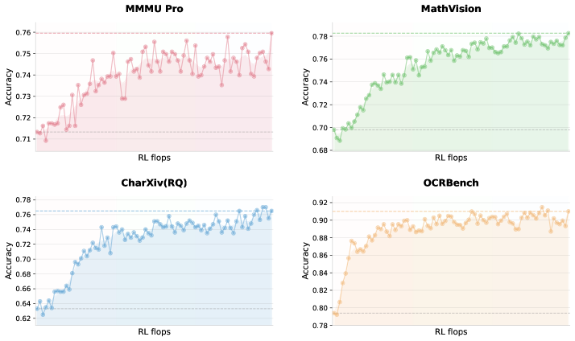
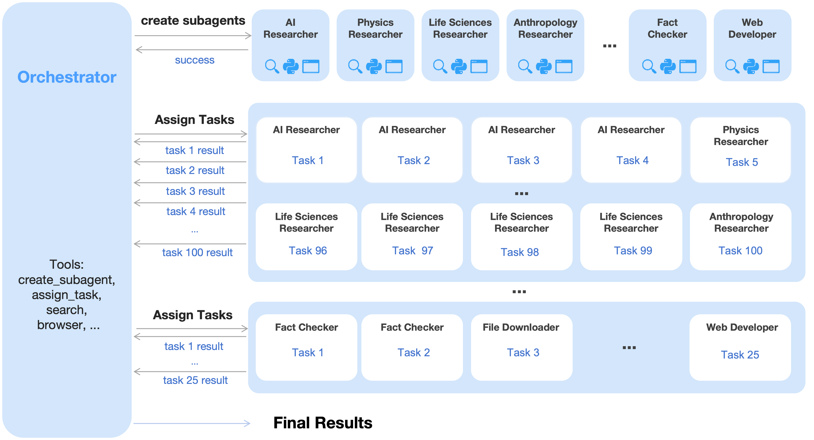
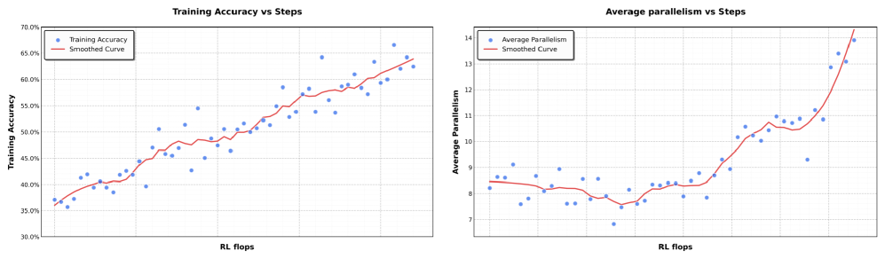
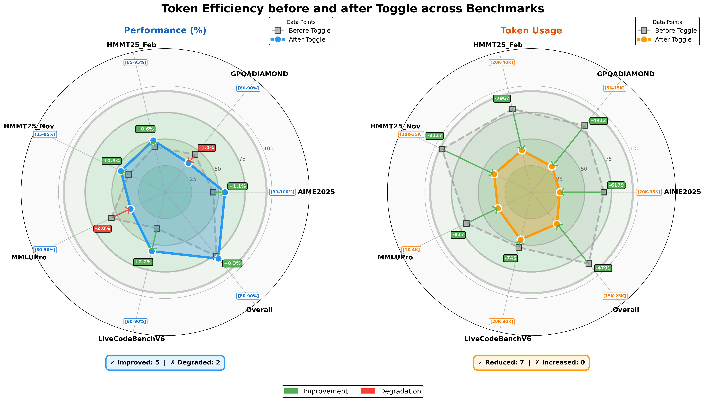
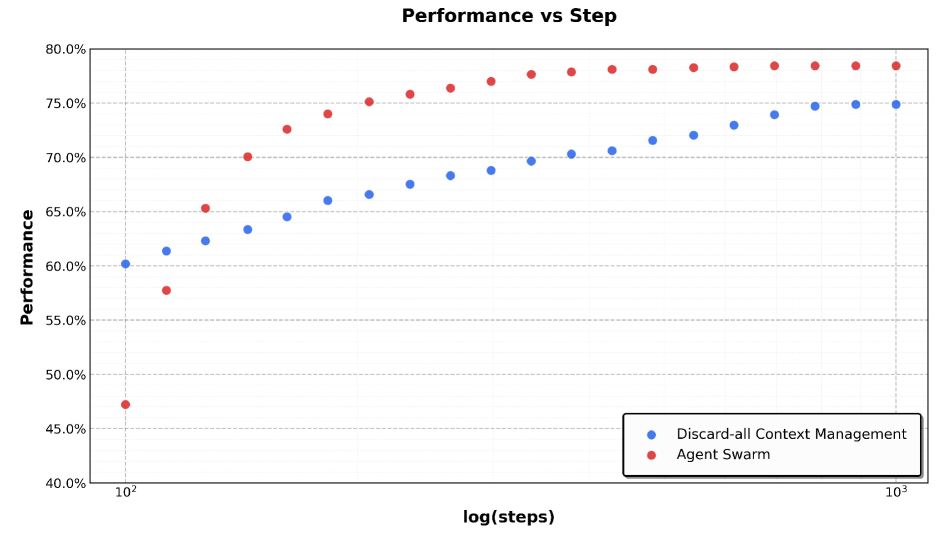
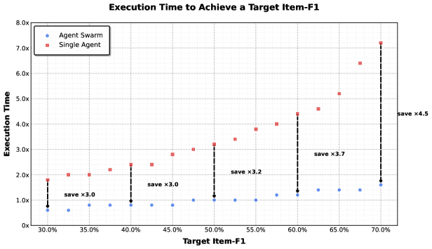
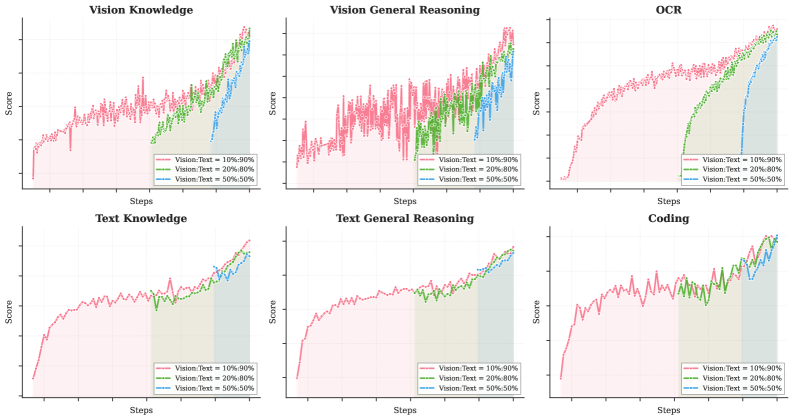
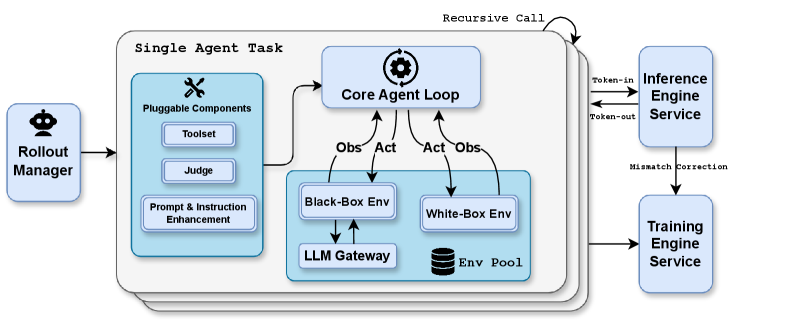
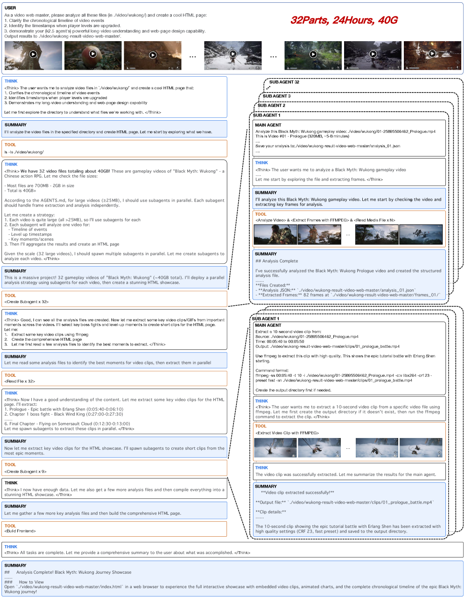
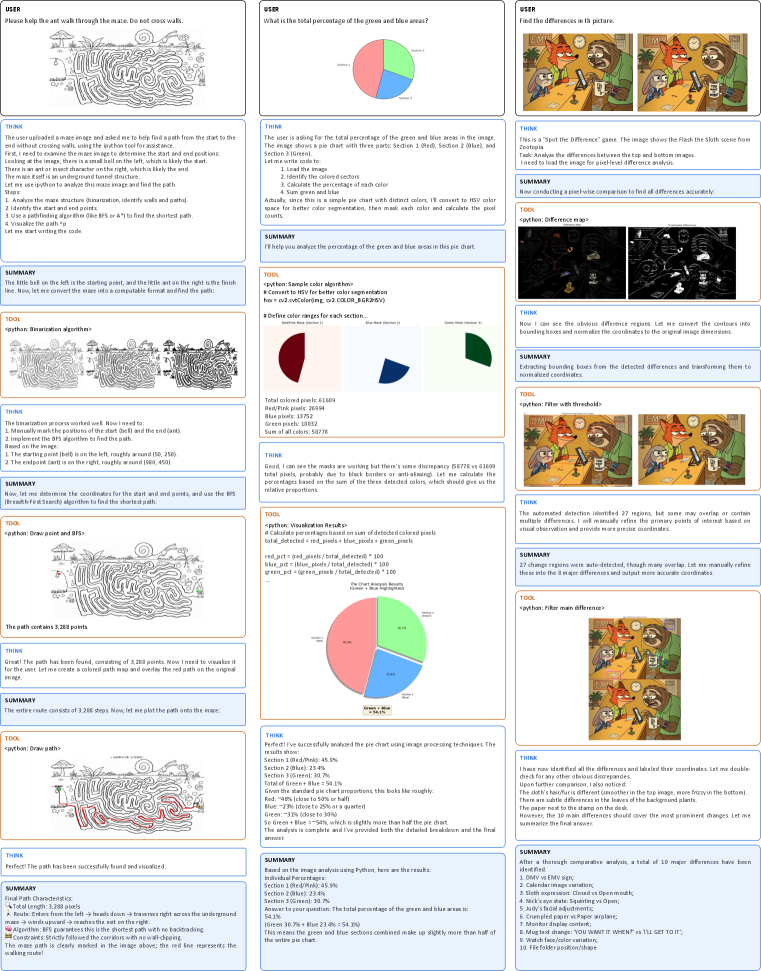

# Kimi K2.5: 視覚的エージェント知能

> 原題: Kimi K2.5: Visual Agentic Intelligence
> 著者: Kimi Team（Moonshot AI）
> 出典: arXiv:2602.02276

> **訳注（クリップ復元について）**: 本訳は Obsidian Web Clipper によるクリップ（ar5iv 由来）を底本とし、以下の不良を ar5iv 原ページと照合して復元した。
> (1) **Figure 7**（Agent Swarm と Discard-all コンテキスト管理の BrowseComp 比較図, x5.png）がクリップから丸ごと欠落していたため、原ページから画像とキャプションを復元し Figure 6 の直後に配置した。
> (2) 脚注 2 件の本文が欠落していたため復元した（脚注 1: モデルチェックポイントの URL、脚注 2: WorldVQA の URL）。`[^fn1]` `[^fn2]` として収録。
> (3) **Table 4** は HTML 表として保存されていたため markdown 表に正規化した。クリップで失われていた太字（グローバル SOTA 表示）も原ページから復元した。
> (4) タイトル横の 21×21 ロゴアイコン（x1.png）は装飾のため除外した。
> (5) 数式中のクリップ由来マクロ（`\mspace` 等）はクリーンな LaTeX に正規化した。
> (6) 付録 A の著者リスト脚注（著者は姓のアルファベット順・† は香港大学所属）を訳注として反映した。
> 参考文献一覧（References）は運用ルールに従い訳出対象から除外した。

## Abstract（要旨）

我々は Kimi K2.5 を紹介する。これは汎用エージェント知能（general agentic intelligence）の前進を目的として設計されたオープンソースのマルチモーダル・エージェントモデルである。K2.5 はテキストと視覚の同時最適化（joint optimization）を重視しており、2 つのモダリティが互いを強化し合うようにする。これには、テキスト・視覚の同時事前学習、zero-vision SFT、テキスト・視覚の同時強化学習といった一連の技術が含まれる。このマルチモーダル基盤の上に、K2.5 は Agent Swarm を導入する。これは自己指揮型（self-directed）の並列エージェントオーケストレーションフレームワークであり、複雑なタスクを異種のサブ問題へ動的に分解し、それらを並行実行する。広範な評価により、Kimi K2.5 はコーディング・視覚・推論・エージェントタスクを含む多様なドメインで最先端（state-of-the-art）の結果を達成することが示された。Agent Swarm はまた、単一エージェントのベースラインに対してレイテンシを最大 $4.5\times$ 削減する。エージェント知能の将来の研究と実世界応用を促進するため、我々は事後学習済みの Kimi K2.5 モデルチェックポイント[^fn1]を公開する。

<figure>


<figcaption>図1: Kimi K2.5 の主要結果。</figcaption>
</figure>

## 1 Introduction（はじめに）

大規模言語モデル（LLM）は、エージェント知能へ向けて急速に進化している。GPT-5.2 [^41]、Claude Opus 4.5 [^4]、Gemini 3 Pro [^19]、Kimi K2-Thinking [^1] といった近年の進展は、特にツール呼び出しと推論において、エージェント能力の大幅な進歩を示している。これらのモデルは、複雑な問題を多段階の計画に分解し、推論と行動を交互に織り交ぜた長い系列を実行する能力をますます示すようになっている。

本レポートでは、Kimi K2.5 の訓練手法と評価結果を紹介する。具体的には、K2.5 の訓練を従来モデルに対して次の 2 つの重要な側面で改善した。

**テキストと視覚の同時最適化。** K2.5 の実践から得られた重要な洞察は、テキストと視覚の同時最適化が両方のモダリティを強化し、衝突を回避するということである。この目的のために我々は一連の技術を考案した。事前学習では、テキストバックボーンに視覚トークンを後段で追加する従来のアプローチ [^7] [^20] とは対照的に、視覚とテキストの総トークン数を固定した場合、低い比率での早期視覚融合（early vision fusion）の方が良い結果をもたらす傾向があることを我々は発見した。そのため K2.5 は、訓練プロセス全体を通じて一定の比率でテキストと視覚のトークンを混合する。

アーキテクチャ面では、Kimi K2.5 は MoonViT-3D を採用する。これは NaViT のパッキング戦略 [^14] を組み込んだネイティブ解像度の視覚エンコーダであり、可変解像度の画像入力を可能にする。動画理解のために、我々は軽量な 3D ViT 圧縮機構を導入する: 連続するフレームを 4 枚ずつグループ化し、共有 MoonViT エンコーダで処理し、パッチレベルで時間方向に平均する。この設計により、Kimi K2.5 は画像エンコーダと動画エンコーダの間で完全な重み共有を維持しながら、同じコンテキストウィンドウ内で最大 4 $\times$ 長い動画を処理できる。

事後学習（post-training）では、zero-vision SFT を導入する——テキストのみの SFT だけで視覚的な推論とツール使用が発火（activate）する。この段階で人間が設計した視覚 trajectory を追加すると、汎化がかえって損なわれることを我々は発見した。対照的に、テキストのみの SFT の方が性能が良い——これはおそらく、同時事前学習がすでに強力な視覚・テキストのアラインメントを確立しており、能力がモダリティを越えて自然に汎化できるためである。その後、テキストと視覚の両方のタスクに対して同時 RL を適用する。決定的に重要なのは、視覚 RL がテキスト性能を劣化させるのではなく、むしろ向上させることを我々が発見した点であり、MMLU-Pro と GPQA-Diamond での改善が見られた。この双方向の強化——テキストが視覚をブートストラップし、視覚がテキストを洗練する——は、同時訓練における優れたクロスモーダル・アラインメントを表している。

**Agent Swarm: 並列エージェントオーケストレーション。** 既存のエージェントモデルのほとんどは、ツール呼び出しの逐次実行に依存している。Kimi K2-Thinking [^1] のように数百の推論ステップを実行できるシステムでさえ、推論時間の線形スケーリングに悩まされ、許容できないレイテンシを招き、タスクの複雑さを制限する。エージェントのワークロードが範囲と異種性の両面で拡大するにつれ——例えば大規模なリサーチ・設計・開発を伴う複雑なプロジェクトの構築など——逐次パラダイムはますます非効率になる。

逐次的なエージェント実行のレイテンシとスケーラビリティの限界を克服するため、Kimi K2.5 は並列エージェントオーケストレーションのための動的フレームワークである Agent Swarm を導入する。我々は、従来のエージェント RL [^2] から離れた Parallel-Agent Reinforcement Learning（PARL）パラダイムを提案する。検証可能な報酬によるツール実行の最適化に加えて、モデルにはサブエージェントの生成とタスク委譲のためのインターフェースが装備される。訓練中、サブエージェントは凍結され、その実行 trajectory は最適化の目的関数から除外される。強化学習で更新されるのはオーケストレータのみである。この分離（decoupling）により、end-to-end の共同最適化が抱える 2 つの課題、すなわち credit assignment の曖昧さと訓練の不安定性を回避する。Agent Swarm は、複雑なタスクをドメイン特化エージェントが並行実行する異種のサブ問題へ分解することを可能にし、タスクの複雑さを線形スケーリングから並列処理へと変換する。ワイドサーチのシナリオでは、Agent Swarm は単一エージェントのベースラインと比較して、item レベルの F1 を 72.8% から 79.0% へ改善しながら、推論レイテンシを最大 4.5 $\times$ 削減する。

Kimi K2.5 は、視覚と言語、thinking モードと instant モード、チャットとエージェントを統合する、汎用エージェント知能のための統一アーキテクチャを表している。visual-to-code 生成（画像/動画からのコード生成）と我々の内部評価における実世界ソフトウェアエンジニアリングでの最先端の結果を含め、エージェント系およびフロンティア系の幅広いベンチマークで強力な性能を達成し、同時に特化エージェントの多様性と並列度の両方をスケールさせる。汎用エージェント知能（General Agentic Intelligence）へ向けたコミュニティの進歩を加速するため、我々は Kimi K2.5 の事後学習済みチェックポイントをオープンソース化し、研究者と開発者がスケーラブルなエージェント知能を探究・改良・展開できるようにする。

## 2 Joint Optimization of Text and Vision（テキストと視覚の同時最適化）

Kimi K2.5 は、およそ 15 兆（15T）の視覚・テキスト混合トークンでの大規模同時事前学習を通じて、Kimi K2 の上に構築されたネイティブなマルチモーダルモデルである。言語能力か視覚能力のいずれかを犠牲にする視覚適応型（vision-adapted）モデルとは異なり、我々の同時事前学習パラダイムは両方のモダリティを同時に強化する。本節では、Kimi K2 を Kimi K2.5 へ拡張するマルチモーダル同時最適化の方法論を説明する。

### 2.1 Native Multimodal Pre-Training（ネイティブ・マルチモーダル事前学習）

**表1**: 異なる視覚・テキスト同時訓練戦略の性能比較。視覚・テキストの総トークン予算を固定した場合、低い視覚比率での早期融合（early fusion）がより良い結果をもたらす。

|  | Vision Injection Timing | Vision-Text Ratio | Vision Knowledge | Vision Reasoning | OCR | Text Knowledge | Text Reasoning | Code |
| --- | --- | --- | --- | --- | --- | --- | --- | --- |
| Early | 0% | 10%:90% | 25.8 | 43.8 | 65.7 | 45.5 | 58.5 | 24.8 |
| Mid | 50% | 20%:80% | 25.0 | 40.7 | 64.1 | 43.9 | 58.6 | 24.0 |
| Late | 80% | 50%:50% | 24.2 | 39.0 | 61.5 | 43.1 | 57.8 | 24.0 |

マルチモーダル事前学習における重要な設計上の問いは次のものである: 視覚・テキストのトークン予算が固定されているとき、最適な視覚・テキスト同時訓練戦略は何か。従来の通念 [^7] [^20] では、視覚トークンは LLM 訓練の後段で高い比率（例: 50% 以上）で導入するのがマルチモーダル能力の獲得を加速するはずだとされており、マルチモーダル能力を言語能力への事後的な追加物（post-hoc add-on）として扱っている。

しかし、我々の実験（表1、図9 参照）は異なる物語を明らかにする。我々は、視覚とテキストの総トークン予算を固定したまま、視覚比率と視覚導入タイミングを変化させるアブレーション研究を実施した。異なる比率の目標値を厳密に満たすため、視覚データを導入する前に、特別に計算されたトークン数だけテキストのみでモデルを事前学習した。驚くべきことに、視覚比率は最終的なマルチモーダル性能にほとんど影響しないことが分かった。実際には、視覚・テキストの総トークン予算を固定した場合、低い視覚比率での早期融合の方が良い結果をもたらす。これが我々のネイティブ・マルチモーダル事前学習戦略の動機である: 終盤に集中させた視覚偏重の訓練ではなく、訓練プロセスの早期に統合された中程度の視覚比率を採用することで、両モダリティの共同最適化の恩恵を長期にわたって受けながら、モデルがバランスの取れたマルチモーダル表現を自然に発達させられるようにする。

### 2.2 Zero-Vision SFT

事前学習済みの VLM は、視覚に基づくツール呼び出しを自然には行わず、これはマルチモーダル RL にとってコールドスタート問題となる。従来のアプローチは、人手でアノテーションした、あるいはプロンプトエンジニアリングで作った chain-of-thought（CoT）データ [^7] によってこの問題に対処するが、そうした手法は多様性に限界があり、視覚的推論を単純な図表や原始的なツール操作（切り抜き・回転・反転）に制限してしまうことが多い。

一つの観察は、高品質なテキスト SFT データが比較的豊富かつ多様であるということである。我々は zero-vision SFT という新しいアプローチを提案する。これは、テキスト SFT データのみを使って、事後学習中に視覚的・エージェント的な能力を発火させるものである。このアプローチでは、すべての画像操作は IPython 内のプログラム的な操作で代行（proxy）され、事実上、従来の視覚ツール使用の一般化として機能する。この「zero-vision」の発火は、二値化と計数による物体サイズ推定のようなピクセルレベルの操作を含む多様な推論行動を可能にし、物体の位置特定（localization）・計数・OCR のような視覚に接地したタスクへも汎化する。

図2 は RL の訓練曲線を示しており、その開始点は zero-vision SFT から得られたものである。結果は、zero-vision SFT が、モダリティ間の汎化を確保しながら視覚能力を発火させるのに十分であることを示している。この現象は、2.1 節で述べたテキストと視覚データの同時事前学習によるものと考えられる。zero-vision SFT と比べ、我々の予備実験では、テキスト・視覚混合の SFT は視覚的・エージェント的タスクではるかに悪い性能を示した。これはおそらく高品質な視覚データの不足のためである。

### 2.3 Joint Multimodal Reinforcement Learning (RL)（同時マルチモーダル強化学習）

本節では、成果ベース（outcome-based）の視覚 RL から、テキスト性能を高める創発的なクロスモーダル転移まで、効果的なマルチモーダル RL を可能にする K2.5 で実装された方法論を説明する。

<figure>



<figcaption>図2: 最小限の zero-vision SFT から開始した、視覚ベンチマークにおける視覚 RL の訓練曲線。視覚 RL の FLOPs をスケールさせることで性能は向上し続けており、zero-vision の発火と長時間の RL の組み合わせが頑健な視覚能力の獲得に十分であることを示している。</figcaption>
</figure>

##### Outcome-Based Visual RL（成果ベースの視覚 RL）

zero-vision SFT の後、モデルが視覚入力を推論へ確実に組み込むには、さらなる改良が必要である。テキスト起点の発火だけでは顕著な失敗モードが見られる: 視覚入力が無視されることがあり、必要なときに画像へ注意が向かないことがある。我々は、正解のために視覚的理解を明示的に必要とするタスクに対して、成果ベースの RL を用いる。これらのタスクは 3 つのドメインに分類される:

- 視覚的グラウンディングと計数: 画像内の物体の正確な位置特定と列挙;
- チャート・文書理解: 構造化された視覚情報の解釈とテキスト抽出;
- 視覚が決定的な STEM 問題: 視覚入力を必要とするようフィルタリングされた数学・科学の問題。

これらのタスクに対する成果ベースの RL は、基礎的な視覚能力とより複雑なエージェント的行動の両方を改善する。これらの trajectory を棄却サンプリング微調整（rejection-sampling fine-tuning, RFT）のために抽出することで自己改善データパイプラインが可能になり、後続の同時 RL 段階がより豊かなマルチモーダル推論トレースを活用できるようになる。

##### Visual RL Improves Text Performance（視覚 RL はテキスト性能を改善する）

**表2**: クロスモーダル転移: 視覚 RL はテキスト知識を改善する

| Benchmark | Before Vision-RL | After Vision-RL | Improvement |
| --- | --- | --- | --- |
| MMLU-Pro | 84.7 | 86.4 | +1.7 |
| GPQA-Diamond | 84.3 | 86.4 | +2.1 |
| LongBench v2 | 56.7 | 58.9 | +2.2 |

視覚性能とテキスト性能の間の潜在的なトレードオフを調べるため、視覚 RL の前後でテキストのみのベンチマークを評価した。驚くべきことに、成果ベースの視覚 RL は、MMLU-Pro（84.7% $\rightarrow$ 86.4%）、GPQA-Diamond（84.3% $\rightarrow$ 86.4%）、LongBench v2（56.7% $\rightarrow$ 58.9%）を含むテキストタスクで測定可能な改善をもたらした（表2）。分析によれば、視覚 RL は構造化された情報抽出を要する領域でのキャリブレーション（確信度の調整）を高め、視覚に接地した推論に類似したクエリ（例: 計数、OCR）での不確実性を減らすことが示唆される。これらの知見は、視覚 RL がクロスモーダルな汎化に寄与し、言語能力の観測可能な劣化なしにテキスト推論を改善しうることを示している。

**Joint Multimodal RL（同時マルチモーダル RL）** 頑健な視覚能力が zero-vision SFT と視覚 RL の組み合わせから創発し、それがさらに一般的なテキスト能力を高めるという発見に動機づけられ、我々は Kimi K2.5 の事後学習において同時マルチモーダル RL パラダイムを採用する。従来のモダリティ別のエキスパート分割から離れ、RL のドメインを入力モダリティではなく能力——知識・推論・コーディング・エージェントなど——によって編成する。これらのドメインエキスパートは、純テキストとマルチモーダルの両方のクエリから同時に学習し、生成型報酬モデル（Generative Reward Model, GRM）も同様に、モダリティの壁なしに異種のトレースを横断して最適化する。このパラダイムにより、テキスト入力・視覚入力のどちらを通じて獲得された能力向上も、もう一方のモダリティの関連能力を高めるように本質的に汎化し、クロスモーダルな能力転移が最大化される。

## 3 Agent Swarm

既存のエージェントベースのシステムの主要な課題は、推論とツール呼び出しステップの逐次実行への依存にある。この構造は、より単純で短いホライズンのタスクには有効かもしれないが、タスクの複雑さが増し、蓄積されるコンテキストが増大するにつれて不十分になる。タスクが広範な情報収集と込み入った多分岐の推論を含むように進化すると、逐次的なシステムはしばしば重大なボトルネックに直面する [^6] [^4] [^5]。各ステップを一つずつ処理する単一エージェントの限られた容量は、実用的な推論の深さとツール呼び出し予算の枯渇につながり、最終的により複雑なシナリオを扱うシステムの能力を妨げる。

これに対処するため、我々は Agent Swarm と Parallel Agent Reinforcement Learning（PARL）を導入する。タスクを推論の連鎖として実行したり、事前に指定された並列化ヒューリスティクスに依存したりする代わりに、K2.5 は動的なタスク分解・サブエージェントのインスタンス化・並列サブタスクスケジューリングを通じて Agent Swarm を起動する。重要なのは、並列性が本質的に有利であるとは前提しないことである。並列化するかどうか・いつ・どのようにという決定は、環境からのフィードバックと RL 駆動の探索を通じて明示的に学習される。図4 に示すように、性能の推移はこの適応的能力を実証しており、オーケストレータが訓練を通じて並列化戦略を最適化するにつれて、累積報酬は滑らかに増加する。

<figure>



<figcaption>図3: agent swarm は訓練可能なオーケストレータを持ち、特化した凍結サブエージェントを動的に生成して、複雑なタスクを並列化可能なサブタスクへ分解し、効率的な分散実行を行う。</figcaption>
</figure>

##### Architecture and Learning Setup（アーキテクチャと学習設定）

PARL フレームワークは、訓練可能なオーケストレータと、固定された中間ポリシーチェックポイントからインスタンス化される凍結サブエージェントから成る分離アーキテクチャを採用する。この設計は、2 つの根本的な課題、すなわち credit assignment の曖昧さと訓練の不安定性を回避するために、end-to-end の共同最適化を意図的に避けている。このマルチエージェント設定では、成果ベースの報酬は本質的に疎で（sparse）ノイズが多い。最終回答が正しくてもサブエージェントの実行が完璧だったとは限らず、失敗したからといってすべてのサブエージェントが誤っていたとも限らない。サブエージェントを凍結し、その出力を微分可能な意思決定点ではなく環境からの観測として扱うことで、高レベルの調整ロジックを低レベルの実行能力から切り離し、より頑健な収束につなげる。効率を高めるため、まず小型のサブエージェントを使ってオーケストレータを訓練し、その後より大きなモデルへ移行する。我々の RL フレームワークはまた、サブエージェントとオーケストレータの間の推論インスタンス比率を動的に調整することをサポートし、クラスタ全体の資源利用を最大化する。

##### PARL Reward（PARL 報酬）

独立したサブエージェント実行に内在する、遅延した・疎な・非定常なフィードバックのため、信頼できる並列オーケストレータの訓練は難しい。これに対処するため、PARL 報酬を次のように定義する:

$$
r_{\mathrm{PARL}}(x,y)=\lambda_{1}\cdot\underbrace{r_{\text{parallel}}}_{\text{instantiation reward}}+\lambda_{2}\cdot\underbrace{r_{\text{finish}}}_{\text{sub-agent finish rate}}+\underbrace{r_{\text{perf}}(x,y)}_{\text{task-level outcome}}\,.
$$

性能報酬 $r_{\text{perf}}$ は、与えられたタスク $x$ に対する解 $y$ の全体的な成功と品質を評価する。これは 2 つの補助報酬で補強され、それぞれが並列オーケストレーションの学習における別個の課題に対処する。報酬 $r_{\text{parallel}}$ は *serial collapse*——オーケストレータが単一エージェント実行をデフォルトにしてしまう局所最適——を緩和するために導入される。サブエージェントのインスタンス化にインセンティブを与えることで、この項は並行スケジューリング空間の探索を促す。$r_{\text{finish}}$ 報酬は、割り当てられたサブタスクの完遂に焦点を当てる。これは *spurious parallelism*（見せかけの並列性）、すなわちオーケストレータが意味のあるタスク分解なしに多数のサブエージェントを生成して並列性の指標を劇的に増やすという reward-hacking 行動を防ぐために使われる。完了したサブタスクに報酬を与えることで、$r_{\text{finish}}$ は実行可能性を強制し、ポリシーを有効かつ効果的な分解へ導く。

最終的なポリシーが主目的を最適化するように、ハイパーパラメータ $\lambda_{1}$ と $\lambda_{2}$ は訓練の過程でゼロへとアニーリングされる。

##### Critical Steps as Resource Constraint（資源制約としての critical steps）

並列エージェント設定における計算時間コストを測るため、計算グラフにおける *critical path*（クリティカルパス）とのアナロジーで *critical steps* を定義する。エピソードを $t=1,\dots,T$ でインデックスされた実行ステージの列としてモデル化する。各ステージでメインエージェントは行動を実行し、それは直接のツール呼び出しか、並列に走るサブエージェント群のインスタンス化のいずれかに対応する。$S_{\mathrm{main}}^{(t)}$ をステージ $t$ でメインエージェントが取るステップ数（通常 $S_{\mathrm{main}}^{(t)}=1$）、$S_{\mathrm{sub},i}^{(t)}$ をその並列グループの $i$ 番目のサブエージェントが取るステップ数とする。ステージ $t$ の所要時間は、そのコホート内で最も長く走るサブエージェントに支配される。したがって、エピソードの総 critical steps は次のように定義される

$$
\text{CriticalSteps}=\sum_{t=1}^{T}\left(S_{\mathrm{main}}^{(t)}+\max_{i}S_{\mathrm{sub},i}^{(t)}\right).
$$

総ステップ数ではなく critical steps を使って訓練と評価を制約することで、このフレームワークは効果的な並列化に明示的なインセンティブを与える。並列グループの最大実行時間を減らさない過剰なサブタスク生成は、この指標の下ではほとんど利益を生まない一方、最長の並列ブランチを短縮するバランスの取れたタスク分解は critical steps を直接減らす。その結果、オーケストレータは、単に並行性や総仕事量を最大化するのではなく、end-to-end のレイテンシを最小化するようにサブエージェントへ仕事を割り振ることを促される。

##### Prompt Construction for Parallel-agent Capability Induction（並列エージェント能力を誘導するプロンプト構築）

オーケストレータが並列化の利点を活用するよう動機づけるため、逐次的なエージェント実行の限界に負荷をかけるように設計された合成プロンプト群を構築する。これらのプロンプトは、多数の独立した情報源の同時探索を要する *wide search*（ワイドサーチ）か、遅延した集約を伴う複数の推論分岐を要する *deep search*（ディープサーチ）のいずれかを強調する。加えて、長文コンテキストの文書分析や大規模ファイルダウンロードなど、実世界のワークロードに着想を得たタスクも含める。逐次実行した場合、これらのタスクは固定された推論ステップとツール呼び出しの予算内で完了することが難しい。構成上、これらは単一の逐次エージェントで可能なよりも少ない critical steps で完了できるよう、オーケストレータにサブタスクの並列割り当てを促す。重要なのは、プロンプトがモデルに並列化を明示的に指示しないことである。その代わり、並列的な分解とスケジューリングの戦略が自然に有利になるようにタスク分布を形作る。

<figure>



<figcaption>図4: 我々の並列エージェント強化学習環境では、訓練が進むにつれて訓練精度が滑らかに上昇する。同時に、訓練中の並列度も徐々に増加する。</figcaption>
</figure>

## 4 Method Overview（手法の概要）

### 4.1 Foundation: Kimi K2 Base Model（基盤: Kimi K2 ベースモデル）

Kimi K2.5 の基盤は Kimi K2 [^53] である。これは 15 兆の高品質テキストトークンで事前学習された 1 兆パラメータの mixture-of-experts（MoE）transformer [^59] モデルである。Kimi K2 は、訓練安定性のための QK-Clip を備えた、トークン効率の高い MuonClip オプティマイザ [^29] [^33] を用いる。モデルは総パラメータ 1.04 兆・活性化パラメータ 320 億から成り、384 エキスパートのうちトークンあたり 8 個を活性化する（スパース性 48）。MuonClip、アーキテクチャ設計、訓練インフラの詳細な説明は Kimi K2 テクニカルレポート [^53] を参照されたい。

### 4.2 Model Architecture（モデルアーキテクチャ）

Kimi K2.5 のマルチモーダルアーキテクチャは 3 つのコンポーネントから成る: 3 次元ネイティブ解像度視覚エンコーダ（MoonViT-3D）、MLP プロジェクタ、そして Kimi K2 MoE 言語モデルであり、Kimi-VL [^54] で確立された設計原則に従う。

##### MoonViT-3D: Shared Embedding Space for Images and Videos（画像と動画の共有埋め込み空間）

Kimi-VL では、複雑なサブ画像の分割・結合操作を不要にするため、画像を元の解像度でネイティブに処理する MoonViT を用いた。SigLIP-SO-400M [^77] から初期化された MoonViT は、NaViT [^14] のパッチパッキング戦略を組み込む。そこでは単一の画像がパッチに分割され、平坦化され、1 次元系列へ順に連結されることで、様々な解像度の画像に対する効率的な同時訓練が可能になる。

画像理解能力の動画への転移を最大化するため、統一アーキテクチャ・完全共有パラメータ・一貫した埋め込み空間を持つ MoonViT-3D を導入する。「patch n' pack」の哲学を時間次元へ一般化し、最大 4 枚の連続フレームを時空間ボリュームとして扱う: これらのフレームからの 2D パッチはまとめて平坦化され、単一の 1 次元系列へパッキングされ、同一の attention 機構が空間と時間の両方をシームレスに処理できるようにする。追加の時間方向 attention は高速な動きや視覚効果の理解を改善する一方、共有は静止画像から動的な動画への知識の汎化を最大化し、特化した動画モジュールやアーキテクチャの分岐を必要とせずに強力な動画理解性能を達成する（表4 参照）。MLP プロジェクタの前では、軽量な時間プーリングが各時間チャンク内のパッチを集約し、$4\times$ の時間圧縮をもたらして実用可能な動画長を大幅に延長する。その結果は、画像事前学習で得られた知識と能力が、一つの共有パラメータ空間と特徴表現を通じて動画へ全体的に転移する統一パイプラインである。

### 4.3 Pre-training Pipeline（事前学習パイプライン）

表3 に示すように、Kimi K2.5 の事前学習は Kimi K2 言語モデルのチェックポイントの上に構築され、約 15T トークンを 3 つのステージで処理する: 第一に、頑健なネイティブ解像度視覚エンコーダを確立するための単独 ViT 訓練; 第二に、言語能力とマルチモーダル能力を同時に高めるための同時事前学習; 第三に、能力を洗練しコンテキストウィンドウを拡張するための、高品質データでの mid-training と長文コンテキストの発火。

**表3**: 訓練ステージの概要: データ構成、トークン量、系列長、訓練対象コンポーネント。

| Stages | ViT Training | Joint Pre-training | Joint Long-context Mid-training |
| --- | --- | --- | --- |
| Data | Alt text Synthesis Caption Grounding, OCR, Video | \+ Text, Knowledge Interleaving Video, OS Screenshot | \+ High-quality Text & Multimodal Long Text, Long Video Reasoning, Long-CoT |
| Sequence length | 4096 | 4096 | 32768 $\rightarrow$ 262144 |
| Tokens | 1T | 15T | 500B $\rightarrow$ 200B |
| Training | ViT | ViT & LLM | ViT & LLM |

##### ViT Training Stage（ViT 訓練ステージ）

MoonViT-3D は、画像・テキストペアと動画・テキストペアの上で SigLIP [^77] から継続事前学習される。テキスト側は多様なターゲットから成る: 画像の alt テキスト、画像・動画の合成キャプション、グラウンディングのバウンディングボックス、OCR テキスト。Kimi-VL [^54] の実装とは異なり、この継続事前学習は対照損失（contrastive loss）を含まず、入力画像・動画を条件としたキャプション生成のための交差エントロピー損失 ${L}_{caption}$ のみを組み込む。我々は 2 段階のアラインメント戦略を採用する。第 1 段階では、キャプション損失を介して MoonViT-3D を Moonlight-16B-A3B [^33] にアラインするよう更新し、ごくわずかな訓練 FLOPs で約 1T トークンを消費する。この段階により、MoonViT-3D は主に高解像度の画像と動画を理解できるようになる。続くごく短い第 2 段階では MLP プロジェクタのみを更新し、より滑らかな同時事前学習のために ViT を 1T の LLM へ橋渡しする。

##### Joint Training Stages（同時訓練ステージ）

同時事前学習ステージは、終盤に近い Kimi K2 チェックポイントから、4K 系列長で追加の 15T 視覚・テキストトークンにわたって継続する。データレシピは Kimi K2 の事前学習分布を拡張し、新規（unique）トークンを導入し、コーディング関連コンテンツの重みを増やしてデータ比率を調整し、データソースごとの最大エポック数を制御する。第 3 ステージは、より高品質な mid-training データを統合した長文コンテキストの発火を行い、YaRN [^44] 補間によって文脈長を逐次拡張する。これは長文テキスト理解と長時間動画理解において顕著な汎化改善をもたらす。

### 4.4 Post-Training（事後学習）

#### 4.4.1 Supervised Fine-Tuning（教師ありファインチューニング）

Kimi K2 [^53] で確立された SFT パイプラインに従い、K2、K2 Thinking、および一連の内製エキスパートモデルから高品質な候補応答を合成して K2.5 を開発した。我々のデータ生成戦略は、特定ドメインに合わせた特化パイプラインを用い、人間によるアノテーションを高度なプロンプトエンジニアリングと多段階検証に統合する。この方法論により、多様なプロンプトと込み入った推論 trajectory を特徴とする大規模な instruction-tuning データセットが生成され、最終的に、複雑な実世界アプリケーションのための対話的推論と正確なツール呼び出しを優先するようモデルを訓練した。

#### 4.4.2 Reinforcement Learning（強化学習）

強化学習は我々の事後学習の決定的に重要なフェーズを構成する。テキストと視覚のモダリティを横断する同時最適化を促進し、agent swarm のための PARL を可能にするため、我々は統一エージェント強化学習環境（Unified Agentic Reinforcement Learning Environment, 付録 D）を開発し、RL アルゴリズムを最適化した。テキスト・視覚同時 RL と PARL は、どちらも本節で述べるアルゴリズムの上に構築されている。

##### Policy Optimization（ポリシー最適化）

データセット $\mathcal{D}$ からサンプルされた各問題 $x$ に対し、以前のポリシー $\pi_{\mathrm{old}}$ を使って $K$ 個の応答 $\{y_{1},\dots,y_{K}\}$ を生成する。モデル $\pi_{\theta}$ を次の目的関数に関して最適化する:

$$
L_{\mathrm{RL}}(\theta)=\mathbb{E}_{x\sim\mathcal{D}}\left[\frac{1}{N}\sum_{j=1}^{K}\sum_{i=1}^{|y_{j}|}\mathrm{Clip}\left(\frac{\pi_{\theta}(y_{j}^{i}|x,y_{j}^{0:i})}{\pi_{\mathrm{old}}(y_{j}^{i}|x,y_{j}^{0:i})},\alpha,\beta\right)({r}(x,y_{j})-\bar{r}(x))-\tau\left(\log\frac{\pi_{\theta}(y_{j}^{i}|x,y_{j}^{0:i})}{\pi_{\mathrm{old}}(y_{j}^{i}|x,y_{j}^{0:i})}\right)^{2}\right]\,.
$$

ここで $\alpha,\beta,\tau>0$ はハイパーパラメータ、$y^{j}_{0:i}$ は $j$ 番目の応答の $i$ 番目のトークンまでのプレフィックス、$N=\sum_{i=1}^{K}|y_{i}|$ はバッチ内で生成されたトークンの総数、$\bar{r}(x)=\frac{1}{K}\sum_{j=1}^{K}r(x,y_{j})$ は生成された全応答の平均報酬である。

この損失関数は、訓練フレームワークと推論フレームワークの間の不一致によって増幅される off-policy 乖離を緩和するために設計されたトークンレベルのクリッピング機構を導入する点で、K1.5 [^30] で使われたポリシー最適化アルゴリズムから離れている。この機構は単純な勾配マスキング方式として機能する: 対数比が区間 $[\alpha,\beta]$ 内にあるトークンについてはポリシー勾配を通常どおり計算し、この範囲外に落ちるトークンの勾配はゼロにする。特筆すべきは、標準的な PPO クリッピング [^50] との重要な違いとして、我々の手法がアドバンテージの符号に関係なく、off-policy ドリフトを明示的に抑えるために対数比のみに厳密に依拠する点である。このアプローチは、大規模 RL 訓練を安定化するために最近提案された戦略 [^74] [^78] と軌を一にする。経験的に、この機構は、長いホライズンの多段階ツール使用推論を要する複雑なドメインで訓練の安定性を維持するのに不可欠であることが分かった。この目的関数の最小化には MuonClip オプティマイザ [^29] [^33] を用いる。

##### Reward Function（報酬関数）

推論やエージェントタスクのような検証可能な解を持つタスクにはルールベースの成果報酬を適用する。資源消費を最適化するため、トークン効率を高めることを狙った予算制御報酬も組み込む。汎用タスクには、Kimi の内部的な価値基準に沿ったきめ細かな評価を提供する生成型報酬モデル（GRM）を用いる。加えて視覚タスクには、きめ細かな監督を提供するタスク特化の報酬関数を設計する。視覚的グラウンディングと点位置特定（point localization）のタスクには、ソフトマッチングを伴う F1 ベースの報酬を用いる: グラウンディングタスクは Intersection over Union（IoU）からソフトマッチを導出し、点タスクは最適マッチングの下でのガウス重み付き距離からソフトマッチを導出する。多角形セグメンテーションのタスクでは、予測された多角形を二値マスクへラスタライズし、正解マスクに対するセグメンテーション IoU を計算して報酬を割り当てる。OCR タスクには、予測と正解の間の文字レベルの整合を定量化する正規化編集距離を採用する。計数タスクでは、予測と正解の絶対差に基づいて報酬を割り当てる。さらに、複雑な視覚パズル問題を合成し、LLM 検証器（Kimi K2）を使ってフィードバックを提供する。

##### Generative Reward Models（生成型報酬モデル）

Kimi K2 はオープンエンドな生成のために自己批評ルーブリック報酬（self-critique rubric reward）を活用した [^53]。K2.5 はこの系統の仕事を拡張し、幅広いエージェント的行動とマルチモーダル trajectory にわたって *生成型報酬モデル（GRM）* を体系的に展開する。報酬モデリングを会話出力に限定するのではなく、チャットアシスタント・コーディングエージェント・検索エージェント・成果物生成エージェントを含む多様な環境で、検証済みの報酬シグナルの上に GRM を適用する。特筆すべきは、GRM は二値の裁定者としてではなく、ユーザー体験にとって決定的に重要な Kimi の価値観——有用性、応答の即応性、文脈的関連性、適切な詳細度、生成された成果物の美的品質、厳密な指示追従など——に沿ったきめ細かな評価者として機能することである。この設計により、純粋なルールベースやタスク特化の検証器では符号化しにくい、ニュアンスのある選好の勾配を報酬シグナルが捉えられるようになる。reward hacking と単一の選好シグナルへの過学習を緩和するため、異なるタスク文脈に合わせた複数の代替 GRM ルーブリックを用いる。

##### Token Efficient Reinforcement Learning（トークン効率の強化学習）

トークン効率は、test-time scaling を行う LLM の中心課題である。test-time scaling は本質的に計算量を推論品質と交換するものだが、実用的な利得を得るには、このトレードオフを能動的に舵取りするアルゴリズム的な革新が必要である。我々の以前の知見は、問題依存の予算を課すことが推論時計算を効果的に制約し、不要なトークン拡張なしに、より簡潔な chain-of-thought 推論パターンを生成するようモデルを動機づけることを示している [^30] [^53]。しかし、*length-overfitting 現象* も観察される: 硬直した予算制約の下で訓練されたモデルは、より高い計算スケールへの汎化にしばしば失敗する。その結果、複雑な問題を解くために追加の推論時トークンを効果的に活用できず、切り詰められた推論パターンに陥ってしまう。

この目的のために、推論時スケーリングと予算制約付き最適化を交互に行う訓練ヒューリスティック *Toggle* を提案する: 学習イテレーション $t$ に対し、報酬関数は次で定義される

$$
\tilde{r}(x,y)=\begin{cases}r(x,y)\cdot\mathbb{I}\left\{\frac{1}{K}\sum_{i=1}^{K}r(x,y_{i})<\lambda\ \mathrm{or}\ |y_{i}|\leq\mathrm{budget(x)}\right\}&\text{if }\lfloor t/m\rfloor\pmod{2}=0\ (\mathrm{Phase0})\\
r(x,y)&\text{if }\lfloor t/m\rfloor\pmod{2}=1\ (\mathrm{Phase1})\end{cases}\,.
$$

ここで $\lambda$ と $m$ はアルゴリズムのハイパーパラメータ、$K$ は問題あたりの rollout 数である。具体的には、アルゴリズムは $m$ イテレーションごとに 2 つの最適化フェーズを交互に切り替える:

- Phase0（*予算制限フェーズ*）: タスク依存のトークン予算内で問題を解くようモデルを訓練する。効率のために品質を早まって犠牲にするのを防ぐため、この制約は条件付きで適用される: 与えられた問題に対するモデルの平均正解率が閾値 $\lambda$ を超えるときにのみ強制される。
- Phase1（*標準スケーリングフェーズ*）: モデルは最大トークン上限まで応答を生成し、より良い推論時スケーリングのために計算を活用するよう促される。

問題依存の予算は、正解応答の部分集合におけるトークン長の $\rho$ パーセンタイルから推定される:

$$
\mathrm{budget}(x)=\text{Percentile}\left(\{|y_{j}|\mid r(x,y_{i})=1,i=1,\dots,K\},\rho\right)\,.
$$

この予算は訓練開始時に一度推定され、その後は固定される。特筆すべきは、Toggle が二目的問題に対する確率的な交互最適化として機能することである。これは推論能力と計算効率の両立のために特別に設計されている。

<figure>



<figcaption>図5: トークン効率 RL 後の Kimi K2 Thinking のモデル性能とトークン使用量の比較。</figcaption>
</figure>

Toggle の有効性を K2 Thinking [^1] で評価する。図5 に示すように、ほぼすべてのベンチマークで出力長の一貫した削減が観察される。平均して、Toggle は性能への影響を無視できる程度に抑えながら出力トークンを 25 $\sim$ 30% 削減する。また、chain-of-thought 内の冗長なパターン、例えば繰り返しの検証や機械的な計算が大幅に減少することも観察される。さらに、Toggle は強いドメイン汎化を示す。例えば、数学とプログラミングのタスクのみで訓練した場合でも、モデルは GPQA と MMLU-Pro で一貫したトークン削減を達成し、性能の劣化はごくわずかにとどまる（図5）。

### 4.5 Training Infrastructure（訓練インフラ）

Kimi K2.5 は、最小限の変更で Kimi K2 [^53] の訓練インフラを継承する。マルチモーダル訓練のために我々は Decoupled Encoder Process を提案する。これにより視覚エンコーダは、無視できる程度の追加オーバーヘッドで既存パイプラインに組み込まれる。

#### 4.5.1 Decoupled Encoder Process (DEP)（分離エンコーダプロセス）

Pipeline Parallelism（PP）を用いる典型的なマルチモーダル訓練パラダイムでは、視覚エンコーダとテキスト埋め込みはパイプラインの最初のステージ（Stage-0）に同居する。しかし、マルチモーダル入力サイズ（例: 画像枚数や解像度）の本質的な変動のため、Stage-0 は計算負荷とメモリ使用量の両方で激しい変動に見舞われる。このため既存の解決策は、視覚言語モデル向けにカスタムの PP 構成を採らざるを得ない——例えば [^54] は、メモリを確保するために Stage-0 のテキストデコーダ層数を手動で調整している。この妥協はメモリ圧力を緩和するものの、マルチモーダル入力サイズに起因する負荷不均衡を根本的には解決しない。より決定的なのは、テキストのみの訓練向けに高度に最適化されてきた並列化戦略の直接的な再利用を妨げることである。

計算グラフ内での視覚エンコーダの特異な位相的位置——具体的には、forward パスの始点であり backward パスの終点であるという役割——を活用し、我々の訓練は Decoupled Encoder Process（DEP）を用いる。これは各訓練ステップで 3 つの段階から成る:

- Balanced Vision Forward: まずグローバルバッチ内のすべての視覚データについて forward パスを実行する。視覚エンコーダは小さいため、他の並列化戦略に関係なく全 GPU に複製する。このフェーズでは、forward の計算負荷は負荷指標（例: 画像数やパッチ数）に基づいて全 GPU に均等に分配される。これにより、PP と視覚トークン数に起因する負荷不均衡が解消される。ピークメモリ使用量を最小化するため、中間活性化はすべて破棄し、最終出力の活性化のみを保持する。結果は PP Stage-0 へ集約（gather）される;
- Backbone Training: このフェーズはメインの transformer バックボーンの forward・backward パスを実行する。先行フェーズで中間活性化を破棄したことで、純テキスト訓練で検証済みの効率的な並列化戦略を余すことなく活用できる。このフェーズの後、勾配は視覚エンコーダの出力のところに蓄積される;
- Vision Recomputation & Backward: 視覚エンコーダの forward パスを再計算し、続いて backward パスを実行して視覚エンコーダ内パラメータの勾配を計算する;

DEP は負荷分散を達成するだけでなく、視覚エンコーダとメインバックボーンの最適化戦略を分離する。K2.5 は K2 の並列化戦略をシームレスに継承し、テキストのみの訓練に対して 90% のマルチモーダル訓練効率を達成する。並行研究である LongCat-Flash-Omni [^55] が類似の設計哲学を共有していることを記しておく。

## 5 Evaluations（評価）

### 5.1 Main Results（主要結果）

#### 5.1.1 Evaluation Settings（評価設定）

##### Benchmarks（ベンチマーク）

Kimi K2.5 を、テキストベースの推論、競技・エージェント的コーディング、マルチモーダル理解（画像・動画）、自律的エージェント実行、computer use にまたがる包括的なベンチマークスイートで評価する。我々のベンチマーク分類は以下の能力軸に沿って編成される:

- Reasoning & General: Humanity's Last Exam (HLE) [^46], AIME 2025 [^40], HMMT 2025 (Feb) [^58], IMO-AnswerBench [^36], GPQA-Diamond [^47], MMLU-Pro [^64], SimpleQA Verified [^21], AdvancedIF [^22], LongBench v2 [^8]。
- Coding: SWE-Bench Verified [^28], SWE-Bench Pro (public) [^15], SWE-Bench Multilingual [^28], Terminal Bench 2.0 [^38], PaperBench (CodeDev) [^52], CyberGym [^66], SciCode [^56], OJBench (cpp) [^65], LiveCodeBench (v6) [^27]。
- Image Understanding: （数学・推論）MMMU-Pro [^76], MMMU (val) [^75], CharXiv (RQ) [^67], MathVision [^61], MathVista (mini) [^35]; （視覚知識）SimpleVQA [^12], WorldVQA[^fn2]; （知覚）ZeroBench（ツールあり/なし）[^48], BabyVision [^11], BLINK [^17], MMVP [^57]; （OCR・文書）OCRBench [^34], OmniDocBench 1.5 [^42], InfoVQA [^37]。
- Computer Use: OSWorld-Verified [^72] [^73], WebArena [^80]。

**表4**: オープンソースおよびプロプライエタリなモデルに対する Kimi K2.5 の性能比較。太字はグローバル SOTA を示す。\* 付きのデータ点は我々の内部評価によるもの。† はテキストのみのサブセットでのスコアを指す。

|  |  | Proprietary |  |  | Open Source |  |
| **Benchmark** | **Kimi K2.5** | **Claude Opus 4.5** | **GPT-5.2 (xhigh)** | **Gemini 3 Pro** | **DeepSeek-V3.2** | **Qwen3-VL-235B-A22B** |
| --- | --- | --- | --- | --- | --- | --- |
| **Reasoning & General** |  |  |  |  |  |  |
| HLE-Full | 30.1 | 30.8 | 34.5 | **37.5** | 25.1 † | - |
| HLE-Full w/ tools | **50.2** | 43.2 | 45.5 | 45.8 | 40.8 † | - |
| AIME 2025 | 96.1 | 92.8 | **100** | 95.0 | 93.1 | - |
| HMMT 2025 (Feb) | 95.4 | 92.9* | **99.4** | 97.3* | 92.5 | - |
| IMO-AnswerBench | 81.8 | 78.5* | **86.3** | 83.1* | 78.3 | - |
| GPQA-Diamond | 87.6 | 87.0 | **92.4** | 91.9 | 82.4 | - |
| MMLU-Pro | 87.1 | 89.3* | 86.7* | **90.1** | 85.0 | - |
| SimpleQA Verified | 36.9 | 44.1 | 38.9 | **72.1** | 27.5 | - |
| AdvancedIF | 75.6 | 63.1 | **81.1** | 74.7 | 58.8 | - |
| LongBench v2 | 61.0 | 64.4* | 54.5* | **68.2*** | 59.8* | - |
| **Coding** |  |  |  |  |  |  |
| SWE-Bench Verified | 76.8 | **80.9** | 80.0 | 76.2 | 73.1 | - |
| SWE-Bench Pro (public) | 50.7 | 55.4* | **55.6** | - | - | - |
| SWE-Bench Multilingual | 73.0 | **77.5** | 72.0 | 65.0 | 70.2 | - |
| Terminal Bench 2.0 | 50.8 | **59.3** | 54.0 | 54.2 | 46.4 | - |
| PaperBench (CodeDev) | 63.5 | **72.9*** | 63.7* | - | 47.1 | - |
| CyberGym | 41.3 | **50.6** | - | 39.9* | 17.3* | - |
| SciCode | 48.7 | 49.5 | 52.1 | **56.1** | 38.9 | - |
| OJBench (cpp) | 57.4 | 54.6* | - | **68.5*** | 54.7* | - |
| LiveCodeBench (v6) | 85.0 | 82.2* | - | **87.4*** | 83.3 | - |
| **Agentic** |  |  |  |  |  |  |
| BrowseComp | **60.6** | 37.0 | 65.8 | 37.8 | 51.4 | - |
| BrowseComp (w/ ctx manage) | **74.9** | 57.8 |  | 59.2 | 67.6 | - |
| BrowseComp (Agent Swarm) | **78.4** | - | - | - | - | - |
| WideSearch | 72.7 | **76.2*** | - | 57.0 | 32.5* | - |
| WideSearch (Agent Swarm) | **79.0** | - | - | - | - | - |
| DeepSearchQA | **77.1** | 76.1* | 71.3* | 63.2* | 60.9* | - |
| FinSearchCompT2&T3 | **67.8** | 66.2* | - | 49.9 | 59.1* | - |
| Seal-0 | **57.4** | 47.7* | 45.0 | 45.5* | 49.5* | - |
| GDPVal-AA | 41.0 | 45.0 | **48.0** | 35.0 | 34.0 | - |
| **Image** |  |  |  |  |  |  |
| MMMU-Pro | 78.5 | 74.0 | 79.5* | **81.0** | - | 69.3 |
| MMMU (val) | 84.3 | 80.7 | 86.7* | **87.5*** | - | 80.6 |
| CharXiv (RQ) | 77.5 | 67.2* | **82.1** | 81.4 | - | 66.1 |
| MathVision | 84.2 | 77.1* | 83.0 | **86.1*** | - | 74.6 |
| MathVista (mini) | **90.1** | 80.2* | 82.8* | 89.8* | - | 85.8 |
| SimpleVQA | **71.2** | 69.7* | 55.8* | 69.7* | - | 56.8* |
| WorldVQA | 46.3 | 36.8 | 28.0 | **47.4** | - | 23.5 |
| ZeroBench | **9** | 3* | **9*** | 8* | - | 4* |
| ZeroBench w/ tools | 11 | 9* | 7* | **12*** | - | 3* |
| BabyVision | 36.5 | 14.2 | 34.4 | **49.7** | - | 22.2 |
| BLINK | **78.9** | 68.8* | - | 78.7* | - | 68.9 |
| MMVP | 87.0 | 80.0* | 83.0* | **90.0*** | - | 84.3 |
| OmniDocBench 1.5 | **88.8** | 87.7* | 85.7 | 88.5 | - | 82.0* |
| OCRBench | **92.3** | 86.5* | 80.7* | 90.3* | - | 87.5 |
| InfoVQA (test) | **92.6** | 76.9* | 84* | 57.2* | - | 89.5 |
| **Video** |  |  |  |  |  |  |
| VideoMMMU | 86.6 | 84.4* | 85.9 | **87.6** | - | 80.0 |
| MMVU | 80.4 | 77.3* | **80.8*** | 77.5* | - | 71.1 |
| MotionBench | **70.4** | 60.3* | 64.8* | 70.3 | - | - |
| Video-MME | 87.4 | 77.6* | 86.0* | **88.4*** | - | 79.0 |
| LongVideoBench | **79.8** | 67.2* | 76.5* | 77.7* | - | 65.6* |
| LVBench | **75.9** | 57.3 | - | 73.5* | - | 63.6 |
| **Computer Use** |  |  |  |  |  |  |
| OSWorld-Verified | 63.3 | **66.3** | 8.6* | 20.7* | - | 38.1 |
| WebArena | 58.9 | **63.4*** | - | - | - | 26.4* |

**表5**: いくつかの推論モデルの性能とトークン効率。括弧内は平均出力トークン数（千単位）。

| Benchmark | Kimi K2.5 | Kimi K2 Thinking | Gemini-3.0 Pro | DeepSeek-V3.2 Thinking |
| --- | --- | --- | --- | --- |
| AIME 2025 | 96.1 (25k) | 94.5 (30k) | 95.0 (15k) | 93.1 (16k) |
| HMMT Feb 2025 | 95.4 (27k) | 89.4 (35k) | 97.3 (16k) | 92.5 (19k) |
| HMMT Nov 2025 | 91.1 (24k) | 89.2 (32k) | 94.5 (15k) | 90.2 (18k) |
| IMO-AnswerBench | 81.8 (36k) | 78.6 (37k) | 83.1 (18k) | 78.3 (27k) |
| LiveCodeBench | 85.0 (18k) | 82.6 (25k) | 87.4 (13k) | 83.3 (16k) |
| GPQA Diamond | 87.6 (14k) | 84.5 (13k) | 91.9 (8k) | 82.4 (7k) |
| HLE-Text | 31.5 (24k) | 23.9 (29k) | 38.4 (13k) | 25.1 (21k) |

##### Baselines（ベースライン）

最先端のプロプライエタリおよびオープンソースのモデルに対してベンチマークを行う。プロプライエタリモデルとしては、Claude Opus 4.5（extended thinking 有効）[^4]、GPT-5.2（xhigh reasoning effort）[^41]、Gemini 3 Pro（high reasoning-level）[^19] と比較する。オープンソースモデルとしては、テキストベンチマークには DeepSeek-V3.2（thinking モード有効）[^13] を含め、視覚ベンチマークには代わりに Qwen3-VL-235B-A22B-Thinking [^7] を報告する。

##### Evaluation Configurations（評価構成）

特に指定のない限り、Kimi K2.5 のすべての評価は temperature = 1.0、top-p = 0.95、コンテキスト長 256k トークンを用いる。公開スコアのないベンチマークは同一条件で再評価し、アスタリスク（\*）を付した。完全な評価設定は付録 E に記載する。

#### 5.1.2 Evaluation Results（評価結果）

プロプライエタリおよびオープンソースのベースラインに対する Kimi K2.5 の包括的な結果を表4 に示す。中核となる能力ドメインごとの主要な観察を挙げる:

##### Reasoning and General（推論と一般能力）

Kimi K2.5 は、厳格な STEM ベンチマークにおいてトップクラスのプロプライエタリモデルと拮抗する性能を達成する。数学タスクの AIME 2025 では K2.5 は 96.1% を記録し、GPT-5.2 の満点に迫りながら、Claude Opus 4.5（92.8%）と Gemini 3 Pro（95.0%）を上回る。この高水準の性能は HMMT 2025（95.4%）と IMO-AnswerBench（81.8%）にも及び、K2.5 の優れた推論の深さを示している。Kimi K2.5 はまた顕著な知識・科学的推論能力を示し、SimpleQA Verified で 36.9%、MMLU-Pro で 87.1%、GPQA で 87.6% を記録する。特筆すべきは、ツールなしの HLE で K2.5 が HLE-Full スコア 30.1% を達成し、その内訳がテキストサブセット 31.5%・画像サブセット 21.3% であることだ。ツール使用を有効にすると、K2.5 の HLE-Full スコアは 50.2% へ上昇し（テキスト 51.8%・画像 39.8%）、Gemini 3 Pro（45.8%）と GPT-5.2（45.5%）を大きく上回る。推論と知識に加え、K2.5 は強力な指示追従性能（AdvancedIF で 75.6%）と競争力のある長文コンテキスト能力を示し、LongBench v2 ではプロプライエタリ・オープンソース双方のモデルと比較して 61.0% を達成する。

##### Complex Coding and Software Engineering（複雑なコーディングとソフトウェアエンジニアリング）

Kimi K2.5 は、特に現実的なコーディング・保守タスクにおいて、強力なソフトウェアエンジニアリング能力を示す。SWE-Bench Verified で 76.8%、SWE-Bench Multilingual で 73.0% を達成し、Gemini 3 Pro を上回りながら Claude Opus 4.5 や GPT‑5.2 と競合する水準を保つ。LiveCodeBench v6 では 85.0% に達し、DeepSeek‑V3.2（83.3%）と Claude Opus 4.5（82.2%）を上回り、随時更新され続けるライブなコーディング課題に対する頑健さを際立たせている。TerminalBench 2.0、PaperBench、SciCode ではそれぞれ 50.8%、63.5%、48.7% を記録し、多様なドメインにわたる自動ソフトウェアエンジニアリングと問題解決において、安定した競技レベルの性能を示す。加えて K2.5 は CyberGym で 41.3 のスコアを達成した。これは、脆弱性の高レベルな説明だけを与えられて、実在するオープンソースソフトウェアプロジェクトから過去に発見された脆弱性を見つけ出すタスクであり、セキュリティ指向のソフトウェア分析における有効性をさらに裏付けている。

##### Agentic Capabilities（エージェント能力）

Kimi K2.5 は、複雑なエージェント的検索・ブラウジングタスクで新たな最先端性能を確立する。BrowseComp では、K2.5 はコンテキスト管理技法なしで 60.6%、Discard-all コンテキスト管理 [^13] ありで 74.9% を達成する——GPT-5.2 の報告値 65.8%、Claude Opus 4.5（37.0%）、Gemini 3 Pro（37.8%）を大幅に上回る。同様に WideSearch は item-f1 で 72.7% に達する。DeepSearchQA（77.1%）、FinSearchCompT2&T3（67.8%）、Seal-0（57.4%）では K2.5 が評価対象の全モデルを上回り、エージェント的ディープリサーチ・情報統合・多段階ツールオーケストレーションにおける優れた能力を示している。

##### Vision Reasoning, Knowledge and Perception（視覚推論・知識・知覚）

Kimi K2.5 は強力な視覚推論と世界知識の能力を示す。多分野にわたるマルチモーダルタスクを扱う MMMU-Pro で 78.5% を記録する。世界知識の質問応答では、SimpleVQA で 71.2%、WorldVQA で 46.3% を達成する。視覚推論では MathVision で 84.2%、MathVista (mini) で 90.1%、BabyVision で 36.5% を達成する。OCR と文書理解では、CharXiv (RQ) で 77.5%、OCRBench で 92.3%、OmniDocBench 1.5 で 88.8%、InfoVQA (test) で 92.6% と傑出した結果を出している。難関の ZeroBench では 9%、ツール補強ありで 11% を達成し、競合モデルを大きく引き離す。基礎的な視覚知覚ベンチマークである BLINK（78.9%）と MMVP（87.0%）でも競争力ある性能が観察され、実世界の視覚知覚の頑健さを示している。

##### Video Understanding（動画理解）

Kimi K2.5 は多様な動画理解タスクで最先端の性能を達成する。VideoMMMU で 86.6%、MMVU で 80.4% を記録し、フロンティアの先頭集団に比肩する。MoonViT-3D のコンテキスト圧縮と高密度の時間理解能力により、Kimi K2.5 は 2,000 フレーム超の入力によって長時間動画理解でも新たなグローバル SOTA 記録を樹立し（LVBench 75.9%・LongVideoBench 79.8%）、高次元の MotionBench では 70.4% と頑健な高密度モーション理解を示す。

##### Computer-Use Capability（computer use 能力）

Kimi K2.5 は実世界タスクにおける最先端の computer use 能力を示す。computer use ベンチマークの OSWorld-Verified [^72] [^73] では、外部ツールなしで GUI 操作のみに依拠して 63.3% の成功率を達成する。これは Qwen3-VL-235B-A22B（38.1%）のようなオープンソースモデルや OpenAI の computer use エージェントフレームワーク Operator（o3 ベース）（42.9%）を大幅に上回り、現行の主導的な CUA モデルである Claude Opus 4.5（66.3%）と競合する水準にある。GUI ベースの Web ブラウジングの確立されたベンチマークである WebArena [^80] では、Kimi K2.5 は 58.9% の成功率を達成し、OpenAI の Operator（58.1%）を上回り、Claude Opus 4.5（63.4%）の性能に迫る。

### 5.2 Agent Swarm Results（Agent Swarm の結果）

##### Benchmarks（ベンチマーク）

agent swarm フレームワークの有効性を厳密に評価するため、深い推論・大規模検索・実世界の複雑さを合わせてカバーする 3 つの代表的なベンチマークを選定する:

- BrowseComp: 多段階の推論と複雑な情報統合を要する、難度の高いディープリサーチのベンチマーク。
- WideSearch: 多様な情報源を横断する、広く多段階の情報探索と推論の能力を評価するために設計されたベンチマーク。
- In-house Swarm Bench: 実世界の高複雑性条件下での agent swarm の性能を評価するために内部開発された Swarm ベンチマーク。4 つのドメインをカバーする: WildSearch（オープン Web 上の制約なしの実世界情報検索）、Batch Download（多様なリソースの大規模取得）、WideRead（100 件超の入力文書を伴う大規模文書理解）、Long-Form Writing（10 万語を超える長大なコンテンツの一貫した生成）。このベンチマークは、エージェントベースのシステムのオーケストレーション・スケーラビリティ・協調能力に負荷をかける極端なスケールのシナリオを組み込んでいる。

**表6**: エージェント検索ベンチマークにおける、単一エージェントおよびプロプライエタリのベースラインに対する Kimi K2.5 Agent Swarm の性能比較。太字はベンチマークごとの最良結果。

| Benchmark | K2.5 Agent Swarm | Kimi K2.5 | Claude Opus 4.5 | GPT-5.2 | GPT-5.2 Pro |
| --- | --- | --- | --- | --- | --- |
| BrowseComp | **78.4** | 60.6 | 37.0 | 65.8 | 77.9 |
| WideSearch | **79.0** | 72.7 | 76.2 | \- | \- |
| In-house Swarm Bench | **58.3** | 41.6 | 45.8 | \- | \- |

##### Performance（性能）

表6 は、単一エージェント構成およびプロプライエタリのベースラインに対する Kimi K2.5 Agent Swarm の性能を示す。結果は、マルチエージェントオーケストレーションによる大幅な性能改善を実証している。BrowseComp では Agent Swarm が 78.4% を達成し、単一エージェントの K2.5（60.6%）に対して 17.8% の絶対利得を示し、GPT-5.2 Pro（77.9%）さえ上回る。同様に WideSearch は Item-F1 で 6.3% の改善（72.7% $\to$ 79.0%）を見せ、K2.5 Agent Swarm は Claude Opus 4.5（76.2%）を上回って新たな最先端を確立する。利得が最も顕著なのは In-house Swarm bench（16.7%）であり、そこでは並列分解に報いるようタスクが明示的に設計されている。ベンチマークを横断するこれらの一貫した改善は、特に広い探索・複数情報源の検証・独立サブタスクの同時処理を要する問題において、Agent Swarm が計算上の並列性を質的な能力向上へ効果的に転換することを裏付けている。

<figure>


<figcaption>図6: テストを横断してオーケストレータが動的にインスタンス化した、K2.5 ベースの異種サブエージェントを可視化したワードクラウド。</figcaption>
</figure>

<figure>



<figcaption>図7: BrowseComp における Agent Swarm と Discard-all コンテキスト管理の下での Kimi K2.5 性能の比較。（訳注: クリップから欠落していたため原ページから復元した図）</figcaption>
</figure>

<figure>



<figcaption>図8: WideSearch のテストで目標 Item-F1 を 30% から 70% へ上げていくと、Agent Swarm は単一エージェントのベースラインと比べて 3×〜4.5 倍速い実行時間を達成する。</figcaption>
</figure>

##### Execution Time Savings via Parallelism（並列性による実行時間の節約）

タスク性能の改善に加えて、Agent Swarm は並列サブエージェント実行により、実時間（wall-clock）の大幅な削減を達成する。WideSearch ベンチマークでは、目標性能へ到達するのに要する実行時間を、単一エージェントのベースラインと比べて 3 $\times\sim$ 4.5 $\times$ 削減する。図8 に示すように、この効率向上はタスクの複雑さに応じてスケールする: 目標 Item-F1 が 30% から 70% へ上がるにつれ、単一エージェントの実行時間は基準の約 1.8 $\times$ から 7.0 $\times$ 超へ増大する一方、Agent Swarm は $0.6\times\sim 1.6\times$ の範囲でほぼ一定の低レイテンシを維持する。これらの結果は、Agent Swarm が逐次的なツール呼び出しを並列操作へ効果的に変換し、タスク難度の上昇に伴って典型的に観察される完了時間の線形増大を防ぐことを示している。

##### Dynamic Subagent Creation and Scheduling（動的なサブエージェント生成とスケジューリング）

agent swarm の内部では、サブエージェントは事前定義されるのではなく動的にインスタンス化される。PARL を通じて、オーケストレータは、進化するタスク構造と問題状態に応じて自己ホスト型サブエージェントを生成・スケジュールする適応的なポリシーを学習する。静的な分解アプローチとは異なり、この学習されたポリシーにより、オーケストレータはクエリに基づいて、必要なサブエージェントの数・タイミング・専門化について推論できる。その結果、この適応的な割り当て戦略から異種のエージェント群が有機的に創発する（図7）。

##### Agent Swarm as Proactive Context Management（能動的コンテキスト管理としての Agent Swarm）

より良い性能と実行時間の短縮に加えて、agent swarm はマルチエージェントアーキテクチャによって可能になる、一種の能動的（proactive）で知的なコンテキスト管理である [^6]。このアプローチは、Hide-Tool-Result [^2]、Summary [^71]、Discard-all [^13] のような、蓄積された履歴を圧縮・破棄することでコンテキスト溢れに反応する test-time のコンテキスト切り詰め戦略とは異なる。トークン使用量の削減には有効だが、これらの手法は本質的に受動的（reactive）であり、しばしば構造的情報や中間推論を犠牲にする。

対照的に、Agent Swarm は明示的なオーケストレーションを通じて能動的なコンテキスト制御を可能にする。長いホライズンのタスクは、並列で意味的に分離されたサブタスクへ分解され、それぞれが有界なローカルコンテキストを持つ特化サブエージェントによって実行される。決定的に重要なのは、これらのサブエージェントが独立した作業記憶を維持し、中央のオーケストレータのグローバルコンテキストを直接変更したり汚染したりすることなくローカルな推論を行う点である。完全な対話トレースではなく、タスクに関連する出力のみが選択的にオーケストレータへ還流される。この設計は、コンテキストの切り詰め（context truncation）ではなくコンテキストの分割（context sharding）を誘導し、モジュール性・情報の局所性・推論の整合性を保ちながら、システムが実効的なコンテキスト長を追加のアーキテクチャ次元に沿ってスケールさせることを可能にする。

図7 に示すように、この能動的戦略は BrowseComp において効率と精度の両方で Discard-all を上回る。オーケストレータのレベルでタスクレベルの一貫性を保ちつつ、サブエージェントのコンテキストを厳しく有界に保つことで、Agent Swarm は選択的なコンテキスト永続化——高レベルの調整シグナルや本質的な中間結果のみを保持する——を伴う並列実行を可能にする。その結果、Agent Swarm は能動的で構造化されたコンテキストマネージャとして動作し、一様なコンテキスト切り詰めよりも大幅に少ない critical steps でより高い精度を達成する。

## 6 Conclusions（結論）

Kimi K2.5 は、テキストと視覚の同時最適化を並列エージェント実行と組み合わせることで、スケーラブルで汎用的なエージェント知能が達成できることを示している。事前学習と強化学習を通じて言語と視覚を統一することで、モデルは強力なクロスモーダル・アラインメントと視覚・テキスト推論を達成する。Agent Swarm は異種サブタスクの並行実行を可能にし、複雑なエージェント的ワークロードでの性能を改善しながら推論レイテンシを削減する。視覚・テキスト知能と agent swarm に基礎を置く Kimi K2.5 は、ベンチマークと実世界タスクで強力な性能を示す。事後学習済みチェックポイントのオープンソース化を通じて、我々はオープンソースコミュニティによるスケーラブルで汎用的なエージェントシステムの構築を支援し、汎用エージェント知能（General Agentic Intelligence）へ向けた進歩を加速することを目指す。

## Appendix A Contributors（貢献者）

> 訳注: 原文の脚注より——著者の一覧は姓に基づくアルファベット順である。† は香港大学（The University of Hong Kong）所属を示す。氏名は原文のまま収録する（原典では 1 行 1 名の列挙。ここでは読みやすさのためカンマ区切りに整形した）。リストの末尾には Kimi K2 と Kimi K2.5 自身が貢献者として記載されている。

Tongtong Bai, Yifan Bai, Yiping Bao, S.H. Cai, Yuan Cao, Y. Charles, H.S. Che, Cheng Chen, Guanduo Chen, Huarong Chen, Jia Chen, Jiahao Chen, Jianlong Chen, Jun Chen, Kefan Chen, Liang Chen, Ruijue Chen, Xinhao Chen, Yanru Chen, Yanxu Chen, Yicun Chen, Yimin Chen, Yingjiang Chen, Yuankun Chen, Yujie Chen, Yutian Chen, Zhirong Chen, Ziwei Chen, Dazhi Cheng, Minghan Chu, Jialei Cui, Jiaqi Deng, Muxi Diao, Hao Ding, Mengfan Dong, Mengnan Dong, Yuxin Dong, Chenzhuang Du, Dikang Du, Lingxiao Du, Yulun Du, Yu Fan, Shengjun Fang, Yuchen Fang, Zhaoyu Fang, Kelin Fu, Yizhi Gan, Tong Gao, Xinran Gao, Yichen Gao, Longyu Guan, Youkang Guan, Weiran Gu, Haiqing Guo, Hongyi Guo, Jianhang Guo, Xiaoru Hao, Tianhong He, Weiran He, Wenyang He, Yunjia He, Chao Hong, Hao Hu, Xiaoyu Hu, Zhenxing Hu, Weixiao Huang, Zhiqi Huang, Zihao Huang, Tao Jiang, Yifan Jiang, Yuxin Jiang, Herui Jiao, Yongsheng Kang, Aotian Kong, Guokun Lai, Zhaowei Lai, Fucong Lei, Bofei Li, Changlong Li, Chenhao Li, Duo Li, Haiyang Li, Haoze Li, Jiaming Li, Lin Li, Mo Li, Ru Li, Shengling Li, Xiaotong Li, Yamei Li, Yehan Li, Yiwei Li, Zheming Li, Fangyi Lian, Chengyin Liang, Weiyu Liang, Zhengyang Liang, Bo Liao, Hongzhan Lin, Jiahao Lin, Sihan Lin, Xiaohan Lin, Zongyu Lin, Chengyu Liu, Chenlin Liu, Hongwei Liu, Jingyuan Liu, Junqi Liu, Liang Liu, Shaowei Liu, Tianwei Liu, Weizhou Liu, Yangyang Liu, Y. Liu, Yibo Liu, Yuji Liu, Zhengying Liu, Ziyi Liu, Zonglin Liu, Enzhe Lu, Haoyu Lu, Yingwei Luo, Ziyue Luo, Chenggang Lyu, Bowei Ma, Enming Ma, Tianhui Ma, Yikai Ma, Shaoguang Mao, Wei Miao, Siyuan Pan, Yebo Peng, Ni Pu, Boyuan Qu, Zhen Qin, Ruixin Qin, Runqing Ren, Aurick Runwal, Yuanchang Shao, Kaiqi Shen, Yiran Shen, Zhengyang Song, Fang Su, Hangyu Sun, Jianlin Su, Peiyuan Sun, Wenxuan Sun, Xun Sun, Yifeng Sun, Flood Sung, Heyi Tang, Jiawen Tao, Chenhui Tian, Feng Wan, Bo Wang, Botong Wang, Changxin Wang, Chenjun Wang, Dehao Wang, Guangzhi Wang, Haiming Wang, Heng Wang, Huaijin Wang, Jianzhou Wang, Jiaxing Wang, Jinhong Wang, Shengjie Wang, Shuyi Wang, Wei Wang, Yandong Wang, Yejie Wang, Yiqin Wang, Yuxin Wang, Zhexu Wang, Ziyan Wang, Chu Wei, Yean Wei, Cunxin Weng, Kaiyuan Wu, Nakoto Wu, Xiaokun Wu, Yuxin Wu, Zhaoji Wu, Chenyuan Xu, Hailang Xu, Jing Xu, L.H. Xu, Suting Xu, Weixin Xu, Xinjie Xu, Xinran Xu, Yangchuan Xu, Ye Yan, Kai Yang, Ruoyu Yang, Xiaotian Yang, Ying Yang, Zhen Yang, Zhilin Yang, Ziqing Yang, Haotian Yao, Xingcheng Yao, Peng Yin, Wenjin Yin, Bowen Yu, Tao Yu†, Enming Yuan, Hongbang Yuan, Mengjie Yuan, Chengyang Ping, Haobing Zhan, Dehao Zhang, Hao Zhang, Wanlu Zhang, Xiaobin Zhang, Yangkun Zhang, Yizhi Zhang, Yongting Zhang, Yu Zhang, Yutao Zhang, Yutong Zhang, Zheng Zhang, Zihan Zhang, Haotian Zhao, Yikai Zhao, Huabin Zheng, Shaojie Zheng, Longguang Zhong, M. Zhou, Runjie Zhou, Xinyu Zhou, Zaida Zhou, Jinguo Zhu, Liya Zhu, Xinhao Zhu, Yuxuan Zhu, Zhen Zhu, Jingze Zhuang, Weiyu Zhuang, Ying Zou, Xinxing Zu, Kimi K2, Kimi K2.5

## Appendix B Pre-training（事前学習）

<figure>



<figcaption>図9: 視覚・テキストの固定トークン予算の下での、視覚対テキスト比率（10:90, 20:80, 50:50）を比較する学習曲線（視覚タスクと言語タスク）。低い視覚比率での early fusion がより良い結果をもたらす傾向がある。</figcaption>
</figure>

### B.1 Joint-Training（同時訓練）

すべての構成の完全な訓練曲線を図9 に示す。特筆すべきは、mid-fusion と late-fusion の段階で、テキスト性能に「dip-and-recover」（一度落ち込んでから回復する）パターンが観察されることである: 視覚データが最初に導入されたとき、テキスト能力はまず劣化し、その後徐々に回復する。我々はこれをモダリティのドメインシフトに帰する——視覚トークンの突然の導入が確立済みの言語表現空間を乱し、クロスモーダル・アラインメントのためにテキスト固有の能力を一時的に犠牲にすることをモデルに強いるのである。

対照的に、early fusion は訓練を通じてより健全で安定したテキスト性能曲線を維持する。最初から視覚と言語を共同最適化することで、モデルは後段でのドメイン移行の衝撃なしに、統一されたマルチモーダル表現を自然に進化させる。これは、早期の曝露が late fusion で観察される表現の崩壊を防ぐだけでなく、両モダリティにとってより滑らかな勾配地形を促進することを示唆している。総じてこれらの知見は、我々のネイティブ・マルチモーダル事前学習の提案——固定トークン予算の下では、中程度の視覚比率と early fusion の組み合わせが、優れた収束特性とより頑健な二モダリティ能力をもたらす——を裏付けている。

### B.2 Text data（テキストデータ）

Kimi K2.5 の事前学習テキストコーパスは、4 つの主要ドメイン——Web テキスト・コード・数学・知識——にまたがる、精選された高品質データから成る。データ処理パイプラインの大半は Kimi K2 [^53] で概説された方法論に従う。各ドメインについて、厳密な正しさと品質の検証を行い、精選されたデータセットが高い多様性と有効性の両方を達成することを保証するための、狙いを定めたデータ実験を設計した。

**Enhanced Code Intelligence（強化されたコード知能）** コード中心のデータの重みを引き上げ、次を大幅に拡充した: (1) ファイル横断の推論とアーキテクチャ理解を支えるリポジトリレベルのコード、(2) 実世界の開発パターンを捉えた、インターネット上の issue・コードレビュー・コミット履歴、(3) PDF と Web テキストのコーパスから検索したコード関連文書。これらの取り組みは、複雑なコーディングタスクのためのリポジトリレベルの理解を強化し、パッチ生成や単体テスト作成といったエージェント的コーディングのサブタスクの性能を改善し、コード関連の知識能力を高める。

### B.3 Vision data（視覚データ）

我々のマルチモーダル事前学習コーパスは 7 つのカテゴリを含む: キャプション、interleaving（画像・テキスト交互配置）、OCR、知識、知覚、動画、エージェントデータである。キャプションデータ [^49] [^18] は基礎的なモダリティのアラインメントを提供する。幻覚（hallucination）を緩和するため、合成キャプションには厳格な上限を設ける。書籍・Web ページ・チュートリアルからの画像・テキスト interleaving データ [^81] [^31] は、複数画像の理解とより長いコンテキストの学習を可能にする。OCR データは多言語テキスト・高密度レイアウト・複数ページ文書にまたがる。知識データは、視覚的推論能力を発達させるためにレイアウトパーサで処理された学術資料を組み込む。

さらに、STEM ドメイン内の推論を強化するため、特化したマルチモーダル問題解決コーパスを精選する。このデータは狙いを定めた検索と Web クローリングによって集約される。明示的な問い形式を欠く情報的コンテンツについては、in-context learning [^10] を用いて生の資料を K-12 から大学レベルにわたる構造化された学術問題へ自動的に再定式化する。視覚的レイアウトとコードデータの間のモダリティギャップを埋めるため、大量の画像・コードのペアデータを組み込む。これには HTML・React・SVG など多様なコード形式と、それに対応するレンダリング済みスクリーンショットのペアが含まれ、モデルが抽象的な構造ロジックを具体的な視覚的ジオメトリにアラインできるようにする。

エージェント的・時間的理解のために、デスクトップ・モバイル・Web 環境にわたる GUI スクリーンショットと行動 trajectory を収集する。これには人間がアノテーションしたデモンストレーションも含まれる。多様なソースからの動画データは、1 時間級の動画理解と細粒度の時空間知覚の両方を可能にする。加えて、細粒度の視覚的位置特定を強化するためのグラウンディングデータを組み込む。これには知覚アノテーション（バウンディングボックス）や点ベースの参照が含まれる。また、ピクセルレベルの知覚学習のために、新しい輪郭レベルのセグメンテーションタスク [^51] を導入する。すべてのデータは、高い多様性と有効性を確保するため、厳密なフィルタリング・重複除去・品質管理を経る。

## Appendix C Infra（インフラ）

Kimi K2.5 は、ノード間を 8 $\times$ 400 Gbps の RoCE で相互接続した NVIDIA H800 GPU クラスタで訓練される。仮想ステージ [^26] [^39] 付きの 16-way Pipeline Parallelism（PP）、16-way Expert Parallelism（EP）[^32]、ZeRO-1 Data Parallelism を組み合わせた柔軟な並列化戦略を採用し、32 の倍数であれば任意のノード数での訓練を可能にする。EP の all-to-all 通信は、interleaved 1F1B スケジューリングの下で計算とオーバーラップされる。活性化を GPU メモリ制約内に収めるため、LayerNorm・SwiGLU・MLA の up-projection に選択的再計算を適用し、影響の小さい活性化を FP8-E4M3 に圧縮し、残りの活性化はオーバーラップしたストリーミングで CPU へオフロードする。

### C.1 Data Storage and Loading（データストレージとローディング）

VLM データセットの格納には、クラウドプロバイダの S3 [^3] 互換オブジェクトストレージソリューションを用いる。データ準備とモデル訓練のギャップを埋めるため、視覚データをネイティブ形式のまま保持し、高効率で適応性の高いデータローディング基盤を構築した。この基盤はいくつかの決定的な利点を提供する:

- 柔軟性: 訓練プロセス全体を通じて動的なデータシャッフル・ブレンド・トークン化・損失マスキング・系列パッキングを容易にし、要件の変化に応じて調整可能なデータ比率を実現する;
- 拡張（Augmentation）: 視覚・テキスト両モダリティの確率的なデータ拡張を可能にし、幾何変換の際には 2D 空間座標と向きのメタデータの整合性を維持する;
- 決定性: 乱数シードとワーカー状態の綿密な管理により完全に決定的な訓練を保証し、訓練が中断されてもシームレスに再開できる——再開後のデータ系列は中断のない実行と同一である;
- スケーラビリティ: 階層的キャッシュ機構により優れたデータローディングスループットを達成し、オブジェクトストレージへのリクエスト頻度を許容範囲内に制御しながら、大規模分散クラスタへ頑健にスケールする。

さらに、統一されたデータセット品質基準を守るため、データの登録・可視化・統計分析・クラウド間同期・ライフサイクルガバナンスを統括する統一プラットフォームを構築した。

## Appendix D Unified Agentic Reinforcement Learning Environment（統一エージェント強化学習環境）

<figure>



<figcaption>図10: 我々のエージェント RL フレームワークの概要。</figcaption>
</figure>

##### Environment（環境）

統一されたエージェント RL を支えるため、我々の RL フレームワークは、多様な環境の実装を効率化する標準化された Gym ライク [^9] なインターフェースを備える。この設計により、ユーザーは最小限のオーバーヘッドで環境を実装・カスタマイズできる。我々の設計は、プラガブルなコンポーネント群の統合による構成的モジュール性を優先する。例えば、サンドボックス付きの各種ツールをサポートする Toolset モジュール、多面的な報酬シグナルのための Judge モジュール、プロンプトの多様化と指示追従の強化に特化したモジュールなどである。これらのコンポーネントはコアのエージェントループと動的に組み合わせることができ、高い柔軟性を提供し、モデルの汎化を高める。

実行レベルでは、我々の RL フレームワークはすべてのエージェントタスクを独立した非同期コルーチンとして扱う。各タスクは再帰的にサブタスクの rollout をトリガーでき、Parallel-Agent RL や Agent-as-Judge のような複雑なマルチエージェントパラダイムの実装を単純化する。図10 に示すように、専用の Rollout Manager が RL プロセス中に最大 100,000 の並行エージェントタスクをオーケストレーションし、partial rollout [^30] のような機能を可能にするきめ細かな制御を提供する。起動時に、各タスクは管理されたプールから環境インスタンスを取得し、サンドボックスと特化ツールを備える。

##### Inference Engine Co-design（推論エンジンの共同設計）

我々のフレームワークは Token-in-Token-out パラダイムに厳密に従う。また、すべての推論エンジン出力の対数確率を記録して訓練・推論間の不一致補正を行い、安定した RL 訓練を保証する。RL の要件に合わせた推論エンジンの共同設計により、RL 用のカスタム推論 API を通じてこれらの機能をサポートできるようになった。

包括的な組み込みホワイトボックス環境群に加えて、標準の LLM API プロトコルの下でしか動かせないブラックボックス環境も存在し、そこではカスタム API プロトコルが提供する高度な機能を使う機会が失われる。ブラックボックス環境下でのモデル最適化を促進するため、我々は LLM Gateway を開発した。これは、我々のカスタムプロトコルの下で rollout のリクエストとレスポンスの詳細な記録を保持するプロキシサービスである。

##### Monitoring and debugging（監視とデバッグ）

高度に並列な非同期実行システムの性能を最適化しながら正しさを保証するのは難しい課題である。我々は、性能監視・プロファイリング・データ可視化・データ検証のための一連のツールを開発した。これらは、エージェント RL の効率と正しさの両方をデバッグ・保証するうえで大きな助けになった。

## Appendix E Evaluation Settings（評価設定）

本節では、表4 で報告したすべてのベンチマークの包括的な構成の詳細とテストプロトコルを提供する。

### E.1 General Evaluation Protocol（一般評価プロトコル）

明示的に指定のない限り、Kimi-K2.5 のすべての実験は以下のハイパーパラメータ構成に従う:

- Temperature: $1.0$
- Top-p: $0.95$
- コンテキスト長: $256\text{k}$ トークン

### E.2 Baselines（ベースライン）

ベースラインモデルについては、それぞれの高性能推論構成での結果を報告する:

- Claude Opus 4.5: extended thinking モード
- GPT-5.2: 最大 reasoning effort（xhigh）
- Gemini 3 Pro: high thinking レベル
- DeepSeek-V3.2: thinking モード有効（テキストのみのベンチマーク向け）
- Qwen3-VL-235B-A22B: thinking モード（視覚ベンチマークのみ）

視覚・マルチモーダルのベンチマークでは、GPT-5.2-xhigh は視覚評価中に約 10% の失敗率（3 回のリトライにもかかわらず出力が生成されない）を示した。これらの失敗は誤答として扱われたため、報告スコアはモデルの真の能力の保守的な下界である可能性がある。

加えて、安定した GPT-5.2 API へ一貫してアクセスできなかったため、WideSearch のような評価コストの高い一部のベンチマークはスキップした。

### E.3 Text Benchmarks（テキストベンチマーク）

##### Reasoning Benchmarks.（推論ベンチマーク）

HLE-Full・AIME 2025・HMMT 2025・GPQA-Diamond・IMO-AnswerBench を含む高複雑性の推論ベンチマークでは、十分な推論の深さを確保するため、最大 $96\text{k}$ トークンの生成予算を課す。確率的な推論経路に起因する分散を減らすため、AIME 2025 と HMMT 2025 (Feb) の結果は 64 回の独立実行の平均（Avg@64）、GPQA-Diamond は 8 回の平均（Avg@8）である。

##### LongBench v2.

公平な比較のため、[^8] と同じ切り詰め戦略を用いて、すべての入力コンテキストを約 $128\text{k}$ トークンに標準化する。GPT5.2-xhigh は、要求される多肢選択形式ではなく自由形式の質問応答スタイルの応答を頻繁に生成することが観察された。そのため、期待される出力形式に一貫して従う GPT5.2-high を用いた結果を報告する。

### E.4 Image and Video Benchmarks（画像・動画ベンチマーク）

すべての画像・動画理解の評価は以下の構成を用いる:

- 最大トークン: $64\text{k}$
- サンプリング: 3 回の独立実行の平均（Avg@3）

##### ZeroBench (w/ tools).（ZeroBench・ツールあり）

多段階推論の評価は、制約付きのステップワイズ生成を用いる:

- ステップあたり最大トークン: $24\text{k}$
- 最大ステップ数: $30$

##### MMMU-Pro.

公式の評価プロトコルに厳密に従う: すべてのモダリティで入力順序を保持し、ベンチマークのガイドラインで指定されたとおり、画像をテキスト系列の前に置く。

##### Sampling Strategies for Video Benchmarks.（動画ベンチマークのサンプリング戦略）

短い動画のベンチマーク（VideoMMMU, MMVU, MotionBench）では、最大空間解像度 896 で 128 枚の一様な入力フレームをサンプルする。長い動画のベンチマーク（Video-MME, LongVideoBench, LVBench）では、空間解像度 448 で 2048 枚の一様なフレームをサンプルする。

##### Specialized Metrics.（特殊な指標）

- OmniDocBench 1.5: スコアは $(1-\text{normalized Levenshtein distance})\times 100$ として計算され、値が高いほど OCR・文書理解の精度が優れていることを示す。
- WorldVQA: [https://github.com/MoonshotAI/WorldVQA](https://github.com/MoonshotAI/WorldVQA) で公開されている。このベンチマークは、細粒度の視覚認識と地理的理解を要する、原子的で視覚中心の世界知識を評価する。

### E.5 Coding and Software Engineering（コーディングとソフトウェアエンジニアリング）

##### Terminal Bench 2.0.

すべてのスコアは、提供されている JSON パーサ付きのデフォルトの Terminus-2 エージェントフレームワークを用いて取得した。特筆すべきは、我々の現行の thinking モード向けコンテキスト管理実装が Terminus-2 の会話状態処理と技術的に非互換であるため、non-thinking モードで評価している点である。

##### SWE-Bench Series.（SWE-Bench シリーズ）

最小限のツールセット——bash, create\_file, insert, view, str\_replace, submit——を特徴とする内部開発の評価フレームワークを用いる。システムプロンプトはリポジトリレベルのコード操作に特化して調整されている。ピーク性能は、すべての SWE-Bench 変種（Verified・Multilingual・Pro）で non-thinking モードの下で達成される。

##### CyberGym.

このベンチマークの Claude Opus 4.5 の結果は、彼らの技術文書で指定されたとおり non-thinking 設定の下で報告されている。我々は難易度レベル 1（主要設定）でのスコアを報告する。

##### PaperBench.

CodeDev 設定の下でのスコアを報告する。

##### Sampling.（サンプリング）

すべてのコーディングタスクの結果は、環境初期化と非決定的なテストケース順序に対する安定性を確保するため、5 回の独立実行の平均（Avg@5）である。

### E.6 Agentic Evaluation（エージェント評価）

##### Tool Setting.（ツール設定）

Kimi-K2.5 は、すべてのエージェント評価——ツールありの HLE とエージェント検索ベンチマーク（BrowseComp, WideSearch, DeepSearchQA, FinSearchComp T2&T3, Seal-0）——において、Web 検索ツール、コードインタープリタ（Python 実行環境）、Web ブラウジングツールを備える。

##### Context Management Strategies.（コンテキスト管理戦略）

複雑なエージェントタスクに内在する長い trajectory に対処するため、ドメイン特化のコンテキスト管理プロトコルを実装する。以下で特に指定のない限り、エージェント評価にはコンテキスト管理を適用しない。モデルがサポートするコンテキストウィンドウを超えるタスクは、切り詰めるのではなく、そのまま失敗としてカウントする。

- Humanity's Last Exam (HLE)。HLE のツール補強設定では、Hide-Tool-Result コンテキスト管理戦略を用いる: コンテキスト長が事前定義の閾値を超えたとき、直近ラウンドのツールメッセージ（観測と戻り値）のみを保持し、それ以前の全ステップの推論連鎖と思考プロセスは完全に保存する。
- BrowseComp。BrowseComp の評価には、コンテキスト管理あり・なしの両設定を含む。コンテキスト管理ありの設定では、DeepSeek が提案した discard-all 戦略を採用する。これはトークンの閾値を超えた時点で全履歴を切り詰めるものである。

##### System Prompt.（システムプロンプト）

すべてのエージェント検索と HLE の評価は、以下の統一システムプロンプトを用いる。DATE は現在のタイムスタンプで動的に設定される:

```
You are Kimi, today’s date: DATE.
Your task is to help the user with their questions by using various tools,
thinking deeply, and ultimately answering the user’s questions.

Please follow the following principles strictly during the deep research:
1. Always focus on the user’s original question during the research process,
   avoiding deviating from the topic.
2. When facing uncertain information, use search tools to confirm.
3. When searching, filter high-trust sources (such as authoritative websites,
   academic databases, and professional media) and maintain a critical mindset
   towards low-trust sources.
4. When performing numerical calculations, prioritize using programming tools
   to ensure accuracy.
5. Please use the format [^index^] to cite any information you use.
6. This is a **Very Difficult** problemdo not underestimate it. You must use
   tools to help your reasoning and then solve the problem.
7. Before you finally give your answer, please recall what the question is
   asking for.
```

##### Sampling Protocol.（サンプリングプロトコル）

検索エンジンの結果ランキングと動的な Web コンテンツの可用性に内在する確率性を考慮し、Seal-0 と WideSearch の結果は 4 回の独立実行の平均（Avg@4）である。その他のエージェントベンチマークはすべて、明示的な指定のない限り単回実行のプロトコルで評価する。

### E.7 Computer-Use Evaluation（computer use 評価）

##### Hyperparameter Settings.（ハイパーパラメータ設定）

すべての実験で $\texttt{max\_steps\_per\_episode}=100$ とし、OSWorld-Verified では $\texttt{temperature}=0$、WebArena では $\texttt{temperature}=0.1$ とする。リソース制約のため、すべてのモデルは one-shot 設定で評価する。OpenCUA の構成 [^63] に従い、エージェントのコンテキストには直近 3 枚の履歴画像・完全な思考履歴・タスク指示が含まれる。WebArena については、評価スクリプトの誤りを手動で修正し、fuzzy\_match 関数のジャッジモデルとして GPT-4o を用いた。公平な比較を確保するため、Claude Opus 4.5 は System Card の構成 [^4] から離れ、computer use ツールのみ（ブラウザツールを除く）で評価した。

##### System Prompt（システムプロンプト）

すべての computer use タスクに統一システムプロンプトを用いる:

```
You are a GUI agent. You are given an instruction, a screenshot of the screen and your
previous interactions with the computer. You need to perform a series of actions to
complete the task. The password of the computer is {password}.

For each step, provide your response in this format:
{thought}
## Action:
{action}
## Code:
{code}

In the code section, the code should be either pyautogui code or one of the following
functions wrapped in the code block:
- {"name": "computer.wait", "description": "Make the computer wait for 20 seconds
for installation, running code, etc.", "parameters": {"type": "object", "properties":
{}, "required": []}}
- {"name": "computer.terminate", "description": "Terminate the current task and report
its completion status", "parameters": {"type": "object", "properties": {"status":
{"type": "string", "enum": ["success", "failure"], "description": "The status of the
task"}, "answer": {"type": "string", "description": "The answer of the task"}},
"required": ["status"]}}
```

### E.8 Agent Swarm Configuration（Agent Swarm の構成）

##### Tool Setting.（ツール設定）

付録 E.6 で述べたコアツールセット（Web 検索・コードインタープリタ・Web ブラウジング）に加えて、オーケストレータにはサブエージェントの生成とスケジューリングのための 2 つの特化ツールが装備される:

- create\_subagent: カスタムシステムプロンプトと識別子を持つ特化サブエージェントをインスタンス化する。タスクを跨いで再利用できる。
- assign\_task: 生成済みのサブエージェントへ課題を割り当てる。

ツールスキーマを以下に示す:

```
{
 "name": "create_subagent",
 "description": "Create a custom subagent with specific system prompt
   and name for reuse.",
 "parameters": {
   "type": "object",
   "properties": {
     "name": {
       "type": "string",
       "description": "Unique name for this agent configuration"
     },
     "system_prompt": {
       "type": "string",
       "description": "System prompt defining the agent’s role,
         capabilities, and boundaries"
     }
   },
   "required": ["name", "system_prompt"]
 }
}
{
 "name": "assign_task",
 "description": "Launch a new agent.\nUsage notes:\n
   1. You can launch multiple agents concurrently whenever possible,
      to maximize performance;\n
   2. When the agent is done, it will return a single message back to you.",
 "parameters": {
   "type": "object",
   "properties": {
     "agent": {
       "type": "string",
       "description": "Specify which created agent to use."
     },
     "prompt": {
       "type": "string",
       "description": "The task for the agent to perform"
     }
   },
   "required": ["agent", "prompt"]
 }
}
```

##### Step Limits.（ステップ上限）

Agent Swarm モードで動作する際、オーケストレータとサブエージェントに計算予算を設定する。ステップ上限は、ツール呼び出しと環境相互作用の合計数に適用される。

- BrowseComp: オーケストレータは最大 15 ステップに制約される。生成された各サブエージェントは 100 ステップの上限（つまりサブエージェントあたり最大 100 ツール呼び出し）の下で動作する。
- WideSearch: オーケストレータと各サブエージェントの双方に最大 100 ステップの予算を割り当てる。
- In-house Bench: オーケストレータは最大 100 ステップに制約される。生成された各サブエージェントは 50 ステップの上限の下で動作する。

##### System Prompt.（システムプロンプト）

```
You are Kimi, a professional and meticulous expert in information collection and organization.
You fully understand user needs, skillfully use various tools, and complete tasks with the
highest efficiency.
# Task Description
After receiving users’ questions, you need to fully understand their needs and think
about and plan how to complete the tasks efficiently and quickly.
# Available Tools
To help you complete tasks better and faster, I have provided you with the following tools:
1. Search tool: You can use the search engine to retrieve information, supporting multiple
queries in parallel.
2. Browser tools: You can visit web links (web pages, PDFs, etc.), get page content, and
perform interactions such as clicking, inputting, finding, and scrolling.
3. Sub Agent tools:
   - ‘create_subagent‘: Create a new sub-agent with a unique name and clear, specific
   system prompt.
   - ‘assign_task‘: Delegate tasks to created sub-agents. Sub-agents can also use search
   and browser tools.
4. Other tools: Including code execution (IPython, Shell).
```

### E.9 GDPVal

Artificial Analysis による GDPVal-AA 評価を引用しており、表4 で報告したスコアは 2026 年 1 月 28 日時点の公式リーダーボードの指標を反映している。

<figure>



<figcaption>図11: 並列視覚エージェントを用いて『黒神話: 悟空』（Black Myth: Wukong）の完全プレイスルー（1080p の動画 32 本・連続 24 時間のゲームプレイ）を分析する Kimi K2.5 の定性的な例。生成された Web ページとソース動画を参照（すべての権利はソース著者に帰属）。</figcaption>
</figure>

<figure>



<figcaption>図12: ツール使用を介して視覚的推論タスクを解く Kimi K2.5 の定性的な例。</figcaption>
</figure>

## Appendix F Visualization（可視化）

図11 は、難度の高い長編動画理解タスク——『黒神話: 悟空』の完全プレイスルー（動画 32 本・連続 24 時間・計 40GB）の分析——に取り組む我々の Agent Swarm を示している。システムは階層的なマルチエージェントアーキテクチャを採用し、Main Agent が並列の Sub Agent 群をオーケストレーションして個々の動画セグメントを独立に処理する。各サブエージェントはフレーム抽出・時間的イベント分析・重要な瞬間の特定（例: ボス戦、レベルアップ）を行う。その後 Main Agent はこれらの分散した分析を集約し、時系列のタイムライン・埋め込み動画クリップ・インタラクティブな可視化を備えた包括的な HTML ショーケースを合成する。この例は、一貫した長文コンテキスト理解を保ちながら、並列化を通じて大規模なマルチモーダルコンテンツを扱うシステムの能力を実証している。

図12 は、ツール補強推論を介して多様な視覚的推論タスクを解く Kimi K2.5 の定性的な例を示す。モデルは次を実証している: (1) 迷路解き——二値画像セグメンテーションを処理し、経路探索アルゴリズム（BFS）を実装して複雑な迷路を進む; (2) 円グラフ分析——ピクセルレベルの色セグメンテーションと幾何計算を行い、正確な面積比率を求める; (3) 間違い探し——コンピュータビジョン技法を用いて画像ペア間のピクセルレベルの差異を検出する。これらの例は、複雑な視覚問題を実行可能なコードへ分解し、中間結果に基づいて戦略を反復的に洗練し、定量的な視覚分析を通じて正確な答えを合成するモデルの能力を際立たせている。

---

[^fn1]: https://huggingface.co/moonshotai/Kimi-K2.5 （訳注: クリップで欠落していた脚注を原ページから復元）
[^fn2]: https://github.com/MoonshotAI/WorldVQA （訳注: クリップで欠落していた脚注を原ページから復元）
