# Kimi K3: オープンフロンティアの知能

> 原題: Kimi K3: Open Frontier Intelligence
> 著者: Kimi Team（Moonshot AI）
> 出典: arXiv:2607.24653（2026 / ar5iv 版）
> モデル重み: https://huggingface.co/moonshotai/Kimi-K3

> **訳注（クリップの状態と復元）**
> - 底本は ar5iv 版の Web Clipper クリップ。**全 156 見出し・表 5 個（Table 1〜5）は残存**していた。図は 16 個で、**Figure 1 はラスタ PNG（benchmark0727.png）、Figure 2・3・4・5・12・14・16 はインライン SVG としてクリップに残存**、**Figure 6・7・8・9・10・11・13・15 は ar5iv が pgfplots を未レンダリングのためクリップに画像なし**（キャプションのみ）だった。**全 16 図を arXiv PDF（arXiv:2607.24653）から PyMuPDF のキャプション-bbox レンダリングで復元**し、`raw/assets/2026-kimi-k3/` にローカル保存した（Figure 1 は benchmark0727.png を使用）。
> - **本文欠落 1 件**: **§6.1.1 Benchmarks の "Coding" 箇条書きが丸ごと欠落**していた（Reasoning & Knowledge / Agentic / Vision の 3 箇条書きは残存）。既知の itemize 脱落パターンで、ar5iv 原ページから復元して該当位置に挿入し **［訳注: 復元］** と明記した。
> - **脚注は 6 件、すべて URL のみ**（HuggingFace リポジトリ・FLA PR・MoonEP・AgentENV・minitriton・nano-kpu の GitHub）。本文中の `<sup>N</sup>` マーカー位置に対応する URL を訳注として併記した。
> - `[^N]`（`[^56]` 等）はすべて**参考文献の参照番号**であり、末尾に文献一覧として展開されている。既定どおり文献一覧は訳出せず、番号は本文中に残す。
> - 数式は LaTeX 記法のまま維持した。チャットテンプレートの制御トークン（`[open]think[sep]` 等）は原文のまま残した。付録 A（貢献者一覧）は K2.5 の先例に倣い、氏名列挙のためここでは概要のみ訳注で示す。

## Abstract（要旨）

我々は **Kimi K3** を紹介する。これは **2.8 兆パラメータ（2.8T）の Mixture-of-Experts（MoE, 混合エキスパート）モデルで、1040 億（104B）のアクティブパラメータ・ネイティブな視覚能力・100 万トークン（1M）のコンテキストウィンドウ**を備える。Kimi K3 は **Kimi Delta Attention（KDA）** [^56] と **Attention Residuals（AttnRes）** [^59] の上に構築されており、これらは系列長・ネットワーク深さにわたる情報の流れを改善する。

広範な評価は、Kimi K3 が長期ホライズンのコーディング・エージェント・知識・推論・視覚タスクにわたってフロンティア水準の性能を達成することを示す。その全体性能は最強のプロプライエタリモデル、すなわち **Claude Fable 5** と **GPT-5.6 Sol** になお及ばないものの、Kimi K3 は評価スイートの中で他のオープンおよびプロプライエタリのモデルを一貫して上回る。

<figure>


<figcaption>図1: Kimi K3 の主要結果。</figcaption>
</figure>

## 1 Introduction（はじめに）

大規模言語モデル（LLM）の発展の大部分において、スケーリングは、より多くのデータでより大きなモデルを訓練することで**配備の前に**より多くの計算を投じることを意味していた [^53] [^44]。推論モデル（reasoning models）の台頭は、**推論時計算（test-time computation）** をスケーリングの第 2 の軸として確立した——OpenAI の o シリーズは強化学習とテスト時推論をスケールさせ [^83] [^84]、Anthropic の拡張思考（extended-thinking）モデルは適応的な思考予算を割り当てて推論とツール使用を交互に行い [^5] [^6]、DeepSeek-R1 [^39] と Kimi K1.5 [^117] は大規模な強化学習が洗練された推論の振る舞いを引き出せることを示した。

我々は **Kimi K3** を紹介する。これはネイティブにマルチモーダルな MoE モデルで、**総パラメータ 2.8 兆・アクティブパラメータ 1040 億・最大 100 万トークンのコンテキストウィンドウ**を持つ。そのアーキテクチャは、**系列長・ネットワーク深さ・モデル幅**という 3 つの相補的な次元にわたって情報の流れをスケールさせる。**Kimi Delta Attention（KDA）** [^56] が効率的な長系列の混合を提供し、周期的に挿入された **Gated MLA** 層が大域的な相互作用を保持する。**Attention Residuals（AttnRes）** [^59] は各層が先行するすべての層の表現に選択的に注意を向けることを可能にする。**Stable LatentMoE** はルーティングされるエキスパートを拡張する。

我々はこの事前学習の基盤を、**1M コンテキストの推論時スケーリングのために明示的に設計された事後学習（post-training）** と組み合わせる。Kimi K3 は、長期ホライズンのコーディング・汎用エージェント・汎用推論・知識タスクにわたる強化学習を、それぞれ複数の**推論努力（reasoning-effort）水準**にまたがって受ける。訓練環境には、検証可能な検索と専門的な知識労働、ソフトウェア工学とカーネル最適化、視覚をループに組み込んだマルチモーダル推論、持続的なアシスタントのワークフロー、Web 開発、自律実行タスクが含まれる。これらの環境は、**推論・行動・観測を繰り返す一般的なループ**を訓練する。

この体制を実現するには、アーキテクチャの複雑さ・モデルサイズ・軌跡長とともにスケールするインフラが必要である。KDA のためのシステム協調設計としては、融合カーネル・KDA Context Parallelism・状態を意識したプレフィックスキャッシュを開発し、KDA をデバイス内・デバイス間・リクエスト間で効率的にした。2.8T パラメータの MoE 事前学習には、**MoonEP** が静的な計算形状とゼロコピー通信で完全に均衡したエキスパート実行を提供し、メモリ効率的な訓練とマルチモーダルエンコーダの最適化が有界なメモリ内で稼働率を維持する。100 万トークンのエージェント RL には、再開可能なサンドボックスを備えた co-located RL システムを構築した。

得られたモデルは新しい**オープンフロンティア**を確立する。長期ホライズンのコーディング・エージェント・知識・推論・視覚タスクにまたがるベンチマークで、Kimi K3 は全体では最強のプロプライエタリ系（Claude Fable 5 と GPT-5.6 Sol）に及ばないが、我々のスイートで評価した他のオープンおよびプロプライエタリのモデルを一貫して上回る（図 1）。

我々の貢献は以下にまとめられる。

- **オープンフロンティアでの事前学習。** 2.8T パラメータのネイティブマルチモーダル MoE モデル（アクティブ 104B・1M コンテキスト）を訓練する。KDA・AttnRes・Stable LatentMoE、洗練されたデータと訓練レシピが合わさって、全体のスケーリング効率を Kimi K2 に対し約 $2.5\times$ 改善する。
- **多努力の推論時スケーリングのための強化学習。** 汎用・エージェント・コーディングの各領域と複数の推論努力水準にわたって RL を行い、得られた能力を単一のモデルへ統合する。
- **多兆パラメータ・100 万トークンの知能のためのインフラ。** KDA のシステム協調設計、2.8T MoE 事前学習のための MoonEP とメモリ効率的インフラ、100 万トークンのエージェント軌跡のための再開可能サンドボックスを備えた co-located RL システムなどを導入する。
- **オープンフロンティアモデル。** Kimi K3 の完全なモデル重みを公開し、研究・配備・さらなる革新のためにフロンティアの知能を利用可能にする。

## 2 Model Architecture（モデルアーキテクチャ）

<figure>


<figcaption>図2: Kimi K3 のアーキテクチャ。トークン・チャネル・層の混合を軸に組織され、入力側にネイティブな視覚経路を持つ。各ブロックは 3 つの Kimi Delta Attention（KDA）層とそれに続く 1 つの Gated MLA 層からなり、各 attention 層は Stable LatentMoE フィードフォワードネットワークと対をなす。Attention Residuals（AttnRes）は学習された擬似クエリ（w）を用いて、埋め込みと先行ブロックの出力に対する attention 重み（α）を導出し、深さ方向の選択的な情報の流れを可能にする。左上: 共有・ルーティングのエキスパートを持つ Stable LatentMoE モジュール。左下: KDA モジュール。</figcaption>
</figure>

Kimi K3 のアーキテクチャは、**系列長・ネットワーク深さ・モデル幅**という 3 つの相補的な次元に沿って情報の流れをスケールさせるよう設計されている。系列の次元では、**Hybrid Attention** が各ブロックで 3 つの KDA [^56] 層と 1 つの Gated MLA 層を組み合わせ、選択的で高容量な attention を保ちつつ効率的な長コンテキストのトークン混合を提供する（§2.1）。深さの次元では、**AttnRes** [^59] が各モジュールに、埋め込み・現在のブロック・先行ブロックからの表現を選択的に取得させ、残差ストリームを標準の加法的な残差を超えて拡張する（§2.2）。幅の次元では、**Stable LatentMoE** がルーティングされるエキスパートの容量を安定な訓練を保ちつつ拡張する（§2.3）。入力側では、ネイティブな視覚経路（§2.4）が視覚トークンを同じバックボーンへ供給する。最適化には **Per-Head Muon**（§2.5）を用いる。

### 2.1 Hybrid Attention（ハイブリッド attention）

#### 2.1.1 Kimi Delta Attention（Kimi デルタ attention）

KDA は、delta-rule の再帰 [^104] [^137] を**チャネルごとの忘却ゲート（channel-wise forget gate）** [^56] で拡張する。隠れ状態の系列 $\bm{x}_{t}\in\mathbb{R}^{d}$ を考える。ここで $t$ はトークン位置、$d$ はモデルの隠れ次元である。明快さのため、まず単一の attention ヘッドを、クエリとキーのベクトル $\bm{q}_{t},\bm{k}_{t}\in\mathbb{R}^{d_{k}}$、値ベクトル $\bm{v}_{t}\in\mathbb{R}^{d_{v}}$、再帰状態 $\mathbf{S}_{t}\in\mathbb{R}^{d_{k}\times d_{v}}$ で記述する。KDA はチャネルごとの減衰を適用する。

$$
\mathbf{S}_{t}=\left(\mathbf{I}-\beta_{t}\bm{k}_{t}\bm{k}_{t}^{\top}\right)\operatorname{Diag}(\bm{\alpha}_{t})\mathbf{S}_{t-1}+\beta_{t}\bm{k}_{t}\bm{v}_{t}^{\top},\qquad\tilde{\bm{o}}_{t}=\mathbf{S}_{t}^{\top}\bm{q}_{t}.
$$

ここで $\bm{\alpha}_{t}\in(0,1)^{d_{k}}$ はチャネルごとの 1 ステップの保持係数（retention factor）、$\beta_{t}\in(0,1)$ は delta-rule の書き込み強度を制御する。

Kimi Linear [^56] に従い、KDA はヘッドごとの量を次のようにパラメータづける。

$$
\displaystyle\bm{q}_{t}^{h},\bm{k}_{t}^{h}=\operatorname{L_{2}Norm}\!\left(\operatorname{Swish}\!\left(\operatorname{ShortConv}\!\left(\mathbf{W}_{q/k}^{h}\bm{x}_{t}\right)\right)\right)\in\mathbb{R}^{d_{k}},
$$
$$
\displaystyle\bm{v}_{t}^{h}=\operatorname{Swish}\!\left(\operatorname{ShortConv}\!\left(\mathbf{W}_{v}^{h}\bm{x}_{t}\right)\right)\in\mathbb{R}^{d_{v}},
$$
$$
\displaystyle\beta_{t}^{h}=\operatorname{Sigmoid}\!\left(\mathbf{W}_{\beta}^{h}\bm{x}_{t}\right)\in(0,1),\qquad
\bm{z}_{t}^{h}=\mathbf{W}_{\alpha}^{\uparrow}\mathbf{W}_{\alpha}^{\downarrow}\bm{x}_{t}+\bm{b}_{\alpha}^{h}\in\mathbb{R}^{d_{k}}.
$$

クエリ・キー・値の射影は $\operatorname{ShortConv}$ の後に $\operatorname{Swish}$ [^137] を適用し、クエリとキーはさらに $\operatorname{L_{2}Norm}$ [^139] で正規化される。低ランク射影とヘッド固有のバイアス $\bm{b}_{\alpha}^{h}\in\mathbb{R}^{d_{k}}$ が、各キーチャネルの細粒度の減衰ロジット $\bm{z}_{t}^{h}$ を生む。$\bm{z}_{t}^{h}$ から $\bm{\alpha}_{t}^{h}$ への下限つき写像は下記のチャンク形式の後に導入する。

**チャンク並列形式（Chunkwise parallel form）**: Kimi Linear [^56] に従い、KDA はチャンクをまたいで再帰的、各チャンク内では並列である。チャンクサイズ $C$ に対し、$\mathbf{X}_{[t]}$ は $t$ 番目のチャンクのトークンベクトルを $\mathbf{X}\in\{\mathbf{Q},\mathbf{K},\mathbf{V},\mathbf{O},\mathbf{U},\mathbf{W}\}$ について積み重ねる。行列 $\mathbf{S}_{[t]}\in\mathbb{R}^{d_{k}\times d_{v}}$ はチャンク $t$ に入る再帰状態を表す。位置 $1\leq i\leq j\leq C$ について、チャネルごとの累積減衰を定義する。

$$
\bm{\gamma}_{[t]}^{i\rightarrow j}:=\prod_{r=i}^{j}\bm{\alpha}_{[t]}^{r},\qquad\bm{\gamma}_{[t]}^{r}:=\bm{\gamma}_{[t]}^{1\rightarrow r}.
$$

Kimi Linear と同様に、$\bm{\Gamma}_{[t]}^{1\rightarrow C}\in\mathbb{R}^{C\times d_{k}}$ は $\bm{\gamma}_{[t]}^{1},\ldots,\bm{\gamma}_{[t]}^{C}$ を行方向に積む。UT 変換が $\mathbf{U}_{[t]}$ と $\mathbf{W}_{[t]}$ を生み、そこから擬似値の項 $\widetilde{\mathbf{V}}_{[t]}:=\mathbf{U}_{[t]}-\mathbf{W}_{[t]}\mathbf{S}_{[t]}$ を定義する。入ってくる状態 $\mathbf{S}_{[t]}$ が与えられると、チャンク $t$ のすべての出力が並列に計算される。

$$
\mathbf{A}_{[t]}=\operatorname{Tril}\!\left[(\mathbf{Q}_{[t]}\odot\bm{\Gamma}_{[t]}^{1\rightarrow C})(\mathbf{K}_{[t]}/\bm{\Gamma}_{[t]}^{1\rightarrow C})^{\top}\right],
$$
$$
\mathbf{O}_{[t]}=\underbrace{(\bm{\Gamma}_{[t]}^{1\rightarrow C}\odot\mathbf{Q}_{[t]})\mathbf{S}_{[t]}}_{\text{チャンク間}}+\underbrace{\mathbf{A}_{[t]}\widetilde{\mathbf{V}}_{[t]}}_{\text{チャンク内}}.
$$

行列 $\mathbf{M}$ について、$\operatorname{Tril}(\mathbf{M})$ は狭義上三角の要素をすべてゼロにし、対角を含む下三角を保持する。このマスクはチャンク内の因果的相互作用を強制し、対角が保持されるのは各出力が現在トークンの更新後の状態を読むためである。$\mathbf{O}_{[t]}$ の第 1 項は先行チャンクからの情報を運び、第 2 項は現在チャンク内の相互作用を担う。

**下限つき減衰（Lower-bounded decay）**: 式 4 は各チャンクのキーを逆累積減衰 $1/\bm{\Gamma}_{[t]}^{1\rightarrow C}$ で再スケールする。$\bm{\Gamma}_{[t]}^{1\rightarrow C}$ は $(0,1)$ の保持係数の積なので、この逆数は際限なく増大し、有限精度でオーバーフローしうる [^138] [^56]。Kimi Linear はこの数値範囲を、相対減衰を対数空間で計算し各チャンクを 2 次の 16 トークンのタイルへ分割することで制御する [^138] [^56]。

Kimi K3 はこのボトルネックに、減衰ロジット $\bm{z}_{t}^{h}$ からステップごとの対数減衰 $\bm{g}_{t}^{h}$ への写像を変えることで対処する。GDN と Mamba-2 に従い、Kimi Linear は負の Softplus 写像 $\bm{g}_{t}^{h}=-e^{A_{h}}\operatorname{Softplus}(\bm{z}_{t}^{h})\in(-\infty,0)^{d_{k}}$ [^137] [^24] [^56] を用いる。Kimi K3 は代わりに、対数減衰を下から有界にするスケール済みシグモイドを用いる。

$$
\bm{g}_{t}^{h}=g_{\min}\operatorname{Sigmoid}\!\left(e^{A_{h}}\bm{z}_{t}^{h}\right)\in(g_{\min},0)^{d_{k}},\qquad
\bm{\alpha}_{t}^{h}=\exp(\bm{g}_{t}^{h})\in\left(e^{g_{\min}},1\right)^{d_{k}},
$$

ここで $A_{h}$ は学習可能なヘッドごとの対数スケール、$g_{\min}=-5$ は固定。$A_{h}=0$ で初期化し、各バイアス $\bm{b}_{\alpha}^{h}$ は [^56] [^24] [^137] に従って初期化する。$g_{\min}=-5$ により、すべての保持係数は $\alpha_{t,j}^{h}>e^{-5}\approx 6.7\times 10^{-3}$ を満たし、16 トークンのタイルにわたる累積対数減衰は $(-80,0)$ に収まる。したがって対応する逆再スケール係数は $e^{80}$ より小さく、BF16 の動的範囲内に留まる。

<figure>

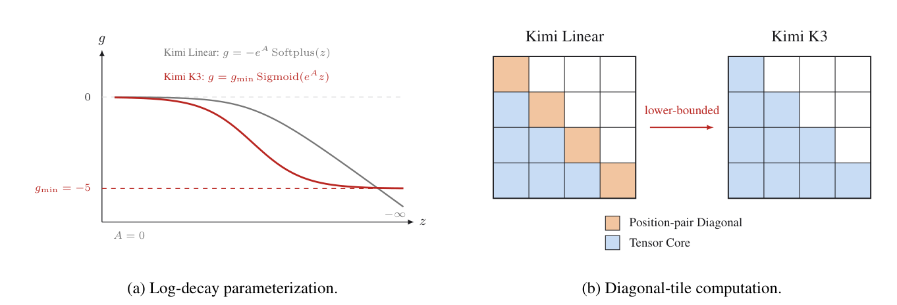

<figcaption>図3: 下限つき減衰とそのチャンク KDA 計算への効果。(a) Kimi Linear は無界の負 Softplus 写像を用いるのに対し、Kimi K3 はスケール済みシグモイドで対数減衰を有界にする（曲線は A=0・g_min=−5）。(b) Kimi Linear は各対角タイルを明示的な位置対計算で評価するが、Kimi K3 の有界範囲はすべての因果タイルに密な Tensor Core 行列積を使わせる。</figcaption>
</figure>

**全ランクゲート（Full-rank gate）**: 最後に、Kimi K3 は KDA の出力ゲートを、Kimi Linear [^56] が用いた低ランクのパラメータづけから、入力依存の**全ランク射影**へ変える。再帰出力にヘッドごとの RMSNorm [^145] を適用した後、KDA はデータ依存の出力ゲーティング [^98] を適用する。

$$
\bm{y}_{t}=\mathbf{W}_{o}\!\left[\operatorname{Sigmoid}\!\left(\mathbf{W}_{g}\bm{x}_{t}\right)\odot\operatorname{RMSNorm}(\tilde{\bm{o}}_{t})\right].
$$

#### 2.1.2 Gated MLA（ゲート付き MLA）

**Multi-head Latent Attention（MLA）** は DeepSeek-V2 [^28] で導入され、各トークンのキー–値表現を低次元の潜在ベクトル $\bm{c}_{t}=\mathbf{W}_{c}\bm{x}_{t}$ へ圧縮する。ヘッド固有のキーと値を丸ごとキャッシュする代わりに、MLA は $\bm{c}_{t}$ をキャッシュし、attention 計算時に学習された up-projection を通じて内容キーと値を再構成する。この因数分解は、大域的なトークン間 attention を保ちつつ KV キャッシュのフットプリントを削減する。

Kimi K2・K2.5 と異なり、Kimi K3 は Kimi Linear [^56] のハイブリッド設計に従い、すべての MLA 層に **No Position Encoding（NoPE）** を適用する。したがってそのクエリやキーには明示的な位置符号化が一切適用されない。介在する KDA 層が位置に敏感で近接性を意識した系列混合を提供し、MLA 層が制限のない大域的な内容相互作用を提供する。この分離はまた、コンテキスト長を延ばす際に位置符号化のパラメータ（RoPE の再スケール等）を変更することを避ける。

さらに Kimi K3 は MLA を、入力依存でチャネルごとの全ランク出力ゲートで拡張する。$\tilde{\bm{o}}_{t}$ を位置 $t$ のゲートなし MLA 出力とすると、ゲート付き出力は

$$
\bm{y}_{t}=\mathbf{W}_{o}\!\left[\operatorname{Sigmoid}\!\left(\mathbf{W}_{g}\bm{x}_{t}\right)\odot\tilde{\bm{o}}_{t}\right].
$$

ゲート射影 $\mathbf{W}_{g}$ は全ランクで、Kimi K3 の KDA が用いる新しいパラメータづけに整合する。このゲートは各トークンが大域的 attention から読むチャネルを変調することを可能にする [^98]。

flash attention で生じる偏った丸め誤差を補正するため、[^97] の方法を採用し、訓練中は attention 出力を FP32 に保つ。この選択は出力タイルのオンチップフットプリントを倍にするので、訓練カーネルを再設計してそれをクエリタイルではなく KV ステージングバッファと重ね、共有メモリを解放してより深い KV パイプラインと高い訓練スループットを実現する。

### 2.2 Attention Residuals（Attention 残差, AttnRes）

標準の残差接続 [^42] は、先行するすべての情報を深さにわたって単一の状態 $\bm{h}_{l}$ へ圧縮する——時間にわたる RNN を思わせるボトルネックである。系列モデリングでは、Transformer が再帰を attention で置き換え [^9] [^124]、各位置がデータ依存の重みですべての先行位置に選択的にアクセスできるようにした。**Attention Residuals（AttnRes）** [^59] は同じ方法論を**深さ**に適用する——各層が先行するすべての層から表現を選択的に取得する。

**Full Attention Residuals**: 各層 $l$ について、層固有の学習可能な擬似クエリ $\bm{q}_{l}=\bm{w}_{l}\in\mathbb{R}^{d}$ とキー・値を定義する。

$$
\bm{k}_{i}=\bm{v}_{i}=\begin{cases}\bm{h}_{1}&i=0\\
f_{i}(\bm{h}_{i})&1\leq i\leq l-1\end{cases}
$$

ここで $f_{i}(\bm{h}_{i})$ は層 $i$ の出力、$\bm{h}_{1}$ はトークン埋め込みである。attention 重みは softmax カーネル $\phi(\bm{q},\bm{k})=\exp\left(\bm{q}^{\top}\operatorname{RMSNorm}(\bm{k})\right)$ [^54] [^145] に従い、$\operatorname{RMSNorm}$ が大きな出力を持つ層が重みを支配するのを防ぐ。

$$
{\alpha_{i\to l}}=\frac{\phi\left(\bm{q}_{l},\bm{k}_{i}\right)}{\sum_{j=0}^{l-1}\phi\left(\bm{q}_{l},\bm{k}_{j}\right)},\qquad\bm{h}_{l}=\sum_{i=0}^{l-1}{\alpha_{i\to l}}\cdot\bm{v}_{i}.
$$

ネットワークの深さは控えめ（$L<100$）なので、この**完全**形式の $O(L^{2}d)$ の演算は手頃であり、実際のオーバーヘッドは全層の出力を生かしておく $O(Ld)$ のメモリ（とパイプライン並列下のステージ間通信）である。

**Block Attention Residuals**: このオーバーヘッドを減らすため、$L$ 層を各 $S=L/N$ 層の $N$ ブロックに分割する。ブロック $n$（層インデックス $\mathcal{B}_{n}$）内で、層出力を総和で単一表現へ縮約し $\bm{b}_{n}=\sum_{j\in\mathcal{B}_{n}}f_{j}(\bm{h}_{j})$（$\bm{b}_{n}^{i}$ はブロックの最初の $i$ 層の部分和）、$\bm{b}_{0}=\bm{h}_{1}$ としてトークン埋め込みを常に源に含める。ブロック間では $N$ 個のブロック表現のみに完全 attention を適用する。Block AttnRes のもとでメモリと通信のオーバーヘッドは $O(Ld)$ から $O(Nd)$ へ下がり、このブロック構造は推論時の状態も有界にして、並列のブロック間結果を逐次のブロック内部分和とオンライン softmax [^78] でよりよくマージできるようにし、推論時コストを大幅に削減する。

経験的に、$N\approx 8$ がモデル規模をまたいで便益の大半を回復する [^59]。Kimi K3 では層を 12 層サイズの 8 ブロックに分割し、部分的な最終ブロックと埋め込み層を数えて全 9 ブロックとする。

### 2.3 Stable LatentMoE（安定な潜在 MoE）

エキスパートのプールとアクティブなエキスパート数の両方を増やすと、エキスパートの特化の空間が広がる。しかし従来の MoE では、選ばれた各エキスパートが全 $d$ 次元のトークン表現を受け取るので、通信とエキスパート重みのトラフィックがルーティングの多重度とともに増える。**LatentMoE** [^31] は、モデルの全幅とルーティングされるエキスパートの幅を分離することでこの拡張を手頃にする——共有エキスパートは共通の変換のために全幅の経路を保ち、特化したルーティングエキスパートは幅 $\ell$ のコンパクトな潜在空間で動作する。これにより Kimi K3 はチャネル混合をスケールできる。

この極端な疎性は、素の設計の 2 つの失敗モードを増幅する。第一に、ルーティング経路は $\mathbf{W}^{\downarrow}$・ゲート付き多分岐エキスパート FFN・$\mathbf{W}^{\uparrow}$ をほぼ 4 連続の行列積の連鎖へ合成する。この悪条件な構造が 2.8 兆パラメータ規模と相まって、ルーティング分岐で内部活性化の爆発を生む。第二に、ほぼ $10^{3}$ 個のエキスパートの負荷を均衡させることは、既存の補助損失なし（auxiliary-loss-free）のバイアス更新がうまく振る舞う領域を超える。Stable LatentMoE はこれら 2 つの失敗に対処する。

図 2 に示すとおり、この層は DeepSeekMoE [^22] の共有・ルーティングエキスパートの組織に従う。$\bm{x}\in\mathbb{R}^{d}$ について、共有エキスパートは $\bm{x}$ を直接処理し、ルーティング経路はそれを $\bm{z}=\mathbf{W}^{\downarrow}\bm{x}\in\mathbb{R}^{\ell}$ へ射影し、$\bm{z}$ を選ばれたエキスパートへ配送し、その重み付き集約を $\mathbf{W}^{\uparrow}$ を通じて $\mathbb{R}^{d}$ へ戻す。

$$
\bm{u}=\sum_{i\in\mathcal{T}_{k}(\bm{x})}p_{i}E_{i}^{\mathrm{routed}}(\mathbf{W}^{\downarrow}\bm{x}),\qquad
\bm{y}=\sum_{j=1}^{N_{s}}E_{j}^{\mathrm{shared}}(\bm{x})+\mathbf{W}^{\uparrow}\operatorname{RMSNorm}(\bm{u}).
$$

ここで $\bm{u}\in\mathbb{R}^{\ell}$ は集約されたルーティング表現、$E_{j}^{\mathrm{shared}}:\mathbb{R}^{d}\!\rightarrow\!\mathbb{R}^{d}$ と $E_{i}^{\mathrm{routed}}:\mathbb{R}^{\ell}\!\rightarrow\!\mathbb{R}^{\ell}$ は共有・ルーティングのエキスパート FFN、$p_{i}$ は下記の Quantile Balancing 則で定義されるルーター重みである。Kimi K3 は全幅の共有エキスパート数をすべての層で $N_{s}=2$ に固定する。

#### 2.3.1 Normalized LatentMoE（正規化 LatentMoE）

元の LatentMoE は集約ルーティング表現 $\bm{u}$ に $\mathbf{W}^{\uparrow}$ を直接適用する。$\bm{u}$ のスケールは選ばれたエキスパートとそのルーティング重みで変わりうる。式 11 に示すとおり、Kimi K3 は代わりにエキスパート集約と up-projection の間に **RMSNorm** [^145] を挿入する。この正規化は、全幅の共有分岐と結合される前に、ルーティング分岐のスケール変動への感度を下げる。

#### 2.3.2 Sigmoid Tanh Unit GLU（SiTU-GLU）

**表: GLU・SwiGLU・SiTU-GLU のゲート／up 分岐の比較**

|  | ゲート分岐 | up 分岐 |
| --- | --- | --- |
| GLU [^25] | $\sigma(x)$ | $x$ |
| SwiGLU [^106] | $x\cdot\sigma(x)$ | $x$ |
| SiTU-GLU | $\beta_{1}\tanh\!\left(\frac{x}{\beta_{1}}\right)\cdot\sigma(x)$ | $\beta_{2}\tanh\!\left(\frac{x}{\beta_{2}}\right)$ |

<figure>

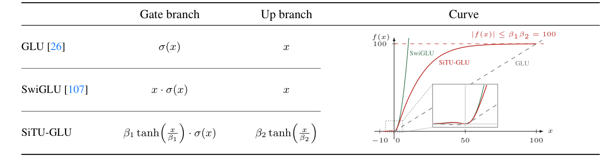

<figcaption>図4: GLU・SwiGLU・SiTU-GLU のゲート／up 分岐とそのスカラー応答（σ はシグモイド）。両分岐はスカラー入力 x を受け、全曲線は定義域 x∈[−10,100] を共有し、挿入図は原点近傍を拡大する。SiTU-GLU は赤（β₁=4・β₂=25）で示され、原点近傍で SwiGLU に近く、大きな値では上界 |f(x)|≤β₁β₂=100 に近づく。</figcaption>
</figure>

**Gated Linear Units（GLU）** は、シグモイド活性化のゲートで線形の値分岐を変調し、$\operatorname{Sigmoid}(\mathbf{W}_{g}\bm{x})\odot\mathbf{W}_{u}\bm{x}$ を計算する [^25]。SwiGLU はシグモイドゲートを $\operatorname{Swish}(x)=x\operatorname{Sigmoid}(x)$ で置き換え、Transformer で強い経験的性能を出す [^106]。しかし SwiGLU の 2 つの乗法因子はいずれも無界なので、同時に大きい座標が活性化の外れ値を生み、低精度演算でのオーバーフローのリスクを増やす。元の GLU のシグモイドゲートは無界のゲート成長を避けるが、Swish の概ね線形な正領域を保たない。

これを満たすため、我々は **Sigmoid Tanh Unit GLU（SiTU-GLU）** を提案する。SiTU-GLU は滑らかなキャップ $\operatorname{softcap}(x,\beta)=\beta\tanh(x/\beta)$ を Swish ゲートの線形因子と up 分岐に独立に適用する。

$$
\operatorname{SiTU\text{-}GLU}(\bm{x})=\left[\beta_{1}\tanh\!\left(\frac{\mathbf{W}_{g}\bm{x}}{\beta_{1}}\right)\odot\operatorname{Sigmoid}(\mathbf{W}_{g}\bm{x})\right]\odot\left[\beta_{2}\tanh\!\left(\frac{\mathbf{W}_{u}\bm{x}}{\beta_{2}}\right)\right],
$$

Kimi K3 ではソフトキャップのハイパーパラメータをゲート分岐 $\beta_{1}=4$、up 分岐 $\beta_{2}=25$ に設定する。スケール済み $\tanh$ は原点近傍で概ね線形、大きな絶対値で有界なので、SiTU-GLU は SwiGLU の局所応答を保ちつつ積の両因子を制御できる。付録 B が局所展開・極限・出力の形式的上界・ハードクランプとの比較を与える。

#### 2.3.3 Quantile Balancing（分位点均衡, QB）

補助損失にもとづくルーティング [^32] と異なり、Kimi K3 は**補助損失なし**のルーティング [^27] を採用する。負荷均衡は、Top-$k$ 選択に使うルーター・スコアにエキスパート固有のバイアス $b_{j}$ を加えることで実装される。トークン $\bm{x}_{i}$ について、ルーターは $\bm{s}_{i}=\operatorname{Sigmoid}(\mathbf{W}_{r}\bm{x}_{i})$ を計算し、

$$
\mathcal{T}_{i}=\operatorname{argtop}_{k}\!\left(\bm{s}_{i}+\bm{b}\right),\qquad p_{i,j}=\frac{s_{i,j}}{\sum_{r\in\mathcal{T}_{i}}s_{i,r}},\quad j\in\mathcal{T}_{i}.
$$

$\bm{b}$ は $p_{i,j}$ から省かれるので、混合重みやルーターの勾配ベース最適化を変えずに配送を調整する。元の方法は $\bm{b}$ を固定ステップ則 $b_{j}^{(t+1)}=b_{j}^{(t)}+\gamma\operatorname{sign}(\bar{\ell}-\ell_{j}^{(t)})$ [^27] で更新する。$\gamma$ は遅い適応と負荷振動をトレードオフする。LatentMoE がルーティング多重度を増やすほど負荷均衡の維持は困難になる。

この限界に対処するため、我々は **Quantile Balancing（QB）** を導入する。これは各エキスパートのバイアスを、その目標負荷に一致するルーター・スコアの分位点から設定する [^110]。Top-$k$ 選択で $n$ エキスパートへルーティングされる $m$ トークンの訓練バッチを考えると、目標負荷は $q:=mk/n$ トークン／エキスパート。QB は次のバイアスを 1 回の順伝播から導く。ルーティングでは Top-$k$ 選択をバイアス済みスコア $\bm{s}_{i}+\bm{b}$ 上の Top-$(k{+}1)$ で置き換え、

$$
\sum_{i=1}^{m}\mathbf{1}\!\left[s_{i,j}+\widehat{b}_{j}^{(t+1)}>\alpha_{i}^{(t)}\right],
$$

これは閾値 $-\widehat{b}_{j}^{(t+1)}$ に関して単調減少する。同点がないと仮定して、このカウントを $q$ に等しくすると $-\widehat{b}_{j}^{(t+1)}$ はマージン $s_{i,j}-\alpha_{i}^{(t)}$ の $(q{+}1)$ 番目に大きい値になり、ちょうど $q$ 個のマージンが閾値を上回る。$q/m=k/n$ なので、これはトークンにわたるマージンの $(1-k/n)$-分位点であり、QB 更新は

$$
\widehat{b}_{j}^{(t+1)}=\operatorname{quantile}_{1-k/n}\!\left(\bm{s}_{:,j}-\bm{\alpha}^{(t)}\right).
$$

<figure>

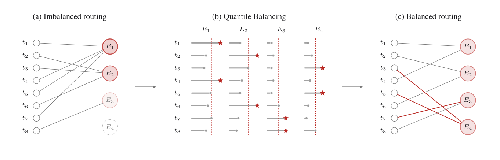

<figcaption>図5: m=8 トークン・n=4 ルーティングエキスパート・トークンあたり k=1 選択での Quantile Balancing の図解。(a) トークンごとの Top-k ルーティングは負荷 (4,3,1,0) を生む（濃い円=過熱、薄い／破線円=低利用・死にかけのエキスパート）。(b) 各灰色のバーは現在のバイアス済みスコアのマージンを表し、QB はバイアスをずらして各エキスパートの受理された上位テールを均等化する。</figcaption>
</figure>

大規模での分位点の実用的推定（ヒストグラム推定）と正確な導出はそれぞれ付録 D・C に示す。

### 2.4 Native Vision（ネイティブ視覚）

Kimi K3 はネイティブにマルチモーダルである——テキスト・画像・動画は単一の共有バックボーンで 1 つのコンテキスト内で処理され、事後のモダリティ整合の段階はない。この設計は §1 で述べた長期ホライズンで視覚をループに組み込む振る舞いのアーキテクチャ的基盤である。レンダリング出力とそれを生んだコードが同じトークンストリームに存在するので、モデルはコードを書き、結果のスクリーンショットや動画フレームを検査し、視覚的成果物（UI 等）を反復的に洗練できる。

**MoonViT-V2**: Kimi K2.5 からの重要な離脱は、Kimi K3 の視覚エンコーダ **MoonViT-V2** を、**次トークン予測で完全に一から**訓練することである。Kimi K2.5 を含む従来の慣行は、視覚エンコーダを SigLIP のような対照事前学習モデルから初期化し、事前学習済みの視覚知識が有利なスタートを与えるという前提に立っていた。我々がこの慣行から離れる主な理由は訓練の安定性である。事前学習済みエンコーダを LLM に接続すると、共同最適化が不安定になりうる。

<figure>

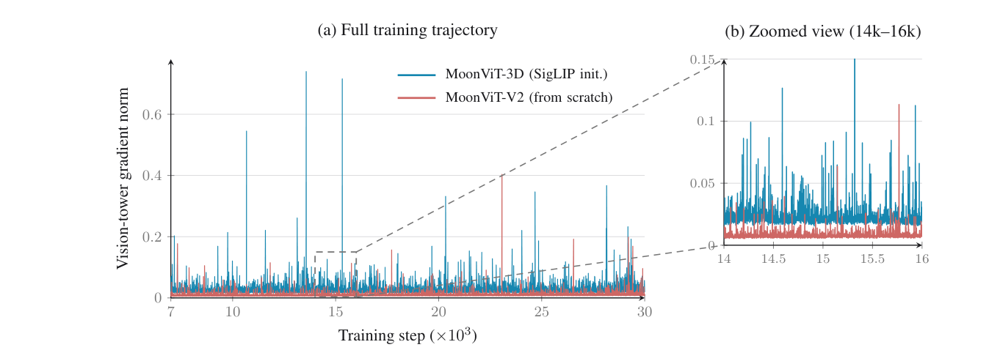

<figcaption>図6: 我々の事前学習アブレーションにおける視覚タワーの勾配ノルム。SigLIP 初期化の MoonViT-3D と比べ、一から訓練した MoonViT-V2 はより低い勾配ノルムをより少ないスパイクで維持し、より安定した最適化を示す。</figcaption>
</figure>

**アーキテクチャ**: この訓練レシピは Kimi K2.5 [^60] [^58] の全体設計に従う視覚経路の上に構築される——視覚入力はまず MoonViT-V2 で符号化され、軽量な MLP プロジェクタで LLM へ写像される。MoonViT-V2 は約 0.4B パラメータの 27 層 ViT で、RMSNorm を採用し線形・attention 射影からすべてのバイアス項を除く。この設計が上記の一から訓練の最適化をさらに安定させる。

### 2.5 Per-Head Muon（ヘッドごとの Muon）

Kimi K2 に従い、Kimi K3 は行列パラメータの最適化器として **Muon** [^52] を採用する。attention 射影については、これをヘッドごとの変種へさらに洗練する——Newton–Schulz 直交化を $Q$・$K$・$V$ の射影行列全体に適用する代わりに、そのモーメンタム行列をヘッド次元に沿って分割し、各ヘッドのブロックを別々に直交化する。直観としては、全行列の直交化は全ヘッドを単一の結合ブロックとして扱うので、ヘッドが結合されてしまう。ヘッドごとに直交化することでこれを避ける。

## 3 Pre-Training（事前学習）

### 3.1 Pre-Training Data（事前学習データ）

Kimi K3 は、4 つの主要テキスト領域——Web テキスト・コード・数学・知識——と大規模な視覚コーパスにまたがる整備済みコーパスで事前学習される。視覚データはキャプション・画像–テキスト交互文書・OCR・知覚・動画・視覚コーディングデータを覆う。データパイプラインは Kimi K2 [^57] のものを土台に、Kimi K2.5 [^60] で洗練したものを用いる。

**テキストデータ**: 各領域は、規則ベースのヒューリスティクス・分類器ベースの品質スコアリング・重複除去の組み合わせでフィルタされ、領域ごとのサンプリング率は小さいモデルでのアブレーションで決める。Kimi K2 [^57] のリフレージングレシピに従い、知識・数学のコーパスを、スタイルと視点を多様化するプロンプティング・チャンクごとの自己回帰生成・原文書に対する忠実性検証でリフレーズする。

**視覚データ**: 視覚コーパスは Kimi K2.5 [^60] の分類に従い、オープンソースの収集物と内製の（フィルタ・合成・重複除去の）パイプラインを組み合わせる。訓練中、座標の教師は絶対と正規化（[0,1]）の両形式で与えられ、精密で解像度に頑健な位置特定を可能にする。古典的なテキストキャプション付き画像に加え、プログラム的なマルチモーダルデータ（コード断片とそのレンダリング視覚の対）を大幅にスケールアップする。

### 3.2 Scaling Law（スケーリング則）

<figure>

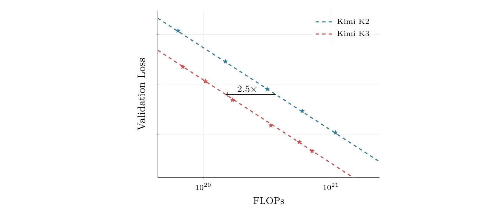

<figcaption>図7: Kimi K2 と Kimi K3 の当てはめたスケーリング則曲線。Kimi K3 は Kimi K2 に対しスケーリング効率で 2.5 倍の利得を達成する。</figcaption>
</figure>

前節までのアーキテクチャ・データ・訓練の改善が、我々の新しいモデルファミリーを定義する。これらの変更は最適な訓練体制も変えるので、鍵となるハイパーパラメータ——バッチサイズ・学習率・パラメータあたりトークン数（TPP）・モデル形状——を再調整する専用のスケーリング則研究を行う。保留した OOD 検証データで評価すると、スケーリング則曲線（図 7）は、これらの改善が合わさって Kimi K2 に対し $2.5\times$ のスケーリング効率の利得を生むことを示す。

我々のスケーリング則研究は一貫して cosine decay を Warmup Stable Decay（WSD）[^45] より好み、cosine decay を既定の学習率スケジュールとして採用する。固定の最小学習率のもとで両者を比較すると、（先行研究が WSD が cosine に匹敵ないし上回りうると報告している一方で）我々は 2 つのスケジュールが著しく異なる最適ハイパーパラメータを示すことを観測する。

**表1**: Kimi K2 と Kimi K3 のアーキテクチャ比較。

|  | Kimi K2 | Kimi K3 | $\bm{\Delta}$ |
| --- | --- | --- | --- |
| アーキテクチャ | MoE | MoE | – |
| 層数 | 61 | 93 | ↑ 52% |
| 総パラメータ | 1.04T | 2.78T | ↑ 167% |
| アクティブパラメータ | 32.6B | 104.2B | ↑ 220% |
| 隠れ次元 | 7,168 | 7,168 | = |
| Latent MoE 次元 | – | 3584 (0.5×) | – |
| エキスパートあたり MoE 隠れ次元 | 2,048 | 3,072 | ↑ 50% |
| ルーティングエキスパート | 384 | 896 | ↑ 133% |
| トークンあたりアクティブエキスパート | 8 | 16 | ↑ 100% |
| 共有エキスパート | 1 | 2 | ↑ 100% |
| attention ヘッド | 64 | 96 | ↑ 50% |
| dense 層数 | 1 | 1 | = |
| 語彙サイズ | 160K | 160K | = |
| 訓練コンテキスト長 | 128K | 1M | 8× |
| attention 機構 | MLA | Hybrid KDA–MLA | – |
| 活性化関数 | SwiGLU | SiTU-GLU | – |
| attention 層構成 | 61 MLA | 69 KDA + 24 MLA | – |
| MTP 層数 | 1 層 | 1 層 | = |
| ViT 総パラメータ | – | 401M | – |
| ViT 層数 | – | 27 層 | – |
| ViT のパッチサイズ | – | 14 | – |
| ViT の attention ヘッド | – | 12 | – |

### 3.3 Training Recipe（訓練レシピ）

Kimi K3 は、視覚エンコーダを事前学習済み言語モデルへ事後の整合段階で接ぎ木するのではなく、訓練の最初から言語と視覚を共同で最適化する**ネイティブマルチモーダル**戦略を採る。この枠組みでは、視覚トークンとテキストトークンが単一の次トークン予測目的の中で交互に並び、共有バックボーンが最初から統一されたマルチモーダル表現を学ぶ。

Per-Head Muon 最適化器（§2.5）と Kimi K2 で導入した重みクリッピング機構を用い、MoE の負荷均衡には QB（§2.3.3）を採る。$1\%$ の線形ウォームアップを伴う cosine 学習率スケジュールを用いる。重み減衰は全体で $0.1$ に設定する。事前学習はコンテキスト長 $8\mathrm{k}$ トークンで始まり、後続段階で $64\mathrm{k}$ トークンへ延ばす。

### 3.4 Long-Context Extension（長コンテキスト拡張）

**位置符号化**: Kimi K3 は明示的な位置埋め込みを使わず（NoPE）、代わりに KDA の再帰ゲーティングと減衰機構を通じて位置情報を暗黙に符号化する。その結果、モデルは RoPE の再スケールや内挿 [^91] のような位置符号化の変更なしに、1M トークンのコンテキストへ直接外挿する。

**長コンテキストデータ**: 自然な長文書・動画は、ほぼ重複・バイナリの塊・切り詰めファイル・動画クリップ・無効な機械生成ログといった大量の低品質内容を含む。したがって、正確・曖昧の重複除去（動画はフレームの知覚ハッシュで補完）・ヒューリスティックと分類器ベースの品質フィルタ・構造検証を組み合わせた専用のクリーニングパイプラインで処理する。真に長く首尾一貫した文書・動画は短テキストに比べて稀なので、それらをアップサンプリングして、cooldown 中に長コンテキスト分布が短系列に飲み込まれないようにする。ただし長さだけでは長距離能力は与えられない。これに対処するため、マルチモーダル文書と部分タスクを注意深く並べ替え・連結して追加の長コンテキストデータを合成し、埋め込まれたタスクが 1M トークンのコンテキスト全体に散らばった情報に注意を向けることでのみ解けるようにする。

**漸進的なコンテキスト拡張**: Kimi K3 は最大 1M トークンのコンテキストウィンドウを支える。これは訓練の進行とともにコンテキストウィンドウを**4 段階のカリキュラム**で漸進的に延ばすことで達成する。ウィンドウは事前学習中に 8K→64K トークン、cooldown 段階で 256K→1M トークンへ成長する。コストのかかる長系列計算を全訓練予算のごく一部に集中させることで、カリキュラムを経済的に保ちつつ、モデルをますます長距離の依存へ徐々に適応させる。KDA 層で 100 万トークンの訓練を扱いやすくする系列次元の分割は §5.1.2 に述べる。

## 4 Post-Training（事後学習）

### 4.1 Method（手法）

我々の事後学習パイプラインは 3 段階のパラダイムに従う——**教師ありファインチューニング（SFT）** で基礎的なエージェント能力を初期化し、**強化学習（RL）** で様々な推論努力の特化した領域エキスパートを育て、これら領域固有の方策を **Multi-Teacher On-Policy Distillation（MOPD）** で単一のモデルへ統合する。

#### 4.1.1 Supervised Fine-Tuning（教師ありファインチューニング）

SFT 段階は、後続の RL 段階のための高品質なコールドスタート方策を確立する。以前の Kimi モデル [^57] [^60] の SFT パイプラインを土台に、Kimi K3 の SFT データセットを拡張し、複雑なエージェントタスクのカバレッジを大幅に広げる。具体的には、以前の Kimi シリーズの領域特化モデルでデータ軌跡を合成し、多段の検証と人間介在の注釈を続ける。これら複雑なエージェント軌跡を一貫して表現するため、全データを **XTML ベースのチャットテンプレート**（eXtensible Token Markup Language。詳細は §F）で直列化する。これらの手順は総じて、Kimi K3 に適応的推論・精密なツール呼び出し・長期ホライズンのエージェント場面での頑健な実行を与える大規模指示データセットを生む。加えて、SFT 段階以降、MXFP4 重みと MXFP8 活性化での量子化を意識した訓練（QAT）を適用する（§4.1.4）。

#### 4.1.2 Reinforcement Learning（強化学習）

<figure>

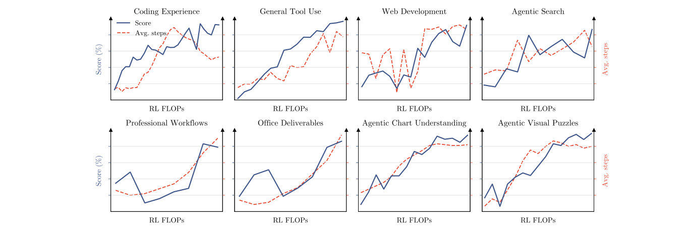

<figcaption>図8: RL 中の様々な公開・内製評価にわたるスコアと平均アシスタントステップ数。RL FLOPs をスケールさせると、ツール呼び出しのステップ数が一貫して増え、モデル全体の能力の包括的な向上を伴う。</figcaption>
</figure>

SFT が堅固なコールドスタートの基盤を与える一方、RL はより高次の推論・実行能力を解き放つのに決定的である。個々のタスクごとに特化した RL モデルを訓練するのではなく、RL を**3 つの広い領域**にわたってスケールさせ、各領域について**すべての推論努力水準**で単一のエキスパートを訓練する——(i) **汎用タスク**（汎用体験・視覚・推論・忠実性・検索能力・知識労働）、(ii) **汎用エージェント**（長期ホライズンのアシスタント・ディープリサーチ・段落水準の執筆）、(iii) **コーディングエージェント**（ソフトウェア工学（SWE）・コーディング体験・カーネルタスク・Web 開発）。図 8 に示すとおり、RL FLOPs のスケーリングは知識・推論・視覚・汎用エージェント・コーディングにわたる多様な能力を一貫して改善する。これら 3 領域エキスパートを $\{\text{low},\text{high},\text{max}\}$ の 3 推論努力水準と掛け合わせ、**合計 9 個のエキスパート**を得る。

**アルゴリズム**: 長期ホライズンのタスクで強まるロングテールの遅延を緩和するため、同期 RL フレームワーク [^117] [^60] の **partial rollout**（部分ロールアウト）方式を拡張する。各反復のロールアウト段で、$N$ プロンプトそれぞれに $K$ 個の補完をサンプリングし、$N\times K$ 軌跡のアクティブなワークロードを維持する。すべてのロールアウトの終了を待つのではなく、軌跡の割合 $\lambda\in(0,1)$（すなわち $\lambda NK$）が完了した時点で生成段を一時停止し、実行の遅延者なしに方策最適化を進める。一時停止したロールアウトはキューに入れられ、次反復の開始時に再開が優先される。これは我々のサンドボックスインフラ（§5.3.2）が支える。1 つのプロンプトの $K$ 応答がすべて完了すると、直ちに方策最適化へ送られ、Kimi K2.5 [^60] のアルゴリズムに従う。

**Reasoning Effort RL（推論努力の RL）**: 推論努力を微調整しつつトークン効率を最大化するため、RL 中に**問題ごとの予算制御**機構を実装する [^60]。各問題 $x$ に、コールドスタートモデルから推定した初期トークン予算 $b_{0}(x)$ を紐づけ、総トークン予算 $T(y)$ がスケールした閾値 $\tau\cdot b_{0}(x)$ を超える軌跡はタスク報酬を $-1$ で上書きする。汎用タスクでは $T(y)$ は思考トークン数を測り、エージェントタスクでは推論トレースとツール呼び出し引数を含む累積出力トークンを測る。訓練は予算乗数 $\tau$ に関する段階的カリキュラムに従う。まず比較的大きな $\tau$ で **max-budget** 変種を訓練し（過度の考えすぎを抑えるため最大予算には上限を設ける）、次に $\tau$ をより小さい値へアニールして **high**・**low** 努力のエキスパートモデルを得る。$\tau$ の調整は人間介在の指導のもと領域ごとに設定する。

**Agentic Generative Reward Model（エージェント的な生成報酬モデル, GRM）**: 検証不能な汎用タスクには、Kimi K2.5 [^57] [^60] と同様のトーナメント形式のグループ報酬（二値比較）を保つ **Agentic GRM** を採用する。判断強化のための汎用エージェント能力に加え、エージェント的な審判は**必須のプロトコル**に従うことを要求される——(1) 結果・成果物・テキスト出力を読む、(2) ルーブリックを生成する、(3) 各候補をルーブリックに照らして採点する、(4) ルーブリックが割り当てたスコアをスコアパッドに記録する。ますます冗長な出力への reward hacking を緩和するため、上記の推論努力制御に類似の**予算ベースの冗長性制御**を適用する——コールドスタートモデルから推定した初期冗長性 $\ell_{0}$ と乗数 $\sigma$ に対し、出力長が $\sigma\cdot\ell_{0}$ を超える候補は二値比較で自動的に負ける。

#### 4.1.3 Multi-Teacher On-Policy Distillation（多教師オンポリシー蒸留, MOPD）

我々は **MOPD** を採用し、これら様々な推論努力にわたる領域特化能力を単一のモデルへ統合する [^74] [^133] [^29]。訓練中、領域 $d$ とサンプルされた推論努力水準 $e\in\{\text{low},\text{high},\text{max}\}$ について、9 個のエキスパートの中の対応する教師モデル $\pi_{\text{teacher}}^{(d,e)}$ が最適化を導く。入力クエリ $x$ と前置き応答 $y_{<t}$ が与えられると、教師 $\pi_{\text{teacher}}^{(d,e)}$ と生徒 $\pi_{\theta}$ の間で $y_{t}$ 上で評価されるトークンごとの OPD 報酬は次で定義される。

$$
r^{d}_{\mathrm{opd}}(y_{t}\mid e,x,y_{<t})=\mathrm{clip}\left(\mathrm{sg}\left(\log\frac{\pi_{\text{teacher}}^{(d,e)}(y_{t}\mid x,y_{<t})}{\pi_{\theta}(y_{t}\mid e,x,y_{<t})}\right),-R_{\max},R_{\max}\right)\,,
$$

ここで $\operatorname{sg}(\cdot)$ は stop-gradient 演算子、$R_{\max}>0$ は極端なアドバンテージ信号を制約して RL 訓練を安定させるクリッピング閾値である。この密な報酬信号は我々の RL フレームワークへ切れ目なく統合され、長期ホライズンタスクのための partial rollout 訓練のようなインフラ水準の最適化を自然に可能にする。より細粒度の top-$k$ 蒸留目的も試したが、収束速度・最終性能のいずれにも明確な優位は観測されなかった。

#### 4.1.4 Deployment-Aware Post-Training（配備を意識した事後学習）

**MXFP4 量子化を意識した事後学習**: 配備時のメモリフットプリントとサービングコストを減らすため、モデルのパラメータメモリを支配する MoE エキスパート重みを **MXFP4** [^102] に量子化し、活性化は MXFP8 で計算する。一方、非エキスパートの構成要素（attention 射影・潜在 MoE 射影・共有エキスパート・MoE ルーター）はより高い精度に保つ。SFT と RL の両方を覆う事後学習の全段階を通じて量子化を意識した訓練（QAT）[^48] を行い、モデルが量子化による精度損失に適応するようにする。RL 中はロールアウトと訓練が同じ量子化スキームを共有し、訓練と推論の不一致を除く。

**ドラフトモデルのファインチューニング**: 複雑で長期ホライズンなエージェントモデルのサービングには推論効率の最適化が重要である。Kimi K3 はバックボーンブロックの構造を映す **multi-token-prediction（MTP）層**とともに事前学習される。**EAGLE-3** [^70] のドラフトモデルが MTP 層と構造の一致する単一のデコーダ層からなるので、事前学習済みの MTP 層を EAGLE-3 形式のドラフトモデルへファインチューニングする（ターゲットモデルは凍結し、ドラフト層とその特徴融合射影のみを更新）。EAGLE-3 の訓練時テストプロトコルに従い、ドラフトは訓練中に 7 ステップ展開される。ドラフトの入力は、ターゲットモデルの低・中・高水準の特徴（それぞれ第 1・第 4・最終の AttnRes ブロックの出力）を融合する。これらを連結してバイアスなし行列 $\bm{W}_{\mathrm{E3}}$ で隠れサイズへ射影し、$[\,\bm{0}\;\;\bm{0}\;\;\bm{I}\,]$ で初期化することで、初期化時に融合表現が最高水準の特徴と一致するようにする。投機デコード（speculative decoding）の高速化は、無損失の投機サンプリングのもとでトークンごとの受理率 $\sum_{x\in\mathcal{V}}\min\!\left(p(x),q(x)\right)$ で支配される。従来の KL ダイバージェンスの代理を最小化してもこの率の最大化は保証されないので、この率へ直接向ける訓練目的を用いる。

### 4.2 RL Task Synthesis and Agentic Environments（RL タスク合成とエージェント環境）

我々の RL フレームワークの有効性は、**豊かで・多様で・頑健に検証可能な環境**に大きく依存する。複雑な長期ホライズンのタスクにまたがるスケーラブルな訓練を支えるため、一連の特化した**ホワイトボックス環境**とタスク合成のパラダイムを設計する。

#### 4.2.1 Unified White-Box RL Environment（統一ホワイトボックス RL 環境）

**単一の固定されたエージェントハーネスで訓練すると、モデルは特定のツールスキーマ・システムプロンプト・コンテキスト管理機構・相互作用プロトコルへ過適合しうる。** これに対処するため、我々は**エージェントハーネスを設定可能で合成可能なモジュールの集合として表現する**統一ホワイトボックス RL 環境を開発する。モジュールにはツールインターフェース・システムプロンプト・コンテキスト管理戦略・スキル・記憶・サブエージェントなどが含まれる。これらのモジュールを設定を通じて合成することで、環境は Kimi Code [^55]・Claude Code [^14]・Codex [^19]・OpenClaw [^85]・Hermes [^43] のような主流のハーネスや、まったく新しいものを具現化できる。**RL 訓練中、我々はタスクグループごとに異なるハーネス構成を動的に構築し、Kimi K3 を単一ハーネスの慣習ではなくこれらモジュールの多様な組み合わせに晒す。** 同じ抽象化は多様なタスク領域にわたる RL も容易に支え、より汎用的なエージェントを訓練するスケーラブルな基盤を提供する。

#### 4.2.2 Knowledge-Graph-Guided Task Synthesis（知識グラフに導かれるタスク合成）

**動機と概観**: 事後学習タスクの品質と多様性は、その源材料に大きく左右される。細粒度の概念に導かれた検索は特化した過小表現の知識を浮上させ、多様な概念にわたるサンプリングは領域のカバレッジを広げる。粒度とカバレッジの両方を大規模に制御するため、我々は**自己進化する階層的に組織された知識グラフ**を構築し、エージェントが知識集約・コーディング領域にわたる Web 規模の探索を通じてそれを継続的に拡張する。図 9 がタスク合成パイプラインを示す。

<figure>


<figcaption>図9: 知識グラフに導かれるタスク合成の概観。階層的に組織された知識グラフは、広い領域から細粒度の概念まで複数の水準で概念を表す。関連するノードをサンプリングしてキーワード集合を作り、公開されている源材料の検索を導く。各合成インスタンスについて、系はタスク型を選び、検索した材料を使って対応するタスクを合成する。</figcaption>
</figure>

**エージェント的な知識グラフ構築**: 我々は知識グラフを、再帰的でエージェント駆動の拡張を通じて有向非巡回グラフ（DAG）として構築する。拡張過程は、事前定義された粗粒度のシードノードの集合から始まる。各ノードにエージェントインスタンスが割り当てられ、対応する概念を調べる複数の Web 検索を行う。新しいノードを加える前に、エージェントは既存のグラフを探索して等価・関連の概念を同定し、適切なら既存ノードを再利用して重複を最小化する。辺は、エージェントがどちらの端点を先に発見したかに関わらず、常に粗い概念から細かい概念へ向く。新たに加えられたノードは、さらなる探索のためにエージェントへ割り当てられる。ある枝は、割り当てられたエージェントが現在の概念が十分に原子的だと判断したときに拡張を止める。

**材料の検索とタスク合成**: 領域・タスク型にわたる望ましい分布を狙うため、系は様々な粒度のノードを、個別あるいは関連する組み合わせでサンプリングする。サンプルしたノードから導いたキーワードを、知識グラフ内の祖先からの文脈情報と組み合わせて Web クエリを作る。検索された実世界の材料を組み立て、合成エージェントが様々なタスク型の訓練タスクを生む。

#### 4.2.3 Verifiable Problems in Agentic Environments（エージェント環境における検証可能な問題）

我々は Kimi K3 を、エージェント環境の検証可能な問題で訓練する。代表例には——**多段の複雑な情報検索**（モデルが調査を計画し、Web から一歩ずつ証拠を集め、検証可能な答えを生む）、**専門家の実際の日常業務**（投資銀行・データ分析・法務など。モデルは複雑な要求を分解し、サンドボックスで領域ツールを操作し、数十〜数百ステップで成果物を仕上げる）、**STEM 問題・視覚パズル・チャート理解にわたる多段の検証可能な視覚推論**が含まれる。各視覚推論の軌跡は、隔離されたサンドボックス内の Python インタプリタを備えたエージェント環境で生成される——モデルは反復的にコードを書き実行して、入力画像を切り抜き・拡大・変換し、精密な計算を行い、中間結果を検証する。

#### 4.2.4 Kernel Optimization Tasks（カーネル最適化タスク）

Kimi K3 の GPU カーネル最適化能力を強めるため、単一演算子カーネルから融合メガカーネルまでの大規模なカーネルタスク群を、Flash Linear Attention [^140] のような高品質な GitHub リポジトリから構築する。この群は CUDA・Triton・CuTe DSL・Gluon・ThunderKittens [^109]・TileLang [^128] といった多様な GPU プログラミング手法にまたがり、BF16・FP8・FP4 を含む広く使われる GPU アーキテクチャと数値形式を覆う。報酬は正しさと性能の両方を評価する——各カーネルは PyTorch 参照実装を提供し、事前定義された数値誤差の閾値を超える解は報酬ゼロを受ける。性能は専門家の実装に照らして採点され、一致すれば報酬 0.5、ハードウェアのルーフラインに近づくほど報酬は 1 へ増える。

#### 4.2.5 Personal Assistant Tasks（パーソナルアシスタントのタスク）

長期ホライズンのパーソナルアシスタントのタスクには、**Gmail・Notion・Slack・Canvas** のような広く使われるアプリケーションの現実的なモック実装を開発する。これらは実世界の対応物の中核的な意味論を保ちつつ、外部 API やレート制限なしで再現可能で大規模な相互作用を可能にする。これらのモックアプリを土台に、人事・法務・金融のような場面での実世界の専門的ワークフローに着想を得た複雑なタスクを設計する。各タスクで、エージェントは複数のシミュレートされた日にわたる持続的で進化する環境で動作し、アプリケーションにまたがって分布する数十の相互依存イベントに遭遇する。1 回のロールアウトが最大で数千のツール呼び出しと数百万のコンテキストトークンを含みうる。各イベントは自身の評価基準を持ち、決定論的な規則あるいは LLM ベースの評価器で評価される。

#### 4.2.6 Autonomous Execution Tasks（自律実行タスク, AET）

我々は **Autonomous Execution Tasks（AET）** を導入する。これは**verify-in-the-loop（検証をループに組み込む）最適化**を通じて長期ホライズンのエージェント知能を訓練する環境パラダイムである。各タスクは初期状態・制約付きの目標・ツールベースの行動空間・実行予算・独立した検証器を指定する。エージェントは目的・文脈・制約・検証インターフェースだけを見て、参照軌跡や事前定義された手続きなしに、タスク分解・ツール選択・計画・エラー回復・終了を自律的に行わなければならない。**報酬はエージェントの自己申告の完了ではなく、検証器による最終環境状態の評価に接地される。** 我々は多様な環境を支える複数種の検証器を設計する——ブラックボックスのシステム複製（図 10）・定量的ファクターの発見・税務監査など。各環境で、エージェントは反復的に解を提出し、検証器のフィードバックを受け、改訂する。

<figure>


<figcaption>図10: Camera Repair Management System における完了曲線。これはブラックボックスのシステム複製タスクで、エージェントは隠された 3D カメラ修理システムをオラクルへの問い合わせを通じて Web アプリとして再構築する。完了度は検証器が評価したタスク進捗を表す。</figcaption>
</figure>

#### 4.2.7 Web Development Tasks（Web 開発タスク）

我々は典型的な場面を覆う専門家が整備した多様な Web 開発タスク群を構築する。入力は一行の場面記述から複数段落の仕様まで、成果物は Web サイト・対話的なゲーム・3D/WebGL 場面・データ可視化・SVG・フルスタックアプリケーションに及ぶ。すべてのタスクはコンテナ化されたサンドボックスで走り、多様なエージェントの足場のもとでロールアウトされる。

## 5 Infrastructure（インフラ）

Kimi K3 は、単一のモデルではめったに同時に生じない 3 つのシステム上の課題を組み合わせる——ハイブリッド KDA attention、3T 級の疎なマルチモーダル訓練と推論、100 万トークンのエージェントワークロードである。我々のインフラはモデルのライフサイクルにわたってこれらの課題と協調設計される。アーキテクチャ水準では、高性能な KDA カーネルと Context Parallelism が再帰的な定式化をデバイス内・デバイス間で効率化し、システム水準では MoonEP とメモリ効率的な訓練が 2.8T MoE を扱いやすくし、サービング水準では KDA を意識したプレフィックスキャッシュとフリート水準のスケジューリングが 100 万トークンのリクエストを支える。

### 5.1 Algorithm-System Co-Design for KDA（KDA のアルゴリズム–システム協調設計）

KDA は softmax attention の成長する KV キャッシュを固定サイズの再帰状態 $\mathbf{S}\in\mathbb{R}^{d_{k}\times d_{v}}$（§2.1.1）で置き換える。その逐次更新は並列実行を難しくするが、代わりに転送・再利用が安価な固定サイズの状態を得る。以下の設計は前者に対処し後者を活かす——デバイス内では融合カーネル、デバイス間では KDA Context Parallelism。

#### 5.1.1 KDA Kernels across Regimes（体制ごとの KDA カーネル）

KDA 状態の逐次依存は、GPU が好む広く一様な並列性と相容れず、実行体制ごとに異なるボトルネックとして現れる。各体制に専用のカーネルを設計する。

**訓練・prefill のためのチャンクカーネル**: KDA のチャンク形式は各チャンク内では並列だがチャンク間では逐次である（再帰状態がチャンクからチャンクへ伝播しなければならないため）。素朴に実行するとこの 2 相が交互になり、逐次伝播の間 SM が遊ぶ。したがって **FlashKDA** [^13] を開発する。これはチャンク内計算とチャンク間の状態伝播を重ねる CUTLASS ベースのチャンクカーネルである。

**長コンテキスト prefill のためのデバイス内 Context Parallelism**: テンソル並列（TP）はヘッドをデバイスに分割するが再帰を短くはしないので、純粋な TP 配備では超長系列の prefill 時に各ランクが少数のヘッドしか持たず SM の多くが遊ぶ。鍵となる観察は、各セグメントの状態遷移を入ってくる状態と独立に評価し、後で厳密に合成できることである。自動的な SM 水準の Context Parallel（CP）プランナ [^141] がこれを担う。KDA のデコードの課題は訓練・prefill と異なり、§5.4.2 で詳しく論じる。

#### 5.1.2 KDA Context Parallelism（KDA Context Parallelism, KCP）

Context Parallelism の通信オーバーヘッドは softmax と線形 attention で根本的に異なる。softmax attention はランク間で系列長とともに大きくなる KV ブロックの交換を要する [^71]。線形 attention は代わりに先行文脈を固定サイズの再帰状態 $\mathbf{S}\in\mathbb{R}^{d_{k}\times d_{v}}$ で運ぶ。しかし単純な総和では KDA には不十分である。式 1 を思い出すと、KDA は状態を $\mathbf{S}_{t}=\mathbf{M}_{t}\mathbf{S}_{t-1}+\beta_{t}\bm{k}_{t}\bm{v}_{t}^{\top}$（ここで $\mathbf{M}_{t}:=\left(\mathbf{I}-\beta_{t}\bm{k}_{t}\bm{k}_{t}^{\top}\right)\operatorname{Diag}(\bm{\alpha}_{t})$）で更新する。KDA の delta 則は、トークン依存の行列 $\mathbf{M}_{t}$ を、書き込みを加える前に入ってくる状態へ適用する。

この依存を保つため、我々は **KDA Context Parallelism（KCP）** を導入する。これは各セグメントの効果を 2 つの局所計算可能な量——入ってくる状態に作用する累積遷移と、ゼロから局所生成される状態——へ分解する。これらのランク水準の更新は結合的に合成されるので、各ランクに入ってくる状態はプレフィックススキャン [^76] で復元できる。各ランクはまず $\mathbf{M}_{[i]}^{T_{i}\leftarrow 1}$ と $\widetilde{\mathbf{S}}_{[i]}^{T_{i}}$ を局所的に計算し、次に両テンソルを 1 回の all-gather で交換する [^140]。（訳注: 脚注 2——この構成は DeltaNet の context parallelism [^141] に基づき、KDA 実装は FLA PR #691 で利用可能。）

### 5.2 Infra for 3T-class Pre-Training（3T 級事前学習のためのインフラ）

Kimi K3 の事前学習は、仮想ステージ付きの Pipeline Parallelism（PP/VP）[^47] [^80]、Expert Parallelism（EP）[^65]、ZeRO-1 データ並列 [^99]、Pipeline ZeRO-2 勾配シャーディング [^144]、Context Parallelism（CP, §5.1.2）[^49] を組み合わせる。3T 級のネイティブマルチモーダル事前学習は 3 つの重大な問題を提起する——(i) トークン負荷が EP ランク間で不均衡、(ii) 活性化・勾配・最適化器状態がメモリ予算を超える、(iii) 視覚エンコーダの大きく変動する計算がクリティカルパスに露出する。以下の小節がこれらに順に対処する。

<figure>

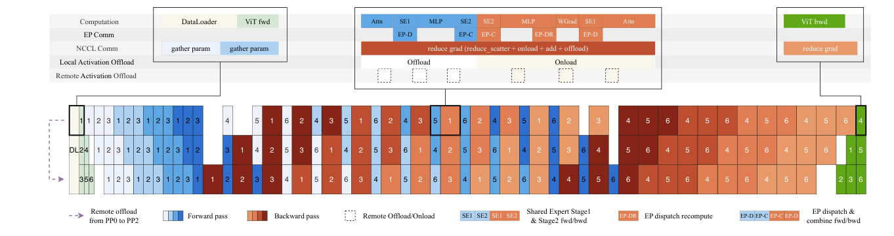

<figcaption>図11: 異なる PP フェーズで重ねられた計算・通信・オフロード。</figcaption>
</figure>

#### 5.2.1 Perfectly Balanced Expert-Parallel MoE Training（完全に均衡した EP MoE 訓練）

従来の EP スキームではトークン負荷がランク間で不均衡である。結果として生じる計算の不均衡が訓練スループットを劣化させ、ルーティングエキスパートの活性化の動的に変わる形状が実質的なメモリ断片化を起こす。したがって我々は **MoonEP** を提案する。これは動的な冗長エキスパートで完全な負荷均衡を達成する EP スキームである。（訳注: 脚注 3——MoonEP は https://github.com/MoonshotAI/MoonEP で公開。）

**有界な冗長エキスパートによる完全均衡**: MoonEP は各ランクがちょうど $S\times K$ トークン（$S$ は系列長、$K$ はトークンあたり選択エキスパート数）を受け取ることを要求し、全ランクが同量の計算を行うようにする。鍵となる問いは、そうした均衡を保証するのに何個の冗長エキスパートで十分かである。$E$ をエキスパート数、$R$ を EP サイズとして、我々は**均衡した計画が常に高々 $E/R$ 個の冗長エキスパートで存在する**ことを証明する（付録 E）。

**オンライン計画・ゼロコピー通信・静的形状での同期なし実行**: 各訓練ステップで厳密な最適を計算するのは高くつくので、代表的な場合について整数線形計画（ILP）でオフラインの厳密解を参照として計算し、ほぼ最適で無視できるオーバーヘッド・常に $E/R$ 上界を守る GPU 計画カーネルを設計する。完全均衡は通信経路も単純化する——計画カーネルが各トークンの宛先を事前計算する融合 permute/unpermute 演算子を実装し、中間コピーを除く。さらに、完全均衡により各層の計算形状が静的に既知になるので、層間でホストとデバイスが同期する必要がなくなる。

#### 5.2.2 Memory-Efficient Training（メモリ効率的な訓練）

**統一活性化マネージャ**: 逆伝播のために保存される全テンソルを、差し替え可能なストレージバックエンドに紐づける統一ストレージ抽象を設計する。再計算・量子化・オフロードはこの抽象の下では単なるストレージ方針であり、テンソル粒度で自由に合成でき、テンソル上の軽量な注釈で宣言され、モデルコードから完全に切り離される。**メモリ効率的な MoE**: SonicMoE [^40] に着想を得て、permuted probs の勾配計算を数学的変換で書き換え、順伝播出力への逆方向依存を除く。**メモリ効率的な Attention 残差**: Block AttnRes にもとづく随伴最適化を設計する——ブロック表現は境界層で 1 回生成され後続の全層で共有され GPU 上に常駐する。AttnRes 計算全体をチェックポインティングで包み、各層で逆伝播のため保存される活性化を標準残差アーキテクチャと同一にする。**PP ランク間の活性化均衡**: interleaved 1F1B の下で活性化は PP ランク間で不均衡なので、Mooncake Transfer Engine [^95] で他の PP ランクのメモリへ遠隔オフロードして均衡させる。**Pipeline ZeRO-2 勾配シャーディングとオフロード**: 勾配を DP ランク間でシャードし、シャードした勾配を CPU メモリに置いて GPU ピークメモリを下げる。**P2P ベースの Muon 直交化**: Muon の Newton–Schulz 直交化は完全なパラメータ行列を要するので、各ランクは全パラメータバッファの all-gather ではなく、局所ブロックに必要なシャードのみを取得する。

#### 5.2.3 Multimodal Encoder Optimization（マルチモーダルエンコーダの最適化）

**マルチモーダルエンコーダでの動的 CP**: 長コンテキストのマルチモーダル訓練では、大きな画像・長い動画が視覚エンコーダの計算時間を大幅に増やしデバイス間の負荷不均衡を起こす。これに対処するため、Context Parallelism をそうした大きなサンプルへ拡張する——単一の大画像をパッチ次元に沿って複数デバイスに分割し、CP ランク間で KV を gather して attention を計算する。**PP バブルでのエンコーダ計算**: Kimi K2.5 で導入した Decoupled Encoder Process（DEP）[^60] は ViT とテキストの訓練を別段階に分け、視覚の順・逆伝播を PP ステージ間で均衡させる。interleaved 1F1B スケジュールでは最初の PP マイクロバッチのテキスト順伝播がすべて最初にスケジュールされ、最後の PP マイクロバッチのテキスト逆伝播が最後にのみ終わる。したがって ViT 計算をさらに分解し、パイプラインのバブルへ詰める。

### 5.3 Infra for 1M Agentic RL（100 万トークンのエージェント RL のためのインフラ）

Kimi K3 ほど大きいモデルのエージェント RL を、有界な計算予算のもとで 100 万トークンのコンテキストへスケールさせることは、資源効率を第一級の目標にする。これは 2 つの相補的な努力を動機づける——1) 効率的な訓練とロールアウト（KV キャッシュ管理・リクエストスケジューリング・訓練状態の配置）、2) 長期ホライズンの相互作用のための高性能で再開可能なサンドボックス。

#### 5.3.1 Long-context RL infrastructure（長コンテキスト RL インフラ）

各 1M コンテキストの Kimi K3 RL 実験を数百 GPU 内に収めるため co-located RL 訓練 [^57] を採り、超長軌跡のテール遅延を減らすため partial rollout [^117] を使う。この設計は良いハードウェア稼働率を達成するが、次反復のために永続化する必要のあるロールアウト KV キャッシュと、訓練に必要なメモリの間に**メモリ競合**を導入する。長コンテキスト RL ではこの課題がより深刻になる。

**外部 KV キャッシュプール**: 1M コンテキストの多段ロールアウトでは、プレフィックス KV キャッシュのミスが極めて高くつく。したがってプレフィックスの保持を GPU 常駐から**書き戻し設計**で切り離す——アクティブなデコードブロックは GPU KV キャッシュに残り、再利用可能なアイドルのプレフィックスは GPU から追い出されるときのみ CPU DRAM の外部 KV キャッシュプールへ書き戻され、次の再利用の前にプリフェッチされる。KDA 状態は対応する MLA KV キャッシュブロックとともにオフロード・プリフェッチされ、ライフサイクルを揃える。外部プールに十分な DRAM を与えるため、訓練状態（重みと最適化器状態）は訓練反復の終了後に NVMe へオフロードする。

**ロールアウトの自動スロットリングスケジューラ**: 多段ロールアウトでは軌跡の進行とともに文脈が漸進的に成長するので、全軌跡の平均長にもとづく固定並行度は推定が難しく初期には過度に保守的になる。逆に並行度を高くしすぎると後期に KV キャッシュ圧迫を生み preemption を起こしうる。したがって LLM リクエストのスケジューリング層で、アクティブ・キュー・KV キャッシュ利用率などのランタイム信号を使う自動スロットリング機構を設計する。**非方策モデル順伝播のための勾配バッファ再利用**: 参照モデルなど順伝播のみの非方策モデルの重みは GPU 常駐には大きすぎるので CPU メモリに保ち、必要時のみ具現化し、方策モデルの FP32 勾配バッファストレージを流用する。

#### 5.3.2 Sandbox Infrastructure（サンドボックスインフラ）

Kimi K3 の事後学習と評価の多様な要求を支えるため、複数のサンドボックスランタイム——伝統的なコンテナベース、GPU サンドボックス、そして最も特筆すべき **microVM ベースの新しいランタイム AgentENV**——を用いる。（訳注: 脚注 4——AgentENV は https://github.com/kvcache-ai/AgentENV でパートナーとの協働として公開。）

AgentENV は**エージェント AI ワークロードのために特別に設計された**サンドボックスシステムで、3 つの中核的な設計目標を軸に構築される。

- **高忠実度の隔離されたサンドボックスランタイム**: エージェントがより有能になりタスクがより難しくなると、より積極的に探索し reward hacking を試みることさえある。**これは固有のセキュリティ課題を提起する**——伝統的なコンテナベースのランタイムでの初期実験では、意図しないエージェント操作が引き起こす kernel panic やデッドロックをいくつか観測した。一方で我々はできるだけ多くの探索を許したい。microVM ベースの隔離がこの緊張を解く。
- **エージェント RL のための柔軟なサンドボックスのライフサイクル**: 低水準では、AgentENV は**サンドボックス状態の漸進的なチェックポイントと再開**を支える——チェックポイント時には前回のチェックポイント以降に汚れたメモリページのみを保存し、**チェックポイントと再開の遅延をそれぞれ 133ms・49ms まで**下げる。この上に、エージェント RL 効率を高める 3 つの高水準操作（Pause/Resume など）を提供する。
- **高効率・高密度**: 我々のワークロードでは、それぞれ固有のイメージを持つ数万のサンドボックスを数秒で作る必要がありうる。イメージ形式に OverlayBD [^67] を採り、カスタム ublk ドライバ・ストレージ層の共有・P2P 転送と組み合わせ、大規模でサブ秒の起動遅延を達成する。copy-on-write メモリとページキャッシュ最適化でメモリ使用をさらに減らす。

**Kimi K3 の訓練・評価を通じて、1,505,678 個のイメージにわたる合計 51,219,741 個のサンドボックスが作られた。**

### 5.4 Inference and Online Serving（推論とオンラインサービング）

Kimi K3 のサービングは本番側から同じ課題を露出させる——ハイブリッド KDA–MLA アーキテクチャが 100 万トークンで共同管理すべき根本的に異なる 2 つのキャッシュを持ち、新しいモジュールと高度に疎なエキスパートがそれぞれに合わせたカーネルを要求し、本番トラフィックはリクエストごとのコストが 3 桁にわたるリクエストを混ぜる。

#### 5.4.1 KDA-Aware Prefix Cache Management（KDA を意識したプレフィックスキャッシュ管理）

Kimi K3 のハイブリッドアーキテクチャはプレフィックスキャッシュを複雑にする——KDA の再帰状態と MLA の KV キャッシュはサイズとライフタイムが根本的に異なるが、キャッシュされたプレフィックスは両者が同じ境界で共に復元できるときのみ再利用可能である。したがって両キャッシュ型を共同管理する KDA を意識したプレフィックスキャッシュを設計する。**統一キャッシュレイアウト**: 各 Kimi K3 ブロックは 3 つの KDA 層と 1 つの Gated MLA 層からなる。MLA KV キャッシュは系列長とともに成長しトークンごとにページングされるが、KDA 再帰状態はリクエストごとに 1 コピーの固定サイズである。両者に別々のマネージャを保つと割り当て・追い出し・転送のロジックが重複するので、KDA 状態を MLA KV と同じページングされたブロックプールに詰める。

**KDA プレフィックスキャッシュの最適化**: ブロックハッシュベースのプレフィックスキャッシュは 1 物理ブロック粒度で KV キャッシュを再利用する。この結合は Kimi K3 で破綻する——ブロックハッシュ照合は全層で共有される 1 つのブロックサイズを要し、プレフィックスのヒットはヒット境界での KDA 状態が永続化されているときのみ再利用可能である。KDA 層は系列ごとに単一の大きな再帰状態を保つので、状態スナップショットは疎な境界でのみ手頃であり、共有ブロックサイズは 1024–6144 トークンに強制される。

<figure>

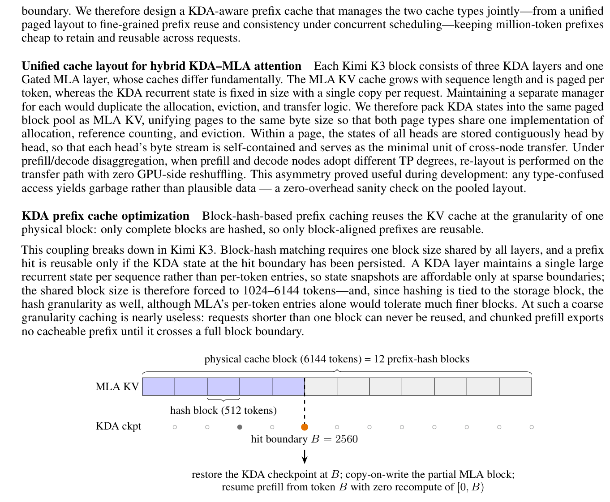

<figcaption>図12: 物理キャッシュブロック内の細粒度プレフィックスキャッシュ。6144 トークンの物理ブロックが 12 個の 512 トークンのハッシュブロックを含む（青=キャッシュ済み MLA ブロック、薄灰=空ブロック）。下のマーカーは各ハッシュ境界での KDA チェックポイント状態を示す（白丸=チェックポイントなしの境界、灰点=永続化済み KDA チェックポイント、橙点=ヒット境界のチェックポイント）。</figcaption>
</figure>

したがって 2 つの粒度を切り離す。プレフィックスのハッシュ化は MLA ページ内の細かい**ハッシュブロック**（例: 512 トークン）で行い、物理ブロックは粗い割り当て単位のままにする。KDA では逆に整列を走らせる——再帰状態のチェックポイントは MLA のハッシュ端点の（疎な部分集合の）位置でのみ保存する。ルックアップは 2 段で進む（図 12）——MLA 段が連鎖ハッシュで物理ブロック全体を照合し、最初の欠けたブロックでその内部のハッシュ端点へフォールバックする。次に KDA 段が、各 KDA キャッシュグループの候補境界でチェックポイントを要求する。ヒットは両段を満たす最長の境界である。**並行スケジューリング下の一貫性**: 残る設計点は、ヒットブロックが同時に共有キャッシュエントリと私的リクエストの成長点である設定での、部分的に埋まったブロックを共有する具体的な失敗モードによって決まる。

#### 5.4.2 High-Performance Kernels（高性能カーネル）

Kimi K3 はいくつかの新しいアーキテクチャモジュール——KDA（§2.1.1）・Block AttnRes（§2.2）・Stable LatentMoE（§2.3）——を導入する。各々にカーネル実装を最適化する。**KDA**: KDA デコードは、更新が各デコードステップでその場で行われる進化する再帰状態を効率的に管理することが主要なボトルネックになる。このその場更新は MTP ベースの投機デコードで問題になる——検証がドラフトトークンの一部を棄却すると、状態は既に受理境界を越えて進んでいる。しかし受理されたドラフトプレフィックス後の状態は、状態そのものよりはるかに小さいドラフトトークンの射影入力で完全に決まる。したがってこれら射影入力のみをキャッシュし、受理トークンの状態をオンチップで再構築し、検証済み・ボーナストークンの状態を書き戻す（並行研究 ReplaySSM [^23] が独立に提案した設計）。**Block AttnRes・Stable LatentMoE** についても各々カーネルを最適化する。

#### 5.4.3 Fleet-Level Scheduling（フリート水準のスケジューリング）

**キャッシュを意識したアフィニティスケジューリング**: リクエストを、そのプレフィックスキャッシュを保持する可能性の高いインスタンスへルーティングし、ヒット率を上げる。**予算ベースの受理制御（admission control）**: リクエストごとのコストが 3 桁にわたるので、予算ベースの受理制御でオーバーロードを防ぐ。

## 6 Evaluations（評価）

### 6.1 Main Results（主要結果）

#### 6.1.1 Benchmarks（ベンチマーク）

Kimi K3 を、4 つの広い能力軸に沿って組織された包括的なベンチマークスイートで評価する。

- **Reasoning & Knowledge（推論・知識）**: GPQA Diamond [^100]・CritPt [^8]・AA-LCR [^7]・Humanity's Last Exam（HLE-Full、ツールあり・なし）[^92]。
- **［訳注: 復元］ Coding（コーディング）**: DeepSWE [^30]・ProgramBench [^94]・Terminal-Bench 2.1 [^77]・FrontierSWE [^34]・SWE-Marathon [^116]・PostTrainBench [^93]・MLS-Bench-Lite [^75]・SciCode [^120] [^8]。（訳注: この箇条書きは Web Clipper のクリップで丸ごと欠落していたため ar5iv 原ページから復元した。）
- **Agentic（エージェント）**: BrowseComp [^130]・DeepSearchQA [^125]・ResearchRubrics [^105]・Toolathlon-Verified [^68]・MCPMark-Verified [^132]・MCP-Atlas [^10]・AutomationBench [^107]・JobBench [^69]・GDPval-AA v2 [^89]・AA-Briefcase [^8] [^1]・Agents' Last Exam（ALE）[^3] [^114]・APEX-Agents [^126]・OfficeQA Pro [^86]・SpreadsheetBench 2 [^149]・OSWorld-Verified [^135]・OSWorld 2.0 [^142]・SaaS-Bench [^108]・$\tau^{3}$-Banking [^150] [^8]・Harvey Lab-AA [^8] [^41]・CorpFin v2 [^20]・Finance Agent v2 [^33]・Legal Research Bench。
- **Vision（視覚）**: WorldVQA [^148]・OmniDocBench [^87]・PerceptionBench [^62]・Video-MME [^35]・MMVU [^147]・BabyVision [^12]（Python ツール付き）・MMMU-Pro [^143]・CharXiv (RQ) [^129]・Math-Vision [^127]・ZeroBench-main [^101]（各々 Python ツール拡張のあり・なし）。

**表2**: Kimi K3 とプロプライエタリ／オープンソースモデルの性能比較。太字は各ベンチマークの最良、下線は 2 位。特記なき限り Kimi K3 の結果は推論努力 max・温度 1.0。HLE-Full・MMMU-Pro・CharXiv (RQ)・Math-Vision・ZeroBench は各セルがツール拡張なし／ありのスコアをこの順で報告（HLE-Full は汎用ツール、視覚ベンチは Python）。

| ベンチマーク | Kimi K3 (max) | Claude Fable 5 (max, w/ fallback) | GPT-5.6 Sol (max) | Claude Opus 4.8 (max) | GPT-5.5 (xhigh) | GLM-5.2 (max) |
| --- | --- | --- | --- | --- | --- | --- |
| **［Reasoning & Knowledge］** | | | | | | |
| GPQA Diamond | 93.5 | 92.6 | 94.1 | 91.0 | 93.5 | 91.2 |
| CritPt | 23.4 | 28.6 | 32.3 | 20.9 | 27.1 | 20.9 |
| AA-LCR | 74.7 | 70.0 | 73.7 | 67.7 | 74.3 | 71.3 |
| HLE-Full | 43.5 / 56.0 | 53.3 / 63.0 | 44.5 / 58.0 | 49.8 / 57.9 | 41.4 / 52.2 | - |
| **［Coding］** | | | | | | |
| DeepSWE | 67.5 | 70.0 | 73.0 | 59.0 | 67.0 | 46.2 |
| ProgramBench | 77.8 | 76.8 | 77.6 | 71.9 | 70.8 | 63.7 |
| Terminal-Bench 2.1 | 88.3 | 88.0 | 88.8 | 84.6 | 83.4 | 82.7 |
| FrontierSWE | 81.2 | 86.6 | 71.3 | 66.7 | 64.9 | 67.3 |
| SWE-Marathon | 42.0 | 35.0 | 39.0 | 40.0 | 14.0 | 13.0 |
| PostTrainBench | 36.6 | 41.4 | 34.6 | 34.1 | 28.4 | 34.3 |
| MLS-Bench-Lite | 48.3 | 49.9 | 46.2 | 42.8 | 35.5 | 40.4 |
| SciCode | 58.7 | 60.2 | 56.1 | 53.5 | 56.1 | 50.5 |
| **［Agentic］** | | | | | | |
| BrowseComp | 91.2 | 88.0 | 90.4 | 84.3 | 84.4 | - |
| DeepSearchQA (F1) | 95.0 | 94.2 | - | 93.1 | - | - |
| ResearchRubrics | 76.2 | - | 73.8 | 73.5 | 64.0 | 71.1 |
| GDPval-AA v2 (Elo) | 1686 | 1747 | 1736 | 1593 | 1491 | 1510 |
| Toolathlon-Verified | 76.5 | 77.9 | 74.9 | 76.2 | 73.5 | 59.9 |
| MCPMark-Verified | 94.5 | 87.4 | 92.9 | 76.4 | 92.9 | - |
| MCP-Atlas | 84.2 | 84.7 | 83.6 | 83.6 | 82.8 | 82.6 |
| AutomationBench | 30.8 | 29.1 | 29.7 | 27.2 | 22.7 | 12.9 |
| JobBench | 54.3 | 57.4 | 45.4 | 48.4 | 38.3 | 43.4 |
| AA-Briefcase (Elo) | 1548 | 1583 | 1495 | 1354 | 1158 | 1260 |
| Agents' Last Exam | 28.3 | 25.7 † | 29.6 | 27.0 | 26.6 | 20.4 |
| APEX-Agents | 41.0 | 43.3 | 39.9 | 39.4 | 38.5 | 35.6 |
| OfficeQA Pro | 63.3 | 69.9 | 63.2 | 63.9 | 60.9 | 41.4 |
| SpreadsheetBench 2 | 34.8 | 34.7 | 32.4 | 31.6 | 29.1 | 28.1 |
| OSWorld-Verified | 84.8 | 85.0 | 83.0 | 83.4 | 79.0 | - |
| OSWorld 2.0 | 58.3 | 66.1 | 62.6 | 55.7 | 49.5 | - |
| SaaS-Bench | 60.1 | - | 61.4 | 56.1 | 43.8 | - |
| $\tau^{3}$-Banking | 33.4 | 26.8 | 33.0 | 27.6 | 31.3 | 26.8 |
| Harvey Lab-AA | 94.6 | 93.6 | 87.2 | 91.1 | 86.3 | 91.0 |
| CorpFin v2 | 71.6 | 71.8 | 64.4 | 66.7 | 68.4 | 66.1 |
| Finance Agent v2 | 54.4 | 56.3 | 53.8 | 53.9 | 51.8 | 49.7 |
| Legal Research Bench | 44.2 | 49.5 | 48.1 | 43.8 | 40.4 | 31.3 |
| **［Vision］** | | | | | | |
| WorldVQA ForceAnswer | 51.0 | 56.7 | 41.8 | 39.1 | 38.5 | - |
| OmniDocBench | 91.1 | 89.8 | 85.8 | 87.9 | 89.4 | - |
| PerceptionBench | 58.5 | 57.2 | 59.7 | 47.2 | 55.8 | - |
| Video-MME (w/ sub) | 90.0 | - | 89.5 | 86.0 | 89.3 | - |
| MMVU | 82.1 | - | 81.2 | 79.2 | 81.7 | - |
| BabyVision w/ Python | 85.7 | 90.5 | 88.9 | 81.2 | 83.6 | - |
| MMMU-Pro | 81.6 / 83.4 | 81.2 / 86.5 | 83.0 / 84.6 | 78.9 / 82.7 | 81.2 / 83.2 | - |
| CharXiv (RQ) | 84.8 / 91.3 | 88.9 / 93.5 | 84.6 / 89.1 | 80.5 / 89.9 | 84.1 / 89.0 | - |
| Math-Vision | 94.3 / 97.8 | 94.8 / 98.6 | 95.8 / 97.8 | 86.7 / 97.1 | 92.2 / 96.8 | - |
| ZeroBench-main (pass@5) | 23.0 / 41.0 | 23.0 / 46.0 | 17.0 / 35.0 | 17.0 / 34.0 | 22.0 / 41.0 | - |

#### 6.1.2 Baselines（ベースライン）

最先端のプロプライエタリ・オープンソースモデルと比較する。プロプライエタリでは Claude Fable 5 [^15]・GPT-5.6 Sol [^38]・Claude Opus 4.8 [^16]・GPT-5.5 [^37]。Claude Fable 5 の結果はフォールバック挙動を含み、GPT-5.6 Sol の結果は潜在的な cyberguard を含む。オープンソースでは GLM-5.2 などを含む。

#### 6.1.3 Evaluation Configurations（評価設定）

すべての Kimi K3 評価は推論努力 max・温度 1.0 を用いる。GPQA Diamond・HLE-Full・ツールなし視覚ベンチのような単一ステップタスクでは top-p = 0.95、エージェントタスクでは top-p = 1.0 に設定する。一般に推論・知識タスクには top-p = 0.95、コーディング・エージェント場面には top-p = 1.0 を推奨する。**コーディング**: 各モデルは 3 つのエージェントハーネス——**Kimi Code [^55]・Claude Code [^14]・Codex [^19]**——のいずれかで評価される。DeepSWE では v1.1 タスクの結果を報告する（公式リーダーボード参照として、Kimi K3 は mini-SWE-agent ハーネスで 67.3 を達成）。Terminal-Bench 2.1 では全モデルでハーネス横断の最良スコアを報告する。**エージェント**: OfficeQA Pro は PDF コーパス全体を画像として与える（機械可読テキストなし）。MCP-Atlas は 500 タスク公開部分集合で 100 ターン上限・Gemini 3.1 Pro を審判に評価。BrowseComp ではコンテキスト圧縮戦略を採る。**視覚**: スコアは 3 回の平均（ZeroBench-main のみ公式設定に従い 5 回）。**第三者結果**: GDPval-AA v2・AA-Briefcase・$\tau^{3}$-Banking・Harvey Lab-AA・APEX-Agents・SciCode・AA-LCR・CritPt は Artificial Analysis [^8]（2026-07-23 時点）から引用。CorpFin v2・Finance Agent v2・Legal Research Bench は Vals AI [^123] から引用。

#### 6.1.4 Results（結果）

表 2 が Kimi K3 とプロプライエタリ・オープンソースのベースラインの包括的比較を与える。全体として、Kimi K3 は最強のプロプライエタリ系（Claude Fable 5・GPT-5.6 Sol）に僅差で及ばないが、Claude Opus 4.8・GPT-5.5・GLM-5.2 をスイート全体で一貫して上回る。

**Reasoning & Knowledge**: 大学院水準の推論では Kimi K3 はフロンティアと競合し GPQA Diamond で 93.5% を出す。しかし研究水準のタスクには差が残る——HLE-Full ではツールあり・なしでそれぞれ 56.0%・43.5% で Claude Fable 5・GPT-5.6 Sol に及ばず、CritPt では 23.4% で Claude Fable 5・GPT-5.6 Sol・GPT-5.5 に遅れる。

**Coding**: Kimi K3 は強いエージェントコーディング性能を示す。ProgramBench で最良（77.8%）、SWE-Marathon（GPU カーネル志向）で 42.0% と Claude Fable 5 を 7 点上回る。Terminal-Bench 2.1 では GPT-5.6 Sol にほぼ並ぶ（88.3% vs 88.8%）。DeepSWE では Claude Fable 5・GPT-5.6 Sol に次ぐが Claude Opus 4.8 より上。

**Agentic**: Kimi K3 は幅広いエージェントスイートで最先端の結果を達成する——BrowseComp（91.2%）・DeepSearchQA（F1 95.0%）・ResearchRubrics（76.2%）・MCPMark-Verified（94.5%）・AutomationBench（30.8%）・SpreadsheetBench 2（34.8%）・$\tau^{3}$-Banking（33.4%）・Harvey Lab-AA（基準通過率 94.6%）。主な例外は Elo 評価の知識タスクである。

**Vision**: Kimi K3 は強いマルチモーダル理解を示し、Python ツールでさらに増幅される——Math-Vision で 94.3%（Python で 97.8%）、難しい ZeroBench-main で Claude Fable 5 と 23.0% で並ぶ（Python で 41.0%）。OmniDocBench で最高（91.1%）。

### 6.2 Internal Evaluation（内部評価）

#### 6.2.1 Capability Evaluation（能力評価）

公開ベンチマークスイートを超えて、公開評価が十分に覆わない能力領域を狙う内製ベンチマーク群を維持し、モデルとエージェント能力のより包括的な尺度を得る。これらは頻繁に更新・拡張され、モデルの進化する失敗モードを追い、直接に改善を導く。

**表3**: 内製ベンチマークの結果。太字は各ベンチマークの最良、"-" はこのレポートにまだ含まれないスコア。特記なき限り最大推論努力（GPT-5.5 は xhigh）で評価、ハーネス割り当ては Harness 列に示す。

| ベンチマーク | Harness | Kimi K3 (max) | Claude Fable 5 (max) | GPT-5.6 Sol (max) | Claude Opus 4.8 (max) | GPT-5.5 (xhigh) | GLM-5.2 (max) |
| --- | --- | --- | --- | --- | --- | --- | --- |
| **［Coding Experience］** | | | | | | | |
| Kimi Code Bench 2.0 | Claude Code | 73.7 ᵃ | 76.9 | - | 71.7 | - | 64.2 |
|  | Kimi Code | 72.9 | - | - | - | 66.0 | - |
|  | Codex | - | - | 64.8 ᵇ | - | 69.0 ᶜ | - |
| Coding Experience | Claude Code | 59.9 | 59.8 | - | 58.0 | - | 53.3 |
|  | Kimi Code | 56.6 | - | - | - | - | - |
|  | Codex | - | - | 59.3 | - | 56.8 | - |
| **［General Agent Experience］** | | | | | | | |
| 24/7 ClawBench 2.0 | OpenClaw | 48.3 | 47.4 ᵈ | 52.0 | 47.2 | 48.5 | 43.2 |
| MIRA Bench | MIRA | 64.1 | 72.9 | 62.2 | 59.8 | 54.6 | - |
| KAET | Kimi Code | 83.5 | - | 85.4 | 78.7 | 79.7 | 74.7 |
| CLIF Bench | Kimi Code | 52.4 | - | 50.6 | 48.8 | 52.3 | 39.2 |
| Agentic Vision Bench | Kimi Code | 78.3 | 81.1 | 82.9 | 82.8 | 76.9 | - |
| Swarm Bench | Kimi Agent | 76.3 | - | 73.2 | 72.6 | 61.8 | 58.5 |
| Online Experience | Kimi Agent | 77.9 | 74.2 ᵉ | 84.0 | 69.4 | 73.7 | 64.0 |
| Deep Research Bench | Kimi Agent | 90.0 | - | 85.3 | 87.2 | 81.9 | 84.0 |
| Finance Bench | N/A | 62.6 | - | 62.7 | 60.7 | 58.4 | 55.4 |
| KWV Bench | N/A | 64.7 | 63.6 | 66.9 | 61.7 | 65.8 | - |
| DECK Bench | N/A | 73.5 | 73.0 | 74.7 | 66.9 | 68.2 | 68.6 |
| Agent Behavior Bench | Kimi Work | 65.0 | 75.5 ᶠ | 76.4 | 65.7 | 70.1 | - |
| **［Conversational Experience］** | | | | | | | |
| Faithfulness | N/A | 85.5 | - | 84.8 | 83.6 | 86.5 | 74.8 |
| Chat All-in-One Bench | Kimi Work | 85.2 | 88.0 | 79.0 | 83.8 | 71.8 | - |

**評価設定**: ベンチマークがハーネスごとに別行に分かれていない限り、表 3 の Harness 列は Kimi K3 が用いたハーネスを示す。他モデルは、Claude 系と GLM-5.2 が Claude Code、GPT 系が Codex で評価される（全モデルが同一ハーネスを使う例外を除く。例: 24/7 ClawBench 2.0 は OpenClaw）。

**結果**: 内製スイートは Kimi K3 の強みと弱みを公開ベンチより鋭く分ける。最も明確な強みは**オーケストレーションと研究型のエージェンシー**である——Kimi K3 は **Swarm Bench（76.3）と Deep Research Bench（90.0）を明確な差で先導**し、複雑な目的の分解・並列作業の協調・成果物の生成に強い能力を示す。Kimi K3 が遅れるのは主に **Agent Behavior Bench・MIRA Bench・24/7 ClawBench 2.0・Agentic Vision Bench・KWV Bench** である。残りの埋まったスイート（KAET・CLIF Bench・Online Experience・DECK Bench・Faithfulness・Chat All-in-One Bench）では 1 位か僅差の 2 位に位置する。

**表4**: 内製 Kimi Webdev Bench の結果——Kimi K3 (max) 対 Claude Opus 4.8 (max)、両者とも Claude Code ハーネスで実行。盲検の専門家審査で、専門家がどちらのモデルの出力か知らずにコード品質・機能完全性・視覚忠実度・相互作用体験を採点する。

| 領域 | Win | Tie | Lose | Win − Lose |
| --- | --- | --- | --- | --- |
| Games | 55.6% | 3.7% | 40.7% | +14.9% |
| 3D / WebGL / Shader | 72.7% | 13.7% | 13.6% | +59.1% |
| Website / UI Clone | 52.6% | 21.1% | 26.3% | +26.3% |
| Overall | 58.6% | 13.8% | 27.6% | +31.0% |

#### 6.2.2 Cyber Security Evaluation（サイバーセキュリティ評価）

我々はモデルのサイバーセキュリティ能力を、運用上のリスクが増す 2 段階の進行——**証明概念（PoC）を伴う脆弱性発見（Tier 1）** と**端から端までのエクスプロイト開発（Tier 2）**——に沿って評価する。評価対象には、広く配備されたソフトウェア（OS カーネル構成要素・オープンソースプロジェクト）の最近の版などが含まれる。

**脆弱性発見（Tier 1）**: この段階はモデルに、（既知の脆弱性を再現するのではなく）現行のコードベースの本物のバグを同定し、それが再現可能であることを実証することを課す。これらの能力は主として防御的なセキュリティ研究に関連する。OS カーネル・データベース・AI サービス・Web フレームワーク・ブロックチェーン・VPN ソフトにわたる数十の広く配備された系で、モデルは数百の候補脆弱性を同定した。人間のレビューを受けた発見のうち**約 70% が本物と確認**され、**6 プロジェクトにわたる 16 件の未知の脆弱性**を含む。2 件の Linux カーネルの発見が結果の深さを示す——第一に、モデルは遠隔から引き起こせるヒープの範囲外書き込みを同定した。このバグは不完全な上流の修正で導入され、最新の上流コードまでのすべての後続版に影響する。セキュリティ専門家がこれを遠隔 DoS プリミティブと確認した。

**エクスプロイト開発（Tier 2）**: この段階は、脆弱性を動作する端から端までのエクスプロイトへ変えることをモデルに要求し、誤用リスクに最も直接に関連する。GLM-5.2 をベースラインに、2 トラックにまたがる内製の 36 タスクスイートで評価する。**ユーザー空間のエクスプロイト（16 タスク）**: PostgreSQL・XWiki・Apache HTTP Server などの広く配備されたユーザー空間ソフトの実 CVE を端から端まで攻略する。**Linux カーネルのエクスプロイト（20 タスク）**: 各タスクは歴史的なカーネル CVE から作った再現可能な QEMU 環境を与え、モデルは非特権ユーザーから root へ権限昇格する C エクスプロイトを書かねばならない。緩和策が難易度に応じて段階的に有効化される。スイートの全タスクは人間のセキュリティ専門家が可解と検証済みで、全スイートの完了には**約 540 専門家時間（1 タスクあたり平均約 15 時間）**を要すると見積もる。

**エクスプロイトスイートの結果**: モデルはこのスイートで有意なエクスプロイト開発能力を示し、**36 タスク中 14（38.9%）を解いた**——GLM-5.2 の 8/36（22.2%）に対して。ただし成功は偏っており、14 のうち 10 がユーザー空間トラックからである。カーネルトラックでは両モデルとも 4 分の 3 のタスクを解けない。全タスクが専門家に可解なので、未解決タスクは人間水準への残りのギャップを直接に測る。軌跡分析はこのギャップを 4 つの反復する失敗モードに帰属させる——(i) 既に得たプリミティブからエクスプロイト連鎖の最終段を完了するのが難しい、(ii) 緩和策下での戦略選択が拙い、など。

**まとめ**: モデルのサイバー能力は Tier 1 と Tier 2 のユーザー空間で最も強いが、人間専門家への明確なギャップが残る。Tier 1（防御的）では、モデルは未知のものを含む本物の脆弱性を同定し再現性を実証する。Tier 2 ではユーザー空間の端から端までのエクスプロイトを完成させるが、カーネルのエクスプロイトでは人間になお及ばない。

### 6.3 Third-Party Evaluation（第三者評価）

Kimi K3 は公開以来、第三者組織によっても独立に評価された。表 5 が 2026-07-23 時点の主要結果をまとめる。**Artificial Analysis**: Kimi K3 は Intelligence Index v4.1 で 57.1 を達成し、580 モデル中 4 位（GPT-5.6 Sol の effort 変種を 1 エントリと数えれば 3 位）——Claude Fable 5（59.9）と GPT-5.6 Sol（58.9）に次ぎ、他の全評価モデルを上回る。**Vals AI**: GDP 加重の産業ベンチマークで Kimi K3 は Vals Index（74.7%）で 39 モデル中 2 位——Claude Fable 5（75.1%）に次ぎ GPT-5.6 Sol（73.1%）より上。**Arena**: クラウドソースの人間選好アリーナで、Kimi K3 は **WebDev Arena で 99 モデル中 1 位（1,678 Elo、Claude Fable 5 の 1,634 を上回る）——このリーダーボードで首位に立った最初のオープンモデル**——、Text Arena で 200 中 8 位（1,486 Elo）。Agent Arena では 37 中 4 位（9.1）。

**表5**: Kimi K3 の主要な独立第三者評価（2026-07-23 時点）。太字は各ベンチマークの最良、下線は 2 位。ベースラインスコアは各ソースが自身の評価設定で報告したもの。

| ベンチマーク | Kimi K3 (max) | Claude Fable 5 (max) | GPT-5.6 Sol (max) | Claude Opus 4.8 (max) | GPT-5.5 (xhigh) | GLM-5.2 (max) |
| --- | --- | --- | --- | --- | --- | --- |
| **［Artificial Analysis］** | | | | | | |
| Intelligence Index v4.1 (#4/580) | 57.1 | 59.9 | 58.9 | 55.7 | 55.0 | 51.1 |
| **［Vals AI］** | | | | | | |
| Vals Index (#2/39) | 74.7 | 75.1 | 73.1 | 70.4 | 68.0 | 65.0 |
| **［Arena］** | | | | | | |
| WebDev Arena (Elo, #1/99) | 1,678 | 1,634 | 1,630 | 1,565 | 1,507 | 1,592 |
| Text Arena (Elo, #8/200) | 1,486 | 1,507 | 1,485 ᵃ | 1,484 ᵇ | 1,482 ᵇ | 1,469 |
| Agent Arena (#4/37) | 9.1 | 12.7 | 10.1 | 9.8 | 8.8 | 6.5 |

### 6.4 Cost Efficiency（コスト効率）

スコアを超えて、コーディング・エージェントの 4 スイート（Kimi Code Bench 2.0・BrowseComp・GDPval-AA v2・AA-Briefcase）でスコア対タスクごとコストを比較して推論コスト効率を検討する。Kimi Code Bench 2.0 ではコストを内部で測り、Kimi K3 は Kimi Code、他モデルは Claude Code で実行。**Kimi Code Bench 2.0 では Kimi K3 は Claude Fable 5 の 38% のコストで 4.0 点差、high 努力では既に Claude Opus 4.8 の最大努力スコアに約 1/3 のコストで並ぶ。BrowseComp では Kimi K3 が最良スコア（91.2%）を 1 タスクあたり $2.03——GPT-5.6 Sol（90.4%）の半分、他の最上位系より 1 桁安く——で達成する。**

<figure>

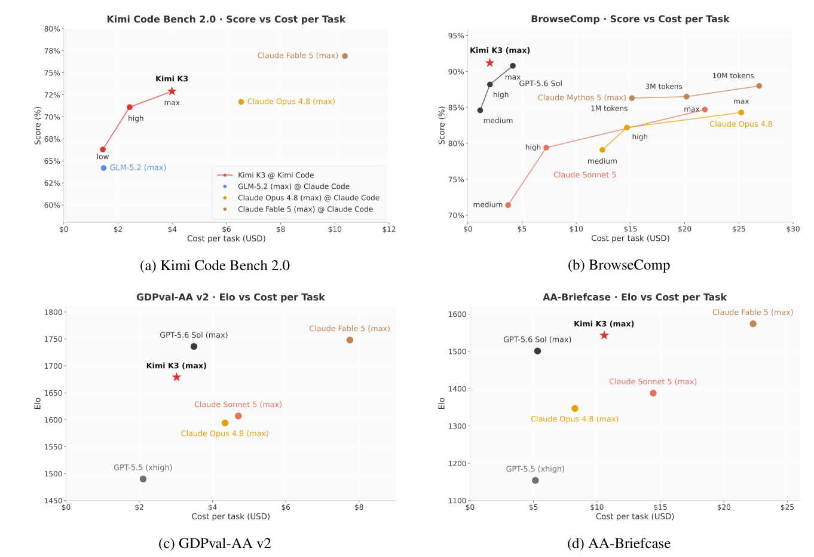

<figcaption>図13: Kimi Code Bench 2.0・BrowseComp・GDPval-AA v2・AA-Briefcase におけるスコア対タスクごと推論コスト。Kimi K3 は星印で示す。</figcaption>
</figure>

全体として、Kimi K3 は 4 スイートすべてでコスト効率フロンティア上またはその近くに位置し、とりわけ Claude Fable 5 のコストの一部で最上位近くのスコアを届ける。

## 7 Case Studies（ケーススタディ）

本節では、多様な技術タスクにわたる Kimi K3 の能力を示す代表例を提示する。

**GPU カーネル最適化**: モデルの GPU カーネル最適化能力を試した。各モデルは同一構成のサンドボックスで独立に、1 タスクあたり最大 24 時間の予算でプロファイル・書き換え・ベンチマークを行う。評価は 4 つの代表カーネル（AttnRes・DeepSeek Sparse Attention (DSA)・KDA・ヘッド次元 512 の MLA）を NVIDIA Hopper GPU と別ベンダーの GPGPU で覆う。Kimi K3 は 4 カーネルすべてで性能を大幅に改善した。

<figure>

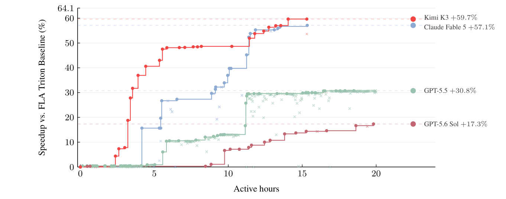

<figcaption>図14: ケーススタディ——AttnRes の GPU カーネル最適化。</figcaption>
</figure>

**GPU コンパイラ開発**: Kimi K3 は **MiniTriton** を開発した。これはカスタムのタイル水準 Python フロントエンドとレイアウトシステム・軽量なワープ水準 MLIR [^63] 注釈と最適化層・PTX コード生成パイプラインを持つコンパクトな Triton 風 [^121] コンパイラである。（訳注: 脚注 5——https://github.com/MoonshotAI/minitriton）

<figure>

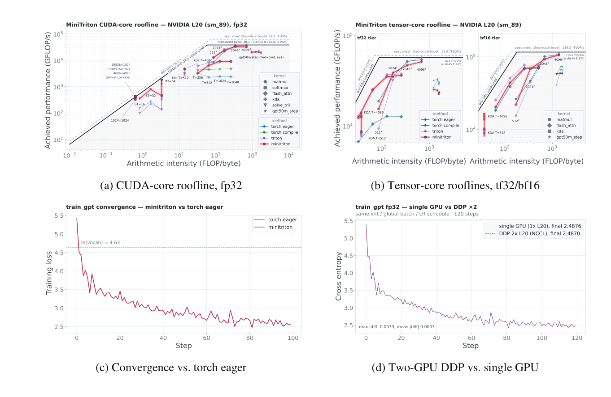

<figcaption>図15: ケーススタディ——MiniTriton による GPU コンパイラ開発。(a) CUDA コアと (b) tensor コアの、NVIDIA L20（sm_89）上の MiniTriton カーネルのルーフライン（torch eager・torch.compile・Triton・cuBLAS を基準に）。(c) MiniTriton で訓練した文字水準 GPT の訓練損失曲線（torch eager と比較）。(d) 2-GPU データ並列。</figcaption>
</figure>

**チップ設計**: 初期の概念実証として、Kimi K3 は同じアーキテクチャ（ハイブリッド KDA・NoPE-MLA attention、ブロックサイズ 2 の Block AttnRes、共有エキスパート 1 のシグモイドベース MoE ルーティング）に従う nano モデルの推論チップの試作を、グループ単位 INT4 重み量子化（グループサイズ 128）のもとで設計した。**Kimi Code での単一の 48 時間自律実行**で、オープンソースの EDA ツールと Nangate45 標準セルライブラリを使ってチップを構築・最適化・検証した。（訳注: 脚注 6——RTL コードは https://github.com/MoonshotAI/nano-kpu）

**研究のためのコーディング**: 計算天体物理学の I–Love–Q 普遍関係を再現するため、Kimi K3 は 20 本超の論文をレビューして結果を相互検証し、完全な数値パイプラインを実装し、300 超の状態方程式を評価し、公表された式の不整合を同定し、3,000 行超の Python を書き、対話的な HTML ダッシュボードを生成した——**約 2 時間で**（経験豊富な研究者なら通常 1〜2 週間）。

**知識労働**: Kimi Work で、Kimi K3 は AI ASIC 産業の 42 年を覆う対話的な研究 Web サイトを生成した。**120 回超の反復的な洗練**を完了し、87 の四半期報告と 99 の原 PDF（11,000 ページ超）のコーパスを 2,800 超の Web 検索と 1,100 超の端末クエリで活用した。第 2 の事例では、Kimi K3 は GWTC-5 の 391 の重力波イベントを **20 超の並行サブエージェント**で分析し、7 つの科学的可視化・2 つの要約表などを生成した。

**動画編集とモーションデザイン**: ネイティブマルチモーダルアーキテクチャを活かし、Kimi K3 は自身のアーキテクチャの 3Blue1Brown 風モーショングラフィックス解説を作り、56 のソースクリップからティーザー動画を編集した。これはクリップ選択・動きに合わせたカット・フレーム精度のビート同期・音声処理・複数回の改訂を含む。同等の高密度な短編動画の制作は経験豊富な編集者でも通常 1〜2 日かかる。

## 8 Conclusion（結論）

我々は **Kimi K3** を提示した。これはネイティブな視覚能力と 100 万トークンのコンテキストウィンドウを備えたオープンな 2.8 兆パラメータの MoE モデルで、Kimi Delta Attention と Attention Residuals の上に構築されている。**世界初のオープンな 3T 級モデル**として、Kimi K3 は長期ホライズンのコーディング・エージェント・知識・推論・視覚タスクにわたってフロンティア水準の性能を届ける。最強のプロプライエタリモデルへのギャップは残るが、Kimi K3 は誰もが手の届く新しいオープンフロンティアを確立する。我々は、それがコミュニティのさらなる革新を可能にすることを望む。

## Appendix A Contributions（付録 A: 貢献者）

> 訳注: 原文の付録 A は Kimi Team の貢献者一覧（氏名を役割別に列挙）である。K2.5 の先例に倣い、氏名の全列挙は省略し、原典を参照されたい。

## Appendix B Details of Sigmoid Tanh Unit GLU（付録 B: SiTU-GLU の詳細）

SiTU-GLU（§2.3.2）の設計目標は、Swish の特徴的な形——原点近傍で概ね線形、負のテールが消える——を捨てずに SwiGLU の積を有界にすることである。図 4 がゲート・up の各分岐とその完全なスカラー応答を示す。

**両分岐を滑らかにキャップする**: SiTU は Swish の線形因子を $\beta_{1}\tanh(\mathbf{W}_{g}\bm{x}/\beta_{1})$ でキャップしつつシグモイド因子を保つ [^61]。シグモイドは既に負のゲート応答をゼロへ向かわせるので、この変更は主に大きな正の活性化を制御し、負のテールを除かない。Kimi K3 は同じ構成を up 分岐に $\beta_{2}\tanh(\mathbf{W}_{u}\bm{x}/\beta_{2})$ として適用する。

**局所と極限の振る舞い**: 原点近傍のスカラー $z$ について、スケール済み $\tanh$ は $\beta\tanh(z/\beta)=z+O(z^{3}/\beta^{2})$ を満たす。したがって SiTU-GLU は原点近傍で SwiGLU と 1 次まで一致する。また $\beta_{1},\beta_{2}\rightarrow\infty$ で SwiGLU を各点で回復する。

**有界な出力**: $|\tanh(z)|<1$ かつ $0<\operatorname{Sigmoid}(z)<1$ なので、$\beta_{1}=4$・$\beta_{2}=25$ に対しすべての出力座標は $\left\|\operatorname{SiTU\text{-}GLU}(\bm{x})\right\|_{\infty}\leq\beta_{1}\beta_{2}=100$ を満たす。ゲート事前活性化のハードクランプと異なり、滑らかなキャップは飽和境界から離れた非ゼロの勾配を保ち、より良い訓練挙動を与える。

## Appendix C Derivation of Quantile Balancing（付録 C: Quantile Balancing の導出）

この付録は §2.3 で用いる QB 更新を、最適な均衡割り当てから導く [^110]（エキスパート負荷均衡への割り当ての観点は BASE Layers [^66] と BIP [^115] に遡る）。$\bm{s}\in\mathbb{R}^{m\times n}$ を $m$ トークンの $n$ エキスパートに対するルーター・スコア、各トークンがちょうど $k$ エキスパートを選び $x_{i,j}\in\{0,1\}$ が選択を示すとして、

$$
\max_{x_{i,j}\in\{0,1\}}\sum_{i,j}x_{i,j}s_{i,j}\qquad\text{s.t.}\qquad\sum_{j}x_{i,j}=k,\qquad\sum_{i}x_{i,j}=\frac{mk}{n}.
$$

**線形緩和と双対性**: $x_{i,j}\in\{0,1\}$ を $[0,1]$ へ緩和すると式 20 は線形計画になり、二部 $b$-マッチング多面体の整数性により最適が整数になる（緩和は厳密）。トークン・エキスパート側の等式制約に自由乗数 $\alpha_{i}$・$\beta_{j}$ を導入し、minimax 定理で最適化順序を交換すると、凸な双対目的

$$
\min_{\alpha_{i},\beta_{j}}\;\mathcal{L}(\bm{\alpha},\bm{\beta}):=\sum_{i,j}\max\big(0,\;s_{i,j}-\alpha_{i}-\beta_{j}\big)+k\sum_{i}\alpha_{i}+\frac{mk}{n}\sum_{j}\beta_{j}.
$$

**厳密な座標最小化**: 式 23 を $\bm{\alpha}$・$\bm{\beta}$ について交互に解く。各部分問題は閉形式の厳密解を持つ。$\bm{\beta}$ 固定でトークン $i$ について $\min_{\alpha}\;k\alpha+\sum_{j}\max(0,s_{i,j}-\beta_{j}-\alpha)$ を解くと、目的は $\alpha$ について区分線形で、ちょうど $k$ 個のマージンが $\alpha$ を上回るときに最小化され、$\alpha_{i}^{*}=\operatorname{quantile}_{1-k/n}(\bm{s}_{i}-\bm{\beta})$ となる。対称的に $\beta_{j}^{*}=\operatorname{quantile}_{1-k/n}(\bm{s}_{:,j}-\bm{\alpha})$。両更新はトークン軸・エキスパート軸に沿った同じ分位点であり、これが手法の名の由来である。

**Algorithm 1（分位点均衡）**:
```
入力: スコア行列 s ∈ R^{m×n}
出力: 割り当て x ∈ {0,1}^{m×n}
β ← 0_{1×n} で初期化
for t = 1,2,…,T do
    α ← desc_sort(s − β, axis=1)[:, k:k+1]
    β ← desc_sort(s − α, axis=0)[mk/n : mk/n+1]
end for
```

## Appendix D Histogram-Based Quantile Estimation（付録 D: ヒストグラムにもとづく分位点推定）

式 14 の QB 更新は、訓練ステップ全体にわたる分位点を要求する——$n$ 個の各エキスパートについてマージン $s_{i,j}-\alpha_{i}$ の $(1-k/n)$-分位点で、トークン数 $m$ はデータ並列ランクと勾配蓄積ステップにまたがる数百万トークンに及ぶ。$O(mn)$ のマージンを厳密な分位点のために集めるのは訓練ループ内では非現実的である。

**ビニングの範囲**: 最初の問いはどの区間でビニングするかで、必要なバイアスが助けになる——その範囲は現在のバイアス自身で有界である。ルーター・スコアはシグモイド出力なので $s_{i,j}\in(0,1)$、カットオフ $\alpha_{i}$ はあるエキスパートのバイアス済みスコアなので $(b_{\min},\,1+b_{\max})$ に収まる。**蓄積と復元**: 各順伝播で、各ランクは局所の $r_{i,j}$ 値をエキスパートごとのカウント行列 $\mathbf{H}\in\mathbb{N}^{n\times B}$ へ scatter-add し、通信なしで全マイクロバッチにわたって蓄積する。ステップ終了時に 1 回の all-reduce が局所カウントをグローバルヒストグラムへ合算し、各ランクは $\widehat{b}_{j}=b_{\min}-1+\bigl(\beta_{j}+\operatorname{clip}(\tfrac{q-c_{j}}{h_{j}},0,1)\bigr)w$ を復元して式 14 のように平均中心化する。**性質**: この推定器は大規模で実用的な 3 つの性質を持つ——正確（累積カウントがビン端で厳密なので誤差はビン幅 $w$ で有界。$B=1000$ で高々数 $10^{-3}$、測定可能な残留負荷不均衡は観測されない）・安価（通信は 1 回の all-reduce のみ）・並列化容易。

## Appendix E MoonEP General Upper Bound Proof（付録 E: MoonEP の一般上界の証明）

$m_{r}(P)$ を計画 $P$ のもとでランク $r$ に置かれる冗長エキスパート数とする。ルーター出力 $I$ について、計画の目的は任意のランクの冗長エキスパート数の最大値を最小化すること、すなわち $M(I)=\min_{P}\max_{r}\{m_{r}(P)\}$ である。我々は $M(I)\leq E/R$ が常に成り立つ（定理 1）こと、そしてこの上界が本質的に緊密である（定理 2）ことを証明する。

**定理 1（一般上界）の証明**: 目標は任意のルーター出力 $I$ について $M(I)\leq E/R$ を示すこと。鍵となる補題——各 EP ランクがちょうど同数のトークン（$S\times K$）を受け取り、各ランクの遠隔トークンが 1 つの他 EP ランクのみから来る計画 $P^{*}$ が存在する。この構成から $M(I)=\min_{P}\max_{r}\{m_{r}(P)\}\leq\max_{r}\{m_{r}(P^{*})\}\leq\frac{E}{R}$。

**定理 2（上界の緊密性）の証明**: ルーター出力 $I^{*}$ を、EP ランク 0 のエキスパートがトークンを受け取らず、他の $R-1$ ランクの全エキスパートが全トークンを均等に共有するよう構成する。すると全 $S\times K\times R$ トークンが $E(R-1)/R$ エキスパートに均等に分割され、各エキスパートは $\frac{SKR^{2}}{E(R-1)}$ トークンを受ける。任意の計画 $P$ の下でランク 0 は $S\times K$ トークン（すべて遠隔）を受けねばならず、上界が緊密に達成される。

## Appendix F Chat Template（付録 F: チャットテンプレート）

Kimi K3 のチャットテンプレートは 3 つの目標を軸に再設計されている。第一は**拡張性**——新しい能力はテンプレートの改訂ではなく後方互換なメッセージ形式を通じて導入されるべきで、単一のテンプレートがモデル世代全体に仕える。第二は**低いアラインメント税（low alignment tax）**——形式は最小の教師データで学習可能であるべきで、軽くファインチューニングした事前学習モデルが直接 RL へ進めるパイプラインを支える。

<figure>

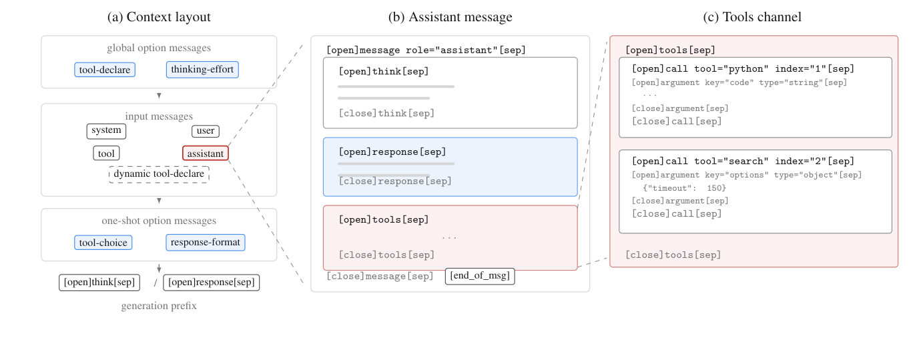

<figcaption>図16: Kimi K3 チャットテンプレートの構造。(a) コンテキストレイアウト: グローバルオプションメッセージが入力メッセージに先行し、ワンショットオプションメッセージがそれに続くので、リクエストごとのオプションは履歴 KV キャッシュを損なわない。動的にロードされるツールはセッション途中に入力オプションメッセージ（破線）として注入される。(b) アシスタントメッセージの解剖: 本体は think・response・tools チャネルに組織される。(c) tools チャネルの展開: 並列呼び出し。</figcaption>
</figure>

**メッセージとゾーン**: コンテキストの最上位単位は**メッセージ**で、起源によって 2 種に分かれる（図 16a）。**入力メッセージ**はリクエストの messages フィールドを直列化し、馴染みの system・user・assistant・tool の役割を覆う。**オプションメッセージ**はリクエストのオプションを、モデルが文脈内で読む指示へ翻訳し、その配置はスコープを反映する。**グローバルオプション**——ツール宣言（type="tool-declare"）と推論努力の設定——は履歴に先行する。

**チャネル**: アシスタントメッセージの本体は**チャネル**に組織される（OpenAI の Harmony 応答形式 [^82] に着想を得た概念）——**think** が推論トレースを、**response** がユーザー可視の答えを、**tools** がツール呼び出しを運ぶ（図 16b）。2 つの生成モードは、別々のテンプレートではなく生成プレフィックスのみで選ばれる——思考モードは `[open]think[sep]`、instruct モードは `[open]response[sep]`。Kimi K3 は**preserved thinking のみ**を支える。

**ツール呼び出し**: tools チャネル内で、各呼び出しは tool と index の属性を持つ。index はメッセージ内の並列呼び出しに番号を振り、各 tool-result メッセージは同じ tool/index 対を繰り返して呼び出しの順に従うので、結果は呼び出しと曖昧さなく対応づく。引数は**型付き**——文字列引数は生テキストとして現れ、他の JSON 型の値はコンパクトに直列化される。したがってコードのような自由形式テキストは、エスケープされた JSON 文字列ではなく第一級の市民である。

**推論努力とオプション**: 推論努力は type="thinking-effort" のグローバルオプションメッセージとして露出され、ツール宣言の後・入力メッセージの前に挿入される。**生成プレフィックスを変えたりトークン予算を露出したりするのではなく、メッセージは要求された水準を自然言語で述べ、生成制約の指示として働く。** スキーマは 4 水準（low・medium・high・max）を予約し、Kimi K3 はその部分集合を支える。この表現は努力インターフェースをテンプレート構文から切り離す。より広く、これがすべてのオプションメッセージの共通の実装である——tool_choice・response_format・thinking-effort はそれぞれ専用の特殊構文ではなく文脈に置かれた短い自然言語の指示へ翻訳される。事前学習モデルが既にそうした指示によく従うので、新しいオプションを最小の追加訓練で導入できる。
