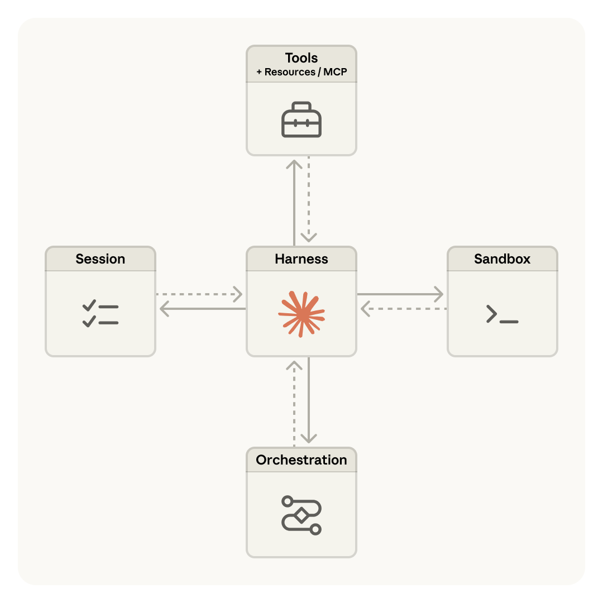
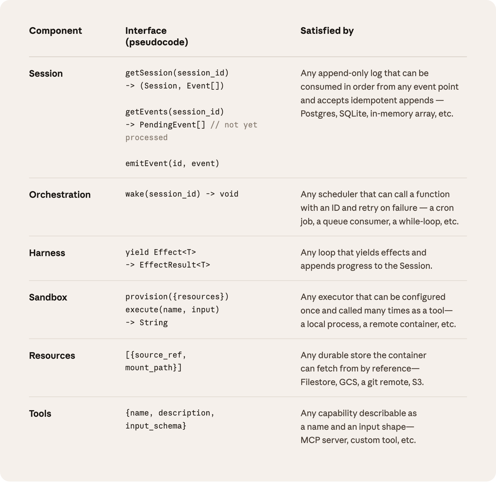
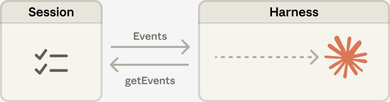
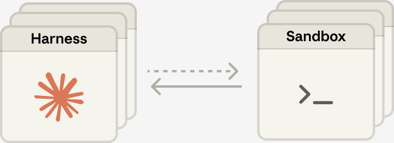

# Managed Agents のスケーリング: brain と hands を分離する

> 原題: Scaling Managed Agents: Decoupling the brain from the hands
> 著者: Lance Martin, Gabe Cemaj, Michael Cohen
> 出典: Anthropic Engineering Blog（2026-04-08）

> **訳注**: 本文中の図 4 枚はすべて原ページから取得してローカル保存し、`<figure>` で収録した（原典に図キャプションは付されていないため、`<figcaption>` は訳者による説明である）。2 枚目の図はコンポーネントごとのインターフェース仕様を示す**表**であり、後から検索・引用できるよう画像の直後に markdown の表としても起こした（画像の内容に忠実に転記し、創作はしていない）。冒頭にあった製品導線の 1 行（"Get started with Claude Managed Agents by following our docs"）は本文でないため、本 wiki の方針により除外した。Acknowledgements も同方針で除外した。本文中の自社記事へのリンクはリンクテキストのみを訳出し URL は収録していないが、学術的な引用（Recursive Language Models = arXiv:2512.24601、および Sutton の "The Bitter Lesson"）は識別子・書名を残した。API のシグネチャは挙動に直結するため原文のまま残している。

Engineering Blog で継続的に扱っているテーマが、いかにして効果的なエージェントを構築し、長時間動作する仕事のためのハーネスを設計するか、である。この一連の仕事に共通して流れているのは、**ハーネスは Claude が自力ではできないことについての仮定を符号化している**、という点である。しかしそれらの仮定は、モデルが改善するにつれて陳腐化しうるため、頻繁に問い直される必要がある（"The Bitter Lesson"）。

一例を挙げると、以前の仕事において我々は、Claude Sonnet 4.5 が自らのコンテキスト限界が近づいていることを感じ取ると、タスクを早々に切り上げてしまうことを見出した——この挙動は「context anxiety（コンテキスト不安）」と呼ばれることがある。我々はこれに対し、ハーネスに context reset を追加することで対処した。しかし同じハーネスを Claude Opus 4.5 で使ったところ、その挙動は消えていた。リセットは死荷重（dead weight）になっていたのである。

我々はハーネスが今後も進化し続けると予想している。そこで我々は Managed Agents を構築した。これは Claude Platform 上のホスト型サービスであり、特定の実装——今日我々が動かしているものを含めて——よりも長く生き延びることを意図した少数のインターフェースを通じて、長期horizon のエージェントをあなたの代わりに動かす。

Managed Agents を構築することは、コンピューティングにおける古い問題を解くことを意味していた。すなわち、「まだ考えられていないプログラム（programs as yet unthought of）」のためにシステムを設計するにはどうすればよいか、である。数十年前、オペレーティングシステムはこの問題を、ハードウェアを抽象——*プロセス*、*ファイル*——へと仮想化することで解いた。それらの抽象は、まだ存在していなかったプログラムにとっても十分に一般的であった。抽象はハードウェアよりも長く生き延びた。`read()` コマンドは、それが 1970 年代のディスクパックにアクセスしているのか現代の SSD にアクセスしているのかについて中立である。上に乗る抽象は安定を保ったまま、その下の実装は自由に変化した。

Managed Agents も同じパターンに従う。我々はエージェントの構成要素を仮想化した。すなわち、**session**（起きたことすべての append-only なログ）、**harness**（Claude を呼び出し、Claude のツール呼び出しを関連するインフラへ配線するループ）、そして **sandbox**（Claude がコードを実行しファイルを編集できる実行環境）である。これにより、それぞれの実装を、他に手を触れることなく差し替えられるようになる。我々はこれらのインターフェースの形については明確な意見を持つが、その背後で何が動くかについては意見を持たない。

<figure>

<figcaption>（訳注: Managed Agents の全体構成図。中央に Harness（Claude のアイコン）が置かれ、その左に Session、右に Sandbox、上に Tools（+ Resources / MCP）、下に Orchestration が配置され、それぞれと双方向の矢印で結ばれている。ハーネスがハブとなり、他のすべての構成要素はインターフェース越しに接続される。）</figcaption>
</figure>

## Don't adopt a pet（ペットを飼うな）

我々は最初、エージェントの全構成要素を単一のコンテナに配置した。これは session・エージェントのハーネス・sandbox のすべてが環境を共有することを意味した。このアプローチには利点もあり、ファイル編集が直接のシステムコールになること、設計すべきサービス境界が存在しないこと、などが挙げられる。

しかし、すべてを 1 つのコンテナに結合したことで、我々は古いインフラの問題にぶつかった。**ペット（pet）**を飼ってしまったのである。pets-vs-cattle の比喩において、ペットとは名前を与えられ手ずから世話をされる個体であって失うわけにはいかないものであり、一方で家畜（cattle）は交換可能である。我々の場合、サーバーがそのペットになっていた。コンテナが故障すれば、session が失われた。コンテナが応答しなくなれば、我々はそれを看病して健康な状態に戻さねばならなかった。

コンテナを看病するとは、応答しなくなった行き詰まりの session をデバッグすることを意味した。我々にとって唯一の覗き窓は WebSocket のイベントストリームだったが、それは障害が*どこで*発生したのかを教えてはくれなかった。つまり、ハーネスのバグも、イベントストリームにおけるパケットの喪失も、コンテナがオフラインになったことも、すべてが同じように見えたということである。何が悪かったのかを突き止めるには、エンジニアがコンテナの内部でシェルを開かねばならなかったが、そのコンテナはしばしば顧客データも保持していたため、そのアプローチは本質的に、我々にはデバッグする能力が欠けていたことを意味した。

第二の問題は、ハーネスが、Claude が作業する対象は何であれ自分と同じコンテナの中にあると想定していたことだった。顧客から Claude を自社の仮想プライベートクラウド（VPC）に接続してほしいと求められたとき、彼らはネットワークを我々のものとピアリングするか、あるいは我々のハーネスを自分たちの環境で動かすかのいずれかを選ばねばならなかった。ハーネスに焼き込まれた 1 つの仮定が、それを異なるインフラに接続しようとしたときに問題になったのである。

## Decouple the brain from the hands（brain を hands から分離する）

我々が辿り着いた解は、我々が「brain（脳）」と考えていたもの（Claude とそのハーネス）を、「hands（手）」（行動を実行する sandbox とツール群）と「session」（session イベントのログ）の両方から分離することだった。それぞれが、他について僅かな仮定しか置かないインターフェースとなり、それぞれが独立して故障し、あるいは置き換えられるようになった。

**ハーネスがコンテナを出る。** brain を hands から分離することは、ハーネスがもはやコンテナの内部に住まないことを意味した。ハーネスは、他のあらゆるツールを呼ぶのと同じやり方でコンテナを呼んだ——`execute(name, input) → string` である。コンテナは家畜になった。コンテナが死ねば、ハーネスはその失敗をツール呼び出しのエラーとして捕捉し、Claude へ返した。Claude が再試行を決めれば、新しいコンテナが標準のレシピ `provision({resources})` で再初期化されうる。我々はもはや、故障したコンテナを看病して健康に戻す必要がなくなった。

**ハーネスの障害から復帰する。** ハーネスもまた家畜になった。session のログがハーネスの外側に座っているため、ハーネスの中にクラッシュを生き延びる必要のあるものは何もない。ハーネスが 1 つ故障したときは、`wake(sessionId)` で新しいものを再起動し、`getSession(id)` を使ってイベントログを取り戻し、最後のイベントから再開できる。エージェントループの最中、ハーネスは `emitEvent(id, event)` によって session へ書き込み、イベントの永続的な記録を保つ。

<figure>

<figcaption>（訳注: 各コンポーネントのインターフェース仕様表。「コンポーネント / インターフェース（擬似コード）/ 何がそれを満たすか」の 3 列からなる。内容は下の markdown 表に転記した。）</figcaption>
</figure>

**表**: 各コンポーネントのインターフェース仕様。（訳注: 上図の内容を転記したもの。擬似コード部分は原文のまま。）

| コンポーネント | インターフェース（擬似コード） | 何がそれを満たすか |
| --- | --- | --- |
| Session | `getSession(session_id) -> (Session, Event[])` `getEvents(session_id) -> PendingEvent[] // not yet processed` `emitEvent(id, event)` | 任意のイベント地点から順に消費でき、冪等な追記を受け付ける、あらゆる append-only なログ——Postgres、SQLite、インメモリ配列、など。 |
| Orchestration | `wake(session_id) -> void` | ID を伴って関数を呼び出せ、失敗時に再試行できる、あらゆるスケジューラ——cron ジョブ、キューのコンシューマ、while ループ、など。 |
| Harness | `yield Effect<T> -> EffectResult<T>` | エフェクトを yield し、進捗を Session へ追記する、あらゆるループ。 |
| Sandbox | `provision({resources})` `execute(name, input) -> String` | 一度設定すれば何度もツールとして呼び出せる、あらゆる実行器——ローカルプロセス、リモートのコンテナ、など。 |
| Resources | `[{source_ref, mount_path}]` | コンテナが参照によって取得できる、あらゆる永続的なストア——Filestore、GCS、git リモート、S3。 |
| Tools | `{name, description, input_schema}` | 名前と入力の形として記述できる、あらゆる能力——MCP サーバー、カスタムツール、など。 |

**セキュリティ境界。** 結合された設計では、Claude が生成した未信頼のコードは認証情報と同じコンテナの中で実行されていた——したがって prompt injection は、Claude に自分自身の環境を読ませるよう説得しさえすればよかった。ひとたび攻撃者がそれらのトークンを手にすれば、彼らは新鮮で無制限の session を起こし、そこへ作業を委任できる。スコープを狭めることは自明な緩和策だが、これは限定されたトークンで Claude に何ができないかについての仮定を符号化しており——そして Claude はますます賢くなりつつある。構造的な修正は、Claude が生成したコードが実行される sandbox から、トークンに決して到達できないようにすることだった。

これを保証するために我々は 2 つのパターンを用いた。認証はリソースに同梱するか、sandbox の外側の vault（金庫）に保持するかのいずれかである。Git については、sandbox の初期化中に各リポジトリのアクセストークンを使ってリポジトリを clone し、それをローカルの git リモートに配線する。git の `push` と `pull` は、エージェントが決してトークン自体を扱うことなく、sandbox の内部から動作する。カスタムツールについては、我々は MCP をサポートし、OAuth トークンを安全な vault に保管する。Claude は専用のプロキシ経由で MCP ツールを呼び出す。このプロキシは session に紐づいたトークンを受け取る。プロキシはそれから対応する認証情報を vault から取得し、外部サービスへの呼び出しを行える。ハーネスが認証情報を認識させられることは決してない。

## The session is not Claude's context window（session は Claude のコンテキストウィンドウではない）

長期horizon のタスクはしばしば Claude のコンテキストウィンドウの長さを超え、これに対処する標準的な方法はどれも、何を保持するかについての不可逆な決定を伴う。我々はこれらの技法を、コンテキストエンジニアリングに関する以前の仕事で探究してきた。例えば compaction は Claude が自らのコンテキストウィンドウの要約を保存することを可能にし、memory ツールは Claude がコンテキストをファイルへ書き出すことを可能にして、session をまたいだ学習を可能にする。これは context trimming——古いツール結果や思考ブロックといったトークンを選択的に取り除くこと——と組み合わせることができる。

しかし、コンテキストを選択的に保持あるいは破棄するという不可逆な決定は、失敗につながりうる。将来のターンがどのトークンを必要とするかを知ることは困難である。もしメッセージが compaction のステップによって変換されるなら、ハーネスは compaction されたメッセージを Claude のコンテキストウィンドウから取り除いてしまい、それらは保存されている場合にのみ復元可能である。先行研究は、コンテキストをコンテキストウィンドウの*外側*に生きるオブジェクトとして保存することによって、これに対処する方法を探究してきた（Recursive Language Models, arXiv:2512.24601）。例えばコンテキストは REPL の中のオブジェクトでありえて、LLM はそれをフィルタしたりスライスしたりするコードを書くことでプログラム的にアクセスする。

<figure>

<figcaption>（訳注: Session と Harness の関係を示す図。Harness から Session へ `getEvents` の要求が向かい、Session から Harness へ Events が返る。返ってきたイベントがハーネス内部の Claude へ流し込まれる様子が破線の矢印で示されている。）</figcaption>
</figure>

Managed Agents において、session はこれと同じ利益を提供し、Claude のコンテキストウィンドウの外側に生きるコンテキストのオブジェクトとして働く。しかしコンテキストは sandbox や REPL の内部に保存されるのではなく、session のログに永続的に保存される。インターフェース `getEvents()` は、brain がイベントストリームの位置的なスライスを選択することによってコンテキストを問い合わせることを可能にする。このインターフェースは柔軟に使うことができ、brain が最後に読むのをやめたところから再開すること、ある特定の瞬間の数イベント前まで巻き戻してその前段を見ること、あるいはある特定の行動の前にコンテキストを読み直すことを可能にする。

取得されたどのイベントも、Claude のコンテキストウィンドウへ渡される前にハーネスの中で変換されうる。これらの変換は、高いプロンプトキャッシュのヒット率を達成するためのコンテキストの組織化やコンテキストエンジニアリングを含め、ハーネスが符号化するものであれば何でもよい。我々は、session における復元可能なコンテキストの保存と、ハーネスにおける任意のコンテキスト管理という関心を分離した。なぜなら、将来のモデルにおいてどのような具体的なコンテキストエンジニアリングが必要とされるかを、我々は予測できないからである。これらのインターフェースはコンテキスト管理をハーネスの側へ押し出し、session が永続的であり問い合わせ可能であることのみを保証する。

## Many brains, many hands（多くの brain、多くの hands）

**多くの brain。** brain を hands から分離したことは、我々の最も初期の顧客の不満の 1 つを解消した。チームが Claude を自社の VPC の中にあるリソースに対して働かせたいと考えたとき、唯一の道はネットワークを我々のものとピアリングすることだった。ハーネスを保持するコンテナが、あらゆるリソースは自分の隣にあると想定していたためである。ハーネスがもはやコンテナの中にいなくなると、その仮定は消えた。同じ変更は性能上の見返りももたらした。当初 brain をコンテナの中に置いていたとき、それは多くの brain には同じ数のコンテナが必要になることを意味した。各 brain について、そのコンテナがプロビジョニングされるまで推論は一切開始できず、あらゆる session がコンテナのセットアップコストを丸ごと前払いしていた。あらゆる session が、たとえ sandbox に決して触れることのないものであっても、リポジトリを clone し、プロセスを起動し、保留中のイベントを我々のサーバーから取得せねばならなかった。

その死んだ時間は time-to-first-token（TTFT）として表れる。これは、session が仕事を受け付けてから最初の応答トークンを生み出すまでにどれだけ待つかを測るものである。TTFT は、ユーザーが最も鋭敏に*感じる*レイテンシである。

brain を hands から分離することは、コンテナが必要とされる場合にのみ brain によってツール呼び出し `(execute(name, input) → string)` を介してプロビジョニングされることを意味する。したがって、すぐにはコンテナを必要としない session はコンテナを待たなかった。オーケストレーション層が session のログから保留中のイベントを引き出すやいなや、推論を開始できた。このアーキテクチャを用いて、我々の p50 の TTFT はおよそ **60%** 低下し、p95 は **90% 以上**低下した。多くの brain へスケールすることは、多くのステートレスなハーネスを起動し、必要な場合にのみそれらを hands へ接続することを意味するにすぎなくなった。

**多くの hands。** 我々はまた、各 brain を多くの hands へ接続する能力も欲しかった。実際にはこれは、Claude が多くの実行環境について推論し、どこへ仕事を送るかを決めねばならないことを意味する——単一のシェルの中で動作するよりも難しい認知的タスクである。我々が brain を単一のコンテナに置くところから始めたのは、初期のモデルにはこれができなかったからである。知能がスケールするにつれ、今度は単一のコンテナのほうが制約になった。そのコンテナが故障すれば、brain が手を伸ばしていたすべての hand について状態が失われたのである。

brain を hands から分離することは、各 hand をツール `execute(name, input) → string` にする。名前と入力が入り、文字列が返る。そのインターフェースは、あらゆるカスタムツール、あらゆる MCP サーバー、そして我々自身のツールをサポートする。ハーネスは、その sandbox がコンテナなのか、電話なのか、それともポケモンのエミュレータなのかを知らない。そして、どの hand もどの brain にも結合されていないため、brain たちは互いに hands を受け渡すことができる。

<figure>

<figcaption>（訳注: 「多くの brain、多くの hands」を示す図。複数枚重なった Harness の箱と、複数枚重なった Sandbox の箱が、双方向の矢印で結ばれている。どちらの側も複数個が存在し、互いに固定的に結合されていないことを表す。）</figcaption>
</figure>

## Conclusion（結論）

我々が直面した課題は古いものである。すなわち、「まだ考えられていないプログラム」のためにシステムを設計するにはどうすればよいか、である。オペレーティングシステムは、まだ存在していなかったプログラムにとっても十分に一般的な抽象へとハードウェアを仮想化することによって、数十年にわたって存続してきた。Managed Agents において我々は、将来のハーネス、sandbox、あるいは Claude を取り巻く他の構成要素を受け入れられるシステムを設計することを目指した。

Managed Agents は同じ精神における **meta-harness** であり、Claude が将来必要とするであろう*特定の*ハーネスについては意見を持たない。むしろそれは、多くの異なるハーネスを許容する一般的なインターフェースを備えたシステムである。例えば Claude Code は優れたハーネスであり、我々は幅広いタスクにわたってこれを使っている。我々はまた、タスク特化のエージェントハーネスが狭い領域で優れていることも示してきた。Managed Agents はこれらのいずれをも受け入れることができ、Claude の知能に時間をかけて追随していける。

meta-harness の設計とは、Claude を取り巻くインターフェースについて明確な意見を持つことを意味する。すなわち我々は、Claude が状態を操作する能力（session）と計算を実行する能力（sandbox）を必要とするだろうと予想する。我々はまた、Claude が多くの brain と多くの hands へスケールする能力を必要とするだろうとも予想する。我々はこれらが長い時間horizon にわたって信頼でき安全に動かせるよう、インターフェースを設計した。しかし我々は、Claude が必要とする brain や hands の数や所在については、いかなる仮定も置いていない。
