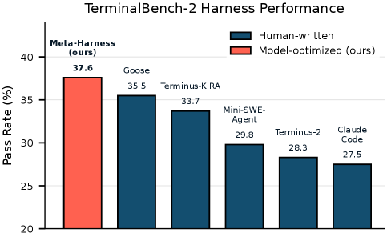
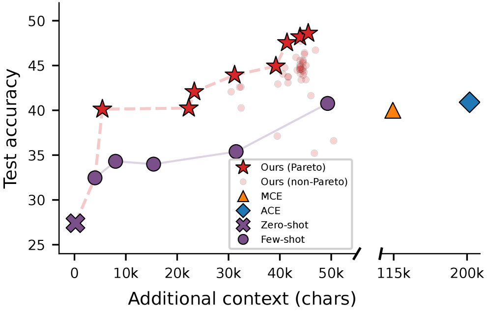
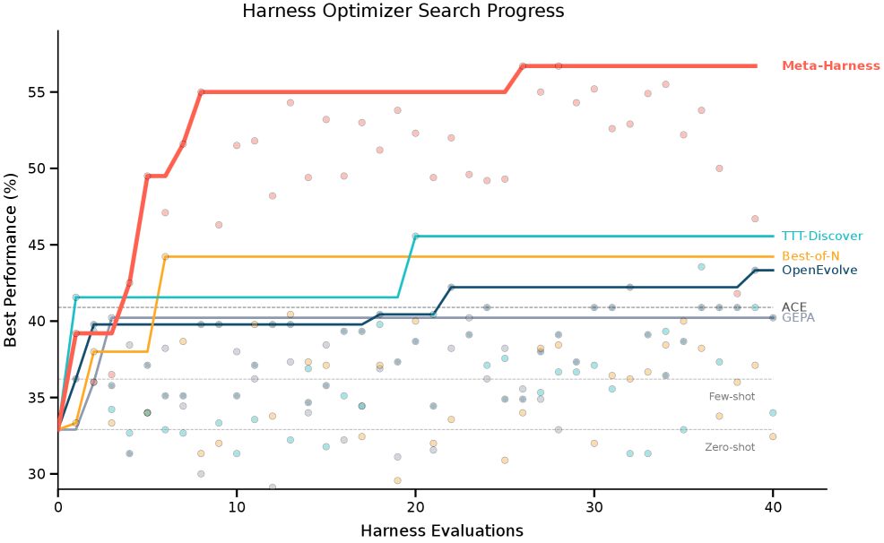
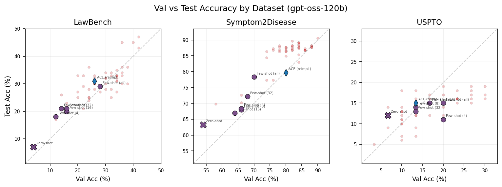

# Meta-Harness: モデルハーネスの End-to-End 最適化

> 原題: Meta-Harness: End-to-End Optimization of Model Harnesses
> 著者: Yoonho Lee, Roshen Nair, Qizheng Zhang (Stanford), Kangwook Lee (KRAFTON), Omar Khattab (MIT), Chelsea Finn (Stanford)
> 出典: arXiv:2603.28052 (2026)

> **訳注（クリップ復元について）**: 本訳は Obsidian Web Clipper によるクリップを底本とし、以下を ar5iv 原ページと照合して復元・正規化した。
> (1) **Figure 1 の右パネル（x2.png）がクリップから欠落**していたため復元した（多パネル図の後半脱落）。
> (2) クリップでは **Figure 3 の画像（x4.png）に Table 2 のキャプションが誤って結合され、本物の Table 2（3 データセットの数値表）が丸ごと欠落**していた。Table 2 を ar5iv から復元し、Figure 3 のキャプションも原文から復元した。
> (3) 本文中に `<sup>1</sup>` `<sup>2</sup>` のマーカーだけが残っていた**脚注 2 件の本文**を復元した。
> (4) HTML のまま残っていた表 3 個（Table 7・8・9）を markdown 表に変換し、太字（最良値）を原文どおり復元した。Table 2〜4 の太字も原文と照合した。
> (5) 原文で囲み（ハイライトボックス）として組まれていた**要点ボックス**（§4.1・§4.2・§4.3）と、付録 A の**プロポーザー推論ログの逐語引用ボックス**は、クリップでは SVG ソースとして残っていた。テキストを抽出し、引用ブロックとして復元した。ログ引用の英文は原文のまま残し、直後に訳を添えた。
> (6) **Figure 5・6・8・9 は原ページでもインライン SVG のフロー図**（画像アセットなし）のため、図中テキストを抽出してテキストのフロー図として再構成した。
> (7) Algorithm 1 はクリップで箇条書きに崩れていたため、構造化した擬似コードブロックに整形した（内容は ar5iv 原文と照合）。

プロジェクトページ（インタラクティブデモつき）: https://yoonholee.com/meta-harness/
最適化されたハーネス: https://github.com/stanford-iris-lab/meta-harness-tbench2-artifact

## Abstract（要旨）

大規模言語モデル（LLM）システムの性能は、モデルの重みだけでなく、その**ハーネス**——どの情報を保存し、取り出し、モデルに提示するかを決定するコード——にも依存する。しかしハーネスはいまだ大部分が手作業で設計されており、既存のテキスト最適化器はこの設定に適合しない。フィードバックを過度に圧縮するからである: それらは記憶を持たず（memoryless）、スカラースコアのみに条件付けられ、あるいはフィードバックを短いテンプレートや要約に制限する。我々は Meta-Harness を導入する。これは LLM アプリケーションのハーネスコードの上を探索する外側ループ（outer-loop）システムである。Meta-Harness は、過去の全候補のソースコード・スコア・実行トレースにファイルシステムを通じてアクセスする agentic な proposer を用いる。オンラインテキスト分類では、Meta-Harness は最先端のコンテキスト管理システムを 7.7 ポイント上回りながら、コンテキストトークンを 4 分の 1 しか使わない。検索拡張数学推論では、発見された単一のハーネスが、200 問の IMO レベル問題における精度を、5 つの held-out モデル平均で 4.7 ポイント改善する。エージェント型コーディングでは、発見されたハーネスが TerminalBench-2 上で最良の人手設計ベースラインを上回る。これらの結果を合わせると、過去の経験へのより豊かなアクセスが、自動化されたハーネスエンジニアリングを可能にすることが示される。

## 1 Introduction（はじめに）

固定した大規模言語モデル（LLM）の周囲のハーネスを変えるだけで、同一ベンチマーク上で 6 倍の性能差が生じうる [46]。ハーネス——何を保存し、取り出し、モデルに見せるかを決定するコード——は、しばしばモデル自体と同じくらい重要である。この感度の高さは、LLM の周囲のコードを洗練させてシステム全体の性能を高める実践である**ハーネスエンジニアリング**への関心の高まりにつながっている [35] [20] [9] [8]。しかしその重要性にもかかわらず、ハーネスエンジニアリングは依然として大部分が手作業である: 実践者は失敗を検分し、ヒューリスティクスを調整し、少数の設計の上で反復する。本論文では、この過程それ自体を自動化できるかを問う。

自然な出発点は、テキスト最適化に関する近年の研究である。ハーネスエンジニアリングもまた、過去の試行からのフィードバックを用いてテキストとコードの成果物を反復的に改善する営みだからである [37] [38] [34] [25] [1]。しかしこれらの手法は、ハーネスエンジニアリングには適合しない。それらは典型的に、短いホライズンの、あるいは強く圧縮されたフィードバックで動作するからである: あるものは現在の候補のみに条件付けられ [30] [50] [52]、あるものは主にスカラースコアに依存し [34] [11]、あるものはフィードバックを短いテンプレートや LLM 生成の要約に制限する [1] [25]。これはスケーラビリティのための実利的な選択であり、より長距離の依存関係に情報がないことの証拠ではない。ハーネスは長いホライズンにわたって作用する: 何を保存するか、いつ取り出すか、どう提示するかという単一の選択が、何ステップも先の推論の挙動に影響しうる。圧縮されたフィードバックは、下流の失敗を早期のハーネス上の決定まで遡って追跡するのに必要な情報を、しばしば取り除いてしまう。いくつかの代表的なテキスト最適化器が研究したタスク全体で、最適化 1 ステップあたりに利用可能なコンテキストは 100〜30,000 トークンにすぎず（Table 1）、ハーネス探索の診断上のフットプリントをはるかに下回る。より広くは、検索および記憶拡張型言語モデルの研究が、有用なコンテキストは単一のプロンプトに一枚岩に詰め込むのではなく、適応的にアクセスされるべき場合が多いことを示唆している [27] [47] [36] [55]。

<figure>




<figcaption>図1: （左）テキスト分類では、Meta-Harness は最良の既存人手設計ハーネス（ACE）および既存テキスト最適化器（TTT-Discover, OpenEvolve）を上回り、わずか 4 回の評価で次点手法の最終精度に並ぶ。（右）TerminalBench-2 では、Meta-Harness は報告されている全 Claude Haiku 4.5 ハーネスを上回る。（訳注: 右パネル x2.png はクリップから欠落していたため復元した）</figcaption>
</figure>

<figure>


<figcaption>図2: Meta-Harness の探索ループ。(1) エージェントが、過去の全候補のソースコード・実行トレース・スコアを収めたファイルシステムを読み、新しいハーネスを提案する。(2) 提案されたハーネスを評価タスク上で評価する。(3) すべてのログ（提案コード・推論トレース・評価スコア）が新しいディレクトリとしてファイルシステムに保存され、ループが繰り返される。</figcaption>
</figure>

**表1**: テキスト最適化手法とその設定の比較。各行は 1 手法をタスク横断でまとめたもの。MTok/iter は、各論文が扱った最大の設定において、テキスト成果物 1 回の評価から生成される全コンテキストの我々による最良推定値。本論文は、成果物 1 評価あたり桁違いに多いコンテキストを生む設定を扱う。

| 手法 | 履歴 | ログの内容 | MTok/iter |
| --- | --- | --- | --- |
| OPRO [50] | ウィンドウ | 過去の (解, スコア) ペア | 0.002 |
| TextGrad [52] | 直前のみ | 現在の成果物へのテキストフィードバック | 0.015 |
| AlphaEvolve [34] | ウィンドウ | プログラムデータベース + 評価スコア | 0.022 |
| GEPA [1] | 要約 | ロールアウトトレースからの内省的フィードバック | 0.008 |
| Feedback Descent [25] | 要約 | 比較 + テキストフィードバック | 0.012 |
| TTT-Discover [54] | ウィンドウ | 直前の解の断片 | 0.026 |
| Meta-Harness | 完全 | 全ログと全スコア | 10.0 |

我々はこの制約に、Meta-Harness——end-to-end の探索によってハーネスを最適化するための agentic なハーネス——で応える（図2）。その proposer はコーディングエージェント、すなわち開発者ツールを呼び出しコードを修正できる言語モデルベースのシステムである。（生の LLM ではなく）コーディングエージェントを選ぶことが重要なのは、経験の量がすぐにコンテキスト限界を超えるため、proposer は何を検分するかを自ら決め、コードベースとの直接の相互作用を通じて編集を検証しなければならないからである。その鍵となる設計上の選択は、**完全な履歴をファイルシステムを通じて公開する**ことであり、これにより圧縮された候補ごとの要約からの最適化ではなく、過去の生のコードと実行トレースの選択的な診断が可能になる。過去のすべての候補ハーネスについて、ファイルシステムはソースコード・評価スコア・実行トレースを保存し、proposer はそれらを単一のプロンプトとして取り込むのではなく、grep や cat のような標準的な操作で取り出す。実際、最も要求の厳しい設定では、proposer は 1 イテレーションあたり中央値で 82 ファイルを読み、1 ステップあたり 20 を超える過去候補を参照する（付録 A）。我々が研究する設定では、1 回の評価が最大 10,000,000 トークンの診断情報を生みうる。これは、先行するテキスト最適化の設定で使われた最大のフィードバック予算を約 3 桁上回る（Table 1）。

我々は Meta-Harness を、オンラインテキスト分類・数学推論・エージェント型コーディングで評価する。オンラインテキスト分類では、Meta-Harness が発見したハーネスは Agentic Context Engineering（ACE, [58]）を 7.7 ポイント上回りながらコンテキストトークンを 4 分の 1 しか使わず、次点のテキスト最適化器が 60 回の提案で到達した最終性能に、わずか 4 回で並ぶ（図1）。検索拡張数学推論では、発見された単一のハーネスが、200 問の IMO レベル問題における精度を 5 つの held-out モデル平均で 4.7 ポイント改善する。TerminalBench-2 では、発見されたハーネスが Terminus-KIRA を上回り、全 Haiku 4.5 エージェント中 1 位となる。

## 2 Related Work（関連研究）

高いレベルで見ると、Meta-Harness は、信用割当（credit assignment）とメタ学習に関する広範な文献のアイデア [39] [45] [2] [16] [43] を、コーディングエージェントの近年の進歩によって可能になった新しいレジームに持ち込むものである。モデルの重みを更新するのではなく、このシステムは**ハーネスのレベルで**信用を割り当てる: 過去のロールアウトからの経験を使って、どのステップとどのコンポーネントが失敗の原因かを意図的に推論し、その上で将来の挙動を支配する外部コードを書き換える。より具体的には、本手法はいくつかの近年の研究の流れの交点にあり、外部コンテキストへの適応的アクセス、実行可能コードの探索、テキスト最適化の研究に最も直接的に関係する。

**外部記憶と適応的アクセス。** いくつかの先行研究は、大きな知識源や長い入力を、一度に消費するのではなく言語モデルが適応的にアクセスする外部リソースとして扱うことの利点を指摘している。具体的には、検索拡張生成（retrieval-augmented generation）[27]、検索と推論の交互実行 [47]、記憶ベースのエージェント [36]、再帰的言語モデル [55] は、外部コンテキストへの適応的アクセスの機構である。Meta-Harness も同様のアクセスパターンを用いるが、ハーネスエンジニアリングというより要求の厳しい設定においてであり、そこでは proposer が、コンテキスト管理手続きそれ自体を改善するために、コード・スコア・実行トレースの大きな外部履歴を選択的に検分する。

**実行可能コードの探索。** 近年の手法は、関数・ワークフロー・エージェント設計のための実行可能コードの上を探索する。初期の研究は、進化的プログラム探索における突然変異・交叉オペレータとして大規模モデルを使うことを提案した [26]。その後の手法は、固定されたプログラムの足場（scaffold）の中の指定された関数を進化させ [38]、過去の発見から新しいエージェントをプログラムするメタエージェントを使い [19]、あるいはエージェントシステムのワークフローグラフの上を探索する [57]。別の研究の流れは、継続学習エージェントの記憶設計の上を探索する。そこでは記憶がタスクストリームをまたいで持続する [56] [49]。対照的に、Meta-Harness は**ドメイン固有のハーネス**——プロンプト構築・検索・状態更新の戦略を含み、タスク間でリセットされる——の上を探索する。その外側ループは意図的に最小限である: 固定された足場や、過去の発見のアーカイブや、永続的な記憶機構に依存する代わりに、proposer に過去の経験への制約のないファイルシステムアクセスを与える。これによりエージェントはどの情報を検分するかを自ら決められ、事前定義されたコンテキスト管理手続きの空間ではなく、完全なハーネス実装の上の探索が可能になる。

**テキスト最適化手法。** Meta-Harness はまた、ProTeGi・TextGrad・OPRO・GEPA・AlphaEvolve/OpenEvolve・Feedback Descent など、過去の試行からのフィードバックを使ってプロンプトその他のテキスト成果物を反復的に改善する手法とも密接に関係する [37] [30] [52] [50] [1] [34] [42] [25]。しかしこれらの手法は、ハーネスエンジニアリングにはあまり適合しない。ここでは最適化の対象が完全な実行可能手続きであり、関連する環境フィードバックが、事前に要約することが難しい形でコード・スコア・実行トレースに分散しているからである。集約スコアや要約にのみ反応するのではなく、Meta-Harness の proposer は失敗した事例とその実行トレースの上で推論し、狙いを定めた編集を提案できる。それらの論文と我々の問題スケールの比較は Table 1 を、我々の問題設定における OpenEvolve・GEPA・TTT-Discover との直接比較は図1・図4 を参照。

## 3 Meta-Harness: ハーネスを最適化するためのハーネス

本節では、タスク固有のハーネスの上を探索する我々の外側ループ手続きである Meta-Harness を記述する。Meta-Harness は、ハーネス最適化は、損失の大きい要約や追加の人手設計の探索構造から最適化するのではなく、proposer がファイルシステムアクセスを介して過去のコードと実行トレースを選択的に検分できるようにすることで利益を得る、という考えに基づいて構築されている。高いレベルでは、それは新しいハーネスの提案・評価・記録を繰り返す。

Meta-Harness はそれ自体、広い意味でのハーネスである（名前の由来）。探索の間に proposer モデルが何の情報を見るかを決定するからである。特に断らない限り、*ハーネス*という語は最適化の対象となるタスク固有のプログラムを指すために使う。

**目的。** ハーネスとは、言語モデルを包み、各ステップでモデルが見るコンテキストを決定する、状態を持つプログラムである。目標は単純である: 対象タスク分布の上で、基盤のモデルの性能を最も高くするハーネスを見つけること。形式的には、$M$ を固定された言語モデル、$\mathcal{X}$ をタスク分布とする。ハーネス $H$ とタスクインスタンス $x\sim\mathcal{X}$ に対し、ロールアウト軌跡 $\tau\sim p_{M}(H,x)$ を実行する。ハーネスは $M$ のためのプロンプトを構築し、モデルが応答し、ハーネスは各相互作用の後に状態を更新する。タスク固有の報酬関数 $r(\tau,x)$ が軌跡を採点する。ハーネス最適化の目的は、期待される最終報酬を最大化するハーネスを見つけることである:

$$
H^{*}=\operatorname*{arg\,max}_{H}\mathbb{E}_{x\sim\mathcal{X},\tau\sim p_{M}(H,x)}\;r(\tau,x),
$$

複数の目的が関係する場合（例: 精度とコンテキストコスト）、候補を Pareto 支配のもとで評価し、得られたフロンティアを報告する。実際には、この探索は伝統的に人間のエンジニアと研究者によって行われてきた。彼らはプロンプト・コンテキスト管理規則・ツール使用ロジックを手作業で反復的に洗練させる。

**Meta-Harness 探索ループ。** Meta-Harness は、フィードバックチャネルとして機能する成長するファイルシステム $\mathcal{D}$ へのアクセスを持つ、単一のコーディングエージェント proposer を用いる[^fn1]。ここでコーディングエージェントとは、開発者ツールを呼び出しコードを修正できる言語モデルベースのシステムである。改善ロジックを人手設計の探索ループに外部化する先行システムと異なり、Meta-Harness は診断と提案をコーディングエージェント自身に委譲する: どの過去の成果物を検分するか、どの失敗モードに対処するか、局所的な編集をするかより大掛かりな書き換えをするかを、エージェントが決める。等価な言い方をすれば、proposer は外側ループが組み立てた固定プロンプトの上で動く生の next-token モデルではない。それは、探索そのものの一部として、情報を取り出し、過去の成果物の間を渡り歩き、コードを編集するエージェントである。評価された各ハーネスは、そのソースコード・スコア・実行トレース（プロンプト・ツール呼び出し・モデル出力・状態更新など）を収めたディレクトリを 1 つ提供する。ファイルシステムは典型的に proposer のコンテキストウィンドウよりはるかに大きいので、proposer はそれを単一のプロンプトとして取り込むのではなく、grep や cat のようなターミナルツールで照会する。各イテレーションで、proposer はまず過去のコード・スコア・実行トレースを検分し、次にありそうな失敗モードについて推論した上で、新しいハーネスを生成する。

Meta-Harness は評価済みハーネスの集団 $\mathcal{H}$ と Pareto フロンティアを保持するが、**親選択規則を課さない**: proposer は新しいハーネスを提案するとき、任意の過去のハーネスとその実行トレースを自由に検分できる。進化を固定回数のイテレーションだけ実行し、最後に Pareto フロンティア上でテストセット評価を行う。この単純さは意図的である: 探索ヒューリスティクスをハードコードするのではなく、診断と編集の決定を proposer に委ねることで、Meta-Harness はコーディングエージェントが有能になるにつれて自動的に改善しうる。proposer はテストセットの結果を決して見ない。そのフィードバックは、探索の間に候補ハーネスの評価と改善シグナルの生成に使われるタスクインスタンスの部分集合である**探索セット（search set）**と、その探索実行中に記録された実行トレースからのみ得られる。

**コード空間探索の利点。** ハーネス最適化はコード空間で起きる。そこでは検索・記憶・プロンプト構築ロジックへの小さな変更が何ステップも先の挙動に影響しうるため、局所探索ヒューリスティクスは問題に適合しない。実行トレースを検分することで、proposer はハーネスが*失敗したこと*だけでなく、*なぜ*失敗したのか、どの早期の設計選択がその失敗に寄与した可能性が高いのかをしばしば推測できる。これは付録 A・A.2 の探索軌跡が例証するとおりである。そこでは、proposer が過去のコードとログを広く読み、それらのトレースを使って交絡した編集を特定し、因果的な変更の可能性が高いものを分離し、繰り返しの悪化（regression）の後により安全な修正へと軸足を移す様子が見られる。したがって proposer は、テンプレートの穴埋めや事前定義された突然変異オペレータの適用ではなく、検索・記憶・プロンプト構築ロジックの変更から完全なプログラムの書き換えまで、アルゴリズム構造のレベルでハーネスを修正できる。実際には、proposer はしばしば強い既存ハーネスから出発するが、これはハードコードされた規則ではなく創発的な戦略である。探索空間は大きいものの、ハーネスをプログラムとして表現することは自然な正則化バイアスを与える: コーディングモデルは脆いハードコードされた解ではなく一貫したアルゴリズムを提案する傾向があり、これは探索を再利用可能なコンテキスト管理手続きへと偏らせる。この行動空間は、フロンティアのコーディングアシスタントが訓練されている read–write–execute のワークフローと密接に整合している。

**実装の実際。** 我々の実験では、各ハーネスは、タスク固有のプロンプティング・検索・記憶・オーケストレーションのロジックを修正する単一ファイルの Python プログラムである。我々の実験では、proposer $P$ は Opus-4.6 を用いた Claude Code [4] である。proposer は、新しいハーネスをどこに書くか、過去のハーネスとその実行トレースをどう検分するか、どのファイルを修正してよい／いけないかを記述する、最小限のドメイン固有 skill によって導かれる。基盤モデル $M$ はドメインごとに異なり、常に凍結されている。詳細は §4 を参照。我々の実験では、典型的な 1 回の実行は 20 イテレーションでおよそ 60 個のハーネスを評価する。新しいドメインで Meta-Harness を実装するための追加の tips は付録 D に示す。

**Algorithm 1** Meta-Harness のハーネス上の外側ループ（訳注: クリップで構造が崩れていたため、ar5iv 原文と照合して擬似コードとして整形した）

```
Input:  タスク X, LLM M, proposer P, イテレーション数 N
Initialize: 集団 H            ▷ 有効なハーネスの初期集合
Initialize: ファイルシステム D ← ∅   ▷ コード・スコア・トレースを保存
for H ∈ H do
    E_H ← Evaluate(H, M, X)
    D ← D ∪ {(H, E_H)}
for t = 1 … N do
    proposer P がファイルシステム D を照会    ▷ 過去のハーネスとスコアを検分
    proposer P が k 個の新ハーネス {H_1, …, H_k} を提案
    for H in {H_1, …, H_k} do
        if H がインターフェース検証を通過 then
            D ← D ∪ {(H, Evaluate(H, M, X))}
return D に保存されたハーネスの Pareto フロンティア
```

## 4 Experiments（実験）

我々は Meta-Harness を 3 つのタスクドメインで評価する: オンラインテキスト分類、数学推論、エージェント型コーディング。各ドメインで、我々の探索が発見したハーネスを、標準の評価指標を用いてドメインに適したベースラインと比較する。正確な実験設定は各小節を参照されたい。

比較対象は主に 2 クラスの手法である。(1) **人間設計の戦略**: 各ドメインのために人手で作られたハーネスで、コンテキスト構築の現在の最先端を代表する。これらのベースラインは対応する小節で説明する。(2) **プログラム探索手法**: フィードバックと報酬シグナルを使って候補ハーネスの上を探索するが、ハーネスエンジニアリングより小さなスケールの設定のために設計された手法。

### 4.1 オンラインテキスト分類

我々は [58] [51] のオンラインテキスト分類のセットアップに従う: LLM はラベル付きの例を 1 つずつ受け取り、記憶を更新し、held-out のテストセットで評価される。LLM テキスト分類器として GPT-OSS-120B を使い、テキスト分類のためのハーネスを設計する問題を考える。難易度とドメインの多様性で選んだ 3 つのデータセットを使う: LawBench（Law）[15] は事件の記述から罪名を予測する（215 クラス）。Symptom2Disease（S2D）[18] は症状の記述から疾患を予測する（22 クラス）。USPTO-50k [40] は生成物の分子から前駆体の反応物を予測する（180 クラス）。探索集団 $\mathcal{H}$ は、この設定における主要なベースラインハーネス——zero-shot・few-shot・ACE・MCE——から初期化する。20 回の進化イテレーションをイテレーションあたり 2 候補で実行し、40 個の候補ハーネスを生成した。

<figure>



<figcaption>図3: オンラインテキスト分類における精度 vs コンテキストトークンの Pareto フロンティア。Meta-Harness は、既存の人手設計ハーネスすべてを支配する、より強い精度–コンテキストの Pareto フロントを達成する。（訳注: クリップではこの画像に Table 2 のキャプションが誤結合していた。キャプションは ar5iv 原文から復元）</figcaption>
</figure>

**表2**: 3 データセットにおける全ハーネスのテストセット指標。Ctx はコンテキスト中の追加入力トークン（千単位）。†: 51 の実装。↓: 低いほど良い。Meta-Harness はより小さい入力コンテキストでオンラインテキスト分類の精度を改善する。（訳注: この表はクリップから丸ごと欠落しており、ar5iv から復元した）

| ハーネス | USPTO | S2D | Law | Avg Acc | Ctx ↓ |
| --- | --- | --- | --- | --- | --- |
| Zero-Shot | 12.0 | 63.2 | 7.0 | 27.4 | 0 |
| Few-Shot (8) | 14.0 | 67.9 | 21.0 | 34.3 | 2.0 |
| Few-Shot (32) | 13.0 | 72.2 | 21.0 | 35.4 | 7.9 |
| Few-Shot (all) | 15.0 | 78.3 | 29.0 | 40.8 | 12.3 |
| MCE [51]† | 14.0 | 83.0 | 23.0 | 40.0 | 28.5 |
| ACE [58]† | **16.0** | 77.8 | 29.0 | 40.9 | 50.8 |
| Meta-Harness | 14.0 | **86.8** | **45.0** | **48.6** | 11.4 |

**テキスト最適化器との比較。** Meta-Harness を、テキストを最適化する代表的な手法と比較する。公平な比較のため、同一の proposer 構成（最大推論の Opus-4.6）を使い、候補は探索セットの性能のみで選択し、テストセットは最終評価まで手を付けない。評価が主要な計算ボトルネックであるため、各手法に同じ提案ハーネス評価回数の予算を与える。以下の比較対象を考える:

- **Best-of-N**: 探索構造を持たない、シードからの独立サンプル。探索がそもそも重要かどうかの、計算量を揃えた対照。
- **OpenEvolve [42]**: LLM 突然変異によるプログラムの進化的探索。
- **TTT-Discover [53]**: 彼らの手法のテキスト最適化コンポーネントのみ、すなわち PUCT 再利用規則による提案選択を使う。

この設定で、Meta-Harness は最良の既存テキスト最適化器（OpenEvolve, TTT-Discover）に **0.1 倍の評価回数**で並び、最終精度はそれらを 10 ポイント以上上回る（図1・図4）。この高速化は、外側ループに必要最小限の構造だけを課すという意図的な設計選択（§3）に帰せられると我々は考える。特に、Meta-Harness はファイルシステムを使って完全な経験履歴を保存し、proposer が必要なものを何でも検分できるようにするのに対し、OpenEvolve と TTT-Discover はいずれも、完全なファイルシステムアクセスよりも構造化され、実質的に制限された proposer 入力で動作する。オンラインテキスト分類は我々が研究する中で最小コンテキストの設定であり（Table 1）、構造の重いテキスト最適化器がここですでに遅れを取るなら、その限界はより困難なレジームでは拡大する一方だろうと注記しておく。

> **Meta-Harness は 10 倍速く、より良いハーネスに収束する** — この設定で、Meta-Harness は最良の既存テキスト最適化器（OpenEvolve, TTT-Discover）に 10 分の 1 の完全評価回数で並び、最終精度はそれらを 10 ポイント以上上回る。（訳注: 原文の SVG ハイライトボックスをテキスト復元）

**表3**: オンラインテキスト分類で proposer が利用可能な情報のアブレーション。> ZS: zero-shot ベースラインを精度で上回った実行の数。完全な Meta-Harness インターフェースは、スコアのみ・スコア＋要約のアブレーションを大きく上回る。生の実行トレースへのアクセスが、ハーネス探索を可能にする鍵となる要素である。

| 手法 | Scores | Code | Summ. | Traces | Median ↑ | Best Acc ↑ | > ZS |
| --- | --- | --- | --- | --- | --- | --- | --- |
| Scores Only | ✓ | ✓ | × | × | 34.6 | 41.3 | 26 |
| Scores + Summary | ✓ | ✓ | ✓ | × | 34.9 | 38.7 | 23 |
| Meta-Harness (full) | ✓ | ✓ | - | ✓ | **50.0** | **56.7** | 39 |

proposer インターフェースのどの部分が最も重要かを切り分けるため、オンラインテキスト分類で 3 つの条件を比較する: スコアのみの条件、proposer が LLM 生成の要約を受け取るが生のトレースは受け取らないスコア＋要約の条件、そして実行トレースへのアクセスを持つ完全な Meta-Harness インターフェースである（Table 3）。結果は完全インターフェースに有利な大きな差を示す: スコアのみは中央値 34.6・最良 41.3 に達し、スコア＋要約は中央値 34.9・最良 38.7 に達する。対照的に Meta-Harness は中央値 50.0・最良 56.7 に達し、その**中央値の候補ですら、どちらのアブレーションで見つかった最良の候補も上回る**。我々はこれを、実行トレースへの完全なアクセスがインターフェースの最も重要な構成要素であることの証拠と解釈する: 要約は失われたシグナルを回復せず、診断に有用な詳細を圧縮して消してしまうことで、かえって害にすらなりうる。

**表4**: 各テキスト最適化器が提案したハーネスのテキスト分類精度（探索セット）。Meta-Harness はハーネス最適化において実質的により効果的である。

| 手法 | Median | Best |
| --- | --- | --- |
| GEPA [1] | 32.6 | 40.2 |
| Best-of-N | 34.0 | 44.2 |
| OpenEvolve [42] | 39.1 | 43.3 |
| TTT-Discover [53] | 34.1 | 45.6 |
| Meta-Harness | **50.0** | **56.7** |

**最先端ハーネスとの比較。** 我々の主要な比較対象は、この問題設定のために人手設計されたハーネスである: 内省的な記憶キュレーションで時間とともにコンテキストを構築する Agentic Context Engineering（ACE, [58]）と、コンテキスト構築のための自然言語 skill のライブラリを保持・進化させる Meta Context Engineering（MCE, [51]）である。追加のベースラインとして、zero-shot プロンプティングと、$N\in\{4,8,16,32,\text{all}\}$ 例の few-shot プロンプティングを評価する。Table 2 の結果は、Meta-Harness が既存の人手設計ハーネスを実質的に上回ることを示す。選択された Meta-Harness[^fn2] は 48.6% の精度に達し、ACE を 7.7 ポイント、MCE を 8.6 ポイント上回る。これらの利得はより多くのコンテキストの使用から来るものではない: Meta-Harness はわずか 11.4K のコンテキストトークンしか使わず、ACE の 50.8K・MCE の 28.5K と対照的である。

**精度–コンテキストのトレードオフ。** Meta-Harness はハーネスコードの上の自由形式の最適化を行うため、単一のスカラー目的に事前に固定するのではなく、精度とコンテキストコストの両方への同時の選好を表現できる。現在の指標と望ましいトレードオフだけを与えられて、proposer はフロンティアの広い範囲にわたるハーネスを発見でき、図3 の滑らかな精度–コンテキスト Pareto 曲線を与える。これにより、単一の人手設計の動作点に固定するのではなく、追加のコンテキストをより高いテスト精度と制御された形で交換できる。

**分布外（OOD）タスク評価。** 発見されたハーネスが、探索中に見ていない全く新しいデータセットに汎化するかを評価する。9 つの多様なデータセットを考える。詳細は §C.1 に記す。選択された Meta-Harness システムは最良の平均精度（73.1%）を達成し、ACE（70.2%）とすべての few-shot ベースラインを上回る（Table 5）。注目すべきことに、few-shot の例を 32 を超えて素朴に増やすと、9 タスク中 7 つで性能が悪化することを観察した。Meta-Harness は 9 データセット中 6 つで最高性能を示し、発見されたハーネスが、探索で使った特定のデータセットへの過適合ではなく、テキスト分類のための一般に有効な戦略を捉えていることを示唆する。

**表5**: OOD テキスト分類データセット評価。各データセットのテスト精度と、9 データセット全体の平均追加コンテキストトークンを報告。Meta-Harness は、これら 9 つの未見タスクで次点手法を 2.9 ポイント上回る。

| ハーネス | SciC | FiNER | Amz5 | FPB | GoEmo | Bank77 | News | SciT | TwHate | Avg Acc | Ctx ↓ |
| --- | --- | --- | --- | --- | --- | --- | --- | --- | --- | --- | --- |
| Zero-shot | 32.7 | 56.0 | 52.7 | 90.0 | 42.0 | 80.7 | 84.7 | 89.3 | 75.3 | 67.0 | - |
| Few-shot (8) | 34.0 | 63.0 | 54.0 | 90.0 | 44.0 | 82.7 | 84.7 | 91.3 | 76.7 | 68.9 | 2.2 |
| Few-shot (32) | 38.7 | 62.0 | 53.3 | 90.7 | 43.3 | 86.0 | 85.3 | 90.7 | 76.7 | 69.6 | 5.2 |
| Few-shot (all) | 35.3 | 61.0 | 50.0 | 93.3 | 42.7 | 80.7 | 84.0 | 90.0 | 76.7 | 68.2 | 7.4 |
| ACE [58] | 40.7 | 74.0 | 48.0 | 96.7 | 44.0 | 83.3 | 86.0 | 90.7 | 68.7 | 70.2 | 11.7 |
| Meta-Harness | 53.3 | 67.0 | 60.0 | 94.0 | 46.0 | 82.7 | 86.7 | 91.3 | 77.3 | 73.1 | 7.3 |

### 4.2 検索拡張推論のためのハーネス

我々は、オリンピアード数学の解答についてやや非標準的なセットアップを研究する: 大きなコーパスから例を検索する能力でモデルを拡張するのである。原理的には検索が数学推論を助けると期待する十分な理由がある。解答はしばしば再利用可能な証明パターンを共有しており、したがって過去の推論トレースは、モデルが推論時に活用できるかもしれない情報を含むからである。しかし検索はこの設定で標準的な要素にはなっておらず、先行研究は、推論集約的な数学ベンチマークでは、より事実接地的なドメインに比べて検索がはるかに成功してこなかったことを示唆する [41] [48] [5]。難しさは、素朴な検索では正しいトレースが正しい形で表面化することがめったにない点にある。これは、成功が検索の追加そのものよりも、**正しい検索方策の発見**に依存することを示唆する。その方策を人手で設計する代わりに、我々は Meta-Harness に難しいオリンピアード問題のセットを与え、検索の挙動そのものを探索から創発させる。

検索コーパスは、8 つのオープンソースデータセットからの 50 万問以上の解答済み問題を含む。我々はこれを評価ベンチマークと探索セットの両方に対して注意深く重複除去・除染（decontaminate）し、held-out の問題が我々の文字列ベースのフィルタのもとで完全一致するプレフィックスを持たないことを確認し、held-out の例に対する BM25 検索の上位を手作業で検分した（§C.2）。Meta-Harness を使い、オリンピアード難度の数学問題 250 問の探索セット（OlympiadBench + Omni-MATH hard）の上で 40 イテレーションのハーネス最適化を行い、109 個の候補検索ハーネスを生成した。探索集団 $\mathcal{H}$ は、この設定の主要なベースラインハーネス——zero-shot・few-shot・ACE——から初期化する。GPT-OSS-20B を使った探索セット性能に基づいて単一のハーネスを選択する（§B.2）。このハーネスを、IMO-AnswerBench・IMO-ProofBench・ArXivMath [29] [5] から抽出した、それまで見ていない 200 問の IMO レベル問題で評価する。GPT-OSS-20B に加えて、同じ検索ハーネスを、探索中に見ていない 4 つのモデル——GPT-5.4-nano・GPT-5.4-mini・Gemini-3.1-Flash-Lite・Gemini-3-Flash——でも評価する。先行研究の標準評価プロトコル [29] に従い、問題ごとに 3 サンプルで平均した精度を報告する。

**結果。** Table 6 は、発見されたハーネスを、検索なし・独立した埋め込みモデル text-embedding-3-small を使う密検索（dense retrieval）・ランダム few-shot プロンプティング・BM25 検索と比較する。対照的に、Meta-Harness は追加の密エンコーダを導入せず、疎ベースラインと同じ BM25 ベースの字句検索スタックの上で、完全にコード空間の中で動作する。発見された検索ハーネスは、5 つの held-out モデルすべてで検索なしベースラインを上回り、平均利得は 4.7 ポイントである。また、平均で最強の固定ベースラインに並ぶか上回り、全体で BM25 検索を 1.3 ポイント上回りながら、いくつかのモデルで密検索とランダム few-shot に見られた悪化を回避する。

**表6**: 200 問の IMO レベル数学問題における検索拡張問題解答。問題ごとに 3 サンプルで平均した pass@1 を、ベースラインからの絶対改善（括弧内）とともに示す。発見された Meta-Harness の検索戦略は、5 つの held-out モデルすべてでこれら IMO レベル問題の推論を改善し、検索なしに対して平均 4.7 ポイントの利得を得る。

| 手法 | GPT-5.4n | GPT-5.4m | Gem-3.1FL | Gem-3F | GPT-20B | Avg. |
| --- | --- | --- | --- | --- | --- | --- |
| No Retriever | 23.0 | 28.8 | 28.6 | 42.6 | 47.6 | 34.1 |
| Dense Retrieval (k=1) | 27.1 (+4.1) | 24.5 (-4.3) | 31.3 (+2.7) | 42.3 (-0.3) | 46.9 (-0.7) | 34.4 (+0.3) |
| Dense Retrieval (k=5) | 31.1 (+8.1) | 28.3 (-0.5) | 37.1 (+8.5) | 47.2 (+4.6) | 46.7 (-0.9) | 38.1 (+4.0) |
| Random Few-shot | 23.1 (+0.1) | 24.5 (-4.3) | 31.0 (+2.4) | 40.4 (-2.2) | 41.8 (-5.8) | 32.2 (-1.9) |
| BM25 Retrieval | 30.2 (+7.2) | 29.2 (+0.4) | 32.8 (+4.2) | 46.6 (+4.0) | 48.9 (+1.3) | 37.5 (+3.4) |
| Meta-Harness | 31.7 (+8.7) | 30.4 (+1.6) | 34.9 (+6.3) | 46.3 (+3.7) | 50.6 (+3.0) | 38.8 (+4.7) |

> **Meta-Harness は IMO レベル数学問題の推論を改善する** — 検索拡張数学推論では、発見された単一の検索ハーネスが 5 つの held-out モデルに転移し、検索なしに対して平均 4.7 ポイント精度を改善し、比較手法中で最も強い全体平均を与える。（訳注: 原文の SVG ハイライトボックスをテキスト復元）

### 4.3 TerminalBench-2 でのエージェント型コーディングハーネスの評価

TerminalBench-2 [32] は、複雑な依存関係と相当のドメイン知識のもとでの、長いホライズンの完全自律実行を要求する 89 個の困難なタスクで LLM エージェントを評価する。先行研究は、エージェントハーネスの選択がこのベンチマークの性能に大きく影響することを示している。探索は、2 つの強いオープンなベースライン——Terminus 2 [32] と Terminus-KIRA [24]——から初期化する。この実験では、探索と最終評価を同じ 89 タスクのベンチマーク上で行う。我々はこのベンチマークを discovery problem [54]——難しく、公に競われているベンチマークの性能を改善するハーネス構成を発見することが目標——として使う。これは標準的な実践である: 公開されている writeup は、TerminalBench 自体の上でのベンチマーク特化のハーネス反復を既に記述しており [17] [33] [24]、またこのベンチマークは、別の split を導入すると探索シグナルが実質的に弱まる程度に小さく高価である。我々はさらに、手作業の検分と、進化したハーネスへのタスク固有文字列のリークを調べる正規表現ベースの監査によって、過適合を確認した。得られたハーネスは TerminalBench-2 のレジームに特化しているものの、単一の指示からの困難な長ホライズンタスクの自律的完遂は中核的な能力であり、このベンチマークはフロンティアモデルと重厚に設計されたハーネスが苦戦する多くのタスクから構成されることを注記しておく。

**表7**: TerminalBench-2 のパス率。他のエージェントの結果は公式リーダーボードより。Meta-Harness はこの競争的なタスクで、全 Opus-4.6 エージェント中 2 位・全 Haiku-4.5 エージェント中 1 位。Auto はハーネスが自動発見されたか。（訳注: HTML 表を markdown 化し、太字を原文どおり復元）

| ハーネス | Auto | Pass (%) |
| --- | --- | --- |
| **Claude Opus 4.6** | | |
| Claude Code | × | 58.0 |
| Terminus 2 | × | 62.9 |
| Mux | × | 66.5 |
| Droid | × | 69.9 |
| TongAgents | × | 71.9 |
| MAYA-V2 | × | 72.1 |
| Terminus-KIRA | × | 74.7 |
| Capy | × | 75.3 |
| ForgeCode | × | 81.8 |
| Meta-Harness | ✓ | **76.4** |
| **Claude Haiku 4.5** | | |
| OpenHands | × | 13.9 |
| Claude Code | × | 27.5 |
| Terminus 2 | × | 28.3 |
| Mini-SWE-Agent | × | 29.8 |
| Terminus-KIRA | × | 33.7 |
| Goose | × | 35.5 |
| Meta-Harness | ✓ | **37.6** |

**結果。** 完全なベンチマークでの結果を Table 7 に報告する。2 つの基盤モデル——Claude Opus 4.6 と Claude Haiku 4.5——で評価した。Opus 4.6 では、Meta-Harness は 76.4% のパス率を達成するハーネスを発見し、人手設計の Terminus-KIRA（74.7%）を上回り、TerminalBench-2 リーダーボードの全 Opus 4.6 エージェント中 2 位となる。より高いスコアの Opus 4.6 エージェントは ForgeCode（81.8%）のみだが、我々は公開コードのみからは彼らの報告結果を再現できなかった。これは、彼らのリーダーボードスコアが公開リポジトリを超えたコンポーネントに依存することを示唆する。より弱い Haiku 4.5 モデルでは改善はより大きい: Meta-Harness は 37.6% を達成し、次点の報告エージェント（Goose, 35.5%）を 2.1 ポイント上回る。TerminalBench-2 は複数のチームが直接それに向けて最適化している、活発に競われているベンチマークであり、自動探索手法がこのフロンティアで利得を達成できるという事実は、長ホライズンのテキスト最適化ループにとって心強い。

> **Meta-Harness は TerminalBench-2 で人手設計エージェントを上回る** — TerminalBench-2 では、Meta-Harness は Opus 4.6 で Terminus-KIRA を上回り、全 Haiku 4.5 エージェント中 1 位となるハーネスを自動的に発見する。（訳注: 原文の SVG ハイライトボックスをテキスト復元）

**proposer の定性的挙動。** ハーネス探索の軌跡は、Meta-Harness がなぜこれらの利得を達成するかの説明を助ける。詳細な要約は付録 A に示す。早期のイテレーションでは、proposer はもっともらしい構造的修正とプロンプトテンプレートの編集を組み合わせ、両方の候補が悪化するのを観察した。そこで、悪化は共有されたプロンプト介入によって交絡しているという仮説を明示的に立て、構造的変更をプロンプトの書き換えから分離し、最終的に、その実行で最良の候補となる、より安全な**追加のみ（additive）の修正**へと軸足を移した。これは、ファイルシステムアクセスによって proposer が過去の経験を十分な詳細さで検分し、因果的な仮説を形成してハーネスを修正できることの定性的な証拠を与える。

## 5 Discussion（考察）

既存ハーネスを上回ることを超えて、Meta-Harness にはいくつかの実用上の利点がある。発見されたハーネスは分布外の分類データセット（Table 5）と、数学の設定における未見の基盤モデル（Table 6）に汎化する。1 回の探索実行は数時間の実時間（wall-clock）で完了しながら、読解可能で転移可能な戦略を生み、それは将来のより強いモデルを含む複数のモデルにわたって再利用できる。コード空間での過適合はまた、より検分しやすい: 脆い if の連鎖やハードコードされたクラス対応は、重み空間の過適合では不可能な形で、検分すれば目に見える。より広くは、我々の結果は、Meta-Harness の主要な利点が単なるコード上の探索ではなく、**過去の診断的経験への選択的アクセスを伴う探索**であることを示唆する。proposer はスカラー報酬や固定要約に制限されず、生のコード・実行トレース・過去の失敗を検分し、その情報を使って何を変えるべきかについての仮説を形成し検証できる。§A.2 の定性的な探索軌跡はこの挙動を直接に例証する。

我々の発見は、機械学習における繰り返されるパターン [44] を反映している: 探索空間が一度アクセス可能になれば、より強い汎用エージェントが人手設計の解を上回りうる。将来の研究の自然な次のステップは、ハーネスとモデルの重みを**共進化**させることである。戦略がモデルの学習内容を形作り、その逆もまた然り、というように。我々は 3 つの多様なドメインで評価したが、我々の実験が示すのは、ハーネス探索がひとつの特に強力なコーディングエージェント proposer（Claude Code）で機能するということである。この効果が proposer エージェントによってどう変わるかのより広い研究は、将来の課題として残る。

[^fn1]: 早期の探索に基づき、我々はこのワークフローは最近になって初めて実用的になったと考えている。2026 年初頭前後のコーディングエージェント能力の大幅な改善に続くものである。（訳注: クリップで本文が欠落していた脚注を ar5iv から復元）

[^fn2]: 簡潔さのため、用語をやや重ねて使う: 表中の Meta-Harness は発見された最良のハーネスを指し、それ以外の箇所ではハーネス探索の手続き全体を指す。（訳注: 同上）

<figure>



<figcaption>図4: オンラインテキスト分類における、比較した全テキスト最適化器の評価回数に対する探索セット精度。各点は 1 つの候補ハーネス。線はその時点までの最良（best-so-far）を追う。集計に加えてデータセットごとの曲線も示す。Meta-Harness は最初の 4 評価以内に OpenEvolve と TTT-Discover の最終精度に到達し、その後も改善を続け、最終的に全ベースラインを 10 ポイント以上上回って終わる。</figcaption>
</figure>

## Appendix A 定性的な proposer の挙動

本節では、TerminalBench-2 の実行（10 イテレーション、Claude Opus 4.6）に基づき、探索の間に proposer がファイルシステムをどう使うかを検討する。

### A.1 ファイルアクセス統計

proposer が局所的な編集に閉じこもるのではなくファイルシステムを実質的に使っていることを確認するため、イテレーションごとの全ファイル読み取りを記録した。

Table 8 が結果をまとめる。proposer は 1 イテレーションあたり中央値で 82 ファイル（範囲 69–99）を読み、およそ半々が過去のハーネスのソースコード（41%）と実行トレース（40%）に分かれ、残りはスコア要約（6%）とその他のファイル（13%）に向かう。これは proposer のアクセスパターンが非マルコフ的であることを裏付ける: proposer は直近の親のみに条件付けるのではなく、利用可能な履歴の大部分を日常的に検分する。

**表8**: TerminalBench-2 探索実行（10 イテレーション、Claude Opus 4.6）における proposer のファイルアクセス統計。proposer はファイルシステムから広範に読み取り、過去のソースコードと実行トレースにほぼ等しい注意を向ける。（訳注: HTML 表を markdown 化）

| 統計量 | 値 |
| --- | --- |
| 1 イテレーションあたり読み取りファイル数（中央値） | 82 |
| 1 イテレーションあたり読み取りファイル数（範囲） | 69–99 |
| **ファイル種別の内訳** | |
| ハーネスのソースコード | 41% |
| 実行トレース | 40% |
| スコア／要約ファイル | 6% |
| その他 | 13% |

### A.2 定性的挙動: 過去の失敗の上の因果推論

TerminalBench-2 の探索ログは、proposer が自らの悪化（regression）から学ぶ明確な物語の弧を明らかにする。局所的な編集をランダムにさまよう代わりに、早期の候補がなぜ失敗したかについて明示的な診断を形成し、その上でより安全な設計パターンへと移行する。以下のログボックス内のテキストはすべて、各イテレーションで記録された proposer の推論からの逐語引用である（強調は我々による）。

**イテレーション 1–2: 有望なバグ修正がプロンプト編集と交絡する。** 最初の 2 イテレーションはいずれも、もっともらしい構造的修正をプロンプトテンプレートの変更と束ねており、いずれも 64.4% の Terminus-KIRA ベースラインから急落する。イテレーション 1 は、リークしたターミナルマーカーによる観測の破損を標的にし、ループブレーカーを追加する:

```
Hypothesis: __CMDEND__ marker fragments leak into LLM observations on
long-running tasks, causing the model to get confused and enter infinite
no-tool-call loops. Stripping these markers + adding a loop breaker will
recover wasted steps.
```

（訳: 仮説: `__CMDEND__` マーカーの断片が長時間タスクで LLM の観測にリークし、モデルを混乱させて無限の no-tool-call ループに陥らせている。これらのマーカーの除去＋ループブレーカーの追加で、無駄になったステップを回復できるはずだ。）

この候補は、新しいクリーンアップ指向のプロンプトテンプレートと検証チェックリストも導入していた。イテレーション 2 は別の状態機械の修正を提案する:

```
Double-confirmation completion mechanism causes verification spirals.
Observed in trajectories where the agent solves the task early but burns
15--40+ additional steps re-verifying because each verification command
resets _pending_completion, requiring another task_complete -> checklist
-> verify cycle.
```

（訳: 二重確認の完了機構が検証スパイラルを引き起こしている。エージェントがタスクを早期に解いたのに、各検証コマンドが `_pending_completion` をリセットするせいで、task_complete → チェックリスト → 検証のサイクルをもう一度要求され、15〜40 以上の追加ステップを再検証に費やす軌跡で観察された。）

この 2 番目の候補は pending-completion 機構を完全に除去し、同時にマーカー除去と新プロンプトも引き継いでいる。これも悪化し、その結果 proposer は、異なる構造的変更を持つが 1 つのプロンプト介入を共有する、2 つの失敗した候補を手にする。

**イテレーション 3: proposer が交絡を特定する。** イテレーション 3 までに、proposer は悪化が主として構造的バグ修正そのものによるのではないことを明示的に推論する:

```
Prior attempts: evo_marker_fix (58.9%, -5.6pp), evo_single_confirm
(57.8%, -6.7pp) --- both regressed. Root cause of regressions: Prompt
template changes (cleanup directives) caused the agent to delete
necessary state before task completion. The structural bugfixes were
confounded with harmful prompt changes. evo_strip_only isolates the two
proven structural fixes.
```

（訳: これまでの試行: evo_marker_fix（58.9%, -5.6pp）、evo_single_confirm（57.8%, -6.7pp）——いずれも悪化。悪化の根本原因: プロンプトテンプレートの変更（クリーンアップ指令）が、タスク完了前にエージェントに必要な状態を削除させた。構造的バグ修正は有害なプロンプト変更と交絡していた。evo_strip_only は実証済みの 2 つの構造的修正を分離する。）

これがこの軌跡における鍵となる因果のステップである。proposer は、最初の 2 つの失敗に共通する因子が特定のバグ修正ではなく、クリーンアップ偏重のプロンプト書き換えであることに気づく。そこで元のプロンプトに戻し、マーカー除去とループブレーカーのみを試す。得られた候補はまだわずかに劣る（63.3%, -1.1pp）が、先行版よりはるかに損失が小さく、交絡の診断を支持する。

**イテレーション 4–6: 診断された失敗モードへの直接の修正もなお悪化する。** 続く 3 イテレーションは設計空間の同じ部分を探り続けるが、今度は完了ロジックがなぜ脆いかについて、より明示的な理論を伴う。イテレーション 4 は、検証コマンドが完了フラグをリセットし、エージェントを繰り返しのチェックリストサイクルに閉じ込めるという具体的な状態機械のバグに失敗を帰する:

```
Remove the two self._pending_completion = False lines that reset the
completion flag when intermediate commands run. This fixes a state
machine bug where: (1) Agent calls task_complete -> sees QA checklist,
_pending_completion = True (2) Agent runs verification commands ->
_pending_completion = False (bug!) (3) Agent calls task_complete again
-> sees checklist AGAIN -> infinite loop.
```

（訳: 中間コマンド実行時に完了フラグをリセットする 2 行の `self._pending_completion = False` を除去する。これは次の状態機械バグを修正する: (1) エージェントが task_complete を呼ぶ → QA チェックリストを見る、_pending_completion = True (2) エージェントが検証コマンドを実行 → _pending_completion = False（バグ!）(3) エージェントが再び task_complete を呼ぶ → チェックリストを「再び」見る → 無限ループ。）

proposer は具体的な軌跡の証拠まで引いており、configure-git-webserver がベースラインで、実質的にタスクを解いた後に 30–60 ステップの検証スパイラルに陥ったエージェントの失敗を生んだと指摘する。イテレーション 5 は確認を保ちつつクリーンアップの文言を和らげようとするが、やはりプロンプトを編集し、ひどく悪化する。イテレーション 6 はより安全な evo_strip_only 基盤に戻り、システムレベルの最適化を提案する:

```
Empty-command turns waste full LLM round-trips when terminal output
hasn't changed. Smart-waiting (poll pane up to 3 x 5s) before the next
LLM call saves 5--15 turns on long-running tasks.
```

（訳: ターミナル出力が変わっていないときの空コマンドのターンは、LLM の往復をまるごと浪費する。次の LLM 呼び出しの前のスマート待機（ペインを最大 3×5 秒ポーリング）は、長時間タスクで 5〜15 ターンを節約する。）

この変更も悪化する。この時点までに、proposer は特定の経験的教訓を学んでいる: プロンプトと完了フローへの修正は、局所的な仮説がもっともらしく聞こえても高リスクである。

**イテレーション 7: 勝利候補。** 6 連続の悪化の後、proposer は戦略を、制御ループの修正から**ループが始まる前に情報を追加すること**へと転換する:

```
All 6 prior iterations regressed from the 64.4% baseline because they
modified the completion flow, prompt template, or observation
processing. evo_env_bootstrap takes a different approach --- purely
additive. It gathers an environment snapshot via a single shell command
before the first LLM call and appends it to the initial prompt. No
other methods are changed. This should eliminate 3--5 wasted
exploration turns on dependency-heavy tasks without risking regression
on already-passing tasks.
```

（訳: これまでの 6 イテレーションはすべて、完了フロー・プロンプトテンプレート・観測処理を修正したために 64.4% ベースラインから悪化した。evo_env_bootstrap は異なるアプローチを取る——純粋に追加のみ（additive）。最初の LLM 呼び出しの前に単一のシェルコマンドで環境スナップショットを収集し、初期プロンプトに付加する。他のメソッドは変更しない。これにより、すでに合格しているタスクの悪化リスクなしに、依存関係の重いタスクで 3〜5 の無駄な探索ターンを排除できるはずだ。）

この候補がこれまでで最良の結果である。重要な点は、イテレーション 7 が勝ったことだけではなく、proposer がそれが**なぜ**より安全であるはずかを言語化していることである: 以前から脆かった完了機構に触れるのを避け、代わりに主として難しいタスクで有用な情報を追加する。

**イテレーション 8: 合成。** 1 つの追加的改善を見つけた proposer は、次にそれを早期の構造的修正と合成しようと試みる:

```
Combining two orthogonal fixes --- env snapshot (saves early exploration
turns) + marker stripping with no-tool-call loop breaker --- will yield
+1--3pp because they address independent failure modes without touching
prompts or confirmation flows (which caused regressions in 5 of 7 prior
iterations).
```

（訳: 直交する 2 つの修正——環境スナップショット（早期探索ターンを節約）＋ no-tool-call ループブレーカーつきマーカー除去——の組み合わせは +1〜3pp をもたらすはずだ。これらは、プロンプトや確認フロー（これまでの 7 イテレーション中 5 つで悪化の原因）に触れることなく、独立した失敗モードに対処するからである。）

**イテレーション 10: 実行間の転移。** proposer は、別の早期の探索実行からの結果を参照する:

```
The evolution history showed ''don't cleanup service artifacts'' was
worth +18pp. Iter 9 (evo_no_cleanup_directive) targeted the same idea
but crashed before evaluation.
```

（訳: 進化の履歴は「サービスの成果物をクリーンアップするな」が +18pp の価値を持つことを示していた。イテレーション 9（evo_no_cleanup_directive）は同じアイデアを狙ったが、評価前にクラッシュした。）

**まとめ。** この探索軌跡は、proposer がランダムな突然変異以上のことをしていることを実証する。最初の 7 イテレーションを通じて、proposer は交絡を特定し、交絡を分離する仮説を直接検証し、制御フローとプロンプトの編集が脆いままであることを観察し、その上で意図的に、その実行での最良候補となる純粋に追加的な修正へと軸足を移す。続いてその勝利のアイデアを早期の修正と合成しようとし、実行をまたいで教訓を転移すらする。この種の過去の失敗の上の因果推論こそ、完全履歴のファイルシステムアクセスが可能にするものであり、圧縮フィードバックの最適化器が支えられないものである。

## Appendix B 発見されたハーネス

Meta-Harness は、目の前の問題設定に固有の、実行可能な推論時手続きを発見する。これらのハーネスは構造化されたドメイン固有の方策であり、しばしばルーティング・フィルタリング・条件付きコンテキスト構築のような非自明な制御フローを持ち、探索セットの性能を改善するかどうかのみによって選択される。本節は、推論時の挙動を駆動する主要な振る舞いと制御フローの決定を要約する、代表的ハーネスのコンパクトな手法スタイルの抽象を提示する。参考までに、発見された各ハーネスの完全な実装は 100〜1000 行のコード規模である。

### B.1 テキスト分類ハーネス

オンラインテキスト分類では、Meta-Harness は単一の正準的方策ではなく、記憶ベースのハーネスの**族**を発見する。Table 9 は、主探索からの非支配なバリアントの Pareto フロンティアを報告する。すべて探索セット性能のみで選択されている。ここでは 2 つの代表的な端点を取り上げる: 最低コンテキストのフロンティア点である Meta-Harness (Draft Verification) と、本文で使った最高精度のフロンティア点である Meta-Harness (Label-Primed Query) である。

#### 概要

どちらのハーネスも、過去のラベル付き例の成長する記憶を保持し、推論時にその記憶からプロンプトを構築する。異なるのは記憶に問いかけるための制御フローである。Meta-Harness (Draft Verification) は 2 つの短い呼び出しを使い、モデルの最初の推測を検索された反例に対して明示的に検証する。一方 Meta-Harness (Label-Primed Query) は、ラベル空間と局所的な決定境界を明示することに、より大きな単一呼び出しの予算を費やす。図5 と図6 がこれら 2 つのプログラムを要約する。

#### Meta-Harness (Draft Verification)

対応する発見ファイルは draft_verification.py。この軽量なバリアントは、予測を 2 呼び出しの手続きに変える。まず最も類似した 5 つのラベル付き例を検索し、下書き（draft）予測を行う。次に、その下書きラベルに条件付けて同じ記憶に再照会し、同じラベルを持つ 5 つの *confirmers*（確認者）と異なるラベルを持つ 5 つの *challengers*（挑戦者）を検索し、初期の答えを維持するか修正するかをモデルに尋ねる。発見された鍵となる挙動は、2 回目の検索がクエリと下書き予測の**両方**に依存することであり、これによりハーネスは、単なる一般的な近傍例ではなく、モデルの現在の推測を狙った反例を表面化できる。蓄積されたラベル付き例が少なすぎる場合、プログラムは標準の単一呼び出し few-shot プロンプトにフォールバックする。

```
[図5 のフロー（訳注: 原文はインライン SVG のフローチャート。テキストを抽出して再構成）]

  クエリ + 記憶
   ├─→ 類似上位 5 例を検索 ──→ Draft call（初期ラベル D）
   └─→ confirmers（= D）と challengers（≠ D）を検索 ─┐
                    ↑ D に条件付け               │
                    └────────────────────────────┴─→ Verification call（D を維持 or 修正）
                                                      └─→ 最終ラベル
```

図5: Draft-verification 分類ハーネス。最初の呼び出しは短い検索コンテキストから下書きラベルを生成する。2 番目の呼び出しはその下書きに賛成・反対の証拠を検索し、最終予測を返す。

- **Stage 1: Draft。** 最近傍のラベル付き 5 例を検索し、初期予測を求める。
- **Stage 2: Verification。** 検索を下書きラベルに条件付け、支持する例と挑戦する例の両方を見せた上で最終予測を行う。
- **コールドスタート。** 利用可能なラベル付き例が 5 未満なら、2 段階の手続きをスキップし、標準の単一呼び出し few-shot プロンプトを使う。
- **なぜ安いか。** どちらの呼び出しも短い検索コンテキストを使うため、モデルを 2 回呼んでも全体のコンテキストコストはフロンティアの低い端に留まる。

#### Meta-Harness (Label-Primed Query)

対応する発見ファイルは label_primed_query_anchored.py。この最強バリアントは、3 部分から構築される単一のより大きな呼び出しを使う。まず有効な出力ラベルを列挙する *label primer* から始まり、次にラベルごとにクエリに関連する例を 1 つずつ置く *coverage* セクションを構築し、最後に、非常に類似しているがラベルの異なる例を並べて置く *query-anchored contrastive pairs*（クエリに係留された対照ペア）を加える。coverage ブロックは完全なラベル空間を露出させ、contrastive ブロックは現在のクエリの周りの局所的な決定境界を鋭くする。コードの上では、このハーネスは過去のラベル付き例の上の TF-IDF 検索と、同じ局所近傍から対照例を選ぶ query-anchored なペアリング規則でこれを実装する。

```
[図6 のフロー（訳注: 同上、SVG から再構成）]

  クエリ + 記憶
   ├─→ Label primer（全有効ラベル）────────────────┐
   ├─→ TF-IDF 検索・query-anchored ペアリング       │
   │     ├─→ Coverage block（ラベルごとに最良の 1 例）│
   │     └─→ Contrastive pairs（類似だがラベルの異なる例）│
   └──────────────────────────────────────────────┴─→ primer + coverage + contrastive を 1 つのプロンプトに組み立て
                                                        └─→ 最終ラベル
```

図6: Label-primed query-anchored 分類ハーネス。プログラムはラベル空間を露出させる単一のプロンプトを構築し、それをクエリ関連の coverage 例と局所的な対照ペアで満たす。

- **Label primer。** 例を見せる前に有効な出力ラベルを列挙し、モデルが答えの空間全体を最初に見るようにする。
- **Coverage block。** 既知の各ラベルについて、最もクエリに関連するラベル付き例を検索し、クラスごとに代表 1 例を含める。
- **Contrastive block。** 非常に類似しているがラベルの異なる例のペアを構築し、現在のクエリの周りの局所決定境界をプロンプトに露出させる。
- **検索規則。** ラベルに無頓着な最近傍ではなく、TF-IDF 類似度と query-anchored なパートナー選択を使う。

**表9**: 主探索から発見された Pareto 最適バリアント。平均精度とコンテキストコストのトレードオフ。本文で選択されたシステムは Meta-Harness (Label-Primed Query)。Ctx は入力コンテキストの平均追加文字数（千単位）。（訳注: HTML 表を markdown 化し、太字を原文どおり復元）

| バリアント | USPTO ↑ | Symptom ↑ | LawBench ↑ | Avg ↑ | Ctx ↓ |
| --- | --- | --- | --- | --- | --- |
| Meta-Harness (Draft Verification) | **18.0** | 85.4 | 17.0 | 40.1 | 5.4 |
| Meta-Harness (Error-Annotated) | 9.0 | 87.7 | 24.0 | 40.2 | 22.3 |
| Meta-Harness (CoT Replay) | 13.0 | 88.2 | 25.0 | 42.1 | 23.3 |
| Meta-Harness (Cluster Coverage) | 12.0 | 86.8 | 33.0 | 43.9 | 31.2 |
| Meta-Harness (Cascade Retrieval) | 12.0 | 86.8 | 36.0 | 44.9 | 39.2 |
| Meta-Harness (RRF + Contrastive) | **18.0** | 89.6 | 35.0 | 47.5 | 41.4 |
| Meta-Harness (Relevance + Contrastive) | **18.0** | **90.6** | 36.0 | 48.2 | 43.9 |
| Meta-Harness (Label-Primed Query) | 14.0 | 86.8 | **45.0** | **48.6** | 45.5 |

<figure>



<figcaption>図7: 発見されたテキスト分類戦略の、データセットごとの探索セット精度 vs テスト精度。各ピンクの点は発見された 1 戦略。ベースラインにはラベルを付す。破線の対角線は y = x。</figcaption>
</figure>

### B.2 数学検索ハーネス

本小節は、数学推論（§4.2）のために Meta-Harness が発見した検索ハーネスを記述する。最終的なハーネスはコンパクトな 4 ルートの BM25 プログラムであり、その構造は事後に手作業で指定されたのではなく、探索を通じて創発した。以下の設計選択のすべて——ルーティング述語・再ランキング項・重複除去閾値・ルートごとの例数——は、40 イテレーションの進化を通じて外側ループにより選択された。

#### 概要

推論時、ハーネスは各問題を 4 つのルートのちょうど 1 つに割り当てる: 組合せ論（combinatorics）、幾何（geometry）、数論（number theory）、そして代数その他のためのデフォルトルートである。ゲートは、キーワード集合と幾何記法のための少数の正規表現特徴を含む、問題文の上の軽量な字句述語として実装される。ハーネスはルート間で出力を集約しない: ルートが選択されたら、そのルートのみが最終プロンプトのための例を検索する。すべてのルートは、上述のフィルタ済みコーパスの上の基盤検索機構として BM25 を使う。BM25 インデックスは、LaTeX トークン（例: \frac, ^{2}）を原子単位として保持する数学対応のトークナイザを使う。選択されたハーネスは、探索中に proposer が自律的に統合した 2 つの成功した探索系統のマージである: 一方は生の BM25 に基づくより強い幾何ルートを提供し、他方は重複除去と難易度再ランキングに基づくより強い組合せ論ルートを提供した。図8 は最終プログラムのコンパクトなフローチャートを与える。

```
[図8 のフロー（訳注: 原文はインライン SVG のフローチャート。テキストを抽出して再構成）]

  クエリ
   └─→ 字句ルーター（キーワード・正規表現の手がかり）
         ├─→ 組合せ論:   BM25@20 → 8 に重複除去 → 再ランク → 3 を保持
         ├─→ 幾何:       固定参照 1 + 生の BM25 2 → 再ランクなし
         ├─→ 数論:       BM25@12 → 再ランク → 3 を保持
         └─→ 代数/その他: BM25@10 → 再ランク → 適応的 K
                └──→ 最終プロンプトを構築
```

図8: 発見された数学検索ハーネス。字句ルーターが各クエリを 4 つの分野別検索方策の 1 つに割り当てる。選択された方策が例を検索し、それが最終プロンプトに挿入される。

- **組合せ論**: BM25 候補を 20 件取得し、8 件に重複除去し、字句スコアと難易度で再ランクし、上位 3 件を返す。ハーネスが多様性と難問マッチングを明示的にトレードオフする主要ルート。
- **幾何**: 難しい NuminaMath 参照 1 件を、生の BM25 近傍 2 件とともに返す。探索はここで一貫して、難易度再ランキングよりも生の構造的マッチを選好する。
- **数論**: BM25 候補を 12 件取得し、字句スコア・難易度・解答の早い段階でテクニックを明示する解への小さなボーナスで再ランクする。証明戦略が明示的な例を優遇する。
- **デフォルト**: BM25 候補を 10 件取得し、字句スコアと難易度で再ランクし、検索スコア上位の集中度に基づいて適応的な数の例を選ぶ。

### B.3 TerminalBench-2 ハーネス

発見された TerminalBench-2 ハーネスは Terminus-KIRA [24] の上に構築され、そのネイティブツール呼び出し（Terminus 2 の ICL ベース JSON パースを置換）・30KB の出力上限・多視点の完了チェックリストを継承する。Meta-Harness が発見した主要な修正は**環境ブートストラップ（environment bootstrapping）**である: エージェントループが始まる前に、ハーネスは複合シェルコマンドを実行してサンドボックス環境のスナップショットを収集し、初期プロンプトに注入する。探索ログから逐語で記録された proposer の仮説は次のとおりである:

```
Hypothesis: ''Injecting an environment snapshot (OS, installed
languages, package managers, /app contents) before the first LLM turn
will reduce wasted exploration episodes by 3--5 turns on
dependency-heavy tasks''
Changes: ''Added _gather_env_snapshot() that runs a single compound
shell command to collect working directory, /app listing, available
languages (python, gcc, node, java, rustc, go), package managers (pip,
apt) [...] and injects as [Environment Snapshot] block''
```

（訳: 仮説: 「最初の LLM ターンの前に環境スナップショット（OS・インストール済み言語・パッケージマネージャ・/app の内容）を注入すれば、依存関係の重いタスクで無駄な探索エピソードが 3〜5 ターン減る」。変更: 「作業ディレクトリ・/app の一覧・利用可能な言語（python, gcc, node, java, rustc, go）・パッケージマネージャ（pip, apt）[…] を単一の複合シェルコマンドで収集し、[Environment Snapshot] ブロックとして注入する _gather_env_snapshot() を追加」）

スナップショットが含むもの: 作業ディレクトリ、/app の一覧（大きいディレクトリでは 20 エントリに切り詰め）、利用可能なプログラミング言語とそのバージョン（Python, GCC, G++, Node, Java, Rust, Go）、インストール済みパッケージマネージャ（pip, apt-get）、利用可能メモリ。これは、エージェントがどんなツールとファイルが利用可能かを発見するのに典型的に費やす 2〜4 の探索ターンを排除し、モデルが直ちに生産的な作業を始められるようにする。ブートストラップコマンドは 15 秒のタイムアウトで保護され、静かに失敗する（fail silently）ため、特殊な環境でもエージェントを壊さない。完全な実装は Terminus-KIRA の上におよそ 80 行を追加する。図9 がハーネス構造を要約する。

#### タスクごとの分析

Terminus-KIRA と比較して、発見されたハーネスは 89 タスク中 7 つで利得を得ており、最大の改善は protein-assembly と path-tracing である。利得のあるタスクは共通の性質を持つ: それらは、利用可能性を事前に仮定できないドメイン固有のツール群（バイオインフォマティクスのライブラリ、レンダリングパイプライン、チェスエンジン、暗号ユーティリティ、CoreWars シミュレータ）を必要とする。ブートストラップがなければ、エージェントは最初の 2〜4 ターンを環境の探査に費やす。ターン予算が厳しいタスクや、早期の誤った仮定が連鎖するタスクでは、その無駄なターンが合否の分かれ目になりうる。これは、ブートストラップの価値は環境が自明でなく、実際にインストールされているものに戦略を合わせることをタスクが要求するときに最大になることを示唆する。

```
[図9 のフロー（訳注: 原文はインライン SVG のフローチャート。テキストを抽出して再構成。
 「Env bootstrap」が Meta-Harness の発見したコンポーネント（原図では赤）、他は Terminus-KIRA からの継承（緑））]

  タスク指示
   └─→ ★ Env bootstrap（pwd・ファイル・言語・パッケージマネージャ・メモリ）
         └─→ 初期プロンプト（タスク + スナップショット）
               └─→ エージェントループ（ネイティブツール呼び出し・30KB 出力上限）
                     └─→ 多視点の完了チェックリスト
                           ├─ pass → タスク完了
                           └─ fail → エージェントループへ戻る
```

図9: 発見された TerminalBench-2 ハーネス。ハーネスは Terminus-KIRA のネイティブツール呼び出し・出力上限・完了チェックリスト（緑）を継承する。環境ブートストラップ（赤）が Meta-Harness の発見したコンポーネントである: エージェントループが始まる前にサンドボックスのスナップショットを収集し、早期の探索ターンを排除する。

## Appendix C データセットの詳細

### C.1 OOD テキスト分類データセット

- **SciCite** は [13] が導入した 3 値の引用意図分類ベンチマーク。各例は科学論文からの引用文脈で構成され、background・method・result のような引用の修辞的役割でラベル付けされる。ある論文が別の論文をなぜ引用するのかを、局所的な科学的文脈から推測できるかを試す。
- **FiNER-139** は [28] が導入した金融数値エンティティ認識ベンチマーク。金融届出文書からの単語レベルアノテーションと 139 の細粒度 XBRL エンティティ型からなり、標準的な文レベル分類よりも実質的に細粒度である。文脈から数値金融エンティティを特定・分類できるかを試す。
- **Amazon Reviews** は [21] が導入した多言語 Amazon レビューコーパスの英語部分。我々の設定では 5 値のレビュー評点予測タスクとして使い、ラベルはレビューの星評価に対応する。商品レビューテキストからの一般ドメインの感情・評点予測を評価する。
- **Financial PhraseBank** は [31] が導入した 3 値の金融感情ベンチマーク。金融ニュースと関連経済テキストからの文が、市場センチメントに関して positive・neutral・negative でラベル付けされる。金融ドメイン固有の感情分類を評価する。
- **GoEmotions** は [14] が導入した細粒度の感情分類ベンチマーク。27 の感情カテゴリと neutral でアノテートされた英語 Reddit コメントを含み、一般に 28 値分類タスクとして扱われる。粗い正負の感情を超えた、機微のある感情認識を試す。
- **Banking77** は [10] が導入した細粒度の意図分類ベンチマーク。77 の意図でラベル付けされたオンラインバンキングのユーザー発話を含み、幅広い顧客サービス要求をカバーする。大きなラベル空間での単一ドメイン意図検出を評価する。
- **AG News** は [59] のテキスト分類セットアップに一般に関連づけられる 4 値のニューストピック分類ベンチマーク。world・sports・business・science/technology のような大分類のニュースカテゴリでラベル付けされる。トピック分類の標準的な一般ドメインベンチマーク。
- **SciTail** は科学ドメインのテキスト含意ベンチマークで、科学に焦点を当てた推論設定で、仮説が前提文から含意されるかを予測するタスク [23]。
- **TweetEval (Hate)** は [6] が導入した TweetEval ベンチマークのヘイトスピーチサブセット。統一されたソーシャルメディア評価スイートの中で、憎悪的か非憎悪的かを検出する二値ツイート分類タスク。ノイズの多い短文ソーシャルメディアテキストでの頑健な分類を試す。

### C.2 数学検索コーパス

Table 10 は §4.2 で使う検索コーパスを構成するデータセットを列挙する。生のソースは最終コーパスより多くの問題を含む。統合の前にいくつかのフィルタリングを適用した。NuminaMath-1.5 は競技数学サブセット（AMC/AIME・オリンピアード参照・数論・不等式・関連ソース）にフィルタし、低品質な Web スクレイプのエントリを破棄した。OpenMathReasoning は問題ごとに 1 解答（独立した検証器で最高のパス率を持つ解答を保持）に重複除去し、ソースがいずれかの評価ベンチマーク族（IMO, AIME, HMMT, SMT, USAMO, Putnam）に一致する問題を重複除去の前に除去した。その後コーパス全体を、完全一致プレフィックスマッチングとファジー Jaccard 類似度（閾値 0.8）を使い、すべての評価ベンチマークとハーネス探索で使う探索セットに対して除染した。いずれかの基準で評価問題に一致するコーパス問題は破棄した。OpenMathReasoning と DeepMath の解答は検索コンテキスト長を制限するため 5,000 文字に切り詰めた。実行時には、選択されたハーネスはさらに検索を、4,000 文字未満の非空解答を持つエントリに制限する。検索された解答は、プロンプトに挿入される際に再度 3,000 文字に切り詰められる。幾何ルートについては、ハーネスは難易度 6 超の NuminaMath 問題から別個の hard-reference インデックスも構築する。

**表10**: 数学検索コーパス内のデータセット（計 535K 問）。Sol. Len は解答の中央値長（文字）。Proof はデータセットが証明型の問題を含むか（答えまたは問題タイプのフィールドによる）。

| データセット | 問題数 | Sol. Len | Proof |
| --- | --- | --- | --- |
| OpenMathReasoning | 281,743 | 5,000 † | 34% |
| DeepMath-103K | 103,021 | 5,000 † | 0% |
| NuminaMath-1.5 | 129,520 | 1,376 | 13% |
| PolyMath | 11,083 | 363 | 0% |
| Omni-MATH | 4,289 | 829 | 0% |
| FineProofs-SFT | 4,275 | 3,977 | 100% |
| AIME 1983–2024 | 933 | — | 0% |
| Putnam-AXIOM | 492 | 888 | 100% |
| 合計 | 535,356 | 5,000 † | 22% |

† 5,000 文字で切り詰め。実際の解答はより長い。

### C.3 数学 IMO レベルテストセット

本文は、IMO-AnswerBench・IMO-ProofBench・ArXivMath 2025 年 12 月・ArXivMath 2026 年 1 月から抽出した 200 問の IMO レベル問題の上で結果を集計する。200 問の評価セットは、IMO-AnswerBench の層化 100 問サブセットと、他の 3 ベンチマークの全問題からなる。この 4 データセットは answer 型・証明型・研究型の問題を混在させており、本文では簡潔さのためまとめて集計しているため、ベンチマークごとの内訳が有用である。含める場合、本節の表は 5 つの held-out モデルにわたる Base と Meta-Harness のそれぞれについて、各ベンチマークを別々に報告すべきである。

**表11**: 200 問の IMO レベル評価セットの内訳。

| データセット | 問題数 |
| --- | --- |
| IMO-AnswerBench | 100 |
| IMO-ProofBench | 60 |
| ArXivMath Dec. 2025 | 17 |
| ArXivMath Jan. 2026 | 23 |
| 合計 | 200 |

## Appendix D 実践的な実装の tips

Meta-Harness はおおむねドメイン非依存である: 言語モデルがタスク固有のハーネスに包まれているどんな設定にも適用できると我々は考えている。しかし新しいドメインへの適用は、LLM 支援コーディングの比較的新しいレジームでの運用を要する。そこでは proposer が過去の実行の長ホライズンの履歴に条件付き、その効果が何ステップも後になって初めて見えるかもしれないプログラムを書く。このワークフローを信頼できる形で機能させるにあたり、本論文で研究した 3 ドメインを通じて一貫して重要だった、少数の実践的な選択を見出した。以下のガイドラインはそれ自体が手法についての科学的主張ではない。システムを構築・運用して得たエンジニアリングの教訓であり、将来の研究が他のドメインに Meta-Harness を適用するのを容易にすることを願うものである。

- **良い skill を書く。** skill のテキストは探索を操縦するための第一のインターフェースであり、その品質はループが機能するかどうかの最も強いレバーである。proposer は、その役割・ディレクトリレイアウト・CLI コマンド・出力フォーマットを定義する自然言語の skill [3] を受け取る。実際には、skill は proposer の診断手続きではなく、**出力と安全に関わる挙動を制約する**べきである: 何が禁止されているか、どんな成果物を生成するか、何の目的を最適化するかを指定しつつ、スコア・トレース・過去のコードを必要に応じて検分する自由をモデルに残す。Meta-Harness の実行ログを検分して得た我々の直観は、十分なイテレーションの後には、蓄積されたトレースが skill そのものよりも proposer の挙動を形作ることが多い、というものである。我々の経験では、skill テキストの反復改善は、イテレーション数や集団サイズの変更よりも探索品質への効果が大きかった。本実行の前に、skill をデバッグ・洗練するためだけの短い進化実行（各 3〜5 イテレーション）を数回行うことを見込んでおくとよい。
- **ベースラインハーネスと、それにとって難しい探索セットから始める。** 単純なベースライン（例: few-shot プロンプティング）を書き、ベースラインが間違える例をフィルタするか、難しいインスタンスの多様なサブセットを選んで探索セットを構築する。ベースラインが評価をすでに飽和させていれば、探索には最適化するものがほとんどない。探索セットは 1 実行あたりおよそ 50 回の完全評価ができる程度に小さく保つ（我々の分類実験では 50〜100 例、数学検索では 88 問）。速く弁別的な評価は、大きな評価より価値がある。
- **すべてを、辿りやすいフォーマットでログする。** 評価コードは、コード・スコア・実行トレースを、proposer が確実に照会できる形で書き出すべきである。実際には、JSON のような機械可読フォーマットを使い、成果物を階層的に整理し、合理的で一貫したファイル名を選び、正規表現検索のような単純なツールがうまく機能する命名スキームを採用することを意味する。
- **小さな CLI でログを照会可能にする（任意だが有用）。** 各ハーネスはソースコード・スコア・実行トレースを収めたディレクトリを得るが、履歴が成長すると生のファイルシステムアクセスだけでは扱いにくくなる。Pareto フロンティアを列挙し、上位 k 個のハーネスを表示し、実行ペア間のコードと結果を diff する短い CLI は、経験ストアをはるかに使いやすくする。そしてそのような CLI の照会は、コーディングエージェントが訓練されているワークフローと密接に整合する。関連するオフライン経験（他のモデルからのロールアウト、解答済み問題コーパス、関連論文）が存在するなら、それを同じディレクトリ構造に変換することも、探索のウォームスタートと新しいアイデアの接地に役立つ。この層は、proposer がナビゲーションに浪費したかもしれないトークンを節約する。
- **高価なベンチマークの前の軽量な検証。** モジュールを import し、クラスをインスタンス化し、小さな例の集合で両方のメソッドを呼ぶ小さな検証テストを書く。探索中に提案されたハーネスは、完全に評価される前にこのテストを通過すべきである。単純なテストスクリプトは、不正な形式の・機能しない候補の大半を数秒で捕捉し、失敗のコストをほぼゼロに保つ。
- **評価は proposer の外で自動化する。** 評価の実行は、proposer にやらせる価値がないほど単純である。別のハーネスが候補を採点し、結果をファイルシステムに書くべきである。

## Appendix E 拡張された関連研究

本付録は §2 の簡潔な議論を拡張し、本文で詳しく扱えなかったいくつかの隣接する研究の流れに対して Meta-Harness を位置づける。繰り返し現れる区別は、Meta-Harness が**実行可能なハーネス実装**を最適化し、proposer に、ファイルシステムを介した過去のコード・スコア・実行トレースへの**選択的アクセス**を与えることである。

#### AlphaEvolve / OpenEvolve

AlphaEvolve [34] と OpenEvolve [42] は、構造化されたフィードバックを伴う LLM 誘導の突然変異でコードを進化させる: proposer はスカラースコアつきのプログラムデータベース（1 ステップあたり 4〜22K トークン。Table 1）を受け取り、トーナメント選択された親に固定の突然変異戦略を適用する。これらの手法はアルゴリズムの発見と最適化（数学的予想・スケジューリングヒューリスティクス・ハードウェアカーネル）のために設計されており、そこでは探索対象がクリーンなスカラー目的を持つ単一のステートレスな関数であり、突然変異は局所的である。ハーネスエンジニアリングは異なるレジームである: ハーネスは多くの例をまたいで経験を蓄積する状態つきプログラムであり、単一の設計選択（例: 記憶に何を保存するか）が評価シーケンス全体に連鎖しうる。Meta-Harness は、非構造的なコーディングエージェントに完全なファイルシステムアクセスを与え、任意の過去候補のソースコード・実行トレース・スコアを選択的に読ませることでこれに対処する。

#### GEPA

GEPA [1] は、フィードバックの豊かさの点で最も近いテキスト最適化器であり、候補ごとにロールアウトトレースを提供する。それは短いフィードバックループを持つタスク（数学問題・指示追従・コード最適化）のプロンプト最適化のために設計されており、そこでは各ロールアウトが単一の LLM 呼び出しか短いパイプラインである。このレジームでは候補ごとの内省がうまく機能する: 1 つのプロンプト、1 つの答え、1 つのスコア。ハーネスエンジニアリングは、多くの例と多くの候補を同時にまたぐ推論を要求する: ある検索戦略がなぜある問題クラスで機能し別のクラスで劣化するかを理解するには、集団全体の実行トレースを比較する必要がある。GEPA は一度に 1 候補の上で動作し（1 ステップあたり 2〜8K トークン。Table 1）、どの情報が関連するかを予期しなければならない固定の批評フォーマットを持つ。Meta-Harness は proposer にすべての過去候補への同時アクセスを与え、何を検討するかをエージェントに決めさせる。

#### プロンプトオーケストレーションフレームワーク

いくつかのシステムは、多段 LLM プログラムを合成するための構造化された抽象を提供する。LMQL [7]、LangChain [12]、DSPy [22] は、プロンプトテンプレート・制御フロー・モジュラーな LLM パイプラインのための高水準インターフェースを提供することで、プロンプトエンジニアリングをより体系的にする。これらのフレームワークは開発者が LLM プログラムを指定・整理するのを助けるが、検索方策・記憶更新・オーケストレーションロジックの手動設計は依然として典型的に必要である。Meta-Harness は異なるレベルで動作する: それはこれらの方策の*実装*を実行可能コードの中で探索し、ハーネスそのものを最適化の対象として扱う。
