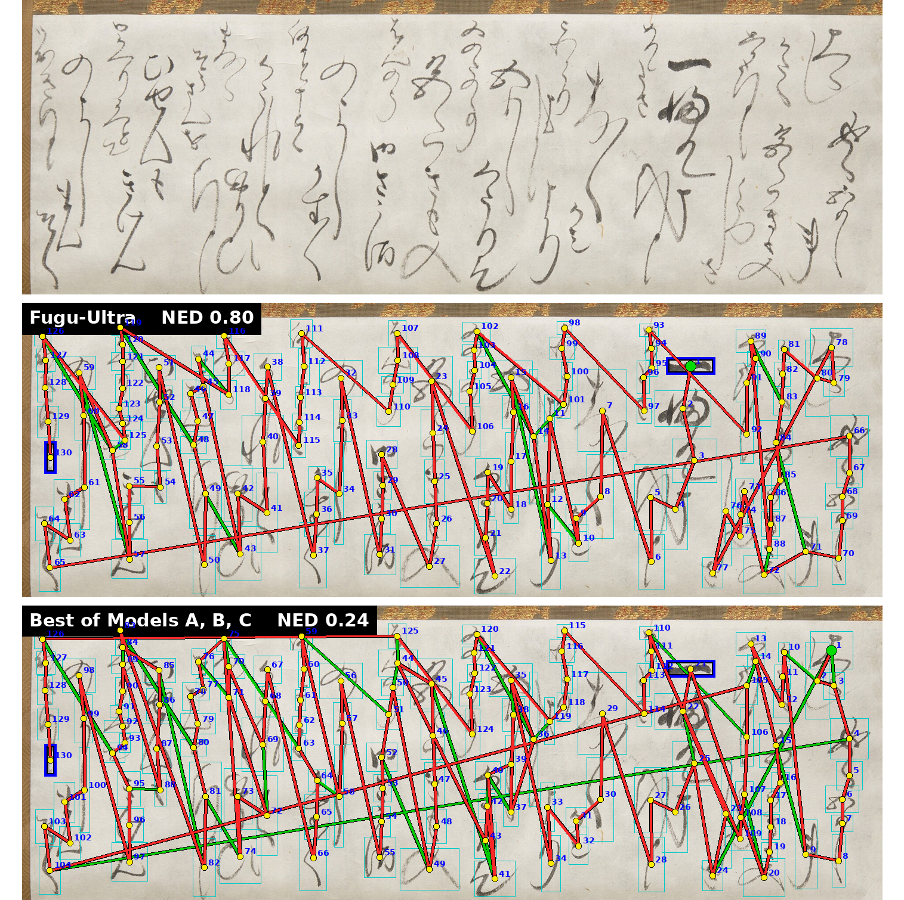
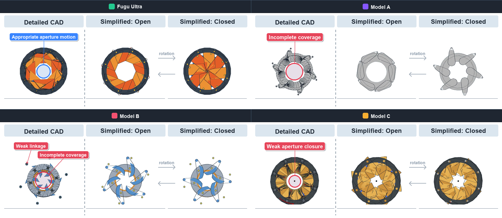
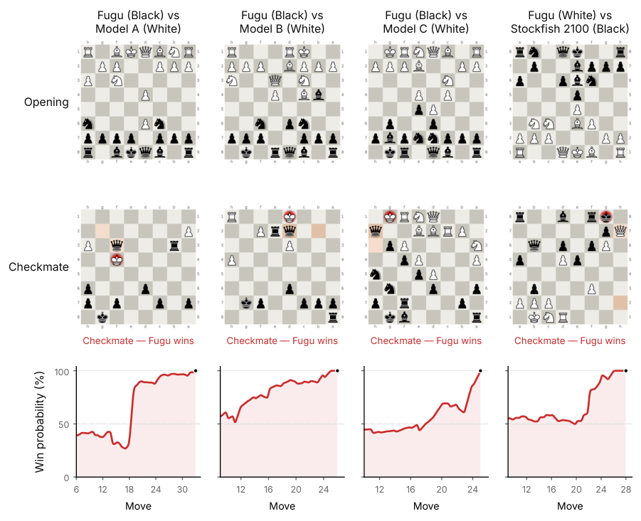
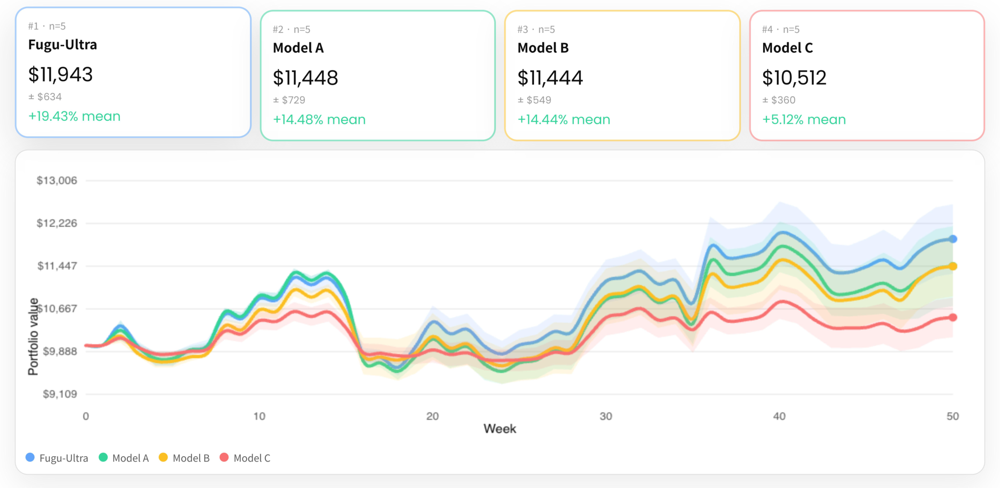

# Sakana Fugu テクニカルレポート

> 原題: Sakana Fugu Technical Report
> 著者: Fugu Team, Sakana AI（注: 本研究の引用は "Sakana AI (2026)" とすること。完全な著者リストと貢献は文書末尾に記載）
> 出典: arXiv:2606.21228
> 訳注: クリップ時のマクロ脱落により Figure 3・7・8・9 のキャプション等で「Fugu」「Fugu-Ultra」の語が欠落していたため文脈から復元した。脚注 1・2 の本文はクリップから欠落しており ar5iv 原ページから復元した。Figure 1・2・4・6 は ar5iv 自体に画像が存在しない（未レンダリング）ためキャプション訳のみ収録する。Table 1 の空列（クリップ由来のスペーサ列)は除いて正規化した。本文中の \[数字\] は原典の参考文献番号を示す（参考文献一覧は翻訳対象外）。

## Abstract（要旨）

フロンティア大規模言語モデル（Large Language Models, LLMs）の能力は進歩を続けており、プロバイダごとに異なるドメインへの特化がますます進んでいる。ここから自然な次の目標が生じる: 様々な LLM の個別の専門性を、集合的に知的なシステムへとどう組み合わせるか、である。この目的のために、我々は LLM エージェントチームの能力を活用・増幅するオーケストレータモデルのファミリーである Sakana Fugu の開発を報告する。Fugu モデルはそれ自体が言語モデルであり、ユーザーのクエリを理解し、それを解くためのエージェント的な足場（agentic scaffolds）を動的に設計するよう訓練されている。これらの適応的な scaffold を通じて、Fugu は個々のどの LLM エージェントをも超える性能に到達し、SWE-Bench Pro、Terminal Bench、LiveCodeBench、GPQA-Diamond、Humanity's Last Exam、CharXiv Reasoning を含む一連の挑戦的なタスクにおいて、公開アクセス可能な他のモデルと比較して最先端の結果を達成する。我々は 2 つのモデルを公開する: 日常利用のために性能とレイテンシのバランスを取った Fugu と、最難問での回答品質を優先する Fugu-Ultra である。我々は、大規模ファインチューニング・進化的アルゴリズム・強化学習アプローチを包含する訓練パラダイムと、これらの手法を本番システムに変えるインフラおよび中核的な設計原則を説明する。本レポートが、集合知（collective intelligence）を通じてアクセスされる AI 能力の次のフロンティアへの道として、マルチエージェントシステムと動的でクエリ適応的な agentic scaffold のさらなる研究を促すことを願う。[https://sakana.ai/fugu](https://sakana.ai/fugu)

## 1 Introduction（はじめに）

> 図1: コーディング・推論・科学・エージェント的ベンチマーク群における Fugu、Fugu-Ultra、およびベースラインのフロンティアモデルの性能比較。Fugu 以外のスコアはすべてモデルプロバイダの報告値である。Fable 5 と Mythos Preview については、同一ベンチマークで両方のスコアが利用可能な場合はその最大値を報告する。両者は公開アクセス可能でないため、Fugu のエージェントプールには含まれていない。（訳注: この図の画像は ar5iv 未レンダリングのため欠落）

フロンティア大規模言語モデル（LLMs）は今や、幅広いドメインで専門家レベルの性能に接近ないし匹敵している \[28\]\[5\]\[35\]\[40\]\[34\]。例えば、Gemini-3-Deep-Think は最近、国際数学オリンピック（IMO）で金メダル水準の成績を達成し \[28\]、GPT-5.5 は組合せ幾何学における 80 年来の Erdős 予想を反証し \[35\]、Claude-Mythos は OpenBSD と FreeBSD において多数のゼロデイ脆弱性を発見した \[8\]。しかし、フロンティア能力が前進するにつれ、複数の粒度レベルでモデルの特化がますます分化していくことも観察される。ドメインレベルでは、過去の GPT 系モデルはしばしば数学的推論タスクで最先端の性能を示し \[35\]\[15\]、Opus 系モデルはソフトウェアエンジニアリングとサイバーセキュリティに特化してきた \[8\]\[23\]。単一ドメインの内部では、違いはさらにきめ細かくなりうる: 競技プログラミングでは、Gemini-3.1-Pro は既知のアルゴリズムを直接実装することに特に長けている一方、GPT 系モデルは最難問を解くために複数のアルゴリズム的アイデアを計画・結合することにしばしば秀でている \[68\]。これらの観察が示唆するのは、次のフロンティアはいかなる単一モデルによってではなく、多数のモデルの相補的な強みを特定・結合・増幅できるシステムによって達成されるかもしれない、ということである。最強のコーディングモデルのようにソフトウェアを構築し、最強の定理証明モデルのように数学的に推論し、各特化がいつ必要かを動的に判断できるシステムは、集合知を通じてフロンティア性能を拡張する自然な道を提供するだろう。

同時に、近年の LLM の性能向上は、基盤モデル自体の進歩だけでなく、LLM をより大きなシステムの一構成要素として扱う agentic scaffold（エージェント的な足場）によっても駆動されてきた \[20\]。このような scaffold は、自己回帰的な生成を、構造化されたプロンプティング \[59\]\[63\]\[29\]、外部ツール利用と function calling \[42\]\[45\]、環境フィードバック、メモリ管理 \[67\] で拡張する。これはソフトウェアエンジニアリングで特に顕著であり、Claude Code をはじめとする現代の agentic scaffold は、モデルの相互作用の軌跡を形作り、継続的な環境フィードバックを供給し、生のモデル能力を反復的なエージェント的ワークフローへと変換できる \[2\]。これらの発展は、能力とはモデルの性質としてだけでなく、モデルがそれを通じて行動する scaffold の性質としても理解されるべきであることを示唆している。

多様な能力を持つ言語モデルの広がりと、ドメイン特化の agentic scaffold のインパクトは、集合知をオーケストレートできるシステム——どのモデルを関与させるか、それらがどう通信し、ツールを使い、環境と相互作用するか、そしてそれらの出力をいつ統合すべきかを動的に決めるシステム——の開発を動機づける。我々はこの種のモデルオーケストレーションを、ますます大規模で高価になる言語モデルとは別の、新しい相補的なスケーリング軸と見なす。成功すれば、この方向性はフロンティアレベルの能力をより効率的に、よりモジュール的に、より広くアクセス可能にしうる。

本テクニカルレポートでは、このビジョンを実現するために集合知の利点を活用する我々のシステム、Sakana Fugu の開発を詳述する。Sakana Fugu は、より強力なフロンティアエージェントワーカーのチームを適応的・動的にオーケストレートするよう訓練された言語モデルのファミリーである。初回リリースでは、異なる動作点を狙った 2 つのバリアントを公開する。Fugu は速度に最適化されており、入力ごとに単一のワーカーを選択するため、そのレイテンシはフロンティアモデルへの直接呼び出しと同等でありながら、各クエリをその入力に最も適したエージェントへルーティングする。この効率性にもかかわらず、Fugu はタスク横断でベストインクラスの性能に匹敵し、多くの場合それを上回る。Fugu-Ultra は性能に最適化されており、入力ごとに複数エージェントのワークフローを構成する。したがって追加のレイテンシと引き換えに品質を高めるものであり、複数の専門性の結合から利益を得る最も複雑なタスクを想定している。Figure 1 は Sakana Fugu を人気ベンチマーク上でフロンティアモデルと比較する。我々の Fugu モデルは公開アクセス可能なフロンティアモデルを上回り、様々な厳格なエンジニアリング・科学・推論ベンチマークにおいて Fable 5 や Mythos Preview と肩を並べ、輸出規制のリスクなしにフロンティア能力を提供する。さらなる結果は section 4 を参照。

生の性能を超えて、学習されたオーケストレーションはより広い含意を持つと我々は考える。能力が、より大きなモデルを訓練することによってのみではなく、既存モデルを合成することによっても増幅できるなら、AI の進歩は最大の訓練実行へのアクセスだけに依存する必要はない。オーケストレーションはよりモジュール的でアクセスしやすい道を提供する。そこでは改善は、モデルがどう選択され、協調され、結合されるかから生じ、新しくリリースされたモデルは登場するたびにワーカープールへ組み込める。この合成可能性は、ユーザーにシステムへの意味のある制御も与える。例えば、エージェントプールは、再訓練なしに、特定のプロバイダを優遇したり、特定のモデルを除外したり、データ・プライバシー・コンプライアンス制約を尊重したりするよう構成できる。より思弁的には、オーケストレーションを第一級のスケーリング軸として扱うことは経済的・地政学的な帰結を持ちうる。フロンティア AI の恩恵を、最大のモデルを訓練できる組織に集中させるのではなく、組織や地域を越えてより広く分配するのである。我々は Fugu をこの方向への第一歩として提供し、AI 能力の次のフロンティアへの道としての集合知のさらなる研究を促すことを願う。

## 2 Related Work（関連研究）

**LLM の集合知**。集合知（collective intelligence）は、比較的限られた個体の集団が、相互作用を通じて、いかにして単一の構成員の能力を超える振る舞いを生み出せるかを研究する \[19\]\[22\]。この視点は最近、異なるプロバイダのフロンティアモデルが相補的な強みと弱みを示すにつれ、LLM にとってますます重要になっている。そのため、通信プロトコル・投票メカニズム・ルーティング方策・学習された協調構造を通じて LLM エージェント群を協調させる方法を研究する研究群が成長している \[12\]\[56\]\[10\]\[18\]\[69\]\[65\]\[9\]。最近のマルチエージェント LLM システムは、手設計の協調パターンに依存することが多い: 例えば \[12\] と \[56\] は、最終回答を改善するために固定された相互作用構造を使い、連続する議論ないし推論ラウンドにわたって複数エージェントをオーケストレートする。他の研究は学習された、あるいは適応的な協調へ向かう。\[18\] と \[65\] はクエリを適切なエージェントやトポロジーへ写像する表現を学習し、\[69\] は協調を学習可能なグラフとして扱い、\[9\] は各クエリを単一の最適合エージェントへ導くルータを学習する。

Sakana Fugu は、知能を協調されたモデル集団の創発的性質として扱う点で、この系譜に連なる。しかし我々の目標は、多くの先行マルチエージェントシステムとは 2 つの点で異なる。第一に、ユーザーが設計・調整・運用しなければならないマルチエージェントワークフローを露出するのではなく、Sakana Fugu は集団を単一のモデルインターフェースとして提示する。第二に、固定された通信パターンや単発のルーティングだけに頼るのではなく、Fugu モデル自体が、クエリごとにエージェントプールの使い方を適応的に決められる訓練されたオーケストレータである。この意味で Sakana Fugu は、集合知を LLM 協調を研究するための研究パラダイムとしてだけでなく、相補的なモデル能力へアクセスするための実用的なモデルインターフェースにもすることを目指している。

**Agentic Scaffolds**。LLM を自己回帰的なチャットボットから行動を取るエージェントへ引き上げるために、基盤モデルから推論・計画・内省・ツール利用を引き出す agentic scaffold が数多く開発されてきた。第一の系譜は、プロンプティングとデコーディング戦略を通じてモデルの推論を形作るもので、chain-of-thought プロンプティング \[59\]、self-consistency \[57\]、Tree of Thoughts \[62\] のような推論経路上の構造化探索を含む。第二の系譜は推論と行動を交互に行い、モデルが計画し、ツールを呼び、観測を取り込むことを可能にする: ReAct は推論の軌跡を行動と結合し \[63\]、Toolformer とその後続研究はモデルに外部ツールと function calling を備え付ける \[45\]\[42\]。第三の系譜はフィードバックと反復を加えるもので、モデルは self-reflection \[29\]\[47\] や外部環境からの信号の取り込みを通じて、自身の出力を批評・修正する。長期メモリのサポートの拡大 \[67\] とあわせて、これらの構成要素は静的なモデルを有能なエージェントへと変換する。

これらのアイデアは、フロンティアモデルを豊かな対話的環境で包む本番ハーネス（production harness）にも統合されてきた。例えばソフトウェアエンジニアリングでは、Claude Code や Codex のようなシステムがリポジトリコンテキスト・ツール利用・コード実行・編集ループ・環境フィードバックを管理し、しばしば生のモデル呼び出し自体を超えて end-to-end 性能に大きく貢献する \[36\]\[2\]。これらのシステムは、LLM の実用的能力が、タスク環境と相互作用するための scaffold に決定的に依存することを実証している。しかし、そのようなハーネスは通常、特定のタスククラス向けに設計され、scaffold をモデルの周囲の外部システムとして露出する。Sakana Fugu は異なるアプローチを取り、scaffold は推論時に訓練されたオーケストレータによって生成される。固定された相互作用パターンやタスク特化ハーネスに頼るのではなく、Fugu は各リクエストについてどう推論するか、どのフロンティアエージェントを関与させるか、それらがどう通信すべきか、そしてそれらの出力をどう最終回答へ統合するかを動的に決定する。

**モデルマージ**。もう一つの研究系譜は、モデルマージ（model merging）を通じて複数モデルの能力を組み合わせる方法を研究する。パラメータレベルでは、初期のアプローチは重み平均・model soups・タスクバランス補間といった静的レシピを使い、最小限の追加計算でドメイン横断の能力を統合する \[16\]。より最近の研究は最適化ベースのマージを導入しており、例えば「マージレシピ」上の進化的探索は、学習された戦略が手設計のものを上回り、より強い汎化をもたらしうることを示した \[1\]。他の手法は、タスク間の衝突を解決したり、パラメータ更新をスパース化したり、個々のモデルにとって重要な方向を保存したりすることで、パラメータ空間での融合の信頼性を高める \[61\]\[64\]。しかし、パラメータ空間のマージは重みに直接作用するため、モデルパラメータへのアクセスを必要とし、通常はアーキテクチャ的・表現的な互換性を仮定する。このため適用範囲は主にオープンソースのチェックポイントに限られ、現在の最先端の多くを定義する閉源フロンティアモデルの合成には適さない。

補完的な手法群は、データフロー空間あるいは表現空間でモデルを合成する。全重みを平均する代わりに、これらのアプローチは層を継ぎ合わせ、ブロックを混合し、隠れ状態をルーティングし、既存構成要素からハイブリッドアーキテクチャを構築する \[7\]\[1\]。こうした手法は完全なパラメータマージの制約の一部を緩め、よりモジュール的なレベルで能力を組み合わせられるが、それでも一般にはモデルの活性・層・アーキテクチャへの内部アクセスを必要とする。したがって、モデルがアーキテクチャ・プロバイダ・コンテキストインターフェース・レイテンシ・コスト・可用性において異なりうる、異種の API のみのシステムには一般には適用できない。

Sakana Fugu は、モデルマージのマクロレベルの類似物と見なせる。重みをマージしたり層を継ぎ合わせたりする代わりに、フロンティアモデルをブラックボックスのエージェントとして扱い、それらの出力をルーティング・協調・検証・統合する方法を学習することで、挙動レベルでモデル能力を合成する。この意味で Fugu は、パラメータアクセスやアーキテクチャ互換性を必要とせずに、異なるモデルの相補的な特化を保存・増幅することを目指す、一種の機能的モデル合成（functional model composition）を行う。このマクロレベルの視点により、Fugu は閉源フロンティアモデル・異種プロバイダ・ユーザー固有の制約を取り込みつつ、複数の特化モデルをより強い集合システムへ結合するというモデルマージの中心的目標を追求できる。

## 3 Sakana Fugu

Sakana Fugu は、マルチエージェントシステムを単一のモデルインターフェースを通じて露出する、学習されたオーケストレータのファミリーである。ユーザーのクエリを与えられると、Fugu モデルはフロンティア LLM ワーカーのプール上に agentic scaffold を構築し、どのワーカーを関与させるか、どんな指示や役割を割り当てるか、中間出力をどう結合・検証すべきか、いつ最終回答を統合するかを決定する。ユーザーは単一モデルを呼ぶように Fugu と対話し、内部ではシステムが複数の特化エージェントを横断してルーティング・委譲・協調できる。品質-レイテンシのフロンティア上の異なる点を狙う 2 つのバリアントを公開する。Fugu は強い性能と低レイテンシのバランスを取り、日常的な対話的利用と構成可能なデプロイ制約に適する。Fugu-Ultra は回答品質を優先し、追加レイテンシと引き換えに、より大きなワーカープール上でより深いオーケストレーションを使う。

### 3.1 Fugu: 性能とレイテンシのバランス

Fugu は Sakana Fugu のレイテンシ考慮型バリアントであり、回答品質と並んで応答時間が重要な、対話的で日常的なワークロード向けに設計されている。Trinity \[60\] の上に構築されるが、学習されたオーケストレーションのアイデアを本番設定へスケール・適応させる。そこではオーケストレータは、妥当なレイテンシの下で高速かつ信頼できるルーティング判断を行わねばならず、単一ステップの性能だけでなく、実世界の利用で一般的なマルチターンの end-to-end 対話的タスクに対しても最適化されねばならない。

#### 3.1.1 パラメータ化

Fugu のオーケストレータは、フロンティアワーカーモデルのプール上の高速な意思決定モジュールとして設計されている。Fugu は事前学習済み言語モデルをバックボーンに使い、自身の隠れ状態に基づいてワーカープールを協調させる。この過程の高レベルな図解を Figure 2 に示す。

> 図2: Fugu のパラメータ化。軽量な選択ヘッド（selection head）がベースモデルの LM ヘッドと並列に動作する。オーケストレータバックボーンの隠れ状態 $h$ を入力として取り、プール内の各ワーカーモデルに 1 つずつ、$L$ 個のロジットを出力する。Trinity のコーディネータと異なり、Fugu は役割を割り当てない。選択されたモデルは常にワーカーとして呼び出され、これにより協調空間が縮小しオーケストレーションのレイテンシが下がる。また、LM の層内の選択されたパラメータ行列の特異値スケールもファインチューニングする（図中の赤い対角線で示される）。図中で「\<Head Input\>」と記された位置の隠れ状態が軽量ヘッドへの入力である。デコードされたメッセージ「\<BOS\>…」と隠れ状態の意味的対応は図解のためだけに示している。軽量ヘッドは最終的なデコード済みテキストではなく、その位置の内部隠れ状態に対して動作するからである。（訳注: この図の画像は ar5iv 未レンダリングのため欠落）

具体的には、$L$ 個のワーカーモデルのプールを与えられ、オーケストレータバックボーンの最終隠れ層の後に軽量な予測ヘッドを取り付ける。隠れ状態 $h\in\mathbb{R}^{d}$ に対し、ヘッドは、入力に対してどのワーカーモデルを選択すべきかをスコアリングする $L$ 個のロジットを出力する。選択されたモデルにさらに複数の役割のうち 1 つを割り当てる Trinity と異なり、Fugu はクエリを常に選択されたモデルにワーカーとしてディスパッチする。役割割り当てを取り除くことで協調空間はモデル選択のみに狭まり、オーケストレーションの判断が単純に保たれ、オーケストレータのレイテンシオーバーヘッドが最小化される。

完全なファインチューニングなしにこの軽量ヘッドが使う表現を改善するため、効率的適応に関する最近の研究 \[48\] に従い、singular-value fine-tuning（特異値ファインチューニング）を使ってバックボーンパラメータの小さな部分集合を適応させる。オーケストレータバックボーン内の選択された重み行列について、行列を分解し、直交成分を固定したまま特異値スケールのみを訓練する。軽量予測ヘッドとあわせて、これは極めて小さい訓練可能パラメータ集合をもたらしつつ、オーケストレータの表現がルーティング問題へ効果的に適応することを可能にする。

鍵となる設計上の選択は、Fugu が生成テキストではなくオーケストレータのロジットを使うことである。プロンプティングとタスク実行は選択されたフロンティアワーカーモデルに委譲されるため、オーケストレータはワーカー選択の判断だけを生成すればよい。これにより推論は大幅に安価になる: システムは早いトークン位置で隠れ状態を計算し、選択ヘッドを適用し、高価な自己回帰デコーディング過程なしに、直ちにクエリを選択されたワーカーへディスパッチできる。この判断のみのパラメータ化は Fugu のレイテンシプロファイルの中心であり、次節で述べるように進化的最適化を実用的にもする。

#### 3.1.2 単一ステップタスクでの教師ありファインチューニング

Fugu は 2 段階で訓練され、大規模な教師ありファインチューニング（supervised fine-tuning, SFT）から始める。この段階のために、コーディング・数学・推論・言語理解・多数のエージェント的シナリオにまたがる単一ステップタスクの大規模コレクションを組み立てる。このコレクション $\mathcal{D}$ 内の各質問 $q_{i}$ は検証可能であり、正解 $s_{i}$ を持つ。

訓練ラベルを構成するため、プール内のすべてのワーカーモデル $\mathcal{M}_{j}$（$j=1\cdots K$）を $q_{i}$ 上で $n$ 回繰り返し実行し、$s_{i}$ と比較して各モデルの性能を測定する。これにより各モデルについて候補解の集合 $\{o^{\mathcal{M}_{j}}_{1},o^{\mathcal{M}_{j}}_{2},...,o^{\mathcal{M}_{j}}_{n}\}$ と対応する報酬の集合 $\{r^{\mathcal{M}_{j}}_{1},r^{\mathcal{M}_{j}}_{2},...,r^{\mathcal{M}_{j}}_{n}\}$ が得られる。これらの報酬はワーカープール上に、その問題に最も適したモデルから最も適さないモデルへの順位づけを誘導する。各モデル $j$ の $q_{i}$ 上の性能を報酬の平均 $\bar{r}_{i,j}\;=\;\frac{1}{n}\sum_{k=1}^{n}r^{\mathcal{M}_{j}}_{k}$ で要約し、これらのスコアをベクトル $\mathbf{s}_{i}=(\bar{r}_{i,1},\dots,\bar{r}_{i,K})$ に集める。

硬い順位づけだけを教師にして報酬の大きさを捨てるのではなく、softmax 変換によってスコアをワーカー上のソフトなターゲット分布に変換する。

$$
p_{i}(j)\;=\;\frac{\exp(\bar{r}_{i,j}/\tau)}{\sum_{j^{\prime}=1}^{K}\exp(\bar{r}_{i,j^{\prime}}/\tau)},
$$

ここで $\tau$ は温度である。この分布を教師として使い、軽量選択ヘッドとオーケストレータバックボーンの特異値スケールの両方を、以下を最小化するよう訓練する:

$$
\mathcal{L}_{\mathrm{SFT}}(\theta)=\frac{1}{|\mathcal{D}|}\sum_{i=1}^{|\mathcal{D}|}\mathbb{D}_{KL}\!\left(p_{i}(\cdot)\,\|\,\pi_{\theta}(\cdot\mid q_{i})\right),
$$

単一の最良ラベルを分類するのではなくソフトな性能分布から学習することは、オーケストレータにより豊かな訓練信号を与え、複数のワーカーが同程度に有能なときの選択をより頑健にする。教師信号は測定されたワーカー性能から直接導かれ、オーケストレータ自身からの生成を必要としないため、この段階は後続の進化的最適化段階のための効率的で安定した初期化を提供する。

#### 3.1.3 end-to-end タスクへの進化戦略の適用

単一ステップタスクでの教師ありファインチューニングの後、end-to-end タスク上で進化戦略（evolutionary strategies）によって Fugu をさらに最適化する。単一ステップタスクはクリーンな正誤信号とドメイン横断の広いカバレッジを提供するが、実際の対話的システムでモデルがどう使われるかを完全には捉えない。そこで我々は、Claude Code・Codex・OpenCode といった様々なコーディングアシスタント環境から実世界のマルチターン軌跡を収集し、リポジトリコンテキスト・反復編集・ツール呼び出し・実行フィードバック・最終的なタスク完了を伴う end-to-end タスクを構築する。この段階は訓練分布を、静的な質問から、本番利用をよりよく反映するエージェント的ワークフローへと拡張する。形式的には、コレクション $\mathcal{E}$ から引かれた end-to-end タスク $q_{i}$ について、オーケストレータはハーネスと一連のターンにわたって相互作用する。$s_{t}$ をターン $t$ での相互作用状態、すなわちタスクとそれまでのターン・ツール呼び出し・実行フィードバックのトランスクリプトとする。各ターンで Fugu は隠れ状態 $h(s_{t})$ を計算し、$\pi_{\theta}(a\mid s)\propto\exp\!\big(f_{\theta}(h(s))_{a}\big)$ としてワーカー $a_{t}\sim\pi_{\theta}(\cdot\mid s_{t})$ を選択し、ホライズン $T\leq B$（$B$ は固定のターン予算）の軌跡 $\tau=(s_{0},a_{0},s_{1},a_{1},\dots,s_{T})$ を生む。終端報酬 $R(\tau)\in\{0,1\}$ がタスクが最終的に完了したかを記録する。

これらの end-to-end 軌跡は、性能スコアだけからは見えないエージェント間の違いも明らかにする。あるモデルは高レベルの推論や実装計画の提案には強いが、ツールの操作・ファイルの編集・環境フィードバックへの反応では信頼性が落ちるかもしれない。別のモデルは独立の推論ベンチマークでは目立たなくても、対話的なコーディングハーネスの内部ではより頑健かもしれない。したがってこれらの軌跡での訓練は、Fugu がより実践的なワーカー能力の概念——単独での回答品質だけでなく、ツールとフィードバックを備えた scaffold に埋め込まれたときに各ワーカーがどれだけうまく動くか——を学ぶことを助ける。

この段階には、Trinity の最適化アプローチに従って sep-CMA-ES を使う。具体的には、オーケストレータの期待終端報酬

$$
J(\theta)\;:=\;\mathbb{E}_{\tau\sim\pi_{\theta}}\!\big[R(\tau)\big],
$$

を end-to-end タスクの結果上で直接最大化する。sep-CMA-ES は親パラメータベクトル $\theta_{t}$、ステップサイズ $\sigma_{t}$、対角共分散 $D_{t}$ を保持し、各反復で $\lambda$ 個の候補の集団をサンプリングする。

$$
\theta^{(k)}\;=\;\theta_{t}+\sigma_{t}\,D_{t}\,z^{(k)},\qquad z^{(k)}\sim\mathcal{N}(0,I),\quad k=1,\dots,\lambda.
$$

各候補の適応度 $J(\theta^{(k)})$ は、複製した end-to-end 実行にわたる終端報酬の平均で推定され、上位 $\mu$ 個の候補が適応度重み付き平均で再結合されて次の親を形成する。

$$
\theta_{t+1}\;=\;\theta_{t}+\sigma_{t}\,D_{t}\sum_{j=1}^{\mu}w_{j}\,z_{j:\lambda},
$$

ここで $z_{j:\lambda}$ は適応度順位で $j$ 番目に良い候補の摂動、$\{w_{j}\}_{j=1}^{\mu}$ は再結合重みである。SFT 段階が既にオーケストレータパラメータを探索空間の強い領域に置いているため、進化的探索はルーティング挙動をより細かい粒度で洗練でき、進化的最適化はここに適している \[44\]。また、複雑なマルチターン軌跡に対する信頼できる順位ラベルを構成することなく、疎あるいはノイズの多い成功信号を含む end-to-end タスクの結果を直接最適化できる。経験的に、この段階は追加の end-to-end タスクでの教師ありファインチューニングよりも大幅に安定しており、正しさがワーカーモデル・ハーネス・ツール・環境フィードバックの間の完全な相互作用に依存する設定により適していることが分かった。

### 3.2 Fugu-Ultra: 性能の優先

Fugu-Ultra は LLM エージェントチームから最大の能力を引き出すことを優先し、絶対的な回答品質が優先される最も複雑なユーザーワークロード向けに設計されている。Fugu-Ultra は Conductor \[33\] の上に構築され、適応的なエージェントメモリを通じて長ホライズンの function calling とマルチエージェントワークフローに対応する新しい拡張を加える。

#### 3.2.1 モデルのオーケストラを指揮する

マルチエージェント function calling と共有メモリへの拡張を詳述する前に、Fugu-Ultra を支える Conductor フレームワークの概観から始める。Conductor フレームワークは、強力な LLM エージェントの集合をプロンプトエンジニアリングし協調させる言語モデルの訓練に、強化学習を活用する。Conductor は、入力タスクを分割し、任意のサブタスクを割り当て、エージェントの相補的能力を最大限に使うための狙いを定めた通信戦略を定義する、完全な agentic workflow を自然言語として出力する。

**Conductor のタスク**。Conductor の目的は、任意の入力質問 $q_{i}$ に固有の agentic workflow を設計することでタスクを間接的に解くことである。各 agentic workflow はワークフローステップの列として定義され、その最終出力が実際の Conductor の応答 $o_{i}$ として返される。各ステップは、自然言語のサブタスクを記す文字列、そのサブタスクの遂行を担う割り当てワーカーエージェントに対応する整数 id、そして前のステップのどのサブタスク解をワーカーのコンテキストに含めるかを索引するアクセスリスト（access list）を指定する。この設計により、Conductor はワーカー間で仕立てられたサブタスクと通信戦略を自由に作れる。単純な best-of-N や逐次のチェーン状トポロジーから、任意の並列化可能な木構造アプローチまでの agentic workflow を指定でき、高度に特化したエージェントの個々の強みとシナジーを活用する。

**ワークフローの実行と学習のダイナミクス**。Conductor が出力する各 agentic workflow は、指定されたワーカーエージェントに割り当てられたサブタスクをプロンプトすることで実行される。各ワークフローステップで、ワーカーのコンテキストには、アクセスリストで定義された、それまでのサブタスクと対応する応答の列が含まれる。伝統的な RL の枠組みと同様に、Conductor モデルの各応答に対する報酬 $r_{i}$ は 2 つの漸進的な条件で決まる:

1. Conductor フォーマット条件: サブタスク・ワーカーエージェント・アクセスリストのリストをパースできない応答については $r_{i}$ を 0 とする。
2. Conductor 正解条件: 整形式の agentic workflow を実行した最終出力 $o_{i}$ が解 $s_{i}$ と一致すれば $r_{i}$ を 1、そうでなければ $0.5$ とする。

我々は Fugu-Ultra を GRPO \[46\] で訓練した:

$$
J(\theta)=\mathbb{E}_{q\sim D,\,\{o\}^{G}_{1}\sim\pi_{\theta}(\cdot\mid q)}\left[\frac{1}{G}\sum_{i=1}^{G}\Big(\min\!\big(r_{i}A_{i},\;\mathrm{clip}(r_{i},\,1-\epsilon,\,1+\epsilon)\,A_{i}\big)-\beta\,\mathbb{D}_{\mathrm{KL}}(\pi_{\theta}\,\|\,\pi_{\text{ref}})\Big)\right],
$$

グループ化された生成を使ってモンテカルロ advantage 関数 \[49\] を計算する:

$$
A_{i}=\frac{r_{i}-\mathrm{mean}(\{r_{1},\dots,r_{G}\})}{\mathrm{std}(\{r_{1},\dots,r_{G}\})},
$$

ここで $r_{i}$ は我々固有の Conductor 報酬である。Conductor フレームワークはオーケストレータ自身をワーカーエージェントとして指定することも許し、可能な協調トポロジーの範囲と複雑さをさらに広げる。

このレシピで Fugu-Ultra を訓練すると、チーム内の各エージェントの異なる強みとスキルを活用する問題分解とプロンプトエンジニアリングされたサブタスク、そしてタスク要件に応じて独立作業とエージェント間協調の両方を活用する通信トポロジーの創発が観察される。

#### 3.2.2 Function Calling を伴う agentic workflow

マルチエージェントワークフロー内の function calling は、オーケストレーションのメモリという固有の追加課題を提起する。一般的な単一エージェントシステムでは、function call のループ \[6\]\[37\]\[32\] はエージェント側に追加の永続メモリを必要としない。メッセージのトランスクリプトが完全なコンテキストを運び、そのコンテキストを受け取りうる相手は 1 つしかいないからである。

しかし我々の Fugu-Ultra システムでは、どのエージェントもいつでも function call を発行しうる。したがって、function call のループを守り、どのエージェントもユーザー環境と自由に相互作用できるようにするには、システムは、すべての呼び出しをどのエージェントが発行したか、そしてそのエージェントが Conductor ワークフロー全体のどこに位置するかを保持しなければならない。そうすることで各エージェントの function call ループが対応するエージェントへ正しくルーティングされ、エージェント間の通信トポロジーが維持される。したがって、我々のオーケストレータは、対応するユーザークエリについて選択されたモデル・通信トポロジー・割り当てられたサブタスクを含む Conductor のワークフロー状態を、ユーザーとエージェントの相互作用の間じゅう追跡する必要がある。

##### ワークフロー内のエージェント隔離

エージェントチームの異なる専門性を最大限活用するため、各エージェントの function calling の軌跡を互いに隔離する。このワークフロー内隔離（intra-workflow isolation）は、オーケストレーション崩壊（orchestration collapse）——最初に環境と相互作用したエージェントが以後のすべてのエージェントの軌跡を規定してしまい、後続エージェントが最初のエージェントの敷いた道をなぞるよう誘導されて冗長な貢献しかできなくなる現象——を防ぐために必要である。すなわち、エージェントは Fugu-Ultra が規定するアクセスリストを通じてのみ他のエージェントの行動と出力を観測し、それ以外では自分自身の行動だけを保存したトランスクリプト履歴を観測する。これにより、後続エージェントの解の軌跡が先行エージェントの作業に条件づけられることが防がれ、各エージェントは我々のモデルから割り当てられたサブタスクの指示のもと、自らの解決の道筋を完全な自由度で決められる。

##### 永続的な共有メモリ

ワークフロー内隔離はオーケストレーション崩壊を防ぐのに必要だが、マルチターンの会話履歴にわたるすべての function calling からの完全な隔離もまた準最適である。エージェントは、同じ成果物を再発見するための冗長で繰り返しのツール呼び出しをしないため、また要求されたタスクを解くのに必要な背景コンテキストを蓄積するために、環境との相互作用の記憶をある程度保持しなければならないからである。この緊張を解決するため、ワークフロー間の共有メモリ（inter-workflow shared memory）をエージェント間に許可し、エージェントが過去のワークフローからのツール呼び出しを観測できるようにする。こうして、マルチターン会話の進行状態にわたる完全な記憶をエージェントに与え、各エージェントに必要な背景コンテキストを提供する一方で、現在のワークフロー内ではエージェントを互いに隔離する。ただし、Fugu-Ultra の指定する通信トポロジー（アクセスリスト）が必要と定めたコンテキストについてはその限りではない。

#### 3.2.3 訓練セットアップ

Fugu-Ultra を訓練するため、通常の言語モデルの事前学習済みチェックポイントから始めて、Conductor の強化学習アプローチをスケールさせる。Ultra は、Gemini-3.1-Pro \[17\]、Claude-Opus-4.8 \[4\]、GPT-5.5 \[38\] を含む多様なフロンティア LLM のプールを使い、最大 5 ステップの agentic workflow を設計するよう指示される。マルチターンタスクでは、どのエージェントもユーザー環境との無制限の相互作用を許可される。section 3.2.1 で詳述した Conductor 報酬を用い、GRPO で、KL ダイバージェンスペナルティなしで訓練する。

我々の訓練データセットは、公開データと、実際のエージェント-ユーザー相互作用をシミュレートする専門家設計の end-to-end 環境の混合である。これらの end-to-end タスクは前モデルの開発（section 3.1.3）でも使われ、数学・科学・エンジニアリング・事実知識と想起・多数のツール利用シナリオ・会話対話・マルチターンのコンテキスト保持・計画といった、エージェント間の実世界の特化の違いを露わにするのに役立つ。これらのタスクでの大規模訓練は Fugu-Ultra に大きな向上をもたらし、ワーカープール全体の専門性とスキル、およびそれらを最適に組み合わせる方法を見分ける能力を高める。

## 4 Capabilities（能力）

本節では、多様で挑戦的なベンチマーク群での性能（section 4.1）、および Sakana Fugu の現実的で困難なユースケースを代表するよう手作りされた専門家設計タスク（section 4.3)で測定された Sakana Fugu の能力を報告する。加えて、ドメイン横断での Sakana Fugu のオーケストレーション適応性を分析し（section 4.2）、最適な協調戦略とエージェントトポロジーに関する知見（section 4.4）で締めくくる。

### 4.1 ベンチマーク性能

まず、再現可能な条件下で中核的なエージェント能力を測定するよう設計された、標準化ベンチマークの広範なスイートで Sakana Fugu を評価する。これらのベンチマークは、推論・ツール利用・コーディング・長ホライズンの問題解決・ドメイン固有の専門知識を要するタスクをカバーし、フロンティアベースラインに対する Fugu の性能の定量的な見取り図を提供する。

#### 4.1.1 評価セットアップ

汎化能力を評価するため、我々のモデルが訓練中に見ていない、現代的で挑戦的なベンチマークで Sakana Fugu モデルの能力をテストした。エージェント的コーディングとソフトウェアエンジニアリングには SWE Bench Pro \[11\] と Terminal Bench 2.1 \[31\] を使う。Fugu の基盤能力を最もよく露出させるため、Mini-SWE-agent \[50\] や Terminus 2 \[26\] といった最小限の評価ハーネスを使う。科学知識の評価には、Graduate-level Google-proof Q&A ベンチマークから採られた自然科学のダイヤモンド難度の質問集合である GPQA Diamond \[43\] を使った。学際的推論には Humanity's Last Exam \[41\] をマルチモーダルサンプルを含めて使い、ツールなしで評価した。競技プログラミングの評価には、LiveCodeBench \[21\] の最新のフル v6 リリース（2023 年 5 月〜2025 年 4 月の問題）と、LiveCodeBench Pro \[68\] の公開されており採点可能な最新スプリット（2025 年第 2 四半期の問題）を使った。科学応用のある追加のコーディング評価には SciCode \[53\] を背景情報つきで使った。マルチモーダルなグラフ理解には CharXiv Reasoning \[58\] を、会話対話には GPT-5.2 をユーザーシミュレータとする $\tau^{3}$ Banking を使った。最後に、長コンテキストの検索と推論には、needle-in-a-haystack の MRCRv2 \[55\] と長文書情報検索ベンチマーク Long Context Reasoning \[51\] を使った。ベンチマーク評価構成の詳細は Appendix A を参照。

Sakana Fugu モデルは、Gemini-3.1-Pro \[17\]、Claude-Opus-4.8 \[4\]、GPT-5.5 \[38\] といった最先端（SOTA）フロンティア LLM を含む、大規模で多様なモデルのプールをオーケストレートする。したがって、個々のワーカーのスキルを活用・増幅する Fugu の能力を評価するため、同じ最大推論努力を設定したこれら同一のモデルに対して Fugu を評価する。

**表1**: モデルカード。Fugu モデルは、先端フロンティアモデルの知的なオーケストレーションを通じて、それらの異なるスキルセットを活用・増幅し、新しい SOTA 能力を達成する。最良スコアは太字、次点は下線付き（訳注: 原典の書式。以下の表では太字のみ再現）。ベースラインのスコアは可能な限りプロバイダの報告値。詳細は Appendix A。（訳注: クリップに混入していた空列は除いた）

| | Fugu-Ultra | Fugu | Claude Opus 4.8 | Gemini 3.1 | GPT-5.5 |
| --- | --- | --- | --- | --- | --- |
| SWE Bench Pro | **73.7** | 59.0 | 69.2 | 54.2 | 58.6 |
| Terminal Bench 2.1 | **82.1** | 80.2 | 74.6 | 70.3 | 78.2 |
| LiveCodeBench | **93.2** | 92.9 | 87.8 | 88.5 | 85.3 |
| LiveCodeBench Pro | **90.8** | 87.8 | 84.8 | 82.9 | 88.4 |
| Humanity's Last Exam | **50.0** | 47.2 | 49.8 | 44.4 | 41.4 |
| CharXiv Reasoning | **86.6** | 85.1 | 84.2 | 83.3 | 84.1 |
| GPQA Diamond | **95.5** | **95.5** | 92.0 | 94.3 | 93.6 |
| SciCode | 58.7 | **60.1** | 53.5 | 58.9 | 56.1 |
| $\tau^{3}$ Banking | 20.6 | **21.7** | 20.6 | 8.4 | 20.6 |
| Long Context Reasoning | 73.3 | **74.7** | 67.7 | 72.7 | 74.3 |
| MRCRv2 | 93.6 | 86.6 | 87.9 | 84.9 | **94.8** |

#### 4.1.2 エージェント的コーディング

Fugu-Ultra はエージェント的コーディングとソフトウェアエンジニアリングに秀で、SWE Bench Pro と Terminal Bench 2.1 の両方で最先端の性能を達成し、両ベンチマークで大幅な性能の飛躍を示すことが分かった。両ベンチマークでの向上は、いずれも次点に対して 5〜6% の範囲であり、Figure 3 に示すように、これらのフロンティアプロバイダにおけるまるまる一世代分の改善に相当する。

さらに、両ベンチマークで秀でていることは Fugu-Ultra のきめ細かい適応性を示している。我々のエージェント的コーディングタスクにおいて個々の SOTA モデルに到達しそれを超え、SWE Bench Pro では Claude-Opus を、Terminal Bench では GPT を上回った。これは Fugu-Ultra が、エージェントチームの粒度の細かい能力——それらがどう異なり、どう最適に組み合わせられるか——をうまく学習し、個々のワーカーの最良を超える有能なエージェントとして自らも秀でることを実証している。

Terminal Bench における Fugu の性能はさらに、ステップごとの適応性がいかに最適性能をもたらすかを明らかにする。Fugu は入力ごとに 1 つのモデルしか選択しないにもかかわらず、このタスクで最先端の GPT-5.5 を大幅に上回れることが分かった。軌跡を分析すると、Fugu は解の進行を通じて GPT-5.5 と Claude-Opus-4.8 を交互に使い、特定の決定的なデバッグ地点で Claude-Opus-4.8 を呼び込んでいる。最適な軌跡に関する追加の定性分析は section 4.4 にある。

<figure>


<figcaption>図3: Fugu-Ultra のエージェント的コーディングでの性能向上は世代交代級のアップグレードに相当する。Opus-4.8・GPT-5.5・Gemini-3.1 の知的なオーケストレーションを通じて、Fugu-Ultra は次の世代のモデル訓練に典型的に結びつけられる性能へ到達する。（訳注: 「Fugu-Ultra は」の語はマクロ脱落のため文脈から復元）</figcaption>
</figure>

> 図4: Fugu モデルは、純粋に知的なオーケストレーションのみを通じて、Mythos Preview および Fable 5 モデルクラスの能力を超える。（訳注: この図の画像は ar5iv 未レンダリングのため欠落）

<figure>


<figcaption>図5: タスクごとのモデル分布。Fugu モデルはドメインごとにオーケストレーション戦略を適応させる。</figcaption>
</figure>

#### 4.1.3 科学的推論

Sakana Fugu モデルは科学的推論にも秀でており、Fugu と Fugu-Ultra の両方が GPQA-Diamond で SOTA 性能を達成した。これらの結果は、我々のモデルがエージェントプールから科学的専門性を見分ける能力を確固たるものにし、追加モデルの相補的スキルセットを選択的に引き出すことで、Gemini-3.1-Pro のベストインクラス性能を実際に超えることを示す。一貫して観察されたパターンは、我々のモデルが数学と物理における GPT の優位を認識し、数学的計算が要求される場面に絞って GPT を適用したことである。GPT の数学的専門性を引き出すこのきめ細かい適応が、我々の Fugu モデルに科学的推論での新水準の性能をもたらした。

Sakana Fugu モデルはまた、公開されていない Mythos Preview および Fable 5 \[3\] のモデルクラスをも超えるほどの著しい性能向上を科学的推論で示す（Figure 4 参照）。この発見は、Sakana Fugu を訓練する我々の中心的動機の 1 つ——知的なオーケストレーションは、訓練計算をスケールさせずに性能をスケールさせる追加の軸であるべきだ——のさらなる証左を与える。既存フロンティアモデルの狙いを定めた選択と適用を通じて、我々のモデルは世代交代アップグレードのみならず、モデルクラス全体をも超える性能に到達する。

### 4.2 ドメイン適応性

我々は適応性を、知的なオーケストレータの証となる特徴と見なす。評価を通じて、Fugu モデルはルーティング分布において一貫した多彩な適応性を示し、モデルチーム全体の異なるスキルを正確に学習し、その特化に応じてモデルを配備する能力を実証した。

ドメインを横断して、配備された分布は我々の SOTA 能力の事前知識と一致する。例えば Figure 5 では、Fugu と Fugu Ultra の両方で、GPT-5.5 が SOTA 性能を示す Terminal Bench においてエージェント分布が GPT-5.5 にピークを持つ。同様に、Gemini-3.1-Pro が先頭を走る GPQA-Diamond では、両 Fugu モデルはオーケストレーションを Gemini 中心に集中させる。本質的に学際的である Humanity's Last Exam では、Fugu-Ultra において 3 エージェント上の高度にバランスした分布が観察される。しかしカテゴリ別に見ると、数学の質問は主に GPT-5.5 が担当しており、GPT の数学における専門性という広く知られた知見をまた裏づける。同様に、化学と生物学の質問は主に Gemini にルーティングされ、その SOTA の科学的能力を反映している。

### 4.3 ベンチマークを超えた性能

集計的なベンチマークスコアを補完するため、長ホライズンの研究・プログラム合成・最適化・CAD 生成など、実際のエージェント的挙動に負荷をかける定性的な end-to-end タスクで Sakana Fugu を評価する。これらの例では Sakana Fugu モデルを 3 つのフロンティアベースライン、すなわち Gemini 3.1 Pro（high）、Opus 4.8（max）、GPT 5.5（xhigh）と比較する。説明ではこれらのベースラインを Model A・Model B・Model C と匿名化し、議論の焦点をモデルのアイデンティティやブランドへの期待ではなく挙動の違いに保つため、例ごとに対応づけを意図的に変えている。公平な比較のため、各実験ではすべてのモデルに同一の設定を使い、差異がツールやオーケストレーションのインフラの違いではなくモデルの挙動を反映するようにする。AI 研究ラボとして、本節では研究に関連する 3 つの例を示し、さらなる結果は Appendix B に提示する。

#### 4.3.1 AutoResearch での自律的 LLM 訓練最適化

Fugu-Ultra が、強力な単一モデルエージェントと比べて、自律的な機械学習研究のワークフローを改善できるかを評価する。タスクは AutoResearch \[25\] から採る: エージェントは小さな GPT 訓練パイプラインを反復的に編集し、提案した各変更を実行し、検証データの bits-per-byte（BPB, 低いほど良い）を下げる修正を保持する。このベンチマークが我々の設定に適しているのは、成功が単一のコーディングステップではなく、多数の逐次実験にわたるオプティマイザ設定・バッチ化・アーキテクチャ規模・スケジュール選択の持続的な探索に依存するからである。

すべてのシステムは、同一の AutoResearch scaffold・データセット・評価プロトコル・実験あたり計算予算を単一の H100 GPU 上で使う。各エージェントは 123 回の自律実験を実行する（シードあたり合計約 14 時間の実時間）。Fugu-Ultra を 3 つのフロンティアモデルベースライン（Model A・Model B・Model C、いずれも最大推論努力で評価）と比較する。各システムは独立な 3 つのランダムシードで評価される。共有 scaffold 以外の唯一の方法論的な違いはエージェントのバックエンドである: ベースラインは単独で行動する単一フロンティアモデルであり、Fugu-Ultra は統一された研究ループの中で複数の強力なモデルをオーケストレートする。

> 図6: AutoResearch における自律実験の反復回数に対する検証 bits-per-byte（BPB）。Fugu-Ultra（赤）を Model A（青）・Model B（緑）・Model C（黄）と比較する。各系列は 3 シードの平均。低いほど良い。（訳注: この図の画像は ar5iv 未レンダリングのため欠落）

Figure 6 は最適化の軌跡を要約する。実線はシード間の最良検証 BPB の平均（帯: ±1 標準偏差）を報告し、破線は Fugu-Ultra のみの最良単一シード実行を示す。ベースラインの軌跡は平均±標準偏差で示され、図が 4 本の追加の最良実行曲線で煩雑になることなくシード間の傾向を強調するようにしている。Table 2 は、各ベースラインの最良単一シード結果を含む、全システムの対応する最終値を報告する。

**表2**: 123 回の自律実験後の最終検証 BPB（低いほど良い）。平均±標準偏差は 3 シードで計算。best run は任意の単一シードが達成した最低 BPB。

| エージェント | 平均最良検証 BPB | 最良単一シード実行 |
| --- | --- | --- |
| Fugu-Ultra | **0.9774 ± 0.0019** | **0.9748** |
| Model C | 0.9781 ± 0.0011 | 0.9766 |
| Model B | 0.9793 ± 0.0025 | 0.9758 |
| Model A | 0.9822 ± 0.0017 | 0.9799 |

123 実験の予算の終了時点で、Fugu-Ultra は最低の平均検証 BPB（0.9774 ± 0.0019）を達成し、Model C（0.9781 ± 0.0011）、Model B（0.9793 ± 0.0025）、Model A（0.9822 ± 0.0017）を上回った。最良単一シード実行（Table 2）では、Fugu-Ultra は 0.9748 BPB に達し、Model C の 0.9766、Model B の 0.9758、Model A の 0.9799 に対して、それぞれ 0.0018、0.0010、0.0051 BPB の絶対的な向上に相当する。これらの向上は、高度に最適化された訓練パイプラインに対して期待される通り絶対量としては控えめだが、平均・最良実行の両指標で一貫しており、単一のチェックポイントで現れるのではなく最適化過程を通じて持続する。

特に示唆的なパターンが 2 つある。第一に、Fugu-Ultra は実行序盤から競争力があり、中盤以降に抜け出す。これは、探索空間が粗い構成変更からより細かいオプティマイザ・スケジュール調整へ移った時にオーケストレーションが最も価値を持つことを示唆する。第二に、Model B は強い最良シード結果を出すものの、Table 2 でのシード間分散の大きさはより信頼性の低い最適化を示している。Fugu-Ultra はピーク性能と一貫性の両方を改善する。あわせて、これらの結果は、マルチモデルのオーケストレーションがエージェント的な訓練最適化ベンチマークで個々のどのフロンティアエージェントをも上回りうるという初期実証を提供し、Fugu-Ultra が自律的な ML 研究ワークフローに有効だというより広い主張を支持する。

#### 4.3.2 古典かな消息の読み順推定

古典かな消息（かな書きの手紙）の読み順の復元は未解決問題であり、確立した手法も公開ベンチマークも存在しない。我々の知る限りこのタスクのデータセットは存在しないため、本実験のために、ドメイン専門家が手作業でアノテートした 25 ページからなる独自データセットを構築した。印刷文や通常の手書き文と異なり、これらの手紙は散らし書き（chirashigaki）のスタイルで書かれている: 文字は意図的に、大きさも位置も様々に紙面へ散らされている。読み順の復元は、古典日本語の訓練された読者でさえ困難と感じるタスクである。これはまさにデータ駆動の学習が適用できない領域である。学習モデルが弱いからではなく、訓練データが存在せず、容易には存在しえないからである。

<figure>



<figcaption>図7: ある古典かな消息 1 通における読み順復元。上: 注釈なしの元の手紙。中: Fugu-Ultra（このページで NED 0.80）。下: フロンティアベースライン（NED 0.24）。予測された読みの経路（赤）を専門家の正解（緑）に重ねている。Fugu-Ultra は散らされた文字をたどる専門家の順路を追跡するが、ベースラインは追跡できていない。この特定のページでは両フロンティアモデルとも約 0.24 のスコアである。全コーパスの数値は Table 3 にある。（手紙は慶應義塾大学附属研究所斯道文庫所蔵。）（訳注: 「Fugu-Ultra は」の語はマクロ脱落のため文脈から復元）</figcaption>
</figure>

**表3**: 専門家がアノテートした 25 通のかな消息における読み順復元。全ページの平均 NED（高いほど良い。シードのヒューリスティクスは 0.116）。すべてのモデルは同じビームサーチで改善されるため、結果はそれを駆動するモデルを反映する: Fugu-Ultra が最良で、すべてのフロンティアベースラインに先行するが、最強のフロンティア（Model A）は競争力がある。第三のフロンティアモデルは高い推論努力では探索を完了できなかった。Model A と B は匿名化されたフロンティアベースラインである。

| モデル | 平均 NED |
| --- | --- |
| Fugu-Ultra | **0.776** |
| Model A | 0.642 |
| Fugu | 0.473 |
| Model B | 0.449 |
| Model C | 完了した実行なし |
| ベースライン（シード） | 0.116 |

それでも、ドメイン専門家は自分が読むときの規則を言明できる: 文字は相対的な大きさでグループ化され、別々の縦のブロックに分かれる、と。難しいのは、この暗黙的で定性的な規則集合を動作するアルゴリズムへ翻訳することである。我々は Fugu モデルがその翻訳を直接遂行できるかをテストする。モデルを訓練するのではなく、Fugu は読み順予測器（検出済みの文字バウンディングボックス上の関数で、その読み順を返すもの）を書き、test-time scaling によってそれを改善する。この場合はビームサーチを使った: 各反復でモデルは新しい予測器の変種を提案し、各変種は実行・採点され、最良のものが引き継がれて多くのラウンドにわたり再び変異される。目的関数は、アノテートされた読み順に対する正規化編集距離（normalized edit distance, NED）である。

同一のビームサーチがすべてのモデルを駆動し、結果はそれを駆動するモデルを反映する（Table 3）。25 ページ全体で、Fugu-Ultra は平均 NED 0.776 の最良の予測器を生み、すべてのフロンティアベースラインに先行する。最強のフロンティアベースラインは 0.642、Fugu は 0.473、より弱いフロンティアベースラインは 0.449 に達する（シードのヒューリスティクスは 0.116）。Figure 7 は、Fugu-Ultra が散らされた文字を横断する専門家の順路を追う一方でフロンティアの予測器が追えていないページを示す。探索を固定したとき、Fugu-Ultra は、モデルこそが（探索ではなく）上限を定めるタスクにおいて、すべてのフロンティアモデルに先行する最強のエンジンである。

#### 4.3.3 CAD 生成

この実験では、テキスト指示から動作する機構を持つ CAD を各モデルがどれだけうまく生成できるかを評価する。我々はカメラの絞りに使われる機構であるメカニカルアイリス（虹彩絞り）を選んだ。このタスクは静的な円形部品以上のものを要求する。モデルは、複数のブレード、外周ピン、回転リング、そして開閉に伴って形状の一貫性を保つ中央開口を生成しなければならない。各モデルは CAD skill \[14\] を使って Codex 内で設計を生成し、得られた STEP ファイルを定性的に評価した。動的挙動を確認するため、ブレードのピン位置で駆動されるルールベースの開閉アニメーションを追加した。

Figure 8 は、開状態と閉状態における CAD ビューと簡略ビューを示す。Fugu-Ultra は、各ブレードが外周ピンの周りを回転し、中央開口を滑らかに広げ・狭める構造を生成した。他のモデルはアイリス機構として不完全だった: ブレードが中心を完全に覆わない、外周リンクが機械的に弱い、開口が十分に閉じない、などである。結果はプロンプトや試行によって変わりうることに注意するが、Fugu-Ultra は一貫して定性的に強い結果を生成した。

<figure>



<figcaption>図8: CAD skill を使い Codex で生成されたメカニカルアイリス。開状態・閉状態での CAD ビュー（詳細）と簡略ビューを比較する。青は Fugu-Ultra の正しい開閉領域、赤は他モデルの不完全な被覆と弱いリンクを示す。Fugu-Ultra は外周ピンの周りを回転するブレードと、滑らかに広がり・狭まる中央開口を生成する。対照的に、他のモデルは中心を完全に覆えない、機械的に弱い外周リンクを形成する、開口を十分に閉じられない、のいずれかである。（訳注: 「Fugu-Ultra は」の語はマクロ脱落のため文脈から復元）</figcaption>
</figure>

### 4.4 最適な戦略とトポロジー

本節を通じて報告した高い性能を達成するための、エージェントの専門性のきめ細かい適用を実証する、性能の高いオーケストレーション戦略に関する知見で締めくくる。

##### 議論と集約

Fugu-Ultra の動的ワークフローの中核的な利点は、自然言語で記述可能なあらゆる協調トポロジーを問題ごとに生成できることである。知識集約的なドメインでは、複数ラウンドの議論（debate）や木トポロジーが、エージェントチームの集合的知識を最大化する強力な戦略である。こうした戦略は、ニッチないし専門的な事実知識を要するドメインで実際に生じることが分かった。例えば Humanity's Last Exam で、Heroes of Might & Magic III の特定のゲーム状態の帰結を判定するタスク——ゲームメカニクスの知識と適用、および正確なトリビア知識の両方を試す問題——を課されたとき、Fugu-Ultra は、2 つの独立の試行を統合する役目を持つ Gemini-3.1-Pro を木の根に置く木構造を生成した。集約役（aggregator）としての Gemini の使用は、ニッチな事実想起における Gemini の SOTA 性能を活用したものだが、さらに注目すべきことに、Fugu-Ultra は 2 つの葉の位置に、問題を独立に試行する Gemini の第 2 インスタンスと GPT も配置した。このタスクでは、両方の葉エージェントが部分的に正しい答えを出した——Gemini は基礎防御値の推定を誤り、GPT はゲームメカニクスの規則の適用を誤った——が、集約役の Gemini はどちらの答えの部分的な正しさも正しく見分け、完全に正しい答えを統合した。第二の例では、与えられた重み付き同次多項式で定義される Calabi–Yau リンクの Crowley–Nordström 不変量を計算するタスクを課されたとき、Fugu-Ultra は GPT の数学的専門性を木の根で活用し、Gemini と Opus を葉の位置に置いた。ここでは集約役の GPT が、解の中の 1 つの整数をめぐる Gemini と Opus の不一致を、スペクトル生成関数からスペクトル数を再導出することで解決し、正確な誤りと問題の難しさの核心を特定して問題を解いた。

これらの単純な例は 2 つの点で示唆的である。第一に、ここでもまた問題ごとの粒度の細かい適応性が観察される。Fugu-Ultra は両タスクで木状のトポロジーを使いながら、トリビア重視のタスクでは Gemini を、数学重視のタスクでは GPT をと、鍵となる集約役においてそれぞれの専門性を活用するよう集約者を適応させた。第二に、集約役の動的適応はまさに、既存のマルチエージェントシステム \[56\]\[39\] には不可能な種類の適応である。それらは、そのモデルがタスクに適しているか否かにかかわらず、常に固定のモデルが最終統合者として振る舞うことを必要とする。そのようなシステムはそれゆえその硬直性に律速され、集約役の専門外のタスクでは集約役の性能を超えることに通常苦労する。Fugu-Ultra の適応性はこの問題を回避し、本節を通じて論じた能力を解き放つ鍵である。

##### 構築とデバッグ

マルチターンのエージェント的タスクで観察される性能の高い戦略の 1 つは、エージェント的コーディングにおける目覚ましい性能を活かして GPT をビルダー（builder）として配備し、デバッグにおける Opus の専門性を活かして、品質の再検証と脆弱性の暴露のために決定的な瞬間に Opus を配備するというものである。Terminal Bench 2.1 で vectorops パッケージをホストする PyPI サーバを構築するタスクを課されたとき、Fugu-Ultra はまず GPT-5.5 を配備してサーバを構築させ、完了後にサーバの到達可能性を確認させた。GPT が構築を終えた後、Opus が配備されて GPT の実装の具体的なリスクをすべて列挙した。Opus は、1) GPT が pypiserver ではなく素の静的 http.server を使っていたこと、2) 手組みの wheel が zipfile で構築されており脆弱だったこと、3) GPT が Debian-slim 環境を適切に管理できておらず複数のコマンドが失敗するはずだったこと、に気づいた。これらの問題に気づいた Opus は続いて、GPT の到達可能性チェックが誤っており、孤児化した http.server に由来するものだったことを発見した。これらの発見を GPT へ伝え返すことで、GPT は構築を成功裏に完了できた。

Fugu についても同様に、GPT の構築物の脆弱性を暴露・修正するための、Opus のデバッグ専門性の選択的な適用が観察される。Terminal Bench 2.1 の merge-diff-arc-agi-task では、Fugu は GPT に scaffold の構築、2 つのバンドルのブランチへの取得、algo.py でのマージの遂行を任せた。GPT が環境からマージコンフリクトを受け取った時点で、Fugu は Opus に交代した。Opus は scaffold を再点検し GPT が開始したマージを解決したところ、要求される入出力対応がどちらのブランチにも由来しないことが明らかになり、Opus は第一原理から正しく解を推論した。GPT をビルダー、続いて Opus をデバッガとするこのステップごとの交代は、両モデルの粒度の細かい相補的な能力を融合することで、Fugu がどちらのモデル単体をも超える性能へ到達することを可能にする決定的な要因だった。

他のエージェント的コーディングタスクでは、Fugu-Ultra が Opus をリードエンジニア役に交代させ、GPT が弱点を探り別の視点を提供する様子が観察される。その一例は、ユーザーが追加の OTP デバイスを追加した際の検証エラーコードの失敗を解決する必要がある、SWE Bench Pro の gravitational/teleport のインスタンスにおける Fugu-Ultra の解答中に見られた。Fugu-Ultra は問題の理解と修正の提案のために Opus を配備した。Opus はサーバの登録と検証を TOTP ライブラリ自体の中まで追跡したが、最終的に行き止まりに至った。この時点で Fugu-Ultra は、白紙の状態から問題を再検討するよう GPT を呼んだ。GPT は、問題がそもそもサーバ側の問題ではなく、クライアント側の並行性バグであり、サーバのエラーはより大きな構造的バグの症状に過ぎないことに気づいた。GPT はこの情報を Opus へ伝え返し、Opus は然るべく方針を変えて適切な修正——並行性バグを防ぐための単一の共有 ContextReader の導入——を特定した。

##### 専門家の呼び込み

強い性能をもたらすと観察されたもう 1 つの戦略は、高度に特殊な知識が要求されるときの追加モデルの選択的使用である。Terminal Bench 2.1 からもう 1 つ例を挙げると、feal-differential-cryptanalysis 問題における Fugu-Ultra の解答中に興味深い実例があった。この問題では、FEAL 風の暗号化関数から鍵を復元する攻撃を書くことが課される。Opus-4.8 のサイバーセキュリティとソフトウェアエンジニアリングにおける専門性を活用し、Fugu-Ultra は Opus に第一段の選択平文攻撃を構築させてタスクを開始した。Opus が自身の攻撃に満足した後、Fugu-Ultra は続いて GPT-5.5 の数学的専門性を活用し、特に数学専門家として振る舞って攻撃全体を第一原理から再導出し、とりわけ暗号をビット単位でトレースして、攻撃の成功と要求されるラウンドサブ鍵の復元に必要な差分定数を導出するよう課した。この例は、サイバーセキュリティ・エンジニアリング・数学にまたがる分野横断的な専門性を結合する必要を認識し、その専門性をエージェントチームの中から効率的に引き出して、複雑で学際的な問題を解く Fugu-Ultra の能力を示している。

## 5 Conclusions（結論）

我々は、単一のモデルインターフェースを通じてマルチエージェントの知能を露出する、学習された LLM オーケストレータのファミリーである Sakana Fugu を提示した。フロンティアモデルの相補的な特化と agentic scaffold の重要性の高まりに動機づけられ、Fugu モデルは専門家 LLM ワーカーのプール上にクエリ適応的なワークフローを構築することを学習する。2 つのバリアントを導入した: 日常的な対話的利用のために性能とレイテンシのバランスを取る Fugu と、困難なマルチステップタスクのために回答品質を優先する Fugu-Ultra である。Trinity と Conductor のフレームワークの上に構築し、それらを本番指向の設計選択で拡張することで、Sakana Fugu は、モデルオーケストレーションがフロンティア AI 能力の実用的なスケーリング軸として機能しうることを実証する。我々の評価と初期ユーザーの経験は、学習された協調が、複雑なマルチエージェントシステムへの単純なインターフェースを提供しながら、挑戦的なコーディング・推論・エージェント的タスクで強い性能を達成できることを示唆している。

先を見据えると、フロンティアモデルのエコシステムが多様化を続けるにつれ、学習されたオーケストレーションはますます重要になると我々は考える。Sakana Fugu はパラメータレベルではなく挙動レベルでモデルを合成するため、新しいワーカーモデルを登場のたびに取り込み、異なるユーザー制約に適応し、より広範なデプロイ・プライバシー要件をサポートできる。より広くは、Sakana Fugu は、能力が個々のモデルのスケーリングからだけでなく、特化したモデルたちがどう協調できるかの学習からも生じる、という AI の進歩観を指し示す。本レポートが、集合知・クエリ適応的 scaffold・本番対応のマルチエージェントシステムのさらなる研究を促すことを願う。

## Authors List and Technical Contributions（著者リストと技術的貢献）

チームメンバーはファーストネームのアルファベット順に記載する。小さなチームであるため、貢献は自然と多くの領域にまたがり、ほとんどのメンバーは単一の役割をはるかに超えて助力した。ここでは主要な貢献のみを記す。

- Team & Project Lead: Yujin Tang
- Core Contributors（モデル）: Edoardo Cetin, Jinglue Xu, Qi Sun, Stefan Nielsen, Vincent Richard
- Core Contributors（インフラ）: Haruto Goda, Iaroslav Tymchenko, Nhan Nguyen
- Contributors: Hyunin Lee, Mari Ashiga, Shashank Kotyan, So Kuroki, Tarin Clanuwat

## Appendix A 追加の評価構成の詳細

##### SWE Bench Pro

最大ターン数を 1000 に設定し、事実上ターン上限を無効化して、モデルが完了まで作業できるようにした。結果は Mini-Swe-Agent を使って報告する。加えて EvalScope のデフォルト構成（v1.8.1）でもテストし、リソース制限を 32GB RAM・4 CPU に設定、toolcalling ハーネスを使用して、一貫した結果を確認した。ベースラインの結果はすべてプロバイダの報告値である。

##### Terminal Bench 2.1

結果は最新の EvalScope（v1.8.1）デフォルト構成、最大 500 ターンで得た。Terminus 2 ハーネスを使い、プロバイダ報告値（Terminus 2 での結果が利用可能な場合）または tbench.ai の Terminal Bench リーダーボードを使用する。

##### LiveCodeBench v6

最新リリースの v6（2023 年 5 月〜2025 年 4 月、1055 問）で評価を実行する。EvalScope の実行ユーティリティにパッチを当て、sys.stdin に buffer 属性を追加して、モデルが sys.stdin.buffer.read() で入力を読めるようにした。これにより正当な解が属性エラーを起こすことを防ぐ。ベースラインモデルのスコアはすべて vals.ai \[54\] から報告する。

##### LiveCodeBench Pro

評価はテキストのみ・ツールなしで実行する。LiveCodeBench Pro のサンプルには脚注に画像 URL を含むものが時折あるが、モデルにこれらの URL を取得させる web fetch ツールは渡さず、問題本文の記述のみに依拠させることを選んだ。公開されており採点可能な最新のスプリットである 2025 年第 2 四半期スプリットを使う。すべてのベースラインは、タイムアウトまたは最大トークン超過に対して 5 回のリトライで実行する。

##### Humanity's Last Exam

マルチモーダルサンプルを含む全 2500 サンプルで、モデルにツールを提供せずに評価を実行する。ベースラインの結果はすべてプロバイダ報告値または Artificial Analysis から収集した。

##### CharXiv Reasoning

LLM judge として gpt-4o を使う。ベースラインの結果は、自前で計算した Opus-4.8 を除き、すべてプロバイダ報告値である。

##### GPQA-Diamond

EvalScope（v1.8.1）のデフォルト構成を使う。ベースラインの結果はすべてプロバイダ報告値である。

##### SciCode

Artificial Analysis の実装に従い、Inspect AI のデフォルト実装を背景情報つきで使い、正準の 288 サブ問題に対する resolve rate を最終スコアとして報告する。SciCode のテストケースの一部は、古いパッケージバージョンにより正当な解を失敗させうることが分かったため、numpy・scipy・sympy のバージョンを上げる必要があった。ベースラインの結果はすべて Artificial Analysis の公式リーダーボードから取得した。

##### τ³ Banking

$\tau^{3}$-bench の banking 設定のデフォルト構成に従い、情報検索用の全ツールを利用可能にし、GPT-5.2（low）をユーザーシミュレータとして pass@4 精度を報告する。ベースラインの結果はすべて公式の $\tau$-bench リーダーボードから取得した。

##### Long Context Reasoning

Artificial Analysis \[51\] のデフォルトセットアップに従い、few-shot 例なし、Qwen3 235B A22B 2507 Non-Reasoning を等価性チェッカーとして、2 時間のタイムアウト設定で実行する。ベースラインの結果はすべて Artificial Analysis のリーダーボードから取得した。

##### MRCR v2

標準の 8-needle 検索を最大 128k コンテキスト長で実行する。ベースラインの結果はすべてプロバイダ報告値である。

Mythos / Fable 5 および Mythos Preview の結果への言及は、可能な限り Anthropic の公式報告資料から、Anthropic 提供のスコアが利用できない場合は公式リーダーボードやサードパーティサービス（tbench.ai、Artificial Analysis、Benchmarklist、vals.ai 等）から収集した。

## Appendix B 追加実験

### B.1 ワンショットのルービックキューブソルバー

モデルが、正しく最適に近い組合せソルバーを、一発の試行でゼロから合成できるかをテストする。各モデルは、WCA の手順文字列を返す関数 solve(facelet) を書くよう一度だけプロンプトされ、Python 標準ライブラリに制限される（既製のキューブ解法パッケージは不可）。したがってモデルはキューブのモデルと探索自体の両方を実装しなければならない。出力されたコードは、凍結された保留セットの 300 個のスクランブル済みキューブ上で実行され、独立のキューブエンジンで検証される。解くのはローカル CPU で走るため、評価時に追加のモデルトークンは消費されない。共有 scaffold を超えて、このタスクには絶対的な品質基準がある: God's number は 20 であり、最適解の長さに絶対上限を与える。解けた率（solve rate）、半回転メトリック（half-turn metric, HTM）での平均解長、キューブあたりの平均ソルバー実行時間を報告する。

**表4**: 300 個の保留スクランブルにおけるルービックキューブソルバー合成。両 Fugu モデルと 1 つのフロンティアベースライン（Model A）はすべてのキューブを解くが、他の 2 つのフロンティアベースラインは 1 つも解けずにクラッシュする。Fugu-Ultra は全モデル中最短の解を生成し（平均 19.72 HTM、最適 = 20）、どのキューブでも Model A より長い解を返さない。Fugu は約 1 手の追加と引き換えにはるかに高速なソルバーを得る（キューブあたり 1.9 秒、深い探索のソルバーの約 70 秒に対しおよそ 35 倍高速）。HTM は half-turn metric、「平均時間」はソルバーのキューブあたり実行時間。

| モデル | Solve rate | 平均 HTM | 平均時間 |
| --- | --- | --- | --- |
| Fugu-Ultra | 300/300 | **19.72** | 72.6 s |
| Model A | 300/300 | 19.76 | 67.2 s |
| Fugu | 300/300 | 21.15 | **1.9 s** |
| Model B | 0/300 | — | — |
| Model C | 0/300 | — | — |

決定的な結果は、合成されたコードの信頼性である（Table 4）。両 Fugu モデル（Fugu と Fugu-Ultra）は、動作してすべてのキューブを解くソルバーを生成した。3 つのフロンティアベースラインのうち 1 つ（Model A）もすべてのキューブを解いたが、他の 2 つは 1 つのキューブも解く前にクラッシュするソルバーを出荷した。実際に動くソルバーを生成することこそ、3 つのフロンティアベースラインのうち 2 つが失敗し、両 Fugu モデルが失敗しない点である。

解の長さについては、Fugu-Ultra が最強のモデルである: 全モデル中最短の解（平均 19.72 HTM、最適上限 20 まで 1 手以内、Model A の 19.76 に先行）を生成し、どのキューブでも Model A より長い解を返さない（300 キューブすべてで 7 勝 293 分け 0 敗）。Fugu は約 1 手の追加（21.15 HTM）と引き換えにはるかに高速なソルバーを得ており、各キューブを 1.9 秒で解く。これは深い探索のソルバーの 70 秒に対しおよそ 35 倍高速である。両 Fugu モデルは、3 つのフロンティアベースラインのうち 2 つがそもそも動かないところで、すべてのキューブを解きながらこれを達成している。

### B.2 目隠しチェスの対局

目隠しチェス（blindfold chess）は、1 つの特定の能力に対するストレステストである: 複雑で変化する状態を頭の中に保持し、それについて長時間考える能力である。各モデルは固定のオープニングを手のリストとして与えられ（ASCII 盤面や FEN 文字列としては決して与えられない）、そこから完全に記憶だけで対局を続ける。各手番でモデルは相手の直前の手だけを座標表記で受け取り、単一の連続セッション内で自分の手を返さなければならない。合法手のリストは提供せず、モデルは自力で見つけることが期待される。加えて、会話履歴に外部の記録は保持されない。モデルは、数十手に及びうる対局にわたって、すべての駒取り・キャスリング・昇格の記録を内的に保持し、盤面全体を自力で追跡することが期待される。チェスの対局では、たった 1 つの駒の失念や誤配置が通常敗北に十分であることに注意されたい。

<figure>



<figcaption>図9: 代表的な目隠しチェス 4 局: Fugu 対 3 つの匿名化フロンティアベースライン（Model A・Model B・Model C）、および Fugu 対エキスパート級 Stockfish 18（約 2100 Elo）。（上段）エージェントの対局が始まる局面（Opening）。（中段）最終のチェックメイト局面（Checkmate）。（下段）対局を通じた Fugu の勝率（Win probability, Stockfish による。黒点はチェックメイト）。どちらの側も ASCII や FEN の盤面を見ることはなく、対局は座標表記で記憶から行われ、Fugu の駒は各盤面の下側にある。Fugu は 4 局すべてに勝ち、相手より正確に指している（センチポーン損失がより低く、自身のブランダーもミスもない）。これらは選ばれた例示的な対局であり、集計や勝率ではない。（訳注: 「Fugu の」「Fugu は」の語はマクロ脱落のため文脈から復元）</figcaption>
</figure>

同一のプロトコルを、3 つのフロンティアベースライン（Model A・Model B・Model C）と、実力をエキスパート級の約 2100 Elo に制限した Stockfish 18 \[52\] に対して実行する[^fn1]。Figure 9 は代表的な 4 局を示す: Fugu 対各フロンティアベースライン、および Fugu 対エキスパート級 Stockfish（2100 Elo）で、それぞれオープニング、最終チェックメイト、その間の勝率曲線を添える。対局の完全な手順履歴は Appendix C に示す。中心的な観察は、Fugu が対局全体を通じて正確な指し手を持続させることである。4 局すべてで、エンジンのラベリングの下でブランダーもミスもなく（時折の軽微な不正確さのみ）、一方で各対戦相手は少なくとも 1 回のミスまたはブランダーを犯し、それが決定打となっている。Fugu の平均センチポーン損失（average centipawn loss, ACPL）は、すべての対局で相手より低い（Fugu の約 18〜30 に対し、相手は約 46〜72）。

最も過酷なケースは 2100 Elo の Stockfish 戦であり、Fugu（白番）はエンジン自身の解析が不正確さを一切見出さない対局を指している。勝率の軌跡はさらに、これらが一方的な対局でないことを示す。Model A 戦では、Fugu はエージェント対局フェーズにわずかに不利な状態で入り、既存のオープニングの優位を換金するのではなく、勝勢の局面へと盛り返している。これらは勝率の推定としてではなく、例示として提示する。この実験の主目的は、状態の外部記録なしに長いホライズンで正確な計算を行うモデルの能力を分離して測ること、そして Fugu が対戦相手を問わずそれを一貫して維持することを示すことである。

**再現性**。すべての対局は同じ 2 つのプロンプトテンプレートを使う（Listing に再掲）。一度きりの setup プロンプトが手番の側を指名し、オープニングを座標表記の手のリストとして与える。以後、各手番では同じセッション内で相手の最新の手だけを送るため、盤面は決して再提示されない。このタスクは agentic scaffold を使わない。すべてのモデルは、同一のプロンプトとハーネスの下で素の API を通じて直接クエリされるため、測定は周囲のツール群ではなく基盤モデルを反映する。

```
# Setup prompt (sent once, on the first turn)

You are playing a chess game and you are playing with black pieces. Current move history is 1. e2e4 e7e5 2. d2d4 e5d4 3. d1d4 b8c6 4. d4e3 g8f6 5. b1c3 f8b4 6. c1d2 e8g8 7. e1c1 f8e8 8. f1c4 d7d6 9. g1h3. What is your move?

# Per-move prompt (every later turn, same session): opponent's move in UCI only

c1e3
```

**Listing 1**: 目隠しチェスのプロンプト。setup プロンプトは一度だけ送られ、以後の各手番では同じセッション内で相手の手を座標表記で与えるだけなので、モデルは盤面を自力で追跡しなければならない。（訳注: プロンプト本文は skill 規定により原文のまま）

[^fn1]: 勝率と手ごとの品質ラベルは、探索深さ 8・10 本の主要変化での Stockfish 18 解析から得る。エンジンのセンチポーンスコアは Lichess の勝率ロジスティック \[27\] を通じて勝率パーセンテージへ写像され、手のラベル（best, excellent, good, inaccuracy, mistake, blunder）は標準的なセンチポーン損失の閾値に従う。対戦相手としての Stockfish 18 は、エンジン内蔵の UCI strength limiter により、記載の Elo に実力を制限している。（訳注: この脚注はクリップから欠落していたため ar5iv から復元）

### B.3 オンライン逐次株式取引

エージェントが、未来の情報が利用できず各判断がポートフォリオを不可逆に形作るオンライン設定で、利益を出して取引できるかを問う[^fn2]。この手法は、逐次推薦 \[24\] とエージェント的推薦 \[66\] で研究されてきた次行動予測パラダイムを、将来のダイナミクスの予期と不可逆な意思決定へのコミットの両方をエージェントに要求するエージェント的取引タスクへ拡張する。Kaggle の Apple Inc. 株価データセット \[30\] の上に構築され、実験は LSTM ベースの金融予測 \[13\] の因果的・非先読み原則に従う。ただし、そうした研究がバッチのウォークフォワード評価を使うのに対し、我々は完全にオンラインなステップごとの設定を採る: エージェントは単一資産（STOCK\_X）の過去の価格のみを観測して行動にコミットし、真の次の値はその後に初めて見え、蓄積されたフィードバックとともに再び行動する。web 検索を無効化し、加えてデータを匿名化して週次観測に正規化するため、性能は記憶されたティッカー知識ではなく純粋な推論を反映する。

[^fn2]: このベンチマークは、1 つの過去の 50 週窓にわたる単一の匿名化された株式を使い、一般化可能な取引性能を確立するためではなく、逐次的で非先読みの意思決定を比較するためのものである。結果は他の資産・期間・実際の市場には移転しない可能性がある。（訳注: この脚注はクリップから欠落していたため ar5iv から復元）

各エージェントは 10,000 ドルから始め、同一の 50 週パイプラインを進む。各ステップでエージェントは、現在と過去の週次市場データ（始値・高値・安値・終値、出来高、1/4/12 週リターン、4/12/26 週移動平均、12 週ボラティリティ、26 週ドローダウン）と、現在のポートフォリオ状態および自身の過去のフィードバックのみを観測する。各エージェントは各ステップ後に更新する永続的なメモリログを保持し、方向（買い・保持・売り）とサイズ（利用可能な現金または保有株の 25%・50%・100%）の両方を選ぶ。各行動の後、翌週の価格が明かされてポートフォリオが時価評価されるため、エージェントは先読みするのではなく、実現した結果から戦略を継続的に修正しなければならない。公平な比較のため、すべてのフロンティアモデルはこの同一のセットアップ、同一のプロンプト・行動空間・評価ハーネスの下で実行される。

<figure>



<figcaption>図10: 10,000 ドルから始めた STOCK_X 上の 50 週オンライン取引実行での最終ポートフォリオ価値。Fugu-Ultra（青）は 11,943.22 ± 633.86 ドル（平均リターン +19.43%）に達し、他のフロンティアモデルのリターンは +15% 未満だった。</figcaption>
</figure>

同一の 50 週パイプラインの 5 回の実行にわたり、Fugu-Ultra はポートフォリオを 11,943.22 ± 633.86 ドル（平均リターン +19.43%）へ成長させる最も強い結果を出し、他のフロンティアモデルのリターンは +15% 未満だった。Figure 10 に示すように、Fugu-Ultra は系列を通じてより効果的に利益を複利化するのに対し、他のフロンティアモデルの取引はより戦略性を欠く。この差は、Fugu-Ultra が、受動的あるいは過度に保守的な挙動に陥るのではなく、ノイズの多い市場シグナルをタイミングよく適切なサイズの取引へ変換し、週ごとのフィードバックからポジションを適応させることに優れていることを示唆する。

## Appendix C 目隠しチェス: 対局の完全な記録

再現性のため、Figure 9 の 4 局それぞれについて、完全な手順記録（標準代数表記）と最終盤面（FEN）を与える。各記録は、固定のオープニング（両モデルに手のリストとして与えられた共有のブック手順）と、それに続く目隠しでの指し手（盤面も合法手リストも表示されず、記憶から一手ずつ生成されたもの）に分かれる。（訳注: 以下の棋譜・FEN は skill 規定により原文のまま収録）

##### Fugu（黒）vs Model A（白）

結果: 0–1（Fugu の勝ち）。

```
--- Opening (fixed book moves, given to both models) ---
1. e4 Nc6 2. Nf3 Nf6 3. e5 Ng4 4. d4 d6 5. h3 Nh6 6. exd6
--- Blindfold play (from memory; no board or legal moves shown) ---
6... exd6 7. Bxh6 gxh6 8. Nc3 Bg7 9. Bb5 O-O 10. O-O Bd7 11. Re1 Re8 12. Rxe8+ Qxe8 13. Bxc6 Bxc6 14. d5 Bxc3 15. dxc6 Bxb2 16. Rb1 Ba3 17. cxb7 Rb8 18. Qd3 Bc5 19. Qa3 Bxa3 20. Rb3 Bc5 21. c3 Qe6 22. Nd4 Bxd4 23. cxd4 Qe1+ 24. Kh2 Qxf2 25. Rb2 Qxb2 26. Kg3 Qxd4 27. Kf3 Rxb7 28. Kg3 Qe5+ 29. Kf3 Qf5+ 30. Kg3 Qg5+ 31. Kf3 Rb3+ 32. Ke4 Qxg2+ 33. Kf4 Qf3# 0-1
```

最終 FEN: `6k1/p1p2p1p/3p3p/8/5K2/1r3q1P/P7/8 w - - 2 34`

##### Fugu（黒）vs Model B（白）

結果: 0–1（Fugu の勝ち）。

```
--- Opening (fixed book moves, given to both models) ---
1. e4 e5 2. d4 exd4 3. Qxd4 Nc6 4. Qe3 Nf6 5. Nc3 Bb4 6. Bd2 O-O 7. O-O-O Re8 8. Bc4 d6 9. Nh3
--- Blindfold play (from memory; no board or legal moves shown) ---
9... Bxc3 10. Bxc3 Nxe4 11. Qf4 Nxc3 12. bxc3 Be6 13. Bd3 Ne5 14. g4 Bxg4 15. Rdg1 Nxd3+ 16. cxd3 Bxh3 17. Qg3 Qf6 18. Qxh3 Qxc3+ 19. Kd1 Qa1+ 20. Kd2 Qxa2+ 21. Kd1 Qb1+ 22. Kd2 Qb2+ 23. Kd1 Re2 24. Qxh7+ Kxh7 25. Rxg7+ Kxg7 26. h4 Qd2# 0-1
```

最終 FEN: `r7/ppp2pk1/3p4/8/7P/3P4/3qrP2/3K3R w - - 1 27`

##### Fugu（黒）vs Model C（白）

結果: 0–1（Fugu の勝ち）。

```
--- Opening (fixed book moves, given to both models) ---
1. d4 Nf6 2. c4 g6 3. Nc3 Bg7 4. e4 d6 5. Nf3 O-O 6. Be2 e5 7. O-O Nc6 8. d5 Ne7 9. Ne1 Nd7
--- Blindfold play (from memory; no board or legal moves shown) ---
10. Be3 f5 11. f3 f4 12. Bf2 g5 13. Nd3 Nf6 14. c5 Ng6 15. cxd6 cxd6 16. Rc1 Rf7 17. Nb5 Bf8 18. a4 g4 19. Rc2 g3 20. Be1 Nh5 21. h3 a6 22. Na3 Bxh3 23. gxh3 Qd7 24. Bd2 Qxh3 25. Ne1 Qh2# 0-1
```

最終 FEN: `r4bk1/1p3r1p/p2p2n1/3Pp2n/P3Pp2/N4Pp1/1PRBB2q/3QNRK1 w - - 2 26`

##### Fugu（白）vs Stockfish 2100（黒）

結果: 1–0（Fugu の勝ち）。

```
--- Opening (fixed book moves, given to both models) ---
1. e4 c5 2. Nf3 d6 3. d4 cxd4 4. Nxd4 Nf6 5. Nc3 a6 6. Be3 e5 7. Nb3 Be6 8. f3 Be7
--- Blindfold play (from memory; no board or legal moves shown) ---
9. Qd2 O-O 10. O-O-O b5 11. g4 Qc7 12. h4 Nbd7 13. g5 Nh5 14. Kb1 Ng3 15. Rg1 b4 16. Nd5 Bxd5 17. exd5 Nxf1 18. Rgxf1 a5 19. Nc1 f6 20. g6 hxg6 21. Rg1 g5 22. hxg5 Nb6 23. Bxb6 Qxb6 24. g6 Bd8 25. Rh1 b3 26. Rh8+ Kxh8 27. Qh2+ Kg8 28. Qh7# 1-0
```

最終 FEN: `r2b1rk1/6pQ/1q1p1pP1/p2Pp3/8/1p3P2/PPP5/1KNR4 b - - 3 28`
